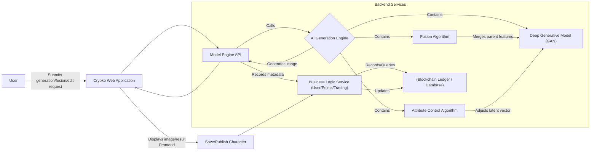
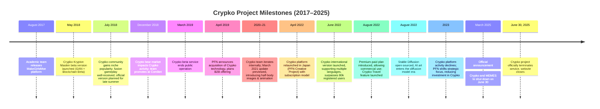

# The Rise and Fall of Crypko: Analyzing the Origin, Technology, and Shutdown of an AI Anime Character Generation Platform

English | [简体中文](README.zh-CN.md)

by @corenel (Yusu Pan) and OpenAI Deep Research

## 1. Abstract

Crypko (often called "Crypto Girl") was an anime-style character generation platform integrating **Generative Adversarial Networks** (GANs) and blockchain technology. Founded by a team with academic backgrounds and later supported by the Japanese artificial intelligence company Preferred Networks (PFN), the Crypko platform aimed to enable users without artistic skills to automatically generate high-quality anime-style character images, using blockchain to ensure the uniqueness and ownership of each character. When the Crypko beta launched in 2018, it sparked discussion in the ACG (Anime, Comics, Games) and blockchain communities. Users could purchase and "fuse" virtual character cards to generate "offspring" characters, creating a unique collectible gameplay loop. Despite receiving positive feedback and achieving niche popularity early on, Crypko suspended its public service in early 2019. PFN continued developing the technology and relaunched the Crypko platform in 2022 with a subscription model and editing features, attracting tens of thousands of registered users. However, due to the rapid evolution of **generative AI** technology (especially the rise of diffusion models) and challenges in commercialization and user growth, the Crypko project ultimately became unsustainable. In March 2025, it was officially announced that Crypko would shut down all services on June 30 of the same year. This report systematically reviews the origin and termination of the Crypko project, deeply analyzes its technical architecture, industry position, user impact, and reasons for decline, and explores the implications of this case study for **generative AI startups**. We will outline Crypko's development history and key events, compare its similarities and differences with platforms like Waifu Labs, Artbreeder, and MakeGirlsMoe, summarize the lessons learned from Crypko, and look ahead to future trends in the virtual character generation field.

## 2. Table of Contents

- [The Rise and Fall of Crypko: Analyzing the Origin, Technology, and Shutdown of an AI Anime Character Generation Platform](#the-rise-and-fall-of-crypko-analyzing-the-origin-technology-and-shutdown-of-an-ai-anime-character-generation-platform)
  - [1. Abstract](#1-abstract)
  - [2. Table of Contents](#2-table-of-contents)
  - [3. Introduction](#3-introduction)
  - [4. Crypko Project Overview](#4-crypko-project-overview)
    - [4.1 Project Origins and Vision](#41-project-origins-and-vision)
    - [4.2 Founding Team and Background (including parent company PFN)](#42-founding-team-and-background-including-parent-company-pfn)
    - [4.3 Platform Features and Characteristics](#43-platform-features-and-characteristics)
    - [4.4 User Base and Distribution Channels](#44-user-base-and-distribution-channels)
  - [5. Crypko's Technical Architecture and Model Evolution](#5-crypkos-technical-architecture-and-model-evolution)
    - [5.1 Early Models and Evolution](#51-early-models-and-evolution)
    - [5.2 Model Architecture Details](#52-model-architecture-details)
      - [5.2.1 Batch Random Generation](#521-batch-random-generation)
      - [5.2.2 Character Fusion](#522-character-fusion)
      - [5.2.3 Attributes Editing](#523-attributes-editing)
      - [5.2.4 Blockchain Recording \& NFT Mechanism](#524-blockchain-recording--nft-mechanism)
    - [5.3 System Architecture Overview](#53-system-architecture-overview)
    - [5.4 Model Naming and Multi-Model Support](#54-model-naming-and-multi-model-support)
  - [6. Development and Substitution Trends in Generative AI (2018–2025)](#6-development-and-substitution-trends-in-generative-ai-20182025)
    - [6.1 GAN Technology Maturity and Competitor Emergence (2017–2019)](#61-gan-technology-maturity-and-competitor-emergence-20172019)
    - [6.2 Transformer Architecture and Cross-Modal Generation (2020–2021)](#62-transformer-architecture-and-cross-modal-generation-20202021)
    - [6.3 The Diffusion Model Revolution (2022)](#63-the-diffusion-model-revolution-2022)
    - [6.4 Mainstreaming and Intensified Competition in Generative AI (2023–2025)](#64-mainstreaming-and-intensified-competition-in-generative-ai-20232025)
  - [7. Comparison of Crypko with Other Generative Character Platforms](#7-comparison-of-crypko-with-other-generative-character-platforms)
    - [7.1 MakeGirlsMoe: From Academic Experiment to Public Access](#71-makegirlsmoe-from-academic-experiment-to-public-access)
    - [7.2 Waifu Labs: The Gamified AI Artist](#72-waifu-labs-the-gamified-ai-artist)
    - [7.3 Artbreeder: The Open Creative Sandbox for Mixing](#73-artbreeder-the-open-creative-sandbox-for-mixing)
    - [7.4 Comprehensive Comparison](#74-comprehensive-comparison)
      - [7.4.1 Differences in Product Positioning](#741-differences-in-product-positioning)
      - [7.4.2 Technical Implementation Routes](#742-technical-implementation-routes)
      - [7.4.3 User Community and Reputation](#743-user-community-and-reputation)
      - [7.4.4 Success and Failure of Business Models](#744-success-and-failure-of-business-models)
      - [7.4.5 Platform Difference Comparison (Table)](#745-platform-difference-comparison-table)
  - [8. Crypko's User Ecosystem and Exploration of Digital Assets](#8-crypkos-user-ecosystem-and-exploration-of-digital-assets)
    - [8.1 User Base Composition](#81-user-base-composition)
    - [8.2 Creation Sharing and Social Interaction](#82-creation-sharing-and-social-interaction)
    - [8.3 NFTs and Digital Identity](#83-nfts-and-digital-identity)
    - [8.4 Reputation and Controversy](#84-reputation-and-controversy)
    - [8.5 Derivative Application: MEMES](#85-derivative-application-memes)
  - [9. Analysis of Project Decline and Shutdown Reasons](#9-analysis-of-project-decline-and-shutdown-reasons)
    - [9.1 Business Model and Monetization Difficulties](#91-business-model-and-monetization-difficulties)
    - [9.2 User Retention Rate and Changes in Platform Popularity](#92-user-retention-rate-and-changes-in-platform-popularity)
    - [9.3 Technical Iteration Pressure and Substitution (Rise of Diffusion Models)](#93-technical-iteration-pressure-and-substitution-rise-of-diffusion-models)
    - [9.4 Market Competition and User Migration](#94-market-competition-and-user-migration)
    - [9.5 Product Positioning Mismatch](#95-product-positioning-mismatch)
    - [9.6 PFN Strategic Adjustments and Organizational Factors](#96-pfn-strategic-adjustments-and-organizational-factors)
    - [9.7 Policy and Ethical Factors (Secondary)](#97-policy-and-ethical-factors-secondary)
  - [10. Implications for Generative AI Startup Projects](#10-implications-for-generative-ai-startup-projects)
    - [10.1 Lifecycle of Niche Vertical Products](#101-lifecycle-of-niche-vertical-products)
    - [10.2 Continuous Innovation Pressure for Technology First-Movers](#102-continuous-innovation-pressure-for-technology-first-movers)
    - [10.3 Issues of Platformization and Ecosystem Linkage](#103-issues-of-platformization-and-ecosystem-linkage)
    - [10.4 Importance of User Experience and Community Building](#104-importance-of-user-experience-and-community-building)
    - [10.5 Considering User Acceptance when Combining AI and Web3](#105-considering-user-acceptance-when-combining-ai-and-web3)
    - [10.6 Need for Vertical AI Content Platforms to Build Moats](#106-need-for-vertical-ai-content-platforms-to-build-moats)
  - [11. Timeline Summary](#11-timeline-summary)
  - [12. Conclusion and Outlook](#12-conclusion-and-outlook)
    - [12.1 Crypko's Legacy](#121-crypkos-legacy)
    - [12.2 Future Trends in Generative AI and Virtual Characters](#122-future-trends-in-generative-ai-and-virtual-characters)
  - [13. References](#13-references)
    - [Academic Papers](#academic-papers)
    - [Company Press Releases](#company-press-releases)
    - [Official Announcements and Product Websites](#official-announcements-and-product-websites)
    - [Media Reports](#media-reports)
    - [Product Reviews and Analyses](#product-reviews-and-analyses)
    - [Blogs and Community Discussions](#blogs-and-community-discussions)
    - [Video Resources](#video-resources)
    - [Website and Search Engine Information](#website-and-search-engine-information)

## 3. Introduction

In recent years, Generative Artificial Intelligence (Generative AI) has made leapfrog advancements in the field of content creation. From early algorithms capable of synthesizing blurry faces to current systems that can render high-definition paintings and generate anime characters, AI is profoundly changing the way we create. As one of the pioneers in this wave, the **Crypko** platform, launched by the Japanese startup Preferred Networks, Inc. (PFN), once garnered significant attention. Crypko aimed to leverage deep learning to automatically generate high-quality anime character images for users, incorporating blockchain to ensure the uniqueness of each character. It was once seen as a bold attempt to introduce AI technology into the realms of anime creation and digital assets.

This article provides an in-depth analysis of the rise and fall of the Crypko platform, systematically outlining its underlying technical architecture, positioning, and vision, as well as the key evolutions and substitution trends in the generative AI field between 2018 and 2025. Concurrently, we will compare Crypko with other similar platforms (such as MakeGirlsMoe, Waifu Labs, Artbreeder, etc.), exploring the similarities and differences in their product philosophies, technical implementations, user interactions, and commercialization paths. Finally, we analyze the reasons behind Crypko's announced shutdown, reflecting on its impact and implications, including its reference value for the future of AI character generation, the AI+ creation industry, and Web3 development.

## 4. Crypko Project Overview

### 4.1 Project Origins and Vision

The primary motivation behind the Crypko project was to utilize cutting-edge artificial intelligence technology to allow everyone to easily create their own anime character images. Its vision centered on **lowering the barrier to character creation**, bridging the gap between ordinary enthusiasts and professional artists. Traditionally, creating high-quality ACG characters requires proficient drawing skills and significant time. Crypko hoped to use GAN models to automatically draw characters, enabling users to generate satisfactory virtual images with just "a few clicks." This concept held immense appeal for ACG game developers, anime creators, and fan artists—the former could quickly obtain copyright-clear character assets, while the latter could create virtual idols "belonging only to themselves."

Furthermore, Crypko attempted to introduce blockchain technology to assign a unique identity and value to each AI-generated character. This meant that user-generated characters were not just image files but a form of **digital asset** that could be collected, traded, and even used in game interactions. This vision was inspired by blockchain collectible games like CryptoKitties, which gained popularity in late 2017. The Crypko team aimed to bring a similar "**crypto-collectible**" concept to the ACG domain, creating the world's first anime image generation game combining GANs with blockchain.

In summary, Crypko's vision blended technology and entertainment: leveraging the "infinite creation" capability provided by deep learning to fulfill anime fans' desire to "create their own characters," while using blockchain to ensure each character's uniqueness, thereby stimulating users' collection desire and community interaction. As Crypko officially proclaimed on social media, it was "the world's first crypto-collectible game combining AI (GAN) with blockchain." This cross-disciplinary innovative origin made Crypko inherently buzzworthy from its inception, attracting attention from both the tech and ACGN communities.

### 4.2 Founding Team and Background (including parent company PFN)

Crypko's origins can be traced back to academic research collaborations. Its founding team consisted of researchers from Fudan University, Stony Brook University, and Tongji University. As early as 2017, this team developed the pioneering project "MakeGirlsMoe" for automatic anime avatar generation. MakeGirlsMoe was a website allowing users to generate anime character avatars automatically by setting character attributes, which became quite popular among ACG enthusiasts. Arguably, MakeGirlsMoe served as the technical source and prototype for Crypko. The Crypko project was established by the original MakeGirlsMoe team in early 2018, aiming to elevate this technology by integrating blockchain collectible gameplay.

Shortly after its inception, Crypko caught the attention of Japan's leading AI company, **Preferred Networks (PFN)**. Founded in March 2014 by Toru Nishikawa, Daisuke Okanohara, and others in Tokyo, PFN was initially spun off from its parent company, Preferred Infrastructure. PFN focuses on the R&D and commercial application of deep learning across various domains, initially concentrating on edge computing for Internet of Things (IoT) data, as well as innovation in autonomous driving, robotics, and bio-health. By developing the pioneering deep learning framework Chainer and collaborating with companies like Toyota and Fanuc, PFN quickly became one of Japan's most prominent AI startups, once receiving a strategic investment of approximately 10.5 billion yen from Toyota. PFN positions itself as developing "general-purpose artificial intelligence technology" and applying it to real-world problems, with slogans like innovating industries through concepts such as **Edge Heavy Computing**.

After the Crypko beta launched in 2018, PFN initiated a collaboration with the Crypko team. This move was partly because PFN saw potential in AI for digital content creation and partly because PFN itself intended to expand its technological applications in the anime and gaming sectors. By April 2019, Crypko had officially become part of PFN's "Creative Project" initiative. PFN announced in a press release that it would offer Crypko technology to the animation, illustration, and gaming industries on a B2B basis and continue improving the platform. It can be inferred that PFN effectively incorporated or acquired the Crypko project team, providing it with strong resource and R&D support. Consequently, the Crypko team possessed a dual background of academia and industry: retaining the algorithmic research strength of the initial academic team while benefiting from PFN's support in engineering implementation and commercial promotion.

Following PFN's involvement, Crypko's technological development entered a new phase. PFN Vice President Masaaki Fukuda once stated that the company foresaw a leap forward in digital content creation and hoped to seize this wave by collaborating with anime creation entities like Crypko. PFN also assigned researchers and engineers to work with the original team, helping Crypko refine its generation models, expand functionalities, and optimize user experience. The backing of the parent company also provided financial and computational resources, enabling Crypko to continuously upgrade its technology and experiment with new feature modules (like the later mobile app MEMES). However, as a company known for deep technology, PFN's focus was more on technology output and enterprise-level cooperation; successfully operating a C-end user platform presented a new challenge for them. This background fostered Crypko's unique technological advantages but also sowed seeds for later operational strategy issues (detailed in Section 9).

### 4.3 Platform Features and Characteristics

The features offered by the Crypko platform evolved through different development stages. During the 2018 beta period, Crypko's core functions revolved around the **generation, fusion, and trading of virtual character cards**, strongly embodying a "blockchain game" flavor. Specifically, the platform's features at that time included:

- **Character Generation (Gacha/Drawing Cards)**: Developers pre-generated 50,000 distinct character images onto the blockchain as the initial card pool. Users could pay Ethereum (ETH) to purchase character cards. Each card represented an AI-generated anime girl image (avatar), randomly generated by a GAN model, guaranteeing that "**every waifu is unique**." These characters had unique genetic codes and attribute information (like hair color, eyes, expression, etc.) and were graded by rarity (UR, SSR, SR, R, N). Higher rarity signified a more exquisite image and advantages in game mechanics.
- **Character Fusion (Breeding)**: Users holding two character cards could spend a certain amount of ETH to perform a "yuri fusion" (fuse two female characters) to generate a next-generation character, essentially letting two "waifus" produce a new "daughter" through a GAN fusion algorithm. Technically, this involved combining the feature vectors of the two characters to generate a new character inheriting parental traits. The fused offspring character was also a unique NFT asset with its own genetic code. Fusion did not consume the parent characters but had a **cooldown time**—higher rarity characters had shorter cooldowns, allowing them to be used for fusion again sooner. This mechanism, similar to CryptoKitties' breeding system but with anime girls, greatly enhanced user stickiness. Some players jokingly called themselves "fusion addicts," engrossed daily in trying new character pairings.
- **Trading and Leasing Market**: Crypko provided an online marketplace allowing users to freely buy and sell their character cards. High-rarity characters could be listed at high prices. Users could also "rent out" characters to others for fusion, charging a fee. All transactions and fusion operations were recorded on the Ethereum blockchain, ensuring transparency. Each character image existed on-chain as an ERC-721 standard NFT, permanently preserving its uniqueness and history. This NFT-based economic system design made Crypko both a creation platform and a collectible trading platform, where users could enjoy gacha and nurturing fun while participating in virtual economic activities.
- **User Community and Levels**: Crypko's card system also incorporated gamification elements. Different rarity levels (N to UR) not only affected cooldown times but also provided bragging rights. In the community, players owning UR-level characters were highly regarded. Early players praised Crypko's innovative gameplay, finding the combination of ACG and blockchain full of imagination. Since the official team provided some free ETH during the testing period, many anime enthusiasts could experience it at zero cost.

By the time PFN relaunched the Crypko platform in 2022, the functional emphasis shifted, leaning more towards pure AI drawing and creation tools, while downplaying the blockchain game elements. The main features of the new Crypko included:

- **Unlimited Character Generation**: Users could generate unlimited anime-style **half-body portraits** (waist-up), with image quality approaching professional artist levels. Unlike the old version's fixed card pool, the new version generated characters in real-time based on user preferences. Crypko used GANs to continuously adjust generation results based on user interaction feedback, aligning with user tastes, similar to the interaction flow of Waifu Labs described later.
- **Character Attribute Editing**: The platform supported user customization and fine-tuning of certain character attributes, such as hairstyle, hair color, eyes, clothing style, etc. Users could adjust the initial AI-generated image to achieve satisfactory results. This might be implemented through options or sliders, mapping user choices back to changes in the generation model's latent code to produce new images with specified features. For instance, users could lock a preferred face shape while randomly changing outfits and hair colors until the ideal character combination emerged. This **high degree of customization** enabled each user to "sculpt" characters matching their aesthetic preferences, enhancing engagement.
- **Crypko Points Mechanism**: The new version introduced an in-platform virtual currency, "Crypko Point (CP)," as a usage meter. Each character generation or editing action consumed a certain number of points, but points automatically regenerated over time. Free users had a basic daily CP acquisition limit, while paid subscription users (Standard/Premium plans) enjoyed higher limits and faster recovery rates. For example, PFN announced that the Premium subscription regenerated 1 CP per minute, faster than free users. This design prevented server resource abuse while providing a monetization path (through selling subscription plans).
- **Subscription Membership System**: Crypko 2022 adopted a **Freemium model**. Free users could use basic functions with limitations, while paid subscriptions unlocked more permissions. PFN set up Standard and Premium paid tiers: subscribers not only received more CP but could also use the generated characters for commercial purposes. The Premium plan was priced at 4980 JPY per month (approx. $35-40 USD), with a promotional discount price of 3980 JPY. This addressed user demand for using AI characters in games, videos, and other commercial scenarios. The subscription model marked Crypko's shift from its initial revenue model based on on-chain transaction fees to a more traditional SaaS service fee model.
- **Character Fusion and Collection**: The new Crypko retained the concept of character fusion generation but transitioned it from an on-chain trading behavior to an in-platform feature. Users could "fuse" multiple liked character images to create new characters inheriting their traits. Simultaneously, the platform allowed users to collect self-generated or others' characters into a personal library for viewing or further editing. These features positioned Crypko as a creation community where users could not only create but also share characters. In the new version, "fusion" served more as an interesting feature than an economic system, as it no longer involved NFT trading, yet it remained attractive to dedicated anime fans.
- **Crypko Travel Mode**: This was a unique casual feature introduced in the new version. Crypko Travel allowed users to "send your character on trips to different fantasy worlds and collect unique travel photos." Simply put, users selected their generated character image, and the system generated illustrations of that character in various scenes, such as schools, forests, future cities, etc., as "travel photo" rewards. These photos were likely created by compositing the character image with AI-generated backgrounds, each being unique. Crypko Travel provided gameplay beyond character generation, bringing characters "to life" and enhancing user stickiness and content output. This feature was quite popular and became one of Crypko's distinguishing characteristics compared to other pure generation tools.
- **Mobile Application MEMES**: Crypko technology was also utilized in a mobile app called "進化する少女型情報体 MEMES/ミームズ" (Evolving Girl-type Information Entity MEMES). MEMES could be seen as an extension of Crypko, where users nurtured an AI girl character that continuously evolved. Its core image generation technology was powered by Crypko. Through the mobile app, Crypko reached a broader ACG user base. However, both the MEMES app and the Crypko web platform were scheduled to terminate services simultaneously in 2025.

In summary, the Crypko platform's features evolved from an initial focus on NFT card trading games towards creation tools and a UGC community. However, the consistent characteristics throughout were: **high-quality AI anime image generation** and the rich gameplay derived from it (fusion, travel, evolution, etc.). The quality of characters provided by Crypko was stunningly high. One user exclaimed upon experiencing the new version: "What kind of cultural revolution happened in such a short time?!" (referring to the drastic improvement in art style and resolution compared to the 2017 MakeGirlsMoe era). This quote also reflects the leap in Crypko's functionality and features.

### 4.4 User Base and Distribution Channels

Crypko targeted a broad audience of ACG and technology enthusiasts. Its user base and distribution channels can be summarized by different periods:

- **2018 Testing Period**: Core users were a blend of **blockchain players** and **anime otakus**. Since purchasing characters required an Ethereum wallet (like MetaMask), early participants were often tech-savvy users familiar with cryptocurrencies. Many were also members of the ACGN community, attracted by the novel combination of "AI-generated beautiful girls + blockchain collectibles." Crypko spread within the crypto circles primarily through social media like Twitter, where the official account's project launch announcement generated considerable retweets and discussion. Simultaneously, some Chinese gaming media outlets, like Yeyou.com, reported on Crypko, sparking interest among domestic ACG players. News articles introduced Crypko with playful headlines like "Relying on two wives' yuri love to produce daughters," calling it a "crazy beautiful girl trading card blockchain web game," which increased its buzz. It can be said that the topic itself (AI raising virtual waifus) had inherent virality, enabling Crypko to quickly spread within niche communities. The user base was predominantly male ACG players aged 20-35, with high acceptance of new technologies. Regarding **distribution channels**, besides crypto and gaming media, the Crypko team also promoted it within fan communities: reportedly, they attended Japan's largest fan convention, Comic Market (Comiket), showcasing Crypko technology directly to anime creation enthusiasts.
- **2019–2021**: After Crypko suspended public service, the direct user base stagnated. However, dissemination within the industry by the team and PFN continued. PFN positioned Crypko as an innovative AI application case, sharing it in tech communities and business conferences. For instance, PFN's official press release announcing the technology would be offered to businesses signaled that **enterprise users** (animation studios, game developers, etc.) also began learning about Crypko. Meanwhile, Crypko's influence persisted in the ACG circle through word-of-mouth. Many veteran users who experienced the beta discussed the project on online communities (like Weibo, Tieba, Discord, etc.), lending it an air of mystery and anticipation. With the NFT market revival in early 2021, some ACG NFT projects regained activity, and "Crypko Krypton Maiden" was mentioned again by enthusiasts, speculating about its potential comeback. Indeed, in March 2021, the official Crypko account suddenly became active, releasing update previews in the community, greatly exciting the existing fanbase. Dissemination during this period relied mainly on **spontaneous community discussions** and limited internal testing invitations.
- **Post-2022 Platform Relaunch**: Crypko quickly regained popularity through PFN's promotion and diffusion among existing users. When PFN officially launched the new Crypko in April 2022 (Japan) and June 2022 (International), they targeted markets in Japan, North America, and East Asia. **Channels** included PFN's official website press releases, multilingual announcements on Twitter, and presentations at events like game developer conferences. According to PFN, registered users surpassed 80,000 within a few months of the relaunch, with users hailing from Japan, South Korea, Greater China, the United States, and elsewhere. This indicated Crypko successfully attracted a global audience of ACG enthusiasts. Many users came across Crypko after seeing others share generated characters or "travel photos" on social media. Especially on art communities like pixiv and Weibo, posts declaring "This is an AI-generated character image" sparked discussions, bringing in new users. Crypko thus gradually built its own user community: official Discord servers and Japanese/English forum channels were established for users to exchange works and provide feedback. Simultaneously, some **industry analysts and media** reported on Crypko's relaunch, linking it to the burgeoning AI art trend. Compared to the niche discussions in 2018, the 2022 Crypko garnered attention in mainstream AI communities as well, listed as one of the representative AI art tools.
- **Mobile Users**: With the launch of the MEMES mobile app, Crypko technology reached more female and younger users. As an idol-raising application promoted through app stores, MEMES attracted a group of new users potentially unfamiliar with the Crypko website. These users were more interested in character interaction and nurturing, possibly unaware of the underlying AI technology, but they objectively expanded Crypko's influence.

Overall, Crypko's user base included both hardcore tech players and pure anime enthusiasts, geographically spanning active ACG cultural regions like Japan, the US, and China. Judging by the activity in its UGC community, Crypko's loyal users produced a significant amount of shared generated characters and fan creations, such as using Crypko characters to create visual novels or as prototypes for VTuber avatars, demonstrating the platform's cultural penetration. The project's spread initially relied on its novel concept attracting attention, while later stages depended more on user word-of-mouth and the self-propagation of created works. After the official shutdown announcement, many users expressed regret and nostalgia on Twitter/Weibo, indicating Crypko had cultivated a base of genuine fans and nostalgic followers over the years. The next section will delve into the technical architecture details underpinning these features and experiences.

## 5. Crypko's Technical Architecture and Model Evolution

The core of Crypko's ability to automatically generate anime character images lies in its underlying **deep generative model architecture**. Technically, Crypko primarily employed **Generative Adversarial Networks (GANs)** to generate 2D anime character images. A GAN consists of a Generator and a Discriminator, which evolve together through adversarial training: the Generator tries to produce fake images that look real, while the Discriminator learns to distinguish between AI-generated images and human-drawn ones. As training progresses, the Generator becomes increasingly adept at fooling the Discriminator, eventually capable of synthesizing highly realistic images. Crypko leveraged GANs' proficiency in **learning artistic styles** to teach AI how to draw Japanese anime-style character portraits.

### 5.1 Early Models and Evolution

When Crypko launched its beta version in 2018, it could only generate **character facial portraits**. By then, GAN technology had undergone several generations of development: from generating blurry faces at its inception in 2014 to improved versions like DCGAN, WGAN, and progressively higher-resolution models like Progressive GAN around 2017. Notably, in early 2018, NVIDIA released Progressive GAN, demonstrating that GANs could generate high-definition 1024×1024 faces. The Crypko team likely drew inspiration from the latest GAN techniques available at the time and trained them specifically on Japanese anime character data. According to the team's 2017 research paper, the early MakeGirlsMoe project used an improved DCGAN architecture combined with training techniques from DRAGAN (Deep Regret Analytic GAN) to enhance the stability and clarity of anime face generation. This model was already capable of producing realistic ACG avatars and was deployed on the MakeGirlsMoe website for public experimentation.

As Crypko developed, the team continuously upgraded the GAN architecture. When the Crypko beta emerged in 2018, it coincided with NVIDIA's proposal of new GAN architectures for high-resolution face generation like Progressive GAN/StyleGAN. Although the specific GAN type used was not officially disclosed, judging from the generation quality, Crypko likely leveraged the strengths of the **StyleGAN series**. StyleGAN introduced mechanisms like layer-wise style vector control, making it highly suitable for generating structured objects like faces, which applied equally well to anime characters. User feedback indicated a significant leap in the quality of Crypko character images compared to 2017—higher resolution, finer facial features, and styles closer to popular artists' work. This suggests the team adopted more advanced GAN models (possibly StyleGAN or its variants), combined with specialized training on anime data, to achieve results **comparable to hand-drawn art**.

In terms of training strategy, the Crypko team paid close attention to data and model matching. According to their paper, they first constructed a **clean dataset of anime faces**, filtering out low-quality or unsuitable images. Early data primarily came from Japanese Galgame character sprites (e.g., scraped from sites like getchu). These images had consistent styles and clear features, aiding GAN learning. During model training, they employed regularization techniques like DRAGAN to mitigate GAN training instability and reduce "mode collapse." Furthermore, addressing the lack of predefined labels for anime faces, the team proposed an empirical method for training on unlabeled data, enabling the model to learn semantically meaningful dimensions in the latent space even without attribute labels for each image. This laid the foundation for later implementing user-defined attributes.

By the time of the new Crypko (2022), the model needed to generate not just faces but also half-body or even full-body images with clothing, demanding greater capability from the GAN. PFN officially revealed that by 2022, Crypko's generation model had iterated to its **sixth generation**, capable of drawing the upper body (from head to waist). It's speculated that the team further optimized the architecture, possibly using the **StyleGAN2/3 series** (mature by 2020) or incorporating **autoregressive models** to enhance details. GAN improvements like Self-Attention GAN (SAGAN) might also have been introduced to better handle global information like clothing patterns. Given PFN's powerful computing resources, Crypko's model parameter count and training epochs likely increased to enhance generation diversity and clarity. Common challenges in training GANs include adversarial training stability, avoiding overfitting to specific anime styles, and ensuring outputs are diverse yet adhere to "ACG aesthetics." The Crypko team likely achieved optimal results through extensive experimentation, adjusting learning rates, discriminator training step ratios, and using techniques like spectral normalization and experience replay. While specific details weren't disclosed, the outcome demonstrated the success of their training strategy: Crypko rarely produced the "malformed" or "dissolved" artifacts common in early AI art; each output character featured well-formed facial features and harmonious colors.

Notably, to support **user interaction and attribute editing**, Crypko's model architecture required controllability. This could be achieved in two ways: first, by training a **conditional GAN** that incorporates attribute codes (like hair color, hairstyle) into the input, which requires labeled training data; second, by using unsupervised methods to discover semantic axes in the latent space, such as StyleGAN's hierarchical style vectors, allowing targeted changes through interpolation along specific dimensions later. Since the team had explored methods for "training labeled models on unlabeled data" from the MakeGirlsMoe era, Crypko likely opted for latent space manipulation. By analyzing contrasts across large sample sets, they identified how changes in certain latent vector dimensions corresponded to specific attribute modifications (e.g., increasing a certain dimension gradually changes hair from black to blonde). Thus, when a user selected "blonde hair" in the interface, the system applied the corresponding shift to the GAN's latent input, adjusting the output. Similarly, fusing two characters essentially involved performing some **combination operation** on their respective latent vectors (like linear interpolation or segment splicing) to generate a new latent code, which was then fed into the generator. StyleGAN's "style mixing" feature is well-suited for this, allowing latent codes from parent characters to be mixed at different layers, enabling offspring to inherit partial traits from both parents.

### 5.2 Model Architecture Details

#### 5.2.1 Batch Random Generation

Crypko allowed users to generate multiple (e.g., 10) different character candidates at once. This meant the generator could efficiently sample multiple random latent codes and output several distinct character images. GANs are inherently good at producing diverse results from different latent codes, and Crypko leveraged this feature to enhance user experience: providing multiple images simultaneously increased the probability of finding one that satisfied the user.

*Example screenshot of Crypko's batch generation interface. Each time, it can produce 10 different styles of anime characters for the user to choose from. The top left allows selecting the generation model (e.g., "Freesia" half-body model), and the bottom has a "Generate" button to regenerate. The generated characters in the image have a "Crypko" watermark.*

#### 5.2.2 Character Fusion

This was a major feature of Crypko, inspired by genetic algorithms and digital breeding games like CryptoKitties. Users could select two existing Crypko characters as "parents," and the system would generate a new character fusing their traits. Technically, this was likely achieved by combining the latent representations corresponding to the two character images. For example, mixing their latent codes at a certain ratio or cross-injecting them at intermediate layers of the GAN generator could produce an image possessing features from both. Crypko could generate 5 fusion results at a time for selection. The fused characters often inherited partial traits like hair color and face shape from their "parents," providing users with an engaging experience akin to "breeding" characters. This mechanism effectively increased the diversity of character designs and encouraged users to repeatedly try combinations to discover new images. PFN mentioned in official descriptions that Crypko's fusion technology could reflect user taste and intent, suggesting the fusion was more than just random mixing and possibly considered semantic relationships between features.

#### 5.2.3 Attributes Editing

Unlike many purely random GAN tools, Crypko offered the ability to **customize character attributes**. Users could adjust over 30 appearance attributes, such as hairstyle, hair color, eye color, expression, and age, on top of a generated character. This was done instantly without redrawing: users selected options or dragged parameters via the interface, and the model updated the character image in real-time. PFN once demonstrated the technology behind Crypko's editing function: when a user dragged a part of the character's face with a mouse or tablet pen, the system could immediately re-render the character image reflecting the change. This **WYSIWYG (What You See Is What You Get)** editing was enabled by the continuous latent space of the GAN generator—translating the latent code along specific directions could alter certain character attributes. For instance, after prior training, Crypko might have learned the latent operation direction for "changing hair color." When the user selected a different hair color option, the system applied the corresponding offset to the latent code, generating the image with the modified hair color. Similarly, changes in attributes like "age" or "expression" could also be achieved through operations in the latent space. PFN encapsulated these functions into an intuitive UI, allowing users to fine-tune character images without technical knowledge. Such interactive AI drawing tools were quite advanced when Crypko launched, reflecting PFN's deep research into GAN controllability.

*Diagram illustrating Crypko's attribute editing interface. The left side shows the originally generated character image, and the right side shows the new image after adjusting attributes. Attribute tags in the top right indicate user modifications, such as making the character younger (younger: -1), slightly angry (angry: 0.3), and changing hair color to white (white hair: 0.3). The interface provides multiple attribute categories for expansion, including overall Attributes, Expressions, Hair Styles, Eye Colors, Hair Colors, etc. Users click "Update" to apply changes, updating the character image on the left in real-time.*

#### 5.2.4 Blockchain Recording & NFT Mechanism

Another technical pillar of Crypko was the blockchain. PFN integrated **smart contracts** into Crypko's architecture to record every character generation, fusion, and transaction operation on the blockchain. Specifically, whenever a new character was generated, its corresponding digital fingerprint (which could be the GAN latent code or image hash) was written onto the chain via a smart contract and associated with the user account that created it. This ensured that the ownership and lineage of each character were traceable and immutable. If a user published a character to the Crypko library, it was equivalent to **minting** an NFT (Non-Fungible Token) representing that character's unique digital asset. Crypko initially ran on public blockchains like Ethereum, allowing users to trade characters using cryptocurrency. Through blockchain, Crypko fulfilled its promise of making each character "unique"—every character had a globally unique ID and owner, publicly verifiable, eliminating the possibility of duplicates and counterfeits. This technological design made Crypko not just a character generator but also a **digital character asset platform**.

### 5.3 System Architecture Overview

These modules collectively formed Crypko's platform architecture. From a system perspective, Crypko comprised three main parts: a **frontend web interface**, a **backend AI engine**, and a **blockchain ledger** (or a centralized database in later versions):

*Diagram of Crypko's system architecture. Users interact with Crypko through the frontend interface, requesting to generate new characters, fuse existing ones, or edit attributes. The frontend sends requests to the backend's Model Engine API. The API calls the AI Generation Engine, where the GAN model, potentially using the fusion or editing modules, processes the latent vector and generates the character image to return. Meanwhile, the Business Logic Service handles user accounts, points, trading (early NFTs), etc., and records character metadata and ownership information onto the blockchain ledger or database. Records on the ledger ensure character uniqueness and traceability.*

As shown above, Crypko's operational flow involved the user interacting with the web interface, which communicated with backend services via API. The backend included the AI engine (responsible for image generation, fusion, editing) and the business logic service (handling users, permissions, data recording). After the AI engine completed computation, it returned image data for frontend display. Character metadata, ownership, etc., were managed by the business logic service and stored in a database or on the blockchain. The entire process appeared real-time and interactive to the user, supported by coordinated AI model inference and data management behind the scenes.

### 5.4 Model Naming and Multi-Model Support

It's worth noting that during Crypko's development, PFN also assigned code names to different versions of its GAN models. For example, the model used for generating **faces** was called "Erica," while the sixth-generation model for generating **upper bodies** was named "Freesia." On the Crypko interface, users could choose which model to use for image generation (e.g., under the free plan, only the Erica model might be available for generating avatars, while subscribing to the standard plan allowed using the Freesia model for half-body images). This multi-model coexistence suggests that while PFN upgraded models, they retained older ones for user selection, possibly due to slight stylistic differences or compatibility reasons. For instance, some users might prefer the face style drawn by the older model and could still use Erica for pure avatars, while those wanting upper bodies with clothing would use Freesia. PFN continuously improved Crypko's drawing capabilities by training new models without abruptly abandoning older ones, reflecting careful product refinement.

In conclusion, Crypko's technical architecture integrated **cutting-edge GAN generation technology** with **innovative functional modules** (fusion, attribute editing), complemented by the **digital asset properties endowed by blockchain**, building a feature-rich AI character generation platform. From 2018 to 2022, Crypko's model capabilities progressively improved, achieving a leap from "drawing faces" to "drawing half-bodies," and establishing user interaction and asset management systems. This garnered Crypko a dedicated following in the market. However, the rapid evolution of technology also brought new competitors and alternative solutions. During Crypko's operational years, significant developments occurred in the generative AI field, which we will explore in the next section, focusing on the trends from 2018–2025 that influenced Crypko's fate.

## 6. Development and Substitution Trends in Generative AI (2018–2025)

Crypko's journey from its 2018 debut to its announced shutdown in 2025 coincided precisely with a period of explosive growth in generative AI. Over these seven to eight years, the field of generative models saw the emergence of **multiple new technological paradigms**, most notably the rise of **Diffusion Models** and the **Transformer architecture**. While enriching AI generation capabilities, these new trends gradually began to supersede GANs. Here's a timeline breakdown of key developments:

### 6.1 GAN Technology Maturity and Competitor Emergence (2017–2019)

Before Crypko's arrival, academia had already begun exploring the use of GANs for generating anime characters. In 2017, researchers from Fudan University and other institutions published the paper "Towards the Automatic Anime Characters Creation with GAN" and launched the demo website "MakeGirlsMoe." MakeGirlsMoe allowed users to generate corresponding anime girl avatars based on specified attributes (like hair color, eye color, wearing glasses, etc.). This was an early attempt at applying GANs to anime content, proving the feasibility of **automatically generating ACG characters with GANs**.

Subsequently, in 2018 and 2019, a batch of AI character generation tools aimed at the general public emerged. For example, Waifu Labs, launched in 2019, was an online service from a Silicon Valley startup team. Waifu Labs also employed GANs but differed from MakeGirlsMoe's direct attribute selection by emphasizing **progressive, interactive generation**: users first chose their favorite from several randomly generated avatars, then the AI generated new variations based on the chosen style, the user selected again, and after four such iterative steps, a final character aligning with the user's aesthetic was produced. This select-and-generate loop provided an experience akin to "training" an AI artist to draw the ideal character, lowering the operational difficulty and design burden. Waifu Labs became immensely popular; according to official stats, the AI drew over **20 million** character portraits within its first two years. Meanwhile, Crypko began testing in 2018, and PFN announced its commercial application in 2019.

It can be said that during 2018–2019, **GAN-based anime image generation entered a practical application stage**, with various implementations like Crypko, Waifu Labs, and MakeGirlsMoe appearing, each with unique features. GAN technology itself was continuously improving (e.g., the advent of StyleGAN), providing these platforms with tools to enhance image quality.

### 6.2 Transformer Architecture and Cross-Modal Generation (2020–2021)

The Transformer model, introduced in 2017, quickly dominated the natural language processing field, and its concepts later permeated generative AI. Particularly noteworthy was the rise of **cross-modal generative models**: for instance, OpenAI released the DALL·E model in January 2021, which used Transformers to read text descriptions and generate images pixel by pixel, demonstrating AI's potential to draw based on text prompts. In the same year, Google and others also developed image generation solutions based on Transformers or VAEs. Although the quality of these early text-to-image generations was still far from practical use, they indicated a direction: future AI art might be driven by "text prompts" rather than relying on random seeds or manual parameter adjustments. This trend contrasted with GAN-based platforms like Crypko—Crypko primarily relied on sampling from a pre-trained distribution, and while it had some editing capabilities, it **could not customize images based on arbitrary user-inputted creative ideas (like a sentence description)**.

Another aspect where the Transformer architecture shone in 2020–2021 was in **model scale and performance**. Represented by OpenAI's GPT-3, large-scale Transformers proved that with sufficient model size and data, generation quality could far surpass previous methods. This "parameter scale race" was also reflected in the visual domain; state-of-the-art GAN models began requiring hundreds of millions of parameters, massive training datasets, and extensive training time, posing higher demands on startup teams. Nevertheless, PFN continued to invest heavily in Crypko around 2021, upgrading its model capabilities to generate **high-resolution half-body characters**. PFN even combined its proprietary 3D scanning technology to explore integrating Crypko's 2D characters with 3D model generation for animation production workflows. During this period, Crypko expanded its applications in professional fields (e.g., PFN used Crypko to automatically generate virtual singer images and produce music videos) but had not yet reached the C-end international market on a large scale. Overall, the rise of Transformers foreshadowed the advent of more powerful generative AI, and while Crypko maintained a technological edge at this time, a new paradigm was brewing.

### 6.3 The Diffusion Model Revolution (2022)

2022 is often referred to as the "Year of AI Art" due to the **explosion of Diffusion Models**. Diffusion models are a class of generative models distinct from GANs, based on the idea of progressively denoising a noisy image to "develop" a clear image from the noise. Although proposed as early as 2019, this method only demonstrated its immense potential in late 2021 - 2022. Models like Imagen and Parti, announced by the Google Brain team in 2022, showed that diffusion models could match or even exceed GANs in image generation fidelity and were easier to integrate with **text conditioning**.

In mid-2022, the open-sourcing of the **Stable Diffusion** model, developed with support from Stability AI, pushed the diffusion model craze to its peak. Stable Diffusion could run on consumer-grade graphics cards yet generate high-quality images from text prompts, drastically lowering the barrier to AI art creation. Instantly, various applications derived from Stable Diffusion sprung up like mushrooms. For the anime domain, community enthusiasts quickly released models like **Waifu Diffusion**, fine-tuned specifically for ACG art styles. These models could directly generate corresponding character images based on user-inputted descriptions (e.g., "silver-haired, blue-eyed boy, wearing a school uniform, smiling"). This new "what you describe is what you get" paradigm significantly liberated creative imagination—users no longer needed to pick from pre-generated options but could freely describe the desired image in words for the AI to "visualize" into a drawing. Simultaneously, diffusion models demonstrated advantages in generating complex scenes and diverse styles, even capable of synthesizing full-body characters, backgrounds, and effects within a single image. This stood in stark contrast to Crypko: Crypko primarily generated mid-shot characters (with no or simple backgrounds), positioned as an avatar/sprite design tool, whereas diffusion models could generate complete illustrations of characters in various scenarios, making them more suitable for producing final artwork directly. Consequently, starting from the latter half of 2022, diffusion models became the new industry standard, and many applications originally using GANs faced the choice of technological updates.

For Crypko, the diffusion model revolution of 2022 marked a critical turning point. Although Crypko officially launched its international version in the first half of 2022 and accumulated tens of thousands of users in a short period, the emergence of new models like Stable Diffusion undoubtedly diverted significant attention. On one hand, the open-sourcing of Stable Diffusion led to a plethora of free or open-source anime models (like the Anime image generation service offered by NovelAI, and various models shared in art communities), allowing users to obtain high-quality anime images **offline or cheaply**. On the other hand, commercial AI art services like Midjourney rapidly gathered million-user communities with their unique artistic styles and community operations. Against this backdrop, Crypko, despite its mature technology, appeared somewhat "overly specialized"—its GAN model could only draw fixed-style ACG character portraits, lacking support for text input or full scenes. In the new landscape of diverse AI art tools, this inevitably made some users feel it wasn't versatile enough. Therefore, it can be argued that **the diffusion model wave of 2022 provided a technological alternative to Crypko**: the capability previously unique to Crypko—"having AI draw anime characters"—became a sub-function of many general AI art tools, often with greater flexibility.

### 6.4 Mainstreaming and Intensified Competition in Generative AI (2023–2025)

Entering 2023, generative AI further integrated into mainstream life. From text generation (ChatGPT's explosion) to image generation (a proliferation of applications), the entire AI industry entered a phase of rapid productization. In image generation, diffusion models continued to iterate and upgrade, with auxiliary tools like **ControlNet** emerging, allowing users to precisely control the pose and composition of generated characters using sketches, pose skeletons, etc. This effectively implemented and popularized customization features similar to Crypko's attribute editing in a different manner. Additionally, the concept of large models began influencing the image domain, with some multi-billion parameter large diffusion models or multimodal Transformers appearing, attempting to unify various fine-grained controls for image generation. It was foreseeable that by around 2025, generative image AI would become a **highly competitive red ocean** market, with new models and applications constantly emerging. In such an environment, a relatively vertical and closed product lacking continuous innovation would struggle to retain users. The further application of **Transformer architecture** in image generation was also a trend, such as Meta's Make-A-Scene model combining Transformers and diffusion, allowing users to provide sketches and text to jointly guide generation. These advancements all indicated that generative AI tools were moving towards being **more general-purpose and easier to use**.

Reflecting on the broader environment Crypko operated in, we find: it emerged in 2018 riding the GAN wave, seizing an early advantage in the niche market of AI-drawn anime images. However, shortly thereafter, a new round of technological upheaval led by **diffusion models** offered users more choices. Particularly for anime creation enthusiasts, after 2022, they could use specialized tools like Crypko or turn to general AI art tools supplemented with specific models to generate anime-style works. Many users began experimenting with fine-tuning diffusion models themselves to generate characters matching their personal preferences, while professional artists might use diffusion models combined with post-processing to replace traditional drawing workflows. This situation implicitly weakened Crypko's status as the "only choice."

In summary, the generative AI field from 2018–2025 was marked by dramatic changes. The GAN technology Crypko was based on went from glory to relative decline, gradually being replaced by diffusion models as the mainstream. Empowered by Transformers and large models, the new generation of generative tools surpassed older ones in **flexibility and controllability**. These technological trends posed severe challenges for Crypko and partly explain its eventual fate. In the next section, we will compare Crypko with several contemporary AI character generation platforms to further analyze its unique aspects and shortcomings in product philosophy and market competition.

## 7. Comparison of Crypko with Other Generative Character Platforms

To gain a more comprehensive understanding of Crypko, it is necessary to compare it horizontally with several representative AI character generation platforms. Here, we select **MakeGirlsMoe**, **Waifu Labs**, and **Artbreeder**, which, along with Crypko, constitute the main explorers of AI-driven generation of ACG/character images since 2017. They differ in their product philosophies, technical implementations, user interactions, and commercialization paths. Below, we will introduce and compare each.

### 7.1 MakeGirlsMoe: From Academic Experiment to Public Access

MakeGirlsMoe originated in 2017, developed through collaboration between Chinese and American academic teams, with the initial goal of validating the feasibility of GANs for anime character generation. As an academic achievement, MakeGirlsMoe had the following characteristics:

- **Technical Implementation:** Used state-of-the-art GAN models at the time, incorporating ideas from conditional generation. MakeGirlsMoe allowed users to specify several **discrete character attributes** (like hair color, eye color, wearing glasses, etc.) to generate corresponding anime girl avatars. This indicates its model was a GAN with conditional inputs (similar to AC-GAN), trained on an anime face dataset annotated with attribute labels. The generated results were ACG girl face images with resolutions around 512×512. The results attracted attention in academic circles at the time, as GANs had previously been mainly used for real human faces; MakeGirlsMoe extended this to the ACG domain and achieved some degree of **customization** of features.
- **Product Form:** A simple web demonstration. Users selected attributes on the website and clicked generate to see a synthesized girl avatar. Only one image could be generated at a time; if unsatisfied, users adjusted attributes or regenerated. Positioned as a paper demo, the website UI was relatively crude, with singular functionality and no additional social or storage features. However, this website gave many ACG enthusiasts their first experience of "having AI draw my dream character." It can be said that MakeGirlsMoe validated market demand: people were genuinely interested in AI automatically drawing ACG avatars.
- **User Base:** Primarily consisted of tech enthusiasts and ACG fans. As a free public project, MakeGirlsMoe attracted a group of early adopters, but due to its academic demo positioning, it was not maintained or updated long-term, and its popularity gradually declined. It did not form a user community or a continuously operated service.
- **Commercialization:** No direct business model. MakeGirlsMoe's main contributions were its paper and open-source nature, driving research in this direction. When other teams saw its success, they began productizing similar ideas; later platforms like Crypko and Waifu Labs can be seen as extensions of MakeGirlsMoe's concept.

Overall, MakeGirlsMoe proved that **GAN + attribute control** could generate anime avatars that somewhat met user expectations, but its experience remained closer to technical validation, lacking gamification and sustained operation. Compared to it, Crypko emphasized **generation quality** and **platform ecosystem**: Crypko's image quality was significantly higher (benefiting from several more years of development and stronger models), and it offered complete features like fusion, editing, and collection, moving beyond single generations. This reflects the upgrade from research to product.

### 7.2 Waifu Labs: The Gamified AI Artist

Waifu Labs is an online service launched by a US startup in 2019. It shares similarities with Crypko in its target audience (ACG enthusiasts, game developers, etc.) but took different routes in product design and business strategy:

- **Product Philosophy:** **Emphasized interactive fun**. Waifu Labs designed the generation process as a four-round selection game. In the first round, users were presented with 15 randomly generated anime girl avatars (all stylistically diverse), and they selected the one they liked most. In the second round, based on the user's choice, the AI generated various **color palette** variations (changes in clothing/hair color, etc.), and the user chose their preferred color scheme. In the third round, based on the same color palette, variations in art style or details were generated, and the user selected again. The fourth round output the final high-resolution avatar, which could be saved and downloaded. This step-by-step selection process felt like **nurturing one's exclusive waifu**. In contrast, Crypko functioned more like a design tool: users directly generated candidates or adjusted attribute parameters. Waifu Labs avoided confronting users with parameters; they didn't need to conceptualize specific hair or eye colors, just make choices based on intuition, lowering the barrier to entry. This **gamified experience** proved highly engaging: many people repeatedly used Waifu Labs to see what new surprises the AI artist could conjure.
- **Technical Implementation:** Waifu Labs also used GANs behind the scenes. According to its team, they initially used an improved StyleGAN architecture and continuously iterated. They announced a "v2 model" in 2022 with further improved drawing quality. Unlike Crypko, Waifu Labs did not offer fine-grained attribute tuning but achieved user intent through **guided generation**. The advantage of this approach was simplicity and intuitiveness, but the drawback was that users couldn't **precisely control** a single feature (e.g., specifying blonde hair and blue eyes directly wasn't possible in Waifu Labs). Crypko was the opposite, offering precise control but requiring some skill (understanding parameter adjustments). This difference in technical routes attracted users with different preferences.
- **User Interaction:** Waifu Labs initially lacked built-in community features, functioning more like a tool website. Users generated avatars and could save or share them on social media. Waifu Labs itself didn't provide user accounts or collection features (at least not early on). Crypko, however, included a user system, allowing logins to save works to a personal gallery, browse others' works, and follow/collect liked characters. This showed Crypko's attempt to build a **creation community**, whereas Waifu Labs focused more on a "single-player experience," ending with generation. Of course, both later expanded: PFN also organized activities like Crypko character rankings and story submission contests, while the Waifu Labs team developed a mobile game called **Arrowmancer**, integrating AI-generated characters into gameplay, allowing players to collect characters drawn by AI. This established a community from another direction—the Arrowmancer player community—which in turn fed back attention to Waifu Labs (using the gimmick that game characters were AI-drawn).
- **Commercialization Path:** Waifu Labs adopted a model of **value-added services and merchandise**. Its web-based avatar generation service was free for regular users with unlimited usage. This facilitated rapid user acquisition. Reportedly, the Waifu Labs support team also offered paid printing services: users could custom print their generated waifus onto posters, pillows, etc., generating revenue. Additionally, by launching the mobile game Arrowmancer, the team could profit from in-game purchases. The benefit of this model was zero barrier to entry (anyone could play), but the downside was a relatively indirect revenue stream. Crypko, on the other hand, adopted a **Freemium subscription** model: free users received a small number of points daily for generation, while heavy users could subscribe to a standard plan for a monthly fee, gaining a high point quota and high-resolution, watermark-free downloads. In 2022, Crypko also launched a **premium commercial plan**, charging higher fees for professional users with commercial needs, allowing them to use Crypko-generated characters in games, illustrations, etc. This direct payment model resembled traditional software services, but given Crypko's limited user base, revenue scale was likely also limited. Furthermore, Crypko initially tried to earn money through **transaction fees** and other NFT mechanics: character trades between users and fusion might involve fees or new character issuance charges. However, observations suggest Crypko's NFT trading never really took off, partly because non-crypto users were unfamiliar with operations, and crypto-native users perhaps preferred crypto art over anime avatars. After the NFT hype subsided, this path essentially failed.

Overall, Waifu Labs and Crypko represent two product orientations: **one prioritizing simplified experience, relying on user volume and peripherals for monetization**, the other offering comprehensive professional features, pursuing subscription and B2B routes. Waifu Labs successfully amassed a much larger user base than Crypko early on due to its engaging interaction (reportedly having substantial daily visits and generating tens of millions of images), which in turn improved its AI model quality (large amounts of user choice data could be used for training GAN improvements). Crypko acted more like an elite product, emphasizing "my work, my ownership," focusing on building a UGC community and asset value, but relatively speaking, its user scale was less mainstream. These two paths had their pros and cons, also reflecting the different strategic considerations of PFN and the Waifu Labs team.

### 7.3 Artbreeder: The Open Creative Sandbox for Mixing

Artbreeder (formerly Ganbreeder) is another platform worth comparing, though its positioning differs slightly from Crypko's. Developed by artist and programmer Joel Simon in 2018, Artbreeder is a **general-purpose AI image mixing and creation platform**. Its hallmark is allowing users to **breed (mix) multiple images** to generate new ones, without being limited to specific genres. Artbreeder features various categories of models and materials, including portraits (realistic style, diverse ethnicities), anime-style portraits, landscapes, architecture, abstract art, etc. Users can select any two (or more) existing images and have the AI generate a new image fusing their features, or adjust certain continuous parameters (like age, degree of smile, etc.) on a single image to transform its appearance.

Unlike Crypko's focus on "anime characters," Artbreeder is more like an **AI image creation playground**, with anime images being just one category. Nevertheless, some comparisons can be made:

- **Technology and Functionality:** Artbreeder was initially based on BigGAN and StyleGAN models, offering **continuous control variables** and **multi-parent fusion**. Under the Anime Portrait category, users could mix multiple ACG avatars to create new characters or adjust sliders for gender, brightness, etc., to fine-tune results. This shares similarities with Crypko's fusion and attribute editing, but Artbreeder wasn't as specifically optimized for anime; for example, it didn't guarantee the generated output would be in a standard anime style (sometimes mixing could result in bizarre styles). However, Artbreeder excelled in **openness**: it allowed users to upload their own images as parents and then use AI style transfer/fusion to generate new works. This meant users could create results far beyond the training distribution's diversity on Artbreeder, whereas Crypko strictly operated within its trained anime style space (users couldn't import custom elements).
- **User Interaction:** Artbreeder was designed as a **community** from the ground up. All user-generated images were publicly displayed by default, and other users could take your image and continue "breeding" derivative works from it. This model encouraged collaboration and competition: people constantly mixed novel images, and outstanding works received likes and were featured on the homepage. Artbreeder thus accumulated a shared image library, organically growing into an AI art collective to some extent. For anime character creation, this open mixing meant you could recreate based on other users' characters, for example, changing their hair color or background. But this also raised an issue: **copyright and ownership** became blurred, with everyone modifying images, making it hard to say who "originally" created which character. This contrasts sharply with Crypko—Crypko used blockchain IDs to ensure clear ownership and generation history for each character, emphasizing **individual ownership** and **uniqueness**. Artbreeder functioned more like a public canvas where everyone played together, remixing each other's art.
- **Business Model:** Artbreeder employs a **subscription value-added** model. Free users face limitations on generation counts and features, while paid subscribers get higher resolution downloads, private material libraries, more mixing options, etc. Since its user base isn't limited to anime fans but also includes concept artists, designers, and various creative professionals, some professional users are willing to pay for advanced features. Additionally, most images on Artbreeder are released under open sharing licenses (encouraging remixing), so copyright isn't the platform's main revenue driver. Crypko, as mentioned, relied on subscription points and potential transaction cuts, not allowing free users to use works commercially. The difference in their monetization philosophies aligns with their community philosophies: Artbreeder pursues the **free flow** of works, while Crypko pursues the **scarce value** of works.
- **Character Design Effectiveness:** From a character design perspective, if a game developer wanted to quickly generate some unique NPC portraits, Crypko would provide highly consistent art styles (all conforming to Japanese anime sprite standards), whereas Artbreeder might mix styles that are sometimes inconsistent. Furthermore, Crypko had a clear "ACG" style orientation. Although Artbreeder's Anime subcategory was also ACG, limited by community uploads and BigGAN's multi-class training, it sometimes incorporated strange elements, lacking Crypko's pure Japanese anime flavor. If one needed a large number of high-quality anime sprites, Crypko was more convenient; but if one wanted cross-style innovation (e.g., blending a real photo with anime to create a semi-realistic style), Artbreeder could do it, while Crypko couldn't. Therefore, Artbreeder is better suited for **experimental** artistic creation, while Crypko is tailored for **targeted character design**.

### 7.4 Comprehensive Comparison

Comparing Crypko horizontally with the three platforms above reveals the following key differences:

#### 7.4.1 Differences in Product Positioning

- **MakeGirlsMoe:** Academic showcase, single function, focused on validating GAN generation of anime avatars with specific attributes.
- **Waifu Labs:** Entertainment-first, gamified interaction, aimed at letting users easily obtain satisfying waifu avatars, monetized through merchandise and derivative games.
- **Artbreeder:** Open creative community, supporting diverse image mixing, emphasizing user collaboration and sharing, targeting a broad range of digital art enthusiasts.
- **Crypko:** Balanced professional tool and community ecosystem, emphasized high-quality, controllable anime character generation, explored digital asset value with blockchain, targeted both C-end and B2B markets, with a relatively heavier model.

#### 7.4.2 Technical Implementation Routes

- **Commonality:** All started based on GAN technology (or its early variants).
- **Crypko:** Invested most in R&D, models iterated to the sixth generation, supported high-resolution half-body images and fine-grained attribute editing, early adoption of blockchain. However, did not significantly follow up with diffusion models later.
- **Waifu Labs:** Used improved StyleGAN, achieved customization through guided selection, smooth user experience, continuously updated models (e.g., v2).
- **Artbreeder:** Integrated multiple GAN models (BigGAN, StyleGAN, etc.), supported cross-category mixing and user uploads, greater openness, later experimented with integrating newer tech like CLIP.
- **MakeGirlsMoe:** Early conditional GAN implementation, technology relatively outdated.

#### 7.4.3 User Community and Reputation

- **User Scale:** Waifu Labs > Artbreeder > Crypko > MakeGirlsMoe (approximate ranking).
- **Community Strength:** Artbreeder had the strongest community collaboration; Crypko attempted community building but activity was limited; Waifu Labs' community centered around its derivative game; MakeGirlsMoe had no community.
- **Reputation:** Waifu Labs generally received positive reviews for being fun and easy; Crypko had mixed reviews (praised by tech enthusiasts, seen as high-barrier by casual users, controversial among artists); Artbreeder had a good reputation in the AI art circle; MakeGirlsMoe respected as a pioneer.

#### 7.4.4 Success and Failure of Business Models

- **MakeGirlsMoe:** No business model.
- **Waifu Labs:** Freemium + merchandise + game IAP, lighter model, large user base, but direct revenue might be modest.
- **Artbreeder:** Subscription value-added, charged professional users, sustained operations.
- **Crypko:** Attempted NFT trading unsuccessfully, later shifted to subscriptions, but user volume and conversion rates were likely insufficient to cover costs, eventually shut down. Commercialization exploration was turbulent.

#### 7.4.5 Platform Difference Comparison (Table)

| **Platform Name**   | **Core Technology**                                        | **Key Features & Characteristics**                                                    | **User Interaction**                   | **Market Positioning/Monetization**                         | **Current Status (as of mid-2025)** |
| ------------------- | ---------------------------------------------------------- | ------------------------------------------------------------------------------------- | -------------------------------------- | ----------------------------------------------------------- | ----------------------------------- |
| **Crypko (加密娘)** | Dedicated Anime GAN (StyleGAN-like), Blockchain NFT Fusion | High-quality half-body generation, character fusion, attribute editing, Crypko Travel | Tool-based editing + Community library | ACG Enthusiasts & B2B Creators; Subscription fees           | **Shut down**                       |
| **Waifu Labs**      | Anime Portrait GAN (Improved StyleGAN)                     | Four-step iterative avatar generation, auto-coloring/tuning                           | Gamified selection                     | Mass ACG Users; Free + Merchandise + Derivative Mobile Game | **Active**                          |
| **Artbreeder**      | Multi-model Fusion (GANs, VQGAN, etc.)                     | Multi-category image mixing/breeding, parameter slider adjustments                    | Open community co-creation             | Digital Art Creators; Subscription value-added              | **Active**                          |
| **MakeGirlsMoe**    | Anime Avatar GAN (DRAGAN trained)                          | Auto-generates avatars, selectable discrete attributes                                | Simple Web Demo                        | Tech Demo/ACG Enthusiasts; Free                             | **Mostly inactive/unupdated**       |

*Table: Core Differences Between Crypko, Waifu Labs, Artbreeder, and MakeGirlsMoe*

**Conclusion:** Overall, Crypko performed excellently in terms of features and technology, arguably being the **most comprehensive platform for automatic ACG character generation** during its time. However, product success depends not only on powerful features but also on market entry timing, user experience design, and the alignment of business strategy. The comparison shows that while Crypko was technologically advanced, it lagged slightly behind Waifu Labs in accessibility and promotion, and behind Artbreeder in open co-creation. These differences didn't form overnight but related to the philosophies of the teams behind them. PFN, as a serious AI company, infused Crypko with significant **engineering thinking** and **business thinking** (e.g., locking assets with blockchain, offering paid plans); conversely, Waifu Labs had more **internet product thinking** (quickly capturing user satisfaction), and Artbreeder represented **art community thinking**. Different mindsets led to different outcomes. The ecosystem Crypko built, though elaborate, might not have achieved the anticipated network effects.

Having understood Crypko's characteristics and competitive environment, we can more specifically analyze the reasons for its shutdown. The next chapter will analyze the various factors contributing to Crypko's closure from multiple dimensions.

## 8. Crypko's User Ecosystem and Exploration of Digital Assets

Although Crypko didn't achieve the mainstream fame of some later platforms, it did cultivate a certain **user ecosystem** and a distinctive **creative community** during its operation. PFN placed considerable emphasis on designing Crypko as an **interactive platform**, not just a "one-click generation" tool. This is evident from Crypko's product features and community engagement activities.

### 8.1 User Base Composition

Crypko's users could be broadly categorized into two types:

1. **Creative Enthusiasts**: This included anime fans without drawing skills, gamers who enjoy creating character designs, and general users interested in AI art. This segment used Crypko to fulfill their desire to create characters and play with various AI-generated images. By mid-2022, Crypko reportedly had over 80,000 registered users. These users were spread across regions like Japan, China, and the United States (Crypko supported Japanese, English, and Simplified Chinese interfaces), indicating a degree of international reach.
2. **Industry Professionals**: This group included independent game developers, small studios, graphic designers, etc. PFN intended for Crypko to serve the creative industries, even adding a paid commercial license plan in 2022. Reports indicated that some game developers used Crypko to quickly generate game illustrations and character sprites, which were then refined by artists to save time and cost. For example, a veteran industry professional in Japan founded AI Works, a company specializing in using AI to generate game sprites which were then manually polished, offered to clients at half the industry price. These cases show that Crypko found some application within professional circles. However, compared to the vast industry demand, B2B users served by Crypko remained a minority. Most illustrators and art teams maintained a wait-and-see or even resistant attitude towards AI drawing, limiting the growth of Crypko's professional ecosystem.

### 8.2 Creation Sharing and Social Interaction

Crypko featured a built-in **online character gallery**. Each registered user had their own **virtual gallery** where they could publish satisfying characters and browse others' public creations. Users could follow each other and collect characters they liked, fostering social interaction. This design resembled a small-scale Pixiv or art station, but with all works being AI-generated. Through the gallery, Crypko aimed to cultivate **creative exchange** among users: if I liked your character design, I might try fusing it with mine using the fusion feature, or write a backstory for it, etc. PFN occasionally hosted community events, such as contests soliciting novels or comics created using Crypko characters, encouraging the extension of AI characters into more fan creations. However, due to Crypko's limited user scale, community activity and output were relatively low, without many examples of in-depth derivative works emerging. This differed from CryptoKitties back then—the latter spawned many player-driven breeding guides and trading discussions, strongly driven by asset value. Crypko's characters, despite having on-chain IDs, derived value more from an artistic perspective, lacking speculative appeal, which made the community atmosphere rather niche and subdued.

### 8.3 NFTs and Digital Identity

Crypko's initial motivation for introducing blockchain was to endow each AI character with a "unique digital identity." Whenever a user created and saved a new character, Crypko generated a record for it on the blockchain, effectively minting an NFT for that character. In Crypko's earliest version, users even needed an Ethereum wallet to receive their character tokens and could list them for sale in ETH on Crypko's marketplace. This mechanism mirrored CryptoKitties: characters existed on-chain, and their ownership could be transferred. Theoretically, if someone particularly liked one of your Crypko character images, they could offer to buy it, with the ownership change publicly recorded on the chain. This endowed AI-generated characters with **collectible and trading value**.

PFN hoped this approach would foster a digital character collectibles market, allowing outstanding AI characters to be "invested in" and disseminated like virtual idols. However, reality proved less ideal. Crypko's on-chain transaction volume was very low. According to community feedback, most characters ultimately remained in their owners' galleries, without frequent trading. Firstly, the value of Crypko characters was primarily **emotional value** (users' own OCs - original characters - which they were often reluctant to sell, and others might not pay high prices for someone else's OC), unlike CryptoPunks or BAYC, which had unified series and speculative potential. Secondly, by the time the Crypko international version launched in 2022, the NFT market had cooled considerably, and mainstream users were wary of websites requiring cryptocurrency operations.

PFN clearly noticed this situation and **de-emphasized the blockchain presence in the new Crypko**: users no longer needed to understand wallets or ETH, all on-chain records were almost invisible on the frontend, and the trading function was not heavily promoted. This made Crypko function more like a traditional service with a centralized database, with the blockchain merely ensuring authenticity behind the scenes. For ordinary users, they simply used Crypko to generate and collect avatars, using them as social media profile pictures or creative inspiration, without delving into the NFT properties. This also partly explains why Crypko's digital identity exploration didn't make significant waves—it barely entered discussions within the NFT community, instead being viewed as a general AI art application. In conclusion, although Crypko was at the forefront of "AI + Blockchain," its digital asset vision was not fully realized. In the shutdown announcement, PFN made no mention of how existing on-chain character data would be handled, likely simplifying the process due to its limited impact.

### 8.4 Reputation and Controversy

Crypko's reputation among users was generally decent, but it also faced some controversies.

- **Positive Feedback:** Supporters found Crypko-generated characters exquisite and cute, comparable to human drawings, and considered the provided editing and fusion features highly creative and fun to play with. Some users enjoyed sharing their Crypko-generated "waifus" or "husbandos" on Twitter/Bilibili, giving them names and backstories, treating these AI characters like their own OCs (Original Characters). This user stickiness was a valuable asset for Crypko. Many users expressed amazement at the generation quality.
- **Negative Aspects and Controversies:**
  - **Criticism from the Artist Community:** Some artists believed Crypko encouraged "effortless creation," which was unfair to those who diligently practiced drawing. Others questioned whether Crypko used unauthorized anime artworks for training, potentially infringing on artists' rights. This debate about training data copyright exists for all AI art models. Crypko's officials did not disclose their training set sources, presumably using publicly available ACG images online. However, since Crypko was a closed commercial product, this didn't trigger large-scale boycotts but was occasionally mentioned within the broader context of AI art ethics.
  - **Aesthetic Fatigue:** Others joked that Crypko-generated characters looked "all the same," arguing that AI lacked creativity and merely repeated mainstream templates for beautiful girls/boys. Therefore, in terms of creativity and uniqueness, Crypko characters might not be as diverse as human designs. This criticism somewhat lessened with Crypko's model improvements (the sixth-gen model could generate various outfits and more diverse hairstyles/face shapes), but aesthetic similarity is indeed a common critique of GANs in broader AI art contexts.
  - **Usage Barriers and Payment:** As mentioned earlier, the initial blockchain barrier and the later subscription payment model also drew complaints from some users.

### 8.5 Derivative Application: MEMES

PFN also made an innovative attempt on the mobile front based on Crypko, namely the "進化する少女型情報体 MEMES" (Evolving Girl-type Information Entity Memes) mobile application. This app could be seen as an extension of Crypko technology, allowing users to interact with an AI girl on their phones. The AI girl's appearance was generated by Crypko and would gradually "evolve" new looks and personalities based on user actions and the passage of time. According to descriptions, PFN utilized Crypko's generation and editing engines to enable dynamic changes in the virtual girl's image within the app, complemented by features like dialogues and Live2D animations, giving users the experience of raising a growing digital character.

The Memes app generated some discussion upon its launch in 2023, viewed as a blend of virtual idols and AI nurturing games. However, perhaps due to unclear positioning or monotonous content, Memes did not become widely popular. PFN announced in March 2025 that Memes would cease service on June 30, alongside Crypko. Memes' brief existence did, however, offer another potential direction for Crypko: future AI-generated characters could not only serve **as static avatars** but might also **evolve into dynamic virtual companions**, virtual streamers, etc., becoming more deeply integrated into social interaction scenarios. Although Crypko itself didn't develop much in this direction, some of its users had already used generated characters as VTuber avatars or for novel illustrations. These extended applications indirectly demonstrated the practical value of Crypko characters.

Overall, Crypko built a small but complete user ecosystem: it had a closed loop of character **generation - sharing - collection - trading**, a small-scale **creator community**, and explorations into **NFTs and digital identity**. During its years of operation, Crypko's users accumulated tens of thousands of unique original characters. Some remained in personal collections, while others were given stories and lives, active across the internet. Although Crypko failed to become a massive creation community like Pixiv, it provided a unique platform for enthusiasts to realize the dream of "everyone being a character designer." However, as previously discussed, drastic changes in the external environment and competitive landscape impacted Crypko's ecosystem. Coupled with internal operational issues, this ultimately led to Crypko's unfortunate closure. The next section will analyze the reasons for Crypko's shutdown from multiple dimensions.

## 9. Analysis of Project Decline and Shutdown Reasons

In March 2025, Preferred Networks officially announced that the Crypko platform and its derivative application MEMES would formally cease all services on June 30, 2025. With Crypko's closure, an AI character creation platform once filled with high hopes reached its end. What factors led to Crypko's inability to continue? Combining market conditions and its own circumstances, we analyze the reasons from the following aspects:

### 9.1 Business Model and Monetization Difficulties

Crypko underwent a shift in its business model from NFT trading to subscription fees, but it consistently failed to find a sustainable model that satisfied both users and revenue goals. This directly impacted the project's funding and survival:

- **NFT Model Was Short-Lived**: The 2018 Crypko beta adopted an NFT trading model similar to CryptoKitties, hoping to profit from transaction fees on user-to-user sales and fusion breeding. At the time, crypto collectibles were hot, and theoretically, there were many successful precedents. However, in practice, Crypko's NFT market activity was low. Key reasons include: 1) The crypto bear market dampened speculative interest, reducing the number of people willing to spend real money on virtual waifus; 2) Crypko players were mostly anime fans unfamiliar with blockchain finance, treating it more like a game, which didn't foster high-value trading; 3) The initial supply of 50,000 characters was relatively large, lacking the pronounced scarcity of limited breeds in CryptoKitties, thus preventing prices from rising; 4) Limited developer resources meant no timely introduction of new stimuli (like auction events) to boost trading. As a result, although Crypko sold many characters during the test period, overall transaction volume and profits fell short of expectations. PFN's decision to shut down public service in March 2019 and pivot towards B2B licensing implicitly acknowledged the failure of the C-end NFT model. Commercial underperformance deprived Crypko of the economic basis for independent operation, leading it down the path of technology licensing.
- **Subscription Model Faced Intense Competition**: When Crypko returned in 2022, it opted for the mainstream SaaS subscription model. This seemed safer but proved challenging in the AI art domain. Firstly, competitors during the same period also widely adopted membership systems (like Artbreeder), giving Crypko no distinct advantage. Secondly, the general user's willingness to pay for AI art software was still low, especially with the impact of free, open-source models. Crypko's subscription fee was not cheap (the Premium plan cost nearly 5000 JPY/month), posing a high barrier for average ACG enthusiasts. PFN reported 80,000 registered users, but the actual paid conversion rate was likely quite low, with most users trying it for free and then leaving. Additionally, a subscription model requires continuous new feature releases to retain members, but Crypko's update cadence was relatively slow (major revisions seemed to cease not long after the Premium plan launched). As tools like Stable Diffusion became richer, Crypko's subscription system struggled increasingly with monetization. Speculation suggests Crypko failed to meet revenue targets within PFN, with input costs outweighing returns, casting a shadow over the project's continued operation. After all, while PFN wasn't short on funds, it's difficult to sustain long-term, unlimited spending on a C-end product with no clear path to profitability.
- **Lack of Expansion and Derivative Revenue**: Compared to Waifu Labs, which monetized through multiple channels like merchandise and game collaborations, Crypko's revenue sources were quite singular. PFN did not develop derivative industries such as character IP development or licensing. For example, Crypko could have selected popular character images, licensed them to illustrators for refinement, and used them in light novel illustrations or as VTuber avatars, but PFN, being a technology company, likely lacked the resources and inclination for such content operations. Consequently, each Crypko character existed only online, its lifecycle confined within the platform, failing to create additional value. This lack of ecosystem linkage caused Crypko to miss several business opportunities. Another misstep was not launching a paid mobile app (MEMES existed but had a different positioning and wasn't monetized). Mobile payments might have attracted users willing to pay small amounts for entertainment, whereas the Crypko web subscription felt relatively expensive and formal, deterring many potential consumers. These combined factors led to Crypko's lackluster commercial performance and eventual unsustainability.

### 9.2 User Retention Rate and Changes in Platform Popularity

Low user retention and declining platform popularity were direct indicators of Crypko's path to decline. Despite moments of brilliance, it struggled to continuously expand its user base and instead gradually lost users:

- **Diminishing Novelty**: Crypko was a product offering a "high experience, high surprise" factor; first-time use often left a strong impression. But this novelty faded over time. Without continuous content and social drivers, users might play for a few days and then abandon it. Crypko exhibited a trend of user activity declining with market sentiment even during the 2018 test period. Many users, after experiencing the basic functions, lost interest and moved elsewhere as the official version was delayed. The 2022 relaunch gathered interested users again, but after a few months of exploration, some felt "that's all the features there are," lost motivation for further exploration, and churned. In contrast, platforms with strong social attributes (like Artbreeder, major art communities) allow users to inspire each other, leading to longer retention. Although Crypko had a community, its small scale and insufficient interaction meant that once the novelty wore off, many accounts became idle.
- **User Growth Bottleneck**: Crypko's target audience was relatively niche—primarily the ACG community fond of beautiful girl images. While this group is not small globally, Crypko's actual reach was limited by platform languages (mainly English, Japanese, Chinese) and promotional channels. PFN, not being an internet company, lacked large-scale user acquisition methods. After its launch, besides a few media reports, Crypko mostly relied on self-propagation by existing users, resulting in slow user growth. Especially compared to the wildfire spread of Stable Diffusion in 2022-2023, Crypko's promotion felt like a small flame. This created a vicious cycle: the user base didn't grow significantly, community activity couldn't ramp up, which in turn lowered the retention willingness of new users. Statistically, 80,000 registered users might sound substantial, but active users were likely only in the thousands, far below the level needed to sustain a UGC community. This meant platform popularity relied heavily on core players; once this core group churned for various reasons (e.g., migrating to diffusion models), the platform struggled to maintain its atmosphere.
- **Lack of Continuous Updates**: An important means of retaining users is continuously providing new content and features. After launching the Premium plan in August 2022, Crypko saw no major version updates or surprises. This inevitably made veteran users feel **stagnant**. In contrast, other AI art applications during the same period constantly upgraded models and expanded gameplay. PFN itself might have lacked sufficient investment to develop new features, such as the long-awaited male character generation (some users eagerly anticipated generating handsome anime boys, but Crypko remained limited to girls). Features like Crypko Travel were good attempts but weren't followed by further expansion of "gameplay modules." This lack of innovation likely stemmed from a small team with many tasks, unable to fully commit to iteration, causing users to gradually lose anticipation and popularity to decline.
- **Weak Community Ecosystem**: A strong community can significantly increase user stickiness; users stay not just for the tool but also for communication and showcasing. Crypko's community ecosystem was relatively weak. Although it had a work-sharing gallery and collection features, it lacked rich social interactions like commenting and liking. Users couldn't easily follow others' works, nor were there leaderboards or similar incentive mechanisms. This made Crypko feel more like a personal tool than a bustling square. Many users generated images, downloaded them, and then ceased activity on the platform. This behavior pattern prevented the platform's popularity from accumulating. Similarly, the absence of official contests, challenges, or other events meant users lacked common topics, leading to scattered enthusiasm. Finally, the noticeably reduced promotion and interaction from Crypko's official social media accounts after 2023 also made followers feel the project lacked vitality. All these factors contributed to users gradually churning and moving elsewhere.

In short, Crypko failed to break through bottlenecks in user operations, **experiencing a slump after an initial peak**. Although core fans remained supportive, their numbers were insufficient to sustain the large user base required for commercialization. When user retention and activity failed to meet targets, the project's unsustainability became inevitable.

### 9.3 Technical Iteration Pressure and Substitution (Rise of Diffusion Models)

As discussed in Chapter 6, the rise of new technologies in the generative AI field dealt an external blow to Crypko, a significant reason for its decline. This manifested as:

- **Users Migrating to Diffusion Model Tools**: After diffusion models like Stable Diffusion emerged, a large number of users originally using GAN tools (like Waifu Labs, Crypko) started experimenting with the new tools. Tech enthusiasts, in particular, many downloaded Stable Diffusion to generate anime images. Some former Crypko users found that using diffusion models combined with specific checkpoints (like NovelAI's Anime model) could also produce high-quality beautiful girls, and crucially, allowed **freely generating various poses and backgrounds**, which held greater appeal. Although Crypko might still have had an edge in fine details, for casual players, the difference wasn't significant, while Crypko's flexibility was clearly inferior to the "I can draw whatever I want" capability of general AI. The result was a diversion of Crypko users' time—previously they might visit Crypko daily to create a few images, now they might spend most of their time tweaking Stable Diffusion, only occasionally returning to Crypko for fusion. Over time, Crypko's usage rate declined. Even some community KOLs (Key Opinion Leaders) shifted from recommending Crypko to promoting new AI models, further accelerating user migration.
- **Crypko's Technology Path Failed to Keep Up**: Diffusion models proved their immense value in generation, but Crypko failed to integrate into this trend. For example, it never introduced the feature of generating characters from text descriptions, which became standard for AI art by 2023. For ordinary users who didn't know how to adjust parameters, text generation actually had a lower barrier to entry. Crypko clearly lagged behind in this aspect. Some users commented: "Now other platforms can generate a pretty girl from just a sentence, while Crypko still requires me to tweak things bit by bit. I'd rather use the new ones." Crypko had opportunities to combine GANs with diffusion (e.g., using diffusion for backgrounds, GANs for characters) or even apply AIGC assistance (like generating character setting texts), but due to a conservative technology path, none of this materialized. Consequently, Crypko was technologically outpaced and eventually obsolete, with users naturally flowing towards more advanced options. This is an inevitable consequence of **technology substitution**.
- **Worsening Competitive Environment**: The open-sourcing and popularization of diffusion models led to a flood of Anime generation services on the market, including free tools launched by major corporations. With more choices available, users' reliance on Crypko decreased. For instance, companies like Tencent and Baidu launched their own AI art mini-programs in China, which also offered ACG style generation, often completely free. While their quality might not surpass Crypko's, for users not demanding the utmost perfection, saving money and effort was sufficient. This red ocean competitive environment made it difficult for Crypko to attract new users—newcomers were typically first exposed to the "one-click art" apps shared by friends from large companies, rather than a website requiring dedicated registration. Failing to achieve this "breakout" into the mainstream, Crypko gradually became a niche toy for veteran players, lacking fresh blood.
- **PFN's Strategic Shift**: When the technological landscape changed significantly, the parent company PFN also needed to make choices. PFN's core business lies in industrial AI (like autonomous driving, medical AI) and foundational framework R&D, with limited interest in consumer products. When they saw diffusion models becoming the mainstream in AI art, and the open-source community already taking the lead, they likely judged that continuing to invest heavily in Crypko's GAN path had low odds of success. Rather than allocating resources to catch up, focusing on other directions seemed more prudent. Therefore, PFN might have gradually reduced internal resource allocation to Crypko after 2023, reassigning personnel to new projects (like Omega, a new platform PFN heavily promoted in 2023 for AI-generated game content). The Crypko team may have been downsized or even merged into other departments, making maintenance and operation more challenging. The chain reaction triggered by technological substitution led Crypko to lose support momentum at the corporate level.

In summary, the rise of diffusion models cornered Crypko from four angles: **user behavior, technology, market competition, and corporate strategy**. Although Crypko itself strove to maintain service, the tide had turned. It could be argued that without the appearance of Stable Diffusion, Crypko might have survived longer based on its uniqueness; but history allows no hypotheticals, and technological evolution is unstoppable. Crypko, as a product of the previous generation's technology, ultimately gave way to products led by the new generation of technology.

### 9.4 Market Competition and User Migration

*(This aspect was covered in detail under 9.3 Technical Iteration Pressure and Substitution, hence it is not repeated here; key points are integrated into the analysis in 9.3)*

### 9.5 Product Positioning Mismatch

Crypko attempted to achieve the best of both worlds in its positioning—aiming to serve both casual users and commercial clients; wanting to ensure uniqueness while also expanding influence. This proved difficult in practice.

- **For C-end Users: Barrier Too High**: For ordinary ACG users, Crypko's barrier to entry remained relatively high. The early blockchain operations and later subscription fees, point limits, watermarks, and non-commercial usage restrictions were all more complex than free or lightweight tools like Waifu Labs, deterring some potential users.
- **For B-end Users: Limited Value**: For commercial clients needing assets, they often require **full rights, modifiable materials**. Although Crypko's generated images had good quality, their style was singular and easily recognizable as AI batch generation, lacking human originality. Game companies might prefer hiring artists for detailed designs or using free Stable Diffusion for drafts followed by manual redrawing. While Crypko's commercial license solved copyright issues, the inherent limitations of the assets themselves (like limited poses) made it difficult to meet complex commercial demands.
- **Ambiguous Blockchain Positioning**: Crypko's initially touted blockchain uniqueness became a burden for most users who just wanted to "use the image." Character uniqueness involved complex licensing issues; users needed to consider the original generator's rights when using them, unlike simply using copyright-free images generated by Stable Diffusion. As the NFT hype faded, this selling point turned into an obstacle for product promotion.

It can be said that Crypko experienced a **strong start but weak finish**: the initial concept was ambitious (AI art + NFT), but real-world demand failed to materialize on a large scale, leading to a product positioning somewhat disconnected from actual market needs.

### 9.6 PFN Strategic Adjustments and Organizational Factors

Besides external reasons, Crypko's shutdown also involved internal operational and organizational decision-making factors:

- **PFN's Corporate Strategic Adjustment**: As an AI unicorn company, Preferred Networks' primary business and revenue streams are not C-end products but B2B solutions and cutting-edge research. The Crypko project might have always been positioned internally at PFN as a "Creative fun project" with relatively limited investment. When macroeconomic conditions or corporate strategy demanded focus, such peripheral projects are often the first to be cut. The global economic downturn in 2022-2023 led many tech companies to tighten their belts. While PFN didn't publicly disclose financial pressures, it likely conducted business evaluations. Crypko's insufficient profitability and ongoing operational costs, combined with its non-impact on the core business if cut, likely led to the termination decision. Judging from the announcement, both Crypko and its MEMES app ending on June 30, 2025, clearly indicates a unified strategic retrenchment. PFN probably redirected resources towards more promising new projects (like their Omega Project involving generative AI and gaming), abandoning Crypko as a "non-essential" item.
- **Team Personnel Changes**: An ITmedia interview once revealed that one reason for Crypko's initial service suspension was "development members graduating from university and starting jobs." This suggests that the departure of early core developers impacted the project. Although PFN later took over, the team structure likely underwent several changes. Without the initial passionate members, project progress could be affected. Additionally, PFN might not have established a dedicated subsidiary to operate Crypko, instead having PFN employees manage it part-time. Its marginal status within the organizational structure likely disadvantaged Crypko when competing for internal resources and priority. This mirrors the common fate of products incubated within large companies: once the core team disbands, the project struggles to maintain momentum and refinement. Crypko's high quality upon its 2022 relaunch indicates the team's technical capabilities were still present then, but the subsequent lack of updates might relate to personnel turnover or key members leaving. Operational stagnation often hints at issues with team morale or staffing; accumulation of these internal factors made the shutdown a natural choice.
- **Insufficient Market Operations Investment**: Crypko did not engage deeply in marketing and user operations, possibly due to PFN's organizational nature. PFN is not a company adept at the to-C market and lacked a professional marketing team to build hype for Crypko. The project was primarily driven by engineers and researchers focused on technical implementation, neglecting market packaging. For example, Crypko had no official Weibo or WeChat accounts in China; when Stable Diffusion went viral globally, Crypko barely capitalized on the trend to promote itself. This operational deficiency missed opportunities to expand the user base. From an organizational perspective, this might be because the Crypko department lacked marketing roles, or management was unwilling to allocate budget for marketing. In essence, Crypko relied mainly on organic product spread, which was disadvantageous against the noise generated by later giants entering the field. Its long-term low profile also meant that upon shutdown, many people were only just hearing about it—indicating a lack of market presence. This is a lesson in operational strategy.
- **Slow Response to User Feedback**: In terms of operational strategy, the Crypko team's response to user feedback was relatively slow. For instance, the highly requested "male character" feature was never launched, despite recurring mentions in the community. Complaints about subscription prices and free quotas were also met without adjustments. These might have been due to the team being constrained by organizational decision processes or resources, preventing agile iteration. However, in the fast-changing consumer internet world, such slowness can lead to the loss of valuable users. Failing to flexibly adapt to the market operationally was part of Crypko's failure.

### 9.7 Policy and Ethical Factors (Secondary)

Considering Crypko operated in Japan, potential policy factors should also be mentioned. The Japanese government has recently supported the development of generative AI (PFN projects have even received government subsidies), so there were no direct regulatory pressures against Crypko. However, some countries are beginning to discuss copyright and ethical norms for AI-generated content. If future regulations require transparency or authorization for training data, and Crypko's training materials involved unauthorized illustrations, it could lead to disputes. Although this hasn't happened, PFN, acting preemptively, might have seen shutting down a potentially risky consumer product as a way to avoid policy uncertainties. Ethically, the debate about AI replacing artists might also have given PFN pause; at least Crypko stopped heavily promoting itself as a replacement for artists, instead positioning itself as an auxiliary tool. However, the gaming industry has indeed seen **AI replacing some art positions**. Future regulations limiting the commercial use of AI art could also affect Crypko's prospects. These are potential contributing factors.

**Summary:** Based on the above analysis, Crypko's shutdown was not caused by a single factor but resulted from a **combination of market, technological, and business factors**. In simple terms, Crypko lost to the **times**: it was unfortunately situated at the cusp of the transition between GANs and diffusion models, its peak potential unrealized before being overshadowed by newer technological waves. It also lost to the **market**: facing strong competitors and its own ambiguous positioning, Crypko failed to accumulate sufficient users and revenue to sustain itself. PFN's decision to cease operations was a rational move in response to these circumstances.

## 10. Implications for Generative AI Startup Projects

The rise and fall of the Crypko project offers many valuable lessons and implications for subsequent projects and the entire generative AI startup landscape. The following points are worth summarizing:

### 10.1 Lifecycle of Niche Vertical Products

Crypko targeted the relatively niche vertical domain of anime girl generation. Niche vertical products often gather core users early on due to their novelty and uniqueness, but if they cannot break out of their circle to expand the market, they easily hit a ceiling. Crypko is a clear example: its primary user base came from the ACGN subculture, lacking the ability to appeal more broadly, which limited the user scale throughout its lifecycle. Once the core users' novelty wore off, the product lifecycle quickly entered the decline phase.

Therefore, for vertical AI startup projects, **planning pathways for expansion should be done early**. This can be achieved by broadening application scenarios (e.g., if Crypko had supported multi-genre characters or added story generation earlier, it might have attracted a wider audience) or by integrating into more mainstream platforms (e.g., becoming a feature module within a larger platform). Otherwise, relying solely on a niche user group makes it difficult to sustain a commercial product long-term. Crypko's active lifecycle was roughly only 2-3 years, reminding vertical entrepreneurs to either rapidly monetize and harvest within a short cycle or quickly expand into adjacent markets, rather than lingering too long in an overly narrow track.

Simultaneously, niche products often rely on the personal passion of the founding team (Crypko's initial founders were themselves anime fans). But as the team becomes more professionalized and passion wanes, the product, lacking a broad base, loses its intrinsic motivation. This is another internal reason for the short lifecycle of vertical products. Entrepreneurs must therefore be forward-thinking strategically: how to take the product from niche to mainstream, or how to extend the product to maintain long-term user value.

### 10.2 Continuous Innovation Pressure for Technology First-Movers

Crypko was a pioneer in GAN-based anime generation, achieving initial success through its technological head start. However, the first-mover advantage in technology products is often fleeting and requires continuous innovation to maintain. Crypko lacked stamina in technological updates, failing to promptly embrace the diffusion model and large model trends, causing its initial advantage to completely erode and be overtaken by later general-purpose solutions. This confirms that: **technology first-movers must never rest on their laurels**; they must constantly monitor new technological developments and iterate continuously. Stagnation leads to being surpassed by followers.

Especially in the AI field, technology iterates extremely rapidly, significantly shortening the first-mover advantage period. Startups leveraging a leading algorithm as their selling point must be prepared to invest resources in continuous R&D, not relaxing just because of temporary leadership. Furthermore, Crypko's case illustrates that sometimes **disruption comes not from traditional competitors but from entirely new technological paradigms**. It lost to diffusion models, a form of "dimension reduction attack." This reminds AI entrepreneurs to maintain foresight, stay sensitive to potential substitute technologies, and dare to self-innovate when necessary. Spellbrush (the Waifu Labs team) performed better in this regard than PFN; they actively collaborated on Midjourney's anime model (NijiJourney), adapting to the diffusion model trend instead of rigidly sticking to their original GAN. Such an adaptive strategy is what first-movers should adopt.

Continuous innovation also includes innovation in product gameplay and experience. Crypko didn't introduce many innovative points after the fusion feature, leading to waning user enthusiasm. If it could have continuously provided new surprises, its lifespan might have been extended. Therefore, for technology-first startups, continuous innovation must encompass both **technology + product** aspects, working in tandem to maintain competitiveness.

### 10.3 Issues of Platformization and Ecosystem Linkage

Crypko's development exposed shortcomings in platformization and ecosystem building, offering lessons for future projects.

Firstly, Crypko did not evolve into a large platform ecosystem but remained more like an enhanced standalone tool. User-generated content also lacked further utilization, limiting both user stickiness and content value to the individual level. Conversely, if Crypko had established an open content platform (e.g., allowing developers to build mini-games based on the Crypko API, or enabling users to trade derivative works of self-made characters on the platform), it might have formed an ecosystem cycle, significantly increasing platform value. Generative AI projects should consider a **platform strategy**: not just providing tools, but also building an ecosystem where users co-create and share. This way, each new user adds value to the platform (network effect), rather than just contributing an independent output.

Secondly, Crypko's linkage with peripheral industries was insufficient, leaving it fighting alone. In contrast, many successful ACG products have ecosystem linkages, such as Hatsune Miku being supported by concerts, merchandise, fan creation communities, etc. Generative AI projects can try collaborating with traditional industries, such as forming alliances with gaming, art education, IP operators, etc., to create **ecosystem linkage**. This not only brings revenue but also broadens the project's application scenarios. Crypko missed some linkage opportunities (e.g., no deep cooperation with ACG social platforms or comic platforms), resulting in an incomplete ecosystem loop. Future entrepreneurs should learn from this lesson, emphasizing the creation of cross-industry ecosystems to integrate AI products into larger value chains.

### 10.4 Importance of User Experience and Community Building

The comparison between Crypko and Waifu Labs highlights that **technical excellence doesn't guarantee market success**; rather, user-centric experience design and community building are more crucial. Crypko was technologically formidable, but its early complex processes (like requiring wallet transactions) deterred many non-geek users. Conversely, Waifu Labs attracted a large fanbase with its entertaining approach. This shows that when productizing advanced technology, one must start from the user's perspective, simplify processes, increase fun, and make it easy for newcomers to get started. Crypko later recognized this and removed the cryptocurrency barrier, but unfortunately, it was too late.

Furthermore, Crypko attempted to create NFT value but neglected to cultivate a sticky creative community. Although Crypko provided social features, possibly due to insufficient user base and lack of strong interaction incentives, it failed to foster a highly active community atmosphere. This indicates that even the best creation tools will have limited vitality if they cannot facilitate sharing, communication, and secondary creation among users. Future AI creation platforms should prioritize **community building**, such as hosting challenges, enhancing interactions between creators, and even giving more exposure to outstanding works. AI tools can only achieve sustained application within a thriving creative community, where users also feel a sense of belonging and loyalty.

### 10.5 Considering User Acceptance when Combining AI and Web3

Crypko's bold combination of blockchain and AI was a very forward-thinking attempt. This idea still holds value in today's Web3 context—future **metaverses** and **virtual social spaces** might require countless original virtual avatars. AI can provide an endless supply of character generation, while blockchain can ensure their uniqueness and ownership, thus forming an economic system.

However, Crypko's experience showed that simply layering two new technologies doesn't automatically attract users from both communities. Instead, it might deter both due to operational complexity and conceptual barriers. Many ordinary Crypko users didn't actually care about NFTs; they just wanted to generate nice images. Crypto players, on the other hand, weren't necessarily interested in speculating on Crypko's art; they preferred trading well-known IP or trendy art NFTs. This suggests that **for AI + Blockchain to succeed, a complete application scenario design is needed**, rather than just slapping NFTs onto AI works. Users must clearly perceive the added value brought by blockchain and find it easy to use for the synergy between the two to be effective. For example, if a future metaverse social platform allowed users to generate unique virtual avatars with AI, automatically mint them as NFTs, and carry/verify their identity across different virtual worlds, such an experience might gain acceptance. Crypko, as an early explorer, lacked experience in this area but provided valuable lessons for successors: don't make users use technology for technology's sake; integrate technology naturally into functions that are meaningful to users.

### 10.6 Need for Vertical AI Content Platforms to Build Moats

The ACG character generation track Crypko occupied is a relatively vertical niche. Yet, it still faced impact from general AI platforms, indicating that even vertical domains cannot be completely isolated from competition with general giants. Therefore, for vertical AI platforms to survive, they must build their own **moats**.

For Crypko, it attempted to use "uniqueness" and "high-quality anime" as barriers, but diffusion models breached these barriers by simply training a few anime models. Perhaps a moat Crypko could have considered was **IP development**—if Crypko had incubated uniquely popular virtual character IPs (like Luo Tianyi), then even if others could technically replicate the art style, they couldn't replicate the IP's fan culture. Unfortunately, Crypko didn't pursue this path. Other potential moats include **data** (possessing exclusive materials or user feedback data) and **community** (forming a loyal user base with high switching costs). In conclusion, if a vertical AI platform is merely a technology demo, it's easily replaceable by open-source projects. Only by simultaneously managing **technology + content + users** as a trinity can it establish a defensible position.

**Other Implications:**

- **Prioritize User Operations**: Technical excellence doesn't guarantee natural user retention; active community management and listening to feedback are necessary.
- **Balance Innovation and Usability**: Crypko initially leaned towards showcasing tech (blockchain), somewhat sacrificing usability. AI projects should design features from the user's perspective.
- **Prepare a Plan B**: Have flexible strategies ready for market shifts; avoid going all-in on a single path.

In summary, Crypko's experience serves as a cautionary tale for generative AI startups: only by effectively managing **technological evolution, product operations, and ecosystem building** simultaneously can one gain a firm foothold in a highly competitive and rapidly changing market. From the story of the "Krypton Maiden," we see both the infinite possibilities of AI empowering creativity and the potential reefs and shoals encountered on the entrepreneurial journey. This will help successors plan their paths more clearly and avoid similar pitfalls.

## 11. Timeline Summary

*Figure 11: Crypko Project Key Events Timeline*

## 12. Conclusion and Outlook

### 12.1 Crypko's Legacy

Although the Crypko project ultimately ceased operations, it left an undeniable legacy and impact in the intersecting fields of AI and ACG culture:

Firstly, Crypko validated the **feasibility of GAN technology in anime content creation**. As one of the world's earliest AI anime character generation platforms, Crypko demonstrated through a practical product that GANs could generate animated character images reaching commercial standards. This encouraged numerous subsequent related research projects and product developments. Arguably, the technological achievements of Crypko have been integrated into the industry's knowledge base. For example, training techniques for some current open-source anime GAN models reference Crypko's papers and experiences (like anime face data cleaning, DRAGAN application). In this sense, Crypko propelled the advancement of AI art technology. Even though it no longer operates, its technological concepts will persist, inherited and developed by new generations of models.

Secondly, Crypko expanded the **imaginative possibilities for integrating ACGN culture and AI**. It initiated the trend of "letting AI participate in ACG creation," sparking discussion and increasing acceptance of AI characters within the ACG community. Today, we see more and more comic artists and game artists using AI assistance, partly inspired by Crypko's early example. Especially in the ACG NFT domain, Crypko was a pioneer. Although it didn't achieve commercial success itself, its model was replicated and improved, driving the development of digital collectibles and virtual idols. Some even view Crypko as a rehearsal for the virtual idol industry: future virtual characters entirely generated and grown by AI might become commonplace, with Crypko being an early experimental instance. The user interaction data and community feedback it accumulated hold valuable insights into understanding how people accept AI-created character images.

Thirdly, Crypko provided **valuable lessons for subsequent AI startup projects**. As analyzed above, Crypko's mistakes and shortcomings serve as warnings for the industry. Whether in exploring business models, choosing technological routes, or managing user operations and ecosystem building, Crypko's experiences offer referential value. Failure is sometimes more instructive than success. Future similar projects can reflect on Crypko's journey to avoid similar pitfalls, for example, by cautiously assessing the sustainability of tech hype, avoiding blind reliance on conceptual buzz, and balancing innovation with user-friendliness in long-term operations. This "legacy" might not be as tangible as technology patents but is embedded in the industry's collective memory, allowing successors to stand on the shoulders of predecessors.

Finally, Crypko left users and enthusiasts with a **memorable creative experience**. For those who personally participated in the Crypko community, it was more than just software; it was a fantastical journey. Some found their virtual companions, while others entered the field of AI art because of Crypko. Although the service has stopped, the vast number of Crypko character images saved by users will continue to circulate on the internet, becoming ownerless artworks scattered everywhere. Perhaps years later, when someone sees an adorable forum avatar and inquires, they might discover, "That was a randomly generated girl from Crypko back in the day." That would be the best commemoration of Crypko—its output integrated into a part of ACG online culture, continuously used by people in various ways. As veteran players say: "Crypko is gone, but the Krypton Maidens remain." These virtual characters are Crypko's most direct legacy.

### 12.2 Future Trends in Generative AI and Virtual Characters

Reflecting on Crypko's rise and fall, we can also look forward to future trends in the field of generative AI and virtual characters:

- **Deepening Technological Fusion**: Future virtual character generation will no longer be confined to a single modality (image) but will involve multimodal fusion. AI technologies like image generation, text generation, speech synthesis, and motion capture will combine to create complete virtual characters with voices, personalities, and storylines. Crypko's successors are likely to be "AI virtual human" platforms, where users not only customize character appearance but also imbue them with personalities and interactive capabilities. This requires the synergy of various technologies like GANs, diffusion models, and large language models. Preliminary explorations, such as some AI VTuber projects, are already underway. It is expected that **virtual characters will evolve towards greater intelligence and vibrancy**, with AI not just drawing an image but shaping a virtual being capable of long-term companionship.
- **Open Ecosystems and Co-creation**: Learning from the lesson of Crypko's closed ecosystem, the future trend will inevitably lean towards more open and co-creative models. Perhaps a decentralized virtual character generation ecosystem will emerge, where anyone can contribute their model components or assets, and users can freely trade character copyrights. Blockchain might play an important role again, but in a more mature form (e.g., through NFT 2.0, DAOs organizing ACG IP communities). This could balance AI's mass production capabilities with human creativity, allowing the virtual character world to flourish with diversity while ensuring orderly circulation. In short, "AI production, user co-creation, market co-governance" will become a trend, preventing the rise and fall of a single platform from excessively impacting character assets. Crypko's early NFT attempt initiated this direction; this path remains worth exploring in the future, albeit requiring better timing and design.
- **Human-AI Collaboration Becomes Normative**: As the quality of AI character generation improves, the initial adversarial sentiment in the industry will shift towards **human-AI collaboration as the norm**. Artists will proficiently use AI for drafting, writers will use AI for initial character setting drafts, followed by manual refinement. AI-generated characters will also be regarded as an art genre, coexisting with hand-drawn characters. Just as painting did not disappear after the invention of photography but instead saw mutual influence, AI-drawn virtual characters will coexist with manually created ones in the ACGN world. Perhaps future anime works will feature supporting characters entirely designed by AI, with audiences indifferent to their origin as long as the characters are distinct and interesting. This implies increased societal acceptance of AI creation; "AI creation" will gradually become desensitized and commonplace. Crypko's existence accelerated this cognitive process, and future trends will further solidify this collaborative symbiosis.
- **Business Model Innovation**: Commercially, the economy related to virtual characters will continue to expand, encompassing IP operation, virtual idols, in-game AI NPCs, etc. Generative AI lowers character production costs, potentially catalyzing new business models. For instance, "Character-as-a-Service" platforms might emerge, allowing users to generate unique characters for a small fee and use them across various games. Subscription-based AI character companion apps providing ongoing narrative evolution might also appear. Regardless of the form, **willingness to pay for AI characters** will gradually cultivate. Once users recognize the emotional and entertainment value of AI characters, a commercial foundation will be established. While Crypko's monetization model didn't fully succeed, it accumulated data on pricing and copyright issues. Future models might be more ingenious (e.g., free basic image generation, with fees for personalization or cross-platform use), enabling the monetization of AI character services. It is expected that generative AI and virtual characters will become crucial components of concepts like the Metaverse and Web3, with their commercial potential yet to be fully tapped.

**Concluding Remarks:** From Crypko's story, we witness the sparks ignited by the collision of technology and ACG culture, as well as the harsh realities of commercial tides. Crypko's termination is not an endpoint but a snapshot of transition. The path it opened will undoubtedly be followed by others. As we look back at Crypko, we should both commemorate the wondrous playground that once infinitely generated beautiful girls and rationally summarize its experiences. In the near future, generative AI is set to shape even more astonishing virtual characters. They might not be called Crypko, but they will undoubtedly carry Crypko's legacy—pushing the power of creation beyond human limits into new realms. Crypko's heritage will merge into this current, driving the virtual world towards ever-increasing richness and diversity.

## 13. References

### Academic Papers

1. Jin, Y., Zhang, J., Li, M., Tian, Y., Zhu, H., & Fang, Z. (2017). Towards the Automatic Anime Characters Creation with Generative Adversarial Networks. *arXiv preprint arXiv:1708.05509*.
    [https://ar5iv.labs.arxiv.org/html/1708.05509](https://ar5iv.labs.arxiv.org/html/1708.05509)

### Company Press Releases

1. Preferred Networks, Inc. (2019). Preferred Networks Creative Project: PFN releases Crypko technology, a character generation platform. *News Release*, 2019-04-03.
    [https://www.preferred.jp/en/news/pr20190403/](https://www.preferred.jp/en/news/pr20190403/)
2. Preferred Networks, Inc. (2021). PFN Develops Deep Learning-Based Digital Asset Generation System for Creative Industries. *News Release*, 2021-03-10.
    [https://www.preferred.jp/en/news/pr20210310/](https://www.preferred.jp/en/news/pr20210310/)
3. Preferred Networks, Inc. (2022). PFN Launches Crypko Anime Character Art Generating Platform Internationally. *News Release*, 2022-06-29.
    [https://www.preferred.jp/en/news/pr20220629/](https://www.preferred.jp/en/news/pr20220629/)
4. Preferred Networks, Inc. (2022). PFN Adds Crypko Premium Plan for Commercial Use of Auto-Generated Character Artworks. *News Release*, 2022-08-25.
    [https://www.preferred.jp/en/news/pr20220825/](https://www.preferred.jp/en/news/pr20220825/)
5. Preferred Networks, Inc. (n.d.). Entertainment - Preferred Networks, Inc. *PFN Official Website Project Description*.
    [https://www.preferred.jp/en/projects/entertainment/](https://www.preferred.jp/en/projects/entertainment/)

### Official Announcements and Product Websites

1. Crypko MEMES. (2025). Notice Regarding Termination of Crypko/MEMES Services. *Official Announcement*, 2025-03-31.
    [https://memes.crypko.ai/](https://memes.crypko.ai/)
2. Waifu Labs. (2022). Welcome to Waifu Labs v2: How do AIs Create? *Official Blog*, 2022-01-07.
    [https://waifulabs.com/blog/ai-creativity](https://waifulabs.com/blog/ai-creativity)

### Media Reports

1. Yeyou.com (页游网). (2018). Relying on wives' yuri love for daughters? Japan launches crazy beautiful girl trading card blockchain web game "Krypton Maiden". 2018-05-31.
    [http://news.yeyou.com/content/05312018/085621287.shtml](http://news.yeyou.com/content/05312018/085621287.shtml)
2. Blocklike. (2021). The Bull-Bear Cycle of ACG NFTs | Witnessing. 2021-04-02.
    [https://www.mytoken.news/news/224558.html](https://www.mytoken.news/news/224558.html)
3. Sina Technology (citing Bloomberg). (2023). Rise of AI Transforms $200 Billion Gaming Industry, Many Jobs Potentially Replaced. 2023-07-25.
    [https://finance.sina.com.cn/stock/usstock/c/2023-07-25/doc-imzcwsyt7965375.shtml](https://finance.sina.com.cn/stock/usstock/c/2023-07-25/doc-imzcwsyt7965375.shtml)
4. GIGAZINE. (2019). I tried to make 'my wife' with 'Waifu Labs' where AI automatically generates anime beautiful girls that you like. 2019-08-02.
    [https://gigazine.net/gsc_news/en/20190802-waifu-labs/](https://gigazine.net/gsc_news/en/20190802-waifu-labs/)

### Product Reviews and Analyses

1. AI Tech Suite. (2023). Crypko - AI Tool Review | AI Tech Suite. *Tool Review*.
    [https://www.aitechsuite.com/tools/crypko.ai](https://www.aitechsuite.com/tools/crypko.ai)
2. SERP AI. (2023). Waifulabs - Reviews, Pricing, Features. *Product Review*.
    [https://serp.ai/products/waifulabs.com/reviews/](https://serp.ai/products/waifulabs.com/reviews/)

### Blogs and Community Discussions

1. Hamachi (はまち). (2018). Crypkoβ——Summary for Fusion Addicts (融合中毒者のまとめ). *note.com*, 2018-09-18.
    [https://note.com/hamachi_to_buri/n/n5e8bdfc58800](https://note.com/hamachi_to_buri/n/n5e8bdfc58800)
2. Donomon. (2019). GAN's and Artbreeder: An Info Thread. *DeviantArt Journal*.
    [https://www.deviantart.com/donomon/journal/GAN-s-and-Artbreeder-An-Info-Thread-878077935](https://www.deviantart.com/donomon/journal/GAN-s-and-Artbreeder-An-Info-Thread-878077935)
3. Bsh's Salon (Bsh 的沙龍). (2022). Searching for Waifu Among Thousands (眾裡尋 Waifu 千百度〖2022/10/8〗). *Vocus*.
    [https://vocus.cc/article/6631aaa3fd89780001eac35b](https://vocus.cc/article/6631aaa3fd89780001eac35b)

### Video Resources

1. YouTube. (n.d.). ArtBreeder -- This is Magic!
    [https://www.youtube.com/watch?v=23AbT7nHXTU](https://www.youtube.com/watch?v=23AbT7nHXTU)

### Website and Search Engine Information

1. Crypko Official Website. (n.d.). Crypko Travel Feature Introduction.
    [https://crypko.ai/en/](https://crypko.ai/en/)
