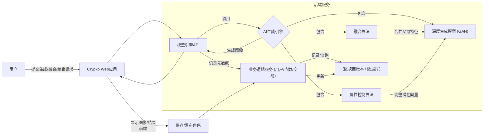
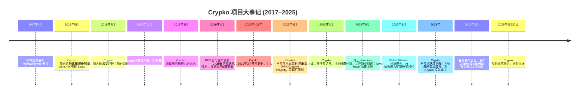

# Crypko (加密娘) 的兴衰：AI 动漫角色生成平台的缘起、技术与终结

[English](README.md) | 简体中文

by @corenel (Yusu Pan) and OpenAI Deep Research

## 1. 摘要

Crypko（常称“加密娘”）是一个融合了**生成式对抗网络**（GAN）和区块链技术的二次元角色生成平台。该项目由一支学术背景团队创立，后由日本人工智能公司 Preferred Networks（PFN）支持。Crypko 平台旨在让用户无需美术功底即可自动生成高质量的动漫风角色形象，并通过区块链保障每个角色的唯一性和所有权。2018 年 Crypko 测试版上线，在二次元和区块链社区引发热议；用户可以购买和“融合”虚拟角色卡牌来生成“子代”角色，形成独特的收藏玩法。尽管早期收获了正面反馈和小范围热度，Crypko 于 2019 年初暂停公开服务。PFN 此后继续研发该技术，并于 2022 年重新推出了拥有订阅制和编辑功能的 Crypko 平台，再次吸引数万用户注册。然而，随着**生成式 AI** 技术的迅猛演进（特别是扩散模型的兴起）以及商业化和用户增长方面的挑战，Crypko 项目最终难以为继。2025 年 3 月，官方宣布 Crypko 将于同年 6 月 30 日关闭全部服务。本报告系统回顾了 Crypko 项目的缘起与终止，深入分析其技术架构、行业地位、用户影响和衰落原因，并探讨这一案例对**生成式 AI 创业**的启示。我们将梳理 Crypko 的发展历程和关键事件，比较其与 Waifu Labs、Artbreeder、MakeGirlsMoe 等平台的异同，总结 Crypko 留下的经验教训，并展望未来虚拟角色生成领域的发展趋势。

## 2. 目录

- [Crypko (加密娘) 的兴衰：AI 动漫角色生成平台的缘起、技术与终结](#crypko-加密娘-的兴衰ai-动漫角色生成平台的缘起技术与终结)
  - [1. 摘要](#1-摘要)
  - [2. 目录](#2-目录)
  - [3. 引言](#3-引言)
  - [4. Crypko 项目概述](#4-crypko-项目概述)
    - [4.1 项目初衷与愿景](#41-项目初衷与愿景)
    - [4.2 创始团队与背景（包括母公司 PFN）](#42-创始团队与背景包括母公司-pfn)
    - [4.3 平台功能与特色](#43-平台功能与特色)
    - [4.4 用户群体与传播渠道](#44-用户群体与传播渠道)
  - [5. Crypko 的技术架构与模型演进](#5-crypko-的技术架构与模型演进)
    - [5.1 早期模型与演进](#51-早期模型与演进)
    - [5.2 模型架构细节](#52-模型架构细节)
      - [5.2.1 批量随机生成](#521-批量随机生成)
      - [5.2.2 角色融合（Fusion）](#522-角色融合fusion)
      - [5.2.3 属性编辑（Attributes Editing）](#523-属性编辑attributes-editing)
      - [5.2.4 区块链记录与 NFT 机制](#524-区块链记录与-nft-机制)
    - [5.3 系统架构概述](#53-系统架构概述)
    - [5.4 模型命名与多模型支持](#54-模型命名与多模型支持)
  - [6. 2018–2025 年生成式 AI 的发展与替代趋势](#6-20182025-年生成式-ai-的发展与替代趋势)
    - [6.1 GAN 技术成熟与竞品出现（2017–2019 年）](#61-gan-技术成熟与竞品出现20172019-年)
    - [6.2 Transformer 架构与跨模态生成（2020–2021 年）](#62-transformer-架构与跨模态生成20202021-年)
    - [6.3 扩散模型革命（2022 年）](#63-扩散模型革命2022-年)
    - [6.4 生成式 AI 的全民化与内卷（2023–2025 年）](#64-生成式-ai-的全民化与内卷20232025-年)
  - [7. Crypko 与其他生成式角色平台的对比](#7-crypko-与其他生成式角色平台的对比)
    - [7.1 MakeGirlsMoe：学术实验走向大众](#71-makegirlsmoe学术实验走向大众)
    - [7.2 Waifu Labs：游戏化的 AI 绘画师](#72-waifu-labs游戏化的-ai-绘画师)
    - [7.3 Artbreeder：开放混合的创意沙盒](#73-artbreeder开放混合的创意沙盒)
    - [7.4 综合比较](#74-综合比较)
      - [7.4.1 产品定位差异](#741-产品定位差异)
      - [7.4.2 技术实现路线](#742-技术实现路线)
      - [7.4.3 用户社群与口碑](#743-用户社群与口碑)
      - [7.4.4 商业模式成败](#744-商业模式成败)
      - [7.4.5 平台差异对比（表格）](#745-平台差异对比表格)
  - [8. Crypko 的用户生态与数字资产探索](#8-crypko-的用户生态与数字资产探索)
    - [8.1 用户群构成](#81-用户群构成)
    - [8.2 创作分享与社交](#82-创作分享与社交)
    - [8.3 NFT 和数字身份](#83-nft-和数字身份)
    - [8.4 口碑与争议](#84-口碑与争议)
    - [8.5 衍生应用 MEMES](#85-衍生应用-memes)
  - [9. 项目衰落与停运原因分析](#9-项目衰落与停运原因分析)
    - [9.1 商业模式与变现困境](#91-商业模式与变现困境)
    - [9.2 用户留存率与平台热度变化](#92-用户留存率与平台热度变化)
    - [9.3 技术迭代压力与替代（扩散模型兴起）](#93-技术迭代压力与替代扩散模型兴起)
    - [9.4 市场竞争与用户转移](#94-市场竞争与用户转移)
    - [9.5 产品定位偏差](#95-产品定位偏差)
    - [9.6 PFN 战略调整与组织结构因素](#96-pfn-战略调整与组织结构因素)
    - [9.7 政策和伦理因素（次要）](#97-政策和伦理因素次要)
  - [10. 对生成式 AI 创业项目的启示](#10-对生成式-ai-创业项目的启示)
    - [10.1 小众垂类产品的生命周期](#101-小众垂类产品的生命周期)
    - [10.2 技术先发者的持续创新压力](#102-技术先发者的持续创新压力)
    - [10.3 平台化与生态联动问题](#103-平台化与生态联动问题)
    - [10.4 用户体验与社区营造的重要性](#104-用户体验与社区营造的重要性)
    - [10.5 AI 与 Web3 结合需考虑用户接受度](#105-ai-与-web3-结合需考虑用户接受度)
    - [10.6 垂直 AI 内容平台需打造护城河](#106-垂直-ai-内容平台需打造护城河)
  - [11. 时间线梳理](#11-时间线梳理)
  - [12. 总结与展望](#12-总结与展望)
    - [12.1 Crypko 留下的遗产](#121-crypko-留下的遗产)
    - [12.2 生成式 AI 与虚拟角色未来趋势](#122-生成式-ai-与虚拟角色未来趋势)
  - [13. 参考文献](#13-参考文献)
    - [学术论文](#学术论文)
    - [公司新闻发布](#公司新闻发布)
    - [官方公告与产品网站](#官方公告与产品网站)
    - [媒体报道](#媒体报道)
    - [产品评测与分析](#产品评测与分析)
    - [博客与社区讨论](#博客与社区讨论)
    - [视频资源](#视频资源)
    - [网站与搜索引擎信息](#网站与搜索引擎信息)

## 3. 引言

近年来，生成式人工智能（Generative AI）在内容创作领域取得了飞跃式发展。从最初能够合成模糊人脸的算法，到如今能绘制高清画作、生成动画角色，AI 正深刻改变着创作的方式。作为这一浪潮中的先锋之一，日本初创公司 Preferred Networks, Inc.（PFN）推出的 **Crypko** 平台曾引人瞩目。Crypko 旨在利用深度学习为用户自动生成高质量的动漫角色形象，并结合区块链确保每个角色的唯一性。它一度被视为将 AI 技术引入动漫创作和数字资产领域的大胆尝试。

本文将对 Crypko 的平台兴起与衰落进行深入分析，系统梳理其背后的技术架构、定位与愿景，以及在 2018–2025 年间生成式 AI 领域出现的关键演进和替代趋势。同时，我们将把 Crypko 与其他类似的平台（如 MakeGirlsMoe、Waifu Labs、Artbreeder 等）进行比较，探讨各自在产品理念、技术实现、用户互动和商业化路径上的异同。最后，我们分析 Crypko 宣布停运的原因，并反思其带来的影响和启示，包括对未来 AI 角色生成、AI+ 创作产业和 Web3 发展的参考价值。

## 4. Crypko 项目概述

### 4.1 项目初衷与愿景

Crypko 项目的初衷是利用前沿的人工智能技术，让每个人都能轻松创造属于自己的动漫角色形象。其愿景在于**降低角色创作门槛**，弥合普通爱好者与专业画师之间的鸿沟。在传统方式下，创作高质量的二次元角色需要熟练的绘画技巧和大量时间。Crypko 希望通过 GAN 生成模型自动绘制角色，让用户“动动鼠标”就能生成满意的虚拟形象。这一理念对二次元游戏开发者、动漫创作者和同人爱好者都极具吸引力——前者可快速获得版权无忧的角色素材，后者则可以创造“只属于自己”的虚拟偶像。

此外，Crypko 还试图引入区块链技术，为每个 AI 生成角色赋予唯一的身份和价值。这意味着用户生成的角色不仅是图像文件，更是一种**数字资产**，可以被收藏、交易甚至用于游戏互动。这一愿景受到 2017 年底加密猫（CryptoKitties）等区块链收藏游戏的启发：Crypko 团队希望将类似的“**加密收藏品**”理念引入二次元领域，创造全球首个将 GAN 与区块链相结合的动漫形象生成游戏。

总的来说，Crypko 的愿景融合了技术与娱乐：利用深度学习提供的“无限创作”能力，满足动漫迷“自己创造角色”的渴望；同时通过区块链确保每个角色独一无二，激发用户的收藏欲和社区交流。正如 Crypko 官方在社交媒体上宣称的那样，这是一个“将 AI (GAN) 与区块链结合的世界首款加密收藏游戏”。这种跨界创新的初衷，使 Crypko 在项目伊始就自带话题性，吸引了技术圈和 ACGN 圈的关注。

### 4.2 创始团队与背景（包括母公司 PFN）

Crypko 的起源可以追溯到学术界的研究合作。其创始团队由复旦大学、纽约州立大学石溪分校和同济大学的一些研究者组成。早在 2017 年，这支团队便开发了动漫头像自动生成的开创性项目“MakeGirlsMoe”。MakeGirlsMoe 是一个让用户通过设定角色属性，自动生成动漫人物头像的网站，在二次元爱好者圈中一度非常流行。可以说，MakeGirlsMoe 是 Crypko 的技术源头和雏形。Crypko 项目正是由原 MakeGirlsMoe 团队在 2018 年初重新组建创立的，目的在于结合区块链收藏玩法将这项技术推向新的高度。

Crypko 在成立后不久便引起了日本领先 AI 企业 **Preferred Networks (PFN)** 的注意。PFN 成立于 2014 年 3 月，由西川徹、岡野原大輔等人在东京创立，最初从母公司 Preferred Infrastructure 分拆而来。PFN 专注于深度学习在各领域的研发和商业化应用，早期聚焦于物联网 (IoT) 数据的边缘计算以及自动驾驶、机器人、生物健康等领域的创新。凭借开创性的深度学习框架 Chainer 的开发以及与丰田、Fanuc 等企业的合作，PFN 迅速成为日本最受瞩目的 AI 创业公司之一，曾获得丰田约 105 亿日元的战略投资。PFN 的定位是开发“通用人工智能技术”并将其应用于实际问题，其口号是通过**Edge Heavy Computing**等理念在产业中实现革新。

2018 年 Crypko 测试版上线后，PFN 与 Crypko 团队展开了合作。此举一方面是因为 PFN 看好 AI 在数字内容创作领域的潜力，另一方面 PFN 自身也有意拓展在动漫游戏方向的技术应用。到 2019 年 4 月，Crypko 已正式成为 PFN“Creative Project”计划的一部分。PFN 在新闻稿中宣布将以 B2B 形式向动画、插画、游戏行业提供 Crypko 技术，并继续改进这一平台。可以认为，PFN 实际上收编或收购了 Crypko 项目团队，使其在资源和研发上得到有力支撑。Crypko 团队因此拥有了学术 + 产业双重背景：既有最初学术团队的算法研究实力，又有 PFN 在工程实现和商业推进上的支持。

PFN 参与后，Crypko 的技术开发进入新阶段。PFN 副总裁福田直大（Masaaki Fukuda）曾表示，公司预见数字内容创作将出现飞跃式变革，PFN 希望通过与 Crypko 这样的动漫创作公司合作，抢占这一浪潮。PFN 还派出研究人员和工程师与原团队协作，帮助 Crypko 完善生成模型、扩展功能和优化用户体验。母公司背景也带来了资金和计算资源上的保障，使 Crypko 有机会不断升级技术、尝试新功能模块（如后来的移动应用 MEMES 等）。然而，PFN 作为以深度技术见长的公司，其着眼点更多在技术输出和企业级合作，如何经营好面向 C 端用户的平台对他们也是新课题。这种背景既造就了 Crypko 独特的技术优势，也埋下了日后在运营策略上的一些隐忧（详见第 9 部分）。

### 4.3 平台功能与特色

Crypko 平台在不同发展阶段提供的功能有所演变。2018 年测试版（Beta）期间，Crypko 的核心功能围绕**虚拟角色卡牌的生成、融合与交易**展开，具有强烈的“区块链游戏”色彩。具体而言，当时的平台特色包括：

- **角色生成（抽卡）**：开发者预先生成了 5 万个不同的角色形象上链作为初始卡牌池，用户可支付以太坊（ETH）购买获得角色卡牌。每张卡牌即代表一个 AI 生成的动漫美少女形象（头像），由 GAN 模型随机生成，保证“**每个老婆都是独一无二**”。这些角色都有各自唯一的基因编码和属性信息（如发色、眼睛、表情等），并按照品质稀有度分级（UR、SSR、SR、R、N），稀有度越高，意味着形象越精美且在游戏机制中有优势。
- **角色融合（繁衍）**：用户持有两张角色卡牌时，可以花费一定 ETH 将其“百合生成”下一代角色，即让两位“老婆”通过 GAN 融合算法产出一位新的“女儿”。技术上，这是将两名角色的特征向量进行组合，生成继承父母特征的新角色。融合后的子代角色同样是独一无二的 NFT 资产，并具有自己的基因编码。融合并不会消耗父母角色，但设有**冷却时间**——稀有度高的角色冷却时间短，可以更快再次用于融合。这种机制类似 CryptoKitties 的繁殖系统，但对象换成了二次元美少女。该玩法极大增强了用户黏性，有玩家戏称自己成为了“融合中毒者”，每天沉迷于不断尝试新的角色配对。
- **交易和租赁市场**：Crypko 提供在线市场，允许用户自由买卖自己持有的角色卡牌。高稀有度的角色可以标出高价出售。同时用户也可以将角色“出租”给他人用于融合，收取一定费用。所有交易和融合操作都记录在以太坊区块链上，确保公开透明。每个角色形象以 ERC-721 标准 NFT 形式存在链上，永久保留其唯一性和所有历史。这种基于 NFT 的经济体系设计，使 Crypko 既是创作平台也是收藏交易平台，用户既能体验抽卡和养成乐趣，又能参与虚拟经济活动。
- **用户社区与等级**：Crypko 的卡牌系统还引入了游戏化元素。不同等级（N～UR）的卡牌不仅影响冷却时间，也带来了炫耀属性。在社区中，拥有 UR 级角色的玩家备受瞩目。早期玩家对 Crypko 创新的玩法好评不断，认为二次元与区块链的结合充满想象力。由于官方在测试期提供了一定数量免费 ETH，很多动漫爱好者也能零成本参与体验。

到了 2022 年 PFN 重新推出 Crypko 平台时，功能侧重点有所变化，更强调纯 AI 绘画和创作工具属性，而淡化了链游元素。新版 Crypko 的主要功能与特色包括：

- **角色无限生成**：用户可以无限次生成动漫风格的**半身像**角色（腰部以上），形象质量接近专业绘师水平。与旧版不同，新版不限固定卡池，而是实时按用户偏好生成。Crypko 使用 GAN 根据用户的交互反馈，不断调整生成结果以贴近用户喜好。这一点类似后述的 Waifu Labs 交互流程。
- **角色属性编辑**：平台支持用户自定义和微调角色的部分属性，如发型、发色、眼睛、服饰风格等。用户可以对 AI 初次生成的形象进行调整，达到满意效果。这可能通过提供选项或滑杆来实现，将用户选择映射回生成模型的 latent code 变化，从而生成带指定特征的新图像。比如用户可以锁定喜欢的脸型，再随机更换服装与发色，直至组合出理想角色。这种**高度定制化**功能使每个用户都能“捏出”符合自己审美的角色，提高了参与感。
- **Crypko Points 机制**：新版引入平台内虚拟货币“Crypko Point (CP)”作为使用计量。用户每生成或编辑一次角色需消耗一定点数，但点数会随时间自动回复。免费用户每日有基础的 CP 获取上限，而付费订阅用户（标准/高级计划）则拥有更高上限和更快恢复速度。例如，PFN 宣布 Premium 高级订阅每分钟增加 1 点 CP，比免费用户快。这一设计既避免了滥用服务器资源，又提供了变现途径（通过售卖订阅计划）。
- **订阅会员体系**：Crypko 2022 版采取**Freemium 模式**。免费用户可有限制地使用基础功能，付费订阅解锁更多权限。PFN 设置了 Standard 和 Premium 两个付费档次：订阅者不仅有更多 CP，也可将生成的角色用于商业用途】。Premium 计划定价每月 4980 日元（约合人民币 250 元），推广期折扣价 3980 日元。此举回应了用户希望将 AI 角色用于游戏、视频等商用场景的需求。订阅制标志 Crypko 从最初靠链上交易抽成的模式，转向更传统的 SaaS 服务收费模式。
- **角色融合与收藏**：新版 Crypko 仍保留了角色融合生成的概念，但从链上交易行为转变为平台内功能。用户可以将自己喜欢的多个角色形象进行“融合”，创造出继承它们特征的新角色。同时，平台允许用户收藏自己或他人生成的角色到个人库，以随时欣赏或再次编辑。这些功能体现了 Crypko 作为创作社区的定位——用户不仅创作，还可以相互分享角色。在新版中，“融合”更多是作为有趣的功能而非经济系统，因为已不涉及 NFT 交易，但对于资深动漫迷依然有吸引力。
- **Crypko Travel 模式**：这是 Crypko 新版推出的一项独特休闲功能。Crypko Travel 允许用户“派遣你的角色去不同的奇幻世界旅行，并收集独一无二的旅行照片”。简单说，用户选择自己生成的角色形象，由系统生成该角色在各种场景中的插画，如校园、森林、未来都市等，作为“旅行照片”奖励。这些照片可能是通过将角色形象与 AI 生成背景合成得到，每张都独一无二。Crypko Travel 为用户提供了角色生成之外的玩法，让角色“活”起来，增强用户黏性和内容产出。该功能颇受欢迎，成为 Crypko 区别于其他纯生成工具的特色之一。
- **移动应用 MEMES**：Crypko 技术还被用在了一款名为“進化する少女型情報体 MEMES/ミームズ”的移动应用中。MEMES 可以视作 Crypko 的延伸产品，用户在其中培养一个会不断进化的 AI 少女角色。其核心形象生成技术正是由 Crypko 提供支持。通过手机 App，Crypko 触达了更广泛的二次元用户群体。不过，MEMES 应用与 Crypko Web 平台在 2025 年同步终止服务。

综上，Crypko 平台功能从最初偏重 NFT 卡牌交易游戏，逐步演变为偏重创作工具和 UGC 社区。但贯穿始终的特色是：**高质量的 AI 动漫形象生成**以及由此衍生的丰富玩法（融合、旅行、进化等）。Crypko 提供的角色质量之高令人惊艳，有用户在体验新版时感叹：“短短时间究竟经历了什么文化大革命？！”（指相较 2017 年 MakeGirlsMoe 时代画风巨变，分辨率大幅提升）。这句话也折射出 Crypko 在功能和特色上的飞跃。

### 4.4 用户群体与传播渠道

Crypko 的目标用户涵盖了广泛的二次元和技术爱好者群体。按照不同时期，可以将其用户群体和传播渠道概况如下：

- **2018 年测试期**：核心用户是**区块链玩家**与**动漫宅**的交集群体。由于需要使用以太坊钱包（MetaMask）购买角色，早期参与者多为对加密货币有一定了解的极客型用户。其中不少也是 ACGN 社区成员，被“AI 生成美少女 + 区块链收藏”这一新奇组合所吸引。Crypko 在加密货币圈的小范围传播主要通过 Twitter 等社交媒体，当时官方 Twitter 账号发布项目上线消息即引发不少转发讨论。同时，一些中文游戏媒体如页游网也报道了 Crypko，引发国内二次元玩家的兴趣。新闻以戏谑口吻介绍 Crypko 如何“靠两个老婆百合生女儿”，将其称作“丧病美少女集换区块链页游”，增加了话题性。可以说，话题本身（AI 养成虚拟老婆）自带流量，使 Crypko 在圈内迅速传播开来。用户群以男性二次元玩家为主，年龄多在 20-35 岁，对新技术接受度高。**传播渠道**方面，除了加密和游戏媒体，Crypko 团队自己也在同人圈推广：据报道，他们曾参加日本最大的同人展会 Comic Market（Comiket），现场展示 Crypko 技术，直接面向动漫创作爱好者。
- **2019-2021 年间**：Crypko 暂停公开服务后，直接用户群一度停滞。但团队与 PFN 在业内的传播并未停止。PFN 将 Crypko 视为 AI 创新应用案例，在技术社区和商业会议上分享。例如 PFN 官方新闻稿宣布 Crypko 技术将提供给企业，标志着**企业级用户**（动画制作公司、游戏开发商等）也开始了解 Crypko。另一方面，Crypko 在二次元圈的影响以口碑形式延续。很多体验过测试版的老用户在网络社区（微博、贴吧、Discord 等）谈论这个项目，使其具备了一定神秘感和期待值。2021 年初 NFT 市场回暖，一些二次元 NFT 项目重新活跃，“加密娘 Crypko”也被爱好者重新提及，认为其可能卷土重来。果然，2021 年 3 月 Crypko 官方突然活跃，在社区发布更新预告，让原有粉丝群体倍感振奋。这段时期的传播主要靠**社区自发讨论**和小范围的内部测试邀请。
- **2022 年平台重启后**：Crypko 通过 PFN 的宣传和已有用户的扩散迅速恢复人气。PFN 在 2022 年 4 月（日本）和 6 月（国际）正式发布新版 Crypko 时，针对日本、北美、东亚用户进行了市场推广。**渠道**包括 PFN 公司的官方网站新闻稿、Twitter 上的多语言公告，以及在游戏开发者大会等场合的展示。据 PFN 披露，Crypko 重新上线后短短几个月注册用户即超过 8 万人，用户来自日本、韩国、大中华地区和美国等。这表明 Crypko 成功吸引了全球范围内的二次元爱好者。许多用户是在社交媒体上看到别人分享的 Crypko 生成角色或“旅行照片”而慕名而来。尤其是在 pixiv、微博等绘画作品社区，有人贴出“这是 AI 生成的角色形象”引发讨论，带来新的用户。Crypko 因此逐渐构建起属于自己的用户社区：官方建立了 Discord 服务器和日文/英文的论坛频道，方便用户交流作品、反馈问题。与此同时，一些**行业分析人士和媒体**也对 Crypko 重启进行报道，将其与当时兴起的 AI 绘画风潮联系起来。相比 2018 年，小众圈子的讨论，2022 年的 Crypko 在主流 AI 社区也引起关注，被列为 AI 绘画工具的代表之一。
- **移动端用户**：随着 MEMES 手机 App 的上线，Crypko 技术触及了更多女性和年轻用户。MEMES 作为一款偶像养成类应用，通过应用商店推广，吸引了一批可能对 Crypko 网页并不熟悉的新用户。这部分用户关心的是角色的互动和养成，而未必了解背后的 AI 技术，但客观上扩大了 Crypko 影响力。

总体而言，Crypko 用户群体既包括硬核的技术玩家，也包括纯粹的动漫爱好者；地域上涵盖日、美、中等 ACG 文化活跃地区。从 UGC 社区的活跃度看，Crypko 的忠实用户产出了大量生成角色的分享和二创，例如有人用 Crypko 角色制作视觉小说、当作 VTuber 形象原型等，展现了平台的文化渗透。项目传播早期靠猎奇概念吸引眼球，中后期则更多依赖用户口碑和作品的自传播。在官方停运公告发布后，不少用户在 Twitter/微博留言表达惋惜与不舍，可见 Crypko 已在这几年中积累了一批真爱粉和怀旧者。下一节我们将深入剖析支撑 Crypko 这些功能与体验背后的技术架构细节。

## 5. Crypko 的技术架构与模型演进

Crypko 能够自动生成动漫角色形象的核心，在于其背后的**深度生成模型架构**。从技术上讲，Crypko 主要采用了**生成对抗网络（GAN, Generative Adversarial Network）** 来生成二维的动漫角色图像。GAN 由一个生成器（Generator）和一个判别器（Discriminator）组成，二者通过相互博弈式的训练共同进化：生成器尝试产出以假乱真的图像，判别器则学习分辨 AI 生成的图像和真人绘制的图像。随着训练进行，生成器不断提高“骗过”判别器的本领，最终能够合成高度逼真的图像。Crypko 正是利用了 GAN 善于**学会绘画风格**的特性，让 AI 学会绘制日式动漫风格的人物肖像。

### 5.1 早期模型与演进

Crypko 在 2018 年推出测试版时，仅能生成**角色面部肖像**。彼时 GAN 技术已历经几代发展：从 2014 年诞生之初只能生成模糊的人脸，到 2017 年前后出现改进的 DCGAN、WGAN 以及逐步提高分辨率的 Progressive GAN 等。特别是 2018 年初，NVIDIA 发布了 Progressive GAN，证明 GAN 可以逐步生成 1024×1024 高清人脸。Crypko 团队很可能借鉴了当时最新的 GAN 技术，并针对日漫人物的数据进行了专门训练。根据团队在 2017 年的研究报告，早期 MakeGirlsMoe 项目使用的是改进的 DCGAN 架构，结合了 DRAGAN (Deep Regret Analytic GAN) 的训练技巧，以提高动漫脸部生成的稳定性和清晰度。该模型在当时已经能够生成逼真的二次元头像，并被部署在 MakeGirlsMoe 网站供公众体验。

随着 Crypko 的开发，团队对 GAN 架构不断升级。2018 年 Crypko 测试版问世时，正值 NVIDIA 提出高分辨率人脸生成的 Progressive GAN/StyleGAN 等新型 GAN 架构。虽然官方未公开具体采用哪种 GAN，但从生成效果推测，Crypko 很可能借鉴了**StyleGAN 系列**架构的长处。StyleGAN 引入了风格向量逐层控制等机制，极适合人脸这类结构化对象的生成，在动漫角色上同样适用。用户反馈表明 Crypko 角色图质量相较 2017 年有飞跃式提升——分辨率更高、五官更精细、风格更接近流行画师的画风。这暗示团队采用了更先进的 GAN 模型（可能是 StyleGAN 或其变体），再结合动漫数据进行专门训练，从而达到**媲美手绘**的效果。

在训练策略上，Crypko 团队非常注重数据和模型的匹配。据论文介绍，他们首先构建了一个**干净的动漫人脸数据集**，过滤掉低质量或不适合作为训练样本的图像。早期数据主要来自日本 Galgame 立绘（例如从 getchu 等网站抓取）。这些图像风格统一且五官清晰，有助于 GAN 学习。模型训练过程中，他们采用 DRAGAN 等正则化技术缓解 GAN 训练的不稳定，减少“模式崩溃”（mode collapse）情况。此外，针对动漫脸没有预先标签的问题，团队提出了一种无标签数据训练的经验方法，使得即使不提供每张图的属性标签，也能训练出隐空间中带有语义变化维度的模型。这为后续实现用户自定义属性奠定了基础。

到新版 Crypko（2022）时，模型需要生成的不只是人脸，还有半身甚至带服装全身图，这对 GAN 的能力提出更高要求。PFN 官方透露，到 2022 年时，Crypko 的生成模型已经迭代至**第六代**，能够绘制人物的上半身（从头部到腰部）。推测团队可能进一步优化了架构，可能采用**StyleGAN2/3**系列（这在 2020 年后已成熟）或融合**自回归模型**来提升细节。一些 GAN 改进如自注意力 GAN（SAGAN）等也可能被引入以更好处理服饰花纹等全局信息。由于 PFN 拥有强大算力，Crypko 模型的参数量和训练轮次都得以增加，以增强生成多样性和清晰度。训练 GAN 常见的挑战包括对抗训练稳定性、如何避免过拟合动漫风格、使输出既多样又不偏离“二次元审美”。Crypko 团队很可能通过反复实验调整学习率、判别器训练步数比、使用技巧如谱归一化、经验回放等来获得最佳效果。这方面的具体细节虽未明示，但其成果说明了训练策略的成功：Crypko 几乎很少出现早期 AI 绘画常见的“畸形”或“溶解”现象，每张输出的人物都五官端正、色彩和谐。

值得注意的是，Crypko 为支持**用户交互和属性编辑**，模型架构上需要可控性。实现途径可能有两种：其一，训练一个**条件 GAN**，在输入中加入发色、发型等属性编码，这需要带标签的数据训练；其二，采用无监督方法获取隐空间语义轴，例如 StyleGAN 的分层风格向量，允许后期对特定层的向量插值实现定向变化。从 MakeGirlsMoe 时代开始，团队就探讨了“无标签数据训练有标签模型”的方法。因此 Crypko 很可能选择了隐空间操控：通过对大量样本的对比分析，找出隐向量某些维度变化对应特定属性改变（比如某维增加会逐渐从黑发变金发）。这样，当用户在界面上选择“金发”，系统便在 GAN 的 latent 输入上施加对应的变化，实现输出调整。而融合两个角色，本质上是对两组 latent 向量做某种**组合操作**（如线性插值、分段拼接等）生成新的 latent，再送入生成器。StyleGAN 的“混合配对”特性非常适合这种需求，因为可以把父母角色的潜码在不同层混合，从而子代继承父母部分特征。

### 5.2 模型架构细节

#### 5.2.1 批量随机生成

Crypko 允许用户一次生成多个（如 10 个）不同角色候选。这意味着生成器能够高效地采样多个随机潜码（latent code）并输出多个形象各异的角色。GAN 本身善于从不同潜码产生多样化结果，Crypko 将这一特性用于提升用户体验：一次性给出多张形象，增加出现令用户满意角色的概率。

*Crypko 平台批量生成角色形象的界面示例图。每次可产生 10 个不同风格的动漫人物供用户选择。界面左上可选择生成模型（如“Freesia”上半身模型），底部有“Generate”按钮重新生成。图中可见生成的角色带有“Crypko”水印。*

#### 5.2.2 角色融合（Fusion）

这是 Crypko 的一大特色功能，受启发于遗传算法和《加密猫》等数字繁殖类游戏。用户可以从已有的两个 Crypko 角色中选取“父本”和“母本”，让系统生成融合二者特征的新角色。技术上，这可能通过对两张角色图像各自对应的潜在表示进行组合来实现。例如，将两者的潜码在某比例上混合，或在 GAN 生成器的中间层交叉注入，从而生成兼具两者特征的图像。Crypko 能一次产生 5 个融合结果供挑选。融合出的角色往往在发色、脸型等方面继承“父母”的部分特征，使用户有种“繁衍”角色的趣味体验。这一机制有效增加了角色造型的多样性，也鼓励用户反复尝试组合，发掘新形象。PFN 在官方描述中提到，Crypko 的融合技术能反映用户的品味和意图，暗示融合不仅仅是随机混合，可能还考虑了特征的语义关联。

#### 5.2.3 属性编辑（Attributes Editing）

与多数纯随机生成的 GAN 工具不同，Crypko 提供了**定制角色属性**的功能。用户可以在生成角色的基础上，调整诸如发型、发色、眼睛颜色、表情、年龄等 30 多项外观属性。这一切是在无需重新绘制的情况下即时完成的：用户通过交互界面勾选或拖动参数，模型便实时更新角色图像。PFN 曾展示过 Crypko 编辑功能的技术 Demo：当用户用鼠标或数位板拉动角色五官的某个部位时，系统能够立刻重新渲染出该改动后的角色图像。这种**所见即所得**的编辑得益于 GAN 生成器的连续潜在空间——通过对潜码沿特定方向的平移，可以实现人物某项属性的变化。例如，经过事先训练，Crypko 或许学得了“改变发色”的潜在操作方向，当用户选择不同发色选项时，系统就在潜码上施加对应偏移，从而生成发色改变后的图像。类似地，“年龄”“表情”等属性变化也可以通过潜在空间中的操作实现。PFN 将这些功能封装成直观的 UI，使用户无需懂技术即可细调角色形象。这种交互式 AI 绘画工具在 Crypko 推出时相当前沿，体现了 PFN 对 GAN 可控性的深入研究。

*Crypko 属性编辑界面示意图。左侧为原始生成的角色形象，右侧为调整属性后的新形象。右上角的属性标签显示了用户所做修改，例如将角色调年轻（younger:-1）、略带愤怒表情 (angry:0.3)、发色变为白色 (white hair:0.3) 等。界面提供了多个属性类别供展开选择，包括 Attributes 总体、Expressions 表情、Hair Styles 发型、Eye Colors 眼睛颜色、Hair Colors 头发颜色等。用户点击“Update”即可应用修改，实时更新左侧角色图像。*

#### 5.2.4 区块链记录与 NFT 机制

Crypko 的另一技术支柱是区块链。PFN 在 Crypko 架构中引入了**智能合约**，将每一次角色的生成、融合、交易操作记录在区块链上。具体而言，每当生成一个新角色时，其对应的数字指纹（可以是 GAN 潜码或图像哈希）会通过智能合约写入链上，并与创建该角色的用户账户关联。这样，每个角色的所有权和谱系都有据可查，不可篡改。用户若将角色发布到 Crypko 库中，就相当于**铸造**了一枚 NFT（非同质化代币），代表该角色的唯一数字资产。Crypko 最初运行在以太坊等公共链上，支持用户用加密货币进行角色交易。通过区块链，Crypko 实现了保证角色“独一无二”的承诺——每个角色都有全球唯一的编号和所有者，公开可验证，杜绝了重复和盗版的可能。这种技术设计使 Crypko 不仅是个角色生成器，更是一个**数字角色资产平台**。

### 5.3 系统架构概述

以上各模块共同构成了 Crypko 的平台架构。从系统层面看，Crypko 包含**前端 Web 界面**、**后端 AI 引擎**和**区块链账本**（或后期版本的中心化数据库）三大部分：

*Crypko 系统架构示意图。用户通过前端界面与 Crypko 交互，可以请求生成新角色、融合现有角色或编辑角色属性。前端将请求发送给后端的模型引擎 API。API 调用 AI 生成引擎，引擎中的 GAN 模型根据需要调用融合或编辑模块，对潜在向量进行处理，然后生成角色图像返回。同时，业务逻辑服务处理用户账户、点数、交易（早期 NFT）等，并将角色元数据和所有权信息记录到区块链账本或数据库中。账本上的记录确保了角色的唯一性和可追溯性。*

如上图所示，Crypko 的运行流程是：用户在 Web 界面上进行操作，前端通过 API 与后端服务通信。后端包含 AI 引擎（负责图像生成、融合、编辑）和业务逻辑服务（处理用户、权限、数据记录）。AI 引擎计算完成后返回图像数据给前端展示。角色的元数据、所有权等信息由业务逻辑服务管理，并存储在数据库或区块链上。整个过程对用户而言是实时和交互的，背后则是 AI 模型的推理计算与数据管理在协同工作。

### 5.4 模型命名与多模型支持

值得一提的是，Crypko 的开发过程中 PFN 还为不同版本的 GAN 模型起了代号。例如，用于生成**面部**的模型被称为“Erica”，用于生成**上半身**的第六代模型称为“Freesia”。在 Crypko 的界面上，用户可以选择使用哪一个模型来生成图像（如在免费计划下只能使用 Erica 模型生成头像，而订阅标准计划后可使用 Freesia 模型生成半身像）。这种多模型并存机制说明 PFN 在升级模型的同时，仍保留旧模型供用户选择，可能是考虑到不同模型风格稍有不同，或出于兼容性的原因。例如，有些用户可能偏好旧模型画出的脸型风格，那么仍可使用 Erica 生成纯头像；而想要生成包含服装上身的则用 Freesia。PFN 通过持续训练新模型，不断提升 Crypko 的绘制能力，同时并未一刀切抛弃旧模型，这体现了产品打磨的用心。

综上，Crypko 的技术架构融合了**最前沿的 GAN 生成技术**和**创新的功能模块**（融合、属性编辑），再加上**区块链**赋予的数字资产属性，构筑了一个功能丰富的 AI 角色生成平台。从 2018 到 2022 年，Crypko 的模型能力逐步提升，实现了从“会画脸”到“会画半身像”的飞跃，并搭建了用户交互和资产管理体系。这为 Crypko 在市场上赢得了一批拥趸。然而，技术的飞速演进也带来了新的竞争者和替代方案。在 Crypko 运行的数年间，生成式 AI 领域出现了许多重要发展，下面我们将聚焦 2018–2025 年的大环境，看看有哪些趋势影响了 Crypko 的命运。

## 6. 2018–2025 年生成式 AI 的发展与替代趋势

Crypko 从 2018 年问世，到 2025 年宣布停运，正好经历了生成式 AI 井喷式发展的一个周期。在这七八年间，生成模型领域涌现了**多种新技术范式**，其中尤以**扩散模型（Diffusion Models）** 和 **Transformer 架构**的兴起最为引人瞩目。这些新趋势在丰富 AI 生成能力的同时，也逐步对 GAN 形成了替代之势。以下按时间线梳理关键节点：

### 6.1 GAN 技术成熟与竞品出现（2017–2019 年）

在 Crypko 问世之前，学术界已开始探索利用 GAN 生成动漫角色。2017 年，复旦大学等机构的研究者发表论文《Towards the Automatic Anime Characters Creation with GAN》并推出演示网站“MakeGirlsMoe”。MakeGirlsMoe 可以根据用户指定的属性（如发色、眼色、是否戴眼镜等）生成对应的动漫女孩头像。这是 GAN 在动漫内容上的早期尝试，证明了**以 GAN 自动生成 ACG 角色**的可行性。

随后，2018 年和 2019 年，一批面向大众的 AI 角色生成工具陆续出现。例如 2019 年上线的 Waifu Labs，就是一家硅谷创业团队推出的在线服务。Waifu Labs 同样采用 GAN，但与 MakeGirlsMoe 的直接属性选择不同，它强调**逐步进化式的交互生成**：用户先从随机生成的若干头像中挑一个喜欢的，然后 AI 基于所选风格再生成新一批变化，用户再选，如此四步迭代，最终得到符合用户审美的角色。这种选择—生成的循环过程，让用户有种“培养”AI 绘师画出理想角色的体验，降低了操作难度和设计压力。Waifu Labs 上线后大受欢迎，据官方统计在头两年内 AI 已经绘制了超过**2000 万张**角色画像。与此同时，Crypko 也在 2018 年开始测试，2019 年 PFN 宣布将 Crypko 技术投入商用。

可以说，在 2018–2019 年间，**GAN 生成动漫形象进入实用化阶段**，出现了 Crypko、Waifu Labs、MakeGirlsMoe 等多种实现，各具特色。GAN 技术本身也在不断改进（如 StyleGAN 问世），为这些平台提升画质提供了工具。

### 6.2 Transformer 架构与跨模态生成（2020–2021 年）

2017 年 Transformer 模型横空出世并迅速统治了自然语言处理领域，稍晚一些 Transformer 思想也渗透到生成式 AI 中。尤其值得一提的是**跨模态的生成模型**开始兴起：例如 OpenAI 在 2021 年 1 月发布了 DALL·E 模型，它利用 Transformer 读取文本描述，再逐像素生成图像，展示了 AI 根据文字画图的潜力。同年，谷歌等也研发了基于 Transformer 或 VAE 的图像生成方案。虽然这些早期文本生成图像的效果离实用尚有距离，但已经指明了一个方向：未来的 AI 绘画可能由“文本提示词”驱动，而非依赖随机种子或手动调节参数。这一趋势和 Crypko 等基于 GAN 的平台形成对比——Crypko 主要依靠预先训练的分布来随机采样，虽有一定编辑功能，但**无法根据任意用户输入的创意（如一句话描述）来定制图像**。

2020–2021 年 Transformer 架构大放异彩的另一个方面是在**模型规模和性能**上。以 OpenAI 的 GPT-3 为代表，大规模 Transformer 证明了只要模型和数据足够大，生成效果可以远超以往。这种“参数规模竞赛”在视觉领域也有所体现，优秀的 GAN 模型开始需要上亿参数、海量训练数据和长时间训练，这对创业团队提出更高要求。不过，PFN 在 2021 年前后继续深耕 Crypko，升级了模型能力，使其能够生成**高分辨率的半身角色**。PFN 甚至结合自身开发的 3D 扫描技术，尝试将 Crypko 的 2D 角色与 3D 模型生成结合，用于动画制作流程。这一时期 Crypko 在专业领域的应用有所拓展（如 PFN 用 Crypko 自动生成虚拟歌手形象并制作音乐短片），但尚未大规模走向 C 端国际市场。总的来说，Transformer 的崛起预示着更强大的生成 AI 即将出现，Crypko 虽然此时保持技术领先，但新的范式已经在酝酿中。

### 6.3 扩散模型革命（2022 年）

2022 年被许多人称作“AI 绘画元年”，因为**扩散模型（Diffusion Models）** 在这一年迎来了大爆发。扩散模型是一类不同于 GAN 的生成模型，其基本思想是逐步对噪声图像去噪，从噪声中“显影”出清晰图像。早在 2019 年，扩散模型就被提出，但直到 2021 年底 -2022 年，这一方法才展现出巨大潜力。Google Brain 团队 2022 年公布的 Imagen 和 Parti 等模型表明，扩散模型在图像生成的保真度上可媲美甚至超越 GAN，而且更容易融入**文本条件**。

2022 年中，Stability AI 支持开发的**Stable Diffusion**模型开源，将扩散模型的热潮推向顶峰。Stable Diffusion 可在消费级显卡上运行，却能根据文本提示生成高质量图像，使得 AI 绘画门槛空前降低。一时间，各类基于 Stable Diffusion 的衍生应用雨后春笋般出现。对于动漫领域，社区爱好者很快发布了**Waifu Diffusion**等模型，专门针对二次元画风进行微调。这些模型能够根据用户输入的二次元角色描述（例如“银发蓝眼的少年，穿校服，微笑”），直接生成相符的角色图像。这种“所描即所得”的新模式，极大地解放了创作想象力——用户不需要从预生成的选项中挑挑拣拣，而是可以自由地用语言描述想要的形象，由 AI 来“脑补”成画。同时，扩散模型在生成复杂场景、多样风格方面也展现了优势，甚至可以合成全身角色、背景和特效在一张图中。这与 Crypko 形成鲜明对比：Crypko 主要生成中景的人物（无背景或简单背景），定位于头像/立绘设计工具；而扩散模型可以生成角色在各种场景下的完整画面，更适合直接产出插画成品。因此，从 2022 年下半年开始，扩散模型成为了新的行业标准，许多原本使用 GAN 的应用也面临技术更新的抉择。

对于 Crypko 而言，2022 年的扩散模型革命是一个关键转折点。尽管 Crypko 在 2022 年上半年正式上线国际版并短期内积累了数万用户，“稳定扩散”等新模型的横空出世无疑分流了大量关注度。一方面，Stable Diffusion 开源后大量免费的或开源的动漫模型出现（如 NovelAI 提供的 Anime 图像生成服务，以及各类在绘画社区分享的模型），用户可以**离线或廉价**地获得高质量动漫图像；另一方面，Midjourney 等商用 AI 绘画服务在艺术风格和社区运营上独树一帜，迅速聚拢起百万级用户社群。在这种背景下，Crypko 虽然技术成熟，却显得有些“过于专一”——它的 GAN 模型只能画固定风格的二次元人物头像，缺乏对文本、全场景的支持。这在 AI 绘画百花齐放的新局面下，难免让部分用户觉得不够过瘾。因此，可以说**2022 年的扩散模型浪潮在技术层面提供了 Crypko 的替代方案**：原本 Crypko 所独有的“让 AI 画动漫人物”能力，现在成了许多通用 AI 绘画的一个子功能，而且有更高自由度。

### 6.4 生成式 AI 的全民化与内卷（2023–2025 年）

进入 2023 年，生成式 AI 进一步融入大众生活。从文本生成（ChatGPT 爆火）到图像生成（各类应用层出不穷），整个 AI 行业进入高速产品化阶段。在图像生成方面，扩散模型继续迭代升级，出现了**ControlNet**等辅助手段，使用户可以通过草图、姿态骨架等方式精确控制生成角色的姿势和构图。这相当于把 Crypko 那样的属性编辑、定制功能，以另一种方式实现并推广开来。另外，大模型的理念开始影响图像领域，一些数十亿参数的大型扩散模型或多模态 Transformer 问世，试图统一生成图像的各种细粒度控制。可以预见，在 2025 年前后，生成式图像 AI 已成为一个**竞争激烈的红海**市场，各种新模型新应用不断涌现。在这样的环境下，一个相对垂直且封闭的产品若缺乏持续创新，将很难维系用户。**Transformer 架构**在图像生成中的进一步应用也是趋势之一，例如 Meta 的 Make-A-Scene 模型结合 Transformer 和扩散，允许用户提供简笔画和文本来共同指导生成。这些进展都表明，生成式 AI 工具正朝着**更通用、更易用**的方向前进。

回顾 Crypko 所处的大环境，可以发现：2018 年它搭乘着 GAN 热潮诞生，占据了 AI 绘制动漫形象这一细分赛道的先机；但此后不久，**扩散模型**掀起的新一轮技术更迭为用户提供了更多选择。特别是对动漫创作爱好者而言，2022 年后他们既可以使用 Crypko 这样的专门工具，也可以转向通用绘画 AI 并辅以特定模型来生成动漫风格作品。很多用户开始尝试自己微调扩散模型生成符合个人喜好的角色，而美术从业者则可能利用扩散模型加上后期修饰替代传统绘制流程。这种局面无形中削弱了 Crypko 作为“唯一选择”的地位。

综上所述，2018–2025 年的生成式 AI 领域可谓风云变幻。Crypko 所基于的 GAN 技术从辉煌走向相对式微，被扩散模型逐渐取代成为主流。在 Transformer 和大模型的加持下，新一代生成工具在**灵活性、可控性**上更胜一筹。这些技术发展趋势为 Crypko 带来了严峻挑战，也部分解释了其后续命运。在下一节中，我们将把 Crypko 与几款同期的 AI 角色生成平台进行对比，进一步分析它在产品理念和市场竞争中的独特之处与不足。

## 7. Crypko 与其他生成式角色平台的对比

为了更加全面地认识 Crypko，我们有必要将其与几款具有代表性的 AI 角色生成平台进行横向比较。这里选择**MakeGirlsMoe**、**Waifu Labs**和**Artbreeder**这三个，与 Crypko 共同构成了 2017 年以来 AI 自动生成二次元/角色形象的主要探索者。它们在产品理念、技术实现、用户互动和商业化路径上各有侧重。下面将分别介绍并比较。

### 7.1 MakeGirlsMoe：学术实验走向大众

MakeGirlsMoe 诞生于 2017 年，由中美学术团队合作开发，初衷是验证 GAN 在动漫角色生成上的可行性。作为一项学术成果，MakeGirlsMoe 有以下特点：

- **技术实现：** 使用当时前沿的 GAN 模型，结合了条件生成的思路。MakeGirlsMoe 允许用户指定一些**离散的角色属性**（如发色、眼色、是否戴眼镜等）生成对应的动漫少女头像。这说明其模型是一个带有条件输入的 GAN（类似 AC-GAN 等），在训练时利用了标注了属性标签的动漫人脸数据集。生成的结果为 512×512 左右分辨率的二次元美少女脸部图像。当时的效果在学术圈引起关注，因为 GAN 此前主要用于真人脸，MakeGirlsMoe 拓展到了二次元领域并能一定程度上**定制**特征。
- **产品形态：** 一个简单的 Web 演示。用户在网站上勾选属性然后点击生成，即可看到一张合成的妹子头像。每次只能生成单张，若不满意就调整属性或重新生成。由于定位于论文 demo，网站 UI 比较简陋，功能单一，无额外社交或存储功能。不过正是这个网站让很多 ACG 爱好者第一次体验了“让 AI 画一个我的梦幻角色”。可以说 MakeGirlsMoe 验证了市场需求：大家真的对 AI 自动画二次元头像感兴趣。
- **用户群体：** 以技术圈和二次元爱好者为主。作为免费公开的项目，MakeGirlsMoe 吸引了一批尝鲜者，但由于其定位学术 demo，后来并未长期维护更新，逐渐热度下降。它没有形成一个用户社区或持续运营的服务。
- **商业化：** 无直接商业模式。MakeGirlsMoe 主要贡献在于论文和开源，推动了这一方向的研究。当一些团队看到它的成功后，便着手将类似想法产品化，比如后来的 Crypko 和 Waifu Labs 都可被视为在 MakeGirlsMoe 思路上的扩展。

总体而言，MakeGirlsMoe 证明了**GAN+ 属性控制**可以生成较满足用户期望的动漫头像，但其体验仍偏向技术验证，缺乏游戏化和持久运营。Crypko 与它相比，更强调**生成质量**和**平台生态**：Crypko 的画面质量明显更高（毕竟多几年研发和更强模型），而且提供了融合、编辑、收藏等完整功能，不再只是单次生成。这体现了从研究走向产品所做的升级。

### 7.2 Waifu Labs：游戏化的 AI 绘画师

Waifu Labs 是由美国初创公司推出的一项在线服务，2019 年首次上线。它与 Crypko 在目标用户上有相似之处（ACG 爱好者、游戏开发者等），但在产品设计和商业策略上走了不同的路线：

- **产品理念：** **强调交互乐趣**。Waifu Labs 把生成过程设计成四轮选择游戏。第一轮给用户 15 个随机生成的动漫少女头像（全部风格各异），用户选中最喜欢的一张；第二轮基于用户所选形象生成多种**配色**变化（服装发色变换等），用户再选喜欢的配色方案；第三轮在相同配色基础上生成不同绘画风格或细节的变化，再选一次；第四轮输出最终高精度的头像，可保存下载。这种分步挑选的流程，有点像**培养自己的专属 waifu**。相比之下，Crypko 则更像一个设计工具：用户直接生成候选，或者调整属性参数。Waifu Labs 避免了用户面对参数，不需要去构思具体发色发型，只需要凭感觉做选择，降低了参与门槛。这种**游戏化体验**被证明非常抓人：不少人会反复刷 Waifu Labs，看看 AI 绘师还能画出什么新惊喜。
- **技术实现：** Waifu Labs 背后也是 GAN，据其团队介绍最初使用了改进的 StyleGAN 架构，并不断迭代。他们在 2022 年公布了“v2 模型”，绘制质量进一步提升。与 Crypko 不同的是，Waifu Labs 并未提供属性级细调，而是通过**引导式生成**来实现用户意图。这种方式的优点是简单直观，但缺点是用户无法**精确控制**某单一特征（比如我就是想要金发碧眼，Waifu Labs 做不到直接指定）。Crypko 则相反，提供了精确控制但需要一定技能（你懂得调参数）。技术路线的差异使两者各自吸引了不同偏好的用户。
- **用户互动：** Waifu Labs 最初并没有内建社区功能，它更像一个工具网站。用户生成头像后，可以自行保存或分享至社交媒体。Waifu Labs 本身不提供用户账户、收藏夹等（至少在早期没有）。而 Crypko 内置了用户系统，允许登录后保存作品到个人库、浏览他人作品、关注收藏喜欢的角色等。这显示 Crypko 试图打造一个**创作社群**，而 Waifu Labs 则更专注于“单机体验”，生成即结束。当然，两者后来都有一些扩展：PFN 也推出过 Crypko 角色的排行榜、角色故事投稿等活动，而 Waifu Labs 团队则开发了一款名为**Arrowmancer**的手游，将 AI 生成角色融入游戏玩法，让玩家收集由 AI 绘制的人物。这从另一个方向建立了社区——Arrowmancer 玩家社区，也会反哺对 Waifu Labs 的关注（游戏角色都是 AI 画的噱头）。
- **商业化路径：** Waifu Labs 采用**增值服务和衍生品**的模式。其网页版的头像生成服务对普通用户是免费的，不限次数使用。这为其迅速聚拢人气创造了条件。据报道，Waifu Labs 支持团队还提供付费打印服务：用户可以将自己生成的 waifu 定制打印成海报、抱枕等商品，从中盈利。此外，通过推出手游 Arrowmancer，团队可以靠游戏内购等获利。这种模式的好处是用户门槛为零（任何人都能玩），坏处是收入模式相对间接。Crypko 则采取**Freemium 订阅**模式：免费用户每天可获得少量点数用于生成，而重度用户可以付费订阅标准方案，每月获得高额点数额度和高清无水印下载等权益。同时，在 2022 年 Crypko 还上线了**高级商用计划**，针对有商业用途的专业用户收取更高费用，允许他们将 Crypko 生成的人物用于游戏、插画等商业项目。这种直接付费模式更像传统软件服务，但由于 Crypko 本身用户基数有限，因此收入规模可能也有限。此外，Crypko 早期还尝试通过**交易手续费**等 NFT 玩法赚钱：用户之间角色交易、融合可能涉及手续费或新角色发行费。然而据观察，Crypko 的 NFT 交易并未真正大火，一来圈外用户不熟悉加密货币操作，二来圈内用户或许更偏好加密艺术品而非动漫头像。在 NFT 狂热褪去后，这条路基本没有走通。

综合来看，Waifu Labs 与 Crypko 代表了两种产品取向：**一个极致简化体验，依靠用户量和周边变现**，一个功能专业全面，走订阅和 B2B 路线。Waifu Labs 在早期以其有趣的交互成功积累了远超 Crypko 的用户数量（据称每日访问量曾非常可观，生成千万计图像），这反过来又提升了其 AI 模型质量（大量用户选择数据可以用于训练改进 GAN）。Crypko 则更像精英型产品，强调“我的作品我所有”，注重构建 UGC 社区和资产价值，但相对而言用户规模没有那么大众化。这两种路径各有利弊，也反映出 PFN 和 Waifu Labs 团队在战略上的不同考量。

### 7.3 Artbreeder：开放混合的创意沙盒

Artbreeder（前身为 Ganbreeder）是另一款值得对比的平台，但它与 Crypko 定位略有不同。Artbreeder 于 2018 年由艺术家兼程序员 Joel Simon 开发，是一个**通用的 AI 图像混合创作平台**。它的特点在于用户可以**混合（breed）多张图像**来生成新图像，并且不限题材类型。Artbreeder 上有各种分类的模型和素材，包括人物肖像（现实风格、人种各异）、动漫画风人像、风景、建筑、抽象画等。用户可以选择任意两张（或多张）现有图像，让 AI 生成融合它们特征的新图像，或对单张图像调整某些连续参数（如年龄、笑容程度等）来变换样貌。

与 Crypko 聚焦“动漫角色”不同，Artbreeder 更像一个**AI 图像创作的游乐场**，动漫形象只是其中一个分类。尽管如此，我们仍能做一些比较：

- **技术与功能：** Artbreeder 最初基于 BigGAN 和 StyleGAN 模型，提供了**连续控制变量**和**多亲本融合**的功能。在 Anime Portrait 分类下，用户可以混合多个二次元头像产生新角色，或调节性别、亮度等滑杆微调结果。这一点和 Crypko 的融合、属性编辑有相似之处，但 Artbreeder 没有 Crypko 那么专门针对动漫进行优化，比如它不会保证生成的一定是标准动漫画风（有时可能融合出怪异风格）。不过 Artbreeder 胜在**开放性**：它允许用户将自己的图片上传作为亲本，然后利用 AI 风格迁移/融合生成新作品。这意味着用户可以在 Artbreeder 上创造远超训练集分布的多样结果，而 Crypko 严格限制在其训练的动漫风格空间内（用户不能导入自定义元素）。
- **用户互动：** Artbreeder 从设计上就是一个**社区**。所有用户生成的图像默认公开展示，别的用户可以拿你的图像继续“breed”出衍生作品。这种模式鼓励了一种协作和竞赛：大家不断混出新奇的图，优秀作品会被点赞、排列在首页。Artbreeder 因此积累了一个共享的图像库，某种程度上有机成长为一个 AI 艺术共同体。对于动漫角色创作而言，这种开放混合意味着你可以基于其他用户的角色再创造，例如给 TA 变个发色、换个背景等等。但这也带来一个问题：**版权和归属**变得模糊，每个人都在改来改去，很难说哪个角色是谁“原创”的。这和 Crypko 形成鲜明对照——Crypko 通过区块链 ID 确保每个角色的归属和生成历史清晰可循，强调的是**个人所有权**和**唯一性**。Artbreeder 则更像公共画板，大家一起玩，重混彼此的画。
- **商业模式：** Artbreeder 采用**订阅增值**模式。免费用户有生成次数和功能限制，付费订阅者可以获得更高分辨率下载、私人素材库、更多混合选项等。由于其用户群不仅限动漫迷，还包括概念艺术师、设计师等各类创意人员，一些专业用户愿意为高级功能付费。此外，Artbreeder 上的图片大多采用开源共享协议发布（鼓励再创作），所以版权不是平台盈利点。Crypko 则如前述靠订阅点数和潜在交易分成，不允许免费用户商用其作品。两者在盈利上的思路差异和其社区哲学相关：Artbreeder 追求作品的**自由流动**，Crypko 追求作品的**稀缺价值**。
- **角色设计效果：** 从角色设计角度看，如果一个游戏开发者希望快速生成一些独特的 NPC 肖像，Crypko 会提供高一致性的画风（都符合日漫立绘的规范），而 Artbreeder 可能混出来的风格有时不统一。此外 Crypko 有明确的“二次元”风格导向，Artbreeder 的 Anime 子类虽然也是二次元，但受限于社区上传和 BigGAN 多类训练，有时会混杂奇特元素，不如 Crypko 那样纯粹的日漫味。如果想要大量高质量动漫立绘，Crypko 比较省心；但如果想要跨风格的创新（例如把真人照片和动漫融合成半写实画风），Artbreeder 能做到而 Crypko 不能。因此，Artbreeder 更适合**实验性质**的艺术创作，Crypko 适合**定向的角色设计**。

### 7.4 综合比较

将 Crypko 与上述三个平台横向对比，可得出以下关键差异点：

#### 7.4.1 产品定位差异

- **MakeGirlsMoe:** 学术展示，功能单一，侧重验证 GAN 生成特定属性动漫头像的可行性。
- **Waifu Labs:** 娱乐优先，交互游戏化，目标是让用户轻松获得满意的 waifu 头像，商业上靠周边和衍生游戏。
- **Artbreeder:** 开放式创意社区，支持多种图像混合，强调用户协作和共享，面向广泛的数字艺术爱好者。
- **Crypko:** 专业工具与社区生态并重，强调高质量、可控的动漫角色生成，结合区块链探索数字资产价值，同时面向 C 端与 B 端市场，模式较重。

#### 7.4.2 技术实现路线

- **共性：** 均基于 GAN 技术（或其早期变体）起家。
- **Crypko:** 投入最多研发，模型迭代至第六代，支持高分辨率半身像和精细属性编辑，早期引入区块链。但后期未明显跟进扩散模型。
- **Waifu Labs:** 使用改进 StyleGAN，通过引导式选择实现定制，用户体验流畅，也在持续更新模型（如 v2）。
- **Artbreeder:** 融合多种 GAN 模型（BigGAN, StyleGAN 等），支持跨类别混合和用户上传，更具开放性，后期也尝试融合 CLIP 等新技术。
- **MakeGirlsMoe:** 早期条件 GAN 实现，技术相对陈旧。

#### 7.4.3 用户社群与口碑

- **用户规模：** Waifu Labs > Artbreeder > Crypko > MakeGirlsMoe (大致排序)。
- **社群强度：** Artbreeder 社区协作性最强；Crypko 尝试建立社区但活跃度有限；Waifu Labs 社群主要围绕衍生游戏；MakeGirlsMoe 无社群。
- **口碑：** Waifu Labs 用户评价普遍轻松有趣；Crypko 毁誉参半（技术党赞，普通用户嫌门槛高，艺术家有争议）；Artbreeder 在 AI 艺术圈口碑好；MakeGirlsMoe 作为先驱被尊重。

#### 7.4.4 商业模式成败

- **MakeGirlsMoe:** 无商业模式。
- **Waifu Labs:** Freemium + 周边 + 游戏内购，模式较轻，用户基础大，但直接收入可能不高。
- **Artbreeder:** 订阅增值，面向专业用户收费，维持运营。
- **Crypko:** 尝试 NFT 交易未果，后转订阅制，但用户量和付费转化或不足以支撑成本，最终停运。商业化探索较为波折。

#### 7.4.5 平台差异对比（表格）

| **平台名称** | **核心技术** | **主要功能特色** | **用户交互** | **市场定位/变现** | **当前状态 (截至 2025 年中)** |
| ------------- | ------------- | ---------------- | ------------ | ------------------- | -------------------------- |
| **Crypko（加密娘）** | 专用动漫 GAN (StyleGAN 系), 区块链 NFT 融合 | 高质量半身像生成，角色融合，属性编辑，Crypko Travel | 工具化编辑 + 社区库 | ACG 爱好者 & B 端创作者; 订阅收费 | **已停运** |
| **Waifu Labs** | 动漫人像 GAN (StyleGAN 改进版) | 四步迭代筛选生成头像，自动配色/微调 | 游戏化选择 | ACG 大众用户; 免费 + 周边 + 衍生手游 | **活跃** |
| **Artbreeder** | 多模型融合 (GANs, VQGAN 等) | 多类别图像混合/繁殖，参数滑杆调节 | 开放社区共创 | 数字艺术创作者; 订阅增值 | **活跃** |
| **MakeGirlsMoe** | 动漫头像 GAN (DRAGAN 训练) | 自动生成头像，可选离散属性 | 简单 Web Demo | 技术展示/ACG 爱好者; 免费 | **基本停止更新** |

*表：Crypko 与 Waifu Labs、Artbreeder、MakeGirlsMoe 平台核心差异对比*

**结论：** 总体而言，Crypko 在功能和技术上表现出色，在那几年里称得上**最全面的二次元角色自动生成平台**。然而，产品成功与否不仅取决于功能强大，还取决于市场切入时机、用户体验设计和商业策略的匹配度。从对比中可以看出，Crypko 虽技术领先，但在亲和力和推广方面略逊于 Waifu Labs，在开放共创方面不如 Artbreeder。这些差异并非一朝一夕形成，而是与背后团队理念有关。PFN 作为一家严肃的 AI 公司，打造 Crypko 时注入了很多**工程师思维**和**商业思维**（如用区块链锁定资产，提供付费计划等）；反观 Waifu Labs 更有**互联网产品思维**（快速获取用户爽点），Artbreeder 则是**艺术社区思维**。不同思维导致不同结果。Crypko 所构筑的生态虽然精巧，却可能没有形成预期的网络效应。

在了解了 Crypko 的特色和竞争环境后，我们可以更有针对性地分析其停运的原因。下一章将多维度分析导致 Crypko 谢幕的各种因素。

## 8. Crypko 的用户生态与数字资产探索

尽管 Crypko 在大众知名度不如某些后来者，但它在运营期间也培养出了一定的**用户生态**和颇具特色的**创作社群**。PFN 在设计 Crypko 时，十分注重将其打造成一个**互动平台**，而不仅是“一键生成”工具。这一点从 Crypko 的产品功能和社区运营活动中可见一斑。

### 8.1 用户群构成

Crypko 的用户主要可以分为两类：

1. **创意爱好者**：包括没有绘画基础的动漫迷，喜欢捏人设的玩家，以及对 AI 绘画感兴趣的普通用户。这部分用户利用 Crypko 满足自己创造角色的欲望，把玩 AI 生成的各种人物形象。据统计，到 2022 年中，Crypko 平台注册用户已超过 8 万人。这些用户遍布日本、中国、美国等地（Crypko 支持日语、英语、简体中文界面），说明其受众具有一定国际性。
2. **行业从业者**：包括独立游戏开发者、小型工作室、美术设计师等。PFN 推出 Crypko 本就有服务创意产业的用意，在 2022 年还特地增加了付费的商用许可计划。有报道指出，一些游戏开发者使用 Crypko 来快速生成游戏插画和立绘，然后由美术再做适当润色，从而节省时间成本。例如，日本有资深从业者成立了 AI Works 公司，专门用 AI 生成游戏立绘然后人工精修，以半价于行业的价格提供给客户。这些案例都表明，Crypko 在专业圈子里也得到了一定应用。不过相较庞大的业界需求来说，Crypko 服务的 B 端用户仍是少数，大部分插画师和美术团队对 AI 绘图持观望甚至抵触态度，这限制了 Crypko 专业生态的发展。

### 8.2 创作分享与社交

Crypko 内建了一个**线上角色作品库**。每个注册用户拥有自己的**虚拟画廊**，可以将满意的角色发布到个人库中，并浏览他人公开的角色。用户之间可以互相关注、收藏彼此的角色，形成社交互动。这个设计类似于一个小型 Pixiv 或艺术站，只不过作品都是 AI 生成。通过作品库，Crypko 试图培养用户之间的**创作交流**：我喜欢你的某个角色设计，可能会尝试用融合功能和我的角色结合，或者给她写个故事背景等等。PFN 一度举办过一些社区活动，例如征集用户用 Crypko 角色创作小说、漫画的参赛作品等，鼓励将 AI 角色延伸到更多同人创作中。然而，由于 Crypko 用户规模有限，社区的活跃度和产出相对不高，尚未出现大量深入二创的案例。这点上与当年 CryptoKitties 不同——后者曾衍生出很多玩家自发的繁殖攻略和交易交流，因为资产价值驱动强；Crypko 的角色虽然有链上 ID，但其价值更多体现在艺术层面，缺少投机色彩，反而令社区氛围比较小众和平淡。

### 8.3 NFT 和数字身份

Crypko 引入区块链的初衷，是想赋予每个 AI 角色以“唯一的数字身份”。每当用户创造并保存一个新角色时，Crypko 就在区块链上为其生成一条记录，相当于给该角色铸造了 NFT。在 Crypko 最初的版本中，用户甚至需要有以太坊钱包来接收自己的角色代币，并可将其挂在 Crypko 的交易市场上用 ETH 出售。这种机制跟当年的加密猫如出一辙：角色在链上存在，其所有权可以转移。理论上，如果有人特别喜欢你的某个 Crypko 角色形象，可以出价买下，其所有者变更在链上公示。这为 AI 生成角色赋予了**收藏和交易价值**。

PFN 希望通过这种方式形成一个数字角色的收藏市场，让优秀的 AI 角色像虚拟偶像一样被“投资”和传播。然而，现实并不理想。Crypko 的链上交易量非常小，据社区反映大部分角色最终都只存在于各自主人的库中，并没有频繁易手。一方面，Crypko 角色的价值更多是**情感价值**（用户自己创造的 OC，往往不舍得卖，也未必有人出高价买别人的 OC），不像 CryptoPunks、BAYC 那样有统一系列和炒作空间。另一方面，到 2022 年 Crypko 国际版上线时，NFT 市场也已逐渐退潮，大众用户对需要加密货币操作的网站敬而远之。

PFN 显然注意到了这一情况，**在新版 Crypko 中弱化了区块链存在**：用户不再需要懂钱包和 ETH，所有链上记录在前端几乎不可见，交易功能也未大张旗鼓宣传。这使 Crypko 更像传统含中心化数据库的服务，链只是在背后保障真实性罢了。对于普通用户来说，他们只是用 Crypko 生成并收藏头像，当作社交媒体头像或创作灵感使用，并不会深究 NFT 属性。这也可以从侧面解释 Crypko 的数字身份探索没有掀起多大水花——它几乎没有卷入 NFT 圈的讨论，反而被看作一般的 AI 绘画应用。总之，Crypko 虽然走在了“AI+ 区块链”前沿，但其数字资产愿景并未充分兑现。在停运公告中，PFN 也没有提及如何处理链上已有的角色数据，可能因影响不大而从简处理。

### 8.4 口碑与争议

Crypko 在用户中的口碑总体尚可，但也存在一些争议。

- **正面评价：** 支持者认为 Crypko 生成的人物精美可爱，不输人画，而且提供的编辑和融合功能很有创意，可以玩出很多花样。一些用户乐于在 Twitter/B 站分享自己用 Crypko 生成的“老婆”或“老公”，还给角色起名设定人设，仿佛这些 AI 角色是自己的 OC（原创角色）。这种用户粘性是 Crypko 宝贵的财富。许多用户对其生成质量表示惊叹。
- **负面与争议：**
  - **艺术家社群批评：** 一些画师认为 Crypko 助长了“不劳而获”的创作方式，对认真练习绘画的人不公平；还有人质疑 Crypko 是否使用了未经授权的动画美术作品进行训练，会不会侵犯艺术家权益。这种关于训练数据版权的争论在所有 AI 绘画模型上都存在，Crypko 官方未公开其训练集来源，推测应是网络上的公开二次元图像。但由于 Crypko 属于封闭商用产品，这方面并没有引发大规模的抵制，只是在 AI 绘画伦理的大背景下被偶尔提及。
  - **审美疲劳：** 另一些人则调侃 Crypko 生成的人物“千篇一律”，认为 AI 缺乏创意，只会重复一些主流美少女/美少年模板。因此在创作性和独特性上，Crypko 角色可能不如人类设计的那样多样。这一批评随着 Crypko 模型的改进有所缓和（第六代模型能生成各种服饰和更多样的发型脸型了），但在更广泛的 AI 画作中，审美雷同确实是 GAN 常被指出的问题。
  - **使用门槛与付费：** 如前所述，早期的区块链门槛和后期的订阅付费模式也引发了一些用户的抱怨。

### 8.5 衍生应用 MEMES

PFN 在 Crypko 基础上也做过一次移动端的创新尝试，即“進化する少女型情報体 MEMES”（进化少女情报体 Memes）手机应用。这款 App 可以看作 Crypko 技术的延伸产品，允许用户在手机上与一个 AI 少女互动。该 AI 少女的形象由 Crypko 生成，并会根据用户的操作和时间推移逐渐“进化”出新的外观和性格。据介绍，PFN 利用 Crypko 的生成和编辑引擎，使 App 中的虚拟少女形象可以动态变化，并配合了一些对话、Live2D 动画等功能，让用户仿佛养成一个会成长的数字角色。

Memes 应用在 2023 年上线时曾引起一波讨论，被看作是虚拟偶像和 AI 养成游戏的结合。然而，或许由于定位不明确、内容单一，Memes 并未流行开来。PFN 于 2025 年 3 月宣布 Memes 将在 6 月 30 日与 Crypko 一同停止服务。Memes 的短暂存在倒是为 Crypko 提供了另一个思路：未来 AI 生成角色不仅可以**作为静态头像**，还可能**进化为动态的虚拟伴侣**、虚拟主播等，更深入地融入社交互动场景。虽然 Crypko 自身没来得及往这个方向发展太多，但其用户中已经有将生成角色拿去当作 Vtuber 形象或小说插画的案例。这些延展应用从侧面证明了 Crypko 角色的实用价值。

总的来说，Crypko 构建了一个小而全的用户生态圈：有角色的**生成 - 分享 - 收藏 - 交易**闭环，有小规模的**创作者社群**，也进行了**NFT 和数字身份**的探索。在运营的几年里，Crypko 的用户积累了数万各具特色的原创角色，这些角色有的停留在个人收藏中，有的被赋予故事生命活跃于网络。尽管 Crypko 未能像 Pixiv 那样成为庞大的创作社区，但它为爱好者提供了一个独特的平台去实践“人人都是角色设计师”的梦想。然而，如前文所述，外部环境和竞争格局的剧变为 Crypko 生态带来了冲击。再加上内部经营层面的问题，最终导致 Crypko 不得不黯然离场。下一节我们将多维度分析 Crypko 停运的原因。

## 9. 项目衰落与停运原因分析

2025 年 3 月，Preferred Networks 官方发布公告，宣布 Crypko 平台及其衍生应用 MEMES 将于 2025 年 6 月 30 日正式停止所有服务。随着 Crypko 的谢幕，一个曾经被寄予厚望的 AI 角色创作平台走到了终点。那么，究竟是什么原因导致 Crypko 未能继续走下去？结合市场环境和自身情况，我们从以下几个方面进行分析：

### 9.1 商业模式与变现困境

Crypko 在商业模式上经历了从 NFT 交易到订阅收费的转变，但始终没能找到一个长久可持续、用户和收益双赢的模式。这直接影响了项目的资金投入和存续：

- **NFT 模式昙花一现**：2018 年的 Crypko 测试版采用类似 CryptoKitties 的 NFT 交易模式，希望通过用户之间买卖和融合繁殖收取手续费盈利。当时加密收藏品正热，理论上成功案例不少。然而实际运行中，Crypko 的 NFT 市场活跃度并不高。主要原因有：1）加密币熊市导致投机兴趣减退，愿意真金白银买虚拟老婆的人减少；2）Crypko 玩家多是动漫粉，对区块链金融玩法不熟，很多人只当游戏玩，未形成高价值交易；3）50,000 初始角色供应量较大，稀缺性不如 CryptoKitties 有限猫种那样突出，价格上不去；4）开发团队资源有限，没能及时增加新刺激（如举行拍卖活动等）带动交易。结果测试期内 Crypko 虽然卖出了不少角色，但总体交易额和盈利不及预期。PFN 在 2019 年 3 月关闭公众服务后转向 B2B 授权，某种程度上默认了 C 端 NFT 模式的失败。商业上的不成功使 Crypko 一度失去独立运营下去的经济基础，转为技术授权路线。
- **订阅模式竞争激烈**：2022 年 Crypko 卷土重来时，选择了主流的 SaaS 订阅模式。这看似稳妥，但放在 AI 绘画领域，并非易事。一方面，同期竞争对手也多采用会员制（如 Artbreeder），Crypko 并无明显优势；另一方面，大众用户对 AI 绘图软件付费意愿尚低，尤其面对免费开源模型的冲击。Crypko 订阅费不算便宜（Premium 计划月额近 5000 日元），对普通二次元爱好者来说门槛较高。PFN 统计 8 万用户注册，但实际付费转化率可能相当低，大部分人只是免费用用就走了。另外，订阅模式需要不断推出新功能留住会员，但 Crypko 更新节奏相对缓慢（Premium 计划推出后没多久便停止大的改版）。随着 Stable Diffusion 等工具的丰富，Crypko 会员体系变现显得愈发艰难。有推测认为，Crypko 在 PFN 内部未达到收入目标，投入与产出不成正比，这给项目继续运营蒙上阴影。毕竟 PFN 虽然不差钱，但对于看不到盈利前景的 C 端产品，很难长期无限制烧钱养着。
- **缺少拓展和衍生收益**：相比 Waifu Labs 通过周边、游戏联动等多渠道变现，Crypko 的营收来源比较单一。PFN 并未开发诸如角色 IP 化、版权授权等衍生产业。比如 Crypko 完全可以挑选受欢迎的角色形象，授权给插画师完善后用于轻小说插图或 VTuber 形象等，但 PFN 作为技术公司，可能没有资源和意愿去做这种内容经营。结果 Crypko 的每个角色仅存在线上，生命周期只在平台内，未创造额外价值。缺乏生态联动使 Crypko 错过了一些商业机会。另一个失策之处在于没有推出移动端付费 App（MEMES 虽然有但定位不同且未收费）。移动付费或许能吸引愿意小额付费娱乐的用户，而 Crypkoweb 订阅显得相对昂贵正式，阻挡了不少潜在消费者。这些因素综合，导致 Crypko 商业表现平淡，难以为继。

### 9.2 用户留存率与平台热度变化

用户留存率低和平台热度下滑，是 Crypko 走向衰落的直接表征。虽然曾有高光时刻，但难以持续扩大用户群，反而逐渐流失：

- **新鲜感递减**：Crypko 属于“高体验、高惊喜”的产品，第一次使用往往能给用户留下深刻印象。但这种新奇感随着时间会衰退。如果没有持续的内容和社交驱动，用户可能玩几天就弃用。Crypko 在 2018 年测试期就表现出用户活跃度随行情下降而降低的趋势。不少人体验过基础功能后，由于正式版迟迟未上线，兴趣转移他处。2022 年新版重新上线时又聚拢了一批兴趣用户，但经过几个月尝鲜，有些用户感到“就这些功能”，缺乏进一步探索动力便流失。相比之下，具有社交属性的平台（如 Artbreeder、各大绘画社区）用户会互相激发灵感，留存更久。Crypko 虽然也有社区但规模小，互动不足，新鲜劲一过，不少人账号就闲置了。
- **用户增长瓶颈**：Crypko 的目标用户偏小众——主要是喜爱美少女形象的二次元群体。这个群体在全球虽不算小，但受限于 Crypko 的平台语言（以英日中为主）和宣传渠道，实际覆盖有限。PFN 并非互联网公司，缺少大规模获客手段。Crypko 上线后除了少数媒体报道，大多靠老用户自传播，用户增长速度不快。尤其与 2022-2023 年 Stable Diffusion 的野火般传播相比，Crypko 的推广像小火苗。这样就出现用户基数不壮大，社区活跃度上不来，反过来降低了新用户留存意愿的恶性循环。数据上看，Crypko 注册用户 8 万听起来不少，但活跃者可能只有几千，远低于支撑一个 UGC 社区所需的量级。这意味着平台热度更多靠核心玩家支撑，一旦这批核心因为各种原因流失（例如跑去玩扩散模型），平台就难维持氛围。
- **缺乏持续更新**：用户留存的重要手段是持续提供新内容新功能。Crypko 在 2022 年 8 月推出 Premium 计划后，再未见大的版本更新和惊喜。这难免让资深用户感到**停滞**。反观同期的其他 AI 绘画应用，不断有模型升级、玩法扩展。PFN 本身或许投入不足开发新特性，比如迟迟没有推出男性角色生成（一些用户很期待能生成二次元帅哥，但 Crypko 始终是美少女限定）。又如 Crypko Travel 是个良好尝试，但之后没进一步拓展更多“玩法模块”。这种创新乏力可能源于团队人手少任务多，无暇全力迭代，于是用户逐渐失去期待，热度随之下降。
- **社区生态弱**：强社群能够显著提高用户黏性，用户留下不只是为了工具，还有交流和展示。Crypko 的社区生态相对薄弱。虽然有作品分享库和收藏夹，但缺少评论、点赞等丰富的社交互动。用户无法方便地关注别人作品，也没有排行榜之类激励机制。这导致 Crypko 更像一个个人工具，而非一个热闹的广场。很多用户玩完生成，就把图片下载走，后续不在平台上活动。这种行为模式使平台本身热度无法累积。同样地，没有官方举办的比赛、挑战等活动，用户没有共同话题，热情散漫。最后，Crypko 官方社交账号在 2023 年后的宣传明显减少，互动降低，也让关注者感觉项目活力不足。这些都让用户逐步流失转而投入别处。

总之，Crypko 在用户运营上未能突破瓶颈，**初期高潮后陷入低谷**。虽然核心粉丝一直支持，但数量不足以支撑商业化要求的大用户群。当用户留存与活跃无法达标时，项目难以为继成为必然。

### 9.3 技术迭代压力与替代（扩散模型兴起）

正如第六章所述，生成式 AI 领域新技术的崛起，对 Crypko 形成了外部冲击，这是其衰落的重要原因。具体表现为：

- **用户转投扩散模型工具**：当 Stable Diffusion 等扩散模型兴起后，大批原本使用 GAN 工具（Waifu Labs、Crypko 等）的用户开始尝试新工具。特别是技术爱好者，很多都下载了 Stable Diffusion 去生成动漫图。一些 Crypko 原有用户发现用扩散模型配合特定模型（如 NovelAI 的 Anime 模型）也能生成高质量美少女，并且可以**自由地生成各种姿势和背景**，这对他们吸引力更大。虽然 Crypko 在精细度上仍有优势，但对普通玩家来说差距不明显，而灵活性上 Crypko 明显逊于“我可以想画啥就画啥”的通用 AI。结果就是 Crypko 的用户时间被分流——原先他们每天上 Crypko 捏几张，现在可能拿 Stable Diffusion 调教大部分时间，只偶尔回 Crypko 体验融合。长此以往，Crypko 使用率下降。甚至一些社区 KOL（意见领袖）也从以前推荐 Crypko 变成推荐新的 AI 模型，进一步加速用户转移。
- **Crypko 技术路线未跟上**：扩散模型已经证明在生成领域的巨大价值，但 Crypko 并未能融入这股潮流。例如，没有推出文字描述生成人物的功能，这在 2023 年成了 AI 绘画的标配。对于不懂如何调参数的普通用户，文字生成反而门槛更低。这方面 Crypko 明显落伍。一些用户反馈说：“现在别的平台一句话就能出一个漂亮妹子，Crypko 还要我一点点调，不如用新的。”Crypko 本来有机会将 GAN 与扩散结合（如用扩散做背景，GAN 画角色），甚至应用一些 AIGC 辅助（如给角色生成设定文本），但由于技术路线保守，这些都未实现。结果在技术比拼中，Crypko 被时代淘汰，用户自然流向更先进的选项。这是**技术被替代**带来的必然后果。
- **竞争环境恶化**：扩散模型的开源和普及，使得市面上涌现出众多 Anime 生成服务，包括一些大厂推出的免费工具。用户的选择多了，对 Crypko 的依赖度就下降。比如腾讯、百度在国内都上线了自己的 AI 绘画小程序，其中也提供二次元风格生成，而且完全免费。虽然单论质量未必超过 Crypko，但对不讲究极致的用户来说，省钱省事即可。这种红海竞争环境，令 Crypko 很难再吸引新人——新手通常先接触的是朋友圈里转发的大厂 AI“一键画画”应用，而不是要专门注册的网站。这层“破圈”没能实现，Crypko 逐渐成为资深玩家的小众玩具，新鲜血液匮乏。
- **PFN 战略重心转移**：当技术环境发生重大变化，母公司 PFN 也需要做出取舍。PFN 核心业务在工业 AI（如自动驾驶、医疗 AI 等）和基础框架研发，对消费级产品兴趣有限。当他们看到扩散模型成为 AI 绘画主流，而且开源社区已占据主动时，可能判断 Crypko 继续深耕 GAN 路线胜算不大。与其投入资源追赶，不如专注其他方向。因此 PFN 或在 2023 年后逐步减少对 Crypko 的内部资源分配，将人力调配至新项目（例如 PFN 在 2023 年大力宣传的一款 AI 生成游戏内容的新平台 Omega）。Crypko 团队可能缩编甚至并入其他部门，导致维护和运营更加吃力。技术替代带来的连锁反应，使 Crypko 失去了公司层面的支持动力。

综上，扩散模型兴起从**用户、技术、市场、公司**四个层面对 Crypko 形成合围之势。Crypko 自身虽努力保持服务，但大势已去。可以说，如果没有 Stable Diffusion 的出现，Crypko 或许还可以靠独特性存活更久；但历史没有假设，技术演进无可阻挡。Crypko 作为上一代技术的产物，终究让位于新一代技术引领的产品。

### 9.4 市场竞争与用户转移

*(该部分内容已在 9.3 技术迭代压力与替代中详细论述，故在此不再重复，要点已整合入 9.3 分析)*

### 9.5 产品定位偏差

Crypko 在定位上尝试“鱼与熊掌”兼得——既想服务普通用户，又想服务商业客户；既要保证独特性，又想扩大影响力。这在实践中面临困难。

- **对 C 端用户：门槛偏高**：对于普通二次元用户来说，Crypko 门槛仍显高。早期的区块链操作和后期的订阅付费、点数限制、水印、非商用版权约束等，都比 Waifu Labs 等免费或轻量化工具更复杂，劝退了部分潜在用户。
- **对 B 端用户：价值有限**：对于真正要买素材用的商业客户来说，他们往往需要的是**全版权、可修改的素材**。Crypko 生成图虽然画质好，但风格单一且易被识别为 AI 批量生成，缺乏人工独创性。游戏公司可能更倾向请画师精细设定，或用免费 Stable Diffusion 出草图再人工重绘。Crypko 提供的商业授权虽然解决了版权问题，但素材本身的局限性（如姿态单一）使其难以满足复杂商业需求。
- **区块链定位模糊**：Crypko 最初引以为傲的区块链唯一性，对于大部分想要“拿图用”的用户来说反而是负担。角色唯一性涉及复杂的授权问题，用户使用时需顾虑原生成者权益，不如直接用无版权的 Stable Diffusion 生成图简单。当 NFT 热潮退去，这个卖点反而成了产品推广的障碍。

可以说 Crypko 有点**高开低走**：当初概念喊得响（AI 绘图 +NFT），真正落地需求却没有大规模出现，导致产品定位略显脱节于市场实际需求。

### 9.6 PFN 战略调整与组织结构因素

除了外部原因，Crypko 停运也有内部运营和组织决策方面的考量：

- **PFN 的公司战略调整**：Preferred Networks 作为一家 AI 独角兽公司，其主要业务和收入来源并非 C 端产品，而是 B 端解决方案和前沿研究。Crypko 项目在 PFN 内部可能一直被定位为“Creative 趣味项目”，投入相对有限。当宏观经济或公司战略要求聚焦时，此类边缘项目往往首当其冲被砍掉。2022-2023 年全球经济不景气，不少科技公司收缩战线。PFN 虽然未公开财务压力，但也进行了业务评估，Crypko 盈利不足且需要持续运营成本，砍掉后对主营业务没有影响，因此做出了终止决定。从公告来看，Crypko 和旗下 MEMES 应用都在 2025 年 6 月结束，这明显是一次统一的战略收缩。PFN 可能将资源集中投入更具潜力的新项目（如他们涉足生成 AI 与游戏结合的 Omega Project 等），而放弃 Crypko 这个“鸡肋”。
- **团队人员变动**：ITmedia 采访曾披露，Crypko 最初停服的原因之一是“开发成员大学毕业和就职”。也就是说，早期核心开发者离队对项目造成了冲击。尽管后来 PFN 接手，但团队人员结构可能发生数次变化。一旦缺乏最初的激情成员，项目推进会受到影响。同时 PFN 内部也许没有成立专门子公司运营 Crypko，而是由 PFN 员工兼职推进。组织结构上的边缘地位导致 Crypko 在内部争取资源、优先级时不占优势。这方面和大公司内部孵化的产品常见命运类似：核心团队一散，项目就难持续精进。Crypko 在 2022 年重启时质量依然很高，说明当时团队技术力还在，但之后更新乏力，可能与人员流动、骨干离开有关。运营停滞往往暗示团队士气或人手问题，这些内部因素累积，让停运成为顺水推舟的选择。
- **市场运营投入不足**：Crypko 在市场营销和用户运营上没有深入展开，这或许也是因为 PFN 组织属性所致。PFN 不是擅长 to C 市场的公司，没有专业的营销团队为 Crypko 造势。项目主要由工程师和研究员驱动，他们侧重技术实现，忽视了市场包装。比如 Crypko 在国内没有官方微博微信账号，当 Stable Diffusion 火遍全网时，Crypko 几乎没有蹭过热度宣传自己。这种运营上的缺位，错失了扩大用户群的良机。从组织角度看，这也许是因为 Crypko 部门缺乏市场运营岗，或管理层不愿投入预算做营销。总之，Crypko 基本靠产品自传播，不利于对抗后来巨头入局时的声量。长期低调也导致停运时不少人甚至刚听说过它——可见市场存在感欠缺。这是运营策略上的教训。
- **用户反馈响应迟缓**：在运营策略上，Crypko 团队对用户反馈的响应相对缓慢。比如用户呼声很高的“男性角色”功能始终未推出，社区有人每每提及却石沉大海。还有对订阅价格、免费额度的不满，Crypko 也没有调整方案。这些都可能因为团队受制于组织决策流程或资源所限，无法敏捷迭代。然而在快速变化的消费互联网里，这种迟缓会让宝贵的用户流失。运营上没能灵活应对市场，是 Crypko 失败的一环。

### 9.7 政策和伦理因素（次要）

考虑到 Crypko 在日本运营，也要提及可能的政策因素。日本政府近年来支持生成 AI 的发展（PFN 的项目还拿过政府补助），因此监管上没有直接打压 Crypko 的因素。不过，一些国家开始探讨 AI 生成内容的版权和伦理规范。如果未来要求训练数据透明化、授权化，而 Crypko 的训练素材涉及未经授权的插画，这可能引来纠纷。虽然目前没有发生，但 PFN 未雨绸缪之下，关停一个潜在风险的消费产品不失为规避政策不确定性的办法。伦理上来说，AI 抢画师饭碗的争论可能也让 PFN 有所顾虑，至少 Crypko 没再大肆宣传自己可以替代画师，而是定位为辅助工具。然而，游戏行业确实出现了**AI 替代部分美术岗位**的情况。未来法规若对 AI 绘图商用设限，也可能影响 Crypko 的前景。这些都是潜在因素。

**总结：** 综合以上分析，Crypko 停运并非单一原因造成，而是**市场、技术、商业多重因素叠加的结果**。简单而言，Crypko 输给了**时代**：它生不逢时地夹在 GAN 和扩散模型交替的节点上，最辉煌还未来得及到来就被更新的技术浪潮拍在了沙滩上；它也败给了**市场**：在强手环伺和自身定位模糊中，Crypko 没能积累起足够用户和收入，难以为继。而 PFN 顺势而为，选择止步，也是出于理性。

## 10. 对生成式 AI 创业项目的启示

Crypko 项目的兴衰历程，对后来者和整个生成式 AI 创业领域提供了许多宝贵教训和启示。以下几点值得总结：

### 10.1 小众垂类产品的生命周期

Crypko 所定位的是动漫美少女生成这样一个相当小众的垂直领域。小众垂类产品往往在早期因为新颖独特能够聚拢核心用户，但如果无法突破圈层扩大市场，很容易触及天花板。Crypko 就是明显例子：其主要用户来自 ACGN 亚文化圈，缺乏破圈能力，导致整个生命周期的用户规模有限。一旦核心用户的新鲜感消退，产品生命周期便快速进入衰退期。

因此，对垂类 AI 创业项目来说，**需尽早规划扩圈路径**。可以通过拓展适用场景（如 Crypko 若早日支持多题材角色或加入故事剧情生成，可能吸引更广人群），或者嫁接到更大众的平台中去（如成为大平台的一个功能模块）。否则，仅靠小众用户群，很难长期维持一个商业产品。Crypko 的生命周期大约也就 2-3 年活跃期，这提醒垂直领域创业者，要么在短周期内迅速变现收割，要么尽快向相邻市场拓展，不宜恋战于过于狭窄的赛道。

同时，小众产品常依赖创始团队的个人热情驱动（Crypko 最初几位创始人本身就是动漫宅），但当团队逐渐职业化后，激情减退，产品缺乏大众基础便失去内生动力。这也是垂类产品生命周期短的一个内因。因此创业者在战略上要有前瞻：如何让产品从小众走向大众，或者如何延展产品使其保持长久的用户价值。

### 10.2 技术先发者的持续创新压力

Crypko 是 GAN 动漫生成的先行者，凭借技术先发取得了初期成功。然而，技术型产品的先发优势往往稍纵即逝，需要持续创新去维护。Crypko 在技术更新上后劲不足，未能及时拥抱扩散模型和大模型浪潮，导致先发优势丧失殆尽，被后来的通用方案赶超。这印证了：**技术先发者绝不能躺在功劳簿上**，必须时刻警惕新技术动态，不断迭代。一旦停滞，就会被后来者逆袭。

尤其在 AI 领域，技术迭代速度极快，先发优势周期大幅缩短。创业公司若以某一项算法领先为卖点，就要有投入资源持续研发的准备，不能因一时领先就放松。另外，Crypko 的案例也说明，有时**颠覆你的不是传统竞争对手而是全新的技术范式**。它输给了扩散模型这个“降维打击者”。这提醒 AI 创业者要具备前瞻眼光，对潜在替代技术保持敏感，必要时敢于自我革新。Spellbrush 公司（Waifu Labs 团队）在这方面表现就比 PFN 好一些，他们积极参与了 Midjourney 的动漫模型合作（NijiJourney），顺应扩散模型潮流，没有固守原 GAN。这种与时俱进的策略是先发者应采取的。

持续创新还包括产品层面的玩法和体验创新。Crypko 在融合玩法之后没有推出更多创新点，用户热情渐消。如果能不断给用户新惊喜，或许可以延长生命力。因此，对技术先发型创业，持续创新要贯穿**技术 + 产品**两方面，双管齐下保持竞争力。

### 10.3 平台化与生态联动问题

Crypko 发展中暴露出在平台化和生态构建上的不足，给后来项目以借鉴。

首先，Crypko 没有发展成一个大型平台生态，而更多是单机工具的强化版。用户产出内容也缺少进一步利用，这使得用户粘性和内容价值都局限于个人层面。反之，如果 Crypko 能建立开放的内容平台（例如允许开发者基于 Crypko API 打造小游戏，或用户在平台上交易自制角色的二创作品等），就可能形成生态循环，平台价值将大大提高。生成式 AI 项目应当考虑**平台化战略**：不仅提供工具，还构筑一个用户共创共享的生态系统。这样一来，每个用户的加入都会使平台变得更有价值（网络效应），而不仅仅是增加一份独立输出。

其次，Crypko 与周边产业的联动不够，使其孤军奋战。相比之下，很多成功的二次元产品都有生态联动，比如初音未来背后有音乐会、周边、同人创作群体等。生成式 AI 项目可以尝试与传统产业合作，如与游戏、美术教育、IP 运营方等结盟，形成**生态联动**。这不仅带来收入，也拓宽了项目的应用场景。Crypko 错失了一些联动机会（例如没和二次元社交平台、漫画平台深度合作），导致其生态闭环不完整。未来创业者应吸取教训，重视打造跨界生态，将 AI 产品融入更大的价值链条中。

### 10.4 用户体验与社区营造的重要性

从 Crypko 和 Waifu Labs 的对比可见，**技术卓越不一定带来市场成功**，反而是贴近用户心理的体验设计和社区营造更为关键。Crypko 在技术上可谓武装到牙齿，但早期的复杂流程（比如要求钱包交易）劝退了不少非极客用户。反之，Waifu Labs 用娱乐化的方式吸引了大批粉丝。由此可见，在将高新技术产品化时，必须从用户视角出发，简化流程、增加趣味，让门外汉也能轻松上手。Crypko 后来也认识到这点，去除了加密货币门槛，可惜为时已晚。

此外，Crypko 试图打造 NFT 价值，却忽略了培养有粘性的创作社区。虽然 Crypko 提供了社交功能，但可能由于用户基数不足和缺乏强互动激励，并未形成高度活跃的社区氛围。这表明，再好的创作工具，如果不能促成用户之间的分享交流和二次创作，其生命力会受限。未来的 AI 创作平台应该重视**社群建设**，例如举办挑战赛、加强创作者之间的联动，甚至赋予优秀作品更多曝光。在一个繁荣的创作社区中，AI 工具才能得到持续应用，用户也才有归属感和忠诚度。

### 10.5 AI 与 Web3 结合需考虑用户接受度

Crypko 大胆地把区块链和 AI 结合，是很有前瞻性的尝试。这个想法在今天的 Web3 语境下依然有价值——未来的**元宇宙**、**虚拟社交**可能需要无数原创虚拟形象，AI 可以提供源源不断的人物生成，而区块链可以确保这些人物的唯一性和确权，从而形成经济体系。

然而，Crypko 的实践表明，将两种新技术叠加，并不意味着能自发吸引两个圈子的用户。反而可能因为操作复杂、观念门槛而劝退两边。很多 Crypko 普通用户其实并不关心 NFT，只想生成好看的图；而加密玩家对 Crypko 的画也未必有兴趣投机，他们更热衷炒知名 IP 或潮流艺术品 NFT。由此可见，**AI+ 区块链要成功，需要有完整的应用场景设计**，而不是简单地把 NFT 贴在 AI 作品上。必须让用户明显感受到区块链带来的附加价值且易于使用，才能发挥二者协同效应。比如，如果未来有元宇宙社交平台，让用户用 AI 生成自己的独特虚拟形象，并自动铸造成 NFT，在不同虚拟世界中随身携带和验证身份，这样的体验或许会被接受。Crypko 作为早期探路者在这方面经验不足，但为后来者提供了宝贵借鉴：别让用户为技术而用技术，要让技术自然融入对用户有意义的功能中。

### 10.6 垂直 AI 内容平台需打造护城河

Crypko 所处的二次元角色生成赛道，是个相对垂直细分的领域。然而它仍遭遇了来自通用 AI 平台的冲击，说明垂直领域也无法与通用巨头完全隔绝竞争。那么垂直 AI 平台要生存，就必须打造自己的**护城河**。

对于 Crypko 来说，它试图以“独一无二”“高品质动漫”作为壁垒，但扩散模型训练几个动漫模型就攻破了这个壁垒。或许 Crypko 可以考虑的护城河是**IP 化**——如果 Crypko 孵化出了独具人气的虚拟形象 IP（类似洛天依那样），那么哪怕别人能技术复制画风，也无法复制这个 IP 的粉丝文化，可惜 Crypko 没走这条路。其他护城河包括**数据**（掌握独家素材或用户反馈数据）、**社区**（形成忠诚用户群，迁移成本高）等。总之，垂直 AI 平台如果仅仅是技术 demo，很容易被开源项目替代。只有同时经营**技术 + 内容 + 用户**，三位一体，才能立于不败之地。

**其他启示：**

- **重视用户运营**：技术出色不等于用户自然留存，需要主动运营社区、倾听反馈。
- **平衡创新与易用**：Crypko 前期偏重炫技（区块链），一定程度牺牲了易用性。AI 项目应站在用户角度设计功能。
- **准备好 Plan B**：市场突变时应有更灵活策略，不宜 All in 单一路径。

综上，Crypko 的经验为生成式 AI 创业敲响警钟：只有同时抓好**技术演进、产品运营、生态构建**，才能在竞争激烈和变化莫测的市场中站稳脚跟。从“加密娘”的故事里，我们既看到了 AI 赋能创意的无限可能，也目睹了创业航程中可能遇到的暗礁险滩。这将帮助后来者更清醒地规划路径，少走弯路。

## 11. 时间线梳理

*图 11：Crypko 项目关键事件时间轴*

## 12. 总结与展望

### 12.1 Crypko 留下的遗产

尽管 Crypko 项目最终停运，但它在 AI 与二次元交叉领域留下了不可忽视的遗产和影响：

首先，Crypko 验证了**GAN 技术在动漫内容创作中的可行性**。作为全球最早的 AI 动漫角色生成平台之一，Crypko 用实际产品证明了 GAN 可以生成达到商业水准的动画角色形象。这一点鼓舞了后来诸多相关研究和产品开发。可以说，Crypko 所取得的技术成果已经融入了业界的知识库。例如，目前一些开源动漫 GAN 模型的训练技巧，就参考了 Crypko 论文和经验（如动漫人脸数据清洗、DRAGAN 应用等）。在这个意义上，Crypko 推动了 AI 绘画技术的进步。即使它不再运营，其技术理念会延续，被新一代模型继承和发展。

其次，Crypko 拓展了**ACGN 文化与 AI 融合**的想象空间。它开启了“让 AI 参与二次元创作”的风潮，引起 ACG 圈对 AI 角色的讨论和接受度提升。今天我们看到越来越多漫画家、游戏美术在使用 AI 辅助，其中有 Crypko 当年的启示。尤其在二次元 NFT 领域，Crypko 更是先驱者之一。虽然它自己未能在商业上成功，但它的模式被复刻、改良，推动了数字收藏品和虚拟偶像的发展。甚至有人把 Crypko 视作虚拟偶像产业的一次预演：未来完全由 AI 生成并成长的虚拟角色或许会大行其道，而 Crypko 就是较早的尝试实例。它所积累的用户交互数据和社区反馈，对于理解人们如何接受 AI 创作的角色形象具有宝贵价值。

再次，Crypko 为后来 AI 创业项目提供了**宝贵教训**。正如上文分析的，Crypko 的失误和不足为业界敲响警钟。无论是商业模式的探索、技术路线的选择，还是用户运营、生态构建等方面，Crypko 的经验都具有借鉴意义。失败有时比成功更具启发性。未来类似的项目可以从 Crypko 的历程中反思，避开相似的陷阱。例如，谨慎评估技术热度的可持续性，不盲目依赖某种概念炒作；在长线运营上，要平衡创新与用户友好，等等。这些“遗产”或许不像技术专利那样显性，却隐含在整个行业的集体记忆里，使得后来者站在前人的肩膀上前进。

最后，Crypko 留给用户和爱好者的是一段**难忘的创作体验**。对那些亲身参与过 Crypko 社区的人来说，它不仅是一个软件，更是一段奇幻旅程。有人收获了自己的虚拟伙伴，有人因为 Crypko 而踏入 AI 绘画领域。尽管服务停止，但用户保存的海量 Crypko 角色形象会继续在互联网流传，成为无主的艺术品散落各处。或许多年后，当人们看到某个论坛头像很可爱，细问之下才发现“这是当年 Crypko 随机出的一个妹子”，那也是对 Crypko 最好的纪念——它的产出融入了二次元网络文化的一部分，被人们以各种方式延续使用着。正如老玩家所说：“Crypko 走了，但加密娘们还在。”这些虚拟角色就是 Crypko 最直观的遗产。

### 12.2 生成式 AI 与虚拟角色未来趋势

纵观 Crypko 的兴衰，我们也可展望生成式 AI 与虚拟角色领域的未来发展趋势：

- **技术融合深化**：未来的虚拟角色生成将不再局限于单一模态（图像），而是多模态融合。图像生成、文本生成、语音合成、动作捕捉等 AI 技术会联合起来，创造出有声音、有个性、有剧情的完整虚拟角色。Crypko 的后继者们很可能是“AI 虚拟人”平台，用户不仅定制角色长相，还能赋予性格和互动能力。这需要 GAN、扩散模型、大语言模型等多种技术协同。当前已有初步探索，如一些 AI VTuber 项目。可以预期，**虚拟角色将朝着更智能、更鲜活方向发展**，AI 不止画一张图，而是塑造一个可以长期陪伴用户的虚拟存在。
- **开放生态与共创**：从 Crypko 封闭生态的教训看，未来趋势必然是更加开放共创的模式。或许会出现一个去中心化的虚拟角色生成生态，任何人都可贡献自己的模型组件或素材，用户也可自由交易角色版权。区块链可能再次扮演重要角色，但形式会更成熟（如通过 NFT2.0、DAO 组织二次元 IP 社区）。这样可以兼顾 AI 批量生产和人类创造力，让虚拟角色世界繁荣多样又有序流通。简单来说，“AI 生产，用户共创，市场共治”会成为一种趋势，避免单个平台的兴衰过度影响角色资产。Crypko 当年的 NFT 尝试算开了头，未来此路仍值得探索，只是需要更好的时机和设计。
- **人机协作常态化**：随着 AI 角色生成质量越来越高，业界从开始的对立情绪会转向**人机协作的常态**。画师将熟练运用 AI 起稿，编剧会用 AI 写角色设定初稿，然后人工润色深化。AI 生成角色也将被视为一种艺术流派，和手绘角色共存。就像摄影术出现后绘画并未消亡，而是相互渗透一样，AI 绘制的虚拟角色将与人工角色共同构成 ACGN 世界。也许未来的动漫作品中，会有一些配角完全由 AI 设计，观众并不在意其出身，只要角色鲜明有趣就好。这意味着社会对 AI 创作的接受度将提高，“AI 创造”会逐渐脱敏，变成平常事物。这一点上 Crypko 的存在加速了人们的认知过程，未来趋势将进一步巩固这种协作共生关系。
- **商业模式创新**：在商业上，虚拟角色相关的经济将持续扩大，包括 IP 运营、虚拟偶像、游戏内 AINPC 等等。而生成式 AI 降低了角色生产成本，会催生新的商业模式。比如可能会出现“角色即服务”（Character-as-a-Service）平台，用户花少量费用即可生成独特角色并在各游戏中携带使用。或者出现基于订阅的 AI 角色伴侣应用，为用户提供持续剧情推演的虚拟伙伴。无论哪种，**围绕 AI 角色的付费意愿**将逐步培养起来。一旦用户认可 AI 角色的情感价值和娱乐价值，商业上就有了基础。Crypko 的收费模式虽然没完全走通，但为定价、版权这些问题积累了数据。未来或许有更巧妙的模式（例如免费生成基础形象，但个性化定制或跨平台使用收费），让 AI 角色服务变现。可以期待的是，生成式 AI 与虚拟角色会成为元宇宙、Web3 等概念的重要组成，其商业潜力还将进一步被挖掘。

**结语：** 从 Crypko 的故事中，我们见证了技术与二次元文化碰撞出的火花，也看到了现实商业浪潮的冷峻拍打。Crypko 的终止并非终点，而是新旧交替中的一个缩影。它所开启的道路，必将有人继续前行。当我们回顾 Crypko，我们既要缅怀那个曾无限生成美少女的奇妙乐园，也要以理性总结经验。在不远的将来，生成式 AI 定会塑造出更多令人惊叹的虚拟角色。他们或许不叫 Crypko，但无疑承载了 Crypko 的遗志——让创造的力量超越人类自身的极限，拓展至新的境界。Crypko 的遗产将融入这股潮流，推动虚拟世界日益丰富多彩。

## 13. 参考文献

### 学术论文

1. Jin, Y., Zhang, J., Li, M., Tian, Y., Zhu, H., & Fang, Z. (2017). Towards the Automatic Anime Characters Creation with Generative Adversarial Networks. *arXiv preprint arXiv:1708.05509*.
   [https://ar5iv.labs.arxiv.org/html/1708.05509](https://ar5iv.labs.arxiv.org/html/1708.05509)

### 公司新闻发布

1. Preferred Networks, Inc. (2019). Preferred Networks Creative Project: PFN releases Crypko technology, a character generation platform. *News Release*, 2019-04-03.
   [https://www.preferred.jp/en/news/pr20190403/](https://www.preferred.jp/en/news/pr20190403/)

2. Preferred Networks, Inc. (2021). PFN Develops Deep Learning-Based Digital Asset Generation System for Creative Industries. *News Release*, 2021-03-10.
   [https://www.preferred.jp/en/news/pr20210310/](https://www.preferred.jp/en/news/pr20210310/)

3. Preferred Networks, Inc. (2022). PFN Launches Crypko Anime Character Art Generating Platform Internationally. *News Release*, 2022-06-29.
   [https://www.preferred.jp/en/news/pr20220629/](https://www.preferred.jp/en/news/pr20220629/)

4. Preferred Networks, Inc. (2022). PFN Adds Crypko Premium Plan for Commercial Use of Auto-Generated Character Artworks. *News Release*, 2022-08-25.
   [https://www.preferred.jp/en/news/pr20220825/](https://www.preferred.jp/en/news/pr20220825/)

5. Preferred Networks, Inc. (n.d.). Entertainment - Preferred Networks, Inc. *PFN 官网项目介绍*.
   [https://www.preferred.jp/en/projects/entertainment/](https://www.preferred.jp/en/projects/entertainment/)

### 官方公告与产品网站

1. Crypko MEMES. (2025). Crypko/MEMES 服务结束通知。*官方公告*, 2025-03-31.
   [https://memes.crypko.ai/](https://memes.crypko.ai/)

2. Waifu Labs. (2022). Welcome to Waifu Labs v2: How do AIs Create? *Official Blog*, 2022-01-07.
   [https://waifulabs.com/blog/ai-creativity](https://waifulabs.com/blog/ai-creativity)

### 媒体报道

1. 页游网。(2018). 靠老婆百合女儿 日本推丧病美少女集换区块链页游《加密娘》. 2018-05-31.
   [http://news.yeyou.com/content/05312018/085621287.shtml](http://news.yeyou.com/content/05312018/085621287.shtml)

2. Blocklike. (2021). 二次元 NFT 的牛熊轮回丨目击。2021-04-02.
    [https://www.mytoken.news/news/224558.html](https://www.mytoken.news/news/224558.html)

3. 新浪科技 (引自彭博社). (2023). AI 崛起令规模 2000 亿美元的游戏行业迎来变革 大量岗位或被替代。2023-07-25.
    [https://finance.sina.com.cn/stock/usstock/c/2023-07-25/doc-imzcwsyt7965375.shtml](https://finance.sina.com.cn/stock/usstock/c/2023-07-25/doc-imzcwsyt7965375.shtml)

4. GIGAZINE. (2019). I tried to make 'my wife' with 'Waifu Labs' where AI automatically generates anime beautiful girls that you like. 2019-08-02.
    [https://gigazine.net/gsc_news/en/20190802-waifu-labs/](https://gigazine.net/gsc_news/en/20190802-waifu-labs/)

### 产品评测与分析

1. AI Tech Suite. (2023). Crypko - AI Tool Review | AI Tech Suite. *Tool Review*.
    [https://www.aitechsuite.com/tools/crypko.ai](https://www.aitechsuite.com/tools/crypko.ai)

2. SERP AI. (2023). Waifulabs - Reviews, Pricing, Features. *Product Review*.
    [https://serp.ai/products/waifulabs.com/reviews/](https://serp.ai/products/waifulabs.com/reviews/)

### 博客与社区讨论

1. はまち。(2018). Crypkoβ——融合中毒者のまとめ。*note.com*, 2018-09-18.
    [https://note.com/hamachi_to_buri/n/n5e8bdfc58800](https://note.com/hamachi_to_buri/n/n5e8bdfc58800)

2. Donomon. (2019). GAN's and Artbreeder: An Info Thread. *DeviantArt Journal*.
    [https://www.deviantart.com/donomon/journal/GAN-s-and-Artbreeder-An-Info-Thread-878077935](https://www.deviantart.com/donomon/journal/GAN-s-and-Artbreeder-An-Info-Thread-878077935)

3. Bsh 的沙龍。(2022). 眾裡尋 Waifu 千百度〖2022/10/8〗. *Vocus*.
    [https://vocus.cc/article/6631aaa3fd89780001eac35b](https://vocus.cc/article/6631aaa3fd89780001eac35b)

### 视频资源

1. YouTube. (n.d.). ArtBreeder -- This is Magic!
    [https://www.youtube.com/watch?v=23AbT7nHXTU](https://www.youtube.com/watch?v=23AbT7nHXTU)

### 网站与搜索引擎信息

1. Crypko 官网。(n.d.). Crypko Travel 功能介绍。
    [https://crypko.ai/en/](https://crypko.ai/en/)
