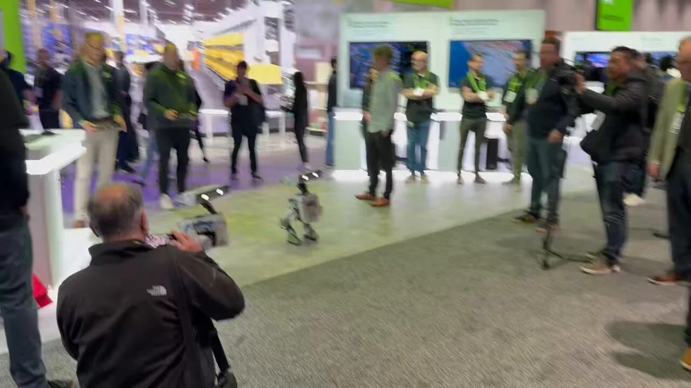

# 2025 年第 12 周技术阅读汇总

[English](README.md) | 简体中文

by @corenel (Yusu Pan) and LLMs

以下为 2025 年 第 12 周（3 月 17 日至 3 月 23 日）期间我所阅读或者输入的内容。为简洁起见，仅列出标题、URL 以及 LLM 生成的概要，以供有兴趣者阅读，进一步的分析、反思与精读不在此赘述。

## 目录

- [2025 年第 12 周技术阅读汇总](#2025-年第-12-周技术阅读汇总)
  - [目录](#目录)
  - [专题](#专题)
    - [GTC2025](#gtc2025)
  - [续闻](#续闻)
    - [NVIDIA DGX Spark](#nvidia-dgx-spark)
    - [Vibe coding](#vibe-coding)
  - [有趣的事与物](#有趣的事与物)
    - [图书](#图书)
    - [技术与互联网](#技术与互联网)
      - [Cloudflare：密码重用现象导致安全风险](#cloudflare密码重用现象导致安全风险)
    - [软件与开发](#软件与开发)
      - [Git 仓库迁移](#git-仓库迁移)
      - [Docs：又一个开源文档协同编辑器](#docs又一个开源文档协同编辑器)
      - [CVE-2025-29927：Next.js 极高危的鉴权漏洞](#cve-2025-29927nextjs-极高危的鉴权漏洞)
      - [Rerun：致力于构建缺失的物理人工智能数据栈](#rerun致力于构建缺失的物理人工智能数据栈)
      - [AutoCorrect：中英文混写文档的自动格式检查与纠正](#autocorrect中英文混写文档的自动格式检查与纠正)
      - [使用 GitHub Actions 和 GitHub Pages 搭建和部署自定义网站](#使用-github-actions-和-github-pages-搭建和部署自定义网站)
      - [Hugging Face 将部分模型和数据集仓库从原有的 LFS 迁移到 Xet 存储](#hugging-face-将部分模型和数据集仓库从原有的-lfs-迁移到-xet-存储)
      - [Server-Sent Events 介绍](#server-sent-events-介绍)
      - [过度依赖 AI 编程工具会使开发者变得“愚蠢”](#过度依赖-ai-编程工具会使开发者变得愚蠢)
      - [可弹出的应用](#可弹出的应用)
      - [FOSS 运动达成目标了吗？](#foss-运动达成目标了吗)
    - [硬件与设备](#硬件与设备)
      - [用树莓派（等）为 USB Midi 键盘增添连接方式](#用树莓派等为-usb-midi-键盘增添连接方式)
      - [IPKVM 设备](#ipkvm-设备)
    - [知识管理](#知识管理)
      - [利用 Hoarder 进行网络内容归档](#利用-hoarder-进行网络内容归档)
      - [年龄增长与认知技能：用进废退](#年龄增长与认知技能用进废退)
      - [写作本身就是一种深度思考](#写作本身就是一种深度思考)
      - [“追加 - 回顾”笔记法](#追加---回顾笔记法)
    - [项目与团队管理](#项目与团队管理)
      - [Career advice in 2025](#career-advice-in-2025)
    - [播客与视频](#播客与视频)
    - [生成式人工智能](#生成式人工智能)
      - [Mistral Small 3.1 24B (2503)](#mistral-small-31-24b-2503)
      - [Qwen3 即将发布](#qwen3-即将发布)
      - [MCP.so：MCP 服务器集合](#mcpsomcp-服务器集合)
      - [对 LLMs 未来发展的思考](#对-llms-未来发展的思考)
      - [Refly 的应用案例](#refly-的应用案例)
      - [HuggingSnap：在 iOS 上运行 VLM](#huggingsnap在-ios-上运行-vlm)
      - [AI 还无法替代人类绘制系统图](#ai-还无法替代人类绘制系统图)
    - [Just For Fun](#just-for-fun)
      - [GTC2025 上的小机器人](#gtc2025-上的小机器人)
      - [rust-stakeholder：生成看起来很忙很专业的终端输出](#rust-stakeholder生成看起来很忙很专业的终端输出)
  - [学术研究](#学术研究)
    - [目标检测](#目标检测)
      - [PETR \& PETRv2](#petr--petrv2)
      - [YOLO 系列发展历史回顾](#yolo-系列发展历史回顾)
      - [RAM：RAW 图像的并行预处理以提升检测性能](#ramraw-图像的并行预处理以提升检测性能)
      - [LED：利用 MLLM 解码器浅层隐藏状态增强开放词汇目标检测](#led利用-mllm-解码器浅层隐藏状态增强开放词汇目标检测)
      - [YOLO-LLTS：提升低光环境下的交通标志检测性能](#yolo-llts提升低光环境下的交通标志检测性能)
      - [ACCO：锚点中心融合的协同感知](#acco锚点中心融合的协同感知)
      - [火灾与烟雾数据集综述](#火灾与烟雾数据集综述)
      - [3F-OVD：细粒度开放词汇目标检测](#3f-ovd细粒度开放词汇目标检测)
      - [SpatialLM：利用 LLM 根据 3D 点云进行空间场景理解](#spatiallm利用-llm-根据-3d-点云进行空间场景理解)
      - [RF-DETR：Roboflow 新出的实时目标检测模型](#rf-detrroboflow-新出的实时目标检测模型)
    - [目标跟踪](#目标跟踪)
      - [QuadFusion：通用多模态（RGB、热红外、事件和语言）视觉追踪](#quadfusion通用多模态rgb热红外事件和语言视觉追踪)
    - [语义分割](#语义分割)
      - [基于点云的语义分割方法综述](#基于点云的语义分割方法综述)
      - [ALPINE：基于语义结果与无训练聚类的点云实例分割](#alpine基于语义结果与无训练聚类的点云实例分割)
      - [Fast FMVNet V3：充分利用 Range Image 的深度信息进行点云分割](#fast-fmvnet-v3充分利用-range-image-的深度信息进行点云分割)
      - [NTN：提升恶劣天气下 LiDAR 语义分割模型对物体的鲁棒性](#ntn提升恶劣天气下-lidar-语义分割模型对物体的鲁棒性)
    - [自动驾驶](#自动驾驶)
      - [RoboBEV：评估 BEV 感知模型在各种自然环境和传感器退化条件下的鲁棒性](#robobev评估-bev-感知模型在各种自然环境和传感器退化条件下的鲁棒性)
      - [Gaussian-AD：以 3D 高斯模型为中心的场景表示与端到端自动驾驶](#gaussian-ad以-3d-高斯模型为中心的场景表示与端到端自动驾驶)
      - [ChatBEV：用于理解 BEV 的 VLM](#chatbev用于理解-bev-的-vlm)
      - [BridgeAD：差异化整合历史信息以提升端到端自动驾驶系统的性能](#bridgead差异化整合历史信息以提升端到端自动驾驶系统的性能)
      - [Learning to Drive：来自驾校的大规模多模态驾驶数据集](#learning-to-drive来自驾校的大规模多模态驾驶数据集)
      - [DriveGEN：使用数据增强提升 3D 检测在 OOD 驾驶场景中的泛化能力](#drivegen使用数据增强提升-3d-检测在-ood-驾驶场景中的泛化能力)
    - [场景重建](#场景重建)
      - [VGGT：使用前馈模型完成三维场景重建](#vggt使用前馈模型完成三维场景重建)
      - [Omni-Scene：融合像素高斯和体素高斯的以自我为中心的稀疏视角场景重建](#omni-scene融合像素高斯和体素高斯的以自我为中心的稀疏视角场景重建)
      - [GaussRender：通过 2D 投影监督提升 3D 占用预测的空间一致性](#gaussrender通过-2d-投影监督提升-3d-占用预测的空间一致性)
      - [Gaussian On-the-Fly：在线近实时 3DGS 优化](#gaussian-on-the-fly在线近实时-3dgs-优化)
      - [Amodal3R：从部分遮挡 2D 图像中重建 3D 物体](#amodal3r从部分遮挡-2d-图像中重建-3d-物体)
      - [基于学习的 3D 重建方法综述](#基于学习的-3d-重建方法综述)
    - [仿真渲染](#仿真渲染)
      - [LiDAR-GS：使用高斯溅射的实时 LiDAR 重仿真](#lidar-gs使用高斯溅射的实时-lidar-重仿真)
      - [Selee：移动设备实时 3DGS 渲染](#selee移动设备实时-3dgs-渲染)
      - [Uni-Gaussian：使用高斯分布统一处理相机与激光雷达的仿真](#uni-gaussian使用高斯分布统一处理相机与激光雷达的仿真)
    - [SLAM](#slam)
      - [BEVDiffLoc：在 BEV 视角下进行端到端激光雷达全局定位](#bevdiffloc在-bev-视角下进行端到端激光雷达全局定位)
    - [语言模型](#语言模型)
      - [CoD：使用“草稿链”提示以鼓励 LLMs 生成简洁且密集的输出](#cod使用草稿链提示以鼓励-llms-生成简洁且密集的输出)
      - [SmolDocling：仅 256M 参数的多模态文档转换模型](#smoldocling仅-256m-参数的多模态文档转换模型)
      - [VLMs 进展综述：对齐、基准、评估与挑战](#vlms-进展综述对齐基准评估与挑战)
      - [MLLM 在处理视觉问答任务时存在两阶段信息融合](#mllm-在处理视觉问答任务时存在两阶段信息融合)
      - [START：LLM 自学习工具使用](#startllm-自学习工具使用)
      - [Reasning LLMs 训练策略综述](#reasning-llms-训练策略综述)
      - [SmolDocling：仅有 256M 参数的文档理解与转换模型](#smoldocling仅有-256m-参数的文档理解与转换模型)
      - [50% 任务完成时间视界：对 LLM 复杂任务评估的新指标](#50-任务完成时间视界对-llm-复杂任务评估的新指标)
      - [TULIP：提升图像 - 文本预训练模型对图像细粒度视觉特征理解能力](#tulip提升图像---文本预训练模型对图像细粒度视觉特征理解能力)
    - [内容生成](#内容生成)
      - [重建低分辨率足球赛事广播图像](#重建低分辨率足球赛事广播图像)
      - [DDCM：通过用预定义的噪声码本代替噪声采样](#ddcm通过用预定义的噪声码本代替噪声采样)
      - [ReCamMaster：生成式视频重渲染](#recammaster生成式视频重渲染)
      - [Stable Virtual Camera：stability.ai 推出的新视角生成模型](#stable-virtual-camerastabilityai-推出的新视角生成模型)
      - [SynCity：利用预训练 2D 和 3D 生成模型生成 3D 场景](#syncity利用预训练-2d-和-3d-生成模型生成-3d-场景)
    - [其他](#其他)
      - [An Image is Worth More Than 16×16 Patches：局部归纳偏置并非是视觉模型的必要条件](#an-image-is-worth-more-than-1616-patches局部归纳偏置并非是视觉模型的必要条件)
      - [强化学习综述](#强化学习综述)
      - [DyT：使用可学习的 tanh 函数代替 Transformer 中的 Normalization 层](#dyt使用可学习的-tanh-函数代替-transformer-中的-normalization-层)
      - [RENO：基于学习的实时点云几何压缩](#reno基于学习的实时点云几何压缩)

## 专题

### GTC2025

[黄仁勋 2 个半小时演讲，英伟达已经进入「Agentic AI」时代 | 极客公园](https://www.geekpark.net/news/347090)

[[VLA - 迈向自动驾驶物理智能体的关键一步]]

理想汽车推出了名为 MindVLA 的全新视觉 - 语言 - 行动 (VLA) 模型，这标志着自动驾驶技术向物理世界人工智能迈出了关键一步。MindVLA 模型克服了以往自动驾驶系统（包括理想汽车之前推出的 E2E + VLM 双系统）的局限性，将空间智能、语言智能和行为智能统一到一个单一大模型中，使其更像一个能够感知、思考和行动的物理世界智能体。这种模型不仅能够更好地应对中国复杂多变的驾驶环境，还能通过自然语言与用户进行更自然的交互，从而实现更高级别、更人性化的自动驾驶体验。

## 续闻

### NVIDIA DGX Spark

即之前的 NVIDIA Project DIGITS，分析见 [[NVIDIA Project DIGITS 购入与用途思考]] 与 [[202503082116_思考 Mac Studio (M3 Ultra)]]。

其内存带宽只有 273GB/s，完全比不过 Mac Studio (M2 Ultra/M4 Max/M3 Ultra)，除了 CUDA 生态、原生 FP4/FP8 支持以及 ConnectX-7 互联外，竞争力有限。

### Vibe coding

[[Not all AI-assisted programming is vibe coding (but vibe coding rocks)]]

文章立足于软件工程的专业视角，敏锐地捕捉到 AI 辅助编程领域中“Vibe coding”与传统软件开发模式的差异，并正本清源地指出，将所有 AI 辅助编程等同于“Vibe coding”是一种概念的泛化和误读。

文章划清了“Vibe coding”与负责任的 AI 辅助编程的界限。作者引述“Vibe coding”概念提出者 Andrej Karpathy 的原始定义，强调其“忘记代码存在”、“不进行代码审查”的随性特质，并将其与注重代码质量、可维护性和安全性的负责任的 AI 辅助编程模式进行鲜明对比。这种区分有助于读者更准确地理解“Vibe coding”的内涵，避免对其产生不切实际的期待或负面认知。

文章不仅定义了“Vibe coding”的概念，更进一步探讨了其适用场景、潜在风险以及改进方向。作者肯定了“Vibe coding”在降低编程门槛、激发创新灵感方面的积极作用，同时也客观指出了其在安全性和可靠性方面的局限性，并呼吁在工具层面进行创新，例如引入沙箱环境来提升“Vibe coding”的安全性。

## 有趣的事与物

### 图书

### 技术与互联网

#### Cloudflare：密码重用现象导致安全风险

[[Password reuse is rampant nearly half of observed user logins are compromised]]

Cloudflare 的这篇博文基于其网络流量数据，揭示了密码重用现象的惊人程度及其引发的严重安全风险。文章以详实的数据 (例如，41% 的成功登录尝试涉及泄露密码) 证实了密码重用的普遍性，并深入分析了机器人驱动的撞库攻击对网站，特别是 WordPress 等 CMS 平台的威胁。文章不仅量化了风险，更指出了提升用户和网站安全性的关键措施。对于关注网络安全趋势、网站安全防护以及用户账户安全的读者，本文提供了极具价值的参考和警示。尽管数据主要来自 Cloudflare 免费用户，但其揭示的密码重用问题和安全挑战具有普遍意义，值得业界和用户高度重视。

### 软件与开发

#### Git 仓库迁移

[gickup](https://github.com/cooperspencer/gickup)

Gickup 是一款实用的开源工具，专注于简化 Git 仓库的备份流程。该工具支持在多种平台间镜像仓库，包括 GitHub、GitLab、Gitea 等主流代码托管平台，以及本地和 S3 存储。其主要优势在于易用性，通过提供二进制版本、Docker 镜像及示例配置文件，降低了用户上手门槛。项目积极维护，提供社区讨论和发行包，方便用户获取支持和部署。尽管目前已知 GitLab EE 镜像可能存在问题，但 Gickup 依然为寻求 Git 仓库冗余和数据安全的开发者及团队提供了一个值得考虑的、跨平台且便捷的解决方案。其广泛的平台兼容性和简易配置流程是其亮点。

[gitmirror](https://github.com/jonasrosland/gitmirror)

`gitmirror` 是一个实用的开源工具，旨在弥补 Gitea 在 GitHub 仓库镜像功能上的不足。它不仅能同步代码库，还能完整镜像 Issue、PR、发布和 Wiki 等关键元数据，并通过 Web UI 提供便捷的管理和监控界面。该工具基于 Docker 部署，配置简易，并具备完善的日志和错误处理机制。尽管作者坦诚其为临时方案，并指出了潜在的局限性，但对于当前有 GitHub 到 Gitea 完整镜像需求的用户而言，`gitmirror` 仍不失为一个值得尝试的有效解决方案。其清晰的文档和模块化的代码结构也为用户理解和二次开发提供了便利。

该仓库主要是填补了 Gitea 官方镜像功能延期发布的空白，见 [此 Issue](https://github.com/go-gitea/gitea/pull/20311) 。

#### Docs：又一个开源文档协同编辑器

[docs](https://github.com/suitenumerique/docs)

Docs 是一款开源的协同文档编辑器，致力于解决知识构建与共享的痛点。该项目强调简洁易用的编辑体验，支持离线工作与实时协作，并提供自托管方案，满足用户对数据安全和自主可控的需求。其亮点包括：无复杂格式干扰的协作编辑、AI 辅助功能（如生成、总结、翻译等）、以及未来可期的内置 Wiki 功能（预计 2025 年 2 月）。技术栈选用 Django Rest Framework, Next.js 等成熟框架，并由法国和德国政府机构联合发起，体现了其可靠性与开放性。尽管 Wiki 功能尚在开发中，AI 功能的具体应用效果仍待观察，Docs 仍不失为一个值得关注的、特别是对于注重开源、协作和数据自主的企业及团队而言，具有潜力的知识管理工具。

#### CVE-2025-29927：Next.js 极高危的鉴权漏洞

[Authorization Bypass in Next.js Middleware · CVE-2025-29927 · GitHub Advisory Database](https://github.com/advisories/GHSA-f82v-jwr5-mffw)

[Next.js Middleware Exploit: Deep Dive into CVE-2025-29927 Authorization Bypass - ZeroPath Blog](https://zeropath.com/blog/nextjs-middleware-cve-2025-29927-auth-bypass)

> 建议尽快升级已有项目。

Next.js 中间件存在一个严重的安全漏洞 CVE-2025-29927，这个漏洞允许攻击者通过操纵 x-middleware-subrequest 标头绕过中间件的授权检查，从而可能导致未经授权的访问。

#### Rerun：致力于构建缺失的物理人工智能数据栈

[The Missing Data Infrastructure for Physical AI](https://rerun.io/blog/physical-ai-data)

> rerun.io 确实是近几年兴起的比较好的多模态数据可视化框架之一（相比于 Foxglove），社区生态也很活跃，个人非常看好。可以持续关注其后续发布的云平台（对表 Foxglove Cloud），如果能自建就更好了。

文章前瞻性地洞察到数据基础设施对于 Physical AI 爆发式增长的战略意义，并系统性地阐述了构建新型数据栈的必要性和紧迫性。文章清晰地指出，机器学习范式转变将 Physical AI 的复杂性转移至离线数据处理，传统工具链已无法满足海量、多模态、时空关联的 Physical AI 数据的管理和分析需求。作者提出的统一数据模型是解决在线与离线数据割裂、提升研发效率的关键创新观点。Rerun 团队正在构建的开源可视化工具、数据库及云平台，正是对这一理念的具象化实践。

#### AutoCorrect：中英文混写文档的自动格式检查与纠正

[AutoCorrect](https://github.com/huacnlee/autocorrect)

> 建议与 markdownlint 以及 pangu 等工具一同使用。

AutoCorrect 是一个基于 Rust 编写的工具，用于「自动纠正」或「检查并建议」文案，给 CJK（中文、日语、韩语）与英文混写的场景，补充正确的空格，纠正单词，同时尝试以安全的方式自动纠正标点符号等等。

#### 使用 GitHub Actions 和 GitHub Pages 搭建和部署自定义网站

[Building and deploying a custom site using GitHub Actions and GitHub Pages](https://simonwillison.net/2025/Mar/18/actions-pages/#atom-everything)

文章展示了如何使用 GitHub Actions 和 GitHub Pages 搭建和部署自定义网站，并提供了一个极简的示例和模板，以便用户可以快速上手。作者通过分享自己搭建“加州棕色鹈鹕近期观测”Atom 订阅源的实践经历，进一步说明了这种方法的实用性和便捷性。

#### Hugging Face 将部分模型和数据集仓库从原有的 LFS 迁移到 Xet 存储

[[Xet is on the Hub]]

文章以实践案例形式，专业且详实地介绍了 Xet 存储系统在 Hugging Face Hub 平台的成功迁移与应用。文章客观地阐述了 Xet 存储相较于 LFS 的技术优势，即字节级别去重技术 CDC 在提升大数据处理效率方面的潜力。通过迁移实践的数据佐证，文章证实了 Xet 系统在实际生产环境中的可行性和性能提升效果。

不过文章在深入探讨 SSE 在高并发场景下的性能瓶颈和更复杂的错误处理策略方面略有不足，对 SSE 在非 HTTP 环境下的应用也未涉及。

#### Server-Sent Events 介绍

[[Server-Sent Events (SSE) Are Underrated]]

> 注意 MCP 协议最初也是 SSE，近期才支持 stdio

文章重新审视并肯定了 SSE 在现代 Web 开发中的实用价值，尤其是在服务器单向数据推送场景下相比于 WebSocket 的优势。文章客观地分析了 SSE 相对于 WebSocket 的特点，清晰地阐述了 SSE 的关键事实：基于 HTTP 协议、单向通信、实现简单、资源高效且与现有基础设施良好兼容。核心主张明确，即 SSE 并非过时技术，而是在许多应用场景下被不合理地忽视了，开发者应该重新认识其价值。文章创新性地将 SSE 与现代 LLM 应用 (如 ChatGPT) 结合，以 OpenAI 的流式 API 为例，有力地证明了 SSE 在前沿技术中依然具有生命力。

#### 过度依赖 AI 编程工具会使开发者变得“愚蠢”

[[AI is Making Developers Dumb]]

文章基于作者自身经历和现象观察，指出长期使用 AI 代码助手可能导致开发者遗忘基础知识、丧失自主解决问题能力，并创造性地提出了“Copilot Lag”这一概念，生动描绘了工具依赖下的被动开发状态。这种观点具有一定的现实意义和启发性，促使开发者重新审视自身与 AI 工具的关系。

然而，文章的论证主要依赖个人经验和案例，缺乏量化数据和更广泛的实证研究支撑，略显主观。其隐含假设，如“深入理解比效率更重要”、“手工编码是最佳学习方式”等，也带有一定的价值预设，可能不适用于所有情境和所有开发者。

#### 可弹出的应用

[[Ejectable Apps]]

文章立足于用户长期利益和数据自主权，敏锐地洞察到当前云应用模式下用户可能面临的数据和功能“锁定”风险。提出的“可弹出”方案（云应用应具备可弹出特性以保障用户数据长期可访问性），巧妙地融合了云应用的便捷性和传统桌面软件的持久性，为解决云应用的可持续发展问题提供了一种创新思路。

文章论证主要基于概念和逻辑层面，缺乏实证数据的支撑。对于云应用“恶化”风险的评估，以及用户对“可弹出”特性的接受度，文章更多是基于假设和推断，而缺乏量化的数据分析和用户调研。此外，文章对“可弹出应用”的技术实现难度、商业模式创新和生态系统构建等方面的探讨相对较少，这些都是“可弹出应用”从理念走向实践的关键挑战。

#### FOSS 运动达成目标了吗？

[[Who is Free Software for?]]

文章立足于自由及开源软件（FOSS）运动的长期观察，核心价值在于引发对 FOSS 运动目标受众和未来发展方向的深刻反思。文章敏锐地指出，尽管 FOSS 在技术层面成就斐然，却未能有效转化为广泛的社会影响，其根本原因在于 FOSS 实践仍带有浓厚的“黑客中心”色彩，未能充分回应更广大“非黑客”群体的需求。文章客观评析了 FOSS 运动的市场困境和理念局限，核心主张是 FOSS 需要突破“技术自由”的狭隘框架，转向更具政治性和社会责任感的目标。作者创新性地借用“公地理论”和“黑客伦理”等概念，解析了 FOSS 运动的深层矛盾。

文章的理论基础主要依赖于作者的观察和反思，缺乏更系统性的实证研究支撑。论证逻辑虽具启发性，但部分推论略显主观，例如对“黑客”与“非黑客”的二元划分可能过于简化。隐含假设方面，文章预设了“市场份额即成功”和“大众需求同质化”等前提，这些假设值得进一步商榷。

### 硬件与设备

#### 用树莓派（等）为 USB Midi 键盘增添连接方式

[MidiPi](https://github.com/megabitsenmzq/Tutorials/tree/master/MidiPi)

文档细致地阐述了如何利用树莓派（及橘子派等）为 USB MIDI 键盘扩展连接方式，使其具备蓝牙 BLE MIDI 和 Wi-Fi MIDI 功能，并可作为独立的音源使用。作者基于实践经验，详尽地记录了从系统配置、FluidSynth 音源安装、到 BlueZ 和 Raveloxmidi 编译配置的全过程，并提供了 Systemd 服务和 udev 规则的设置方法，确保方案的稳定性和自动化。

#### IPKVM 设备

除了传统的 PiKVM、OneKVM 及其变种外，自去年以来市场上有一些低成本的新玩意儿。

[JetKVM](https://jetkvm.com/) 是一款基于 Kickstarter 平台的开源 KVM over IP 解决方案。文章详尽介绍了其低至 30-60 毫秒延迟的 1080p 视频传输、全面的开源计划以及通过 RJ11 扩展端口实现的高度可定制性。JetKVM 旨在为用户提供流畅、安全、灵活的远程设备管理体验，尤其适合开发者、系统管理员和 DIY 爱好者。文章客观呈现了产品特性、技术细节和开发团队背景，并明确了开源时间表和众筹目标。潜在读者应关注其 Kickstarter 众筹风险和开源承诺的后续落实情况，以及扩展模块的实际成熟度。总体而言，JetKVM 展现出成为一款有竞争力的远程管理工具的潜力，值得对相关技术感兴趣的读者深入了解。

[NanoKVM](https://wiki.sipeed.com/hardware/en/kvm/NanoKVM/introduction.html) 是一款基于 LicheeRV Nano 的小型化、功能全面的 IP-KVM 设备，旨在提供经济高效的远程服务器管理和控制方案。其体积远小于 PiKVM V4 (Lite 版本 1/30, Full 版本 1/7)。支持 1080P@60fps 视频、USB 键盘/鼠标/存储模拟、IPMI、Wake-on-LAN、Tailscale、WebSSH 等。视频延迟 90-230ms，与 PiKVM V4 相当。H.264 编码仍在开发中，当前主要使用 MJPEG，可能影响视频质量和带宽占用，且 100Mbps 以太网可能成为潜在瓶颈。

[NanoKVM-USB](https://wiki.sipeed.com/hardware/en/kvm/NanoKVM_USB/introduction.html) 是一款便捷的硬件 KVM 解决方案，能够通过 USB 3.0 传输 HDMI 视频信号，并实现键盘鼠标的远程控制，从而简化多设备操作和维护流程。文章强调其无需额外软件、基于浏览器即可使用的特性，并突出了 HDMI 环回、USB 设备切换及数据传输等实用功能。参数对比表格直观地展现了 NanoKVM-USB 在接口、性能和易用性方面的优势，尤其是在无需安装软件和体积小巧方面。

> NanoKVM-USB 相当于 HDMI 采集卡 + USB 键鼠模拟。

[GL-RM1 Comet](https://www.gl-inet.com/products/gl-rm1/) 是一款硬件级远程管理设备，专为需要全面掌控离线设备的商务人士、IT 维护人员及远程工作者设计。该设备以其便携性、高性能和开放性为特点，提供 2K@60FPS 高清视频输出和低延迟的操作体验。Comet 突破了传统软件方案的限制，支持 BIOS 访问和硬件级控制，有效解决设备启动失败等棘手问题。其千兆以太网、USB 扩展及多平台应用支持进一步增强了实用性。然而，建议用户在关注其强大功能的同时，进一步了解其安全机制和软件生态系统的详细信息，以便更全面地评估其是否满足自身需求。总体而言，Comet 为寻求可靠、高效远程设备管理方案的用户提供了一个值得考虑的新选择。

JetKVM 现在只有 Kickstarter 众筹发货，NanoKVM 与 NanoKVM-USB 则是一批批地供货。PiKVM 或者 BIKVM 则是需要比较贵的树莓派核心板。

对于机房而言，若服务器内有 IPMI 功能，则 PiKVM/JetKVM/NanoKVM 配合 KVM 切换器是一个很好的远程管理选择。我个人在使用 PiKVM。

对于调试开发板与硬件设备而言，GPD Pocket 3 这样自带 HDMI/USB In 的小笔记本，或者 NanoKVM-USB 这样的外设则能够提供很大的便利，不用再去找外接屏幕和键盘了。

### 知识管理

#### 利用 Hoarder 进行网络内容归档

[Building a Personal Archive With Hoarder](https://brainsteam.co.uk/2025/2/15/personal-archive-hoarder/)

> 我用的就是 Hoarder，并使用 Webhook 配合其他工具进行后续的总结与整理。

文章深入评测了开源个人网络内容归档工具 Hoarder。文章清晰地阐述了 Hoarder 的核心功能，即通过自托管服务器，用户可以完整抓取并存储网页内容，实现离线访问和长期保存，有效应对网络信息易丢失和审查风险。作者详细介绍了 Hoarder 的安装配置过程，包括 Docker 部署、SingleFile 插件集成，以及利用 LiteLLM 和本地模型实现 AI 标签和摘要功能，突出了其在保护用户数据隐私和降低 AI 使用成本方面的优势。此外，文章还分享了从 Linkding 迁移至 Hoarder 的实践经验，并对 Hoarder 的用户体验、移动应用及未来发展方向提出了客观评价和改进建议，例如增强移动端功能和扩展内容导出格式。

#### 年龄增长与认知技能：用进废退

[[2410.00790 Age and Cognitive Skills Use It or Lose It]]

文章审视了关于认知技能随年龄衰退的传统观点。作者利用德国成人能力国际评估计划 (PIAAC-L) 独特的纵向数据，结合测量误差校正方法，揭示了与横截面研究结论迥异的年龄 - 技能变化图景： 认知技能并非线性衰退，反而在中年期前持续增长，之后才缓慢下降。

文章强调了技能使用在延缓认知衰退中的关键作用。数据表明，高技能使用者能够有效抵御年龄带来的技能滑坡，甚至保持技能增长。研究还深入剖析了职业、教育程度和性别等社会经济因素与技能使用模式的关联，暗示了技能使用不平等可能是认知老化差异的重要根源。

#### 写作本身就是一种深度思考

[[Writes and Write-Nots]]

文章敏锐地捕捉到人工智能技术发展对人类核心技能——写作——可能产生的深远影响。文章核心价值在于及时敲响警钟，提醒读者在 AI 写作工具日益普及的时代，警惕写作能力可能被技术进步所消解的风险，以及由此可能引发的更深层次的认知能力和社会分化问题。

文章的关键事实和核心主张围绕着“写作即思考”的理念展开，认为写作并非单纯的技能，而是深度思考的必要训练。作者观察到 AI 技术的应用正在成为人们逃避写作压力的便捷出口，预见这将导致社会分化为精通写作的“writes”和依赖 AI 写作的“write-nots”两个群体，并警示这种分化可能最终演变为认知能力上的鸿沟。文章的创新观点在于将写作技能的衰退与社会认知能力下降直接关联，并以“thinks”和“think-nots”的概念，形象地描绘了潜在的未来图景。

#### “追加 - 回顾”笔记法

[[The append-and-review note]]

Andrej Karpathy 的这篇文章以简洁明快的语言，清晰地阐述了“追加 - 回顾”笔记法的核心理念和实践方法。文章的核心主张——化繁为简，动态管理——具有很强的现实意义。在信息爆炸的时代，过度追求笔记的结构化和完美化，反而可能增加认知负担，降低效率。 “追加 - 回顾”法以极低的认知成本，实现了信息的快速捕捉和周期性回顾，有效地解决了信息过载和知识遗忘的难题。

其论证主要基于作者的个人经验，缺乏量化数据和更深层次的理论支撑。此外，文章对该方法的潜在问题，例如信息过载风险、长期回顾效率、以及在团队协作场景下的适用性等，探讨不足。

### 项目与团队管理

#### Career advice in 2025

[[Career advice in 2025.]]

文章以一起安全事件为引，巧妙地切入技术变革对软件专业人员角色带来的影响，并由此展开对 2025 年就业市场的全景式扫描。tj-actions 仓库被入侵，这个事件突显了即使在 LLM 技术快速发展的今天，软件专业人员的核心技能依然不可替代。

文章认为，2025 年的就业市场，尤其是对于科技行业的资深人士来说，充满了挑战和不确定性。由于技术向基础模型/LLM 转型、市场估值下降以及对增长的更高要求等多重因素叠加，许多在 2010-2020 年间晋升到高级职位的人，以及那些原本应该晋升的人，都感到职业发展受阻，工作乐趣降低。文章的核心结论并非提供具体的职业建议，而是希望传递一个信息：如果你正感到职业生涯不如意，这并非个人问题，而是普遍的市场现象。作者建议大家在这种充满挑战的环境中，要努力在现有岗位上寻找价值，并积极适应行业变革，而不是选择观望等待，因为科技行业很可能在未来五年内发生深刻变化。

文章的论证主要依赖于作者的行业经验和观察，缺乏量化数据支撑，这在一定程度上削弱了其学术严谨性。此外，文章的隐含假设较多，例如技术转型方向的确定性、市场低迷的持续性等，这些假设的成立与否将直接影响文章结论的有效性。

### 播客与视频

播客：

- 张小珺 Jùn｜商业访谈录：[[96. 和郎咸朋聊，自动驾驶10年演进史、关键技术细节和特斯拉]]
- 硬地骇客：[[EP96 AI Agent：炒作还是革命？从实践+技术角度扒一扒]]
- 后互联网时代的乱弹：[[第155期 后互联网时代的黑产]]
- 42 章经：[[世界怎么就「东升西落」了？聊聊二级市场与 DeepSeek+Manus 的热潮｜对谈莫傑麟]]
- 开始连接 LinkStart：[[Vol.42｜和极客公园创始人张鹏聊聊，投资宇树的幕后故事、早年的宇树和王兴兴、以及对新一代创业者的启发]]
- 忽左忽右：[[394 球国春秋｜美加对抗与冷战以来的冰球外交]]
- 忽左忽右：[[393 在巴黎教会档案里发现一座中国东北村庄]]
- 枫言枫语：[[Vol. 136 启师傅: LEMO FM, 了然清单与良渚村民生活]]
- 晚点聊 LateTalk：[[108: 与马毅聊智能史:“DNA是最早的大模型”，智能的本质是减熵]]
- 半拿铁 | 商业沉浮录：[[No.142 炸鸡汉堡风云录：中国西式快餐江湖三十来年]]

### 生成式人工智能

#### Mistral Small 3.1 24B (2503)

[Mistral Small 3.1 | Mistral AI](https://mistral.ai/news/mistral-small-3-1)

[mistralai/Mistral-Small-3.1-24B-Instruct-2503 · Hugging Face](https://huggingface.co/mistralai/Mistral-Small-3.1-24B-Instruct-2503)

#### Qwen3 即将发布

[Adding Qwen3 and Qwen3MoE by bozheng-hit · Pull Request #36878 · huggingface/transformers](https://github.com/huggingface/transformers/pull/36878)

Qwen 已经给 transformers 提 PR 了，先期可能有两个小尺寸的模型：

- Qwen3-15B-A2B（MoE，激活参数 2B）
- Qwen3-8B-beta

#### MCP.so：MCP 服务器集合

[Find Awesome MCP Servers and Clients](https://mcp.so/)

#### 对 LLMs 未来发展的思考

[[My Thoughts on the Future of "AI"]]

文章冷静客观地剖析了大型语言模型（LLM）未来发展的不确定性，并有力驳斥了技术决定论和线性增长的简单预测模型。文章认为，LLM 的未来走向存在“指数增长”与“平台期”两种可能性，现有证据均无法断言哪种前景必然实现。作者并未故作惊人之语，而是基于历史类比（NASA 登月计划、互联网泡沫）、行业现状（GPT-4.5 性能、训练成本）、技术逻辑（自迭代、能力边界）等多维度证据，严谨论证了其“宽泛误差范围”论。

#### Refly 的应用案例

九原客 @9hills [2025-03-19](https://x.com/9hills/status/1902256804714922083)

> 任务：编写某客户的软件功能描述、软件架构、软件架构图，三十分钟搞定。
>
> 我的工作流：
>
> 1. 编写备忘录（可以理解为人工的输入）
> 2. 根据输入，让不同的模型处理 Prompt，调整 Prompt，挑选最好的输出结果，人工改写后编写备忘录保存最终稿。
> 3. 根据需求和设计思路，让 Sonnet 3.7 扩写架构设计，并使用 Prompt（输出为 draw.io XML 格式的架构图）来输出。
> 4. 使用 draw.io 本地 app 进行修改，修改后将 xml 写入到备忘录保存，并将最后生成的 png 图片也上传。

已经官方整理的 [Refly 使用案例展示](https://refly.ai/use-cases-gallery)

#### HuggingSnap：在 iOS 上运行 VLM

> Based on SmolVLM2 and MLX.

[huggingface/HuggingSnap: SmolVLM2 Demo](https://github.com/huggingface/huggingsnap)

#### AI 还无法替代人类绘制系统图

[[Diagrams AI Can, and Cannot, Generate]]

> 注意文章发表日期，当今的模型（特别是 Claude 3.7 Sonnet Thinking）在图例生成上有所进步，但是仍需要后期调整。

文章立足于系统架构图这一特定应用场景，对当前生成式人工智能的能力进行了冷静而务实的评估，具有较高的专业价值。文章核心价值在于其精准地界定了人工智能在系统图生成领域的边界，避免了对 AI 技术的盲目乐观，并引导读者回归对系统图本质和人工绘制价值的理性思考。

文章以实验为基础，通过对比 ChatGPT 和 Claude 在通用图、白板图和系统图生成方面的表现，客观地揭示了当前 AI 技术在处理复杂系统图生成任务时的局限性。尤其针对从源代码生成系统图的失败案例分析，有力地论证了 AI 在代码理解、战略意图把握等方面的不足。

### Just For Fun

#### GTC2025 上的小机器人

swyx @swyx [2025-03-19](https://x.com/swyx/status/1902411421713084690)

> these things are TOO CUTE

视频见原推文。

#### rust-stakeholder：生成看起来很忙很专业的终端输出

[rust-stakeholder](https://github.com/giacomo-b/rust-stakeholder)

## 学术研究

### 目标检测

#### PETR & PETRv2

> 两篇稍老一些的文章，最近重新读了一遍。

[[2203.05625 PETR - Position Embedding Transformation for Multi-View 3D Object Detection]]

PETR 的核心贡献在于将 Implicit Neural Representation (INR) 的思想巧妙地融入到 3D 目标检测任务中，通过 3D 位置编码 (3D PE) 将 3D 坐标信息有效地注入到 2D 图像特征中，生成 3D 位置感知特征。这种方法避免了传统 2D-to-3D 投影的复杂性和误差累积问题，实现了真正的端到端 3D 目标检测。

PETR 的性能依赖于相机参数的准确性和 ROI 范围的合理性，对相机标定误差和场景变化的鲁棒性可能需要进一步提升。此外，PETR 的初始收敛速度相对较慢，Transformer 架构的计算复杂度也较高，在实际应用中可能需要进一步优化。

[[2206.01256 PETRv2 - A Unified Framework for 3D Perception from Multi-Camera Images]]

PETRv2 以 PETR 为基线，通过扩展 3D 位置嵌入，实现了时间维度上的信息融合，并在特征引导位置编码器的加持下，有效提升了三维物体检测的精度，尤其在速度估计方面表现突出。同时，文章提出的任务特定查询策略，使得 PETRv2 能够以统一的框架同时处理三维物体检测、BEV 分割和三维车道线检测等多项任务，展现了良好的多任务学习能力。

鲁棒性分析部分，文章考察了相机外参噪声、相机缺失和时间延迟等实际场景中常见的传感器误差，为评估模型的可靠性提供了有价值的参考。

#### YOLO 系列发展历史回顾

[[2411.00201 YOLO Evolution - A Comprehensive Benchmark and Architectural Review of YOLOv12, YOLO11, and Their Previous Versions]]

论文对 YOLO 系列目标检测算法进行了一次系统而全面的 benchmark 评估。文章立足于计算机视觉和目标检测领域的专业视角，深入剖析了从 YOLOv3 到 YOLOv12 的算法，并进行评测。文章的关键事实和核心主张明确指出，YOLO11 在精度与效率之间取得了最佳平衡，而 YOLOv12 的性能提升并不显著，反而牺牲了效率。

注意 benchmark 测试结果依赖于特定数据集和超参数设置，普适性可能受限；文章对 YOLOv12 性能不佳的解释主要集中于架构复杂性，可能忽略了其他潜在因素。

#### RAM：RAW 图像的并行预处理以提升检测性能

[[2503.13163 RAM - Beyond RGB Adaptive Parallel Processing for RAW Object Detection]]

论文提出了一种新颖的 RAW 图像预处理模块——Raw Adaptation Module (RAM)，用于提升物体检测性能。该研究立足于挖掘 RAW 数据相较于传统 RGB 图像的信息优势，并巧妙地借鉴人类视觉系统的并行处理机制，是领域内一次有价值的探索。文章的核心价值在于证实了针对 RAW 数据进行任务特定预处理的有效性。RAM 模块通过并行应用多种 ISP 功能并自适应融合特征，显著提升了在各种复杂条件下的物体检测精度，超越了以往依赖 RGB 图像或串行 ISP 流水线的方法。

注意文章中的 RAM 模块的 ISP 功能选择可能存在普适性问题，需要根据具体应用场景进行调整。此外，文章主要关注物体检测任务，RAM 在其他视觉任务上的潜力尚待进一步挖掘。

#### LED：利用 MLLM 解码器浅层隐藏状态增强开放词汇目标检测

[[2503.13794v1 LED - LLM Enhanced Open-Vocabulary Object Detection without Human Curated Data Generation]]

论文提出了一种利用多模态大语言模型（MLLM）解码器浅层隐藏状态增强开放词汇目标检测（OVD）性能的方法 LED。 LED 方法巧妙地利用 MLLM 早期层蕴含的视觉语义信息，并通过零初始化适配器实现高效知识迁移，避免了传统方法中数据生成过程的偏差和过拟合风险。

文章对 MLLM 视觉理解能力的内在机制和适配器设计的优化空间仍有待进一步挖掘。此外，文章主要关注性能提升，对计算效率和模型轻量化方面的考量略有不足。

#### YOLO-LLTS：提升低光环境下的交通标志检测性能

[[2503.13883 YOLO-LLTS - Real-Time Low-Light Traffic Sign Detection via Prior-Guided Enhancement and Multi-Branch Feature Interaction]]

论文针对低光照条件下交通标志检测的难题，提出了一种名为 YOLO-LLTS 的算法。文章分析了现有方法在低光环境下的不足，并创新性地提出了 PGFE、HRFM-TOD 和 MFIA 三个关键模块，提升了图像质量、小目标特征提取和信息交互能力。构建的 CNTSSS 夜间交通标志数据集（未开放），弥补了领域内数据空白。

文章对算法在极端恶劣天气和复杂光照条件下的鲁棒性分析略显不足，对 CNTSSS 数据集的类别平衡性问题可以进一步探讨。

#### ACCO：锚点中心融合的协同感知

[[2503.13946 ACCO - Is Discretization Fusion All You Need for Collaborative Perception?]]

论文提出了锚点中心协同对象检测（ACCO）范式，并论证了其相较于传统离散化融合的优越性。ACCO 通过锚点查询和迭代优化机制，实现了更灵活、高效的信息融合，有效降低了通信带宽需求，并显著提升了远距离和复杂场景下的感知性能。

论文假设完美的位姿估计、可靠的通信链路以及同质智能体设定，在真实复杂场景下可能面临挑战。此外，数据集的代表性也可能影响结论的普适性。

#### 火灾与烟雾数据集综述

[[2503.14552v1 Fire and Smoke Datasets in 20 Years An In-depth Review]]

论文全面梳理了 36 个关键数据集，并从数据集特性、实验性能等多维度进行了细致的对比分析。文章明确指出了当前数据集在多样性、质量和标准化方面存在的瓶颈。

文章假设深度学习模型是当前火灾与烟雾检测领域的主流方法，数据集的优劣直接决定了模型性能的天花板。同时，文章对数据集的评估主要基于特定模型和评估指标，可能未能完全覆盖数据集的全部价值和适用场景。

#### 3F-OVD：细粒度开放词汇目标检测

[[2503.14862 Fine-Grained Open-Vocabulary Object Detection with Fined-Grained Prompts Task, Dataset and Benchmark]]

该论文以细粒度开放词汇目标检测为主题，探讨了现有评估方法的局限性，并提出了 3F-OVD 任务及相应的 NEU-171K 数据集。3F-OVD 是一个将有监督的细粒度目标检测扩展到开放词汇设置的新任务，旨在更准确地评估开放词汇检测器在细粒度识别方面的能力。NEU-171K 是一个大规模的细粒度目标检测数据集，包含 145,825 张图像，676,471 个 bounding box 和 719 个细粒度类别，涵盖车辆 (NEU-171K-C) 和零售产品 (NEU-171K-RP) 两个领域。文章还提出了一个基于重叠区域比例和 bounding box 尺寸过滤的后处理技巧，并实验验证了该方法可以有效提升现有开放词汇检测器在 3F-OVD 任务上的性能。

文章对文本描述质量的评估不够深入，后处理技巧的参数选择较为经验化，对现有模型局限性的根源分析尚可进一步拓展。此外，NEU-171K 数据集虽然规模庞大，但仍需关注潜在的数据集偏差问题。

#### SpatialLM：利用 LLM 根据 3D 点云进行空间场景理解

[[SpatialLM - Large Language Model for Spatial Understanding]]

> 目前没有论文放出，仅有模型与代码
> 模型尺寸很小，基于 Llama 的 SpatialLM-Llama-1B 和基于 Qwen 的 SpatialLM-Qwen-0.5B，如果未来工作能提升泛化能力则很有前景。

SpatialLM 是一种用于空间理解的大型语言模型，它能够从单目 RGB 视频等多种 3D 数据源重建 3D 场景布局，并生成结构化的 3D 场景理解输出。SpatialLM 想要解决的核心问题是如何利用大语言模型 (LLM) 来理解和处理 3D 空间信息，特别是从 3D 点云数据中提取结构化的场景表示，从而实现对 3D 场景的有效理解。

SpatialLM 的工作流程为：首先使用 MASt3R-SLAM 从 RGB 视频重建 3D 点云，然后 SpatialLM 将这些点云转换为结构化表示，通过点云编码器和 LLM 生成场景代码，最终转化为 3D 结构化布局。

需要注意，SpatialLM-Testset 数据集主要包含 室内场景的点云数据，模型也是在室内场景数据上进行训练和评估的。SpatialLM 在室内场景理解任务上表现较好，但在室外场景或更通用的 3D 场景理解任务上，性能可能未知。SpatialLM 定义的 Entity 类型 (Wall, Door, Window, Bbox) 更适合描述室内场景。对于室外场景，可能需要定义新的 Entity 类型，例如“树木 (Tree)”, “汽车 (Car)”, “道路 (Road)”, “建筑物 (Building)”等。

此外，SpatialLM-Testset 数据集主要包含 静态场景的点云数据，模型也是在静态场景设定下进行训练和评估的。SpatialLM 主要关注静态场景的布局估计和物体检测，对动态场景的理解能力可能有限。SpatialLM 当前的模型架构，主要处理单帧点云数据，缺乏对时间维度的建模能力。无法处理动态场景中的物体运动、场景变化等信息。

#### RF-DETR：Roboflow 新出的实时目标检测模型

[[RF-DETR A SOTA Real-Time Object Detection Model]]

Roboflow 发布的此博客介绍了 Roboflow 团队最新研发的实时目标检测模型 RF-DETR，并有力地论证了其在性能、速度及领域自适应性上的卓越表现。文章宣城 RF-DETR 代表了当前实时目标检测技术的先进水平，尤其在 COCO 数据集上首次实现实时模型 60+% mAP 的突破，以及在 RF100-VL 数据集上展现出的优秀领域泛化能力。文章采用了实验数据和对比分析的研究方法，将 RF-DETR 与 D-FINE、LW-DETR、YOLO 等主流模型进行多维度对比。

### 目标跟踪

#### QuadFusion：通用多模态（RGB、热红外、事件和语言）视觉追踪

[[2503.11218 QuadFusion - Towards General Multimodal Visual Tracking]]

文章提出了通用多模态视觉跟踪任务，并为此构建了大规模高质量的 QuadTrack600 基准数据集。其前瞻性地洞察到双模态跟踪的局限性，并积极探索融合 RGB、热红外、事件和语言四种模态的潜力。文章还提出了 QuadFusion 方法，巧妙地利用多尺度融合 Mamba 模块，有效解决了四模态信息融合中的信息差异和计算负担难题。但是，QuadTrack600 数据集主要关注户外场景，模态选择也较为特定。虽然 QuadFusion 在效率上有所提升，但 Mamba 模块的硬件加速仍有待完善。

### 语义分割

#### 基于点云的语义分割方法综述

[[2503.12595 Point Cloud Based Scene Segmentation - A Survey]]

论文系统梳理了近年来涌现的各类点云语义分割方法，清晰地呈现了该领域的技术演进脉络和前沿动态。文章客观评析了投影、体素、点基以及混合方法等不同技术路线的优劣，准确地指出了多特征融合是当前提升性能的关键策略。同时，文章也敏锐地捕捉到合成数据和时序信息在未来研究中的潜在价值，具有较好的前瞻性。

注意文章的性能评估主要依赖于 mIoU 指标和特定数据集，可能未能充分体现模型在真实复杂场景下的鲁棒性和泛化能力。

#### ALPINE：基于语义结果与无训练聚类的点云实例分割

[[2503.13203 ALPINE - Clustering is back Reaching state-of-the-art LiDAR instance segmentation without training]]

论文提出了一个简洁而高效的 ALPINE 聚类算法，证明了无监督聚类方法在 LiDAR 实例分割任务中依然具有强大的竞争力，甚至可以媲美最先进的监督学习方法。该研究客观地揭示了当前 LiDAR 全景分割研究可能存在的过度依赖实例标注和复杂模型的问题，并 创新性地提出了一个无需训练、参数易于理解、计算高效且性能卓越的实例分割解决方案。

注意 ALPINE 算法的性能高度依赖于语义分割的准确性，且其聚类效果受到场景复杂度和物体尺寸分布等因素的影响。此外，论文的实验主要集中在几个常用的公开数据集上，在更广泛的应用场景下的泛化性能仍需进一步验证。

#### Fast FMVNet V3：充分利用 Range Image 的深度信息进行点云分割

[[2503.14955v1 Depth-Aware Range Image-Based Model for Point Cloud Segmentation]]

论文针对现有基于测距图像（Range Image）的点云分割模型未能充分利用深度信息的问题，创新性地提出了深度感知模块（DAM）和集成了 DAM 的轻量级网络 Fast FMVNet V3。

文章假设深度信息的“有序性”是一种线性的顺序关系，即深度值沿着某个方向 (例如，水平方向或垂直方向) 呈现单调递增或递减的趋势。然而，在实际的 range image 中，深度信息的“有序性”可能并非完全是线性的，而可能受到物体形状、遮挡关系、传感器扫描方式等多种因素的影响，呈现出更复杂的非线性模式。

#### NTN：提升恶劣天气下 LiDAR 语义分割模型对物体的鲁棒性

[[2503.15910v1 No Thing, Nothing - Highlighting Safety-Critical Classes for Robust LiDAR Semantic Segmentation in Adverse Weather]]

文章发现现有的用于恶劣天气下 LiDAR 语义分割在“事物 (things)”类别上的预测精度显著低于“物体背景 (stuff)”类别，而“事物”类别对于自动驾驶安全至关重要。因此，文章提出了一种名为 NTN 的新方法，旨在通过解决语义级别和局部级别特征的损坏问题，来提升恶劣天气下 LiDAR 语义分割模型在“事物”类别上的鲁棒性和准确性。

### 自动驾驶

#### RoboBEV：评估 BEV 感知模型在各种自然环境和传感器退化条件下的鲁棒性

[[2405.17426 Benchmarking and Improving Bird’s Eye View Perception Robustness in Autonomous Driving]]

论文系统性地研究了 BEV 感知模型在自然图像失真/损坏条件（高亮、黑暗、雾、雪、运动模糊、色阶断层、相机损坏、帧丢失）下的鲁棒性问题，并构建了 RoboBEV 基准测试套件。通过 RoboBEV 的评估，文章揭示了现有模型的鲁棒性瓶颈，并指出了预训练、无深度 BEV 转换以及利用时序信息等策略在提升鲁棒性方面的有效性。最终，文章基于观察结果，提出了利用 CLIP 模型来进一步增强 BEV 感知模型鲁棒性的方法。

#### Gaussian-AD：以 3D 高斯模型为中心的场景表示与端到端自动驾驶

[[2412.10371 GaussianAD - Gaussian-Centric End-to-End Autonomous Driving]]

论文提出了一种新颖的基于高斯分布的端到端自动驾驶框架，旨在解决传统方法在场景表示上效率与全面性难以兼顾的难题。该文核心价值在于创新性地将 3D 语义高斯分布引入端到端自动驾驶系统，作为场景的稀疏而全面的中间表示。GaussianAD 通过环视图像迭代优化初始化的 3D 高斯分布，并利用稀疏卷积进行高效的 3D 感知和场景理解。更进一步，文章提出了 3D 高斯流来预测动态场景演变，并以此指导车辆运动规划。

然而，在 3D 目标检测任务上，GaussianAD 的性能相对专门模型仍有差距，未来需要在不同感知任务之间取得更好的平衡。此外，模型对于新观察区域的场景预测能力还有待提升。

#### ChatBEV：用于理解 BEV 的 VLM

[[2503.13938v1 ChatBEV - A Visual Language Model that Understands BEV Maps]]

论文提出了 ChatBEV-QA 基准数据集和 ChatBEV 视觉语言模型。ChatBEV-QA 数据集规模庞大，问题类型设计全面，能够有效评估模型在全局场景理解、车辆 - 车道交互和车辆 - 车辆交互等方面的能力。作者采用数据驱动方法，通过自动化流程构建数据集，并微调先进的视觉语言模型 LLaVA，使其在 BEV 地图理解任务上取得了显著的性能提升。

ChatBEV-QA 数据集目前主要关注静态场景和车辆相关任务，对动态场景和行人活动的理解能力尚待扩展。此外，数据集的答案生成依赖于规则函数，可能存在一定的偏差。

#### BridgeAD：差异化整合历史信息以提升端到端自动驾驶系统的性能

[[2503.14182v1 Bridging Past and Future End-to-End Autonomous Driving with Historical Prediction and Planning]]

论文提出了一种名为 BridgeAD 的新颖框架，旨在通过有效整合历史信息提升端到端自动驾驶系统的性能。BridgeAD 通过将运动和规划查询分解为多步查询，并针对不同时间步进行差异化处理，从而在感知模块融入历史预测，在运动规划模块融入历史预测与规划。

文章核心假设是“未来是过去的延续”，即历史信息对于预测未来和指导当前决策是可靠且有价值的。文章默认历史的感知、预测和规划结果是相对准确的，并能够为当前的感知和未来的规划提供有益的参考。这个假设如果不成立，例如历史信息本身存在较大误差或噪声，那么整合历史信息可能反而会降低系统性能。 文章的实验结果验证了在 nuScenes 数据集上这个假设是基本成立的，但在更复杂或恶劣的环境下，历史信息的可靠性可能需要进一步评估。

#### Learning to Drive：来自驾校的大规模多模态驾驶数据集

[[LeRobot goes to driving school - World’s largest open-source self-driving dataset]]

论文介绍了 Yaak 团队与 Hugging Face 合作发布的 Learning to Drive (L2D) 数据集。作为目前规模最大的开源多模态驾驶数据集，L2D 的核心价值在于其为端到端自动驾驶研究提供了前所未有的数据资源。

数据集采集自德国 30 个城市的 60 辆驾驶学校电动汽车，时间跨度 3 年，包含驾驶教练的专家策略和学员的学生策略两种类型，覆盖欧盟驾驶执照考试的所有强制性驾驶场景。L2D 数据集包含 6 个 RGB 摄像头图像、GPS、IMU、CAN 总线数据，并进行了时间同步和数据插值，数据频率为 10Hz。每个 episode 都标注了自然语言指令、驾驶任务 ID，并与欧盟驾驶任务目录对齐。指令和路径点通过 OSRM、OpenStreetMap 和 LLM 自动构建。

L2D 数据集采集自驾驶学校车辆，主要覆盖驾驶教学和考试场景。文章假设这些场景具有足够的代表性，能够训练出泛化能力强的自动驾驶模型。然而，驾驶学校场景可能与真实世界中更复杂、更极端的驾驶场景存在差异。例如，驾驶学校场景可能较少遇到恶劣天气、突发交通状况、以及非典型的驾驶行为等。此外，文章假设自然语言指令能够被模型有效理解和执行，并能够准确指导驾驶行为。然而，自然语言的歧义性和复杂性，以及模型对自然语言的理解能力，都可能影响指令的有效性。

#### DriveGEN：使用数据增强提升 3D 检测在 OOD 驾驶场景中的泛化能力

论文提出了一种新颖的训练自由可控文本到图像扩散生成方法，旨在提升视觉中心 3D 检测在自动驾驶场景中的鲁棒性。文章核心价值在于其创新性地将可控扩散模型应用于解决 3D 检测领域长期存在的 Out-of-Distribution (OOD) 问题，并实现了无需额外训练即可有效提升模型泛化能力。 DriveGEN 通过自原型提取和原型引导扩散两个阶段，有效解决了现有训练自由方法在物体几何信息保持方面的不足，确保了生成 OOD 场景的同时，精确保留原始图像中 3D 物体的几何特征。

文章依赖于预训练扩散模型在驾驶场景图像生成方面的适用性，以及自注意力特征作为语义结构表征的有效性等。此外，DriveGEN 的性能可能受到超参数选择和合成数据与真实数据之间 domain gap 的影响。

### 场景重建

#### VGGT：使用前馈模型完成三维场景重建

[[2503.11651v1 VGGT - Visual Geometry Grounded Transformer]]

> TL;DR: Is DUSt3R facing a formidable new rival?
>
> 注意：
>
> - 不支持鱼眼和全景图像
> - 极端输入旋转下重建性能下降
> - 主要适用于静态场景（难以处理大幅度的非刚性运动）
> - 对输入图像质量有一定要求
> - 依赖大规模数据训练
> - 计算资源需求较高（推理速度在 H100 上测试）

论文提出了 Visual Geometry Grounded Transformer (VGGT)，一种新颖的、完全前馈的神经网络模型，用于高效且全面地进行三维场景重建。与传统依赖几何优化方法不同，VGGT 能够直接从单张或多张图像中预测包括相机内外参、深度图、点云图以及三维点追踪在内的多项关键三维属性。实验结果表明，VGGT 在相机姿态估计、多视角深度估计、点云重建和三维点追踪等多个任务上均取得了 state-of-the-art 的性能，且推理速度远超传统优化方法，通常在毫秒级即可完成。

#### Omni-Scene：融合像素高斯和体素高斯的以自我为中心的稀疏视角场景重建

[[2412.06273 Omni-Scene - Omni-Gaussian Representation for Ego-Centric Sparse-View Scene Reconstruction]]

论文针对自动驾驶等领域中以自我为中心的稀疏视角场景重建难题，提出了 Omni-Gaussian 表示法。该方法融合了像素高斯和体素高斯两种表示的优势，克服了传统像素高斯方法在遮挡、截断和低视角重叠场景下的局限性。方法对动态场景和极端光照条件的处理尚待深入研究，对相机位姿准确性的依赖性也需要在未来工作中进一步放宽。

#### GaussRender：通过 2D 投影监督提升 3D 占用预测的空间一致性

[[2502.05040v2 GaussRender - Learning 3D Occupancy with Gaussian Rendering]]

论文探讨了三维场景语义 occupancy 预测中空间一致性问题，并提出了 GaussRender 模块，利用可微分高斯渲染技术，将三维预测和真值投影到二维视图，构建了投影一致性损失，有效弥补了传统体素级损失函数在空间几何约束上的不足。

GaussRender 的核心思想是基于几何一致性约束，更侧重于静态场景的几何结构学习。同时 2D 渲染监督依赖于相机的内外参数 (位姿和内参)。

#### Gaussian On-the-Fly：在线近实时 3DGS 优化

[[2503.13086 Gaussian On-the-Fly - Splatting A Progressive Framework for Robust Near Real-Time 3DGS Optimization]]

论文提出了 On-the-Fly GS 框架，实现了 3DGS 技术的近实时优化，在图像采集的同时进行 3DGS 优化，每当获取新图像时，就能即时更新其位姿和稀疏点，并将新优化的高斯模型融入到 3DGS 场中，从而实现近乎实时的 3D 重建和新视角合成。该框架巧妙地将在线 SfM 与渐进式 3DGS 训练相结合，有效突破了传统 3DGS 方法对离线训练的依赖。而且与现有的基于 SLAM 的方法相比，On-the-Fly GS 在处理离散图像时表现出更强的鲁棒性。

注意 On-the-Fly GS 的性能依赖于 On-the-Fly SfM 的可靠性，对输入图像质量和场景类型可能存在一定要求，且“近实时”的定义相对模糊。此外，文章对 YD 数据集上相对较高的内存消耗以及 time-quality trade-off 的讨论略显不足。

#### Amodal3R：从部分遮挡 2D 图像中重建 3D 物体

[[2503.13439v1 Amodal3R - Amodal 3D Reconstruction from Occluded 2D Images]]

论文提出了 Amodal3R 模型，旨在解决从部分遮挡 2D 图像中进行高质量 3D 重建的难题。modal3R 通过引入掩码加权跨注意力机制和遮挡感知注意力层，有效提升了模型对可见信息和遮挡信息的利用效率，实现了在 3D 潜在空间中进行协同重建与补全。

然而，模型性能依赖于 2D 分割 masks 的质量，且对复杂遮挡类型的鲁棒性尚待进一步考察。此外，对于 amodal 3D 重建任务的评估指标体系仍有完善空间。

#### 基于学习的 3D 重建方法综述

[[2503.14537v1 Learning-based 3D Reconstruction in Autonomous Driving A Comprehensive Survey]]

系统梳理了近年来基于学习的 3D 重建技术的最新进展。作者从数据模态、基准数据集、评估指标等基础要素出发，逐步深入到静态场景、动态物体以及综合场景的重建方法，并进一步探讨了 3D 重建技术在场景生成、模拟器和场景理解等方面的应用。

文章客观地评述了 NeRF 和 3D Gaussian Splatting 等里程碑式技术的创新性贡献，并深入分析了各种方法的优缺点及适用场景。在论证逻辑上，文章以时间轴和技术演进脉络为主线，清晰地展现了 3D 重建技术在数据可获取性、场景表示和方法范式等维度的发展趋势。同时，文章也适当指出了当前技术的局限性，例如在可扩展性、动态场景建模和实时性等方面仍然存在的挑战，并对未来的发展方向进行了展望。

### 仿真渲染

#### LiDAR-GS：使用高斯溅射的实时 LiDAR 重仿真

[[2410.05111 LiDAR-GS - Real-time LiDAR Re-Simulation using Gaussian Splatting]]

论文提出了 LiDAR-GS，一种基于高斯溅射 (GS) 的实时激光雷达重模拟方法。该研究立足于自动驾驶仿真对高保真激光雷达数据的迫切需求，敏锐地洞察到传统相机 GS 方法在 LiDAR 应用中的局限性。针对 LiDAR 传感器的独特性，作者巧妙地设计了激光束溅射和神经高斯表示 (NGR) 等关键技术，有效提升了 LiDAR 重模拟的精度和效率。

LiDAR-GS 的核心价值在于首次实现了基于 GS 的实时 LiDAR 重模拟，并在渲染质量和效率上均超越了现有方法，达到了最先进水平。但是对复杂环境和极端条件下的鲁棒性尚需进一步验证，隐含的静态场景假设和数据集代表性假设也限制了结论的普适性。

#### Selee：移动设备实时 3DGS 渲染

[[2503.05168 Seele - A Unified Acceleration Framework for Real-Time Gaussian Splatting]]

论文针对 3D 高斯 Splatting (3DGS) 在资源受限移动平台上的实时渲染问题，提出了一个名为 Seele 的通用加速框架。该框架巧妙地结合了混合预处理和贡献感知光栅化两种技术，有效缓解了 3DGS 渲染管线中的计算强度、渲染低效和内存预算三大瓶颈。文章也存在一定的局限性，例如隐含了场景视角连贯性和静态场景等假设，贡献感知光栅化可能引入轻微的渲染质量损失。

#### Uni-Gaussian：使用高斯分布统一处理相机与激光雷达的仿真

[[2503.08317 Uni-Gaussians - Unifying Camera and Lidar Simulation with Gaussians for Dynamic Driving Scenarios]]

论文提出了 Uni-Gaussians 框架，为自动驾驶场景下多传感器数据模拟提供了一个高效且统一的解决方案。 文章敏锐地洞察到现有神经渲染方法在同时处理相机和激光雷达数据时存在的局限性，并巧妙地利用 2D 高斯 primitives 和差异化渲染策略 (rasterization 和 ray-tracing) ，实现了精度与效率的平衡。

文章对传感器模型和动态场景的建模进行了简化，实验数据集的代表性可能有限，评估指标的有效性也存在一定的讨论空间。此外，2D Gaussian 的表达能力和框架的泛化能力仍有待进一步探索。

### SLAM

#### BEVDiffLoc：在 BEV 视角下进行端到端激光雷达全局定位

论文提出了一种名为 BEVDiffLoc 的框架，旨在解决端到端激光雷达全局定位中鲁棒性和精度不足的挑战。该文核心在于利用鸟瞰图（BEV）作为中间表示，并巧妙地结合最大特征聚合模块（MFA）、视觉 Transformer（ViT）以及扩散模型。实验结果表明，BEVDiffLoc 在牛津 RobotCar 和 NCLT 数据集上均取得了优于现有基线方法的定位性能，尤其在成功率和精度方面有显著提升。消融实验进一步证实了 MFA 模块和数据增强策略对性能提升的贡献。文章的隐含假设包括对平面场景和一定程度静态环境的依赖，且扩散模型的计算成本和实时性仍有提升空间。

### 语言模型

#### CoD：使用“草稿链”提示以鼓励 LLMs 生成简洁且密集的输出

[[2502.18600 CoD - Chain of Draft Thinking Faster by Writing Less]]

论文研究了大型语言模型 (LLMs) 的推理效率问题，并提出了 Chain of Draft (CoD) 提示策略。CoD 的核心价值在于其简洁高效的推理模式，通过模仿人类草稿式思考，显著降低了 LLM 在复杂任务中的 token 消耗和推理延迟，同时保持了甚至提升了准确率。

CoD 的有效性在零样本和小模型上的表现有所下降，暗示其可能过度依赖于 few-shot learning 和大模型的能力。此外，文章对“简洁推理”的本质和最优策略的探讨仍有深入空间。

#### SmolDocling：仅 256M 参数的多模态文档转换模型

[[2503.11576 SmolDocling - An ultra-compact vision-language model for end-to-end multi-modal document conversion]]

#### VLMs 进展综述：对齐、基准、评估与挑战

[[2501.02189 A Survey of State of the Art Large Vision Language Models Alignment, Benchmark, Evaluations and Challenges]]

论文系统梳理了近年来迅猛发展的视觉语言模型（VLMs）领域，提供了截至 2025 年初 VLMs 领域的整体概貌，并深入剖析该领域的技术演进脉络、评估方法以及关键挑战。

文章呈现了 VLMs 架构从早期联合训练到利用预训练语言模型作为骨干的转变趋势，并详细阐述了视觉 - 语言对齐的关键技术和方法。在基准与评估方面，文章细致地分类了当前主流的 VLM 评估基准，并指出了现有评估体系的局限性。同时，文章也毫不避讳地指出了 VLMs 当前面临的包括幻觉、安全性和公平性等在内的诸多挑战。

#### MLLM 在处理视觉问答任务时存在两阶段信息融合

[[2411.18620 Cross-modal Information Flow in Multimodal Large Language Models]]

论文深入探索多模态大型语言模型 (MLLM) 中跨模态信息流的内部机制，聚焦于视觉问答任务。其核心价值在于首次系统性地揭示了 MLLM 中视觉和语言信息融合并非单阶段过程，而是存在两个明显的阶段：首先整合通用视觉特征，随后融入特定对象信息。

但是其结论主要基于 decoder-only Transformer 架构的 LLaVA 模型和 VQA 任务，其普适性仍需在更广泛的模型架构和多模态任务中进一步验证。

#### START：LLM 自学习工具使用

[[2503.04625 START - Self-taught Reasoner with Tools]]

论文研究了大型语言模型 (LLM) 中工具集成推理 (Tool-Integrated Reasoning, TIR) 的方法，并提出了名为 START 的模型。文章核心价值在于其 Hint-infer 和 Hint-RFT 框架，这两种技术巧妙地结合提示学习与拒绝采样微调，实现了 LLM 工具使用的自学习，无需大量人工标注数据。实验结果表明，START 在多个高难度推理基准测试上显著提升了性能，验证了工具集成对于增强 LLM 复杂推理能力的关键作用。

研究主要集中于 Python 解释器这一工具，工具类型的泛化性有待进一步考察。Hint-infer 的有效性依赖于精心设计的提示，提示设计的自动化和通用化仍需探索。

#### Reasning LLMs 训练策略综述

[[2503.10814 Thinking Machines A Survey of LLM based Reasoning Strategies]]

论文系统性地梳理和总结了近年来 LLMs 推理策略的研究进展，客观评析了各类推理策略的关键事实、核心主张和创新观点，例如模型规模扩张的局限性、测试时计算的潜力、过程监督的重要性以及自训练方法的有效性。同时，文章也适当指出了各类方法的理论基础和论证逻辑，例如强化学习方法的策略优化和奖励机制、测试时计算方法中的反馈引导和计算扩展，以及自训练方法中的拒绝采样和偏好优化。此外，文章点明了自动化过程监督信号、计算开销、步骤级偏好优化等现实难题。

#### SmolDocling：仅有 256M 参数的文档理解与转换模型

[[2503.11576 SmolDocling - An ultra-compact vision-language model for end-to-end multi-modal document conversion]]

> DocTags 标记语言的结构与 Qwen-2.5-VL 里面用的 QwenVL HTML 很像，对于这类解析人物来说，结构化信息（包含文本与位置）以及对应的数据集很重要。

论文探讨了小模型在复杂文档理解任务中的巨大潜力。SmolDocling 仅以 256M 参数量，便在文本识别、版面分析、结构化信息提取等任务上展现出比肩甚至超越参数量数十倍大型模型的性能，充分体现了模型架构优化和针对性训练策略的有效性。

作者创新性地提出了 DocTags 通用标记格式，为文档内容、结构和空间信息的一体化表示提供了新思路。同时，为解决数据匮乏问题，团队构建了包含合成数据在内的大规模、多样化数据集，有力支撑了模型训练。

#### 50% 任务完成时间视界：对 LLM 复杂任务评估的新指标

[[2503.14499v1 Measuring AI Ability to Complete Long Tasks]]

论文提出了 “50%- 任务完成时间视界” 这一指标，为量化评估和追踪通用人工智能的实际能力提供了一个更直观、更贴近现实世界的有效工具。相较于传统基准测试的局限性，该指标巧妙地将 AI 性能与人类专家的工作时长直接关联，从而更清晰地展现了 AI 在完成复杂、耗时任务方面的能力水平。

文章任务完成时间作为任务难度代理指标的有效性，以及基准测试任务与真实世界任务的转化能力，以及对于“任务混乱度”的量化和影响分析仍有待深入。

#### TULIP：提升图像 - 文本预训练模型对图像细粒度视觉特征理解能力

[[2503.15485v1 TULIP - Towards Unified Language-Image Pretraining]]

论文提出了一个新的名为 TULIP (Towards Unified Language-Image Pretraining) 的图像 - 文本预训练框架，旨在提升模型对图像细粒度视觉特征的理解能力，同时保持现有 CLIP 类模型在语义对齐方面的优势。并通过实验证明 TULIP 在零样本分类、细粒度识别、物体检测和多模态推理任务上都取得了新的 state-of-the-art 性能。

### 内容生成

#### 重建低分辨率足球赛事广播图像

[Multi-Stage Generative Upscaler: Reconstructing Football Broadcast Images via Diffusion Models](https://arxiv.org/html/2503.11181v1)

论文探索了扩散模型在提升低分辨率体育赛事广播图像质量方面的潜力。作者创新性地提出了一种多阶段生成式超分辨率框架，巧妙地结合了图像到图像的扩散模型、ControlNet 条件控制以及领域特定的 LoRA 微调技术，将 64x64 低分辨率图像提升至 1024x1024 高分辨率图像。实验结果表明，该方法在重建足球赛事图像的细节和清晰度方面取得了显著提升，尤其在运动员服装、标志等关键元素的还原上表现出色。文章不仅详细阐述了技术方案，还深入探讨了模型选择、参数调优以及计算资源优化策略。模型计算需求较高，且领域泛化性有待进一步考察。

#### DDCM：通过用预定义的噪声码本代替噪声采样

[[2502.01189 DDCM - Compressed Image Generation with Denoising Diffusion Codebook Models]]

论文提出了去噪扩散码本模型（DDCM），通过用预定义的离散噪声码本替换标准 DDM 的连续噪声采样，可以在保持图像生成质量的同时，实现高效的压缩表示，并将其成功应用于图像压缩和条件图像生成任务。但是文章的理论分析相对初步，对于码本设计、噪声选择规则的最优性、以及离散化误差的理论分析尚待深入。

#### ReCamMaster：生成式视频重渲染

[[2503.11647 ReCamMaster - Camera-Controlled Generative Rendering from A Single Video]]

> 之前的工作 SynCamMaster 也很有意思

论文针对视频创作中相机轨迹修改这一关键问题，提出了一个创新性的生成式视频重渲染框架。文章的核心价值在于其有效利用了预训练文本到视频模型的强大能力，并创新性地提出了帧维度条件注入机制，显著提升了相机控制视频重渲染的质量和效率。

同时，文章展示了 ReCamMaster 在视频稳定、超分辨率和外绘等应用中的潜力，体现了其在实际应用中的价值。

#### Stable Virtual Camera：stability.ai 推出的新视角生成模型

[[2503.14489 Stable Virtual Camera - Generative View Synthesis with Diffusion Models]]

论文提出了名为 STABLE VIRTUAL CAMERA (SEVA) 的生成式扩散模型。该研究的核心价值在于其成功构建了一个通用且高性能的 NVS 框架，有效解决了现有方法在视角范围、时间一致性和任务泛化性方面的瓶颈。SEVA 模型巧妙地避开了传统方法对显式 3D 重建的依赖，转而充分利用预训练 2D 扩散模型的强大先验知识，实现了高质量的新视角图像和视频生成。

#### SynCity：利用预训练 2D 和 3D 生成模型生成 3D 场景

[[2503.16420v1 SynCity Training-Free Generation of 3D Worlds]]

论文提出了一种新颖的训练自由 3D 世界生成方法，其核心价值在于探索了预训练 2D 和 3D 生成模型在复杂场景构建中的潜力。该文的关键创新在于巧妙的 prompt 工程策略，通过结合文本描述、2D 图像生成和 3D 模型重建，实现了无需额外训练即可生成大规模、可自由探索的 3D 世界。

然而，SynCity 的性能高度依赖于预训练模型的能力，且启发式方法的使用在一定程度上限制了其通用性和鲁棒性。此外，对瓦片固定尺寸和等距视图的假设，也可能限制了生成场景的多样性。

### 其他

#### An Image is Worth More Than 16×16 Patches：局部归纳偏置并非是视觉模型的必要条件

[2406.09415 An Image is Worth More Than 16x16 Patches: Exploring Transformers on Individual Pixels](https://arxiv.org/abs/2406.09415)

![Figure 1:\cref@constructprefixpage\cref@resultTransformer on pixels, or 1×1 ‘patches’, which we use to investigate the role of locality. Given an image, we simply treat it as a set of pixels. Besides, we also use randomly initialized and learnable position embeddings without prior about the 2D image grid, thus removing the remaining locality bias from previous architectures (e.g., ViT (Dosovitskiy et al., 2014)) that operate on non-degenerated patches. Transformers are employed on the top, with interleaved Self-Attention and MLP blocks (only showing one pair for clarity). We showcase the effectiveness of this locality-free architecture through three case studies, spanning both discriminative and generative tasks.](README.zh-CN.assets/README.zh-CN_003.webp)

论文深入探讨了视觉 Transformer 架构中局部性归纳偏置的必要性，并提出了令人惊讶的发现。作者通过严谨的实验，在图像分类、深度估计、自监督学习及图像生成等多个任务上，证实了直接以像素作为 token 的 Transformer 模型，在性能上可与甚至超越传统基于 patch 的模型。

这挑战了计算机视觉领域长期以来关于局部性偏置的固有认知。研究结果表明，在 Transformer 架构下，局部性并非视觉表征学习的必要条件，数据驱动的全局关系建模可能具有更大的潜力。尽管像素 Transformer 目前面临计算效率的挑战，且研究主要集中于特定任务和数据集，但本文的发现无疑为未来视觉架构设计提供了新的思路，并引发了对归纳偏置本质的深刻思考。

#### 强化学习综述

[[2412.05265 Reinforcement Learning - An Overview]]

论文是是一篇系统且全面的强化学习综述文章，深入浅出地介绍了强化学习领域的核心概念、关键算法和最新进展。文章立足专业视角，简洁明了地阐述了强化学习在序贯决策问题中的核心价值，并客观评析了 Value-based RL, Policy-based RL, Model-based RL 等主要方法的优势与局限性。

文章的关键事实和核心主张清晰有力，例如，明确指出强化学习的目标是最大化累积奖励，强调探索 - 利用权衡是 RL 的核心挑战，并系统地介绍了 DQN, PPO, SAC, MBRL 等代表性算法。文章不仅涵盖了经典 RL 方法，也敏锐地捕捉到深度强化学习、离线强化学习以及 RL 与大型语言模型融合等前沿趋势，展现了作者对 RL 领域发展脉络的深刻理解和前瞻性视野。

#### DyT：使用可学习的 tanh 函数代替 Transformer 中的 Normalization 层

[[2503.10622 DyT - Transformers without Normalization]]

论文挑战了深度学习领域长期以来对 Normalization 层必要性的固有认知。作者通过细致的实证观察，敏锐地捕捉到 Layer Normalization 层输出的 Tanh-like 特性，并由此创新性地提出了动态 Tanh (DyT) 这一简洁而高效的替代方案。实验结果令人信服地表明，在 Transformer 架构中，DyT 不仅能够媲美甚至超越 Normalization 层的性能，更在计算效率上展现出显著优势，尤其是在大型语言模型等资源敏感型任务中，DyT 的价值尤为突出。

文章的理论贡献在于揭示了 Normalization 层在 Transformer 中的核心功能可能并非传统认为的梯度稳定或内部协变量偏移抑制，而更倾向于一种非线性压缩和动态缩放机制，DyT 正是对这一机制的有效模仿。

DyT 在经典 ConvNet 上的表现不佳，暗示其普适性可能受限；对 Normalization 层深层机制的理论分析尚待加强；且 LLM 中α参数的精细调优也提示 DyT 并非完全“零调参”。

#### RENO：基于学习的实时点云几何压缩

[[2503.12382 RENO - Real-Time Neural Compression for 3D LiDAR Point Clouds]]

论文针对激光雷达点云实时压缩这一行业痛点，创新性地提出了 RENO 实时神经编解码器，实现了高性能、实时、轻量化的激光雷达点云几何压缩。RENO 通过引入稀疏 occupancy codes 和 one-shot inference 架构，成功避免了传统方法的效率瓶颈，实现了 10 FPS 的实时编码速度（RTX 3090），并在率失真性能上超越了 G-PCCv23 和 Draco 等基线方法。

但是模型泛化性、算术编码性能的平台依赖性、lossless compression of sparse occupancy codes 的必要性等问题，文章并未进行深入探讨。此外，RENO 的网络结构和参数配置可能还存在优化的空间。
