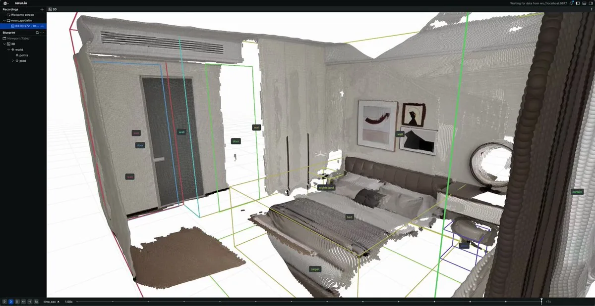
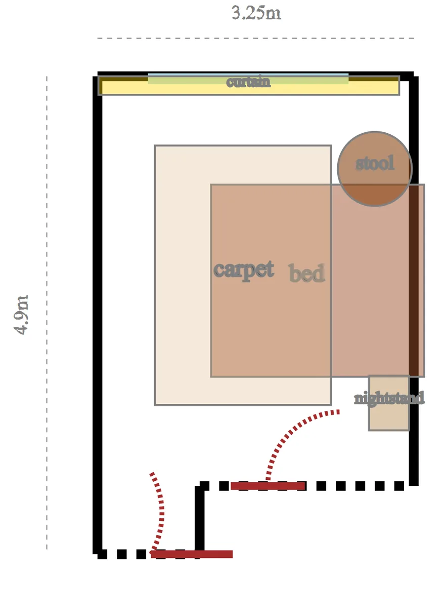
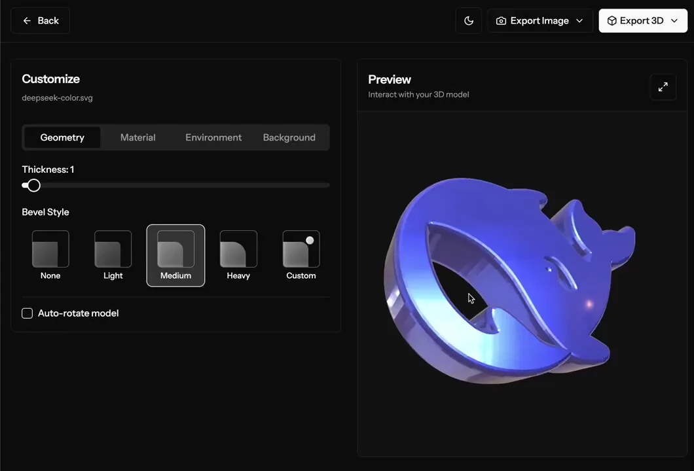
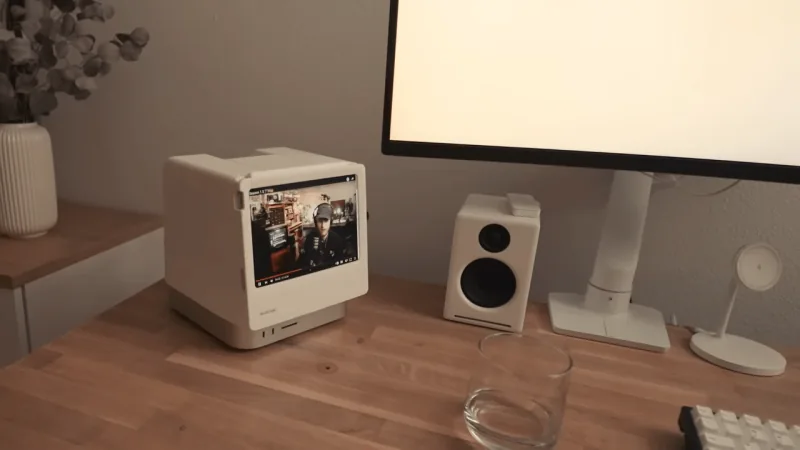

# 2025 年第 13 周技术阅读汇总

[English](README.md) | 简体中文

by @corenel (Yusu Pan) and LLMs

以下为 2025 年 第 13 周（3 月 24 日至 3 月 30 日）期间我所阅读或者输入的内容。为简洁起见，仅列出标题、URL 以及 LLM 生成的概要，以供有兴趣者阅读，进一步的分析、反思与精读不在此赘述。

## 目录

- [2025 年第 13 周技术阅读汇总](#2025-年第-13-周技术阅读汇总)
  - [目录](#目录)
  - [专题](#专题)
    - [一堆新模型](#一堆新模型)
      - [DeepSeek V3 (0324)](#deepseek-v3-0324)
      - [Qwen 系列](#qwen-系列)
      - [Gemini 2.5 Pro Experimental 03-25](#gemini-25-pro-experimental-03-25)
      - [GPT-4o 图像生成](#gpt-4o-图像生成)
  - [续闻](#续闻)
    - [Vibe coding](#vibe-coding)
      - [氛围编程的警示：风险与测试的再审视](#氛围编程的警示风险与测试的再审视)
    - [QwQ-32B](#qwq-32b)
    - [SpatialLM](#spatiallm)
    - [Wan2.1](#wan21)
    - [OpenAI Agent SDK](#openai-agent-sdk)
  - [有趣的事与物](#有趣的事与物)
    - [ACGN](#acgn)
      - [现代 AAA 游戏的结构主义辩护：军事智慧与虚拟世界的意外契合](#现代-aaa-游戏的结构主义辩护军事智慧与虚拟世界的意外契合)
    - [图书](#图书)
      - [Unit Testing Principles, Practices, and Patterns](#unit-testing-principles-practices-and-patterns)
      - [融合经典与 Pythonic 实践：应对复杂性的架构指南](#融合经典与-pythonic-实践应对复杂性的架构指南)
    - [技术与互联网](#技术与互联网)
      - [互联网上的语义扩散与术语演变](#互联网上的语义扩散与术语演变)
      - [开发者网络争议亲历记：技术、伦理与社群的反思](#开发者网络争议亲历记技术伦理与社群的反思)
    - [软件与开发](#软件与开发)
      - [负载均衡算法简介](#负载均衡算法简介)
      - [使用结构化的文档减少 AI 代码生成时的幻觉](#使用结构化的文档减少-ai-代码生成时的幻觉)
      - [AI 编码是助手还是掘墓人？WIRED 调查揭示软件工程师的真实心态](#ai-编码是助手还是掘墓人wired-调查揭示软件工程师的真实心态)
      - [AI Agent 的“一次性范式”：重塑开发协作的潜力与审慎](#ai-agent-的一次性范式重塑开发协作的潜力与审慎)
      - [C++ X 宏：一种代码生成模式的利弊权衡](#c-x-宏一种代码生成模式的利弊权衡)
      - [Go 语言将移除核心类型](#go-语言将移除核心类型)
      - [一次 V8 引擎 Bug 的深度调试复盘](#一次-v8-引擎-bug-的深度调试复盘)
      - [从「宜家模式」看现代 Web 开发的痛点与机遇](#从宜家模式看现代-web-开发的痛点与机遇)
      - [Anubis：基于 PoW 的反爬虫方案](#anubis基于-pow-的反爬虫方案)
      - [Docxy：轻量级 Docker 镜像代理服务](#docxy轻量级-docker-镜像代理服务)
      - [Drawnix：开源白板工具](#drawnix开源白板工具)
      - [magic\_enum：C++ 枚举类型的静态反射库](#magic_enumc-枚举类型的静态反射库)
      - [PicList：PicGo 的进化与云图床管理的新工具](#piclistpicgo-的进化与云图床管理的新工具)
      - [Vecto3d：SVG 转 3D 建模工具](#vecto3dsvg-转-3d-建模工具)
      - [Mac OS Key-Repeat Tester](#mac-os-key-repeat-tester)
      - [pdf-craft：开源 PDF 转换 Markdown/EPUB 工具](#pdf-craft开源-pdf-转换-markdownepub-工具)
      - [Cocommit：AI 赋能 Git 提交](#cocommitai-赋能-git-提交)
    - [硬件与设备](#硬件与设备)
      - [RoboSense AC1：激光雷达 + 相机 + IMU 一体式设计](#robosense-ac1激光雷达--相机--imu-一体式设计)
      - [Mac mini + iPad mini 组合的便携主机](#mac-mini--ipad-mini-组合的便携主机)
      - [小米 BE3600 Pro 轻量服务器化改造](#小米-be3600-pro-轻量服务器化改造)
      - [50 系列显卡软件配置指南](#50-系列显卡软件配置指南)
      - [家庭设备散热升级实战：兼顾静音与性能的经验分享](#家庭设备散热升级实战兼顾静音与性能的经验分享)
    - [知识管理](#知识管理)
      - [AI 驱动下的个性化知识工作流整合实践](#ai-驱动下的个性化知识工作流整合实践)
      - [实用主义笔记法：Apple Notes 与 PARA 结合](#实用主义笔记法apple-notes-与-para-结合)
      - [无人问津，博客何为：喧嚣时代的内省式书写价值](#无人问津博客何为喧嚣时代的内省式书写价值)
      - [如何撰写笔记：洞察卢曼遗产，重塑知识工作流](#如何撰写笔记洞察卢曼遗产重塑知识工作流)
    - [项目与团队管理](#项目与团队管理)
      - [我所知的“最差”的程序员](#我所知的最差的程序员)
      - [热爱驱动卓越：保罗·格雷厄姆的职业选择观](#热爱驱动卓越保罗格雷厄姆的职业选择观)
    - [播客与视频](#播客与视频)
    - [生成式人工智能](#生成式人工智能)
      - [为何 AI 无法创作艺术：意图的幽灵与算法的边界](#为何-ai-无法创作艺术意图的幽灵与算法的边界)
      - [构建 AI 系统的苦涩教训](#构建-ai-系统的苦涩教训)
      - [图解 LLM Agents](#图解-llm-agents)
      - [Agentic Workflows 综述](#agentic-workflows-综述)
      - [AI 赋能演示文稿：实践、潜力与现实考量](#ai-赋能演示文稿实践潜力与现实考量)
      - [a16z 的 MCP 介绍](#a16z-的-mcp-介绍)
      - [Second-Me：具有长期记忆的 AI 助手](#second-me具有长期记忆的-ai-助手)
      - [MoLing：提供本地操作系统交互的 MCP 服务](#moling提供本地操作系统交互的-mcp-服务)
      - [Splatshop：3DGS 场景编辑](#splatshop3dgs-场景编辑)
      - [FanFic-Illustrator：连接故事与图像的 Danbooru 提示词生成器](#fanfic-illustrator连接故事与图像的-danbooru-提示词生成器)
      - [MegaTTS 3：轻量高效的高质量语音克隆](#megatts-3轻量高效的高质量语音克隆)
    - [Just For Fun](#just-for-fun)
  - [学术研究](#学术研究)
    - [目标检测](#目标检测)
      - [FUTR3D：模态无关的多传感器融合 3D 检测框架](#futr3d模态无关的多传感器融合-3d-检测框架)
      - [PP-DocLayout：百度新出的文档布局检测模型](#pp-doclayout百度新出的文档布局检测模型)
      - [CUA-O3D：聚合多个 2D 基础模型特征以提升开放词汇 3D 场景理解](#cua-o3d聚合多个-2d-基础模型特征以提升开放词汇-3d-场景理解)
      - [Hi-ALPS：分级评估基于 LiDAR 的 3D 检测对于扰动的鲁棒性](#hi-alps分级评估基于-lidar-的-3d-检测对于扰动的鲁棒性)
      - [基于 YOLOv12 和 BoT-SORT-ReID 的热红外多无人机追踪](#基于-yolov12-和-bot-sort-reid-的热红外多无人机追踪)
      - [从开放词汇到开放世界的目标检测](#从开放词汇到开放世界的目标检测)
      - [Which2comm：使用语义检测框作为稀疏表示的多智能体协同 3D 目标检测](#which2comm使用语义检测框作为稀疏表示的多智能体协同-3d-目标检测)
      - [RAXO：X 射线图像开放词汇物体检测](#raxox-射线图像开放词汇物体检测)
      - [AnytimeYOLO：可中断推理的 YOLO 模型](#anytimeyolo可中断推理的-yolo-模型)
      - [Ref-COD：指称伪装目标检测](#ref-cod指称伪装目标检测)
      - [未观察物体检测](#未观察物体检测)
      - [FRACAL：利用分形方法提升长尾目标检测能力](#fracal利用分形方法提升长尾目标检测能力)
      - [DynOPETs：移动相机视角下姿态估计与目标跟踪的基准测试数据集](#dynopets移动相机视角下姿态估计与目标跟踪的基准测试数据集)
      - [小目标检测综述：挑战、技术与应用](#小目标检测综述挑战技术与应用)
      - [EVT：以显式引导提升多模态 3D 检测性能](#evt以显式引导提升多模态-3d-检测性能)
      - [UAV-DETR：融合频率域信息提升无人机视觉检测性能](#uav-detr融合频率域信息提升无人机视觉检测性能)
      - [SimROD：面向 RAW 图像目标检测的极简高效基线](#simrod面向-raw-图像目标检测的极简高效基线)
    - [目标跟踪](#目标跟踪)
      - [MUTR3D：端到端多摄像头 3D 多目标跟踪框架](#mutr3d端到端多摄像头-3d-多目标跟踪框架)
      - [MOTIP：将目标跟踪重新定义为 ID 预测任务](#motip将目标跟踪重新定义为-id-预测任务)
      - [MCBLT：融合 BEV 与 GNN 的长时 MTMC 跟踪新范式](#mcblt融合-bev-与-gnn-的长时-mtmc-跟踪新范式)
    - [语义分割](#语义分割)
      - [PanoGS：基于 3DGS 的三维全景开放词汇场景理解](#panogs基于-3dgs-的三维全景开放词汇场景理解)
      - [OnlineAnySeg：在线零样本三维实例分割](#onlineanyseg在线零样本三维实例分割)
      - [DITR：利用 2D 视觉基础模型的特征注入提升 3D 点云分割能力](#ditr利用-2d-视觉基础模型的特征注入提升-3d-点云分割能力)
      - [MMSS：传感器失效场景下的多模态分割鲁棒性评估](#mmss传感器失效场景下的多模态分割鲁棒性评估)
      - [OpenLex3D：新型开放词汇 3D 场景表示评估基准](#openlex3d新型开放词汇-3d-场景表示评估基准)
      - [CamSAM2：提升 SAM2 在视频伪装对象分割任务上的性能](#camsam2提升-sam2-在视频伪装对象分割任务上的性能)
      - [SemLA：使用 LoRA 在测试时提升开放词汇语义分割能力](#semla使用-lora-在测试时提升开放词汇语义分割能力)
    - [自动驾驶](#自动驾驶)
      - [M3Net：统一 3D 目标检测、BEV 地图分割和 3D 占用预测的多模态多任务模型](#m3net统一-3d-目标检测bev-地图分割和-3d-占用预测的多模态多任务模型)
      - [基于视觉的行人轨迹预测综述](#基于视觉的行人轨迹预测综述)
    - [场景重建](#场景重建)
      - [DPM：利用视角与时间不变性的动态场景重建](#dpm利用视角与时间不变性的动态场景重建)
      - [Pow3R：利用辅助先验信息提升重建性能](#pow3r利用辅助先验信息提升重建性能)
      - [Matrix3D：整合姿态估计、深度估计与新视角合成的 3D 基础模型](#matrix3d整合姿态估计深度估计与新视角合成的-3d-基础模型)
      - [DroneSplat：无人机视角的动态场景重建](#dronesplat无人机视角的动态场景重建)
      - [从单张图像生成 3D 世界](#从单张图像生成-3d-世界)
      - [Aether：完全使用 4D 合成数据训练世界模型实现强大的泛化能力](#aether完全使用-4d-合成数据训练世界模型实现强大的泛化能力)
      - [HoGS：大尺度场景下远近皆宜的 3DGS](#hogs大尺度场景下远近皆宜的-3dgs)
      - [EVolSplat：面向高效城市场景重建的体素化高斯溅射](#evolsplat面向高效城市场景重建的体素化高斯溅射)
      - [Uni4D：整合视觉基础模型进行 4D 重建](#uni4d整合视觉基础模型进行-4d-重建)
    - [仿真渲染](#仿真渲染)
      - [OLiDM：改进 LiDAR 数据生成的前景物体质量](#olidm改进-lidar-数据生成的前景物体质量)
      - [数据驱动的相机与激光雷达仿真综述](#数据驱动的相机与激光雷达仿真综述)
      - [SceneCrafter：基于 3DGS 的高效、高保真、交互式的自动驾驶仿真平台](#scenecrafter基于-3dgs-的高效高保真交互式的自动驾驶仿真平台)
      - [UrbanCAD：迈向高度可控和逼真的城市场景模拟中的三维车辆](#urbancad迈向高度可控和逼真的城市场景模拟中的三维车辆)
      - [GAIA-2：迈向统一可控的自动驾驶生成式模拟](#gaia-2迈向统一可控的自动驾驶生成式模拟)
    - [深度估计](#深度估计)
      - [UniK3D：能够处理任意相机模型的通用单目估计](#unik3d能够处理任意相机模型的通用单目估计)
      - [QuantDepth：面向边缘 ASIC 设备实时深度估计的后训练量化](#quantdepth面向边缘-asic-设备实时深度估计的后训练量化)
      - [Semi-SD：环视相机的度量深度估计](#semi-sd环视相机的度量深度估计)
      - [基于事件相机与资源受限平台的自监督单目深度估计在线学习](#基于事件相机与资源受限平台的自监督单目深度估计在线学习)
      - [单目度量深度估计综述：现状、挑战与前沿趋势](#单目度量深度估计综述现状挑战与前沿趋势)
    - [SLAM](#slam)
      - [MASt3R-SLAM：双视图 3D 重建与单目稠密 SLAM 结合](#mast3r-slam双视图-3d-重建与单目稠密-slam-结合)
      - [4D Gaussian Splatting SLAM](#4d-gaussian-splatting-slam)
      - [将相机作为 IMU：利用运动模糊图像估计瞬时速度](#将相机作为-imu利用运动模糊图像估计瞬时速度)
      - [FG2：地面与航空视图之间的细粒度跨视角定位](#fg2地面与航空视图之间的细粒度跨视角定位)
    - [语言模型](#语言模型)
      - [探索与改进 VLMs 在空间推理上的固有缺陷](#探索与改进-vlms-在空间推理上的固有缺陷)
      - [3D-GRAND：大规模 3D 视觉 - 语言数据集](#3d-grand大规模-3d-视觉---语言数据集)
      - [MDocAgent：多模态多 Agent 文档理解](#mdocagent多模态多-agent-文档理解)
      - [Vision-R1：利用 IoU 进行 GPRO 以提升 VLMs 的目标定位能力](#vision-r1利用-iou-进行-gpro-以提升-vlms-的目标定位能力)
      - [Ling-Coder-Lite：基于 MoE 架构的代码 LLM 训练实战](#ling-coder-lite基于-moe-架构的代码-llm-训练实战)
      - [Every FLOP Counts：经济高效扩展 MoE 大模型](#every-flop-counts经济高效扩展-moe-大模型)
      - [ODS：开源搜索智能体框架](#ods开源搜索智能体框架)
      - [ParetoQ：重新审视极低比特大模型量化](#paretoq重新审视极低比特大模型量化)
      - [KBLaM：提升大模型知识集成效率与扩展性的新探索](#kblam提升大模型知识集成效率与扩展性的新探索)
      - [解码 AI 心智：Anthropic 的模型可解释性研究](#解码-ai-心智anthropic-的模型可解释性研究)
      - [ReAct：融合推理与行动的语言模型新范式](#react融合推理与行动的语言模型新范式)
      - [CodeACT：迈向智能高效的代码大模型训练](#codeact迈向智能高效的代码大模型训练)
      - [VideoMind：角色化链式 LoRA 赋能长视频精准时序推理](#videomind角色化链式-lora-赋能长视频精准时序推理)
      - [Rankify：集成式检索增强框架](#rankify集成式检索增强框架)
    - [内容生成](#内容生成)
      - [LayerAnimate：图层级别的可控视频生成](#layeranimate图层级别的可控视频生成)
      - [生成式摄影：对相机物理参数精确控制的图像生成](#生成式摄影对相机物理参数精确控制的图像生成)
      - [BizGen：确保精准布局与清晰文本的版画图像生成](#bizgen确保精准布局与清晰文本的版画图像生成)
      - [Dream Engine：以 LMM 简化多模态可控图像生成](#dream-engine以-lmm-简化多模态可控图像生成)
    - [机器人](#机器人)
    - [位姿估计](#位姿估计)
      - [Any6D：针对新颖物体的 6D 位姿估计](#any6d针对新颖物体的-6d-位姿估计)
      - [使用仿射校正视图间的单目深度估计先验以增强位姿估计](#使用仿射校正视图间的单目深度估计先验以增强位姿估计)
    - [其他](#其他)
      - [SuperPC：统一点云补全、上采样、去噪与上色任务](#superpc统一点云补全上采样去噪与上色任务)
      - [HazeGen：先学习加雾然后学习去雾](#hazegen先学习加雾然后学习去雾)
      - [LENVIZ：高分辨率低曝光夜视基准数据集](#lenviz高分辨率低曝光夜视基准数据集)
      - [Thera：以物理原理改进任意尺度超分辨率方法](#thera以物理原理改进任意尺度超分辨率方法)
      - [大规模强化学习在真实高速公路交通流的应用](#大规模强化学习在真实高速公路交通流的应用)

## 专题

### 一堆新模型

#### DeepSeek V3 (0324)

[[202503250745_初步体验 DeepSeek-V3-0324]]

新发布的 DeepSeek-V3-0324 版本在多个关键能力维度上取得了显著的进步，特别是在推理、编程和中文处理方面，其性能表现已达到或接近行业顶尖水平，甚至在某些评测中超越了被认为是“思考型”或更强劲的竞争对手模型，同时展现出一定的成本效益优势。

关键事实：

- DeepSeek 发布了其 V3 模型的更新版本 DeepSeek-V3-0324。
- 该模型在多个权威基准测试（如 MMLU-Pro, GPQA, AIME, LiveCodeBench）上展示了显著的性能提升，官方数据指出了具体分数增长，例如 AIME 从 39.6 提升到 59.4 (+19.8)。
- 第三方独立评测（如 Aider LLM Leaderboards, KCORES LLM Arena, Python Raytracer Benchmark）也证实了其强大的编程能力，将其排在领先位置，甚至优于 DeepSeek-R1 和 Claude 3.7 Sonnet（在特定测试中）。
- 模型在中文写作、搜索和函数调用方面也有改进。
- 用户体验反馈指出，它在实际应用中能达到 R1 水平，且推理成本（Token 数量）更低，但可能需要特定提示（如 "Please think step by step"）来激发最佳性能。
- 实际应用案例展示了其在前端代码生成（如 Figma 设计稿还原）方面的出色能力。
- 模型可在高端硬件（如 M3 Ultra Mac Studio）上进行本地部署，并有第三方（如 Unsloth AI）提供了高效的量化版本，降低了部署门槛，尽管仍需较高配置（如 231GB VRAM for 2.71-bit）。

一些细节：

- **官方基准测试提升**：MMLU-Pro 75.9 → 81.2 (+5.3), GPQA 59.1 → 68.4 (+9.3), AIME 39.6 → 59.4 (+19.8), LiveCodeBench 39.2 → 49.2 (+10.0), MATH-500 90.2 -> 94.0。
- **第三方编程评测**：
  - Aider Leaderboard：55.1% 正确率，优于 V3 前版 (48.4%)，接近 R1 (56.9%) 和 o3-mini (60.4%)，在非思考模型中仅次于 Sonnet 3.7 (60.4%)。特别指出其 Diff 编辑格式准确率高达 99.6%。
  - KCORES Arena：排名第三 (328.3 分)，仅次于 Claude-3.7-Sonnet-thinking 和 Claude-3.5。
  - Python Raytracer：水平追上 Claude-3.7-Sonnet。
- **用户体验**：九原客提到 V3 0324 在其测试集上表现与 R1 相当，但推理 Token 数远低于 R1，性价比高；同时需要特定提示激发思考。
- **应用案例**：歸藏 展示了通过 MCP 读取 Figma 设计稿，V3 0324 一次性生成高质量前端代码，甚至添加了交互效果。
- **部署性能**：
  - Awni Hannun 在 512GB M3 Ultra Mac Studio 上使用 MLX 框架运行 4-bit 量化模型，生成速度超过 20 tokens/sec，峰值内存占用约 381.5 GB。
  - Reddit 用户在同设备上使用 GGUF Q4_K_M 量化，生成速度约 6.23 tokens/sec，提示处理速度约 9.08 tokens/sec，性能不如 MLX。
  - Unsloth AI 发布了 2.71-bit 量化版本，能在 231GB VRAM（如 3x H100）上达到约 140 tokens/sec 的吞吐量，并强调其选择性量化策略优于标准的 2-bit 量化。最低运行要求是 160GB 组合 VRAM+RAM。

#### Qwen 系列

[[202503250746_初步体验 Qwen2.5-VL-32B]]

[[202503271240_初步体验 Qwen2.5-Omni]]

[[202503282000_初步体验 QvQ-Max]]

#### Gemini 2.5 Pro Experimental 03-25

[[202503260741_初步体验 Gemini 2.5 Pro Experimental 03-25]]

Google 最新发布的 Gemini 2.5 Pro (Experimental) 是一款能力非常强大的新 AI 模型，它在多个关键领域，尤其是在推理和代码生成能力上，展现出了显著的领先优势，甚至超越了当前顶尖的竞争对手，标志着 AI 能力的一次重要跃升。

关键事实：

- Google 发布了 Gemini 2.5 系列模型，称其为“思考模型”，首个版本 Gemini 2.5 Pro Experimental 已推出。该模型在常见的基准测试中表现领先，并展示出强大的推理和编码能力。
- Gemini 2.5 Pro 具备长达 100 万 Token 的上下文处理能力。它支持音频输入，并具有高精度的时间戳识别能力。它能对图像输入进行精确的边界框检测。
- 用户体验方面，Simon Willison 初步测试后认为它非常强大，尤其是在编码任务上印象深刻，感觉可与 Claude 3.7 Sonnet 相媲美，并受益于其默认的推理模式和长上下文。
- Jesse Lau 表示已将大部分工作流切换到 Gemini 2.5 Pro，涵盖关键字研究、Django 编程、多语言翻译、深度研究和中长篇小说创作等。
- 性能评测方面，Aider Leaderboard (v0.79.0) 和 KCORES 大模型竞技场均显示 Gemini 2.5 Pro Experimental 在编码能力上达到 SOTA（State of the Art），超越了包括 Claude 3.7 Sonnet Thinking 在内的其他模型。KCORES 给出了 370.6 分的总分。
- 应用案例展示了使用 Gemini 2.5 Pro 结合多轮提示，成功创作了一篇上万字的科幻短篇小说《只是个喷嚏》，且人工调整比例低于 5%。
- 与 Gemini 2.0 Flash Thinking Experimental 相比，Gemini 2.5 Pro 在遵循指令和生成文本质量（如特定素材处理任务）方面有显著提升，思考过程更长，输出更严谨。

一些细节：

- **数据：**
  - 上下文长度：高达 100 万 Token。
  - KCORES 评测得分：370.6 分，超越 Claude 3.7 Sonnet Thinking。
  - Aider Leaderboard 排名：第一名（SOTA）。
- **事实：**
  - 官方定位：“思考模型”，在基准测试中领先。
  - 独特能力：支持长音频输入和时间戳精度，图像边界框检测。
  - 用户工作流整合：Jesse Lau 将其用于编程 (Django)、翻译、研究、写作等多种任务。
  - 评测结果共识：两个独立的编码能力排行榜（Aider, KCORES）均将其评为第一。
  - 模型行为改进：相较于 Gemini 2.0 FTE，在指令遵循和输出质量上有改进。
- **例子：**
  - Simon Willison 的初步编码测试体验。
  - Jesse Lau 的具体工作流应用列表。
  - karminski- 牙医进行的“一句话生成我的世界游戏”测试，结果优异。
  - 长篇小说《只是个喷嚏》的创作过程，包括具体使用的四条 Prompts 和最终成品的人工干预比例（低于 5%）。
  - 在“文章素材处理提示词”任务中，Gemini 2.5 Pro 表现优于 Gemini 2.0 FTE。

#### GPT-4o 图像生成

[[202503261301_初步体验 4o Image Generation]]

OpenAI 最新发布的 GPT-4o 图像生成功能，通过将高级图像生成能力**原生集成**到大型语言模型（LLM）中，显著提升了 AI 在图像处理方面的**实用性、精确性和可控性**。这不仅仅是技术能力的展示，更代表了向**统一多模态 AI**演进的重要一步，可能**重塑创意工作流**并对现有的 AI 应用生态（特别是专门的图像生成工具）构成挑战。同时，这也伴随着 OpenAI 在 AI 安全与政策理念上的调整，即从宽泛预防转向更**精确的、聚焦真实世界伤害的风险管理**。

关键事实：

- **事件：** OpenAI 正式发布并向付费用户推出了 GPT-4o 的原生图像生成与编辑功能。
- **事实（能力）：** 该功能展示了在文本渲染（包括中文，尽管有待改进）、遵循复杂指令生成图像、基于上下文的图像编辑（替换、修改、风格转换、视角变换）、利用模型知识库信息生成相关图像（如漫画化技术报告）以及生成多种实用图形（UI 草稿、流程图、主题图、连续分镜）等方面的强大能力。
- **事实（技术）：** OpenAI 官方 System Card 附录中称其为**内嵌在 ChatGPT 中的自回归模型 (autoregressive model)**，区别于 DALL·E 的扩散模型 (diffusion model)。然而，社区通过网络流量分析观察到**多阶段生成或优化**的迹象（类似 ComfyUI 流程，可能涉及 8x8 块状处理），这引发了对其具体技术实现的讨论（自回归？扩散？混合？）。
- **事实（政策）：** OpenAI 伴随新能力发布，阐述了其 AI 政策思路的转变，强调**精确性**而非过度预防，更信任用户，并接受“不作为的代价”，例如在处理公众人物图像生成方面采取了更细致（可能被视为更宽松）的规则。
- **事实（用户反馈与影响）：** 用户普遍反馈该功能效果惊艳，称其为“真正的生产力工具”、“实现图片自由”，并展示了其在多种场景下的应用潜力。同时，也引发了关于其可能“吞噬”Midjourney 等专用工具、改变设计和创意工作模式（如“Vibe Painting”）以及对“基本功”价值的讨论。
- **事实（局限性）：** 文章也指出了当前存在的局限，如非拉丁语系文本处理尚不完美、精细编辑控制有待加强、可能存在生成稳定性和效率问题（“Best of X”暗示）、对高质量提示词的依赖，以及初期 UI 可能存在混淆。

一些细节：

- **文本渲染：** 宝玉 @dotey 生成的包含“什么是提示词工程”中文文字的主题图，以及用户普遍反馈其能在图片中准确渲染英文文本。虽然知乎文章提到中文渲染有待改进，但也承认其能力。
- **复杂指令遵循：** Ethan Mollick 的“水獭在飞机上用 WiFi，笔记本屏幕上是正在生成水獭在飞机上用 WiFi 图片的软件”的递归指令生成成功案例。
- **上下文感知编辑/图像修改：** Simon Willison 将图片转换为“与熊自拍”的例子（虽然他强调了危险性）；知乎用户展示的替换图中物体、修改背景、改变光影效果；Yachen Liu 展示的图标细节修改，效果被赞“立即上岗”。
- **视角变换与风格迁移：** 知乎用户展示的从多角度生成同一场景的能力；howie.serious 将照片转为吉卜力风格和日漫风格；Umesh 将极简图像转为照片风格；Zeneca 展示的多样风格转换。
- **与模型知识库联动/实用图形：** Tanishq Mathew Abraham 将 DeepSeek-V3 技术报告漫画化的例子；歸藏展示的 UI 设计草稿与样机生成；dangjin 生成的工作原理流程图；宝玉生成的宣传画。
- **连续性与故事性：** -Zho- 展示的通过单一提示词生成连续故事分镜（小猫与犀牛交朋友）的能力。
- **技术细节线索：** Reddit 网友 seicaratteri 逆向分析发现的网络请求返回多张中间图片和 8x8 块状结构。
- **政策细节：** Simon Willison 引用并讨论了 OpenAI 系统卡附录中关于公众人物生成政策的具体条款及其变化。
- **工作流整合：** “玩具还是生产力工具？”一文提出的“视觉优先、迭代生成、AI 协作、文档管理”四步工作流，并附有流程图和邓宁 - 克鲁格曲线图示。

## 续闻

### Vibe coding

[[202503151459_2025W11_技术阅读汇总#Vibe Coding]]

[[202503220819_2025W12_技术阅读汇总#Vibe coding]]

#### 氛围编程的警示：风险与测试的再审视

[Do a real check before you get vibe checked](https://www.reddit.com/r/AI_Agents/comments/1jhg6qp/do_a_real_check_before_you_get_vibe_checked/)

> I've seen three posts in the last week about how vibe coding has been screwing people over so consider this a PSA - make sure you actually check your software before you release it into production. Obviously this applies whether you're vibe coding or not, but this ~especially~ applies to people who are now vibe coding.
>
> Here's the three cases I've seen this week:
>
> - Someone posted about their vibe coded project on twitter and immediately got ddos'd
> - Someone blamed cursor and windsurf for their bad code here on this subreddit
> - Lovable tweeted about their new project and leaked their supabase keys
>
> Personally, I think you should just write your code yourself, but if you're a software engineer and you're armed with AI generated code, you should at least do these things before putting things into production:
>
> - Make sure you have integration tests, not just unit tests
> - Ensure that you're following best practices when using API keys (ie have environment variables separated)
> - Stress test/red team your own system before releasing it (at least to some extent) - like if you're letting people use an LLM as part of your product, see what happens when you tell it to ignore all previous instructions
>
> Other software engineers chime in - what other tips do you have to avoid getting vibe checked?

警惕“氛围编程”的潜在风险，代码测试至关重要。文章并非完全否定 AI 辅助编程，而是强调在使用 AI 工具提升开发效率的同时，不能忽视代码质量和安全，充分的测试是不可或缺的保障。

- “氛围编程”并非安全“免检”代码的代名词。AI 生成的代码仍然可能存在漏洞、错误和安全隐患，开发者不能因为使用了 AI 就放松警惕，反而更需要加强审查和测试。
- 开发者责任不可推卸，安全意识至关重要。即使使用了 AI 工具，开发者仍然是代码质量的第一责任人。不能将错误归咎于工具，而要提升自身安全意识，掌握必要的安全技能和最佳实践。
- 传统软件开发的安全实践在“氛围编程”时代依然适用且更加重要。集成测试、API 密钥安全管理、压力测试/红队测试等传统安全实践，在 AI 辅助编程的背景下不仅没有过时，反而更加重要，需要开发者认真落实。

### QwQ-32B

[[202503060735_初步体验QwQ-32B]]

**九原客** @9hills [2025-03-26](https://x.com/9hills/status/1904733821700096500)

> R1、R1-distill、QwQ 在真实的数学计算场景也不要用官方推荐的 Prompt。
>
> 在某业务数值计算场景。使用两个 Prompt：
>
> 1\. R1 官方推荐的：Please reason step by step, and put your final answer within \\boxed{}.
> 2\. 不增加 COT prompt：Answer the given question and put your final answer within \\boxed{}.
>
> 结果：
> step by step 的思考长度提升明显（50%+），正确率下降明显（5%-20% 不等）。
>
> 原因分析：
> Please reason step by step 应该是 R1 在数学上的默认 Prompt，模型学会了在这个 Prompt 上 Over thinking，但是在业务场景，over thinking 不一定有好的表现。

**九原客** @9hills [2025-03-26](https://x.com/9hills/status/1904736132526727315)

> QwQ 增加 step by step 提示词后，50% 的输出都大于 8k tokens，对生产的实际应用影响极大。

**九原客** @9hills [2025-03-26](https://x.com/9hills/status/1904837595546476578)

> Over-thinking 有时就会导致错误结论，比如把正确答案给 Wait 了

### SpatialLM

[[SpatialLM - Large Language Model for Spatial Understanding]]

> 有人拿自家房子试了一下（使用 iPhone + Sitescape 软件），效果还行

**Jonathan Stephens** @jonstephens85 [2025-03-26](https://x.com/jonstephens85/status/1904746498564509731)

> SpatialLM. Fast, not real-time. So much to explore here.
> I see the potential. More coming soon.





**Jonathan Stephens** @jonstephens85 [2025-03-27](https://x.com/jonstephens85/status/1905052043355828592)

> My first test of SpatilLM on my own dataset. This is my bedroom. I intentionally left it a mess to see how it did!
> My day was SLAMMED so I didn't have any to play with the code. This is whole capture to final output took 10 minutes, including troubleshooting.


### Wan2.1

[[202503081856_2025W10_技术阅读汇总]]

**TDS** @TDS\_95514874 [2025-03-27](https://x.com/TDS_95514874/status/1905063722168860818)

> Wan2.1 で中間フレームも指定できるようにしてみた
> エンドフレームと同じ要領で処理してるだけ
> 専用モデルでもないのに凄いなあ

能够指定 Wan2.1 生成视频的中间帧，不过从视频看起来效果不是很好。

### OpenAI Agent SDK

[[202503151459_2025W11_技术阅读汇总#OpenAI Agent SDK]]

**OpenAI Developers** @OpenAIDevs [2025-03-26](https://x.com/OpenAIDevs/status/1904957755829481737)

> [MCP 🤝 OpenAI Agents SDK](https://openai.github.io/openai-agents-python/mcp/)
> You can now connect your Model Context Protocol servers to Agents.
> We’re also working on MCP support for the OpenAI API and ChatGPT desktop app—we’ll share some more news in the coming months.

**Alex Albert** @alexalbert\_\_ [2025-03-26](https://x.com/alexalbert__/status/1904908450473324721)

> A new version of the MCP spec was finalized today.
>
> Some of the major changes:
>
> - Auth framework based on OAuth 2.1
> - Replaced the previous HTTP+SSE transport with Streamable HTTP transport
> - Support for JSON-RPC batching
> - Tool annotations for better describing tool behavior

## 有趣的事与物

### ACGN

#### 现代 AAA 游戏的结构主义辩护：军事智慧与虚拟世界的意外契合

[[Modern AAA Games are Good! Here is Why（文字稿）]]

该文以新颖的跨学科视角，将备受争议的现代开放世界 AAA 游戏结构与《Team of Teams》所阐述的先进军事组织原则进行类比，提出这类游戏看似重复的玩法循环实则契合了应对复杂环境的高效模式，从而为其“好玩”提供了一种结构主义的辩护。文章的核心价值在于引入了一个非传统的分析框架，揭示了游戏设计与现实复杂系统管理之间可能存在的深层逻辑关联。

评论者认为，文章对军事理论与改革实践的介绍较为清晰，为核心类比奠定了基础。其创新观点——即游戏结构模拟了“赋能”式组织的分布式、信息共享和目标导向特性——具有启发性。然而，文章的论证主要依赖类比推理，将结构上的相似性直接推导为游戏品质的充分理由，这一逻辑跳跃值得商榷。它在一定程度上忽略了驱动此类游戏设计的商业因素、玩家体验的多样性（超越“清据点”）以及游戏作为艺术媒介的其他评价维度（如叙事、创新、情感深度）。

文章的理论基础（复杂适应系统思想）虽未明说但清晰可见，其论证逻辑围绕核心类比展开。其优势在于视角独特、阐述生动；劣势在于可能简化了游戏设计与玩家行为的复杂性，且隐含了“结构有效性即是好”的价值判断前提。其局限性在于未能充分回应关于创意枯竭、同质化等行业批评，且个人化的“解压”体验难以支撑普遍性的品质论断。

该文提供了一个理解现代 AAA 游戏吸引力的有趣视角，尤其是在系统设计层面。建议读者批判性地吸收其观点，认识到该类比解释力的边界，并将其视为探讨游戏设计哲学的一个独特切入点，而非对这类游戏全面而公允的最终评价。

### 图书

#### Unit Testing Principles, Practices, and Patterns

来自 **Steve Sun** @s6sdev [2025-03-22](https://x.com/s6sdev/status/1903671004783693995) 的推荐：

> 推荐不会写测试都读读 "Unit Testing Principles, Practices, and Patterns" 这本书。
> 我曾经在 v2ex 留言说单元测试的质量是区别工程项目和草台班子的重要标准。被网友喷到自我怀疑。
> 很多人说国内公司工期太紧。但是实际上单元测试根本不会浪费时间而是会节省反复 debug 和沟通上下文的时间。
>
> > 2025-03-22
> > 如果你用 ai 编程却不让 ai 写测试用例，那你就不是 ai 的主人，而是 ai 的奴隶。你只是 ai 的测试员。

#### 融合经典与 Pythonic 实践：应对复杂性的架构指南

[[Architecture Patterns with Python]]

文章（基于书的序言和引言）清晰地阐述了在日益复杂的 Python 应用开发中引入成熟架构模式的必要性与价值。其核心贡献在于，系统性地提出将领域驱动设计（DDD）、依赖倒置原则（DIP）以及事件驱动架构（EDA）等经典企业级架构思想与 Python 生态相结合，为开发者提供了一套旨在隔离业务核心、解耦基础设施、提升系统可维护性与可测试性的实践框架。文章通过引用“大泥球”反模式、MADE.com 的实际业务挑战以及抽象层次的代码示例，有效地论证了主动进行架构设计的紧迫性。

文章的论证逻辑建立在软件工程的坚实原则之上，特别是对 DIP 的强调，点明了实现关注点分离的关键技术手段。其价值在于，它不仅识别了 Python 社区在应对大型项目复杂性方面可能存在的短板，而且明确提出了一系列具体的、源自经典但适配于 Python（如结合 Flask, SQLAlchemy）的模式（如 Repository, Service Layer, Unit of Work, Message Bus 等）作为解决方案。

然而，文章也隐含了一些关键假设，例如认为这些经典模式是应对复杂性的普适最优解，且其带来的收益必然能覆盖增加的复杂度和学习成本。它可能未充分探讨 Python 动态特性下是否存在其他更轻量级的原生替代方案。此外，虽然强调实践，但序言和引言阶段未能深入展现这些模式在真实 Python 项目中可能遇到的具体挑战和权衡。

对于目标读者——那些在 Python 项目中遭遇维护困难、测试瓶颈或业务逻辑混乱的开发者——本文极具参考价值。它提供了一个清晰的愿景和一套结构化的方法论，鼓励开发者从“能工作”迈向“可持续演进”的更高目标。建议读者在采纳这些模式时，保持批判性思维，结合自身项目的具体规模、生命周期、团队能力和性能要求，审慎评估其适用性与成本效益，避免陷入过度设计的陷阱。

### 技术与互联网

#### 互联网上的语义扩散与术语演变

[[Semantic Diffusion - Martin Fowler]]

> 这是一个很有意思的现象，互联网的普及进一步推动了此类现象的发生。Martin Fowler 在 2006 年的发现很有前瞻性。
>
> 文中所述的“语义扩散”与社会学里面的创新扩散理论（如 Everett Rogers 的理论）密切相关。一个术语（作为一种语言或概念创新）的采纳过程伴随着不同人群（创新者、早期采纳者、大众等）的介入，不同群体的理解和使用方式差异导致了意义的变化。术语的“流行度”正是其扩散速度和广度的体现。
>
> 顺便一提，播客《后互联网时代的乱弹》中时不时有的“名词鉴伪”环节也可以作为 Simon Willison 的观察的补充。

文章的核心价值在于提出并阐释了“语义扩散”概念，深刻揭示了专业术语（尤其流行语）在传播中意义易被稀释的现象及其驱动因素（如流行度、炒作）。文章通过“传话游戏”类比及“敏捷”、“Web 2.0”、“vibe coding”等实例生动论证，并提及“语义倒置”极端情况。其论证逻辑基于敏锐的行业观察与经验归纳，富有启发。然论证多依赖定性案例，或简化语言演变的复杂性，其对“原始定义”权威性的隐含强调值得商榷。对术语创建者、技术传播者及依赖精确沟通的专业人士，该文提供了宝贵警示：需警惕术语意义流失，审慎维护沟通清晰度。

#### 开发者网络争议亲历记：技术、伦理与社群的反思

[[第一次被「掛」上網路後，我的回應與感想]]

本文以第一人称视角，详尽记录了一位独立开发者因其应用 Piecelet（基于 NeoDB 数据）而在长毛象社区遭遇公开质疑（“被挂”）的全过程及其应对反思。其核心价值在于**真实呈现了当前数字生态下，开发者（尤其是独立开发者）在利用开放数据/API 进行创新时，可能遭遇的技术误解、伦理争议与社群冲突，并提供了一个应对此类网络危机的具体案例**。

文章在**关键事实上**，通过截图、引用和时间线，清晰还原了争议的起因、批评者的主要论点（数据使用、盈利模式、伦理担忧）以及作者的回应行动。其**核心主张**——指控多基于误解和双重标准，自身实践符合技术规范且具社区善意——得到了较为充分的论证，尤其在技术层面（如对 API、去中心化概念的澄清）显得颇为有力。**创新观点**则体现在对网络“挂人”文化的反思，以及对不同群体间“标准要求”差异的敏锐观察上。

然而，其**理论基础**略显单一，偏重技术理性主义和开发者中心视角，对用户（尤其非技术用户）的复杂心理动机和特定社会文化背景下的隐私焦虑的回应，可能未能充分体现同理心。文章主要依赖**个案叙述和逻辑推理**，缺乏更广泛的调研数据或多方访谈来支撑其对批评者动机和社群普遍看法的判断。

本文不仅揭示了在开放环境中开发应用的潜在风险，也提供了应对策略（快速响应、清晰沟通、记录证据）和心理调适的样本。更重要的是，它**启发读者思考**：在技术规则之外，如何更好地理解和回应社群的伦理关切？如何构建更健康的开发者 - 用户关系和网络讨论文化？建议读者在阅读时，既要理解作者的处境与论证，也要辩证看待其隐含假设与潜在局限，从中汲取更全面的经验教训。

### 软件与开发

#### 负载均衡算法简介

[[简单聊聊常见的负载均衡算法]]

文章系统梳理了从随机、轮询到最小连接及一致性哈希（以 Maglev 为例）等多种主流负载均衡算法。其核心价值在于将抽象算法与具体的 Python 代码实现紧密结合，为读者提供了直观且可操作的理解路径。文章逻辑清晰，由简入繁，对 Nginx 平滑加权轮询和 Maglev 等相对复杂的算法也进行了细致的步骤拆解。

文章侧重于算法原理与基础实现，对于生产环境中的关键考量，如高并发下的线程安全、节点状态的精确及时获取、详尽的性能基准测试与对比、以及复杂网络环境下的鲁棒性探讨着墨不多。

#### 使用结构化的文档减少 AI 代码生成时的幻觉

[[Thread by @PrajwalTomar_ - How to fix AI Hallucinations by 85%]]

> 推文主要针对 Cursor，其内容与之前通过 `.cursorrules` 以及 `goal.md`、`progress.md` 等文件来约束 Cursor 行为的做法差不太多。
> 注意此举需要模型的指令遵循能力要达到一定程度，最好是使用能力不差于 Claude 3.5 Sonnet 的模型。
>
> 不过随着 Reasoning LLMs 的兴起，现在 Planner + Actor 这样类似 Agent 的模式更为流行，可以说在一定程度（当然还没能达到完全程度）代替了人的规划作用。也就是使用 Gemini 2.5 Pro Experimental、Claude 3.7 Sonnet Thinking、DeepSeek R1 甚至 QwQ-32B 等推理能力强大的模型作为 Planner，而价格较为便宜的 Claude 3.5 Sonnet、DeepSeek V3 等模型负责实际代码的撰写。

推文提出了一种旨在提升 AI 编码助手（如 Cursor）可靠性的“知识库”技术，核心价值在于倡导通过提供结构化的项目文档来约束 AI 行为、减少输出幻觉。其主张开发者负责规划、AI 负责实现的任务划分，并具体列举了 PRD、流程图、技术栈、设计规范、架构和实施计划等六类关键文档，声称此法可将 AI 幻觉减少 85%。

文章提供了一套具体、可操作的文档清单，将“提供上下文”这一通用原则具象化为软件工程实践。其核心主张——人规划、AI 实现——反映了当前阶段对 AI 能力边界的一种务实认知。

然而，该方法的理论基础——上下文减少歧义——虽合理，但其核心证据（85% 的效果）依赖个人陈述，缺乏客观验证。文章隐含假设了 AI 对复杂多文档的理解整合能力，以及创建维护详尽文档的效率与可行性，这些在实践中可能面临挑战。此外，将 AI 严格限定于执行者角色，可能忽视其在辅助设计或发现问题方面的潜力。

对于寻求提高 AI 编码输出稳定性和可控性的开发者，尤其是进行需求明确、计划性较强的项目时，该方法提供了一套值得尝试的实践指南。但使用者需注意其潜在的文档维护成本，并对宣称的效果持审慎态度，同时考虑其在不同项目类型和开发阶段的适用性。该方法本质上是一种极致的 Prompt Engineering 实践，强调了高质量输入对于高质量输出的基础性作用。

#### AI 编码是助手还是掘墓人？WIRED 调查揭示软件工程师的真实心态

[[How Software Engineers Actually Use AI]]

WIRED 这篇基于 730 名软件工程师调查的文章，核心价值在于及时捕捉并呈现了当前 AI（尤其是聊天机器人）融入软件开发实践的复杂现实与从业者的矛盾心态。文章通过“末日论者”、“怀疑论者”与“现实主义者”的分类，生动勾勒出行业内部对于 AI 冲击的多元认知光谱，其关键主张——AI 目前更多扮演“力量倍增器”而非“工作终结者”的角色，与“适应者生存”的呼吁——基本反映了当前阶段的技术成熟度与行业共识。

文章的亮点在于其独特的“元叙事”手法：在讨论 AI 应用的同时，将自身使用 ChatGPT 进行数据分析的经历及其局限性（如编造引言、误读数据）作为实例，直观论证了 AI 工具的现实能力边界，增强了核心观点的说服力。这种坦诚不仅提升了报道的可信度，也为读者提供了关于人机协作现状的深刻洞察。

然而，文章在方法论上存在潜在局限。调查样本的代表性、抽样方法的细节缺失，使得结论的普适性有待商榷。同时，将 AI 的影响主要聚焦于聊天机器人，可能简化了 AI 技术在软件工程领域应用的广度与深度。此外，文章对“适应”的探讨也略显表层，未能深入剖析所需的具体技能转变及结构性支持。

本文提供了一个理解同行心态、反思自身定位的宝贵参考。它提醒我们，面对 AI 浪潮，既要拥抱其效率优势，也要对其局限性保持清醒认知，并积极投入持续学习与技能升级。

#### AI Agent 的“一次性范式”：重塑开发协作的潜力与审慎

[[The One-Shot Paradigm with Agents]]

文章提出了“一次性范式”的概念，主张利用先进 AI 智能体，通过单一指令驱动复杂、多步骤的软件开发任务，有望超越当前工具的渐进式改进，实现工作流自动化的飞跃。其核心价值在于清晰勾勒了一种**人机协作的新图景**：AI 处理实现细节，人类聚焦高层设计与创新，并赋能更广泛人群参与创造。文章通过列举代码查看、编辑、查找、并发处理等具体场景下的智能体交互示例（借鉴自 Cursor、Claude Code 等），生动地展示了该范式的**潜力与吸引力**。

然而，从专业视角看，文章的**论证主要基于例证和愿景描绘，缺乏严谨的实证数据支撑**。其对 AI 智能体能力（如深度上下文理解、复杂任务可靠执行）的描述，带有一定的**理想化色彩**，可能**低估了现实中的技术挑战**，如智能体的可靠性、可控性、安全性以及处理模糊指令的能力。此外，文章隐含了**技术成熟度、易用性及开发者乐于转变角色**等关键假设，这些假设的成立与否将直接影响该范式的实际落地效果。

对目标读者而言，本文**极具启发性**，值得关注 AI 智能体在自动化开发流程中的应用趋势。但读者应**审慎看待其“革命性”主张**，认识到这更像是一个**未来方向的展望**而非既成事实。在拥抱潜力的同时，需持续关注相关技术的实际进展、局限性以及对开发者技能和工作模式的深远影响。Pocketflow 等公司的探索值得期待，但对其产品的评判仍需基于未来实际发布的性能与用户体验。

#### C++ X 宏：一种代码生成模式的利弊权衡

[[My Favorite C++ Pattern X Macros]]

文章系统阐述了 C++ 中一种特定且略显“非主流”的代码生成技术——X 宏模式。其核心价值在于为开发者提供了一种利用 C 预处理器应对大规模重复代码（如常量列表、类层次结构、接口绑定）的实用策略，尤其是在大型 C++ 项目（如文中的 Chapel 编译器）中展现了潜力。

文章通过字符串驻留、AST 管理和 CPython 绑定三个具体应用案例，清晰地展示了 X 宏如何通过集中定义、分离生成逻辑来减少样板代码、提升一致性和可维护性。其中，利用 X 宏实现无需双重分发的 Visitor 模式分发机制，算是一个颇具巧思的工程实践创新。作者的论证主要依赖实例代码和对替代方案的对比，逻辑清晰，易于理解。

然而，该模式的理论基础完全依赖于 C 预处理器，这本身就带来了固有的风险，如类型安全缺失、调试困难、命名空间污染以及潜在的编译依赖放大问题，文章对此有所提及但未深入探讨其对现代软件工程实践的影响。其有效性高度依赖于项目对宏使用的接受度以及对编译时间增加的容忍度。此外，文章承认该模式并非万无一失，仍需开发者手动确保 X 宏列表之外代码的一致性。

对于从事大型 C++ 系统（尤其是编译器、框架等）开发的工程师而言，本文提供了一个值得了解的代码生成技巧。读者应认识到 X 宏是一种强力但有显著权衡的工具，需审慎评估其在特定项目环境下的适用性，并可考虑与现代 C++ 元编程技术进行对比，以做出更优的设计决策。

#### Go 语言将移除核心类型

[[Goodbye core types - Hello Go as we know and love it!]]

文章阐述了 Go 语言决定在 1.25 版本中移除其 1.18 版本引入的“核心类型”概念的原因、过程与影响。其核心价值在于，它不仅记录了 Go 语言设计的一次重要演进，更揭示了在追求语言简洁性、一致性与长期发展潜力之间进行权衡的务实考量。文章的论述建立在 Go 语言一贯推崇的“显式优于隐式”和“追求简单性”的设计哲学之上。

文章识别并论证了核心类型作为一种抽象机制所带来的弊端：规则的过度约束、对语言学习曲线的负面影响以及对未来功能扩展的潜在阻碍。通过对比 `close` 函数等具体规范文本的变化，直观展示了移除核心类型后，规范如何回归简洁，并为泛型操作提供了更直接、基于类型集的规则描述。

文章提醒我们，语言设计是一个持续迭代和优化的过程，即使是已发布的特性概念，也可能为了整体的简洁性与长远发展而被重新审视和调整。

#### 一次 V8 引擎 Bug 的深度调试复盘

[[War story the hardest bug I ever debugged]]

文章以第一人称视角，详实记录了作者在谷歌文档团队遭遇并解决的一次极端复杂的 Bug 调试经历。其核心价值在于生动揭示了现代大型软件系统中，由底层平台（此例中为 V8 JavaScript 引擎的 JIT 编译器）的罕见缺陷引发上层应用（Google Docs）严重问题的真实场景，以及定位此类“深层 Bug”所面临的巨大挑战。

文章客观陈述了关键事实，如 Bug 的非确定性、复现困难、涉及复杂的视图渲染与缓存机制，直至最终定位到 `Math.abs()` 函数在特定优化下的反常行为。核心主张围绕调试过程的艰辛、跨团队协作的必要性以及问题根源的意外性展开。其创新之处不在于提出了新的理论或方法，而在于对一次极端调试案例的细致入微的“战争故事”式呈现，极具代入感和启发性。

文章论证逻辑遵循时间顺序和问题解决路径，叙事清晰，技术细节（如 V8 优化层级）的引入增强了专业性和可信度。然而，其证据主要基于个人回忆（anecdotal evidence），虽情境说服力强，但缺乏普遍性验证。文章隐含了对底层平台稳定性的高度依赖，以及大型科技公司内部协作机制有效运作的前提。其局限性在于作者本人也指出的——这次经历并未产生宏大的普适性“教训”，更多是对软件开发复杂现实的白描。

对于目标读者，尤其是从事复杂系统开发与维护的工程师而言，本文极具参考价值。它不仅展示了一种系统化、锲而不舍的调试精神，更警示了对底层依赖进行审视的必要性，并强调了在面对看似无解的难题时，跨层级、跨团队沟通与协作的极端重要性。它提醒我们，最困难的 Bug 可能潜藏在意想不到的基础角落。

#### 从「宜家模式」看现代 Web 开发的痛点与机遇

[[Thread by @karpathy - The reality of building web apps in 2025 is that it's a bit like assembling IKEA furniture]]

Andrej Karpathy 的这篇推文，以其开发者和 AI 领域专家的双重身份，敏锐地捕捉并指出了当前现代 Web 开发实践中的一个核心痛点：**过度碎片化导致的集成复杂性与开发者体验（DX）下降**。其核心价值在于，通过生动的“宜家家具”类比和个人实例，清晰地揭示了开发者在面对众多独立服务（如托管、数据库、认证、存储等）时，普遍存在的配置、集成与编排难题，这种困难已从单纯的编码扩展到了系统工程层面。

文章的核心主张——即现代 Web 应用构建过程繁琐且缺乏“开箱即用”的整体方案——得到了服务清单枚举和个人时间投入（配置 Supabase 与 Vercel 耗时约 3 小时）等关键事实的支持。其创新之处在于，**前瞻性地将这一挑战与 AI 作为开发者的未来角色联系起来**，强调简化方案对人和机器同样重要。

虽然该文主要基于个人观察和轶事证据，而非系统性研究，论证逻辑相对简洁，但其**直指问题本质的洞察力**不容忽视。推文隐含地假设了简单性优于灵活性，并可能因作者自述的“新于现代 Web 开发”而带有一定视角局限性。

对目标读者而言，此文**极具参考价值**：开发者应认识到集成复杂性是常态并提升相应技能；平台工程团队可将其视为构建内部开发者平台（IDP）的明确需求信号；工具与服务提供商则应更加重视提升产品的易用性、文档质量和互操作性，尤其是探索面向 AI 友好的接口与自动化能力，这其中蕴藏着巨大的创新机遇。

#### Anubis：基于 PoW 的反爬虫方案

[TecharoHQ/anubis: Weighs the soul of incoming HTTP requests using proof-of-work to stop AI crawlers](https://github.com/TecharoHQ/anubis)

作者敏锐地捕捉到当前互联网生态中日益严峻的 AI 爬虫威胁，并创新性地提出了一种基于 sha256 工作量证明（Proof-of-Work，PoW）的反爬虫方案。虽然它可能会导致网站不被某些搜索引擎索引，但这被视为针对现代互联网中恶意爬虫问题的必要“核弹级”解决方案。

作者认为，由于 AI 爬虫机器人肆无忌惮地抓取数据，且不遵守 robots.txt 等标准，Anubis 的强硬手段是目前保护网站的有效方法，尤其适用于那些无法或不愿使用 Cloudflare 等传统防护方案的场景。

#### Docxy：轻量级 Docker 镜像代理服务

[harrisonwang/docxy: Docker Hub 代理服务](https://github.com/harrisonwang/docxy)

> 建议不想自己搭建的用户还是直接配置 HTTP 代理比较方便

作者立足于国内开发者 Docker Hub 在容器化实践中访问受限的普遍痛点，精准定位并推出了开源项目 Docxy。仓库通过架构图和流程图，清晰地阐释了 Docxy 基于 Docker Registry API v2 的透明代理机制。

仓库提供了快速开始指南，但自建镜像代理服务仍然需要一定的运维成本。其隐含假设用户有能力和意愿自行维护 Docxy 服务，包括服务器维护、配置管理、故障排除等。然而，对于一些缺乏运维经验或者不愿意投入运维成本的用户，自建镜像代理可能不是一个理想的选择。

#### Drawnix：开源白板工具

[plait-board/drawnix: 开源白板工具（SaaS），一体化白板，包含思维导图、流程图、自由画等。All in one open-source whiteboard tool with mind, flowchart, freehand and etc.](https://github.com/plait-board/drawnix)

> 还在积极开发中，有需要可以关注

#### magic_enum：C++ 枚举类型的静态反射库

[Neargye/magic_enum: Static reflection for enums (to string, from string, iteration) for modern C++, work with any enum type without any macro or boilerplate code](https://github.com/Neargye/magic_enum)

> 比起写一堆 `XXXToString()`、`XXXFromString()` 方法而言，这个语法糖确实好用。

一个用于 C++17 的 header only 库，它为枚举类型提供了静态反射能力。`magic_enum` 能够让开发者在 C++ 中更方便地操作枚举，无需宏或样板代码，从而提高代码的简洁性和可维护性。它旨在弥补 C++ 语言在枚举反射方面的不足，提供一系列易于使用的功能，例如枚举值与字符串之间的转换、枚举值的迭代、以及各种实用工具函数，使得枚举的使用更加灵活和强大。

#### PicList：PicGo 的进化与云图床管理的新工具

[Kuingsmile/PicList: An image upload and manage tool, base on PicGo](https://github.com/Kuingsmile/PicList)

> 我还在用 PicGo + Cloudflare R2

PicList 是一款高效的云存储和图床平台管理工具，基于 PicGo 深度二次开发，提供完整的图床功能和全面的云存储管理能力，主要特点包括：

- 完整保留 PicGo 所有功能，兼容大部分 PicGo 插件
- 扩展了内置图床平台，如 WebDav、本地图床和 SFTP 等
- 相册支持同步云端删除文件
- 全面的云存储管理功能，包括文件操作、搜索和预览
- 内置图像处理工具，如水印、压缩、缩放、旋转和格式转换

#### Vecto3d：SVG 转 3D 建模工具

[lakshaybhushan/vecto3d: A super simple tool to convert your SVG's to 3D models.](https://github.com/lakshaybhushan/vecto3d)

Vecto3d 旨在简化 SVG 图形至 3D 模型的转换流程，降低用户操作门槛。



#### Mac OS Key-Repeat Tester

[Mac OS Key-Repeat Tester](https://mac-key-repeat.zaymon.dev/)

> 加速 Key Repeat 能大幅提升撰写文档与代码的效率，特别是对我这种用 Vim keybinding 的人来说。

A simple tool to test Mac OS key-repeat settings without restarting your computer more than once.

#### pdf-craft：开源 PDF 转换 Markdown/EPUB 工具

[oomol-lab/pdf-craft: PDF craft can convert PDF files into various other formats. This project will focus on processing PDF files of scanned books. The project has just started.](https://github.com/oomol-lab/pdf-craft)

#### Cocommit：AI 赋能 Git 提交

> 我用的还是 fabric + 自己写的提示词

[andrewromanenco/cocommit: Cocommit is a command-line tool that works with your HEAD commit and leverages an LLM of your choice to enhance commit quality.](https://github.com/andrewromanenco/cocommit)

> A good commit consists of multiple elements, but at a minimum, it should have a well-crafted commit message. Cocommit analyzes the message from the last (HEAD) commit and suggests improvements, highlighting both strengths and areas for enhancement.

**高质量的提交信息是软件工程最佳实践，而 AI 可以有效辅助开发者达成这一目标**。Cocommit 的创新之处在于 **将 LLM 技术与 Git 工作流相结合，以简洁的命令行工具形式，降低了 AI 辅助代码开发的门槛**。

### 硬件与设备

#### RoboSense AC1：激光雷达 + 相机 + IMU 一体式设计

[[202503282013_RoboSense AC1 Active Camera 分析]]

#### Mac mini + iPad mini 组合的便携主机

[Designing A Portable Mac Mini](https://hackaday.com/2025/03/25/designing-a-portable-mac-mini/)

> 国内也挺多这类改装或者说组合的，不过 3D 打印了一个外壳后确实挺好看的。



#### 小米 BE3600 Pro 轻量服务器化改造

[小米路由器 BE3600 Pro 笔记：初步分析、折腾路由 Docker（一）](https://soulteary.com/2025/03/27/xiaomi-router-be3600-pro-notes-analytics-and-docker-play.html)

> 说实话能接受功耗的话不如用软路由或者单独的主机，AC/AP 还是负责本职工作就好。

文章认为小米路由器 BE3600 Pro 虽然定位为青春版，但硬件配置和软件功能依然强大，尤其是在开启 SSH 权限和利用 Docker 功能后，可以将其打造成一个轻量级的家庭服务器，满足用户运行例如 Alist 这类容器化应用的需求。

#### 50 系列显卡软件配置指南

[Guide to work with 5080/90 Nvidia cards For Local Setup (linux/windows), For lucky/desperate ones to find one.](https://www.reddit.com/r/LocalLLaMA/comments/1jkahkc/guide_to_work_with_508090_nvidia_cards_for_local/)

> - Install latest drivers and cuda stuff from nvidia
> - Works and tested with Ubuntu 24 lts, kernel v 6.13.6, gcc-14
> - Multi gpu setup also works and tested with a combination of 40xx series and 50xx series Nvidia card
> - For pytorch current version don't work fully, use the nightyly version for now, Will be stable in few weeks/month
>
>   ```shell
>   pip install --pre torch torchvision torchaudio --index-url https://download.pytorch.org/whl/nightly/cu128
>   ```
>
> - For local serving and use with llama.cpp/ollama and vllm you have to build them locally for now, support will be available in few weeks/month
>   - [Build llama.cpp locally](https://github.com/ggml-org/llama.cpp/blob/master/docs/build.md)
>   - [Build vllm locally / guide for 5000 series card](https://github.com/vllm-project/vllm/issues/14452)
>   - Ollama works out of the box with Blackwell cards
>
> - For local running of image/diffusion based model and ui with AUTOMATIC1111 & ComfyUI, following are for windows but if you get pytorch working on linux then it works on them as well with latest drivers and cuda
>   - [AUTOMATIC1111 guide for 5000 series card on windows](https://github.com/AUTOMATIC1111/stable-diffusion-webui/issues/16824)
>   - [ComfyUI guide for 5000 series card on windows](https://github.com/comfyanonymous/ComfyUI/discussions/6643)

#### 家庭设备散热升级实战：兼顾静音与性能的经验分享

[[近期家用设备（NUC、群晖、光猫、交换机、机柜）散热升级记录]]

文章以作者个人实践为基础，详实记录了在家庭网络升级至 2.5G 及万兆后，针对群晖 NAS、NUC 迷你主机、网络设备及机柜进行的一系列旨在改善散热并降低噪音的改造过程。其核心价值在于为面临相似挑战的家庭实验室（Homelab）爱好者提供了具体、可操作的解决方案和选型参考，尤其是在平衡散热性能与静音需求这一常见痛点上，展现了系统性的思考和细致的动手实践。

文章的关键事实围绕具体设备的散热瓶颈（如 NUC 原装风扇噪音、光猫高热）以及作者采用的针对性措施（如更换猫头鹰/利民风扇、被动散热强化、机柜主动通风优化）。核心主张明确：高性能设备升级伴随散热挑战，主动进行兼顾静音的散热改造对保障长期稳定运行至关重要。其创新之处在于将多个设备的改造经验整合，并引入了机柜级散热与过滤的整体优化视角，以及对不同品牌风扇性价比的初步探索。

文章的论证主要基于作者的经验观察和主观评价，辅以部分技术规格对比和功耗数据，对于经验分享类文章而言逻辑清晰且具有较强说服力。然而，其理论基础侧重实践经验，缺乏严格的量化测试（如精确温控、噪音分贝测量），使得效果评估带有一定主观性。研究方法为典型的案例研究，虽细节丰富但普适性受限于作者的具体硬件配置和环境条件。

文章隐含了读者具备一定 DIY 能力、高度重视静音体验、且愿意为此投入成本的前提。其局限性在于方案的成本效益分析不够深入，且未充分探讨不同环境温度和负载条件下的效果差异。

对于目标读者（技术爱好者、Homelab 用户），本文是一份极具参考价值的实战指南，能启发读者审视自身设备的散热状况，并提供了具体的改造思路和选件建议。建议读者结合自身需求、预算和环境条件，辩证地借鉴文中的方法与经验。

### 知识管理

#### AI 驱动下的个性化知识工作流整合实践

[AI 时代到来，我还在用哪些笔记应用？](https://xiaobot.net/post/5cb1c26f-ef24-494e-83e5-f393b8a4ffc1)

> 其中提到的 Follow（最近改名 Folo）是我自产品公布以来就一直在使用的。Readwise Reader 曾经使用，不过现在已经改为 Hoarder 了。

王树义的这篇文章详细阐述了在人工智能时代背景下，如何通过整合多个专业笔记与效率工具（Follow, Readwise Reader, Heptabase, Roam Research），并利用 AI 辅助编写自动化脚本来克服工具间的“数据孤岛”问题，构建高效的个人知识管理（PKM）工作流。其核心价值在于，它并未将 AI 视为取代现有工具的颠覆者，而是定位为提升工具间协同效率、实现“重器轻用”理念的关键赋能者。

- **Roam Research**: 主要用于制作讲座幻灯片和出行清单，体现了“重器轻用”原则。
- **follow**: 作为信息筛选器，用于订阅特定高质量信源（如推特、B 站、网站），避免信息过载，并将有价值内容一键发送到稍后读应用。
- **Readwise Reader**: 作为信息处理和管理中心，接收来自 follow、网页剪藏、邮件转发等渠道的内容，进行阅读、高亮和笔记，并能自动同步到 Heptabase。
- **Heptabase**: 作为“第二大脑”，利用其白板（Map）视图来汇集、组织和连接来自 Readwise 等处同步过来的素材，进行文章写作或幻灯片制作的构思与初稿搭建，利用“准备效应”提升创作信心。
- **自定义脚本与 AI**: 作者使用 Python 脚本（在 AI 编程助手如 Windsurf + Claude 3.7 Sonnet 的帮助下编写）来自动化处理工具间的数据迁移和格式转换，特别是将 Heptabase 内容转换为 Roam Research 兼容的格式（包括处理图片链接、列表层级等）。

文章以翔实的个人实践为证，清晰展示了从信息筛选、处理、综合到特定格式输出的完整链路，其对自动化脚本（尤其利用 AI 编程助手）解决格式转换痛点的具体描述颇具说服力。这种“最佳组合”（Best-of-Breed）加 AI“粘合剂”的策略，为追求深度定制和极致效率的用户提供了富有启发性的范例。

然而，该策略的有效性高度依赖于作者所体现的技术倾向与实践投入。其隐含假设包括用户具备一定的技术理解力（或有效利用 AI 辅助的能力）、认可高度定制化的价值并愿意承担相应的维护成本。文章所展示的复杂工作流，对工具生态的稳定性（API、服务持续性）亦有较高要求，其可扩展性与长期可持续性对普通用户可能构成挑战。

#### 实用主义笔记法：Apple Notes 与 PARA 结合

[[我如何使用 Apple Notes 做笔记 - Randy's Blog]]

> 与 Andrej Karpathy 的 [[The append-and-review note]] 方法有一定的相似性。
>
> 可以同时看看作者 2023 年的文章：[[我的笔记管理法 - Randy's Blog]]
>
> 我个人目前还是使用 Obsidian 作为文本笔记与收集的目的地（其他文档则在 Devonthink 中）。配合以及 RAG 进行语义检索与关联。

文章以作者个人两年实践为例，阐述了将 Apple Notes 与 Tiago Forte 的 PARA 方法相结合的笔记工作流。其核心价值在于提供了一个**高度实用主义、以行动为导向、注重降低认知摩擦**的个人知识管理方案范例。文章清晰地论证了在特定需求（优先考虑速度、简洁、原生集成）和价值取向下，功能相对基础的 Apple Notes 配合结构化的 PARA 框架，足以支撑有效的笔记记录与项目管理。

作者长期（两年）坚持该方法并从中受益，核心主张是**笔记应服务于行动，简单工具辅以有效方法即可满足需求**。其对 PARA 方法的介绍和在 Apple Notes 中的具体实现（包括增加 Drafts/Inbox 的改良）具有较好的参考价值。它挑战了功能越多越好的普遍认知，为追求极简效率的用户提供了一种“返璞归真”的选择。

文章主要基于个人经验和特定理论（PARA），说服力强但普适性有限。其优点在于逻辑清晰、实例具体、坦诚优缺点。然而，文章**隐含了较强的个人偏好假设**（如行动优先、简单至上），对 Apple Notes 功能局限性（如缺乏链接对知识发现的影响、搜索的真实效率）的讨论不够深入，且主要适用于 Apple 生态用户。其“不迁移旧笔记”的建议也可能不适用于所有场景。

对于感到笔记工具过于复杂、希望回归简单高效的读者，本文提供了极具启发性的思路和实践参考。但读者需**审慎评估自身的核心需求、工作流特点及对知识连接深度的要求**，避免盲目照搬。文章更重要的启示在于引导用户思考：什么才是对自己而言真正“有用”的笔记系统。

#### 无人问津，博客何为：喧嚣时代的内省式书写价值

[[Why Blog If Nobody Reads It?  Andy's Blog]]

> 这篇文章虽然很短，但是在年初的时候讨论程度很高，其中的内容也引人深思。建议一读，并且看看 Hacker News 上对于其的讨论。
>
> 我的这份周刊以及 today-i-learned 项目也是受到此文章以及 Simon Willison Weblog 的启发。虽然已经很久没有公开写 blog 了，但是还是一直在写日记与日志。今年则准备将部分觉得有价值的内容再次发布出来，未来或许也会重新写长篇文章。

文章探讨了一个在注意力经济时代颇具反思价值的问题。文章核心价值在于，它超越了以读者数量和互动反馈为中心的传统内容评价体系，强调了博客写作对于作者自身的**内在价值**——如促进思维清晰化、结构化思考、个人成长记录以及创作过程本身的意义。

作者指出了两种自我欺骗的说法——“写了就会有人来看”（作者认为不会，因为网络内容浩如烟海）和“没人读就是浪费时间”（作者反驳了这一点）。作者运用“砍柴担水”的禅宗譬喻和街头摄影的类比，为这种内省式、过程导向的书写行为赋予了哲学层面的合理性。

Hacker News 的评论极大地丰富了这一议题，从业内人士的实践角度补充了博客的多元**外在价值**：建立专业信誉、作为可检索的个人知识库、完成项目后的仪式性收尾、潜在的职业机遇、甚至成为训练 AI 的数据源。这些评论既验证了写作的个人效益，也揭示了其在特定场景下不容忽视的功用。

文章的论证主要依赖**类比和个人感悟**，虽能引发共鸣，但缺乏实证支持，其说服力更多源于价值观认同。其隐含的“内在价值优先”和“写作必然提升思维”等**假设**，在评论区得到了更复杂和现实的审视，例如关于自我营销的讨论、知识管理工具的比较以及对 AI 影响的担忧。文章本身对博客作为**公开媒介的特性**及其带来的机遇与挑战（如可发现性问题）着墨不多，这构成了其局限性，幸而评论区对此有充分展开。

这篇文章及其讨论提供了宝贵的启示：在喧嚣的网络环境中，认识并珍视创作过程的内在回报，同时，有策略地利用写作实现知识沉淀、信誉构建等外在目标，或许是在这个时代保持创作韧性和实现多元价值的关键。它鼓励我们思考，**在追求“被看见”的同时，更要关注“看见自己”**。

#### 如何撰写笔记：洞察卢曼遗产，重塑知识工作流

[[How To Take Smart Notes - 10 Principles to Revolutionize Your Note-Taking and Writing]]

> 注意 Tiago Forte 就是前面提到的《The PARA Method》以及《Building a Second Brain》两本书的作者，建议一读。
>
> Zettelkasten 和 PARA 也算是当前 PKM 里面的主流笔记组织方式了，就个人而言都很好用，前提是你需要花时间来整理，不然还是死水一潭。

Tiago Forte 的这篇文章，以 Sönke Ahrens 对尼克拉斯·卢曼“卡片盒笔记法”（Zettelkasten）的解读为基础，成功地向更广泛的受众普及了一种旨在变革知识工作的笔记哲学与实践框架。其核心价值在于，清晰阐释了如何将笔记从静态信息存储转变为动态的思考、学习与创造引擎，为寻求深化理解和提升产出质量的知识工作者提供了极具吸引力的视角和可操作原则。

文章通过引述卢曼惊人的学术成就和卡片盒的具体机制，有力地论证了该方法论的潜力。其提炼的 10 项原则（如“写作即思考”、“按情境组织”、“标准化促进创意”）及 8 个实践步骤，逻辑清晰，易于理解，有效降低了采纳门槛。文章巧妙运用类比（如集装箱）和认知科学的隐含概念（如外部化认知），增强了说服力。

然而，该文在论证上对卢曼个案的依赖性较强，可能简化了其成功的多重因素。同时，作为“第二大脑”理念的推广者，作者的积极立场或带来一定程度的选择性偏向。文章虽提及原则的普适性，但对其在不同认知风格、非写作密集型工作、高度协作环境以及多样化数字工具中的具体适用性与潜在挑战探讨不足。其隐含的“个体知识优先”和“兴趣驱动可能导致知识结构偏差”等局限性也值得关注。

对于目标读者（学者、研究人员、内容创作者等），本文极具启发性，特别是关于主动构建知识网络和将笔记作为思考伙伴的理念。建议读者批判性地吸收其核心原则，结合自身需求调整实践细节，认识到该方法需要长期投入与自律，并警惕将其视为解决所有知识管理问题的万能钥匙。

### 项目与团队管理

#### 我所知的“最差”的程序员

[[The Worst Programmer I Know]]

> 注意文章的局限性

文章探讨了软件开发领域中生产力度量与团队协作的深层议题。文章通过“最差程序员”Tim Mackinnon 的反例，有力地揭示了传统个人生产力指标在复杂团队环境中应用的局限性。其核心价值在于警示业界反思片面追求个人量化指标的弊端，并重新审视团队协作和知识共享对提升整体效能的关键作用。

文章以生动的案例和清晰的逻辑，论证了 Tim Mackinnon 虽然在个人指标下表现为“零产出”，但其通过结对编程、指导和启发，有效地提升了团队的整体能力和交付质量。作者基于系统思考的视角，强调软件开发团队是一个复杂适应系统，个体的价值不能被孤立地衡量，而应关注其对系统整体的贡献。

文章在普适性方面存在一定的局限。Tim Mackinnon 的成功模式可能依赖于特定的团队文化和个人特质，其经验未必能完全复制到所有团队和组织。此外，文章对如何构建更完善的团队绩效评估体系，以及如何在个体贡献与团队协作之间取得平衡等问题，探讨略显不足。

#### 热爱驱动卓越：保罗·格雷厄姆的职业选择观

[[How to Do What You Love]]

> 注意 Paul Graham 是 YC 的联合创始人，本文发表于 2006 年。
>
> 除了文章所提及的“热爱”本身，进一步还可以思考热爱与责任的边界，热爱的演化以及社会结构对于热爱的塑造或者压抑。

文章深刻阐述了内在热爱对于驱动个体达成卓越成就的关键作用，并系统性地揭示了社会普遍存在的认知误区（如工作即痛苦）以及外部诱惑（声望、金钱）如何阻碍人们发现并投身于真正热爱的事业。文章以其鲜明的核心主张——“要做好，必热爱”——为基点，通过个人经历、敏锐观察和逻辑推演，为读者，特别是知识工作者和创新者，提供了关于职业选择和个人成长的宝贵洞见。

文章对“声望”等微妙心理陷阱的精准刻画，以及提出的“总是生产”、“免费测试”等启发式方法具有较强的实践指导意义。然而，其论证主要依赖轶事证据和个人反思，缺乏实证支持，且隐含着精英主义视角和对个体能动性的乐观假设，可能对面临显著结构性限制的群体适用性有限。文章对“热爱”的界定偏向于一种待发现的内在属性，对热爱的动态培养和集体性维度的探讨不足。

对于追求创新和高成就的读者，本文极具启发性，能促使其反思自身动机，警惕外部干扰。但读者也需辩证看待，结合自身境况和社会现实，审慎评估其建议，认识到寻找和实践热爱的道路可能比文中描绘的更为复杂，并需关注个体选择之外的系统性因素。

### 播客与视频

播客：

- 十字路口 Crossing：[[Manus 爆火的背后：我们用20个问题一起搞懂 AI Agent]]
- 硅谷 101：[[E185｜打开宇宙的钥匙：量子计算的五种路径，以及与AI的交叉口]]
- 硬地骇客：[[EP97 对话常扬：LLM盛行时代，专门的OCR模型还有意义吗？]]
- 忽左忽右：[[395 辛德勇谈海昏侯墓背后的西汉废立往事]]
- 忽左忽右：[[首相塔01｜缔造太阳王：马扎然、法西争霸与威斯特伐利亚体系的诞生]]
- 旧世代：[[旧世代游戏 - 《真女神转生if...》回顾赏析]]
- 旧世代：[[旧世代番外 - 聊聊AI：为什么说智力平权的革命近在咫尺，以及我们应该如何面对]]

视频：

- ruc 猫猫：[这本书选题就值五星！300 年前一段少有人知的历史！清朝邸报影响欧洲启蒙运动？](https://www.bilibili.com/video/BV1nVoXYPEWN)
- 影视飓风：[首次揭秘，影视飓风百人团建幕后！](https://www.bilibili.com/video/BV1nYZcYpEco)
- 硅谷 101：[“再造一个 CUDA”：英伟达的第二护城河与“超级碗”阳谋【深度解析 GTC 2025】](https://www.bilibili.com/video/BV1uNZMYREpE)
- 电丸科技 AK：[百镜大战第一场战役 搅局者小米要干掉所有友商](https://www.bilibili.com/video/BV1C1otYNEWr)

### 生成式人工智能

#### 为何 AI 无法创作艺术：意图的幽灵与算法的边界

[[Why A.I. Isn’t Going to Make Art]]

> 注意发表时间（2024 年 8 月）以及发表刊物（纽约客）

文章以鲜明的立场和流畅的论证，为当前甚嚣尘上的“AI 创造力”讨论注入了一剂清醒剂。其核心价值在于，**坚守了人类中心主义的艺术观，将“意图”和“选择”置于艺术创作的核心，从而深刻地剖析了当前生成式 AI 在模拟创造力时面临的本质鸿沟**。作者巧妙地运用类比、实例和跨学科概念（如语言意向性、技能 vs 智能），有效支撑了“AI 无法进行真正意义上的艺术创作”这一核心主张。

文章对艺术创作过程的解构——即将其视为创作者无数有意识或无意识选择的累积——**为理解人类创造力的复杂性提供了一个有力的分析框架**。同时，对谷歌广告争议、班尼特·米勒案例等事实的引用，增强了论证的现实感和说服力。其对 AI 训练过程的“版权洗钱”类比，以及对语言交流中“意图”缺失的强调，**敏锐地捕捉到了当前 AI 技术在原创性、理解深度和交流本质上的局限**。

然而，文章的论证逻辑在一定程度上**依赖于对“艺术”和“智能”相对传统且略显固化的定义**。其对人类意图和意识在创作中不可或缺性的强调，虽然在当前语境下颇具说服力，但也可能**低估了未来 AI 技术演进的潜力，以及人机协作 redefining 创造力边界的可能性**。此外，文章对 AI“非人化”风险的定性判断，虽引人深思，但或许可以更细致地区分技术本身的属性与特定应用场景和社会引导策略的影响。

#### 构建 AI 系统的苦涩教训

[[The Bitter Lesson Rethinking How We Build AI Systems]]

文章阐述了理查德·萨顿“苦涩的教训”在当下人工智能发展中的现实意义。文章核心价值在于其立足实践，强调了算力在驱动 AI 进步中的决定性作用，并前瞻性地指出了 AI 工程师在算力时代的角色转变。作者通过客户服务系统案例和 RL Agent 的兴起等事实，有力地论证了“规模化计算胜过人为复杂设计”的观点。

文章在强调算力优势的同时，可能略微弱化了算法创新和领域知识的价值，存在将“人为设计”简单等同于“规则和复杂工程”的局限性。此外，文章对算力无限扩展的隐含假设也值得进一步探讨。

#### 图解 LLM Agents

[[A Visual Guide to LLM Agents]]

文章阐述了 LLM Agent 的核心价值在于通过整合记忆、工具和规划三大组件，实现超越传统 LLM 的自主性和问题解决能力。

作者以 Memory, Tools, Planning 三大组件为线索，构建了 LLM Agent 的完整知识框架，并辅以超过 60 张定制图表，将抽象的技术概念和复杂的系统流程清晰直观地呈现出来，即使是非专业读者也能轻松理解 LLM Agent 的基本原理和运作机制。

文章客观评析了 LLM Agent 的关键事实，包括传统 LLM 的局限性、增强型 LLM 的概念、Agent 的定义和组件、短时和长时记忆的实现、工具的作用和使用、MCP 协议、规划和推理机制、以及多代理协作的兴起。

#### Agentic Workflows 综述

[[What Are Agentic Workflows? Patterns, Use Cases, Examples, and More  Weaviate]]

文章系统性地梳理了 Agentic Workflows 的核心概念、关键组件、设计模式及其在现实世界中的应用。其核心价值在于清晰界定了这一新兴 AI 范式，将其与传统工作流及非 Agentic AI 应用区分开来。

文章成功地提炼了 Agentic Workflows 的关键特征——由具备推理、工具使用和记忆能力的 AI Agent 驱动，能够进行自主规划、与环境交互并进行反思迭代。通过对规划、工具使用、反思等核心模式的阐述，以及 Agentic RAG、研究助手、编码助手等用例和 Claygent、ServiceNow 等产品实例的介绍，文章有效地将抽象理论与具体实践相结合。

然而，文章在描绘 Agentic Workflows 巨大潜力的同时，也隐含了一些关键假设，例如对 LLM 推理可靠性、工具集成顺畅性以及复杂性成本效益的乐观预期。虽然提及了挑战与局限性，但对其深度和广度（如安全性、可控性、伦理风险、可解释性难题等）的探讨可以更加深入。

对于期望了解 AI Agent 最新进展的技术开发者、产品经理和研究人员而言，本文提供了极具价值的概览和思考框架。它不仅阐明了“是什么”和“为什么”，还初步触及了“如何做”。读者应认识到 Agentic Workflows 虽前景广阔，但仍处早期发展阶段，在实际应用中需审慎评估任务复杂性、风险承受度及投入产出比，避免陷入技术炒作的陷阱。

#### AI 赋能演示文稿：实践、潜力与现实考量

[[信息的AI可视化（1）：AI生成动态PPT的步骤分享]]

> 最近的模型（Claude 3.7 Sonnet 与 DeepSeek V3 (0324) 等）的 HTML 生成能力以及美观程度有了长足进步，因此才推动了这样的演示文稿、可视化报告、流程图乃至 Manus AI 的结果生成。
>
> 如果需要 PPT 而非 HTML 的话，还是建议使用 Gamma 或者国内类似平台，在往期中有介绍。

本文以作者汗青的第一人称视角，详实记录了运用 AI 模型（特别是 Claude 3.7 Sonnet）生成动态信息可视化演示（HTML 形式）的探索实践。其核心价值在于提供了一个具体、可操作的**人机协作工作流程**（四阶段法），并通过丰富的实例展示了 AI 在此领域达到的**高质量视觉效果**，对需要高效制作演示文稿的专业人士具有较强的**启发性和借鉴意义**。

文章的关键事实主要围绕多个 AI 生成的可视化案例（如图表、时间轴、层级图等），这些案例直观地支撑了 AI 能力的主张。其核心主张——AI 能显著提升演示内容制作效率和视觉吸引力——颇具前瞻性。论证结构上，采用**实践驱动、案例导向**的方式，推理路径清晰，从痛点出发，到方法提炼，再到效果验证和反思，逻辑较为完整。

然而，文章的**理论基础相对薄弱**，更偏重经验分享而非严谨分析。其论证主要依赖**单一工具（Claude 3.7 via Poe）和个人经验**，缺乏横向比较和量化评估，使得结论的**普适性和可复现性**有待商榷。同时，文章也坦诚地指出了**隐含假设**（如用户需具备一定技术理解力和迭代意愿）和**局限性**（如 HTML 非原生 PPT、成本、稳定性问题），体现了作者的客观态度。

对于目标读者（如商业顾问、设计师、内容创作者等），本文是一份**了解前沿 AI 应用、激发思路**的优质读物。建议读者在参考其方法时，审慎评估自身需求、可用资源（工具、时间、技能）以及对 HTML 格式的接受度，并对 AI 能力的快速迭代保持关注，**以批判性眼光看待其效果和局限**，进行个性化尝试。

这类文章还有不少，就不一一列举了：

- [一个提示词生成 29 种排版风格](https://mp.weixin.qq.com/s/Cz4Xwsa5ZS6tW-H5YdQzSw)

#### a16z 的 MCP 介绍

[[A Deep Dive Into MCP and the Future of AI Tooling]]

文章探讨了模型上下文协议 (MCP) 及其在未来人工智能工具生态系统中的潜在作用。文章立足前瞻视角，敏锐地捕捉到当前 AI 工具交互碎片化的痛点，并系统地阐述了 MCP 作为通用解决方案的价值与意义。文章的核心价值在于揭示了 MCP 作为 AI 时代新型工具接口的潜力，并引发了对未来 AI 工具发展趋势的深入思考。

文章客观地分析了 MCP 的关键事实，包括其设计理念、应用场景、生态现状以及面临的挑战。作者通过丰富的案例和实例，例如 Cursor 编辑器和 Blender MCP server，生动地展现了 MCP 的应用前景。文章的核心主张——MCP 有望成为 AI 工具交互的事实标准——具有创新性，并为构建更开放、更协同的 AI 生态系统提供了新的思路。

文章对 MCP 未来发展趋势的预测带有一定程度的理想化色彩，而 MCP 在标准化、安全性和商业化等方面仍面临诸多挑战，这些挑战在文章中虽有提及但未进行深入剖析。

#### Second-Me：具有长期记忆的 AI 助手

[[2503.08102v2 AI-native Memory 2.0 Second Me]]

论文提出了 AI 原生记忆 (AI-native Memory) 的概念，并以 "Second Me" 系统为实践载体，探索了下一代个人 AI 助手的可能形态。文章明确 AI 原生记忆是未来人机交互的重要方向，混合架构和精细化训练策略是实现高效个人 AI 的关键。文章的创新观点体现在将记忆视为动态的、参数化的知识表示形式，并提出了 L0, L1, L2 三层混合架构，以及自动化训练流程。文章的论证逻辑仍有提升空间，例如实验数据的统计分析不够深入，评估指标的全面性有待加强，与其他基线方法的对比实验略显不足。

#### MoLing：提供本地操作系统交互的 MCP 服务

[gojue/moling: Moling is a computer-used MCP Server that implements system interaction through operating system APIs. It is a dependency-free local office automation assistant.](https://github.com/gojue/moling)

Moling 是一个基于计算机操作系统 API 实现系统交互的 MCP (Multi-Capability Protocol) 服务器，其主要定位是一个**零依赖、本地化**的办公自动化助手。它旨在通过简单的配置，让支持 MCP 协议的客户端（特别是 AI 助手类应用，如 Claude）能够调用本地计算机的功能，例如文件操作和执行系统命令。

#### Splatshop：3DGS 场景编辑

[m-schuetz/Splatshop: Edit gaussian splatting models](https://github.com/m-schuetz/Splatshop)

> This editor aims to enable editing of gaussian splat models, e.g., cleaning up reconstructed models, assembling cleaned-up assets into a library, composing scenes, and painting. It currently supports up to a hundred million splats on desktop and up to around ten million in VR on an RTX 4090.

Splatshop 宣告了一款全新的高斯溅射模型编辑器的诞生。这不仅仅是一个简单的软件发布，更标志着针对新兴 3D 表达方式——高斯溅射模型，终于有了专门的编辑工具。在此之前，虽然已经有高斯溅射模型的渲染和训练技术，但缺乏直接编辑能力一直是制约其应用的关键环节。Splatshop 的出现，填补了这一空白，为高斯溅射模型的后期处理、艺术创作和应用拓展打开了想象空间。


#### FanFic-Illustrator：连接故事与图像的 Danbooru 提示词生成器

[[FanFic-Illustrator A 3B Reasoning Model that Transforms Your Stories into Perfect Illustration Prompts]]

FanFic-Illustrator 作为一个专注于将叙事文本转化为 Danbooru 风格图像提示词的 3B 参数模型，其核心价值在于**精准切入并试图自动化 AI 艺术创作流程中的一个具体痛点——复杂提示词的构建**。文章清晰展示了该模型的技术栈（基于 Qwen2.5-Instruct，使用 Unsloth/GPTO 训练）和面向特定生态（优化适配 animagine-xl-4.0）的设计思路。

该模型**关键的创新尝试在于其领域专用性与提供的有限推理透明度**（通过 `<think>` 日志）。它旨在为熟悉或偏好 Danbooru 标签体系的用户，特别是进行同人或动漫风格创作的用户，提供一个便捷的辅助工具。

FanFic-Illustrator 提供了一个值得尝试的、可能简化特定工作流的工具，尤其是对于希望从故事文本快速生成动漫风格图像初步提示词的用户。但使用者需**明确其高度针对性**（Danbooru/animagine），并对输出质量和适用场景**抱有合理预期**，同时理解其在处理复杂叙事和提供普适性解释方面的潜在不足。

#### MegaTTS 3：轻量高效的高质量语音克隆

[bytedance/MegaTTS3](https://github.com/bytedance/MegaTTS3)

> 字节和浙大一起推出的。从 demo 来看效果很不错，特别是多语言能力。

### Just For Fun

## 学术研究

### 目标检测

#### FUTR3D：模态无关的多传感器融合 3D 检测框架

[[2203.10642 FUTR3D - A Unified Sensor Fusion Framework for 3D Detection]]

论文提出了一个统一的、端到端的传感器融合框架，用于 3D 目标检测。该框架巧妙地设计了模态无关特征采样器 (MAFS)，有效解决了现有方法针对特定传感器组合定制设计的痛点，实现了对多种传感器配置的通用支持。

其核心主张是 MAFS 模块的模态无关性是实现统一框架的关键，低成本传感器配置结合 FUTR3D 框架具备低成本高性能自动驾驶的潜力。创新观点在于将 Transformer 架构和 query-based 检测范式引入传感器融合 3D 检测，并成功构建了模态无关的特征融合机制。

文章的隐含假设主要集中在数据集的代表性、传感器标定和同步的准确性、评价指标的合理性等方面。这些假设在一定程度上简化了问题，与真实世界的复杂场景可能存在差距。文章的局限性在于对模型的实时性和计算效率的分析不足，泛化能力和鲁棒性仍需进一步验证。此外，两阶段的训练 pipeline 也暗示了多模态联合优化的挑战。

#### PP-DocLayout：百度新出的文档布局检测模型

[[2503.17213v1 PP-DocLayout - A Unified Document Layout Detection Model to Accelerate Large-Scale Data Construction]]

> 除了 DocLayout 以及 OmniParser 这样显式基于检测的方法，也可以考虑利用 VLMs 的方法，比如 [[2503.11576 SmolDocling - An ultra-compact vision-language model for end-to-end multi-modal document conversion]] 以及 Qwen2.5-VL。

论文提出了一个高性能、高效率的文档布局检测模型 PP-DocLayout，并系统地验证了其在加速大规模数据构建方面的潜力。PP-DocLayout 模型通过知识蒸馏和半监督学习等技术，在保证高精度的前提下，实现了显著的效率提升。实验结果表明，PP-DocLayout-L 模型在 mAP@0.5 指标下达到 90.4%，而轻量级的 PP-DocLayout-S 模型在 GPU 上推理速度仅为 8.1ms。此外，模型支持 23 种细粒度布局类别的识别，并提供了不同规模的系列化模型以适应多样化需求。

然而，文章在对比实验方面略有不足，主要对比对象为 DocLayout-YOLO，缺乏与更多同类型 SOTA 模型的直接比较。此外，文章虽然强调了数据集的多样性，但未提供详细的数据集构成和统计信息，可能存在数据集偏差的潜在风险。

#### CUA-O3D：聚合多个 2D 基础模型特征以提升开放词汇 3D 场景理解

[[2503.16707v1 Cross-Modal and Uncertainty-Aware Agglomeration for Open-Vocabulary 3D Scene Understanding]]

论文提出了 CUA-O3D 模型，将跨模态知识聚合与不确定性感知机制引入开放词汇 3D 场景理解领域。该研究敏锐地捕捉到现有方法依赖单一视觉语言模型（VLM）进行知识蒸馏的局限性，以及不同 VLM 特征之间存在的异构性和不确定性问题。

论文通过实验证明了不同 2D 基础模型（CLIP, DINOv2, Stable Diffusion）特征的互补性，以及多视角图像预测的不一致性。核心主张是，有效聚合来自多个 2D 模型的知识，并利用确定性不确定性估计方法自适应地协调异构知识，能够显著提升开放词汇 3D 场景理解的性能和鲁棒性。

#### Hi-ALPS：分级评估基于 LiDAR 的 3D 检测对于扰动的鲁棒性

[[2503.17168v1 Hi-ALPS - An Experimental Robustness Quantification of Six LiDAR-based Object Detection Systems for Autonomous Driving]]

论文提出了 Hi-ALPS 分级扰动系统和 AELiDAR 实验框架，为量化评估三维物体检测系统的鲁棒性提供了一种新颖且有效的方法。Hi-ALPS 系统设计巧妙，通过分层递进的扰动等级，由浅入深地评估了六个代表性物体检测系统在不同扰动下的性能表现。实验结果清晰地表明，即使是轻微的、人眼可识别的扰动，也能显著降低现有物体检测系统的性能，凸显了自动驾驶系统潜在的安全隐患。

#### 基于 YOLOv12 和 BoT-SORT-ReID 的热红外多无人机追踪

[[2503.17237v1 Strong Baseline Multi-UAV Tracking via YOLOv12 with BoT-SORT-ReID]]

论文基于 YOLOv12 和 BoT-SORT-ReID，提出了一个热红外多无人机跟踪的强基线方法。文章指出，此方法在热红外无人机追踪任务中表现出色，尤其是在提升输入图像分辨率后，性能得到显著增强。文章强调了在不依赖复杂图像增强或时序融合技术的前提下，仅通过优化检测和跟踪框架本身，就能取得具有竞争力的结果。

 然而，文章对数据集划分方式的潜在过拟合风险、以及 ReID 模块的训练策略等方面的讨论略显不足，理论基础部分也相对薄弱。隐含假设方面，文章未充分讨论数据集代表性、评价指标适用性以及场景光照稳定性等前提条件。

#### 从开放词汇到开放世界的目标检测

[[2411.18207v3 From Open Vocabulary to Open World - Teaching Vision Language Models to Detect Novel Objects]]

论文针对现有开放词汇物体检测模型在实际开放世界场景中表现出的局限性，提出了一个新颖的框架。该框架的核心价值在于其 创新性地将开放词汇学习与开放世界学习相统一，使得模型不仅能够检测已知类别的物体，还能有效发现和学习未知物体。文章提出的 开放世界嵌入学习 (OWEL) 和 多尺度对比锚点学习 (MSCAL) 方法是其关键创新点。OWEL 通过引入 伪未知嵌入 实现了对远分布外 (FOOD) 物体的有效检测和增量学习，MSCAL 则通过 对比锚点学习 降低了近分布外 (NOOD) 物体的误分类率，并提升了已知 - 未知类别的区分度。文章有效地利用了预训练视觉语言模型 (CLIP) 的语义空间和零样本迁移能力。不过，伪未知嵌入的构建方法相对简单，可能存在提升空间。MSCAL 模块的计算开销 以及在更复杂场景下的泛化性仍需进一步评估。

#### Which2comm：使用语义检测框作为稀疏表示的多智能体协同 3D 目标检测

[[2503.17175 Which2comm - An Efficient Collaborative Perception Framework for 3D Object Detection]]

论文提出了一种名为 Which2comm 的新型多智能体协同 3D 目标检测框架，旨在解决协同感知系统中通信带宽受限与感知性能需求之间的矛盾。该框架的核心创新在于引入了语义检测框（SemDBs）作为对象级别的稀疏特征表示，并结合时间融合机制和全稀疏网络架构，实现了在低通信成本下依然能够保持高精度和鲁棒性的协同感知。

文章对真实 V2X 场景的复杂性考虑可能不足，例如，异构智能体、不可靠通信、定位误差等问题在实验中没有得到充分体现。

#### RAXO：X 射线图像开放词汇物体检测

[2503.17071 Superpowering Open-Vocabulary Object Detectors for X-ray Vision](https://arxiv.org/abs/2503.17071)

论文针对 X 射线开放词汇物体检测这一新兴且具有重要应用价值的领域，提出了创新性的免训练框架 RAXO。文章的核心价值在于其巧妙地利用现成的 RGB OvOD 模型和少量辅助数据，有效解决了 X 射线数据稀缺和模态差异两大难题，实现了高性能的 X 射线 OvOD。文章提出，免训练的视觉描述符方法可以有效地实现跨模态知识迁移，为数据稀缺模态的物体检测提供了一种新的思路。

#### AnytimeYOLO：可中断推理的 YOLO 模型

[[2503.17497v1 You Only Look Once at Anytime (AnytimeYOLO) Analysis and Optimization of Early-Exits for Object-Detection]]

论文探索了面向实时目标检测的 Anytime 模型设计，提出了 AnytimeYOLO 这一新型模型家族（基于 YOLOv9）。作者认为，对于安全攸关的实时应用来说，模型在任何时间点都能提供预测结果（即可中断推理）是非常重要的。为了实现这一目标，他们深入研究了如何在 YOLO 模型中有效地加入“早退机制”（early-exits），并通过结构化的实验探索了不同的架构修改和优化方法。然而 GPU 框架与 CUDA Kernel 执行流程限制了中断执行和灵活控制。

其性能在很大程度上依赖于参考图像与目标之间的表征可迁移性以及上游 SOD 模型的质量。虽然使用了显著图像作为参考降低了标注成本，但参考图像的选择和质量仍可能影响效果。此外，目前的评估主要基于作者自建的数据集，跨数据集的泛化能力有待进一步验证。同时，引入参考分支带来的计算开销增加可能限制其在资源受限场景的应用。未来研究需关注如何处理目标不存在的情况，提升模型对极端外观差异的鲁棒性，并探索更高效的参考引导机制。

#### Ref-COD：指称伪装目标检测

该文提出并定义了“指代性伪装目标检测”（Ref-COD）这一新颖任务，旨在解决传统伪装目标检测（COD）无法区分特定目标的痛点。文章构建了首个大规模 Ref-COD 基准数据集 R2C7K，并提出了一个有效的双分支基线框架 R2CNet。R2CNet 巧妙地利用易于获取的显著目标图像作为参考，通过精心设计的 Referring Mask Generation (RMG) 和 Referring Feature Enrichment (RFE) 模块，成功将参考信息融入分割过程，提升了特定伪装目标的识别精度。

#### 未观察物体检测

[[2410.05869v4 Believing is Seeing Unobserved Object Detection using Generative Models]]

论文创新性地提出了**未观察物体检测**（unobserved object detection）这一前沿任务，旨在利用生成模型推断相机视野之外或被遮挡物体的空间分布。文章明确定义了该任务（2D/2.5D/3D），并初步验证了采用预训练生成模型（如 DFM、SDXL 及多种 VLM）解决此问题的可行性。其提出的评估指标套件为后续研究提供了基准。实验结果揭示了不同模型类型的潜力与局限：2D 扩散模型在平面扩展预测上表现较好，3D 模型对处理遮挡不可或缺，而当前 VLM 在精细空间定位上仍显不足。

文章适配现有先进模型并设计相应流程是其亮点，但推理路径严重依赖下游检测器（如 YOLOv8x）和深度估计器，可能引入额外误差并限制性能评估的准确性。此外，基于采样的概率分布近似方法（尤其是 DFM）计算成本高昂，是实用化的主要障碍。同时，该工作隐含假设是生成模型已内化了充分的“世界模型”知识。主要局限性包括评估概率预测的固有挑战（基于单一真值）、对文本提示的依赖（SDXL）以及高昂的计算开销。

#### FRACAL：利用分形方法提升长尾目标检测能力

[[2410.11774v3 Fractal Calibration for long-tailed object detection]]

论文提出了一种名为 FRACAL 的新颖后处理校准方法，旨在解决长尾目标检测中稀有类别性能不佳的问题。其**核心价值在于**创新性地引入了分形维度 (Φ) 作为衡量类别空间分布均匀性的度量，并将其与传统的类别频率信息相结合，对检测器的输出 Logits 进行调整。这一点突破了以往后校准方法仅关注频率统计的局限。

文章通过在 LVIS 等基准上的大量实验，有力地证明了 FRACAL 的有效性，尤其是在提升稀有类别检测精度 (APrm) 上取得了显著优于现有 SOTA 方法的成果。其无需额外训练、计算开销低的特性，赋予了该方法很高的实用价值。**创新观点在于**将分形几何概念引入长尾识别领域，为量化和利用数据的空间分布特性提供了一种新的视角和工具。

然而，方法的**理论优势**主要体现在对空间信息的利用上，而其有效性仍主要由经验结果驱动。关于分形维度是否为最优空间描述符，以及其与模型内部表征偏见的深层关系，有待进一步探讨。

#### DynOPETs：移动相机视角下姿态估计与目标跟踪的基准测试数据集

[[2503.19625v1 DynOPETs A Versatile Benchmark for Dynamic Object Pose Estimation and Tracking in Moving Camera Scenarios]]

论文聚焦于移动相机视角下动态物体 6D 姿态估计与追踪的关键挑战——缺乏贴合实际的基准数据集。其核心价值在于提出了 DynOPETs 数据集，并配套设计了一种创新的、高效率的半自动化标注流程。该流程巧妙融合了绝对姿态估计器 (如 FoundationPose 结合 EKF/RTS 平滑)、基于点追踪的相对姿态估计 (如 TAP) 以及姿态图优化技术，旨在显著降低标注成本的同时保证标注质量。

该方法的标注精度在一定程度上依赖于其采用的第三方工具 (如 FoundationPose, TAP) 在特定动态场景下的泛化性能。此外，数据集目前主要采集于桌面环境，其场景复杂度与真实世界的多样性仍有差距，可能限制基于此数据集训练模型的直接泛化能力。

#### 小目标检测综述：挑战、技术与应用

[[2503.20516 Small Object Detection A Comprehensive Survey on Challenges, Techniques and Real-World Applications]]

论文呈现了小目标检测（SOD）领域，特别是基于深度学习方法在 2024-2025 年间取得的进展概貌。其核心价值在于系统性地梳理了 SOD 面临的固有挑战（如低分辨率、信息稀疏、背景干扰），并归纳总结了应对这些挑战的最新技术动态，包括多尺度特征融合、注意力机制、Transformer 架构、超分辨率、数据增强策略以及轻量化模型设计等。

其文献选择标准（特定时间窗口和期刊级别）可能导致覆盖面不够完整，对会议论文等其他重要成果可能有所忽略。此外，文章以介绍和总结为主，对于不同技术路径的深度比较、批判性分析以及实际部署中的复杂权衡着墨不多。

#### EVT：以显式引导提升多模态 3D 检测性能

[[2411.10715v3 EVT Efficient View Transformation for Multi-Modal 3D Object Detection]]

论文提出了 EVT 框架，在多模态 3D 目标检测领域展现了显著价值。其核心贡献在于创新的 **ASAP 视点转换**机制，巧妙利用 LiDAR 的几何信息显式引导相机特征变换至 BEV 空间，有效规避了传统方法对深度估计的依赖和 Transformer 的高计算开销，同时缓解了射线方向错位问题。结合**分组混合查询选择**与**几何感知交叉注意力**，EVT 进一步优化了 DETR 类检测器的解码过程。

然而，该方法对 LiDAR 数据质量的**强依赖**是其潜在局限，在 LiDAR 受限场景下的鲁棒性有待进一步考察。同时，其效率优势的评估主要基于特定 GPU 的 FPS，未全面涵盖模型复杂度和内存占用。

#### UAV-DETR：融合频率域信息提升无人机视觉检测性能

[[2501.01855v2 UAV-DETR Efficient End-to-End Object Detection for Unmanned Aerial Vehicle Imagery]]

论文提出了一种针对无人机图像的端到端目标检测框架 UAV-DETR，其核心价值在于探索并验证了结合空间域与频率域信息提升检测性能的可行性，特别是在处理无人机视觉中常见的小目标与遮挡问题上。文章基于 RT-DETR 架构，创新性地引入了多尺度特征融合与频率增强（MSFF-FE）、频率聚焦下采样（FD）以及语义对齐与校准（SAC）模块，并采用了 Inner-SIoU 损失函数。

方法论上的亮点在于将频域处理显式整合进现代检测框架，为捕捉细节和上下文提供了新途径。然而，该方法也存在局限。性能提升伴随着计算成本的增加（GFLOPs 上升约 30%）和推理速度的下降（FPS 降低约 30%），这对其在资源受限的无人机平台上的“实时”部署提出了挑战。同时，模型对噪声的潜在敏感性以及验证数据集的有限性也值得关注。

#### SimROD：面向 RAW 图像目标检测的极简高效基线

[[2503.07101v2 SimROD - A Simple Baseline for Raw Object Detection with Global and Local Enhancements]]

> 可与 [[2503.13163 RAM - Beyond RGB Adaptive Parallel Processing for RAW Object Detection]] 对比。

论文介绍的 SimROD 方法，为解决 RAW 图像数据在目标检测应用中的挑战，提供了一个极具价值的视角和解决方案。其核心价值在于，通过一个仅包含全局伽马增强（GGE，4 参数）和绿色通道引导局部增强（GGLE）的极简设计，成功挑战了领域内依赖复杂、模拟 ISP 流程的主流方法。

文章的关键事实和主张——即 SimROD 在多个标准 RAW 基准数据集（如 ROD, LOD, Pascal-Raw）上，不仅取得了超越现有 SOTA 方法（如 DIAP, RAW-Adapter）的检测与分割性能，同时显著降低了模型参数量和计算延迟——得到了充分的实验数据支撑。其创新点在于对“简单性”的极致追求，以及对 RAW 数据内在特性（特别是绿色通道信息优势）的深刻洞察和有效利用。

研究方法上，作者采用了严谨的实验设计，包括广泛的对比实验、细致的消融研究以及对关键模块的深入分析，论证逻辑清晰。然而，也应注意到其对绿色通道的倚重可能构成一种隐含假设，在某些特定场景或非 RGGB 传感器模式下可能存在局限性。同时，GGE 作为一个简单的全局变换，其应对极端复杂或空间剧烈变化的 RAW 数据分布的能力有待进一步验证。ROD 数据集使用子集进行评估也可能影响与其他研究的直接可比性。

对于从事计算机视觉、尤其是在资源受限平台（如移动机器人、边缘设备）上进行感知算法开发的研究者和工程师而言，SimROD 提供了一个强有力且计算高效的 RAW 数据处理基线。它启示我们，在模型设计中应更加关注数据本身的特性，并勇于探索简洁而有效的解决方案，而非一味追求模型复杂度。

### 目标跟踪

#### MUTR3D：端到端多摄像头 3D 多目标跟踪框架

[[2205.00613 MUTR3D - A Multi-camera Tracking Framework via 3D-to-2D Queries]]

论文提出了一个新颖的端到端多摄像头 3D 多目标跟踪框架。该框架创新性地引入了 3D 轨迹查询的概念，摒弃了传统方法中复杂的后处理步骤，实现了 3D 检测、运动估计和跨摄像头关联的统一模型。

文章性能是在 nuScenes 数据集上验证的，在极端天气或更复杂交通场景下的鲁棒性仍需进一步考察。此外，模型计算复杂度较高，实际部署可能面临挑战。

#### MOTIP：将目标跟踪重新定义为 ID 预测任务

[[2403.16848v2 MOTIP - Multiple Object Tracking as ID Prediction]]

论文将传统上复杂的物体关联问题，创新性地转化为上下文相关的 ID 预测任务，并提出了名为 MOTIP 的端到端可训练框架。这一概念上的转变，巧妙地避开了手工设计启发式算法的固有局限，充分利用了深度学习模型强大的表征学习能力。

方法基于 Deformable DETR 检测器，利用可学习的 ID 字典和 Transformer 解码器构建而成，结构简洁却在多个具有挑战性的数据集 (DanceTrack, SportsMOT, BFT) 上取得了最先进的性能。然而，文章也存在一些隐含假设和局限性，例如对物体检测器性能的依赖，以及静态 ID 字典可能无法完全适应复杂场景等。

#### MCBLT：融合 BEV 与 GNN 的长时 MTMC 跟踪新范式

[[2412.00692v3 MCBLT Multi-Camera Multi-Object 3D Tracking in Long Videos]]

论文提出了 MCBLT 框架，主要针对多摄像头多目标 3D 跟踪（MTMC）领域，特别是长时序。其核心价值在于成功融合了源自自动驾驶的鸟瞰图（BEV）早期感知范式与先进的图神经网络（GNN）追踪技术，并在权威基准 AICity’24 及 WildTrack 上取得了当前最佳性能。

文章对 BEVFormer 进行适应性改造以应用于静态多变相机环境；设计了实用的 2D-3D 检测关联机制以优化 ReID 特征提取；尤为突出的是，首次将分层 GNN 应用于 3D 追踪，并引入无需额外训练的全局追踪块，显著提升了跨越数千帧的长时关联与遮挡处理能力，这一点通过详实的消融实验得到了有力验证。

该方法的优势在于其逻辑自洽地整合了精确的 3D 几何信息与鲁棒的多视角外观特征，并通过 GNN 学习复杂的时空关联，摆脱了传统启发式方法的局限。然而，该框架高度依赖精确且稳定的相机标定与时间同步，这是其潜在的脆弱点。同时，BEV 表示在处理复杂三维场景（如多层结构）时可能存在固有限制。此外，较高的计算复杂度（尽管追踪部分很快）和对强大基础模型（检测器、ReID）的依赖，也可能影响其在资源受限场景的直接部署。

### 语义分割

#### PanoGS：基于 3DGS 的三维全景开放词汇场景理解

[[2503.18107v1 PanoGS - Gaussian-based Panoptic Segmentation for 3D Open Vocabulary Scene Understanding]]

> 浙大 CAD&CG 实验室和雷鸟一起出的。

论文提出了一种基于 3D 高斯溅射的三维全景开放词汇场景理解框架，一是利用基于金字塔三平面的连续特征场建模方法，显著提升了 3D 语言特征学习的精度和空间平滑性；二是设计了语言引导的图割和 SAM 辅助图聚类分割算法，实现了三维场景中实例分割的一致性。方法性能依赖于高质量 RGB-D 输入和 SAM 的分割精度，对动态场景和极端光照条件下的鲁棒性有待进一步验证。

#### OnlineAnySeg：在线零样本三维实例分割

提出了一种高效且实用的在线零样本三维实例分割方法。该文巧妙地利用视觉基础模型 (VFMs) 强大的二维分割能力，并创新性地引入体素哈希技术，实现了二维 mask 到三维空间的快速提升和空间关联的实时维护。文章最显著的贡献在于，通过简单的相似度过滤策略，有效融合了来自不同视角的二维 mask，在 ScanNet200 和 SceneNN 等公开数据集上取得了领先的在线零样本三维实例分割性能，并展现出卓越的运行效率 (15 FPS on RTX4090)。

方法对视觉基础模型生成的二维 mask 质量具有依赖性，且在处理严重遮挡导致的 under-segmentation 问题时可能面临挑战。此外，基于体素哈希的空间表示方式，在扩展到超大规模场景时可能存在内存和计算瓶颈。

#### DITR：利用 2D 视觉基础模型的特征注入提升 3D 点云分割能力

[[2503.18944v1 DINO in the Room Leveraging 2D Foundation Models for 3D Segmentation]]

论文成功论证了利用预训练的 2D 视觉基础模型（VFMs）知识来增强 3D 点云分析的可行性与高效性。文章通过引入 DITR（特征注入）和 D-DITR（知识蒸馏）两种策略，清晰展示了如何将 DINOv2 等强大 VFM 的语义表征能力迁移至 3D 分割任务，并在多个权威的室内外基准数据集上取得了当前最佳性能，有力挑战了依赖纯 3D 数据训练的主流范式。文章的关键创新在于识别并有效利用了跨模态知识迁移的潜力，特别是 D-DITR 提出的将 VFM 作为“教师”进行特征蒸馏的预训练方法，为解决 3D 数据稀疏性问题和实现无图像依赖的高效推理提供了颇具前景的解决方案。

然而，该方法的有效性隐含地依赖于高质量的 2D-3D 数据对齐，且 DITR 的直接注入策略带来了显著的推理时计算开销。此外，其结论的普适性可能受限于所选 VFM（DINOv2）的特性以及对特定 3D 场景几何细节的捕捉能力。

#### MMSS：传感器失效场景下的多模态分割鲁棒性评估

[[2503.18445v1 Benchmarking Multi-modal Semantic Segmentation under Sensor Failures Missing and Noisy Modality Robustness]]

论文针对多模态语义分割（MMSS）领域普遍存在的鲁棒性评估缺失问题，构建了首个系统性基准。其核心价值在于将研究焦点从理想条件下的精度转向了更贴近实际部署的传感器失效场景，包括整体模态缺失 (EMM)、随机模态缺失 (RMM) 和噪声模态 (NM)，并引入了基于概率模型的量化指标，为该方向提供了评估框架。

然而，该基准主要依赖模拟数据（CARLA/DELIVER）和简化的失效模型（置零、标准噪声），其与真实世界物理失效模式的差距（Sim2Real gap）是其主要局限。此外，过度依赖 mIoU 作为单一核心指标可能未能全面捕捉鲁棒性的所有维度（如安全性、实时性）。研究结果也可能受限于所选模型和骨干网络的范围。

#### OpenLex3D：新型开放词汇 3D 场景表示评估基准

[[2503.19764v1 OpenLex3D A New Evaluation Benchmark for Open-Vocabulary 3D Scene Representations]]

论文针对开放词汇 3D 场景表示领域普遍存在的评估困境，提出了名为 OpenLex3D 的新型基准。其通过引入一个包含同义词、描绘、视觉相似及杂乱的多层次标签体系，并结合新颖的开放集语义分割与对象检索任务及相应指标（如 Set Ranking），显著超越了传统基于封闭集的评估范式，旨在更精确地衡量模型对自然语言细微差别的理解能力。

通过对 Replica、ScanNet++ 及 HM3D 数据集的重新标注和对当前主流方法的系统评测，揭示了现有技术在处理真实世界语言变异性和复杂场景时的普遍局限性，例如在区分视觉相似物体和处理分割误差导致的特征污染方面表现不足。

其有效性部分依赖于所用视觉语言模型（如 CLIP）嵌入空间的质量和泛化能力；评估主要集中于静态场景，未涵盖动态交互或更高层次的功能性、因果性理解；标签体系虽细致，仍可能无法完全穷尽语言的复杂性，且标注过程可能引入主观偏差。

#### CamSAM2：提升 SAM2 在视频伪装对象分割任务上的性能

[[2503.19730 CamSAM2 Segment Anything Accurately in Camouflaged Videos]]

论文针对视频伪装物体分割（VCOS）这一具有挑战性的任务，提出了一种基于大型视觉基础模型 SAM2 的有效适配方法。其核心价值在于，它展示了如何在不牺牲 SAM2 强大通用性的前提下，通过引入少量任务特定的可学习参数（约 0.5M）和精心设计的模块（解伪装令牌、IOF、EOF、OPG），显著提升模型在 VCOS 场景下的性能，尤其是在仅提供稀疏提示（如单点点击）时改进尤为突出。

其创新观点主要体现在针对 VCOS 特性（低对比度、时序一致性需求）设计的特征融合（IOF）和基于对象原型的高效时序信息利用机制（OPG+EOF）。这种“冻结基础模型 + 轻量级插件”的适配范式，具有一定的研究和应用价值。

然而，该方法的效果在很大程度上依赖于 SAM2 本身的能力和质量。其采用的对象原型生成（OPG）对初始帧或困难帧的分割质量可能较为敏感，这方面的鲁棒性有待进一步考察。此外，其有效性主要在动物和医疗息肉伪装数据集上得到验证，对于更广泛、更多样化的伪装场景（如军事伪装、人造物体伪装）的泛化能力仍需检验。

#### SemLA：使用 LoRA 在测试时提升开放词汇语义分割能力

[[2503.21780v1 Semantic Library Adaptation LoRA Retrieval and Fusion for Open-Vocabulary Semantic Segmentation]]

该文提出了 Semantic Library Adaptation (SemLA)，一种用于开放词汇语义分割的创新性免训练测试时域适应框架。其核心价值在于构建了一个由 CLIP 嵌入索引的 LoRA 适配器库，并根据输入图像的语义相似度动态检索与融合相关适配器，以应对领域漂移。然而，该框架的有效性高度依赖于 CLIP 空间对领域特性表征的充分性以及 LoRA 参数线性可组合性的隐含假设，其理论基础有待深化。文章亦指出了词汇对齐、大规模库管理及特殊领域适用性等局限。

### 自动驾驶

#### M3Net：统一 3D 目标检测、BEV 地图分割和 3D 占用预测的多模态多任务模型

[[2503.18100v1 M3Net Multimodal Multi-task Learning for 3D Detection, Segmentation, and Occupancy Prediction in Autonomous Driving]]

论文提出的 M3Net 架构，在自动驾驶多模态（激光雷达 + 相机）多任务（3D 检测、BEV 分割、3D 占据）感知领域展现了显著的核心价值。它成功构建了一个统一的端到端网络，不仅提升了计算效率，更关键的是，通过实验证明其在多任务联合学习下能够超越单任务基线的性能，有力回应了多任务学习中普遍存在的性能权衡难题。

其中，模态自适应特征集成 (MAFI) 模块和任务导向通道缩放 (TCS) 模块是其核心创新点。MAFI 针对性地解决了多模态信息融合中的优势互补问题，而 TCS 则提供了一种新颖且轻量化的机制来缓解共享网络中的任务冲突。

文章可能存在的隐含假设与局限性值得关注：其一，对 BEV 作为统一表征的依赖可能限制了其在需要精细 3D 结构的占据预测任务上的上限；其二，性能验证集中于 nuScenes 数据集，泛化到更多样化场景的能力有待考察；其三，TCS 作为冲突缓解机制的通用性和可解释性仍有进一步探索空间。

#### 基于视觉的行人轨迹预测综述

[[2302.10463v2 Vision-based Multi-future Trajectory Prediction A Survey]]

对基于视觉的多未来轨迹预测（MTP）领域进行了系统性梳理，将复杂的 MTP 深度学习框架清晰地归纳为基于噪声、锚点条件和循环采样三大范式，并辅以对数据集和评估指标的分类探讨。文章准确捕捉了 MTP 因应对人类行为不确定性而成为研究热点的趋势，并中肯地指出了现有方法在准确性、多样性、社会可接受性和可解释性等目标上的进展与挑战。文章敏锐地指出了当前研究的**隐含假设与局限性**，如对单一真值数据集和下界评估指标的依赖可能误导研究方向，以及模型泛化性、效率和可解释性亟待提升。

### 场景重建

#### DPM：利用视角与时间不变性的动态场景重建

[[2503.16318v1 DPM - Dynamic Point Maps A Versatile Representation for Dynamic 3D Reconstruction]]

论文提出了动态点地图 (DPM) 这一创新性的动态场景 3D 重建表示方法。论文客观地分析了现有静态点地图 (DUSt3R) 和动态场景重建方法 (MonST3R) 的局限性，并在此基础上逻辑严谨地推导了 DPM 的设计原理。DPM 巧妙地扩展了静态点地图的概念，通过同时引入视角和时间不变性，有效解决了现有方法在处理动态场景时面临的挑战。时间不变性的概念抓住了动态场景重建的本质需求，而 DPM 的表示框架则提供了一种简洁、高效且通用的解决方案。注意文章侧重刚性场景。

#### Pow3R：利用辅助先验信息提升重建性能

[[2503.17316v1 Pow3R Empowering Unconstrained 3D Reconstruction with Camera and Scene Priors]]

提出了 Pow3R 模型，有效解决了现有 feed-forward 模型在 3D 重建中无法充分利用相机和场景先验信息的痛点。Pow3R 模型的核心价值在于其输入模态的通用性和灵活的先验信息融合机制，使其能够接受图像以及各种辅助信息（相机内参、位姿、深度等）的任意组合作为输入，并显著提升 3D 重建及相关下游任务的性能。不过文章没有深入探讨先验信息质量对 Pow3R 性能的影响。

#### Matrix3D：整合姿态估计、深度估计与新视角合成的 3D 基础模型

[[2502.07685v2 Matrix3D Large Photogrammetry Model All-in-One]]

论文提出了一种新颖的一体化摄影测量模型，其核心价值在于整合了姿态估计、深度预测和新视角合成等多项关键任务，显著简化了传统摄影测量流程。该模型基于多模态扩散 Transformer 架构，并巧妙地利用掩码学习策略，实现了对不完整数据的有效利用和灵活的输入输出配置。此外，文章还展示了 Matrix3D 在 3D 高斯 Splatting 初始化中的应用，进一步验证了其在 3D 重建领域的实用价值。

在某些任务上，Matrix3D 的性能并非总是最优，可能存在模型容量或训练策略方面的优化空间。此外，文章对模型的可解释性和鲁棒性方面讨论较少，未来可以进一步深入研究。

#### DroneSplat：无人机视角的动态场景重建

[[2503.16964v1 DroneSplat 3D Gaussian Splatting for Robust 3D Reconstruction from In-the-Wild Drone Imagery]]

论文针对野外无人机影像三维重建中动态干扰和视角稀疏两大挑战，提出了一个新颖且有效的框架。该文核心价值在于其提出的自适应局部 - 全局掩码策略和体素引导的高斯溅射方法，二者协同工作，显著提升了在复杂野外环境下基于无人机影像进行三维重建的鲁棒性和质量。自适应掩码技术巧妙地融合了分割模型和统计学方法，有效去除了动态物体造成的伪影，而体素引导的优化策略则充分利用了几何先验，弥补了有限视角下三维高斯溅射的不足。

方法对分割模型性能的依赖性以及复杂动态交互场景的处理能力仍有提升空间。此外，评估指标主要集中于图像质量，缺乏对三维几何精度的深入量化分析。

#### 从单张图像生成 3D 世界

[[2503.16611v1 A Recipe for Generating 3D Worlds From a Single Image]]

论文巧妙地将单图生成 3D 世界的复杂任务解构为全景图合成与 3D 空间提升两个子问题，充分利用预训练扩散模型和深度估计器等现有技术，以最少训练代价实现了高质量 3D 虚拟环境的快速生成。文章使用了一个两阶段的生成流程：首先通过视觉上下文学习生成连贯全景图，再利用度量深度估计器提升至 3D 空间，并通过点云条件图像修复填充遮挡区域。文中方法依赖于预训练模型的性能，对动态场景和低质量输入图像的处理能力可能有限。

#### Aether：完全使用 4D 合成数据训练世界模型实现强大的泛化能力

[[2503.18945v1 Aether Geometric-Aware Unified World Modeling]]

论文提出了一种新颖的几何感知统一世界模型 Aether。该模型的核心价值在于 成功地将几何重建、动作条件视频预测和目标条件视觉规划整合到一个多任务学习框架中，并在完全使用合成数据训练的情况下，实现了对真实世界数据的零样本泛化能力。

文章展示了 Aether 在视频深度估计、相机姿态估计等重建任务中，以及视频预测和视觉规划等生成任务中的卓越性能，验证了几何信息对于构建高性能世界模型的关键作用。

文章选择了相机位姿作为动作空间表示，并在 ego-view 任务中取得了成功。但对于更复杂的任务，可能需要更丰富的动作表示。

#### HoGS：大尺度场景下远近皆宜的 3DGS

[[2503.19232 HoGS - Unified Near and Far Object Reconstruction via Homogeneous Gaussian Splatting]]

提出的齐次高斯溅射（HoGS）为解决当前主流的 3D 高斯溅射（3DGS）方法在无边界场景中难以精确重建远处物体的问题，提供了一个简洁而有效的解决方案。其核心价值在于巧妙地**运用了经典的射影几何理论**，通过引入齐次坐标统一表示高斯基元的位置和尺度，显著提升了模型对大尺度范围场景的表达能力。HoGS 在保持近景渲染质量和 3DGS 固有高效率的同时，**显著改善了远景细节的保真度**，其性能在同类方法中达到领先水平，甚至在某些方面可与计算成本更高的 NeRF 方法媲美。

不过方法相比原始 3DGS 可能导致高斯基元数量增加，尤其是在处理大片背景区域时，这可能带来存储和计算开销的权衡。此外，方法继承了 3DGS 对动态场景、复杂材质处理能力的限制，并依赖于上游 SfM 的精度。

#### EVolSplat：面向高效城市场景重建的体素化高斯溅射

[[2503.20168 EVolSplat Efficient Volume-based Gaussian Splatting for Urban View Synthesis]]

提出了一种用于城市场景新视图合成的高效前馈框架，其核心价值在于显著提升了大规模场景的重建速度与渲染效率，并改善了重建一致性。该方法巧妙地将基于体素的 3D 卷积网络用于全局几何属性预测，结合一个考虑遮挡的图像渲染模块处理外观细节，有效缓解了现有像素对齐 3DGS 方法在驾驶场景中常见的多视图不一致与鬼影问题。它利用（可能带噪声的）深度先验进行初始化，并通过 3D 空间上下文信息细化几何，在平衡重建一致性、外观细节与计算效率上展现了良好潜力。

然而，该方法的性能在很大程度上依赖于上游单目深度估计的质量，这是一个关键前提与潜在瓶颈。同时，当前设计主要面向静态场景，且背景模型相对简化，这可能限制其在高度动态或具有复杂远景环境下的直接应用效果。

#### Uni4D：整合视觉基础模型进行 4D 重建

[[2503.21761v1 Uni4D Unifying Visual Foundation Models for 4D Modeling from a Single Video]]

论文提出了一种新颖的优化框架，其核心价值在于展示了如何有效整合多个现成的预训练视觉基础模型（VFMs），以实现从单目视频进行高质量动态四维（4D）场景重建，且无需额外的模型训练或微调。这一策略为数据稀缺的 4D 建模领域提供了一个实用且模块化的解决方案。

文章声称 Uni4D 在相机姿态估计和几何重建方面达到了领先水平，尤其在真实世界数据集上表现出色。其创新之处在于将 VFM 提供的视觉线索（深度、跟踪、分割）与经典的能量最小化方法相结合，通过多阶段优化和引入几何与运动先验（如 ARAP）来强制实现时空一致性。该论证结构清晰，结合了定量比较、定性结果和消融研究，具有较强说服力。

方法论上，结合经典优化与现代 VFM 的思路颇具启发性。然而，该框架的性能高度依赖于所选用 VFM 的质量与泛化能力，这是一个关键的隐含假设。其引入的运动先验（如 ARAP）可能不适用于所有类型的非刚性变形，且优化过程计算成本较高，限制了实时应用。此外，部分超参数（如正则项权重）的选择依赖经验，可能影响其通用性。

### 仿真渲染

#### OLiDM：改进 LiDAR 数据生成的前景物体质量

[[2412.17226 OLiDM Object-aware LiDAR Diffusion Models for Autonomous Driving]]

论文提出了 OLiDM 框架，有效解决了现有 LiDAR 数据生成方法在前景物体质量方面的不足，显著提升了生成 LiDAR 数据的真实感和实用价值。文章认为现有 LiDAR 生成模型在前景物体质量上存在缺陷，因此其通过 OLiDM 框架及其 OPG 模块的渐进生成策略和 OSA 模块的语义对齐机制，能够生成更高质量、更可控的 LiDAR 数据。

文章的隐含假设包括 range image 可以有效表示 LiDAR 场景、CLIP 模型可以有效提取文本语义特征、3D bounding box 可以有效表示物体几何信息等。实验主要在 KITTI-360 和 nuScenes 数据集上进行，可能需要进一步验证 OLiDM 在更广泛、更真实的场景中的泛化能力。此外，虽然 OLiDM 在生成质量上有所提升，但合成数据与真实数据之间的领域 gap 仍然存在，下游任务的性能提升幅度相对有限。

#### 数据驱动的相机与激光雷达仿真综述

[[2402.10079 Data-driven Camera and Lidar Simulation Models for Autonomous Driving A Review from Generative Models to Volume Renderers]]

论文系统性地梳理和分析了数据驱动传感器仿真领域的最新进展，文章客观评述了数据驱动仿真相较于传统物理模型的优势，并深入剖析了生成模型（GANs、Diffusion Models、AR Models）与体积渲染器（NeRFs、3DGS）两大技术流派的核心思想、技术特点及应用现状。

文章在强调数据驱动模型优势时，隐式地假设高质量真实数据是可获得的，且深度学习模型能够有效泛化。此外，文章对评估指标的局限性以及未来评估体系的构建可以进行更深入的探讨。

#### SceneCrafter：基于 3DGS 的高效、高保真、交互式的自动驾驶仿真平台

[[2503.18108v1 SceneCrafter - Unraveling the Effects of Synthetic Data on End-to-End Autonomous Driving]]

论文聚焦于端到端自动驾驶中合成数据的关键作用，提出了一种基于 3D 高斯溅射（3DGS）的新型仿真平台 SceneCrafter。其核心价值在于探索了利用高效神经渲染技术构建高保真、交互式自动驾驶仿真环境的可行性，并初步验证了该环境在生成训练数据和进行闭环评估方面的潜力。

文章将 3DGS 应用于动态、可交互的自动驾驶场景生成，有效平衡了视觉真实感与渲染效率；提出了改进车辆动力学模拟的自适应运动学模型（AKM）；通过实验证明了其生成的合成数据能够补充真实数据，提升端到端模型（VAD, GenAD）在闭环仿真中的泛化能力和安全性指标。

文章的核心假设——即仿真性能提升能有效迁移至真实世界——缺乏实车验证，这是基于仿真的研究普遍面临的挑战，限制了结论的最终说服力。模拟的交互行为模型相对基础，可能未能充分捕捉真实交通的复杂性和对抗性。实验主要基于 Waymo 数据集和特定 E2E 模型，其结论的普适性有待进一步考察。3DGS 本身在生成全新内容或极端光照/天气方面的能力可能受限。

#### UrbanCAD：迈向高度可控和逼真的城市场景模拟中的三维车辆

[[2411.19292v2 UrbanCAD Towards Highly Controllable and Photorealistic 3D Vehicles for Urban Scene Simulation]]

论文提出了 UrbanCAD 框架，使用一种“先检索、后优化”的策略，成功地在创建 3D 车辆数字孪生时，打破了过去要么追求照片级真实感（如神经渲染重建）而牺牲可控性，要么拥有高度可控性（如传统 CAD 模型）却与现实世界存在领域鸿沟的两难局面。其创新性地整合了现有大规模 CAD 及材质资产与前沿基础模型（如 CLIP, ControlNet, Grounded SAM）的 AI 能力，实现了从单视图城市图像到高保真、具备部件级可控性的车辆数字孪生的自动化生成流程。

UrbanCAD 的价值在于，它能生成那些在真实世界中难以采集，但对自动驾驶系统安全至关重要的“分布外”（Out-of-Distribution, OOD）场景。这些由 UrbanCAD 生成的、看似细微变化（如打开的车门）却足够逼真的场景，能够显著挑战甚至“欺骗”现有的感知模型。这为自动驾驶提供了一个宝贵的、可以在虚拟世界中经历各种极端考验的“练兵场”，对提升系统的鲁棒性和安全性意义重大。

然而，该框架的性能表现对高质量、结构化的 CAD 资产库以及所依赖基础模型的准确性和泛化能力存在较强依赖。其采用的语义匹配而非几何精确重建策略，以及对环境光照和物理交互的近似处理方式，构成了当前方法的主要局限性。

#### GAIA-2：迈向统一可控的自动驾驶生成式模拟

[[2503.20523v1 GAIA-2 - A Controllable Multi-View Generative World Model for Autonomous Driving]]

论文**构建了一个统一框架**，首次有效地整合了高保真多视角视频生成、对场景要素（自车、他车、环境、语义）的精细结构化控制，以及灵活的生成与编辑模式。这为解决自动驾驶研发中面临的数据稀疏性、场景多样性不足以及安全验证挑战提供了强有力的工具。

通过创新的**视频分词器设计**（高空间压缩、高通道维度）和**潜在扩散世界模型**（结合 Flow Matching 和丰富的条件注入机制），GAIA-2 在技术实现上展现了深度和巧思。特别是其处理多摄像头配置、融合专有场景嵌入以及生成安全关键场景的能力，显示了对自动驾驶领域特定需求的深刻理解和满足。

然而，该研究的论证主要依赖视觉示例，其提供的**定量评估相对初步**，缺乏与当前最先进模型的直接比较，且所用指标（如 FID/FDD）的局限性也限制了对其性能优势的客观判断。此外，模型成功的背后是**巨大的数据和计算资源**，这可能限制其广泛应用。文章也隐含了一些关键假设，如**模拟到现实的有效迁移**、**所选控制维度的完备性**以及**生成边缘案例的真实性**，这些都需要进一步的验证。

### 深度估计

#### UniK3D：能够处理任意相机模型的通用单目估计

[[2503.16591v1 UniK3D Universal Camera Monocular 3D Estimation]]

> 属于 [[2403.18913v1 UniDepth Universal Monocular Metric Depth Estimation]] 与 [[2502.20110v1 UniDepthV2 Universal Monocular Metric Depth Estimation Made Simpler]] 的续作，可以自行估计相机参数（当然也可以预设提供）
> 就初步测试结果而言，比 [[2501.02464v2 Depth Any Camera - Zero-Shot Metric Depth Estimation from Any Camera]] 的效果好，且能够方便地转为 ONNX 格式。

提出了 UniK3D 框架，这是首个能够处理任意相机模型的通用单目 3D 估计方法。该框架巧妙地利用球形 3D 表示和球谐函数相机模型，解耦了相机几何与场景几何，克服了传统方法对特定相机模型的依赖，提升了模型在真实世界复杂场景下的泛化能力，尤其是在大视场角和全景图像处理方面取得了进展。

#### QuantDepth：面向边缘 ASIC 设备实时深度估计的后训练量化

[2503.16709v1 QuartDepth: Post-Training Quantization for Real-Time Depth Estimation on the Edge](https://arxiv.org/html/2503.16709v1)

> 实用价值可能不高。

论文提出了一个名为 QuartDepth 的后训练量化框架，并设计了配套的硬件加速器。其核心价值在于提供了一套软硬件协同优化的解决方案，有效降低了深度估计模型的计算和存储开销。QuartDepth 成功地将深度估计模型量化到 4 位精度，并在 ASIC 上实现了实时推理和更高的能量效率。以 ViT-Small backbone 和 256 分辨率为例，W4A4 QuartDepth 的延迟为 38.3ms，FPS 达到 26.11，能效为 177.5 GMAC/W，分别是 Float32 模型的 2.0 倍、2.0 倍和 2.1 倍。

文章的隐含假设主要集中在后训练量化的适用性和特定数据集的代表性上，在更极端或更复杂场景下的泛化能力有待进一步考察。虽然 PTQ 方法具有无需重新训练、易于部署的优点，但在某些情况下，量化感知训练 (QAT) 方法可能会获得更高的精度。文章侧重于 PTQ，可能默认认为 PTQ 在精度和部署便捷性之间取得了较好的平衡，更适合边缘设备场景。

#### Semi-SD：环视相机的度量深度估计

[[2503.19713v1 Semi-SD Semi-Supervised Metric Depth Estimation via Surrounding Cameras for Autonomous Driving]]

论文针对自动驾驶中环视摄像头的度量深度估计问题，提出了一个颇具价值的解决方案。其核心价值在于**成功整合了空间（多相机几何）、时间（相邻帧运动）和语义（预训练模型知识）三种关键信息源**，并通过一个统一的 Transformer 架构（STST）实现了高效融合。

其性能在一定程度上**隐含地依赖于精确的相机标定以及所用预训练世界模型的质量和泛化能力**，这构成了其潜在的局限性。此外，对高度动态场景的处理仍有提升空间。

#### 基于事件相机与资源受限平台的自监督单目深度估计在线学习

[[2412.06359v2 On-Device Self-Supervised Learning of Low-Latency Monocular Depth from Only Events]]

论文展示了在资源极其受限的小型无人机上，实现复杂的自监督单目深度估计算法进行实时在线学习的可行性与有效性。通过巧妙的 CUDA 并行计算优化，作者将对比度最大化这一经典自监督方法的计算效率提升了两个数量级，成功突破了设备端在线学习的关键瓶颈。该研究的理论基础主要建立在事件相机的传感模型和对比度最大化的自监督学习原理之上，并结合了几何一致性约束。

方法的有效性在一定程度上依赖于**静态场景假设**（虽然对慢速动态有一定鲁棒性）和**场景纹理/运动需产生足够事件**这两个隐含前提。此外，尽管在自监督领域表现出色，其深度估计精度与有监督方法相比仍有差距，且所用的避障控制策略较为简单，限制了其在更复杂导航任务中的直接应用。

#### 单目度量深度估计综述：现状、挑战与前沿趋势

[[2501.11841v2 Survey on Monocular Metric Depth Estimation]]

> 没有 UniK3D 等最新模型的内容

论文梳理了单目度量深度估计（MMDE）领域的研究进展，紧密围绕零样本泛化和细节保持两大核心挑战，对近年来深度学习驱动下的 MMDE 技术演进进行了全面的回顾与分析。文章清晰地阐述了从传统方法到深度学习，从相对深度到度量深度，再到追求零样本能力的演进脉络。

在关键事实与主张方面，文章准确把握了 MMDE 对 SLAM、自动驾驶等实际应用的重要性，并客观评价了以 ZoeDepth、Depth Anything、UniDepth 以及基于分块和生成模型（如 Marigold, DMD）等为代表的前沿工作的贡献与局限。特别地，对大规模数据驱动（包括合成数据）和生成模型应用的探讨，反映了该领域的最新动态。文章在论证上主要依赖对现有文献的归纳与整合，逻辑清晰，结构合理。

正如文中所述，现有基准和评估指标的局限性也使得对模型性能的比较难以绝对公平。此外，对于计算效率与精度之间的内在权衡，尤其是在资源受限场景下的部署挑战，虽有提及但可进一步深化。

### SLAM

#### MASt3R-SLAM：双视图 3D 重建与单目稠密 SLAM 结合

[[2412.12392 MASt3R-SLAM - Real-Time Dense SLAM with 3D Reconstruction Priors]]

> 最近有一批后续工作出来了，因此可以重新看一看这篇去年的论文。

成功地将基于深度学习的双视图 3D 重建先验 MASt3R 引入到实时单目稠密 SLAM 系统中，并取得了令人瞩目的性能提升。 该研究的核心贡献在于：一是构建了首个基于 MASt3R 先验的实时 SLAM 框架（15FPS at RTX4090）；二是提出了高效的点图匹配、跟踪、融合以及全局优化等关键技术；三是验证了该系统在处理通用相机模型和实现高精度稠密重建方面的能力。

文章有力地证明了基于学习的几何先验在提升 SLAM 系统性能方面的巨大潜力。相较于依赖手工特征和几何约束的传统 SLAM 方法，MASt3R-SLAM 利用 MASt3R 强大的 3D 重建能力，在位姿估计精度和稠密几何重建质量上均展现出竞争优势，尤其是在未知相机标定场景下，鲁棒性更为突出。提出的迭代投影匹配和射线误差跟踪等方法，有效提升了系统的实时性和精度。

不过注意，系统性能依赖于 MASt3R 先验的质量，可能存在数据集偏差和泛化能力问题；此外，网络推断仍然是系统效率的瓶颈，未来仍需在模型轻量化和硬件加速方面进行优化。

#### 4D Gaussian Splatting SLAM

[[2503.16710v1 4D Gaussian Splatting SLAM]]

论文提出了一种 4D GS SLAM 系统，旨在解决动态场景中同时进行相机定位和场景重建的挑战。其核心价值在于将 4D GS 技术成功应用于动态 SLAM 领域，并引入了静态/动态高斯分离和光流监督机制。通过运动掩码区分静态与动态高斯基元，利用稀疏控制点和 MLP 建模动态高斯的运动，并设计光流渲染算法进行监督。

该方法融合了显式场景表示（高斯溅射）和动态运动建模，然而依赖于运动掩码的准确性、动态物体运动的局部线性性以及 RGB-D 数据的质量，这些隐含假设在复杂场景中可能构成局限。

#### 将相机作为 IMU：利用运动模糊图像估计瞬时速度

[[2503.17358v1 Image as an IMU - Estimating Camera Motion from a Single Motion-Blurred Image]]

论文提出了一种将单张运动模糊图像作为“视觉 IMU”的新颖方法，用于估计相机运动。文章核心价值在于突破了传统视觉方法将运动模糊视为负面因素的局限，转而将其视为一种富含运动信息的有效线索。 作者巧妙地利用深度学习网络预测运动光流场和深度图，并通过可微分的线性最小二乘法求解相机速度，实现了单帧图像到瞬时速度的直接映射。文章也存在一些隐含假设，例如小运动假设、场景刚性假设等，在未来研究中可以进一步放宽这些假设，提升方法的通用性。

#### FG2：地面与航空视图之间的细粒度跨视角定位

[[2503.18725 FG2 - Fine-Grained Cross-View Localization by Fine-Grained Feature Matching]]

论文提出了一种名为 FG2 的新型细粒度跨视角定位方法，其核心价值在于通过创新的**细粒度特征匹配**机制显著提升了定位精度，并增强了结果的**可解释性**。文章的关键创新点包括：将地面视图特征提升至 3D 空间，通过**学习驱动的高度选择**生成信息丰富的 BEV 表示，以及利用**稀疏匹配点**进行鲁棒的 Procrustes 位姿对齐。

FG2 巧妙融合了深度表示学习（利用 DINOv2 及自定义网络结构）与经典几何估计（Procrustes/Kabsch），并通过弱监督方式（仅位姿标签）学习跨视角对应。然而，该方法在**未知方向**场景下性能相对较弱，暗示其对旋转敏感性可能较高或联合估计策略有待优化。同时，方法隐含依赖于场景静态性、高质量航空影像以及基础模型（DINOv2）的有效性等**假设**，这可能限制其在复杂动态环境或特定数据条件下的适用性。

### 语言模型

#### 探索与改进 VLMs 在空间推理上的固有缺陷

[[2503.17349v1 Beyond Semantics Rediscovering Spatial Awareness in Vision-Language Models]]

文章捕捉到当前 VLMs 在空间推理方面的不足，并剖析了其深层原因——“embedding norm imbalance”现象，直指现有 VLM 架构对空间信息的先天性缺陷。也就是说，这并非源于缺乏位置编码，而是由于视觉嵌入向量的范数过大，导致“嵌入范数抑制”现象，掩盖了空间位置信息在注意力机制中的作用。文章提出的范数归一化和中间层特征利用等干预措施，简洁有效，验证了理论分析的正确性，并为提升 VLMs 空间推理能力提供了可操作的方案。

文章也存在一定的局限性。例如，提出的干预措施相对简单，对更复杂空间推理任务的有效性仍需进一步验证；对以外的其他潜在原因的探讨略显不足；对标准 benchmark 的局限性虽有提及但未深入展开。

#### 3D-GRAND：大规模 3D 视觉 - 语言数据集

[2406.05132v3 3D-GRAND: A Million-Scale Dataset for 3D-LLMs with Better Grounding and Less Hallucination](https://arxiv.org/html/2406.05132v3)

论文针对 3D 大型语言模型 (3D-LLM) 在具身智能应用中面临的 grounding 不足和幻觉问题，提出了大规模稠密 grounding 的 3D 文本数据集 3D-GRAND 和评估基准 3D-POPE。

文中的 3D-POPE 基准主要关注物体幻觉，对其他类型的幻觉评估不足；sim-to-real 迁移实验主要在领域相似的场景下进行，泛化能力有待进一步验证；模型架构相对简单，视觉信息利用可能不够充分。此外，3D-GRAND 数据集和 3D-POPE 基准主要关注室内家庭场景和物体级别的理解。

#### MDocAgent：多模态多 Agent 文档理解

[[2503.13964 MDocAgent - A Multi-Modal Multi-Agent Framework for Document Understanding]]

论文提出了一个多模态多智能体框架用于解决文档问答 (DocQA) 任务的挑战，通过 通用、批判、文本、图像和总结 五个专门智能体的分工合作，有效整合了文档的文本和视觉信息，提升了复杂文档场景下的问答性能。但是文章隐含假设 RAG 检索的 top-k 结果，已经包含了回答问题所需的所有关键信息。然而，RAG 检索可能存在信息遗漏问题，top-k 结果可能无法完全覆盖所有相关信息，尤其是对于复杂、长文档，关键信息可能分散在文档的不同位置，难以被 RAG 方法完全检索到。后续可以考虑将 RAG 方法与多智能体框架更紧密地结合起来，例如利用智能体来指导 RAG 检索，或者利用 RAG 检索结果来辅助智能体决策。

#### Vision-R1：利用 IoU 进行 GPRO 以提升 VLMs 的目标定位能力

[[2503.18013v1 Vision-R1 Evolving Human-Free Alignment in Large Vision-Language Models via Vision-Guided Reinforcement Learning]]

论文提出的 Vision-R1 算法，为提升大型视觉语言模型（LVLMs）的目标定位能力提供了一种颇具价值的新途径。其核心贡献在于巧妙地规避了传统强化学习对齐方法（如 RLHF）对大规模人工偏好标注和独立奖励模型的依赖，转而利用现有指令数据和目标定位任务固有的、可量化的视觉评价标准（如 IoU）作为奖励信号。这种“标准驱动”的强化学习范式，结合其提出的渐进式规则细化策略，在实验中展现出显著效果，尤其是在提升 7B 级别模型性能、超越 SFT 方法乃至在部分指标上比肩更大模型方面，表现亮眼。方法创新性体现在对 R1/GRPO 思想的成功跨域应用，以及针对视觉任务特性设计的奖励函数和训练策略。

不过，其效果可能依赖于所用指令数据集的质量和覆盖面，以及假设这些数据能有效反映“良好”定位的偏好。所选用的客观指标（IoU 等）是否能完全捕捉定位任务的全部质量维度，尤其是在复杂或特殊场景下，仍有待商榷。此外，虽然在两个模型上验证了有效性，但其在更广泛模型架构和任务上的普适性还需进一步探索。

#### Ling-Coder-Lite：基于 MoE 架构的代码 LLM 训练实战

[[2503.17793 Every Sample Matters Leveraging Mixture-of-Experts and High-Quality Data for Efficient and Accurate Code LLM]]

> 来自蚂蚁集团，可以与下面的 [[2503.05139 Every FLOP Counts Scaling a 300B Mixture-of-Experts LING LLM without premium GPUs]] 一起看

论文为构建兼具高性能与高效率的代码大语言模型（Code LLM）提供了一条经验证的技术路径。文章介绍的 Ling-Coder-Lite 模型，通过战略性地结合专家混合（MoE）架构与一套复杂的高质量数据处理流程，成功展示了在保持与 Qwen2.5-Coder-7B、DeepSeek-Coder-V2-Lite 等先进模型相当的代码能力的同时，显著降低推理成本的可能性。

文章详尽阐述了其创新的数据处理技术（如基于 AST 的仓库级上下文构建、语义过滤、多策略合成数据），体现了对数据质量的极致追求，是其亮点。然而，其论证逻辑主要依赖于最终性能表现与复杂数据流程的相关性，缺乏对各项数据技术边际贡献的细致消融分析。同时，性能评估虽广泛覆盖基准，但“on-par”的结果也暗示了模型在特定能力上可能存在的短板。文章对“高质量数据”的效果归因不够精确，且效率优势的论证部分依赖特定场景（内部 IDE）和配置。

#### Every FLOP Counts：经济高效扩展 MoE 大模型

[[2503.05139 Every FLOP Counts Scaling a 300B Mixture-of-Experts LING LLM without premium GPUs]]

> 这篇文章除了训练方法以及 bitter lessons 外，最有意思的是 Table 1 所展示的其所使用的 AI 加速器的实测峰值 FLOPS、显存、每小时成本以及对 FP8 的支持情况。
>
> 当前一般推测 A 是 Ascend 910B（64GB / 370TLOPS），C 是 A100/A800（80GB / 312TFLOPS），D 是 H100/H800（80GB / 989TFLOPS），E 是 H20（96GB / 147TFLOPS）。B 不确定，我个人认为可能是 Atlas 300I Duo（96GB / 120TFLOPS），而非 Intel Gaudi 2。

蚂蚁集团 Ling 团队的这篇技术报告，核心价值在于**为资源受限环境下训练超大规模 MoE 语言模型提供了一套完整且经过实践验证的系统性解决方案**。文章通过发布 Ling-Lite (16.8B) 和 Ling-Plus (290B) 两款开源模型，令人信服地展示了在非顶级、异构 AI 加速器上实现与 SOTA 模型（如 Qwen 2.5, Llama 3.1）性能相当的可能性，并量化了约 20% 的显著成本节约。

报告的关键事实和主张围绕着**全栈优化**展开，包括创新的基础设施（如 DLRover 异构调度、EDiT 异步训练、PCache 高效存储、Flood 推理加速）、MoE 架构的精细化设计（细粒度专家、共享专家、NormHead、路由预热）、训练过程的稳定性增强（损失尖峰处理）以及针对性的数据工程（利用知识图谱提升工具使用能力）。

然而，其方法论的**普适性在一定程度上依赖于对异构环境管理复杂性的有效控制**，这方面的长期成本和工程投入并未完全量化。此外，其部分核心优化依赖自研系统（尽管部分已开源），外部复现可能存在挑战。对评估基准进行的优化也需注意其对结果可比性的潜在影响。

#### ODS：开源搜索智能体框架

[[2503.20201 Open Deep Search Democratizing Search with Open-source Reasoning Agents]]

论文介绍了 Open Deep Search (ODS)，一个旨在缩小开源与顶尖闭源搜索 AI 系统性能差距的开源框架。其核心价值在于**成功演示了通过结合强大的基础语言模型、创新的检索工具 (Open Search Tool) 和智能推理智能体 (Open Reasoning Agent - ReAct/CodeAct)，开源社区有能力构建出具备 SOTA 竞争力的复杂 AI 系统**。

其**创新观点体现在对 RAG 框架的精细化改进（特别是在检索阶段）以及对 ReAct 和 CodeAct 两种不同智能体策略的实现与对比上**，展示了 agentic 范式在搜索任务中的潜力。其优势在于**框架的模块化设计和开源特性**，为后续研究和应用提供了良好基础。

其**性能表现高度依赖于所选的高性能基础 LLM (如 DeepSeek-R1)**，且对底层 SERP API 的质量敏感。所依赖的基准测试 (SimpleQA, FRAMES) **可能无法完全代表真实世界搜索任务的多样性**。此外，CodeAct 策略带来的高搜索频率可能引发对**成本和效率**的考量。

#### ParetoQ：重新审视极低比特大模型量化

[[2502.02631 ParetoQ Scaling Laws in Extremely Low-bit LLM Quantization]]

> 从年初开始，Unsloth 一直在强调他们的动态量化方案，可以对比评判。
>
> Meta 的这篇文章也对 2bit 量化作了深入研究，ParetoQ 计算量会增加 10%，但是在 8B 尺寸的模型上量化损失很小。
>
> 如果后续能证实其广泛的有效性的话，还是很有前景的。比如 8B 模型量化到 2bit 后简单估计就只需要 4GB 显存，在边缘端（无论是手机还是嵌入式设备）都能比较轻松地跑起来。

论文提出了 ParetoQ 框架，首次实现了在统一且优化的基准下对 1 比特至 4 比特量化策略进行严格的“apple-to-apple”的比较，从而有力地挑战了“4 比特是默认最优低比特方案”的普遍认知。

文章通过精细优化量化感知训练（QAT）策略（发现约 10% 微调预算近优）和针对性设计量化函数（如为 1.58/2 比特引入 SEQ），作者证实了 1.58 比特、2 比特和 3 比特量化在准确率 - 模型大小的帕累托前沿上往往能与甚至超越 4 比特。特别是对 2 比特潜力的强调，结合硬件友好性分析和初步速度测试，为资源受限场景下的模型部署提供了新的可行路径。此外，观察到的 QAT 在≤2 比特与≥3 比特间的“重构”与“补偿”行为转变，为理解量化对学习动态的影响提供了深刻洞见。

然而，文章也存在一些局限性：硬件速度评估尚处初步阶段，对模型质量的评估主要依赖传统指标，且 QAT 的成本可能对部分用户构成障碍。其结论的普适性也有待在更多模型架构和任务上验证。

#### KBLaM：提升大模型知识集成效率与扩展性的新探索

[[2410.10450 KBLaM - Knowledge Base augmented Language Model]]

> 微软提出的，可观望

论文介绍了 KBLaM，一种旨在高效、可扩展地将外部结构化知识库集成至预训练大语言模型（LLM）的新方法。其核心价值在于为大规模、动态更新的知识集成提供了一种有别于传统微调、RAG 和上下文学习的潜在更优解决方案。

KBLaM 的关键创新在于将知识三元组编码为连续的“知识令牌”，并通过特制的“矩形注意力”机制整合至 LLM 注意力层，实现了隐式检索。研究声称该方法具备随知识库规模线性扩展的计算与内存优势，支持动态知识更新，并提升了可解释性与可靠性（如减少幻觉）。实验数据（如支持超 1 万三元组，效率优于部分基线）为其提供了初步支撑。

该方法的理论基础巧妙利用了知识三元组的结构独立性假设，以矩形注意力换取了显著的效率提升。采用轻量级适配器和合成数据进行指令调优的参数高效训练策略亦具启发性。然而，其有效性高度依赖高质量结构化知识库的预先构建，并将知识结构化的挑战转移至上游。独立性假设可能限制其在需要复杂跨事实推理任务上的表现。同时，在分布外（OOD）数据集上的性能下降，提示当前训练策略或适配器在泛化能力上仍有改进空间。其隐含假设（如知识可有效结构化、事实相对独立、线性适配器足够表达）界定了其适用边界。

#### 解码 AI 心智：Anthropic 的模型可解释性研究

[[Tracing the thoughts of a large language model]]

Anthropic 近期发表的研究，旨在通过“电路追踪”等受神经科学启发的方法，深入探究大型语言模型（LLM）Claude 3.5 Haiku 的内部工作机制，标志着 AI 可解释性领域的一项重要进展。该研究的核心价值在于，它超越了对模型输入输出行为的观察，尝试提供了一种理解 LLM 如何执行复杂任务（如多语言处理、规划、推理）的**机制性视角**。

文章通过一系列引人入胜的案例研究，令人信服地展示了 LLM 内部计算过程的复杂性与精妙性，甚至揭示了模型可能存在的“动机性推理”等非直观行为。这些发现不仅具有显著的**科学探索价值**，也为 AI 安全与对齐研究提供了关键的经验证据，指出了仅依赖行为测试评估模型可能存在的盲点。其采用的**经验性研究方法**，特别是结合干预实验来验证特定内部回路功能的做法，增强了结论的说服力。

然而，该研究的**理论基础**（神经科学类比的有效性）和**论证逻辑**（从有限案例到普适性结论）仍有待更深入的审视。作者坦诚提及的方法局限性——如分析范围有限、潜在的工具伪影、高昂的人工解释成本以及从简单任务到复杂现实的泛化差距——指出了当前**机械可解释性**研究所面临的严峻挑战。一个关键的**隐含假设**是，对这些细粒度机制的理解能够直接转化为有效的模型控制和安全性提升，这一联系尚需更多证据支持。

对目标读者而言，这项研究为 AI 研究者、安全专家和认知科学家提供了关于 LLM 内部运作的宝贵洞见和研究思路。但读者应认识到其**初步性**和**局限性**，避免过度泛化结论。它更像是开启了一扇观察 AI 心智的窗户，而非提供了完整的地图或控制手册，未来的研究需着力于提升方法的可扩展性、鲁棒性，并进一步验证这些发现的普适意义。

#### ReAct：融合推理与行动的语言模型新范式

> 2022 年的老论文，不过其思想放到现在仍有借鉴价值。后续论文见下面的 CodeAct。

[[2210.03629 ReAct - Synergizing Reasoning and Acting in Language Models]]

论文提出的 ReAct 范式，在大型语言模型（LLM）研究领域具有显著价值，其核心贡献在于**开创性地提出并验证了一种将显式推理（Reasoning）与环境交互行动（Acting）在 LLM 内部协同起来的方法**。文章通过在知识密集型问答（HotpotQA, Fever）和交互式决策（ALFWorld, WebShop）等多样化基准上的翔实实验，有力地证明了 ReAct 在少样本（few-shot）场景下，能够有效提升任务性能，超越了单纯依赖推理（如 CoT）或行动（如 Act-only）的基线，甚至优于需要大量训练数据的模仿学习或强化学习方法。

ReAct 的关键创新在于其**交错生成思考轨迹与动作的机制**。这种方法不仅在实证上减少了 CoT 常见的幻觉问题，增强了决策的事实基础，而且生成的轨迹天然地提高了模型行为的**可解释性和可诊断性**，这对于构建可信赖的 AI 系统至关重要。研究的论证逻辑清晰，实验设计较为系统，尤其对不同方法的消融分析和组合策略的探索，为理解推理与行动的协同效应提供了有价值的洞见。

然而，该研究也存在一些潜在局限。首先，其效果在很大程度上**依赖于提示（prompt）中示例轨迹的质量和设计**，这可能影响方法的稳定性和泛化能力。其次，用于知识任务的维基百科 API 相对简单，ReAct 在**处理更复杂、噪声更大的真实世界信息源时的表现**有待进一步验证。此外，研究隐含假设了模型生成的“思考”能有效反映其决策逻辑，且未深入探讨该方法引入的**额外计算开销与延迟**问题。

总而言之，ReAct 是迈向更通用、更透明的语言模型智能体的重要一步。对于从事 LLM、智能体、可解释 AI 及人机交互研究的学者和开发者而言，该文提供了极具启发性的思路和强大的基准。但将其应用于复杂、动态或实时性要求高的场景时，仍需关注其对提示工程的依赖、信息交互的鲁棒性以及效率问题，并可能需要结合微调或更先进的协同机制进行适配。

#### CodeACT：迈向智能高效的代码大模型训练

[[2408.02193 CodeACT - Code Adaptive Compute-efficient Tuning Framework for Code LLMs]]

论文提出的 CodeACT 框架，通过整合智能数据选择（CDAS）与高效训练策略（Dynamic Pack），为提升开源代码大语言模型（Code LLMs）的性能与训练效率提供了一个颇具价值的新范式。其核心价值在于，**首次系统性地将数据复杂度（通过自适应的 IFD 分数衡量）与多样性（通过 K-Means 聚类保证）相结合，应用于代码领域的数据选择，并证明了仅需少量精心挑选的数据（约 40%）即可取得超越全量数据训练的性能，同时大幅缩减计算开销。**

文章的关键创新点在于 CDAS 方法的自适应性——利用基础模型自身评估数据难度，避免了对外部昂贵模型的依赖，以及 Dynamic Pack 策略对训练效率的显著优化。实验证据，尤其是 40% 数据在 HumanEval 上取得 8.6% 的性能提升并减少 78% 训练时间的结果，有力地支持了其核心主张。论证逻辑清晰，通过全面的消融研究验证了设计选择的合理性。

然而，该研究也存在一些隐含假设与局限性。其有效性高度依赖于 IFD 分数和 K-Means 聚类能准确捕捉代码学习中关键的“复杂度”与“多样性”维度。此外，研究主要基于合成指令数据集和特定规模模型（7B/13B），其在更大模型、真实世界代码数据及更多样代码任务（如缺陷修复、代码重构）上的泛化能力有待进一步验证。作者也敏锐地指出了复杂代码样本正确性这一未决挑战。

**对于目标读者（如 LLM 研究者、AI 工程师、关注 AI4SE 的从业者），CodeACT 提供了一种实用且效果显著的优化思路，特别是在资源受限条件下提升模型能力。它强调了数据中心 AI 思想在 LLM 时代的重要性，并启发我们进一步探索更智能、更自适应的数据管理策略以及其与模型、训练目标的协同优化。** 尽管存在局限，CodeACT 无疑为弥合开源与闭源 Code LLM 差距、推动 AI 在软件工程领域的应用，迈出了坚实一步。

#### VideoMind：角色化链式 LoRA 赋能长视频精准时序推理

[[2503.13444 VideoMind A Chain-of-LoRA Agent for Long Video Reasoning]]

论文提出 VideoMind 框架，核心价值在于引入角色化工作流（规划、定位、验证、回答）与创新的 Chain-of-LoRA 策略，显著提升了长视频的时序定位理解能力与效率。其模拟人类认知的智能体设计思路清晰，通过单一模型加载轻量级 LoRA 适配器实现角色切换，是其关键创新。

研究方法上，广泛的基准测试（14 项）和详实的消融实验有力支撑了其 SOTA 性能主张，尤其在长视频定位任务上表现突出。Timestamp Decoder 等设计增强了技术细节。然而，其性能表现部分依赖于强大的基础模型（Qwen2-VL）及精心准备的 SFT 数据。角色功能的可分离性与 LoRA 协调的潜在复杂性是其隐含假设与局限。

#### Rankify：集成式检索增强框架

[[2502.02464 Rankify A Comprehensive Python Toolkit for Retrieval, Re-Ranking, and Retrieval-Augmented Generation]]

 Rankify 工具包为当前日益复杂且相互关联的信息检索（IR）、重排（Re-ranking）及检索增强生成（RAG）任务，提供了一个统一、模块化的开源实验平台。它有效地回应了研究社区在整合不同阶段流程、进行标准化基准测试时面临的碎片化和低效挑战。

Rankify 整合了种类繁多的 SOTA 模型（覆盖稀疏/密集检索、多类型重排、主流 RAG 方法）和大量预处理数据集，并通过实验验证了其实现的可靠性。其创新观点主要体现在**高度集成**和**提升研究便利性**上，而非提出新的 IR 或 RAG 算法。其论证逻辑清晰，从问题识别到方案展示再到实验验证，结构完整，基于成熟的 IR/NLP 理论基础和 Pyserini 等可靠工具构建。

然而，Rankify 的优势——极高的模块化和灵活性——也可能带来**隐含的复杂性**。面对庞大的配置空间，用户需要具备相当的专业知识才能有效利用。此外，文章对**效率、可扩展性以及资源消耗**的讨论相对有限，这在实际部署中是关键考量。其评估主要依赖传统离线指标，未来需纳入更多维度。

Rankify 对**IR/RAG 研究人员**而言是一个宝贵的实验平台，能显著加速模型比较和流水线探索。对于**实践者**，它提供了一套便捷集成的组件库，但需注意在具体应用中进行细致的性能与效率权衡。总体而言，Rankify 是 IR/RAG 工具生态中的一个有益补充，其长期价值将取决于社区的采纳度、持续维护以及未来能否有效应对不断涌现的新技术和挑战。

### 内容生成

#### LayerAnimate：图层级别的可控视频生成

[[2501.08295v3 LayerAnimate Layer-level Control for Animation]]

论文成功地将动画制作中基础性的“层”概念，转化为一种可在视频扩散模型中实现的层级控制机制。通过提出的自动化数据策展流程，巧妙地缓解了专业分层动画数据稀缺的关键瓶颈，使得训练层感知模型成为可能。LayerAnimate 在动画质量、控制精度和灵活性上优于现有方法。特别值得称道的是其支持对不同层应用异构控制信号的“复合控制”能力（运动分数、轨迹、草图），这为动画创作提供了前所未有的灵活性。

文章的理论基础建立在“自动提取（SAM 分割 + 运动聚类）的层能有效近似动画师的语义层”这一隐含假设上，其有效性边界尚需进一步探索。同时，目前实验验证主要在相对较低分辨率和较短时序上进行，其向专业级应用的可扩展性仍有待观察。此外，虽然提供了多种控制模态，但距离完全捕捉动画师丰富创作意图的自然交互方式仍有距离。

#### 生成式摄影：对相机物理参数精确控制的图像生成

[[2412.02168v3 Generative Photography Scene-Consistent Camera Control for Realistic Text-to-Image Synthesis]]

论文提出了“生成式摄影”框架，旨在解决当前文本到图像模型在精确控制相机内参（如焦距、光圈、快门、色温）并保持场景一致性方面的核心挑战。文章的关键创新点在于“维度提升”和“差分相机内参学习”两大技术。前者巧妙地将多相机设置问题映射到视频生成框架，利用其时序一致性能力保障场景连贯性；后者通过物理模拟构建关注参数变化的差分数据集，并设计相应编码器强化模型对物理效应的理解。

然而，方法的有效性在一定程度上依赖于物理模拟的保真度，这构成了其潜在局限性——模拟与现实世界的差异可能限制模型学习到的物理知识的深度和泛化能力。此外，将相机参数映射到时间维度的有效性边界，以及对更复杂参数组合控制的适应性，仍有待进一步探索。

#### BizGen：确保精准布局与清晰文本的版画图像生成

[[2503.20672v1 BizGen Advancing Article-level Visual Text Rendering for Infographics Generation]]

论文聚焦于信息图和幻灯片等商业内容生成中的核心难点——实现文章级长文本的精确渲染与超密集布局的严格遵循，提出了 BizGen 框架。其核心价值在于，通过构建大规模、高质量的专用合成数据集 (Infographics-650K) 与设计创新的布局引导注意力机制及布局条件 CFG 策略，显著提升了模型在此特定任务上的性能，超越了现有通用文本到图像 SOTA 模型。BizGen 能生成文本准确、布局精良的商业内容。

然而，其评估在一定程度上依赖于 LLM 的判断，可能引入潜在偏见；合成数据的代表性与泛化能力、小规模用户研究的普适性仍有待进一步考察。此外，对布局分解可能带来的全局一致性影响探讨不足，是其潜在的局限性。

#### Dream Engine：以 LMM 简化多模态可控图像生成

[[2502.20172v1 Multimodal Representation Alignment for Image Generation Text-Image Interleaved Control Is Easier Than You Think]]

> 当前 CLIP 以及 T5 的作用未来可能被更强的 VLMs 取代，这一点不只是在图像与视频生成领域，开放词汇相关的目标检测/语义分割/场景理解等方向也不能只盯着 CLIP 编码的文本特征，而是需要考虑用更强的模型。
> 不过 VLMs 的进步速度可谓一日千里，如何挑选足够强大且高泛化性能的基座模型也是需要考量的事项。

论文提出的 Dream Engine 框架，其核心价值在于展示了一种更为简洁高效地利用大型多模态模型（LMM）实现复杂文本 - 图像交错控制图像生成的途径。文章的关键主张——LMM 内在的表示对齐能力足以通过轻量级适配器桥接强大的扩散模型（如 SD3.5），并通过两阶段训练有效激发其控制潜力——具有重要的实践意义。

从专业视角看，该研究巧妙地站在了 LMM 和先进扩散模型的肩膀上，其架构设计的简洁性（LMM+MLP 适配器）和训练策略（对齐 + 指令微调，结合 LoRA）是其亮点，符合当前大模型领域追求高效适配和能力复用的趋势。实验结果，特别是定性展示的多图概念融合和对象驱动生成能力，令人印象深刻，验证了方法在处理复杂多模态指令上的有效性。

然而，方法的成功在多大程度上归因于所选用的强大基础模型（QwenVL, SD3.5），而非 LMM 接口本身的普适简洁性，仍需进一步探究。文章对“涌现能力”的解释较为初步，其内在机制和可控性有待深入研究。此外，对内部数据集的依赖和评估指标的局限性也是需要注意的方面。

对于关注可控生成和多模态 AI 的研究者与开发者而言，Dream Engine 提供了一个颇具吸引力的技术路径和有竞争力的基准。它提示我们，未来或可通过挖掘和引导 LMM 的内在能力，以更“轻”的方式实现更“重”的多模态智能任务。但实践者也应意识到，该方法的性能表现可能高度依赖于所选 LMM 和扩散模型的规模与质量。

### 机器人

### 位姿估计

#### Any6D：针对新颖物体的 6D 位姿估计

[[2503.18673v1 Any6D - Model-free 6D Pose Estimation of Novel Objects]]

论文提出了一种针对新颖物体、仅需单张 RGB-D 参考图像的 6D 姿态与尺寸估计算法，显著降低了对目标物体先验模型（如 CAD）或多视图数据的依赖。文章的关键主张——通过结合单视图 3D 重建与创新的“对象对齐”模块来精确估计度量尺度和姿态——得到了多个基准数据集上令人信服的量化与定性结果的支持，尤其在处理遮挡和视角剧变等困难场景时表现突出。该方法巧妙地整合了最新的生成式图像到 3D 技术与分析式的渲染比较优化框架。其理论基础在于利用生成模型提供全局形状先验，再通过精心设计的对齐流程弥补生成模型在度量和定位上的不足。

然而，该方法的性能表现隐含地强依赖于所选用的图像到 3D 生成模型的质量和泛化能力，以及输入 RGB-D 图像（特别是深度图和分割掩码）的精度。这构成了其主要的局限性，在生成模型失效或输入数据质量不高时，性能可能显著下降。此外，基于渲染比较的优化流程可能带来较高的计算开销。

#### 使用仿射校正视图间的单目深度估计先验以增强位姿估计

[[2501.05446v2 Relative Pose Estimation through Affine Corrections of Monocular Depth Priors]]

论文通过显式建模并校正单目深度估计（MDE）先验中普遍存在的仿射（尺度与位移）偏差，显著提升了位姿估计的精度与鲁棒性。

文章揭示了当前先进的 MDE 模型，即使是目标为度量深度的模型，其预测结果与真实度量深度之间仍然存在仿射模糊性（尺度和位移不一致）。简单地假设视图间的深度图仅存在单一尺度因子是不够的。而仿射校正不仅对预测相对深度的 MDE 模型有效，令人惊讶的是，对那些旨在预测度量（绝对）深度的模型同样有益。

作者基于此观察，针对不同相机标定情况（标定、共享焦距、独立焦距）设计的三个新颖求解器，以及将它们融入混合鲁棒估计（LO-MSAC）框架的策略。该工作的理论基础扎根于多视几何，巧妙地将仿射参数引入经典的点对距离保持约束中，并通过代数方法求解。

然而，其核心方法依赖于单一仿射变换能有效近似 MDE 偏差的假设，这在理论上是一个简化，尽管实验表明其在实践中效果显著。此外，所提出的未标定求解器并非最小解，且整体性能仍受限于上游特征匹配和 MDE 模型的质量。

### 其他

#### SuperPC：统一点云补全、上采样、去噪与上色任务

[[2503.14558v2 SuperPC A Single Diffusion Model for Point Cloud Completion, Upsampling, Denoising, and Colorization]]

论文提出了一种名为 SuperPC 的新型单扩散模型，旨在统一解决点云处理中的四大核心任务。该文提出了三级条件扩散框架 (TLC) 和空间混合融合策略 (SMF)，有效融合了图像和点云信息，并在场景级 benchmark 上取得了超越 SOTA 模型组合的性能。文章打破了传统单任务模型割裂处理点云缺陷的模式，通过统一模型和多模态融合，提升了处理效率和效果，并验证了任务关联性和多模态互补性在点云处理中的重要作用。

当然，文章假设图像和点云数据是配准且质量较好的，其鲁棒性以及运行效率没有深入探究。

#### HazeGen：先学习加雾然后学习去雾

[[2503.19262v1 Learning Hazing to Dehazing Towards Realistic Haze Generation for Real-World Image Dehazing]]

论文提出一种创新的“学习加雾到去雾”流程，通过 HazeGen 框架利用预训练扩散模型的先验知识生成逼真的有雾训练数据，并结合高效的扩散去雾模型 DiffDehaze 及其加速采样技术 AccSamp，显著提升了真实世界图像去雾的性能。文章的关键主张包括：HazeGen 通过混合训练与采样策略有效生成高质量数据以弥合领域鸿沟；DiffDehaze 借助 AlignOp 统计对齐和密度感知的保真度引导机制，在大幅加速采样的同时保证了复原质量。实验结果在多个新近的无参考图像质量指标及视觉效果上展示了其相较于当前先进方法的优越性。

然而，方法的整体性能在一定程度上取决于所依赖的基础扩散模型（如 Stable Diffusion）的质量与先验能力。文章假设 HazeGen 生成数据的“逼真性”能够直接且充分地转化为下游任务的性能提升。

#### LENVIZ：高分辨率低曝光夜视基准数据集

[[2503.19804v1 LENVIZ - A High-Resolution Low-Exposure Night Vision Benchmark Dataset]]

论文提供了一个规模空前（超 23 万帧）、高达 4K 分辨率、包含多曝光序列及专家编辑基准真值（Ground Truth）的低光图像数据集基准，旨在克服现有数据集在规模、多样性和真实感方面的局限。一个创新点是采用了仅经 ISP 调优的 JPEG 格式，尝试模拟移动设备的真实图像管线，以弥合研究与应用间的差距。

然而，其独特性也伴随着潜在局限：特定传感器的 ISP 调优可能引入设备偏见，影响模型向其他平台的泛化能力；“专家编辑”的基准真值虽注重感知效果，但也可能带有主观审美偏好；训练集中广泛使用人体模型而非真人，其向真实人像的泛化效果需审慎评估。此外，数据集侧重于静态场景。

#### Thera：以物理原理改进任意尺度超分辨率方法

[[2311.17643v3 Thera - Aliasing-Free Arbitrary-Scale Super-Resolution with Neural Heat Fields]]

> 模型特别小。对自然场景或者简单文本（比如英文字符与数字）的效果不错。对于中文效果不佳。

论文将热传导方程的物理原理深度整合到神经场结构中，为任意尺度超分辨率（ASR）任务提供了一种解析上精确且计算高效的反混叠方案。文章提出的“神经热场”概念，通过定制化的“热激活函数”模拟了频率依赖的高斯滤波过程，巧妙地解决了现有基于神经场的 ASR 方法普遍存在的混叠问题，并赋予了模型优秀的多尺度一致性理论保证。

其在多个基准数据集上超越先前 SOTA 方法的性能，尤其是在大尺度因子下的泛化能力和显著的参数效率优势，令人印象深刻。此外，在 `t=0` 连续信号域施加先验（如 TV 正则化）的思路，为解决病态反问题提供了新的视角。

然而，其理论基础建立在对点扩散函数（PSF）的高斯和各向同性假设之上，这可能限制了其在面对真实世界复杂、非理想成像条件时的最优性。同时，当前神经热场架构的单隐藏层限制可能约束了其对极其复杂纹理的表达能力，尽管文中通过强大的超网络进行了补偿。

#### 大规模强化学习在真实高速公路交通流的应用

[[2402.17050 Reinforcement Learning Based Oscillation Dampening Scaling up Single-Agent RL algorithms to a 100 AV highway field operational test]]

论文首次将基于强化学习（RL）的自动驾驶控制器大规模（100 辆车）部署于真实的混合交通高速公路（I-24 MVT 项目），旨在抑制交通振荡并提升系统效率。其核心价值在于**成功验证了将先进 RL 算法从仿真环境推向复杂、大规模真实世界应用的可行性**。

文章围绕着 MVT 实验展开，系统性地介绍了 RL 控制器（特别是最终部署的 ACC 版本）的设计迭代、基于真实轨迹的数据驱动仿真环境构建、以及从仿真到部署（sim-to-real）过程中面临的软硬件集成、安全验证等挑战及应对策略。其核心主张是 RL 控制器能够对交通流产生积极的平滑作用，并通过初步分析 MVT 数据（如车辆速度/油耗标准差随与前导 AV 距离的变化、速度 - 加速度状态空间分布等）为此提供了多角度的佐证。研究方法上，结合了数据驱动仿真（用于训练和初步评估）与大规模现场操作测试（用于最终验证）。

RL 算法（PPO）的选择和奖励函数的精心设计（平衡多重目标）是其理论基础的关键。然而，**论证逻辑的说服力在一定程度上受限于 MVT 数据分析的初步性质以及难以完全排除的混淆因素**（如基准日的天气影响）。同时，研究所依赖的仿真模型（IDM、简化能量模型）的保真度，以及从单车道仿真到多车道现实的泛化能力，构成了潜在的局限性。

它不仅展示了 RL 在交通控制领域的巨大潜力，更重要的是**揭示了将此类先进 AI 技术落地到真实世界安全攸关场景时所必须克服的巨大工程挑战和系统复杂性**。建议读者在关注其积极成果的同时，也应批判性地审视其分析的初步阶段和固有的局限性，并将其视为推动后续更深入研究（如因果推断、异质性交互、可解释性与伦理）的重要起点。
