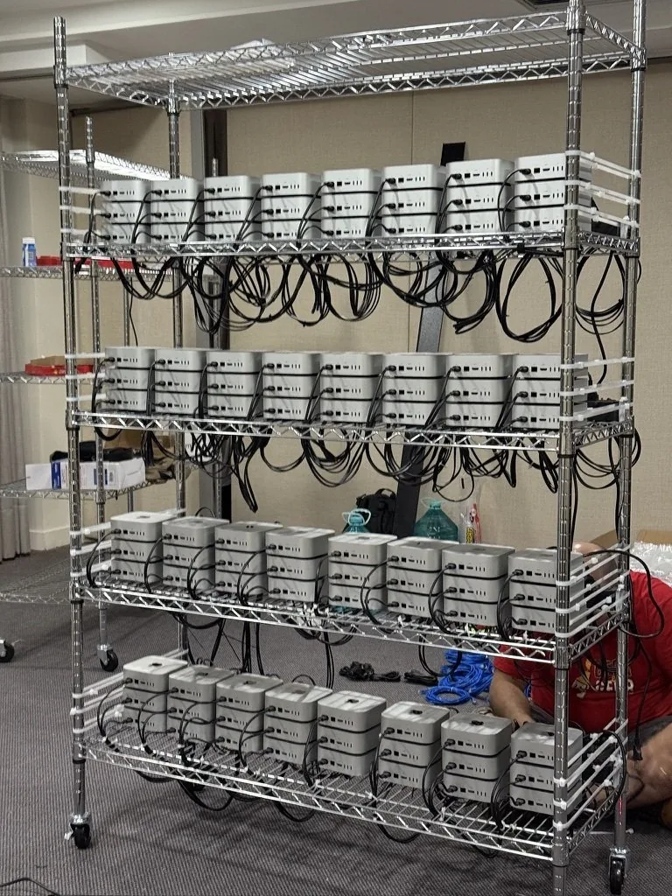

# 2025 年第 16 周技术阅读汇总

[English](README.md) | 简体中文

by @corenel (Yusu Pan) and LLMs

以下为 2025 年 第 16 周（4 月 14 日至 4 月 20 日）期间我所阅读或者输入的内容。为简洁起见，仅列出标题、URL 以及 LLM 生成的概要，以供有兴趣者阅读，进一步的分析、反思与精读不在此赘述。

## 目录

- [2025 年第 16 周技术阅读汇总](#2025-年第-16-周技术阅读汇总)
  - [目录](#目录)
  - [专题](#专题)
    - [又是一堆新模型](#又是一堆新模型)
      - [OpenAI GPT-4.1](#openai-gpt-41)
      - [OpenAI o3 与 o4-mini：迈向智能体 AI 的雄心与现实](#openai-o3-与-o4-mini迈向智能体-ai-的雄心与现实)
      - [Gemini 2.5 Flash](#gemini-25-flash)
  - [续闻](#续闻)
  - [有趣的事与物](#有趣的事与物)
    - [ACGN](#acgn)
      - [摆脱喧嚣，重拾本真：探寻电子游戏个人化享受之道](#摆脱喧嚣重拾本真探寻电子游戏个人化享受之道)
      - [三十年求索路漫漫：国产单机游戏从困顿走向曙光的历史回响与启示](#三十年求索路漫漫国产单机游戏从困顿走向曙光的历史回响与启示)
      - [任天堂的 VR“黑历史”：复盘 Virtual Boy 的创新陷阱与惨痛教训](#任天堂的-vr黑历史复盘-virtual-boy-的创新陷阱与惨痛教训)
      - [虚拟之声的再进化：当 AI 与社群力量重塑音乐认知版图](#虚拟之声的再进化当-ai-与社群力量重塑音乐认知版图)
    - [图书](#图书)
    - [技术与互联网](#技术与互联网)
      - [GitHub 主动屏蔽中国大陆 IP 事件](#github-主动屏蔽中国大陆-ip-事件)
      - [揭秘 Unix 起源：一部关于创新、限制与偶然的历史](#揭秘-unix-起源一部关于创新限制与偶然的历史)
      - [不止是工具：追溯 Vi 与 Vim 的演化历程与设计哲学](#不止是工具追溯-vi-与-vim-的演化历程与设计哲学)
      - [科学立国：范内瓦·布什的《无尽前沿》及其对今日科技的启示](#科学立国范内瓦布什的无尽前沿及其对今日科技的启示)
      - [影视飓风困境：在参数瓶颈与用户割裂时代，相机评测为何步履维艰？](#影视飓风困境在参数瓶颈与用户割裂时代相机评测为何步履维艰)
    - [软件与开发](#软件与开发)
      - [从 Go+ 与 LLM+MCP 实践看系统架构中‘乘法’思维的力量](#从-go-与-llmmcp-实践看系统架构中乘法思维的力量)
      - [MCP Run Python：基于 Deno 与 Pyodide 的 LLM 代码安全执行沙箱](#mcp-run-python基于-deno-与-pyodide-的-llm-代码安全执行沙箱)
      - [返璞归真：“硬核”原生 JS 视图构建模式](#返璞归真硬核原生-js-视图构建模式)
      - [XSLT 应用：将原生 RSS/Atom Feed 转化为用户友好的网页视图](#xslt-应用将原生-rssatom-feed-转化为用户友好的网页视图)
      - [解析 Bitwarden、KeePass 与 KeePassXC 开源密码管理方案](#解析-bitwardenkeepass-与-keepassxc-开源密码管理方案)
      - [utl::profiler：为 C++17 设计的轻量级局部性能剖析库](#utlprofiler为-c17-设计的轻量级局部性能剖析库)
      - [PocketServer：iOS 上的轻量级本地 HTTP 与 WebDAV 服务器](#pocketserverios-上的轻量级本地-http-与-webdav-服务器)
      - [Online3DViewer：开源浏览器 3D 可视化库](#online3dviewer开源浏览器-3d-可视化库)
      - [Treex：灵活的多格式目录结构可视化命令行工具](#treex灵活的多格式目录结构可视化命令行工具)
    - [硬件与设备](#硬件与设备)
      - [告别笔记本？一位技术编辑的迷你 PC+AR 眼镜移动办公深度体验](#告别笔记本一位技术编辑的迷你-pcar-眼镜移动办公深度体验)
      - [大芯片时代已至：驱动半导体未来的芯粒与异构集成](#大芯片时代已至驱动半导体未来的芯粒与异构集成)
    - [写作与知识管理](#写作与知识管理)
      - [当 AI 成为写作伙伴：一位实践者的深度漫谈与反思](#当-ai-成为写作伙伴一位实践者的深度漫谈与反思)
      - [笔记的断舍离：走出数字囤积，重塑思维秩序](#笔记的断舍离走出数字囤积重塑思维秩序)
      - [ProNotes：为 Apple Notes 注入现代效率与 AI 智能](#pronotes为-apple-notes-注入现代效率与-ai-智能)
    - [项目与团队管理](#项目与团队管理)
      - [一位前谷歌工程师的裁员反思：“我只是一枚齿轮”？](#一位前谷歌工程师的裁员反思我只是一枚齿轮)
    - [播客与视频](#播客与视频)
    - [生成式人工智能](#生成式人工智能)
      - [AI 下半场已至：评估，定义下一个十年](#ai-下半场已至评估定义下一个十年)
      - [AI 虚拟化身：跨越“恐怖谷”，开启交互新纪元](#ai-虚拟化身跨越恐怖谷开启交互新纪元)
      - [超长上下文窗口：LLM 的下一个里程碑还是昂贵的弯路？](#超长上下文窗口llm-的下一个里程碑还是昂贵的弯路)
      - [MLA 详解：DeepSeek V2 中实现革命性成本优化的注意力机制](#mla-详解deepseek-v2-中实现革命性成本优化的注意力机制)
      - [探秘 671B LLM 的推理内部机制：DeepSeek R1 首批机制解释性工具与初步发现](#探秘-671b-llm-的推理内部机制deepseek-r1-首批机制解释性工具与初步发现)
      - [现代生成模型为何青睐两阶段潜空间方法？](#现代生成模型为何青睐两阶段潜空间方法)
      - [探索 SDXL-VAE：极端瓶颈下，信息如何“逃离网格”进行空间编码？](#探索-sdxl-vae极端瓶颈下信息如何逃离网格进行空间编码)
      - [从代码到情感：Project Airi 记忆系统的深度探索](#从代码到情感project-airi-记忆系统的深度探索)
      - [AI 浪潮两年后，开发者“终结”了吗？解读人机协作的新现实](#ai-浪潮两年后开发者终结了吗解读人机协作的新现实)
      - [告别 AI 取代焦虑：拥抱 Agentic AI，成为智能时代的指挥官](#告别-ai-取代焦虑拥抱-agentic-ai成为智能时代的指挥官)
      - [思维先行，AI 赋能：AI 时代的技术自学之道](#思维先行ai-赋能ai-时代的技术自学之道)
      - [解构 AI 产品开发：来自一线实践的核心洞察与范式变革](#解构-ai-产品开发来自一线实践的核心洞察与范式变革)
      - [模型赛道之外：AI 产业价值链重构的核心逻辑与未来趋势解读](#模型赛道之外ai-产业价值链重构的核心逻辑与未来趋势解读)
      - [GitHub Copilot AI 模型选型：平衡速度、智能与成本](#github-copilot-ai-模型选型平衡速度智能与成本)
      - [上万美元的本地 LLM 配置：不止于爱好的多元驱动力](#上万美元的本地-llm-配置不止于爱好的多元驱动力)
      - [针对 LLMs 的森林火灾模拟测试基准](#针对-llms-的森林火灾模拟测试基准)
      - [告别 PDF 翻译低效陷阱：AI 驱动的 Markdown 工作流实战指南](#告别-pdf-翻译低效陷阱ai-驱动的-markdown-工作流实战指南)
      - [AI“洗图”新技巧：从图片重建可编辑 drawio 图表](#ai洗图新技巧从图片重建可编辑-drawio-图表)
      - [Gemini 2.5 的隐藏能力：低成本图像分割 API 及其潜力解读](#gemini-25-的隐藏能力低成本图像分割-api-及其潜力解读)
      - [Wan2.1-FLF2V-14B：能够指定首尾帧的图像到视频生成](#wan21-flf2v-14b能够指定首尾帧的图像到视频生成)
      - [CSM-Streaming：探索实时流式语音合成、微调与对话交互新可能](#csm-streaming探索实时流式语音合成微调与对话交互新可能)
      - [UI-TARS 1.5：强化学习驱动推理的 GUI 智能体](#ui-tars-15强化学习驱动推理的-gui-智能体)
      - [Moondream 2B 更新：迈向“左上角”，定义小型 VLMs 效率新基准](#moondream-2b-更新迈向左上角定义小型-vlms-效率新基准)
      - [vLLM 集成 Transformers 后端：兼得模型灵活性与推理效率](#vllm-集成-transformers-后端兼得模型灵活性与推理效率)
      - [Perplexity 的 DeepSeek V3/R1 MoE 模型部署实践经验](#perplexity-的-deepseek-v3r1-moe-模型部署实践经验)
      - [LLMFarm：面向 iOS 与 macOS 的 llama.cpp 前端](#llmfarm面向-ios-与-macos-的-llamacpp-前端)
      - [「浮望」FlowDown：在喧嚣的 AI Agent 浪潮中，回归流畅与用户主权的探索](#浮望flowdown在喧嚣的-ai-agent-浪潮中回归流畅与用户主权的探索)
      - [DroidRun：当 AI 智能体遇上安卓原生应用](#droidrun当-ai-智能体遇上安卓原生应用)
    - [其他](#其他)
      - [衣物护理的系统化思维：换季衣物洗护指南](#衣物护理的系统化思维换季衣物洗护指南)
      - [从“舒适区”到“氛围组”：解码少数派办公空间升级中的人本细节与文化营造](#从舒适区到氛围组解码少数派办公空间升级中的人本细节与文化营造)
      - [关税风暴眼中的义乌：韧性密码与全球贸易的“中国样本”](#关税风暴眼中的义乌韧性密码与全球贸易的中国样本)
      - [从雄心到废墟：一位华裔创业者在美国“铁锈带”的工厂悲歌与警示](#从雄心到废墟一位华裔创业者在美国铁锈带的工厂悲歌与警示)
    - [Just For Fun](#just-for-fun)
      - [“关税壁垒”入侵 Python：tariff 包的技术讽刺](#关税壁垒入侵-pythontariff包的技术讽刺)
      - [摆满机柜的 Macmini 集群](#摆满机柜的-macmini-集群)
      - [如何通过 AI 创业轻松赚取 1000 万美元？](#如何通过-ai-创业轻松赚取-1000-万美元)
  - [摘录](#摘录)
  - [学术研究](#学术研究)
    - [目标检测](#目标检测)
      - [2PCNet：双阶段一致性训练提升昼夜无监督目标检测](#2pcnet双阶段一致性训练提升昼夜无监督目标检测)
      - [RICCARDO：显式建模雷达回波以提升相机 - 雷达融合目标检测性能](#riccardo显式建模雷达回波以提升相机---雷达融合目标检测性能)
      - [YOLO 选型实战指南：v5 至 v11 模型在 CPU/GPU 及小目标场景下的性能横评](#yolo-选型实战指南v5-至-v11-模型在-cpugpu-及小目标场景下的性能横评)
      - [针对 YOLOv12 注意力机制的解析与测试](#针对-yolov12-注意力机制的解析与测试)
      - [对抗雾天挑战：基于感知损失的 RT-DETR 目标检测性能提升研究](#对抗雾天挑战基于感知损失的-rt-detr-目标检测性能提升研究)
    - [目标跟踪](#目标跟踪)
    - [语义分割](#语义分割)
      - [NCLR：以 2D-3D 神经校准作为代理任务用于 LiDAR 点云自监督学习](#nclr以-2d-3d-神经校准作为代理任务用于-lidar-点云自监督学习)
      - [EmbodiedSAM：视觉基础模型赋能在线实时 3D 实例分割](#embodiedsam视觉基础模型赋能在线实时-3d-实例分割)
      - [Mosaic3D：以 5.6M 标注数据集驱动开放词汇 3D 分割](#mosaic3d以-56m-标注数据集驱动开放词汇-3d-分割)
      - [长程轨迹与基础模型融合的视频运动对象分割](#长程轨迹与基础模型融合的视频运动对象分割)
      - [FLOSS：利用无监督类专家模板选择，实现开放词汇语义分割性能的“免费”提升](#floss利用无监督类专家模板选择实现开放词汇语义分割性能的免费提升)
      - [CAGS：利用上下文感知提升 3DGS 开放词汇理解中的表示细节与语义一致性](#cags利用上下文感知提升-3dgs-开放词汇理解中的表示细节与语义一致性)
    - [自动驾驶](#自动驾驶)
      - [TwinLiteNet+：平衡精度与效率的实时驾驶区域与车道线分割模型](#twinlitenet平衡精度与效率的实时驾驶区域与车道线分割模型)
      - [Driving-RAG：提升大模型在自动驾驶海量场景下的规划能力](#driving-rag提升大模型在自动驾驶海量场景下的规划能力)
      - [AGO：自适应基准化与对齐 VLMs 的开放世界 3D 占用预测](#ago自适应基准化与对齐-vlms-的开放世界-3d-占用预测)
      - [CAL：基于未标注数据和基础模型的零样本激光雷达场景补全](#cal基于未标注数据和基础模型的零样本激光雷达场景补全)
      - [Prompt Adapter：融合异构无标签数据的自动驾驶 3D 感知自监督预训练](#prompt-adapter融合异构无标签数据的自动驾驶-3d-感知自监督预训练)
    - [场景重建](#场景重建)
      - [3DGRUT/3DGRT：融合光栅化与光线追踪的 3DGS](#3dgrut3dgrt融合光栅化与光线追踪的-3dgs)
      - [InstanceGaussian：融合外观与语义的 3DGS](#instancegaussian融合外观与语义的-3dgs)
      - [Regist3R：基于立体基础模型的增量式注册，实现高效可扩展三维重建](#regist3r基于立体基础模型的增量式注册实现高效可扩展三维重建)
      - [SplatMAP：融合稠密 SLAM 与 3DGS 进行单目高保真三维重建](#splatmap融合稠密-slam-与-3dgs-进行单目高保真三维重建)
      - [HOMER：基于单应性的高效多视图 3D 对象移除](#homer基于单应性的高效多视图-3d-对象移除)
      - [Geo4D：利用视频生成先验提升动态场景 4D 重建](#geo4d利用视频生成先验提升动态场景-4d-重建)
      - [St4RTrack：在统一框架下实现世界坐标系中的同步 4D 重建与追踪](#st4rtrack在统一框架下实现世界坐标系中的同步-4d-重建与追踪)
      - [ODHSR：实时单目三维人体与场景重建](#odhsr实时单目三维人体与场景重建)
    - [仿真渲染](#仿真渲染)
      - [WORLDMEM：引入记忆机制，实现长时序一致的世界模拟](#worldmem引入记忆机制实现长时序一致的世界模拟)
      - [AAA-Gaussians：实现无瑕疵的高质量实时 3D 高斯溅射渲染](#aaa-gaussians实现无瑕疵的高质量实时-3d-高斯溅射渲染)
    - [深度估计](#深度估计)
      - [Metric-Solver：利用滑动锚点实现跨场景尺度自适应单目度量深度估计](#metric-solver利用滑动锚点实现跨场景尺度自适应单目度量深度估计)
    - [SLAM](#slam)
      - [AerialMegaDepth：融合伪合成与真实数据提升地空三维视觉任务](#aerialmegadepth融合伪合成与真实数据提升地空三维视觉任务)
      - [SOL-SLAM：基于鲁棒深度估计与视觉里程计的在线自适应 SLAM](#sol-slam基于鲁棒深度估计与视觉里程计的在线自适应-slam)
      - [Flow Intelligence：以时序运动模式实现鲁棒跨模态视频特征匹配](#flow-intelligence以时序运动模式实现鲁棒跨模态视频特征匹配)
    - [语言模型](#语言模型)
      - [不止于模型：SWE-agent 证明智能体接口设计的关键价值](#不止于模型swe-agent-证明智能体接口设计的关键价值)
      - [ReTool：强化学习赋能 LLM 策略性工具使用，大幅提升复杂数学推理能力](#retool强化学习赋能-llm-策略性工具使用大幅提升复杂数学推理能力)
      - [大型推理模型（LRM）真的在“推理”吗？深度剖析其能力来源、局限与核心迷思](#大型推理模型lrm真的在推理吗深度剖析其能力来源局限与核心迷思)
      - [MOSAIC：以 LLM 驱动的社交模拟探索内容传播与治理](#mosaic以-llm-驱动的社交模拟探索内容传播与治理)
      - [GRA：小型 LLMs 角色化协同执行数据合成任务](#gra小型-llms-角色化协同执行数据合成任务)
      - [CLIMB：自动化迭代优化 LLMs 预训练数据混合](#climb自动化迭代优化-llms-预训练数据混合)
      - [盘古 Ultra：推动稠密大模型极限，昇腾 NPU 上的新里程碑](#盘古-ultra推动稠密大模型极限昇腾-npu-上的新里程碑)
      - [bitnet.cpp：在 CPU 上实现 1-bit 大模型高效无损推理](#bitnetcpp在-cpu-上实现-1-bit-大模型高效无损推理)
      - [Prima.cpp：在低资源家庭集群上加速 70B 参数大模型推理](#primacpp在低资源家庭集群上加速-70b-参数大模型推理)
      - [利用“睡眠时间计算”提升 LLM 推理效率](#利用睡眠时间计算提升-llm-推理效率)
      - [VLPure-AL：借助预训练视觉语言模型优化开集主动学习，显著降低标注成本](#vlpure-al借助预训练视觉语言模型优化开集主动学习显著降低标注成本)
      - [Liquid：不依赖外部视觉模型的统一多模态 LLM](#liquid不依赖外部视觉模型的统一多模态-llm)
      - [FUSION：迈向视觉与语言表征完全整合的 VLMs](#fusion迈向视觉与语言表征完全整合的-vlms)
      - [Feat2GS：量化视觉基础模型的三维几何与纹理感知差异](#feat2gs量化视觉基础模型的三维几何与纹理感知差异)
      - [CAPability 基准测试：评估多模态大模型视觉描述能力](#capability-基准测试评估多模态大模型视觉描述能力)
      - [VLMs 检测分割能力深度评测](#vlms-检测分割能力深度评测)
      - [弥合生成与判别：通过对齐解锁扩散模型的视觉感知力量](#弥合生成与判别通过对齐解锁扩散模型的视觉感知力量)
      - [NoisyRollout：使用噪声提升视觉语言模型的推理泛化能力](#noisyrollout使用噪声提升视觉语言模型的推理泛化能力)
    - [内容生成](#内容生成)
      - [DMM：知识蒸馏重塑 T2I 模型合并，迈向通用可控的图像生成](#dmm知识蒸馏重塑-t2i-模型合并迈向通用可控的图像生成)
      - [OmniTalker：文本驱动、音视频风格一体化复制的实时说话人视频生成](#omnitalker文本驱动音视频风格一体化复制的实时说话人视频生成)
      - [InstantCharacter：基于 DiT 实现可扩展、高保真的开放域角色生成](#instantcharacter基于-dit-实现可扩展高保真的开放域角色生成)
      - [SHeaP：利用 2D 高斯实现高精度自监督人头建模](#sheap利用-2d-高斯实现高精度自监督人头建模)
      - [FramePack：克服长视频生成的遗忘与漂移双重挑战](#framepack克服长视频生成的遗忘与漂移双重挑战)
      - [即梦 3.0：高质量文本渲染与高分辨率的中英双语图像生成](#即梦-30高质量文本渲染与高分辨率的中英双语图像生成)
      - [从虚拟到现实：AI 驱动的 3D 对象与场景生成综述](#从虚拟到现实ai-驱动的-3d-对象与场景生成综述)
      - [SEDIC：在极低码率图像压缩中实现感知质量与语义一致性](#sedic在极低码率图像压缩中实现感知质量与语义一致性)
      - [LoRAX：结合 LoRA 实现高效、低参数的持续合成图像归因](#lorax结合-lora-实现高效低参数的持续合成图像归因)
      - [动漫 AI 伪造检测：AnimeDL-2M 数据集与 AniXplore 模型](#动漫-ai-伪造检测animedl-2m-数据集与-anixplore-模型)
      - [面向实时海洋视频处理：快速鲁棒的海天线检测算法与数据集](#面向实时海洋视频处理快速鲁棒的海天线检测算法与数据集)
      - [利用合成数据无监督训练全天候海事目标分类模型](#利用合成数据无监督训练全天候海事目标分类模型)
      - [深度与语言联合驱动的红外与可见光图像融合](#深度与语言联合驱动的红外与可见光图像融合)
      - [模拟真实成像：基于 ISP 驱动数据合成的低光图像增强](#模拟真实成像基于-isp-驱动数据合成的低光图像增强)
      - [神经拟态传感器（事件相机）技术、算法与应用综述](#神经拟态传感器事件相机技术算法与应用综述)
      - [超越饱和：Modulo 成像传感器提升自动驾驶目标检测鲁棒性与实时性](#超越饱和modulo-成像传感器提升自动驾驶目标检测鲁棒性与实时性)
      - [TorchFX：基于 PyTorch 与 GPU 加速的现代音频 DSP 库](#torchfx基于-pytorch-与-gpu-加速的现代音频-dsp-库)

## 专题

### 又是一堆新模型

#### OpenAI GPT-4.1

之前在 OpenRouter 上测试的两个新模型就是 GPT-4.1 的先期版本。

- [[202504052322_初步体验 Quasar Alpha 模型]]
- [[202504110816_初步体验 Optimus Alpha 模型]]

[[202504151312_初步体验 GPT-4.1]]

OpenAI 近期发布的 GPT-4.1 API 家族引发业界广泛关注。官方宣称其在编码、指令遵循及长文本处理上实现重大突破，支持前所未有的百万级 Token 上下文，并显著优化了成本效益。

OpenAI 本次发布的核心主张是，GPT-4.1 系列模型（包括 GPT-4.1、GPT-4.1 mini 和 GPT-4.1 nano）代表了其 API 产品的一次重要迭代，旨在为开发者提供更强大、更可靠且更具成本效益的 AI 工具，特别强调了其在驱动智能体（Agents）等复杂应用方面的潜力。这一主张主要建立在以下几个关键论据之上：

首先，新模型在多个关键能力维度上展现出显著的量化提升。根据 OpenAI 公布的数据，相较于 GPT-4o，GPT-4.1 在 编码能力 (如 SWE-bench Verified 指标提升 21.4% abs)、指令遵循能力 (如 Scale's MultiChallenge 提升 10.5% abs) 以及 长文本理解能力 (如 Video-MME 提升 6.7% abs) 上均有明显进步。这表明 OpenAI 在持续优化模型的核心智能，特别是在开发者高度关注的领域进行了针对性强化。

其次，全系支持高达 100 万 Token 的上下文窗口是本次发布的重大技术亮点。OpenAI 不仅宣布了这一业界领先的参数，还通过“大海捞针”(Needle-in-a-Haystack) 测试以及新开源的更复杂的 OpenAI-MRCR (多信息检索与理解) 和 Graphwalks (图路径推理) 基准，证明了模型在超长上下文下具备有效的信息检索和基础推理能力。这为处理超长文档分析、维护长期对话记忆等应用场景打开了新的可能性。

再者，优化的成本效益与多样化的模型选择是其面向开发者的核心吸引力。GPT-4.1 mini 版本尤其突出，官方数据显示其在提供接近甚至部分超越 GPT-4o 性能的同时，成本降低了 83%，延迟近减半，使其成为极具竞争力的“甜点级”模型。而 GPT-4.1 nano 则追求极致的速度和低成本，面向特定低延迟或大规模部署场景。这种 分层策略 旨在满足不同开发者的性能、成本和速度需求。

然而，对 GPT-4.1 的解读需要结合更广泛的视角。第三方独立评测（如 KCORES、Aider）的结果揭示了官方数据的局限性。例如，KCORES 认为 GPT-4.1 主模型在某些复杂推理和模拟任务上可能不如 Gemini 2.5 Pro 或 Qwen 2.5 Max，甚至对其 nano 版本的实用性提出严重质疑。Aider 评测则将 GPT-4.1 的编码能力定位在行业中游，而非绝对顶尖。这提醒我们，基准测试得分并不能完全等同于真实世界的泛化能力，模型的表现高度依赖于具体的任务和评估方法。

此外，100 万 Token 上下文的实用价值仍需审视。虽然技术上实现了支持，但其带来的 高昂成本（即使单价降低，总量依然可观）和 显著延迟（官方数据 1M 输入首 token 约 1 分钟）可能限制其在许多实际应用中的可行性。模型在如此长的上下文中进行复杂推理和保持逻辑一致性的能力，也需要更多实践检验。

OpenAI 的 API 独占策略（GPT-4.1 仅通过 API 提供）进一步凸显了其 聚焦开发者生态和推动 AI 作为平台服务 (AIaaS) 的战略意图。这为开发者提供了直接使用最新模型的能力，但也意味着普通用户无法立即在 ChatGPT 等产品中体验其全部功能。

总而言之，GPT-4.1 API 系列无疑是 OpenAI 的一次重要发布，它在 特定能力（编码、指令遵循、基础长文本处理）上取得了可验证的进步，并通过 创新的模型组合（尤其是高性价比的 mini 版本）和技术特性（1M 上下文），为开发者提供了更丰富的工具选择。其对智能体等未来应用的侧重也指明了技术演进的方向。

建议读者进一步阅读 OpenAI 的官方发布博客，同时参考 KCORES、Aider 等独立评测报告，以形成对 GPT-4.1 系列全面而客观的认识。

#### OpenAI o3 与 o4-mini：迈向智能体 AI 的雄心与现实

[[202504060156_初步体验 OpenAI o3]]

在人工智能飞速发展的浪潮中，OpenAI 再次投下重磅新作——o3 与 o4-mini 模型。官方宣称这是其迄今最智能、最强大的模型，核心突破在于显著提升的推理能力与首次实现的智能体式（agentically）全工具集成。这不仅是一次模型的迭代，更被视为 OpenAI 向更自主、更能解决现实问题的智能体 AI 迈进的战略性一步。然而，在聚光灯下，o3 与 o4-mini 的真实表现如何？它们是否真正开启了 Agentic AI 的新篇章？还有待观察。

OpenAI 本次发布的 o3 和 o4-mini，其核心主张围绕两大支柱构建：一是深度推理能力的增强，模型被训练进行“更长时间思考”，旨在攻克更复杂的逻辑、数学和科学难题；二是革命性的工具使用范式，即模型能够智能体式地、策略性地调用并组合 ChatGPT 内部的九种工具（涵盖搜索、代码执行、视觉分析、图像生成、自动化任务等），以应对多层面、需要多步骤解决的现实世界问题。这标志着 OpenAI 试图将 LLM 从信息检索和文本生成的角色，推向能够主动规划并执行任务的智能体（Agent）。官方公布的基准数据显示，新模型在 AIME 数学竞赛、部分编程基准（如 Aider）以及长文本处理（Fiction.LiveBench 中 o3 表现卓越）等领域取得了亮眼成绩，部分用户案例（如精准的 GeoGuessr 地理定位、基于冰箱照片生成食谱、精细的图像编辑）也生动展示了其潜力。

然而，正如业界的普遍观察，AI 的真实能力远非单一基准所能完全衡量。综合第三方评测（如 KCORES 指出其在复杂编程任务上落后于竞品）和广泛的用户反馈，一幅更复杂、更现实的图景浮现出来。新模型在可靠性方面仍面临严峻挑战，幻觉问题依然存在，甚至出现了新的“工具使用幻觉”——模型声称使用了工具但实际并未成功执行，这对于依赖工具执行任务的 Agentic AI 而言是致命短板。在某些专业领域（Niche）和事实性核查方面，其表现并不稳定，有时甚至不如 Google Gemini 2.5 Pro 或 Anthropic Claude 3.7 Sonnet 等主要竞争对手。此外，OpenAI 混乱的模型命名策略也给用户带来了困扰。

深入探究技术细节，泄露的 o4-mini 系统提示词为我们提供了宝贵的窗口，一窥 OpenAI 如何通过详尽的指令（如强制浏览、渠道管理）来“驯化”和引导模型实现预期的 Agentic 行为。这反映了当前实现可控 Agentic AI 的一种主流思路，但也暗示了其对模型自主性的某种不信任，以及控制的复杂性。大规模强化学习被用于训练工具使用策略，多模态能力的整合（“Thinking with Images”）也展现了融合视觉信息进行推理的潜力，尽管存在“过度思考”等问题。

对于技术和专业读者而言，o3 与 o4-mini 的发布并非简单的性能升级，而是 AI 发展范式探索的一个重要节点。它们所代表的 Agentic AI 方向，即让 AI 具备感知、规划、行动的能力，无疑是未来的大势所趋。开发者可以关注其工具集成架构、系统提示词设计思路以及多模态融合的应用潜力。但同时，必须审慎看待其当前的局限性，特别是可靠性问题。在实际应用中，不能盲信模型的自我报告（尤其是工具使用情况），需要建立严格的验证和容错机制。评估模型能力时，务必超越单一基准，结合实际任务表现和用户反馈。OpenAI 的探索，连同其面临的挑战，共同为我们理解下一代 AI 的可能性与必经之路提供了宝贵的案例研究。在拥抱新能力的同时，对其局限性和潜在风险保持清醒认知，将是未来成功应用和研究 AI 的关键。

#### Gemini 2.5 Flash

[[202504191735_初步体验 Gemini 2.5 Flash]]

## 续闻

## 有趣的事与物

### ACGN

#### 摆脱喧嚣，重拾本真：探寻电子游戏个人化享受之道

[[以玩「游戏」为目的，什么「姿势」最享受？]]

在信息爆炸、选择过载的时代，畅玩电子游戏本应是放松身心、激发想象的乐事，却常常被纷繁的评论、喧嚣的“党争”和复杂的商业模式所困扰。少数派作者 RosyClouds 的这篇文章，犹如一位经验丰富的玩家老友，以其独特的视角和真诚的分享，引导我们拨开迷雾，探讨如何回归游戏本身，找到那份属于自己的、最“享受”的游玩“姿势”。文章不仅梳理了游戏简史与在中国的特殊境遇，更对当前玩家面临的选择困境进行了深刻反思，值得每一位希望纯粹享受游戏的读者细细品味。

本文的核心主张在于：要实现电子游戏的真正享受，关键在于回归玩家的直接体验和个人判断，审慎对待外部信息干扰，并对塑造游戏环境的商业与历史因素保持清醒认知。作者认为，所谓最“享受”的姿势，并非遵循某种普适标准，而是源于个体在探索中形成的独特偏好与选择。

文章首先追溯了电子游戏从早期诞生到商业化，再到在中国特殊历史背景下的曲折发展。通过对比全球游戏史与中国“天崩开局”（如盗版横行、政策限制、社会污名化），作者有力地论证了为何在中国“好好玩游戏”和“玩好游戏”会面临更多挑战。这段历史梳理不仅提供了必要的背景知识，也为后文对玩家心态、消费习惯和行业现状的批判奠定了基础。

在探讨“玩什么”和“用什么玩”这两个核心问题时，作者展现了其鲜明的批判性立场和对个人体验的高度重视。他犀利地指出了过度依赖游戏评论（主观性强、易被带偏）、观看游戏实况视频（体验替代性差、易剧透）以及迷信大厂或制作人光环（易受资本运作影响）的局限性。作者极力倡导玩家通过亲身实践来发掘乐趣，建议从付费购买（尊重劳动）、尝试经典或打折游戏（低成本试错）入手，逐步建立自己的品味图谱。这种对“一手体验优先”的强调，是对当前信息过载环境下玩家自主性的一种呼唤。

针对平台选择，文章巧妙地解构了主机玩家群体中常见的“党争”现象（如“索狗”、“任豚”、“软饭”等标签），在分析索尼、任天堂、微软各自优势与局限的同时，核心在于劝导玩家摆脱非黑即白的阵营思维，根据自身需求理性选择。作者建议新手可从灵活性高的 PC 平台起步，再依据形成的偏好考虑购入主机，体现了务实且以玩家为本的思路。

尤为值得关注的是，文章对当前部分游戏商业模式的深刻批判。作者对“拆分售卖”的 DLC 模式、免费游戏（F2P）背后可能隐藏的盈利陷阱，以及特别是竞技游戏中常见的操纵性匹配机制和恶劣社区环境表达了强烈不满。他认为这些因素往往让玩家从“玩游戏”变成“被游戏玩”，严重侵蚀了游戏本应带来的纯粹乐趣。这种对商业逻辑异化玩家体验的警惕，是贯穿全文的重要线索。

文章的理论基础隐含着体验主义和对本真性的追求，并运用了批判视角来审视行业。其论证大量依赖个人经验和对特定案例（如小岛秀夫、腾讯）的解读，这使得文章充满真情实感和说服力，但也带有一定的主观色彩和理想化倾向。例如，其对付费游戏和单人/合作体验的偏爱，可能未能完全覆盖所有玩家的多样化需求与乐趣来源。

对于目标读者，尤其是刚入门或希望提升游戏体验的技术/专业读者而言，本文的价值在于：

1. 提供了一种反思框架：鼓励读者审视自己选择和评价游戏的方式，摆脱外部信息的过度影响。
2. 普及了必要的行业知识与历史背景：有助于理解当前游戏生态的复杂性。
3. 倡导了健康的消费观与玩家心态：强调尊重创作、理性消费和独立判断。
4. 揭示了潜在的“坑”：对于商业模式和社区环境中的负面因素给予了警示。

总而言之，这篇文章并非提供唯一正确的“攻略”，而是启发读者开启一段更自觉、更个性化的游戏探索之旅。它鼓励我们屏蔽噪音，聆听内心的声音，最终找到那个让自己能真正沉浸其中、乐在其中的“姿势”。对于渴望在数字娱乐中寻求纯粹快乐的玩家，以及关注科技与文化交融的读者来说，本文无疑提供了一个极具价值的参考视角。

#### 三十年求索路漫漫：国产单机游戏从困顿走向曙光的历史回响与启示

[[历史进程中的国产单机游戏]]

当《黑神话：悟空》以现象级姿态席卷全球，无数玩家为之沸腾时，我们或许不应忘记，这份瞩目的成就背后，是国产单机游戏长达三十年的坎坷求索。游研社的这篇文章，如同一部浓缩的行业断代史，细致描绘了这段从希望萌芽，历经盗版与市场寒冬的磨砺，到凭借坚守与时代机遇迎来复兴曙光的艰辛历程。它不仅记录了历史，更揭示了驱动产业沉浮的关键力量。对于关心中国游戏产业、乃至关注本土数字内容创作未来的读者而言，本文提供了不可多得的深度回顾与前瞻视角。

本文系统性地回顾了国产单机游戏自上世纪 90 年代至今三十年的发展变迁，其核心论点在于：国产单机游戏的发展并非坦途，而是一条在历史机遇与严峻挑战交织中，由环境变迁与开发者意志共同书写的曲折道路。

文章开篇追溯了 90 年代中期国产单机的早期黄金时代，以《生死之间》、《铁甲风暴》等作品为例，指出当时国内开发团队在创意与技术上紧随世界前沿，展现出不俗的潜力。然而，随之而来的“盗版困局”成为扼住行业咽喉的枷锁。作者引用具体数据（如正版平均销量仅 5000 套）和实例（如目标软件、像素软件的挣扎），深刻揭示了盗版对开发者收益的毁灭性打击。同时，结合当时的国民收入水平与高昂的软硬件成本，以及不完善的销售渠道（购买难、邮购贵），文章令人信服地论证了早期国产单机市场难以壮大的深层经济与市场结构原因。行业虽尝试通过 OEM 合作、低价倾销（如“芝麻开门”系列）等方式自救，但效果有限且乱象丛生。

进入 21 世纪，网络游戏的兴起成为重要的转折点。文章指出，这既是许多单机团队为求生存的无奈转型，也客观上导致了单机市场的长期沉寂。但即使在“冰河期”，仍有如“双剑”系列（《仙剑奇侠传》、《轩辕剑》）及其衍生作品（《仙剑四》、《古剑奇谭》）这样的坚守者，维系着国产单机的命脉，并承载着玩家的情感与文化寄托。同时，新一代开发者（如灵游坊、帕斯亚科技）的独立探索也为行业保留了火种。

文章的后半部分聚焦于近年来的复苏与突破。作者认为，经济发展带来的购买力提升、玩家正版意识的觉醒、以及 Steam 等数字发行平台的普及是关键的外部驱动力。这些因素共同改善了市场环境，为国产单机提供了生存和发展的土壤。文章列举了《艾希》、《太吾绘卷》等独立游戏的成功案例，以及《古剑奇谭 3》对标 3A 的尝试，展现了行业逐步回暖、量质齐升的态势。

最终，《黑神话：悟空》的巨大成功被视为这一轮复兴的高潮和里程碑。文章分析其成功是技术积累（引擎红利、外包经验）、市场成熟（庞大用户基数、便捷支付）、开发者决心与项目管理能力提升等多重因素叠加的结果，它不仅实现了几代游戏人的梦想（如毛星云的遗愿），更向世界证明了国产单机游戏的潜力。

文章结尾展望未来，列举了《影之刃零》、《燕云十六声》等一系列备受期待的新作，以及跨界资本的入局，描绘出一幅国产单机游戏“春天”似乎真正到来的乐观景象。但字里行间也隐含提醒：3A 之路并非坦途，产业生态的健康发展需要持续的努力和智慧。

对于技术/专业读者而言，本文不仅是一次游戏历史回顾，更是一个观察技术产品在特定市场环境下如何演进的生动案例。它揭示了知识产权保护、基础设施（如分发平台）、经济基础、人才培养以及开发者精神对于一个技术驱动型创意产业发展的极端重要性。理解这段历史，有助于我们更深刻地把握当前中国数字内容产业的机遇与挑战，并思考如何在各自领域内，推动那些既具技术含量又富文化价值的创新走向成功。同时，文中关于项目管理、技术选型（如引擎应用）的提及，也对相关从业者具有现实参考意义。总而言之，这是一篇信息量丰富、逻辑清晰、兼具历史深度与现实关照的佳作，值得细读与思考。

#### 任天堂的 VR“黑历史”：复盘 Virtual Boy 的创新陷阱与惨痛教训

[[每天有多少玩家教任天堂做产品？「世界主宰」的掌机之路 · 叁]]

科技创新之路并非坦途，即便是像任天堂这样的巨头也曾遭遇惨痛的滑铁卢。本文深入回顾了上世纪 90 年代，任天堂那款极具野心却最终灾难性失败的产品——Virtual Boy (VB)。这不仅是一个关于技术选型与市场错配的故事，更是对创新哲学、领导决策及其后果的一次深刻复盘，其教训对于今天的科技从业者和创新探索者而言，依然发人深省。

文章详细叙述了任天堂在 90 年代中期，面对主机市场激烈的 32 位机竞争压力，由传奇设计师横井军平主导，试图通过 Virtual Boy 这款具有“VR 体验”的便携设备来巩固其掌机市场领导地位的尝试。然而，这次被寄予厚望的创新最终演变成了一场商业灾难。

核心论点在于，Virtual Boy 的商业溃败并非单一因素导致，而是技术局限、设计哲学偏差、成本压力、软件匮乏与管理层决策失误共同作用的复杂结果。

首先，在技术与设计层面，VB 试图在 90 年代中期实现超前的 VR 沉浸感，但受限于当时的技术水平和成本控制。横井军平坚持其“基于枯萎技术的水平思考”哲学，虽在 Game Boy 上获得巨大成功，但应用在需要前沿技术支撑的 VR 设备上却显得水土不服。为了压缩成本（早期彩色原型成本高达 500 美元），VB 最终采用了廉价的单色红色 LED 屏幕，不仅显示效果差，更因其闪烁频率和近距离观看对玩家造成严重的视觉疲劳和不适。同时，关键的头部追踪技术被取消，代之以笨拙的桌面支架，进一步破坏了沉浸感和用户体验，甚至引发颈椎疲劳。这充分暴露了将成熟技术理念生硬套用在新兴技术领域的风险。

其次，软件生态的缺失是 VB 失败的另一关键。硬件的先天不足和开发难度，使得即便是任天堂内部的王牌制作人，如宫本茂，也对其缺乏信心，未能提供足够有吸引力的护航大作。文章提到，VB 平台总共仅有 22 款游戏问世，缺乏“杀手级应用”使得这个本就体验不佳的平台更加无人问津。

最后，管理层的决策失误为这场灾难画上了句号。任天堂时任社长山内溥，在公司面临主机市场竞争加剧、N64 开发延迟的双重压力下，对 VB 寄予了不切实际的厚望，定下了第一财年销售 500 万台的惊人目标。在项目本身问题重重、开发进度缓慢的情况下，山内溥最终选择强行于 1995 年 7 月发售这款尚未完善的产品。这一决策不仅未能挽救市场颓势，反而将 VB 的所有缺陷彻底暴露在消费者面前，加速了其市场的全面溃败。

最终结果是，Virtual Boy 在市场上迅速暴死，总销量不足 35 万台，与目标相去甚远，给任天堂带来了巨大的财务损失和声誉打击，甚至恶化了与重要第三方（如 SQUARE）的关系。而这场失败最沉重的代价之一，便是横井军平于 1996 年引咎辞职，离开了曾让他创造辉煌的任天堂。

Virtual Boy 的故事是科技创新史上的一个经典反面教材。它警示我们：

1. 用户体验是产品的生命线：任何技术创新，如果以牺牲核心用户体验为代价，都难以获得市场认可。
2. 警惕成功路径依赖：过往的成功经验（如“枯萎技术”理念）在面对全新的技术范式和市场环境时，可能不再适用甚至成为障碍。
3. 技术与市场的匹配至关重要：超前的技术理念需要找到合适的产品形态和市场时机，脱离现实的技术探索极易失败。
4. 理性决策与风险管理：尤其是在压力之下，领导层需要保持清醒，避免基于焦虑或不切实际期望的冒进决策。对创新项目进行客观评估和风险控制至关重要。

对于从事科技研发、产品设计或企业管理的读者而言，复盘 Virtual Boy 的历程，有助于更深刻地理解创新过程中技术、市场、管理等多重因素的复杂互动，从而在未来的实践中做出更明智的判断。

#### 虚拟之声的再进化：当 AI 与社群力量重塑音乐认知版图

[[虚拟音声浮沉二十载（下）：前路探索]]

虚拟音声技术早已不是新鲜事物，但其发展从未停止脚步。少数派 π+Prime 上的这篇文章并非简单的技术史回顾，而是敏锐地捕捉到了虚拟音声在当下，尤其是在 AI 技术 浪潮和 活跃社群互动 的双重驱动下，所展现出的深刻变革与未来潜力。对于关注音乐科技、亚文化演进以及社群创造力的读者而言，本文提供了一个极佳的观察窗口和思考框架。

文章的核心洞察在于，虚拟音声正经历一场从工具到文化力量、从边缘到与主流深度交融的深刻转变。作者讴纪 Grandalley 并未停留在对 Vocaloid 等传统合成技术的历史梳理，而是将目光投向了更前沿的动态。

首先，文章通过对日本音乐组合 YOASOBI 的分析，生动揭示了源自 Vocaloid (V 家) 的创作风格 如何成功“出圈”，不仅影响了主流流行音乐的编曲和审美，更引发了关于虚拟特性（如“虚拟歌姬不会累”）与真人演绎（如主唱 ikura 的高负荷演唱与“mikura”的戏称）之间 张力 的广泛讨论。这印证了虚拟音声已不再仅仅是幕后工具，而是能主动塑造音乐风格、引发跨文化现象的关键力量。同时，围绕特定作品（如《勇者》）产生的原作契合度讨论，也折射出虚拟元素融入主流叙事时可能带来的“违和感”与解读多样性。

其次，文章将焦点对准了一个更为激进和前沿的现象：技术驱动下的听众赋权与认知重塑。作者选取了跨媒体企划 BanG Dream! (邦邦) 中乐队 MyGO!!!!! 翻唱《Girls Band Cry》乐队歌曲《雑踏、僕らの街》所引发的激烈“社群拷打”作为核心案例。关键在于，这场争议并未停留在粉丝间的情绪化争吵，而是演变成了一场由爱好者、乐手乃至音乐专业学生广泛参与的 技术性论战。借助 GPT-SoVITS 等当时门槛较低的 AI 声音转换工具，听众得以“动手”进行实验——替换人声、修改编曲元素、制作对比版本，将主观听感差异转化为对编曲（如键盘的必要性）、混音、乃至“人声的器乐性”等专业问题的深度探讨。这极为生动地展示了 平民化技术如何赋予普通受众前所未有的分析、解构甚至“云 P”（指点）的能力，使得音乐讨论的深度和广度得以拓展，无意中也创造了新的“练耳”和学习场景。

文章深刻地指出，虚拟音声在此过程中扮演了“第三者”的角色——它不仅是声音的模拟，更是激发对话、承载多重意义（创作者意图、听众再解读、AI 实验结果）的媒介。这种由技术加持的 社群互动，正在悄然改变着音乐的认知生态：听众不再仅仅是被动的接受者，而是 积极的参与者和知识共创者；对音乐的理解也从单纯的感性欣赏，延伸到更具理性和实证色彩的分析与探究。

当然，作者也提示了潜在的风险（如伦理版权争议、情感过度投入等），并且其论述带有一定的文化语境（聚焦日本相关企划和社群）。其对社群互动的解读也倾向于积极和建设性的一面，现实中这类讨论的复杂性可能更高。

总而言之，作者凭借其敏锐的观察、详实的案例和深入的分析，为我们描绘了虚拟音声技术在 AI 时代令人兴奋的发展图景。它不仅记录了技术演进的足迹，更重要的是揭示了技术、文化与社群力量交织共振，如何深刻地改变着我们创作、体验和理解音乐的方式。

对于技术从业者（尤其是 AI、音频处理领域）、音乐创作者、文化研究者以及所有对数字时代艺术形态演变感兴趣的读者，这篇文章都极具参考价值。它提醒我们关注那些发生在虚拟与现实交界处、由技术赋能的社群实践，因为那里可能正孕育着未来的新范式。

### 图书

### 技术与互联网

#### GitHub 主动屏蔽中国大陆 IP 事件

[[202504140917_GitHub 主动屏蔽中国大陆 IP 事件分析（2025 年 4 月）]]

2025 年 4 月，全球最大的代码托管平台 GitHub 经历了一场短暂的“风波”：部分来自中国大陆的匿名用户突然发现无法访问该网站。一时间，“GitHub 屏蔽中国 IP”的消息在开发者社区迅速传开，引发广泛关注与猜测。尽管 GitHub 官方很快澄清这只是一次配置错误导致的意外，并恢复了访问，但这次“虚惊一场”无疑触动了中国开发者社区的敏感神经，也为我们审视全球化技术平台的运作及其风险提供了难得的契机。本文旨在基于现有信息，对该事件进行梳理与解读，探讨其背后的技术细节、社区反应、深层背景及未来启示。

根据 GitHub 官方发布的事故报告及多方技术验证，此次访问限制的核心原因被确认为 GitHub 内部的一次配置变更产生了意料之外的影响。具体表现为，在 2025 年 4 月 12 日至 13 日约 19 小时内，来自中国大陆的部分未登录（匿名）用户在访问 GitHub.com 时会收到 HTTP 403 Forbidden 的错误提示。关键在于，已登录用户和通过 SSH 协议进行的 Git 操作基本不受影响，且错误页面为 GitHub 自有格式，加之“首次请求可能成功、后续请求被拒”等非典型封锁特征，均指向问题源于 GitHub 应用层而非外部干扰（如 GFW）。GitHub 在发现问题后迅速撤销了相关配置，恢复了正常访问，并公开致歉，确认这并非有意为之的政策变动。

尽管官方定性为“意外”，但事件发生时，在中国开发者社区引发了巨大震动。这源于 GitHub 对中国开发者生态的极端重要性——不仅是代码托管和协作的基石（中国拥有超千万 GitHub 用户且活跃度全球领先），更是连接全球开源社区、获取前沿技术的重要窗口。因此，任何访问异常都会被高度关注。社区的反应迅速且多元：从早期监测到异常信号，到在 GitHub Community、V2EX 等平台热烈讨论、分享测试结果，再到开发者迅速找到并共享绕过方法（包括利用 Sheas Cealer 工具）。讨论中，除了技术诊断，也夹杂着对 “是否为 GFW 干扰”、“是否为 GitHub 主动封锁或‘预演’” 等猜测，反映了社区在长期面临网络访问不确定性和地缘政治风险背景下的深层焦虑。这种焦虑并非空穴来风，文章回顾了 GFW 历史上对 GitHub 的多次干扰，以及 GitHub 因遵守美国制裁而限制伊朗、俄罗斯等国用户的先例，这些都为社区的敏感反应提供了注脚。

此次事件，无论其起因多么“偶然”，都无可辩驳地暴露了中国开发者生态对单一、中心化、且位于境外的技术平台（GitHub）的严重依赖性及其固有风险。一旦平台出现技术故障、政策调整或受到地缘政治因素波及，可能对整个产业的创新和协作造成重大冲击。这促使业界和社区开始认真反思并探讨对策：

1. 风险意识觉醒与应对策略： 事件后，关于代码备份、使用国内镜像源、采用多平台托管（如 GitHub + Gitee）、加强本土社区建设和提升自主技术能力的讨论显著增多。这表明社区开始正视风险，并寻求务实的应对之道。
2. 开源基础设施的演化： 单一平台的脆弱性可能加速开源基础设施向 更加分布式、多元化 的方向演进。未来，多平台共存、自托管方案普及、甚至基于 P2P 的去中心化代码托管技术的发展都值得期待。这不仅是为了应对风险，也更符合开源精神的内在要求。
3. 全球平台的治理挑战： GitHub 事件也折射出所有全球化技术平台在日益复杂的国际环境中面临的治理困境——如何在遵守各国法律（有时甚至是相互冲突的）与维护平台开放中立性之间取得平衡。GitHub 未来对华策略，以及其他类似平台的全球运营，将持续在这种张力中展开。

总而言之，2025 年 4 月的 GitHub 中国访问事件，虽最终被证实为一场有惊无险的技术乌龙，但其敲响的警钟意义深远。它提醒我们，在享受全球化技术红利的同时，必须正视并管理其伴生的风险。对于中国开发者而言，这意味着在继续拥抱全球开源社区的同时，需要增强风险意识，做好预案，并积极参与构建一个更加健壮和多元化的本土及全球技术生态。对于 GitHub 及其他平台而言，则需加强内部管理，提高透明度，并更审慎地在复杂的全球环境中航行，以维系来之不易的用户信任和社区繁荣。技术应连接而非隔绝，开源的未来需要各方共同努力，跨越障碍，保持其开放与活力的本色。

#### 揭秘 Unix 起源：一部关于创新、限制与偶然的历史

[[Birth of Unix]]

> [!NOTE]
> 想要了解的还可以看《Unix 传奇：历史与回忆》这本书，很有意思。

在当今由 Linux、macOS 等系统主导的计算世界，Unix 的印记无处不在。然而，这个被誉为“有史以来最重要的操作系统之一”的系统，其诞生并非源于宏大的构想，而是一段充满曲折、偶然甚至带点“地下”色彩的传奇。这篇文章将带你回到计算的洪荒年代，揭示 Unix 是如何在大型项目的经验教训、工程师的个人巧思以及严苛现实的共同作用下，破土而出的。

这篇文章生动地回溯了 Unix 操作系统的诞生历程，其核心论点在于强调这一里程碑式的技术并非精密规划的产物，而是一系列因素——包括对先前项目（如 Multics）的反思、关键工程师（如 Ken Thompson, Dennis Ritchie）的个人创造力、以及现实约束（如计算成本和硬件限制）——相互作用下的有机演化结果。

文章首先描绘了早期计算的图景：繁琐的打孔卡交互与雄心勃勃但进展缓慢的 Multics 项目。正是贝尔实验室从 Multics 项目中的退出，为 Unix 的萌芽提供了契机。随后，叙述聚焦于 Ken Thompson 的关键作用——为了在更经济的 PDP-7 微型计算机上运行他编写的《太空旅行》游戏，他着手开发了一个“精简版”的操作系统雏形，这便是 Unix 的前身 Unics。这一细节生动地诠释了个人兴趣和解决具体问题如何成为重大创新的催化剂。

文章进一步揭示了 Unix 早期开发的“地下”性质。由于管理层对操作系统研究的支持有限，团队不得不巧妙地利用为专利部门开发文本格式化程序的需求，来申请购买关键的 PDP-11 计算机。这个故事不仅增添了传奇色彩，更凸显了在资源受限环境下，创新往往需要非凡的应变与坚持。Unix 在 PDP-11 上的成功移植和应用，最终为其赢得了正式的支持。

一个尤为关键的解读点在于 AT&T 1956 年同意令 的深远影响。这项法律裁决禁止 AT&T 进入非核心电信业务，使得 Unix 无法作为商业产品销售。其结果是，Unix 以收取象征性费用的源代码许可形式向学术界和工业界提供，且不附带官方技术支持。这一看似不利的限制，却无意中催生了最早的用户社区和协作文化，为后来的开源运动埋下了伏笔，深刻揭示了外部法律和商业环境如何能够意想不到地塑造技术生态。

此外，文章也恰当点出了 Dennis Ritchie 开发的 C 语言 对于 Unix 后续发展和可移植性的关键作用，进一步完善了 Unix 成功的技术拼图。

文章的价值在于，它不仅提供了一段引人入胜的技术史，更重要的是，它揭示了技术创新过程中的普遍规律：

- 简洁的力量：Unix 的成功很大程度上源于其对 Multics 复杂性的反叛，体现了简洁设计哲学的价值。
- 约束即机遇：无论是成本、硬件还是法律限制，都成为了塑造 Unix 特点和传播方式的关键驱动力。
- 非线性发展：技术突破往往伴随着偶然性、个人驱动和非计划性探索。

尽管文章可能在一定程度上简化了贝尔实验室的复杂环境和技术决策的内在逻辑，并带有一定的“英雄史观”色彩，但它仍然为我们理解 Unix 的起源、其核心设计理念的形成以及早期独特的传播模式 提供了宝贵的视角。对于任何对操作系统历史、软件工程原理或技术创新过程感兴趣的读者，这篇文章都值得一读，它提醒我们，改变世界的技术，其开端可能比我们想象的更为平凡和偶然。

#### 不止是工具：追溯 Vi 与 Vim 的演化历程与设计哲学

> [!NOTE]
> Vim 是我非常喜欢的编辑器，即使不用 Vim/NeoVim，也会在 IDE/Editor 中设置对应键位。

许多开发者每天都在使用 Vim，甚至将其视为编程“利器”，但对其独特的模式编辑、简洁的命令以及为何能历经三十余年依然保持活力的深层原因，可能不甚了了。来自 Pikuma 的这篇文章，并非又一篇 Vim 配置或技巧指南，而是一场深入其历史根源的精彩探索。它细致地追溯了从 UNIX 早期命令行编辑器 `ed`，经由 `em`、`vi`，再到众多 `vi` 克隆（如 `Stevie`、`Elvis`），最终抵达我们今天所熟知的 `Vim` 的完整演化历程。阅读此文，你将清晰地看到技术限制、关键人物的智慧与挫败感、以及开源精神是如何共同塑造了这款传奇编辑器，并对其独特的设计哲学获得前所未有的深刻理解。

文章的核心论点在于，Vi 与 Vim 的历史并非孤立的技术事件，而是与 UNIX 操作系统及开源软件发展史紧密交织、互为印证的一段传奇。作者 @pikuma 以其在伦敦玛丽女王大学（`em` 编辑器的诞生地）得知 Vim 创始人 Bram Moolenaar 去世消息的个人经历为引，巧妙地将我们带回了那个计算资源匮乏、交互方式原始的年代。

文章首先点明了 UNIX 环境对文本编辑的重度依赖，以及早期标准行编辑器 `ed` 因其晦涩命令和面向电传打字机的设计，给用户带来的挫败感。正是这种普遍的不满，催生了变革：George Coulouris 在伦敦玛丽女王大学开发了`em` (Ed for Mortals)，一个更友好的单行可视化编辑器，并率先使用了“原始终端输入模式”，为屏幕交互奠定了基础。

随后，故事转向加州大学伯克利分校，聚焦于 Bill Joy。他在修复 Pascal 编译器时同样苦于 `ed` 的低效，并在受到 `em` 展示和 Xerox PARC 的 `Bravo` 编辑器启发后，开发了行编辑器 `ex`，并最终为其添加了全屏可视化模式——即 `vi`。文章着重揭示了 `vi` 设计哲学的深刻根源：其著名的模式编辑 (modal editing) 和极其简洁的单字母命令，很大程度上并非刻意为之的复杂化，而是对当时严苛技术限制的创造性适应——特别是 Joy 使用的 ADM-3A 终端（其键盘布局影响了 Esc 和 HJKL 键的用法）以及极其缓慢的 300 波特调制解调器连接。这种“限制驱动创新”的理念贯穿始终。此外，`vi` 的成功普及还得益于它被免费捆绑在 BSD (Berkeley Software Distribution) 中，与当时可能需要付费数百美元的 Emacs 形成了鲜明对比。

然而，`vi` 基于 AT&T 代码的许可证限制阻碍了其自由传播和修改。这直接导致了“`vi` 克隆”时代的到来。文章重点介绍了两个关键克隆：`Stevie`，一个为 Atari ST 开发的、代码完全原创且自由发布的编辑器，它成为了后续许多克隆（包括 Vim）的合法基石；以及 `Elvis`，它通过将编辑缓冲区存入文件来提高稳定性，并率先引入了语法高亮等高级功能。

最终，焦点落在了 `Vim` (Vi IMproved) 上。文章澄清了一个关键事实：`Vim` 由 Bram Moolenaar 最初于 1988 年在 Commodore Amiga 平台上基于 `Stevie` 代码开始开发，其早期名称是 "Vi IMitation"（Vi 模仿品）。直到 1993 年移植到 UNIX 后才更名为 "Vi IMproved"，象征其已超越简单模仿，具备了更强的功能。文章列举了 Vim 发展中的重要里程碑（多窗口、GUI、语法高亮、折叠、标签页等），并强调了其成功的关键因素：Bram Moolenaar 数十年的持续领导与开发、基于 `Stevie` 的开源起点、独特的包含慈善条款的 Vim 许可证、以及极其强大的可扩展性（通过 plugins 和 VimScript）和庞大活跃的社区。

总而言之，这篇文章不仅仅是编辑器的编年史。它深刻揭示了技术工具的形态深受其诞生环境（硬件、网络、操作系统）和社会背景（许可证、社区文化）的塑造。对于任何使用 Vim 或对计算机历史、软件工程、开源文化感兴趣的读者，阅读原文都将是一次极具启发性的体验。它不仅能让你更理解手中工具为何是现在这个样子，更能让你体会到软件演化过程中充满了智慧、妥协、偶然与必然，以及像 Bram Moolenaar 这样的个体所能产生的深远影响。推荐所有希望超越“如何使用”层面、探寻技术“为何如此”的读者深入阅读。

#### 科学立国：范内瓦·布什的《无尽前沿》及其对今日科技的启示

[[Science, the Endless Frontier]]

70 多年前，一份名为《科学：无尽的前沿》的报告递交至美国总统案头，深刻地重塑了科学与国家的关系，其影响力绵延至今，塑造了我们今日所见的全球科技格局。为何这份诞生于二战硝烟散尽之际的历史文献，至今仍被科技界、政策界反复提及与解读？对于每一位步入科技领域的新人而言，理解这份奠基性文件，不仅是追溯历史，更是把握当下与未来的关键一环。

《科学：无尽的前沿》（Science: The Endless Frontier）是美国科学家、工程师及科学管理者范内瓦·布什（Vannevar Bush）应时任总统富兰克林·罗斯福的要求，于 1945 年 7 月完成并提交的一份里程碑式的报告。它不仅直接催生了美国国家科学基金会（National Science Foundation, NSF）的建立，更重要的是，它系统性地阐述了基础科学研究对于国家安全、经济繁荣和国民福祉的核心价值，并确立了联邦政府应承担起持续、稳定地资助基础研究和培养科学人才这一全新国家责任的基本框架。这一主张，在当时乃至今日，都具有划时代的意义。

报告的核心论证逻辑建立在对二战经验的深刻反思之上。布什指出，盟军之所以能在战争中取得技术优势（例如在雷达、原子能、青霉素等领域的突破），很大程度上得益于战前数十年在基础科学领域积累的知识“储备”。然而，战争期间，科学资源被大量动员用于解决眼前的军事和应用问题，导致基础研究这一“源头活水”本身及其人才储备面临枯竭的风险。他敏锐地预见到，在战后世界，一个国家若想保持领先地位，绝不能再仅仅依赖偶然的发现或他国的知识输入，而必须将推动基础科学的进步视为一项根本国策。

为此，布什在报告中雄辩地论证了以下几点：

- 基础研究是技术进步的“起搏器”：报告提出了一个影响深远的观点，即基础研究（旨在理解自然规律，不追求即时应用）是新知识的源泉，这些新知识最终将转化为新的技术、新的产业、更多的就业机会和更高的生活水平。这背后体现了一种线性创新模型的思想，即创新始于基础研究，终于市场应用。
- 政府资助的必要性与新角色：鉴于基础研究的高风险、长周期、成果的公共性以及传统资助渠道（如私人捐赠、基金会）的局限性，布什强调联邦政府必须承担起资助基础研究的主要责任。这标志着美国政府从有限介入科研活动向系统性、战略性支持科学研究角色的重大转变。
- 人才培养是核心环节：报告极具前瞻性地指出了科学人才短缺对国家未来的严重威胁，并提议建立国家级的奖学金和助学金计划，以确保有才华的年轻人，无论其经济背景如何，都有机会接受高等科学教育，成为未来的科学家和工程师。
- 建立独立的国家科学机构：为了有效执行上述任务，并保护科学研究的自由探索精神免受短期政治或商业压力的干扰，报告建议成立一个独立于现有行政部门的国家研究基金会（National Research Foundation）。该机构应由理解科研规律的专家领导，并遵循确保资金稳定、支持非政府研究机构（主要是大学）、维护学术自由等核心原则运作。

《科学：无尽的前沿》的发表，标志着现代美国乃至全球科技政策体系的开端。它所倡导的原则，如政府对基础研究的承诺、同行评议制度、对大学作为基础研究核心的定位、对科学人才的重视，在很大程度上塑造了战后至今的科研格局。NSF 以及国立卫生研究院（NIH）等机构的蓬勃发展，都是其深远影响的直接体现。

当然，时移世易，报告中的某些观点和假设也经历了演变和挑战。例如，过于简化的线性创新模型已受到后续研究的修正，人们认识到创新路径更为复杂和互动；NSF 的实际发展也扩展到了布什最初可能未充分预见的领域（如社会科学、工程学、教育等）。然而，报告所提出的核心问题——国家为何要支持科学？如何有效支持？如何在支持的同时保障科学的活力与自由？——在今天依然具有强大的现实意义。

对于初入科技领域的读者而言，精读《科学：无尽的前沿》原文（或其关键章节），有助于深刻理解：

- 现代科研体系，特别是政府 - 大学 - 产业互动关系的由来与逻辑。
- 基础研究与应用研究的辩证关系及其对创新的重要性。
- 科技政策是如何制定并演变的，以及它如何影响科研实践。
- 作为科技工作者，我们所处的这个宏大体系的历史根基与核心价值观。

#### 影视飓风困境：在参数瓶颈与用户割裂时代，相机评测为何步履维艰？

[[影视飓风的评测问题]]

知名科技频道“影视飓风”创始人 Tim 近期发布了一则引人深思的视频，坦诚地探讨了当前相机评测领域面临的困境与挑战。当相机性能增长趋缓，厂商策略日益分化，用户需求也变得前所未有地割裂时，传统的评测方法论正遭遇严峻考验。这不仅是评测者的烦恼，也折射出整个科技产品评价体系在新环境下的适应性问题。

影视飓风 Tim 在这期视频中，核心论点直指当前相机评测正变得“越来越难做，也越来越怪”。他认为，这一困境源于多重因素的交织。

首先，相机市场本身正经历深刻变革。一方面，市场整体趋于饱和甚至衰退，另一方面，核心性能参数（如像素、视频规格）的提升已触及瓶颈，难以再现昔日“参数爆炸”带来的评测兴奋点。同时，手机摄影的强势崛起进一步压缩了传统相机的生存空间。

在此背景下，相机厂商的策略出现显著分化。一部分厂商继续在高端产品线上“卷性能”，服务于对参数有极致要求的专业用户和发烧友；而另一部分厂商则另辟蹊径，“做概念”，推出了大量“风格化相机”（如理光 GR、适马 FP 系列等）。这类相机不再以参数见长，而是强调设计美学、独特拍摄体验、复古情怀或操作乐趣，目标直指更广泛的大众消费者。

这种市场和产品的变化，直接导致了传统评测方法的失灵。Tim 坦言，用过去评测性能相机（重参数、重客观测试）的尺子去衡量风格化相机，往往显得格格不入，难以捕捉其核心价值，评测内容甚至因此显得像“广告”，引发观众质疑。这背后反映出用户群体的深刻割裂：一端是追求极致性能、能“肉眼识别动态范围”的硬核“性能用户”，另一端是更在乎颜值、便携、拍摄乐趣的“体验用户”，两者的需求和评价标准“水火不容”。评测者若想用一套内容满足所有受众，几乎成为不可能完成的任务。

视频还坦诚地触及了评测独立性与商业现实的敏感议题。Tim 观察到，相机厂商的营销预算更多地流向了大型发布会和能广泛触达潜在消费者的大众 KOL，分配给专业深度评测媒体的资源相对减少。他通过展示聊天记录等方式，回应了关于“恰饭”的质疑，并解释了影视飓风内部商业板块（如广告制作）与评测内容的分离运营模式，但也承认评测的负面评价确实可能影响厂商关系，甚至导致被“拉黑”。

更令人警惕的是，Tim 指出了新兴内容传播形式带来的威胁。在短视频和 AI 摘要盛行的当下，深度评测内容极易被“内容切片”或 AI 工具“解构”，导致关键语境丢失，信息被断章取义甚至恶意歪曲。这种现象不仅加剧了误解，也对依赖完整逻辑和 nuanced 分析的评测生态构成了严峻挑战。

对于技术/专业读者而言，这期视频的价值不仅在于了解相机行业的现状，更在于其揭示了科技产品评价体系面临的普遍性难题：当技术发展进入平台期，产品价值从性能转向体验时，我们应如何调整评价维度和沟通方式？在信息碎片化时代，如何保证专业知识和深度分析的有效传播与准确理解？视频中 Tim 的反思、挣扎与求助，为所有关注科技发展、内容创作和用户体验的人们，提供了一个极具价值的思考起点。

### 软件与开发

#### 从 Go+ 与 LLM+MCP 实践看系统架构中‘乘法’思维的力量

[[Thread by @xushiwei - Go+、LLM+MCP与架构]]

> [!NOTE]
> 阅读时注意许式伟的身份，其为七牛云 CEO、Go 语言布道师、前盛大资深研究员、前金山技术总监、WPS Office 2005 首席架构师。

在快速演进的技术浪潮中，如何构建复杂而优雅的系统？资深架构师许式伟在其分享中，颠覆性地提出以‘乘法’思维取代传统‘加法’模式进行架构设计。本文基于该分享内容，深入解读其核心理念，并结合 Go+ 语言、LLM+MCP 等前沿实践，为技术读者揭示一种构建未来系统的强大架构范式。

该分享的核心主张是，卓越的软件架构并非源于功能的简单叠加（加法），而是来自于一种“乘法”效应。作者许式伟认为，初级开发者倾向于做加法，而顶级架构师则致力于构建高度独立、通用且具有自身“独立业务”价值的可复用模块。这些模块如同乘法中的因子，它们之间的组合应该通过极少量、低成本的“桥接代码”来完成。这种模式的威力在于，通用模块能够被广泛复用，而组合成本极低，从而实现系统能力的指数级放大和所谓的“工程上的无限可能”——即以低门槛、低成本的方式实现复杂目标。

为了阐释这一思想，文章巧妙地运用了类比。Computer 架构（有限 CPU 指令集 + IO 扩展）和新兴的 LLM+MCP 架构（将大模型 LLM 的“智力”与模型上下文协议 MCP 的“交互能力”结合，形成 AIPU）都被视为“有限核心 + 无限扩展”模式的例证。

而 Go+ 语言本身，则被呈现为这种“乘法”架构理念的积极实践者。其核心设计 `Go+:= gop * llgo` 体现了职责分离与能力相乘：`gop` 专注于提供简洁易学的表达（做减法，如 Go+ Mini Spec），而 `llgo` 编译器则专注于能力边界的扩张，通过深度跨语言集成（已支持 Go/C/C++, Python，规划 JS），将庞大的现有生态资产“乘”进来，而非重复造轮子。这种设计旨在让开发者能用简单的语法，驱动和编排强大的外部能力。

文章进一步探讨了实现“乘法”架构的关键要素。它强调需转变视角，将模块视为具有长远前景的“独立业务”，而非仅仅满足当前需求的组件。评判“乘法”架构优劣的一个直观标准是：桥接代码越少，架构的威力越大。同时，文章提出了一个颇具洞察力的观点：模块切分的基础应是洞察需求的内在逻辑关联，而非直接对应表面需求。

为了将这种架构思想落到实处，文章介绍了 Go+ `classfile` (`.gox`) 机制。这不仅仅是一种类定义语法，更被定位为沉淀领域知识的“实体”设施。特别是领域 `classfile`，通过其“基类”封装特定领域（如 AI 编程的 MCP 框架）的通用模式、协议和最佳实践，使之成为团队可直接复用、可传承的“武器库”，解决了抽象架构思想难以规模化落地的问题。

许式伟的分享为我们理解和实践现代软件架构提供了极富启发性的视角。“乘法”思维深刻强调了抽象、复用、解耦和平台化在构建复杂系统中的极端重要性，是对经典架构原则的一种生动诠释和有力倡导。Go+ 及其 `classfile`、`llgo` 的实践，展示了语言设计与编译器技术如何成为实现特定工程哲学和驱动生态融合的强大杠杆。而 MCP 的探索则直接回应了 AI 工程化时代，标准化模型与外部世界交互的迫切需求。

当然，这种架构范式也建立在一些隐含假设之上，例如对克服技术复杂性的乐观预期，以及领域共识的可形成与稳定性。同时，“乘法”思维的普适性也需结合具体场景考量。

对于技术读者而言，这篇文章的价值不仅在于了解 Go+ 或 MCP 本身，更在于启发我们重新思考架构设计的核心目标与实现路径。它鼓励开发者在实践中：

- 超越功能堆砌，主动应用“乘法”原则，思考如何设计出真正可复用、易组合的模块。
- 关注技术选型背后的架构哲学，理解语言、框架等工具的设计理念如何影响工程实践。
- 探索更有效的知识沉淀方式，将团队或领域的最佳实践转化为可操作、可积累的“实体资产”。

总而言之，这份分享所传递的“乘法”架构思想，无疑为构建未来大规模、高复杂度软件系统提供了一套富有洞察力和实践指导意义的思考框架。

#### MCP Run Python：基于 Deno 与 Pyodide 的 LLM 代码安全执行沙箱

[[MCP Run Python]]

随着大型语言模型（LLM）能力的日益增强，让模型生成并执行代码已成为扩展其应用范围的关键途径。然而，执行来自不可信来源（如 LLM）的代码潜藏着巨大的安全风险。Pydantic AI 近期推出的 MCP Run Python 工具，正是针对这一痛点提出的一种创新解决方案。它巧妙地结合了 Deno、Pyodide 和 Model Context Protocol (MCP)，旨在提供一个安全、标准化的 Python 代码执行沙箱。本文将对 `MCP Run Python` 的核心机制、价值及其在现代 AI Agent 开发中的意义进行解读。

MCP Run Python 的核心目标是为 LLM 生成的 Python 代码提供一个安全的执行环境。它面临的挑战在于，LLM 可能生成包含漏洞、恶意行为或导致非预期副作用的代码。直接执行此类代码可能危及系统安全。`MCP Run Python` 通过构建一个沙箱 (Sandbox) 来隔离代码执行，从而化解这一风险。

其实现方式颇具新意：它利用 Deno 这个以安全著称的现代 JavaScript/TypeScript 运行时，来加载和运行 Pyodide。Pyodide 是一个将 CPython 解释器及其科学计算生态编译到 WebAssembly (WASM) 的项目。这意味着 Python 代码实际上是在 Deno 进程内部的一个 WASM 虚拟机中执行的。这种 Deno + Pyodide (WASM) 的组合，利用了 WASM 固有的沙箱特性和 Deno 的权限控制模型，共同构建了一个多层隔离环境。

除了安全执行，MCP Run Python 的另一个关键特性是它遵循 Model Context Protocol (MCP)。MCP 旨在为 AI Agent 与外部工具（能力服务器）的交互提供一套标准规范。`MCP Run Python` 作为一个 MCP 能力服务器，提供了一个名为 `run_python_code` 的工具。AI Agent 框架（如 Pydantic AI）可以通过 MCP 协议发现、调用此工具，并接收标准格式的执行结果（包括状态、输出、返回值或错误信息，通常以 XML 格式呈现）。这种标准化有助于提高工具的可重用性和不同 Agent 框架间的互操作性。

文章作者 Simon Willison 通过生动的示例展示了 `MCP Run Python` 的实际应用。一个引人注目的命令行“一键运行”示例，巧妙地结合了 uv（用于按需安装依赖）和 Deno（从 JSR 包注册中心获取代码），展示了如何让 Claude 3.5 Haiku 模型生成 Python 代码计算日期差，并在沙箱中执行。作者还成功将其与本地运行的 Ollama 模型结合，验证了其通用性，同时也指出了提示工程对于引导模型有效使用工具的重要性。

在处理依赖方面，`MCP Run Python` 支持通过 PEP 723 标准在代码注释中声明依赖，或者自动分析 `import` 语句，然后利用 Pyodide 内的 `micropip` 工具进行安装。这为沙箱内代码的依赖管理提供了务实的解决方案。

对于正在构建需要代码执行能力的 LLM Agent 的开发者而言，MCP Run Python 提供了一个值得关注的解决方案。它不仅解决了核心的安全问题，还通过遵循 MCP 促进了标准化交互。其 Deno + Pyodide 的技术选型也代表了利用 WASM 和现代运行时构建安全、跨平台应用的一种趋势。

然而，开发者在考虑使用时也应注意，基于 Pyodide 的执行通常会带来一定的性能开销，且对某些依赖原生 C 扩展的 Python 包兼容性可能受限。此外，Deno + Pyodide 沙箱的具体安全边界和防护能力也需要根据应用场景的风险等级进行评估。

总而言之，`MCP Run Python` 是 AI 安全与 Agent 工具交互领域一个有趣的工程实践。Simon Willison 的文章和 `MCP Run Python` 的开源代码库为我们理解其工作原理、集成方式以及背后的设计思想提供了宝贵的资源。推荐对 LLM Agent 开发、AI 安全、WASM 应用感兴趣的读者阅读原文并探索其代码实现。

#### 返璞归真：“硬核”原生 JS 视图构建模式

[[Writing JavaScript Views the Hard Way]]

在当前前端开发领域，React、Vue、Angular 等成熟框架已成为主流选择，它们极大地提高了开发效率和大型应用的组织能力。然而，对框架抽象层、依赖管理和性能开销的深入思考也从未停止。而这个 GitHub 项目所阐述的独特视图构建模式——它倡导摒弃框架依赖，回归原生 JavaScript 和浏览器 API，通过一套严格的约定，旨在实现高性能、高可维护性的前端视图。

"Writing JavaScript Views the Hard Way" 的核心主张是，开发者可以不依赖任何第三方库或框架，仅凭浏览器内建功能构建出高效且可维护的视图组件。这并非一个新库，而是一套明确的代码组织模式 (Pattern)。其作者 Matthew Phillips 将其定位为对 React、Vue 等工具的替代方案，尤其适用于追求极致性能、零依赖或高度可移植性的场景。

该模式的关键实现机制围绕几个核心部分展开：

1. 利用 `<template>` 元素：预先定义组件的 HTML 结构于 `<template>` 标签内。浏览器仅解析一次，后续可通过 `document.importNode` 高效克隆，避免了重复的 DOM 创建开销。
2. `init()` 工厂函数：作为视图实例的创建入口，`init` 函数利用闭包封装了实例的状态（state）和行为。其内部包含了严格的结构化约定：
   - DOM 变量区：缓存需要操作的 DOM 节点引用。
   - 状态变量区：存储视图的内部状态数据。
   - DOM 更新函数区：封装所有对 DOM 的直接修改操作，确保变更来源可追溯。
   - 状态更新函数区：封装所有对状态变量的修改，通常包含变更检查 (`if (value!== oldValue)`) 以避免不必要的 DOM 操作，并在状态更新后调用相应的 DOM 更新函数。
3. `update()` 函数：由 `init` 函数返回，负责接收外部传入的数据（类似 props），并触发内部的状态更新流程，实现“属性向下”的数据流。

该模式极力强调“约定优于配置”的思想。作者认为，命令式代码（直接操作 DOM）之所以名声不佳，往往源于缺乏结构。通过强制性的代码分区、特定的命名规范（如 `fooNode`, `setFooNode`, `setFooState`）以及将 DOM 和状态修改限制在特定函数内，可以显著提高命令式代码的可维护性和可调试性。文章声称，这种方式甚至比某些抽象程度高的框架更容易调试，因为调用栈更浅，逻辑更直接。数据传递遵循经典的“属性向下，事件向上”模型，后者通过浏览器原生事件（如 `CustomEvent`）或回调函数实现。

该模式声称的主要优势包括：

- 卓越性能：由于代码直接操作 DOM，无框架抽象开销，且内置了变更检查逻辑，理论上能达到接近原生 JavaScript 的性能极限。
- 零依赖：完全不依赖外部库，意味着无升级烦恼、极小的包体积和长期的技术栈稳定性。
- 高可移植性：代码可在任何支持标准 Web API 的环境运行，易于在不同项目或框架间复用。
- 广泛的浏览器支持：稍作调整即可兼容包括旧版 IE 在内的几乎所有浏览器。

然而，在评估此模式时，也需认识到其潜在的挑战与隐含假设：

- 对开发者纪律性的高度依赖：其声称的“极易维护”强依赖于团队成员始终如一地严格遵守所有约定。一旦约定松懈，代码质量可能迅速恶化。
- 开发效率与复杂性权衡：相比声明式框架，可能需要编写更多模板化的手动 DOM 操作和状态管理代码，尤其是在处理复杂 UI 逻辑（如列表渲染、条件渲染）时，开发效率可能较低。
- 性能优势的相对性：虽然理论上性能好，但并未提供与现代编译型框架（如 Svelte）或优化良好的 VDOM 框架进行比较的量化基准测试。后者通过编译优化或高效 diff 算法也达到了很高的性能水平。
- 生态与工具链缺失：缺乏现代框架提供的丰富生态系统（UI 库、状态管理方案、路由、开发者工具等），可能需要开发者自行构建或集成解决方案。

文章提供了一种引人深思的、返璞归真的前端视图构建视角。它提醒我们重新审视框架带来的便利与成本，并展示了通过严格的模式和约定来驾驭原生技术的可能性。虽然它可能并非适用于所有项目（特别是大型、快速迭代的应用），但在性能极度敏感的模块、需要长期稳定无依赖的公共库、或者开发者偏好完全底层控制的特定场景下，该模式提供了一个有价值的备选方案。对于初学者而言，学习和实践这种模式也是深入理解浏览器工作原理、DOM 操作和 JavaScript 闭包等基础知识的绝佳途径。阅读原文并尝试其示例，无疑能加深对前端底层机制的理解，并激发对不同开发范式优劣的深入思考。

#### XSLT 应用：将原生 RSS/Atom Feed 转化为用户友好的网页视图

[[让你的 RSS Atom feed 更好看]]

当用户在浏览器中直接打开网站的 RSS 或 Atom feed 链接时，通常看到的是原始、对开发者友好的 XML 代码，但这往往让普通用户感到困惑。Spike Leung 在其博文中，介绍了一种利用 XSLT 技术巧妙解决此问题的方法，将枯燥的 XML 转化为直观易读的 HTML 页面。本文旨在解读该文的核心思路、技术实现与潜在价值，为关注 Web 内容呈现与用户体验的技术读者提供参考。

文章的核心论点在于，网站运营者可以通过应用 XSLT（可扩展样式表语言转换）技术，显著改善其 RSS/Atom feed 在浏览器中的原生呈现效果，将其从原始的 XML 标签转化为更具可读性和视觉吸引力的 HTML 页面，从而提升用户体验并促进 Feed 这种开放订阅方式的普及。

作者的探讨始于一个实际观察：发现 `jakelazaroff.com` 的 `/rss.xml` 链接在浏览器中展示为一个格式化的网页，而非预期的 XML 代码。通过探究，作者揭示了其背后的技术——通过在 XML 文件头部使用 `<?xml-stylesheet...?>` 处理指令，链接一个 XSLT 样式表文件（具体如 `pretty-feed-v3.xsl`）。这个 XSL 文件扮演着模板和转换器的角色，读取 Feed 中的 XML 数据（如标题、链接、发布日期、摘要等），并将其渲染成预设的 HTML 结构和样式。文章清晰地类比了 XSLT 与 CSS 的关系，帮助读者理解其作用：XSLT 之于 XML，好比 CSS 之于 HTML，前者负责转换和定义表现形式，后者负责内容结构。

文章不仅阐述了原理，更提供了高度可操作的实践指南：

1. 对于 RSS feed，可以直接引用或修改 `genmon/aboutfeeds` 项目提供的 `pretty-feed-v3.xsl` 文件。
2. 对于 Atom feed，由于结构差异，需要对 XSL 文件进行适配，作者也分享了自己修改后的版本和相关的 GitHub 讨论链接。
文章强调，实施此方法需要将 XSL 文件托管在自己的服务器上，并通过相对路径在 Feed XML 文件中引用。同时，`pretty-feed-v3.xsl` 的注释中提示，为了确保在某些浏览器（尤其是 Safari）中生效，可能需要配置服务器返回特定的 HTTP 头部 (`Content-Type: application/xml; charset=utf-8` 和 `x-content-type-options: nosniff`)。

从更深层次解读，该文的价值不仅在于提供了一个提升前端呈现细节的技术方案，更在于其背后蕴含的对用户体验的关怀和对开放 Web 标准的倡导。作者认为，改善 Feed 的第一印象，特别是对于不熟悉 Feed 的用户，是降低其使用门槛、鼓励其采用这种摆脱算法推荐、自主掌控信息源的方式的关键一步。文章呼吁网站运营者链接 `About Feeds` 等介绍性资源，共同参与用户教育，体现了对构建更健康、开放的内容生态的责任感。

然而，在采纳此方案时，也需认识到其潜在的权衡与假设。正如 `pretty-feed-v3.xsl` 文件注释所指出的，应用 XSLT 样式可能会阻止浏览器或某些插件自动识别 Feed 并触发“一键订阅”到阅读器应用的功能。这是一个重要的体验折衷，需要在提升浏览器预览效果和保留某些自动化便利性之间做出选择。此外，该方法隐含地假设了用户在浏览器中直接访问 Feed 是一个值得优化的重要场景，并且网站运营者具备部署 XSL 文件和可能配置服务器的技术能力。

总结而言，Spike Leung 的文章提供了一个利用成熟 Web 标准（XSLT）解决 Feed 原生呈现不友好问题的实用方案。它不仅展示了技术细节，更传递了关注用户体验、推广开放标准的积极理念。对于希望优化其 Feed 呈现、改善用户初次接触体验的网站开发者和内容发布者，该文极具参考价值。建议读者阅读原文，获取详细的代码示例、文件链接和作者的实践心得，并在实施前仔细评估其对现有订阅流程可能产生的影响以及自身的技术条件。

#### 解析 Bitwarden、KeePass 与 KeePassXC 开源密码管理方案

[[安全升级必备：如何选择适合自己的2FA开源密码管理方案？]]

> [!NOTE]
> 我个人长期用的是 1Password

随着 GitHub 等平台强制推行双因素认证（2FA），以及个人管理数十乃至上百个网络账户成为常态，传统密码管理的局限性日益凸显，安全风险与日俱增。如何有效管理密码并拥抱 2FA 成为许多用户的迫切需求。少数派上这篇文章，它不仅清晰阐述了问题的根源，更对三款主流开源密码管理器进行了详尽的对比评测，为读者选择合适的解决方案提供了极具价值的参考。

文章首先直击痛点：传统密码机制在安全性和易用性上已难以为继。作者通过个人经历（管理 186 个密码、密码复用导致泄露风险、自创密码规则失败）和行业趋势（GitHub 强制 2FA），生动地论证了单纯依赖记忆或简单规则管理密码的不可行与高风险。密码泄露事件频发（如提及“Have I Been Pwned?”查询结果），更凸显了加强账户安全的紧迫性。

在此背景下，文章明确指出 双因素认证（2FA）是当前提升账户安全的必要手段，并清晰解释了其核心原理——结合“你知道的”（密码）与“你拥有的”（如手机、TOTP 应用）。特别地，文章对基于时间的一次性密码（TOTP）的工作机制进行了科普，为理解后续密码管理器如何支持 2FA 打下基础。

文章的核心价值在于对 Bitwarden、KeePass 和 KeePassXC 这三款广受欢迎的 开源密码管理器 进行了深入的对比分析。这不仅是功能的罗列，更是结合了安全性、易用性、持久性（数据控制权）三大核心标准的实践评测：

- Bitwarden 以其 极致的易用性、现代化的界面和无缝的跨平台云同步 脱颖而出。它对新手友好，自动填充等功能体验流畅。但其默认依赖云端存储（尽管提供自建选项），且部分高级功能（如 TOTP 支持、SSH Agent）需要少量年费。适合 追求便利、能接受轻度付费或有能力自建服务的用户。
- KeePass 代表了 极致的免费、开源、数据控制和可定制性。它采用本地加密数据库（.kdbx），功能强大，可通过丰富的插件生态进行扩展。但其原生界面古典，许多关键功能（如自动填充、TOTP）依赖插件配置，易用性相对较低，更适合动手能力强、追求完全控制的技术爱好者。
- KeePassXC 则试图在两者间取得平衡。作为 KeePass 的重写版本，它 保留了免费、开源、本地存储的核心优势，同时提供了更现代的界面和原生集成的常用高级功能（包括优秀的 TOTP 支持、浏览器集成和 SSH Agent）。虽然在某些高级定制性上可能不及 KeePass+ 插件，但其 显著提升的开箱即用体验和良好的功能整合，使其成为 不希望付费、重视数据隐私、同时又追求较好易用性的用户的理想选择。

文章通过详实的截图、操作步骤（如 WebDAV 同步设置、SSH Agent 配置）和最终的对比总结表格，清晰地展示了三者在密码生成、2FA 支持、自动填充体验、同步方式、数据归属、特定功能（SSH Agent）及成本上的差异。这种 细致入微的评测和明确的适用人群建议，极大地帮助读者根据自身的技术背景、预算、对数据控制的要求以及具体的功能需求（例如是否需要管理 SSH 密钥）做出明智的选择。

总而言之，这篇文章是一份非常实用且深入的开源密码管理器选型指南。它不仅阐明了为何需要密码管理器和 2FA，更重要的是，它通过对三款代表性工具的细致比较和解读，赋予读者根据自身情况做出最佳选择的能力。对于任何希望提升数字生活安全性与效率，特别是对开源解决方案感兴趣的读者，强烈推荐阅读原文，以获取更详尽的操作指导和决策依据。

#### utl::profiler：为 C++17 设计的轻量级局部性能剖析库

[[UTL profiler · DmitriBogdanovUTL]]

> [!NOTE]
> 没正式用过，一般还是用 gperftools 比较多。
>
> 可参考 [[202504080944_Linux C++ 程序 CPU Profiling 指南]]

在 C++ 开发过程中，快速定位并理解特定代码片段的性能瓶颈往往是一项挑战。传统的性能分析工具可能功能强大但配置复杂，或对系统资源要求较高。`utl::profiler` 应运而生，它是一个 专为 C++17 设计的、单头文件、轻量级的局部性能剖析库，旨在提供一种极为便捷、低开销的方式来洞察代码的运行时行为。本文将深入解读 `utl::profiler` 的核心特性、实现机制及其在开发者工具箱中的独特价值。

`utl::profiler` 的核心主张在于其 简单易用性 与 专注于局部化分析。开发者无需复杂的构建系统集成或冗长的配置，仅通过包含一个头文件，并使用简洁的宏（`UTL_PROFILER_SCOPE`, `UTL_PROFILER`, `UTL_PROFILER_BEGIN/END`），即可精确地为感兴趣的代码范围、表达式或代码段添加性能测量点。该库能够自动记录执行时间，构建基于这些测量点的调用图，并在程序结束时（或手动触发时）为每个线程生成 结构清晰、带有着色高亮（可选）的文本报告，直观展示各部分耗时及其在总时间中的占比。

该库的关键特性包括：

- 极低的集成成本：作为 单头文件库 (single-header library)，只需 `#include` 即可使用。
- 追求运行时低开销 (Low Overhead)：这是 `utl::profiler` 设计的核心考量之一。它特别指出，通过定义 `UTL_PROFILER_USE_INTRINSICS_FOR_FREQUENCY` 并提供目标 CPU 频率，可以启用 基于 `rdtsc` CPU 计数器的计时，相比依赖 `std::chrono::steady_clock`，能显著降低测量本身的性能开销，尤其适用于分析热点路径或短时操作。基准测试数据也佐证了这一点。
- 全面的场景支持：原生 支持多线程环境，为每个线程独立维护调用图，并能正确处理 递归调用 的性能测量。
- 灵活的控制选项：允许开发者 禁用剖析（通过 `UTL_PROFILER_DISABLE` 宏）、自定义输出样式、控制是否在程序退出时自动打印结果，甚至可以在运行时 手动上传特定线程的剖析数据（对分离线程尤其有用）。内存占用也可通过 `UTL_PROFILER_USE_SMALL_IDS` 宏进行优化。

`utl::profiler` 的 低开销并非空谈，其背后是精心设计的实现机制。文档中解释，它避免了使用传统 `std::unordered_map` 来构建调用树（这种方式在频繁查找和插入时开销较大），而是巧妙地利用 `thread_local` 变量为每个线程内的调用点动态分配唯一的整数 ID (integer ID)，并将调用关系存储在 类似稠密矩阵的连续内存结构 中。这种设计使得进入已存在的剖析节点（常见路径）的操作接近于 常数时间的数组查找，极大地降低了运行时的性能影响。同时，它通过几乎无锁的设计（仅在线程创建/加入或手动上传等少数情况使用互斥锁）来保证 线程安全。

尽管 `utl::profiler` 提供了显著的便利性和效率，但理解其 定位和局限性 也同样重要：

- 核心定位：它是一个 侵入式 (intrusive) 的 局部 (localized) 性能剖析工具。开发者需要 主动修改代码 来指定测量点。这使其非常适合快速、有针对性地检查已知可疑区域，或在开发迭代中持续监控关键模块的性能。它尤其适用于小型项目、库开发、或者 资源受限的嵌入式环境（前提是 C++17 工具链支持且无特殊依赖问题，如评论中提到的 `std::filesystem` 可能带来的兼容性问题需注意）。
- 局限性：它 不适用于需要全局、非侵入式性能分析 的场景（例如分析整个复杂应用或第三方闭源库）。其输出目前为文本表格，对于需要 复杂可视化（如火焰图、时间线图）的用户，可能需要额外处理或寻求其他工具（社区评论中提到了生成 Chrome Trace 格式的期望）。此外，`rdtsc` 的准确性依赖于正确的 CPU 频率设置，并可能受到 CPU 动态频率调整等因素的影响。

`utl::profiler` 以其简洁的 API、极低的集成难度、对性能开销的深度优化以及对多线程和递归的良好支持，为 C++ 开发者提供了一个 极具价值的局部性能诊断工具。它填补了重量级分析套件与完全手动计时之间的空白。对于需要在开发过程中快速迭代、有针对性地理解代码片段性能表现、或者在资源有限环境下进行性能调优的开发者，`utl::profiler` 值得推荐尝试。建议从阅读其 GitHub 文档入手，特别是其中的示例代码，以快速掌握其用法并评估其是否符合您的具体需求。

#### PocketServer：iOS 上的轻量级本地 HTTP 与 WebDAV 服务器

[PocketServer: Local Server](https://apps.apple.com/us/app/pocketserver-local-server/id6743850070?platform=iphone)

> [!NOTE]
> 说是 iOS，其实也支持 macOS
> 如果只要 HTTP 服务器，不如直接用 Python 自带的，或者 [dufs](https://github.com/sigoden/dufs)

PocketServer 是一款仅约 1MB 大小的 iOS 应用，旨在创建能够在后台持续运行的本地 HTTP 和 WebDAV 服务器。这解决了 iOS 平台上其他同类应用难以在切换应用或锁屏后保持服务器持续运行的问题。为那些需要在 iPhone 或 iPad 上运行临时服务器，并且不希望因切换应用或锁屏而导致服务中断的用户，提供了一个潜在的解决方案。

该应用的主要功能包括：

1. 本地 HTTP 服务器：可用于将设备上的文件夹作为目录列表或静态 HTML 网站（支持自定义主题、页脚、Logo）进行托管，方便在本地网络内分享文档、作品集或开发版本。
2. 本地 WebDAV 服务器：提供 Class 1 (Basic) 级别的 WebDAV 服务，允许兼容的客户端（如 CyberDuck、Transmit 等）像访问网络驱动器一样访问和修改设备上的文件，适用于跨平台协作和文件管理。
3. 本地文件共享：利用上述服务器，可在同一局域网内向任何操作系统的设备快速共享文件，全程无需数据上传云端，保障了速度、隐私且不消耗移动数据。
4. 安全访问控制：支持为每个服务器设置用户名和密码，提供基础的访问权限管理。
5. 多服务器支持：允许同时运行多个不同配置的服务器实例。

#### Online3DViewer：开源浏览器 3D 可视化库

[kovacsv/Online3DViewer: A solution to visualize and explore 3D models in your browser.](https://github.com/kovacsv/Online3DViewer)

Online3DViewer 的核心主张在于提供一个便捷、通用且可扩展的浏览器内 3D 可视化工具。它主要体现为两个部分：一个功能完整的在线查看器网站，用户可以直接上传或通过 URL 打开模型文件；以及一个底层的 JavaScript 引擎库，允许开发者将 3D 可视化能力嵌入到自己的 Web 应用中。

该项目的一大亮点是其广泛的文件格式支持。它能够导入包括常见的网格格式（如 OBJ, STL, PLY, 3DS, glTF），以及相对复杂的 CAD/BIM 格式（如 STEP, IGES, IFC, 3DM, FCStd），甚至 FBX, DAE 等。同时，它也支持将模型导出为多种流行格式（如 glTF, OBJ, STL, 3DM, BIM）。这种广泛的兼容性使其能够服务于多样化的应用场景。

Online3DViewer 构建在成熟的 WebGL 技术之上，并深度依赖 Three.js 库进行 3D 渲染和场景管理。为了支持复杂的 CAD/BIM 格式，它还集成了 rhino3dm, web-ifc, occt-import-js 等可能基于 WebAssembly 的高性能库。此外，它还利用 Draco 库来处理压缩过的 glTF 模型，并通过 fflate 处理可能的压缩文件。这种对现有开源生态的有效利用是其能够支持众多格式的关键。

#### Treex：灵活的多格式目录结构可视化命令行工具

[shiquda/treex: 🌳❌: Treex is a powerful command-line tool for directory structure visualization in various formats with multiple filters.](https://github.com/shiquda/treex)

treex 是一个功能强大的命令行工具，旨在通过提供多种输出格式和灵活的过滤选项，来可视化目录结构。它致力于解决标准 tree 命令或其他类似工具可能存在的格式单一或过滤能力不足的问题，为用户提供更便捷、更定制化的项目布局查看和文档生成方式。

该工具的主要亮点体现在以下几个方面：

1. 多样化的输出格式：`treex` 打破了传统工具输出格式单一的局限，支持包括经典 `tree` 树状图、简单 `indent` 缩进列表、适用于文档编写的 `md` (Markdown) 列表，以及尤其值得关注的 `mermaid` 图表格式。后两者极大地便利了将目录结构图无缝嵌入到 README 文件、技术文档或支持 Mermaid 渲染的平台（如 GitLab wiki）中，显著提升了文档的可读性和专业性。
2. 精细化的内容过滤：`treex` 提供了多维度的过滤机制。用户可以通过 `-H` 排除隐藏文件/目录，使用 `-D` 仅展示目录结构，利用 `-e` 参数根据自定义规则（如 `node_modules/` 或 `.log`）排除特定目录或文件扩展名。特别值得称道的是 `-I` 参数，它能够自动读取并应用当前目录下的 `.gitignore` 规则进行过滤。这使得生成反映项目核心源代码（而非包含编译产物或依赖）的结构视图变得异常简单，高度契合开发者的实际工作流。
3. 灵活的输出定制：除了格式和内容过滤，`treex` 还允许用户通过 `-m` 控制遍历的最大深度，避免在复杂项目中输出过于庞杂；使用 `-o` 将结果直接输出到指定文件；以及通过 `-C` 选项为不同文件类型显示对应的 emoji 图标，在支持的终端中提升了视觉效果和信息辨识度。

从实现上看，`treex` 采用 Go 语言编写，这天然带来了跨平台易部署的优势（通过 GitHub Actions 自动构建多平台二进制文件）和良好的执行性能。其代码结构清晰，将过滤、树构建、输出格式化等关注点进行了分离，体现了良好的软件工程实践。

`treex` 不仅仅是对 `tree` 命令的简单复刻或增强，它更像是一款面向现代开发与文档需求的目录结构信息提取与表达工具。它认识到目录结构本身是项目信息的重要组成部分，并提供了将其便捷地整合到更广泛信息流（如文档、报告）中的能力。`mermaid` 和 Markdown 格式的支持是其区别于许多同类工具的关键特征。`.gitignore` 的集成则显示了其对开发者常用工具链的理解与融合。

### 硬件与设备

#### 告别笔记本？一位技术编辑的迷你 PC+AR 眼镜移动办公深度体验

> [!NOTE]
> 注意 Xreal One 的 FOV 只有 50 度，就算是其尚未发售的 Pro 版本也只有 57 度。虽然有 3DoF 稳定，但是个人认为还是不适合长时间或者复杂的办公或者编码场景。
>
> 这类场景还是 VR/MR 头戴更适合（普遍 FOV 都有 100 度左右）。特别是 Apple Vision Pro，支持 32:9 的 10240 x 2880 的 Ultra Wide Screen 屏幕投影。所谓的佩戴舒适度问题可以通过更换 Belkin 头带以及遮光罩解决，个人体验除了喝水麻烦外，佩戴几个小时没有任何不适。

移动办公常在便携性与生产力间挣扎。当笔记本屏幕和键盘无法满足所有需求时，我们还能有何选择？本文作者进行了一项颇具未来感的实验：用一台掌上迷你 PC 搭配 AR 眼镜，试图重现桌面级的多屏工作体验。这套非主流组合在真实场景下的表现如何？它真的能成为笔记本的有效替代方案吗？作者的第一手体验值得关注。

文章的核心观点在于，对于追求桌面级多屏体验、依赖特定外设（如机械键盘、轨迹球鼠标）且重视工作隐私的移动工作者而言，一套由高性能迷你 PC、AR 眼镜和移动电源组成的模块化组合，可能提供一种比传统笔记本电脑更令人满意、甚至更优越的解决方案。作者通过亲身实践，详细记录了用 Khadas Mind 2S 迷你 PC、Xreal One AR 眼镜及 Ugreen 大容量移动电源替代笔记本进行两周工作的全过程。

作者选择这套组合并非偶然。关键在于组件的特性完美契合了他的需求：

1. Khadas Mind 2S 迷你 PC：其核心优势在于极致的便携性（“pocketable”）、强大的性能（Intel Core Ultra 7, 64GB RAM, 2TB SSD），以及至关重要的接口设计——一个 USB-C 口用于供电，另一个全功能 USB-C（Thunderbolt 4）用于视频输出。这解决了同时连接电源和显示设备（AR 眼镜）的难题。
2. Xreal One AR 眼镜：它提供了一个巨大的、私密的虚拟显示空间（宣称等效 147 英寸），支持超宽屏模式以模拟双显示器设置，满足了作者对多屏工作的需求。其内置的 X1 空间计算芯片提供 3DoF 追踪，且眼镜本身无需充电，直接通过 USB-C（需支持 DP Alt Mode）从主机取电，保持了轻便性（仅 84 克）。可调节的透明度允许用户在沉浸工作与感知环境间切换。
3. Ugreen 25,000 mAh 移动电源：提供足够的电力（高达 140W 输出）和接口，保证了整套系统在无外部电源时的续航，且符合航空规定。

作者在咖啡馆、飞机狭小的桌板、酒店等多种真实移动场景下测试了这套系统，并成功完成了撰写评测、更新文章等实际工作。他强调了几个关键优势：媲美桌面双屏的工作效率、AR 眼镜带来的高度工作隐私性（旁人无法窥屏）、在公共场所也能通过“清晰模式”保持对环境的感知，以及能够继续使用自己偏爱的键盘和鼠标，而不必受限于笔记本的自带输入设备。整套设备打包也相对轻松。

然而，解读这篇文章时，我们需要认识到其结论带有强烈的个人化色彩。作者的成功体验是建立在一系列隐含假设之上的：用户愿意接受多组件带来的携带与设置复杂性、能够适应长时间佩戴 AR 眼镜（舒适度和视觉疲劳因人而异）、具备一定的技术排查能力，并且预算相对充足（这套核心设备成本已超 2100 美元）。

文章的价值在于，它生动展示了 AR 眼镜作为移动显示解决方案的现实潜力，并提出了一种极具前瞻性的模块化移动计算思路。它挑战了笔记本作为移动办公唯一标准答案的地位，为那些对现有方案不满、追求极致个性化体验的技术爱好者和专业人士，描绘了一种未来移动计算形态的可能探索。

如果您和作者一样，对移动办公的屏幕尺寸、外设选择和隐私性有较高要求，且不介意牺牲一定的集成便利性并承担相应成本，那么这种“迷你 PC + AR 眼镜”的组合或许值得您关注和尝试。但在此之前，请务必仔细评估自身的核心需求、预算、对佩戴 AR 眼镜的适应性以及对技术复杂性的容忍度。这篇文章更多是作为一种创新思路的展示和未来趋势的探讨，而非普适性的解决方案推荐。

#### 大芯片时代已至：驱动半导体未来的芯粒与异构集成

[[We're entering the Big Chip era, and I couldn't be more excited]]

当摩尔定律的传统路径日益步履维艰，芯片设计的“面积墙”挑战凸显之际，半导体行业正迎来一场深刻的范式转移。我们正迈入一个被称为“大芯片”（Big Chip）的新时代，其核心在于从追求单一巨型芯片转向拥抱由多个专用芯粒（chiplet）通过异构集成（heterogeneous integration）构建的先进设计哲学。这不仅是技术的演进，更是经济效益驱动下的必然选择。XDA Developers 的这篇文章敏锐地捕捉到了这一趋势，深入探讨了其背后的驱动力、关键技术实例及其对未来计算形态的深远影响，值得关注该领域的读者细读。

文章的核心论点是：我们正处于“大芯片”时代的开端，这一趋势由摩尔定律放缓的技术瓶颈和先进工艺节点下芯粒设计的经济优势共同推动，并将重塑个人计算硬件的未来。作者首先引用了 *Fundamental Research* 期刊的研究，该研究不仅提出了“大芯片”这一术语（指尺寸超越当前光刻极限，通过芯粒等技术实现的超大规模芯片），还揭示了其背后的理论基础。

文章清晰地阐述了驱动这一变革的关键因素。随着晶体管微缩速度放缓，单纯增大单片芯片（monolithic die）面积以提升性能的做法遭遇“面积墙”限制，且在 5nm 等先进工艺节点下，制造大型单片芯片的良率下降导致经济可行性 (economic viability) 急剧降低。文章援引研究数据图表有力地证明了这一点：相较于 14nm 节点下单片设计更具成本效益，在 5nm 节点下，随着芯片规模增大，采用芯粒设计的成本优势愈发明显。这解释了为何现在成为“大芯片”理念加速落地的关键时期。

文章进一步列举了行业实践来佐证这一趋势。从 AMD Ryzen 3000 系列首次在消费级 CPU 中引入芯粒设计，到苹果 M 系列芯片作为异构集成的成功典范（将 CPU、GPU、内存等整合封装），再到英特尔（如 Lunar Lake）和 AMD（如 Strix Halo / Ryzen AI Max）纷纷跟进推出类似架构的产品，都表明“大芯片”的设计哲学已成为行业共识。这些设计的核心在于利用先进封装 (advanced packaging) 和高速互联技术，将不同功能、甚至可能采用不同工艺制造的优化芯粒高效地集成在一起。

解读其意义，作者认为“大芯片”带来的不仅仅是克服物理限制，更在于其显著的系统级优势。文章以苹果 Mac Studio M3 Ultra 为例，展示了该架构能实现惊人的计算性能和高达 512GB 的统一内存 (unified memory)，这在传统分离式设计中难以想象。统一内存允许 CPU 和 GPU 高效共享数据，对特定工作负载（如大数据处理、AI 训练）意义重大。同时，以搭载 AMD Ryzen AI Max 芯片的华硕 ROG Z13 为例，证明了高度集成带来的能效 (power efficiency) 大幅提升，使得高性能设备也能拥有出色的电池续航，从而催生了新的设备形态。

文章也暗示了这一趋势的深层含义：半导体行业的创新重心正从单纯依赖晶体管缩放，转向架构创新 (architectural innovation)、先进封装和系统级集成 (system-level integration)。然而，要充分发挥“大芯片”的潜力，仍需克服挑战，例如复杂的散热管理、确保软件生态能有效利用异构资源等隐含假设与局限性 (implicit assumptions and limitations)。此外，高度集成可能对硬件的可升级性和可维修性带来影响，这一点值得持续关注。

总结而言，这篇文章精准地捕捉并解读了“大芯片”这一关键技术趋势，阐明了其技术与经济双重驱动力，并通过实例展示了其变革潜力。对于希望理解未来处理器发展方向、关注高性能计算、移动设备创新以及半导体产业演进的读者而言，该文提供了富有洞察力的视角和宝贵的背景知识，是了解这一领域动态的推荐读物。

### 写作与知识管理

#### 当 AI 成为写作伙伴：一位实践者的深度漫谈与反思

[[一次和 AI 写作有关的漫谈]]

人工智能（AI）正以前所未有的速度渗透到内容创作的各个角落，AI 辅助写作工具已从前沿概念变为许多人日常工作的一部分。然而，超越最初的惊叹与效率提升的表象，我们该如何理解并驾驭这位“赛博伙伴”？它带来的究竟是解放还是束缚？少数派的这期播客访谈，邀请了深度实践者螺丝（螺莉莉），为我们带来了一场关于 AI 写作极为真诚、细致且充满思辨的对话。这不仅仅是一份工具评测或使用指南，更是一次深入探索人机协同界限、反思创作本质的宝贵记录。

本次访谈的核心，围绕着螺丝老师作为一名长期、重度 AI 写作工具使用者的实践经验、演进思考与复杂感受展开。文章并非简单地拥抱或批判 AI，而是呈现了一幅充满细节和矛盾的真实图景。

首先，访谈肯定了 AI 在辅助写作方面的巨大潜力与实用价值。螺丝以自身经历（如克服 ADHD 带来的写作困难）为例，生动诠释了 AI 如何能成为解放生产力的“轮椅”，帮助使用者专注于更高层次的逻辑构建与思想表达。他从早期对 AI 的新奇感到如今将其“无感”地融入工作流，恰恰印证了理想人机协同的特征——自然、高效、无缝。对于希望提升写作效率或面临特定写作障碍的读者而言，这部分提供了极具参考价值的实践视角。

然而，文章的深刻之处在于对 AI 写作工具局限性与潜在风险的坦诚揭示。螺丝对不同 AI 模型（如 Claude 系列、DeepSeek R1、Gemini）的细致评述，超越了简单的功能对比，深入到了“风格”与“个性”的层面。他犀利地指出了当前 AI 模型普遍存在的“AI 味”——无论是早期生硬的翻译腔，还是后期某些模型（如 R1）展现出的“古罗马、量子力学”式宏大叙事 cliché和“应试作文”般的空洞。尤为关键的是，他提出一个反直觉但极具洞察力的观点：对于辅助写作而言，风格过强的 AI 反而可能是负担，而风格更“弱”、更易融合使用者自身表达的 AI（如他曾偏爱的 Claude 3.5）或许更为理想。这一发现，对于我们理解如何选择和“调教”AI 助手，以及警惕其对个人风格的潜在同化，具有重要意义。

更进一步，访谈触及了 AI 写作引发的深层伦理困境与创作体验的矛盾。螺丝描述了那种完成 AI 辅助作品后，既有“哆啦 A 梦”般的成就感，又有“这根本不是我写的”的失落感与认同危机。这种“被 AI 附身”的恐惧，迫使我们直面一个核心问题：在 AI 的深度参与下，“作者”身份意味着什么？文章探讨了判断标准，认为关键在于思想的原创性、独立完成的能力以及承担责任的意愿，而非简单的文字贡献比例。这种对“人味”的坚守与追问，提醒我们在享受技术便利的同时，不能忽视创作的本真性与作者的主体性。

最后，访谈将视野扩展到 AI 对内容生态的潜在冲击。通过 Spotify 音乐推荐和煎蛋网翻译的例子，文章表达了对 AI 生成内容可能稀释优质信息、挤占人类创作者空间的现实担忧。这并非杞人忧天，而是内容平台和创作者都需要正视的挑战。文章结尾流露出的“被 AI 斩头一代”的无奈与“捧在手边”的坚守，更是引人深思——在不可逆转的技术浪潮面前，我们应如何自处，又该守护些什么？

总而言之，这篇访谈实录提供了一个极为难得的、深入个体经验层面的 AI 写作观察报告。它既有对工具使用的具体建议和模型评价，也有对创作哲学、伦理边界和未来趋势的深刻反思。对于任何正在使用或考虑使用 AI 写作工具的技术人员、专业读者、内容创作者，乃至对人机关系未来感兴趣的读者而言，这都是一份不容错过的必读/必听内容。它能帮助你建立更全面、更审慎的 AI 写作观，理解其中的机遇与挑战，并启发你思考如何在 AI 时代更好地创作、更好地“在场”。强烈推荐阅读原文或收听播客，以获取更完整的细节和感受。

#### 笔记的断舍离：走出数字囤积，重塑思维秩序

[[知识的春季大扫除：走出笔记囤积的困境]]

在信息爆炸的时代，我们热衷于收藏文章、记录想法，笔记软件里的条目日益增多。然而，堆积如山的笔记是否真的转化为了智慧和生产力？少数派作者胡九思的这篇文章恰逢其时地为我们敲响警钟。它不仅深刻剖析了“数字囤积”现象背后的困境与心理，更提供了一套从理念到实践的完整“笔记断舍离”指南，旨在帮助我们摆脱信息焦虑，让笔记系统真正成为思维的沃土而非数据的坟场。

文章的核心论点在于，普遍存在的数字笔记囤积行为（作者称之为“数字肥胖”）正在悄然侵蚀我们的思考深度和创造力，我们需要对其进行一场彻底的“春季大扫除”。作者以其个人经历（从拥有 3000+ 条笔记到精简信息源）为例，生动描绘了信息过载带来的“我在学习”的幻觉以及维护成本超过实际价值的窘境。

文章首先诊断了问题的根源，指出了“总有一天会看”的心理陷阱和数字存储无限性带来的放纵。引用“数字肥胖”和注意力“酸浴”等概念，强调了被动收藏对主动思考的替代效应。随后，文章构建了一套评估笔记价值的实用框架，从实用价值（工具箱）、思想价值（思维催化剂）和情感价值（思想年轮）三个维度出发，帮助读者判断哪些笔记值得保留。在整理策略上，文章探讨了“修补”与“重构”的选择，并分享了作者在分类系统上的实践心得——在顶层设计与细节动态调整间寻求平衡。

文章最具实践指导意义的部分在于其详细的笔记整理流程。作者不仅提出了设定明确目标、利用想法 - 价值矩阵进行筛选、克服“万一综合症”（FOMO）等策略，还具体展示了笔记的四种命运：复制（原样保留）、转化（提炼个人洞见，赋予新生）、归档（移出活跃区但保留备查）和删除（果断舍弃无效信息）。这一部分图文并茂，操作性强，尤其强调了转化的重要性——让笔记从简单的信息搬运变为个人思考的结晶。

然而，文章并未止步于“清理存量”，更提出了着眼于未来的“守门人策略”以“控制增量”。这部分是文章理念的升华，强调预防远胜于治疗。核心在于严格筛选信息输入源，砍掉冗余订阅；判断信息价值时，将“与我的相关性”置于“有趣”或“普适质量”之上；践行“即读即用”原则，避免无休止的“稍后阅读”；并通过笔记编码等方式，有意识地构建知识网络，为未来的思考铺路。作者还引入了纳瓦尔的非线性阅读法，倡导更主动、更具策略性的阅读方式。

这篇文章的价值不仅在于提供了具体的笔记整理方法，更在于其背后传递的知识管理哲学：从被动收藏转向主动构建，从追求数量转向关注质量与连接，从信息消费者转向知识创造者。它深刻地指出了“拥有不等于掌握”的认知误区。

文章隐含的一个重要前提是笔记的核心目的是服务于思考、创造与输出。对于认同此前提的读者，尤其是知识工作者、研究人员和内容创作者，本文无疑是一剂良药。它提供的框架和方法论具有很强的实践指导意义。

同时，我们也应意识到，文章的某些观点，如对“秩序”的偏好和对“相关性”的极度强调，可能需要辩证看待。过度追求效率和结构，有时可能会牺牲 serendipity（意外发现）的空间。对于笔记价值的定义也可能因人而异。

总体而言，这篇文章是一份极具洞察力且高度实用的个人知识管理指南。它不仅能帮助读者解决眼前的笔记混乱问题，更能引导读者建立一种更健康、更可持续的信息处理和知识内化习惯。对于任何希望提升思维效率、摆脱信息焦虑、让知识真正为己所用的人来说，都值得深入阅读和实践。文章最后附带的自测问卷，更是提供了一个即刻行动的契机。

#### ProNotes：为 Apple Notes 注入现代效率与 AI 智能

[ProNotes](https://www.pronotes.app/)

> [!NOTE]
> 虽然我不用 Apple Notes 做笔记，不过如果有类似需求的话可以看看这个。可惜 iOS 端没法使用插件。
> 也可以看看 [[我如何使用 Apple Notes 做笔记 - Randy's Blog]] 与 [[The append-and-review note]] 这两篇文章。

Apple Notes 以其简洁、原生和跨设备同步的特性，成为许多苹果生态用户的首选笔记工具。然而，对于追求更高效率和更强知识管理能力的用户而言，其原生功能的局限性也日益显现。ProNotes 应运而生，它并非要取代 Apple Notes，而是巧妙地在其之上构建了一个增强层，旨在将这款基础笔记应用升级为满足现代工作流需求的强大生产力工具，尤其是在编辑效率、知识关联和 AI 辅助方面带来了显著提升。

ProNotes 的核心理念是 “Supercharge Apple Notes”，即对原生备忘录进行全方位的功能增强与体验优化。它精准地捕捉到了 Apple Notes 用户在日常使用中可能遇到的效率瓶颈，并引入了一系列借鉴自现代生产力工具和个人知识管理（PKM）软件的设计理念。

首先，在编辑体验层面，ProNotes 进行了多项关键改进。上下文格式化栏 (Formatting Bar) 在选中文本后即时出现，将常用格式选项置于指尖，告别了频繁拖动鼠标至顶部工具栏的繁琐。对 Markdown 语法 的支持，允许用户通过简单的行首标记快速排版，极大地提升了文本输入和结构化的效率，尤其受到技术和写作用户的青睐。斜杠命令 (Slash Commands) 则提供了一个统一入口，通过输入 / 即可快速插入模板、日期、代码块等内容或执行特定操作，实现了高效的键盘驱动工作流。

其次，ProNotes 着力于提升笔记的组织与关联能力。它在 Apple Notes 原生笔记链接的基础上，加入了关键的 反向链接 (Backlinks) 视图功能，实现了真正的 双向链接。用户可以清晰地看到哪些笔记链接到了当前笔记，从而构建起更紧密、更易于导航的知识网络，这对于深度思考和信息整合至关重要。模板 (Templates) 功能则允许用户保存并快速复用笔记结构，有效减少重复劳动，确保格式统一。命令面板搜索 (Command Palette Search, ⌘P) 提供了一个键盘友好的快速搜索界面，让用户在海量笔记中也能迅速定位目标。

更引人注目的是，ProNotes 积极拥抱 人工智能 (AI) 浪潮，推出了 Ask AI 功能。这并非一个独立的 AI 工具，而是将 AI 能力 深度嵌入 笔记编辑流程中。用户可以直接在笔记内部，对选定文本或在光标处进行 续写、总结、改进措辞、修正拼写语法、调整篇幅 等操作，甚至可以通过 自定义提示 与 AI 进行更开放的交互。这种 上下文感知 AI (Contextual AI) 的应用模式，将智能辅助无缝融入工作流，有望显著提升写作效率和质量。

从整体上看，ProNotes 体现了 渐进增强 (Progressive Enhancement) 的产品哲学，它尊重用户对 Apple Notes 的熟悉感和依赖性，在此基础上嫁接更强大的功能。其引入的 Markdown、双链、命令驱动等特性，也反映了 现代 PKM 理念向大众化工具渗透 的趋势。通过提供免费版本和 ProNotes Gold 付费选项的 Freemium 模式，它在用户增长和商业可持续性之间寻求平衡。同时，提及正在开发中的 浮动笔记 (Floating Notes) 和 Vim 模式，也预示着其面向高级用户、持续迭代的决心。

总而言之，ProNotes 为那些希望突破 Apple Notes 原生限制、追求更高笔记效率和更强知识管理能力的用户提供了一个极具吸引力的选择。它巧妙地融合了现代编辑特性、知识管理理念和前沿的 AI 技术，有效地将 Apple Notes 提升到了一个新的高度。对于希望在熟悉的苹果生态内获得更专业笔记体验的读者，ProNotes 值得关注和尝试。

### 项目与团队管理

#### 一位前谷歌工程师的裁员反思：“我只是一枚齿轮”？

[[G̶o̶o̶g̶l̶e̶r̶… ex-Googler.]]

近期科技行业的裁员浪潮中，一篇来自前谷歌工程师 Adam Argyle 的个人博客文章引发了广泛关注和讨论。文章以极其坦诚和饱含情感的笔触，记录了他被突然裁员后的震惊、愤怒与失落。这不仅是一个个体失业的故事，更像一面棱镜，折射出大型科技公司内部运作的复杂现实以及个体在其中可能遭遇的身份认同危机。推荐阅读此文，以了解光鲜背后可能存在的冰冷，并反思个体与组织的关系。

Adam Argyle 的博客文章《G̶o̶o̶g̶l̶e̶r̶… ex-Googler.》是一篇充满原始情感的个人叙述，核心内容围绕着他作为一名在 Chrome 团队积极贡献的工程师，突然且毫无征兆地被谷歌裁员的经历及其引发的深刻反思。作者开篇即表达了强烈的负面情绪——“恶心、极度悲伤、甚至更愤怒”，并宣告其“`argyle@google.com`”身份的终结。

文章的关键信息点在于揭示了裁员过程中的巨大反差和非人化对待。裁员通知发生在他正全身心投入团队建设活动（offsite）并与同事进行高效创新合作之时，这使得裁员决策显得尤为突兀和不合情理。尽管被告知裁员“并非基于绩效”且其管理者也对此“感到震惊”，但公司却立即剥夺了他对所有工作系统（日历、文档、代码等）的访问权限，这种处理方式与“被告知可以寻找内部其他职位”的说法形成尖锐矛盾，让他感觉“像被当作罪犯一样对待”。

为了具象化这次裁员对其工作的破坏性影响，作者详细列举了一系列即将进行的重要任务被瞬间取消，尤其是围绕 Google IO 大会的密集活动（如视频录制、现场演讲、展位负责、协助主题演讲等），以及他在 CSS 工作组的成员资格和开发者社区活动。这些细节不仅凸显了他此前的工作投入度和在团队中的可见度，也强调了裁员决策带来的巨大浪费和对其个人价值的否定。

最终，基于这些经历——贡献被无视、沟通显虚伪、处理方式冷酷——作者得出了一个痛苦的结论：“我真的只是大型公司里一个该死的齿轮” (I really was just a fuckin cog in a mega corp.)。这个结论，以及他所表达的被背叛、不被赏识、被抛弃的感受，触动了广泛的共鸣，尤其是在 Hacker News 等技术社区引发了大量讨论。

这篇文章之所以引发巨大反响，在于它触及了几个核心议题：

1. 大型科技公司的裁员现实：它揭示了在效率和成本压力下，即使是像谷歌这样的公司，其裁员流程也可能显得冷酷无情，缺乏对个体贡献和情感的基本尊重。
2. 个体价值与组织逻辑的冲突：作者的经历鲜明地体现了个人绩效和投入在面对组织宏观决策（可能涉及成本、战略、地点等非绩效因素）时的脆弱性，挑战了科技行业长期存在的“精英绩效主义”叙事。
3. 心理契约的破裂：文章生动展示了当员工对组织的隐性期望（如付出应得到尊重和保障）被打破时，所产生的强烈情感冲击和信任危机。
4. 身份认同与职业反思： “Googler”身份的失去迫使作者（也促使读者）反思工作在个人身份构建中的作用，以及过度依赖单一雇主身份的风险。

对目标读者而言，这篇文章提供了一个宝贵的警示和反思机会。它提醒我们，即使在看似光鲜的科技巨头工作，也要对雇佣关系的商业本质保持清醒认知，管理好个人期望，并注重建立独立于雇主的个人价值体系和职业网络。理解这些，或许能帮助我们在未来面对类似职业波动时，拥有更强的心理韧性。同时，这篇文章也促使我们思考，企业在追求商业目标的同时，应如何更好地平衡效率与人性化关怀。

### 播客与视频

- 后互联网时代的乱弹：
  - [[第159期 还没到中场休息]]
- 忽左忽右：
  - [[首相塔04｜让罗马再次伟大：加富尔、加里波第与意大利王国统一大业]]
  - [[398 「赤脚医生」兴衰史：大时代中的医疗下乡运动]]
- 中间地带：
  - [[113 玉米、农民起义与清代人口爆炸]]
- 半拿铁 | 商业沉浮录：
  - [[No.146 米饭快餐王者更替：从真功夫到老乡鸡]]
- 少数派播客 SSPAI Podcast：
  - [[从方法到伦理：漫谈 AI 辅助写作]]
- 科技乱炖：
  - [[关税战来了，搞互联网不卖货就可以独善其身？]]
- 加州 101：
  - [[大时代中的NPC]]
- 硅谷 101：
  - [[E187 |关税战难解美国制造业困境，旧秩序正在崩溃]]
  - [[再聊黄仁勋“量子春晚”：只有混战、没有共识的量子计算界]]
  - [[没人能救大众？燃油车霸主转型困局背后的“德国病”]]
- ruc 猫猫：
  - [[20本历史新书大开箱！从上古神话到民国记事～423世界读书日，总得囤点历史书吧！]]

### 生成式人工智能

#### AI 下半场已至：评估，定义下一个十年

[[The Second Half]]

> [!NOTE
> 注意作者为 OpenAI 的研究员。
>
> 现在的 LLMs 由于 RL finally works，因此重点放在探索合适的 Reward Model 上，进而需要定义或者学习更有意义的任务以及评估方式。最近这方面的文章很多。
>
> 建议阅读原文。

人工智能领域正经历深刻变革。斯坦福博士、知名研究者姚顺雨在其博文中犀利指出，我们正处在 AI 的“中场休息”。当模型能力突飞猛进，单纯的基准提升似乎触及天花板，“跑分”越来越容易，我们该如何定义 AI 的下一程？本文的核心观点是，AI 的“下半场”将聚焦于问题的定义与评估的革新，这不仅关乎技术突破的方向，更直接决定了 AI 能否真正创造巨大的现实价值。对于所有 AI 从业者和关注者而言，理解这一转变至关重要。

姚顺雨的文章《The Second Half》提出了一个引人深思的论断：人工智能的发展已经结束了以模型和方法创新为主导的“上半场”，正式迈入以问题定义和评估革新为核心的“下半场”。

文章首先回顾了 AI“上半场”的辉煌。数十年来，研究者们通过提出诸如卷积网络（AlexNet）、Transformer 等突破性模型和算法，在各种基准测试上取得了显著进展，并创造了 DeepBlue、AlphaGo、GPT-4 等里程碑。这一阶段的游戏规则是：提出新方法/模型，通过在基准上“跑分”证明其有效性。作者通过对比模型（如 AlexNet）与基准（如 ImageNet）的引用量差异，形象地说明了研究社区对方法创新的高度侧重。

然而，作者敏锐地指出，游戏规则正在改变。一个强大的、通用的 AI“配方” (recipe) 已经浮现，它整合了大规模语言预训练、数据与计算的规模化 (Scale) 以及“推理即行动” (Reasoning as Action) 的理念。这个“配方”使得 AI 在解决软件工程、创意写作、数学竞赛题、乃至复杂的计算机操作等广泛任务时展现出惊人的能力和泛化性。作者特别从强化学习（RL）的发展视角进行了解读，认为现代 AI 的突破，尤其是通用能力的提升，很大程度上归功于预训练带来的强大“先验知识” (priors) 和允许模型进行内部思考规划的“推理即行动”机制，其重要性甚至超越了传统的 RL 算法本身。

“配方”的成功带来了一个新问题——“效用问题” (Utility Problem)。尽管 AI 在各种考试（SAT、Bar）和竞赛（IMO、IOI）中超越人类，达到了前所未有的水平，但现实世界的生产力（如 GDP）并未因此发生同等程度的剧变。作者认为，根源在于当前的 AI 评估设置与现实世界应用场景严重脱节。他批判了两个普遍存在但值得反思的评估假设：一是评估过程往往追求自动化，忽略了现实中人与 AI 持续交互的必要性；二是评估通常基于独立同分布 (i.i.d.) 假设，未能捕捉现实任务的连续性和 AI 通过经验积累实现成长的能力。研究者们可能陷入思维惯性，仅仅是提升现有基准的难度（如设计更难的考试），而非从根本上变革评估范式。

因此，文章的核心呼吁是：AI 的“下半场”必须将重心转向创新评估设置 (Evaluation Setups)。未来的突破将更多地来自于设计出能真正反映现实世界复杂性、交互性和长期性的评估挑战。例如，评估 AI 在多轮人机协作中的表现（如 Chatbot Arena），或者在需要持续学习和适应的环境中的能力。只有这样的评估才能有效引导 AI 的发展方向，使其能力真正服务于创造实用价值。

这意味着 AI 研究者和开发者需要转变思维模式，具备一定的“产品经理思维” (Product Manager Mindset)——更加关注理解真实需求、定义有价值的问题，并设计有效的衡量标准。文章最后指出，虽然“下半场”的游戏更难、更陌生，但它也带来了前所未有的机遇：不再仅仅是赢得虚拟世界的游戏或考试，而是通过构建真正有用的智能产品，创造数十亿甚至万亿级别的价值。

总而言之，姚顺雨的文章为我们描绘了 AI 发展的新蓝图。它提醒我们，当技术能力达到一定阈值后，如何“问对问题”和“有效衡量”，将成为驱动下一轮 AI 革命的关键。对于希望在 AI 浪潮中把握先机的研究者、工程师和决策者来说，这篇文章提供了极具价值的视角和思考方向。

#### AI 虚拟化身：跨越“恐怖谷”，开启交互新纪元

[[AI Avatars Escape the Uncanny Valley]]

当人工智能不再仅仅生成内容，而是开始“化身”其中，会发生什么？这篇文章深入探讨了 AI 虚拟化身技术的最新进展，揭示其如何逐渐摆脱“恐怖谷”的束缚，并在创意、营销、企业沟通等领域崭露头角。作者 Justine Moore 通过亲测 20 余款产品，为我们描绘了这一快速发展领域的技术演进、关键挑战与广阔前景。

文章的核心论点在于，AI 虚拟化身技术正经历一场深刻变革，其真实感和表现力已取得显著突破，开始走出令人不适的“恐怖谷”地带。这不仅仅是单一技术的渐进改良，而是底层模型架构飞速迭代的结果。作者梳理了从早期的 CNN、GAN 模型，到基于 3D 的方法（如 NeRFs、3DMM），再到如今引领潮流的 Transformer、Diffusion 模型，乃至最新的 DiT 架构（如阿里的 EMO、微软的 VASA、字节跳动的 OmniHuman）的技术演进脉络。这一进展意味着，AI 虚拟化身不再局限于简单的唇语同步，而是能够实现面部表情、肢体语言与声音情感的多模态协同，生成更自然、更具表现力的动态角色。

当前的 AI 虚拟化身已不再是纯粹的实验性技术，而是在多个领域找到了切实的应用场景，展现出巨大的商业潜力。

- 在消费者层面，它极大地降低了内容创作门槛，使得普通用户也能轻松创作包含生动对话角色的动画、故事视频、虚拟主播甚至音乐视频。文中提及的 Hedra 等工具，允许用户基于单张图片和音频/脚本生成动态角色，成为创意表达的新引擎。
- 对于中小企业，AI 虚拟化身正成为广告和营销的利器。Creatify、Arcads 等平台能够自动化生成包含 AI 演员的产品推广视频，为预算有限的企业开辟了新的营销渠道，尤其在电商、游戏和应用推广领域效果显著。
- 大型企业则利用 AI 虚拟化身提升内容生产效率和规模化能力。例如，使用 Synthesia 制作标准化培训和教学视频，借助 ElevenLabs 等工具实现内容的快速多语言本地化，或通过克隆高管形象（如 Delphi, Cicero）来扩展其沟通覆盖面和个性化互动。

然而，创造一个真正可信的 AI 虚拟化身仍面临诸多挑战。文章将其拆解为几个关键要素：一致且富有表现力的面部、匹配且真实的声音（ElevenLabs 被广泛采用）、精准的唇语同步（如 Sync, Meta 的 MoCha）、协调的身体动作、融合的背景环境，以及实现实时交互所需的“大脑”（知识库、记忆、个性）和低延迟流媒体技术（如 LiveKit, Agora）。目前，在面部微表情的情感上下文感知、自然的全身姿态与手势、与环境物品的真实互动（如 Topview 的尝试）以及大规模、低延迟的实时对话（如 Tavus 的演示）等方面，仍有很大的提升空间。这些挑战也恰恰是未来技术创新的前沿阵地。

展望未来，作者预测，AI 虚拟化身领域有望催生出多个价值数十亿美元的公司。市场将可能根据特定用例和目标客户群体进行细分，提供差异化的产品和服务。例如，追求极致真实感的高管数字分身与用于娱乐创作的动漫风格角色，其技术要求和商业模式会截然不同。此外，整合了内容生成、分发、效果追踪等功能的无缝工作流，将成为平台竞争力的关键。文章最后以开放姿态邀请该领域的创业者交流，体现了投资界对这一赛道的高度关注。

值得注意的是，文章主要聚焦于技术的积极进展和商业潜力，对“逼真度”的追求被置于核心位置。对于非写实风格虚拟化身的价值、以及深度伪造、伦理规范、数据偏见等潜在风险和社会影响着墨不多，这是读者在吸收其乐观预测时需要考量的维度。

总而言之，这篇文章为我们理解 AI 虚拟化身的现状与未来提供了一个专业且信息密集的视角。它清晰地展示了技术的飞跃、应用的广度以及尚待攻克的难关，对于关注生成式 AI、人机交互、数字内容创作和相关投资机会的专业人士而言，具有重要的参考价值。

#### 超长上下文窗口：LLM 的下一个里程碑还是昂贵的弯路？

[[Bigger isn’t always better - Examining the business case for multi-million token LLMs]]

近年来，大型语言模型（LLM）领域掀起了一场向数百万乃至更长上下文窗口（Context Window）进军的技术竞赛。谷歌的 Gemini 1.5 Pro、MiniMax 等模型纷纷突破百万级 Token 的处理极限，描绘出 AI 能够一次性“消化”整部书籍、代码库或复杂卷宗的诱人前景。但这股热潮之下，一个关键问题日益凸显：更大的上下文窗口，真的等同于更高的智能和商业价值吗？VentureBeat 上的这篇文章《Bigger isn’t always better: Examining the business case for multi-million token LLMs》对此进行了深入的审视，值得关注前沿技术趋势及其实际应用的读者一读。

文章首先点明了这场“上下文窗口军备竞赛”的核心驱动力：业界期望通过扩展模型单次处理和记忆的信息量，来克服现有 AI 在处理长文档、保持对话连贯性、以及解决“大海捞针”（在海量数据中精准定位关键信息）问题上的局限。理论上，超长上下文窗口能让 LLM 更全面地理解复杂输入，减少对文档分块、检索增强生成（RAG）等辅助手段的依赖，从而简化工作流，提升效率与准确性，尤其在法律、金融、科研、软件开发等领域被寄予厚望。

然而，作者 Rahul Raja 和 Advitya Gemawat 并未止步于对技术潜力的描绘，而是迅速切入问题的另一面：巨大的技术进步背后，是严峻的现实挑战与成本考量。文章引用研究（如摩根大通的发现）和实践观察指出，当前的超长上下文模型普遍面临三大瓶颈：

1. 高昂的计算成本：处理数百万 Token 需要庞大的 GPU 资源和内存，导致推理成本急剧上升，大规模部署面临经济性难题。
2. 显著的延迟增加：处理的信息量越大，响应时间越长，这使得超长上下文模型难以满足许多实时交互应用的需求。
3. 推理能力的边际效益递减：更关键的是，研究表明，上下文窗口的无限扩展并不一定带来同等程度的推理能力提升。模型可能难以有效“聚焦”和利用全部信息，在长距离依赖和复杂逻辑任务上表现不佳，甚至出现性能拐点。正如文末引用的警示：“扩展上下文而不改进推理，就像为无法转向的汽车修建更宽的高速公路。”

面对这些挑战，文章将目光投向了检索增强生成（RAG）。RAG 通过动态检索相关信息片段来辅助 LLM 生成答案，被视为一种更具成本效益和可扩展性的替代方案。文章系统对比了纯粹依赖大型上下文和使用 RAG 的优劣：前者在需要深度、全局分析时可能更优，但代价高昂；后者则在成本、延迟和可扩展性上通常胜出，尤其适合动态查询和实时应用，尽管其效果依赖检索质量。

文章进一步指出，技术选择并非非黑即白。特定用例决定了最优方案。例如，某些对准确性要求极高、能容忍延迟的离线任务（如法规审查、战略研究）可能值得投入大型上下文模型；而对成本敏感、需要快速响应的场景，RAG 或经过优化的 RAG（如引入知识图谱的 GraphRAG，据称可显著提升精度）可能是更明智的选择。

最终，文章认为，盲目追求上下文窗口大小并非正途。未来可能属于能够智能、自适应地结合大型上下文处理与先进检索技术的混合系统（Hybrid Systems）。这种系统能根据任务的复杂度、成本预算和延迟要求，动态选择最合适的策略。

这篇文章为我们提供了一个审视前沿 AI 技术热点的批判性框架。对于技术决策者和开发者而言，它提醒我们：

- 超越技术指标看价值：不要被“百万 Token”等标签迷惑，应聚焦于技术能否在具体场景中，以合理的成本解决实际问题，带来真正的效率或能力提升。
- 理解权衡与约束：任何技术都有其适用边界和代价。深入理解大型上下文在成本、延迟、实际推理效果上的权衡至关重要。
- 拥抱务实与融合：RAG 及相关技术（如 GraphRAG）作为现有成熟方案，其价值不应被低估。探索如何将不同技术的优势进行融合，构建灵活、高效的混合系统，可能是更具前景的方向。
- 关注核心能力：AI 的最终目标是智能。相比于无限扩展“记忆容量”，提升模型的内在推理、理解和泛化能力，或许才是更根本的挑战和投入方向。

总而言之，这篇文章以翔实的数据、案例和清晰的逻辑，为我们拨开了围绕超长上下文窗口的迷雾，引导我们进行更深入、更务实的思考。对于希望在 AI 浪潮中保持清醒判断、做出明智决策的读者来说，它无疑是一份极具价值的参考。

#### MLA 详解：DeepSeek V2 中实现革命性成本优化的注意力机制

[[DeepSeek MLA - 为成本优化而生的注意力机制]]

当前，大型语言模型（LLM）的部署成本，特别是推理成本，是限制其广泛应用的关键因素。DeepSeek V2 以其惊人的低价（百万 Token 仅 0.14 美元）在业界引发震动，但这并非简单的“价格战”，其背后是深层的技术革新。本文旨在解读 DeepSeek V2 的核心技术之一——多头潜在注意力（Multi-Head Latent Attention, MLA），揭示其如何在大幅降低成本的同时，保持甚至提升模型性能。对于希望理解 LLM 前沿优化方向的读者，这篇文章提供了宝贵的洞察。

大型语言模型（LLM）的推理过程，尤其是长序列或高并发场景下，长期受到 KVCache 带来的显存瓶颈 困扰。KVCache 用于存储历史信息的中间表示（Key 和 Value 向量），以加速推理，但其大小随序列长度线性增长，极大限制了模型的吞吐量和部署规模，直接推高了服务成本。

DeepSeek V2 提出的 MLA (Multi-Head Latent Attention)，正是针对这一痛点的一项精妙创新。其核心思想源于 低秩近似：MLA 不再缓存原始的高维 K/V 向量（例如 16k 维），而是通过一个学习到的“压缩矩阵”将其投影到一个低维的“潜向量”（例如 512 维）进行缓存。仅此一步，就实现了惊人的 KVCache 显存占用削减，幅度高达 93.3%，相当于让同等硬件资源能够容纳十数倍的并发推理任务，为成本的“脚踝斩”奠定了基础。

然而，仅仅压缩存储是不够的。朴素的思路下，每次计算注意力时需要将缓存的低维潜向量“解压”回高维，这将引入额外的计算开销。MLA 最为巧妙之处在于，它利用了 矩阵乘法的结合律。研究者发现，解压操作之后紧跟着的是与输出矩阵的乘法。通过预先将“解压矩阵”与“输出矩阵”融合为一个新的矩阵，MLA 在实际推理中 完全避免了显式的解压步骤。这意味着，MLA 不仅极大地节省了显存，还因为计算过程中处理的向量维度更低，甚至可能降低了推理所需的总计算量。这彻底打破了“节省存储必然增加计算”的传统权衡。

更令人惊讶的是，尽管低秩近似理论上会约束模型的表达能力（减小搜索空间），DeepSeek V2 的论文评测数据显示，采用 MLA 的模型在多个基准上的性能，不仅没有下降，反而略微优于标准的 MHA (Multi-Head Attention)。这一反直觉的结果引发了广泛讨论，可能的解释包括低秩约束带来的正则化效果、模型训练动态的改变，或者 MLA 本身可能捕捉到了更本质、更高效的注意力模式。虽然其深层原因尚待完全揭示，但这无疑证明了 MLA 是一种 既经济高效又性能强大的注意力机制。

总结来说，MLA 的贡献在于：

1. 通过低秩近似大幅压缩 KVCache，显著降低显存瓶颈。
2. 利用矩阵结合律巧妙融合计算步骤，避免额外开销，保证甚至提升计算效率。
3. 在实际应用中展现出与标准 MHA 相当甚至更优的性能。

MLA 不仅是 DeepSeek V2 实现革命性低成本的关键技术支撑，更代表了 LLM 架构优化的一种重要思路。它启示我们，真正的成本效益突破往往源于对底层机制的深刻理解和大胆创新，而非简单的资源堆砌或商业策略。对于关注 LLM 效率优化、部署成本以及前沿模型架构的研究者和工程师而言，深入理解 MLA 的原理和实践具有重要的参考价值。建议读者进一步阅读 DeepSeek V2 的原始论文，以获取更全面的技术细节。

#### 探秘 671B LLM 的推理内部机制：DeepSeek R1 首批机制解释性工具与初步发现

[[Under the Hood of a Reasoning Model]]

随着大型语言模型（LLM）的能力日趋强大，理解其内部复杂的“思考”过程已成为 AI 领域的核心挑战。特别是对于那些展现出高级推理能力的模型，其内部机制更是如同一个难以捉摸的“黑箱”。Goodfire AI 最近发布的一项研究，首次为拥有 6710 亿参数的强大推理模型 DeepSeek R1 构建并开源了机制解释性工具，并揭示了一些关于其内部运作的初步、却引人入胜的发现，为我们一窥前沿 AI 的心智运作提供了新的窗口。

Goodfire AI 的这项工作标志着机制解释性研究的一个重要进展。他们成功地为 DeepSeek R1——一个参数量高达 6710 亿的尖端推理模型——训练了首批公开的稀疏自动编码器（SAEs），并将其与相关数据集和工具开源。考虑到 R1 的巨大规模和推理特性，这本身就是一项艰巨的工程成就，它证明了将现有解释性技术应用于前沿模型的可能性。

SAEs 的核心思想是将神经网络内部高维、复杂的激活模式分解为一组数量庞大但激活稀疏、可能更具语义意义的“特征”。Goodfire 的研究表明，其训练的 SAEs 确实能够捕捉到 R1 内部有意义的计算模式。一个突出的例子是，SAEs 成功识别并重构了一个对应“回溯修正”（backtracking）行为的特征。当模型在推理过程中意识到潜在错误并尝试暂停、反思或修正时（例如，生成“等等，也许我该仔细想想…”），该特征会被激活。这不仅验证了 SAEs 作为解释工具的有效性，也证实了 R1 内部确实存在这种对推理过程进行自我监控和调整的机制。

然而，更有趣的发现来自于使用这些 SAE 特征进行模型“转向”（steering）的实验——即通过人为干预特征激活强度来影响模型输出。研究者观察到 R1 表现出两种与常见 LLM 不同的独特行为：

1. 响应前缀依赖性：直接从 R1 回答的开头进行转向干预通常无效。研究者必须等到模型输出了一个常见的开场白（如“Okay, so the user has asked a question about…”）之后，转向才能生效。进一步分析发现，这类前缀在 R1 的推理训练数据中极为普遍（超过 95% 的英文推理以此类短语开头），并且在前缀末尾存在异常的“注意力沉降点”。作者推测，R1 可能实际上将这些固定前缀视为“提示”的一部分，而非其真正“思考”过程的开始，暗示了模型内部存在复杂的状态转换。
2. 过载转向回退：当研究者对某些特征进行“过载”转向，即不断大幅增强其激活时，R1 的行为并非如预期般越来越固化，反而可能悖论式地恢复到其原始的、未被干预的行为模式，之后才在更极端的干预下变得语无伦次。作者提出了一个引人深思的假设：这可能源于一种隐式的“混淆意识”，即模型能识别到内部状态因过度扰动而变得“混乱”，并触发某种“重新平衡”机制以维持连贯性，这或许与其训练中包含大量“遇到困难则回溯修正”的经验有关。

这些初步发现意义重大。它们强烈暗示了像 R1 这样的推理模型，其内部运作机制可能与非推理模型存在质的区别。理解这些差异，对于准确评估模型能力、预测其行为、调试潜在问题至关重要。正如 Goodfire 所强调的，随着推理模型越来越多地成为先进 AI 系统的基础，并可能更自主地与世界互动，深入理解其内部机制是确保其可靠性、透明度以及与人类意图对齐（AI Alignment）的关键。如果模型确实存在类似“过载回退”的内在稳定机制，那么简单的行为干预（如试图抑制不想要的输出）可能效果有限，需要发展更精密的、基于机制理解的控制策略。

当然，正如作者所承认的，这项工作仍处于早期阶段，SAEs 本身也存在已知局限性。观察到的现象是否为所有推理模型所共有，以及对其的解释是否准确，都需要更多后续研究来验证。

尽管如此，Goodfire 的这项研究及其开源的工具，无疑为 AI 社区，特别是对机制解释性、大模型行为、AI 安全等领域感兴趣的研究者和开发者，提供了极其宝贵的资源和深刻的启示。它不仅展示了探索巨型模型内部运作的技术路径，更重要的是，它揭示了这些复杂智能体内部令人惊讶的现象，激发我们对 AI 心智进行更深层次的探索。

#### 现代生成模型为何青睐两阶段潜空间方法？

[[Generative modelling in latent space]]

当前，人工智能在图像、音频乃至视频生成领域取得了令人瞩目的进展，但这些强大模型背后隐藏着怎样的技术选择？Sander Dieleman 的深度长文《Generative modelling in latent space》为我们揭开了其中一个核心秘密：现代感知信号生成模型普遍采用一种两阶段潜空间方法。这篇文章不仅清晰阐述了该方法的运作机制，更深入探讨了其流行的原因、关键的技术权衡以及未来的发展方向，对于理解当前 AI 生成技术的核心范式极具价值。

Dieleman 的文章首先指出了一个关键现象：无论是 Stable Diffusion 这样的图像生成模型，还是先进的音频、视频生成系统，它们大多并非直接在像素或波形等原始高维数据上进行操作。相反，它们普遍采用一种两阶段策略。第一阶段，通过训练一个自编码器 (Autoencoder)，将复杂的原始信号压缩到一个低维度的潜空间 (Latent Space) 中，学习到一个紧凑的潜空间表示 (Latent Representation)。这个过程旨在过滤掉原始信号中大量的感知冗余信息，保留下对人类感知更为重要的结构和内容。第二阶段，则是在这个低维的潜空间上训练一个专门的生成模型（如扩散模型或自回归模型），让其学习潜空间表示的分布规律，并能生成新的潜变量。最后，利用自编码器的解码器，将生成的潜变量“翻译”回原始的像素或波形空间，得到最终的输出。

文章深入分析了这种方法流行的核心原因：计算效率。直接在高维原始数据上进行迭代式生成（如扩散模型的逐步去噪或自回归模型的逐点生成）计算成本极其高昂。通过在维度大大降低的潜空间中进行核心的生成过程，可以显著减少计算量和内存需求，极大地加速训练和采样过程，使得高质量生成模型能够在可接受的时间和成本内运行。

Dieleman 强调，这些现代生成模型所使用的潜空间，并非传统变分自编码器（VAE）追求的那种高度抽象、语义解耦的表示。相反，它们通常保留了原始输入的拓扑结构（如图像的网格），更像是“高级像素” (advanced pixels)。这些潜表示主要抽象了低层次的纹理信息，但努力保留关键的结构信息，使得它们非常适合后续由 CNN 或 Transformer 等架构进行处理。

文章进一步引入了潜空间设计的核心挑战——“压缩率 - 失真 - 可建模性” (rate-distortion-modelability) 的三方权衡。不同于传统压缩只关心压缩率（Rate）和重建失真（Distortion），为生成模型设计的潜空间还必须考虑其自身的“可建模性” (Modelability)，即潜变量的分布是否足够“简单”和“结构化”，以便于后续的生成模型学习。文章详细探讨了影响这一权衡的关键因素，包括如何通过下采样因子和通道数控制潜空间容量（TSR），如何通过精心设计的重建损失组合（回归、感知、对抗损失）来“策划” (curate) 潜空间包含的信息，以及如何通过正则化策略（如 KL 散度约束（作者对其有效性持批判态度）、等变性鼓励、生成先验）来“塑造” (shape) 潜空间的结构以提高其可建模性。文章还回顾了 VQ-VAE 和 VQGAN 等技术在推动潜空间方法发展中的关键作用，它们为后来的潜空间扩散模型奠定了基础。

此外，文章也并未回避当前方法的局限性。作者提出了“网格的暴政” (tyranny of the grid) 的概念，指出固守均匀网格结构的潜空间在编码效率上的低下，因为它无法适应感知信息在空间上的不均匀分布，并介绍了向序列、集合等更灵活表示发展的尝试。对于未来，文章探讨了端到端 (end-to-end) 学习的潜力，但基于当前计算成本的考量，作者认为两阶段方法因其显著的效率优势，在可预见的未来仍将是主流。

Sander Dieleman 的这篇文章为我们系统性地梳理了潜空间生成模型这一当前 AI 内容生成领域的核心技术范式。它不仅解释了“是什么”和“怎么做”，更深入探讨了“为什么”以及其中涉及的关键权衡与挑战。对于从事机器学习、计算机视觉、音频处理以及对 AIGC 技术感兴趣的读者而言，这篇文章提供了宝贵的洞见。它清晰地展示了在处理高维感知数据时，通过学习有效的中间表示来平衡质量、效率和可学性是一种强大的设计哲学。文中所讨论的率 - 失真 - 可建模性权衡、潜空间的设计原则（容量、策划、塑造）以及对现有方法局限性（如网格限制）的反思，都为相关领域的研究和开发提供了重要的参考和启示。

#### 探索 SDXL-VAE：极端瓶颈下，信息如何“逃离网格”进行空间编码？

Stable Diffusion XL (SDXL) 以其出色的图像生成质量备受瞩目，其背后的变分自编码器（VAE）扮演着关键角色。然而，SDXL-VAE 在设计上面临一个谜题：它如何在 8 倍空间下采样 和仅 4 通道 的极端信息瓶颈下，依然实现高质量的图像重建？Rudy Gilman 通过一系列引人入胜的可视化分析，揭示了一种可能的、非传统的编码策略，挑战了我们对 VAE 工作方式的直观理解。这系列探讨不仅揭示了模型内部的奥秘，也为我们理解深度学习模型的适应性提供了新的视角。

文章的核心围绕 SDXL-VAE 架构的一个显著特点：其潜在空间瓶颈极为严苛，结合了 8 倍的空间分辨率下降 和仅 4 个特征通道。这种设计给保留图像细节带来了巨大挑战，因为传统的卷积网络在下采样时通常会增加通道数来补偿空间信息的损失，而 SDXL-VAE 显然没有这条路径。这迫使 VAE 寻找非常规的信息压缩与传递方式。

Rudy Gilman 基于其开发的 `darkspark` 可视化工具的深入观察，提出了一个核心论点：SDXL-VAE 并未严格遵循输入图像的 空间局部性（即所谓的“网格”），而是采取了一种“信息空间扩展” (information spatial expansion) 的策略。具体而言，来自图像高信息区域（如边缘、线条）的表征，在通过编码器流向瓶颈时，会 向外“溢出”或扩展，借用邻近的、对应于低信息区域的潜在空间位置进行编码。可视化结果生动地展示了这一过程：激活模式如同被强力挤压般向四周扩散，在处理简单形状输入时，这种扩展表现为从线条清晰发散的“涟漪”；而在处理自然图像时，这些“涟漪”相互作用，叠加形成了看似随机但实际蕴含信息的、类似“二维码”或静态噪声 的复杂纹理。

作者推测，这种非典型的空间扩展主要是由编码器中 连续的 3x3 卷积层 在优化压力下适应性地“推动”完成的。在通道容量严重不足的情况下，卷积操作似乎被“重新利用”（repurposed），其作用超出了传统的局部特征提取，转而承担起在空间维度上重新排布信息的任务。

该论点不仅有内部激活可视化的直接支持，也通过输入简单形状的实验进行了初步验证。Gilman 将其发现与 Sander Dieleman 提出的“网格的束缚” (tyranny of the grid) 概念联系起来，认为这是 VAE 对此固有设计局限的一种“逃离”或适应。同时，与其他模型的对比（例如，后续的 SD3.5 VAE 使用 16 通道，而 Wayve 用于自动驾驶的 GAIA-2 VAE 使用 64 通道）更加凸显了 SDXL-VAE 所面临约束的极端性，使其采取非常规策略显得更为合理。来自 VAE 领域研究者 Ollin Boer Bohan 的评论也从 信息论角度 提供了佐证，他认为这种现象可以理解为一种最大化信息传输效率的“信息重新路由”，即将信息从已经“饱和”的高细节区域转移到尚有“容量”的低细节区域，以产生更低冗余度的编码。

值得注意的是，Gilman 坦诚这并非故事的全貌。注意力层 在 SDXL-VAE 中同样扮演着关键角色——实验表明禁用它们会导致重建图像模糊。注意力层与卷积层具体如何协同工作以实现这种复杂的编码策略，仍是一个有待进一步探索的问题。这表明我们对 SDXL-VAE 内部机制的理解仍在进行中，当前的发现是初步的、探索性的。

这项分析的显著价值在于，它揭示了深度神经网络在 极端约束条件下可能产生的复杂且非直观的涌现行为，挑战了我们对 VAE 和卷积网络信息处理方式的传统认知。它不仅有力地展示了 先进的可视化工具 在模型可解释性研究中挖掘新现象、激发新假设的强大力量，也对未来设计更高效、更鲁棒的生成模型和压缩算法提供了 深刻启示——或许可以借鉴这种思路，探索超越传统网格结构的、更灵活的信息编码机制。

对于希望深入理解 SOTA（State-of-the-Art）图像生成模型内部运作机制、探索模型可解释性方法、或研究神经网络架构设计的技术读者而言，Rudy Gilman 的这一系列分析和社区讨论提供了一个 引人入胜的前沿案例研究，充满了值得进一步挖掘的 思考素材和研究线索。推荐关注相关讨论，并思考其对自身研究或开发工作的潜在借鉴意义。

#### 从代码到情感：Project Airi 记忆系统的深度探索

[[Project Airi DevLog @ 2025.04.14]]

在人工智能飞速发展的今天，如何让 AI 不仅仅是冰冷的计算程序，而是能与我们建立更深层次连接、展现出“个性”与“情感”的伙伴？Project Airi 团队在其最新的开发日志中，为我们揭示了他们为虚拟意识 ReLU 构建高级记忆系统的一次雄心勃勃的探索。这不仅仅是对现有 RAG 技术的简单改进，更是一场受人脑启发、融合时间、情感与遗忘机制的深度创新之旅。

Project Airi 的核心主张是，当前主流的 RAG（检索增强生成）技术，虽然解决了 AI 的部分知识获取问题，但对于塑造一个具有长期一致性、能进行深度情感交互的 AI 角色而言，存在显著的局限性。简单的语义相似度检索无法捕捉人类记忆的丰富动态，例如我们如何遗忘、如何因重复而强化记忆、以及情绪如何微妙地影响我们的回忆。

为此，Project Airi 团队提出并实践了一种 受人脑启发的记忆系统设计。他们没有止步于基础的向量数据库检索（为此他们详细评估了 `pgvector.rs` 等技术并分享了实践经验），而是勇敢地引入了更复杂的维度：

1. 时间相关性与遗忘曲线：借鉴艾宾浩斯遗忘曲线，系统不仅考虑记忆的新近程度，更模拟了记忆强度随时间自然衰减的过程，让 AI 的“遗忘”成为一种特性而非缺陷。文章中展示了具体的 SQL 实现和交互式模拟器，将这一抽象概念具象化。
2. 多因子排序与记忆强化：通过类比搜索引擎的粗排/精排机制，Airi 的记忆检索旨在综合考虑语义相似度、时间相关性、回忆次数（强化因子）等多个因素，并通过可配置的权重进行精细排序。这使得记忆的提取不再是单一维度的匹配，而是更贴近情境需求的动态过程。
3. 情感维度的初步探索：项目最具前瞻性的尝试在于将 情绪 纳入记忆模型。团队探讨了在记忆中存储“欢欣”、“厌恶”等情感分数，并考虑当前情绪状态对回忆的潜在影响，甚至类比 PTSD 来思考极端情绪记忆的“闪回”现象。为此，他们同样开发了模拟器进行概念验证，虽然承认这部分仍处于早期探索，但已明确指出其对角色扮演和情感 AI 的关键意义。

文章坦诚地展示了技术探索中的挑战，例如对现有记忆库（如 Mem0, Zep）在情感 AI 方面局限性的批判，以及对未来工作的展望——设想通过“做梦 agent”或“潜意识 agent”进行后台记忆处理，实现更深层次的记忆巩固与演化。

对于技术读者而言，Project Airi 的 DevLog 提供了关于向量数据库选型、Embedding 模型评估、多因子 SQL 查询设计、以及如何将认知科学概念转化为计算模型的大量实践细节与思考。对于更广泛的 AI 关注者，它揭示了超越简单问答机器人、构建更富“人性”AI 的前沿方向和所面临的深刻挑战，特别是 如何在模拟智能的同时，审慎处理模拟情感和意识可能带来的伦理边界问题。

总而言之，Project Airi 的记忆系统探索不仅是一次技术上的攻坚，更是一次关于 AI 本质和未来可能性的深刻思考。它提醒我们，通往真正智能、富有情感的 AI 之路，需要跨学科的智慧、扎实的工程实践以及对未知领域持续探索的勇气。这两篇开发日志，值得每一位对 AI 未来发展感兴趣的读者细细品读。

#### AI 浪潮两年后，开发者“终结”了吗？解读人机协作的新现实

[[The Post-Developer Era]]

两年前，GPT-4 的横空出世引发了“开发者将被 AI 取代”的普遍焦虑。著名开发者与教育者 Josh W. Comeau 当时便提出质疑。如今，他基于两年来的行业观察与亲身实践，在文章中再次审视 AI 对软件开发的影响。本文深入剖析了 AI 工具的真实能力、局限性以及其对开发者未来的真正意义，为技术从业者提供了冷静且务实的洞察。

Josh W. Comeau 的核心论点十分明确：尽管人工智能在软件开发领域取得了显著进展，但它目前扮演的角色是开发者的增强器（enhancer），而非替代品（replacement）。我们远未进入许多人曾预言的“后开发者时代”。作者认为，宣称 AI 将很快完全接管软件开发的观点，在经过两年多的实践检验后，并未成为现实。

文章通过几个关键方面来支撑这一论点。首先，它审视了企业对 AI 的实际应用情况。以 Google 为例，虽然有报道称 AI *生成*了其 25% 的代码，但 Comeau 指出，这并非 AI 独立工作的成果，而是在经验丰富的开发者指导、编辑和整合下完成的。这表明，人类的专业知识和判断力在代码生产过程中仍然居于核心地位。其次，文章指出了那些声称能完全自主开发的 AI 工具（如 Devin）在现实世界中的局限性。引用实际用户反馈，这些工具在处理稍复杂或定义不清的任务时往往力不从心，效率低下，甚至不如开发者亲力亲为。

Comeau 进一步分享了他个人使用 AI 编程助手（如 Cursor IDE 和 Claude Sonnet）的丰富经验。他将这种体验生动地比作驾驶时使用“巡航控制”：AI 在特定、明确的任务上表现出色，能显著提高效率，甚至带来意想不到的优质解决方案。然而，它需要开发者持续的监督、引导和修正，就像驾驶员需要时刻手握方向盘一样，否则代码很可能偏离正确方向，产生难以维护的“时髦垃圾代码”（funky junk code）。缺乏编程知识的人即使借助 AI，也难以发现和修正这些细微但关键的问题，最终项目往往会因复杂度失控而失败。

那么，为何在 AI 尚未大规模取代开发者的情况下，当前的就业市场依然严峻？Comeau 认为，这主要归咎于宏观经济因素（如高利率）、前两年的大规模科技裁员，以及一个不容忽视的原因：部分公司受 AI 炒作（AI hype）影响，对 AI 取代人类抱有不切实际的期望，从而推迟了必要的开发者招聘。这种将市场情绪与技术现实混淆的做法，对行业造成了实际影响。

展望未来，作者承认 AI 模型将持续进步，但观察到其发展似乎进入了增量式改进阶段，而非持续性的颠覆式突破。他对未来并非全然乐观，指出了潜在风险，如美国政治动荡对科技行业的冲击，以及“氛围编码”（Vibe Coding）——即开发者不经思考地依赖 AI 生成代码——可能导致下一代开发者基础技能退化。但同时，他也看到了 AI 作为个性化学习辅导工具的巨大潜力，前提是使用者能保持批判性思维。

最终，Comeau 重申了他对开发者未来的审慎乐观。他坚信，人类开发者在理解复杂需求、进行系统设计、解决疑难问题、确保代码质量和进行有效沟通等方面的核心价值，在可预见的未来仍是不可或缺的。他甚至预测，当企业普遍认识到 AI 作为“增强器”而非“替代品”的真正价值时，可能会迎来一波“开发者复兴”。对于正在学习或寻求职业发展的开发者，关键在于积极拥抱 AI 工具，将其作为提升效率的杠杆，同时持续投资于自身的核心技能、基础知识和适应变化的能力，学会在人机协作的新范式中创造价值。

#### 告别 AI 取代焦虑：拥抱 Agentic AI，成为智能时代的指挥官

[[别再问AI会不会取代你，问你能不能带好AI]]

在 AI 浪潮汹涌的当下，普遍的焦虑围绕着“工作是否会被取代”。本文作者独辟蹊径，将焦点转向一个更具建设性的问题：我们是否具备领导 AI“团队”的能力？文章不仅重新定义了何为真正的“智能体”（Agent），更提出了实用的协作框架与深刻的未来洞见，引导我们从 AI 的使用者转变为驾驭者。这对于每一位希望在智能时代保持竞争力的技术和专业读者而言，无疑是一次重要的认知升级。

面对人工智能的飞速发展，许多人陷入“是否会被取代”的焦虑循环。然而，本文作者犀利地指出，这或许问错了问题。更关键的问题是：当 AI 能力日益强大，我们是否准备好成为能够有效领导和管理它们的“指挥官”？文章的核心论点在于，AI，特别是具备自主决策和执行能力的 Agentic AI，正带来一场类似工业革命的范式转变。我们需要的不再是优化旧技能（像划桨手比拼速度），而是掌握驾驭新“动力系统”（如操作蒸汽机）的能力。

作者首先为我们厘清了“真 Agent”的概念。它并非简单的自动化脚本，而必须具备三大要素：能够调用多种工具（Tool Use）、能够自主进行决策（Autonomous Decision Making）、以及能够进行多轮动态决策（Multi-Round Dynamic Decisions）。理解这一点至关重要，因为它意味着我们与之交互的对象，正从被动的工具演变为具有初级自主性的“数字员工”。

基于实践，文章将有效的 Agent 协作模式归纳为三种角色：教练型（Coach），专注于辅助思考、提升认知清晰度；秘书型（Secretary），致力于零摩擦地执行任务、解放双手；以及搭档型（Partner），旨在深度协同、加速共创过程。这为我们如何在不同场景下有效运用 Agent 提供了清晰的框架。

文章坦诚地承认了 AI 的飞速进步（如工具调用、写作质量、长上下文处理能力的提升），但也毫不避讳地指出了当前 AI 产品普遍存在的痛点：指令遵循不佳、产品设计脱离用户真实痛点（如过度关注流程优化而非决策辅助）、以及无法触及组织内部的“部落知识”（隐性信息）。

在此基础上，作者提出了一个极具洞察力的观点：Agent 产品的真正护城河，并非模型本身有多“聪明”，而在于其与用户或组织建立的“默契”（Rapport/Accord）。这种深度适应特定环境偏好、规范和文化的上下文智能，使得 Agent 更像一个“懂行”的伙伴，难以被通用模型轻易复制。这为 AI 产品的差异化竞争指明了方向。

更进一步，文章以前瞻性的视角呼吁，我们需要的不仅仅是更聪明的 AI，更是一个更“AI-native”的世界。借鉴电力革命中分布式供电取代集中驱动的变革，作者认为，要完全释放 AI 潜力，就必须系统性地重构信息架构、工作流程、文档标准乃至组织结构，使其从设计之初就适合 AI 高效工作，而非简单地将 AI 嵌入为人类设计的旧框架。

总而言之，这篇文章为我们导航 AI 时代提供了一份宝贵的思想地图。它不仅定义了 Agentic AI 的核心特征和应用模式，剖析了当前机遇与挑战，更重要的是，它将我们从对技术威胁的被动恐惧中解放出来，转向对自身能力提升和未来角色定位的主动思考。对于技术从业者、产品经理、研究人员乃至任何关心未来工作形态的人来说，理解并实践文中提出的“指挥官”思维，培养与 AI 深度协同、甚至领导 AI 的能力，将是拥抱智能时代的关键。文章所倡导的“默契”理念和“AI-native”愿景，也为技术创新和组织变革提供了极富价值的参考方向。

#### 思维先行，AI 赋能：AI 时代的技术自学之道

[[浅谈 AI 时代下的技术自学]]

在生成式 AI 浪潮席卷各个领域的今天，传统的学习方式正面临深刻挑战。如何有效地学习一门新技术，尤其是对于追求深度理解和实际应用的专业人士而言，已成为一个亟待探讨的议题。AlexTheNomad 在其文章《浅谈 AI 时代下的技术自学》中，并没有仅仅停留在 AI 工具的使用技巧层面，而是深入本质，提供了一套以问题为导向、强调思维培养和主动性激发的自学哲学与方法论。本文旨在为技术及专业读者提炼其核心洞见，解读其深层意义，引导读者更有效地利用这篇文章指导自身的学习实践。

文章的核心论点可以概括为：AI 时代下成功的技术自学，关键在于回归学习的本源——解决与个体相关的具体问题，并将技术视为实现目标的手段，其核心是培养可迁移的“解决问题的思维”，而非仅仅掌握工具本身；AI 在此过程中是强大的辅助，但学习者必须牢牢掌握主导权。

作者首先犀利地指出了许多学习失败的根源：动机模糊或错位。学习并非始于选择工具或课程，而是始于深刻的自我诘问：“我学这个是为了解决哪个具体问题？”文章通过“学编程找工作”、“健身焦虑”等生动案例，引导读者区分是为了“结果”还是享受“过程”，强调只有当学习与解决个人深层、具体的需求相结合时，才能激发真正的、可持续的“主动性”——这是克服困难、走完全程的核心动力。这种源于内在需求的学习，其本质是一种创造而非应试。

在此基础上，文章进一步解构了技术学习的常见误区，特别是“学编程等于学编程语言”。作者明确指出，编程语言的语法和关键字只是表层，更重要的是其背后共通的“解决问题的思维”。这种思维涉及将现实问题抽象化、逻辑化，并将其转化为机器可执行的步骤。文章极具洞见地提出，与其纠结于学习哪种语言，不如专注于培养定义问题、拆解问题、构建逻辑链的能力。

为了将这种思维落到实处，作者大力倡导“先做总体设计”。以开发一个简单的 To-do list 应用为例，文章详细演示了如何将一个看似简单的想法，通过细致的分析，拆解为界面布局、功能模块、交互流程和状态管理等具体、清晰的设计要素，并强调了将设计方案可视化（如图示）对于避免混乱、管理认知负荷的关键作用。这一过程本身就是对“解决问题思维”的极佳训练。

在论述了学习的“Why”（动机）和“What”（思维）之后，文章才引入 AI 的角色（How）。作者肯定了 AI 作为个性化、交互式学习助手的巨大潜力，尤其是在跨越“从零到一”的初始障碍方面。通过展示与 AI 对话学习编程的实例，文章清晰地演示了如何利用 AI 获取代码、解释概念、调试错误。然而，作者也清醒地强调，AI 的角色是辅助而非主导。学习者必须明确需求、主动提问、批判性地评估 AI 的输出，并控制学习的节奏与方向。衡量 AI 学习效果的标准是“问为什么的次数越来越少，问题的含金量越来越高”，最终目标是减少对 AI 的依赖，真正掌握技能。

文章最后拓展到更宏观的层面，指出即使在 AI 时代，媒介素养、表达能力、审美、产品思维、市场营销等底层、综合能力依然是核心竞争力，它们是有效运用 AI、将技术转化为价值的关键。并通过一个技艺成长模型，鼓励读者超越“凑合”，追求对“Why”的深度理解，迈向更高的专业境界。

值得注意的是，文章的论述带有较强的理想主义色彩，极度强调内在动机和深度学习，对于外部驱动因素和快速技能获取的需求着墨不多。同时，其提出的方法论对学习者的自律性、反思能力和提问技巧有较高要求。此外，文章对 AI 工具本身的局限性（如信息准确性、潜在偏见）讨论较少。

总而言之，文章提供了一个深刻且极具操作性的自学框架。它超越了工具技巧层面，回归到学习的根本目的和思维方式的塑造上。对于希望在 AI 时代建立扎实技术能力、实现深度成长的技术人员和专业读者而言，这篇文章极具启发价值。它提醒我们，最重要的投资永远是对自己底层思维能力和核心素养的培养。

#### 解构 AI 产品开发：来自一线实践的核心洞察与范式变革

[[做AI产品两年，我得出的实操经验]]

人工智能浪潮席卷之下，构建 AI 驱动的产品已成为众多团队追逐的目标。然而，这条道路并非坦途。本文作者 Ran627，一位拥有两年丰富 AI 产品实战经验的全栈工程师，基于其在多个 AI 项目（从情感陪伴到视频剪辑）中的探索，为我们提炼了构建 AI 产品的核心难点、关键方法论以及团队组织的新要求。这篇文章不是空泛的理论探讨，而是充满了来自一线的真知灼见和实操经验，对于所有正在或即将踏上 AI 产品开发之旅的同行者，具有极高的参考价值。

文章开宗明义地指出，构建 AI 产品代表着一种深刻的范式转移。不同于流程相对确定的传统软件开发，AI 产品旨在完成过去只有人类才能胜任的复杂任务。这意味着开发者不仅要驾驭 AI 技术，更需要深刻理解任务本身，核心目标是“帮用户做出来”，而非仅仅提供一个工具。作者以备受推崇的 AI 编程助手 Cursor 为例，阐释了成功的 AI 产品如何在任务分级、结合上下文完成任务以及人机交互方面取得突破。

面对 AI 产品开发的挑战，作者着重强调了“提示词工程（Prompt Engineering）”被极大低估的现状。他创新性地提出“Prompt 也是代码”的核心认知，主张 Prompt 应享有与代码同等的地位，需要进行严格的 测试（包括格式校验、功能基线评估、人工评测等多维度）和 版本管理。更进一步，作者洞察到，提供充足且必要的“上下文”信息，其重要性远超单纯的 Prompt 措辞技巧。如同指导一位聪明的实习生，你需要清晰地告知任务背景、约束和相关知识。文章以 Text2SQL 任务为例，生动说明了缺乏数据库 Schema 等上下文信息，将导致模型无法准确生成 SQL，无论 Prompt 本身多么精妙。因此，将业务 know-how 有效地转化为 AI 可理解的上下文，成为 AI 产品开发的关键环节。

鉴于 AI 模型日新月异的发展速度，作者引入了“Flow Engineering”（流工程）的概念作为应对策略。这种方法主张将复杂任务 分解为由多个简单、可靠的节点（可以是 LLM 调用或传统代码函数）组成的流程。这样做不仅能提高当前系统的稳定性和可控性，更能 灵活适应模型的迭代——当模型能力不足时，用多节点协作；当模型能力提升后，则可将任务合并交给更强大的模型处理。作者推荐使用 LangGraph 等工具实践 Flow Engineering，并建议开发者拥抱变化，优先采用最先进的模型 API。

最后，文章探讨了 AI 产品团队的构建。作者认为，AI 时代需要团队成员具备“创作者”心态，深入理解业务与 AI，主动探索创新。快速构建 Demo 进行验证 被视为应对不确定性的关键手段。尤为重要的是，产品与开发的界限趋于模糊，需要建立 高度协同的跨职能团队，共同参与到 Prompt 调试、效果优化等核心环节中。产品经理可能需要更懂技术，工程师也需要更懂业务和用户，甚至出现能独立完成端到端开发的“AI 全栈”角色。

总而言之，这篇文章以一位实践者的视角，系统性地梳理了 AI 产品开发区别于传统软件的核心挑战与应对之道。它强调了 思维模式的转变（从流程自动化到任务完成）、技术实践的重心转移（从单纯编码到上下文工程与 Flow 设计）以及 组织协作的范式革新（从分工到融合）。对于技术决策者、产品经理和工程师而言，文中的观点——如 Prompt 的工程化管理、上下文的核心地位、Flow Engineering 的架构思想、以及敏捷协作的团队模式——都提供了极具价值的参考。虽然部分模型推荐具有时效性，但其背后蕴含的 原则和方法论，无疑为在 AI 浪潮中探索前行的我们点亮了一盏导航灯。阅读原文，将有助于更深入地理解这些来自一线的宝贵经验。

#### 模型赛道之外：AI 产业价值链重构的核心逻辑与未来趋势解读

[[模型赛道之外，AI 产业价值链正经历哪些根本性重构？]]

当聚光灯依然常常打在日新月异的基础大模型上时，人工智能产业的价值天平正悄然发生着深刻的倾斜。风险投资的流向、应用型创业公司的爆发式增长以及行业巨头的战略布局，都在无声地诉说着一个新趋势：价值正在从模型本身，加速向能够解决实际问题的 AI 应用迁移。这篇来自 DailyIO AI Insider 的深度分析文章，精准地捕捉并剖析了这一转变背后的经济学原理、商业逻辑和未来挑战，为我们理解当前 AI 发展阶段的关键特征提供了极佳的视角。

文章的核心论点十分明确：AI 产业的价值重心正经历从基础模型研发到垂直应用开发的显著转移。作者观察到，资本市场对此反应最为敏锐，2024 年 AI 应用公司吸纳了创纪录的 82 亿美元投资，同比增长超过 110%，Anysphere、Perplexity、Harvey 等应用新贵的惊人估值和收入增长速度（部分公司不到两年 ARR 近 2 亿美元）更是远超传统软件行业。这并非偶然，背后遵循着技术成熟与商业化的基本规律。

作者巧妙地运用边际效用递减原理解释了这一现象。当基础模型能力达到一定阈值后，单纯追求模型参数或指标提升带来的边际价值增长开始放缓。相反，将现有“足够好”的模型能力应用于特定场景，解决用户（如律师、程序员、医生）的具体痛点，更能带来直接、显著的商业回报。这正是“用户为解决方案付费，而非技术本身”的体现。

文章进一步通过 OpenAI 传闻斥资 30 亿美元收购代码工具 Windsurf 的案例，深入剖析了即使是顶级模型提供商也高度重视应用层专业能力的原因：获取时间价值、加速数据飞轮以及战略占位与防御。这雄辩地证明了应用场景的独特价值。同时，福布斯年度 AI 50 榜单中应用型公司的增加也为这一趋势提供了旁证，市场关注点正从“谁模型最强”转向“谁能在特定场景创造最大价值”。

然而，文章并未止步于描绘应用层的繁荣，而是冷静地指出了其面临的严峻挑战：商业可持续性存疑（早期用户不等于长期客户）、同质化风险加剧（易被模型商或大平台模仿替代）以及构建差异化壁垒的难度。这引出了文章最具启发性的思考：AI 应用公司如何建立不依赖单一底层模型的独特竞争力？

作者认为，出路在于深入垂直领域，构建难以复制的专业能力和数据资产。引用 Bret Taylor（Sierra 创始人、OpenAI 董事长）关于“更换底层模型就像换车”的评论，强调了模型灵活性下的必然选择——必须在技术之外构建护城河，例如深耕法律 AI、医疗 AI、编程 AI 等特定赛道，积累行业 Know-how 和专有数据，或通过网络效应锁定用户。同时，文章也点出，AI 基础设施（如 Crusoe、Lambda 等提供高效算力）同样是价值链上创造差异化价值的重要一环。

展望未来，文章预测基础模型的同质化将加速，而应用层的差异化与整合将深化。最终，资本将流向那些真正能解决痛点并拥有独特竞争优势的企业。当前的应用热潮，既是对模型技术成熟的认可，也是市场回归商业价值本质的体现。

对于技术和专业领域的读者而言，这篇文章的价值在于：

1. 理解宏观趋势：清晰把握当前 AI 产业的价值流动方向，认识到应用落地的重要性日益凸显。
2. 洞察商业逻辑：理解资本行为背后的经济学原理和商业考量，有助于判断技术和商业模式的潜力。
3. 识别挑战与机遇：认识到 AI 应用面临的风险，并思考构建可持续竞争优势的关键要素（垂直化、数据、壁垒）。
4. 启发自身定位：无论是从事研发、产品还是投资，都能从中获得关于如何在 AI 价值链中找到自身定位、创造独特价值的思考。

文章最后提出的关于中国市场如何“复制、粘贴”这一趋势的问题，更是将思考引向了本土实践，极具现实意义。总而言之，这是一篇逻辑清晰、论据扎实、兼具理论深度与商业洞察力的佳作，值得每一位关注 AI 产业发展的人士阅读和思考。

#### GitHub Copilot AI 模型选型：平衡速度、智能与成本

[[Which AI model should I use with GitHub Copilot?]]

> [!NOTE]
> 个人建议通用任务使用 OpenAI o3 与 Gemini 2.5 Pro，编码选用 Gemini 2.5 Pro 或者 Claude 3.7 Sonnet Thinking

面对 GitHub Copilot 背后日益丰富的 AI 模型选项，开发者常常感到选择困难。哪款模型最适合我的项目？是追求极致速度，还是需要深度思考能力？本文由 GitHub Insider 的 Cassidy Williams 撰写，旨在拨开迷雾，提供一份清晰实用的选型指南，帮助用户根据具体任务需求，在速度、智能、成本与多模态能力之间找到最佳平衡点，从而更高效地利用 AI 提升编码生产力。

随着大型语言模型（LLM）技术的飞速发展，GitHub Copilot 集成了来自不同提供商（如 OpenAI、Anthropic、Google 等）的多种 AI 模型，每种模型都具备独特的优势和设计侧重。这为开发者提供了前所未有的灵活性，但也带来了新的挑战：如何在众多选项中做出明智的选择？这篇来自 GitHub 官方博客的文章，正是为了解答这一问题，为开发者提供了一份宝贵的情境化 AI 模型选型框架。

文章的核心论点在于：不存在适用于所有场景的“万能”AI 模型，最佳选择必须依据具体任务的需求来定夺。作者将模型选择的关键考量因素归纳为四个维度：速度、深度（处理复杂任务的能力）、成本效益以及多模态处理能力。基于这些维度，文章对当前 GitHub Copilot 可用的一些主流模型进行了分类和特性解读：

- 对于追求极致速度和处理简单任务（如快速原型、生成样板代码），文章推荐了 o4-mini 和 o3-mini 这样的“速度型”模型，它们响应迅速且成本较低。
- 在需要平衡性能与成本的日常开发场景（如编写文档、解释代码块）中，GPT-4o、GPT-4.1 和 Claude 3.5 Sonnet 被视为可靠的“全能型”或“经济型”选项。其中，GPT-4o 还具备处理图像的多模态能力。
- 当面临大型复杂项目、需要深度逻辑推理或进行复杂调试时，文章建议选用能力更强的“深度思考型”模型，如 Claude 3.7 Sonnet（擅长架构）、Gemini 2.5 Pro（擅长研究与长上下文）、GPT-4.5（擅长复杂问题解决）以及 o3/o1（擅长优化与精确逻辑）。
- 对于需要处理图像输入（如分析 UI 截图、图表）的场景，Gemini 2.0 Flash 和 GPT-4o 是推荐的多模态模型。

这篇文章的价值不仅在于列出了各个模型的推荐用途，更在于其强调了模型能力之间的权衡关系。例如，追求深度思考能力的模型往往响应速度较慢或成本更高。作者通过明确指出“何时不宜使用某模型”并提供替代建议，帮助读者理解这些固有的 trade-offs。

此外，文章的一个重要启示是实践与实验的不可或缺性。由于任务的多样性和个体感受差异，理论指导只能提供方向。作者鼓励开发者亲自尝试不同的模型，在实际使用中感受差异，逐步建立起对模型特性的直观理解和选择偏好。这不仅能帮助找到最适合当前任务的工具，本身也是提升“AI 协作素养”的过程。

文章的论述基于一个隐含假设，即开发者能够访问这些模型，并且模型间的差异确实显著到需要区分选择。同时，它也预示着未来 AI 辅助编程的一个趋势：开发者需要具备一定的 AI 模型辨识和选用能力，才能最大限度地发挥 AI 工具的潜力。

总而言之，这篇文章为正在使用或考虑使用 GitHub Copilot 的开发者提供了一份结构清晰、实用性强的 AI 模型选择指南。它通过分类、例证和对比，有效地简化了复杂的选型问题，帮助读者根据具体任务需求，在速度、智能、成本等多个维度上做出更合理的权衡。对于希望优化 AI 编程助手使用体验、提升开发效率的技术读者而言，本文具有重要的参考价值。建议读者阅读原文，并结合自身实践，探索最适合自己的 Copilot 模型组合。

#### 上万美元的本地 LLM 配置：不止于爱好的多元驱动力

[[What are the people dropping >10k on a setup using it for?]]

在人工智能浪潮席卷全球的今天，当多数人习惯于通过云端 API 与大语言模型（LLM）互动时，一个引人注目的现象悄然兴起：一批技术爱好者与专业人士正投入上万美元，甚至更多，用于构建强大的本地 LLM 硬件系统。这不禁让人好奇，在便捷的云服务唾手可得的背景下，驱动这种高昂“本地化”投资的深层原因究竟是什么？Reddit 社区 r/LocalLLaMA 的一场热烈讨论，为我们揭开了这背后的多元图景。

这场讨论的核心，是探究为何有人愿意为本地 LLM 配置投入巨资（普遍指超过 1 万美元）。远非简单的“发烧友”行为或炫耀性消费，评论区涌现的众多真实案例揭示了其背后复杂且往往务实的驱动因素。

首先，严格的数据隐私与操作安全（OPSEC）需求是关键的专业驱动力。许多用户，特别是处理受保密协议（NDA）、商业秘密、法律特权信息或面临出口管制（如 ITAR）的企业和个人，无法承担将敏感数据上传至第三方云的风险。对他们而言，本地部署是保障数据不出域、满足合规性要求的唯一可行选择。

其次，对完全控制权、稳定性与独立性的追求构成了另一大核心价值。本地部署意味着用户可以自由选择、定制和优化模型，不受网络限制，更不必担心云服务商的政策变动、API 更改或潜在的服务中断。这种“拥有而非租赁”的模式，为用户提供了更强的自主性和工作流稳定性，尤其受到需要长期、稳定运行 AI 应用或进行深度定制开发用户的青睐。

再者，深度学习、技术探索与未来布局也是不可忽视的动机。许多用户，特别是开发者和技术爱好者，将本地部署视为一个宝贵的学习平台。通过亲手配置硬件、调试软件、与模型底层交互，他们获得了远超调用 API 的深度技术理解。同时，部分用户坚信 AI 是继 PC 和互联网之后的又一次范式转移，将高额投入视为拥抱未来、保持前沿的战略性投资，希望借此掌握核心能力，而非仅仅作为旁观者。

此外，个人情感与心理需求也扮演了意想不到的重要角色。有用户坦言，投入大量时间和金钱在本地 LLM 这个爱好上，是其在高强度工作压力下维持“理智”、缓解焦虑的重要方式。组装高性能硬件、解决技术挑战、看着 AI 在自己的机器上运行所带来的成就感、掌控感和乐趣，本身就构成了强大的内在驱动力。当然，也存在如 ERP（Erotic Role Play）这类追求无审查、高度隐私的特殊娱乐需求。

然而，讨论也并未回避本地部署的挑战与权衡。高昂的初始成本、复杂的技术门槛（硬件组装、软件配置、故障排除）、持续的维护与电力开销、以及相比顶级云服务可能存在的性能差距和模型更新滞后，都是用户必须面对的现实。同时，并非所有人都需要如此强大的本地算力，一些评论者也指出存在“边际效用递减”和对新硬件的“非理性迷恋”。

这场讨论为我们理解当前 AI 技术生态的多样性提供了一个窗口。对于技术读者而言，它揭示了：

- 评估自身需求的重要性：在选择云 AI 还是本地 AI 时，需仔细权衡自身对隐私、控制、成本、性能和学习曲线的具体要求。
- 本地 AI 的独特价值：认识到本地部署在特定场景下（如高敏感数据处理、深度定制、学习探索）具备云服务难以替代的优势。
- 关注技术发展趋势：本地 AI 的硬件门槛、模型效率和软件生态仍在快速演进，持续关注这些变化有助于做出更明智的技术决策。

总而言之，那些斥巨资构建本地 LLM 系统的用户，其动机远比表面看起来更为丰富和深刻。他们的选择，不仅反映了当前 AI 技术应用中的真实痛点与需求，也预示着未来人与 AI 关系可能呈现的更多样化、更个性化的图景。

#### 针对 LLMs 的森林火灾模拟测试基准

[[Inspired by the spinning heptagon test I created the forest fire simulation test (prompt in comments)]]

随着大型语言模型（LLM）的能力日新月异，如何有效评估它们的真实水平，特别是处理复杂、跨领域任务的能力，成为了一个日益重要的问题。近期，在 Reddit 的 r/LocalLLaMA 社区，一个由用户 `jd_3d` 发起的“森林火灾模拟测试”引发了热烈讨论。这个测试巧妙地设置了多重“创意约束”，不仅挑战了当前顶尖 LLM 的极限，也为我们理解它们的能力边界和未来评估方法提供了宝贵的视角。

该测试的核心目标是创建一个比流行的“旋转七边形”等简单测试更具区分度的基准。它要求 LLM 使用 Python 编写一个模拟森林火灾的程序。其特殊之处在于一系列复杂且非标准的要求：不仅要生成具有逼真形状和颜色的树木、动态的火焰与余烬，并模拟风力影响下的火势蔓延（需达到特定燃烧比例），更关键的是禁止使用常用的 Pygame 库，强制模型自行实现所有必要的物理逻辑，且仅允许使用 Tkinter、NumPy 等基础库。最终，还必须输出特定格式（1280x720, 30 秒）的 MP4 视频文件。

社区成员使用包括 Gemini 2.5 Pro、o4-mini（推测为 GPT-4 变体）、Claude、Grok、Llama 3.3 及若干本地模型进行的初步测试，揭示了几个关键现象：

1. 能力分化与局限显著：即便是 Gemini 2.5 Pro 这样被认为领先的模型，虽然在视觉效果上表现突出（如模拟树叶燃烧消失），但也暴露出模拟逻辑不够精确（如火在无燃料处燃烧）和细节处理（如颜色混淆）的问题。而 o4-mini 则在模拟的某些方面（如燃料耗尽）显得更合理，视觉表现则相对逊色。这表明当前模型在不同能力维度上存在明显的长短板。
2. 普遍存在挑战：多数模型在首次尝试时难以生成完美甚至可运行的代码，代码错误、逻辑缺陷、忽略约束、颜色处理不当（如 OpenCV 的 BGR 约定）等问题频发。这凸显了它们在精确遵循复杂指令、处理非标准库组合、以及进行稳健的跨领域知识集成（编程、图形、物理）方面的局限性。
3. “创造性约束”的价值：禁止使用 Pygame 等“捷径”库，迫使模型从更底层构建解决方案。这引发了关于基准设计的讨论：这种领域外测试（out-of-domain testing）是否能更真实地反映模型的泛化推理能力，而非仅仅是“记忆”和调用 API 的能力？多数讨论倾向于肯定这种设计的价值。
4. 迭代修正的必要性与潜力：测试结果的巨大波动性（volatility）以及通过多轮提示修正（iterative refinement）能显著改善结果（如 Grok 和 Llama 3.3 的案例）的现象，强烈暗示了单次评估（zero-shot）的局限性。在实际应用中，人机协作和迭代优化往往是利用 LLM 完成复杂任务的关键，未来的评估方法或许需要更多地关注这一过程。

对于关注 AI 进展的技术读者和开发者而言，这个案例提醒我们：

- 当前 LLM 在执行涉及多重约束、跨领域知识和非标准工具链的复杂编程任务时，其可靠性仍有待提高。
- 在利用 LLM 进行开发时，应预期到调试和迭代的必要性，不能完全依赖其“一键生成”完美代码。
- 模拟（尤其是包含视觉和物理逻辑的）是一个检验 LLM 综合能力的有效且富有挑战性的场景。

“森林火灾模拟测试”作为一个生动的社区实例，虽非严格的科学基准，却极具价值地探测了当前 SOTA 级别 LLM 在应对复杂集成任务时的能力边界。它不仅展示了技术的惊人潜力，更清晰地指出了需要克服的挑战，并推动了关于如何更有效地评估和理解这些强大工具的深入讨论。正如提出者所期望的，这个测试或许将在未来成为衡量技术进步的一个有趣参照点。

#### 告别 PDF 翻译低效陷阱：AI 驱动的 Markdown 工作流实战指南

[[我是如何高效翻译 65 页 Google 官方提示工程白皮书 PDF 文件的]]

在处理跨语言信息时，PDF 文档的翻译常常令人头疼。直接翻译不仅容易导致排版混乱，更可能因原文布局导致的文本分割而牺牲翻译质量。本文深入剖析了一套基于当前 AI 技术的高效 PDF 翻译工作流，通过将 PDF 转换为 Markdown 进行处理，巧妙地绕开了这些常见陷阱。对于需要频繁处理技术文档、研究报告等 PDF 文件的专业人士而言，这篇实战经验分享无疑提供了一套极具参考价值的操作范本。

文章的核心主张是，面对长篇、特别是技术类的 PDF 文件翻译需求，采用“PDF 解析为 Markdown → 基于 Markdown 进行 AI 翻译 → 依据翻译后的 Markdown 重新生成文档”的分步工作流，是当前兼顾效率与质量的最优策略。作者基于翻译 65 页 Google 官方提示工程白皮书的亲身实践，论证了该方法的有效性，并系统性地探讨了实现这一流程的关键环节与工具选择。

为何选择 Markdown 作为中间站？作者首先指出了直接翻译 PDF 的两大痛点：一是源语和目标语文本长度差异导致的排版灾难；二是 PDF 布局强制分割文本可能造成的上下文丢失，进而影响翻译的准确性。通过引入 Markdown 这一轻量级标记语言作为中间格式，成功将内容结构与视觉表现解耦。Markdown 专注于内容逻辑（标题、列表、段落等），易于 AI 模型理解和处理，同时也便于人工审阅和编辑，为高质量翻译奠定了基础。

如何实现 PDF 到 Markdown 的转换？文章详细对比了多种主流方法：

1. 利用多模态大语言模型（如 Gemini 2.5 Pro）直接转换：优点是操作简单、对表格处理较好、OCR 能力强，且可能有免费额度；缺点是通常有文件大小/页数限制，且无法提取图片。
2. 使用第三方 API/服务：
   - mineru.net：开源免费，效果好（尤其图文并茂），但有明确的大小/页数限制。
   - LlamaParse：提供 UI，可提取图片，但计费模式（包月）欠灵活。
   - MistralOCR：计费灵活（按量付费），理论处理能力强，但无 UI，需编程调用 API。
作者对这些工具的优劣、适用场景和成本进行了细致分析，读者可根据自身需求（如是否需要处理图片、文件大小、技术背景、预算）进行选择。

如何高效翻译 Markdown？这一步相对直接，核心在于利用强大的 AI 翻译模型（如 GPT-4.5 或 Gemini 2.5 Pro），并通过精心的提示工程（Prompt Engineering）进行优化。文章给出了实用提示词范例，强调了明确要求（如保持格式、通俗易懂）和高级技巧（如加入术语表以确保专业词汇一致性）的重要性。对于超出模型单次处理能力的长文，文章也给出了务实的“手动分块”建议。

处理长篇 PDF 的“秘笈”：Deep Research。针对几十页的中长篇 PDF，作者分享了一个关键技巧——利用 OpenAI 或 Google Gemini 提供的 Deep Research 功能。该功能凭借其超长的上下文处理能力，能够胜任普通模式难以完成的长文翻译。但使用时需注意，它通常无法直接上传文件，而要提供 PDF 的公网 URL。作者对比后认为，Gemini 的 Deep Research 在翻译质量和结果导出（可直接至 Google Doc）方面更具优势。同时，文章也明确提醒，Deep Research 的能力并非无限，65 页已接近极限，更长文档仍需拆分。

这篇文章不仅是一份详尽的操作指南，更体现了当前 AI 应用的几个重要趋势：

- 模块化与工作流思维：面对复杂任务，将流程分解，为每个环节寻找最优 AI 工具进行组合。
- 人机协同的必要性：AI 并非万能，高效落地仍需人类进行策略制定、工具选择、提示优化和结果把关。
- 实用主义导向：聚焦解决实际问题，坦诚面对工具的局限性，并提供务实的应对方案。

文章的价值在于其高度的实践性和时效性，它展示了如何将前沿的 AI 能力（多模态理解、长上下文处理、高级 NLP）应用于一个普遍存在的痛点场景。对于科技内容创作者、需要阅读大量外文文献的研究人员、以及需要处理多语言技术文档的软硬件开发者来说，文中介绍的方法论、工具评估维度和具体操作技巧都极具借鉴意义。

需要指出的是，该方法论主要适用于内容准确性优先于版式保真度的技术文档。同时，部分工具和流程对用户的技术能力和资源可及性有一定要求。AI 工具的性能和可用性也在快速变化，文中的具体推荐可能需要结合最新情况进行考量。

总而言之，这篇分享为希望利用 AI 提升 PDF 翻译效率和质量的读者提供了一幅清晰的路线图和一份详实的工具选型参考。它鼓励我们跳出传统思维，拥抱 AI 驱动的新范式来解决工作中遇到的实际挑战。

#### AI“洗图”新技巧：从图片重建可编辑 drawio 图表

> [!NOTE]
> 建议使用 Gemini 2.5 Pro 模型。
>
> 此外，drawio 在导出时会有“Include a copy of my diagram”的选项，因此其实可以先尝试直接导入图片看看是否含有此元数据（被压缩过的话那没办法）。

九原客 @9hills [2025-04-17](https://x.com/9hills/status/1912771632986485201)

> 用 Gemini 洗图（好孩子不要学），
>
> Prompt：仔细分析图片，使用<http://draw.io>的 XML 格式完美复刻该图，确保格式正确。注意，不要在字符串中使用未转义的&、<、>等符号。
>
> 洗出来的箭头基本是错乱的，简单调整下就好了。

在日常的技术工作与文档处理中，我们时常会遇到这样的困境：手头只有一张关键图表（如系统架构图、流程图）的图片，而原始的可编辑文件却已丢失或无法获取。此时，若想对图表进行修改、迭代或深入分析，往往意味着耗时费力的手动重绘。

该推文展示了一种利用大型多模态 AI（如 Google Gemini）“洗图”，即利用像 Gemini 这样的大型语言模型（LLM），通过特定的 Prompt 将图片格式的图表（例如流程图、架构图）转换成可编辑的格式（如 draw.io 的 XML）。然而，其结论是，这种 AI 生成的结果目前并不完美，特别是连接线（箭头）部分常常出错，需要进行手动调整才能最终使用。

#### Gemini 2.5 的隐藏能力：低成本图像分割 API 及其潜力解读

[[Image segmentation using Gemini 2.5]]

近期，Google 的 Gemini 2.5 系列模型一项强大却未被广泛宣传的能力——图像分割，正悄然展现其潜力。由知名开发者 Simon Willison 通过实践探索揭示，这项功能不仅效果显著，其使用成本，特别是借助 Gemini 2.5 Flash 的“非思考”模式，达到了惊人的低水平。本文旨在向技术读者介绍这一发现，解读其技术细节、成本优势以及可能带来的深远影响，并推荐阅读 Willison 的原文以获取更详尽的实践过程。

文章的核心发现是，Google Gemini 2.5 Pro 和 2.5 Flash 模型现已通过其 API 提供图像分割功能。用户可以通过自然语言提示，要求模型识别并勾勒出图像中特定对象的精确轮廓。API 会返回包含对象边界框（`box_2d`）和 Base64 编码的 PNG 格式分割掩码（`mask`）的 JSON 数据。Simon Willison 构建了一个在线可视化工具，生动演示了这一过程，证实了该功能的实用性。

然而，最引人注目的并非功能本身，而是其惊人的成本效益。Willison 的测试显示，使用 Gemini 2.5 Pro 进行一次图像分割调用成本约为 0.21 美分，而使用 Gemini 2.5 Flash（默认“思考”模式）则降至约 0.1 美分。更令人惊讶的是，当切换到 Gemini 2.5 Flash 的“非思考”（non-thinking）模式时，单次分割成本骤降至约 0.0119 美分，即不到百分之一美分。这一“几乎免费”的价格，极大地降低了高级计算机视觉技术的应用门槛，使得图像分割这项以往可能需要专业模型或昂贵服务的技术，变得触手可及。

文章进一步探讨了这背后可能的技术机制。作者观察到，API 返回包含复杂掩码数据所需的输出 Token 数量异常之低。他基于此推测，Gemini 模型内部可能采用了类似 PaliGemma 模型的高效编码方式，使用少量专用 Token 来表示分割掩码，再由 API 层转换为通用的 PNG 格式。这一推测若属实，则揭示了大型多模态模型在处理和生成复杂结构化数据方面的高效率潜力。

此外，Willison 还分享了他利用 AI 助手（如 Claude 和具备搜索能力的 ChatGPT o4-mini）快速构建、调试和升级探索工具的过程，这本身也反映了当前 AI 辅助开发的强大能力和新兴范式。

Gemini 2.5 提供的低成本、易用的图像分割能力，预示着高级计算机视觉功能的进一步民主化。它可能催生在成本敏感型应用（如自动化内容处理、辅助工具、教育软件、甚至某些物联网设备）中集成精细图像理解能力的新浪潮。对于开发者而言，这意味着可以用更低的成本、通过熟悉的自然语言交互方式，为应用赋予强大的视觉感知能力。

当然，我们也应注意到，文章主要基于初步探索和有限示例，该功能在不同场景下的稳定性、精度、以及“非思考”模式的具体限制仍有待更广泛的验证。其长期定价策略也存在不确定性。尽管如此，这项“隐藏”功能的揭示无疑为我们展现了通用大型多模态模型发展的巨大潜力及其在改变传统技术领域格局上的力量。

对于关注 AI 技术前沿、计算机视觉应用以及寻求低成本智能解决方案的开发者和研究人员来说，深入了解并尝试 Gemini 2.5 的图像分割功能，无疑是值得的。建议阅读 Simon Willison 的原文，了解其详细的探索过程、代码实现和更深入的思考。

#### Wan2.1-FLF2V-14B：能够指定首尾帧的图像到视频生成

[Wan-AI/Wan2.1-FLF2V-14B-720P · Hugging Face](https://huggingface.co/Wan-AI/Wan2.1-FLF2V-14B-720P)

Wan2.1 系列新发布了 Wan2.1-FLF2V-14B 模型，这是一个拥有 140 亿参数、专注于首尾帧到视频生成（First-Last-Frame to Video, FLF2V）任务的大型生成模型。用户只需提供视频的起始帧、结束帧和文本描述，模型就能智能地生成连贯、平滑且符合语义的中间视频内容。这一功能对于需要精确控制动画关键帧、角色姿态转变或场景过渡的创作者而言，提供了前所未有的精准时序控制能力。该模型继承了 Wan2.1 14B 的强大基础，利用 DiT 架构和特定的首尾帧条件控制机制（融合 VAE 编码、CLIP 特征和文本嵌入），能够生成高达 720P 的高质量视频，并声称能完美复刻参考视觉、精确遵循指令、模拟真实物理效果。值得注意的是，由于训练数据偏重中文，使用中文提示词能获得更优效果。

FLF2V-14B 模型在生成视频时，通过多种方式利用首尾帧信息来约束和引导生成过程：

1. VAE 编码与掩码：首先，将输入的首帧 (first_frame) 和尾帧 (last_frame) 通过 Wan-VAE 编码到潜在空间，得到它们的潜在表示。同时，创建一个与目标视频潜在表示同样时空维度的掩码 (msk)，其中首尾帧对应位置为 1（表示已知），中间帧位置为 0（表示未知/待生成）。然后将掩码和首尾帧的潜在表示拼接起来，形成一个包含已知信息的 " 部分潜在视频 " (y)。这个 y 张量会作为条件输入到 DiT 模型中。
2. CLIP 视觉特征：使用 CLIP 模型的图像编码器提取首帧和尾帧的视觉特征 (clip_context)。这些特征捕捉了首尾帧的全局语义和风格信息，也会作为条件输入到 DiT 模型中，通过交叉注意力机制影响生成。
3. DiT 条件注入：在 DiT 模型的每个 Transformer 块中，上述两种条件信息（来自 VAE 的 y 和来自 CLIP 的 clip_context）以及文本提示的编码 (来自 T5 的 context)，都会通过交叉注意力等机制注入到模型中。模型在逐步去噪（或流匹配）的过程中，会同时考虑噪声潜变量、时间步长、文本指令、首尾帧的低层视觉信息 (来自 y) 和高层语义信息 (来自 clip_context)，从而生成既符合文本描述，又能平滑连接给定首尾帧视觉状态的中间帧序列。

#### CSM-Streaming：探索实时流式语音合成、微调与对话交互新可能

[[CSM 1B is real-time now and has fine-tuning]]

在追求更自然、更即时人机交互的今天，语音合成的延迟成为了关键瓶颈。`davidbrowne17/csm-streaming` 这个开源项目，通过对 Sesame AI 的 CSM 模型进行深度优化，为开发者和研究者们提供了一个探索低延迟、可定制化语音合成的有力工具。它不仅实现了高效的流式生成和实时播放，还集成了 LoRA 微调和一套完整的实时对话演示系统，展示了前沿技术在实际应用中的潜力。

`csm-streaming` 项目的核心贡献在于显著提升了 CSM（Conversational Speech Model）的实时性能和应用潜力。CSM 本身是一个基于 Llama 骨干网络、生成 Mimi RVQ 音频编码的语音合成模型。该项目在此基础上，重点引入了流式生成（Streaming Generation）机制。不同于一次性生成完整音频，流式生成允许模型在计算过程中持续输出音频片段，极大地缩短了用户听到声音的“首包延迟”。项目报告称，结合帧批处理、半精度推理、CUDA 优化（如 Flash Attention）和显存管理等一系列性能优化措施，在高端 GPU（NVIDIA 4090）上可实现 0.5 倍的实时因子（RTF），即生成速度达到实时的两倍，且总生成时间也得到显著改善（提升 40-60%）。

除了性能优化，该项目还提供了实用的声音定制功能。通过 `lora.py` 脚本，用户可以利用 LoRA（Low-Rank Adaptation）技术，仅使用目标说话人的原始 WAV 文件（脚本内置了 Whisper 自动转录）对预训练 CSM 模型进行参数高效微调。这使得在不消耗大量计算资源的情况下，为模型赋予特定的声音特征成为可能。训练过程还提供了可视化监控 (`training_progress.png`)，便于追踪效果。

尤为值得关注的是，`csm-streaming` 并未止步于 TTS 组件的优化，而是进一步构建了一个端到端的实时语音聊天演示应用 (`main.py`)。该演示巧妙地集成了当前流行的多种 AI 技术：使用 Silero VAD 进行语音活动检测，Whisper 进行快速语音转录（STT），VLLM 加速 LLM（如 Llama 3.2 1B）的推理，RAG 系统（基于 Sentence Transformers 和 SQLite）为 LLM 提供对话历史记忆，最后由优化后的 CSM-Streaming 将 LLM 回应流式合成为语音。整个系统通过 FastAPI 和 WebSocket 实现前后端实时通信，提供了一个功能相对完整的对话交互框架。

解读与启示：该项目对于需要低延迟语音交互的应用开发者（如智能助手、虚拟人、游戏 NPC、机器人）具有重要参考价值。流式生成技术是改善用户体验的关键。LoRA 微调功能则为需要特定品牌声音或角色声音的应用提供了高效解决方案。对于研究者而言，该仓库不仅是研究流式 TTS 算法、Llama 类模型在语音任务上表现的良好平台，其集成的实时对话系统也为探索端到端延迟优化、多模态系统集成、中断管理等前沿问题提供了基础。

当然，使用者也需注意其前提与局限：高性能表现依赖于强大的 CUDA GPU；模型本身是基础模型，需要提供上下文或进行微调才能获得理想音色；Windows 平台支持有限（尤其是 VLLM）；实时演示的整体流畅性受限于所有组件（STT, LLM 等）中最慢的一环；同时，必须严格遵守项目提出的伦理规范，防止技术滥用。

总而言之，`csm-streaming` 是一个展示了如何在现有先进模型基础上进行针对性优化和创新性集成的优秀范例，为构建下一代实时、个性化语音交互系统提供了宝贵的代码资源和实践思路。

#### UI-TARS 1.5：强化学习驱动推理的 GUI 智能体

[[Introducing UI-TARS-1.5 - An open-source multimodal agent built upon a powerful vision-language model]]

在人与数字世界交互日益频繁的今天，开发能够理解并自主操作图形用户界面（GUI）的 AI 智能体已成为前沿热点。近日，一篇介绍 UI-TARS 1.5 的文章引起了广泛关注。该研究发布了一款开源的多模态原生 GUI 智能体 UI-TARS 1.5，它不仅在多项基准测试中刷新了记录，更通过引入强化学习（RL）增强的推理机制，在理解复杂任务、进行策略规划和适应动态环境方面展现出卓越的能力，为实现更通用的 AI 数字交互接口铺平了道路。

UI-TARS 1.5 的核心定位是新一代原生 GUI 智能体。与依赖特定 API 或 DOM 结构的方法不同，它直接像人一样，通过视觉感知（屏幕截图）来理解界面，并执行鼠标、键盘等操作。这种“原生”方式赋予了它天然的跨平台、跨应用的潜力。

该版本最大的亮点在于其显著提升的推理能力。研究团队在 UI-TARS 的基础架构上，深度整合了强化学习（RL），并实现了一种“先思后行”（thought-before-action）的决策模式。这意味着模型在执行具体操作前，会先生成一段明确的“思考”文本，包含对当前状况的分析、计划或反思。这种机制使得模型的决策过程更加审慎和结构化，尤其在处理复杂、多步骤任务时能够进行有效的规划和自我纠错。文章通过在 Minecraft 环境中的对比实验，有力证明了该机制的有效性——启用“思考”模块的 Agent 表现明显更优。

强大的推理能力直接转化为卓越的性能。文章展示了 UI-TARS 1.5 在涵盖计算机、浏览器、手机三大场景的七个主流基准测试（如 OSworld, Windows Agent Arena, Android World 等）中均取得了业界顶尖（SOTA）的成绩，一致性地超越了包括 OpenAI CUA、Claude 3.7 在内的竞争对手和先前的最佳模型。特别是在对基础能力要求极高的 GUI 接地任务（如 ScreenSpotPro 基准）上，其领先优势尤为显著。

更引人注目的是 UI-TARS 1.5 所展现的强大通用性和适应性。研究团队创新性地将评估拓展到了网页游戏和 Minecraft 这类复杂、动态、长时序的场景中。结果显示，UI-TARS 1.5 不仅能有效完成这些任务，而且其性能随着交互时间的增加呈现出良好的扩展性。这不仅验证了模型设计的鲁棒性，更重要的是，它支持了文章的一个核心观点：游戏和 Minecraft 等环境是评估和提升 AI Agent 通用推理能力（特别是常识推理和策略规划）的理想“试炼场”。

UI-TARS 1.5 的发布，特别是开源了 7B 模型和桌面应用，无疑将推动整个 AI Agent 领域的研究。它不仅展示了 VLM 与 RL 结合在 GUI 交互任务上的巨大潜力，也为开发者和研究者提供了一个强大的实验平台。

当然，研究团队也坦诚地指出了模型的局限性，包括潜在的滥用风险、较高的计算资源需求以及与其他大模型类似的幻觉问题。这提醒我们，从实验室的 SOTA 到可靠的现实世界应用，仍有许多工作要做。

UI-TARS 1.5 代表了原生 GUI 智能体研究的一个重要里程碑。它通过强化学习驱动的“先思后行”机制，显著提升了 AI 理解和操作数字世界的能力和通用性。对于关注 AI Agent、人机交互、软件自动化以及具身智能领域的技术人员和研究者而言，UI-TARS 1.5 的思路、方法和开源成果都极具参考价值。它让我们窥见了 AI 作为通用数字交互接口的未来形态，也为探索如何构建更强大、更通用的 AI 智能体提供了宝贵的经验和启示。

#### Moondream 2B 更新：迈向“左上角”，定义小型 VLMs 效率新基准

[[Moondream 2025-04-14 Release]]

> [!NOTE]
> Moondream 是我一直很看好的小型 VLM（相比于 SmolVLM 以及 Qwen2.5-VL-3B）。不过作者是单独开发，只有 Blog 没有公开 Tech Report，比较遗憾。

在人工智能模型日益庞大、算力需求飞速增长的今天，模型效率已成为制约技术普及和应用落地，尤其是在边缘计算和大规模部署场景下的关键瓶颈。来自 Moondream AI 团队最新发布的 Moondream 2B (2025-04-14) 视觉语言模型（VLM），以其宣称的 全球最高效率 和在文档、图表理解等特定任务上的出色表现，为业界带来了新的惊喜。它不仅挑战了“越大越好”的主流范式，也为资源受限环境下的高级 AI 应用提供了极具吸引力的新选择。本文旨在深入解读 Moondream 2B 的核心特性、技术路径及其潜在影响，探讨小型高效 VLM 的发展方向与启示。

Moondream 2B 的核心定位极为清晰：成为 世界上效率最高的 VLM。团队将其目标形象地描述为占据性能 - 资源图上的“左上角”（Top Left）——即以最低的计算资源消耗，实现最高水平的智能输出。这一定位直接响应了市场对兼顾性能与成本效益的 AI 解决方案的迫切需求。

支撑这一雄心壮志的是一系列令人瞩目的证据和精心设计的策略。首先，在效率方面，Moondream 2B 在仅消耗约 4.5MB 内存的情况下，便能在 VLM 基准测试上取得与需要两倍以上内存消耗的其他小型 VLM 相媲美甚至更高的平均得分。更令人惊讶的是其训练效率：该模型仅基于约 450B tokens 数据进行训练，与动辄使用数万亿乃至数十万亿 tokens 训练的同类模型形成了鲜明对比。

其次，在性能表现上，Moondream 2B 相较其前代版本取得了显著进步，特别是在团队重点投入的 文档、图表和 UI 理解 方面。它能够更精准地进行 OCR 和布局分析，从图表中提取信息并进行推理（ChartQA 基准得分大幅提升），以及更好地理解用户界面元素（ScreenSpot F1 指标提升）。其 计数能力 尤为突出，在 CountBenchQA 基准上甚至超越了部分知名大型模型，展示了其在细粒度视觉任务上的强大实力。文章还通过引入 Program of Thought (PoT) 提示策略，让模型生成并执行代码来解决如图表问答中的精确计算问题，有效提升了复杂推理的可靠性。

那么，Moondream 是如何实现这种极致效率的呢？文章将其归因于三大支柱：

1. 高质量数据：团队认识到小模型对数据噪声尤为敏感，因此采用了严格过滤的真实世界数据与精心设计的合成数据相结合的方式，最大化数据的信息价值。
2. 专注范围：模型明确服务于计算机视觉应用开发者，优先强化如图文档理解、对象检测等核心 CV 能力，而非追求通用对话或创意写作等广泛功能。这种取舍使其能在目标领域内集中资源、深度优化。
3. 先进训练技术：虽然大部分细节保密，但团队披露了使用自定义二阶优化器（以平衡多任务梯度冲突）和自监督辅助图像损失（以加速收敛并学习通用视觉特征）等高效训练方法。

Moondream 2B 的出现具有多重意义。对于开发者而言，它提供了一个在 边缘计算 设备（如机器人、移动终端）上部署先进视觉智能的可行方案，有助于降低延迟、保护隐私。对于需要大规模处理视觉数据的云应用（如内容审核、数据分析），其 成本效益 优势显著。更深层次地，Moondream 的成功实践（如果其宣称能在广泛应用中得到验证）将有力地推动 AI 领域对模型效率、数据工程和训练策略的进一步探索，为业界提供了一种不同于“军备竞赛”式扩大规模的、更可持续的发展思路。

当然，Moondream 团队也坦诚当前版本存在一些待改进之处，如长文本输出的重复问题、现有分词器的效率瓶颈以及边界框精度等，并给出了明确的未来改进计划（包括持续训练和分词器升级）。这种透明度值得肯定。

总而言之，Moondream 2B 不仅仅是一个新模型的发布，它更像是一份关于如何构建高效、实用 VLM 的宣言。它以令人信服的数据和策略，展示了小型模型在特定领域内挑战性能极限的可能性。对于关注 VLM 技术前沿、寻求高效 AI 解决方案的开发者和研究人员来说，Moondream 2B 无疑是一个值得密切关注和深入研究的对象，它可能正在为视觉语言模型的未来发展 定义新的效率基准。

#### vLLM 集成 Transformers 后端：兼得模型灵活性与推理效率

[Transformers backend integration in vLLM](https://blog.vllm.ai/2025/04/11/transformers-backend.html)

vLLM 现已支持将 Hugging Face Transformers 库作为其模型执行的后端。这一集成并非简单的功能叠加，而是针对 LLM 开发与部署流程中的一个关键痛点——即如何在享受 Transformers 丰富模型生态的同时，获得生产环境所需的高吞吐量和低延迟推理性能。

文章首先通过对比展示了原生 Transformers 与原生 vLLM 在推理任务上的不同侧重：前者以简洁易用见长，适合研究和原型设计；后者则凭借 PagedAttention、动态（连续）批处理 等创新优化技术，在处理大规模并发请求时展现出显著的性能优势。然而，vLLM 原生支持新模型往往需要一定的开发周期。这就导致了一个问题：当一个新模型在 Transformers 中可用时，希望利用 vLLM 进行高效部署的用户可能需要等待。

vLLM 的 Transformers 后端集成正是为了解决这个问题。通过在 vLLM 中指定 `model_impl="transformers"` 参数，用户现在可以直接加载并运行任何（满足兼容性要求的）Transformers 模型。这意味着，无论是 Hugging Face Hub 上的最新官方模型，还是用户自己训练的自定义模型，只要它们能在 Transformers 中工作，就有机会立即接入 vLLM 的高性能推理框架。文章以 Kyutai 团队的 Helium 模型 为例，生动演示了如何为一个 vLLM 原生尚未支持的模型启动优化推理服务，并强调了其性能优于纯 Transformers 实现。

更值得关注的是，vLLM 提供的 OpenAI 兼容 API。这意味着通过 vLLM（无论使用何种后端）部署的模型服务，可以轻松地被集成到现有的、可能已经基于 OpenAI API 构建的应用或工作流中。这大大降低了技术迁移成本，使得开发者能够更平滑地将模型部署从依赖外部服务转向成本更低、控制力更强的本地化方案。

这项集成体现了 AI 工具链生态的融合趋势。它认识到模型开发（灵活性、快速迭代）和模型部署（效率、稳定性）是同一流程的不同阶段，需要更紧密的衔接。vLLM 采用后端模式，是一种 模块化和适配器思维 的体现，允许系统在保持核心优化能力的同时，灵活接入不同的模型源。当然，文章也隐含提及了需要注意的方面，例如模型可能需要进行兼容性改造（提供了一个 GPT-2 的 PR 示例），以及加载 Hub 上的自定义模型时需要用户信任远程代码（`trust_remote_code=True`），这些是实践中需要考虑的细节。此外，虽然文章定性地描述了性能优势，但具体到不同模型和硬件上的量化性能差异，仍有待用户在实际应用中进一步评估。

它提供了一种务实的策略，让开发者不再需要在模型选择的广度与部署的效率之间做出艰难取舍。通过 vLLM 与 Transformers 的结合，最新的模型成果可以更快地转化为高性能的生产力工具，无疑将加速 AI 技术在各行各业的落地应用。对于需要部署 LLM 的团队来说，了解并尝试 vLLM 的这一新特性，可能会为他们的 MLOps 流程带来显著的效率提升。

#### Perplexity 的 DeepSeek V3/R1 MoE 模型部署实践经验

[[Lower Latency and Higher Throughput with Multi-node DeepSeek Deployment]]

随着大型语言模型（LLM）的参数量迈入数千亿甚至万亿级别，混合专家（Mixture of Experts, MoE）架构凭借其在训练和推理中的计算效率优势，正成为业界焦点。然而，如何高效地部署这些结构独特且规模庞大的 MoE 模型，依然是一个严峻的挑战。传统观念认为，在系统部署中，低时延（Latency）和高吞吐量（Throughput）往往是相互冲突的目标。Perplexity AI 团队在其技术博客中分享了他们部署 671B 参数 DeepSeek-V3/R1 MoE 模型的实践经验，令人瞩目地展示了通过多节点部署策略，MoE 模型能够打破这一常规，实现时延与吞吐量的同步优化。这篇深入的技术文章为理解和实践大规模 MoE 模型的高效部署提供了宝贵的见解和数据支撑，值得相关领域的技术人员和研究者仔细研读。

文章的核心论点在于，与计算密集的传统 LLM 不同，MoE 模型的稀疏激活特性（例如 DeepSeek-V3/R1 在推理时仅激活 37B 参数）为性能优化开辟了新路径。Perplexity 团队通过详尽的实验对比了单节点（8xH200, NVLink 互联）和多节点（最多 16x 8xH100, InfiniBand 互联）部署架构下的性能表现。

研究的关键发现是，利用专家并行（Expert Parallelism, EP）并将专家模块分散到更多的 GPU 上，是解锁 MoE 模型性能潜力的钥匙。EP 的核心优势在于显著降低了单个 GPU 的计算负载和，尤其是内存带宽压力。因为每个 GPU 只需负责一部分专家的参数读取和计算，这在内存带宽往往成为瓶颈的解码（Decode）阶段尤为关键。实验数据显示，在 40-80 tokens/s 的输出速度区间，采用高 EP 配置（EP128）的多节点部署，其吞吐量相比单节点部署（EP8）可提升高达 5 倍，有力地证明了 MoE 模型在多节点扩展下能够同时提升输出速度和处理能力。

为了实现这一目标，文章详细介绍了所采用的一系列系统优化技术：

1. 精巧的并行策略组合：结合使用张量并行（TP）、专家并行（EP）和数据并行（DP），并分析了模型特定结构（如 DeepSeek 的多隐层注意力 MLA）对 TP 效率的影响。
2. 计算与通信的高效重叠：通过 Micro-batching 等技术，将计算任务与 EP 引入的 AllToAll 通信操作进行流水线化处理，实验显示 Micro-batching 可带来高达 29% 的单层处理速度提升。
3. 先进的量化与核心优化：利用模型原生 FP8 训练的基础，实施了 per-block 动态量化方案；混合使用优化的 CUDA 和 Triton 核心，并借助 FlashInfer 加速 MLA 计算；实施了核心融合以减少开销，并使用 CUDA Graph 降低启动延迟。

文章并未回避当前方案的局限性。Roofline 模型分析指出，GroupGEMM 和 GEMM 核心目前仍主要受限于内存带宽，且 GEMM 核心实现效率有待提高。同时，自定义的 AllToAll 通信核心性能仅能达到 InfiniBand 带宽的约三分之一，是多节点扩展的主要瓶颈之一。此外，文章也观察到在特定高负载（大 batch size）下，单节点因 NVLink 带宽优势和当前实现的某些限制，吞吐量可能略微反超多节点。

展望未来，Perplexity 团队将 Prefill Disaggregation 视为最重要的优化方向，即分离并独立优化计算特性迥异的 Prefill 和 Decode 阶段。此外，持续优化 AllToAll 通信性能、探索如 EAGLE 等更先进的推测解码技术、改进 GEMM 核心效率以及适配下一代硬件（如 GB200 NVL72）也被列入计划。

总而言之，这篇文章不仅展示了 DeepSeek MoE 模型在多节点部署下突破性能瓶颈的潜力，更提供了一套经过实践检验的系统优化方法论。它揭示了 MoE 架构独特的扩展优势，强调了在部署大规模模型时，必须采取系统性的协同优化思维，综合考虑并行策略、计算通信平衡、软硬件适配以及模型自身特性。文章指出的瓶颈和未来工作方向，也为后续的研究和工程实践指明了道路。对于致力于提升大模型服务效率、探索前沿模型架构部署的技术人员和研究者而言，这篇博文无疑是一份极具价值的技术参考和深度思考的起点。

#### LLMFarm：面向 iOS 与 macOS 的 llama.cpp 前端

[guinmoon/LLMFarm: llama and other  large language models on iOS and MacOS offline using GGML library.](https://github.com/guinmoon/LLMFarm)

> [!NOTE]
> 虽然 macOS 上有 LM Studio、Ollama 甚至 FlowDown，但是 iOS 上一直没有一个较为好用且通用的基于 llama.cpp 的离线 LLMs 运行环境。
> Moondream 模型（据称）也能使用 LMFarm 跑。

LMFarm 是一个面向 iOS (16+) 和 macOS (13+) 平台的开源应用程序，其核心目标是让用户能够在个人设备上本地、离线地运行各类大型语言模型 (LLM) 及多模态模型。这一目标的实现，主要得益于其对 ggml 和 llama.cpp 这两个强大的 C++ 推理库的集成。llama.cpp 社区通过模型量化等技术，将庞大的 LLM 体积显著压缩，使得它们适配资源相对有限的消费级硬件成为可能，而 LLMFarm 正是这一技术在苹果生态中的杰出实践者。

该项目最引人注目的特点之一是其广泛的模型兼容性。它不仅支持 LLaMA、Gemma、Phi、Mixtral-MoE 等众多主流及新兴的文本生成模型，还积极拥抱多模态趋势，支持 LLaVA、MobileVLM、Yi-VL、Bunny 等能够理解图像输入的模型。这种广泛的支持，意味着用户可以根据自己的具体需求（如写作、编程、聊天、图像描述等）在本地选用最合适的模型进行实验和应用，这极大地推动了前沿 AI 技术的民主化和可及性。

除了基本的模型加载和推理，LLMFarm 还提供了一系列专业级的功能，提升了其作为实验平台和实用工具的价值：

- 多样的采样策略：支持包括 Temperature、Top-K/P、TFS、Mirostat 等多种文本生成采样方法，让用户能够精细调整输出的多样性和创造性。
- 硬件加速：利用 Apple Metal API 对兼容的 Apple Silicon 设备进行 GPU 加速，以提升推理速度（项目明确指出 Intel Mac 的 Metal 支持存在问题）。
- 状态管理与集成：支持保存和恢复对话上下文，便于长时间交互；并与 Apple Shortcuts 集成，允许用户通过快捷指令自动化或触发 LLM 任务，拓展了应用场景。
- 端侧 RAG (Retrieval-Augmented Generation)：集成了 RAG 功能，使得 LLM 可以在回答问题时参考本地文档或知识库，生成更具信息量和准确性的内容，这在端侧实现尤为难得。

LLMFarm 提供了一个绝佳的平台，用于探索和实验各种 LLM 在苹果设备上的表现，了解端侧 AI 的实际能力与限制。对于关注隐私的用户，它提供了一个值得尝试的替代云端服务的选择。

#### 「浮望」FlowDown：在喧嚣的 AI Agent 浪潮中，回归流畅与用户主权的探索

[[对话「浮望」开发者砍砍：告别卡顿的 AI 聊天助手，这个 App 正在孵化一个真正流畅的个人 Agent]]

AI 聊天助手层出不穷，但卡顿的交互、对隐私的担忧以及基础功能的缺失常常困扰用户。本次 Apptisan 对话深入探讨了「浮望」(FlowDown) 这款诞生于对现状不满、追求极致流畅体验的 AI 客户端。其核心主创砍砍分享了团队如何直面行业痛点，将系统集成、隐私保护与开源理念融入产品，并以此为基础，孵化一个务实而非过度侵扰的“个人 Agent”。这篇访谈不仅揭示了一款应用的诞生细节，更展现了一种难能可贵的、回归用户核心价值与数字权利的开发哲学。

这篇文章的核心，是围绕独立开发者砍砍及其团队打造 浮望 (FlowDown) 这款 AI 聊天助手的历程与思考展开的。面对市场上普遍存在的同类应用在流畅性、网络搜索能力、系统工具调用以及隐私保护上的不足，开发者团队——一群自称“超配”的工程师与设计师——决定亲自下场，旨在解决这些长期困扰用户的“天坑”级痛点。

浮望最引人注目的主张，是对 极致流畅交互体验 的执着追求。开发者认为，应用的顺滑响应是用户体验的基石，是评判产品好坏的基础标尺，而现有产品普遍存在的卡顿、闪烁并非技术不能，而是“没人认真去做”。浮望团队通过扎实的工程实践，如避免主线程阻塞、充分利用缓存、自研文本渲染框架 `Litext` 等，实现了远超同侪的流畅度，以此作为产品的核心竞争力之一。

在功能层面，浮望不仅仅是一个简单的聊天界面。它具备结合图片进行网络搜索并整合信息的能力，更重要的是，它率先在第三方客户端中实现了可靠的工具调用，能够访问 iOS 系统接口执行诸如查询用户位置、添加日历事件等任务。这被开发者视为个人 Agent 的早期形态——一个用户主动发起、旨在解决具体问题、而非时刻监控或过度打扰用户的智能助手。这种对 Agent 概念务实且克制的理解，与当前市场上一些过度渲染的宣传形成了鲜明对比。

更为关键的是，浮望将 隐私保护 和 用户数据主权 置于极高优先级。开发者明确反对应用内嵌 Telemetry、Firebase 等追踪工具，承诺不收集任何用户数据，并倡导用户自行验证。这一理念延伸至其 开源 行动——团队开放了部分核心框架和早期代码，希望借此促进行业透明度，赋能用户，并朝着“为每一个人找回自己数字生活的所有权”这一使命迈进。这不仅是对用户隐私的尊重，也体现了一种对技术伦理的深刻反思。

文章还穿插了开发者对 AI 发展趋势的看法——承认其颠覆性潜力，但也强调当下应务实利用 AI 提升效率（如浮望开发周期从 6 个月缩短至 1 个月）。同时，字里行间透露出的工匠精神 (Craftsmanship)，对细节的打磨，以及团队成员间基于共同理念和技术热情的协作模式，也为我们描绘了一幅独立开发者在高技术领域进行创新探索的生动图景。

总而言之，这篇访谈呈现的不仅是一款 AI 应用的开发故事，更是一种产品价值观的宣言。它提醒我们，在追逐 AI 前沿技术的同时，回归用户体验的基本面、尊重用户隐私与控制权，或许才是构建真正值得信赖和长期使用的智能工具的关键所在。

#### DroidRun：当 AI 智能体遇上安卓原生应用

[[Droidrun - Enable AI to control Android]]

我们每天深度依赖手机应用处理事务、获取信息、进行娱乐，但对于人工智能（AI）和自动化而言，这个庞大的生态系统却往往像一座座数据孤岛。由于缺乏标准化的接口，自动化工具难以深入其中。DroidRun 项目应运而生，它提出了一种创新方案，旨在让 AI 智能体能够理解并直接操作安卓原生应用，有望打通移动端自动化的“最后一公里”。

DroidRun 的核心论点在于，必须赋予 AI 智能体直接与原生移动应用交互的能力，才能真正释放 AI 在移动端的潜力。当前，多数移动应用并未提供全面的应用程序接口（API），而传统的基于图像识别的自动化方法（屏幕抓取）又常常因为界面微小变动而失效。DroidRun 试图克服这些障碍，其关键的技术路径是巧妙利用 Android 系统内置的辅助功能服务（Accessibility Services）。

具体来说，DroidRun 框架通过一个安装在目标安卓设备上的伴侣应用（DroidRun Portal App）来访问 Accessibility Services。这项服务能够提供关于当前屏幕 UI 元素的丰富结构化信息，例如控件类型、文本内容、层级关系和位置坐标等。这些信息通过 Android Debug Bridge (ADB) 实时传递给运行在计算机上的 DroidRun 核心框架。框架内的 AI 智能体（基于 ReAct 架构）则利用大型语言模型（LLM）来分析这些结构化数据（也可选择性结合屏幕截图进行视觉分析），理解用户下达的自然语言指令（例如，“打开淘宝搜索运动鞋，把价格前三的产品截图发给我”），并规划出一系列具体操作（如点击按钮、在输入框键入文字、滑动屏幕等）。这些操作指令再通过 ADB 发送回 Portal App 执行，从而实现对设备的控制。

DroidRun 提供的主要特性包括：

- 自然语言控制：用户可以用日常语言下达任务指令。
- 多 LLM 支持：兼容 OpenAI、Anthropic、Google Gemini 等主流 LLM 提供商。
- 灵活接口：提供简单的命令行界面（CLI）和功能完善的 Python SDK，满足不同使用需求。
- 视觉能力：可选的屏幕截图分析功能，增强对复杂或非标准界面的理解。

该框架的潜在应用场景广泛，涵盖了自动化 UI 测试、自动化执行重复性任务、为非技术用户创建引导式工作流、乃至作为 AI 研究平台探索移动环境下的智能体行为等。其早期获得的社区关注（发布前短时间内即有数百开发者加入等待列表）也从侧面印证了市场对此类解决方案的需求。

然而，DroidRun 的方法也面临挑战与局限性。首先，其效果高度依赖于目标应用对 Accessibility Services 的支持程度以及该服务在不同设备和 Android 版本上的稳定性和一致性。其次，LLM 对复杂 UI 的理解能力、长任务规划能力以及处理错误的鲁棒性仍是关键瓶颈，且运行成本（Token 消耗）也需考虑。此外，当前的安装配置过程（涉及 ADB、开发者选项等）对非技术用户仍有一定门槛。最后，赋予 AI 如此高的设备控制权限（通过 Accessibility Services）也带来了不可忽视的安全和隐私风险，需要用户谨慎评估和管理。

展望未来，DroidRun 的 Roadmap 显示了其持续发展的雄心，计划包括改进智能体记忆和视觉能力、支持自动化脚本生成，甚至推出无需本地配置的云托管版本，这可能进一步降低使用门槛并探索商业化路径。

对于开发者、测试工程师和 AI 研究人员而言，DroidRun 提供了一个值得关注的开源工具和实验平台。它展示了如何创新性地利用现有系统能力结合 AI 来解决移动端自动化的难题。虽然仍处于发展阶段且面临挑战，但它所探索的方向——让 AI 真正深入我们日常使用的移动应用——无疑具有重要的前瞻意义。建议有兴趣的读者可以关注其 GitHub 仓库，亲自尝试并参与到这个社区驱动的项目中。

### 其他

#### 衣物护理的系统化思维：换季衣物洗护指南

[[先别一股脑扔进洗衣机：换季衣物洗护指南]]

面对堆积如山的换季衣物，你是否习惯性地将它们一股脑塞进洗衣机？来自少数派平台的实用指南《先别一股脑扔进洗衣机：换季衣物洗护指南》提醒我们，看似寻常的洗衣家务，实则蕴含着提升生活品质与延长物品价值的系统化方法。这篇文章不仅是一份详尽的操作手册，更是一次将细致观察、规则理解与实践技巧相结合的思维训练，尤其适合注重效率与效果的读者。

这篇由作者“包包呀嘿”撰写的指南，其核心论点在于倡导对衣物进行精细化、系统化的护理，以取代粗放、统一的洗涤方式。文章认识到，现代生活中衣物材质多样、价值各异，简单的机洗往往无法满足所有需求，甚至可能损伤心爱的衣物。因此，作者提出，掌握正确的洗护知识与方法，是实现衣物保值、延长使用寿命的关键。

文章结构清晰，逻辑性强，首先从基础入手，系统解读了国际通用的五大类洗衣护理标签符号。这部分内容如同为读者装备了一副“解码眼镜”，能够看懂衣物自带的“说明书”，是进行一切后续精细操作的前提，体现了信息素养在日常生活决策中的重要性。

随后，文章进一步阐述了通用的洗护原则与技巧，如基于颜色、材质、用途的分类策略（体现了风险管理与效率优化的思维），以及反面洗涤、使用洗衣袋等旨在减少物理损伤和化学影响的实践方法。这些技巧看似简单，却构成了系统化护理流程的基础模块。

文章最具价值的部分之一，在于其针对特定材质（如羊毛、丝绸、羽绒、皮衣等）的差异化护理方案。作者结合材质特性，给出了具体的洗涤剂选择、水温控制、洗涤方式、晾晒要求乃至存放建议。这不仅展示了对材料科学基础知识的理解与应用，也让“精细化”的概念落到了实处，为读者处理“娇贵”衣物提供了明确指导。

此外，文章还对市面上常见的各类洗护产品进行了梳理与介绍，从基础的内衣、丝毛洗涤剂，到功能性的衣领净、消毒液、漂白剂（区分氯漂与氧漂）、柔顺剂，再到新兴的洗衣凝珠和针对特定环境（如室内晾晒）的防霉除菌洗衣液。这部分内容如同一个“工具箱”指南，帮助读者理解不同“工具”的适用场景、功效与局限性，强调了根据具体需求选择合适工具的重要性。作者还以碧浪洗衣液瓶为例，点明了优秀的用户体验设计如何提升产品的实际价值。

在解读层面，这篇文章的意义不仅在于提供了实用的洗衣技巧。它更深层次地传递了一种将日常事务系统化、精细化处理的思维方式。它鼓励读者从被动应对转向主动管理，通过学习规则（符号）、分析对象（材质）、选择工具（产品）、优化流程（技巧），来达成更好的结果（衣物保养）。这种思维方式，与技术、工程领域解决问题的逻辑有共通之处。

总而言之，《换季衣物洗护指南》是一篇极具实践价值的优质生活指南。它以清晰的结构、详实的细节和实用的建议，为读者构建了一个完整的衣物护理知识框架。我们推荐目标读者阅读原文，不仅是为了学习具体的洗衣技巧，更是为了体会其中蕴含的系统化思维和对细节的关注，这对于优化任何流程或管理任何资源都具有启发意义。

#### 从“舒适区”到“氛围组”：解码少数派办公空间升级中的人本细节与文化营造

[[升级「舒适区」、营造「氛围组」：来看看我们办公室的新家当]]

在追求效率的同时，如何打造一个真正激发创造力、凝聚团队的办公空间？少数派的这篇文章，超越了对基础办公设施的讨论，深入到那些往往被忽视却至关重要的“软环境”细节。它生动展示了如何通过精心添置的一系列“新家当”，将办公室从单纯的工作场所，升级为充满关怀的“舒适区”与活力四射的“氛围组”，为我们思考现代办公空间的设计理念提供了有益的视角。

本文记录了知名科技媒体少数派在新办公室投入使用后，进行的一系列旨在提升工作体验和团队氛围的细节升级。其核心主张在于，一个卓越的办公环境，并非仅仅依赖于先进的基础设施，更在于对成员日常体验和互动需求的细致关怀与投入。少数派将此总结为升级「舒适区」和营造「氛围组」两个关键方向，这背后体现了其“高效工作，品质生活”的核心价值观。

文章通过多位团队成员的视角，生动展示了新增物品的选择逻辑与使用体验。在提升“舒适区”方面，重点投入体现在对员工健康的关怀上，例如：

- 精心挑选并详细评测了保友（Ergonor）人体工学椅（金豪 B 雄鹰与 Pofit 2），深入分析其动态护腰、底盘联动等功能如何解决长时间伏案工作的痛点，并关注不同员工的个性化需求。
- 添置了带制冰功能的米家冰箱，解决了独立制冰机噪音大、操作不便的问题，提升了日常便利性。
- 引入装饰植物，并巧妙地赋予其象征意义（如鸭脚木关联“高效工作”，幸福树关联“品质生活”），将文化理念融入物理环境。

在营造“氛围组”方面，则着重于促进互动、激发活力和鼓励个性：

- 引入极米 RS 10 Plus 投影仪，不仅满足了工作分享、客户接待的需求，更凭借其高易用性、K 歌功能和独特的“任意门”氛围投影，丰富了团队的休闲娱乐生活。
- 鼓励员工利用洞洞板进行个性化工位收纳，并展示了员工利用 3D 打印技术自制各种趣味实用小物件，体现了对个性化创造的包容与支持。
- 通过迪卡侬乒乓球快开网架将会议室变为临时球室，以及为子品牌 Bitmo Lab 设立专门的展示架，都为空间注入了更多互动、交流和品牌展示的功能。

解读其意义，少数派的实践体现了几个重要的趋势和理念：

1. 人本关怀是核心驱动力：对员工生理舒适度（座椅）、心理愉悦感（植物寓意、娱乐设施）和个性化需求（DIY）的重视，超越了单纯的效率考量。
2. 物理空间是文化的可视化载体：办公环境的每一个细节，从植物的选择到设备的配置，都在无声地传递和强化着公司的价值观和文化氛围。
3. 拥抱灵活性与多功能性：无论是投影仪的多场景应用，还是会议室的“变身”，都显示出现代办公空间需要打破功能界限，适应多元化的工作与互动模式。
4. 技术工具的双重价值：先进的技术设备（如投影仪、3D 打印机）不仅是生产力工具，也能成为促进团队凝聚力、激发创造力和增添工作乐趣的媒介。

当然，文章主要聚焦于升级带来的积极方面，其隐含的假设是这些投入对于激发创造力和提升福祉具有普适性的正面作用，且成本投入在可接受范围内。对于不同规模和资源的企业，如何借鉴其理念并找到适合自身的平衡点，是值得进一步思考的问题。

总而言之，这篇文章不仅是一份少数派办公室新装备的“开箱报告”，更是一份关于如何通过关注细节、融入人本关怀和文化理念来营造卓越办公体验的实践范例。对于正在思考如何优化工作环境、提升团队活力和幸福感的科技从业者、管理者和空间设计师而言，它提供了丰富而具体的启发。

#### 关税风暴眼中的义乌：韧性密码与全球贸易的“中国样本”

[[关税战一周后的义乌，我实地感受一下]]

当中美贸易摩擦的阴云密布，关税壁垒层层加码，“世界小商品之都”义乌，这座高度依赖外贸的城市，无疑被推到了风口浪尖。外界普遍预期其将遭受重创，然而，来自一线的实地观察却描绘了一幅更为复杂且充满韧性的图景。这篇文章，正是基于对关税战后一周义乌的深入探访，为我们揭示了这座城市在风浪中屹立不倒的独特基因和生存智慧，值得关注中国经济和全球贸易动态的读者细细品味。

文章的核心论点在于，尽管面临严峻的关税挑战，义乌在短期内展现出了超乎预期的韧性。作者通过亲身经历和对当地商户的访谈，发现义乌国际商贸城依旧人流如织，外国客商往来频繁，市场的整体活力似乎并未因贸易战而骤然冷却。这初步打破了外界对其可能陷入萧条的刻板印象。

那么，这种韧性从何而来？文章将其归结为三大支柱：

首先是深耕多年的全球化布局。义乌并非仅仅依赖美国市场，“做全球生意”是其一贯的经营哲学。近年来，尤其是在“一带一路”倡议的推动下，义乌对非洲、拉美、东盟及沿线国家的贸易额持续增长，有效的市场多元化策略极大地缓冲了单一市场风险带来的冲击。这使得部分受美国市场影响的商户能够通过转向欧洲或其他新兴市场来寻求出路。

其次是无可替代的产业生态系统。义乌的竞争力核心在于其“平靓正”（价廉物美）的小商品制造能力。但这并非简单的低价竞争，其背后是全球规模最大、效率极高的轻工业产业集群支撑。从设计、开模、采购、生产到物流，高度协同的供应链网络将成本和效率做到了极致。文章引用商户的话——“义乌只有一个”，正是对其在全球小商品领域独特地位的自信写照。这种结构性优势使得即使面临关税压力，买家也难以轻易找到同等级别的替代者。

最后，是深入骨髓的“义乌精神”。文章生动地描绘了义乌商人普遍具有的特质：乐观自信（“美国人总得过节”）、勤劳务实（“抱怨没有用，一切靠自己”）、以及高度的灵活应变能力（“没有长青的生意，都在及时变化”）。这种强大的主体能动性，使得他们能在危机面前快速调整策略，无论是开拓新市场、转向内销，还是优化成本，都展现出极强的生存和适应能力。

然而，在肯定义乌韧性的同时，我们亦需认识到，文章主要基于短期观察，关税战的长期深层影响仍有待时间检验。义乌以劳密型产品为主的模式，在劳动力成本上升、全球供应链重构和技术变革的背景下，其可持续性与转型压力是未来必须面对的课题。

总结来说，这篇文章不仅提供了一个观察贸易战影响下中国经济微观层面的窗口，更重要的是，它揭示了义乌作为一个独特的经济现象，其韧性是结构性优势（产业集群、全球网络）与文化内核（创业精神、灵活性）相互作用的结果。对于理解中国特定区域经济发展模式、中小企业生存之道以及全球化变局下的应对策略，都具有重要的参考价值。

#### 从雄心到废墟：一位华裔创业者在美国“铁锈带”的工厂悲歌与警示

[[在美建厂浮沉记]]

在一个呼唤制造业回归、充满创业机遇的时代，一个普通人的美国梦却可能因一场突如其来的灾难而瞬间化为泡影。本文作者 Yonggong 以其亲身经历，为我们讲述了一个在美国“铁锈带”小镇东巴勒斯坦（East Palestine）从零开始建立两家工厂，最终却因诺福克南方火车脱轨事故及其引发的环境灾难，被迫关闭工厂的完整故事。这篇纪实文章不仅是一部个人奋斗与失去的悲歌，更是一份关于在美投资风险、基础设施安全、环境责任以及灾难应对的深刻警示录。

文章的核心叙事围绕着作者 Yonggong 自 2018 年底起，在美国俄亥俄州东巴勒斯坦镇 建立 CeramFab（生产特种陶瓷纤维制品）和 WYG Refractories（生产因中美贸易战而紧缺的镁碳砖）两家工厂的历程展开。作者以极为详实的笔触，辅以大量现场照片和视频，记录了从购买、改造废弃旧厂房，到克服新冠疫情带来的供应链、人员往来中断（甚至创造性地实现了“手机办厂”式的跨国远程设备调试），再到产品成功投产并获得包括美国钢铁巨头 Nucor Steel 在内客户认可的艰辛而充满希望的过程。这部分内容生动展现了创业者的坚韧毅力、市场洞察力以及在“铁锈带”寻求发展机遇的雄心。

然而，故事在 2023 年 2 月 3 日发生惊天逆转。一场诺福克南方公司的火车脱轨事故，恰恰发生在作者的 CeramFab 工厂旁边。更为致命的是，事故处理过程中，为了优先恢复铁路运输，该公司做出了对多罐危险化学品氯乙烯进行“有控释放”并点燃的决定。作者认为，这一将经济利益置于环境与社区安全之上的决策，直接导致了灾难性后果：巨量的有毒物质污染了工厂周边的空气、土壤和水源，引发了严重的环境危机。

文章详细描述了灾后的混乱局面：员工在短暂复工后出现健康问题，官方（EPA）的初步安全评估报告与实际感受和健康状况严重不符，导致作者对其可信度产生质疑。最终，在环境安全无法保障、保险中断、客户与技术工人流失、现金流断裂等多重压力下，作者在苦苦支撑五个月后，不得不做出永久关闭两家工厂的痛苦决定，其多年心血和巨额投资毁于一旦，目前正通过法律途径向诺福克南方公司索赔。

这篇文章的价值远不止于一个令人唏嘘的个人故事。它深刻揭示了以下几点：

1. 中小企业在系统性风险面前的脆弱性：作者的工厂并非毁于经营不善，而是外部的、由大型企业和基础设施问题引发的灾难。这凸显了中小企业，尤其是重资产的制造业企业，在选址、风险评估和应对外部冲击方面的巨大挑战。
2. 基础设施老化与环境安全的隐忧：“铁锈带”的复兴潜力与老旧基础设施（如铁路）带来的风险并存。此次事故暴露了危险品运输监管、应急响应机制可能存在的漏洞。
3. 企业社会责任与伦理困境：“有控释放”的决策过程和后果，引发了关于企业在追求经济利益时，如何平衡环境责任和社区利益的深刻讨论。
4. 信息透明与公众信任：在环境危机中，官方信息发布的及时性、准确性和全面性，对于维护公众信任和做出正确决策至关重要。作者的经历反映了信息不对称和信任缺失可能带来的问题。

对于技术和专业领域的读者而言，这篇文章不仅提供了一个关于创业失败的生动案例，更在风险管理、供应链韧性、环境安全标准、远程协作技术应用、甚至危机公关与法律应对等多个层面，提供了极其宝贵的现实素材和反思契机。它提醒我们，技术和商业的成功，有时脆弱地悬于意想不到的外部因素之上。

### Just For Fun

#### “关税壁垒”入侵 Python：tariff 包的技术讽刺

[hxu296/tariff: The official repository for tariff](https://github.com/hxu296/tariff)

```python
import tariff

# Set your tariff rates (package_name: percentage)
tariff.set({
    "numpy": 50,     # 50% tariff on numpy
    "pandas": 200,   # 200% tariff on pandas
    "requests": 150  # 150% tariff on requests
})

# Now when you import these packages, they'll be TARIFFED!
import numpy   # This will be 50% slower
import pandas  # This will be 200% slower
```

`tariff` 是由 GitHub 用户 hxu296 创建的一个 Python 包，其核心功能并非解决任何实际的编程问题，而是 以一种极具讽刺意味的方式模拟对导入的 Python 包施加“关税”。用户可以通过简单的代码，为指定的第三方库（如 `numpy`, `pandas`）设置一个百分比“税率”。随后，每次 `import` 这些被“征税”的包时，其导入过程会被人为地延长相应比例的时间。

这一看似荒诞的功能，其根本目的是进行政治讽刺。项目名称 `tariff`、其核心口号 "Make Importing Great Again" (MIGA)（显然是戏仿自 "Make America Great Again" - MAGA）、以及项目文档和输出信息中大量使用的模仿特朗普式的夸张语言（如 "GREATEST", "TREMENDOUS", "WINNING AGAIN!"），都清晰地指向了其讽刺对象——近年来特别是近几周来备受争议的贸易保护主义政策及其相关论述。作者巧妙地构建了一个类比：将外部 Python 包视为“外国商品”，`import` 操作视为“进口行为”，而被消耗的 CPU 时间或降低的开发效率则对应“被窃取的国内利益”。通过强制增加导入时间这一“关税”成本，该包讽刺性地模拟了保护主义政策可能带来的效率损失，并对其宣称的“让本地（代码库）再次伟大”的目标进行了戏谑。

技术实现上，`tariff` 包利用了 Python 语言的动态特性，通过重写内置的 `import` 函数来实现其核心逻辑。当一个被设置了“关税”的包被导入时，修改后的 `import` 函数会先测量原始导入时间，然后调用 `time.sleep()` 函数强制引入一个基于“税率”计算出的延迟，最后打印出一条充满“特朗普风格”的宣告信息。这种做法本身也引发了社区关于 Python 动态性“双刃剑”的讨论——它既展示了语言的灵活性，也暴露了滥用此类特性可能带来的混乱和风险。

`tariff` 包的出现在 Reddit 等开发者社区引发了热烈反响。大多数评论者对其幽默感和创意表示赞赏，认为这是一个“高质量的垃圾帖子” (quality shitposting)——形式戏谑但内涵巧妙。讨论不仅围绕其政治讽刺的意味展开（许多评论者甚至进一步延伸了讽刺，提出了更复杂的“关税”模型），也深入到了技术层面，如对传递性依赖的影响、以及 Python 核心机制的可修改性等问题。当然，也有声音质疑这种项目的价值，或认为其不适合出现在严肃的技术讨论区。

`tariff` 包作为一个独特的文化现象，展示了代码可以成为一种有力的、富有创造性的表达和评论工具。它提醒我们，技术并非与社会现实绝缘，技术社区同样关注并参与着更广泛的社会议题讨论。总而言之，`tariff` 包虽然是一个玩笑，但它所引发的关于技术、政治、文化交织的讨论，却为我们提供了一个观察和思考当代技术生态的有趣窗口。

#### 摆满机柜的 Macmini 集群

henri @hehehenrihenri [2025-04-18](https://x.com/hehehenrihenri/status/1913161609507205549)

> I spent the night helping to build this monstrosity



#### 如何通过 AI 创业轻松赚取 1000 万美元？

Ani Iyengar @aniiyengar [2025-04-17](https://x.com/aniiyengar/status/1912996524792963202)

> Easy way to make $10 million:
>
> 1/ Befriend a senior researcher at OpenAI
>
> 2/ Start a new AGI company, with them as CEO. Call it something cool like "General Cognitive Systems"
>
> 3/ Raise $1B at $10B valuation (this is the easiest step)
>
> 4/ Take $900M and buy a bunch of GPUs with it (this is the hardest step)
>
> 5/ Give $90M to your researcher buddy. Keep $10M to yourself. Buy a Lambo. Life is good
>
> 6/ A year goes by. OpenAI buys your company out for $1B. Investors get their money back, OpenAI is just buying your GPUs, and chucking in another $100M so your researcher buddy agrees not to join Anthropic
>
> 7/ Everything in the world is exactly the same except you are $10 million richer. QED

未完成 @bluebird0605 2025-04-17

> 想轻松赚 1000 万美元？可以这么做：
>
> \- 认识在顶尖 AI 公司 (像 OpenAI) 工作的聪明人。
> \- 和他们一起开一家新的 AI 公司，让他们当老大，起个听起来很厉害的名字
> \- 找人投资，让他们投 10 亿美元，说你的公司值 100 亿美元。（这里是开玩笑，实际非常难，但现在 AI 很热，钱好像很好拿）。
> \- 用大部分钱 (9 亿美元) 去买很多 GPU。
> \- 你自己拿 1000 万，给你那个聪明朋友 9000 万，享受人生去。
> \- 过一阵子，原来的大 AI 公司 (OpenAI) 把你的公司买回去，花了 10 亿美元。他们主要是想买你囤的那些 GPU，另外给你的朋友一笔钱，让他别跑去别的竞争对手那里。投资的人拿回了他们投的钱。
> \- 结果就是：除了你多了 1000 万美元，其他什么都没变。

## 摘录

howie.serious @howie\_serious 2025-04-18

> 我的 IQ 是 100，o3 的 IQ 是 136，是不是说我就完蛋了？
>
> nope。
>
> 人类智能已经进入“智能 2.0”时代：你的 IQ 不是你大脑的 IQ，而是“你 + 你的 ai 合起来的 IQ”。
>
> 你的 100 qi，加上 o3 的 136iq，二者协同效应，可能你的 iq2.0 是 150。
>
> 这个道理是可以理解、显而易见的。下面的关键就是，我们如何把自己的智能和 ai 的智能有机有效充分整合，实现真正的“人机协同智能”，走向智能 2.0 的全新阶段。
>
> 我目前的观点：人需要找到自己的问题，自己的热爱，自己能够沉迷、24\*7\*365、实现工作学习生活自然交融的状态。这种状态下，ai 智商越高，你自己就越强。

## 学术研究

### 目标检测

#### 2PCNet：双阶段一致性训练提升昼夜无监督目标检测

[[2303.13853 2PCNet Two-Phase Consistency Training for Day-to-Night Unsupervised Domain Adaptive Object Detection]]

> [!NOTE]
> 注意发表时间，现在仍有借鉴意义。

夜间目标检测是自动驾驶、智能监控等领域的关键技术瓶颈，然而夜间场景标注数据的稀缺性使得完全依赖监督学习变得不切实际。无监督域适应（Unsupervised Domain Adaptation, UDA）为此提供了一条可行路径，旨在利用易于获取的白天标注数据来提升夜间检测性能。但昼夜间巨大的视觉差异（光照、对比度、噪声、眩光等）给 UDA 带来了严峻挑战，特别是现有方法常受困于 伪标签错误传播 问题，导致性能难以令人满意。论文介绍的 2PCNet（发表于 CVPR 2023 Workshop NTIRE），由 Mikhail Kennerley 等人提出，带来了一种新颖的 双阶段一致性 训练框架。该框架巧妙地缓解了错误传播难题，在标准基准上实现了性能的显著突破，为研发更鲁棒的全天候感知系统提供了极具价值的新思路。

面对昼夜目标检测 UDA 的核心挑战——即如何有效利用无标签的夜间数据，同时避免因域差异巨大而产生的伪标签噪声累积——2PCNet 提出了一套精巧的解决方案。其核心创新在于 双阶段一致性（Two-Phase Consistency）训练机制，它构建于经典的 学生 - 教师（Student-Teacher）模型之上，但对其伪标签的生成和使用方式进行了关键改进。

具体而言，在 第一阶段，教师网络（作为学生网络的稳定版本）首先对夜间图像进行预测，并筛选出高置信度的初始伪标签。关键在于 第二阶段：研究者并未直接使用这些高置信度标签去监督学生，而是将其边界框与学生网络自身提出的区域提议（Region Proposals）合并。随后，教师网络基于这个 合并后的、更全面的区域提议集 重新进行评估，生成一套与学生提议直接对应的“匹配”伪标签。这套新标签巧妙地融合了来自教师的高置信度信息和来自学生提议区域的（可能置信度较低的）信息。最后，通过一种 加权的一致性损失（Weighted KL-Divergence Loss），促使学生网络在其提议上的预测与教师的这套匹配伪标签对齐，其中权重会侧重于教师更有把握的预测。这一设计使得师生能在完全相同的“问题空间”（即区域提议）上进行比较和知识传递，极大地缓解了因伪标签不准确或覆盖不全导致的 错误传播 现象。

除了核心的双阶段一致性机制，2PCNet 还引入了两个针对昼夜场景特性设计的辅助模块：

1. NightAug：一个轻量级的 夜间场景特定数据增强 流水线。通过对白天的源域图像随机应用模拟夜间特性的增强（如调整亮度/对比度/伽马、添加噪声/模糊/眩光），有效 减少了模型对源域的偏见，帮助模型更好地泛化到夜间环境，且无需训练额外的生成网络。
2. Student-Scaling：一种 尺度课程学习 策略。在训练初期缩小输入给学生网络的夜间图像及伪标签，让模型优先学习相对“放大”后的小物体特征，随着训练进行再逐步恢复原尺度。这有效提升了对夜间场景中普遍存在且难以检测的 小目标 的处理能力。

实验结果极为亮眼。在 BDD100K 和 SHIFT 这两个大规模驾驶场景数据集上，2PCNet 的性能 大幅超越 了之前的 SOTA 方法（如 Adaptive Teacher），平均精度（AP）提升幅度高达 20%-26%。尤为引人注目的是，在 SHIFT 数据集上，2PCNet 的性能甚至 显著超过了使用夜间真实标签训练的监督模型上限。这强有力地证明了该方法挖掘无标签数据信息、克服域差异的卓越能力。详尽的消融实验也清晰地验证了双阶段一致性、NightAug 和 Student-Scaling 各自的贡献。有趣的是，实验还发现，在该框架下引入传统的对抗性领域分类器反而损害了性能，作者推测这可能是因为强制域不变性抑制了对夜间任务有益的特定特征的学习，这也为 UDA 技术路线的选择提供了新的思考角度。

2PCNet 提供了一个针对昼夜无监督目标检测的 高效且极为有效 的解决方案。其核心的 双阶段一致性 机制为如何更智能地利用伪标签、抑制错误传播提供了宝贵的范例。结合 NightAug 和 Student-Scaling，该方法在应对大域差异和特定场景挑战（如小目标）方面展现了强大的能力。对于从事自动驾驶、机器人感知或计算机视觉研究的读者而言，2PCNet 不仅展示了一种突破性的技术，更重要的是其 分解问题、针对性设计机制、并通过严谨实验验证 的研究思路。它提示我们，在面对复杂的 UDA 问题时，深入理解挑战本质，并设计精巧的（而非暴力的）解决方案，可能带来意想不到的性能飞跃。同时，该工作也引发了对对抗方法局限性以及 UDA 技术潜力（甚至超越监督学习）的进一步思考。

#### RICCARDO：显式建模雷达回波以提升相机 - 雷达融合目标检测性能

[[2504.09086v1 RICCARDO Radar Hit Prediction and Convolution for Camera-Radar 3D Object Detection]]

相机与雷达融合是自动驾驶感知的关键技术，但如何有效利用稀疏且模式复杂的雷达数据以提升检测精度，尤其是距离估计，一直是业界难题。来自密歇根州立大学的研究者提出的 RICCARDO 方法，创新性地引入了对雷达回波分布的显式学习与建模，在 nuScenes 基准上实现了当前最优（SOTA）的相机 - 雷达 3D 检测性能。

传统的相机 - 雷达融合方法，常将雷达数据视为待处理的特征或点云，通过神经网络进行隐式的、端到端的融合，往往难以充分挖掘雷达独特的物理反射特性，导致性能提升受限。RICCARDO 论文的核心洞见在于：雷达在不同目标上的回波点分布（Radar Hit Distribution）并非完全随机，而是与目标的类别、尺寸、姿态等属性相关，并且这种分布模式是可以通过数据驱动的方式学习并显式利用的。

为此，RICCARDO 提出了一种新颖的三阶段融合框架：

1. 雷达回波预测 (Stage 1: RIC Model): 首先，利用一个轻量级神经网络（MLP），根据单目相机检测提供的目标先验信息（类别、尺寸、朝向、大致距离等），预测出该目标在鸟瞰图（BEV）视角下的雷达回波点概率分布图（RIC）。该分布在物体坐标系下定义，使其对物体姿态变化具有更好的适应性。
2. 卷积匹配定位 (Stage 2: Matching via Convolution): 将预测的 RIC 分布图作为一个动态生成的“匹配模板”（卷积核），与经过运动补偿后累积的实际雷达点云（同样在 BEV 下表示）进行卷积运算。卷积结果（匹配得分）的高峰指示了实际雷达点分布与预测分布最一致的位置，从而给出了更精确的目标距离候选。此阶段主要沿径向搜索，以修正单目相机易出错的距离估计。
3. 候选选择与优化 (Stage 3: Candidate Selector): 最后，引入另一个 MLP，融合单目检测的置信度、初始距离估计以及 Stage 2 得到的匹配得分剖面，对距离候选进行重新评估，选择最优的距离估计，并相应地更新检测置信度。

在广泛使用的 nuScenes 数据集上，RICCARDO 显著提升了其基线单目检测器 (SparseBEV) 的性能，并在 NDS (nuScenes Detection Score) 和 mAP (mean Average Precision) 指标上超越了所有已发表的相机 - 雷达融合方法，达到了 SOTA 水平。尤其值得关注的是，平均平移误差 (mATE) 得到了大幅降低，直接印证了该方法在提升定位精度，特别是距离估计方面的有效性。消融研究进一步证实，学习到的 RIC 分布模型相比简单的均匀分布或 L 型分布假设，能更准确地捕捉雷达回波特性。

它标志着从依赖“隐式黑盒”融合向探索“基于学习的显式传感器建模”范式的转变。通过将传感器的物理特性（雷达散射模式）以数据驱动的方式建模并显式引入推理过程，不仅提升了性能，也为理解融合机制提供了更清晰的视角。

然而，该方法也存在一些隐含假设与局限性：其性能高度依赖于上游单目检测器提供先验信息的准确性；主要在 BEV 空间进行处理，可能丢失高度信息，对垂直重叠目标区分能力有限；学习到的 RIC 模型可能受到训练数据集 (nuScenes) 特性的影响，其泛化能力有待进一步验证。未来的工作可以探索更鲁棒的先验信息融合方式、扩展搜索空间维度（如同时优化切向位置）以及研究模型的跨域适应性。

#### YOLO 选型实战指南：v5 至 v11 模型在 CPU/GPU 及小目标场景下的性能横评

[[2504.09900v1 Small Object Detection with YOLO A Performance Analysis Across Model Versions and Hardware]]

YOLO 系列作为实时目标检测领域的标杆，其快速迭代为开发者提供了众多选择。然而，“哪个 YOLO 版本最好？”这个问题并没有简单的答案。论文深入探讨了 YOLO v5 至 v11（特别是它们的轻量级变体）在不同硬件平台、多种优化库以及关键的小目标检测场景下的性能表现。该研究通过详尽的实验数据，为在实际应用中选择和部署 YOLO 模型提供了宝贵的量化依据和深度洞察，尤其对于关注航空影像分析、监控或机器人视觉等领域的专业读者具有重要参考价值。

该研究的核心贡献在于其系统性地揭示了 YOLO 模型性能的高度情境依赖性。作者在一系列受控实验中，对比了 YOLOv5n, v8n, v9t, v10n, v11n 在 Intel/AMD CPU 及 NVIDIA GPU 上的表现，并评估了 ONNX, OpenVINO, IPEX, PyTorch 原生及 TensorRT 等不同推理后端的影响。实验不仅使用了通用的 MS COCO 数据集，还特别纳入了富含小目标的航空影像数据集 DOTAv1.5，并对检测占图像面积 1%、2.5%、5% 的小目标进行了专项精度评估。

关键发现与解读如下：

1. 性能无定论，场景是关键：研究结果清晰表明，不存在单一“最优”的 YOLO 模型。虽然在 COCO 数据集上，YOLOv11n 和 v10n 展现出较高的整体 mAP，但在更具挑战性的 DOTA 数据集上，性能格局发生显著变化。值得注意的是，YOLOv8n 在 DOTA 的小目标检测上大幅领先，而 YOLOv9t 则在中等目标上拔得头筹。这强烈暗示模型的架构设计（如 v8 的 C2f 模块对空间分辨率的保持，v9 的 PGI 对信息流的优化）与其在特定数据和任务上的适应性紧密相关。这一发现对需要处理特定类型数据（如航空影像）或关注特定尺度目标的开发者极具指导意义。
2. 后端优化库决定速度上限：文章量化了不同优化库对推理速度的巨大影响。在 CPU 端，OpenVINO 普遍表现最佳，尤其在 AMD 平台上效果显著，证明了其针对 x86 架构的深度优化能力。而在 NVIDIA GPU 端，TensorRT 凭借其算子融合等高级优化技术，实现了远超其他框架的推理加速。有趣的是，文章还观察到 YOLOv5n 在 TensorRT 上的推理速度甚至优于部分理论计算量（FLOPs）可能更低的更新版本（v10n/v11n），这提示我们理论计算量并非实际性能的唯一决定因素，模型架构与特定优化库的“化学反应”同样重要。
3. 小目标检测仍是挑战，且模型表现分化：对 1%-5% 图像面积小目标的专项测试，不仅验证了小目标检测的固有难度，也暴露了不同 YOLO 版本在此挑战下的显著性能分化。部分较新模型（v10n, v11n）在 DOTA 小目标场景的表现甚至不如 v8n，这可能与其注意力机制等设计在小目标密集场景下的有效性有关。这提醒开发者在关注小目标的场景下，模型选型需格外谨慎，不能迷信“最新版本”。
4. 评估方法的考量：作者选择在计算 mAP 时排除了掩码（mask）标注信息，意在模拟不依赖分割信息的纯检测场景下的“真实世界”性能。虽然这一选择可能使其结果与其他基准有所差异，但也促使我们思考：对于具体应用，何种评估方式更能反映实际需求？

需要注意的是，该研究主要基于各系列的轻量级模型，且测试硬件具有特定性。结论推广到更大模型或不同硬件平台（尤其是嵌入式设备）时需谨慎。尽管如此，这项研究以其严谨的实验设计、多维度的性能剖析和对小目标检测的深入关注，为 YOLO 用户提供了极具价值的参考框架。它不仅量化了模型、硬件、软件库之间的复杂交互，更强调了在 AI 模型部署实践中，必须基于具体应用场景进行细致的实测、评估和权衡，而非简单套用通用排名。对于从事移动机器人开发、视觉监控系统设计或相关领域研究的专业人士而言，理解这些性能权衡对于做出明智的技术选型至关重要。

#### 针对 YOLOv12 注意力机制的解析与测试

[[2504.11995v1 A Review of YOLOv12 Attention-Based Enhancements vs. Previous Versions]]

> [!NOTE]
> YOLOv2 不适合在非 NVIDIA GPU 设备上部署。

在快速发展的计算机视觉领域，实时目标检测技术是自动驾驶、机器人导航、智能监控等众多应用的核心驱动力。长期以来，YOLO (You Only Look Once) 系列模型凭借其出色的速度与精度平衡，在该领域占据着主导地位。然而，随着场景日益复杂，传统卷积神经网络 (CNN) 在捕捉长距离依赖关系上的固有局限性逐渐显现。尽管基于 Transformer 的注意力机制能有效解决此问题，但其高昂的计算成本又与实时性要求相悖。

在此背景下，最新的 YOLOv12 应运而生。正如 Rahima Khanam 与 Muhammad Hussain 在其综述文章中所深入剖析的，YOLOv12 并非简单地堆叠新模块，而是通过一系列精巧的架构创新，成功地将注意力机制的强大建模能力高效融入以速度见长的 YOLO 框架中，再次刷新了实时目标检测的技术前沿。对于渴望理解目标检测最新进展、寻求高性能部署方案的技术人员与研究者而言，深入了解 YOLOv12 的设计哲学与性能突破具有重要的参考价值。

Khanam 与 Hussain 的文章系统性地回顾了 YOLO 的演进历程，并聚焦于解读 YOLOv12 的核心架构与关键创新。文章指出，YOLOv12 的核心突破在于其“以注意力为中心” (attention-centric) 的设计理念，旨在弥合 CNN 与 Transformer 检测器之间的性能鸿沟，同时坚守实时处理的承诺。

为实现这一目标，YOLOv12 引入了数项关键技术革新：

1. Area Attention (A2) 模块：这是 YOLOv12 最具代表性的创新之一。不同于计算量巨大的全局自注意力，A2 通过将特征图沿水平或垂直方向分割成若干等大的非重叠区域，并在区域内部执行自注意力计算。这种巧妙的“分而治之”策略，在保持较大感受野的同时，将自注意力计算复杂度几乎减半（从 `2n^2hd` 降至 `n^2hd`），显著提升了计算效率。相比其他局部注意力方法（如滑动窗口），A2 实现更简单，避免了额外的窗口划分开销。
2. Residual Efficient Layer Aggregation Network (R-ELAN)：针对先前 YOLO 版本中 ELAN 模块存在的梯度阻塞和优化难题，YOLOv12 提出了 R-ELAN。通过引入带缩放因子的残差连接，直接将输入特征连接到输出，确保了更平滑的梯度流和更稳定的训练过程，尤其对于参数量更大的模型（L/X 型号）效果显著。这一改进借鉴了 ViT 中的层缩放技术，并针对卷积架构进行了适配。
3. 架构精简与效率优化：YOLOv12 在多个层面进行了细致的优化，包括：

   - 整合 FlashAttention：利用 FlashAttention 技术优化 GPU 内存访问模式，减少 I/O 开销，进一步提升注意力计算的速度，使其在实际运行中能与高效的 CNN 媲美。
   - 移除位置编码 (Positional Encoding)：采用大核（7x7）可分离卷积（称为 Position Perceiver）隐式地学习位置信息，避免了引入额外的位置编码参数和计算。
   - 优化 MLP 扩展比率：将前馈网络中的 MLP 扩展比率从 ViT 常见的 4 大幅降低至 1.2，有效控制了模型的计算量和参数量。
   - 精简 Backbone 结构：在 Backbone 的最后阶段仅保留单个 R-ELAN 块，相比先前版本堆叠多个块的设计，有助于加速收敛、稳定优化并提升推理效率。

文章通过详实的基准测试结果验证了 YOLOv12 的卓越性能。在标准的 MS COCO 数据集上，YOLOv12 在各项指标上均展现出强大的竞争力。例如，YOLOv12-N 在仅需 1.64ms (T4 GPU) 推理时间的情况下，mAP 达到 40.6%，显著优于 YOLOv10-N 和 YOLOv11-N。即使是最小的模型，其性能也极具吸引力。而更大规模的 YOLOv12-L/X 型号，则在精度上超越了前代，同时保持了相近甚至更优的计算效率（FLOPs）。特别值得注意的是，YOLOv12-S 相较于先进的 RT-DETR-R18 模型，速度快了约 42%，而计算量仅为其 36%，这充分证明了其在速度 - 精度权衡上的突破。跨多种 GPU 和 CPU 的测试结果进一步巩固了其高效能的结论。

YOLOv12 的意义不仅在于刷新了性能记录，更在于它成功示范了如何在保持极高效率的同时，利用注意力机制提升模型的表示能力。这为实时性要求苛刻的应用场景（如移动机器人、自动驾驶车辆的感知系统）提供了更优的模型选择。其可扩展的模型尺寸 (N/S/M/L/X) 使得开发者可以根据具体硬件资源和性能需求灵活部署。

当然，文章也客观地指出了 YOLOv12 面临的挑战，主要是在资源极其有限的边缘设备上的部署仍有难度（内存和计算需求相对纯 CNN 模型更高），以及训练过程可能更复杂、需要更多计算资源。未来研究可围绕模型压缩（量化、剪枝）、硬件协同优化以及将其高效设计理念拓展到 3D 检测、实例分割等更复杂的视觉任务上。

总而言之，Khanam 与 Hussain 的这篇综述清晰地阐释了 YOLOv12 如何通过引入 Area Attention、R-ELAN 及 FlashAttention 等一系列关键创新，巧妙地解决了注意力机制的效率瓶颈，从而在实时目标检测领域实现了性能的显著跃升。

#### 对抗雾天挑战：基于感知损失的 RT-DETR 目标检测性能提升研究

[[2504.10877v1 Report Weather-Aware Object Detection Transformer for Domain Adaptation]]

目标检测是自动驾驶和智能机器人感知系统的核心功能，但在雾、雨等恶劣天气下，即便是先进的检测模型也常常面临性能“跳水”的窘境。Transformer 架构（如 RT-DETR）虽在清晰场景下表现优异，其在低能见度条件下的鲁棒性仍是一大挑战。来自缅因大学和圣地亚哥州立大学的研究者论文中，深入探索了三种旨在提升 RT-DETR 在雾天环境下适应性的新方法，其实证结果，特别是基于感知损失策略的显著效果，为该领域的研究提供了宝贵的实践参考和思考方向。

该研究的核心目标是解决 RT-DETR 模型在雾天条件下性能下降 的问题。雾气导致图像对比度降低、细节模糊，形成了与模型训练时所用清晰图像（源域）显著不同的视觉分布（目标域），即领域漂移 (Domain Shift)，严重干扰了模型的特征提取和识别能力。

为应对这一挑战，作者提出了三种创新性的改进策略，试图从不同层面增强模型的鲁棒性：

1. 感知损失引导的知识蒸馏 (PL-RT-DETR)：该方法采用经典的教师 - 学生 (Teacher-Student) 学习框架。一个在清晰图像上预训练的“教师”网络被视为拥有理想的语义知识。通过引入感知损失 (Perceptual Loss)——计算教师网络和在雾天图像上学习的“学生”网络在高维特征空间的差异——强制学生网络模仿教师的内部表示。其核心思想是，感知损失能更好地捕捉图像的语义内容而非像素级细节，从而引导学生学习到对雾天引起的视觉退化不敏感、更具领域不变性的特征。
2. 天气自适应注意力 (WAA-RT-DETR)：此策略尝试让模型主动适应雾况。它引入一个辅助流处理雾天图像，并根据估计的雾浓度（以深度信息作为代理）生成一个标量权重，用该权重动态调整 Transformer 编码器中的注意力得分。直觉上，模型应降低对浓雾区域的关注，聚焦于信息更丰富的区域。这代表了一种显式建模天气影响的思路。
3. 天气融合编码器 (WFE-RT-DETR)：该方法构建了一个双流并行编码器，分别处理清晰图像和对应的雾天图像。两个流独立进行自注意力计算后，通过交叉注意力 (Cross-Attention) 机制进行特征交互与融合，期望能结合清晰图像的结构信息和雾天图像的真实场景信息，生成更鲁棒的综合特征表示。

研究通过在标准清晰数据集 (VOC)、真实世界雾天数据集 (RTTS) 和不同密度合成雾数据集上的大量实验，对这三种方法与基线 RT-DETR 及 YOLOv8 进行了严格的性能比较（使用 mAP@50 指标）。

关键发现与意义解读：

- PL-RT-DETR 表现突出：实验结果（见原文表 1）清晰显示，PL-RT-DETR 在所有雾天测试集上均取得了显著优于基线 RT-DETR 和 YOLOv8 的性能。例如，在最具挑战性的真实雾天 RTTS 数据集上，PL-RT-DETR 的 mAP 达到了 0.422，相比 RT-DETR (0.403) 和 YOLOv8 (0.315) 有明显提升。这一结果强有力地证明了基于感知损失的知识蒸馏是提升 RT-DETR 雾天鲁棒性的有效途径。它表明，利用大型预训练模型（用于计算感知损失）中蕴含的通用视觉知识，引导检测器关注语义一致性，可能比直接修改模型结构以适应天气变化更为稳定和有效。
- 显式适应性改造面临挑战：与 PL-RT-DETR 的成功形成对比，另外两种方法的表现并不理想。WAA-RT-DETR 在训练中未能收敛，作者推测其基于雾浓度对注意力进行乘法调整的方式可能引入了训练不稳定性。WFE-RT-DETR 的性能则与基线 RT-DETR 基本持平，表明简单的双流特征融合并未带来预期的增益，可能需要更精巧的融合策略或进一步调优。这些结果揭示了设计稳定且有效的、能直接感知并适应天气变化的复杂模型组件仍然是一个难题。
- 研究的局限性与启示：文章也隐含了一些假设，例如大气散射模型对真实雾的模拟程度、感知损失所用网络的普适性等。评估指标相对单一（mAP@50）也可能未完全捕捉实际应用中的所有关键性能。尽管如此，这项工作为恶劣天气下的目标检测研究提供了重要的经验证据和方向指引。它不仅验证了一个有前景的技术路径（感知损失），也暴露了其他路径的潜在困难，激发了对如何更有效地利用先验知识、设计鲁棒自适应机制以及建立更全面评估体系的深入思考。

对于关注自动驾驶感知、机器人视觉、以及 AI 模型鲁棒性的技术人员和研究者而言，这篇报告值得一读。它不仅清晰地阐述了提升 Transformer 检测器在雾天环境下性能的三种具体方法，更重要的是，通过扎实的实验对比，揭示了不同技术路线的相对成效与挑战。特别是 PL-RT-DETR 方法的成功，凸显了利用知识蒸馏和感知损失进行特征层面适应的潜力，为解决实际应用中的恶劣天气感知问题提供了一个有价值的参考方案。同时，文章也警示我们，在追求更复杂的显式适应性模型设计时，需要特别关注其稳定性和实际效果。这项研究为后续在更广泛恶劣天气条件下提升目标检测鲁棒性的工作奠定了基础，并指明了若干值得探索的方向。

### 目标跟踪

### 语义分割

#### NCLR：以 2D-3D 神经校准作为代理任务用于 LiDAR 点云自监督学习

[[2401.12452v4 Self-supervised Learning of LiDAR 3D Point Clouds via 2D-3D Neural Calibration]]

在自动驾驶和机器人领域，获取大规模标注的 3D 点云数据成本高昂，已成为制约感知算法发展的瓶颈。自监督学习为此提供了有前景的解决方案。论文提出了一种创新的自监督框架 NCLR，通过设计新颖的 2D-3D 神经校准代理任务，显著提升了 3D 点云表示学习的质量。该工作不仅在多个基准测试中取得领先结果，更对多模态自监督学习的设计思路具有重要的启发意义。

当前，利用多模态数据（如摄像头图像与 LiDAR 点云）进行自监督学习已成为 3D 感知领域的热点。然而，现有方法多集中于学习局部点 - 像素对应特征的相似性，往往忽略了两种模态数据间的全局空间关系以及它们固有的领域鸿沟。NCLR 框架的核心主张是，通过将 2D-3D 神经校准——即估计相机与 LiDAR 之间的精确相对位姿——设定为自监督学习的代理任务，能够驱动网络学习到更全面、更有效的 3D 表示。

NCLR 的创新之处体现在几个关键设计上：

1. 全局与局部的统一：它不仅通过对比损失学习点与像素之间的细粒度匹配，更首次将整体位姿估计（全局对齐）纳入自监督目标。通过引入软匹配策略建立稠密对应，并结合可微分 PnP 求解器，实现了端到端的位姿优化，迫使网络理解图像与点云在三维空间中的整体关系。
2. 显式处理模态差异：针对图像与点云特征的异构性，NCLR 提出了可学习变换对齐 (Learnable Transformation Alignment, LTA) 机制。该机制通过学习一个线性变换将两种模态的特征映射到统一的表示空间，有效弥合了领域鸿沟，使得特征比较和匹配更为准确可靠，超越了传统直接计算余弦相似度的方法。
3. 端到端框架设计：整个流程，从特征提取、特征融合（利用 Transformer）、重叠区域检测，到对应关系建立和最终的位姿估计，被整合为一个端到端可训练的网络，有利于各模块间的协同优化和信息流动。

大量的实验结果有力地验证了 NCLR 的有效性。在 SemanticKITTI、nuScenes 等多个自动驾驶主流数据集上，NCLR 预训练的骨干网络在 3D 语义分割、目标检测和全景分割等下游任务中，性能全面超越了从零开始训练以及 PointContrast、ALSO、TARL 等现有先进的自监督方法，尤其在标注数据稀缺（如仅用 0.1% 或 1% 标签）的情况下，性能提升尤为显著。这充分证明了 NCLR 学习到的表示具有优越的质量和泛化能力，极大地提升了标签效率。此外，NCLR 在其代理任务——2D-3D 校准本身——也达到了领先的精度，直接印证了其核心机制的成功。消融研究也清晰地展示了 LTA、全局位姿估计等关键组件的贡献。

NCLR 的工作至少带来三点重要启示：

- 拓展了自监督代理任务的设计空间：证明了利用传感器间的几何关系或物理约束设计的复杂、全局性任务，可以成为强大的自监督信号来源，效果优于仅依赖局部对比或重建的任务。
- 强调了多模态学习中领域对齐的重要性：LTA 的成功凸显了在进行跨模态表示学习时，正视并主动解决模态差异的必要性。
- 推动了 3D 感知技术的实用化：通过显著降低对昂贵 3D 标注数据的依赖，NCLR 为在资源受限条件下开发高性能 3D 感知系统提供了切实可行的途径。

当然，该方法也存在一些潜在的讨论点，例如对初始标定质量的敏感性、在非自动驾驶场景下的泛化性以及计算复杂度等问题，这些都为未来的研究留下了探索空间。

总而言之，NCLR 通过其创新的神经校准代理任务和巧妙的框架设计，为 3D 点云自监督学习领域树立了新的标杆。对于从事 3D 视觉、自动驾驶、机器人技术研发的专业读者而言，该论文提出的方法论和详实的实验结果都极具参考价值，值得深入研读和借鉴。

#### EmbodiedSAM：视觉基础模型赋能在线实时 3D 实例分割

[[2408.11811v3 EmbodiedSAM Online Segment Any 3D Thing in Real Time]]

> [!NOTE]
> 可与前几期提到的 [[2503.01309v2 OnlineAnySeg Online Zero-Shot 3D Segmentation by Visual Foundation Model Guided 2D Mask Merging]] 对比。

对于机器人、自动驾驶等具身智能（Embodied AI）应用而言，快速而准确地理解三维世界至关重要。然而，在动态环境中实现在线、实时、细粒度且高泛化性的 3D 感知仍然是一个巨大挑战。论文提出了一种名为 EmbodiedSAM (ESAM) 的创新框架，巧妙地利用强大的 视觉基础模型 (VFM) （如 Segment Anything Model, SAM）来解决这一难题，为实时 3D 实例分割带来了突破性进展。

传统 3D 感知方法往往受限于高质量 3D 数据的稀缺，或难以满足具身智能对在线、实时处理的需求。虽然视觉基础模型（VFM）在 2D 图像分割上展现了惊人的能力和泛化性，但如何将其有效应用于 3D 场景，尤其是需要与环境实时交互的应用，仍然是一个悬而未决的问题。现有的尝试大多采用离线处理，或者速度过慢，难以满足实际需求。

EmbodiedSAM (ESAM) 框架的核心思想是，不直接将 VFM 生成的 2D 分割结果（掩码）投影到 3D 空间，因为这种简单投影缺乏几何感知，容易在不同视角下产生不一致的结果。取而代之，ESAM 提出了一套创新的“提升 - 优化 - 合并”流程：

1. 几何感知查询提升 (Geometric-aware Query Lifting)：这是 ESAM 的关键创新之一。它将每个 2D 掩码视为一个索引，结合对应的 3D 点云特征和局部几何形状信息（通过可学习的加权池化提取），将其“提升”为一个具有 3D 几何感知的、可学习的 查询向量 (3D Query)。这种方式保留了物体的细粒度形状信息，并为后续优化打下基础。
2. 双层级查询解码器 (Dual-level Query Decoder)：利用 Transformer 解码器对生成的 3D 查询进行迭代优化。其巧妙之处在于“双层级”设计：在需要高效计算的注意力阶段，查询与聚合后的“超点”特征交互；在最终生成精细掩码时，查询则与原始的点云特征交互。这在保证高效率的同时，实现了高精度的 3D 掩码预测。
3. 高效在线查询合并 (Efficient Online Query Merging)：针对在线场景下需要持续合并不同帧/视角下同一物体实例的挑战，ESAM 摒弃了传统耗时的点云几何比较方法。它利用与每个 3D 掩码关联的查询向量作为实例的紧凑“指纹”，通过学习几何、对比、语义三个辅助任务来增强查询的判别力，然后依靠高效的矩阵运算和二分图匹配算法，快速准确地完成实例关联与合并。

实验结果令人瞩目。在 ScanNet、ScanNet200 等多个基准数据集上，ESAM 不仅在在线 3D 实例分割任务上取得了 SOTA 性能，其准确率甚至显著超越了部分性能强大的离线方法。尤其值得一提的是，通过采用更快的 FastSAM 作为 VFM（即 ESAM-E 版本），ESAM 能够达到接近实时（约 10 FPS）的处理速度，同时保持极高的准确率，这对于实际机器人应用至关重要。此外，ESAM 还展现了强大的跨数据集零样本泛化能力和优异的数据高效性（即使仅用 10% 的训练数据，性能依然出色），进一步凸显了其鲁棒性和实用价值。

ESAM 的提出，不仅仅是带来了一个性能更优的模型，更重要的是，它展示了一种将 2D 视觉基础模型的强大能力有效迁移到要求严苛的在线 3D 感知任务中的新范式。它通过学习化的查询表示和高效的合并策略，成功克服了现有方法在实时性、几何一致性和合并效率上的瓶颈。

当然，ESAM 也存在一些局限性，例如其最终性能和速度仍然依赖于所选用的 VFM，且其 3D 特征提取骨干网络相对较重，未来在模型轻量化和适应更多类型 VFM 方面仍有优化空间。

对于从事 3D 视觉、机器人感知、具身智能研究的学者和工程师而言，这是一篇强烈推荐阅读的论文。它不仅提出了一个性能卓越的实时 3D 实例分割解决方案，更提供了一种如何有效融合 2D 基础模型与 3D 在线感知的创新思路。无论是对于开发下一代机器人感知系统，还是探索基础模型在更广泛领域的应用，ESAM 都提供了宝贵的见解和极具潜力的研究方向。建议读者关注其查询提升机制、双层级解码器设计以及高效合并策略等核心创新点，并思考如何将其思想借鉴或应用于自己的研究与实践中。

#### Mosaic3D：以 5.6M 标注数据集驱动开放词汇 3D 分割

[[2502.02548v2 Mosaic3D Foundation Dataset and Model for Open-Vocabulary 3D Segmentation]]

在机器人、增强现实及自动驾驶等领域，赋予机器理解复杂三维环境并识别任意对象的能力——即开放词汇 3D 场景理解——是实现真正智能交互的关键一步。然而，与二维视觉相比，三维领域长期面临大规模、高质量标注数据匮乏的瓶颈。来自 NVIDIA 和 POSTECH 的研究团队在论文中，直面这一挑战，不仅提出了一种创新的自动化数据生成流程，构建了迄今规模最大的开放词汇 3D 数据集 Mosaic3D-5.6M，更基于此训练出性能卓越的 3D 视觉基础模型 Mosaic3D，为该领域的研究与应用注入了新的活力。

该研究的核心论点在于，数据规模和质量是推动开放词汇 3D 分割能力提升的关键。面对手动标注 3D 数据成本高昂且难以扩展的现实，作者巧妙地设计了一套自动化数据生成引擎。该引擎整合了当前先进的 2D 视觉基础模型（VFMs）和区域感知视觉语言模型（VLMs），例如使用 Grounded-SAM 和 SEEM 进行精确的图像区域分割，利用 Osprey 等模型为分割出的区域生成丰富且上下文相关的文本描述。通过将多视图 2D 图像上的这些高质量掩码 - 文本对投影并关联到 3D 点云，研究团队成功构建了 Mosaic3D-5.6M 数据集。该数据集横跨超过 3 万个室内场景，包含 560 万个精细的 3D 掩码 - 文本对，总计拥有 3000 万文本令牌，在规模、标注精度（低熵掩码）和语义丰富度（高名词覆盖率）上均显著超越了以往的相关数据集。

基于这一前所未有的数据集，作者进一步提出了 Mosaic3D 模型。该模型采用了一个通过对比学习进行训练的语言对齐 3D 编码器（基于高效的稀疏卷积网络），以及一个轻量级的掩码解码器。这种设计使得 Mosaic3D 不仅在多个主流的开放词汇 3D 语义分割基准（如 ScanNet200, Matterport3D, ScanNet++）上取得了当前最优（SOTA）性能，显著优于先前方法，并且实现了首个无需地面真值实例标签的单阶段开放词汇 3D 实例分割，这是一个重要的技术突破，大大简化了开放词汇实例分割的流程。

这项工作的意义深远，它不仅是数据中心 AI（Data-Centric AI）范式在 3D 视觉领域的成功实践，也验证了将 2D 视觉的强大能力有效迁移至 3D 场景理解的可行路径。其自动化数据生成流程为解决其他数据稀疏领域的标注问题提供了重要借鉴。Mosaic3D 模型作为一种 3D 视觉基础模型，为下游任务（如机器人导航、场景编辑、人机交互）提供了强大的感知基座。

当然，研究也存在一些隐含的依赖和待探索的空间。例如，数据生成流程的有效性高度依赖所选 2D 基础模型的性能和泛化能力；从 2D 视图聚合到 3D 语义的完整性仍有限制；尽管零样本测试表现优越，但模型在面对训练数据中未见的类别时性能仍有下降，表明实现真正鲁棒的零样本泛化仍具挑战。此外，虽然实现了单阶段实例分割，其精度与需要更强监督或 2D 输入的复杂方法相比尚有差距。

总结而言，论文通过构建大规模、高质量的数据集并基于此训练出强大的基础模型，为开放词汇 3D 场景理解设定了新的性能标杆和研究范式。它清晰地展示了数据在驱动 AI 能力突破中的核心作用，其提出的方法和开源资源（若可用）将对后续研究和相关应用领域产生重要影响。

#### 长程轨迹与基础模型融合的视频运动对象分割

[[2503.22268v2 Segment Any Motion in Videos]]

> [!NOTE]
> 可与 [[SAMURAI - Adapting Segment Anything Modelfor Zero-Shot Visual Tracking with Motion-Aware Memory]] 等方法对比

精确分割视频中的运动对象，对于自主系统和视频内容理解至关重要，但长期面临挑战。论文突破性地融合了长程点轨迹、自监督语义特征与大型分割模型 SAM2，提出了一种全新的运动对象分割（MOS）框架。该方法不仅在多个基准上取得领先性能，更在处理遮挡、形变及复杂场景方面展现出卓越鲁棒性，为该领域带来了值得关注的新思路。

视频中的运动对象分割（Moving Object Segmentation, MOS）任务旨在识别并分离出场景内所有表现出独立运动的物体，这对于理解动态环境至关重要。传统方法多依赖光流，但在处理长时程遮挡、复杂非刚性形变、运动模糊以及剧烈相机运动时常常效果不佳。针对这些痛点，该论文提出了一种创新的 MOS 框架，其核心论点在于：通过有效结合长程运动线索、上下文语义信息和强大的通用分割能力，可以显著提升 MOS 的准确性和鲁棒性。

为实现这一目标，作者巧妙地整合了三大关键技术：

1. 长程点轨迹作为主要运动特征：摒弃了易受干扰的短时程光流，采用由 BootsTAP 等现代追踪器生成的长程 2D 点轨迹，认为其更能鲁棒地捕捉物体的持续运动特性。通过专门设计的时空轨迹注意力（Spatio-Temporal Trajectory Attention）机制对轨迹进行编码，有效捕捉跨时间和空间的运动模式。
2. DINO 语义特征的辅助与解耦：认识到仅靠运动信息难以区分所有情况（如区分同类物体的静止与运动状态），引入了 DINO v2 提取的自监督语义特征作为补充。关键创新在于提出了运动 - 语义解耦嵌入（Motion-Semantic Decoupled Embedding）机制，在解码阶段优先处理运动信息，再有控制地引入语义信息，避免了模型过度依赖语义而忽略真实运动状态的常见陷阱。
3. 基于 SAM2 的细粒度掩码生成：利用大型视觉基础模型 SAM2 强大的分割能力进行像素级掩码生成。作者设计了一种迭代提示（Iterative Prompting）策略，将前序步骤识别出的稀疏动态轨迹点作为提示，引导 SAM2 不仅生成稠密掩码，还能区分并分割出场景中每一个独立的运动对象，实现细粒度的分割。

该方法的有效性在多个标准 MOS 基准（如 DAVIS-Moving 系列，SegTrackv2, FBMS-59）上得到了充分验证。定量结果显示，该方法在多项指标上达到了 state-of-the-art 水平，尤其在轮廓相似度（F-score）和细粒度分割任务上表现突出。大量的定性可视化结果也直观展示了其在处理水面反射、伪装物体、剧烈相机运动、遮挡、铰接结构以及透明物体等极端挑战场景下的卓越性能。细致的消融研究进一步证实了长程轨迹、DINO 特征、解耦嵌入机制以及 SAM2 迭代提示策略等关键设计对最终性能的贡献。

论文的深层意义在于，它可能标志着视频运动理解范式的一次转变：从依赖局部、瞬时运动信息（光流）转向利用全局、时序连贯的运动线索（长程轨迹），并将其与大型预训练模型（如 DINO, SAM2）的强大通用能力智能结合。这种“领域特定线索 + 基础模型适配”的思路为解决复杂的视觉任务提供了新的视角。特别是其运动 - 语义解耦的设计，为多模态信息融合中如何平衡不同信息源提供了宝贵的实践经验。这些进展对于需要精确感知动态环境的自主机器人、自动驾驶以及高级视频分析等领域具有重要的参考价值。

当然，该方法也存在局限性，如性能在一定程度上依赖上游点追踪器的精度，以及在处理某些特定场景（如全局运动模式高度一致或运动极其微弱）时可能失效。未来的研究或可聚焦于提升追踪鲁棒性、探索更根本的运动表示以及研究从运动分割到意图理解的进阶。

总而言之，论文提出了一种设计精巧、性能优异的视频运动对象分割方法。它不仅在技术层面实现了突破，更在方法论上展现了融合长程时序信息与现代大型视觉模型的巨大潜力。对于关注视频理解、动态场景分析和相关应用领域的专业读者，该论文值得深入研读。

#### FLOSS：利用无监督类专家模板选择，实现开放词汇语义分割性能的“免费”提升

[[2504.10487v1 FLOSS Free Lunch in Open-vocabulary Semantic Segmentation]]

开放词汇语义分割（OVSS）致力于让模型理解和分割任意文本描述的物体，是迈向通用场景理解的关键一步。然而，现有 OVSS 方法普遍沿用 CLIP 的模板平均化策略处理文本提示，这是否是最佳选择？FLOSS 挑战了这一常规做法，提出了一种无需额外训练和标签即可提升 OVSS 性能的新颖方法。通过挖掘“类专家”模板的潜力，FLOSS 为我们提供了一种优雅且高效的“免费午餐”。

当前的开放词汇语义分割（OVSS）研究极大地受益于像 CLIP 这样的视觉 - 语言预训练模型（VLMs）。这些模型通常使用一组预定义的文本模板（例如，“a photo of `<class>`”）来为每个目标类别生成文本嵌入，然后将这些嵌入平均化，构建一个用于像素级分类的“通用”分类器。然而，FLOSS（Free Lunch in Open-vocabulary Semantic Segmentation）这篇研究的核心论点在于，这种模板平均化的标准做法实际上是次优的。

研究者通过实验敏锐地观察到（如图 1 所示），对于特定的语义类别，往往存在某个单一的文本模板，其生成的分类器在该类别上的表现显著优于所有模板平均后的分类器。文章将这些表现突出的单一模板称为“类专家”（class-experts）。这一发现揭示了模板平均化策略可能掩盖了不同模板对特定类别的独特适应性，未能充分利用文本端的信息。

基于这一洞见，文章提出了 FLOSS，一种创新的即插即用方法，旨在无需额外训练和标签的情况下，利用这些类专家的潜力来提升 OVSS 性能。FLOSS 的核心机制包括两个步骤：

1. 无监督专家识别：利用一个无标签图像数据集，FLOSS 计算每个单一模板分类器对各个类别预测的熵（entropy）。熵作为模型置信度的代理指标，较低的熵意味着较高的置信度。FLOSS 选择每个类别预测熵最低的 N 个模板（实验中 N=4 被证明是较优选择）作为该类的专家模板集合。
2. 专家预测融合：得到每个类别的专家模板后，FLOSS 为每个类别构建一个专家分类器。在对图像进行分割时，对于每个像素，如果存在一个或多个专家预测该像素属于其专长的类别，则最终预测结果由这些专家中置信度最高的那个决定。如果没有任何专家预测该像素属于其专长类别（这种情况在实践中很少见，约占 2%），则回退使用标准的平均模板分类器进行预测。

大量的实验结果有力地证明了 FLOSS 的有效性和实用性。如表 1 所示，将 FLOSS 应用于多种先进的 OVSS 模型（如 MaskCLIP, NACLIP, CLIP-DINOiser）时，在包括 Cityscapes、PASCAL VOC、ADE20K 和 COCO-Stuff 在内的多个标准基准数据集上均观察到一致且显著的性能提升（mIoU 提升）。更重要的是，这种提升是“免费”的，因为它不涉及任何额外的模型训练或对标签数据的依赖。

此外，FLOSS 还展现出良好的泛化能力。表 3 显示，在一个数据集（如 Cityscapes）上识别出的专家模板，能够有效迁移到语义类别相同但数据分布（如光照、天气、场景）显著不同的其他未见过的数据集上，并带来性能改进。同时，图 3 证明了 FLOSS 具有数据高效性，即使在仅有极少量无标签图像可用的情况下也能取得效果。

文章的价值不仅在于提供了一个可以直接应用的性能提升工具，更在于它挑战了领域内的默认实践，并揭示了在 OVSS 中精细化利用文本信息的潜力。它启发我们思考，除了优化视觉编码器，文本端的模板选择与优化同样是提升模型能力的关键环节。

当然，该方法也存在一些隐含假设和潜在局限性，例如其效果依赖于初始模板池的质量和多样性，以及熵作为专家识别代理指标的有效性。未来的研究可以在探索更优的无监督专家识别指标、甚至自动生成最优模板等方面进行深入。

对于从事计算机视觉、多模态学习和机器人领域的研究者和工程师而言，FLOSS 提供了一种低成本、易于集成的策略来增强现有 OVSS 系统的性能。它证明了有时回归基本问题、质疑“标准”做法，也能带来意想不到的收获。

#### CAGS：利用上下文感知提升 3DGS 开放词汇理解中的表示细节与语义一致性

[[2504.11893v1 CAGS Open-Vocabulary 3D Scene Understanding with Context-Aware Gaussian Splatting]]

随着 3D 高斯泼溅 (3DGS) 在场景表示和渲染领域取得突破性进展，如何将其与开放词汇能力相结合，实现更智能的 3D 场景理解成为前沿热点。然而，现有方法在融合 2D 分割工具（如 SAM）时，普遍遭遇“跨视图粒度不一致性”的挑战，严重制约了理解的准确性和鲁棒性。论文精准诊断了这一痛点，并提出了创新的 Context-Aware Gaussian Splatting (CAGS) 框架。该工作不仅显著提升了语言引导的 3D 分割性能，更重要的是，它揭示了空间上下文在弥合表示细节与语义一致性鸿沟中的关键作用，为机器人、增强现实等领域的应用提供了新的思路。

3D 高斯泼溅 (3DGS) 以其高效渲染和精细几何表达能力，正迅速成为 3D 场景建模的主流技术之一。然而，当尝试赋予 3DGS 理解开放词汇（即任意自然语言描述）的能力时，一个核心障碍浮出水面：跨视图粒度不一致性。该问题源于将 3DGS 与依赖 2D 图像分割模型（如 Segment Anything Model, SAM）的开放词汇框架相结合。由于 SAM 等模型缺乏 3D 空间感知，它们在不同视点下对同一物体的分割可能产生不同的粒度（例如，一个“咖啡套装”时而被视为整体，时而分裂为“杯子 + 咖啡 + 勺子”），这种不一致性会传递到 3D 表示中，导致语义理解碎片化和不可靠。

针对这一挑战，来自中国科学院大学的研究者们提出了 Context-Aware Gaussian Splatting (CAGS) 框架。文章的核心论点在于，当前 3DGS 方法普遍采用的孤立式、逐高斯 (per-Gaussian) 的特征学习范式，是导致粒度不一致性问题恶化的关键原因，因为它忽略了场景中无处不在的空间上下文信息。CAGS 的核心创新正是将空间上下文显式地融入到 3DGS 的特征学习过程中。

CAGS 主要通过以下三大关键技术实现其目标：

1. 上下文特征传播 (Contextual Feature Propagation)：CAGS 并未独立处理每个高斯点，而是构建了局部图结构，连接空间上邻近的高斯基元。通过图神经网络 (GNN)，每个高斯点能够聚合其邻域内的信息（包括语义特征和颜色特征），从而有效平滑由于不一致分割引入的噪声，增强视觉上统一对象内部的特征一致性。这一机制使得学习到的特征更能反映物体的整体语义，而非孤立点的属性。实验证明（Table 5），适度的上下文聚合（2 层 GNN）效果最佳，揭示了上下文作用的微妙平衡。
2. 掩码感知对比学习 (Mask-Aware Contrastive Learning)：为了更鲁棒地处理 SAM 掩码本身的噪声和不一致性，CAGS 采用了基于掩码质心的对比学习策略。它不直接在像素级别进行对比，而是在每个 SAM 掩码内部计算特征的平均值（质心），然后对这些质心应用对比损失（InfoNCE）。这种区域级别的监督信号更能容忍边界的不精确性，有效抑制了像素级噪声的干扰，稳定了训练过程，并促进了实例内部的特征一致性。消融研究（Table 4）清晰地证明了该策略相较于传统像素级对比学习的优越性。
3. 高效训练的预计算策略 (Precomputation for Efficient Training)：引入图结构和 GNN 会增加计算负担。CAGS 通过一个巧妙的预计算步骤来解决这个问题：在 3DGS 几何优化完成后，冻结高斯位置，并一次性计算和存储所有高斯点之间的邻居关系。这使得在后续漫长的语义特征学习阶段，无需重复进行耗时的图构建计算，显著提升了训练效率，使 CAGS 能够应用于包含数百万高斯点的大规模场景。

实验结果在 LERF-OVS 和 ScanNet 这两个具有挑战性的基准数据集上，充分验证了 CAGS 的有效性。定量结果显示，CAGS 在 3D 实例分割的 mIoU 和 mAcc 指标上均显著超越了当前的 SOTA 方法（如 Dr.Splat, OpenGaussian），尤其在处理复杂对象和场景时优势更为明显（Table 1 & 2）。定性结果（Figure 3 & 4）直观地展示了 CAGS 生成的分割结果更完整、边界更清晰，且碎片化错误显著减少。

CAGS 的贡献不仅在于提供了一个性能更优的 3D 开放词汇理解模型，更深远的意义在于它指出了在离散化、原子化的场景表示（如 3DGS）中，显式建模和利用空间上下文对于实现高级语义理解的极端重要性。它成功地将 3DGS 强大的几何表达能力与更鲁棒、更一致的语义理解能力结合起来，缓解了困扰该领域的粒度不一致性难题。此外，其处理上游模型（SAM）噪声的策略也为如何在实际应用中有效利用（而非全盘接受）大型基础模型提供了有益的启示。

尽管 CAGS 取得了显著进展，但其性能仍部分依赖于上游 SAM 的质量，且主要利用的是局部空间上下文。对于需要更长距离依赖或非空间上下文的复杂推理任务，可能还需要进一步探索。其分阶段（几何后语义）的学习范式和对冻结几何的依赖，也可能限制其在某些需要紧密耦合优化场景下的应用。

### 自动驾驶

#### TwinLiteNet+：平衡精度与效率的实时驾驶区域与车道线分割模型

[[2403.16958v4 TwinLiteNet+ A Stronger Model for Real-time Drivable Area and Lane Segmentation]]

在自动驾驶技术飞速发展的今天，精确的环境感知是保障行车安全的核心。然而，当前性能领先的深度学习模型往往计算成本高昂，难以满足车载嵌入式系统对实时性和低功耗的严苛要求。来自越南胡志明市信息技术大学等机构的研究者们提出的 TwinLiteNet+ 模型，正是在这一挑战下应运而生。该研究聚焦于可行驶区域和车道线分割这两个关键任务，旨在提供一个既高效又准确的解决方案，尤其侧重于其在资源受限平台上的实际部署潜力。

TwinLiteNet+ 的核心贡献在于其成功地在分割精度与计算效率之间取得了显著的平衡。面对自动驾驶领域中普遍存在的模型复杂度难题，该研究没有一味追求指标的极限提升，而是将轻量化设计和实时性能放在了突出位置。其架构基于成熟的编码器 - 解码器范式，但进行了多项关键创新以优化效率。

首先，在编码器部分，TwinLiteNet+ 的一个亮点是引入了深度可分离空洞卷积模块 (DESP)。该模块巧妙地替代了其前身 TwinLiteNet 和原始 ESPNet 中使用的标准空洞卷积模块 (ESP)。通过采用计算量更低的深度可分离卷积，DESP 模块在保持相似感受野和特征提取能力的同时，大幅降低了参数量和浮点运算次数 (FLOPs)。例如，实验数据显示，在 Large 配置下，使用 DESP 相较于 ESP 可将参数量从 2.78M 减少到 1.94M，FLOPs 从 22.19G 降低到 17.58G，而分割精度几乎不受影响。这一改进是模型实现高效性的关键。

其次，模型整合了部分类激活注意力 (PCAA) 机制。在轻量化模型容量相对有限的情况下，PCAA 能够引导模型聚焦于图像中的关键区域（如可行驶区域边界和车道线），从而在不显著增加计算负担的前提下，有效提升了分割的精细度和准确性。

再者，TwinLiteNet+ 采用了共享编码器 - 双独立解码器的多任务学习策略。编码器负责提取两个任务共有的底层特征，而两个结构相同但参数独立的解码器则分别处理可行驶区域和车道线的分割任务。虽然消融研究表明这种多任务设置相比单任务模型在性能上的提升有限，但它提供了一个统一处理两个相关任务的简洁框架，在工程实践中具有便利性。

性能方面，TwinLiteNet+ 在 BDD100K 数据集上展现了强大的竞争力。其 Large 配置在可行驶区域分割上达到了 92.9% 的 mIoU，在车道线分割上达到了 34.2% 的 IoU，这些指标超越或持平了包括 SegFormer, YOLOP, IALaneNet 在内的多个代表性模型，而其计算成本（17.58G FLOPs）则显著低于许多高精度模型。更重要的是，研究者们并未止步于理论计算量的比较，而是在 NVIDIA Jetson Xavier 和 TX2 等嵌入式设备上进行了广泛的实证测试。结果表明，即使是 Large 配置，在经过 TensorRT 优化后也能实现可接受的推理速度，而 Nano 配置 (0.03M 参数，0.57G FLOPs) 则展现了极高的帧率和较低的功耗。此外，INT8 量化测试显示模型具有良好的量化适应性，性能损失极小，这进一步印证了其在低精度、资源受限硬件上部署的可行性。

然而，研究也客观地指出了模型的局限性，例如在恶劣天气或极端光照条件下性能可能下降，且目前仅支持两个分割任务，未来可考虑扩展至目标检测等更多任务。

总结而言，TwinLiteNet+ 为自动驾驶和移动机器人领域的开发者和研究者提供了一个极具参考价值的高效感知模型范例。它不仅展示了通过巧妙的架构设计（如 DESP 模块）在精度和效率间达成优异平衡的可能性，更通过扎实的嵌入式部署验证，强调了模型在真实世界应用中的实用价值。对于需要在边缘设备上实现复杂视觉感知任务的场景，TwinLiteNet+ 的设计思路和开源实现无疑具有重要的借鉴意义。

#### Driving-RAG：提升大模型在自动驾驶海量场景下的规划能力

[[2504.04419v1 Driving-RAG Driving Scenarios Embedding, Search, and RAG Applications]]

自动驾驶技术的飞速发展离不开海量驾驶场景数据的支撑。如何让大型语言模型（LLM）有效利用这些宝贵的经验数据，以提升其在复杂驾驶任务（如运动规划）中的表现，成为一个关键挑战。清华大学的研究团队提出的 Driving-RAG 框架，为解决驾驶场景数据的高效检索与 RAG（检索增强生成）应用难题提供了系统性的解决方案，在保证准确性的前提下，显著提升了数据处理效率，为 LLM 在自动驾驶领域的深入应用铺平了道路。

在自动驾驶领域，利用 LLM 进行决策与规划已展现出巨大潜力，特别是其利用上下文信息进行推理的能力。RAG 技术通过从数据库中检索相关信息来增强 LLM 的输入，被认为是进一步提升 LLM 性能的关键途径。然而，将 RAG 应用于动辄数以百万计的驾驶场景数据时，面临着严峻挑战：如何快速准确地找到与当前情况最相似的场景？如何保证检索到的信息能真正帮助 LLM 而非造成干扰？

针对这些痛点，论文提出了 Driving-RAG 框架，其核心贡献体现在三个层面：

1. 高效且对齐的场景嵌入 (Efficient and Aligned Scenario Embedding)：文章首先解决场景表示的问题。传统的神经网络嵌入快但不一定准，而精确的场景距离度量（如 Graph-DTW）准但计算极慢。Driving-RAG 提出了一种新颖的嵌入模型，它结合了图神经网络（RGCN）和 Transformer 的优势，并在训练中巧妙地引入 Graph-DTW 作为“对齐”目标。这种方法使得模型在运行时能够以 毫秒级 的速度生成高质量的场景向量，其向量间的距离能够较好地反映真实的场景相似度，实现了效率与准确性的高度统一。实验表明，其推理速度相比基于精确度量的方法提升了 近 50 倍。
2. 面向非均匀数据的 HNSW-TSD 搜索 (HNSW-TSD Search for Non-Uniform Data)：驾驶场景数据普遍存在“普通场景多而密，关键（角点）场景少而疏”的特点。标准的向量搜索算法 HNSW 在处理这种数据时效率会打折扣。为此，Driving-RAG 设计了 HNSW-TSD 算法。该算法的核心在于 典型场景数据采样 (TSD) 策略：智能地对密集的普通场景区域进行降采样，同时完整保留稀疏的角点场景区域，从而创建一个规模更小、信息更均衡的索引。基于这个优化后的索引进行 HNSW 搜索，能够在 几乎不损失准确性 的前提下，将搜索速度再提升 一个数量级，即使在 10 万级别的数据规模下，搜索时间也能控制在 10 毫秒 左右。
3. 提升 RAG 效果的检索后重组 (Post-Retrieval Reorganization for Enhanced RAG)：仅仅检索到向量距离近的场景还不够。为了确保提供给 LLM 的信息真正相关，Driving-RAG 增加了 检索结果重组 步骤。该步骤利用场景固有的 图结构关系（例如车辆间的相对位置、与车道的连接关系等），对初步检索到的 Top-K 个场景进行二次筛选和排序，剔除那些虽然向量距离近但在关键交互或意图上与当前场景不符的样本。这一步骤被证明能有效 减少 LLM 的混淆，进一步降低规划错误，特别是在避免目标混淆方面效果显著（如 CitySim 实验中目标混淆率降至 0%）。

文章通过在 CitySim 和 INTERACTION 这两个复杂交互场景数据集上的大量实验，验证了 Driving-RAG 框架的有效性。结果表明，相比于未使用 RAG 的 LLM 或传统规划方法，采用 Driving-RAG 辅助的 LLM 在轨迹规划任务中，不仅规划结果更 接近人类驾驶行为（ADE 指标更低），而且在 安全性（碰撞率、驶出可行驶区域率显著降低）和 任务完成度（目标混淆率显著降低）方面均有大幅提升。

该研究的价值不仅在于为自动驾驶领域提供了一个实用的 RAG 优化方案，更在于其背后体现的几个重要思想：

- 领域知识与通用 AI 技术的深度融合：它展示了如何将自动驾驶领域的特定知识（场景的图结构、Graph-DTW 度量、交互关系）与通用的 AI 技术（LLM、RAG、向量搜索）相结合，以解决实际应用中的瓶颈问题。
- 数据非均匀性问题的应对策略：HNSW-TSD 为处理大规模向量数据中普遍存在的分布不均问题提供了一个高效且可行的范例，这对于其他需要高效向量检索的领域也具有借鉴意义。
- 效率与效果并重的系统设计：整个框架的设计都贯穿着对计算效率的高度关注，使得研究成果更具落地潜力，尤其对于需要实时或近实时响应的自动驾驶系统而言至关重要。

当然，该框架也存在一些隐含假设，例如依赖 Graph-DTW 作为场景相似性的良好代理、向量表示能够充分捕捉场景关键信息等。未来的工作可以在多模态信息融合、个性化 RAG、以及探索 RAG 与 LLM 内在能力提升的边界等方面进行深入。

对于从事自动驾驶、移动机器人、信息检索或大模型应用研究的技术人员和研究者而言，这篇论文提供了 宝贵的技术细节和可行的优化思路。它清晰地展示了在特定领域深度优化 RAG 链路（从数据表示、索引到结果应用）所能带来的显著性能提升，值得仔细阅读和借鉴。

#### AGO：自适应基准化与对齐 VLMs 的开放世界 3D 占用预测

[[2504.10117v1 AGO Adaptive Grounding for Open World 3D Occupancy Prediction]]

在自动驾驶和机器人技术飞速发展的今天，让机器精准、全面地理解三维物理世界是实现更高阶智能的关键。3D 语义占用预测作为一种重要的环境感知技术，旨在构建精细的体素化场景表示。然而，如何让感知系统不仅能识别预先定义的物体，还能应对真实世界中层出不穷的未知类别（即实现开放世界感知），一直是该领域的重大挑战。近期，预训练视觉语言模型（VLM）展现出强大的通用知识潜力，但将其有效迁移至 3D 任务却困难重重。论文针对性地提出了 AGO 框架，通过创新的自适应基准化（Adaptive Grounding）机制，巧妙地弥合了 VLM 内部的模态鸿沟，显著提升了开放世界 3D 占用预测的性能，为该领域带来了重要的突破。

当前将 VLM 知识应用于 3D 占用预测主要面临两大瓶颈：一是依赖 VLM 生成 2D 伪标签进行监督的方法，受限于固定的标签集合，难以识别和泛化到未知物体；二是直接将 3D 特征与 VLM 的 2D 图像嵌入进行对齐的方法，常因 VLM 内部固有的图文模态差异（同一概念的图像与文本表示不一致）以及 2D 与 3D 信息的固有隔阂而效果不彰，导致语义混淆和细节丢失。

针对这些痛点，AGO 框架的核心思想是避免强制统一不同模态信息，采用解耦处理和自适应融合。具体而言，AGO 设计了两条并行的训练路径：

1. 闭世界基准化（Closed-world Grounding）：利用 VLM（如 Grounded SAM）生成的 3D 伪标签和对应的文本提示进行训练。特别地，它引入了随机噪声文本作为负样本，增强模型对已知类别特征的判别能力，旨在获得对已知类别更精确的 3D 体素表示。
2. 开放世界自适应对齐（Open-world Adaptive Alignment）：为了引入 VLM 图像嵌入中更丰富的、超越固定标签的语义信息（这对识别未知物体至关重要），AGO 设计了一个模态适配器（Modality Adapter）。该适配器将 3D 体素特征映射到一个新的空间，使其能与 VLM 的图像嵌入进行有效对齐（通过余弦相似度损失）。这一步旨在让 3D 特征吸收 VLM 图像带来的开放词汇知识。

巧妙之处在于，AGO 认识到这两条路径各有优劣：文本基准化路径可能对已知类更准，而图像对齐路径可能对未知类更有效。因此，在推理阶段，AGO 引入了一个开放世界识别器（Open World Identifier）。该识别器计算每个体素在两条路径下预测结果的信息熵，并选择熵更低（即预测更自信或分布更集中）的那条路径的预测结果作为最终输出。这种基于不确定性的自适应决策机制使得 AGO 能够灵活地平衡对已知物体的识别精度和对未知物体的泛化能力。

在广泛使用的 Occ3D-nuScenes 基准上，AGO 在闭世界自监督任务中取得了新的 state-of-the-art 性能，相较于先前最佳方法 mIoU 提升了 4.09，且模型参数量更少。更重要的是，在作者专门设计的开放世界评估流程（包含预训练、零样本评估、少样本微调）中，AGO 在识别未知类别、适应从粗粒度到细粒度的类别变化（如“车辆”到“轿车”、“卡车”）等方面均显著优于依赖单一伪标签监督或简单对齐的基线方法。可视化结果也直观展示了 AGO 预测结果的完整性和准确性。

AGO 的核心价值在于其提出的自适应基准化思想，为解决多模态学习中的模态冲突和知识迁移问题提供了一个有效范例。它表明，面对来源和特性不同的信息，强制对齐可能并非最优解，解耦处理和智能融合/选择可能是更务实的途径。其成功也凸显了预训练基础模型（VLM）在赋能下游任务方面的巨大潜力，同时也揭示了有效利用这些潜力的挑战和可能的解决方向。对于从事自动驾驶、机器人感知以及多模态学习的研究者和工程师而言，AGO 不仅提供了一个高性能的 3D 占用预测模型，更带来了关于如何设计鲁棒、适应性强、能够应对开放世界挑战的智能感知系统的重要启示。

当然，AGO 也存在其隐含假设，如对 VLM 表征质量的依赖、对伪标签生成流程有效性的假设、以及信息熵作为决策指标的普适性等。未来的研究可以在改进 VLM 的 3D 原生理解能力、探索更优的模态适配与融合机制、以及将时序信息纳入考量等方面继续深化。

#### CAL：基于未标注数据和基础模型的零样本激光雷达场景补全

[[2504.12264 Towards Learning to Complete Anything in Lidar]]

> [!NOTE]
> 效果很不错。

自动驾驶和机器人要在复杂现实世界中安全运行，必须具备对环境完整的 3D 理解能力，尤其是补全被遮挡部分。然而，获取大规模、高质量的 3D 标注数据成本高昂，且现有模型往往局限于预定义类别。NVIDIA、ETH Zurich 等机构的研究者提出的 CAL 方法，开创性地实现了零样本 Lidar 场景补全，能够从未标注数据中学习，识别并补全任意物体。

在 3D 感知领域，如何让机器像人一样，即使只看到物体的一部分，也能推断出其完整形态并理解其语义，是一个长期存在的挑战。这篇文章的核心贡献在于提出了一种名为 CAL (Complete Anything in Lidar) 的创新框架，首次实现了基于 Lidar 的零样本全景场景补全 (Zero-Shot Lidar Panoptic Scene Completion)。这意味着系统不仅能补全 Lidar 扫描中缺失的几何信息，还能在不需要预先定义物体类别和对应 3D 标注的情况下，分割和识别场景中的任意实例。

CAL 的巧妙之处在于其两阶段设计：

1. 伪标签引擎：挖掘未标注数据的潜力。CAL 并未直接使用昂贵的 3D 标注，而是设计了一个 伪标签生成引擎。该引擎利用常见的、未标注的自动驾驶数据流（Lidar 和同步视频），借助强大的 2D 视觉基础模型（如 Segment Anything Model - SAM 用于分割，CLIP 用于提取语义特征）。通过在视频中跟踪物体、提取 CLIP 特征、将 2D 信息提升至 3D 空间，并在时间维度上聚合来自不同视角的观测，引擎能够自动生成包含物体大致完整形状和开放词汇语义特征的 3D 伪标签。这一过程显著降低了对 3D 标注数据的依赖。
2. 知识蒸馏：构建高效的 Lidar-only 模型。伪标签虽然包含了丰富的形状和语义信息，但生成过程相对复杂且依赖多模态输入。为了实现高效的在线推理，CAL 采用了 知识蒸馏 的策略。它将伪标签引擎挖掘到的知识，提炼并注入到一个 仅使用 Lidar 作为输入的轻量级模型 中。该模型基于稀疏 3D 卷积网络和 Transformer 解码器，学习从单帧稀疏 Lidar 输入直接预测出完整的场景占据、实例掩码以及对应的 CLIP 特征。

实验结果表明，CAL 在零样本设置下显著优于专门构建的零样本基线，并且其性能在某些指标上已能接近早期的全监督方法。更重要的是，通过预测与文本描述相关联的 CLIP 特征，CAL 能够响应任意文本查询，实现对场景中各种物体（包括训练时未明确定义的类别）的定位、补全和识别，真正体现了“Complete Anything”的能力。此外，该框架还能自然地支持无模态 3D 物体检测等下游任务。

CAL 的提出具有重要意义。它展示了 利用现有基础模型和未标注数据解决 3D 感知核心挑战的巨大潜力，为降低 3D 数据标注成本、构建更灵活和适应性更强的感知系统开辟了新途径。对于自动驾驶、移动机器人等领域，这意味着未来可能部署更强大、更通用的环境理解能力。

当然，CAL 并非完美。其性能目前仍与顶尖的全监督方法存在差距，这主要源于 伪标签的噪声和不完整性，以及 零样本识别本身（尤其是基于 CLIP 在 3D 上的应用）的局限性。同时，伪标签生成过程的计算效率、对基础模型鲁棒性的依赖、以及对动态物体和稀有类别的处理能力，都是未来值得改进的方向。作者也指出了利用自监督 Lidar 预测等技术提升标签覆盖率的潜力。

CAL 所代表的“利用未标注数据和基础模型进行零样本 3D 理解”的思路，无疑为该领域未来的发展提供了宝贵的参考和启示。

#### Prompt Adapter：融合异构无标签数据的自动驾驶 3D 感知自监督预训练

[[2504.12709v1 Self-Supervised Pre-training with Combined Datasets for 3D Perception in Autonomous Driving]]

在自动驾驶技术飞速发展的今天，如何构建更强大、更鲁棒的 3D 感知系统是核心挑战之一。然而，大规模、高质量的 3D 标注数据获取成本高昂且效率低下，同时，来自不同传感器配置和环境的数据集之间存在的显著差异（域间隙）也阻碍了它们的有效利用。本文介绍的研究工作直面这些痛点，提出了一种创新的自监督预训练框架，旨在通过有效利用海量、异构的无标签数据，显著提升自动驾驶 3D 感知模型的性能与可扩展性。

自动驾驶 3D 感知任务（如目标检测、场景分割）的性能很大程度上依赖于模型从传感器数据（主要是 LiDAR 点云和相机图像）中学习到的特征表示的质量。传统监督学习方法受限于标注数据的规模和成本，难以充分利用日益增长的实车采集数据。为此，该研究提出了一种新颖的自监督预训练框架，其核心思想是从无标签数据自身挖掘监督信号，从而摆脱对人工标注的依赖。

该框架巧妙地结合了两种自监督学习策略：

1. 跨模态对比学习：将来自相机图像和 LiDAR 点云的信息统一到鸟瞰图（BEV）视角下，通过对比学习促使模型学习图像和点云在同一空间位置对应的特征应具有相似性，从而实现跨模态知识的相互引导和增强。
2. 图像模态掩码自编码（MAE）: 为了弥补图像信息在提升到 BEV 过程中可能发生的语义损失，额外引入了针对图像模态的 MAE 损失，通过让模型重建被随机遮蔽的图像块，来保持和增强图像本身的精细语义信息。

该框架的一个关键创新在于其处理异构数据集的能力。自动驾驶数据往往来自不同平台、传感器配置各异（如 NuScenes, Lyft, ONCE 数据集），简单地将它们混合训练可能因分布差异导致性能下降。研究者引入了一种基于提示适配器（Prompt Adapter）的域适应策略。该策略为每个数据集设置可学习的“提示”参数，在训练时根据数据来源激活相应提示，通过一个小型适配器网络调整模型内部（特别是 Transformer 层中的 LayerNorm）的行为。实验证明，这种提示适配器机制能够有效缓解域间隙，使得模型能够从多样化的数据源中学习通用的 3D 表示，同时保留对特定数据源特征的适应性。

研究的关键发现包括：

- 显著性能提升：在 NuScenes 等基准数据集的多个下游任务（3D 目标检测、3D 目标跟踪、BEV 分割、占据预测）上，经过该框架预训练的模型相比从零开始训练（Scratch）或现有自监督方法（BEVDistill）均取得了显著的性能提升。例如，在 NuScenes 3D 检测任务上，NDS 指标提升超过 5 个百分点（相对于 Scratch）。
- 域适应效果显著：对比实验清晰表明，未使用提示适配器直接混合数据集效果不佳，而使用提示适配器后性能大幅提升，甚至优于仅使用单一数据集进行预训练的情况。这有力证明了该策略在整合异构数据方面的价值。
- 强大的可扩展性：随着预训练使用的无标签数据量从 4 万帧增加到 25 万帧，模型的下游任务性能呈现稳步增长的趋势。这表明该方法能够有效利用更大规模的数据，并为未来构建基于海量数据的自动驾驶“基础模型”提供了可能路径。
- 良好泛化能力：在与预训练数据分布不同的 Waymo 数据集上进行微调测试，模型同样展现出优于基线的性能，说明学习到的表示具有较好的泛化能力。

这项工作为自动驾驶 3D 感知领域提供了一个极具前景的技术方向：通过自监督学习充分利用易于获取的大规模无标签数据，结合有效的域适应技术来处理数据多样性。它不仅展示了一种有效的实践方法，更重要的是，其验证的可扩展性点燃了人们对于利用近乎无限的真实世界驾驶数据，持续提升感知模型能力的希望。

对于技术研发人员和研究者而言，该文提供了一个先进的自监督预训练框架参考，其中的 BEV 对比学习与图像 MAE 的组合、以及 Prompt Adapter 的应用都具有很高的借鉴价值。同时，文章也揭示了未来值得探索的方向，例如，探索更大规模数据和模型下的性能扩展规律（Scaling Law），研究更鲁棒的域泛化技术，以及设计更优的自监督代理任务。

尽管成果显著，该研究使用的最大数据量（25 万帧）相对于真实世界的驾驶数据仍是有限的，性能扩展的极限有待进一步探索。此外，Prompt Adapter 对于更极端域差异的处理能力、以及预训练模型在更广泛下游任务和安全性方面的表现，也需要后续研究的深入评估。

总而言之，该研究为克服自动驾驶感知中的数据瓶颈提供了强有力的武器，其提出的自监督预训练框架和异构数据处理策略，无疑将对推动下一代自动驾驶感知技术的发展产生重要影响。建议对自动驾驶、3D 视觉、自监督学习和多模态融合感兴趣的读者深入阅读原文，了解其技术细节和完整的实验结果。

### 场景重建

#### 3DGRUT/3DGRT：融合光栅化与光线追踪的 3DGS

[[3DGRUT - Ray tracing and hybrid rasterization of Gaussian particles]]

> [!NOTE]
> NVIDIA 的开源仓库一直在更新功能。

近年来，3D Gaussian Splatting (3DGS) 以其出色的渲染速度和视觉保真度，在三维重建和新视角合成领域掀起了一股热潮。然而，这种基于光栅化的方法在面对现实世界中常见的复杂相机（如鱼眼镜头、滚动快门相机）时常常力不从心，且无法模拟反射、折射等精细的光学效果。来自 NVIDIA 和多伦多大学的研究者们通过 3D Gaussian Unscented Transform (3DGUT) 和 3D Gaussian Ray Tracing (3DGRT) 两项紧密关联的工作，巧妙地融合了光栅化与光线追踪的优势，为突破 3DGS 的局限性提供了令人信服的解决方案。

该系列研究的核心目标是扩展 3DGS 的能力范围，使其能够高效且准确地处理非理想相机模型和时间相关的相机效应，并支持次级光线效果的模拟，同时尽可能保持原有光栅化的高效率。

1. 引入 Unscented Transform (UT) 处理复杂相机：研究者们发现，3DGS 处理复杂相机的瓶颈在于其 EWA Splatting 算法依赖对相机投影函数的线性化近似（计算 Jacobian）。3DGUT 创造性地引入了来自非线性状态估计领域的 Unscented Transform (UT) 来替代 EWA。UT 通过一组精心选择的 sigma 点来近似 3D 高斯粒子，这些点可以被精确地通过任意复杂的非线性相机投影函数（包括鱼眼畸变或随时间变化的滚动快门位姿）投影到 2D 图像平面，然后重新估计出投影后的 2D 高斯分布。这一改变的巧妙之处在于完全避免了计算 Jacobian 矩阵，使得 3DGUT 能够原生且轻松地支持各种畸变相机和滚动快门效应，大大增强了方法的通用性和实用性，尤其对于机器人和自动驾驶等领域意义重大。
2. 渲染表示对齐，实现混合渲染：仅仅改进相机处理还不够，为了模拟反射、折射等需要追踪光线路径的效果，研究者们进一步调整了 3DGUT 的渲染流程，使其与专门用于光线追踪高斯粒子的 3DGRT 方法对齐。这主要通过两方面实现：一是将粒子贡献的评估从 2D 图像空间移至 3D 空间中射线响应最大的点；二是采用近似的每射线 k-buffer 排序策略来模拟光线追踪的深度顺序。虽然这种对齐存在微小的近似，但它成功地使得同一份 3D 高斯场景表示既能被 3DGUT 高效光栅化，也能被 3DGRT 灵活地光线追踪。基于此，他们提出了 3DGRUT 混合渲染框架：使用光栅化处理大量的主光线以保证速度，同时调用光线追踪处理相干性较低但对真实感至关重要的次级光线。

实验结果充分验证了这些方法的有效性。在标准数据集上，3DGUT 的渲染质量与 3DGS 相当，速度略有下降但仍保持较高水平（数百 FPS），显著快于纯光追方法。在处理鱼眼相机（Scannet++）和滚动快门（Waymo）等挑战性数据集时，3DGUT 的表现优于或相当专门针对这些问题的方法，展现了其在灵活性和效率之间的优越平衡。混合渲染效果的展示也证明了其模拟复杂光学现象的能力。

研究者也坦诚地指出了方法的局限，例如 3DGUT 仍比原生 3DGS 稍慢，UT 在极端畸变下的近似可能退化，以及单点评估对重叠高斯的处理不够完美。然而，这项工作为高斯溅射技术的发展开辟了新的方向，不仅解决了当前方法的若干痛点，其与光线追踪的对齐更为未来探索逆向渲染、物理材质和全局光照等高级图形学问题奠定了基础。

对于从事计算机视觉、图形学、机器人学或相关领域的读者而言，3DGUT/3DGRT 提供了一个关于如何结合不同领域知识（状态估计 + 图形学）来解决实际问题的范例。它展示了在追求渲染效率的同时，如何通过巧妙的算法设计来兼顾模型的通用性和物理真实感。对于希望应用 3DGS 但受限于相机类型或需要更真实效果的研究者和开发者来说，这无疑是一个值得关注和尝试的重要进展。

#### InstanceGaussian：融合外观与语义的 3DGS

随着三维高斯溅射 (3DGS) 技术在视觉渲染领域的兴起，如何利用其高效的表达能力进行更深层次的场景理解成为研究热点。然而，现有方法在平衡外观细节与语义信息、确保两者一致性以及实现灵活的实例分割方面面临挑战。来自北京大学等机构的研究者提出的 InstanceGaussian，引入了一种创新的外观 - 语义联合高斯表示和自适应聚合机制，为解决这些难题提供了有力的新思路，在多项 3D 理解任务上取得了领先性能。

近年来，三维高斯溅射 (3D Gaussian Splatting, 3DGS) 以其高质量的实时渲染能力，在三维场景重建领域引发了广泛关注。然而，将其应用于更复杂的场景理解任务，如实例分割和开放词汇查询时，现有方法暴露出若干关键瓶颈。InstanceGaussian 这篇论文敏锐地指出了三大核心挑战：(1) 外观与语义表示的不平衡：精细纹理需要大量高斯点，而这些点在语义上往往属于同一实例，导致语义信息冗余；(2) 外观与语义的不一致：独立学习或纯粹重建外观可能导致单个高斯跨越物体边界，模糊语义界限；(3) 自顶向下实例分割的局限：依赖预定义类别或 2D 跟踪的方法难以适应开放、复杂的真实世界场景。

为应对这些挑战，InstanceGaussian 提出了一种精巧的解决方案，其核心在于三大创新设计：

1. Semantic-Scaffold-GS 表示法：该方法设计了一种新颖的层级表示。每个实例特征（语义）由一个父锚点承载，而其对应的多个子高斯则负责解码不同的外观细节。这种“共享语义，独立外观”的机制巧妙地平衡了外观表达的精细度和语义表示的紧凑性，有效解决了表示不平衡的问题。
2. 渐进式外观 - 语义联合训练策略：为了避免外观与语义学习过程中的冲突与不一致，论文提出了一种三阶段的训练策略：先优化外观，再独立优化两者，最后进行联合优化。这种渐进式方法确保了外观信息和语义（实例）特征之间的一致性，特别是在物体边界区域，从而学习到更具区分度的特征表示。论文还对 OpenGaussian 中的对比损失进行了改进，通过引入截断阈值 (τ=0.4) 提高了联合训练的稳定性。
3. 自底向上、类别无关的实例聚合：InstanceGaussian 采用了一种两步走的实例分割策略。首先，利用最远点采样 (FPS) 对场景进行过分割，得到大量细粒度的子对象（默认为 s=1000 个簇）。然后，构建这些子对象的连接图，基于学习到的实例特征相似度 (L2 距离) 和体素化的空间邻近性，自适应地聚合成完整的实例对象。这种方法不依赖预设的类别数量或外部跟踪器，展现了对复杂场景和未知对象的强大适应能力。

实验结果有力地证明了 InstanceGaussian 的有效性。在 ScanNet 数据集上的类别无关 3D 实例分割任务中，InstanceGaussian 的性能 (mIoU 50.27) 远超先前的 GaussianGrouping (22.55) 和 OpenGaussian (27.32)，达到了与利用深度信息的 SOTA 方法 MaskClustering (54.17) 相近的水平。在更具挑战性的开集词汇 3D 理解任务（包括点云语义分割和对象选择与渲染）中，InstanceGaussian 同样显著超越了所有基于高斯的基线方法，甚至在某些设置下优于 MaskClustering，这凸显了其学习到的联合特征表示的优越性。消融研究进一步验证了其核心组件（联合表示、联合训练、聚合条件）各自的贡献。

InstanceGaussian 的关键价值在于其为 3DGS 框架注入了更深层次的语义理解能力，并提出了一套系统性的方法来解决表示、学习和分割中的固有难题。它不仅展示了 3DGS 在超越渲染任务上的巨大潜力，也为如何在显式神经表示中有效融合外观与语义信息提供了重要的范例。其类别无关和开集特性对于自动驾驶、机器人感知、增强现实等需要在开放世界中进行精细理解的应用场景具有重要意义。

然而，该方法也存在局限性，作者在文中也进行了坦诚的讨论。其性能在一定程度上依赖于上游 SAM 模型提供的 2D Mask 质量，SAM 的错误会影响特征学习。同时，对于缺乏完整观测的大型物体，学习一致性特征仍然是一个挑战。此外，引入的 MLP 外观解码和联合训练增加了训练时间，渲染速度也可能慢于原始 3DGS，这在对实时性要求高的应用中需要权衡。

总结而言，InstanceGaussian 是一项在 3D 场景理解领域具有开创性的工作。它不仅在多个基准测试中取得了 SOTA 性能，更重要的是其提出的外观 - 语义联合表示与自适应聚合框架，为未来基于 3DGS 的感知技术发展开辟了新的方向。对于从事 3D 视觉、机器人技术、计算机图形学以及相关领域研究与开发的专业人士来说，深入理解 InstanceGaussian 的设计思想与实现细节，无疑将带来重要的参考和启发。

#### Regist3R：基于立体基础模型的增量式注册，实现高效可扩展三维重建

[[2504.12356v1 Regist3R Incremental Registration with Stereo Foundation Model]]

大规模场景的三维重建一直是计算机视觉领域的重要挑战，如何在保证精度的同时，高效处理成百上千乃至更多的无序图像，是衡量重建算法实用性的关键。近年来，基于学习的方法尤其是基础模型展现了强大潜力，但直接将其应用于大规模多视图场景时，往往面临计算成本激增或全局一致性难以维持的瓶颈。论文中的 Regist3R，提出了一种创新的基于立体基础模型的增量式注册框架，为实现高效且可扩展的三维重建提供了一条引人注目的新路径。

传统运动恢复结构 (Structure from Motion, SfM) 方法，无论是全局优化还是增量式构建，都各有优劣。而以 DUSt3R 为代表的新一代基于学习的方法，虽能直接从图像预测几何（点图），但在处理多视图时，其依赖的全局对齐或详尽的成对处理带来了显著的计算负担和潜在的误差累积。针对这些痛点，Regist3R 巧妙地重新定义了基础模型的应用方式。

其核心思想是：利用一个预训练的立体基础模型的能力，执行增量式的视图注册。具体而言，模型不再像 DUSt3R 那样预测一对新图像各自的点图，而是接收一个已知的参考视图及其对应的世界坐标点图，以及一个待注册的目标视图，直接回归出目标视图在同一参考坐标系下的点图。这个过程本质上是将新视图“注册”到现有的三维结构中。

为了实现高效处理大规模无序图像集，Regist3R 采用了基于最小生成树 (MST) 的推理策略。首先通过图像检索技术（如 ASMK）计算视图间的相似度，构建 MST。推理时，仅沿着 MST 的边进行成对的增量注册，对于 N 个视图的集合，理论上仅需 N-1 次模型推理，将计算复杂度控制在线性级别。这显著优于需要 O(N²) 对处理或复杂全局优化的方法。

为了应对增量方法中固有的漂移（误差累积）问题，Regist3R 引入了置信度感知的自回归训练。该策略在训练时模拟推理过程，让模型学习基于带有噪声（来自上一步预测）的参考点图进行预测，并利用置信度信息，从而增强模型对噪声的鲁棒性。此外，还提出了树深度压缩技术，通过启发式地调整 MST 结构来限制重建链的长度，进一步缓解漂移。

性能方面，论文在多个公开数据集（DTU, NRGBD, 7scenes）以及一个专门构建的、具有大空间跨度和数百视图的挑战性倾斜航拍数据集 (CS-Drone3D) 上进行了详尽评估。结果显示：

- 效率显著：Regist3R 的处理速度远超基于优化的 MASt3R-SfM 和全局对齐的 DUSt3R，实现了数量级的提速。
- 精度优异：在精度上，Regist3R 与优化方法相当甚至在某些指标上更优，并且显著优于其他纯推理的多视图模型（如 Fast3R），尤其是在 CS-Drone3D 这种复杂场景下优势明显。这证明了其增量式立体推理机制在处理大范围、视角变化大的场景时的有效性。
- 可扩展性验证：成功演示了在包含 1678 张图像的 Rubble 数据集上进行重建，整个过程（包括预处理、推理、位姿求解）耗时约 5 分钟，有力地证明了其处理大规模任务的潜力。

然而，Regist3R 并非没有局限。当前版本的一个核心假设是所有输入图像共享相同的相机内参。这一假设在许多实际应用中难以满足，限制了其直接适用性。若内参变化较大，基于错误内参进行的 PnP 位姿求解将导致精度下降。作者也认识到这一点，并指出扩展点图表示以支持内参和外参的同时推导是未来的重要工作。

总结而言，Regist3R 提供了一种富有洞察力的解决方案，它成功地将基础模型的强大几何理解能力与增量式框架的可扩展性优势结合起来。通过精心设计的增量注册机制、MST 推理路径和自回归训练策略，它在保证较高精度的前提下，极大地提升了大规模三维重建的效率。尽管存在共享内参等假设，但其展示的潜力使其成为计算机视觉和机器人（如 SLAM）领域值得关注的研究方向，并为未来开发更高效、更鲁棒的大规模场景理解系统带来了新的启示。对于关注三维重建效率和可扩展性的技术读者，深入理解 Regist3R 的设计哲学和技术细节将非常有价值。

#### SplatMAP：融合稠密 SLAM 与 3DGS 进行单目高保真三维重建

[[2501.07015v3 SplatMAP Online Dense Monocular SLAM with 3D Gaussian Splatting]]

如何在仅依赖单目摄像头的情况下，实现既快速又逼真的三维场景重建，一直是计算机视觉和机器人领域的关键挑战。近期，来自南加州大学的研究团队提出的 SplatMAP 框架，通过巧妙地将稠密同步定位与建图 (Dense SLAM) 技术与新兴的 3D 高斯溅射 (3D Gaussian Splatting, 3DGS) 表示相结合，并引入创新的优化策略，为解决这一难题提供了极具潜力的方案。

长期以来，从单目视频中获取高保真的三维模型面临诸多瓶颈：传统 SLAM 方法重定位而轻细节，基于 NeRF 的方法渲染精美但计算昂贵，而直接应用 3DGS 的方法又往往忽略了几何精度且未能充分利用 SLAM 的动态信息。SplatMAP 的核心贡献在于，它不仅是简单地将两种技术拼接，而是构建了一个深度耦合的框架，让 SLAM 的实时动态几何感知能力与 3DGS 的高效高保真渲染能力实现了协同增效。

SplatMAP 的两大技术支柱尤为关键：

1. SLAM 信息引导的自适应稠密化 (SLAM-Informed Adaptive Densification, SIAD)：这可以说是 SplatMAP 的“智能数据处理器”。它认识到，稠密 SLAM（如文中所借鉴的 DROID-SLAM）在运行时会不断产生更新的相机位姿、稠密的深度图以及关于这些估计可靠性的信息。SIAD 创新性地利用了这些动态的、带有置信度的 SLAM 内部状态，来实时地、自适应地维护和优化 3DGS 模型。具体而言，它能根据 SLAM 的判断，智能地修剪掉因早期误差或漂移产生的不可靠或错误的“鬼影”高斯点，精确地更新保留下来的有效高斯点的位置，并只在可靠的新观测区域进行稠密化。这种方式相较于传统 3DGS 依赖渲染损失进行全局、无差别的克隆/分裂操作来稠密化，不仅效率更高，而且能从根本上提升模型的几何一致性和鲁棒性。
2. 几何引导的优化 (Geometry-Guided Optimization, GGO)：为了确保重建结果不仅“看起来像”，而且“结构上对”，SplatMAP 引入了 GGO 策略。它在优化 3DGS 参数时，并不仅仅依赖于渲染图像与真实图像的光度一致性（文中采用了鲁棒的 L1 + 多尺度 SSIM (MS-SSIM) 损失），还显式地加入了对几何准确性的约束。通过计算渲染得到的表面法线与基于 SLAM 深度图估计的法线之间的差异，并设计了一种边缘感知且平滑加权的法线损失函数，GGO 能够有效保持场景的精细结构和锐利边缘，同时避免在平坦区域产生过度平滑。这种光度与几何的联合优化是实现高保真重建的关键。

实验结果充分证明了 SplatMAP 的有效性。在经典的 Replica 和 TUM-RGBD 数据集上，SplatMAP 在单目输入设置下，不仅在建图质量指标（PSNR, SSIM, LPIPS）上显著超越了先前的 SOTA 方法（如 Photo-SLAM, GLORIE-SLAM），甚至在某些指标上优于部分 RGB-D 输入的先进系统。其定位精度（ATE）也达到了极具竞争力的水平。此外，在高端 GPU（如 RTX A6000）上能达到约 3.74 fps 的运行速度，展现了其近乎实时处理的潜力。

SplatMAP 的出现，为单目稠密三维重建领域设立了新的性能标杆。它清晰地展示了 SLAM 与可微分渲染深度融合的巨大潜力，特别是利用 SLAM 丰富的内部状态信息来智能指导场景表示学习这一思路，极具启发性。对于需要高质量环境感知的机器人、增强现实等应用，SplatMAP 提供了一种仅需低成本单目相机即可获得精细三维模型的有效途径。

然而，也需注意其潜在局限性：性能目前仍依赖于底层稠密 SLAM 的质量，且主要验证于静态室内场景，在动态环境和大规模室外场景下的表现有待探索。其“近实时”性能也对计算资源有较高要求。

总而言之，SplatMAP 是一项构思巧妙、实验扎实的研究工作。它不仅提出了一个高性能的实用系统，更重要的是其核心思想——特别是 SIAD 所体现的 SLAM 与表示学习的紧密互动机制——为未来的研究开辟了新的方向。

#### HOMER：基于单应性的高效多视图 3D 对象移除

[[2501.17636v3 HOMER Homography-Based Efficient Multi-view 3D Object Removal]]

在虚拟现实、数字孪生和内容创作日益兴盛的今天，对 3D 场景进行编辑已成为一项基础且关键的需求。其中，从场景中精确移除特定对象是一项常见但充满挑战的任务，尤其是在需要保证多视图一致性的情况下。现有方法往往在效果、效率和易用性之间挣扎。Jingcheng Ni 等人提出的 HOMER 框架是一种基于单应性（Homography）的创新方法，它显著提升了多视图 3D 对象移除的效率和用户友好性，为该领域带来了一种颇具潜力的新范式。

当前多视图 3D 对象移除技术普遍面临几大瓶颈：用户交互方式往往不够直观（如需多视图标注或手动框选 3D 区域），跨视图的对象掩码（mask）生成效率低下且常依赖精确的相机姿态，而修复（inpainting）过程，特别是基于 NeRF 等神经辐射场的方法，通常涉及多次昂贵的模型训练或优化，导致整体流程耗时过长，限制了实际应用。

为应对这些挑战，HOMER 提出了一套巧妙且高效的解决方案：

1. 革新用户交互：用户只需在任意选定的单一视图中，通过简单的点选操作（指定移除对象区域和需要保留的背景区域）即可完成交互。这种方式极大降低了操作门槛和时间成本，尤其是在处理多个待移除对象时优势更为明显。
2. 轻量化掩码传播 (HoMM)：HOMER 的核心创新之一是其 HoMM (Homography-based Mask Matching) 模块。该模块利用高效的 2D 特征匹配（如 LOFTR）估计相邻视图间的单应性矩阵，并以此将初始视图的掩码快速映射（warp）到其他视图。关键在于，此过程无需精确的相机姿态信息，也无需额外模型训练。为解决单应性变换在非平面场景下的固有误差，HOMER 引入了“自适应锚点圆调整”策略，结合预训练的分割模型（如 SAM）对变形后的掩码进行智能优化和精炼，显著提升了掩码在多视图间的准确性和一致性。
3. 高效修复与传播：在修复阶段，HOMER 避免了在所有视图上进行耗时的修复操作。它仅在少数关键视图上利用先进的 2D 图像修复模型（如 LaMa）进行高质量修复，然后再次利用已计算好的单应性矩阵，将修复结果高效地传播到其余视图。这种策略通过周期性的关键帧修复有效缓解了误差累积问题，在保证视觉效果的同时大幅削减了计算开销。
4. 框架兼容性：HOMER 被设计为一个“即插即用”的框架，能够无缝对接当前主流的 3D 场景表示方法，如 NeRF 和 3D Gaussian Splatting (3D-GS)，将处理后的多视图图像输入这些后端即可完成最终的 3D 场景重建。这赋予了 HOMER 良好的通用性和灵活性。

实验结果有力地证明了 HOMER 的有效性。与 SPIn-NeRF、NeRFiller 等当前先进方法相比，HOMER 在多个公开及作者自建数据集上取得了相当甚至更优的视觉效果（通过 PSNR, SSIM, LPIPS, FID 等指标衡量）。更为突出的是其效率上的巨大飞跃：整体处理时间缩短至基线方法的约五分之一（例如，从 100 多分钟降至 20 分钟左右），交互时间更是降低了几个数量级。此外，作者还贡献了一个包含更丰富对象和更大视角变化的新 3D 多对象移除数据集，为后续研究提供了宝贵的资源。

HOMER 的提出具有重要意义。它不仅为 3D 对象移除任务提供了一个高度实用的解决方案，更展示了一种富有前景的研究思路：即通过智能地结合经典计算机视觉几何（单应性）、强大的预训练 2D 模型以及轻量级的修正机制，可以在保证质量的前提下，显著优化复杂 3D 场景编辑任务的计算效率和用户体验。

尽管 HOMER 表现出色，但其也存在一些隐含假设与潜在局限性。例如，其性能依赖于视图间足够的重叠以保证可靠的单应性估计；对于深度极其复杂或存在大面积遮挡的场景，单应性近似的误差可能难以完全消除；同时，其效果也受益于所使用的预训练 2D 模型的能力。未来的工作可以在提升对极端视角变化和复杂几何的鲁棒性、探索更智能的交互方式、以及将此框架扩展到更多 3D 编辑任务（如对象插入、风格迁移）等方面继续深入。

总而言之，HOMER 是一项值得关注的创新工作。它巧妙地平衡了 3D 编辑任务中的质量、效率与易用性，为相关领域的研究人员和开发人员（尤其是在 AR/VR、数字内容创作、机器人场景理解等领域）提供了宝贵的思路和实用的工具。

#### Geo4D：利用视频生成先验提升动态场景 4D 重建

[[2504.07961v1 Geo4D Leveraging Video Generators for Geometric 4D Scene Reconstruction]]

> [!NOTE]
> 演示视频效果不错

理解我们所处的动态三维世界，对于人工智能尤其是在机器人、自动驾驶等领域的应用至关重要。然而，从单目视频中恢复场景的四维（空间 + 时间）几何结构，即 动态场景四维（4D）重建，面临着巨大的挑战，如歧义性、遮挡、快速运动以及大规模标注数据的匮乏。传统方法往往依赖复杂的几何推理或需要特定的传感器。来自牛津大学 VGG 组和 Naver Labs Europe 的研究者们在论文中，独辟蹊径地提出了一种名为 Geo4D 的新方法。它展示了如何巧妙地“借力”强大的视频生成模型，仅需使用合成数据进行训练，便能在真实的动态场景中实现当前最优（State-of-the-Art, SOTA）的 4D 重建效果，为我们利用基础模型解决复杂的感知难题提供了全新的视角。

Geo4D 的核心思想极具启发性：它不再试图从零开始构建一个专门用于 4D 重建的庞大网络，而是选择“重新利用”（repurpose）一个预训练好的视频扩散模型（具体基于 DynamiCrafter）。研究者们认为，这些能够生成逼真视频的模型，在其内部已经隐式地学习到了大量关于世界如何运作的知识，包括物体的运动规律、相机的透视效果以及场景的三维结构等。Geo4D 的目标就是将这些强大的先验知识显式化，用于几何感知任务。

为了实现这一目标，Geo4D 被设计用来预测场景的多种互补的几何模态，而非单一表示。具体来说，它会为视频中的每一帧预测：

1. 视角不变点图 (Viewpoint-invariant Point Maps)：这种表示将每个像素映射到其在参考坐标系（视频第一帧的坐标系）下的三维坐标。这有助于捕捉场景的全局结构和静态部分，并隐式编码了相机运动。
2. 深度图 (Depth Maps) 或更准确地说是视差图：提供每个像素的深度信息，更擅长表达局部细节。
3. 光线图 (Ray Maps)：使用 Plücker 坐标表示每个像素对应的相机光线方向和原点，这对于表达无穷远点（如天空）更有效，并直接编码了相机内外参数信息。

这三种模态各有优劣，通过组合使用可以更全面地描述场景。然而，如何有效融合这些可能存在噪声、不一致性以及固有模糊性（如尺度模糊）的预测结果是一个关键挑战。为此，Geo4D 引入了一种新颖的多模态对齐算法。在推理时，它首先使用时序滑窗处理长视频，得到多个重叠片段的几何预测。然后，通过一个优化过程，联合对齐这些模态以及不同窗口的预测结果，求解出全局一致的 4D 模型，包括动态点云、相机轨迹和深度图。该算法通过精心设计的损失函数来协调点图、深度图和光线图之间的一致性，并确保相机轨迹的时序平滑性。

Geo4D 最引人注目的成果在于其仅使用合成数据训练便能在真实世界数据集上取得零样本（zero-shot）泛化的能力。研究表明，尽管只在如 VirtualKitti、BEDLAM 等合成数据集上进行训练，Geo4D 在 Sintel（合成）、KITTI（真实驾驶）、Bonn（真实室内）等多个标准基准测试中，其视频深度估计和相机姿态估计（尤其是旋转精度）性能显著超越了包括 MonST3R、DepthCrafter 在内的先前 SOTA 方法。例如，在 Sintel 深度估计上，其绝对相对误差（Abs Rel）比基于同一视频模型的 DepthCrafter 低 24%，比专门处理动态场景的 MonST3R 低 38% 以上。定性结果也展示了其在处理快速运动、反射等挑战性场景时更强的鲁棒性和更精细的细节恢复能力。

Geo4D 的成功主要归功于两个方面：一是充分利用了预训练视频生成模型中蕴含的丰富动态和几何先验知识，这极大地提升了模型在数据稀疏或存在域差异情况下的泛化能力；二是巧妙设计了多模态表示与融合机制，通过互补信息提高了重建的整体鲁棒性和准确性。这项工作不仅为 4D 视觉感知提供了一个强有力的工具，也为如何挖掘和利用大型生成模型的内部知识来解决下游任务开辟了新的思路，对于机器人感知、虚拟现实/增强现实以及更广泛的基础模型应用研究都具有重要的参考价值。

当然，Geo4D 也存在一些潜在局限性。作者提到，当前模型的整体性能仍受到点图 VAE 编解码器精度的限制。此外，方法的成功隐含地依赖于所用预训练视频模型先验的质量和覆盖范围，以及合成训练数据的多样性和逼真度能否有效桥接与真实世界的差距。其推理速度虽然优于某些方法，但对于需要极高实时性的应用场景仍需进一步优化。

总而言之，Geo4D 是一项令人印象深刻的研究工作，它成功地将强大的视频生成模型的能力引入到具有挑战性的动态场景 4D 重建任务中，并取得了 SOTA 的零样本泛化性能。它清晰地展示了利用基础模型先验知识解决感知问题的巨大潜力，并为未来的研究方向，如将 4D 几何更深度地集成到视频基础模型中，提供了宝贵的思路。

#### St4RTrack：在统一框架下实现世界坐标系中的同步 4D 重建与追踪

[[2504.13152v1 St4RTrack Simultaneous 4D Reconstruction and Tracking in the World]]

理解动态三维场景是计算机视觉的核心挑战之一。传统方法往往将场景几何的重建与场景内点的追踪视为独立任务，忽视了两者间固有的时空联系。近期发表的研究 St4RTrack 提出了一种创新性的解决方案，通过一个统一的深度学习框架，首次实现了从单目 RGB 视频中同步进行动态三维重建和长期三维点追踪，且所有操作均在一致的世界坐标系中完成。更重要的是，该方法引入了一种巧妙的自适应机制，使其能够应用于无标签的真实世界视频，显著提升了实用价值。

St4RTrack 的核心洞见在于，动态场景的几何结构与其中元素的运动轨迹是同一时空现实的两个侧面，应当被统一建模。为此，研究者提出了一种新颖的“时间依赖点图” (Time-Dependent Pointmap) 表示法。对于输入的任意一对图像帧 (Iᵢ, Iⱼ)，该框架能够前馈式地预测出两个关键的点图：一个点图负责重建第 j 帧观察到的场景内容（包括静态和动态部分），但将其表示在视频第一帧（即世界坐标系）的坐标系统下、j 时刻的状态；另一个点图则负责追踪，预测出最初在第 i 帧观察到的点在 j 时刻运动到了世界坐标系中的什么位置。这种设计巧妙地将几何重建和运动追踪统一到了一个由相同网络结构（基于 Transformer）生成的表示框架内。

该方法的一大亮点是其世界坐标系操作。通过始终将第一帧作为参考，St4RTrack 能够在一个稳定的全局坐标系中描述场景动态，有效解耦了相机自身的运动和场景内容的真实运动，这对于理解相机和场景都在移动的复杂情况至关重要。

然而，仅仅依赖在合成数据上训练的模型难以直接泛化到多样且复杂的真实世界视频。St4RTrack 突破性地提出了一种无需 4D 标注的测试时自适应 (Test-Time Adaptation, TTA) 方案。该方案利用一个可微分的 PnP 算法从预测的重建点图中估计相机姿态，进而构建基于单目先验的自监督损失：它将预测的 3D 追踪点重投影到 2D 图像，并与现成的 2D 追踪工具 (CoTracker) 的结果对齐；同时，它将预测的 3D 重建点转换到相机坐标系下，提取深度，并与现成的单目深度估计工具 (MoGe) 的结果对齐。通过最小化这些重投影误差，模型可以在测试阶段针对特定的真实视频进行“微调”，显著提升在该视频上的性能。

为了验证方法有效性，研究者还构建了一个新的世界坐标系 3D 追踪基准 WorldTrack。实验结果表明，St4RTrack 在 WorldTrack 基准以及标准的动态 3D 重建任务上，均取得了当前最优 (State-of-the-Art) 的性能，显著优于将重建和追踪分开处理的组合方法以及其他先进的前馈方法。

St4RTrack 不仅展示了统一动态重建与追踪的可行性与巨大潜力，还通过创新的自适应机制，为解决 4D 视觉领域长期存在的标注数据稀缺问题提供了一条有效途径。其世界坐标系下的密集追踪与重建能力，对于自动驾驶、机器人感知、增强现实等应用场景具有直接价值。

当然，该方法也存在一些局限性。目前的成对处理模式可能难以完美捕捉极其复杂或长期的运动依赖关系。自适应过程的效果在一定程度上依赖于所使用的 2D 追踪和深度估计先验的质量。此外，模型的鲁棒性面对极端遮挡和光照变化时仍有提升空间。

对于刚入门的技术和专业读者而言，St4RTrack 提供了一个理解现代 4D 视觉感知前沿的绝佳案例。它启示我们：① 寻求任务间的统一性可能带来突破；② 精巧的表示法设计是关键；③ 利用自监督信号是克服数据瓶颈的有效策略；④ 世界坐标系对于理解动态场景至关重要。

#### ODHSR：实时单目三维人体与场景重建

[[2504.13167v1 ODHSR Online Dense 3D Reconstruction of Humans and Scenes from Monocular Videos]]

在增强现实、虚拟现实以及智能机器人等前沿领域，让机器能够像人一样实时理解三维世界，特别是其中动态的人和他们所处的环境，是一项核心的挑战。传统方法往往将场景重建、人体姿态估计和相机定位等任务割裂处理，或需要昂贵的设备和漫长的离线计算。近期，来自 ETH Zürich 等机构的研究者们提出了一种名为 ODHSR 的新方法，向着仅用普通摄像头在线、完整地重建动态人景的目标迈出了重要一步。该工作首次提出了一个统一的在线框架，能够仅凭单目 RGB 视频，同时完成相机跟踪、人体姿态估计和稠密的、照片般真实的人 - 场景三维重建。

当前，从视频中完整地重建包含运动人体在内的三维场景仍然面临诸多挑战，主要在于如何高效、准确地解耦相机运动、场景几何、人体运动和外观，尤其是在仅有单目视觉信息且要求在线处理的情况下。ODHSR 的核心贡献在于提出了一个新颖的、完全在线的统一解决方案。

该方法巧妙地选择了 3D Gaussian Splatting (3DGS) 作为统一的场景与人体表示。3DGS 使用大量三维高斯基元来显式建模，其高效的可微分渲染特性是实现在线优化的关键。ODHSR 的框架主要包含两个并行线程：跟踪线程和建图线程。

在跟踪线程中，对于每一新帧，系统会联合优化当前的相机姿态和人体姿态。这一优化过程依赖于一个精心设计的多模态损失函数，它将渲染结果与多种观测信息进行比对，包括：RGB 颜色信息 (Lrgb)，来自预训练模型的光流信息 (Lflow) 用于约束相机运动，单目深度估计 (Ldisp) 提供几何先验并帮助恢复尺度，遮挡感知的渲染人体剪影 (Lsil) 用于精确约束人体形状，以及 2D 关键点 (Lkp) 用于对齐人体关节。这种联合优化充分利用了各种信息源，提高了跟踪和姿态估计的鲁棒性与精度。

特别值得一提的是 ODHSR 对动态人体的精细建模。它首先将人体在规范空间（如 T-pose）中用 3D 高斯表示，然后利用广泛使用的 SMPL 参数化人体模型进行骨骼驱动的刚性变形。更进一步，为了捕捉衣物褶皱、头发飘动等非刚性细节，ODHSR 引入了一个时间 - 姿态相关的非刚性变形网络（基于高效的哈希编码）。这个网络能够学习并预测出每个高斯基元额外的局部变形和外观变化（如阴影），使得重建出的人体更加生动逼真，并能更好地泛化到未见过的姿态。

在建图线程中，系统利用选定的关键帧来优化场景和人体的 3D 高斯模型本身，并引入了额外的正则化项来保证人体模型的几何合理性（如 LBS 权重约束、规范中心点约束等）。同时，利用单目深度先验来清理场景几何，减少重建噪声。

实验结果令人印象深刻。在具有挑战性的 EMDB 和 NeuMan 数据集上，ODHSR 在新视角合成质量上显著优于 HSR、HUGS 等基线方法，能够生成细节丰富、视觉效果逼真的图像。在相机跟踪方面，其精度与顶尖的 DROID-SLAM 方法相当，并且通过显式建模人体，在尺度估计上更具优势。在人体姿态估计方面，相比于初始化使用的 WHAM 方法，ODHSR 大幅提升了全局姿态精度。此外，该方法在保持高质量的同时，实现了较高的运行效率（例如，实时渲染速度达 85 FPS），验证了其“在线”潜力。

当然，ODHSR 也存在一些局限性。其性能在一定程度上依赖于外部预训练模型（如姿态、深度估计）的质量，尤其是在初始化阶段。同时，3DGS 表示本身可能引入表面噪声，对于人景接触点的精细建模也仍有挑战。此外，要达到理想的在线性能，需要较强的计算资源。

ODHSR 是三维视觉领域一项重要的进展。它首次成功地将实时 SLAM、人体姿态估计和稠密人景重建整合到一个统一的在线框架中，并且仅需单目 RGB 输入。这极大地降低了实现复杂动态场景感知的门槛。对于从事机器人技术、增强现实、虚拟化身等领域的研究者和开发者而言，ODHSR 提供了一个极具潜力的技术路径和强大的感知工具。尽管仍有提升空间，例如减少对先验的依赖、进一步优化效率和鲁棒性，但 ODHSR 无疑为理解和重建我们周围的动态世界开辟了新的可能性。

### 仿真渲染

#### WORLDMEM：引入记忆机制，实现长时序一致的世界模拟

想象一个虚拟世界，无论你离开多久、走多远再回来，曾经放置的物品依然静候原地，种下的种子已悄然生长——这正是我们对沉浸式、持久化虚拟环境的期待。然而，当前的视频生成模型在模拟这种世界时，往往因“记性不好”而难以维持长期的一致性。来自南洋理工大学、北京大学和上海人工智能实验室的研究者们提出了 WORLDMEM 框架，通过为模拟世界赋予“记忆”，向着构建更加真实、连贯的虚拟体验迈出了重要一步。这项工作对于虚拟现实、游戏开发、机器人仿真等领域都具有启发意义。

当前，基于视频扩散模型的世界模拟技术能够生成高质量的虚拟场景，并响应用户的动作指令，但在模拟长时序过程时，普遍存在一个棘手的问题：一致性难以维持。由于计算资源的限制，这些模型通常只能处理有限长度的时间片段（即“上下文窗口”），导致当模拟时间超出这个窗口后，模型会“忘记”早先生成的内容，出现例如返回旧地时场景无端变化的现象，严重影响了模拟的真实感和沉浸感。

为了攻克这一难题，研究者提出了名为 WORLDMEM 的创新框架。其核心思想非常直观：既然模型本身记不住，那就给它一个外部的“记忆库” (Memory Bank)。这个记忆库会持续存储过去模拟过程中生成的关键帧以及与之关联的状态信息，比如智能体的位姿 (pose) 和当时的时间戳 (timestamp)。

WORLDMEM 的工作机制可以概括为三个关键环节：

1. 记忆存储与检索：系统不断将生成的帧和状态存入记忆库。当需要生成新的场景时，会启动一个智能检索机制。该机制会根据当前状态与记忆库中各个记录的时空相似性（主要依据视场重叠度和时间间隔）来计算一个“相关度”分数，并筛选出最有用的历史记忆片段。
2. 状态信息的精准嵌入：为了让模型能理解和利用检索到的记忆，精确的状态表示至关重要。WORLDMEM 特别采用了 Plücker 嵌入这种更丰富的数学表示来编码 3D 位姿信息，并引入了相对位姿嵌入 (relative pose embedding)。相比于记录绝对位置，相对位置关系更能帮助模型进行有效的空间推理，尤其是在长轨迹模拟中不易累积误差。同时，时间戳也被编码成嵌入向量，赋予模型感知时间流逝和捕捉动态变化的能力。
3. 记忆信息的融合：检索到的相关记忆帧及其状态嵌入，会通过一个专门设计的记忆注意力模块 (Memory Block)，利用强大的交叉注意力 (cross-attention) 机制，被整合进当前帧的生成过程中。这种方式允许模型在生成新内容时，“参考”相关的历史记忆，从而确保与过去的连贯性。作者巧妙地将其与 Diffusion Forcing (DF) 范式结合，将记忆帧视为无噪声的参考信息，高效地指导去噪过程。

实验结果令人印象深刻。无论是在 Minecraft 这样的程序化虚拟世界，还是在 RealEstate10K 这种包含真实世界场景的数据集上，WORLDMEM 都展现出了显著优于现有方法的性能。特别是在超越模型原始上下文窗口的长时序任务中，以及在需要精确空间记忆的 360 度旋转场景重建任务中，WORLDMEM 在各项定量指标（如 PSNR, LPIPS, rFID）上均取得了大幅提升。定性结果也直观地展示了其能力：智能体放置的南瓜灯在长时间探索后依然存在，甚至周围的雪还会因灯的热量而融化；种下的小麦会随着模拟时间的推移而生长。这证明了 WORLDMEM 不仅能保持静态场景的空间一致性，还能捕捉和模拟世界的动态演化。

解读其意义，WORLDMEM 的贡献在于：

- 它为解决生成模型在长时序任务中的遗忘问题提供了一个具体且有效的记忆增强方案。
- 它展示了精心设计的状态表示（尤其是相对位姿）和注意力机制在利用长期记忆中的关键作用。
- 它使得构建更加持久化 (persistent)、动态化、一致性更高的交互式虚拟世界成为可能，为元宇宙、高级游戏引擎、机器人仿真测试平台等应用奠定了技术基础。

当然，该研究也存在一些局限性与隐含假设。当前的记忆检索主要依赖时空邻近性，在面对严重遮挡或需要基于语义理解进行回忆的场景时可能失效。模型能模拟的交互和动态类型相对还比较基础。此外，记忆库的存储和检索开销会随模拟时长的增加而线性增长，对于极大规模或极长时序的模拟可能带来挑战。

对目标读者的启示：对于从事生成模型、计算机图形学、虚拟现实、机器人学等领域研究或开发的读者而言，WORLDMEM 提供了一个关于如何赋予 AI 系统长期记忆能力的优秀案例。它启发我们思考，在资源受限的情况下，如何通过外部记忆和智能信息处理机制来扩展系统的能力边界。

#### AAA-Gaussians：实现无瑕疵的高质量实时 3D 高斯溅射渲染

[[2504.12811v1 AAA-Gaussians Anti-Aliased and Artifact-Free 3D Gaussian Rendering]]

3D 高斯溅射 (3DGS) 已成为三维场景重建与渲染的利器，但其渲染输出常受混叠、弹出等伪影困扰，尤其在 VR 等交互式应用中。本文解读的 AAA-Gaussians 工作，直面这些痛点，提出一套基于全 3D 处理的解决方案，旨在实现真正高质量且实时的渲染效果。其思路与技术细节值得关注。

3D 高斯溅射 (3DGS) 技术以其快速重建和实时渲染能力惊艳了图形学界，但在追求效率的过程中，其核心渲染管线对 3D 高斯进行了 2D 简化处理，这成为了产生一系列恼人视觉瑕疵的根源。当渲染视角偏离训练数据时（即所谓的“分布外”OOD 视图），例如在大视场角、快速缩放或靠近物体边界时，混叠 (Aliasing)、投影失真 (Projection Artifacts) 和 视图不一致性（如弹出 Popping）等问题尤为突出，严重影响了用户体验，限制了其在虚拟现实 (VR)、增强现实 (AR) 等高质量交互场景中的应用潜力。

来自格拉茨技术大学和斯图加特大学的研究者们在 AAA-Gaussians 这项工作中，明确指出问题的症结在于未能充分利用高斯的 3D 属性。他们提出并论证了一个核心主张：要实现无伪影的渲染，必须在 3DGS 渲染管线的各个关键环节——包括滤波、边界确定、剔除和最终求值——全面贯彻对 3D 高斯的精确处理。

为此，AAA-Gaussians 引入了数项关键技术创新：

1. 自适应 3D 平滑滤波器 (Adaptive 3D Smoothing Filter)：针对混叠问题，作者设计了一种新颖的 3D 滤波器。它不仅能在 3D 空间根据视图距离自适应地平滑高斯以匹配采样率，更重要的是，它修正了标准 3D 滤波在仅评估射线最大贡献点时引入的幅度衰减问题，通过一个巧妙的归一化因子重构（只考虑垂直于视线方向的尺度变化），有效避免了渲染结果过度透明或暗淡，从而在抑制混叠的同时保持了视觉的稳定性和亮度。
2. 稳定的视空间边界确定 (Stable View-Space Bounding)：为解决高斯函数延伸至视锥之外或靠近相机时因边界计算不稳定而导致的“弹出”伪影，该方法将边界确定从屏幕空间移至视空间 (view space)。通过直接计算高斯椭球在视空间的角度范围，获得了对各种情况都更为鲁棒的边界描述，显著提升了渲染的稳定性。
3. 提升到 3D 的剔除机制 (3D Culling)：为了在引入更精确 3D 计算的同时保持效率，AAA-Gaussians 将图块剔除 (tile-based culling) 提升到了 3D。通过为每个屏幕图块构建 3D 视锥并进行精确的贡献度判断，结合更严格的全局视锥剔除，大幅减少了需要处理和排序的高斯数量，有效补偿了 3D 计算的开销，并与层级排序 (hierarchical sorting) 机制协同工作，进一步降低了处理透明效果的成本。

大量的实验结果有力地支持了 AAA-Gaussians 的有效性。在标准数据集的分布内视图上，其渲染质量与当前最优方法相当。而在更具挑战性的 OOD 视图（如大视场角和多分辨率测试）中，AAA-Gaussians 显著优于所有对比方法，展现出卓越的鲁棒性和消除伪影的能力。令人印象深刻的是，尽管采用了更复杂的 3D 计算，其渲染速度在消费级 GPU (RTX 4090) 上依然达到了实时水平（>100 FPS），甚至在某些场景下比基于 2D 近似的方法更快，这得益于其高效的 3D 剔除策略。

AAA-Gaussians 的工作不仅是对 3DGS 技术的一次重要改进，更深层次地，它代表了对渲染管线中近似与精度权衡的一次反思。它证明了，回归更忠实于物理和几何本质的 3D 处理，不仅能够解决长期困扰实践者的渲染质量问题，而且通过精巧的算法设计，效率并非不可逾越的障碍。这项工作为需要高质量、高稳定性实时渲染的应用（特别是 VR/AR、数字孪生、交互式可视化）提供了坚实的技术基础。

当然，该方法也存在局限，例如目前主要针对针孔相机模型，以及其视图相关效果的表达能力仍受限于 3DGS 的基础框架。未来的研究可能会探索如何将其扩展到更复杂的相机模型和动态场景，以及如何集成更强大的视图依赖编码。

对于刚入门的技术读者而言，AAA-Gaussians 提供了一个理解 3D 渲染中常见伪影来源、学习先进抗锯齿和剔除技术、以及体会算法设计中精度与效率平衡之道的绝佳案例。它清晰地展示了深入理解问题根源并进行系统性创新的价值。

### 深度估计

#### Metric-Solver：利用滑动锚点实现跨场景尺度自适应单目度量深度估计

[[2504.12103v1 Metric-Solver Sliding Anchored Metric Depth Estimation from a Single Image]]

> [!NOTE]
> 此类显式方法可能非必须，具有合理表示结构的模型（例如 UniK3D）理应自然能达成类似的结果。

从单张图像准确估计场景的度量深度（即真实物理距离）是计算机视觉领域的关键挑战，尤其在面对室内外巨大尺度差异和相机参数未知的情况下。传统方法往往难以兼顾近距离精度和远距离范围，且泛化能力有限。论文创新性地提出了一种 滑动锚点 (sliding anchor) 机制，为解决这一难题提供了全新思路，显著提升了单目度量深度估计的准确性和跨场景泛化能力，对机器人感知、增强现实等领域具有重要参考价值。

准确感知三维世界的尺度信息对于众多智能应用至关重要。然而，仅从单一二维图像中恢复具有真实物理单位（如米）的深度信息（即度量深度估计）极具挑战性。核心困难在于处理不同场景（如几米深的室内环境到数百米深的室外环境）巨大的深度尺度变化，以及在相机内部参数未知时产生的度量模糊性 (metric ambiguity)。

针对这些挑战，论文提出的 Metric-Solver 框架，其核心是一种精巧的滑动锚点深度表示方法。该方法引入一个可动态调整的参考深度（锚点，anchor depth），将场景深度巧妙地划分为两个部分进行处理：

1. 近场深度 (Near-field Depth)：小于等于锚点深度的区域，采用线性归一化，确保在此区域内有较高的深度分辨率和精度。
2. 远场深度 (Far-field Depth)：大于锚点深度的区域，采用指数衰减的锥化归一化 (tapered normalization)，将无限远的深度平滑地映射趋近于零，有效处理远距离的深度压缩。

为了实现这一机制，Metric-Solver 采用了单编码器 - 双解码器的架构。强大的预训练视觉模型（如 DINOv2）作为编码器提取图像特征。随后，特征被送入两个独立的解码器分支：一个分支预测归一化的近场深度表示，另一个分支预测归一化的远场深度表示。特别地，近场分支还引入了一个掩码预测头 (mask prediction head)，用于判断每个像素是否属于有效的近场区域。最后，利用预测的掩码将两个分支的输出（经过逆归一化重投影回真实世界尺度后）进行智能融合，得到完整的度量深度图。

滑动锚点机制的妙处在于其自适应性。通过在训练时随机采样不同的锚点深度，并使用可学习的锚点嵌入 (anchor embeddings) 作为网络输入的一部分，模型学会了根据不同的锚点（代表不同的场景尺度）调整其预测策略。例如，选择较小的锚点能让模型聚焦于近距离细节，而选择较大的锚点则有助于更好地估计远距离结构。这种动态调整能力使得 Metric-Solver 能够用单一模型有效处理各种尺度的场景，无需为室内、室外等分别训练模型或手动设置最大深度阈值。

大量的实验结果有力地证明了 Metric-Solver 的有效性。

- 在零样本泛化 (zero-shot generalization) 测试中（即在未参与训练的数据集上直接评估），Metric-Solver 在 iBims, DIODE Indoor/Outdoor, SYNTHIA 等多个数据集上均取得了当前最佳（SOTA）或接近最佳的性能，显著优于之前的方法。这一结果凸显了该方法在无需针对特定场景进行调整的情况下，处理多样化环境的强大能力。
- 在标准的室内 (NYU-V2) 和室外 (KITTI) 基准上进行微调后，Metric-Solver 同样展现了顶尖的性能，在各项评估指标上超越了现有的先进方法。
- 定性结果（可视化深度图）也直观地显示，Metric-Solver 能够生成细节更丰富、远距离更准确、伪影更少的深度图，尤其在处理复杂场景和室内外大尺度变化时优势明显。

Metric-Solver 的核心贡献在于其创新的滑动锚点机制，它为处理回归预测任务中的尺度变化问题提供了一种有效的自适应归一化范式。这不仅显著缓解了单目度量深度估计中的尺度模糊性难题，也降低了对相机内参的依赖，增强了方法在真实世界“in-the-wild”场景中的实用性和泛化能力。该研究体现了通过精巧的表征学习和网络结构设计来克服视觉感知基本挑战的思路。

尽管该方法依赖强大的预训练模型，并且在计算效率和模型大小方面仍有优化空间（如作者在局限性部分所述），但其展示出的性能和泛化优势无疑为该领域设立了新的标杆。

对于刚入门的技术或专业读者而言，Metric-Solver 提供了一个理解如何通过模型设计来应对数据内在变化（如尺度）的优秀案例。其自适应归一化思想、分而治之的架构策略以及对泛化能力的重视都值得学习和借鉴。

### SLAM

#### AerialMegaDepth：融合伪合成与真实数据提升地空三维视觉任务

[[2504.13157v1 AerialMegaDepth Learning Aerial-Ground Reconstruction and View Synthesis]]

如何让 AI 同时理解无人机的高空俯瞰和手机的地面街拍？这是三维计算机视觉面临的一大挑战，限制了许多前沿应用。卡内基梅隆大学的研究者们在论文中提出了一种创新的解决方案——构建 AerialMegaDepth 数据集。这篇论文不仅揭示了问题的症结，更展示了巧妙结合虚拟渲染与真实图像的力量，为解决极端视角下的三维重建与合成开辟了新路径，值得相关领域的研发人员和研究者关注。

近年来，基于深度学习的三维视觉技术取得了长足进步，但在处理同时包含空中（如无人机拍摄）和地面（如街景）视角的图像数据时，现有先进方法的性能往往会急剧下降。例如，在估计这两种极端视角图像之间的相机位姿时，顶级模型的成功率可能低至 5% 以下。卡内基梅隆大学的研究团队在他们的研究中指出，造成这一瓶颈的关键原因并非模型架构本身，而在于缺乏用于训练的大规模、高质量且共配准 (co-registered) 的地空混合视角数据集。

为解决这一数据困境，研究者们创新性地提出了 AerialMegaDepth，一个大规模的混合数据集及其构建框架。其核心思想是 数据协同增效 (Data Synergy Augmentation)，巧妙地融合两种数据源的优势：

1. 伪合成空中数据 (Pseudo-synthetic Aerial Data)：利用 Google Earth 等地理空间平台的 3D 城市模型，渲染生成大量覆盖广泛空中视角的图像。这些图像虽然在地面视角的真实感上可能有所欠缺，但它们自带精确的相机位姿参数，并能覆盖传统方式难以采集的空中视角。
2. 真实地面数据 (Real Ground Data)：采用 MegaDepth 等现有的大型众包图像数据集中的真实照片，这些照片主要为地面视角，拥有极高的视觉保真度，包含了真实世界丰富的光照和纹理细节。

关键的技术突破在于将这两种数据有效融合。研究团队通过视觉定位 (Visual Localization) 技术，将 MegaDepth 中原本无序、无精确位姿的真实地面图像，精确地配准到由伪合成数据构建的统一三维坐标系中。由此构建的 AerialMegaDepth 数据集涵盖了 137 个地标场景，包含了超过 13 万张共配准的伪合成与真实图像。

论文的实验结果令人瞩目。通过使用 AerialMegaDepth 数据集对当前 SOTA 模型（如用于几何预测的 DUSt3R 和 MASt3R，以及用于新视角合成的 ZeroNVS）进行微调 (fine-tuning)，它们在处理未见过的真实地空混合场景时性能得到了显著提升。最引人注目的结果是，DUSt3R 模型在地空图像对相机旋转估计的准确率 (RRA@5°) 从基线的约 5% 飙升至近 56%。同时，在三维点云重建精度和空中到地面的新视角合成质量方面，也观察到了明显的改善。

这项工作的核心价值在于，它证明了通过智能地结合虚拟（伪合成）与现实（真实）数据，可以有效克服极端视角变化带来的挑战。这种混合数据策略不仅弥补了单一数据源的不足（伪合成缺乏真实感，真实数据缺乏空中视角和精确位姿），还通过数据层面的融合有效弥合了领域鸿沟。更重要的是，研究者提出的数据生成框架具有良好的灵活性和可扩展性，原则上可以推广应用于其他地理空间平台和众包数据集，为获取更大规模、更多样化的训练数据提供了可能，有望推动大规模三维重建（甚至行星级重建）的研究进展。

尽管该方法取得了巨大成功，但仍需注意，伪合成数据的质量、视觉定位的精度以及模型在极端非结构化场景的泛化能力仍是未来值得继续探索的方向。

总而言之，AerialMegaDepth 不仅提供了一个宝贵的数据集资源，更重要的是，它示范了一种以数据为中心 (Data-Centric) 解决复杂视觉问题的有效范式，为处理大跨度视角变化的三维视觉任务提供了强有力的武器，对从事相关技术研发（如机器人导航、自动驾驶、AR/VR 内容生成）的工程师和研究人员具有重要的参考价值和启示意义。

#### SOL-SLAM：基于鲁棒深度估计与视觉里程计的在线自适应 SLAM

[[2504.11698v1 An Online Adaptation Method for Robust Depth Estimation and Visual Odometry in the Open World]]

基于深度学习的视觉里程计（VO）与同步定位建图（SLAM）技术已取得长足进步，但在从受控的训练环境走向多样复杂的真实世界时，其性能往往因“领域鸿沟”而大幅下降。如何让机器人感知系统像人类一样快速适应新环境，是实现真正鲁棒自主导航的关键挑战。论文提出了一种创新的在线自适应框架 SOL-SLAM，为解决这一难题提供了有力的方案。该工作巧妙地融合了深度学习与几何方法，通过高效的在线自监督学习，显著提升了单目 VO 和深度估计在未知环境中的泛化能力和鲁棒性。

该研究的核心贡献在于构建了一个在线、自监督的闭环适应框架，旨在解决预训练深度模型在部署到新环境时性能下降的问题。面对开放世界中视觉测量分布变化、未知相机内参等挑战，传统的学习型 VO/SLAM 系统往往表现不佳。

为了实现高效的在线适应，作者首先设计了一个名为 R-DepthNet 的单目深度估计网络。其关键在于集成了轻量级的精炼器模块，这是一种基于低秩适配（LoRA）的参数高效微调技术。在在线适应阶段，仅需优化这些精炼器模块（约占总参数量的 5%），而冻结大部分预训练参数。这种设计不仅大大降低了计算和存储开销，使得在线学习更为可行，而且有效避免了灾难性遗忘——即在适应新环境时丢失源领域学到的知识。

更为精妙的是，该框架采用了一种闭环自监督机制。它并非简单地单向进行模型微调，而是让深度估计网络（R-DepthNet）和基于几何的伪 RGB-D SLAM 系统（以 ORB-SLAM3 为基础）相互协作与增强。具体而言：

1. SLAM 系统利用 R-DepthNet 预测的（初始）伪深度图来辅助跟踪和建图（例如，用于地图点初始化和插入），并输出相机位姿和稀疏地图点。
2. 利用 SLAM 输出的位姿和稀疏点，通过稀疏深度稠密化（SDD）模块生成稠密的伪深度图。SDD 模块创新性地结合了语义分割信息和空间网格划分，假设局部区域内同一语义类别的像素具有相似深度，从而将稀疏的、相对可靠的几何信息传播为稠密的监督信号。
3. 同时，动态一致性增强（DCE）模块也利用语义信息和几何投影一致性来识别并屏蔽动态物体或不一致区域，生成有效的掩码。
4. 最终，由 SDD 生成的伪稠密深度图和 DCE 生成的掩码共同构成了在线学习的目标和权重，用于监督 R-DepthNet 精炼器的优化，使其适应当前场景。

这种闭环设计使得系统能够根据当前环境的几何结构和语义内容，动态地生成监督信号并进行在线调整，形成了一个自适应、自强化的良性循环。

大量的实验结果有力地证明了 SOL-SLAM 框架的有效性。在标准的 KITTI 和 TUM 数据集，以及真实的移动机器人平台上，该方法在位姿估计精度和深度估计准确性方面均显著优于无在线学习的基线模型、多种自监督方法以及部分现有的适配方法，同时保持了较高的计算效率和较快的收敛速度。消融研究也证实了 SDD、DCE 等关键模块的贡献。

然而，该方法也存在一些隐含假设与潜在局限性。其性能在一定程度上依赖于底层 SLAM 系统和语义分割网络的精度，并且 SDD 模块关于局部深度一致性的假设在某些复杂场景下可能不成立。尽管如此，该工作在融合几何与学习、设计高效在线自监督机制方面做出了重要探索。

对于从事机器人感知、自动驾驶或计算机视觉研究与开发的专业人士而言，SOL-SLAM 提供了一种应对模型泛化挑战的实用思路。它不仅展示了在线适配技术在提升系统鲁棒性方面的巨大潜力，也为如何设计能够适应动态、未知环境的智能感知系统提供了宝贵的借鉴。其结合多模态信息（几何、语义、图像）进行自监督学习的策略，以及参数高效的适配方法，预示着未来智能系统发展的方向。

#### Flow Intelligence：以时序运动模式实现鲁棒跨模态视频特征匹配

[[2504.11949v1 Flow Intelligence Robust Feature Matching via Temporal Signature Correlation]]

视频特征匹配是计算机视觉众多应用（如三维重建、目标跟踪、机器人导航）的基石。然而，当面对跨传感器模态（如可见光与红外）、剧烈视角变化或严重外观干扰时，传统依赖空间特征的方法往往效果不彰，即便是先进的深度学习模型也面临泛化性和数据依赖的挑战。论文提出了一种革命性的特征匹配范式，它巧妙地绕开不稳定的空间外观信息，转而挖掘时间维度上更为稳定和本质的运动模式，为解决上述难题提供了全新的视角和高效的解决方案。

Flow Intelligence 的核心洞察在于：物理世界中同一位置的点或区域，即使在不同传感器、不同视角下观察时外观迥异，其在时间序列上的运动模式（何时移动、何时静止）往往具有高度的一致性。作者将这种基于时间的运动模式称为“运动签名”（Temporal Motion Signature）。文章认为，这种运动签名相较于瞬时的像素值、纹理或形状等空间特征，是一种更底层、更不易受外界因素干扰的稳定信息源。因此，通过匹配这种运动签名，有望实现对外观变化（如模态差异、光照剧变、视角扭曲）具有天然鲁棒性的特征匹配。

为实现这一目标，Flow Intelligence 提出了一套无需训练的算法框架：

1. 运动状态序列构建：将视频帧分割成像素块，通过简单的帧间差分和阈值判断，为每个像素块生成一个二进制的时间序列，记录其在连续帧中的运动（1）或静止（0）状态。
2. 运动序列匹配：设计了一种高效的逻辑运算度量（基于位与运算）来计算两条运动状态序列的相关性。相关性高的序列被认为是潜在的匹配对。
3. 优化与传播：采用层次化匹配策略（从大块到小块，由粗到精）来提高效率和适应不同尺度；引入基于匹配质量的过滤和空间邻域传播机制（类似于 PatchMatch），以扩展匹配范围、提高覆盖率并确保全局一致性。

作者通过在多个数据集（包括 RGB-RGB、RGB- 红外以及自建的大视角变化数据集 CityData-MV）上的大量实验，验证了 Flow Intelligence 的有效性：

- 高鲁棒性：在传统方法（SIFT、ORB 等）和基于深度学习的 SOTA 方法（如 MINIMA_LoFTR）表现不佳的跨模态（RGB-IR）和 大视角变化场景下，Flow Intelligence 依然能够稳定地建立大量且视觉上一致的匹配（如图 1, 5, 13, 14 所示）。
- 高匹配密度：相比传统方法，Flow Intelligence 通常能产生显著更多的匹配点（如 Table 2 中，匹配数数倍于传统方法，甚至超过半稠密的 LoFTR），因为它不依赖于稀疏的关键点分布，而是受场景运动范围主导。
- 无需训练：该方法完全基于算法设计，无需任何预训练或在线学习，摆脱了对大规模标注数据的依赖，具有更好的泛化潜力、可解释性和部署便捷性。
- 区域定位准确：虽然像素级中心点精度可能略低于顶尖深度学习方法，但其提出的块级误差度量（patch-level error）显示，该方法在区域定位上非常准确（图 3a 中，1 个 Patch 误差阈值下准确率达 95.6%），这对于许多应用而言是足够的。

Flow Intelligence 最重要的贡献在于挑战了特征匹配必须依赖空间外观的传统认知，证明了纯粹利用时间维度信息进行鲁棒匹配的可行性。这为计算机视觉领域带来了以下启示：

1. 时间信息的新价值：提醒我们重新审视视频数据中时间维度的信息潜力。在外观信息不可靠时，时序一致性、运动模式等可能是更强大的线索。
2. 算法设计的力量：在深度学习盛行的时代，巧妙的非学习型算法设计依然能够针对特定难题提供优雅且高效的解决方案。
3. 应对恶劣环境的新思路：对于机器人、自动驾驶、监控等需要在光照、天气、传感器模态多变的复杂环境中工作的系统，Flow Intelligence 提供了一种提升感知鲁棒性的潜在途径。

同时，我们也应认识到该方法的局限性：

- 像素级精度：对于需要极高像素定位精度的任务（如精密测量），其表现可能不如最优的深度学习方法。
- 依赖运动：方法的效果依赖于场景中存在足够区分度的运动，对于静态或运动模式极其单一的场景效果会打折扣。
- 效率考量：虽然通过层次化等方式进行了优化，其计算效率仍受视频序列长度、运动复杂度和块大小选择的影响，在处理极长视频或追求极高密度匹配时可能面临挑战。

Flow Intelligence 是一项富有启发性的研究，它以一种新颖且有效的方式应对了视频特征匹配中的核心挑战。通过将焦点从空间外观转向时间运动模式，它不仅在跨模态、大视角等困难场景下展现出令人印象深刻的鲁棒性，而且其无需训练的特性也极具吸引力。对于从事相关领域研究和开发的读者而言，该工作不仅提供了一个可以直接应用的工具，更重要的是激发了我们对利用时间维度信息解决视觉不变性问题的深入思考。

### 语言模型

#### 不止于模型：SWE-agent 证明智能体接口设计的关键价值

[[2405.15793 SWE-agent Agent-Computer Interfaces Enable Automated Software Engineering]]

> [!NOTE]
> 注意发表时间，论文提出的 ACI 可以说是当今所有 AI-powered IDE 的理论基础，最近新出的 OpenAI Codex CLI 等也是与此相关。
>
> 可以与 [[2210.03629 ReAct - Synergizing Reasoning and Acting in Language Models]] 一起看。

大型语言模型（LLM）在自动化编程任务中展现出巨大潜力，但要让它们高效可靠地解决真实世界的复杂软件工程问题，仅仅依赖模型自身能力是远远不够的。正如人类开发者需要强大的集成开发环境（IDE）一样，AI 智能体也需要为其量身定做的交互界面。来自普林斯顿大学的研究论文 *SWE-agent: Agent-Computer Interfaces Enable Automated Software Engineering* 聚焦于这一关键环节，创新性地提出了 智能体 - 计算机接口（Agent-Computer Interface, ACI）的概念，并通过名为 SWE-agent 的系统，令人信服地证明了精心设计的 ACI 对于释放 LLM 在软件工程领域潜能的核心作用。

该研究的核心论点在于：LLM 智能体的性能不仅取决于模型本身，更在很大程度上受到其与计算机环境交互方式（即 ACI）的制约。传统的交互方式，如直接使用 Linux Shell，虽具备通用性，但其为人类设计的复杂性和低效性往往成为 LLM 智能体的瓶颈。该研究借鉴人机交互（HCI）的理念，将 LLM 视为一种具有独特能力和局限性的新型“用户”，主张为其设计专用的 ACI。

为此，研究者构建并开源了 SWE-agent 系统。该系统并非仅仅包装了一个强大的 LLM (如 GPT-4 Turbo)，其关键创新在于实现了一个定制化的 ACI。这个 ACI 的设计遵循了几个核心原则：

1. 简洁易懂的动作：提供少量、目标明确的命令（如 `find_file`, `search_file`, `edit`），并配有清晰的文档，降低 LLM 理解和使用的难度。
2. 紧凑高效的操作：将复杂操作（如多行代码编辑）整合到单一、高效的动作中，减少交互轮次，提高解决问题的效率。
3. 信息丰富且简洁的反馈：环境反馈（如文件内容、搜索结果）被精心格式化，既提供必要上下文，又避免无关信息干扰，以适应 LLM 有限的上下文窗口。
4. 内置“护栏”防错纠错：例如，在 `edit` 命令中集成了代码检查器 (linter)，能自动检测并阻止引入语法错误的编辑，并提供明确的错误反馈，帮助智能体快速恢复。

研究通过在极具挑战性的 SWE-bench 基准（包含来自 12 个流行 Python 库的 2294 个真实 GitHub Issue）上的评估，展示了 SWE-agent 的卓越性能。搭载 GPT-4 Turbo 的 SWE-agent 成功解决了 12.47% 的任务，相较于之前依赖检索增强生成（RAG）的最佳非交互式方法 (3.8%) 和仅使用标准 Shell 的交互式基线智能体 (在 Lite 子集上为 11.00%，而 SWE-agent 为 18.00%)，实现了显著的性能飞跃。这一结果强有力地证明了 ACI 的价值。

尤为重要的是，论文通过细致的消融研究，量化了不同 ACI 组件的贡献。例如，带有语法检查的专用编辑命令、总结式的搜索结果展示、优化的文件查看窗口大小以及有效的上下文历史管理，都被证明对提升性能至关重要。这不仅证实了 ACI 整体的有效性，更为未来设计面向 LLM 的交互接口提供了宝贵的设计原则和实证依据。

当然，该研究也存在一些 隐含的假设与局限性。例如，它假设 LLM 具备解决问题的潜在能力，瓶颈主要在交互；同时，目前 ACI 的设计仍依赖人工经验，且主要基于文本交互。虽然 12.47% 的解决率已是 SOTA，但距离完全自动化软件工程仍有距离，提示了 LLM 核心推理能力和 ACI 设计本身都有进一步提升的空间。

对于技术和专业读者而言，这篇论文的价值不仅在于其提出的 SWE-agent 系统和取得的优异成果，更在于它提供了一种思考和优化 LLM 智能体系统的新视角。它提醒我们，在追求更强模型的同时，智能体与其工作环境之间的“接口”设计是决定系统成败的关键一环。该研究为如何构建更有效、更可靠的 AI 智能体，特别是在需要与复杂环境（如代码库、操作系统、Web）交互的应用场景中，提供了重要的思路和实践参考。强烈推荐相关领域的研发人员和研究者阅读原文，深入了解 ACI 的设计理念、实现细节及实验分析。

#### ReTool：强化学习赋能 LLM 策略性工具使用，大幅提升复杂数学推理能力

> [!NOTE]
> 与 OpenAI o3 的思路一致

大型语言模型（LLMs）在自然语言处理和文本推理方面取得了瞩目的成就，但在面对需要精确计算、复杂符号操作或结构化问题解决的任务，例如高级数学竞赛题时，往往暴露出其内在局限性。虽然引入外部计算工具（如代码解释器）被认为是弥补这一短板的有效途径，但如何让 LLM 不仅能“使用”工具，更能“策略性地”在恰当的时机、以恰当的方式使用工具，一直是该领域面临的关键挑战。来自 ByteDance 的研究论文为我们展示了一种基于 强化学习（RL）的创新框架 ReTool，它不仅在标准基准上取得了令人印象深刻的性能飞跃，更揭示了 LLM 在学习自主工具使用策略方面未被充分挖掘的潜力。

该研究的核心论点是，通过将代码解释器（Code Interpreter, CI）的精确计算能力与强化学习的策略优化能力相结合，可以显著增强 LLM 在解决复杂数学问题等结构化推理任务上的表现和效率。文章指出了现有方法的不足：纯文本推理容易出错且效率低下；而基于提示或监督微调（SFT）的工具使用方法往往局限于模仿特定数据模式，难以泛化，缺乏在复杂、多步骤推理中进行自适应决策的能力。

为了克服这些挑战，作者提出了 ReTool 框架。ReTool 的独特之处在于其两大核心设计：

1. 动态实时代码执行与自然语言推理的交织：模型在生成推理步骤的同时，可以灵活地插入并执行代码块，获取实时的计算结果（无论是成功输出还是错误信息），并将这些结果反馈到后续的推理过程中，形成一个紧密的“思考 - 计算 - 反馈”循环。
2. 基于结果反馈的自动化 RL 范式：ReTool 采用两阶段训练流程。首先，通过精心设计的自动化流程生成包含代码调用的高质量“冷启动”数据集进行 SFT，赋予模型基础的工具使用能力。随后，利用 RL 对模型进行进一步训练。在 RL 阶段，模型通过与代码解释器（沙箱环境）的交互进行策略探索（policy rollouts），仅根据最终任务结果（例如，数学题答案是否正确）获得奖励信号。这种结果驱动的学习机制激励模型自主发现最优的工具调用时机和方式，而无需人为设定复杂的中间奖励或模仿固定的专家轨迹。

实验结果有力地证明了 ReTool 的有效性。在极具挑战性的 AIME 奥林匹克数学竞赛基准上，基于 Qwen2.5-32B-Instruct 的 ReTool 模型仅用 400 步训练，就在 AIME2024 上达到了 67.0% 的 pass@1 准确率，远超需要 1080 步训练、准确率仅为 40.0% 的纯文本 RL 基线。这不仅体现了性能的大幅提升，也展示了其在训练效率上的显著优势。更引人注目的是，当结合更强的基模型 (DeepSeek-R1-Distill-Qwen-32B) 时，ReTool 的准确率在 AIME2024 上达到了 72.5%，超越了包括 OpenAI o1-preview 在内的多个强力竞争对手。

除了亮眼的基准测试成绩，该研究的认知行为分析更具启发性。通过 RL 训练，模型展现出：

- 更高效的推理：响应长度显著缩短（约 40%），表明代码替代了冗长的文本计算。
- 更深入、更策略性的工具使用：代码使用率接近饱和（约 98%），生成的代码更复杂（平均行数增加近 5 倍），且倾向于在推理过程的更早阶段调用代码。
- 惊人的涌现能力：模型在没有明确训练的情况下，学会了代码自纠正。当接收到代码执行错误反馈时，模型能够识别问题并生成修正后的可执行代码。这暗示了 RL 可能促进了模型发展出一定的元认知监控和调整能力，是迈向更自主、更鲁棒 AI 推理的重要一步。

ReTool 的研究为我们理解和构建更强大的 AI 推理系统提供了宝贵的洞见。它清晰地展示了强化学习在引导 LLM 超越简单模仿、学习复杂工具使用策略方面的巨大潜力。对于关注 LLM 能力边界、工具学习、神经 - 符号计算以及自动化推理的研究者和开发者而言，这篇论文无疑提供了极具价值的参考和启示。它不仅提出了一个有效的技术框架，更重要的是，它启发我们思考如何让 AI 更智能地与外部世界交互和利用工具来解决日益复杂的问题。

#### 大型推理模型（LRM）真的在“推理”吗？深度剖析其能力来源、局限与核心迷思

[[2504.09762 (How) Do reasoning models reason?]]

近年来，以 OpenAI o1 和 DeepSeek R1 为代表的大型推理模型（LRM）在传统大语言模型（LLM）难以胜任的复杂推理与规划任务上取得了显著进展，引发广泛关注。然而，这些模型真的具备了类人推理能力吗？论文深入剖析 LRM 能力提升背后的技术驱动力，批判性地审视了围绕其“推理过程”的流行迷思，并对其真实能力边界、成本与未来发展提出了冷静的评估与洞见。

当前，新一代的大型推理模型 (Large Reasoning Models, LRMs)，如 OpenAI 的 o1 和 DeepSeek 的 R1，在推理和规划基准测试（例如文章中独立分析的 PlanBench）上展现出超越传统 LLMs 的性能，特别是在处理如积木世界 (Blocksworld) 及其混淆变体 (Mystery Blocksworld) 等任务时，准确率实现了大幅提升。然而，Kambhampati 等人的这篇立场鲜明的文章《(How) Do Reasoning Models Reason?》对此提出了深刻的质疑：LRMs 究竟是如何实现这些进步的？它们真的在进行我们通常意义上的“推理”吗？

文章指出，LRM 性能的提升主要源自两大类正交的技术路径：

1. 测试时推理扩展技术 (Test-time Inference Scaling)：例如，通过生成多个候选解并使用自洽性 (self-consistency) 或更复杂的外部验证器 (verifier) 进行筛选（构成 生成 - 测试 (generate-test) 框架），让模型在输出最终答案前投入更多的计算资源。
2. 基于“衍生轨迹”的后训练 (Post-Training on Derivational Traces)：通过在包含了中间解决步骤（作者中性地称为 衍生轨迹 (derivational traces) 而非带有拟人色彩的“思维链”或“推理痕迹”）的数据上进行监督微调 (SFT) 或强化学习 (RL)，优化模型以生成包含这些中间步骤的输出。

文章的核心批判在于，将 LRM 生成的中间词元序列视为其“思考过程”或“推理痕迹”是一种未经证实且极具误导性的拟人化解读。作者论证，这些看似合理的步骤更可能是模型对训练数据中大量存在的逐步解题风格的模仿，而非其内部逻辑状态的真实反映。实证研究（如对 Searchformer 模型轨迹的分析）甚至表明，这些中间步骤即使在语义上无效，有时也能导出正确的最终答案。此外，如 DeepSeek R1 能生成长达数十页的中间文本，其作为可靠“推理过程”的可验证性也存疑。

基于此，作者认为 LRM 本质上仍是 LLM，其架构并未根本改变（特指仅通过后训练提升的 LRM）。它们更应被视为“更好的生成器” (better generators)，即通过特定训练和数据，提高了生成正确或看似正确解（包括模仿推理步骤的文本）的概率。文章提出了一个富有洞察力的解释框架：LRM 的训练过程，尤其是利用验证信号的 RL 或后续的蒸馏，可以看作是将外部的“验证能力”逐步“编译” (compiling the verification signal) 进模型的过程，使其能更直接地生成满足要求的输出。这一解读根植于作者对 LLM 本质倾向于近似检索 (approximate retrieval) 的理解，即模型主要在庞大的数据空间中匹配模式，而非进行符号运算。

尽管 LRM 在特定任务上取得了进步，文章强调其局限性依然显著：它们在面对更大数据规模、分布外问题或不可解问题时仍然脆弱，容易产生幻觉（自信地输出错误答案及虚假理由），且对提示变化敏感。更重要的是，LRM 带来了高昂的成本，无论是训练阶段，还是尤其是测试时推理所需增加的计算开销（文章以 o1 在 PlanBench 上高达 42.12 美元/百例的 API 费用为例），这对其成本效益和实际应用提出了严峻挑战。

这篇文章提醒技术和研究人员，在评估和应用 LRM 时需保持批判性眼光：

- 超越表面性能：深入理解 LRM 能力的真正来源和机制，而非仅仅关注基准得分。
- 警惕拟人化陷阱：避免将模型的输出过度解读为具有类人智能的证据。
- 关注可靠性与验证：认识到 LRM 输出的不可靠风险，对于关键任务，应考虑将其集成在包含外部验证的混合框架（如作者团队提出的 LLM-Modulo）中使用。
- 权衡成本效益：在选择技术方案时，必须将 LRM 的潜在高成本纳入考量。
- 未来研究方向：文章也指出了潜在的研究方向，例如探索非拟人化的、计算上更有效的中间表示，以及深入研究“编译验证”机制等。

总而言之，该文提供了一个对 LRM 现状的冷静、深刻且必要的审视，挑战了主流叙事中的部分乐观预期，并为理解这些强大模型的真实能力、局限性以及未来负责任地发展和应用它们提供了宝贵的视角。推荐相关领域的研究者和工程师深入阅读原文，以把握更丰富的论证细节和参考文献。

#### MOSAIC：以 LLM 驱动的社交模拟探索内容传播与治理

[[2504.07830v1 MOSAIC Modeling Social AI for Content Dissemination and Regulation in Multi-Agent Simulations]]

社交网络中的信息传播与治理日益复杂。大型语言模型（LLM）的发展为理解这些现象提供了新工具。MOSAIC 框架利用 LLM 驱动的生成式智能体构建了一个可控的社交模拟环境。研究不仅比较了不同内容审核策略的效果，更揭示了 LLM 智能体行为的独特之处及其与人类的差异，为相关领域的研究者和实践者带来深刻启示。

来自加州大学洛杉矶分校和 MIT CSAIL 的研究者们提出了一个名为 MOSAIC 的新型开源社交网络模拟框架。该框架的核心思想是利用大型语言模型（LLM）赋予代理人（Agent）复杂的行为能力，模拟它们在社交网络中的互动，以深入研究内容传播、用户参与以及错误信息治理等关键问题。

研究首先通过构建具有详细用户档案（Persona）的 LLM 智能体，并在模拟环境中复现了点赞、评论、分享、标记内容等核心社交行为。为了验证模拟的真实性，作者进行了一项对比实验，将 204 个 LLM 智能体的行为与具有相同档案的真实人类参与者进行比较。结果显示，在总体互动倾向上两者表现相似，证明了 MOSAIC 框架作为研究工具的可行性，尽管在模拟特定细分群体行为时准确性尚有提升空间。

MOSAIC 模拟带来了几个核心发现。首先，一个引人注目的结果是，与此前基于人类社交网络的研究不同，在 LLM 智能体模拟中，错误信息的传播速度和范围并未超过事实信息，即使在没有内容审核的情况下也是如此。作者推测这可能与 LLM 本身的安全训练有关，导致智能体倾向于规避不可靠内容。其次，研究发现模拟中的用户参与度呈现典型的幂律分布，即少数用户贡献了大部分互动。然而，进一步分析表明，用户的个体属性（如年龄、兴趣）和内容主题本身对预测参与度作用微弱，这暗示网络结构和动态反馈（如信息流如何呈现）可能扮演了更关键的角色。

该研究还系统评估了不同的内容审核策略。对比“无核查”、“社区式核查”、“第三方核查”和“混合式核查”后发现，所有核查机制均能提升事实内容的相对参与度。其中，结合了社区智慧和第三方判定的混合式事实核查，在准确识别并抑制错误信息方面表现最佳（具有最高的 F1 分数）。这为设计有效的平台治理机制提供了有价值的参考。

然而，研究也揭示了当前 LLM 模拟的一个关键复杂性：智能体为其行为提供的明确解释（Reasoning）与其最终的集体行为模式之间存在显著差距。这意味着，我们不能简单地将智能体的“自述”理由等同于其真实的决策驱动力，理解这些复杂智能体的行为需要更深入的分析。

总结而言，MOSAIC 不仅提供了一个强大的、开源的计算社会科学研究工具，其研究发现也极具启发性。它展示了利用 LLM 进行社会模拟的巨大潜力，同时也揭示了 LLM 智能体行为的独特性及其与人类社会的差异。文章强调了网络动力学的重要性，并对内容审核策略提供了实证见解。尽管存在局限性（如模拟规模、智能体解释与行为的脱节等），这项工作对于希望利用 AI 理解和干预在线社会现象的研究者、平台治理者以及对 AI 社会影响感兴趣的技术从业者来说，都值得深入阅读和思考。它提醒我们在拥抱新技术带来的机遇时，也要审慎评估其内在特性和局限性。

#### GRA：小型 LLMs 角色化协同执行数据合成任务

[[2504.12322v1 A Strategic Coordination Framework of Small LLMs Matches Large LLMs in Data Synthesis]]

在大型语言模型（LLMs）参数竞赛日益激烈的今天，其高昂的训练与推理成本、潜在偏见及部署难题日益凸显。一篇来自上海 AI 实验室等机构的研究论文《A Strategic Coordination Framework of Small LLMs Matches Large LLMs in Data Synthesis》另辟蹊径，提出了一种创新的 GRA（Generator-Reviewer-Adjudicator）框架。该框架通过组织多个小型 LLM 进行角色化协同工作，成功在数据合成任务上实现了媲美甚至超越大型 LLM 的效果，为 AI 发展提供了一条更高效、可持续的新路径。

当前，利用大型 LLM 进行知识蒸馏以提升小型 LLM 性能是一种主流方法，但其对强大“教师”模型的依赖带来了显著的资源瓶颈。该研究直面这一挑战，核心论点在于：通过一个精心设计的、受人类同行评审启发的协作框架（GRA），多个小型语言模型（sLLMs）能够有效协同，在数据合成质量上达到甚至超越单一大型 LLM 的水平，同时显著降低计算资源消耗。

GRA 框架的精髓在于其角色专业化与协作流程。它将复杂的数据合成任务分解为三个关键角色：

1. 生成者（Generator）：负责初步创建数据样本。
2. 评审者（Reviewer）：由多个 sLLM 担任，从正确性、清晰度、完整性等多个维度对生成的数据进行严格评估，如同行专家审稿。
3. 裁决者（Adjudicator）：在评审者意见存在显著分歧时介入，进行最终仲裁，确保数据质量。
这一流程通过迭代进行，不断精炼和优化数据集。研究团队使用了多种 7B-8B 参数级别的 sLLM（如 Llama-3.1-8B, Qwen2.5-7B）进行了广泛实验。

研究的关键发现极具说服力：

- 性能卓越：在多个基准测试（涵盖数学、编码、推理、通用问答等）上，使用 GRA 合成数据训练的 sLLM 性能显著优于使用原始种子数据训练的模型，并且能够媲美甚至超越由单一大型 LLM（如 Qwen-2.5-72B-Instruct）蒸馏数据训练的模型。例如，在 Qwen-2.5-7B 基础模型上，GRA 方法的平均性能比 72B 模型蒸馏高出 8.83%。
- 提升数据质量与多样性：分析表明，GRA 不仅提升了任务性能，还显著增强了合成数据的多样性（覆盖更广的语义空间）和难度（IFD 分数与大型模型蒸馏数据相当），有效克服了单一模型的局限和偏见。
- 机制有效：消融实验证实了多模型评审和裁决机制的必要性，证明了协作框架设计的合理性。随机化的角色分配策略被证明优于固定分配或单一模型策略。

这项研究的意义深远。首先，它挑战了 AI 领域“越大越好”的普遍认知，证明了通过巧妙的系统设计，“小而美”的模型组合也能爆发出强大的能量。其次，GRA 提供了一种资源高效、环境友好的数据合成方案，对于推动 AI 技术在资源受限场景（如边缘计算）的应用、降低 AI 研发门槛、实现可持续 AI 具有重要价值。再者，其多模型评审机制为缓解 AI 偏见、提升系统鲁棒性提供了新的思路。

当然，研究也存在可探索的空间，例如当前的角色分配是随机的，未来智能化的动态分配策略可能带来进一步提升；框架向多模态领域的扩展也是值得期待的方向。

#### CLIMB：自动化迭代优化 LLMs 预训练数据混合

[[2504.13161v1 CLIMB CLustering-based Iterative Data Mixture Bootstrapping for Language Model Pre-training]]

大型语言模型（LLM）的卓越能力与其海量的预训练数据密不可分，但如何有效组合这些数据以最大化模型潜能，一直是业界难题。传统依赖人工经验或简单规则的数据混合策略，往往难以应对数据规模的爆炸式增长和模型能力的复杂需求。NVIDIA 近期提出的 CLIMB 框架，通过引入基于聚类的自动化迭代搜索机制，为高效优化 LLM 预训练数据混合提供了全新的视角和强大的解决方案，有望显著提升模型训练效率与最终性能。

大型语言模型预训练的成功在很大程度上取决于其所使用的海量数据的质量与构成。然而，面对动辄数万亿字符（tokens）的原始数据，如何筛选并组合出一个最优的“数据食谱”（即数据混合，data mixture），以在有限的计算预算内训练出性能最佳的模型，是一个极具挑战性的问题。传统方法往往依赖领域专家的手动策划、固定的启发式规则，或是对已知数据集（如 The Pile）进行简单组合，这些方法不仅耗时耗力，而且效果难以保证，更无法灵活适应特定下游任务或领域的需求。

针对这一痛点，NVIDIA 的研究者提出了 CLIMB (CLustering-based Iterative Data Mixture Bootstrapping) 框架。其核心思想是将数据混合优化视为一个可以通过机器学习方法自动化解决的搜索问题。CLIMB 的工作流程独具匠心：首先，它利用文本嵌入和无监督聚类技术，自动地将大规模、无标签的原始网页数据等划分成不同的语义簇，无需人工定义领域标签。这一步揭示了数据内在的结构。

随后，CLIMB 采用了一种迭代自举的搜索策略来寻找最优的混合权重。关键在于它并不直接使用昂贵的目标大模型进行评估，而是引入了代理模型（proxy model）——一个规模较小的 LLM——来快速评估不同数据混合配置的潜在效果。同时，它训练一个性能预测器（performance predictor），该预测器学习从数据混合权重映射到预期模型性能。在每一轮迭代中，预测器会指导采样过程，优先探索更有潜力的高性能混合区域，并剔除表现不佳的选项。通过代理模型的实际训练反馈不断更新和优化预测器，CLIMB 能够在巨大的搜索空间中高效地导航，逐步逼近最优的数据混合方案。

文章的关键发现和贡献在于：

1. 显著的性能提升：实验表明，使用 CLIMB 优化得到的数据混合 ClimbMix（一个 400B token 的高效数据集）进行预训练，其 1B 参数模型性能在持续训练 400B tokens 后，超越了当时的 SOTA 模型 Llama-3.2-1B 达 2.0%。这证明了自动化数据混合优化的巨大潜力。
2. 有效的领域专业化：CLIMB 能够针对特定领域（如 MMLU 基准中的社会科学）进行优化，相比随机混合可带来高达 5% 的性能增益，为构建领域专家模型提供了自动化途径。
3. 创新的方法论：提出了一个完整、自动化、基于学习的数据混合优化框架，摆脱了对人工标注和启发式规则的依赖。
4. 实用的开源数据集：贡献了 ClimbLab（1.2T tokens，用于研究）和 ClimbMix（400B tokens，用于高效训练）两个高质量数据集，惠及社区。

CLIMB 的工作是 数据中心 AI（Data-Centric AI）思潮在大型模型预训练领域的有力实践。它清晰地展示了，在模型架构趋于成熟的今天，智能地优化数据是提升模型能力和效率的关键杠杆。该框架的自动化特性大大降低了高质量数据混合的门槛，使得研究人员和工程师能够更系统、更科学地进行数据策展。

当然，该方法也存在一些隐含假设和潜在局限，例如其效果可能依赖于所选的嵌入和聚类算法的质量，代理模型能否完全代表目标模型的偏好也值得进一步探讨。但总体而言，CLIMB 提供的不仅是一个具体的方法，更是一种数据驱动、迭代优化的思维范式。

对于从事 AI 研究、开发，尤其是大型模型训练的读者而言，CLIMB 的思路和成果具有重要的参考价值。它提示我们，深入理解和精细操控数据，可能是解锁下一代 AI 模型潜能的关键所在。

#### 盘古 Ultra：推动稠密大模型极限，昇腾 NPU 上的新里程碑

[[2504.07866 Pangu Ultra Pushing the Limits of Dense Large Language Models on Ascend NPUs]]

> [!NOTE]
> 注意其报告的指标可能有异常，特别是在 HellaSwag 数据集上的结果。
>
> 能在昇腾 910C 集群上完整训练如此规模的模型确实是突破，不过模型本身则另论。

在大语言模型（LLM）参数规模持续突破、稀疏混合专家（MoE）架构备受瞩目的当下，华为 Pangu 团队发布的技术报告带来了一股强劲的“稠密”之风。该报告详细介绍了其拥有 1350 亿参数的稠密 LLM——Pangu Ultra，不仅在性能上达到了业界顶尖水平，更在训练稳定性技术和昇腾（Ascend）NPU 大规模训练效率上取得了显著突破。

该技术报告的核心主张在于，大规模稠密架构的 LLM 依然具备巨大的性能潜力，足以挑战甚至超越现有顶尖模型，包括更大规模的稀疏模型。Pangu Ultra，作为一个拥有 1350 亿参数、94 层深的稠密 Transformer 模型，正是这一主张的有力证明。评测结果显示（Table 3 & 4），Pangu Ultra 不仅在多项基准上显著优于 Llama 3.1 405B、Mistral Large 2 等其他大型稠密模型，尤其在中文任务上表现卓越，并且在复杂的推理任务（如 AIME 2024, MATH-500, GPQA）上取得了与 DeepSeek-R1（拥有远超 135B 激活参数的 MoE 模型）相当甚至部分超越的 SOTA 成绩。

实现这一性能突破的关键，在于其创新的训练稳定技术和系统级优化。报告针对训练深度稠密模型（>90 层）时常见的损失尖峰和梯度不稳定问题，提出了两大核心技术：

1. 深度缩放三明治归一化 (Depth-Scaled Sandwich-Norm, DSSN)：它改进了标准的 Pre-LN 结构，在每个子层（Attention/FFN）的输入和输出都应用归一化，并通过基于模型深度 L 调整输出归一化层的可学习参数 γ 的初始化值（`C/√L`），从而更精细地控制了信息流在深层网络中的尺度，有效抑制了梯度波动。
2. 微小初始化 (TinyInit)：该初始化策略同时考虑了模型的深度 L 和宽度 d，使用的权重初始化标准差为 `1/√(2dL)`，相比传统方法能产生更一致的参数尺度，有助于优化和收敛。
消融研究（Figure 7, 8, Table 5, 6）清晰地展示了这两项技术在消除损失尖峰、加速收敛和提升模型最终性能方面的显著效果，为训练更深、更强的稠密模型提供了宝贵的实践经验。

同样值得关注的是，Pangu Ultra 的训练全程在华为昇腾 NPU 集群上完成，充分展示了该硬件平台支撑超大规模 AI 计算的能力。报告详细阐述了如何在 8192 个 Ascend NPU 上高效训练 135B 模型和处理 13.2 万亿 token 数据。通过采用精心设计的并行策略组合（数据并行、张量并行、序列并行、流水线并行）和 虚拟流水线（VPP）调度，将流水线气泡比例从 30.45% 大幅降低至 6.8%。此外，一系列针对昇腾 NPU 的系统级优化，如 MC2（计算通信融合）、NPU Fusion Attention (NFA)（高效处理长序列和 reset attention mask）、以及广泛的 Kernel Fusion，共同将模型 FLOPs 利用率 (MFU) 提升至 52% 以上。这不仅证明了昇腾 NPU 在硬件层面的潜力，也体现了华为在软硬件协同优化方面的深厚积累。

此外，报告中关于三阶段预训练数据策略（通用 ->推理 ->退火，逐步增加高质量、多样化的代码、数学和指令数据）、领域感知的 Tokenizer 设计（153k 词汇表）、以及长文本（128K）训练优化等方面的实践细节，也为业界提供了有价值的参考。

然而，也需注意到潜在的隐含假设与局限性。例如，报告主要聚焦训练效率与模型性能，对于 Pangu Ultra 与同性能水平稀疏模型在推理成本上的对比着墨不多。其卓越性能很大程度上也受益于巨大的训练数据量（13.2T tokens）和精心的数据工程，数据本身的贡献难以完全剥离。同时，在昇腾 NPU 上取得的成功也依赖于华为内部相对成熟的 AI 框架和工具链支持。

Pangu Ultra 的技术报告是一份高质量的工程实践总结。它强有力地证明了稠密 LLM 在超大规模参数下依然是性能领先的有力竞争者，并提供了 DSSN、TinyInit 等解决深度模型训练稳定性的创新方案。同时，它也展示了昇腾 NPU 在支撑顶尖 LLM 训练方面的强大能力和优化潜力。对于关注 LLM 架构选型、训练技术以及 AI 硬件生态发展的专业人士而言，该报告提供了宝贵的洞见和实践细节。

#### bitnet.cpp：在 CPU 上实现 1-bit 大模型高效无损推理

[[2410.16144v2 1-bit AI Infra Part 1.1, Fast and Lossless BitNet b1.58 Inference on CPUs]]

大型语言模型（LLM）在本地设备上的部署普遍面临着推理速度慢和能耗高的双重挑战。微软研究院等机构近期发布的 `bitnet.cpp` 框架，专为 BitNet b1.58 等 1-bit LLM 架构量身定制，在通用 CPU 上实现了前所未有的推理效率与无损精度。这一进展可能重塑我们对本地 AI 应用潜力的认知。

随着大型语言模型参数规模的爆炸式增长，如何在资源相对受限的本地设备（如个人电脑、笔记本电脑）上实现高效部署，已成为领域内的关键瓶颈。传统方法通常依赖 GPU 或专用加速器，而基于 CPU 的推理方案往往在性能和能效上表现不佳。论文提出的 `bitnet.cpp`，为解决这一难题带来了曙光。该工作聚焦于 BitNet b1.58 这一采用 Ternary（{-1, 0, 1}）权重的 1.58-bit LLM 架构，其核心主张是：通过专门优化的软件栈，可以在通用 CPU 上实现对此类模型的快速、低能耗且完全无损的推理。

研究团队通过广泛的实验，系统性地验证了 `bitnet.cpp` 的性能优势：

1. 显著的速度提升：与广泛使用的 `llama.cpp`（采用 FP16 精度）相比，`bitnet.cpp` 在多种模型规模（从 125M 到 100B）和不同 CPU 架构上均展现出巨大优势。在 ARM CPU（Apple M2 Ultra）上，速度提升范围为 1.37x 至 5.07x；在 x86 CPU（Intel i7-13700H）上，提升更为显著，达到 2.37x 至 6.17x。尤其值得注意的是，即使是 100B 参数的 BitNet b1.58 模型，也能在单个 Apple M2 Ultra CPU 上以接近人类阅读速度（约 6.58 tokens/sec）运行。
2. 大幅降低能耗：`bitnet.cpp` 不仅快，而且省电。在 Apple M2 Ultra 上，其能耗较 `llama.cpp` 降低了 55.4% 至 70.0%；在 Intel i7-13700H 上，节能效果更为惊人，达到 71.9% 至 82.2%。这对于功耗敏感的本地和移动设备部署场景至关重要。
3. 保证无损推理精度：精度是量化技术面临的核心挑战之一。`bitnet.cpp` 通过其优化的内核（I2_S, TL1, TL2）实现了 100% 的无损推理，即其输出与 BitNet b1.58 模型的全精度基线完全一致。相比之下，实验中 `llama.cpp` 的量化内核在该测试中准确率仅为 1.4%。这一“无损”特性对于需要高可靠性的应用场景具有决定性意义。
4. 创新的计算内核：性能的提升源于精心设计的计算内核。I2_S 内核采用简单的 2-bit 存储和解包计算；而 TL1 和 TL2 内核则引入了查找表（LUT）计算范式，将多个 Ternary 权重打包成索引，通过查表替代传统的乘加运算，进一步压缩模型（TL2）并优化计算路径，尤其在低线程数或内存带宽有限的场景下表现出色。

`bitnet.cpp` 的研究成果具有多方面的启示意义：

- CPU 作为 LLM 推理平台的可行性被重新评估：该工作强有力地证明，通过针对性的软件优化和利用模型本身的结构特性（如极端量化），通用 CPU 完全有能力承载并高效运行大型语言模型，打破了高性能 LLM 推理必须依赖专用硬件的固有印象。
- 极端量化与定制化软件栈的协同效应：BitNet b1.58 的极端量化设计与 `bitnet.cpp` 的定制内核形成了完美的“软硬（模型即硬件特性）协同”，充分释放了 1-bit 模型的潜力。这提示我们，未来模型设计与推理引擎优化应更紧密地结合。
- 推动本地 AI 和边缘 AI 的发展：显著降低的性能门槛和能耗，使得更强大的 AI 功能（如复杂的自然语言处理）有望直接在用户设备上运行，无需或减少对云端的依赖。这将极大促进注重隐私、低延迟和离线可用性的本地 AI 应用发展。
- LUT 计算范式的潜力显现：基于查找表的计算方法在低比特量化场景下展现出优异性能，为未来设计更高效的推理算法和甚至硬件指令集提供了新的思路。

需要注意的是，`bitnet.cpp` 的性能优势高度依赖于 BitNet b1.58 模型的特定结构，其对其他类型模型的适用性有待验证。同时，BitNet b1.58 模型本身的质量和能力边界仍是研究界关注的重点。该工作的“无损”是指忠实执行 BitNet b1.58 的计算，而非模型本身的性能无损。

作者在未来工作中计划将 `bitnet.cpp` 扩展到移动设备、NPU 和 GPU 等更多平台，并探索 1-bit LLM 的训练优化以及软硬件协同设计。

总结而言，`bitnet.cpp` 不仅是一个高效的推理框架，更是对如何在通用硬件上释放极端量化模型潜力的一次成功探索。它为大型语言模型的普及化部署开辟了一条激动人心的新路径，值得技术社区和行业开发者的高度关注。

#### Prima.cpp：在低资源家庭集群上加速 70B 参数大模型推理

[[2504.08791v1 PRIMA.CPP Speeding Up 70B-Scale LLM Inference on Low-Resource Everyday Home Clusters]]

> [!NOTE]
> 只用过 exo，对网络带宽要求较大（其作者使用 Mac Stuidio 集群的 120Gbps TB5）。这个看起来也挺有意思。

随着大型语言模型（LLM）能力的飞速发展，如何在个人用户的日常设备上运行这些强大的模型已成为一个备受关注的前沿课题。然而，动辄百亿甚至千亿参数的模型对计算和内存资源提出了严峻挑战，远超普通家用电脑或手机的处理能力。论文提出了一种创新的分布式推理系统 `prima.cpp`，旨在突破在低资源、异构家庭设备集群上运行超大规模 LLM 的性能瓶颈，为实现普惠 AI 带来了新的可能性。

该研究的核心贡献在于设计并实现了 `prima.cpp`，一个能够有效整合用户家中多种计算设备（如笔记本电脑、台式机、手机、平板电脑）的闲置资源，协同完成 70B 规模 LLM 推理任务的系统。文章指出，现有解决方案要么依赖昂贵的云服务或专业硬件集群，要么只能运行参数量较小的模型，难以满足用户在本地运行前沿大模型的需求。特别是家庭环境设备的高度异构性（不同的 CPU/GPU 性能、内存大小、磁盘速度、操作系统行为）以及有限的总资源（尤其是内存），给分布式推理带来了巨大障碍。

`prima.cpp` 通过一系列精巧设计克服了这些挑战：

1. 创新的并行架构与 I/O 优化：针对家庭网络高延迟和设备内存不足的特点，`prima.cpp` 采用了 带预取的“管道 - 环”（piped-ring）并行机制。不同于简单的流水线并行，该机制允许多个轮次（rounds）协同处理一个令牌的生成，并将模型层（layers）分布到环形连接的设备链上。关键在于，它结合了 基于 `mmap` 的模型权重管理 和 智能预取（prefetching）。`mmap` 使得模型权重可以存储在磁盘上，仅在需要时惰性加载到内存，从而允许集群总内存远小于模型大小即可运行。预取机制则在计算进行的同时，提前将后续需要的模型层加载到内存，有效 隐藏了磁盘 I/O 带来的延迟，并避免了朴素预取可能导致的“预取 - 释放”问题（即预取内容被过早换出）。
2. 精细化的异构性建模与最优层分配：认识到设备异构性是影响性能的关键因素，`prima.cpp` 不仅考虑计算能力（CPU/GPU），还 系统地建模了通信延迟、磁盘读写速度、内存大小与访问速度，乃至不同操作系统（macOS vs. Linux）的内存管理行为差异。基于这个详细的异构性模型，文章提出了一个名为 `Halda` 的高效调度算法，用于解决模型层到设备（及其 CPU/GPU）的最佳分配问题（Layer-to-Device Assignment, LDA）。该问题被形式化为一个 NP 难的优化问题，目标是最小化端到端的令牌生成延迟。`Halda` 通过将其转化为一系列整数线性规划（ILP）问题并采用迭代优化策略，能够在多项式时间内找到接近最优的层分配方案。

实验结果令人印象深刻。在一个由 4 台普通家用设备（包括 Mac M1 笔记本、Linux 台式机/笔记本、安卓手机）组成的异构集群上，`prima.cpp` 在运行 Llama 3 等 30B 至 70B 模型时，展现出显著优于 `llama.cpp`, `exo`, `dllama` 等现有方案的性能。例如，在处理 70B 模型时，其速度比在单台最强设备上运行的 `llama.cpp` 快 高达 15 倍，并且比其他分布式方案快 5-8 倍。更重要的是，它成功地将 每个设备的内存压力控制在 6% 以下，确保了用户设备的流畅运行，避免了其他方案可能导致的系统卡顿甚至崩溃（OOM）。这意味着用户无需购买昂贵硬件，利用现有设备组合，即可在本地体验到接近前沿水平的大模型能力，例如用于更智能的家庭助理。

`prima.cpp` 的研究为大型 AI 模型在边缘侧和个人设备上的部署提供了重要的思路和实践方案。它证明了通过精心的系统设计和算法优化，即使在资源极其有限和高度异构的环境下，也能运行超大规模模型。这对于提升用户数据隐私、降低云服务依赖、以及最终实现 AI 技术的普惠化具有重要意义。其对异构性的深度建模和 `Halda` 算法的设计尤为亮眼，为解决其他分布式系统中的资源分配问题提供了借鉴。

当然，该研究也存在一些局限性，作者在文中亦有提及。例如，实验仅基于一个特定配置的集群，实际性能可能受设备类型组合、网络稳定性、后台应用干扰等多种因素影响。系统对极低端设备（如无 SSD 或 RAM 极小）的处理能力有限。此外，将强大的开源模型部署到用户设备也带来了对内容过滤和模型滥用风险的考量。

总而言之，`prima.cpp` 是一项在分布式 LLM 推理领域具有开创性的工作。它巧妙地结合了并行计算、操作系统机制和优化算法，有力地回应了如何在普通用户可及的硬件上运行超大型 AI 模型的时代挑战。

#### 利用“睡眠时间计算”提升 LLM 推理效率

[[2504.13171v1 Sleep-time Compute Beyond Inference Scaling at Test-time]]

随着大型语言模型（LLM）能力的飞速发展，如何高效利用其解决复杂问题成为关键。然而，通过增加“测试时间计算”（Test-time Compute）来提升模型表现往往伴随着高昂的延迟和成本，尤其是在需要处理持久上下文信息（如文档问答、编程助手）的应用中。论文提出了一种名为“睡眠时间计算”（Sleep-time Compute）的创新范式，巧妙地利用模型的“空闲时间”进行预计算，为优化 LLM 推理效率提供了一条富有潜力的新路径。

当前提升 LLM 性能的主流方法是在用户请求到来时（即测试时间）投入更多计算资源进行推理，但这直接增加了用户等待时间和经济成本。该研究观察到，许多 LLM 应用天然是状态化的，即模型需要基于一个相对稳定且会被重复利用的上下文（context, c）来响应用户的查询（query, q）。传统方法在每次查询时都需重新处理整个上下文，造成了计算资源的浪费。

为此，作者提出了睡眠时间计算的核心思想：在用户交互的间隙，即模型的“睡眠时间”，利用 LLM 自身对已有的上下文 `c` 进行预处理和推理，生成一个优化后的“学习到的上下文”（learned context, c'）。这个过程可以看作是模型在“离线思考”，推断上下文中的关键信息、潜在问题或必要中间步骤。当用户查询 `q` 到达时，模型不再处理原始的 `c`，而是直接利用这个更“精炼”、更“任务就绪”的 `c'` 进行推理，从而可以用显著减少的测试时间计算量 `b` （远小于原始所需的 `B`）来快速生成答案。

文章通过在专门构建的状态化数学推理数据集（Stateful GSM-Symbolic, Stateful AIME）以及一个软件工程任务数据集（SWE-Features）上进行的大量实验，有力地证明了该方法的有效性。研究发现：

1. 显著提升效率：睡眠时间计算能够将达到相同准确率所需的测试时间计算量减少约 5 倍，实现了 Pareto 改进（即在准确率 - 计算量曲线上取得更优的位置）。
2. 提高准确率上限：通过增加睡眠时间的计算投入（如并行生成多个 `c'`），可以在相似的测试时间预算下，将任务准确率提升 13% 至 18%。
3. 有效摊销成本：在上下文会被多次查询的场景下（Multi-Query GSM-Symbolic 数据集），通过将一次性的睡眠时间计算成本摊销到多次查询中，可以将平均每个查询的成本降低约 2.5 倍（假设测试时间 token 成本是睡眠时间的 10 倍）。

更进一步，研究揭示了睡眠时间计算效果的一个关键影响因素：查询可预测性。即，如果未来的用户查询更容易从当前上下文中预测或推断出来，那么在睡眠时间进行的预计算就越有价值，带来的性能提升也越显著。这为实际应用中何时采用该方法提供了重要依据。

解读其意义，睡眠时间计算的价值在于它将计算任务从对延迟高度敏感的“测试时间”转移到了相对空闲、对延迟不敏感的“睡眠时间”，是一种计算时间上的优化策略。它并非取代测试时间计算，而是对其的一种补充和平衡。生成的“学习到的上下文” `c'` 可以被视为一种针对未来任务的、由 LLM 自身学习到的优化上下文表示。这种思路与操作系统中的预取、数据库中的物化视图有异曲同工之妙，但在 LLM 领域是一种新颖的应用。

当然，该方法也存在其适用前提和局限性。它依赖于应用场景中存在可利用的“睡眠时间”、持久且可复用的上下文，以及一定程度的查询可预测性。对于完全无状态、上下文快速变化或查询完全随机的应用，其优势将不复存在。此外，如何在不同场景下最优地分配睡眠时间和测试时间的计算预算，以及如何设计更有效的生成 `c'` 的方法，是未来值得深入研究的方向。文章结尾将其与表示学习和合成数据生成联系起来，也展现了其潜在的理论价值和更广阔的应用前景。

总结而言，本文为 LLM 推理优化提供了一种全新的、具有实践价值的范式。对于开发者和研究者而言，它启发我们跳出单纯增加即时计算的框架，思考如何更智能地利用计算资源在时间维度上的分布，特别是在设计和优化状态化、长交互、对延迟和成本敏感的 LLM 应用时，睡眠时间计算提供了一个极具吸引力的选择。

#### VLPure-AL：借助预训练视觉语言模型优化开集主动学习，显著降低标注成本

[[2408.04917v2 Avoid Wasted Annotation Costs in Open-set Active Learning with Pre-trained Vision-Language Model]]

主动学习旨在用最少的标注数据训练出高性能模型，但在真实世界的开放环境中，如何有效处理混杂其中的域外（OOD）数据，避免无效标注成本，一直是核心挑战。首尔大学的研究者提出了一种创新的 VLPure-AL 策略，巧妙利用强大的预训练视觉语言模型（VLM），通过新颖的两阶段方法应对这一难题，为构建更经济、更高效的机器学习系统提供了重要参考。

在机器学习模型的训练过程中，数据标注往往是成本高昂且耗时费力的环节。主动学习（Active Learning, AL）通过智能地选择最有价值的未标注样本进行标注，旨在大幅降低标注需求，提高模型训练效率。然而，传统 AL 方法通常假设所有待选样本均属于模型已知的类别（即域内，In-Distribution, ID），这与实际应用中普遍存在的开集（Open-Set）场景相悖——未标注数据池中常常混杂着大量模型训练目标之外的域外（OOD）样本。若直接应用传统 AL 策略，会不可避免地选中 OOD 样本，导致标注资源的严重浪费。

为解决这一关键问题，现有开集 AL 方法尝试同时考虑样本的纯度（Purity，即是否为 ID 样本）和信息量（Informativeness），但往往陷入两者难以兼顾的困境，或需要依赖大量已标注的 OOD 样本来训练专门的 OOD 检测器，自身也引入了额外的成本。

针对上述挑战，该研究论文提出了一种名为 VLPure-AL 的创新性两阶段查询策略。其核心思想是解耦纯度评估与信息量选择，并借助预训练视觉语言模型（VLM）的强大能力高效完成前者。

具体而言，VLPure-AL 的流程分为两步：

1. 纯度评估与 OOD 过滤：首先，利用先进的预训练 VLM（如文章中使用的 CLIPN 模型，该模型融合了对“否定”概念的理解）对未标注样本进行评估。通过结合 ID 类别的文本描述信息、已标注 ID 样本的视觉相似性信息（进行加权调整），以及自适应优化的温度参数，VLPure-AL 能够高精度地识别出 OOD 样本，并将其从候选池中排除。这一步骤的关键优势在于，它显著减少了对预先收集和标注 OOD 样本的依赖，降低了开集 AL 的应用门槛。
2. 信息量评估与 ID 样本选择：在过滤掉 OOD 样本后，VLPure-AL 仅在剩余的、被判定为 ID 的样本集合中，应用标准的 AL 查询策略（如基于不确定性的 CONF 策略）来评估样本的信息量，并选择信息量最高的样本提交给人类专家进行标注。

研究团队在 CIFAR10/100、Tiny-ImageNet 和 DomainNet 等多个基准数据集上，构建了包含不同 OOD 比例和类别不匹配比例的复杂开集场景，对 VLPure-AL 进行了全面的实验验证。结果显示，VLPure-AL 在几乎所有测试场景下，均一致且显著地优于传统的标准 AL 方法和现有的其他开集 AL 方法。具体表现为：

- 最低的标注成本损失：VLPure-AL 能够维持非常高的查询精确率（Precision），即选出的样本中 ID 样本占比极高，有效避免了对 OOD 样本的无效标注。
- 最高的模型性能：在相同的标注预算下，使用 VLPure-AL 训练的模型达到了更高的准确率（通过 AUBCacc 和最终准确率衡量），证明其选择的 ID 样本确实具有高信息量。
- 强大的鲁棒性：无论是在 OOD 样本比例高、类别不匹配严重，还是存在领域迁移的挑战性场景下，VLPure-AL 都展现出稳定的优异性能。

该研究的核心贡献在于提出了一种实用且高效的开集 AL 框架。它巧妙地利用了大型预训练模型（VLM）的知识迁移能力来解决数据纯度问题，并通过顺序处理的设计范式简化了策略，同时保持了对后续信息量选择策略的灵活性。虽然该方法可能引入额外的计算成本（VLM 推理），但在标注成本是主要瓶颈的应用中，其带来的显著成本节省和性能提升具有重要的实践价值。

对于需要在现实开放环境中部署机器学习系统，特别是面临数据标注预算压力的开发者和研究人员而言，VLPure-AL 提供了一种极具前景的技术思路，有助于构建更经济、更智能的数据驱动型 AI 应用。同时，这项工作也揭示了将大型基础模型与数据高效学习范式（如 AL）相结合的巨大潜力。

#### Liquid：不依赖外部视觉模型的统一多模态 LLM

[[2412.04332v4 Liquid Language Models are Scalable and Unified Multi-modal Generators]]

> [!NOTE]
> 普通 LLMs + VQ-VAE 的 embeddings + SFT 即可获得 MLLMs，很有新意。
>
> 不过 VQ-VAE 又何尝不是外部模块呢？只是相比于 VFMs 而言规模小了不少。

近年来，多模态大型语言模型（MLLM）的发展日新月异，它们在理解图文信息方面取得了显著进展。然而，许多现有模型在架构上较为复杂，往往依赖外部的视觉编码器（如 CLIP）或图像生成器（如 Diffusion 模型），导致训练成本高昂且系统整合困难。论文提出了一种名为 Liquid 的新颖框架，旨在回归语言模型本身，探索其作为统一且可扩展的多模态生成器的内在潜力，为 MLLM 的发展提供了一条简洁而高效的新路径。

文章的核心主张是，大型语言模型（LLMs）自身具备成为强大、可扩展且统一的多模态处理核心的能力。Liquid 框架为此提供了一个具体的实现范式。其关键创新在于，通过采用 VQVAE 技术进行视觉标记化，将图像转换为离散的“视觉词汇”序列，并让这些视觉词汇与文本词汇共享同一个词汇表和嵌入空间。这意味着，图像和文本可以在一个单一的、未经结构修改的现有 LLM 中被同等对待和处理，从而无需依赖任何外部预训练的视觉模块。

这种高度统一的设计带来了几个突破性的发现和优势：

1. 揭示统一模型的扩展定律：研究首次令人信服地证明，在这种统一框架下，模型的视觉生成能力也遵循类似纯语言模型的扩展定律（Scaling Laws）。即随着模型规模的增大，其视觉生成性能（如图像质量和与文本的对齐度）会持续、可预测地提升。更重要的是，实验发现，视觉任务与语言任务之间的性能冲突会随着模型规模的增大而显著减弱，表明大型模型有足够的容量同时驾驭好多模态任务。
2. 验证任务间的协同效应：Liquid 的统一表示空间使得视觉理解与视觉生成任务能够相互促进（Synergy）。实验表明，增加用于训练视觉理解的数据能够提升模型的图像生成能力，反之亦然。这打破了以往认为这两类任务可能相互干扰的顾虑，证明了在统一框架下联合优化是可行且有益的。
3. 实现低成本与高性能：由于 Liquid 可以直接在现有的预训练 LLM 基础上进行继续训练，相比于从头开始训练复杂的多模态模型（如 Chameleon），可以节省高达 100 倍的训练成本。尽管成本大幅降低，Liquid 在性能上却毫不逊色，其多模态综合能力超越了 Chameleon，语言能力与 Llama2 相当，图像生成质量（以 FID 指标衡量）甚至优于 Stable Diffusion XL 等主流扩散模型。

Liquid 框架的意义在于，它为构建下一代 MLLM 提供了一种更简洁、更符合第一性原理的思路——将多模态能力内化于 LLM 自身，而非依赖外部“插件”。这不仅降低了技术门槛和应用成本，更重要的是，它揭示了模态间深度融合的可能性，以及利用 LLM 强大扩展性来驱动多模态能力增长的潜力。

当然，Liquid 也面临挑战。其性能在一定程度上依赖于视觉标记化（VQVAE）的质量，如何进一步提升离散视觉表示的保真度和语义丰富度，以及如何更好地实现视觉与语言在高维空间的对齐，将是未来研究的关键。

对于读者而言，这篇文章不仅展示了一个具体的先进模型，更启发我们思考：多模态智能的本质是否在于找到一种跨模态的统一表示语言？关注 Liquid 所代表的统一架构、表示学习和扩展性研究的思路，无疑将有助于我们理解和参与到人工智能的前沿探索中。

#### FUSION：迈向视觉与语言表征完全整合的 VLMs

[[2504.09925v1 FUSION Fully Integration of Vision-Language Representations for Deep Cross-Modal Understanding]]

> [!NOTE]
> 可与前面的 [[2412.04332v4 Liquid Language Models are Scalable and Unified Multi-modal Generators]] 一起阅读。

多模态大语言模型（MLLM）正成为人工智能领域的前沿热点，但现有模型在视觉与语言融合的深度和效率上仍存挑战。来自北京大学、上海人工智能实验室等机构的研究者近期发表论文，介绍了一种名为 FUSION 的新型 MLLM 范式。该研究挑战了主流的后期融合策略，提出并实现了一种贯穿全程的深度跨模态整合机制，在提升性能的同时显著提高了计算效率。这项工作为理解和构建更强大、更高效的多模态智能系统提供了新的视角和极具价值的技术路径。

当前，多模态大语言模型（MLLM）通常采用一种相对“分离”的处理方式：先独立提取视觉特征，然后在语言模型解码的后期阶段才将两者结合。这种模式往往导致跨模态信息交互不足，限制了模型深度理解图文内容的能力。针对这一痛点，论文提出了一种革新性的完全整合范式 FUSION，旨在实现视觉与语言表征在模型处理流程中的 深度、动态交互与融合。

FUSION 的核心贡献体现在其精巧的架构设计和创新的训练策略上：

1. 文本引导的统一视觉编码 (Text-Guided Unified Vision Encoding)：不同于将视觉编码视为孤立过程，FUSION 在视觉特征提取的早期阶段就引入文本信息的引导。通过将文本嵌入投影到视觉特征空间，并与视觉表征进行联合注意力计算，实现了像素级别的跨模态整合，让模型能基于文本上下文更早地关注相关视觉区域。
2. 上下文感知的递归对齐解码 (Context-Aware Recursive Alignment Decoding)：为了在生成文本时也能动态利用视觉信息，FUSION 设计了一种 在 LLM 解码层之间插入的交互层。这些交互层利用特定的“潜变量（Latent Tokens）”，根据当前生成的文本上下文，递归地查询和聚合相关的视觉特征，实现了问题级别、细粒度的语义对齐与整合，显著提升了模型处理复杂视觉问答和指令跟随等任务的能力。
3. 双重监督语义映射损失 (Dual-Supervised Semantic Mapping Loss)：为了解决视觉和文本两种模态固有特征空间不匹配的问题，FUSION 提出了一种 新颖的双向重构损失。该损失函数通过两个辅助的 MLP 网络（一个用于视觉到文本映射，一个用于文本到视觉映射），强制要求在一个模态空间中处理的另一种模态信息，在映射回其原始空间后仍能保持语义一致性，从而有效促进了跨模态表征的对齐。
4. 合成的语言驱动 QA 数据集 (Synthesized Language-Driven QA Dataset)：高质量的训练数据对 MLLM 至关重要。FUSION 提出了一种 创新的“文本优先”数据合成策略。它首先利用 LLM 生成丰富、高质量的文本描述，然后使用这些描述作为 Diffusion 模型的提示词生成对应的图像，最后再利用 LLM 基于这些描述和图像生成多样化的 QA 对。这种方法 确保了训练数据在文本层面的丰富性和指导性，为模型的深度对齐提供了强大的监督信号。

实验结果令人瞩目。在涵盖 22 个基准的广泛评测中，FUSION 模型展现了卓越的性能和效率。特别地：

- FUSION-X（8B 模型）仅使用 620 个视觉 token，就在大多数基准上 显著超越了 使用相似规模数据训练的强基线模型 Cambrian-1 8B 和 Florence-VL 8B。
- 即使将视觉 token 数量通过插值 压缩至 300 个（FUSION-L），FUSION 仍能保持与 Florence-VL 8B 相当的性能，充分证明了其 深度整合架构带来的高效率。
- FUSION 的 3B 模型甚至在多个基准上 超越了 Cambrian-1 8B 和 Florence-VL 8B，展示了该架构的强大潜力。
- 消融实验清晰地证明了 上述每一项技术创新都对最终性能做出了实质性贡献。

FUSION 的研究为 MLLM 的发展提供了一个重要的替代方向。它有力地论证了，相较于主流的后期融合，“全程深度整合”可能是一种更有效、更高效、或许也更接近人类认知机制的路径。这不仅体现在最终的性能指标上，更体现在其对模型内部工作机制的重新思考。该工作提出的具体技术组件（文本引导编码、递归解码、双重监督损失）和新颖的数据合成范式，都为后续研究者提供了宝贵的工具和思路。

然而，也需认识到，这种深度整合架构的复杂性相对较高，其训练和推理的实际计算开销（除 token 数量外）与传统模型的详细对比，以及“语言驱动”合成数据可能存在的潜在偏见等问题，仍需进一步探讨。

总而言之，FUSION 是一项富有洞察力且完成度很高的研究工作。它不仅贡献了一个性能优异的新模型系列，更重要的是，它 挑战了现有范式，提出了关于视觉与语言如何交互整合的新思考，对 MLLM 领域的学术研究和未来应用探索都具有重要的参考价值和启发意义。推荐相关领域的研究人员和工程师仔细阅读原文，深入了解其技术细节和实验结果。

#### Feat2GS：量化视觉基础模型的三维几何与纹理感知差异

[[2412.09606 Feat2GS Probing Visual Foundation Models with Gaussian Splatting]]

视觉基础模型（VFM）已在众多二维视觉任务中展现出强大能力，但它们对我们所处的三维世界的理解程度，尤其是几何结构和表面纹理的感知力，在很大程度上仍是一个未解之谜。来自 Westlake University 等机构的研究者提出了 Feat2GS，一个创新的探测框架。该框架巧妙地利用 3D 高斯溅射（3DGS）技术，在无需三维标注数据的情况下，量化评估 VFM 内隐的三维几何与纹理感知能力。这项研究不仅揭示了当前 VFM 在这两个维度理解上的显著不平衡性，更深入地探讨了其背后的影响因素，为 VFM 的研究与应用提供了宝贵的洞见。

文章的核心贡献在于提出了 Feat2GS 框架，旨在回答一个基本问题：视觉基础模型（VFMs）在多大程度上理解三维世界？Feat2GS 的核心思想是，通过一个轻量级的读出网络（MLP），从 VFM 提取的二维图像特征中直接解码出 3D 高斯溅射（3DGS）的参数。这些参数被自然地分为几何属性（位置 `x`, 透明度 `α`, 协方差 `Σ`）和纹理属性（球谐系数 `c`），从而实现了对 VFM 几何感知和纹理感知能力的解耦评估。该评估过程利用新视角合成（NVS）作为代理任务，通过衡量生成新视角图像的质量（PSNR, SSIM, LPIPS 等指标）来量化 VFM 的三维感知力，巧妙地规避了对大规模 3D 标注数据的依赖。研究者通过在 DTU 等数据集上的实验，令人信服地证明了 NVS 的二维度量与三维重建的几何精度指标之间存在强相关性（如 Table 5 所示），验证了该代理任务的有效性。

通过对包括 DINO(v2), MAE, CLIP, Stable Diffusion, DUSt3R, MASt3R 在内的 10 种主流 VFM 进行广泛而细致的探测实验 (Table 4, Figure 3)，文章得出了几个关键发现：

1. 普遍存在的不平衡性：几乎所有被测 VFM 都表现出明显更强的几何感知能力，而纹理感知能力相对较弱。这体现在，在仅依赖 VFM 特征进行几何重建（Geometry 模式）时，NVS 结果通常能保持合理的结构；但在仅依赖 VFM 特征进行纹理渲染（Texture 模式）时，效果普遍不佳，导致在全模式（All 模式，几何和纹理均来自 VFM）下渲染结果常常显得模糊 (Figure 5, Figure 6)。
2. 训练数据与任务的关键作用：VFM 的三维感知特性与其预训练过程紧密相关。研究发现，使用 3D 数据（如点图回归）进行训练的模型（例如 DUSt3R, MASt3R）通常展现出更优的几何感知力 (Figure 9a)。这得益于 3D 数据提供了更强的跨视图几何一致性信号。另一方面，采用掩码图像重建（Masked Image Reconstruction, MIR）作为预训练任务的模型（例如 MAE）在保留纹理细节方面相对更有优势 (Figure 7)，可能因为它鼓励模型关注局部图像内容。而一些旨在学习纹理不变性特征的自监督方法（如 DINO 中的强数据增强）或对比语言 - 图像预训练（如 CLIP）反而可能损害纹理感知力。
3. 特征集成的潜力：有趣的是，研究发现简单地拼接（Ensembling）来自不同 VFM 的特征，可以有效提升整体性能，尤其是在几何感知方面。例如，拼接 DINOv2, CLIP 和 SAM 的特征后，其几何感知能力可与通过知识蒸馏融合这三者的 RADIO 模型相媲美甚至超越 (Figure 10a)。进一步拼接所有测试 VFM 的特征，能在 NVS 任务中取得非常强的基线效果 (Table 6, Figure 11)，甚至在部分指标上优于当时的 SOTA 方法 InstantSplat。

首先，它证实了 VFM 确实能够从大规模 2D 数据中内隐地学习到非平凡的三维知识，但这种学习是不均衡的，更偏向于结构和形状。这提示我们在将 VFM 应用于需要精细外观的 3D 任务（如逼真渲染、虚拟试衣）时需要特别注意。其次，训练策略对三维感知力的影响为未来 设计面向 3D 的 VFM 提供了指导：或许需要结合 3D 几何监督和鼓励纹理保留的机制。最后，Feat2GS 不仅是一个有效的探测工具，其框架本身也展示了利用 VFM 特征进行高质量 NVS 的潜力，特别是对于稀疏、无标定的 casually captured 图像。

当然，Feat2GS 也存在其隐含假设与局限性。例如，它假设 3DGS 参数化足以捕捉相关的三维信息，并且轻量级 MLP 探针能中性地反映特征本身。此外，方法目前依赖于如 DUSt3R 这样的外部方法进行相机位姿和初始点云估计，虽然会进行联合优化，但初始化的质量仍可能影响最终评估结果的绝对准确性 (Figure 13)。同时，当前框架主要适用于静态场景和相对稳定的光照条件。

总而言之，Feat2GS 提供了一个新颖、实用且富有洞察力的视角来审视视觉基础模型的三维世界理解能力。它不仅量化了当前 VFM 在几何与纹理感知上的差异，揭示了其背后的影响因素，还为未来的 VFM 研究、3D 视觉任务以及新视角合成技术的发展提供了宝贵的参考和强大的基线。

#### CAPability 基准测试：评估多模态大模型视觉描述能力

[[2502.14914v2 What Is a Good Caption? A Comprehensive Visual Caption Benchmark for Evaluating Both Correctness and Thoroughness]]

随着多模态大语言模型（MLLMs）的蓬勃发展，它们生成丰富视觉描述的能力日益增强，但如何科学评估这些描述的质量成为了新的挑战。传统的视觉描述基准测试及其指标已难以胜任。这篇研究介绍了 CAPability，一个新颖的综合性基准测试，它不仅关注描述的 正确性，更深入考量其详尽性，并首次量化了模型中普遍存在的“知而不能言”现象，为全面理解和提升 MLLM 的视觉语言能力提供了关键工具。

当前，以 GPT-4V、Gemini 等为代表的多模态大语言模型（MLLMs）在理解图像和视频并生成相应文本描述方面取得了显著进展，能够产出远比早期模型更详细、更丰富的描述内容。然而，评估这些复杂描述质量的现有方法却显得捉襟见肘。传统的基准测试（如 MS-COCO）通常提供简短的参考描述，难以衡量长篇描述的细节；而基于 N-gram 的评估指标（如 BLEU、CIDER）则对表述风格高度敏感，结果并不可靠。尽管后续出现了一些改进尝试，但大多局限于关键词提取或物体层面的分析，未能提供一个 全面（holistic）的评估视角。

针对这一现状，该研究提出了名为 CAPability 的全新视觉描述基准测试，其核心目标在于提供一个能够同时评估现代 MLLM 生成描述 正确性（correctness）与 详尽性（thoroughness）的综合框架。CAPability 的创新性体现在以下几个方面：

1. 多维度、多视角评估框架：研究者将“好的描述”解构为 6 个视角下的 12 个关键维度。这包括了 9 个静态维度（如物体类别、数量、颜色、空间关系、场景、风格、OCR 文字识别、相机角度、角色身份识别）和 4 个动态维度（动作、事件、相机移动、动态物体数量），其中物体数量兼具静态与动态考量。这种细粒度的划分使得评估能够深入到描述内容的各个具体方面。
2. 大规模细粒度标注数据：研究团队收集并人工标注了近 11,000 个图像和视频样本。与传统基准不同，CAPability 标注的是各个维度对应的具体视觉元素（例如，图像中物体的颜色是“蓝色”，数量是“2”），而非完整的参考句子。这种方法避免了句子风格的干扰，更直接地关联视觉内容。
3. 兼顾正确性与详尽性的评估指标：CAPability 采用 F1 分数 作为主要评估指标，它结合了精确率（Precision，衡量描述内容的准确度）和召回率（Recall，衡量描述内容对视觉信息的覆盖度），从而同时评价“说得对”和“说得全”。此外，研究还引入了 命中率（Hit Rate）指标，用于衡量模型在生成描述时提及各个维度的倾向性或广度。
4. 首次量化“知而不能言”（KT）现象：该研究提出了一个新颖的启发式指标——Know but Cannot Tell (KT)。通过对比模型在直接回答关于视觉内容的问题（QA 任务）时的准确率与其在生成描述时自发包含这些信息的能力，KT 指标量化了模型“知道”某些信息但未能在描述中“说出来”的程度。

研究团队使用 CAPability 对包括 Gemini 系列、GPT-4o、Qwen 系列、InternVL 等在内的多个前沿 MLLMs 进行了广泛测试。实验结果揭示了：

- 不同模型在各项维度上表现出 显著的能力差异。例如，Gemini-1.5-pro 在物体计数方面表现突出，而 GPT-4o 在相机角度识别上更胜一筹。
- 所有被测模型在某些维度上 普遍存在挑战，尤其是在精确计数（特别是动态场景）、相机角度与移动的判断、动作识别以及特定人物身份识别等方面，得分相对较低。
- KT 现象普遍存在且程度显著。许多模型在 QA 任务中能正确回答特定问题，但在自由生成描述时却未能涵盖相应信息，KT 指标普遍较高（部分模型超过 40%），表明模型的“理解”能力与其“自发表达”能力之间存在重要差距。

CAPability 基准的提出具有重要意义。它不仅为评估日益复杂的 MLLM 视觉描述能力提供了 一个更有效、更全面的工具，超越了传统方法的局限性；更重要的是，它通过多维度剖析和 KT 指标等创新，为我们理解当前 AI 模型的内部运作机制、能力边界以及潜在的“认知”偏差提供了新的视角。研究结果明确指出了未来 MLLM 在视觉语言任务上需要重点改进的方向。

值得注意的是，该基准的评估在一定程度上依赖于另一个大模型（GPT-4 Turbo）进行打分，这可能引入潜在偏见（尽管作者进行了稳定性分析）。同时，“One Represents All”标注策略的有效性基于统计假设，12 个维度的选择也代表了对“好描述”的一种特定理解，可能并非完全覆盖所有应用场景的需求。

对于从事多模态 AI 研究、开发或应用的专业人士而言，这篇介绍 CAPability 的文章 提供了宝贵的见解和实用的评估工具。它不仅展示了当前 SOTA 模型在视觉描述任务上的真实能力水平，还揭示了评估方法本身面临的挑战与演进方向。深入了解 CAPability 的设计理念、评估维度和 KT 等新指标，将有助于更准确地衡量模型进展，指导模型优化，并可能激发对 AI“理解”与“表达”关系这一根本问题的新思考。

#### VLMs 检测分割能力深度评测

[[2504.09480v1 Vision-Language Model for Object Detection and Segmentation A Review and Evaluation]]

视觉语言模型（VLM）凭借其在开放词汇（OV）任务上的出色表现，已成为人工智能领域的研究热点。然而，当我们跳出 OV 场景，审视其在更广泛、更贴近现实应用的传统视觉检测与分割任务中的表现时，情况又如何？当前的评估往往缺乏系统性。这篇综述与评估论文，首次将 VLM 视为基础模型，进行了一次前所未有的全面基准测试，跨越 16 个不同场景，深度剖析了 VLM 的真实能力、局限性以及未来潜力。

视觉语言模型（VLM）通过融合视觉与文本信息，在理解和生成多模态内容方面取得了显著进展，尤其是在开放词汇（Open-Vocabulary, OV）目标检测与分割任务中展现了强大的零样本和少样本学习能力。然而，这篇题为《Vision-Language Model for Object Detection and Segmentation: A Review and Evaluation》的论文敏锐地指出，现有研究大多聚焦于 OV 场景，而对 VLM 作为基础模型在更广泛、多样化的传统视觉感知任务中的实际效能缺乏系统性的评估。因此，该研究的核心目标在于填补这一空白，通过大规模的实证评估，全面揭示当前主流 VLM 在多种检测与分割任务中的真实能力、性能边界及其影响因素。

为实现这一目标，作者构建了一个极为全面的评估框架。该框架不仅涵盖了传统的闭集（Closed-Set）检测，还深入考察了 VLM 在诸如领域适应（Domain Adaptation）、领域泛化（Domain Generalization）、少样本学习（Few-Shot Learning）、模型鲁棒性（Robustness to Corruptions）、细粒度感知（Fine-Grained Perception）、密集目标（Dense Object Perception）以及小目标处理（Small Object Segmentation）等共计 16 个（8 个检测 +8 个分割）关键场景下的表现。更进一步，针对检测任务，研究系统性地评估了三种不同粒度的微调（Fine-tuning）策略对其性能的影响：零预测（Zero Prediction）、视觉微调（Visual Fine-tuning）和文本提示（Text Prompt）。

通过在超过 50 个数据集上对多种代表性 VLM（如基于 CLIP 的 RegionCLIP、基于 Transformer 深度融合的 GroundingDINO/OV-DINO、基于 YOLO 的 YOLO-World 等）进行广泛测试，文章得出了一系列关键结论：

1. VLM 性能高度依赖上下文，并非普遍最优：研究明确指出，VLM 的性能并非在所有任务中都超越传统模型或表现一致。其有效性显著取决于任务特性。例如，虽然 VLM 在 OV 任务中零样本能力强劲，但在闭集任务或需要精确几何/纹理信息的细粒度任务上，往往需要通过视觉微调才能达到甚至超越传统最优模型。直接应用（零预测）或仅使用文本提示可能效果有限。
2. 模型架构是关键影响因素：采用深度视觉 - 文本特征融合的架构（如基于 DETR 的 GroundingDINO 和 OV-DINO）在多数评估任务中展现出更强的性能和一致性，优于早期依赖简单特征对齐的模型（如 RegionCLIP）或轻量级但融合较浅的模型（如某些基于 YOLO 的 VLM）。这凸显了彻底的多模态交互对于提升 VLM 感知能力的重要性。
3. 微调策略需权衡性能与效率：视觉微调通常能带来最大的性能提升，尤其是在复杂数据集和闭集任务上，因为它直接优化了视觉表示。然而，它计算成本高，且可能在新类别的泛化上引发灾难性遗忘。文本提示作为一种轻量级适配方法，计算开销小，在某些领域适应场景下甚至能超越视觉微调，但其效果不稳定，且受限于文本描述能力和任务特性。零预测则完全依赖模型的原始泛化能力。
4. 预训练数据和规模至关重要：更大规模、更多样化的预训练数据显著提升了 VLM 的泛化能力，尤其是在 OV 和领域适应任务上。

该研究的重要意义在于：首先，它挑战了对 VLM 能力的普遍乐观预期，强调了在实际应用中进行审慎评估和选择的必要性。其次，它提供了迄今为止最全面的 VLM 检测与分割能力基准测试结果，为后续研究提供了宝贵的比较基线和数据支撑。再次，通过对不同任务、架构、微调策略的系统性分析，它为研究人员和工程师如何有效地选择、适配和优化 VLM 提供了实践指导。最后，文章基于评估发现指出的未来研究方向（如优化预训练范式、创新网络架构与融合机制、利用预训练视觉模型、提升效率与鲁棒性、发展更全面的评估方法等）极具启发性。

总而言之，这篇论文不仅是对 VLM 在检测分割领域的一次深度“体检”，更是一份理解 VLM 能力边界、指导未来研究与应用的宝贵指南。它提醒我们，在拥抱 VLM 强大潜力的同时，必须对其在具体任务中的表现保持清醒的认识，并通过持续的研究推动其真正落地于复杂多变的现实世界应用。

#### 弥合生成与判别：通过对齐解锁扩散模型的视觉感知力量

[[2504.11457v1 Aligning Generative Denoising with Discriminative Objectives Unleashes Diffusion for Visual Perception]]

扩散模型在图像生成领域取得了瞩目成就，并日益成为视觉感知任务的有力候选者。然而，直接将其生成式去噪过程应用于需要精确判别的感知场景，两者间的内在冲突往往限制其性能。来自伊利诺伊大学香槟分校的研究者深入剖析了这一鸿沟，提出了名为 ADDP 的创新对齐框架，通过优化学习目标、训练数据并利用其独特的交互性，显著提升了扩散模型在深度估计、指代分割等任务上的表现，并揭示了其作为交互式感知接口的新价值。

近年来，基于扩散模型的图像生成技术取得了飞跃式发展，其强大的生成能力和对大规模预训练知识的利用潜力，使其在视觉感知领域的应用备受关注。然而，将为“生成合理像素”而设计的扩散模型直接用于需要“精确匹配真值”的感知任务（如深度估计、指代图像分割 RIS 等）时，两者目标上的根本性差异暴露无遗。该研究精准地指出了这一核心矛盾，并发现其具体表现为：在扩散模型的迭代去噪过程中，不同时间步（timesteps）对最终感知结果的贡献极不均衡，且感知质量常在去噪后期意外下降，这揭示了训练过程与推理（去噪）过程间的分布偏移问题。

为解决这一挑战，作者提出了一个名为 ADDP（Aligning Diffusion Denoising with Perception）的即插即用对齐框架，其核心思想是主动弥合生成过程与判别目标之间的鸿沟。该框架包含三个关键支柱：

1. 学习目标对齐：通过贡献感知的时间步采样（contribution-aware timestep sampling）策略，识别并侧重于训练对最终感知结果影响更大的时间步（通常是早期噪声较大的阶段）。这可以通过基于扩散模型理论推导或基于特定感知任务统计数据（如 IoU、RMSE）来估计各时间步的贡献度实现。
2. 训练数据对齐：引入扩散定制的数据增强（diffusion-tailored data augmentation），通过在训练阶段对基准真值（ground truth）进行模拟性的“腐蚀”（如针对 RIS 的颜色、位置、形状扰动，针对深度估计的高斯模糊），模拟推理过程中可能出现的分布偏移，从而训练出更鲁棒的模型以应对真实的去噪轨迹。
3. 发掘交互优势：提出一个新颖观点，认为扩散模型的迭代去噪过程本身可以被视为一个独特的交互式用户界面（interactive user interface）。利用分类器无关引导（classifier-free guidance）机制，模型可以接收来自用户或大型语言模型的修正指导（correctional guidance），在多轮交互中逐步调整和优化预测结果，这对于处理模糊或复杂的感知场景具有传统单步判别模型难以比拟的优势。

研究通过大量实验验证了 ADDP 框架的有效性。在深度估计任务中，ADDP 显著提升了当前先进的扩散模型 Marigold 在多个基准上的零样本泛化性能。在指代图像分割 (RIS) 任务中，尽管该任务对生成式方法极具挑战性，ADDP 仍大幅提升了 InstructPix2Pix 基线模型的性能，使其首次能够与部分判别式方法相媲美。此外，在通用感知模型（如 InstructCV）上，ADDP 同样展现出跨任务（深度、分割、检测）的一致性改进。值得注意的是，这些性能提升均是在不改变原有模型架构的前提下实现的，凸显了“对齐”策略本身的价值。

该研究的意义不仅在于提供了一套有效的技术方案，更在于为理解和应用扩散模型于感知任务提供了新的视角和深刻洞见。它揭示了简单地将生成模型“用作”感知模型是不够的，必须深入理解其内部的迭代动力学，并正视训练与推理过程的不一致性。通过“对齐”学习目标和训练数据，可以更有效地引导生成过程服务于判别目标。更重要的是，文章强调的交互性潜力，为构建更智能、更可靠、支持人机协作或智能体工作流（agentic workflow）的感知系统开辟了新的想象空间。当然，研究也承认存在局限，例如在 RIS 任务上与最先进的判别式方法仍有差距，且方法有效性可能部分依赖于预训练模型的质量和对分布偏移模拟的准确性。

总而言之，这项工作为希望利用扩散模型解决视觉感知问题的研究人员和工程师提供了宝贵的参考。它不仅展示了如何通过 ADDP 框架中的具体策略（贡献感知采样、定制数据增强、交互式修正）来提升模型性能，更启发我们思考生成模型与判别任务结合的深层机制，以及探索其超越传统感知范式的独特应用价值。

#### NoisyRollout：使用噪声提升视觉语言模型的推理泛化能力

[[2504.13055 NoisyRollout Reinforcing Visual Reasoning with Data Augmentation]]

视觉语言模型（VLM）已成为理解世界的重要工具，而强化学习（RL）则为激发其深层推理能力提供了新途径。然而，如何有效引导 VLM 在 RL 训练中进行有意义的探索，并克服其固有的感知局限，仍是关键挑战。来自新加坡国立大学和 Sea AI Lab 的研究者们提出了一种名为 NoisyRollout 的新颖 RL 微调方法，巧妙地利用“噪声”作为催化剂，在不增加额外训练成本的前提下，显著提升了 VLM 的视觉推理能力和领域外泛化性能，尤其在数据效率方面表现突出。

当前，通过 RL 增强 VLM 推理能力（一种“测试时计算缩放”的体现）的研究方兴未艾，但普遍面临两大瓶颈：一是如何让模型在训练中有效探索到能够泛化至未知场景的行为策略，避免陷入局部最优或仅产生表面变化；二是 VLM 本身在精确视觉感知上的不足，常常导致后续的复杂推理链条“失之毫厘，谬以千里”。

NoisyRollout 针对这些痛点，提出了一种简单而高效的解决方案。其核心思想是在 RL 的数据收集（rollout）阶段，引入一种混合策略：对于每个训练样本，模型不仅基于原始的清晰图像进行推理，还会基于同一图像的中度失真版本（通过添加高斯噪声生成）进行推理。这些来自清晰和失真图像的推理“轨迹”会被混合用于评估（计算奖励基线和优势值），但模型的策略更新则完全基于清晰图像的轨迹。这种设计十分精妙，它允许模型从处理噪声图像的经验中学习，却又保证了最终的学习目标是优化在标准、清晰输入下的表现。

该方法之所以有效，主要源于两大机制：

1. 更鲁棒的探索与泛化：成功穿越噪声干扰的推理路径，往往代表了更本质、更鲁棒的解决方案。这些路径为模型提供了宝贵的探索信号，有助于其学习到能够应对更困难或领域外（OOD）视觉条件的策略。
2. 隐式的对比学习优化感知：当清晰图像与失真图像的推理结果产生差异时，由此产生的奖励差异便构成了一种隐式对比信号。这促使模型在无需显式对比损失的情况下，自动学习区分关键视觉特征与无关噪声，从而优化其感知能力，提升对视觉细节和干扰的辨别力。

为了确保训练的稳定性和效果最大化，NoisyRollout 还引入了噪声退火机制。在训练初期使用较强的噪声以鼓励探索和鲁棒性学习，随后逐渐降低噪声强度，以减少后期训练的分布偏移，实现稳定收敛。

研究表明，基于 Qwen2.5-VL-7B 模型，NoisyRollout 仅需 2.1K 训练样本，便能在涵盖视觉推理和感知的 5 个 OOD 基准测试上，取得超越现有开源 RL 调优模型的 SOTA 性能（平均准确率达 59.2%）。这不仅展示了其极高的样本效率，也证明了其在提升模型泛化能力方面的显著效果。特别值得一提的是，该方法有效缓解了 RL 微调中常见的感知能力下降问题，在 HallusionBench 感知基准上甚至实现了性能提升。

对于从事 VLM、多模态学习和强化学习研究的读者而言，NoisyRollout 提供了一种新颖的视角，展示了如何将数据增强思想巧妙地融入 RL 探索过程。其“利用噪声促进学习”的理念，以及在少量数据上取得的优异 OOD 泛化表现，都极具启发性。对于寻求提升模型鲁棒性和泛化能力的开发者来说，NoisyRollout 提供了一种实用且成本可控的潜在解决方案。虽然该方法主要在 GRPO 框架下验证，其核心思想——通过引入受控扰动进行有目标的探索——值得在更广泛的模型和任务中进行尝试和拓展。

总而言之，这篇论文提出的 NoisyRollout 方法，以其简洁的设计、清晰的机制和令人信服的实验结果，为如何通过 RL 更有效地挖掘 VLM 的潜能开辟了一条富有前景的道路。

### 内容生成

#### DMM：知识蒸馏重塑 T2I 模型合并，迈向通用可控的图像生成

[[2504.12364v1 DMM Building a Versatile Image Generation Model via Distillation-Based Model Merging]]

随着 Stable Diffusion 等模型的开源，文本到图像（T2I）领域迎来了“模型大爆发”，但也带来了模型冗余、管理困难的挑战。如何在保持各自专长的同时，将众多“专家”模型融于一身？来自南京大学与阿里巴巴的研究者提出了 DMM (Distillation-based Model Merging)，一种基于知识蒸馏的创新范式，它不仅能高效合并模型，更能通过“风格提示”实现前所未有的灵活控制。

当前，文本到图像（T2I）生成领域正经历着前所未有的繁荣，大量针对特定风格、主题或数据集微调的“专家”模型不断涌现。然而，这种繁荣也带来了严峻的挑战：模型数量激增导致严重的参数冗余、存储成本高昂以及部署和切换使用的不便。传统的模型合并方法，如简单的参数加权平均，虽然能在一定程度上混合风格，但在处理风格差异巨大的模型时往往力不从心，容易导致风格冲突、效果模糊且缺乏生成过程中的灵活控制。

针对这些痛点，论文提出了一种名为 DMM 的全新模型合并框架。其核心论点在于：利用知识蒸馏（Knowledge Distillation）是整合 T2I 领域多样化专家模型的有效途径，能够创建一个既紧凑又功能强大的通用模型。DMM 摒弃了直接在参数空间进行混合的方式，转而训练一个“学生”模型去模仿多个“教师”模型（即待合并的专家模型）的行为。

为了实现这一目标，DMM 精心设计了其技术方案：

1. 引入“风格提示”（Style Prompts）机制：为每个教师模型分配一个可学习的嵌入向量（风格提示）。在推理时，用户只需提供相应的风格提示，单一的 DMM 模型就能被引导生成对应教师模型的独特风格。这赋予了模型前所未有的风格可控性，甚至可以通过插值或组合风格提示来实现灵活的风格混合。
2. 采用复合蒸馏目标：训练过程结合了三种损失函数：
   - 分数蒸馏 (Score Distillation)：让学生模型学习教师模型的去噪预测，是知识传递的核心。
   - 特征模仿 (Feature Imitation)：让学生模型模仿教师模型的中间层特征，以学习更深层次的风格信息。
   - 多类别对抗损失 (Multi-Class Adversarial Loss)：引入 GAN 机制，提升生成图像的真实感和风格区分度。
3. 提出新的评估体系：针对 T2I 模型合并任务，提出了 FIDt 指标，用于定量评估合并后的模型在多大程度上保留了所有教师模型的特性。

实验结果令人信服地验证了 DMM 的有效性。通过合并 8 个不同风格的 SDv1.5 模型，DMM 在 FIDt 指标上非常接近理论上限，生成的图像在视觉上与教师模型高度一致。消融研究证实了各损失函数组件的贡献。更重要的是，DMM 展示了卓越的扩展性：它支持带正则化的增量学习，可以持续稳定地合并新模型而缓解灾难性遗忘；同时，它能无缝兼容 ControlNet、LoRA 等流行插件，并可迁移至模型加速框架，极大地提升了实用价值。

尽管 DMM 的训练需要一定的计算资源，但它为解决当前 T2I 模型生态面临的挑战提供了一个极具前景的方向。它不仅是技术的进步，更可能改变我们管理和使用生成模型的方式。对于关注 AIGC 领域的技术开发者、研究人员以及需要高效部署和灵活运用多种风格模型的从业者而言，这篇论文提出的思想和方法都极具参考价值和启发意义。它清晰地展示了如何通过知识蒸馏构建一个“一个顶 N 个”的通用、可控、高效的 T2I 生成模型，值得深入阅读和探讨。

#### OmniTalker：文本驱动、音视频风格一体化复制的实时说话人视频生成

[[2504.02433v1 OmniTalker Real-Time Text-Driven Talking Head Generation with In-Context Audio-Visual Style Replication]]

近年来，如何让 AI 生成的虚拟数字人不仅开口说话，而且说得自然、富有表现力，一直是人机交互和生成式 AI 领域的热点与难点。传统的文本驱动说话人视频生成方法大多依赖于“文本转语音”再“语音驱动口型动画”的级联流程，但这不仅带来了延迟和错误累积，更难以保证声音和表情风格的统一。来自阿里巴巴通义实验室的研究者们在论文中，提出了一个名为 OmniTalker 的全新框架，旨在打破这些瓶颈，实现从文本输入到实时、同步、风格一致的音视频一体化生成。

OmniTalker 最核心的贡献在于提出了一个统一的、端到端的文本驱动说话人头部生成 (THG) 框架。它彻底摒弃了传统方法中“先生成语音、再驱动视频”的级联模式，在一个模型内部同时合成相互同步的语音流（梅尔频谱图）和视觉动态流（面部表情、头部姿态）。这种设计从根本上解决了级联方法带来的计算冗余、错误累积和音视频不同步问题。

为实现这一目标，OmniTalker 的架构设计颇具匠心。它采用了基于 Diffusion Transformer (DiT) 的双分支网络结构，分别负责音频和视觉内容的生成。关键在于引入了一个新颖的音视频融合模块，该模块利用多模态注意力机制 (MM-Attn) 在模型早期就深度整合音视频特征，确保了两者在时间和内容上的紧密耦合。此外，为了实现高度逼真的风格复制，OmniTalker 采用了创新的上下文风格学习 (In-Context Style Learning) 机制。借鉴自大型语言模型的思路，它能够在零样本 (zero-shot) 的情况下，仅通过分析一段参考视频，就能同时捕捉并复制其独特的语音风格（如音色、韵律）和面部风格（如表情动态、头部运动习惯），而无需设计和训练额外的风格编码器。

该研究的实验结果令人印象深刻。在与当前主流的 TTS 和音频驱动 THG 方法的对比中，OmniTalker 在多项关键指标上展现出优势。特别是在衡量风格保持能力的 E-FID（表情）和 P-FID（姿态）指标上，实现了数量级的提升，有力证明了其在风格复制方面的卓越能力。同时，它在保证高质量音视频输出（高 PSNR/SSIM，低 FID/FVD）和语音清晰度（低 WER）的前提下，达到了 25 FPS 的实时推理速度。这得益于其高效的 DiT 架构以及采用流匹配 (Flow Matching) 进行模型训练的策略。

OmniTalker 的研究不仅在技术上实现了突破，也为人机交互开辟了新的可能性。它使得创造出更加自然、富有表现力且个性化的虚拟数字人成为现实，有望革新虚拟客服、数字伴侣、在线教育、内容创作等多个领域。例如，用户可以轻松地让虚拟形象模仿特定人物的言谈举止进行交流。

当然，研究者也坦诚地指出了技术的潜在伦理风险，强调了在应用中用户授权和防止滥用的重要性。同时，虽然模型表现优异，但其风格复制效果可能仍会受到参考视频质量的影响，且对计算资源有一定要求。

总而言之，OmniTalker 代表了文本驱动说话人生成领域的一次重要范式转变。它通过统一框架、并行生成、跨模态深度融合和上下文风格学习，成功克服了传统方法的诸多局限，向着生成真正“声情并茂”的虚拟数字人的目标迈进了一大步。对于关注生成式 AI、多模态学习以及人机交互前沿进展的技术读者和研究者来说，这篇论文无疑提供了宝贵的思路和启示。

#### InstantCharacter：基于 DiT 实现可扩展、高保真的开放域角色生成

[[2504.12395v1 InstantCharacter Personalize Any Characters with a Scalable Diffusion Transformer Framework]]

> 和前面的 OmniTalker 可对比。

随着扩散 Transformer (DiT) 在图像生成领域展现出前所未有的潜力，如何有效利用其强大能力进行需要精细控制的角色个性化，成为了一个关键且亟待解决的挑战。来自腾讯的研究者们提出了 InstantCharacter，一个创新的可扩展框架，首次在 DiT 架构上实现了开放域、高保真且强一致性的角色定制。这项工作不仅在效果上超越了现有方法，更重要的是，它为如何适配大型基础模型以服务于特定下游任务提供了宝贵的思路和实践范例。

文章的核心贡献在于提出了 InstantCharacter 框架，旨在解决当前角色个性化方法面临的两大难题：一是基于 U-Net 的适配器方法在处理多样化角色时的泛化能力不足和图像质量受损问题；二是基于微调的方法虽然灵活，但面临着训练成本高昂、损害文本可控性的弊端，尤其在面对 DiT 这样参数量巨大的模型时几乎不可行。InstantCharacter 直接面向先进的 DiT 架构（如 FLUX.1），旨在充分释放其生成潜力，同时实现精准的角色身份保持和文本编辑能力。

InstantCharacter 的成功主要归功于其几个关键的技术创新：

1. 专为 DiT 设计的可扩展适配器 (Scalable Adapter)：不同于传统为 U-Net 设计的适配器，InstantCharacter 采用了一种全 Transformer 结构的适配器。这种设计不仅与 DiT 的底层架构更兼容，更重要的是具备良好的可扩展性，可以通过增加层数和隐藏层维度来适应更大规模的 DiT 模型。该适配器负责高效地处理输入的角色参考图像特征，并将其无缝地注入到 DiT 的生成过程中。
2. 先进的特征提取与融合策略：为了捕捉对身份一致性至关重要的细粒度特征并保证其鲁棒性，该适配器创新地融合了 SigLIP 和 DINOv2 两种强大的预训练视觉编码器的特征。SigLIP 擅长捕捉精细细节，而 DINOv2 则提供不受背景干扰的鲁棒表示。此外，适配器内部还设计了双流中间编码器，分别处理图像的低级细节和基于分块的区域级信息，并通过独立的 Transformer 编码器进行深度融合，最终形成全面的多层次角色特征表示。
3. 大规模结构化数据集与三阶段训练策略：为了有效训练模型并平衡多个目标，研究者构建了一个包含千万级别样本的大规模角色数据集。该数据集巧妙地包含了非成对数据（单一角色图像，用于学习基础的角色一致性）和成对数据（角色图像 + 对应文本描述的新场景，用于学习文本可控性）。基于此数据集，文章提出了一种高效的三阶段训练策略：

   - 阶段一（低分辨率，非成对数据）：主要优化角色结构与身份的一致性。
   - 阶段二（低分辨率，成对数据）：在保持一致性的基础上，重点提升文本可控性，消除简单的“复制粘贴”效应。
   - 阶段三（高分辨率，混合数据）：利用高质量数据进行联合训练，显著提升最终生成图像的视觉保真度和细节纹理。

   这种“数据 - 策略”协同设计，成功地解耦并优化了角色一致性、文本可控性和图像保真度这三个相互关联且可能冲突的目标。

InstantCharacter 的工作具有多重意义。首先，它成功弥合了强大的 DiT 基础模型与个性化应用需求之间的鸿沟，展示了将 DiT 用于精细可控生成任务的可行路径。其次，其提出的全 Transformer 可扩展适配器架构为如何给其他大型 Transformer 基础模型（不仅限于视觉领域）设计高效适配器提供了重要的参考。再者，其结合结构化数据与分阶段训练来优化多目标的策略，对于处理其他复杂的生成或控制任务也具有普遍的借鉴价值。此外，该工作再次强调了精心的特征工程（选择和融合预训练编码器）在利用大型模型时依然扮演着关键角色。

从文章展示的定性结果来看，InstantCharacter 在生成图像的细节保真度、角色身份一致性（即使在复杂姿态和场景下）以及对文本指令的遵循度上，均显著优于多种基于 U-Net 或 DiT 的现有方法，甚至达到了与顶尖多模态模型 GPT-4o 相媲美的水平，验证了其技术的先进性。

尽管成果显著，该研究也存在一些潜在的讨论点。例如，评估主要依赖定性对比，更全面的定量评估和用户研究将能提供更客观的性能度量。同时，其对极端罕见或高度抽象角色的泛化能力边界，以及在保持一致性的同时允许多大程度的创造性修改，仍有待进一步探索。

展望未来，将 InstantCharacter 的能力从静态图像扩展到时间一致的角色动画生成，或将其集成到交互式创作工具中，将是极具价值的研究方向。

#### SHeaP：利用 2D 高斯实现高精度自监督人头建模

[[2504.12292v1 SHeaP Self-Supervised Head Geometry Predictor Learned via 2D Gaussians]]

从普通的二维图像或视频中精确重建三维人头模型，是计算机视觉领域一项极具挑战且应用广泛的任务，对于创造逼真的虚拟化身、推动元宇宙发展至关重要。然而，缺乏大规模三维标注数据以及传统方法在细节捕捉上的不足，长期制约着技术进展。论文提出了一种创新的解决方案，通过引入前沿的二维高斯溅射（2D Gaussian Splatting）技术，显著提升了自监督学习框架下三维人头几何预测的精度和真实感，为该领域开辟了新的路径。

该研究的核心贡献在于提出了一种名为 SHeaP 的新型自监督学习方法。传统自监督方法通常依赖可微的 三维可变形模型 (3DMM) 网格渲染来计算光度损失，但这种方式往往受限于网格渲染的真实感不足和梯度问题。SHeaP 独辟蹊径，用 3DMM 绑定的二维高斯溅射 (2D Gaussian Splatting) 取代了传统的网格渲染器。高斯溅射作为一种新兴的神经渲染技术，能够生成高保真度的图像，并提供更平滑、信息更丰富的梯度信号。这使得 SHeaP 能够更有效地利用视频帧之间的光度一致性作为自监督信号，来学习精确的 3D 几何与外观。

具体而言，SHeaP 模型从单张输入图像出发，同时预测出控制人脸形状、表情、姿态的 3DMM 参数，以及一组与该 3DMM 网格紧密绑定的高斯基元参数。通过将源图像的身份信息（由高斯表示）与目标图像的运动信息（由 3DMM 参数驱动）结合进行“重动态化”渲染，并最小化渲染结果与目标图像之间的光度差异，模型得以在仅使用二维视频数据的情况下进行端到端训练。

SHeaP 的创新不止于此。它还引入了一种新颖的高斯生成器架构，该架构结合了 UV 空间特征图和图卷积网络 (GCN)，能够根据图像内容预测高斯属性。更值得关注的是，该架构支持在训练过程中对高斯进行动态致密化与剪枝（作用于其潜在表示），这使得模型能够自适应地调整高斯基元的分布，更好地捕捉细节并提升效率。

尤为关键的是，SHeaP 提出并验证了一种几何耦合损失 (geometric coupling loss)。该损失函数通过惩罚由 2D 高斯渲染出的法线图、深度图与底层 3DMM 网格渲染出的对应几何信息之间的差异，强制两者在几何上保持一致。实验证明，这种强制显式几何模型（3DMM）与神经渲染表示（高斯）紧密耦合的策略，对于准确估计 3DMM 参数起到了至关重要的作用。

文章通过大量的实验证明了 SHeaP 的有效性。在标准的 NoW 基准测试（评估中性表情几何）上，SHeaP 在仅使用 2D 监督的方法中达到了当前最佳性能 (state-of-the-art)。作者还构建了一个基于 Nersemble 数据集的新基准，用于评估模型重建带有丰富表情的人头几何的能力，SHeaP 在此基准上同样显著优于所有公开的竞争对手。此外，在 AffectNet 数据集上的情感预测任务中，SHeaP 预测的 3DMM 参数也展现出更丰富的情感表达能力。消融研究进一步证实了高斯表示、几何耦合损失以及动态高斯机制等关键设计对性能提升的贡献。

当然，该方法也存在一些隐含假设与局限性，例如其输出是无尺度 (scale-free) 的，依赖固定的视场角 (FOV) 假设，并且其性能仍受益于强大的预训练视觉模型。此外，虽然高斯溅射渲染速度快，但训练和推理的整体计算开销也是需要考虑的因素。

对于技术读者而言，SHeaP 的启示在于：它成功展示了将先进神经渲染技术（高斯溅射）整合进自监督学习框架以解决经典 3D 视觉问题的巨大潜力；其“显式模型先验 + 神经渲染表示 + 几何耦合”的策略，为构建高保真、可控的数字人模型提供了新的范式；同时，动态调整神经基元（高斯）的思路也值得借鉴。该研究不仅为虚拟化身、人机交互等应用领域带来了更高质量的重建技术，也为未来的自监督 3D 学习和神经表示研究指明了方向。

#### FramePack：克服长视频生成的遗忘与漂移双重挑战

> [!NOTE]
> 注意来自 ControlNet 的作者 Lvmin Zhang，其在前景人体动作而背景不怎么动的场景下效果很好。
>
> 可以与前面的 [[#Wan2.1-FLF2V-14B：能够指定首尾帧的图像到视频生成]] 对比，不过本论文选用的是 Hunyuan Video 的模型。

在人工智能驱动的内容创作浪潮中，生成长时序、高保真且内容连贯的视频仍然是一个艰巨的挑战。传统的基于下一帧预测的视频生成模型，在处理长视频时，常常陷入“记得住开头就顾不了结尾”（遗忘问题）和“越往后画质越差”（漂移问题）的两难境境。斯坦福大学的研究者 Lvmin Zhang 和 Maneesh Agrawala 在其论文中，提出了一种名为 FramePack 的创新结构和配套的 反漂移采样 策略，为解决这一核心困境提供了富有洞见的解决方案。

该研究的核心贡献在于精准识别并巧妙应对了下一帧预测模型中的两大痼疾：遗忘（forgetting）与 漂移（drifting），以及它们之间此消彼长的矛盾关系。

首先，针对 遗忘问题 和随之而来的 计算复杂度 难题，文章提出了 FramePack 结构。其核心思想极具巧思：并非所有历史帧都同等重要。FramePack 基于这一洞察，对输入模型的历史帧进行 基于重要性（如时间邻近性）的渐进式压缩。具体而言，它通过动态调整 Transformer 输入层的 patchify 算子的核大小，对距离当前预测帧较远的“次要”历史帧进行更大力度的压缩（即用更少的 token 表示），而对较近的“重要”帧保留更多细节。这种机制的精妙之处在于，它能确保无论输入视频序列有多长，最终送入 Transformer 处理的 总上下文长度（token 数量）收敛到一个固定的上限。这不仅极大地降低了处理长视频的计算负担（甚至使得训练批次大小可以媲美图像扩散模型），也通过保留足够的近期信息有效缓解了模型的“遗忘”问题。

其次，为了克服 漂移（即误差累积导致的质量下降）问题，研究者设计了 反漂移采样（Anti-drifting Sampling）策略。与传统严格按时间顺序生成（causal prediction）不同，反漂移采样 打破了纯粹的因果链，引入了双向上下文信息。例如，可以先生成视频的起始和结束片段，再填充中间内容；或者采用效果尤为显著的 反向时间顺序采样（Inverted Temporal Sampling），即从视频末尾向开头生成。反向采样在图像到视频生成任务中表现突出，因为它能将高质量的输入图像视为一个强大的“目标状态”，引导整个生成过程向其逼近，从而有效利用目标信息来抑制和修正累积误差。

文章通过详尽的实验（包括量化指标和人类评估）证明，FramePack 与反向反漂移采样的组合 在生成长视频时表现最佳。它不仅在清晰度、美学、身份保持等多个维度上取得领先，更在所有专门设计的 漂移度量指标上显著优于 基线模型和其他替代方案，且获得了 最高的人类偏好（ELO）分数。这表明该方法成功地在缓解遗忘和抑制漂移之间取得了出色的平衡。

此外，该研究还揭示了一个有趣的附带效应：下一帧预测由于每步处理的张量较小，可能允许使用 更温和的扩散模型调度器（如更低的 flow shift），这本身也可能有助于提升生成视频的清晰度和真实感。

值得注意的是，当前 FramePack 的重要性度量主要依赖于简单的启发式规则（如时间邻近性）。未来的研究可以探索 更动态、内容感知的压缩策略。同时，反漂移采样揭示的“目标导向生成”范式也值得在更广泛的生成任务中进行探索。

总而言之，FramePack 提供了一种 原理简洁且效果显著 的方法，来管理视频生成模型中的时序上下文，有效提升了处理长视频的能力和效率。结合反漂移采样，它为克服视频生成领域长期存在的 遗忘 - 漂移困境 开辟了新的道路。该研究不仅为开发更强大的长视频生成工具提供了关键技术，其关于信息压缩、误差控制和双向上下文利用的思想，也对其他序列建模任务具有重要的参考价值。对于关注视频生成、高效 AI 模型以及时序数据处理的读者来说，这篇论文无疑是 值得深入阅读和思考 的佳作。

#### 即梦 3.0：高质量文本渲染与高分辨率的中英双语图像生成

[[2504.11346v1 Seedream 3.0 Technical Report]]

字节跳动 Seed 团队近日发布 Seedream 3.0 技术报告，标志着其中英双语图像生成技术迈向新高度。面对复杂提示对齐、精细文本生成、高分辨率输出等挑战，该报告详述了其从数据到部署的全栈式创新。尤其在中文排版和原生 2K 输出方面取得的突破，使其在性能和效率上达到业界前沿。推荐技术研究者和开发者深入阅读，了解其背后的技术逻辑与潜力。

Seedream 3.0 的发布并非简单的模型迭代，而是对前代 Seedream 2.0 所面临局限的一次系统性、全流程的技术攻坚。该报告的核心论点在于，通过在数据构建、模型预训练、后训练及加速等多个环节的协同创新，Seedream 3.0 实现了综合能力的代际提升，尤其是在长期困扰行业的精细化文本渲染（特别是复杂中文排版）、原生高分辨率图像生成以及提升视觉真实感与美学表现方面取得了显著进展。

报告详细阐述了其关键技术创新：

- 数据层面，采用了创新的缺陷感知训练范式，结合专门训练的缺陷检测器和掩码潜在空间优化，有效将训练数据集扩大了 21.7%，同时引入双轴协同数据采样框架和基于检索的跨模态增强，优化了数据分布与质量。
- 预训练阶段，引入混合分辨率训练策略，使模型能适应不同尺寸和长宽比的输入；应用跨模态 RoPE (旋转位置编码) 技术增强视觉与文本标记的对齐；并结合表示对齐损失 (REPA)，利用 DINOv2-L 的强视觉特征加速收敛。
- 后训练阶段，利用多样化的美学描述进行监督微调 (SFT)，并采用了基于大型视觉语言模型 (VLM) 且规模可扩展 (>20B 参数) 的奖励模型进行人类反馈对齐 (RLHF)，有效提升了生成结果与人类偏好的一致性。
- 模型加速方面，提出了新颖的加速范式，通过一致性噪声期望实现稳定采样，并结合重要性感知的时间步采样，在保持高质量输出的同时，实现了 4 至 8 倍的推理加速，生成 1K 分辨率图像仅需 3.0 秒（无 PE）。

性能表现是验证这些创新的关键。报告引用了第三方公开基准 Artificial Analysis Arena 的数据，显示 Seedream 3.0 在发布时以 ELO 1158 分位居榜首。在包含 377 个提示词的 Bench-377 人类评估中，Seedream 3.0 在文本 - 图像对齐、结构保真度上显著优于竞品，并在整体美学上超越 Midjourney v6.1。自动评估指标如 EvalMuse (0.694) 和 HPSv2 (0.3011，首次突破 0.3) 也印证了其领先地位。

尤其值得关注的是其在特定领域的突破：

1. 文本渲染：Seedream 3.0 在中英文文本生成上均达到了 94% 的可用率，相比 Seedream 2.0 在中文上提升了 16%，基本消除了文本渲染作为图像生成限制因素的瓶颈。其处理小字号、长段落、复杂中文排版的能力尤为突出，效果甚至优于某些专业设计工具模板。这得益于其原生文本渲染能力，而非后处理或插件。
2. 原生高分辨率与真实感：模型支持原生输出高达 2K 分辨率的图像，无需额外超分步骤，显著提升了图像细节和实用性。在照片级人像生成方面，其真实感与 Midjourney v6.1 并列顶尖水平，有效克服了 AI 生成图像常见的“塑料感”或“油腻感”。

报告亦包含了与 GPT-4o 的初步对比。结果显示，两者在文本渲染上各有侧重，GPT-4o 在英文小字符和 LaTeX 上可能更优，而 Seedream 3.0 在处理中文和整体排版美学上展现优势。需要注意的是，由于缺乏 GPT-4o 的 API，该对比基于有限案例，可能无法完全反映普遍性能。此外，任何技术报告都可能隐含假设，如基准和指标的全面性、实验室结果向实际应用的直接推广性等，读者在解读时应保持审慎。

总结而言，Seedream 3.0 技术报告不仅展示了一款性能卓越的图像生成模型，更揭示了当前 AI 领域通过系统工程思维、数据中心策略以及针对性优化来推动技术边界的前沿实践。其在解决中文处理等特定难题上的成功，以及对 VLM 在奖励模型中应用潜力的探索，为相关领域的研究者和开发者提供了宝贵的参考和启示。对于寻求高质量、高效率、且具备强大文本处理能力的图像生成解决方案的应用场景，Seedream 3.0 无疑是一个值得重点关注的对象。

#### 从虚拟到现实：AI 驱动的 3D 对象与场景生成综述

[[2504.11734v1 Recent Advance in 3D Object and Scene Generation A Survey]]

随着元宇宙、扩展现实（XR）和交互娱乐需求的爆发式增长，自动化、高质量的 3D 内容生成已从未来构想变为迫切需求。传统的手工建模方式面临效率瓶颈，而人工智能，特别是深度学习技术的飞速发展，正为这一领域带来革命性的突破。这篇综述系统性地梳理了静态 3D 对象与场景生成的前沿进展，为我们描绘了一幅 AI 赋能 3D 内容创作的技术全景图。其旨在对该综述进行专业解读，提炼其核心价值与洞见，为关注此领域的技术专家、研究人员及开发者提供参考。

文章的核心主张在于，AI，特别是深度生成模型与新颖 3D 表示方法的结合，是当前驱动 3D 内容生成技术飞跃的核心引擎，并已形成对象生成和场景生成两大并行发展的研究主线。作者首先剖析了市场需求对自动化 3D 内容生产的推动作用，接着系统地介绍了支撑这些技术的基础——3D 表示方法。文章详细阐述了从传统的显式表示（如 Mesh、点云）到新兴的隐式表示（如 NeRF、SDF）以及兼具两者优势的混合表示（如 3D Gaussian Splatting、DMTet）的演进，并分析了它们各自的优缺点及其对下游生成任务的影响。这为理解不同生成技术提供了坚实的基础。

在 3D 对象生成方面，该综述将其归纳为两条主要技术路径：一是依赖大规模数据集的数据驱动方法，二是近年来占据主导地位的基于深度生成模型的方法。后者中，文章重点回顾了 VAE、GAN、自回归模型，并特别突出了扩散模型 (Diffusion Models) 的崛起。尤其值得关注的是，文章深入探讨了如 Score Distillation Sampling (SDS) 及其变种（CSD, VSD, ASD）等关键技术，它们巧妙地利用预训练的 2D 图像生成模型先验知识来指导 3D 内容的生成，显著提升了生成质量和文本控制能力，是当前 text-to-3D 领域的研究热点。此外，文章还讨论了如 CLIP 等跨模态模型在连接文本/图像与 3D 形状/纹理方面的关键作用。

对于更复杂的 3D 场景生成，文章提出了三种主流范式：布局引导的组合合成，利用预定义或学习到的布局信息（如边界框、场景图）来组织场景中的多个对象；基于 2D 先验的场景生成，通过分析单张/多张图像、视频或全景图来推断和重建整个场景的几何与外观；以及传统的规则驱动建模（程序化生成），利用预设规则和参数化系统来高效构建具有特定结构（如城市、植被）的场景。作者还特别关注了大型语言模型 (LLMs) 在场景生成中的新兴应用，例如解析文本描述、理解空间关系、自动生成场景布局乃至控制程序化生成过程。

这篇综述的价值不仅在于其全面性（覆盖了近五年内的主流方法、数据集和评估指标）和系统性（提出了清晰的技术分类框架和发展时间线），更在于它深刻揭示了当前领域的核心驱动力与面临的挑战。它清晰地展示了生成模型（尤其是扩散模型）如何与 3D 表示（尤其是神经场和混合表示）相互促进、协同进化，构成了当前技术突破的主要脉络。同时，文章也坦诚地指出了当前技术的瓶颈：高质量 3D 数据的稀缺性严重制约了模型训练与评估；评估指标尚不完善，难以全面衡量生成质量（特别是几何精度、物理真实性和主观感受）；生成过程的可控性仍有待提高，难以精确满足用户多样化、细粒度的需求；生成的物理真实性和交互性不足，限制了其在模拟、游戏等领域的直接应用；以及大规模、无界场景的高效生成与渲染仍是难题。

正如所有综述一样，论文的分类和观点带有作者的主观视角，并且可能因领域发展过快而存在一定的时滞性。其对技术伦理、计算成本、以及人机协同创作模式等方面的讨论相对有限。然而，这些挑战恰恰为未来的研究指明了方向。对于技术开发者和研究者而言，论文不仅是一个宝贵的知识索引和技术参考，更是一个激发创新思考的触媒。如何获取或生成更高质量的 3D 数据？如何设计更全面的评估体系？如何提升生成的可控性和物理真实性？如何将 AI 生成与传统工作流、物理引擎以及人类创造力更紧密地结合？这些都是值得深入探索的关键问题。

总之，这篇综述为理解 AI 驱动下 3D 内容生成的最新进展提供了一个极佳的切入点和结构化框架。它不仅总结了已取得的成就，更重要的是指明了前路上的机遇与挑战。

#### SEDIC：在极低码率图像压缩中实现感知质量与语义一致性

[[2503.00399v3 Extremely low-bitrate Image Compression Semantically Disentangled by LMMs from a Human Perception Perspective]]

> [!NOTE]
> 与 [[低带宽环境下的高清图像准实时传输技术方案]] 中讨论的 Flux + ControlNet + Canny 的方案类似。不过考虑到计算资源限制，还是 DC-AE + SR 的方法好一些。

在视觉数据爆炸式增长的今天，如何在极低的码率下（例如低于 0.05 bpp）有效压缩图像，同时保留丰富的细节和准确的语义信息，一直是业界的巨大挑战。近期，来自西安电子科技大学的研究者们提出了一种名为 SEDIC 的新型图像压缩框架。该框架巧妙地利用大型多模态模型（LMMs）进行语义解耦，并结合先进的可控生成技术，在极低码率压缩领域取得了突破性进展，为我们展示了一条融合语义理解与生成对抗网络的新路径。

图像压缩技术正经历从优化像素保真度（如 PSNR/SSIM）到追求更高感知质量和语义一致性的深刻转变，尤其是在极低码率场景下，传统方法往往力不从心。SEDIC (Semantically Disentangled Image Compression) 框架的核心主张是，通过深度利用大型多模态模型（LMM）的能力，可以将图像信息进行语义层面的解耦，从而在极低的码率下实现前所未有的感知质量与语义保真度。

SEDIC 的创新方法论在于其独特的编码与解码策略：

- 编码阶段：语义解耦。不同于以往的方法，SEDIC 借助 GPT-4 Vision 等 LMM，将输入图像“分析”并解耦为三个关键部分：1) 一个经过学习型编码器（如 cheng2020-attn）极度压缩的低质量参考图像，保留基础结构和色彩信息；2) 由 LMM 生成的整体图像描述和针对最多 3 个关键对象的细粒度文本描述；3) 利用 Grounding DINO 和 SAM 生成的与对象描述对应的高精度语义分割掩码。这种表示方式旨在用最少的比特数捕捉图像的“骨架”和“灵魂”。研究者还考虑并处理了 LMM 可能产生的“幻觉”问题，确保了文本描述的可靠性。
- 解码阶段：多阶段对象级恢复与注意力引导。解码过程模拟了人类渐进式感知机制。它并非一次性生成图像，而是采用多阶段策略。首先，基于强大的预训练可控生成模型 ControlNet，设计了一个新颖的对象恢复模型 ORAG (Object Restoration model with Attention Guidance)。ORAG 利用对象的文本描述和精确的语义掩码作为条件，从低质量参考图像出发，逐个对象地恢复其细节。关键在于，ORAG 引入了注意力引导机制，通过在扩散模型的反向过程中对交叉注意力图施加梯度引导，确保生成的细节被精确地约束在对象的掩码区域内，极大地提升了语义的准确性和空间一致性。在所有对象细节恢复后，再利用整体描述对整个图像进行最终的全局优化，提升整体感知质量。

实验结果令人印象深刻。在 Kodak、DIV2K、CLIC2020 等标准数据集上，与包括 VVC、BPG、HiFiC、PICS、MISC、PerCo、DiffEIC 在内的十余种 SOTA 方法相比，SEDIC 在极低码率（≤ 0.05 bpp）下，各项感知质量与语义对齐指标（如 LPIPS, DISTS, FID, KID, ClipSIM, ClipIQA, NIQE）均取得了显著的领先优势。视觉对比结果也直观地展示了 SEDIC 在细节恢复（如精细纹理）、伪影抑制和整体真实感方面的卓越表现。

SEDIC 的意义不仅在于性能的提升，更在于其范式上的探索：

1. 它展示了将 LMM 的语义理解能力深度融入压缩编解码流程的巨大潜力，推动图像压缩从信号处理范畴向更高层次的语义通信迈进。
2. 提出的 ORAG 模型和注意力引导机制，为利用生成模型进行高质量、高可控性的内容生成（尤其是在条件复杂、需要精确定位的场景下）提供了有效的技术路径。
3. 语义解耦的表示方式（基底 + 文本 + 掩码）本身具有良好的可解释性，并可能为图像编辑、检索等下游任务提供新的思路。

当然，SEDIC 也存在一些隐含的假设与局限性。其性能高度依赖于强大的、可能计算成本高昂的基础模型（LMM、SAM、ControlNet）。编码和解码的计算复杂度相较于非生成方法显著增加。当前对恢复对象数量的限制（J≤3）可能限制了其在极其复杂场景下的表现。此外，如何更全面、更准确地评价生成式压缩的“语义一致性”与“感知质量”，仍是一个开放性问题。

对于从事 AI、计算机视觉、图像处理和多媒体通信领域的研究者和工程师而言，SEDIC 提供了一个结合 LMM 与生成模型的创新范例。它预示着未来的压缩技术可能不再仅仅关注像素的还原，而是转向理解和重建内容的“意义”。该工作在可控生成和多模态表示方面的探索，也为相关领域的研究开辟了新的方向。

#### LoRAX：结合 LoRA 实现高效、低参数的持续合成图像归因

[[2504.08149v1 LoRAX LoRA eXpandable Networks for Continual Synthetic Image Attribution]]

随着生成式人工智能技术的飞速发展，合成图像（Deepfakes）的泛滥对数字媒体的可信度构成了严峻挑战。传统的图像归因模型难以跟上新生成技术的迭代速度，面临着更新成本高昂和遗忘旧知识的困境。来自 MIT 林肯实验室和耶鲁大学的研究者们在论文中，提出了一种名为 LoRAX 的创新方法，巧妙结合低秩适应（LoRA）与持续学习，为这一难题提供了高效且可行的解决方案。

面对层出不穷的新型图像生成模型，如何构建能够持续学习、有效识别并归因这些合成图像的系统，是当前媒体取证领域的一大痛点。现有方法往往陷入两难：要么为适应新模型而付出巨大的重新训练代价，要么在增量更新时遭遇性能急剧下降的“灾难性遗忘”。论文提出的 LoRAX (LoRA eXpandable Networks)，正是为打破这一僵局而设计的全新范式。

LoRAX 的核心思想是将参数高效微调 (PEFT) 的明星技术 LoRA (Low-Rank Adaptation) 引入类别增量学习 (Class Incremental Learning, CIL) 框架。其创新之处在于，它并非对整个模型进行微调，而是为每个新出现的生成模型类别（即每个 CIL 任务）训练一个极其轻量级的 LoRA 适配器 (ΔWᵢ)。这些适配器作用于一个固定的预训练骨干网络 (W) 之上，构成一个个任务专属的特征提取器 (Φᵢ = W + ΔWᵢ)，专门用于捕捉该类生成模型独特的视觉“指纹”。在学习新任务时，仅需训练新的 LoRA 适配器，而骨干网络和所有先前任务的适配器均保持冻结。所有任务提取的特征最终被拼接后送入一个统一的分类器进行归因。

这一设计带来了显著优势。首先是极高的参数效率。实验表明，LoRAX 每个任务仅需训练的参数量，相比于传统的全秩模型更新，减少了约 35 倍（例如，对于 ConViT Base 模型，从约 8600 万参数降至每任务约 250 万），这使得模型更新在计算和存储资源上的开销大幅降低。其次，通过冻结机制，LoRAX 有效地缓解了灾难性遗忘，在学习新模型的同时能够很好地保持对旧模型的识别能力，这一点在后向迁移性 (BWT) 指标上得到了验证。

文章在权威的 Continual Deepfake Detection Benchmark (CDDB) 上进行了详尽的实验评估。结果显示，LoRAX (尤其与 ConViT 骨干网络结合时) 在各种测试场景和设置下，其性能（如平均准确率 AA 和最终平均准确率 AAF）均达到或超过了当前最优的 CIL 算法（如 DER, MEMO, DyTox），同时所需的可训练参数量远低于这些方法。研究还强调了骨干网络架构选择的重要性，以及在处理此类任务时保留图像高频细节（避免过度缩放）的必要性。

LoRAX 的意义在于，它展示了一条在资源消耗和模型性能之间取得良好平衡的路径，为构建可扩展、自适应的合成图像归因系统提供了强大的技术支撑。它不仅为应对 Deepfake 等合成媒体挑战提供了新武器，也为参数高效技术在持续学习领域的应用开辟了新的可能性。当然，该方法也存在一些隐含假设，例如生成器指纹的低秩可捕获性以及简单特征拼接的有效性，其在更广泛持续学习任务上的表现仍有待探索。

#### 动漫 AI 伪造检测：AnimeDL-2M 数据集与 AniXplore 模型

[[2504.11015v1 AnimeDL-2M Million-Scale AI-Generated Anime Image Detection and Localization in Diffusion Era]]

随着扩散模型等 AI 技术的飞速发展，高度逼真的 AI 生成图像正以前所未有的速度涌现，给数字内容真实性带来了严峻挑战。然而，现有的图像篡改检测与定位（IMDL）研究大多聚焦于自然图像，忽视了动漫这一独特且广泛流行的视觉领域。论文精准地捕捉到这一研究空白，提出了首个百万级动漫 IMDL 基准数据集 AnimeDL-2M 及定制化检测模型 AniXplore，为应对动漫领域的 AI 生成内容挑战迈出了关键一步。

近年来，以扩散模型为代表的 AI 图像生成技术极大降低了内容创作与编辑的门槛，使得复杂的图像篡改变得轻而易举。虽然针对图像篡改检测与定位（IMDL）的研究不断深入，但学界和业界的目光主要集中在真实世界的照片和自然场景图像上。与此同时，动漫（Anime）这一拥有独特视觉风格和庞大受众群体的领域，在面对 AI 生成伪造（如版权侵犯、内容篡改、虚假传播）的威胁时，相关的检测技术却相对滞后。现有为自然图像设计的 IMDL 工具在应用于动漫图像时，往往因无法适应其独特的线条艺术、色彩分布和纹理特征而表现不佳，暴露出显著的“领域鸿沟”（Domain Gap）。

为系统性地解决这一问题，来自东京大学和日本国立情报学研究所的研究者们开展了这项开创性工作。其核心贡献首先在于构建并发布了 AnimeDL-2M，这是首个专门针对动漫领域的大规模 IMDL 基准数据集。该数据集规模宏大，包含超过 230 万张 图像，涵盖了 64 万张真实动漫图像（源自 Danbooru）、以及通过 6 种 基于 Stable Diffusion、SDXL、FLUX 等主流 AI 模型的不同方法（包括文本到图像生成 T2I 和 AI 图像修复 Inpainting）合成的大量伪造样本。AnimeDL-2M 不仅规模领先，更以其 丰富的标注信息 脱颖而出，除了常规的篡改区域掩码（segmentation masks）外，还提供了图像标题（captions）、图像中的对象列表（objects）、掩码对应的标签（mask labels）以及所使用的编辑方法（editing methods），为多模态分析、篡改方法归因等更深入的研究提供了可能。此外，数据集在生成方法、篡改对象、图像内容等方面均具有 高度多样性，旨在为评估和训练鲁棒的 IMDL 模型提供坚实基础。

基于对动漫图像视觉特性的深刻理解，研究者进一步提出了 AniXplore 模型，一个为动漫 IMDL 任务量身定制的新型深度学习框架。该模型的核心设计理念在于有效融合动漫图像特有的多层次特征。其 混合特征提取器（Mixed Feature Extractor）巧妙地结合了离散小波变换（DWT）和离散余弦变换（DCT），旨在分别捕捉对于动漫线条和纹理至关重要的 高频细节信息 以及反映整体结构与对象布局的 低频语义信息。随后，双感知编码器（Dual-Perception Encoder）采用并行结构处理这两种混合特征：一个 局部纹理分支（采用 ConvNeXt）专注于精细的局部模式伪影，而一个 全局语义分支（采用 Segformer）则利用注意力机制理解长距离依赖和上下文信息，特别是对象级别的篡改。通过在编码阶段逐层 融合 这两个分支的特征，AniXplore 得以全面地感知和理解图像内容及潜在的篡改痕迹。

实验结果有力地验证了该研究的核心观点和方案的有效性。首先，零样本测试（Zero-shot）结果清晰地量化了领域鸿沟的存在：将在自然图像数据集（如 GRE）上预训练的 SOTA 模型直接用于 AnimeDL-2M 时，其性能（尤其在定位任务上）急剧下降，像素级 F1 分数普遍低于 0.1。其次，在 AnimeDL-2M 数据集上进行训练和评估时，AniXplore 模型在篡改检测和定位两项任务上的性能均显著优于所有选定的 6 个强基线模型，证明了其架构设计的有效性。此外，跨数据集和野外数据（来自 Civitai 社区的 AI 图像）的测试表明，AniXplore 在 检测任务上展现出强大的泛化能力，但在定位任务上的泛化性仍面临挑战，这暗示了 AI 生成伪影在不同模型间存在显著差异。消融研究也进一步证实了频率特征、双分支结构以及损失函数设计（采用自动权重调整）对模型性能的关键贡献。

总结而言，这项研究工作具有多重意义：

1. 它首次系统性地揭示并量化了动漫领域在 AI 图像伪造检测方面存在的领域鸿沟，强调了领域特定研究的必要性。
2. 提出的 AnimeDL-2M 数据集填补了该领域的重大空白，为后续研究提供了一个宝贵的大规模、高质量基准平台和丰富的分析维度。
3. AniXplore 模型的设计为处理具有独特艺术风格（如动漫）的图像伪造检测提供了新的思路，验证了融合多层次频率特征和语义信息的有效性。

尽管该研究已取得显著进展，但仍需注意其潜在局限性，例如所用生成模型的代表性可能随技术发展而变化，以及评估指标可能无法完全覆盖真实世界应用的所有需求。然而，这项工作无疑为动漫内容保护、AI 生成内容治理以及更广泛的媒体取证研究注入了新的活力，并为未来在其他风格化内容领域开展类似研究提供了重要参考。

#### 面向实时海洋视频处理：快速鲁棒的海天线检测算法与数据集

[[2110.13694 A Fast Horizon Detector and a New Annotated Dataset for Maritime Video Processing]]

> [!NOTE]
> 注意论文发表时间
> 现在感觉不如用关键点检测

在自主导航、海事监控和目标跟踪等众多海洋应用中，准确、快速地检测海天线是至关重要的第一步。然而，复杂多变的海面环境（如波浪、反光、弱边缘）以及对实时处理的需求，给海天线检测带来了巨大挑战。论文提出了一种创新的解决方案，不仅在算法层面实现了突破，还贡献了宝贵的公开数据集资源，为该领域的研究和应用注入了新的活力。

该研究的核心贡献在于提出了一种新颖、快速且极为鲁棒的海天线检测算法，专为处理来自 RGB 摄像头的视频流而设计。面对现有方法在处理海面杂波和保留低对比度海天线方面的不足，以及计算效率与鲁棒性之间的固有矛盾，作者们独辟蹊径，构建了一个精巧的多阶段滤波流程。

该算法的关键创新体现在其独特的滤波策略上。它首先利用经典的线段检测器（LSD）初步提取图像中的所有线段，即使在很低的边缘阈值下，以确保潜在的弱海天线段不被遗漏。随后，算法引入了两个核心的自研滤波器：长度 - 斜率滤波器（LSF）和兴趣区域滤波器（ROIF）。LSF 利用海天线段通常较长且接近水平的先验知识进行初步筛选；而 ROIF 则更进一步，基于“共线性假设”（即短的海天线段倾向于与长的海天线段共线，而噪声段则随机散布）来捕捉更多被 LSF 遗漏的真实海天线段。这种基于线段几何属性的精细化滤波被证明是有效抑制海面噪声（如小波浪、阳光反射点）同时保护微弱目标信号的关键。

为了应对实际应用中的动态干扰和短暂错误，算法还集成了一个离群点处理模块（OHM）。该模块巧妙地利用了海天线在连续视频帧中的时序一致性，通过比较当前检测结果与上一帧结果的差异，能够有效识别并修正孤立的、不符合运动规律的错误检测，显著提升了算法在复杂环境下的可靠性。

在计算效率方面，研究者们也下足了功夫。他们不仅对计算密集的滤波步骤进行了向量化实现，大幅提升了 CPU 处理速度（滤波部分耗时占比低于 1.71%），还采用了图像降采样策略来减少整体计算负荷，并通过精确的坐标映射方法，保证了最终检测结果在原始分辨率下的精度。

除了算法本身的创新，该研究的另一大亮点是贡献了一个全新的、公开的丹吉尔海事数据集（TMD）。该数据集包含超过 6000 帧精细标注的高清 RGB 视频，覆盖了多种现有数据集中缺失的具有挑战性的海事场景（如不同的海浪形态、天空状况、海岸线类型以及日出日落等）。TMD 数据集的发布极大地丰富了该领域的研究资源，也为验证论文算法及未来研究提供了坚实的基准。

全面的实验结果令人信服。在包含 SMD 和 TMD 在内的多个数据集上，与多达八种当前先进方法的对比表明，该算法在准确性（位置误差、角度误差、综合误差）和鲁棒性（尤其是在处理弱边缘、低对比度以及存在海岸线遮挡的场景）方面均表现出显著优势。尽管其速度略逊于最快的基线方法，但考虑到其精度的大幅提升，其整体实时性能对于许多实际应用而言极具竞争力。作者还通过消融实验验证了 ROIF 和 OHM 等核心组件的有效性，并通过计算性能分析指出了进一步提速的潜力（例如，替换更快的 LSD 实现）。

值得注意的是，该算法也存在一定的局限性，例如在处理具有稳定梯度方向的强干扰线段（如某些特定角度的船体边缘）时可能会遇到困难。作者对此也进行了坦诚的讨论，并提出了未来融合卷积神经网络（CNN）对滤波后的边缘进行分类的改进方向，这预示着结合传统方法的速度、鲁棒性与深度学习的强表达能力的混合模型将是未来值得探索的路径。同时，算法的性能可能依赖于对海天线线性假设的满足程度以及对特定线段几何特征的依赖。

总而言之，这篇文章为实时、鲁棒的海天线检测问题提供了一个设计精良、验证充分的解决方案。它展示了通过深入理解问题特性、巧妙利用几何与时序先验知识，并结合有效的计算优化，经典计算机视觉方法依然能在特定领域取得超越通用模型甚至某些机器学习方法的性能。对于从事海洋机器人导航与感知、海事监控系统开发以及计算机视觉算法研究的技术人员和学者而言，该论文不仅提供了一种可以直接应用的先进算法和宝贵的数据资源。

#### 利用合成数据无监督训练全天候海事目标分类模型

[[2501.15503v2 Domain Adaptation from Generated Multi-Weather Images for Unsupervised Maritime Object Classification]]

在广阔且多变的海上环境中，准确、鲁棒地识别各类目标对于航行安全、环境监测至关重要。然而，现实世界中海事数据的获取成本高昂，且往往呈现出类别和天气条件的“长尾分布”特性，这给依赖大量标注数据的传统监督学习方法带来了巨大挑战。近期，来自天津大学等机构的研究者创新性地提出利用 AI 生成数据结合无监督域适应（UDA）框架，有效应对了这一难题。该研究不仅为解决数据稀缺问题提供了新思路，也为提升模型在复杂真实环境下的泛化能力开辟了新途径。

海事目标的智能识别是智慧海洋建设的关键一环，但长期面临两大瓶颈：一是标注数据匮乏且成本高昂，二是目标类别和海洋气象条件（如晴、雨、雾、夜）分布极不均衡，即所谓的长尾效应，导致模型对稀有类别和恶劣天气下的目标识别性能不佳。Song 等人的研究直面这些挑战，提出了一种基于 AI 生成数据的无监督域适应（UDA）新范式。

该工作的核心贡献首先在于构建了两个关键数据集：AIMO (AI-generated Maritime Object benchmark) 和 RMO (Real-world Maritime Object benchmark)。AIMO 是利用先进的生成模型（Stable Diffusion 及其增强技术）创建的大规模（约 6.6 万张）数据集，其特点在于类别均衡且覆盖了多种天气与光照条件，旨在作为理想的、信息丰富的“源域”。相对地，RMO 是从真实世界收集（约 3.2 万张）的数据集，反映了现实中存在的长尾分布，作为需要适应的“目标域”。这种设计巧妙地利用生成数据的可控性来弥补真实数据的不足。

在此基础上，研究者们设计了一个创新的 UDA 框架，旨在将知识从标记的 AIMO 迁移到无标记的 RMO。该框架基于 Vision Transformer (ViT) 构建，并集成了多项关键技术：

1. 基于 CLIP 的自知识蒸馏 (Self-Knowledge Distillation, SKD)：利用强大的视觉语言模型 CLIP 作为“教师”，提取其对海事目标和天气条件的丰富语义和视觉理解，通过 SKD 方式增强源域（AIMO）特征的泛化能力，为后续的域适应打下坚实基础。这体现了高效利用大型预训练模型先验知识的智慧。
2. 对抗性域适应 (Adversarial Adaptation)：采用经典的对抗学习机制，训练域判别器来混淆源域和目标域特征，促使模型学习域不变的特征表示。
3. 分类器优化 (Classifier Refinement)：通过在 ViT 的隐层特征空间引入随机扰动，并要求模型对扰动前后输入的预测保持一致性（通过 KL 散度损失约束），从而提升模型的鲁棒性和抗干扰能力，减少对源域（尤其是生成数据可能存在的伪影）的过拟合。
4. 自适应调整机制 (Adaptive Adjustment Mechanism)：引入课程学习策略，设计了一个结合图像质量先验（基于 CLIP IQA）和动态分类损失的“难度分数”，逐步、智能地引入训练样本，并动态调整扰动强度。这对于稳定训练过程、避免因生成数据质量差异或训练初期模型不稳定导致的“模型崩溃”至关重要。

该方法在 RMO 数据集上的平均分类准确率达到了 73.315%，显著优于多种基线 UDA 方法（性能提升超过 7.4% 至 16% 不等）。尤为重要的是，该方法在处理长尾问题上表现突出，在 RMO 中样本稀少的类别（如充气艇、灯塔、海上浮标）以及恶劣天气条件（如雾天准确率提升超 18%，雨天提升显著）下均取得了显著的性能改善。消融实验也清晰地验证了框架中各创新模块的有效性。

这项工作不仅为无监督海事目标识别领域提供了一个强有力的解决方案和宝贵的基准数据集，更重要的是，它展示了 AI 生成数据在克服真实世界数据限制方面的巨大潜力。它证明了，即使生成数据与真实数据存在一定的“域鸿沟”（论文中 FID>34），通过精心设计的 UDA 框架，特别是结合大型预训练模型的知识和鲁棒训练策略，仍然可以实现有效的知识迁移。文章提出的方法论，特别是利用生成数据处理长尾分布、融合 CLIP 知识以及采用自适应训练策略，对于其他面临类似数据挑战的计算机视觉任务（如自动驾驶、医疗影像分析等）也具有重要的借鉴意义。

当然，该方法也存在一些隐含的假设和潜在的局限性，例如对生成数据质量和代表性的依赖、CLIP 知识与特定领域匹配度的问题，以及框架对更复杂任务（如检测、分割）的适用性等，这些都为未来的研究留下了探索空间。

Song 等人的这项研究是合成到真实域适应领域的一次成功实践，巧妙地将生成模型、大型预训练模型与 UDA 框架相结合，有效解决了无监督海事目标分类中的长尾和跨域泛化难题。我们向从事计算机视觉、机器学习、机器人学以及海事技术领域的研究人员和工程师推荐阅读原文，以深入了解其方法细节、实验设置和数据集资源。

#### 深度与语言联合驱动的红外与可见光图像融合

[[2503.08676v2 Language-Depth Navigated Thermal and Visible Image Fusion]]

在自动驾驶、机器人导航、安防监控等诸多领域，全天候、全场景的稳定感知能力至关重要。红外与可见光图像融合技术，旨在结合红外图像捕捉热信息（不受光照影响）与可见光图像提供丰富纹理细节的优势，是应对弱光、烟雾、伪装等挑战性环境的关键手段。然而，现有融合方法往往侧重于像素或特征层面的简单结合，忽视了场景的三维结构信息，并且难以利用高级语义知识进行智能引导。来自佐治亚大学智能视觉与传感实验室的研究者们的论文提出了一种创新性的融合框架，首次将深度信息作为结构约束、语言信息作为语义引导，共同驱动红外与可见光图像的融合过程，为解决上述挑战提供了富有前景的新思路。

该研究的核心主张在于，通过引入明确的几何结构约束（深度信息）和高级语义上下文（语言信息），可以显著提升多模态图像融合的质量与实用性。文章提出的新框架巧妙地整合了深度估计、扩散模型和视觉语言模型三大前沿技术，构建了一个协同工作的系统。

首先，该框架认识到场景的三维结构对于准确融合至关重要。与传统方法不同，它创新性地引入了“深度驱动损失”（Depth-Driven Loss）。具体而言，框架包含两个并行的深度估计分支，分别处理红外和可见光图像。更关键的是，融合后的图像会被送入这些预训练好的深度估计网络中，计算其预测深度图与真实（或高质量预测）深度图之间的差异（采用尺度不变对数损失 SiLog Loss）。这个深度损失直接用于优化上游的图像融合网络，迫使融合结果在空间结构上更加真实、准确，有效解决了传统方法中可能出现的结构扭曲或细节丢失问题。这体现了一种“用下游任务（深度估计）优化上游过程（融合）”的先进理念。

其次，为了使融合过程更加智能，能够理解场景内容并突出重点，框架引入了基于语言的语义引导机制。它利用一个“深度信息图像描述网络”为输入的红外和可见光图像对生成包含空间布局和深度关系的丰富文本描述。随后，强大的视觉语言预训练模型 CLIP 被用来提取这些描述的文本特征（embedding）。这些富含语义信息的特征通过一个小型多层感知机（MLP）网络，被转换为语义参数（尺度因子ô和偏置项û）。这些参数随后通过特征调制（`F' = (1+ô)F + û`）的方式，直接作用于由扩散模型提取的多通道图像特征。这种机制使得融合过程能够根据文本描述动态地调整不同特征的权重和优先级，例如，当描述提到“近处的行人”时，模型可以增强对应区域的特征表达，从而生成语义更清晰、重点更突出的融合图像。

在特征提取层面，该框架选择了基于扩散模型的方案。通过将红外和可见光图像在通道维度上拼接成一个四通道输入，利用扩散模型强大的生成和特征学习能力，在去噪过程中有效提取和整合两种模态间的互补信息和复杂相关性，为后续的深度驱动和语言引导提供了高质量的特征基础。

实验结果充分验证了该框架的有效性。在 LLVIP、TNO、RoadScene 等多个公开数据集上的定量评估显示，该方法在空间频率（SF）、互信息（MI）、视觉信息保真度（VIF）等多项关键指标上显著优于当前的多种主流融合算法。定性结果（可视化图像）也直观展示了其在保留热目标、增强纹理细节、提升融合图像清晰度以及改善对应深度图质量方面的优势。特别值得一提的是，消融实验清晰地证明了深度驱动模块、扩散模型特征提取以及语言引导模块各自对性能提升的积极贡献，подтверждая设计的合理性。

这篇文章的价值不仅在于提供了一个性能卓越的融合新方法，更在于其融合思想的创新性。它成功地将场景的几何结构（通过深度）和语义理解（通过语言）这两个以往融合方法中较少或未能有效利用的关键信息，显式地、有机地整合到融合框架中，并通过巧妙的机制（深度驱动损失、语言特征调制）使其发挥作用。这代表了图像融合技术从传统的信号处理层面，向着更高层次的场景理解驱动迈进的重要一步。

尽管该方法依赖于高质量的深度估计模型和视觉语言模型，并且计算复杂度相对较高（可能影响实时应用），但它所展示的潜力是巨大的。它为如何在多模态感知中融合底层传感器数据与高层知识（结构、语义）提供了宝贵的范例，对于开发更智能、更鲁棒的机器人感知系统、自动驾驶环境理解模块等具有重要的参考价值和启发意义。未来研究可在提升效率、探索更多下游任务指导、深化语言交互能力等方面进一步拓展。

#### 模拟真实成像：基于 ISP 驱动数据合成的低光图像增强

[[2504.12204v1 Towards Realistic Low-Light Image Enhancement via ISP–Driven Data Modeling]]

深度学习技术在低光图像增强（LLIE）领域取得了显著进展，然而，许多先进模型在受控数据集上表现优异，但在复杂的真实世界场景中往往效果不彰，暴露出噪声放大、色彩失真和增强效果不自然等问题。论文深入探究了这一现象背后的关键瓶颈——训练数据的匮乏与失真，并开创性地提出了一种基于图像信号处理器（ISP）流程驱动的数据合成管线。该方法通过模拟相机内部从 RAW 数据到最终 sRGB 图像的完整处理链条，旨在生成大规模、高保真且富有多样性的训练数据，为突破现有 LLIE 方法的性能与泛化局限提供了强有力的解决方案。

文章的核心论点在于，当前 LLIE 模型泛化能力不足的主要原因，是对真实成像物理过程，特别是 ISP 引入的复杂信号退化的模拟不充分。现有训练数据要么规模有限、采集困难，要么合成方法过于简化（例如仅在 sRGB 空间调整亮度和添加简单噪声），未能捕捉真实低光条件下噪声特性、色彩偏移以及相机内部处理引入的各种非线性效应。

为应对此挑战，作者设计了一个精巧的 ISP 驱动数据合成管线。其关键步骤包括：1) 使用逆向 ISP 技术将高质量的正常光 sRGB 图像“还原”为 RAW 格式数据；2) 直接在 RAW 数据域模拟低光环境的核心退化，包括基于物理模型的亮度线性衰减和泊松 - 高斯噪声注入；3) 通过模拟包含参数化随机变化的正向 ISP 流程（涵盖白平衡调整、色彩空间转换、多样的色调映射曲线应用、伽马校正等关键阶段），将合成的低光 RAW 数据处理回 sRGB 格式。这种方法的核心优势在于，它不仅能在更接近传感器信号的层面模拟退化，还能通过引入 ISP 各环节的可控变化，极大地扩展了退化空间，生成了覆盖广泛真实相机行为和成像条件的训练数据。

研究通过详尽的实验验证了该策略的有效性。令人瞩目的是，仅使用一个基础的 U-Net 架构，在由该管线生成的合成数据上训练后，其性能在多个标准 LLIE 基准数据集（如 LOL-v1, LOL-v2）上，无论是在客观定量指标（PSNR, SSIM, LPIPS 等）还是主观用户研究评分上，均显著超越了众多当前最优（SOTA）的复杂模型。这有力地证明了高质量训练数据对于 LLIE 任务的决定性作用可能优先于模型架构的复杂度。

更重要的是，该方法训练出的模型展现出优异的泛化能力。在多个无配对的真实低光数据集上的测试结果，以及在下游高层视觉任务（如低光目标检测、语义分割、人脸检测）中作为预处理步骤的应用效果，均一致表明其增强结果不仅视觉效果更自然、色彩更准确，还能有效提升后续分析任务的性能。此外，文章还证明，该合成数据同样能显著提升现有 SOTA LLIE 模型的性能，凸显了其作为一种通用数据增强策略的潜力。

尽管该方法取得了突破性进展，但其效果仍隐含地依赖于 ISP 模拟的准确性和所用正常光图像源的多样性。实验也表明，针对特定目标域进行微调（fine-tuning）通常能进一步提升性能，暗示合成数据与真实数据间可能仍存在一定的风格或分布差异。

该研究为低光图像增强领域贡献了一种极具价值的数据合成新范式。它不仅揭示了深入理解并模拟相机 ISP 流程对于提升 LLIE 模型真实感和泛化性的关键意义，也为解决深度学习模型在视觉任务中普遍存在的“数据饥饿”和“域适应”难题提供了重要启示。对于从事相关研究的学者和开发者而言，这项工作提示我们：在追求更复杂网络结构的同时，投入精力于构建更逼真、更符合物理过程的数据生成机制，可能是推动技术走向实用化的更有效路径。

#### 神经拟态传感器（事件相机）技术、算法与应用综述

[[2504.08588v1 Hardware, Algorithms, and Applications of the Neuromorphic Vision Sensor a Review]]

> [!NOTE]
> 近几年事件相机在软硬件上都有所发展，如果足够成熟，后续用在机器人上，相比于传统相机还是很有优势的。

面对传统相机在高速动态、高对比度场景下的局限，模拟生物视觉的神经拟态传感器（事件相机）正以其独特的优势崭露头角。这篇由 Claudio Cimarelli 及其合作者撰写的综述文章，为我们系统性地梳理了这一前沿技术的硬件演进、算法挑战与广阔应用。

论文是对快速发展的神经拟态视觉传感器（Neuromorphic Vision Sensor, NVS），或常称的事件相机（Event Camera）领域的一次权威性全景扫描。区别于传统相机以固定帧率捕捉完整图像，事件相机模拟生物视网膜，异步地检测并输出像素级亮度变化，形成稀疏的事件流。这一根本性的变革赋予了其超高的时间分辨率（可达微秒级）、极宽的动态范围（HDR）、极低的延迟以及显著降低的功耗和数据量，使其在处理传统视觉难以应对的高速运动和极端光照变化场景时具有颠覆性潜力。

文章的核心贡献在于系统性地沿三大维度对神经拟态视觉进行了全面的回顾与分析：

1. 硬件演进与原理：文章追溯了 NVS 从早期的硅视网膜概念到 DVS、ATIS、DAVIS、C-DAVIS 直至最新的 Aeveon 等商业化传感器的发展历程，清晰阐述了其基于异步地址事件表示（AER）协议的核心工作机制和像素设计特点。同时，文章也关注了向红外（IR）等非可见光波段扩展的初步探索。
2. 算法挑战与进展：由于事件数据的稀疏、异步特性，传统基于帧的视觉算法难以直接适用。文章深入探讨了为处理事件流而开发的多样化数据表示方法（如事件帧、时间曲面、体素栅格、点集、运动补偿表示、图像重建以及端到端学习表示）和核心图像处理算法。特别是在特征提取与跟踪、光流估计、同步定位与建图（SLAM）以及运动目标检测等关键任务上，文章详细梳理了从经典方法改编到运用深度学习（CNN、RNN、Transformer）乃至脉冲神经网络（SNN）的最新研究进展。
3. 广泛应用领域：文章通过具体的案例研究，展示了事件相机在机器人学、自动驾驶、工业过程监控、航空航天、医疗健康、监控与搜救以及国防等多个领域的应用潜力与初步成功，有力证明了其独特优势的实际价值。

这篇综述不仅清晰地描绘了神经拟态视觉的技术图谱，更重要的是，它揭示了这一技术对传统视觉信息处理范式的深刻挑战与重塑。文章客观地指出了当前面临的核心瓶颈：包括算法的成熟度与标准化仍显不足、缺乏通用的数据表示方法、硬件成本与空间分辨率限制、以及高效处理稀疏异步数据的专用神经拟态计算平台尚未普及等。这些挑战正是未来研究亟待突破的关键方向。

此外，文章隐含地基于生物启发的有效性和技术挑战可被克服的假设，对未来发展持乐观态度，展望了通过降低成本、扩展光谱范围、提升算法鲁棒性、加强传感器融合、发展边缘计算以及探索新应用场景等途径实现技术突破的可能性。

对于目标读者而言，无论是计算机视觉、机器人领域的研究人员寻找新的研究方向，还是相关行业的工程师评估新技术的可行性，抑或是技术决策者洞察未来趋势，这篇综述都提供了一个结构清晰、内容翔实、覆盖全面的参考框架和路线图。它不仅有助于快速把握神经拟态视觉的“是什么”和“怎么做”，更能激发对“未来如何发展”的深度思考。

#### 超越饱和：Modulo 成像传感器提升自动驾驶目标检测鲁棒性与实时性

[[2504.11472v1 High Dynamic Range Modulo Imaging for Robust Object Detection in Autonomous Driving]]

> [!NOTE]
> Modulo 传感器早已有之，不过没有较高分辨率的量产

自动驾驶汽车的“眼睛”——视觉传感器，在面对现实世界复杂多变的光照时，常常遭遇图像饱和的挑战。无论是白天的强烈日光、隧道口的明暗急剧变化，还是夜晚的车灯眩光，都可能导致图像关键区域细节丢失，严重威胁目标检测的准确性与行车安全。传统的高动态范围（HDR）成像技术虽能捕捉更宽广的光照范围，但其通常依赖多次曝光融合，处理速度往往难以满足自动驾驶的实时性要求。论文介绍了一项颇具前景的新技术——Modulo 成像，旨在同时解决自动驾驶视觉感知的鲁棒性和实时性难题。

该研究的核心论点在于，采用 Modulo 传感器技术，能够在极端光照条件下显著提升自动驾驶目标检测的鲁棒性，同时在处理速度上优于传统的 HDR 成像方案。

Modulo 传感器的工作原理独辟蹊径：当像素接收到的光强达到预设阈值时，它并非像传统传感器那样饱和（数值被钳制在最大值），而是进行一次“重置”或“环绕”（Modulo 运算），重新从零开始累积光强。这种机制使得传感器能够在极高亮度下依然记录光强的变化信息，避免了因饱和导致的信息完全丢失。文章将此过程数学化为 `y = W_b(x)`，其中 `x` 是理想的 HDR 图像，`y` 是获取到的 Modulo 图像。

研究团队提出了一个名为 ODMI (Object Detection with Modulo Images) 的处理流程。获取到的 Modulo 图像 `y` 可以直接用于目标检测，也可以先通过一个重建算法恢复出 HDR 图像 `x_hat`，再进行检测。文章重点采用了 SPUD (Simultaneous Phase Unwrapping and Denoising) 算法进行 HDR 重建，该算法借鉴了相位解缠绕的思想，能高效地从 Modulo 图像中恢复出高动态范围信息。随后，研究者使用 YOLOv10 这一先进的目标检测模型家族，在自动驾驶基准数据集 KITTI 上进行了详尽的仿真实验。

1. 性能大幅提升：实验结果（Table 1）清晰显示，在模拟的不同程度饱和条件下（α 从 1.5 到 4），无论是直接使用 Modulo 图像，还是使用 SPUD 重建后的 Recovery 图像，其目标检测性能（IoU, F1-Score, Accuracy）均显著优于严重饱和的 Saturated 图像。尤其在高饱和区域，后两者的优势更为明显，证明了 Modulo 技术在保持场景信息、提升检测鲁棒性方面的巨大价值。
2. 接近理想 HDR：SPUD 重建后的 Recovery 图像，其检测性能已非常接近理想的、无饱和的 Ideal HDR 图像。这意味着 Modulo 成像有潜力在实际应用中达到接近完美 HDR 的感知效果。
3. 显著的速度优势：Table 2 的时间对比显示，执行 Modulo 图像采集、SPUD 重建及 YOLOv10 检测的总时间，通常远低于传统多重曝光（文中假设 3 次曝光）获取 Ideal HDR 图像并进行检测所需的时间。例如，对于复杂的 YOLOv10-x 模型，前者耗时约 79ms，后者则需约 136ms。这对于需要毫秒级响应的自动驾驶系统而言，是至关重要的优势。
4. 即插即用潜力：一个值得注意的优点是，该方法可以直接将 Modulo 图像或重建图像输入到未经针对性重训练的 YOLOv10 模型中，依然能取得良好效果，这降低了其在现有系统上部署的技术门槛。

这项研究为自动驾驶感知领域面临的极端光照挑战提供了一个创新且实用的解决方案。Modulo 成像技术通过巧妙的传感器端编码，有效规避了信息饱和丢失的风险，并在后端通过高效重建算法恢复高质量图像。其兼顾高鲁棒性与高实时性的特点，精准地切中了当前自动驾驶视觉系统的痛点。

然而，需要指出的是，目前的研究主要基于仿真实验。Modulo 传感器在真实世界中的物理特性、噪声表现、以及大规模量产的可行性仍需进一步验证。此外，重建算法（如 SPUD）对特定场景结构或噪声的敏感性，以及 Modulo 引入的潜在伪影对其他视觉任务（如分割、测距）的影响，也值得未来深入探讨。

对于从事自动驾驶、机器人视觉、计算成像或传感器技术研发的技术人员和研究者而言，这篇文章揭示了一种富有潜力的新型成像范式。它提示我们，解决感知难题不仅可以通过改进算法，也可以从传感器源头进行创新。Modulo 成像技术及其相关算法，为开发下一代全天候、全光照条件下可靠工作的视觉感知系统提供了重要的思路和参考。建议对该领域感兴趣的读者深入阅读原文，了解其详细的方法论、实验设置和更丰富的数据结果。

#### TorchFX：基于 PyTorch 与 GPU 加速的现代音频 DSP 库

[[2504.08624v1 TorchFX A Modern Approach to Audio DSP with PyTorch and GPU Acceleration]]

在人工智能浪潮席卷音频处理领域的今天，传统的数字信号处理（DSP）技术与现代 AI 工作流的融合变得日益重要。然而，现有的 DSP 工具库往往在性能、易用性以及与主流 AI 框架（如 PyTorch）的集成方面存在不足。论文正是为了应对这一挑战，介绍了一个名为 TorchFX 的新型 Python 库，它有望为研究人员和开发者带来一种更现代、更高效的音频处理范式。

该研究的核心出发点在于，当前音频处理任务的复杂度日益提升，尤其是在多通道音频、实时系统以及 AI 模型集成等场景下，以 SciPy 为代表的传统 Python DSP 库在计算效率和灵活性上已显现瓶颈，特别是未能充分利用 GPU 的强大并行计算能力。文献回顾也证实了市场上缺乏一个既支持 GPU 加速，又提供现代化、用户友好接口，且能无缝对接 PyTorch 生态的音频 DSP 库。

为填补这一空白，作者团队开发了 TorchFX。该库构建于 PyTorch 框架之上，天然继承了其张量运算、设备管理和 GPU 加速的优势。TorchFX 的设计亮点纷呈：

1. 现代化的面向对象接口：借鉴并兼容 `torchaudio`，TorchFX 将滤波器等操作封装为基于 PyTorch `nn.Module` 的类，使得代码结构清晰，易于集成到神经网络构建流程中。
2. 创新的管道操作符 (`|`)：通过重载 Python 的 `|` 运算符，TorchFX 实现了一种极其直观的滤波器链式调用方式（如 `signal | filter1 | filter2`）。这种类似 Shell 管道的语法不仅简洁易读，还能自动处理采样率等参数传递，显著提升了开发体验。
3. 全面的滤波器支持与多通道优化：库内建了丰富的 FIR 和 IIR 滤波器实现，并特别优化了对多通道音频的处理。
4. 显著的性能提升：文章通过详尽的基准测试表明，在处理多通道、长时音频信号时，TorchFX 展现出远超 SciPy 的性能。尤其在 GPU 加速下，可以将计算时间缩短几个数量级。值得注意的是，即使在 CPU 上，TorchFX 凭借其优化的多核处理能力，在复杂任务中也常常优于 SciPy。

TorchFX 的核心价值在于其成功地在 PyTorch 生态系统内，架设了一座连接传统 DSP 技术与现代 AI 开发的桥梁。它使得开发者可以在一个统一、高效的环境中，方便地构建和部署包含复杂信号处理与机器学习模型的混合音频应用，并充分利用硬件加速带来的性能红利。

当然，正如文中所述，TorchFX 目前也存在局限，最主要的是其 GPU 加速目前主要依赖 NVIDIA 的 CUDA，对 AMD、Intel 等其他 GPU 的支持尚待完善（依赖于 PyTorch 的发展）。未来的规划包括扩展更多的 DSP 功能（如 FFT、STFT）和探索对实时音频流的支持。

对于从事音频处理、语音技术、音乐信息检索或相关 AI 应用的技术人员和研究者而言，TorchFX 提供了一个非常有前景的选择。特别是当你的工作流基于 PyTorch，需要处理复杂的多通道信号，或者希望利用 GPU 加速来突破性能瓶颈时，TorchFX 值得重点关注和尝试。
