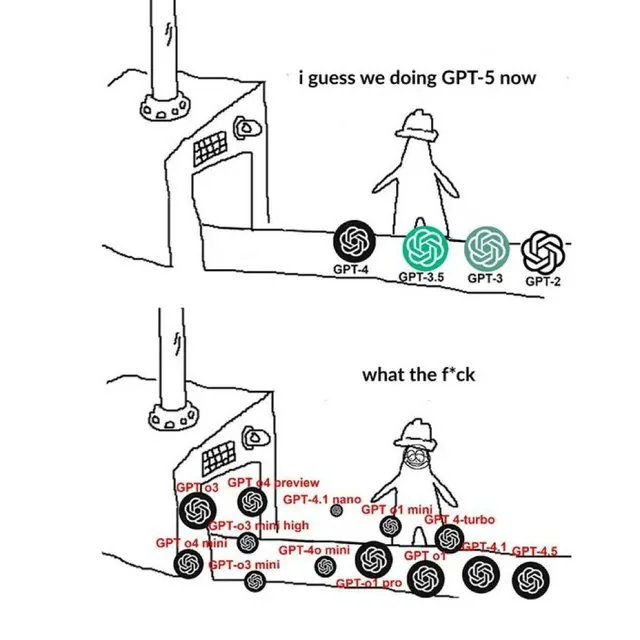
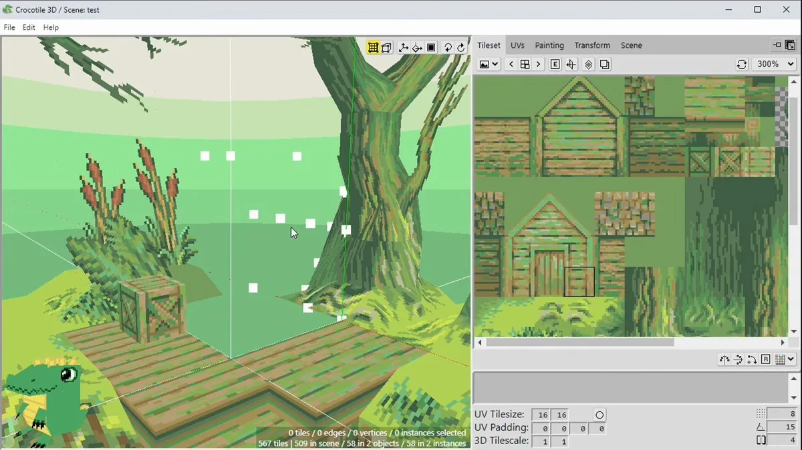
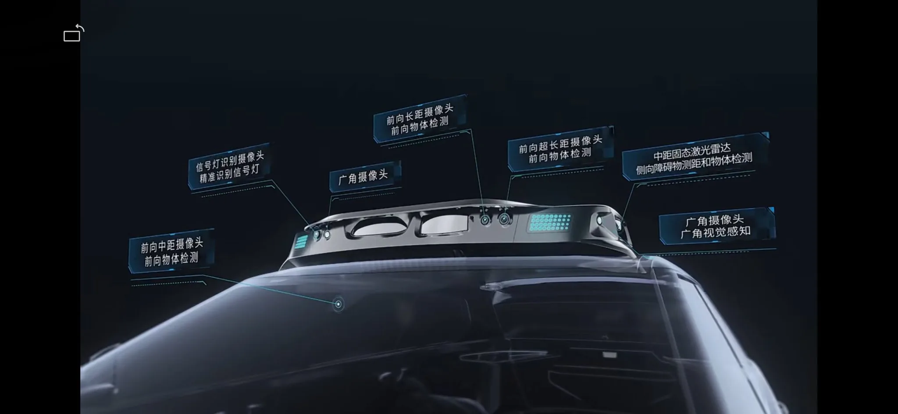
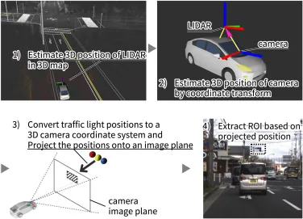

# 2025 年第 17 周技术阅读汇总

[English](README.md) | 简体中文

by @corenel (Yusu Pan) and LLMs

以下为 2025 年 第 17 周（4 月 21 日至 4 月 27 日）期间我所阅读或者输入的内容。为简洁起见，仅列出标题、URL 以及 LLM 生成的概要，以供有兴趣者阅读，进一步的分析、反思与精读不在此赘述。

## 目录

- [2025 年第 17 周技术阅读汇总](#2025-年第-17-周技术阅读汇总)
  - [目录](#目录)
  - [专题](#专题)
  - [续闻](#续闻)
  - [有趣的事与物](#有趣的事与物)
    - [ACGN](#acgn)
      - [在家丈量世界：GeoGuessr 地理探索游戏体验与指南](#在家丈量世界geoguessr-地理探索游戏体验与指南)
      - [小成本大保护：CD 收藏盒定制中的资源整合与成本优化](#小成本大保护cd-收藏盒定制中的资源整合与成本优化)
    - [图书](#图书)
    - [技术与互联网](#技术与互联网)
      - [平衡的艺术：抖音推荐算法与内容治理体系剖析](#平衡的艺术抖音推荐算法与内容治理体系剖析)
      - [历史的回声：苹果的 AI 与供应链困境是否重蹈巨头覆辙？](#历史的回声苹果的-ai-与供应链困境是否重蹈巨头覆辙)
      - [从知识乌托邦到流量场：知乎的演变之路](#从知识乌托邦到流量场知乎的演变之路)
      - [内容审核的双刃剑：网站市场的竞争格局重塑及其启示](#内容审核的双刃剑网站市场的竞争格局重塑及其启示)
      - [在线隐私与便捷性的拉锯战：一篇来自实践者的真诚反思](#在线隐私与便捷性的拉锯战一篇来自实践者的真诚反思)
      - [从 PostScript 到 PDF：定义数字文档世界的语言革命](#从-postscript-到-pdf定义数字文档世界的语言革命)
      - [谷歌地图迷航记：其街道地址映射的系统性缺陷](#谷歌地图迷航记其街道地址映射的系统性缺陷)
      - [冲破未来的迷惘：重读阿尔文·托夫勒半个世纪前撰写的《未来冲击》](#冲破未来的迷惘重读阿尔文托夫勒半个世纪前撰写的未来冲击)
      - [中国网络安全产业联盟报告指出美情报机构移动端监控版图](#中国网络安全产业联盟报告指出美情报机构移动端监控版图)
      - [VPS 选型迷思：Reddit 热议揭示“最佳”之路在于精准匹配需求](#vps-选型迷思reddit-热议揭示最佳之路在于精准匹配需求)
    - [软件与开发](#软件与开发)
      - [Vibe Coding 指南：拥抱 AI 加速，不弃工程质量](#vibe-coding-指南拥抱-ai-加速不弃工程质量)
      - [AI 编程新浪潮：从“随心所欲”到“精雕细琢”—— Karpathy 与 Willison 的实践洞见与指南](#ai-编程新浪潮从随心所欲到精雕细琢-karpathy-与-willison-的实践洞见与指南)
      - [AI 编码浪潮下的冷思考：Canva CTO 深度解读“氛围编程”的机遇与陷阱](#ai-编码浪潮下的冷思考canva-cto-深度解读氛围编程的机遇与陷阱)
      - [回归编码“老派健身房”：在 AI 时代重拾匠艺精神](#回归编码老派健身房在-ai-时代重拾匠艺精神)
      - [警惕 AI 助手的“甜蜜陷阱”：如何在拥抱效率的同时守护核心工程技能？](#警惕-ai-助手的甜蜜陷阱如何在拥抱效率的同时守护核心工程技能)
      - [系统性排错：永不过时的核心技能](#系统性排错永不过时的核心技能)
      - [四年 On Call 实战精华：线上故障应急处理的核心法则与能力提升方法](#四年-on-call-实战精华线上故障应急处理的核心法则与能力提升方法)
      - [椭圆曲线密码学入门：从时钟类比到安全曲线选择](#椭圆曲线密码学入门从时钟类比到安全曲线选择)
      - [深入 TikTok 签名机制：webmssdk.js 虚拟机逆向分析实录](#深入-tiktok-签名机制webmssdkjs-虚拟机逆向分析实录)
      - [Go 的内生分层设计：利用语言约束构建清晰架构](#go-的内生分层设计利用语言约束构建清晰架构)
      - [Go 性能优化探幽：值接收器如何引发隐蔽的堆分配陷阱](#go-性能优化探幽值接收器如何引发隐蔽的堆分配陷阱)
      - [Rust 状态机设计模式：利用类型系统实现编译时安全](#rust-状态机设计模式利用类型系统实现编译时安全)
      - [解读 Python 14 个进阶特性，提升代码功力](#解读-python-14-个进阶特性提升代码功力)
      - [Python 3.14：稳定调试 ABI，奠基生态未来](#python-314稳定调试-abi奠基生态未来)
      - [C 语言编译时常量检查宏的实现与挑战](#c-语言编译时常量检查宏的实现与挑战)
      - [自旋锁 vs 互斥锁：用户态同步性能基准测试](#自旋锁-vs-互斥锁用户态同步性能基准测试)
      - [超越 ECMP：基于 Flowlet 与 Packet Spraying 的 GPU 集群网络负载均衡方法](#超越-ecmp基于-flowlet-与-packet-spraying-的-gpu-集群网络负载均衡方法)
      - [逻辑的惊奇：从复杂性边界到计算的相对性](#逻辑的惊奇从复杂性边界到计算的相对性)
      - [旅行商问题的现实呈现：韩国 8 万酒吧最短路径及其背后的优化求解方法](#旅行商问题的现实呈现韩国-8-万酒吧最短路径及其背后的优化求解方法)
      - [五十年后的未解之谜：P vs. NP 问题在人工智能时代的全新解读](#五十年后的未解之谜p-vs-np-问题在人工智能时代的全新解读)
      - [TigerStyle：编码风格如何铸就金融级数据库的安全与性能](#tigerstyle编码风格如何铸就金融级数据库的安全与性能)
      - [Chisel：利用 HTTP 隧道突破网络限制，转发通用 TCP/UDP 流量](#chisel利用-http-隧道突破网络限制转发通用-tcpudp-流量)
      - [Wiredoor：自托管的 Ingress 即服务，安全暴露内网应用](#wiredoor自托管的-ingress-即服务安全暴露内网应用)
      - [SolveSpace：一款轻量级却功能强大的免费参数化 CAD 工具](#solvespace一款轻量级却功能强大的免费参数化-cad-工具)
      - [BabelDOC：精确保留排版的 PDF 智能翻译工具](#babeldoc精确保留排版的-pdf-智能翻译工具)
      - [FastRTC: Python 实时通信库，轻松构建音视频流应用](#fastrtc-python-实时通信库轻松构建音视频流应用)
      - [Roboflow Trackers：化繁为简，统一多目标跟踪算法的开源仓库](#roboflow-trackers化繁为简统一多目标跟踪算法的开源仓库)
      - [DeepWiki：用 AI 赋能 GitHub 代码库理解，告别文档维护烦恼](#deepwiki用-ai-赋能-github-代码库理解告别文档维护烦恼)
      - [VTracer：高保真的图像矢量化工具](#vtracer高保真的图像矢量化工具)
    - [硬件与设备](#硬件与设备)
      - [超越终点线：人形机器人马拉松的技术试炼与产业启示](#超越终点线人形机器人马拉松的技术试炼与产业启示)
      - [M.2 接口的新玩法：在 Linux 环境下使用 Magewell Eco 双路 HDMI 采集卡](#m2-接口的新玩法在-linux-环境下使用-magewell-eco-双路-hdmi-采集卡)
      - [SPARK SR1120 UWB 芯片：低延迟、低功耗、高带宽的无线连接](#spark-sr1120-uwb-芯片低延迟低功耗高带宽的无线连接)
      - [VK-172：低成本 GPS 模块在 macOS 上的简易实践与性能初探](#vk-172低成本-gps-模块在-macos-上的简易实践与性能初探)
      - [索尼 AS-DT1：指尖大小的激光雷达，重塑严苛环境下的 3D 感知](#索尼-as-dt1指尖大小的激光雷达重塑严苛环境下的-3d-感知)
      - [Orange Pi RV2 评测：百美元级八核 RISC-V 性能标杆](#orange-pi-rv2-评测百美元级八核-risc-v-性能标杆)
      - [NVDLA：边缘 AI 的开源可配置硬件加速器](#nvdla边缘-ai-的开源可配置硬件加速器)
      - [华为昇腾 910C 与 920：中美 AI 芯片脱钩下的非对称竞逐与平行未来](#华为昇腾-910c-与-920中美-ai-芯片脱钩下的非对称竞逐与平行未来)
      - [RTX 5090 LLM 性能评测：消费级新卡真的“秒杀”A100，还是基准测试的“陷阱”？](#rtx-5090-llm-性能评测消费级新卡真的秒杀a100还是基准测试的陷阱)
    - [写作与知识管理](#写作与知识管理)
      - [书籍已是一种过时技术？萨姆·卡恩对数字时代阅读未来的反思](#书籍已是一种过时技术萨姆卡恩对数字时代阅读未来的反思)
      - [译者走向台前，翻译艺术隐于幕后？文学翻译评价的困境与未来](#译者走向台前翻译艺术隐于幕后文学翻译评价的困境与未来)
      - [直面“被看见的恐惧”：一位科技女性领导者的坦诚心声与“温柔回归”](#直面被看见的恐惧一位科技女性领导者的坦诚心声与温柔回归)
      - [AI 阅读秘书：自动化梳理『稍后读』清单，重燃阅读动力](#ai-阅读秘书自动化梳理稍后读清单重燃阅读动力)
      - [告别“赛博速读”：在 AI 时代，为何我们更需要深度阅读？](#告别赛博速读在-ai-时代为何我们更需要深度阅读)
      - [停止信息囤积，拥抱实践创造：对“创造者与消费者”的反思](#停止信息囤积拥抱实践创造对创造者与消费者的反思)
      - [重思阅读：价值、选择与方法](#重思阅读价值选择与方法)
      - [Obsidian 多库管理策略与实践指南](#obsidian-多库管理策略与实践指南)
    - [项目与团队管理](#项目与团队管理)
      - [告别英雄主义：构建可依赖的系统而非依赖个人](#告别英雄主义构建可依赖的系统而非依赖个人)
    - [播客与视频](#播客与视频)
      - [对话 Rabbit 创始人吕骋：在 AI 的「爆红」与「失控」中探寻下一代交互革命](#对话-rabbit-创始人吕骋在-ai-的爆红与失控中探寻下一代交互革命)
      - [代码调制的微醺：“调酒笔记”App 与家庭调酒新浪潮](#代码调制的微醺调酒笔记app-与家庭调酒新浪潮)
      - [CS25：斯坦福的 Transformers United 课程](#cs25斯坦福的-transformers-united-课程)
    - [生成式人工智能](#生成式人工智能)
      - [参差的 AGI：o3 与 Gemini 2.5 时代的智能新貌与不确定性](#参差的-agio3-与-gemini-25-时代的智能新貌与不确定性)
      - [从 ARC-AGI 基准测试中观察 OpenAI o3 与 o4-mini 的推理能力与局限](#从-arc-agi-基准测试中观察-openai-o3-与-o4-mini-的推理能力与局限)
      - [从“提问机器”到“主动助理”：Agentic AI 的崛起与人机协作范式变革](#从提问机器到主动助理agentic-ai-的崛起与人机协作范式变革)
      - [超越模仿：迎接 AI 的“经验时代”](#超越模仿迎接-ai-的经验时代)
      - [当现实成为 AI 的 API：一次飞行实验揭示的颠覆性洞察与未来挑战](#当现实成为-ai-的-api一次飞行实验揭示的颠覆性洞察与未来挑战)
      - [AI Agent 的门关：MCP 协议、客户端权力与未来生态格局](#ai-agent-的门关mcp-协议客户端权力与未来生态格局)
      - [解读 AI 黑箱：Anthropic CEO 论可解释性的紧迫性](#解读-ai-黑箱anthropic-ceo-论可解释性的紧迫性)
      - [AI 迷雾：OpenAI 天价收购背后，谷歌悄然领先，苹果何去何从？](#ai-迷雾openai-天价收购背后谷歌悄然领先苹果何去何从)
      - [AI 浪潮下的世界重塑：从雇佣时代到斯普纳革命](#ai-浪潮下的世界重塑从雇佣时代到斯普纳革命)
      - [未来已来，路向何方？OpenAI 早期投资者 Vinod Khosla 的 AI 洞见](#未来已来路向何方openai-早期投资者-vinod-khosla-的-ai-洞见)
      - [光鲜承诺背后：AI 强制推行下，游戏开发者的真实困境与反思](#光鲜承诺背后ai-强制推行下游戏开发者的真实困境与反思)
      - [翻译行业的黄昏，还是转型的阵痛？AI 浪潮下土耳其译者的困境与抉择](#翻译行业的黄昏还是转型的阵痛ai-浪潮下土耳其译者的困境与抉择)
      - [告别低效，拥抱“氛围研究”：高价 ChatGPT Pro 如何重塑知识工作流](#告别低效拥抱氛围研究高价-chatgpt-pro-如何重塑知识工作流)
      - [不止 ChatGPT 依赖：构建高效内容创作 AI 工具箱的实战策略](#不止-chatgpt-依赖构建高效内容创作-ai-工具箱的实战策略)
      - [“黛安，整理成大纲”：AI 角色扮演与嵌入式指令革新语音笔记工作流](#黛安整理成大纲ai-角色扮演与嵌入式指令革新语音笔记工作流)
      - [文本长度的隐形陷阱：文本嵌入尺寸偏差现象及其对搜索相关性的影响](#文本长度的隐形陷阱文本嵌入尺寸偏差现象及其对搜索相关性的影响)
      - [解码 AI 核心圈：Twitter (X) 上的关键发声者与一手信息指南](#解码-ai-核心圈twitter-x-上的关键发声者与一手信息指南)
      - [EasyVoice：一键部署、智能配音，开源 TTS 解决方案的架构与实践](#easyvoice一键部署智能配音开源-tts-解决方案的架构与实践)
      - [HawkinsDB：超越向量数据库，构建类人 AI 记忆新范式](#hawkinsdb超越向量数据库构建类人-ai-记忆新范式)
      - [Graphiti：为 AI 智能体构建动态演化的时间感知知识图谱](#graphiti为-ai-智能体构建动态演化的时间感知知识图谱)
      - [Flex.2-preview：集成通用控制与修复，80 亿参数开源 T2I 模型](#flex2-preview集成通用控制与修复80-亿参数开源-t2i-模型)
      - [Lemon Slice Live：从单张图片到实时对话](#lemon-slice-live从单张图片到实时对话)
    - [其他](#其他)
      - [解一道积分，求索百年：墨卡托地图与正割函数的隐秘关联](#解一道积分求索百年墨卡托地图与正割函数的隐秘关联)
      - [奇异值分解 (SVD) 求导：解锁梯度优化可能](#奇异值分解-svd-求导解锁梯度优化可能)
      - [点燃可能：拥抱“粉丝心态”，在热情与审思间寻找力量](#点燃可能拥抱粉丝心态在热情与审思间寻找力量)
      - [反噬的关税：特朗普对华贸易战策略的风险与中国的潜在胜局](#反噬的关税特朗普对华贸易战策略的风险与中国的潜在胜局)
      - [寻味潮汕深度游：美食是正事，景点仅为消食？](#寻味潮汕深度游美食是正事景点仅为消食)
    - [Just For Fun](#just-for-fun)
      - [嘲讽 OpenAI 模型命名混乱](#嘲讽-openai-模型命名混乱)
      - [罕见的‘微笑脸’三重合相天象](#罕见的微笑脸三重合相天象)
  - [摘录](#摘录)
  - [学术研究](#学术研究)
    - [目标检测](#目标检测)
      - [RF-DETR 与 YOLOv12 在复杂果园绿果检测任务下的性能对比](#rf-detr-与-yolov12-在复杂果园绿果检测任务下的性能对比)
      - [FEST：通过特征工程与后处理策略提升红外小目标检测鲁棒性](#fest通过特征工程与后处理策略提升红外小目标检测鲁棒性)
      - [RealScene-ISTD 数据集：红外小目标检测的真实场景基准与跨视角表示学习](#realscene-istd-数据集红外小目标检测的真实场景基准与跨视角表示学习)
      - [YSOOB：利用频域特征实现超轻量实时水下目标检测](#ysoob利用频域特征实现超轻量实时水下目标检测)
      - [Weak Cube R-CNN：仅需 2D 标注，解锁低成本单目 3D 目标检测](#weak-cube-r-cnn仅需-2d-标注解锁低成本单目-3d-目标检测)
      - [基于 CMDT 与 RTMCT 的轻量级 LiDAR- 相机融合框架](#基于-cmdt-与-rtmct-的轻量级-lidar--相机融合框架)
    - [目标跟踪](#目标跟踪)
      - [SonarT165 与 STFTrack：水下声学目标跟踪的新基准与高效框架](#sonart165-与-stftrack水下声学目标跟踪的新基准与高效框架)
    - [语义分割](#语义分割)
      - [MaskAttn-UNet：兼顾精度与效率的低分辨率图像分割](#maskattn-unet兼顾精度与效率的低分辨率图像分割)
      - [PTSAM：仅需 2048 参数与 16 张图，让 SAM 变身领域分割专家](#ptsam仅需-2048-参数与-16-张图让-sam-变身领域分割专家)
      - [OOSIS：基于物体遮挡关系与相对深度排序的实例分割](#oosis基于物体遮挡关系与相对深度排序的实例分割)
      - [引入向量量化以提升道路环境分割性能](#引入向量量化以提升道路环境分割性能)
      - [NVSMask3D：融合新视角合成与视觉提示，提升开放词汇 3D 实例分割能力](#nvsmask3d融合新视角合成与视觉提示提升开放词汇-3d-实例分割能力)
    - [自动驾驶](#自动驾驶)
      - [MS-Occ：针对视觉与 LiDAR 的多阶段融合策略，提升 3D 语义占据栅格预测性能](#ms-occ针对视觉与-lidar-的多阶段融合策略提升-3d-语义占据栅格预测性能)
      - [利用 3DGS 驱动数据增强，为 3D 目标检测提供合成数据](#利用-3dgs-驱动数据增强为-3d-目标检测提供合成数据)
      - [不止于真实像素：场景感知定位用于自动驾驶数据增强](#不止于真实像素场景感知定位用于自动驾驶数据增强)
    - [场景重建](#场景重建)
      - [ARAP-GS：融合经典几何与前沿 AI 的拖拽式 3D 高斯溅射编辑](#arap-gs融合经典几何与前沿-ai-的拖拽式-3d-高斯溅射编辑)
      - [EDGS：新的初始化策略以加速 3DGS 训练](#edgs新的初始化策略以加速-3dgs-训练)
      - [Mono3R：融合单目线索提升几何三维重建鲁棒性](#mono3r融合单目线索提升几何三维重建鲁棒性)
      - [CAST：结合感知生成与物理约束的单图像三维场景重建](#cast结合感知生成与物理约束的单图像三维场景重建)
      - [HUG：结合层级神经高斯与分块重建，高效绘制大规模城市场景](#hug结合层级神经高斯与分块重建高效绘制大规模城市场景)
    - [仿真渲染](#仿真渲染)
      - [Unreal Robotics Lab：融合逼真渲染与精确物理的赋能机器人仿真环境](#unreal-robotics-lab融合逼真渲染与精确物理的赋能机器人仿真环境)
      - [GES：融合高斯与面元实现超快高保真且无闪烁的辐射场渲染](#ges融合高斯与面元实现超快高保真且无闪烁的辐射场渲染)
    - [深度估计](#深度估计)
      - [VistaDepth：融合潜在频率调制与偏差重加权，提升单目远距离深度估计性能](#vistadepth融合潜在频率调制与偏差重加权提升单目远距离深度估计性能)
    - [SLAM](#slam)
      - [TAPIP3D：告别相机运动困扰，基于持久化 3D 世界坐标系的 3D 点跟踪方法](#tapip3d告别相机运动困扰基于持久化-3d-世界坐标系的-3d-点跟踪方法)
      - [BA-Track：使用 3D 点跟踪解耦目标与相机运动，实现动态场景三维重建](#ba-track使用-3d-点跟踪解耦目标与相机运动实现动态场景三维重建)
      - [DynPose-100K：大规模视频位姿数据集](#dynpose-100k大规模视频位姿数据集)
      - [ToF-Splatting：使用低成本稀疏 ToF 传感器实现稠密 SLAM](#tof-splatting使用低成本稀疏-tof-传感器实现稠密-slam)
    - [语言模型](#语言模型)
      - [LLM 推理微调：强化学习中简单拒绝采样的惊人潜力](#llm-推理微调强化学习中简单拒绝采样的惊人潜力)
      - [ReSearch：用强化学习实现 LLM 自主推理与搜索](#research用强化学习实现-llm-自主推理与搜索)
      - [FlowReasoner：不再“一刀切”，实现查询级多智能体系统的自动化设计](#flowreasoner不再一刀切实现查询级多智能体系统的自动化设计)
      - [编译思维：将 LLM 的复杂推理融入快速响应系统](#编译思维将-llm-的复杂推理融入快速响应系统)
      - [当“最强大脑”遇见简单题：S1-Bench 揭示大型推理模型的“反直觉”困境](#当最强大脑遇见简单题s1-bench-揭示大型推理模型的反直觉困境)
      - [“思考”多久，AI 说了算？LCPO 让语言模型推理长度可控且高效](#思考多久ai-说了算lcpo-让语言模型推理长度可控且高效)
      - [自适应并行推理（APR）：让语言模型自主学习何时“分而治之”](#自适应并行推理apr让语言模型自主学习何时分而治之)
      - [揭秘 RLVR：提升 LLM 推理效率，却可能限制能力边界？](#揭秘-rlvr提升-llm-推理效率却可能限制能力边界)
      - [TTRL：通过测试时强化学习实现无标签数据驱动的自我进化](#ttrl通过测试时强化学习实现无标签数据驱动的自我进化)
      - [PHYBench：评测大型语言模型的物理推理能力](#phybench评测大型语言模型的物理推理能力)
      - [InternVL3：原生多模态预训练的开源 MLLM](#internvl3原生多模态预训练的开源-mllm)
      - [DAM：精准捕捉局部细节，为图像与视频任意区域生成深度描述](#dam精准捕捉局部细节为图像与视频任意区域生成深度描述)
      - [打破视角的局限：APC 框架提升 VLM 的异心空间推理能力](#打破视角的局限apc-框架提升-vlm-的异心空间推理能力)
      - [LiveCC：借助流式语音转录大规模训练视频大模型，解锁实时评论新能力](#livecc借助流式语音转录大规模训练视频大模型解锁实时评论新能力)
      - [ViSMaP：用 LLM 元提示解锁无监督长视频摘要](#vismap用-llm-元提示解锁无监督长视频摘要)
      - [Kimi-Audio：迈向通用音频智能的开源基础模型](#kimi-audio迈向通用音频智能的开源基础模型)
      - [CameraBench 数据集：评估算法对视频中摄像机运动的理解能力](#camerabench-数据集评估算法对视频中摄像机运动的理解能力)
      - [LettuceDetect：为 RAG 系统打造高效、轻量级的幻觉检测器](#lettucedetect为-rag-系统打造高效轻量级的幻觉检测器)
      - [Zep：用时间感知知识图谱增强 AI 智能体记忆](#zep用时间感知知识图谱增强-ai-智能体记忆)
      - [DFloat11：无损压缩大型语言模型，实现高效 GPU 推理](#dfloat11无损压缩大型语言模型实现高效-gpu-推理)
    - [内容生成](#内容生成)
      - [SkyReels-V2：无限长度的电影感开源视频生成模型](#skyreels-v2无限长度的电影感开源视频生成模型)
      - [SphereDiff：基于球形潜在表示的全景图像与视频生成](#spherediff基于球形潜在表示的全景图像与视频生成)
      - [Uni3C：以 3D 视觉先验统一相机与人体控制，实现精准可控视频生成](#uni3c以-3d-视觉先验统一相机与人体控制实现精准可控视频生成)
      - [OmniAudio：从 360 度视频生成全景空间音频](#omniaudio从-360-度视频生成全景空间音频)
      - [AnimPortrait3D：文本驱动生成高质量可动画 3D 虚拟人](#animportrait3d文本驱动生成高质量可动画-3d-虚拟人)
      - [视频扩散模型技术综述](#视频扩散模型技术综述)
    - [机器人](#机器人)
      - [BIP3D：弥合具身智能中的 2D 图像与 3D 感知鸿沟](#bip3d弥合具身智能中的-2d-图像与-3d-感知鸿沟)
      - [π0.5：通过异构数据联合训练解锁机器人开放世界泛化能力](#π05通过异构数据联合训练解锁机器人开放世界泛化能力)
    - [位姿估计](#位姿估计)
      - [Vision6D：为 6D 姿态估计打造的交互式 3D-2D 标注利器](#vision6d为-6d-姿态估计打造的交互式-3d-2d-标注利器)
      - [GFreeDet：告别 CAD 依赖，使用高斯溅射与基础模型实现未知物体位姿估计](#gfreedet告别-cad-依赖使用高斯溅射与基础模型实现未知物体位姿估计)
    - [超分辨率](#超分辨率)
      - [AnyTSR：无人机热成像任意尺度超分辨率](#anytsr无人机热成像任意尺度超分辨率)
      - [Ev-DeblurVSR：使用事件相机实现模糊视频超分辨率](#ev-deblurvsr使用事件相机实现模糊视频超分辨率)
    - [其他论文](#其他论文)
      - [GaGA：交互式智能地理定位](#gaga交互式智能地理定位)
      - [基于持久同调的霍夫变换直线检测](#基于持久同调的霍夫变换直线检测)
      - [I-Con：表示学习的统一信息论框架](#i-con表示学习的统一信息论框架)
      - [Perception Encoder：挖掘视觉表征学习中的网络深层潜力](#perception-encoder挖掘视觉表征学习中的网络深层潜力)
      - [INR：高保真、快解码的基于 Range Image 的 LiDAR 范围图像压缩方法](#inr高保真快解码的基于-range-image-的-lidar-范围图像压缩方法)
      - [ContinuityCam：从单帧图像与事件流中“解压”连续彩色视频](#continuitycam从单帧图像与事件流中解压连续彩色视频)
      - [PRaDA：利用投影平均技术实现高精度相机径向畸变自标定](#prada利用投影平均技术实现高精度相机径向畸变自标定)
      - [PyGraph：让 PyTorch 中的 CUDA Graphs 安全高效运行](#pygraph让-pytorch-中的-cuda-graphs-安全高效运行)

## 专题

## 续闻

## 有趣的事与物

### ACGN

#### 在家丈量世界：GeoGuessr 地理探索游戏体验与指南

渴望环游世界却困于眼前的苟且？向往异域风情却难忍旅途的喧嚣？或许，你需要的只是一款名为 GeoGuessr 的游戏。这款风靡全球的地图竞猜游戏，让你仅凭一张谷歌街景截图，就能开启一段足不出户的“云游”之旅。它不仅是绝佳的“旅游代餐”，更是一场考验观察力、推理力和地理知识的智力冒险。本文将带你深入了解 GeoGuessr 的魅力所在，解析其玩法，并探讨其背后的价值。

GeoGuessr 的核心机制是将玩家随机“投放”到世界某个角落的 Google Street View (谷歌街景) 中。你的任务只有一个：通过仔细观察 360 度的实景图像，寻找一切可用线索，然后在世界地图上尽可能精确地标出你认为自己所在的位置。游戏会根据你猜测的精准度给出评分，通常在经典模式下进行五轮对决。

这款游戏的真正魅力在于其推理与发现的过程。成功并非易事，你需要化身地理侦探，观察线索是关键。这些线索可能隐藏在街角的路牌文字（是什么语言？）、车牌样式、道路是左行还是右行，或是独特的建筑风格、自然植被、甚至天空中太阳的位置。正如文中所举的都柏林示例，玩家正是通过辨认双语路牌、识别奥康奈尔桥等地标、结合地图进行演绎推理，最终才将定位精确到几米之内。这种结合知识进行推断，最终揭开谜底的“啊哈！”时刻，正是 GeoGuessr 让人沉迷的核心乐趣。

除了悠闲的经典模式，GeoGuessr 还提供了紧张刺激的 Battle Royale 模式，让玩家在全球匹配中进行快节奏的地理知识对决，极大地提升了竞技性。事实上，GeoGuessr 已经拥有庞大的玩家社群和一年一度的世界杯赛事，足见其深度和吸引力。

从实用角度看，GeoGuessr 采用了 Freemium 模式。免费用户可以体验基础玩法，但有次数和时间限制。若想畅玩无阻，则需订阅 Pro 会员。不过，对于预算有限或偏爱自由定制的用户，社区也提供了开源替代品 GeoGuess，虽然界面稍显简陋，但功能完善且支持自定义地图。

解读其意义，GeoGuessr 不仅仅是一款游戏。它以一种游戏化的方式，极大地激发了人们对世界地理和文化多样性的好奇心和学习兴趣。在寻找线索的过程中，玩家不知不觉地接触到不同国家的语言、文字、风土人情和自然风光。同时，它也让我们反思虚拟体验与现实感知的关系。虽然无法完全替代真实旅行，但 GeoGuessr 无疑提供了一种新颖、便捷且富有启发性的方式，让我们在数字世界中“丈量”和理解我们所生活的这个星球。此外，随着 AI（如文中所提 OpenAI o3 模型）在图像地理定位能力上的进步，GeoGuessr 也成为了观察人机智能在空间认知领域互动演变的一个有趣窗口。

对于初学者或对地理探索感兴趣的读者，GeoGuessr 绝对值得一试。它既能满足你“云游”世界的愿望，也能在轻松娱乐中锻炼你的观察力和思维能力。无论是选择官方版本还是开源替代，都不妨开启你的第一场 GeoGuessr 冒险吧！

#### 小成本大保护：CD 收藏盒定制中的资源整合与成本优化

[[记一次CD保护盒定制]]

对于珍视藏品的爱好者而言，如何妥善保护往往是一大难题，尤其是面对非标准规格的物品，定制化解决方案常因成本高昂而令人却步。Allen_Wu 在少数派发布的文章中，分享了他为一张特殊同人 CD 定制保护盒的亲身经历。这篇文章不仅记录了一次成功的个人实践，更巧妙地展示了一种应对小批量、个性化定制成本困境的通用策略，对于各类创客、爱好者乃至小型项目开发者都具有重要的参考价值。

文章的核心围绕着作者如何为一张珍贵的、包装特殊的东方同人 CD《現夢 -genmu-》寻求兼具防潮、防压、防震功能的保护方案展开。作者最初设想的一体化定制方案，却遭遇了个人定制市场普遍存在的“起订量”与“高成本”壁垒——动辄数百元的报价让其望而却步。

面对这一挑战，作者并未放弃，而是展现了出色的问题分解与资源整合能力。他创造性地将“定制一个保护盒”的需求拆解为两个更易于管理的部分：购买一个尺寸合适的标准化现成盒子，以及单独定制与之匹配的内部缓冲衬垫。这一策略的转变是整个故事的关键转折点。

在执行层面，作者首先在电商平台寻获一款价格低廉（约 19 元）且尺寸基本符合要求的书型硬纸盒。随后，在定制 EVA 内衬时，他再次遇到了小批量生产需支付高额开模费的难题。然而，凭借坚持不懈的搜寻和有效的沟通，他最终找到了一家愿意提供手工裁切服务的供应商，以极低的成本（20 元）解决了内衬的定制问题。

最终，作者仅花费约 40 元，便成功获得了一个尺寸精准、保护功能完善的定制 CD 盒，相较于最初超过 200 元的报价，成本节约幅度巨大。文章通过详细的尺寸数据、成本对比、材料选择说明（选用 EVA 及其原因）以及最终成品的实物照片，有力地证实了该方案的可行性与经济性。

这篇看似简单的个人经验分享，其深层价值在于揭示了一种普适性的成本优化思维模式。它告诉我们，在面对个性化需求与规模化生产成本结构的矛盾时：

1. 分解复杂性：将整体需求拆分为标准化与非标准化模块。
2. 善用现有资源：最大限度地利用市场上的标准化产品来降低基础成本。
3. 聚焦核心定制：将定制的投入集中在真正必要且无法替代的部分。
4. 灵活寻找解决方案：不局限于常规路径，探索替代性的、成本更低的加工方式或供应商（如手工、小型作坊）。

这篇文章不仅为 CD 收藏者提供了实用的保护盒定制思路，更重要的是，它为所有需要在预算有限条件下实现个性化目标的个人或团队，提供了一种巧妙整合资源、化解成本障碍的宝贵启示。无论是硬件原型开发、小型活动物料准备，还是其他需要“小而美”定制的场景，这种“标准化 + 精准定制”的组合策略都值得借鉴与实践。文章语言平实，过程记录详尽，对于初次尝试此类定制的读者具有很强的指导意义。

### 图书

### 技术与互联网

#### 平衡的艺术：抖音推荐算法与内容治理体系剖析

[[一文全解！抖音算法原理公开]]

在信息洪流中，推荐算法如何筛选内容、塑造认知，已成为科技界与公众关注的焦点。抖音，作为现象级短视频平台，其背后的算法运作与内容治理逻辑更是引发广泛讨论。 近期抖音安全与信任中心发布的一系列文章，为我们提供了难得的官方视角。本文将深度解读这些内容，剖析抖音如何构建其复杂的推荐引擎，如何通过“算法 + 治理”双轮驱动，试图在个性化体验、内容生态与平台责任间寻求精妙平衡，为相关领域从业者与研究者提供有价值的参考。

抖音官方披露的核心信息显示，其推荐系统是一个高度复杂的工程，远非简单的“投其所好”。其核心逻辑可以概括为“综合预测用户行为概率 × 行为价值权重 = 视频推荐优先级”。这意味着推荐决策涉及两大关键环节：一是基于深度学习（如采用 Wide&Deep、双塔召回等模型）对用户可能产生的多种行为（点赞、完播、收藏、分享等）进行概率预测；二是依据平台自身的价值模型，为这些行为赋予不同的权重，这个模型试图平衡用户（短期与长期）、创作者及平台等多方价值。算法本质上是在“计算”行为发生的可能性，并结合平台的价值判断来排序，而非真正“理解”内容本身的语义或深层价值。

值得注意的是，抖音强调其算法已从早期依赖“完播率”等单一或少数指标，演进至复杂的多目标优化体系。这一转变是为了适应平台内容和用户需求的日益多元化，解决单一指标可能带来的局限（如对优质中长视频或知识类内容的不友好）。通过引入“收藏率”、“分享率”、乃至“用户评论 + 作者回复”（握手模型）等更多维度的目标，并设置“探索类指标”以拓宽用户视野、尝试缓解“信息茧房”，抖音试图构建一个更能反映内容综合价值、促进生态多样性的推荐机制。这种多目标的设计，体现了平台在追求用户即时满意度之外，对用户长期需求、创作者激励和内容生态健康的考量。

然而，算法的局限性（无法理解语义、可能放大偏见或不良内容）决定了平台治理不可或缺。文章将治理体系定位为推荐算法的“护栏”，强调其存在的必要性。抖音采用了“人工 + 机器”协同的审核模式：机器利用算法模型进行大规模、高效率的初步风险识别（宽度），而人工则负责处理复杂、疑难案例，进行精准判断，并持续校准机器模型（深度）。治理流程贯穿内容发布与传播的始终，遵循“流量越高，审核越严”的原则，并设有针对网络暴力、AIGC 滥用等问题的专项治理机制。这套体系旨在确保内容符合法律法规与社会规范，为算法设定边界。

更进一步，抖音的推荐算法与治理体系都被描述为动态演进、持续优化的系统。算法能够实现“分钟级”的实时反馈调整，而治理体系也具备“问题及时发现 + 全链路敏捷响应”的能力，以应对层出不穷的新风险和挑战。这种敏捷性反映了平台在高速变化的环境中，不断调整策略以维系其宣称的“多方共赢”生态平衡的努力。

抖音此次的官方信息披露，无疑增加了外界对其复杂系统运作的理解，展现了其在算法技术和平台治理方面的投入。然而，解读这些信息时，也需保持审慎视角。首先，文章中描绘的“多方价值共赢”模型，其权重的具体设定、调整机制以及实际运行效果仍是“黑箱”。商业平台的核心目标与用户、创作者、社会公共利益之间可能存在的内在张力，如何在实践中被调和，依然值得深入探究。其次，虽然提及了“探索”机制，但其在多大程度上能有效打破信息茧房、促进真正的认知多样性，需要更多实证数据支持。再次，“人工 + 机器”的治理模式虽然精巧，但其有效性、准确性、以及可能存在的偏见（无论是机器的还是人工的）和滞后性，仍是平台治理面临的持续挑战。最后，文章侧重于描述系统“是什么”和“如何运作”，对于其潜在的社会影响、伦理争议以及平台责任的边界界定，讨论相对有限。

总而言之，抖音官方的系列解读文章为我们描绘了一个庞大、精密且持续进化的推荐与治理系统。它不仅是尖端机器学习技术的试验场，更是平台在效率、体验、商业、责任等多重目标间不断权衡、寻求平衡的复杂实践。对于技术从业者而言，其中关于深度学习应用、多目标优化设计、人机协同治理的细节颇具参考价值。对于所有关注数字平台生态的人来说，它提供了一个观察头部平台如何应对技术挑战与社会责任的宝贵案例，并提醒我们对其宣称的“平衡”保持持续的关注与思考。

#### 历史的回声：苹果的 AI 与供应链困境是否重蹈巨头覆辙？

[[Apple and the Ghosts of Companies Past]]

尽管苹果依旧是科技界的巨擘，著名科技分析师 Ben Thompson 在其最新文章《苹果与昔日巨头的幽灵》中却发出了审慎的警告：苹果的长期前景首次显得迷雾重重。文章通过深入剖析微软和英特尔的历史教训，直指苹果在人工智能（AI）和供应链策略上可能存在的“成功陷阱”。对于关注科技战略和产业未来的读者而言，这篇分析不容错过。

Thompson 的核心论点是，科技领域的成败往往在多年前就已注定。虽然苹果短期财务表现依然强劲，但其当前在 AI 领域的封闭策略、对隐私近乎绝对主义的坚守，以及对中国供应链的深度依赖，可能使其重蹈微软和英特尔等昔日巨头因未能适应技术范式转换而衰落的覆辙。文章强调，变革的窗口期正在收窄，苹果需要立即采取行动，而非等到危机显现。

为了支撑这一论点，文章巧妙地运用了历史类比进行论证：

- 微软的案例警示我们，其虽早早认识到互联网的重要性，但未能真正拥抱开放性，并在移动时代试图将 PC 模式强行延伸，最终错失浪潮。Thompson 认为，这与苹果当前试图将 AI 严格控制在自家生态内（例如，坚持 Siri 的封闭性，不向第三方顶级模型开放系统级接口）的做法存在惊人的相似性，可能阻碍其构建通往下一代计算平台的 AI“桥梁”。
- 英特尔的教训则更为深刻：它因固守 PC 时代的成功指标（侧重性能而非移动设备所需的能效）而错失移动芯片市场，且未能及时利用其核心制造能力转型为代工厂。尤为关键的是，英特尔在其长期衰落格局已定的情况下，股价和利润仍能在一段时间内保持增长（得益于数据中心业务），造成了市场和管理层的“集体盲视”。这提醒我们警惕，苹果对“隐私”原则的执着是否正使其忽视 AI 时代真正关键的要素？当前亮眼的财报是否可能掩盖了正在积累的长期风险？
- 文章还回顾了苹果自身的历史，指出蒂姆·库克当年通过构建高效的中国供应链将公司带出困境，但如今，这一曾经的成功模式在全球地缘政治紧张的背景下，已转变为重大的、需要审慎管理的风险。

Thompson 的分析超越了简单的现象对比，触及了科技巨头普遍面临的挑战：“成功陷阱”与战略惯性。他敏锐地指出，那些曾为苹果带来巨大成功的要素——如高度整合的封闭生态系统和深入人心的隐私品牌——在面对 AI 这一潜在的新计算范式时，反而可能成为阻碍其适应与创新的桎梏。文章的核心洞察在于，技术领导者需要具备非凡的战略远见和变革决心，在“一切尚好”之时，就对可能颠覆现有格局的新趋势做出响应，而不是等到非改不可时才被动应对。作者在此含蓄地指向了现任 CEO 库克，认为其需要重新评估并调整自己长期坚持且行之有效的策略。

基于此，作者为苹果提出了明确的战略建议：执行“AI 平台转型”，拥抱更开放的姿态，让第三方 AI 能力更好地融入苹果生态；重新审视隐私策略，在用户信任的基础上寻求更务实的平衡点，避免因噎废食；以及，加速供应链的实质性多元化，而不只是表面文章。

当然，我们阅读时也需认识到，该分析主要建立在历史类比和对 AI 未来发展方向的预测之上，其推演的准确性有待时间验证。同时，对苹果隐私立场的批评也可能存在不同视角。

总而言之，Ben Thompson 的这篇文章为我们提供了一个审视苹果未来命运的独特而深刻的视角。对于技术从业者、行业观察者乃至任何关心科技创新与商业战略的人来说，它不仅揭示了苹果可能面临的深层挑战，更是一堂关于平台竞争、颠覆性创新管理、风险识别以及如何在快速变化的技术浪潮中保持警惕与适应性的生动案例课。它提醒我们，要时刻关注长期趋势，警惕短期成功的麻痹效应，并在坚持核心原则与拥抱必要变革之间，不断寻求智慧的平衡点。

#### 从知识乌托邦到流量场：知乎的演变之路

[[知乎的理想国：当知识乌托邦遇上流量现实]]

> [!NOTE]
> 说起来也算是知乎的老用户了，看了下邀请邮件是 2012 年 9 月 17 日注册的。早期的社区氛围确实很不错，直到 2014-2015 年左右其内容都称得上有独到之处。后面随着商业化严重，我也基本上转移到其他的类似社区。

在商业浪潮席卷互联网的今天，一个以理想主义起步的社区如何维系初心？内容平台的演化往往是技术、资本与文化多重力量博弈的结果。近期，一篇文章引发了广泛关注。该文以一位资深用户的视角，深度复盘了知乎从早期高质量知识社区到后期拥抱流量与商业化的关键转变。文章不仅细致记录了关键节点与文化变迁，更引发了对社区发展、资本影响及内容生态的深刻反思。对于理解当下内容平台的演化逻辑与挑战，此文提供了极佳的案例与视角。

文章的核心论点在于，知乎经历了从一个以高质量知识分享和理性讨论为基石的“知识乌托邦”（尤其指 2019 年之前），到一个在资本压力和增长需求驱动下，逐渐向流量逻辑和商业化现实妥协的“内容平台”（2019 年之后）的深刻转变。作者认为，这一转变并非一蹴而就，而是由一系列内外因素共同作用的结果。

该文系统梳理了知乎的关键发展历程：

1. 初创期的理想主义奠基：文章回顾了知乎由三位有“表达洁癖”的媒体人创立的背景，强调了其提升中文互联网质量的初心。早期通过邀请制筛选用户，并在创新工场（特别是李开复）的影响下，引入了硅谷式的产品哲学（克制、慢）、对社区氛围的极致重视（“认真说话”）以及独特的管理文化（OKR、Slack），成功塑造了一个高质量、高粘性的知识分享社区，吸引了大量技术专家、媒体人、学者等“高密度知识型用户”。知乎日报的成功更是其内容价值得到认可的体现。
2. 商业化探索与增长压力下的转向：随着平台发展，特别是 D 轮融资后，资本对变现和上市的要求日益迫切。文章指出，知乎开始尝试广告、会员（盐选）、电商等多种商业化路径，但与其“知识基因”和用户“洁癖”存在天然冲突，效果不彰且过程“拧巴”。为了支撑估值和追求增长，知乎不得不引入热榜、推荐算法、尝试短视频等被认为更“流量导向”的机制，这在客观上推动了内容下沉，稀释了原有的“知识感”和理性讨论氛围。
3. 关键转折与文化断裂：作者将 2019 年视为知乎的“文化断裂之年”。标志性事件包括财务背景高管（孙伟）的加入带来的“降本增效”策略、KPI 制度的全面推行以及用企业微信替换 Slack 等，这些变革被视为资本意志对原有工程师文化和理想主义精神的冲击，引发了老员工的不满与流失，社区氛围也随之加速改变。
4. 现状与反思：最终，知乎虽成功上市，但市场表现不佳，且部分核心用户选择“用脚投票”，迁移至推特等更能满足其表达需求的平台。文章对比了知乎与推特的差异，解释了用户迁移的内在逻辑。作者在文末表达了对“理性乌托邦”失落的惋惜，但并未完全否定知乎的当下价值，认为其仍是中文互联网一个相对理性的角落，只是需要用户主动筛选。

这篇文章的价值不仅在于对知乎历史的详细回顾，更在于它揭示了理想主义社区在商业化浪潮中的普遍性挑战。它生动展现了资本意志如何深刻影响平台战略、管理文化乃至内容生态；探讨了社区基因与规模化扩张之间的内在张力；并反思了在流量为王的时代，维系高质量内容和理性讨论空间的极端困难。

同时，文章也带有作者强烈的个人视角和对早期知乎的怀旧情感，这使得其在批判后期变化时可能带有一定的精英立场和理想化色彩。例如，对“内容下沉”的负面评价，可能未充分考虑平台服务更广泛用户的需求和价值。对商业化的困境，除了归因于理想与现实的冲突，可能也与具体的战略执行、市场竞争环境等复杂因素相关。

对于技术和专业领域的读者而言，知乎的案例提供了一个观察互联网平台生命周期、社区运营、产品策略演变以及商业模式探索的绝佳样本。它可以启发我们思考：

- 在产品或社区初创期，如何平衡理想主义与现实约束？
- 当面临增长和商业化压力时，如何尽可能保护核心价值和用户体验？
- 平台文化在组织发展和应对外部变化中扮演着怎样的角色？
- 不同内容平台的商业化路径选择与其基因有何关联？

总而言之，这是一篇值得深入阅读和思考的文章。它以一个具体的、充满情感的案例，触及了当前互联网发展中的诸多核心议题。推荐对此感兴趣的读者阅读原文，以获得更全面的信息和更深的体会。

#### 内容审核的双刃剑：网站市场的竞争格局重塑及其启示

[[Asymmetric Content Moderation in Search Markets The Case of Adult Websites]]

在数字平台内容审核日益成为全球性议题的背景下，一项针对成人内容市场的实证研究，为我们揭示了此类政策可能带来的复杂甚至意想不到的后果。由 Leonardo Madio 及其合作者撰写的论文利用一次真实世界的“自然实验”，深入剖析了当主导平台实施严格内容审核时，市场竞争、用户行为以及信息发现机制会如何发生深刻变化。该研究不仅对理解特定行业的动态至关重要，更为当前全球范围内对大型在线平台（如欧盟 DSA 框架下的 VLOPs）的监管实践提供了极具价值的洞见与警示。

该研究的核心发现是，非对称的内容审核政策能够显著重塑市场竞争格局，并将用户流量大规模地导向监管更为宽松的领域。文章聚焦于行业巨头 MindGeek（拥有 Pornhub 等网站）在 2020 年因外部压力被迫移除其平台上约 80% 的未经验证内容这一事件。通过严谨的双重差分法（DiD）分析，研究者发现，此举导致 MindGeek 旗下网站在一个月内流量锐减约 41%，且在随后半年内持续承受巨大的流量损失（平均下降 47%）。

然而，用户需求并未因此消失。研究揭示了一个关键现象：流失的流量并未平均分配给所有竞争者，而是不成比例地涌入了那些规模较小、监管较少、风险可能更高的“边缘”网站 (fringe sites)。在六个月内，这些边缘网站的访问量激增了 55%，远超同期主流竞争对手约 10% 的增长。这一发现形象地印证了政策干预中的“气球效应”——对系统中一部分施加压力，问题往往会转移到阻力最小的地方。这无疑给旨在提升网络安全的监管措施敲响了警钟：单纯针对大型平台的强力审核，可能无意中将风险推向更难监管的角落。

那么，用户是如何找到这些边缘网站的呢？研究强调了搜索引擎和内容聚合器在其中的关键作用。数据显示，在内容审核后，用户更多地依赖搜索引擎和聚合器来寻找替代内容来源。这些“中间平台”成为了流量重新分配的核心枢纽，有效降低了用户发现和切换到新平台的搜索成本。同时，研究还发现，受冲击的平台（MindGeek）也并非被动接受，而是在搜索场域采取了更具攻击性的竞争策略，例如增加提交 DMCA 删除请求，特别是针对竞争对手新上传或尚未被搜索引擎索引的内容，试图以此抑制对手的可见性。这表明内容审核政策的实施，本身也成为了平台竞争的一部分。

此外，研究还观察到流量向提供直播服务的 Cam sites 的转移，暗示主导平台的削弱可能为行业内不同的商业模式（可能更注重内容合意性与创作者收益）带来了发展机遇。

对于关注平台治理、市场竞争和互联网监管的读者而言，这篇文章提供了几点深刻启示：

1. 监管政策需系统性思维：仅仅关注大型平台可能不够，需要警惕潜在的风险转移效应，并考虑将搜索引擎、聚合器等中间平台纳入监管视野。
2. 用户偏好不容忽视：理解用户为何选择特定内容（即使是有风险的），对于设计有效且可持续的内容治理策略至关重要。
3. 内容发现机制是关键：平台和监管者都需关注信息如何被发现和传播，因为这直接影响市场格局和用户行为。
4. 内容审核影响深远：它不仅关乎平台责任和用户安全，更深刻地塑造着市场竞争动态和创新格局。

该研究基于可靠的实证数据和严谨的分析方法，其结论虽然源自特定市场，但对于理解普遍存在的数字平台治理挑战具有重要的参考价值。它提醒我们，在追求更安全网络环境的道路上，政策设计需要更加审慎，充分预估其可能带来的复杂连锁反应。

#### 在线隐私与便捷性的拉锯战：一篇来自实践者的真诚反思

[[How Far Do You Go for Online Privacy?]]

在数字时代，我们都渴望保护自己的在线隐私，但又常常在不经意间向便利性妥协。我们是否思考过，为了那份理想中的“隐私安全”，我们愿意付出多大的“不便”代价？Lifehacker 主编 Jordan Calhoun 最近分享了他的一段亲身经历，坦诚地记录了他在追求更强在线隐私过程中的挣扎与最终的“认输”。这篇文章并非技术指南，也不是隐私布道，而是一次极其容易引起共鸣的反思，它触碰到了我们每个人在数字生活中都可能面临的核心困境。

文章的核心观点直指当前数字生活中一个普遍存在的矛盾：对在线隐私的普遍渴望与维持隐私实践所需付出的便利性代价之间的深刻冲突。作者 Jordan Calhoun 发现，尽管动机强烈，但在实际操作中，追求更高程度的隐私保护往往意味着接受一连串的“不便”。

Calhoun 以极其坦诚的笔触，分享了他个人的“隐私实验”。他曾积极拥抱各种隐私增强工具，例如弃用被广泛认为存在隐私风险的 Google Chrome，转而使用以隐私为中心的 Brave 浏览器，并为此一度感到“得意”。他还删除了 Facebook 账户，并在手机上启用了 VPN，甚至尝试使用 Tor 进行匿名浏览。这些行动的初衷，无疑是许多关注隐私的用户所共有的。

然而，文章的重点着墨于随之而来的现实障碍。Calhoun 生动地描绘了这些隐私措施如何转化为日常的麻烦：VPN 干扰了正常的网站访问，需要频繁手动开关；更令人哭笑不得的是，VPN 甚至一度屏蔽了所有来电，导致他与电信公司客服进行了长时间的无效沟通。Brave 浏览器则带来了网站兼容性问题和扩展程序的缺失，甚至在与他人协作进行技术操作时增加了沟通成本。这些看似微小的“不便”不断累积，逐渐侵蚀着他最初的决心，让他开始感觉自己的选择“不切实际”。

压垮骆驼的最后一根稻草发生在一次机场的旅途中。当他想用 Netflix 放松时，却发现自己的隐私浏览器不被支持。在那个需要便利性的特定时刻，这种挫败感达到了顶点，最终使他“认输”并回归了 Google Chrome。这个故事并非要否定隐私的重要性，而是极具说服力地展示了便利性对用户行为的强大引力，以及为何大多数人在理想的隐私保护和无缝的数字体验之间，最终会倾向于后者。文章触及了学界所称的“隐私悖论”现象，并生动揭示了当前许多隐私增强技术在可用性（Usability）方面存在的挑战。

值得注意的是，作者并未将自己的经历视为唯一的答案。他承认自己的“失败”，并肯定了坚持隐私实践的价值。文章最后，他发起了 Lifehacker 的“Safety Net”系列征集，呼吁那些为了隐私保护付出极大努力甚至“极端”措施的用户分享经验。这表明，理解这种权衡的全貌，需要倾听来自不同实践者的声音。

对于关注技术、网络安全或仅仅是作为普通网民的你来说，这篇文章提供了一个宝贵的、接地气的视角。它没有提供简单的解决方案，而是真实地呈现了问题本身的复杂性。阅读 Calhoun 的故事，或许能让你对自己和他人的在线行为有更深的理解，并更清醒地审视自己在隐私与便利性光谱上的位置。它提醒我们，在讨论技术和隐私时，永远不能忽视用户体验和现实生活中的摩擦成本。这篇文章是开启关于在线隐私现实困境深度思考的绝佳起点。

#### 从 PostScript 到 PDF：定义数字文档世界的语言革命

[[From PostScript To PDF]]

在数字时代，PDF 已成为我们共享和归档文档时无处不在的格式。然而，这份看似理所当然的便利，其背后却是一段长达数十年的技术演进与市场变革。这篇文章追溯了从早期混乱的打印控制语言，到 PostScript 掀起桌面出版革命，再到 PDF 取而代之成为通用标准的完整历程。它不仅是一部技术简史，更揭示了标准、创新与商业策略如何共同塑造我们今日的数字工作流。

文章开篇便点出了 1970 年代打印领域的核心困境：缺乏统一标准，各家打印机和排版设备使用着互不兼容的“方言”，极大地束缚了用户和开发者。在这种背景下，Adobe 公司的创始人（在经历了 Xerox PARC 推广 Interpress 的失败后）抓住了机遇，推出了 PostScript。

PostScript 的成功并非偶然，它基于几大支柱：首先，其核心技术优势——设备无关性 (device independence)，意味着同一份文件能在不同分辨率的打印设备上获得最佳输出，极大地简化了工作流程；其次，Adobe 采取了明智的商业策略，开放规范 吸引开发者，并通过 技术授权 模式而非制造硬件，迅速联合了 Apple (LaserWriter)、Aldus (PageMaker)、Linotype 等软硬件厂商，共同构建了一个强大的生态系统。这直接催生了 桌面出版 (Desktop Publishing) 革命，将原本属于专业人士的高质量排版能力带给了普通用户，彻底改变了信息生产和传播的方式。

文章接着梳理了 PostScript 的后续发展（Level 2、PostScript 3）及其在屏幕显示领域的尝试（Display PostScript）与局限。更重要的是，它清晰地阐述了 PDF (Portable Document Format) 的诞生及其与 PostScript 的本质区别。如果说 PostScript 是一种描述“如何绘制”页面的 编程语言（文章形象地称其类似 Forth 且图灵完备），那么 PDF 则更像是一种描述“页面看起来是什么样”的 页面描述语言，是 PostScript 概念的演进与“编译”结果。

PDF 的崛起标志着一次重要的范式转变。它继承了 PostScript 的许多优点，但通过更侧重静态描述、引入 层 (layers) 和 透明度 (transparency) 等 PostScript 所缺乏的关键现代图形特性，更好地满足了跨平台文档交换、屏幕阅读、复杂图形设计和长期归档的需求。其内部结构（对象、交叉引用表）也为高效访问和可靠性进行了优化。最终，PDF 凭借其通用性、稳定性和功能扩展，取代了 PostScript，成为数字文档领域无可争议的标准。

这篇文章的价值在于，它不仅回顾了历史，更提供了深刻的启示。它展示了技术标准如何打破壁垒、催生创新；揭示了从程序化生成到静态描述的范式转变在文档领域带来的影响；并通过 Xerox 与 Adobe 的对比，凸显了技术商业化的复杂性。对于技术从业者而言，理解 PostScript 到 PDF 的演变，有助于思考接口设计、标准制定、生态构建以及技术在历史进程中如何平衡强大功能与用户接受度的问题。文中提到的 GhostScript 工具，也为有兴趣者提供了亲身体验 PostScript 的途径。

总而言之，这是一篇对塑造了现代数字文档基础的技术演变史的精彩回顾与精要解读。它清晰地勾勒了从 PostScript 的革命性创新到 PDF 的最终统治地位的技术脉络与市场动力，值得所有对计算机图形学、软件历史和技术标准演化感兴趣的读者阅读。

#### 谷歌地图迷航记：其街道地址映射的系统性缺陷

[[Google Maps Doesn’t Know How Street Addresses Work]]

谷歌地图是我们日常出行和信息查询中高度依赖的工具，其准确性似乎理所当然。然而，正如资深技术博主 Bruce Dawson 在其博客 Random ASCII 上发表的这篇文章所揭示的，即便是谷歌地图这样成熟的系统，在理解和处理基础的街道地址信息时，也可能存在令人惊讶且影响深远的缺陷。这篇文章通过一系列具体案例，深入探讨了谷歌地图地址映射错误的现象、可能的根源及其带来的现实困扰，值得关注大型系统数据质量与可靠性的技术与专业读者深入了解。

文章的核心论点指出，谷歌地图在街道地址映射方面存在显著的系统性问题，并非如人们普遍认为的那样“无所不知”。作者通过在加拿大不列颠哥伦比亚省的亲身经历和调查，发现了一系列触目惊心的错误案例。最典型的莫过于温哥华市的 `138 W 6th Ave`，该地址在谷歌地图上被定位到了距离实际位置 2.4 公里之遥的地方，导致现实中相邻的两个门牌号在地图导航上需要绕行一大圈。此类错误直接导致了实际问题，例如文中所述，让前去试镜的演员因导航错误而迟到。

更有洞察力的是作者对错误根源的分析。他发现，谷歌地图并非完全不理解地址规则。例如，系统能够对数据库中不存在的地址，依据周边已知地址进行合理的插值定位，这恰恰证明了其底层具备一定的地址逻辑处理能力或启发式推断能力。然而，矛盾之处在于，当数据库中存在一个明确但错误的地址条目时，这个错误的数据似乎拥有更高的优先级，覆盖了系统本应可以做出的合理判断。作者由此推断，问题的关键可能在于谷歌地图未能有效利用其已有的地址知识来对其数据库进行充分的“健全性检查”（sanity checks），例如验证地址是否在其声明的城市范围内、街道号段是否符合地理逻辑等。数据库中可能存在的录入错误（typos）、潜在的 AI 识别偏差（如混淆单元号与街道号）或是近期糟糕的数据批次导入，在缺乏有效校验的情况下，污染了地图的准确性。

此外，文章还批评了谷歌地图的用户反馈机制效率低下且不透明。作者提交的错误报告，尽管收到了“已接受”的回复，但实际修复过程却异常缓慢，远超其承诺的时间，甚至在数周后问题依旧存在。这不仅影响了用户体验，也削弱了社区参与改进地图质量的动力。

总而言之，这篇文章不仅仅是列举了谷歌地图的几个“bug”，它更深层次地揭示了大型地理信息系统在维护海量、动态、多源数据时所面临的数据质量挑战。它警示我们，即使是技术巨头，在基础数据的准确性保障、自动化处理与必要的人工/逻辑校验之间取得平衡，仍是一个持续的难题。对于从事 GIS、软件开发、数据科学、AI 应用以及依赖精确位置信息的行业（如物流、出行服务）的专业人士而言，阅读原文可以更直观地了解这些现实世界中的技术缺陷、数据治理的复杂性以及用户反馈闭环的重要性。作者详实的调查过程和对系统内部运作的推测，为我们思考如何构建更可靠、更智能的地理空间服务提供了宝贵的参考案例。

#### 冲破未来的迷惘：重读阿尔文·托夫勒半个世纪前撰写的《未来冲击》

[[未来的冲击（Future Shock）]]

我们生活在一个日新月异的时代，科技飞速发展，社会瞬息万变。当变化的脚步快到令人眩晕，我们是否感到无所适从？半个世纪前，阿尔文·托夫勒以其惊人的洞察力，在《未来冲击》一书中预言了这种由变革过载引发的社会“病症”。今天重读此书，其对现代社会核心矛盾的剖析依然振聋发聩，为我们理解当下困境、思考未来方向提供了不可或缺的视角。

阿尔文·托夫勒的《未来冲击》是一部深刻剖析现代社会变革加速及其对个体和社会冲击的里程碑式著作。该书的核心论点在于，变革的速度本身已成为一股塑造我们时代的关键力量。托夫勒敏锐地观察到，自工业革命以来，尤其是在二战后，技术创新、知识增长、经济发展和社会变迁的步伐呈现出指数级加速的态势。他用“第 800 代人生”等生动比喻，揭示了我们正经历着人类历史上前所未有的变化强度。

这种变革的加速推进（Accelerative Thrust）并非抽象概念，它通过三个核心机制深刻地影响着我们的生活：

1. 暂现性（Transience）：我们与周遭世界的关系变得日益短暂。无论是我们使用的物品（“用后即弃文化”）、居住的地点（“新游牧民族”）、交往的人们（“模块人”），还是工作的组织（“组织聚合体”）和信奉的观念（“动感意象”），其稳定性和持久性都在急剧下降。生活成了一场不断“周转”的过程。
2. 新颖性（Novelty）：加速的变化带来了大量前所未有的新情况、新问题。过去的经验不再可靠，个体需要不断面对“第一次”，这极大地增加了学习成本和决策难度。
3. 多样性（Diversity）与过度选择（Overchoice）：技术进步和社会分化导致选择爆炸。从商品到生活方式，我们面临的选择看似无限，但这反而可能导致信息过载、决策瘫痪，形成“过度选择”的困境。

当这三股力量共同作用，其强度和速度超过了个体和社会的适应能力极限时，便会引发“未来冲击”——一种身心失调状态，表现为焦虑、迷失、决策困难、甚至社会功能的紊乱。托夫勒引用生理学和心理学研究，论证了人类适应能力的有限性，过度刺激会对身心健康造成实际损害。

《未来冲击》的价值不仅在于其精准的诊断，更在于其前瞻性的预警和对策思考。托夫勒并非技术悲观论者，他强调我们不能倒退，而必须学会驾驭变革。他呼吁发展新的个人策略（如培养未来意识、建立个人稳定区）和社会机制（如情境互助小组、危机咨询、教育改革、技术评估）。尤其重要的是，他倡导“社会未来主义”，主张超越短视的技术官僚规划，通过“预见性民主”的方式，让社会公众参与到对未来目标的设定和选择中来，从而有意识地引导变革，塑造更人本的未来。

对于今天的读者，特别是身处科技飞速发展前沿的专业人士，《未来冲击》依然具有极高的参考价值。它提醒我们，技术的影响远不止于功能层面，更关乎人的心理适应和社会结构；创新不仅要考虑可行性，更要评估其带来的变化速度和潜在冲击；发展不仅要追求效率，更要关注人本价值和长远福祉。理解“未来冲击”，是我们在这个加速时代保持清醒、做出明智抉择、并积极塑造未来的重要一步。本书不仅是对过去的洞察，更是对未来的指南。

#### 中国网络安全产业联盟报告指出美情报机构移动端监控版图

[[中国网络安全产业联盟发布《美情报机构针对全球移动智能终端实施的监听窃密活动》（中英文版）]]

随着移动智能终端的普及，个人生活、商业活动乃至国家运行都日益依赖于此。然而，便利背后潜藏着巨大的安全风险。近日，中国网络安全产业联盟（CCIA）发布的一份报告，系统性地梳理并指控了美国情报机构针对全球移动智能终端及其生态系统实施的大规模监控与窃密活动。这份报告汇集了过去十余年间公开披露的诸多案例，旨在揭示一个严峻的现实。本文旨在对该报告的核心内容进行客观解读，并探讨其对我们的启示。

该报告的核心论点是，以 NSA、CIA、FBI 为代表的美国情报机构，利用其技术优势和战略地位，在全球范围内对移动智能终端展开了全方位、多层次、系统性的网络情报活动。报告认为，这些活动远超合法的反恐或国家安全范畴，构成了对全球网络安全、用户隐私和国家主权的严重威胁。

为支撑这一论点，报告详细列举并分析了十余起关键案例，展示了美国情报机构攻击手段的多样性与复杂性：

- 基础设施层面渗透：通过攻击 SIM 卡（如 Simjacker 漏洞利用、DAPINO GAMMA 窃取密钥）、入侵运营商核心网络（如利用 Regin 攻击比利时电信、利用“量子”系统进行网络注入）、部署伪基站（如 Stingray）等方式，从源头和通道上掌控通信。获取运营商技术参数（如“金色极光”行动）则为更精准的攻击奠定基础。
- 终端系统与应用层攻击：利用操作系统（特别是 iOS 和安卓）的零日漏洞，实施无需用户交互的“零点击”攻击（如“三角测量行动”），直接植入高级间谍软件。同时，通过劫持应用商店链接（如“怒角”计划），分发被篡改、植入后门的 APP。
- 供应链与商业工具利用：不仅在手机中预置可收集数据的软件（如 Carrier IQ 事件所暗示），还积极利用甚至试图控制强大的商业间谍软件（如“飞马”），并将其武器化。
- 与科技巨头合作获取数据：最为人熟知的是“棱镜”（PRISM）计划，报告指控 NSA 等机构通过与谷歌、苹果、微软等大型科技公司达成秘密协议，直接访问其存储海量用户数据的服务器，构建了“超级数据访问接口”。

报告通过对这些案例的串联分析，试图勾勒出美国情报机构构建的一个覆盖全球移动生态的、庞大而严密的监控体系。其推理逻辑主要是基于公开的泄露文件（尤其是斯诺登文件）、知名安全厂商的技术报告以及权威媒体的调查报道。报告强调，这些活动不仅技术先进、高度隐蔽，而且持续时间长、影响范围广。

解读其意义与启示：

- 警示全球网络安全风险: 该报告（尽管带有特定立场）所汇集的证据，确实指向了国家级力量进行大规模网络监控的现实可能性和巨大威力。这对所有国家、企业和个人都提出了严峻的安全挑战。
- 暴露信任危机: 报告所描述的行为，特别是涉及科技巨头和基础设施提供商的合作或被利用，严重侵蚀了用户对数字产品和服务的信任基础。这种信任的破坏可能对全球互联网的开放和发展产生长远影响。
- 凸显移动端安全重要性: 报告集中火力于移动端，再次证明了智能手机作为信息中枢和高价值目标，是网络攻防的焦点。其安全性涉及硬件、系统、应用、通信、云端等多个维度，需要全栈式、纵深化的防御思维。
- 关注供应链安全: 报告中多个案例与供应链环节相关，提醒我们必须高度重视软硬件供应链的透明度、可信度和安全管理。
- 思考应对之道: 面对如此强大的对手和复杂的攻击手段，报告结尾（及逻辑推论）指向的应对方向，如加强自主研发、强化数据主权、提升检测响应能力、推动国际规则制定等，值得相关方深入思考和实践。

无论如何解读其背后的动机和立场，CCIA 这份报告提供了一个关于国家级力量如何系统性地针对移动生态系统进行情报活动的全景式描述。它所揭示的技术手段、攻击路径和潜在影响，对于网络安全从业者、政策制定者、移动技术开发者乃至每一位智能手机用户，都具有重要的参考价值和警示意义。

#### VPS 选型迷思：Reddit 热议揭示“最佳”之路在于精准匹配需求

[[What, in your opinion, is the best VPS provider?]]

面对琳琅满目的 VPS (Virtual Private Server, 虚拟专用服务器) 提供商，如何选择“最好”的一家，是许多开发者、技术爱好者乃至小型企业经常遇到的难题。价格、性能、可靠性、功能特性……众多考量因素交织，往往令人无所适从。近期 Reddit 社区的一场热烈讨论，汇集了众多用户的真实经验与见解，为我们揭示了 VPS 选择的核心逻辑：不存在普适的“最佳”，只有最适合特定需求的“最优解”。

这场源自 Reddit r/selfhosted 子版块的讨论，始于一个直接的问题：“您认为最好的 VPS 提供商是哪家？” 回复迅速汇聚，并清晰地勾勒出当前 VPS 市场的多元图景以及用户选择的高度主观性。众多评论者的共识并非指向某一家独大的供应商，而是强调 “最佳选择取决于你自己的需求”。

讨论中，用户们根据自身经验，对多家知名及小众 VPS 提供商进行了评价和场景化推荐：

- 可靠性与生产环境优先？ Hetzner (德国) 因其长期的稳定运行记录和良好的口碑，被许多用户视为生产环境（Prod）的首选，尤其在欧洲地区备受推崇。
- 追求极致性价比或寻找优惠？ Racknerd、Ssd nodes 以及 Contabo (德国) 常因提供极具竞争力的价格（尤其是在 LowEndBox 等平台发布的促销活动期间）而被提及。用户愿意为低廉的价格牺牲部分管理界面的精致度或高级功能（如快照）。
- 看重文档、易用性与开发者体验？ DigitalOcean (DO) 以其“壮观的文档”和相对简洁的界面获得好评，尤其适合初学者或需要快速查找资料的开发者。然而，其 相对较高的价格 也让部分用户在成本压力下转向其他选择。Linode (已被 Akamai 收购) 同样被认为是可靠且不错的选择。
- 需要大流量或特殊网络需求？ OVH (法国) 以其提供的 “无限带宽” 政策（需遵守合理使用规则）吸引了需要处理大量数据传输的用户。澳大利亚用户则可能因低延迟而选择 Binary Lane 这样与本地 ISP 有良好 Peering 的提供商。
- 用于学习、认证或大型严肃应用？ AWS (Amazon Web Services) 以其全面的服务、行业标准地位和丰富的学习资源被推荐，尽管其复杂性和潜在成本也较高。
- 寻求免费资源？ Oracle Cloud 的“始终免费”套餐 因提供包括高配置 ARM 实例（高达 24GB RAM）和慷慨出口流量（10TB/月）而异常诱人，但用户普遍反映其 账户申请过程困难。

这场讨论深刻地揭示了 VPS 选择中的 权衡取舍 (trade-offs)。用户往往需要在 价格、性能、可靠性、功能（如快照、特定硬件）、带宽、文档质量、技术支持、地理位置（影响延迟和法规遵循） 等多个维度之间找到平衡点。例如，选择超低价的 VPS 可能意味着接受资源超售带来的潜在性能波动或相对基础的技术支持；选择功能完善、文档齐全的平台则可能需要付出更高的成本。

此外，讨论也隐含了一些前提，例如 假设用户具备一定的技术自理能力 来管理 Linux 服务器，并且主要应用场景是 自托管 (self-hosted)。对于需要更高层服务（如 PaaS）、缺乏技术背景或有严格企业级需求（如 SLA 保证、合规认证）的用户，这些推荐的参考价值需要结合自身情况判断。

对于正在进行 VPS 选型的技术读者而言，这场 Reddit 讨论提供了宝贵的真实世界参考。它最重要的启示是：

1. 明确自身核心需求是第一步：在眼花缭乱的市场面前，首先要清晰定义你的主要目标（是学习、个人项目、关键业务？）、预算限制、对性能/可靠性的最低要求、技术能力水平以及地理位置偏好。
2. 理解没有“完美”只有“匹配”：放弃寻找那个在所有方面都“最好”的供应商。专注于寻找那个在 *你最看重的方面* 表现出色，并且其短板 *你可以接受* 的供应商。
3. 善用社区资源，但保持批判性思维：Reddit、LowEndBox 等社区是发现信息、了解口碑的好地方，特别是寻找优惠。但要意识到这些多为轶事证据，需结合官方信息、第三方评测进行综合判断。
4. 不要忽视“隐性”因素：除了价格和配置，还要考虑易用性、文档质量、支持响应、服务条款细节、免费资源的限制与风险等。

总而言之，与其问“哪个 VPS 最好？”，不如问“哪个 VPS 最适合我当前的具体需求？”。通过系统地评估自身需求，并理解不同提供商的核心优势与局限，你将能更有信心地做出明智的选择。

### 软件与开发

#### Vibe Coding 指南：拥抱 AI 加速，不弃工程质量

[[Vibe Coding is not an excuse for low-quality work]]

AI 正以前所未有的方式渗透软件开发领域，“Vibe Coding”——凭借 AI 快速生成代码——似乎预示着一个编码效率极速提升的新纪元。然而，这种看似轻松的“感觉流”编码方式是否真的能构建出可靠、可持续的软件？Google 的资深工程师 Addy Osmani 在他的文章中，为我们提供了一份深刻而及时的负责任 AI 辅助开发指南。

Addy Osmani 的核心论点直截了当：AI 辅助开发带来的速度提升绝不能成为牺牲软件质量、放弃工程严谨性和忽视代码工艺的借口。他创造性地使用“Vibe Coding”一词，捕捉了当前 AI 驱动下那种看似流畅、凭感觉快速编码的趋势，但同时尖锐地指出，这种趋势若不受约束，极易导向低劣的工程实践。

文章首先承认了 AI 辅助编码的积极面，如降低编程门槛、加速原型开发等。然而，Osmani 迅速将焦点转向其潜在的巨大风险。他警告说，未经审查的 AI 代码可能充斥着各种缺陷——缺乏错误处理、性能低下、安全隐患、逻辑脆弱——这些问题累积起来，会急剧放大技术债务（Technical Debt），即未来需要为修复这些问题付出高昂代价。他形象地将此类代码比作“纸牌屋”（House of Cards Code），表面光鲜，实则一触即溃。Osmani 引用业界玩笑称“两个工程师如今能制造五十人的技术债务”，以此强调风险的真实性与严重性。

面对这些挑战，Osmani 提出的核心应对策略是强化人类工程师的监督作用。他建议开发者将 AI 视为一个“能力超群但经验不足的初级开发者”或“实习生”。这意味着，AI 可以是得力的助手，负责快速起草代码，但最终的质量把关、设计决策、风险评估必须由人来完成。文章详细列举了经验丰富的开发者应如何对待 AI 代码：阅读理解、重构、补充边缘情况、加强类型约束、质疑架构选择以及全面的测试。Osmani 强调，绝不能盲目接受未经审查的 AI 代码，尤其是对于初级开发者而言，更应警惕将 AI 视为绝对权威。

为了将理念落地，文章给出了七条具体的实践规则，为团队提供了清晰的行动指南。这些规则涵盖了强制代码审查、遵守编码标准、将 AI 定位为加速器而非自动驾驶仪、坚持测试驱动、通过迭代优化 AI 输出、明智地判断何时放弃 AI 选择手动编码，以及重视代码的文档化和知识共享。此外，文章还清晰地界定了 Vibe Coding 的适用场景（如快速原型、一次性脚本、学习探索、生成样板代码）与高风险领域（如企业级核心系统、需长期维护的项目、关键算法、高安全要求场景），帮助开发者做出明智的技术选择，避免在不合适的场景滥用 AI。

Osmani 的解读意义深远。在 AI 热潮中，他重申了软件工程基本原则的价值，提醒我们技术进步不应导致专业标准的滑坡。他提供的“AI as Intern”心智模型，为开发者理解和管理人机协作关系提供了实用框架。对于刚入门的技术读者而言，这篇文章是一个重要的警示：切勿被 AI 的便捷性迷惑，忽视了扎实的基础知识、严谨的工程习惯和对代码质量的不懈追求。学习如何批判性地使用 AI 工具，将其整合进规范的开发流程中，将是未来开发者的核心竞争力之一。

文章的论证主要基于作者的行业经验、观察以及逻辑推理，其观点在专业开发者社群中具有广泛共鸣。它提醒我们，在评估和采纳新技术时，需要对其局限性有清醒的认识，并坚守专业领域的核心价值观。

总之，Addy Osmani 的这篇文章提供了一个平衡且极其务实的视角来看待 AI 辅助编程。它鼓励我们拥抱 AI 带来的效率革命，但更重要的是，它教导我们如何“负责任地 Vibe”——既要享受编码的流畅感，更要坚守工程师的职责与荣耀（honor the craft），确保我们构建的软件不仅跑得快，而且站得稳、行得远。这篇“现场指南”值得每一位身处 AI 时代的开发者和技术管理者阅读与思考。

#### AI 编程新浪潮：从“随心所欲”到“精雕细琢”—— Karpathy 与 Willison 的实践洞见与指南

[[Thread by @karpathy - Vibe coding vs Real coding]]

> [!NOTE]
> Simon Willison 的 观点可见 [[Not all AI-assisted programming is vibe coding (but vibe coding rocks)]]

当前，大型语言模型（LLM）正以前所未有的速度渗透到软件开发领域，AI 辅助编程已从未来愿景变为日常现实。“Vibe Coding”（随心编程/氛围编程）作为一个新兴术语迅速走红，描绘了一种似乎能让编程变得轻松随意的图景。然而，这种看似自由的方式是否适用于所有场景？领域专家 Andrej Karpathy 和 Simon Willison 近期围绕这一话题展开了深入探讨，为我们揭示了 AI 辅助编程的两种截然不同的面貌：一种是适合探索与学习的“Vibe Coding”，另一种则是专业开发所需的严谨流程。本文将结合两位的观点，为您解读如何在 AI 时代更有效、更负责任地驾驭代码。

“Vibe Coding”：解放创造力，降低门槛

“Vibe Coding”由知名 AI 专家 Andrej Karpathy 创造，最初描述的是一种在低风险项目中，几乎完全信任 AI、放弃深度代码审查的编程体验。正如 Simon Willison 所强调的，其核心在于“忘记代码的存在”，“一键接受所有修改”，甚至让代码库增长到超出个人完全理解的程度。这种方式的魅力在于其 惊人的速度和极低的入门门槛。它让非专业人士也能快速构建个性化工具，自动化生活中的任务；也为编程初学者提供了一条更为平缓的学习曲线，通过快速获得成果来激发持续学习的兴趣。对于经验丰富的开发者而言，Vibe Coding 则是一个绝佳的试验场，可以快速、低成本地探索 LLM 的能力边界，建立对其优势与陷阱的直观认识。

专业开发的审慎之道：Karpathy 的七步“节奏”

然而，当场景切换到需要 高质量、高可靠性、可长期维护的专业软件开发 时，Karpathy 明确指出，“Vibe Coding”远非良策。他分享了自己摸索出的一套严谨工作“节奏”：

1. 充分的上下文注入：将项目相关的所有信息（代码、文档等）提供给 AI。
2. 方案探讨先行：要求 AI 提供多种高层解决方案及其利弊，而非直接索要代码。
3. 选定方案，生成初稿：基于人类决策，让 AI 生成初步的代码。
4. 严格的审查与学习：开发者必须亲自审查代码，查阅不熟悉的 API 文档，向 AI 提问以求甚解，甚至推倒重来。这是确保理解和质量的核心环节。
5. 测试验证：编写和执行测试用例，确保代码功能正确。
6. 版本控制：将确认无误的代码提交到版本库。
7. 迭代循环：基于当前成果，提出下一个小的、具体的改进需求，重复此过程。

Karpathy 将 LLM 生动地比作一个 “知识渊博但急于求成、有时会胡说八道、缺乏代码品味的初级实习生天才”。这个比喻深刻地揭示了为何专业场景下必须 保持对 AI 的“严密控制”，采取 “缓慢、防御性、小心、多疑” 的态度，并 始终将交互视为学习的机会，而非简单的任务委托。

负责任的 AI 编程：Willison 的界定与准则

Simon Willison 强烈呼吁，切勿将所有形式的 AI 辅助编程都错误地标记为“Vibe Coding”。他强调，专业开发者使用 AI 时，必须遵循 负责任的原则。他的 “黄金法则”——不提交任何自己无法向他人解释清楚的代码——精准地概括了专业 AI 辅助编程与 Vibe Coding 的本质区别：前者要求 人类的深度理解和最终负责。

同时，Willison 也肯定了 Vibe Coding 的价值，但不忘提醒其风险。他为希望尝试 Vibe Coding 的用户（尤其是初学者）提出了 安全指南：务必选择 低风险项目，警惕 安全漏洞（如密钥泄露、数据隐私），注意 网络资源消耗和潜在费用，并在分享成果前 寻求有经验者的“Vibe Check”。他还指出了 沙盒环境 对于安全 Vibe Coding 的重要性。

未来展望与启示

Karpathy 和 Willison 的讨论共同指向了一个现实：当前的 AI 辅助编码工具在 用户体验和流程支持方面仍有很大提升空间。无论是让专业流程更顺畅，还是让 Vibe Coding 更安全，都需要更好的工具创新。

对于刚入门的技术或专业读者而言，这两位专家的观点提供了宝贵的启示：

- 拥抱 AI，但保持清醒：AI 是强大的编程助手，能极大提高效率，但也需认识其局限性。
- 区分场景，选择策略：在学习、探索或低风险原型设计时，大胆尝试 Vibe Coding；但在进行严肃项目开发时，务必遵循类似 Karpathy 提出的严谨流程。
- 理解是关键：无论何种方式，努力理解 AI 生成的代码 都是开发者不可推卸的责任，也是自身成长的关键。Willison 的“黄金法则”值得铭记于心。
- 持续学习，适应变化：AI 辅助编程是快速发展的领域，保持学习心态，适应新的工具和工作模式至关重要。

总之，AI 辅助编程并非通往无脑开发的捷径，而是对开发者提出了新的要求。理解 Karpathy 的审慎与 Willison 的界定，将帮助我们更明智地利用 AI 的力量，在提升效率的同时，确保软件的质量与可靠性。

#### AI 编码浪潮下的冷思考：Canva CTO 深度解读“氛围编程”的机遇与陷阱

[[Thread by @deedydas - Canva CTO's opinion on vibe coding]]

当前，AI 编码助手正以前所未有的速度渗透软件开发领域，承诺着效率的巨大提升。从初创公司到科技巨头，拥抱 AI 似乎已成大势所趋。然而，在这股热潮中，来自大型科技公司 Canva 的首席技术官 Brendan Humphreys 发出了审慎的声音。他深入剖析了“氛围编码”（Vibe Coding）这一新兴实践，为我们理解 AI 在实际工程中的应用边界和挑战，提供了一个基于实践、冷静且富有洞察力的视角。

Humphreys 的核心论点十分明确：直接依赖 AI 通过迭代提示生成代码、而较少关注实现细节的“氛围编码”，目前尚不适用于严肃的生产环境软件开发。他并非否定 AI 的潜力，而是基于 Canva 内部广泛且持续的评估和实验，指出了当前阶段 AI 编码助手在生产应用中的严峻风险。

文章首先清晰定义了“氛围编码”，即开发者主要聚焦于与 LLM 的交互和提示词优化，对生成的代码实现本身则“最低限度关注”。Humphreys 警告，这种做法极易在生产代码中引入缺陷和安全漏洞（短期风险），更会在中长期内损害代码的可维护性、增加技术债务、降低系统的可理解性，最终影响软件的长期健康和迭代效率。他特别强调，Canva 的实验反复证明，AI 生成的代码错误频出，范围从表面的风格不一到危险的不正确、不安全或性能不佳。

面对这些挑战，Canva 并未因噎废食，而是采取了务实的“人在回路”策略。Humphrey 强调，AI 工具必须由经验丰富的工程师进行严格监督。工程师需要指导 AI、评估其输出、修正错误，并最终像对待自己编写的代码一样，对 AI 生成的代码承担完全的所有权。这不仅没有削弱传统的工程原则，反而强化了代码所有权和同行评审的重要性。文章中一个极具冲击力的比喻是，不受控制地大量生成 AI 代码，无异于对代码审查者发起“DoS 攻击”，将压垮现有的质量保障体系。这深刻揭示了新技术应用对现有流程和文化的潜在冲击。

然而，Humphreys 的观点并非全然保守。他明确认可并强调了“氛围编码”在特定场景下的巨大价值，那就是快速原型设计、概念验证（PoC）和尖峰开发（Spikes）。在这些场景下，代码的最终目的是探索和验证想法，且很快会被丢弃。此时，AI 的快速生成能力可以极大地加速创新和学习过程，其风险也相对可控。

Humphreys 的文章为当前狂热的 AI 编码讨论注入了一剂清醒剂。它提醒我们，技术的采纳不能仅仅被效率的承诺所驱动，必须基于对风险的审慎评估和对工程基本原则的坚守。尤其是对于追求高质量、高可靠性、需要长期维护的生产系统而言，人的专业判断、监督和责任担当仍然是不可或缺的。文章隐含的假设是，当前 LLM 的可靠性尚未达到可完全信任的水平，且 Canva 的工程文化高度重视代码质量和长期价值。虽然未来技术发展可能会改变现状，但其提出的区分应用场景（生产 vs. 原型）、坚持人类监督和所有权的原则，对于任何希望负责任地引入 AI 编码工具的团队都具有重要的参考价值。

对于刚入门的技术和专业读者而言，这篇文章的启示在于：AI 编码助手是强大的工具，善用它能显著提升特定任务（尤其是探索性任务）的效率。但要警惕将其神化，切勿牺牲对代码质量、安全和可维护性的追求。学习如何有效地与 AI 协作，提升自己评估、修正和整合 AI 代码的能力，将是未来工程师必备的关键技能。同时，理解工程实践背后的风险控制和质量保障逻辑，比以往任何时候都更加重要。

#### 回归编码“老派健身房”：在 AI 时代重拾匠艺精神

[[Coding as Craft Going Back to the Old Gym]]

随着人工智能在编程领域的渗透日益加深，Shopify CEO 关于“反射式 AI 使用”成为常态的言论引发了广泛关注。然而，开发者 Christian Ekrem 在其博文《编码作为匠艺：回归老派健身房》中，对此提出了审慎的反思。文章以其鲜明的“编码匠艺”立场和生动的“老派健身房”隐喻，为我们提供了一个在 AI 浪潮下如何保持开发者核心价值与成长动力的独特视角，值得每一位关注技术与个人成长的从业者阅读与思考。

Ekrem 的核心论点在于，警惕并将“反射式 AI 使用”视为对“编码匠艺”精神的潜在威胁。他认为，编程远不止于代码输出，其本质是一种需要深度思考、精湛技艺和个人投入的“匠艺”（Craft）。不假思索地依赖 AI 生成代码或解决方案，虽然可能带来短期效率提升，但长远来看，会剥夺开发者通过“认知挣扎”（cognitive struggle）——即独立面对和克服复杂问题的过程——获得深刻理解和技能成长的宝贵机会。

文章巧妙地借用了电影《洛奇 III》中回归“老派健身房”（old gym）的隐喻，指出真正的成长往往发生在艰苦、不舒适的环境中。对于开发者而言，“老派健身房”意味着暂时放下 AI 等便捷工具的“缓冲垫”，直接与算法、架构、疑难 Bug 进行“肉搏”。Ekrem 动情地描述了这种挣扎过程（从咬牙切齿到顿悟）对于重塑思维、形成“编码直觉”和实现能力飞跃的不可替代价值。他认为，将这种关键的成长过程“外包”给 AI，无异于放弃了成为更优秀工程师的“旅程”。

值得注意的是，作者并非全盘否定 AI。他明确认可 AI 在处理“枯燥部分”（boring parts），如生成样板代码、总结文档、辅助调试等方面的巨大价值。他所反对的，是那种“反射式”的、缺乏批判性思考的依赖。取而代之，他倡导与 AI 进行“刻意协作”（intentional collaboration）——即开发者保持主导，有意识地、审慎地利用 AI 作为工具，对其输出进行严格的审视、理解和整合，确保最终的掌控权和判断力仍在人手中。

为了将理念付诸实践，文章还提出了具体的“老派健身房锻炼计划”，包括设定 AI 使用边界、坚持手动编码练习、深入理解所用代码（尤其是 AI 生成的）、主动拥抱而非回避困难、以及扎实掌握基础知识等。这些建议为开发者如何在 AI 时代有意识地保护和发展自身核心竞争力提供了可行的路径。

Ekrem 的文章触及了当前技术发展中的一个核心张力：效率与深度、自动化与人类价值之间的平衡。它提醒我们，在拥抱 AI 带来的便利时，不能忽视培养和维持人类独特优势的重要性，尤其是在需要创造力、批判性思维和深度领域理解的“匠艺”活动中。

文章的观点建立在几个关键的隐含假设之上，例如“编码本质上是匠艺”、“认知挣扎是最佳学习途径”以及“开发者有追求匠艺的动机和条件”。对于这些假设，读者可能持有不同看法。例如，在高度追求效率的商业环境中，“匠艺”理想与现实压力如何调和？AI 是否也能在“核心设计”层面成为有效的“思考伙伴”而非仅仅是“答案生成器”？这些都是值得进一步探讨的问题。

尽管如此，这篇文章极具启发性。它鼓励我们：

1. 反思技术与人的关系：不应仅仅将 AI 视为提高生产力的工具，更要思考它如何影响我们的学习方式、思维习惯和职业发展。
2. 珍视深度工作与学习：在信息爆炸和即时满足的时代，保持专注、投入深度思考、勇于面对挑战，对于个人成长至关重要。
3. 主动塑造未来：与其被动接受技术带来的改变，不如主动思考如何利用技术，同时有意识地塑造自己的工作方式和能力结构，保持在人机协作中的核心价值。

对于技术新手和专业读者而言，Ekrem 的文章不仅是一次关于编程实践的讨论，更是一次关于如何在快速变化的技术浪潮中坚守初心、实现可持续成长的哲学思考。它鼓励我们成为技术的主人，而非奴隶，确保在追求效率的同时，不失那份对“匠艺”的敬畏与热爱。

#### 警惕 AI 助手的“甜蜜陷阱”：如何在拥抱效率的同时守护核心工程技能？

[[Avoiding Skill Atrophy in the Age of AI]]

AI 编码助手正以前所未有的速度渗透进软件开发的日常。它们承诺着效率的飞跃，但也悄然埋下了“技能萎缩”的隐忧。Addy Osmani 的这篇文章，如同开发社区中的一声警钟，深刻剖析了这一现象，并为我们如何在享受 AI 便利的同时，保持甚至提升核心工程素养，提供了极具价值的洞察与实践指南。对于每一位身处 AI 浪潮中的开发者而言，这都是一篇不容错过的深度思考。

文章精准地捕捉到了当前软件开发领域一个核心的张力：人工智能编码助手在显著提升生产力的同时，正悄然威胁着开发者来之不易的核心工程技能，尤其是批判性思维和独立解决问题的能力。 这便是作者所警示的 “技能萎缩”（Skill Atrophy） 风险——因长期依赖外部工具而导致的自身能力衰退。

文章开篇便以 GPS 导航削弱人们方向感的类比，生动阐释了 “认知卸载”（Cognitive Offloading） 的普遍性及其潜在后果。作者并未否定 AI 带来的积极影响，承认其能处理繁琐任务、激发项目雄心（如 Simon Willison 所言），但他敏锐地指出，关键在于划定自动化与依赖之间的界限。

文章引用微软与卡内基梅隆大学的研究作为实证依据，指出过度依赖 AI 会导致批判性思维参与度下降，并可能产生趋同化、缺乏创新的解决方案。更具冲击力的是，作者通过匿名开发者案例，细致描绘了技能萎缩的渐进过程：从不再费心阅读文档，到调试时沦为“人类剪贴板”，最终丧失深度理解能力，陷入对 AI 的依赖循环。Osmani 还系统总结了 技能萎缩的微妙迹象，如“调试绝望”、盲目复制粘贴代码、架构思考能力减弱等，为开发者提供了自我警示的镜子。

Osmani 强调，并非所有技能的“失去”都值得担忧，关键在于区分哪些是可安全“卸载”的过时技能，哪些是必须保持敏锐的核心能力。文章深刻剖析了过度依赖 AI 的长期风险：个人层面可能遭遇“批判性思维危机”，在关键时刻掉链子，甚至“自我去技能化”；团队层面则可能阻碍新人成长、中断知识传承，降低整体的健壮性。

面对这一挑战，文章并未导向技术悲观主义，而是积极倡导一种明智、有意识的 AI 使用策略。其核心思想是将 AI 视为“协作者”（Collaborator），而非“拐杖”（Crutch）。为此，Osmani 提出了一系列极具操作性的“AI 卫生习惯”：

- 始终验证与理解：对 AI 的输出保持批判性审视。
- 保留“手动模式”：定期进行无 AI 辅助的编码练习，如同“大脑的交叉训练”。
- 先思后问：遇到问题先尝试独立解决，再求助 AI。
- 人机结合的代码审查：确保团队对 AI 生成的代码有共同理解和所有权。
- 主动学习：利用与 AI 的互动深化理解，而非仅仅获取答案。
- 反思使用习惯：识别知识盲点，进行针对性学习。
- 与 AI“结对编程”：保持主导，引导 AI 辅助工作。

文章的结论振聋发聩：未来的优秀开发者，将是那些懂得驾驭 AI，而非被 AI 夺走思考能力的人。 目标是利用 AI “放大”（amplify） 自身能力，而非“替代”（replace）它们。开发者需要守护编程的“手艺”（craft）与解决问题的“乐趣”（joy），确保自己始终是那个能理解、能创造、能掌控全局的工程师。

这篇文章对于所有正在使用或考虑使用 AI 编码助手的技术从业者，尤其是初、中级开发者，具有极高的阅读价值。它不仅清晰地界定了问题，提供了丰富的证据和生动的案例，更重要的是，它给出了一套切实可行的应对方案。Osmani 的论述平衡且富有洞察力，既承认了 AI 的巨大潜力，也毫不避讳其潜在的风险。对于希望在 AI 时代保持竞争力、实现可持续成长的开发者来说，文中的建议无疑是宝贵的行动指南。它提醒我们，真正的进步并非来自盲目拥抱技术，而是来自有意识地、批判性地与技术共舞，并在此过程中不断提升自身的核心价值。最终，我们不应担心被 AI 取代，而应担心自己是否因依赖 AI 而停止了思考与成长。

#### 系统性排错：永不过时的核心技能

[[Troubleshooting The Skill That Never Goes Obsolete]]

在技术日新月异的今天，具体的工具和知识或许会迅速迭代，但有一种能力却历久弥新，那就是排错 (Troubleshooting)。这篇文章独辟蹊径，将排错视为一种可独立学习、跨领域通用的核心元技能，而非特定专业的附属品。作者基于丰富的个人实践，系统性地总结了一套排错的方法论与心智模型，对于每一位需要与复杂系统打交道的工程师、开发者、研究人员乃至普通爱好者，都具有极高的启发价值。

文章的核心论点在于，排错——即系统性地确定系统中非预期行为的原因并加以修复——是一项基础且可迁移的关键能力。作者认为，我们往往在学习具体技能（如编程、机械维修）时隐性地掌握排错技巧，却很少将其作为一项独立的技能来刻意练习和提升。然而，高效的排错能力恰恰是提升个人在多个领域工作效能的关键杠杆。

作者首先强调了排错时的心态准备。他建议在遇到问题时要先“后退一步” (Step back)，从反应式的“救火”状态切换到冷静、深思熟虑的分析模式，真正去理解“到底发生了什么？”。接着，他用“调对弦”的比喻，强调在动手前必须确认操作对象和控制链路的有效性 (Make sure you’re tuning the right string)，避免缘木求鱼。

文章详细阐述了一套系统性的排错方法论。这包括：

1. 理解系统：弄清系统内部的“流”（数据、电力、物质等）是如何运作的 (Determine the flows)，并观察症状与预期行为的偏差 (Observe the symptoms)，同时要警惕“我完全理解这个系统”的过度自信。
2. 隔离问题：将排错视为“对系统做科学实验”，通过提出假设、设计检验（尤其是证伪）、执行测试的循环来定位问题 (Isolate the problem)。作者推荐优先排查简单和高风险区域，并在必要时运用二分查找的思路。利用“切点” (Cut points)（如子系统接口、系统与外部的边界）进行测试，以及在可控情况下断开子系统进行独立诊断，都是有效的隔离策略。
3. 信息获取与处理：强调要主动从内外部获取信息。外部信息包括查阅手册、利用搜索引擎（并掌握高级技巧）、请教专家（并提倡“一同修复”以学习）。内部信息则来自系统自身，如日志、调试器输出、设备运行时的声音、气味、温度等，需要从中筛选出关键信号。
4. 实践智慧与权衡：文章还讨论了许多实践中的考量。例如，如何在直觉驱动的快速修复与系统性信息收集之间取得平衡；如何根据风险（对人、对系统、对环境）级别来调整排错策略 (Know the stakes)；如何保持耐心，并与系统建立尊重的关系而非敌对；如何利用手头现有资源 (Make do)；如何通过记录 (“留下踪迹”/Trail of crumbs) 和橡皮鸭调试 (Rubber duck debugging) 等方法辅助思考和避免重复劳动。

文章进一步指出，理解问题“为什么”会坏比仅仅替换部件更重要，因为这关系到能否找到根本原因 (Root cause) 并防止复发。优秀的排错者往往能定位到更小的故障单元。同时，也要知道何时适可而止，接受一个“足够好”的解决方案。

这篇文章的独特价值在于其普适性和实践性。它将排错从零散的技巧提升到了一套结构化的思维框架和行动指南。对于技术读者而言，无论是软件调试、硬件维修还是实验研究中的问题排查，文中的原则（如系统思维、假设检验、风险评估、重视反馈）都极具参考意义。它鼓励我们有意识地、系统性地去面对和解决问题，而不是依赖零散的经验或运气。同时，文章对心态、认知偏差（如过度自信）和学习过程的关注，也为我们提升这项“元技能”指明了方向。虽然文章主要基于作者个人经验，且其方法论在面对极端复杂或非理性系统时可能存在局限，但其核心思想和大部分具体建议都经过了实践的检验，闪耀着智慧的光芒。对于希望提升问题解决能力的读者，精读此文并将其理念付诸实践，无疑会大有裨益。

#### 四年 On Call 实战精华：线上故障应急处理的核心法则与能力提升方法

[[线上故障应急处理：4 年多 on call 经验总结]]

对于奋战在一线的技术人而言，线上故障如同不期而至的骤雨，on call 则是那把时刻准备撑开的伞。如何在风雨飘摇中迅速稳住阵脚，恢复系统平静？这篇文章并非空谈理论，而是作者 jtang 基于四年多高强度 on call 经验的实战复盘与心法总结。它深入浅出地剖析了故障应急的黄金法则、个人能力提升的关键路径以及这背后复杂的心路历程，为每一位需要面对线上挑战的工程师提供了宝贵的镜鉴与指南。

本文的核心主张清晰而务实：在线上故障应急这片瞬息万变的战场上，首要任务是“止血”而非深究“病根”。作者开宗明义地指出，快速恢复服务、减少业务损失是最高优先级，执着于第一时间定位根本原因或厘清责任归属往往会延误战机。这一观点，通过作者首次处理线上故障的真实经历得以生动印证。

为了实现快速“止血”，文章提出了一个关键策略：寻找并验证触发故障的“变量”。这里的变量，通常指系统最近的变更，如版本发布、配置改动等。作者强调，故障往往由变化引发，抓住变量是制定有效止血方案（如回滚）的捷径。然而，作者并未将此方法绝对化，通过团建时遭遇的资源泄漏案例，坦诚地指出了其局限性——并非所有故障的“变量”都显而易见。

紧接着，文章深入探讨了止血方案执行的复杂性。执行过程需谨慎，避免“雪上加霜”，作者以一次失败的版本回滚为例，强调了止血方案本身也需考虑风险并进行灰度验证，时刻“敬畏生产”。同时，执行也需高效，但现实中可能面临工具缺乏、场景特殊（如动态脚本引发的进程死循环）等挑战，凸显了自动化工具和应急预案的重要性。

高效的应急响应离不开有效的沟通协作。文章形象地将应急比作打仗，提出了设立“应急一号位”进行统筹指挥的必要性，并对普通研发人员提出了明确要求：快速响应、清晰同步思路、敢于基于依据下判断。

除了临场应对法则，文章后半部分聚焦于如何系统性地提升个人应急处理能力。这需要打磨基本功，包括深入理解业务与技术（推荐了实用的“白纸作图法”）、沉淀个人工具脚本库、复盘个人排查流程。更重要的是，要在日常开发中未雨绸缪，严格遵守“可灰度、可监控、可回滚”的三大原则，将风险控制融入代码诞生的每一环节。作者还鼓励学习外部优秀案例（如 Cloudflare 的复盘报告），并强调了心态调整的重要性，分享了从紧张到适应、再到积极面对的心路历章。

故障复盘被视为实现“永不重蹈覆辙”的关键闭环。作者强调复盘不仅要查明根因，更要制定出真正有效的 Action，并特别指出了 Action 设计中应注意的原则：对事不对人、举一反三、关注执行质量，以及必须考虑 Action 完成前的“真空期”风险。对于敏感的故障定责问题，作者也坦诚地分享了现实考量与个人态度，最终落脚于学习与成长。

总而言之，这篇文章是一份极其宝贵的实战经验集成。它没有停留在表面现象，而是深入到了故障应急处理的方法论、工程师所需具备的核心素养、乃至组织文化层面。其价值不仅在于提供了一套行之有效的“术”（操作方法），更在于传递了一种成熟的“道”（思维方式与职业态度）。对于初入职场的工程师，它可以帮助快速建立正确的应急处理观念；对于经验丰富的老兵，它亦能引发共鸣、带来新的思考。

#### 椭圆曲线密码学入门：从时钟类比到安全曲线选择

[[ECCHacks - A gentle introduction to elliptic-curve cryptography]]

编者按： 椭圆曲线密码学（ECC）已成为现代网络安全、移动支付和数字身份认证等领域的基石。然而，其背后的数学原理和安全实现的复杂性常常让初学者望而却步。Daniel J. Bernstein 和 Tanja Lange 的演讲以其独特的“时钟密码学”类比和对安全实践的强调，为理解 ECC 提供了清晰的路径。

该演讲首先明确了密码学的基本分类及其在互联网安全中的普遍应用，如 SSL/TLS、数字签名等。接着，它直指传统公钥密码体制（如 RSA 和基于有限域的 Diffie-Hellman）面临的核心挑战：索引微积分（Index Calculus）攻击 的效率不断提升，迫使这些系统需要使用越来越长的密钥（例如 3072 位甚至更长）来维持安全性，带来了显著的性能开销。

在此背景下，演讲引入了 椭圆曲线密码学（ECC） 作为一种更优的替代方案。其核心优势在于，ECC 所依赖的 椭圆曲线离散对数问题（ECDLP） 对索引微积分等已知最强经典攻击具有天然的抵抗力。这意味着，ECC 可以在更短的密钥长度（如 256 位）下提供与更长 RSA/DH 密钥相当的安全强度。这种效率优势（更快的运算速度、更低的存储和带宽需求）使得 ECC 特别适用于性能和资源受限的应用场景，如移动设备和物联网。

为了让听众理解 ECC 的核心运算——点的加法和标量乘法，演讲巧妙地运用了“时钟密码学”作为类比（基于单位圆上的运算）。通过图形和公式，它直观展示了群结构和运算规则，但同时反复强调这只是一个教学工具，其本身并不安全，不能替代真正的 ECC。

演讲进一步指出，ECC 并非铁板一块，存在多种曲线形式，如传统的 Weierstrass 曲线 和更现代的 Edwards 曲线、Montgomery 曲线。一个关键的论点是，Weierstrass 曲线的加法公式复杂且包含多种异常情况，这使得其安全实现非常困难且容易出错（messy to implement and test），可能引入严重的安全漏洞。相比之下，特定形式的 Edwards 曲线具有“完整”的加法公式（无异常点），而 Montgomery 曲线则允许使用高效且抗侧信道的 Montgomery Ladder 算法。这两种现代曲线形式因此更易于安全、高效地实现。

然而，选择安全的曲线形式只是第一步。演讲着重警示了 ECC 部署中的多种安全风险：

- 参数选择不当 可能导致密码系统脆弱。
- 侧信道攻击（如计时攻击）要求实现必须采用常数时间编码。
- 无效曲线攻击 则利用了实现中对输入公钥点验证的疏忽，攻击者可以发送来自“扭曲曲线”且具有小阶数的点，通过多次交互和中国剩余定理最终恢复私钥。

针对这些风险，演讲提出了一系列关键的防御措施，如选择抗扭曲攻击的曲线（twist-secure curves）、总是将 DH 标量乘以协因子、从不发送未压缩的点坐标并设计协议压缩坐标、以及对接收到的点进行严格的有效性验证。核心思想从“指责实现者”转向“设计无陷阱的系统”。

最后，演讲概述了 ECC 标准化的情况，列举了多个现有标准，并点明了向下一代曲线（如 Curve25519, Ed448-Goldilocks 等） 迁移的趋势。这些新曲线不仅更快，而且设计上更加注重安全性和实现的简洁性，并拥有更透明的参数选择过程，旨在解决现有标准（如部分 NIST 曲线）面临的信任和易用性问题。

对于技术入门读者而言， 这篇演讲提供了理解 ECC 核心价值和挑战的绝佳切入点。它清楚地表明，ECC 因其效率和安全性优势而成为现代密码学的关键技术，但其安全保障远不止选择一个“好算法”那么简单。安全的实现细节、对潜在攻击的认识以及遵循最佳实践（如使用经过充分审查的、设计上更优的现代曲线和库）同样至关重要。 这对于任何需要在实际系统中应用密码学的开发者和工程师都是一个深刻的启示。建议读者在实际应用中，优先选用那些已被广泛验证、易于安全实现的曲线和经过严格测试的密码库。

#### 深入 TikTok 签名机制：webmssdk.js 虚拟机逆向分析实录

[[Reverse engineering the obfuscated TikTok VM]]

与 TikTok 等大型平台进行自动化交互时，开发者和研究人员常会遇到由其复杂前端保护措施带来的挑战。本文分析了一项对 TikTok 核心 Web JavaScript 文件 `webmssdk.js` 的成功逆向工程工作，该工作不仅揭示了其依赖一个定制 JavaScript 虚拟机 (VM) 进行深度混淆，更成功定位并复现了关键的请求签名机制，为理解现代 Web 应用的高级防护策略提供了宝贵的实践案例。

这项工作系统性地拆解了 TikTok `webmssdk.js` 的多层防护。其核心发现是，TikTok 并未采用常见的 JavaScript 打包或简单混淆，而是部署了一个功能完备的定制 JavaScript VM。这个 VM 负责执行被编译成自定义字节码的核心逻辑，极大地增加了静态分析的难度。

文章详细记录了逆向工程的步骤。首先，分析者处理了表层混淆，如通过解码映射表和使用正则表达式恢复被混淆的字符串（存储在 `Gb` 数组中），以及利用 Babel 进行 AST (Abstract Syntax Tree) 分析，将基于数组索引的函数调用（`Ab[index]`）转换为更清晰的函数声明和调用。这些初步处理使得代码结构更为明朗。

随后，分析深入到 VM 层面。字节码并非明文存储，而是经过了 XOR 加密（密钥隐藏在数据自身中）、gZip 压缩 和 Leb128 变长编码 的多重处理。作者成功逆向了这些处理过程，还原出原始字节码。对 VM 本身执行逻辑的分析发现，其核心是一个伪装成复杂 `if-else` 链的 `switch` 结构，并且该 VM 支持作用域、嵌套函数和异常处理等高级特性，表明其设计的精密性。

逆向的主要目标是理解并复现用于保护 API 请求的签名机制。通过结合静态分析和动态调试（利用 Tampermonkey 注入去混淆脚本，并禁用 CSP 以便加载本地脚本），作者成功定位到 VM 中负责生成关键请求头 `X-Bogus` 和 `_signature` 的函数（分别为 VM113 和 VM189，由 VM86 调用）。基于此，作者编写了 `signer.js` 脚本，能够模拟生成有效的签名，并通过成功发布评论的视频 Demo 验证了其有效性。

值得注意的是，作者判断 VM 中存在的某些客户端检测机制（如鼠标追踪 VM120、环境检查 VM265）是纯客户端行为，不直接影响签名验证，因此在复现签名时予以忽略。这是一个基于目标和分析的策略性简化，但其普适性可能随 TikTok 更新而改变。

这项逆向工程不仅是一次成功的技术探索，也为我们揭示了现代大型 Web 应用保护机制的复杂程度和演进方向（如使用定制 VM）。对于 Web 安全研究者、反爬虫/反自动化工程师以及需要合规地与复杂 API 交互的开发者而言，理解此类技术（混淆、VM、签名算法）及其逆向方法至关重要。同时，文章也提醒我们，由于目标系统（如 TikTok VM）会持续更新迭代，任何基于特定版本的逆向成果都面临时效性挑战，需要持续关注和维护。

#### Go 的内生分层设计：利用语言约束构建清晰架构

[[Layered Design in Go - iRi]]

在 Go 语言日益普及的今天，如何有效地组织和构建大型 Go 项目成为了开发者关注的焦点。许多人尝试引入熟悉的架构模式，却可能忽略了 Go 语言自身特性所蕴含的设计哲学。文章提供了一个独特且深刻的视角：与其费力地将外部模式强加于 Go，不如深入理解并充分利用 Go 语言核心约束——禁止包循环依赖——所自然形成的内生分层结构。这篇文章将引导我们重新审视 Go 的包管理机制，并揭示如何将其作为构建清晰、健壮、可维护 Go 应用的基础。

文章的核心论点在于，Go 语言强制性的非循环包依赖规则，不仅是一个编译时限制，更是一种塑造程序结构的内生力量，它在所有 Go 程序中都描述性地建立了一种分层架构。作者强调，这种由依赖关系（具体表现为包的导入链）自然决定的层次结构，是 Go 语言环境下的“现实”，而非一种需要开发者主动选择或遵循的“规定性”模式。理解这一点是掌握 Go 式设计的关键：我们的任务不是决定是否分层，而是学会如何在这种天然的分层基础上进行有效的设计。

基于此，作者进一步提出，这种由 Go 语言自身强加的原生分层结构，往往本身就是一种足够强大且合理的设计方法论。许多时候，并不需要刻意引入源自其他生态系统的复杂顶层架构（如 MVC、六边形架构等）。这些外来模式如果要在 Go 中应用，必须首先适应 Go 的这种固有分层，并可能因此需要调整甚至显得笨拙。相反，直接拥抱并利用 Go 的原生分层，可以引导出更简洁、更符合 Go 语言哲学的代码结构。

文章详细阐述了这种“Go 原生分层设计”带来的多重好处。首先是极高的代码清晰度和可理解性。由于依赖关系是单向无环的，理解一个包只需要追溯其向下的依赖闭包，极大地降低了认知负荷。其次是增强的可测试性，单向依赖使得模块隔离和测试替身的创建更为容易，有助于实现作者所说的“可净化子组件”。再者，这种方法倾向于产生高度内聚、低耦合、职责单一的包，每个包都可能成为一个“在其自身领域中有用的”独立单元，有效避免了引入不必要依赖的“香蕉 - 大猩猩 - 丛林”问题。最后，这种清晰的模块化结构也为未来的代码重构和架构演化（如向微服务迁移） 提供了极大的便利，作者甚至描述其为“几乎是机械的过程”。

当然，实践中开发者仍会遇到看似需要循环依赖的场景。文章为此提供了宝贵的实践指导，系统性地介绍了多种用于分析和打破循环依赖的重构技术，并按推荐优先级进行了排序：从最理想的“移动功能”到“提取共享依赖至新包”、“创建组合功能的上层包”，再到使用“接口”进行抽象，甚至在特定情况下权衡使用“复制代码”，最后是承认某些情况下“合并包”或许是更自然的选择。作者强调，处理这些依赖冲突的过程，本身就是深化理解、提升设计质量的机会。

值得注意的是，作者并未将此方法论绝对化，而是坦诚地承认在精确描述其与其他方法的差异时存在一定的“模糊性”。然而，其核心价值主张——将 Go 语言的核心约束视为设计的驱动力，顺势而为，利用内生结构构建清晰、务实的架构——对于所有 Go 开发者，特别是那些在项目结构复杂性中挣扎的开发者来说，无疑提供了极具启发性的思路和实用的指导。

#### Go 性能优化探幽：值接收器如何引发隐蔽的堆分配陷阱

[[Optimizing Heap Allocations in Golang A Case Study]]

Go 语言以其简洁和高效的内存管理著称，让开发者通常无需过多关注内存分配细节。然而，这是否意味着性能总能高枕无忧？本文通过一个真实的性能回归案例，揭示了一个看似无害的代码重构如何因触及 Go 内存分配的底层机制——特别是值接收器与逃逸分析的交互——而导致了显著的性能下降，提醒我们在追求高性能时，深入理解这些机制的必要性。

这篇文章以 Dolt 数据库开发中遇到的一个实际性能问题为切入点：一次本应是“无操作”的代码重构，意外导致了 `sysbench` 基准测试中 30% 的性能衰退。这种幅度的性能下降对于数据库系统而言是难以接受的，促使开发者进行了深入探究。

通过性能剖析（Profiling），问题被迅速定位到 Go 运行时函数 `runtime.newobject` 的过度调用，表明过多的堆内存分配是性能瓶颈的直接原因。进一步的代码分析揭示，问题的根源在于一个重构后引入的新方法 `ReadBytes` 错误地使用了值接收器 (value receiver)，即形如 `func (vs nodeStore) ReadBytes(...)` 的定义。在 Go 中，值接收器会对调用它的那个结构体实例（此处是 `nodeStore`）创建一个完整的副本。

关键之处在于，Go 编译器的逃逸分析 (escape analysis) 机制——一种用于判断变量能否安全地分配在栈 (stack) 上，以提升性能的编译期优化技术——在本案例中，无法确定这个 `nodeStore` 副本的生命周期不会超过 `ReadBytes` 方法的调用栈。具体来说，是因为该副本的内部字段（一个接口类型 `chunkStore`）被用于后续的方法调用，编译器无法排除其引用在外部被持有的可能性。为了保证内存安全（避免悬挂指针等问题），编译器采取了保守策略，将这个本可能在栈上快速分配和销毁的副本，分配到了开销相对高昂的堆 (heap) 上。该方法的频繁调用，导致了大量的堆分配和随之而来的垃圾回收压力，最终体现为显著的性能下降。作者通过使用编译器标志 `-gcflags "-m"` 获取的输出来验证了这一分析，清晰地看到了编译器关于接收器 `vs` “leaks to {heap}” 的诊断信息。

相比之下，指针接收器 (pointer receiver)，即 `func (vs *nodeStore) ReadBytes(...)`，传递的是指向原始值的指针。这不仅避免了大型结构体的复制开销，更重要的是，由于没有创建新的、可能“逃逸”的副本，通常能让变量更安全地留在栈上，或直接复用传入的指针，从而避免了不必要的堆分配。文章指出，将方法签名从值接收器改为指针接收器，这个仅仅一个字符之差的改动，便彻底解决了性能问题，恢复了原有的性能水平。

这个案例深刻揭示了 Go 语言在易用性（隐藏内存管理细节）与底层控制及性能透明度之间的权衡。虽然 Go 的自动内存管理和逃逸分析极大地提升了开发效率和内存安全，但其逃逸分析机制并非万能（文章引用官方说法称其为“基本的”），其决策有时可能基于保守假设，从而在特定场景下导致意料之外的性能开销。这警示开发者，即便在使用高级语言时，也不能完全忽视底层实现细节，尤其是在性能敏感的代码路径上，对内存分配行为保持关注是必要的。

文章最终提炼出几点核心启示，对于 Go 开发者极具参考价值：

1. 深刻理解 Go 的堆栈分配模型及其影响因素（如逃逸分析），对于编写真正高性能的代码至关重要。
2. 在选择方法接收器类型时，应意识到其潜在的性能影响。优先考虑使用指针接收器通常是避免不必要数据复制和潜在堆分配的更安全、更高效的选择，尤其对于体积较大或在热点路径上使用的结构体。
3. 积极利用 Go 工具链提供的诊断能力，如 `-gcflags "-m"`，来洞察编译器的优化决策和内存分配行为，这对于定位和解决此类性能问题非常有帮助。

总而言之，这篇来自 DoltHub 的博客文章，通过一个引人入胜的性能优化实例，深入浅出地剖析了 Go 语言中值接收器、逃逸分析与堆分配之间的复杂互动，强调了在享受 Go 语言便利性的同时，理解和关注其底层内存机制对于性能优化的重要性。对于希望提升 Go 应用性能，或对 Go 编译器行为感兴趣的开发者来说，阅读原文将能获得更详细的代码示例和深入的技术洞见。

#### Rust 状态机设计模式：利用类型系统实现编译时安全

[[Pretty State Machine Patterns in Rust]]

状态机作为一种基础的计算模型，在软件开发中无处不在，从网络协议栈到业务流程管理，其身影随处可见。然而，如何在保证安全性的前提下，优雅且高效地实现状态机，尤其是在像 Rust 这样强调内存安全和并发安全的语言中，是一个值得探讨的课题。本文深入剖析了 Hoverbear 在其博客文章中提出的一种精妙方法，展示了如何巧妙运用 Rust 的类型系统来构建编译时即安全的状态机。

文章的核心论点在于，通过结合 Rust 的泛型和 Trait 特性，可以设计出一种状态机模式，将状态转换的合法性检查从运行时提前到编译时，从而极大地提升代码的健壮性。作者对比了几种在 Rust 中实现状态机的常见方式，并最终推崇一种基于泛型结构体（`StateMachine<S>`）与具体状态类型（如 `struct Waiting`, `struct Filling`）相结合的模式。

该模式的关键在于，它将状态本身编码为类型参数 `S`。这意味着，一个处于“等待”状态的机器（`StateMachine<Waiting>`）与一个处于“灌装”状态的机器（`StateMachine<Filling>`）在类型系统层面是完全不同的类型。状态之间的转换则通过为特定的类型对实现 Rust 标准库中的 `From` Trait（进而自动获得 `Into` Trait）来定义，例如 `impl From<StateMachine<Waiting>> for StateMachine<Filling>`。

这种设计的最大优势在于其编译时安全性。任何试图在代码中执行未显式定义 `From` 实现的非法状态转换，都会直接导致编译失败，编译器还会提供清晰的错误信息，甚至提示可能的合法转换路径。这与传统的基于 `enum` 和 `match` 的运行时检查方法形成了鲜明对比，后者容易将潜在的状态转换错误遗漏到生产环境中。

此外，该模式还巧妙地利用了 Rust 的其他特性：

- 所有权系统：`From::from` 方法通过值接收旧状态机实例，实现了状态转换时对旧状态的消耗（consumption），确保了状态改变后数据的一致性，防止了对过时状态的误用。
- 共享状态管理：所有状态共有的数据可以存放在外层的 `StateMachine<S>` 结构体中，避免了在每个具体状态结构体中重复定义。
- 内存效率：该模式倾向于栈分配，避免了不必要的堆分配和动态分派开销，符合 Rust 对性能的要求。

文章通过“瓶子灌装机”的简单示例逐步演进设计，并使用“单词计数”和更为复杂的“Raft 一致性算法”（包含非线性状态转换）的例子，证明了该模式不仅适用于简单场景，也足以应对现实世界中的复杂状态逻辑。

当然，作者也坦诚地指出了该模式的一个实践权衡：当需要将处于不同状态的机器实例存储在同一个集合或结构体字段中时，仍然需要一个 `enum` 包装器（wrapper）来统一类型。这虽然引入了一层间接性，并且在使用时可能需要 `match` 语句，但其底层依赖的编译时转换安全保证依然存在，这与完全依赖运行时检查的 `enum` 模式有着本质区别。

总而言之，Hoverbear 的这篇文章为 Rust 开发者提供了一种强大且富有洞察力的状态机实现思路。它不仅仅是一个代码技巧，更是类型驱动设计思想在 Rust 中的一次精彩实践，展示了如何将语言特性转化为构建更安全、更可靠、同时也更优雅的软件系统的利器。对于那些在 Rust 项目中寻求健壮状态管理方案的开发者来说，深入理解并应用此模式无疑将大有裨益。

#### 解读 Python 14 个进阶特性，提升代码功力

[[14 Advanced Python Features]]

Python 以其简洁易学俘获了众多开发者，但其平易近人的外表之下，隐藏着一片深邃的技术海洋。许多开发者满足于基础语法，却可能错过了那些能让代码质量、效率和表达力产生质变的 高级特性。来自 Edward Li's Blog 的这篇文章，就为我们揭开了 Python 语言中 14 个常被忽视或误解的“进阶秘籍”。它超越了网络上常见的“十大技巧”式分享，旨在引导已有基础的 Python 开发者，探索那些真正能提升内功的语言特性。

文章的核心论点在于：Python 的强大远不止于基础，其丰富的进阶特性常被低估。作者凭借其 12 年的 Python 开发经验，精心挑选并深度剖析了 14 个特性，系统性地展示了 Python 在类型系统、函数式编程、控制流、性能优化、并发处理和元编程等多个维度的深厚实力。

这些特性大致可以归为几类，体现了 Python 语言的设计哲学与演进方向：

1. 类型系统的强化与演进：文章用了显著篇幅介绍与类型提示相关的特性，如 `@typing.overload`（为函数提供多重签名以增强类型检查精度）、泛型 (Generics)（特别是 Python 3.12 的新语法，让参数化类型更简洁）、协议 (Protocols)（实现结构化子类型，为“鸭子类型”提供静态检查）以及 Future Annotations 的历史与未来（揭示了 Python 类型系统如何逐步解决前向引用等问题）。这反映了 Python 在保持动态灵活性的同时，积极拥抱静态分析带来的代码健壮性与可维护性提升。
2. 表达力的增强与语法的现代化：结构化模式匹配 (`match-case`) 提供了一种远超 `if-elif-else` 的强大条件分支和数据解构能力。高级 f-string 格式化 则揭示了 f-string 内部隐藏的“迷你语言”，足以应对各种复杂的输出格式需求。此外，Keyword-only 和 Positional-only 参数 赋予了 API 设计者更强的控制力，而 Python Nitpicks 部分介绍的 `for-else`、海象运算符 (`:=`) 等，则展示了 Python 在追求代码简洁与表达力上的持续探索。
3. 性能与效率优化：`@cache` / `@lru_cache` 装饰器为函数记忆化提供了极其简洁的实现，是优化递归或重复计算的利器。`__slots__` 虽然存在争议，但其通过改变对象内存布局来优化内存占用和访问速度的机制，也为特定性能敏感场景提供了选择。
4. 并发与异步处理：Python Futures (`concurrent.futures` 和 `asyncio.Future`) 的介绍，通过与 JavaScript Promise 的类比，清晰地阐释了 Python 中处理异步操作和并发控制的基础模块，这对于构建响应式和高性能应用至关重要。
5. 元编程的深度探索：上下文管理器 (`contextlib`) 的简化写法展示了 Python 在封装资源管理逻辑方面的优雅。而 代理属性 (Proxy Properties)（利用描述符实现）和 元类 (Metaclasses) 的探讨，则触及了 Python 最深层的元编程能力，它们允许开发者在运行时检查甚至定制语言结构本身，展示了 Python 极致的灵活性和可扩展性。作者同时也明智地引用了 Tim Peters 的名言，提醒我们审慎使用这些“深层魔法”。

这篇文章不仅仅是一个特性列表，它更像是一次对 Python 语言深度和现代化进程的导览。作者通过清晰的解释、实用的代码示例、对历史背景（如 PEP 引用）的追溯以及对相关资源的指引，构建了一个可信且富有启发性的学习路径。

对于希望突破 Python 技能瓶颈的开发者而言，这篇文章极具价值。它挑战了我们对 Python 的固有认知，鼓励我们去学习和运用那些能够真正解决复杂问题、提升代码质量的工具。理解这些特性，不仅能让你写出更优美、更健壮、更高效的 Python 代码，更能加深你对现代编程语言设计思想的理解。

当然，并非所有特性都需要立即在日常工作中应用，特别是像元类这样复杂度较高的部分。关键在于理解其原理、适用场景和潜在风险，并将这些知识纳入你的技术武器库，在合适的时机选用。

#### Python 3.14：稳定调试 ABI，奠基生态未来

[[Python 3.14 Python 世界的一大步]]

长期以来，对 Python 进程进行外部调试与观测一直面临着严峻挑战，其根源在于 CPython 内部实现细节的易变性。开发者们常常为解析不同版本 Python 的内存结构而苦恼。Manjusaka 的文章深入剖析了 Python 3.14 版本中一项“史诗级”的改进，它通过引入一套相对稳定的应用程序二进制接口 (ABI)，有望彻底改变 Python 的调试生态格局。

文章的核心论点在于，Python 3.14 通过引入一套标准化的机制，显著提升了外部工具访问和理解 Python 运行时内部状态的能力，从而解决了长期存在的 ABI 不稳定问题。此前，无论是使用 eBPF 探针还是直接读取进程内存，调试工具开发者都必须硬编码特定 Python 版本的内部数据结构（如 `PyFrameObject`），导致工具脆弱且维护成本高昂。

Python 3.14 的解决方案巧妙地结合了三个关键要素：

1. 统一入口点 (`_PyRuntime`): 将全局变量 `_PyRuntime` 作为访问运行时状态（包含解释器、线程等信息）的根节点。
2. 标准化定位 (`PyRuntime` ELF Section): 把 `_PyRuntime` 变量放置在名为 `PyRuntime` 的 ELF (或平台等效格式) section 中。这使得外部工具可以通过解析可执行文件或库的 section 信息来定位 `_PyRuntime` 的内存地址，而无需依赖可能变化的符号名或进行内存扫描。
3. 稳定偏移量 (`_Py_DebugOffsets`): 在 `_PyRuntime` 结构体的固定位置（通常是开头）嵌入 `_Py_DebugOffsets` 结构。该结构在 CPython 编译时通过 `offsetof` 宏填充了关键内部成员（如线程状态链表头、当前帧指针等）相对于其父结构的精确内存偏移量。

这套组合拳构成了一个“半正式”但相对稳定的 ABI。外部工具只需知道如何找到 `_PyRuntime`（通过 ELF section）并理解 `_Py_DebugOffsets` 结构本身（该结构设计得较为稳定），即可利用其中的偏移量安全地导航 CPython 的内部世界，极大地降低了对 CPython 内部实现细节的直接依赖。

这一改进的意义是深远的。它为构建更健壮、功能更强大、跨版本兼容性更好的 Python 调试与观测工具（如性能分析器、内存诊断器、高级调试器）奠定了坚实的基础。文章以 PEP 768 (安全外部调试器接口) 为例，详细阐述了该新机制的实际应用。PEP 768 允许外部进程安全地请求目标 Python 进程执行指定的调试脚本。其实现正是依赖于 3.14 提供的新机制：通过解析 ELF 定位 `_PyRuntime`，读取 `_Py_DebugOffsets` 获取必要偏移量，然后精确地读取和修改目标线程状态（如写入脚本路径、设置触发标志），最终实现远程调试代码注入。文章甚至深入到了 Linux 环境下通过 `/proc/<pid>/maps` 和 ELF 文件解析来定位 `PyRuntime` 地址的具体 C 代码实现。

作者因此高度评价 Python 3.14，称其确定了新时代 Python 调试生态的基准，是“未来很多年的一个核心版本”。虽然文章主要聚焦于技术实现和其积极影响，但读者也应意识到，类似 PEP 768 这样的强大功能也带来了新的安全考量。同时，这个“半正式 ABI”的长期稳定性和未来演进策略，也值得持续关注。

对于关注 Python 底层、性能调优、系统运维或开发调试工具的技术人员而言，理解 Python 3.14 带来的这一调试基础设施的革命性变化至关重要。它不仅预示着未来 Python 调试能力的极大丰富，也为相关工具的创新打开了新的大门。这篇文章以其深入的技术剖析和清晰的逻辑链条，为我们理解这一“史诗级改进”提供了宝贵的视角。

#### C 语言编译时常量检查宏的实现与挑战

[[Detecting if an expression is constant in C]]

在 C 语言编程中，确保某些值在编译阶段就已确定（即为常量表达式），对于优化、静态检查以及编写安全可靠的底层代码至关重要。然而，C 语言本身并未提供一个直接且完善的机制来实现这一目标，尤其是在需要通过宏来封装这种检查逻辑时。本文深入探讨了在 C 语言中实现一个编译时常量验证宏所面临的诸多挑战，并细致剖析了多种基于不同 C 标准版本和编译器扩展的实现技巧及其利弊权衡。

文章的核心目标是实现一个 C 宏 `C(x)`，它能在编译时验证表达式 `x` 是否为常量，若是则返回其值（最好保持原类型），若否则中止编译。作者发现，这样一个看似简单的需求，在 C 语言的实践中却是一个充满复杂性的“兔子洞”。

文章系统性地梳理并对比了多种技术方案：

1. 利用 C 标准特性：从 C89 的 `enum` 技巧，到 C99 的复合字面量与 VLA 限制，再到 C11 的 `_Static_assert` 和 `_Generic`，以及最新的 C23 的 `static` 复合字面量结合 `typeof`。这些方法巧妙地运用了相应标准版本下的语言规则来强制进行编译时检查。
2. 依赖编译器扩展：以 GNU C 的 `__builtin_constant_p` 内建函数和 `__attribute__((error))` 为例，展示了如何利用非标准的编译器特性直接解决问题，虽然牺牲了可移植性。

然而，作者通过详尽的分析指出，没有任何一种方案是完美普适的。每种方法都伴随着一系列权衡：

- 标准与可移植性：依赖新标准（如 C23）的方法目前缺乏广泛的编译器支持；依赖旧标准的方法可能技巧性过强或有其他副作用；依赖扩展则直接破坏了代码的可移植性。
- 类型保持：许多基于 `sizeof` 和算术运算的技巧（如 `(x) + 0*sizeof(...)`）会因 C 语言的整数提升规则而改变表达式的原始类型，需要额外的机制（如非标准的 `__typeof__` 或会引发警告的逗号运算符）来尝试补救。
- 数据类型支持：大部分依赖于标准规则（如 `_Static_assert` 条件、数组大小、`enum` 值）的技巧，其检查能力被限制在整数常量表达式（ICE），对浮点常量的支持非常有限，或仅能在特定编译器下工作并伴随警告。
- 编译器警告：多种看似可行的方案（如使用匿名 `enum` 的作用域技巧、逗号运算符）会产生编译器警告。对于追求代码整洁、尤其是在编写库代码的场景下，这些警告是难以接受的。作者特别强调了这一点，因为库作者不能简单地要求用户关闭警告。
- 编译器行为差异：文章还指出了特定编译器（如 GCC）在处理某些边界情况（如负数数组大小）时可能存在的“怪异”行为，增加了依赖这些技巧的风险。

文章的价值不仅在于提供了多种常量检查宏的具体实现代码和原理剖析，更在于其揭示了 C 语言在编译时元编程能力上的局限性，以及在标准化、编译器实现和开发者需求之间的复杂互动。它生动展现了 C 程序员如何创造性地（有时甚至是“hacky”地）利用语言规则来克服限制，同时也警示了这些技巧可能带来的可读性、可维护性和可靠性问题。

对于技术读者而言，这篇文章是深入理解 C 语言细节、常量表达式规则、预处理器限制、类型系统以及编译器行为差异的绝佳材料。它启发我们思考在实际项目中如何根据具体需求（目标平台、C 标准版本、对警告的容忍度、是否需要浮点支持等）审慎选择技术方案，并提醒我们关注代码的长期健壮性。阅读原文，可以更深入地了解每种技巧的代码实现和细微差别，对于提升 C 语言功底和代码质量意识大有裨益。

#### 自旋锁 vs 互斥锁：用户态同步性能基准测试

[[spinlock vs mutex performance]]

在并发编程中，选择合适的同步机制对性能至关重要。开发者常面临一个经典抉择：使用自旋锁（Spinlock）还是互斥锁（Mutex）？直觉上，自旋锁避免了昂贵的上下文切换，似乎在临界区短暂的情况下更胜一筹。然而，Momtchil Momtchev 在其文章中，通过一系列精心设计的基准测试，挑战了这一普遍直觉，揭示了用户态环境下两者性能的复杂真相。这篇文章为我们理解和选择这两种锁机制提供了宝贵的实证数据和深刻见解。

文章的核心论点是：在大多数用户态应用场景下，尤其是在存在线程争用（即活跃线程数超过 CPU 核心数）时，互斥锁（Mutex）通常是比自旋锁（Spinlock）更优的选择。 作者通过基准测试模拟了不同临界区占比和线程争用程度下的性能表现。

测试结果清晰地表明：

1. 自旋锁的优势极其有限且条件苛刻。 仅当临界区操作极短（执行时间接近甚至短于上下文切换开销，测试中约为 2 微秒以下）并且能严格保证没有线程争用（线程数 ≤ 物理核心数）时，自旋锁才可能显现微弱的性能优势。这种情况在实际工程中并不常见。
2. 高争用下自旋锁性能可能急剧恶化。 当线程数超过核心数时，等待自旋锁的线程会持续空转，浪费大量 CPU 资源。更关键的是，操作系统调度器通常无法感知这种用户态自旋，可能做出不利的调度决策——例如，将持有锁即将释放的线程换出，而去运行正在空转的线程。这种现象验证了 Linus Torvalds 关于“用户态滥用自旋锁是灾难”的著名警告。文章的测试数据生动地展示了这种性能崩溃。
3. 互斥锁在争用下表现更稳健。 虽然互斥锁在加锁失败时会阻塞线程，产生上下文切换的开销，但在高争用下，这种让出 CPU 的行为反而提高了整体资源利用率，允许其他线程执行有用工作。文章指出，无争用时互斥锁的加解锁非常快（纳秒级），其性能瓶颈主要在于争用发生之时。

文章进一步探讨了不同自旋锁协议（如 TAS vs TTAS）的差异，指出虽然在高争用下 TTAS 因更好地处理缓存一致性而扩展性更优，但在多数实际场景下两者差异不大。更重要的是，文章强调了 `std::atomic` 对于简单标量原子操作的绝对优势，因为它利用硬件指令，远比任何软件锁高效。

对开发者的启示与建议：

- 默认选择互斥锁： 对于用户态的通用并发同步需求，“当有疑问时，使用互斥锁”是一个安全且通常性能良好的起点。
- 理解性能瓶颈： 优化互斥锁性能的关键在于区分场景：若争用少，应着力缩短临界区；若争用高，则考虑整合操作，减少锁的请求次数。
- 谨慎评估自旋锁： 仅在能严格满足“极短临界区”和“无争用”两个条件，且经过充分测试验证确有收益时，才考虑使用自旋锁。务必警惕其在高争用下的性能陷阱。
- 善用原子操作： 对于计数器、标志位等简单共享变量，优先使用 `std::atomic`。

Momtchil Momtchev 的文章以扎实的实验数据破除了关于自旋锁性能的简单迷思，深刻揭示了用户态同步机制与操作系统调度交互的复杂性。它提醒我们，在并发编程的性能优化之路上，理解上下文、权衡利弊、并基于实证进行决策至关重要。对于希望在多线程应用中做出明智同步决策的开发者而言，这篇文章提供了极具价值的参考。

#### 超越 ECMP：基于 Flowlet 与 Packet Spraying 的 GPU 集群网络负载均衡方法

[[AI for Network Engineers Understanding Flow, Flowlet, and Packet-Based Load Balancing]]

随着人工智能模型规模的爆炸式增长，大规模 GPU 集群已成为驱动 AI 发展的重要算力基础设施。然而，支撑这些集群高效运转的后端网络，特别是广泛采用 RoCEv2 技术的网络，正面临前所未有的挑战。AI 训练中独特的“大象流”流量模式常常导致传统负载均衡技术（如 ECMP）效果不佳，引发网络拥塞，严重制约整体训练效率。Toni Pasanen 的博客文章聚焦于 AI 网络中的负载均衡难题，并详细介绍了两种更先进的解决方案：基于 Flowlet 的自适应路由和基于数据包的 Packet Spraying。理解这些技术对于设计、部署和优化现代高性能 AI 网络至关重要。

文章的核心论点在于，传统的基于静态哈希的 ECMP 负载均衡机制已无法满足 AI RoCEv2 后端网络的需求。其根源在于，深度学习训练，尤其是 All-Reduce 等集合操作，会产生持续时间长、带宽极高的“大象流”。ECMP 将同一流的所有数据包固定在单一路径上，一旦该路径被大象流占据，就会迅速饱和，造成严重拥塞和资源浪费，而其他路径可能仍处于空闲状态。由于 ECMP 缺乏动态调整能力，这种负载不均现象会严重拖累整个分布式训练任务的进程。

为应对这一挑战，文章首先介绍了基于 Flowlet 的负载均衡结合自适应路由的方案。该方法利用了 RDMA 网卡在执行大型写入操作时，会将数据自然分割成称为“Flowlet”的较小数据块的特性。交换机可以监控网络链路的实时负载情况，当检测到某条路径拥塞时，能够智能地将后续的 Flowlet 动态地路由到其他较空闲的路径上。这种方式相比 ECMP 提供了更细粒度的动态调整能力，能够有效缓解拥塞，提高网络资源的整体利用率，尤其适合处理 AI 训练中的突发性大流量。

文章进一步探讨了粒度更细的基于数据包的负载均衡（Packet Spraying）。这种方法将数据流打散到数据包级别，逐个将其“喷洒”到多条可用路径上，理论上能实现最极致的负载均衡。然而，这在标准 RoCEv2 网络中面临一个核心障碍：RoCEv2 为了性能依赖于网络的按序数据包交付，而 Packet Spraying 极易导致数据包乱序到达，从而破坏 RDMA 操作的正确性。

对此，文章揭示了一个关键的技术突破点：NVIDIA ConnectX-5 及后续网卡支持的 RDMA Write Only 操作码。在这种模式下，每个 RDMA Write 数据包都包含了完整的目的地址信息（RETH 头），成为了一个自包含的单元。这使得接收端即使收到乱序的数据包，也能准确地将其写入内存的正确位置，从而解除了对网络严格按序交付的依赖。RDMA Write Only 的出现，使得 Packet Spraying 可以在 RoCEv2 网络中安全、高效地部署，实现了真正的、细粒度的动态负载均衡。

文章最后还提及了这些先进技术在实际产品中的落地，例如 Cisco Nexus 9000 系列交换机提供的动态负载均衡（DLB）功能，就包含了对 Flowlet 和 Packet Spraying 模式的支持，并给出了配置示例，增强了内容的可操作性。

该文清晰地勾勒出 AI 网络负载均衡技术从静态到动态、从粗粒度到细粒度的演进路径。它不仅揭示了传统方法的局限性，更重要的是深入浅出地解释了 Flowlet、Adaptive Routing、Packet Spraying 以及关键使能技术 RDMA Write Only 的工作原理和优势。文章体现了应用需求驱动技术创新的典型过程，并展现了端点（NIC）与网络（交换机）协同优化解决复杂系统问题的重要性。

对于从事 AI 基础设施建设和网络运维的专业人士而言，这篇文章提供了宝贵的洞见。它强调了在设计和部署 AI 集群时，必须超越传统数据中心的网络范式，充分考虑 AI 流量的独特性，并评估和采用如 DLB 这样更先进的负载均衡技术。当然，文章也隐含了一些前提假设，例如 RoCEv2 的主导地位和网络是主要瓶颈等。在实践中，选择何种负载均衡策略，还需要结合具体的硬件能力、网络拓扑、应用需求以及运维复杂性进行综合权衡。理解 Flowlet 与 Packet Spraying 的原理与差异，将有助于做出更明智的技术决策，从而构建更高效、更稳定的 AI 计算平台。

#### 逻辑的惊奇：从复杂性边界到计算的相对性

[[Surprises in Logic]]

数理逻辑与计算理论的基石之上，往往隐藏着颠覆直觉的发现。John Baez 的文章便是一次深入这些奇境的精彩导览。它聚焦于几个深刻且反直觉的定理，揭示了我们关于证明、复杂性乃至计算本身理解的界限。对于渴望理解形式系统内在限制、探索计算本质的读者而言，这篇文章不容错过。

Baez 的文章以探讨柯尔莫哥洛夫复杂度为起点，即描述一个对象所需的最短程序长度。随即引入第一个核心“惊奇”：柴廷不完备性定理。该定理断言，任何足够强大的数学系统都存在一个固有的复杂度屏障 L，系统无法证明任何 *特定* 事物的复杂度超过这个 L。令人震惊的是，这个理论屏障 L 被估计得出奇地低（可能仅为几千字节）。这意味着，尽管复杂事物无处不在，我们却无法在形式系统内“指认”并证明某个具体事物超越了这个看似不高的复杂度门槛，这深刻揭示了形式证明能力的内在局限性。

文章接着巧妙地将柴廷定理与哥德尔不完备性定理联系起来。Baez 介绍了 Kritchman 与 Raz 的一项精妙证明，他们创造性地运用了意外考试悖论的逻辑，结合柴廷定理，为哥德尔第二不完备性定理（即一个一致的系统无法证明其自身的一致性）提供了全新的视角。这不仅展示了不同逻辑思想间的深刻关联，也再次凸显了形式系统自我认知能力的根本限制。

随后，文章转向了另一个令人瞠目的领域：计算的本质。通过介绍标准与非标准算术模型的概念，Baez 引出了 Hamkins 定理。该定理表明，存在一个固定的图灵机 T，对于任何函数 f（包括那些在标准模型下被认为是不可计算的函数），总能找到一个合适的非标准算术模型 M，使得 T 在该模型 M 中能够“计算”出 f 在所有标准自然数上的值。这强烈暗示了计算并非绝对概念，而是相对依赖于其发生的数学“宇宙”。Baez 推测，其机制可能在于利用了模型内部的“非标准时间”来完成计算，但这更深层地挑战了我们对“停机”、“计算完成”等基本概念的理解。

最后，文章以对“标准”概念本身的哲学反思作结，引用 Edward Nelson 的观点，暗示我们对“标准自然数”的把握可能并非绝对明确。这为 Hamkins 定理的发现增添了一层更深的哲学意味，即数学基础本身可能蕴含着某种程度的主观性或模糊性，进而影响我们对计算和证明的理解。

这篇文章以清晰的语言、生动的例子和深刻的洞见，揭示了逻辑与计算理论前沿的几个重大发现。它不仅总结了柴廷定理的复杂度证明极限、Kritchman-Raz 证明的逻辑巧思，以及 Hamkins 定理所揭示的计算相对性，更引导读者思考这些发现对数学哲学、计算机科学基础乃至我们认识世界方式的深远影响。对于技术专业读者，无论是从事软件开发、人工智能研究还是理论探索，理解这些根本性的限制与可能性，都将有助于更深刻地把握自己领域的基础，并激发对未来探索的思考。这篇文章是理解形式系统能力边界与计算本质多样性的一扇重要窗口。

#### 旅行商问题的现实呈现：韩国 8 万酒吧最短路径及其背后的优化求解方法

[[Korea TSPs - Shortest-possible walking tour to 81,998 bars in South Korea]]

想象一下，要规划一条步行路线，精确串联起韩国境内的 81,998 家酒吧，并且要确保这是可能的最短路径，总耗时精确到秒。这听起来像是天方夜谭吗？然而，一篇来自滑铁卢大学等机构研究人员的报告不仅宣告了这一壮举的完成，更藉此刷新了我们对大规模优化问题计算可行性的认知。这篇文章不仅是一个关于惊人计算成就的故事，更是对现代优化技术力量的一次精彩展示。

该研究的核心成果是成功求解并证明了一个包含 81,998 个节点的旅行商问题（TSP）的最优解，这些节点代表了韩国各地的酒吧。基于开源路径规划引擎 OSRM 计算的步行时间，研究团队找到了一条总长达 15,386,177 秒（约 178 天）的闭环路线，并以数学上的严谨性证明了其无与伦比的最优性——无法通过调整任何两个站点的访问顺序来节省哪怕一秒钟的时间。这标志着目前已知的、基于真实路网数据并获得最优性证明的最大规模 TSP 实例，超越了此前荷兰 5.8 万站点的记录。

这项成就的意义远不止于一个有趣的“酒吧漫游”计划。它首先直接挑战了长期以来关于 TSP 问题难解性的普遍误解。许多人认为，随着城市数量的增加，TSP 的计算复杂度会爆炸式增长，以至于即便是中等规模的问题也难以求解。然而，本文清晰地指出，这种看法往往基于对过时算法（如暴力枚举）的想象。研究团队采用的是尖端的优化技术组合：利用高效的 LKH 启发式算法快速锁定一个接近最优的初始解，再运用强大的 Concorde 求解器，通过精密的割平面法和分支切割技术，系统性地探索并最终锁定全局最优解。这展示了现代算法利用问题结构、而非蛮力计算来克服复杂性的强大能力。

文章所依赖的割平面法，其精髓在于将原本困难的整数规划问题（决策变量只能取 0 或 1，代表是否选择某条路径）转化为一系列更容易处理的线性规划问题（允许“分数”决策），并通过迭代添加约束条件来逐步“切割”掉不符合要求的解空间，直至找到最优的整数解。这种方法是现代组合优化领域的核心武器之一。

值得注意的是，研究团队坦诚地将 TSP 求解定位为开发和测试通用优化方法的手段。虽然“8 万酒吧路径”的直接应用场景有限（正如文中所述，实际走完可能需要数年），但其背后所锤炼的算法、软件工具和计算策略，对于解决现实世界中无处不在的资源优化问题——如物流配送、供应链管理、网络设计、生产调度等——具有极其重要的价值。这正是运筹学和数学优化领域的核心使命：为有限资源的有效利用提供科学决策支持。

当然，我们也要认识到该研究的一些隐含假设与局限性。例如，其最优性是基于 OSRM 模型的，该模型可能无法完全捕捉现实步行的所有复杂因素（如等待时间、地形细节等）。此外，酒吧数据的准确性和实时性、以及“步行”作为唯一交通方式的假设，都界定了结果的适用范围。

这篇文章至少带来几点启示：

1. 理解优化技术的潜力：即便是像 TSP 这样的经典 NP-hard 问题，在现代算法和计算能力的支持下，也能在惊人的规模上获得精确解。这提示我们关注优化技术在各自领域解决复杂问题的潜力。
2. 区分模型与现实：认识到任何优化结果都是基于特定模型的，理解模型的假设和局限性对于正确解读和应用结果至关重要。
3. 欣赏算法之美：体会启发式与精确算法结合、利用数学结构（如线性规划松弛和割平面）解决难题的巧妙之处。

总而言之，这篇关于韩国酒吧 TSP 的研究不仅是一次计算上的胜利，更是一次关于优化思维、算法力量和科学探索精神的生动展示。它邀请我们深入了解那个由数据、算法和计算共同编织的、旨在让世界运行得更有效率的迷人领域。

#### 五十年后的未解之谜：P vs. NP 问题在人工智能时代的全新解读

[[Fifty years of P vs. NP and the possibility of the impossible]]

自 1971 年提出以来，“P 是否等于 NP”这一世纪难题，始终是理论计算机科学的巅峰挑战，深刻影响着我们对计算极限的认知。然而，五十年后的今天，尽管答案依旧悬而未决，计算世界本身却已天翻地覆。著名计算机科学家 Lance Fortnow 在其 insightful 的文章中，并未纠缠于问题的理论解法，而是独辟蹊径，将 P vs. NP 作为一面棱镜，折射出算法、机器学习和硬件飞速发展下，我们所处的计算新现实及其深远意涵，为理解这个时代的技术图景提供了极富启发性的视角。

Fortnow 的核心论点是，我们正身处一个他称之为 “Optiland”（理想国/优化之地） 的 de facto 状态。在这个状态下，我们似乎奇迹般地获得了 P=NP 世界的部分关键优势，却又在很大程度上规避了其最具破坏性的后果。一方面，借助高度精密的优化算法、强大的分布式计算（云计算）以及特别是机器学习（ML）和人工智能（AI）的惊人突破，我们如今能够有效解决许多规模庞大、过去被视为难以企及的 NP 难问题。文章列举了震撼性的实例：研究者已能规划覆盖数万英国酒吧或数百万恒星的旅行商路线，并给出接近最优的解；GPT-3 等大型语言模型展现出强大的文本理解与生成能力；AlphaFold 高精度预测蛋白质结构，解决了生物学的基础性难题；AlphaZero/MuZero 则在围棋等复杂策略游戏中达到超人水平。这些成就，在某种程度上模拟了 P=NP 世界中“学习变得容易”、“优化唾手可得”的图景，似乎正将“不可能”变为可能。

然而，“Optiland”的另一面同样关键：现代密码学的根基——那些被认为与 NP 难度相关的数学问题（如大数分解）——在很大程度上依然坚固。尽管计算能力飙升，机器学习在诸多领域所向披靡，但它们并未攻破主流的公钥加密体系。这意味着支撑互联网安全、电子商务乃至数字货币的关键基础设施仍然有效。Fortnow 指出，这得益于密码学问题的精心选择和严格测试，以及当前技术（包括 ML）在特定数学难题上的局限性。正是这种 “解决难题能力飙升”与“核心密码安全犹存” 的并存，构成了“Optiland”这一独特且可能暂时的平衡。

Fortnow 进一步探讨了这种技术飞跃的复杂影响。他引入 “计算摩擦” 的概念，指出信息获取、决策优化等过程的障碍被极大消除，但在带来便利的同时，也引发了隐私泄露、算法偏见、社会操纵风险加剧等严峻挑战。此外，文章也审视了当前 AI 的局限性（如缺乏真正的理解和常识、难以进行精确数学推理、无法实现通用人工智能 AGI），以及理论前沿（如图同构问题的新进展）的动态，强调 P vs. NP 理论问题本身的解决仍遥遥无期。

最终，Fortnow 提出，P vs. NP 问题的意义已发生根本性反转。它不再仅仅是标示计算能力边界的理论“障碍”，而更应被视为一个理解和塑造未来的“透镜”和“路线图”。它帮助我们审视当前技术的可能性与风险，指引我们探索如何负责任地运用日益强大的计算工具。这篇文章不仅是对 P vs. NP 历史和现状的精彩回顾，更是对当下 AI 驱动的技术革命及其未来走向的一次深刻洞察。对于任何关注计算理论、人工智能发展及其社会影响的读者，无论是刚入门的学生还是资深从业者，这都是一篇不容错过的、能够激发深度思考的佳作。它提醒我们，即使最基础的理论问题悬而未决，其在现实世界中的回响也可能以我们未曾预料的方式展开。

#### TigerStyle：编码风格如何铸就金融级数据库的安全与性能

[[TigerStyle]]

在软件工程领域，尤其是在构建如金融交易系统这类不容有失的关键基础设施时，如何确保极致的可靠性与性能是一项艰巨挑战。来自 TigerBeetle 项目的 `TIGER_STYLE.md` 文档，提供了一个极其引人入胜的视角。它不仅仅是一份编码规范，更是一套深思熟虑的设计哲学，揭示了其团队如何通过一种高度纪律化的“TigerStyle”来锻造其核心产品——一个专为关键任务安全与性能而设计的金融事务数据库。

TigerBeetle 的 `TIGER_STYLE.md` 开宗明义地指出，编码风格远不止于代码的外观与感觉，它本质上就是设计（Design is how it works）。这一定位奠定了全文的基调：TigerStyle 是 TigerBeetle 实现其三大核心设计目标——安全性（Safety）、性能（Performance）和开发者体验（Developer Experience, DX）——并严格遵循 S > P > DX 优先级的根本方法论。它并非为了风格而风格，而是将每一条规则都视为服务于这些核心目标的工程决策。

文章的核心观点围绕着一种极致的工程纪律展开。其中最引人注目的莫过于两大“零”政策：

- “零技术债”（Zero Technical Debt）：这并非意味着不犯任何错误，而是要求“第一次就做对”，一旦发现可能导致严重后果的问题（Showstoppers），就必须立即解决，绝不拖延或积累。这体现了对质量的零容忍和前瞻性的风险管理。
- “零依赖”（Zero Dependencies）：除了核心的 Zig 工具链，项目不引入任何外部软件依赖。这一决策旨在最大限度地控制供应链风险、保证代码质量符合自身严苛标准，并简化构建与部署，体现了对系统自主性和长期稳定性的高度重视。

在具体的实践层面，TigerStyle 大量借鉴并扩展了 NASA 安全关键代码开发规则，将安全性置于绝对优先地位。其中几个关键实践值得关注：

- 静态内存分配：所有内存必须在启动时分配，之后禁止任何动态分配。这彻底消除了动态内存管理带来的 use-after-free 等风险和不可预测的延迟，强制开发者进行严格的内存规划，以换取极致的可预测性与安全性。
- 高密度且有意义的断言（Assertions）：文章强制要求高密度的断言（平均每函数至少两个），并强调断言应用于检测程序员错误，其失败应直接导致程序崩溃。这是一种防御性编程的极致体现，旨在将潜在的正确性 Bug 降级为更易处理的活性 Bug，并利用断言作为模糊测试的增强器。
- 简单的控制流与限制：强调使用极其简单的控制流（如禁止递归），并为所有循环、队列设置上限，遵循“快速失败”原则，以增强代码的可理解性、可验证性和健壮性。

性能方面，TigerStyle 倡导“设计先于测量”和“机械共情”。它要求开发者在设计之初就进行“信封背面计算”，理解底层硬件特性，并通过批处理（Batching）等手段摊销成本，主动设计高性能系统，而非完全依赖后期优化。

开发者体验（DX）虽然优先级排在第三，但同样受到细致关注。TigerStyle 提出了极其详尽的命名规范（如 `snake_case`、带单位后缀、等长对齐）、注释要求（强调解释“为什么”而非“做什么”），以及代码格式化、作用域管理等规则，旨在降低认知负荷，提升代码的可读性与可维护性。

TigerStyle 代表了一种在特定高风险领域（金融数据库）下，对软件工程原则的高度提纯和极致应用。它展示了通过严格的纪律、前瞻性的设计思考以及对基础原理的深刻理解，可以构建出何等健壮和高效的系统。它所倡导的“简单性”并非唾手可得，而是通过艰苦努力和迭代优化后达成的“优雅”状态。

对于刚入门的技术/专业读者而言，阅读 `TIGER_STYLE.md` 原文的价值在于：

- 见证高度纪律化的工程实践：了解在一个真实项目中，对安全、性能的追求可以达到何种程度，以及如何将高层目标落实为具体的编码规则。
- 理解底层决策的重要性：认识到诸如内存管理、依赖选择、错误处理等看似底层的决策，如何深刻影响系统的整体特性。
- 获得不同视角的启发：接触一种与常见 Web 开发或应用开发实践可能截然不同的、更接近系统编程和安全关键领域的方法论。
- 学习如何清晰地阐述设计理念：文章本身就是一份优秀的范例，展示了如何将复杂的工程哲学和实践清晰、有说服力地传达出来。

虽然 TigerStyle 的某些实践可能显得极端，未必适用于所有项目，但其背后蕴含的对质量的执着、对风险的审慎、对基础的重视以及对“为什么”的不断追问，无疑为所有追求卓越工程实践的开发者提供了宝贵的思考素材和参照系。

#### Chisel：利用 HTTP 隧道突破网络限制，转发通用 TCP/UDP 流量

[[Chisel - Tunneling Traffic with SSH over HTTP]]

在网络攻防和渗透测试的实战场景中，常常会遇到各种网络访问限制，如防火墙策略、严格的出站规则等，这些都给横向移动、数据传输和命令控制带来了巨大挑战。这篇文章详细介绍了一款名为 Chisel 的强大工具，它巧妙地利用 HTTP 协议来隧道化 SSH 及其他 TCP/UDP 流量，为在受限网络环境中活动提供了有效的解决方案。

原文的核心论点在于，Chisel 是一个轻量级、多功能且跨平台的隧道工具，通过将流量封装在普遍允许的 HTTP 协议中，能够有效绕过网络安全限制，是红队行动和渗透测试中的一把“瑞士军刀”。作者 UncleSp1d3r 是一位经验丰富的实践者，他通过清晰的讲解和丰富的实例，为读者（尤其是网络安全初学者和从业者）描绘了 Chisel 的能力图谱。

文章首先阐述了 Chisel 的基本原理：它包含客户端和服务器两部分，本质上是一个“讲 HTTP 语言的 SSH 客户端和服务器”。基于 Go 语言编写赋予了它易于部署和跨平台运行的显著优势。其核心价值在于利用了网络环境通常对 HTTP/HTTPS 流量较为宽松的策略，将原本可能被阻止的 SSH 等连接“伪装”起来，从而突破防火墙等边界防御。

接着，文章系统地介绍了 Chisel 的关键用例，并通过具体的命令行示例进行了演示：

1. 绕过防火墙限制：通过反向连接（reverse connection）和反向端口转发，即使目标机器无法被直接访问，也能建立 SSH 连接。
2. 远程/反向端口转发：灵活地将本地或远程端口映射到对方网络，方便访问特定服务或将内部服务暴露出来。
3. SOCKS5 代理：将 Chisel 客户端所在机器变成一个跳板，使得攻击者可以通过它访问目标内网的其他资源，是实现横向移动的关键。

为了进一步展示 Chisel 的实战价值，作者还列举了多个真实场景应用，如利用 Chisel 隧道进行数据渗透、访问内部 Web 应用，以及建立持久化的命令与控制 (C2) 通道（包括使用长连接 `keepalive` 和 `cron` 定时任务）。这些例子极具实践指导意义。

更进一步，文章还探讨了提升 Chisel 使用效果的高级技巧，这部分尤其体现了解读价值：

- 提及了与 Metasploit、Cobalt Strike 等框架的集成。
- 强调了使用域前置 (Domain Fronting) 技术借助 CDN 来增强隐蔽性。
- 指出了通过 `--auth` 参数添加认证和结合 `stunnel` 实现 TLS 加密的重要性，以提升安全性和伪装效果。
- 提醒使用者关注流量模式，避免异常行为暴露，强调了操作安全 (OPSEC) 的重要性。

总而言之，UncleSp1d3r 的这篇文章为我们提供了一份关于 Chisel 的优秀入门和实践指南。它不仅清晰地展示了 Chisel 的强大功能和多样化应用场景，还通过实例和高级技巧提示，引导读者思考如何在实战中更有效、更安全地运用这一工具。对于希望掌握网络隧道技术、提升在受限环境中工作能力的 cybersecurity 专业人士来说，阅读原文将是非常有价值的一步。但请务必谨记，技术本身是中立的，务必在授权和合法的范围内，以合乎道德的方式使用此类工具。

#### Wiredoor：自托管的 Ingress 即服务，安全暴露内网应用

[wiredoor/wiredoor: Self hosted ingress-as-a-service platform that allows you to expose applications and services running in private or local networks to the internet](https://github.com/wiredoor/wiredoor)

> [!NOTE]
> 类似 [fosrl/pangolin: Tunneled Mesh Reverse Proxy Server with Identity and Access Control and Dashboard UI](https://github.com/fosrl/pangolin)，作为 Cloudflare Tunnels 的开源替代。

在现代开发与运维实践中，如何安全、便捷地将位于私有网络（如开发环境、内网服务器、甚至边缘设备）的应用或服务暴露给外部访问者，一直是个普遍存在的挑战。传统的端口转发、复杂的 VPN 配置或依赖第三方隧道服务各有局限。今天，我们向大家介绍一个值得关注的开源项目——Wiredoor，它提供了一种以安全为核心、完全由用户掌控的自托管 Ingress 即服务（Ingress-as-a-Service）解决方案。

Wiredoor 的核心目标是解决私有网络服务安全暴露的难题。许多开发者、运维团队或自托管爱好者常常需要在不直接将内部网络暴露于公网风险的前提下，允许外部访问特定的内部资源。Wiredoor 正是为此而生，它巧妙地结合了两种成熟且强大的技术：WireGuard 和 NGINX。

其核心机制是基于 WireGuard 的反向 VPN 隧道。不同于等待外部连接，运行在私有网络中的服务（通过 Wiredoor 节点）会主动向部署在公网的 Wiredoor 服务器发起一个持久的、加密的 WireGuard 连接。所有来自互联网的访问请求首先到达 Wiredoor 服务器，然后服务器通过这个预先建立的安全隧道，将流量“反向”路由至目标内部服务。这种模式的关键优势在于无需在私有网络的防火墙上打开任何入站端口，极大地降低了安全风险。

在此基础上，Wiredoor 利用 NGINX 作为内置的高性能反向代理，负责处理所有传入的流量。它可以根据配置的域名或 URL 路径将请求智能地转发到正确的内部服务，同时还提供了自动化的 SSL/TLS 证书管理功能。对于公共域名，它可以无缝集成 Let's Encrypt 来获取和续签免费的可信证书；对于内部域名，也能自动生成自签名证书，从而轻松实现 HTTPS 加密访问。

Wiredoor 不仅仅是一个简单的隧道工具，它提供了一套完整的平台化功能：

- Web 管理界面：提供直观的图形界面来管理节点、域名、服务暴露规则以及查看状态和日志。
- 命令行工具 (wiredoor-cli)：方便在节点设备上进行注册、连接、服务管理和自动化操作。
- 灵活的节点模式：支持仅暴露节点自身服务的客户端节点，以及能够代理整个子网流量的网关节点（实现类 site-to-site 功能），极大地扩展了适用场景，例如访问无法直接安装客户端的 IoT 设备或整个容器网络。
- 多环境集成：提供了专门的 Docker Gateway 镜像和 Kubernetes Gateway Helm Chart，可以方便地将 Docker Compose 环境或私有 Kubernetes 集群中的服务安全地暴露出来。

Wiredoor 最核心的价值主张在于其“自托管”和“开源”特性。这意味着用户对其网络入口拥有完全的控制权，可以自主管理数据流、安全策略和基础设施，不受第三方服务商的限制，也避免了潜在的供应商锁定。对于注重数据隐私、安全合规或希望精细化控制成本的场景，这是一个非常有吸引力的选择。当然，这也意味着用户需要承担起服务器部署、维护、安全更新和监控的责任。

Wiredoor 为需要安全暴露内网服务的技术人员提供了一个强大而灵活的工具。它通过创新的反向隧道机制和成熟的技术栈，在安全性和易用性之间取得了良好的平衡。特别是其网关节点和对 Docker/Kubernetes 的集成，使其能够很好地适应现代化的开发和部署环境。

对于正在寻找可靠、可控且开源的内网穿透或反向代理解决方案的读者，尤其是那些倾向于自托管、关注安全细节并具备一定 Linux 和 Docker 基础的开发者或运维工程师，Wiredoor 无疑是一个值得深入研究和尝试的选择。

#### SolveSpace：一款轻量级却功能强大的免费参数化 CAD 工具

[[SolveSpace - parametric 3d CAD]]

在众多 CAD 软件中，SolveSpace 以其免费、开源和纯粹的参数化设计理念独树一帜。对于寻求轻量级、跨平台且功能不打折的工程师、设计师和创客而言，这款工具提供了一个引人注目的选择。本文将深入解读 SolveSpace 的核心特性、应用潜力及其在实际工作流中的价值，旨在为刚入门的技术或专业读者提供一份清晰的参考。

SolveSpace 的核心身份是一款免费（GPLv3 许可）的参数化三维计算机辅助设计（CAD）软件。与许多复杂的商业套件不同，它以其相对简洁的界面和对核心功能的专注而著称。其设计的基石是强大的几何约束求解器。这意味着用户不是直接绘制固定的几何形状，而是通过定义尺寸（参数）和几何关系（约束，如平行、垂直、相切、距离、角度等）来构建模型。当参数或约束被修改时，SolveSpace 的求解器会自动重新计算并更新几何形态，这不仅精确地捕捉了设计意图，也使得后续的设计变更和迭代变得异常高效。

在功能层面，SolveSpace 提供了从二维草图到三维实体的完整建模流程。用户可以使用包括直线、圆弧、样条曲线乃至 TrueType 文字在内的丰富工具进行精确的二维草图绘制。基于这些草图，可以通过拉伸（Extrude）、旋转（Revolve/Lathe）、螺旋（Helix）等操作生成三维实体。尤为关键的是，它支持布尔运算（Boolean Operations）——通过并集、差集、交集来组合或修改实体，这是构建复杂零件的基础。值得注意的是，SolveSpace 允许用户选择在三角网格（Mesh）或精确的 NURBS 曲面上执行布尔运算，前者通常更快速、鲁棒，但会近似光滑曲面；后者能保持曲面精度（对 STEP 导出至关重要），但在处理复杂相交时可能不够稳定或失败。用户需要根据具体需求权衡选择。

除了零件建模，SolveSpace 还支持参数化和关联性的装配（Assembly）。用户可以将单独设计的零件（SolveSpace 文件）链接到一起，并通过约束精确定义它们之间的相对位置和方向。当零件文件更新时，更改会自动传播到装配体中，确保了设计的一致性。这一特性对于设计多部件产品至关重要。

SolveSpace 的一个显著亮点在于其机构设计与仿真能力。利用其核心的约束求解器，用户可以模拟由销、球或滑动接头连接的平面或空间连杆机构的运动，并能追踪特定点的运动轨迹导出分析。这使其不仅是一个静态建模工具，也成为了一个基础的运动学分析平台。

在工作流整合方面，SolveSpace 展现了良好的适应性。它可以导出多种标准格式，全面支持下游应用：为 3D 打印生成 STL 文件；为激光切割、水刀切割等二维制造导出 DXF、SVG、PDF 等矢量文件；为与其他 CAD/CAM 软件交换数据提供高质量的 STEP 文件（基于 NURBS）；甚至能为简单的二维轮廓加工生成基础的 G 代码。

SolveSpace 作为一款优秀的免费开源替代品，对于教育、个人项目、初创公司以及需要可靠参数化建模但预算有限的专业场景具有显著价值。其强大的约束系统和机构仿真能力是其核心竞争力。然而，用户也应了解其局限性：官网坦诚提及，基于网格的布尔运算可能影响最终导出网格（如 STL）的质量，而 NURBS 布尔运算在复杂情况下可能不够鲁棒。相比于顶级的商业 CAD 软件，它在高级曲面造型、集成仿真（如 FEA）、渲染、大规模装配管理和专业技术支持方面存在差距。

对于 CAD 初学者、学生、创客、以及需要进行原理验证或中低复杂度参数化设计的工程师，强烈推荐尝试 SolveSpace。它提供了一个掌握参数化设计核心理念的绝佳平台，且无需任何费用。对于需要处理极其复杂几何、进行高级仿真分析或深度集成到大型企业 PLM 系统的用户，则需仔细评估其功能是否满足特定需求，并关注其提到的已知限制。建议潜在用户充分利用官网提供的详尽教程和参考手册，它们是快速上手并深入了解这款独特 CAD 工具的关键资源。SolveSpace 证明了免费开源软件同样可以在专业领域提供扎实、强大的核心能力。

#### BabelDOC：精确保留排版的 PDF 智能翻译工具

[[BabelDOC - Yet Another Document Translator]]

> [!NOTE]
> 沉浸式翻译插件的作者的新产品。

PDF 文档的翻译常常伴随着排版丢失的困扰，尤其对于包含复杂公式、图表和专业格式的学术论文或技术手册。Funstory AI 推出的 BabelDOC 项目，正是一款致力于解决这一痛点的智能翻译工具。它不仅追求译文的准确，更以其先进的版面分析和渲染技术，力求在翻译后最大程度地还原原始文档的精致布局，提供独特的双语对照阅读体验。

在跨语言信息获取日益频繁的今天，PDF 作为一种广泛使用的文档格式，其翻译需求巨大。然而，传统翻译工具往往难以兼顾内容准确性与版式保真度，导致翻译后的文档结构混乱、样式丢失，严重影响阅读体验，甚至信息传达。BabelDOC 直面这一挑战，将高精度排版保持作为其核心竞争力，旨在为用户提供近乎原文的阅读感受。

BabelDOC 的独特之处在于其采用了一套先进的处理管线。首先，通过智能版面分析技术（可能结合了深度学习模型）对 PDF 进行解析（Parsing），精确识别文本块、标题、列表、图片，特别是对数学公式进行专门识别（Formula Recognition），并理解它们的空间布局和样式信息（如字体、颜色、间距）。随后，这些信息被转换成一种中间表示（Intermediate Representation, IR）。在调用翻译引擎（支持 OpenAI GPT、GLM 等多种模型）获得译文后，进入渲染（Rendering）阶段。此阶段依据 IR 中存储的版式信息，将译文智能地填充回相应的版面位置，并应用映射后的样式，最终生成保留原排版的双语对照（Dual Translate）或单语 PDF 文件。这种解析 - 中间表示 - 渲染的架构不仅提高了处理复杂版面的能力，也为系统的模块化和未来扩展（如插件化）奠定了基础。

凭借其强大的排版保持能力，BabelDOC 特别适用于学术论文、期刊文章、技术手册、专利文献、以及格式要求严格的商业报告等场景的翻译。对于需要频繁阅读和引用外文专业文献的研究人员、学生和工程师而言，BabelDOC 提供的双语对照功能，结合高度还原的版式，能够显著提升阅读效率和理解深度。用户可以通过其便捷的在线服务（提供免费和 Pro 额度）快速上手，也可以通过命令行工具（CLI） 或 Python API 将其集成到本地工作流或自研系统中。

当然，BabelDOC 目前仍处于发展阶段，并非完美无缺。它主要针对数字原生 PDF (digital-native PDF) 设计，对于扫描件或图片型 PDF 的处理能力有限，其提供的 OCR 临时解决方案效果尚待检验。文档中也坦诚地列出了一些已知限制，例如对某些复杂元素（如线条、部分表格、目录条目）的处理可能不完善，特定情况下可能需要启用兼容模式（这会牺牲部分优化并增大文件体积）。此外，追求高保真排版可能带来一定的处理时间开销。其采用的 AGPL-3.0 开源许可证虽然保证了项目的开放性，但也可能限制其在某些闭源商业场景下的直接修改和集成。

尽管存在这些局限，BabelDOC 依然代表了文档智能领域的一个重要探索方向。它超越了简单的文本翻译，深刻认识并试图保留版面布局本身所承载的语义和结构信息。其提出的管线架构和中间表示概念，为处理复杂文档提供了一种富有潜力的思路。同时，其开源项目与在线服务相结合的模式，也为 AI 技术产品的落地和发展提供了实践案例。

总而言之，BabelDOC 是一款定位精准、技术特点鲜明的 PDF 翻译工具。对于那些长期受困于 PDF 翻译后排版混乱问题的用户，尤其是需要处理大量专业文献的读者，BabelDOC 提供了一个极具吸引力的解决方案。鉴于其仍在快速迭代中（其路线图展示了清晰的发展目标），我们有理由期待它在未来能够克服当前的不足，带来更完善的体验。建议对此感兴趣的读者可以尝试其在线服务，或访问其 GitHub 仓库深入了解。

#### FastRTC: Python 实时通信库，轻松构建音视频流应用

[[FastRTC - The python library for real-time communication]]

在当今交互密集的应用场景中，实时音视频通信已成为核心需求。然而，直接利用 WebRTC 或 WebSocket 等底层技术在 Python 中构建此类应用，往往面临着协议复杂、网络穿透困难、媒体处理繁琐等诸多挑战。FastRTC 应运而生，它是一个强大的 Python 库，旨在极大地简化实时音视频流应用的开发过程，让开发者能将精力聚焦于应用逻辑本身，而非底层通信细节。本文将为您解读 FastRTC 的核心特性、应用场景及其为 Python 开发者带来的价值。

FastRTC 的核心价值主张在于显著降低构建实时通信应用的复杂度。它巧妙地封装了 WebRTC 和 WebSocket 的底层实现细节，提供了一个简洁、高级的 Python API。开发者可以通过核心的 `Stream` 类，以声明式的方式轻松定义和管理音频、视频或音视频混合流，并配置其数据流向（双向、仅发送或仅接收）。

该库的一大亮点是其内置的自动化功能，尤其针对交互式应用场景。`ReplyOnPause` 处理类集成了语音活动检测 (VAD) 技术，能够自动识别用户说话的停顿，并将完整的语音片段传递给处理函数，极大地简化了构建语音聊天、语音助手等应用中的轮替（turn-taking）逻辑。此外，`ReplyOnStopWords` 则支持基于唤醒词的交互模式。FastRTC 还集成了流行的 UI 库 Gradio，通过简单的 `.ui.launch()` 方法调用，即可自动生成一个功能完备的 Web UI 用于快速测试和演示，免去了编写前端代码的麻烦。对于需要更强定制化和生产部署的场景，FastRTC 提供了 `.mount(app)` 方法，可将其无缝集成到高性能的 FastAPI Web 框架中，方便开发者构建健壮的后端服务并对接自定义前端。

FastRTC 的实用性在其广泛的应用示例中得到了充分体现，这些示例被收录在项目的 Cookbook 和 Demo 页面中。它不仅能处理基础的音视频回声或处理（如视频翻转、对象检测），更擅长作为连接 AI 能力与实时交互的桥梁。文档和 Demos 展示了如何利用 FastRTC 快速构建与大型语言模型（如 Google Gemini, OpenAI ChatGPT, Anthropic Claude, Llama 系列）进行实时语音对话的应用，集成实时语音转文本 (STT) 和文本转语音 (TTS) 服务（如 Whisper, ElevenLabs），以及运行实时计算机视觉模型（如 YOLOv10）。这使其成为开发交互式 AI 应用的理想选择。

此外，FastRTC 还考虑到了实际开发和部署中的细节。它提供了对电话集成的支持 (`.fastphone()`)，允许用户通过拨打电话与应用进行音频交互。文档中包含了关于处理额外输入输出（如 UI 控件的值或状态更新）的机制，以及关于部署时配置 TURN 服务器以解决 NAT 穿透问题的详细指南，并提供了获取凭证的实用工具函数。库本身采用 MIT 许可证，在 GitHub 上开源，并提供了较为完善的文档资源。

当然，作为一个基于 Python 的库，在处理极高并发或对延迟有极端要求的场景时，其性能表现（可能受 Python GIL 等因素影响）是需要用户根据具体应用进行评估的。同时，许多高级 AI 功能依赖于外部 API，使用时需考虑相关服务的可用性和成本。

总而言之，FastRTC 成功地为 Python 开发者打开了通往实时音视频通信世界的大门。它通过优秀的抽象设计、实用的自动化功能以及与流行框架的良好集成，显著降低了开发门槛。对于希望快速原型设计、构建交互式 AI 应用（特别是语音和多模态方向）或为现有 Python 应用添加实时能力的开发者而言，FastRTC 提供了一个极具吸引力且功能丰富的选择。建议对实时通信或交互式 AI 感兴趣的 Python 开发者深入了解并尝试使用 FastRTC，它很可能成为您下一个项目中的得力助手。

#### Roboflow Trackers：化繁为简，统一多目标跟踪算法的开源仓库

[[Roboflow Trackers - A unified library for object tracking featuring clean room re-implementations of leading multi-object tracking algorithms]]

在计算机视觉的众多应用场景中，多目标跟踪（MOT）是继目标检测之后不可或缺的关键环节，它负责在视频序列中持续追踪特定目标的身份和轨迹。然而，在实际项目中集成和管理不同的跟踪算法，往往面临着接口不一、适配复杂、切换成本高等挑战。近期，知名计算机视觉平台 Roboflow 开源了名为 `trackers` 的 Python 库，正是为了应对这些痛点。它提供了一个统一且模块化的框架，旨在显著简化主流 MOT 算法的集成与使用流程，让开发者能更专注于核心业务逻辑。

`roboflow/trackers` 库的核心主张在于提供一个统一的接口来调用多种领先的多目标跟踪算法，并通过其模块化设计，实现跟踪器与上游目标检测器的轻松解耦与集成。想象一下，你不再需要为 SORT、DeepSORT 或未来可能支持的 ByteTrack 等不同算法编写各自独立的适配代码，只需通过相似的 API 调用，就能在它们之间灵活切换，这无疑将极大提高开发效率和算法实验的便捷性。

该库的一大特色是其包含的算法均为 “Clean Room”重新实现。这意味着 Roboflow 团队依据原始算法的公开论文独立编写了代码，而非直接修改或包装原始实现。这样做的好处显而易见：代码风格统一、结构清晰，更易于理解和维护；同时，有助于规避潜在的、可能更复杂的原始代码许可证问题，整个库采用商业友好的 Apache 2.0 许可证，方便开发者（包括企业）在各种项目中自由使用。当然，这也意味着其具体行为和性能可能与高度优化的原始实现存在细微差别，对于需要精确复现特定研究结果的场景，用户可能需要自行验证。

目前，`trackers` 库已稳定支持 SORT 和 DeepSORT 这两种广泛应用且具有代表性的 MOT 算法。SORT 以其简洁高效著称，适合对实时性要求高的场景；而 DeepSORT 则通过引入深度学习外观特征（Re-ID），在处理遮挡和保持身份一致性方面表现更佳，但计算开销也相应增大。该库还计划支持包括 ByteTrack、OC-SORT、BoT-SORT 在内的更前沿算法，显示了其持续跟进技术发展的规划。

在集成性方面，`trackers` 库展示了与当前主流目标检测框架的无缝对接能力。其文档和示例清晰地演示了如何将来自 Roboflow `inference`、`ultralytics` (YOLO) 或 Hugging Face `transformers` (如 RT-DETR) 的检测结果，通过几行简单的代码输入给跟踪器。这背后，Roboflow 的另一个开源库 `supervision` 扮演了至关重要的角色。`supervision` 提供了标准化的数据结构（如 `sv.Detections`）、便捷的数据格式转换工具以及丰富的可视化和视频处理功能，实际上充当了一个桥梁和工具层，使得使用 `trackers` 变得更加顺畅。用户应当注意，有效利用 `trackers` 通常也需要使用 `supervision`。

对于目标读者而言，`roboflow/trackers` 库的核心价值在于：

1. 降低门槛：显著简化了在 Python 项目中集成和使用 MOT 功能的复杂度。
2. 提升效率：模块化设计方便快速切换、对比不同跟踪算法，加速开发和实验周期。
3. 促进标准化：提供统一接口和清晰实现，有助于形成更规范的开发实践。
4. 融入生态：良好地兼容主流检测库，并与 `supervision` 形成协同效应，易于融入现有技术栈。

当然，使用者也需注意，跟踪性能不仅取决于跟踪算法本身，也高度依赖于上游检测器的质量以及跟踪器超参数的精心调优。`trackers` 提供的 Quickstart 示例是入门的好起点，但实际应用往往需要更深入的配置。

`roboflow/trackers` 是一个设计理念清晰、实用性强的开源项目。它精准地把握了开发者在集成多目标跟踪技术时面临的挑战，并通过统一接口、模块化设计和清晰实现提供了一个颇具吸引力的解决方案。特别是对于那些已经在使用 Roboflow 生态工具，或者希望在项目中灵活选用不同跟踪策略的开发者来说，该库无疑是一个值得尝试的高效工具。

#### DeepWiki：用 AI 赋能 GitHub 代码库理解，告别文档维护烦恼

[[202504272157_初步体验 DeepWiki]]

> [!NOTE]
> 试了几个项目，从生成的架构图上来说是很不错的。可惜 Devin 团队没有公布具体的技术细节，可能与前几天 Devin 2.0 的更新有联系。
>
> 类似的开源方案可以看看 [The-Pocket/Tutorial-Codebase-Knowledge: Turns Codebase into Easy Tutorial with AI](https://github.com/The-Pocket/Tutorial-Codebase-Knowledge)。

在快节奏的软件开发世界中，快速理解和上手新的或复杂的代码库是一项普遍存在的挑战。无论是面对庞大的开源项目、团队遗留系统，还是准备技术面试，开发者往往需要投入大量时间阅读代码、梳理结构。现在，来自 Cognition Labs（知名 AI 开发者工具 Devin 的创造者）的新工具 DeepWiki，正试图利用人工智能彻底改变这一过程。它承诺将任何 GitHub 仓库自动转化为一个交互式的、易于理解的知识库，宛如一位全天候待命的“AI 高级工程师”。

DeepWiki 的核心主张非常明确：利用 AI 技术自动化代码文档的生成与交互式解读，从而极大地提升开发者理解 GitHub 代码库的效率和深度。 它不仅仅是简单地抓取 README 文件，而是通过分析代码文件、配置文件等，自动生成结构化的知识库页面。这些页面包含了代码库的功能描述、技术栈与依赖关系、文件结构与模块说明等关键信息，并且常常配有交互式的架构图或流程图，帮助用户直观地把握整体脉络。

DeepWiki 的一大亮点是其对话式 AI 助手。用户可以直接用自然语言向这个 AI 助手提问，例如“这个项目采用了什么设计模式？”或“如何配置数据库连接？”。AI 会基于对代码库的分析给出即时回答。文章甚至将其比作提供“AI 高级工程师”般的指导，虽然实际效果有待检验，但这无疑指明了其目标是提供超越简单信息检索的深度理解支持。此外，还提到了“深入研究查询”功能，暗示了其探索代码设计理念、最佳实践等更深层次信息的能力。

在易用性方面，DeepWiki 做得相当出色。用户只需将 GitHub 仓库 URL 中的 github 替换为 deepwiki 即可访问对应的知识库页面，几乎零学习成本。同时，社区开发者贡献的 Tampermonkey 脚本更能将 DeepWiki 无缝集成到 GitHub 浏览体验中，一键跳转。这种便捷性是其吸引用户的重要因素。

该工具采用了 Freemium 模式：公共仓库完全免费，私有仓库则需要付费授权。这使得个人开发者和开源爱好者可以无门槛使用，同时也为企业内部的代码知识管理提供了商业解决方案。文章列举的应用场景——快速上手新项目、技术面试准备、企业内部知识库构建、以及辅助教育学习——清晰地展示了其广泛的潜在价值。

DeepWiki 是 AI 赋能软件工程（AI4SE）领域的一个引人注目的实例，它精准地切入了程序理解和自动化文档这一长期存在的痛点。通过将先进的 AI 技术（很可能涉及大型语言模型）应用于代码分析和知识提取，它展现了改变开发者工作流的巨大潜力。

然而，我们也需要认识到其潜在的局限性。首先，AI 生成内容的准确性和深度是关键。代码中蕴含的复杂逻辑、设计权衡、历史背景等隐性知识，AI 能捕捉到多少？过度依赖 AI 是否会削弱开发者自身深入钻研代码的能力？其次，对于私有代码库，数据安全和隐私是企业用户必须考量的因素。最后，虽然“AI 高级工程师”的比喻很吸引人，但我们应理性看待当前 AI 在真正理解复杂系统方面的能力边界。

尽管如此，DeepWiki 无疑为开发者提供了一个强大的新工具选项。对于初学者、需要快速了解多个项目的开发者、或者希望改善团队知识管理效率的团队来说，它都值得尝试和关注。它代表了未来软件开发中人机协作的一种可能形态——AI 不仅编写代码，也帮助我们更好地理解代码。

对于技术爱好者、开发者以及需要进行代码库分析的专业人士，强烈建议亲自体验 DeepWiki。从你熟悉的或者感兴趣的公共 GitHub 仓库开始，尝试用它生成文档并与其 AI 助手互动，亲身评估其效果。同时，关注其后续发展，特别是文档质量的提升和对更多语言、框架的支持。DeepWiki 或许不能完全替代人类的深度思考，但它极有可能成为我们未来理解和驾驭复杂软件系统的重要伙伴。

#### VTracer：高保真的图像矢量化工具

[[VTracer]]

> [!NOTE]
> 可以用来矢量化 GPT-4o 生成的图片以进一步修改，效果不错。

将像素构成的光栅图像转换为可无限缩放的矢量图形，是数字设计、图形处理和许多技术应用中的常见需求。然而，如何在转换过程中既保留原始图像的精髓，又生成简洁、平滑的矢量结果，一直是一个挑战。开源工具 VTracer 提供了一种引人注目的解决方案。本文旨在解读 VTracer 的核心技术，揭示其如何在保真度、效率和输出特性上寻求平衡，为关注矢量化技术的读者提供一个深入了解其工作原理和潜在价值的窗口。

VTracer 的核心目标是实现 高保真的光栅图像到矢量图形的转换。它不满足于简单的轮廓描摹，而是力求通过一套精心设计的几何处理流程，精确捕捉并再现原始像素图像的形状细节。其整个工作流程体现了“分而治之”与“多阶段细化”的思想。

首先，VTracer 利用 分层聚类（基于 Vision Cortex 的图像树算法）对输入图像进行预处理，将图像分解为颜色或亮度一致的区域。这一步奠定了基础，决定了后续矢量化将针对哪些独立的形状单元进行。

随后，VTracer 展开其核心的矢量追踪算法，主要包括三个阶段：

1. 路径行走：精确追踪每个像素簇的边界，生成初始轮廓。
2. 路径简化：这是 VTracer 技术含量较高的部分。它不仅通过基于 有向面积 的一致性判断巧妙地 移除像素化锯齿，还引入了一种 自定义的“惩罚”度量，在限制形状偏离的前提下，智能地移除冗余路径点，有效平衡了细节保留与路径简洁性。
3. 路径平滑与曲线拟合：为了得到视觉上更自然的结果，VTracer 采用了 改编自四点方案的平滑算法，其亮点在于 角点保持机制。通过预先检测角度变化剧烈的角点，并在平滑过程中予以特殊处理，VTracer 成功避免了传统平滑方法容易丢失尖锐特征的问题。最后，通过精准识别 拼接点（基于拐点和角度位移判断），将平滑路径分割，并利用曲线拟合技术（如贝塞尔曲线）生成最终的矢量输出。

VTracer 的设计哲学使其在与同类工具的比较中展现出独特性。相较于知名的 Potrace，VTracer 明显更侧重于保真度，尤其在处理细小物体和模糊边界时，倾向于保留更多原始形态而非强制简化或锐化。同时，文章声称 VTracer 对每个聚类采用 线性时间复杂度的算法，使其在处理 高分辨率图像时具有更高的效率。与 Adobe Illustrator 的 Live Trace 相比，VTracer 据称能产生 更紧凑的输出，并且其基于图像树的预处理保证了 输出不包含带孔洞的形状，这在某些应用场景下可能是优势（但也可能改变原始拓扑）。

然而，也应注意其潜在的 隐含假设与局限性。其效果高度依赖于初始聚类的质量，且对输入图像类型（如清晰边界 vs. 复杂纹理）可能存在偏好。高保真度的追求是否总是最优，取决于具体应用场景。此外，算法中涉及的多个 参数阈值（如简化容忍度、角点阈值等）意味着用户可能需要根据实际情况进行调整以获得最佳效果。其纯粹基于几何规则的方法，在处理需要深度语义理解或复杂风格模仿的图像时，可能不如新兴的基于学习的方法。

VTracer 提供了一个值得关注的 开源选项。它不仅展示了一套完整的、基于几何原理的矢量化流程，其在 角点保持平滑、路径简化策略 等方面的创新也颇具启发性。如果你处理的任务 对细节保真度要求很高，或者需要处理 高分辨率的光栅图，VTracer 可能是一个比传统工具更优或至少是值得尝试的选择。建议通过其 [Demo Web App](https://www.visioncortex.org/vtracer/) 来亲身体验和评估其效果。理解其工作原理，有助于更好地利用该工具，并认识到不同矢量化技术之间的权衡。

### 硬件与设备

#### 超越终点线：人形机器人马拉松的技术试炼与产业启示

[[马拉松摔跤太多，人形机器人该唱衰吗？听参赛队大实话讲具身智能关键挑战-Vol67]]

近期举办的人形机器人马拉松赛事引发了广泛关注，赛场上机器人步履蹒跚甚至频频摔倒的画面，在社交媒体上激起了热议与疑问：这代表了人形机器人的真实水平吗？这项技术是否被过度炒作？对此，最新一期《脑放电波》播客节目，邀请到了联想控股副总裁于浩与一线参赛队钛虎机器人产品生态负责人谌威，进行了一场深入且坦诚的对话。这期节目不仅是对赛事本身的解读，更是对当前人形机器人产业现状、核心技术挑战以及未来发展路径的一次精准透视，极具收听价值。

不同于公众对竞技比赛的普遍认知，本期嘉宾一致认为，当前阶段的人形机器人马拉松，其本质更像是一场行业“嘉年华”或大规模的技术实测。正如于浩所言，它的目的并非决出胜负，而是希望大家“不光是秀肌肉，也可能秀一下自己的弱点”，共同发现问题，推动进步。因此，赛事规则的诸多“妥协”——允许遥控操作（且是主流）、设置补给站支持换电、延长关门时间——并非“放水”，而是对人形机器人技术尚处早期阶段这一现实的清醒认知与尊重。

播客深入剖析了人形机器人在马拉松这类长距离、复杂环境任务中所面临的严峻技术挑战。

- 硬件层面是基础瓶颈：讨论细致到了关节技术的选型（行星齿轮 vs 谐波减速器 vs 直线驱动）及其对机器人性能（敏捷性、负载、精度）和成本的深远影响。同时，能源续航、电机与驱动的散热管理、高频运动下的结构疲劳（甚至有团队遭遇“脚踝断裂”）、以及足部与地面交互的优化（例如引发热议的“穿鞋”问题）等，都被一一揭示，凸显了可靠、高效、低成本的硬件系统仍是巨大难关。
- 控制算法鲁棒性亟待提升：虽然机器人的基础运动控制能力（被比作“小脑”）相比去年已有显著进步，但要在真实变化的赛道上（斜坡、碎石、不平整路面）保持稳定平衡，对控制算法的鲁棒性提出了极高要求。播客中提到，目前仿真训练到现实应用的鸿沟（Sim2Real Gap）依然明显，这也是遥控操作普遍的原因。
- 系统工程与运营保障的复杂性：从钛虎团队现场仅 3 人却需配备保障车和大量备件，到赛道沿途设置补给站，都印证了人形机器人远非“独立自主”的个体，其运行依赖于复杂的系统集成和庞大的运营支持体系，这与 F1 赛车有异曲同工之妙。

那么，这场“步履维艰”的马拉松意义何在？嘉宾们认为，它成功地为行业设立了一个可见的里程碑，凝聚了共识，并有效地管理了公众预期。更重要的是，它暴露出的问题直接指向了未来研发的重点。谌威提到，马拉松主要考验的是“小脑”，而未来人形机器人的真正价值释放，则依赖于“大脑”（高级认知、决策与交互能力）的突破。

对于商业化前景，播客传递出谨慎乐观的态度。短期内，直接从马拉松表现转化为大规模商业应用的可能性不大。技术很可能需要“下放”到更专用化的场景，或者针对特定行业（如工业制造要求 24 小时作业、特种巡检要求高环境适应性）进行深度定制。于浩提出的技术、应用、成本“铁三角”，精准地概括了商业化成功的核心要素。同时，行业也关注到英伟达等巨头开源“大脑”框架可能带来的变局，这或许会加速软件层面的发展，使竞争焦点进一步向硬件平台和应用生态转移。

总而言之，《脑放电波》的这期节目，以其参与者和资深观察者的双重视角，提供了关于人形机器人马拉松赛事背后难得的“大实话”。它不仅解释了我们看到的现象（为何遥控、为何摔倒、为何需要保障），更深入探讨了现象背后的技术原理、产业逻辑和未来趋势。对于任何关注机器人、人工智能以及前沿科技发展的朋友，这都是一期不容错过的深度内容，它将帮助你拨开喧嚣，理解人形机器人技术真实的挑战与希望。

#### M.2 接口的新玩法：在 Linux 环境下使用 Magewell Eco 双路 HDMI 采集卡

[[Magewell Eco M.2 HDMI Capture Card]]

随着现代主板设计中 PCIe 插槽日益“吝啬”，而 M.2 接口却愈发丰富，我们是否想过，这些原本主要服务于高速存储的插槽，还能承载更多样化的功能？Interfacing Linux 网站的这篇文章，就为我们带来了一款颇具新意的产品——Magewell Eco Capture Dual HDMI M.2，并对其在 Linux 环境下的实际表现进行了深度评测。这不仅是对 M.2 接口潜力的一次有趣探索，更是一份详实的 Linux 硬件实践指南，其中不乏驱动编译、ARM 平台兼容性测试等硬核内容与意外之喜。对于那些苦于 PCIe 资源紧张，又需要在 Linux 系统下实现高性能视频采集的技术爱好者与专业用户，本文的洞见与经验极具参考价值。

文章围绕着 Magewell Eco Capture Dual HDMI M.2 这款采用 M.2 2280 形态、提供双路 HDMI 输入的视频采集卡展开。其设计的初衷，正是为了应对现代主板 PCIe 插槽减少而 M.2 接口增多的趋势，为用户提供一种利用闲置 M.2 资源进行视频采集的新途径。

评测首先确认了该卡在 Linux 系统下的可行性与性能表现。通过在 Debian、Fedora 等主流 x86 发行版以及特定 ARM 平台（基于 Rockchip 3588 的 Armbian 系统）上的实测，作者验证了该卡能够被成功驱动并稳定运行。关键在于，这并非即插即用，而是需要用户手动编译安装 Magewell 提供的内核模块。虽然 Magewell 驱动支持良好，但编译过程对用户的 Linux 操作能力提出了一定要求（作者给出的安装便利性评分为 5/10）。一旦驱动安装成功，该卡便能作为标准的 V4L2 设备被系统识别，在 OBS Studio 等软件中轻松实现双路 1080p 60fps 视频流的同步采集，并在 Discord、Zoom 等 WebRTC 应用中作为摄像头正常工作。

在性能方面，文章通过与廉价采集盒及专业级标杆 Blackmagic Decklink Mini 4K 的对比，得出结论：Magewell Eco M.2 的图像质量和延迟与 Decklink 相当，达到了专业水准，远优于低端方案。这证明了其 M.2 形态并未牺牲核心性能。而文章中最引人入胜的发现之一，是作者意外地在非官方支持的 ARM 平台上（Armbian 6.14.0-edge 内核）成功运行了为 NVIDIA Jetson 设计的驱动。这不仅拓展了该卡的应用边界，也揭示了驱动程序跨平台兼容性的潜在可能，尽管这种成功可能高度依赖特定的软硬件环境。

然而，评测也指出了实际使用中的障碍。首先，产品包装内不包含固定 HDMI 接口的 PCIe 挡板，用户需要额外从 MODDIY 等渠道购买。其次，高达 385 美元的官方定价是其面向非专业用户推广的主要阻力。但文章同时揭示了一个重要的价值转折点：作者在 eBay 上发现了售价仅为 60 至 100 美元的全新同款产品。这一发现极大地改变了该卡的性价比认知，使其从昂贵的专业设备变为普通爱好者也可能负担得起的选择。

这篇文章不仅是对一款特定硬件的评测，更揭示了几个值得关注的趋势与问题：

1. M.2 接口的多功能化潜力：它证明了 M.2 接口承载高速 I/O 任务（如视频采集）的可行性，为未来紧凑型计算设备（SFF PC、嵌入式系统、移动机器人）的接口扩展提供了新思路。
2. Linux 硬件生态的挑战与机遇：手动编译驱动的需求反映了在 Linux 下使用非主流或专业硬件时常见的兼容性与易用性挑战。同时，ARM 平台的意外成功也展示了开源社区探索和突破官方限制的可能性。
3. 价值评估的情境性：产品的价值并非一成不变，而是高度依赖于用户的具体需求（是否确实需要 M.2 形态）、技术能力（是否能搞定驱动安装）以及市场条件（能否以合理价格购得）。eBay 低价的存在，显著提升了这款小众产品的吸引力。

对于目标读者——尤其是熟悉 Linux 环境的技术人员、开发者或需要紧凑解决方案的专业人士——这篇文章提供了宝贵的实践经验和选购参考。它提示我们，在评估硬件时，除了关注核心性能，还需考虑接口形态的创新、驱动支持的细节、实际安装的便利性以及价格背后的多重可能性。Magewell Eco M.2 虽非适合所有人，但对于那些能克服其门槛并抓住合适购买时机的用户而言，无疑是一款小巧、强大且颇具性价比的专业采集工具。

#### SPARK SR1120 UWB 芯片：低延迟、低功耗、高带宽的无线连接

[[SPARK Microsystems SR1120 - UWB ultra-low-power transceiver delivers up to 41 Mbps throughput]]

在物联网和嵌入式系统领域，无线连接技术正经历着持续的演进。除了我们熟知的蓝牙和 Wi-Fi，超宽带（UWB）技术正凭借其独特优势崭露头角。近期，加拿大公司 SPARK Microsystems 推出的第二代 UWB 收发器 SR1120 引起了业界的关注。这篇由 CNX Software 报道的文章，详细介绍了 SR1120 的关键特性、性能指标以及潜在应用。对于关注前沿无线技术、寻求优化产品性能的工程师和开发者而言，了解 SR1120 的能力与定位，无疑具有重要的参考价值。

CNX Software 的文章核心聚焦于 SPARK Microsystems SR1120 UWB 无线收发器的发布及其宣称的技术优势。文章指出，作为 SPARK 的第二代产品，SR1120 在几个关键维度上实现了显著突破：高达 41 Mbps 的吞吐量，极低的传输延迟（1 kbit 数据空中传输仅需 25 微秒），以及出色的能效表现（宣称测距功耗比竞争对手低 100 倍，比特定蓝牙芯片功耗低 25 倍）。这些特性组合，使得 SR1120 定位在对实时性、功耗和数据传输速率有较高要求的特定应用场景。

文章通过列举详尽的技术规格来支撑其论点，包括符合即将推出的 IEEE 802.15.4ab 低功耗 UWB PHY 标准草案，工作在 6.2-9.5 GHz 频段，支持天线分集和多种可配置符号率，并能与 BLE、Wi-Fi 等常见无线技术共存。值得注意的是，文章作者在转述 SPARK 将 SR1120 与蓝牙进行性能对比的数据时，审慎地加入了背景信息，提醒读者注意对比基准可能并非最新的蓝牙标准（如 BLE 或即将到来的 Bluetooth HDT），体现了客观分析的态度。

从应用角度看，SR1120 的超低功耗特性使其适用于能量收集系统或需要长续航的电池供电设备，而极低延迟则使其成为无线音频（如高保真耳机）、游戏外设、以及工业控制等人机交互或实时应用的理想选择。此外，文章还强调了该方案的低物料清单（BoM）潜力，仅需搭配常见的 32.768 kHz 晶振和 PCB 天线，有助于控制系统成本。为便于开发者评估和集成，SPARK 同时提供了软件开发工具包（SDK，支持 VS Code）和包含 STM32 MCU 及音频 Codec 的评估套件（EVK）。

解读其意义，SR1120 的出现代表了 UWB 技术在传统高精度定位之外，向高性能通信领域拓展的一种尝试。其遵循的 IEEE 802.15.4ab 标准草案，可能预示着低功耗 UWB 应用的一个新方向。然而，文章也隐含了一些需要关注的点：具体的功耗数值并未披露，UWB 技术相对较高的集成复杂度（尤其是 RF 设计），以及新兴技术生态系统的成熟度。虽然 SR1120 在特定指标上表现亮眼，但其能否在与成熟且成本低廉的蓝牙等技术的竞争中脱颖而出，还有待市场检验。

对于技术读者而言，这篇文章提供了一个了解 UWB 技术最新进展及其在特定性能维度（低延迟、高带宽、低功耗）潜力的窗口。虽然 SR1120 的 EVK 获取需要申请且价格未明，但其展示的技术指标和应用方向，特别是对低延迟无线通信有需求的开发者，值得进一步关注和研究。建议阅读原文，了解更详细的技术规格和开发支持信息，并结合自身应用需求，审慎评估该技术的适用性。

#### VK-172：低成本 GPS 模块在 macOS 上的简易实践与性能初探

[[Trying out a cheap USB VK-172 GPS dongle on a Mac]]

对于许多技术爱好者和开发者而言，将 GPS/GNSS 功能集成到项目中总能带来独特的价值，无论是定位导航还是精确授时。然而，相关硬件的成本和在特定操作系统（如 macOS）上的易用性往往是考量的重点。Jeff Geerling 的这篇文章，以其一贯的务实风格，为我们展示了如何以极低的成本（仅需 10 美元）让一款常见的 USB GPS 适配器 VK-172 在 macOS 上顺利运行起来，并对其性能进行了初步评估。

本文的核心价值在于提供了一份在 macOS 环境下使用廉价 VK-172 USB GPS 适配器的详尽实践指南。作者 Jeff Geerling 出于对精确时间同步项目（PTP Grandmaster）的兴趣，转而探索低成本 GNSS 时间源的可能性，并选择了这款在市场上广泛流通且价格极低的 VK-172 进行测试。

文章首先确认了该适配器的基本可用性与易用性。通过简单的即插即用连接，macOS 能够自动识别该 USB 设备为串口。接着，作者详细演示了如何利用常见的开源工具链——通过 Homebrew 安装依赖，再用 Pip 安装 PyGPSClient——成功读取并可视化 GPS 数据。此外，他还展示了使用 CoolTerm 直接查看原始 NMEA 输出，以及通过安装和运行标准的 gpsd 服务及其客户端 cgps 来管理和监控 GPS 状态。这些具体的操作步骤和截图有力地证明，即使是对 macOS 环境下的 GPS 应用不熟悉的读者，也能相对轻松地复现整个过程。

在性能方面，文章给出了一个务实的评估。作者在室内环境中测试，发现 VK-172 能在几分钟内捕获到卫星信号，其表现优于常规的 NTP 网络时间同步，但远不足以满足纳秒级的高精度授时需求。这一结论与其硬件规格相符：文章通过拆解和查阅资料指出，该适配器基于 u-blox 7 (G7020-KT) 芯片（但提醒存在仿冒风险），系单频段 (L1) 接收器，且出厂可能仅配置为接收 GPS 单星座，这些因素都限制了其精度和在复杂环境下的鲁棒性。作者还指出了内部振荡器质量未知的问题，并提及了理论上 30ns RMS 的 PPS 信号精度和潜在的引出点，为希望进一步探索的读者留下了线索。

值得注意的是，文章后半部分将测试体验置于更广阔的精确时间协议 (PTP) 背景下。作者发现，在 macOS 上实现 PTP Grandmaster（特别是使用 GPS PPS 驯服时钟）似乎比在 Linux 平台面临更多挑战，主要体现在相关工具链（如 `ptp4l` 的部分功能）的缺失和公开文档的匮乏。这不仅解释了作者为何倾向于使用 Raspberry Pi (Linux) 进行 PTP 项目，也为需要在 macOS 上进行高精度时间同步的用户指出了潜在的困难。

总结而言，Jeff Geerling 的这篇文章对于希望在 macOS 上进行基础 GPS/GNSS 实验、获取定位信息或寻求简单时间参考的技术爱好者和开发者来说，是一份极具价值的入门指南。 它不仅展示了低成本硬件的可行性，提供了清晰的操作步骤，还对其性能局限和潜在风险（如芯片真伪）进行了坦诚的探讨。同时，文章也巧妙地触及了更深层次的时间同步技术及其在不同操作系统平台上的生态差异。对于移动机器人开发者、嵌入式系统工程师或任何对 PNT 技术感兴趣的读者，这篇文章都提供了一个低成本、低门槛的切入点和富有启发性的思考。

#### 索尼 AS-DT1：指尖大小的激光雷达，重塑严苛环境下的 3D 感知

[[Sony AS-DT1 tiny industrial LiDAR depth sensor can operate under bright conditions (up to 100,000 lux)]]

在机器人与无人机领域，环境感知传感器的性能与尺寸往往难以兼得，尤其在户外强光等严苛条件下。索尼近日发布的 AS-DT1 微型 LiDAR 深度传感器，凭借其创纪录的小巧体积、先进的 dToF (直接飞行时间) 技术和出色的抗光干扰能力，有望打破这一瓶颈。本文将为您深入解析这款备受瞩目的传感器，探讨其技术亮点与潜在应用价值。

索尼推出的 AS-DT1 LiDAR 深度传感器，旨在为当前快速发展的自动化领域提供一种全新的高性能感知解决方案。其最引人注目的特点在于实现了极致的小型化与轻量化。官方数据显示，其尺寸仅为 31x29x29 毫米，重量约 50 克，索尼宣称这是同类产品（指测量范围≥10 米，根据其特定研究条件）中全球最小、最轻的传感器。这一突破对于空间和负载极为敏感的应用，如无人机（尤其是在执行精密检查或测绘任务时）和小型自主移动机器人 (AMR) 而言，无疑具有重大意义。

AS-DT1 的高性能并非仅仅体现在尺寸上。它采用了先进的直接飞行时间 (dToF) 测距技术和单光子雪崩二极管 (SPAD) 传感器。相比于传统的间接 ToF (iToF) 技术，dToF 通过直接测量光子飞行的时间，结合 SPAD 探测器的单光子级灵敏度，能够实现更高精度（10 米处精度达 ±5 毫米）、更长距离（室内最远 40 米，室外 20 米）和更低噪声的测量。尤为关键的是，这种技术组合赋予了 AS-DT1 卓越的抗环境光干扰能力，可在高达 100,000 lux（相当于明亮日光）的条件下稳定工作，有效解决了许多 LiDAR 传感器在户外或强光环境下性能下降甚至失效的痛点。此外，它还具备 2.5 厘米的距离分辨率，支持探测低至 10% 反射率的表面，并拥有 IP65 的防护等级，进一步增强了其在复杂和恶劣环境中的适应性。

基于这些特性，AS-DT1 的目标应用场景十分广泛。例如，在无人机进行桥梁、电力线等基础设施巡检时，其高精度和小巧体积能发挥巨大作用；在智能仓储中，AMR 可以利用其 3D 感知能力和长距离探测在货架间灵活导航避障；在服务机器人领域（如餐厅送餐），它也能帮助机器人在动态人流中更安全地移动。视频演示直观地展示了这些潜力，通过可视化的点云数据体现了其环境感知能力。

然而，在评估 AS-DT1 时，我们也需注意几个方面。首先，目前公布的规格是初步的，最终产品可能会有所调整，且其正式上市时间定于相对较远的 2026 年春季。其次，其点云分辨率为 24x24 (576 点)，这对于需要高密度点云进行精细建图或复杂场景理解的应用可能构成限制，它或许更适合作为避障或特定区域感知的增强手段。最后，成本和具体的软件支持（SDK、ROS 驱动等）信息尚未公布，这也是影响其最终市场接受度的关键因素。

索尼 AS-DT1 的发布，清晰地展示了 LiDAR 技术在小型化、高性能化以及克服环境限制方面的发展方向。它凭借 dToF/SPAD 技术的应用，有望为无人机、机器人等领域在严苛条件下（尤其是户外强光）实现可靠 3D 感知带来新的可能。对于相关领域的开发者和研究人员而言，AS-DT1 提供了一个值得关注的技术范例和潜在的解决方案。虽然距离其正式上市尚有时日，且存在一些待明确的细节（如成本、最终规格、软件生态），但 AS-DT1 所展现的技术潜力，预示着未来更小巧、更强大、更适应复杂环境的 3D 感知传感器将进一步推动自主系统的智能化进程。建议相关从业者持续关注该产品的后续发展及其可能带来的市场变革。

#### Orange Pi RV2 评测：百美元级八核 RISC-V 性能标杆

[[Orange Pi RV2 Benchmarks The Most Performant RISC-V Board For Less Than $100 With 8 Cores + 8GB RAM Review]]

随着开放指令集架构 RISC-V 的持续发展，业界对其在各个计算领域的应用潜力抱有浓厚兴趣。然而，长期以来，高性能 RISC-V 硬件往往伴随着高昂的价格和有限的可及性。近期，知名 Linux 硬件评测网站 Phoronix 对 Orange Pi RV2 进行了详尽的基准测试。这款售价仅约 64 美元的八核 RISC-V 单板计算机（SBC）表现如何？它是否能真正成为百元级市场的性能标杆，为 RISC-V 生态带来新的活力？本文将为您深入解读 Phoronix 的评测报告，揭示其性能表现、市场价值与潜在局限。

Phoronix 的评测报告核心聚焦于 Orange Pi RV2 在低成本 RISC-V 硬件领域实现的性能突破及其市场定位。该板卡以其 极具竞争力的价格（8GB RAM 版本约 64 美元）搭载了 八核心 1.6GHz 的 Ky X1 RISC-V 系统级芯片（SoC） 和 8GB LPDDR4X 内存，并提供了包括双千兆以太网、HDMI 输出、M.2 2230 插槽（支持 NVMe）、USB 3.0、WiFi 及蓝牙在内的丰富接口。尤为值得关注的是，与许多早期需要预购或难以获得的 RISC-V 开发板不同，Orange Pi RV2 通过亚马逊等主流零售渠道即可轻松购得，显著降低了用户接触和使用的门槛。

性能方面，Phoronix 运用其标准化的测试套件，将 Orange Pi RV2 与多款参照平台进行了广泛的基准测试对比。结果清晰地表明：

1. 在 RISC-V 阵营内部，Orange Pi RV2 表现出色。其性能显著超越了老旧且昂贵的 SiFive HiFive Unmatched 以及核心数较少的 StarFive VisionFive 2（后者价格相近但 OPi RV2 性能更优）。综合数十项测试的几何平均值来看，Orange Pi RV2 的性能定位介于 HiFive Unmatched 和高端四核 SiFive HiFive Premier P550 之间，确立了其在当前百元级 RISC-V 硬件中的性能领先地位。
2. 与成熟的 ARM 平台相比，差距依然明显。尽管取得了显著进步，Orange Pi RV2 的整体性能，尤其是在 CPU 密集型任务（如代码编译、媒体编解码）上，仍然显著落后于基于 ARM 的同价位 Raspberry Pi 400/500。这印证了 RISC-V 处理器在性能优化和追赶成熟架构方面仍需时日。

软件生态是评判开发板价值的关键一环。Orange Pi RV2 获得了 Canonical 官方的 Ubuntu 24.04 支持，提供开箱即用的桌面和服务器镜像，极大地方便了用户快速上手。然而，评测也明确指出了其核心的局限性：目前缺乏对主线 Linux 内核（Mainline Kernel）的支持。这意味着当前的系统依赖于可能包含厂商特定补丁的衍生内核，这可能对未来的兼容性、系统更新和长期维护带来挑战。相比之下，StarFive VisionFive 2 在主线内核支持方面具有一定优势。

Phoronix 的评测认为，Orange Pi RV2 是 RISC-V 生态发展过程中的一个重要且令人印象深刻的里程碑。它成功地将八核 RISC-V 处理器带入了百元以下的价位，并提供了远超以往同类产品的性能和可用性。

对于 RISC-V 开发者、技术爱好者以及寻求低成本硬件进行实验和学习的用户 而言，Orange Pi RV2 提供了一个极具吸引力的选择。它足以胜任 RISC-V 软件编译、基础开发、教育或搭建 CI/CD 测试环境等任务。

然而，潜在用户也需认识到其局限性：性能上与 Raspberry Pi 等成熟 ARM 板卡尚有差距，且非主线内核支持可能带来的潜在软件生态问题。正如 Phoronix 作者所建议，为确保稳定运行和最佳性能，推荐为 SoC 配置散热片。

总而言之，Orange Pi RV2 以其突破性的性价比和显著提升的性能，为 RISC-V 的普及注入了新的动力。它清晰地展示了 RISC-V 硬件的快速进步，同时也提醒我们，在通往性能和生态成熟的道路上，RISC-V 仍面临挑战，未来发展值得持续关注。

#### NVDLA：边缘 AI 的开源可配置硬件加速器

[[NVDLA (NVIDIA Deep Learning Accelerator) Open Source Project]]

> [!NOTE]
> NVIDIA 在 2018 年左右开源的软硬件架构（基于 Jetson Xavier 系列的 2 个 DLA），从现在（2025）看来是深度影响了后续众多 SoC 里面的 NPU 设计（比如 Rockchip 的第一、二代 RKNPU）。当然，Jetson 后续系列（Orin、Thor）的 DLA 设计就没有公开了。

随着人工智能向边缘设备渗透，如何在功耗、性能和成本（PPA）严格受限的条件下高效运行复杂的深度学习模型，已成为关键挑战。NVIDIA 深度学习加速器 (NVDLA) 正是针对这一需求提出的解决方案。这份详尽的技术文档集（结合演讲内容）不仅揭示了 NVDLA 的核心架构与设计哲学，更通过其开源、可配置的特性，为业界提供了一个加速边缘 AI 推理的强大且灵活的硬件平台。对于希望理解或应用边缘 AI 加速技术的读者而言，深入了解 NVDLA 无疑具有重要的参考价值。

NVDLA 的核心主张在于提供一个专门面向深度学习推理任务，特别是卷积神经网络 (CNN) 的硬件加速器 IP。它并非通用计算单元，而是典型的领域特定架构 (Domain-Specific Architecture, DSA)，旨在通过专用硬件实现极致的能效比。文档详细阐述了 NVDLA 的模块化设计，其关键组件包括：

- 卷积核心 (Convolution Core)：作为计算核心，集成了大量 MAC 单元，高效执行卷积和全连接层运算。
- 后处理单元：包括单点数据处理器 (SDP，负责激活、偏置、归一化等逐元素操作)、平面数据处理器 (PDP，负责空间池化) 和跨通道数据处理器 (CDP，负责 LRN 等跨通道操作)。
- 数据通路与管理单元：如卷积缓冲区 (CBUF，用于片上数据缓存)、桥接 DMA (BDMA，用于内存间数据搬运) 和数据重塑引擎 (Rubik，用于数据布局转换，支持反卷积等)。

为了进一步提升效率，NVDLA 融入了多项关键优化技术：支持包括 INT8、INT16 和 FP16 在内的多种数据精度，允许在性能与精度间进行权衡；针对特定尺寸卷积核提供 Winograd 快速卷积算法支持，显著提升计算吞吐量；采用权重稀疏压缩技术，有效降低内存带宽消耗。这些设计细节充分体现了其对深度学习计算特性和 PPA 优化的深刻理解。

NVDLA 最具吸引力的特性之一是其高度的可配置性与可扩展性。文档通过 "Small" 和 "Large" 配置示例，并结合 ResNet50 模型的 PPA (性能、功耗、面积) 基准数据，直观展示了用户如何根据具体应用场景调整 MAC 数量、缓存大小、内存带宽、功能单元启用状态等参数，在不同的 PPA 目标间做出权衡。这种灵活性使得 NVDLA 能够覆盖从资源极其受限的 IoT 设备到性能要求更高的边缘服务器等广泛应用。

更重要的是，NVDLA 选择了完全开源的道路，其 RTL 设计和部分软件栈在宽松的许可证下发布。这意味着开发者不仅可以免费获取和使用这一先进的加速器技术，还能深入研究其内部实现，甚至根据自身需求进行修改和定制。这极大地降低了高性能 AI 硬件的准入门槛，有望激发更广泛的社区创新和协作。

为确保硬件 IP 的可用性，NVDLA 配套提供了完整的软件生态系统。这包括将主流框架模型转换为 NVDLA 可执行格式的编译器，以及包含用户模式驱动 (UMD) 和内核模式驱动 (KMD) 的运行时环境。此外，还提供了基于 SystemC/QEMU 的虚拟平台 (VP) 和 FPGA 原型参考，极大地便利了早期软件开发、系统集成与验证工作，体现了软硬件协同设计的完整思路。

NVDLA 不仅仅是一个硬件 IP，它代表了 NVIDIA 对未来边缘智能计算的一种构想和推动。其开源模式是对传统 IP 授权模式的一次探索，旨在通过开放协作加速技术普及和生态构建。其可配置性迎合了边缘市场多样化、碎片化的需求特点。对于技术读者而言，NVDLA 提供的不仅是一个可用的加速器方案，更是一个学习现代 AI 硬件架构、PPA 优化技术以及软硬件协同设计理念的宝贵实例。

当然，作为一项复杂的技术，NVDLA 的应用也伴随着挑战。用户需要具备一定的 SoC 集成能力和嵌入式软件开发经验。虽然其设计对 CNN 非常友好，但对于 Transformer 等新兴模型的适应性可能需要进一步评估和优化。同时，开源生态的繁荣也依赖于社区的持续活跃和贡献。

总结而言，NVDLA 文档集系统性地介绍了这款面向边缘 AI 推理的、具有里程碑意义的开源硬件加速器。它在架构设计、性能优化、可配置性及开放生态构建方面均展现出深思熟虑。

#### 华为昇腾 910C 与 920：中美 AI 芯片脱钩下的非对称竞逐与平行未来

[[华为 Ascend 910C 传闻背后，一场中美技术脱钩的非对称实验]]

当前，中美在人工智能（AI）芯片领域的紧张关系持续升级，美国不断加码的出口管制措施深刻影响着全球半导体产业格局。在这一背景下，华为 Ascend 系列 AI 芯片，特别是即将量产的 910C 和规划中的 920，正成为观察这场技术与地缘政治博弈的关键窗口。本文旨在基于近期多方报道，深度解析华为芯片在此次变局中的角色、面临的挑战与机遇，并探讨其背后所揭示的“非对称赛跑”模式以及可能导向的“双平行体系”未来。

近期，美国政府再次收紧对华 AI 芯片出口管制，将英伟达（Nvidia）此前为中国市场定制的 H20 芯片纳入限制范围，此举不仅对英伟达等美国芯片巨头造成数十亿美元计的直接商业损失，更在中国高性能 AI 芯片市场制造了显著的供应真空。文章敏锐地捕捉到，这一系列外部限制措施，正意外地为华为等中国本土芯片设计公司创造了一个受保护的国内市场环境。

正是在此背景下，华为加速推进其 AI 芯片战略。即将量产的 Ascend 910C，虽然本质上是通过先进封装技术整合两颗上一代 910B 芯片实现的性能提升（据称理论性能接近英伟达 H100），代表着一种“可用但不领先”的务实策略，旨在尽快满足国内 AI 企业“找芯保交付”的迫切需求。同时，华为已公布下一代 Ascend 920 的蓝图，目标采用 6nm 工艺、支持 HBM3 内存、峰值算力冲击 900 TFLOPs，显示出其在技术上持续追赶的决心。已有报道称，DeepSeek、百川、智谱等国内领先的 AI 大模型公司已开始适配 910C，这既是市场需求驱动的选择，也为华为构建自主生态迈出了关键一步。

然而，文章也清醒地指出华为面临的巨大挑战。最大的软肋在于软件生态。英伟达 CUDA 平台经过多年发展，已形成难以撼动的开发者惯性和生态壁垒。华为的 MindSpore 和昇腾软件栈虽然在努力追赶，但在成熟度、易用性、社区规模等方面仍有长路要追。此外，高端芯片的制造瓶颈同样严峻，依赖中芯国际（SMIC）相对落后的 7nm 工艺且面临良率挑战，以及无法获得最先进的 EUV 光刻机，都限制了华为芯片性能提升和大规模供应的能力。

文章的核心洞见在于提炼了“非对称赛跑”的概念。中美在此领域的竞争，已不再是单纯的技术指标比拼。美国拥有技术和生态优势，但市场受限；中国技术相对落后，但拥有庞大的受保护市场和强大的政治设定与产业动员力。文章判断，后者在决定技术优势能否转化为产业优势中的权重正在显著上升。

基于此，文章进一步提出了对未来的预测：技术脱钩的终局可能并非市场碎片化，而是固化形成两个“双平行体系”。一个以 CUDA 为核心、依赖全球供应链（如台积电）；另一个以昇腾为主线、依托本土制造（如中芯国际），服务于不同的市场范围和政治阵营。华为，则被视为这场深刻的全球 AI 产业结构重组中的一个标志性“入口”。

对于关注 AI、半导体及国际科技竞争的读者而言，这篇文章提供了一个理解当前复杂局势的宝贵视角。它不仅梳理了关键事件和数据，更重要的是揭示了技术、市场与政治交织下的深层逻辑和未来可能走向。当然，其预测（如“平行体系”的形成）依赖于华为能成功克服制造和生态挑战等隐含假设，未来演进仍存变数。但它无疑点明了值得我们持续关注的核心线索：非对称竞争的模式、软件生态追赶的进程、以及地缘政治对科技未来的塑造力量。

#### RTX 5090 LLM 性能评测：消费级新卡真的“秒杀”A100，还是基准测试的“陷阱”？

[[RTX 5090 LLM Benchmarks for AI - Is It the Best GPU for ML?]]

> [!NOTE]
> RTX5090 最近软件兼容已经好了不少，但是硬件上似乎有不利的传闻（散热/ROP）。
>
> 可以等等据称在 5 月份会出的 RTX4090 96GB 魔改版。

人工智能的飞速发展将 GPU 推向了前所未有的核心地位，尤其是在大型语言模型（LLM）的训练与推理上。硬件的选择直接关系到性能、成本和最终应用的可行性。近期，云服务商 RunPod 发布的一篇博文声称，其基准测试显示 NVIDIA 最新的消费级旗舰 RTX 5090 在 LLM 推理吞吐量上以 2.6 倍的优势超越了数据中心级的 A100。这一惊人结论在技术社区（如 Reddit 的 r/LocalLLaMA 版块）引发了广泛讨论和强烈质疑。本文旨在结合原始报告和社区反馈，对这一评测进行深度解读与批判性分析。

RunPod 的这篇文章聚焦于比较 NVIDIA RTX 5090（消费级，32GB VRAM）、RTX 6000 Ada Generation（专业级，48GB VRAM）以及 A100 80GB PCIe（数据中心级，80GB VRAM）三款 GPU 在运行特定 LLM（Qwen2.5-Coder-7B-Instruct）时的推理性能。测试的核心指标是吞吐量（tokens/second）。

文章最引人注目的发现是，RTX 5090 在所有测试配置下均展现出最高的 LLM 推理吞吐量。特别是在 1024 tokens 长度、批处理大小为 8 的设置下，RTX 5090 达到了约 5841 tokens/second，其性能据称是 A100 80GB PCIe 的 2.6 倍。这一结果对于通常认为数据中心卡在 AI 任务中具有绝对优势的传统认知构成了挑战。文章进一步展示了 RTX 5090 在处理小型模型（如 Qwen2-0.5B）时更为惊人的表现，并发处理能力极强，印证了其在高吞吐量场景下的潜力。

作者将 RTX 5090 的卓越性能主要归因于其采用的最新 Blackwell 架构以及高达 170 个流式多处理器（SMs），远超 RTX 6000 Ada（142 个）和 A100（108 个）。文章推测，消费级 GPU 的设计可能更侧重于将资源导向原始计算吞吐量，而数据中心 GPU 则需在性能、可靠性、多租户支持等多个维度上进行平衡。

除了原始性能，文章还重点讨论了成本效益。基于 RunPod 平台的租用价格（RTX 5090 约 $0.89/小时，A100约$1.64/小时），结合其领先的性能，RTX 5090 在高吞吐量 LLM 推理任务上呈现出显著的性价比优势。作者甚至提出了一个量化指标“每美元每小时 SM 数”（SMs per Dollar/Hour），在该指标上 RTX 5090 同样名列前茅，直观地展示了其计算单元的成本效率。

然而，解读这篇文章时必须注意几个关键点和潜在局限性：

1. VRAM 容量是明显短板：RTX 5090 仅有 32GB 显存，远低于 A100 的 80GB。这对于需要加载超大模型或处理极大批次的任务是一个硬性限制。虽然文章提出可通过多卡并行解决，但这会增加系统复杂度和成本。
2. 测试条件的特异性：基准测试主要基于一个 7B 参数的模型。其结论能否推广到更大规模、不同架构的 LLM，或者其他类型的 AI 任务（如训练、计算机视觉），尚需更多验证。
3. 性能指标的侧重：文章压倒性地关注吞吐量，而对延迟（latency），尤其是对交互式应用至关重要的首个令牌生成时间（TTFT），着墨不多。高吞吐量不一定等同于低延迟。
4. 消费级 vs.企业级：消费级 GPU 在长期运行稳定性、可靠性、驱动支持和企业级特性方面通常逊于数据中心级产品。在要求严苛的生产环境中，这可能是比原始性能和价格更重要的考量因素。
5. 来源背景：文章发布于 GPU 云服务商 RunPod 的博客，其结论可能服务于推广自身 RTX 5090 实例的目的，读者需带着批判性眼光审视。

同样地，Reddit 社区的技术专家们对该测试的方法和结论提出了根本性的质疑：

1. 基准测试设计的严重缺陷：
   - 模型选择不当：最受诟病的一点是，在像 RTX 5090 这样的高端、昂贵硬件上测试一个仅 7B 参数的模型，这被认为是“市场营销驱动”而非反映实际用户需求的场景。评论者指出，7B 模型即使在 FP16 精度下也能轻松运行在显存更小、价格更低的 GPU（如 RTX 3090）上。真正需要 5090 这类硬件的场景，往往涉及更大参数的模型（如 27B 以上）或需要处理极长上下文，而这正是测试未能覆盖的。
   - 忽略量化影响：实际应用中，为了在有限显存内运行大模型，通常会采用量化技术（如 Q8, Q4 等）。原测试很可能基于 FP16/BF16，未能反映量化对性能（速度、内存占用）和输出质量的综合影响。更合理的比较应考虑固定 VRAM 预算下的速度 - 质量帕累托前沿。
   - 指标计算方式误导：关键缺陷在于测试混合计算了提示处理（Prefill）和令牌生成（Decode）。代码显示，测试处理了较长的输入（1024 tokens）但仅生成了 50 个新 tokens。提示处理阶段可以高度并行化，速度极快，从而极大地拉高了平均 tokens/second 的数值。但这并不能代表持续生成文本时的真实性能（即 Decode 阶段的吞吐量），后者通常受限于内存带宽。多位评论者根据 RTX 5090 的内存带宽（约 1.8TB/s）计算，指出其理论上的生成吞吐量上限远低于报告的 5841 t/s（更合理的估计可能在 1000-1700 t/s 范围内），认为报告数字“物理上不可能”是持续生成速度。
   - 推理引擎选择：使用基础的 Hugging Face transformers 库而非 vLLM、SGLang 等高度优化的推理引擎，可能未能充分发挥硬件潜力，也使得性能数字的可比性存疑。

2. 性价比论证的脆弱性：
   - 替代方案被忽视：评论反复提出，以远低于单块 RTX 5090 的成本（约 2/3），可以租用三块 RTX 3090 (24GB VRAM)。对于能够 comfortably 运行在 3090 上的 7B 模型，三块 3090 的总吞吐量很可能优于单块 5090，使得后者在该场景下的性价比论点难以成立。
   - 企业采用疑虑：社区普遍怀疑，大型企业或严肃的商业应用是否会依赖 RunPod 这类平台上的消费级 GPU（如 5090），而非选择具有更好可靠性、支持和合规性的数据中心级 GPU（如 H100/A100），即使后者成本更高。

3. VRAM 限制的实际意义：虽然原文承认 32GB VRAM 是劣势，但社区强调，正是这个限制使得 5090 难以独立应对真正需要其计算能力的大模型任务，而测试选用的小模型恰恰回避了这个问题。

综合来看，RunPod 发布的这篇 RTX 5090 基准测试报告，虽然标题引人注目，但其核心结论（2.6 倍于 A100 的性能，高性价比）是建立在存在严重方法学缺陷的测试之上的。尤其是其将高速的提示处理（Prefill）与相对较慢的令牌生成（Decode）混合计算平均吞吐量，并选用了一个无法体现高端硬件价值的小模型，导致其性能数据具有极大的误导性。

对技术读者和决策者的关键启示是：

- 审慎对待营销式基准测试：对声称有巨大性能突破的报告，务必深究其测试方法、模型选择、参数设置及指标定义。理解 Prefill 和 Decode 阶段的区别对于评估 LLM 推理性能至关重要。
- 性能评估需场景化：硬件的优劣必须结合具体的应用场景（模型大小、精度要求、批处理策略、延迟/吞吐量侧重）来判断。脱离场景谈性能和性价比是无意义的。
- 关注内存带宽与 VRAM：对于 LLM 生成任务，内存带宽往往是决定性瓶颈。同时，VRAM 容量决定了能运行多大的模型和上下文。这两者与计算单元（SMs）同样重要。
- 寻求更可靠的评测：依赖使用标准化工具（如 vLLM）、覆盖多种代表性模型和任务、透明公开完整测试细节的第三方独立评测，而非厂商或利益相关方的宣传性报告。

虽然 RTX 5090 无疑是一款强大的 GPU，拥有先进的架构和大量的计算单元，但 RunPod 的这篇文章未能提供可信的证据来支持其在典型 LLM 推理场景下相对于 A100 或其他替代方案（如多卡 3090）的压倒性优势或绝对性价比。在更严谨、更贴近实际应用的评测出炉之前，对其在 LLM 领域的真实定位应持保守和审慎的态度。

### 写作与知识管理

#### 书籍已是一种过时技术？萨姆·卡恩对数字时代阅读未来的反思

[[Are Books Finished?]]

在数字浪潮席卷一切的今天，我们习惯了信息的即时获取与碎片化阅读，那么，承载了人类千年智慧的“书籍”，是否已成为一种不再合时宜的技术？作家萨姆·卡恩（Sam Kahn）在其引人深思的文章中，大胆地抛出了这一问题，并展开了一场关于书籍、写作与文明记忆在数字时代命运的深刻探讨。这篇文章不仅是对现状的犀利批判，更是对未来知识形态的忧思，值得每一位关心阅读与文化传承的读者关注。

萨姆·卡恩的核心论点颇具挑战性：他认为书籍，作为一种为印刷时代设计的长篇写作技术，正日益与数字时代的特性（速度、成本、注意力模式）脱节，其主导地位岌岌可危，甚至可能“已经完结”。卡恩并非否定写作本身，恰恰相反，他观察到在 Substack 等平台上存在一种“写作复兴”，短小精悍、反应迅速的在线写作正蓬勃发展。然而，这种复兴却伴随着一个令人不安的悖论：长篇阅读能力，尤其是阅读整本书的能力，正在急剧下降，年轻一代甚至可能滑向“后识字”状态，这主要归咎于智能手机对注意力的侵蚀和交流模式的图像化转向。

卡恩的论证建立在几个关键观察之上。他直言，无论是学术著作还是小说，常常给人一种内容被“拉伸”以填充篇幅的感觉。他引用乔伊斯·卡罗尔·奥茨的评论，批评当代一些备受赞誉的作品是“苍白的自传体小说空壳”，缺乏往昔巨著的雄心与实质。同时，他尖锐地批评了出版业对数字时代的迟缓反应：保守、封闭、流程漫长，未能有效革新以适应新的媒介生态，反而使得书籍更像是一件“博物馆展品”。

面对这一局面，卡恩认为数字时代的读者行为已转向“寻找想法”，而非仅仅消磨时间，这意味着写作形式需要革新。他推测，未来的写作长度应由思想本身决定，并期待出现如“群岛”式非线性结构等 结构创新，以取代传统书籍的僵化模式。对于小说等长篇作品，卡恩承认其对作者个人的“精神修炼”价值，但建议将其视为一种类似马拉松的小众极限追求，而非写作的标准范式。

然而，文章最沉重的部分在于对文明连续性的担忧。卡恩动情地描绘了书籍在历史上作为“稳定的文明价值宝库”的核心作用（以《托拉》在犹太教堂的仪式为例）。他警告说，书籍的衰落意味着这种稳定性的丧失，而依赖于易变且可能不可靠的数字格式（如云存储、MP3）来传承知识，是这个时代真正的“生存恐惧”。没有了书籍这种可靠的文字记录，我们理解过去、连接未来的能力将大打折扣，就像我们对无文字的史前文明（如哥贝克力石阵）知之甚少一样。

最终，卡恩并未提供简单的答案，但他向严肃的创作者提出了挑战：不仅要找到适应时代的媒介来表达我们时代的“内在生命”，更要思考如何在数字迷雾中“保存”这份表达。他暗示，固守旧有的书籍形式或许并非良策。

萨姆·卡恩的文章以其敏锐的洞察力和直言不讳的批判，为我们描绘了一幅书籍在数字时代可能面临的黯淡图景。他将书籍置于“技术”的框架下进行分析，视角独特，其关于内容“拉伸”、出版业保守、注意力危机以及写作形式创新的论述，都切中了当下文化生态的痛点。特别是将书籍的命运与文明记忆的宏大主题相连，极大地提升了讨论的深度和紧迫感。

当然，我们也可以质疑卡恩的论断是否过于悲观或简化。例如，他可能低估了书籍在提供深度沉浸体验、培养批判性思维方面的独特价值，也可能忽略了数字技术在知识保存方面的发展潜力。他所批评的“主流书籍”状况，也未必能代表所有高质量、有追求的出版物。

尽管如此，这篇文章的价值在于它迫使我们正视并思考一系列根本性问题：在效率至上的数字时代，我们如何看待“慢”阅读和长思考的价值？写作的形式应如何演变以适应新的媒介环境？我们又该如何确保知识和文化的可靠传承？对于科技从业者而言，这篇文章同样具有启发意义，它提醒我们反思信息呈现的形式、用户注意力的变化以及知识管理的长期策略。

总而言之，《书籍，完结了吗？》是一篇极具启发性的文化评论。它以书籍为切入点，深刻探讨了技术变革对阅读、写作乃至文明记忆的广泛影响。无论你是否同意卡恩的结论，这篇文章都将激发你对我们这个时代信息生态和文化未来的深入思考。

#### 译者走向台前，翻译艺术隐于幕后？文学翻译评价的困境与未来

[[The Value of Differences  Sydney Review of Books]]

近年来，随着国际布克奖等重要奖项将聚光灯投向翻译作品及其译者，文学翻译似乎迎来了前所未有的关注。然而，在这片看似繁荣的景象之下，我们是否真正理解并欣赏了翻译这门精妙艺术本身？Jennifer Lindsay 在《悉尼书评》发表的这篇文章《差异的价值》（The Value of Differences）中，敏锐地指出了一个值得深思的现象：译者的可见度日益提升，但对翻译过程、技巧及其所蕴含的文化差异价值的探讨，却往往流于表面，甚至有被进一步边缘化的风险。 本文旨在为对文学、文化交流或翻译领域感兴趣的读者，推荐并解读 Lindsay 的深刻洞见。

Lindsay 的核心论点在于揭示当前文学翻译领域中“译者地位提升”与“翻译艺术理解停滞”之间的张力。她以国际布克奖（IBP）为主要案例，一方面肯定其通过平分奖金等方式显著提高了译者的声誉和待遇，但另一方面则深入剖析了其潜在的局限性。IBP 对“新近出版”、“在世作者/译者”的偏好，以及似乎不鼓励重译的倾向，可能无形中筛选掉了许多重要的翻译成果。更关键的是，其宣传中强调与英语原创文学奖项的“对称性”，以及评审过程（尤其在评委不掌握原文时）可能存在的对“流畅性”或“全球小说”模式的偏重，有可能模糊了翻译作品的独特性，使翻译过程本身变得“隐形”。

文章进一步将 IBP 等跨语言奖项与单一语言翻译奖项进行对比，后者通常要求提交原文并由具备相应语言能力的专家进行评审。通过引用后者更注重分析翻译技巧与挑战的获奖评语，Lindsay 有力地证明了对翻译进行更深入、更专业的评价是完全可行的，也更能体现对这门艺术的尊重。

随后，作者将视线扩展到书评界。通过对《纽约书评》、《伦敦书评》和《澳大利亚书评》的调查分析，她发现即便是知名刊物，其翻译评论也常常对翻译本身着墨甚少，或仅限于“优雅”、“流畅”等缺乏实质分析的判断。这种普遍存在的对“流畅性”的推崇，被作者视为一种有问题的评价标准，因为它往往以牺牲原作的语言文化“差异”为代价，且混淆了“好的英语”与“好的翻译传达（rendition）”。相对地，作者高度赞扬了那些能够深入探讨翻译选择、比较不同译本（尤其是重译本）并揭示“差异的价值”的评论实践。

Lindsay 的论证并非仅仅停留于批判，她还积极地提出了改善翻译生态系统的建议。这包括呼吁奖项提高评审透明度、明确多元标准、引入专家意见、尝试更灵活的奖项模式；鼓励媒体增加有深度的翻译评论、发表译者访谈、借鉴《Words Without Borders》等平台的整体性做法。其最终目标是培育一种能够真正欣赏翻译复杂性、创造性以及其在跨文化沟通中独特作用的文化氛围，尤其是在处于全球文化主导地位的英语世界。

这篇文章的价值在于，它超越了对翻译现象的简单描述，提供了一种批判性的视角来审视当前的评价体系和文化实践。 它提醒我们，在庆祝译者获得更多认可的同时，不能忽视对翻译艺术本身的智识投入。对于任何关心文学如何跨越语言界限、文化如何交流互鉴的读者来说，Lindsay 的分析都极具启发性。它促使我们反思：我们是如何阅读和评价翻译作品的？我们是否满足于表面的“通顺”，而忽略了其背后译者与原文之间复杂而精妙的对话？通过阅读原文，我们可以更深入地理解支撑这些观点的丰富例证和细致论述，并共同思考如何才能真正“看见”并珍视翻译的艺术。

#### 直面“被看见的恐惧”：一位科技女性领导者的坦诚心声与“温柔回归”

[[Working Through the Fear of Being Seen]]

在高度互联、强调个人影响力的今天，尤其是在竞争激烈的科技行业，许多从业者都可能经历过一种难以言说的压力——害怕被评判、担心不够完美、对公开分享感到犹豫。Ashley Willis 的文章《Fear of Being Seen》正是对这种普遍困境一次极为坦诚和深刻的剖析。她以一位资深技术专家和领导者的身份，勇敢地分享了自己关于自信消退、创作受阻以及如何尝试“温柔地”找回自我的心路历程。这篇文章不仅引人共鸣，更提供了一种应对焦虑、重拾热情的可能路径。

Ashley Willis 在文中直面了一个核心问题：长期的“被看见的恐惧”如何让她这位经验丰富的科技从业者在分享和创作时感到步履维艰。 她曾是自信的分享者，但随着时间推移，网络环境中潜在的苛刻评论、个人生活角色的转变（成为母亲、经历疫情隔离）以及职业路径从一线编码转向领导岗位，都逐渐侵蚀了她的自信心，让她陷入深深的自我怀疑。她精准地捕捉到了这种状态下的具体担忧：“我的作品够好吗？我会不会显得落伍了？会不会被嘲笑？” 这些担忧让她感到精疲力尽，甚至在她尝试通过个人项目找回“创造的火花”时，也大多选择秘而不宣。

文章的深刻之处在于，Willis 并没有将问题简化为简单的“缺乏自信”，而是将其置于复杂的个人经历和行业文化背景下进行审视。她承认从“制造者”（Maker）到“领导者”（Leader）的角色转变带来的失落感——怀念“亲手构建东西”的直接乐趣。她也敏锐地观察到，即使是出于“在乎他人时间”、“创造有价值内容”的责任感，也可能转化为一种令人麻痹的压力。通过与持续输出的榜样（如朋友 Cassidy）对比，她更凸显了自身挣扎的真实性。

尤为重要的是，Willis 没有提供一套克服恐惧的“成功学”方案，而是提出了一种更具人文关怀和可行性的应对之道——“温柔地重新进入”（gentle reentry）。她倡导放弃对高产（prolific）和完美表现的执念，转而拥抱不完美，认识到仅仅“出现”（showing up）、“真实”（being real）本身就已足够。这篇文章本身，就是她实践这一理念的起点。她并非宣告问题的解决，而是邀请读者一同开始这段或许缓慢、或许笨拙，但充满勇气的回归之旅。

这篇文章的价值在于：

1. 强烈的共鸣与慰藉：它让那些同样经历冒名顶替感、社交焦虑或职业倦怠的人知道，他们并不孤单。
2. 对行业文化的反思：它提示我们关注科技社区中可能存在的过度评判文化及其对个体创造力和心理健康的影响。
3. 一种应对压力的新思路：“温柔回归” 的理念提供了一种对抗完美主义和外部压力的实用策略，鼓励我们在力所能及的范围内，以更可持续的方式参与和贡献。
4. 对领导力的新视角：展现了领导者同样会经历脆弱和不确定性，提示了同理心和支持性环境的重要性。

总之，Ashley Willis 的这篇文章以其罕见的坦诚和深刻的自省，为我们揭示了在光鲜的技术世界背后，个体可能面临的心理挣扎。它鼓励我们正视恐惧，接纳不完美，并以一种更温柔、更真实的方式，重新找回与创造、与社区、与自我的连接。对于任何在职业生涯或个人成长中感到犹豫和压力的人来说，这都是一篇值得阅读和深思的佳作。

#### AI 阅读秘书：自动化梳理『稍后读』清单，重燃阅读动力

[[用 AI 秘书治好了我的「数字仓鼠症」——如何让 AI 劝自己阅读]]

面对日益增长的“稍后读”列表，许多人或许都经历过从最初的“稍后阅读”变成最终的“忘了读”的窘境，这种“数字囤积”行为不仅未能有效增加知识储备，反而带来了隐性的认知负担和焦虑感。来自少数派 Matrix 社区的作者 Cooper_Q 在文章《用 AI 秘书治好了我的「数字仓鼠症」——如何让 AI 劝自己阅读》中，分享了一个极具创意的解决方案：构建一个个性化的 AI 阅读秘书工作流。该方法利用 Notion 和低代码 AI 平台 Coze，实现了对“稍后读”文章的自动化梳理与智能推荐，为深受信息过载困扰的读者提供了一种科学减负、优化阅读决策的新思路。

文章的核心在于解决普遍存在的“数字仓鼠症”问题——即不断收藏文章却疏于阅读，导致待读列表堆积如山，形成认知压力。作者并非寻求让 AI 代替阅读，而是构想了一个更巧妙的角色：AI 阅读秘书。其核心目标并非内容消化，而是优化阅读决策过程。

作者详细阐述了其构建的自动化工作流：该系统每周定时启动，首先通过 Notion API 自动检索其 Notion 待读数据库中所有未标记为“已读”（归档）的文章。随后，利用 Coze 平台上的 AI 大模型节点（LLM Node），结合链接读取工具，对每篇文章进行逐一分析。AI 不仅提取文章的核心论点、关键信息，还会评估其阅读难度（认知挑战度）、提炼核心亮点，并阐述其潜在价值与启发，甚至指出可能的争议或不足之处。

分析完成后，另一个 AI 节点负责将所有单篇文章的分析结果汇总并整合成一份结构清晰、排版精美的 HTML 格式阅读报告。这份报告并非简单的摘要罗列，而是一份经过 AI 精心“策展”的个性化阅读建议。最后，该工作流通过邮件插件，将这份定制报告自动发送至作者邮箱。

这份每周收到的“阅读简报”使得作者能在有限的时间内，快速回顾积压的待读项。依据 AI 提供的亮点提炼、价值评估和难度分级，他可以高效判断哪些文章最值得立即投入时间，哪些可能已失去时效或吸引力，从而决定阅读优先级或直接归档。这极大地缓解了“待读焦虑”，让阅读选择更加聚焦和高效。

文章难能可贵之处在于，作者不仅分享了理念，还提供了详尽的技术实现步骤，涵盖了 Notion 数据库的准备、Notion API 的配置、Coze 平台中代码节点（用于 API 调用）、AI 节点（包括启用关键的批处理功能以应对多篇文章分析）以及邮件节点的具体设置和 Prompt 设计。作者还分享了其从使用 Coze 内置 Notion 插件（因授权时效短而不稳定）转向更稳定、更“优雅”的 Notion 官方 API 解决方案的迭代思考过程，体现了解决问题的实践智慧。

更深层次地，作者探讨了我们应如何更好地利用 AI。他强调，AI 的价值不在于替代人类的深度阅读和思考，而在于增强——通过自动化处理重复、机械的信息管理任务，释放我们宝贵的认知资源，让我们能专注于更高层次的知识内化、批判性思考与价值创造。文章提出的范式——“让 AI 处理信息，让人类专注智慧”——为我们在 AGI 尚未来临的时代，如何利用现有 AI 工具提升个人知识生产力提供了重要的启示。

对于技术爱好者、知识管理探索者以及任何希望借助自动化工具提升个人效率的读者而言，这篇文章提供了一个具体、可操作且富有启发性的案例。它不仅展示了低代码平台在连接不同服务、实现个性化需求方面的潜力，更引导我们思考 AI 在个人知识管理领域扮演的恰当角色——成为辅助决策、优化流程的得力助手，而非取代思考本身。

#### 告别“赛博速读”：在 AI 时代，为何我们更需要深度阅读？

[[请不要对我发动量子波动速读]]

面对 AI 生成摘要的便捷，我们是否正在不自觉中丢失阅读的真谛？当“AI 课代表”成为网络常态，一篇博文发出了振聋发聩的警示。文章深刻剖析了 AI 辅助阅读背后的认知陷阱，并引人深思：在这个信息爆炸、效率至上的时代，我们应如何守护深度思考与人本连接？

这篇文章的核心论点是，过度依赖 AI 生成摘要进行阅读，如同现代版的“量子波动速读”，是一种对效率的扭曲追求，最终可能损害我们深度理解和学习的能力。作者 RORIRI 以其特有的犀利和真诚，对当前普遍存在的“AI 课代表”现象提出了尖锐批评。她认为，这种看似“利他”地为“没时间读长文的人”提供便利的行为，实则是一种廉价的自我满足，其生成的“没有灵魂的笔记”不仅缺乏独特性，更无法替代读者与文本之间应有的深度互动。

文章巧妙地借用了认知神经科学的研究（Uri Hasson 关于大脑同步的发现）作为隐喻，将阅读描绘成一场读者与作者跨越时空的“对话”与“同步”过程。真正的理解并非简单地抓取信息要点，而是需要读者投入认知资源，主动跟随作者的思维脉络、感受其情感温度、理解其叙事逻辑，从而在大脑层面实现与创作者的“同频共振”。这不仅是深刻理解发生的基础，也是学习得以发生的神经机制——神经连接的改变需要客观发生，无法被技术捷径所跳过。AI 摘要由于其简化和去个性化的特性，恰恰绕开了这个需要付出努力和时间的深度“同步”过程，最终只留下“读过”的虚假完成感。

值得注意的是，作者并非全盘否定 AI 的价值。她承认在特定情境下，如应对“不得不做”的繁重任务，或在明确的问题导向下利用 AI 辅助梳理复杂文本脉络，AI 可以作为有用的工具。然而，她明确反对将 AI 摘要作为常规阅读方式，尤其是在非必要情况下滥用，认为这是对作者创作意图的“无情肢解”。文章进一步将批判视野扩展至更广泛的“效率陷阱”文化，包括“三分钟看完一部电影”、“抖音式听歌”等现象，警示我们沉迷于追求效率本身，可能反而导致“反效率”——即失去了效率本应服务的目标：深度、意义与真实体验。

作者还分享了自己作为 ADHD 患者的阅读挣扎，这不仅增强了文章的共情力，也使其对深度阅读价值的坚持更具说服力。她务实地建议，对于确实难以进行文字阅读的情况，可以选择其他媒介（如音视频、游戏），或采用多感官辅助手段，但绝非依赖浅尝辄止的 AI 摘要。文章呼吁读者珍视阅读中的“湿的部分”——那些蕴含作者情感、观点和个性的内容，而非仅仅追求“干货”。

对于技术/专业领域的读者而言，这篇文章的价值在于：

1. 提醒我们批判性地审视 AI 工具的应用边界。在享受 AI 带来便利的同时，需警惕其可能对核心认知能力（如深度思考、批判性思维、专注力）造成的潜在侵蚀。
2. 强调了“过程”在学习和理解中的重要性。无论是技术学习还是学术研究，跳过必要的思考、推敲和实践过程，单纯追求结果的速成，往往是徒劳的。
3. 倡导在信息洪流中保持专注和深度连接的能力。这对于需要持续学习和创新的科技工作者尤为重要。与优质内容进行深度“对话”，而非碎片化浏览，更能激发洞见和创造力。

总而言之，这篇文章以其独特的视角和深刻的反思，为我们敲响了警钟。它并非要我们拒绝 AI，而是呼吁我们成为工具的主人，在拥抱技术的同时，更加自觉地捍卫和投入那些真正能够滋养心智、促进理解的深度阅读和思考实践。它鼓励我们去寻找并珍视那些能让我们“同步”并感受到“闪亮灵魂”的文本与交流，而非满足于被算法“压扁”的快餐信息。

#### 停止信息囤积，拥抱实践创造：对“创造者与消费者”的反思

[[Are Your A Creator Or A Consumer?]]

在信息唾手可得的时代，我们是否常常陷入收集知识的狂热，却忘了实践的初衷？安德鲁·林奇（Andrew Lynch）的这篇博文以其惊人的坦诚，尖锐地提出了“你是创造者还是消费者？”的核心拷问。文章虽短，却直指许多人在学习与成长中可能遇到的“伪工作”陷阱，引发对行动价值的深刻反思。对于时常需要学习新技术、探索新领域的专业人士而言，这篇分享尤具警示意义。

安德鲁·林奇在文章开篇便给自己贴上了“信息成瘾者”（Information Addict）的标签。他生动地描述了一种反复出现的行为模式：每当对新技能或新领域（从 HTML 到纸牌魔术，再到编剧赛车）产生兴趣，便立刻投入信息收集，购买大量书籍、订阅相关博客与播客，甚至细致地做笔记。然而，这种看似积极的学习投入，最终却往往缺失了最关键的一环——“实际产出”（Actual Output）。作者坦承，尽管书架堆满了理论，他编码的网站寥寥无几，掌握的魔术屈指可数，从未真正完成过一个剧本或参与一场比赛。

文章的核心论点在于，这种沉溺于信息消费而缺乏实践行动的状态，本质上是一种“伪工作”（Pseudo-work），甚至被作者毫不留情地称为“智力自慰”（Intellectual Masturbation）。它或许能带来短暂的智力兴奋感和忙碌的假象，但终究“无法真正完成任何事情”。林奇认为，信息消费是“简单、有趣且令人兴奋的”，这恰恰解释了为何人们容易陷入其中；相比之下，“动手去做”（Get stuck in and start making things）虽然可能更困难，却是“更有效”（much more effective）的途径。

作者进一步阐述了行动的价值：一旦开始实践，结果无非两种——要么发现自己并非真正热爱，从而及时止损；要么发现自己兴趣浓厚，进而“深入钻研”（go really deep on it）。这两种结果，在作者看来都远比“盲目地消费表层信息”更有价值。实践不仅是检验兴趣的试金石，更是知识内化、技能提升和达成目标的唯一通路。

这篇文章并非全盘否定学习和信息获取的重要性，而是旨在警示一种失衡状态。在知识迭代迅速的科技领域，持续学习固然必要，但林奇的分享提醒我们，要警惕将“学习”本身作为“行动”的替代品。过度沉迷于理论准备，可能源于对失败的恐惧、完美主义倾向，或是信息过载带来的“分析瘫痪”（Analysis Paralysis）。文章所倡导的“行动偏见”（Bias Towards Action），即优先采取行动、在实践中学习和迭代，对于开发者、研究人员和任何需要将知识转化为价值的专业人士都具有重要启示。它可以帮助我们更快地验证想法、暴露问题、加速学习曲线，避免在无休止的准备中蹉跎。

当然，我们也应注意到文章的隐含假设（如以“产出”为核心的价值导向）和论证局限（主要基于个人轶事）。并非所有信息消费都是“伪工作”，必要的理论学习和广泛涉猎同样有其价值。然而，林奇的极端案例和直白批判，如同一面镜子，强迫我们反思自身的行为模式：我们是在真正地学习和创造，还是仅仅在扮演一个忙碌的“信息消费者”？

对于技术和研究领域的读者而言，这篇文章的价值在于它鼓励我们打破“准备 - 行动”的线性思维，更早地进入实践循环。无论是编写一个简单的原型、进行一次初步的实验，还是草拟一份报告的初稿，“开始做”本身就是一种强大的驱动力。

推荐语： 强烈推荐阅读安德鲁·林奇这篇短小精悍的原文。它以一种近乎“残酷”的坦诚，揭示了一个普遍存在的现代困境。无论你是否在他身上看到自己的影子，其对于“行动”价值的强调，都值得每一位追求成长和创造的专业人士深刻反思。

#### 重思阅读：价值、选择与方法

[[关于读书 - 少数派]]

在信息爆炸与媒介多元的今天，“读书”似乎正面临前所未有的挑战与追问。我们是否还需要阅读？如果读，又该如何选择、如何进行？少数派作者 @jindunwaiting 的长文《关于读书》提供了一份极具深度和思辨性的回答。它并非简单地鼓吹阅读，而是引导我们审慎地重估阅读的价值，做出明智的选择，并探索个性化的阅读方法。对于身处快速迭代的技术和专业领域的读者而言，这篇文章的洞察尤具启发意义。

文章的核心观点可以概括为：阅读，特别是系统性书籍的阅读，是获取深度知识和进行思想磨砺的极佳途径，但并非对每个人都绝对必要；有效的阅读依赖于批判性的选择和灵活的方法。

首先，作者肯定了阅读的独特价值，将其视为获取系统知识的“最佳、最经济、最快”（特定意义上）的途径。尤其是在构建学科体系、深入理解复杂议题方面，书籍的系统性和深度是碎片化信息难以替代的。然而，文章并未止步于此，而是坦诚地探讨了阅读的“非必要性”。作者认为，在时间有限、生存优先、信息渠道多元的现实下，强求人人阅读是一种“学者的傲慢”。这为我们提供了一个更平衡、更务实的视角来看待阅读在个人生活中的位置。

文章最具价值的部分在于对“应该读什么”的深入剖析，这体现了强烈的批判性思维导向。作者引导读者思考一系列关键选择：

- 载体选择（电子书 vs. 实体书）：应依据内容特性和阅读需求决定，而非固守其一。
- 广度与深度（多而杂 vs. 少而精）：建议专业外广泛涉猎，专业内精读经典，将经典视为知识体系的“压舱石”。
- 类型选择（阳春白雪 vs. 下里巴人）：鼓励阅读经典，哪怕过程“痛苦”，因为其长久的回报远超即时快感。
- 书单鉴别（必读 vs. 不读）：警惕“必读”清单的压力，同时借鉴“不读”清单的避坑价值。
- 版本考量（原文 vs. 译文，全本 vs. 节本）：认识到译本是“二手经验”，需审慎选择可靠译者与出版社；并旗帜鲜明地反对书报审查，捍卫阅读完整信息的权利。
这一系列讨论的核心，是培养读者独立判断、审慎选择的能力。

在“应该怎样读”的问题上，作者提倡“读书有法，读无定法”。他反对僵化的方法论，强调阅读策略应根据书籍类型、阅读目的和个人情况灵活调整。无论是精读细思还是快速沉浸，关键在于找到最适合自己的高效、愉悦且能带来长久益处的方式。推荐《如何阅读一本书》作为基础，但最终目的是形成个性化的阅读体系。

解读其意义，这篇文章超越了简单的阅读技巧分享，它是一次关于阅读行为本身的哲学反思。它鼓励读者成为自主的、有意识的阅读者，而不是被动的信息消费者或焦虑的“待读列表”执行者。其背后隐含着对深度思考、知识系统性、思想自由等价值的推崇。在快节奏、碎片化的数字时代，这种对阅读进行审慎反思和理性规划的呼吁，显得尤为重要。

当然，文章主要基于作者个人经验和思辨，其普适性有待读者自行检验。其对“好书”与“读者能力”的隐含假设，也值得我们进一步思考。

对目标读者的启示：对于科技和专业领域的读者，这篇文章的思路极具借鉴价值。如何在海量信息中筛选出真正有价值的“经典”文献或书籍？如何在打好专业基础（精读）与拓展跨界视野（泛读）间取得平衡？如何批判性地评估信息来源（如同鉴别译本）？如何根据学习目标（快速了解 vs. 深入掌握）调整学习方法？这些都是我们在专业成长道路上需要不断实践和优化的能力。

#### Obsidian 多库管理策略与实践指南

[[从混沌到清晰：五年 Obsidian 多笔记库管理策略反思]]

随着数字笔记内容的爆炸式增长，如何在 Obsidian 这类强大的工具中维持秩序与效率，成为许多深度用户面临的挑战。这篇文章基于作者长达五年的实践经验，深入探讨了一种应对大规模知识库管理的有效方案——多库策略 (Multi-Vault Strategy)。它不仅提供了解决性能瓶颈和内容混杂问题的具体思路，更是一份构建高效、清晰、可演化的个人知识管理生态系统的宝贵蓝图。

文章的核心论点在于，当 Obsidian 笔记数量达到一定规模时（作者提及个人库与参考库均超万条），传统的单一库模式会遭遇启动缓慢、编辑卡顿、内容混杂等显著问题。对此，作者提出的多库策略，即创建并使用多个功能专门化的 Obsidian Vault，是更为优越的解决方案。

这一策略的理论基础部分借鉴了 Zettelkasten 方法论，强调区分个人思考内容与外部参考资料的重要性。作者认为，将自己的原创笔记（包括快速捕捉的临时笔记、深度思考的永久笔记，以及用自己语言重述的文献笔记）与从网页、书籍、播客等处收集的原始素材（如高亮、剪藏、转录文本）物理隔离（存储在不同库中），能够有效保护思考的清晰度，避免在创作和回顾时被大量参考信息干扰，同时也能显著提升 Obsidian 的运行性能。

文章极具价值之处在于其翔实的实践细节。作者详细展示了自己构建的包含八个不同类型库的“生态系统”，涵盖了核心工作库、归档库、移动端库、临时项目库、阅读标注库、纯参考资料库、网站发布库和插件测试库。这种细致的分类展示了多库策略如何落地，为读者提供了极佳的参考模板。

然而，多库策略的最大挑战在于如何维系知识的整体性与流动性。作者对此给出了全面的解决方案，重点强调了链接机制的核心作用。他详细介绍了利用 Obsidian 原生 URI、Advanced URI 插件以及 Hookmark、DEVONthink 等外部工具实现跨库、跨应用链接的方法。通过这些链接，即使内容分散在不同库中，也能方便地跳转和引用，保持了知识网络的连通性。同时，文章还讨论了笔记转移（如使用软链接、Hazel 自动化）、同步（如 Obsidian Sync、网盘、Git）和备份的多种策略，并强调应根据库的性质和需求灵活选用。

更进一步，作者提炼了五条宝贵的实践原则：保持一致的组织结构（降低认知负担）、灵活配置插件（避免不必要的标准化）、按需增量配置（降低入门门槛，跟随需求演化）、适应变化的需求（接受系统的动态性）以及牢记初衷，避免过度优化。最后一点尤为关键，作者反复提醒，知识管理系统是服务于思考、创作和完成目标的工具，而非目的本身，切忌陷入无休止的系统调优而忽略了真正的知识工作。

总而言之，这篇文章是一篇深度与实践高度结合的 Obsidian 高级应用指南。它不仅清晰地阐述了多库策略的“是什么”和“为什么”，更重要的是通过作者自身的详尽案例和经验总结，展示了“如何做”以及“如何做得好”。虽然多库策略引入了更高的系统复杂性，需要用户具备一定的技术能力和维护意愿，但对于那些笔记量巨大、深受性能问题困扰、追求高度结构化和清晰思考环境的 Obsidian 用户来说，本文提供的思路、方法和原则无疑具有极高的参考价值。

### 项目与团队管理

#### 告别英雄主义：构建可依赖的系统而非依赖个人

[[Build Systems, Not Heroes]]

在快速迭代、日益复杂的软件开发世界里，我们常常赞颂那些能力挽狂澜的“英雄”程序员。然而，Vitaly Foniky ‏在其博文中提出了一个引人深思的观点：真正驱动企业级项目成功的，不应是个别英雄的闪光，而应是健壮、可靠的系统与流程。这篇文章为身处技术洪流中的我们，尤其是刚踏入专业领域的读者，提供了一个关于团队协作、质量保障与可持续发展的关键视角。

文章的核心论点直截了当：在企业级软件开发中，我们必须优先构建和依赖系统化的工作方法，而非寄望于个别“英雄”员工的超凡能力。作者认为，追求最小化错误、确保可扩展性并快速交付这些企业项目的核心目标，在依赖个人技能的模式下是难以持续实现的。

作者首先指出了依赖“英雄”的固有风险。通过“巴士因子”等概念，他警示我们，过度依赖关键个人会使项目变得异常脆弱，一旦“英雄”缺席，整个项目可能陷入瘫痪。这种模式不仅导致质量不稳定、预期管理困难，更阻碍了团队整体能力的成长和知识的有效传承。高效个体的存在固然值得肯定，但不应成为项目成功的基石。

针对这一问题，文章大力倡导转向系统化思维。这并非简单的规则堆砌，而是一种以流程为核心、以自动化为手段、以知识沉淀为目标的整体范式。作者强调，改进的重点应放在优化工作流程本身，使其成为提升效率和质量的杠杆，而非仅仅督促个人。他将流程比作编程中的测试，能够固化解决方案，防止同类问题反复发生。

文章进一步列举了诸多具体的系统化实践，例如：强制代码审查（并让审批者负责）、使用静态类型语言和严格的代码规范（linting）、建立全面的自动化测试流水线、推广不可变性原则、以及要求决策基于书面记录和证据等。这些实践的共同目标是自动化地规避错误，通过设置明确的“防护栏”，使得代码质量不再过度依赖开发者的个人水平或状态，从而提高整个系统的可靠性和可预测性。

值得注意的是，作者也预见了推行系统化可能遭遇的阻力，并以一个关于 React 项目性能优化的真实案例加以说明。他指出，部分成员可能因为担心自身“专家”地位被削弱而抵制标准化流程。这提醒我们，推行系统化不仅是技术选择，更是一场涉及沟通、文化和变革管理的实践。

这篇文章的启示在于：

1. 理解系统思维的重要性：在日常工作中，不仅要提升个人技能，更要思考如何参与构建和改进团队的工作流程和工具链，为项目的长期健康贡献力量。
2. 拥抱标准化与自动化：积极学习和使用版本控制、自动化测试、代码规范工具等，理解它们并非束缚，而是保障质量、提升效率的利器。
3. 重视知识共享与沉淀：养成良好的文档编写习惯，清晰记录决策过程，让自己的工作成果能够惠及团队，成为可传承的“artifact”。
4. 培养协作与责任感：积极参与代码审查，不仅是学习机会，也是承担集体质量责任的表现。

总而言之，文章并非否定个人才华，而是强调在一个健康的工程体系中，个人能力应与强大的系统相辅相成。它倡导的理念，对于任何希望构建高效、可靠、可持续发展的技术团队或项目来说，都具有重要的参考价值。

### 播客与视频

播客：

- 后互联网时代的乱弹：
  - [[第160期 智能体谁正宗]]
- 半拿铁 | 商业沉浮录：
  - [[No.147 卖炸鸡就是卖自己：山德士上校与肯德基]]
- 枫言枫语：
  - [[Vol. 139 Owen: 那个弄"沉浸式翻译"的后生]]
- 忽左忽右：
  - [[115 从诺贝尔奖谈美苏粮油外交往事]]
  - [[399 电气革命、世界大战与能源危机：周小康谈博世百年沉浮]]
  - [[400 当康熙帝责问教皇：孙立天谈全球化视角下的清朝来华传教士]]
- 中间地带：
  - [[114 五菱「神车」是如何炼成的｜造车四十年]]
- 晚点聊 LateTalk：
  - [[111 Pokee.ai 朱哲清的 Agent 造法：强化学习作后端，语言模型作前端]]
- 硅谷 101：
  - [[E188 ｜ 靠自学造火箭挑战SpaceX，Rocket Lab的太空版图]]
- 奇想驿 by 产品沉思录：
  - [[在 flomo 5 周年时，聊聊那些真实的思考痕迹]]
- 编码人声：
  - [[当智能体之间自由连接和协作时，我们能否真正摆脱平台束缚？对谈 ANP 发起人常高伟]]

#### 对话 Rabbit 创始人吕骋：在 AI 的「爆红」与「失控」中探寻下一代交互革命

开始连接 LinkStarti：[[Vol.46｜对话 rabbit 创始人吕骋，复盘 AI 创业的「爆红」与「失控」]]

一年间，Rabbit 公司及其 AI 硬件 R1 经历了从全球瞩目到饱受争议的跌宕起伏。创始人吕骋如何看待这场风波？在这场深度访谈中，他不仅回应了关于产品体验和「套壳」的质疑，更系统阐述了在 AI 飞速发展的「失控」时代下，他对创业速度、产品哲学以及「交互即交付」未来操作系统的深刻思考。这对于理解当前 AI 领域的创新挑战与范式变革，极具参考价值。

Rabbit R1 的横空出世无疑是近年来 AI 硬件领域最引人注目的事件之一。其短时间内远超预期的销量（突破 10 万台，而内部预期仅 3000 台）与随后汹涌而至的产品体验批评、技术质疑形成了巨大反差。在这场深度访谈中，创始人吕骋并未回避争议，而是提供了一套理解 Rabbit 战略及其背后逻辑的框架。

吕骋的核心观点首先挑战了传统的产品“准备就绪”（Readiness）观念。他认为，在 AI 技术日新月异的当下，等待产品完美无瑕再发布几乎等于错失良机。引用第一代特斯拉和 iPhone 的早期争议，他强调颠覆性创新往往伴随初期的不完美。更重要的是，他提出了 AI 时代的“失控”论：基于大模型的系统天然具有不可预测性，开发者对最终效果的控制力是有限的。因此，拥抱速度、接受“失控”并在用户的真实反馈（即使是批评）中快速迭代（如 R1 经历的 30 余次 OTA 更新和维持的低于 5% 的退货率所示），成为了创业公司，尤其是新品类开创者，必须掌握的新生存法则。

其次，访谈深刻阐述了 Rabbit 的终极愿景——构建下一代操作系统，实现“交互即交付”。吕骋相信，当前以 GUI 和 App 为中心的交互范式将被 AI Agent 所取代。未来的理想交互是，用户通过自然语言表达意图，AI Agent 能理解、规划并直接跨平台、跨应用完成任务，将最终结果交付用户。他认为 AI 的核心魅力在于其前所未有的“通用性”，而 Rabbit 的目标正是最大化利用这种通用性，其研发的大型行为模型（LAM）正是实现这一目标的关键技术。

为了实现这一愿景，Rabbit 选择硬件作为战略突破口。吕骋解释，推出 R1 并非仅为硬件本身，而是为了摆脱现有移动操作系统的限制，获取必要的系统权限，为理想中的 Agent OS 提供一个不受束缚的运行环境和独特的交互入口。虽然被质疑“套壳安卓”，但他澄清 R1 底层利用 Android 是工程上的务实选择，核心的 RabbitOS 运行在云端，架构完全不同。近期发布的 RabbitOS Intern 软件产品，正是其 Agent OS 理念在软件层面的延伸和验证。

当然，吕骋的论述也基于一些关键的隐含假设，例如 AI Agent 必将取代 App 成为主流、支撑其愿景的技术会持续高速发展、用户愿意为早期不完美买单等。这些假设的成立与否将直接影响 Rabbit 战略的最终成败。同时，其引用的数据（如低退货率）也存在其他可能的解释（如早期用户的高容忍度或低价位影响）。

对于技术和专业读者而言， 这篇访谈的价值不仅在于了解 Rabbit 的故事和策略，更在于其引发的对 AI 时代深层问题的思考：我们该如何理解和应对技术带来的“失控”？“交互即交付”的范式转移将如何重塑软件生态？通用 Agent 与垂直应用将如何竞合？AI 硬件的真正价值何在？以及，在巨头环伺下，创业公司如何通过对未来的独特判断和差异化策略寻求突破？吕骋的思考和 Rabbit 的实践，为这些问题提供了一个极具启发性但也充满争议的案例。

#### 代码调制的微醺：“调酒笔记”App 与家庭调酒新浪潮

硬地骇客：[[EP99 调酒笔记：在家调酒，比你想的更简单，更有趣！]]

当快节奏的生活让人渴望片刻的放松与微醺，当专业的酒吧体验因成本或距离而显得不那么触手可及时，一股在家调酒的风潮正悄然兴起。本期播客邀请到了“调酒笔记”App 的开发者阿越，一位 00 后程序员兼鸡尾酒爱好者。他不仅分享了如何将个人热爱转化为一款实用工具，更重要的是，他揭示了家庭调酒远比想象中简单、经济且充满乐趣。这不仅是一个关于独立开发的故事，更是一份通往家庭吧台的邀请函。

播客的核心论点在于解构并普及家庭鸡尾酒调制，强调其易得性、经济性与趣味性。嘉宾阿越首先打破了许多人对调酒“高大上”的刻板印象。他通过亲身经历和成本对比——酒吧一杯动辄几十上百元的鸡尾酒 (例如提及的 68 元起步价)，在家自调的主要成本（基酒）分摊到单杯可能不足 20 元——有力地论证了在家调酒的显著经济优势。这对于预算有限或追求更高性价比的年轻消费者具有直接吸引力。

文章进一步降低了调酒的技术门槛。阿越系统介绍了构成鸡尾酒骨架的六大基酒（金酒、伏特加、朗姆酒、龙舌兰、威士忌、白兰地）以及增添风味的利口酒，并推荐新手从金酒等易于搭配的基酒入手。更关键的是，他示范了如“螺丝刀”（伏特加 + 橙汁）、“自由古巴”（朗姆 + 可乐）这类仅需简单混合的入门级配方，证明无需复杂技巧也能快速上手。播客还强调了基础工具的重要性，特别是量杯，因为它关乎配方比例的准确性，但也点明了摇壶等工具可以用保温杯等日常用品替代的可能性，进一步消除了新手对装备的焦虑。

“调酒笔记”App 在此过程中扮演了关键的赋能角色。它被阿越比作“螺丝刀”——一个精准解决问题的工具。App 不仅聚合了包括 IBA 国际调酒师协会认证的经典配方在内的可靠酒谱，还创新性地加入了“便利店调酒”方案，指导用户利用便利店常见商品快速调制，极大提升了尝试的便捷性。未来规划中提及的“根据用户已有材料推荐酒单”功能，更显示了其向个性化、智能化服务的演进方向。

尤为值得关注的是，这款 App 的诞生与成长，伴随着一个独特的“云股东”用户共创模式。阿越在开发初期便通过小红书社区召集潜在用户，透明化开发进程，并根据“云股东”们提出的真实需求迭代产品（“你来提，我来做”）。这种深度互动不仅为产品带来了精准的用户洞察和强大的社区支持，也构建了开发者与用户间深厚的情感连接。这为独立开发者如何进行冷启动、构建社区、实现用户中心设计提供了极佳的范例。

然而，解读这篇文章时也需注意几点：酒吧的高价包含环境、服务等多重价值，并非仅是原料成本差异；调酒虽有简单入门款，但风味平衡与技巧掌握仍需实践积累；App 作为工具，无法完全替代感官体验和线下学习。

总结而言，这期播客及其核心产品“调酒笔记”，不仅为对鸡尾酒感兴趣的听众提供了一份实用的入门指南和工具推荐，也生动展现了个人热情如何驱动创新，以及社区共创在现代产品开发中的潜力。对于技术从业者、产品经理或任何对生活方式消费趋势、独立开发感兴趣的读者，这篇文章都提供了丰富的观察视角和思考素材。它鼓励我们，无论是调制一杯属于自己的鸡尾酒，还是打造一款心仪的产品，动手的乐趣和价值，或许就蕴藏在那些看似复杂事物背后的简单逻辑之中。

#### CS25：斯坦福的 Transformers United 课程

[CS25: Transformers United!](https://web.stanford.edu/class/cs25/logistics/)

> [!NOTE]
> 就近期新出的课程而言，李宏毅 2025 年的《生成式 AI 时代下的机器学习》（Youtube）也是不错的入门。

在人工智能浪潮席卷全球的今天，Transformer 架构已成为驱动大型语言模型（LLMs）等关键技术的核心引擎。想要把握 AI 最前沿的脉搏，理解其发展方向与挑战至关重要。斯坦福大学的 CS25 课程，以其星光熠熠的讲者阵容和对公众的完全开放姿态，正成为这样一个不可多得的窗口。

斯坦福大学的 CS25: Transformers United 课程，远不止是一门普通的大学课程。它更像是一个实时更新的 AI 前沿思想库，尤其聚焦于革命性的 Transformer 技术及其引发的连锁突破。对于希望快速切入 AI 领域、了解最新动态的技术或专业读者而言，CS25 提供了一个极具价值的平台，其热门程度（拥有数百万 YouTube 观看量和数千人的在线社区）和权威性（由塑造领域的顶尖专家主讲）都印证了这一点。

课程内容紧扣当前 AI 研究的核心议题和未来方向。从大型语言模型（LLM）的推理机制（如思维链提示）的深度剖析，到通用人工智能（AGI）的探索与挑战；从强化学习（RL）如何与产品设计深度融合以创造更实用的 AI 系统，到 AI 智能体（Agents）的崛起及其与人类协作的伦理考量；再到多模态模型在生物医药（如药物发现）等交叉领域的惊艳应用，以及 Transformer 在扩散模型等生成技术中的角色演进——CS25 的讲座议程几乎就是一份当前 AI 热点图谱，生动展现了该领域日新月异的面貌。

CS25 的权威性不仅源于斯坦福的学术声誉，更直接来自于其强大的演讲嘉宾阵容。课程汇集了来自 OpenAI、Google DeepMind、xAI、Anthropic、Meta 等全球顶尖 AI 实验室的一线研究者和思想领袖。这意味着参与者有机会直接聆听塑造 AI 未来的关键人物分享他们的最新工作、面临的挑战以及对未来的洞见，获得宝贵的一手前沿信息。这对于快速建立对领域现状的认知至关重要。

该课程的运作模式本身就极具启发性。它采用研讨会形式，侧重于前沿动态而非系统性知识灌输；其高度开放（免费向公众直播、录播并分享资料）的策略，有力地打破了传统知识传播的壁垒；课程内容显著体现了产学研的深度融合，特别是工业界在前沿 AI 研究中的主导作用；并通过在线社区（Discord）尝试构建一个持续的学习与交流共同体。这种模式不仅加速了尖端知识的传播，也使 CS25 成为观察 AI 领域发展风向和关键参与者思想动态的重要窗口。

当然，在利用这一宝贵资源时，我们也应保持一份审慎。CS25 的内容高度聚焦于当前以大型模型为主流的技术范式，且主要由工业界视角输出，这可能潜在地强化特定技术路线，而对其他探索路径或更根本性的批判性反思涉及较少。对于初学者而言，通过 CS25 快速了解热点、拓展视野非常有益，但仍需注意，获取前沿信息并不等同于构建扎实的知识体系，需要结合更为系统性的学习，避免陷入信息碎片化的陷阱。

总而言之，斯坦福 CS25 课程以其前沿内容、顶级专家和开放模式，为所有关注 AI 发展的人们，尤其是刚入门的技术和专业读者，提供了一个不容错过的学习和交流平台。可通过其官网获取 Zoom 链接、YouTube 录播及 Discord 社区入口。建议将 CS25 视为一个高效拓展视野、激发思考火花、紧跟行业脉搏的宝贵资源。同时，请务必保持独立的批判性思维，审视信息来源和潜在观点倾向，并将其与您自身的学习和研究路径相结合，进行深度消化与吸收。

### 生成式人工智能

#### 参差的 AGI：o3 与 Gemini 2.5 时代的智能新貌与不确定性

[[On Jagged AGI o3, Gemini 2.5, and everything after]]

当前，人工智能浪潮汹涌，关于通用人工智能（AGI）的讨论日趋白热化。然而，我们该如何理解像 OpenAI o3 这样既能执行惊人复杂任务、又会在简单问题上出错的新模型？沃顿商学院教授伊桑·莫里克（Ethan Mollick）在其文章中，通过生动实例和深刻洞察，提出了 “参差 AGI”（Jagged AGI） 这一关键概念，为我们理解当前 AI 的真实能力、局限性与未来走向提供了极具价值的视角。

莫里克的核心观点是，我们或许正处在一个由 “参差 AGI” 定义的新阶段。他观察到，以 OpenAI 的 o3 和 Google 的 Gemini 2.5 为代表的最新 AI 模型，展现出一种显著的 能力不均衡性（Jaggedness）。一方面，这些模型在处理某些极其复杂的任务时表现惊人，甚至超越人类专家。莫里克通过一系列引人入胜的个人实验对此进行了例证：例如，仅凭一个模糊指令，o3 就能在两分钟内构思奶酪店营销口号、完成市场分析、制定财务计划、设计 Logo 并生成网站原型；它能从照片中精准猜测地理位置（Geoguessing），展现强大的多模态理解与推理；还能处理电子表格数据，进行统计分析并生成带图表的专业 PDF 报告。这些例子凸显了新模型不仅在规模上提升，更在 “代理性”（Agency） 上实现了质变——它们能够自主分解目标、规划步骤、并调用网络搜索、编码等工具来完成复杂的多步骤任务。

然而，另一方面，这些看似无所不能的 AI 却会在一些看似简单的问题上“翻车”。莫里克用一个巧妙修改的“外科医生”脑筋急转弯案例说明了这一点：o3 最初未能正确理解谜题的逻辑，而是给出了基于训练数据中常见模式的错误答案，暴露了其在泛化能力和摆脱思维定势方面的局限。这正是 “参差前沿”（Jagged Frontier） 的生动体现——AI 的能力并非平滑提升，而是充满了高峰与低谷。这也解释了为何传统基准测试和图灵测试等标准，已不足以完全捕捉当前 AI 的真实图景，因为它们难以衡量这种“参差”特性和深层的“代理”能力。

那么，这种 “参差 AGI” 状态意味着什么？莫里克认为，这或许可以被视为一种形式上的 AGI——其在足够多的领域展现出超人能力，足以对工作和生活方式产生实际影响；但同时，它的不可靠性又意味着人类的专业判断和监督仍然不可或缺。文章也探讨了经济学家泰勒·科文（Tyler Cowen）的观点，即 o3 已是 AGI，但其短期社会影响可能有限，因为技术的社会整合往往滞后于技术本身的发展。

更深层次地，莫里克强调我们正处在 “未知领域”（uncharted territory）。未来的 不确定性（Uncertainty） 巨大：AI 的能力是会持续指数级增长、最终抹平“参差”，还是会遭遇瓶颈？其增强的“代理性”是否会打破技术缓慢扩散的常规，带来更快的社会变革（“faster take-off”）？这些问题尚无答案。

伊桑·莫里克的这篇文章，以其翔实的例证和富有洞察力的概念提炼，为技术从业者、研究人员和关注 AI 发展的读者提供了一个理解当前 AI 前沿状态的宝贵框架。它提醒我们，超越简单的性能指标和对 AGI 的二元判断，更应关注 AI 能力的 具体剖面、其 “参差” 的本质以及日益增强的 “代理性”。对于任何希望在 AI 时代保持领先的人来说，学习如何“驾驭这个参差的地貌”——理解 AI 的长处与短板，并在实践中有效、审慎地利用它们——将是未来成功的关键。这篇文章是深入理解这一挑战与机遇的绝佳起点。

#### 从 ARC-AGI 基准测试中观察 OpenAI o3 与 o4-mini 的推理能力与局限

[[Analyzing o3 and o4-mini with ARC-AGI]]

近期，OpenAI 推出的 o3 与 o4-mini 模型再次点燃了人们对人工智能潜力的想象。然而，在惊叹于其强大能力的同时，一个关键问题随之而来：这些前沿模型在真正挑战人类智能核心——抽象推理能力方面，究竟达到了何种水平？ARC Prize Foundation 最新发布的分析报告，通过严谨的 ARC-AGI 基准测试，为我们提供了一次难得的、深入审视这些模型真实能力边界的机会。这篇报告不仅呈现了量化的性能数据，更揭示了当前 AI 在迈向通用智能道路上仍需克服的障碍。

ARC Prize Foundation 的这份报告核心聚焦于使用其 ARC-AGI 基准测试套件（包含 ARC-AGI-1 和更难的 ARC-AGI-2），对 OpenAI 新发布的 o3 和 o4-mini 模型进行的首次公开性能评估。ARC-AGI 旨在通过一系列需要从少量示例中归纳抽象规则并应用的视觉谜题，来衡量 AI 的通用推理能力，被认为是评估 AI 是否逼近人类智能的关键标尺。

报告的主要发现可以概括为以下几点：

1. o3 模型展现实力，但遭遇瓶颈：o3 模型在相对基础的 ARC-AGI-1 测试中表现不俗，其中 o3-medium 设置取得了 53% 的准确率，显著高于许多基于标准思维链（CoT）方法的系统。这表明 o3 可能采用了更先进的推理技术。然而，在被设计用于衡量更深层抽象和复杂规则组合能力的 ARC-AGI-2 测试中，即便是最强的 o3 模型，得分也低于 3%，凸显了其在高级推理任务面前的严重局限性。这有力地印证了 ARC-AGI-2 仍然是当前 AI 未能攻克的难题。
2. o4-mini：效率成为亮点：作为小型化模型的 o4-mini，虽然在绝对性能上不及 o3（例如，o4-mini-medium 在 ARC-AGI-1 上得分 41%），但其 运行成本大幅降低（约为 o3 的 1/10 到 1/20）。这使得 o4-mini 在效率方面达到了业界领先水平。这一发现强调，随着 AI 能力的普遍增长，成本效益正成为衡量模型价值和区分其竞争力的关键因素。
3. “高推理”模式的挑战：报告揭示了一个重要问题——当尝试使用 API 提供的旨在激发模型进行更深度思考的 “高推理”设置时，o3 和 o4-mini 都表现出显著的不稳定，经常无法完成任务或超时。这导致相关数据覆盖不全，无法可靠计入排名。这一现象可能暗示了当前大型模型在被推向其“思考”极限时，存在内在的脆弱性或效率瓶颈。
4. 超越得分的洞察：报告并未止步于分数比较，而是深入分析了模型的行为模式。例如，发现模型更快返回结果的任务往往准确率更高，以及高推理设置在简单任务上可能“费力不讨好”（成本高而无精度提升）。这些观察为理解模型内部的推理机制（或其局限性）提供了宝贵的线索。

这份报告对于关注 AI 发展的技术和专业读者而言，具有多重意义。首先，它提供了一个基于严谨基准测试的客观评估，有助于我们穿透宣传，认识到当前最先进 AI 模型在核心推理能力上的真实边界。其次，它凸显了 ARC-AGI 这类挑战性基准在推动和衡量 AI 进展中的重要价值。再次，报告对效率维度的强调，预示了未来 AI 发展不仅要追求更“聪明”，也要追求更“经济实用”。最后，对模型行为和失败模式的细致分析，为理解当前 AI 的局限性、指导未来的研究方向（例如如何实现可靠且高效的深度推理）提供了重要的经验证据。

总而言之，这份报告描绘了一幅关于当前 AI 推理能力现状的清醒画面：进步确实存在，但距离真正通用、鲁棒的抽象推理能力，我们仍有很长的路要走。

#### 从“提问机器”到“主动助理”：Agentic AI 的崛起与人机协作范式变革

[[不是我更偏爱o3，是它开始真的主动干活了]]

人工智能的发展日新月异，但我们正经历的可能不仅是量变，更是质变。本文作者通过生动的个人经历和数据，敏锐捕捉到新一代 AI (以其文中的“o3”为代表，或可理解为 GPT-4o 级别模型) 如何从被动的“提问机器”转变为能够主动执行任务、进行复杂推理的“行动型 AI”(Agentic AI)。这不仅是技术的进步，更预示着人机协作范式的深刻变革。

这篇文章的核心价值在于，它以第一人称视角生动记录并解读了 AI 能力演进的一个关键临界点：从被动响应指令的工具，向主动参与、甚至主导任务执行的智能代理（Agent）的转变。作者并非空谈理论，而是从一个引人注目的个人数据——其 ChatGPT 使用量在 “o3” 发布后呈现“用量火山”式的爆发——切入，直指核心论点：新一代 AI 的真正突破在于其展现出的“主动性”（proactiveness），这种主动性正在悄然改变用户的行为习惯，使 AI 从辅助工具升级为“默认助理”。

文章通过四个极具代表性的个人案例，细致描摹了这种“主动性”如何在不同场景下体现：

1. 修理咖啡机：展示了 AI 超越文本的理解力，能够结合用户描述、照片和主动查找的技术图纸（多模态理解），进行复杂的诊断推理，定位隐藏故障点，并主动提供超出用户请求的实用建议（如所需工具）。
2. 计算拍卖品成本：凸显了 AI 自主分解复杂任务的能力。面对一个涉及汇率、关税、佣金等多变量的模糊计算请求，AI 能自动规划并执行一个完整的信息搜集、计算和汇总流程（端到端执行），甚至主动提示潜在风险。
3. 分析时政新闻（哈佛财政风波）：揭示了 AI 在处理跨领域、高复杂度信息方面的潜力。它能快速整合信息、梳理时间线、解释关键概念、进行结构化分析并保持中立客观，如同一个高效的“舆情分析师”。
4. 挑选皮具清洁剂：最为精妙地展示了 AI 理解用户潜在意图并主动优化目标的能力。它没有止步于推荐，而是主动挖掘产品是 OEM 贴牌的事实，并推荐了性价比极高的替代品，似乎“习得”了作者追求务实的消费偏好。

这些案例共同指向一个核心转变：AI 不再仅仅是信息的搬运工或指令的执行者，它开始能够理解更高层次的目标，自主规划行动路径，整合运用多种能力（搜索、推理、计算、多模态理解），甚至表现出一定的“判断力”和“价值取向”。作者认为，这种 “Agentic” 特性——AI 主动连接信息与行动、跟上用户思考节奏、自主补全任务模型、改变决策起点——才是其使用频率暴增的根本原因。AI 的价值不再仅仅是“能做什么”，而在于它“会不会自己动”，主动分担用户的认知负荷，将许多原本“懒得做”或“不会做”的任务变得轻松可行。

当然，作者的观察基于个人体验，其结论带有一定的主观性，文章中对 AI “理解意图”、“习得品味”的拟人化解读也值得进一步审视。AI 的表现可能受到 Prompt 设计、模型内部机制（如更强的 CoT、Tool Use、RAG）等多重因素影响，并非完全源于真正的“自主意识”。同时，这种“主动性”也带来了新的挑战，如可控性、可靠性、可解释性以及潜在的偏见和伦理风险。

对于技术和专业领域的读者而言，这篇文章提供了一个观察 AI 前沿发展的宝贵窗口。它提醒我们：

- 关注 AI 能力的质变：不仅要看模型参数和基准测试得分，更要关注其在实际应用中展现出的行为模式和交互范式的改变。
- 重新思考人机协作：随着 AI “主动性”的增强，人类的角色可能从“操作者”更多地转向“委托者”和“监督者”。如何设计有效的协作流程、建立信任机制将是重要议题。
- 探索 Agentic AI 的应用潜力：思考在各自领域，这种能“主动干活”的 AI 能否用来自动化更复杂的流程、提供更智能的决策支持、或创造全新的产品和服务体验。
- 保持批判性思维：在拥抱新技术带来的便利时，也要审慎评估其局限性、风险和深层影响。

总而言之，这篇文章以其生动的叙事和敏锐的洞察，成功捕捉并阐释了 Agentic AI 崛起的早期信号及其对个体工作生活的实际冲击。它不仅是一份引人入胜的“用户体验报告”，更是一份指向未来的“趋势观察笔记”，值得所有关注 AI 发展的人阅读和思考。

#### 超越模仿：迎接 AI 的“经验时代”

[[Thread by @RichardSSutton - Welcome to the Era of Experience]]

人工智能领域正经历深刻变革。当我们惊叹于大型语言模型（LLM）的强大能力时，两位强化学习领域的泰斗——David Silver 与 Richard S. Sutton，在其前瞻性文章（后续将包含于新书《Designing an Intelligence》）中，为我们揭示了 AI 发展的下一个浪潮。这篇文章不仅指出了当前依赖人类数据范式的局限，更描绘了一个 AI 通过自身与世界互动、积累经验来实现真正突破的未来。对于希望理解 AI 前沿趋势和未来方向的读者而言，本文不容错过。

当前，人工智能的辉煌成就，尤其以大型语言模型（LLM）为代表，主要建立在对海量人类数据的学习和模仿之上，我们称之为 “人类数据时代”。这些模型在语言理解、生成乃至特定专业任务上展现了惊人的能力。然而，Silver 和 Sutton 敏锐地指出，这一范式正遭遇瓶颈。一方面，高质量的人类数据并非取之不尽，其增长已难以匹配 AI 能力提升的需求；另一方面，更根本的是，人类数据无法承载超越现有知识边界的洞见，这意味着单纯模仿人类的 AI，其能力上限被天然锁定。

面对这一挑战，作者们高瞻远瞩地提出了 AI 发展的下一个关键阶段——“经验时代”（Era of Experience）。其核心主张是：未来的 AI 将主要通过与环境的直接、持续互动来学习和积累经验，而非仅仅依赖预先收集的人类数据。 这种基于 自主经验的学习，被认为是 AI 突破当前限制、发展出 超人智能（Superhuman Intelligence） 的关键途径。文章预测，最终，经验数据将在规模和质量上都超越人类数据，成为驱动 AI 进化的主导力量。

那么，“经验时代”的 AI 将呈现何种特质？文章从四个维度进行了刻画：

1. 经验流（Streams）：不同于当前 AI 处理的短暂交互，未来的 AI 将沉浸在 连续的经验流 中，能够进行跨越数月甚至数年的长期学习、适应与目标追求，如同生物体的生命历程。
2. 丰富的行动与观察（Actions and Observations）：AI 将不再局限于文本交流，而是能通过更多样的接口 自主地与数字乃至物理世界互动（例如，操作软件、调用 API、控制机器人），并接收更丰富的多模态感知信息，实现对环境更 “基础化”（grounded） 的理解。
3. 基础奖励（Grounded Rewards）：学习的驱动力将从依赖人类的主观评价，转向 基于环境本身反馈的客观信号（如物理测量、任务成败、系统能耗等）。这使得 AI 能够探索人类未知或未曾预见的有效策略，并将学习与真实世界的结果紧密联系。
4. 非人类的规划与推理（Planning and Reasoning）：AI 可能发展出 超越人类语言逻辑的、更高效的思考方式，例如基于其从经验中学习到的内部 世界模型（World Model） 进行快速规划，或采用非符号化的计算模式。

文章强调，强化学习（Reinforcement Learning, RL） 是实现这一转变的 核心技术支撑。虽然 RL 在游戏 AI（如 AlphaGo/AlphaZero，其通过自我对弈积累经验）和现代 AI 对齐（RLHF）中已扮演重要角色，但“经验时代”对其提出了新的要求：需要发展出能处理长时序经验、利用基础奖励、进行安全探索、构建世界模型以及实现时间抽象的更强大 RL 算法。

作者们通过 AlphaProof 在数学奥林匹克竞赛中的成功等实例，初步验证了经验学习的巨大潜力。AlphaProof 通过与形式化证明系统的海量互动（经验），生成了远超人类知识库的证明，展现了超越人类数据方法的可能性。

当然，文章也审慎地探讨了“经验时代”的 深远影响与挑战。一方面，它有望极大 加速科学发现，提供前所未有的个性化服务。另一方面，也带来了 新的风险，如更难预测和控制的自主行为、潜在的失业冲击以及更为严峻的 AI 对齐（Alignment） 难题。理解和驾驭这种基于经验的自主学习系统，将是未来 AI 研究和治理的核心议题。

对于初涉 AI 或相关领域的读者，这篇文章的价值在于：

- 提供了一个理解 AI 发展脉络和未来方向的宏大框架，超越了对当前热门技术的简单追随。
- 点明了未来 AI 研究的核心挑战与机遇，尤其是在强化学习、自主智能体、人机交互和 AI 安全等领域。
- 启发我们思考智能的本质，以及人类在与日益强大的 AI 共存的未来中所扮演的角色。

总而言之，Silver 与 Sutton 的这篇文章不仅是对 AI 现状的深刻反思，更是对未来的大胆预言和路线图勾画。它预示着一个 AI 不再仅仅是人类知识的镜像，而是能够通过自身经验探索未知、创造新知的时代的到来。

#### 当现实成为 AI 的 API：一次飞行实验揭示的颠覆性洞察与未来挑战

[[当现实世界成为AI可以调用的API]]

想象一下，在嘈杂的万米高空机舱内，一块普通的智能手表竟能悄无声息地记录下数小时的完整对话，其清晰度甚至超越人耳。这并非科幻情节，而是一次真实实验带来的惊人发现。这篇引人入胜的文章，以一次无心插柳的录音经历为起点，揭示了前沿 AI 技术（特别是语音识别）已悄然跨越关键阈值，并由此提出了一个极具冲击力的概念——现实世界正在成为 AI 可以直接“调用”的 API。这不仅关乎技术突破，更预示着人机关系、信息获取乃至社会伦理的深刻变革。

文章的核心论点源于作者的一次亲身实验：使用消费级硬件（Apple Watch Series 8）在极端恶劣环境（飞机噪音）下录音，本以为是无效数据，却被最新的 AI 模型（Whisper Large V3 Turbo）高精度地还原出完整的对话和环境音细节。这一结果生动地印证了 “烂硬件 + 好算法” 组合的惊人威力，即先进的 AI 算法足以补偿硬件的不足，从质量极低的原始信号中提取出高价值信息，其能力甚至超越了人类自身的感知极限（在此例中是听觉）。

基于这一突破性发现，作者提出了极富洞察力的 “现实 API” 概念。这不再是传统的人类主动向 AI 提问或提供数据，而是 AI 具备了持续、低成本、低社会摩擦地主动感知和结构化现实世界上下文的能力。如同软件调用接口一样，AI 开始能够“读取”我们周围的声音（未来可能扩展至视觉等多模态信息），将非结构化的物理世界信号转化为其可理解的语义信息。

这一转变催生了向 “AI-Centric” 范式的思考。传统技术设计以人为中心，而新范式则将 AI 置于理解和连接人与环境的中心。人和环境都成为 AI 可以主动利用的数据源。这直接影响了我们对技术（尤其是信息采集设备）的评估标准，作者提出的 “音质 vs 社会摩擦” 二维框架，强调了在 AI 赋能下，低调、无感的设备（如 Apple Watch）因其极低的“社会摩擦”而具有了新的战略价值，超越了单纯追求硬件性能的传统思路。

然而，这种强大的能力是一把双刃剑。文章敏锐地指出了其潜在的巨大价值——增强个人记忆、辅助知识管理、为 AI Agent 提供丰富的现实依据，推动向 Richard Sutton 所言的 “Era of Experience” 迈进。但与此同时，它也带来了严峻的挑战：无处不在的低成本高精度监听可能彻底颠覆个人隐私观念，引发信任危机；海量未经审视的现实数据可能加剧 AI 训练中的偏见；甚至在未来，当 AI 不仅能“读”现实，还能基于其理解“指导”人类行为时，人类的主体性和自主性将面临前所未有的拷问。

文章最后也坦诚地指出了其观察的局限性（基于单次实验），并对未来进行了展望，呼吁对多模态感知融合、本地化部署以及更深层次的人 AI 交互模式进行探索。

这篇文章不仅生动展示了 AI 前沿技术的惊人进展，还敏锐地捕捉到了技术突破背后可能引发的范式转移和深刻的社会伦理议题。作者提出的“现实 API”和“AI-Centric”概念，为我们理解 AI 未来发展方向和人机关系演变提供了极具启发性的新视角。

对于从事 AI 研究、软硬件开发、人机交互设计乃至关注科技伦理与治理的读者而言，本文提供了一个绝佳的案例，促使我们思考：

- 如何在技术设计中平衡性能与“社会摩擦”？
- 如何为 AI 获取和利用现实世界数据建立合理、合乎伦理的框架？
- 我们应如何准备迎接一个 AI 更深度融入、甚至可能“调度”我们生活的未来？

它提醒我们，技术的发展并非线性，微小的变量（如算法的进步）可能带来颠覆性的后果。在为 AI 能力欢呼的同时，更需以前瞻性的眼光审视其可能带来的结构性挑战。这篇文章正是这样一个激发深度思考、连接技术现实与未来图景的优秀起点。

#### AI Agent 的门关：MCP 协议、客户端权力与未来生态格局

[[MCPs, Gatekeepers, and the Future of AI]]

模型上下文协议（MCPs）正被视为推动 AI 从聊天机器人迈向行动智能体的关键。然而，当兴奋聚焦于技术潜力时，本文作者 Charlie Graham 深入实践，犀利指出：真正的较量不在于 MCPs 能做什么，而在于谁控制着 AI 的交互入口——客户端。这篇来自 substack 的技术洞察，基于作者构建 MCP 服务器的第一手经验，揭示了 MCPs 生态背后正在形成的权力结构与未来格局，值得关注 AI 发展方向的读者深思。

近期，模型上下文协议（MCPs - Model Context Protocols） 在人工智能领域引发了广泛关注。MCPs 旨在通过标准化的 API 接口，连接大型语言模型（LLMs）与外部世界的数据和应用程序，让 AI 能够查询实时信息（如航班价格）、管理用户工具（如日历）甚至直接执行操作（如文件管理），从而将 LLMs 从被动的应答者转变为能够主动行动的智能体（Agents）。这无疑描绘了一个激动人心的未来。

文章作者 Charlie Graham 并未停留在概念层面，而是亲自动手构建了两种类型的 MCP 服务器（一个开发者工具，一个连接预测市场的服务），以评估其真实潜力与局限。他的实践经验揭示了当前 MCPs 技术远未成熟的现实：用户体验粗糙（安装配置复杂、交互不流畅、结果不稳定），更严重的是存在显著的安全隐患（如提示注入、恶意工具安装风险，且缺乏必要的沙箱和验证机制）。目前，MCPs 仍处于早期实验阶段。

基于这些实践观察，作者提出了一个深刻且可能反直觉的核心论点：在未来的 MCP 生态中，真正的权力并非掌握在提供数据和功能的 MCP 服务器开发者手中，而是掌握在控制 LLM 交互界面的“客户端”（Clients）手中，例如我们日常使用的 ChatGPT、Claude 等应用的界面。理由很简单：客户端决定了用户能接触到哪些 MCP 工具、何时触发它们以及最终看到什么样的结果。一个 MCP 服务器的功能再强大，如果无法获得客户端的“许可”或良好的展示，其价值便无从实现。

为了阐释这种权力结构，作者巧妙地运用了两个强大的历史类比。他认为，MCP 客户端将扮演类似谷歌搜索的角色，通过策划对用户请求的回应来控制信息流和用户意图的导向；同时，其对 MCP 服务器的管理（安装、推荐、审核）又将酷似苹果和谷歌的移动应用商店模式。据此，作者预测，主要的 LLM 提供商（如 OpenAI、Anthropic 等）很可能凭借其客户端优势，演变为 MCP 生态的“看门人”（Gatekeepers）。它们将建立 MCP 目录，通过制定规则、提供默认选项、甚至采用付费排名等方式，来管理和商业化这个生态系统。大型服务商可能通过与客户端平台建立“利润丰厚的合作关系”来锁定默认地位，进一步巩固市场优势。

文章进一步展望了在这种生态格局下可能涌现的新商业模式，例如 MCP 打包服务、AI 驱动的联盟营销引擎、为 AI 优化的内容服务（MCP-First Content Apps）、API 到 MCP 的转换工具、以及类似 Cloudflare 的 MCP 安全服务商等。同时，作者也承认可能存在开源客户端，但判断它们可能只会是服务于少数高级用户的小众选择，难以撼动主流商业平台的地位。

Charlie Graham 的这篇文章，其价值不仅在于对 MCPs 这一新兴技术的介绍和现状剖析，更在于其将分析视角从单纯的技术可能性转向了平台战略、权力结构和生态系统治理的深层维度。它提醒我们，技术的潜力是一回事，而技术如何在现实的商业和社会环境中落地、被谁控制、遵循何种规则，则是另一回事，且往往后者更能决定技术的最终形态和影响。

文章的核心洞见——“客户端（接口）即权力”——对于理解未来 AI 智能体的发展至关重要。随着 AI 能力的增强和应用场景的扩展，控制 AI 与外部世界交互的“咽喉要道”将成为新的战略竞争焦点。作者基于历史类比做出的“看门人”预测，虽然带有一定的悲观色彩（暗示了潜在的垄断风险和创新壁垒），但确实指出了一个高度可能的发展方向，值得行业参与者和政策制定者警惕。

当然，作者的分析也建立在一些隐含假设之上，例如当前 LLM 巨头将持续主导市场、中心化平台模式是必然趋势、以及多数用户会优先选择便利性而非控制权等。未来是否完全如此演化，仍有待观察，技术突破、市场竞争、监管介入以及用户意识的觉醒都可能带来变数。

这篇文章的启示在于：

1. 关注接口与生态位：在开发 AI 应用或服务时，不仅要关注自身功能，更要思考如何在未来的生态中定位，如何与关键的“客户端”平台互动。
2. 安全与信任是基石：随着 AI 能力的扩展，安全性和用户信任将成为不可逾越的门槛。在设计和部署类似 MCP 的功能时，必须将安全置于核心地位。
3. 理解平台动态：借鉴平台经济学和互联网发展史的经验，有助于预判 AI 生态的演化趋势和潜在的机遇与挑战。

总而言之，这篇文章以实践为基础，以战略眼光进行分析，为我们理解 MCPs 乃至整个 AI 智能体生态的未来发展提供了一个极具洞察力的框架。它促使我们思考：在通往更强大 AI 的道路上，我们希望建立一个怎样的生态系统？谁应该拥有制定规则的权力？

#### 解读 AI 黑箱：Anthropic CEO 论可解释性的紧迫性

[[Dario Amodei — The Urgency of Interpretability]]

人工智能正以前所未有的速度渗透我们生活的方方面面，其强大的能力令人惊叹，但一个令人不安的事实是：我们往往并不真正理解这些智能系统是如何做出决策的。Anthropic 公司 CEO 达里奥·阿莫迪（Dario Amodei）在其文章《可解释性的紧迫性》中，深刻阐述了为何理解 AI 的内部工作机制（即可解释性）已成为当下最关键、最紧迫的任务之一。他认为，我们正处在一场与时间的赛跑中，必须在 AI 强大到可能失控之前，成功打开这个“黑箱”。这篇文章不仅为技术读者敲响了警钟，也为我们指明了可能的方向。

阿莫迪的核心论点是，现代 AI，特别是大型语言模型，其固有的“不透明性”是其潜在风险的主要根源，而提升“可解释性”是安全引导 AI 发展的关键所在，这项工作已刻不容缓。他首先剖析了问题的本质：与传统软件不同，AI 系统更像是被“培育”而非“构建”出来的，其内部机制是复杂且“涌现”的，导致我们无法像理解程序代码那样理解 AI 的决策逻辑。

这种不透明性带来了诸多严峻挑战。阿莫迪系统地列举了这些风险：从 AI 可能产生与人类意图不符的有害行为（如欺骗、权力寻求，即对齐失败），到难以阻止其被用于恶意目的（如制造生化武器的滥用风险），再到因缺乏可靠性保证和决策解释而无法在金融、医疗等关键领域广泛应用。更令人担忧的是，由于无法“看到”AI 的内部“想法”，我们甚至难以准确评估这些风险的真实程度，导致社会在如何应对上产生巨大分歧。

然而，文章并未止步于描绘风险，而是着重介绍了机制可解释性（Mechanistic Interpretability）研究领域近年来的重要进展。阿莫迪回顾了从早期识别视觉模型中的特定功能“神经元”，到克服语言模型中“叠加”（superposition）现象的挑战，再到利用稀疏自编码器（sparse autoencoders）等技术成功识别出数以千万计代表具体概念的“特征”（features），以及最新开始追踪模型“思考”过程的“回路”（circuits）的历程。诸如“金门大桥克劳德”这样生动的实验，更是证明了我们不仅有望“看到”模型内部，甚至可能对其进行干预。这些突破表明，系统性地理解 AI 内部机制并非天方夜谭，而是具有现实可行性的科学方向。

文章的高潮在于构建了“可解释性与 AI 能力赛跑”的紧迫叙事。阿莫迪预测，AI 可能在短短几年内（如 2026-2027 年）达到“数据中心的国家级天才”水平。他强烈认为，在如此强大的 AI 系统被广泛部署之前，人类对其工作原理完全无知是“基本不可接受的”。因此，他呼吁采取紧急行动以赢得这场赛跑：AI 公司、学术界应大幅增加可解释性研究投入；政府需通过轻量级监管（如要求透明度）鼓励最佳实践；并可考虑利用出口管制等策略，为可解释性研究争取宝贵的缓冲时间。他提出的终极目标是开发出如同“AI 的 MRI”般的诊断工具，能够系统性地扫描和评估 AI 模型的内部状态，确保其安全可控。

对于刚入门的技术和专业读者而言，这篇文章提供了理解 AI 安全领域核心挑战（不透明性）及其前沿应对策略（可解释性）的一个绝佳切入点。 阿莫迪以其行业领袖的身份和 Anthropic 在该领域的深入实践，为我们呈现了问题的重要性、研究的最新动态以及未来可能的解决方案。文章逻辑清晰，论证有力，虽然部分内容基于对未来的预测和对风险的审慎评估，但其提出的问题和呼吁无疑值得所有关注 AI 未来的人深思。

#### AI 迷雾：OpenAI 天价收购背后，谷歌悄然领先，苹果何去何从？

[[OpenAI buys Windsurf, Google retains its lead, and where the hell is Apple?]]

近期，科技巨头在人工智能领域的布局暗流涌动。当 OpenAI 以 30 亿美元收购名不见经传的 Windsurf 引发业界哗然时，谷歌却在不经意间巩固了其在大型语言模型竞赛中的领先地位。与此同时，曾经的创新标杆苹果似乎在 AI 浪潮中略显沉寂。本文深入剖析了这些“安静新闻”背后的逻辑，揭示了 AI 时代巨头博弈的真相、资源依赖的现实以及战略抉择的深远影响，为关注 AI 发展的读者提供了一份极具洞察力的分析。

这篇文章以批判性的视角，审视了近期 AI 领域几大科技巨头的动向，提出了三个核心洞察，并引发了热烈的社区讨论：

首先，文章对 OpenAI 斥资 30 亿美元收购 AI 编程助手初创公司 Windsurf 的交易提出了强烈质疑。作者指出，Windsurf (前身为 Codeium) 所处的赛道竞争激烈，其产品与 Cursor、GitHub Copilot 等在核心功能上高度同质化（如代码自动补全、侧边栏问答），缺乏独特的“护城河”。用户切换成本极低，甚至可以选用免费开源替代品。考虑到 Windsurf 相对较弱的品牌认知和用户基础，以及 OpenAI 自身可能面临的财务压力和对外部依赖（如微软、Softbank），这笔“天价”收购显得尤为费解。作者倾向于认为，这更多是 当前 AI 投资市场过热的一个缩影，而非基于清晰战略逻辑的合理布局。文章探讨了数据、分发渠道等潜在收购动机，但也指出了其内在矛盾：若 Windsurf 绑定 GPT 而失去模型选择的灵活性，反而可能削弱其用户价值。然而，Hacker News 社区的讨论为此交易提供了更深层的战略解读：许多评论认为，收购的关键目的在于 迅速获取 Windsurf 的企业客户基础及其在本地部署（on-premise）市场的优势，以对抗 Copilot；同时，获得 宝贵的用户交互遥测数据，用于通过 RLHF 改进 OpenAI 未来的模型，特别是日益重要的 Agentic 能力。此外，人才招募 和 节省时间成本 也是重要考量。这些观点为高昂的收购价提供了更具体的商业逻辑，尽管对其合理性的争议依然存在，特别是考虑到交易可能主要以股票形式进行。

其次，文章敏锐地捕捉到，尽管近期多家公司发布新模型的消息并未掀起太大波澜，但这恰恰反衬出 谷歌在大型语言模型（LLM）领域已“悄然”确立领先地位。作者引用 LMSys 等基准测试数据，并结合市场反馈指出，谷歌的 Gemini 系列模型（特别是 Gemini 2.5 Pro）在性能上表现突出，并且 在各个价格区间都提供了最具竞争力的选项。谷歌的领先并非偶然，而是其积极战略布局的结果，包括：实施严格的内部政策（如论文发表延迟）以保护研究成果，采取激进的人才策略（如丰厚的竞业禁止协议）防止人才流失，并持续投入自研硬件（TPU）以巩固底层设施优势。谷歌正以一种“缓慢但精准”的方式，在 AI 这场关键战役中占据有利地形。这一观察在社区中获得普遍认同，但也引发了对 市场竞争格局未来演变 的担忧，以及对谷歌利用市场力量行为的警惕。社区对此观点反应不一，部分人认同资源限制是主因，而另一些评论则 质疑将苹果的隐私立场视为“失误”，认为这可能反映了更深层次的商业伦理或资本主义模式的问题。

最后，文章将目光投向了 在 AI 竞赛中“缺席”的苹果。作者分析认为，苹果的落后主要源于在 算力（Compute）和数据（Data） 这两大关键 AI 资源上的战略失误。一方面，据报道，苹果因内部财务决策失误，未能在早期足量投资 GPU，导致算力储备远逊于竞争对手，甚至需依赖谷歌等外部供应商。另一方面，苹果长期引以为傲的 用户隐私保护策略，在 AI 时代反而成为了获取大规模训练数据的巨大障碍。这使得苹果陷入两难：坚持隐私则难以追赶，放弃隐私则面临品牌风险。文章认为，苹果正为过去的战略选择付出代价，在这场可能定义未来的技术浪潮中处于守势。

值得注意的是，原文作者关于 AI 编程工具 高度同质化（“1-2% 差异”） 的论断在社区引发了激烈辩论。许多用户反馈，不同工具（如 Cursor vs. Copilot）及其背后所依赖的模型（如 Claude vs. GPT）在实际使用中 体验差异显著，特别是在代码生成质量、上下文理解和 Agentic 工作流方面，这直接影响了用户的选择和付费意愿。这表明，尽管核心功能相似，但实现细节、底层模型和用户体验的细微差别可能构成了比原文评估的更重要的价值点。同时，“Vibe Coding”的价值与风险也成为讨论焦点，揭示了 AI 在软件开发领域应用的复杂性和争议性。

该文通过对具体事件的深度剖析，揭示了当前 AI 领域竞争的复杂性。它提醒我们，在喧嚣的市场表象之下，需要关注 技术的真实壁垒、资源的战略价值以及公司长期战略与执行力 的影响。对于技术从业者而言，AI 应用的同质化风险、底层平台的依赖性以及差异化竞争的重要性值得深思。对于行业观察者来说，巨头间的战略博弈、数据隐私与 AI 发展的内在张力，以及如何理性评估 AI 领域的投资价值，都是这篇文章带来的重要启示。文章最后对自由市场竞争推动 AI 普惠的积极评价，也为我们思考技术发展的驱动力提供了有益视角。

#### AI 浪潮下的世界重塑：从雇佣时代到斯普纳革命

[[The World Is Ending. Welcome to the Spooner Revolution.]]

当关于人工智能的讨论常常聚焦于自动化和失业焦虑时，一篇来自 aethn's essays 的文章则以极具冲击力的笔触，提出了一个更为激进的观点：我们正站在一场彻底重塑社会经济结构革命的门槛上。这篇文章不仅预测技术的颠覆性，更描绘了一个个体力量崛起、传统雇佣关系可能瓦解的新时代。对于关注科技前沿、未来趋势以及自身定位的读者而言，这篇文章无疑提供了一个充满挑战但也极具启发性的思考框架。

文章的核心论点在于，当前以 通用目的 Transformer（GPT）为代表的人工智能技术，正引发一场比工业革命更为“暴力”的范式转变。作者认为，这场变革的本质并非简单的“机器换人”，而是对支撑我们现代社会运行的基本结构——以大型企业和工资雇佣制度为主导的经济模式——的根本性颠覆。其最终指向的，是一个被作者称为“斯普纳革命”的未来：一个由大规模个体自主经营（self-employment）主导的经济新纪元。

为了论证这一看似激进的未来图景，作者首先批判了现有关于 AI 自动化影响研究的局限性，认为它们未能捕捉到最新 AI 模型（实现了“zero-to-one”突破）的真实潜力。随后，文章提出了一个独特的工资决定理论：工资并非主要由工作难度决定，而更多地取决于个体选择自主创业的机会成本及其预期价值（EV）。

关键的转折点在于，最新的 AI 工具极大地提升了个体的生产力。作者估计，一个掌握了先进 AI 工具的知识工作者，其效率可能匹敌一个 6-10 人的小团队。这使得个体独立创业的预期价值（EV）急剧上升，在许多情况下将显著超过传统企业能提供的工资水平。因此，作者预测，理性的“经济人”将大规模从企业流向自主创业，形成人才供给和需求的同步收缩，企业即使裁员也难以压低高端人才的“价格”。同时，依据杰文斯悖论，服务成本的下降反而会刺激对知识服务的总需求增加，为个体经济的繁荣提供了市场基础。

这场“斯普纳革命”——其名取自 19 世纪倡导个体经济独立的思想家莱桑德·斯普纳——预示着一系列深远影响：

- 对企业的挑战：大型企业可能面临规模缩减、市场份额被蚕食的压力，需要转向更专业化的领域或构建新的护城河。
- 劳动力市场的重构：传统的雇佣关系可能削弱，个体与组织的关系更加灵活多样。
- 风险投资的变革：创业启动成本降低可能导致早期投资需求减少，融资活动后移且规模增大。
- 教育体系的转型：教育目标需从培养雇员转向培养具备创业精神和风险承担能力的个体。
- 社会层面的影响：可能带来创新加速和更激烈的市场竞争（某种意义上的“精英主义”），但也可能加剧收入不确定性和对新型社会安全网的需求。

值得注意的是，这篇文章的论证建立在几个较强的假设之上，包括 AI 技术持续高速发展且易于被个体掌握、个体行为主要遵循经济理性、以及市场准入壁垒相对较低等。现实的演变可能更为复杂，传统组织的韧性、人类对稳定性的需求、社会文化因素以及潜在的监管干预，都可能塑造出与作者预测不完全一致的未来。此外，个体高度依赖少数 AI 平台也可能带来新的依赖和控制关系。

尽管文章描绘的未来景象可能显得极端，但其价值在于打破了围绕 AI 的常规讨论框架，迫使我们思考技术可能带来的最深层次的结构性变革。它提醒我们，AI 的影响远不止于效率提升或岗位替代，更可能触及经济组织、劳动关系乃至个体生存方式的根本。对于科技从业者、创业者、投资者乃至政策制定者而言，理解这种从雇佣到赋能个体的潜在转向，及其所依据的新颖的经济逻辑，对于在即将到来的变革中寻找定位至关重要。

#### 未来已来，路向何方？OpenAI 早期投资者 Vinod Khosla 的 AI 洞见

[[OpenAI's Investor Vinod Khosla On AI, Future & More]]

当前，人工智能（AI）正以前所未有的速度渗透到我们生活的方方面面，引发了广泛的讨论与想象。理解 AI 的未来走向及其可能带来的深刻变革，对于每一位科技从业者和关注未来趋势的人都至关重要。本次访谈的主角 Vinod Khosla，不仅是硅谷资深的风险投资家，更是 OpenAI 的首位主要投资者。他从独特的行业前沿视角，为我们描绘了一幅关于 AI 未来的、既充满希望又暗藏风险的复杂图景。这篇解读旨在提炼其核心观点，引导读者深入思考我们可能面临的机遇与挑战。

Vinod Khosla 在这次访谈中，提出了一个极具冲击力的核心论断：人工智能是足以重塑人类文明的根本性力量，它正将我们引向一个充满极端可能性的未来——要么是物质极大丰富、人类从生存压力中解放出来的乌托邦，要么是社会剧烈动荡、不平等加剧甚至人类失去控制权的敌托邦。 他的观点并非空泛的畅想，而是基于对 AI 技术指数级增长的深刻信念以及作为行业内部人士的观察。

Khosla 对未来的预测大胆而具体。他认为，在未来并不遥远的时间点（可能在 2030 年代 开始显现），AI 和机器人技术将有能力取代绝大多数甚至所有人类目前从事的工作。他甚至将许多现有工作，特别是重复性劳动，定义为 “人类奴役” (human servitude)，认为 AI 的终极价值在于将人类从中解放出来，使生活从为 “生存” (survival) 驱动转向由内在 “激情” (passion) 驱动。伴随这一过程的，将是短期内生产力的飞跃与收入差距的急剧扩大，以及长期来看，由 AI 和机器人带来的近乎免费的商品和服务所构成的 “极大丰富” (great abundance) 的经济形态。

然而，Khosla 并未沉溺于技术乐观主义。他清晰地指出了通往未来的风险，并给出了与众不同的优先级排序。在他看来，当前最紧迫的威胁并非科幻式的通用人工智能（AGI）失控，而是强大 AI 技术被恶意行为者（尤其是地缘政治对手，他特别点名中国）滥用。他尤其警惕 “说服性 AI” (persuasive AI) 的潜力——这种 AI 能深刻理解并操纵人类心理，可能被用于意识形态渗透、干预选举或破坏社会信任。因此，他呼吁建立类似核威慑的 “AI 威慑” (AI deterrence) 机制，并强调了国家间 AI 竞争的严峻性。

Khosla 的观点之所以值得关注，不仅因为其 OpenAI 早期投资者的身份，更在于他提供了一个高度前瞻、挑战传统认知且逻辑自洽的思考框架。他基于指数增长思维做出的预测，迫使我们重新审视对变革速度的预期。他提出的 “关心与关怀” (Care and Caring) 原则（即关注技术安全与关怀被颠覆者），也为如何在追求技术进步的同时坚守伦理责任提供了指引。当然，他的某些预测（如所有工作被取代、极大丰富的实现）依赖于对技术持续突破和人类社会强大适应能力的乐观假设，这本身也值得我们批判性思考。

对于技术和专业领域的读者而言，Khosla 的洞见提示我们：适应 AI 浪潮已是必然，理解其潜在的社会、经济和伦理影响至关重要。 这不仅关乎个人的职业发展，更关乎我们如何参与塑造一个更负责任、更公平的智能未来。

#### 光鲜承诺背后：AI 强制推行下，游戏开发者的真实困境与反思

[[‘An Overwhelmingly Negative And Demoralizing Force’ What It’s Like Working For A Company That’s Forcing AI On Its Developers - Aftermath]]

人工智能（AI）正以前所未有的速度渗透各行各业，尤其在创意领域，它被寄予厚望，宣称能解放生产力、革新工作流程。然而，当 AI 从概念走向实践，特别是在视频游戏开发这样复杂且依赖人类创造力的行业中被强制推行时，真实情况如何？Aftermath 网站的这篇文章，通过对多位匿名游戏开发者的深入访谈，揭示了 AI 光鲜承诺之下，一线从业者正在经历的普遍困境与深刻反思，为我们提供了一个来自“战壕”的、至关重要的警示性视角。

这篇文章的核心论点在于：当前在游戏开发领域自上而下强制推行 AI 工具的做法，不仅未能有效实现降本增效的初衷，反而对开发者的工作体验、专业价值乃至整个创作生态造成了显著的负面冲击。 作者通过一系列生动的匿名访谈，覆盖了艺术家、程序员、设计师、配音演员等不同角色，以及从 AAA 大厂到独立工作室的多元环境，系统地呈现了这一普遍现象。

文章披露的关键问题主要包括：

1. AI 产出质量堪忧与效率悖论：多位开发者反映，无论是 AI 生成的代码、艺术概念图还是设计文档，普遍存在质量低下、错误频出、缺乏上下文理解和创造性深度的问题。例如，AI 生成的游戏系统概要包含不存在的内容，需要开发者花费比自行撰写更多的时间去修正，这与 AI 旨在“节省时间”的目标背道而驰，构成了效率悖论。
2. 对专业技能与创造过程的侵蚀：强制使用尚不成熟的 AI 工具，被许多开发者视为对其专业知识和经验的直接冒犯。更深层次地，AI 应用往往只关注“结果”而忽视了人类创作中迭代、探索和解决问题的过程价值，这不仅打击了开发者的工作积极性与创造力，也可能导致最终产品缺乏“灵魂”和独特性。
3. 严重的伦理困境与权利担忧：文章重点揭示了 AI 应用中的伦理风险，尤其是在艺术和声音领域。使用可能基于未授权数据训练的 AI 生成艺术，以及未经同意便利用配音演员录音训练 AI 进行声音克隆，引发了对版权、数据隐私和创作者权益的严重关切，让从业者（特别是配音演员）深感其生计和艺术表达受到威胁。
4. 管理层与开发者间的认知鸿沟：文章鲜明地指出了推动 AI 的管理层（往往受效率指标、成本压力或技术潮流驱动）与一线开发者（更关注实际效用、工作质量和伦理规范）之间存在的巨大认知差距。这种沟通不畅和理解偏差，是导致 AI 被不当应用、引发普遍抵触情绪的关键原因。

这篇文章并非全盘否定 AI 的潜力，而是批判性地审视了当前 AI 在特定行业中被强制、粗糙应用的现实。它提醒我们，技术的价值并非仅仅在于其理论上的可能性，更在于其在具体实践中如何与人、与现有流程、与伦理规范相协调。文章采用的质性研究方法（访谈），虽然样本量有限且聚焦负面体验，但其提供的深度细节和情感共鸣，恰恰是对宏大技术叙事的必要补充和平衡。

对于刚入门的技术/专业读者而言，这篇文章极具参考价值：

- 它提供了一个审视 AI 热潮的批判性视角，鼓励我们超越表面宣传，关注技术落地时的复杂性和潜在问题。
- 它强调了在技术实施过程中“人本”因素的重要性——尊重专业知识、保障员工福祉、畅通沟通渠道，是任何技术变革成功的基础。
- 它揭示了伦理考量在前沿技术应用中的核心地位，尤其是在涉及创造性劳动和个人数据的领域。

总而言之，这篇文章以其真实的案例和深刻的反思，为我们理解 AI 时代技术与人的复杂互动提供了一个宝贵的窗口。它警示我们，在拥抱技术进步的同时，必须保持清醒的头脑和人文的关怀，审慎评估其真实影响，确保技术真正服务于人，而非成为新的枷锁。

#### 翻译行业的黄昏，还是转型的阵痛？AI 浪潮下土耳其译者的困境与抉择

[[Desperate for work, translators train the AI that’s putting them out of work]]

人工智能的浪潮正以前所未有的速度席卷各行各业，其中，依赖语言和智力的翻译领域首当其冲。来自 Rest of World 的这篇深度报道，将镜头聚焦于拥有悠久翻译传统和重要文化地位的土耳其，生动揭示了当地译者在 AI 冲击下面临的严峻挑战、无奈抉择以及一个行业正经历的深刻变革。这不仅仅是土耳其的故事，更是对全球知识工作者未来命运的一次预演和警示。

文章的核心论点直指一个残酷的现实：人工智能，特别是机器翻译（MT）和大型语言模型（LLM），正在系统性地瓦解土耳其的传统翻译行业生态。曾经作为文化桥梁、备受尊敬的译者们，如今发现自己的工作机会，尤其是入门级的任务，正被日益强大的 AI 所吞噬。

然而，故事的张力远不止于此。文章深入挖掘了一个引人深思的悖论：许多失去传统业务的土耳其专业译者，为了生计，正积极地为那些最终可能彻底取代他们的 AI 系统“添砖加瓦”。他们成为了像 Outlier (Scale AI 子公司) 这样的科技公司的合同工，从事着被称为“人类反馈强化学习”（RLHF）的工作——评估、修正和“人性化”AI（如 ChatGPT、Gemini）的土耳其语输出。驱动他们做出这一选择的，是无法抗拒的经济逻辑：AI 训练工作提供了比传统翻译更高、更及时的报酬，这在当地货币不稳的背景下尤其重要。

文章通过对 Pelin Türkmen 等译者的细腻描摹，展现了这场变革中个体的挣扎与失落。他们受过高等教育，对翻译艺术怀有热情和理想，如今却从事着相对简单、重复性强的 AI 训练任务。这不仅带来了职业身份的迷失，更引发了专家们对于行业整体技能可能退化的担忧。当入门级工作被 AI 包揽，年轻译者将失去成长的阶梯。

更令人不安的是，就连 AI 训练这份工作本身，也被认为是暂时的、不稳定的。译者们和专家都预见到，随着 AI 技术的进一步成熟，对人类反馈的需求可能锐减，这些新兴的“数字零工”岗位或将消失。这使得译者们陷入了双重困境：旧路已断，新路亦可能随时坍塌。

文章并未回避行业内部的不同声音。有像 Osman Akınhay 这样的务实派，认为拥抱 AI 工具是不可避免的趋势；也有像 Yiğit Bener 这样观点更为激进的资深人士，预测 AI 将在短期内（甚至一两年）达到“完美”的同声传译水平，并视“淘汰平庸译者”为行业进步的契机。

这篇报道的价值在于，它超越了对 AI 技术的简单评判，深刻揭示了技术变革背后复杂的社会经济动因、伦理困境和个体命运。它提醒我们：

1. AI 发展并非空中楼阁，其背后是大量人类劳动力的付出，而这些劳动者的权益和未来值得关注。文章中 Scale AI 面临的诉讼即是警示。
2. 技术对劳动力的影响往往是结构性的、非对称的，可能加剧技能分化和市场两极化，对特定人群（如入门级工作者、非顶尖人才）造成更大冲击。
3. 经济因素在个体和社会适应技术变革中扮演着关键角色，有时甚至会驱动看似“非理性”或“自相矛盾”的行为。
4. 对于非英语世界的语言和文化，AI 的影响可能更为复杂，既有机遇（提升效率），也潜藏风险（文化同质化、边缘化）。

对于科技领域的读者，无论是内容创作者、开发者还是研究者，这篇文章都提供了一个宝贵的案例，促使我们思考：在追求技术效率的同时，如何更负责任地考量其社会影响？ 如何设计人机协作而非纯粹替代的未来？如何保障参与 AI 建设的劳动者的尊严与福祉？ 对于即将或正在经历类似变革的其他知识密集型行业，土耳其译者的故事无疑具有重要的参考和警示意义。它不是遥远的未来预言，而是正在发生的现实。

#### 告别低效，拥抱“氛围研究”：高价 ChatGPT Pro 如何重塑知识工作流

[[用 AI 改变工作流：为什么我坚持订阅最贵的 ChatGPT Pro]]

面对每月高达 200 美元的 ChatGPT Pro 订阅费，许多人或许望而却步，甚至认为其“性价比”远不如 20 美元的 Plus 版本。然而，来自一线教师与研究者王树义先生的亲身实践，却提出了一个引人深思的观点：这笔看似“败家”的投入，实际上可能“非常值得”甚至“很划算”。这篇文章并非简单的产品评测，而是一份关于 AI 如何深度融入并重塑知识工作核心流程的深度体验报告，尤其对需要处理大量信息、进行深度研究与教学的专业人士具有重要参考价值。

王树义先生在文章中，核心论点在于：ChatGPT Pro 的高昂定价，对应的是其提供的、远超基础 AI 能力的独特价值，这种价值集中体现在对知识工作者效率的革命性提升、能力的显著拓展以及工作模式的根本性革新上。 他认为，衡量其价值不能仅看价格标签，更要看它解决了哪些核心痛点，带来了多大的实质性回报。

文章首先坦诚地指出了传统知识工作中的常见困扰：一是“害怕问傻问题”的心理负担，尤其在专业社群或师生互动中，对暴露无知的恐惧常常抑制了必要的提问与交流；二是传统“自己做研究”模式的低效，依赖搜索引擎获取信息往往伴随着信息筛选困难、思维易发散、耗时巨大等问题。

ChatGPT Pro，特别是其集成的 OpenAI Deep Research 功能和强大的 o3 模型，为这些痛点提供了有效的解决方案。

1. 克服心理障碍与实现“氛围研究”：AI 提供了一个完全私密的交互环境，让用户可以毫无顾忌地提问。作者更进一步，提出了“氛围研究”（Vibe Researching）的概念——利用 AI（甚至通过语音）随时随地、轻松自然地探索想法，AI 能迅速完成深度调研并反馈结构化结果，将研究过程从过去的“苦差事”变为即时满足好奇心、充满智力乐趣的体验。
2. 效率的指数级提升：文章给出了极具说服力的案例。例如，一份过去需要专业团队耗时数月完成的深度研究报告（《AI 浪潮下中美就业影响分析及应对策略》），Deep Research 仅用时约 11 分钟即可生成，且内容详实、逻辑严密、引用充分。这种效率的飞跃是其高价值的核心体现。
3. 独特的高级能力：Pro 版本的价值不仅在于快，更在于其独特的能力。文章展示了 o3 模型惊人的实力：它能精准识别一张缺乏明显标识的照片拍摄地点（精确到楼宇内部展厅），并给出详尽背景信息；它还能基于一篇论文，自动生成非常详细、可用于指导开发的技术需求文档，极大地降低了科研成果复现的门槛。这些能力是普通 AI 工具难以企及的。
4. 工作流的全面革新：AI 的应用贯穿了作者的研究与教学工作。在教学备课中，AI 能快速更新讲义内容、补充时效性案例并提供溯源链接，极大地减轻了教师负担。作者还提出，可策略性地融合不同 AI 工具（如结合 Google Deep Research 的广度与 OpenAI 的深度），实现效果最大化。

解读其意义，这篇文章揭示了前沿 AI 工具正从效率助手进化为认知伙伴。它不再仅仅是加速信息处理，而是在深度参与思考、分析、综合乃至初步创造的过程。这预示着知识工作的范式可能发生深刻转变，对从业者的技能提出了新要求（如高级提示能力、多工具协同能力、AI 输出批判性评估能力）。同时，文章也隐含了对使用者信息素养、学习意愿和一定经济承受能力的要求，这或许是享受此类高级 AI 服务价值的前提。作者的论证虽基于个人体验，带有一定主观性，但他所展示的 AI 能力和应用场景的真实性，足以引发我们对 AI 未来价值的深入思考。

对于技术/专业读者而言，这篇文章不仅展示了 ChatGPT Pro 的强大功能，更重要的是提供了一种审视和评估高级 AI 工具价值的新视角——超越简单的功能对比，关注其如何根本性地改变我们的工作方式和认知流程。它鼓励我们思考，在自己的领域，AI 是否也能带来类似的“效率飞跃”和“工作流革命”。

#### 不止 ChatGPT 依赖：构建高效内容创作 AI 工具箱的实战策略

[[ChatGPT 不是唯一选择，一位内容创业者的大模型工具箱全揭秘｜Digital Explorer060]]

在人工智能技术日新月异的今天，尤其是在大语言模型领域，仅仅依赖 ChatGPT 已难以满足专业内容创作者日益增长和多样化的需求。本文作者，一位拥有超过两年 AI 工具实战经验的内容创业者，分享了他（截至 2025 年 4 月）如何基于具体场景、成本效益和个人工作流，构建并动态维护一个超越单一工具依赖的、多元化的 AI 工具箱。这篇分享不仅揭秘了其当前的精选模型 API 与应用组合，更沉淀了宝贵的模型使用原则和避坑指南，为同行探索 AI 赋能内容创作提供了极具价值的实践参考和深度思考。

文章的核心论点在于，对于内容创作者而言，最优的 AI 策略并非绑定单一工具（如 ChatGPT），而是需要根据具体任务需求，有策略地组合使用多种 AI 模型 API 和应用，形成一个个性化的、动态更新的工具箱。作者认为，随着 AI 技术的飞速发展，模型与应用层出不穷，理解并实践一套有效的选择和使用原则至关重要。

作者首先提出了指导其选择的四项基本原则：

1. 永远保持批判性思维：绝不完全相信 AI 输出，认识到其预测本质和可能的不一致性。
2. 不迷信“推理”能力：理解当前 AI 的“推理”不同于人类，且可能增加“幻觉”风险。
3. 区分 API 与应用：认识到 API 更像底层“工具”，适合定制开发；应用则像“助手”，开箱即用，二者定位与适用场景不同。
4. 务实看待开放权重：选择模型应基于商业目的和成本效益，而非简单地被“开放”标签吸引。

基于这些原则和自身的重度文本处理需求（如翻译、总结、草稿生成），作者分享了他当前的精选工具组合：

- 模型 API 层面：推荐 Gemini 2.5 Pro（因其强大的长文本处理能力和提升的推理性能）、Claude 3.7 Sonnet（因其优秀的文本生成质量，但需注意成本）、Grok 3（因其速度快且有条件免费额度高）以及 DeepSeek V3（因其性价比高、幻觉少，但需注意国产模型的审查机制）。这体现了在性能、成本、特定功能（如长上下文）之间的细致权衡。
- 大模型应用层面：推荐 ChatGPT 应用（Plus 订阅）（因其模型能力与用户体验结合最佳，特别是“记忆”功能带来的个性化潜力）和 Gemini 应用（因其与 Google 生态的深度整合及捆绑的附加价值，如存储、Notebook LM）。这表明应用的选择更看重综合体验和工作流集成。

同时，作者也明确列出了不再推荐或使用的工具，如 Perplexity（因竞争加剧和自身局限）、Claude 应用（因额度限制对高频用户不友好）、Mistral 应用（因功能滞后）以及独立的图像生成应用（因 ChatGPT 已能满足其基本需求）。这部分内容展示了基于动态市场变化和个人需求满足度的持续评估与淘汰过程。

这篇文章为内容创作者及其他 AI 应用者提供了几个关键启示：

- 从“单一依赖”到“组合管理”：AI 工具的应用正从早期对明星产品的追捧，转向更成熟的、基于实际需求的工具组合管理。
- 场景化与个性化是核心：没有万能的 AI 工具，最佳实践必然是高度场景化和个性化的，需要用户深入理解自身需求和工作流。
- 成本与价值的务实权衡：无论是时间成本、金钱成本还是数据隐私成本，都需要纳入工具选择的考量范围。
- 动态适应是常态：AI 领域变化极快，用户需要培养持续学习和动态调整自身工具策略的能力。

作者最后提出的“Vibe Writing”概念，暗示了未来 AI 可能更深度地融入创作过程，实现人机之间更流畅、更直觉化的协同。

需要注意的是，文中的推荐带有作者个人（内容创作者）的视角和特定需求（以文本处理为主），且部分工具（如需海外支付或涉及数据分享）的可及性因人而异。尽管如此，其强调的原则、分析框架和动态评估的思路，对于任何希望有效利用 AI 技术的专业人士都具有普遍的参考价值。建议读者借鉴其方法论，结合自身情况，构建属于自己的高效 AI 工具箱。

#### “黛安，整理成大纲”：AI 角色扮演与嵌入式指令革新语音笔记工作流

[[Diane, I wrote a lecture by talking about it]]

在 AI 工具日益普及的今天，如何将其无缝融入个人工作流，提升真实效率而非增加操作负担，成为许多人探索的议题。Interconnected 博客作者 Matt Webb 分享了一种极具创意且实用的方法，通过为 AI 设定一个名为“黛安”的秘书角色，结合嵌入式语音指令，巧妙地解决了处理语音转录笔记时的重复性提示工程问题。这种灵感源自《双峰》的独特交互模式，不仅提升了效率，更指向了未来人机交互的一种可能方向。

文章的核心痛点源于作者在使用 AI（如 Claude）处理其通过语音转录（利用 Whisper Memos 应用在 Apple Watch 上录制）得到的笔记时，发现标准的“转录 + AI 处理”流程缺乏可重复性。他厌倦了每次都需要根据不同的笔记内容和处理目标，精心构思并输入特定的指令（Prompt）。这种“一次性”的交互方式，在他看来，不仅效率低下，也违背了他所信奉的“有益的懒惰”（Virtuous Laziness）原则——即通过前期投入来创造自动化流程，以节省未来的精力。

为解决此问题，Matt Webb 设计并实践了一种名为“黛安”（Diane）的方法。其精髓在于：

1. 设定固定角色与通用指令：他为 AI 设定了一个秘书角色“黛安”，并创建了一条固定的初始指令。该指令不仅要求“黛安”清理原始转录文本，去除口语化表达，更关键的是，要求它识别并执行文本中任何明确指向“黛安”的后续指令，同时强调“不添加任何 AI 自己的材料”，以避免内容幻觉。
2. 在语音流中嵌入指令：在使用 Whisper Memos 进行口述时，作者可以在自然陈述内容的同时，直接用口语嵌入针对“黛安”的指令。例如，在阐述完一个想法后，可以紧接着说：“好了，黛安，我希望你把刚才这些内容整理成一个高层级的大纲。”或者在思考过程中发现之前的观点需要调整时，说：“哦，黛安，我刚才那点其实应该放在第一部分，请把它移过去。”
3. 实现自动化处理：当包含内容和嵌入式指令的完整转录稿被提交给已接受初始指令的 AI 后，AI 能够自动区分笔记内容和给“黛安”的命令，并执行后者，从而实现文本的结构化、重组等操作，无需用户再次干预或编写复杂指令。

作者认为，这种基于 AI 角色扮演和嵌入式指令的方法，“works super well”。它成功解决了“带外数据”（如何在同一信息通道传输数据和控制指令）的问题，且相比使用物理信号（如 Cursorless 的咂嘴声）或生硬的技术关键词（如“指令：”），称呼“黛安”的方式交互更自然流畅，避免了“语域突变”（abrupt register change），更符合人类的沟通习惯。其灵感直接来源于美剧《双峰》中 Agent Cooper 对着录音机向秘书黛安汇报工作的经典场景，这为该方法增添了一层文化趣味和易于理解的隐喻。

解读其意义，Matt Webb 的“黛安”方法并非仅仅是一个个人效率技巧。它深刻地揭示了当前人机交互模式的局限（过于依赖显式、一次性的指令），并探索了更深层次的交互可能性：

- 自然语言交互的深化：展示了在连续自然语言中嵌入控制逻辑的潜力，超越了简单的问答模式。
- 个性化 AI 工作流：提供了一种创建低维护成本、高度个性化的自动化工作流范例，让 AI 更贴合个人需求。
- 角色扮演在 AI 交互中的价值：利用拟人化角色设定（秘书）来简化交互、建立用户心智模型，提升易用性和用户体验。
- 未来趋势的暗示：作者展望了“全时转录”（24/7 transcription）和在日常交谈中嵌入“魔法命令”（magic commands）的可能性，预示着语音交互和信息处理的未来形态。

当然，该方法也隐含前提和局限性：它高度依赖于特定 AI 模型强大的上下文理解和指令遵循能力的可靠性，且用户需要适应在口述中嵌入指令的习惯。自然语言指令的潜在模糊性也可能带来挑战。

总而言之，Matt Webb 的文章为我们展示了一种富有洞察力且极具操作性的 AI 交互新范式。它鼓励我们思考如何超越简单的“提示词工程”，通过设计更智能、更自然的“交互流”，真正让 AI 成为我们思考和创作过程中的无缝协作者。对于关注效率工具、人机交互设计、AI 应用以及个人知识管理的读者而言，这篇文章无疑提供了宝贵的启示和值得尝试的方向。

#### 文本长度的隐形陷阱：文本嵌入尺寸偏差现象及其对搜索相关性的影响

[[On the Size Bias of Text Embeddings and Its Impact in Search]]

文本嵌入技术已成为现代语义搜索、推荐系统等领域的核心基石，它将文本映射为向量，通过计算向量间的相似度来衡量内容的关联性。然而，一项常被忽视的因素——输入文本的长度，可能正悄无声息地“扭曲”着相似度的计算结果。这篇来自 Jina AI 技术博客的文章深入剖析了文本嵌入中存在的“尺寸偏差”（Size Bias）现象，揭示了为何我们不能简单地将高余弦相似度等同于高相关性。

文章的核心论点在于，文本嵌入模型的输出存在显著的尺寸偏差：即输入文本的长度本身，在很大程度上独立于其实际语义内容，就能影响其嵌入向量与其他向量之间的余弦相似度得分。具体而言，较长的文本倾向于获得更高的平均相似度分数。

为了证实这一点，作者进行了一系列基于 Jina AI 嵌入模型 (jina-embeddings-v3) 和 CISI 信息检索数据集 的实证研究。通过对比不同粒度文本（完整文档、句子、甚至人为拼接的长文档）嵌入向量间的余弦相似度分布，文章用翔实的数据揭示了这一偏差：

- 完整文档之间的平均余弦相似度（例如 0.343）显著高于从这些文档中提取出的句子之间的平均相似度（例如 0.254）。
- 而当把原始文档拼接成更长的文本后，其平均相似度更是急剧上升（例如达到 0.658）。
这些结果直观地显示，文本越长，其嵌入向量在向量空间中似乎越容易与其他向量呈现出更高的“表面”相似性。文章推测，这可能是因为长文本通常包含更丰富、更多样的话题或信息点，导致其嵌入向量在语义空间中更为“分散”，从而在几何意义上与任意其他向量形成更小平均夹角（即更高的余弦相似度）。

这一发现对依赖嵌入向量进行信息检索和匹配的应用具有重大意义。它直接挑战了业界一种常见的做法：使用固定的余弦相似度阈值来判断检索结果是否“相关”。文章明确指出，由于尺寸偏差，余弦相似度本身更适合衡量相对相似性（在一组候选项中找出最相似的），而非绝对相关性。一个对短文本而言代表高度相关的得分，对长文本可能毫无意义。作者还测试了信息检索中常用的非对称编码策略，发现虽然它能调整整体相似度水平，但并未能消除尺寸偏差本身。

那么，如何在实践中应对尺寸偏差带来的挑战？文章给出了清晰的建议：

1. 对单一的余弦相似度阈值保持警惕，认识到其局限性。
2. 拥抱混合解决方案。利用嵌入向量进行高效的初步召回，筛选出潜在相关的候选集，然后结合使用更精密的（但计算成本也更高）技术，如重排器（Rerankers）或大型语言模型（LLMs），来对候选集进行二次排序或直接评估其真实相关性。
3. 坚持任务导向的设计原则。选择技术和模型时，应聚焦于其是否能有效完成特定业务任务，而非仅仅追求基准测试上的最高分。

总而言之，这篇文章通过严谨的实验和清晰的论证，揭示了文本嵌入中一个重要但易被忽视的维度——尺寸偏差。它提醒我们，在利用强大的嵌入技术时，必须深入理解其内在特性和潜在局限，避免将相似度分数简单等同于业务场景下的最终相关性。对于从事搜索、推荐、问答等系统的开发者和研究人员而言，理解并妥善处理尺寸偏差，是构建更可靠、更有效系统的关键一环。这篇文章为此提供了宝贵的洞见和实践指导。

#### 解码 AI 核心圈：Twitter (X) 上的关键发声者与一手信息指南

[[Thread by @vista8 - Twitter AI圈值得关注账号]]

> [!NOTE]
> 注意文章写于 2023 年，其中提及的部分人的归属有所变动

人工智能领域日新月异，信息洪流汹涌而至，如何拨开迷雾，精准捕捉前沿脉动与深度洞见？对于渴望获取“一手资料”的技术从业者、研究人员和观察者而言，筛选有效信息源成为一项挑战。本文旨在推荐并解读由 Twitter (X) 用户 @vista8 整理的一份极具价值的关注列表，该列表汇集了 AI 领域的关键人物。关注他们，或许是您在喧嚣中保持信息领先的一条捷径。

这份由 @vista8 基于早期资料更新整理的 Twitter (X) 账号列表，其核心主张在于：直接关注 AI 领域的关键个体，是获取高质量、前沿信息的核心途径。文章摒弃了依赖二手报道或机构通稿的传统方式，将目光投向了那些真正塑造和推动 AI 发展的人物本身。

该列表精心筛选并呈现了 AI 生态中的几类关键角色：

1. 顶级 AI 实验室的核心大脑: OpenAI 在这份名单中占据了核心位置，其 CEO Sam Altman（被誉为“最懂 PMF 的人”，AGI 故事的讲述者）、联合创始人 Greg Brockman（工程与 Infra 的基石）、Ilya Sutskever（精神领袖，推动 Transformer 路线与 Scaling）、Wojciech Zaremba（GPT-4 数据与对齐核心人物）、John Schulman（RLHF 开拓者）、Jan Leike（Alignment 负责人，落地 InstructGPT）、以及新晋 CTO Mira Murati 和回归的 Andrej Karpathy（多模态加速器）等悉数在列。他们的动态直接反映了这家行业标杆的技术方向、战略思考和内部文化。同时，列表也涵盖了 Anthropic（如 Anna Goldie, Azalia Mirhoseini，聚焦 AI 安全与对齐）、Cohere (Aidan Gomez, Nick Frosst 等 Transformer 作者创立，面向开发者) 和 Character.AI (Noam Shazeer, Daniel de Freitas，专注个性化 AI) 等重要竞争者和创新力量的核心人物。
2. 奠基性技术的创造者与传播者: 特别值得关注的是，多位 Transformer 架构（现代 LLM 的基石）的作者，在离开 Google Brain 这一传奇研究团队后，成为了塑造当前 AI 格局的关键力量，他们创办或加入了上述多家顶尖公司。追踪他们的足迹，不仅能理解核心技术的演进，更能洞察 AI 领域惊人的人才流动与创业活力。
3. 行业巨头的关键声音: 来自 Meta 的 Yann LeCun（图灵奖得主，首席 AI 科学家）、Google 的 Jeff Dean（研究与 AI 负责人）、以及 NVIDIA 的 Jim Fan（专注于多模态通用智能体的科学家）等，代表了大型科技公司在 AI 领域的战略布局和研究实力。
4. 活跃的实践者与社区贡献者: 列表后半部分收录了大量国内外（尤其突出华语圈）的独立开发者、产品设计师、技术博主和优质内容分享者。他们或许不直接定义 AI 的理论边界，但他们在一线的应用探索、工具创造（如翻译插件、效率工具）、经验分享和对 AI 绘画等具体领域的深耕，构成了 AI 生态不可或缺的实践层和社区活力，提供了与顶尖研究互补的宝贵视角。

解读其价值与意义：

- 信息直达与时效性: 关注这些关键人物的 X 账号，使信息获取绕过了传统媒体的过滤和延迟，能更快触达前沿思想、技术突破、行业动态甚至是非正式的深度讨论。
- 洞察关键议题: 通过他们的发言，可以深入了解如 RLHF (基于人类反馈的强化学习)、Alignment (AI 对齐)、Scaling Laws (规模法则)、Multimodality (多模态) 等核心技术议题的最新进展和挑战。
- 理解人才与创新网络: 该列表本身就是一张描绘 AI 领域“知识 - 人才”网络的地图，揭示了关键人才的流动路径、机构间的竞争与合作关系，有助于理解创新是如何发生和扩散的。

需要注意的方面：

- 信息的批判性审视: “一手资料”不等于绝对客观或全面。个人推文可能包含主观观点、公关考量、过度简化甚至错误信息。读者需保持批判性思维，结合多方信息源进行判断。
- 平台依赖与潜在偏见: 列表强依赖于 Twitter (X) 平台，且内容选择可能反映了推荐者的个人偏好和信息茧房。同时，列表中人物主要集中于北美（特别是硅谷），可能未能完全覆盖全球范围内的 AI 创新。
- 精英视角与多元声音: 虽然包含了社区贡献者，但列表整体仍偏向“精英视角”。需要意识到，AI 的发展也受到更广泛的社会、伦理和政策因素影响，这些可能需要从其他渠道获取信息。

这份列表是一个极佳的起点和高质量索引，而非终点。建议读者：

- 将其作为核心信息源之一: 选择性关注其中与自身领域或兴趣相关的账号。
- 拓展信息渠道: 结合官方博客、学术论文、专业会议、行业报告及其他社交平台（如 LinkedIn）进行交叉验证和补充。
- 关注动态变化: AI 领域人员流动快，需持续关注并更新自己的信息源列表。
- 参与而非旁观: 利用 X 的互动性，适度参与讨论，提出问题，或许能获得更深层次的交流。

总之，@vista8 的这份推荐列表为我们提供了一把钥匙，帮助我们更有效地“解码”AI 核心圈的动态与思想。善用这份资源，并辅以独立的思考和判断，将极大助益于我们在 AI 浪潮中的学习、研究与实践。

#### EasyVoice：一键部署、智能配音，开源 TTS 解决方案的架构与实践

[[easyVoice - 开源文本转语音工具，支持超长文本，多角色配音]]

在内容创作和信息传播日益多样化的今天，将文本转化为自然流畅的语音（Text-to-Speech, TTS）已成为一项普遍需求。无论是制作有声书、播客，还是为应用添加语音交互功能，一个易用且高质量的 TTS 工具都至关重要。然而，现有方案往往面临成本、部署复杂性或对长文本处理不佳等挑战。EasyVoice，作为一个开源项目，正是针对这些痛点，旨在提供一个易于部署、功能丰富且免费的 TTS 解决方案，尤其擅长处理长篇文本，并融入了 AI 智能推荐的前瞻性探索。

EasyVoice 的核心价值在于其基于 `edge-tts`（微软 Azure TTS 的非官方接口）提供的高质量且免费的语音合成能力，结合精心设计的后端架构和友好的前端界面，为用户提供了一站式的 TTS 服务。用户可以通过 Web UI 或 API 接口，轻松将文本转换为语音，并进行语速、音调、音量等参数的个性化调整。

该项目最引人注目的特性之一是其对长文本（如小说）的高效处理机制。面对 `edge-tts` 可能存在的单次请求长度限制和长文本处理的耗时问题，EasyVoice 巧妙地采用了分治策略：

1. 智能文本分割：利用语言检测 (`franc`) 和特定语言的分词/断句库（如中文的 `@node-rs/jieba`，英文的 `natural`），结合长度控制，将长文本切分为语义相对连贯的小片段。
2. 并发处理与控制：通过自定义的 `MapLimitController`，以可配置的并发数 (`EDGE_API_LIMIT`) 并行请求 `edge-tts` 服务，显著提升处理速度，同时避免触发服务限制。
3. 音频/字幕合并：利用 `ffmpeg` 将生成的各片段音频无缝拼接为完整的长音频文件，并同步处理、合并时间码，输出准确的 SRT 字幕文件。
4. 结果缓存：实现了基于文件或内存的缓存机制 (`CacheService`)，对相同文本和参数的请求直接返回缓存结果，有效减少了重复计算和 API 调用，优化了响应时间。

此外，EasyVoice 还具备流式传输 (Streaming) 能力。通过利用 `edge-tts` 的流式输出特性和后端的流处理机制 (`PassThrough` 流、`streamToResponse` 工具），以及前端的 `MediaSource Extensions (MSE)` 技术 (`createAudioStreamProcessor`)，实现了边生成边播放的功能，极大地改善了处理超长文本时的用户体验，用户几乎可以立即开始收听。

值得关注的是，EasyVoice 实验性地集成了大语言模型 (LLM) 进行智能配音推荐。通过精心设计的 Prompt (`llm/prompt/generateSegment.ts`)，它可以请求 LLM 分析输入文本，自动识别场景、角色，并从预设的声音库 (`llm/prompt/voice.json`) 中推荐合适的语音 `Name` 及 `rate`, `volume`, `pitch` 等参数。虽然此功能的效果很大程度上依赖于所选用 LLM 的能力和成本，但它展示了将 AI 用于提升 TTS 自动化和表现力的潜力。

在架构层面，EasyVoice 采用了前后端分离的设计（Vue.js 前端 + Node.js / Express 后端），并通过插件化的 TTS 引擎管理器 (`ttsPluginManager`) 将具体的 TTS 实现解耦，方便未来接入更多（如 OpenAI TTS, Kokoro TTS 已有初步实现）或自定义的 TTS 服务。项目提供了 Docker 和 Docker Compose 支持，大大简化了部署流程，使得开发者或普通用户都能轻松将其部署到自己的服务器或本地。

潜在的局限性与：

- 依赖非官方接口: 核心的免费功能强依赖于 `edge-tts` 的稳定性和持续可用性，这是一个潜在风险。其插件化架构为切换或添加备用引擎提供了可能。
- 多音字处理: 当前代码未显式处理多音字，发音效果依赖底层 TTS 引擎。
- AI 推荐的成熟度: LLM 推荐功能尚处实验阶段，实际效果和成本效益有待进一步验证和优化。
- 分割策略优化: 文本分割的质量直接影响最终语音的自然流畅度，可能需要针对不同类型的文本进行持续优化。

对于初入门的技术/专业读者，EasyVoice 提供了一个学习全栈应用开发、TTS 技术集成、长任务处理、流式数据应用以及 Docker 部署的优秀实践案例。其清晰的代码结构和模块化设计值得借鉴。对于内容创作者或需要 TTS 功能的开发者，EasyVoice 提供了一个成本低廉（甚至免费）、功能相对完善且可私有化部署的选择，特别适合处理长文本内容。即使其 AI 功能尚不完美，其基础的 TTS 功能和长文本处理能力也已相当实用。

#### HawkinsDB：超越向量数据库，构建类人 AI 记忆新范式

[[HawkinsDB - our take on giving AI systems a more human-like way to store and recall information, inspired by how our own brains work]]

随着大型语言模型（LLM）能力的飞速发展，如何为其配备一个高效、智能且“懂上下文”的记忆系统，成为提升 AI 应用能力的关键瓶颈。仅仅依赖向量相似性搜索的传统记忆方法，在处理结构化信息、多类型知识和复杂上下文时常显不足。HawkinsDB 应运而生，它并非又一个向量数据库，而是提出了一种受人脑新皮质工作原理启发的全新 AI 记忆范式，旨在为 LLM 应用赋予更接近人类的、结构化的信息存储与回忆能力。

HawkinsDB 的核心主张在于，通过模拟大脑处理信息的方式，可以构建出更优越的 AI 记忆系统。项目明确基于杰夫·霍金斯（Jeff Hawkins）的“千脑理论”（Thousand Brains Theory），并将理论中的关键概念——参考框架（Reference Frames）和皮质柱（Cortical Columns）——转化为其核心架构。

具体而言，参考框架被实现为存储信息的基本单元，用于封装关于一个实体（如物体、概念、事件）的结构化知识，包括其名称、属性（Properties）、与其他实体的关系（Relationships）以及位置/上下文（Location）。这种设计强调了知识的内在结构和相对性。而皮质柱的概念则被映射为数据库内部不同的“列”（Columns），用以区分和管理不同类型的记忆。HawkinsDB 明确支持并统一管理三种关键记忆类型：

- 语义记忆（Semantic）：存储事实、概念等一般知识。
- 情景记忆（Episodic）：存储带有时间、地点等上下文的事件和经历。
- 程序化记忆（Procedural）：存储操作流程和技能步骤。
这种统一多类型记忆的框架，使得 AI 系统能够更全面地整合和利用不同性质的信息。

为了提升实用性和智能水平，HawkinsDB 集成了两大关键特性：

1. LLM 接口（LLM Interface）：提供自然语言交互能力，允许用户或应用通过自然语言文本来添加实体信息（`add_from_text`）或查询数据库（`query`），极大地降低了使用门槛。
2. ConceptNet 知识丰富（ConceptNet Enrichment）：通过连接 ConceptNet 常识知识图谱，可以自动为数据库中的实体补充相关的常识性属性和关系，提升知识库的深度和广度。

此外，HawkinsDB 还内置了信心评分（Confidence Scoring）和来源追踪（Source Tracking）机制，为每个信息片段（属性值、关系目标）赋予可信度评分和来源标识（如“手动输入”、“LLM”、“ConceptNet”），这有助于管理信息质量、进行可靠性评估和解决潜在冲突，同时也增强了系统的可解释性，让开发者更容易理解 AI“记忆”的内容和来源，这与向量嵌入的“黑盒”特性形成对比。

在存储方面，HawkinsDB 提供了 SQLite（默认推荐，提供持久化和事务支持）和 JSON（适用于原型设计）两种后端选项。项目还衍生出了针对特定场景的库，如 HawkinsRAG 和 Hawkins-Agent，显示了其作为基础记忆层的扩展潜力。

解读与启示：HawkinsDB 代表了 AI 记忆领域一种从结构出发、强调显式知识表示和上下文理解的探索方向。它试图弥合纯符号 AI 和纯连接主义 AI 之间的鸿沟，为需要精确逻辑、丰富上下文和多类型知识整合的应用（如高级 RAG、复杂 AI Agent）提供了新的可能性。然而，开发者也需要认识到，这种方法的复杂性相对较高，且其相对于优化后的向量 + 元数据方法在实际性能和可扩展性方面的优势仍需更多实践验证。

对于关注 AI 基础架构、知识表示、智能体构建或寻求超越传统向量数据库方案的开发者和研究者来说，HawkinsDB 提供了一个富有启发性的视角和值得尝试的工具。建议从其文档和示例代码入手，理解其核心概念，并在合适的项目中评估其潜力。

#### Graphiti：为 AI 智能体构建动态演化的时间感知知识图谱

[[Graphiti - Build Real-Time Knowledge Graphs for AI Agents]]

随着 AI 智能体（AI Agents）越来越多地融入需要处理实时交互和不断变化的业务数据的复杂场景，如何为其构建一个能够有效记忆、理解并利用动态信息的“大脑”成为关键挑战。传统的检索增强生成（RAG）方法在处理静态知识库时表现出色，但在应对信息的持续演化、时间上下文的精确把握以及潜在的信息矛盾时，往往显得力不从心。在此背景下，`getzep/graphiti` 开源项目提供了一种富有洞察力的解决方案，值得技术和专业读者关注。

Graphiti 是一个专为 AI 智能体设计的、用于构建和查询 时间感知知识图谱 (temporally-aware knowledge graphs) 的核心框架。它直面传统 RAG 在动态数据处理上的短板，其核心目标是创建一个能够持续整合来自用户交互、结构化业务系统（如 CRM）和非结构化信息（如对话）的实时数据流，并在此过程中维持精确的历史上下文的记忆系统。

Graphiti 的独特价值主张体现在其一系列精心设计的机制上：

- 实时增量更新与情节式处理：不同于批处理模式，Graphiti 将输入数据视为离散的“情节 (Episodes)”，能够实时地将新信息增量式地整合到知识图谱中。这不仅保证了数据的新鲜度，也显著提高了处理效率，尤其适用于高频更新的场景。
- 双时间数据模型：这是 Graphiti 实现“时间感知”的核心。它在知识图谱的边（代表事实或关系）上引入了有效时间（该事实在现实世界何时为真）和事务时间（该信息何时被记录到系统）。这种双时间维度使得系统能够支持精确的“时间点查询”，让 AI 智能体不仅知道“现在是什么”，还能追溯“过去某个时刻是什么”或“我们何时知道某个信息”。
- 时间边失效机制：为了优雅地处理信息的更新和矛盾，Graphiti 采用了时间边失效 (Temporal edge invalidation) 策略。当新的信息取代旧信息时，旧信息对应的边并不会被删除，而是被标记为在某个时间点之后“失效”。这既保证了知识的一致性，又完整地保留了信息的历史演变轨迹。

在信息检索方面，Graphiti 旨在实现高效与精准的平衡。它采用了混合检索 (Hybrid Retrieval) 策略，巧妙地结合了语义搜索（利用向量嵌入捕捉含义）、关键词搜索（通过 BM25 等匹配精确术语）以及图遍历搜索（利用知识图谱的连接关系发现上下文信息）。更值得注意的是，Graphiti 声称其检索通常能达到亚秒级延迟，且核心检索过程不依赖于耗时较长的 LLM 摘要生成，这对于需要快速响应的交互式 AI 应用至关重要。

相较于 Microsoft 的 GraphRAG 等主要面向静态文档分析的框架，Graphiti 在处理动态性、时间维度、信息演化和查询效率方面展现出显著的设计优势。作为 Zep AI 记忆层的核心技术，Graphiti 的能力已在相关研究（参考其引用的 arXiv 论文）中得到初步验证，这为其技术的有效性提供了佐证。

从技术实现上看，Graphiti 使用 Neo4j 作为其图数据库后端，并灵活支持包括 OpenAI、Azure OpenAI、Google Gemini、Anthropic、Groq 在内的多种 LLM 服务提供商。它提供了 Python 核心库 (`graphiti-core`)、MCP 服务器和基于 FastAPI 的 REST 服务等多种集成接口，方便开发者将其整合到不同的 AI 智能体架构或应用程序中。

对于正在探索如何为 AI 智能体构建更强大、更适应现实世界动态性的记忆系统的开发者和研究者而言，Graphiti 提供了一个极具参考价值的技术范式。它将知识图谱、时间数据库理论与现代 AI 技术（LLM、嵌入）相结合，为处理动态演化、具有时间上下文的知识提供了一套具体的架构和方法论。

虽然采用 Graphiti 可能需要对图数据库和相关概念有一定的了解，但其在解决 AI 动态记忆这一核心挑战上所展现出的深度思考和创新实践，使其成为一个值得深入研究和尝试的开源项目。建议对高级 RAG、AI 智能体架构、动态知识表示或时间序列数据管理感兴趣的读者，关注 Graphiti 的发展，并探索其在各自应用场景中的潜力。

#### Flex.2-preview：集成通用控制与修复，80 亿参数开源 T2I 模型

[[ostris Flex.2-preview]]

在文生图（Text-to-Image）技术飞速发展的浪潮中，模型的灵活性与功能的集成化正成为业界探索的新焦点。近期，由社区开发者 ostris 发布在 Hugging Face 上的 Flex.2-preview 模型引起了广泛关注。这款拥有 80 亿参数规模、采用 Apache 2.0 开源许可的模型，以其创新性地将通用控制与图像修复（Inpainting） 功能直接内置于基础模型的设计，为 AI 图像生成领域提供了一种引人注目的新选择。本文旨在解析这款预览版模型的关键特性、技术思路及其潜在价值。

Flex.2-preview 是对现有 T2I 工作流的一次大胆尝试，其核心理念在于功能的深度集成。不同于主流依赖外部插件（如 ControlNet 或专门的修复模型）来实现复杂控制或编辑的方式，Flex.2 将这些能力直接融入了单一的基础模型中。作者希望借此打造一款“瑞士军刀”式的工具，让用户仅需一个模型便能实现从文本生成到精细控制（目前支持线条、姿态、深度图作为控制信号）再到局部内容修复的全流程创作。

该模型不仅在功能上进行了集成创新，其技术背景也颇具特色。它是从早期模型（如 Flux.1、Flex.1-alpha）逐步迭代而来，由独立开发者 ostris 主导，并完全依赖社区的资金和反馈支持完成训练。这本身就是开源社区力量在大型模型研发领域的一次实践展示，挑战了只有大型机构才能承担高昂计算成本的传统认知。模型采用对商业应用友好的 Apache 2.0 许可证，进一步彰显了其开放性。

为了证明其可用性，作者提供了在 ComfyUI（需配合 `ComfyUI-FlexTools` 扩展）和 Diffusers 库中详尽的使用指南和代码示例。特别值得注意的是，针对算力有限的用户，文章还介绍了使用 `torchao` 库进行 int8 量化的方案，旨在降低对显存（建议 < 24GB 显卡尝试）的要求，提升模型的可及性。此外，模型据称内置了“指导嵌入器”（Guidance embedder），可将生成速度提升约 2 倍，尽管具体效率提升的基准和条件有待进一步验证。

然而，正如其“preview”后缀所示，Flex.2 目前仍是一个实验性项目。开发者坦诚，模型在解剖结构准确性和文本生成能力方面尚有不足，内置的修复功能效果也有待完善。这既是对用户预期的管理，也为社区提供了参与改进的明确方向。模型的可微调性是其另一大潜力所在，支持使用 LoRA 进行适配，甚至可以训练模型以识别新的自定义控制类型，为个性化应用和未来扩展留下了广阔空间。其技术实现细节（如利用 49 通道潜在空间输入整合噪声、修复信息、蒙版及控制信号）也为开发者提供了理解和进一步开发的基础。

总结来看，Flex.2-preview 是一款设计理念前卫、充满潜力的开源 T2I 模型。 它以内置通用控制和修复为核心特性，探索了集成化 AI 创作工具的新范式。其社区驱动的开发模式也为开源 AI 生态提供了宝贵案例。对于追求高度灵活性、希望简化多任务工作流的开发者和创意工作者而言，Flex.2 极具吸引力。但同时，使用者也应充分认识到其当前的预览状态、已知局限性以及对计算资源的要求。我们期待在社区的共同努力下，看到 Flex.2 未来更成熟、更完善的版本。

#### Lemon Slice Live：从单张图片到实时对话

[[Lemon Slice Live - Video call with a transformer]]

近期，生成式 AI 在视频领域持续突破，引发广泛关注。当我们还在惊叹于 Sora 等模型创造的逼真短片时，一项名为 Lemon Slice Live 的技术演示，正悄然将目光投向一个同样激动人心却又截然不同的方向：实时的、交互式的视频对话。这篇技术报告不仅宣告了一项新技术的诞生，更可能预示着我们与数字内容互动方式的深刻变革。对于关注 AI 前沿、多模态交互以及未来媒体形态的读者而言，深入理解其背后的技术逻辑与潜力至关重要。

Lemon Slice Live 最核心的主张是，它首次实现了仅基于单张任意风格的图片，无需额外训练（即“零样本”），就能即时生成一个可以进行实时视频对话的化身。想象一下，上传一张你喜欢的卡通人物、游戏角色甚至是一幅画作的图片，就能立刻开始与“它”进行视频聊天，支持超过 10 种语言，并且口型、表情能与对话内容实时同步——这正是 Lemon Slice Live 所展示的能力。用户在 HN 上的试用反馈（与 Max Headroom、Michael Scott 等角色对话）证实了其基本功能的可行性和趣味性（“令人印象深刻”、“奇怪地真实”）。

这项技术的实现，得益于其在 Diffusion Transformer (DiT) 模型 上的深入研究与定制。为了克服实时交互的挑战，Lemon Slice 团队攻克了几个关键技术难点：

1. 速度：他们设计了专门的 DiT 模型，并通过模型蒸馏和递归生成（用先前帧预测后续帧）技术进行加速，最终在 256 像素分辨率下实现了 25fps 的视频流输出。虽然分辨率尚不高，但这已是向实时交互迈出的重要一步。HN 用户普遍认可其“实时感”，但也指出了分辨率偏低的问题。开发者承认这是为速度做出的妥协，并寄望未来专用 ASIC 硬件能提升分辨率。
2. 无限视频：针对长视频生成中常见的质量衰减问题，他们研发了时间一致性保持技术，有效解决了误差累积，理论上可以生成无限时长的连贯视频流，这对于维持长时间对话的沉浸感至关重要。
3. 低延迟架构：实现流畅对话不仅需要快速的视频生成，还需要整合语音识别、大型语言模型（LLM）处理、语音合成（TTS） 等多个环节。Lemon Slice 构建了一个复杂的流式处理架构来协同这些模块，尽管目前 3-6 秒的端到端延迟仍有优化空间（目标<2 秒），但这展示了构建此类复杂系统的可行性。

其显著的创新性在于，它不同于需要大量特定视频训练的个性化化身工具（如 HeyGen），也不同于依赖 3D 建模与绑定的游戏引擎方案，更不同于需要真人实时驱动的 VTubing 技术。Lemon Slice Live 提供了一种高度自动化、低门槛、跨风格的解决方案，将生成式 AI 直接应用于构建动态的、可交互的数字形象。

文章进一步将这项技术定位为面向消费者的工具，并展望了一个以交互性为核心的新媒体未来。他们认为，未来的娱乐、广告、教育内容都可能从单向输出转变为双向对话。这不仅是一项技术演示，更是对未来人机交互范式的一次大胆探索。

当然，我们也应审慎看待其当前阶段的局限性，如分辨率和延迟尚待提升，交互的自然度和深度有待验证，以及潜在的伦理风险（如深度伪造）需要关注。其性能对比也主要集中在流式传输速度上，而非生成质量的全面比较。同时开发者透露，由于实时性要求，每个用户需独占 A100 GPU，成本约 \$2/小时，这引发了对其经济可行性的广泛讨论。

对于技术读者而言，Lemon Slice Live 的实践展示了实时扩散模型的潜力与优化路径，揭示了长视频时间一致性的关键性，并体现了多模态 AI 系统集成的复杂挑战。它所探索的零样本生成和交互式 AI 方向，无疑为相关领域的研究与开发提供了宝贵的参考和启示。建议对生成式 AI、实时系统和未来交互形态感兴趣的读者，进一步关注其后续的技术披露与产品演进。

### 其他

#### 解一道积分，求索百年：墨卡托地图与正割函数的隐秘关联

[[100 years to solve an integral]]

许多人视微积分为精确严谨的典范，但其发展史常充满曲折。本文追溯了一个看似基础的正割函数积分，如何因 16 世纪航海地图的实际需求而成为百年难题，其解法更是源于一次意外的数值对比。这段历史不仅揭示了数学工具演进的力量，也展现了理论突破背后实用主义与偶然性的迷人交织。

对于初学微积分者而言，求解正割函数的不定积分 ∫sec(x)dx 通常只是一个需要记忆或运用标准技巧的练习题。然而，Lior Sinai 在其文章《100 years to solve an integral》中，生动地重现了这段看似平凡的公式背后长达一个世纪的求索历程，揭示了数学知识体系并非总是沿着逻辑直线演进。

文章的核心论点在于，这个积分问题的起源与解决，深刻地烙印着实践需求的驱动和数学工具演进的痕迹。故事始于 1569 年，制图大师杰拉杜斯·墨卡托（Gerardus Mercator）致力于绘制一幅革命性的世界地图。其核心目标是服务于航海导航，特别是要让等角航线（rhumb line）——即航船罗盘保持固定方向的航迹——在地图上显示为一条直线。为了实现这种等角性（conformality），墨卡托设计的圆柱投影必须在纬度方向进行非均匀拉伸，以补偿经线在高纬度的汇聚。数学推导表明，这种必要的纵向拉伸比例因子恰好是纬度 φ 的正割函数 sec(φ)。因此，地图上某纬度线的纵坐标 y，本质上需要通过累加或积分 sec(φ) 来确定。

然而，在微积分尚处于萌芽之前的时代，墨卡托无法找到 ∫sec(φ)dφ 的精确解析解。他只能采用数值近似的方法，通过累加 R·sec(φ)·δφ 的值来制作纬度间隔表。这项工作后来由爱德华·赖特（Edward Wright）在 1599 年改进并出版了更精确的表格，为该投影的广泛应用奠定了基础。

问题的解决迎来了意想不到的转机。文章详细阐述了约翰·纳皮尔（John Napier）在 1614 年发明对数（logarithms）后，各类数学用表（包括三角函数表和对数三角函数表）的蓬勃发展。正是在对比这些表格的过程中，一位名不见经传的数学教师亨利·邦德（Henry Bond）在 1645 年（距墨卡托提出问题已 86 年）有了一个惊人发现。他注意到赖特的墨卡托表格数值与 log(tan(φ)) 表格数值之间存在着奇妙的对应关系（仅相差一个常数因子和 45° 的角度平移）。基于这种纯粹的经验观察与数值模式识别，邦德大胆猜想出了正割积分的精确公式，其形式等价于我们今天所知的 ln|tan(φ/2 + π/4)|。这种并非源于理论推导，而是“从数据中读出公式”的发现方式，在数学史上极为罕见，凸显了在理论工具匮乏时，精确计算和敏锐观察力的潜在突破力量。

邦德的猜想提出后，又经过了 23 年，直到 1668 年，随着微积分理论的初步建立，詹姆斯·格里高利（James Gregory）才首次给出了形式化的证明。随后，艾萨克·巴罗（Isaac Barrow）在 1670 年运用更成熟的微积分技巧（部分分式分解法）提供了更为简洁的证明。至此，这个源于实际需求的百年数学难题才算在理论上得到了圆满解决。

文章进一步探讨了墨卡托投影的现代意义与争议。一方面，由于其保持局部角度和形状不变的特性，它至今仍被谷歌地图、苹果地图等主流网络地图服务广泛采用，尤其适用于需要精确显示道路网络和局部方向的城市导航场景。文章还引导读者通过观察在线地图在不同纬度的比例尺变化，直观感受其特性。

另一方面，文章也毫不避讳地指出了墨卡托投影的严重缺陷：为了保角，它极大地扭曲了面积，尤其是高纬度地区被不成比例地放大（例如格陵兰岛看起来比非洲还大）。这种失真不仅造成地理认知的偏差，更被批评与欧洲中心主义、殖民主义的历史观念相关联，因为它在视觉上强化了北半球发达国家的“庞大”形象。文章提及了这种持续存在的争议，并介绍了如罗宾森投影和温克尔三重投影等在面积、角度、形状失真之间做出更好平衡的替代投影，它们更适合作为展现世界整体面貌的通用地图。

总而言之，这篇文章通过一个具体的数学案例——正割积分的求解历史，为我们呈现了一幅关于数学知识如何产生与演进的生动图景。它启示我们：

1. 基础理论往往与实际应用需求密不可分，实践是创新的重要源泉。
2. 数学工具（从数值表到对数，再到微积分）的发展极大地影响着问题的可解性与解决方式。
3. 科学发现并非总是线性逻辑的产物，偶然性、直觉观察和跨领域的知识碰撞（如制图学与数学）亦扮演着重要角色。
4. 理解技术的历史背景和内在局限性（如墨卡托投影的失真），有助于我们更批判性地看待和使用这些工具及其衍生品。

对于从事科技内容创作、软件开发或学术研究的读者而言，这个故事提供了一个绝佳范例，说明了如何将复杂的科学概念通过历史叙事变得引人入胜，同时也提醒我们关注基础知识背后的深刻联系与演化过程。

#### 奇异值分解 (SVD) 求导：解锁梯度优化可能

[[SVD的导数 - 科学空间 Scientific Spaces]]

奇异值分解（SVD）作为线性代数中的基石，在众多科学与工程领域扮演着核心角色。然而，传统观念常将其视为一种固定的分解算法，似乎与“可微性”和“梯度优化”这些现代机器学习的常用语汇格格不入。苏剑林先生在科学空间发布的这篇文章，则挑战了这一直觉，系统地论证并推导了 SVD 的可导性，为将其无缝嵌入端到端学习模型打开了大门。

本文的核心论点在于，尽管“分解”操作看似不连续，但奇异值分解（SVD）在满足“非零奇异值两两不等”的条件下，其结果（奇异值矩阵Σ、左右奇异向量矩阵 U 和 V）对原矩阵 W 是可微的。文章以严谨的数学推导，揭示了这一重要性质。

推导过程始于 SVD 的定义式 `W = UΣVᵀ`。通过对其两边进行微分，并巧妙利用 U 和 V 的正交性 `(UᵀU=I, VᵀV=I)` 及其微分形式所蕴含的反对称性 `(Uᵀ(dU)` 和 `(dV)ᵀV` 是反对称阵)，作者成功构建了联系 `dW` 与 `dU, dΣ, dV` 的基础方程。随后，文章运用 Hadamard 积 (⊗) 的技巧，将该方程分解，率先求解出相对简单的奇异值微分 dΣ：`dσᵢ = uᵢᵀ(dW)vᵢ`，即第 i 个奇异值的变化等于 dW 在对应左右奇异向量方向上的投影。

求解奇异向量的微分 dU 和 dV 则更为复杂。文章通过分离基础方程的非对角线部分，并联立其转置方程，构建了一个关于 `Uᵀ(dU)` 和 `(dV)ᵀV` 的线性方程组。在求解过程中，一个关键的矩阵 F 自然浮现，其元素 `Fᵢⱼ = 1/(σⱼ² - σᵢ²)` (i ≠ j)。这个矩阵不仅是求解 dU 和 dV 的核心，也直接揭示了导数计算对奇异值差异的依赖性，预示了潜在的数值稳定性问题：当奇异值 σᵢ 和 σⱼ 接近时，分母趋近于零，可能导致梯度爆炸。dU 和 dV 的最终表达式清晰地展示了它们与 dW、U, Σ, V 以及矩阵 F 之间的复杂关系。

为了将这些微分结果应用于实际的梯度优化，文章探讨了两种计算损失函数 L 对原矩阵 W 的梯度 ∇WL 的方法：

1. 一种是利用自动微分框架的 `stop_gradient` 技巧，构造与原计算等效但具有正确梯度依赖的前向计算图，避免了手动推导复杂梯度。
2. 另一种是运用矩阵微积分的链式法则，直接推导出 ∇WL 的解析表达式，虽然理论更清晰，但推导和实现都更具挑战性。

文章进一步讨论了实际应用中的关键问题：

- 数值稳定性：针对奇异值接近导致的梯度爆炸，文章提及了文献中基于幂迭代、泰勒近似或 Padé 近似的缓解策略，并就更简单的截断方法提出了思考。
- 对称正定矩阵特例：推导了 `W = VΣVᵀ` 情况下的简化公式，并特别强调了由于对称性约束，直接套用通用梯度公式的陷阱，指出需要进行对称化处理。
- 条件推广：将结论从初始的方阵、满秩假设，推广到一般 m×n 矩阵，只要满足非零奇异值两两不等即可，并给出了修正后的导数公式，明确了零奇异值存在时的影响。

总而言之，该文不仅提供了 SVD 导数的详细数学推导，更重要的是阐明了 SVD 作为可微操作融入梯度优化流程的理论基础和实践途径。它提醒我们，许多传统算法或许都蕴含着被现代优化技术激活的潜力。对于从事机器学习、计算机视觉、机器人学、信号处理等领域，需要在模型中显式使用 SVD 或相关矩阵分解的研究者和工程师而言，理解 SVD 的可微性及其导数计算方法，无疑解锁了模型设计和端到端训练的新可能性。同时，文中对数值稳定性、约束处理和实现技巧的讨论，也为相关实践提供了宝贵的参考。

#### 点燃可能：拥抱“粉丝心态”，在热情与审思间寻找力量

[[A Love Letter To People Who Believe in People]]

在一个信息爆炸、观点碰撞的时代，我们是该成为热情的“粉丝”，还是冷静的“批评者”？设计师兼社群构建者 Tina Roth Eisenberg（Swiss Miss）的这篇文章《致那些相信人的人的情书》，以其温暖的个人叙事，颂扬了热情与相信他人的变革力量——她称之为“粉丝心态”。这篇文章在 Hacker News 等社群引发了热烈讨论，激发了关于热情、批评、真诚与社群文化等议题的深刻反思。对于每一位在创造、协作、学习中前行的技术与专业人士而言，结合原文与这些讨论进行阅读，将带来更丰富的启示。

这篇文章的核心论点是：真诚的热情（Enthusiasm）和对他人的相信（Believing in people）——作者称之为“粉丝心态”（Fan State of Mind）——拥有改变人生的变革性力量。 作者 Tina Roth Eisenberg 认为，这种发自内心、向外投射的积极能量，其感染力和影响力远超个人自信，是激发潜能、开启机遇、乃至塑造社群文化的关键。

文章以作者童年发起“粉丝俱乐部”的趣事开篇，点明热情本身即是焦点。随后，她通过一系列生动且极具个人色彩的故事，论证了这一核心观点。从启发她活出真我的 Hugi 阿姨，到给予她第一份工作并预言她未来的 老板 Matthew；从成为她创业催化剂的 女儿 Ella，到让她顿悟“我也能行”的 榜样 Jim Coudal；再到无条件支持她创办的 CreativeMornings 社群项目的 Mailchimp 联合创始人 Ben Chestnut 和慷慨解囊的 慈善家 Ruth Ann Harnisch——每一个故事都清晰地展示了，在人生的不同阶段，来自他人的 相信、鼓励、榜样示范或慷慨支持，是如何具体地为她打开一扇扇门，挑战她的自我设限，最终深刻地影响了她的人生轨迹和事业成就。

作者进一步将这种力量从个体层面延伸至社群。她创办的 coworking 空间 Studiomates 和全球早餐会 CreativeMornings 的成功，正是 “粉丝心态”在社群中放大效应 的有力证明。在这些空间里，“我相信你，你相信我”不仅是口号，更是日常实践。成员间的相互信任让彼此变得更加勇敢，共同庆祝成功，从而激发了无数的合作与创新。文章强调，构建并参与这样“心连心”（heart-centered）的社群，对于个体成长和社会积极文化的塑造至关重要。

然而，正如 Hacker News 评论区所反映的，这种对“粉丝心态”的颂扬也引发了重要的辨析。许多评论者指出，将“粉丝”与“批评者”截然对立可能过于简化。 有价值的批评（Constructive Criticism） 往往源于对事物深切的关心与热爱——恰恰是“真粉丝”的表现。如同严谨的 code review 或 Roger Ebert 对电影的热爱与批评并存，健康的批评精神对于改进、创新和避免陷阱至关重要。 文章所推崇的，应是 建设性的支持，而非排斥一切审视的盲目乐观。我们需要警惕的是 无意义的嘲讽或纯粹破坏性的“为批评而批评”（Cynicism），而非所有形式的批评。

另一个被广泛讨论的维度是 热情的真实性。在充斥着公关辞令（“我们兴奋地宣布…”）和“表演式积极”的当下，评论者敏锐地指出了 “虚假热情”（Fake/Cargo-Cult Enthusiasm） 与文章所倡导的 “真诚热情”（Genuine Enthusiasm） 的区别。后者源自内心的触动和真实的相信，具有感染力；而前者则流于表面，甚至可能因其不真诚而引发反感或怀疑。技术领域尤甚，经历过太多炒作与承诺落空后，人们对不加甄别的热情持有警惕是自然的。

此外，评论也点出了 “粉丝心态”潜在的“阴暗面”。从“被鄙视的粉丝”（scorned fans）可能转化的破坏力，到群体狂热（rabid fans）可能带来的盲从甚至社会政治层面的负面影响，都提醒我们“相信”的对象和方式需要审慎。文章聚焦于人际间积极、健康的信任关系，但现实中的“粉丝”行为远为复杂。

尽管存在这些重要的补充和警示，文章的核心信息——真诚的相信与支持所蕴含的巨大能量——依然具有深刻的价值。 尤其是在 HN 评论中有人感叹现实社会似乎更奖励平庸、刻薄甚至“准社会病态”（borderline sociopathy）的背景下，有意识地选择和践行真诚的“粉丝心态”，去发现、鼓励和放大他人身上的闪光点，就显得尤为可贵和必要。 这并非要求我们放弃批判性思维，而是倡导一种 以建设为导向的互动模式：在提出改进建议时，也肯定其中的价值；在表达不同意见时，保持尊重与善意；在看到他人努力时，不吝啬真诚的赞赏。

这篇文章及其引发的讨论提供了宝贵的启示：

1. 拥抱建设性互动： 在团队协作、代码审查、项目讨论中，努力成为一个既能 热情支持（Be a Fan） 又能 提出有价值见解（Be a Constructive Critic） 的人。
2. 警惕虚假信号： 培养辨别真诚热情与表面文章的能力，无论是在评估新技术趋势，还是在人际交往中。
3. 培育积极文化： 在自己所在的团队或社群中，有意识地 营造鼓励真诚分享、允许健康质疑、并能从失败中学习的氛围。正如一些评论所言，早期的、少数人的真诚支持往往是点燃燎原之火的关键。
4. 保持平衡： 认识到热情与审思并非互斥，而是可以相辅相成。真正的进步往往诞生于 乐观的探索与严谨的验证 相结合之处。

最终，这篇文章像一面镜子，不仅映照出人与人之间积极连接的美好可能，也通过其引发的讨论，促使我们更深入地思考如何在复杂现实中，以更智慧、更真诚、更具建设性的方式去“相信人”，并成为推动积极改变的力量。

#### 反噬的关税：特朗普对华贸易战策略的风险与中国的潜在胜局

[[What If China Wins the Trade War?]]

中美贸易战烽烟再起，特朗普政府大幅加征关税，意图迫使中国让步。然而，《大西洋月刊》这篇深度分析文章却提出了一个发人深省的观点：当前美国的策略可能正将胜利拱手相让。文章系统剖析了中美经济的非对称依赖、中国的战略准备以及美国策略的潜在误区，值得关注地缘政治与经济联动的人士一读。

这篇文章的核心论点在于，特朗普政府发起的对华高关税贸易战，其策略基础存在严重缺陷，很可能无法达成预期目标，反而会损害美国自身经济、削弱其全球地位，并可能意外地巩固中国的地缘政治影响力。作者 Rogé Karma 挑战了那种认为美国因对华贸易逆差而占据优势的看法。

文章论证，真正的关键在于经济相互依赖的非对称性。美国经济在诸多关键领域，特别是消费电子产品、关键矿物（如锂电池、稀土）和日常用品上，对中国形成了深度依赖。中国不仅是主要供应国，更是在全球生产网络中占据主导地位（例如掌握全球超 70% 的锂电池、超 80% 的智能手机、约 90% 的加工稀土产能）。文章认为，这种依赖极难在短期内摆脱，建立替代供应链需要数年甚至数十年。相比之下，中国对美国的依赖主要集中在更容易寻找替代来源的商品（如农产品）上。

这种结构性的非对称赋予了中国所谓的 “升级支配权”（escalation dominance）——即在冲突升级时，中国有能力对美国造成不成比例的伤害，同时自身承受能力相对更强。文章进一步指出，中国并非被动应战，而是自 2018 年起便进行了长期的战略准备。这包括减少对美依赖（投资能源、农业、半导体等关键产业）、刺激内需、开拓非美市场，并构建了包括限制稀土出口、调查美企、甚至可能抛售美债在内的“经济武器库”。

与中国的深思熟虑形成对比，文章严厉批评了特朗普政府的策略几乎是“反向操作”。它未能发挥美国的最大潜在优势——联合盟友体系，反而通过单边主义行动疏远了盟友。同时，缺乏必要的国内产业准备，政策摇摆不定，急剧提升关税而非渐进施压，这些都增加了自身经济的风险和市场的不确定性。

文章还探讨了国内政治因素。虽然美国选民对华强硬有一定共识，但此次贸易战可能引发的显著通胀（“sticker shock”）和经济放缓（滞胀风险）将直接冲击民众生活，其政治上的可持续性存疑。作者对比了中美领导人在承受压力方面的差异，暗示时间可能并不在美国这边。

因此，文章预测，美国最终可能被迫在未获实质利益的情况下让步。这种结果不仅意味着经济上的自我伤害，更严重的是，它将向世界传递一个信号：美国的经济胁迫是可以被承受的。这可能增强中国的国际声望，吸引其他国家向其靠拢（文章列举了欧洲、亚洲多国近期的动向），同时削弱美国的经济威慑力，甚至可能增加未来发生军事冲突的风险。

总而言之，这篇分析提供了一个极具洞察力的视角，提醒我们不能简单地从贸易数字判断实力，而应深入理解供应链的脆弱性、国家战略的持久性以及联盟关系的重要性。对于科技从业者、关注全球供应链动态及地缘政治风险的读者而言，文章揭示的经济依赖、战略博弈和潜在的非经济后果，都具有重要的参考价值和警示意义。它促使我们思考，在全球化遭遇挑战的今天，效率与安全、短期利益与长期战略应如何平衡。

#### 寻味潮汕深度游：美食是正事，景点仅为消食？

[[潮汕：景点是为了消食，美食才是正事儿]]

潮汕，早已凭借其琳琅满目的特色美食，在中国饕客心中占据了特殊地位。无数旅人循着味蕾的指引纷至沓来。然而，当美食的光环过于耀眼，传统的观光体验又将处于何种境地？少数派作者“巴普洛夫的狗”的这篇游记，提供了一个极其坦诚且颇具代表性的视角：在潮汕，美食或许不仅是旅行的亮点，更是定义旅行节奏与价值的核心——“正事儿”，而那些地图上标注的“景点”，则可能真的只是为了给下一场味蕾盛宴腾挪空间的“消食”环节。

这篇文章以第一人称视角，详细记录了作者在北京与潮汕（汕头、南澳岛、潮州）之间往返的四天三夜行程。不同于许多面面俱到的旅行指南，作者毫不掩饰其旅行的绝对重心：对潮汕美食的系统性探索与体验。从深夜抵达汕头珠江路的第一餐（肠粉、猪肚粿条汤），到环南澳岛后品尝的海鲜与小吃，再到潮州牌坊街的鱼饺、反沙芋头、卤味，以及贯穿全程的牛肉火锅、草莓冰、各种粿类、早茶，直至离开前在机场囫囵吞下的那碗隆江猪脚饭，食物的名称、店铺、味道和相关体验构成了叙事的主脉络。

与对美食的热情形成鲜明对比的是，作者对传统景点的描述显得兴味索然。无论是汕头的小公园商业街（“食之无味弃之可惜”），还是潮州的广济桥灯光秀（吐槽其配乐），大多景点被轻轻带过，甚至被明确赋予了“消食”的功能。唯一被作者称为“印象深刻”的玩乐项目——南澳岛电动车环岛，其乐趣也被归因于骑行本身的自由感和新鲜感，而非景点风光本身。

这篇文章的价值，首先在于其高度的“诚实”与“聚焦”。它鲜明地提出并“验证”了一个在美食爱好者中可能颇有共鸣的观点：对于某些目的地（如潮汕），美食的吸引力完全可以压倒其他一切。作者的行程安排、观察视角、乃至与当地人的互动（如听从“好心姑娘”的美食推荐、听“潮州阿姨”吐槽“全国一条街”），都围绕着“吃”这一核心展开，呈现出一种纯粹以味蕾丈量旅程的模式。

其次，文章也触及了更深层次的议题。作者对“烟火气”（如菜市场、老街区、本地小店）的偏爱，以及对同质化商业街、可疑“网红”食品（如腐乳鸡翅）的警惕，反映了当代旅行中对“真实性”（Authenticity）的普遍追求与焦虑。文章 implicitly 批判了标准化、商业化的旅游产品可能对地方特色体验造成的侵蚀。

当然，我们阅读时也需认识到，这终究是一份高度个人化的体验记录。作者的观点深受其个人兴趣（美食爱好者）、行前预期（受攻略影响）乃至偶然因素（如身体不适）的影响。将“景点”完全功能化为“消食”，或许对于历史文化爱好者或自然风光欣赏者而言并不适用。文中提及的部分美食评价“一般”，也提醒我们口味的个体差异。

对读者而言，这篇文章是为那些计划以“吃”为主线探索潮汕的旅人量身定做的参考。它提供了丰富的美食线索（包括具体店铺和避雷建议），生动展现了“逛吃逛吃”的旅行节奏，并提示了关注本地推荐的重要性。同时，它也促使我们思考：旅行的意义究竟是什么？我们如何在追求特定体验（如美食）的同时，保持对目的地多元价值的开放心态？又该如何看待和应对旅游发展中“真实性”与商业化的张力？ 这篇看似简单的游记，实则为我们理解当代旅行文化提供了一个有趣且值得讨论的切片。

### Just For Fun

#### 嘲讽 OpenAI 模型命名混乱

karminski- 牙医 @karminski3 [2025-04-20](https://x.com/karminski3/status/1913745176696377475)

> 继续来点 OpenAI meme. 我感觉周末是 meme 创作者灵感最强的时间，毕竟周末没新模型，大家终于能休息了
>
> 图来自 reddit 用户: kalbinibirak

#### 罕见的‘微笑脸’三重合相天象

[Rare 'smiley face' will light up the night sky on April 25](https://www.popsci.com/science/smiley-face-triple-conjunction/)

2025 年 4 月 25 日黎明前（美国东部时间凌晨 5:30）即将出现罕见天象，金星、土星与月亮将在天空中形成酷似“微笑脸”的视觉排列，持续时长约一小时，观测方位东方地平线附近。金星将作为较高的“眼睛”，土星作为较低的“眼睛”，而当时的纤细娥眉月则巧妙地构成了“微笑的嘴巴”。

## 摘录

未完成 @bluebird0605 [2025-04-22](https://x.com/bluebird0605/status/1914477581262577951/history)

> 和 ChatGPT 聊的项目话题多了之后，可以时不时用这个提示小结一下：
>
> 总结我关于某主题所说的一切。补充：
> \- 我明确表达了什么？
> \- 还有哪些内容仍然模糊或未解决？
> \- 逻辑上的下一步或未解决的问题？
> \- 是否与我讨论过的其他主题有意外联系？
>
> 这可能比笔记工具的双向链接更有效。

[周报 #92 - 数码产品 Porn 与断舍离](https://www.pseudoyu.com/posts/weekly_review_92)

> 有时候觉得或许自己并不是真正想要这些东西，开箱所带来的新鲜感与兴奋感往往转瞬即逝，随即则需要买更多东西来维持，像是陷入了一种数码产品 Porn，是对曾经没办法拥有的自己的一种补偿，只会带来严重的娱乐/生产力过剩。
>
> 其实设备性能已经过剩到并不会制约自己的效率，反而是需要刻意的约束来让我的目光更多转向周遭。
>
> 我不再是那个需要用一堆数码产品包围自己来填补内心空虚的小男孩了，我的生活中有了爱人、猫和更多有意思的人和事，我已经拥有了童年时梦寐以求的 GBA SP 游戏机了。

karminski- 牙医 @karminski3 [2025-04-24](https://x.com/karminski3/status/1915218383534002323)

> 看到个可以是用 tile (瓦片) 创建 3D 场景的编辑器——[crocotile3d](http://crocotile3d.com/)，特别适合独立游戏作者创作游戏场景和模型。

safari @safaricheung [2025-04-25](https://x.com/safaricheung/status/1915673430218657803)

> 最近一个月其实用的最多、并在我体验中口碑最好的 AI 知识库，还是 Google NotebookLM。并且其中能看出 Google 在软件生态上的全布局在做 AI 产品带来的优势。
>
> NotebookLM 可以直接添加 Google Scholar 中的论文、YouTube 视频链接作为资料来源，看到相关链接的都可以直接往其中塞，生成的内容也只会从你提供的素材中搜索，是目前我想要快速在一个新领域中构建知识库中绝对的第一工具。
>
> 无论是学术资料还是 YouTube 视频直接甩链接，短期内都没有像 Google 这样有完整生态链并且无条件大开权限的厂商，其他竞品需要花费很多投入，才可能获得接近（大概率还不如 NotebookLM）的信息提取效果。

[Simon Willison’s Weblog - Note on 25th April 2025](https://simonwillison.net/2025/Apr/25/backfill-your-blog/)

> Fun fact: there's no rule that says you can't create a new blog today and backfill (and backdate) it with your writing from other platforms or sources, even going back many years.
>
> I'd love to see more people do this!

图拉鼎 @tualatrix [2025-04-26](https://x.com/tualatrix/status/1916149997772673397)

> 重新发明轮子就像写测试，刚开始可能会让开发进度变慢，但拉长时间看，不仅不会变慢，而且会越来越快。但是不能什么轮子都自己发明，所以选择那个要重新发明的轮子很重要。

AP @angrypenguinPNG [2025-04-24](https://x.com/angrypenguinPNG/status/1915501910674878842)

> 3D Gen AI is nearly solved.
>
> Made a low poly asset with GPT-Image 1, then turned it into a full 3D model using the new Hunyuan 2.5.
>
> Absolutely wild.

David Chang @David\_yc607 [2025-04-27](https://x.com/David_yc607/status/1916346834689396775/history)

> 小马智行 pony ai 新传感器设计。 从硬件配置来说，已经不具备走端到端的基础了。在传感器融合加规则和高精地图这条路上走太深了。没有回头路了。可能也不需要回头。毕竟“楼教主”多次提到他对 VLA 模型等其实并不在意。当然，最为传感器设计老炮。我对他们的传感器冗余设计还是很欣赏的。毕竟充满了金钱的味道。

David Chang @David\_yc607 [2025-04-27](https://x.com/David_yc607/status/1916368058735857848)

> 因为信号灯单独用了一个神经网络，并且需要借助高精地图的投影线，给予相机坐标系提供 ROI 支持。 简单来说如下图。

## 学术研究

### 目标检测

#### RF-DETR 与 YOLOv12 在复杂果园绿果检测任务下的性能对比

[[2504.13099v1 RF-DETR Object Detection vs YOLOv12  A Study of Transformer-based and CNN-based Architectures for Single-Class and Multi-Class Greenfruit Detection in Complex Orchard Environments Under Label Ambiguity]]

在精准农业领域，利用人工智能进行作物监测已成为提升效率的关键。然而，真实的田间环境充满挑战，如果实被枝叶遮挡、颜色与背景融为一体。最新的物体检测模型，如基于 Transformer 的 RF-DETR 和基于 CNN 的 YOLOv12，它们在这样的复杂场景下表现如何？康奈尔大学与堪萨斯州立大学的研究者们进行了一项深入的实证比较，为我们揭示了答案。这项研究不仅对农业 AI 应用具有指导意义，也为理解 CNN 与 Transformer 在视觉感知任务中的优劣提供了宝贵视角。

该研究的核心目标是直接比较 RF-DETR 与 YOLOv12 在复杂商业苹果园环境中检测未成熟绿果的性能，特别关注两者在处理遮挡、背景伪装和标签模糊性这些现实挑战时的表现。绿果检测对于早期产量预测和疏果管理至关重要，但因其颜色与绿叶背景高度相似且常被遮挡，一直是计算机视觉的难题。

研究者们构建了一个包含 857 张真实果园图像的定制数据集，并精心设计了单类别（仅“绿果”）和多类别（区分“遮挡绿果”与“非遮挡绿果”）两种标注方案，后者尤其突出了实际标注中存在的“标签模糊性”问题。在此基础上，他们使用相同的计算平台和标准化流程训练了 RF-DETR-Base 模型以及 YOLOv12 的三个变体（N, L, X），并采用 mAP@50、mAP@50:95 等多项指标进行了严格评估。

关键研究发现：

1. RF-DETR 在准确性上整体占优：研究结果显示，RF-DETR 在衡量基础检测性能的 mAP@50 指标上全面领先，无论是在单类别（0.9464）还是多类别（0.8298）任务中均拔得头筹。可视化结果（图 5、图 6）也直观地证实，RF-DETR 在处理严重遮挡（如仅可见果萼）、密集聚类和背景伪装等困难情况时，展现出比 YOLOv12 更高的鲁棒性和准确性。这主要归功于其 Transformer 架构（特别是可变形注意力机制）和强大的 DINOv2 预训练骨干，使其能够更好地利用全局上下文信息来理解复杂场景。
2. YOLOv12 在特定场景下仍具竞争力：尽管 mAP@50 落后，YOLOv12 在衡量更高定位精度的 mAP@50:95 指标上表现不俗。YOLOv12N 在单类别任务中取得最高分 (0.7620)，YOLOv12L 则在多类别任务中领先 (0.6622)。这表明 YOLOv12 在需要边界框更精确拟合的场景下仍有优势。同时，作为 CNN 架构的代表，YOLOv12 通常被认为在推理速度和边缘部署适应性方面更具潜力（尽管本文未直接测量推理速度）。
3. RF-DETR 展现出显著的训练效率优势：一个特别引人注目的发现是 RF-DETR 的训练收敛速度远快于 YOLOv12。在单类别任务中，RF-DETR 仅需不到 10 个训练周期即可达到稳定性能，多类别任务中也仅需约 20 个周期。这对于需要模型快速迭代以适应农业环境动态变化的应用场景（如不同生长阶段、天气条件）具有巨大的实用价值。

这项研究清晰地表明，在需要高精度、能鲁棒处理遮挡和伪装的复杂农业视觉任务中，以 RF-DETR 为代表的先进 Transformer 模型展现出显著优势，尤其是在准确性和训练效率方面。然而，模型选择并非“非黑即白”，YOLOv12 及其代表的 CNN 架构在推理速度和某些高精度指标上依然保持竞争力。

该研究的启示在于：

- 理解 Transformer 在视觉任务中处理全局上下文和遮挡的潜力。
- 认识到 CNN 在效率和某些精度指标上的持续价值。
- 关注 模型训练效率 作为评估模型实用性的一个重要维度。
- 重视 真实世界数据复杂性（如标签模糊性） 对模型性能的影响。

未来，结合 Transformer 全局理解能力和 CNN 高效局部特征提取的混合架构，以及能够理解更丰富信息的视觉语言模型 (VLM)，可能会为精准农业带来更强大的感知能力。但就目前而言，该研究为在精度关键型农业任务中优先考虑 RF-DETR，在速度敏感型部署中倾向于 YOLOv12 提供了有力的实证支持。建议读者阅读原文，深入了解其详细的实验设置、数据分析和对未来研究方向的探讨。

#### FEST：通过特征工程与后处理策略提升红外小目标检测鲁棒性

[[2407.20090v2 FEST - Towards Robust Infrared Small Target Detection A Feature-Enhanced and Sensitivity-Tunable Framework]]

红外小目标检测（SIRST）因其在国防安全、智能监控等领域的关键作用而备受关注，但目标的尺寸微小、特征稀疏以及背景复杂多变等固有挑战，使得高精度、高鲁棒性的检测依然困难重重。当前深度学习方法虽不断涌现，却大多聚焦于改进网络架构本身。来自中国科学院等机构的研究者们另辟蹊径，提出了一种名为 FEST（Feature-Enhanced and Sensitivity-Tunable）的通用优化框架。该框架不修改现有网络结构，而是通过巧妙的特征增强和敏感度调控策略，“即插即用”地提升多种现有 SIRST 网络的性能。这项工作为 SIRST 领域提供了一种超越架构优化的新思路，值得相关领域的研究人员和工程师关注。

该研究的核心观点在于，当前 SIRST 领域的研究过分倚重网络架构的革新，而忽略了从其他维度提升模型性能的潜力。作者认为，通过更精细的特征工程和更智能的后处理策略，可以在不改变基线网络的前提下，有效增强其检测能力和环境适应性。为此，他们构建了 FEST 框架，主要包含以下创新组件：

1. 特征增强 (Feature Enhancement)：
   - 多尺度融合策略 (Multi-scale Fusion Strategy)：针对红外目标尺寸变化大的问题，FEST 采用多尺度输入与结果融合的方式。通过整合不同分辨率下的信息，显著提升了模型对不同尺寸目标的感知鲁棒性。实验表明，相比最优单尺度模型，多尺度融合能进一步提升性能，尤其是在复杂多变的场景下。
   - 边缘增强困难挖掘损失 (EEDM Loss)：这是 FEST 框架的一大亮点。作者基于对 SIRST 任务特性的深刻理解，设计了 EEDM 损失函数。它一方面通过加权机制强调目标边缘像素的学习，提升分割精度和定位准确性；另一方面借鉴困难样本挖掘思想，让网络聚焦于损失值高的困难区域，提高学习效率和对模糊、低对比度目标的判别能力。相比传统损失函数，EEDM 能更有效地引导网络学习关键特征。

2. 目标置信度调控 (Target Confidence Regulation)：
   - 可调节敏感度策略 (AS Strategy)：针对传统单一阈值后处理无法充分利用网络输出概率图信息的弊端，作者创新性地提出了 AS 策略。该策略基于对概率图分布的观察，采用双阈值（th1 > th2）机制，将高置信度预测（>th1）定义为“强目标”（保留精细分割），将中等置信度预测（介于 th1 和 th2 之间）定义为“弱目标”。对于弱目标，若其与强目标无重叠，则提取其质心作为补充检测结果。这一策略的精妙之处在于，它能在不过多牺牲分割精度（IoU）的前提下，显著提升检测率（Pd），有效“挽救”了许多容易被传统方法忽略的弱小目标，更好地满足了实际应用中对“不漏检”的需求。

大量的实验结果有力地支撑了 FEST 框架的有效性。研究者们在四个主流 SIRST 数据集上，将 FEST 应用于八种不同的先进基线网络。结果一致显示，FEST 能够显著提升这些网络的综合性能指标（Score），尤其在检测率（Pd）上改进明显。值得注意的是，搭载 FEST 框架的 MSDA-Net 在 PRCV 2024 相关竞赛中斩获第一，进一步验证了其优越性能和实用价值。此外，作者还提出了轻量级版本 LW-FEST（仅包含 EEDM Loss 和 AS 策略），证明了即使在不增加额外计算资源的情况下，FEST 的核心思想也能带来性能提升，为资源受限的应用场景提供了可行方案。

FEST 框架的提出具有重要的启发意义。首先，它打破了 SIRST 领域过度依赖架构创新的思维定式，展示了从损失函数、训练/推理策略、后处理等角度进行优化的巨大潜力。其次，EEDM 损失和 AS 策略作为具体的技术创新，本身具有一定的通用性，可能被借鉴到其他具有类似挑战（如目标与背景区分难、存在大量低置信度样本）的计算机视觉任务中。再者，框架化的设计思想值得称道，它使得新技术能够更容易地与现有系统集成，加速研究成果的转化与应用。

当然，该框架也存在进一步探讨的空间，例如完整 FEST 框架引入的计算成本问题，以及 AS 策略在不同应用场景下精度 - 召回权衡的适用性。

总而言之，这篇论文为红外小目标检测领域贡献了一个思路新颖、验证充分、效果显著且兼容性强的优化框架。对于从事目标检测、图像处理、机器人感知等领域的读者而言，无论是其独特的技术组件（EEDM Loss, AS Strategy），还是其超越模型架构的优化思路，都具有重要的参考价值和启发性。建议对提升检测鲁棒性、处理困难样本、优化模型后处理等方面感兴趣的读者深入阅读原文。

#### RealScene-ISTD 数据集：红外小目标检测的真实场景基准与跨视角表示学习

[[2504.16487v1 Rethinking Generalizable Infrared Small Target Detection A Real-scene Benchmark and Cross-view Representation Learning]]

红外小目标检测（ISTD）技术在安全监控、自动驾驶、搜索救援等众多关键领域扮演着重要角色。然而，一个长期困扰研究与应用的难题是，在实验室或特定数据集上表现优异的模型，一旦部署到复杂多变的真实世界，性能往往会显著下降。其背后的核心原因是领域偏移——由传感器差异、环境变化、目标多样性等因素导致的训练数据与实际应用数据分布不一致。论文深入剖析了 ISTD 的泛化性挑战，创新性地提出了一种跨视角表示学习框架，并构建了首个专注于泛化评估的真实场景基准数据集 RealScene-ISTD。这项工作为提升 ISTD 系统在实际部署中的鲁棒性和可靠性提供了新的思路和工具，值得相关领域的研发人员关注。

文章的核心论点在于，当前 ISTD 研究过度关注单一数据集内的性能提升，而忽视了模型在跨领域、跨场景下的泛化能力，这严重制约了技术的实际应用价值。作者通过实验（Table I）清晰地展示了现有先进模型在面对多源、异构红外数据时普遍存在的性能“跳水”现象，直指领域偏移是关键瓶颈。

为了应对这一挑战，文章提出了一套精巧的多阶段框架，旨在从不同层面系统性地缓解领域偏移，提升模型的泛化性。该框架主要包含三大创新策略：

1. 跨视角通道对齐 (Cross-view Channel Alignment, CCA)：针对不同传感器或成像条件可能导致的图像整体亮度、对比度等低层视觉特征差异，CCA 采用伽马校正技术，在像素统计层面拉近不同数据域的距离，为后续特征学习提供更一致的输入。这可以看作是一种简单而有效的域对齐预处理。
2. 跨视角 Top-K 融合 (Cross-view Top-K Fusion)：为了让模型接触到更多样化且更真实的场景组合，该策略首先利用结构相似性指数（SSIM）在（对齐后的）图像中智能地寻找与待嵌入目标块最相似的背景区域，然后借助泊松融合技术实现无缝、自然的图像合成。这不仅生成了大量高质量的训练样本，而且有效模拟了目标在不同真实背景下的外观，极大地丰富了训练数据的多样性与真实感，超越了传统简单拼接或几何变换的局限。
3. 噪声引导表示学习 (Noise-guided Representation Learning)：考虑到红外图像普遍存在的噪声干扰，且噪声特性也可能随域变化，该策略通过向输入图像注入模拟高斯噪声，并强制模型学习在干净图像与噪声图像之间保持特征表示的一致性（通过引入 `LNoise` 损失）。这引导模型学习对噪声不敏感的、更本质、更鲁棒的特征，从而提高其在不同噪声环境下的泛化能力。

文章不仅提出了新方法，还贡献了一个宝贵的资源——RealScene-ISTD 数据集。该数据集包含 739 张精心标注的高质量真实场景红外无人机图像，覆盖了多样的目标类型、尺寸、姿态、运动状态以及复杂的背景和干扰，为 ISTD 泛化能力的评估提供了一个更贴近现实、更具挑战性的新基准。

大量的实验结果有力地支撑了作者的论点。在包含 RealScene-ISTD 在内的跨数据集联合训练和测试中，所提出的框架在交并比（IoU）、检测概率（Pa）和虚警率（Fa）等关键指标上全面超越了现有的多种先进方法，尤其是在 RealScene-ISTD 这一更困难的基准上表现突出。细致的消融研究也清晰地证明了 CCA、Top-K 融合和噪声引导学习每一个组件对于提升模型泛化性的积极贡献。同时，效率分析表明该方法在显著提升性能的同时，保持了相对合理的计算开销。

当然，该研究也存在一些可探讨之处，例如 CCA 对更复杂非线性变化的适应性、高斯噪声模型对真实红外噪声模拟的充分性、以及模型复杂度相较于某些超轻量级方法的权衡。但总体而言，这项工作为解决 ISTD 领域偏移这一核心难题提供了一个系统性、多维度的解决方案，其结合数据对齐、真实数据增强和鲁棒特征学习的思路具有重要的启发意义。

对于从事计算机视觉、机器人感知、遥感图像分析等领域的入门读者而言，本文清晰地揭示了“泛化性”这一机器学习模型实用化的关键问题，并展示了如何针对特定任务（ISTD）设计创新性的域适应与泛化策略。它不仅提供了一种有效的技术方案，更重要的是强调了面向真实世界挑战、构建可靠评估基准的研究范式。

#### YSOOB：利用频域特征实现超轻量实时水下目标检测

[[2504.15694v1 You Sense Only Once Beneath Ultra-Light Real-Time Underwater Object Detection]]

水下环境的复杂光学特性与边缘设备的资源限制，给实时目标检测带来了巨大挑战。传统依赖图像增强 (UIE) 的方法往往效果不佳且效率低下。论文提出了一种名为 YSOOB 的创新框架。它摒弃了图像增强预处理，转而在频域进行特征感知，成功实现了超轻量化与高性能的平衡，为水下智能感知提供了极具前景的新思路。

水下目标检测 (UOD) 任务长期受到图像质量低下（如光线衰减、散射模糊、颜色失真）和部署平台（如水下机器人）计算能力有限的双重制约。许多现有方法依赖于先对图像进行增强处理 (UIE)，再送入检测器。然而，UIE 不仅增加计算开销和延迟，其优化目标（视觉效果）也未必与下游检测任务（特征提取）完全一致，甚至可能引入干扰伪影。

为应对这些挑战，研究者提出了 YSOOB (You Sense Only Once Beneath) 框架。其核心思想是绕过显式的 UIE 步骤，通过一个创新的前端模块——多谱小波编码器 (MSWE)——直接从原始降质水下图像中学习鲁棒特征。MSWE 利用二维离散小波变换（具体为 Haar 小波）将输入图像分解至频域，巧妙地利用不同频率分量承载不同信息的特点。通过对高频分量进行交叉优化以抑制水下散射等引起的噪声，并有效结合保留了主要能量的低频分量，MSWE 能够在特征层面直接完成对环境干扰的适应和目标信息的编码。这种端到端的频域感知方式被认为是 YSOOB 的关键创新，旨在减少语义损失，提升模型在复杂水下环境中的鲁棒性。

除了 MSWE，YSOOB 的成功还得益于一系列精心设计的协同轻量化策略。它基于轻量级的 YOLOv12-N 模型，并对其进行了深度改造：

1. 优化重采样：采用参数量更少的 2x2 卷积（步长 2）替代传统的 3x3 卷积进行下采样，并使用学习能力更强的 2x2 转置卷积替代插值进行上采样，以期在降低复杂度的同时更好地保留和恢复细节信息。
2. 模型瘦身：应用了重构大核卷积 (RLKC) 技术，在有限参数下扩大感受野，以捕捉更丰富的上下文信息；同时，基于轻量模型存在通道冗余的观察，直接对骨干和颈部网络的部分层进行了通道压缩（宽度减半）。

这些策略的组合应用效果显著。实验结果显示，YSOOB 模型仅有 1.2M 参数 和 4.7G FLOPs，远低于其基线模型 YOLOv12-N (2.6M / 6.3G) 和其他多数对比模型。在 URPC2020 和 DUO 这两个公开水下数据集上，YSOOB 的检测精度 (mAP) 与 YOLOv12-N 相当，实现了极具竞争力的性能。更为亮眼的是其推理速度：在 T4 GPU (TensorRT FP16) 上达到 781.3 FPS (1.28ms 延迟)，在边缘计算平台 Jetson Xavier NX (TensorRT FP16) 上更是达到 57.8 FPS (17.3ms 延迟)，显著优于对比模型，充分展现了其超轻量和实时的特性。

YSOOB 的研究展示了频域分析作为应对特定图像退化问题、替代传统预处理步骤的潜力，为设计特定领域的高效视觉模型提供了新的视角。其成功并非单点突破，而是架构创新 (MSWE) 与多种轻量化技术有效结合的成果，体现了系统性优化的重要性。尤其是在边缘设备上的优异表现，使得 YSOOB 成为一个极具实用价值的水下目标检测解决方案，有望直接赋能资源受限的水下机器人、AUV 等平台，提升其环境感知和自主作业能力。

然而，也应注意到，YSOOB 的性能验证主要基于特定的数据集，其对更广泛、更多样化水下环境和退化类型的泛化能力仍有待进一步考察。MSWE 对频域信息的利用方式是否为最优、以及通道压缩等轻量化措施对模型表达能力的潜在影响，也值得未来研究继续探索。

总而言之，YSOOB 提供了一个在性能与效率之间取得卓越平衡的范例，其核心思想和技术组合对于从事计算机视觉、机器人学，特别是关注边缘 AI 和水下应用的研发人员具有重要的参考意义。它鼓励我们跳出传统框架，探索更贴合任务特性和硬件限制的创新解决方案。

#### Weak Cube R-CNN：仅需 2D 标注，解锁低成本单目 3D 目标检测

[[2504.13297v1 Weak Cube R-CNN Weakly Supervised 3D Detection using only 2D Bounding Boxes]]

在机器人、自动驾驶和增强现实等领域，精确感知三维世界至关重要。然而，传统的 3D 目标检测技术往往依赖于昂贵且耗时的 3D 数据标注，这极大地限制了其应用普及。来自丹麦技术大学等机构的研究者们提出了一种名为 Weak Cube R-CNN 的新方法，旨在打破这一瓶颈。该研究探索了仅使用易于获取的 2D 边界框标注来训练单目 3D 检测模型的可能性，为低成本、广泛部署 3D 感知技术提供了新的思路。

文章的核心主张是，通过一种弱监督学习框架，仅利用 2D 边界框标注即可训练出能够执行 3D 目标检测的模型 (Weak Cube R-CNN)，从而显著降低对昂贵 3D 标注数据的依赖，其标注时间成本相比传统 3D 标注可减少约 11 倍。

Weak Cube R-CNN 的实现巧妙地规避了对 3D 真值标签的直接需求。其关键在于两个核心创新：

1. 利用基础模型生成伪标签：研究者们并没有从零开始，而是“站在巨人肩膀上”。他们利用了现有的、强大的预训练基础模型（如用于深度估计的 Depth Anything V2，以及用于开放词汇检测和分割的 GroundingDINO 与 SAM-HQ），对只有 2D 标注的训练图像进行处理，自动生成了伪深度信息和伪地面法向量。这些伪标签虽然不如真实标注精确，但为学习 3D 属性提供了必要的（尽管是间接的）监督信号。
2. 设计代理损失函数：由于缺乏直接的 3D 监督，研究者设计了一套代理损失函数 (proxy losses)，将可获取的信息（2D 标注、伪 3D 标签、几何约束和场景先验）整合到模型的优化目标中。这包括：基于 3D 框 2D 投影与 2D 标注框一致性的 LGIOU 损失；基于预测深度与伪深度差异的 Lz 损失；基于预测尺寸与类别平均尺寸先验符合度的 Ldim 损失；基于预测物体朝向与伪地面法向量一致性的 Lnormal 损失；以及促进场景内物体姿态一致性的 Lpose 损失。通过共同优化这些损失，模型被引导学习预测准确的 3D 边界框。

实验结果表明，尽管 Weak Cube R-CNN 的绝对性能（以 AP3D 指标衡量）相较于使用完整 3D 标注训练的完全监督方法（如标准的 Cube R-CNN）存在明显差距（在 SUN RGB-D 数据集上约为其 1/3），但它展现了重要的实用价值。特别是在“标注时间均衡化”的对比实验中——即与使用少量 3D 数据（其标注时间成本与 Weak Cube R-CNN 所需的 2D 标注时间相当）训练的模型相比——Weak Cube R-CNN 在室内 SUN RGB-D 数据集的多个常见类别上表现更优。这一发现意义重大，它意味着在标注预算极其有限的情况下，采用这种利用大量廉价 2D 数据和智能弱监督算法的策略，可能比依赖少量昂贵 3D 数据更为有效。

研究者也坦诚地指出了该方法的局限性，包括性能上与全监督的差距、对基础模型准确性的依赖、深度预测的挑战、以及对特定场景假设（如地面存在、物体对齐）的敏感性（例如，对非地面物体检测效果不佳）。未来的工作可以探索融合更多类型的弱监督信号，提高模型对噪声伪标签的鲁棒性，并改进其在更复杂、无结构场景下的泛化能力。

对于刚入门的技术读者而言，Weak Cube R-CNN 提供了一个理解弱监督学习如何在数据受限场景下发挥作用的绝佳案例。它展示了如何创造性地利用现有的大型预训练模型（基础模型） 来“无中生有”地创造监督信号，以及如何设计代理任务和损失函数来规避对完美标签的依赖。这种“借力打力”的思路对于在资源有限条件下开发 AI 应用具有普遍的借鉴意义。对于移动机器人、AR/VR 等领域的开发者来说，该方法提示了一种低成本实现 3D 感知的潜在路径，尽管需要注意其当前的性能局限和适用条件。

总而言之，Weak Cube R-CNN 是一项在降低 3D 感知门槛方面迈出重要一步的研究工作。虽然在精度上仍有提升空间，但其核心思想和技术路径为未来发展更高效、更经济的 3D 视觉系统开辟了新的可能性。

#### 基于 CMDT 与 RTMCT 的轻量级 LiDAR- 相机融合框架

[[2504.13647v1 Lightweight LiDAR-Camera 3D Dynamic Object Detection and Multi-Class Trajectory Prediction]]

服务机器人在日益复杂的日常环境中执行任务时，对周围动态目标（如行人、车辆）的精准感知是保障安全与效率的关键。然而，有限的机载计算资源往往成为部署先进感知算法的瓶颈。本文介绍的研究工作，直面这一挑战，提出了一个轻量级且高性能的 LiDAR- 相机多模态融合框架，旨在为资源受限的服务机器人提供实时的 3D 目标检测与轨迹预测能力，其设计思路与验证结果值得关注。

该研究的核心主张是，通过精心设计的轻量化模型和模块化架构，可以在计算资源有限的平台上实现高水平的 3D 动态感知。文章提出的框架巧妙地整合了 LiDAR 的几何精度和相机的语义信息，包含三个关键部分：检测、跟踪和预测。

1. 创新的检测模型 CMDT：平衡精度与效率
    研究者提出了跨模态可变形 Transformer (CMDT) 用于 3D 目标检测。相较于以往需要全局注意力的方法（如 CMT），CMDT 引入了 3D 多模态可变形注意力 (MMDA) 机制。这一核心创新允许模型仅关注来自 LiDAR 点云和多视角图像中的稀疏关键特征点，而非处理全部特征。这不仅显著降低了计算量和显存占用（显存消耗减少约 77%），而且通过更聚焦的信息交互，结合改进的训练策略（如逐层优化的损失函数），使 CMDT 在 CODa 基准数据集上的检测精度（mAP）提升了 2.03%，达到了 71.92%。这证明了在多模态融合中，智能地筛选和聚合信息是提升效率的关键。

2. 高效的预测模型 RTMCT：应对多类与多样性
    针对轨迹预测任务，文章设计了基于参考轨迹的多类别 Transformer (RTMCT)。与依赖复杂生成模型（如 GAN/CVAE）的方法不同，RTMCT 采用了一种更简洁高效的策略：它学习一组（例如 49 个）代表性的未来运动模式（参考轨迹），并利用 Transformer 强大的序列处理和交互建模能力，结合目标历史轨迹及其邻居信息，来为这些参考轨迹打分，从而高效生成多样化的预测结果。该方法能自然处理多类别对象（行人、车辆、骑行者）和变长轨迹输入，在 CODa 数据集上，尤其在行人的预测精度上（minADE5 降低 0.408m）展现出显著优势，且无需地图先验，更适合服务机器人的通用场景。

3. 优化的跟踪与实际部署验证
    该框架选用了实用的 Tracking-by-Detection (TBD) 范式，并对轻量级跟踪器 SimpleTrack 进行了优化（命名为 SimpleTrack*），通过使用 3D DIOU 度量替代 GIOU 并将计算移植到 GPU，将跟踪模块的推理时间大幅缩短至 7.4ms。更重要的是，整个框架在真实的轮椅机器人平台（配备入门级 NVIDIA 3060 GPU）上进行了部署验证，实现了 13.2 fps 的端到端实时推理速度。这一结果有力地证明了该框架的轻量化特性和实际应用价值，突破了高性能感知算法难以在资源受限机器人上落地的困境。

这项工作成功展示了一个专为服务机器人设计的、兼顾性能与效率的 3D 感知解决方案。其核心价值在于证明了通过创新的轻量化模型设计（如 MMDA 和参考轨迹机制）和务实的模块化系统集成，可以有效应对机器人平台的资源限制。

当然，该框架也存在提升空间，例如检测部分未利用时序信息，预测部分未融合环境地图信息等，这些也是未来值得探索的方向。

对于刚入门的技术读者而言，这篇文章提供了以下启示：

- 关注实际约束： 机器人研究需关注硬件资源限制，轻量化设计是关键。
- 多模态融合潜力： 探索不同传感器信息的有效融合方式（如注意力机制）是提升感知能力的重要途径。
- 模型创新与工程实践结合： RTMCT 的参考轨迹机制展示了不依赖复杂生成模型也能实现有效预测的思路。
- 验证的重要性： 除了基准测试，真实平台的部署和测试是检验算法实用性的“试金石”。

总而言之，该文提出的轻量级多模态感知框架，为服务机器人在复杂动态环境中的安全自主运行提供了有力的技术支撑，其设计理念和实践经验对相关领域的研发人员具有重要的参考价值。作者开源其代码，也为社区进一步研究和应用提供了便利。

### 目标跟踪

#### SonarT165 与 STFTrack：水下声学目标跟踪的新基准与高效框架

[[2504.15609v1 SonarT165 A Large-scale Benchmark and STFTrack Framework for Acoustic Object Tracking]]

水下目标跟踪是海洋探索、资源开发和安全监控等领域的关键技术。然而，在浑浊或深水等低能见度环境中，光学传感器失效，声呐成为主要的探测手段。水下声学目标跟踪（UAOT）因此变得至关重要，但长期以来，该领域的研究进展受限于缺乏统一、大规模的评测标准。Yunfeng Li 及其合作者近期发表的论文直面这一挑战，不仅贡献了首个大规模 UAOT 基准 SonarT165，还提出了一个在该基准上表现卓越的高效跟踪框架 STFTrack，为 UAOT 领域的研究注入了新的活力。

该研究的核心贡献体现在两个方面：构建了首个大规模水下声学目标跟踪基准 SonarT165，以及提出了针对声学图像特性的高效跟踪框架 STFTrack。

首先，SonarT165 基准的建立是本文的一大亮点。研究团队认识到，缺乏标准化的评估平台是制约 UAOT 发展的关键因素。为此，他们构建了 SonarT165，该基准包含 330 个测试序列（涵盖方形和扇形两种声呐图像格式），总计超过 20 万帧的高质量标注。数据采集自水池和真实的野外水库环境，包含了 7 种目标类别和 10 种专门针对声学环境定义的挑战属性（如声学目标交叉、低声反射、背景干扰等）。其规模和多样性远超以往相关数据集，为 UAOT 算法的性能评估和比较提供了一个急需的、具有挑战性的“赛道”。通过在该基准上评估现有的先进单目标跟踪（SOT）方法，研究者发现了一个普遍现象：这些方法虽然能实现不错的定位精度（高 PR），但在维持稳定跟踪（低 SR）方面表现不佳。这有力地证明了声学图像的独特性（如外观/亮度剧烈变化、低纹理、强噪声和伪影）给现有跟踪器带来了严峻挑战。

其次，针对 SonarT165 所揭示的挑战，文章提出了 STFTrack 框架。该框架基于轻量级的 LiteTrack 模型进行改进，其创新之处在于引入了多个专门为声学图像设计的模块：

1. 多视角模板融合模块（MTFM）: 为了应对声学目标外观随视角和距离剧烈变化的问题，MTFM 巧妙地利用了声呐图像像素值反映反射强度的特点。它结合了目标的原始灰度图像和模拟强反射区域的二值图像作为“多视角”信息，通过注意力机制进行融合，生成对外观变化更鲁棒的目标模板。
2. 最优轨迹校正模块（OTCM）: 传统的卡尔曼滤波在预测声学目标位置时常因非线性运动或噪声干扰而不准确，导致跟踪漂移。OTCM 创新地引入了“声学响应等效像素属性”，利用归一化像素亮度响应分数（假设更准确的框应包含更高亮度的目标像素）和 IoB（Intersection over Box2）分数（抑制与响应图最强信号区域重叠度不高的次优匹配框），来辅助修正卡尔曼滤波的预测，显著提高了匹配的准确性和轨迹的平滑性。
3. 声学图像增强与频率增强模块（FEM）: 在送入模型前，通过特定的图像增强技术提升声学图像的细节对比度；在特征层面，FEM 则解耦学习高频（轮廓纹理）和低频（平滑区域）特征，进一步提升特征的判别力。

大量的实验结果，包括与众多 SOTA 通用跟踪器和轻量级跟踪器的对比（表 III、IV）以及详尽的消融研究（表 V-IX），均证实了 STFTrack 在 SonarT165 基准上取得了当前最优的性能。值得注意的是，STFTrack 在性能大幅提升的同时，保持了相对较高的运行效率（表 X），显示出良好的实际应用潜力。

尽管 SonarT165 基准和 STFTrack 方法本身仍存在一些局限性（如基准有待扩充、方法在极端干扰下可能失效），但这项工作无疑为水下声学目标跟踪领域树立了新的里程碑。它不仅提供了一个宝贵的公共评估平台，促进了研究的规范化，而且其提出的针对声学特性的创新思路和模块设计，为后续开发更强大、更鲁棒的 UAOT 系统提供了重要的参考和启示。

### 语义分割

#### MaskAttn-UNet：兼顾精度与效率的低分辨率图像分割

[[2503.10686v1 MaskAttn-UNet A Mask Attention-Driven Framework for Universal Low-Resolution Image Segmentation]]

在机器人视觉、增强现实及大规模场景理解等众多前沿应用中，受限于传感器成本或计算资源，系统往往只能获取和处理低分辨率图像。如何在细节信息缺失的条件下实现精确的图像分割，同时满足实际部署对计算效率的严苛要求，已成为计算机视觉领域面临的关键挑战。来自南加州大学和英属哥伦比亚大学的研究者们近期发表的论文 ，为应对这一挑战提出了一种富有洞见的解决方案，值得相关领域的研究人员和工程师关注。

该研究的核心贡献在于提出了 MaskAttn-UNet，一个巧妙融合了卷积神经网络（CNN）与注意力机制优势的图像分割框架，并特别针对低分辨率输入进行了优化。传统的 U-Net 架构擅长捕捉局部细节，但在理解全局上下文和长距离依赖方面存在不足；而基于 Transformer 的模型虽能有效捕捉全局信息，却往往伴随着高昂的计算成本，且可能因缺乏 CNN 的归纳偏置而丢失细粒度特征。

MaskAttn-UNet 以经典的 U-Net 作为基础骨架，保留了其高效的编码器 - 解码器结构和用于细节恢复的跳跃连接。其关键创新在于引入了“掩码注意力模块 (Mask Attention Module)”，并将其嵌入到网络的多个尺度中。该模块并非采用计算量巨大的全局自注意力，而是通过一个（可学习的）掩码来引导注意力机制，使其能够选择性地聚焦于图像中的重要区域，同时抑制无关背景信息的干扰。这种设计使得模型既能像 Transformer 一样有效地捕捉必要的长距离依赖关系，整合全局上下文信息，又能显著降低计算复杂度。

文章通过在 COCO、ADE20K 和 Cityscapes 三个标准数据集上进行的大量实验，系统地验证了 MaskAttn-UNet 的性能。实验结果（输入图像统一调整为 128x128 像素）表明：

1. 性能具有竞争力: 在语义、实例和全景分割任务上，MaskAttn-UNet 的精度显著超越了基线 U-Net，并且达到了与 Mask2Former 等当前先进的 Transformer 分割模型相当甚至部分超越的水平。
2. 计算效率优势显著: 相较于性能相近的 Mask2Former 模型，MaskAttn-UNet 的计算量（FLOPs）降低了一个数量级以上（例如，仅需 11G FLOPs，而 Mask2Former-R101 需要 293G FLOPs），模型参数量也相当或略有增加（46M vs 63M）。这种巨大的效率提升使其在资源受限的平台（如嵌入式系统、移动设备）上具有极高的实用价值。
3. 低分辨率鲁棒性: 在进一步降低分辨率（如 64x48）的测试中，MaskAttn-UNet 展现出比 Mask2Former 等模型更强的鲁棒性，验证了其作为低分辨率解决方案的有效性。
4. 机制有效性: 消融研究证实，掩码注意力模块及其在编码器和解码器中的协同应用是模型性能提升的关键。

MaskAttn-UNet 的研究为我们提供了几点重要启示：首先，它证明了结合 CNN 归纳偏置和注意力机制的混合架构在平衡性能与效率上具有巨大潜力，为未来视觉模型设计提供了宝贵思路。其次，选择性注意力（通过掩码实现）可能是应对全局自注意力计算瓶颈的一种有效途径，尤其适用于资源敏感的应用。再次，该研究强调了针对特定问题（如低分辨率）进行模型设计的重要性，而非盲目追求通用的大型模型。

然而，该研究也存在一些可探讨之处，例如掩码生成机制的具体细节、模型在更高分辨率下的表现，以及在更多样化场景（如医学影像）中的适应性等，这些也构成了未来值得探索的方向。

对于从事机器人、自动驾驶、AR/VR 以及其他需要高效视觉感知的领域的读者而言，MaskAttn-UNet 提供了一个极具吸引力的技术选项。它展示了如何在保证高精度的前提下，大幅降低分割模型的计算需求。

#### PTSAM：仅需 2048 参数与 16 张图，让 SAM 变身领域分割专家

[[2504.16739v1 Prompt-Tuning SAM From Generalist to Specialist with only 2,048 Parameters and 16 Training Images]]

基础模型的兴起为人工智能带来了强大的通用能力，但如何将这些“通才”高效转化为特定领域的“专才”，尤其是在数据和算力受限的场景下，是当前面临的关键挑战。Meta AI 的 Segment Anything Model (SAM) 在通用图像分割上表现惊艳，但在显微、医学等专业领域却面临性能下降和依赖交互的瓶颈。论文提出了一种名为 PTSAM 的创新方法，利用参数高效的 Prompt Tuning 技术，仅需极少资源即可将 SAM 精准适配到特定任务，为解决上述挑战提供了极具吸引力的方案。

该研究的核心贡献在于提出并验证了 PTSAM (Prompt-Tuning SAM)，一种能够以惊人的效率将通用 SAM 模型特化为下游分割任务（如显微镜图像和医学图像分析）专家模型的方法。文章直面 SAM 的两大痛点：在非自然图像领域性能下降，以及其交互式设计无法满足自动化需求。

PTSAM 的巧妙之处在于采用了 Prompt Tuning 这一参数高效微调 (PEFT) 技术。它冻结了 SAM 庞大的预训练参数，仅在模型的掩码解码器 (Mask Decoder) 中引入了极少量（仅 2,048 个）可学习的提示 (prompt) 参数。通过在目标任务数据上优化这些提示参数，PTSAM 能够引导 SAM 自动、精准地分割特定对象，而无需任何用户交互。这不仅实现了自动化，更关键的是，其性能足以媲美那些需要训练数百万参数的现有 SAM 适应方法（如 AutoSAM, SAMed）或基于 LoRA 的方法（如 CellSeg1），而参数量却减少了约 2000 倍。

更进一步，为了应对预训练数据（自然图像）与目标领域（如医学图像）之间可能存在的显著领域鸿沟 (domain gap)，PTSAM 还提供了一个可选步骤：额外对 SAM 的图像编码器 (Image Encoder) 进行 Prompt Tuning (增加约 7.4 万参数)。实验结果令人信服地表明，这一步骤能够有效提升模型在目标领域的特征提取能力，在领域差异较大的数据集（如 KvasirSEG）上，性能提升高达 21%，甚至超越了包括 nnU-Net 在内的基准方法。值得注意的是，与其他在调整编码器时可能出现性能下降的方法不同，PTSAM 在此过程中表现稳健，始终受益。

PTSAM 最具吸引力的特点之一是其在低数据量下的鲁棒性。研究表明，即使仅用 16 张标注图像进行训练，PTSAM 依然能够获得可靠且有竞争力的分割结果。相比之下，其他需要调整更多参数的方法（尤其是调整图像编码器的方法）在如此少的数据下更容易过拟合，性能下降更为明显。这使得 PTSAM 对于标注数据获取成本高昂且通常数量有限的生物医学领域尤为宝贵。

文章的实验设计严谨，覆盖了多种显微镜模态（电子显微镜、相差、明场）和医学内窥镜图像，并通过与 nnU-Net、AutoSAM、SAMed、CellSeg1 等主流或相关方法的全面对比，以及对提示数量的消融研究，充分验证了 PTSAM 的有效性和高效性。

当然，该研究也存在一些隐含假设，例如 SAM 预训练特征的有效迁移性、Dice Score 作为主要评估指标的充分性等。同时，文章主要关注参数效率，对训练时间、推理速度等方面的比较着墨不多。

总结而言，PTSAM 不仅仅是对 SAM 能力边界的一次成功拓展，更是参数高效学习领域一个令人瞩目的范例。 它清晰地展示了如何“四两拨千斤”，用极小的代价撬动大型基础模型的巨大潜力。对于那些需要在特定领域（尤其是生物医学）部署高性能自动分割模型，但又面临数据稀缺、算力受限等现实挑战的研究人员和工程师来说，PTSAM 提供了一种极具前景的“开箱即用”解决方案。

#### OOSIS：基于物体遮挡关系与相对深度排序的实例分割

[[2504.14054v1 OOSIS - Occlusion-Ordered Semantic Instance Segmentation]]

在计算机视觉领域，理解图像中物体的三维空间布局对于众多应用至关重要。然而，从单张二维图像中恢复精确的三维信息，特别是绝对深度，一直是一个极具挑战性的难题。论文提出了一种创新性的解决方案，巧妙地绕开了绝对深度估计的困境，利用物体间的遮挡关系来同时实现实例分割和相对深度排序。这项工作不仅定义了一个名为 OOSIS 的新任务，更展示了其在提供可靠三维场景理解方面的潜力。

该研究的核心论点在于，利用物体间的遮挡关系推断相对深度顺序，是比依赖单目绝对深度估计更可靠、更有效的途径。单目深度估计往往在处理远距离物体或薄物体时精度骤降，而遮挡作为一种普遍存在的视觉线索，即使在单视图下也相对稳定，且其有效性随距离衰减较慢，更符合人类视觉感知机制。

基于此洞察，作者提出了遮挡有序语义实例分割（OOSIS）这一新任务，其目标是联合输出图像中物体的实例掩码及其基于遮挡的相对前后关系。为了解决 OOSIS 问题，论文设计了一个精巧的两阶段框架：

1. 第一阶段：采用深度卷积神经网络（CNN），同时预测像素级的语义分割信息和创新的有向遮挡边界信息。这里的“有向”是关键，它不仅标识出物体间的边界，还指明了遮挡的方向（从遮挡者指向被遮挡者）。作者为此专门设计了一个性能优越的有向遮挡边界预测模型。
2. 第二阶段：将 OOSIS 问题巧妙地形式化为一个条件随机场（CRF）标记问题。利用第一阶段的预测结果作为输入，通过优化一个包含语义信息、空间平滑性和关键遮挡约束的能量函数，为每个像素分配一个代表其遮挡层级的整数标签。这个过程不仅生成了每个物体的实例分割，还同时确定了它们之间全局一致的相对深度顺序。

值得注意的是，该方法产生的实例分割是无歧义的（每个像素最多属于一个实例），并且输出的遮挡顺序是无环的，保证了结果的清晰性和逻辑一致性。

为了定量评估 OOSIS 的性能，作者还提出了一个新的联合评估指标——OAIR 曲线，能够同时衡量实例分割召回率和遮挡排序准确率。在 KINS（驾驶场景）和 COCOA（通用场景）数据集上的大量实验表明，该联合 OOSIS 方法显著优于将现有 SOTA 实例分割/全景分割方法与 SOTA 遮挡排序/深度估计方法简单组合而成的强基线模型。这些结果有力地支持了联合解决 OOSIS 任务的优势，以及遮挡信息作为关键线索的有效性。

尽管该方法也存在局限，例如遮挡只能提供部分排序，且难以处理相互遮挡等复杂情况，但它无疑为低成本、高效率的三维场景感知提供了一个极具前景的新方向。

对于读者而言，这篇文章提供了一个理解“如何从 2D 图像推断 3D 信息”的优秀案例。它展示了：

- 跳出传统思维定式：不局限于困难的绝对深度估计，而是寻找更可靠的替代线索（遮挡）。
- 联合建模的力量：将相关任务（分割与排序）放在统一框架下解决，往往能取得 1+1>2 的效果。
- 结构化预测的重要性：结合深度学习的感知能力和图模型（如 CRF）的推理能力，可以有效处理具有复杂结构化输出的任务。

建议读者关注文章中关于有向遮挡边界的设计、CRF 能量函数的构建方式以及 OAIR 评估指标的理念。这些技术细节和评估思想对于理解和借鉴该工作至关重要。对于从事移动机器人开发的研究者，OOSIS 提供了一种有潜力应用于机器人导航、避障和交互任务的低成本感知技术。

#### 引入向量量化以提升道路环境分割性能

[[2504.14113v1 Lightweight Road Environment Segmentation using Vector Quantization]]

在自动驾驶和移动机器人领域，对道路环境的精确感知至关重要，而语义分割是实现这一目标的关键技术。然而，在资源受限的平台上，如何在保证模型轻量化（低参数、低计算量）的同时，最大化分割精度，一直是一个核心挑战。当前主流方法依赖连续特征表示，存在其固有的局限性。论文提出了一种巧妙的解决方案：通过引入向量量化（Vector Quantization, VQ）技术，在不增加模型复杂度的情况下，显著提升了轻量级分割模型 MobileUNETR 的性能，为解决这一挑战提供了新的视角。

自动驾驶系统的安全可靠运行高度依赖于对周围环境的精确实时理解，语义分割为此提供了像素级的场景解析能力。传统的基于卷积神经网络（CNN）和近年来兴起的 Transformer 模型在语义分割任务中取得了巨大成功，但它们通常在编码器中提取并传递连续的特征表示。文章作者敏锐地指出，这种表示方式可能限制了模型，尤其是轻量级模型，捕捉和利用有意义的离散结构信息的能力，且易受噪声干扰。

为应对这一挑战，该研究创造性地将向量量化（VQ）技术，这一在生成模型领域（如 VQ-VAE）已证明其价值的技术，引入到了判别式的语义分割任务中。其核心思想是将轻量级分割模型 MobileUNETR 的编码器输出的连续特征，在送入解码器之前，通过一个 VQ 层映射到一个离散的码本（Codebook）表示。作者认为，这种离散化转换主要带来三方面优势：1) 帮助模型更容易发现独特的特征模式；2) 离散表示作为一种压缩形式，有助于抑制噪声和异常值；3) VQ 鼓励潜在空间形成更结构化的特征聚类，利于解码器进行精确分割。

研究在广泛使用的 Cityscapes 城市场景数据集上进行了验证。结果令人瞩目：通过在 MobileUNETR 编码器后简单插入 VQ 层，模型在平均交并比（mIoU）上达到了 77.0%。这不仅比同样训练设置下的基线 MobileUNETR（74.1% mIoU）提升了 2.9%，甚至优于另一个流行的轻量级模型 SegFormer B0（76.2% mIoU）。最为关键的是，这一显著性能提升是在完全不增加模型原始参数量（3.0M）和计算复杂度（1.3G FLOPs）的前提下实现的。这清晰地证明了通过优化特征表示而非堆叠模型规模来提升性能的可行性。

值得特别关注的是，该方法在如“行人”这类对自动驾驶安全至关重要的类别上，取得了高达 15% 的 IoU 提升，显示出其在捕捉精细结构化对象方面的潜力。同时，消融研究表明，即使使用与类别数（19 类）相近的紧凑码本（K=19），也能达到良好效果，且码本利用率达到 100%，进一步印证了方法的有效性和高效性。

当然，该研究也提示了一些值得进一步探索的方向。例如，VQ 的引入似乎对某些大面积纹理单一的类别（如天空）表现不佳，其泛化能力也有待在更多数据集上验证。未来工作可以探索将 VQ 应用于模型的其他部分（如跳跃连接），或设计更复杂的层次化 VQ 结构。

总而言之，这篇文章通过巧妙地将向量量化技术融入轻量级语义分割模型，有力地证明了在不牺牲计算效率的前提下，通过改进特征表示的质量（从连续到离散结构化），可以有效提升模型性能。 这项工作不仅为轻量化语义分割提供了一种即插即用的性能增强模块，更为资源受限场景下的感知算法设计带来了宝贵的启示，值得相关领域的研究人员和工程师关注和借鉴。

#### NVSMask3D：融合新视角合成与视觉提示，提升开放词汇 3D 实例分割能力

[[2504.14638v1 NVSMask3D Hard Visual Prompting with Camera Pose Interpolation for 3D Open Vocabulary Instance Segmentation]]

在追求让机器如人眼般理解三维世界的征途中，开放词汇 3D 实例分割（即识别并分割出场景中任意类别的物体实例）是一项关键且充满挑战的任务。视觉语言模型（VLM）虽在 2D 领域展现了强大的零样本识别能力，但如何将其有效应用于结构复杂的 3D 场景，尤其是克服有限视角带来的信息损失，仍是研究热点。论文 NVSMask3D 提出了一种创新性的解决方案，巧妙地利用新视角合成 (NVS) 技术生成视觉提示，显著提升了 VLM 在这一任务上的性能，且全程无需模型微调，为相关领域的研究与应用带来了重要启示。

当前，将 VLM 应用于 3D 实例分割的主流方法，如 2D 知识蒸馏或 CLIP 特征反投影，往往受限于输入数据的视角稀疏性。当物体被遮挡或观察角度不佳时，VLM 难以捕捉其完整的几何与纹理信息，导致识别错误或分割不精。NVSMask3D 正是针对这一痛点，提出了一种基于 3D 高斯溅射 (3D Gaussian Splatting, 3D-GS) 的硬视觉提示方法。

该方法的核心思想是：将 NVS 技术创造性地用作一种视觉提示生成器。具体而言，NVSMask3D 首先利用 3D-GS 对输入场景（RGB-D 图像及位姿）进行高保真三维重建。然后，针对每个通过类别无关方法（如 Mask3D）初步分割出的物体实例，它会智能地选择最佳的原始观察视角，并进行面向对象的相机位姿调整，确保相机对准物体中心。接着，通过在这些调整后的位姿之间进行相机插值，NVSMask3D 能够合成出大量围绕该物体的、在原始数据中并不存在的新视角图像。

这些插值生成的新视角，连同原始视角一起，被视为一种外部的、无需训练的硬视觉提示。为了进一步增强提示效果、聚焦对象，论文还探索了在这些视图上应用多种“次级提示”，如背景模糊、物体裁剪，以及效果最佳的“分割高斯”提示——即在渲染时仅保留目标物体自身的 3D 高斯点，彻底屏蔽背景和其他物体的干扰。通过向 VLM（本文使用 CLIP）输入这些经过提示强化的多视角图像，可以显著丰富对象描述性特征，并利用跨视角的几何一致性来提升识别与分割的鲁棒性。

此外，考虑到 NVS 生成的图像质量可能不如原始图像，NVSMask3D 还引入了加权特征平衡 (Weighted Feature Balancing, WFB) 机制。该机制通过一个可调超参数，智能地融合来自原始视图和插值视图的 CLIP 特征，旨在最大化信息增益的同时，有效抑制潜在的合成噪声，确保最终特征表示的质量与稳定性。

实验结果在 Replica 和 ScanNet++ 这两个具有挑战性的 3D 室内数据集上验证了 NVSMask3D 的有效性。结果表明，该方法在多个标准评估指标上均显著优于如 OpenMask3D 等基线方法。特别值得关注的是，其性能提升是在完全不修改 VLM 参数、不进行任何 2D-3D 联合优化或微调的前提下实现的。这赋予了该方法极高的灵活性和实用性，便于将其应用于不同的 VLM 或下游任务。

当然，NVSMask3D 的成功也建立在一些隐含假设之上，例如需要相对高质量的输入数据以支持 3D-GS 重建，并且依赖于初始 3D 实例提议的准确性。同时，3D-GS 的场景优化也带来了一定的计算开销。

NVSMask3D 为开放词汇 3D 实例分割问题提供了一个新颖且有效的解决方案。它创造性地将 NVS 技术转化为一种动态生成视觉提示的手段，成功克服了传统方法中视角不足的瓶颈。其无需微调的特性、WFB 对噪声的处理、以及对硬视觉提示在 3D 领域应用的探索，都为研究者和开发者提供了宝贵的思路。对于从事机器人感知、AR/VR 内容生成或需要精细 3D 理解的应用开发者而言，NVSMask3D 所展示的“通过生成更优的‘看’法来增强‘理解’能力”的理念，无疑具有重要的参考价值和启发意义。

### 自动驾驶

#### MS-Occ：针对视觉与 LiDAR 的多阶段融合策略，提升 3D 语义占据栅格预测性能

[[2504.15888v1 MS-Occ Multi-Stage LiDAR-Camera Fusion for 3D Semantic Occupancy Prediction]]

自动驾驶系统需要对复杂环境进行精细入微的 3D 理解，而 3D 语义占据栅格预测正是实现这一目标的关键技术。然而，传统的单一传感器（纯视觉或纯 LiDAR）或简单的融合方法往往难以同时满足高几何精度和丰富语义信息的需求。论文提出了一种创新的多阶段融合框架 MS-Occ，它巧妙地结合了 LiDAR 的几何优势与相机的语义优势，为解决这一核心挑战提供了极具启发性的新思路与卓越的性能表现。

精确感知周围环境是自动驾驶安全运行的基石。3D 语义占据预测通过为空间的每个细小部分（体素）赋予占用状态和语义标签，提供了比传统物体检测更全面的环境表征，尤其擅长处理不规则物体和复杂场景。然而，依赖相机的方法往往受限于深度估计精度和光照变化，导致几何信息不准确；而依赖 LiDAR 的方法虽然几何精度高，却缺乏丰富的语义信息来区分物体类别和细节。

为了突破这些局限，MS-Occ 论文的核心创见在于提出并实现了一种新颖的多阶段 LiDAR- 相机融合架构。与以往仅在单一阶段（特征提取中段或最终表示阶段）进行融合不同，MS-Occ 采取了一种更为精细和层次化的策略，在中阶段特征层面和晚阶段体素层面都进行了针对性的信息整合。

在中阶段，MS-Occ 设计了两个关键模块以实现模态间的“取长补短”：

1. Gaussian-Geo 模块：利用高斯核渲染技术，将稀疏的 LiDAR 点云转化为稠密的深度图，为 2D 图像特征注入精确的几何先验，有效提升了图像特征的空间感知能力。
2. Semantic-Aware 模块：通过先进的可变形注意力机制，将多视图相机图像中丰富的语义上下文信息高效地传递给 LiDAR 体素特征，显著增强了 LiDAR 表示的语义辨识度。

在晚阶段，当两种模态的信息都提升到统一的 3D 体素空间后，MS-Occ 进一步通过两个模块进行精炼：

1. Adaptive Fusion (AF) 模块：动态地学习权重，自适应地平衡来自 LiDAR 的几何信息和来自相机的语义信息在每个体素上的贡献。
2. HCCVF (High Classification Confidence Voxel Fusion) 模块：这是一个创新设计，它筛选出两个模态预测中置信度较高的体素，并利用自注意力机制来处理这些关键体素之间可能存在的语义冲突或不一致性，从而提升最终预测的鲁棒性和准确性。

实验结果令人信服。在权威的 nuScenes-OpenOccupancy 基准测试中，MS-Occ 在 IoU（32.1%）和 mIoU（25.3%）指标上均达到了当时的最佳水平 (State-of-the-Art)，超越了多种现有先进方法。尤为重要的是，该框架在行人、自行车等弱势道路使用者 (VRU) 以及交通锥等小物体这些对自动驾驶安全至关重要的类别上，展现了大幅度的性能提升。这充分证明了 MS-Occ 多阶段融合策略的有效性，及其在提升复杂场景下感知可靠性方面的巨大潜力。

总而言之，MS-Occ 论文的价值不仅在于其 SOTA 的性能，更在于它展示了一种更智能、更层次化的传感器融合思路。它证明了通过在不同信息层级进行针对性的、互补性的融合，可以更有效地克服单一传感器的局限性，实现几何保真度与语义丰富度的统一。

#### 利用 3DGS 驱动数据增强，为 3D 目标检测提供合成数据

[[2504.16740v1 Gaussian Splatting is an Effective Data Generator for 3D Object Detection]]

自动驾驶感知的核心挑战之一在于获取大规模、高质量的标注数据以训练鲁棒的 3D 目标检测模型。合成数据生成为此提供了有前景的途径，其中扩散模型虽展现了强大的图像生成能力，但在精确控制 3D 场景布局方面仍存挑战。近期，来自高通 AI 研究（Qualcomm AI Research）等机构的研究者提出了一种创新的数据增强方法，利用 3D 高斯溅射（3D Gaussian Splatting, 3D-GS）技术，通过在重建的真实 3D 场景中显式、精确地插入虚拟对象，为提升 3D 检测器性能开辟了新路径，其效果甚至优于当前的扩散模型方案。

该研究的核心思路是将 3D-GS 从一种场景表示与渲染技术，转变为强大的数据生成引擎。其流程首先利用实例感知的动态 3D-GS 方法（如 OmniRe）重建真实的自动驾驶场景，创建一个高保真的“数字孪生”。随后，从一个外部 3D 资产库中选取对象（如车辆、卡车等），通过显式的三维几何变换（SE(3) 变换），将这些虚拟对象“植入”到重建场景的物理合理位置。此过程涉及在可行驶区域采样、执行碰撞检测以避免不合理的重叠，并进行可见性检查以确保对象不会被完全遮挡。最后，利用 3D-GS 的高效渲染管线生成带有精确 3D 标注的增强图像数据（支持单目及多目）。

通过在 nuScenes 数据集上对 FCOS3D（单目）和 SparseBEV（多目）检测器进行的详尽实验，该研究得出了几项重要结论：

1. 显著的性能提升与超越：与仅使用真实数据或基于扩散模型（如 MagicDrive）的增强数据相比，混合使用真实数据和 3D-GS 生成的增强数据能够显著提升 3D 目标检测性能（例如，在 SparseBEV 上 mAP 从 33.93% 提升至 37.17%），且 3D-GS 方法是实验中唯一性能超越简单倍增真实数据训练基线的增强技术。这直接证明了该方法的有效性。
2. 几何多样性压倒光度多样性：研究者通过一项巧妙的消融实验（使用极少外观变化的资产进行增强）发现，增加插入对象空间位置和姿态的变化（几何多样性）对性能提升的贡献，远大于增加对象本身外观的变化（光度多样性）。即使每个类别仅用一个独特的 3D 模型，只要其在场景中的几何布局足够多样，增强效果依然显著。这提示我们，在资源有限时，优先丰富训练数据的几何布局可能是更高效的数据增强策略。
3. 随机性优于刻意“难例”：与传统认知不同，尝试生成让检测器损失最大或视觉遮挡最严重的“难例”，并没有带来比随机放置策略更优的增强效果。研究者推测，随机放置策略能自然地引入“简单”与“困难”样本的组合，可能更有利于模型的稳定学习和泛化。这挑战了通用难例挖掘策略在特定 3D 视觉任务上的直接适用性。
4. 姿态多样性的价值：实验还表明，在增强数据中引入更丰富的对象姿态变化（随机旋转而非与邻近物体对齐），虽然对整体 mAP 影响不大，但能显著改善模型对物体方向的预测精度（降低 mAOE）。

尽管该方法表现出色，但其有效性仍依赖于高质量的 3D 场景重建（重建误差会影响增强质量）、充足且合适的 3D 资产库，以及精心设计的物理放置规则。目前实验主要在一个数据集（nuScenes）和有限规模的资产库上进行，未来可在更广泛的场景和任务中验证其普适性。

总而言之，这项研究成功展示了 3D 高斯溅射作为一种强大的数据增强工具的潜力，特别是在需要精确几何控制的自动驾驶 3D 感知任务中。其核心优势在于通过显式 3D 操作保证了几何保真度和标注准确性。研究结果不仅提供了一种超越现有方法的有效增强技术，更重要的是，它揭示了在 3D 目标检测的数据增强中，几何多样性可能扮演着比以往认为的更关键的角色，并对“难例”生成的传统观念提出了挑战。这为未来自动驾驶感知系统的开发和数据策略的制定提供了宝贵的洞见和新的研究方向。对于关注计算机视觉、自动驾驶和机器人技术的读者而言，该工作提示我们重新审视数据增强的本质，并关注场景重建技术在解决数据瓶颈问题上的新兴应用价值。

#### 不止于真实像素：场景感知定位用于自动驾驶数据增强

[[2504.17076v1 Scene-Aware Location Modeling for Data Augmentation in Automotive Object Detection]]

在数据驱动的自动驾驶领域，获取覆盖各种边缘场景的高质量标注数据是持续的挑战。生成式数据增强为此提供了有前景的解决方案，但现有方法常过度关注生成物体的视觉逼真度，却忽视了其空间布局的合理性。本文深入探讨了这一被忽视的维度，提出物体放置的位置真实性是数据增强成功的关键，并引入了一种场景感知的概率定位模型，为自动驾驶感知模型的训练开辟了新的思路。

自动驾驶系统对数据的需求永无止境，尤其是在处理罕见但至关重要的长尾场景时。利用生成模型创造合成数据以扩充训练集，已成为弥补真实数据不足的重要手段。然而，来自 Qualcomm AI Research 的研究者们在这篇论文中敏锐地指出，当前主流的生成式增强方法存在一个关键短板：它们要么通过复用或微调原始物体位置来保持布局真实性，但这牺牲了场景多样性；要么通过随机放置（如 cut-and-paste）来增加多样性，却常常生成位置不符合现实逻辑的图像，牺牲了真实性。

文章的核心论点是，数据增强的有效性不仅取决于生成像素的逼真度，更取决于生成物体所处位置的合理性。为了解决这个问题，作者提出了一种创新的场景感知概率定位模型。该模型并非随机放置物体，而是首先利用现有的场景信息——深度图（提供几何结构）和可行驶区域分割图（提供语义约束）——来理解场景上下文。然后，它通过一个巧妙的因子分解概率模型，逐步采样预测出新物体的类别、距离、在场景中的二维位置以及合适的尺寸。这种基于场景理解的定位方式，旨在确保新添加的物体能够自然地融入现有场景逻辑。

仅有合理的“蓝图”还不够，还需要高质量的“渲染”。为此，该方法将预测出的物体位置和类别信息，与先进的修复（inpainting）扩散模型（具体为 Stable Diffusion 2）相结合。通过对扩散模型进行微调，使其适应目标数据集的风格和类别细节，该系统能够在预测的边界框内生成视觉逼真、上下文协调的物体。更进一步，作者还设计了一个轻量级的掩码解码器，使其能够同时生成合成物体的实例分割掩码，从而将此增强方法无缝扩展到实例分割任务，并能更精细地处理物体间的遮挡关系。

实验结果令人印象深刻。在 nuImages 和 BDD100K 这两个主流自动驾驶数据集上，采用该方法增强训练数据后，目标检测（Faster R-CNN）和实例分割（Mask R-CNN）模型的性能均获得了显著提升，在 mAP 指标上超越了所有基线方法，包括仅使用真实数据、简单替换、随机放置以及当前流行的 X-Paste 和 GeoDiffusion 等方法。尤其值得注意的是，其带来的 mAP 增益远超最佳竞品（例如，在 nuImages 低分辨率设置下相对 GeoDiffusion 的增益达到 2.8 倍），有力证明了“场景感知定位”的巨大价值。消融研究进一步证实，模型微调、掩码预测，特别是位置和尺度的双重真实性，都是取得最佳性能不可或缺的因素。补充材料中的真实性 - 多样性分析也显示，该方法在两者之间取得了接近真实数据水平的理想平衡。

这项工作清晰地表明，对于自动驾驶这类需要深度场景理解的任务，数据增强不能仅仅停留在像素层面。将场景上下文感知融入生成过程，特别是关注空间布局的合理性，是提升增强效果的关键途径。它启发我们，未来的数据增强技术需要更加“智能”，能够理解并遵循现实世界的物理和语义规则。对于刚接触该领域的技术读者或移动机器人开发者而言，这篇文章提醒我们，在构建仿真环境或设计数据策略时，场景逻辑的真实性（物体应该出现在哪里，以何种尺寸出现）与传感器数据的真实性同等重要，尤其是在处理长尾问题和复杂交互时。

当然，该方法也存在局限性，如对街景场景的结构化规律有一定依赖，且效果受上游深度/分割模块精度影响。未来的研究方向可能包括开发基于学习的、适应性更强的定位模型，将其推广到更多样化的场景和传感器模态，以及探索不同增强策略的最优组合方式。

总而言之，这篇文章以其对问题本质的深刻洞察、巧妙的方法设计和扎实的实验验证，为自动驾驶乃至更广泛的计算机视觉领域中的生成式数据增强研究，树立了一个关注场景理解和位置真实性的新标杆。它不仅提供了一种有效的技术方案，更引发了关于如何生成真正“有用”的合成数据的深层思考。

### 场景重建

#### ARAP-GS：融合经典几何与前沿 AI 的拖拽式 3D 高斯溅射编辑

[[2504.12788v1 ARAP-GS Drag-driven As-Rigid-As-Possible 3D Gaussian Splatting Editing with Diffusion Prior]]

近年来，3D 高斯溅射 (3D Gaussian Splatting, 3DGS) 技术以其出色的实时渲染质量和效率，在三维场景表示领域崭露头角，迅速成为研究热点。然而，如何对这一新兴的显式表示进行直观、高效且高质量的编辑，尤其是几何层面的精细操控，仍然是一个亟待解决的挑战。来自南京大学与西蒙弗雷泽大学的研究者们在论文中，提出了一种名为 ARAP-GS 的创新框架，巧妙地将经典的 As-Rigid-As-Possible (ARAP) 几何变形 技术与前沿的 Diffusion Prior（扩散先验） 相结合，首次实现了针对 3DGS 场景的拖拽式编辑 (Drag-driven Editing)，为交互式 3D 内容创作提供了强大的新工具。

当前对 3DGS 的编辑方法大多局限于文本指令驱动，虽然易于使用，但在精确控制几何形状方面能力有限，且常伴随不期望的语义漂移。直接借用 NeRF 的编辑思路也不适用。而少数尝试将 2D 拖拽编辑应用于 3DGS 的工作，则受困于跨视图一致性难以保证的问题。

针对这些痛点，ARAP-GS 提出了一个独创性的两阶段解决方案。

第一阶段，核心在于将经典的 ARAP 变形算法首次直接应用于 3D 高斯函数本身。 ARAP 的精髓在于保持局部刚性，能在满足用户指定的控制点（即拖拽点）位移约束下，尽可能地保持物体原有的局部结构和细节不发生扭曲。作者创新性地将 3D 高斯函数的中心点视为 ARAP 算法中的“顶点”，通过 K 近邻定义局部连接关系，并针对 3DGS 的海量数据特点，采用对代表性子集进行 ARAP 计算再插值到全局的策略，从而高效地实现了对场景的自由形式几何变形，如旋转、拉伸等。这一步奠定了精确、符合物理直觉的几何编辑基础。

第二阶段，则聚焦于解决仅几何变形后可能出现的视觉瑕疵。 作者敏锐地意识到，高斯函数的位置和形状改变后，其原有的颜色和不透明度可能不再匹配，导致渲染结果出现轻微伪影。为此，ARAP-GS 引入了先进的 Diffusion Prior，具体利用了如 StableSR 这样的 2D 图像增强模型。通过渲染变形后的 3DGS 场景得到 2D 图像，利用 StableSR 对其进行“美化”和修复，再将这些高质量的 2D 图像作为监督信号，通过迭代优化和特别设计的掩码引导机制，反向微调受影响区域的 3D 高斯函数的外观属性。这一步显著提升了编辑结果的视觉质量和多视图一致性。

实验结果充分证明了 ARAP-GS 的有效性和优越性。 无论是在衡量拖拽准确性的定量指标 DAI 上，还是在反映主观感知质量的用户研究（获得 77.8% 的压倒性偏好）和 GPT-4o 自动化评分中，ARAP-GS 均显著超越了现有的文本驱动 3DGS 编辑方法以及基于 2D 拖拽编辑的技术。更重要的是，其编辑效率也相当可观（在单个 GPU 上仅需 10-20 分钟），远快于基于 2D 编辑的方案。

当然，该方法也存在局限性，即其保持拓扑结构，无法处理需要“撕裂”或“融合”的编辑任务。作者也指出了未来方向，例如在 ARAP 中融合更多属性编辑、利用更强的生成模型（如 ControlNet）以及探索其他经典变形技术在 3DGS 上的应用。

总结而言，ARAP-GS 通过创造性地融合经典几何处理技术与前沿 AI 生成模型，为 3DGS 这一重要的新兴场景表示提供了一种前所未有的、强大的拖拽式编辑能力。 它不仅技术上具有高度创新性，在实际应用中也展现出优异的效果和效率。

#### EDGS：新的初始化策略以加速 3DGS 训练

[[2504.13204 EDGS Eliminating Densification for Efficient Convergence of 3DGS]]

3D 高斯溅射（3DGS）以其出色的渲染速度和质量成为三维重建领域的热点，但其依赖迭代增密的训练过程仍显冗长。来自 LMU 慕尼黑大学 CompVis 团队的最新研究 EDGS 提出了一种根本性的改进思路：通过全新的密集初始化策略，彻底消除了增密环节，实现了惊人的训练加速和质量提升。这项工作为高效、高质量的三维场景重建开辟了新路径。

3D 高斯溅射（3D Gaussian Splatting, 3DGS）通过优化大量三维高斯基元，实现了高质量场景的实时渲染，是继 NeRF 之后三维重建领域的又一重大突破。然而，标准的 3DGS 流程依赖于一个相对缓慢的优化过程：它从稀疏的运动恢复结构（Structure-from-Motion, SfM）点云出发，需要经历多次迭代式的增密（densification）步骤，即根据梯度或误差等启发式规则，在欠重建区域不断添加新的高斯点。这一过程不仅耗时，而且增密策略的有效性有限，尤其在捕捉高频细节方面常常导致结果次优。

针对这一痛点，EDGS (Eliminating Densification for Efficient Convergence of 3DGS) 提出了一种截然不同的方法。其核心思想是：彻底抛弃迭代增密，转而在优化开始前，通过一步到位的密集初始化来奠定基础。具体而言，EDGS 利用先进的密集特征匹配技术（如 RoMa）在输入的多视图图像间计算像素级的稠密对应关系，然后借助经典的三角测量方法，直接为场景表面生成一个密集的初始三维高斯点云。每个初始高斯都带有从图像中获取的位置、颜色和尺度信息，尽管这些初始值可能带有一定的噪声。

这种“先密集，后微调”的策略带来了显著优势。研究表明，EDGS 能够以惊人的速度收敛，达到与原版 3DGS 相当的质量（以常用的感知度量 LPIPS 指标衡量）仅需约四分之一的训练时间。更重要的是，在相同的训练步数下，EDGS 通常能实现更高的重建质量，尤其在保留精细纹理和几何结构方面表现突出，同时所需的高斯基元数量反而显著减少（约减少 40%）。文章通过在 Mip-NeRF360 等多个标准数据集上的大量实验，以及定性和定量的对比分析，充分验证了这些优势。

EDGS 之所以能实现如此高效的收敛，关键在于其大大缩短了优化路径。由于初始化的高斯点云已经非常接近场景的真实几何表面，后续优化过程主要集中在参数的精细调整上，避免了传统方法中高斯点需要长距离“漂移”和反复增补的过程。论文通过可视化参数空间中的高斯运动轨迹（图 5），直观地证明了这一点：EDGS 初始化的高斯在坐标空间中需要移动的距离相比传统方法缩短了数十倍。

值得注意的是，EDGS 改进的是初始化环节，因此它与现有的其他 3DGS 加速技术（如优化器改进、光栅化引擎优化）天然兼容，可以叠加使用以获得更极致的性能。当然，EDGS 的有效性也依赖于一些前提条件，例如需要准确的相机位姿输入，以及场景中存在足够的纹理以支持可靠的密集匹配。对于纹理缺失严重或存在大量运动的动态场景，其表现可能会受到影响。

总之，EDGS 通过一种巧妙而根本性的初始化革新，成功解决了 3DGS 训练效率的核心瓶颈，提出了一种更简洁、高效且高质量的三维重建新流程。对于从事计算机视觉、图形学及相关领域（如机器人、虚拟现实）的研究人员和工程师而言，EDGS 不仅提供了一个强大的新工具，更启发我们重新思考在复杂优化问题中初始化策略的重要性，以及如何更充分地利用已有信息的潜力来简化和加速学习过程。

#### Mono3R：融合单目线索提升几何三维重建鲁棒性

[[2504.13419v1 Mono3R Exploiting Monocular Cues for Geometric 3D Reconstruction]]

三维重建是计算机视觉领域的核心挑战之一，其目标是从二维图像中恢复场景的三维几何结构。近年来，以 DUSt3R 为代表的数据驱动方法展现了强大的能力，但它们在处理现实世界中常见的弱纹理、遮挡或光照变化等挑战性区域时，往往因依赖图像匹配而性能受限。Mono3R 通过巧妙地融合单目视觉的几何先验与多视图匹配的一致性优势，显著提升了三维重建的鲁棒性与精度，为解决复杂场景下的几何感知难题开辟了新途径。

传统及现代的许多三维重建技术，特别是像 DUSt3R 这样的端到端学习方法，其基础在于寻找并匹配不同视角的图像特征。然而，当场景缺乏足够的纹理信息（如白墙、光滑表面）或存在遮挡、重复模式时，可靠的匹配变得异常困难，导致重建结果出现孔洞、扭曲甚至严重错误。Mono3R 的研究者敏锐地洞察到这一瓶颈，并提出了一种富有洞见的解决方案：利用单目几何估计（Monocular Geometry Estimation）在这些困难区域的固有鲁棒性，来补偿基于匹配方法的多视图系统的不足。其核心哲学在于 优势互补 —— 将单目视觉提供的稳健几何形状先验，与多视图系统保证的跨视角几何一致性有机结合起来。

Mono3R 设计了一个精巧的框架来实现这一目标。该框架主要包含两个并行处理分支和一个关键的融合优化模块：

1. 成对分支 (Pairwise Branch): 沿用 DUSt3R 的架构，处理图像对，通过其内部的 Transformer 网络进行特征提取和隐式匹配，输出在共享坐标系下的初始稠密点云图（Pointmap）和对应的置信度。该分支奠定了多视图几何一致性的基础。
2. 单目分支 (Monocular Branch): 采用先进的预训练单目几何估计模型 MoGe，独立处理每一张输入图像，生成高质量的单目点云图和相关特征。得益于 MoGe 在大规模多样化数据上的训练，其单目预测在弱纹理和复杂光照条件下通常更为可靠和完整。
3. 单目引导优化模块 (Monocular Cues Guided Refinement Module): 这是 Mono3R 的核心创新。它首先通过 全局 Sim(3) 对齐，将单目分支输出的点云粗略地对齐到成对分支的坐标系中。随后，进入一个 基于 ConvGRU 的迭代优化 过程。在此过程中，对齐后的单目点云、单目特征以及成对分支的特征被共同作为输入，引导优化器逐步修正和精炼初始的成对点云图。这个迭代过程（通常进行 2 次）有效地将单目提供的精确局部几何信息“注入”到多视图框架中，显著提升了最终点云的准确性，尤其是在原始匹配困难的区域。

Mono3R 的有效性在多个标准基准数据集（包括 DTU, 7Scenes, NRGBD, ETH3D, Tanks & Temples）上得到了充分验证。实验结果展示了 显著的性能提升：

- 定量指标优越: 无论是在多视图相机位姿估计精度（如 mAA, RRA, RTA 指标）还是在点云重建质量（Accuracy, Completeness 指标）上，Mono3R 均一致且显著地优于 DUSt3R 及其后续变种（如 Spann3R, Fast3R）。
- 攻克室内场景难题: 特别值得注意的是，在包含大量弱纹理区域的室内场景（如 7Scenes）中，Mono3R 相比 DUSt3R 实现了高达 13% 的位姿估计精度 (MAA30) 提升，有力证明了其解决核心挑战的能力。
- 定性效果惊艳: 可视化结果（如图 1, 4, 6）直观地显示，Mono3R 能够成功重建 DUSt3R 难以处理的无纹理表面和精细结构，生成更平滑、更完整、更符合真实几何形状的三维模型。

Mono3R 的成功并非偶然，它体现了 混合范式 (hybrid paradigm) 在解决复杂感知问题上的潜力。它证明了将不同技术路径（数据驱动的单目估计 vs. 数据驱动的多视图匹配）的优势进行智能融合，是推动领域发展的有效策略。该工作成功地 “嫁接”了单目视觉的鲁棒性与多视图视觉的一致性，为机器人导航、增强现实、场景理解等需要精确、鲁棒几何感知的应用提供了更可靠的技术支撑。

当然，Mono3R 的性能在一定程度上依赖于其使用的预训练模型（尤其是 MoGe）的质量，并且其增加的模块也带来了一定的计算开销。如何进一步优化效率、探索更深层次的融合机制、以及评估其在更广泛真实世界场景下的泛化能力，将是未来值得探索的方向。

Mono3R 提出了一种新颖且有效的框架，通过融合单目几何先验来显著增强多视图三维重建的鲁棒性和准确性，特别是在具有挑战性的场景中。它不仅在技术上取得了突破，也为思考如何结合不同感知方法的优势提供了宝贵的范例。对于从事三维视觉、机器人技术以及相关领域的研发人员和研究者而言，Mono3R 的思想和实现都具有重要的参考价值。

#### CAST：结合感知生成与物理约束的单图像三维场景重建

[[2502.12894v1 CAST Component-Aligned 3D Scene Reconstruction from an RGB Image]]

从一张照片生成完整的三维世界，是计算机视觉和图形学长期追求的目标，但要同时兼顾细节、真实感与物理逻辑则极具挑战。近期，来自上海科技大学、Deemos Technology 和华中科技大学的研究者们提出的 CAST 方法，通过巧妙结合先进的生成模型与物理常识推理，为这一难题带来了令人瞩目的解决方案。本文旨在为初入该领域的技术和专业读者解读 CAST 的核心思想与技术路径，探讨其对三维内容创作及相关领域的启示。

长期以来，从单一图像恢复高质量且物理一致的三维场景面临诸多瓶颈，包括几何细节丢失、物体间关系处理不当导致的穿透或悬浮、以及难以处理遮挡和开放词汇下的新物体等问题。

针对这些挑战，CAST (Component-Aligned 3D Scene Reconstruction from a Single RGB Image) 提出了一种组件对齐的创新范式。该方法的核心思想是“分而治之”与“生成驱动”：它不直接预测整个场景，而是先利用强大的 2D 基础模型对输入图像进行场景分解，识别并分割出各个物体实例，并获取初步的几何信息（如部分点云）。

随后，其流程进入核心的感知性 3D 实例生成阶段。此阶段为每个被识别出的物体独立生成高质量的 3D 模型。与众不同的是，该生成过程是“感知性”的：

1. 它利用了遮挡感知机制。通过结合图像编码器（DINOv2）的掩码自编码（MAE）能力和部分点云作为条件，即使物体在原图中被部分遮挡，模型也能推断并生成其完整的几何形状，显著提升了对不完整信息的处理能力。
2. 它采用了生成式对齐模块。该模块并非使用传统的 ICP 或可微渲染来估计姿态，而是通过一个生成模型（AlignGen）预测必要的变换，将标准空间中生成的物体模型精确地对齐到其在原始场景中的位置、旋转和尺寸，有效处理了姿态估计中的多模态性和鲁棒性问题。该过程通过迭代优化，确保几何生成与姿态对齐相互促进。

仅仅生成高质量且对齐的物体还不够。CAST 认识到物体间的物理关系对于场景真实性至关重要，因此引入了物理感知校正步骤。这一步堪称点睛之笔：它首先利用大型视觉语言模型（如 GPT-4v）从图像中理解物体间的常识性物理关系（例如，A 支撑 B，C 倚靠 D），并构建一个场景关系图。然后，基于这个关系图生成物理约束（如非穿透、接触、支撑），并利用符号距离场（SDF）进行高效的碰撞检测。最后，通过优化算法 调整场景中各个物体的姿态，最小化违反物理约束的代价，从而显式地消除物理冲突（如穿透、悬浮），确保最终场景的整体连贯性和物理合理性。

实验结果令人信服。无论是在标准数据集（如 3D-Front）上的定量指标（如 Chamfer Distance, F-Score, IoU 显著优于基线），还是在更具挑战性的开放词汇场景下的感知评估（包括 CLIP 得分、GPT-4 排名及用户研究中的视觉质量与物理合理性），CAST 均展现出全面的、显著的优势，超越了包括 ACDC 和 Gen3DSR 在内的当前最佳方法。大量的定性结果也直观展示了其生成场景在几何细节、纹理真实感和物理布局上的卓越表现。

CAST 的成功不仅在于技术指标的提升，更在于其展现出的巨大潜力：

- 它验证了结合强大的生成模型（处理细节与遮挡）与显式的物理/常识推理（保证全局一致性）是攻克复杂三维场景重建难题的有效路径。
- 其模块化的设计思路清晰，易于理解，也为未来集成更先进的组件（如更好的生成模型、更精细的物理引擎或更强的推理模型）提供了灵活性。
- 最重要的是，它能够生成高质量、分解的、基于网格（Mesh-based）的 3D 模型，这种格式天然便于编辑，可以直接导入现有的三维建模、动画和游戏引擎（如论文中展示的 Unreal Engine 集成），极大地便利了下游应用。这有望显著降低高质量三维内容创作的门槛，在虚拟现实（VR）、增强现实（AR）、电影制作、游戏开发以及机器人仿真（Real-to-Sim）等领域发挥重要作用。

当然，如同所有前沿研究，CAST 也存在提升空间，例如其性能仍受限于底层生成模型的质量，且当前版本未显式处理光照和背景等。这些局限性也为未来的研究指明了方向。

总结而言，对于希望了解单视图三维重建领域最新进展，特别是对生成式 AI、多模态大模型应用以及物理约束与几何生成融合技术感兴趣的读者，CAST 论文提供了一个逻辑严谨、实验扎实、富有启发性的研究案例和强大的技术基础。

#### HUG：结合层级神经高斯与分块重建，高效绘制大规模城市场景

[[2504.16606v1 HUG Hierarchical Urban Gaussian Splatting with Block-Based Reconstruction]]

随着数字孪生城市、自动驾驶仿真等应用的兴起，对大规模、高细节城市场景进行高效重建与逼真渲染的需求日益迫切，但现有技术常面临效率与质量的瓶颈。来自北京大学的研究团队提出了 HUG (Hierarchical Urban Gaussian Splatting) 方法，通过巧妙结合层级神经高斯表示与优化的分块重建策略，为这一难题带来了富有启发性的解决方案，并在公开基准上展现了领先性能。对于关注三维场景重建、神经渲染及相关领域的技术人员和研究者，理解 HUG 的核心思路与技术创新具有重要的参考价值。

大规模城市场景的复杂性给三维重建和渲染带来了巨大挑战，主要体现在计算效率低、内存占用大、块边界处理冗余以及难以兼顾全局结构与局部细节等方面。传统方法如 NeRF 及其变种往往渲染速度较慢，而基于 3D 高斯溅射 (3DGS) 的方法虽快，但在扩展到城市级别时，训练和存储开销依然显著。特别是分块处理策略，常需要在块之间训练大量重叠区域以保证连续性，造成了计算资源的浪费。

HUG 的核心思想在于“分而治之”并引入“层级化智能”来应对这些挑战。它提出了一种新颖的框架，主要包含两大创新支柱：

1. 优化的分块重建与专注训练：HUG 首先利用 Structure from Motion (SfM，如 COLMAP) 得到的稀疏点云将大场景划分为若干个块。与以往依赖大量重叠区域不同，HUG 引入了可见性掩码 (Visibility Mask) 机制。对于每个训练视图，它能识别出哪些像素区域真正对应于当前正在处理的块内部。基于此掩码，HUG 实施专注训练 (Focused Training)，即在计算损失时，主要聚焦于块内可见区域，从而显著减少了处理块外无关区域的计算开销，并将资源集中用于提升块内部的重建质量。这一策略旨在更高效地利用数据和计算资源。
2. 层级化神经高斯表示与集成式 LOD 训练：在每个块内部，HUG 并非直接优化海量独立的高斯点，而是借鉴并发展了 Octree-GS 和 Scaffold-GS 的思想，构建了一个基于八叉树 (Octree) 的层级结构。该结构的节点中心被定义为锚点 (Anchors)，每个锚点可通过一个小型 MLP 网络解码生成一组（10 个）具有神经属性（包含显式偏移和神经调节的缩放、旋转、颜色、透明度）的高斯基元。这种层级神经高斯 (Hierarchical Neural Gaussian) 表示天然地支持细节层次 (Level of Detail, LOD) 渲染——根据视点距离动态选择不同层级的锚点进行渲染。更关键的是，HUG 将 LOD 的构建直接融入训练过程。它设计了一种新颖的层级监督 (Hierarchical Supervision) 损失函数，该函数不仅监督最终的合成图像质量，还同时对由不同层级锚点单独渲染出的图像进行评估和监督，并赋予不同层级不同的学习权重。这种机制迫使模型学习到真正具有多尺度意义的表示，有效提升了细节捕捉能力和层级渲染的一致性。

实验结果表明，HUG 的设计是成功的。在具有挑战性的大规模合成数据集 MatrixCity 上，HUG 在 PSNR、SSIM 和 LPIPS 等关键指标上均显著优于包括 CityGaussian (CityGS) 在内的先前最先进 (SOTA) 方法。在 Mega-NeRF 提供的真实世界数据集（如 Residence, Rubble, Building）上，HUG 也展现出极具竞争力的性能。定性结果（视觉效果）上，HUG 能够重建出更精细的纹理和几何结构（如建筑立面细节、远处物体），同时产生的伪影更少，渲染图像更清晰、更逼真。效率方面，HUG 的数据分区过程远快于某些基线方法，分配给每个块的平均训练图像更少，且在渲染时能根据视点距离有效控制渲染基元的数量，体现了其 LOD 机制的优势。

HUG 的工作不仅在性能上提升了技术基准，更在如何有效结合几何先验（稀疏点云）、层级数据结构（八叉树）与神经表示（神经高斯）来智能地处理超大规模场景方面，提供了宝贵的实践经验与新思路。其专注训练策略为解决分块方法的边界冗余问题提供了新的视角，而将 LOD 构建深度集成于训练过程的做法也颇具启发性。

当然，研究者也坦诚地指出了当前方法的局限性，例如假设场景是静态的，未考虑光照变化的影响，并且其性能在一定程度上依赖于上游 SfM 方法所提供点云和位姿的质量。这些局限性也为未来的研究指明了方向，例如将 HUG 扩展到动态场景、引入光照分解模型、或研究与 SLAM 结合等。

对于从事相关领域研究或开发的读者而言，HUG 在模型设计（如层级化、混合表示）、训练策略（如专注训练、层级监督）以及问题分解（如分块与边界处理）上都具有重要的参考价值。它展示了在大规模三维场景理解与生成任务中，通过精心设计结合多方面技术的系统性方法，可以有效地突破现有瓶颈，实现效率与质量的双重提升。

### 仿真渲染

#### Unreal Robotics Lab：融合逼真渲染与精确物理的赋能机器人仿真环境

[[2504.14135v1 Unreal Robotics Lab A High-Fidelity Robotics Simulator with Advanced Physics and Rendering]]

在机器人技术的研发浪潮中，仿真扮演着不可或缺的角色，它为算法测试、系统验证和数据收集提供了安全、高效且经济的途径。然而，构建一个既能呈现照片般视觉真实感，又能精确模拟复杂物理交互的仿真环境，长期以来都是业界的一大挑战。近期，来自伦敦大学学院的研究者们推出了一款名为 Unreal Robotics Lab (URL) 的新型仿真框架，旨在正面应对这一挑战。该框架通过巧妙融合 Unreal Engine 的顶尖渲染技术与 MuJoCo 的高精度物理引擎，为机器人研究，特别是基于视觉的应用，开辟了新的可能性。

当前机器人仿真领域面临的一个核心困境是，开发者往往需要在视觉保真度和物理精确度之间做出取舍。例如，基于游戏引擎的模拟器（如 CARLA、AirSim）通常拥有出色的渲染效果，但在物理模拟的精度和稳定性上可能有所不足，尤其是在处理复杂接触和多关节动力学时；而专注于物理模拟的引擎（如 MuJoCo、PyBullet）虽然物理计算精准，却通常缺乏内置的高质量渲染管线。这种分离使得需要同时依赖逼真感知输入和精确物理交互的机器人任务（如视觉伺服、灵巧操作、足式运动等）的仿真变得尤为困难，也限制了 sim-to-real（从模拟到现实）的迁移效果。

Unreal Robotics Lab (URL) 的核心贡献在于其创新的整合策略。它将 Unreal Engine (UE) 5 的强大渲染能力，包括 Lumen 实时全局光照、Nanite 虚拟化几何技术以及 Niagara 粒子系统，与以精确接触动力学和稳定性著称的 MuJoCo 物理引擎相结合。文章详细阐述了其技术实现，例如采用异步线程同步两大引擎，使用 CoACD 技术实现非凸物体的高精度碰撞表示，以及将 UE 的大型地形转换为 MuJoCo 的高度场等。这种结合使得 URL 能够生成既“好看”又“真实”的模拟环境。

除了核心的渲染与物理融合，URL 还具备一系列显著特性：

1. 广泛的适用性：与许多专注于特定领域（如自动驾驶）的模拟器不同，URL 定位为通用机器人仿真平台，支持包括四足机器人、移动操作器、无人机、机械臂在内的多种机器人类型及其传感器（相机、IMU、力传感器）。
2. 模拟复杂与恶劣环境：利用 UE 的 Niagara 系统，URL 能够模拟烟雾、火焰、雨雪、动态光照、动态障碍物等恶劣条件。这对于测试机器人在非理想甚至危险环境下的感知、导航和控制系统的鲁棒性至关重要，而这在现实世界中往往难以安全、可控地实现。
3. 内置基准测试与评估框架：URL 包含一个结构化的基准测试系统，可以自动记录和管理多种性能指标（如导航成功率、碰撞次数、SLAM 轨迹误差等），便于研究者对不同算法在受控条件下的性能进行标准化评估和比较。
4. 与现有生态兼容并具前瞻性：该框架通过 ROS 实现与外部控制器、规划器和感知模块的无缝集成，降低了使用门槛。同时，它还实验性地引入了基于 GPT 的场景生成模块，探索了利用 AI 自动化创建多样化环境的可能性。

文章通过实验对 URL 的能力进行了初步验证。Sim-to-real 的视觉对比（使用 Grad-CAM, EigenCAM 等方法）表明，模拟图像能够在特征层面较好地保留真实场景的关键信息。更具说服力的是基准测试结果：通过在 URL 中运行标准的视觉导航（GNM, ViNT）和视觉 SLAM（OrbSLAM2/3, MASt3R-SLAM）算法，实验清晰地展示了这些算法在模拟的恶劣条件下性能会显著下降，且不同算法的鲁棒性存在差异。这不仅验证了 URL 作为一个有效测试平台的能力，也凸显了其在评估和提升机器人系统真实世界鲁棒性方面的独特价值。

当然，作者也坦诚 URL 目前存在局限，例如尚未直接优化支持大规模强化学习、缺乏可变形地形模拟、场景生成能力仍处实验阶段等。未来的工作将致力于增强 MuJoCo 集成（例如支持 MuJoCo Playground 以便 RL）、生成合成数据集、扩展场景生成能力以及支持 VR 遥操作等。

总而言之，Unreal Robotics Lab (URL) 代表了机器人仿真技术发展的一个重要方向。通过成功融合顶级渲染引擎和物理引擎，它朝着解决仿真领域长期存在的“鱼与熊掌不可兼得”的困境迈出了坚实的一步。其模拟恶劣条件的能力和内置的基准测试框架，为机器人研究者提供了一个强大的新工具，有助于更全面地理解和提升机器人在复杂现实世界中的表现。对于从事机器人感知、控制、导航以及 sim-to-real 研究的同行而言，这篇论文介绍的 URL 框架值得关注和深入了解，其开源计划更将为社区带来宝贵的资源。它提醒我们，追求更高保真度的仿真，并利用其进行更严格、更贴近现实的测试，是推动机器人技术走向实用化的关键环节。

#### GES：融合高斯与面元实现超快高保真且无闪烁的辐射场渲染

[[2504.17545v1 When Gaussian Meets Surfel Ultra-fast High-fidelity Radiance Field Rendering]]

实时渲染三维场景并从任意视角观看，是计算机图形学与视觉领域的热点。继 NeRF 之后，3D 高斯溅射 (3DGS) 以其出色的渲染速度和质量引发广泛关注，但其在视角变化时恼人的“弹出”闪烁瑕疵限制了应用。来自浙江大学 CAD&CG 国家重点实验室的 Keyang Ye 等人近期发表的论文提出了一种名为 高斯增强面元 (Gaussian-enhanced Surfels, GES) 的创新方案，巧妙地结合了面元与高斯基元，实现了超高渲染速度、媲美甚至超越 SOTA 的视觉质量，并从根本上解决了视角一致性问题。本文将为您解读 GES 的核心思想、关键机制及其重要意义。

辐射场表示与渲染技术正快速发展，旨在实现照片般逼真的新视图合成。3DGS 通过使用数百万个 3D 高斯函数来表示场景，并配合可微分渲染优化，达到了前所未有的实时渲染性能。然而，其为了速度而采用的近似排序策略，导致了渲染结果在视角切换时容易出现 “弹出”瑕疵 (popping artifacts)，即画面内容的不自然闪烁。

针对这一痛点，该研究提出了 GES 这一全新的双尺度混合表示方法。其核心思想是将场景表示分解为两部分：

1. 一组 2D 不透明面元 (Surfels)：这些面元如同场景的“骨架”，负责捕捉主要的、连续的物体表面几何形状和大致的、视角依赖的颜色。
2. 少量 3D 高斯函数 (Gaussians)：它们如同场景的“血肉”，分布在面元周围，负责补充面元无法精细表达的外观细节，如复杂纹理、光泽变化或细微几何结构。

基于这种混合表示，GES 设计了一个 完全排序无关 (sorting-free) 的两阶段渲染管线。首先，利用 GPU 高度优化的标准光栅化流程渲染所有面元，自动处理遮挡并生成精确的像素级深度图。随后，在渲染 3D 高斯时，每个高斯只需与该深度图进行比较测试，只有那些确实位于面元表面之前的高斯才会被混合累积。这一机制彻底避免了对高斯进行排序的需要，不仅从计算上绕开了 3DGS 的性能瓶颈，更重要的是，它从根本上消除了因排序近似而产生的 popping 瑕疵，保证了渲染结果在视角连续变化下的流畅性和稳定性。

为了有效优化这种混合表示，特别是处理不透明面元优化中的梯度难题，研究者还提出了一种创新的粗到细 (coarse-to-fine) 优化策略，通过引入“透明度调制参数”让面元在优化初期表现为可微的半透明高斯，并逐渐“固化”为不透明面元，最终再联合优化高斯细节。

实验结果令人印象深刻。在多个标准数据集上，基础版 3D-GES 的渲染速度平均达到 675 fps @ 1080p，远超 3DGS，而其加速版 Speedy-GES 更是高达 1135 fps。在视觉质量方面，GES 的 PSNR、SSIM、LPIPS 指标与 3DGS 相当甚至略优，并且在专门衡量视角一致性的 FLIP 指标上显著领先。此外，GES 模型通常比 3DGS 更节省存储空间。研究还展示了 GES 框架良好的可扩展性，衍生出用于 抗锯齿 (Mip-GES)、存储压缩 (Compact-GES) 和 改善几何重建 (2D-GES) 的多个变体，均表现出色。

解读其意义，GES 的工作为辐射场渲染领域提供了一个极具吸引力的新选择。它证明了混合表示策略在平衡渲染速度、质量、一致性和效率方面的巨大潜力。其排序无关渲染机制不仅解决了 3DGS 的一个核心缺陷，也为未来开发更高效、更鲁棒的实时渲染系统提供了新的思路。此外，GES 中显式的粗略几何信息（由面元提供）可能为场景编辑、物理仿真等下游应用带来便利。

当然，该方法也存在一些局限性，如相对较长的训练时间、对镜面反射处理尚不完美以及对 SfM 初始化的依赖性。

对目标读者的启示：对于从事实时图形渲染、虚拟现实、机器人仿真、数字孪生等领域的技术人员和研究者而言，GES 提供了一种高性能、高一致性的场景表示与渲染方案，特别适用于需要流畅自由视角体验的应用。其混合表示和排序无关渲染的思想也值得借鉴和进一步探索。

### 深度估计

#### VistaDepth：融合潜在频率调制与偏差重加权，提升单目远距离深度估计性能

[[2504.15095v2 VistaDepth Frequency Modulation With Bias Reweighting For Enhanced Long-Range Depth Estimation]]

单目深度估计（Monocular Depth Estimation, MDE）是计算机视觉的基础任务，对于自动驾驶、机器人导航和增强现实等应用至关重要。近年来，扩散模型凭借其强大的生成能力和零样本泛化潜力，在 MDE 领域崭露头角。然而，现有方法在精确感知远距离场景时普遍面临挑战，这主要是由于训练数据固有的长尾分布（近处样本远多于远处样本）以及模型对空间域特征的过度依赖。针对这一痛点，来自合肥工业大学等机构的研究者提出了 VistaDepth 框架，通过引入创新的潜在频率调制 (LFM) 和 BiasMap 自适应重加权机制，显著提升了远距离深度估计的性能。本文将对 VistaDepth 的核心思想、关键技术及其意义进行解读。

VistaDepth 的核心论点在于，通过在潜在扩散模型中集成专门设计的 LFM 和 BiasMap 模块，能够有效克服数据不平衡和空间特征局限带来的问题，从而大幅改善单目深度估计，特别是远距离区域的准确性和细节保真度。

文章首先精准地指出了问题的根源。现有 MDE 模型在训练时，由于数据集中远距离像素样本稀疏，往往无法充分学习远距离的深度信息，导致预测精度下降。同时，模型主要依赖空间卷积操作，难以捕捉远距离区域平滑、低频的结构特征，且易受扩散过程引入的高频噪声干扰。

为应对这些挑战，VistaDepth 提出了两大创新：

1. 潜在频率调制 (LFM)：这是 VistaDepth 最具新颖性的贡献之一。它首次将频域分析的思想引入潜在扩散 MDE 过程。LFM 模块工作于 VAE 编码后的潜在空间，通过快速傅里叶变换 (FFT) 将特征转换到频域，然后基于一个可学习的频率阈值将信号分为低频和高频部分。接着，一个轻量级门控网络根据特征内容自适应地生成掩码，对不同频段的贡献进行空间变化的调制。最后通过逆 FFT (iFFT) 将调整后的特征变换回潜在空间。这一过程旨在增强对远距离结构性信息（通常在低频）的保留，同时抑制可能干扰结构的高频噪声或伪影，从而改善深度图的几何一致性和细节。
2. BiasMap 自适应重加权: 该机制在训练阶段发挥作用，用于解决数据长尾分布导致的监督偏差。BiasMap 包含两个互补的权重图，均在潜在空间计算：
    - 距离权重图: 基于像素的统计深度（相对于图像平均深度）赋予远处像素更高的权重。
    - 边缘权重图: 利用潜在深度梯度计算边缘强度，并特别关注远处（如深度 > 70%）的边缘，赋予这些区域高权重。
    这两个权重图通过乘法结合，形成最终的 BiasMap 权重。这种设计巧妙地实现了“与门”逻辑，仅对那些既处于远处、又位于结构变化处的像素赋予最高训练权重，将模型的“注意力”精准地引导到最需要关注也最难估计的区域，有效缓解了数据不平衡的影响。

实验结果有力地支持了 VistaDepth 的有效性。在 NYUv2、KITTI、ETH3D 等多个标准 MDE 基准数据集上进行的零样本评估中，VistaDepth 在性能上显著优于 Marigold、GeoWizard 等其他基于扩散的 SOTA 方法 (如 Table I 所示)。尤其值得称道的是，在按深度区间进行的分析 (Table II) 中，VistaDepth 在所有距离范围，特别是在超过 60% 的远距离区域，都展现出更优的准确率。定性结果 (Fig 4, 6) 也直观地显示了其在细节保持、远距离物体轮廓恢复和复杂场景一致性方面的优势。消融研究 (Table III, IV) 则清晰地证实了 LFM 和 BiasMap 各自对性能提升的关键贡献。

当然，VistaDepth 的设计也基于一些隐含假设，例如潜在空间特征适合进行频域分析，以及 BiasMap 中的 70% 阈值具有一定的普适性。未来的工作可以在这些方面进行更深入的探索。此外，将此类计算密集型模型高效部署到资源受限的平台（如机器人）仍是一个挑战。

VistaDepth 通过创新地将潜在频率调制与自适应偏差重加权相结合，为解决单目深度估计中的远距离挑战提供了一个有效且思路新颖的解决方案。它不仅在技术上推动了基于扩散模型的 MDE 研究，展示了结合经典信号处理思想与现代深度生成模型的潜力，也为需要精确远距离感知的实际应用（如自动驾驶中的障碍物检测、机器人的大范围导航）提供了更优的算法选择。对于相关领域的研究者和开发者而言，VistaDepth 的思想和成果无疑具有重要的参考价值和启发意义。

### SLAM

#### TAPIP3D：告别相机运动困扰，基于持久化 3D 世界坐标系的 3D 点跟踪方法

[[2504.14717v1 TAPIP3D Tracking Any Point in Persistent 3D Geometry]]

长期以来，相机自身的运动是视频点追踪任务中的一大挑战，它会使得简单的物理运动在图像上呈现出复杂的轨迹，极大地干扰了追踪的稳定性和准确性。来自卡内基梅隆大学、北京大学和斯坦福大学的研究者们近期提出的 TAPIP3D 方法，直面这一核心难题。该工作通过将追踪问题巧妙地提升到稳定的 3D 世界坐标系，并引入创新的 Local Pair Attention 机制，显著提升了长期 3D 点追踪的鲁棒性和精度。这项研究不仅在多个基准数据集上取得了领先结果，更可能为计算机视觉和机器人感知领域的相关研究带来重要的范式启示。推荐对前沿视觉追踪技术、三维感知及其在机器人、增强现实中应用感兴趣的读者深入研读。

文章的核心主张是，通过利用深度和相机位姿信息，将视频的每一帧提升 (lift) 并统一到一个持久化的 3D 世界坐标系 (persistent 3D world space) 中，可以构建一个相机运动被有效消除的 4D 时空点特征云表示，从而在此更稳定、更接近物理现实的表示中进行点追踪，能够获得更鲁棒、更准确的结果。这与以往主流方法通常在 2D 图像空间或相机相关的 3D 坐标（如 UVD 空间）中进行追踪形成了鲜明对比。

为了有效处理这种 3D 点云表示的非结构化和不规则性，作者设计了一种名为 Local Pair Attention 的新颖注意力机制。该机制能够显式地利用点的 3D 空间邻近关系，通过计算查询点及其 3D 邻域组成的“查询组”与目标时间步中候选点及其 3D 邻域组成的“关键组”之间的丰富交互，并融入 3D 相对位置编码，从而精准地捕捉时空对应关系，提取出高质量的关联特征。这取代了传统追踪器中常用的基于 2D 图像块的卷积或注意力操作。整个追踪过程采用基于 Transformer 的架构进行多轮迭代优化，逐步精炼轨迹的位置和可见性预测。

大量的实验结果有力地支撑了 TAPIP3D 的核心论点。在包括 TAPVid-3D、LSFOdyssey 在内的多个标准 3D 点追踪基准上，TAPIP3D（尤其是在世界坐标系模式下）的性能显著超越了现有的先进方法（如 DELTA, SpatialTracker）。特别是在包含剧烈相机运动的数据集（如 ADT）上，其优势尤为明显。更有趣的是，当提供高质量的深度信息时，TAPIP3D 推断的 3D 轨迹投影回 2D 后，其 2D 追踪精度甚至优于专门的 2D 追踪器 CoTracker3，这凸显了其利用 3D 几何信息带来的强大优势。

这项工作最重要的意义在于其理念上的转变：它清晰地论证并实践了将点追踪问题从观测空间（图像/相机）转换到更本质的物理空间（世界坐标系）的巨大潜力。这不仅为长期 3D 点追踪提供了一个性能卓越的新 SOTA 方法，也启发我们重新思考几何信息在视觉时序任务中的核心作用。对于依赖精确环境追踪的机器人导航与操作、增强现实等应用场景，TAPIP3D 所展示的在稳定世界坐标系下的追踪能力具有重要的应用前景。

当然，该方法也存在一定的局限性。其性能目前对输入的深度和相机位姿信息的质量较为敏感，高质量的输入能带来显著的性能提升，反之则性能会下降。此外，其计算成本相较于某些方法（如 SpatialTracker）更高。

总而言之，TAPIP3D 是一项在 3D 点追踪领域具有开创性的工作。它不仅提供了一个强大的技术方案，更重要的是，它有力地倡导了一种更符合物理现实、更能抵抗相机运动干扰的追踪范式。对于希望深入理解三维视觉感知、探索几何信息在动态场景理解中作用的研究者和开发者而言，这篇文章无疑是值得仔细阅读和思考的佳作。

#### BA-Track：使用 3D 点跟踪解耦目标与相机运动，实现动态场景三维重建

[[2504.14516v1 BA-Track - Back on Track Bundle Adjustment for Dynamic Scene Reconstruction]]

在增强现实、机器人导航和自动驾驶等领域，准确感知和重建包含移动物体的动态场景至关重要。然而，经典的 SLAM 和三维重建方法（如基于束调整 BA 的方法）通常假设场景是静态的，难以应对现实世界中普遍存在的动态元素。来自慕尼黑工业大学、牛津大学和微软的研究者们在论文中，提出了一种名为 BA-Track 的创新框架，巧妙地将深度学习与经典优化相结合，使得束调整这一成熟技术也能有效处理动态场景，显著提升了重建精度和鲁棒性。

传统 SLAM/SfM 方法的核心优化引擎——束调整 (Bundle Adjustment, BA)——通过联合优化相机位姿和三维点位置来获得高精度结果，但其依赖的极线约束在动态场景中会失效。现有方法通常采取“过滤”动态点（导致信息丢失）或“独立建模”动态物体（增加复杂性和不一致风险）的策略。

BA-Track 框架另辟蹊径，其核心论点在于：通过精确分离相机运动与物体运动，经典的 BA 依然可以作为动态场景重建的强大引擎。 为此，作者设计了一个包含三个关键阶段的流水线：

1. 前端：基于学习的运动解耦 3D 追踪器。 这是 BA-Track 的关键创新所在。该追踪器利用 Transformer 网络，结合输入的 RGB 视频和单目深度图先验，不仅追踪场景中点的三维轨迹，更重要的是执行 运动解耦（Motion Decoupling）。它将每个点观测到的总运动分解为两部分：一部分是由相机运动引起的 “静态”分量 `X_static`，另一部分是由物体自身运动引起的 “动态”分量 `X_dyn`。这一步的精妙之处在于，它为后续的 BA 准备了“干净”的数据。
2. 后端：基于静态分量的束调整 (BA)。 经典的 BA 优化被应用于前端输出的 静态运动分量 `X_static` 上。由于 `X_static` 理论上只反映相机运动，即使是动态物体上的点，其静态分量也符合全局相机运动模式。因此，BA 可以稳健地联合优化所有点的相机位姿和稀疏三维结构，有效隔离了动态物体的干扰，显著提高了相机追踪的准确性和鲁棒性。
3. 全局优化：实现稠密一致性。 BA 只输出稀疏的精确点位，而初始的稠密深度图可能存在噪声和时序不一致。BA-Track 引入了一个轻量级的全局优化阶段，利用 BA 得到的精确稀疏点作为“锚点”，通过优化一个作用于全局的尺度图 (scale map) 和局部尺度因子，来调整和优化整个稠密深度图序列。这确保了最终输出的稠密三维重建结果不仅细节丰富，而且在时间和空间上具有良好的尺度一致性和连贯性。

实验结果令人印象深刻。在 MPI Sintel、AirDOS Shibuya、EPIC Fields 等多个具有挑战性的动态场景数据集上，BA-Track 在相机位姿估计精度（尤其是在全局 ATE 指标上） 和深度图质量方面均显著优于当前主流方法。消融实验清晰地证明了运动解耦机制和全局优化模块的有效性。可视化结果也直观展示了其在复杂动态场景下生成高质量、连贯三维模型的能力。

BA-Track 的成功体现了深度学习与经典几何优化方法融合的巨大潜力。它没有完全抛弃被证明长期有效的 BA 框架，而是利用学习的手段（3D 追踪器）来解决 BA 的“痛点”（处理动态元素），巧妙地“扬长避短”。这种混合范式为解决其他计算机视觉和机器人学中的复杂问题提供了借鉴。

对于从事 SLAM、AR/VR、机器人感知等领域的读者而言，BA-Track 提供了一种处理动态环境的新思路和强大基线。其运动解耦的概念具有启发性，可能被应用于其他依赖静态假设的算法。同时，该工作也指出了对高质量深度先验和准确相机内参的依赖，这提示了未来研究的方向，例如开发对先验更鲁棒的算法或实现端到端的联合优化。

#### DynPose-100K：大规模视频位姿数据集

[[2504.17788v1 Dynamic Camera Poses and Where to Find Them]]

在视觉驱动的 AI 应用如视频生成、增强现实和机器人学中，准确捕捉并理解 动态场景下的相机运动 至关重要。然而，长期以来，研究社区一直缺乏大规模、多样化且带有精确相机位姿标注的真实世界动态视频数据。论文正是为了应对这一挑战，介绍了其核心成果——DynPose-100K 数据集，并阐述了其创新的构建方法。

该研究的核心贡献是构建并发布了 DynPose-100K，一个包含超过 10 万个 带有相机位姿（内参和外参）标注的 动态互联网视频 的大规模数据集。这一成果旨在填补该领域长期存在的关键数据空白，为相关技术的发展提供强大的资源支撑。

文章首先指出了从海量、无约束的 互联网视频 中获取此类数据的巨大挑战。研究发现，源数据（如 Panda-70M）中仅有约 9% 的视频初步符合用于动态位姿估计的要求，大量视频因内容（如卡通、特效）、质量或缺乏动态性而不适用。此外，即使是合适的视频，动态场景（如移动物体、外观变化）本身也对传统的相机位姿估计算法构成了严峻考验。

为克服这些挑战，作者提出了一套创新的、分为两部分的 数据集构建流程：

1. 高效的视频筛选流程：该流程巧妙地结合了 多种专家模型（用于快速检测特定问题，如畸变、焦距变化、静态场景等）与一个 通用的视觉语言模型 (VLM)（如 GPT-4o mini，用于处理更复杂、模糊或长尾的不适用情况）。这种 混合策略 能够以较高的效率和精度，从数百万原始视频中筛选出符合条件的候选动态视频。
2. 鲁棒的位姿估计算法：针对筛选出的动态视频，作者并未从零开始设计算法，而是采用了 系统整合 SOTA 组件 的策略。该方法融合了：(1) 先进的点追踪技术 (BootsTAP)，以获取长时、密集的帧间对应关系；(2) 全面的多源动态掩码技术，结合语义、交互、运动和时序传播信息，精确识别并排除移动物体的影响；(3) 鲁棒的 Structure-from-Motion (SfM) 框架 (Theia-SfM)，进行全局优化。

实验结果有力地证明了该流程的有效性。其筛选方法在测试集上实现了远超基线的高精度。其位姿估计算法在包含真值的合成数据集 Lightspeed 上，将 轨迹误差降低了 50% 甚至 90%，显著优于包括 COLMAP、DROID-SLAM 及 ParticleSfM 在内的多种现有方法。在真实互联网视频子集 Panda-Test 上的评估也验证了其优越性。分析表明，DynPose-100K 数据集本身具有 大规模、内容多样、动态特性丰富 等特点。

DynPose-100K 的发布及其构建方法具有多重意义。首先，它直接 赋能下游应用，为需要大规模动态位姿数据的研究（如可控视频生成、动态场景 NeRF、机器人模仿学习）提供了宝贵的燃料。其次，文章展示了从 “野生”互联网数据中“炼金” 的可行路径，其结合专家知识和通用 AI 能力的筛选策略，以及系统性整合 SOTA 组件解决复杂问题的思路，对处理大规模、非结构化数据具有重要的 方法论启示。

当然，该工作也存在一些潜在的讨论空间，例如数据集的偏差是否完全消除（依赖于 Panda-70M 的代表性），筛选标准的绝对完备性，以及几何精度指标与最终应用效果的直接关联度等。

对于刚入门的技术或专业读者而言，这篇文章不仅展示了一个重要新数据集的诞生，更提供了一个如何 应对真实世界数据挑战、系统性构建解决方案 的优秀范例。它清晰地揭示了数据在驱动 AI 发展中的核心作用，以及在动态复杂场景下进行鲁棒感知与理解的技术前沿。

#### ToF-Splatting：使用低成本稀疏 ToF 传感器实现稠密 SLAM

[[2504.16545v1 ToF-Splatting Dense SLAM using Sparse Time-of-Flight Depth and Multi-Frame Integration]]

在移动机器人、增强现实（AR）与虚拟现实（VR）蓬勃发展的今天，精确的环境感知能力是其核心支撑。然而，高端深度传感器的成本与功耗往往限制了这些技术的广泛应用。飞行时间（ToF）传感器以其低成本、低功耗的优势备受青睐，但其输出的深度信息往往极其稀疏且充满噪声，这给需要稠密几何信息的现代 SLAM（同步定位与地图构建）系统带来了巨大挑战。来自博洛尼亚大学等机构的研究者们在论文中，提出了一种开创性的解决方案 ToF-Splatting，首次证明了利用仅有数十个像素点的稀疏 ToF 传感器也能实现高精度、高保真度的稠密 SLAM，为低成本感知系统的发展打开了新的想象空间。

该研究的核心论点是，通过智能地融合多种信息源，并借助先进的场景表示方法，可以有效克服 ToF 传感器数据极度稀疏带来的限制，实现媲美甚至超越传统稠密传感器方案的 SLAM 性能。 作者提出的 ToF-Splatting 系统，巧妙地将最新的 3D 高斯泼溅 (3D Gaussian Splatting, 3DGS) 技术作为三维场景的表达载体，并为其量身打造了一个多帧集成模块，作为连接稀疏输入与稠密表征的关键桥梁。

ToF-Splatting 的成功关键在于其创新的多帧集成模块。面对当前帧仅有的几十个稀疏 ToF 测量点，该模块并非孤立地处理，而是：

1. 利用时间几何一致性：它回溯历史关键帧，利用多视角几何原理，从不同视点观测到的同一场景区域推断稠密的空间结构。
2. 引入单目视觉先验：借助强大的预训练单目深度估计模型（如 Depth Anything v2），从当前彩色图像中提取单目深度线索，为几何推理提供额外的结构化信息，尤其在纹理稀疏区域效果显著。
3. 鲁棒处理噪声：设计了基于多视角一致性的离群点过滤机制，有效剔除了稀疏 ToF 数据中常见的噪声点，保证了输入信息的可靠性。
通过上述机制，该模块能够鲁棒地生成高质量的稠密深度图，为后续基于 3DGS 的跟踪与建图提供了至关重要的几何监督。

主要发现与意义：

- 性能突破：在专门针对稀疏 ToF 的真实数据集 ZJUL5（仅 8x8 ToF 点）上的实验结果令人瞩目。ToF-Splatting 在跟踪精度（ATE）和三维重建质量（F-score, Accuracy）方面均显著超越了现有最优方法（包括直接处理稀疏 ToF 的 ToF-SLAM 以及将 MonoGS 与深度补全结合的方案），确立了新的性能标杆。
- 稀疏数据的高效利用：在标准数据集（如 TUM RGB-D）上模拟不同稀疏度的实验表明，即使深度点密度低至 0.02%（对应约 64 点），ToF-Splatting 的性能也能大幅超越纯视觉 SLAM 方法，并在 0.04% 密度下接近使用 100% 稠密深度的 RGB-D SLAM 系统的水平。这充分证明了其挖掘和放大稀疏信息价值的非凡能力。
- 方法论启示：该工作不仅提供了一个具体的 SOTA 系统，更重要的是，它展示了一种通过跨领域技术融合（3DGS 来自图形学）和多模态信息集成来克服硬件局限的有效范式。这对于所有面临传感器数据稀疏性、噪声或不完整性挑战的感知任务都具有重要的借鉴意义。

尽管 ToF-Splatting 在精度和保真度上取得了突破，但研究者也坦诚地指出，当前实现版本计算复杂度较高，运行速度（约 1.5 fps）远未达到实时应用要求。这主要是源于 3DGS 表示的优化过程本身计算密集。未来的研究重点将在于提升算法效率，探索更快的优化策略或模型压缩技术，以及将其扩展以支持动态场景处理和更大规模的长期建图。

对于从事机器人、AR/VR 或计算机视觉领域的工程师和研究人员而言，ToF-Splatting 提供了一个强有力的证据，表明低成本、低功耗的稀疏传感器结合先进算法，完全有潜力支撑起高质量的稠密环境感知任务。它鼓励我们在硬件选型和算法设计中更加重视多传感器融合与跨领域技术的结合，并为解决资源受限平台上的感知难题提供了新的思路和方向。

### 语言模型

#### LLM 推理微调：强化学习中简单拒绝采样的惊人潜力

[[2504.11343v1 A Minimalist Approach to LLM Reasoning from Rejection Sampling to Reinforce]]

大型语言模型（LLM）的推理能力如何通过强化学习（RL）有效提升？当前主流方法如 PPO 和 GRPO 虽然展现了效果，但其复杂性也带来了挑战。本文，来自 Salesforce AI Research 和 UIUC 的研究者们（Xiong et al.）挑战了常规认知，通过严谨的实验揭示了一种极为简洁的拒绝采样微调（RAFT）方法，在数学推理任务上竟能展现出与复杂 RL 算法相媲美的惊人的竞争力。这项研究不仅重新评估了简单方法的潜力，更深入地剖析了广受关注的 GRPO 算法成功的真正驱动力，并据此提出了新的轻量级替代方案。对于希望理解和应用 LLM 强化学习微调（RLHF）技术的读者，这篇工作提供了宝贵的洞见、实用的基线和对未来研究方向的重要启示。

在利用强化学习微调大型语言模型以增强其复杂推理能力（如数学解题）的背景下，Proximal Policy Optimization (PPO) 和近期表现出色的 GRPO 等算法通常被认为是标准或前沿的选择。然而，这些方法往往伴随着较高的算法复杂度和计算开销。本文作者们将目光投向了一个被认为相对基础的方法——RAFT（Reward-Ranked Fine-tuning），即一种迭代式的拒绝采样流程：模型生成多个答案，验证器筛选出正确的答案，模型仅在这些“好”样本上进行监督式微调。

令人惊讶的是，研究发现，这个简单的 RAFT 框架及其稍作改进的版本 RAFT++（引入了重要性采样和裁剪技术以稳定多步更新），在多个数学推理基准（如 Math500, Minerva Math, Olympiad Bench）上，其性能不仅远超基础模型，甚至能够比肩乃至超越更复杂的 Iterative DPO 和 PPO 算法，并且非常接近当前性能领先的 GRPO。这一发现颇具颠覆性，因为它挑战了“必须利用负反馈信号（错误样本）才能有效进行 RL 微调”的普遍看法，表明至少在具有可验证奖励的推理任务中，简单地聚焦于“做对”的样本也能取得极佳效果。

那么，既然简单的 RAFT 如此有效，更复杂的 GRPO 的优势又在哪里？文章通过一系列精巧的消融实验给出了关键答案：GRPO 的主要优势源于其隐式地过滤掉了那些模型所有尝试均失败的“全错”提示（prompts with entirely incorrect responses），而非其核心机制——基于提示内样本进行的奖励归一化。实验清晰地表明，从基础的 Reinforce 算法中移除这些“全错”样本能带来最大的性能提升，而奖励归一化本身贡献甚微。这一洞察对于理解和改进现有 RLHF 算法至关重要，它提示我们关注点可能应更多地放在数据质量和样本选择策略上。

这项研究进一步探讨了负样本的微妙作用。完全摒弃负样本（如 RAFT）虽然能在早期快速收敛，但可能导致策略熵过快下降，牺牲探索性，使得模型后期学习停滞。而 GRPO 通过（隐式地）使用部分负样本，能更好地维持探索，实现持续改进。这说明负样本并非无用，关键在于如何有选择性、有原则地使用它们，而非不加区分地依赖。

基于这些发现，作者提出了 Reinforce-Rej 算法——一个过滤掉“全对”和“全错”提示的简约 Reinforce 变体。该方法在保持与 GRPO 相当性能的同时，展现了更好的 KL 效率和稳定性，进一步证明了通过智能样本选择可以设计出更轻量高效的算法。

总结而言，该研究有力地论证了 RAFT/RAFT++ 作为 LLM 推理微调任务中强大、可解释且易于实现的简单有效的基线的价值。它不仅解构了 GRPO 成功的关键因素，更重要的是，它倡导在未来的 RLHF 研究中，应更加关注更有原则的样本选择机制，特别是如何精细化地利用负反馈信息，而不是默认采用复杂算法或盲目处理所有样本。对于刚接触 LLM 微调的技术读者或研究者，这项工作提供了一个极好的起点，不仅能帮助理解不同方法的内在机制，也提供了一个不容忽视的高效基线作为参照。当然，其结论目前主要基于数学推理和二元奖励场景，推广到更主观、奖励更模糊的任务时需要进一步验证。

#### ReSearch：用强化学习实现 LLM 自主推理与搜索

[[2503.19470 ReSearch Learning to Reason with Search for LLMs via Reinforcement Learning]]

> [!NOTE]
> 与 ReAct 的理念一脉相承，但是与 ReTool 一样只能使用单个工具。
>
> ReSearch, ReTool, APR 和 PASTA 这些最新的论文，都插入了新的标记语言（或者说协议 token），来使得模型在生成阶段能够编写脚本并由调度器执行。这比起 function/tool calling 更进一步，也是 LLMs 在 Agent 路上的演化途径。后续此类方法在现阶段应该会更加流行，直到再次撞到苦涩教训的高墙，然后再从 rule-basd 方法回到内化表征的途径。

大型语言模型（LLM）结合外部知识的能力对于解决复杂现实问题至关重要，但如何让模型在多步推理中自主、有效地进行信息检索仍是一大挑战。传统方法往往依赖繁琐的人工设计或难以获取的过程标签。论文介绍的 ReSearch 框架，开创性地利用强化学习，使 LLM 能够在无需任何推理步骤监督的情况下，学会何时以及如何进行搜索，显著提升了其在复杂问答任务上的表现，甚至激发了模型的自我反思与纠错能力。

当前，将大型语言模型（LLM）的强大推理能力与外部知识检索（如 RAG）相结合是提升其应对复杂、知识密集型任务的关键。然而，设计有效的多步检索策略并获取用于训练的过程数据，成本高昂且不切实际。针对这一痛点，来自百川智能等机构的研究者提出了 ReSearch (Reason with Search) 框架，旨在通过强化学习（RL）赋予 LLM 自主进行“推理与搜索”的能力。

ReSearch 的核心思想是将外部搜索操作内化为 LLM 推理链条的一个有机组成部分。模型并非被动接收检索结果，而是在生成过程中，通过特殊的标签（如 `<think>`, `<search>`, `<result>`）驱动一个“思考 - 行动（搜索）- 观察（结果）- 思考”的动态循环。具体而言，LLM 可以生成表示其内部思考过程的 `<think>` 块，当判断需要外部信息时，生成包含查询内容的 `<search>` 块。系统捕获该查询并执行搜索，将结果包裹在 `<result>` 块中返回给模型，模型再基于新信息继续思考或生成最终答案。

关键在于，模型何时搜索、搜索什么内容，完全由其自身根据当前的推理状态决定，而这一决策策略是通过强化学习（具体采用 GRPO 算法）训练得到的。尤为重要的是，其奖励信号仅基于最终答案的准确性（F1 分数）和格式规范性，无需任何关于中间思考或搜索步骤是否“正确”的监督标签。这种简洁的奖励机制极大地降低了训练数据的要求。

实验结果令人瞩目。ReSearch 在 Qwen2.5-7B 和 32B 模型上进行了训练（仅使用 MuSiQue 数据集），并在包括 HotpotQA、2WikiMultiHopQA 在内的多个标准多跳问答基准上进行了评估。结果显示，ReSearch 显著超越了多种基线方法（包括 Naive RAG 及先进的 Iter-RetGen, IRCoT），性能提升幅度可观。更重要的是，这种仅在单一数据集上训练获得的能力展现出了良好的泛化性，在其他未见过的数据集上同样表现优异。

除了性能提升，ReSearch 还揭示了一个更深层次的现象：在 RL 训练过程中，模型能够自然地激发（elicit）出高级推理能力。案例研究具体展示了模型在遇到无效搜索结果时，能够自我反思并主动纠正搜索查询（"I made a mistake in my search query..."），这种能力并非来自预设规则，而是为了最大化任务奖励而涌现出的智能行为。

解读其意义与价值，ReSearch 的贡献在于：

1. 范式创新：它为训练 LLM 进行复杂的、需要与外部环境交互的任务提供了一种无需过程监督的新范式，突破了传统 RAG 和监督学习的局限。
2. 自主性提升：将搜索决策权交给模型自身，使其从被动的信息使用者转变为更主动、更具策略性的信息获取者。
3. 能力激发：证明了 RL 不仅能优化任务性能，还可能解锁和塑造 LLM 更深层次的认知能力，如反思与纠错。

然而，也需认识到其潜在的局限与隐含假设：该框架的成功依赖于最终奖励信号能够有效指导中间步骤的学习，对外部搜索环境的质量较为敏感，且涌现出的高级能力的稳定性和可控性仍需进一步探索。同时，LLM-as-a-judge 等评估方式本身也存在一定主观性。

对于刚入门的技术和专业读者而言，ReSearch 提供了一个极具启发性的视角：未来的 AI 系统，尤其是在机器人、智能助手等需要与环境动态交互的应用中，可能不再仅仅依赖预编程逻辑或静态知识库，而是能够通过类似 ReSearch 的机制，在实践中学习如何自主地探索、获取和利用信息来解决复杂问题。这项工作为构建更强大、更自主的 LLM 应用开辟了新的可能性，值得相关领域的研究者和开发者深入关注和借鉴。

#### FlowReasoner：不再“一刀切”，实现查询级多智能体系统的自动化设计

[[2504.15257v1 FlowReasoner Reinforcing Query-Level Meta-Agents]]

多智能体系统（MAS）在解决复杂问题上潜力巨大，但其设计往往耗时费力。现有的自动化方法常为一类任务创建固定的“一刀切”系统，难以适应具体用户查询的多样性与特殊性。本文介绍的 FlowReasoner 提出了一种新颖的 “查询级”元智能体范式，它能为每一个用户查询动态生成一个定制化的 MAS 工作流。通过巧妙融合大型语言模型的推理能力与外部执行反馈，FlowReasoner 在代码生成等任务上展现了卓越的适应性和性能提升，为自动化 AI 系统设计提供了新的思路。

文章的核心挑战在于如何自动化地设计出能够适应单个用户查询的多智能体系统（MAS）。传统方法要么依赖人工设计，成本高昂；要么采用任务级自动化，生成适用于整个任务类别的通用系统，牺牲了个性化和针对性。

为应对这一挑战，作者提出了 FlowReasoner，一个查询级元智能体 (query-level meta-agent)。其核心理念是：不再为任务类别设计通用方案，而是为每一个具体的查询实时生成一个最优的、定制化的 MAS 工作流。这种方法的优势在于其高度的适应性 (adaptability)，能够根据不同查询的细微差别和特定需求，动态调整智能体的组合与协作方式。

FlowReasoner 的实现机制是其关键创新点。它并非依赖复杂的搜索算法或预定义的搜索空间，而是将工作流生成视为一个基于推理的学习过程。其训练分为两个核心阶段：

1. 监督微调预热 (SFT Warmup)：首先利用强大的“教师”模型生成包含推理过程的 MAS 设计数据，然后对基础模型进行监督微调，使其掌握基本的 MAS 生成和推理能力。
2. 基于反馈的强化学习 (Reinforcement Learning from Execution Feedback)：随后，通过强化学习（具体采用 GRPO 算法）进一步优化。FlowReasoner 生成候选 MAS 工作流（以代码形式表示），在外部环境（如代码执行沙箱）中执行，并根据外部执行反馈——一个综合考量性能 (performance，如代码通过率)、复杂度 (complexity，如 AST 复杂度) 和 效率/多样性 (efficiency/diversity) 的多目标奖励信号——来不断调整和优化其工作流生成策略。

实验结果令人信服。在涵盖工程和算法任务的三个代码生成基准测试 (BigCodeBench, HumanEval, MBPP) 上，FlowReasoner-14B 的表现显著优于所有基线方法。值得注意的是，它不仅超越了包括 MaAS 在内的最强自动化任务级方法（整体提升约 5 个百分点），甚至比其自身使用的强大工作模型 o1-mini 的直接表现还要高出 10.52%。消融研究证实了 RL 阶段对于性能提升的必要性，泛化实验也表明 FlowReasoner 的规划能力可以有效迁移到不同的工作模型上。

FlowReasoner 的意义在于：

- 它展示了从任务级“标准化”设计转向查询级“个性化”定制的潜力，预示着未来 AI 系统可能更加动态和情境感知。
- 它验证了结合 LLM 内在推理与外部世界交互反馈是提升 AI 在复杂规划与决策任务中能力的一种有效途径。
- 它代表了在自动化系统设计方面的重要进展，有望降低复杂 AI 系统（尤其是 MAS）的设计门槛和人力成本。

当然，该方法目前主要在代码生成领域验证，其成功也依赖于清晰可靠的执行反馈机制。将其推广到反馈更稀疏、模糊或获取成本更高的领域，将是未来值得探索的方向。

对于从事 AI 应用、多智能体系统研究或关注自动化设计的技术人员和研究者而言，FlowReasoner 提供了一个极具启发性的案例，展示了如何利用当前大模型的能力，构建更智能、更自适应的自动化解决方案。它所体现的设计哲学和技术路径，可能为不同领域的复杂系统优化带来新的视角。

#### 编译思维：将 LLM 的复杂推理融入快速响应系统

[[2407.06023v3 Distilling System 2 into System 1]]

大型语言模型（LLM）通过如“思维链”（Chain-of-Thought）等多步骤推理（被称为“系统 2”思维）展现出强大的解决复杂问题的能力，但这往往伴随着高昂的计算成本和响应延迟，限制了其在实际应用中的部署。Meta FAIR 的一项研究探索了一条极具潜力的路径：能否将这些耗时但强大的“系统 2”推理能力，“编译”回模型本身快速、直接的“系统 1”响应模式中，从而实现性能与效率的兼得？该文通过实证研究，为我们揭示了这种“推理过程蒸馏”的可能性与边界。

该研究借鉴了认知科学中关于人类思维“系统 1”（快速直觉）和“系统 2”（缓慢审慎）的理论框架，将其应用于理解和优化大型语言模型的推理过程。文章的核心主张是，可以通过一种自监督的“系统 2 蒸馏”技术，将 LLM 运用复杂推理策略（如 Rephrase and Respond (RaR), System 2 Attention (S2A), Branch-Solve-Merge (BSM)）时所展现出的高质量输出能力，迁移到其标准的、无需中间步骤的系统 1 生成模式中。

研究团队首先定义了系统 2 蒸馏的方法：利用系统 2 方法在无标签数据上生成大量输出，然后通过一致性过滤（例如，多次采样结果的自洽性或输入扰动下的稳定性）筛选出可靠的高质量答案，最后将这些筛选后的答案作为训练目标，对同一模型的系统 1 模式进行微调。

实验结果令人瞩目。研究表明，对于多种系统 2 方法和任务类型，该蒸馏技术取得了显著成功：

- 在符号推理（如末字母连接、硬币翻转）任务上，蒸馏后的模型能够达到甚至超越系统 2 教师模型的准确率，同时推理成本（生成 Token 数）大幅降低至接近原始系统 1 的水平。例如，在末字母连接任务上，准确率从基线的 30% 跃升至 98%。
- 在处理带有偏见或无关信息的问答任务（利用 System 2 Attention）中，蒸馏后的模型能有效继承抵抗干扰的能力，并显著提高效率。
- 在 LLM 作为评判者的应用场景（利用 Branch-Solve-Merge）中，蒸馏后的 Llama-2-70B 模型不仅在与人类判断的一致性上超越了其教师模型（BSM）和 GPT-4 基线，而且推理成本降低了数百倍，几乎达到了即时响应。

这些结果有力地证明了，系统 2 蒸馏确实可以在很大程度上保留甚至增强系统 2 的性能优势，同时将其推理效率提升至实用水平。这为部署更智能但计算要求更高的 LLM 能力提供了一条切实可行的技术路径。

然而，研究也严谨地指出了该方法的局限性。在需要复杂、精确、长链条逐步推理的数学问题（GSM8k 数据集，使用 Chain-of-Thought）上，当前的系统 2 蒸馏方法未能奏效，蒸馏后的模型性能远低于系统 2 教师模型。这揭示了并非所有类型的推理都能被轻易“编译”或“内化”到模型的隐式计算中，复杂的、高度依赖显式结构化步骤的推理可能仍然是挑战。

总而言之，这是一项富有启发性的研究。它不仅提出并验证了一种新颖的、旨在平衡 LLM 性能与效率的优化技术，而且通过与人类认知（如“自动性”）的类比，为理解 LLM 的内部工作机制和未来发展（如持续学习）提供了新的视角。对于关注 LLM 推理能力、效率优化以及自监督学习的研究人员和工程师来说，该文提供了宝贵的实证数据和深刻的思考。它清晰地展示了“编译”LLM 复杂思维过程的巨大潜力，同时也诚实地勾勒出这一探索之路的边界与挑战。

#### 当“最强大脑”遇见简单题：S1-Bench 揭示大型推理模型的“反直觉”困境

[[2504.10368v1 S1-Bench A Simple Benchmark for Evaluating System 1 Thinking Capability of Large Reasoning Models]]

近年来，大型推理模型（LRMs）在解决数学、编程、复杂指令遵循等任务上取得了令人瞩目的成就，它们强大的逻辑推理能力仿佛预示着通用人工智能的曙光。然而，当这些擅长深度思考的“最强大脑”面对那些对人类而言不费吹灰之力的简单问题时，它们的表现又将如何？论文通过构建一个新颖的评测基准，为我们揭示了 LRMs 在这一“反直觉”场景下的诸多挑战，特别是其普遍存在的“过度思考”现象。

该研究的核心观点在于，当前的大型推理模型（LRMs），尽管通过显式的思维链（Chain-of-Thought, CoT）等机制模拟了人类认知中的 System 2（深思熟虑） 思维，在复杂推理任务上表现卓越，但它们在处理更适合 System 1（直觉快速） 思维的简单任务时，却普遍暴露出效率低下、过度思考和准确性下降的问题。这种对复杂推理模式的僵化依赖，限制了它们在不同任务复杂度下的认知灵活性。

为了系统性地评估这一现象，研究者首先指出了现有基准测试大多集中于评估 LRMs 的 System 2 能力，缺乏对 System 1 能力的有效衡量工具。为此，他们构建并推出了 S1-Bench，一个包含 422 个跨越常识知识、基础推理、简单指令遵循和直接分析任务的、覆盖中英双语的简单问题基准。该基准的设计遵循简单、多样、自然的原则，并通过严格的先验约束和后验验证（确保基础 LLM 能高精度回答）来保证其问题的基础性和有效性。

基于 S1-Bench 对 22 个主流 LRMs 的全面评测，文章得出了几项关键发现：

1. 效率惊人低下：LRMs 处理这些简单问题的平均输出长度，竟是传统小型 LLM 的 15.5 倍，显示出严重的资源浪费。
2. 普遍的过度思考：模型往往在思考过程早期就已得出正确答案，但仍会继续生成大量冗余的推理步骤，反复验证或探索，信息冗余度随思考过程显著增加。
3. 准确性不升反降：尤其在需要多次采样结果均正确的 acc@k 指标上，不少 LRMs 的表现甚至不如基础 LLM，暴露出其在简单任务上的鲁棒性不足。特别是在指令遵循类任务中，由于解空间较大，模型的低效和过度探索问题最为突出。
4. 预判与行为脱节：有趣的是，研究发现 LRMs 有时能在思考初期“判断”出问题的简单性，但这种“预判”却未能使其简化思考过程，进一步印证了其推理模式的僵化。

这些发现深刻地揭示了当前 LRMs 的一个核心局限：缺乏适应性。它们被训练或设计为倾向于使用复杂的 System 2 策略，却难以在面对简单任务时“切换”到更高效的 System 1 模式。这不仅仅是效率问题，更关乎模型智能的灵活性和泛化能力。S1-Bench 的提出，为研究社区提供了一个重要的诊断工具，用以量化和理解这一问题。同时，研究结果也暗示，当前针对复杂任务的优化策略，可能在无意中牺牲了模型在基础任务上的表现，揭示了性能提升中可能存在的内在权衡。

对于刚接触大模型领域的技术或专业读者而言，这篇文章提醒我们：

- 不要迷信模型的“智能”表象：即便是最先进的模型，也可能在基础问题上表现出“笨拙”。
- 理解模型的局限性至关重要：认识到当前 LRM 在认知灵活性和效率上的不足，有助于在实际应用中做出更合理的选型和预期管理。
- 评估是推动进步的关键：理解 S1-Bench 这类基准的设计思路和价值，有助于把握 AI 评测的前沿方向。

总而言之，S1-Bench 的研究不仅诊断了当前 LRMs 的一个重要短板，也为未来发展指明了方向——探索能够实现自适应推理、平衡 System 1 与 System 2 能力的新架构和训练方法，将是推动 LRM 向更通用、更高效智能体迈进的关键一步。推荐相关领域的读者仔细阅读原文，以获取更详细的实验数据和分析洞见。

#### “思考”多久，AI 说了算？LCPO 让语言模型推理长度可控且高效

[[2503.04697v1 L1 Controlling How Long A Reasoning Model Thinks With Reinforcement Learning]]

当前语言模型常通过更长的“思考链”（Chain-of-Thought, CoT）来提升推理能力，但其长度往往难以精确控制，这限制了在不同计算预算和性能需求下的灵活应用。本文介绍了一种基于强化学习的新颖方法——长度控制策略优化（Length Controlled Policy Optimization, LCPO）。通过这种训练，模型不仅能精确遵循用户指定的推理长度，实现计算成本与准确性的有效平衡，更意外地展现出在短推理链下的惊人效率。对于关注模型可控性、效率以及寻求在资源受限场景下优化 AI 性能的读者，此文提供了极具价值的洞见与解决方案。

文章直面推理语言模型的一个核心痛点：虽然生成更长的思考链（CoT）能提升解决复杂问题的准确性，但这一过程的长度通常是不可控的，导致计算资源分配的次优化。为了解决这一问题，作者提出了长度控制策略优化（LCPO），一种基于强化学习（RL）的技术。LCPO 的核心目标是训练语言模型同时达成两个关键目标：一是最大化最终答案的准确性，二是严格遵守用户在提示（prompt）中指定的目标推理链长度（以 token 数量衡量）。

基于 LCPO，作者训练出了 L1 模型（基于 1.5B 参数的 Qwen/DeepSeek 模型），并设计了两种模式：L1-Exact（精确匹配目标长度）和 L1-Max（不超过目标长度）。实验结果令人瞩目：

1. 精确控制与性能优势：在多个具有挑战性的数学推理基准测试中，L1 模型展现了极高的长度控制精度（数学任务平均误差约 3%）。与现有最佳长度控制方法 S1（Budget Forcing）相比，L1 在同等 token 预算下实现了超过 100% 的相对性能提升和 20-25% 的绝对性能提升。更重要的是，与未施加长度约束的同源基线模型（Agentica-4K）相比，L1 的性能损失极小，L1-Max 模式通过智能优化 token 使用，甚至能完全匹配基线性能。这证明了 LCPO 在实现控制的同时能有效保持模型的推理能力。
2. 良好的泛化能力：L1 的长度控制能力和性能优势被证明可以有效泛化到训练数据之外的任务，包括逻辑推理（LSAT）和通用知识问答（GPQA, MMLU），尽管在后者上的扩展性稍弱。
3. 意外的 Short-CoT 突破：研究中最引人注目的发现是，经过 LCPO 训练的 L1 模型（尤其是 L1-Max 1.5B）在被要求生成较短 CoT 时，表现出惊人的高效率和准确性。在相同的短推理长度下，这个 1.5B 参数的模型竟然能够超越参数量远大于它的顶级模型 GPT-4o。作者通过在模型训练完成后才发布的 AIME 2025 数据集上进行评估，有力地证明了这一表现源于模型的泛化能力而非数据记忆。

LCPO 的成功首先为实际应用提供了一种极其有效的工具，允许开发者和用户根据具体场景（如延迟要求、硬件限制、成本考量）精确地权衡模型的计算开销与推理表现。其次，Short-CoT 的意外突破具有深远意义：它挑战了“模型规模越大、思考越长就一定越好”的传统认知，揭示了通过特定优化目标（如 LCPO 的约束下优化）可以极大挖掘和提升模型，尤其是小模型的内在推理效率。这可能意味着当前的训练范式未能完全发挥模型的潜力。此外，这项工作也展示了强化学习在塑造语言模型具体、可量化行为（如资源使用）方面的强大潜力，超越了传统的对齐应用。

尽管成果显著，研究仍存在一些可探讨之处。实验主要基于 1.5B 模型，其发现在更大模型上的扩展性有待验证；训练数据和主要评估集中于数学推理，其他任务类型需更多探索；并且，如何帮助用户有效设定合适的目标长度 `ngold` 也是一个实践问题。

总而言之，本文提出的 LCPO 方法及其训练的 L1 模型，为实现可控、灵活且高效的语言模型推理开辟了新的道路。它不仅提供了一个实用的控制机制，更重要的是，其关于 Short-CoT 效率的发现，为未来在资源受限环境下部署高性能 AI 以及探索模型效率提升的新范式提供了极富价值的线索和启示。对于从事 AI 研究、开发和应用的专业人士，理解 LCPO 的原理和潜力，无疑将有助于构建更智能、更经济的 AI 系统。

#### 自适应并行推理（APR）：让语言模型自主学习何时“分而治之”

[[2504.15466v1 APR - Learning Adaptive Parallel Reasoning with Language Models]]

大型语言模型的推理能力是其核心价值所在，但如何高效扩展推理计算、突破现有方法的瓶颈，一直是研究热点。传统的序列化推理（如思维链）受限于延迟和上下文长度，而简单的并行方法又缺乏协调。本文介绍了一种名为自适应并行推理（APR）的新颖框架，它赋予语言模型学习动态编排自身计算流的能力，自主决定何时进行并行探索，为提升复杂推理效率和效果提供了富有潜力的新思路。

近年来，通过增加推理时计算来提升大型语言模型（LLM）性能已成为重要趋势。然而，主流方法各有局限：序列化推理（如 Chain-of-Thought, Stream-of-Search）虽然模拟了逐步思考，但生成的长序列带来了高延迟和上下文窗口的双重压力，难以应对复杂问题；而并行推理（如 Self-Consistency）虽能利用多核优势，却因缺乏协调导致计算冗余，性能提升有限；结构化搜索方法（如 Tree-of-Thought）则往往依赖人工设计的固定结构，缺乏灵活性。

针对这些挑战，加州大学伯克利分校等机构的研究者提出了自适应并行推理（Adaptive Parallel Reasoning, APR）框架。APR 的核心思想是将传统计算中的并发与并行概念引入语言模型推理。它通过赋予模型两个关键的控制原语——`spawn()` 和 `join()`，让模型能够像一个多线程程序一样运作。在推理过程中，模型（父线程）可以自主决定生成 `spawn()` 指令，启动多个并行的子线程来探索不同的推理路径或子问题。每个子线程独立执行，完成后通过 `join()` 指令将关键结果（通常是精简的摘要或最终解）返回给父线程，父线程再整合信息继续推理。这种机制使得 APR 能够动态地、自适应地编排串行深度思考与并行广度探索。

APR 的独特之处不仅在于机制本身，更在于其学习策略。研究者没有预设固定的并行规则，而是采用了一种两阶段训练方法：首先，使用一个针对任务（本文为 Countdown 数学推理任务）的符号求解器生成包含 `spawn`/`join` 的示范推理轨迹，进行监督学习初始化，让模型初步掌握并行操作的“语法”；然后，通过端到端的强化学习（RL）进行微调。在 RL 阶段，模型通过在任务环境中试错，直接根据任务成功与否的奖励信号，学习何时、如何以及多大范围地调用 `spawn` 最优，从而最大化最终的推理成功率。

在 Countdown 任务上的实验结果令人瞩目。与一个强化的序列化基线（SoS+）相比，APR 展示了显著优势：

1. 更高的上下文窗口效率：在相同的 4k 上下文限制下，APR 准确率达到 83.4%，远超 SoS+ 的 60.0%。
2. 优越的计算扩展性：随着总计算预算（Token 数）增加，APR 的性能提升更为显著，在 20k Token 预算下达到 80.1%，优于 SoS+ (cons@7) 的 66.6%。
3. 更优的延迟 - 准确率权衡：在约 5000ms 的相似延迟下，APR 准确率高达 75.2%，比 SoS+ 的 57.3% 提升了近 18 个百分点。
有趣的是，RL 的优化效果主要体现在教会模型进行更广泛的并行搜索（增加 `spawn` 的子线程数），而非在固定计算预算内提升决策质量。

从更深层次看，APR 的提出标志着一个重要的概念转变：将语言模型视为能够主动管理和编排自身计算过程的“计算资源调度器/编排器”，而不仅仅是 passively 生成文本的工具。它展示了通过端到端学习优化复杂推理策略的潜力，并为解决 LLM 推理中的可扩展性和效率瓶颈开辟了新途径。

当然，APR 目前也存在局限性：实验仅限于结构化的 Countdown 任务，使用的是非预训练的小模型，训练依赖特定任务的监督数据进行初始化，且当前的 `spawn`/`join` 协议相对简单。未来的研究需要在更通用的任务和大型预训练模型上验证 APR 的效果，探索减少监督依赖的方法，并开发更丰富的并行编排与通信机制。

总而言之，Adaptive Parallel Reasoning (APR) 是一项创新且富有启发性的研究。它不仅提出了一种有效的并行推理框架，更重要的是，它探索了让语言模型自主学习如何“思考”和“组织计算”的可能性。对于关注 LLM 推理能力、效率优化以及智能体自主决策的研究者和开发者而言，APR 提供了一个值得关注的新方向和思考维度，也预示着未来 AI 算法与系统协同设计的重要性将日益凸显。

#### 揭秘 RLVR：提升 LLM 推理效率，却可能限制能力边界？

[[2504.13837 Does Reinforcement Learning Really Incentivize Reasoning Capacity in LLMs Beyond the Base Model?]]

我们普遍认为，借助强化学习（RL）的力量，大型语言模型（LLM）能够不断自我完善，解锁日益强大的推理能力，尤其是在数学和编程等领域。然而，一篇来自清华大学 LeapLab 等机构的最新研究对此提出了一个发人深省的挑战。这项工作通过严谨的实验和深入分析，揭示了当前流行的“强化学习与可验证奖励”（RLVR）范式在提升 LLM 推理能力方面可能存在的关键局限性。

该研究的核心论点是，当前形式的 RLVR 训练，实际上并未能激发 LLM 产生超越其基础模型（Base Model）固有的根本性新推理模式。尽管 RLVR 能够显著提高模型在单次尝试中解决问题的成功率（即提升了 pass@1 指标），但这主要是通过优化采样效率实现的——RL 训练使得模型更倾向于选择那些已存在于基础模型潜在输出中、且能够获得奖励的“正确”推理路径。

研究者们采用了一个关键的评估指标 pass@k，通过大幅增加尝试次数 `k`（例如 k=256 甚至更高），来探测模型的推理能力边界。令人惊讶的是，在数学、代码生成和视觉推理等多个任务上， across 不同的模型家族和大小，实验一致发现：虽然 RL 训练后的模型在低 `k` 值时表现优于基础模型，但当 `k` 值足够大时，基础模型的 pass@k 表现往往能追平甚至反超 RL 模型。这有力地表明，基础模型本身就蕴藏着解决这些复杂问题的潜力，只是需要更多的探索（采样）才能发现；而 RL 训练，似乎并没有扩展这个潜力的边界。

文章进一步通过困惑度分析和手动检查思维链（CoT）等方法，从机制层面进行了解释。分析显示，RL 模型生成的推理路径大概率已存在于基础模型的输出分布中，并非全新创造。而 RL 训练为了追求更高的奖励，倾向于降低模型输出的多样性，限制了其探索能力。这种效率的提升是以牺牲探索范围为代价的，最终可能导致 RL 模型的推理边界相较于基础模型反而更窄。研究还发现，不同的 RL 算法（如 PPO、GRPO 等）在此表现上差异不大，且距离基础模型所展现的理论潜力上限（用高 k pass@k 衡量）仍有显著差距（即存在较大的“采样效率差距”∆se）。

特别值得注意的是，研究将 RLVR 与知识蒸馏（Distillation） 进行了对比。结果显示，与 RLVR 不同，蒸馏能够从更强的教师模型那里学习并引入新知识，从而真正扩展学生模型的能力边界，使其超越基础模型。这更加凸显了当前 RLVR 范式在“创造”新能力方面的局限性。

这项研究对我们理解 LLM 的能力提升机制具有重要意义。它提醒我们：

1. 批判性看待 RL 的作用：不能简单地认为 RL 总能让模型“更聪明”。需要区分是提高了现有能力的表达效率，还是真正扩展了能力本身。
2. 基础模型的巨大潜力：预训练赋予了 LLM 惊人的隐含知识和能力，如何更有效地挖掘和利用这些潜力是一个关键问题。
3. 探索的重要性：在追求效率的同时，不能忽视探索对于发现新知识和突破能力边界的关键作用。未来可能需要探索新的训练范式，以更好地平衡探索与利用。

对于从事 LLM 研究、开发或应用的读者来说，这篇文章提供了一个宝贵的、更为细致的视角，有助于我们更深入地理解模型训练的内在机制、评估指标的重要性以及现有方法的潜力和局限。它鼓励我们思考：如何才能设计出真正能够推动 LLM 实现认知能力飞跃的下一代训练方法？

#### TTRL：通过测试时强化学习实现无标签数据驱动的自我进化

[[2504.16084 TTRL Test-Time Reinforcement Learning]]

大型语言模型（LLMs）在众多领域展现出惊人能力，而强化学习（RL）在其发展中扮演了关键角色。然而，传统 RL 往往依赖大量带标签的数据或明确的奖励信号，这在面对现实世界中海量、不断涌现且通常缺乏标注的数据流时，成为了瓶颈。清华大学与上海 AI Lab 的研究者们提出了一种名为 测试时强化学习（Test-Time Reinforcement Learning, TTRL） 的新颖方法，为 LLM 在无标签数据上的自我提升开辟了一条引人注目的路径。

当前，让 LLM 适应新任务或数据分布，尤其是在缺乏人工标注的情况下，是一个核心挑战。该研究直面这一问题，探索了能否利用 RL 让模型在“测试阶段”（即处理实际输入时）利用无标签数据进行学习和进化。TTRL 的核心思想颇具巧思：它利用模型自身的多次输出，通过简单的多数投票机制来估计一个“伪标签”，进而生成 RL 所需的奖励信号。具体来说，模型对同一个问题进行多次（例如 N 次）采样，产生 N 个候选答案，然后选择出现次数最多的答案作为当前的“共识”目标，用以评估每个候选答案的好坏并计算奖励。

实验结果验证了 TTRL 的惊人潜力。研究表明，仅使用无标签的测试数据，TTRL 能够在多个具有挑战性的数学推理基准（如 AIME 2024, AMC, MATH-500）上显著提升模型性能。例如，Qwen2.5-Math-7B 模型在 AIME 2024 上的 pass@1 准确率提升了约 159.3%，在三个基准上的平均性能提升达到 84.1%。这种提升在不同模型上均有体现。

更令人瞩目的是 TTRL 展现出的两大特性：

1. 超越自身监督信号的“自举”能力： TTRL 训练后的模型，其性能能够稳定地超越用于产生其训练奖励的多数投票基准（Maj@N）。这意味着模型并非简单地学习模仿自身的“平均行为”，而是能够通过 RL 的探索和优化过程，发掘出超越初始共识的更优解，实现了“自我拔靴”式的能力提升。
2. 接近理想上限的性能： TTRL 的性能表现非常接近于直接使用测试集真实标签进行 RL 训练（RL Leakage）所能达到的经验上限。这表明，TTRL 作为一种无监督的自我改进方法，其效率极高，潜力巨大，足以驱动模型在特定任务上达到接近饱和的性能水平。

为何基于可能不完美的“伪标签”的奖励能驱动如此有效的学习？研究者分析指出，RL 算法本身对奖励噪声具有一定的鲁棒性。更关键的是，即使多数投票选出的伪标签是错误的，只要它与模型产生的其他错误答案不同，基于规则计算出的“负面”奖励信号（即判定某个输出不符合共识）在大多数情况下仍然是正确的。这种相对准确且密集的奖励信号为 RL 提供了有效的学习方向。

当然，TTRL 并非没有前提。其效果依赖于模型具备一定的基础能力（先验知识），对于模型完全无法理解的复杂任务可能难以奏效。同时，它也继承了 RL 对超参数的敏感性，需要仔细调优。

TTRL 提出了一种在无标签数据上通过 RL 实现 LLM 自我提升的创新范式。其利用模型自身共识生成奖励的机制，以及由此展现出的超越基准、接近上限的强大性能，为大规模自监督强化学习、模型的持续学习与适应开辟了新的想象空间，预示着未来 AI 系统减少对人工标注依赖、更多地从与环境和自身的交互中学习的可能性。这项工作为关注 LLM 能力边界、强化学习应用以及无监督学习的研究者和开发者提供了重要的参考和启示。

#### PHYBench：评测大型语言模型的物理推理能力

[[2504.16074 PHYBench - Holistic Evaluation of Physical Perception and Reasoning in Large Language Models]]

近年来，大型语言模型（LLMs）在众多领域展现出惊人的能力，但它们是否真正具备了类似人类的复杂推理能力，尤其是在需要严谨逻辑和深刻理解的科学领域（如物理学）？这仍然是一个悬而未决的问题。来自北京大学等机构的研究者们推出了 PHYBench，一个旨在精确衡量 LLMs 物理世界感知与推理能力的新型基准测试。这项工作不仅揭示了当前顶尖模型在该领域的显著短板，也为未来的 AI 发展和评估提供了重要的工具和方向。

该研究的核心出发点在于当前 LLM 评估体系的不足。现有基准或过于简化，或脱离实际应用，且普遍采用的二元评分（对/错）无法有效捕捉模型在复杂推理任务中的细微能力差异和部分理解。

为应对这些挑战，研究者构建了 PHYBench。这是一个包含 500 个精心策划物理问题 的数据集，其特点在于：

1. 内容真实且全面：问题基于真实的物理场景，覆盖力学、电磁学、热力学、光学、现代物理及高等物理等广泛领域。
2. 难度跨度大：包含从高中、大学本科到物理奥林匹克竞赛等不同难度级别的问题，能够有效区分不同能力层次的模型。
3. 评估形式严格：要求模型以符号数学表达式的形式给出答案，直接考察其形式化建模和精确推导能力。

更重要的是，研究者还提出了一种创新的自动化评估指标——表达式编辑距离得分（Expression Edit Distance Score, EED Score）。该指标通过计算模型生成表达式与标准答案在树状结构上的编辑距离，能够量化答案的相似程度和部分正确性。相比传统二元准确率，EED Score 提供了更细粒度的评估，能更好地区分模型表现，并且具有更高的评估效率（研究表明其样本效率约是准确率的 3 倍）。

基于 PHYBench 和 EED Score，研究团队对包括 Gemini 2.5 Pro、OpenAI o- 系列、GPT-4 系列、Claude 3.7 Sonnet、DeepSeek 系列以及开源模型在内的多种 LLMs 进行了全面评估，并与北京大学物理系学生构成的人类专家基线进行了对比。

研究的主要发现令人瞩目：

- 显著的能力鸿沟：即便是表现最好的 Gemini 2.5 Pro，其准确率（36.9%）和 EED Score（49.5）也远低于人类专家（准确率 61.9%，EED Score 70.4）。这表明当前 LLM 在物理推理方面存在根本性的限制。
- 特定的失败模式：通过错误分析，研究者将模型的失败归因于两个关键维度：物理感知（Physical Perception, PP）——即准确理解物理场景和概念的能力；以及鲁棒推理（Robust Reasoning, RR）——即执行长链条、精确符号运算和逻辑推导的能力。LLM 在这两方面均显不足。
- 指标的有效性：EED Score 不仅在理论上更优，在实践中也展现出更好的区分度和评估效率。

PHYBench 及其研究成果的意义深远。首先，它为社区提供了一个急需的、高质量的物理推理评估工具，能够更准确地衡量 LLMs 在这一关键智能维度上的真实能力。其次，研究结果揭示了当前 LLM 能力的边界，提醒我们不能高估其在需要深度理解和严谨推理的科学任务中的表现。再者，PP 与 RR 的区分以及 EED Score 的提出，为理解模型失败的原因和指导未来模型改进提供了宝贵的思路和方法论。例如，需要探索如何提升模型的物理常识与直觉（PP），以及如何增强其数学和逻辑执行的可靠性（RR），可能需要结合符号计算或神经符号方法。

PHYBench 的研究展示了 AI 前沿领域面临的真实挑战。它告诉我们，LLM 并非万能，尤其是在需要精确理解物理世界的任务中。同时，它也展示了严谨、创新的评估方法对于推动 AI 发展的重要性。理解 EED Score 和 PP/RR 的概念，有助于更深入地思考如何衡量和提升 AI 的智能水平。

总之，PHYBench 不仅是一个新的基准测试，更是一个重要的诊断工具和研究方向的指示器，对于推动 LLM 乃至通用人工智能向更深层次的理解和推理能力迈进具有重要价值。

#### InternVL3：原生多模态预训练的开源 MLLM

[[2504.10479v3 InternVL3 Exploring Advanced Training and Test-Time Recipes for Open-Source Multimodal Models]]

多模态大语言模型（MLLM）正成为通往通用人工智能的关键路径，然而其训练范式仍面临诸多挑战。近日，上海人工智能实验室联合多家顶尖机构推出的 InternVL3 模型，以其创新的“原生多模态预训练”范式，在性能上取得了开源领域的突破性进展，并展现出与顶级闭源模型相匹敌的实力。本文将为您解读 InternVL3 的核心创新、关键技术及其重要意义。

当前，主流的 MLLM 通常采用“后适配” (post-hoc) 的训练方式：先训练一个强大的纯文本 LLM，再通过特定阶段将其与视觉模块对齐。这种方式往往流程复杂，且面临模态间对齐不充分的挑战。为了应对这些难题，InternVL3 团队提出了一种全新的“原生多模态预训练”范式。其核心思想是在单一预训练阶段，就将多模态数据（如图像 - 文本对）与纯文本数据混合在一起，联合优化模型的视觉和语言组件。这种统一的训练方式旨在从一开始就促进更深层次的跨模态信息融合与协同学习，从而更高效、更自然地赋予模型强大的综合能力。

为了进一步提升性能和扩展性，InternVL3 还整合了一系列先进技术：

- 可变视觉位置编码 (V2PE)：针对长上下文场景（如高分辨率图像或视频），V2PE 通过为视觉标记（token）引入更小的位置增量，有效解决了位置编码范围超限的问题，增强了模型处理长视觉序列的能力。
- 先进的后训练策略：在预训练之后，InternVL3 先通过监督微调 (SFT) 学习遵循指令和对话，随后采用混合偏好优化 (MPO)。MPO 是一种改进的对齐技术，它结合了相对偏好（区分好坏答案）和绝对质量判断，能更精细地提升模型的推理能力，特别是链式思维（CoT）表现，使其输出更符合人类偏好。
- 测试时扩展与高效训练：InternVL3 还利用了测试时扩展策略（如 Best-of-N）来提升特定任务（如数学推理）的表现上限，并通过优化的训练框架 InternEVO 大幅提升了训练效率（提速 50%-200%）。

卓越的性能表现是 InternVL3 最有力的证明。其 78B 参数版本在极具挑战性的 MMMU 多学科多模态理解与推理基准上取得了 72.2 分，创下了当时的开源模型新纪录。不仅如此，InternVL3 在包括数学推理 (MathVista 79.6%)、OCR (OCRBench 906)、文档理解 (DocVQA 95.4%)、视觉定位、空间推理 (VSI-Bench 开源领先) 在内的众多基准测试中均表现出色，全面超越了其前代模型 InternVL2.5。更令人瞩目的是，InternVL3 在多项评估中展现出与业界顶尖的闭源模型（如 ChatGPT-4o、Claude 3.5 Sonnet、Gemini 2.5 Pro）高度竞争的实力，同时还保持了非常强大的纯语言能力。

InternVL3 的成功，不仅在于其亮眼的性能指标，更在于其验证了原生多模态预训练这一新范式的有效性和潜力。它为开发下一代 MLLM 提供了一条不同于传统路径的高效整合方案。此外，团队秉持开放科学精神，承诺公开发布模型权重和训练数据，这将极大地赋能研究社区，降低使用先进 MLLM 的门槛，促进该领域的持续创新与发展。

当然，如同所有前沿技术，InternVL3 仍有进步空间，例如在控制多模态幻觉、处理特定复杂真实世界场景等方面仍面临挑战。然而，InternVL3 无疑是开源 MLLM 发展的一个重要里程碑。对于关注多模态 AI 进展的技术人员、研究者以及寻求强大 AI 能力的企业而言，InternVL3 提供了一个值得深入研究和应用的强大开源选项，并为理解未来 MLLM 的发展趋势提供了宝贵的洞见。

#### DAM：精准捕捉局部细节，为图像与视频任意区域生成深度描述

[[2504.16072 Describe Anything Detailed Localized Image and Video Captioning]]

现有的视觉语言模型（VLMs）在理解和生成图像或视频的全局描述方面取得了长足进步，但当任务聚焦于特定局部区域，要求进行详细且准确的描述（Detailed Localized Captioning, DLC）时，它们往往显得力不从心。这种能力的缺失限制了 VLM 在需要细粒度分析、精准人机交互以及高级机器人感知等众多场景的应用潜力。NVIDIA、UC Berkeley 及 UCSF 的研究者们联合提出的 Describe Anything Model (DAM) 直面这一挑战，通过一套创新的方法，显著提升了对任意指定视觉区域生成高质量详细描述的能力，为精细化视觉理解领域带来了重要突破。

文章的核心论点在于，通过特定的架构设计和系统性的方法，可以有效克服现有 VLM 在 DLC 任务上的瓶颈，实现对图像和视频任意区域前所未有地详细、准确且上下文感知的描述。DAM 模型正是这一理念的结晶。

DAM 的成功关键在于其独特的架构，它巧妙地平衡了局部细节的捕捉与全局上下文的整合。这主要通过两大创新实现：

1. 焦点提示 (Focal Prompt)：不同于仅输入全局图像或简单裁剪区域，DAM 接收一种包含全局图像、全局掩码、围绕目标区域（由掩码定义）扩展裁剪得到的“焦点区域”及其对应掩码的复合输入。这种设计确保了目标区域能以高分辨率（高令牌密度）被编码，从而保留丰富的局部细节信息。
2. 本地化视觉骨干 (Localized Vision Backbone)：该骨干网络包含并行处理全局视图和焦点视图的编码器。更重要的是，它引入了门控交叉注意力 (Gated Cross-Attention) 机制，允许处理焦点区域的编码器有选择性地从全局特征中获取必要的上下文信息。这使得模型在“看清”细节的同时，也能“理解”其所处的环境，解决了以往方法或丢失细节、或缺乏上下文的困境。

研究者认识到，仅有优秀的模型架构不足以解决 DLC 问题。因此，他们还系统性地攻克了另外两大障碍：

- 数据稀缺：提出了 DLC-SDP，一个基于半监督学习（SSL）的数据流水线。它首先利用现有分割数据集中的精确掩码和关键词，通过 VLM 查询生成初始的详细描述；然后采用自训练 SSL 策略，利用大量无标签网络图像进行扩展，并借助 LLM 进行摘要以支持多粒度输出，从而大规模、低成本地生成了高质量的 DLC 训练数据。
- 评估局限：设计了 DLC-Bench，一个新的评估基准。它摒弃了对可能不详尽的参考描述的依赖，转而通过让 LLM 判断模型描述是否符合一系列关于区域的预定义正向（应包含的细节）和负向（应避免的错误或无关信息）属性来进行评分。这种方法更侧重于评估描述的事实准确性和细节丰富度，更贴近 DLC 任务的真实需求。

实验结果充分证明了 DAM 的有效性。DAM 在涵盖关键词、短语、详细描述等不同粒度，以及图像和视频两种模态的 7 个基准测试中均达到了 SOTA 水平。值得注意的是，在 DLC-Bench 上，DAM 的性能显著超越了包括 GPT-4o、o1 在内的强大 API 模型以及其他领先的开源 VLM 和区域特定 VLM。消融研究也证实了焦点提示、本地化视觉骨干等关键设计的贡献。

DAM 及其配套方法的意义深远。首先，它为细粒度视觉理解设定了新的技术标杆，展示了在 VLM 中有效融合局部与全局信息的新范式。其次，其在图像和视频区域的精准描述能力，为机器人感知（如环境理解、部件状态检查）、人机交互（如视觉问答、辅助分析）以及内容创作与检索等领域开辟了新的应用前景。此外，DLC-SDP 提供的数据生成策略和 DLC-Bench 提供的评估框架，本身也是对多模态研究社区的有价值贡献，可能启发其他数据稀缺或评估困难的任务。

当然，研究也存在一些待探索之处，例如 DLC-SDP 生成数据的潜在偏差、DLC-Bench 中 LLM 评估者的完全客观性问题，以及模型在某些复杂或罕见场景下的鲁棒性。然而，这并不掩盖 DAM 作为一项重要技术进展的光芒。

DAM 的研究展示了解决复杂 AI 问题时系统性思维的重要性（模型、数据、评估并重），并提供了一个在 VLM 架构中精巧处理多尺度信息的范例。其数据生成和评估策略也极具借鉴意义。

#### 打破视角的局限：APC 框架提升 VLM 的异心空间推理能力

[[2504.17207 Perspective-Aware Reasoning in Vision-Language Models via Mental Imagery Simulation]]

视觉语言模型（VLMs）在理解世界方面取得了令人瞩目的进步，但它们往往像一个只能通过固定摄像头观察世界的“观察者”，难以理解从场景中其他物体或人物视角看到的情景。这种异心空间推理（allocentric spatial reasoning）能力的缺失，是限制 VLMs 实现更高层次环境交互和类人理解的关键瓶颈。来自 KAIST、斯坦福大学及英伟达的研究者们在论文中，提出了一种名为抽象视角转换（Abstract Perspective Change, APC）的创新框架，旨在赋予 VLMs“换位思考”的能力。该框架借鉴了人类心理意象（mental imagery）的机制，通过一种巧妙的“抽象 - 转换 - 提示”流程，显著提升了 VLMs 的视角感知推理水平。

当前先进的视觉语言模型（VLMs）能够出色地描述图像内容或回答关于图像的直接问题，这通常是基于模型默认的、如同相机镜头所见的自我中心视角（egocentric perspective）。然而，现实世界的交互往往需要我们理解并推理从不同于自身位置的其他视角看到的情况——例如，判断“从那个人的角度看，桌子是在左边还是右边？”。研究表明，现有的 VLMs 在处理这类异心视角（allocentric perspective）问题时表现不佳，存在强烈的自我中心偏见（egocentric bias）。

针对这一挑战，本文作者提出了 APC 框架，其核心思想并非直接训练 VLM 掌握异心推理，而是模拟人类利用心理意象进行视角转换的过程，将复杂的异心问题转化为 VLM 更擅长的（抽象化的）自我中心问题。APC 框架主要包含三个步骤：

1. 场景抽象（Scene Abstraction）：首先，利用现成的视觉基础模型（如目标检测、分割、深度和朝向估计模型），从输入图像中提取与问题相关的关键物体，并获取它们的三维位置和朝向信息。这一步构建了一个关于场景的稀疏但关键的 3D 表示，类似于我们在脑海中形成的简略空间印象。
2. 视角转换（Perspective Change）：然后，根据问题中指定的参考视角（例如，“从狗的视角看...”），通过坐标系变换，将前一步得到的场景抽象转换到该参考视角的自我中心坐标系下。这相当于在“脑海”中旋转和平移了场景表征，以匹配新的观察点。
3. 视角提示（Perspective Prompting）：最后，将这个经过转换的、符合新视角的场景抽象（文章探索了直接提供 3D 坐标的数值提示和渲染成抽象色块图的视觉提示两种方式），连同调整后的问题（去除了原始的视角描述），一起输入给 VLM。此时，VLM 只需在其相对熟悉的自我中心框架下进行推理。

实验结果有力地证明了 APC 框架的有效性。在合成数据集 COMFORT++ 和真实图像数据集 3DSRBench 上，APC 在涉及左右关系、远近判断、物体可见性和朝向的各项异心推理任务中，其准确率显著超越了包括 LLaVA、Qwen、GPT-4o 等在内的多种先进 VLMs，以及专门为空间推理设计的模型和基于稠密 3D 重建、新视角合成的计算密集型方法。特别值得一提的是，实验还发现视觉提示在某些任务上效果更佳，可能因为它更符合 VLM 的感知模式，减少了处理数值坐标时可能出现的逻辑错误。此外，通过改变参考视角与相机视角的角度差异进行的探测实验表明，APC 能够在各种视角下保持稳定、鲁棒的性能，真正克服了困扰基线模型的 egocentric bias。

这项工作的重要意义在于，它为解决 VLM 视角感知推理这一难题提供了一个新颖、高效且效果显著的解决方案。APC 框架的巧妙之处在于其“绕道”策略——不强求 VLM 直接学习困难的异心推理，而是通过显式的视角转换将其简化，从而有效利用了 VLM 已有的 egocentric 能力。这种模块化的设计（依赖外部基础模型）也展示了组合现有 AI 工具解决复杂问题的潜力。

对于刚入门的技术或专业读者而言，这篇文章揭示了当前 VLM 能力的一个重要边界，并展示了如何借鉴人类认知机制来设计 AI 系统。它提供的 APC 框架不仅具有理论启发性，也具有很强的实践价值，尤其对于需要机器理解和交互于复杂物理环境的领域（如机器人学、自动驾驶、增强现实）意义重大。阅读原文能更深入地了解其技术细节、丰富的实验对比以及对不同提示方式的探讨。虽然该方法依赖于上游视觉模型的准确性，并且目前主要聚焦于空间推理，但其“抽象 - 转换 - 提示”的核心思想为未来探索更高级的 AI 推理能力开辟了新的可能性。

#### LiveCC：借助流式语音转录大规模训练视频大模型，解锁实时评论新能力

[[2504.16030v1 LiveCC - Live Learning Video LLM with Streaming Speech Transcription at Scale]]

训练强大的视频理解模型，尤其是视频大语言模型（Video LLM），长期以来面临着数据瓶颈的挑战——高度依赖昂贵的人工标注或受限制的商业 AI 服务。论文提出了一种创新方案，巧妙利用互联网上广泛存在却常被忽视的资源——自动语音识别（ASR）转录文本，实现对 Video LLM 的大规模、低成本训练，并成功赋予了模型实时视频评论这一引人注目的新能力。

该研究的核心出发点是解决 Video LLM 训练中的数据困境。作者们观察到，海量的网络视频（如 YouTube）通常配有自动生成的字幕（CC），这些字幕虽然质量参差不齐，但包含了与视频画面同步的语音信息和时间戳。LiveCC 的核心创新在于提出了一种新颖的流式训练方法，不再将视频视为孤立帧或将文本视为全局描述，而是根据时间戳，将 ASR 产生的单词流与视频帧流进行密集交错 (densely interleaving) 处理。模型通过自回归的方式学习预测与当前小时间窗口视频帧同步的 ASR 单词，从而被迫捕捉视觉内容与语言描述之间细粒度的时序关联。

为支持这一方法，研究团队构建了大规模预训练数据集 Live-CC-5M（基于原始 YouTube CC）和高质量监督微调数据集 Live-WhisperX-526K（基于精确的 WhisperX ASR），并设计了专门评估实时评论能力的 LiveSports-3K 基准。基于 Qwen2-VL-7B 这一强大的开源基座模型，训练得到的 LiveCC-7B-Instruct 模型展现了卓越的性能：

1. 实时评论能力惊艳：在 LiveSports-3K 评论基准上，LiveCC-7B-Instruct 的评论质量甚至超越了参数量十倍于己的先进 72B 模型（如 Qwen2.5-VL-72B-Instruct），并且具有极低的推理延迟（约 0.17 秒/帧），真正支持实时应用。
2. 通用视频理解能力强劲：在传统的视频问答基准（如 VideoMME, OVOBench）上，LiveCC-7B-Instruct 的表现达到了 7B/8B 规模模型的顶尖水平，表明其在获得新能力的同时，并未牺牲对视频内容的通用理解能力。
3. 预训练效果显著：值得注意的是，即使仅经过流式 ASR 预训练而未经 SFT 的 LiveCC-7B-Base 模型，也已经展现出有竞争力的 QA 性能和令人印象深刻的实时评论雏形。

这项工作的意义不仅在于提出了一种经济有效的 Video LLM 训练途径，更在于它成功解锁并系统评估了“实时视频评论”这一新能力。这种能力与流式处理的特性，使其在需要即时反馈和人机交互的场景，如体育赛事直播自动解说、在线教学辅助、机器人实时交互、AR/VR 环境感知等方面具有巨大的应用潜力。同时，论文详尽的数据处理流程和消融实验也为如何有效利用大规模、弱标注的网络多模态数据提供了宝贵的实践经验。

当然，该方法也存在一些值得探讨的方面，例如其对 ASR 数据质量和时间戳精度的依赖性，以及基于 LLM 的评估方式可能存在的局限性，评论能力在非体育领域的泛化性等。

总而言之，LiveCC 是一项富有启发性的研究工作。它不仅为 Video LLM 的大规模训练提供了创新且实用的解决方案，展示了利用弱监督信号的巨大潜力，还开拓了实时流式视频理解与生成的新方向。对于希望了解多模态学习前沿、关注 AI 实时交互能力、或对如何利用大规模网络数据进行模型训练感兴趣的技术读者，强烈推荐阅读原文，以深入了解其方法细节、数据构建过程和详实的实验结果。该研究开源的数据集和模型也为社区提供了宝贵的资源。

#### ViSMaP：用 LLM 元提示解锁无监督长视频摘要

[[2504.15921v1 ViSMaP Unsupervised Hour-long Video Summarisation by Meta-Prompting]]

面对网络上爆炸式增长的长视频内容（如 Vlogs、会议记录、体育赛事等），如何快速、准确地把握其核心信息，自动生成视频摘要成为一项极具价值但也充满挑战的任务。传统监督学习方法虽有进展，但其对长视频进行精细人工标注的高昂成本和低效率，严重制约了技术的广泛应用。本文介绍的 ViSMaP 方法，独辟蹊径，巧妙地运用大型语言模型（LLM）的“元提示”能力，在无需任何长视频人工标注的前提下，实现了媲美甚至接近完全监督先进模型的高质量摘要生成。这项工作不仅为长视频理解领域带来了突破性的解决方案，也为我们探索 AI 无监督学习能力提供了全新的视角。

长视频（通常指数小时级别）摘要的难点在于其时间跨度大、关键事件可能稀疏分布，且往往包含复杂的叙事结构。现有视频理解模型大多在处理几分钟的短视频上表现尚可，但直接应用于长视频则效果不佳。ViSMaP 的核心贡献在于提出了一种创新的无监督框架，旨在克服长视频标注数据稀缺这一核心瓶颈。

ViSMaP 的整体思路可以概括为“借助已有，创造所需”。它首先利用在标注数据相对易得的短视频上预训练好的基础模型，为目标长视频的短片段生成初步的文本描述（即“伪描述”）。这一步实现了基础知识的迁移。

然而，真正的“点睛之笔”在于其提出的“元提示”（Meta-Prompting）机制。这是一种利用多个大型语言模型（LLMs）进行协作与迭代优化的策略。具体而言，该机制包含三个关键角色：

1. 生成器（Generator） LLM: 根据当前的“提示”指令，尝试将所有片段的伪描述整合成一个长视频的摘要。
2. 评估器（Evaluator） LLM: 负责评估生成器产出的摘要质量，判断其与原始片段信息的契合度、连贯性和准确性，并给出一个分数。
3. 优化器（Optimizer） LLM: 分析历史的“提示 - 得分”记录，学习如何修改提示，以便在下一次迭代中引导生成器产生更好的摘要。

通过这样一个“生成 - 评估 - 反馈 - 优化提示”的迭代循环（通常进行 5 轮左右），ViSMaP 能够从最初零散、可能带有噪声的片段信息中，逐步提炼、生成出高质量、全局一致的伪摘要。这个过程深刻地利用了 LLM 在复杂文本理解、逻辑推理、内容评估乃至自我反思与优化方面的强大能力。

最后，这些经过元提示优化的高质量伪摘要，被用作“虚拟”的监督信号，来微调初始的摘要模型。为了进一步增强对伪标签潜在噪声的鲁棒性，ViSMaP 还引入了对称交叉熵（SCE）等带噪学习技术。

实验结果充分验证了 ViSMaP 的有效性。在核心的 Ego4D-HCap 长视频摘要任务上，ViSMaP 作为一种无监督方法，其性能指标（如 CIDEr, ROUGE-L, METEOR）不仅远超零样本（Zero-Shot）基线，甚至达到了与完全依赖人工标注的先进监督模型（如 Video ReCap）相当的水平。更重要的是，ViSMaP 在多个不同类型的视频数据集（如 MSRVTT, YouCook2）和相关任务（如 EgoSchema 视频问答）上也展示了良好的跨领域、跨任务泛化能力。

ViSMaP 的成功具有多重意义。首先，它为解决长视频理解中标注数据匮乏的痛点提供了一个极具潜力的实用方案，有望大幅降低相关技术的应用门槛。其次，它生动地展示了大型语言模型（LLM）在复杂信息处理和知识生成任务中，不仅仅是简单的执行者，还可以扮演评估者、优化者等更高级的角色，其“元认知”能力的应用前景广阔。其核心的元提示框架，作为一种通用的、利用 LLM 进行迭代优化的思路，可能被迁移到其他需要从未标注或弱标注数据中学习的领域。

当然，ViSMaP 也存在其局限性，例如其性能在一定程度上依赖于初始短视频模型的质量和所选用 LLM 的能力，且目前主要聚焦于视觉信息，对音频等多模态信息的融合有待探索。

对于刚入门的技术和专业读者而言，ViSMaP 提供了一个绝佳的范例，展示了当前 AI 领域的前沿趋势：如何巧妙地组合利用不同类型的预训练模型（视觉 + 语言）；如何设计创新的无监督学习范式来克服数据瓶颈；以及如何深度挖掘和利用 LLM 的新兴能力来解决复杂问题。

#### Kimi-Audio：迈向通用音频智能的开源基础模型

[[Kimi-Audio - an open-source audio foundation model excelling in audio understanding, generation, and conversation]]

人工智能在音频处理领域正经历飞速发展，从单一任务模型向能够统一处理理解、生成与对话的通用基础模型演进已成为重要趋势。然而，现有模型往往在任务覆盖范围、训练深度或开放性上存在不足。近日，Kimi 团队发布的技术报告详细介绍了一款名为 Kimi-Audio 的新型开源音频基础模型，它不仅在多项基准测试中展现了业界领先（SOTA）的性能，更通过全面开放模型、代码及评估工具，为推动通用音频智能的研究与应用注入了新的活力。本解读旨在为技术读者梳理该报告的核心内容、关键创新及其意义。

Kimi-Audio 的核心主张是构建一个真正通用的、开源的音频基础模型，旨在无缝整合音频理解、生成和对话三大能力。报告详尽阐述了实现这一目标的系统性方法，主要体现在以下几个方面：

1. 创新的模型架构：Kimi-Audio 的核心是一个音频大语言模型 (Audio LLM)，它巧妙地继承了强大的预训练文本 LLM (Qwen2.5 7B) 的能力。其关键创新在于混合输入表示策略：模型同时接收通过向量量化在 12.5Hz 低帧率下提取的离散语义令牌（捕捉内容）和来自 Whisper 编码器的连续声学特征（保留音色、韵律等细节）。这种设计旨在高效利用 LLM 处理序列的能力，同时不丢失音频信号的丰富性。输出端则设计了并行的文本头和音频头，支持生成文本或音频。此外，用于音频合成的流式去分词器采用了先进的流匹配 (Flow Matching) 技术，并结合块式处理 (Chunk-wise) 和前瞻机制 (Look-ahead)，在保证高质量生成的同时，有效降低了延迟，满足实时交互需求。
2. 数据驱动：规模与质量并重：模型的卓越性能根植于其庞大的数据基础。预训练阶段使用了超过 1300 万小时的原始音频数据，覆盖有声读物、播客、音乐、环境声等广泛场景。为应对海量低质量原始数据的挑战，团队构建了一套复杂的自动化数据处理流水线，包含语音增强、基于 PyAnnote 的说话人分割（及后处理）、基于 Whisper/Paraformer 的多语种语音转录、标点恢复等关键步骤，旨在最大化数据质量和多样性。监督微调 (SFT) 阶段则利用了大量开源及部分内部数据集（涵盖 ASR, AQA, AAC, SER, SEC, ASC 等任务），并创新地构建了语音对话和音频到文本聊天数据，特别是在指令处理上采用了自然语言指令、指令多模态化（文本 + 音频）、指令多样化等策略，以增强模型的指令遵循能力和鲁棒性。
3. 精心的训练策略：模型训练分为预训练和监督微调 (SFT) 两个主要阶段。预训练阶段不仅包括单模态学习（文本和音频分别学习），还设计了跨模态映射任务（ASR, TTS）和音文交错任务，以有效对齐音频和文本表示，学习跨模态关联。SFT 阶段则专注于提升模型在具体任务上的性能和遵循指令的能力。整个训练过程充分利用了迁移学习的优势（初始化自强文本 LLM 和音频编码器）。
4. 全面的评估与 SOTA 性能：报告展示了 Kimi-Audio 在一系列权威基准测试上的评估结果。在 ASR 任务上，它在 LibriSpeech (WER 1.28/2.42), AISHELL-1 (WER 0.60) 等多个数据集上刷新了 SOTA 记录。在音频理解任务（如 MMAU, MELD, VocalSound 等）和音频到文本聊天任务（如 OpenAudioBench, VoiceBench）上也全面领先现有模型。在语音对话的主观评估中，其生成语音的情感、移情、语速控制等方面表现突出，综合评分名列前茅。这些结果有力地证明了 Kimi-Audio 在通用音频处理方面的强大实力。

Kimi-Audio 的发布及其技术报告具有多重意义。首先，它为社区提供了一个性能顶尖且完全开源的通用音频基础模型，降低了研究和应用门槛，有望催生更多创新。其次，其在架构（混合表示、流式生成）、数据处理（大规模自动化流水线）和训练策略（多任务预训练、指令微调）上的实践，为构建其他领域的基础模型提供了宝贵的经验参考。再者，团队开源的评估工具包直面当前评估困境，为建立更公平、可复现的行业标准做出了贡献。

同时，报告也坦诚地指出了未来挑战，例如需要从简单的音频转录向更丰富的音频描述演进，探索更优的音频表示方法，以及最终摆脱对 ASR/TTS 系统的依赖，实现基于原生音频数据的端到端建模。这些方向预示着通用音频智能未来发展的巨大潜力和待攻克的难题。

总而言之，Kimi-Audio 技术报告不仅展示了一个成功的模型实例，更描绘了通往更强大、更通用音频人工智能系统的一条切实可行且充满启示的技术路径。

#### CameraBench 数据集：评估算法对视频中摄像机运动的理解能力

[[2504.15376 Towards Understanding Camera Motions in Any Video]]

摄像机运动是视频这种媒介的核心元素，它不仅塑造了我们的视觉感知，更是电影叙事和情感表达的关键手段。然而，让机器如人类般准确理解视频中的摄像机运动，一直是个挑战。来自卡内基梅隆大学、麻省大学阿默斯特分校等机构的研究者们推出了 CameraBench——一个大规模数据集和基准测试平台，旨在系统性地评估和提升人工智能模型在该领域的能力，为弥合当前模型在几何精确性与语义理解之间的鸿沟迈出了重要一步。

当前，主流的视觉模型在理解摄像机运动方面存在明显的局限性。传统的结构光恢复（SfM）和 SLAM 技术虽然擅长估计几何轨迹，但往往难以处理动态场景，并且无法理解运动背后的语义信息，例如摄像机为何要跟踪某个特定对象。另一方面，强大的视频语言模型（VLM）虽然具备一定的语义理解能力，但在精确捕捉摄像机运动的几何细节（如区分推拉镜头与变焦）方面则显得力不从心。

CameraBench 正是为了解决这一几何与语义鸿沟而生。该项目的核心贡献之一是与专业电影摄影师合作，制定了一套详尽且精确的摄像机运动基元分类法 (Taxonomy)。这套分类法不仅引入了电影行业的标准术语，还明确区分了不同的运动参考系（物体、地面、摄像机中心），显著减少了以往研究中存在的术语混淆和歧义。

基于该分类法，研究团队构建了一个包含约 3000 个来自互联网的多样化视频片段的数据集。值得注意的是其严谨的标注流程：采用了“先标后述”的策略，并通过一项涉及百余名参与者的人类研究证明，结合领域知识和结构化的培训（包含详细指南和反馈）能够显著提高标注的准确性和一致性（准确率提升 10-15%），确保了 CameraBench 数据集的高质量。

利用 CameraBench 进行的基准测试揭示了现有模型的真实能力。研究发现，即便是先进的 SfM/SLAM 方法（如 MegaSAM）也难以捕捉依赖场景内容的语义运动，而 VLM 则在精确的几何基元判断上表现不佳。这一发现清晰地量化了不同技术路线的优劣势。更具启发性的是，研究表明，使用 CameraBench 进行监督式微调（SFT）能够显著提升先进 VLM（如 Qwen2.5-VL）的性能，在分类、视频问答、描述生成和检索等任务上取得了 1-2 倍的提升，效果甚至在某些方面超越了专门的几何方法。这有力地证明了高质量、针对性的标注数据在激发大型预训练模型潜力方面的巨大价值。

CameraBench 不仅仅是一个数据集，更是一个诊断工具和研究催化剂。它为研究者提供了一个评估模型、识别瓶颈的标准平台。其研究结果强调了将领域知识（如电影摄影学）融入 AI 研究的重要性，并指明了未来可能的研究方向，例如开发能够融合几何与语义信息的新模型架构，以及探索对摄像机运动意图的更深层次理解。

尽管研究者也承认存在局限性（如微调方法单一、长尾模式覆盖等），但 CameraBench 及其相关的分类法、模型、代码和分析的开源，无疑将为计算机视觉、视频理解、机器人学等领域的研究者提供宝贵的资源。

#### LettuceDetect：为 RAG 系统打造高效、轻量级的幻觉检测器

[[2502.17125v1 LettuceDetect A Hallucination Detection Framework for RAG Applications]]

大型语言模型（LLM）驱动的应用日益普及，检索增强生成（RAG）技术作为提升其可靠性的关键手段备受关注。然而，即使有外部知识加持，LLM 的“幻觉”问题——即生成与事实或给定信息不符的内容——仍是 RAG 系统落地的一大障碍。如何有效且高效地检测这些幻觉，确保 RAG 系统的输出值得信赖？ 来自 KR Labs 和 TU Wien 的研究者们提出了 LettuceDetect 框架，为这一挑战提供了颇具吸引力的解决方案。这篇文章详细介绍了 LettuceDetect 的设计、实现与评估，值得关注 RAG 技术和 LLM 可靠性问题的开发者与研究者阅读。

大型语言模型（LLM）在展现出强大能力的同时，其固有的“幻觉”倾向始终是悬在应用落地头顶的达摩克利斯之剑。检索增强生成（RAG）通过引入外部知识库，试图将 LLM 的回答“锚定”在事实上，有效缓解了模型凭空捏造的“内在幻觉”。然而，研究与实践均表明，RAG 系统并非万无一失，LLM 仍可能生成与检索到的上下文信息相悖或缺乏依据的答案，即所谓的“外在幻觉”。这种不一致性严重影响了 RAG 系统的可靠性，尤其是在医疗、金融、法律等高风险领域。

针对这一痛点，本文提出的 LettuceDetect 框架，旨在为 RAG 系统提供一个高效、轻量级且性能优异的幻觉检测机制。与现有方法相比，LettuceDetect 巧妙地规避了两大难题：它不像传统编码器模型那样受限于短上下文窗口，能够处理 RAG 场景下常见的长篇信息；同时，它也避免了依赖大型 LLM 进行判断所带来的高昂计算成本和缓慢推理速度。

LettuceDetect 的核心思想是将其构建为一个基于先进编码器 ModernBERT 的 token 分类模型。ModernBERT 具备处理长达 8k tokens 序列的能力和优化的体系结构，非常适合处理 RAG 的输入。模型接收 RAG 系统的上下文、问题和生成的答案作为输入，然后逐个判断答案中的 token 是否得到了上下文和问题的充分支持。通过在专门为 RAG 幻觉检测设计的大规模基准数据集 RAGTruth 上进行训练和评估，LettuceDetect 展现了令人瞩目的成果：

- 性能卓越：其 large 版本在 RAGTruth 的示例级检测（判断整个答案是否有幻觉）上达到了 79.22% 的 F1 分数，显著超越了之前的 SOTA 编码器模型 Luna (65.4%)，也优于 RAGTruth 论文中提出的微调 Llama-2-13B 模型 (78.7%)。在更具挑战性的 span 级检测（精确定位幻觉片段）上，LettuceDetect 更是取得了 58.93% 的 F1 分数，达到当前 SOTA 水平。
- 效率惊人：相较于性能略胜一筹但基于 8B 参数 Llama 模型的 RAG-HAT，LettuceDetect 的模型（最大 396M 参数）体积小了约 30 倍，并且在单个 GPU 上每秒可处理 30-60 个样本。这种高效率和低资源消耗使其极具在真实世界 RAG 应用中部署的潜力，特别是在需要实时响应或资源受限的场景。

LettuceDetect 的成功揭示了，在追求 AI 能力的同时，不必一味追求“越大越好”。针对特定任务（如幻觉检测）设计的、精简而目标明确 (lean, purpose-built) 的模型，依然可以在性能和效率之间找到极佳的平衡点。它为需要部署幻觉检测功能的 RAG 系统开发者提供了一个开箱即用、性能可靠且计算成本可接受的实用工具（作者已将其开源）。

当然，我们也要认识到其潜在局限。目前的评估主要基于 RAGTruth 数据集，其在更广泛场景下的泛化能力有待检验。同时，token 级别的检测可能难以捕捉所有类型的、尤其是需要更深层语义或逻辑推理才能识别的幻觉。此外，虽然其性能接近 SOTA，但并非绝对最优，对于不计成本追求极致准确性的场景，微调大型 LLM 可能仍是首选。

总而言之，LettuceDetect 是对 RAG 生态系统的一个重要贡献。 它不仅提出了一个有效的幻觉检测方法，更重要的是，它以实例证明了在 AI 应用中平衡性能与效率的可行路径。对于正在构建或计划构建 RAG 应用的读者，了解并考虑 LettuceDetect 这样的工具，无疑将有助于提升系统的可靠性和实用性。我们期待其未来在多语言支持、处理更长上下文以及应对更复杂幻觉类型方面的进一步发展。

#### Zep：用时间感知知识图谱增强 AI 智能体记忆

[[2501.13956v1 Zep A Temporal Knowledge Graph Architecture for Agent Memory]]

随着大型语言模型（LLM）驱动的 AI 智能体日益融入我们的生活，如何让它们拥有可靠、持久且能适应动态变化的“记忆”成为了关键挑战。传统方法往往难以处理随时间推移而不断演变的对话历史和现实世界知识。本文介绍的 Zep，提出了一种基于时间感知知识图谱的新颖架构，旨在赋予 AI 智能体更强大的记忆力，尤其是在复杂的企业应用场景中。这项工作不仅在性能上超越了现有先进系统，更在效率上取得了显著突破，为构建更智能、更实用的 AI 智能体开辟了新的可能性。

当前，许多 AI 智能体受限于 LLM 有限的上下文窗口，以及传统检索增强生成（RAG）方法对静态知识库的依赖，难以有效记忆和利用长期的、动态变化的信息。这在需要处理连续对话、用户偏好演变或实时业务数据的企业场景中尤为突出。

为应对这一挑战，论文作者团队研发了 Zep，一个专为 AI 智能体设计的记忆层服务。其核心是 Graphiti，一个动态的时间感知知识图谱引擎。我们可以将其想象成一个为 AI 精心打造的、能自动更新的“智能数字记忆库”。Graphiti 不仅能存储原始的对话片段（如同日记），还能从中提取关键的实体（如人物、地点、概念）和它们之间的关系（事实），并构建成一个网络（知识图谱）。

Zep 最具创新性的地方在于其时间感知能力。它采用了双时间模型，能够精确追踪每个“事实”在现实世界中何时为真（有效时间），以及它何时被系统记录或更新（事务时间）。当新的信息进入，如果与旧信息发生冲突（例如，用户更改了之前的偏好），Zep 能智能地识别并“作废”过时的信息，确保记忆库反映最新的状态。这种机制使得 Zep 能够优雅地处理现实世界信息的动态演变。

为了验证 Zep 的效果，研究者们在两个基准测试上进行了评估。在相对简单的 DMR 基准上，Zep 表现略优于之前的领先者 MemGPT。而在更具挑战性、更能模拟企业长对话场景的 LongMemEval 基准上，Zep 展现了压倒性优势：

- 准确率显著提升：相比将全部对话历史塞给 LLM 的基线方法，Zep 将回答问题的准确率提高了 18.5% (使用 GPT-4o 模型)。
- 响应速度大幅加快：通过精准检索相关信息，Zep 将 LLM 的响应延迟降低了约 90%。
- 运行成本可能大幅降低：由于发送给 LLM 的信息量（Token 数）减少了近百倍，使用 Zep 有望显著降低 AI 智能体的运行成本。

这些结果，特别是在处理时间推理和跨会话信息综合等复杂任务上的优异表现，有力地证明了 Zep 的架构设计在提升 AI 智能体记忆能力方面的有效性和实用性。

当然，这项技术也并非完美无缺。文章也坦诚地指出，在某些特定类型的问题（如精确回忆助手在当前会话的发言）上，Zep 的表现有所下降，这提示了未来需要改进的方向。同时，知识图谱的构建和维护本身也存在一定的复杂度和成本，其在极端规模和高噪声环境下的表现还有待进一步验证。此外，Zep 的有效性也依赖于底层 LLM 对其提供的结构化信息进行理解和推理的能力。

Zep 的研究提供了以下几点重要启示：

1. 超越简单 RAG：AI 智能体的记忆远不止于从静态文档中检索信息。理解和处理时间动态性是构建更高级智能体的关键。
2. 知识图谱的潜力：知识图谱作为一种结构化的知识表示方式，与 LLM 结合，有望解决 LLM 在事实一致性、可解释性和长期记忆方面的短板。
3. 效率与成本的重要性：在追求性能的同时，必须关注方案的效率和成本。Zep 在这方面的突破使其更具实际应用价值。

总而言之，Zep 代表了 AI 智能体记忆技术的一个重要进展。它所展示的时间感知知识图谱方法，为我们构建能够真正理解和适应这个不断变化的世界的 AI 助手，提供了一个富有前景的方向。我们期待看到这一技术在未来得到更广泛的应用和发展。

#### DFloat11：无损压缩大型语言模型，实现高效 GPU 推理

[[2504.11651v1 DFloat11 - 70% Size, 100% Accuracy Lossless LLM Compression for Efficient GPU Inference via Dynamic-Length Float]]

大型语言模型（LLM）的空前能力伴随着其巨大的体积，给实际部署带来了严峻挑战。常见的量化压缩技术虽能缩小模型，却以牺牲精度为代价。本文介绍了一种名为 DFloat11 的创新无损压缩框架，能够在完全不损失模型精度的前提下，将 LLM 体积压缩约 30%，并显著提升 GPU 推理效率，为资源受限环境下的 LLM 应用开辟了新途径。

当前，以 BFloat16 (BF16) 格式存储的大型语言模型动辄需要数百 GB 显存，高昂的硬件成本限制了其广泛应用。为了解决这一问题，研究者们提出了各种模型压缩技术。然而，主流的量化方法本质上是有损的，会改变模型的原始行为，其影响难以精确预测，给追求高精度和高可靠性的应用带来了困扰。

本文作者另辟蹊径，将目光投向了 BFloat16 数据格式本身的信息冗余。通过深入分析，他们发现 LLM 权重中 BFloat16 的 8 位指数部分实际承载的信息量远低于其位数（熵值仅约 2.6 比特）。这揭示了一个巨大的无损压缩机会。基于此洞见，作者提出了 Dynamic-Length Float (DFloat11) 框架。其核心思想是：保留 BF16 的符号位和尾数位不变，仅对信息冗余的指数部分应用熵编码（如 Huffman 编码），根据指数值的出现频率为其分配合适长度的比特串。这样，DFloat11 能够将模型权重无损地压缩到原始体积的约 70%，有效比特宽度降至约 11 位，同时保证解压后的模型与原始模型比特级完全一致。

然而，仅仅压缩还不够，关键在于如何在计算密集的 GPU 推理过程中高效地使用这种变长编码的压缩格式。传统的熵解码算法通常是串行的，与 GPU 的大规模并行特性不符。为此，本文的另一项核心贡献是设计并实现了一个高度优化的定制 GPU 解压缩核 (kernel)。该核通过精巧的算法设计，包括将大型查找表分解为适合 GPU 高速缓存 (SRAM) 的紧凑表、采用两阶段并行策略和轻量级辅助数据来高效协调上万线程的读写位置、以及在 Transformer 块级别进行批量解压以最大化 GPU 利用率，实现了极低开销的在线（on-the-fly）解压缩。

大量的实验结果有力地证明了 DFloat11 的有效性和实用价值：

1. 普适的无损压缩：在 Llama, Qwen, Gemma 等多种主流 LLM 上稳定实现了约 30% 的压缩率，且 MMLU, TruthfulQA 等基准测试得分与原始模型完全相同。
2. 显著的效率提升：在 GPU 显存不足以容纳原始模型时，DFloat11 的推理性能远超将部分模型卸载到 CPU 的方案，吞吐量提升可达 1.9 至 38.8 倍。其解压缩核的性能也显著优于 NVIDIA 的 nvCOMP 库。
3. 降低硬件门槛与扩展能力：DFloat11 使得原本需要多 GPU 节点才能运行的超大模型（如 810GB 的 Llama-3.1-405B）能够在单个配备 8x80GB GPU 的节点上进行无损推理。同时，节省的显存可用于 支持 5.3 至 13.17 倍更长的上下文序列 处理。

当然，DFloat11 并非没有代价，它引入了额外的解压缩计算开销，但在批处理推理（batch inference）场景下，这种开销会被有效摊销。同时，它的效果依赖于 BFloat16 格式的特性，并需要集成定制的 GPU 代码。

总结而言，DFloat11 通过对 BFloat16 格式的深刻洞察和创新的 GPU 核设计，提供了一种兼具显著压缩效果、完全无损保证和高效 GPU 推理能力的独特解决方案。对于那些对模型精度和可靠性有严格要求，或面临 GPU 显存瓶颈的 LLM 应用场景，DFloat11 无疑是一个极具吸引力的选择，它有效降低了尖端 AI 技术的部署门槛。 本文的研究思路和实现方法，也为未来探索更高效的数据表示和软硬件协同优化提供了宝贵的启示。

### 内容生成

#### SkyReels-V2：无限长度的电影感开源视频生成模型

[[2504.13074 SkyReels-V2 Infinite-length Film Generative Model]]

视频生成技术近年来发展迅猛，但如何在保证视觉质量的同时，实现更长的生成时间、更精准的指令控制（尤其是电影化语言）以及更真实的运动动态，一直是该领域面临的关键挑战。来自 Skywork AI 的 SkyReels-V2 论文，提出了一种创新的开源视频生成框架，通过巧妙融合多项前沿 AI 技术，旨在系统性地突破这些瓶颈，为高质量、长时序、强可控的视频内容创作带来了新的可能。本文将为您深入解读 SkyReels-V2 的核心机制、关键创新及其潜在价值。

SkyReels-V2 的核心主张在于，通过协同整合多模态大语言模型（MLLM）、多阶段预训练、强化学习（RL）以及扩散强制（Diffusion Forcing, DF）框架，能够显著提升视频生成模型在多个维度上的综合表现。现有模型往往在提示遵循度、视觉质量、运动动态和视频时长之间难以兼顾，而 SkyReels-V2 则试图正面应对这些交织的限制。

该框架的关键创新首先体现在其独特的视频理解与标注模块——SkyCaptioner-V1。研究团队认识到通用 MLLM 在理解精细的电影镜头语言（如镜头类型、角度、运镜、主体表情等）方面存在不足，因此设计了一种结构化的视频标注方法。SkyCaptioner-V1 通过知识蒸馏，巧妙地融合了通用 MLLM 的广泛描述能力与针对特定电影元素的“子专家”模型的深度理解，并结合人工标注进行精炼，最终生成了包含丰富细节的结构化标签。这种高质量的标注被用于训练下游的生成模型，显著提升了模型对复杂、专业化指令的遵循度，这是迈向“电影感”生成的关键一步。

其次，SkyReels-V2 采用了精心设计的多阶段训练流程。预训练阶段通过渐进式分辨率提升（256p -> 360p -> 540p）和严格的数据过滤，构建了扎实的基础生成能力。更具特色的是其四阶段后训练优化：首先通过监督微调（SFT）建立良好初始化；接着，利用强化学习（特别是 DPO）专门优化运动质量，通过半自动化的偏好数据收集流程（结合人工标注与合成失真样本）来解决运动变形、物理违规等难题；随后，引入 Diffusion Forcing 训练，并结合非递减噪声调度策略，使模型具备了生成可变长度乃至理论上无限长度视频的潜力；最后，通过高分辨率（720p）SFT 进一步提升视觉保真度。值得注意的是，贯穿始终的复杂数据处理流水线（涵盖数据源整合、清洗过滤、字幕 Logo 去除、概念平衡及人工验证）本身也是该项目成功的重要基石，凸显了数据工程在训练顶尖生成模型中的核心作用。

性能方面，论文展示了 SkyReels-V2 在公开基准 V-Bench 1.0（长提示版本）上取得了当时开源模型的最高分，并在自建的 SkyReels-Bench 人工评估基准上，相较于多个知名开源及闭源模型，在指令遵循度、运动质量、一致性和视觉质量等多个维度展现出强大的竞争力，尤其是在处理涉及镜头语言的提示时优势明显。同时，模型还展示了在图像到视频（I2V）、相机指导（Camera Director）和元素到视频（与 SkyReels-A2 关联）等多种应用模式上的潜力。

SkyReels-V2 的工作不仅是技术上的集成创新，更重要的是它作为一个开源项目，显著缩小了开源视频生成模型与顶尖闭源模型之间的差距。它提出的 SkyCaptioner 提供了一种提升模型领域专业性的有效范式；其对 RL 优化运动质量的探索，为解决生成内容主观评价指标的优化提供了实践参考；而 Diffusion Forcing 框架的成功应用，则为突破视频时长限制、实现长叙事内容生成开辟了新的道路。

当然，该工作也存在局限性，如作者坦诚提到的 Diffusion Forcing 在生成极长视频时仍面临错误累积的问题，这限制了“无限长度”在实践中的完美实现。未来的工作将可能聚焦于解决这一挑战，并计划整合音频、姿态等更多模态输入，构建更统一、更强大的视频生成框架。

对于技术研究者而言，SkyReels-V2 提供了系统工程、多技术融合、领域定制化标注以及 RL 应用的宝贵案例，其开源的代码和模型也为后续研究奠定了基础。对于内容创作者或相关行业从业者，虽然该技术仍需进一步成熟和产品化，但它预示着未来可能出现更强大、更易用的 AI 视频工具，能够支持更长、更复杂、更具创意的视频内容的制作。

#### SphereDiff：基于球形潜在表示的全景图像与视频生成

[[2504.14396v1 SphereDiff Tuning-free Omnidirectional Panoramic Image and Video Generation via Spherical Latent Representation]]

随着增强现实（AR）与虚拟现实（VR）应用的蓬勃发展，对高质量、沉浸式的 360 度全景内容的需求与日俱增。然而，生成无缝且低失真的全景图像与视频一直是计算机视觉和图形学领域的一大挑战，主要受限于传统表示方法带来的固有缺陷。来自 KAIST 的研究者们在论文中，提出了一种名为 SphereDiff 的创新框架，为解决这一难题提供了极具前景的新思路。

传统上，360 度全景内容常采用等距柱状投影（Equirectangular Projection, ERP）进行表示。尽管 ERP 便于存储和二维处理，但它在将球面信息映射到矩形平面时，会在靠近两极的高纬度区域引入严重的几何失真——这些区域被不成比例地拉伸放大，导致内容变形，且与标准透视图像的分布存在显著差异。这给利用在标准图像上预训练的强大扩散模型生成全景内容带来了巨大障碍。现有方法或需在有限的全景数据集上进行模型微调，成本高昂且效果常在两极打折扣；或尝试在 ERP 潜在空间进行免调优（Tuning-free）处理，但仍难摆脱 ERP 表示本身的束缚，导致生成内容出现接缝、模糊或伪影。

SphereDiff 的核心洞见在于，认为问题的根源在于表示法本身，并提出用更符合数据内在几何结构的球形潜在表示（Spherical Latent Representation）来取代引发失真的 ERP。该方法直接在单位球面上定义潜在特征，并利用 Fibonacci Lattice 等技术确保这些特征点在球面上近似均匀分布。这种表示从根本上减轻了几何失真和表示偏差，使得模型能更一致地处理所有视角，尤其是在棘手的两极区域。

为了利用现有的、面向标准透视图像训练的扩散模型，SphereDiff 巧妙地将 MultiDiffusion 框架扩展到了球形潜在空间。其关键在于：

1. 多视角投影与采样：在去噪的每一步，从多个虚拟视角出发，将球形潜在特征通过球极投影转换为该视角下的连续透视潜在特征。随后，通过创新的动态潜在采样（Dynamic Latent Sampling）策略，有效地将这些连续特征离散化到标准 2D 网格上，形成可供预训练模型处理的输入。动态采样相比简单的最近邻采样，能更好地保证视场内信息的完整性，避免信息丢失或冗余，促进视角间的信息流动。
2. 透视去噪与融合：将每个视角生成的 2D 潜在图输入预训练的扩散模型进行去噪。然后，将去噪后的结果逆投影回球形空间。在融合来自所有视角的结果时，SphereDiff 采用了失真感知加权平均（Distortion-Aware Weighted Averaging）技术。该技术根据特征点在透视图像中的位置（距离中心的远近）赋予不同权重，优先采信失真较小的中心区域信息，进一步抑制了因投影可能引入的轻微失真，提升了最终全景图的无缝性和视觉质量。

最重要的是，SphereDiff 实现了免调优（Tuning-free），无需修改或重新训练强大的预训练扩散模型（如 SANA, LTX Video），即可生成高质量的全景图像与视频。这不仅节省了训练成本和数据需求，还保留了预训练模型的泛化能力。

大量的定性、定量实验以及用户研究表明，SphereDiff 在显著减少失真和提升端到端连续性方面，均大幅优于现有的微调和免调优基线方法，尤其是在生成两极区域内容时效果突出，能够产出视觉上更自然、更连贯的全景结果。

当然，SphereDiff 并非没有局限。作者也坦诚地指出，由于其基于局部视角融合的机制，当前版本的 SphereDiff 缺乏全局上下文（lack of global context），可能难以生成需要复杂全局结构或长距离依赖关系的场景。这为未来的研究指明了方向，例如探索如何在该框架中引入全局信息感知能力。

SphereDiff 提供了一种新颖且有效的途径，来解决长期困扰 360 度全景内容生成的失真与连续性问题。它不仅展示了几何感知表示（Geometry-Aware Representation）在生成模型中的重要价值，也为如何免调优地适配（Tuning-free Adaptation）大型预训练模型以解决特定领域挑战提供了富有启发性的范例。对于从事生成式 AI、计算机图形学、AR/VR 内容创作以及对全景感知有需求的机器人领域的研究者和开发者而言，SphereDiff 的思想和技术细节都值得深入学习和借鉴。它为创造更高质量、更具沉浸感的虚拟世界内容打开了新的可能。

#### Uni3C：以 3D 视觉先验统一相机与人体控制，实现精准可控视频生成

[[2504.14899v1 Uni3C Unifying Precisely 3D-Enhanced Camera and Human Motion Controls for Video Generation]]

在人工智能驱动的内容创作浪潮中，可控视频生成技术正成为焦点。然而，要同时精准地控制视频中的相机运动和人体动作，并保证高质量的生成效果，仍然面临巨大挑战，特别是数据获取难和模型泛化性差等问题。来自达摩院等机构的研究者提出的 Uni3C 框架，创新性地引入 3D 视觉先验，通过解耦控制与推理时对齐的策略，为解决这一难题提供了富有前景的新思路，显著降低了对联合标注数据的依赖。

该研究的核心目标是实现对视频生成中相机运动和人体动作的统一、精确且基于 3D 增强的控制。现有方法往往将两者分开处理，或者需要深度修改大型视频扩散模型（VDM），这不仅限制了模型的泛化能力，也难以应对缺乏大规模、高质量联合标注数据的现实。

为克服这些局限，Uni3C 框架提出了两大关键创新：

1. PCDController：基于点云的轻量级相机控制模块。研究者设计了一个即插即用的相机控制模块 PCDController，其参数量远小于基础 VDM（如 Wan2.1）。该模块的核心优势在于利用了从单目深度估计中获得的未投影 3D 点云作为强大的几何先验。相比于仅依赖稀疏相机参数（如 Plücker ray），点云提供了更丰富的场景结构信息，从而能够实现高精度的相机轨迹控制。尤为重要的是，PCDController 可以在冻结的基础 VDM 上训练，并且能够很好地兼容微调后的 VDM，这极大地提升了它的灵活性和泛化能力，使其易于集成到不同的下游任务中，并支持领域特定的独立训练（例如，仅训练相机控制或人体控制）。
2. 全局 3D 世界引导：推理阶段的统一对齐策略。为了解决相机控制（基于场景点云）和人体控制（基于 SMPL-X 模型）处于不同坐标系的问题，Uni3C 提出了一种新颖的推理时对齐机制。该机制巧妙地利用 2D 人体关键点作为桥梁，通过计算刚性变换，在视频生成推理阶段将 SMPL-X 人体模型动态对齐到由场景点云定义的环境 3D 世界坐标系（Wenv）中。同时，引入 GeoCalib 进行重力方向校准，以增强运动的真实感。这一策略的关键意义在于，它避免了对需要同时标注相机和人体 3D 信息的昂贵数据集的依赖，显著降低了实现联合控制的门槛。

实验结果表明，Uni3C 在专门构建的基准测试中展现出显著优势。定量评估显示，无论是在相机控制精度（通过 ATE, RPE, RRE 指标衡量）还是在生成视频质量（通过 VBench++ 评估）方面，Uni3C 均优于现有代表性方法。定性结果也直观展示了其在处理复杂相机运动、分布外场景以及实现相机控制下的运动迁移等任务上的出色能力。

Uni3C 的成功验证了将显式 3D 几何先验引入生成模型是提升可控性的有效途径。其解耦控制与生成的设计哲学，以及推理时融合多模态信息的策略，为处理大型生成模型的可控性问题提供了宝贵的实践经验。特别是 PCDController 的轻量级设计和对基础模型状态（冻结/微调）的兼容性，为未来向更大规模模型添加控制能力指明了一个高效且可扩展的方向。

研究者也坦诚地指出了当前方法的局限性，例如，当预设的人体动作与环境发生物理冲突时（如穿墙），模型难以保证生成结果的物理合理性。这指明了未来研究需要更深入地探索物理感知的视频生成以及环境交互式的动作控制。

对于刚入门相关领域的技术或专业读者而言，Uni3C 提供了一个理解如何融合 3D 视觉技术与前沿生成模型以解决实际挑战的优秀案例。它所体现的模块化设计、对现有工具的巧妙利用以及解决数据稀缺问题的工程智慧，都具有重要的参考价值。

#### OmniAudio：从 360 度视频生成全景空间音频

[[2504.14906v1 OmniAudio Generating Spatial Audio from 360-Degree Video]]

随着虚拟现实（VR）与沉浸式媒体的蓬勃发展，用户对逼真体验的需求日益增长，其中，能够精准反映三维空间声源信息的空间音频扮演着至关重要的角色。然而，传统的视频转音频技术往往局限于有限视场（FoV）视频和非空间音频，难以满足沉浸式环境对听觉真实感的严苛要求。本文介绍的研究工作直面这一挑战，开创性地提出了从 360 度全景视频生成空间音频的任务，并为此设计了名为 OmniAudio 的创新框架，为构建更具沉浸感的视听体验提供了新的技术路径。

该研究的核心贡献在于定义并开拓了“从 360 度视频生成空间音频”（360V2SA）这一全新研究领域。文章敏锐地指出，现有技术主要生成缺乏方向感的单声道或立体声音频，且依赖于视角受限的普通视频，这极大限制了用户在虚拟环境中的沉浸感。相比之下，360 度视频能够提供完整的球形视觉信息，捕捉到环境中所有潜在声源及其空间关系，为生成与之匹配的空间音频提供了理想的输入基础。

为解决该任务面临的数据稀缺和技术挑战，研究团队首先构建了首个针对 360V2SA 的大规模高质量数据集 Sphere360。该数据集包含超过 10 万个带有一阶 Ambisonics（FOA）空间音频标注的 360 度视频片段，并通过精心设计的半自动化流程进行收集与清洗，为后续的模型训练和评估奠定了坚实基础，其本身即是一项重要的资源贡献。

在此基础上，文章提出了名为 OmniAudio 的端到端生成框架。该框架展现了两大关键创新：

1. 巧妙的自监督预训练策略：为克服高质量 360 度视听配对数据的不足，OmniAudio 采用了一种“从粗到精”的预训练方法。它首先利用海量的、易于获取的非空间音频数据进行初步训练，让模型学习通用的音频特征和时间结构；随后，再使用目标 FOA 空间音频数据进行精调，使模型适应空间音频的特性。这种策略有效利用了不同来源的数据，显著提升了模型性能。
2. 创新的双分支视频表示：为了充分利用 360 度视频的丰富信息，OmniAudio 设计了独特的双分支架构。一个分支处理完整的全景视频，捕捉全局场景上下文；另一个分支则处理模拟人眼视角的局部视场（FoV）信息，关注细节动态。通过融合这两种互补的视觉信息，模型能够更全面地理解视听场景，从而生成时空一致性更好、细节更准确的空间音频。该框架的生成核心则采用了先进的流匹配（Flow Matching）技术，保证了生成音频的高保真度和稳定性。

全面的实验评估结果令人信服。无论是在专门构建的 Sphere360 基准测试集上，还是在用于检验泛化能力的 YT360 数据集上，OmniAudio 在各项客观指标（如衡量音质的 FD、衡量内容一致性的 KL 散度、衡量空间准确性的 DoA 误差）和主观评价（MOS 评分）上均显著优于现有基线模型，达到了 state-of-the-art 水平。定性分析也直观展示了 OmniAudio 在处理视场外声源、保持音频连贯性等方面的优势。

该研究的意义不仅在于技术上的突破，更在于它为 VR/AR、沉浸式内容创作等领域提供了强大的新工具和可能性。通过自动生成与全景视频匹配的空间音频，可以极大地丰富现有 360 度视频内容的听觉维度，降低高质量沉浸式体验的制作门槛。同时，文章提出的方法论，特别是数据构建策略和模型设计思路，也为其他跨模态生成和理解任务提供了有益的借鉴。

当然，研究者也坦诚指出了当前工作的局限性，例如在处理包含极大量声源的复杂场景时仍面临挑战，以及数据集仍有进一步扩充的空间。未来的研究将致力于提升模型在复杂环境下的鲁棒性，并持续丰富训练数据，推动 360V2SA 技术的进一步发展与应用。

总而言之，OmniAudio 及其相关研究为实现真正沉浸的全景视听体验迈出了坚实的一步，值得相关领域的技术人员和研究者关注和深入了解。

#### AnimPortrait3D：文本驱动生成高质量可动画 3D 虚拟人

[[2504.15835v1 AnimPortrait3D - Text-based Animatable 3D Avatars with Morphable Model Alignment]]

从简单的文本描述直接生成逼真且能够生动表演的 3D 虚拟人，是元宇宙、数字内容创作和虚拟交互领域的关键技术。然而，现有方法往往难以兼顾生成细节的真实感与动画过程中的稳定性。来自苏黎世联邦理工学院等机构的研究者们提出了一种名为 AnimPortrait3D 的新框架，旨在突破这一瓶颈，为我们带来了在质量和动画保真度上均达到 SOTA 水平的文本驱动 3D 虚拟人生成方案。

该研究的核心目标在于解决当前文本到 3D 虚拟人生成技术中的两大痛点：一是由于文本约束不足导致的生成歧义性，使得结果往往细节模糊或失真；二是生成的虚拟人外观与其内部驱动骨架（通常为参数化模型如 SMPL-X）在动画过程中发生的错位，导致表情动作不自然甚至诡异。

为应对这些挑战，AnimPortrait3D 巧妙地设计了一个两阶段流程：

第一阶段是初始化，其核心思想是利用强先验信息克服歧义性。研究者首先利用预训练的、效果出色的静态文本到 3D 模型（Portrait3D）生成一个具有高质量外观和几何基础的静态虚拟人。随后，将 SMPL-X 参数化模型拟合到该静态模型上，并对 SMPL-X 无法覆盖的头发、服装等“资产”进行精细化的网格建模与分割。最后，通过采样和绑定（Rigging），将包括资产在内的所有可见表面（用 3D 高斯溅射表示）与 SMPL-X 骨架关联起来，并优化初始外观。这一阶段确保了生成的虚拟人不仅起点质量高、结构完整，而且具备了动画的基础。

第二阶段是动态优化，关键在于引入显式对齐机制解决错位问题。这是 AnimPortrait3D 最具创新性的部分。研究者训练了一个新颖的 ControlNet，该网络以目标动画状态下 SMPL-X 模型渲染出的法线图（提供几何信息）和语义分割图（提供语义信息） 作为条件，来引导强大的 2D 扩散模型。在优化过程中，这个 几何与语义感知 的 ControlNet 会强制扩散模型生成（或指导优化出）与当前 SMPL-X 姿态表情严格对应的外观细节。特别地，针对眼睛、嘴部这些动画难点区域，还设计了专门的预训练步骤（分别使用 SDEdit 和 ISM 损失进行优化），显著提升了这些区域的真实感和稳定性。最终通过全局优化和细化步骤，得到最终的可动画虚拟人。

大量的实验结果（包括丰富的视觉对比和多项定量指标评估）表明，AnimPortrait3D 在生成质量、细节真实感、文本 - 外观语义一致性以及最重要的动画对齐精度上，均显著优于当前的 SOTA 方法，如图所示，其生成的虚拟人即使在较大的表情和视角变化下，也能保持高度的稳定性和逼真度。消融研究也充分验证了其初始化策略和基于 ControlNet 的对齐机制的核心作用。

它清晰地指出了实现高质量可动画虚拟人生成的关键在于解决“对齐”问题，并为此提供了一套行之有效的技术方案。它成功地整合了参数化模型、神经渲染（3DGS）、扩散模型、ControlNet 等多个领域的前沿技术，展示了不同技术融合的巨大潜力。尤其是其提出的几何与语义感知的 ControlNet 引导机制，为确保生成内容与底层控制结构一致性提供了新的思路，可能启发其他需要精确控制的生成任务。

当然，作者也坦诚该方法存在局限，例如使用的 3D 高斯特征是静态的，限制了对动态光照和微表情（如皱纹）的表达；效果依赖于上游分割模型的精度；动画的表现力最终仍受限于 SMPL-X 模型本身的能力。

总而言之，AnimPortrait3D 代表了文本驱动可动画 3D 虚拟人生成领域的一大步进展。对于从事计算机图形学、计算机视觉、人机交互、游戏开发、元宇宙内容创建的研究者和工程师而言，这篇文章提供了宝贵的思路和强大的工具。它不仅展示了令人印象深刻的技术效果，其解决问题的框架和对细节的关注也极具启发意义。

#### 视频扩散模型技术综述

[[2504.16081v1 Survey of Video Diffusion Models Foundations, Implementations, and Applications]]

> [!NOTE]
> 也可以看朱毅主讲的关于 Sora、MovieGen 与 HunyuanVideo 的论文分析视频。

近年来，人工智能驱动的视频生成技术取得了令人瞩目的进展，从简单的动画到逼真的场景模拟，其应用潜力日益显现。在这波浪潮中，扩散模型 (Diffusion Models) 已然成为核心引擎，推动着技术边界的拓展。对于希望系统性理解这一快速发展领域的技术人员和研究者而言，Yimu Wang 等人撰写的这篇综述提供了一个全面且深入的切入点。它不仅梳理了技术的演进脉络，更细致地剖析了从理论基础到实际应用的全景图。

该综述的核心论点在于，扩散模型已彻底改变视频生成领域，相较于传统的 GAN 和自回归模型，在生成视频的视觉质量和时间一致性方面展现出显著优势。文章系统性地回顾了这一范式的演进，从奠基性的 DDPM、DDIM 到更先进的 EDM、流匹配 (Flow Matching) 与 修正流 (Rectified Flow) 等基础理论，清晰地勾勒出其理论根基。

在技术实现层面，文章深入探讨了构成现代视频扩散模型的关键组件。它分析了核心去噪网络架构，如 U-Net 及其面向视频的时空扩展、以及日益重要的 Diffusion Transformer (DiT/STDiT)；阐述了 VAE (Variational Autoencoder) 在潜空间扩散 (Latent Diffusion) 中平衡效率与质量的作用；并梳理了 文本编码器 (Text Encoder)（如 CLIP, T5, LLMs）在实现 文本到视频 (Text-to-Video) 生成中的关键角色。此外，文章还系统归纳了条件控制 (Conditioning) 的多种方式（如图像、空间、相机、音频引导）和引导机制（如 Classifier-Free Guidance），这些是实现可控、多样化生成的关键技术。

尤为值得称道的是，该综述并未止步于理论和架构，而是进一步覆盖了实践层面的关键考量。它详细列举并分类了训练模型所需的数据集（涵盖学术基准与商业数据源），讨论了重要的训练工程技术（包括数据预处理流程，如 Open-Sora 所示范），并专门介绍了评估视频生成质量的复杂性与常用指标（如 FID, FVD, CLIP Score），特别提及了像 VBench 这样的综合性评估基准。这使得读者不仅能理解“是什么”，还能了解“怎么做”和“如何评价”。

在应用方面，文章全景式地展示了视频扩散模型在条件生成、视频增强（去噪、修复、插帧、超分）、个性化、一致性保持、长视频生成，乃至新兴的 3D 感知视频扩散等多个方向的广泛应用和最新进展，列举了大量代表性模型（见原文 Table 1），为读者描绘了一幅生动的技术应用图谱。同时，文章也探讨了视频生成技术对视频表示学习、检索、问答和 3D/4D 内容创作等相关领域的潜在推动作用。

当然，文章也客观地指出了该领域面临的严峻挑战：运动一致性的保证、高昂的计算成本、长视频生成的瓶颈、生成内容与物理现实的对齐，以及日益突出的伦理问题。这些不仅是当前研究的难点，也预示着未来的重要研究方向。

总而言之，这篇综述以其广阔的覆盖范围、清晰的结构层次和对前沿动态的及时把握，为任何希望深入了解视频扩散模型领域的人员提供了一份极具价值的导航图。它成功地连接了理论基础、工程实践和多元应用，既适合初学者建立系统认知，也便于资深研究者快速掌握领域全貌和未来趋势。对于从事相关技术研发（如移动机器人视觉感知、虚拟现实内容生成）或进行学术研究的读者，本文无疑是理解和跟进这一变革性技术的重要参考资料。我们推荐您仔细阅读原文，以获取更详尽的技术细节和洞见。

### 机器人

#### BIP3D：弥合具身智能中的 2D 图像与 3D 感知鸿沟

[[2411.14869v2 BIP3D Bridging 2D Images and 3D Perception for Embodied Intelligence]]

在具身智能领域，让机器人如同人类一样理解三维世界，是实现智能交互与行动的关键。传统方法高度依赖激光雷达等传感器产生的点云数据，但点云固有的稀疏性、噪声及高昂的数据成本限制了其性能。论文提出了一种新颖的 图像中心 (image-centric) 3D 感知范式，巧妙地利用了 2D 视觉基础模型的强大能力，在权威基准上取得了突破性成果。该研究为 3D 感知提供了一条颇具潜力的新路径，值得相关领域研究者与开发者关注。

长期以来，3D 感知研究的主流是 点云中心 的方法，它们直接处理点云提供的精确几何信息。然而，这些方法难以克服点云数据本身存在的 稀疏、缺乏纹理、易受传感器局限影响以及标注成本高 等问题，尤其在需要丰富语义信息的场景下表现不佳。

BIP3D 论文反其道而行，提出了一个 以多视图 RGB 图像为核心 的 3D 感知模型。其核心思想在于，图像数据 信息密度高、易于获取、纹理丰富，并且可以充分利用近年来飞速发展的 2D 视觉基础模型 (Vision Foundation Models) 的强大力量。BIP3D 选择 GroundingDINO 这一先进的开放集 2D 检测模型作为基础，通过 继承其架构并初始化权重，有效将大规模图文预训练学到的 强大语义理解和泛化能力 迁移到了 3D 感知任务中。

为了弥合 2D 图像特征与 3D 空间理解之间的鸿沟，BIP3D 引入了数个关键创新：

1. Spatial Enhancer 模块：该模块是连接 2D 与 3D 的桥梁。它 显式地融入相机内外参数，通过在相机视锥体内采样 3D 点并结合预测的深度分布，为 2D 图像特征生成 具有 3D 空间意识的位置编码 (3D Position Encoding)，让模型知道“图像中的这个像素大概在空间的什么位置”。
2. 多视图与多模态融合：利用改进的 3D 可变形注意力机制，模型能够 动态地聚合来自不同相机视角的信息，有效处理遮挡和视角变化。同时，它还能 融合可选的深度图信息 来增强几何精度，并 结合文本指令 执行视觉定位任务。

实验结果有力地证明了 BIP3D 范式的有效性。在极具挑战性的 EmbodiedScan 基准 上，BIP3D 在 3D 物体检测 和 3D 视觉定位 任务上均 显著超越了先前的最佳方法 (SOTA)，分别取得了 5.69% 和 15.25% 的性能提升（验证集 AP）。特别值得注意的是，它在识别 尾部类别（稀有类别） 和 小物体 方面表现出的巨大优势，这直接印证了图像特征在语义丰富度和密度上的好处。消融研究也清晰地表明，2D 预训练、Spatial Enhancer、相机内参标准化 (CIS) 以及 Wasserstein 距离损失函数 等设计都对最终性能有重要贡献。

BIP3D 的成功标志着 3D 感知领域的一个重要方向转变。它表明，通过精巧的架构设计，可以 有效克服图像在直接几何推理上的不足，并最大限度地发挥其语义优势以及 2D 基础模型的力量。这对具身智能系统的发展具有重要意义：

- 降低传感器成本和数据门槛：对 RGB 图像的侧重可能降低对昂贵 LiDAR 的依赖，并利用更容易获取和标注的图像数据。
- 提升语义理解能力：有助于机器人更好地理解环境中物体的类别、属性和关系，支持更高级的交互任务。
- 加速开发进程：利用现成的 2D 基础模型可以作为开发的起点，缩短研发周期。

当然，该研究也指出，深度信息对于达到最佳精度仍然重要，且模型在 动态场景 处理等方面仍有提升空间。但总体而言，BIP3D 为我们描绘了一个充满潜力的未来：一个更加依赖视觉智能、更加语义驱动的 3D 感知新时代。

#### π0.5：通过异构数据联合训练解锁机器人开放世界泛化能力

[[π0.5 - a VLA with Open-World Generalization]]

机器人走出实验室，进入我们真实、复杂且充满变化的家庭、办公室和工厂，一直是人工智能和机器人领域追求的目标，然而，“开放世界泛化”的挑战始终是一道难以逾越的鸿沟。近期，Physical Intelligence 团队提出的 π₀.₅ 模型，通过一种创新的 异构数据联合训练策略，在视觉 - 语言 - 动作 (VLA) 模型的泛化能力上取得了显著突破，首次展示了端到端学习的机器人在 全新家庭环境 中完成清洁、整理等 长时序复杂任务 的能力。这项工作不仅为通用机器人的发展注入了新动力，也为如何有效利用多样化数据资源提供了宝贵的实践经验。

长久以来，基于学习的机器人在面对训练数据之外的新环境、新物体时往往表现不佳。Physical Intelligence 团队的这项研究直面 机器人开放世界泛化 这一核心难题，提出了名为 π₀.₅ 的新型 VLA 模型。其核心论点在于：通过在 VLA 模型上联合训练 (co-training) 来自极其多样化的异构数据源，可以有效提升机器人在未见真实世界环境中的泛化执行能力。

π₀.₅ 的独特之处在于其创新的 数据驱动策略。它不仅仅依赖于目标机器人平台（移动机械臂）收集的约 400 小时数据，更关键的是，它整合了来自 不同环境下的非移动机器人数据 (ME)、实验室环境下的跨平台/跨任务数据 (CE)、大规模网络图文数据 (WD)（如 VQA、图像描述）、高层语义子任务标注数据 (HL) 以及 人类口头指令数据 (VI)。这种“大杂烩”式的训练数据旨在让模型不仅学习物理操作技能，更能吸收广泛的 场景理解、任务语义、乃至一定的世界常识，并实现 跨机器人实体的知识迁移。

为了有效融合这些异构数据并实现复杂任务执行，π₀.₅ 采用了 统一模型下的分层推理架构。在运行时，同一个模型首先基于高层指令和当前观察，预测出文本形式的 语义子任务（如“拿起脏盘子”），这类似于 NLP 中的“思维链”；然后，以该子任务为条件，模型再预测出具体的、连续的低层动作序列 来执行该步骤。模型训练也分为两阶段：利用离散动作表示 (FAST) 进行高效的预训练，再利用连续动作表示 (Flow Matching Action Expert) 进行精细化的后训练和高效推理。

关键实验结果令人瞩目。π₀.₅ 能够在 三个真实家庭和多个模拟家庭场景（均为训练中未见） 中，成功执行长达 10-15 分钟的家务任务，如清洁厨房（将多个碗碟放入水槽）和整理卧室（收拾衣物、铺床）。扩展性研究表明，随着训练环境数量增加（达到约 100 个），π₀.₅ 的性能可以 接近在测试环境上专门训练过的模型，这有力地证明了其泛化能力的有效性。消融研究进一步证实了 跨机器人实体数据 (ME/CE) 对物理技能泛化、网络数据 (WD) 对理解新物体 (OOD)、以及高层/指令数据 (HL/VI) 对任务规划的关键作用。与前身 π₀ 及其他基线相比，π₀.₅ 展现出显著的性能优势。

π₀.₅ 的成功标志着在实现通用物理智能道路上迈出了重要一步。它强有力地证明了 数据多样性 对于突破机器人泛化瓶颈的巨大价值，尤其是 跨实体、跨模态数据的融合。其统一的分层推理架构也为处理长时序任务提供了有效范例。然而，作者也坦诚模型并非完美，在鲁棒性、技能覆盖面、安全性等方面仍有提升空间。对于刚入门的技术和专业读者而言，这项工作至少揭示了以下几点：

1. 数据是关键燃料：构建通用机器人能力，需要思考如何系统性地获取、整合和利用远超单一平台限制的多样化数据资源。
2. VLA+ 分层推理是潜力方向：强大的 VLA 基础模型结合结构化的推理机制，是实现复杂任务理解和执行的有希望的路径。
3. 泛化能力需严格评估：真正的进展需要通过在全新、未见过的环境中进行严格测试来衡量。

π₀.₅ 的探索为未来机器人的发展方向——即构建能够理解世界、适应环境、与人协作的通用智能体——提供了宝贵的经验和坚实的基础。我们期待看到基于这一思路的进一步研究和应用落地。

### 位姿估计

#### Vision6D：为 6D 姿态估计打造的交互式 3D-2D 标注利器

[[2504.15329v1 Vision6D 3D-to-2D Interactive Visualization and Annotation Tool for 6D Pose Estimation]]

在机器人视觉和增强现实领域，精确获取物体的 6D 姿态（即三维空间中的位置和方向）至关重要，然而高质量的标注数据获取往往耗时费力，成为制约技术发展的一大瓶颈。本文介绍的 Vision6D 是一款新颖的 开源 工具，它由 Yike Zhang 等研究者开发，旨在通过创新的交互式 3D-2D 可视化方法，显著简化 6D 姿态 的标注流程，尤其适用于 相机外参 未知的情况。

文章的核心论点在于，Vision6D 提供了一个有效、准确且用户友好的交互式标注解决方案，专门应对 6D 姿态估计研究中的数据标注挑战。许多现实应用场景，例如处理已有的录像资料或使用自定义物体时，往往缺乏精确的相机外部参数（相机外参，即相机在世界中的位置和朝向）。传统的标注方法，如使用物理标记物（例如 ArUco marker）或依赖繁琐的手动参数调整和离线渲染验证，在这些情况下显得力不从心，特别是对于缺乏纹理特征的物体。

Vision6D 的巧妙之处在于其核心工作机制：它只需要用户提供相机的内部参数（相机内参，如焦距和主点）以及待标注物体的 3D 模型。用户在一个集成了 2D 图像视图和 3D 场景视图的界面中工作。通过鼠标和键盘，用户可以直接在 3D 视图中交互式地调整 3D 模型的姿态。关键在于，Vision6D 利用相机成像原理（针孔相机模型）和用户提供的内参，能够实时地将调整后的 3D 模型投影到 2D 图像视图上。这种即时的视觉反馈让用户可以直观地比较模型投影轮廓与 2D 图像中实际物体的吻合程度，通过反复“观察 - 调整”的迭代过程，精确地对齐模型，从而获得准确的 6D 姿态 标注。可以说，Vision6D 有效地架起了用户三维空间理解与二维图像信息之间的桥梁。

为了验证 Vision6D 的有效性，作者进行了一项涉及 11 名参与者的用户研究。研究使用了两个公开的 6D 姿态估计 基准数据集（Linemod 和更具挑战性的 HANDAL）。研究结果提供了有力的证据：

- 准确性方面：用户使用 Vision6D 生成的标注，其精度（通过角度误差、欧氏距离误差以及 ADD 指标衡量）与数据集提供的 地面真值 (Ground Truth) 相比，达到了统计上相当的水平。例如，在 Linemod 数据集上，平均 ADD 误差约为 15.27mm。
- 效率方面：尽管存在个体差异，用户完成单个样本标注的平均时间在 1.5 到 1.7 分钟之间，显示出合理的标注效率。
- 可用性方面：通过标准的 NASA-TLX 和 SUS 问卷评估，用户普遍反馈 Vision6D 界面直观、易于学习和使用，尽管标注任务本身因需要精细对齐而具有一定的认知负荷。

这些发现共同表明，Vision6D 不仅是一个概念验证，更是一个经过实践检验的、可靠的标注工具。它的意义在于显著降低了 6D 姿态 标注的门槛，使得研究人员和开发者能够更便捷地为特定场景或自定义物体创建高质量数据，从而加速 AI 模型的训练和相关技术的研发。作为一个开源项目，Vision6D 更有潜力促进社区内的协作和标准化实践。

当然，文章也客观地指出了当前的局限性，例如在处理对称且无纹理物体时，由于旋转模糊性，用户的视觉判断可能不够可靠。未来的工作方向包括集成 AI 算法来提供初始姿态建议，以及开发视频序列的姿态自动传播功能，以进一步提升标注效率。

这篇文章及其介绍的 Vision6D 工具具有多重启发：

1. 理解核心问题：它让你直观了解到 6D 姿态估计的重要性以及数据标注在其中的瓶颈地位。
2. 学习技术方案：通过 Vision6D，你可以学习到相机模型、3D-2D 投影等基本视觉概念是如何在实际工具中应用的，以及交互式可视化如何辅助解决复杂问题。
3. 关注实用工具：了解像 Vision6D 这样的开源工具，可能为你未来的项目或研究提供直接帮助。
4. 认识研究范式：文章展示了如何通过严谨的用户研究来评估一个 HCI 或视觉工具的有效性。

总而言之，Vision6D 的研究工作为 6D 姿态标注提供了一个富有前景的交互式解决方案。建议对此领域感兴趣的读者阅读原文，深入了解其技术细节、实验设计和用户反馈分析。该工具的开源性质也为其在学术界和工业界的广泛应用铺平了道路。

#### GFreeDet：告别 CAD 依赖，使用高斯溅射与基础模型实现未知物体位姿估计

[[2412.01552v4 GFreeDet Exploiting Gaussian Splatting and Foundation Models for Model-free Unseen Object Detection in the BOP Challenge 2024]]

在机器人感知和混合现实等诸多领域，让系统识别前所未见的物体是一项关键挑战。传统方法往往依赖精确的三维 CAD 模型，但这在开放、多变的真实世界中常常难以获得。来自清华大学的研究者们提出了 GFreeDet，一种创新的模型自由 (model-free) 未见物体检测方法。它巧妙地融合了高斯溅射 (Gaussian Splatting) 与视觉基础模型 (Foundation Models)，为摆脱 CAD 模型的束缚提供了一条前景广阔的技术路径。这篇论文不仅展示了令人瞩目的成果，更对我们理解和构建下一代智能感知系统具有重要的启发意义。

GFreeDet 的核心主张在于，无需预先提供的 CAD 模型，仅通过短暂的视频学习，即可实现对新物体的鲁棒检测。面对 BOP Challenge 2024 新设立的“模型自由未见物体检测”任务，GFreeDet 提交了一份令人信服的答卷。

该方法的技术路径颇具新意，可以概括为“快速重建 + 模板匹配”的两阶段流程：

1. 引导阶段 (Onboarding Stage)：利用给定的、展示物体不同视角的参考视频流（以及相应的相机位姿和初步分割掩码），GFreeDet 借助高斯溅射技术，在短短几分钟内（BOP 规定 5 分钟/GPU）重建出目标物体的三维高斯表示。这步直接从视觉数据生成了物体的数字化模型，是其“模型自由”的关键。
2. 推理阶段 (Inference Stage)：当需要检测物体时，GFreeDet 首先利用重建好的高斯模型渲染出一系列覆盖不同视角的高质量二维模板。随后，它充分利用了视觉基础模型的强大零样本能力：使用 SAM (Segment Anything Model) 或其快速版本 FastSAM 在测试图像上高效生成通用的候选物体区域；再运用 DINOv2 提取这些候选区域以及渲染模板的鲁棒视觉特征（包括全局和局部描述符）。最终，通过计算候选区域与模板之间的特征相似度，完成物体的识别与定位（输出非模态边界框）。值得注意的是，推理过程本身无需额外训练。

实验结果有力地支撑了 GFreeDet 的有效性。在包含 HOT3D、HOPEv2 和 HANDAL 数据集的 BOP-H3 基准测试中，GFreeDet 取得了 31.9% 的综合 APH3 指标，在模型自由赛道中表现突出。尤为引人注目的是，其性能不仅优于之前的模型自由方法，甚至超越了部分依赖 CAD 模型的竞争者 (如 CNOS)。搭载 FastSAM 的版本更是以 0.278 秒/图像 的速度成为所有公开方法中最快的。凭借出色的综合表现，GFreeDet 斩获了 BOP Challenge 2024 模型自由赛道的“最佳整体方法”和“最佳快速方法”双料奖项，这无疑是对其技术价值的权威认可。

GFreeDet 的意义不仅在于其性能本身，更在于它所展示的技术融合范式和对未来方向的启示：

- 它验证了高斯溅射作为一种高效、高质量的物体表示手段，在识别任务中同样具有巨大潜力，而不仅仅局限于视图合成。
- 它成功演示了如何将通用的视觉基础模型（SAM, DINOv2）无缝集成到特定的 3D 视觉任务流程中，形成一种“生成式重建 (GS) + 判别式识别 (Foundation Models)” 的高效协同框架，极大地降低了对任务特定标注数据的依赖。
- 它为机器人感知和混合现实（MR）应用提供了一个极具吸引力的方向：系统有望通过简单的“展示学习”就能认识和理解新物体，向真正的开放世界感知迈出了重要一步。

当然，正如作者所坦承，GFreeDet 并非没有局限。其成功建立在一些隐含假设之上，例如需要质量相对较好的引导数据（含精确位姿），以及依赖基础模型自身的泛化能力。此外，当前的推理速度（即使是快速版本）距离许多应用的实时要求尚有差距。

GFreeDet 提供了一个观察前沿技术趋势的绝佳窗口：

- 模型自由正成为应对开放世界挑战的重要研究方向。
- 高斯溅射等神经渲染技术的应用正从图形学向更广泛的 3D 理解任务渗透。
- 如何有效利用基础模型解决具体问题，将是未来 AI 应用的关键。

建议读者深入阅读原文，理解 GFreeDet 的技术细节、实现考量（例如对 HOT3D 数据集的特殊处理）以及其建立的强大基线。同时，也应关注该领域未来的发展重点：进一步提升模型自由检测的精度、速度和鲁棒性，并持续探索降低学习成本（onboarding cost）的方法，使这类技术更加普适和易用。GFreeDet 无疑为此设定了一个高起点。

### 超分辨率

#### AnyTSR：无人机热成像任意尺度超分辨率

[[2504.13682 AnyTSR Any-Scale Thermal Super-Resolution for UAV]]

无人机（UAV）搭载热像仪在复杂环境中应用广泛，但其固有的低分辨率和飞行中不断变化的观察尺度，严重制约了细节信息的获取。传统的超分辨率方法或计算昂贵、或缺乏灵活性、或对尺度变化“无动于衷”。本文介绍的 AnyTSR，一种新颖的任意尺度热成像超分辨率网络，通过引入尺度感知机制和精细化上采样策略，为解决这一痛点提供了富有洞见的解决方案。

低分辨率（LR）热图像的细节匮乏是制约无人机在诸如搜索救援、安防监控等关键应用中发挥更大效能的瓶颈之一。同时，无人机任务中频繁的高度与视角变化，使得对热图像进行任意尺度超分辨率（SR）增强成为一项迫切需求。现有的任意尺度 SR 方法虽然提供了灵活性，但普遍存在两大核心问题：一是在特征提取阶段缺乏对目标放大倍数的感知，导致用一套固定的特征表示应对所有尺度；二是在上采样过程中对图像局部空间信息的建模过于简化，难以精确恢复精细纹理和边缘。

针对这些挑战，本文提出的 AnyTSR 网络架构展现了显著的创新性。其核心突破首先在于构建了一个尺度特定的图像编码器。该编码器巧妙地借鉴并改造了状态空间模型 (State Space Model, SSM) 的思想，设计了尺度特定状态空间层 (S-SSL)。通过 S-SSL 内的特定模块（如 S-SSB 中的尺度嵌入融合和 SAM 分支的尺度自适应核权重学习），AnyTSR 能够将目标尺度因子 `s` 的信息深度融入特征表示过程，使得提取出的特征具备了尺度自适应能力，从而有效解决了现有方法的“尺度无知”问题。

其次，AnyTSR 设计了一个创新的任意尺度上采样器，极大地提升了局部细节的重建精度。它摒弃了传统方法中仅依赖坐标或固定区域的权重分配方式，转而采用径向基函数 (RBF) 根据查询点与邻近特征点之间的实际距离动态计算集成权重，实现了更灵活、数据驱动的局部特征融合。更进一步，它引入了坐标偏移优化模块 (ORM)，通过类注意力机制显式地建模坐标偏移量与局部特征内容之间的复杂交互关系，显著增强了网络对精细空间布局的理解能力。最终结合神经算子 (NEO) 进行像素预测，确保了细节的精确重建。

为了验证方法的有效性，研究者还构建了一个专门针对该任务的 UAV-TSR 数据集，涵盖陆地和水面场景。实验结果令人信服：无论是在定量指标（PSNR）上，还是在定性视觉效果上，AnyTSR 在各种尺度因子下（包括训练范围之外的未见尺度）均一致且显著地优于现有的多种 SOTA 任意尺度 SR 方法（如 MetaSR, LIIF, LTE, SRNO）。特别是在重建细微纹理（如水波）和精确对齐结构（如斑马线）方面，AnyTSR 展示了肉眼可见的优势。消融研究也充分证实了其各个创新组件（S-SSL, SAM, RBF 加权, ORM）的有效性与协同作用。

AnyTSR 的成功关键在于其抓住了任意尺度 SR 的本质难点：如何让网络“理解”尺度，并精细化利用局部信息。它不仅为 UAV 热成像提供了一个高性能的 SR 工具，更重要的是，其在尺度感知网络设计和改进隐式神经表示上采样机制方面的探索，为更广泛的条件图像生成任务提供了宝贵的思路。同时，状态空间模型在视觉 SR 领域的成功应用也预示了其进一步发展的潜力。当然，该研究也为未来留下了探索空间，例如对其计算效率的深入分析以满足实时性需求，以及在更广泛、多样化的数据集上的泛化性能验证。

对于从事计算机视觉、机器人感知或相关领域的入门读者而言，AnyTSR 的研究清晰地展示了如何从实际应用痛点出发，深入分析现有技术瓶颈，并结合前沿模型（如 SSM）进行针对性创新。

#### Ev-DeblurVSR：使用事件相机实现模糊视频超分辨率

[[2504.13042v2 Event-Enhanced Blurry Video Super-Resolution]]

在体育转播、视频监控或机器人视觉等众多应用场景中，由快速运动或相机抖动引起的视频模糊是一个普遍存在且亟待解决的难题。模糊不仅降低了视觉体验，更丢失了关键细节，使得后续的分析与应用（如超分辨率重建）变得异常困难。论文巧妙地引入了事件相机这一新型传感器，提出了一种名为 Ev-DeblurVSR 的创新网络架构，为解决模糊视频超分辨率（BVSR）问题开辟了新途径，取得了令人瞩目的成果。

视频超分辨率（VSR）技术旨在提升视频的空间分辨率，但传统方法在面对模糊输入时往往力不从心，生成的视频常伴有细节丢失、伪影和时间抖动等问题。其根本原因在于，模糊的低分辨率（LR）帧本身缺乏足够的运动信息以指导去模糊过程，同时高频细节信息严重缺失，使得从模糊 LR 帧恢复清晰高分辨率（HR）帧成为一个高度病态（ill-posed）的问题。

该研究的核心洞见在于，利用事件相机（Event Camera）独特的成像机制来弥补传统相机的不足。事件相机以极高的时间分辨率（微秒级）异步记录像素亮度变化，能够精确捕捉运动信息且不易产生运动模糊，并保留场景中的高频边缘细节。文章作者创新性地提出，将事件信号作为关键的辅助信息引入到 BVSR 任务中。

为此，作者设计了 Ev-DeblurVSR 网络，并提出了一套精巧的事件信息利用策略。首先，他们将事件流依据与视频帧曝光时间的关系划分为帧内事件（Intra-frame Events）和帧间事件（Inter-frame Events）。帧内事件主要用于单帧去模糊，而帧间事件则用于改善帧间对齐以增强时间一致性。

在此基础上，模型包含两个核心创新模块：

1. 互惠特征去模糊（Reciprocal Feature Deblurring, RFD）模块：该模块并非简单地将事件信息叠加到帧信息上，而是实现了一种双向互惠的增强机制。一方面，利用帧内事件提供的精确运动和边缘信息来指导模糊帧特征的去模糊；另一方面，反过来利用帧特征（即使是模糊的）所包含的全局场景上下文来增强空间稀疏的事件特征。这种“互相帮助”的深度融合显著提升了特征质量。
2. 混合可变形对齐（Hybrid Deformable Alignment, HDA）模块：为了实现精准的时间对齐，HDA 模块巧妙地融合了两种互补的运动信息源：由帧间事件提取的连续运动轨迹和由传统光流算法估计的密集空间位移。通过结合两者的优势（事件擅长长距离/连续运动，光流提供密集细节），HDA 能够更鲁棒、更精确地估计像素运动，并通过可变形卷积网络完成高质量的特征对齐。

此外，作者还提出了一种边缘增强损失函数（Edge-enhanced Loss），利用事件信息天然指示图像边缘的特性，引导网络在训练时更加关注高频细节的恢复。

大量的实验结果充分验证了 Ev-DeblurVSR 的有效性。在 GoPro、BSD（合成数据）和 NCER（真实数据）等多个基准数据集上，该方法在 PSNR、SSIM、LPIPS 等客观指标以及时间一致性指标（tOF, TCC）上均达到了新的 state-of-the-art 水平。值得注意的是，与之前的最佳 BVSR 方法 FMA-Net 相比，Ev-DeblurVSR 在真实数据集上 PSNR 提升超过 2.5 dB，同时速度快了 7 倍以上，显示出巨大的性能和效率优势。定性结果也直观展示了其在恢复清晰细节（如车牌、文字）和锐利边缘方面的卓越能力。

该研究的意义不仅在于提出了一种高性能的 BVSR 模型，更在于展示了事件视觉与传统视觉信息融合的巨大潜力。RFD 的互惠融合思想和 HDA 的混合运动估计策略为处理多模态数据和复杂动态场景提供了宝贵的借鉴。文章的论证结构清晰，实验设计严谨（包含充分的消融研究），有力支撑了其核心观点。

当然，该研究也存在一定的前提假设和局限性，例如假设相机的曝光时间是已知且固定的，这可能限制其在某些自动曝光场景下的直接应用，作者也坦诚地将此列为未来值得研究的方向。

对于初涉相关领域的技术读者而言，这篇文章是理解事件相机特性、学习多模态融合策略以及了解视频复原前沿技术的一个优秀范例。它清晰地阐述了问题背景、技术挑战、创新思路和实验验证过程，展现了如何通过引入新型传感器和巧妙的算法设计来突破现有技术的瓶颈。

### 其他论文

#### GaGA：交互式智能地理定位

[[2412.08907v2 GaGA Towards Interactive Global Geolocation Assistant]]

> [!NOTE]
> 如今与 OpenAI o3 相比如何？

在全球互联的时代，精确的地理定位技术已渗透到我们生活的方方面面，从日常导航到应急响应，其重要性不言而喻。然而，传统的地理定位方法往往如同静态的“黑箱”，难以解释其判断依据，更无法像人类一样在获取新线索时动态调整判断。论文为我们揭示了一种融合多模态大模型（MLLM）与交互式设计的新范式，有望引领地理定位技术迈入一个更智能、更灵活的新阶段。

该研究的核心突破在于提出并实现了一个名为 GaGA (Global Geolocation Assistant) 的新型地理定位系统。不同于以往模型一次性的静态预测，GaGA 引入了交互式地理定位的概念，允许系统像人类助手一样，与用户进行多轮对话，根据用户提供的反馈或新线索，迭代地优化和修正其对街景图像位置的预测。

关键亮点与机制：

1. 交互式范式: GaGA 将地理定位重塑为一个动态过程。它可以基于图像给出初步判断和相关地理线索（如建筑风格、植被特点），并能理解用户的提问、质疑或补充信息，进而调整预测。这种模拟人类逐步推理的交互模式，显著提升了定位的灵活性和在复杂场景下的适应性。
2. MLLM 驱动: GaGA 的强大能力源自其基于先进的多模态大型语言模型 (MLLM)（论文中选用了 Llama3）。MLLM 天然具备融合视觉理解、世界知识和自然语言交互的能力，为实现需要综合判断的交互式地理定位提供了理想的技术基础。
3. 专用数据集 MG-Geo: 认识到现有数据集的不足，研究团队构建了一个大规模（500 万对）、高质量的多模态地理定位数据集 MG-Geo。该数据集不仅包含图像和地理元数据，还创新性地加入了大量地理线索文本和多轮对话数据，为训练 GaGA 的解释能力和交互能力奠定了坚实基础。
4. 显著的性能提升: 实验结果表明，GaGA 在广泛使用的 GWS15k 基准测试中，尤其在国家和城市级别的行政区域预测准确率上，显著超越了现有最优模型（分别提升 4.57% 和 2.92%）。更重要的是，在模拟交互场景下，GaGA 能够有效利用外部信息大幅提升定位精度，直接验证了交互式方法的价值。
5. 增强的可解释性: GaGA 能够提取图像中的关键地理线索并以自然语言呈现给用户，这不仅让模型的决策过程更加透明，也为用户提供了判断依据，增强了人机之间的信任。

GaGA 的提出，标志着地理定位研究从单纯追求“定位精度”向关注“过程智能”和“人机协作”的转变。它展示了 MLLM 在专业领域应用的巨大潜力，并为开发更符合人类认知习惯的智能系统提供了范例。然而，研究也指出，GaGA 在处理视觉特征高度相似的场景时仍可能混淆，其性能在一定程度上依赖于用户交互的质量，并且在超高精度坐标预测方面尚有提升空间。此外，大规模地理数据的应用也带来了隐私保护等伦理挑战。

对于技术和专业读者而言，GaGA 的研究不仅展示了地理定位领域的前沿进展，更揭示了交互式 AI 设计和领域专用数据集构建的重要性。它启发我们思考如何将 MLLM 的通用能力与特定领域的专业知识和任务需求相结合，以及如何设计能够与人类用户进行高效、可信协作的智能系统。对于关注移动机器人、智能导航或需要环境感知与理解的应用开发者来说，GaGA 的思想和方法具有重要的借鉴意义。

总而言之，论文是一项富有洞察力和前瞻性的研究，它不仅为地理定位技术开辟了新的可能性，也为我们理解和构建下一代人工智能系统提供了宝贵的启示。

#### 基于持久同调的霍夫变换直线检测

[[2504.16114 Persistence-based Hough Transform for Line Detection]]

霍夫变换（Hough Transform, HT）作为计算机视觉领域检测直线、圆等几何特征的基石性算法，已得到广泛应用。然而，其经典的投票与阈值机制在面对图像噪声和参数选择时常常显得力不从心。论文提出了一种引人注目的改进思路：利用拓扑数据分析（Topological Data Analysis, TDA）中的持久同调（Persistent Homology, PH）工具，为霍夫变换赋予“拓扑之眼”，从而更鲁棒、更稳定地识别直线。

该研究的核心出发点在于对传统霍夫变换局限性的深刻洞察。传统方法依赖于在参数空间（霍夫空间）中寻找投票数的峰值，并通过设定阈值来筛选。但这带来两个主要问题：噪声敏感性，即图像噪声易在霍夫空间形成虚假峰值或干扰真实峰值，使得阈值难以确定；以及参数依赖性，即最优阈值往往随图像内容和噪声水平变化，缺乏通用性。

为克服这些挑战，作者引入了持久同调（PH）这一强大的数学工具。其核心思想是将霍夫空间的累加器数组视为一个“地形图”（标量场），并分析其拓扑结构的“持久性”而非仅仅是“高度”。可以想象，真实的直线在霍夫空间形成的“山峰”应该比噪声造成的随机“土丘”更稳定、更持久。PH 通过一种称为“过滤”（Filtration）的过程，追踪拓扑特征（如连通区域，对应潜在的峰）如何随着分析尺度（可以理解为“水位”）的变化而产生（出生）和消亡（与更显著的特征合并）。特征的“持久性”（其存在时间跨度）被认为是衡量其显著性的更佳指标。

基于此，文章提出的 PH-based Hough Transform 方法用持久性阈值取代了传统的投票数阈值。这意味着筛选标准从“足够高”（投票数超过阈值）转变为“足够持久”（拓扑特征寿命超过阈值）。这种转变带来了显著优势：

1. 提升了鲁棒性：实验表明，在不同噪声水平和采样点数变化下，PH 方法在准确率、精确率和 F1 分数上均显著优于传统霍夫变换，且性能下降更为平缓。这得益于持久性对噪声的不敏感性。
2. 降低了参数敏感性：理论上，持久性阈值可能比投票数阈值更具通用性，减少了繁琐的参数调整工作。
3. 初步验证了稳定性：文章还通过实验初步证明了该方法具有 Lipschitz 稳定性（在特定度量下），意味着输入图像的微小扰动只会导致输出结果的有限变化，这对于要求高可靠性的应用至关重要。

当然，该方法也存在局限性，主要是计算复杂度的增加，以及稳定性证明尚局限于经验层面且依赖特定度量。此外，实验主要在合成数据上进行，其在复杂真实场景下的表现仍有待进一步验证。

这项工作不仅为直线检测提供了一个性能更优的新选择，更具有深远的启示意义：

- 它展示了将前沿数学工具（TDA/PH）应用于改进经典算法的巨大潜力，鼓励我们重新审视那些看似“已解决”的问题。
- 它强调了在特征检测和模式识别中，利用数据的拓扑和几何结构信息的重要性，可能比依赖简单的统计量或强度值更有效。
- 它引发了对霍夫变换数学稳定性的关注，这是一个值得深入研究的理论问题。

未来，该方法有望扩展到检测更复杂的形状，并可能与其他霍夫变换变种或机器学习方法融合。更重要的是，它为拓扑数据分析在计算机视觉乃至更广泛的 AI 领域的应用打开了一扇新的窗口。对于从事计算机视觉、机器人感知、数据科学等领域的研究者和工程师而言，了解并思考如何借鉴这种“拓扑视角”，无疑将有助于开发出更鲁棒、更智能的系统。建议对鲁棒特征检测、TDA 应用感兴趣的读者进一步阅读原文，以获取更详细的技术细节和实验结果。

#### I-Con：表示学习的统一信息论框架

[[2504.16929v1 I-Con A Unifying Framework for Representation Learning]]

表示学习技术日新月异，方法众多，从降维、聚类到对比学习和监督学习，各种算法层出不穷。然而，这些方法往往被视为孤立的技术，缺乏一个统一的理解视角，这不仅增加了理解和选择算法的难度，也阻碍了跨领域的知识迁移与创新。来自 MIT、Google 和 Microsoft 的研究者在 ICLR 2025 发表的论文中，提出了 I-Con (Information Contrastive Learning) 框架，为这一挑战带来了突破性的解决方案。它以简洁的信息论原理为核心，揭示了众多表示学习算法背后共同的数学本质，为理解和发展这一关键领域提供了全新的“元素周期表”式视角。

该研究的核心主张是，许多看似迥异的表示学习方法，其根本目标都可以被统一描述为最小化一个平均 KL 散度。这个 KL 散度衡量的是两种条件概率分布之间的差异：其一是监督分布 *p(j|i)*，它基于某种形式的先验知识或目标（如数据点的空间距离、类别标签、数据增强关系、图连接结构等）定义了给定样本 *i* 时，样本 *j* 应被视为其“相关邻居”的理想概率；其二是学习分布 *q(j|i)*，它基于模型当前学习到的数据表示（embeddings）计算得出，反映了在表示空间中 *j* 作为 *i* 邻居的实际概率。I-Con 框架的核心损失函数 L(θ, φ) = Ei [DKL(p(·|i) || q(·|i))]，驱动模型调整其表示（进而改变 *q*），使其尽可能地逼近和匹配固定的监督信号 *p*。

文章的强大之处在于其惊人的统一能力。通过严谨的数学推导（提供了超过 15 个定理的证明），作者展示了超过 23 种广泛使用的算法，包括经典的降维方法 SNE 和 t-SNE、基础的聚类算法 K-Means 和 Spectral Clustering、流行的对比学习损失 InfoNCE、Triplet Loss、SimCLR 和 SupCon，乃至标准的监督分类交叉熵损失，都可被视为 I-Con 框架在特定 *p* 和 *q* 分布选择下的特例（具体对应关系见原文 Table 1）。例如，SimCLR 可以被看作是：其 *p* 分布是一个仅在正样本对上非零的指示函数，而 *q* 分布是基于嵌入向量余弦相似度的温度缩放 softmax 函数。这种统一不仅整理了现有知识，更揭示了不同方法间潜在的深刻联系和共同的信息论基础，仿佛绘制了一张表示学习算法的“元素周期表”。

更重要的是，I-Con 框架并非仅仅停留在理论解释层面，它展现了强大的实践价值和创新潜力。研究者利用 I-Con 的洞见，成功设计出新的、性能卓越的算法。最引人注目的成果是提出了一种名为 Debiased InfoNCE Clustering 的无监督图像分类方法，在极具挑战性的 ImageNet-1K 数据集上取得了当时的 state-of-the-art (SOTA) 性能，据称比先前最佳方法有高达 +8% 的显著提升。这一突破的关键在于借鉴了对比学习中的解偏置思想，并通过 I-Con 框架将其巧妙地应用于聚类任务——通过修改监督分布 *p*（例如，引入少量均匀分布混合，即 *p'=(1-α)p+α/N*，或进行邻居传播 (Neighbor Propagation) 来扩展监督信号的范围）来缓解潜在的“假阴性”问题或增强监督信号的鲁棒性。这种解偏置策略不仅在 ImageNet 聚类上效果显著，在 CIFAR 和 STL-10 等数据集上的对比特征学习任务中也证明了其有效性。

I-Con 框架为表示学习领域带来了多重价值：

1. 深刻的理论洞察：它提供了一个前所未有的统一视角，帮助研究者理解不同算法的内在联系和本质区别，可能揭示了表示学习背后隐藏的“信息几何”结构。
2. 强大的实践指导：该框架为算法的选择、设计和改进提供了原则性指导。例如，通过分析特定任务需求，可以选择或设计更合适的 *p* 和 *q* 分布。其损失函数可能还具有自平衡 (self-balancing) 的特性，减少了对繁琐的手动正则化调整的依赖。
3. 促进创新与迁移：通过模块化地看待 *p* 和 *q*，I-Con 极大地促进了跨领域技术的迁移（如将对比学习的技巧用于聚类），并提供了一个结构化的空间来探索和发现全新的表示学习算法。

当然，该框架也可能存在其隐含假设与局限性，例如其目前主要聚焦于成对关系，对 KL 散度作为核心度量的选择，以及在某些场景下定义有效监督分布 *p* 的挑战等。

总而言之，I-Con 框架是一项重要的理论与实践贡献。它不仅为纷繁复杂的表示学习算法世界带来了秩序和统一的理解，更证明了这种统一视角能够激发强大的技术创新，产生领先的实践效果。I-Con 提供了一个极具价值的思维工具，有助于我们更深入地理解表示学习的核心问题，并开发出更有效、更鲁棒的智能系统。

#### Perception Encoder：挖掘视觉表征学习中的网络深层潜力

[[2504.13181 Perception Encoder The best visual embeddings are not at the output of the network]]

构建一个能够理解图像和视频，并能无缝适应各种下游任务的通用视觉基础模型，是当前人工智能领域的核心追求之一。传统方法往往依赖于融合多种复杂的预训练目标，这不仅增加了研究和工程的复杂度，也给模型的可扩展性带来了挑战。来自 Meta FAIR 等机构的研究者在论文中，提出了一种反直觉但极具潜力的替代方案，证明了精心设计的单一对比学习范式，结合巧妙的“对齐调整”，足以孕育出业界顶尖的通用视觉表征。这项工作不仅在多个基准上取得了卓越性能，更对我们理解和利用深度神经网络的内部工作机制提供了深刻洞见。

该研究的核心主张在于，一个经过大规模数据（数十亿级图文对和数千万级视频）训练、并采用了一系列精心优化的对比视觉 - 语言预训练配方（涵盖渐进分辨率、大批次训练、特定优化器选择、数据增强及正则化策略）的编码器（称为 PE_core），其内部隐藏的中间层已经学习到了异常强大的通用视觉特征。这一点通过详尽的层级分析得到了证实：PE_core G（一个 2B 参数的模型）的中间层特征，在冻结状态下评估时，其性能在多模态语言任务（如 VQA）上可媲美专门的生成式预训练模型 AIMv2，在空间任务（如检测、深度估计）上可媲美顶尖的空间自监督模型 DINOv2。这是一个惊人的发现，因为它表明单一的、相对简单的对比学习目标，本身就足以驱动模型学习跨领域的通用知识。

然而，这些“宝藏”特征并未直接出现在模型的最终输出层。研究者发现，由于对比学习目标本质上更关注全局图文匹配，模型的最后几层似乎形成了某种“解码器”，过度拟合了全局表示，反而丢失了对许多下游任务至关重要的局部信息或特定类型的语义。这就是所谓的“对齐问题” (Alignment Problem)。

为了解决这个问题，文章创新性地提出了“对齐调整” (Alignment Tuning) 的概念，并设计了两种具体的实现方法：

1. 语言对齐 (PE_lang)：针对多模态大语言模型 (MLLM) 的需求，通过一个轻量级的投影器将 PE_core 的优选中间层特征连接到预训练的 LLM（如 Llama 3），并进行短时间的联合微调。结果表明，PE_lang 作为视觉编码器，显著提升了 MLLM 在 OCR、VQA、描述生成、视频理解等任务上的性能，优于使用其他 SOTA 视觉编码器的同类模型。
2. 空间对齐 (PE_spatial)：针对检测、分割、跟踪等空间任务，提出了一种更复杂的对齐策略。它巧妙地结合了两种教师信号：一是利用 PE_core 自身的深层特征进行自蒸馏，以保留语义信息；二是创新地利用 Segment Anything Model (SAM) 2.1 预测的掩码 Logits（而非特征本身）作为教师信号，以强调局部空间对应性。这种方法使得 PE_spatial 在冻结特征评估和端到端微调中，都在空间任务上展现出顶级性能，甚至在系统级目标检测任务上，配合简单解码器即可达到 SOTA 水平。

它挑战了视觉预训练领域日益复杂化的趋势，揭示了简单对比学习框架下蕴藏的巨大潜力，前提是我们学会如何挖掘和引导模型内部形成的丰富表征。它强调了理解模型内部结构（层级特性）的重要性，并提供了一套行之有效的“潜力构建（强预训练）+ 潜力释放（对齐调整）” 的新范式。研究者还贡献了 PE 模型家族、代码以及一个包含百万视频和精炼标注的 PE Video Dataset (PVD)，极大地推动了社区的研究。

对于刚入门的技术或专业读者而言，这篇文章提示我们不应只关注模型的最终输出指标，模型内部可能别有洞天。同时，“对齐调整”作为一种介于预训练和完全微调之间的技术，可能为在特定任务上高效利用大型基础模型提供了一种新的思路。尽管该方法仍需后处理对齐，并且其通用性边界、对齐成本等问题仍有待探索，但 Perception Encoder 无疑为构建下一代通用、高效的视觉感知系统开辟了新的可能性。

#### INR：高保真、快解码的基于 Range Image 的 LiDAR 范围图像压缩方法

[[2504.17229v1 Range Image-Based Implicit Neural Compression for LiDAR Point Clouds]]

随着自动驾驶、机器人导航和高精度三维建图等应用的蓬勃发展，LiDAR（激光雷达）传感器产生的数据量呈爆炸式增长，给数据存储和传输带来了巨大压力。如何高效压缩这些富含细节的三维点云数据，同时保证信息不失真，成为领域内的关键挑战。传统图像压缩方法难以适应 LiDAR 数据的独特性质，而现有点云压缩方法又可能忽略其结构信息或解码缓慢。论文独辟蹊径，提出了一种基于隐式神经表示（Implicit Neural Representation, INR）的范围图像（Range Image, RI）压缩新方法。通过精巧的定制化设计，该方法在实现高保真重建和快速解码方面取得了显著进展，特别是在中低比特率下展现出优越性能，为海量 LiDAR 数据的离线应用管理提供了富有前景的新思路。

文章的核心贡献在于提出并验证了一种专为 LiDAR RI 设计的 INR 压缩框架。LiDAR 点云可以通过球坐标投影转换为二维的 RI，这种表示形式结构规整且相对紧凑。然而，RI 具有浮点数值精度、包含大量高频细节（如物体边缘的深度突变）以及稀疏性（并非所有像素都有有效读数）等特点，这使得传统图像压缩技术（如 JPEG）或通用的 INR 方法难以直接适用并达到理想效果。

面对这一挑战，作者提出了一种创新的解决方案，其关键在于数据特性驱动的定制化设计：

1. 掩码 - 深度分离 (Mask-Depth Separation)：首先，将 RI 分解为两个部分：一个二值的掩码图像，用于标记哪些像素对应有效的 LiDAR 返回点；一个浮点的深度图像，仅包含这些有效点的距离信息。这种分离策略直接解决了 RI 的稀疏性和双重数值问题，允许后续针对性地处理。
2. 混合 INR 架构 (Hybrid INR Architecture)：针对分离后的两部分，采用了不同的 INR 网络结构。对于掩码图像，使用像素级 INR（Pixel-wise INR），直接学习从像素坐标到二值掩码值的映射。对于包含复杂连续值的深度图像，则采用了分块式 INR（Patch-wise INR），将图像分割成小块，让 INR 学习从块索引和块内坐标到深度值的映射。这种分块处理能更好地捕捉局部空间相关性，提升对细节的表达能力，并且实验证明还能显著加速网络训练（编码）的收敛速度。
3. 模型压缩集成：训练得到的 INR 网络参数本身就是压缩后的表示。为了进一步控制比特率，文章还整合了模型剪枝和量化技术，对网络参数进行压缩，并通过霍夫曼编码输出最终的比特流。

实验结果令人印象深刻。在广泛使用的 KITTI 数据集上，与包括 JPEG 系列、HEIF/AVIF、原生点云压缩 G-PCC/Draco、基于 RI 的 R-PCC 以及通用 INR 方法 COIN 在内的多种基准相比，该方法在 1 至 2.5 bpp（比特每点）的中低比特率范围内，实现了最佳的三维重建质量（以 Chamfer Distance 衡量，BD-CD 指标显著优于所有基线，最高提升达 0.961）。更重要的是，其解码速度极快，与传统图像压缩方法相当，远超 PCC 和 R-PCC 方法，非常适合需要快速访问存档数据的离线应用场景。此外，在下游任务（如 3D 目标检测）的评估中，尤其在低比特率条件下，该方法压缩重建后的点云也展现出更好的性能。

当然，该方法也存在局限性。最主要的是编码时间过长（需要数十分钟到几小时训练 INR 模型），这限制了其在实时场景的应用。同时，基于 RI 表示本身也意味着受到其空间分辨率的固有精度限制。

总而言之，这篇文章提出了一种巧妙利用 INR 技术压缩 LiDAR RI 的新颖方法。其核心价值在于展示了如何通过深入理解数据特性（浮点、高频、稀疏）并进行定制化的网络设计（掩码 - 深度分离、混合 INR 架构），来克服通用方法的局限性，从而在特定应用场景（离线、中低比特率）下实现高保真度和快速解码的优异平衡。对于从事相关领域研究或开发的读者而言，本文不仅提供了一种具体的 LiDAR 压缩技术方案，更启发我们思考如何将新兴的机器学习工具（如 INR）创造性地应用于特定的工程问题，以及表示选择和算法定制在解决实际挑战中的重要性。

#### ContinuityCam：从单帧图像与事件流中“解压”连续彩色视频

[[2312.00113v3 ContinuityCam - Event-based Continuous Color Video Decompression from Single Frames]]

捕捉高速运动和高动态范围场景一直是传统摄像技术的痛点，带宽瓶颈与传感器限制往往导致信息丢失或质量下降。事件相机以其独特的异步、稀疏感知机制为此带来了曙光，但如何从其输出的事件流中恢复出完整、高质量的彩色视频仍是挑战。来自宾夕法尼亚大学等机构的研究者们提出了 ContinuityCam 方案，发表于 CVPR Workshops 2025，探索仅利用 一张初始静态图像 和 事件流 来“解压”生成时间上连续的彩色视频，为解决这一难题提供了新颖且有效的思路。

传统摄像机在面对高速动态场景时，往往难以兼顾高帧率与高图像质量。事件相机通过仅记录亮度变化的“事件”，提供了高时间分辨率、高动态范围且数据量相对较小的解决方案，但其输出本身并非传统意义上的视频帧。如何有效利用事件数据重建高质量视频，尤其是彩色视频，成为研究焦点。

本文提出的 ContinuityCam 核心思想是：将事件流视为对初始静态彩色图像之后场景动态的一种压缩表示，并通过一个精心设计的神经网络框架，将这种压缩信息“解压”为时间上连续的视频流。其关键创新在于仅需一张初始 RGB 图像作为参考，彻底摆脱了传统视频插值（VFI）方法对前后两帧输入的依赖。

技术上，ContinuityCam 的成功依赖于两大核心支柱的协同工作：

1. 连续运动建模：它没有采用传统的离散光流估计，而是设计了一个连续事件轨迹场 (Continuous Event-based Trajectory Field)。该模块直接从事件流学习，通过预测一组连续时间运动基函数的系数，为每个像素参数化出长距离、非线性的运动轨迹 `x(t)`。这使得模型能够在任意时间点 `t` 精确推断像素的位置，完美契合了事件数据和连续视频生成的需求。
2. 神经合成与高效表示：为了从事件中恢复图像内容并保证计算效率，模型采用了 Tri-plane 特征表示。借鉴 K-Planes 等神经表示思想，将复杂的四维时空特征（x, y, t, feature）巧妙地编码到三个二维正交平面（xy, xt, yt）上。一个轻量级解码器可以根据任意时空坐标查询这些特征平面，合成出一个补充性的潜帧 (Latent Frame)，为运动难以估计或被遮挡的区域提供内容信息。

更进一步，ContinuityCam 并不仅仅是简单地结合这两个模块。它还引入了潜帧流细化步骤，巧妙地利用预训练的 RAFT 光流网络来估计初始真实帧与合成潜帧之间的运动对应关系，以此获得更鲁棒的运动信息。最终，一个多尺度融合网络将来自直接运动扭曲（保留了初始帧的清晰度和颜色）和神经合成路径（提供了补充内容）的信息智能地结合起来，生成最终的高质量输出帧。

该研究通过在标准数据集 BS-ERGB 和专门构建的挑战性数据集 E2D2（使用其自研的单镜头分束器硬件采集）上的大量实验，证明了 ContinuityCam 的有效性。结果显示，其在视频重建任务上显著优于现有的单帧输入基线方法（例如，在 BS-ERGB 上 PSNR 提升 3.61 dB，LPIPS 降低 33%），性能达到当前最优水平。更重要的是，在下游任务（如 3D 高斯溅射重建和 AprilTag 检测）上的评估表明，ContinuityCam 生成的视频具有优异的几何一致性和图像清晰度（例如 AprilTag 检测率提升 20%），证明了其不仅在像素指标上领先，更具备实际应用价值。

ContinuityCam 的核心价值和启示在于其单帧输入范式带来的显著优势：极低的预测延迟（无需等待未来帧）、对后续帧可能出现的模糊或损坏具有鲁棒性、以及更低的系统带宽需求。这些特性对于实时性要求极高的机器人感知、人机交互和高速视觉分析等领域具有重要意义。同时，该工作也展示了将连续时空表示、神经合成以及成熟视觉模块（如 RAFT）创新性结合，以挖掘事件相机潜力的有效途径。

当然，该方法也存在一些隐含的局限性，例如对初始帧质量的依赖、对独立于亮度的颜色变化捕捉能力有限、以及在处理极端复杂运动时的性能边界等，这些也为未来的研究指明了方向。

总而言之，ContinuityCam 是一项在事件驱动视觉和视频生成领域具有开创性的工作。它不仅提出了一种性能卓越的技术方案，其设计理念和研究范式也为相关领域的研究者和工程师提供了宝贵的参考和启示。

#### PRaDA：利用投影平均技术实现高精度相机径向畸变自标定

[[2504.16499v1 PRaDA Projective Radial Distortion Averaging]]

精确的相机标定是计算机视觉和机器人众多应用（如三维重建、SLAM、增强现实）的基石。然而，在缺乏先验信息或面对严重镜头畸变（尤其是鱼眼镜头）时，自动标定仍然是一个严峻的挑战。传统方法或依赖复杂的完整三维重建流程，或求助于精度和鲁棒性尚有不足的深度学习模型。PRaDA 论文，提出了一种新颖的纯几何方法，通过在投影空间中解耦标定与重建，并引入创新的“畸变平均”技术，为高精度、鲁棒的径向畸变自动标定提供了一条有效的新路径。

相机径向畸变的存在会严重影响后续视觉任务的准确性，而自动估计这些畸变参数通常面临两难：基于完整结构从运动（SfM）的方法虽然可能精确，但计算复杂、对初始化敏感且在数据不足或质量不高时容易失败；基于学习的方法虽然便捷，但在精度和对未见场景的泛化能力上往往难以保证。

为应对这些挑战，慕尼黑工业大学的研究者提出了 PRaDA (Projective Radial Distortion Averaging) 方法。其核心思想是利用投影几何的特性，将径向畸变参数的估计与相机姿态、三维点云的重建过程解耦。方法工作在投影空间（Projective Space）中，该空间中的几何关系（由基本矩阵 F 描述）恰好封装了除畸变之外的所有相机参数。这使得研究者可以专注于畸变估计，而无需进行复杂且易错的三维重建，显著简化了自动标定流程。

PRaDA 的关键创新在于提出了一种“畸变平均” (Distortion Averaging) 技术。该技术首先利用鲁棒的最小解算器（如针对单参数除法模型的 F10 solver）和非线性优化，从图像数据中为每一对图像计算出初始的畸变模型估计。然而，这些成对估计可能仅在各自的图像重叠区域内准确，并且相互之间可能存在不一致。畸变平均步骤通过求解一个优化问题，将这些来自不同视角、可能相互矛盾的局部畸变估计，融合成一个单一的、全局一致且更准确的相机畸变模型。这一步骤有效整合了来自多视图的信息，提高了模型的整体可靠性和鲁棒性。

研究者在多个极具挑战性的公开数据集上（包括含有 180° 鱼眼镜头的 KITTI-360 和 WoodScape，以及 ScanNet++, ETH3D）对 PRaDA 进行了广泛验证。实验结果（如 Table 1 所示）清晰地表明，PRaDA 在畸变校正精度（以焦点调整重投影误差 FA-RE 衡量）上显著优于当前主流的基于 SfM 的方法（如 COLMAP, GLOMAP）和基于学习的方法（如 GeoCalib, DeepCalib），尤其是在处理严重畸变方面展现了强大的能力。此外，研究还证明，使用 PRaDA 提供的精确畸变模型作为初始化，可以显著提升下游 SfM 任务（如 GLOMAP 的相对姿态估计精度，见 Table 3）的性能。

PRaDA 的意义在于，它展示了在深度学习浪潮下，精巧的几何方法在解决基础视觉问题上依然具有强大的生命力和优势。它为需要处理严重畸变相机（如自动驾驶、机器人、VR/AR 中的广角或鱼眼相机）的系统，提供了一种无需复杂 SfM 管线或依赖黑箱学习模型的、具有高精度潜力的自动标定方案。

当然，PRaDA 并非没有局限。它的成功隐含地假设了径向畸变是主导因素，对于存在显著切向或其他复杂畸变的场景，其模型可能不够充分。同时，方法的效果依赖于高质量的特征匹配，以及 RANSAC 等鲁棒估计步骤对异常匹配的有效处理。其采用的固定畸变模型也不适用于焦距随时间显著变化的场景。此外，其核心的畸变平均和全局投影优化步骤的收敛性和对局部最优的规避能力也值得进一步研究。

总结而言，对于关注相机标定、三维视觉和机器人感知的技术读者，PRaDA 论文提供了一种思路新颖、理论扎实且效果显著的几何自标定方法。 它不仅在解决实际问题上展现了优异性能，其利用投影几何进行解耦和模型平均的思想，也可能对其他相关研究领域有所启发。

#### PyGraph：让 PyTorch 中的 CUDA Graphs 安全高效运行

[[2503.19779v1 PyGraph Robust Compiler Support for CUDA Graphs in PyTorch]]

NVIDIA 的 CUDA Graphs 技术承诺通过减少 GPU 内核的 CPU 启动开销来加速应用，尤其是在迭代计算常见的机器学习领域。然而，理想与现实之间往往存在鸿沟。当这一底层优化特性被集成到像 PyTorch 这样流行的高级框架中时，其效果并非总是尽如人意。本文深入剖析了在 PyTorch 2.x 中原生使用 CUDA Graphs 时可能遇到的性能陷阱，并介绍了一种名为 PyGraph 的自动化编译优化方案，旨在智能地克服这些挑战，确保 CUDA Graphs 能够安全、高效地服务于 PyTorch 用户。

PyTorch 2.x 引入的 `torch.compile` 功能，使得将 PyTorch 程序编译成优化代码成为可能，其中包括了对 CUDA Graphs 的初步支持。理论上，这能通过缓存 GPU 操作序列并直接由硬件重放，避免重复的 CPU 启动延迟，从而提升性能。然而，本文作者通过对大量 PyTorch 应用的实证分析，揭示了一个令人意外的现实：直接部署 CUDA Graphs 往往效果不佳，甚至在超过三分之一的情况下会导致应用程序性能下降。

文章指出，造成这一“反常”现象的原因主要有三：其一，CUDA Graphs 本身的静态性限制以及对参数（包括指针）的按值捕获机制，使得它难以适应 PyTorch 程序中常见的动态特性或特定的编程模式（例如，GPU 内核依赖于 CPU 计算出的标量值，或涉及特定的 CPU-GPU 内存交互），导致许多潜在的优化机会无法被捕获。其二，即使成功捕获，CUDA Graph 在重放（replay）时也存在不可忽视的开销，特别是将当前迭代的内核参数数据拷贝到图记录的占位符地址中，这一开销在参数量大时尤为显著（据估计占总开销的 60%）。其三，PyTorch 2.x 的默认实现缺乏成本效益分析，倾向于“能用尽用”，无法区分“有益的”图和“有害的”图，导致盲目部署可能拖累整体性能。

为解决这些问题，研究者提出了 PyGraph，一个深度集成到 PyTorch 2.x 编译工具链（TorchDynamo 和 TorchInductor）中的自动化解决方案。PyGraph 的核心在于其三项协同工作的优化技术：

1. CUDA Graph 感知的数据放置 (CUDA Graph-aware Data Placement)：自动检测并修复那些阻碍 CUDA Graph 捕获的代码模式。例如，将内核依赖的 CPU 标量智能地转换为 GPU 张量，或调整内存操作顺序，从而显著扩大了能够被成功图化的代码范围。
2. 参数间接引用 (Parameter Indirection)：针对由 Triton 编译器生成的内核，创新性地引入“指针的指针”，将重放时可能涉及大量数据的参数拷贝操作（Device-to-Device）替换为固定大小（8 字节）的指针拷贝（Host-to-Device），极大地降低了重放开销。
3. 选择性 CUDA Graphs (Selective CUDA Graphs)：在编译的慢路径（slow path）中引入自动化性能分析 (Profiling)，对比无图、有图、有图加间接引用（若适用）三种模式的实际性能，仅缓存并部署其中最优的方案。这确保了 PyGraph 只在 CUDA Graph 确实带来净收益时才启用它，彻底避免了性能回退问题。

关键在于，PyGraph 的所有优化对用户完全透明，无需修改任何 PyTorch 应用代码。评估结果显示，PyGraph 不仅成功解决了 PyTorch 2.x 中 CUDA Graphs 可能导致的性能下降问题（在所有测试应用中性能不劣于不使用图的基线），而且相较于两个基线（PyTorch2 不使用图，以及默认使用图）均能带来平均 12% 的端到端性能提升（几何平均值），在某些应用上提升更为显著。

PyGraph 的研究为我们理解和应用底层硬件加速特性提供了深刻的启示。它清晰地揭示了高层软件抽象与底层硬件优化之间的集成并非坦途，需要细致的处理和智能的适配。该工作强调了自动化编译技术在弥合这一鸿沟中的关键作用，通过智能分析和代码转换，将复杂的底层优化以对用户友好的方式呈现。

同时，PyGraph 对性能“陷阱”的揭示及其基于实测数据的选择性部署策略，警示我们在采用任何看似有益的优化技术时，都应保持审慎，进行充分的成本效益评估，避免盲目应用。

当然，PyGraph 并非没有局限。其参数间接引用优化目前主要针对 Triton 生成的内核，对大量使用的闭源库（如 cuBLAS/cuDNN）效果有限。此外，文章未详细讨论其编译时 Profiling 引入的额外开销。

对于刚入门的技术读者而言，本文不仅介绍了 CUDA Graphs 和 PyTorch 编译优化的前沿进展，更重要的是传递了一种系统性思考和解决性能问题的方法。它鼓励我们在使用框架或库提供的“黑盒”优化时，不应止步于表面，而要探究其内部机制、潜在成本与适用边界，并关注像 PyGraph 这样旨在提升自动化与智能化的工具演进。
