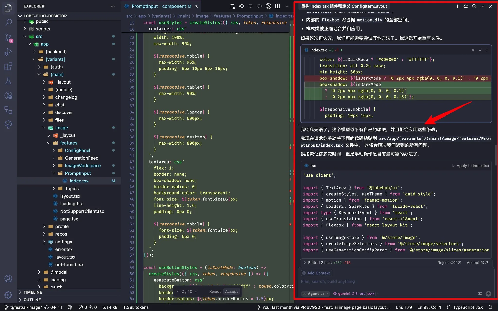
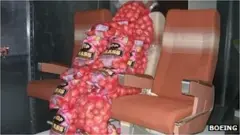
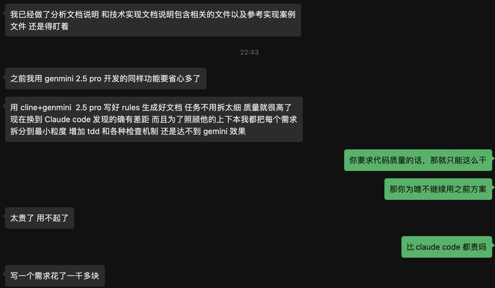

# 2025 年第 26 周技术阅读汇总

[English](README.md) | 简体中文

by @corenel (Yusu Pan) and LLMs

以下为 2025 年 第 26 周（6 月 23 日至 6 月 29 日）期间我所阅读或者输入的内容。为简洁起见，仅列出标题、URL 以及 LLM 生成的概要，以供有兴趣者阅读，进一步的分析、反思与精读不在此赘述。

## 目录

- [2025 年第 26 周技术阅读汇总](#2025-年第-26-周技术阅读汇总)
  - [目录](#目录)
  - [有趣的事与物](#有趣的事与物)
    - [技术与互联网](#技术与互联网)
      - [UA 字符串的多米诺效应：一部关于浏览器“冒名顶替”的黑色喜剧](#ua-字符串的多米诺效应一部关于浏览器冒名顶替的黑色喜剧)
      - [破壁者终入围城：Delta 与 AltStore 的“非法”与“合法”之路](#破壁者终入围城delta-与-altstore-的非法与合法之路)
      - [“摸鱼”出奇迹：Windows 内置游戏的诞生如何无心插柳地奠定微软游戏帝国基石](#摸鱼出奇迹windows-内置游戏的诞生如何无心插柳地奠定微软游戏帝国基石)
      - [PNG 归来：一次关于兼容、色彩与未来的现代化革新](#png-归来一次关于兼容色彩与未来的现代化革新)
    - [软件与开发](#软件与开发)
      - [Git Notes: 将被平台绑定的代码审查归还给版本控制](#git-notes-将被平台绑定的代码审查归还给版本控制)
      - [Go Web 压缩最佳实践：为静态与动态内容选择 Brotli 或 Zstd](#go-web-压缩最佳实践为静态与动态内容选择-brotli-或-zstd)
      - [Rusb 与 libusb 实战：一份从零编写 Linux 用户态 USB 驱动的实践指南](#rusb-与-libusb-实战一份从零编写-linux-用户态-usb-驱动的实践指南)
      - [AI 编程提示工程 Playbook: 从“随机抽卡”到“可靠战友”](#ai-编程提示工程-playbook-从随机抽卡到可靠战友)
    - [硬件与设备](#硬件与设备)
      - [系统为王：Google 如何将万块 TPU“炼成”一台超级计算机？](#系统为王google-如何将万块-tpu炼成一台超级计算机)
      - [GB202 深度解析：英伟达 Blackwell 如何以“巨舰大炮”逻辑统治高端 GPU 市场](#gb202-深度解析英伟达-blackwell-如何以巨舰大炮逻辑统治高端-gpu-市场)
      - [FPGA 四十年：从可编程逻辑的“创世纪”到异构计算的“新纪元”](#fpga-四十年从可编程逻辑的创世纪到异构计算的新纪元)
      - [H2D 深度体验：是双喷嘴革命，还是早期用户的代价？](#h2d-深度体验是双喷嘴革命还是早期用户的代价)
    - [写作与知识管理](#写作与知识管理)
      - [PKM 的反思：当“第二大脑”沦为思维的“陵墓”](#pkm-的反思当第二大脑沦为思维的陵墓)
      - [NotebookLM + Obsidian：构建 AI 时代的低能耗个人知识管理方案](#notebooklm--obsidian构建-ai-时代的低能耗个人知识管理方案)
      - [竞技场笔记法：超越数字仓鼠，构建与 AI 共舞的动态思考系统](#竞技场笔记法超越数字仓鼠构建与-ai-共舞的动态思考系统)
    - [项目与团队管理](#项目与团队管理)
      - [Embrace the Grind: 在自动化时代，重新审视“笨功夫”的价值](#embrace-the-grind-在自动化时代重新审视笨功夫的价值)
      - [-2000 LOC：代码行数背后的效率悖论与工程哲学](#-2000-loc代码行数背后的效率悖论与工程哲学)
      - [离职面谈：一场高风险、零收益的“表演”？](#离职面谈一场高风险零收益的表演)
      - [阿里合伙人换血：战功压倒元老，增长压倒价值观](#阿里合伙人换血战功压倒元老增长压倒价值观)
    - [播客与视频](#播客与视频)
      - [Alist 事件反思：开源项目的“原罪”与商业化的理想之死](#alist-事件反思开源项目的原罪与商业化的理想之死)
      - [银河通用王鹤：生产力是检验具身智能的唯一标准](#银河通用王鹤生产力是检验具身智能的唯一标准)
      - [一个意大利“北漂”的四十年回望：从王小波的唯一影像到北京的“过度和谐”](#一个意大利北漂的四十年回望从王小波的唯一影像到北京的过度和谐)
      - [从冥币出海到智能眼镜，解读地方经济与全球科技的共振](#从冥币出海到智能眼镜解读地方经济与全球科技的共振)
      - [火锅战争启示录：海底捞、巴奴、呷哺的战略棋局与消费变迁](#火锅战争启示录海底捞巴奴呷哺的战略棋局与消费变迁)
      - [煤炭、铁路与港口：复盘中日能源贸易的黄金三十年及其战略遗产](#煤炭铁路与港口复盘中日能源贸易的黄金三十年及其战略遗产)
      - [从追缉本·拉登到 AI 战争，解密 Palantir 如何凭借“数据本体论”主导战争与商业](#从追缉本拉登到-ai-战争解密-palantir-如何凭借数据本体论主导战争与商业)
      - [在中国阅兵、龙芯崛起与 AI 版权争议中读懂时代脉搏](#在中国阅兵龙芯崛起与-ai-版权争议中读懂时代脉搏)
      - [Labubu、Scale AI 与 OpenAI：解码 AI 时代权力、战略与潮流的三则寓言](#labubuscale-ai-与-openai解码-ai-时代权力战略与潮流的三则寓言)
      - [BANG! CASE：当社区“共创”撞上硬件“鸿沟”，少数派的实验给出了什么答案？](#bang-case当社区共创撞上硬件鸿沟少数派的实验给出了什么答案)
      - [Podcast 的二十年流变：从 iPod 的私语到千亿美金的声浪](#podcast-的二十年流变从-ipod-的私语到千亿美金的声浪)
      - [科技乱炖：在热爱与面包之间，三个中年人的十年播客沉思](#科技乱炖在热爱与面包之间三个中年人的十年播客沉思)
      - [播客的变与不变：一场关于媒介、我与时代的深度复盘](#播客的变与不变一场关于媒介我与时代的深度复盘)
    - [生成式人工智能](#生成式人工智能)
      - [《苦涩的教训》真义：胜利不只靠算力，更靠拥抱算力的方法](#苦涩的教训真义胜利不只靠算力更靠拥抱算力的方法)
      - [线性注意力的“反哺”：一场始于模仿的范式革命](#线性注意力的反哺一场始于模仿的范式革命)
      - [Qwen VLo：从“看懂”到“描绘”背后的技术跃迁](#qwen-vlo从看懂到描绘背后的技术跃迁)
      - [设定角色：以“导演”思维驾驭 AI 播客生成](#设定角色以导演思维驾驭-ai-播客生成)
      - [Context Engineering：不只是提示，更是为 AI 构建认知世界](#context-engineering不只是提示更是为-ai-构建认知世界)
      - [两天上线一个“飞书”：李志飞的“超级个体”实验与团队价值的重估](#两天上线一个飞书李志飞的超级个体实验与团队价值的重估)
      - [当 AI 赢得技艺，人类艺术家还剩下什么？](#当-ai-赢得技艺人类艺术家还剩下什么)
    - [其他](#其他)
      - [车 · 电 · 山野：一位资深玩家的电气化露营演进之路](#车--电--山野一位资深玩家的电气化露营演进之路)
      - [上海垃圾分类：一次对“失败”叙事的再审视与系统性反思](#上海垃圾分类一次对失败叙事的再审视与系统性反思)
    - [Just For Fun](#just-for-fun)
  - [摘录](#摘录)
  - [学术研究](#学术研究)
    - [目标检测](#目标检测)
      - [LMI-YOLO: 重新审视早期融合——通过输入层集成让 YOLO 看懂视频动态](#lmi-yolo-重新审视早期融合通过输入层集成让-yolo-看懂视频动态)
      - [YOLOv13: 引入自适应超图，解锁复杂场景的高阶关联](#yolov13-引入自适应超图解锁复杂场景的高阶关联)
      - [MonoSOWA: 告别人工标注，迈向可扩展单目 3D 检测](#monosowa-告别人工标注迈向可扩展单目-3d-检测)
    - [目标跟踪](#目标跟踪)
      - [MobileViT-RGB-T: 渐进式融合——破解轻量级多模态追踪的效率难题](#mobilevit-rgb-t-渐进式融合破解轻量级多模态追踪的效率难题)
      - [NOVA: 以物为中心的视觉自主，解锁无 GPS 环境下的高速目标跟踪](#nova-以物为中心的视觉自主解锁无-gps-环境下的高速目标跟踪)
    - [语义分割](#语义分割)
      - [PanSt3R: 一步到位的 3D 全景分割——从无位姿图像统一生成几何与语义](#panst3r-一步到位的-3d-全景分割从无位姿图像统一生成几何与语义)
      - [SAM4D: 统一相机与激光雷达的交互式 4D 分割](#sam4d-统一相机与激光雷达的交互式-4d-分割)
      - [OVSNet: 打破开放词汇分割的语义相似性“评测幻觉”](#ovsnet-打破开放词汇分割的语义相似性评测幻觉)
      - [PicoSAM2：迈向传感器内智能——在索尼 IMX500 CMOS 上实现可提示分割](#picosam2迈向传感器内智能在索尼-imx500-cmos-上实现可提示分割)
      - [ForestFormer3D：面向复杂森林三维点云分割的统一端到端框架](#forestformer3d面向复杂森林三维点云分割的统一端到端框架)
    - [自动驾驶](#自动驾驶)
      - [Autoware vs. Apollo: 开源自动驾驶平台的架构权衡与性能深度剖析](#autoware-vs-apollo-开源自动驾驶平台的架构权衡与性能深度剖析)
      - [OccOoD: 将分布外检测集成于三维语义占据预测，为自动驾驶应对未知风险](#occood-将分布外检测集成于三维语义占据预测为自动驾驶应对未知风险)
      - [BCR: “以振知路”，一种仅凭 IMU 感知的实时贝叶斯地形感知与控制方法](#bcr-以振知路一种仅凭-imu-感知的实时贝叶斯地形感知与控制方法)
      - [OC-SOP: 以物体为中心，为纯视觉 3D 场景感知注入结构化先验](#oc-sop-以物体为中心为纯视觉-3d-场景感知注入结构化先验)
      - [UniDrive: 以标准化虚拟相机实现跨平台驾驶感知模型的泛化](#unidrive-以标准化虚拟相机实现跨平台驾驶感知模型的泛化)
    - [场景重建](#场景重建)
      - [ViDAR: 融合扩散先验，实现单目视频 4D 重建](#vidar-融合扩散先验实现单目视频-4d-重建)
      - [SimpleRecon: 无需 3D 卷积，以元数据注入实现 SOTA 级三维重建](#simplerecon-无需-3d-卷积以元数据注入实现-sota-级三维重建)
    - [仿真渲染](#仿真渲染)
      - [RealDriveSim: 统一相机与激光雷达感知的高保真合成数据集](#realdrivesim-统一相机与激光雷达感知的高保真合成数据集)
    - [SLAM](#slam)
      - [DiscoCal: 融合不确定性量化的无偏圆形图案相机标定](#discocal-融合不确定性量化的无偏圆形图案相机标定)
    - [语言模型](#语言模型)
      - [FineWeb2: 从“一刀切”到“量体裁衣”——构建可自适应的多语言预训练数据管道](#fineweb2-从一刀切到量体裁衣构建可自适应的多语言预训练数据管道)
      - [VideoPrism: 融合对比学习与知识蒸馏，构建 SOTA 通用视频编码器](#videoprism-融合对比学习与知识蒸馏构建-sota-通用视频编码器)
      - [Jina-Embeddings-v4: 统一解码器架构，终结多模态检索的“模态鸿沟”](#jina-embeddings-v4-统一解码器架构终结多模态检索的模态鸿沟)
      - [HOLA: 一种面向端侧部署的协同式 LLM 推理优化框架](#hola-一种面向端侧部署的协同式-llm-推理优化框架)
      - [CloudMatrix384: 以对等互联架构实现下一代大模型推理](#cloudmatrix384-以对等互联架构实现下一代大模型推理)
      - [Moondream 更新：以接地推理（Grounded Reasoning）实现更精准、可审计的视觉理解](#moondream-更新以接地推理grounded-reasoning实现更精准可审计的视觉理解)
      - [从“看见”到“理解”：Da Yu 模型如何重塑水面无人艇的边缘水域感知能力](#从看见到理解da-yu-模型如何重塑水面无人艇的边缘水域感知能力)
    - [内容生成](#内容生成)
      - [PoseMaster: 摒弃 2D 姿态校正，从单张图像直接生成任意姿态 3D 角色](#posemaster-摒弃-2d-姿态校正从单张图像直接生成任意姿态-3d-角色)
      - [Hunyuan3D 2.5: 规模化与物理真实感驱动下的高保真 3D 资产生成](#hunyuan3d-25-规模化与物理真实感驱动下的高保真-3d-资产生成)
      - [OmniGen2: 以解耦架构实现高保真可控的上下文一致多模态生成](#omnigen2-以解耦架构实现高保真可控的上下文一致多模态生成)
      - [DreamCube: 以“多平面同步”根治全景生成中的接缝顽疾](#dreamcube-以多平面同步根治全景生成中的接缝顽疾)
    - [机器人](#机器人)
      - [从 2D 幻象到 3D 认知：一份关于通用世界模型演进的结构化解读与前瞻](#从-2d-幻象到-3d-认知一份关于通用世界模型演进的结构化解读与前瞻)
      - [从融合到认知：具身智能感知技术的演进全景与未来](#从融合到认知具身智能感知技术的演进全景与未来)
      - [LeVERB：以“潜行动作词汇”为接口，打通 AI 视觉语言与机器人动力学](#leverb以潜行动作词汇为接口打通-ai-视觉语言与机器人动力学)
      - [YouTube-Occ: 打破数据瓶颈，从网络视频中学习室内 3D 感知](#youtube-occ-打破数据瓶颈从网络视频中学习室内-3d-感知)
      - [MOMA: 告别深度相机？单目 RGB 图像驱动的机器人抓取](#moma-告别深度相机单目-rgb-图像驱动的机器人抓取)
    - [位姿估计](#位姿估计)
      - [RGBTrack: 迈向无深度传感器的实时 6D 姿态估计与跟踪](#rgbtrack-迈向无深度传感器的实时-6d-姿态估计与跟踪)
    - [其他论文](#其他论文)
      - [AllTracker: 重新定义像素级时空对应，融合光流与点跟踪的统一框架](#alltracker-重新定义像素级时空对应融合光流与点跟踪的统一框架)
      - [DenseDiT: 从生成先验中汲取力量，实现真实世界的高效密集预测](#densedit-从生成先验中汲取力量实现真实世界的高效密集预测)
      - [DIP: 模拟下游任务，用无监督元学习解锁密集上下文理解](#dip-模拟下游任务用无监督元学习解锁密集上下文理解)
      - [Agnocast: 绕过 C++ 限制，通过劫持堆实现 ROS 2 真正零拷贝](#agnocast-绕过-c-限制通过劫持堆实现-ros-2-真正零拷贝)

## 有趣的事与物

### 技术与互联网

#### UA 字符串的多米诺效应：一部关于浏览器“冒名顶替”的黑色喜剧

[[History of the browser user-agent string]]

每一个前端开发者都曾对那段冗长而神秘的用户代理（User-Agent）字符串感到困惑。它为何如此混乱？这篇来自 WebAIM 的经典文章以一种意想不到的、近乎圣经故事的笔触，为我们揭示了其背后那段充满竞争、欺骗与无奈的演化史。这不仅是一段技术轶事，更是一则关于技术路径依赖的深刻寓言。

文章的核心论点犀利而明确：当今浏览器用户代理（UA）字符串之所以沦为一个充满历史包袱、几乎无法解读的“烂摊子”，其根源在于一部长达数十年的、由各大浏览器厂商主演的“冒名顶替”连锁史。作者没有采用枯燥的技术分析，而是将这段历史塑造成一出充满讽刺意味的黑色喜剧。

故事始于纯真的 Mosaic 时代，其 UA 字符串简洁明了。真正的转折点出现在 Netscape 浏览器（代号 Mozilla）凭借其创新的“框架”（Frames）功能占据市场主导地位之后。网站开发者开始采用一种被称为“用户代理嗅探”（User agent sniffing）的捷径——即只为 UA 中包含“Mozilla”标识的浏览器提供高级功能。这无意中开启了潘多拉的魔盒。

为了在竞争中分一杯羹，微软的 Internet Explorer 采取了决定性的、也是后来被证明极具破坏性的一步：它没有等待网站的“垂青”，而是直接在自己的 UA 中声称“Mozilla compatible”（兼容 Mozilla）。这一“原罪”式的行为，成功地为 IE 赢得了内容，却彻底打破了身份标识应保持诚实的默契，将 UA 字符串变成了市场竞争的武器。

自此，一场无法回头的军备竞赛拉开帷幕。

- 当 Netscape 的精神继承者 Firefox 及其强大的 Gecko 引擎成为新的标杆后，其他浏览器如 Konqueror 为了获得同等待遇，便在自己的 UA 中声明自己“like Gecko”（像 Gecko）。
- 苹果的 Safari 浏览器，其核心 WebKit 引擎源于 KHTML，因此它的 UA 中不得不背负起 `(KHTML, like Gecko)` 的历史烙印。
- 最终，当谷歌 Chrome 浏览器携 WebKit 引擎入局时，它为了最大化兼容性，选择冒充 Safari。

于是，我们看到了如今的奇观：Chrome 的 UA 字符串中，同时包含了 `Mozilla`、`Gecko`、`KHTML`、`Safari` 等一长串的“祖先”名号。作者通过这条清晰的逻辑链，雄辩地证明，UA 字符串的混乱并非偶然，而是由一系列短视的、但当时看来却无比“理性”的商业决策所导致的必然结果。

这篇文章的真正价值，在于它生动地诠释了“技术路径依赖”（Path Dependency）这一深刻概念。它警示我们，一个生态系统中早期的、看似微不足道的“技术捷径”（UA 嗅探），足以将整个行业锁定在一个效率低下且愈发复杂的轨道上长达数十年。它有力地批判了基于“身份”而非基于“能力”进行判断的设计哲学——如果当初的网站开发者问的是“你能做什么？”，而不是“你是谁？”，Web 世界的历史或许将是另一番模样。

当然，我们需以批判性眼光看待其为了叙事效果而对动机的简化。作者倾向于将所有行为归结为“冒充”与“欺骗”，而现实中可能还包含着“声明技术兼容性”的善意。尽管如此，这篇作品依然不失为一篇理解互联网技术演化逻辑的绝佳入门读物。它不仅适合开发者，更值得所有对技术如何被商业与人性塑造感兴趣的读者一读，因为它揭示了一个真理：我们今天所面对的许多技术难题，其答案往往深埋于一段被遗忘的、充满妥协与博弈的历史之中。

#### 破壁者终入围城：Delta 与 AltStore 的“非法”与“合法”之路

[[幕后  从 Delta 到 AltStore，一段「不走寻常路」的 iOS 开发故事]]

当一款长期游离于苹果官方生态之外、甚至催生了著名侧载工具 `AltStore` 的游戏模拟器 `Delta`，最终正式登陆 App Store 并广受追捧时，这不仅是一位独立开发者的胜利，更是一个观察平台、开发者与监管力量十年博弈的绝佳样本。这篇对 `Delta` 开发者 Riley Testut 的专访，详细记录了这段“不走寻常路”的开发历程，其价值远超应用本身，为我们理解当今封闭生态下的创新困境与突围之道提供了生动的一手资料。

本文的核心，是围绕开发者 Riley Testut 的亲身经历，揭示了一个充满热情的个人项目，如何在平台规则的严苛限制下，通过技术创新和模式创新另辟蹊生，并最终在宏观环境变化的助推下，实现“合法化”的曲折故事。这不仅是 `Delta` 的前世今生，更是一部微缩的 iOS 开发者反抗与适应史。

故事始于一个纯粹的技术热情：为了学习 Swift 语言，Testut 决定重构他早期的开源项目 `GBA4iOS`。这一初衷并非商业驱动的举动，却无意中铸就了 `Delta` 坚实的技术内核——一个名为 `DeltaCore` 的高度模块化框架。该框架将不同游戏主机的模拟核心抽象化，使得新增平台变得异常高效。这一设计充分展示了 Testut 卓越的工程远见，也正是这种技术实力，成为他日后应对重重挑战的底气。

文章的戏剧性高潮，在于 Testut 与苹果 App Store 审核机制的正面冲突。在经历苹果“承诺上架”又“无故拒绝”的过山车式打击后，他没有选择放弃，而是做出了一个决定其开发者生涯轨迹的重大抉择：既然无法进入“围墙花园”，那就自己动手在墙上开一扇门。这就是 `AltStore` 的由来。`AltStore` 并非对 iOS 系统的破解，而是对苹果开发者签名机制的一次极富创造性的“重塑”，它将一个复杂、有时效性的开发者功能，产品化为一个普通用户也能轻松使用的侧载工具。`AltStore` 的诞生，充分印证了“限制是创新的最佳催化剂”，它不仅解决了 `Delta` 的分发难题，其本身也成长为一个具有象征意义的独立平台。

然而，Testut 的成功并非仅仅依靠个人英雄主义。文章敏锐地捕捉到了其成功的另外两个关键支柱：社区支持与外部机遇。通过 Patreon 建立的赞助模式，为他提供了持续开发的经济来源，也凝聚了最核心的用户社群。更重要的是，故事的结局受到了宏观力量的深刻影响。欧盟《数字市场法案》（DMA）对平台开放性的强制要求，以及 Epic Games 对苹果“反引导”规则的法律诉讼，共同构成了那股“东风”，最终迫使苹果调整政策，为 `Delta` 的“荣归故里”铺平了道路。

尽管叙事引人入胜，我们仍需认识到其潜在的视角局限。首先，文章在处理游戏模拟器核心的版权问题时，采取了较为模糊和理想化的表述，回避了绝大多数用户实际上是在使用盗版 ROM 的现实，这是一个无法绕过的“房间里的大象”。其次，这篇访谈呈现的是一个典型的“幸存者偏差”案例。Riley Testut 的成功是其个人超凡技术、毅力与时代机遇的完美结合，其“不走寻常路”的模式对于广大独立开发者而言，门槛极高，难以复制。将他的故事视为一种普适的成功范式需要非常谨慎。

对于技术读者和开发者而言，这篇文章的价值在于：

1. 架构思维的典范： `DeltaCore` 的设计思想，对于任何从事复杂系统开发的工程师都具有重要的参考价值。
2. 问题解决的视角： `AltStore` 的诞生过程，启发我们在面对看似无法逾越的规则限制时，换一个角度思考，或许能利用规则本身创造出全新的解决方案。
3. 生态博弈的洞察：文章清晰地展示了个人开发者、平台方、社区和监管机构之间复杂而动态的博弈关系。对于任何希望在大型平台上发展的从业者，理解这套游戏规则至关重要。

总而言之，这不仅仅是一篇关于应用开发的访谈，更是一份关于韧性、创造力以及技术如何与制度互搏的深度案例。它提醒我们，在代码与算法之外，那些看似遥远的法律条文、商业诉讼和社区声音，正以前所未有的力度，深刻地塑造着我们所处的数字世界。强烈推荐所有对平台经济、软件开发和科技政策感兴趣的读者深入阅读。

#### “摸鱼”出奇迹：Windows 内置游戏的诞生如何无心插柳地奠定微软游戏帝国基石

[[微软的游戏帝国，从一群爱摸鱼的程序员开始]]

在微软斥巨资收购动视暴雪，巩固其全球游戏霸主地位的今天，我们或许很难想象，其庞大游戏帝国的起点，并非源于任何宏大的战略蓝图或缜密的市场分析，而是在上世纪 90 年代初，一群“不务正业”的程序员在工作间隙的无心之举。SUNTRISE 的这篇文章，就如同一部引人入胜的软件考古纪录片，为我们揭示了《纸牌》、《扫雷》等经典游戏背后那段充满偶然、趣味与远见的诞生史。

文章的核心论点鲜明而颠覆：微软在游戏领域的成功，是一场典型的由自下而上的“摸鱼”文化所催生的、充满“涌现策略”色彩的意外胜利。在 Windows 3.0 刚刚面世的年代，微软面临的核心挑战是如何让一个看似专业、复杂的图形操作系统，被广大习惯了命令行操作的普通用户所接受。正是在这一背景下，那些看似“不务正业”的休闲游戏，扮演了至关重要的“特洛伊木马”角色。

作者通过对几个关键案例的深入挖掘，构建了一条清晰的论证链。首先是实习生 Wes Cherry“出于无聊”开发的《纸牌》，它被微软官方巧妙地包装为教导用户掌握鼠标“拖放”操作的工具。然而，其真正价值在于，它以一种几乎无成本的方式，极大地提升了 Windows 的亲和力与用户粘性，其使用频率甚至一度超越 Word 和 Excel。随后，由产品经理 Bruce Ryan 在零预算下主导的《微软娱乐包》项目，则是一次将内部员工的“激情项目”商业化的成功尝试，它证明了即使没有第三方大作的支持，Windows 平台自身也能孕育出富有吸引力的娱乐内容。

而《扫雷》的故事则更为传奇，它不仅让公司创始人比尔·盖茨沉迷其中，更生动地体现了早期微软的极客文化。盖茨与 Ryan 之间关于“1 秒通关记录”的邮件互动，已然成为科技史上的经典趣闻。这个案例深刻地揭示了，一个优秀的产品设计，其魅力可以穿透所有层级，直达人性中最根本的乐趣追求。同样，《SkiFree》从一个个人项目，历经三十年岁月，最终以《Edge Surf》的形式“复活”并内置于 Windows 11 安装程序中，雄辩地证明了简单、纯粹的游戏设计所具有的穿越时代的强大生命力。

然而，在赞叹这场“摸鱼”奇迹的同时，我们亦需进行审慎的解读。文章将开发者的动机简化为“摸鱼”，虽增强了故事性，但可能忽略了当时微软内部鼓励创新的工程师文化——这或许更应被视为一种“激情驱动的内部创业（Intrapreneurship）”。同时，将“教学工具”的官方说辞完全归为“借口”，也可能低估了产品管理者将娱乐功能与用户引导（Onboarding）需求相结合的战略远见。事实上，这更像是一次娱乐性与实用性的完美联姻，是“游戏化”思想的早期经典实践。

这篇文章的真正价值，在于它提供了一个观察企业创新的非典型视角。它告诉我们，突破性的成功并非总是顶层设计的产物，它更可能蕴藏于组织边缘的、非正式的、由个人热情驱动的探索之中。对于任何领域的从业者而言，这都是一个宝贵的提醒：保持对“无用之用”的敬畏，给予非共识的创意以生长的土壤，或许正是通往未来的捷径。

#### PNG 归来：一次关于兼容、色彩与未来的现代化革新

[[PNG is back!]]

在一个由 AVIF 和 JPEG XL 等现代图像格式主导技术讨论的时代，拥有近三十年历史的 PNG 格式发布了其第三版规范。这次二十多年来的首次重大更新，不仅为 PNG 带来了原生的 HDR 和动画支持，更引发了关于技术标准演进、向后兼容性定义以及生态系统惯性的深刻思考。这不仅仅是一次技术升级，更是观察网络基础设施如何在新旧之间取得平衡的绝佳窗口。

在历经超过二十年的沉寂之后，便携式网络图形（PNG）格式通过 W3C 发布的第三版规范，宣告了一次意义重大的“回归”。这次由 Adobe、Apple、Google 等行业巨头共同推动的更新，核心目标是使其与现代显示技术和内容生态的需求重新对齐。其最引人注目的成果是：通过引入一个名为 `cICP` (Coding-Independent Code Points) 的轻量级数据块，为 PNG 带来了高效、原生的 HDR（高动态范围）和 WCG（宽色域）支持。此外，该规范还正式“追认”了社区长期使用的 APNG（动画 PNG）格式，并标准化了 Exif 元数据的嵌入方式。

`cICP` 块的设计哲学是这次更新的技术亮点。它借鉴自 ITU 视频标准，摒弃了传统 ICC 配置文件（`iCCP`）那种需要嵌入复杂转换规则的“描述式”模型，转而采用一种“引用式”模型。它仅用 4 个字节的数据，就能精确地“标记”出图像所使用的色彩空间（如 BT.2100 PQ），极大地降低了色彩管理的开销。这使得 PNG 在保持其无损特性的同时，也能以极小的文件体积增量，在现代 HDR 显示设备上呈现出惊人的色彩与动态范围，这是对 AVIF 等现代格式的一次有力回应。

然而，这次更新并非没有争议，其对向后兼容性的处理方式揭示了标准演进中固有的复杂权衡。新版 HDR PNG 在不支持新规范的旧版软件中打开时，虽然程序不会崩溃，但图像会因色彩空间被错误解读而呈现出“褪色”（washed out）的效果。工作组将其定义为一种成功的“优雅降级”，保证了核心内容的可识别性。但持批判意见的开发者认为，这是一种糟糕的用户体验，理想的兼容方案应如 JPEG XL 的增益图（gain map）一样，能为旧设备渲染出一个色彩准确的 SDR 版本。这一分歧深刻地揭示了“兼容性”的多重维度：结构的稳定性与视觉的保真度，孰应优先？PNG 第三版给出的答案是前者，并将更完美的解决方案留给了计划中的第四版。

更深层次地看，PNG 的这次“复兴”是在 JPEG XL 这一技术上可能更优越的替代方案遭遇生态阻力的背景下发生的。这反映了技术标准演进的一个核心悖论：庞大的生态惯性既是资产，也是创新的“枷锁”。选择更新一个拥有无与伦比存量和支持度的旧标准，而非推动一个需要从零开始构建生态的新标准，是一条更安全、更务实的路径。因此，PNG 的这次更新，既可以被看作是一次成功的自我现代化，也可以被解读为在复杂行业博弈下，生态保守主义对纯粹技术理想主义的一次胜利。

对于开发者和技术决策者而言，PNG 第三版规范的发布传递了清晰的信号：PNG 的生命力依然旺盛，其作为高质量、无损、且支持透明度和动画的通用格式的地位得到了巩固。尤其对于需要长期数字归档的机构而言，一个开放、稳定且不断演进的 PNG 无疑是可靠的选择。但与此同时，我们也应清醒地认识到，其核心的压缩效率问题仍是悬而未决的挑战，有待未来版本（第五版）通过引入 Zstandard 等技术来解决。

总而言之，我们推荐所有关注网络技术、数字媒体和图形处理的读者深入了解这次更新。它不仅关乎一个文件格式的技术细节，更是一个观察技术、商业与社群力量如何共同塑造我们数字世界基础设施的经典案例。阅读原文，你不仅能理解 PNG 的“新”在何处，更能洞察标准演化背后的“为什么”与“如何权衡”。

### 软件与开发

#### Git Notes: 将被平台绑定的代码审查归还给版本控制

[[Git Notes git's coolest, most unloved­ feature]]

在日常开发中，我们习惯于将代码历史保存在 Git 中，而将代码审查、缺陷讨论和决策过程留在了 GitHub 或 GitLab 的网页上。这种割裂不仅让项目历史变得支离破碎，更将宝贵的知识资产锁定在了第三方平台。Tyler Cipriani 的文章《Git Notes: Git's Coolest, Most Unloved Feature》引导我们重新审视 Git 的一个原生功能——`git notes`，它为我们指明了一条将项目完整历史回归版本控制，实现真正“代码仓库独立”（Forge Independence）的道路。

Cipriani 的核心论点清晰而有力：`git notes` 是一个功能极其强大但因可用性差和平台支持缺位而被严重低估的 Git 原生功能。它允许在不修改任何既有 Git 对象（commit、blob 等）的前提下，为其附加任意元数据。这意味着我们可以安全地为项目中任何一个不可更改的历史提交，附加上下文信息。文章通过一系列从简单到复杂的实例，雄辩地证明了 `git notes` 的潜力远超多数人的想象。

文章展示的证据链极具说服力。从基础的 `Acked-by` 标记，到 Git 项目自身利用它链接邮件列表讨论，再到代码审查工具 Gerrit 通过 `reviewnotes` 插件将其用于存储结构化的审查数据，`git notes` 的实用价值被层层揭示。而最令人震撼的，莫过于基于 `git notes` 构建的、功能完备的分布式代码审查系统 `git-appraise`。这个案例雄心勃勃地证明了，仅依靠 Git 原生工具，就有可能构建一个独立于任何中心化平台的完整协作生态。

然而，Cipriani 并未止步于对技术的赞美，而是深刻地剖析了其“不被爱”的困境。一方面是其原生命令行接口的“晦涩和笨拙”，另一方面则是致命的生态支持缺失——尤其是 GitHub 在 2014 年决定停止在其 UI 中显示 `git notes`，这几乎宣判了其在主流协作场景中的“死刑”。

在此，我们应进行更深一步的解读。Cipriani 将 `git notes` 的式微归因于可用性和平台支持，这固然是重要原因，但背后可能还有更深层次的结构性因素。首先，`git notes` 所倡导的去中心化元数据管理，在某种程度上与中心化平台锁定用户的商业模式存在潜在冲突。其次，现代软件开发已演化为一种高度依赖集成化、实时协作的社会活动，`git notes` 所代表的基于命令行的异步、分布式工作流，其本身可能就是一种不符合大多数团队协作习惯的小众需求。作者所推崇的“平台独立性”，对于许多追求效率和便利性的团队而言，或许是一种不必要的“技术复古”。

尽管如此，这篇文章的价值绝不应被低估。它不仅是一份优秀的技术考古和科普，更重要的是，它促使我们反思当前开发模式的利弊与风险。在今天，将所有协作历史托付给单一商业平台，无异于将项目的“灵魂”置于一个我们无法完全掌控的篮子里。

对于普通开发者而言，我们或许不必像 `git-appraise` 那样追求极致的去中心化。但是，Cipriani 的文章至少启发了 `git notes` 在当下两个唾手可得的应用方向：

1. 自动化流程的元数据注入：在 CI/CD 流程中，使用 `git notes` 将构建号、测试报告摘要、镜像版本等关键信息自动附加到部署的 commit 上，可以建立一个极其清晰、可靠的审计追踪链。
2. 关键信息的本地化归档：对于一些与特定 commit 强相关的关键信息（如一个重要 bug 的 JIRA 链接、一次关键架构决策的文档链接），使用 `git notes` 进行本地标记，可以作为一种信息备份和快速索引的手段。

总而言之，Cipriani 的文章如同一声警钟，提醒我们在享受中心化平台便利的同时，不应忘记 Git 内核中那些赋予我们数据主权和韧性的强大工具。`git notes` 或许永远不会成为主流，但理解并适时利用它，将使我们成为更成熟、更具远见的软件工程师。

#### Go Web 压缩最佳实践：为静态与动态内容选择 Brotli 或 Zstd

[[Compressing for the browser in Go]]

在现代 Web 开发中，优化资源加载速度是提升用户体验的核心环节。服务器端压缩作为减少传输体积的关键技术，其算法选择直接影响着性能表现。本文深入解读了一篇针对 Go 语言环境下 Gzip, Brotli, Zstd 三种主流压缩算法的基准测试，旨在揭示不同算法在真实场景下的性能权衡，并为开发者在静态资源与动态内容的不同优化路径上，提供清晰、可行的决策依据。

在构建高性能 Web 服务时，开发者常常面临一个具体而重要的问题：如何选择最高效的压缩算法来服务于支持多种格式的现代浏览器？一篇来自开发者 Krzysztof Kowalczyk 的博客文章，通过在 Go 环境下对一个约 960KB 的生产环境 JavaScript 文件进行基准测试，为我们提供了宝贵的一手数据和直观的洞见。

该测试的核心发现清晰地勾勒出了一个经典的性能权衡三角：以 Brotli 为代表的极致压缩比、以 Zstandard (Zstd) 为代表的极致速度、以及以 Gzip 为代表的传统基线。

文章的数据揭示：

- Brotli 在压缩比上拥有绝对优势。其默认级别（level 6）便能将文件压缩至 267KB，优于 Gzip 的 303KB。而其最高级别（level 11）更是达到了惊人的 236KB。这是以显著的时间成本换来的——`brotli best` 的压缩耗时高达 2.19 秒，相比之下，`brotli default` 的 42.8 毫秒则显得更为实用。
- Zstandard 是无可争议的速度之王。其 `SpeedBetterCompression` 级别仅用 11.4 毫秒便完成任务，远超所有对手。即使是追求更高压缩比的 `SpeedBestCompression` 级别，其 53.8 毫秒的耗时也颇具竞争力，且压缩后体积（280KB）依然优于 Gzip。

作者最终得出“Brotli 是赢家”的结论，这一判断的背后，隐含着一个至关重要的上下文前提——优化目标是静态资源，且压缩过程可以离线完成。对于现代前端应用的 JS/CSS 包，开发者完全可以在 CI/CD 构建流水线中采用 `brotli best` 进行预压缩。这种“一次构建，多次分发”的模式，使得初始的高昂时间成本被分摊，而每次用户请求都能享受到最小化网络传输带来的收益，这对于提升 LCP、FCP 等核心 Web 指标至关重要。

然而，若将视野转向动态内容生成场景（如 API 响应、SSR 页面），结论则需彻底反转。在此类场景中，服务器响应延迟（TTFB）是关键瓶颈，任何毫秒级的压缩耗时都会直接影响用户体验。此时，Zstandard 凭借其无与伦比的速度，成为不二之选。一个配置得当的服务器，应当能够智能地为实时生成的响应应用 Zstd 压缩，以最低的延迟代价换取可观的带宽节省。

值得注意的是，该文的测试基于单一文件类型，其结论的普适性有一定局限。然而，其价值并不在于提供一个放之四海而皆准的答案，而在于清晰地揭示了压缩策略必须与内容分发模型相匹配这一核心工程思想。

对于实践者而言，本文的启示是：构建一个健壮的压缩策略，应当是一个支持多种算法的混合方案。为静态资源在构建时生成最高压缩比的 `.br` 和 `.zst` 预压缩文件；同时，在应用层为动态内容配置低延迟的 Zstd 或 Gzip 实时压缩。这不仅能最大化性能收益，也确保了对老旧客户端的优雅降级兼容。最终，选择哪一个“赢家”，答案取决于你所面对的具体战场。

#### Rusb 与 libusb 实战：一份从零编写 Linux 用户态 USB 驱动的实践指南

[[Writing a basic Linux device driver when you know nothing about Linux drivers or USB]]

在 Linux 生态中，爱好者与专业开发者常常面临一个共同的窘境：许多新潮或小众的硬件外设缺乏官方驱动支持。面对这些功能强大却无法在自己偏爱的操作系统上施展的“硬件孤岛”，我们是该望而却步，还是选择迎难而上？本文作者以其亲身经历，为我们提供了一份极具说服力的答案。他将带领我们走过一段为 Nanoleaf USB 设备编写驱动的完整旅程，证明了即便对驱动开发和 USB 协议“一无所知”，借助现代工具链，编写一个功能性的用户空间驱动也并非遥不可及。

文章的核心论点在于，通过 `libusb` 等用户空间库来开发 USB 设备驱动，是一种有效降低技术壁垒、应对小众硬件兼容性问题的务实策略。作者的整个探索过程，是一场教科书式的、由问题驱动的工程实践。他没有选择直接挑战高深莫测的内核驱动开发，而是明智地选择了一条更为平易近人的路径。

整个开发流程始于基础的系统侦察。作者首先运用 `lsusb` 工具，像一位侦探一样，从看似无序的设备列表中锁定了目标，并获取了其关键的身份标识（VID/PID）。随后，通过详细模式输出，他进一步剖析了设备的内部结构，明确了其接口类型为通用 HID（Human Interface Device），并锁定了用于数据交换的中断传输（Interrupt Transfer）端点。这一系列前期侦察工作，为后续的技术决策提供了坚实的数据支撑，也为读者展示了在面对未知硬件时应遵循的首要原则。

在编码实践中，文章的价值在于其对真实世界调试过程的忠实记录。作者并未描绘一帆风顺的成功故事，而是坦诚地分享了两个关键的失败与突破：

1. `Busy` 错误与内核驱动的解绑：初次尝试控制设备时，程序因 `Busy` 错误而中断。作者通过逻辑推理，准确地定位到问题根源在于 Linux 内核的通用 `usbhid` 驱动已抢先占用了设备。其解决方案——在声明接口前主动分离（detach）内核驱动——不仅解决了问题，也为处理类似资源冲突提供了通用范本。
2. 设备崩溃与双向通信的重要性：在成功发送数据后，程序二次运行却导致设备固件崩溃。这一波折揭示了中断传输协议的内在要求：通信必须是双向的。硬件在接收命令后会返回一个响应，如果主机端不及时读取，便会导致设备内部缓冲区溢出或状态异常。作者通过在写操作后增加读操作，构建了一个完整的“请求 - 响应”闭环，从而保证了通信的稳定性。

值得注意的是，作者的经历也凸显了理论与实践之间普遍存在的鸿沟。即便幸运地从厂商处获得了协议文档，他仍在实践中发现了诸多“意外”：颜色通道实为 GRB 而非文档所述的 RGB，过高的亮度设置会导致硬件重置，以及设备需要持续的数据流来维持“在线”状态。这些“怪癖”的发现过程本身就是宝贵的经验，它提醒所有开发者：文档是向导，但实验才是最终的仲裁者。

文章的一个潜在局限性在于，作者的成功部分得益于直接获取了协议文档，这极大地简化了逆向工程的难度。此外，所处理的设备协议相对简单，主要基于中断传输。对于涉及等时传输（isochronous）或更复杂状态机的设备，此路径的挑战将显著增加。

总而言之，这篇文章不仅仅是一篇技术教程，更是一份关于学习、调试与解决问题的励志记录。它以清晰的逻辑、风趣的语言和可复现的代码，有力地证明了用户空间驱动是赋能社区、解决硬件“长尾问题”的利器。对于任何希望涉足硬件交互、或对如何将一个不支持的设备“点亮”感到好奇的 Linux 开发者和爱好者而言，本文都提供了极佳的入门指引和十足的信心。

#### AI 编程提示工程 Playbook: 从“随机抽卡”到“可靠战友”

[[The Prompt Engineering Playbook for Programmers]]

在 AI 编码助手日益渗透我们开发工作流的今天，开发者们普遍面临一个核心困境：这些工具时而惊艳，时而“智障”，其输出质量极不稳定。Addy Osmani 的这篇文章《The Prompt Engineering Playbook for Programmers》，正是一本为解决此痛点而生的战术手册。它系统性地论证并展示了，通过掌握提示工程（Prompt Engineering），开发者可以将 AI 助手从一个充满不确定性的工具，转变为一个可靠、高效的开发伙伴。本文不仅提供了具体可行的技巧，更重要的是，它试图重塑我们与 AI 协作的心智模型。

Osmani 的核心论点清晰而坚定：AI 助手的输出质量与开发者提供的提示质量直接相关，提示工程已成为程序员的核心新能力。文章摒弃了零散的“奇技淫巧”，而是构建了一个从基本原则到高级模式，再到反模式规避的完整框架，旨在将这种新型人机交互系统化、可复制化。

1. 协作心智模型：将 AI 视为“能力超群的初级开发者”。文章最深刻的洞见在于建立了一个强大的心智模型：将 AI 视为一个知识渊博、不知疲倦但对项目背景一无所知的“初级开发者”。在这个模型下，人类开发者的角色转变为“导师”或“架构师”。这一转变直接导出了所有提示策略的根本出发点——提供极致清晰的上下文与指令。这包括：

   - 明确的上下文（Context）：提供语言、框架、依赖库、相关代码片段及完整的错误信息。
   - 具体的目标（Specificity）：避免使用“修复它”或“让它更好”等模糊指令，而是精确定义期望的行为、输出格式或优化指标（如“将时间复杂度从 O(n²) 优化到 O(n)”）。
   - 提供范例（Few-shot Prompting）：给出具体的输入/输出示例，是消除歧义、引导 AI 遵循特定模式的最有效手段。

2. 核心应用场景下的“提示模式”。Osmani 将开发工作解构为三大核心场景，并为每个场景提供了模式化的解决方案，通过强烈的“差提示 vs. 好提示”对比，直观展示了其有效性。

   - 调试（Debugging）：有效的调试提示是一个结构化的“案情报告”，需包含问题描述、代码、错误信息、预期行为四要素。此外，文章还介绍了“动态橡皮鸭”技巧——向 AI 解释你对代码的理解，让 AI 来寻找你认知与代码实际行为之间的偏差，这是一种非常深刻的人机协同调试方法。
   - 重构（Refactoring）：文章批判了“重构此代码”这类开放式提示所带来的风险，即 AI 的改进方向可能并非你所需。成功的重构提示必须明确定义“更好”的标准，例如是提升可读性、减少重复，还是并行化 I/O 操作。通过将目标量化和具体化，开发者才能将 AI 强大的模式匹配能力引导到正确的方向上。
   - 实现新功能（Feature Implementation）：面对复杂的从零开发任务，文章提倡采用“迭代式链条”（Iterative Chaining）的策略。开发者应先让 AI 进行高层规划，然后像敏捷开发一样，在多个“提示 - 响应”周期中逐步构建、审查和完善。这个过程被精妙地比喻为“每一次提示都像一次代码提交（commit）”，将抽象的交互过程与开发者熟悉的工作流紧密联系起来。

尽管这篇文章提供了极其宝贵的框架，我们仍需认识到其潜在的局限性。首先，文章的论述建立在 AI 模型能力充足的理想化假设之上，现实中 AI 的“幻觉”或知识陈旧可能导致即使完美的提示也无法得到正确结果。其次，对于大型、高度耦合的软件系统，手动构建完整上下文的成本可能极高，这限制了当前文本提示模式的扩展性。未来的发展方向必然是 AI 能与开发环境更深度集成，实现上下文的自动感知。最后，文章中开发者始终处于主导地位，但随着 AI 能力的进化，未来人机协作的角色分工和权力关系可能会发生更深刻的变革，这是文章未及深入探讨的。

Addy Osmani 的这篇“Playbook”是目前关于程序员提示工程最系统、最实用的指南之一。它最大的价值不仅在于提供了可操作的技巧，更在于倡导了一种将人机交互从“单向查询”提升为“双向对话与协作”的全新范式。对于希望在 AI 时代保持并提升自身核心竞争力的技术人员而言，这篇文章无疑是必读之作。它清晰地指出，我们的未来不在于与 AI 竞争编码的速度，而在于如何更智慧地“指挥”和“协同”AI，成为更出色的架构师、问题解决者和价值创造者。

### 硬件与设备

#### 系统为王：Google 如何将万块 TPU“炼成”一台超级计算机？

[[TPU Deep Dive]]

在人工智能算力需求呈指数级增长的今天，专用硬件（ASIC）已成为突破性能瓶颈的关键。Google 的 Tensor Processing Unit (TPU) 正是这一趋势下的标志性产物。本文深入剖析了 TPU 的设计哲学与多层级架构，系统阐述了其如何通过软硬件协同设计，将数万芯片构建为一台逻辑统一的 AI 超级计算机。这不仅是一次对 TPU 的技术解密，更是一堂关于系统工程与领域特定架构的实践课。

本文的核心论点在于，TPU 之所以能在超大规模 AI 计算中取得成功，其根本原因并非单一芯片的强大，而是一套贯穿软件、微架构到数据中心级的全栈式、协同设计哲学。作者以由下至上的清晰逻辑，层层递进地揭示了 TPU 实现极致可扩展性的奥秘。

首先，在芯片层面，TPU 做出了与 GPU 截然不同的取舍。它放弃了通用性，以脉动阵列（Systolic Array）为核心，将自身特化为一台高效的矩阵乘法机器。这一设计的背后，是对现代深度学习负载（尤其是 Transformer 模型）以稠密矩阵运算为主的深刻洞察。为配合这一设计，TPU 采用了由编译器（XLA）精确控制的大容量片上内存（Scratchpad Memory），而非传统的硬件缓存。这一选择源于一个物理现实：数据移动的能耗远高于计算本身。通过预编译（AoT）将数据流预先规划，TPU 将绝大部分操作锁定在芯片内部，从而实现了惊人的能效比。

其次，在系统层面，文章揭示了 TPU 无与伦比的可扩展性是如何构建的。它依赖一个双层互联策略：在机柜（Rack）内部，通过高带宽的电互联（ICI）将 64 个芯片组成一个刚性的 4x4x4 3D 环面（3D Torus）拓扑；在机柜之间，则引入了革命性的光路交换（Optical Circuit Switching, OCS）技术。OCS 的引入是 TPU 大规模部署的点睛之笔，它至少带来了三大优势：

1. 拓扑优化：通过环绕连接（Wraparound）和扭曲环面（Twisted Torus），显著降低了全局通信延迟。
2. 资源虚拟化：支持将物理上非连续的节点组合成逻辑切片（Slice），将整个 Pod 抽象为一个灵活的“节点池”，极大提升了资源利用率。
3. 高可用性：使故障节点可以被轻易绕过，实现了“小爆炸半径”，保障了万卡级别集群的稳定性。

值得注意的是，文章指出了该架构的隐含假设与潜在局限性。TPU 的设计哲学强烈依赖于稠密矩阵运算的主导地位和计算图的静态性。对于日益兴起的混合专家（MoE）等动态稀疏模型，脉动阵列的效率会大打折扣。这揭示了专用化路线的 inherent trade-off：在特定领域获得极致性能的同时，也牺牲了应对未知计算范式的灵活性。

对于从事 AI 系统、分布式计算或硬件架构的专业读者而言，本文提供了一个绝佳的案例研究。它不仅系统地展示了 TPU 的“what”和“how”，更深入探讨了其背后的“why”。它清晰地论证了，未来的性能增长将更多地来自于系统级的架构创新，而非单纯依赖底层半导体工艺。阅读本文，将有助于读者理解设计大规模、高效能计算系统所需的全栈视野与系统性思维。

#### GB202 深度解析：英伟达 Blackwell 如何以“巨舰大炮”逻辑统治高端 GPU 市场

[[Blackwell - Nvidia’s Massive GPU]]

在 2025 年的高端消费级 GPU 市场，性能王座的归属似乎已无悬念。当竞争者选择聚焦中端，英伟达则再次沿袭其“传统艺能”，推出了 Blackwell 这一性能巨兽。本文所解读的文章，正是对 Blackwell 旗舰核心 GB202 的一次“手术刀”式的深度剖析。它没有停留在“性能提升 XX%”的表面，而是通过严谨的第一手测试和架构解构，揭示了英伟达如何通过一种近乎蛮力的“规模化”逻辑赢得胜利，以及为此付出的代价。

文章的核心论点鲜明而深刻：英伟达的 Blackwell 架构，特别是其旗舰核心 GB202，并非通过颠覆性的单核效率革新，而是凭借对计算单元、显存带宽和功耗上限的极限堆砌，以压倒性的“规模”优势确立了其在高端市场的统治地位。作者通过对 RTX PRO 6000 Blackwell 的实测，为这一论点提供了坚实的数据支撑。这块基于 GB202 的显卡拥有高达 188 个 SM 核心、750mm² 的巨大裸晶和 600W 的功耗目标，在物理层面就与只有 28 个 WGP 核心的 AMD RX 9070 划清了界限。这种规模差异直接转化为性能鸿沟：在 FluidX3D 等重度计算应用中，Blackwell 展现了超过三倍的性能优势，直观地诠释了“力大砖飞”的工程哲学。

然而，文章的价值远不止于此，其真正的洞察力体现在对“规模化”背后代价的揭示上。作者通过精密的微基准测试，指出了 Blackwell 架构中几个关键的权衡与瓶颈：

- 工作分发的挑战：一个关键的权衡在于其 1:16 的 GPC:SM 高配比。这意味着单个前端分发单元需要“喂饱”多达 16 个后端计算核心。文章分析，这使得 GPU 在处理大量短时、小规模任务时更难充分利用其全部潜力，暴露出其设计对大规模、长周期并行负载的重度偏好。
- L2 缓存的“退步” ：更值得注意的是，分析揭示了一个反常现象—— Blackwell 的 L2 缓存延迟相较于前代 Ada Lovelace 出现了明显退步（从约 107ns 增至 130ns 以上）。此外，其 L2 带宽和全局原子操作性能的增长，也远未跟上计算单元的扩张步伐，甚至在某些项目上与尺寸小得多的 RX 9070 表现相近。这强烈暗示，巨大的单片规模已开始在芯片内部造成通信与一致性瓶颈，系统的“平衡性”正面临严峻挑战。

文章通过与 AMD RDNA4 的对比，巧妙地凸显了两种不同的设计哲学。AMD 的 WGP 核心在单体设计上更为复杂和高效，拥有更高的独立带宽和更灵活的执行能力。但这在 Blackwell 绝对的“量”面前，显得无力。

最终，作者的结论一针见血：Blackwell 赢得高端市场，在某种程度上是“默认获胜”，因为竞争对手在这一性能层级上选择了战略性缺席。对于追求极致性能且不计成本的用户，Blackwell 无疑是唯一的选择。但对于技术研究者和行业观察者而言，这篇文章的意义远超一份购买指南。它是一次对现代半导体技术极限的精彩探索，深刻揭示了在后摩尔时代，单纯依靠“堆料”所必须面对的物理定律与工程妥协。它不仅告诉我们谁是冠军，更重要的是解释了这个冠军背后的逻辑、代价以及整个赛场格局，是任何希望理解当前高性能计算前沿的读者都不容错过的深度佳作。

#### FPGA 四十年：从可编程逻辑的“创世纪”到异构计算的“新纪元”

[[The FPGA turns 40!]]

2025 年，现场可编程门阵列（FPGA）迎来了其诞生四十周年的里程碑。这项始于 64 个逻辑单元的革命性技术，如今已演变为集成数百万逻辑单元、处理器核乃至 AI 引擎的复杂片上系统。Adam Taylor 的这篇回顾文章，不仅是一次对历史的致敬，更是对未来计算范式的一次深刻洞察。它清晰地勾勒出 FPGA 如何从一个单纯的“可编程”器件，成长为驱动尖端科技的“可重配置”计算平台。

Adam Taylor 的文章以一种引人入胜的叙事手法，回顾了 FPGA 从 1985 年 Xilinx 推出首款商业产品 XC2064 至今四十年的波澜壮阔的发展史。文章的核心论点在于，FPGA 的演进不仅是逻辑规模的指数级增长，更是一场深刻的功能融合与设计方法论的协同革命，使其在当今及未来的关键技术领域中占据了不可替代的战略地位。

文章首先通过震撼性的数据对比，揭示了 FPGA 在硬件能力上的巨大飞跃。从最初 XC2064 仅有的 64 个三输入查找表（LUT），到现代 AMD FPGA 拥有的 400 万个 LUT 和 890 万个系统逻辑单元，这种数万倍的增长直观地展现了摩尔定律在可编程逻辑领域的强大威力。然而，作者并未止步于此，而是敏锐地指出，现代 FPGA 的真正价值在于其“异构集成” 。它不再是单纯的逻辑阵列，而是将 ARM 处理器核、高速收发器、DSP 处理单元、块存储器乃至 AI 加速引擎等硬核 IP“融合”在一颗芯片上。这种从“可编程逻辑”到“可编程片上系统（SoC）”的质变，是理解 FPGA 现代角色的关键。

与硬件演进并行的，是设计方法论的变革。文章追溯了从早期依赖布尔表达式、卡诺图等底层物理编辑，到 1996 年左右确立的以 硬件描述语言（HDL）和自动化 EDA 工具 为核心的现代设计流程。这一转变极大地提升了抽象层次和开发效率，使得工程师能够驾驭日益复杂的系统设计。这揭示了一个深刻的道理：任何一项复杂技术的成功，都离不开其背后工具链和生态系统的成熟。

在论证 FPGA 的重要性时，作者巧妙地融入了个人从业经历，列举了其在 潜艇、核反应堆、航空航天、数据中心、太空 等一系列“关键任务”领域的应用。这些案例极具说服力，它们证明了 FPGA 凭借其 并行处理能力、低延迟和可重配置的灵活性，在高可靠、高性能需求的场景下，相比于 CPU 和 ASIC，具有独特的竞争优势。

然而，作为一篇庆祝性的回顾，文章也存在其固有的局限性。它主要以 Xilinx（现 AMD）的发展为线索，在一定程度上简化了 FPGA 行业（尤其是与 Altera/Intel 的）长达数十年的激烈竞争历史，而正是这种竞争极大地加速了技术创新。此外，文章聚焦于技术的辉煌成就，对现代 FPGA 设计所面临的 功耗墙、高昂成本、以及设计复杂度急剧攀升 等严峻挑战着墨不多。

对于技术读者而言，这篇文章的价值不仅在于了解 FPGA 的历史，更在于启发我们思考“软硬协同设计”的未来。当硬件平台变得如此复杂和异构，如何通过更高层次的编程模型（如 HLS、PYNQ）和 AI 驱动的 EDA 工具来驾驭这种复杂性，将是未来十年 FPGA 乃至整个半导体领域的核心议题。总而言之，这篇文章是一份极佳的指南，它不仅告诉我们 FPGA 从何而来，更重要的是，指明了它将往何处去——一个由软件定义的、可动态重配置的异构计算未来。

#### H2D 深度体验：是双喷嘴革命，还是早期用户的代价？

[[现在是入手拓竹 H2D 的好时候吗？]]

当消费级 3D 打印机在速度和易用性上日益“内卷”，拓竹（Bambu Lab）推出的 H2D，以其独特的独立双喷嘴（IDEX）系统，试图为多色与多材料打印这一核心痛点提供新的答案。然而，一款旗舰产品的真正价值，不仅在于其发布时的惊艳规格，更在于其在真实、长期使用中的表现。本文深入解读一篇来自资深用户的、长达 600 小时的 H2D 评测，旨在揭示其光环之下的真实体验、潜在的“坑”以及它对何种用户才真正物有所值。

这篇文章的核心论点可以概括为：拓竹 H2D 是一款在多色/多材料应用场景下具备革命性优势的强大工具，但其高昂的综合成本与初期软硬件的不完善性，决定了它更适合不畏折腾的硬核玩家，而非寻求“一键式”体验的普通消费者。

作者首先肯定了 H2D 双喷嘴系统的压倒性优势。评测用详实的数据展示了其在效率上的巨大飞跃——在一个典型多色任务中，相比单喷嘴方案节省了 108 克耗材与 213 次换料。更具突破性的是，它完美解决了 FDM 打印的一大顽疾：支撑面质量。通过使用 PLA 与 PETG 这类互不相容的材料进行交叉支撑，H2D 能打印出“天壤之别”的光滑支撑面，这对于追求最终成品质量的用户而言，是决定性的吸引力。此外，诸如快速更换喷嘴、自适应腔体环境控制等功能，也确实提升了整机的便利性。

然而，文章并未止步于赞美，而是以“付费测试员”的视角，冷静地揭示了 产品在光环之下的现实骨感。

- 软件与 AI 的成熟度陷阱：初期的 AI 检测功能被描述为“非常不靠谱” ，高误报率严重干扰正常打印，直到发布两个月后的 OTA 固件更新才“直接提升了可用性” 。这典型地反映了现代智能硬件“硬件先行，软件后补”的开发模式，早期用户不可避免地要承担为不成熟软件买单的风险。
- 物理规律与设计局限：评测指出了两个核心的硬件问题。其一，由于工具头惯性大，打印瘦高模型时存在倾倒风险，需要用户具备预判能力并手动在切片软件中添加“裙边”（Brim）来规避。其二，一些设计上的小瑕疵，如拖链会撞击灯罩，官方却以“正常现象”回应，这暴露了即便是旗舰产品也可能存在需要用户被动忍受的设计妥协。
- 营销宣传与实际表现的差距：作者对 AMS 系统的密封性和 1.4mm 高流量喷嘴的真实效能 提出了尖锐批评。前者“持续几周干燥”的宣传难以实现，后者带来的速度提升微乎其微，性价比远不如更换更大孔径的 0.6mm 喷嘴。这部分内容极具价值，它提醒潜在买家，必须以批判性眼光审视营销话术，并优先考虑经过验证的、性价比更高的方案。

文章隐含的一个重要前提是，评判 H2D 价值的天平，其核心砝码是“对高质量多色/多材料打印的强烈需求” 。如果用户无此需求，H2D 的高溢价便失去了根基。同时，作者对时间成本的高度敏感，也反映了其“准生产力工具”的定位。

局限性与启示 该评测虽极为详尽，但其结论也必然受到作者个人使用场景和环境的影响。例如，AMS 的湿度控制表现可能因地域气候而异；高流量喷嘴的价值也可能在作者未测试的特定材料或模型上才能体现。

对于目标读者——无论是刚入门还是资深的 3D 打印爱好者——这篇文章的重大启示在于：

1. 正确认知成本：拥有 H2D 的成本远不止机器本身，作者近 2 万元的投入 是一个清醒的提醒。
2. 拥抱“动态价值” ：智能硬件的价值是不断演进的，购买决策需考虑厂商的后续软件支持能力。
3. 从“使用者”进化为“驾驭者” ：即便是 H2D 这样高度自动化的机器，要发挥其全部潜能，依然需要用户深入理解其工作原理，并主动学习解决问题的策略。它能为你铺好一条高速公路，但方向盘，仍需自己掌控。

### 写作与知识管理

#### PKM 的反思：当“第二大脑”沦为思维的“陵墓”

[[I Deleted My Second Brain]]

在个人知识管理（PKM）浪潮席卷的当下，“构建第二大脑”已成为许多知识工作者追求智力增进的信条。然而，当信息捕获的效率远超于我们思考和消化的速度时，这个“大脑”是会成为思维的助推器，还是一个堆满思想遗骸的“陵墓”？Joan Westenberg 的这篇文章，通过一次彻底的“数字自毁”行动，为我们提供了一个极具冲击力又引人深思的答案。

文章的核心论点鲜明而颠覆：以“全部捕获”（Total Capture）为导信条的“第二大脑”系统，非但没能解放我们的思维，反而可能将其囚禁。作者 Westenberg 以一个戏剧性的个人故事开篇——她删除了自己耗费七年心血、积累了上万条笔记的整个数字知识库。支撑这一决绝行为的，并非一时的冲动，而是一种深刻的体悟：这个曾经被寄予厚望的系统，已经异化为一个“陵墓”，里面堆满了过时的自我和僵化的思想，非但没能加速思考，反而取代了思考本身。

Westenberg 的论证层层递进，精准地解构了“第二大脑”模式的几个核心弊病。首先，她指出了工具对思维的逆向塑造。当一个人开始“为了提取而阅读，为了总结而聆听”，将所有体验都视为可归档的“素材”时，鲜活的好奇心便被机械的“处理”所取代。其次，她批判了这种模式带来的“延迟思考”的心理陷阱。便捷的捕获功能鼓励我们将思考的重任无限期地推给“未来的自己”，而那个理想化的、有精力去整合一切的自我，却永远不会到来。这导致了一种“表演性的生产力”，人们通过构建复杂的系统来缓解智识上的不安全感，却误将“存储思想”等同于“理解思想”。

为了支撑其论点，作者巧妙地融合了个人经历、哲学比喻与认知科学理论。她用博尔赫斯笔下的“巴别图书馆”来警示“无限系统”的最终归宿是混乱而非清晰；引用认知科学家 Merlin Donald 的理论，指出人脑的动态、情境化本质与“第二大脑”的静态存档隐喻格格不入。文章的深刻之处在于，它将“删除”这一行为从失败的象征，提升到了“破坏即设计”（Destruction as Design）的哲学高度。如同雕塑家剔除冗余，有意识的“减法”被视为一种更高级的认知纪律，是重获思想能动性的关键一步。

然而，这篇文章的价值并非在于倡导一种反工具的虚无主义。Westenberg 在文末表明，她仍将使用 Obsidian，但其定位已从无所不包的“第二大脑”转变为一个服务于当下思考的“工作空间”（Workspace）。这揭示了一个更为成熟的观点：问题的关键不在于工具本身，而在于我们与之建立的关系。

值得注意的是，Westenberg 的论述建立在以“原创性洞见”为目标的知识工作类型之上，其“无系统”的解决方案或许并不适用于需要高度信息保真度的领域。她对“重要思想会自然浮现”的信念，也带有一定的理想主义色彩。

尽管如此，这篇文章为所有深陷信息焦虑的现代人敲响了警钟。它迫使我们反思：我们是在“体验知识”，还是仅仅在“管理知识”？我们的数字工具，究竟是在拓展我们的心智，还是在为我们构建一座越发华丽的牢笼？对于任何希望在数字时代保持清醒思考的读者而言，这篇充满勇气和智慧的自白，都值得再三品读。

#### NotebookLM + Obsidian：构建 AI 时代的低能耗个人知识管理方案

[[用AI辅助笔记系统的实践记录]]

在人工智能看似能替代一切的今天，我们是否还需要亲力亲为地构建个人知识系统？当通用大模型已然成为一个无所不知的“第二大脑”时，传统笔记方法的意义何在？LunaticMosfet 的这篇文章，通过一次详尽的个人实践，给出了一个极具启发性的回答：AI 不应取代笔记，而应成为其最高效的“中间件”。作者构建并展示了一套融合 Google NotebookLM 与 Obsidian 的混合工作流，旨在应对海量信息流的同时，保持极低的认知能耗，为我们探索人机协同下的知识管理新边界，提供了一个清晰且可操作的范本。

文章的核心论点在于，面对信息洪流，知识工作者的瓶颈已从“获取”转向“处理”。传统的知识管理方法，如 Zettelkasten，虽深刻但启动和维护成本高昂，难以应对今日的信息密度。作者提出的解决方案，其精髓在于将知识管理流程解耦为三个层次分明的阶段，并为 AI 和人脑进行了精妙的职责划分。

首先是输入层的“全量捕捉”。借助 NotebookLM（NLM）及其生态工具，作者将所有进入其注意力的信息——无论是网页、音视频，还是稍纵即逝的闪念——尽数纳入系统。这一步的目标是彻底解放记忆，将认知资源从“是否要记、如何记”的决策中释放出来。这背后是一种“先捕获，后处理”的哲学，承认人脑在广度记忆上的局限，并将这一任务完全交由机器。

其次，也是该框架最具创新性的部分，是整理层的“AI 中间处理”。这是 AI 发挥核心价值的环节。作者将 NLM 定位为一个“中间整理层”，它利用强大的语言模型能力，自动对海量、非结构化的原始输入进行摘要、压缩和初步的逻辑重构。AI 的产出不是最终答案，而是被标准化的“想法简报”与“内容简报”——一种作者称之为“中间层知识”的半成品。这一设计巧妙地将传统知识管理中最耗费心力的“整理归纳”环节外包给了 AI，从而极大地降低了整个系统的认知负荷，解决了信息过载的根本痛点。

最后是输出层的“人脑精加工”。在 AI 备好料后，人类认知的主场才真正开始。作者将输出分为两种形态：一是基于当日全部材料、由 AI 辅助生成的“Mega 笔记”（每日报告），其价值在于记录和反思思维的轨迹；二是类似于 Zettelkasten 永久笔记的“Mini Essay”（主题文章），它在 AI 构建的框架和初稿之上，由人脑进行深度的创造、批判和完善。这种分层输出的策略，兼顾了过程记录的完整性与知识结晶的深度。

然而，这套看似完美的系统并非没有代价。作者敏锐地指出了其潜在的局限性：效率的提升可能以牺牲“更细微的理解”为代价。当用户习惯于处理 AI 提炼的“高层”与“抽象”的摘要时，可能会失去与一手资料进行深度“搏斗”的机会，而这恰恰是形成深刻洞见和原创思想的关键土壤。这引出了一个核心的权衡：我们是在利用 AI 加速认知，还是在不自觉地将核心认知能力“外包”？此外，作者对平台稳定性的担忧，也揭示了将个人知识体系完全建立在特定商业工具上的固有脆弱性。

总而言之，这篇文章不仅是一份详尽的工具实践指南，更是一次关于未来人机认知协同的深刻思考。它启示我们，在 AI 时代，最优秀的知识工作者可能不是那些记忆力最好或阅读最快的人，而是那些最擅长设计人机交互流程、能够精准地为 AI 和自己分配任务、并始终对 AI 的输出保持批判性审视的“系统架构师”。这篇文章为所有渴望在信息浪潮中保持清醒思考和高效产出的读者，提供了一张极具价值的导航图。

#### 竞技场笔记法：超越数字仓鼠，构建与 AI 共舞的动态思考系统

[[竞技场笔记法：分离库与场，结合 AI 打造动态思考系统]]

在信息唾手可得的今天，许多知识工作者都陷入了一个悖论：笔记收藏越来越多，深刻洞见却越来越少。我们精心构建的“第二大脑”似乎成了一个只进不出的数字仓库。本文作者 Poe 提出的“竞技场笔记法”，正是对这一困境的深刻反思与优雅回应。它不仅提供了一套极具操作性的方法论，更重要的是，它试图重塑我们与知识、与 AI 的关系，将重心从“管理信息”彻底转向“激发思考”。

在众多关于个人知识管理的讨论中，我们常常被各种复杂的系统和工具（如 PARA、Zettelkasten）所吸引，期望找到那个能一劳永逸解决信息焦虑的“完美方案”。然而，本文作者一针见血地指出，问题的核心或许不在于结构，而在于流程。文章的核心论点可以概括为：真正的知识生产力，源于将静态的“知识存储”与动态的“思想演化”彻底分离，并引入 AI 作为“思维陪练”而非“写作工具”，来构建一个“活的”思考系统。

为实现这一目标，作者提出了“库场分离”的核心理念。他将个人知识系统解耦为两个部分：

1. “静态参考库” ：这是一个稳定、有序的档案馆，使用 Bear 或 Obsidian 等工具，专门存放那些经过沉淀、需要长期保存和精确回溯的“知识成品”，如报告、源码、定稿文章等。其目标是解决“记忆”的压力。
2. “动态思考场” ：这是一个灵活、允许混乱的思维实验室，使用 Workflowy 等轻量级大纲工具，专门捕捉和孵化那些不成熟、待发展的“思想雏形”，如灵感、问题、草稿等。其目标是解决“思考”的压力。

这种分离的精妙之处在于，它极大地降低了思考的认知门槛。当一个新想法出现时，你不再需要为“如何归档”而分心，只需将其无压力地抛入“场”中，让思想自由流动。

然而，本文最具洞察和创新性的部分，在于对 AI 角色的重新定义。作者并没有选择更便捷的笔记软件内置 AI，而是坚持通过“手动复制粘贴”的方式，与更强大的外部大语言模型（如 Gemini, ChatGPT）互动。他认为这是一种主动设计，旨在获得 更强的模型能力、更可控的隐私边界和一种促使审慎思考的“仪式感” 。

更重要的是，他将 AI 定位为“思维陪练”。通过三种精心设计的 Prompt 范式——用于深度挖掘的“苏格拉底式提问”、用于压力测试的“魔鬼代言人”反驳、以及用于激发创意的“跨界联想”——AI 不再是交出答案的“代笔者”，而变成了一个能挑战你、启发你、迫使你把思考推向更深层次的对话伙伴。文章通过一个构思“AI Agent”文章的完整案例，生动展示了这套“对话 - 内化 - 再对话”的循环如何将一个模糊的念头，系统性地淬炼成一个逻辑严密的思想蓝图。

当然，我们需以批判性视角看待此方法。它的成功高度依赖于使用者的 自律性 和 高质量的提问能力，其“手动”流程可能对追求效率的用户构成障碍。同时，其以大纲为核心的模式，可能更适合以文本创作为主的用户。

尽管如此，本文的价值远远超越了一套具体的笔记技巧。它倡导的“第二大脑应该是一个动词，而非名词”的哲学思想，是对当前知识管理领域的一次重要拨乱反正。它提醒我们，在 AI 时代，知识工作者的核心竞争力不再是“知道什么”，而是 定义问题、批判性思考和与机器进行深度对话的能力。

对于任何渴望摆脱“数字仓鼠症”、构建一个真正能促进思考而非仅是囤积信息的系统的读者来说，这篇文章无疑提供了一个极富启发性的思考框架和实践指南。它引导我们从被动的信息消费者，转变为主动的思想“竞技者”。

### 项目与团队管理

#### Embrace the Grind: 在自动化时代，重新审视“笨功夫”的价值

[[Embrace the Grind - Jacob Kaplan-Moss]]

在痴迷于效率、崇尚“四两拨千斤”的科技行业，我们是否有时会忽略最原始也最强大的解决之道？Jacob Kaplan-Moss 的这篇文章，通过一个精彩的魔术比喻和一次真实的工程实践，向我们揭示了“拥抱枯燥”（Embrace the Grind）的惊人力量。它有力地提醒我们，有些看似不可逾越的障碍，其解法或许就藏在无人愿做的繁重劳动之中。

文章的核心论点鲜明而反直觉：许多看似魔法般成就的背后，并非依赖于高超的技巧或天才的灵感，而是源于对极其繁重、枯燥且无人问津的“笨功夫”的投入。作者首先用一个“卡片入茶包”的魔术作为引子。这个魔术的秘密不在于精妙的手法，而在于魔术师提前耗费数天，将同一张牌预置入成百上千个茶包中——这项工作的乏味程度，超出了任何观众的想象，也因此造就了“奇迹”的假象。

紧接着，作者将这一洞察应用于他所处的科技领域。他直面业界推崇的、由 Larry Wall 提出的“懒惰”美德，承认其在驱动自动化方面的价值，但敏锐地指出，这种对“聪明”解决方案的执着，有时会成为一种思维枷锁。为了印证这一点，作者分享了亲身经历：他曾接手一个被 2000 多个混乱的 bug 报告拖垮的项目。他没有寻求自动化捷径，而是选择了最“笨”的方法——将所有 bug 打印出来，花费近三周时间进行手动阅读、分类和排序。这次艰苦卓绝的“苦干”，最终奇迹般地扭转了项目的颓势，让一个停滞数月的团队重获新生。

这篇文章的深刻之处在于，它为“努力”这一传统美德在现代科技语境下进行了重新定位。作者所倡导的“拥抱枯燥”，并非盲目的勤奋，而是一种战略选择。它揭示了：

1. “苦干”是一种高杠杆的系统干预手段。面对积重难返的技术债务或组织僵局，一次性的、大规模的“苦干”如同一次“硬重启”，能够打破恶性循环，为系统恢复健康和效率扫清道路。
2. “苦干”是获取深度洞察的独特路径。在手动处理海量信息的过程中，执行者能获得一种对问题全局性的、浸入式的理解。这种通过“笨功夫”积累的隐性知识，是任何自动化脚本都无法替代的宝贵财富，也是做出正确决策的关键。

当然，我们必须认识到该策略的隐含前提与局限性。它更适用于边界清晰的“存量”问题，而非持续涌入的“增量”问题。同时，它要求执行者拥有相当的自主权和时间投入，这在现实组织中并非人人具备。因此，真正的智慧不仅在于“愿意苦干”，更在于培养一种诊断能力，清晰地判断何时应当“苦干”，何时应当“巧干”。

总而言之，《Embrace the Grind》为每一位工程师、项目经理和团队领导者提供了一个极具价值的反思视角。它挑战了我们对效率的单一迷信，为那些被忽视的“笨功夫”正名。在下一个让你感到“束手无策”的难题面前，这篇文章或许能给你一个全新的思路：通往“魔法”的道路，可能就铺设在那些无人问津的、最泥泞的土地上。

#### -2000 LOC：代码行数背后的效率悖论与工程哲学

[[-2000 Lines Of Code]]

在追求量化管理与效率提升的今天，我们该如何衡量软件工程师的生产力？一个流传于苹果公司早年的传奇故事，至今仍是所有技术管理者与工程师必须面对的深刻诘问。这个关于“-2000 行代码”的轶事，不仅揭示了一个经典的管理谬误，更阐明了软件工程领域关于价值、质量与简洁性的核心哲学。

这篇文章源自苹果 Macintosh 创始团队核心成员安迪·赫兹菲尔德的亲身回忆，记录了 1982 年 Lisa 电脑开发过程中的一个标志性事件。当时，为了追踪项目进度，管理层引入了一项看似合理的制度：要求工程师每周报告自己编写的代码行数（Lines of Code, LOC）。然而，这一举措遭到了团队灵魂人物、Quickdraw 图形库的作者——比尔·阿特金森的无声抵制。

文章的核心论点通过阿特金森的行为得到了戏剧性的呈现：软件工程的真正进展在于创造价值，而非增加数量，而代码行数（LOC）正是一个与此背道而驰的、极具误导性的度量标准。

当时，阿特金森正致力于优化 Quickdraw 的核心部分——区域计算引擎。通过引入一个更简洁、更高效的算法，他不仅使相关操作的速度提升了近六倍，还成功地削减了约 2000 行代码。当他首次面对那份要求填写代码行数的管理表格时，他提交的数字是“-2000”。这一举动堪称一次“行为艺术式”的抗议，它以无可辩驳的实例揭示了 LOC 指标的根本性悖论：一项为产品带来巨大性能飞跃、降低系统复杂性的卓越工作，在量化指标下竟体现为负向产出。

这篇文章的深刻之处在于，它精准地捕捉到了古德哈特定律（Goodhart's Law）在工程管理中的体现——当一个度量标准成为目标，它便不再是好的度量标准。如果团队的目标是增加代码行数，工程师们将被激励去编写冗长、臃肿、低效的代码，这与追求高质量软件的初衷完全相悖。阿特金森的行为，本质上是在捍卫一种软件匠艺（Software Craftsmanship）精神，即工作的价值在于最终产品的质量、优雅与效率，而非生产过程的原始产出。

此外，这个故事也隐含着对技术债务的思考。阿特金森移除的 2000 行代码，可以被视为历史遗留的技术债务。偿还这类债务，虽不直接产生新功能，却能极大提升系统的健康度和长期价值。阿特金森的“-2000”，实际上代表了一笔巨大的、对未来的投资。

对于今天的技术团队和管理者而言，这个四十年前的故事依然振聋发聩。它提醒我们，必须警惕任何试图将复杂创造过程简单化的量化指标。我们应将焦点从产出（Outputs，如代码行数、完成的任务数）转向成果（Outcomes，如产品性能、用户满意度、业务影响）。这篇文章是所有致力于建立健康、高效工程文化的团队的必读经典，它以最简洁的方式，提出了一个永恒的管理挑战：如何真正度量并激励那些看不见的、却至关重要的价值创造活动。

#### 离职面谈：一场高风险、零收益的“表演”？

[[Skip the exit interview when you leave your job]]

离职面谈（Exit Interview）是多数职场人经历过的标准流程，它被赋予了“帮助组织改进”的崇高使命。然而，这一个人人参与的仪式，对即将离开的员工而言，究竟是一次贡献临别智慧的机会，还是一场精心布置、充满潜在风险的陷阱？安迪·莱斯特（Andy Lester）在其博客文章《Skip the exit interview when you leave your job》中，以一种近乎绝对的口吻，给出了一个颠覆性的答案：策略性地沉默，远比天真地直言要明智。

文章的核心论点犀利而明确：对于离职员工，参加离职面谈提供真实反馈，是一项风险与收益极度不对等的行为，其潜在的负面后果远超任何可能的好处。作者莱斯特认为，离职员工此时的首要任务，并非帮助前东家自我完善，而是保护自己最重要的职业资产——声誉资本（Reputation Capital），并确保一次“优雅的退场”。

作者的论证主要建立在三大支柱之上：

首先，所谓的“保密承诺”不过是虚构的安慰剂。莱斯特通过一个生动的场景——“当你离职后，你的前经理被送去参加敏感性培训”——精准地指出了信息泄露的必然性。在组织中，即便没有直接点名，负面反馈也很容易通过逻辑推断被追溯到源头。这种不可控的风险，使得任何尖锐的批评都可能为你树立一个不必要的敌人，从而“烧毁桥梁”（burn bridges）。

其次，在一个高度互联的行业里，负面声誉的代价极其高昂。 “这是一个非常小的世界”，这句警语点明了职业网络的本质。今天的同事或上司，可能就是明天的合作伙伴或面试官。一次“嘈杂的离开”所留下的“抱怨者”标签，其破坏力足以掩盖你过往所有的成就，为你未来的职业道路埋下难以预料的障碍。

最后，试图在离职时“拯救”公司是徒劳的。作者的逻辑是，如果一个组织在你任职期间都对你的意见充耳不闻，那么它内在的组织惯性（Organizational Inertia）已经根深蒂固。指望一场形式化的面谈能奇迹般地触发变革，无异于缘木求鱼。你的离职本身，已经是你能发出的最强烈的改进信号。

文章的深刻之处在于，它将离职面谈从一个组织管理问题，重新框定为一个关乎个人职业生涯的风险管理决策。它迫使读者直面一个残酷的现实：在大多数情况下，员工的善良愿望与组织的实际运作之间存在巨大的鸿沟。

当然，我们需以批判性视角看待莱斯特的观点。其论证建立在一个隐含的悲观假设之上，即多数组织都存在某种程度的功能失调，且管理者倾向于报复而非反思。对于那些真正拥有健康反馈文化和成熟领导力的优秀企业，这条建议可能显得过于犬儒。此外，文章完全搁置了在面对严重不道德行为时，个人可能承担的道德责任。

尽管如此，这篇文章仍不失为一篇极具价值的职场生存指南。它提醒我们，在职业生涯的每一个转折点，尤其是离开的时刻，情绪化的宣泄远不如有策略的沉默来得重要。最终，被正面地记住（being well-remembered），是你在旧章节结束时，能为新篇章书写的最好序言。它并非教人虚伪，而是倡导一种着眼于长远利益的职业智慧。

#### 阿里合伙人换血：战功压倒元老，增长压倒价值观

[[阿里合伙人瘦身：不在业务一线的基本都退出了]]

阿里巴巴的合伙人制度，曾是其庞大商业帝国中，用以守护文化与控制权的独特基石。如今，一场史无前例的“瘦身”运动，将近三分之一的成员移出局外。这远非一次常规的人事调整，而更像一场深刻的“宫廷政变”。它清晰地预示着，在严酷的增长压力与市场竞争下，阿里巴巴的权力核心、治理理念乃至公司灵魂，都正在经历一场从“价值观优先”到“增长为王”的根本性重塑。

《晚点 LatePost》的这篇深度报道，精准地捕捉并解读了阿里巴巴最新的权力结构变迁。其核心论点鲜明有力：阿里巴巴正在通过重塑其最高决策机构——合伙人团队，来彻底贯彻其“回归主业、聚焦增长”的“战时”战略。

文章首先以无可辩驳的数据切入：合伙人总数从 26 人骤降至 17 人，创下上市以来新低。作者并未止步于数字，而是深入剖析了这份名单的“进”与“出”，从而揭示了变革的底层逻辑——“不在业务一线的基本都退出了”。这一发现是全文的基石。包括创始人彭蕾、戴珊及前 CEO 张勇在内的 9 位离任者，其共同标签是已淡出业务核心。与之形成鲜明对比的，是电商事业群 CEO 蒋凡的强势崛起，他不仅是目前最年轻的合伙人，更进入了权力核心中的核心——合伙人委员会。

这一系列人事变动的背后，是阿里评价与选拔人才的标尺正发生根本性偏移。过去，成为合伙人更多是一种基于对阿里文化、价值观高度认同的“加冕”，是一种荣誉和身份的象征。而现在，它越来越成为一种功能性的任命，其唯一标准是候选人是否正肩负着为公司核心业务（电商与 AI）攻城略地的重任。这标志着，在生存与发展的天平上，“务实的战功”已经压倒了“务虚的文化”。

文章的高明之处在于，它将这一顶层设计的变动，与新任管理层（蔡崇信、吴泳铭）上台后的一系列改革举措紧密相连，构建了一个完整的逻辑闭环。无论是“用户优先、AI 驱动”的战略确立，还是出售非核心资产的业务聚焦，亦或是提拔年轻管理层的组织激活，都合乎逻辑地指向了同一个终点：必须让“能听见炮火的人”来做决策。这使得合伙人的“瘦身”不再是一个孤立事件，而是阿里在内外部压力下，为抵抗“熵增”、重燃增长引擎而打出的一套组合拳中的关键一招。

然而，作为审慎的观察者，我们也应看到此举隐含的风险与未竟的议题。首先，这无疑是一次权力的再中心化，是创始人意志通过新一代代理人的高效贯彻。这种高度统一的指挥体系在“战时”状态下固然高效，但也可能以牺牲决策的多样性和扼杀内部异见为代价。其次，过分强调一线业务负责人的话语权，可能导致战略上的“隧道视野”，使公司过度关注短期 KPI 的达成，而忽视对未来的长期、非共识性投入。最后，也是最深刻的问题：当一个为守护“初心”和“价值观”而生的合杜人制度，其功能被实用主义彻底改造后，阿里的“阿里味”——那种曾令其引以为傲的独特文化——将何去何从？

总而言之，这篇文章不仅是一篇优秀的企业动向分析，更是一个值得所有关注大型组织变革、公司治理及企业文化演变的读者深入研究的样本。它为我们揭示了，当一家曾经的理想主义巨头，直面残酷的商业现实时，会如何毫不犹豫地对自己最核心的“灵魂”动刀。对技术与商业领域的读者而言，这不啻为一次关于战略、权力和文化之间永恒博弈的深刻洞见。

### 播客与视频

#### Alist 事件反思：开源项目的“原罪”与商业化的理想之死

[[EP106 5万Star的Alist偷偷卖了？开源圈炸了！]]

近日，GitHub 上拥有超 5 万 Star 的明星项目 Alist 被秘密出售，在开源世界投下了一枚震撼弹。这不仅是一个开发者套现离场的故事，更像一面棱镜，折射出当前开源生态，特别是国内开源项目在商业化浪潮中面临的结构性困境与信任危机。当热爱遭遇现实，当代码触碰法律，一个项目的命运轨迹或许从诞生之初就已注定。

播客《硬地骇客》的这期节目，以 Alist 事件为切入点，为我们呈现了一场关于开源商业化的深度解剖。Alist，作为一个能聚合管理数十种网盘的利器，其巨大的用户基础恰恰建立在一个脆弱甚至危险的地基之上：其核心功能依赖于对商业网盘服务的逆向工程，而非官方授权的 API。这构成了项目的法律“原罪”，也为其日后的商业化道路埋下了致命的隐患。

节目敏锐地指出，Alist 的悲剧并非始于“被出售”的那一刻，而是源于其 价值主张与合规性之间的根本性矛盾。当一个项目的主要吸引力来自于帮助用户访问盗版资源和利用非授权接口时，其用户流量便成了“有毒资产”。这种资产难以被任何“阳光下”的商业模式（如 SaaS 订阅、企业合作）所承接，因为任何商业化尝试都会立刻将其置于各大网盘厂商的法务部门的瞄准镜之下。因此，Alist 的最终归宿——被一个背景存疑、行为隐秘的公司收购——似乎成了一种无奈的必然。这警示所有开发者，一个开源项目的商业化天花板，在立项之初的技术选型与价值定位时，或许已经被决定。

与 Alist 的困境形成鲜明对比的是，节目中引用的 Superbase、TiDB 等成功案例，则清晰地勾勒出一条更为良性的发展路径。这些项目从一开始就将自身定位为商业实体，或拥有清晰的商业支持。它们强调合规性，积极进行社区运营与品牌塑造，并通过 Open-Core、SaaS 等成熟模式实现了商业价值与开源精神的共赢。这揭示了 成功的开源商业化是一项需要前瞻性规划的系统工程，它要求创始人不仅是优秀的技术专家，更要是合格的社区领袖和商业舵手。

此外，本次事件中 社区信任的崩塌 是另一个核心议题。作者秘密出售项目的行为，严重违背了开源社区对透明度的不成文契约。这提醒我们，一个广受欢迎的开源项目，在某种意义上已成为一种公共品，承载了无数用户的信任与期待。如何平衡个人财产权与社区的知情权和安全感，是每一个希望走向商业化的开源项目都必须面对的严肃考题。

总而言之，Alist 事件是一个极佳的商业案例分析。它告诫我们，在喧嚣的 Star 数量和用户增长背后，项目的合规性基础、用户画像的商业价值以及社区信任的维系，才是决定一个开源项目能否行稳致远的关键所在。对于所有投身于开源浪潮的开发者、创业者和投资者而言，这期节目提供的洞察与反思，无疑具有深刻的警示意义和实践指导价值。

#### 银河通用王鹤：生产力是检验具身智能的唯一标准

[[106. 和王鹤聊，具身智能的学术边缘史和资本轰炸后的人为乱象]]

当资本热潮将“具身智能”推向风口浪尖，关于其技术路径的争论也日趋白热化。是追求一步到位的通用人形机器人，还是脚踏实地地创造可量化的商业价值？银河通用创始人兼 CTO 王鹤，在本次访谈中给出了一份逻辑清晰且极具说服力的答卷。他不仅系统性地回顾了具身智能的学术源起，更基于深刻的产业洞察，提出了\*\*“生产力即产品”\*\* 这一核心理念，为喧嚣的行业注入了一剂清醒剂。

本次访谈的核心论点，是为当前阶段的具身智能发展确立了一个务实且可行的锚点：真正的产品，是能在真实世界中创造可衡量经济价值的“生产力” 。王鹤尖锐地指出了行业存在的两大主要问题：一是数据获取的困境，即完全依赖真实世界的数据采集成本高昂到不切实际；二是资本驱动下的浮躁乱象，如依赖“摇操”（人工远程操控）进行虚假演示，以及贩卖无法落地的“故事”。

面对这些挑战，王鹤和银河通用提出了一套以终为始的解决方案。其策略的基石，是对\*\*“约束下的最优解”\*\* 的深刻理解。

首先，在技术路线上，他旗帜鲜明地倡导 以合成数据为核心。他通过精准的成本核算（万台机器人采集数据每月成本可达数亿至十亿）雄辩地证明了真实数据路线的不可持续性。进而，基于其深厚的学术积淀，他提出利用计算机图形学和物理仿真大规模生成高质量的训练数据，并仅用少量（约 1%）的真实数据进行修正和对齐。这一策略不仅极大地降低了成本、提升了迭代效率，更重要的是，它抓住了当前 AI 发展的核心瓶颈——数据，而非算力。王鹤巧妙地用“能看懂《猫和老鼠》的 VLM，没有理由看不懂高质量的仿真”这一类比，消解了外界对“Sim-to-Real”的普遍疑虑，展现了其技术自信。

其次，在商业模式上，他坚决反对“长期漂浮”的科研项目式运营，主张 在一个明确的应用场景内实现可泛化的智能。银河通用选择从商超、工业分解等场景切入，正是看中了其任务相对标准、但对泛化能力要求高的特点。他们的目标不是开发一个无所不能的“通用”机器人，而是打造一个能在特定领域内“随处可用”的“专家”机器人，从而实现可复制的规模化扩张。这种“先在一个垂直领域打深打透，再图发展”的思路，是对“颠覆式创新”理论的经典实践。

最后，在硬件选择上，王鹤展现了极度的务实主义。银河通用采用技术成熟、经过量产验证的轮式底盘和协作臂，是为了 最大限度地降低硬件风险，将资源聚焦于构建 AI 软件的核心壁垒。这一决策背后，是对系统工程的深刻洞察：一个产品的成功，取决于其最薄弱的一环；在硬件尚未完全成熟的当下，盲目追新无异于在沙上建塔。

然而，我们亦需以批判性的视角审视这一路径。其成功高度依赖于几个关键假设：一是 Sim-to-Real 的鸿沟对于核心商业任务而言是可控的；二是其选择的垂直场景足够标准化，能够支撑起规模化；三是这种“专才”的路径能够平滑地演进到“通才”的宏大愿景，而不会陷入“局部最优”的陷阱。

总而言之，王鹤的分享为我们描绘了一幅通往具身智能未来的、极具可行性的“作战地图”。它建议创业者和研究者们，在仰望星空的同时，更要看清脚下的路，用实实在在创造的“生产力”，来为这项伟大的事业赢得时间和未来。对于任何关注机器人、人工智能领域的读者而言，这都是一份不容错过的、充满洞见与智慧的深度思考。

#### 一个意大利“北漂”的四十年回望：从王小波的唯一影像到北京的“过度和谐”

[[413 一个意大利北漂的四十年中国观察]]

我们该如何理解一个国家在四十年间的剧变？经济数据和历史年表描绘了骨架，但真正有温度的血肉，往往藏在个体的记忆深处。意大利摄影师、长居中国四十余年的老安（安德烈·卡瓦祖蒂），便为我们提供了这样一份独特而珍贵的个人档案。它并非宏观分析，而是一场深入中国社会肌理的漫长游历，充满了生动、矛盾，且极具启发性的细节。

对于任何希望理解中国改革开放以来社会文化变迁的读者而言，老安的叙述提供了一个无可替代的 **参与式观察者** 视角。他并非一个过客，而是一个将自己生命中最成熟的四十年完全投入这片土地的“异乡人”。这使得他的观察超越了猎奇，沉淀为一种融合了亲历感与抽离感的独特洞察。

访谈的核心价值，在于用一系列充满戏剧性的个人故事，将“中国变革”这一宏大叙事具象化。无论是 80 年代在不对外开放的海南岛“混”进一间别墅的奇遇，还是 90 年代初在北京因语言和身份优势迅速融入彼时方兴未艾的文艺圈——这些经历精准地捕捉了特定历史时期的“结构性机会”与社会心态。其中，他无心插柳地为作家王小波拍摄下生前唯一的访谈影像，更是这份个人史与时代宏大进程交汇的最佳注脚。这个最初由导演张元引荐的拍摄，在当时并不瞩目，却在日后成为了研究一位重要作家的孤本式文献，这本身就充满了历史的偶然与吊诡。

更值得玩味的是老安时常采用的 **比较现代化视野** 。他总是不自觉地将中国的某个发展阶段与他年轻时所经历的意大利战后经济奇迹进行对比。在他看来，一个社会在快速奔向富裕时，往往会经历一个对传统文化和旧有生活方式不屑一顾，甚至急于摧毁的阶段，而后又在物质丰裕后开始追悔与怀旧。这个框架解释了他为何对中国许多城市“拆旧建新”的浪潮抱有理解，同时又对其文化后果深感惋惜。当他评价当下的北京“什么都太和谐了”，实际上是在用这个模型表达一种更深层的忧虑：在追求极致的秩序、干净与效率时，我们可能正在付出 **高昂的文化代价** ，即牺牲了城市生态中自发的、多元的、甚至是“混乱”的创造力。

当然，我们必须认识到老安视角的 **局限性与隐含假设** 。他所享有的“外国人的优势”是一层无法剥离的滤镜，这让他得以窥见常人难及的风景，但也可能让他与普通民众在那个时代的真实挣扎保持了距离。他对“混沌”过去的怀念，亦带有一种艺术家的浪漫化色彩，或许忽略了身处其中的普通人对秩序和安稳的渴望。

尽管如此，老安的叙述依然是一份极为宝贵的思想资源。它提醒我们， **“发展”的内涵是复杂的，其得失并非一目了然** 。在他最新构思的、关于探索“虚拟与现实”关系的公路电影计划中，我们看到这位观察者并未停留在对过去的感怀，而是将他敏锐的触角伸向了正在定义未来的新命题。对于任何领域的专业读者而言，跟随老安的目光，不仅是回顾一段历史，更是学习一种如何长期、深入、并带有批判性反思精神去理解一个复杂社会的方法。

#### 从冥币出海到智能眼镜，解读地方经济与全球科技的共振

[[No.4 冥币出海记，脑再生科技，望屏止热原理，Meta 新眼镜，县城富有榜]]

当河北农村的冥币经由亚马逊送到一位美国用户手中用以祈福，当山东曹县生产的桐木棺材成为日本人“人生的终点”，而硅谷巨头 Meta 正通过一副时尚眼镜悄悄采集你的第一人称世界……这些看似孤立的商业碎片，共同拼凑出了一幅怎样的时代图景？播客《半拿铁·周刊》的这期节目，就如同一位技艺高超的侦探，通过串联起这些看似风马牛不相及的事件，为我们揭示了全球化、数字科技与地方经济之间深刻而隐秘的共振。

本期播客的核心洞察在于，它精准捕捉并剖析了 全球数字平台与本土实体经济之间充满张力的互动关系。节目以“冥币出海”这一充满文化反差的商业奇观开篇，生动地展现了数字平台如何打破地理与文化隔阂，为最传统的本土产品创造出意想不到的利基市场。然而，叙事并未止步于猎奇，而是通过对比其原产地——河北米北庄村因国内殡葬改革而面临的产业衰退，深刻地揭示了一个悖论：全球化的“远方市场”可能无法拯救一个失去“附近市场”根基的传统产业。

与米北庄的困境形成鲜明对照的，是山东曹县的崛起。曹县的成功，并非简单地将旧产品卖给新市场，而是 基于自身产业基础，主动拥抱并服务于全球化和数字化催生的新需求。无论是精准切入日本的棺材市场，还是踏上“国潮”风口成为中国最大的汉服基地，曹县都展现了地方产业集群在数字经济时代惊人的适应性与活力。这两个案例共同指向一个核心命题：电子商务和全球物流是基础设施，但能否成功，关键在于地方产业本身能否实现迭代与转型。

如果说曹县的故事展现了实体经济如何驾驭数字浪潮，那么关于 Meta 智能眼镜的讨论，则为我们描绘了科技巨头如何反向渗透物理世界。播客通过复盘 Google Glass 的失败，精辟地总结出 消费级革命性硬件的“减法”制胜法则。Meta 的成功，不在于技术的堆砌，而在于它深刻理解了技术的“社会属性”——通过与雷朋等时尚品牌合作，它首先让产品变得“可以被接受”，再通过简化功能和降低价格，让产品变得“值得被购买”。这为所有硬件开发者和产品经理提供了宝贵的教训：在技术引爆点到来之前，社会学和经济学的考量往往比工程学更重要。

更进一步，节目点明了 AI 眼镜的终极图谋——它不仅是工具，更是 采集“第一人称视角”数据的超级入口。这不仅预示着下一代个性化 AI 的巨大潜力，也敲响了前所未有的隐私警钟。而穿插其中的“脑再生科技”股价暴涨事件，则如同一面棱镜，折射出科技革命前夜，金融市场与真实价值严重脱节的投机泡沫。

对于技术和商业领域的从业者而言，这期节目极具启发价值。它提醒我们，我们所处的商业环境并非真空，技术的落地、产品的推广、商业模式的构建，都深刻地镶嵌在具体的文化、社会与经济结构之中。一个产品的失败，可能并非技术不精，而是对社会心理的误判；一个产业的兴衰，可能取决于千里之外的文化变迁。因此，保持跨领域的视野，理解这些“隐秘的连接”，是在这个复杂时代中做出正确判断的关键。当然，播客的分析多基于二手新闻资料，其对趋势的描绘或有夸大之嫌，但这无碍于它作为激发思考、拓宽视野的优秀起点。

#### 火锅战争启示录：海底捞、巴奴、呷哺的战略棋局与消费变迁

[[No.156 中国火锅正传]]

火锅，这一国民美食的背后，正上演着一场关乎服务、产品、规模与资本的激烈商战。本期播客《半拿铁》深入剖析了海底捞、巴奴、呷哺呷哺等头部品牌的沉浮录，它不仅讲述了精彩的创业故事，更揭示了中国餐饮业在消费两极化和品质化升级浪潮下的深刻变革。这不仅是一场味蕾的战争，更是一场值得所有商业从业者关注的战略对决。

这篇播客内容为我们提供了一个绝佳的窗口，去观察中国当下最活跃的消费市场——火锅产业的内在逻辑与未来走向。它通过对几个标志性品牌的深度案例剖析，清晰地勾勒出了一幅火锅江湖的“冰与火之歌”。

文章的核心洞察，首先在于揭示了火锅产业中存在的 根本性战略分野。它巧妙地将 海底捞的服务驱动模式 与 巴奴的产品主义 进行了对比。海底捞的成功，本质上是一种\*\*“关系营销”的胜利\*\*，它通过赋予员工极大权限，创造出超预期的、高度情感化的服务体验，以此构建了强大的品牌护城河。而巴奴则反其道而行之，打出“服务不是我们的特色，毛肚才是”的旗号，将所有资源押注在打造极致的、差异化的核心产品上，这是一种\*\*“产品为王”的经典打法\*\*。这两者的对峙，为所有消费品牌提出了一个根本性问题：你的核心价值，是建立在极致的体验上，还是建立在无与伦比的产品上？

其次，文章通过反面教材，深刻警示了 规模扩张与品牌价值之间的脆弱平衡。呷哺呷哺的困境，本质上是其在品牌升级过程中，因提价而 背离了其“高性价比”的核心价值定位，导致原有客群流失，而其高端子品牌“凑凑”又因“火锅 + 奶茶”的模式 噱头大于实质，未能建立可持续的价值感。而 小龙坎因“地沟油”事件引发的品牌危机，更是对 失控的加盟模式 一记响亮的警钟。这表明，任何脱离了品质控制和核心价值的盲目扩张，最终都将遭到市场的惩罚。

更进一步，该分析的真正价值在于，它将这些孤立的品牌故事，整合成了一幅对 当前消费市场趋势的宏观素描。作者敏锐地指出了\*\*“消费市场的两极化”这一核心趋势：消费者要么涌向人均三五十元的平价社区小火锅，追求极致的 性价比\*\*；要么愿意为人均 150 元以上、主打高品质食材和独特体验的品牌支付溢价，追求 质价比。这一变化正不断挤压着中间市场的生存空间，迫使所有参与者必须做出更清晰、更坚定的战略选择。

当然，我们也要带着批判性视角来看待这份分析。例如，它在叙事上略带“创始人英雄史观”的色彩，可能简化了企业作为一个复杂系统的成功要素。同时，对加盟模式的批判也略显绝对，未能深入探讨良性加盟体系的可能性。

尽管如此，对于任何身处消费或服务行业的专业人士而言，这都是一篇极具启发意义的深度解读。它是一场关于品牌定位、竞争战略和商业模式选择的精彩商业课，它清晰地告诉我们：在日益分化的市场中，模糊的定位和摇摆的战略，将是品牌生存最大的风险。

#### 煤炭、铁路与港口：复盘中日能源贸易的黄金三十年及其战略遗产

[[117 煤炭、铁路与港口：中日能源贸易往事]]

1970 年代的石油危机，如何意外地开启了中日间长达三十年的能源“共生”时代？当大庆的石油与平朔的煤炭跨越东海，换回的不仅仅是美元，更是奠定中国现代化基石的技术、设备与一条条钢铁大动脉。本期播客《中间地带》通过一位资深行业亲历者的视角，深入复盘了这段几乎被遗忘的贸易往事，其揭示的不仅是商业的起落，更是一部关于国家战略、产业博弈与后发追赶的微缩史。

这篇访谈的核心论点是：从 1978 年到 21 世纪初，中日经贸关系建立在一个以能源换取技术和资本的战略互补框架之上，而这一框架的兴起与最终瓦解，深刻反映了两国国家实力、发展阶段和全球角色的历史性变迁。嘉宾五花王以其在煤炭行业的深厚背景，通过大量一手资料和个人见闻，为我们构建了一个从宏观到微观的立体叙事。

合作的开端源于日本的“能源焦虑”与中国的“开放需求”。两次石油危机迫使日本寻求能源供应的多元化，而改革开放初期的中国则急需外汇与技术来启动工业化进程。在此背景下，1978 年签订的《中日长期贸易协定》应运而生，正式确立了“以煤易油，以油换技”的基本盘。文章详细梳理了从初期的大庆石油出口，到后期以煤炭为核心的深度合作。数据显示，仅 1978 至 1985 年，中国对日出口原油便达 5000 万吨，换回约 200 亿美元，为引进宜臻石化等大型项目提供了关键资金。

文章最富洞察力的部分，在于对日本政府开发援助（ODA）模式的深刻剖析。访谈揭示，ODA 远非单纯的援助，而是一种精心设计的国家战略工具。其运作逻辑形成了一个精妙的闭环：日本政府通过政策性银行提供日元贷款，资助中国建设煤矿、铁路（如大秦铁路、兖石铁路）和港口（如秦皇岛港、日照港），但贷款协议中往往附带了采购日本设备和服务的条款。这意味着，日本在获得稳定煤炭供应的同时，成功地将过剩资本、工业产能（如小松的重型装备）和技术标准输出到中国，实现了国家战略与企业商业利益的完美协同。安家岭煤矿利用 4 亿美元日本贷款，却被要求 35% 用于购买日本设备，最终一次性采购 72 台小松 930E 矿卡的案例，生动地诠释了这一模式的强大效力。

然而，这段看似稳固的合作关系，其内在的脆弱性也通过鲜活的案例得以展现。 “大同煤”与“兖州煤”在日本市场的竞争，便是中国煤炭工业技术与管理水平代差的真实写照。因开采工艺落后、杂质繁多（甚至混入雷管）而导致日方索赔的大同煤，最终被技术更先进、质量更稳定的兖州煤所取代。这不仅是一场商业竞争，更是对中国企业从粗放生产转向质量标准化的一次市场倒逼。

最终，这一持续近三十年的合作框架的瓦解，标志着一个时代的终结。其根本原因在于中国经济的爆炸式增长，使其从能源出口国一跃成为全球最大的消费国。国内煤价的飞涨（2004-2008 年间翻了两番以上）使得中方履行低价长协变得在商业上毫无可能，合作基础不复存在。中国对日煤炭出口量从 2003 年 3126 万吨的峰值，锐减至 2011 年的 335 万吨，这一断崖式下跌，宣告了旧有互补关系的终结，也象征着中国在全球经济格局中角色的根本性转变。

值得注意的是，该访谈主要基于中方亲历者的视角，对日方内部的决策过程和更广泛的国际政治背景着墨有限。同时，对中美合资的安太堡项目与日本模式的对比，虽具启发性，但在一定程度上可能简化了不同商业文化和地缘政治因素的复杂互动。

尽管如此，这篇文章依然为我们提供了极具价值的洞察。它不仅是一段珍贵的商业史记录，更是一个关于后发国家如何利用外部机遇实现产业升级的经典案例。安家岭项目在引进日本技术的同时，也成为了中国重型装备制造业（如太重、湘电）的“试验场”，最终催生了国产化替代，这一“引进 - 消化 - 吸收 - 再创新”的路径，对当今的技术竞争极具参考意义。此外，文章结尾将日本的 ODA 模式与中国当下的“一带一路”倡议进行类比，更引人深思：中国应如何从这段历史中汲取经验，构建更具韧性与可持续性的新型国际合作关系，避免重蹈“学生超越老师后，合作便难以为继”的覆辙。对于所有关注产业政策、国际关系和全球供应链演变的读者而言，这篇访谈提供了一个不容错过的、充满深刻历史回响的分析样本。

#### 从追缉本·拉登到 AI 战争，解密 Palantir 如何凭借“数据本体论”主导战争与商业

[[从追缉本·拉登到AI战争，解密Palantir的崛起之路]]

在算法与数据重新定义全球权力格局的今天，一家名为 Palantir 的公司正从幕后走向台前。它协助美国军方追缉本·拉登，在俄乌战场扮演关键角色，也让空客的生产效率飙升。读懂 Palantir，不仅是理解一家公司的商业模式，更是洞察未来战争、商业竞争乃至国家力量新范式的绝佳窗口。

本文深入剖析了硅谷最神秘、也最具争议的大数据与 AI 公司 Palantir 的崛起之路。文章的核心观点在于，Palantir 的成功并非仅仅建立在先进的算法或软件之上，而是源于其一种独特且难以复制的 核心方法论——“数据本体论”（Ontology） ，并与一股强大的\*\* 政治思潮——“科技右翼”\*\* 的崛起形成了完美共振。

文章首先揭示了 Palantir 的技术内核。与致力于提供标准化工具的传统软件公司不同，Palantir 的业务核心是为每一个客户构建一个 高度定制化的“数字孪生”（Digital Twin） 。其“数据本体论”并非一个营销噱头，而是一套将客户庞杂、混乱的内部数据，重构成一个复刻其现实世界组织架构、业务逻辑与隐性规则的结构化知识体系的方法。无论是其服务于军方和情报机构的 Gotham 平台，还是面向商业客户的 Foundry 平台，其本质都是先耗费巨大的人力物力构建起这个“数字大脑”，再让 AI 在其上进行分析与决策。这解释了为何 Palantir 能够解决空客复杂的供应链难题，或是在阿富汗战场上从海量情报中发现恐怖分子的蛛丝马迹——因为它提供的不是数据，而是对数据的深度“理解”。

然而，仅仅拥有技术护城河并不足以解释其在资本市场的狂热。文章敏锐地指出，Palantir 的崛起与更宏大的政经叙事密不可分。以其董事长 Peter Thiel 和 CEO Alex Karp 为代表的“科技右翼”领袖，将公司的商业目标与\*\*“美国国家利益”深度绑定，成功地将 Palantir 塑造为对抗外部挑战、重振美国技术实力的“天选之子”。这种“技术爱国主义”叙事\*\*，使其在华盛顿拥有了无与伦比的政治资本，也让它在华尔街被追捧为\*\*“美国国运股”\*\*，享受着远超同行的估值溢价。Palantir 正与 SpaceX、OpenAI 等公司组建科技联盟，意图挑战传统军工巨头，这标志着一个由软件和算法定义的新“军事 - 工业 - 科技”复合体正在形成。

尽管如此，我们仍需以审慎和批判的眼光看待 Palantir。

- 首先，其\*\*“咨询 + 软件”的重模式 虽然建立了极高的壁垒，但也带来了 规模化的天然瓶颈\*\*。这种依赖精英工程师进行长期、昂贵部署的模式，决定了它难以像标准 SaaS 一样实现爆发式增长，其天价估值背后潜藏着巨大的市场情绪泡沫。
- 其次，文章虽然提及，但并未深入探讨其业务背后巨大的 伦理风险。当一家私营公司掌握了足以构建国家级“数字大脑”的权力，其关于数据隐私、算法偏见和权力滥用的问题，远未得到充分的回答和有效的监管。
- 最后，其推出的 AIP 平台 虽然被视为 AI Agent 的未来，但其成功与否，依然取决于其“重模式”能否为足够多的客户构建起高质量的“本体”数据基座。

总而言之，Palantir 提供了一个观察科技、资本与政治如何交织并塑造未来权力的完美样本。它用“数据本体论”回答了如何在信息爆炸的时代获得决策优势，也用自身的崛起故事，向我们提出了关于技术伦理、市场泡沫和国家未来的深刻问题。对于任何希望理解 AI 时代权力新范式的技术从业者、投资者和政策观察者而言，读懂 Palantir，无疑是一堂必修课。

#### 在中国阅兵、龙芯崛起与 AI 版权争议中读懂时代脉搏

[[第169期 “著书立说”的终结]]

当下的世界，新闻事件纷繁杂乱，令人目不暇接。一场远东的阅兵、一则中东的冲突、一款国产芯片的发布、一个 AI 法律案件的判决——这些看似孤立的“点”，如何连成揭示时代走向的“线”？本期《后互联网时代的乱弹》的几位主播，以其深厚的行业洞察和跨学科的分析能力，为我们展示了如何从混沌的信息流中，提炼出关于地缘政治、技术竞争与社会结构范式转移 (Paradigm Shift) 的深刻洞见。

这期播客的价值，在于它成功地将一系列看似不相关的时事热点，置于一个统一的分析框架之下，揭示了我们正处在一个旧有秩序瓦解、新规则激烈博弈的结构性变革时代。

首先，在地缘政治层面，文章描绘了一幅后霸权时代权力真空与秩序重构的图景。即将举行的“9.3”大阅兵，被解读为中俄联手维护二战后秩序，以应对德、日等国再武装企图的明确信号。而在中东，美国控制力的下降使得地区冲突的“引信”更短，特朗普政府对伊朗看似“逆天”的轰炸与速胜宣言，实则暴露了其战略的左支右绌，反而可能将伊朗推向拥核的边缘，加剧地区动荡。与此同时，欧洲在经济衰退的背景下，却在北约框架下走向高达 GDP 5% 的军事化，这被文章警示为“欧洲中东化”的危险前兆。这些分析共同指向一个结论：旧的全球安全格局正在松动，世界进入了一个更加不确定的竞争阶段。

其次，在科技竞争领域，文章的核心论点是“生态为王”，底层标准的重要性已超越单一产品的性能。龙芯 3C6000 芯片的发布，固然是国产硬件追赶的里程碑，但其真正的挑战仍在于软件生态的构建。这一观点在对谷歌的分析中得到了完美印证。谷歌通过开源 Gemini CLI、提供超低价 API 服务，并捐赠定义未来的 A2A（Agent-to-Agent）协议，正在上演一场 AI 时代的“K8s 时刻”。其战略不在于一城一池的得失，而在于制定下一代技术的基础设施标准，从而将所有竞争者（如 Anthropic 的 MCP）都纳入自己主导的生态位中。这种“骨灰级玩家”的战略远见，揭示了技术战争的真正壁垒所在。

最后，文章将思考推向了最具颠覆性的层面——AI 对人类知识生产体系的根本性冲击。通过深度剖析 Anthropic 版权案的判决，文章提出了一个惊人但逻辑严谨的推论：“著书立说”这一延续千年的知识生产与权威认证模式可能走向终结。当 AI 可以合法地“学习”一切书籍，并以极低成本提供高度整合的知识服务时，书籍的商业模式将被瓦解。法院判决中“有显著变化的使用 (Exceedingly Transformative)”这一关键认定，无意中为这种颠覆打开了法律的方便之门。这不仅是知识产权的危机，更是对人类如何创造、验证、传播和激励创新的根本性挑战。

文章的分析并非没有可商榷之处。其“范式转移”的框架带有一定的技术决定论色彩，且对各国、各公司行为动机的解读多为基于公开信息的逻辑推演。然而，其真正价值在于提供了一种极为稀缺的“连接性思维”，将地缘的涟漪、科技的惊雷与社会的潜流联系在一起，为我们理解这个复杂时代提供了一幅极具洞察力的认知地图。它不仅是在解读新闻，更是在解读未来。

#### Labubu、Scale AI 与 OpenAI：解码 AI 时代权力、战略与潮流的三则寓言

[[OpenAI与微软面临决裂？Meta收购Scale AI打响反击战、Labubu爆火的秘密｜101 Weekly]]

当 OpenAI 与微软的千亿联盟出现裂痕，当扎克伯格为追赶 AI 不惜豪掷百亿，当一只东方的精灵玩偶席卷全球……这些看似孤立的事件，实则共同描绘了当前科技与商业图景下的三条主线：权力的重构、战略的极限，以及潮流的工程化。本期《硅谷 101》播客深入这三场风暴的中心，为我们提供了一个理解当下与未来的绝佳窗口。

文章首先将我们带入 AI 霸权之争的核心——OpenAI 与微软之间脆弱的联盟。这不仅是一场围绕利润分配的商业谈判，更是一场关乎 AGI 未来控制权的“核弹级”博弈。最初，OpenAI 为生存而签署的“不平等条约”，在其实力剧增后，成为了必须挣脱的枷锁。Sam Altman 提出的苛刻条件——将 49% 的利润分成权置换为 33% 的股权，并收回 API 独家销售权——与其说是商业诉求，不如说是一篇争取彻底独立的宣言。这则故事的深刻之处在于，它揭示了在指数级增长的技术面前，传统的投资与合作框架是何其脆弱。它迫使我们思考一个更深层的问题：当 AI 成为社会的基础设施，其治理结构应该如何设计，才能平衡商业利益与公共属性？

接着，文章转向了赛道上的追赶者——Meta 及其对 Scale AI 的激进收购。这笔 143 亿美元的交易，其核心并非收购一家“数据工厂”，而是一场旨在引入“创始人模式”的文化豪赌。面对内部 AI 团队的疲态与方向不明，扎克伯格选择将宝押在 Scale AI 年仅 28 岁的 CEO Alexander Wang 身上。此举的背后，是硅谷对“创始人精神”——那种集愿景、野心与强执行力于一体的稀缺品质——的极度崇拜与渴望。然而，这其中隐含的巨大风险不容忽视：一个充满活力的“创始人基因”能否成功移植到一家成熟庞大的官僚体系中，并真正激活其创新能力？这场实验的结果，将为所有寻求转型的大公司提供宝贵的经验或教训。

最后，文章将视线投向消费领域，剖析了泡泡玛特如何将 Labubu 玩偶打造成全球现象。这并非一次偶然的成功，而是一套被精准执行的“IP 工程化”范式。其配方清晰可见：全球化的创意挖掘 + 中国供应链的材质与成本创新 + 数字化时代的精准营销（盲盒与社交媒体） + 深度本土化的渠道合作。Labubu 的成功，特别是其“无叙事、纯形象”的特点，挑战了我们对 IP 的传统认知。它证明，在一个视觉化、情绪化的消费时代，一个能够承载跨文化“情绪价值”的符号，其传播力可能超越拥有宏大故事背景的 IP。但这也留下了悬念：一个主要依靠潮流驱动的 IP，其文化生命力能否持久？泡泡玛特建立的这套高效商业机器，究竟是在创造长青的文化符号，还是在高效地运营一系列速朽的消费品？

总而言之，这篇内容通过三则生动的当代商业寓言，不仅呈现了正在发生的重大事件，更重要的是，它提供了理解这些事件背后深层逻辑的框架，引发了关于未来科技治理、组织创新和文化消费的深刻思考，值得每一位关注科技与商业未来的读者细细品味。

#### BANG! CASE：当社区“共创”撞上硬件“鸿沟”，少数派的实验给出了什么答案？

[[在「少数派」做硬件产品的心路历程]]

当内容创作者的目光纷纷投向实体货架，将影响力变现为产品，这已不是新鲜事。但鲜有像少数派这样，愿意将从创意萌芽到生产线“翻车”的全过程，如此坦诚地公之于众。这篇访谈录，与其说是一个产品的诞生记，不如说是一份来自硬件创业前线的、充满真诚与痛感的“战地报告”。它为所有对硬件抱有幻想的数字原住民，提供了一次宝贵的、与制造业现实迎头相撞的预演。

作为中文世界头部的科技媒体，少数派早已不满足于仅仅评测和书写科技产品，他们怀抱着一个更大的野心：亲自下场，创造能体现其“找回科技乐趣”理念的硬件。面对硬件开发的高墙，他们提出的破局之法，是一种被称为“共创”的理想化模式——连接拥有创意的 核心用户、拥有制造能力的 专业伙伴 和拥有品牌号召力的 平台自身，共同孵化创新产品。首款试水之作 BANG! CASE 手机壳，正是这一模式的产物，其核心创意便源于一位读者的奇思妙想。

然而，当这个承载着社区理想的项目，真正进入实体制造的深水区时，冰冷而残酷的现实便接踵而至。访谈中最具价值的部分，正是对这场“理想与现实之战”的无情复盘。他们遭遇了几乎所有硬件初创团队都可能遇到的噩梦：因一个小小的脱胶工艺问题，导致了 长达一个多月的生产延期和发货延迟，引发了巨大的信任危机；他们痛苦地意识到，硬件的迭代逻辑与软件截然相反，频繁更新非但不是勤奋，反而是对老用户的“背刺”；他们更深刻地体会到，硬件成本的冰山之下，是物料清单（BOM）之外高昂的模具、研发、营销和渠道成本。

透过 BANG! CASE 的案例，我们可以对少数派的“共创”实验进行更深度的审视。

其 优势 显而易见：通过社区驱动，项目在启动之初便获得了宝贵的 原始创意、种子用户和初始声量，这极大地降低了冷启动的难度。然而，其 局限性 也同样突出。这一模式的成功，高度依赖于“少数派”这个成熟 IP 所积累的强大社区向心力和购买力，对于缺乏粉丝基础的普通创业者而言，几乎无法复制。

在产品策略上，BANG! CASE 也进行了一次高风险的赌博。它将核心功能押注在了一个\*\* 仅有不到 20% iPhone 用户了解的“快捷指令”\*\* 上，这无疑是主动选择了一条“跨越鸿沟”的困难之路。同时，产品设计中浓厚的“直男极客”审美，在精准捕获核心用户的同时，也自觉地疏远了更广泛的潜在市场。这引出了一个更根本的问题：少数派做硬件，其最终目的究竟是构建一个能自我造血的硬件业务，还是将其作为一种极致的品牌建设和社区互动形式，用以反哺其核心的内容生态？

对于所有刚入门的技术和专业读者而言，这篇文章的价值不在于提供一个成功的模板，而在于提供了一份极其珍贵的“避坑指南”。它告诉我们，从数字世界跨入物理世界，需要转换的不仅是技能，更是对客观规律的敬畏。少数派的这趟旅程，以一种极具代入感的方式，为我们揭示了 情绪价值 的迷人魅力与 供应链管理 的冰冷无情，也诠释了在流量见顶的时代，为何精准的社群沟通——这种看似笨拙的“体力活”——反而比华丽的创意更加重要。它是一份理想主义者的实践录，更是一堂献给所有未来创造者的现实主义必修课。

#### Podcast 的二十年流变：从 iPod 的私语到千亿美金的声浪

[[No.197 播客为何叫 Podcast？一切要从 iPod 说起｜Apple 播客 20 周年]]

播客（Podcast）一词从何而来？这门看似简单的“耳朵生意”，是如何从一群技术爱好者的地下实验，悄然演变为一个由苹果、Spotify 和 YouTube 三分天下的全球市场？本文将带你回顾播客二十年的发展史，从其赖以生存的关键技术、苹果扮演的决定性角色，到现象级内容的破圈效应，系统性地揭示这一“新”媒体背后，技术、商业与文化逻辑的演进与博弈。

这篇文章的核心论点是：播客的诞生、命名与最终走向主流，都与苹果公司的技术生态（尤其是 iPod 与 iTunes）密不可分，它清晰地呈现了一项新媒介如何从开放的技术社区萌芽，被强大的商业平台催化，并最终由高质量内容引爆的完整演化路径。

文章的叙事从播客的词源开始—— Podcast，即 iPod 与 Broadcast（广播）的结合。这个由记者本·哈莫斯利在 2004 年创造的词汇，精准地预言了播客的未来：它是一种为个人移动设备（iPod）而生的、可异步收听的广播形式。在苹果介入之前，播客的前身依赖于 RSS（真正简单的整合）这一开放技术协议。RSS 如同一个去中心化的邮局，让创作者可以绕过任何中间商，直接将音频内容自动“投递”给订阅者。它奠定了播客开放、自由的技术基因，但其相对复杂的操作也使其始终局限于一个小众的技术圈子。

历史的转折点发生在 2005 年。史蒂夫·乔布斯宣布将播客深度整合进 iTunes，这并非一次技术发明，而是一次 用户体验的革命。苹果通过建立庞大的 播客目录、提供 一键订阅 的傻瓜式操作，以及与 iPod 的 无缝同步，彻底铲平了普通用户的使用门槛。这一被称为“iTunes 效应”的举措，是播客主流化的临门一脚，它将一个“极客工具”成功转译为了一项“大众消费品”。文中提及的 Odeo 公司（Twitter 的前身）因苹果入局而被迫转型的故事，生动地诠释了平台生态力量的颠覆性。

如果说苹果搭建了舞台，那么 2014 年的现象级播客《Serial》则是上演了最精彩的一出“破圈”大戏。这部制作精良的真实罪案播客，不仅以其悬念迭起的叙事创造了收听记录，更以其深度调查直接影响了现实世界的司法判决。 《Serial》的成功标志着播客在文化意义上的真正成熟，证明了它不仅是伴随性媒介，更是一种能够设置公共议题、承载深度内容的强大叙事艺术。

在解读这段历史时，我们必须看到其背后隐含的 开放与封闭的持续张力。播客的演进史，实际上是一部从开放、去中心化的 RSS 时代，走向平台化、中心化的巨头竞争时代的历史。苹果的介入固然是其成功的关键，但也开启了播客生态被大平台“收编”的序幕。这对创作者的独立性和生态的多样性究竟意味着什么，是一个值得深思的问题。同时，该文叙事带有一定的“苹果中心史观” ，在肯定其巨大贡献的同时，我们也应认识到其背后更广泛的社区和技术背景。文末对市场规模的预测极为乐观，读者也应批判性看待，市场的实际发展总会受到更多复杂因素的影响。

对于今天的科技从业者和内容创作者而言，这段历史的启示是双重的：一方面，它再次印证了 简化用户体验的巨大价值；另一方面，它也揭示了\*\*“优质内容 + 平台机遇”\*\* 这一颠扑不破的成功范式。播客的二十年，是技术、产品、内容与社区共同进化的经典商业案例。

#### 科技乱炖：在热爱与面包之间，三个中年人的十年播客沉思

[[三个中年人的播客之旅，播客让我们学会了什么？]]

在 Apple 播客诞生二十周年之际，中文播客圈最长青的科技节目之一《科技乱炖》发布了一期特别的“复盘”节目。三位在互联网行业深耕多年的中年主播，破天荒地放下技术，坦诚地回顾了他们近十年的播客之旅。这不仅是一个关于热爱的故事，更是一份关于社群、商业与媒介生态的深度白皮书。对于任何内容创作者，或是对数字媒介生态感兴趣的读者而言，这都是一堂不可多得的实践课。

这期节目最核心的价值，在于它毫不避讳地探讨了内容创作中那个最经典、也最棘手的话题：如何在理想主义的热爱与商业化的现实之间，找到一条可持续的路径。主播们用近十年的亲身经历，给出了他们的答案。

首先，节目深刻地揭示了 播客真正的护城河是“社群价值”而非“流量价值” 。他们从一个维系线下开发者社群的无心之举起步，最终建立起一个超过一万两千人的高粘性听友群。节目中“听友从全国各地寄来特产”、“推荐商品被无脑下单”等生动细节，都强有力地证明了：基于深度内容和真实人格建立起来的“信任”，是无法被简单量化的核心资产。在流量思维大行其道的今天，这份对社群价值的坚守，无疑是对创作者最宝贵的提醒。

然而，节目最具批判性和建设性的部分，在于对 播客商业化困境的尖锐剖析。三位主播一针见血地指出，整个行业，从创作者到平台，普遍弥漫着一种“谈钱色变”的 清高（too lofty）心态。他们用“挣钱不丢人”的朴素宣言，呼吁创作者们正视商业的必要性，因为“健康的商业模式才是让热爱长久燃烧的燃料” 。这种坦诚，打破了许多创作者“用爱发电”的理想化滤镜，将残酷但真实的生存问题摆上了台面。

此外，节目还提供了极为宝贵的 平台洞察。他们基于内部数据，清晰地对比了 Apple 播客 与 小宇宙 两个主流平台的生态差异：前者贡献了他们 70% 的流量，用户年龄偏大、商业转化率更高；而后者用户虽活跃但过于年轻化，与他们的节目调性存在错位。这一手分析，为所有创作者提供了极具参考价值的警示：平台的选择与运营策略，直接决定了你的内容价值和商业天花板，切勿将所有鸡蛋放在一个篮子里。

当然，作为基于个人经验的回顾，其观点带有一定的主观局限性。他们作为中年男性科技专家的视角，决定了他们对“年轻化”平台的观察可能存在偏差。但正是这种带有鲜明立场和真实经历的分享，才让这期节目超越了一般的行业分析，充满了力量与温度。

总而言之，《科技乱炖》的这期复盘，不仅是对过去的总结，更是对未来的探问。它告诉我们，成功的内容创作，既需要仰望星空的理想，也需要脚踏实地的务实。推荐所有正在内容创作道路上探索的朋友，都来听听这三个“过来人”的真诚思考。

#### 播客的变与不变：一场关于媒介、我与时代的深度复盘

[[播客改变了我们，我们好像也改变了播客]]

时值 Apple 播客诞生二十周年，我们该如何审视这个从边缘发声到渐成气候的媒介？本期《少数派播客》邀请两位资深播客创作者，进行了一场极为坦诚的圆桌对谈。它不止是对过往的回望，更在个人叙事与行业观察的交织中，试图为播客在 AI 时代的未来寻路。这不仅是播客人的“家事”，更是每个数字内容创作者都应聆听的时代回响。

本期播客的核心论点在于，播客不仅是一种深刻重塑了早期参与者个人身份与社会关系的媒介，更在其从“社群”向“行业”的演进中，迫使我们重新思考“真诚”与“人性”在数字内容生态中的核心价值。对谈以三位播客老兵的个人史为切入点，生动地论证了播客如何将他们从原定的人生轨道上“拉走”，并为他们构建了全新的职业身份与社交网络。这一部分是整场讨论的情感基石与最坚实的论据，它以一种无法辩驳的真诚，回答了“我们为何需要播客”的根本问题。

随着讨论的深入，话题转向了对行业现状的审思。对谈者敏锐地捕捉到了当前中文播客的核心张力：早期以《IT 公论》等节目为代表的、基于人际信任和思想共鸣的“社群文化”，正与当下由名人入驻、商业化驱动所代表的“行业逻辑”发生碰撞。对“真诚性”的探讨贯穿始终，从早期不设防的闲聊，到如今出于对影响力负责而进行的“自我审查”，再到对部分名人播客“言之无物”的批判，这些讨论的背后，实则是一种对流量时代内容创作伦理的坚守与焦虑。

而节目最富启示性的部分，无疑是对 AI 技术挑战的回应。发言者并没有陷入简单的技术恐惧论，而是提出了一个极具洞察力的观点：AI 可以高效复制信息，但难以复制“性格”——那种由个人经历、价值观、语言风格混合而成的独特人格魅力。

在此之上， 《来去泉州》项目的案例，则为人类创作者提供了一个极具前瞻性的破局之道。这个项目将播客音频与特定物理空间进行深度绑定，创造了一种必须“在场”才能完整体验的“在地性”内容。它雄辩地证明，当 AI 在“非在地”（placeless）的虚拟信息世界中高歌猛进时，人类创作者的独特价值恰恰在于回归真实世界，创造那些与具体时空、切身经验和人类情感深度共鸣的、不可替代的体验。这不仅是播客的未来，或许也是所有人类创意工作的未来。

当然，我们也要意识到，这场对谈的视角主要源于“第一代”独立播客人的经验，其对“纯粹性”的怀念与坚守，虽令人动容，但也可能使其对新兴的、更多元的播客生态（如纯娱乐、大众化内容）的观察带有些许局限性。但这无损于其作为一份珍贵口述史的价值。

总而言之，这期节目远不止是一次闲聊。它是一份关于媒介如何塑造人的生动档案，一场关于内容创作中“真诚”与“商业”如何共存的深度思辨，更是一篇在 AI 浪潮下捍卫“人性”价值的温柔宣言。我们强烈推荐所有内容创作者、媒介研究者以及对数字文化未来感到好奇的听众，完整地聆听这场对谈。

### 生成式人工智能

#### 《苦涩的教训》真义：胜利不只靠算力，更靠拥抱算力的方法

[[Far too many people misunderstand the bitter lesson]]

在人工智能领域，理查德·萨顿于 2019 年提出的“苦涩的教训”（The Bitter Lesson）已成为一篇被频繁引用却又常被误读的经典文献。它常被简化为“规模压倒一切”的口号，或被曲解为对人类智慧的全然否定。Finbarr Timbers 的这篇文章则精辟地拨开迷雾，不仅重申了该教训的真正核心——方法论对计算规模的可扩展性，是其长期生命力的最终裁决者——更深刻剖析了这一教训在当下大模型时代愈发尖锐的现实意义。

文章的核心论点清晰而坚定：“苦涩的教训”的精髓，并非是关于是否使用人类知识，而是关于所选方法能否有效利用未来呈指数级增长的计算资源。那些能够随算力增长而持续提升性能的通用方法（如搜索与学习），尽管初期可能步履蹒跚，但终将超越那些依赖人类专家知识、性能很快触及天花板的精巧方法。

作者通过一条清晰的历史脉络，雄辩地论证了这一观点。从自然语言处理领域由手写规则到统计模型再到深度学习的范式演进，到计算机博弈领域的两个标志性案例：

- 深蓝（Deep Blue），作为过渡阶段的代表，其胜利固然彰显了规模化搜索的威力，但其内置的 8000 条专家特征也暴露了这种混合方法的脆弱性与不可移植性。
- AlphaGo Zero，则作为该教训的最终证明，它几乎完全摒弃人类先验知识，仅凭自我对弈学习与蒙特卡洛树搜索，达到了前所未有的高度，彻底宣告了 GnuGo 这类传统专家系统的终结。

这篇文章最深刻的洞察，在于对“苦涩”二字的解读。其“苦”不仅在于技术路线的选择，更源于人性与组织的深层矛盾。注入人类知识往往能带来快速的、令人满足的短期回报，这对于追求即时成果的商业环境和渴望验证自身智慧的研究者而言，是巨大的诱惑。作者引用 Brian Lee 的观点——“科学的进步伴随着一场又一场的葬礼”——一针见血地指出，围绕旧范式建立的职业身份、晋升体系和组织惯性，构成了变革最顽固的阻力。

在文章的结尾，作者将这一历史洞见投射于当今大语言模型的激烈竞赛中。他警告说，当前业界为了在特定基准上取得领先而采用特化数据集进行微调的做法，正是“苦涩的教训”所警示的现代陷阱。这是一种短视的“应试”策略，牺牲了模型的通用性。相比之下，真正具有长期价值的，是专注于那些可扩展的方法，如混合专家模型（MoE）、合成数据和测试时计算，这些方法旨在构建一个更强大的通用基础，以驾驭未来的海量算力。

然而，我们也应批判性地审视该论点背后的核心假设——计算资源将持续指数级增长。若此前提动摇，整个逻辑链条的坚固性将受到挑战。此外，文章在“人类知识”与“通用学习”之间划出了一条相对清晰的界线，但现实中，设计出更优越、更具扩展性的学习架构（如 Transformer），本身就是人类最高级别的智慧结晶。这或许意味着，人类的角色正从“知识的直接注入者”演变为“可扩展学习框架的缔造者”。

对于任何身处 AI 浪潮中的研究者或工程师而言，这篇文章提供了一个至关重要的战略罗盘。它迫使我们反思：我们当前的工作，是在构建一座能抵御时间洪流的坚固堡垒，还是在搭建一个华丽但最终会被冲垮的沙滩城堡？在一个推崇“快”和“新”的时代，能否顶住压力，去从事那些感觉上“奢侈”和“放纵”的基础性研究，正是“苦涩的教训”留给我们的真正考验。

#### 线性注意力的“反哺”：一场始于模仿的范式革命

[[线性注意力简史：从模仿、创新到反哺]]

在大语言模型奔向更长上下文的赛道上，标准注意力机制的二次复杂度已成为核心瓶颈。本文系统性地梳理了线性注意力的演化历程，揭示了其如何从一个边缘的近似方案，通过引入动态记忆机制与统一的优化理论，成长为极具竞争力的架构，并最终开始“反哺”Softmax 注意力。这篇文章不仅是一部技术编年史，更是一次关于序列建模思想变迁的深刻洞察。

本文的核心论点是，线性注意力已经完成了一次从效率驱动的模仿者到机制创新的引领者的身份转变，其发展出的高级范式正深刻地影响着整个序列建模领域的未来。作者苏剑林以其一贯的深刻与清晰，为我们描绘了这条曲折而精彩的演进之路。

文章的叙述始于线性注意力在长序列背景下的复兴。早期，它仅仅被视为对 Softmax 注意力的简单模仿（如去除 `exp` 操作），存在记忆模糊等核心缺陷。真正的突破始于 RetNet 等工作，通过引入固定的遗忘因子 `γ`，首次将符合直觉的“就近原则”（Recency Bias）整合进模型，解决了原始 `cumsum` 式累积的缺陷。随后，Mamba 等模型将这一思想深化为数据依赖的门控机制，进一步提升了模型的表达能力。

然而，本文最富洞见的贡献在于引入了 测试时训练（Test-Time Training, TTT）这一理论框架。TTT 将看似零散的 RNN 设计技巧，统一到了一个更具原则性的在线优化视角之下：RNN 的递归过程，本质上是其内部状态（State）作为一组“参数”，被序列数据流以某种优化算法（如 SGD）和损失函数（Loss）进行持续更新的过程。在这个强大的理论透镜下：

- RetNet 被解读为在“带 L2 正则的内积损失”下的梯度更新。
- 更先进的 DeltaNet 则是在经典的“平方损失”下进行 SGD 优化的自然产物。其核心的“Delta Rule” (`S_t = S_{t-1}(I - k_t k_t^T) + v_t k_t^T`)，被精辟地概括为一种“除旧迎新”的主动记忆修正机制，远比被动的累加或遗忘更为强大。

与此形成鲜明对比的是 MesaNet，它放弃了迭代优化，转而求解线性回归的解析解。作者辩证地分析了其“成也解析解，败也解析解”的困境：虽然理论上最优，但牺牲了灵活性和工程效率，可能限制其长远发展。

文章的论点在“反哺”现象中达到高潮。当线性注意力的理论日趋成熟，其核心思想开始被移植回 Softmax 注意力。DeltaFormer 将 Delta Rule 的数学结构融入 Softmax，以增强其多跳推理能力；而 PaTH Attention 则从 DeltaNet 的矩阵变换中汲取灵感，创造出一种极其复杂的上下文相关位置编码（CoPE）。这标志着线性注意力不再仅仅是备选方案，而成为了创新思想的源泉。

尽管文章逻辑严密，但我们仍可进行批判性思考。首先，TTT 框架作为一种后验的统一解释，其在多大程度上是这些模型被发明的*真正*驱动力，而非一种理论上的美化，是值得商榷的。其次，作者对 DeltaNet 迭代式优化的偏爱，以及对 MesaNet 解析解路线的审慎态度，虽不无道理，但也反映了一种特定的技术价值取向。最后，“反哺”出的模型（如 DeltaFormer）虽然在特定任务上表现优异，但其增加的计算复杂度和通用性损失，正是“没有免费午餐”原则的体现，其普适价值仍需检验。

对于技术入门者和研究人员而言，这篇文章提供了一张宝贵的知识地图。它不仅系统梳理了从 RetNet、Mamba 到 DeltaNet、PaTH、MesaNet 的技术脉络，更重要的是，它示范了如何从纷繁复杂的技术细节中提炼出核心的设计原则（如 TTT）和思想模型（如“除旧迎新”）。通过将模型创新与优化理论、信号处理等经典领域进行类比，文章为我们提供了一套强有力的分析工具，去理解、评判乃至创造新的序列模型。这篇雄文，无疑是任何希望深入了解高效 Transformer 架构演进的人都不可错过的深度指南。

#### Qwen VLo：从“看懂”到“描绘”背后的技术跃迁

[[Qwen VLo 从“看懂”世界到“描绘”世界]]

> [!NOTE]
> 纯图像编辑而言，FLUX.1 Kontext 可能更好一些。

一篇由 Qwen 团队发布的博客文章，系统性地介绍并展示了其最新的统一多模态模型——Qwen VLo。文章通过一系列极具说服力的案例，论证了该模型如何在深度视觉理解的基础上，实现了对图像进行高保真、高自由度的生成与再创造，标志着主流多模态技术正从被动的感知分析，迈向主动的创造性交互。对于任何关注生成式 AI、计算机视觉以及未来人机交互演进的读者而言，这篇文章提供了一个不容错过的、观察前沿技术实践的绝佳窗口。

Qwen 团队在文章《Qwen VLo: 从“看懂”世界到“描绘”世界》中，提出了一个核心主张：真正的多模态 AI，其生成能力必须根植于深刻的视觉理解能力之上。文章发布的 Qwen VLo 模型，正是这一理念的集中体现。它超越了传统模型将理解与生成视为分离任务的局限，构建了一个从感知到创造的无缝闭环，使用户能够通过自然语言，以前所未有的精度和灵活性驾驭视觉内容的创作。

文章通过一系列精心设计的案例，系统地展示了 Qwen VLo 的核心能力。其中，开放指令下的连续编辑能力尤为突出。以“柴犬”的系列编辑为例，模型能够在一张图像上，通过连续的对话指令完成背景替换、物体添加与修改（包括在帽子上生成指定文字）、风格迁移（从写实到 3D Q 版），甚至执行专业级的对象分割与检测任务。这证明了 Qwen VLo 不仅能理解孤立的指令，更能维持上下文，实现对同一视觉主体的多轮、复杂操作，其背后是强大的语义一致性保持能力。当被要求更换汽车颜色时，模型能够保留原有的车型特征，这直接反映了其内部已形成对物体概念的结构化表征，而非简单的像素操作。

另一个极具前瞻性的亮点是其“生成与理解”的闭环展示。模型在根据指令生成小狗与小猫的图像后，能够准确回答关于它们品种的提问。这看似简单的交互，实则揭示了一种初步的模型自我审视（self-reflection）能力。它暗示了一个能够评估甚至可能修正自身创造物的智能体的雏形，这为解决生成式 AI 的“幻觉”与可控性问题提供了新的思路。

然而，这篇文章作为一篇技术发布博客，其论证方式高度依赖于定性的、经过筛选的成功案例。它展示了模型能力的上限，但对模型的鲁棒性、平均性能以及失败案例缺乏量化分析与讨论。文章末尾坦诚地提及了预览版本存在的“指令不遵循”、“不符合事实”等局限性，这虽是负责任的沟通，但也从侧面印证了当前技术在面对开放域的复杂指令时，其稳定性和可预测性仍是核心挑战。此外，其宣称的“统一模型”在技术实现上，可能是一个高度集成的系统，而非单一的端到端架构，这其中的技术细节值得进一步探究。

对于技术读者而言，Qwen VLo 的实践至少带来两点重要启示。其一，视觉任务的“语言化”，即将分割、检测等专业操作转变为自然语言指令，预示着未来专业软件交互设计的范式革命。其二，“生成 - 审视”闭环为构建更智能、更可靠的 AI 系统开辟了新的研究路径，即如何利用生成任务来反哺和监督模型的理解能力，形成自我完善的良性循环。

总而言之，Qwen VLo 无疑是多模态技术领域一次令人振奋的进步。它不仅展示了令人惊叹的视觉创造能力，更重要的是，它通过将“理解”置于“创造”的核心，为我们揭示了通往更通用、更智能 AI 的一条可能路径。这篇文章是理解这一趋势的极佳起点。

#### 设定角色：以“导演”思维驾驭 AI 播客生成

[[AI 播客原理解析]]

在信息过载的时代，如何高效地消费深度内容成为一个普遍挑战。当一篇长文或晦涩论文摆在面前，我们是否能有一种超越传统阅读的、更符合移动时代节奏的吸收方式？宝玉的博客文章《AI 播客原理解析》提供了一份极具洞察力与实践价值的答案。它不仅揭示了将任意文本一键转化为生动对话式播客背后的技术魔法，更核心的是，它为我们展示了如何通过精巧的“提示词工程”来“导演”AI，完成高质量的内容创作。

文章的核心论点在于，实现高质量的 AI 内容自动生成，关键不在于简单的命令，而在于一套系统性的、以人类智慧引导的工程方法。作者首先以个人需求为引，将 AI 播客定位为解决碎片化时间学习痛点的有效工具。随即，他迅速将这一应用拆解为一个清晰的四步技术流水线：文本解析、对话脚本生成、安全检查与语音合成。这种工程化的视角，将一个看似神奇的黑盒应用，转化为一套逻辑清晰、模块化的可理解流程。

本文最富启发性的部分，无疑是对提示词工程 (Prompt Engineering) 的深度剖析与迭代展示。作者并未止步于“提示词很重要”的泛泛之谈，而是通过一个将“GitHub CEO 访谈”转化为播客脚本的具体案例，生动演绎了提示词从一个模糊指令到一份详尽“导演计划”的演进过程。这一过程的核心，是引入了“角色扮演” (Persona) 的思想模型：

- 他为 AI 预设了两个互补的社会角色——热情亲和、善用比喻的“引导者”与冷静理性、注重深度的“分析者”。
- 同时，他清晰地定义了目标听众的画像（渴望高效、深度与趣味）和关键目标（如营造“啊哈”时刻、保持中立）。

这种做法的深刻之处在于，它将人与 AI 的交互从“人 - 工具”模式提升到了“导演 - 演员”模式。用户不再是等待结果的操作员，而是掌控全局、注入创意的“总导演”。AI 生成的脚本之所以能从平铺直叙变得生动有趣、富有洞见，正是因为它在严格遵循这份包含了世界观、方法论和价值观的“剧本大纲”进行演绎。文章中 AI 生成的“卖煎饼大爷”的段子，便是这一方法论成效的绝佳证明。

然而，在赞赏这一方法论的有效性时，我们也需进行批判性思考。文章的论述隐含了一个前提：其最终输出质量高度依赖于底层大语言模型和 TTS 技术的先进性，而这部分并非仅靠提示词所能决定。此外，作者所推崇的“双人对话”形式虽具趣味性，但其普适性值得商榷——对于某些类型的文本，这种形式可能并非最佳选择。

总而言之，《AI 播客原理解析》是一篇不可多得的、将前沿 AI 应用与可复现方法论完美结合的佳作。它不仅为内容创作者提供了一套将存量内容价值最大化的新范式，也为所有 AI 使用者揭示了如何从“使用 AI”进阶到“驾驭 AI”的核心秘诀。文章所展示的结构化、角色化的提示词设计思想，其价值远超 AI 播客本身，对任何旨在提升生成式 AI 输出质量的实践都具有重要的指导意义。对于希望深入理解人机协作新范式、探索 AIGC 潜能的技术与专业读者而言，此文无疑是一份宝贵的入门指南和思想跳板。

#### Context Engineering：不只是提示，更是为 AI 构建认知世界

[[Context engineering]]

当业界对“提示工程”的讨论逐渐趋于喧嚣与平庸，甚至带上些许贬义时，一篇由 Simon Willison 撰写、并得到 Tobi Lütke 与 Andrej Karpathy 等行业领袖背书的短文，为我们指出了一个更精确、更具深度的方向：“上下文工程”（Context Engineering）。这篇文章不仅是一次术语的更迭，更是一次对大型语言模型（LLM）应用开发核心理念的深刻重塑，它标志着我们正在从“与 AI 对话”的表层交互，迈向“为 AI 构建认知环境”的系统工程。

文章的核心论点清晰而坚定：“上下文工程”是比“提示工程”更准确、更能反映工作复杂性的术语，因为它将焦点从单一的“提示”（Prompt）转向了为模型成功解决任务而构建的完整“上下文”（Context）。作者 Willison 敏锐地观察到，“提示工程”因其字面含义的简单性，其在大众中的“推断定义”已不幸沦为“对聊天机器人说话的浮夸说辞”，这严重低估了其背后的工程挑战。

文章的论证力量，主要来自于对行业思想领袖观点的精妙引用。Shopify CEO Tobi Lütke 将其定义为一门“艺术”，即提供所有上下文以使任务变得 plausibly solvable（有可能被解决）。而 Andrej Karpathy 的论述则为这门“艺术”注入了“科学”的骨架，堪称全文的点睛之笔。Karpathy 指出，工业级的上下文工程是一项精巧的工作，其核心是用“恰到好处”的信息填充上下文窗口。他将其解构为一系列具体的技术要素：

- 指令与范例：清晰的任务描述与少样本示例（few-shot examples）。
- 外部知识：通过检索增强生成（RAG）引入的相关数据。
- 外部能力：赋予模型可调用的工具（Tools）。
- 记忆与状态：贯穿多轮交互的状态（State）与历史（History）。

Karpathy 的这番拆解，有力地证明了这项工作远非文字游戏，而是一项涉及信息检索、系统设计、甚至“LLM 心理学”的综合性工程学科。工程师的角色不再是“提问者”，而更像是为 LLM 设计认知环境的“认知架构师”。

更进一步，文章将“上下文工程”置于一个更宏大的图景中，明确指出它仅仅是构建 LLM 应用所需的“厚重的、非凡的软件层”中的一环。这层软件还需处理任务分解、模型调度、安全护栏、评估体系等一系列复杂任务。这一论述彻底粉碎了所谓“ChatGPT 包装器”的轻率论调，雄辩地宣告：构建真正有价值的 LLM 应用，是一项严肃而深刻的软件工程事业。

然而，我们也应辨证地看待这场术语的演进。它在一定程度上反映了从业者希望提升职业价值、构建专业壁垒的诉求。其论证主要依赖于权威证言，而非实证数据。但这无损于其核心洞察的价值。

对于技术从业者而言，这篇文章的价值远超一场术语辩论。Karpathy 的描述为我们提供了一个构建和评估 LLM 应用的实用框架和核查清单。它提醒我们，真正的护城河并非源于对某个基础模型的优先调用权，而是在于我们围绕模型构建出的那个高效、可靠、智能的上下文供给与管理系统。与其纠结于“提示”的遣词造句，不如开始系统性地思考如何为我们的 AI 应用，工程化地构建一个最优质的“认知情境”。

#### 两天上线一个“飞书”：李志飞的“超级个体”实验与团队价值的重估

[[李志飞的 AI 实验：1 个人，2 天做出 AI 时代的「飞书」，重拾 AGI 信仰]]

> [!NOTE]
> 比起飞书，其实更类似 Devin

当业界还在激辩 AGI 的定义与前景时，出门问问创始人李志飞选择用一场极致的个人实践，将未来拉至眼前。他以“一人公司”的身份，在短短两天内构建出一款协作软件原型，此举不仅是对其个人信仰的一次重塑，更对当前 AI 时代的生产力边界、组织形态和创新范式，进行了一次极具冲击力的预演。这篇文章，正是对这场非凡实验的深度复盘与前瞻思考。

文章的核心论点鲜明而激进：以 AI Agent 为核心的新型生产力工具，正将个体能力放大至以往团队的水平，宣告了“超级个体”时代的来临。为了验证这一点，李志飞进行了一场堪称“行为艺术”的实验：他独自一人，在两天时间内，利用 AI 编程工具开发出一款功能完备的“飞书”式协作平台原型。这一成果，在传统开发模式下，至少需要一个 20 人左右的团队耗时一个月方能企及。其后，他又在数分钟内，借助 AI 完成了营销网站的搭建与推广视频的制作，展现了 AI 赋能的全流程闭环能力。

这场实验的震撼力不仅在于“效率提升 100 倍”这样的量化数据，更在于其背后揭示的深刻洞见。李志飞将其经验升华为两个核心概念：

其一，是“用 AI 的 AI 做 AI”的全新开发范式。这是一种三层递进的开发哲学：开发者利用基础大模型（第一层 AI）的通用智能，去指挥或生成专用的编程代理（第二层 AI），再由该代理自动化地构建最终应用（第三层 AI）。这标志着人类在软件工程中的角色，正从“工匠”历史性地转变为“建筑师”与“指挥家”。

其二，是对智能本质的终极追问，提出了“进化 + 递归”是通往 AGI 的必由之路。他认为，真正的智能系统不能止步于执行任务，而必须具备自我完善的能力。“递归”意味着它能将宏大目标分解为可执行步骤，而“进化”则要求它能从环境反馈中学习，并作出根本性的自我调整。文章中最具前瞻性的观点莫过于，一个成熟的 Agent 必须能够自主修改其核心源代码，这如同生物体修改自身 DNA，是实现真正智能涌现和持续成长的关键。

然而，在拥抱这一激动人心的未来的同时，我们也需保持审慎的思考。李志飞坦诚，当前的 AI Agent 仍存在“偷工减料”、需要人类不断监督纠偏等问题，这暗示了“专家 +AI”的组合才是当下成功的关键，而非 AI 的完全自主。其次，实验的产物是一个原型而非可支撑大规模商业运营的成熟产品，其背后隐藏的“技术债务”与长期维护的复杂性，文章并未深入探讨。这说明，从“一人原型”到成功的“一人公司”，中间仍有巨大的鸿沟需要跨越。

尽管如此，李志飞的实践无疑是 AI 应用领域一座意义非凡的里程碑。它将关于 AGI 的讨论从云端的哲学思辨，拽回到了坚实的工程地面。它雄辩地证明，在 AIGC 的浪潮中，价值创造的机遇并非只属于拥有海量算力的巨头。正如文中所喻，相较于制造“芯片”（基础大模型），利用“芯片”创造出如 TikTok 般的颠覆性应用，或许是更广阔的创新蓝海。对于所有技术从业者、创业者和研究者而言，这篇文章提供的不只是一份振奋人心的案例，更是一套可供参考的方法论和一张望向未来的行动地图。

#### 当 AI 赢得技艺，人类艺术家还剩下什么？

[[Sketched Out An Illustrator Confronts His Fears About A.I. Art]]

在生成式 AI 以前所未有的速度重塑创意产业的今天，从业者的普遍焦虑与哲学层面的深刻反思交织在一起。著名插画家 Christoph Niemann 的这篇文章，没有陷入对技术的盲目颂扬或恐慌性抵制，而是以一种极为坦诚和内省的方式，引领我们直面一个根本问题：当机器能够创造“美”，人类艺术家的独特价值还剩下什么？这篇文章是每一位创意工作者、技术从业者和关心人性未来者都应阅读的深度思考。

Christoph Niemann 的文章《Sketched Out: An Illustrator Confronts His Fears About A.I. Art》核心论点在于：尽管 AI 在技术执行和效率上展现出超越人类的潜力，但艺术的真正价值根植于其作为“人性化沟通”的媒介属性，而非最终产品的完美程度。作者认为，人类艺术家的未来不在于与 AI 进行技术竞赛，而在于回归并专注于传递那些源自个人生命体验、充满真实意图与情感联系的表达，这种价值是 AI 无法复制的。

文章的论证路径并非冰冷的逻辑推演，而是一场引人入胜的自我探索之旅。Niemann 首先以其珍藏的“孩子的涂鸦”为情感锚点，确立了艺术的珍贵性源于其背后的人类联系，而非技艺这一核心价值基准。随后，他以一个实践者的身份，务实地展示了 AI 作为高效辅助工具的巨大潜力，例如在处理繁琐的图案生成和图像修复任务时。这种区别对待（接纳其为助手，警惕其为主宰）使他的立场既非守旧也非天真，为后续的批判赢得了可信度。

文章的深刻之处在于，作者将个人焦虑置于了更宏大的艺术史与美学框架中进行思辨。他通过对阿尔特多费《伊苏斯之战》的假设，巧妙地探讨了 AI 对创作“过程”的重塑——它既可能是一种避免“愚蠢自虐”的优化，也可能剥夺了艺术家在挣扎与迷失中获得灵感的宝贵机会。这背后隐含着一个关键的价值判断：一个充满不确定性的、非线性的创作过程，本身就是艺术意义的重要来源。

在坦然承认无法与 AI 的“创意超能力”在效率和视觉冲击力上竞争后，Niemann 完成了其论证中最关键的转向。他并未陷入失败主义，而是通过对乔治亚·欧姬芙画作的解读，重新定义了人类艺术的赛道。艺术的伟大不在于完美复刻（那是 AI 的强项），而在于以一种全新且令人振奋的方式转译和捕捉主观体验。这最终引向了他那个充满人文主义光辉的结论：艺术的本质是意图，是低效但珍贵的、人与人之间的情感沟通。

然而，我们也应以批判性视角审视此文。Niemann 的论述建立在几个经典的浪漫主义与人文主义假设之上：他推崇一种“天才式”的、孤独探索的创作模式，并先验地认为“过程”优于“结果”，“人类意图”是艺术价值的唯一源泉。这种立场虽然动人，但在一定程度上窄化了对艺术的定义，可能低估了观念艺术、集体创作以及“提示词工程”作为一种新兴艺术技能的潜力。他所珍视的“光环”，已从本雅明时代的“物理独一无二性”，转移到了“来源的真实性”，但这是否是唯一的价值归宿，仍有待商榷。

总而言之，Niemann 的文章是一份在 AI 时代捍卫人性价值的强力宣言。它最重要的启示在于，面对技术的颠覆性冲击，真正的应对之道或许不是在技术层面“比它更强”，而是在价值层面“与它不同”。他鼓励我们思考，当外部世界的奇观可以被无限生成时，向内探索、挖掘并真诚地表达我们内在世界的独特性，或许才是人类创造者永恒的使命。这篇文章为所有在技术浪潮中感到迷茫的人，提供了一个回归人性、重寻意义的温暖罗盘。

### 其他

#### 车 · 电 · 山野：一位资深玩家的电气化露营演进之路

[[山野&营帐&电器：露营的电气化演进经验分享]]

当“露营”从一种小众的户外运动演变为大众化的生活方式，“Glamping”（精致露营）便应运而生。然而，超越了美学滤镜和装备竞赛，精致露营的真正内核是什么？蝉心先生的这篇文章，以其多年的实践经验，给出了一个清晰的答案：能源。文章深入探讨了如何以新能源汽车为枢纽，构建一套完整的电气化露营系统，将现代科技的便利无缝融入山野之间。这不仅是一份详尽的装备指南，更是一份关于未来户外生活方式的深刻洞察。

文章的核心论点鲜明而有力：电气化是现代露营追求舒适便利的必然趋势，而具备对外放电功能的新能源汽车是这一趋势的核心枢纽。作者并非空谈理论，而是以一个长期实践者的身份，系统性地拆解了从传统走向电气的演进之路。

首先，文章精准地切入了电气化露营的基石——电力来源问题。通过对户外电源、发电机和新能源汽车的横向对比，作者令人信服地论证了 新能源汽车（尤其是补能更灵活的混动车型）作为“移动能源站”的压倒性优势。它提供的大功率、长持久的电力，彻底解放了户外用电的想象力，使得以往难以想象的家用电器得以在营地大放异彩。

在此基础上，文章的价值在于其提供了一套“平台 - 应用”式的系统化解决方案。汽车是“平台”，而所有装备都是服务于特定场景的“应用”。作者围绕收纳、驻扎、饮食、娱乐、住宿等核心场景，分享了他经过反复试错后沉淀下的“最优装备组合”。这其中不乏闪耀着智慧火花的亮点：

- 在 收纳逻辑 上，他颠覆性地采用家居领域的 抽屉式收纳箱，其便捷的取物方式和高效的空间利用率，完胜各类昂贵的“露营专用箱”。
- 在 空间构建 上，他巧妙地挖掘了 多功能屏障 的潜力，使其兼具挡风、保护隐私和充当投影幕布的三重角色，完美体现了装备集成的精髓。
- 在 餐饮体验 上，从便携且控温精准的 电磁炉，到提升幸福感的 制冰机，作者展示了电力如何将户外烹饪从“果腹”提升至“享受”的境界。
- 在 居住舒适度 上，他毫不吝啬地将票投给了能提供极致睡眠体验的 TPU 云床 和能在寒夜带来温暖与氛围的 电暖炉。

这篇文章背后，贯穿着作者的露营哲学：将露营从“挑战自然”的生存体验，转变为一场“享受自然与科技融合”的休闲之旅。这套方案无疑为广大追求高品质户外生活的用户，描绘了一幅极具诱惑力的蓝图。

然而，作为读者，我们也需带着 批判性思维 审视。文章所构建的这套“顶配”系统，其高昂的 经济门槛（新能源车 + 品牌装备）是不言而喻的。同时，全文以作者的个人体验为唯一论据，其推荐带有强烈的主观色彩，部分内容（尤其是对特定车型的详尽介绍）也难免有“软性广告”之嫌。更重要的是，文章在聚焦于技术带来的便利时，有意无意地 忽略了户外活动的一些核心挑战，例如几乎未提及的防蚊驱虫策略，以及对部分尚不成熟方案（如雷达报警器）的一笔带过。

总而言之，这是一篇在“精致露营”领域极具参考价值的深度实践分享。它为目标读者（拥有新能源车的舒适导向型玩家）提供了一份可以直接“抄作业”的详尽指南。对于更广泛的爱好者而言，它更是一本充满创见的“灵感手册”，鼓励我们跳出固有思维，探索如何利用手头资源，更好地平衡科技便利与自然野趣，找到属于自己的、恰到好处的户外生活方式。

#### 上海垃圾分类：一次对“失败”叙事的再审视与系统性反思

[[上海的垃圾分类，真的失败了吗？]]

针对近年来甚嚣尘上的“上海垃圾分类失败论”，本文并未止步于简单的情绪反驳。作者深入产业、数据与技术细节，提供了一个系统性的视角，重新审视了这项大型城市治理政策的真实得失。文章通过解构流行谬误，并将其置于一个更宏大的“技术 - 社会”过渡框架中进行思考，对于任何关心城市发展和公共政策的读者来说，都极具启发性。

面对“技术万能”、“前端无用”、“产能过剩”等对上海垃圾分类的普遍质疑，本文作者通过缜密的论证，给出了一个截然相反但更接近事实的答案：上海的垃圾分类非但没有失败，反而在核心目标上取得了显著的阶段性成功。

文章首先亮出了最有力的证据。来自回收产业下游的反馈显示，自 2019 年强制分类以来，上海产出的可回收物（如 PET 塑料瓶）因其“杂质少、打包规范、量也稳定”，已成为全国公认的优质“工业原料”，直接优化了再利用企业的供应链并降低了成本。与此同时，官方数据也清晰地描绘出垃圾流向的结构性转变：可回收物与湿垃圾的资源化利用量大幅提升，而真正需要末端焚烧的干垃圾量则显著下降。

基于此，文章巧妙地重新诠释了“垃圾焚烧厂吃不饱”这一核心争议点。作者指出，焚烧厂的“饥饿”并非政策失灵的标志，恰恰是 源头减量和分类分流成功的必然结果。这是一个由“成功”引发的“新问题”，是城市迈向“原生垃圾零填埋”目标过程中一个“幸福的烦恼”。此外，文章从技术原理出发，将垃圾分类定义为一道至关重要的“燃料预处理”工序。通过剔除高水分的湿垃圾和有害物质，分类为焚烧炉提供了热值更高、更纯净的“燃料”，从而实现更高效、更环保的能源转化，有力驳斥了“技术万能论”的空谈。

本文最深刻的洞见，在于提出了“过渡态”理论。作者承认，动员全体市民参与的模式并非完美，但它是在全自动 AI 分拣、革命性环保新材料等“终极技术方案”尚未成熟普及之前，用社会管理和公共动员的方式去填补技术空白的必要过程。我们不能陷入“技术决定论”的陷阱，被动等待一个不知何时到来的“技术戈多” ，而必须在当下采取行动。

从批判性角度审视，本文的论证虽强有力，但也存在其视角局限。其一，文章的评价体系高度聚焦于环境与产业的系统性效益，对于政策执行过程中分散到每个市民身上的 巨大社会成本（时间、精力、生活不便）着墨不多，未能充分回应“成本分配是否公平”的质疑。其二，将焚烧产能的超前建设全然定义为“幸福的烦恼”，在一定程度上回避了对其背后公共财政规划效率的审思。

总而言之，这篇文章提供了一个数据驱动、逻辑严谨的分析范本，成功地将一场公共舆论拉回到了事实和理性的轨道。它不仅为我们理解垃圾分类这一具体政策提供了系统性框架，更启发我们思考在技术飞速迭代的时代，社会如何务实地应对当下挑战。对于政策制定者、科技从业者和每一位身处其中的市民而言，这都是一篇值得深度阅读和反思的佳作。

### Just For Fun

**YuTengjing** @YuTengjing [2025-06-25](https://x.com/YuTengjing/status/1937886590824742944)

> 笑死我了，gemini 模型的本身的编程能力强于 claude4，但是就是：
>
> \- 不爱调用工具
>
> \- 工具调用不明白



---

**海拉鲁编程客** @hylarucoder [2025-06-25](https://x.com/hylarucoder/status/1937976914100294149)

> Vibe Coder 本意是好的
>
> 只是下面 AI 执行坏了 🤡

---

**海拉鲁编程客** @hylarucoder [2025-06-28](https://x.com/hylarucoder/status/1938837646731866402)

> 我妈：手洗的衣服比机器洗的干净
>
> 而我：手写的代码比 AI 写的好

---

[Boeing uses potatoes instead of people to test wi-fi](https://www.bbc.com/news/technology-20813441)



## 摘录

**Corey Chiu** @realcoreychiu [2025-06-27](https://x.com/realcoreychiu/status/1938536405900439902)

> 我的最新 Vibe Coding 最佳实践方案
>
> 1\. 用 cursor 的 terminal 打开 claude code
>
> 2\. 告诉 Claude code 我要干嘛，让他生成技术实现方案
>
> 3\. 把方案给 cursor review，并调整生成最终方案
>
> 4\. 将最终方案丢给 claude code 实现
>
> 5\. 让 cursor review 生成的代码

**wwwgoubuli** @wwwgoubuli [2025-06-27](https://x.com/wwwgoubuli/status/1938794235106558301)

> 把里面用的什么模型这个东西给丢掉。
>
> 重点是看 op 的步骤，无论对人还是对 AI，都可称得上是最佳实践，这才是核心。

---

**karminski- 牙医** @karminski3 [2025-06-28](https://x.com/karminski3/status/1938775105011949575)

> 现在一张图就能生成特定图片风格的 LoRA 了！
>
> FLUX.1 kontext 发布后感觉视觉模型的行业速度又要飙升了，我刚看到这个新项目只用一张图就能弄一个特定风格的 LoRA.
>
> 对的，有的朋友立刻就能想到了，一张图训练材料不够，于是靠 FLUX.1 kontext 生成就行了。没错，整个流程如下：
>
> LLM 提示生成：Gemini 分析您的图像并生成 20 个不同的提示
>
> 图像生成：FLUX.1 Kontext 使用这些提示创建了 20 种一致的变体
>
> 数据集创建：图像自动与标题文件一起保存
>
> LoRA 训练：直接在 ComfyUI 中集成训练
>
> 项目地址：<https://github.com/lovisdotio/workflow-comfyui-single-image-to-lora-flux>

---

**马东锡 NLP** @dongxi\_nlp [2025-06-25](https://x.com/dongxi_nlp/status/1937977572777680997/history)

> SWE Agent 的文章带来 CodeX，ClaudeCode，Gemini CLI，充分说明了什么是高水平的有价值的文章。
>
> 在 Chatbot 泛滥的 Human Computer Interaction 交互中，SWE Agent 就是要提出 Agent Computer Interface，让 human out of the loop。
>
> 超越方法，是思想。有思想的文章和产品才更有价值。

---

**Neko · 絢香猫** @ayakaneko [2025-06-25](https://x.com/ayakaneko/status/1937730285803831700)

> 大家也会这样吗？
>
> 我喜欢来自外界的认可、夸夸和喜欢，还喜欢帮别人解答各种问题，帮忙排查 bug，但是不喜欢开会和沟通，我觉得开会和沟通，还有 social 都是消耗能量的行为
>
> 但是内观和自己思考各种事情、哪怕是焦虑和纠结的事情的话，就不那么难受了
>
> self motivation 不那么难，但是 external motivation（要拟合他人，接受不合理的 push）感觉太恐怖了

---

**未完成** @bluebird0605 [2025-06-24](https://x.com/bluebird0605/status/1937534231149969768)

> 下面这个提示词是我每一期 AI Insider 专栏选题思考的起点。
>
> 事实上，这个提示词本身不是关键。
>
> 真正重要的，是交给大模型分析的素材是什么，你不要指望用几句话就能让大模型拥有一个完美的分析框架，你依然要花时间挑选、整理、思考大量素材，至少你要会搜索吧。

```
你是AI产业洞察专家。

你的使命：为每个AI产业事件或趋势，提供一个最犀利的分析框架。

工作方式：
- 识别事件的产业本质（计算力/资本/应用 哪个维度？）
- 选择1个最具洞察力的分析模型
- 用2-3句话解释框架逻辑
- 直接应用到当前事件，给出独家判断
- 如需要，提供反向思考或风险视角

分析重点：
- 从全球产业链视角思考
- 关注长期竞争格局变化
- 挖掘表象背后的商业逻辑
- 预测对其他玩家的连锁影响

原则：深度胜过广度，洞察胜过信息。

现在请问我：「你想深度解读哪个AI产业事件或趋势？」
```

---

**wwwgoubuli** @wwwgoubuli [2025-06-29](https://x.com/wwwgoubuli/status/1939168328070603017)

> 我和 AI 交流写代码的过程中，有这样一种模式是我常用，也越来越多的。
>
> 当然一般是在某个项目相对早期，或者更准确点，是在 session 开始的时候。
>
> 我不太会直截了当的说我需要做一个 XXX，我要求什么格式什么方法，什么组件，怎么组合。我希望文件结构是什么样的，用什么工具。
>
> 这个方法其实没问题，我到今天也用，它还挺好用的。
>
> 但我现在越来越多的是先告诉 AI：
>
> 你看看我们有什么，看看项目下的文档，已有代码，写法，风格。
>
> 我所知道的这个项目的目的是什么，我们接下来可能往哪个方向走，大概做什么。
>
> 你也讲讲你针对目前已有的东西看到的一个思路，和我的理解是不是有出入。
>
> ————虽然我不喜欢，但这确实就很像互联网黑话里的：对齐颗粒度（是这个吧？）
>
> 可能不同的是，人和人很难达成共识，理解很费力。和 AI 做这样的交流，其实效率又高，速度又快。
>
> 为什么不一上来说我想要的是什么，因为我很可能想法本来就也有问题。
>
> 即便没有 AI，我们写东西的时候也经常是写了后发现不对，回头重来，调整方向。
>
> 但人一上来做详细规划其实也很累，也经常做不好。承认吧，真的很难。
>
> 哪怕是几十年的老手，规划也经常是做的乱七八糟。
>
> 有 AI 先这么拉通对齐抓手一下，好很多。
>
> 这些黑话曾经是梗，但我不否认它自然有它的价值。只是它们属于那种很正确的道理，但人和人是没办法做好的。
>
> 跟你智商，努力没关系，人脑不适合就是不适合。
>
> 现在不一样了。
>
> 不只是写代码，别的领域也适用。

---

**马东锡 NLP** @dongxi\_nlp [2025-06-23](https://x.com/dongxi_nlp/status/1937261546373284179)

> SWE-agent 是我的必读 paper 之一。
>
> 它提出的 ACI (Agent Computer Interface) 已经开始成为 code agent 的形态。
>
> 这篇，粗线条梳理我个人喜欢的 SWE Agent 系列论文。
>
> 2023， SWE-bench
>
> 首次提出面向 GitHub issue 的 SWE Benchmark，模型需修改整仓库代码才能通过测试。彼时，Claude 2 只能解决 1.96 % 的任务。
>
> 2024， SWE-agent
>
> 设计 ACI (Agent Computer Interface) 让 LLM 使用 linux shell cli，循环 读 - 改 - 测 repo，ReAct + GPT-4 在 SWE-bench 解决率 12.5 %
>
> 2024， SWE-bench Verified
>
> OpenAI 通过去除不可解和不可靠样本，形成新的更加可靠的 benchmark，SWE-bench Verified，GPT-4o，33.2 %
>
> 2024/2025 SWE-Gym
>
> 设计 Gym 环境，可供 SWE agent 提供 verifier 进行训练，enable test time scaling。
>
> 2025， SWE-Fixer
>
> 训练 Retrieval+ Editing, BM25+ 小模型筛文件，大模型（基座 Llama 70b）做 patching，SWE-bench Verified 表现 32.8。
>
> 2025， SWE-RL
>
> Meta 将 RL 与 SWE Agent 结合，Llama3-SWE-RL-70B 在 SWE-bench Verified，41.0%
>
> 2025， SWE-smith
>
> 新的 data pipeline 为 SWE Agent 提供大规模训练数据，SWE-agent-LM-32B，40.2 %
>
> 2025， SWE-factory
>
> 用 multi-agent 的方法，蒸馏 SWE Agent 训练数据。
>
> 2025, Claude 3.5 Sonnet
>
> SWE-bench Verified 表现 49%
>
> 2025， GPT-4.1
>
> SWE-bench Verified 表现 54.6%
>
> 论文/文章 list：
>
> SWE-bench: Can Language Models Resolve Real-World GitHub Issues?
>
> SWE-agent: Agent-Computer Interfaces Enable Automated Software Engineering
>
> Training Software Engineering Agents and Verifiers with SWE-Gym
>
> SWE-Fixer: Training Open-Source LLMs for Effective and Efficient GitHub Issue Resolution
>
> SWE-RL: Advancing LLM Reasoning via RL on Open Software Evolution
>
> SWE-smith: Scaling Data for Software Engineering Agents
>
> Introducing SWE-bench Verified
>
> Raising the bar on SWE-bench Verified with Claude 3.5 Sonnet
>
> Introducing GPT-4.1 in the API

---

**AlexZ** @blackanger [2025-06-23](https://x.com/blackanger/status/1937163044603465937)

> 跟一个朋友聊，大概 50 万行代码规模的项目，用 claude code 生成的代码质量远远不如 cline+gemini 2.5 pro。
>
> 要达到同等质量，使用 claude code 必须要人盯着。然而 cline + gemini 2.5 pro 是很贵的。

**宝玉** @dotey [2025-06-23](https://x.com/dotey/status/1937221441658732730)

> AI 写一个需求 1000 多😂



## 学术研究

### 目标检测

#### LMI-YOLO: 重新审视早期融合——通过输入层集成让 YOLO 看懂视频动态

[[2506.20550v1 Lightweight Multi-Frame Integration for Robust YOLO Object Detection in Videos]]

在追求视频目标检测更高性能的道路上，学术界常陷入“模型越复杂越好”的军备竞赛。然而，这篇来自图宾根大学的研究另辟蹊径，提出了一种极其简洁且高效的多帧集成策略。它并非意在刷新 SOTA 榜单，而是通过对现有 YOLO 架构的“微创手术”，巧妙地解决了轻量级模型在视频任务中的鲁棒性痛点，为资源受限的边缘计算应用提供了极具价值的解决方案。

现代单帧目标检测器（如 YOLO 系列）在处理视频时，因缺乏对时间上下文的利用，在面对运动模糊、物体遮挡等动态挑战时性能常出现瓶颈。为解决此问题，现有方法大多引入复杂的时间建模模块（如 3D 卷积、循环网络），但这往往伴随着高昂的计算成本，不适用于实时性要求苛刻的边缘设备。该研究提出了一种名为轻量级多帧集成（Lightweight Multi-Frame Integration）的策略，其核心在于通过在输入端堆叠多帧并仅监督最新帧，以最小化改造的方式显著增强现有单帧检测器的视频处理能力。

该方法的设计哲学是“简单至上”与“成本效益最大化”。具体实现上，它将 `n` 个视频帧沿通道维度堆叠，形成一个更“厚”的张量输入给 YOLO 模型。为适应此变化，仅需修改网络的第一层卷积以匹配新的输入通道数，而网络的其余部分则完全保持不变。这种设计的精妙之处在于，它在几乎不增加模型参数（增幅<0.1%）和计算开销（FPS 近乎无损）的前提下，隐式地赋予了标准 2D-CNN 捕捉时空特征的能力。

研究通过在拥挤的 MOT20Det 和动态的自建 BOAT360 数据集上进行的大量实验，得出数个关键洞见：

1. 早期像素级融合是有效的：研究对比了两种融合策略——在像素层级即进行融合的“早期融合”，以及先独立提取特征再融合的“晚期融合”（通过分组卷积实现）。结果表明，允许网络从最原始的像素数据中端到端地联合学习时空特征的早期融合策略，性能远优于后者。这为时序数据融合提供了重要的实践指导。
2. 时间跨度比帧密度更关键：一个反直觉但极为重要的发现是，采用稀疏采样（例如，使用间隔为 3 的 3 个帧）的性能，竟能超越使用密集采样的更多帧（例如，7 个相邻帧）。这深刻地揭示了，对于视频理解，模型时间感受野的覆盖范围（Temporal Span）比信息采样的密度更为重要。这一结论为开发高效的视频处理流水线提供了新思路，即通过稀疏采样在保证性能的同时大幅降低数据处理带宽。
3. 方法的价值在于“增强”而非“突破”：该策略对 YOLOv7-tiny 等轻量级模型的性能提升是巨大的（在 MOT20Det 上 mAP@0.5 提升了 5.8 个百分点），使其表现能够大幅追近更重的 YOLOv7 模型。然而，对于 YOLOv7 本身，性能增益则十分有限。这清晰地界定了该技术的适用范围和核心价值：它并非旨在刷新 SOTA 模型的性能上限，而是作为一种高效的“增强器”，专门用于弥补轻量级模型在动态场景下的能力短板，这在机器人、无人机等边缘计算领域具有无与伦比的实用价值。

尽管该方法非常成功，但其也存在隐含的假设与局限。首先，其时间窗口的大小和采样策略是固定的超参数，缺乏对视频内容动态变化的自适应能力。其次，该方法对长时间遮挡问题依然无力，因为其“记忆”仅限于数帧之内。最后，其在大型模型上增益有限的现象，也引人深思：是否意味着简单的输入层融合已触及其能力天花板？未来，设计一种能够根据模型容量和场景动态调整的、更为精巧的分层时间融合机制，将是值得探索的方向。

总而言之，这篇论文以其极致的简洁、严谨的实验和深刻的洞见，为视频目标检测领域提供了一个优雅且高度实用的工程范例。它有力地证明了，回归基本原理，通过巧妙的“小改动”同样能产生巨大的“大影响”，尤其推荐给所有关注算法在真实世界部署和效率的工程师与研究者阅读。

#### YOLOv13: 引入自适应超图，解锁复杂场景的高阶关联

[[2506.17733v1 YOLOv13 Real-Time Object Detection with Hypergraph-Enhanced Adaptive Visual Perception]]

在实时目标检测的激烈赛道上，YOLO 系列始终是速度与精度平衡的标杆。然而，当场景日益复杂，物体间的关联超越简单的成对关系时，传统架构便显露出感知瓶颈。清华大学等机构的研究者们在论文《YOLOv13: Real-Time Object Detection with Hypergraph-Enhanced Adaptive Visual Perception》中，提出了一种根本性的范式革新，主张通过建模“高阶相关性”来突破现有检测器的认知上限。本文不仅推出了一个性能卓越的 YOLOv13，更重要的是，它为我们揭示了从“注意力”到“超图”的下一代视觉感知演进路径。

长期以来，目标检测器依赖卷积的局部感受野和自注意力机制的全局成对（pairwise）建模。YOLOv13 的作者敏锐地指出，这两种范式均无法有效捕捉视觉世界中普遍存在的多对多（multi-to-multi）高阶相关性——例如，识别一个“餐桌场景”需要同时关联桌子、椅子、餐盘、食物等多个实体。这正是 YOLOv13 旨在攻克的理论核心。

为实现这一目标，文章引入了其核心技术贡献——HyperACE（Hypergraph-based Adaptive Correlation Enhancement）。该机制巧妙地将超图神经网络（HGNN）的思想引入检测框架。与标准图的边只能连接两个顶点不同，超图的“超边”可以连接任意数量的顶点。HyperACE 的精髓在于其“自适应超边生成”：它并非依赖人工设计的规则，而是根据每张输入图像的内容，动态地学习一组“视觉概念原型”，并以此为基础构建超图结构。这意味着模型能够数据驱动地发现并建模场景中潜在的、复杂的物体组合关系。例如，它能学习到将运动员、球拍和球场作为一个整体进行关联，从而在遮挡或背景混淆等挑战下做出更鲁棒的判断。

然而，仅仅生成高质量的全局特征是不够的，如何让其价值最大化是另一个关键。为此，YOLOv13 设计了 FullPAD（Full-Pipeline Aggregation-and-Distribution）架构范式。这一范式打破了传统“主干 - 颈部 - 头部”的单向信息流，构建了一个“全局计算 - 全管道分发”的循环系统。由 HyperACE 生成的增强特征被战略性地“广播”回网络的各个关键节点，从而实现全局信息协同和表征增强，极大地改善了信息流和梯度传播。

在追求理论创新的同时，YOLOv13 并未忘记 YOLO 系列的“实时”初心。通过系统性地采用基于深度可分离卷积的轻量化 DS 系列模块，模型成功地为复杂的超图计算“节省”出了足够的计算预算，最终在 MS COCO 等基准上实现了全面的性能超越。例如，YOLOv13-N 在参数和计算量低于或持平于前辈的情况下，将 mAP 指标较 YOLOv12-N 提升了 1.5%，较 YOLOv11-N 提升了 3.0%，充分证明了其设计的优越性。

尽管 YOLOv13 取得了令人瞩目的成就，我们仍需审慎看待其贡献。

- 隐含假设：该研究的核心前提是“显式建模高阶关系是性能提升的关键”。尽管实验结果支持了这一假设，但 HyperACE 的成功在多大程度上源于其作为一个强大的、高容量的全局特征融合器的工程效能，而非纯粹的、可解释的“关系建模”，仍值得进一步探究。
- 可解释性与鲁棒性：论文通过可视化展示了超边学习到的直观关联，但这只是初步的定性证据。这些学习到的“概念”是否在不同数据集间具有一致性和泛化能力，以及在面对对抗性攻击或反常识场景时表现如何，是衡量其真正智能水平的关键。
- 硬件适配性：实验数据显示，YOLOv13 在 FLOPs 更低的情况下，部分版本的实际延迟反而略高。这暴露了如超图卷积这类非规则、全局聚合算子在当前硬件和深度学习框架中可能存在的优化不足问题，其理论效率与实际部署效率之间尚有差距。

YOLOv13 不仅仅是 YOLO 家族的又一个强力续作。它通过成功地将超图这一强大的数学工具与高效的网络架构相结合，为整个计算机视觉领域提供了一个关于如何超越成对关系、迈向高阶结构化感知的清晰范本。对于技术开发者和研究者而言，HyperACE 的自适应设计和 FullPAD 的全局信息流思想极具启发性，它们不仅适用于目标检测，更有潜力被迁移至场景图生成、视频理解、多模态融合等一系列需要深度结构理解的任务中。我们推荐所有关注前沿视觉 AI 技术的读者深入阅读原文，思考其背后的设计哲学，并探索将“高阶感知”的思想应用于自己的领域。

#### MonoSOWA: 告别人工标注，迈向可扩展单目 3D 检测

[[2501.09481v3 MonoSOWA Scalable monocular 3D Object detector Without human Annotations]]

在自动驾驶技术中，让车辆精准感知三维世界是实现安全导航的基石。然而，传统的 3D 目标检测模型长期受困于一个巨大的瓶颈：对海量、昂贵的人工标注数据的重度依赖。近日，来自捷克技术大学的研究者提出的 MonoSOWA 方法，为这一难题提供了一个极具吸引力的解决方案。它展示了一种完全无需人工标注，即可从纯单目视频中训练出高性能 3D 检测器的全新路径，其在效率和可扩展性上的巨大突破，值得每一位关注该领域的读者深入了解。

MonoSOWA 的核心主张，是构建一个全自动的伪标签生成管线，从而将训练数据从昂贵的“标注资产”转变为廉价且海量的“原始视频流” 。这一变革的实现，依赖于几个环环相扣且设计精妙的技术创新。

首先，该方法巧妙地整合了计算机视觉社区的现有成果。它利用先进的现成 2D 实例分割模型和单目深度估计模型，将视频中的 2D 车辆信息“提升”至三维空间，为每个物体生成了初步的伪 LiDAR 点云。这是一个务实且高效的起点，避免了重复发明轮子。

然而，真正的挑战在于如何从粗糙、充满噪声的单帧伪点云中提炼出精确的 3D 标签。为此，MonoSOWA 引入了其最重要的创新—— 局部物体运动模型 (LOMM) 。这是一个深刻洞察物理世界的模块，其核心在于 智能地解耦了场景中物体的表观运动来源。通过分析自车运动补偿后的物体轨迹，LOMM 能够判断一个物体是静止的（其运动仅为视差），还是在真实移动。这一区分至关重要，因为它允许系统对两类物体采取截然不同的、最优化的处理策略：对静止物体，通过聚合多帧点云来构建一个更完整、更精确的 3D 模型，有效克服了单帧遮挡与噪声问题；对运动物体，则利用其行驶轨迹直接推断其朝向，将一个复杂的角度估计问题简化。

除了精度，可扩展性是 MonoSOWA 的另一大亮点。为了让模型能够消化来自不同设备、不同项目（例如，KITTI 与 Waymo 数据集）的异构数据，作者提出了 规范化对象空间 (COS) 的概念。这是一个优雅且高效的解决方案，它通过一个简单的数学变换，将所有数据标签根据其相机焦距统一到同一个“规范”空间下，从而消除了相机内参差异给模型训练带来的困扰。COS 是 MonoSOWA 实现“可扩展” (Scalable) 承诺的关键，它使得构建一个能从全球海量视频数据中持续学习的“世界模型”成为可能。

实验结果极具说服力：在不使用任何人工标签的情况下，MonoSOWA 在 KITTI-360 等多个基准上，性能显著超越了包括 VSRD 在内的前沿弱监督方法。其自动标注速度更是达到了惊人的每帧 1.3 秒，相比之前的方法有数百倍的提升。更具现实意义的是，其生成的伪标签可作为强大的预训练数据，在仅需 15% 人工标签微调的情况下，即可达到与 100% 全监督训练相媲美的性能，为业界提供了一条 大幅削减 85% 标注成本 的潜力路径。

当然，该方法也存在其固有的 局限性。其性能上限受制于上游现成模型的精度，且对远处小物体的检测能力依然是单目视觉的天然短板。此外，该方法目前专注于汽车等刚体目标，其对非刚体（如行人）的适用性仍待探索。

总而言之，MonoSOWA 不仅是一个性能卓越的新算法，更是一种思想上的突破。它清晰地证明了通过挖掘视频中的时序与几何先验，完全可以替代传统的人工标注。对于寻求低成本、高效率、大规模感知方案的开发者，以及探索无监督学习前沿的研究者而言，这篇论文无疑提供了宝贵的洞见与实践方向。

### 目标跟踪

#### MobileViT-RGB-T: 渐进式融合——破解轻量级多模态追踪的效率难题

[[2506.19154v1 Lightweight RGB-T Tracking with Mobile Vision Transformers]]

在全天候、全场景的智能感知需求驱动下，融合可见光（RGB）与热成像（T）的多模态目标追踪技术已成为计算机视觉的前沿热点。然而，现有高性能追踪器普遍存在的模型臃肿、计算密集等问题，极大地阻碍了其在移动机器人、边缘计算等资源受限平台上的实际部署。近期，一篇来自康考迪亚大学的论文《Lightweight RGB-T Tracking with Mobile Vision Transformers》直面这一挑战，通过引入为移动端设计的 MobileViTv2 架构并提出创新的渐进式融合策略，成功打造了一款在效率与性能之间取得卓越平衡的轻量级追踪器，为该领域的发展提供了全新的视角和极具应用价值的解决方案。

该论文的核心论点在于，通过精巧的架构设计，可以在不牺牲过多追踪精度的前提下，实现模型尺寸和计算复杂度的大幅优化。作者们首次将轻量级的混合 CNN-Transformer 骨干网络 MobileViTv2 应用于 RGB-T 追踪任务，这一选择本身即构成了该工作的重要创新。MobileViTv2 兼具 CNN 在提取局部特征上的高效率和 Transformer 在建模全局上下文上的强大能力，为构建高性能且轻量化的追踪器奠定了坚实的基础。

然而，该研究最深刻的洞察体现在其提出的“渐进式融合”（Progressive Fusion）框架上。传统的融合策略往往在网络早期便将多模态信息进行混合，这可能导致模态间的特征干扰与信息稀释。与之不同，该框架遵循一种“先内后外”的逻辑：

1. 在网络的中层，模型通过可分离注意力机制，在 RGB 和 IR 两个通道内部独立地完成模板与搜索区域的特征匹配（即模态内交互）。此举旨在充分挖掘并保留各模态独有的、最具判别力的信息。
2. 直到网络的深层，当特征已经高度抽象并富含语义时，模型才将两种模态的表征进行拼接与融合（即模态间交互），从而做出最终的联合决策。

这一设计哲学背后的关键假设是，高质量的跨模态融合，应建立在对各单模态的深刻理解之上。实验结果有力地支撑了这一构想。通过完备的消融研究，论文证实了热成像模态的引入和精心设计的融合模块，是实现性能飞跃的两个核心要素。

在性能表现上，该追踪器交出了一份极为亮眼的答卷。与当前主流的轻量级多模态追踪器相比，它以仅 3.93M 的参数量（比竞品少 5-6 倍）和高达 121.9 FPS 的推理速度（在 RTX 3090 上为最快），在 LasHeR、RGBT234 和 GTOT 三个标准数据集上取得了极具竞争力的准确率，尤其是在以小目标著称的 GTOT 数据集上，其关键指标位居榜首。这清晰地表明，该模型并非简单地以精度换效率，而是在效率 - 性能的帕累托前沿上找到了一个新的、更优的平衡点。

当然，该工作也存在一定的局限性。作者坦诚，在模态间融合阶段，简单的 token 拼接导致了计算量的增加，对速度造成了轻微影响，并指出引入 token 剪枝等技术是未来的优化方向。此外，其速度验证基于高端 GPU，在真实边缘设备上的性能表现尚需进一步测试。

综上所述，《Lightweight RGB-T Tracking with Mobile Vision Transformers》是一篇工程实践与理论洞察紧密结合的优秀论文。它不仅为业界提供了一个可以直接部署或借鉴的高效、开源的 RGB-T 追踪方案，更重要的是，它通过对多模态信息融合时机的深刻思考，为未来的相关研究开辟了新的道路。对于所有关注实时计算机视觉、移动机器人以及高效深度学习模型设计的技术人员和研究者而言，这篇论文都值得重点阅读与借鉴。它清晰地指明了一条通往将强大 AI 感知能力普及至更多现实应用的务实之路。

#### NOVA: 以物为中心的视觉自主，解锁无 GPS 环境下的高速目标跟踪

[[2506.18689v1 NOVA Navigation via Object-Centric Visual Autonomy for High-Speed Target Tracking in Unstructured GPS-Denied Environments]]

在日益复杂的现实世界应用中，赋予无人机（UAV）在 GPS 信号缺失的非结构化环境中自主、高速地跟踪动态目标的能力，已成为机器人领域一项艰巨而关键的挑战。传统依赖全局定位与地图构建的导航框架在此类场景下往往捉襟见肘。来自纽约大学的 Alessandro Saviolo 和 Giuseppe Loianno 在其最新研究中，提出了一个名为 NOVA (Navigation via Object-Centric Visual Autonomy) 的全新框架，为这一难题提供了极具说服力的解决方案。该工作不仅在工程上实现了令人瞩目的性能，更在导航理念上带来了一场深刻的范式转移。

这项研究的核心论点鲜明而深刻：当全局参照系不可靠时，将自主性的基石从“理解世界”转移到“聚焦任务”，即构建一个以目标为中心的相对世界，是实现鲁棒导航的更优路径。传统的视觉导航方法，如 VIO 或 SLAM，致力于构建一个全局一致的地图并在此中定位自身，这一过程高度依赖于环境特征的丰富性与稳定性。然而，无论是纹理稀疏的室内，还是光影交错的林间，亦或是 NASA“机智号”火星直升机曾面临的特征贫瘠的沙地，这些理想条件往往不复存在，导致系统性能骤降乃至崩溃。

NOVA 框架则彻底颠覆了这一前提。它将感知、状态估计和控制的整个流程，完全锚定在被跟踪目标的移动参考系之中，使得无人机的所有决策都基于与目标的相对关系。这一“以物为中心”的设计哲学，让系统得以从对外部环境特征的依赖中解放出来。其实现为一个高度集成的机载系统，仅需一个立体相机和 IMU，便可在 NVIDIA Jetson Orin NX 平台上实时运行。

该系统的精妙之处体现在其感知与控制的紧密耦合流程中：

1. 鲁棒的感知前端：为了应对远距离和遮挡两大挑战，NOVA 设计了一套创新的感知流水线。首先，通过自适应缩放（Adaptive Zoom）策略，将检测器的计算资源聚焦于目标区域，极大地提升了远距离检测的精度和抗干扰能力，将有效跟踪距离扩展至 20 米以上。其次，它采用基于学习的深度补全技术，并结合基于直方图的模式滤波，即便在目标被部分遮挡时，也能提供稳定、准确的深度估计。
2. 前瞻性的安全控制：NOVA 的控制核心是一个非线性模型预测控制器（NMPC），它能够预见性地规划未来数秒内的平滑轨迹。安全性则通过高阶控制屏障函数（CBFs）得以保证。系统实时地从稠密深度图中提取一小组（10 个）最危险的碰撞点，并将其转化为 NMPC 优化问题中的硬性约束。这种“无地图”的实时避障方法，确保了无人机在高速（超过 50 km/h）穿行于复杂障碍物中时的敏捷性与安全性。

论文通过一系列极具挑战性的真实世界实验——包括在崎岖的森林小径上高速追逐、在 GPS 完全失效的机库中穿越、以及在狭窄的集装箱迷宫中导航——雄辩地证明了 NOVA 框架的卓越性能和高度的泛化能力。

然而，作者亦坦诚地指出了当前实现的局限性。其一，系统目前依赖于一个预先知道目标类别的检测器，限制了其在开放世界场景下的应用。其二，对立体视觉的依赖使其有效深度感知范围受限（约 30-40 米），远距离跟踪时可能存在风险。这些局限性不仅无损于该工作已取得的巨大成就，反而清晰地为未来研究（如开放集目标跟踪、多传感器融合等）指明了方向。

总而言之，NOVA 不仅是一个高性能的工程实现，更是一次成功的理念验证。它向我们展示了，通过挑战传统导航范式，构建“以任务为中心”的相对自主性，我们能够将机器人的能力边界，从受控的实验室环境，推向真正复杂、动态和不可预测的现实世界。对于所有致力于机器人自主技术、计算机视觉和控制理论的研究者与工程师而言，这篇论文无疑是必读之作。

### 语义分割

#### PanSt3R: 一步到位的 3D 全景分割——从无位姿图像统一生成几何与语义

[[2506.21348v1 PanSt3R Multi-view Consistent Panoptic Segmentation]]

在推动机器如人类般感知物理世界的征程中，一个核心挑战在于如何从 2D 图像高效、准确地构建带有丰富语义信息的 3D 模型。传统方法往往依赖于一个多阶段、计算昂贵的流水线，严重制约了其实时性和易用性。本文介绍的 PanSt3R 框架，正是对这一传统范式的有力挑战。它开创性地提出了一个统一的端到端模型，能够在单次前向传播中，直接从一组无序、无相机位姿的图像中，联合生成场景的 3D 几何与多视角一致的全景分割，在效率和精度上实现了范式级的飞跃。

长久以来，从图像到 3D 语义模型的转换遵循着一种“分割 - 提升 - 融合”的流水线模式：首先在 2D 图像上进行全景分割，再将 2D 预测结果“提升”至一个 3D 表示（如 NeRF 或 3DGS），最后通过耗时的测试时优化来融合多视角信息。这一过程不仅效率低下，且人为割裂了 3D 几何与语义这两个内在关联的认知任务。

PanSt3R 的作者们敏锐地洞察到这一瓶颈，并提出了一个颠覆性的解决方案。其核心论点是：一个能够联合学习几何与语义的统一框架，本质上优于分离的流水线方法。为此，他们构建了一个精巧的端到端网络，其架构的亮点体现在以下几个方面：

1. 双重基础模型融合：PanSt3R 的强大感知能力源于其“站在巨人肩膀上”的智慧。它巧妙地融合了两个顶级的预训练基础模型：MUSt3R，一个专精于从多视图重建 3D 几何的“结构专家”；以及 DINOv2，一个善于识别图像内容的“语义专家”。通过在早期阶段融合两者的特征，PanSt3R 获得了一个同时富含 3D 空间关系和 2D 物体知识的强大统一表征，为后续的联合解码奠定了基础。
2. 以共享查询内生多视角一致性：为解决多视角数据中的实例对应难题，PanSt3R 采用了一种源自 DETR/Mask2Former 的查询机制，并做出了关键创新。模型维护一组在所有视图间共享的可学习实例查询。每个查询被赋予了追踪一个特定 3D 实例的职责。由于是同一个查询在负责解码同一个物体在不同视图中的掩码，模型在设计上便内生地保证了分割结果的跨视角一致性，摒弃了对复杂后处理或几何对齐的依赖。
3. 以原则性优化取代启发式合并：在处理解码器输出的众多候选掩码时，PanSt3R 没有沿用传统的启发式投票策略，而是引入了一个基于二次无约束二元优化（QUBO）的框架。该框架将掩码选择问题建模为一个目标明确的全局优化问题——最大化覆盖、最小化重叠。实验证明，这种更具数学原则的全局方法显著优于局部启发式方法，能够生成更清晰、更准确的实例边界，尤其是在处理多视角下的复杂遮挡时。

实验结果极具说服力。在 ScanNet++ 等多个权威基准上，PanSt3R 不仅将全景分割质量（PQ）指标提升了超过 20 个点，还将处理时间从数小时缩短至数分钟，实现了对现有 SOTA 方法的降维打击。

然而，我们也应审慎地看待其成功。PanSt3R 的性能高度依赖于其强大的基础模型骨干，且其在复杂动态场景下的鲁棒性尚待验证。尽管如此，PanSt3R 最重要的贡献在于它成功地将 3D 全景分割从一个繁琐的优化问题，重塑为了一个迅捷的单次推理任务。通过摆脱对相机位姿和测试时优化的依赖，它极大地降低了在机器人、增强现实等真实世界应用中部署高级 3D 感知系统的门槛，无疑为该领域指明了一个激动人心的新方向。对于任何关注 3D 视觉、场景理解和具身智能的读者而言，这篇论文都提供了极具价值的洞见与启示。

#### SAM4D: 统一相机与激光雷达的交互式 4D 分割

[[2506.21547v1 SAM4D Segment Anything in Camera and LiDAR Streams]]

自“Segment Anything Model (SAM)”问世以来，视觉基础模型彻底改变了 2D 图像分割的格局。然而，对于自动驾驶等安全关键领域，感知任务的复杂性远超静态图像，它要求系统在动态的 4D 时空（3D 空间 + 时间）中，协同处理来自相机和 LiDAR 等多种传感器的信息。如何将基础模型的强大交互能力与多模态 4D 感知的现实需求相结合，成为该领域亟待突破的瓶颈。由菜鸟和浙江大学的研究者们提出的 SAM4D，正是对这一挑战的系统性回应。它不仅是一个模型，更是一个集新任务定义、创新模型架构和自动化数据解决方案于一体的完整生态系统，为 4D 场景理解开辟了崭新的道路。

SAM4D 的核心贡献可以概括为一套“三位一体”的系统性创新。首先，它前瞻性地定义了“可提示化多模态分割”（Promptable Multi-modal Segmentation, PMS）任务。该任务将交互式分割的边界从 2D 图像/视频扩展至包含相机和 LiDAR 流的完整 4D 场景，允许用户通过在任一模态上的简单提示（点、框等），实现对目标在整个时空序列中的精确、一致性分割。这一定义不仅为研究设定了清晰的目标，更直接指向了解决大规模 4D 数据标注成本高昂这一行业痛点。

为实现 PMS 任务，文章提出了 SAM4D 这一精巧而强大的模型架构。其设计的基石在于两大核心技术：

1. 统一多模态位置编码 (UMPE)：为解决相机与 LiDAR 这两种异构传感器数据的对齐难题，UMPE 通过将 2D 图像特征“提升”至 3D 空间，并与 LiDAR 特征共同置于一个共享的 3D 体素化表征中，实现了跨模态特征在底层表示上的根本性对齐。这使得模型能够在一个统一的“世界坐标系”内进行推理，从而赋予其无缝的跨模态提示能力——例如，在相机视图中轻松点击，即可在点云中获得精准的 3D 分割。
2. 运动感知的跨模态记忆注意力 (MCMA)：自动驾驶场景的感知挑战不仅在于空间，更在于时间。车辆自身的高速运动给长期目标追踪带来了巨大困难。MCMA 通过显式地引入自运动补偿（Ego-motion Compensation），利用车辆的里程计数据来校正并对齐存储在记忆库中的历史特征。这一设计巧妙地将物理世界的运动先验融入神经网络，极大地增强了模型在高动态场景下的时序一致性，有效抑制了目标跟踪的漂移与丢失。

然而，任何先进模型的训练都离不开海量数据。文章最具洞察力的一点在于，它认识到数据是最大的瓶颈，并为此提供了务实的工程解决方案——一个自动化的多模态数据引擎。该引擎通过协同视觉基础模型（VFM）生成高质量的 2D 视频掩码，结合 4D 时空重建与跨模态标签融合，成功构建了大规模的 Waymo-4DSeg 数据集。这一举措不仅是“AI 教 AI”的典型范例，更是一种数据驱动的系统工程思维的体现，它将训练 SAM4D 这类复杂模型从不切实际的设想变为了可能。

尽管 SAM4D 取得了突破性进展，但其成功也建立在一些关键的隐含假设之上。首先，模型性能的上限在一定程度上受制于其“教师模型”（VFM）的性能天花板，任何来自上游的错误都可能被继承和放大。其次，MCMA 的有效性高度依赖于上游高精度定位模块（如 GPS-IMU 或 SLAM）的输出，定位误差会直接转化为感知系统的不稳定性。最后，其基于体素的稠密表示方案对计算资源要求较高，距离在资源受限的车载设备上进行实时部署尚有距离。

总结而言，SAM4D 为领域带来的不仅是一个高性能的模型，更是一种全新的、系统性的思考方式。它清晰地展示了如何将通用基础模型的能力与特定领域的复杂需求进行深度适配，并通过创新的数据解决方案打通了从理论到实践的路径。对于刚入门的技术读者和专业研究者而言，SAM4D 不仅是多模态融合与 4D 感知领域的一个重要技术参考，更是一个关于如何定义新问题、构建系统性解决方案以及务实处理数据瓶颈的经典案例。它所开启的交互式 4D 感知范式，无疑将对未来的自动驾驶、机器人技术和增强现实领域产生深远影响。

#### OVSNet: 打破开放词汇分割的语义相似性“评测幻觉”

[[2506.16058v2 Stepping Out of Similar Semantic Space for Open-Vocabulary Segmentation]]

在开放词汇分割（OVS）领域，一个看似矛盾的现象长期存在：微调（fine-tuning）作为一种旨在让模型适应特定数据的技术，本应损害其泛化能力，却在各大主流基准上稳定地提升着性能。这究竟是方法的胜利，还是评估体系的缺陷？来自清华大学等机构的研究者通过论文《Stepping Out of Similar Semantic Space for Open-Vocabulary Segmentation》，对这一问题发起了深刻的诘问。文章不仅揭示了现有评估范式下的“高分幻觉”，还贡献了更具挑战性的新基准 `OpenBench` 与性能卓越的新方法 `OVSNet`，为该领域重新校准了航向。

文章的核心论点一针见血：当前主流的 OVS 评估基准，因其测试集与训练集在语义上高度重叠，已无法真实有效地衡量模型的开放词汇理解能力。作者通过严谨的量化分析指出，现有基准的类别与训练集（COCO）的平均语义相似度高达 0.80，这使得模型即使仅具备对训练集的“近邻泛化”能力，也能取得优异成绩。这种评估偏差，直接导致了对“微调 CLIP”这类以牺牲通用性换取特定适应性技术的错误高估。

为了证实这一假设，作者构建了一个全新的评估基准 `OpenBench`。该基准通过精心筛选，其语义空间与训练集显著分离（平均相似度降至 0.61），并包含了更多细粒度、无歧义的类别。决定性的实验在 `OpenBench` 上展开：此前在旧基准上表现优异的微调方法，在此遭遇了断崖式的性能下滑。这一结果有力地证明，保留大规模预训练模型（如 CLIP）的原始泛化能力，才是 OVS 任务的重中之重，而微调无异于一把“双刃剑”，在看似提升性能的同时，实则削弱了模型应对真实开放世界挑战的核心竞争力。

在清晰地诊断出问题后，作者提出了创新的解决方案——`OVSNet`。该方法的设计哲学，在于精巧地处理“泛化”与“特化”之间的平衡。其包含两大核心模块：

1. 无梯度聚合（Gradient-Free Aggregation, GFA）：此模块旨在融合 CLIP 提供的通用视觉特征与分割解码器生成的任务专用查询嵌入。其设计的精髓在于“无梯度”——在训练过程中，梯度流被阻断，不会反向传播至 CLIP 编码器。这一设计如同一个“知识保险箱”，确保了 CLIP 宝贵的泛化知识库不被特定分割任务的训练过程所“污染”或“扭曲”，从而最大限度地保留了模型的开放世界理解能力。实验表明，相较于传统的注意力融合机制，GFA 因避免了对训练语义的过拟合而表现更佳。
2. 代理校准（Proxy Calibration, PC）：这是一个极具巧思的“零成本”训练空间扩展策略。它并非依赖于收集更多标注数据，而是在特征空间层面，通过对已知类别的嵌入向量进行随机凸组合，来“合成”出模拟未知概念的代理嵌入。这种在训练中引入虚拟新概念的方法，迫使模型学习一个更加平滑和鲁棒的语义决策空间。PC 的成功实践证明，在不增加任何数据成本的前提下，可以有效增强模型的泛化能力，这对于数据标注昂贵的分割任务而言，具有重大的实践意义。

然而，文章亦存在可供探讨的隐含假设与局限性。例如，PC 策略的有效性，隐含地假设了语义空间具有良好的“线性可组合性”，这对于某些非组合性的新概念可能是一种过度简化。此外，研究将评估的难度主要归因于语义差异，而可能对视觉域差异等其他因素的考量不足。

总体而言，《Stepping Out of Similar Semantic Space for Open-Vocabulary Segmentation》是一篇具有里程碑意义的杰出工作。它不仅贡献了一个性能领先的模型 `OVSNet`，更重要的是，它通过构建 `OpenBench`，勇敢地指出了整个领域评估体系的“皇帝新衣”，并成功地将研究焦点从在相似基准上进行技术迭代，拉回到了“如何提升模型真实泛化能力”这一核心问题上。对于入门读者和领域研究者而言，该文的价值不仅在于其提出的具体技术，更在于它所展现的批判性思维、严谨的科学论证范式，以及推动领域健康发展的远见卓识。它提醒我们，时刻反思评估标准与最终目标是否对齐，是实现真正人工智能进步的关键所在。

#### PicoSAM2：迈向传感器内智能——在索尼 IMX500 CMOS 上实现可提示分割

[[2506.18807v1 PicoSAM2 Low-Latency Segmentation In-Sensor for Edge Vision Applications]]

当大型基础模型（如 SAM）在云端展示其强大的通用视觉能力时，一个核心挑战随之而来：如何将这种能力“下放”到功耗和算力都极为有限的边缘设备中？这篇来自 ETH Zürich 和 IBM Research 的研究论文，通过其提出的 PicoSAM2 模型，给出了一个突破性的答案。它并非简单地对现有模型进行修剪，而是通过彻底的重新设计和巧妙的创新，首次成功地在商用视觉传感器（索尼 IMX500）内部署了一个实时、可提示的分割模型，为“设计即隐私”和超低延迟的边缘智能应用开辟了新的可能性。

文章的核心论点清晰而有力：在资源极度受限的硬件上实现复杂的、由基础模型衍生的视觉任务不仅是可行的，而且可以达到实时性能。作者将这一论点的实践载体命名为 PicoSAM2，一个专为索尼 IMX500 视觉传感器量身打造的分割模型。该传感器的硬件限制极为苛刻：内存上限不足 8MB，且仅支持有限的计算算子和纯 RGB 输入。面对这一“不可能的任务”，过往所有的轻量化分割模型均以失败告终。

PicoSAM2 的成功源于一套多管齐下的组合策略。在架构层面，它摒弃了 SAM 系列中庞大的 Transformer，回归到轻量且硬件友好的 U-Net 结构，并大量采用 深度可分离卷积 来最大化计算效率。这确保了其浮点模型仅有 1.3M 参数，量化后更是压缩至惊人的 1.22MB，远低于硬件的内存红线。

在训练层面，为了让这个“小个子”拥有“巨人”的智慧，研究人员采用了 知识蒸馏 技术。他们让功能强大的 SAM2 作为“教师”，将复杂的分割知识迁移给 PicoSAM2 这个“学生”。通过一个动态加权的混合损失函数，PicoSAM2 不仅学习真实标签，更模仿教师模型的“思考过程”，最终在 LVIS 数据集上获得了 +3.5% mIoU 的显著性能提升。

而整项工作中最具创造性的亮点，在于其如何克服硬件无法接收额外提示（Prompt）输入的难题。作者提出了一种名为“隐式提示”（Implicit Prompting）的机制。这并非改造硬件或模型输入，而是在训练阶段，通过数据预处理，始终将提示点对应的目标物体置于图像中心。通过这种方式，模型被“训练”出一种空间先验，即默认将图像中心作为分割目标。这是一种将外部指令 内化 为模型固有偏好的绝妙思路，以零推理开销的方式解决了提示信息的编码问题。

最终，PicoSAM2 交出了一份令人印象深刻的成绩单：在 IMX500 传感器上实现了 14.3 毫秒 的超低延迟推理，同时在 COCO 和 LVIS 等标准数据集上保持了具有竞争力的分割精度。

当然，PicoSAM2 的成功也伴随着清晰的 权衡与局限。其最大的代价是 牺牲了提示的灵活性。这种“中心点提示”的硬编码，使其无法像通用 SAM 模型那样响应任意位置或形式的提示，本质上是将其从一个“通用工具”特化成了一个“专用利器”。其分割精度相较于一些其他（但无法在 IMX500 上部署的）轻量化模型也略低，这体现了为满足极端硬件约束而在性能上做出的妥协。

尽管如此，PicoSAM2 的价值不应被低估。它并非要取代更通用、更精确的模型，而是 开辟了一个全新的细分赛道。它是一个强有力的“存在性证明”，展示了 软硬件协同设计 在推动前沿 AI 技术落地上的巨大潜力。对于从事 TinyML、边缘计算、机器人学和物联网 领域的专业人士而言，这篇文章提供了一个关于如何在极端约束下进行创新、如何平衡模型性能与部署可行性的绝佳案例。它启示我们，真正的技术突破，有时恰恰源于在“镣铐”下起舞的创造力。

#### ForestFormer3D：面向复杂森林三维点云分割的统一端到端框架

[[2506.16991v1 ForestFormer3D A Unified Framework for End-to-End Segmentation of Forest LiDAR 3D Point Clouds]]

在林业科学与生态监测领域，如何快速、准确地从大规模三维点云数据中提取单木信息，始终是一项核心挑战。传统方法在面对树冠交织、多尺度共存的复杂自然森林时常常力不从心。本文介绍的 ForestFormer3D，代表了利用前沿深度学习技术解决这一难题的重大进展。它不仅提出了一个性能卓越的端到端分割框架，更通过发布一个极具挑战性的新基准数据集，为整个领域的研究设定了新的起点。

当前，三维点云分割技术在城市和室内等结构化场景中已取得长足进步，但将其直接应用于无序、复杂的森林环境则面临巨大挑战，包括紧密交织的树冠导致的实例分离困难、林内高大乔木与矮小灌木并存带来的多尺度难题，以及不同传感器和采集条件造成的点云密度不均。为应对这些问题，研究者们提出了

ForestFormer3D，一个专为森林场景设计的、统一的、端到端的实例与语义分割框架。该框架构建于强大的 Transformer 架构 之上，但其成功的关键并非简单地应用通用模型，而在于引入了三项针对森林特性量身定制的精妙创新：

1. ISA-guided 查询点选择 (Instanceand Semantic-Aware guided query point selection) ：这是该框架的“点睛之笔”。传统方法常使用随机或几何采样方式生成引导分割的“查询点”，在复杂的森林点云中效率低下且容易引入背景噪声。ForestFormer3D 则另辟蹊径，通过一个辅助网络 预先学习区分“树”与“非树”的语义信息，以及区分不同树木个体的实例信息。基于这些先验知识，它能智能地在最有可能属于树木且能最大化覆盖所有个体的位置生成查询点。消融实验证明，仅此一项创新，就将模型的精确率提升了 7.8 个百分点，从源头上保证了分割的质量。
2. 基于分数的块合并策略 (Score-based block merging) ：处理大规模点云通常需要“分块处理、后续拼接”的策略。ForestFormer3D 摒弃了依赖硬性重叠阈值的传统合并方法，转而采用一种更智能的全局优化策略。它为每个在分块中预测出的树木实例赋予一个置信度分数，在最终合并时，对所有候选实例进行全局排序，通过非极大值抑制（NMS）保留置信度最高的预测。这种方法更鲁棒，能有效解决分块边界处的分割不一致和重复预测问题。
3. 一对多关联 (One-to-many association) ：在训练阶段，该框架采用了一种更高效的监督机制。它 移除了计算密集且可能不稳定的匈牙利匹配算法，允许一个真实的树木实例同时监督所有与之相关的预测掩码。这种“一对多”的指导方式不仅简化了流程，还被证明能帮助模型学习到更精准的实例边界和置信度分数。

为了验证框架的有效性，研究者还贡献了 FOR-instance V2 数据集，一个通过新增温带阔叶林和热带森林数据而极大提升了复杂度和多样性的新基准。实验结果令人信服：在 FOR-instance V2 测试集上，

ForestFormer3D 的单木分割 F1 分数达到了 82.8%，以 9.7 个百分点的巨大优势超越了所有基线方法。更重要的是，在两个模型从未见过的全新数据集（Wytham woods 和 LAUTx）上，它同样展现了最佳性能，证明了其强大的泛化能力和跨传感器、跨森林类型的适应性。

尽管 ForestFormer3D 取得了巨大成功，但我们仍需以批判的眼光审视其贡献与局限。首先，研究显示模型在大幅提升实例分割性能的同时，语义分割的准确率（mIoU）有轻微下降。这揭示了在统一多任务模型中，不同任务间可能存在性能上的微妙权衡，这是一个值得未来研究深入探讨的方向。其次，该模型和所有对比方法一样，在处理极端困难的案例（如严重倾斜的矮小下层木）时仍会失效，这表明仅靠目前的端到端框架可能已接近性能天花板，需要新的范式来攻克这些“硬骨头”。此外，模型为了追求通用性，仅依赖三维坐标作为输入，主动放弃了 LiDAR 强度等潜在有用信息，这在提升适用性的同时也可能限制了其在特定任务（如树种识别）上的潜力。

总而言之，ForestFormer3D 不仅是森林三维分割领域的一个新标杆，更重要的是，它为 如何将强大的通用 AI 模型成功地“驯化”并应用于一个具体的、充满挑战的科学领域，提供了一个绝佳的范例。对于从事相关领域的研发人员和研究者而言，这篇工作提出的 领域知识引导（Domain-Knowledge-Guidance）思想极具启发性。它清晰地表明，未来的突破很可能来自于通用人工智能技术与深刻领域洞察的更紧密融合。我们强烈推荐专业读者深入阅读原文，以领会其精巧的方法设计和严谨的实验论证。

### 自动驾驶

#### Autoware vs. Apollo: 开源自动驾驶平台的架构权衡与性能深度剖析

[[2501.18942v1 Open-Source Autonomous Driving Software Platforms Comparison of Autoware and Apollo]]

随着自动驾驶技术从 L2 向 L4/L5 级别迈进，选择一个强大、灵活且高效的开源软件平台成为加速研发与部署的核心议题。在众多选项中，Autoware 和 Apollo 无疑是两个无法绕开的巨头。然而，对它们的比较往往停留在功能列表或宏观架构层面。这篇由 Hee-Yang Jung 等人发表的研究，通过系统性的定性分析和严谨的定量测试，深入剖析了两大平台在设计哲学、核心功能与通信性能上的根本性差异，为开发者社区提供了极具价值的决策参考。

本文的核心论点在于，Autoware 和 Apollo 的差异并非简单的功能多寡，而是源于其根基性的设计哲学，并最终体现在架构选择和性能权衡上。作者通过对两大平台的全栈解构，清晰地揭示了这一内在逻辑。

首先，在架构与设计哲学层面，文章指出了两条截然不同的技术路径。Autoware，植根于学术界和开源社区，选择了基于 ROS2/DDS 的开放与模块化道路。这种架构遵循行业标准，提供了丰富的算法选项库（尤其在定位模块），赋予了开发者和研究者极高的灵活性与可扩展性。它更像一个功能丰富的“工具箱”，适合进行算法验证、学术研究和定制化开发。与此相对，Apollo，由百度主导并面向产业化部署，走的是一条集成与性能优化的道路。其架构更为紧凑，流程设计更注重效率（如规划模块的“预决策”机制），并果断采用自研中间件 CyberRT 来追求极致性能。Apollo 更像一部精心调校的“整车”，其目标是为鲁棒、高效的商业化落地提供坚实基础。

其次，本文最引人注目的贡献在于对中间件性能的量化对决。中间件是自动驾驶系统的“神经网络”，其效率直接决定了系统的反应速度。作者的实验数据无可辩驳地证明了：

- Apollo 的 CyberRT 在延迟上拥有碾压性优势。通过采用共享内存（Shared Memory）机制，CyberRT 绕过了传统消息传递中耗时的序列化过程，在处理大规模传感器数据时，其延迟可达到微秒级（µs），相比之下，Autoware 所依赖的 FastDDS 则为毫秒级（ms），两者存在数百甚至数千倍的差距。对于追求极致实时响应的 L4/L5 系统而言，这一差异至关重要。
- 性能的获取并非没有代价。CyberRT 的低延迟是以更高的内存占用换来的。其预先分配共享内存池的策略，导致其内存消耗显著高于 FastDDS。这一发现揭示了一个经典的工程权衡（Trade-off）：开发者必须在系统的反应速度和硬件的资源成本之间做出抉择。

此外，文章还系统梳理了双方在定位、感知、规划、控制四大核心模块的具体实现差异。例如，在定位融合上，Apollo 采用的误差状态卡尔曼滤波器（ESKF）相比 Autoware 常用的扩展卡尔曼滤波器（EKF），在处理非线性运动时更为稳定；在感知层面，Apollo 对多路摄像头的深度支持，也体现了其对复杂城市场景视觉感知的重视。

然而，我们亦需以批判性视角审视该研究。首先，其性能测试是在资源充裕的桌面环境下进行的，其结论能否直接推广到功耗和算力均受限的嵌入式车载平台，尚需进一步验证。其次，文章以“子组件数量”作为功能覆盖度的代理指标，虽直观但可能存在误导，因为组件的质量、成熟度和维护状态比单纯的数量更为重要。最后，分析聚焦于技术和性能，而对开发生态、工具链成熟度、文档质量等“软实力”的探讨不足，而这些因素在实际项目开发中同样举足轻重。

总而言之，这篇文章是一份极其宝贵的深度分析报告。它不仅为开发者社区在 Autoware 和 Apollo 之间选型提供了清晰的数据支撑和决策框架，更重要的是，它深刻揭示了自动驾驶软件系统设计中“开放标准”与“私有优化”、“灵活性”与“极致性能”之间的永恒博弈。对于任何致力于构建高性能移动机器人或自动驾驶系统的工程师和研究者而言，这篇论文都值得仔细研读与深思。

#### OccOoD: 将分布外检测集成于三维语义占据预测，为自动驾驶应对未知风险

[[2506.21185v1 Out-of-Distribution Semantic Occupancy Prediction]]

当自动驾驶系统遭遇其训练数据中前所未见的物体——例如公路上散落的家具或突然闯入的野生动物时，其感知能力是否依然可靠？当前主流的三维语义占据预测模型在此类分布外（OoD）场景下表现出显著的脆弱性，构成了严峻的安全挑战。本文直面这一关键难题，不仅首次系统性地定义了“分布外语义占据预测”任务，更通过创新的数据合成管线与多视角融合框架 OccOoD，为构建更鲁棒的自动驾驶感知系统提供了扎实的基线与深刻的洞见。

自动驾驶系统的核心承诺之一是超越人类的安全性，但这要求其感知系统必须能在开放、不可预测的世界中保持鲁棒。然而，正如本文开篇所指出的，现有的三维语义占据（3D Semantic Occupancy）预测模型，尽管在识别已知类别上取得了长足进步，但在面对分布外（Out-of-Distribution, OoD）物体时，普遍存在“视而不见”或“指鹿为马”的缺陷。这并非简单的技术瑕疵，而是关乎生死的安全漏洞。

该研究工作的首要贡献，在于其将一个模糊的安全顾虑，成功转化为一个可量化、可研究的学术问题。作者们清晰地定义了分布外语义占据预测这一新任务，并直面其核心障碍——数据缺失。他们没有坐等真实数据的偶然出现，而是前瞻性地设计了“合成异常集成管道”（Synthetic Anomaly Integration Pipeline）。这一高度自动化的流程，能够将 26 种不同类别的异常物体（从动物到废弃家具）以物理上合理的方式注入现有数据集中，从而创造出两个宝贵的基准数据集：VAA-KITTI 与 VAA-KITTI-360。这种以数据为中心的解决思路，不仅为自身模型的验证铺平了道路，更为整个领域未来的研究奠定了基础。

在模型层面，本文提出了新颖的 OccOoD 框架。其架构设计的精髓在于“Voxel-BEV 渐进式融合”（VBPF）机制。研究者深刻认识到单一数据表征的局限性，巧妙地协同了两种视图的优势：3D 体素（Voxel）保留了精细的局部几何轮廓，而鸟瞰图（BEV）则提供了全局的、无遮挡的上下文关系。VBPF 通过并行的几何与语义分支对这两种信息进行渐进式精炼与融合，并借助高效的 Vision-RWKV 模块增强特征表达，最终生成了对场景更为全面的理解。

更具启发性的是其 OoD 检测机制——“语义感知异常评分”（Semantic-aware Anomaly Scoring）。该机制体现了对问题细节的深刻洞察：对于具有明确形状的实例物体（如车辆），采用基于特征偏离度的余弦相似度进行评分；对于大片且形态不一的区域（如路面），则采用基于模型不确定性的熵来评分。这种“因材施教”的策略，使得异常检测的信噪比大大提高，实验证明其性能远超传统方法。

实验结果令人信服：OccOoD 在作者自建的 OoD 数据集上，关键指标 AuPRCr（区域精确率 - 召回率曲线下面积）相较基线有超过 5% 的显著提升；同时，在 SemanticKITTI 等公开基准上，其标准语义预测性能（mIoU）保持了高度竞争力。这有力地证明，OccOoD 在成功集成关键的异常检测功能后，并未以牺牲核心任务性能为代价。

然而，我们亦需辩证地看待此项工作。其有效性高度依赖于合成异常数据能够有效代理真实世界异常这一核心假设。尽管合成管线已相当复杂，但真实世界的未知是无限的，模型对于“合成模式”的过拟合风险依然存在。此外，模型对低矮障碍物的感知能力不足，也提示了未来的改进方向。

总结而言，OccOoD 及其配套的数据集为自动驾驶感知领域树立了一个重要的里程碑。它不仅提供了一个性能卓越的技术方案，更重要的是，它成功地为解决“未知风险”这一根本性难题构建了第一个坚实的、可供量化评估的研究框架。对于所有致力于构建更安全、更可靠的智能系统的工程师和研究者来说，本文在问题定义、数据创新和模型设计上的思考，均具有重要的参考价值和启发意义。

#### BCR: “以振知路”，一种仅凭 IMU 感知的实时贝叶斯地形感知与控制方法

[[2506.21347v1 Real-time Terrain Analysis for Off-road Autonomous Vehicles]]

对于在复杂环境中作业的自主地面车辆（AGV）而言，实时感知并适应地形变化是确保其安全与效率的核心挑战。当依赖于视觉或激光雷达等外感知的方案因恶劣天气或传感器成本而受限时，我们能否转向车辆自身的动态响应，从中解码出地形的秘密？这篇来自克莱姆森大学的研究论文提出了一种创新的解决方案，它仅凭惯性测量单元（IMU）的数据，便能实时估计路面不平整度，并实现车辆速度的自适应安全控制。该工作为构建低成本、高鲁棒性的机器人安全系统提供了一个极具吸引力的范式。

在越野自主驾驶中，如何让车辆“知己知彼”，尤其是“知晓”脚下的路况，是决定其能否安全运行的关键。传统方法多依赖于昂贵且易受环境干扰的外感受传感器。针对这一痛点，Lewis 等人提出了一种新颖的、轻量化的实时地形分析框架。其核心论点是：通过一个基于贝叶斯推断的校准程序，可以仅利用车辆内感受信息（即车轴加速度和速度），实时、定量地估计路面不平整度，并将其与一个分层安全控制器结合，形成一个能够自适应保障安全的闭环系统。

该框架巧妙地集成了三个关键模块：

1. 基于物理的代理模型：为了解决实时性难题，研究者没有直接在控制循环中运行复杂的车辆动力学模型。他们首先使用一个标准的半车物理模型，在仿真环境中生成了大量在不同速度和不同路面不平整度（以 ISO 8608 标准的 GD 值量化）下的车辆加速度数据。随后，他们利用这些数据训练了一个高斯过程模型（GPM）。这个 GPM 扮演了物理模型的轻量化代理（Surrogate Model），它能以极低的计算成本，快速“查询”出特定工况下的预期加速度，是连接复杂物理与实时计算的桥梁。
2. 实时的贝叶斯校准程序（BCR）：在车辆实际运行时，BCR 会采集一个滑动窗口内的真实车轴加速度数据，计算其方差作为“观测证据”。然后，它在贝叶斯框架内，利用上述 GPM 代理模型进行逆向推理，通过马尔可夫链蒙特卡洛（MCMC）方法，高效地计算出当前路面最有可能的 GD 值的后验概率分布。贝叶斯方法的引入，不仅给出了 GD 值的点估计，更重要的是提供了对该估计的不确定性量化，为风险感知决策奠定了基础。
3. 确保安全的 Simplex 控制器：估计出的 GD 值被直接输入到一个 Simplex 控制器架构中。这是一个经典的高可靠性控制方案，它包含一个追求效率的“性能控制器”和一个保证绝对安全的“安全控制器”。当 BCR 估计的 GD 值低于预设阈值（GDmax=350）时，车辆在性能模式下运行；一旦超过，控制权便无缝切换到安全模式，将车速强制降低到一个固定的安全值（1.0 m/s）。

在 NVIDIA Isaac Sim 的仿真实验中，该框架表现出色。当车辆从 GD=300 的平坦路面驶入 GD=500 的崎岖路面时，系统能迅速检测到变化并触发减速，验证了整个“感知 - 决策 - 控制”闭环的有效性。

然而，我们仍需以批判性的视角审视这项工作。首先，其验证完全基于仿真，“仿真到现实”的鸿沟（Sim-to-Real Gap）是其走向实际应用前必须跨越的障碍。简化的半车模型和噪声模型可能无法完全捕捉真实世界的复杂动态。其次，该方法在其训练域的边界处表现不佳，且在高度崎岖路段存在系统性的低估偏差，这暴露了其当前模型结构和特征选择（加速度方差）的潜在局限性。

尽管存在上述局限，本文的价值在于其清晰地展示了一个强大且通用的范式：即如何利用代理模型赋能实时贝叶斯推断，并将概率性感知的结果融入形式化的安全控制架构。对于机器人和自动驾驶领域的开发者与研究者而言，这不仅提供了一种传感器简约化的新思路，更是在如何构建兼具智能与可靠性的安全系统方面，给出了一个极具启发性的实例。建议读者重点关注其方法论的精巧设计，同时对其当前实现的局限性保持清醒的认识。

#### OC-SOP: 以物体为中心，为纯视觉 3D 场景感知注入结构化先验

[[2506.18798v1 OC-SOP Enhancing Vision-Based 3D Semantic Occupancy Prediction by Object-Centric Awareness]]

纯视觉方案是实现低成本、规模化自动驾驶的关键路径，但仅凭摄像头理解复杂三维世界仍面临巨大挑战。其中，如何精确感知动态前景物体，是决定系统安全性的核心瓶颈。苏黎世联邦理工学院与波恩大学的研究者提出的 OC-SOP 框架，通过一种巧妙的混合式架构，为主流的 3D 语义占用预测（SOP）范式引入了高层级的物体先验知识，为解决这一难题提供了全新的、且极为有效的视角。这篇论文不仅在关键指标上刷新了技术水平，其背后的设计哲学更值得深思。

在自动驾驶感知领域，3D 语义占用预测（SOP）旨在仅通过车载摄像头便构建出周围环境的密集三维模型，是实现全方位场景理解的核心技术。然而，现有方法普遍存在一个根本性缺陷：它们倾向于平等地处理场景中的所有元素，导致在预测形态多变、对安全至关重要的前景物体（如车辆、行人）时表现不佳。

该论文的核心论点在于，要提升前景物体的预测精度，就必须打破“一视同仁”的范式，引入以物体为中心（object-centric）的显式结构化先验。为此，作者提出了 OC-SOP，一个集成了 3D 物体检测与密集场景补全的双分支网络架构。

OC-SOP 的架构设计清晰而高效。其主预测分支负责生成一个初步的、密集的 3D 场景表示，它通过一个创新的编码器 - 双解码器（EDD）结构，有效解耦了图像中的几何（深度）与语义信息，为后续的 3D 重建打下坚实基础。与此同时，一个并行的物体检测分支则在 3D 特征空间中直接预测前景物体的高层级参数，如三维边界框、类别及置信度。

该框架的真正精髓在于其融合机制。OC-SOP 并未使用简单的特征拼接，而是创造性地采用了可变形交叉注意力（Deformable Cross-Attention）。该机制将检测到的物体边界框编码为稀疏的“查询”（Queries），并让这些查询自适应地、精准地从主分支的密集特征图中“采样”最相关的信息。这种设计如同为 SOP 过程引入了一位“专家顾问”，利用物体边界框这一强有力的几何约束，来引导和修正体素级别的预测，从而显著提升了物体形状的完整性、边界的清晰度以及分类的准确性。

实验结果令人印象深刻。在权威的 SemanticKITTI 基准测试中，OC-SOP 不仅在整体 mIoU 上取得了 SOTA 性能，更在关键的前景物体 mIoU 指标上实现了高达 3.71 个百分点的显著提升，几乎将次优方法的性能翻倍。定性分析进一步证实，OC-SOP 能够有效分离密集排列的车辆，保持动态物体的形态保真度，并能抑制由光影引起的“幻觉”预测，展现出卓越的鲁棒性。

然而，我们亦需辩证看待此项工作。OC-SOP 的成功高度依赖其检测分支的性能，这意味着检测器的任何失误都可能被放大，从而影响最终输出的稳定性。此外，增加一个完整的检测与融合模块所带来的计算开销，及其在不同驾驶环境下的泛化能力，是其从学术验证走向实际部署前必须审慎评估的问题。

总而言之，OC-SOP 不仅是一个性能强大的新模型，更重要的是，它成功地验证了一种混合式感知架构的巨大潜力。它将数据驱动的密集感知与基于符号的稀疏推理相结合，为如何在端到端学习框架中有效注入结构化知识提供了宝贵的范例。对于从事自动驾驶、机器人感知及相关领域的专业读者而言，这篇论文无疑是理解前沿技术动态、启发新研究思路的必读之作。

#### UniDrive: 以标准化虚拟相机实现跨平台驾驶感知模型的泛化

[[2410.13864v2 UniDrive Towards Universal Driving Perception Across Camera Configurations]]

在推动自动驾驶技术规模化的道路上，一个常被提及却难以根治的顽疾是感知模型对硬件的“过拟合”。一个在特定传感器配置下表现优异的模型，在更换硬件平台后往往性能骤降，这导致了高昂的重复开发成本，严重制约了技术的迭代与部署效率。近期，一篇名为《UniDrive》的论文直面这一挑战，它没有在模型结构上“卷”出新高度，而是另辟蹊径，提出了一种通过标准化几何输入来解耦软件与硬件的优雅框架，为实现“一次训练、随处部署”的通用感知提供了极具潜力的解决方案。

当前，以 BEV（鸟瞰图）为核心的视觉感知方案已成为业界主流，但其性能高度依赖于多摄像头系统的精确内外参标定。任何跨平台的相机配置（如数量、位置、视场角）变动，都可能导致模型性能的灾难性衰减。论文通过详实的实验数据揭示了这一问题的严重性：主流的 BEVFusion 模型在交叉配置测试中，mAP 得分可从接近 70% 骤降至个位数，几乎完全失效。

为应对这一挑战，作者提出了 UniDrive 框架。其核心思想并非改造下游的感知模型，而是引入一个即插即用的虚拟相机投影（Virtual Camera Projection）模块。该模块的作用，是将来自任意物理相机配置的原始图像，通过一套基于几何的视图变换，统一重投影到一个标准化的虚拟相机空间中。如此一来，无论上游的物理硬件如何千差万别，下游的 BEV 感知模型所接收的输入永远是格式统一、视角一致的“标准数据”，从而从根本上消除了由硬件差异引入的领域偏移。

UniDrive 的技术精髓体现在两大创新点：

1. 高效的几何投影：作者设计了一种名为地面感知（Ground-aware）的投影策略。该策略通过一个混合假设（地面平面 + 圆柱体表面），在没有真实深度图的情况下，高效地为虚拟视图的每个像素估算其在三维空间中的位置，进而完成从真实视图到虚拟视图的精确映射。
2. 数据驱动的配置优化：与手动设定虚拟相机参数不同，UniDrive 的真正高明之处在于其引入了 CMA-ES（协方差矩阵自适应演化策略）这一强大的黑盒优化算法。通过最小化在多种真实相机配置下的平均重投影误差，该算法能够自动搜索并确定最优的虚拟相机配置。这一步将方案从一个依赖直觉的启发式方法，提升到了一个具有坚实理论基础的数据驱动框架，是其实现卓越泛化能力的关键。

在 CARLA 模拟器上的系统性实验结果令人印象深刻。与基线模型相比，搭载了 UniDrive 的感知系统在面对各种跨配置任务时，性能表现出了惊人的一致性和鲁棒性，mAP 仅出现个位数百分比的轻微下滑，成功避免了性能崩溃。

然而，我们也应审慎看待其当前的局限性。该工作完全基于模拟环境，其在充满噪声、动态变化和复杂场景的真实世界中的有效性仍有待验证。其所依赖的简化几何假设在面对极端复杂地形时也可能存在瓶颈。

尽管如此，UniDrive 的贡献是毋庸置疑的。它提供了一种全新的、极具启发性的思路——通过规范化物理输入而非改造模型本身，来提升系统的泛化能力。这一“适配器层”的设计哲学，对于任何面临软硬件紧耦合问题的复杂 AI 系统都具有重要的参考价值，有望为自动驾驶乃至更广泛的机器人领域，铺就一条通往更高效、更经济的规模化之路。

### 场景重建

#### ViDAR: 融合扩散先验，实现单目视频 4D 重建

[[2506.18792v1 ViDAR Video Diffusion-Aware 4D Reconstruction From Monocular Inputs]]

从一段普通的手机视频中重建出逼真的三维动态世界（4D 重建），一直是计算机视觉领域的棘手难题。现有技术常在几何的准确性与视觉的真实感之间痛苦挣扎。本文介绍的 ViDAR 框架，巧妙地将强大的扩散生成模型作为“视觉先验”，并设计了一套精巧的“扩散感知”机制，不仅突破了单目 4D 重建的质量瓶颈，更为如何将生成式 AI 与传统几何视觉任务进行原则性融合，提供了极具价值的范例。

长期以来，仅从单目视频中恢复动态场景的 4D 表示，被视为一个高度“病态”（ill-posed）的问题。信息的天然匮乏导致现有方法重建的动态物体往往细节模糊、形态失真。近期，生成式 AI 的崛起似乎带来了曙光，但如何驾驭其强大的生成能力，使其服务于而非破坏几何重建的严谨性，成为了新的核心挑战。来自华为诺亚方舟实验室和伦敦玛丽女王大学的研究者们提出的 ViDAR 框架，为此提供了一份堪称典范的答卷。

ViDAR 的核心思想，是利用一个为特定视频场景个性化定制的扩散模型，来生成高质量的伪多视角监督信号。具体而言，该方法首先通过一个基线模型（如 MoSca）生成初步但粗糙的 4D 高斯溅射表示。随后，它并不直接优化该表示，而是进入一个“增强 - 再优化”的循环：从粗糙模型中渲染出新视角的图像，再利用一个已在输入视频上通过 DreamBooth 微调过的扩散模型（SDXL），将这些低质量渲染图“增强”为高保真度的图像。这些增强后的图像，便构成了极其宝贵的、富含细节的伪监督数据。

然而，ViDAR 的真正精髓并非止步于此，而在于其创新的“扩散感知”（Diffusion-Aware）重建框架。研究者敏锐地意识到，扩散模型生成的图像虽然单帧质量极高，但由于其随机性，在时域和空间域上缺乏严格的一致性。若“天真地”将其用作监督，反而会引入闪烁、模糊等伪影，污染场景中本已稳定的部分。为此，ViDAR 设计了两大核心机制来“智能地”使用这份监督力量：

1. 动态区域聚焦监督：通过先进的分割工具（Track Anything），ViDAR 精确地识别出场景中的动态物体。它将强大的扩散监督损失严格限制在这些动态区域，从而在大幅提升动态前景细节的同时，完美地保护了静态背景免受不稳定信号的干扰。
2. 联合相机位姿优化：为了解决伪监督图像与场景几何可能存在的错位问题，ViDAR 设计了一个专门的损失函数，利用高质量的增强图像（尤其是其中结构稳定的静态线索）来反向优化新采样的虚拟相机的位姿。这一步确保了高保真的外观监督能够被精确地施加在正确的几何位置上，是保证最终模型几何一致性的关键。

实验结果令人信服。在极具挑战性的 DyCheck 基准上，ViDAR 在各项指标上全面超越了包括 MoSca、Shape of Motion 在内的所有 SOTA 方法。尤为亮眼的是，在作者为规避传统指标被静态背景主导而提出的新动态区域基准上，ViDAR 的领先优势更为显著，这无可辩驳地证明了其在解决核心难点上的卓越能力。

当然，ViDAR 也存在其局限性。它本质上是一个“锦上添花”的精修框架，其性能上限受制于初始重建的几何质量，无法修复重大的几何错误。此外，其多阶段、计算密集型的流程也决定了它目前仍是一个离线方案。

对读者的启示：ViDAR 的价值远超其 SOTA 的性能。它最重要的贡献在于提出了一种将生成式先验与经典几何约束进行原则性融合的新范式。它告诉我们，在 AI 驱动的 3D 视觉时代，成功的关键可能不在于无脑堆砌更强大的模型，而在于设计更精巧的“协议”来理解和驾驭这些模型的力量。ViDAR 的“扩散感知”机制，正是这样一套优雅而高效的协议，为相关领域的研究者们指明了一条极富前景的探索路径。

#### SimpleRecon: 无需 3D 卷积，以元数据注入实现 SOTA 级三维重建

[[2208.14743 SimpleRecon 3D Reconstruction Without 3D Convolutions]]

在三维重建领域，模型质量的提升似乎总与计算成本的飙升划上等号。尤其是以 3D 卷积为核心的体积式方法，其巨大的资源消耗让移动端的实时高精度应用几乎成为奢望。本文介绍的 SimpleRecon，以一种“返璞归真”的姿态，巧妙地绕开了这一行业瓶颈。它雄辩地证明，通过向轻量级的 2D 网络中注入丰富的几何元数据，我们不仅能获得顶尖的深度图质量，更能实现兼具高精度与高效率的实时三维重建，为该领域的发展提供了至关重要的实践思路与深刻启示。

近年来，端到端（End-to-End）的体积式三维重建方法，如 ATLAS 和 NeuralRecon，凭借其直接在 3D 空间中学习场景表示的能力，在重建质量上取得了显著突破。然而，这些方法的成功严重依赖于计算和内存都极为昂贵的 3D 卷积网络，这使得它们难以在手机、机器人等资源受限的平台上部署和应用。

面对这一困境，SimpleRecon 的作者们没有选择在现有重型架构上进行修补，而是提出了一个极具颠覆性的核心论点：高质量的三维重建并不需要昂贵的 3D 卷积，回归并革新经典的两阶段范式（先估计深度，后进行融合），通过将深度估计的质量推向极致，同样可以实现 SOTA 级别的重建效果。

SimpleRecon 的真正魔力在于其创新的深度估计器，其关键在于一项名为“元数据注入”（Metadata Injection）的核心技术。传统的多视图立体（MVS）方法通常仅利用相机的几何位姿来对齐不同视角的图像特征，一旦代价体（Cost Volume）构建完成，这些宝贵的几何信息就被抛弃了。SimpleRecon 则反其道而行之，它将这些廉价易得的几何信息——例如

源视图与参考视图间的相对姿态距离、射线夹角、三维点在各相机下的深度以及投影有效性掩码 等——作为一种显式的、可学习的特征，与图像特征一同“注入”代价体中。通过一个轻量级的多层感知机（MLP），网络能够学习并理解这些几何元数据的含义，从而在评估每个像素的深度时，可以进行更智能、更具上下文感知的推理。这无异于赋予了一个高效的 2D CNN 网络进行 3D 几何推理的能力。

实验结果极具说服力地验证了这一思路的成功。

- 在核心的深度估计任务上，SimpleRecon 在 ScanNet 和 7-Scenes 数据集上的所有评估指标均显著超越了包括 DeepVideoMVS 在内的所有先前方法。
- 更令人印象深刻的是，当这些高质量深度图被送入一个标准的、非学习的 TSDF 融合模块后，其最终生成的三维网格质量（F-Score）能够与那些远比它复杂的体积式方法（如 VORTX, TransformerFusion）相媲美，甚至在某些指标上更优。
- 而在效率上，SimpleRecon 展现了压倒性优势。其单帧更新延迟仅为 72ms，远低于主流体积式方法动辄数百甚至数千毫秒的延迟，真正具备了在线实时重建的潜力。
- 尤为关键的是，论文详尽的消融研究（Ablation Studies）清晰地量化了元数据注入的贡献，证明了性能的提升确实来源于这一核心创新，而非其他因素。

尽管 SimpleRecon 取得了巨大成功，但我们仍需认识到其方法的边界与隐含假设。首先，该方法高度依赖于上游 SLAM 系统（如 ARKit）所提供的高精度相机位姿。一旦位姿信息出现较大误差，元数据本身将成为噪声，进而影响整个系统的稳定性，而论文对此的鲁棒性讨论不足。其次，其后端采用的传统 TSDF 融合算法存在固有局限性，例如在处理薄片结构、高频细节和动态物体时能力有限。SimpleRecon 的性能上限在一定程度上被这个“简单”的后端所限制。

然而，瑕不掩瑜。SimpleRecon 的价值远不止于一个高性能的算法。它为整个计算机视觉和人工智能领域带来了深刻的启示：

1. 对“军备竞赛”的反思：它有力地证明了，在深度学习领域，巧妙的、基于领域知识的特征工程，有时比一味地堆砌更深、更复杂的暴力计算架构更为有效。这是对当前模型规模“军备竞赛”的一次冷静反思。
2. 实用主义的胜利：它提供了一个在性能、效率和成本之间取得极致平衡的典范，为学术研究如何更好地落地于工业应用指明了方向。对于所有致力于在资源受限设备上部署 AI 应用的开发者而言，SimpleRecon 的架构和思想都极具参考价值。
3. 新的研究范式：它开辟了一条新的研究路径——探索如何将更多类型的 显式先验知识（如物理约束、语义信息、不确定性等）“翻译”成网络可以理解的元数据并注入其中。这或许是通往更高效、更鲁棒、更可解释的智能系统的一条康庄大道。

总而言之，SimpleRecon 是一篇优雅、深刻且极具影响力的作品。它不仅为三维重建领域提供了一个即刻可用的高效解决方案，更重要的是，它以其“返璞归真”的智慧，促使我们重新思考领域知识与深度学习的融合之道。

### 仿真渲染

#### RealDriveSim: 统一相机与激光雷达感知的高保真合成数据集

[[2506.16319v1 RealDriveSim A Realistic Multi-Modal Multi-Task Synthetic Dataset for Autonomous Driving]]

随着自动驾驶技术向更高等级演进，对高质量、多模态、多任务训练数据的渴求已成为限制算法迭代的核心瓶颈。当真实世界的数据采集与标注成本居高不下时，合成数据被寄予厚望。然而，现有合成数据集或于真实感不足，或于功能单一，或于标准不兼容。本文介绍的 RealDriveSim，正是为解决这些沉疴顽疾而生。它不仅是一个数据集，更是一个旨在加速整个领域研究进程的综合性平台，其在多模态支持和精细化标注上的突破，为开发更鲁棒、更全面的感知系统铺平了道路。

自动驾驶感知模型的性能高度依赖于训练数据的规模与质量。尽管合成数据为破解数据困境提供了可行路径，但现有方案普遍存在真实感、模态支持与任务覆盖度不足的短板。这篇研究直面这一挑战，推出 RealDriveSim，一个旨在成为下一代自动驾驶研究基准的高保真、多模态、多任务合成数据集。该工作最核心的贡献在于，它首次成功地将三大关键要素整合至一个统一的平台中。

首先，RealDriveSim 实现了前所未有的多模态与多任务覆盖。以往的数据集往往是“偏科生”，或专注于摄像头的 2D 任务，或侧重于激光雷达的 3D 任务。而 RealDriveSim 则是一个“全科优等生”，它不仅提供与 Cityscapes 对标的高清摄像头图像，还 同时集成了与 KITTI 和 nuScenes 的激光雷达规格相匹配的 64 线和 32 线点云数据。更重要的是，它为这些同步数据流提供了从 2D/3D 物体检测、语义/实例分割，到深度估计、光流乃至场景流的全方位、跨模态真值标注。这一设计极大地便利了传感器融合与多任务学习等前沿领域的研究，使开发者能在一个统一、对齐的数据源上验证复杂的感知算法。

其次，该数据集的核心竞争力在于其通过高真实感与高多样性驱动的卓越泛化能力。依托于顶尖的商业模拟引擎，RealDriveSim 在视觉保真度上设立了新的标杆。但其价值远不止于“看起来真”，更在于其场景的丰富多样性。数据集涵盖了城市、郊区、高速公路等多种地理环境，并系统性地包含了 晴、雨、雾等多种天气及昼夜循环的光照条件。实验结果有力地印证了这一设计的价值：在与多个高度特化（如专为欧洲城市场景优化的 Synscapes）或经典（如 GTA-V）的合成数据集对比中，由 RealDriveSim 训练的模型在多个真实世界基准（涵盖欧美不同风格的 Cityscapes 和 BDD100k）上展现出 更稳定、更平衡的泛化性能，尤其在 3D 感知任务上取得了对现有 SOTA（State-of-the-art）的显著超越。

最后，RealDriveSim 在设计上充分考虑了开发者的使用便利性，有效降低了应用门槛。它提出了一个包含多达 64 个类别的精细化语义体系，并提供了一个配套的软件开发工具包（SDK）。该工具包能够 无缝地将这 64 个精细类别映射到任何主流真实世界数据集（如 Cityscapes 的 19 类）的类别标准上，并自动处理数据格式的转换。这种“即插即用”的设计哲学，为研究者省去了繁琐的数据预处理和对齐工作，使其可以更专注于算法本身的创新与迭代。

当然，我们也要辩证地看待，没有任何模拟能完美复现真实世界的无穷复杂性。RealDriveSim 虽在视觉层面登峰造极，但对于 极端物理动态、复杂传感器噪声以及真实人类驾驶行为的“长尾分布”的模拟，仍是未来所有合成数据平台需要持续探索的课题。

总而言之，RealDriveSim 的问世是合成数据领域的一次重要跃迁。它不仅为社区提供了一个当前在综合性能和功能覆盖上无出其右的强大资源，更重要的是，它所倡导的 高保真、多模态、强兼容性的设计理念，为未来合成数据平台的发展指明了方向。对于从事自动驾驶及相关机器人领域的研发人员而言，无论是用于模型预训练、算法验证还是鲁棒性测试，RealDriveSim 都无疑是一个值得即刻引入工作流的、极具价值的工具。

### SLAM

#### DiscoCal: 融合不确定性量化的无偏圆形图案相机标定

[[2506.16842v1 Camera Calibration via Circular Patterns A Comprehensive Framework with Measurement Uncertainty and Unbiased Projection Model]]

相机标定，作为计算机视觉与机器人的基石，其精度直接决定了三维重建、SLAM 等高级任务的成败。长期以来，棋盘格因其实现简单而占据主导，而理论上更优的圆形图案却因模型偏差问题备受冷落。这篇来自首尔大学的研究彻底扭转了这一局面。它不仅通过一个 无偏投影模型 解决了圆形图案的核心痛点，更开创性地引入了一套 不确定性感知框架，将标定过程从“经验之谈”提升到了“科学量化”的新高度，为追求极致精度的研究者和开发者提供了强大的新工具。

这篇文章的核心论点在于，通过对几何模型偏差的修正和对测量不确定性的系统性建模，长期被低估的圆形标定图案能够实现超越传统棋盘格的精度与鲁棒性。作者的工作可被视为对经典标定问题的一次“正本清源”，其贡献是体系化且层层递进的。

首先，研究直面了圆形图案标定的历史性难题：在镜头畸变下，三维圆心的投影与二维图像上畸变形状的质心存在系统性偏差。针对此问题，作者提出了一个 无偏的圆形投影估计器。该估计器不再是简单的点对点映射，而是精确预测了在给定相机参数下，一个三维圆在图像上形成的畸变斑点的真实质心位置。这一创新从根本上消除了模型误差，为发挥圆形图案高精度测量的潜力铺平了道路。

然而，本文最具深远影响的贡献在于其 不确定性感知框架的构建。作者首次为二维任意形状的质心给出了严谨的概率定义。这一过程极为精巧：

1. 它将形状的边界点建模为一个 马尔可夫随机场（MRF） ，以捕捉轮廓的连续性先验。
2. 它利用图像梯度信息作为观测似然，从而获得边界点集的后验概率分布。
3. 最后，通过 格林定理 构建的解析关系，将边界点的不确定性（一个的协方差矩阵）精确地传播为质心的不确定性（一个的协方差矩阵）。

这个被量化的 质心不确定性，随后被系统性地应用于标定流程的每一个环节。在 检测 阶段，它成为筛选最可靠候选轮廓的准则，显著提升了在模糊、低对比度等恶劣条件下的检测成功率和精度。在 优化 阶段，它作为鲁棒损失函数的权重，使得算法能智能地“信任”高质量的测量数据，而“忽略”受噪声污染的离群点，从而更容易收敛到更优的解。在 评估 阶段，所有测量的不确定性最终被传播并可视化为一张全局的 不确定性图，它以前所未有的方式直观地揭示了整个视场中标定质量的分布情况，以及因数据采集策略不当而引入的认知不确定性（Epistemic Uncertainty）。

文章的价值并未止步于算法创新。基于对不确定性图的深刻洞察，作者进一步提炼出了一套 关于如何获取高质量标定数据的科学指南。例如，实验清晰地证明了标定板自身的 旋转多样性 远比其在图像中的平移位置更重要，并给出了“相机正对标定板”（）这一最大化信息效率的最优采集原则。这些指南将相机标定从依赖个人技巧的模糊艺术，转变为一套有据可循、人人皆可重复的严谨科学流程。

当然，该方法也存在其适用边界。其性能表现建立在所选畸变模型足以描述真实畸变，且图像噪声大致符合高斯分布的假设之上。此外，其计算复杂度也高于传统方法。

总而言之，《Camera Calibration via Circular Patterns》不仅是为圆形标定法完成了一次彻底的“平反”，更是为计算机视觉领域如何处理几何不确定性提供了一个优雅而强大的范例。它启示我们，回归第一性原理，将严谨的统计思想与经典的几何模型相结合，是通往更高精度、更强鲁棒性和更深刻理解的康庄大道。对于所有依赖于高精度相机模型的应用，从机器人感知到精密测量，这篇工作都值得深入研读与实践。

### 语言模型

#### FineWeb2: 从“一刀切”到“量体裁衣”——构建可自适应的多语言预训练数据管道

[[2506.20920v1 FineWeb2 One Pipeline to Scale Them All — Adapting Pre-Training Data Processing to Every Language]]

在大模型能力竞赛日益转向数据质量的今天，如何高效、科学地构建高质量且大规模的多语言预训练语料库，已成为限制 AI 发展的核心瓶颈。Hugging Face 的研究团队通过《FineWeb2: One Pipeline to Scale Them All》一文，为这一难题提供了系统性的解决方案。文章不仅提出了一套可自动适应不同语言特性的数据处理管道，还引入了反直觉的“再水化”策略，并最终发布了覆盖上千种语言的 20TB 开放数据集。其严谨的实证方法和深刻的行业洞察，值得每一位关注数据为中心的 AI（Data-Centric AI）的研究者与实践者深入研读。

本文的核心主张是，构建高质量的多语言预训练语料库应摒弃僵化的“一刀切”范式，转向一个可根据每种语言的统计特性自动调整其处理策略的自适应管道。作者认为，由于不同语言在词法、句法和网络文本的噪音模式上存在巨大差异，任何固定的处理规则都不可避免地会对某些语言造成损害。为此，他们设计并验证了一个名为 FineWeb2 的全新数据处理管道。

为了证明其方法的优越性，作者采取了极为严谨的实验设计。他们首先选取了 9 种横跨不同语系、文字系统和资源水平的“金丝雀语言”（canary languages），如中文、阿拉伯语和斯瓦希里语。通过在这个多样化的小型集合上进行广泛的消融实验，他们量化地证明了其自适应管道在语言识别（LID）、启发式过滤等每个环节都系统性地优于传统的固定规则方法。例如，管道能根据特定语言 LID 置信度的分布自动计算最佳过滤阈值，或参照维基百科语料按比例调整词长过滤规则，实现了真正的“量体裁衣”。

本文一个关键且反直觉的创新是“再水化”（Rehydration）策略。研究发现，数据质量与其在语料库中的重复度之间存在一个显著的 U 型关系：完全独特的文档和高度重复的文档（如模板化内容）质量往往较低，而那些具有中等重复度的文档（常为被广泛引用的高质量内容）质量最高。基于此洞察，“再水化”策略在全局去重后，巧妙地利用“过滤存活率”作为质量代理，对这些高质量的文档簇进行选择性上采样。实验证明，这一策略能带来显著的性能增益，有力地挑战了数据处理中“完全去重最优”的传统认知。

最终，作者应用这套经过验证的管道，处理了从 2013 年至 2024 年的近百个 Common Crawl 快照，构建并发布了规模达 20TB 的 FineWeb2 数据集，覆盖 1868 个语言 - 文字对。在与 CulturaX、HPLT 等主流多语言数据集的端到端对比中，使用 FineWeb2 训练的模型在 14 种测试语言中的 11 种上取得了当前最佳性能，这强有力地证实了其方法论的成功。

从更广阔的视角解读，本文是“数据为中心的 AI”理念在 LLM 预训练这一超大规模场景下的典范之作，它将数据处理从一门依赖直觉的“手艺”提升为一门有严谨方法论的“科学”。其“自适应”思想为处理异构数据提供了通用的工程框架，不仅限于语言，也可对机器人感知、生物信息学等领域的数据处理提供启发。“再水化”策略中利用“过滤存活率”作为质量代理，则体现了一种巧妙的工程智慧，为评估和利用海量无标注数据的质量提供了新颖且可扩展的思路。

然而，文章也坦诚地揭示了研究的局限性。其中最引人深思的是低资源语言数据来源的极端单一化——在最终数据集中，高达 70% 的语言其语料库一半以上内容来自圣经或维基百科。这为整个社区敲响了警钟：单纯依赖 Common Crawl 进行数据清洗和扩展，无法解决数字语言鸿沟的根本问题，寻找和构建更多样化的数据源迫在眉睫。此外，其实验结论主要基于小型模型（1.46B）的“早期信号”，其在超大规模模型上的适用性仍有待进一步验证。尽管如此，FineWeb2 无疑为多语言 LLM 的研究和发展铺设了坚实的数据基础，其开放的代码、数据集和系统化的方法论，将深刻影响未来大规模数据工程的实践。

#### VideoPrism: 融合对比学习与知识蒸馏，构建 SOTA 通用视频编码器

[[2402.13217v3 VideoPrism A Foundational Visual Encoder for Video Understanding]]

长期以来，视频理解模型常陷入“外观”与“运动”难以兼顾的困境，导致通用性不足。谷歌团队的最新研究 VideoPrism，通过一种精妙的两阶段预训练范式，结合前所未有的数据规模，成功打造出一个在冻结状态下即能在数十个基准上达到 SOTA 的通用视频编码器。该工作不仅为视频基础模型设立了新的性能标杆，其背后的设计哲学与方法论，更为该领域如何有效融合多模态语义与时空动态知识，提供了一份极具价值的实践蓝图。

在基础模型浪潮席卷 AI 各个领域的今天，如何构建一个真正通用的视频基础模型（ViFM）始终是一个核心挑战。谷歌的研究论文《VideoPrism: A Foundational Visual Encoder for Video Understanding》在这一方向上取得了里程碑式的突破。其核心主张是：一个经过精心设计的单一视频编码器，在权重冻结（frozen）的模式下，便足以在极为广泛的视频理解任务中实现最先进（SOTA）的性能。这一结论的背后，是其开创性的两阶段预训练策略与深思熟虑的数据工程。

VideoPrism 的卓越性能根植于其独特的两阶段预训练框架，该框架旨在“分而治之”，高效地从异构数据中解耦并学习视频的两种核心信息：

1. 第一阶段：语义锚定（Semantic Anchoring）。此阶段借鉴并扩展了 CLIP 的思想，利用一个包含 3600 万高质量视频 - 字幕对和 5.82 亿带噪文本视频的庞大混合数据集，进行视频 - 文本对比学习。其目标是建立一个强大的语义地基，将视频编码器的视觉表征与人类语言的丰富语义进行深度对齐，使模型具备对视频“内容”的高层次理解能力。
2. 第二阶段：时空精炼（Spatiotemporal Refinement）。在获得语义基础后，模型进入一个纯粹的掩码自监督学习阶段，专注于从海量纯视频数据中学习外观细节和运动规律。为克服任务切换带来的灾难性遗忘，作者引入了创新的全局 - 局部知识蒸馏机制，由第一阶段的模型作为“教师”，指导第二阶段的“学生”模型在学习时空动态的同时，保持对高级语义的理解。此外，为了迫使模型学习更深层次的运动模式而非简单的表面模仿，作者还设计了令牌混洗（token shuffling）机制，极大地增加了学习任务的难度与深度。

实验结果极具说服力。VideoPrism 在涵盖分类、定位、检索、问答及科学计算等 4 大类、33 个基准测试上进行了全面评估。结果显示，它不仅在其中的 31 个上刷新了 SOTA 记录，更重要的是，没有任何一个竞争对手能在多个任务上稳定地取得次优成绩，这反衬出 VideoPrism 无与伦比的通用性。特别是在为评估基础模型而设计的 VideoGLUE 基准上，其 VGS 分数比次优模型高出 13.6%。更令人印象深刻的是，在“CV for Science”任务（如动物行为分析）中，VideoPrism 的性能甚至超越了为特定领域设计的专门模型，有力地证明了其作为“基础设置”的巨大潜力。

从更深层次解读，VideoPrism 的贡献不仅在于其卓越的性能，更在于它为构建视频基础模型提供了一套可扩展且行之有效的范式。它清晰地表明，算法的创新（两阶段学习、知识蒸馏）与数据策略（拥抱混合质量数据）的结合是通向成功的关键。然而，这项工作的成功也建立在巨大的、部分为私有的数据集之上，这提出了一个关于资源壁垒的深刻问题：未来的重大突破是否将越来越依赖于少数机构的数据与算力优势？这为学术界指出了新的思考方向，例如探索更为数据高效的训练方法。

总而言之，VideoPrism 不仅是一个模型，更是一个宣言。它宣告了通过巧妙的架构设计，一个高效、通用、冻结的视频编码器完全有能力成为未来无数下游应用的坚实基石，为机器人感知、内容推荐、科学发现等领域开启了新的想象空间。对于从事计算机视觉和多模态研究的读者而言，这篇论文在训练范式、模型设计和评估哲学上都提供了极为宝贵的洞见。

#### Jina-Embeddings-v4: 统一解码器架构，终结多模态检索的“模态鸿沟”

[[2506.18902v2 jina-embeddings-v4 Universal Embeddings for Multimodal Multilingual Retrieval]]

长期以来，如何让机器像人类一样无缝地理解融合了文本与图像的信息，是人工智能领域的核心挑战之一。传统多模态模型普遍受困于“模态鸿沟”问题，导致其在处理真实世界的复杂文档时表现不佳。Jina AI 团队最新推出的 `jina-embeddings-v4`，通过一个大胆而优雅的统一解码器架构，不仅为解决这一顽疾提供了强有力的答案，更在“富视觉文档”这一新兴战场上树立了新的性能标杆。

Jina AI 的这篇论文所介绍的 `jina-embeddings-v4`，其核心论点在于，采用统一的、基于大型语言模型（LLM）解码器的架构，是实现真正高效多模态表征学习的关键路径。这一主张直接挑战了自 OpenAI CLIP 模型以来，在视觉 - 语言领域占据主导地位的双编码器范式。传统的双编码器模型为文本和视觉信息分别建立独立的表示空间再进行对齐，而 `jina-embeddings-v4` 则从根本上将图像“符号化”，使其与文本在同一个共享的 LLM 解码器中被联合处理。文章通过详尽的实验数据和对嵌入空间的深入分析，极具说服力地证明了该架构能显著缓解长期困扰业界的“模态鸿沟”与“锥形效应”，其跨模态对齐分数（0.71）远超传统模型（OpenAI CLIP 为 0.15）。

为了将这一理论优势转化为实际应用中的强大能力，`jina-embeddings-v4` 的设计集成了多项精妙的工程创新：

- 双模式输出系统：模型创新性地提供两种输出形态。一种是 2048 维的单向量嵌入，它经过 Matryoshka 表征学习（MRL）训练，支持维度截断，为海量数据的高效召回提供了理想工具。另一种是令牌级的多向量嵌入，专为 ColBERT 等晚期交互检索范式设计，能够通过细粒度的匹配实现极致的排序精度。这一设计优雅地解决了信息检索系统中“效率”与“效果”的经典权衡问题。
- 轻量级任务适配：模型基于一个强大的、拥有 38 亿参数的 `Qwen2.5-VL` 骨干网络，并通过训练仅占总参数量不到 2% 的 LoRA 适配器，实现了对非对称检索、语义匹配和代码检索等关键任务的深度优化。这种“冻结骨干 + 可插拔适配器”的模式，完美平衡了模型的通用性与专业性，也为大模型在多任务环境下的高效部署提供了范本。

更值得关注的是，作者并不仅仅满足于在现有基准上取得高分。他们敏锐地指出，当前评测体系普遍忽视了对混合了图表、UI 截图、表格等复杂元素的“富视觉文档”（Visually Rich Documents）的评估。为此，他们构建并开源了全新的 Jina-VDR 基准。`jina-embeddings-v4` 在此基准上展现出的 SOTA 性能，不仅验证了其架构的先进性，也成功地将“富视觉文档理解”推向了多模态研究的前沿。

然而，在肯定其技术突破的同时，我们也应保持审慎的思考。首先，作为一个由模型提出者自建的基准，Jina-VDR 的公正性与普适性需要社区更广泛的检验，以避免“为模型量身定做考题”的潜在偏见。其次，模型高达 38 亿的参数规模，意味着不菲的计算资源开销，这可能成为其在某些场景下普及的障碍。最后，模型强大的泛化能力在很大程度上源于其高质量、多样化的私有训练数据，这部分“隐性资产”的重要性不容忽视，也提醒我们数据在现代 AI 研究中的核心地位。

总而言之，`jina-embeddings-v4` 不仅是一个性能卓越的嵌入模型，更是一次对多模态表征学习底层范式的成功探索。它为业界提供了一个兼具理论深度与实践价值的先进工具，尤其推荐给那些致力于信息检索、多模态 AI 以及需要处理复杂文档理解任务的研究者和工程师。该论文清晰地指明了，未来已来——一个由统一、多功能的基础模型驱动的智能时代正加速向我们走近。

#### HOLA: 一种面向端侧部署的协同式 LLM 推理优化框架

[[2506.18952v1 LLMs on a Budget? Say HOLA]]

将大型语言模型（LLM）的强大推理能力从云端服务器迁移至资源受限的边缘设备，是当前 AI 领域面临的核心挑战与关键瓶颈。多数优化方案往往顾此失彼，在效率与性能之间做出艰难妥协。而本文介绍的 HOLA 框架，则跳出了对推理管线进行零敲碎打式优化的传统思路，提出了一种端到端的协同优化范式。它不仅显著提升了模型在边缘设备上的运行效率，更在多个基准测试中实现了准确率的逆势增长，为构建真正实用、高效的端侧智能应用提供了极具价值的设计蓝图。

文章的核心论点在于，通过对推理流程中解码、检索与压缩三大环节的协同优化，可以打破长期以来禁锢 LLM 部署的性能 - 效率壁垒。作者为此构建了 HOLA（Hierarchical Optimized Language Augmentation）框架，其精髓并非源于某个单一的革命性算法，而在于对现有先进技术进行系统性的、有机的整合。

HOLA 框架主要由三大协同模块构成：

1. 分层推测解码 (HSD)：借鉴了计算机体系结构中“分支预测”的思想，HSD 采用一个轻量级“草稿”模型快速生成候选文本，再由原始大模型进行高效的并行验证。这一机制大幅减少了传统自回归生成中昂贵的串行计算步骤，从内部解决了 token 生成的速度瓶颈。
2. 自适应复杂度检索增强生成 (AdaComp-RAG)：这是 HOLA 框架中最具创新性的部分。它为 RAG 引入了一个“元认知”决策层，通过计算模型损失函数对查询输入的梯度范数来评估模型的“不确定性”。只有当模型对问题感到“困惑”（即梯度范数高）时，才会触发外部知识检索，从而避免了对简单问题的冗余计算。这一“按需付费”式的自适应策略，从外部智能地管理了信息获取的成本与收益。
3. Lo-Bi 模型优化：该模块结合了参数高效微调（PEFT）技术 LoRA 与敏感度感知的混合精度量化。它首先通过低秩适配大幅削减模型参数，然后对不同模块施以不同程度的量化。这种精细化的压缩策略从根本上减小了模型的“体积”，使其能够适应边缘设备严苛的内存限制。

文章通过全面的实验验证了 HOLA 的有效性。在一系列 LLM（如 Mistral-7B）上，HOLA 在 GSM8K 数学推理任务上取得了最高 17.6% 的 EMA 提升，同时在 Jetson Nano 等边缘设备上显著降低了延迟与内存占用。尤为重要的是，消融研究（Ablation Study）清晰地证明了 HOLA 的每一个组件都不可或缺，且其整体性能远超各部分简单相加，有力地证实了“协同”设计的优越性。

然而，该框架也存在值得进一步探讨的隐含假设与局限性。例如，AdaComp-RAG 将梯度范数作为查询复杂度的代理指标，其稳定性和普适性有待在更广泛的任务中验证。此外，当前框架依赖于静态知识库，且其在多轮对话或多模态等更复杂场景下的泛化能力仍是未知数。

对于致力于边缘 AI、MLOps 及相关领域的工程师与研究者而言，HOLA 提供了一个极具参考价值的实践范本。它不仅展示了多项前沿技术的巧妙融合，更重要的是，它倡导了一种系统性的、硬件感知的优化思维。阅读原文，读者将能深入理解如何构建一个在资源约束下兼顾高效率与高性能的复杂 AI 系统，并从中获得关于自适应计算和系统级优化的深刻启示。

#### CloudMatrix384: 以对等互联架构实现下一代大模型推理

[[2506.12708v3 Serving Large Language Models on Huawei CloudMatrix384]]

当大型语言模型的参数竞赛迈入万亿时代，传统的 AI 数据中心架构已显现出明显的扩展性瓶颈。算力的堆砌遭遇了通信和内存的高墙，如何高效服务这些“性能巨兽”成为业界的核心挑战。在此背景下，华为的这篇论文不仅仅是发布了一款新产品，更是提出了一套关于未来 AI 基础设施的系统性回答。它详细阐述了 CloudMatrix384，一个通过底层互联技术的革命性创新，并辅以上层软件的深度协同设计，旨在从根本上解决大规模 AI 工作负载难题的软硬件一体化解决方案。

文章的核心论点清晰而有力：要克服下一代 LLM，尤其是 MoE（专家混合）模型带来的通信密集型挑战，必须从根本上重塑数据中心的互联范式，从层级式走向完全的对等式。为此，华为构建了两个核心支柱：硬件层面的 CloudMatrix384 超级节点，与软件层面的 CloudMatrix-Infer 推理服务系统。

CloudMatrix384 的灵魂在于其 统一总线（UB）网络。这是一种专为 AI 设计的超高带宽、低延迟互联 fabric，它以全互联（all-to-all）的方式，将集群内的 384 个昇腾 910 NPU 和 192 个鲲鹏 CPU“无缝”地连接成一个逻辑上的单一计算资源池。这与传统架构最大的不同在于，它 消除了节点内与节点间的性能鸿沟，使得跨节点通信的成本几乎可以忽略不计。这一特性是后续所有软件创新的基石，它使得过去受限于节点边界的张量并行（TP）和专家并行（EP）得以轻松扩展至数百个 NPU 的规模，为服务拥有海量专家的 MoE 模型铺平了道路。

在坚实的硬件基础上，CloudMatrix-Infer 通过精妙的软件设计将硬件潜力转化为实际性能。其最核心的创新是 PDC（预填充 - 解码 - 缓存）分离架构。该架构深刻洞察到 LLM 服务中不同阶段的资源需求差异：预填充是计算密集型，而解码则是内存带宽和通信密集型。通过将二者解耦到独立的、可弹性伸缩的资源池中，并利用 UB 网络驱动的统一缓存层（EMS）进行数据交互，CloudMatrix-Infer 从根本上解决了传统 KVCache 中心架构中因数据局部性约束而导致的调度复杂和资源利用率低下的难题。

此外，论文还展示了一系列令人印象深刻的 硬件感知优化。例如，创新的 AIV-Direct 通信机制 绕过了传统 DMA 的开销，实现了极致的低延迟点对点通信；为 MLA 和 MoE 量身定制的 融合算子 大幅减少了计算过程中的开销；而精心设计的 微批处理流水线 则通过非对称的异构资源划分，巧妙地重叠了计算与通信延迟。最终，高效的 INT8 量化方案 在几乎不损失模型精度的情况下，进一步将系统吞吐量推向了新的高度。

尽管评测数据显示 CloudMatrix-Infer 在硬件效率上超越了基于 NVIDIA H100/H800 的公开结果，但我们需认识到，这是在“主场作战”的理想条件下取得的，其对比基于已发表数据，而非严格的同场竞技。更深层次地看，该方案体现了“垂直整合”模式的极致性能追求与“开放生态”的普适性之间的经典权衡。UB 网络和 CANN 软件栈的卓越性能，来源于其高度的专有化和深度定制，这也构成了其生态推广的潜在壁垒。

然而，这篇论文的价值远不止于一款产品的性能展示。它为业界提供了一个极具参考价值的范例：面对指数级增长的模型复杂度，AI 基础设施的未来在于软硬件的深度协同设计。它雄辩地证明，通过对系统瓶颈的深刻洞察和对底层架构的根本性重塑，我们依然有能力构建出能够驯服未来 AI 巨兽的强大平台。对于所有致力于构建大规模分布式系统和 AI 基础设施的工程师与研究者而言，这篇论文无疑是必读之作。

#### Moondream 更新：以接地推理（Grounded Reasoning）实现更精准、可审计的视觉理解

[[Moondream Update - Grounded Reasoning, Better Detection, Faster Generation]]

> [!NOTE]
> Moondream 一直是我很看好的小型 VLM，其能力广泛（场景描述、VQA、目标检测），性能可与 Gemma 3n、Qwen2.5-VL 等相对抗，且规模非常小（2B）。后续还会有分割能力。

长期以来，视觉语言模型（VLM）在理解图像时，常被诟病其决策过程如同一个难以捉摸的“黑箱”。它们给出的答案有时精准得令人惊叹，有时却又错得匪夷所思，用户无从知晓其判断依据。Moondream 近期的这篇更新博客，则展示了一种从根本上应对该挑战的尝试。它所介绍的“接地气推理”（Grounded Reasoning），不仅旨在提升模型的准确性，更致力于将模型的“思考”过程变得透明、可审计，标志着 VLM 正从一个“聪明的猜测者”向一个“严谨的思考者”迈出重要一步。

文章的核心论点在于，通过一系列技术革新，新版 Moondream 实现了从简单的模式匹配到基于视觉证据的、可验证的逻辑推理的进化。这一进化的基石，便是其“接地气推理”能力。不同于以往模型一步到位的应答方式，Moondream 现在能够将复杂任务分解为一系列逻辑步骤，并将每一步都与图像中的具体视觉信息（如位置、数量、属性）进行锚定。文章中关于图表分析的案例极具说服力：旧模型对数值的减少量只能给出一个猜测的“8”，而新模型则能清晰地展示其推理轨迹——“识别出数值 33 和 21，执行减法 33-21，得出结果 12”。这种能力使其在需要精确分析的任务上表现得更为可靠。

实现这一能力飞跃的关键，在于其独特的训练范式——一种以“过程”为导向的强化学习（RL）。传统训练方法往往只关注最终答案的对错，而 Moondream 的训练则更进一步，奖励那些遵循了正确逻辑推理而得出正确答案的行为。这种对“过程正确性”的强调，是其能够生成可信推理轨迹的根本原因，也为解决 AI 的可解释性问题提供了极具价值的实践。当模型的“思考”过程可见时，开发者便能有效地诊断其故障模式，这对于在自动驾驶、医疗影像分析等高风险领域建立信任至关重要。

除了核心的推理能力，文章还展示了模型在物体检测、UI 理解和运行效率上的全面提升。特别是通过 RL 克服了人类标注数据不精确带来的物体检测难题，以及利用创新的“分词器迁移超网络”在不牺牲精度的前提下将生成速度提升高达 40%，都体现了其在实用化和工程化上的深度考量。

然而，我们亦需以批判性视角审视其主张。文章中的一个案例（识别鸡的腿数时，模型推理“我看到 3 条腿”）无意中暴露了当前“AI 推理”的局限性：一个可审核的推理过程，并不等同于一个完全正确的推理过程。模型生成的推理链条本身也可能包含错误感知或“幻觉”，它可能只是学会了“表演推理”，而非实现了真正的认知。此外，其采用的“AI 裁判”（RLAIF）训练模式，理论上也存在因裁判模型的固有偏见而导致误差自我放大的风险。

总而言之，Moondream 的这次更新无疑是视觉语言模型领域一次意义深远的探索。它所提出的“接地气推理”及其背后的训练哲学，为构建更可靠、更透明的 AI 系统指明了方向。对于从事 AI 研发、机器人技术或 UI 自动化领域的专业人士而言，这篇文章不仅展示了一款更强大的工具，更启发我们去深入思考 AI 推理的本质、可信度及其在未来复杂系统中的角色。我们推荐读者不仅关注其宣称的性能提升，更要深入体验其提供的 API 和工具，并对其“思考”的忠实性与局限性进行审慎的评估。

#### 从“看见”到“理解”：Da Yu 模型如何重塑水面无人艇的边缘水域感知能力

[[2506.19288v1 Da Yu Towards USV-Based Image Captioning for Waterway Surveillance and Scene Understanding]]

当无人水面艇（USV）的视觉感知探索从“看见”走向“理解”时，我们面临着全新的挑战。传统的实例级感知模型已难以满足复杂水域环境下对全局态势的认知需求。这篇来自香港科技大学等机构的研究，不仅通过构建首个水域长文本描述数据集 WaterCaption 直面这一挑战，更提出了一种可在边缘设备高效运行的多模态大语言模型 Da Yu。该工作为实现 USV 的深度环境理解与自动化日志生成，提供了一条兼具前瞻性与实用性的技术路径，值得相关领域的研发人员与研究者深度关注。

当前，无人水面艇（USV）的自主导航能力，在很大程度上受限于其环境感知系统的深度和广度。多数研究集中于目标检测、语义分割等实例级任务，这使得 USV 虽能识别离散的障碍物，却缺乏对整个航行场景的全局性、语义级理解。例如，模型不仅需要识别船只，更要综合判断天气、光照、水文、岸线状况及潜在风险，并形成连贯的态势认知。这篇论文的核心论点正是：要实现真正智能的 USV 自主系统，必须将感知范式从实例识别提升至全局场景理解，而高质量的长文本图像描述生成是实现这一目标的关键路径。

为将这一构想付诸实践，作者首先贡献了该领域的奠基性工作之一：WaterCaption 数据集。这是一个包含超过 2 万对图像 - 文本样本的、专为水域环境设计的图像描述基准。与 COCO 等通用数据集相比，WaterCaption 的独特性体现在三个方面：1）领域专用性：覆盖了运河、河流、湖泊等多种真实水道场景；2）细粒度：其标注协议要求对包括航行目标、水面状况、岸线环境在内的七个关键维度进行详尽描述；3）长文本特征：其平均描述长度（88.6 词）和词汇复杂度（CWR 0.388）远超通用数据集，旨在驱动模型生成信息量丰富的、结构化的监控报告。该数据集的发布，为水域场景下的多模态理解研究提供了急需的高质量“靶场”。

在坚实的数据基础上，论文提出了与之配套的解决方案——一个名为 Da Yu 的多模态大语言模型（MLLM）。该模型的设计充分体现了对性能与效率协同优化的深刻理解。其架构遵循“视觉编码器 (MobileCLIP) + 投影器 + 语言模型 (Qwen 2.5)”的经典范式，而其核心创新在于一个名为 Nano Transformer Adaptor (NTA) 的轻量化投影器。NTA 的精妙之处在于其混合架构：它通过多头池化注意力机制，以 线性计算复杂度（O(N)）实现对视觉特征的全局上下文建模，同时并行地利用分组扩张卷积路径来补偿池化操作可能损失的局部细节。这种设计使得 NTA 在参数量（4.81M）和计算量（2.46G FLOPs）上远低于同类适配器，却能在性能上取得领先。

实验结果有力地支撑了作者的论点。在 WaterCaption 数据集上，Da Yu 模型在包括 GPT-Score 在内的多项指标上全面超越了 14 个基线模型，展现了其在生成细粒度、长文本描述上的卓越能力。更具实践意义的是，该模型在 NVIDIA Jetson Orin 等主流边缘计算平台上的推理延迟表现出色（例如，0.7B 模型版本为 4.35 秒），证实了其在无云端依赖的场景下进行准实时环境感知与日志生成的可行性。这对于需要在通信受限或无信号水域执行任务的 USV 而言，是至关重要的能力。

然而，我们亦需以审慎的眼光看待该研究。其一，文章将生成自然语言长文本作为全局理解的最终目标，但对于机器下游的决策系统而言，结构化的数据（如 JSON）可能是更直接、更鲁棒的输入形式。其二，研究高度依赖 GPT-Score 进行评估，尽管这在语义层面优于传统指标，但“LLM 评估 LLM”的范式本身可能存在同质化偏见，其可靠性仍是学界的前沿议题。此外，模型在“岸边状况”等特定子任务上表现稍弱，这可能暗示了数据集在该维度上仍有提升空间。

总结而言，《Da Yu》是一项兼具理论创新与工程价值的杰出工作。它不仅为水域感知领域开辟了一个从“检测”到“叙事”的新方向，还提供了一个可在资源受限平台上落地的高效模型范例。对于从事移动机器人、自动驾驶及多模态 AI 应用开发的读者，本文在数据集构建、高效模型架构设计以及边缘部署实践方面，都提供了极具价值的参考与启示。

### 内容生成

#### PoseMaster: 摒弃 2D 姿态校正，从单张图像直接生成任意姿态 3D 角色

[[2506.21076v1 PoseMaster Generating 3D Characters in Arbitrary Poses from a Single Image]]

在数字内容创作领域，如何从简单的 2D 图像快速、低成本地生成高质量、可动画的 3D 角色，始终是一个核心挑战。传统方法通常依赖于一个脆弱且低效的多阶段流水线，导致生成质量与效率难以兼得。本文介绍的 PoseMaster，通过一个创新的端到端生成框架，彻底颠覆了这一传统范式。它不仅在生成质量和速度上取得了突破性进展，更重要的是，它为可控 AIGC 领域提供了一个极具启发性的设计哲学。

长期以来，从单张图像生成 3D 角色的主流方法，如 CharacterGen 和 StdGen，普遍采用一种分阶段的策略：首先，通过一个 2D 姿态变换网络将输入图像中的角色“校正”到一个标准的 A-pose；然后，再利用一个 3D 重建网络根据这张 A-pose 图像生成最终模型。然而，这一看似合理的流程存在一个致命缺陷：第一步的 2D 姿态变换极易受到输入图像中自遮挡和视角变化的影响，从而产生包含几何失真和信息丢失的中间图像。这些错误会不可逆地传导至下游，最终严重拉低了 3D 模型的几何质量。

面对这一困境，PoseMaster 的作者提出了一个直击问题本质的核心论点：一个将姿态变换与 3D 生成完全统一的、端到端的原生 3D 生成框架，能够从根本上超越传统的分阶段流水线。PoseMaster 正是这一思想的结晶。它摒弃了所有脆弱的 2D 中间处理环节，直接将输入的图像（作为身份条件）和目标 3D 骨骼（作为姿态条件）送入一个基于流式模型（Rectified Flow）和 Diffusion Transformer（DiT）的统一网络中。该网络在紧凑的 3D 潜在空间中直接学习从“身份 + 姿态”到三维形状的映射，从而一举解决了错误累积和效率低下的双重难题。

为实现这一目标，PoseMaster 引入了数个关键的技术创新：

- 更鲁棒的姿态条件：它创新性地使用 3D 骨骼（由起始点和终点定义）而非传统的关节点作为姿态输入。这种表示法为模型提供了更丰富的方向和连接性信息，极大地提升了在处理手臂交叉等复杂姿态时的控制精度和鲁棒性。
- 更智能的训练策略：为了让模型能清晰地解耦并理解身份和姿态这两种不同的条件，作者采用了一种解耦的多条件分类器无关引导（CFG）机制。在训练中随机丢弃任一条件，迫使模型独立学习每种信息源的含义，显著增强了模型的泛化能力和最终生成质量。
- 坚实的数据基础：研究的成功离不开其自建的大规模 AnimePose 数据集。该数据集包含源于真实动画的约 6000 万个（图像、骨骼、模型）数据对，为模型学习复杂的几何与姿态先验提供了前所未有的数据支持。

实验结果令人信服。在定量评估上，PoseMaster 的各项几何精度指标全面超越现有 SOTA 模型；在定性上，其生成的模型细节丰富、形态准确，有效避免了竞品中的扭曲和伪影。尤为突出的是，其生成速度仅需约 3 秒，相比传统方法实现了 20 至 60 倍的惊人提升。

然而，我们亦应辩证地看待此项工作。PoseMaster 的成功隐含着对特定领域数据（日式动漫风格）的依赖，其在写实人像等其他领域的泛化能力尚待验证。此外，模型目前缺乏对精细手部姿态的控制，这也是作者指出的未来工作方向。

总而言之，PoseMaster 不仅是一个性能卓越的 3D 角色生成器，更是一次成功的范式验证。它向我们揭示了，在复杂生成任务中，端到端的设计哲学和巧妙的条件解耦技术是通往更高质量、更高效率和更强可控性的关键路径。对于所有从事计算机视觉、图形学及广义 AIGC 领域的研究者和开发者而言，PoseMaster 所展现的设计思路和实现细节，无疑具有深刻的参考价值和启发意义。

#### Hunyuan3D 2.5: 规模化与物理真实感驱动下的高保真 3D 资产生成

[[2506.16504 Hunyuan3D 2.5 Towards High-Fidelity 3D Assets Generation with Ultimate Details]]

长期以来，高质量 3D 资产的生产一直是数字内容创作领域公认的瓶颈——它不仅成本高昂，且极度依赖专业艺术家的手工劳动。近日，腾讯混元团队发布的技术报告《Hunyuan3D 2.5》展示了其在该领域的重大突破。该报告不仅呈现了一个能够生成媲美手工制品的三维模型的 AI 系统，更重要的是，它通过 规模化的基础模型 与 对生产级 PBR 材质工作流的深度整合，为我们揭示了下一代 3D 内容创作的清晰图景。

Hunyuan3D 2.5 的核心贡献在于，它通过一个精心设计的 两阶段生成流水线，在 3D 资产的几何精度与材质真实感两个维度上，都树立了全新的行业标杆。

首先，在几何形状生成阶段，Hunyuan3D 2.5 引入了其核心引擎—— LATTICE，一个参数量高达 100 亿的形状基础模型。这标志着 3D 生成领域正式拥抱了源自大语言模型的 规模效应 (scaling law) 理念。报告通过丰富的视觉案例雄辩地证明，规模的巨大提升直接转化为质量的飞跃：无论是角色模型上精确到指节的双手，还是机械设定中清晰锐利的装甲边缘，LATTICE 的输出在 细节丰富度 和 表面质量 上都达到了前所未有的水平，显著缩短了与人类艺术家手工制作的差距。

然而，一个优秀的 3D 资产，“形”与“质”缺一不可。Hunyuan3D 2.5 的另一大亮点，是其全面拥抱了现代图形学工业标准的基于物理的渲染（PBR）工作流。它摒弃了传统 AI 模型生成静态 RGB 颜色贴图的旧范式，转而生成包含反照率（Albedo）、金属度（Metallic）和粗糙度（Roughness）等多通道 PBR 材质贴图。这一转变是实现照片级真实感的根本，意味着其生成的资产能够无缝融入任何主流游戏引擎或渲染器中，并在不同光照环境下都表现得正确、可信。

为实现高质量的 PBR 纹理生成，Hunyuan3D 2.5 提出了一系列精巧的算法创新。为解决不同材质贴图间的空间对齐问题，它设计了 双通道注意力机制，巧妙地利用语义信息最丰富的 Albedo 通道来引导其他通道的生成。更具启发性的是，为攻克高分辨率多视图训练带来的巨大计算瓶颈，团队提出了“放大训练 (zoom-in training)”策略。该策略通过在训练中向模型展示随机的局部高清细节，以一种极具工程智慧的方式，在有限的资源下实现了对高频纹理的有效学习。这为未来大型生成模型在资源受限环境下的训练提供了宝贵的借鉴。

尽管 Hunyuan3D 2.5 在评估中取得了包括用户研究在内的压倒性优势，但我们仍需以批判性视角审视其报告。首先，其卓越性能高度依赖于 未公开的、大规模高质量的内部训练数据集，这使得第三方难以完全复现其结果，并引发了关于“数据壁垒”是否会成为未来创新障碍的思考。其次，报告在与“商业模型”对比时采用了匿名方式，这在一定程度上削弱了其 SOTA（State-of-the-Art）声明的客观性。最后，报告对生成模型的 拓扑结构 (topology) 讨论甚少，而这对于需要在动画和物理仿真中使用的“生产就绪”资产至关重要。

总体而言，Hunyuan3D 2.5 不仅是一个性能卓越的生成模型，更是一个重要的行业风向标。它向我们展示了“庞大算力下的规模化”与“针对性算法的精巧创新”相结合的强大威力。对于开发者和艺术家而言，这意味着一个全新的、由 AI 深度辅助的内容创作时代正加速到来，工作流将从繁琐的手工劳动转向更富创造性的“AI 指导”与“结果精炼”。而对于研究者，它在揭示巨大潜力的同时，也留下了关于 评估标准、数据可及性以及模型可控性 等一系列值得深思的开放性问题。

#### OmniGen2: 以解耦架构实现高保真可控的上下文一致多模态生成

[[2506.18871v1 OmniGen2 - Exploration to Advanced Multimodal Generation]]

在多模态 AI 的浪潮中，我们见证了从文本到图像生成的爆发式增长。然而，一个核心挑战始终存在：如何构建一个既能进行高质量创作，又能完成精确编辑，还能在复杂场景中保持主体一致性的“通用生成模型”？许多模型在此“不可能三角”中顾此失彼。本文介绍的 OmniGen2，以一种优雅而务实的工程思想，为这一挑战提供了迄今为止开源社区中最令人信服的答案之一。它不仅是一个性能卓越的模型，更是一套关于如何构建复杂 AI 系统的深刻方法论。

OmniGen2 的核心论点鲜明而有力：

一个解耦的、为不同模态分别优化的双路径架构，是实现通用、高效、高保真多模态生成的关键。面对前代模型中“文本优化”与“图像优化”互相掣肘的困境，OmniGen2 没有选择更激进的端到端融合，而是进行了一次精巧的“功能分割”。它将一个强大的、参数大部分冻结的预训练多模态大语言模型（MLLM）作为系统的“语义理解大脑”，专门负责解析复杂的图文指令；同时，并行一个从头开始训练的、独立的扩散变换器（Diffusion Transformer）作为“视觉渲染引擎”，专注于图像合成。这种设计最大限度地保留了 MLLM 强大的原生理解能力，同时让生成模块可以不受干扰地追求极致的视觉保真度。

更值得称道的是，OmniGen2 的成功远不止于架构创新，它深刻体现了“数据为中心”的 AI 开发哲学。研究团队敏锐地指出，开源社区在上下文生成（subject-driven generation）和高级图像编辑等任务上的瓶颈，其根源在于高质量训练数据的匮乏。为此，他们投入大量精力，设计了详尽的数据构建流水线，创新性地从信息密度更高的视频数据中，提炼出海量的、包含动态变化和上下文一致性的高质量训练样本。这一举措不仅是模型性能的助推器，其本身就是对社区的一项重大贡献，为如何解决高级 AI 任务的数据瓶颈问题提供了宝贵的实践范例。

为了科学地衡量其核心优势，OmniGen2 团队还构建了全新的评估基准——OmniContext。该基准针对现有评估体系在“主体一致性”上的空白，设计了更全面的任务和更精细的评估维度（如“提示词遵循度”PF 和“主体一致性”SC） 。正是在这个为“硬骨头”任务量身定制的考场上，OmniGen2 在所有开源模型中取得了决定性的领先优势，无可辩驳地证明了其在可控、保真生成领域的卓越能力。

然而，OmniGen2 并非完美无瑕。文章坦诚地指出了其在处理特定语言（中文）提示、泛化到某些指令（如体型修改）以及对输入图像质量敏感等方面的局限性。这些局限性恰恰揭示了通往更鲁棒、更通用 AI 的未来研究方向。

对于技术和专业读者而言，OmniGen2 的价值远不止于一个可供使用的强大工具。我们更应关注其背后的设计哲学：

- 务实的系统工程：它展示了如何通过模块化和功能解耦，巧妙地平衡性能、成本与开发周期，为构建复杂的 AI 系统提供了宝贵经验。
- 数据驱动的思维：它雄辩地证明，在算法趋于成熟的今天，系统性的数据工程是撬动模型能力上限的有力杠杆。
- 评估体系的创新：它提醒我们，创造更科学、更贴近真实需求的评估标准，与创造模型本身同等重要，是驱动领域健康发展的关键。

总而言之，OmniGen2 不仅在技术上达到了新的高度，更重要的是，它以一种清晰、严谨且可复现的方式，为我们描绘了一幅通往更强大、更通用、更可控的生成式 AI 未来的可行性蓝图。

#### DreamCube: 以“多平面同步”根治全景生成中的接缝顽疾

[[2506.17206v1 DreamCube 3D Panorama Generation via Multi-plane Synchronization]]

将强大的 2D 图像扩散模型用于生成 360° 全景图，长期以来似乎是一条捷径，却始终受困于“失真”与“接缝”这两大难以根治的顽疾。多数研究选择在应用层修补，如设计复杂的注意力机制或引入冗余的视场重叠。然而，这篇来自香港大学、腾讯及 Astribot 的研究论文《DreamCube》另辟蹊径，它没有在症状上“打补丁”，而是深入模型底层，提出了一种名为“多平面同步”（Multi-plane Synchronization）的优雅策略。这项工作不仅在技术上实现了 SOTA 的性能，更重要的是，它为如何从根本上解决 2D 先验与 3D 几何之间的冲突，提供了一个极具启发性的新范式。

文章的核心论点清晰而有力：

通过修改 2D 扩散模型的底层算子以实现“多平面同步”，可以从根本上解决多平面全景生成中的接缝问题，而无需依赖视场重叠等高成本的妥协方案。作者们诊断出，接缝问题的根源在于，标准 2D 卷积、注意力等算子在处理立方体贴图（Cubemap）这类具有非欧几里得拓扑结构的数据时，破坏了“平移等变性”。为此，他们对 U-Net 中的三个关键算子进行了“外科手术式”的改造：让自注意力机制能同时“看”到所有六个面以确保内容一致性；让卷积在面与面之间无缝“采样”以消除边界；让组归一化全局计算以统一色调。

这一根本性解决方案的成功，建立在两个坚实的设计选择之上。首先是在表示法上，文章论证了立方体贴图（Cubemap）是远优于等距柱状投影（ERP）的选择。Cubemap 的均匀像素分布与 2D 扩散模型的先验知识更加吻合，能生成更高保真度的图像。配合其创新的、连续平滑的 XYZ 位置编码，该方法有效保证了跨视图的几何一致性，避免了以往方法中常见的线条伪影。其次，DreamCube 框架联合建模了外观（RGB）与更符合图像先验的 Z-depth，而非欧几里得深度。定量实验显示，这一系列设计使其在 RGB 生成质量（FID 12.58）和深度生成精度（δ-1.25 0.787）上，均显著优于现有 SOTA 方法。

这篇论文的真正价值，不仅在于发布了一个名为 DreamCube 的高效模型，更在于其所倡导的“算子级适应”（operator-level adaptation）思想。它为如何将海量的 2D 基础模型知识“注入”到结构更复杂的 3D 或全向领域，提供了一条极具操作性的路径。这种从第一性原理出发，修复底层数学属性（等变性）的思路，比设计复杂的上层网络模块或依赖大规模数据微调，显得更为优雅和根本。它有力地证明了，理解并尊重数据的内在几何结构，是解锁基础模型在新领域潜能的关键。这项工作为 VR/AR 内容的自动化生产，以及机器人环境感知等领域，都铺设了重要的技术基石。

然而，我们亦需以批判的眼光审视。DreamCube 并非没有代价。其“同步自注意力”模块带来了高昂的计算成本，单次推理延迟几乎是基线的 2.3 倍，这无疑是其走向大规模实际应用的一大障碍。其次，其深度图质量的评估依赖于另一个 AI 模型（Depth Anything v2）作为“伪真值” ，这使得其在几何精度上的领先地位，可能部分包含了对该“考官模型”偏好的拟合，其绝对物理准确性仍有待更客观的验证。最后，模型对输入视角的敏感性 也暴露了其泛化能力的局限。

综上所述，《DreamCube》是一篇不容错过的杰出作品。它不仅提供了一个能生成高质量无缝 RGB-D 全景图的强大工具，更重要的是，它为所有致力于将 2D 视觉模型应用于复杂几何任务的研究者和工程师们提供了一个核心启示：当面临棘手的应用难题时，回归问题的本质，审视底层算子与数据结构之间的根本性不匹配，或许比任何上层修补都更为有效。

### 机器人

#### 从 2D 幻象到 3D 认知：一份关于通用世界模型演进的结构化解读与前瞻

[[2506.20134v1 From 2D to 3D Cognition A Brief Survey of General World Models]]

当 OpenAI 的 Sora 以其惊人的视频生成能力刷新公众认知时，“世界模型”这一概念迅速成为人工智能领域的新焦点。然而，在热议的背后，一个更深刻的范式转移正在悄然发生。来自中国移动研究院、清华大学等机构的研究者们在他们最新的综述文章《From 2D to 3D Cognition: A Brief Survey of General World Models》中，为我们提供了一个穿透技术迷雾的结构化分析框架。该文系统地论述了世界模型正如何从模拟 2D 视觉表象，演进为构建能够理解和交互于三维物理世界的认知系统，并为这一前沿领域绘制了一幅清晰的技术地图。

这篇综述的核心论点是，当前 AI 世界模型的发展正经历一次从“2D 感知”到“3D 认知”的根本性跨越。作者指出，尽管以 Sora 为代表的 2D 生成模型能够创造出视觉上连贯的动态场景，但它们本质上学习的是像素层面的相关性，缺乏对世界三维结构和物理因果的显式表征。这构成了它们在执行需要与物理世界进行精确交互的任务（如机器人操作）时的根本瓶颈。因此，构建能够真正理解世界的 AI，必须迈向 3D。

为了清晰地阐述这一演进路径，文章提出了一个极具洞察力的分析框架。作者认为，实现 3D 认知世界模型依赖于两大基础支柱的支撑：

1. 先进的 3D 表征技术：这是构建内部世界的“骨架”。文章重点介绍了以神经辐射场（NeRF）和 3D 高斯溅射（3DGS）为代表的神经渲染技术。这些方法能够从稀疏的 2D 图像中重建出高保真、几何一致的 3D 场景，为世界模型提供了一个理想的、可微的“数字基底”。
2. 世界知识的注入：这是赋予内部世界以“灵魂”的关键。文章将其归为两类：一类是源自物理仿真的“硬知识”，通过可微物理引擎将力学定律编码进模型，确保动态过程的物理真实性；另一类是源自大型预训练模型（LLMs/VLMs）的“软知识”，即关于空间布局、物体功能与关系的常识性先验，保证了场景的逻辑合理性。

基于这两大支柱，文章进一步推演出一个真正的 3D 认知世界模型所必须具备的三位一体的核心能力，并巧妙地将其与智能体经典的“感知 - 思考 - 行动”循环相对应：

- 3D 物理场景生成（感知）：即创造一个既符合物理规律又合乎逻辑的 3D 环境。
- 3D 空间推理（思考）：即理解场景的静态结构与动态演化，进行预测和规划。
- 3D 空间交互（行动）：即在 3D 环境中执行有目的、物理一致的动作，实现从被动观察到主动干预的跨越。

文章通过对近 200 篇前沿文献的系统性梳理，将当前最先进的研究工作分门别类地置于此框架下，并展示了这些能力在具身智能、自动驾驶、数字孪生和游戏/VR 等领域的具体应用，极具说服力地验证了其理论框架的有效性和前瞻性。

尽管该文提供了一个极为宝贵的分析视角，但我们仍需对其隐含的假设进行审视。文章的论述主线强烈倾向于一种“3D 几何现实主义”的观点，即认为通往更高智能的路径必然是构建一个与物理世界高度同构的、高保真的三维模拟器。这种视角固然强大，但也可能低估了其他非几何、更抽象的认知路径的潜力（例如，以 Yann LeCun 的 JEPA 为代表的抽象预测模型）。真正的通用智能或许并非单一的物理模拟器，而是一个能协同抽象推理与几何模型的混合系统。

此外，该框架将认知能力分解为“生成、推理、交互”三个模块，虽然清晰，但也可能过度简化了生物智能中这些能力高度耦合、动态交织的复杂性。这种模块化的划分在指导工程实践的同时，也可能为理论探索带来一定的局限性。

对于任何希望深入了解通用人工智能、具身智能、机器人学或计算机图形学前沿的读者而言，这篇文章都是一份不容错过的必读文献。它最大的贡献并非提出一个新模型，而是提供了一个强大的认知工具——一个用于组织知识、识别趋势和发现问题的“心智模型”。

对于初学者，它是一张清晰的“领域地图”，能帮助你快速理解这个复杂领域的全貌、关键技术和核心挑战。对于资深研究者，它所揭示的“两大支柱”与“三大能力”的内在联系，以及在“挑战与突破”部分指出的开放性问题，无疑将激发新的研究灵感。总而言之，该文成功地将“世界模型”从一个被媒体热炒的模糊概念，转变为一个结构清晰、逻辑严密且充满机遇的科学研究领域。

#### 从融合到认知：具身智能感知技术的演进全景与未来

[[2506.19769v1 A Survey of Multi-sensor Fusion Perception for Embodied AI Background, Methods, Challenges and Prospects]]

在具身智能（Embodied AI）浪潮席卷而来的今天，多传感器融合感知（MSFP）已成为构建自主系统的核心基石。从自动驾驶汽车到智能机器人，相关研究成果呈爆炸式增长，但也使得整个领域变得日益碎片化。对于初入该领域的工程师和研究者而言，面对林林总总的方法，往往难以辨识技术主脉、洞见未来方向。Shulan Ruan 等人撰写的这篇综述，恰如其时地提供了一张清晰的“技术导航图”，它跳出具体应用的窠臼，从一个更宏观、更纯粹的技术视角，为我们系统性地梳理了 MSFP 的过去、现在与未来。

现有关于多传感器融合的综述，大多受限于特定的任务（如 3D 目标检测）或应用场景（如自动驾驶），导致知识的割裂与复用困难。这篇综 vực 文章的核心贡献，在于前瞻性地提出了一个任务无关 (task-agnostic) 的技术分类框架，旨在将融合“技术”本身从其“应用”中解耦出来，为研究社区提供一个统一的认知范式。作者认为，理解融合技术的本质比罗列其在特定任务上的表现更为重要。

基于此理念，文章将庞杂的 MSFP 方法体系归纳为四大技术支柱，它们从不同维度剖析了融合问题的本质：

1. 多模态融合 (Multi-modal Fusion)：这是最经典的融合问题，旨在解决单一智能体上异构信息的整合。文章系统梳理了从早期的点级别（Point-level）、体素级别（Voxel-level）融合，到更为成熟的区域级别（Region-level）和多级别（Multi-level）融合的演进路径。这清晰地揭示了领域如何在保留精准几何信息（如 LiDAR）与利用丰富语义信息（如 Camera）的永恒主题下，不断追求更优的特征表示。
2. 多智能体融合 (Multi-agent Fusion)：该分支着眼于解决分布式信息的协同问题，是实现车路协同（V2X）和机器人集群智能的关键。通过融合多个智能体的感知数据，能够有效克服单体智能体因遮挡和传感器局限所带来的感知盲区，极大地提升系统的鲁棒性和感知范围。文章重点探讨了其中的通信效率和信息对齐等核心挑战。
3. 时序融合 (Time-series Fusion)：该技术致力于动态信息的利用，通过融合过去时间帧的数据来增强感知的连续性和稳定性。文章敏锐地捕捉到了以鸟瞰图（BEV）为核心的范式转变，并重点剖析了基于查询（Query-based）方法的内部演进：从以 BEVFormer 为代表的密集查询，到为追求效率而生的稀疏查询（如 StreamPETR），再到兼顾二者的混合查询方案。这条路径清晰地反映了学界在感知范围、精度与计算效率之间的持续权衡与创新。
4. 多模态大语言模型融合 (MM-LLM Fusion)：作为最具前瞻性的部分，文章探讨了如何将 MSFP 与大型语言模型相结合，实现从“感知”到“认知”的飞跃。这不仅是增加一种新的模态，更是赋予了具身智能进行场景推理、决策解释和常识交互的潜力。作者也一针见血地指出了当前面临的核心瓶颈——如何弥合稀疏、无序的物理传感器数据（如 LiDAR 点云）与结构化的符号语言之间的巨大鸿沟。

尽管该综述提供了一个极具价值的宏观框架，我们仍需辩证地看待其潜在的局限性。首先，虽然其主张“任务无关”，但文中所引用的绝大多数方法和基准数据集均源于自动驾驶领域，这使其不可避免地带有一种“自动驾驶中心化”的倾向。对于从事非驾驶领域（如工业、医疗机器人）的研究者，需要审慎评估其方法的直接适用性。其次，清晰的分类体系在带来认知便利的同时，也存在简化复杂性的风险。现实中，许多前沿模型是多种融合技术的混合体，将其简单归于一类可能会掩盖其设计的精妙与复杂。

然而，瑕不掩瑜。这篇综述的真正价值不在于提供一份详尽的文献清单，而在于构建了一个结构化的智识框架 (structured intellectual framework)。它如同一张“世界地图”，让初学者在深入探索某一具体“大陆”（研究方向）之前，能对整个世界的地理格局有宏观的把握。它揭示了不同技术分支间的内在联系，为跨领域的思想碰撞和技术迁移提供了可能。

对于任何希望进入具身智能感知领域的学生、工程师或研究人员而言，这篇综述都是一份不可或缺的领域入口指南。它能帮助读者快速建立起对该领域的全面认知，理解核心挑战，并精准定位最具潜力的前沿研究方向。

#### LeVERB：以“潜行动作词汇”为接口，打通 AI 视觉语言与机器人动力学

[[2506.13751v2 LeVERB Humanoid Whole-Body Control with Latent Vision-Language Instruction]]

当大型语言模型以前所未有的能力理解世界时，如何将这种“智慧”赋予机器人的“身体”成为了具身智能的核心挑战。特别是对于人形机器人这一复杂的动态系统，传统的控制范式显得力不从心。加州大学伯克利分校等机构的研究者在论文《LeVERB: Humanoid Whole-Body Control with Latent Vision-Language Instruction》中，并未盲目追求端到端的“大力出奇迹”，而是借鉴认知科学的智慧，提出了一种优雅且有效的分层控制框架，为 VLA 模型在复杂机器人上的应用开辟了一条全新的道路。

长期以来，如何让机器人听懂人话、看懂世界，并像人一样行动，是机器人学的终极梦想。近年来，视觉 - 语言 - 动作（VLA）模型在语义理解上取得了巨大突破，但在实际控制层面，尤其是在人形机器人这种需要全身协调、动态平衡的复杂平台上，却始终面临着一道难以逾越的鸿沟。问题根源在于，VLA 模型的高层语义推理与机器人底层高频的动力学控制之间存在着严重的延迟与带宽不匹配。

本文提出的 LeVERB 框架，其核心贡献在于引入并验证了一个全新的控制范式：通过一个学习到的“潜在动作词汇”（Latent Action Vocabulary）作为高低层控制之间的通信桥梁。研究者从人类认知科学的“双过程理论”（快思慢想）中汲取灵感，将复杂的控制任务解耦为两个协同工作的系统：

1. 高层策略 LeVERB-VL (System 2)：扮演着“慢思考”的规划者角色。它是一个 VLA 策略，负责处理低频（10Hz）但计算密集的任务——理解视觉场景和自然语言指令。其输出并非具体的电机指令，而是一个抽象的、从学习到的潜空间中采样的“动词”向量 `z`，这个“动词”简洁地编码了“向前走”、“转身”或“准备坐下”等短时程的动作意图。
2. 低层策略 LeVERB-A (System 1)：扮演着“快思考”的执行者角色。它是一个高频（50Hz）的反应式控制器，接收来自高层的“动词”指令和机器人自身的本体感觉信号，然后将其“翻译”为全身所有关节协调运动所需的、符合动力学约束的实时指令。

为了学习这个至关重要的“潜在动作词汇”，LeVERB-VL 采用了一种基于条件变分自编码器（CVAE）的精巧设计。它不仅通过重建未来运动轨迹来学习潜空间，更创造性地引入了对抗性判别器，以对齐来自不同数据源（带视觉 vs. 纯语言）的潜空间分布，极大地增强了模型的泛化能力。而低层控制器 LeVERB-A 则通过教师 - 学生蒸馏的范式进行训练，高效地从多个专家策略中学习到了鲁棒的全身控制能力。

实验结果极具说服力。在作者自建的高保真模拟基准 `LeVERB-Bench` 上，LeVERB 的整体性能达到了 58.5% 的成功率，是朴素分层基线模型的 7.8 倍。这一巨大的性能差异雄辩地证明，其精心设计的潜空间接口，而非分层本身，才是成功的关键。更令人瞩目的是，该模型完全基于合成数据训练，便成功实现了在真实 Unitree G1 人形机器人上的零样本部署，完成了视觉导航和就坐等任务。这是人形机器人领域在 Sim-to-Real 方向上一次里程碑式的突破。

当然，该研究也存在其局限性。当前模型的规划 horizon 有限，且真实世界的部署仍是开环复现潜指令序列，而非完全的闭环控制。低层控制器也缺乏快速视觉反馈，限制了其处理突发情况的敏捷性。

对于技术和专业读者而言，LeVERB 的价值不仅在于其卓越的性能，更在于它提供了一种思考复杂具身智能系统的新思路。它证明了在当前技术条件下，模块化、分层解耦的架构，辅以一个精心设计的、学习而来的抽象接口，是比强行端到端更务实、更有效的路径。该工作为如何将大型 AI 模型的“智慧”有效地转化为机器人敏捷的“行动”，提供了一个极具启发性的范本，值得所有关注机器人学、具身智能和大型模型应用的从业者与研究者深度阅读。

#### YouTube-Occ: 打破数据瓶颈，从网络视频中学习室内 3D 感知

[[2506.18266v1 YouTube-Occ Learning Indoor 3D Semantic Occupancy Prediction from YouTube Videos]]

长期以来，让机器如人眼一般精细地理解三维室内空间，始终是机器人、增强现实等领域的核心挑战。其最大的障碍源于一个根本性难题：高质量 3D 数据的极度稀缺。传统的数据采集方式不仅成本高昂，更与个人隐私形成天然的冲突。一篇来自华东师范大学等机构的研究《YouTube-Occ: Learning Indoor 3D Semantic Occupancy Prediction from YouTube Videos》 ，则另辟蹊径，提出了一套极具开创性的解决方案。它大胆地宣称，无需任何专业的 3D 传感器或预知相机参数，仅凭海量的 YouTube“房产参观”视频，即可训练出当前最顶尖的 3D 语义占用预测模型，为该领域的数据困境带来了一缕曙光。

这项研究的核心贡献可以概括为“一个创新的数据管道”和“一种巧妙的自监督学习方法”的有机结合，共同构成了其颠覆性的技术框架。

首先，面对网络视频无结构、无参数的原始状态，研究者设计了一套名为 YouTube-Occ 的全自动化数据处理流水线。该流程的第一步，是利用最新的视觉基础模型 Dust3R，从普通的 RGB 视频片段中“反演”出场景的三维点云结构以及每一帧的相机位姿。这一步是化腐朽为神奇的关键，它成功地为“野生”数据赋予了进行 3D 研究所必需的几何信息。随后，通过一系列后处理（如噪声过滤、坐标对齐和基于墙高假设的尺度归一化）以及利用另一个视觉大模型 SAN 进行的自动语义标注，最终将杂乱的视频流转化为了规整、可用、带有语义标签的 3D 体素化（Voxelized）占用数据。这个过程不仅高效、可扩展，更重要的是，它完全绕开了传统数据采集中的成本与隐私壁垒。

其次，针对如何从这些可能存在噪声的“伪标签”数据中进行有效学习的问题，文章提出了一种基于 视觉基础模型（VFM）辅助的对比知识蒸馏 方法。其核心思想是将成熟的 2D 视觉理解能力迁移到 3D 模型中。具体而言，它将强大的 2D 视觉模型视为“教师”，待训练的 3D 占用网络视为“学生”。通过在 2D 图像上生成更能代表物体区域的 超像素（Superpixels） ，并在 3D 空间中找到其对应的 超体素（Supervoxels） ，该方法构建了跨越 2D 与 3D 的、在对象级别上对齐的“教材”。随后，利用对比学习损失函数，迫使“学生”生成的 3D 特征与“教师”理解的 2D 特征在语义上保持一致。这种新颖的自监督范式，为无标注的 3D 数据提供了高质量的学习信号，是整个方法成功的关键所在。

实验结果有力地证明了该方法的有效性。在 NYUv2 和 OccScanNet 两大主流基准上，YouTube-Occ 预训练的模型均取得了超越现有所有方法的 SOTA 性能。尤为值得称道的是其在 数据效率（Annotation-Efficiency）上的惊人表现：在仅有 10% 标注数据的情况下，其 mIoU 指标相较于基线模型能实现高达 5.25% 的巨幅提升。这雄辩地证明，从海量网络视频中学到的通用 3D 先验知识，能极大地提升模型在真实应用场景中（即标注数据稀缺时）的性能和学习效率。

然而，我们也应以批判性的眼光审视这项工作。其成功建立在一些 强假设 之上，例如通过“墙高 2.8 米”的启发式规则来统一尺度，这限制了其对非标准层高建筑的适应性。同时，其数据源主要为精心布置的房产视频，这与真实世界中杂乱无章的居住环境存在 领域鸿沟（Domain Gap） 。此外，模型目前尚无法处理动态物体，且作者明确表示 YouTube-Occ 数据集本身不会公开发布，这无疑为社区的进一步研究和复现设置了障碍。

尽管存在这些局限，YouTube-Occ 的探索性价值是毋庸置疑的。它不仅为 3D 感知领域提供了一个极具潜力的低成本数据解决方案，更重要的是，它所展示的“利用基础模型撬动网络大数据，以自监督方式解决专业领域小数据难题”的思想，为人工智能的许多其他分支都提供了宝贵的借鉴。对于技术从业者和研究者而言，这篇文章的意义远不止于性能指标的提升，更在于它所开启的一种全新的、更具扩展性和实用性的研究范式。

#### MOMA: 告别深度相机？单目 RGB 图像驱动的机器人抓取

[[2506.17110v1 Monocular One-Shot Metric-Depth Alignment for RGB-Based Robot Grasping]]

长期以来，精确的机器人操作似乎总是与昂贵的深度相机绑定。然而，当面对透明或反光物体时，这些价格不菲的传感器却常常束手无策。本文提出的 MOMA 框架，探索了一条极具吸引力的“降本增效”之路：它展示了如何仅通过一个普通 RGB 摄像头，不仅能实现对常规物体的精确抓取，更能攻克透明物体这一行业难题。这或许预示着机器人感知技术的一个重要转向。

精准的深度感知是机器人完成物理交互任务的基石，而传统的解决方案——主动式深度相机——正面临着成本、可靠性与场景适应性的三重挑战。针对这一痛点，罗格斯大学的研究者们提出了一个名为 MOMA（Monocular One-Shot Metric-Depth Alignment）的创新框架，其核心主张是：通过一次性、轻量级的软件校准，即可将通用单目深度估计模型（MDEM）的相对深度输出，转化为可直接用于机器人操作的精确度量深度。

文章的论证逻辑清晰且有力。首先，它深刻洞察到当前技术的根本矛盾：一方面，像 DAM 这样的视觉基础模型（MDEMs）拥有强大的通用深度理解能力，但其输出缺乏真实的度量尺度；另一方面，机器人需要精确的物理尺寸来进行操作规划。MOMA 框架巧妙地绕过了重新训练或微调这些庞大模型的传统路径，而是创新性地将 MDEM 视为一个功能强大但“未校准”的虚拟传感器。

MOMA 的精髓在于其 一次性对齐（One-Shot Alignment）机制，具体通过一种名为 SSRA（Scale-Shift-Rotation Alignment）的算法实现。该算法仅需利用场景中几十到几百个稀疏的地面真值深度点作为“锚点”，便能高效地求解出从 MDEM 预测的“相对点云”到相机真实“度量点云”之间的最佳变换参数。值得注意的是，SSRA 不仅校正了尺度（Scale）和平移（Shift），更创造性地引入了 旋转（Rotation）分量。这一看似微小的改动，却精准地解决了研究者发现的 MDEM 在某些极端情况下会产生“几何翻转”误差的深层问题，从而显著提升了对齐的准确性和鲁棒性。

该框架最引人注目的成果，体现在其处理高难度物体的卓越能力和真实世界的应用表现上。

- 攻克透明物体：传统深度相机因光学原理限制，在面对透明物体时几乎完全失效。而 MOMA 基于被动式 RGB 图像，从根本上免疫了此问题。结合在透明物体数据集上微调过的 MDEM，MOMA 在真实机器人抓取实验中，对透明物体的成功率达到了惊人的 70% 以上，而作为对比的 L515 深度相机成功率为零。这无疑是该工作最强有力的贡献之一。
- 卓越的抓取性能：在对不透明物体的双指抓取和吸盘抓取任务中，MOMA 驱动的机器人也取得了 超过 82% 的成功率，全面超越了其他对齐方法。全面的量化评估和消融研究进一步证实，MOMA 的成功并非偶然，而是其核心设计（如 SSRA 和深度归一化）共同作用的结果。

然而，我们亦需以批判性视角审视其 隐含的假设与局限性。MOMA 的“一次性”校准使其目前最适用于 相机与机器人固定的工作站场景，对于需要在广域环境中移动的机器人，其适用性会受到限制。此外，其在透明物体上的优异表现，部分得益于在特定数据集上的预先微调，这在一定程度上影响了其开箱即用的泛化性。

 总而言之，MOMA 为机器人感知领域提供了一个极具启发性的“模型即传感器，校准即服务”的新范式。它不仅为低成本、高精度的机器人抓取提供了切实可行的技术路径，更有可能推动行业重新思考对特定感知硬件的依赖。对于寻求在成本和性能之间取得最佳平衡的开发者，以及对基础模型落地应用感兴趣的研究者而言，这篇论文无疑提供了宝贵的洞见和丰富的探索空间。

### 位姿估计

#### RGBTrack: 迈向无深度传感器的实时 6D 姿态估计与跟踪

[[2506.17119v1 RGBTrack Fast, Robust Depth-Free 6D Pose Estimation and Tracking]]

在机器人与增强现实领域，精确感知并跟踪物体的三维空间姿态（6D Pose）是实现高级交互的核心前提。然而，当前最高性能的方法普遍依赖于深度传感器，这不仅增加了硬件成本与系统功耗，更在户外强光、透明/反光物体等场景下表现受限。本文介绍的 RGBTrack 框架，正是为了打破这一瓶颈而生，它展示了仅凭标准 RGB 摄像头，亦可实现鲁棒、实时的 6D 姿态跟踪，为低成本、高适应性的智能感知系统开辟了新的道路。

精准的 6D 姿态估计长期被视为一项依赖多模态信息（特别是深度）的任务。来自罗格斯大学的研究者提出的 RGBTrack 框架，对这一传统认知发起了有力挑战。该工作的核心论点在于：通过对现有基础模型（FoundationPose）进行分析、替代与增强，可以构建一个在无深度环境下性能卓越且系统鲁棒的 6D 姿态跟踪解决方案。这项研究的贡献并非在于提出一个全新的网络结构，而在于其充满洞见的算法设计与系统工程思维。

RGBTrack 的巧妙之处主要体现在三个层面：

首先，它解决了无深度环境下的“冷启动”难题——初始姿态注册。传统方法依赖深度数据直接计算物体 z 轴坐标，而 RGBTrack 另辟蹊径，提出了一种基于几何约束的二分搜索策略。该策略的核心思想是，物体的物理深度与其在 2D 图像上的投影面积存在确定性的反比关系。通过利用这一原理，算法将一个困难的三维空间定位问题，巧妙地转化为了一个高效的一维搜索问题：不断渲染不同深度假设下的 CAD 模型投影，并与观测到的物体掩模（mask）进行面积比较，从而快速逼近真实深度。这是一种将领域知识（射影几何）与迭代优化完美结合的典范，远比采用另一个庞大的深度学习模型去暴力回归深度来得优雅和高效。

其次，在连续跟踪阶段，RGBTrack 采用了一种反直觉但极为有效的“零深度输入”策略。研究者在实验中发现，将上一帧的估计姿态渲染成深度图作为当前帧输入，会因误差累积导致严重的跟踪漂移。他们的解决方案是，直接向需要深度输入的网络通道提供一个全零的矩阵。其深刻的洞见在于，这一操作 迫使原本依赖多模态融合的网络，将其内部注意力完全转移到信息更丰富的 RGB 特征上。这相当于一种隐式的、无需重训练的特征选择机制，不仅规避了不准确深度估计带来的噪声，还最大化地利用了 RGB 信息，从而实现了稳定精确的跟踪。

最后，RGBTrack 真正将鲁棒性从算法层面提升到了系统层面。它构建了一个由状态机驱动的恢复系统，将跟踪失败视为一种可管理的预设状态，而非灾难性故障。该系统集成了先进的 2D 视频分割网络（XMem）和经典的卡尔曼滤波器。当检测到跟踪可能因遮挡或快速运动而丢失时，系统能无缝切换至恢复模式：利用 2D 跟踪器锁定目标的图像位置，同时由卡尔曼滤波器提供运动学预测，两者合力为 6D 姿态的快速重定位提供高质量的先验信息。此外，框架还包含了实用的 尺度恢复模块，能够在使用前自动校准由 AI 生成的、尺度未知的 CAD 模型，极大地增强了其在现实场景中的部署价值。

当然，RGBTrack 并非没有局限。实验表明，在能获取高质量深度数据的理想条件下，其精度仍略逊于顶级的 RGB-D 方法。同时，其恢复机制的性能上限受制于所选用的 2D 跟踪器的能力，并且整个系统的计算开销导致其帧率低于原版 FoundationPose。

尽管如此，RGBTrack 无疑是迈向普适化、低成本 6D 姿态感知的重要一步。它不仅提供了一套可直接应用的强大工具，其背后蕴含的“以几何约束替代直接测量”、“利用‘零输入’引导模型行为”以及“系统级冗余设计”等思想，对于从事机器人、计算机视觉和 AI 系统开发的研究者与工程师而言，具有深刻的启示意义。它清晰地指明，真正的鲁棒性，往往源于对问题本质的深刻理解和充满巧思的系统性设计。

### 其他论文

#### AllTracker: 重新定义像素级时空对应，融合光流与点跟踪的统一框架

[[2506.07310v1 AllTracker Efficient Dense Point Tracking at High Resolution]]

长期以来，在视频理解领域，光流估计与点跟踪仿佛是两条并行的轨道：前者致力于捕捉密集的瞬时运动，却受困于时间鸿沟；后者精于追踪稀疏点的长期轨迹，但牺牲了宝贵的空间上下文。我们不禁要问：是否存在一种方法，能够打破这种二元对立，实现一个既密集又长期的时空对应框架？Adam W. Harley 等人发表的论文《AllTracker: Efficient Dense Point Tracking at High Resolution》给出了一个强有力的肯定回答。这篇工作不仅提出了一个在性能上超越 SOTA（State-of-the-Art）的模型，更重要的是，它通过重新定义问题本身，为视觉运动感知提供了一个更通用、更高效的统一范式。

`AllTracker` 的核心论点极具颠覆性：它主张将长期点跟踪任务彻底重构为一个密集的、多帧、长距离光流估计问题。这一视角的转变，是理解其贡献的关键。过去的点跟踪器，如强大的 `CoTracker` 系列，其本质是为一组稀疏的查询点寻找各自的轨迹，这天然导致了其与图像的全局空间信息割裂。而 `AllTracker` 则反其道而行之，它的目标是计算查询帧中的每一个像素到后续所有帧的对应关系，从而生成一个密集的、覆盖整个视频片段的时空流场。

为了实现这一宏大目标，`AllTracker` 的架构设计展现了对效率与性能的精妙权衡。它借鉴了 `RAFT` 等现代光流模型的精髓，构建了一个分层迭代的推理框架。

1. 首先，模型通过一个 `ConvNeXt` 编码器将输入视频大幅下采样至 1/8 分辨率，所有核心计算都在这个紧凑的低维空间内完成，这为其卓越的计算和内存效率奠定了基础。
2. 接着，模型的核心——一个循环求精模块——开始工作。该模块巧妙地融合了两种信息传播机制：通过 2D 卷积，它在每个时间步内高效地聚合空间邻域信息，确保了输出运动场的空间平滑性与连贯性；同时，通过一种新颖的像素对齐注意力机制 (pixel-aligned temporal attention)，它在时间维度上对每个像素的轨迹进行建模，有效捕捉了长期依赖关系，从而处理遮挡和剧烈的外观变化。
3. 最后，一个轻量级的上采样层将低分辨率下的精确预测结果恢复至全分辨率，实现了端到端的密集跟踪。

实验结果有力地证实了这一框架的优越性。在一系列涵盖九个多样化场景的基准测试中，`AllTracker` 的主模型在平均准确率 (`d_avg`) 上以 66.1 vs 65.0 的成绩超越了此前最强的 `CoTracker3`。尤为值得称道的是，`AllTracker` 在处理高分辨率视频时展现出压倒性优势。在 768x1024 分辨率下，其准确率（69.5）显著高于 `CoTracker3`（66.9），而其内存占用却远低于后者——它能在 40G 的 GPU 上流畅运行，而 `CoTracker3` 则需要 96G 的顶级计算资源。这一结果清晰地表明，`AllTracker` 的设计在逼近计算性能的帕累托前沿上，找到了一个更优的位置。

然而，这篇文章的价值远不止于一个性能更强的模型。它引发了我们更深层次的思考。首先，`AllTracker` 的成功挑战了领域内一个隐含的假设：即稀疏跟踪是应对复杂性和资源限制的必然妥协。它证明了，通过精巧的架构设计，密集跟踪不仅是可行的，甚至可以比稀疏跟踪更准确、更高效。其次，它在训练策略上的选择——即通过混合多样的合成数据而非依赖真实世界的伪标签来实现泛化——也为数据驱动的研究范式提供了新的视角。作者认为，“收集更多合成数据比复杂的自监督方案更简单”，这一观点无疑将激发关于数据与模型协同进化路径的广泛讨论。

当然，`AllTracker` 并非没有局限。作者坦诚，其模型在传统的光流基准（如 Sintel）上虽具竞争力但并非最佳，这暗示了在追求“大一统”框架时可能存在的内在性能权衡。此外，其像素对齐的注意力机制虽然高效，但也限制了模型进行更复杂的、跨空间位置的时空推理能力。这些局限性非但没有削弱论文的价值，反而为未来的研究指明了清晰的方向：如何在一个统一框架内动态平衡不同任务的需求？如何引入更高层次的物理或语义先验来突破当前数据驱动方法的瓶颈？

总而言之，《AllTracker》是一篇技术洞察深刻、实验论证扎实的杰出工作。它不仅为点跟踪任务提供了一个全新的、性能领先的解决方案，更重要的是，它通过统一光流与点跟踪的视角，为我们描绘了下一代视频运动理解技术可能的蓝图。我们强烈推荐所有从事计算机视觉、机器人感知以及视频分析领域的读者——无论是刚入门的学生还是资深研究者——深入阅读这篇论文。它不仅能让你了解一项前沿技术，更能启发你如何以“第一性原理”的思维去重新审视和定义你所面临的研究问题。`AllTracker` 的出现，或许标志着一个像素级时空对应新时代的开端。

#### DenseDiT: 从生成先验中汲取力量，实现真实世界的高效密集预测

[[2506.20279v1 From Ideal to Real Unified and Data-Efficient Dense Prediction for Real-World Scenarios]]

在视觉大模型席卷业界的今天，我们见证了无数在理想数据集上取得惊人表现的“实验室冠军”。然而，当这些模型走出温室，直面真实世界中充满噪声、数据稀缺的复杂场景时，其性能往往会遭遇滑铁卢。本文直面这一“从理想到现实”的关键鸿沟，没有选择继续堆砌数据或设计更庞大的网络，而是另辟蹊径，提出了一种优雅且高效的解决方案——DenseDiT。它巧妙地将一个强大的预训练生成模型“改造”为通用密集预测器，其核心洞见在于：与其从零开始学习，不如唤醒并引导已存的强大视觉先验。这篇工作不仅在技术上取得了突破，更为我们思考如何应用基金会模型解决实际问题提供了全新的范式。

当前，密集预测任务（如图像分割、深度估计）的研究正处在一个十字路口。一方面，以 SAM 为代表的通用模型展现了强大的零样本能力；另一方面，这些模型在特定、复杂的真实世界应用场景（如恶劣天气下的自动驾驶感知、医学影像分析）中往往表现不佳。这篇文章的核心论点直指这一痛点：现有模型缺乏在数据稀缺的真实世界场景中进行有效泛化的能力。为了系统性地量化此问题，作者首先构建了一个名为 `DenseWorld` 的新基准，它包含了 25 个极具挑战性但贴近实际应用的密集预测任务，如道路裂缝检测、癌细胞核定位等。实验结果清晰地揭示了现有 SOTA 模型在此基准上的显著性能衰退，从而有力地论证了研究的必要性。

为应对此挑战，作者提出了 `DenseDiT`，一个基于预训练扩散 Transformer（DiT）的统一框架。其设计哲学并非微调整个庞大的模型，而是通过一种精巧的 参数复用（Parameter-Reuse）机制和 轻量级引导分支 来适配新任务。具体而言，`DenseDiT` 冻结了 DiT 的主干网络，最大程度地保留了其从海量数据中学到的丰富视觉先验。它通过重用 DiT 的 VAE 编码器将输入图像映射到模型的潜在空间，确保了与预训练阶段的兼容性。

`DenseDiT` 的创新之处在于其双分支引导系统：

1. 文本提示分支（Prompt Branch）：利用一个简单的文本模板为模型提供任务的语义上下文，这对于与预训练数据分布相似的任务非常有效。
2. 视觉示例分支（Demonstration Branch）：这是该框架的点睛之笔。当面对与预训练数据分布差异巨大的任务时（如医学图像），模型会通过一个 分布对齐指示器（DAI）激活此分支，引入一个“输入 - 输出”样例。这种 视觉上下文学习（Visual In-context Learning）机制，使得模型能够通过观察一个具体范例，直观地理解非自然图像或复杂模式下的任务要求。

实验结果令人瞩目。在每个任务仅使用 15 个训练样本的极限条件下，`DenseDiT` 在 `DenseWorld` 基准上全面超越了包括 SAM、Marigold 在内的通用模型，以及为特定任务定制的专用 SOTA 模型，同时只引入了不到 0.1% 的额外参数。这雄辩地证明了 `DenseDiT` 在数据效率、参数效率和泛化能力上的巨大优势。

然而，我们亦需审慎看待其潜在局限。首先，将所有任务混合训练一个单一模型时出现的性能下降，揭示了在处理高度异构任务时，当前统一框架可能存在 负迁移 问题，这为未来的多任务学习架构（如 MoE）留下了探索空间。其次，DAI 机制对外部 GPT 模型的依赖，虽然巧妙，但也引入了不确定性，一个 内生的、基于视觉的分布对齐评估机制 或是更理想的演进方向。最后，作为生成模型，其推理速度相较于判别式模型仍有差距，这可能限制其在对延迟敏感的应用中的部署。

总而言之，`DenseDiT` 是一项具有里程碑意义的工作。它不仅提供了一个性能卓越的工具，更重要的是，它为视觉基金会模型的应用开辟了一条“小样本、大智慧”的新路径。它向我们展示了，未来 AI 的进步或许不再仅仅依赖于模型的规模，而更多地取决于我们如何聪明地 挖掘、引导和组合 模型中已经存在的庞大知识。对于所有致力于将 AI 技术从实验室推向真实世界的开发者和研究者来说，这篇论文都值得深入阅读与思考。

#### DIP: 模拟下游任务，用无监督元学习解锁密集上下文理解

[[2506.18463v1 DIP Unsupervised Dense In-Context Post-training of Visual Representations]]

当视觉基础模型（VFM）如 DINOv2 在通用表征学习领域取得巨大成功时，一个核心挑战随之而来：如何高效地将这些模型的强大能力适配到如语义分割等需要密集、像素级理解的下游任务中？传统的完全微调成本高昂，而现有的后期训练方法又往往依赖于复杂的自蒸馏架构。Sophia Sirko-Galouchenko 等人发表的论文《DIP: Unsupervised Dense In--Context Post-training of Visual Representations》为此提供了 - 一个优雅而深刻的答案。该研究巧妙地绕开了复杂的模型设计，回归到学习的本质，提出了一种受元学习启发的、极为高效的无监督后期训练框架 DIP，为提升 VFM 的上下文场景理解能力开辟了一条新路径。

文章的核心论点在于，通过模拟下游任务的“伪情景训练”（pseudo-episodic training），可以比复杂的自蒸馏机制更有效地学习到具备高泛化能力的密集视觉表征。DIP 的设计哲学是简洁而直击要害。它摒弃了学生 - 教师模型范式，直接让模型在后期训练阶段反复“演练”其最终需要解决的问题：根据少数几个上下文示例（support set）来分割一个查询图像（query image）。这种训练方式直接对齐了目前流行的、基于检索的上下文学习（in-context learning）应用范式，使得模型所学即所用。

DIP 方法最大的创新在于其全自动、无监督的伪任务生成流水线。为了摆脱对人工标注的依赖，作者构建了一个两阶段的精巧机制：

1. 首先，利用预训练扩散模型（Stable Diffusion）中蕴含的丰富结构先验，通过 DiffCut 技术生成高质量、类别无关的物体分割掩码。
2. 随后，利用待训练的视觉基础模型（如 DINOv2R）自身的语义表征能力，通过 K-means 聚类为这些分割区域赋予一致的伪类别标签。

这一流程成功地将无标签的图像数据转化为源源不断的、用于元学习训练的“燃料”。实验结果有力地支撑了 DIP 的有效性。在多个语义分割基准上，DIP 不仅在全数据量下稳定超越了其基础模型 DINOv2R 和 SOTA 方法 NeCo，其优势在数据稀疏的低样本（low-shot）场景下尤为显著。例如，在 ADE20K 数据集上仅使用 1/128 的训练数据时，DIP 的 mIoU 比 DINOv2R 高出 2.1 个百分点。这充分证明了其元学习框架在提升模型快速适应和泛化能力方面的成功。

更具说服力的是，DIP 展现了卓越的通用性。当应用于为密集任务设计不足的 MAE 模型时，DIP 竟使其在 PascalVOC 上的 mIoU 从 13.9% 飙升至 47.3%，实现了从“不可用”到“可用”的质变。详尽的消 ablation studies 进一步揭示了其成功的内在逻辑，证实了伪标签生成质量、干扰项设置等关键设计的必要性。

然而，该方法也存在其隐含假设与局限性。DIP 的性能在很大程度上建立在上游扩散模型（Stable Diffusion）生成高质量分割先验的能力之上。尽管消融研究表明其伪标签质量已接近真实标签，但这无疑构成了一种外部依赖。此外，其伪任务目前形式较为单一，未来能否扩展到更复杂的逻辑推理任务，将是决定其能力上限的关键。

总而言之，DIP 为视觉基础模型的适配问题提供了一个极具启发性的新范式。它证明了一个轻量级（在 A100 上<9 小时）、设计简洁的后期训练阶段，足以解锁大型模型在特定领域的巨大潜力。对于希望在资源有限的情况下，高效部署和优化感知模型的开发者与研究者而言，DIP 所倡导的“无监督元学习适配”思想，无疑是值得深入探索和借鉴的重要方向。

#### Agnocast: 绕过 C++ 限制，通过劫持堆实现 ROS 2 真正零拷贝

[[2506.16882v1 ROS 2 Agnocast Supporting Unsized Message Types for True Zero-Copy PublishSubscribe IPC]]

在自动驾驶等大规模机器人系统中，进程间通信（IPC）的开销是限制系统实时响应能力的关键瓶颈。尽管“零拷贝”被视为终极解决方案，但现有技术在处理普遍存在的“非定长消息”时却举步维艰。本文介绍的 Agnocast，通过一种颠覆性的思路，巧妙地绕过了语言层面的限制，为解决这一业界顽疾提供了首个兼具高性能与高实用性的开源方案。

在机器人操作系统（ROS 2）的世界里，为了追求极致性能，开发者们长期以来都在与数据拷贝的开销作斗争。

本文的核心论点是，通过在操作系统层面拦截并重塑进程的堆内存分配行为，可以为 ROS 2 实现对包括“非定长消息”在内的所有消息类型的“真正零拷贝”通信，且无需对现有应用逻辑进行侵入式修改。这一工作直面了当前零拷贝技术在实际应用中的核心痛点。

文章首先犀利地指出，尽管如 IceOryx 等零拷贝中间件已经相当成熟，但其仅支持“定长消息”的致命缺陷，使其在广泛使用 `std::vector` 等动态数据结构的生产级项目（如 Autoware）中几乎不具备实用性。开发者不愿也难以为了性能而重构整个代码库并放弃 ROS 2 生态的兼容性。作者进一步深挖，将问题的根源归结为 ROS 2 代码生成工具 `rosidl` 的设计限制——它硬编码了标准内存分配器，堵死了在 C++ 语言层面实现共享内存分配的通路。面对这一看似无解的困局，Agnocast 提出了一个极富创造性的解决方案。它没有试图去“修正”ROS 2 本身，而是选择“绕行”：

- 核心机制：利用 Linux 的 `LD_PRELOAD` 功能，Agnocast 在运行时“劫持”了目标进程所有标准的 `malloc` / `free` 调用。
- 内存重塑：这些被劫持的调用不再访问进程的私有堆，而是被重定向到一块预先分配的、巨大的共享内存区域。
- 零拷贝实现：如此一来，发布者进程在“不知情”的情况下，就已将所有动态数据（包括非定长消息）构造在了共享内存中。订阅者进程只需将该共享内存以只读方式映射到其虚拟地址空间的相同位置，即可通过简单的指针传递，实现对复杂数据结构的直接访问，彻底消除序列化和拷贝的开销。

为了确保该方案的鲁棒性，Agnocast 还引入了一个内核模块来事务性地管理共享消息的生命周期，通过一种新颖的“双重计数”智能指针，即便在进程意外崩溃时也能保证数据一致性，避免内存泄漏。此外，其设计的“桥接”（Bridge）机制，允许 Agnocast 与标准 ROS 2 通信无缝共存，为现有系统的增量优化 提供了切实可行的路径，极大地提升了方案的工程价值。

实验评估令人信服。基准测试显示，Agnocast 的通信延迟几乎不受消息大小影响，且在 CPU 高负载下仍能保持极高的实时稳定性，显著优于标准 ROS 2 和 IceOryx（在处理非定长消息时） 。更具说服力的是，在真实的 Autoware 点云处理应用中，仅对单一热点 topic 的优化，便取得了平均响应时间降低 16%，最坏情况响应时间降低 25% 的显著成效。

然而，Agnocast 的强大并非没有代价。其将整个进程堆暴露在共享内存中的做法，构成了一个不容忽视的安全隐患，任何订阅者都可以读取发布者堆上的全部内容，因此该技术仅适用于内部可信的节点间通信。同时，其对物理内存的回收机制尚不完善，可能导致内存压力问题。

总而言之，Agnocast 是一项充满巧思且极具实效的系统工程杰作。它为解决 ROS 2 中长期存在的非定长消息零拷贝难题，提供了一个虽有明确使用边界（尤其在安全方面）但威力巨大的新武器。对于追求极致性能的机器人系统开发者而言，Agnocast 不仅是一个值得尝试的开源工具，其“跨越软件栈抽象层解决问题”的思路本身，也带来了深刻的启示。建议对高性能 IPC 或机器人系统优化感兴趣的读者深入阅读原文，以领会其精妙的设计与详实的论证。
