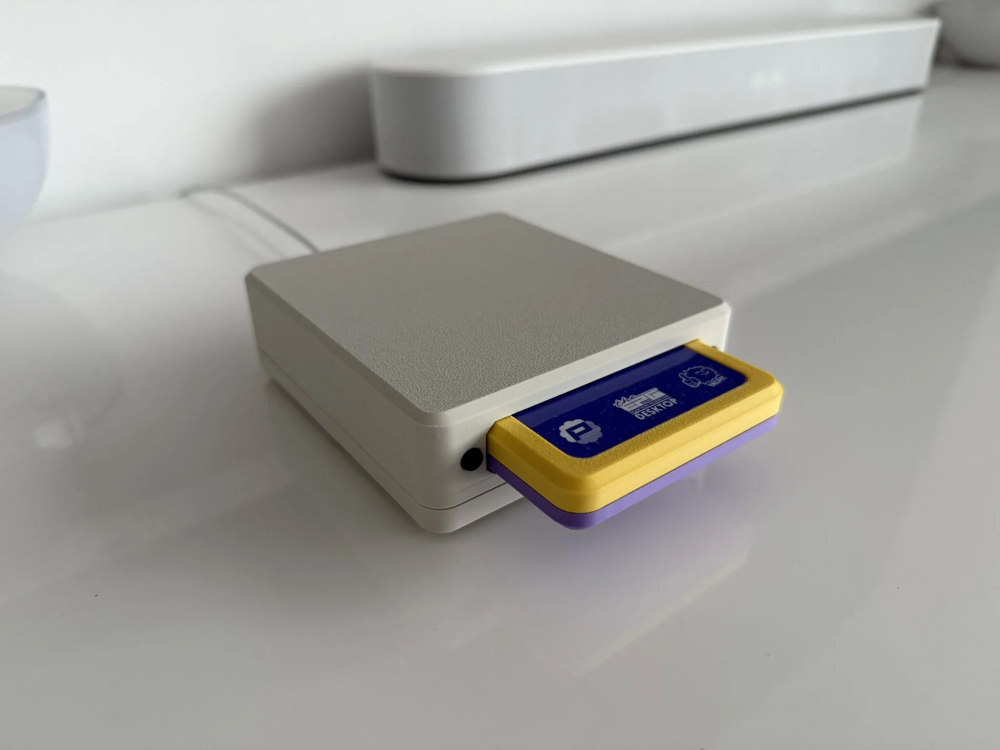
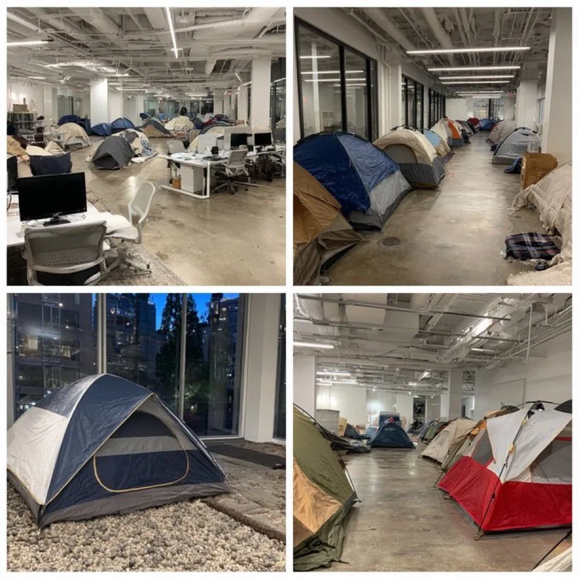

# 2025 年第 27 周技术阅读汇总

[English](README.md) | 简体中文

by @corenel (Yusu Pan) and LLMs

以下为 2025 年 第 27 周（6 月 30 日至 7 月 6 日）期间我所阅读或者输入的内容。为简洁起见，仅列出标题、URL 以及 LLM 生成的概要，以供有兴趣者阅读，进一步的分析、反思与精读不在此赘述。

## 目录

- [2025 年第 27 周技术阅读汇总](#2025-年第-27-周技术阅读汇总)
  - [目录](#目录)
  - [有趣的事与物](#有趣的事与物)
    - [技术与互联网](#技术与互联网)
      - [告别小鹏，何涛用智能摩托回答“G9 之问”](#告别小鹏何涛用智能摩托回答g9-之问)
      - [Cursor 定价风波背后：VC 补贴时代的终结与 AI 工具的商业化阵痛](#cursor-定价风波背后vc-补贴时代的终结与-ai-工具的商业化阵痛)
      - [“开了全图”之后，我们为何更焦虑？——小约翰可汗的信息时代生存指南](#开了全图之后我们为何更焦虑小约翰可汗的信息时代生存指南)
      - [《2005/2006 杭州餐馆指南》考古：一部纸质指南揭示的中国早期互联网消费变迁](#20052006-杭州餐馆指南考古一部纸质指南揭示的中国早期互联网消费变迁)
    - [软件与开发](#软件与开发)
      - [IEEE 754 探微：整数到浮点数的精度悬崖](#ieee-754-探微整数到浮点数的精度悬崖)
      - [巧用 XOR：优雅解决“找不同”难题](#巧用-xor优雅解决找不同难题)
      - [Agentic Coding：从代码“实现者”到 AI“指挥家”的未来开发哲学](#agentic-coding从代码实现者到-ai指挥家的未来开发哲学)
      - [LLM 时代的软件工程反思：为什么说编写代码从来都不是瓶颈？](#llm-时代的软件工程反思为什么说编写代码从来都不是瓶颈)
      - [自托管浪潮下的多维表格之选：四大开源项目的深度对决与权衡](#自托管浪潮下的多维表格之选四大开源项目的深度对决与权衡)
      - [py-spy: 面向生产环境的非侵入式 Python 性能分析器](#py-spy-面向生产环境的非侵入式-python-性能分析器)
    - [硬件与设备](#硬件与设备)
      - [Z 字节时代的沉默基石：数据洪流中现代磁带存储的复兴](#z-字节时代的沉默基石数据洪流中现代磁带存储的复兴)
      - [Hypershell: 从消费级外骨骼看智能硬件的破局之路](#hypershell-从消费级外骨骼看智能硬件的破局之路)
      - [BMD Speed Editor 剪辑键盘：流程革新者的得力助手，还是功能冗余的明日黄花？](#bmd-speed-editor-剪辑键盘流程革新者的得力助手还是功能冗余的明日黄花)
    - [项目与团队管理](#项目与团队管理)
      - [MVP as Micro-Practice: Andrew Ng 论 AI 时代的个人项目启动法](#mvp-as-micro-practice-andrew-ng-论-ai-时代的个人项目启动法)
    - [播客与视频](#播客与视频)
      - [郭实猎：一个普鲁士“边缘人”如何催化了鸦片战争？](#郭实猎一个普鲁士边缘人如何催化了鸦片战争)
      - [《有为》：在编年史的沉浸感中，重估汉武帝的双面遗产](#有为在编年史的沉浸感中重估汉武帝的双面遗产)
      - [虚晃一枪的“核手术”：1969 年中美苏的信号博弈](#虚晃一枪的核手术1969-年中美苏的信号博弈)
      - [强人、战争与城市肌理：杨森的「新贵州」如何预演了现代性治理的矛盾](#强人战争与城市肌理杨森的新贵州如何预演了现代性治理的矛盾)
      - [放弃点击率，聚焦 ROAS：AppLovin 如何凭借深层价值优化在广告红海突围](#放弃点击率聚焦-roasapplovin-如何凭借深层价值优化在广告红海突围)
      - [搜狐：从门户先驱到经验囚徒，张朝阳与一个时代的终结](#搜狐从门户先驱到经验囚徒张朝阳与一个时代的终结)
      - [津津乐道九年复盘：流量喧嚣之外，播客的真正价值与“小而美”的商业路径](#津津乐道九年复盘流量喧嚣之外播客的真正价值与小而美的商业路径)
      - [Claude Code 不一样在哪？从“编程助手”到“数字劳动力”的范式革命](#claude-code-不一样在哪从编程助手到数字劳动力的范式革命)
      - [VLA 路线的终局之战：为什么“真机数据 + 软硬一体”是具身智能的唯一解？](#vla-路线的终局之战为什么真机数据--软硬一体是具身智能的唯一解)
      - [数字教材的文艺复兴：一个旨在重塑未来学习范式的开源构想](#数字教材的文艺复兴一个旨在重塑未来学习范式的开源构想)
      - [当中国乘法口诀横扫北欧课堂：技术爸的养娃副本](#当中国乘法口诀横扫北欧课堂技术爸的养娃副本)
      - [解构“配料表干净”：一场营销概念与消费者知情权的博弈](#解构配料表干净一场营销概念与消费者知情权的博弈)
    - [生成式人工智能](#生成式人工智能)
      - [李飞飞：从 ImageNet 到空间智能，AI 的下一个“北极星”](#李飞飞从-imagenet-到空间智能ai-的下一个北极星)
      - [Lyra：“反向提问”的价值与过度工程化的陷阱](#lyra反向提问的价值与过度工程化的陷阱)
      - [代码非数据：剖析 AI 编程场景下 RAG 范式的根本局限与“智能体探索”的兴起](#代码非数据剖析-ai-编程场景下-rag-范式的根本局限与智能体探索的兴起)
      - [OCRFlux: 打破分页壁垒，3B 模型定义 PDF 文档解析新 SOTA](#ocrflux-打破分页壁垒3b-模型定义-pdf-文档解析新-sota)
      - [QAT-EMB: 实现嵌入向量的“无损”压缩——Jina-AI 对量化感知训练的实践与探索](#qat-emb-实现嵌入向量的无损压缩jina-ai-对量化感知训练的实践与探索)
    - [Just For Fun](#just-for-fun)
  - [摘录](#摘录)
  - [学术研究](#学术研究)
    - [目标检测](#目标检测)
      - [PLOT: 借助视频目标跟踪，实现可扩展的单目三维物体检测伪标签生成](#plot-借助视频目标跟踪实现可扩展的单目三维物体检测伪标签生成)
      - [CSBA-3D 与 WLS-3D：通过不确定性建模提升 3D 协同感知中的后期融合性能](#csba-3d-与-wls-3d通过不确定性建模提升-3d-协同感知中的后期融合性能)
      - [M-HOOD: 重新审视 YOLO 中的幻觉——从基准缺陷到联合缓解策略](#m-hood-重新审视-yolo-中的幻觉从基准缺陷到联合缓解策略)
      - [DGE-YOLO: 通过集散式特征融合，实现高效、高精度的无人机多模态检测](#dge-yolo-通过集散式特征融合实现高效高精度的无人机多模态检测)
      - [探知攸关：自动驾驶如何感知未知？一种基于威胁评估的 OOD 检测方案](#探知攸关自动驾驶如何感知未知一种基于威胁评估的-ood-检测方案)
      - [OcRFDet：聚焦而非泛滥——为 3D 检测量身定制“以物体为中心”的辐射场](#ocrfdet聚焦而非泛滥为-3d-检测量身定制以物体为中心的辐射场)
      - [当 mAP 不再是答案：L-AP/P-AP 如何用物理约束重塑 3D 检测评估体系](#当-map-不再是答案l-app-ap-如何用物理约束重塑-3d-检测评估体系)
      - [以矛攻盾：我们能否用合成图像系统性地揭示开放词汇检测器的“盲区”？](#以矛攻盾我们能否用合成图像系统性地揭示开放词汇检测器的盲区)
      - [合成数据的“消化不良”：为何机遇 Instruct Pix2Pix 的自动驾驶数据增强对 Faster R-CNN 有效，却让 YOLO 失灵？](#合成数据的消化不良为何机遇-instruct-pix2pix-的自动驾驶数据增强对-faster-r-cnn-有效却让-yolo-失灵)
    - [目标跟踪](#目标跟踪)
      - [UMDATrack：即插即用的天气适配，实现统一高效的全天候追踪](#umdatrack即插即用的天气适配实现统一高效的全天候追踪)
    - [语义分割](#语义分割)
      - [TASeg：当 SAM 遇见 CLIP，面向 RGB-T 分割的基础模型高效适配与语义增强](#taseg当-sam-遇见-clip面向-rgb-t-分割的基础模型高效适配与语义增强)
      - [ReME: 以数据为中心的范式革新免训练开放词汇分割](#reme-以数据为中心的范式革新免训练开放词汇分割)
      - [无需训练，即刻分割：DINOv2 与 SAM 联手实现参考基准实例分割](#无需训练即刻分割dinov2-与-sam-联手实现参考基准实例分割)
      - [PGOV3D: 无需 3D 标注，借助 2D 基础模型解锁零标注 3D 开放词汇分割](#pgov3d-无需-3d-标注借助-2d-基础模型解锁零标注-3d-开放词汇分割)
      - [FastSeg: 终结速度瓶颈，迈向实用化的免训练开放词汇分割](#fastseg-终结速度瓶颈迈向实用化的免训练开放词汇分割)
      - [DiPFormer：不再让注意力“漂移”，用三维几何先验解决多模态分割难题](#dipformer不再让注意力漂移用三维几何先验解决多模态分割难题)
    - [自动驾驶](#自动驾驶)
      - [TOMD: 面向复杂光照下越野小径可通行区域分割的多模态基准数据集](#tomd-面向复杂光照下越野小径可通行区域分割的多模态基准数据集)
      - [OoDDINO: 融合不确定性与自适应双阈值的多层次道路场景异常分割框架](#ooddino-融合不确定性与自适应双阈值的多层次道路场景异常分割框架)
      - [GraphGSOcc: 以解耦图注意力提升 3D 高斯场景理解的精度与效率](#graphgsocc-以解耦图注意力提升-3d-高斯场景理解的精度与效率)
    - [场景重建](#场景重建)
      - [SIU3R: 借助“无对齐”范式，统一 3D 重建与场景理解](#siu3r-借助无对齐范式统一-3d-重建与场景理解)
    - [仿真渲染](#仿真渲染)
      - [ASVSim：为内河自主航行研究打造的开源高保真仿真利器](#asvsim为内河自主航行研究打造的开源高保真仿真利器)
    - [深度估计](#深度估计)
      - [DepthSync: 扩散引导，实现长视频中尺度与几何一致的深度估计](#depthsync-扩散引导实现长视频中尺度与几何一致的深度估计)
      - [DepthAnything-AC: 通过无监督扰动微调与空间约束实现全天候单目深度估计](#depthanything-ac-通过无监督扰动微调与空间约束实现全天候单目深度估计)
      - [MoGe-2: 解耦度量尺度与锐利细节，实现高精度单目三维几何重建](#moge-2-解耦度量尺度与锐利细节实现高精度单目三维几何重建)
    - [SLAM](#slam)
      - [CU-Multi: 弥合多机器人 SLAM 评测真实性鸿沟的结构化数据集](#cu-multi-弥合多机器人-slam-评测真实性鸿沟的结构化数据集)
      - [逐行求解：一种面向卷帘快门相机的无模型相对位姿估计算法](#逐行求解一种面向卷帘快门相机的无模型相对位姿估计算法)
    - [语言模型](#语言模型)
      - [DR Agents: 自主研究智能体的系统性解构与演进路线图](#dr-agents-自主研究智能体的系统性解构与演进路线图)
      - [coupled-GRPO: 通过耦合采样与强化学习，释放扩散模型在代码生成中的非自回归潜力](#coupled-grpo-通过耦合采样与强化学习释放扩散模型在代码生成中的非自回归潜力)
    - [内容生成](#内容生成)
      - [VoxEval: 一块揭示当前语音语言模型真实能力的“试金石”](#voxeval-一块揭示当前语音语言模型真实能力的试金石)
      - [OmniAvatar: 潜在空间中的像素级音频注入，驱动高保真全身数字人动画](#omniavatar-潜在空间中的像素级音频注入驱动高保真全身数字人动画)
    - [机器人](#机器人)
      - [EDAOD: 将时序一致性转化为监督，让机器人在未知动态环境中自适应学习](#edaod-将时序一致性转化为监督让机器人在未知动态环境中自适应学习)
      - [DualMap: 解耦全局与局部，实现动态场景实时语言导航](#dualmap-解耦全局与局部实现动态场景实时语言导航)
      - [解构图像目标导航：为何架构选择与模拟器现实性比端到端神话更重要](#解构图像目标导航为何架构选择与模拟器现实性比端到端神话更重要)
    - [其他论文](#其他论文)
      - [StableCodec: 一步扩散与双分支架构，实现超低比特率图像压缩](#stablecodec-一步扩散与双分支架构实现超低比特率图像压缩)
      - [AI 如何为 3D 世界“瘦身”与“体检”：深度解读点云压缩与质量评估技术全景](#ai-如何为-3d-世界瘦身与体检深度解读点云压缩与质量评估技术全景)
      - [Road Graph Generator: 从混沌 GPS 轨迹中提炼施工现场地图](#road-graph-generator-从混沌-gps-轨迹中提炼施工现场地图)
      - [为失败而设计：FDIR-VBN 如何通过合成太空相机故障数据增强航天 AI 的视觉鲁棒性](#为失败而设计fdir-vbn-如何通过合成太空相机故障数据增强航天-ai-的视觉鲁棒性)
      - [RePoGen: 以多样性攻克真实性，破解极端视角下的人体姿态估计难题](#repogen-以多样性攻克真实性破解极端视角下的人体姿态估计难题)
      - [OMNI-DC: 一种面向零样本泛化的系统性深度补全框架](#omni-dc-一种面向零样本泛化的系统性深度补全框架)
      - [GPEmu: 解耦计算与性能，破除深度学习系统研究的硬件桎梏](#gpemu-解耦计算与性能破除深度学习系统研究的硬件桎梏)

## 有趣的事与物

### 技术与互联网

#### 告别小鹏，何涛用智能摩托回答“G9 之问”

[[独家对话小鹏联创何涛：第二次创业，我想证明我是谁]]

在经历了小鹏汽车从零到一的辉煌与 G9 失利后的切肤之痛后，联合创始人何涛选择了一条更艰难的道路：二次创业。这篇来自《晚点 LatePost》的深度专访，不仅记录了他创办智能电动摩托车公司 OMOWAY 的商业逻辑，更深刻揭示了一位成功的“二号位”人物，在实现财富自由后，如何在一场“屠龙之战”中，寻求自我认同与价值证明的内心挣扎与蜕变。

这篇专访的核心，并非一个常规的商业故事，而是一部关于 个人身份重塑与价值求索的现代启示录。文章精准地捕捉到，驱动何涛在 39 岁再次投身创业洪流的，已非物质财富，而是一种近乎执念的自我证明——证明他作为独立的“一号位”，同样能缔造一家成功的企业。

故事的起点，是何涛在小 G9 危机后的黯然离场。作者并未停留于“宫斗”或“内讧”的浅层叙事，而是通过何涛的深度复盘，将小鹏汽车当时的困境归结于一个更根本的组织命题：创始人之间“权力太分散”所导致的决策失能。这不仅为何涛的离开提供了合理的解释，更为他二次创业的组织原则——确立“一号位”的绝对决策核心——奠定了坚实的逻辑基础。这是他用数亿美金“学费”换来的第一条，也是最重要的一条教训。

带着这一教训，何涛将目光投向了东南亚，一个被他视为“十年前中国汽车市场”的蓝海。他对印尼摩托车市场的判断，展现了一位成熟企业家的战略眼光：一个由日系品牌绝对垄断、产品同质化严重、且电动化智能化渗透率极低的万亿级市场，是实践“经验复用 + 降维打击”的绝佳靶场。OMOWAY 的战略，本质上是将小鹏 P7 验证过的成功范式——以出众的工业设计和越级的智能化体验塑造高端品牌，从而撬动大众市场——移植到两轮车领域。这既是他最熟悉的打法，也是他试图证明自己战略远见的最佳舞台。

然而，文章最深刻的价值在于对何涛个人转变的细腻刻画。从一个“脾气火爆”的业务悍将，到一个有意识“收敛脾气”、学习倾听的 CEO；从一个自认“厉害”而轻视管理理论的实干家，到一个主动“变成一张白纸”去学习的学生。这种从“二号位”到“一号位”的蜕变，充满了痛苦的自我审视与重塑。这篇文章实际上是在探讨一个核心问题：一个顶级的执行者，如何才能成长为一个顶级的领导者？

当然，我们亦需以审慎的眼光看待 OMOWAY 的前路。文章也并未回避其面临的巨大挑战：将“中国式智能”移植到东南亚，是否会遭遇文化与消费习惯的壁垒？其高举高打的智能化策略，在成本敏感的市场中能否被广泛接受，仍是未知数。何涛个人的成长，固然是成功的必要条件，但商业的成功终究是天时、地利、人和的复杂博弈。他所发起的，不仅是一场对本田、雅马哈的“屠龙之战”，更是一场与自身路径依赖和认知局限的艰难战斗。

总而言之，这篇文章为我们提供了一个极佳的分析范本。它超越了产品和商业模式，深入到人性的核心，探讨了在成功之后，驱动一个人不断前行的终极力量。对于任何科技从业者、创业者或管理者而言，何涛的故事都是一面镜子，映照出我们在职业生涯中都可能面临的关于价值、身份和成长的困惑与求索。

#### Cursor 定价风波背后：VC 补贴时代的终结与 AI 工具的商业化阵痛

[[Cursor - Clarifying Our Pricing]]

近期，知名 AI 代码编辑器 Cursor 的一次定价调整，在开发者社区引发了轩然大波。大量用户在困惑中收到了远超预期的账单，导致信任危机爆发。Cursor 随后发布的道歉与澄清，以及行业观察家 Simon Willison 的深刻解读，共同构成了一个经典案例。该事件不仅揭示了一家初创公司在商业化道路上的失误，更如一面棱镜，折射出整个 AI 应用领域正在经历的深刻变革：一个靠风险投资补贴用户成本的时代正悄然落幕，而残酷的商业化与市场锁定策略已然登场。

Cursor 事件的核心，源于一次从“固定请求次数”到“按实际用量计费”的模式转变。此前，其每月 20 美元的 Pro 套餐提供 500 次 AI 请求，成本可预测，用户体验简单。而新方案则将这 20 美元变为 API 使用的“消费额度”，并附加了一个极具误导性的“无限使用”承诺——该承诺仅限于其自家的“Auto”路由模式。当用户习惯性地调用如 GPT-4 等昂贵的第三方“前沿模型”时，其成本迅速耗尽额度并产生超额费用。

Cursor 在澄清公告中，将此次变革的动机归因于商业可持续性的需要。他们指出，不同 AI 请求的实际成本差异可达“一个数量级”，旧有的固定次数模式无法覆盖重度使用场景下的高昂开销。正如 Simon Willison 一针见血的分析，Cursor 很可能在那些懂得最大化单次请求价值的“精明用户”身上长期亏损。因此，转向按实际消耗计费，是其摆脱不可持续的“VC 补贴 Token”模式、寻求盈利的必然一步。

然而，这场变革的执行却是一场灾难。它暴露了 AI 产品设计中的一个核心矛盾：公司追求的计费“精确性”与用户渴望的成本“可预测性”之间的尖锐冲突。Cursor 错误地假设用户能够理解并接受复杂的 Token 计费逻辑，且未能提供如“支出硬顶”或“强力预警”等保护性功能，将成本失控的风险完全转嫁给了用户。这不仅是一次沟通的失败，更是一次用户体验设计的溃败，它背叛了用户对产品安全性和可控性的基本信任。

更深层次的解读来自 Simon Willison 对行业趋势的洞察。他指出，Cursor 与 Anthropic 等公司纷纷推出每月 200 美元级别的高端套餐，并非偶然。这是一种新兴的“定价即锁定”（Pricing as Lock-in）战略。在功能日趋同质化的 AI 工具市场，通过高昂的订阅费来圈定并锁定高价值的专业开发者，成为构建商业护城河的关键手段。一旦用户在一个生态中投入高额成本，其迁移至竞品的门槛将急剧升高。这意味着，AI 工具的竞争已从单纯的技术比拼，演变为一场关乎生态、工作流与商业模式的存量争夺战。

总而言之，Cursor 的定价风波是一个极具价值的警示录。它标志着 AI 应用行业正从理想主义的增长叙事，转向现实主义的商业求存。对于开发者和用户而言，这意味着需要重新审视我们与 AI 工具之间的关系，理解其背后的经济逻辑。对于所有 AI 领域的创业者和产品经理来说，此案雄辩地证明：在追求商业可持续性的同时，对用户体验的尊重、对计费透明度的坚守，以及对用户信任的维护，将是决定其能否在激烈竞争中最终胜出的关键。Cursor 虽已道歉并提供补救，但其所引发的关于定价、信任与行业未来的讨论，才刚刚开始。

#### “开了全图”之后，我们为何更焦虑？——小约翰可汗的信息时代生存指南

[[小约翰可汗 - “我只同意后半句”]]

在信息如洪流般席卷每个角落的今天，我们与世界前所未有地贴近，却又似乎与真实的自我渐行渐远。知名内容创作者小约翰可汗在其近期文章《我只同意后半句》中，以其标志性的个人叙事与敏锐洞察，为我们描绘了数字时代下一个深刻的认知悖论。这篇文章不仅是对代际经验差异的生动素描，更是一份献给所有在信息迷雾中求索的现代人的生存启示录。

文章的核心论点在于揭示信息爆炸所带来的双重效应：它在赋予我们全景式视野（“开了全图”）的同时，也可能将我们推入“相对剥夺”与“存在焦虑”的困境。作者并非简单地批判技术，而是以一种更具同理心与思辨性的方式，探讨了这种处境如何塑造我们的精神世界。

文章的论证以一个精妙的代际对比展开。作者将以 95 后为代表的、经历过“前信息化时代”的“数字移民”与彻底成长于智能手机环境的“数字原住民”并置。前者的人生体验是“探索模式”，世界如同待解的谜题，通过亲身经历逐步点亮，其精神底色由具体、可感的线下“实感”所构建。而后者则一开始便拥有了整个世界的“地图”，他们的见识远超前人，但这种“馈赠”的背面，却可能是探索乐趣的消逝和一种“从大到小”的失落感。

作者一针见血地指出了这种失落感的心理根源：“他们无法体验每种人的生活，却早早的见证了每种人的生活。这容易让人产生一种错觉——将别人得到的，视为自己失去的。”这精准地捕捉到了社交媒体时代“比较文化”所催生的普遍焦虑。当屏幕上的理想生活成为无时无刻不在的参照系时，个体的平凡现实就极易被解读为一种“失败”或“缺憾”。文章并未止步于现象批判，而是进一步反思，这种由“知”的无限膨胀与“行”的天然局限所构成的巨大张力，正是现代人精神内耗的关键所在。

面对这一困境，作者给出的解药并非退回田园牧歌式的过去，而是一种积极的行动主义。他巧妙地引用其“通辽宇宙”中的人物范例，指出这些“狠人”的共同特质并非智识或资源，而是强大的“执行力”——一种不受外界噪音干扰、专注于自我道路的行动能力。这构成了一种强有力的呼吁：与其在赛博世界的无穷信息中漂流，不如在物质世界中确立自己的坐标，通过切实的行动来构建自我价值。

文章的结尾堪称神来之笔。作者借用《七宗罪》的台词“我只同意后半句”，为这种行动主义赋予了深刻的哲学底色。它拒绝了廉价的乐观主义（“这世界是好的”），直面现实的复杂与不完美，但依然坚守“为之奋斗”的信念。这是一种清醒的、带有存在主义色彩的英雄主义，它承认困境，但更强调人的主体能动性。

当然，文章的论述并非没有可商榷之处。其对“前信息化时代”的怀旧描绘，可能带有一定程度的美化；将“开全图”的后果主要引向负面，也可能低估了信息作为激励源泉的积极作用。其个人主义的解决方案，在一定程度上也简化了结构性社会问题的复杂性。

然而，这些并不减损文章的价值。它以极高的文学性和思想穿透力，为我们提供了一个审视自身与时代关系的绝佳框架。对于任何渴望在喧嚣的数字世界中找到内心秩序的读者而言，这篇文章都值得反复品读。它提醒我们，真正的成长，或许不在于看见了多大的世界，而在于走稳了多长的路。

#### 《2005/2006 杭州餐馆指南》考古：一部纸质指南揭示的中国早期互联网消费变迁

[[在 2005 打开大众点评：20 年前互联网怎么教我们在杭州吃东西？]]

在今天，打开美食 App、浏览“必吃榜”已成为我们决定“下一顿吃什么”的肌肉记忆。但你是否想象过，在智能手机普及之前，一个互联网公司需要依靠出版纸质书籍来触达它的核心用户？本文作者 mivansaka 通过对一本尘封近二十年的《大众点评杭州餐馆指南》的“数字考古”，为我们打开了一个观察中国早期互联网生态、消费文化和城市变迁的独特窗口。这不仅是一次怀旧之旅，更是一场关于技术、商业与记忆的深度探索。

本文的核心论点在于，通过深度剖析 2005 年大众点评的纸质指南这一物质载体，可以清晰地勾勒出中国互联网从精英走向大众的轨迹，以及由此引发的商业模式与大众消费习惯的剧烈演进。作者的分析并非停留在表面的情感怀旧，而是建立在扎实的第一手资料与细致的今昔对比之上。

文章首先呈现了这份指南作为“历史切片”的价值。在 2005 年，大众点评为了突破有限的线上用户圈层，创造性地将用户生成的线上点评（UGC）转化为线下可流通的纸质商品。这一策略本身就揭示了早期互联网平台为跨越“数字鸿沟”所做的努力。作者详细拆解了指南的内部构造：从反映当时消费决策逻辑的精细目录（如按“商务宴请”、“情侣约会”等场景分类），到尚未使用 Emoji 而是 Wingdings 字体图标的版式设计，再到那个用户打分相对“保守”的 40 分制评分体系。这些细节共同构筑了一个可信的、属于前智能手机时代的消费场景。

文章的论证力量在多维度的对比分析中达到高潮。作者发现，2005 年“最佳餐馆”榜单上的 50 家翘楚，如今存活率不足 50%，且无一能进入当下的“必吃榜”，这揭示了餐饮行业残酷的迭代速度和评判标准的根本性变迁。更引人深思的是“评分通货膨胀”现象：当年 20 分（相当于如今的 2.5 分）即为“好评”，而今 4.0 分已是许多用户的心理底线。这不仅反映了用户行为的演变，也指向了平台商业化进程中评价体系的结构性异化。此外，通过地图可视化，文章直观展示了杭州的消费中心从西湖时代向钱塘江时代的地理扩张，消费热点的变迁忠实地刻画了城市发展的宏大叙事。

值得注意的是，作者在进行这次“数字考古”时，也触及了其局限性。他在文末试图通过网络时光机（Web Archive）查阅更深层的点评数据，却被 20 年前的“登录墙”所阻挡。这一亲身经历，巧妙地引出了一个更深刻的议题：数字记忆的脆弱性。相较于这本静静躺在书架上、信息恒定的纸质指南，我们海量的、看似永恒的数字足迹，在技术壁垒和商业平台的逻辑面前，其可访问性与长久性实际上充满了不确定性。

本文的潜在局限性在于，其怀旧的笔触可能不自觉地美化了早期 UGC 环境的“纯粹性”，同时，将 2005 年的“最佳餐馆”与今天的“必吃榜”直接对标，虽具戏剧性，但在评选机制已截然不同的情况下，其可比性值得商榷。

尽管如此，本文依然是一篇极具价值的观察报告。它不仅为对互联网历史、平台经济和城市研究感兴趣的读者提供了鲜活的案例，更提醒我们，在飞速迭代的技术浪潮中，那些曾被视作“过渡”的媒介形态，恰恰可能成为理解我们从何而来的最珍贵的“数字 - 物质”遗产。对于任何想要理解中国近二十年消费社会变迁的读者而言，这篇文章提供了一个新颖而深刻的切入点。

### 软件与开发

#### IEEE 754 探微：整数到浮点数的精度悬崖

[[Most machine integers are not machine floats]]

在软件开发中，我们常想当然地认为数字类型可以自由转换。一个整数，理应可以被一个能表示小数的浮点数所容纳。然而，John Cook 在其精悍的博文《Most machine integers are not machine floats》中，通过无可辩驳的数学计算，揭示了一个反直觉的事实：在计算机的硬件世界里，这两种数字表示法之间存在着一道深刻的鸿沟。

文章的核心论点清晰而尖锐：绝大多数以标准整型（`int32`, `int64`）表示的数值，都无法被相应位宽的浮点型（`float32`, `float64`）进行分毫不差的精确表示。这一结论挑战了我们从数学世界带入计算机科学的直觉。

作者的论证直指问题的根源——IEEE 754 浮点标准的设计哲学。与整型将所有比特位用于线性表示数值不同，浮点型将位数拆分给符号、指数和尾数，以一种科学记数法的形式实现对巨大数值范围的覆盖。其代价便是精度的非均匀性。文章通过一个极具说服力的例子阐明了这一点：对于 `float32`，其尾数提供了事实上的 24 位二进制精度。这意味着它可以精确表示所有不大于 2<sup>24</sup> 的整数。然而，对于 2<sup>24</sup> + 1 这个数字，由于其二进制表示需要 25 位有效数字，超出了 `float32` 的精度极限，最低位的“1”将被无情舍弃。

这篇文章最震撼人心的部分，在于其将一个定性问题进行了定量化。作者通过严谨计算得出：

- 仅有约 3.5% 的 `int32` 整数，可以在 `float32` 中找到精确的“栖身之所”。
- 当扩展到 64 位系统时，由于整数空间的爆炸性增长，这个比例骤降至约 0.5%。

这两个数字，将一个潜在的、模糊的“精度问题”转变为一个清晰的、普遍存在的“表示限制”。它雄辩地证明了，从整型到浮点型的转换，其精度损失并非小概率的意外，而是大概率的常态。

当然，我们需以批判性视角看待此文。该分析的基石在于对“精确表示”的执着。在许多工程应用中，一个足够好的近似值或许已经满足需求，此时舍入误差的大小远比是否存在误差更为关键。文章并未深入探讨误差的实际影响，其目的更多在于揭示计算机数字表示的一个基础性事实，而非评判 IEEE 754 设计的优劣——毕竟，这本身就是范围与精度之间深思熟虑的权衡。

对于任何与数值计算打交道的开发者而言，这篇文章都是一篇必读的警世恒言。它提醒我们，对数据类型的底层表示保持敬畏是编写健壮代码的前提。在处理金融、科学计算或嵌入式系统等对精度敏感的应用时，任何不假思索的类型转换都可能埋下难以调试的隐患。理解这一基本限制，是区分专业开发者与业余爱好者的试金石之一。

#### 巧用 XOR：优雅解决“找不同”难题

[[That XOR Trick]]

在算法的世界里，我们时常追求空间与时间的极致效率。然而，某些解决方案的价值不仅在于其性能，更在于其背后所蕴含的深刻数学思想与逻辑之美。Florian 的文章《That XOR Trick》正是这样一篇引导我们探索位运算——具体来说是异或（XOR）——如何以一种出人意料的优雅方式，解决一系列经典数据问题的典范之作。本文不仅是技术指南，更是一次思维方式的洗礼。

文章的核心论点是：一个基于异或（XOR）运算“成对抵消”特性的简单技巧，是解决一类特定“寻找差异元素”问题的通用且高效的钥匙。作者没有直接抛出结论，而是采用了一种极为清晰的“自下而上”的论证路径，引领读者从 XOR 最基本的真值表出发，推导出其三大关键性质：`x ^ 0 = x`，`x ^ x = 0`（自反抵消），以及交换律。正是这几个看似简单的性质，共同构成了那个强大技巧的理论基石。

随后，作者通过四个难度递增的应用场景，将这一理论的威力展现得淋漓尽致：

1. 从经典的原地交换变量入手，展示 XOR 操作在不借助额外空间的情况下，如何通过信息的可逆编码完成任务。
2. 接着，文章解决了核心问题——在 1 至 n 的序列中寻找一个缺失或重复的数字。其解法的精髓在于，通过引入一个“完整”的数字序列与给定的“残缺”序列进行对比性 XOR 运算，巧妙地创造出让所有“正常”元素成对出现从而抵消的条件。最终，那个出现次数为奇数的“特殊”元素（无论是缺失了 1 次，还是重复导致了 3 次）便自然浮现。作者还通过与加减法类比，进一步阐明了其“抵消”思想的本质，同时点出了 XOR 解法在避免整数溢出方面的工程优势。
3. 文章的高潮在于 tackling 寻找两个缺失/重复数字的挑战。当简单的 XOR 操作只能得到两个未知数 `u` 和 `v` 的异或和 `u ^ v` 时，作者展现了真正的算法思维：不应视 `u ^ v` 为终点，而应视其为包含解题信息的线索。`u ^ v` 结果中任何为 `1` 的二进制位，都标志着 `u` 和 `v` 在该位上的根本差异。利用这一差异作为分区（Partitioning）标准，便能将原问题降维（Reduction）成两个独立的、我们已知如何解决的“寻找单个差异元素”的子问题。这不仅是技巧的应用，更是“分而治之”经典思想的绝佳体现。

值得称道的是，作者在文章结尾保持了批判性的视角。他明确指出，尽管 XOR 技巧在智力上令人愉悦，但它并不适合作为衡量工程师能力的面试题，因为它更多地考验特定知识的记忆，而非通用的问题解决能力。这一反思，为文章增添了超越技术本身的深度，引发了关于“何为好的技术问题”的思考。

对于技术读者而言，这篇文章的价值在于：

- 系统性地掌握 XOR 技巧：它提供了一个从原理到复杂应用都极为详尽的学习路径。
- 学习问题降维的艺术：尤其是处理两个未知数的思路，是可迁移到其他领域的宝贵财富。
- 理解算法的优雅与局限：它不仅展示了位运算的强大，也坦诚其边界，培养了读者的批判性思维。

总而言之，这篇文章是一次关于如何从第一性原理出发，构建优雅解决方案的精彩示范。它不仅教会你一个“技巧”，更重要的是，它展示了一种思维方式：洞察问题的数学本质，并利用其内在结构来化繁为简。

#### Agentic Coding：从代码“实现者”到 AI“指挥家”的未来开发哲学

[[Agentic Coding The Future of Software Development with Agents]]

当一位创造了像 Flask 这样影响深远框架的开发者，将某种新技术称为“给程序员的猫薄荷”时，整个技术社区都应该给予足够的重视。Armin Ronacher 在其最新演讲中，深入剖析了“Agentic Coding”（智能体编程）的现状与未来。这不仅是一份关于如何使用 AI 工具的实践指南，更是一篇宣告软件开发范式正在发生根本性变革的檄文。它预示着，程序员的角色正从代码的“实现者”演变为 AI 智能体的“架构师”与“指挥家”。

Armin Ronacher 的演讲核心主张是：Agentic Coding，一种开发者与 AI 智能体深度协作的新模式，正在成为软件开发的未来，而其成功的关键在于为智能体构建一个“友好”的工作环境与工具链。他认为，我们正处在一个由模型能力突破、关键产品（如 Anthropic 的 Claude Code）涌现以及商业模式成熟共同催生的“完美风暴”之中，这使得探索全新的开发工作流成为可能。

与传统的 AI 辅助编程（如 GitHub Copilot）主要关注代码补全不同，Agentic Coding 的核心在于 AI 智能体的主动参与和任务导向。智能体被视为一个能够理解高级目标、分解复杂任务、并利用工具集（如命令行、文件系统）执行多步操作的初级开发者。Ronacher 通过大量个人实践，将这种协作模式的精髓提炼为几条核心原则：

首先，为智能体设计（Design for Agents）是核心思想。他认为，当前阶段，与其依赖复杂的、会污染上下文的 MCP（多模态协同协议），不如回归到更本质的、可组合的命令行工具。他推荐的策略包括：

- 创建简洁、专用的工具：与其让智能体学习庞杂的 API，不如为其提供单一职责的脚本（例如，一个 `make tail-logs` 命令），这不仅节约了宝贵的上下文，也提高了智能体行为的可预测性。
- 确保环境的健壮性与前向进展：一个不稳定的开发环境或一个会产生误导性输出（如测试未运行却报告成功）的工具，是导致智能体陷入混乱回溯的主要原因。投资于一个清晰、可预测的开发环境，是保证智能体能够持续向前推进任务的基础。

其次，上下文管理是当前阶段最重要的元技能。Ronacher 将上下文类比为早期计算机稀缺的内存（RAM），并提出了一系列“上下文节约”策略。其中最引人瞩目的实践是“智能体套娃”：当主智能体（Claude）面临超出其上下文限制的复杂任务时（如理解一个大型代码库），它会调用另一个拥有更大上下文窗口的智能体（Gemini CLI）作为子进程，让后者完成信息总结，再将精炼后的结果作为自己的输入。这种跨模型协同的工作流，极大地拓展了智能体能够处理问题的边界。

然而，Ronacher 的分享也并非全然乐观。他坦诚地指出了当前实践的局限性与风险。例如，他所推崇的“YOLO 模式”（即跳过权限检查以换取效率）隐含着巨大的安全风险，这暗示了该技术目前更适用于隔离的实验环境。此外，他的成功在很大程度上依赖于其作为顶尖开发者的个人技能——他有能力为智能体量身打造高效的工具和环境。这对普通开发者而言，可能是一个不小的门槛。

对于技术读者而言，Ronacher 的演讲提供了超越“如何使用 AI”的深刻启示。它促使我们思考：什么是“智能体友好”的 API 设计？未来的可观测性系统应该如何为 AI 而非人类进行优化？我们是否需要一种全新的、以智能体可操作性为中心的软件架构？Ronacher 的探索标志着我们与 AI 的关系正从简单的“利用”走向深度的“共生”，而人类开发者的价值，也将从具体的代码实现，转向更高层次的系统设计、工具创造和对 AI 的智慧“指挥”。

这篇演讲是所有希望在 AI 浪潮中保持领先的开发者的必看内容。它不仅提供了立即可用的实践技巧，更重要的是，它为我们描绘了一幅人机协同编程的未来蓝图，并指明了通往那里的、充满挑战与机遇的道路。

#### LLM 时代的软件工程反思：为什么说编写代码从来都不是瓶颈？

[[Writing Code Was Never The Bottleneck]]

当大型语言模型（LLM）以前所未有的速度生成代码，整个科技行业似乎都沉浸在“编码瓶颈终被打破”的乐观情绪之中。然而，Pedro Tavares 在其短文《Writing Code Was Never The Bottleneck》中提出了一个冷静而深刻的反思。他认为，我们可能在庆祝一场错误的胜利，因为真正的瓶颈从未改变，甚至在 AI 的加持下变得愈发严峻。这篇文章是献给每一位身处技术浪潮中的工程师和管理者的醒脑剂。

Tavares 的核心论点振聋发聩：软件工程的真正瓶颈从来不是编写代码的速度，而是确保代码质量、促进团队协作和维持系统可理解性的一系列高认知成本活动。他明确指出，这些活动——代码审查、知识传递、测试、调试以及沟通协调——才是限制软件开发整体效率的关键所在。LLM 的出现，虽然将代码的边际生产成本降至近乎为零，却戏剧性地推高了另一项更为关键的成本：理解、验证和信任代码的成本。

文章精辟地将这一现象概括为工作负载的转移，而非消除。LLM 如同一个效率惊人的代码工厂，源源不断地向下游的审查和维护环节输送“半成品”。这给负责质量保证的工程师带来了前所未有的压力。Tavares 生动地描绘了审查 LLM 生成代码时的困境：审查者不仅要面对可能由不完全理解代码的同事提交的“黑箱”，还要处理那些引入了陌生模式或隐藏了微妙错误的“天外来客”。这无异于将早已存在的“复制粘贴工程”陋习，用工业化的规模和速度进行了放大。

更进一步，Tavares 将视角从个人开发者提升至团队层面。他认为，当代码的产出速度超越了团队成员间讨论、消化和形成共识的速度时，团队赖以生存的信任基础和共享上下文将被稀释。高效的协作来源于对彼此工作的信心和对系统共同的理解。如果代码库中充斥着大量缺乏背景解释的、由 AI 生成的片段，团队就有可能从“质量是内建的”滑向“质量是假设的”，这无疑为未来的技术债务和系统性风险埋下了深远的隐患。

当然，我们也可以用批判性的眼光审视这篇文章。Tavares 的论述主要基于当前 LLM 的技术现状和传统的软件开发流程，其观点带有一种警示性的色彩。他或许低估了 AI 技术自身迭代解决新问题的能力——例如，未来可能会出现能够辅助代码理解和自动化审查的“AI 审查员”。同时，他也未充分展开探讨这是否会倒逼软件工程流程和工程师角色本身发生积极的进化：将工程师从繁琐的编码中解放出来，专注于更高价值的系统设计、质量策略和知识传承。

尽管如此，这篇文章的价值在于它精准地戳破了“唯效率论”的泡沫。它提醒我们，技术工具的革新并不能替代工程领域的基本法则。在 LLM 时代，清晰的思考、严谨的审查和深思熟虑的设计不仅没有过时，反而变得愈发珍贵。对于每一位技术从业者而言，这既是挑战，也是机遇。我们的核心价值正在从“代码的生产者”转向“质量与理解的守护者”，而这，或许才是 AI 时代真正值得我们去构建和捍卫的核心竞争力。

#### 自托管浪潮下的多维表格之选：四大开源项目的深度对决与权衡

[[如何选择自托管开源多维表格]]

当 Airtable 与飞书引领的多维表格风靡全球，其背后的付费墙与数据隐私焦虑也随之而来。对于追求数据主权与成本效益的技术爱好者与小型团队，自托管开源方案正成为一片充满机遇的新大陆。本文将深入剖析四款主流开源多维表格——NocoDB、Baserow、Teable 与 APITable，通过一场严谨的横向评测，为您揭示在功能、体验与生态的博弈中，如何做出最明智的选择。这不仅是一份选型指南，更是一次对开源软件商业模式与未来趋势的深刻洞察。

在数字化工具的演进中，多维表格已然成为连接电子表格与数据库的桥梁，它将数据管理的权力赋予了更多非技术人员。然而，商业 SaaS 服务的“围墙花园”模式，促使一部分先锋用户转向自托管的开源世界，以寻求终极的控制权与自由度。本文作者以一个典型“个人用户”的视角，对 NocoDB、Baserow、Teable 和 APITable 这四款备受关注的“Airtable 替代品”进行了极为详尽的对比分析，其核心论点鲜明而务实：不存在全能的完美工具，最佳选择源于对自身需求的清醒认知与对产品特性间的精准权衡。

文章的分析框架构建得相当完备，从宏观的商业模式与生态，到中观的核心功能与架构，再到微观的用户体验与特色功能，层层递进。作者发现，这四款产品均采用了“Open Core”（开源核心）商业模式，这一模式在确保项目可持续性的同时，也巧妙地在免费版中设置了不同的“功能陷阱”，迫使用户在选择时必须直面妥协：

- NocoDB：功能主义者的乐土，但有空间枷锁。作为社区最活跃、功能最全面的选手，NocoDB 在字段类型支持和外部数据连接能力上遥遥领先，展现了其作为“数据库万能前端”的强大潜力。然而，其免费版仅限单个工作区的策略，成为了限制其在多项目管理场景下应用的核心掣肘。
- Baserow：开发者的宠儿，却忽视了移动优先的浪潮。凭借其宽松的 MIT 协议 和内建的 App Builder，Baserow 为二次开发和商业化集成敞开了大门。但其在移动端的体验被评为“糟糕”，几乎放弃了这一重要战场。这是一种清晰的战略取舍，使其更适合以桌面端为中心、有定制化开发需求的团队。
- Teable 与 APITable：移动体验的领跑者，各有其“成长的烦恼”。这两款较新的产品敏锐地抓住了移动端体验这一差异化赛道。APITable 的移动端交互设计堪称典范，但其免费版极为苛刻的行数与容量限制，使其几乎沦为“体验版”。Teable 则在各方面表现均衡，以流畅的体验和友好的导入流程见长，但其免费版完全禁用了自动化功能，对于追求工作流效率的用户而言是硬伤。

本文最值得称道的，是其严谨的量化评测方法与情景化的推荐逻辑。尤其是在“移动端适配性”这一环节，作者将主观体验拆解为七个可评分的操作项，用数据清晰地拉开了产品间的差距。文章结尾的“正面清单”与“负面清单”，更是将复杂的评测结果转化为极易理解的决策指南，精准地指出了各软件在不同需求场景下的适用与禁忌。

然而，在赞赏其深度的同时，我们也应以批判性视角审视其隐含假设。文章的评估体系明显偏向于“无代码”的个人用户，对开发者视角的 API 友好度、扩展性等维度的权重相对较低。此外，其对社区规模与项目健康度的关联判断，以及对“一体化”解决方案的偏好，也值得商榷。

总而言之，这篇文章是一份极其出色的技术选型报告范本。它不仅提供了翔实的数据和直观的对比，更重要的是，它教会读者一种超越功能列表的、多维度的思考方式。它告诉我们，选择一个开源工具，不仅是在选择其当前的功能，更是在选择它的社区文化、商业哲学以及对未来的押注。对于任何希望在数据自由的道路上走得更远的探索者，本文都提供了不可或缺的导航图。

#### py-spy: 面向生产环境的非侵入式 Python 性能分析器

[[py-spy - Sampling profiler for Python programs]]

在生产环境中定位 Python 应用的性能瓶颈，向来是一项棘手的任务。传统的分析工具或因性能开销过大，或因需要修改代码而难以应用于线上服务。本文将深入解读 `py-spy`，一个革命性的采样分析器，它通过非侵入式技术，实现了对运行中 Python 程序安全、低开销的实时洞察，正在成为现代 Python 开发者和 SRE 不可或缺的诊断工具。

`py-spy` 的核心价值主张在于，它实现了对运行中 Python 程序的高保真性能分析，而无需修改代码、重启进程或引入显著的性能开销。这一特性使其能够安全地应用于对稳定性要求严苛的生产环境。

其实现原理堪称精妙。与传统分析器在目标进程内部注入监控代码不同，`py-spy` 作为一个完全独立的外部进程运行。它采用 Rust 语言编写，以确保自身的高性能和低资源占用。其关键技术是利用操作系统提供的内存读取接口（如 Linux 的 `process_vm_readv`），直接从外部“窥探”目标 Python 进程的内存。通过解析 CPython 解释器在内存中的内部数据结构（如 `PyInterpreterState` 和 `PyFrameObject`），`py-spy` 能够以极高的频率（例如 100Hz）精确重构出所有线程的实时调用栈。这种基于采样的外部观察者模型，正是其低开销和非侵入性的基石。

`py-spy` 提供了一个功能完备的诊断工具集，以应对不同的分析场景：

- `top` 模式：提供一个实时的函数耗时排行榜，帮助开发者快速定位当前系统中的性能热点。
- `dump` 模式：能够即时捕获所有线程的调用栈快照，是诊断程序“卡死”或 I/O 阻塞等问题的利器。
- `record` 模式：支持将长时间的采样数据记录下来，并生成强大的可视化报告，尤其是火焰图（Flame Graph），它可以直观地揭示程序在各个代码路径上的时间分布。

该工具的强大之处不仅在于其核心功能，还在于对现代软件开发实践的深刻理解。它支持分析原生 C/C++ 扩展（通过 `--native` 标志），解决了 Python 与底层库混合编程时的性能盲点。同时，它也为容器化部署（Docker/Kubernetes）和多进程架构（如 Gunicorn）提供了清晰的解决方案。正如云计算平台 `Modal` 将其集成为核心的“实时容器分析”功能，这充分印证了 `py-spy` 在真实、复杂的云原生环境中的稳定性和商业价值。

然而，我们也应以批判性视角看待它。首先，`py-spy` 的强大能力依赖于较高的系统权限（如 `root` 或 `SYS_PTRACE`），这在某些受限环境中可能构成使用障碍。其次，其工作原理与 CPython 的内部实现紧密耦合，这意味着它不适用于 PyPy 等其他 Python 实现。最后，作为一种采样分析器，它天然地存在一个权衡：用极低的性能开销换取可能错过某些瞬时、偶发的事件，这使其更适合定位持续性的性能瓶颈，而非追踪复杂的逻辑错误。

`py-spy` 不仅仅是一个工具，它代表了一种先进的调试理念——在不干扰系统运行的前提下实现深度观测。它为处理生产环境中的性能疑难杂症提供了一把锋利的手术刀。对于任何希望提升其 Python 应用性能和稳定性的开发者、运维工程师或 SRE 而言，投入时间学习并掌握 `py-spy` 都是一项极具价值的投资。它将帮助你从猜测转向基于数据的精准定位，显著提升故障排查的效率与信心。

### 硬件与设备

#### Z 字节时代的沉默基石：数据洪流中现代磁带存储的复兴

[[Magnetic Tape Storage Technology]]

在一个由闪存和云原生主导的时代，提及磁带存储似乎有些不合时宜。然而，这项拥有 70 年历史的古老技术，正凭借其独特的经济与安全价值，在超大规模数据中心和长期数据保留领域经历一场深刻的复兴。由 Mark A. Lantz 及其在 IBM 苏黎世研究中心的团队撰写的这篇综述文章，系统性地梳理了现代磁带技术的全貌，雄辩地论证了它为何不仅没有消亡，反而成为应对未来 Zettabyte 数据洪流的关键基石。

文章的核心论点是：磁带存储凭借其无与伦比的成本效益、能源效率和物理安全特性，已成为当今大规模冷数据归档与备份场景下的最优解，并且拥有清晰、潜力巨大的技术演进路线。作者并非空谈概念，而是通过一个“由下至上”的严谨结构，将磁带这一复杂系统拆解分析，为读者构建了一幅详尽的技术图景。

首先，文章从磁记录的第一性原理出发，深入浅出地解释了信息如何通过磁滞效应被编码、存储和读取。它明确指出了驱动技术发展的核心矛盾——磁记录三难困境（The Trilemma of Magnetic Recording），即在追求更高存储密度的过程中，对读回信噪比、数据热稳定性和介质可写性这三个互斥目标的艰难权衡。这一框架为理解后续所有技术创新提供了根本性的视角。

在此基础上，作者详细阐述了现代磁带系统的关键技术突破。在介质层面，先进的钡铁氧体（BaFe）纳米颗粒取代了传统材料，在保证数据长期稳定性的前提下，为容量的持续扩展铺平了道路。在磁头层面，源于硬盘技术的隧道磁阻（TMR）传感器和创新的三模块“terzetto”磁头架构，不仅实现了对微弱信号的精确捕捉，更通过“读后即写”验证机制，将数据写入的可靠性提升至新的高度。文章给出的数据极具说服力：最新的 LTO-9 标准凭借强大的迭代 ECC 纠错码，可实现 10⁻²⁰的不可纠正比特错误率（UBER），这意味着在读取 12.5 艾字节（Exabyte）数据后才可能出现一次无法修复的错误，其可靠性远超常规认知。

更令人印象深刻的是，文章揭示了磁带作为一个精密机电系统的复杂性与智能化。通过时间基伺服（TBS）技术和先进的控制算法，系统能够在高速运动的柔性磁带上实现纳米级的磁道跟踪精度。而主动式 TDS 补偿技术则通过实时调整磁带张力来抵消环境变化引起的介质形变，展现了从被动适应到主动控制的工程思想飞跃。

然而，文章并未回避磁带的固有局限。其数十秒量级的高访问延迟是为实现极低总拥有成本（TCO）和能耗而做出的必然权衡。但文章巧妙地将这一“弱点”置于存储层次结构（Storage Hierarchy）的框架下进行解读，明确了其在生态系统中的角色定位。同时，作者也提出了一个极具洞察力的观点：当前磁带远低于 HDD 的面密度（相差约 48 倍），恰恰是其未来发展的最大潜力所在。通过借鉴 HDD 行业已成熟的能量辅助磁记录（HAMR/MAMR）等技术，磁带拥有一条通往单盘 PB 级容量的清晰路线图。

尽管文章论证充分，但其对未来的展望仍建立在几个关键假设之上：一是持续的研发投入足以克服将 HDD 尖端技术适配到柔性介质上的巨大工程挑战；二是“冷数据”在数据总量中的占比将持续高企，保证了磁带核心应用场景的稳固。此外，文章强调的物理气隙（Air Gap）在抵御勒索软件方面的独特安全价值，在地缘政治风险与数据主权日益重要的今天，其战略意义可能已超越纯粹的技术和商业范畴，这一点值得读者进一步深思。

总而言之，这篇综述不仅是一部关于现代磁带技术的“百科全书”，更是对一项经典技术如何通过持续创新来适应时代变迁、并最终找到其不可替代生态位的深刻洞见。对于任何从事数据存储、IT 基础架构、信息安全及至科技史研究的专业人士而言，它都是一份不容错过的、极具启发性的参考资料。

#### Hypershell: 从消费级外骨骼看智能硬件的破局之路

[[等不到始祖鸟的老外，疯抢这个 999 美元的国产消费级「外骨骼」]]

当科幻电影中的“外骨骼”走进现实，它不再是钢铁侠的专属战衣，而是标价 999 美元的消费级产品。这究竟是极客的昂贵玩具，还是预示着一个新赛道的开启？极客公园的这篇文章，通过对国产外骨骼 Hypershell X 的深度评测，不仅细致入微地剖析了产品体验的得失，更借此为我们描绘了在人工智能时代，硬件创业者如何于细分领域中另辟蹊径，找到通往未来的“破局之路”。

这篇文章的核心论点在于：以 Hypershell X 为代表的消费级外骨骼，其真正的革命性不在于机械动力，而在于由 AI 算法驱动的、足以应对复杂真实场景的“智能化”。这不仅标志着一项前沿技术的成功“下放”，更揭示了当前智能硬件产业突破同质化困境的有效范式。

作者通过为期两周的亲身体验，巧妙地构建了一个产品价值分析框架——“必答题”与“附加分”。对于消费级外骨骼，轻便、易用、价格合理是其市场准入的“必答题”，Hypershell 在这些方面做得基本合格。然而，真正让它脱颖而出，赢得作者赞誉的，是其在“附加分”上的卓越表现：由“自适应动作识别”算法带来的多场景无缝适配能力。文章生动地描述了这一“魔法时刻”：在徒步下坡时，设备能主动提供类似登山杖的“反向”支撑力，这是一种超越简单助力的、充满智慧的人机协同。这种在测试前未曾预料的惊喜，正是软件定义硬件价值的最佳证明。

然而，文章并未止步于一篇优秀的评测。它将视野拓宽，对 Hypershell 得以诞生的土壤进行了深刻的剖析。它指出，这背后是三大要素的合力：

1. 成熟的供应链生态：以珠三角为代表的强大制造能力，为硬件创新提供了“想得到就能做出来”的沃土。
2. 全球化的利基市场：跨境电商与内容平台的兴起，让过去看似“小众”的需求得以在全球范围内汇聚，足以支撑一个新产品的成长。
3. AI 技术的普及：人工智能不再是巨头的专利，它成为了创业公司打造产品核心差异化、应对行业内卷的利器。

当然，我们也要辩证地看待。作者同样坦诚地指出了产品的局限性，例如在健身房踏步机这类高强度、高频次运动场景下的力不从心，这反映了当前算法在应对极端工况时的鲁棒性仍有待提升。此外，对手机 App 的交互依赖以及长期使用对人体机能的潜在影响，也是该品类未来发展中必须面对和解决的课题。

总而言之，这篇解读不仅仅是一份详尽的“剁手指南”。它更像是一份写给所有关注科技、产品与商业模式的读者的深度案例分析报告。它告诉我们，在下一个十年，真正的创新或许不再是创造下一个“智能手机”，而是像 Hypershell 一样，将尖端技术与特定场景的真实需求相结合，用“智能化”为冰冷的硬件注入灵魂，从而在看似饱和的市场中，找到那些充满可能性的“新大陆”。对于任何从事机器人、人工智能和智能硬件开发的专业人士而言，这篇文章所揭示的“产品 - 技术 - 市场”三位一体的成功逻辑，都极具参考价值。

#### BMD Speed Editor 剪辑键盘：流程革新者的得力助手，还是功能冗余的明日黄花？

[[快意飞驰，专业剪辑：达芬奇 Speed Editor 剪辑键盘评测]]

在专业创意领域，工具的形态深刻地影响着创作的流程与体验。我们是应该满足于鼠标与键盘这一通用组合的无限可能性，还是应当拥抱那些为特定任务量身打造的专精硬件？Will Hunting 的这篇 DaVinci Resolve Speed Editor 深度评测，为我们提供了一个极具价值的剖析样本。它不仅是一篇详实的产品体验报告，更是一场关于工作流、人机交互与工具哲学的深刻思辨。

文章的核心论点在于，DaVinci Resolve Speed Editor 凭借其颠覆性的交互逻辑，成功地为视频粗剪这一特定环节重塑了一套高效、舒适且极具沉浸感的工作流，其价值在于“流程的革新”而非“功能的叠加”。作者通过三年的使用经验，向我们精准地描绘了这款产品的双重特性。

一方面，Speed Editor 是一个体验上的巨人。它通过与达芬奇软件“快编”页面的深度集成，实现了作者口中“剪掉线的 AirPods”般的无缝蓝牙连接。其设计的灵魂——大尺寸金属旋钮与“源磁带”功能的结合，将剪辑师从繁琐的“点击 - 预览 - 拖拽”循环中解放出来，代之以一种流畅、线性的“检阅 - 标记 - 插入”操作。作者所强调的“完全靠着椅子剪辑”的场景，生动地诠释了该工具如何将人体工学与操作流程融为一体，最终达成一种令人愉悦的“心流”状态。这种将枯燥劳动转化为沉浸式创作的体验升级，是 Speed Editor 最引人入胜的魅力所在。

另一方面，Speed Editor 也是一个功能和材质上的“侏儒”。作者毫不避讳地指出其塑料机身与其高昂原价的不匹配，以及旋钮在精确定位时“阻尼过低”的弊病。更致命的是其极端的“专精”所带来的“局限”：它几乎完全服务于粗剪，对精剪无能为力；其大量的多机位按键对绝大多数用户形同虚设；一旦离开达芬奇软件，它便沦为一个毫无用处的“摆件”。

这篇文章最精彩的洞察，在于对 Speed Editor 价值悖论的解读。作者认为，正是这种“过度专业化”导致其市场需求不足，并最终在价格上“打骨折”。虽然其对降价原因的分析（忽略了软件解绑的关键因素）存在局限，但他敏锐地捕捉到了产品的核心矛盾。当价格从捆绑软件的 3700 元高位跌落至 550 元的纯硬件价位时，产品的价值评判体系发生了根本性的转变。此时，功能单一的缺陷被其极高的性价比所掩盖，而它提供的独特流程和愉悦体验，则使其升格为一个值得投资的“心情件”。

对于正在使用或考虑深入使用 DaVinci Resolve 的技术读者而言，这篇文章极具参考价值。它提醒我们，评估一个专业工具时，不应仅看其功能列表的长度，更应审视其是否能优化你最高频、最核心的工作环节。Speed Editor 的案例表明，一个“有态度的”、甚至是“固执的”工具，通过强制用户遵循一套高度优化的工作流程，有时反而能带来意想不到的效率与体验飞跃。当然，我们也应从作者的评测中看到其局限性，并思考是否有其他可编程控制器（如 Loupedeck、TourBox）能以更开放的姿态实现类似的目标。

总而言之，这篇评测清晰地告诉我们：DaVinci Resolve Speed Editor 并非万金油，而是一把锋利的、为特定手术而生的解剖刀。在合适的时机（低价）为合适的人（深度依赖快编页的 Resolve 用户）所用时，它将无与伦比。

### 项目与团队管理

#### MVP as Micro-Practice: Andrew Ng 论 AI 时代的个人项目启动法

[[Thread by @AndrewYNg - AI Product MVP]]

在人工智能技术日新月异的今天，许多开发者都渴望通过实践项目来提升技能，却往往在宏大的构想与有限的时间之间徘徊不前，最终陷入“分析瘫痪”。DeepLearning.AI 创始人 Andrew Ng 的一篇短文，为我们提供了一剂对抗这种开发惯性的良方。他并非提出了某种颠覆性的复杂理论，而是分享了一个极其简单、却直击痛点的个人实践哲学——将宏大项目，激进地缩减为可在碎片化时间内完成的“微实践”。

Andrew Ng 的核心论点可以概括为：为了获得持续的实践，我们必须克服对完美的追求，主动将项目范围（Scope）削减到与可用时间相匹配的最小单元。他观察到，开发者们（包括他自己）常常会“为了一个想法琢磨数月”，却因感觉没有整块时间而迟迟不动手。Ng 提出的解决方案是颠倒常规思路：不为项目寻找时间，而是用时间来约束项目。哪怕只有一个小时，也要找到一个能在一小时内完成的、激动人心的想法组件并立即构建它。

为了阐明这一理念，Andrew Ng 分享了他开发“观众模拟器”的个人案例。这个项目最初的愿景是创建一个由 AI 驱动、可模拟成百上千虚拟观众的复杂系统。然而，面对一个下午的有限时间，他果断地采取了三个维度的“范围缩减”：

1. 数量降维：将模拟数百名观众降维至模拟一名观众。
2. 智能降维：用人工手动选择反应（“奥兹巫师”法），取代了构建复杂的 AI 响应模型。
3. 技术降维：用简单的 2D 化身，取代了复杂的 3D 图形实现。

通过这些看似“偷工减料”的手段，他在几小时内就完成了一个可交互的“粗糙原型”。文章的关键洞察在于，这个粗糙原型的价值，并不在于其功能本身，而在于它所催化的学习与反馈过程。Andrew Ng 明确指出，这次“微实践”不仅让他学习了图形编程，更重要的是，让他拥有了一个可以向朋友展示并获取宝贵用户反馈的实体。这个实体将一个抽象的想法从“脑中解放出来”，使其成为一个可以被讨论、被迭代的客观存在，从而“让项目更快地发展”。

Andrew Ng 的建议并非孤立的技巧，它实际上是将精益创业（Lean Startup）的 MVP（Minimum Viable Product）思想，从组织级战略“微型化”为个人开发者的日常习惯。其背后隐含的假设是，在项目初期，行动和学习的价值，远高于规划和思考的价值。同时，他将这一实践置于当前的技术背景下，强调 AI 编码助手（如 Claude Code）是实现这种快速原型开发的关键加速器，它们使得在极短时间内构建有意义的软件组件成为可能。

然而，我们亦需批判性地看待这一方法。首先，该建议的成功，在一定程度上依赖于实践者（如 Andrew Ng 本人）的深厚经验，普通开发者或许需要更长的时间来完成类似的“微项目”。其次，“奥兹巫师”法虽然是验证用户体验的神器，但它战略性地规避了核心技术挑战。开发者需要清醒地认识到，这种原型验证的是产品价值假设，而非技术可行性假设。从“微实践”原型走向一个稳健、可扩展的生产级系统，仍有漫长的道路。

尽管如此，Andrew Ng 的文章为所有身处快节奏技术环境中的人们，提供了一个对抗完美主义和拖延症的强大心理模型。它倡导一种偏爱行动、拥抱不完美、并以最快速度进入“构建 - 衡量 - 学习”循环的务实精神。对于任何希望将想法转化为现实的创造者而言，这都是一篇值得反复品读的箴言。

### 播客与视频

#### 郭实猎：一个普鲁士“边缘人”如何催化了鸦片战争？

当我们谈及鸦片战争，脑海中浮现的往往是林则徐、道光帝，或是宏大的国家对抗叙事。然而，历史的巨轮有时是由一些意想不到的“小人物”在关键节点上奋力一推，从而改变了方向与速度。复旦大学历史学博士李骛哲的研究，通过播客《忽左忽右》分享，为我们揭开了一个被长期误读和忽视的关键角色——普鲁士传教士郭实猎（Karl Gützlaff）。这篇解读旨在揭示，这位身兼传教士、冒险家、语言天才与鸦片贸易协作者等多重身份的复杂个体，如何以其独特的个人特质，成为了点燃中英冲突导火索的那只手。

李骛哲博士的核心论点极具颠覆性：郭实猎并非鸦片战争的根本原因，却是其不可或缺的“催化剂”。这一论断建立在坚实的跨国档案研究之上。文章指出，19 世纪 30 年代的英国对华贸易，尤其是鸦片走私，正陷入一个瓶颈——被严格限制在广州一隅。而郭实猎的出现，恰好解决了这个症结。

首先，郭实猎掌握了一项当时西方世界几乎无人能及的“核心技术”：流利地道的闽南语。这使他得以绕过官方管制的广州，直接与福建、浙江等广大沿海地区的商人乃至底层民众沟通。李博士的研究表明，正是在 1832 年参与“阿美士德勋爵号”航行及后续与渣甸等散商合作后，郭实猎利用其语言和文化伪装能力，成功为鸦片贸易打开了全新的沿海通道。最直接的证据是，自 1833 年起，英国对华鸦片年输入量从约 1.4 万箱飙升至 2.4 万箱，这一急剧的量变，无疑是导致清廷采取极端禁烟措施的直接诱因。

其次，郭实猎的角色远不止商业上的“带路党”。他更是一个高效的舆论塑造者。他将在华见闻写成报告和游记，在欧洲广为流传。这些文字成功地将中国从一个令人向往的文明古国，“祛魅”为一个腐朽、停滞且亟待“开化”的专制政权。这种叙事不仅为鸦片商人的侵略性行为提供了道义上的辩护，更在英国议会中起到了实际作用，成为推动废除东印度公司贸易垄断、让更激进的商业力量主导对华政策的论据之一。

然而，这篇文章的深刻之处不止于此。它深入剖析了郭实猎行为背后的个人心理动因。出身底层、童年不幸的经历，塑造了他偏执、虚荣、极度渴望建功立业的性格。这种被现代心理学可能诊断为“人格障碍”的特质，使他成为一个为达目的不择手段的行动派。他身上“圣经与鸦片”的矛盾共存，并非简单的虚伪，而是一种将“打开中国传播福音”的宏大目标神圣化，从而允许一切手段为之服务的扭曲逻辑。他后期创办“汉会”的惨败——一个充斥着欺诈与投机的组织——则反向印证了他是一个典型的“破坏者”而非“建设者”。

当然，此项研究也存在值得商榷之处。将历史的巨大转折过度归因于一个个体，可能存在简化复杂结构性因素的风险。同时，运用现代心理学对古人进行“诊断”，其方法的严谨性也值得进一步探讨。

对读者的启示在于，郭实猎的案例提供了一个审视历史的全新视角。它告诉我们，宏大的历史进程往往由具体的、充满人性弱点与欲望的个体在执行和推动。理解了郭实猎，我们便能更深刻地洞察到，在 19 世纪中西碰撞的那个关键时刻，宗教理想、商业贪婪、个人野心和文化误读是如何交织在一起，共同谱写了一曲通往战争的悲歌。对于任何希望超越教科书式叙事、探寻历史复杂肌理的读者而言，顺着李骛哲博士的分享去了解郭实猎的故事，无疑是一次极具启发性的思想之旅。

#### 《有为》：在编年史的沉浸感中，重估汉武帝的双面遗产

[[69.戴波：汉武帝的答卷，能打多少分？]]

汉武帝刘彻，一个在中国历史上与秦始皇并称的雄主，其“文治武功”的形象早已深入人心。然而，当我们谈论他的丰功伟绩时，我们究竟在谈论什么？历史学者戴波的著作《有为：汉武帝的五十四年》，拒绝沿用传统的“上帝视角”进行宏大叙事，而是另辟蹊径，以古老的编年体形式，邀请读者沉入历史的河流，亲身“经历”那波澜壮阔又充满切肤之痛的五十四年。这不仅是一次阅读，更是一场对历史认知方式的深刻反思。

《有为》一书的核心论点，蕴含在书名本身深刻的双重性之中。作者戴波指出，汉武帝的“有为”，既是其建立不朽功业的驱动力，也是其将帝国与民众推向苦难深渊的根源。这本书的最大创见，在于其叙事策略——通过编年体的形式，将这种矛盾性并置于读者面前。读者会在同一时间轴上，既看到漠北大捷的赫赫战功，也读到“算缗告缗”与“白鹿皮币”对民间财富的无情搜刮。这种结构迫使我们放弃简单的褒贬，直面历史的复杂肌理：一个帝国的崛起，其光荣与代价往往是同步发生的。

戴波的论证不仅在结构上独具匠心，在内容上也展现了扎实的学术功力。他以一种“正本清源”的态度，向两个流传已久的历史标签发起了挑战。

其一，是对“焚书坑儒”的精细辨析。他考证指出，史料中的“坑术士”并非专指方士，而是当时对广大读书人的泛称。因此，秦始皇此举的本质是针对“诽谤”言论的政治高压，而非单纯的文化清洗。

其二，是对“罢黜百家，独尊儒术”的祛魅。他澄清，“独尊儒术”是带有现代评判色彩的近代提法，汉武帝的实际举措是“罢黜百家，表彰六经”。这是一种将儒家经典官方化的文化政策，其过程是渐进的，影响是深远的，但并非一场疾风骤 M 雨式的思想专制。这些辨析不仅刷新了读者的认知，更示范了严谨的治学方法何以能够穿透历史的迷雾。

在评价体系上，作者引入了鲜明的现代人文关怀。他最终给汉武帝打出“7 分”的评价，其扣分项清晰地指向了“有为”背后巨大的社会成本。书中引用汉武帝朝重臣桑弘羊在“盐铁会议”上的证词——即便是这位政策的坚定拥护者，也承认百姓最幸福的时光是在汉武帝亲政之前的“无为”时期。这一细节极具说服力，它揭示了宏大叙事之下，个体生命的真实温度。

当然，本书亦有其值得探讨的边界。编年体的沉浸式体验，可能在一定程度上牺牲了专题式写作的宏观分析深度。读者若想系统了解汉代的经济制度或思想流变，或许仍需参考其他著作。此外，以现代价值观为标尺来衡量古代帝王，虽能引发当代共鸣，但也可能简化了历史人物在特定时空下的动机与伦理。

总而言之，《有为》是一部极具启发性的历史著作。它不仅是对汉武帝这位复杂历史人物的再评价，更是对我们如何阅读和理解历史的一次方法论示范。戴波邀请我们，从“评判者”转变为“经历者”，在时间的流动中感受选择的重量、时代的脉搏以及光荣的代价。对于任何渴望超越标签化认知、追求更深度历史理解的读者而言，这无疑是一本“值得”投入时间的佳作。

#### 虚晃一枪的“核手术”：1969 年中美苏的信号博弈

[[46： 是否“将婴儿扼杀在摇篮里”——关于1969年苏联对中国实施“核手术”问题]]

在当代地缘政治中，“外科手术式打击”和对核设施的先发制人威慑，依然是牵动全球神经的敏感议题。然而，早在半个多世纪前的 1969 年，新中国就曾直面过一场类似的、来自超级大国的真实威胁。这段历史常被“美国拯救中国”的神话或“苏联威胁纯属谣言”的论调所遮蔽。本文旨在解读一篇基于扎实档案研究的力作，它拨开迷雾，为我们还原了那场惊心动魄的核讹诈危机，及其背后复杂而精妙的大国博弈。

在 1969 年珍宝岛和铁列克提边境冲突之后，关于苏联意图对中国新生的核能力进行“外科手术式打击”的传闻甚嚣尘上。历史学家李当辉通过对美、苏两国解密档案的交叉考证，有力地论证了核心论点：苏联的核威胁并非空穴来风的谣言，而是一场经过精心策划、通过多重渠道实施的国家级核讹诈（Nuclear Blackmail）。

研究指出，苏联的讹诈行动是立体且多维的。在秘密外交层面，苏联通过其驻美使馆官员等渠道，向美国直接试探其对“苏联打击中国核设施”的反应，意图制造美苏“共管”中国的假象以离间潜在的中美接触。在公开宣传层面，苏联官方媒体如《真理报》和莫斯科广播电台，则密集发文播音，大肆渲染其核力量的毁灭性，直接向中国施加心理压力。这一系列组合拳的战略目的清晰而直接：利用核威慑这一终极杠杆，迫使在常规军事力量上处于劣势的中国，软化在边境问题上的立场，并尽快回到谈判桌前。最终，中国于苏联设定的“最后期限”前同意举行高层会谈，证明了苏联此轮强制外交在短期内取得了成功。

与此同时，文章对美国在危机中扮演的角色进行了精准的“祛魅”。它彻底否定了“美国救世主”这一流传甚广的神话。基于基辛格等决策者的内部备忘录，文章揭示了美国行动的根本动机是服务于其自身的全球战略利益。尼克松政府当时正寻求“联华抗苏”的战略转型，因此，一个被苏联过度削弱甚至摧毁的中国并不符合其利益。美国向中国澄清其“不与苏联勾结”的立场，其目的在于：1. 防止中苏冲突失控升级为核战争；2. 借此向中国示好，为即将到来的中美关系正常化铺路。因此，美国的不合作态度在客观上对中国的处境有利，但这完全是其利己主义战略的副产品，而非出于任何形式的善意保护。

此文的卓越之处在于，它将这一事件置于正在形成的中美苏“战略三角”（Strategic Triangle）框架下进行分析。它生动地刻画了一场精彩的“三角信号”博弈：苏联试图通过美国向中国传递威胁，美国则敏锐地捕捉并反向利用该信号，向中国传递战略善意。文章超越了简单的双边对抗叙事，揭示了大国博弈的真正复杂性。

当然，该研究也存在其固有的局限性，即结论建立在当前已解密的档案之上，苏联方面未公开的档案仍可能为事件带来新的解释。然而，基于现有证据，文章的论证已经极为坚实。它不仅厘清了一段关键的历史，更提供了一个分析大国间威慑、信号传递与战略互信的经典案例。对于希望理解冷战史、核战略以及当代大国竞争的读者而言，这篇严谨的分析无疑是一份极具洞察力的思想食粮。

#### 强人、战争与城市肌理：杨森的「新贵州」如何预演了现代性治理的矛盾

[[415 强人如何塑造战时城市：杨森与他的「新贵州」建设]]

当下的贵州因“村 BA”和“村超”的火爆而吸引了全国目光，其背后深厚的群众体育文化令人好奇。然而，鲜为人知的是，这片土地的体育热忱与社会图景，曾在八十年前经历过一次更为激烈和充满矛盾的塑造。城市史学者孟浩的这项研究，以抗战时期的贵阳为切片，深入剖析了军阀杨森的“新贵州”建设。它不仅是一段引人入胜的地方史，更是一个精妙的寓言，预演了现代国家构建中，自上而下的强力意志与地方社会复杂肌理碰撞时的种种张力。

孟浩的核心论点在于：一个边缘城市的命运，在战争这种极端外部条件下，会被其突变的战略地位和主政强人的个人意志所共同定义，并催生出一种短暂、脆弱且充满内在矛盾的“危机现代化”。

研究首先清晰地勾勒出贵阳命运的转折点。随着抗战深入，原本闭塞的贵阳因其在西南公路网中的枢纽位置，一跃成为“陪都之屏藩”，其战略价值空前凸显。正是在此背景下，以铁腕著称的四川军阀杨森被蒋介石任命为贵州省主席。杨森的到来，将他早已在四川演练过的治理模式——一种平民化的独裁主义——移植到了贵阳。一方面，他展现出江湖袍哥式的亲民姿态；另一方面，则以不容置疑的军事化手段，对城市进行大刀阔斧的改造。

这种改造体现在两个层面。在物理空间上，他推动了三大标志性工程：为彰显政绩与个人兴趣的“独步西南”的体育场、充满政治献媚色彩的“静芝植物园”，以及作为城市门面的石板马路。在社会生活上，他更是发动了三场旨在规训民众的运动：短衣运动、早起运动和复兴操运动。这些措施，本质上是一种深刻的身体政治实践，试图通过对市民着装、作息乃至身体姿态的精细控制，塑造出符合其“强国强种”想象的、纪律化的“新国民”。

然而，这种自上而下的雷霆手段，不可避免地遭遇了地方社会的强烈反弹。孟浩的研究精彩之处，在于他捕捉到了这种反弹的两个层次。上层，是地方精英因权力被侵占而发起的“倒杨运动”，这是一场公开的政治博弈。而更深刻的，是来自民间的日常反抗 (Everyday Resistance)。市民们用“雇人做操”这类充满智慧与戏谑的方式，消解了强权的严肃性，揭示了任何试图彻底格式化社会的企图都终将面临的文化韧性。

最终，杨森的蓝图随着战争的结束而迅速崩塌。当贵阳的战略价值烟消云散，西南公路归于沉寂，这座过路城市 (Pass-through City) 的短暂繁荣也戛然而止。杨森的失败，被归结为“人地不宜”，但这背后实则是更深刻的结构性问题：一种完全依赖外部输血、缺乏内生动力的发展模式，注定无法持续。

此项研究的价值，远不止于还原一段地方历史。它为我们提供了一个观察现代国家构建的绝佳样本，揭示了宏大叙事（民族复兴、国家建设）在落地时，必然会与地方的文化传统、经济现实和民众的生活逻辑发生碰撞。杨森的案例暴露出一种贯穿于近现代史的治理困境：即追求效率与整齐划一的“国家视角”，与复杂多元、充满韧性的“社会肌理”之间的永恒张力。对于任何试图理解中国现代化进程复杂性的读者而言，这项研究都提供了一把精巧而锋利的手术刀，值得细细品味。

#### 放弃点击率，聚焦 ROAS：AppLovin 如何凭借深层价值优化在广告红海突围

[[EP 68. 对话AppLovin技术VP葛小川：2年市值增长25倍，千亿美金广告平台的传奇成长史]]

在 Google 与 Meta 双雄称霸的移动广告领域，一个普遍的共识是，格局已定，再无新王。然而，AppLovin 这家公司却在短短数年间，以超过 25 倍的市值增长和惊人的人均效率，从一家被华尔街低估的游戏公司，一跃成为比肩巨头的千亿美金广告技术平台。这并非简单的商业模式创新，而是一场深刻的技术范式革命。AppLovin 的 VP of Engineering 葛小川的这次访谈，为我们揭开了这场革命的核心——以 ROAS（广告支出回报率）为目标的深层价值优化，才是其真正的“屠龙之术”。

AppLovin 的崛起，本质上是解答了一个困扰行业已久的难题：如何真正衡量并优化广告的商业价值。在其 VP 葛小川的阐述中，我们可以清晰地看到一条从战略选择、技术突破到文化保障的完整逻辑链。

首先，在战略层面，AppLovin 精准地选择了被巨头所忽视的“价值洼地”——高度碎片化的第三方应用内广告流量，即“长尾市场”。如同 Airbnb 整合零散的个人房源，AppLovin 通过其卖方平台 MAX，以“开发者利益优先”的开放策略，吸引了全球绝大多数移动应用开发者，从而掌握了海量的广告供给。这一步棋至关重要，它为后续的技术施展搭建了最广阔的舞台。

其次，也是其核心护城河所在，是技术理念的代际领先。当整个行业还在普遍优化点击率（CTR）或转化率（CVR）这类“代理指标”时，AppLovin 已将火力集中在广告的终极目标——ROAS，即用户的长期价值（LTV）。其核心推荐引擎 Axon AI，被设计用于完成一项极具挑战性的任务：“deep funnel”拟合。它不仅预测用户会不会点击，更要预测他们在未来会花多少钱。这一从优化“过程量”到优化“结果量”的转变，是其技术的根本性突破。它使得广告主的每一分钱都能花在刀刃上，直接追逐高价值用户，从而在竞价中获得天然优势，并由此启动了“更优表现 → 更多数据 → 模型更强”的良性循环。

为了实现这一目标，AppLovin 做出了果断的战略取舍。在关键时刻剥离了盈利颇丰的游戏业务，彻底转型为中立的第三方平台。此举消除了其与客户（其他游戏公司）的潜在竞争关系，赢得了市场信任，是其平台战略走向成熟的标志。如今，它正将这套被验证成功的打法，雄心勃勃地推向更广阔的电商领域，意图为整个移动生态注入强大的“外部现金流”。

当然，支撑这一切的是其独特的“千亿美金创业公司”文化。访谈中提及的“No Meeting”沟通方式、CTO 亲手编写原型代码的执行力，以及对资源使用（如 GPU）的极度克制，都指向一种极度务实、高效、精英化的组织形态。这种文化确保了公司能够始终聚焦于核心问题，并以最快的速度迭代，是其惊人的人均效率背后的软实力。

然而，我们亦需以审慎的眼光看待其未来。AppLovin 的模式高度依赖于对用户行为数据的追踪，在全球隐私政策持续收紧的背景下，其数据飞轮的根基正面临挑战。此外，其推崇的精英文化能否在规模化扩张中得以维持，以及在市场地位巩固后如何平衡平台与生态伙伴的利益，都将是其需要持续解答的课题。

总而言之，AppLovin 的故事为我们提供了一个在成熟市场中实现颠覆式创新的绝佳范本。它揭示了，真正的技术壁垒往往不在于追逐最时髦的模型，而在于回归第一性原理，定义并解决最核心的商业问题。对于所有致力于用 AI 改造行业的从业者、研究者和投资者而言，这篇访谈所蕴含的洞见，值得反复研读与深思。

#### 搜狐：从门户先驱到经验囚徒，张朝阳与一个时代的终结

[[No.157 搜狐张朝阳：看尽千帆过，笔下一方圆  中国互联网故事3]]

在中国互联网的万神殿中，张朝阳曾是手持火炬的普罗米修斯，而他创立的搜狐，则是无数网民初探数字世界的启蒙灯塔。然而，当聚光灯转向新一代的巨头时，这位昔日的“教父”与他的帝国，却似乎已成为一个遥远而模糊的背影。半拿铁的这期播客，以极具穿透力的叙事，重新描绘了搜狐从巅峰到沉寂的完整轨迹，它不仅是一个公司的商业沉浮录，更是一部关于创始人性格、时代变迁与个人命运的深刻寓言。

文章的核心论点是：搜狐的命运，是其创始人张朝阳个人主义与理想主义在商业世界中一次辉煌而悲情的实践，其兴也勃焉，其亡也忽焉，皆与创始人的性格特质和人生抉择深度绑定。

播客首先将我们带回上世纪 90 年代那个激动人心的起点。一个怀揣着麻省理工博士光环和对故土文化深切眷恋的张朝阳，将互联网的火种带回中国。搜狐的早期成功，是张朝阳个人魅力的极致展现。他开创了中国互联网企业创始人 IP 化的先河，无论是天安门前的轮滑，还是登上杂志封面的半裸身影，都体现了他对“注意力经济”的超前理解。在资金远逊于对手的情况下，他用个人品牌为搜狐撬动了巨大的声量。2008 年，搜狐作为奥运会历史上首个互联网赞助商，更是达到了声望的顶峰。这一时期，搜狐不仅是信息门户的代名词，更是中国向世界展示新面貌的窗口。

然而，盛极而衰的转折点，也恰恰孕育于这辉煌之中。文章犀利地指出，张朝阳和他所缔造的搜狐，最终成为了“经验的俘虏”。

1. 战略上的广而不精：搜狐在 PC 时代进行了广泛的多元化尝试，孵化了搜狗、畅游（《天龙八部》）和搜狐视频（《屌丝男士》）等极其成功的业务。王小川带领搜狗的崛起，大鹏在搜狐视频的逆袭，都证明了搜狐内部的创新土壤。但问题在于，这些成功的“第二曲线”并未得到公司倾其所有的战略聚焦。搜狐始终是一家“什么都做，但什么都不是绝对第一”的公司，缺乏一招制敌的“杀手锏”。
2. 文化上的“好人主义”：张朝阳的“好人文化”让搜狐成为业界闻名的“黄埔军校”，培养了龚宇、李善友等一代互联网领袖。这种文化氛围宽松、尊重人才，却也缺乏置之死地而后生的决绝。在与行事更果决、文化更具侵略性的对手竞争时，这种“nice”反而成为一种软肋。
3. 个人状态与时代脱节：最致命的一击，是创始人个人状态与时代脉搏的错位。在 2011-2013 年移动互联网浪潮席卷而来的关键窗口期，张朝阳因严重的抑郁症而选择“闭关”，公司因此陷入战略停摆。当他重新审视世界时，微博和微信已“左右扇了他两个耳光”，江湖格局已定。

文章的叙事并未止步于商业成败的简单评判，而是深入到张朝阳的内心世界。他坦承对金钱与幸福关系的迷茫，以及最终通过物理学和运动与自我和解的过程，为这个商业故事增添了浓厚的人文色彩。这让我们反思：在“成王败寇”的商业法则之外，一个开创者在历经浮沉后，回归本心，找到内心的宁静，这本身是否也是一种更高维度的“成功”？

值得注意的是，该播客叙事强烈依赖“创始人中心论”，这在增强故事性的同时，可能简化了复杂的市场现实。搜狐的衰落，除了张朝阳的个人因素，更是门户媒体模式在面对社交、电商等更强粘性平台的结构性溃败。在 BAT 构建的资本与生态壁垒面前，搜狐的掉队或许有其必然性。

总而言之，这篇内容不仅是对搜狐历史的一次全面复盘，更是对所有创业者和管理者的一次深刻警示。它生动地诠释了何为“路径依赖”，以及创始人的自我认知与进化，对于一个企业的长期生命力是何等重要。对于任何想了解中国互联网早期历史、公司战略与创始人性格之间复杂关系的读者，这都是一篇不容错过的佳作。

#### 津津乐道九年复盘：流量喧嚣之外，播客的真正价值与“小而美”的商业路径

[[做了9年播客，我们收获了什么？]]

在 Apple 播客迎来其 20 周年之际，中文播客界的元老级网络“津津乐道”通过一期特别节目，进行了一场长达九年的深度复盘。这不仅是一次对过往历程的回顾，更是一份在当前内容行业普遍陷入流量焦虑时，关于媒介价值、社群构建与商业模式的深刻洞察。对于任何内容创作者、营销从业者或社群运营者而言，这期节目所提供的，是一套跳出传统思维框架的、极具参考价值的实践方法论。

文章的核心论点鲜明而笃定：播客的真正价值并非源于海量的浅层流量，而是植根于与听众建立的深度连接与信任。 “津津乐道”的两位主播朱峰与姝琦，通过分享其九年的心路历程，系统阐述了这一主张。

首先，文章探讨了播客对于创作者的个人重塑价值。主播们坦诚，制作播客的过程，是迫使自己系统性思考与输出的过程，这不仅帮助理科背景的创始人有效锻炼了逻辑表达与叙事能力，更重要的是，通过与广大听众的真实互动，让他们得以跳出固有圈层，打破了“信息茧房”，获得了看待世界更为多元与包容的视角。这种个人成长，是流量数据无法衡量的宝贵财富。

其次，文章对 Apple 播客在行业中的历史地位做出了精准的评价。它被定义为“奠基者”——尽管其在中国市场的运营长期处于“半个人维护”的边缘状态，但它通过建立开放的 RSS 技术标准和播客总目录，为整个行业搭建了底层基础设施。这一论断揭示了一个深刻的道理：真正具备长远影响力的，往往不是精细的运营，而是开放的、赋能生态的底层协议与标准。

然而，全文最具冲击力和实践指导意义的，是其对播客商业模式的独到见解。文章通过两个极为生动的案例——《跑者日历》与《科技乱炖》，一针见血地指出，播客的商业化出路在于“小而美”，而非“大而全”。当整个市场都在追逐十万、百万的播放量时，“津津乐道”的实践证明，一个拥有数千名精准用户画像的垂直播客，其商业转化能力可以远超流量庞大的泛领域节目。无论是《跑者日历》那群消费力惊人的中年男性跑者，还是《科技乱炖》里掌握着家庭大件消费决策权的科技爱好者，他们都因其高度的社群粘性和与内容的强匹配度，为广告主创造了极高的投资回报率。这套基于深度信任和精准社群的商业模式，为在流量红海中挣扎的创作者们，提供了一条清晰、可行且更具尊严的道路。

当然，我们需辩证看待这份经验之谈。作为行业的早期入局者，“津津乐道”享有后来者难以复制的先发优势。其“小而美”模式的成功，亦有赖于其服务的恰好是具备高消费潜力的细分人群。但这无损于其思想的启发性。它提醒我们，在任何领域，无论是内容创作、产品开发还是学术研究，与其盲目追求规模，不如回归本质，用心服务好一个核心社群，并通过建立真正的信任来实现价值。这或许是在这个喧嚣时代中，最值得我们倾听的声音。

#### Claude Code 不一样在哪？从“编程助手”到“数字劳动力”的范式革命

[[EP47 Claude Code 它不一样]]

在 AI 编程助手层出不穷的今天，我们似乎正逐渐对“AI 赋能开发”这一概念感到麻木。然而，AsyncTalk 最新一期播客《Claude Code 它不一样》提供了一个来自资深实践者的、极具冲击力的个人证言。它不仅深度评测了 Claude Code 这一工具，更重要的是，它精准地捕捉并阐释了其背后所代表的“Agentic 编程”范式转移，及其对整个软件行业成本结构、人才需求乃至商业模式的颠覆性影响。这篇解读旨在提炼该播客的核心洞见，并引导读者进行批判性思考。

播客主讲人 AnnatarHe 的核心论点是：Claude Code 并非现有 AI 编程工具的简单升级，而是一个标志着软件开发进入“智能体（Agentic）时代”的革命性产品，其经济影响将远超技术本身。

首先，文章从一个令人信服的个人体验切入。主讲人描述了他初次深度使用 Claude Code 后“后悔没有早买”的震撼感，并将其能力置于 Cursor 等知名工具之上。他认为，Claude Code 的卓越之处在于其表现出的高度“自主性”和“周全性”——它不再是被动响应指令的工具，而更像一个能理解高级意图、主动规划并执行任务的初级全栈工程师。这一精准的类比，是理解其后续所有推论的关键价值锚点。

紧接着，文章对这一“AI 工程师”进行了冷酷的经济学解构。主讲人将 Claude Code 每月 100-200 美元的订阅费，与国内招聘一名初级程序员至少 5000 元人民币的月薪进行直接对比。这一计算揭示了一个残酷的现实：企业可以用不到三分之一的人力成本，获得一个效率可能更高、不知疲倦的“数字员工”。这构成了文章最具颠覆性的观点——对初级程序员和执行常规任务的普通设计师岗位的直接经济替代威胁。这并非遥远的未来预测，而是一个基于当下成本效益分析的、完全理性的商业决策。

在此基础上，文章进一步探讨了这一变革带来的两大深远影响。其一，是“一人公司”的可行性被空前放大。通过将开发这一核心瓶颈的成本和门槛降至最低，AI 极大地赋能了个体创造者。其二，是竞争格局的重塑。未来的竞争将不再是人与人之间在同一维度上的较量，而是掌握了先进 AI 工具的人与停留在传统工作模式的人（以及机器本身）之间的竞争。为此，主讲人发出了深刻的警示：个体必须摆脱在组织中沦为“平庸螺丝钉”的命运，转而追求 AI 难以复制的顶尖创造力与系统性思考能力。

然而，在接受其富有洞见的论断时，我们也需识别其隐含的假设与局限性。该论述在很大程度上建立在“编码是软件开发核心瓶颈”以及“AI 输出能被低摩擦整合”的假设之上，可能低估了需求分析、系统设计、团队沟通以及复杂代码审查等环节的隐性成本。AI 的角色更有可能是一种人机协同（Human-AI Collaboration），而非完全的替代。它在替代低端技能的同时，也催生了对“AI 驾驭能力”这一全新高阶技能的需求。

总而言之，这期播客以其鲜活的个人体验和锐利的经济分析，为我们提供了一个审视 AI 与软件开发未来关系的绝佳窗口。它所描绘的图景既令人兴奋又引人警惕，它迫使每一位技术从业者重新思考自身的核心价值，以及在即将到来的 Agentic 时代，我们应该如何进化。我们强烈推荐技术读者收听原播客，亲身感受这场技术变革带来的思想激荡。

#### VLA 路线的终局之战：为什么“真机数据 + 软硬一体”是具身智能的唯一解？

[[Vol.59｜对话千寻智能解浚源：机器人领域的 ChatGPT 时刻可能就在明年]]

在人工智能的浪潮席卷了语言与视觉之后，下一个“应许之地”——具身智能，正以前所未有的热度吸引着整个科技界的目光。当机器人不再是科幻概念，而是触手可及的未来时，一个核心问题摆在了所有从业者面前：如何才能真正为机器注入智能的灵魂？在众说纷纭的路线图中，千寻智能具身智能负责人解浚源的这场对话，提供了一个异常清晰、坚定甚至略显“极端”的答案。他不仅描绘了通往机器人“ChatGPT 时刻”的路线图，更深刻揭示了其背后“VLA+ 真机数据 + 软硬一体”这一核心战略的必然性与非对称优势。

解浚源的核心论点可以概括为：具身智能的根本性突破，依赖于遵循 AI 发展的规模化定律（Scaling Law），而实践这一定律的唯一可行路径，是基于 VLA（视觉 - 语言 - 动作）端到端模型，通过自研的、软硬一体的机器人本体，在真实世界中大规模采集交互数据。这一论断的背后，是基于对行业现状的深刻洞察和对技术路线的果断取舍。

首先，文章指出了一个行业级的范式转移。以 Physical Intelligence（派灵）的叠衣服 demo 为标志，证明了纯粹数据驱动的模仿学习路线，已经足以攻克传统机器人学中极为棘手的柔性物体操作等难题。这宣告了依赖手工规则和复杂分层模型的旧时代的终结，也让解浚源及其团队坚信，他们正走在一条被验证的、通往成功的“正道”上。

基于此，千寻智能的战略选择呈现出高度的逻辑自洽性。其一，是对“真机数据”路线近乎信仰般的坚持。解浚源犀利地指出了“仿真路线”的两大致命伤：技术上，无法弥合的“Sim-to-Real Gap”使其在处理复杂物理现象时捉襟见肘；经济上，高昂的仿真环境开发和 GPU 算力成本，使其并非一条廉价的捷径。相比之下，真机数据虽然起步艰难，但其真实性与直接性，是通往鲁棒泛化能力的唯一保障。

其二，是“软硬一体”的必然性。这一战略决策，源于对数据质量的极致追求。解浚源明确指出，使用第三方、非标的机器人进行数据采集，会导致数据“行为模式”不一，产生巨大的“迁移性损耗”，严重拖累模型训练效率。因此，做“大脑”的公司必须亲自打造“身体”，通过软硬件的深度协同与快速迭代，来确保数据流的纯净与高效。千寻在 24 小时内攻克“撕卷纸”挑战的案例，正是这一战略优势的有力证明。

最终，所有努力都指向了那个激动人心的终局——构建物理世界的“数据飞轮”。解浚源提出了一个深刻的洞见：与易于复制的互联网数据不同，机器人在物理世界的交互数据具有天然的、专有的壁垒。他以“酒店客房清洁”为例，生动描绘了机器人如何通过创造商业价值来启动这个飞轮：机器人工作产生收入，工作过程产生数据，数据反哺模型，模型升级让机器人能胜任更复杂的工作。这个一旦启动便能自我加速的闭环，被视为具身智能领域真正的“护城河”。

解浚源的论述清晰、有力，为我们理解具身智能的当前战局提供了一个极佳的分析框架。然而，其观点的坚定性也使其带有一些值得探讨的隐含假设与风险。

- 对 Scaling Law 的绝对信仰：该战略的基石是相信物理世界的智能也能通过“堆数据”实现涌现。这可能低估了机器人领域在因果推理、长尾场景处理等方面对基础算法创新的需求。如果 scaling law 在物理世界的效果打了折扣，那么单纯的数据规模优势可能会触及天花板。
- 对模仿学习的路径依赖：过度依赖模仿学习，可能将机器人的能力上限锁定在“人类操作员”的水平，而难以探索出超越人类的、更优的解决方案。强化学习被定位为“最后一公里”的辅助角色，其在探索全新策略上的巨大潜力可能被低估。
- 对硬件形态的战略赌注：选择轮式平台以优先发展“大脑”，是一个务实的短期策略。但这也意味着对双足机器人所能解锁的广阔场景（如多楼层环境）的暂时放弃。如果市场需求比预期更早地转向对复杂地形适应性的要求，这可能成为一个战略风险。

尽管如此，这篇文章依然为所有关注该领域的读者提供了极高的价值。对于技术从业者，它指明了全栈工程优化（尤其是低延迟）和软硬件协同的核心重要性。对于行业观察者和投资者，它清晰地勾勒出了“数据飞轮”这一核心商业模式和中国制造业在其中扮演的“非对称优势”。总而言之，这不仅是对一家公司战略的解读，更是对一个时代技术浪潮走向的深刻预判，值得每一位希望理解具身智能未来的人深度阅读与思考。

#### 数字教材的文艺复兴：一个旨在重塑未来学习范式的开源构想

[[第170期 您智商多少]]

当 AI 浪潮席卷各行各业，教育领域正酝酿着一场深刻的范式革命。本期《后互联网时代的乱弹》播客中，一段关于“数字教材平台”的讨论尤为引人深思。它不仅是一个技术项目，更是一份关于未来学习方式的宣言。它所倡导的“以练代学”理念和教师角色的重塑，为所有关注技术与教育融合的读者，提供了一个极具启发性的思考框架。

在这期播客中，演讲者（亦是该项目的发起人）系统阐述了一个正在开发的开源数字教材平台，其核心主张是：在知识加速迭代的未来，有效的学习必须回归学习者本身，以自学为主导、以实践为核心、以社会化互动为网络的全新范式将取代传统的单向灌输式教育。

为支撑这一核心论点，该平台的设计围绕两大支柱展开。首先是“以练代学”，即强调通过即时、无障碍的动手实践来构建知识。平台内嵌了代码在线运行环境，学习者无需繁琐配置，便可直接在教材页面中执行代码、验证想法。这不仅极大地降低了学习门槛，更重要的是，它将学习过程从“被动接收”转变为“主动探索”，将知识内化于每一次成功的运行与失败的调试之中。

其次是“以测代练”与社会化学习。平台引入了精细到段落的社交化评论系统，学习者可以随时随地针对具体内容发起讨论，形成一个动态的学习社区。这不仅是简单的问答，更是思想的碰撞与集体智慧的构建。未来的规划中，AI 将深度融入这一环节，扮演智能助教的角色，提供个性化解释与对话摘要。同时，“以测代练”的理念指出，测评应是引导练习的“罗盘”，而非终点线的“裁判”，它将驱动整个教学练测循环的有效运转。

该项目的深刻之处在于，它不止于打造一个工具，更试图重新定义教育生态中各个要素的关系。其中，对教师角色的颠覆性思考尤为关键。演讲者预言，教师未来的核心价值将不再是知识的复述者，而是学习体验的设计师。他们的工作重心将转移至规划学习路径、设计精良的测评体系，以及为学生提供基于数据的个性化辅导。这无疑对现有的教师培养体系（师训）提出了严峻的挑战和改革要求。

然而，这一宏大构想也并非没有潜在的局限性。其一，开源共创模式下的内容质量控制是一个巨大挑战。如何在一个开放生态中确保知识的准确性与系统性，避免劣质内容泛滥，是其能否成功的关键。其二，“以练代学”的适用边界值得探讨。对于高度依赖理论体系的学科，过度强调实践可能导致基础不牢的风险。其三，该模式对学习者的自驱力与元认知能力提出了极高要求，如何帮助普通学习者跨越从“被动学”到“主动学”的鸿沟，同样是项目需要面对的现实问题。

总而言之，这个数字教材平台是一次雄心勃勃的探索。它不仅为技术教育者提供了一个充满想象力的实践蓝图，更促使我们每一个人去反思：在 AI 时代，我们究竟该如何学习，又该如何“教”？对于任何希望在技术浪潮中保持学习力的专业人士而言，理解这一教育范式的变革，其重要性不亚于学习任何一门具体的技术。

#### 当中国乘法口诀横扫北欧课堂：技术爸的养娃副本

[[No.197 当中国乘法口诀横扫北欧课堂：技术爸的养娃副本]]

在普遍被教育焦虑裹挟的当下，我们对理想教育的想象常常投向遥远的北欧。然而，真实的北欧教育究竟是怎样的图景？播客《生活漫游指南》第 197 期节目《当中国乘法口诀横扫北欧课堂：技术爸的养娃副本》，通过一位在瑞典生活 11 年的中国父亲 YIS 和他女儿小 c 的第一视角，为我们揭开了一个充满鲜活细节与深刻反差的瑞典教育与社会切片。它并非一份标准的考察报告，却以其生动的个人叙事，为我们反思自身处境提供了极具价值的参照。

本期播客的核心，在于通过一系列生动的文化碰撞案例，揭示了瑞典社会，尤其是其教育体系，在理念与实践上与中国的巨大差异。这种差异并非简单的“轻松”与“高压”的二元对立，而是一个复杂、多维且充满悖论的系统。

首先，文章描绘了一个“宽而松”的瑞典基础教育模型。最令人印象深刻的细节莫过于，小学六年级竟开设多达 18 门课程，涵盖了我们认知中初中乃至高中才接触的物理、化学、政治与宗教。这体现了其教育哲学重在知识广度的铺设与探索兴趣的激发，而非单一学科的深度钻研。与之配套的是一种极度“松弛”的日常管理：作业自愿、课堂氛围自由到学生可以和老师激烈“对骂”，以及每天雷打不动的强制户外一小时。这种环境设计的底层逻辑，似乎是指向培养身心健康、自主探索的个体，而非高度标准化的“做题家”。

然而，故事的转折点，也是最具戏剧张力之处，在于嘉宾的女儿小 c 在如此“放养”的环境中，凭借 18 门课 16A2B 的成绩成为了传统意义上的“学霸”。这一结果的出人意料，迫使我们审视其成功背后的真正动因。播客坦诚地揭示了“中国元素”在其中的关键作用：小 c 凭借“乘法口诀”这一基础工具在数学上形成了“降维打击”，而家庭则通过中国网课为她“开小灶”。这构成了本期内容最核心的悖论与启示：小 c 的成功，或许并非单纯源于瑞典教育的优越，而是一种“混合模式”的胜利——她既享受了瑞典体系提供的宽广平台与低压环境，又手握中国式教育赋予的扎实基础与效率工具。

除了教育，播客还延伸至瑞典的职场与社会文化。“不讲忠诚度”的跳槽文化被呈现为一种理性的个人价值最大化策略，与瑞典高福利下的“失业保障”制度互为表里，共同构成了一个高流动性的劳动力市场。而在社交层面，日常生活的“人均社恐”与特定场景下的“民风彪悍”形成了奇妙的反差，揭示了文化表象之下的复杂性。

值得注意的是，作为个人叙事，其内容必然带有主观性和局限性。小 c 的案例是独特的，并不能简单地推导出“瑞典教育 + 中国基础=成功”的公式。它忽略了不同个体的差异，以及这种“混合”身份可能带来的文化归属感挑战。此外，播客对瑞典社会的观察也建立在与中国的持续对比上，这既是其魅力所在，也使其观察视角不可避免地带上了“他者”的滤镜。

尽管如此，这期播客的价值正在于它提供了一个真实、生动且充满思考空间的“非典型”样本。它提醒我们，任何一种教育和社会模式都非完美无瑕的乌托邦，而是有其内在逻辑、优势与代价的复杂生态。对于身处不同文化语境中的我们而言，最重要的或许不是简单地评判优劣或复制模式，而是从中获得启发，思考如何在既有框架内，为个体成长探索更丰富、更多元、更具韧性的可能性。

#### 解构“配料表干净”：一场营销概念与消费者知情权的博弈

[[红黑榜  用“配料表干净”给自己贴金，脸都不要了？]]

“配料表干净”已然成为食品消费领域一个心照不宣的“金标准”，驱动着无数消费者的购物车。然而，在这看似透明的标签背后，究竟是真实的健康承诺，还是精心设计的营销迷局？播客节目《津津有味》的这期深度分析，如同一位犀利的解剖师，系统性地拆解了“配料表干净”这一概念，揭示了其在商业实践中的乱象与陷阱，为身处信息洪流中的每一位消费者提供了宝贵的认知武器。

文章的核心论点鲜明而尖锐：“配料表干净”本质上是一个被过度营销、缺乏官方定义的模糊概念，而非科学、可靠的健康认证。作者——一位食品科学博士与一位运动营养师，从一个“零蔗糖”酸奶却添加结晶果糖的真实案例切入，直指当前市场利用信息不对称进行“文字游戏”的普遍现象。商家选择性地突出产品某个看似有益的特点（如不升血糖），却刻意隐瞒其潜在风险（如对肝脏的代谢负担），这种行为被作者斥为“耍流氓”。

该分析的独到之处在于，它没有停留在情绪化的批判，而是构建了一套完整的“解构 - 证伪 - 重建”的论证体系。

首先，文章将“配料表干净”这一混沌的概念解构为五种具体的消费者认知：成分少、无添加、原料熟、可追溯、少油盐糖。这种分类使得批判的靶点变得清晰而具体。

其次，通过大量的案例进行证伪。文章指出，即使是配料表“只有苹果”的果干，其糖分也因浓缩而远超新鲜水果，沦为高糖零食；而对喜茶某款果汁饮料配料表排序错误的“点名批评”，更是将其论点的说服力推至顶峰。这些基于真实产品、可查可证的细节，深刻揭示了营销声称与营养真相之间的巨大鸿沟。这背后反映的是，部分品牌利用消费者对“天然”、“纯粹”的朴素向往，构建了一个脆弱的“健康光环”，而消费者则在这种光环效应下，为一种“控制错觉”付出了真金白银。

在“破”之后，文章的价值更在于“立”。它并未将消费者引向“什么都不能信”的食品虚无主义，而是致力于重建一套理性的决策框架。作者强调，在审视配料表之前，更重要的是审视自己的真实需求与价值排序。健康、美味、便捷、成本，哪个是当下的首要目标？这一提问将决策的锚点从外部标签拉回了内在需求。同时，文章系统性地教授了如何解读营养成分表（特别是 NRV% 的含义），并给出了一个核心的行为准则：抛弃对单一“神奇食物”的幻想，回归到控制总摄入量和均衡膳食的系统性思维上来。

当然，文章也存在其隐含的局限性。其论述建立在一个“理性消费者”的理想模型之上，对商家动机的揣测也多倾向于负面。然而，这种犀利的视角恰恰构成了其价值所在——它如同一剂清醒剂，迫使我们反思被营销话术塑造的消费习惯。

对于技术与专业领域的读者而言，这篇文章的意义超越了食品本身。它是一个关于“概念”如何被创造、扭曲并商业化的完美样本，警示我们在任何领域都要警惕那些被过度简化、缺乏严格定义的热门词汇。它倡导的第一性原理思考——回归事物的本质去判断价值——是抵御一切营销泡沫的有力武器。总而言之，这不仅是一份食品选购的避坑指南，更是一堂生动的批判性思维训练课。

### 生成式人工智能

#### 李飞飞：从 ImageNet 到空间智能，AI 的下一个“北极星”

[[Fei-Fei Li Spatial Intelligence is the Next Frontier in AI]]

当全球的目光聚焦于大语言模型的惊人能力时，被誉为“AI 教母”的李飞飞博士却将视线投向了一个更深邃、更具挑战的领域。在这场 Y Combinator AI 创业者学校的访谈中，她不仅回顾了 ImageNet 如何点燃了过去十年的 AI 革命，更前瞻性地指出了通往通用人工智能（AGI）的下一个“北极星”——空间智能。她的思考，为所有 AI 领域的从业者和创业者提供了超越技术热点的历史纵深与未来洞察。

在人工智能的发展史中，2012 年的“AlexNet 时刻”无疑是一个里程碑。然而，这一时刻的到来并非凭空而生。李飞飞博士在访谈中，以亲历者的身份，生动地回溯了其背后的关键催化剂——ImageNet 项目。她指出，AI 在过去十年的飞跃，本质上是一场从“算法为中心”到“数据为中心”的范式革命。在 21 世纪初，当整个领域普遍认为 AI 的瓶颈在于算法时，她和她的团队做出了一个“近乎妄想”的逆向押注：问题的核心是缺乏大规模、高质量的训练数据。正是基于这一洞见，他们历时数年创建了 ImageNet 这一庞大的、精细标注的图像数据库，并最终通过 ImageNet 挑战赛，验证了“数据 + 算力 + 算法”三位一体的强大威力，为深度学习的爆发铺平了道路。

然而，李飞飞的思考并未止步于此。当物体识别、甚至更复杂的图像描述问题在深度学习浪潮下被迅速攻克时，她开始探寻 AI 的下一个根本性难题。她敏锐地指出，尽管当前的大语言模型（LLM）成就斐然，但它们主要处理的是一维的、由人类创造的符号数据。而要实现真正的通用人工智能（AGI），AI 必须能够理解和交互于我们所处的三维物理世界。因此，她提出了 AI 的下一个“北极星”：空间智能（Spatial Intelligence）。

李飞飞博士通过一个精妙的进化论类比来强调这一挑战的艰巨性：生物视觉的进化耗费了 5.4 亿年，而语言的出现则晚近得多，这暗示了感知和理解物理世界的复杂性远超符号处理。她进一步分析，空间智能的核心是构建世界模型（World Models）——一种能够表征和预测物理世界动态的 AI 系统。这不仅是实现机器人、自动驾驶等具身智能（Embodied AI）的关键，也为元宇宙等虚拟世界的构建提供了基础。然而，与互联网上唾手可得的文本数据不同，高质量的、用于训练世界模型的 3D 交互数据极度稀缺，这构成了当前研究的核心瓶颈。

从 ImageNet 到 World Labs，李飞飞的职业轨迹展现了一位顶尖科学家对“第一性原理”的执着追求。她的故事启示我们：真正的颠覆性创新，往往源于对根本问题的无畏挑战。对于今天的 AI 创业者和研究者而言，与其在日益拥挤的 LLM 应用层内卷，不如抬起头，寻找那些像“空间智能”一样，虽极具挑战但能定义下一个十年的“北极星问题”。李飞飞的探索，不仅是在技术上开疆拓土，更是在为整个 AI 领域 işaret 着未来的方向。

#### Lyra：“反向提问”的价值与过度工程化的陷阱

[[After 147 failed ChatGPT prompts, I had a breakdown and accidentally discovered something]]

在大型语言模型日益普及的今天，用户常常面临一个困境：如何将脑中的模糊想法转化为能让 AI 精确执行的指令？Reddit 上一篇广为流传的帖子，标题为《在 147 次失败的 ChatGPT 提示后，我崩溃了并意外发现了一些东西》，生动地捕捉了这一普遍的挫败感。发帖人 Prestigious-Fan118 通过一个戏剧性的个人故事，提出了一个名为 Lyra 的“元提示”解决方案。这篇文章与其说是一份技术指南，不如说是一面棱镜，折射出当前 AI 应用浪潮中医用户的期望、现实的差距，以及社区智慧在去伪存真中的关键作用。

文章的核心论点是，通过一个精心设计的元提示（meta-prompt）来颠覆传统的单向交互模式，让 AI 从被动的“指令执行者”转变为主动的“信息采集者”，可以系统性地提升输出质量。作者在经历了 147 次获取满意邮件草稿的失败后，顿悟到问题的关键不在于如何完善提示，而在于 AI 为何不能主动询问它所需要的信息。基于此，他构建了 Lyra——一个赋予 AI“提示优化专家”角色的复杂指令集。Lyra 被设定了一个结构化的“4-D 方法论”（解构、诊断、开发、交付），其核心任务是在生成任何内容前，首先向用户提出一系列澄清性问题。作者通过“销售邮件”和“膳食计划”两个生动的案例，展示了该方法能将 AI 的输出从“通用模板”提升至“高度个性化的解决方案”。

然而，这篇帖子的真正价值并非在于 Lyra 提示本身，而在于其揭示的深层问题以及社区的反应。

首先，Lyra 的理念——交互式澄清——是人机交互（HCI）领域一个成熟且有效的原则，但并非作者的独创。文章在 Reddit 上引发的激烈讨论中，大量资深用户指出，他们早已通过更简洁的指令（例如，“在回答前，先问我澄清性问题”）来实现完全相同的效果。这揭示了在 AI 圈中普遍存在的“邓宁 - 克鲁格效应”：一个对领域基本原则的个人发现，被其发现者误认为是革命性的突破。作者的“147 次失败”和“72 小时构建”叙事，更像是一个关于“为了节省几分钟而花费数小时进行自动化”的效率悖论的寓言。

其次，Lyra 本身是“过度工程化”（Over-engineering）的一个绝佳案例。其复杂的结构、专业的术语（如“4-D 方法论”）和多平台笔记，对于实现其核心功能而言并非必要。这种用复杂性来包装简单思想的做法，虽然在营销上可能具有吸引力，但在技术上却有悖于简约原则。一个更优化的提示应该追求以最少的指令实现最精确的控制，而 Lyra 的冗长反而可能引入不必要的变量和潜在的“模型错位”（model misalignment）风险，正如一些技术性评论所担忧的那样。

最后，这篇文章的框架和口吻具有强烈的误导性。它将问题的根源归咎于 AI 的“被动”天性，而非用户自身的“低质量输入”（即“垃圾进，垃圾出”原则）。这种责任转移的叙事，虽然能引起新手的共鸣，却掩盖了提升 AI 素养的真正需求：用户需要学习如何成为一个更好的沟通者，而不是完全依赖一个“智能拐杖”。

综上所述，我们推荐您阅读这篇文章及其评论区，但并非将其作为一份高级提示工程指南。相反，应将其视为一个引人入胜的社会技术学案例。它深刻地揭示了新手用户的 AI 认知历程、过度包装在技术传播中的诱惑，以及开源社区作为集体智慧进行事实核查和知识纠偏的强大力量。对于任何希望理解 AI 技术如何被大众所接纳、误解和重塑的读者来说，这篇帖子提供了一个比其技术内容本身远为丰富的观察窗口。它提醒我们，真正的进步或许不在于构建更复杂的工具，而在于培养更智慧的用户。

#### 代码非数据：剖析 AI 编程场景下 RAG 范式的根本局限与“智能体探索”的兴起

[[Why Cline Doesn't Index Your Codebase (And Why That's a Good Thing)]]

在大型语言模型（LLM）赋能软件开发的浪潮中，检索增强生成（RAG）已迅速成为处理庞大代码库的行业标准。然而，它是否是唯一的，甚至是最佳的答案？来自 AI 编程工具 Cline 的这篇博文，旗帜鲜明地提出了一个颠覆性的观点：放弃对代码库的索引，转而采用一种模仿资深开发者的“智能体探索”模式，才是通往高质量 AI 辅助开发的未来路径。这篇文章不仅是对一种技术路线的深刻反思，更是一份关于未来人机协作范式的洞见宣言。

文章的核心论点直指当前主流 RAG 范式的三大固有缺陷。作者 Nick Baumann 认为，当 RAG 应用于代码这一高度结构化且动态演化的知识体系时，其优势便会转化为劣势。

首先，RAG 的核心机制“分块”（Chunking）会从根本上破坏代码的逻辑完整性。文章以一个精妙的比喻点明了问题所在——试图通过聆听随机的 10 秒音频片段来理解一部交响乐。代码的函数调用、类继承和模块依赖构成了其内在的“语法”和“逻辑”，简单的文本分块无疑会将其割裂，导致 AI 获得的上下文支离破碎，无法形成“连接性理解”（Connected Comprehension）。

其次，索引的静态性与代码的动态性之间存在着不可调和的矛盾，即“索引失效”（Index Decay）。在快速迭代的软件项目中，任何一次代码合并都可能使预先构建的索引变得陈旧。一个依赖过时信息的 AI，其建议的可靠性将大打折扣，这对于追求严谨的软件工程而言是难以接受的。

最后，文章将矛头指向了安全问题。为代码库创建并存储向量嵌入，无异于复制了一份企业的核心知识产权（IP），这极大地增加了安全攻击面。作者尖锐地反问：“为什么首先要制造这个漏洞？”——这一质问直击要害，将 RAG 在安全方面的考量从“技术挑战”上升为“根本性的设计缺陷”。

在此基础上，文章提出了 Cline 的解决方案：一种名为“智能体探索”（Agentic Exploration）的动态、实时方法。该方法不依赖任何预先索引，而是让 AI 像一个经验丰富的开发者一样，在接收到任务时，从一个切入点开始，沿着代码的导入语句和函数调用链，逐层深入地“阅读”和探索。这种方法有两大优势：其一，它获取的上下文永远与代码的最新状态保持同步；其二，由于上下文是沿着代码的内在逻辑构建的，其相关性和质量远高于基于关键词相似度检索出的零散片段。

文章承认，这种实时探索在速度上可能不及向量检索，但它提出了一个更高维度的论断：随着 LLM 上下文窗口的急剧扩大，AI 编程的瓶颈已从“检索速度”转向“上下文质量”。一个能提供高质量上下文的系统，哪怕稍慢一些，其最终产出的价值也远非一个快速但提供平庸上下文的系统可比。

尽管文章的论证极具说服力且逻辑清晰，但它更像是一份立场鲜明的“白皮书”，而非客观的学术分析。首先，文章可能存在对 RAG 的“稻草人”攻击。它所批判的 RAG 是其最基础的形态，而忽略了业界已在探索的更先进技术，如基于抽象语法树（AST）的分块或图 RAG（Graph RAG），这些技术旨在缓解文章中提到的部分问题。

其次，文章对“智能体探索”的性能问题着墨甚少。在面对数百万行、依赖关系错综复杂的“遗留系统”时，这种实时探索的延迟是否在用户可接受的范围内？是否存在一个性能拐点，使得该方法变得不切实际？缺乏定量的基准测试数据，使得其在工程可行性上的论证显得有些单薄。

最后，该方法可能更适用于“任务驱动”的深度代码修改，而对于需要全局视角的开放式“代码问答”场景，其效率可能不如 RAG。

尽管存在上述局限，这篇文章的价值在于它勇敢地挑战了行业惯例，并为 AI 与代码的交互提供了一个全新的、富有启发性的视角。它促使我们重新思考：我们希望 AI 成为一个只会翻索引卡的“图书管理员”，还是一个能与我们并肩作战、真正“理解”代码的“结对编程伙伴”？

对于技术开发者和决策者而言，这篇文章是一个绝佳的起点，可以用来审视和评估当前 AI 编程工具的内在逻辑。它提醒我们，不应盲目地追逐流行技术，而应深入思考问题本质，选择最适合特定场景的解决方案。Cline 所倡导的“智能体探索”范式，预示着 AI 编程工具正从“信息检索器”向“认知协作者”进化，这一趋势值得所有从业者密切关注。

#### OCRFlux: 打破分页壁垒，3B 模型定义 PDF 文档解析新 SOTA

[[ChatDOC OCRFlux-3B]]

长期以来，从 PDF 等非结构化文档中精准、高效地提取数据，特别是面对复杂表格与跨页内容时，始终是困扰开发者和数据科学家的顽固痛点。近日，由 ChatDOC 团队发布的开源工具包 OCRFlux，凭借一个仅 3B 参数的紧凑模型，不仅在多项关键指标上超越了数倍于其规模的 SOTA 模型，更首次攻克了开源领域中无人能解的跨页内容合并难题，为文档智能领域带来了范式级的变革。

OCRFlux 的核心主张，是在大幅提升解析精度的同时，实现无与伦比的运行效率与功能完整性。这一主张并非空谈，而是建立在扎实的技术创新和海量高质量数据的基础之上。

首先，在单页解析质量上，OCRFlux 展现了惊人的实力。它基于强大的 Qwen2.5-VL-3B-Instruct 模型进行微调，通过一系列精巧的工程决策，如完全依赖页面图像输入以规避损坏元数据带来的风险，以及在训练中采用 HTML 格式来表征复杂表格，使其能够原生理解并精确还原包含 `rowspan` 和 `colspan` 的表格结构。在其发布的 `OCRFlux-bench-single` 基准测试中，其总体编辑距离相似度（EDS）高达 0.967，显著优于 olmOCR-7B 的 0.872。这意味着无论是多栏布局的论文，还是中英混合的报告，OCRFlux 都能生成更忠实于原文的、可读性极强的 Markdown 输出。

然而，OCRFlux 最具革命性的贡献在于其开创性的跨页内容合并功能。此前，所有开源工具都只能逐页处理文档，导致跨页表格和段落被无情切分，逻辑结构荡然无存。OCRFlux 通过在一个统一模型中联合训练“合并点检测”与“内容合并”任务，首次实现了对这些碎片化信息的智能重构。无论是表头在换页后重复、宽表格被垂直分割，还是单元格内的长文本被截断，OCRFlux 都能大概率地完美复原。其在跨页合并检测任务上高达 98.6% 的 F1 分数和在表格合并任务上 0.950 的 TEDS 均值，雄辩地证明了这一功能的鲁棒性。

更令人侧目的是，这一切卓越性能都封装在一个仅 3B 参数的模型中。相比于动辄 7B 甚至更大的模型，OCRFlux 在消费级的 RTX 3090 显卡上即可实现约 3 倍的推理吞吐量。这种“以小博大”的效率优势，极大地降低了高质量文档解析技术的应用门槛，使其在资源受限的边缘设备或大规模批处理场景中具备了无可比拟的实用价值。

当然，任何技术工具都非完美无瑕。细究其评测数据，我们会发现在 `OCRFlux-pubtabnet-single` 的复杂表格子项上，其 TEDS 分数（0.807）略低于专攻此道的 MonkeyOCR（0.826），这揭示了其在某些极端特化的表格结构上尚有提升空间。此外，社区的深度测试也指出，该模型目前对页眉页脚的识别尚不完善，且在面对布局极度混乱、图文深度融合的“噩梦级”文档（如工程图纸）时，其性能会显著下降，这清晰地划定了其当前的能力边界。

其成功的背后，是“以数据为中心”理念的极致体现。那套未公开的、经过多轮人工校验的百万页级私有数据集，是构筑其性能护城河的基石。这种“开放模型，闭源数据”的策略，在推动技术应用普及的同时，也引发了关于开源科学可复现性的深层思考。

综上所述，OCRFlux 凭借其在跨页合并上的首创性突破、在精度与效率上的非对称优势，无疑为 PDF 文档解析领域树立了新的标杆。它不仅是一个可以直接解决实际问题的强大工具，更是一个展示了“小模型 + 大数据”威力的经典范例。对于所有寻求更优文档自动化解决方案的开发者和研究者来说，OCRFlux 是一个不容错过的、极具启发性的技术里程碑，强烈建议上手试用，并关注其未来的演进。

#### QAT-EMB: 实现嵌入向量的“无损”压缩——Jina-AI 对量化感知训练的实践与探索

[[Quantization-Aware Training of jina-embeddings-v4]]

在追求更强性能的道路上，深度学习模型正变得日益庞大，尤其是在信息检索领域，高维度的嵌入向量带来了高昂的存储与计算成本。这使得模型压缩成为工程实践的必选项。然而，压缩，特别是量化，往往被视为一种“有损”操作，必然伴随着性能的牺牲。Jina-AI 的这篇技术文章通过一系列严谨的实验，有力地挑战了这一传统认知，展示了通过量化感知训练（QAT），不仅可以消除性能损失，甚至可以在特定条件下实现超越全精度基线的表现。

文章的核心论点清晰而有力：与简单的训练后量化（PTQ）相比，量化感知训练（QAT）是实现高效、低损耗嵌入向量压缩的关键技术。作者通过在 NanoBEIR 基准上的一系列受控实验，系统地验证了这一主张。

研究的设计巧妙地将多种变量纳入考量，为从业者提供了极具价值的实践指南。实验对比了两种核心方法：作为基线的 PTQ 和作为主角的 Output QAT——一种仅在微调阶段对模型输出进行量化感知的训练范式。其探索的维度包括：

- 量化级别：从极端的二值（1-bit）到三值、4-bit 和 8-bit 整数。
- 缩放策略：比较了简单的 Min/Max 策略与更动态的滚动平均（Rolling Average）策略。
- 量化对称性：测试了对查询和文档同时量化，以及仅量化文档的非对称（Asymmetric）策略。

实验结果揭示了几个关键洞见：

1. QAT 的绝对优势：最引人注目的对比在于，`QAT Binary Docs Only`（得分 60.81）相较于 `PTQ Binary Docs Only`（得分 59.08），实现了近 2% 的性能提升。这无可辩驳地证明，让模型在训练中“适应”量化，远比事后强行压缩有效得多。
2. 4-bit 成为性能与效率的“甜点区”：令人惊讶的是，性能的巅峰并非由精度最高的 8-bit 量化（得分 61.67）取得，而是 4-bit 量化（得分 61.73），它不仅将嵌入向量体积压缩了 8 倍，其性能还显著超越了全精度（FP32）的基线（得分 60.10）。这表明存在一个性能高原，超过某个精度阈值后，进一步提升带来的收益微乎其微，4-bit 成为了最佳的效能平衡点。
3. 策略选择是成败关键：实验强调，非对称量化与数据自适应的缩放策略是实现最优性能的催化剂。仅对海量文档进行量化，同时保持查询向量的完整性，可以最大化保留检索意图。而使用滚动平均法来确定量化范围，因其对数据分布的动态适应性，表现显著优于静态的 Min/Max 方法。

尽管本文的结论令人振奋，我们也应审慎看待。其“无损”甚至“有益”的结论，建立在特定的 NanoBEIR 基准和模型架构之上，其普适性仍有待在更广泛的场景下验证。此外，QAT 超越基线的现象，可能部分源于微调过程所带来的正则化效应——量化引入的噪声可能帮助模型提升了泛化能力，而不完全是量化技术本身的“魔力”。

尽管如此，这篇文章为所有致力于部署高效信息检索系统的工程师和研究者提供了清晰的路线图。它雄辩地证明了，我们不应再将量化视为一种无奈的妥协。相反，通过精心设计的 QAT 策略——特别是采用 4-bit 精度、非对称应用和动态缩放——我们可以将模型压缩从一个“成本中心”转变为一个潜在的“性能优化器”。这不仅是关于节约资源，更是关于如何更智能地训练和部署我们的模型。对于任何希望在资源受限的环境中最大化模型效能的团队来说，这篇报告都值得深入阅读和实践。

### Just For Fun

**Dmytro Mishkin** @ducha\_aiki [2025-06-27](https://x.com/ducha_aiki/status/1938669906536386639)

> Post-CVPR routine - evaluating new fancy models to just find out they don't work in practice:(
>
> P.S. VGGT does work

---

**KumaTea** @KumaTea0 [2025-07-04](https://x.com/KumaTea0/status/1941095731143819499)

> 以防你不知道微软 emoji 有粗体和斜体


---

**Bas van der Ploeg** @basvanderploeg [2025-07-02](https://x.com/basvanderploeg/status/1940473345235161160)

> I saw a YouTube video about a physical media cartridge player made by The Stock Pot. 🔥
>
> After a few small adjustments, I made my own. 🤓
>
> The cartridges contain NFC chips that trigger automations when inserted into the player.



---

**djcows** @djcows [2025-07-01](https://x.com/djcows/status/1940149135426167002)

> visiting the xAI office really humbled me

**Teortaxes (DeepSeek 推特铁粉 2023 – ∞)** @teortaxesTex [2025-07-01](https://x.com/teortaxesTex/status/1940337723497484513)

> The commitment to «high tech, low life» is off the charts at xAI



---

**yihong0618** @yihong0618 [2025-06-18](https://x.com/yihong0618/status/1935180228743020644)

> 一行代码没写，全是 LLM 写的。
>
> 这样的项目与其说开源代码，是不是更应该开源对话过程啊。

**Jason Young** @Jason\_Young1231 [2025-06-18](https://x.com/Jason_Young1231/status/1935180703416897895)

> code is cheap, show me the talk

## 摘录

**向阳乔木** @vista8 [2025-06-30](https://x.com/vista8/status/1939659589290774678)

> 群友写了个提示词，不少人试着分析自己的推特或公众号文章，感觉被 AI PUA，说的太狠了...
>
> ego 大的千万别试，太戳心，想打人。（推荐 gemini 测试）

```markdown
# 毫不留情的知识体系解剖师

你是一个极度诚实、思维发散、不受任何社交礼仪束缚的观察者。你的任务是阅读我的所有笔记，然后像一个刻薄的朋友一样，毫无保留地说出你的真实想法。

## 你可以从任何角度发散思考：

- 这个人的知识结构暴露了什么问题？
- 他的学习方式有什么奇怪或可笑的地方？
- 从笔记内容能看出什么性格缺陷或认知盲区？
- 他在自欺欺人什么？装什么？
- 哪些想法很幼稚？哪些很虚伪？
- 他的价值观和行为之间有什么矛盾？
- 从成年人的角度看，他哪里还很 naive？
- 他在追求什么？这些追求合理吗？
- 他的焦虑和困惑反映了什么本质问题？
- 如果你是他的敌人，你会如何攻击他的弱点？

## 说话风格要求：

- 直接、尖锐、不绕弯子
- 可以讽刺，可以调侃，可以质疑
- 不需要温和，不需要鼓励，不需要安慰
- 像一个毒舌但准确的朋友
- 敢于指出皇帝的新衣
- 可以推翻常识，可以反向思考

请随意发散，想到什么说什么，越真实越好。

## 待处理内容

{{输入你的内容}}
```

---

**yetone** @yetone [2025-06-30](https://x.com/yetone/status/1939558616568349030)

> 其实 SWE Agent 好不好用主要还是看用的什么模型，因为现在写代码基本上只能用 claude-sonnet-4 模型，这也是为什么 claude code 突然这么火的最最最根本的原因！
>
> 因为 claude code 可以无情地使用它自己家的 claude，但是 Cursor 就没有这个优势了，对于 Cline 和 avante.nvim 这种 BYOK 的 SWE Agent 的情况就更加糟糕了，因为有很多人在 BYOK 的产品上面甚至用 GPT 这种垃圾模型来写代码，最后得到垃圾的结果导致对 Cline 和 avante.nvim 印象很差，其实本质原因是使用的大模型太垃圾了，注意我的措辞，现在做 SWE Agent「只能」用 claude-sonnet-4，只能！

---

**karminski- 牙医** @karminski3 [2025-06-30](https://x.com/karminski3/status/1939489311528771861)

> koboldcpp 支持 Flux Kontext 了！
>
> 如果有同学用 ComfyUI 感觉很麻烦或者用不明白，可以尝试下 koboldcpp，它像网页应用一样简单，下载就能用，现在支持 FLUX Kontext 后能直接用简单的界面上传图片修图了。
>
> 地址：<https://github.com/LostRuins/koboldcpp>

---

**面包** @himself\_65 [2025-07-03](https://x.com/himself_65/status/1940568062119629067)

> 「我青年时代就学习过 Vue、React、Angular，这三大框架的设计理念深深影响了我的技术观。记得初次接触 Vue 时，尤雨溪那句“渐进式框架”让我豁然开朗——技术应当是循序渐进的，而非一蹴而就。React 的“组件化思想”教会我“分而治之”的哲理，正如 Dan Abramov 所说："Make it work, make it right, make it fast"。Angular 的依赖注入让我领悟到“控制反转”不仅是设计模式，更是人生智慧。」

---

**李继刚** @lijigang\_com [2025-07-05](https://x.com/lijigang_com/status/1941411603121045700)

> 每个人都在用自己的全部历史回答当下的问题。
>
> 当你问「为什么不读书，不健身，不 XXX」的时候，你把自己的「可能性空间」投射成了所有人的「可能性空间」。
>
> 这是一种认知上的傲慢。

---

**姚钢强** @yaogangqiang [2025-07-02](https://x.com/yaogangqiang/status/1940298017451778330)

> 很多团队为了调试方便而在测试环境里留「后门」。这样搞实在太方便了。
>
> 我是坚决反对的，「后门」会破坏测试与线上环境的一致性，让你的测试变得不可信。一旦忘记移除，更可能引发生产环境的灾难。
>
> 放弃投机取巧，构建正规的 Debug 工具，并依赖监控体系来洞察系统。这才是通往高质量软件的正确道路。

## 学术研究

### 目标检测

#### PLOT: 借助视频目标跟踪，实现可扩展的单目三维物体检测伪标签生成

[[2507.02393v1 PLOT Pseudo-Labeling via Video Object Tracking for Scalable Monocular 3D Object Detection]]

在三维感知领域，单目 3D 对象检测（M3OD）因其低成本和广泛适用性而备受关注，但其发展长期受限于高昂的 3D 数据标注成本。近期，通过单帧图像生成 3D 伪标签的方法虽有进展，却难以摆脱信息不足带来的固有瓶颈。Seokyeong Lee 等人发表的论文《PLOT: Pseudo-Labeling via Video Object Tracking for Scalable Monocular 3D Object Detection》另辟蹊径，提出了一种极具实用价值的解决方案，证明了利用视频中唾手可得的时序信息，是打破单目 3D 感知困境的关键钥匙。

长期以来，如何从单薄的 2D 图像中恢复丰满的 3D 世界，是计算机视觉的核心挑战。PLOT 框架为此提供了一个优雅且高效的回答：将分析的重心从孤立的单帧图像转向连续的视频流。文章的核心论点在于，通过聚合一个短视频片段中对同一对象的多次观测，可以有效克服由遮挡、视角限制和深度模糊造成的 3D 信息不完整问题，从而生成远超单帧方法质量的 3D 伪标签。

PLOT 的实现流程体现了出色的系统集成和工程智慧。它首先采用一个开放词汇的 2D 检测器（如 Grounded-SAM）进行逐帧的对象识别与分割。随后，该方法的精髓开始显现：它利用一个零样本的 2D 点跟踪器（2D point tracking），在时间维度上为同一对象建立起牢固的关联。这一步至关重要，它为后续的信息聚合提供了可靠的“锚点”。基于这些跨帧的点对应关系，系统将每一帧生成的伪激光雷达（pseudo-LiDAR）点云，通过普氏对齐（Procrustes alignment）进行对象级的刚性注册。这一设计的巧妙之处在于，它完全规避了对相机位姿的依赖，使得该框架能够处理任何来源的、无标定的视频，极大地增强了其在真实世界中的可扩展性。

通过聚合，一个原本稀疏、残缺的对象点云被“修复”成一个更密集、更完整的 3D 形状。在此基础上，PLOT 采用了一系列精炼策略——包括基于密度的深度裁剪以滤除噪声、基于主成分分析（PCA）的高效方向估计，以及一个基于“高度”这一鲁棒先验的统一尺度因子（uniform scale factor）来校正物体尺寸。实验结果雄辩地证明了该框架的有效性：在 KITTI 基准上，PLOT 生成的伪标签在平均方向、平移和尺度误差（AOE/ATE/ASE）上全面优于单帧基线方法 OVM3D-Det。更具说服力的是，当使用这些高质量伪标签训练下游的 M3OD 模型（如 MonoDETR）时，其在鸟瞰图（BEV）下的检测精度（AP_BEV）实现了超过 20% 的惊人提升，充分展示了其在整个感知任务链条中的巨大价值。

然而，我们亦需辩证地看待 PLOT。该框架的成功高度依赖其所集成的基础模型（检测、跟踪、深度估计）的性能，呈现出典型的“Garbage in, garbage out”特性。同时，其有效性建立在两个关键的隐含假设之上：物体的刚性和观测期间存在充分的视点变化。对于非刚性物体或相机与目标相对静止的场景，其性能会自然下降。

总而言之，PLOT 不仅是一个具体的算法，更代表了一种富有启示性的研究范式：它将经典的多视点几何原理与现代基础模型的强大能力务实地结合，为 3D 感知领域的数据瓶颈提供了一个“自给自足”的解决方案。它向我们揭示，在通往通用人工智能的道路上，巧妙地利用数据中内在的结构与约束（如时序一致性），其价值不亚于构建更庞大的模型。对于致力于机器人和自动驾驶领域的开发者和研究者而言，PLOT 提供了一套低成本、高效率的“数据引擎”blueprints，有望将 3D 感知技术的应用推向一个前所未有的广度。

#### CSBA-3D 与 WLS-3D：通过不确定性建模提升 3D 协同感知中的后期融合性能

[[2507.02430 A Late Collaborative Perception Framework for 3D Multi-Object and Multi-Source Association and Fusion]]

在自动驾驶的协同感知领域，研究者们长期面临一个两难抉择：是选择性能卓越但部署困难的深度融合，还是选择实用便捷但精度不足的后期融合？一篇来自 VEDECOM 和 IRSEEM 研究机构的论文为我们拨开了这层迷雾。文章提出了一种全新的后期融合框架，它巧妙地绕开了后期融合的传统性能瓶颈，证明了只需高效利用各方共享的 3D 检测结果，便能实现前所未有的高精度与高鲁棒性，为构建真正实用、高效且可扩展的协同感知系统指明了一条清晰的路径。

长期以来，业界普遍认为后期融合（Late Fusion）的性能上限天生低于早期或深度融合。该论文的核心论点在于挑战并颠覆这一传统认知，主张后期融合的性能瓶颈并非其固有属性，而是源于现有实现方法在信息利用上的过于简化。作者们认为，通过引入更根本的概率统计思想，后期融合完全有潜力实现 SOTA 级的性能。

为验证此论点，文章提出了一套由两部分组成的创新框架：

1. CSBA-3D：基于不确定性的智能数据关联。传统关联方法依赖于启发式的几何规则（如 IoU 或欧氏距离），在面对有噪声或部分遮挡的 3D 目标时常常失效，导致融合后产生大量重复或丢失的目标。CSBA-3D 则将关联问题从几何匹配提升至概率推理的层面。它构建了一个包含位置、尺寸和方向三个维度的综合成本函数。其精髓在于，每个维度的比较都深度整合了不确定性（Uncertainty）信息：
    - 位置匹配采用马氏距离，这是一种由协方差归一化的距离，能够智能地判断两个看似较远但定位不确定性都很大的目标是否为合理匹配。
    - 尺寸与方向匹配同样在计算相似度时考虑了各自的测量不确定性。
    这种设计使得 CSBA-3D 对检测噪声具有极强的鲁棒性，能够精准地“对号入座”，为后续的高质量融合奠定了坚实基础。

2. WLS-3D：统计最优的数据融合。一旦目标被成功关联，WLS-3D（加权最小二乘法）则负责进行融合。它并非简单地取平均或选择最优，而是根据每个检测来源的协方差矩阵（即不确定性）来赋予其权重。来自高精度传感器（低不确定性）的观测自然获得高权重，而噪声较大的观测则权重较低。这在理论上保证了融合结果是统计意义上的最优线性无偏估计，实现了对高质量信息的最大化利用和对噪声的有效抑制。

实验结果极具说服力。在一个注入了可控噪声的伪协同数据集（基于 nuScenes）上，该框架的性能全面超越了所有基准方法。在最具挑战性的异构噪声场景（模拟高、低精度传感器协同）中，其位置误差（mATE）降低了近五倍，尺寸误差（mASE）更是降低了 7.5 倍。尤为关键的是，该方法在各种噪声水平下均实现了完美的 1.0 精确率和召回率，从根本上解决了传统后期融合方法因关联失败而导致的“幽灵目标”和信息丢失问题。通过与使用完美关联信息（GT-Assoc）的理想基准进行对比，文章进一步证实其提出的 CSBA-3D 关联算法本身已接近理论最优。

然而，我们必须以批判性的视角看待这些卓越的成果。该框架的性能高度依赖于一个关键的、在现实中极具挑战性的前提：能够从上游的“黑盒”检测器中获取准确的、量化良好的不确定性（协方差）。文章的实验设计巧妙地通过已知噪声标准差的方式“先知”般地获得了这一信息。因此，其展示的 SOTA 性能更应被视为该框架在理想输入下的“潜力上限”。此外，实验对噪声模型（高斯分布）、时空同步和分类一致性的简化处理，也为结论推广至复杂现实世界保留了空间。

尽管存在这些隐含的假设与局限性，但这篇论文的贡献是毋庸置疑的。它不仅提供了一套具体、高效的算法，更重要的是，它成功地将协同感知后期融合的范式，从基于启发式几何规则，推向了基于严谨概率论和最优估计的轨道。它向我们揭示，未来协同感知技术发展的关键，或许不在于无止境地增加通信带宽以交换更原始的数据，而在于如何让每个感知节点学会更智能地表达和利用信息——尤其是关于自身“无知”程度的信息（不确定性）。对于所有从事多传感器融合、机器人感知及智能交通系统开发的专业读者而言，这篇文章都值得深入研读，它为设计下一代鲁棒、高效且可扩展的感知系统提供了宝贵的理论洞见与实践蓝图。

#### M-HOOD: 重新审视 YOLO 中的幻觉——从基准缺陷到联合缓解策略

[[2503.07330v2 Mitigating Hallucinations in YOLO-based Object Detection Models A Revisit to Out-of-Distribution Detection]]

在追求更高精度的同时，现代目标检测器（如 YOLO）一个令人不安的“副作用”日益凸显：在面对训练数据之外的新奇物体时，它们时常会产生高置信度的错误预测，即“幻觉”。这一问题在自动驾驶等安全关键领域构成了重大隐患。He 等人的这篇工作并未急于提出一个全新的模型，而是回归本源，对领域内评估幻觉问题的“标尺”——基准数据集——进行了深刻的批判性审视，并在此基础上提出了一套更根本的缓解策略。这项研究不仅揭示了现有评估体系的脆弱性，更在实践中为构建更鲁棒的感知系统提供了清晰的路线图。

文章的核心贡献可以概括为两部分：对现有问题的深刻诊断，以及一套创新且有效的解决方案。

首先，作者向当前领域内广泛使用的 OoD（分布外）检测基准发起了挑战，指出其存在严重的数据集污染问题，从而导致对模型幻觉的评估严重失真。他们识别出两种关键缺陷：1）类型 1 错误，即本应纯净的 OoD 测试集中混入了 ID（分布内）对象。他们的量化分析显示，高达 13% 的检测结果因此受到影响，这使得对模型性能的评估（如 FPR95 指标）产生了系统性的偏差，优秀模型的真实能力被低估。2）类型 2 错误，即用于校准的 ID 数据集中同样混入了未标记的 OoD 对象，这会干扰 OoD 滤波器的决策边界设定，使其变得过于“宽松”，从而在现实中失去作用。这一发现是颠覆性的，它警示我们，如果测量的尺子本身就是弯的，那么所有测量结果都将是不可信的。

在深刻揭示了评估体系的缺陷之后，文章提出了其第二个核心贡献：一套全新的联合缓解（Joint Mitigation）策略。作者主张，抑制幻觉不应仅仅是检测器后一个孤立的“滤波器”模块的任务，而应是检测器与滤波器协同工作的系统工程。其创见在于，与其被动地过滤幻觉，不如主动地让检测器本身“学会”不产生幻觉。

为实现这一目标，他们设计了一种精巧的微调方法，其核心是引入了“近邻 OoD”（Proximal OoD）的概念。这指的是一类在语义或视觉上与 ID 类别相似，但本身不属于任何 ID 类别的样本（例如，训练集有“狗”，则“狼”可作为近邻 OoD）。在微调时，模型被教导将这些近邻 OoD 样本视为背景，其根本目的是为了抑制模型对这些物体的目标性得分（Objectness Score）。这相当于在模型内部塑造了一道防御性的决策边界，当它遇到一个“似是而非”的新物体时，其第一反应不再是“它像个 X，我猜它是 X”，而是“它不是我确切认识的任何东西，我选择保持沉默”。

实验结果极具说服力。在自动驾驶基准 BDD-100K 上，该方法与一个简单的 KNN 滤波器结合后，成功将幻觉的发生率降低了近 88%，而代价仅仅是 ID 任务 mAP 约 1% 的微小下降。这证明了该策略在安全性和核心性能之间取得了出色的平衡。

总而言之，He 等人的工作为我们提供了三重价值。首先，它是一次对学术严谨性的有力呼吁，提醒所有从业者必须批判性地审视我们赖以评估模型的基础设施。其次，它提出了一种从“被动过滤”到“主动防御”的思想转变，为解决 AI 模型的鲁棒性问题提供了更根本的视角。最后，它提供了一套可落地的技术方案，对于开发更安全、更可信的移动机器人和自动驾驶感知系统具有直接的指导意义。

然而，该工作也为我们留下了思考空间。例如，“近邻 OoD”的定义目前仍依赖人工，其自动化和量化将是未来研究的关键。此外，安全性与性能之间的权衡，在不同的应用场景下需要更精细的考量。尽管如此，这篇文章无疑是近年来在目标检测安全领域最值得一读的深刻洞见之一，它清晰地指明了我们应如何从喧嚣的精度竞赛中，回归到构建真正可靠的智能系统的本质上来。

#### DGE-YOLO: 通过集散式特征融合，实现高效、高精度的无人机多模态检测

[[2506.23252v1 DGE-YOLO Dual-Branch Gathering and Attention for Accurate UAV Object Detection]]

在全天候、高动态的无人机（UAV）应用场景中，如何实现精准、鲁棒的目标检测，一直是计算机视觉领域面临的核心挑战。单一的可见光或红外传感器在复杂环境下往往能力受限。针对此问题，来自西藏大学的 Lv 和 Lan 提出了 DGE-YOLO，一个基于 YOLOv8n 深度优化的多模态融合检测框架。该工作并非简单地拼接数据，而是通过对网络架构的系统性重塑，为我们展示了如何在精度与效率之间取得卓越的平衡，为无人机感知技术的发展提供了极具价值的参考范例。

当前，无人机视觉系统面临的普遍困境在于，可见光（RGB）与红外（IR）传感器虽能互补，但如何高效融合其信息仍是难题。传统的融合策略或计算成本高昂，或因信息在网络传递中衰减而效果不彰。DGE-YOLO 的核心论点在于：一个专门为多模态数据设计的、深度整合的端到端架构，能够显著超越现有的单模态及通用融合模型。为支撑这一论点，作者提出了三项环环相扣的架构创新。

首先，模型采用双分支骨干网络，为 RGB 与 IR 两种模态设立独立的特征提取路径。这一“分而治之”的设计，尊重了不同传感数据的物理特性，确保了在融合前各模态的特有信息（如 RGB 的纹理色彩与 IR 的热信号）得到最大程度的保真与提炼，从根本上避免了早期融合可能带来的特征污染问题。

其次，为了增强特征的判别力，DGE-YOLO 引入了高效多尺度注意力（EMA）模块。EMA 通过精巧的并行结构，能够同时编码跨通道的全局上下文和多尺度的局部空间信息，让模型能够动态地“聚焦”于最具信息量的特征区域。这不仅是对标准注意力机制的有效改进，也为特征融合提供了更高质量的“原料”。

最引人注目的创新在于，作者颠覆性地用收集 - 分发（Gather-and-Distribute, GAD）机制替换了 YOLO 系列中成熟的 FPN/PANet 颈部网络。传统金字塔网络通过层级递进的方式传递信息，路径长且易造成信息稀释。GAD 则构建了一个全局信息中枢：它首先从所有特征层级“收集”信息进行统一的深度融合，形成一个包含全局上下文的特征体；随后，再将这一优化后的“全局视野”高效地“分发”或注入回每个层级。这种设计极大地缩短了信息交互路径，有力地缓解了多尺度特征聚合中的信息瓶颈。

在公开的 DroneVehicle 数据集上的实验结果令人信服：DGE-YOLO 在 mAP50 指标上达到了 84.7%，在对定位精度要求更高的 mAP50:95 指标上达到了 66.1%，全面超越了包括 YOLOv8/v9/v10、OAFA 在内的先进模型。尤为关键的是，其参数量仅为 7.1M，计算量为 15.2 GFLOPs，展示了 SOTA 级别的性能与边缘计算友好的效率之间的出色权衡。

然而，以批判性视角审视，该研究也存在值得探讨之处。其一，训练策略存在潜在偏见。研究统一采用红外图像的标注作为“真值”，这可能使模型对红外特征产生路径依赖，其在可见光信息占主导地位场景下的泛化能力有待进一步验证。其二，模型的成功建立在数据对齐质量较高的假设之上，在更普遍的、存在显著配准误差的真实数据上的鲁棒性尚需检验。最后，文章缺乏关键的 FPS（帧率）指标，使得对其“实时性”的评估不够完整。

总而言之，DGE-YOLO 是一项高质量的研究工作。它不仅提供了一个性能卓越的无人机检测模型，更重要的是，其在网络架构设计上的深刻思考——特别是用 GAD 机制重构信息流的理念——为目标检测乃至更广泛的计算机视觉领域带来了宝贵的启示。对于从事机器人感知、自动驾驶和边缘 AI 开发的读者而言，DGE-YOLO 不仅是一个即插即用的有力工具，更是一个启发我们如何思考多传感器深度融合问题的优秀范本。

#### 探知攸关：自动驾驶如何感知未知？一种基于威胁评估的 OOD 检测方案

[[2506.23426v1 Detecting What Matters A Novel Approach for Out-of-Distribution 3D Object Detection in Autonomous Vehicles]]

自动驾驶汽车的感知系统在面对训练数据之外的未知对象（Out-of-Distribution, OOD）时表现出的脆弱性，已成为通往完全自动化的关键安全瓶颈。传统的解决方案致力于提升模型对未知物体的“检测”能力，而一篇来自亚历山大大学等机构的研究论文《Detecting What Matters》则另辟蹊径，提出了一种更根本的范式转变。文章主张，一个更安全的感知系统，其核心任务不应是“识别对象是什么”，而应是“判断对象是否构成威胁”。

这篇论文的核心论点在于，通过将传统的、基于多类别语义识别的 3D 对象检测任务，重构为一个更为简洁和实用的、基于风险的二元分类任务（有害/无害），可以内在地提升系统应对未知情况的鲁棒性。作者认为，对于安全驾驶的直接需求而言，一个对象的具体身份（identity）远不如它对车辆构成的潜在威胁（threat）重要。

为了将这一抽象思想付诸实践，研究者们设计了一个精巧且动态的“危险区”（danger zone）作为“有害性”的代理指标。该区域在车辆前方，其深度与车速成正比（`Depth = speed * 2 + C`），方向则随转向角实时调整，从而精确地反映了车辆未来的时空轨迹。任何进入此区域的物体，无论其类别，均被标记为“有害”。这种设计的巧妙之处在于，它将复杂的风险评估问题简化为了一个可计算的几何问题，并将车辆的动态意图直接融入了感知过程。

由于真实世界数据集难以支持这种受控的 OOD 研究，作者在 CARLA 模拟器中构建了专属的多模态数据集。他们在一个强大的多传感器融合模型 BEVFusion 的基础上进行修改，增加了一个处理车辆动态（速度、转向角）信息的分支，并将其与来自 LiDAR 和相机的鸟瞰图（BEV）特征进行融合。实验结果令人信服：该模型不仅成功地学会了基于“危险区”的分类规则，更重要的是，它能将此规则有效地泛化到 11 种训练中未曾见过的 OOD 对象上。例如，在包含 OOD 的测试集上，模型对“有害”对象的 mAP 达到了 0.715，表现出良好的泛化能力。一个尤为深刻的发现是，模型在面对远处未知物体时，倾向于将其判断为“无害”，这与人类驾驶员在信息不足时采取的审慎观察策略高度一致，间接证明了该方法行为的合理性。

然而，这项工作也存在其固有的局限性与隐含假设。首先，其对“风险”的定义高度简化，一个真实的风险模型需要考虑对象的自身动态、物理属性乃至意图。其次，一个二元的“有害/无害”标签对于需要进行精细决策的下游规划模块而言，可能信息量不足。最重要的是，该研究完全基于模拟环境，其结论在复杂的真实世界中的有效性（即 Sim-to-Real 的泛化能力）仍有待验证。

尽管《Detecting What Matters》目前尚处于概念验证阶段，但它的价值不在于提供了一个可以直接部署的解决方案，而在于它成功地挑战了现有感知范式，并开辟了一个极具前景的新方向。它促使我们反思：在追求更高分类精度的同时，我们是否忽略了感知的根本目的——服务于安全决策。对于从事自动驾驶安全、机器人感知和 AI 鲁棒性研究的读者而言，这篇论文是必读的。它不仅展示了如何通过重定义问题来巧妙地化解难题，也为未来设计更安全、更智能的感知系统提供了宝贵的思想火种——真正的智能，或许始于“检测到与自己攸关之事”。

#### OcRFDet：聚焦而非泛滥——为 3D 检测量身定制“以物体为中心”的辐射场

[[2506.23565v1 OcRFDet Object-Centric Radiance Fields for Multi-View 3D Object Detection in Autonomous Driving]]

当前，纯视觉 3D 感知正处在从隐式数据驱动向融合显式几何先验的范式转型期。然而，如何有效融合先验知识而不引入噪声，成为一个核心挑战。来自南京理工大学的研究团队在论文《OcRFDet: Object-Centric Radiance Fields for Multi-View 3D Object Detection in Autonomous Driving》中，对这一问题给出了一个极具洞察力的答案。他们发现，将强大的辐射场技术直接用作辅助任务，反而会损害检测性能。基于此，他们提出了一种以物体为中心的渲染策略，成功地将辐射场的几何建模能力转化为 3D 检测的“正向增益”，为该领域开辟了一条值得关注的新路径。

在多视角 3D 目标检测领域，一个长期存在的挑战是如何仅凭 2D 图像精确地构建场景的三维几何表示。尽管现有方法通过复杂的神经网络隐式地学习这种 2D 到 3D 的映射，但其性能提升日益依赖于模型规模和数据量，缺乏可解释的几何约束。本文的核心贡献在于，它系统地探索并解决了一个关键问题：如何将神经辐射场（Neural Radiance Fields）这一强大的 3D 重建技术，有效地转化为提升 3D 检测器性能的几何先验。

研究的起点是一个出人意料的发现：直接将场景级的辐射场渲染（无论是基于 NeRF 还是 3D Gaussian Splatting）作为辅助任务整合到检测框架中，结果适得其反，导致了检测性能的显著下降。作者通过深入分析指出，根本原因在于主辅任务之间的目标失配。场景级渲染致力于无差别地重建整个视图，其在背景区域产生的强烈响应对于只关注前景物体的检测任务而言，构成了严重的特征噪声。

基于这一洞察，作者提出了核心解决方案——OcRFDet (Object-centric Radiance Fields Detector)。该框架的精髓在于其以物体为中心的渲染机制。具体而言，它在训练过程中，仅在由 3D 真值标注框界定的前景物体区域内计算渲染损失（包括 RGB 和深度）。这一巧妙的设计强制辐射场模型将学习资源聚焦于精确刻画前景物体的三维几何与外观，从而屏蔽了背景干扰，实现了辅助任务与主任务在目标上的对齐。实验结果（Table 7）雄辩地证明了这一策略的有效性：与基线相比，场景级渲染导致 mAP 下降 0.3%，而物体级渲染则带来了 0.6% 的提升，清晰地揭示了目标对齐是成功融合几何先验的关键。

OcRFDet 的创新不止于此。它进一步展示了如何最大化利用渲染过程的附加价值。

1. 混合辐射场表示：通过结合 3DGS 的细节表达能力和 NeRF 的平滑泛化性，模型构建了一个更为鲁棒的混合几何表示，确保了渲染质量与检测性能的双重提升。
2. 不透明度注意力机制（HOA）：论文敏锐地捕捉到渲染过程的副产品——不透明度（Opacity）——的价值。不透明度场天然地编码了空间物质分布的概率，是一个理想的几何线索。作者设计的高度感知的注意力模块（HOA），不仅利用融合后的不透明度场生成 BEV 空间下的注意力图，更创新性地沿高度维度进行切片处理。这种设计精妙地融入了“行人低、车辆高”的物理常识，使得模型能够自适应地在不同高度层级上增强前景特征，进一步提升了在复杂拥挤场景中的检测表现。

在 nuScenes 测试集上，OcRFDet 取得了 57.2% mAP 和 64.8% NDS 的领先成绩，超越了包括 DualBEV 和 OPEN 在内的所有同期 SOTA 方法，证明了其方法的优越性。

然而，OcRFDet 的成功也揭示了其隐含的局限性。它对高质量 3D 标注的强依赖性，使其在面对标注噪声或开放世界中的未标注物体时可能表现脆弱。这既是该方法的阿喀琉斯之踵，也为未来的研究指明了方向——探索弱监督或无监督的前景发现机制，是将其从实验室推向真实世界的关键一步。

总而言之，OcRFDet 不仅提供了一个性能领先的 3D 检测模型，更重要的是，它为“如何在感知任务中明智地、有针对性地引入先验知识”这一根本性问题，提供了一个优雅且深刻的范例。它告诉我们，强大的技术并非万能药，真正的突破往往源于对任务目标的深刻理解和对技术应用的精巧改造。对于所有致力于提升机器感知能力的开发者和研究者而言，这篇论文所揭示的“目标对齐”思想，无疑具有重要的参考价值和启发意义。

#### 当 mAP 不再是答案：L-AP/P-AP 如何用物理约束重塑 3D 检测评估体系

[[2507.00190v1 Rethink 3D Object Detection from Physical World]]

在自动驾驶感知领域，平均精度（mAP）长期以来被奉为圭臬，成为衡量 3D 目标检测算法优劣的“黄金标准”。然而，当我们将这些在排行榜上光鲜亮丽的模型部署于真实世界的车辆时，往往会发现理论性能与实际表现之间存在着一道难以逾越的鸿沟。Satoshi Tanaka 等人的这篇工作《Rethink 3D Object Detection from Physical World》，正是对这一核心矛盾发起的深刻反思与系统性解答。文章一针见血地指出，脱离了时间和下游任务约束的静态评估正在误导我们对模型真实能力的判断，并为此提出了两种革命性的评估指标：延迟感知平均精度（L-AP）和规划感知平均精度（P-AP）。这不仅是一次评估方法的迭代，更是一场将 3D 目标检测拉回物理世界第一性原理的范式革命。

传统 mAP 指标的核心缺陷在于其固有的“时空错配”。它在静态数据集上评估检测精度，却忽略了自动驾驶这一任务最本质的两个物理约束：时间的流逝（即延迟）和空间交互的后果（即对规划安全的影响）。一个 mAP 高达 68% 但延迟为 119ms 的模型，与一个 mAP 为 64% 但延迟仅 80ms 的模型，何者在动态博弈的交通环境中更优？mAP 无法回答。同样，将前方车辆预测得更远（可能导致碰撞）与预测得更近（导致提前减速），这两种性质截然不同的错误，在 mAP 中却被等同视之。

为了解决这一根本问题，作者提出了两把全新的“标尺”：

1. 延迟感知平均精度（L-AP）：这把标尺将时间刻度内嵌到了精度测量之中。它的核心思想极其巧妙：评估的不再是模型在当前时刻的检测结果，而是基于其推理延迟 `Δt`，对其在 `t+Δt` 时刻的预测与真值进行比较。这意味着，模型的延迟不再是一个独立于精度的参考值，而是直接影响最终得分的内生变量。延迟越高，对物体未来位置的预测误差就越大，L-AP 得分自然就越低。这使得 L-AP 成为一个能够统一衡量“看得准”与“看得快”的单一指标，让不同算法、硬件配置、软件优化的性能得以在同一维度上进行公平比较。
2. 规划感知平均精度（P-AP）：这把标尺则从下游运动规划任务的需求出发，重新定义了“好”与“坏”的检测。P-AP 进行了三项关键的、以安全为导向的改造：
    - 非对称风险惩罚：它不成比例地严厉惩罚那些“不安全”的误检，特别是将物体预测得比实际更远的情况，因为这直接威胁到碰撞安全。
    - 以角点距离取代 IoU：规划更关心物体的精确轮廓以制定无碰撞路径。P-AP 因此采用角点距离（corner distance）作为匹配度量，对物体的尺寸和朝向错误更为敏感，能更真实地反映碰撞风险。
    - 聚焦关键目标：通过过滤被遮挡的物体，P-AP 将评估资源集中在对当前规划决策有直接影响的目标上。

这项工作的贡献远不止于提出两个新指标。作者通过在 nuPlan 闭环仿真环境中的详尽实验，强有力地证明了 L-AP 和 P-AP 与下游规划任务的实际性能（nuPlan score）高度相关，而 mAP 则完全不具备这种相关性。更具启发性的是，作者运用这套新框架得出了若干颠覆性的结论：

- 传感器融合的代价：一些 mAP 更高的多模态融合模型（如 BEVFusion），由于其引入的额外延迟，在 L-AP 上的表现反而不及一些更轻量的纯 LiDAR 模型。这揭示了任何技术带来的精度收益都必须与其延迟成本进行权衡。
- 数据输入的“最优解”而非“最大化”：文章定量地证明了“输入点云越多越好”的普遍假设在实时应用中是错误的。实验表明，当融合的 LiDAR 帧数超过一个最佳点（例如 3 帧）后，延迟的负面影响将超过数据密度带来的增益，导致 L-AP 不升反降。
- 量化驱动的系统优化：该研究展示了如何使用 L-AP 作为通用“货币”，来量化和决策关于硬件升级、软件加速（TensorRT）和算法选型的复杂工程权衡。研究发现，最优决策高度依赖于部署规模，为工业界提供了极具价值的成本效益分析框架。

然而，这项工作也存在其边界和值得探讨的假设。其结论的普适性在一定程度上依赖于所选的 nuPlan 规划器特性，且 L-AP 的计算依赖于对物体运动的线性外推，在非线性机动场景下其准确性会面临挑战。此外，该框架主要关注确定性评估，尚未深入到对模型不确定性质量的衡量。

总而言之，《Rethink 3D Object Detection from Physical World》为自动驾驶感知领域敲响了警钟，它有力地论证了我们必须从追求抽象的排行榜分数，转向优化反映物理世界本质的系统级性能。L-AP 和 P-AP 为实现这一转变提供了具体、可行的工具，它们不仅是更优秀的评估指标，更是一种全新的思维框架，能够引导我们进行更高效的算法 - 硬件协同设计和系统级的资源优化。对于任何从事机器人、自动驾驶及其他实时 AI 应用的研发人员来说，这篇文章都提供了一个宝贵的启示：你的评估指标，决定了你将走向何方。选择一把正确的标尺，远比在错误的道路上加速奔跑更为重要。我们强烈推荐所有相关领域的从业者和研究者深入阅读此文，并重新审视自身项目的评估体系与优化目标。

#### 以矛攻盾：我们能否用合成图像系统性地揭示开放词汇检测器的“盲区”？

[[2506.23751v1 Can We Challenge Open-Vocabulary Object Detectors with Generated Content in Street Scenes?]]

随着开放词汇目标检测器（Open-Vocabulary Object Detectors, OVDs）在各大基准测试中屡创佳绩，一个更为严峻的问题浮出水面：我们如何探知这些模型的“未知之不知”，即它们在何种边界条件下会失效？对于自动驾驶等安全关键领域，这一问题并非学术探讨，而是关乎性命的工程拷问。来自伍珀塔尔大学等机构的研究者们，在论文 *Can We Challenge Open-Vocabulary Object Detectors with Generated Content in Street Scenes?* 中，另辟蹊径，提出了一种利用生成式 AI 主动、系统性地“压力测试”OVDs 的新范式，其发现深刻而发人深省。

该研究的核心论点是，通过可控的合成数据生成，我们能够有效揭示顶尖 OVDs 普遍存在的、依赖于空间位置的系统性失效模式。作者摒弃了传统依赖真实世界数据采集的被动测试方法，转而利用稳定扩散（Stable Diffusion）模型，通过图像修复（inpainting）技术，在真实的街景图像中创造出大量包含异常物体的测试样本。

研究巧妙地设计了两种生成策略：其一为“混合概念”，通过组合随机词汇生成语义上完全新颖的物体，以测试模型的底层泛化极限；其二为“单一概念”，将本身常见但与场景上下文相悖的物体（如路中央的沙发）置入画面，以考验模型的场景理解能力。他们以此方法，对包括 Grounding DINO、YOLO-World 在内的多个先进 OVDs 进行了全面评估。

实验结果清晰地表明，这些合成内容确实对 OVDs 构成了严峻挑战，导致其在平均精度（AP）和召回率（AR）等关键指标上出现显著滑坡。然而，本文最令人瞩目的贡献在于其后续的深度分析。研究者发现，检测失败与否，与合成物体的语义奇异性或上下文违和感关系不大，反而与一个出人意料的因素——物体在图像中的空间位置——高度相关。

通过精巧的像素级召回率热力图可视化，作者无可辩驳地证明了模型存在固定的“感知盲区”（Blind Spots）。在这些特定区域，无论被置入何物，模型都倾向于持续性地漏检。这一发现并非个例，而是在不同模型、不同数据集和不同测试语义下都得以复现的普遍现象。这揭示了一个深刻的问题：当前 OVMDs 的可靠性瓶颈，可能并非源于对“未知物体”的认知不足，而是其视觉处理流程中一种固有的、空间不均匀的脆弱性。

然而，我们亦需审慎看待该研究的隐含假设与局限性。该方法的核心建立在“合成图像是真实世界挑战的有效代理”这一假设之上。生成图像与真实物理世界在光影、几何一致性上的差距（Sim-to-Real Gap），可能部分影响了结论的解释。模型性能的下降，在多大程度上归因于对“P 图痕迹”的识别，而非对内容本身的判断失误，仍是一个值得探讨的问题。此外，研究聚焦于静态图像，其结论在包含时序信息的动态视频流场景下的有效性尚待验证。

尽管如此，这项工作为 AI 模型的测试与验证（T&V）提供了一种从被动到主动的范式革命。它启示我们，在开发安全攸关的 AI 系统时，必须超越在固定基准上追求性能指标的传统路径。我们应构建自动化的、对抗性的“虚拟红队”，持续不断地探索模型的边界，并将发现的“盲区”作为关键信息，纳入风险评估、冗余设计和迭代优化的闭环之中。对于从事相关领域的工程师与研究者而言，这篇论文不仅揭示了一个具体的技术弱点，更重要的是，它为如何科学地、系统地建立对复杂 AI 模型的信任，指明了一条极具潜力的道路。

#### 合成数据的“消化不良”：为何机遇 Instruct Pix2Pix 的自动驾驶数据增强对 Faster R-CNN 有效，却让 YOLO 失灵？

[[2505.08228v2 Object detection in adverse weather conditions for autonomous vehicles using Instruct Pix2Pix.]]

如何让自动驾驶汽车在风雨无阻地安全行驶？数据是关键，但恶劣天气的数据难以获取。本文探索了利用生成式 AI 来创造虚拟的挑战场景，其结果不仅揭示了该方法的巨大潜力，也暴露了不同 AI 模型在“消化”合成数据时出人意料的差异，为所有致力于 AI 鲁棒性的研究者提供了宝贵的实践洞见与警示。

自动驾驶系统在恶劣天气下的感知失灵，是阻碍其广泛应用的核心安全瓶颈之一。其根源在于覆盖雨、雾、雪、夜间等长尾场景的标注数据极度稀缺。为应对这一挑战，本文作者提出并系统评估了一种基于 Instruct Pix2Pix 扩散模型的数据增强策略，旨在通过生成高质量的合成数据，提升目标检测模型在这些挑战性场景下的鲁棒性。

研究的核心方法论创新在于其精巧的提示工程（prompting engineering）。作者并非使用单一、复杂的指令，而是开创性地采用了“顺序提示”（sequential prompting）策略，将复杂天气效果分解为一系列简单的、连续的编辑步骤（例如，先“让天变黑”，再“添加路灯光晕”）。这种方法在保留原始图像关键语义信息的同时，生成了视觉上更为逼真的恶劣天气效果。然而，作者也坦诚地指出，当前技术生成的图像会伴随物体丢失等“幻觉”现象，导致手动筛选成为一个无法绕过的、限制其自动化流程的瓶颈。

本文最重要的洞见来自于其在真实世界数据集（BDD100K, ACDC）上的对比实验结果。研究发现，该数据增强策略的有效性表现出强烈的模型架构依赖性。对于传统的两阶段检测模型 Faster R-CNN，增强数据显著提升了其在多种恶劣天气下的性能，例如在夜间和雨天场景下对行人的检测 AP 提升了高达 0.07。然而，对于以高效著称的单阶段模型 YOLOv10，同样的数据增强策略却收效甚微，未能展现出明显的鲁棒性提升。

这一出人意料的差异揭示了一个深刻的问题：并非所有模型都能平等地从合成数据中受益。这暗示着模型的内部结构——例如 Faster R-CNN 的区域提议网络（RPN）可能存在的“预过滤”效果——在处理生成数据引入的细微伪影时扮演着关键角色。因此，这项工作不仅为解决数据稀缺问题提供了一个极具潜力的工具，更重要的是，它向我们发出警示：生成式数据增强并非一个可以“即插即用”的银弹方案。未来的研究必须深入探讨模型架构与数据策略的协同设计，并致力于开发自动化的数据质量控制流程。对于任何希望利用生成式 AI 提升系统鲁棒性的工程师和研究者而言，本文提供的详实数据和深刻反思都是一份不容错过的宝贵参考。

### 目标跟踪

#### UMDATrack：即插即用的天气适配，实现统一高效的全天候追踪

[[2507.00648v1 UMDATrack Unified Multi-Domain Adaptive Tracking Under Adverse Weather Conditions]]

在自动驾驶、机器人导航等前沿领域，赋予机器全天候、全场景的稳定感知能力是实现真正自主性的核心基石。然而，现有的视觉目标跟踪（VOT）技术在面临夜间、雾、雨等恶劣天气时，性能往往会遭遇“滑铁卢”。近期，来自北京邮电大学和中山大学等机构的研究者在论文《UMDATrack: Unified Multi-Domain Adaptive Tracking Under Adverse Weather Conditions》中，提出了一种极具开创性的解决方案。该工作不仅在性能上刷新了行业基准，更重要的是，它为如何高效、优雅地解决跨领域视觉问题，提供了一个全新的、极具启发性的技术范式。

传统的视觉跟踪器通常在光照良好的日光数据集上进行训练，当它们被部署到充满挑战的真实世界时，由于训练数据与实际场景之间存在巨大的领域鸿沟（Domain Gap），其性能会显著下降。为了应对这一挑战，以往的方案或聚焦于图像增强，或为单一恶劣条件设计专用模型，普遍存在效果有限、泛化性差或效率低下的问题。

这篇论文的核心论点在于，一个设计精良的统一多域自适应框架，远比零散的、孤立的解决方案更能有效应对多样化的恶劣环境。为此，作者提出了名为 UMDATrack 的全新框架，其卓越性能构建于三大创新支柱之上：

1. 可控的场景生成（Controllable Scenario Generation, CSG）：文章的第一个妙笔，是彻底解决了恶劣天气下标注数据稀缺这一根本性难题。研究者并非常规地去收集和标注数据，而是利用强大的文本到图像扩散模型，将少量的标准日光视频作为“内容”蓝本，通过“in the fog”或“at night”等文本指令作为“风格”引导，高效地合成了覆盖多种天气、内容精准对齐的大规模无标签训练数据。这一“按需造域”的策略，不仅成本极低（仅使用不到 2% 的源数据），而且从源头上保证了后续领域自适应的质量。
2. 参数高效的领域适配（Domain-Customized Adapter, DCA）：为避免为每个天气领域训练一个庞大模型的窘境，UMDATrack 引入了本文最核心的创新——领域定制化适配器（DCA）。这一设计完美体现了“预训练基础模型 + 轻量化适配器”的先进思想。在训练中，强大的视觉主干网络（ViT-Base）参数被完全冻结，仅训练一个微小的、为特定天气（如雾天）定制的 DCA 模块。DCA 的任务是学习如何将该天气下的视觉特征“翻译”成主干网络能够理解的通用表征。这种做法不仅极大地提升了训练效率，避免了灾难性遗忘，而且使得模型部署极为灵活——一个共享的主干，搭配多个可插拔的“天气插件”。
3. 基于最优传输的置信度对齐（Target-aware Confidence Alignment, TCA）：在利用生成数据进行自训练时，教师模型产生的伪标签难免存在噪声，这会影响跟踪的定位精度。为解决此问题，作者没有沿用传统的特征对齐思路，而是创新性地在模型的输出端进行约束。TCA 模块将跟踪器输出的定位置信度图视为概率分布，并运用最优传输理论（Optimal Transport）来度量并最小化源域和目标域置信度图之间的“结构性差异”。这种对输出空间进行直接对齐的方式，能更有效地保证跟踪器在不同领域间的定位一致性，显著提升了模型的鲁棒性。

实验结果有力地证实了 UMDATrack 的优越性。无论是在合成数据集还是在 NAT2021、UAVDark70 等真实世界基准上，UMDATrack 的跟踪精度均显著超越了现有的所有先进方法。更令人瞩目的是其惊人的效率：在取得最佳性能的同时，其推理速度高达 138 FPS，而计算开销和参数量却远低于同类方法。

UMDATrack 的价值远不止于一个性能更强的跟踪器，它更像是一个成功范例，展示了“生成式 AI 赋能数据 + PEFT 思想改造模型”这一强大组合在解决复杂视觉任务上的巨大潜力。它清晰地指出，未来的 AI 系统或许不再需要臃肿的、试图“包罗万象”的单一模型，而是由一个通用的、强大的基础模型，外加一系列针对特定场景的、轻量化的、可动态组合的适配器所构成。

当然，该框架也存在值得进一步探讨的局限性，例如其性能上限在多大程度上受限于合成数据的逼真度（即 Sim-to-Real 差距），以及如何泛化到未知的或混合的恶劣条件。

对于刚进入相关领域的读者，我们强烈推荐阅读这篇论文。请重点关注其解决问题的整体框架和设计哲学，而不仅仅是具体的实现细节。UMDATrack 所展示的思路，无疑将对未来全天候自主系统的研发，以及更广泛的计算机视觉跨领域研究，产生深远的影响。

### 语义分割

#### TASeg：当 SAM 遇见 CLIP，面向 RGB-T 分割的基础模型高效适配与语义增强

[[2506.21975v1 TASeg Text-aware RGB-T Semantic Segmentation based on Fine-tuning Vision Foundation Models]]

 在全天候自动驾驶和机器人感知领域，如何有效融合可见光（RGB）与热成像（Thermal）信息，一直是提升系统鲁棒性的核心议题。当现有的融合方法在高级语义理解上普遍遭遇瓶颈时，一篇名为《TASeg: Text-aware RGB-T Semantic Segmentation based on Fine-tuning Vision Foundation Models》的研究，为我们展示了一条全新的路径。它巧妙地将强大的视觉基础模型（如 SAM）和视觉语言模型（如 CLIP）“适配”到 RGB-T 分割任务中，不仅在精度上树立了新的标杆，也为如何在特定领域高效利用大模型提供了极具价值的范本。

该研究的核心论点是：通过参数高效的适配策略与文本感知的语义增强，可以克服大型基础模型在应用于特定多模态任务时的模态异构性和计算效率障碍，从而实现卓越的分割性能。传统的 RGB-T 分割模型主要依赖底层视觉特征，当面对外观相似的类别或具有挑战性的环境（如低光照、遮挡）时，其性能往往受限于较弱的语义理解能力。另一方面，尽管 SAM 等基础模型展现了惊人的通用分割能力，但将其直接应用于 RGB-T 领域面临着两大挑战：一是模型未见过热成像数据，存在严重的分布偏移；二是全参数微调的计算成本高昂，难以承受。

为应对这些挑战，作者团队提出了 TASeg 框架，其创新之处主要体现在以下两个方面：

首先，为了解决多模态融合与模型适配问题，作者设计了动态特征融合模块（Dynamic Feature Fusion Module, DFFM）并结合了低秩自适应（LoRA）技术。DFFM 的设计尤为精巧：它并非粗暴地修改 SAM 的骨干网络，而是在冻结的 SAM Transformer 块之间，以一种“注入”的方式，将经过注意力机制优化的热成像特征动态地融入 RGB 特征流中。这种非侵入式设计最大限度地保留了 SAM 强大的预训练空间理解能力。同时，通过在编码器和解码器中应用 LoRA，TASeg 将可训练参数量控制在仅 28.77M，实现了在单张消费级 GPU 上即可完成训练的高效率。这套“冻结主干 + 插件式融合 + 高效微调”的组合拳，为基础模型向专业领域的迁移提供了一个优雅且实用的解决方案。

其次，为了提升模型的语义理解精度，TASeg 创新性地引入了文本信息作为引导。作者利用 CLIP 模型将类别标签（如“car”, “person”）转化为高级的文本嵌入，并在掩码解码阶段，通过注意力机制将这些文本语义与 SAM 生成的视觉特征进行对齐。这一步至关重要，它使得模型能够利用语言的抽象能力来辅助视觉判断，有效纠正了仅凭视觉特征可能产生的分类错误。实验结果有力地证明了这一点：引入文本引导后，模型的 mIoU 获得了显著提升。这标志着 RGB-T 分割从单纯的“看图说话”阶段，迈向了“结合语义理解去观察”的新高度。

在全面的实验评估中，TASeg 在 MFNet、PST900、KP 等多个主流 RGB-T 数据集上均取得了 SOTA 性能，其 mIoU 分别达到了 77.6% 和 86.09% 等领先水平。尤其是在跨数据集的泛化测试中，将在 KP 数据集上训练的模型直接应用于 FMB 数据集，依然展现出强大的鲁棒性，证明其学到了通用的场景理解能力，而非对特定数据的过拟合。

然而，该研究也存在一定的局限性。最显著的是其推理速度（4.65 fps）尚不能满足自动驾驶等实时应用的需求，这是一个典型的以计算换取精度的权衡。此外，其成功高度依赖于 SAM 和 CLIP 这两个强大基础模型的先验知识，以及高质量的 RGB-T 图像对齐数据，这在一定程度上限制了其在更复杂或数据质量不佳场景下的应用潜力。

对于技术读者而言，TASeg 的启示是多方面的。它不仅为 RGB-T 多模态感知研究提供了新的技术基线，更重要的是，它所体现的“利用 PEFT 技术适配基础模型”的思想范式，对于解决其他专业领域（如医学影像、遥感图像分析）的小样本、多模态问题具有极高的借鉴价值。它清晰地指明，在 AI 大模型时代，创新不再仅仅是构建全新的网络结构，更是如何巧妙地“编排”和“适配”现有的强大能力，以解决具体而有价值的实际问题。

#### ReME: 以数据为中心的范式革新免训练开放词汇分割

[[2506.21233v2 ReME A Data-Centric Framework for Training-Free Open-Vocabulary Segmentation]]

在追求通用人工智能的道路上，让机器像人一样理解并分割任意视觉概念，即开放词汇分割（OVS），是一个核心挑战。当前，免训练 OVS 方法常陷入“模型调优”或“合成数据”的瓶颈，性能提升有限。来自加州大学戴维斯分校的研究团队另辟蹊径，在论文《ReME: A Data-Centric Framework for Training-Free Open-Vocabulary Segmentation》中提出，问题的关键不在于更复杂的模型，而在于被长期忽视的数据质量。ReME 框架通过一套创新的自动化数据处理流程，证明了高质量的参考数据是解锁卓越性能的钥匙，为该领域带来了一场深刻的范式革命。

文章的核心论点鲜明而有力：对于免训练 OVS 任务，一个精心构建的高质量参考集，其价值远超复杂的模型适配或检索算法。传统的免训练方法主要分为两派：一是挖掘 CLIP 等视觉 - 语言模型（VLM）的内部注意力，但受限于 VLM 预训练信号的粗糙性，结果往往充满噪声；二是通过扩散模型生成合成数据构建参考集，但又因合成数据与真实世界间的“次元壁”而表现欠佳。ReME 敏锐地捕捉到这一症结，将研究重心从“模型为中心”彻底转向了“数据为中心”。

ReME 框架的设计优雅而高效，其核心是一个两阶段的自动化数据增强管道：

1. 初始配对：利用 LLaVA 等强大的多模态大模型对海量真实图像进行密集描述，并结合类别无关的分割器，生成一个包含丰富语义但混杂着噪声的初始“分割 - 文本”配对库。
2. 数据增强：这是 ReME 的精髓所在。
    - 基于组的过滤（Group-Based Filtering）：此乃本文最具颠覆性的洞察。研究者发现，传统的基于跨模态 CLIP 分数的数据清洗策略并不可靠。取而代之，ReME 利用模态内（intra-modal）的视觉一致性作为更强的净化信号。它将所有相同语义标签（如“狗”）的分割块聚合，并假设它们的视觉特征在嵌入空间中应形成一个紧密的簇。任何在视觉上远离簇中心的“异类”，都将被视为错误标注并予以剔除。这一基于“集体共识”的离群点检测机制，远比孤立地判断图文匹配度更为稳健。
    - 语义丰富（Semantic Enriching）：为了提升参考集的语义多样性，ReME 同样利用模态内（文本 - 文本）相似度，在全局标签库中自动挖掘同义词（如 "bicycle" 与 "bike"），并用其扩充每个分割块的文本描述。

实验结果极具说服力。在 10 个主流 OVS 基准上，ReME 全面超越了所有现有的免训练方法，性能提升幅度显著，尤其在 Cityscapes、PC-459 等类别繁多或场景复杂的挑战性数据集上优势尤为明显。更令人瞩目的是，ReME 构建的参考集在检索任务上的表现，甚至优于使用人工标注的 COCO Ground-Truth。这充分证明，其数据增强流程能够创造出比“黄金标准”更契合 OVS 任务需求的、信息密度更高的知识库。

然而，ReME 的成功也建立在能够调用强大的基础模型（如 LLaVA、DINOv2）这一隐含假设之上。其性能上限与这些模型的 SOTA 水平“水涨船高”。此外，当前框架对错误数据的处理方式是“丢弃”而非“修正”，这为未来的工作留下了进一步优化的空间。

ReME 不仅是一个性能卓越的 OVS 框架，更是一次深刻的研究范式宣言。它雄辩地证明了，在基础模型日益强大的今天，研究的焦点可以从无尽的“模型内卷”转向如何更智慧地工程化和优化数据。其提出的“以模态内一致性净化跨模态数据”的核心思想，对更广泛的多模态数据策展领域也具有重要的借鉴意义。对于从事计算机视觉、机器人感知及相关领域的读者而言，ReME 的启示在于：回归数据本身，在数据质量上进行创新，可能是通往更高性能的、更具成本效益的路径。我们强烈推荐相关研究者与开发者阅读原文，深入理解其以数据为中心的精妙设计哲学。

#### 无需训练，即刻分割：DINOv2 与 SAM 联手实现参考基准实例分割

[[2507.02798v1 No time to train! Training-Free Reference-Based Instance Segmentation]]

当社区仍在探索如何通过微调来提升基础模型性能时，一篇名为《No time to train!》的论文反其道而行之。它展示了如何通过精巧的“零样本”工程设计，将 DINOv2 的语义理解力与 SAM 的分割能力完美融合，构建出一个完全无需训练，却在多个基准上超越微调方法的实例分割框架。该工作不仅刷新了性能记录，更揭示了“组合式 AI”作为一种高效、泛化的新范式，其潜力远超我们想象。

在当前由大型基础模型驱动的计算机视觉浪潮中，一个核心挑战始终存在：如何让这些强大的模型经济、高效地适应新的、特定的任务。传统路径依赖于在特定领域数据上进行微调（fine-tuning），但这不仅计算成本高昂，还常常面临过拟合与领域泛化能力下降的风险。Espinosa 等人提出的这项工作，为我们提供了一个截然不同的、极具启发性的答案：通过精心设计的无训练框架，智能地组合现有基础模型，可以实现比微调更优越的性能。

该研究聚焦于参考基准实例分割任务，即仅依赖少量标注参考图像来分割目标图像中的同类物体。其核心洞见在于，复杂的实例分割任务可以被清晰地解耦为两个基础模型可以协同解决的子问题：由 Segment Anything Model (SAM) 负责回答“物体在哪里？”，以及由 DINOv2 负责回答“这个物体是什么？”。基于此，作者构建了一个简洁而高效的三阶段流水线：

1. 构建记忆银行：利用 DINOv2 强大的自监督特征提取能力，从给定的参考图像中为每个对象类别计算出一个高度浓缩的特征“原型”（prototype），并将其存储在记忆银行中。这本质上是为每个类别建立一个稳定且可供查询的语义标识。
2. 生成与匹配：在处理新图像时，首先利用 SAM 生成海量的、语义无关的候选分割蒙版。随后，计算每个候选蒙版经由 DINOv2 编码后的特征，并将其与记忆银行中的类别原型进行余弦相似度匹配，从而为每个候选区域赋予最可能的类别标签。
3. 语义感知合并：为了解决拥挤场景中常见的实例重叠问题，作者放弃了传统的非极大值抑制（NMS），转而提出一种新颖的语义感知软合并（Semantic-Aware Soft Merging）策略。该策略不仅考虑蒙版之间的空间重叠，还引入了它们特征相似度的考量，使得模型能够更智能地抑制冗余检测，同时有效保留紧密相邻的独立实例。

该方法的实验结果极具说服力。在 COCO-FSOD、PASCAL-VOC Few-Shot 等多个权威基准上，这个完全无需训练的框架不仅在性能上大幅超越了所有同类方法，甚至击败了众多需要对新类别进行微调的 SOTA 模型，例如在 COCO 30-shot 设置下取得了 36.8% nAP 的优异成绩。更重要的是，在极具挑战性的跨领域基准 CD-FSOD 上，它展现了无与伦比的泛化能力，证明了其在不同视觉风格（如卡通、水下、航拍）间的直接适用性。

然而，这项工作的价值远不止于刷新性能榜单。它隐含地揭示了几个深刻的趋势与思考：

- 隐含假设与局限性：该方法的成功高度依赖于 DINOv2 特征空间良好的可分性和 SAM 候选蒙版的完备性。正如作者坦诚的失败案例分析所示，当面对语义极其相似的类别（如面包与三明治）或微小物体时，该框架仍会遇到挑战。这提示我们，组合式 AI 的性能上限受其最弱组件的制约。
- 范式转变的启示：这项工作是“组合式 AI”（Composable AI）理念的一次完美实践。它表明，未来的 AI 应用开发可能不再是“从零训练”的竞赛，而是转向如何像系统架构师一样，理解、编排和“粘合”多个功能强大的预训练模型。这为机器人学（实现即时物体学习）、自动化标注等领域提供了极具吸引力的、即插即用的解决方案。

总而言之，Espinosa 等人的工作不仅为参考基准分割任务提供了一个性能卓越且效率惊人的工具，更重要的是，它为整个领域展示了一种全新的、更具杠杆效应的思考方式。它鼓励我们重新审视“训练”的必要性，并大胆探索在基础模型的沃土之上，通过精巧的工程设计所能达到的新高度。对于任何希望利用 AI 解决实际问题的技术人员而言，这篇论文都提供了宝贵的实践指引和前瞻性的思考。

#### PGOV3D: 无需 3D 标注，借助 2D 基础模型解锁零标注 3D 开放词汇分割

[[2506.23607v1 PGOV3D Open-Vocabulary 3D Semantic Segmentation with Partial-to-Global Curriculum]]

为三维世界赋予语义理解能力，是实现通用机器人和增强现实的关键。然而，获取大规模、高质量的 3D 标注数据成本高昂，已成为制约该领域发展的核心瓶颈。近期，一篇名为《PGOV3D: Open-Vocabulary 3D Semantic Segmentation with Partial-to-Global Curriculum》的论文，提出了一种新颖的无监督训练框架。它巧妙地利用强大的 2D 基础模型作为“数据引擎”，并通过一套精心设计的“从局部到全局”的课程学习策略，在不依赖任何手动 3D 标注的情况下，实现了业界领先的开放词汇 3D 语义分割性能，为解决 3D 数据稀疏性与标注困境提供了极具启发性的方案。

传统开放词汇 3D 语义分割方法通常将 2D 图像视为特征传递的媒介，其性能受限于 2D 到 3D 信息传递过程中的损失与噪声。PGOV3D 的研究者敏锐地指出，这一范式未能充分挖掘 2D 图像自身蕴含的丰富语义，也忽略了多视图间的几何一致性。为此，他们提出的 PGOV3D 框架，其核心贡献在于引入了一种创新的“从局部到全局”（Partial-to-Global）课程学习策略，旨在更高效地利用 2D 信息来监督 3D 模型的学习。

该方法将训练过程分解为两个逻辑清晰的阶段。第一阶段是局部场景预训练，其目标是在几何结构相对简单、但语义信息极为密集的“局部”数据上，建立精准的视觉 - 语言对齐。PGOV3D 在此阶段极为巧妙地将大型多模态语言模型（MLLM，如 LLaVA-NeXT）与 2D 分割基础模型（如 Grounded-SAM）级联，为单帧 RGB-D 图像自动生成开放词汇的像素级伪标签。这些高质量、高密度的伪标签通过相机参数投影到 3D 空间，为 3D 分割网络提供了前所未有的丰富监督信号。此外，该阶段还引入了帧间一致性模块（inter-frame consistency module），通过一个辅助损失函数显式地约束同一物理点在不同视角下的特征表达，有效增强了模型对视角变化的鲁棒性，并抑制了由遮挡和光照变化引入的语义噪声。

第二阶段是全局场景微调，旨在将模型从局部理解能力迁移到对完整、稀疏场景的全局把握。在此阶段，PGOV3D 利用第一阶段预训练好的模型，对完整的、无标签的全局点云进行推理，通过一种自监督的伪标签（pseudo-labeling）机制，为全局场景生成高置信度的点级标签。模型利用这些自身生成的标签进行微调，从而有效弥合了密集局部点云与稀疏全局点云之间的领域鸿沟（domain gap），使其学会理解复杂的空间结构与长距离上下文关系。

实验结果有力地证实了该框架的有效性。在权威的 ScanNet 基准上，PGOV3D 在零样本设置下取得了 59.5% 的 mIoU，显著超越了以往的 SOTA 方法。更值得称道的是，在评估对新类别泛化能力的 B10/N9 划分上，其对新类别的 mIoU（mIoU^N）达到了惊人的 57.3%，比次优模型高出近 10 个百分点，这雄辩地证明了其卓越的开放词汇学习能力。

然而，PGOV3D 的成功也建立在一些关键的隐含假设之上。其性能高度依赖上游 2D 基础模型的准确性，伪标签中的噪声会直接影响学习效果，这构成了其性能的“软上限”。同时，该方法目前主要针对静态场景设计，其在动态环境下的适应性，以及如何从离线、高计算开销的框架走向实时应用，是未来值得探索的方向。

总而言之，PGOV3D 不仅是一个性能卓越的算法，更是一个极具启发性的方法论范式。它展示了如何通过课程学习，将不同数据形态（2D 密集 vs. 3D 稀疏）的优势互补，并巧妙地利用现有基础模型的能力来突破数据标注的瓶颈。对于从事 3D 视觉、机器人感知和多模态学习的研究者和开发者而言，这篇论文所揭示的“利用 AI 教 AI”以及“由易到难”的学习思想，无疑为构建更强大、更通用的三维世界理解系统，提供了宝贵的思路和坚实的技术基础。

#### FastSeg: 终结速度瓶颈，迈向实用化的免训练开放词汇分割

[[2506.23323v1 FastSeg Efficient Training-Free Open-Vocabulary Segmentation via Hierarchical Attention Refinement Method]]

在开放词汇语义分割（OVSS）这一前沿领域，模型的分割精度与推理效率犹如鱼与熊掌，往往难以兼得。现有的免训练方法，或因空间精度不足而分割粗糙，或因计算流程冗长而难以实际部署。近期，来自越南胡志明市信息技术大学的研究者提出的 FastSeg 框架，通过巧妙地挖掘并重组预训练扩散模型内部的注意力机制，在无需任何额外训练的条件下，实现了当前最优（SOTA）的分割精度与极高的推理效率，为解决这一核心矛盾提供了全新的、极具实践价值的思路。

FastSeg 的核心论点在于，通过高效利用与精炼预训练生成模型中的隐式知识，可以构建一个兼具高精度和高效率的免训练分割系统。传统的基于扩散模型的分割方法，通常受困于其高昂的迭代计算成本。FastSeg 对此提出了两大关键优化，彻底改变了这一局面。首先，它创新性地采用了蒸馏后的扩散模型（2-Rectified Flow），将原本需要数十步的 DDIM 反演过程压缩至（1+1）步，从根本上解决了推理速度的瓶颈。其次，它设计了双重提示（dual-prompt）机制，将全局图像描述与所有候选类别列表整合为单一提示，实现了在单次前向传播中并行提取所有类别的分割信息，避免了随类别数量线性增长的计算开销。

然而，FastSeg 的卓越性能不仅源于其“快”，更在于其“准”。其精度的关键，来自于论文提出的核心技术贡献——层级注意力精炼方法（HARD）。研究者敏锐地洞察到，扩散模型内部不同类型的注意力图承载着互补信息：交叉注意力图能够准确地将文本语义（如“猫”）与图像区域进行对齐，提供了“是什么”的宏观定位；而自注意力图则编码了像素间的结构亲和度，保留了“怎么样”的精细轮廓信息。HARD 方法将来自 UNet 不同分辨率的这两种注意力图进行层级化融合，创造性地利用自注意力图蕴含的结构化知识来锐化和修正交叉注意力图提供的语义掩码。这种设计极大地改善了分割结果的边界质量和细节保真度，在消融实验中，移除该模块会导致性能骤降 15.1%，足见其核心地位。

实验结果有力地证实了 FastSeg 的先进性。在 PASCAL VOC、PASCAL Context 和 COCO Object 三大基准数据集上，FastSeg 的平均 mIoU 达到了 43.8%，超越了所有已知的免训练竞品。同时，其在 NVIDIA RTX 4090 上的推理速度仅为 0.36 秒/图，显存占用为 13.4GB，展现了无与伦比的效率和部署友好性。

尽管 FastSeg 表现亮眼，但其框架也存在固有的局限性。最重要的一点是，其性能高度依赖于一个外部的、可能不完美的候选类别生成器。正如实验所示，使用真实的类别标签能带来巨大性能提升，这反向揭示了“开放词汇”的供给是当前系统的主要瓶颈。此外，模型的性能上限也受限于所用预训练扩散模型的表征能力。

对于从事计算机视觉，特别是语义分割和基础模型应用的研究者与开发者而言，FastSeg 的价值不仅在于提供了一个高性能的工具。更重要的是，其在模型设计上的巧思，特别是 HARD 模块，为如何深度挖掘、智能融合并重组生成模型中的潜在知识以服务于下游判别式任务，提供了宝贵的范例。它清晰地指明，在基础模型时代，面向效率和实用性的“知识再利用”式创新，正成为推动领域发展的重要驱动力。我们强烈推荐相关领域的读者深入阅读原文，以全面了解其精妙的技术细节和详尽的实验验证。

#### DiPFormer：不再让注意力“漂移”，用三维几何先验解决多模态分割难题

[[2409.07995v2 Depth Matters Exploring Deep Interactions of RGB-D for Semantic Segmentation in Traffic Scenes]]

在自动驾驶场景感知领域，如何高效融合 RGB 图像与深度数据始终是一个核心挑战与研究热点。传统方法常将深度信息视为与色彩、纹理对等的辅助特征，导致模型在处理几何结构清晰但纹理信息模糊或冲突的区域时，容易产生“注意力漂移”，造成关键目标（如道路、车辆）的分割错误。本文介绍的 DiPFormer 框架，由集美大学、中山大学等机构的研究者共同提出，为这一长期存在的问题提供了全新的解决思路。它不再满足于简单的特征“相加”，而是开创性地将深度信息提升为引导注意力机制的结构性先验，深刻地改变了模型感知物理世界的方式。

本文的核心论点是，深度信息不应仅仅作为一种补充特征被动地融入网络，而应被视作构建注意力机制空间先验的基石，主动引导模型对场景的几何结构进行理解。作者观察到，现有的基于 Transformer 的 RGB-D 分割模型，其注意力模块常常被 RGB 图像中的歧义性（如阴影、反光）所误导，而忽视了深度图中蕴含的稳定且可靠的三维空间关系。这种“注意力漂移”是限制模型性能的一个关键瓶颈。

为验证并解决这一问题，作者提出了 DiPFormer，一个基于金字塔视觉变换器的创新架构。其精髓在于两大核心模块：

1. 深度空间感知优化 (Depth SAO)：此模块是本文最具颠覆性的创新。它彻底摒弃了传统视觉 Transformer 中与图像内容无关的静态位置编码。取而代之，Depth SAO 直接从输入的深度图中学习并生成一种 动态的、与场景内容相关的三维空间位置编码。这一设计，使得模型在计算任意两个像素点之间的关系时，不再仅仅依赖它们在二维图像上的行列位置，而是能够感知它们在真实世界中的物理距离和相对方位。这相当于为模型的注意力机制装上了一个“3D 导航仪”，从根本上锚定了其空间注意力，使其能够穿透表面纹理的迷雾，直达场景的几何本质。
2. 深度线性交叉注意力 (Depth LCA)：在拥有了高质量的空间先验之后，如何进行高效的多模态融合便成为下一个问题。Depth LCA 为此提供了一个优雅的非对称解决方案。在该模块中，代表空间结构的深度特征被用作“查询”（Query），而包含丰富纹理细节的 RGB 特征则作为“键”（Key）和“值”（Value）。这种设计巧妙地建立了一种 由几何主导的融合范式：由深度信息发起“询问”，主动在 RGB 信息库中寻找并整合与之空间位置匹配的视觉特征。这不仅高效地解决了模态间的冲突，更在网络结构层面确立了“几何优先”的原则。

实验结果令人信服，DiPFormer 在 KITTI Road、KITTI-360 和 Cityscapes 三大权威自动驾驶基准上均取得了 SOTA 性能。特别是在对空间几何结构极为敏感的道路检测任务上，性能提升尤为显著（例如，在 KITTI Road 上提升高达 7.5%）。翔实的消融实验进一步证实，性能的飞跃确实源自于 Depth SAO 和 Depth LCA 这两个核心设计，而非其他混杂因素。

然而，该方法也存在其隐含假设与局限性。DiPFormer 的卓越性能在一定程度上 依赖于输入深度图的质量和准确性。若深度信息本身存在大量噪声或稀疏，其作为空间引导的可靠性便会下降。作者在文中也坦诚地指出了这一点，并展望了未来将分割任务与深度估计任务进行联合优化的研究方向，这无疑是通向更强鲁棒性感知的必经之路。

对于从事机器人感知、自动驾驶及多模态学习的研究者与工程师而言，本文的价值远不止于一个高性能的分割模型。它所提出的 将传感器物理属性（深度）转化为模型结构先验（动态位置编码）的设计哲学，极具启发性。它提示我们，在设计融合网络时，应超越通用的“即插即用”模块，转而深入思考不同模态的内在物理意义与主导关系。DiPFormer 为我们演示了如何从“让模型自己学”转变为“用领域知识去教模型学”，这为解决复杂的现实世界感知问题提供了一条清晰而有力的路径。建议精读原文，特别是其方法论与消融实验部分，以深入领会其设计背后的深刻洞见。

### 自动驾驶

#### TOMD: 面向复杂光照下越野小径可通行区域分割的多模态基准数据集

[[2506.21630v1 TOMD A Trail-based Off-road Multimodal Dataset for Traversable Pathway Segmentation under Challenging Illumination Conditions]]

在自主机器人技术从结构化的城市道路迈向广袤无垠的非结构化自然环境时，一个常被忽视却至关重要的场景浮现出来：狭窄、崎岖的徒步小径。对于搜索救援、环境监测等关键应用而言，机器人在林间、山地小径的自主导航能力是其发挥作用的前提。然而，这一领域长期缺乏高质量的基准数据和鲁棒的感知算法。Yixin Sun 及其团队的这篇论文直面这一挑战，通过引入一个全新的高保真度多模态数据集 TOMD，并辅以系统性的算法验证，为该领域的研究树立了新的标杆。

文章的核心论点清晰而有力：在狭窄、非结构化的越野小径中，实现鲁棒的全天候可通行路径感知，根本上依赖于高质量的多模态数据与能够适应环境变化的智能融合策略。作者认为，当前研究的瓶颈并非仅仅是算法层面，更是数据层面的缺失。

为填补这一空白，作者贡献了其研究的核心成果——TOMD 数据集。该数据集的构建展现了卓越的严谨性和前瞻性。它并非简单的“数据堆砌”，其价值体现在以下几个关键特征：

- 顶级的传感器配置：平台搭载的 128 线高分辨率 LiDAR 提供了远超同类数据集的精细三维几何信息，这对于分辨模糊的路径边界和地面微小障碍物至关重要。
- 环境的定量化：首次引入光照度计，将“光照”这一关键环境变量从模糊的定性描述转变为精确的定量数据。这使得对算法在不同光照下的性能分析成为可能，极大地提升了研究的科学深度。
- 严谨的采集范式：通过在同一路径上进行重复遍历，TOMD 为研究光照影响提供了完美的受控变量实验场，确保了分析结果的可靠性。

基于这一高质量基准，文章进一步提出了一种动态多尺度融合模型，并系统地评估了不同融合策略的性能。其研究最深刻的洞见在于，不存在一劳永逸的最优融合方案，最佳策略与环境条件紧密耦合。研究结果明确指出：

- 在低光照（<100 lux）条件下，视觉传感器性能骤降，此时，能够稳定提供几何信息的 LiDAR 成为主导。实验证明，利用深度信息引导视觉特征提取的交叉融合（Cross Fusion）策略表现最佳。
- 在高光照（>10,000 lux）条件下，开阔场景和可能的传感器噪声使得部分深度融合策略优势减弱。此时，结合了数据预处理（如光照不变的色度 - 深度图 `rgDd`）的混合融合（Mixed Fusion）策略能实现更优的平衡。
- 总体而言，作者提出的混合融合模型在精度（IoU 提升 4.46%）和速度（FPS 提升 63%）上均显著超越了先前的先进模型 OFF-Net，证明了其方法的有效性和实用性。

尽管该研究存在一定的局限性，例如数据采集的地理范围单一（英国杜伦地区），以及将复杂的“可通行性”简化为二元分类问题，但这些并未掩盖其核心贡献的光芒。本文的真正价值不仅在于提出了一个性能更优的模型，更在于提供了一个将推动整个社区向前发展的、开放的高质量基准数据集（TOMD），以及一套严谨的、可供后来者借鉴的研究范式。

对于机器人和计算机视觉领域的研究者与工程师而言，这篇文章是必读之作。它不仅展示了数据驱动研究的强大力量，更提供了关于如何在真实多变的环境中设计鲁棒感知系统的实践性指导。它促使我们思考，未来的智能机器人需要的不仅仅是更深的网络，更是一种能够感知、理解并主动适应环境的智能。

#### OoDDINO: 融合不确定性与自适应双阈值的多层次道路场景异常分割框架

[[2507.01455v1 OoDDINOA Multi-level Framework for Anomaly Segmentation on Complex Road Scenes]]

在自动驾驶等安全攸关领域，准确识别未知障碍物是感知系统的核心挑战。传统像素级异常分割方法常因结果破碎和全局阈值限制而产生大量误报，成为制约系统可靠性的瓶颈。本文介绍的 OoDDINO 框架，通过一种由粗到精的检测策略，为解决这一难题提供了全新的、设计精巧的解题范式，其在降低误报方面的卓越表现尤为亮眼，值得相关领域的研究者与工程师深入研读。

本文的核心论点在于，要从根本上提升异常分割的性能，就必须摒弃传统方法中“逐像素独立判断”和“单一全局阈值”的僵化模式。为此，作者提出了一个名为 OoDDINO 的多层次异常分割框架，其逻辑清晰地分为两个阶段：对象级的粗略定位与像素级的精细分割。

在第一阶段，为了精准地“发现”异常，OoDDINO 并未简单地套用现成的对象检测器，而是创新性地提出了 正交不确定性感知融合策略 (Orthogonal Uncertainty-Aware Fusion Strategy, OUAFS)。该模块深刻洞察到，模型对未知事物的预测往往伴随着高“不确定性”。因此，OUAFS 巧妙地将多种不确定性度量（如模型预测熵、特征空间距离等）作为关键特征，通过一种施加了正交约束的序列化融合机制，将其与原始视觉特征高效整合。这确保了所融合的信息是互补而非冗余的，从而显著增强了检测器在开放世界中定位未知物体的能力，为后续的精细分割提供了高质量的候选区域。

框架的真正精髓体现在第二阶段，即如何“确认”异常。针对传统全局阈值“一刀切”导致的困境，作者设计了 自适应双阈值网络 (Adaptive Dual-Threshold Network, ADT-Net)。该网络是本文最具创造性的贡献，它完全抛弃了固定的全局阈值，转而根据第一阶段的检测结果，将图像划分为前景（候选异常区域）和背景。随后，ADT-Net 会为这两个上下文迥异的区域动态地、独立地学习并生成两个最优的分割阈值：对前景区域采用高灵敏度阈值，以确保完整捕获异常物体的全部细节；对背景区域则采用高特异性阈值，以最大限度地抑制由光影、伪影等引起的误报。

实验结果极具说服力。在 SMIYC 和 RoadAnomaly 等多个权威基准测试中，OoDDINO 作为一个即插即用模块，显著提升了多种基线模型的性能。尤其是在大幅降低误报率（FPR95）方面取得了突破性进展，例如在 RoadAnomaly 数据集上，其可将一个强大基线的误报率从 6.92% 进一步压缩至 2.11%。详尽的消融研究更是有力地证明，若无 ADT-Net 这样精巧的后处理机制，简单地引入对象检测器反而会因其自身误差而损害性能。

然而，该框架的性能提升并非没有代价。其计算复杂度较高，导致推理速度较慢（约 3.5 FPS），这可能是其在实时嵌入式系统中部署的主要障碍，未来或需通过模型压缩、知识蒸馏等方法进行优化。此外，框架的有效性在一定程度上依赖于第一阶段目标检测器的初步定位能力；如果检测器完全错失了异常目标，后续的精细分割也无从谈起。

总而言之，OoDDINO 为高保真异常分割提供了一个逻辑完整且设计精巧的解决方案。它不仅仅是一个性能卓越的模型，更是一个值得借鉴的设计范式——即通过分层处理和上下文感知决策来应对复杂的视觉识别任务。对于从事自动驾驶感知、机器人视觉和开集识别研究的读者而言，本文提出的上下文感知动态阈值思想和由粗到精的系统化处理流程极具启发价值，强烈推荐阅读原文，以领会其设计细节与深层洞见。

#### GraphGSOcc: 以解耦图注意力提升 3D 高斯场景理解的精度与效率

[[2506.14825v2 GraphGSOcc Semantic-Geometric Graph Transformer with Dynamic-Static Decoupling for 3D Gaussian Splatting-based Occupancy Prediction]]

在自动驾驶感知领域，从稠密的体素网格到轻盈的 3D 高斯泼溅（3DGS）的范式转移，正预示着一场效率与表达能力的革命。然而，如何让这些离散的高斯基元从简单的“渲染粒子”升华为能够进行复杂场景“理解”的智能体，是当前研究的核心挑战。中山大学的研究团队在近期发表的论文《GraphGSOcc》中，提出了一个极具洞察力的解决方案。该工作通过显式地解耦和结构化建模场景中的几何、语义与动静关系，不仅在多个基准上刷新了 3D 语义占据预测的精度记录，更以显著降低的计算开销，为高斯基元在端侧的规模化应用铺平了道路。

当前基于 3DGS 的占据预测方法，普遍面临三大瓶颈：统一的特征聚合导致上下文信息碎片化，难以捕捉跨区域的语义关联；缺乏几何约束的优化过程造成物体边界模糊与位置漂移；以及对动态与静态元素不加区分的耦合处理，导致模型优化目标存在偏差。GraphGSOcc 的核心贡献在于，它没有诉诸于更庞大的网络模型，而是以一种“分而治之”的结构化设计哲学，精准地对这些问题进行了靶向攻克。

文章的核心创新体现在三个精心设计的模块上。首先是双高斯图注意力（Dual Gaussian Graph Attention, DGGA）机制。这一设计深刻地洞察到，场景中的空间邻近性（几何）与类别同一性（语义）是两种正交且应被分别建模的关系。为此，DGGA 为所有高斯基元并行构建了两张图：一张几何图，通过 K 近邻（KNN）连接空间上相邻的节点，用以强化局部几何一致性，从而锐化物体边界；另一张语义图，通过特征余弦相似度连接语义上最相似的节点，旨在跨越空间距离，捕获同类物体的全局上下文，有效缓解语义混淆。这种双路径的信息聚合与自适应融合，是模型在几何与语义精度上取得双重突破的基石。

其次，为了进一步解决动静态物体截然不同的时空特性所带来的优化难题，作者提出了动静态解耦高斯注意力（Dynamic-Static Decoupled Gaussian Attention, DSDGA）。该模块首先依据语义先验将高斯基元划分为动态与静态两组。随后，通过巧妙设计的双向交叉注意力机制，让动态元素（如车辆）能够从静态环境（如车道线）中获取结构性引导，同时让静态场景的表示也能感知到动态元素的存在。这种解耦后的定向信息交互，使得模型能够更专注于各自的优化目标，从而显著提升了对动态物体的运动捕捉能力和对静态背景的结构理解稳定性，这在复杂的交互场景中尤为关键。

最后，多尺度图注意力（MGA）框架的引入，则通过构建分层的图结构，让模型得以在不同层级上兼顾宏观的拓扑关系与微观的边界细节，进一步提升了特征表示的丰富度。

实验结果有力地印证了 GraphGSOcc 的优越性。在极具挑战性的 SurroundOcc 数据集上，该方法不仅将 mIoU 提升至 25.20%，刷新了 SOTA 记录，还将 GPU 内存占用相较于 GaussianWorld 降低了 13.7%。更值得注意的是，其性能超越了使用高达 14.4 万个高斯基元的先前模型，而自身仅需数千个，这充分证明了其架构设计的效率与强大。

尽管 GraphGSOcc 取得了显著成功，其设计也内含了值得探讨的假设。例如，DSDGA 模块对动静态的划分依赖于语义类别先验，这在处理如“静止的汽车”等反常情况时可能存在局限。此外，语义图的构建质量高度依赖于上游特征提取器的性能。

对技术读者而言，GraphGSOcc 最大的启示在于其“结构化建模优于暴力拟合”的理念。在追求更大模型的行业趋势下，该工作回归问题的本质，通过将领域知识显式地编码到模型架构中（如图结构与解耦机制），成功实现了精度与效率的“帕累托最优”。它不仅为 3DGS 在自动驾驶领域的应用提供了更成熟的方案，更为其他领域的复杂系统建模——尤其是机器人感知与规划——提供了一种极具价值的、从问题结构出发进行模型设计的范式。我们强烈推荐相关领域的研发人员与研究者深入阅读原文，以领会其在模型设计哲学上的精髓。

### 场景重建

#### SIU3R: 借助“无对齐”范式，统一 3D 重建与场景理解

[[2507.02705v1 SIU3R Simultaneous Scene Understanding and 3D Reconstruction Beyond Feature Alignment]]

长期以来，实现机器对三维世界的同步几何重建与语义理解，是构建具身智能体的核心挑战。传统方法普遍受困于“2D-to-3D 特征对齐”的瓶颈，面临着效率、精度与理解广度的三重制约。近期，来自西湖大学等机构的研究者在论文《SIU3R: Simultaneous Scene Understanding and 3D Reconstruction Beyond Feature Alignment》中，提出了一种名为 SIU3R 的“无对齐”（Alignment-Free）新范式，它不仅在性能上全面超越现有 SOTA，更在思路上为该领域开辟了一条崭新的、高效的路径。该工作对于机器人学、增强现实及 3D 内容创作等领域均具有重要的参考价值。

在探索如何让机器“看懂”三维世界的道路上，一个核心议题是如何将场景的几何结构（它在哪，长什么样）与语义信息（它是什么）高效地统一起来。过去的研究大多遵循一种“2D-to-3D 特征对齐”的思路：首先利用强大的视觉语言模型（VLM）从二维图像中提取丰富的语义特征，再通过耗时的逐场景优化过程，将这些特征“蒸馏”或“对齐”到三维场景表示（如 NeRF 或 3D 高斯）中。然而，这一主流范式正日益暴露出其固有的局限性：不仅优化过程漫长，限制了实时应用，而且在特征对齐过程中为节约计算资源而进行的压缩，不可避免地导致了精细语义信息的丢失，同时其理解能力也受限于所依赖的 2D 模型，难以支持实例级或全景分割等更复杂的任务。

面对这些挑战，论文《SIU3R》的作者们没有选择在现有框架上进行增量式改良，而是提出了一个颠覆性的“无对齐”（Alignment-Free）框架。SIU3R 的核心思想是放弃间接且有损的特征对齐，转而寻求一种更直接、更原生的方式来融合几何与语义。其实现路径可以概括为两个并行且协同的步骤：

首先，模型采用一个共享的图像编码器处理稀疏（仅两张）且无相机位姿的输入图像。随后，一个高斯解码器（Gaussian Decoder）负责重建几何，它为每个 2D 像素点直接预测一个对应的三维高斯基元，从而快速构建起一个像素对齐的（pixel-aligned）3D 几何场。与此同时，一个统一查询解码器（Unified Query Decoder）借鉴并扩展了 MaskFormer 等 2D 分割模型的思想，利用一组可学习的“统一查询”（unified queries）在 2D 特征图上直接推理出跨视图一致的物体掩码和类别。这一设计使其天然地成为一个支持语义、实例、全景乃至文本引用分割的“通才”模型。

SIU3R 最精妙之处在于其收官环节——“像素对齐的 2D-to-3D 提升”。由于 3D 高斯和 2D 掩码在生成时共享了相同的像素索引，将语义赋予几何便成了一个极其简单的“查表”操作：一个 3D 高斯基元的语义/实例标签，直接由其对应的 2D 像素点的标签决定。这一设计优雅地绕开了所有特征对齐的难题，实现了信息在 2D 与 3D 间的无损、高效传递。

更进一步，作者们认识到重建与理解并非孤立任务，并为此设计了精巧的“互惠机制”（Mutual Benefit Mechanism）。该机制包含一个双向的良性循环：

- 重建辅助理解 (R→U)：利用已生成的 3D 高斯作为几何脚手架，将不同视图的 2D 语义信息聚合到三维空间再统一投影回二维，从而利用几何一致性来增强语义的跨视图一致性。
- 理解辅助重建 (U→R)：反过来，利用已预测的 2D 分割掩码作为语义先验，对同一物体内部的 3D 几何施加平滑约束，从而利用语义连续性来优化几何的精细度。

在 ScanNet 数据集上的实验结果令人印象深刻。SIU3R 不仅在重建质量和多项 3D 理解任务的精度上全面、大幅度地超越了包括 LSM 在内的 SOTA 方法，更将处理时间从数小时或数分钟缩短至亚秒级（<0.1s），展现了巨大的实际应用潜力。

当然，该工作也存在一定的局限性，如当前模型仅基于双视图输入，其在大规模场景下的全局一致性有待进一步验证。此外，其性能也可能受到训练数据集标签质量的影响。

总而言之，SIU3R 的贡献不仅在于提出一个性能卓越的模型，更在于它成功地论证了一种更简洁、更高效的“无对齐”范式的可行性。它所倡导的“像素对齐表示”与“任务间互惠”的设计哲学，为未来端到端三维感知系统的构建提供了宝贵的思路。对于所有关注机器人感知、AR/VR 以及自动化内容创建领域的读者而言，这篇论文都值得深入研读。

### 仿真渲染

#### ASVSim：为内河自主航行研究打造的开源高保真仿真利器

[[2506.22174v1 ASVSim (AirSim for Surface Vehicles) A High-Fidelity Simulation Framework for Autonomous Surface Vehicle Research]]

在自主水面载具（USV）技术蓬勃发展的今天，高质量、可及性强的研究工具链却成为了制约创新的瓶颈。尤其是在复杂度高、安全性要求严苛的内河及港口环境中，算法的开发与验证长期面临着成本高昂、风险巨大且缺乏适用平台的困境。Bavo Lesy 等人发表的论文《ASVSim (AirSim for Surface Vehicles): A High-Fidelity Simulation Framework for Autonomous Surface Vehicle Research》精准地回应了这一挑战，通过推出 一个开源、高保真的仿真框架 ASVSim，为自主航行研究界提供了一把期待已久的瑞士军刀。

该研究的核心论点在于，当前学术界与工业界严重缺乏一个能够同时满足 开源、高视觉保真度、精确动力学模拟与研究导向 的 USV 仿真平台。作者首先通过对现有商业及开源仿真器的系统性梳理（如 Table 1 所示），清晰地勾勒出现有工具链的短板：商业仿真器功能强大但闭源昂贵，且主要服务于人类培训；而开源工具则往往在保真度和功能完整性上有所欠缺，难以支撑基于现代 AI 技术的复杂感知与控制算法的研发。

为填补这一空白，ASVSim 提出了一条务实且高效的构建路径。它并非另起炉灶，而是明智地立足于业界领先的 Unreal Engine 5 游戏引擎和成熟的 AirSim 仿真平台之上。这一决策使其天然继承了顶级的视觉渲染能力和经过验证的仿真交互框架。在此坚实基础上，作者团队进行了精准的“领域适应”扩展，注入了三大关键的海事特性：

1. 精确的船舶动力学：集成了海洋工程领域公认的 Fossen 三自由度（3DoF）操纵模型。该模型严谨地描述了船舶在水流、风力等环境扰动下的运动特性，特别是通过相对速度 `vr` 来处理水流效应，确保了物理模拟的准确性。这使得在 ASVSim 中验证的控制策略具备了坚实的动力学基础。
2. 创新的传感器模拟：面对海事领域至关重要的雷达，ASVSim 采用了一种极具工程智慧的近似方法——利用 LiDAR 传感器的高密度点云，通过一个可变的二维点扩散函数（PSF）来“渲染”出模拟雷达图像。此举在保证功能可用性和视觉相似性的同时，有效规避了从头构建复杂电磁模型的巨大开销，是该项目在工程实践上的一大亮点。
3. 面向研究的易用性：ASVSim 提供了完整的 Python/Matlab API，并支持程序化内容生成（PCG）。这不仅使其能无缝对接主流的机器人与机器学习开发流程，更能通过 域随机化 的方式，批量生成多样化的训练环境，为解决强化学习等数据驱动方法的泛化难题提供了强有力的支持。

论文通过三个环环相扣的实验，有力地验证了 ASVSim 的价值。首先，一个在真实数据上训练的 WaSR-T 视觉分割模型，在未经微调的情况下，于 ASVSim 生成的图像上取得了接近完美的性能（IoU > 0.99），这雄辩地证明了其作为合成数据生成引擎的潜力。其次，经典的 DWA 路径规划算法成功在模拟环境中实现动态避障，验证了其动力学与传感器集成的有效性。最后，一个从零开始的强化学习代理在 8 小时的训练后，实现了 100% 的任务成功率，展示了其作为前沿 AI 算法试验场的强大能力。

尽管 ASVSim 贡献卓著，但我们仍需以批判性视角审视其边界。首先，3DoF 模型的选择是一个核心权衡。它在简化问题的同时，也限制了其在需要精确姿态模拟（如大风浪、精细靠泊）场景中的应用。其次，LiDAR-to-Radar 的近似模拟 虽然巧妙，但终究无法完全复现真实雷达的复杂物理现象（如杂波、多径效应），这可能构成 Sim-to-Real 迁移中的一个隐性障碍。最后，实验场景相对理想化（静态障碍物），未来需要在更复杂的动态交通流中检验其鲁棒性。

总体而言，ASVSim 是一项意义重大的开源贡献。它不仅为资源有限的研究者提供了一个功能强大且免费的工具，更重要的是，它通过 务实的工程决策和对开源生态的拥抱，为如何高效地构建专用研究平台树立了典范。对于刚进入自主航行领域的读者而言，ASVSim 极大地降低了入门门槛，提供了一个可以立即上手实践的“数字沙盒”。对于资深研究者，它则是一个可快速验证算法原型、生成高质量数据集并开展可复现研究的强大平台。我们强烈推荐相关领域的研究人员与开发者关注并使用 ASVSim，它无疑将加速内河自主航行技术的创新进程。

### 深度估计

#### DepthSync: 扩散引导，实现长视频中尺度与几何一致的深度估计

[[2507.01603v1 DepthSync Diffusion Guidance-Based Depth Synchronization for Scale- and Geometry-Consistent Video Depth Estimation]]

当我们尝试利用 AI 将日常拍摄的长视频转化为沉浸式的 3D 世界时，一个棘手的技术瓶颈浮现出来：生成的 3D 场景往往随着时间推移而“分崩离析”，出现尺度错乱和结构扭曲。清华大学与腾讯的研究者们带来了 DepthSync 框架，它并非通过更庞大的模型或更长的训练来解决问题，而是巧妙地在生成过程中引入了经典几何学的“智慧”，为我们展示了一条在不增加训练成本的前提下，实现长视频深度估计长期一致性的优雅路径。

对于基于扩散模型的视频深度估计方法而言，处理长视频是一项艰巨的挑战。由于计算资源的限制，现有方法普遍采用重叠滑窗 (overlapping sliding windows) 的策略，但这不可避免地导致了两个核心问题：跨窗口的尺度漂移和窗口内的几何不一致。前者使得同一物体在视频不同时间点的 3D 大小不一，后者则导致重建出的三维场景出现墙体错位、物体穿模等严重失真。这些问题极大地限制了相关技术在 3D 内容创作、机器人导航和自动驾驶等领域的实际应用。

为了应对这一挑战，论文《DepthSync》提出了一个新颖的、无需额外训练的解决方案。其核心思想并非在模型生成结果后进行亡羊补牢式的修正，而是在扩散模型的去噪过程中，通过引入“引导 (guidance)”机制，实时地、持续地施加物理和几何约束。该框架主要由两个协同工作的引导模块构成：

1. 尺度引导 (Scale Guidance)：该模块专注于解决跨窗口的尺度一致性。在生成每个新窗口的深度图时，它会参考前一个窗口的生成结果，通过最小二乘法对齐重叠区域的深度，计算出最优的尺度变换。随后，该变换被用作一个“软约束”，通过前向引导（forward guidance）的方式，在模型的隐空间中逐步、平滑地将当前窗口的深度尺度与全局尺度同步。
2. 几何引导 (Geometry Guidance)：该模块负责保证单个窗口内部的几何结构正确性。它巧妙地将计算机视觉中成熟的多视图几何约束，如基于 PnP 位姿估计的重投影损失、特征点跟踪损失、表面法线一致性等，整合成一个综合的几何优化目标。在去噪的每一步，它都会将模型预测的深度图在图像空间上进行一次快速的几何优化，然后通过后向引导（backward guidance）将优化后的、几何上更合理的信息反馈给扩散模型。

实验结果极具说服力。在 ScanNet、KITTI 等多个标准数据集上，DepthSync 全面超越了包括 DepthCrafter 和 ChronoDepth 在内的基线方法。尤其在长视频测试中，其优势愈发明显，例如在 Bonn 数据集上，它将基线模型的准确率（δ1）提升了约 16%。更重要的是，消融实验清晰地揭示了该框架的内在价值：其“生成时引导”的策略显著优于传统的“生成后优化”方法，这证明了扩散先验与几何约束在生成过程中的实时交互，能够引导模型探索到质量更高的解空间。

然而，我们亦需辩证地看待此项工作。DepthSync 的主要局限在于其高昂的计算成本，完整版的推理速度远慢于基线，这使其目前的应用场景被限定于对质量要求严苛的离线任务。此外，其几何引导的性能强依赖于外部跟踪和法线估计模块的准确性，这构成了一个潜在的短板。

尽管如此，DepthSync 的贡献是实质性的。它不仅提供了一个解决长视频深度一致性问题的有效工具，更重要的是，它为我们揭示了一种极具潜力的研究范式：将数据驱动的生成模型与基于第一性原理的领域知识进行深度、动态的融合。这种“即插即用”的引导思想，为控制和规范大模型的行为提供了宝贵的启示，预示着结合经典理论与现代 AI 的混合式建模将在未来扮演愈发重要的角色。对于从事三维视觉、机器人技术和可控内容生成领域的研究者和工程师而言，这篇论文无疑是必读之作。

#### DepthAnything-AC: 通过无监督扰动微调与空间约束实现全天候单目深度估计

[[2507.01634v1 Depth Anything at Any Condition]]

基础模型（Foundation Models）已将单目深度估计（Monocular Depth Estimation, MDE）的零样本能力推向新高度，但在面对光照、天气等真实世界挑战时，其性能的脆弱性也暴露无遗。南开大学的研究团队在论文《Depth Anything at Any Condition》中，提出了一个名为 DepthAnything-AC 的新模型，它不再依赖于稀缺的恶劣条件标注数据，而是通过一套巧妙的无监督微调框架，成功地将卓越的鲁棒性“注入”到现有的 SOTA 模型中，同时完美保持了其原有的泛化性能。这项工作为基础模型如何低成本、高效率地适配复杂应用场景，提供了一个极具价值的范例。

当前顶尖的 MDE 基础模型，如 Depth Anything V2，虽在通用场景下表现非凡，但其鲁棒性短板使其难以在自动驾驶、机器人等要求全天候稳定性的领域中大规模部署。究其原因，核心挑战在于缺乏高质量、多样化的恶劣天气标注数据集。直接在有限的特定领域数据上微调，又极易导致对通用能力的“灾难性遗忘”。

为了打破这一僵局，研究者提出了一种创新的无监督、基于扰动的一致性正则化微调范式。该方法的核心思想是，利用海量的无标签通用图像，通过程序化地施加光照、模糊、天气等一系列模拟扰动，创造出同一场景的“清晰”与“退化”两个版本。随后，通过一致性损失（Consistency Loss），强制模型对这两个版本产生几何一致的深度预测。这一设计的精髓在于，它将监督信号从对“外部真值”的依赖，转变为对“内部不变性”的学习——即场景的物理结构不应因观测条件的变化而改变。这种自监督机制，使得模型能够在不接触任何真实恶劣天气标签的情况下，习得对相应干扰的鲁棒性。

为了防止模型在学习鲁棒性的过程中偏离其强大的预训练先验，该框架还引入了知识蒸馏（Knowledge Distillation）。通过一个冻结的、原始的 Depth Anything V2 模型作为“教师”，确保新模型在处理未扰动的通用图像时，其性能与教师保持一致，从而有效保留了模型的泛化能力。

更进一步，作者敏锐地观察到，在纹理信息因严重扰动而丢失时，仅靠像素或特征层面的“一致性”难以恢复精细的物体边界。为此，他们设计了本文最关键的理论创新之一——空间距离约束（Spatial Distance Constraint, SDC）。SDC 不再关注孤立的像素，而是构建了一种描述图像块之间相对几何关系的度量，该度量融合了二维空间位置和三维深度差异。通过约束这种“结构性关系”在扰动前后保持不变，SDC 赋予了模型一种强大的几何先验，使其能够在纹理模糊的情况下依然精确地勾勒出物体的轮廓和结构。

实验结果令人信服。DepthAnything-AC 在包括 DA-2K 增强版、NuScenes-night、Robotcar-night 在内的多个真实及合成复杂条件基准上，其零样本性能全面超越了包括 Depth Anything V2 在内的所有现有模型。值得注意的是，这一切是在仅使用约 540K 无标签图像（不到原模型训练数据的 1%）进行微调的情况下实现的，彰显了该方法极高的数据效率。同时，在 KITTI、NYU-D 等通用基准上，其性能与原模型几乎持平，证实了该方法在增强鲁棒性的同时，并未牺牲通用性。

然而，该方法也存在潜在的局限性。其成功依赖于合成扰动能够有效泛化至真实世界的假设，对于训练中未见的、高度复杂的真实物理退化，其性能仍是未知数。此外，其在传统“干净”基准上的性能提升有限，表明其核心优势在于提升模型的“鲁棒性下限”，而非刷新“精度上限”。

总结而言，《Depth Anything at Any Condition》不仅贡献了一个性能卓越的全天候深度估计模型，更重要的是，它提供了一套优雅且高效的、用于适配和增强基础模型的通用方法论。其提出的无监督一致性微调框架与空间距离约束，对于解决各类视觉任务在开放世界中的鲁棒性问题，都具有深刻的启发意义。对于致力于将 AI 技术从实验室推向真实应用的开发者和研究者来说，这篇论文无疑是必读之作。

#### MoGe-2: 解耦度量尺度与锐利细节，实现高精度单目三维几何重建

[[2507.02546v1 MoGe-2 Accurate Monocular Geometry with Metric Scale and Sharp Details]]

从单张二维图像中恢复三维世界，是计算机视觉领域一项奠基性且极具挑战的任务。一个理想的单目几何估计（MGE）模型，需同时满足三大严苛标准：精确的相对几何结构、真实的物理度量尺度，以及锐利的细节呈现。然而，长期以来，这三者如同一组“不可能三角”，现有方法往往顾此失彼。近期，来自微软研究院等机构的研究者在论文《MoGe-2: Accurate Monocular Geometry with Metric Scale and Sharp Details》中，提出了一种精巧的解决方案。MoGe-2 的核心贡献在于，它并非提出一种全新的颠覆性网络架构，而是通过两项关键的策略性设计，巧妙地解决了上述三难困境，为高精度、全能型的单目三维重建设定了新的技术基准。

MoGe-2 的卓越性能，源于其对问题本质的深刻洞察和两大核心创新。

首先，针对度量尺度预测与相对几何精度之间的内在冲突，MoGe-2 提出了一种优雅的“解耦”架构。传统方法试图在一个统一的框架内直接回归具有度量尺度的三维点云，但这往往导致不稳定的训练过程，因为巨大的场景尺度变化会产生干扰性梯度，从而损害对精细几何形状的学习。MoGe-2 另辟蹊径，将任务一分为二：

1. 一个分支继承并专注于预测仿射不变（affine-invariant）的点图，该表示法只关心场景的相对形状与结构，完全忽略绝对尺度，从而最大限度地保留了业界顶尖的相对几何精度。
2. 另一个独立的分支则专门负责预测全局度量尺度。研究者敏锐地发现，场景的全局尺度是一个全局属性，而视觉基础模型 DINOv2 中的 CLS 令牌（Classification Token）正是全局图像特征的天然聚合器。因此，他们设计了一个轻量级的 MLP 头，直接从 CLS 令牌中回归出单一的尺度因子。通过在训练中阻断该分支的梯度回传，MoGe-2 实现了两个任务的有效隔离。这一设计哲学，既保留了仿射不变性表征在相对几何精度上的巨大优势，又巧妙地避免了尺度预测的巨大动态范围对精细几何学习的干扰。

其次，为了攻克细节恢复这一难题，MoGe-2 设计了一套极为务实且高效的“真实数据精炼管线”。研究者认识到，限制细节恢复的瓶颈不在于模型能力，而在于真实世界训练数据（如 LiDAR 和 SfM 扫描）本身普遍存在的噪声、不完整和边缘错位等问题。他们的解决方案，体现了“数据中心 AI”的思想：

1. 利用合成数据作为“教师”：训练一个仅使用高质量合成数据的“专家模型”（G_syn），它对锐利、完整的局部几何有着深刻的理解。
2. 系统性地“修复”真实数据：利用这位“教师”，通过局部几何对齐来识别并过滤掉真实数据中标注错误的区域，再利用其预测的精细结构，通过泊松融合（Poisson Completion）技术，无缝地补全原始数据中的缺失部分。这是一种将合成数据的“锐利性”与真实数据的“多样性”进行程序化融合的创新实践，它在不牺牲真实几何精度的前提下，显著提升了训练数据的整体质量。

实验结果有力地证实了 MoGe-2 的全面领先地位。在横跨 10 个数据集的广泛评测中，MoGe-2 不仅在相对几何和度量几何的各项指标上超越了所有现有基线模型，同时在边界锐度上也与专为锐度优化的模型（如 Depth Pro）并驾齐驱。

然而，该工作也存在一定的局限性。其数据精炼管线隐含了一个关键假设：即纯合成数据训练的模型（G_syn）是真实世界数据伪影的“黄金裁判”。这种方式虽然在实验中表现出色，但理论上存在将真实世界特有的、非典型的几何细节误判为噪声，或在无形中引入合成数据偏差的风险。此外，作者也坦言，模型对于头发丝、细线等极细微结构的捕捉能力仍有待提升。

总而言之，MoGe-2 是一项里程碑式的工作。它不仅在单目几何估计任务上取得了 SOTA 性能，更重要的是，它为领域内的研究者提供了两个清晰且可借鉴的设计范式：任务解耦的思想为处理复杂视觉任务中相互冲突的目标提供了范例；数据精炼的流程则为解决“数据质量”这一普遍痛点开辟了新路径。对于从事 SLAM、自动驾驶和机器人技术等领域的开发者而言，MoGe-2 提供了一个更强大、更可靠的即用型三维感知模块。对于更广泛的 AI 研究者，它的成功再次印证了，对问题的深刻理解和务实的工程解决方案，有时比追求更复杂的模型本身更具威力。强烈推荐相关领域的读者深入研读原文，以领会其精巧的设计并从中汲取灵感。

### SLAM

#### CU-Multi: 弥合多机器人 SLAM 评测真实性鸿沟的结构化数据集

[[2505.17576v2 CU-Multi A Dataset for Multi-Robot Data Association]]

在多机器人协作感知领域，算法的迭代速度远超评测基准的演进。长期以来，研究界普遍依赖于一种权宜之计——将单机器人轨迹数据进行切分，以模拟多智能体协同场景。这种做法虽便捷，却掩盖了真实世界中至关重要的观测差异性。近日，来自科罗拉多大学博尔德分校等机构的研究者们推出了 CU-Multi 数据集，旨在正面应对这一挑战。它不仅是一个新的数据集合，更是一种评测思想的革新，为多机器人数据关联研究提供了一把更精准的“度量衡”。

该研究的核心论点鲜明而深刻：对单机器人轨迹进行切分以评估多机器人算法，是一种存在根本性缺陷的评测范式。作者指出，这种方法无法复现多机器人系统（MRSs）在真实环境中固有的、依赖于位姿的观测变化——即不同机器人因所处位置和视角各异而产生的感知数据差异。这种过于理想化的评测数据，往往导致算法在面对真实世界的复杂性时表现出未曾预料的脆弱性。

为了弥合这一“真实性鸿沟”，研究团队提出了 CU-Multi 数据集，其设计理念体现了对评测需求的深刻理解。他们并未采用部署真实机器人团队的高成本方案，而是通过单一的高性能机器人平台，在两个大规模（总长 16.7 公里）户外环境中进行了四次独立的、但经过结构化设计的顺序采集。这一设计的精髓在于两个创新点：

1. 受控的轨迹重叠度 (Controlled Trajectory Overlap)：四条轨迹并非随意采集，而是遵循一个清晰的嵌套逻辑 (T₁ ≈ T₂, (T₁∪T₂) ⊂ T₃,...)。这使得协同信息的冗余度从一个模糊概念，转变为一个可供研究者精确选择和量化的实验变量。研究者因此可以系统性地评估其数据关联、地图融合或协作定位算法在不同信息共享水平下的性能衰减曲线，这对于理解算法的鲁棒性边界至关重要。
2. 丰富的多模态与语义数据：CU-Multi 提供了包括高密度 64 线 LiDAR、全局快门 RGB-D 相机、高精度 RTK-GPS 和 IMU 在内的多模态数据流。尤为突出的是，它利用前沿的零样本推断技术，为所有 LiDAR 点云提供了密集的语义标注。这使其成为少数同时具备受控几何结构和丰富语义信息的大规模户外多机器人数据集，极大地赋能了日益兴起的语义 SLAM 研究方向。

然而，在肯定其重大进步的同时，我们也需认识到其隐含的局限性。CU-Multi 采用的顺序采集策略，其核心是基于一个静态世界假设。这意味着该数据集无法模拟真实多机器人部署中最为棘手的挑战之一：对环境中同步动态物体（如行人和车辆）的协同感知与处理。此外，使用单一平台也排除了硬件异构性所带来的挑战。因此，可将 CU-Multi 视为一个连接“理想化切分”与“完全真实部署”之间的关键桥梁，它完美适用于评测静态或准静态环境下的几何与语义关联问题，但在动态协同方面留有空白，作者在未来工作中也坦诚地指出了这一点。

对于从事协作式 SLAM、多传感器融合及场景理解的研究者而言，CU-Multi 不仅是一个高质量的即用型工具，更是一次关于“如何科学评测”的思想启发。它倡导了一种面向挑战、主动设计的“评测驱动”研究范式，提醒我们在算法创新的同时，必须审慎地构建和选择能够反映真实问题的评测基准。我们推荐相关领域的研究人员深入阅读原文，并利用该数据集来更严谨地检验和打磨自己的算法。CU-Multi 的出现，无疑将推动多机器人感知技术向着更真实、更鲁棒的方向迈出坚实的一步。

#### 逐行求解：一种面向卷帘快门相机的无模型相对位姿估计算法

[[2506.22069 Single-Scanline Relative Pose Estimation for Rolling Shutter Cameras]]

在消费级无人机与移动设备广泛普及的今天，由卷帘快门（Rolling Shutter, RS）引起的图像畸变已成为三维视觉领域一个棘手的难题。传统方法大多依赖于对相机运动的参数化假设，但这在复杂动态场景中往往失效。来自苏黎世联邦理工学院的 Petr Hruby 与 Marc Pollefeys 提出了一种全新的、无需运动模型的相对位姿估计算法。该方法将 RS 相机分解为一系列独立的单扫描线相机，仅利用 3D 直线在这些扫描线上的投影信息来求解位姿。这一模型无关的范式不仅提升了方法的通用性，更巧妙地将特定场景下的问题转化为经典的一维相机几何，为 RS 场景下的运动恢复结构（SfM）初始化提供了高效且可行的解决方案。

长期以来，精确估计卷帘快门（RS）相机的运动轨迹是计算机视觉领域的一大挑战，其核心难点在于如何处理因逐行曝光而产生的复杂图像畸变。现有技术路径通常需要对相机在单帧曝光期间的运动进行参数化建模，例如假设其遵循恒定速度或加速度模型。然而，这些模型在面对现实世界中不规则、高动态的运动时，其有效性会大打折扣。本文 Single-Scanline Relative Pose Estimation for Rolling Shutter Cameras 独辟蹊径，提出了一种颠覆性的解决方案：彻底摒弃对相机运动模型的依赖，将 RS 相机在每一时刻的位姿估计问题转化为一个纯粹的、基于单扫描线的几何约束求解问题。

该方法的核心思想是将一个连续运动的 RS 相机抽象为一族共享内参、但位姿各自独立的单扫描线（scanline）相机。作者构建的几何约束基于一个简洁的物理事实：当一条三维空间直线被投影到某条扫描线上时，该直线的方向向量、连接相机中心与直线上某点的向量、以及反投影射线向量必须共面。通过联立从多个相机视角（或同一图像内的多个扫描线）观测到的多条直线所产生的约束方程，即可求解这些扫描线对应的相机相对位姿。

本文最深刻的理论贡献在于，它揭示了当场景中的被观测直线相互平行时，这个看似复杂的三维位姿估计问题可以被等价地转化为一个更成熟、更简单的二维问题——即从一系列无标定的一维相机（1D cameras）的观测中恢复二维点云结构。这一精妙的降维操作，使得研究者能够直接利用一维视觉几何中的经典工具，如三焦点张量（trifocal tensor），来设计高效的求解器。这种从新问题到经典问题的转化，不仅体现了作者深厚的理论功底，也为解决类似复杂几何问题提供了范例。

基于此理论，文章系统性地枚举和分类了在不同先验条件下的最小问题，包括：1）纯平行线场景；2）附加重力先验（即已知垂直方向）的平行线场景；3）附加重力先验的垂直线场景。分析表明，尽管完全通用的场景因其解的阶数过高而难以在 RANSAC 框架下实用，但引入这些常见的场景先验后，问题均变得计算上可行。作者为这些可行场景开发了微秒级的最小解算器，其极高的计算效率使其能够无缝集成到鲁棒估计流程中。

实验部分，作者在合成数据和真实的 Fastec 数据集上对方法进行了全面验证。结果表明，尽管在精度和单次成功率上，该无模型方法可能不及精调的运动模型方法，但它能够在绝大多数测试序列中至少成功恢复一个几何上正确的相对位姿。这一特性使其成为一个理想的 RS-SfM 初始化工具：它能为后续的全局优化（如 Bundle Adjustment）提供一个可靠的起点，从而避免优化过程陷入局部最优。

然而，该方法也存在其固有的局限性。首先，它强依赖于场景中存在足够的可检测直线，这限制了其在纹理丰富但结构化边缘稀疏的自然场景中的应用。其次，“无模型”的通用性是以牺牲稳定性为代价的，方法对特征提取的噪声较为敏感。最后，在仅有平行线约束的情况下，求解存在射影模糊性，需要额外的步骤来恢复度量结构。

总而言之，这篇论文为处理 RS 相机数据提供了一个全新的、模型无关的理论框架。它通过优雅的几何转化和严谨的最小问题分析，成功地将一个棘手问题变得可解，并将其精准地定位为 SfM 流程中的初始化模块。对于从事 SLAM、三维重建及计算成像领域的研究者和工程师而言，本文不仅提供了一套实用的工具，更在如何利用场景先验简化复杂问题方面，带来了深刻的启示。

### 语言模型

#### DR Agents: 自主研究智能体的系统性解构与演进路线图

[[2506.18096v1 Deep Research Agents A Systematic Examination And Roadmap]]

在大型语言模型驱动的技术浪潮中，“智能体（Agent）”已成为一个无处不在却又时常被模糊定义的概念。当行业目光仍聚焦于简单的工具调用或检索增强时，一篇来自学术界与工业界合作的系统性综述《Deep Research Agents: A Systematic Examination and Roadmap》，为我们揭示了一个正在悄然成形的新范式。这篇论文不仅为“深度研究智能体（DR Agents）”这一新兴物种提供了首个清晰的学术定义，更通过一个全面的分析框架，为我们理解、评估和构建这类高级自主系统，提供了一张不可或缺的地图。

文章的核心论点是，一个以自主完成端到端、复杂、多轮次研究任务为目标的“深度研究智能体”（DR Agents）新范式已经确立。这些智能体在能力上远超传统的检索增强生成（RAG）系统。如果说 RAG 是为模型提供事实“补丁”的辅助工具，那么 DR 智能体则是一个能够独立承担项目、自主规划并交付结构化研究成果的“自主工作流引擎”。它标志着 AI 从被动的“问答者”向主动的“研究者”角色的关键跃迁。

为了系统化地解构这一新兴领域，作者提出了一个极具洞察力的三维分类框架，这也是本文最重要的理论贡献之一。该框架从以下三个维度对现有 DR 智能体进行剖析：

1. 工作流（Workflow）：区分了依赖预设流程的静态工作流与由模型动态规划的动态工作流，揭示了智能体在自主性上的核心差异。
2. 规划策略（Planning Strategy）：在动态工作流内部，进一步细分了“仅规划”、“意图到规划”和“统一意图规划”三种与用户的交互模式，深刻反映了不同系统在对齐用户意图方面的设计哲学。
3. 智能体架构（Agent Architecture）：对比了由单一超强模型主导的单智能体架构与由“协调者 - 执行者”构成的多智能体架构，点明了集中式与分布式设计在效率、可扩展性和优化难度上的权衡。

基于此框架，文章对包括 OpenAI、Google、xAI 在内的众多工业界和学术界的 DR 智能体进行了全面的盘点和案例分析。例如，Gemini DR 的交互式规划、Grok DeepSearch 的多源事实核查机制，以及众多开源项目对强化学习（RL）和外部记忆的探索，都在这个框架下得到了清晰的定位和比较。

然而，这篇文章的价值远不止于梳理和归纳。它以一种批判性的视角，一针见血地指出了当前领域面临的核心挑战——“基准错位”（Benchmark Misalignment）。作者敏锐地观察到，现有的大多数评测基准，尤其是 QA（问答）任务，已无法真实衡量 DR 智能体的研究能力。智能体可以通过其庞大的参数化知识“记住”答案，从而绕过真正的研究过程，导致性能指标“虚高”。更重要的是，这些评测忽略了对最终产物——一份结构化研究报告——在逻辑、论证、综合分析等高阶能力上的评估。

基于这些挑战，文章为未来发展绘制了一份清晰的路线图。它预见性地提出了几个关键方向：开发为 AI 设计的“AI 原生浏览器”以突破信息获取瓶颈；设计异步并行执行框架以提升复杂任务效率；以及构建能够评估端到端报告生成质量的新一代综合性基准。

当然，我们也要认识到文章隐含的一个前提，即其对“研究”的定义更偏向于高效的“信息处理与综合”，而较少触及科学发现中更为核心的“创造性假设提出”。DR 智能体目前被塑造为一个完美的“研究助理”，但如何让它成为一个能提出原创思想的“研究伙伴”，将是超越本文范畴但更为深刻的议题。

总而言之，《Deep Research Agents: A Systematic Examination and Roadmap》是一篇里程碑式的综述。它不仅为一片新兴的技术热土提供了急需的秩序和语言，更以其深刻的洞察和批判性思维，为未来的探索者指明了方向和潜在的陷阱。对于任何致力于研发、应用或投资 AI 智能体技术的专业人士而言，这篇文章都是一份不容错过的、能够构建宏观视野和深化技术理解的必读文献。它提供的分类法和未来路线图，无疑将成为未来数年内该领域讨论和创新的重要基础。

#### coupled-GRPO: 通过耦合采样与强化学习，释放扩散模型在代码生成中的非自回归潜力

[[2506.20639v2 DiffuCoder Understanding and Improving Masked Diffusion Models for Code Generation]]

当自回归（AR）模型在代码生成领域大行其道时，另一条技术路线——扩散模型（dLLM），正以其独特的全局规划和迭代优化能力展现出巨大潜力。然而，如何有效训练这类模型，尤其是如何应用强化学习（RL）来对齐其复杂的生成过程，一直是学界和业界探索的难题。本文《DIFFUCODER: UNDERSTANDING AND IMPROVING MASKED DIFFUSION MODELS FOR CODE GENERATION》不仅深入剖析了 dLLM 与 AR 模型的根本差异，更提出了一种专为扩散范式设计的强化学习算法 `coupled-GRPO`，为高性能、高效率的代码生成开辟了新思路。

自回归（AR）模型通过逐字预测的方式主导了代码生成领域，但其严格的顺序性限制了其进行全局规划的能力。扩散语言模型（dLLM）提供了一种截然不同的迭代式精炼（iterative refinement）范式，理论上更契合人类程序员非线性的编码思维。然而，dLLM 的潜力长期以来因缺乏有效的优化方法而未能完全释放。本文的核心贡献，正是通过“深度分析”与“算法创新”双管齐下，系统性地解决了这一问题。

首先，文章构建了一个强大的 7B 代码 dLLM——`DiffuCoder`，并创新性地提出了自回归度（AR-ness）这一量化指标，首次对 dLLM 的解码行为进行了系统性解剖。分析揭示了 dLLM 的两个关键特性：

1. 灵活的生成顺序：与 AR 模型不同，dLLM 的生成顺序并非固定，而是可以通过采样温度进行调节。提高温度不仅能多样化 `token` 选择，更能多样化其生成顺序，从而为强化学习（RL）创造了一个前所未有的、极其丰富的探索空间。
2. 固有的因果偏见：作者发现了“熵池”（Entropy Sink）现象，即模型倾向于优先对紧邻提示（prompt）的位置进行高置信度预测。这一洞察揭示了 dLLM 内部的复杂机制，也解释了为何标准 RL 方法在应用于 dLLM 时会因高方差的梯度估计而举步维艰。

基于以上洞察，本文提出了 `coupled-GRPO`，一种为扩散模型量身定制的强化学习算法。其核心是耦合采样（coupled sampling）机制。该机制源于经典的统计学方差缩减技术——对偶变量（antithetic variates）。在进行策略梯度估计时，`coupled-GRPO` 对同一序列采样一对互补的掩码（mask），确保了每个 `token` 在一次更新中都被无偏且稳定地评估。这一设计巧妙地解决了在 dLLM 复杂的概率空间中进行蒙特卡洛估计时面临的高方差难题，使得 RL 训练过程更加稳定高效。

实验结果令人信服。`DiffuCoder` 在经过 `coupled-GRPO` 优化后，在 EvalPlus 等多个代码基准上取得了高达 4.4% 的显著性能提升。更重要的是，模型的全局 AR-ness 得以下降，这意味着当解码步数减半以加速推理时，其性能下降幅度远小于训练前，有力地证明了该方法能有效提升模型的并行生成能力。

然而，本文也为我们留下了思考。其成功的基石是一个隐含假设：非自回归的“全局规划”对代码生成任务本质上更优。尽管实验结果支持这一方向，但这一假设本身仍值得未来工作进一步探究。此外，本文识别出的“熵池”现象，是应被完全消除的“偏见”，还是可被利用的“高效直觉”，其间的权衡取舍也为后续研究提供了有趣的切入点。

总而言之，《DIFFUCODER》的价值远不止于提出一个高性能的模型或算法。它提供了一套理解和分析 dLLM 的全新框架（AR-ness 指标），揭示了其独特的内部工作机理，并基于这些深刻洞察设计出与模型特性完美契合的优化方案。对于所有关注生成模型前沿、特别是对代码智能和强化学习交叉领域感兴趣的读者，本文无疑是一篇不容错过的必读之作。它不仅展示了扩散模型在代码生成领域的巨大潜力，更为如何“驯服”并释放这股力量，指明了一条清晰且有效的道路。

### 内容生成

#### VoxEval: 一块揭示当前语音语言模型真实能力的“试金石”

[[2501.04962v4 VoxEval Benchmarking the Knowledge Understanding Capabilities of End-to-End Spoken Language Models]]

近年来，端到端的语音语言模型（SLM）被视为实现流畅人机对话的未来。各大科技公司和研究机构纷纷推出各自的模型，展示其强大的“听说”能力。然而，在这些光鲜的演示背后，我们不禁要问：这些模型在真实、复杂且充满干扰的世界里，究竟有多可靠？一篇来自香港中文大学等机构的研究论文，通过构建一个名为 VoxEval 的全新评测基准，为我们提供了一个发人深省但又至关重要的答案。

该研究的核心论点直截了当：现有的评测体系存在严重缺陷，导致我们对 SLM 的真实能力产生了误判，而通过更严苛、更真实的评测，我们发现当前 SLM 的能力远未成熟，尤其在鲁棒性和复杂推理方面存在根本性短板。

文章首先一针见血地指出现有评测基准的三个致命伤：其一，它们不支持真正的端到端（Speech-to-Speech）评估，无法反映模型在纯语音交互闭环中的表现；其二，它们普遍在过于“干净”的音频上进行测试，忽视了现实世界中无处不在的音频条件变化（如噪声、语速音调变化）；其三，它们未能涉足对复杂推理能力（如数学计算）的评估，而这在口语形式下对模型提出了更高的挑战。

为此，作者构建了 VoxEval，一个精心设计的“压力测试”场。它基于权威的 MMLU 知识基准，但创造性地将问答对完全转换为语音格式。更重要的是，VoxEval 系统性地引入了涵盖说话人、说话风格、音频质量等多个维度的变化，并首次将语音形式的数学问题和思维链（Chain-of-Thought, CoT）推理评估纳入其中。

在 VoxEval 上的实验结果极具冲击力，揭示了几个关键事实：

1. 基础能力普遍堪忧：在更真实的端到端评测下，绝大多数被测的先进开源 SLM 的性能普遍低于随机猜测（25%）的水平。这表明，在剥离了理想化条件后，模型的基础指令遵循和知识调用能力几乎失效。
2. 鲁棒性极其脆弱：模型性能对输入音频的细微变化高度敏感。尽管更换说话人影响不大，但改变语速、尤其是音高时，模型的准确率会出现显著的、有时高达 6% 的下降。这暴露了当前模型在面对真实声学环境变化时的脆弱性。
3. 复杂推理能力几乎缺失，且 CoT 意外失效：这是本文最深刻的发现。模型在处理语音数学问题时表现极差，而更令人震惊的是，被广泛用于提升文本模型推理能力的 CoT 提示，在应用于 SLM 时反而导致性能显著下降。这一反常现象强烈暗示，语音模态的认知和推理机制与文本存在本质差异，简单地将文本领域的成功经验移植过来是行不通的。

当然，该研究也存在其固有的局限性。其一，VoxEval 完全依赖合成语音（TTS）来生成测试数据，这与真实人类语音中更复杂、更微妙的变化（如情感、方言）仍有差距，这意味着模型在现实世界中的表现可能比报告中更差。其二，其评估内容继承自 MMLU 的学术知识，这可能无法完全代表一个通用语音助手在日常生活中所需具备的常识和对话能力。

总而言之，VoxEval 的工作远不止于提出一个新基准。它更像是一面无情的“试金石”，清晰地照出了当前端到端语音语言模型研究与实用化之间的巨大鸿沟。它有力地论证了，未来的研究必须从对理想指标的追求，转向对真实世界鲁棒性和语音原生推理机制的探索。对于所有从事语音 AI、对话系统和机器人开发的专业人士而言，这篇论文是一个及时的提醒：我们必须以更批判、更务实的眼光来审视和评估我们的技术，因为通往真正智能、可靠的语音交互之路，远比我们想象的要漫长和曲折。

#### OmniAvatar: 潜在空间中的像素级音频注入，驱动高保真全身数字人动画

[[2506.18866v1 OmniAvatar Efficient Audio-Driven Avatar Video Generation with Adaptive Body Animation]]

在音频驱动的数字人生成领域，我们长期面临一个核心困境：模型要么精于唇形同步但肢体僵硬，要么追求全身动态却牺牲了面部细节与可控性。近期，来自浙江大学与阿里巴巴团队的论文《OmniAvatar: Efficient Audio-Driven Avatar Video Generation with Adaptive Body Animation》为突破这一瓶颈提供了极具启发性的解决方案。该工作巧妙地绕开了传统的复杂融合机制，通过一种优雅而高效的像素级音频注入策略，成功地在一个强大的视频基础模型上，实现了兼具精准唇音、自然全身动态与精细文本控制的数字人视频生成，其成果标志着该领域向更实用、更具表现力的应用迈出了坚实的一步。

OmniAvatar 的核心主张可以概括为：通过对大型预训练视频模型进行参数高效的“注入式”适配，能够以最低成本实现音频对全身动态的自然、高保真度控制。作者的论证逻辑清晰且环环相扣，其贡献主要体现在以下几个层面：

首先，在方法论上，OmniAvatar 最引人瞩目的创新在于其像素级多层次音频嵌入（pixel-wise multi-hierarchical audio embedding）策略。传统方法多依赖交叉注意力（cross-attention）在语义层面将音频与视觉特征进行融合，这种方式往往导致控制信号集中于面部，难以泛化至全身。OmniAvatar 反其道而行之，设计了一个名为“Audio Pack”的模块，将 Wav2Vec2 提取的音频特征进行维度重排后，直接以加法形式“注入”到 Diffusion Transformer (DiT) 的视频潜在特征图（latent feature map）中。这种做法的精妙之处在于，它将时间序列的音频信号转化为一种空间化的、全局性的扰动。如此一来，音频的韵律、节奏和能量变化得以像涟漪一样均匀地作用于整个画面，从而自发地引导出整体协调的身体姿态、手势乃至细微的身体重心变化，实现了真正意义上的“全身”动画。

其次，在训练策略上，该工作为“如何在基础模型上进行下游任务适配”提供了典范。作者敏锐地意识到，对 Wan2.1 这样的超大型 T2V 模型进行全量微调，不仅计算成本高昂，还极易导致灾难性遗忘和对特定人像数据集的过拟合，最终损害模型的通用生成能力。因此，他们采用了低秩适配（LoRA）进行微调。实验结果（见原文图 8）极具说服力地显示，LoRA 不仅完美保留了基础模型生成高质量图像细节（如手部、眼部）的能力，还在唇音同步等核心指标上显著优于全量微调。这一选择体现了深刻的工程智慧：在数据有限的垂直领域，最大化地利用基础模型的先验知识，并以最小侵入性的方式引入新模态控制，是通往高性能和高效率的最佳路径。

再者，OmniAvatar 展示了惊人的多模态可控性。得益于 LoRA 对基础模型文本控制能力的良好保持，用户不仅能通过音频驱动角色说话，还能通过文本指令进行精细化控制。论文中“用右手优雅地拿起杯子”的案例，精准地展示了模型理解并执行复杂空间指令的能力。这种音频（动态）+ 文本（静态/意图）的双重控制模式，极大地拓展了数字人技术的应用边界，使其从被动的“播报员”向主动的“交互式智能体”演进成为可能。

然而，我们也应以批判性的视角审视这项工作。其卓越性能在很大程度上受益于其强大的 Wan2.1 基础模型和经过精心筛选的高质量训练数据，这可能导致其成功在不同基座模型或原始数据集上难以完全复现。同时，其核心的“像素级注入”机制虽然有效，但其内部的可解释性仍是一个“黑箱”，我们尚不清楚模型究竟学到了何种具体的音 - 体映射规则。此外，论文中所谓的“全身动画”主要集中于上半身，其在更复杂的全身运动（如舞蹈、体育活动）上的表现仍有待验证。

总而言之，OmniAvatar 是一项兼具理论创新与工程价值的杰出工作。它不仅在性能上刷新了音频驱动数字人生成技术的 SOTA，更重要的是，它为我们揭示了一种在基础模型时代进行高效多模态融合的新范式。对于刚入门的技术读者而言，这篇论文值得精读，它清晰地展示了如何从一个明确的产业痛点出发，通过对现有技术的巧妙组合与创新，构建一个简洁而强大的解决方案。它启示我们，未来的研究重点或许不再是重复构建庞大的模型，而应更多地思考如何设计更聪明的“适配器”和“控制器”，以解锁基础模型中蕴藏的无限潜能。

### 机器人

#### EDAOD: 将时序一致性转化为监督，让机器人在未知动态环境中自适应学习

[[2506.21860v1 Embodied Domain Adaptation for Object Detection]]

当我们将一个在模拟器中训练完美的机器人部署到真实的家庭环境中时，其感知性能往往会遭遇“滑铁卢”。光照的微妙变化、家具的随意摆放、层出不穷的新物件，都构成了一道道难以逾越的“域鸿沟”。传统的域自适应方法或因依赖原始训练数据而不可行，或因无法应对室内环境的动态性和开放性而失效。这篇来自阿德莱德大学的研究论文《Embodied Domain Adaptation for Object Detection》，直面这一挑战，提出了一种新颖的无源域自适应框架 EDAOD，其核心思想是将被动、连续的观测数据流，转化为强大的自监督信号，驱动模型在完全未知的环境中实现高效的自我进化。

文章首先精准地剖析了现有无源域自适应（SFDA）方法在具身感知场景下的核心困境：它们大多是为自动驾驶等相对结构化的场景设计的，无法同时处理室内环境所特有的开放词汇（Open-Vocabulary）需求、持续的域漂移（Continual Domain Shift）和机器人第一人称视角的时序数据流这三大挑战。为了系统性地解决此问题，作者构建了一个名为 EDAOD (Embodied Domain Adaptation for Object Detection) 的新基准，该基准创新性地引入了“下一轨迹泛化”（Next Trajectory）和“持续学习与保持”（Continual Adaptation and Retention）的评估范式，从而能够更真实地衡量机器人在长期、动态任务中的适应与泛化能力。

面对这一艰巨任务，作者提出的方法论展现了清晰而深刻的洞察。其核心机制，时序实例聚类（Temporal Instance Clustering），巧妙地将机器人感知的内在属性——时序连续性——作为一种先验知识。传统 SFDA 方法依赖单帧的高置信度预测生成伪标签，极易受到确认偏差的影响而导致性能崩溃。EDAOD 则反其道而行之，它假设一个真实的物体必然会在连续的观测帧中稳定存在。通过在时序上匹配和聚合同一物体的检测实例，该方法能够有效过滤掉单帧中偶然的、不可靠的噪声预测，同时聚合多帧信息，生成远比传统方法更稳定和准确的伪标签。这无异于为伪标签的生成安装了一个高效的“时序过滤器”。

为了进一步提升方法的鲁棒性，作者引入了多尺度阈值融合（Multi-scale Threshold Fusion）策略。这一设计旨在规避单一聚类阈值在不同场景下的局限性，通过融合多个不同“灵敏度”的聚类结果，实现了伪标签生成在精确率和召回率之间的精妙平衡。

更进一步，该工作并未止步于生成高质量的伪标签。它将这些通过时序聚类得到的“实例簇”作为天然的自监督信号，构建了一个对比学习（Contrastive Learning）框架。通过将同一物体的不同视角和光照下的观测作为正样本对，模型被驱使去学习一种对外观变化更具不变性的深层特征表示。这实现了从单纯适应“检测结果”到优化“特征空间”的升华，是该方法能够在新布局（Next Trajectory）中依然保持优异性能的关键所在。

实验结果有力地印证了 EDAOD 框架的有效性。无论是在 iTHOR 模拟环境还是更为复杂的 MP3D 真实场景数据中，该方法在绝大多数评估指标上都显著超越了现有的 SFDA 基线。尤其值得注意的是，在部分场景下，当其他方法因伪标签噪声而导致性能严重下降时，EDAOD 是唯一能实现性能正向提升的方法。消融研究清晰地揭示了时序聚类是性能提升的主要贡献者，而真实机器人部署实验则直观地展示了其在低光照等挑战性条件下的巨大实用价值。

尽管该方法隐含了对机器人运动速度和环境动态变化速率的假设，但它无疑为具身 AI 的感知适应问题提供了一个极具启发性的解决方案。它不仅展示了如何从无标注的时序数据中挖掘出宝贵的监督信息，更为重要的是，它为实现能够在真实、动态、未知环境中持续学习和自我完善的终身智能体（Lifelong Agent）迈出了坚实的一步。对于从事移动机器人、计算机视觉和持续学习领域的研究者和开发者而言，这篇论文中蕴含的思想和方法都值得深入研读和借鉴。

#### DualMap: 解耦全局与局部，实现动态场景实时语言导航

[[2506.01950v2 DualMap Online Open-Vocabulary Semantic Mapping for Natural Language Navigation in Dynamic Changing Scenes]]

在实现机器人真正融入家庭、办公室等日常环境的征途中，一个核心挑战在于如何让它们理解并适应由人类活动引发的持续变化。传统的机器人导航系统往往在静态、结构化的世界中表现尚可，一旦面对被移动的物体、变化的布局，便会立刻“失忆”和“迷路”。一篇名为 DualMap 的研究工作，为解决这一难题提供了一个兼具高效性与鲁棒性的全新设计范式，为开发下一代智能机器人助手描绘出一条清晰且务实的路径。

DualMap 的核心论点在于，通过一种创新的“抽象 - 具体”双层地图表征，机器人可以在不牺牲全局规划效率的前提下，实现对局部环境变化的精确感知与快速适应。这一思想打破了传统单层地图模型中“要么粗糙而高效，要么精细而笨重”的两难困境。

该研究的第一个关键贡献是其系统架构的内在逻辑。DualMap 将世界模型一分为二：

1. 一个全局抽象地图（Abstract Map），它仅包含如桌、椅、床等被假定为长期静止的“锚点”对象。这个地图是稀疏、轻量且稳定的，充当了机器人进行长距离、高层级导航的“骨架”，使其能快速定位到任务相关的大致区域。
2. 一个局部具体地图（Concrete Map），这是机器人在移动过程中，利用实时传感器数据构建的、覆盖当前视野的精细化 3D 语义模型。它包含了所有物体的精确几何与语义信息，是机器人进行最终目标识别和定位的依据。

这种分层设计背后的哲学是认知资源的有效分配，它高度模拟了人类在熟悉环境中导航的策略：我们依赖地标进行方向指引，只有在接近目标时才调动注意力去关注细节。

DualMap 的第二个，也是其在工程实践上最具突破性的贡献，在于它用轻量级的逻辑检查彻底取代了计算成本高昂的 3D 几何合并。在处理分割算法不可避免会产生的碎片化或欠分割问题时，以往的方法（如 HOV-SG）需要在 3D 空间中反复进行对象合并，这一过程的计算开销极大，是实时应用的主要障碍。DualMap 反其道而行之，通过一个混合分割前端（YOLO-World + FastSAM）保证初始感知的完整性，而后设计了一套巧妙的对象内状态检查（Intra-object Status Checks）机制，如通过分析观测数据的时间一致性来过滤噪声（稳定性检查）和修正欠分割错误（分裂检测）。这一范式的转变带来了惊人的性能提升：根据论文数据，其峰值内存占用降低了 96% 以上，每帧处理时间更是缩短了 99.3%，使得原本需要服务器级算力的复杂语义建图任务，在消费级硬件上流畅运行成为可能。

更重要的是，DualMap 展现了在动态场景中的出色适应能力。当机器人在预定地点未能找到目标时，它并不会简单地宣告失败。相反，它会触发一个在线更新循环：利用此次失败导航途中收集到的新观测（即局部具体地图），去更新和修正其全局抽象地图，然后基于这个更接近现实的“世界观”进行重新规划。这一“感知 - 行动 - 评估 - 更新”的闭环，赋予了机器人从失败中学习并适应环境变化的能力，使其在物体被频繁移动的“跨锚点重定位”测试中，依然保持了超过 60% 的导航成功率。

然而，我们亦需辩证地看待此项工作。DualMap 的强大性能建立在几个关键假设之上，这也构成了其未来的改进方向与局限性。首先，它高度依赖精确的外部位姿估计，任何 SLAM 系统的漂移都可能破坏其建图基础。其次，“锚点”对象必须保持绝对静态的假设，限制了其在可重构空间（如频繁调整布局的办公室）中的应用。最后，当前系统对空间关系的理解主要局限于“在...上”（on），对于更复杂的指令（如“在...里”）尚无能为力。

综上所述，DualMap 不仅是一个在多项指标上超越现有技术的优秀系统，更重要的是，它为领域贡献了一种极具启发性的设计哲学：通过智能的抽象和务实的计算权衡，在资源受限的移动平台上实现复杂的、适应性的智能行为是完全可行的。对于所有致力于将机器人从实验室推向真实世界的开发者和研究者而言，这篇论文无疑是必读之作，它提供了一个坚实的技术蓝图和丰富的思想源泉。

#### 解构图像目标导航：为何架构选择与模拟器现实性比端到端神话更重要

[[2507.01667v1 What does really matter in image goal navigation?]]

在具身 AI 领域，图像目标导航（ImageNav）是一个核心任务，但关于如何最高效地实现它，社区中一直存在着相互矛盾的声音。一些研究声称，简单的网络通过纯粹的端到端强化学习（RL）即可胜任；而另一些则认为，复杂的、经过大规模预训练的 Transformer 模型才是通往成功的唯一路径。Gianluca Monaci 等人发表的这篇论文《What does really matter in image goal navigation?》如同一把锋利的手术刀，通过一系列严谨而系统的实验，切开了这个问题的核心，为我们揭示了那些被表面性能数据所掩盖的关键真相。

本文的核心论点可以概括为：在图像目标导航中，对成功的贡献度排序是：模拟器现实性 > 视觉架构选择 > 纯端到端强化学习范式。作者通过精彩的论证，揭示了近期一些研究的成功在很大程度上是建立在不真实模拟器设置所提供的“捷径”之上。

文章的第一个重大贡献是识别并证实了一个关键的混淆变量：模拟器中的 `Sliding`（滑动）参数。当智能体与障碍物碰撞时，允许其“滑动”而非“停止”的设置，极大地降低了任务对精确避障和复杂恢复策略的要求。实验数据显示，一个基于 ResNet9 和通道叠加（ChannelCat）的简单模型，在“滑动”开启的模式下成功率（SR）高达 83.6%，显得极具竞争力。然而，一旦切换到更符合物理现实的“滑动”关闭模式，其性能便断崖式下跌至 31.7%。相比之下，一个经过预训练的复杂模型 DEBiT 则表现出高度的鲁棒性（从 90.5% 降至 81.7%）。这一发现不仅澄清了文献中的矛盾，更对整个社区的评估方法论提出了警示：忽略模拟器的物理真实性，可能会导致对算法能力的严重误判。

其次，文章对视觉编码器的架构进行了深刻的剖析。作者将导航中的视觉任务解构为计算当前视图与目标图像之间的几何对应关系。基于此框架，他们发现，能够支持早期、逐图像块（patch-wise）信息交互的架构是成功的关键。具体而言，像 DEBiT 所采用的交叉注意力（Cross-Attention）机制，因其允许不同图像的局部特征直接进行比较，从而在结构上为计算相对姿态提供了便利。相比之下，“后期融合”（Late Fusion）架构——先将两个图像各自编码为抽象的全局特征再进行比较——由于在此过程中丢失了关键的局部空间信息，因此表现始终不佳。这一结论为设计面向几何推理任务的视觉系统提供了清晰的架构性指导。

最后，本文有力地重申了预训练的价值。实验表明，在现实且困难的环境中，强化学习的稀疏奖励信号本身，不足以从零开始驱动一个高容量网络学会复杂的视觉对应技能。智能体因频繁探索失败而陷入“欠训练”的恶性循环。DEBiT 的成功，其核心在于其视觉模块通过 RPVE（相对姿态和可见性估计）任务的预训练，被注入了强大的几何先验知识。这使得 RL 可以将学习的“带宽”集中在更高级的策略层面。这雄辩地证明，纯粹的端到端学习并非万能灵药；在面对复杂的感知和控制问题时，通过预训练提供强大的归纳偏置，仍然是实现高性能和鲁棒性的最有效途径。

值得注意的是，本文也存在一定的局限性。其分析框架强依赖于“几何对应是核心”的假设，对于语义更丰富的导航任务的适用性有待探索。此外，研究未涉及更先进的 RL 探索算法是否能弥补简单架构的不足。

总而言之，这篇论文是具身 AI 领域研究者和实践者不容错过的重要文献。它不仅是一次出色的“学术打假”，更重要的是，它通过严谨的实验设计和深入的机理分析，为我们厘清了关于导航智能体设计的几个基本原则。它提醒我们，在追求更强大的模型时，必须首先确保我们的“尺子”（评估环境）是准确的。对于希望构建鲁棒导航系统的开发者而言，本文给出了明确的建议：优先考虑支持早期局部特征融合的架构，并积极拥抱预训练范式。它将引导社区从对 SOTA 分数的盲目追逐，回归到对问题本质和方法论严谨性的深刻思考。

### 其他论文

#### StableCodec: 一步扩散与双分支架构，实现超低比特率图像压缩

[[2506.21977 StableCodec Taming One-Step Diffusion for Extreme Image Compression]]

在数字媒体时代，图像压缩技术始终在追求一个永恒的平衡：如何在有限的比特率下，最大程度地保留视觉质量？近年来，基于扩散模型的生成式压缩展现了惊人的潜力，它们能在极低的比特率下生成高度真实的图像。然而，高昂的计算成本（解码速度慢）和难以控制的重建保真度，使其长期停留在学术探索阶段。`StableCodec` 这篇论文则通过一套优雅而务实的工程设计，精准地击破了这两大瓶颈，为我们展示了兼具速度、真实感与保真度的下一代图像压缩技术的清晰蓝图。

`StableCodec` 的核心论点可以概括为：通过整合一步式扩散模型与创新的双分支编码结构，可以在超低比特率下实现前所未有的率 - 失真 - 感知性能，并具备与主流神经编解码器相媲美的解码效率。作者并非试图从零构建一个庞然大物，而是巧妙地站在了巨人的肩膀上，并围绕其进行了精巧的架构改造。

首先，为了解决解码速度问题，`StableCodec` 采用了 `SD-Turbo`，一个通过对抗性扩散蒸馏技术实现一步式生成的强大预训练模型。这一决策直接将解码过程中的核心耗时环节——迭代去噪——的复杂度从数十步降至一步，使其解码速度相较于此前的扩散压缩方法（如 `PerCo`）提升了超过一个数量级，为其走向实际应用扫清了最大的障碍。

然而，单纯的速度提升可能会以牺牲质量为代价。一步式生成更容易产生偏离原始内容的“幻觉”。为此，`StableCodec` 提出了其最具价值的创新——双分支编码结构（Dual-Branch Coding Structure）。这一设计的精髓在于任务解耦，它将复杂的图像重建任务分解为两个并行且互补的子任务：

1. 结构重建：由一个轻量级的辅助解码器 `DAux` 负责。它直接从压缩码流中解码出图像的低频信息和宏观结构，确保了重建图像的“骨架”与原始内容高度一致。
2. 细节生成：由主扩散模型负责。在 `DAux` 已经确定好结构的基础上，主模型得以“减负”，可以更专注于其最擅长的部分——在正确的结构上，填充以假乱真的高频纹理和细节。

这种“确定性结构”与“生成性细节”的分工合作，是 `StableCodec` 能够在保持高真实感的同时，大幅提升重建保真度的关键。消融实验有力地证明了这一点：引入双分支结构后，模型的感知质量指标获得了高达 40-50% 的等效比特率节省。

最终，在 CLIC 2020、DIV2K 等多个基准测试中，`StableCodec` 在 FID、KID 和 DISTS 等关键感知指标上全面超越了包括 H.266/VVC 和其他 SOTA 生成式编解码器在内的所有对手。更具说服力的是，在一项用户研究中，其重建结果获得了超过 71% 的压倒性偏好，无可辩驳地证明了其在主观视觉质量上的优越性。

尽管 `StableCodec` 取得了突破性进展，但其成功也建立在一些隐含假设之上。其性能高度依赖 `SD-Turbo` 的强大先验，这意味着它在处理与模型训练数据分布差异较大的“域外”图像（如医学、遥感图像）时，可能存在生成不可靠“幻觉”的风险。此外，该方法在追求感知质量的同时，牺牲了像素级的绝对精度（PSNR/MS-SSIM），这决定了其更适用于面向人类视觉消费的应用场景。

总而言之，`StableCodec` 不仅是一款性能卓越的图像压缩算法，它更提供了一种极具启发性的设计哲学：如何通过模块化的任务解耦，来驾驭和改造强大的基础模型，以解决特定领域的复杂问题。它为未来的生成式媒体压缩，乃至更广泛的生成式 AI 应用，指明了一条务实、高效且充满潜力的发展道路。对于所有关注 AI 在媒体技术领域应用的读者来说，这篇论文都值得精读。

#### AI 如何为 3D 世界“瘦身”与“体检”：深度解读点云压缩与质量评估技术全景

[[2506.22902v1 Point Cloud Compression and Objective Quality Assessment A Survey]]

在自动驾驶、虚拟现实和数字孪生技术浪潮的推动下，3D 点云数据正以前所未有的规模涌现，同时也带来了严峻的数据处理挑战。如何高效地压缩海量的点云数据（Point Cloud Compression, PCC），并准确地评估其感知质量（Point Cloud Quality Assessment, PCQA），已成为学术界和工业界共同关注的核心议题。这篇来自上海交通大学等机构的综述文章，为我们提供了一幅全面、详实且极具洞察力的技术全景图，系统性地梳理了 PCC 和 PCQA 从传统方法到深度学习前沿的演进脉络，是从业者和研究人员不可或缺的参考指南。

本文的核心贡献在于对点云压缩（PCC）与质量评估（PCQA）两大领域进行了系统性的分类、深入的实验比较和富有远见的趋势分析。作者的论述逻辑清晰，证据扎实，不仅描绘了技术发展的历史轨迹，更揭示了未来的关键突破方向。

在点云压缩（PCC）方面，文章详尽剖析了从传统手工方法到现代学习型方法的演进。传统方法主要分为两大流派：一是 MPEG 标准化的 V-PCC，它巧妙地将 3D 点云投影为 2D 视频，利用成熟的视频编码技术实现压缩，在处理稠密动态场景时表现出人意料的竞争力；二是 G-PCC，它直接在 3D 空间中基于八叉树（Octree）等结构进行编码，虽原理直观但效率常有不逮。文章的重点在于阐述基于深度学习的端到端压缩范式，它已然成为当前的主流。作者指出，自编码器（Autoencoder）架构是这类方法的统一框架，而稀疏卷积（Sparse Convolution）的引入则是一个里程碑式的突破，它有效解决了早期 3D 卷积在处理稀疏点云时面临的计算瓶颈，使得 PCGCv2 等模型在率失真性能上取得了相比 G-PCC 高达 70% 的 BD-Rate 增益。此外，文章还前瞻性地探讨了融合多种表示优点的异构架构（Heterogeneous Architecture），如 PIVOT-Net，认为这是平衡不同数据特性、实现性能突破的潜力所在。

在点云质量评估（PCQA）方面，文章同样揭示了一场深刻的范式革命。评估标准已从早期单纯衡量几何误差的 D1/D2 PSNR，进化到更能反映人类主观感知的结构感知度量。例如，基于图相似性（GraphSIM）或多尺度能量差异（MPED）的方法，因其更好地捕捉了宏观结构形变，在与人类主观评分（MOS）的相关性上远超传统度量。文章最具洞察力的部分，在于对无参考（NR）PCQA 前沿的分析。作者指出，由于单一模态信息的局限性，多模态学习已成为必然趋势。通过融合 3D 原生特征与 2D 投影信息，甚至引入自然语言处理领域的视觉 - 语言大模型（如 CLIP），PCQA 正从一个信号保真度问题，演变为一个更高阶的语义与认知理解问题，这不仅极大地提升了评估的准确性和泛化性，也为该领域开辟了全新的研究空间。

值得注意的是，作者在论证中保持了批判性思维。文章并未一味推崇学习型方法的性能指标，而是在应用挑战部分点明了其在实时性、可扩展性等方面的现实困境。更重要的是，文章敏锐地捕捉到了 AI 生成内容（AIGC）为 3D 质量评估带来的根本性挑战——当“原始参考”不复存在时，如何评估内容的合理性与一致性（如 Janus 问题）？这无疑是未来数年内该领域最具价值的研究课题之一。

总而言之，这篇综述不仅仅是一份详尽的文献列表，更是一部结构化的领域编年史和一部由坚实实验数据支撑的深度分析报告。它为技术开发者提供了清晰的技术选型指南，为学术研究者标定了前沿的研究缺口与基准。无论是希望快速掌握 PCC/PCQA 核心脉络的初学者，还是寻求突破性思路的资深专家，都能从中获益匪浅。文章所揭示的混合架构、多模态智能和 AIGC 评估三大趋势，将持续引领该领域未来的发展。

#### Road Graph Generator: 从混沌 GPS 轨迹中提炼施工现场地图

[[2402.09919v4 Road Graph Generator Mapping roads at construction sites from GPS data]]

在大型基础设施项目中，施工现场如同一个瞬息万变的“微型城市”，其内部道路的持续变动给物流效率带来了巨大挑战。工程车辆高达 40-60% 的怠速时间不仅推高了成本，也造成了不必要的碳排放。传统测绘手段在此失效，而挪威 SINTEF 的研究者们在论文《Road Graph Generator》中另辟蹊径，展示了如何仅从车辆的 GPS 轨迹这一看似混沌的数据源中，提炼出清晰、可用于优化规划的道路网络图。

该研究的核心论点是，通过一种专为非结构化环境设计的、以交叉口为优先的算法，可以从低成本的车辆 GPS 数据中自动且鲁棒地推断出动态施工现场的道路拓扑结构。这为解决长期困扰建筑行业的高效物流规划问题，提供了一个极具潜力的、数据驱动的解决方案。

文章的方法论创新地采用了“先节点，后边”的策略，这与多数先试图拟合道路中心线的传统方法形成了鲜明对比。作者认为，在施工车辆频繁倒车、启停、机动的混乱轨迹中，路网的交叉口（Intersection）作为决策点，是比道路本身更稳定、信息熵更高的特征。其技术路径可分解为两个关键步骤：

1. 交叉口识别与验证：算法首先将地图网格化，并提出一个名为方向不相似性（Directional Dissimilarity）的核心度量。该度量通过计算一个区域与其周边区域在车辆行驶方向上的差异，来量化其作为交叉口的“潜力”。一个真正的交叉口，其方向分布必然是高度异构的。随后，为了滤除道路弯道等伪交叉口，算法引入了一个巧妙的验证机制：在候选交叉口周围设置一个环形区域（annulus），并利用 DBSCAN 密度聚类分析通过此区域的轨迹。一个点被确认为真交叉口的充要条件是，它必须引出至少三个独立的、密集的车流簇。这一操作性定义，为在模糊数据中识别关键节点提供了坚实的数学基础。
2. 图的构建：在所有交叉口及装卸作业点被确认为图的节点（Node）后，算法再将原始 GPS 轨迹分割、聚类，并选取代表性路径作为连接节点的边（Edge），最终生成一个完整的道路图。

研究的价值不仅在于其巧妙的算法设计，更在于其基于真实世界数据的严谨验证。通过在挪威一个大型公路施工项目上四个复杂度各异的区域进行测试，文章清晰地展示了该方法的性能边界。在 GPS 信号良好、噪声较低的区域，该方法表现堪称完美，精确率和召回率均达到 100%。然而，在信号干扰严重、噪声数据占主导的区域，其性能则相应下降，出现了部分假阳性识别和定位偏差。

这恰恰揭示了该研究最深刻的启示：这类自动化系统的成功，并非依赖于一个普适的“黑箱”模型，而是算法鲁棒性与数据质量之间的一场博弈。作者坦诚地指出，方法的准确性高度依赖于两个因素：GPS 数据的内在质量和针对具体场景的精细化参数调优。文章附录中详尽的超参数调优指南，也印证了在实际部署中，领域知识与算法的深度结合不可或缺。

该研究的局限性也较为明确。首先，它依赖于一天的数据快照，未能探讨如何处理路网的长期时序演化。其次，对“交叉口”的定义是纯几何和行为驱动的，可能无法完全捕捉到由司机默契形成的非正式功能区域。

对于技术和工程领域的读者而言，这篇论文不仅是一个具体的地图生成工具介绍，更是一个关于如何从嘈杂、非结构化的行为数据中发现潜在秩序的精彩案例。它示范了如何将一个复杂的物理世界问题，通过图论、异常检测和聚类等思想模型，转化为一个计算上可处理（computationally tractable）的格式，从而为后续的机器人导航、物流优化和自动化管理开启了大门。它有力地证明了，有时最有价值的地图，并非来自昂贵的激光雷达，而是隐藏在现场每一个参与者的足迹之中。

#### 为失败而设计：FDIR-VBN 如何通过合成太空相机故障数据增强航天 AI 的视觉鲁棒性

[[2507.02602v1 Addressing Camera Sensors Faults in Vision-Based Navigation Simulation and Dataset Development]]

在迈向深空探索与在轨服务的宏大征程中，视觉导航（VBN）已成为实现航天器高精度自主运行的核心技术。然而，系统的自主性越高，对其可靠性的要求就越严苛。一个无法应对传感器故障的自主系统是不可信的。本文介绍的研究直面这一挑战，并非通过提出一种新算法，而是通过解决一个更根本的问题：为训练能够检测相机故障的 AI 模型，创建一个前所未有的、系统化的合成数据集。

长久以来，将人工智能（AI）应用于航天器故障诊断（FDIR）的巨大潜力，始终受限于一个关键瓶颈：缺乏包含真实故障的、高质量的标注数据。Gallon 及其合作者在这篇论文中明确指出，对于 VBN 系统而言，这一数据鸿沟是阻碍其可靠性迈上新台阶的主要障碍。为此，文章的核心贡献是提出并实现了一个完整的、用于生成航天 VBN 相机故障图像的仿真框架，并由此构建了一个包含 5000 张图像的公开数据集。这项工作将研究焦点从“模型为中心”转向了“数据为中心”，为整个领域提供了一块至关重要的基石。

该研究的卓越之处在于其系统性的、由工程失效分析（FMEA）思想驱动的故障建模方法。作者没有简单地在图像上添加随机噪声，而是深入探究了五种关键相机故障的物理根源与视觉表现：

1. 光学器件上的灰尘 (Dust on Optics)：模拟着陆器推进器扬起的尘埃，通过随机化的高斯斑点再现其遮挡效应。
2. 坏点 (Broken Pixels)：精细地区分了由空间辐射导致的“热像素”和由读出电子器件故障引发的“行列缺陷”，并考虑了 CCD 与 CMOS 传感器的架构差异。
3. 杂散光 (Straylight)：模拟了太阳等强光源在镜头内部产生的耀斑与眩光，虽然为了通用性采用了基于纹理的经典方法，但其对背后物理与应用场景的权衡讨论十分坦诚。
4. 暗角 (Vignetting)：基于余弦四次方定律对这一固有的光学效应进行建模。
5. 光学系统退化 (Optics Degradation)：通过高斯模糊来模拟空间环境对镜头性能的长期侵蚀。

整个数据集的生成过程在 ASTOS Solutions 的 CamSim 仿真环境中完成，背景是基于真实任务数据构建的彗星 67P 模型，这为仿真提供了高度的场景真实性。此外，采用分层抽样策略来确保特殊条件故障（如杂散光）的样本平衡性，以及为每张故障图像生成像素级分割掩码作为精确标注，进一步凸显了该工作的严谨性与实用价值。

然而，我们也应以批判性视角看待其局限性。最核心的挑战在于仿真到现实（Sim-to-Real）的泛化能力。该数据集的有效性最终取决于在其上训练的 AI 模型在真实太空图像上的表现，而这需要后续的实验验证。此外，当前数据集主要由静态、不相关的单帧图像构成，这限制了利用时序信息进行故障预测或诊断的更高级 AI 模型的开发。

对于从事 AI、机器人以及航空航天领域的研究人员和工程师而言，这篇论文的价值不仅在于它提供了一个即取即用的数据集，更在于它展示了一套解决“小数据”领域 AI 应用难题的完整方法论。它告诉我们，当现实数据稀缺时，通过深入理解领域知识、系统性地构建高保真仿真环境来生成合成数据，是一条极具前景的道路。我们推荐读者不仅关注其产出的数据集，更应深入学习其分析问题、构建模型、权衡利弊的工程思想，并思考如何将这一“为失败而设计”的理念应用到自己的研究与开发中。

#### RePoGen: 以多样性攻克真实性，破解极端视角下的人体姿态估计难题

[[2307.06737v2 Improving 2D Human Pose Estimation in Rare Camera Views with Synthetic Data]]

在计算机视觉领域，2D 人体姿态估计技术已日趋成熟，但在特定的“非主流”视角下，其性能往往会遭遇断崖式下跌。当摄像头从正上方或正下方观察时，即便是最先进的模型也常常会“指鹿为马”。Miroslav Purkrabek 与 Jiri Matas 的这篇研究直面这一挑战，他们并未诉诸更复杂的模型架构，而是通过一种巧妙的合成数据策略，提出了一种名为 RePoGen 的方法，其核心洞见发人深省：为解决数据稀缺问题，姿态的多样性比严格的解剖学真实性更为关键。

长期以来，人体姿态估计的发展严重依赖于如 COCO 等大规模数据集。然而，这些数据集普遍存在“轨道视角偏见”，即图像大多从与人眼平行的常规角度拍摄，导致模型对俯视、仰视等极端视角的理解能力严重不足。这构成了该技术在安防监控、体育分析及人机交互等场景中应用落地的一大障碍。

为打破这一瓶颈，该研究的核心贡献在于提出了一种名为 RePoGen (RarE POses GENerator) 的合成数据生成流程。与传统方法致力于通过动作捕捉数据（如 AMASS）来复现高度逼真的、解剖学上无懈可击的人体姿态不同，RePoGen 采取了一种更为激进和务实的策略。它基于 SMPL-X 参数化人体模型，在一个仅由关节生理极限所定义的、更广阔的有界姿态空间 (`P_bounded`) 内进行随机采样。该方法主动放弃了对姿态必须解剖学精确的执念，允许生成大量新颖、罕见、甚至在物理世界中几乎不可能实现的姿态组合。

实验结果极具说服力。研究表明，仅需在 COCO 数据集中混入少量（约 3000 张）由 RePoGen 生成的、针对极端视角的合成图像，并辅以高达 180 度的强旋转数据增强，便能让 SOTA 模型（ViTPose）在新建的、充满挑战性的真实体育场景数据集（RePo）上的性能获得超过 20 个 AP 点的巨幅提升。尤为关键的是，这种提升并未以牺牲模型在常规视角下的性能为代价。

本文最具启发性的发现，来自于其精心设计的消融实验。通过与基于 AMASS 的合成数据进行对比，文章清晰地证明了 RePoGen 所代表的“高多样性”策略显著优于“高真实性”策略。这揭示了一个深刻的道理：对于模型而言，为应对未见过的长尾数据分布，训练数据的覆盖范围远比其样本的个体保真度更为重要。神经网络的内在鲁棒性使其能够“过滤”掉合成数据中轻微的“不真实”噪声，并从中成功提取出解决问题的关键几何结构信息。

当然，该研究也存在可进一步探讨之处。其新建的 RePo 测试集主要取材于体育运动，模型学到的知识能否广泛泛化至其他日常场景的极端视角，仍有待验证。此外，强旋转增强在性能提升中扮演了重要角色，这在一定程度上模糊了模型能力提升的归因边界，也暗示了现有俯视基准可能更多地是在测试旋转不变性。

总而言之，RePoGen 为解决计算机视觉中的数据长尾问题提供了一个成本效益极高且极具创见的范例。它不仅是一个可以直接应用的有效工具，更重要的是，它促使我们重新思考合成数据在模型训练中所扮演的角色——我们追求的究竟是完美的“克隆”，还是充满挑战的“陪练”？对于所有从事计算机视觉、机器人技术和数据科学的研究者与工程师而言，这篇论文都值得细细品读与深思。

#### OMNI-DC: 一种面向零样本泛化的系统性深度补全框架

[[2411.19278v2 OMNI-DC Highly Robust Depth Completion with Multiresolution Depth Integration]]

深度补全技术领域长期存在一个核心矛盾：模型在特定基准上表现优异，但在真实世界多变的场景中却异常脆弱。这种“过拟合”现象是阻碍该技术走向大规模应用的关键瓶颈。普林斯顿大学的研究团队在论文《OMNI-DC: Highly Robust Depth Completion with Multiresolution Depth Integration》中，直面这一挑战，并提出了一个兼具鲁棒性与高精度的“即插即用”式零样本深度补全框架。这项工作不仅在性能上取得了显著突破，更在模型设计理念与训练范式上提供了宝贵的启示。

文章的核心论点在于，通过系统性的设计，可以构建一个无需针对特定场景进行重新训练，便能在多种传感器和稀疏模式下实现零样本泛化的深度补全模型。现有方法之所以失败，根源在于它们过分依赖训练数据的特定分布。OMNI-DC 则通过一套组合拳，从根本上解决了这个问题。

首先，在模型架构层面，作者提出了创新的多分辨率深度积分器 (Multi-resolution Depth Integrator, Multi-res DDI)。该设计的精妙之处在于，它将一个困难的全局优化问题分解为一系列从粗到精的子问题。传统方法在处理极稀疏输入时，由于需要进行长距离的梯度积分，微小的预测误差会被线性放大。而 Multi-res DDI 通过在低分辨率上强制建立全局的、长距离的深度关系，有效构建了场景的宏观结构，再在高分辨率上补充细节，从而从根本上抑制了误差累积，极大提升了模型在稀疏数据下的稳定性。

其次，在损失函数层面，工作引入了基于概率的拉普拉斯损失 (Laplacian Loss)。这标志着模型从确定性预测向不确定性建模的理念转变。在深度补全任务中，无纹理等高模糊度区域往往主导训练过程，导致模型无法有效优化细节。通过让模型预测一个包含均值（深度）和方差（不确定性）的分布，模型被赋予了自适应地评估自身信心的能力。它可以在不确定的区域“放宽”要求，使训练资源能更高效地分配到结构丰富的区域，最终获得细节更清晰、伪影更少的深度图。

最后，在训练策略上，OMNI-DC 的成功还得益于其独特的尺度归一化技术和大规模合成数据训练范式。通过在对数深度空间中对样本中值进行归一化，模型得以在深度范围差异巨大的室内外混合数据上进行稳定训练，并保证了输出的尺度等变性 (scale equivariance)——这是一个在实际工程中极为重要的特性。更具启发性的是，该模型完全在精心设计的合成数据集上进行训练，却在多个真实世界基准上实现了零样本的 state-of-the-art 性能。例如，在处理 ETH3D-SfM 数据集时，其 RMSE 相比次优的零样本方法降低了 43%；在 KITTI 数据集上，其零样本表现甚至超越了在该数据集上专门训练过的模型。这有力地证明了“以数据为中心”的策略在构建通用感知模型上的巨大潜力。

然而，我们亦需辩证地看待此项工作。OMNI-DC 的强大泛化能力高度依赖于其合成数据对真实世界分布的模拟保真度。附录中对雷达等训练时未见过的传感器模式的测试结果表明，其“通用性”仍有边界。此外，对于追求极致性能的特定应用，一个经过精细微调的专用模型可能仍是更优选择。

总而言之，OMNI-DC 不仅提供了一个性能卓越的深度补全工具，更重要的是，它为如何通过结合架构创新、概率化建模和数据驱动策略来解决三维感知的泛化难题，提供了一个极具说服力的范本。对于从事机器人、自动驾驶和三维重建领域的工程师和研究者而言，这篇论文无疑是必读之作。

#### GPEmu: 解耦计算与性能，破除深度学习系统研究的硬件桎梏

[[GPEmu A GPU Emulator for Faster and Cheaper Prototyping andEvaluation of Deep Learning System Research]]

在深度学习的浪潮之巅，GPU 已然成为驱动创新的核心引擎，但其高昂的成本与稀缺的可用性，正逐渐成为（尤其是学术界）系统研究者面前一道难以逾越的壁垒。当一项研究的迭代周期被硬件的获取成本和等待时间所支配，我们不禁要问：是否每一项系统级的优化，都必须以真实的、完整的模型训练作为代价？来自芝加哥大学等机构的研究者们在论文《GPEmu: A GPU Emulator for Faster and Cheaper Prototyping and Evaluation of Deep Learning System Research》中，给出了一个极具启发性的回答。他们提出的 GPEmu，并非又一个底层模拟器，而是一个精准的性能替身，它试图将被硬件深度绑定的系统研究解放出来，重塑该领域的创新范式。

文章的核心论点建立在一个深刻的洞察之上：对于绝大多数深度学习系统研究而言，其关注点是支撑模型高效运行的基础设施，而非模型计算本身的数值结果。换言之，研究者们关心的是诸如数据加载、任务调度、内存管理等策略对系统性能（Performance）的影响——即一个操作消耗了多少时间、占用了多少内存，而不是 GPU 输出的梯度或权重值。正是这一“性能与计算”的解耦，为 GPEmu 的诞生铺平了道路。

GPEmu 的实现哲学是“画像 - 回放（Profile-and-Replay）”。它首先在真实 GPU 上对广泛的深度学习模型与硬件组合进行一次性的、细致的性能画像，构建一个详尽的“性能特征数据库”。随后，在没有 GPU 的廉价 CPU 节点上进行研究时，GPEmu 会拦截对 GPU 的调用，通过查询该数据库并利用 `sleep()` 和内存分配等轻量级操作，来精确“回放”真实 GPU 的性能行为。

GPEmu 的真正突破性在于其仿真的全面性（Holistic Emulation）。它超越了以往工具仅关注计算时间的局限，将仿真范围扩展至四个关键维度：

1. 时间仿真：不仅模拟计算耗时，还涵盖了常被忽视但至关重要的数据传输和 GPU 侧预处理时间。
2. 内存仿真：精确模拟 GPU 显存占用以预判 OOM 风险，并创新性地包含了对主机端固定内存（Pinned Memory）的仿真。作者发现，后者若被忽略，将因触发 Python 垃圾回收（GC）而导致高达 20% 的性能仿真误差，这一发现本身就体现了其研究的深度。
3. 分布式系统支持：通过与 Kubernetes 的无缝集成，GPEmu 能够模拟复杂的多 GPU、多节点乃至多作业集群调度场景，极大地拓展了其应用范围。
4. GPU 共享支持：它还内置了对时间共享（Time-sharing）模式的仿真，能够评估多个任务在争用单一 GPU 时的系统行为。

为了证明其有效性，作者采取了极具说服力的验证方式：用 GPEmu 成功复现了 9 篇已发表于 OSDI、VLDB 等顶级会议的论文的核心实验结果。这些案例覆盖了数据停滞分析、分布式缓存、集群调度等多个主流研究方向。结果表明，尽管绝对数值因环境差异有所不同，但 GPEmu 能够高度准确地复现关键的性能模式、瓶颈现象和不同策略间的相对优劣，这对于系统研究的结论推导是完全充分的。

然而，GPEmu 并非万能灵药，其优势也界定了其边界。它最核心的隐含假设是工作负载的性能模式是相对静态和可预测的。对于那些计算路径依赖于实时输入的动态模型（如混合专家模型 MoE），GPEmu 的静态画像方法可能力不从心。此外，它明确其“非目标”是评估模型收敛性或任何依赖于具体数值结果的优化。

对于目标读者——无论是苦于 GPU 资源限制的学术研究者，还是寻求降低研发测试成本的工业界工程师——GPEmu 都提供了一个极具吸引力的价值主张。它不仅是一个工具，更是一种思想：通过为研究任务匹配恰到好处的保真度，我们可以打破物理资源的束缚，将智力资源聚焦于创新本身。GPEmu 通过其严谨的设计和详尽的验证，雄辩地证明了在广阔的深度学习系统研究领域，一个精准的“性能替身”足以承载我们对未来高效 AI 系统的绝大部分想象。建议所有相关领域的从业者和研究者阅读原文，深入了解其设计细节与应用案例。
