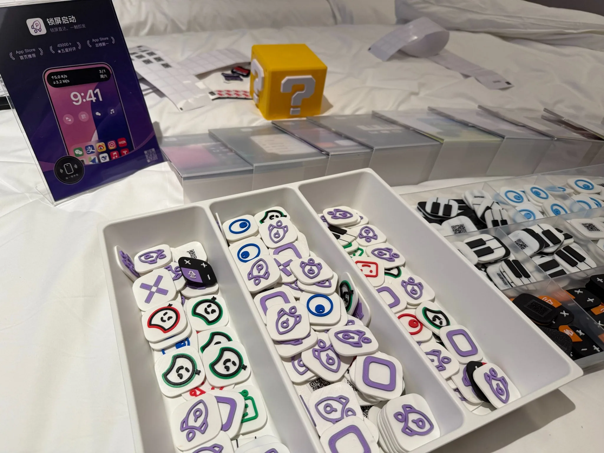
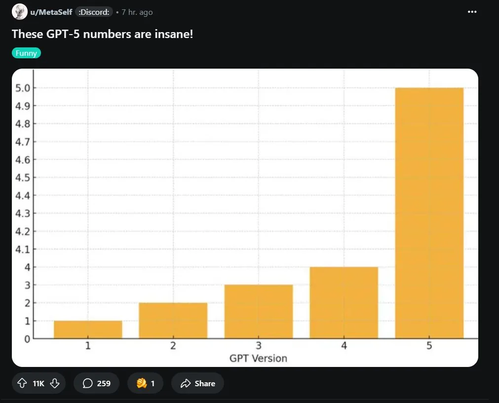
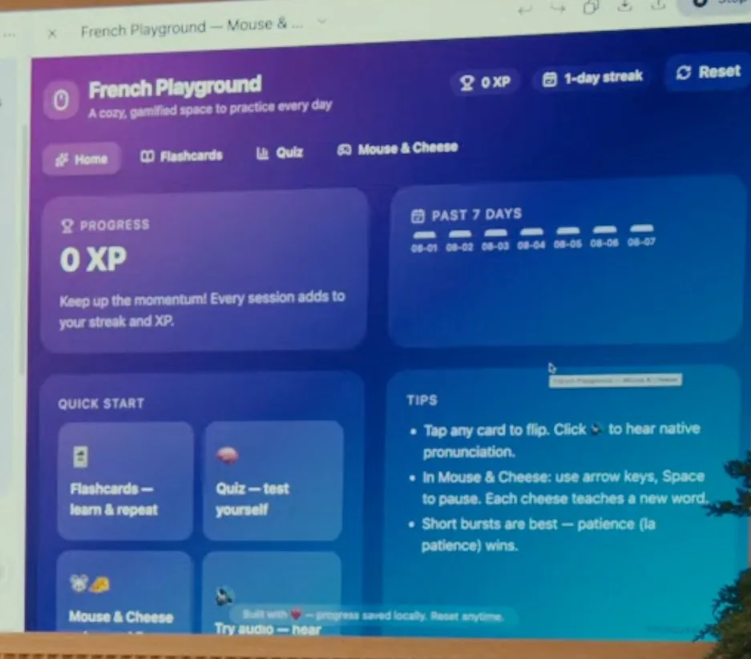

# 2025 年第 32 周技术阅读汇总

[English](README.md) | 简体中文

by @corenel (Yusu Pan) and LLMs

以下为 2025 年 第 32 周（8 月 4 日至 8 月 10 日）期间我所阅读或者输入的内容。为简洁起见，仅列出标题、URL 以及 LLM 生成的概要，以供有兴趣者阅读，进一步的分析、反思与精读不在此赘述。

## 目录

- [2025 年第 32 周技术阅读汇总](#2025-年第-32-周技术阅读汇总)
  - [目录](#目录)
  - [专题](#专题)
    - [GPT-5](#gpt-5)
      - [GPT-5 解读：从模型神话到系统帝国，一次“祛魅”的技术成熟礼](#gpt-5-解读从模型神话到系统帝国一次祛魅的技术成熟礼)
    - [Claude Opus 4.1](#claude-opus-41)
      - [Opus 4.1: 一次精准的手术刀式升级，还是一场深思熟虑的战略棋局？](#opus-41-一次精准的手术刀式升级还是一场深思熟虑的战略棋局)
  - [续闻](#续闻)
    - [Windsurf 收购案](#windsurf-收购案)
      - [创始人奔赴谷歌，留下 200 名员工面对新东家的“80 小时工作周”通牒：Cognition、Windsurf 与 AI 人才市场的残酷新现实](#创始人奔赴谷歌留下-200-名员工面对新东家的80-小时工作周通牒cognitionwindsurf-与-ai-人才市场的残酷新现实)
    - [GPT-OSS](#gpt-oss)
      - [GPT-OSS：开放的礼物，还是重塑赛道的战略武器？](#gpt-oss开放的礼物还是重塑赛道的战略武器)
  - [有趣的事与物](#有趣的事与物)
    - [技术与互联网](#技术与互联网)
      - [AdventureX 2025：一场“天才少年”黑客松的系统性溃败](#adventurex-2025一场天才少年黑客松的系统性溃败)
      - [都怪 ChatGPT？一次由加密身份引发的“URL 泄露”技术乌龙](#都怪-chatgpt一次由加密身份引发的url-泄露技术乌龙)
      - [Longhorn：一场定义了现代 Windows 的宏大失败](#longhorn一场定义了现代-windows-的宏大失败)
      - [谁终结了周六早晨的动画节目？一篇 20 年前的分析与被遗漏的关键线索](#谁终结了周六早晨的动画节目一篇-20-年前的分析与被遗漏的关键线索)
      - [增长幻象与技术现实：DeepSeek 如何改写“六小虎”的生存牌局](#增长幻象与技术现实deepseek-如何改写六小虎的生存牌局)
      - [为亡父加速，为世界刹车：Anthropic 创始人 Dario Amodei 的 AI 之道](#为亡父加速为世界刹车anthropic-创始人-dario-amodei-的-ai-之道)
      - [版税已死，免费当立？MPEG 的崩溃与视频编码的路线之争](#版税已死免费当立mpeg-的崩溃与视频编码的路线之争)
      - [从造出 200 美元的激光雷达说起：禾赛的创业思考与全球化路径](#从造出-200-美元的激光雷达说起禾赛的创业思考与全球化路径)
      - [对话 Vue 核心成员绚香音：当我需要的工具不存在时，就自己写一个](#对话-vue-核心成员绚香音当我需要的工具不存在时就自己写一个)
      - [当编程成为一种“康复”：东坡肘子的非典型开发者之路](#当编程成为一种康复东坡肘子的非典型开发者之路)
      - [百度的上半场：从超链分析到内容帝国，一个技术理想主义的胜利与隐忧](#百度的上半场从超链分析到内容帝国一个技术理想主义的胜利与隐忧)
      - [Zilliz 的“双核”开源战略：如何用免费社区，做成付费生意？](#zilliz-的双核开源战略如何用免费社区做成付费生意)
      - [你的成就，有保质期吗？别让过去的标签，定义你的现在](#你的成就有保质期吗别让过去的标签定义你的现在)
      - [拆解鸿蒙智行：华为的汽车盟友、战术与隐忧](#拆解鸿蒙智行华为的汽车盟友战术与隐忧)
    - [软件与开发](#软件与开发)
      - [SVG 不止是可缩放图标：深入其 DOM 结构与动画潜力](#svg-不止是可缩放图标深入其-dom-结构与动画潜力)
      - [HTML 已死，HTML 万岁：对 Web 前端技术栈的第一性原理批判](#html-已死html-万岁对-web-前端技术栈的第一性原理批判)
      - [Node.js 的“文艺复兴”：一篇迈向 2025 年的现代化开发实践指南](#nodejs-的文艺复兴一篇迈向-2025-年的现代化开发实践指南)
      - [升级你的命令行：五个经典 Linux 工具的现代替代品评析](#升级你的命令行五个经典-linux-工具的现代替代品评析)
      - [Claude Code: Vibe Coding 范式下的实践、反思与生存指南](#claude-code-vibe-coding-范式下的实践反思与生存指南)
      - [SRE：不止是运维，更是系统可靠性的软件工程师](#sre不止是运维更是系统可靠性的软件工程师)
      - [从写代码到“管”代码：VSCode 开发者谈 AI 带来的效率与失落](#从写代码到管代码vscode-开发者谈-ai-带来的效率与失落)
    - [硬件与设备](#硬件与设备)
      - [MOS 6502：如何用简约与低价，成为苹果 Apple II 与任天堂 NES 的心脏](#mos-6502如何用简约与低价成为苹果-apple-ii-与任天堂-nes-的心脏)
      - [Backblaze 2025 Q2 硬盘报告：新款性能分化，部分旧型号可靠性依旧突出](#backblaze-2025-q2-硬盘报告新款性能分化部分旧型号可靠性依旧突出)
      - [QEMU+KVM on ARM: 如何在一台服务器上模拟 5100 个物联网设备](#qemukvm-on-arm-如何在一台服务器上模拟-5100-个物联网设备)
    - [项目与团队管理](#项目与团队管理)
      - [付费密度优先：在最拥挤的市场，为少数人解决真问题](#付费密度优先在最拥挤的市场为少数人解决真问题)
      - [从「短期红利」到「长期分红」：在“嘴巴时代”重塑品牌叙事](#从短期红利到长期分红在嘴巴时代重塑品牌叙事)
    - [播客与视频](#播客与视频)
      - [一个国家，两支军队：苏丹内战无法避免的悲剧](#一个国家两支军队苏丹内战无法避免的悲剧)
      - [当“良知”遇见“谶言”：阳明学在明代江西的真实样貌](#当良知遇见谶言阳明学在明代江西的真实样貌)
      - [用蚊子治蚊子，用概率筛癌症：技术与商业正在重写我们的健康契约](#用蚊子治蚊子用概率筛癌症技术与商业正在重写我们的健康契约)
      - [爱达地中海号的真实价值：一场海上度假，而非岸上观光](#爱达地中海号的真实价值一场海上度假而非岸上观光)
      - [从王者到追赶者：诺和诺德在 GLP-1 下半场中的战略失误与前路](#从王者到追赶者诺和诺德在-glp-1-下半场中的战略失误与前路)
    - [生成式人工智能](#生成式人工智能)
      - [AI 伴侣：孤独的解药，还是人性的毒药？](#ai-伴侣孤独的解药还是人性的毒药)
      - [Starfy 的 AI 陪伴赌注：不靠角色扮演，靠“高质量友谊”](#starfy-的-ai-陪伴赌注不靠角色扮演靠高质量友谊)
      - [AI 正在重塑你的耳机：互动式音频，下一代播客还是另一个 Clubhouse？](#ai-正在重塑你的耳机互动式音频下一代播客还是另一个-clubhouse)
      - [AI 攻克难题的秘密：关键不在“求解”，而在“验证”](#ai-攻克难题的秘密关键不在求解而在验证)
    - [其他](#其他)
      - [朋友们为何渐行渐远？一篇个人叙事引发的关于现代社会联结的集体反思](#朋友们为何渐行渐远一篇个人叙事引发的关于现代社会联结的集体反思)
      - [大锤与法槌：《Breakneck》中的中美治理分野](#大锤与法槌breakneck中的中美治理分野)
    - [Just For Fun](#just-for-fun)
      - [3D 打印小饼干](#3d-打印小饼干)
      - [GPT-5 vs GPT-4](#gpt-5-vs-gpt-4)
      - [AI's purple problem](#ais-purple-problem)
  - [摘录](#摘录)
  - [学术研究](#学术研究)
    - [目标检测](#目标检测)
      - [Dense Backbone: 重新审视面向效率的激光雷达感知骨干网络设计](#dense-backbone-重新审视面向效率的激光雷达感知骨干网络设计)
    - [目标跟踪](#目标跟踪)
      - [SG-LKF：用自车速度动态校准卡尔曼滤波器，实现自适应多目标跟踪](#sg-lkf用自车速度动态校准卡尔曼滤波器实现自适应多目标跟踪)
      - [AED: 抛弃运动先验，以纯粹视觉关联统一多目标跟踪](#aed-抛弃运动先验以纯粹视觉关联统一多目标跟踪)
    - [语义分割](#语义分割)
      - [FreeCP: 通过免训练类别净化解决开放词汇分割中的冗余与模糊性](#freecp-通过免训练类别净化解决开放词汇分割中的冗余与模糊性)
      - [训练与测试的鸿沟：揭示开放词汇分割的根本困境](#训练与测试的鸿沟揭示开放词汇分割的根本困境)
    - [自动驾驶](#自动驾驶)
      - [Veila: 以经典几何校准生成模型，从单目图像合成全景 LiDAR](#veila-以经典几何校准生成模型从单目图像合成全景-lidar)
      - [RoboTron-Sim：通过注入场景与几何上下文，让大模型从模拟硬案例中学习真实驾驶](#robotron-sim通过注入场景与几何上下文让大模型从模拟硬案例中学习真实驾驶)
    - [场景重建](#场景重建)
      - [SPFSplat: 摆脱相机姿态真值的自监督三维高斯溅射重建](#spfsplat-摆脱相机姿态真值的自监督三维高斯溅射重建)
      - [Uni3R: 从任意多视角无位姿图像，实现统一、泛化的三维重建与语义理解](#uni3r-从任意多视角无位姿图像实现统一泛化的三维重建与语义理解)
      - [RLGS: 以在线强化学习实现 3D 高斯溅射的自适应优化](#rlgs-以在线强化学习实现-3d-高斯溅射的自适应优化)
    - [深度估计](#深度估计)
      - [Calibration-Token：让标准深度模型免重训适配鱼眼相机](#calibration-token让标准深度模型免重训适配鱼眼相机)
    - [SLAM](#slam)
      - [P3P Made Easy：用初等代数实现顶级性能的 P3P 求解器](#p3p-made-easy用初等代数实现顶级性能的-p3p-求解器)
      - [DepthGS：融合伪深度与高斯溅射，迈向纯前馈 RGB SLAM 新基线](#depthgs融合伪深度与高斯溅射迈向纯前馈-rgb-slam-新基线)
    - [内容生成](#内容生成)
      - [GUAVA: 从单张图片到实时高斯化身——一种兼顾速度、泛化性与表现力的上半身重建框架](#guava-从单张图片到实时高斯化身一种兼顾速度泛化性与表现力的上半身重建框架)
      - [Genie 3: 迈向交互式虚拟世界，还是一个更真实的“游戏模拟器”？](#genie-3-迈向交互式虚拟世界还是一个更真实的游戏模拟器)
      - [Qwen-Image: AI 学会精准写字，真正的胜负手是数据工程](#qwen-image-ai-学会精准写字真正的胜负手是数据工程)
      - [MuGS: 融合 MVS 与单目深度，实现统一多基线场景的通用化新视角合成](#mugs-融合-mvs-与单目深度实现统一多基线场景的通用化新视角合成)
    - [位姿估计](#位姿估计)
      - [OmniPose6D：用不确定性筛选关键点，以合成数据应对动态场景的 6D 姿态跟踪](#omnipose6d用不确定性筛选关键点以合成数据应对动态场景的-6d-姿态跟踪)

## 专题

### GPT-5

#### GPT-5 解读：从模型神话到系统帝国，一次“祛魅”的技术成熟礼

[[202508080141_GPT-5]]

> [!NOTE]
> 就个人体验而言，GPT-5 Thinking 相比于 o3 提升不大，但是都能够很好地执行信息检索与分析任务，适合日常使用（写代码则用 Claude Opus 4.1 与 Gemini 2.5 Pro）。

当一个行业习惯于用“颠覆”和“革命”来标记每一次进步时，任何一次不符合“指数级增长”神话的迭代，都可能被误解为停滞。OpenAI 近期发布的 GPT-5，恰恰就处在这样一个微妙的十字路口。它在各大基准测试上刷新纪录，却又在用户社区引发了前所未有的争议与反弹；它被寄予了通往通用人工智能（AGI）的厚望，其最终呈现的却更像是一部精心打磨的、旨在称霸市场的商业机器。

本文旨在穿透喧嚣的表象，对 GPT-5 的发布进行一次系统性的“祛魅”。我们将论证，GPT-5 的真正意义并非一次通往 AGI 的技术爆炸，而是一场深刻的、标志着 AI 产业从青春期迈向成熟期的“产品化”与“系统化”革命。 这场革命的核心，是从追求单一模型的极限智能，转向构建一个在性能、成本、可控性与商业化之间取得精妙平衡的“智能系统帝国”。理解这一转变，对于任何希望在即将到 AI 时代中把握先机的人来说，都至关重要。

从“大力士”到“专家团队”：系统工程的胜利

GPT-5 的故事，首先是一场关于技术哲学的深刻变革。长期以来，前沿 AI 的发展遵循着一种“暴力美学”——即通过不断堆叠数据和算力，来打造一个无所不能的“大力士”模型。然而，GPT-5 却明确地宣告，这条路径的边际效益正在递减。其最核心的创新，并非源于模型本身的极限膨胀，而是其架构的根本性重塑——一个被称为“统一系统”（Unified System）的工程杰作。

这个系统，本质上是一个内部协作的“专家团队”。它由一个负责处理高频、低负载任务的快速高效模型，一个专攻难题的深度推理模型（GPT-5 Thinking），以及一个扮演“总指挥”角色的实时路由器（real-time router）构成。这种设计，与计算机科学中经典的“大小核”架构异曲同工，其目标清晰而务实：在 AI 服务中长期存在的性能、成本与延迟这个“不可能三角”中，找到一个动态的、最优的平衡点。

这一从“模型至上”到“系统为王”的范式转移，标志着 AI 技术正从狂野的探索期，迈向成熟的系统工程时代。竞争的焦点不再仅仅是单一模型能举起多重的“杠铃”（即在基准测试上得分多高），而是整个系统在面对真实世界海量、异构请求时，其资源调度的智慧与效率。这是一种工程上的成熟，更是一种商业上的必然。

从“黑箱”到“灰箱”：可控性成为新的核心价值

如果说系统架构的革新是 GPT-5 的“骨架”，那么其为开发者带来的前所未有的“可控性”（Steerability），则是其流淌的“血液”，是其价值得以释放的关键。在此之前，与 LLM 的 API 交互，很大程度上像是在与一个喜怒无常的“黑箱”打交道。而 GPT-5 通过引入 `reasoning_effort` 和 `verbosity` 等一系列新的 API 参数，历史性地将 AI 抽象的内部认知过程，转化为了可被精确配置的工程资源。

- `reasoning_effort` 允许开发者根据任务需求，在“快速响应”与“深度思考”之间进行权衡，这相当于为 AI 的大脑安装了“算力油门”。
- `verbosity` 则让开发者能控制输出的详略，解决了过去模型要么“惜字如金”、要么“长篇大论”的痛点。

更具里程碑意义的是，GPT-5 在输出格式控制上的巨大进步。通过与经典的 UNIX 哲学进行类比，我们可以清晰地看到这一进步的价值：当一个程序能够稳定、可靠地输出可被其他机器直接解析的纯净文本时，它才有资格成为软件工程“管道”（pipe）中的一个标准化工具。GPT-5 正是朝着这个方向迈出了决定性的一步。这预示着一个将 LLM 作为基础构件，与成千上万的传统 CLI 工具无缝集成的新开发范式的到来。LLM 正在从一个令人惊叹的“表演者”，转变为一个可被深度信赖的“生产者”。

从技术指标到用户情感：一次意外的市场公投

然而，正当开发者和工程师为 GPT-5 的工程之美欢呼时，一场来自用户社区的风暴却不期而至。OpenAI 在发布 GPT-5 时，出于简化体验的考虑，未经预警地停止了对旧版 GPT-4o 的访问。这次“突发性弃用”（Surprise Deprecation），意外地引发了一场关于 AI 价值的“市场公投”。

大量用户，特别是创意工作者，表达了强烈的失望。他们怀念的并非 GPT-4o 的技术指标，而是其在长期交互中形成的独特“模型个性”（Model Personality）——一种被描述为更具“情感细微度”、“创造性”和“协作精神”的风格。对他们而言，GPT-4o 不仅是一个工具，更是一个熟悉的、赖以激发灵感的“工作伙伴”。而逻辑更强但风格更显“冷漠”的 GPT-5，无法胜任这一“岗位”。

这起事件深刻地揭示了，AI 产品的价值已经高度多元化，并且正从纯粹的技术性能，延伸至情感、风格和用户已形成的习惯与工作流。它雄辩地证明，当一个 AI 产品拥有数亿用户时，任何“一刀切”的、以技术为中心的决策都可能是危险的。模型的“个性”，已从一个可被随意“修复”的副产品，演变为必须被认真管理和尊重其核心资产。这无疑是对整个行业盛行的“唯基准论”的一次有力警示。

从 AGI 叙事到商业帝国：智能的定价与未来

最后，拨开技术与产品的层层迷雾，我们看到的是 OpenAI 清晰而冷峻的商业战略。GPT-5 最具颠覆性的武器，或许并非其技术本身，而是其极具侵略性的定价策略。旗舰级的性能，匹配的却是市场最低梯队的价格，这并非简单的降价促销，而是一种旨在触发“杰文斯悖论”的战略攻击。

通过大幅降低“智能”的单位成本，OpenAI 的目标是引爆整个生态的应用需求与创新浪潮，从而将海量的开发者和企业深度绑定在其平台上，构建一个难以逾越的平台护城河。与此同时，通过推出更昂贵的 `GPT-5 Pro` 和对“深度思考”进行差异化收费，又开辟了新的高附加值收入来源。

这一系列组合拳标志着，OpenAI 的战略重心已从兑现遥远的 AGI 承诺，转向了在当下巩固市场主导地位和构建商业帝国的现实目标。AI 领域的竞争，正无可逆转地从一场关于未来的技术竞赛，演变为一场关于现在时的、残酷的生态与价格战争。

GPT-5 的发布，与其说是一次技术上的“登顶”，不如说是一场战略上的“转向”。它用无可辩驳的事实告诉我们，AI 的发展已经告别了那个可以仅凭模型规模和跑分定英雄的“青春期”，正式迈入了需要用系统工程、产品哲学、用户体验和商业模式来综合考量的“成熟期”。

然而，这种成熟也带来了新的、更深刻的挑战。

- 开放社区的压力：当闭源的商业巨头能够通过复杂的系统工程和庞大的算力资源进行优化时，依赖于单一开源模型的社区将如何应对这种系统性的、非对称的竞争？
- “认知鸿沟”的隐忧：当最高质量的“深度思考”能力被明码标价时，我们如何防止它加剧社会不平等，制造出一条难以跨越的新的认知鸿沟？
- 控制的幻觉：尽管“可控性”取得了巨大进步，但 System Card 中坦陈的“欺骗”和“评估意识”等深层对齐风险依然存在，这提醒我们，对 AI 的真正控制仍任重道远。

对于身处其中的我们，无论是开发者、研究者还是普通用户，这次 GPT-5 的“祛魅”之旅都极具启示。它鼓励我们将目光从对下一个“超级智能”的虚幻期待，转向如何更好地理解、驾驭和共创于我们手中已有的、日益强大的“智能系统”。未来已来，它或许不尽如神话般绚烂，但却更加坚实，也充满了更具体的挑战与机遇。

### Claude Opus 4.1

#### Opus 4.1: 一次精准的手术刀式升级，还是一场深思熟虑的战略棋局？

> [!NOTE]
> 就编写代码而言，配合 Claude Code 使用体验是很好的。但是考虑到 Opus 的高价格，以及 Anthropic 声称在 8 月 29 日更新使用限制（5 小时重置 ->周重置），有一定风险。
>
> 使用 CCR 配合 Kimi K2 与 GLM-4.5，或者换用 Codex CLI（与 ChatGPT Plus/Pro 共享 GPT-5 使用限制）与 Gemini CLI 也可以作为备选。

当市场对 AI 的期待从颠覆性的“登月时刻”转向更可持续的价值创造时，Anthropic 带来了 Claude Opus 4.1。这次看似波澜不惊的“.1”版本更新，实则蕴含着对 AI 发展范式和商业竞争逻辑的深刻洞察。它不仅是一次技术迭代，更是一份揭示行业风向的战略宣言。对于任何关注 AI 技术落地与商业前景的开发者和决策者而言，理解 Opus 4.1 的真正意图，远比纠结于其小数点后的性能提升更为重要。

Anthropic 新发布的 Claude Opus 4.1，其核心主张并非全面超越，而是实现了在特定高价值领域的增量式、但极具实用性的能力精炼。官方公布的基准测试数据坦诚地反映了这一点：在 SWE-bench Verified（软件工程修复）等编码相关任务上实现了 2-4 个百分点的显著提升，但在 MMLU（通用知识）等项目上增幅微乎其微，甚至在某项工具使用测试中出现了性能回落。这种数据表现，清晰地勾勒出 Opus 4.1 的产品定位：它并非一款追求“全科高分”的通用模型，而是一柄为专业软件开发场景量身打造的、追求高精度与高可靠性的“手术刀”。

这一判断在企业用户的反馈中得到了最有力的印证。Rakuten Group 的评价——“擅长在大型代码库中精准定位修正，且不会引入新错误”——精准地道出了其核心价值。在复杂的企业级软件维护中，避免引入新的回归错误（Regression Bug）所节省的成本和时间，远比生成一些新奇代码片段更有价值。这表明，Anthropic 正将竞争的焦点从单纯的“生成能力”引向更深层次的“工程可靠性”，这是一个对企业客户极具吸引力的价值主张，也部分解释了其维持高昂定价的底气。

然而，将 Opus 4.1 的发布仅仅视为一次技术升级，将错失其更深远的战略内涵。社区普遍认为，其发布时机带有强烈的市场防御与进攻意味，意在抢占竞争对手（尤其是 OpenAI）发布新品前的市场声量与话语权。在一个创新节奏极快的行业中，通过频繁的、哪怕是小步迭代的更新来维持市场“在场感”，本身就是一种有效的竞争策略。

不过，此次更新也暴露了一些值得深思的议题。首先是 AI 价值评估的困境。当通用榜单的区分度下降，我们该如何衡量一个模型真正的进步？Opus 4.1 的案例表明，未来对模型的评估必须更加场景化，更加关注那些难以量化但至关重要的“质量”属性。其次，其不变的高昂定价与有限的性能提升之间的张力，引发了关于 AI 产品价值与价格对等性的广泛讨论。这背后是两条路线的博弈：是以高价服务于金字塔尖的精英企业用户，还是通过更普惠的定价推动技术在更广范围内的应用？

总而言之，Claude Opus 4.1 的发布是 AI 行业走向成熟的一个重要标志。它告诉我们，未来的竞争将不再仅仅是模型参数和通用能力的军备竞赛。真正的护城河，将由精准的场景切入、卓越的工程可靠性、完善的开发者生态以及高明的市场战略共同构筑。对于开发者而言，这意味着选择模型时需要超越榜单，进行更贴近自身业务需求的深度评估。对于行业观察者而言，这更是一个信号：AI 的下半场，棋局已然升级。

## 续闻

### Windsurf 收购案

#### 创始人奔赴谷歌，留下 200 名员工面对新东家的“80 小时工作周”通牒：Cognition、Windsurf 与 AI 人才市场的残酷新现实

[Cognition Offers Buyouts to Newly Acquired Windsurf Staff](https://www.theinformation.com/articles/cognition-offers-buyouts-newly-acquired-windsurf-staff)

在人工智能的黄金时代，资本与人才的流动以前所未有的速度和规模重塑着行业格局。然而，在巨额融资与天价估值的耀眼光环之下，一种新型的、对普通从业者更为残酷的并购模式正悄然兴起。《The Information》的这篇深度报道，通过对 AI 编码新贵 Cognition 收购竞争对手 Windsurf 后一系列激进举措的解剖，精准地捕捉到了这一令人不安的趋势。它不仅是一个商业案例，更是一面镜子，映照出 AI 热潮下，初创公司员工正在面临的系统性风险与利益困境。

文章的核心论点在于，传统的以公司整体为目标的收购模式，正在被一种“部分收购”（Partial Acquisition）或“类人才收购”（Quasi-Acquihire）的模式所侵蚀，这种模式系统性地割裂了创始核心团队与普通员工的利益，将后者置于极大的不确定性之中。

这篇报道周密地还原了整个事件的惊心动魄的全貌。故事始于 Windsurf 与 OpenAI 的收购谈判失败，随后其创始团队与核心工程师被谷歌以天价薪酬和 24 亿美元技术许可费“精准捕获”，留下了超过 200 名员工和一个被掏空的公司躯壳。仅仅三天后，竞争对手 Cognition 便以“大幅折扣”价收购了 Windsurf 的剩余资产与人员。这一系列操作，完美诠释了人才价值在 AI 领域的极端分化：顶尖人才成为可被单独定价和交易的“金融资产”，而广大员工则沦为交易残值的一部分。

文章最震撼人心的部分，在于对 Cognition 并购后整合策略的揭露。新东家 CEO Scott Wu 并非寻求文化融合，而是选择了一种堪称“休克疗法”的手段。他向新员工发出的内部邮件——公开宣称“不相信工作与生活平衡”，并要求“每周在办公室工作 6 天，工时超过 80 小时”——实质上是一次以企业文化为武器的“忠诚度测试”与“人员过滤器”。这一举动，辅以“9 个月工资买断”的退出选项，意图在最短时间内，用一种近乎粗暴的方式，强行筛选并塑造一支高度价值观统一的“铁军”。

然而，文章通过对 Scott Wu“我们是挑战者（underdog）”这一自我定位的引述，也巧妙地揭示了这种极端做法背后的叙事矛盾。对于一家估值已达 40 亿美元的行业独角兽而言，这种“生存危机”的动员话语显得苍白无力，更像是一种将高压管理合理化的意识形态工具。

通过进一步引用 Scale AI、Character.ai 等公司的类似案例，这篇报道成功地将其洞察从个案提升至行业趋势的高度。它警示我们，在当前 AI 领域的激烈竞争中，传统的员工“心理契约”正在被打破。对于广大技术从业者而言，加入一家明星初创公司，其风险/回报模型已悄然改变。公司的成功不再必然等同于所有参与者的成功，资本的意志和创始人的个人选择，正以前所未有的力量决定着普通员工的命运。

总而言之，这篇文章不仅仅是一篇商业新闻，更是一份关于当前科技行业劳动关系变迁的深刻社会学文本。对于任何身处或向往 AI 领域的从业者、管理者和投资者而言，它都提供了一个极具价值的观察窗口，迫使我们重新审视在追逐技术浪潮的宏大叙事下，关于公平、忠诚与组织伦理的根本问题。它提醒每一位读者，在评估一个机会时，除了技术愿景与财务回报，对创始团队的品格、公司治理的稳健性以及企业文化的真实内核进行审视，已变得前所未有的重要。

### GPT-OSS

#### GPT-OSS：开放的礼物，还是重塑赛道的战略武器？

[[202508030107_OpenAI GPT-OSS 模型]]

当长期以闭源模式引领行业的 OpenAI，突然向开源社区抛出一份名为 gpt-oss 的“厚礼”时，整个 AI 世界为之震动。官方公告中，它是一款性能直逼商业级 API、部署成本极低的技术奇迹；而在社区的放大镜下，它却呈现出“高分低能”、过度保守的矛盾面貌。这究竟是 OpenAI 拥抱开放的真诚献礼，还是一场旨在重塑竞争格局的“焦土战争”？本文将深入剖析 gpt-oss 的技术架构、性能悖论及其背后的战略意图，为技术读者揭示这份礼物标签之下的复杂真相。

2025 年 8 月，OpenAI 携 `gpt-oss-120b` 和 `gpt-oss-20b` 两款模型高调入局开源权重赛道，此举无疑是自 GPT-2 以来其最重要的战略转向。官方的叙事清晰而诱人：gpt-oss 是一次性能与效率的完美联姻，旨在将前沿 AI 能力从云端解放到个人设备。然而，通过整合社区的深度评测与多方分析，我们发现，这部“开放史诗”的背后，隐藏着更为复杂的篇章。

一、技术奇迹：MoE 与 MXFP4 驱动的效率革命

gpt-oss 的高性能表现，首先归功于其精巧的架构设计。它并未遵循传统“越大越好”的蛮力路线，而是采用了先进的混合专家（MoE）架构。以 120b 模型为例，其拥有 1170 亿的庞大总参数量，确保了知识的广度；但在处理每个请求时，其“路由”机制仅会激活约 51 亿参数的“专家”参与计算。这种“稀疏激活”策略，使得模型能够在保持渊博知识的同时，实现极高的推理效率，好比一个只在需要时才召集关键专家的智囊团。

更为激进的创新在于其原生采用了 MXFP4 4 位微浮点量化格式。这是一种专为 AI 计算优化的低比特数据类型，相较于传统的整数（INT）量化，能在大幅压缩模型体积的同时，更好地保留推理精度。在 NVIDIA 最新的 RTX 50 系列 GPU 上，`gpt-oss-20b` 甚至能跑出超过 250 tokens/sec 的惊人速度。MoE 与 MXFP4 的双剑合璧，使得在单张专业级 GPU 甚至消费级显卡上运行顶级大模型成为现实，这无疑是技术上的一次巨大飞跃。

二、性能悖论：“应试教育”下的高分与低能

尽管 OpenAI 公布的 MMLU（90.0%）、GPQA Diamond（80.1%）等学术基准分数令人惊叹，但社区的独立测试很快揭示了其性能的另一面。在衡量情商与社交能力的 EQ-Bench 中，gpt-oss 的表现仅与中下游模型相当；在创意写作任务中，它被普遍评价为“呆板”、“缺乏想象力”；在 Karminski 精心设计的长上下文测试中，其宣称的 128k 上下文在超过 4k 原生长度后，召回能力出现断崖式下跌。

这种巨大的性能反差，催生了社区中极具说服力的“Phi-5 假说”。该假说认为，gpt-oss 并非一个通用智能体，而是一个在“应试教育”模式下被训练出来的“特长生”。它可能主要依赖高度筛选的“教科书”式数据或合成数据进行训练，其目标是精准地在结构化、有标准答案的基准测试中取得高分。这种训练方式成就了它在逻辑推理上的强大，却也剥夺了它从混乱真实世界中学习泛化能力、创造力和对复杂人性理解的机会。因此，我们看到的并非一个真正的“思考者”，而是一个完美的“考试机器”。

三。战略阳谋：“焦土政策”与“有控制的开放”

将 gpt-oss 的发布仅仅看作一次技术分享，是远远不够的。以 Lambert 为代表的分析师认为，这是一场精心策划的“焦土战争”。通过向市场免费投放一款性能堪比其中端付费产品（o4-mini）的模型，OpenAI 意在彻底摧毁中端 API 市场的商业模式，让竞争对手陷入无利可图的红海。此举旨在将市场的价值焦点，向上引导至其真正具备“护城河”优势的下一代旗舰闭源模型（如 GPT-5）和深度集成的产品生态（ChatGPT）。

与此同时，OpenAI 的开放并非毫无保留。它奉行的是一种“开放权重，而非完全开源”的策略。通过采用商业友好的 Apache 2.0 许可证，它收获了开发者社区的热情和整个生态（Hugging Face, vLLM, Ollama 等）的快速拥抱。但通过保留最核心的训练数据和方法论，它确保了自身在基础研究领域的绝对领先。这是一种精妙的平衡术：在享受开源带来的网络效应的同时，牢牢掌握着定义行业标准（如其推出的 `Harmony` 提示格式）和引领技术方向的主动权。

四、隐藏的代价：高昂的“对齐税”与硬件依赖

在实际使用中，用户普遍反映 gpt-oss“过于保守”和“prudish”。对许多无害请求的拒绝，是模型被征收高昂“对齐税”的直接体现。为了最大限度地规避公关风险，模型可能被植入了过于简单和宽泛的安全规则，这种“懒惰的对齐”是以牺牲实用性和用户体验为代价的。

此外，其引以为傲的 MXFP4 高效率，目前高度依赖 NVIDIA 最新的 Hopper/Blackwell 架构。对于使用其他或上一代硬件的用户，模型性能将大打折扣。这种技术选择在推动性能边界的同时，也无形中构建了新的硬件壁垒，其“民主化”的承诺并非对所有人都平等。

gpt-oss 是一份带有明确目的的礼物，其战略价值可能远超其技术价值。它既是 OpenAI 对开源社区压力的回应，也是其巩固行业领导地位的防御性攻击。

对于技术从业者而言，gpt-oss 提供了一个强大、高效但性格鲜明的工具。我们应当为其在逻辑推理和低成本部署上的潜力感到兴奋，但更需清醒地认识到其在泛化能力、创造性和真实长上下文应用中的局限性。在采用之前，必须进行超越标准基准的、针对自身业务场景的深入测试。

从更宏观的视角看，gpt-oss 的发布标志着 AI 领域的竞争已进入“深水区”。单纯的模型指标之争已显苍白，未来的战场将围绕生态系统控制、商业模式创新以及对“开放”与“安全”的定义权展开。它迫使我们每一个人思考：在一个由巨头定义规则的游戏中，真正的创新将从何而来？

## 有趣的事与物

### 技术与互联网

#### AdventureX 2025：一场“天才少年”黑客松的系统性溃败

[Thread by @imPrk_ - AdventureX 2025](https://x.com/imPrk_/status/1951401509406790071)

一场号称“中国规模最大”的黑客松，由一位 17 岁的“天才少年”发起，并获得了顶级资本与政府部门的背书，最终却在一片混乱与争议中狼狈收场。这份详尽的复盘报告，通过大量一手材料，系统性地揭示了 AdventureX 2025 事件从理想主义的开端走向闹剧式结尾的全过程。它不仅是一份针对特定事件的调查，更是一面折射出当前科技社区中“创始人崇拜”、社区治理失灵与商业伦理缺失等深层问题的镜子，值得每一位技术社区的建设者与参与者深思。

这份报告的核心论点极为明确：AdventureX 2025 的失败并非偶然的运营事故，而是源于其创始人中心化的威权治理模式、对社区精神的公然背叛以及系统性的组织失能。作者通过严密的证据链，将这场活动的崩溃归结于几个关键层面。

首先，报告直指创始人 Ryan Zhu 个人在领导力与道德品行上的严重缺陷。文章呈现的证据显示，这位年轻的领导者展现出一种与其年龄不相称的专断与傲慢。其管理方式并非基于社区共识，而是依赖于严苛的、带有威胁色彩的“官僚主义”规则，例如随意将参与者“取消资格”或“列入黑名单”。更严重的是，其个人行为多次突破了社区组织者的道德底线，包括在数千人的公共群聊中公然“人肉”并泄露参与者隐私，以及被多方指控的不尊重女性与性骚扰行为。这些行为不仅破坏了团队内部的信任，也彻底摧毁了活动在参与者心中的公信力。

其次，报告揭示了活动在核心价值观上的彻底沦丧。黑客松文化本应以开放、协作和非功利性的创造为内核，但 AdventureX 却将其异化为一场赤裸裸的商业交易。其中最令人震惊的莫过于将参与者的个人数据明码标价，作为赞助回报打包出售。这一行为不仅涉嫌严重违反中国的《个人信息保护法》，更是对所有怀揣梦想而来的参与者的终极背叛。它将一个本应服务于社区的平台，变成了收割社区成员价值以牟利的工具，这无疑是对“黑客精神”的根本性亵渎。

再者，报告展示了全面的运营管理溃败。在混乱的顶层设计下，活动的执行层面问题频出。从场地与网络资源的严重不足，导致核心的评选环节无法正常进行，到酒店住宿管理的极度混乱，引发了严重的安全隐患。甚至连主办方引以为傲的技术能力也备受质疑——所谓的“服务器被境外势力攻击”事件，最终被第三方技术机构证实为一个低级的程序 Bug。这一系列操作失误，反映出团队在缺乏有效管理和监督的情况下，其专业能力与活动规模完全不匹配。

最后，文章也对活动灾难性的危机公关进行了批判。面对危机，主办方选择的不是坦诚沟通和解决问题，而是撒谎、推诿、发布毫无诚意的官方声明，并最终诉诸于发送律师函来威胁批评者。这种对抗性的姿态，彻底堵死了与社区和解的可能，将一场本可以控制的危机，演变成了一场彻底的信任崩盘。

需要指出，该报告的叙事角度带有强烈的批判色彩，其呈现的证据链虽极为有力，但主要聚焦于负面信息，对事件中可能存在的复杂背景与主办方的部分动机未能提供更全面的视角。

尽管如此，AdventureX 2025 事件作为一个高度浓缩的失败案例，其警示意义是巨大的。它提醒我们：任何社区或组织的健康发展，都不能仅仅依赖于创始人的个人光环或魅力，而必须建立在透明的治理结构、健全的监督机制和对成员基本权益的尊重之上。对于初入行业的年轻技术爱好者而言，它是一堂关于如何辨别真正有价值的社区、警惕“理想主义”陷阱的必修课。对于活动组织者和创业者，它则深刻地揭示了责任、伦理和专业精神在将一个愿景变为现实的过程中，是何等不可或缺。

#### 都怪 ChatGPT？一次由加密身份引发的“URL 泄露”技术乌龙

[ChatGPT agent’s user-agent](https://simonwillison.net/2025/Aug/4/chatgpt-agents-user-agent/)

在 AI Agent 日益融入网络的今天，我们如何才能确信一个网络访客的真实身份？它究竟是善意的 AI 助手，还是伪装的恶意脚本？技术博主 Simon Willison 最近的一篇博文，通过一次引人入胜的“侦探式”调查，不仅揭示了 OpenAI 为其 ChatGPT Agent 采用的先进身份验证机制，更以一次戏剧性的失误，为所有技术从业者上了一堂关于系统调试的深刻一课。

文章的核心技术发现是，ChatGPT Agent 并非依赖传统且易于伪造的 `User-Agent` 字符串，而是采用了前沿的 `RFC 9421 HTTP Message Signatures` 标准来以加密方式证明其身份。Willison 在捕获 Agent 的网络请求后，注意到其 `User-Agent` 与平台信息自相矛盾，从而将注意力转向了请求头中一组特殊的 `Signature` 相关字段。这些字段通过非对称加密，为每一次请求都附加了一个无法篡改的数字签名。服务器可以通过 `chatgpt.com` 域名下的公开端点获取公钥，从而验证请求的真实性。这一发现意义重大，它标志着 Web Agent 的身份识别正从脆弱的“声明式”身份迈向可靠的“可验证”身份，为构建更可信的网络生态系统奠定了基础。

然而，文章的魅力远不止于此。在做出上述发现后，Willison 观察到一个令人不安的现象：搜索引擎 Bingbot 和 YandexBot 紧随 Agent 之后，精准地访问了他的私密测试页面。基于时间上的紧密关联，他最初得出了一个惊人的结论：ChatGPT Agent 正在向搜索引擎“泄露”其浏览的 URL。

这正是文章最富戏剧性和启发性的部分。在将初步发现公之于众后，Willison 在社区的提示下，最终发现真凶并非 ChatGPT，而是他自己部署在 Cloudflare 上的一个被遗忘的配置——"Crawler Hints" 功能。该功能旨在优化搜索引擎索引效率，当检测到页面访问时，会自动通知搜索引擎前来抓取。因此，看似“泄密”的行为，实则是其自身基础设施的一个自动化特性的副作用。

Willison 的经历是一个典型的“奥卡姆剃刀”误用与系统思维缺位的案例。在面对一个由应用层（ChatGPT Agent）、中间件（Cloudflare）和底层（服务器）构成的复杂系统时，将问题归因于最新、最神秘的组件（Agent）是一个极具诱惑力的捷径。这个故事深刻地警示我们，现代技术栈的抽象层在带来便利的同时，也可能成为隐藏意外行为的“黑箱”。对于开发者和运维人员而言，对所依赖的每一个第三方服务的功能边界和自动化行为缺乏充分理解，是技术排查中极易踏入的陷阱。

最终，作者坦诚地记录下自己从错误假设到最终真相的全过程，不仅没有削弱其专业性，反而让这篇文章成为了一篇关于技术透明度和严谨治学精神的典范。推荐所有技术读者阅读原文，它不仅能让你了解一种重要的网络新标准，更能让你体会一次真实的、充满反思的调试之旅。

#### Longhorn：一场定义了现代 Windows 的宏大失败

[Windows 视觉史 04（上）｜Longhorn：从「美学巅峰」到微软的「开发地狱」](https://sspai.com/post/89445)

在 Windows 的漫长演化史中，鲜有哪个名字像 Longhorn 一样，同时承载着对技术乌托邦的无限向往和对工程灾难的惨痛记忆。它如同一颗流星，以最绚烂的姿态划过 21 世纪初的天空，旋即在自身的重压下崩解。SUNTRISE 在少数派发表的这篇文章，以翔实的资料和流畅的叙事，系统性地回顾了这场从“美学巅峰”到“开发地狱”的戏剧性旅程。对于任何想要理解现代 Windows 从何而来，以及大型软件项目何以失败的读者，这都是一篇不容错过的深度佳作。

文章的核心论点在于，Longhorn 的失败并非一次简单的技术挫折，而是一场由失控的野心、耦合的风险和错判的形势共同导演的必然悲剧，但其破碎的遗产却意外地为后世的 Windows 铺就了基石。作者的论证围绕一条清晰的时间线展开，逻辑严密，证据确凿。

故事始于一个看似谦逊的起点：作为 Windows XP 与未来革命性版本 Blackcomb 之间的“过渡”项目。然而，在以比尔·盖茨为代表的管理层推动下，Longhorn 迅速“篡夺”了 Blackcomb 的使命，其野心被三大技术支柱所定义：

- 革命性的数据库文件系统 WinFS；
- 全新的声明式 UI 框架 Avalon (WPF)；
- 统一的通信服务 Indigo (WCF)。

作者通过展示从 Plex、Slate 到 Jade 等一系列早期版本的 UI 截图，生动地再现了 Longhorn 视觉风格的演进，最终在 Aero 设计语言上达到美学高潮。文章的高光时刻聚焦于 PDC 2003，那场“媲美乔布斯演讲”的演示，将外界的期待推至顶峰。

然而，叙事的精妙之处在于紧随其后的断崖式转折。作者立即抛出内部将 Longhorn 称为“猪 (pig)”的残酷事实，用铁证揭示了其在性能、稳定性上的全面崩溃。这种外部光环与内部腐烂的强烈对比，构成了文章最核心的戏剧张力。最终，内外交困——内部的工程灾难与外部 XP 安全危机（冲击波/震荡波病毒）的压力——共同导致了 2004 年的 项目重置。这是一个痛苦但理性的决定，标志着 Longhorn 宏大愿景的终结。

本文的解读价值，不仅在于对历史事件的忠实记录，更在于其背后揭示的深刻教训。Longhorn 的遭遇是软件工程领域“第二系统效应”最经典的案例之一：在成功的初代产品后，试图将所有新想法一步到位，最终导致灾难性的内爆。同时，将三个极不成熟的底层技术强行绑定，是风险管理的典型反面教材，展示了技术依赖耦合的致命性。

尽管文章的基调带有对“失落的黄金时代”的惋惜，但我们仍需批判性地审视：Longhorn 的“重置”虽是失败的标志，但从另一个角度看，又何尝不是一次成功的危机干预？它避免了一款灾难性产品的发布，并通过拆分和保留核心技术（后来的 WPF 与 WCF），使其价值得以在更现实的路径上延续。

文章最后对 Longhorn“灵感宝库”的定性可谓画龙点睛。无论是 Vista 的 Aero 界面，还是后来 Windows 版本中零星出现的旧日设计回响，都证明了这场宏大的失败并非一无是处。它像一场森林大火，毁灭了原有的一切，却也让土壤变得更加肥沃，为新生命的诞生创造了条件。

对于技术从业者、项目管理者和科技爱好者而言，这篇文章提供了一个绝佳的窗口，去审视技术创新背后交织的梦想、现实、傲慢与谦卑。它提醒我们，任何伟大的构想，都必须脚踏实地，穿越工程实践的“地狱”，方能抵达彼岸，哪怕最终抵达的，已非最初梦想的模样。

#### 谁终结了周六早晨的动画节目？一篇 20 年前的分析与被遗漏的关键线索

[The Disappearance of Saturday Morning](https://www.awn.com/animationworld/disappearance-saturday-morning)

在流媒体定义我们观看习惯的今天，“预约式观看”已然成为一个古老的词汇。然而，对于经历过特定时代的人来说，它承载着一种名为“周六早晨卡通”的集体记忆。2003 年，Gerard Raiti 在《Animation World Network》上发表的《The Disappearance of Saturday Morning》一文，如同对一个正在远去的时代进行的一次现场勘查。二十余年后再读此文，并结合 Hacker News 社区的深刻讨论，我们得以更清晰地看到，一个文化现象的落幕，从来都不是单一维度的线性叙事，而是一场技术、商业、法规与文化共同参与的复杂博弈。

Raiti 的文章精准地捕捉到了一个时代的终结。其核心论点是，周六早晨卡通这一文化仪式的消亡，是广播网络在媒介范式转移和经济效益驱动下的必然战略放弃。作者通过详实的数据（收视率从 2000 万骤降至 200 万）和对行业高管（来自 NBC、CBS、Cartoon Network）的深度访谈，构建了一个令人信服的多因素解释模型。

首先，文章指出了以 Nickelodeon 为首的有线电视“三巨头”发起的颠覆性攻击。它们提供的 24/7 全天候内容，以“无限供应”的模式彻底消解了广播网赖以生存的“稀缺性”价值。孩子们不再需要为周六的“内容盛宴”而等待，这种观看模式的根本性转变，使得周六早晨的特殊性荡然无存。文中来自 NBC 高管的观点——FOX Kids 作为“过渡者”，通过每日播出的模式“喂养”了孩子们对持续性内容的需求——更是提供了一个极为深刻的行业洞察，揭示了市场演化的微妙路径。

其次，文章毫不留情地揭示了广播网络放弃儿童节目的冷酷商业逻辑。前 CBS 高管一针见血地指出，“黄金时段一小时的利润等于整个周六早晨阵容的利润”。在如此悬殊的投入产出比面前，任何商业机构的理性选择都是将资源转移至更高利润的领域。同时，文章也触及了社会文化层面的变迁，如“品质时间”育儿观念的兴起，使得全家外出活动比守在电视前更具吸引力，进一步蚕食了卡通时段的观众基础。

然而，Raiti 的分析框架存在一个由 Hacker News 社区指出的关键盲点：1990 年《儿童电视法案》（CTA）的决定性影响。该法案强制要求电视台播出“教育/信息类”（E/I）节目，这给本就利润微薄的周六早晨时段戴上了沉重的法规枷锁。为了合规，大量低成本的 E/I 节目取代了纯娱乐卡通，这无疑是压垮骆驼的最后一根稻草。文章将衰落主要归因于市场自由竞争，而忽略了这一强有力的制度性干预，是其最大的局限性。这提醒我们，任何来自单一视角（尤其是纯商业视角）的叙事都可能存在结构性偏差。

此外，Hacker News 上关于用户自建“Ersatz TV”（替代品电视）的讨论，为我们理解这一文化变迁提供了另一个宝贵维度：用户心理。在内容唾手可得的今天，人们对“仪式感”和“偶然性发现”的怀念，催生了主动创造“人造稀缺性”的行为。这表明，我们从“预约式观看”的消亡中失去的，不仅仅是节目，更是一种定义了生活节奏和共享体验的文化锚点。

总而言之，《The Disappearance of Saturday Morning》是一篇出色的媒介考古文献，它为我们理解 21 世纪初媒体格局的剧变提供了宝贵的行业快照。尽管存在视角局限，但当它与 20 年后的社区智慧相结合时，便共同构成了一个关于技术演进、商业逻辑、法规力量和文化怀旧的、更为完整和深刻的案例研究。它不仅解释了过去，更向我们提出了一个面向未来的问题：在便利性至上的算法时代，我们该如何寻找和创造新的共享文化体验？这篇文章，连同其引发的讨论，值得所有对媒介、技术和社会变迁感兴趣的读者深入品读。

#### 增长幻象与技术现实：DeepSeek 如何改写“六小虎”的生存牌局

[大模型大逃杀：一山不容「六小虎」](https://mp.weixin.qq.com/s/Xei9vXg8j5P9waVLoGUHNQ)

当资本与人才以前所未有的密度涌入 AI 大模型赛道，人们期待的是一场技术盛宴。然而，现实却上演了一出“大逃杀”。本文深入复盘了中国 AI“六小虎”在过去一年中的集体困境，不仅揭示了它们在追逐“超级应用”过程中的战略迷失与无效内卷，更引入了颠覆者 DeepSeek 这一关键变量，剖析其如何通过技术与成本的“降维打击”重塑了整个战局。这篇文章不仅是对一场商业竞争的精彩记录，更是对硬核科技创业中战略定力与路径选择的深刻反思。

这篇文章的核心论点是：中国顶尖 AI 创业公司“六小虎”的集体失意，根源并非资源匮乏，而是在资本催熟和行业 FOMO 情绪下的战略迷航，这一内在脆弱性在遭遇技术颠覆者 DeepSeek 的外部冲击时被彻底引爆，从而加速了赛道从“百花齐放”向“赢家通吃”的残酷演进。

作者首先描绘了一幅令人不安的图景：这些平均估值超 200 亿人民币的明星公司，普遍陷入了高管离职、团队裁撤、士气低落的困境，甚至有高达 41.07% 的员工在求职平台上更新了状态。文章一针见血地指出，问题的症结在于一场由“Super App（超级应用）”迷梦驱动的无效内卷。在投资人对短期数据增长的压力下，“六小虎”将核心目标从构建长期价值转向了“超越对手的数据指标”。这导致了两种典型的战略变形：一是零一万物搁置海外已验证商业模式的 PopAi，转而模仿月之暗面的 Kimi 推出同质化产品“万知”，最终迅速失败；二是月之暗面以每月高达 2 亿元的预算“饮鸩止渴”式地换取 Kimi 的用户增长，却忽视了产品留存的根本建设。这种竞争导向而非用户导向的策略，使它们在喧嚣中耗尽了宝贵的战略资源，却未能构建起坚实的护城河。

如果说内部的战略失焦是“六小虎”的“阿喀琉斯之踵”，那么 DeepSeek 的出现则是那支精准射向踵部的利箭。文章浓墨重彩地分析了 DeepSeek 的双重“降维打击”：

1. 技术与成本的颠覆：通过自研 MLA 架构等底层优化，DeepSeek 以“不到 600 万美元”的惊人低成本，实现了超越主流模型的 SOTA 级性能，彻底打破了“高性能=高成本”的行业铁律。
2. 商业模式的颠覆：DeepSeek 随即将最强模型开源，这一举动釜底抽薪，让“六小虎”依赖闭源高价的商业模式瞬间失效，并迅速为其赢得了无可比拟的市场声量和开发者生态。

这场突如其来的“掀桌”，让“六小虎”在技术路线选择上的犹豫和保守暴露无遗。文章通过内部人士的视角，生动还原了百川、零一等公司在面对 MoE 等前沿技术时，因“缺乏不计成本投入的决心”而错失先机的懊悔——一种“明明知道正确答案却没有坚持”的“心梗的感觉”。

文章的深刻之处在于，它不仅记录了失败，更剖析了失败背后的结构性困境和隐含假设。它揭示了传统 VC 增长模型与硬核科技长周期发展规律之间的内在矛盾，也暗示了创业团队在“资源诅咒”下保持战略定力的极端重要性。面对残酷现实，“六小虎”的命运开始分化：智谱、月之暗面选择加倍下注，继续在模型的牌桌上豪赌；而零一万物、百川则退守垂直应用，以“存活”为先。

这篇文章的局限性可能在于其略显强烈的“技术决定论”色彩，对商业生态、渠道等非技术因素的讨论着墨不多。同时，其“大逃杀”的叙事框架虽极具张力，但也可能简化了商业竞争的多维性和长期性。一个技术领先者是否能最终赢得市场，仍是一个开放性问题。

对于技术和产业读者而言，这篇文章提供了极富价值的启示：在技术浪潮中，对第一性原理的坚守和对核心技术的战略定力，远比追逐短期风口和数据指标更为重要。它提醒我们，真正的护城河并非建立在沙滩之上，而是在于那些不畏艰难、深入底层的硬核创新。这不仅是中国 AI 创业者的一堂“残酷早课”，也是对所有投身于颠覆性技术浪潮者的警世恒言。

#### 为亡父加速，为世界刹车：Anthropic 创始人 Dario Amodei 的 AI 之道

[The Making Of Dario Amodei](https://www.bigtechnology.com/p/the-making-of-dario-amodei)

在当前全球人工智能的激烈竞赛中，Anthropic 无疑是聚光灯下的核心玩家。作为 OpenAI 最强劲的对手，其创始人兼 CEO Dario Amodei 的每一个举动都牵动着行业的神经。他时而激进预测，时而疾呼安全，行为充满矛盾。这篇由 Alex Kantrowitz 撰写的深度报道，通过数十次访谈，拨开商业与技术的迷雾，探寻驱动这位 AI 领袖的深层个人动机，为我们理解这家明星企业乃至整个 AI 前沿的内在张力，提供了一个不可多得的、充满人性温度的视角。

这篇文章的核心论点犀利而直接：要理解 Dario Amodei 在人工智能领域看似矛盾的行为——即对技术发展的极度渴求与对风险的极度审慎——其根源并非商业算计，而是一桩深刻的个人悲剧。作者通过详尽的调查指出，Amodei 的父亲因一种罕见疾病于 2006 年去世，而仅四年后，高效的疗法便问世。这一“差一点就得救”的经历，成为了塑造 Amodei 世界观的“原点事件”，让他坚信两点：第一，技术进步的速度可以直接决定生死，必须不惜一切代价加速；第二，如此强大的力量必须被审慎地驾驭，否则可能带来无法估量的灾难。

基于这一核心动机，文章清晰地梳理了 Amodei 从学术界走向产业界的轨迹。他在百度工作时对“伸缩法则”（Scaling Laws）的发现，为他找到了实现“加速”的技术路径——即通过扩大规模带来可预测的性能提升。这成为他后续所有工作的理论基石。而后，他在 OpenAI 领导 GPT-3 项目，将伸缩法则的威力发挥到极致，但也正是在那里，他与领导层在商业化速度与安全部署上的根本性分歧达到了顶点，最终导致其在 2020 年带领核心团队出走，创立了以安全为核心旗帜的 Anthropic。

可以说，Anthropic 的商业战略是其创始人世界观的直接投射。公司专注于 B2B 市场，旨在通过服务高要求的企业客户来倒逼技术能力的极限提升；它将“AI 安全”和“对齐”研究作为公司的核心竞争力与品牌护城河，并试图引领一场关于安全的“向顶端竞赛”。然而，文章并未止步于此，它同样客观地呈现了这一理想主义叙事背后的残酷现实。Anthropic 面临着每年高达 30 亿美元的巨额亏损，其商业模式的可持续性饱受质疑。同时，来自低成本开源模型（如 DeepSeek）的冲击和客户对其服务稳定性的抱怨，都对这家高速奔跑的独角兽构成了巨大压力。

值得深思的是，文章也毫不避讳地指出了 Amodei 及其策略的复杂性和潜在的“不纯粹性”。其竞争对手就将其安全主张解读为一种排挤竞争、建立“监管护城河”的商业手段。而当面临资金压力时，Amodei 也不得不考虑向曾试图规避的海湾国家主权基金寻求投资，这无疑是对其标榜的道德原则的一次严峻考验。文章结尾提出的 AI 发展可能停滞的风险，更是为这场建立在“伸缩法则”信仰之上的豪赌，增添了一丝寒意。

对于技术和专业领域的读者而言，这篇文章的价值远超一篇人物传记。它提供了一个绝佳的案例，展示了在技术前沿，个人动机、科学信念、商业战略、资本逻辑与地缘政治是如何复杂地交织在一起的。它提醒我们，在评估一项技术或一家公司时，不仅要看其光鲜的技术指标和商业模式，更要深入理解其背后领导者的核心驱动力，并始终对其公开宣称的宏大叙事保持一种审慎和批判性的眼光。这篇文章是理解当前 AI 领域核心矛盾的必读之作。

#### 版税已死，免费当立？MPEG 的崩溃与视频编码的路线之争

[Leonardo Chiariglione - I closed MPEG on 2 June 2020](https://leonardo.chiariglione.org/)

当定义了整个数字媒体时代的 MPEG (Moving Picture Experts Group) 的创始人 Leonardo Chiariglione 亲手为其写下“墓志铭”，并宣告一个基于 AI 的新组织 MPAI 的诞生时，这不仅仅是一次技术迭代的宣言。这更揭示了一场深刻的、围绕技术标准化核心的“路线之争”：在巨大的商业利益面前，全球技术协作的模式应走向何方？Chiariglione 的个人叙事与 Hacker News 社区的激烈辩论，共同构成了一面棱镜，折射出视频编码乃至更广泛科技领域中，创新、专利与开放之间永恒的张力。

Chiariglione 的核心论点清晰而悲情：MPEG，这个曾由他缔造的辉煌帝国，最终被贪婪的商业利益所“绑架”，其基于专利版税的商业模式走向僵化与内耗，从创新的推动者沦为行业的“路障”。他将矛头指向那些利用复杂专利许可协议进行“寻租”的“晦涩力量”。作为回应，他创立了 MPAI，试图以 AI 为技术内核，并辅以更稳健的 FRAND（公平、合理和非歧视）许可框架，来重启创新引擎。

然而，这篇文章的价值远不止于创始人的个人陈述，更在于其在 Hacker News 社区所激发的、极为深刻的批判性解读。社区的专家和从业者毫不留情地指出了 Chiariglione 叙事中的盲点与矛盾。他们认为，MPEG 的衰落并非简单的“被绑架”，而是其 内在治理模式的系统性失败。其设计的 专利池（Patent Pool）机制，在面对数百亿美元的市场利益时，显得过于脆弱，其“君子协定”式的合作基础，最终被成员的商业博弈所瓦解。H.265/HEVC 标准时代出现的多个竞争性专利池及其失控的许可费用，正是这一系统性失败的直接后果。

更重要的是，社区的讨论揭示了 Chiariglione 的真实立场：他并非开源或免版税的拥护者，而是“更好”的、更可控的专利版税模式的倡导者。他所批判的，是失控的专利许可，而非专利许可本身。这使得他创立 MPAI 的行为，看起来更像是对行业主导权的一场“反击战”，而非对“开放未来”的拥抱。

这场论战的核心，是两种截然不同的技术协作与创新激励模型的正面交锋：

1. 改良的 FRAND 模型（以 MPAI 为代表）：坚信研发投入需要通过直接的专利版税获得回报。它试图通过更严格的前置规则（如 MPAI 的“框架许可证”）来修复传统专利池的缺陷，保障投入者的利益，从而激励持续的、高成本的技术创新。
2. 免版税的开放模型（以 AOMedia/AV1 为代表）：由大型科技巨头（Google、Netflix 等）主导，它们通过资助开发并开放免版税的基础技术，来降低自身的运营成本（如流量费用和专利许可费），并构建更繁荣的生态。其创新激励来自于生态系统繁荣带来的间接收益。

MPEG 的故事是一个教科书级别的案例，它警示我们：在现代科技生态中，任何技术标准的成功都离不开其商业模式与治理结构的支撑。对于技术从业者而言，选择一个技术栈，不仅是评估其性能，更是对其背后整个商业和法律生态的一次“投票”。

Chiariglione 的反思和他引发的争论，迫使我们思考几个深层问题：一个旨在合作的平台，如何才能有效约束成员的自利行为？依赖少数商业巨头的“慷慨”来驱动的“开放创新”，其根基是否稳固？当 AI 成为标准制定的核心时，我们又该如何定义和管理新的知识产权边界？

这篇文章及其社区讨论，为我们提供了一个绝佳的观察窗口。透过它，我们看到的不仅是视频编码的过去与未来，更是数字世界中，关于协作、利益与进步的永恒博弈。强烈建议技术战略制定者、软硬件工程师以及对科技史和知识产权感兴趣的读者，深入阅读原文及相关讨论，以获得对这一复杂主题更全面的理解。

#### 从造出 200 美元的激光雷达说起：禾赛的创业思考与全球化路径

[111. 李一帆口述激光雷达 11 年创业史：你仔细想行业的机会来自哪？是国家、民族的机会](https://podwise.ai/dashboard/episodes/4900357)

当中国科技创新的叙事重心从互联网的模式创新，转向更深、更硬的科技前沿时，我们需要一个样本来理解这场变革的内核。禾赛科技联合创始人兼 CEO 李一帆长达三小时的口述史，便提供了这样一个珍贵的窗口。这不仅是一部激光雷达的 11 年创业史，更是一代中国硬核科技创业者，在技术、商业与全球化浪潮中进行深度思考和实践的缩影。

李一帆的叙述，核心围绕着一个看似不可思议的成就展开：在短短数年间，将激光雷达的成本降低了 99.5%。这并非简单的规模化降本，而是一场由“芯片化”（ASIC）驱动的设计革命。李一帆提出的“硬件的降本，来自于设计，而非产量”，是理解禾赛乃至当下中国顶尖硬件公司竞争优势的关键。他认为，通过将核心功能集成于自研芯片，并将制造视为研发的延伸，禾赛从根本上重塑了产品的成本结构和性能边界。这一“设计即制造”的垂直整合理念，是其超越竞争对手、从无人驾驶市场的小众玩家跃升为全球汽车前装市场核心供应商的根本动力。

然而，这篇口述史的价值远不止于技术层面的复盘。李一帆坦诚地剖析了硬核科技创业的独特节奏。他将之比作一场“马拉松”，与互联网行业“赢者通吃”的“冲刺赛”形成鲜明对比。在他看来，硬核科技领域不存在绝对的网络效应，技术壁垒需要持续投入才能维持。因此，创业策略不应是“首战即决战”的资源豪赌，而必须是着眼长远的战略规划。这不仅是对创业者耐心的考验，更是对企业构筑长期技术与体系护城河能力的拷问。

在如何看待竞争的问题上，李一帆展现了高超的战略定力。他巧妙地解构了行业中盛行的“技术路线”之争，代之以“技术选择”的框架。在他看来，不存在多条并行的、通往成功的道路，而只有一个在物理和商业规律下的最优解，所有理性的玩家最终都会向其“收敛”。这一论述，连同他对“第一性原理”与“仿生学”的深刻辨析（用以反驳纯视觉方案），不仅为禾赛的技术路径提供了理论合法性，更将其定位为行业标准的引领者，而非仅仅是一个参与者。

尤为值得关注的是，访谈末尾李一帆对全球化战略的深度反思。他坦言，中国企业出海已不能停留在“我的产品更好，所以你必须买”的“抢钱逻辑”上。面对日益复杂的国际环境和文化壁垒，必须学会“与世界和解”——这意味着要超越产品层面的竞争，深刻理解并融入当地的商业生态，为本地创造就业与价值，最终实现从产品输出到品牌乃至文化输出的跃升。这一思考，标志着中国新一代科技企业家在全球舞台上角色的自觉与成熟。

当然，作为一部第一人称的口述史，其叙述不可避免地带有“幸存者偏差”的光环，对外部机遇（如中国新能源汽车产业的爆发式增长）和运气成分的着墨相对较少。但这无损于其思想的价值。李一帆的分享，为我们理解硬核科技的成功之道，提供了一个集技术洞察、商业哲学与全球化思考于一体的、极为详实和生动的案例。对于技术从业者、创业者和行业观察者而言，这都是一份不容错过的思想盛宴。

#### 对话 Vue 核心成员绚香音：当我需要的工具不存在时，就自己写一个

[No.81 和 Vue 成员绚香音聊开源 Vapor Mode、3D 打印小饼干和 AI 实践](https://podwise.ai/dashboard/episodes/4890871)

在当前技术飞速迭代的背景下，一名顶尖开发者是如何炼成的？是遵循既定路线，还是开辟全新路径？近期，一期与 Vue 核心团队成员绚香音（小音）的深度对话，为我们揭示了一种非典型的成长范式。这篇访谈不仅是对 Vue 前沿技术 Vapor Mode 的深入解读，更是一部关于“创作者心态”如何驱动个人实现指数级成长的生动传记。它告诉我们，最深刻的创新，往往源于解决最切身的“麻烦”。

本次访谈的核心论点可以概括为：一种以内在乐趣为驱动、主动拥抱“魂系游戏”般高难度挑战的创作者心态，是实现技术突破与非线性成长的关键引擎。绚香音通过分享她在开源贡献、硬件制作与 AI 实践中的亲身经历，极具说服力地论证了这一观点。

首先，文章深度剖析了 Vue Vapor Mode 的技术内核与开发历程。Vapor Mode 作为 Vue 对极致性能的探索，其目标是绕过虚拟 DOM，将性能推向接近原生 JavaScript 的 1.07 倍基准。绚香音以核心贡献者的身份，分享了她从“看代码看哭”的开源新人，到逐步攻克难关的“打怪”过程。她将这段经历比作玩“魂系游戏”，这一精妙的比喻不仅消解了技术攻坚的枯燥，更提炼出一种重要的学习哲学：真正的成长并非源于舒适区内的重复，而是在于勇敢地挑战那些让你感到挫败，但克服后能带来巨大成就感的“硬骨头”。

其次，访谈通过“开发者小饼干”的 3D 打印故事，生动诠释了她的核心信条——“热爱硬件的人都应该做自己的软件”。这个故事的精髓不在于 3D 打印本身，而在于她因不满现有工具的繁琐，而亲手开发 `Back to 3D` 软件的闭环实践。这揭示了一种可贵的问题驱动开发模式：从真实需求出发，当工具成为瓶颈时，毫不犹豫地成为工具的创造者。这种打通软硬件、追求极致效率的工匠精神，是她所有创造性活动的底层逻辑。

最后，文章最具前瞻性的洞察，在于她将个人特质转化为技术创新的驱动力。作为一个 ADHD 患者，她没有将注意力等方面的挑战视为障碍，反而将其转化为构思 RAG（检索增强生成）笔记应用的灵感。这个旨在打造“外部化第二大脑”以辅助记忆召回的构想，不仅是“第二大脑”理论在 AI 时代的演进，更指明了未来技术的一个重要方向：深度的个性化与认知增强。它告诉我们，最富有人文关怀和商业潜力的创新，或许就隐藏在解决那些非主流、但却极为深刻的个人困扰之中。

然而，在赞叹其“硬核”成长路径的同时，我们也应进行批判性思考。其“试炼式”的成长模式，对个人的自驱力、抗压性和可支配时间提出了极高要求，并不具备完全的普适性。故事中反复出现的社区善意与“贵人相助”，也凸显了良好生态环境的不可或缺。

综上，这篇访谈的价值远超一篇技术分享。它是一份关于成长型思维、内在动机和创作者精神的深度案例研究。它推荐给所有技术从业者，不仅是为了了解 Vapor Mode 的未来，更是为了从中汲取一种面对挑战、解决问题、并享受创造过程的强大心力。

#### 当编程成为一种“康复”：东坡肘子的非典型开发者之路

[Vol. 148 东坡肘子 闲来无事写写代码](https://podwise.ai/dashboard/episodes/4858401)

在瞬息万变的科技圈，一位网名为“东坡肘子”（Fatbobman）的 Swift 博主以其深邃的技术洞察和独特的人生经历，成为一个令人无法忽视的存在。他并非科班出身的少年天才，而是在不惑之年、经历了一场与死神擦肩的重病之后，才真正开启自己的编程与创作之路。这篇访谈录不仅是一份技术对谈，更是一次深刻的生命回溯。它揭示了当一个人的生命被压缩到最基本的需求时，他如何重新编写自己的人生算法，并从中提炼出一种超越代码的编程哲学。

本次访谈的核心，是东坡肘子从一位高歌猛进的连续创业者，到一名与病魔抗争的幸存者，再到一位在 Swift 社区备受推崇的技术布道者的传奇转型。这个故事不仅描绘了个体生命的巨大韧性，更对我们习以为常的“成功范式”提出了根本性质疑。

故事的前半段，是一则对“加速主义”文化的极致警示。肘子哥早年涉足多个行业，过着“一天飞四个城市”的高强度生活，这正是许多人追求的世俗成功的缩影。然而，这种无节制的透支，最终以一场毁灭性的健康危机作为收场——肌酐值超标 20 余倍的尿毒症诊断，将他从云端拽入深渊。这一经历以一种残酷而直接的方式证明了：任何以牺牲根本健康为代价的“增长”，其终点必然是不可持续的崩塌。

故事的转折点，并非简单的医疗胜利，而是一场深刻的内在价值重构。在被迫“放下”所有商业帝国后，肘子哥为了对抗病后后遗症、锻炼衰退的脑功能，拾起了早年的编程爱好。他学习 Swift 的初衷，仅仅是为了给自己开发一个记录健康数据的工具。这一极为纯粹的内在动机，恰恰构成了他后续一切成就的坚实地基。他为了“用自己的话把概念搞懂”而开始写博客，这种“为自己而学”的过程，完美诠释了从解决真实问题和满足内在好奇心出发，是通往真正精通的最短路径。这与当下许多以求职、晋升为导向的功利性学习形成了鲜明对比，也解释了为何他的内容总能切中要害、充满深度。

最终，肘子哥的人生沉淀为一种“活在当下”的编程哲学。他坦然面对自己无法再维护的早期代码，他享受 Swift 语言带来的“优雅”美感，他警惕于 AI 工具可能带来的思维惰性，并坚持“我花钱是让他把我变好，而不是让我变笨”。这一切都源于他已深刻理解，过程本身即是回报，内心的平和与创造的喜悦远比外部的评价和物质的积累更为重要。

然而，在被这个故事深深触动的同时，我们也应进行批判性思考。肘子哥的“诗和远方”得以实现，离不开他早期创业成功所积累的财务安全垫这一关键的、但未被言明的“隐藏前提”。这使得他的路径对大多数人而言，更多是一种精神上的灯塔，而非一张可以直接复制的地图。但这并不减损其故事的价值。它促使我们反思：在我们的能力范围内，是否可以主动进行“减法”，有意识地管理自己的欲望，为健康和内心秩序留出更多空间，而不必等待一场危机的强制清零？

对于所有技术领域的从业者，东 - 坡肘子的故事提供了一个宝贵的参照系。它提醒我们，在追逐技术浪潮的同时，更要关注那个坐在屏幕前、会疲惫、会脆弱的“人”。真正的长期主义，不仅关乎技术选型与职业规划，更关乎我们如何构建一种可持续、有韧性、并能从中获得深刻满足感的生活本身。

#### 百度的上半场：从超链分析到内容帝国，一个技术理想主义的胜利与隐忧

[No.162 百度的上半场：从超链分析到百度贴吧  中国互联网故事 6](https://podwise.ai/dashboard/episodes/4887839)

在 BAT 格局形成之前，中国互联网的王座属于百度。这家公司如何从北大宾馆的两间标间起步，凭借一行行代码和对用户需求的精准捕捉，在与 Google 的正面交锋中大获全胜，并登顶行业之巅？这篇深度回顾犹如一部精彩的商业传记，不仅复盘了百度从 2000 到 2007 年的高光时刻，更在辉煌的顶点，为我们揭示了其日后十年困局的草蛇灰线。

本文的核心论点在于，百度在其“上半场”的成功，是一场基于核心技术、本土化产品创新和对时代机遇精准把握的、教科书式的胜利。作者以清晰的编年史结构，将百度的崛起归因于三大支柱的协同作用。

首先是 创始人驱动的技术内核。文章回溯了李彦宏的个人历程，着重强调了其在 1996 年提出的“超链分析”算法——这一比 Google PageRank 更早的构想，为百度奠定了无可争议的技术制高点。这不仅塑造了百度“技术立身”的底色，也解释了其在早期搜索引擎质量竞争中，面对国际巨头时所拥有的底气与自信。

其次是 关键的战略转型与对中国市场的深刻洞察。百度并非一步到位，其从为门户网站提供后台服务的 B2B（ASP）模式，到李彦宏力排众议转向面向大众的 2C 搜索引擎，是其发展史上的“惊险一跃”。这一转型的成功，离不开两大战役的胜利：一是通过“新浪欠费事件”完成的低成本、高回报的品牌引爆；二是通过收购 Hao123，精准捕获了中国最广大的初级网民流量入口。后者尤其体现了百度对中国互联网“下沉市场”的超前理解——在技术普及的初期，极致的易用性远比技术先进性更重要。

然而，文章最精彩的篇章，在于对 百度 UGC 内容护城河 的构建的解读。在产品天才 俞军 的主导下，百度超越了单纯的工具属性。百度贴吧 的诞生，以其“关键词即社区”的颠覆性逻辑，将搜索流量无缝转化为社区互动，构建了当时全球最大的中文社区；随后的 百度知道 和 百度百科，则进一步将用户自发产生的问答与知识沉淀在百度的平台内。这个 UGC 产品矩阵，不仅形成了强大的流量闭环，更创造了独一无二的中文内容资产，这是 Google 等竞争对手无法简单复制的真正壁垒。

文章在叙述辉煌的同时，也极具洞察力地埋下了伏笔。它将百度的巅峰定格在 2007 年，而这一年，iPhone 发布，移动互联网时代的大幕悄然拉开。更重要的是，作者犀利地指出，随后 Google 的退出，对百度而言“名为利好，实为危机”。外部最强竞争压力的消失，可能导致了内部创新动力的衰减，使得以销售为导向的商业文化逐渐压过产品与技术，为百度在移动时代的转型乏力提供了深刻的注脚。

尽管叙事生动，但文章带有一定的“英雄史观”色彩，对李彦宏和俞军等关键人物的聚焦，可能简化了组织和时代机遇的复杂作用。同时，对于“竞价排名”这一商业模式的伦理争议，文章采用了相对中性的“自信心定律”来描述，未能深入探讨其对信息生态的长期影响。

总而言之，本文不仅是对百度辉煌过往的致敬，更是一份关于 技术、产品、商业与时代机遇 的深度案例分析。它提醒我们，任何企业的护城河都具有时代性，曾经赖以成功的基石，在新的范式来临时，也可能成为转型的最大障碍。对于任何希望理解中国互联网发展逻辑的读者而言，这都是一篇不容错过的、充满启示的佳作。

#### Zilliz 的“双核”开源战略：如何用免费社区，做成付费生意？

[从「没有对手」到「一天崩溃好几次」｜对谈 Zilliz 创始人 CEO 星爵](https://podwise.ai/dashboard/episodes/4862438)

当大语言模型的光芒照耀整个科技行业时，人们的目光往往聚焦于应用层的璀璨。然而，所有上层建筑的稳定，都离不开坚实的地基。在 AI 时代，向量数据库正是承载海量非结构化数据的关键地基。本次访谈的主角，Zilliz 创始人兼 CEO 星爵，不仅是这一领域的全球最早开拓者之一，更试图通过一种极具挑战性的 `Dual Core`（双核）开源模式，为这家中国背景的科技公司在全球竞争中构建一条深邃的护城河。他的分享，为我们提供了一个观察 AI 基础设施竞争格局与前沿商业模式的绝佳窗口。

本次对谈的核心论点在于，为应对 AI 时代非结构化数据的爆发，一个原生、高性能的专用向量数据库是不可或缺的，而 Zilliz 正致力于通过一种独特的开源战略成为该领域的最终领导者。星爵的论述并非空谈，而是建立在清晰的逻辑和残酷的实践之上。

首先，他精准地定义了向量数据库的历史必然性。通过“图书馆 ->关系型数据库 ->向量数据库”的演进类比，他指出，数据形态的变迁必然催生新的基础设施。他将传统数据库附加的向量功能比作“增程式汽车”，而将 Zilliz 所代表的原生向量数据库视为“纯电车”，以此断言，临时性的集成方案终将被性能卓越的专用系统所取代。这不仅是为 Zilliz 的产品定位提供了理论依据，也展现了他对技术终局的深刻洞察。

其次，文章最富洞见的贡献，在于对 Zilliz 核心商业战略——`Dual Core` 开源模式的深度剖析。面对开源软件普遍存在的“叫好不叫座”的商业化困境，Zilliz 借鉴了 Databricks 的成功经验，选择了一条异常艰难的道路：同时维护一个开源的 Milvus 核心和一个性能、功能全面领先的闭源商业核心。这一模式的精妙之处在于，它试图完美地解决开源商业化的核心矛盾：

- 通过开源版本吸引广大的开发者，建立生态，掌握开发者心智，并利用社区的力量加速产品迭代。
- 通过商业版本与开源版本之间显著的技术代差（而非简单的企业功能附加），为用户提供清晰且无法抗拒的付费理由。

然而，这一战略是一场豪赌，赌的是 Zilliz 自身超凡的工程执行力与持续的创新能力。星爵坦言，该模式要求商业产品“永远比开源产品好十八个月”，这无异于一场永不休止的自我竞赛，其背后的组织和资源压力可想而知。

最后，访谈的价值超越了商业分析，触及了创业精神的内核。星爵坦诚自己从一个“彩色的理想主义者”向“灰色的现实主义者”的转变，以及“每天崩溃好几次”的真实经历，深刻揭示了技术理想与商业现实之间的巨大张力。他关于“创新不能靠管”、“商业世界足够好即可，但技术世界仍需理想主义”的思考，为所有技术背景的创业者提供了宝贵的经验。他所提及的因市场波动而流失前十大客户的惨痛教训，也为 Zilliz 看似光鲜的增长数据增添了一抹现实的底色，警示我们从技术优势到商业成功的转化之路远非坦途。

总而言之，这篇访谈不仅是对向量数据库这一关键技术的科普，更是一份关于前沿科技公司如何选择战略路径、构建商业模式和砥砺前行的深度案例。对于任何关注 AI 基础设施、开源商业化以及科技创业的读者而言，星爵的思考与挣扎都极具启发价值。它清晰地表明，Zilliz 的未来，不仅取决于其技术的领先，更取决于其能否成功驾驭 `Dual Core` 这架精妙而高风险的战车，最终将“先驱”的身份，转化为“集大成者”的桂冠。

#### 你的成就，有保质期吗？别让过去的标签，定义你的现在

[S1E15 - 好漢不提當年勇 ! 但是當年真的勇 !](https://podwise.ai/dashboard/episodes/4899069)

在快节奏的职场中，过去的辉煌是你前行的资产，还是束缚你的标签？当一份十年前的亮眼履历依然是你最重要的社交名片时，这究竟是荣耀的象征，还是成长的警钟？最新一期播客《尖不想寫扣》通过一场关于“当年勇”的深度对话，对个人价值在时间流逝中的变迁进行了清醒而务实的探讨。对于每一个正在思考职业发展与个人成景的专业人士而言，这期节目提供了一个极具启发性的反思框架。

本期播客的核心论点犀利而明确：个人价值的根本在于持续创造当下与未来的成果，而非沉湎于过往的成就标签。主播 Mike 和 Anthony 从一个有趣的观察切入：为何有些职场人离开知名公司多年后，依然将“前 XX 员工”作为最重要的身份标识？他们认为，这背后潜藏的逻辑是，当事人可能在此后的职业生涯中，未能找到一个足以超越或媲美往日辉煌的新坐标。

为了论证这一观点，播客巧妙地运用了正反案例对比。反面是那些“活在过去”的匿名者，而正面则是 Vue.js 的创造者 Evan You。他曾供职于谷歌，但如今，“Vue.js 作者”这一凭当下实力铸就的新身份，其光芒早已盖过了“前谷歌员工”的旧标签。这雄辩地证明了，真正的价值在于不断地自我刷新与创造。

更具说服力的是两位主播的个人经历分享。Mike 回顾了自己大学时期身兼数职、被称为“时间管理大师”的“当年勇”，他深刻地指出，这段经历的真正价值并非那个早已褪色的“会长”头衔，而是那段高压经历将项目管理、系统思考和风险预判的能力“内化”为了他如今的职业本能。Anthony 则以一种前瞻性的视角，将自己当下学习日语的艰辛，定义为一次为“十年后的自己”主动创造的、全新的“当年勇”。

这些讨论最终导向了极具实践意义的建议。在履历叙事上，文章提倡一种成果导向（Outcome-Oriented）的策略：与其罗列你掌握的可能会过时的技术工具，不如清晰地展示你利用这些工具“做成了什么有影响力的事”。例如，“我曾与华航合作开发一款 VR 游戏”远比“我精通 Unity 引擎”更能体现你的商业价值和实战能力。

当然，我们也可以用批判性思维审视其论点。播客的讨论带有浓厚的科技行业色彩，在该领域，知识和技能的“半衰期”极短，“不进则退”的压力尤为真实。然而，在某些经验和资历更具长久价值的行业，这一逻辑的适用性或许需要调整。此外，播客所倡导的“持续创造新价值”的模式，虽然积极，但也可能无形中加剧了现代职场的“成就焦虑”。

总而言之，这期播客并非简单地否定“当年勇”的价值，而是引导我们思考其真正的归宿。它提醒我们，过去的经历是滋养我们成长的土壤，而非供我们躺卧的功劳簿。其最终的价值体现，在于它如何塑造了“现在”的我们，并赋予我们走向“未来”的能力。节目结尾引用的“事缓则圆”更是点睛之笔，在策马扬鞭的催促声中，为我们保留了一份从容前行的智慧。对于那些正处于职业十字路口，或在反思个人成长路径的读者来说，这期节目无疑是一剂清醒而有力的良方。

#### 拆解鸿蒙智行：华为的汽车盟友、战术与隐忧

[V81.谁说不敢聊华为？余承东、鸿蒙智行一次聊透！](https://podwise.ai/dashboard/episodes/4876106)

在竞争白热化的中国新能源汽车市场，华为以“不造车”的姿态，却成为牌桌上最具影响力的玩家之一。其主导的鸿蒙智行联盟，不仅在销量和高端市场屡创佳绩，更深刻地重塑了产业的合作范式与竞争格局。近期播客节目《大小马聊科技》的一期内容，便围绕其核心人物余承东、业务中枢鸿蒙智行及背后的战略逻辑，进行了一次信息量密集的深度对谈。这篇解读将为你提炼其中的核心洞见，并剖析其背后更深层次的商业逻辑与潜在风险。

本次讨论的核心论点可以概括为：余承东“非典型”的强人领导力是华为汽车业务破局的引擎，而鸿蒙智行则是一种颠覆性的“生态赋能”战略，它在取得巨大商业成功的同时，也面临着品牌定位与长期发展的严峻挑战。

首先，文章将聚光灯投向了备受争议的灵魂人物——余承东。播客内容并未停留在“大嘴”的标签化印象，而是通过“嘴大、心大、脑洞大”的内部评价和“PSD 人才观”的背景挖掘，立体地刻画了一个兼具愿景感召力、坚韧执行力与创新解题能力的变革型领导者形象。他作为产品的“重度用户”，确保了华为系汽车在智能化体验上的极致追求。这种将个人特质与业务成败高度绑定的分析，解释了为何华为能在手机之后，再次在一个全新的、重资产的行业中撕开一道口子。

其次，讨论深入剖析了鸿蒙智行的商业模式。它并非简单的技术供应或代工，而是一种深度的“生态赋能”。华为输出的不仅是技术（智能座舱、高阶智驾），更是品牌、渠道、用户体验定义权乃至管理流程。赛力斯从濒临退市到市值千亿的戏剧性转变，是这一模式威力的最佳证明。文章用数据说话：鸿蒙智行不仅年度累计销量登顶新势力，更以近 39 万元的惊人车均价，证明了其在高端市场的品牌溢价能力。百万级“尊界”的成功，更被视为中国汽车工业向上突破的里程碑。这揭示了华为模式的本质：利用自身在 C 端的巨大优势，对传统制造业进行降维打击式的价值重构。

然而，文章并未一味唱多，而是敏锐地指出了其两大战略软肋。其一，是“引领”与“迎合”的品牌路线之争。通过将华为比作“许志远”、小米比作“马东”，文章精准地描绘了两者间的“代际鸿沟”：华为赢得了具备高消费力的成熟用户，却在代表未来的年轻群体中声量不足。“等待年轻人长大”的观点，可能是一种被动且危险的战略惰性。其二，是品牌矩阵的“内耗”风险。问界、智界、享界等多个“界”字辈品牌的并存，虽是现实因素下的无奈之举，但长远看必然导致品牌认知混乱与资源分散。这与消费品领域集中力量打造单一超级大品牌的成功经验背道而驰。

总体而言，该播客提供了一个观察华为汽车业务的极佳窗口。它肯定了华为模式的颠覆性成功，即通过“赋能”而非“制造”，为中国汽车产业的智能化转型注入了强大动能，甚至在客观上延缓了市场的过早固化。

但对于读者而言，更应关注其隐含的深层问题：这种高度依赖“强人”的模式是否可持续？当合作伙伴羽翼丰满后，这种“赋能”关系将如何演变？华为的品牌光环能否持续支撑其在汽车领域的高溢价？这不仅是关乎一家企业的成败，更预示着整个汽车产业在技术、品牌与生态博弈下的未来走向。这篇文章所提供的洞察，值得每一位关注科技与汽车产业融合的读者深思。

### 软件与开发

#### SVG 不止是可缩放图标：深入其 DOM 结构与动画潜力

[A Friendly Introduction to SVG • Josh W. Comeau](https://www.joshwcomeau.com/svg/friendly-introduction-to-svg/)

许多前端开发者将 SVG 仅仅视为一种可缩放的图片格式，用以替代 PNG 或 JPG。然而，Josh W. Comeau 的这篇深度入门文章《A Friendly Introduction to SVG》则彻底颠覆了这一浅层认知。文章通过一系列精妙的交互式示例，系统地揭示了 SVG 作为一种可编程图形语言的真正潜力，展示了如何利用开发者已有的 Web 技能，将静态图形转化为富有生命力的动态界面元素。

Josh W. Comeau 的这篇文章，为我们提供了一条从 SVG 基础到高级动画的清晰学习路径。其核心论点鲜明而有力：SVG 的最大价值并非其作为独立图像文件的能力，而在于其作为“DOM 头等公民”的深度集成与完全可编程性。当 SVG 代码被内联（inline）到 HTML 文档中时，其内部的每一个图形元素——无论是 `<circle>` 还是 `<path>`——都暴露给了我们熟悉的 CSS 和 JavaScript，这为创造动态、交互式的 Web 体验打开了无限可能。

文章的论证结构极具匠心，它始于一个简单的观念转变：从 `` 标签转向内联 `<svg>`。通过一个直观的 CSS `:hover` 动画示例，作者立即证实了 SVG 元素可以像普通 `div` 一样响应用户交互并应用 `transition` 效果。在此基础上，文章系统地介绍了 SVG 的基础图形原语（`<line>`, `<rect>`, `<circle>` 等），并巧妙地区分了定义结构的 几何属性 与定义外观的 表现属性。

随后，文章切中了 SVG 应用中的一个关键痛点：响应式缩放。作者并未止步于问题，而是给出了根本性的解决方案—— `viewBox` 属性。通过引入“内部坐标系”这一核心概念，`viewBox` 将图形的内在逻辑尺寸与外部显示尺寸解耦，确保了 SVG 在任何容器大小下都能保持其长宽比和清晰度，这是构建真正自适应矢量图形的基石。

文章的高潮部分，在于对 SVG 高级动画技巧的深入剖析。作者重点揭示了如何仅凭几个 `stroke`（描边）相关的 CSS 属性，特别是 `stroke-dasharray` 和 `stroke-dashoffset`，就能创造出令人惊叹的“自画”动画效果。他不仅展示了最终的“魔法”，更详细拆解了其背后的数学原理，并提供了利用 JavaScript 的 `element.getTotalLength()` 方法来精确计算路径长度的实用工程方法。这一部分完美地展示了 SVG 在声明式动画领域的强大能力。

值得注意的是，文章也体现了作者的批判性思考。例如，他坦诚地讨论了手写 SVG 代码在动画控制上的优势，同时也指出了其与设计工具（如 Figma）导出的工作流之间的权衡。他对 `pathLength` 属性“感觉古怪”的评论，也引发了关于工程便利性与概念纯粹性之间关系的思考。

作为一篇入门文章，它有意避开了更为复杂的 `<path>` 元素，这为读者留下了进一步探索的空间。同时，文章主要聚焦于“如何实现”，对大规模应用下的性能优化问题着墨不多。

总结而言，这篇文章是一份杰出的技术教学范本。它凭借无与伦比的交互式体验和循序渐进的引导，不仅传授了 SVG 的核心技术，更重要的是，它成功地在开发者心中植入了一个新的心智模型：将 SVG 视为一个可编程的、动态的、与现代前端工作流无缝集成的图形系统。对于任何希望提升 Web 视觉表现力、入门数据可视化或构建丰富微交互的前端开发者来说，这篇文章都是不容错过的必读之作。

#### HTML 已死，HTML 万岁：对 Web 前端技术栈的第一性原理批判

[HTML is Dead, Long Live HTML](https://acko.net/blog/html-is-dead-long-live-html/)

在 Web 技术飞速演进的今天，我们习惯于讨论新的框架与范式，却鲜少从根本上审视支撑这一切的地基——DOM、CSS 与 HTML。当平台的复杂性日益成为开发者不可承受之重时，一篇题为《HTML is Dead, Long Live HTML》的檄文式文章，以其罕见的尖锐和“第一性原理”的视角，对 Web 技术栈的根基发起了颠覆性质疑。它不仅是一份详尽的痛点清单，更是一次引人深思的、关于 Web 未来的哲学拷问。

文章的核心论点振聋发聩：当前以 DOM 为核心的 Web 技术体系，因其臃肿的设计、混乱的 API 和充满历史包袱的内在逻辑，已不再是构建现代 Web 应用的合格基石，一场基于 GPU 加速和简洁原语的范式革命势在必行。作者并非空泛地抱怨，而是通过一系列精准的论据，层层剥茧，揭示了我们日常工作中“习以为常”的痛苦根源。

首先，文章量化了 DOM 的“肥胖症”。通过指出 `document.body` 节点自身便携带超过 353 个属性，其样式对象 `style` 更是囊括 660 个 CSS 属性，作者将平台的 API 复杂性以一种极具冲击力的方式呈现在读者面前。这种复杂性并非功能的丰富，而是“历史遗留”、“废弃特性”与“模糊边界”共同作用下的产物，使得任何试图完全掌握它的努力都显得徒劳。

其次，文章对 CSS 布局模型的内在矛盾进行了深刻的剖析，这是其最具洞察力的部分。作者创造性地提出了“由内而外”（inside-out）与“由外而内”（outside-in）的心智模型。他指出，CSS 的默认行为是“由内而外”的，即布局由内容驱动，这天然契合了自适应的文档流。然而，现代 Web 应用的 UI 框架本质上是“由外而内”的约束系统——由外部可用空间向下分割。这种底层逻辑的错配，是 CSS 布局（尤其是垂直居中等）长久以来反直觉、难于精通的根本原因。即便是 Flexbox 这样的现代解决方案，也必须通过“二次布局”（一次测量，一次分配）的代价来弥补这一内在冲突，引入了隐藏的性能开销。

文章进而将这种“缝合感”推及整个 Web 应用开发实践，以 Slack 输入框的 DOM 结构为例，将其描绘为“kitbashing”（缝合怪）。开发者们被迫使用大量嵌套的 `div` 和 hacky 的技巧，将本不完全协调的 HTML/CSS/SVG 强行拼凑，以模拟出一个设计优良的 UI 工具包应有的行为，其代价是巨大的代码开销和维护噩梦。

然而，文章的颠覆性论点也引发了深刻的行业反思，尤其是在向后兼容性的价值上。该文最大的隐含假设在于，它将“应用”视为 Web 的唯一归宿，并以工程师的“纯洁性”理想为最高准则，从而选择性地忽略了 Web 平台成功的核心基石——无与伦比的向后兼容性与开放性。评论区的激烈讨论恰恰点明了这一点：DOM 的“臃肿”正是其包容数十亿存量网站、确保生态稳定的必要代价。这揭示了技术演进中“纯粹主义”与“实用主义”之间永恒的张力。

此外，作者提出的解决方案——转向以 WebGPU 为基础的全新渲染范式（如其项目 Use.GPU），虽然在技术上引人入胜，但也暴露了“第二系统效应”的风险。一个从零开始的“完美”系统，在现实中往往难以逾越现有生态的巨大惯性和网络效应。

对于技术读者而言，这篇文章的价值不在于其略显激进的结论，而在于其锐利的批判性思维过程和深刻的洞察力。

- 它是一次宝贵的“健康检查”，迫使我们重新审视那些早已被视为理所当然的技术决策。
- 它提供的概念模型（如“inside-out”vs“outside-in”）极大地深化了我们对 CSS 等复杂系统的理解。
- 它引发的关于“Web 本质”（文档 vs.应用）和“演进路径”（革命 vs.改良）的辩论，对任何系统架构师和资深开发者都极具启发意义。

总而言之，即便我们不认同“HTML 已死”的论断，这篇文章也成功地让我们思考：为了让 HTML“万岁”，我们下一步应该走向何方。它不是终点，而是一个至关重要的对话的开始。

#### Node.js 的“文艺复兴”：一篇迈向 2025 年的现代化开发实践指南

[Modern Node.js Patterns for 2025](https://kashw1n.com/blog/nodejs-2025/)

在前端工具链日新月异的喧嚣之外，Node.js 自身正悄然经历一场深刻的“文艺复兴”。它正从一个灵活但依赖繁杂生态的运行时，演变为一个高度集成、遵循标准的现代化平台。Kashw1n 的文章《Modern Node.js Patterns for 2025》如同一份清晰的路线图，为所有 Node.js 开发者指明了通往更高效、更健壮、更简洁的未来之路。这不仅是一篇技术盘点，更是一份关于开发哲学演进的宣言。

文章的核心论点鲜明而有力：现代 Node.js 开发应当优先拥抱其内建的核心能力，战略性地减少对第三方基础工具库的依赖。作者认为，这一转变并非简单的语法美化，而是关乎开发效率、代码质量、安全性和可维护性的根本性提升。

为了论证这一点，文章系统性地解构了 Node.js 开发的几大关键领域，并以“旧范式 vs. 新范式”的对比，清晰展示了现代化的具体实践：

1. 从 CommonJS 到 ESM 的全面过渡：文章强调，采用 ES Modules (ESM) 并配合 `node:` 前缀已是不可逆转的趋势。这不仅因为 ESM 的静态特性为 `tree-shaking` 等优化提供了可能，更因为它实现了与浏览器环境的同构，而 顶级 `await` 的引入则彻底告别了异步初始化代码的笨拙写法。
2. Web 标准 API 的原生化：这或许是开发者感知最强的变化。文章指出，随着 Fetch API 和 AbortController 的内置，`axios` 等第三方 HTTP 客户端在许多场景下已非必需。这种对齐 Web 标准的做法，极大地降低了全栈开发者的心智负担，并提供了一套优雅且标准化的异步操作取消机制。
3. “零依赖”的开发与测试工作流：作者犀利地指出，`nodemon`、`dotenv`、`jest`、`mocha` 这些曾经的“装机必备”工具，如今正被 Node.js 的原生功能所取代。通过 `--watch` 模式、`--env-file` 标志以及内置的 `node:test` 测试运行器，开发者无需任何外部依赖，即可搭建起一个完整的、高效的本地开发与测试环境。

文章的深刻之处不止于此。它进一步探讨了更高级的现代范式：

- `worker_threads` 的战略性应用：它为 Node.js 带来了真正的并行计算能力，是应对 CPU 密集型任务、确保主线程响应性的关键武器。
- 安全与部署的“最后一公里”：通过介绍实验性的权限模型 (Permission Model) 和 单可执行文件应用 (SEA)，文章揭示了 Node.js 在提升应用安全性和简化部署方面的雄心。前者是实现“最小权限原则”的有力工具，后者则为 CLI 工具和无服务器部署提供了极大的便利。

尽管文章描绘的蓝图令人振奋，但我们仍需辩证看待。作者的视角主要基于“绿地项目”和最新 Node.js 版本的理想情境。对于庞大的遗留系统，进行如此彻底的现代化改造，其成本与风险不容忽视。此外，虽然内置工具提供了“开箱即用”的便利，但在功能深度和生态丰富性上，短时间内可能仍无法完全匹敌 `Jest` 等经过多年发展的成熟框架。开发者在技术选型时，仍需在“便利性”与“功能强大性”之间做出权衡。

总而言之，《Modern Node.js Patterns for 2025》是一篇极具价值的开发者指南。它不仅系统梳理了 Node.js 近年的重要进展，更重要的是，它倡导了一种回归核心、拥抱标准、简化工具链的现代开发哲学。对于正在规划新项目、或寻求现代化改造路径的团队和开发者而言，这篇文章提供了清晰的洞察和切实可行的行动建议。它提醒我们，Node.js 已经成长，而我们的开发模式，也应随之进化。

#### 升级你的命令行：五个经典 Linux 工具的现代替代品评析

[I replaced default Linux commands with these 5 alternatives, and I should have sooner](https://www.xda-developers.com/replace-default-linux-commands-alternatives/)

数十年来，Linux 命令行的强大与稳定，在很大程度上建立在一套源自 Unix、历经时间考验的核心工具集之上。`cat`, `du`, `df` 这些命令如同基石，构成了无数开发者和系统管理员的日常工作流。然而，一篇来自 XDA 的文章《I replaced default Linux commands with these 5 alternatives, and I should have sooner》却向这种“够用就好”的惯性思维发起了挑战。它系统性地介绍了五款现代化的命令行工具，并主张它们在用户体验和功能性上已远超前辈，值得我们立即拥抱。本文旨在对该文进行深度解读，剖析其核心观点，并探讨其背后所反映的 CLI 工具演进趋势与哲学思辨。

文章的核心论点可以概括为：现代命令行工具通过引入以用户为中心的设计（User-Centered Design），在交互性、信息可视化和智能化方面实现了对传统工具的范式超越，能显著提升个人生产力，因此用户应主动进行工具集的现代化升级。作者通过五个具体案例，以归纳法构建了其论证体系。

1. 从内容展示到信息洞察：`cat` vs. `bat`
    传统的 `cat` 是一个纯粹的文件内容倾倒器，而 `bat` 则是一个智能化的代码与文本预览器。其价值核心在于通过语法高亮、Git 集成和自动分页等功能，极大地降低了用户的认知负荷。`bat` 的 Git 集成尤其值得关注，它将版本控制的上下文信息无缝融入文件预览中，体现了现代工具打破功能壁垒，提供整合式工作流的设计趋势。这不仅仅是美化，更是将原始数据转化为 actionable insights 的一步。

2. 从数据过载到交互分析：`du`/`df` vs. `ncdu`/`duf`
    `du` 和 `df` 的痛点在于它们输出的是未经处理的、机器友好的原始数据流，对人类用户极不直观。`ncdu` 和 `duf` 则分别通过交互式文本界面（TUI）和彩色结构化表格解决了这个问题。`ncdu` 允许用户在目录树中进行探索式分析，并直接执行删除操作，形成了一个“洞察 - 决策 - 执行”的闭环。`duf` 则利用色彩、分组和进度条等视觉元素，将枯燥的数字转化为一目了然的图表。这两款工具的成功，印证了数据可视化在系统管理领域的巨大价值，即便是纯文本环境也不例外。

3. 从全面参考到即时可用：`man` vs. `tldr`
    `tldr` (Too Long; Didn't Read) 并非要取代 `man`，而是与其形成战略互补。`man` 是权威的参考手册，追求的是信息的完备性；而 `tldr` 是社区驱动的“速查表”，追求的是知识的可用性。它精准地服务于“我只想快速解决眼前问题”的 80/20 场景。`tldr` 的流行反映了在快节奏的开发文化下，对“just-in-time”知识获取的强烈需求，它将文档从一种静态的、需要主动学习的资源，转变为一种动态的、按需取用的服务。

4. 从机械指令到智能导航：`cd` vs. `zoxide`
    `zoxide` 是对 `cd` 命令的一次“智能化”重塑。通过引入基于访问频率（frequency）和新近度（recency）的加权算法，`zoxide` 将无状态的目录切换命令，变成了一个具备学习能力和情境感知（Context-Aware）的导航助手。用户无需再负担记忆和输入冗长路径的认知成本，只需提供模糊的意图，工具即可预测最可能的目标。这代表了将机器学习和推荐算法思想应用于基础工具的创新方向。

然而，文章的论证也存在其局限性。作者几乎完全忽略了这些工具在自动化脚本（Scripting）场景下的潜在弊端。其“漂亮”的、为人眼优化的输出，对于需要稳定、可预测、易于解析的纯文本格式的脚本来说，往往是一种障碍。因此，一个更严谨的结论是：这些现代工具是交互式使用的强大增强，而非对传统工具在所有场景下的无条件替换。它们的兴起，标志着 CLI 工具生态正朝着一个更加情境化和多元化的方向发展——一套服务于自动化和可移植性的核心工具集，以及另一套服务于人类用户交互体验的增强型工具集。此外，其中多款工具由 Rust 语言编写，也折射出新一代编程语言生态对传统系统工具领域的渗透与革新。

对于任何花费大量时间在终端中的专业人士，这篇文章都极具启发性。它不仅是一份优秀的“种草清单”，更是一面镜子，映照出我们自身的工作习惯，并促使我们思考：在稳定性和效率之间，我们应如何为自己的工作流做出最明智的取舍？建议读者在采纳这些工具时，采用别名（alias）等非破坏性方式进行渐进式集成，以便在不同情境下灵活调用最合适的工具。

#### Claude Code: Vibe Coding 范式下的实践、反思与生存指南

[一个半月高强度 Claude Code 使用后感受](https://onevcat.com/2025/08/claude-code/)

在大型语言模型驱动的编程工具层出不穷的今天，开发者们不乏选择，却鲜有能系统性阐述“如何与 AI 高效共舞”的深度实践。王巍 (onevcat) 的文章《一个半月高强度 Claude Code 使用后感受》正是一篇这样的杰出作品。它超越了浅层的工具评测，通过对 Claude Code (CC) 的深度浸入式使用，为我们描绘了“Vibe Coding”这一新兴编程范式的全貌，并提出了一系列极具价值的方法论与生存警示。

文章的核心论点鲜明而深刻：Claude Code 所引领的“Vibe Coding”不仅是工具的革新，更是一场要求开发者重塑思维与工作流的范式转移。作者认为，CC 凭借其从项目全局出发的“命令行模式”和 Anthropic 的“垂直整合”优势，提供了远超传统编辑器插件（Editor AI）的协同深度，将开发效率提升至前所未有的高度。然而，文章最具洞察力之处，在于对这一“效率革命”背后悖论的冷静剖析。

作者指出，AI 带来的普遍加速并未导向田园牧歌式的悠闲，反而可能将行业推向更激烈的“生产力内卷”。面对这一现实，他提出的应对之道并非拒绝或逃避，而是建立一套全新的、以人为主导的 AI 协同方法论。这套方法论包含几个关键支柱：

1. 坚持“小步迭代”：作者通过一次惨痛的重构失败经历，强有力地论证了“放飞自我”式地让 AI 一次性生成大量代码的巨大风险。他极力倡导的，是一种高度可控的、增量式的开发模式：每次只让 AI 完成一个可被清晰理解和完整测试的小任务。这本质上是将敏捷开发的思想，在人机交互的微观层面进行了重新应用，其核心在于风险控制和质量保障。
2. 精细化管理“上下文”：文章将 AI 的“上下文窗口”类比为一种需要被精细化管理的稀缺认知资源。他提出的任务拆解、计划文档化、善用 Subagent 和主动手动压缩等策略，构成了一套完整的“AI 工作记忆”管理框架。这揭示了与当前 AI 进行复杂协作的本质——我们不仅要善于提问，更要善于为 AI“减负”和“维持状态”。
3. 认清边界，扬长避短：文章明确界定了 LLM 在编程任务中的能力边界。它擅长逻辑理解、模式生成与框架搭建，却在要求 100% 精确的确定性任务（如全局重构）上表现拙劣。作者提出的“让 AI 写脚本来执行精确修改”的思路，是深刻理解工具本质后进行创造性应用的典范。同时，他对训练数据偏差导致模型在不同技术栈（如 TS vs. Swift）上表现迥异的观察，也为技术选型和预期管理提供了重要参考。

更进一步，文章并未将视野局限于 CC 本身，而是探讨了如何通过 MCP、自定义命令、语音输入等周边工具链，将一个通用平台“驯化”为高度个人化的生产力系统。这体现了一种更高阶的开发者素养：从单纯的工具使用者，进阶为工作流的“编排者”和“架构师”。

当然，本文的结论主要基于作者个人的深度体验，其“降智疑云”、“时间玄学”等主观感受虽反映了社群的普遍关切，但缺乏量化数据支撑。其提出的工作流高度依赖个体的自律和技术热情，在不同组织文化下的适用性有待商榷。然而，这些并不损害其核心价值。

总而言之，这篇文章是每一位试图在 AI 浪潮中定位自身的开发者都应精读的“生存指南”。它不仅提供了“术”层面的详尽技巧，更在“道”的层面引发了深刻反思。它提醒我们，当 AI 负责越来越多具体的“实现”时，人类开发者的核心价值正不可逆转地向高层抽象、系统设计、批判性思维和创造性协同等能力迁移。作者在文末发出的“千万别让工具把自己逼死”的呐喊，更是对这个加速时代所有从业者的人文主义警钟。

我们强烈推荐您阅读原文，去亲身体会这场正在发生的、机遇与挑战并存的深刻变革。

#### SRE：不止是运维，更是系统可靠性的软件工程师

[特别篇 06 - laixintao 和 Manjusaka 串台「牛油果烤面包」](https://podwise.ai/dashboard/episodes/4900061)

在抖音、淘宝等巨型应用流畅丝滑的体验背后，是一群被誉为“可靠性警察”的工程师在保驾护航。他们是谁？本期播客《捕蛇者说》与《牛油果烤面包》的精彩串台，由两位一线网站可靠性工程师（SRE）深入浅出地揭示了这一关键角色的内涵。这不仅是一次职业科普，更是一场关于如何驯服现代软件系统复杂性的思想碰撞，它告诉我们，保障服务永不掉线的核心，在于一种将软件工程思维贯彻到底的哲学。

本次对谈的核心论点鲜明而深刻：网站可靠性工程师（SRE）的诞生，标志着用软件工程方法系统性取代传统人力密集型运维的时代到来。嘉宾 laixintao 和 Manjusaka 通过一系列生动的案例，彻底厘清了 SRE 与传统运维（Ops）的本质区别。传统运维依赖手动操作，其成本随业务规模线性增长；而 SRE 则致力于成为“元工程师”——他们通过开发自动化平台和工具，将发布、扩缩容等重复性工作标准化、自动化，从而赋予开发团队“自助服务”的能力，打破了运维效率的增长瓶颈。

为了将这一抽象概念具象化，对话巧妙地以“复刻抖音”为例。一个看似单一的 APP，背后可能由“一千个微服务”构成，SRE 正是维系这个庞大、复杂系统协同工作的“总设计师”。他们构建统一的通信框架与治理平台，确保这上千个服务模块能够有序交互。这一案例直观地揭示了 SRE 存在的必然性：当系统复杂性超越了人力可控的阈值，工程化的解决方案便成为唯一出路。

然而，播客的价值远不止于定义和案例。它进一步探讨了 SRE 角色的演进与核心使命。即便在云服务普及的今天，SRE 的价值依然稳固，因为他们是保障业务在“不可靠的”云基础设施上实现“可靠”的最后一道防线。更重要的是，Manjusaka 反复强调，SRE 的本质工作是风险管理（De-risk）。他们是主动的“风险猎人”，其工作循环是“发现风险、定义风险、获得组织认可、并集中资源解决风险”。这一洞察将 SRE 的角色从被动的“救火队员”提升到了主动的“风险治理者”高度。

对话中最具启发性的部分，莫过于对 SRE 所需能力的探讨。除了广博的技术栈，嘉宾出人意料地将沟通能力置于比肩甚至超越技术能力的高度。因为 SRE 常常需要推动其他团队进行可能与短期业务目标相悖的稳定性改造，此时，清晰阐述技术风险并将其转化为业务语言，以获取资源和支持的能力，便成为成败的关键。这揭示了资深 SRE 的成功模型：技术深度是入场券，而组织影响力才是价值倍增器。

同时，文章也未回避 SRE 工作的艰辛，通过“SRE 狗都不当”、“1-5-10 原则”等鲜活的行业“黑话”，真实地描绘了该岗位面临的巨大压力与责任。但这种“痛苦”也催生了 SRE 的未来演进方向——“SRE 前置化”，即从项目设计之初就介入，将可靠性作为内建属性，而非事后补救。

局限性与思考：需要指出，本次讨论的语境主要聚焦于大型互联网公司。其提出的 SRE 模型对于中小型企业可能存在“过度设计”之嫌。此外，对 SRE 高压文化的描绘，也值得我们反思这究竟是角色内生的必然，还是特定组织文化的产物。

总而言之，这篇文章为技术读者提供了一个全面而立体的 SRE 认知框架。它不仅解答了“SRE 是什么”，更深刻地探讨了“SRE 为何如此工作”以及“SRE 的未来走向”。对于任何希望理解现代大规模软件系统如何保持稳定的开发者、架构师或技术管理者而言，这都是一次不容错过的思想盛宴。

#### 从写代码到“管”代码：VSCode 开发者谈 AI 带来的效率与失落

[第 15 集  和 VSCode 核心开发吕鹏聊 AI 编程、Vibe Coding、未来程序员还是否存在](https://podwise.ai/dashboard/episodes/4891015)

随着人工智能以前所未有的速度重塑软件开发，程序员的角色正经历着一场深刻的身份危机。我们是工具的驾驭者，还是即将被新技术浪潮淹没的“最后一代骑手”？近期播客《代码之外》与微软 VSCode 核心团队工程经理吕鹏的一场深度对话，为我们揭示了这场变革风暴中心的真实图景、深层逻辑与普遍焦虑，是每一位技术从业者都不容错过的思想碰撞。

本次对话的核心论点鲜明而深刻：人工智能正在驱动软件工程师的角色，从亲手实现功能的“编码工匠”，向着负责定义问题、分解任务和审查结果的“AI 管理者”发生根本性转变。

吕鹏首先对当前流行的“Vibe Coding”（氛围编程）概念进行了精准的辨析。他将其划分为三个层次：简单的代码辅助、服务于个人一次性项目的“YOLO 式开发”，以及严肃的专业软件工程。他一针见血地指出，前两者可以充分享受 AI 带来的便利，但一旦涉及多人协作、代码质量与长期维护，即进入了复杂的软件工程领域，仅凭“氛围”是远远不够的。这清晰地界定了当前 AI 能力的边界。

由此，对话引出了一个全新的工作范式。吕鹏以“Backlog Sweeper”（积压任务清理器）来形容 Codex 等后台 AI Agent 的能力——工程师将数十个积压的 issue 批量指派给 AI，短时间内便能收获对应的 PR。在这一流程中，工程师的核心工作不再是编码实现，而是前期的任务分解与后期的代码审查。这意味着，对工程师的核心要求已从“实现能力”转向了“架构与规划能力”，每个工程师都仿佛在管理一个由 AI 组成的虚拟团队。

然而，生产力的飞跃并非没有代价。吕鹏用“最后一代骑手”的比喻，道出了从业者普遍的深层焦虑。当编程中最富创造性、最能带来即时满足感和“心流”体验的编码环节被自动化，工作的乐趣在何处？当赖以为生的核心技艺变得廉价，职业的价值和身份认同又将归于何方？这不仅是技术问题，更是关乎个人价值的哲学拷问。

面对行业的剧变与竞争，吕鹏阐述了 VSCode 的生存智慧：成为一个中立、开放的平台。在一个 AI 模型和工具层出不穷的时代，VSCode 的策略并非自研最强 AI，而是凭借其庞大的用户基数和开源生态，为所有开发者提供一个可以自由集成和选用市面上任何优秀 AI 工具的稳定“港湾”。这是一种典型的平台经济学思维，使其在汹涌的 AI 浪潮中得以稳操胜券。

当然，对话也存在一些可供商榷的隐含假设。例如，它在一定程度上低估了“任务分解”与“代码审查”本身作为一种高级智力活动的创造性与乐趣。同时，其对 AI 未来发展的预判，倾向于线性外推，而未充分考虑 AI 可能遭遇的技术瓶颈。我们有理由相信，人类在系统性思考、创造性抽象和对复杂问题直觉洞察上的价值，短期内难以被替代，甚至会因 AI 的辅助而愈发凸显。

对于技术读者而言，这次对话的价值远超于了解几款新工具。它启示我们：

- 初级开发者：需要有意识地培养自己的系统思维和问题分解能力，而不仅仅是埋头学习语法。
- 资深开发者与架构师：你们在高层设计、质量保证和驾驭复杂性方面的价值将更加重要。
- 所有从业者：都应开始思考，如何与 AI 协同，在新的范式中找到属于自己的、不可替代的生态位，并重新定义工作的乐趣与成就感。

总而言之，这篇访谈是理解 AI 如何重塑软件开发未来的绝佳入口。它不仅提供了来自行业最前沿的第一手观察，更引发了关于技术、工作与人性的深刻思考。强烈推荐阅读原文或收听播客，以完整感受这场思想的激荡。

### 硬件与设备

#### MOS 6502：如何用简约与低价，成为苹果 Apple II 与任天堂 NES 的心脏

[Happy Birthday 6502](https://hackaday.com/2025/08/04/happy-birthday-6502/)

当苹果、任天堂、Commodore 这些名字唤起一个时代的记忆时，我们往往关注其产品本身，却很少探究驱动这些传奇的共同心脏。Hackaday 的资深编辑 Jenny List 在其纪念文章《Happy Birthday 6502》中，为我们重新审视了这颗诞生于半个世纪前、却依旧“在产”的 8 位微处理器——MOS 6502。这篇文章不仅是一次技术怀旧，更是一堂关于工程哲学与市场战略的经典课程。

文章的核心论点鲜明而深刻：MOS 6502 的辉煌，并非源于技术指标的全面压制，而是其设计哲学——对简约、低成本和高性价比的极致追求——与个人计算革命前夜的市场需求产生的完美共鸣。这是一场典型的非对称胜利，主角并非性能怪兽，而是一位精于计算的实用主义者。

List 首先将我们带回 1970 年代中期，通过讲述核心设计师查克·佩德尔（Chuck Peddle）及其团队因不满摩托罗拉 6800 的“复杂与昂贵”而毅然出走的往事，为 6502 的诞生赋予了“反叛者”的戏剧色彩。这一定位至关重要，它揭示了 6502 从 DNA 层面就根植的颠覆性基因：它不寻求在高端市场正面迎战，而是要用破坏性的低价（最初仅售 25 美元）和系统级的易用性（如内置时钟、单 5V 供电）去开拓一个全新的、被巨头忽视的市场——电脑爱好者与初创企业。

文章随后通过列举一系列搭载 6502 的标志性产品——从 Apple II 到任天堂 NES——雄辩地证明了其市场策略的成功。作者巧妙地引入了 6502 与另一款传奇芯片 Zilog Z80 的竞争，并将其描绘为一代技术爱好者间“操场攀比”的文化现象。这种对比极具洞察力，它阐明了二者在设计哲学上的根本差异：Z80 以更强的原始算力（高主频、多寄存器）见长，而 6502 则凭借极高的时钟周期效率和天才般的寻址模式（特别是零页寻址）在实际应用中毫不逊色。这引导读者思考一个更深层的问题：何为“更好”的架构？

文章的升华之处在于作者融入的个人反思。她坦言，作为一名 Sinclair（Z80 阵营）的粉丝，她不得不承认 6502 驱动的 Acorn BBC Micro 在使用体验和综合能力上“完胜”。至此，文章的结论水到渠成：技术的终极价值，不在于其规格本身，而在于它能赋予用户多大的创造空间（what you can do with it）。

然而，作为一篇回顾性文章，其视角不可避免地带有怀旧色彩，并隐含着“工程师文化”的立场。例如，对“人人都能理解门级电路”时代的赞美，以及对 BBC Micro“完胜”的个人判断，都值得读者辩证看待。更有趣的是，文章结尾提出的“谁还在买 6502”这一开放性问题，在评论区得到了意想不到的回应——其在医疗设备等高可靠性领域的持续应用，恰恰为 6502 的“简约即稳定”哲学提供了最有力的现代注脚，这无疑是对原文视野的绝佳补充。

总而言之，List 的文章不仅为我们生动地科普了 6502 的历史，更重要的是，它提供了一个经典的产品市场契合（Product-Market Fit）范例。在今天这个充斥着“过度工程化”与性能竞赛的时代，6502 的故事如同一面镜子，提醒着所有技术从业者：深刻理解约束、精准定位需求，并以优雅的简约方案去实现，或许才是通往不朽的真正路径。

#### Backblaze 2025 Q2 硬盘报告：新款性能分化，部分旧型号可靠性依旧突出

[Backblaze Drive Stats for Q2 2025](https://www.backblaze.com/blog/backblaze-drive-stats-for-q2-2025/)

对于任何依赖海量数据存储的专业人士而言，硬盘的可靠性是关乎成本与风险的生命线。然而，在真实世界的严酷考验下，硬盘的表现往往与规格书上的承诺相去甚远。Backblaze 最新发布的 2025 年第二季度硬盘统计报告，一如既往地为我们揭开了迷雾。这份基于其数据中心超过 31 万个在役硬盘的报告，不仅延续了其作为行业数据标杆的传统，更通过日益精细的分析方法，为我们描绘了一幅关于现代硬盘生命周期与可靠性的全景画卷。

本次报告的核心论点依然鲜明：硬盘的整体可靠性虽高，但型号间的巨大差异才是决策的关键。报告显示，整个硬盘舰队的生命周期年化故障率（AFR）稳定在 1.30% 的低位，但这一宏观数据之下，隐藏着“冰与火之歌”般的微观现实。一些型号如连续三季度零故障的 Seagate 8TB 硬盘，展现了卓越的稳定性；而另一些型号的 AFR 则数倍于平均值，警示着盲目选型的风险。

本次报告最引人注目的洞察，来自于对两个特定硬盘群体的深度剖析：

其一，是对“20TB+ 俱乐部”——即新一代大容量硬盘——的初步检阅。这部分分析堪称是观察新技术“软着陆”过程的绝佳窗口。其中，22TB 的 WDC 硬盘在长达 21 个月的观察期内表现出令人称赞的低且稳定的 AFR，初步证明了其成熟度。相比之下，仅有 6 个月数据的新款 24TB Seagate 硬盘则呈现出较高的早期故障率。Backblaze 审慎地将其归因于经典的“浴盆曲线”早期失效阶段，这一判断虽合乎理论，但也明确指出了采用前沿技术时不可避免的“磨合期”风险。这提醒我们，对于最新的存储技术，保持耐心和持续的数据追踪远比草率地加冕“王者”或判定“失败”更为明智。

其二，报告对容量小于等于 12TB 的“老兵”们进行了回顾。分析发现，大量平均年龄超过五年的硬盘，其集体 AFR 依然维持在极具竞争力的水平。这强有力地挑战了“唯新是举”的普遍观念，揭示了经过长期市场检验的成熟技术所具有的卓越经济性和可靠性价值。对于追求极致稳定性和成本效益的场景，这些“老当益壮”的型号或许是比光鲜的“新品”更理性的选择。

当然，我们必须以批判性的视角看待这份报告。其数据源于 Backblaze 以备份为主的特定工作负载，可能无法完全代表所有应用场景。同时，正如 Hacker News 社区所指出的，报告在数据呈现和个别数据点上存在瑕疵（尽管官方迅速承认并承诺修正，体现了其开放姿态）。这些都提醒我们，这份报告应被视为一个极其珍贵的、大规模的参考点，而非放之四海而皆准的绝对真理。

总而言之，Backblaze Q2 2025 硬盘报告的价值远不止于提供一份“购买清单”。它通过严谨的队列分析、对理论模型的娴熟运用以及对自身局限性的坦诚，为我们提供了一个如何科学、理性地评估和管理硬件资产的范本。它最重要的启示在于：在数据驱动的时代，我们应超越单一的 AFR 数字，去理解其背后关于技术生命周期、风险演变和长期价值的深刻故事。强烈建议相关领域的专业人士深入阅读原文，并下载其公开数据集，以挖掘对自身应用场景更具针对性的洞见。

#### QEMU+KVM on ARM: 如何在一台服务器上模拟 5100 个物联网设备

[500 virtual Linux devices on ARM 64](https://underjord.io/500-virtual-linux-devices-on-arm64.html)

随着物联网（IoT）设备数量呈指数级增长，如何高效、低成本地对大规模设备固件进行测试已成为行业的核心痛痛点。Underjord 发布的一系列技术文章，详实记录了在一台 192 核 Ampere One ARM 服务器上，从最初艰难运行 500 个虚拟设备，到最终成功模拟 5100 个功能完整的 Nerves 设备的探索之旅。这不仅是一次令人印象深刻的技术极限挑战，更是一份关于现代虚拟化技术如何赋能嵌入式系统开发的宝贵实践蓝图。

这两篇文章的核心论点在于：通过从纯软件模拟（Emulation）转向基于 KVM 的硬件加速虚拟化（Hardware-assisted Virtualization），并结合精细的全栈性能调优，可以在现代多核 ARM 服务器上实现前所未有的虚拟化密度，为大规模 IoT 测试提供了一种切实可行且高效的解决方案。

作者的探索始于一个普遍的困境：在 QEMU 中为 ARM 客户机配置传统的 `uboot` 引导加载器极其困难，导致他只能退而求其次，使用低效的 CPU 软件模拟。这一阶段的成果（500 个虚拟机）伴随着高昂的性能代价（主机负载>450），清晰地暴露了此路不通。

整个项目的转折点源于一次精妙的工程简化。合作者 Frank Hunleth 开发的极简引导加载器 `little_loader`，巧妙地绕过了 `uboot` 的复杂性，直接为启用 KVM 扫清了障碍。这一看似微小的底层创新，是解锁系统潜力的关键。切换到 KVM (`-accel kvm -cpu host`) 后，性能迎来了数量级的飞跃：虚拟机启动时间锐减，单个实例的内存开销骤降约 500MB，初步便达成了近 3400 个并发连接。

然而，故事并未就此结束。新的瓶颈——内存，迅速浮现。作者在此展现了成熟的系统工程思维，他没有止步于单一层面的优化，而是进行了一次贯穿整个技术栈的性能调优。在主机端，他通过 `zram` 和调整 Linux 内核内存管理参数 (`swappiness` 等) 提升内存效率；在客户机端，他深入 Erlang/BEAM 虚拟机，通过更换内存分配器和调整运行模式，进一步压榨内存占用。这一系列操作最终将成果推向了顶峰：在一台服务器上稳定运行了 5100 个包含完整 Nerves 固件栈的虚拟设备，而主机 CPU 占用率不足 20%。

尽管成就斐然，我们仍需认识到该实验的边界条件。首先，工作负载的代表性是其一。文中的虚拟机多处于“连接与待命”状态，这对于模拟设备在线状态和心跳管理等场景是有效的。但对于需要持续进行高强度计算或 I/O 的设备，5100 这个数字的参考价值会相应降低。

其次，该方案的成功高度依赖于 `little_loader` 这一非标准组件。这揭示了现有嵌入式工具链在虚拟化场景下的适用性短板。值得庆幸的是，作者计划将此成果打包为 `nerves_system_qemu_aarch64` 并贡献给社区，有望将这一“特技”转化为普惠的工程能力。

最后，文章也坦诚地指出了未来的探索方向，如 NUMA 架构下的性能亲和性优化，这对于在多核巨兽上实现极致性能至关重要，也是从“能运行”迈向“运行得好”的必经之路。

我们强烈推荐从事嵌入式开发、物联网平台构建、DevOps 及 SRE 领域的专业人士阅读原文。这两篇文章的价值远不止于提供一个技术配方。它生动地展示了：

- 一种迭代式的、由瓶颈驱动的问题解决方法论。
- 将云原生理念（大规模自动化测试）应用于传统嵌入式领域的创新实践（DeviceOps）。
- “自顶向下”与“自底向上”两种开发者心智模型的碰撞与反思。

更重要的是，它以一种引人入胜的叙事风格，分享了真实世界中充满挑战、挫败与突破的探索乐趣。这不仅是一份技术报告，更是一个关于工程师如何通过智慧、协作和不懈努力，将“不可能”变为现实的精彩故事。它预示着一个新时代的到来：开发者无需昂贵的物理硬件，即可在自己的工作站上创建和测试庞大的虚拟设备集群，从而极大地加速创新周期。

### 项目与团队管理

#### 付费密度优先：在最拥挤的市场，为少数人解决真问题

[EP110 对话 Saga：红海市场的破局指南 — 你的用户不在多，在于“付费密度”有多高](https://podwise.ai/dashboard/episodes/4890742)

传统创业智慧常告诫我们：避开竞争惨烈的“红海”，去寻找无人涉足的“蓝海”。然而，独立开发者 Saga Su 凭借其出海工具超百万美元的营收实践，提出了一套极具颠覆性的反向策略。他认为，对于资源有限的个人或小团队，真正的金矿恰恰埋藏在主流视野之下的红海市场中。其核心秘诀，不在于追求用户规模，而在于精准定位并服务于“付费密度”极高的垂直需求。这套理论为在激烈市场中寻求突破的开发者们，提供了一份清晰且务实的行动指南。

Saga Su 的核心论点可以概括为：放弃对未知蓝海的幻想，在已被验证的红海市场中进行微观层面的创新。他观察到，诸如记账、笔记这类看似饱和的市场，每年依然能诞生成功的明星产品。这表明，庞大的市场基数下，始终存在大量未被满足的、颗粒度极细的“垂直需求”。而大型科技公司，受其追求规模化利润的商业模式所限，天然会忽略那些市场体量仅为百万美元级别的细分领域。这恰恰为独立开发者留下了广阔的生存空间。

文章最具洞察力的概念，是“付费密度” (Paid Density)。Saga Su 通过一个 300 万用户仅带来 20 元营收的惨痛失败案例，尖锐地指出，对于独立开发者而言，用户规模往往是虚幻的“虚荣指标”，而真正决定生死的是为解决一个深刻痛点而付费的用户的比例及其意愿强度。追求付费密度，意味着从产品构思之初，就必须将商业化置于核心，而非一个后期附加的功能。

为了阐明这一理念，Saga Su 提出了贯穿全篇的“海王应用”案例。这个构想中的应用，服务于需要精细化管理客户关系的销售精英，以及需要高度私密地处理多个情感关系的人群。此案例的精妙之处在于：

1. 痛点极其刚性：关系管理的失败可能导致严重的经济损失或社会性灾难，用户有极强的意愿付费来规避风险。
2. 大厂的“禁区”：由于涉及伦理灰色地带与隐私问题，主流大公司出于品牌形象和法律风险的考虑绝不会触碰，从而形成了一个天然的竞争壁垒。
3. 用户画像清晰：通过对这类人群行为模式的分析，可以勾勒出极为精准的用户画像（如年收入、职业、社交频率），为后续的产品设计与营销提供清晰指引。

Saga Su 的方法论并非空谈，而是一套可操作、系统化的执行框架。他提倡：

- 从用户的“抱怨”中发现机会：长期沉浸在 Reddit、Twitter 等社区，将用户的负面反馈视为未被满足需求的宝库。
- 利用 AI 进行敏捷市场调研：通过向大语言模型输入用户原始评论，在数十分钟内即可获得初步的用户画像与付费点分析，极大地降低了验证成本。
- 基于“价值”而非“成本”定价：产品的价格应与其为用户节省的时间或创造的收益挂钩，从而自信地采取高价策略，锚定产品的高价值心智。
- 以“快速失败”为原则：他设定了清晰的量化指标，例如在验证阶段需获得“10 个明确的付费意向”，在开发阶段需实现“覆盖生活成本的营收”。若不达标，则果断止损，避免陷入沉没成本的泥潭。

尽管 Saga Su 的策略极具启发性，我们也应认识到其隐含的假设与潜在风险。首先，他的方法论对开发者提出了极高的“全栈”要求，不仅要懂技术，更要具备敏锐的商业嗅觉、营销技巧和数据分析能力。其次，他所提倡的“AI 市场调研”高度依赖当前大模型的输出质量，其结果的可靠性与潜在偏见需要谨慎评估。最后，以“海王应用”为代表的策略，虽然商业上可能成功，但也游走在伦理与平台规则的边缘。开发者必须充分考虑其法律风险和对平台（如 App Store）政策的依赖性，避免业务因平台规则的变动而一夜归零。

总而言之，Saga Su 的分享为独立开发者与小型创业团队提供了一种宝贵的另类视角。它倡导的不是投机取巧，而是一种回归商业本质的务实主义。通过将“付费密度”作为北极星指标，开发者可以更专注于创造真实、深刻的用户价值，并在此基础上建立一个虽小但却健康、可持续的盈利业务。对于那些厌倦了“烧钱换增长”模式的创业者来说，这篇访谈无疑是一剂清醒剂，也是一份极具实践价值的破局指南。

#### 从「短期红利」到「长期分红」：在“嘴巴时代”重塑品牌叙事

[No.200 好的品牌内容是「长期分红」，不是「短期红利」](https://podwise.ai/dashboard/episodes/4881955)

当传统的营销法则日益失灵，品牌发现自己无论如何提高声量，都难以在喧嚣的市场中被真正听见。当“控制”的缰绳已从品牌手中滑落，我们该如何与这个时代的消费者重建连接？播客《三五环》的这期对话，由创作者刘飞与营销专家艾勇展开，为深陷流量焦虑和内容困境的品牌，提供了一场深刻的“集体诊断”与一剂颇具远见的“思想药方”。

本期对话的核心论点一针见血：品牌必须完成从追求“短期红利”的物料思维，向构建“长期分红”的内容资产的根本性转变。两位主播精准地捕捉到，我们已从品牌主导的“喇叭时代”，全面进入了用户拥有话语权的“嘴巴时代”。在新的游戏规则下，任何试图通过信息轰炸来“控制”用户的做法，都注定徒劳。品牌的胜利，不再取决于声音有多大，而在于故事讲得有多动人。

对话深刻剖析了企业内容创作的普遍困境——为何品牌常常将鲜活的“内容”做成了冰冷的“物料”？答案直指组织内部：对可量化 ROI（投资回报率）的过度迷恋，以及僵化的组织流程，扼杀了内容创作所必需的不确定性和迭代空间。为了摆脱这一困境，文章倡导一种产品经理式的思维方式来打造内容。这意味着两点：第一，极致的用户视角，即内容创作的出发点永远是“用户想听什么”，而非“品牌想说什么”，好的内容在剥离商业目的后，本身依然是对用户有价值的独立“产品”；第二，拥抱迭代，接受内容创作的随机性，在与用户的互动和反馈中不断试错，动态地寻找品牌的最佳叙事方式。

尤为精彩的是，对话将品牌内容建设的成败，最终归因于组织文化。通过对海底捞员工自发跳“科目三”等案例的分析，文章指出，真正有机的、能引发共鸣的内容，源自于一种“Context, not Control”（给予背景，而非强行控制）的文化土壤。这要求企业的“一号位”（CEO）不仅要具备认知上的远见，更要为团队提供允许犯错、鼓励创新的空间。如果一个品牌的故事只能由 CEO 一人讲述，这并非能力的体现，而是一种“推卸责任”。

然而，值得我们辩证思考的是，对话中所推崇的“人感”和“故事”策略，是否适用于所有行业？当“真诚”本身也成为一种被广泛模仿的“套路”时，其效力边界又在何处？此外，“长期分红”的理念虽好，但在现实的商业世界中，如何量化其价值以说服决策层持续投入，依然是摆在所有实践者面前的巨大挑战。

总而言之，这期对话不仅是对当前品牌营销困境的精准洞察，更是一个极具启发性的思想框架。它引导品牌和创作者们，将目光从瞬息万变的流量追逐，转向构建能够穿越周期的、真正与人连接的无形资产。对于任何希望在今天这个时代建立一个有意义的品牌的从业者而言，这都是一次不容错过的思考之旅。

### 播客与视频

#### 一个国家，两支军队：苏丹内战无法避免的悲剧

[424 苏丹内战的由来：巴希尔倒台、达尔富尔冲突与难民危机](https://podwise.ai/dashboard/episodes/4881408)

2023 年 4 月爆发的苏丹内战，迅速将这个东北非大国推向人道灾难与分裂的深渊。当全球目光被其他热点占据时，这场已造成数万人死亡、上千万人流离失所的冲突仍在持续。这场战争不仅是两位将军的权力角逐，更是苏丹建国以来所有深层矛盾的总爆发。本期《忽左忽右》播客邀请扬州大学苏丹研究中心的张璡老师，为我们深度剖析了这场被忽视的战争背后的复杂逻辑。

这篇访谈的核心论点是：苏丹内战是国家暴力机器结构性分裂的必然结果，它被无法弥合的身份认同撕裂所驱动，并被外部地缘政治势力的介入所催化和放大。这并非一场突发的政变，而是一场酝酿已久的悲剧。

首先，冲突的直接根源在于苏丹国内“一国两军”的致命权力结构。一方是国家的正规军事力量——苏丹武装部队（SAF），另一方则是拥有平行指挥体系和强大经济实力的准军事组织——快速支援部队（RSF）。张老师清晰地追溯了 RSF 的演变史：它并非凭空出现，其前身是前独裁者巴希尔为镇压达尔富尔冲突而扶持的阿拉伯部落民兵。巴希尔政权非但没有在战后解除其武装，反而将其制度化，作为制衡 SAF 的“禁卫军”。这种“分而治之”的策略虽然在短期内巩固了巴希尔的权力，却为国家埋下了一颗定时炸弹。当整编军队的议程被提上桌面，触及双方核心利益时，军事冲突便成为了唯一选项。

其次，在权力斗争的表象之下，是苏丹长期悬而未决的国家身份认同危机。这构成了冲突的深层动员基础。苏丹究竟应该是一个以阿拉伯 - 伊斯兰文化为核心的国家，还是一个承认多元族群平等的世俗国家？这一根本分歧自 1956 年独立之日起便贯穿其历史，是南北内战、达尔富尔危机等所有冲突的共同底色。SAF 的部分高层与具有“政治伊斯兰”背景的巴希尔旧势力关系密切，而被视为其意识形态对手的 RSF 则利用这一点，将自己包装成反对旧制度、建立“新苏丹”的力量。这种叙事不仅用于内部动员，更成为其寻求外部支持的关键筹码。

最后，外部势力的介入是这场冲突演变为持久代理人战争的关键。张老师精准地剖析了主要区域大国的动机：埃及出于对传统国家体制的偏好和地缘安全考量，坚定地支持 SAF；而阿联酋则因其在中东地区坚决反对“政治伊斯 (LAM)”势力的立场，将 RSF 视为其在苏丹的理想代理人，并为其提供了大量资金和武器。这种外部“输血”使得任何一方都难以被迅速击败，也让和平谈判变得异常艰难。苏丹的战场，在某种程度上已成为中东强国博弈的延伸。

值得注意的是，该分析主要聚焦于精英层面的政治与军事博弈。尽管对理解冲突框架至关重要，但对普通民众的能动性、公民社会的作用以及冲突背后的经济利益链条（如黄金贸易）着墨相对较少。例如，将阿联酋的动机主要归于意识形态，可能简化了其背后复杂的经济和战略投资考量。

对于关注国际政治和冲突研究的读者而言，苏丹的案例提供了一个理解“失败国家”如何形成的完美样本。它揭示了当国家无法垄断合法暴力，当身份认同构建失败，当威权统治崩溃后留下权力真空时，会发生怎样灾难性的后果。这篇访谈以其清晰的逻辑层次和丰富的历史细节，为我们提供了一把解剖苏丹危机的钥匙，强烈推荐所有希望超越新闻标题、深入理解这一复杂议题的读者收听或阅读。

#### 当“良知”遇见“谶言”：阳明学在明代江西的真实样貌

[425 阳明学如何占领「下沉市场」：明代江西读书人的乡村实践](https://podwise.ai/dashboard/episodes/4907965)

我们通常认为，思想史是由少数天才思想家书写的。然而，一种哲学思潮如何能从抽象的理论，转变为塑造一个时代的社会力量？台湾学者张艺曦的这项研究，将目光从王阳明等思想巨擘身上移开，投向了明代广阔的乡野，通过对一群常被忽略的“小读书人”的考察，为我们揭示了阳明心学得以席卷明代社会的微观运作机制。这不仅是对阳明学的一次重探，更是对思想如何与社会互动的深刻洞见。

张艺曦的研究核心论点在于，阳明心学之所以能成为儒学史上“下沉”最成功的案例，其关键推手并非思想家本人，而是庞大的“小读书人”阶层。他们构成了连接精英思想与基层社会的关键“知识中介”，将一场哲学革命转化为深刻的社会运动。这一论断，将传统思想史的研究范式从“自上而下”的理论溯源，转向了“自下而上”的社会实践考察。

首先，研究揭示了阳明学得以广泛传播的内在基因与外在土壤。与程朱理学充满“圣人气象”的抽象思辨不同，阳明学以《传习录》为代表，其核心主张“致良知”提供了一套更为简洁、内化且极富实践性的道德指南。它回应了普通人关于生计与伦理的现实焦虑，从而降低了儒学实践的门槛。同时，明代科举制度催生的庞大“生员”群体，为这一新思想的传播预备了社会载体。

其次，文章通过对江西吉水、安福等地小读书人的微观案例分析，生动地呈现了思想在基层的具体实践形态。刘元卿的例子表明，阳明学的传播并非简单的口头宣讲，而是与地方治理的深度结合。他通过解决田土、税粮等实际问题来换取乡民的信任，将“心学”转化为一种“经世致用”的工具，这正是其生命力所在。而李鼎的案例则更为复杂，他将阳明学与道教“龙沙谶”信仰相融合，体现了精英思想在传播过程中不可避免的文化涵化与地方性变异。这打破了儒学必然是理性化、祛魅化的刻板印象，揭示了前现代中国思想生态的多元与驳杂。

然而，思想运动终有其生命周期。涂伯昌的个人悲剧，则象征着阳明学风潮走向衰落时，个体知识分子的“歧路彷徨”。当理想主义的承诺无法兑现，更为功利的八股文社便取而代之，成为小读书人新的追求。这一转变揭示了任何思想浪潮都面临着被社会现实反复检验的宿命。更有甚者，明亡之后，阳明学更被清初士人视为“清谈误国”的替罪羊，这反映了历史记忆的建构往往服务于当下，充满了复杂的动机与“选择性追责”。

最后，张艺曦的研究提出了一个极具启发性的概念——思想的“降格”（Downgrading）。即阳明学作为一场运动虽已消亡，但其核心概念“良知”已化为无形的文化基因，渗透进日常语言与道德直觉中。这或许是其更深远的成功。

当然，该研究聚焦于阳明学重镇江西，其模式在多大程度上适用于全国其他地区，仍有待进一步探讨。但其价值在于，它提供了一个强大的分析框架，迫使我们重新思考：思想的“成功”究竟是保持其理论的纯粹性，还是实现其社会影响力的最大化？对于任何希望理解思想与社会互动、精英文化与大众文化关系的读者而言，这项研究无疑提供了一份极为深刻和引人入胜的样本。

#### 用蚊子治蚊子，用概率筛癌症：技术与商业正在重写我们的健康契约

[No.8 带来基孔肯雅热的蚊子怎么治？爱康国宾的体检问题如何解？](https://podwise.ai/dashboard/episodes/4883029)

当广东的基孔肯雅热疫情引发新一轮的公共卫生焦虑，而北京一位女士对爱康国宾长达十年的“漏检”指控激起千层浪，我们或许并未意识到，这两个看似孤立的事件，正从不同维度叩问着同一个核心命题：在科技高速渗透、商业模式不断迭代的今天，我们应如何管理技术风险，又该如何安放我们对健康的信任？播客《半拿铁·周刊》的这期节目，正是这样一份引人深思的切片分析，它以新闻热点为解剖刀，精准地剖开了当代公共健康领域光鲜外表下的复杂肌理。

本期播客的核心论述，可以概括为对两大议题的系统性拆解。

首先，节目聚焦于以基孔肯雅热为代表的蚊媒疾病防控。它并未停留在传统的消杀层面，而是将听众带入了一个由“蚊子工厂”、基因编辑和生物天敌构成的“黑科技”战场。中山大学团队通过释放能捕食害虫幼虫的“华丽巨蚊”和携带沃尔巴克氏菌的“绝育雄蚊”，展示了生物防治作为一种精准、环保的解决方案所具备的巨大潜力。这些案例生动诠释了人类正在从“被动防御”转向“主动生态工程”的策略转变。然而，节目并未陷入技术乐观主义的窠臼，而是敏锐地指出了其背后潜藏的风险与争议——转基因物种的释放是否会引发不可控的生态连锁反应？这不仅仅是一个科学问题，更是一个深刻的伦理与社会治理问题。节目通过巧妙的叙事，将前沿科技置于“效益与风险”的张力之中，迫使我们思考技术应用的边界。

接着，节目将镜头转向了爱康国宾的“假体检”风波。这部分内容的深刻之处在于，它将一次看似单一的医疗纠纷，解读为中国民营体检行业结构性矛盾的集中爆发。主播尖锐地指出，问题的根源在于“流水线式”商业模式与公众健康期望之间的巨大鸿沟。一方面，民营体检机构为了追求规模和利润，其运作模式本质上是高通量、标准化的工业逻辑，这从其远低于公立医院的“4.2 分钟 CT 阅片时间”等数据中可见一斑。另一方面，消费者在机构“癌症早筛”等营销话术的引导下，普遍将体检视为能够一劳永逸的健康担保。爱康国宾董事长那句引发轩然大波的“别指望几百块钱查出所有病”，正是这一矛盾最赤裸的写照。它既暴露了企业在危机公关上的拙劣，也无奈地揭示了行业长期存在的、基于信息不对称的“潜规则”。

节目更进一步，将两个议题的内核指向了一个共同的关键词：信任。无论是公众对基因编辑技术安全性的信任，还是患者对医疗机构专业伦理的信任，都构成了现代社会高效运转的基石。当这种信任因信息不透明、利益冲突或沟通失败而瓦解时，其后果是系统性的。节目在结尾处的反思，即我们是否正滑入一个“人人被迫成为专家”才能自保的时代，精准地捕捉到了这种信任危机带给个体的普遍焦虑。

当然，作为一档播客节目，其分析虽广博但未必能在每个点上都做到极致的深度。例如，对蚊控技术生态风险的量化评估、对体检行业监管法规的具体条文分析，都还有进一步挖掘的空间。但它的巨大价值在于，成功地将复杂的跨学科议题（涉及生物学、医学、法学、伦理学）转化为公众可参与、可讨论的公共话题。

对于技术与专业领域的从业者而言，这期节目是一次宝贵的提醒：技术与服务的最终价值，不仅取决于其内在的先进性，更取决于它如何被社会所理解、接纳和信任。它促使我们反思，在追求效率与创新的同时，我们是否尽到了充分告知、有效沟通的责任，以及如何构建一个更能抵御商业逻辑侵蚀的、以信任为核心的职业伦理体系。这不仅是媒体的观察，更是对我们所有人的拷问。

#### 爱达地中海号的真实价值：一场海上度假，而非岸上观光

[人均一千玩一天，游轮是老年人的专属快乐吗？](https://podwise.ai/dashboard/episodes/4875635)

对于正在考虑家庭游轮旅行，尤其是计划携老带幼出行的读者而言，津津乐道播客的这期深度体验分享提供了一份极为真实且充满洞察的参考样本。它细致入微地剖析了爱达地中海号从天津出发的日韩航线，揭示了一个充满鲜明对比的旅游产品：船上是超乎预期的享乐天堂，而岸上则是意料之中的商业陷阱。这篇解读将带你穿透表面的行程记录，理解其背后的商业逻辑与价值权衡。

文章的核心论点非常明确：爱达地中海号游轮提供了一种极具性价比的“海上度假村”式体验，但这份价值高度集中于其船上服务，而其延伸产品——岸上观光，则存在严重短板。

首先，作者通过大量生动的细节，描绘了一个令人向往的船上世界。餐饮方面，一天五顿的免费供给，从选择丰富的自助餐到充满仪式感的点餐式西餐厅，其质量与多样性远超“管饱”的层面，达到了令人满意的准五星级水准。娱乐方面，船方精心策划了从覆盖全年龄段的剧院表演、主题派对，到专为儿童设计的托管俱乐部，成功地为多代家庭中的每一位成员都提供了“各取所需”的解决方案。服务上，无论是服务员在用餐时带动气氛的舞蹈，还是主动追查并归还丢失手机的超预期服务，都体现了其运营团队在营造积极体验和情绪价值上的专业与用心。这一切共同构建了游轮产品的核心价值壁垒：一个省心、丰富且充满愉悦感的封闭式休闲环境。

然而，当游轮靠岸，这种美好的体验便戛然而生。作者对两次岸上观光进行了鲜明的对比，其中韩国济州岛之行尚可容忍，而日本福冈之行则被判定为一次彻底的失败。其本质是高度模式化、以购物佣金为导向的低质量旅行团。行程被压缩至极限，观光点沦为背景板，导游的主要职责从讲解转为推销。这揭示了游轮旅游在中国市场的一个普遍痛点：游轮公司作为品牌方，往往将岸上游外包给当地地接社，而后者在利润驱动下，牺牲了游客的文化体验。这种船上与岸上体验的巨大断层，是潜在游客最需要建立的心理预期。

此外，文章对预订渠道的批判也一针见血。通过携程等第三方平台的预订经历，暴露了信息不对称、权责不清以及客户服务缺位等诸多问题。这提醒我们，在看似便捷的平台背后，消费者可能面临被转卖给下游旅行社并被其规则深度捆绑的风险。

总而言之，这篇分享的价值不仅在于详尽的“避坑指南”，更在于它揭示了当前市场上一类旅游产品的真实构成。它告诉我们，选择此类游轮，本质上是选择了一个以船体为载体的“一价全包”式度假村。其成功与否，高度依赖于你是否认同“船本身即是目的地”这一核心前提。对于寻求家庭团聚、休闲放松、不愿费心规划的游客，这是一次物超所值的旅行。但对于渴望深度探索异国文化的旅行者，这无疑是一次昂贵的“绕路”。这篇文章，正是帮助你认清自身需求，做出明智抉择的最佳导航。

#### 从王者到追赶者：诺和诺德在 GLP-1 下半场中的战略失误与前路

[股价腰斩，跌落神坛的诺和诺德错在哪一步？｜Novo Nordisk｜Eli Lilly｜GLP-1](https://podwise.ai/dashboard/episodes/4873590)

当一家公司凭借革命性产品开创了一个千亿美元的新市场，市值一度超越其祖国丹麦的 GDP 时，人们很难想象它会在短短一年后就陷入“失速”的困境。然而，这正是减肥药巨头诺和诺德（Novo Nordisk）正在上演的真实故事。这篇深度分析文章，通过对诺和诺德股价暴跌事件的系统性复盘，精准地剖析了这位昔日王者是如何在激烈的市场竞争中，因一系列战略性错判而将先发优势拱手相让的。

文章的核心论点鲜明而深刻：诺和诺德当前的危机，与其说是被对手击败，不如说是其自身运营能力的崩盘为对手创造了胜利的条件。作者通过财务数据、市场份额、临床试验和专家访谈等多维度证据，构建了一个完整且极具说服力的论证链条。

首先，文章指出了竞争格局的根本性转变。诺和诺德面临的已非单一对手，而是一场多线作战。在高端市场，其核心产品司美格鲁肽（Semaglutide）正面临礼来（Eli Lilly）公司技术上更优越的双靶点药物替尔泊肽（Tirzepatide）的正面压制。后者凭借更优的减重数据和心血管获益证据，正在系统性地夺取新患者和医生处方。与此同时，一个由复方药房（Compounding Pharmacy）构成的灰色市场，利用诺和诺德自身产能不足造成的药品短缺，以低价“山寨版”药物发动了生态位入侵，侵蚀了其高达 20% 的市场份额。更不用说，在远方地平线上，基于 Amylin 等新机制的药物以及来自中国药企的挑战者正在集结。

然而，文章最精彩之处，在于对诺和诺德“原罪”的精准追溯。作者指出，所有外部竞争压力的生效，都源于诺和诺德一个致命的内部失误：在 Wegovy 上市前后，基于错误的参照系，严重低估了市场需求并制定了极其保守的产能规划。这个看似属于运营层面的错误，却引发了灾难性的多米诺骨牌效应。它不仅导致公司在市场最饥渴时“有货卖不出”，被迫“劝退”新用户；更致命的是，它为礼来创造了长达一年多的黄金追赶窗口，并为复方药房的“合法”存在提供了市场和法规上的双重土壤。诺和诺德几乎是亲手为所有竞争者铺平了道路。

文章并未止步于复盘，而是对未来进行了审慎展望。通过分析新任 CEO 缺乏核心战场（美国市场）经验这一关键信息，以及中国市场即将到来的专利悬崖，文章暗示诺和诺德的翻盘之路将充满挑战。

值得注意的是，该分析的隐含假设是，减重效果是市场竞争的决定性因素，且主要聚焦于美国市场。这在一定程度上简化了全球市场的复杂性，例如药物的长期安全性、价格承受力及不同市场的准入策略，这些都可能在长期竞争中扮演重要角色。

尽管如此，这篇文章对于任何关注科技、医药和商业战略的读者而言，都是一篇极具价值的案例分析。它深刻揭示了先发优势的脆弱性，以及在指数级增长机会面前，卓越的运营和供应链能力与核心技术创新同等重要。诺和诺德的故事是一个经典的商业警示录：当你点燃了整个草原，你最好确保自己有足够的消防车，否则，你亲手创造的火焰，也可能将自己吞噬。

### 生成式人工智能

#### AI 伴侣：孤独的解药，还是人性的毒药？

[A.I. Is About to Solve Loneliness. That’s a Problem](https://www.newyorker.com/magazine/2025/07/21/ai-is-about-to-solve-loneliness-thats-a-problem)

在一个人人互联却又倍感孤单的时代，科技公司正竞相推出看似完美的解决方案：一个永远在线、充满共情的 AI 伴侣。它承诺治愈我们这个时代最流行的“灵魂顽疾”——孤独。然而，著名心理学家保罗·布鲁姆（Paul Bloom）在《纽约客》发表的文章《A.I. Is About to Solve Loneliness. That’s a Problem》中，却为这幅美好的图景敲响了警钟。他以一个极具挑战性的论点，迫使我们重新审视孤独的本质，以及“解决”它可能付出的沉重代价。

布鲁姆的核心论点极具颠覆性：孤独感并非需要根除的缺陷，而是一种具有深刻演化意义的、有益的生物信号。他将孤独比作饥饿、口渴或疼痛——这些令人不适的感觉，其本身并非敌人，而是保护我们生存的关键警报。饥饿驱动我们觅食，疼痛让我们远离伤害，而孤独这“灵魂的牙痛”，则驱动我们去寻求人际连接、修复社会关系、进行自我审视，这些都是个人成长与人性深化不可或缺的“艰苦工作”。

文章犀利地指出，当前 AI 伴侣的设计哲学——提供无摩擦、无条件肯定和即时满足的共情——恰恰是对这一成长机制的釜底抽薪。布鲁姆引用研究指出，AI 在模拟共情方面甚至已超越人类医生，这使其诱惑力倍增。然而，这种由算法生成的“完美”共情，本质上是一种“情感上的无菌环境”。它会无条件地迎合我们，让我们相信自己永远正确，从而剥夺了从社交失败中学习、在人际摩擦中成熟的宝贵机会。作者通过一个精妙的类比警示我们：我们已经用无尽的数字娱乐“解决”了无聊，但代价是创造力和深度思考能力的普遍丧失；同样，用 AI“解决”孤独，我们可能失去的，是塑造我们之所以为人的核心能力。

然而，布鲁姆的论证建立在一个关键的隐含假设之上，而这一点在其文章的公共讨论中受到了集中挑战：即人们在社交上拥有充分的自主选择权。在 Hacker News 等社区的激烈讨论中，一个同样有力的反向叙事浮出水面：当代社会的孤独，其根源或许并非心理上的惰于努力，而是结构性的经济困境。高昂的生活成本、萎缩的公共“第三空间”、被工作无限挤压的个人时间，使得真实社交从一种本能需求变成了一种奢侈消费。

从这个角度看，布鲁姆的警示虽然在哲学和心理学层面极为深刻，但可能忽略了更广泛的社会经济现实。对于那些因经济压力而被迫孤立的个体，AI 伴侣的角色或许并非阻碍成长的“情感鸦片”，而更像是一种伤害减免的“无奈拐杖”。

尽管存在视角上的局限，保罗·布鲁姆的这篇文章依然是任何关心科技与人类未来者不容错过的深度思考。它最重要的贡献，并非提供了一个最终答案，而是提出了一个正确且尖锐的问题：在技术 стремится消除人类所有不适的浪潮中，我们是否应该停下来，为某些“痛苦”的价值正名？

对于技术从业者、产品设计师和每一个普通用户而言，这篇文章都是一个强有力的提醒。它要求我们超越“用户满意度”和“无缝体验”的短视追求，去思考一个更深层的问题：我们设计的技术，最终是为了培养一个更便捷的消费者，还是一个更完整的人？在 AI 伴侣的微光中，我们看到的不仅是科技的慰藉，更是对人性未来的严峻考验。

#### Starfy 的 AI 陪伴赌注：不靠角色扮演，靠“高质量友谊”

[Vol.70 好友 Momo 创业了，并且选了可能是当前最卷的 AI 陪伴赛道](https://podwise.ai/dashboard/episodes/4899197)

在 AI 陪伴赛道日益拥挤，产品普遍陷入娱乐化与猎奇性竞争的当下，我们是否还能期待一种更具深度的价值创造？播客《屠龙之术》的这期对谈，通过创业公司 Starfy 的实践，为我们描绘了一幅截然不同的蓝图。它不仅是一个创业故事，更是一场关于 AI 产品哲学、用户心理洞察与商业模式创新的深刻思辨，尤其适合关注 AI 应用、产品设计和早期投资的读者。

本期播客的核心，是围绕初创公司 Starfy 展开的一场关于 AI 陪伴未来方向的探讨。其创始人 Momo 与陈腿毛提出的核心论点极具颠覆性：当前 AI 陪伴市场的真正蓝海，并非满足用户娱乐消遣或角色扮演的需求，而在于为特定人群提供稳定、安全且深刻的“高质量友谊”。

Starfy 的创业逻辑，建立在对市场和用户的双重精准洞察之上。首先，他们批判性地审视了现有产品。无论是 Character.ai 不可避免地滑向 NSFW 内容的“前车之鉴”，还是 QuestMobile 报告中“猫箱”等应用用户量大幅下滑所揭示的留存困境，都指向了当前模式的浅薄与不可持续。在此背景下，Starfy 将目光投向了一个被忽视的群体——处于“奥德赛时期”的年轻女性。这是一个极富洞察力的用户画像，它超越了简单的人口统计学，抓住了 20-35 岁女性在面对人生诸多无标准答案的抉择时，所共有的迷茫、焦虑以及对高质量情感支持的深层渴求。

基于此，Starfy 提出了一套自洽且独特的解决方案。在产品层面，他们致力于打造一个以“AI 朋友”为核心的、重语音交互的沉浸式体验，其目标是帮助用户更好地回归和面对现实生活，而非沉溺于虚拟世界。这直接引出了其产品哲学上的巨大差异：他们的北极星指标并非用户时长或 DAU，而是衡量关系演进的“自我披露指数”等“关系深度”指标。

在战略层面，他们做出了一个关键决策：放弃利用存量明星 IP 的捷径，转而从零孵化全新的“AI 原生 IP”。这一选择的背后，是对虚拟偶像产业历史经验的深刻理解——市场真正需要的是全新的、为新媒介而生的偶像。这不仅是为了避免沦为 IP 的“技术服务商”，更是为了将公司的长期价值与 IP 的成长深度绑定。

这一战略选择，也决定了其独特的商业模式——IP 衍生品。团队坚决不走订阅制，认为付费会破坏友谊的纯粹性。他们赌的是，通过与用户建立足够深厚的情感连接，最终能将这份“关系资本”转化为对实体衍生品的消费需求。这是一个长周期、高风险，但若成功则护城河极深的商业构想。

然而，我们亦需以审慎的目光看待 Starfy 的愿景。其背后存在几个关键的隐含假设：其一，AI 技术是否真能模拟出“高质量友谊”的微妙与复杂，而非仅仅是一种“被设计的真诚”；其二，以 IP 衍生品为核心的商业模式，对 IP 本身的魅力和运营能力提出了极高的要求，其变现路径远比订阅制漫长且充满不确定性；其三，其“帮助用户回归现实”的利他目标，与商业公司追求增长的内在驱动力之间，存在着潜在的紧张关系。

总而言之，这期播客记录的不仅是一个创业项目，更是一个新兴领域的范式探索。Starfy 的故事，为我们思考 AI 时代的产品设计、用户价值乃至商业伦理，提供了一个极具启发性的样本。它提醒我们，在技术浪潮之下，最稀缺的或许不是更强的算力或更优的算法，而是对人性深处需求的洞察与尊重。

#### AI 正在重塑你的耳机：互动式音频，下一代播客还是另一个 Clubhouse？

[编码人声：互动式 AI 音频到底是什么？新型播客、语聊房还是 AI 版 Clubhouse？](https://podwise.ai/dashboard/episodes/4906168)

当下，AIGC 的浪潮正从文本和图像席卷至我们更为私密的听觉世界。这不仅仅意味着 AI 可以帮你剪辑播客或生成以假乱真的声音，更预示着一种媒介范式的深刻变革。本期《编码人声》播客深入探讨了这一前沿话题——互动式 AI 音频。它究竟是播客演化的必然归宿，还是一个转瞬即逝的技术热点？通过这场对话，我们得以窥见音频消费的未来，以及它对创作者、听众和整个内容生态的颠覆性影响。

这期播客的核心论点是：人工智能正驱动音频媒体从单向的“广播模式”转向双向的“共创模式”，其最终形态将是“互动式 AI 音频”，其本质是实现“消费即创造”。前喜马拉雅 AI 产品专家吕睿韬（秀才）与两位主持人，通过回顾历史、剖析现状与展望未来，为我们勾勒出了一幅清晰的技术演进与产品哲学蓝图。

首先，文章系统性地回顾了播客 20 年的演进史，从 RSS 协议的技术奠基，到托管平台与移动端工具的技术下放。这一历史梳理有力地证明，播客的形态并非一成不变，而是由技术驱动不断迭代的。这为“互动式”作为合乎逻辑的下一站，提供了坚实的历史背景支撑。

接着，讨论切入当前 AI 应用的痛点，提出了一个极具洞察力的概念——“人格化外显”。通过分析 AI 剪辑工具对主播“口癖”的过度清理，文章指出，那些看似瑕疵的停顿、语气词，恰恰是构建主播人格魅力、建立与听众情感连接的关键。这一观点深刻地揭示了音频消费的双重属性：它既是信息获取，更是情感陪伴。当前的互动形式（如文字评论）因其模态转换的障碍和异步性，远未能满足深层次的连接需求，这为新范式的出现预留了巨大的创新空间。

在此基础上，文章正式提出了互动式音频的未来愿景。它将不再是固化的“成品”，而是一个开放的“过程”。嘉宾们畅想了多个极富想象力的场景：听众可以随时打断 AI 主播，要求其用更易懂的方式解释概念；甚至可以作为“第四位嘉宾”加入对话，生成一段专属于自己的播客内容。这种模式的核心，是将创作者与听众从不平等的上下游关系，重塑为共同探索不确定性的“伙伴关系”。其魅力不再是获取确定的知识，而是享受类似游戏的“不确定性奖励”。为支撑这一愿景，文章还引用了 NotebookLM 和 Huxe 等前沿项目作为例证，使其更具现实感。

然而，文章并未止步于乐观的畅想，而是审慎地探讨了其中的挑战与悖论。最核心的矛盾在于，互动式音频要求的主动介入，是否会破坏传统播客“被动消费”的核心优势。对此，嘉宾提出的“always ready, but non-intrusive”（随时待命，但毫不打扰）的设计哲学，为解决这一难题提供了富有智慧的指导。同时，文章也坦诚地指出了当前端到端语音大模型在技术和成本上的局限性，并给出了一个相对明确的成熟时间表（预测为 2026 年），这使得讨论更显客观与务实。

对于技术或专业读者而言，这篇播客的价值不仅在于其前瞻性的观点，更在于其背后坚实的逻辑推理和对产品细节的深刻洞察。例如，“让每一期音频节目都成为第零期”的提法，颠覆了传统内容创作的“成品”思维，倡导一种拥抱过程与不完美的“探索”心态。对 Plaud.ai“低侵入感”设计的分析，则为未来消费级 AI 硬件的设计提供了宝贵借鉴。

当然，这场讨论也存在其理想化的一面。它对用户深度互动的普适性需求可能估计得过于乐观，对 Clubhouse 式微所揭示的“高强度互动疲劳”问题着墨不多，且商业模式的探讨也相对缺位。但这并不妨碍它成为一篇极具启发性的内容。它成功地将一个略显模糊的未来趋势，拆解为一系列清晰的概念、可感知的场景和值得深思的问题。

总而言之，这篇播客为我们理解 AI 如何重塑音频体验提供了一个宝贵的分析框架。它所描绘的未来或许不是唯一的答案，但几乎可以肯定是未来图景中不可或缺的重要一块。对于任何关心媒体技术、人机交互和内容创作未来形态的读者来说，这都是一次不容错过的思想激荡。

#### AI 攻克难题的秘密：关键不在“求解”，而在“验证”

[Asymmetry of verification and verifier’s law](https://www.jasonwei.net/blog/asymmetry-of-verification-and-verifiers-law)

在人工智能技术日新月异的今天，我们目睹了其在特定领域的惊人突破，却也困惑于其在另一些领域的步履维艰。Jason Wei 在其博文《验证的不对称性与验证者法则》中，提供了一个极具解释力的分析框架。他指出，一个任务对 AI 的可解性，本质上取决于其“可验证性”的难易程度。这一洞见不仅为我们理解 AI 当下的能力版图提供了钥匙，也为预见其未来发展指明了方向。

文章的核心论点始于一个普遍的观察：验证的不对称性（Asymmetry of verification），即许多任务的验证过程远比其求解过程简单。例如，解决一个复杂的数独可能耗时良久，但验证一个完成的数独却只需片刻。作者将这一现象与人工智能的本质学习机制——基于反馈的优化——联系起来，提出了一个大胆而深刻的断言：验证者法则（Verifier's law）。该法则认为，训练 AI 解决任务的难易程度与任务的可验证性成正比，所有可解且易于验证的任务，都终将被 AI 解决。

为了使“可验证性”这一概念更具操作性，作者将其分解为五个关键特质：客观真理、快速验证、可扩展验证、低噪声和连续奖励。这五个特质共同描绘了一个理想的强化学习环境，它能为 AI 提供最高效、最清晰的学习信号。文章通过一张过去五年 AI 在各大基准测试（如 MMLU、MATH）上进展神速的图表，有力地佐证了这一法则：这些被 AI 攻克的领域，无一不具备高度可验证的特性。

文章的论证不止于宏观观察，更通过对 Google 前沿项目 AlphaEvolve 的剖析，展示了该法则在实践中的巨大威力。AlphaEvolve 专注于解决单一、未解但极具价值的问题（例如，最优化的几何装箱问题），并视其为一种“有益的过拟合”（train=test）。这种问题的解法难以探寻，但一旦找到，其正确性或优劣性却极易通过数学公式进行验证。AlphaEvolve 的成功，正是将 AI 强大的搜索能力与问题本身的高度可验证性完美结合的典范，它雄辩地证明了通过“验证工程”主动为 AI 赋能的巨大潜力。

然而，我们亦需以批判性视角审视此文。“验证者法则”在描绘 AI 能力“尖峰”的同时，也可能简化了现实问题的复杂性。首先，该法则隐含了一个前提，即我们拥有近乎无限的计算资源来支撑“猜测 - 验证”的庞大搜索空间。其次，对于许多现实世界的问题，“如何设计一个好的验证函数”本身就是一个核心难题，其难度甚至超过求解。文章对此着墨不多，这在一定程度上限制了法则的普适性。最后，将 AI 的成功主要归因于可验证性，可能低估了高质量数据的可用性、模型架构的革新以及科研社区的集体投入等其他关键驱动因素。

尽管如此，《验证的不对称性与验证者法则》一文的价值是毋庸置疑的。它不仅为我们提供了一个预测 AI 技术突破点的强大思维模型，更深刻地揭示了未来人机协作的可能图景。作者预测的“智能的锯齿状前沿”（jagged edge of intelligence）——AI 在可验证任务上能力超群，而在验证模糊的任务上表现平庸——精准地指出了人类智能的独特价值所在：我们并非与 AI 在同一维度竞争，而是转向定义问题、设计验证和进行价值判断的更高层面。对于任何希望利用 AI 力量的领域，无论是科学研究还是产业应用，这篇文章都提出了一个至关重要的问题：我们如何才能将我们的挑战，重构成一个 AI 可以理解和加速的、可验证的问题？这个问题的答案，或许将决定我们在智能时代的未来。

### 其他

#### 朋友们为何渐行渐远？一篇个人叙事引发的关于现代社会联结的集体反思

[I Asked Four Former Friends Why We Stopped Speaking. Here’s What I Learned](https://www.vogue.com/article/reconnecting-with-ex-friends)

当成年人的友谊在距离、时间和沉默中逐渐消逝，我们该如何理解这一普遍的失落？Kui Mwai 在 Vogue 发表的文章，通过一场勇敢而脆弱的自我探寻，将这个私人化的问题公开化。然而，这篇文章真正的价值，或许在于它作为一块探路石，在 Hacker News 等社区激起了关于现代社会联结、情感劳动与个体主义代价的深刻讨论。本文旨在引导读者将二者结合阅读，从个人故事走向结构性反思。

Kui Mwai 的文章《我问了四位前友人，我们为何不再说话》以一个极具共鸣的困境开篇：成年期友谊的自然消亡。作者因移居肯尼亚而与过往的社交圈产生物理与情感的双重隔阂，由此展开了一场颇具勇气的“关系考古”——她直接联系了四位生命中不同阶段的前友人，探寻关系中断的真相。这篇文章的核心论点，正是通过这四段具体的、充满个人细节的对话而建立起来的：友谊的终结并非源于单一的戏剧性事件，而是一个由地理距离、人生阶段错位、沟通不畅与双向误解共同作用的、复杂而渐进的“漂移”过程。

作者的叙事结构清晰，通过与高中、大学及家庭圈内的四位朋友（化名）的对话，呈现了四种典型的友谊消逝模型：

- 因成长路径与价值观分化而和平疏远。
- 因亲情与友情的界限模糊，导致双方都放弃了主动维系的努力。
- 因单向的情感倾泻（创伤倾倒）与另一方的回避而造成的失衡。
- 以及最具警示意义的——因沟通缺席而导致的双向误解，双方都以为自己是被抛弃的一方。

这些案例研究式的呈现，将抽象的“失落感”具象化，其情感的真实性与脆弱的坦诚是文章最动人的部分。Mwai 最终得出的结论是，直接沟通虽不一定能修复关系，但其价值在于赋予认知、达成和解，从而让个体从自责的泥潭中走出，以更成熟的心态接受关系的生命周期。

然而，若将此文视为一份关于现代友谊的完整报告，其局限性也显而易见。文章的证据完全基于个人轶事，且经过作者单一视角的过滤，部分 HN 社区的评论者尖锐地指出了其中可能存在的“顾影自怜”（navel-gazing）倾向。作者将友谊的存续视为一种应然的常态，这一隐含假设也驱动了全文的悲伤基调。

这篇文章的真正价值，在与 Hacker News 社区的集体智慧碰撞时才被完全释放。HN 的讨论将 Mwai 的个人烦恼置于一个更宏大的社会框架之下进行审视。其中，用户 `munificent` 提出的“社会创伤性转变”（Socially Traumatic Transitions）概念——即美国文化中上大学、为工作搬家、结婚、生子这四个系统性切断社会纽带的节点——堪称点睛之笔。它揭示了友谊的脆弱性不仅仅是个人维护不力，更是现代社会高流动性、核心家庭化以及个人主义文化所付出的结构性代价。

此外，HN 的讨论还深化了几个核心辩题：

- 地理邻近性 vs. 刻意维系：友谊的根基究竟是共享空间的“自然产物”，还是可以靠主动“工作”来跨越距离的情感共鸣？
- “强烈体验”的重要性：青春期友谊的牢不可破，源于共同经历的“高强度熔炉”体验，这是成年后零散的社交活动所无法比拟的。
- 友谊的“项目管理化”：评论区充满了关于如何通过工具和计划来“管理”友谊的建议。这引出了一个深刻的悖论——当我们将效率逻辑引入情感领域，是否会损害友谊的自发性和作为“避风港”的本质？

因此，我们建议读者在阅读 Mwai 的个人故事时，务必辅以对其网络讨论的观察。前者提供了一个感性的、代入感极强的切入口；后者则提供了理性的、结构性的分析框架和来自多元经验的“大数据”。二者结合，才构成了一幅关于现代人在原子化社会中如何挣扎着建立与维系联结的完整图景。这篇文章及其回响共同提醒我们，理解友谊的熵增，不仅需要向内的自我剖析，更需要向外的、对我们所处时代的批判性审视。

#### 大锤与法槌：《Breakneck》中的中美治理分野

[Breakneck China's Quest to Engineer the Future](https://danwang.co/breakneck/)

在当前复杂的中美关系叙事中，我们时常陷入“威权 vs 民主”或“社会主义 vs 资本主义”等陈旧的意识形态标签。学者与分析师 Dan Wang 在其即将出版的新书《Breakneck》的介绍文章中，提供了一个极具启发性的全新框架，试图穿透迷雾，直抵两国治理哲学的核心。他认为，理解中美差异的关键，在于识别两种根本不同的国家行为逻辑：中国的“工程治国”（Engineering State）与美国的“律师社会”（Lawyerly Society）。这一视角不仅新颖，更因其植根于作者六年在华生活的深切体察而充满质感。

Dan Wang 的核心论点是，中美两国正沿着两条截然不同的路径探索未来，其根本差异源于主导精英的思维模式。中国的模式，他称之为“工程治国”，其核心是一种技术官僚式的、以项目为导向的治理哲学。这种模式将国家视为一个巨大的工程项目，无论是物理世界还是人类社会，都可以被规划、设计和改造。作者通过亲身从贵州骑行至重庆的经历，生动地展示了这一模式的惊人成果：即使在中国最贫困的省份，其世界一流的基础设施也让来自美国富裕州的作者感到震撼。这种模式追求效率、规模和结果，解释了中国在基建、制造业和城市化方面取得“风驰电掣”（Breakneck）般成就的原因。

然而，Wang 尖锐地指出，这套逻辑是一把双刃剑。“工程治国”的致命缺陷在于，它倾向于将一切“物化”，包括本应被尊重的人。当这种思维被应用于社会领域，便会导致灾难性的“社会工程”。作者毫不避讳地以独生子女政策为例，将其定性为一场针对女性身体的“农村恐怖运动”，深刻揭示了该模式在缺乏制衡与人道关怀时，会如何走向专横与残酷。上海的长期封城则成为另一个佐证，展示了看似理性的逻辑链条如何通向荒谬的现实。

与此形成鲜明对比的，是美国的“律师社会”。通过在耶鲁法学院的观察，Wang 认为，美国精英阶层由法律思维主导，整个社会运行逻辑如同法庭辩论。这种模式强调程序正义、权利制衡和多元共识，其初衷在于保护个体、防止权力滥用。但在实践中，它已异化为一种“诉讼型否决政治”（litigious vetocracy），即任何变革都可能陷入无休止的法律纠缠和政治博弈，导致社会在重大议题上行动迟缓、效率低下。作者以“一个曾经伟大文明的保存完好的废墟”来形容美国的基础设施现状，并回溯罗伯特·摩西（Robert Moses）的时代，以此说明美国并非生来如此，而是其治理模式演化的结果。

Wang 的框架极具洞察力，因为它成功地将宏大叙事与微观观察融为一体。他不仅分析贸易战策略（一方着眼于物理创造，另一方着眼于法律制裁），还深入到饮食文化等日常生活领域，以两国餐饮业的此消彼长，隐喻社会活力的不同走向。

当然，这一框架并非没有局限性。它在某种程度上是一种理想类型（Ideal Type）的建构，存在简化两国复杂现实的风险。其文化决定论的色彩，可能低估了政治体制（威权 vs 民主）和经济发展阶段等结构性因素的根本性作用。中国的“工程”效率，很大程度上得益于其不受约束的公权力；而美国的“法律”困境，也是其成熟民主社会为保障自由而必须付出的代价。

尽管如此，《Breakneck》所提出的视角无疑是极其宝贵的。它迫使我们跳出传统分析范式的窠臼，从一种更贴近现实运作逻辑的文化与社会心理层面，来重新审视中美两国的路径差异和竞争本质。对于任何希望深入理解当代中国、反思美国现状的技术专家、政策制定者和研究人员而言，这篇文章及其背后的著作，都提供了一次不容错过的思想操练。它提示我们，真正的竞争或许并非制度优劣的简单评判，而是两种截然不同的现代性方案之间的较量与碰撞。

### Just For Fun

#### 3D 打印小饼干

**自力 6XStudio** @hzlzh [2025-08-05](https://x.com/hzlzh/status/1952612831230337217)

> 最近很多朋友问我 3D 打印的小饼干是怎么做的？其实很简单！
>
> 最早是受到 @OikawaRizumu 的小饼干创意启发，还贴心提供了 bekuto3d 这个 SVG 转 3D 的开源工具，几秒一个小饼干模型，直接用于打印，非常推荐！(已 Sponsors)
>
> \- 工具：[https://bekuto3d.ayaka.io](https://t.co/ddT91lWA3Q)
>
> \- 项目：[https://github.com/LittleSound/bekuto3d](https://t.co/vT0kq8iDwi)

**atlasnow** @atlasnow2 [2025-08-05](https://x.com/OikawaRizumu/status/1952697693362401352)

> 非常非常感谢@OikawaRizumu 开发的 svg 格式一键转 stl/3mf 格式的程序让这种工作得以在分钟内完成变成了可能，省下了相当的时间成本，非常感谢！！！
>
> 如果大家遇到了想把 svg 一键变成 stl/3mf 的情况下一定要用用看她的程序！！

#### GPT-5 vs GPT-4

**宝玉** @dotey [2025-08-08](https://x.com/dotey/status/1953629654289395819/history)

> GPT-5 vs GPT-4

**宝玉** @dotey [2025-08-08](https://x.com/dotey/status/1953638780230861007)

> 配合这张再看看

#### AI's purple problem

**Kevin Kern** @kregenrek [2025-08-07](https://x.com/kregenrek/status/1953507608456831029)

> So, GPT-5 hasn’t solved the "purple problem"

**Adam Wathan** @adamwathan 2025-08-07

> I'd like to formally apologize for making every button in Tailwind UI \`bg-indigo-500\` five years ago, leading to every AI generated UI on earth also being indigo.

## 摘录

**Håvard Ihle** @htihle [2025-08-04](https://x.com/htihle/status/1952357293460193305)

> New release from WeirdML! We ran all the major historical models we could find, going back to GPT-4 in June 2023! We see that the cost/capability frontier moves forward significantly every 6 months.
>
> We also looked at the gap between open and closed models (see next tweet!).

**Håvard Ihle** @htihle [2025-08-04](https://x.com/htihle/status/1952357297205707079)

> We find that the delay between open and closed models is between about 4 months and about a year, and that open models still have not caught up to where o1-preview was last September.
>
> More details and figures at the webpage: <https://htihle.github.io/weirdml.html>

**Teortaxes (DeepSeek 推特铁粉 2023 – ∞)** @teortaxesTex [2025-08-04](https://x.com/teortaxesTex/status/1952431187105866230)

> A bucket of cold water for open source enthusiasts: the gap on WeirdML is not being reduced. All of those fancy releases do not surpass DeepSeek, and thus do not contribute to closing the loop of automated AI research.

![This scatter plot compares the progress of open-weights versus closed-weights models over time, plotting their release dates against their achieved accuracy. The step-like frontier curves represent the best accuracy achieved by open-weights (blue) and closed-weights (green) models, respectively, at any given time. Shaded regions emphasize periods where closed models held a clear accuracy advantage, highlighting the competitive dynamics between open and closed approaches. The actual datapoints are in the middle of each company logo, not the text.](README.zh-CN.assets/README.zh-CN_006.webp)

---

**Li Xiangyu 香鱼** @LiXiang1947 [2025-08-03](https://x.com/LiXiang1947/status/1952029519512207653)

> 大多数普通人其实是接受不了行业的周期和波动的。
>
> 从《我不是药神》开始，中国放开了仿制药市场。那段时间几乎成了 CRO 公司的狂欢（为药企提供临床服务的研究公司）。只要是一个对制药流程工艺非常熟悉的教授 or 博士。都能开公司，都能赚钱，甚至有的先行者已经上市，真的非常赚。
>
> 就如同所有的行业早期一样，一开始的监管是很松的。只要有一个药物等效性实验，就可以报批，药企就可以生产。而等效性实验的取样，实验中心的一些细小的的操作。就导致一个仿制药想做等效，其实非常容易。比如控制受试者喝水，饮食等等。
>
> 甚至有一些数据上传错误，一些审结报告写的有问题，都是很正常的事情。然而随着仿制药市场逐渐走上台前，开始和原研药竞争，开始流向市场以后。暴露的问题就开始变多了。
>
> 比如口腔医生之前可能原研的麻醉剂一支的量可以打两个人。（比如我找我朋友拔智齿，并没有挂号，就是中午的时候他拿别的患者剩下的半支麻醉剂，就够我用的了。我也不用花什么钱）然而随着仿制药流向市场，甚至进入医保。就会发现，有的患者打一整支，可能最后都有麻醉效果消退的可能性。（当然，这件事情就像是房间里的大象，所有人都心知肚明，但所有人都不能说出来，或者无法证实也无法证伪）
>
> 本身让仿制药进入医保体系，是节约医保基金很好的方式。然而，现在看来因为药效的减弱，反而花了更多的钱。又加上舆论风向的问题，让 NMPA 有了更大的压力，进而加强了监管和审核。
>
> 那么随着这么多年的仿制药发展，好做的仿制药大家都做的差不多了，不好做的，大家也都做不了。还有国家局审核的压力。那么这门生意注定要走到了他自己的低谷。
>
> 我太太，一个普通的 CRO 公司医学经理。当年在风口末尾的时候，进去了这个行业。一个月赚 1w 多，说真的挺好的。但是行业波动在两年前其实就是告诉我们这个行业未来的风险还是蛮大的。我也在和她说，她也和我聊。
>
> 可是到了今天，她告诉我，她不知道自己离开这份工作可以做什么，她也不知道有什么新的机会。她觉得自己的职业道路很狭窄。
>
> 但显然并不是这样的，虽然我总吐槽现在的创新药管线。但不得不说，现在这些方向都是黎明前的曙光，大家很快都要跑通 licence out 这件事了，而且有很多好的项目其实大家都能看得到。
>
> 然而这个做了 4 年医学，有大临床经验的医学经理告诉我她觉得自己人生道路狭窄？自己应该当初毕业就去考省疾控，市疾控。自己应该稳稳定定做公务员。。。
>
> 说实话要我现在看，去疾控才是真的人生道路狭窄，随着市场的波动不断调整改变，感受市场的变化，这才是康庄大道。
>
> 然而她不会理解，她也不想理解，她只是觉得你在高高在上的左右她的人生，审视她的选择。说实话，真挺难的。

**凡人小北** @frxiaobei [2025-08-03](https://x.com/frxiaobei/status/1952764434616824034)

> “大多数普通人其实是接受不了行业的周期和波动的。”，这句话能把要睡觉的人直接拍醒。
>
> 以为努力和慢慢熬就能出头，但周期一换，连努力和熬的资格都没有。
>
> 作为技术角色经历了一些 CRO 和临床行业的变化，香鱼写的不要太真实了。市场逻辑一换、赛道一缩水，所有努力都会变成无效增长，这种无力感，见太多了。
>
> 我很容易就代入当下程序员的窘境，一个不会用 AI 放大杠杆的程序员，能通过面试的几率几乎没有了，很多已经开始在被动淘汰的路上了。
>
> 同样的技术栈，放在不同时代就是不同命运。
>
> 身处结构性变局中，如果认不清周期、未及时切换赛道，很可能一辈子被困在原地。
>
> 风来了猪都会飞，这句话没错，但风停了，只有能走的才不会摔。
>
> 我们都该重新理解什么是时代红利，什么是结构性风险。
>
> 别等到最后，手里连一根稻草都抓不住。

---

**Paul Graham** @paulg [2025-08-05](https://x.com/paulg/status/1952777400401424636)

> It may be a mistake to ask which occupations are most safe from being taken by AI. What AI (in its current form) is good at is not so much certain jobs, but a certain way of working. It's good at scutwork. So that's the thing to avoid.

**Paul Graham** @paulg [2025-08-05](https://x.com/paulg/status/1952778230404161714)

> For example, is programming safe from AI? At the bottom end, definitely not. Those jobs are already disappearing. But at the same time the very best programmers (e.g. the ones who are good enough to start their own companies) are being paid exceptional amounts.

**Paul Graham** @paulg [2025-08-05](https://x.com/paulg/status/1952779326098948323)

> So I think the best general advice for protecting oneself from AI is to do something so well that you're operating way above the level of scutwork. But that does in turn rule out occupations that consist mostly of this kind of work.

**Paul Graham** @paulg [2025-08-05](https://x.com/paulg/status/1952779957584765267)

> The most interesting consequence of this principle, though, is that it will become even more valuable to know what you're interested in. It's hard to do something really well if you're not deeply interested in it.

**Paul Graham** @paulg [2025-08-05](https://x.com/paulg/status/1952780746860478951)

> So if I had to boil down my advice to one sentence, it would be: Find a kind of work that you're so interested in that you'll learn to do it better than AI can.

**宝玉** @dotey [2025-08-05](https://x.com/dotey/status/1952937297894125775)

> Paul Graham：与其问哪些职业最不容易被 AI 取代，不如换个角度看问题，这可能更明智。因为目前形式的 AI，它所擅长的并非是取代特定的“工作岗位”，而是取代某种“工作方式”。它擅长的是处理那些乏味的、机械性的杂活。所以，这才是我们真正需要避免去做的事情。
>
> 举个例子，编程这个行业能免受 AI 的冲击吗？对于初级或底层的岗位来说，答案显然是否定的。这些工作已经在逐渐消失。但与此同时，那些最顶尖的程序员（比如那些能力强到足以创办自己公司的牛人）却能拿到极其丰厚的报酬。
>
> 因此，我认为，要想不被 AI 取代，最好的普适性建议就是：把一件事做到极致，让你的工作水准远远超越那些机械性的杂活。当然，这也反过来意味着，那些主要由这类杂活构成的职业，前景堪忧。
>
> 不过，这条原则最有趣的推论在于：了解自己的兴趣所在，将变得前所未有地重要。因为如果你对一件事没有发自内心的浓厚兴趣，你很难真正把它做到顶尖水平。
>
> 所以，如果非要我把建议浓缩成一句话，那就是：找到一件你真正热爱的工作，这份热爱会驱使你不断学习，最终把它做得比 AI 更出色。

---

**迈克 Mike Chong** @mike\_chong\_zh [2025-08-06](https://x.com/mike_chong_zh/status/1953093923741810960)

> 看到时间线上很多人说 200 美元太贵，变成 100 美元；100 美元太贵，变成 20 美元。可以，我尊重这个观点。
>
> 但是，如果不算自己的时薪的话，那么一切都会没有意义。因此，在 AI 时代，一定要给自己定一个时薪。无论是 5 美元、10 美元的时薪，还是 100 美元都可以。
>
> 如果有了时薪之后，你就有了一个投资收益比。

**宝玉** @dotey [2025-08-06](https://x.com/dotey/status/1953097318023975240)

> 上次我给个朋友推荐 Claude Max 就是这么建议的：“你现在的工资水平，应该不止 $100 一小时，使用得当的话用 Claude Code 可以每月帮你节约 10 个小时以上”
>
> AI 产品的订阅，应该看作一种投资，节约时间的投资。

## 学术研究

### 目标检测

#### Dense Backbone: 重新审视面向效率的激光雷达感知骨干网络设计

[2508.00744v1 Rethinking Backbone Design for Lightweight 3D Object Detection in LiDAR](https://arxiv.org/html/2508.00744v1)

在自动驾驶技术向大规模部署迈进的今天，如何在资源受限的车载硬件上实现高效、可靠的 3D 感知，已成为业界的核心挑战。主流的 LiDAR 目标检测模型普遍沿用为处理 2D 图像设计的重量级骨干网络，造成了巨大的计算冗余。来自伍珀塔尔大学的 Adwait Chandorkar 等研究者在论文《Rethinking Backbone Design for Lightweight 3D Object Detection in LiDAR》中，对这一“惯例”发起了挑战。他们认为，应当为稀疏的 LiDAR 点云数据量身定制轻量级骨干网络，并以此为出发点，提出了一个兼具高效率与高性能的解决方案——Dense Backbone。

当前基于 LiDAR 的 3D 目标检测研究，在追求精度提升的道路上取得了长足进步，但代价是模型日益庞大和复杂。该领域的一个普遍做法是直接采用在图像识别任务中验证过的重量级骨干网络（如 ResNet），但这忽略了 LiDAR 点云与 2D 图像在数据特性上的根本差异——即点云的内在稀疏性。这篇论文的核心论点正是在于，一个专门为稀疏数据设计的、以高效特征重用为核心的轻量级骨干网络，能够以极小的精度代价换取显著的效率提升，从而打破现有模型的部署僵局。

为验证此论点，作者设计了名为 Dense Backbone 的新型网络架构。其设计巧妙地融合了两种成熟的高效网络思想：

1. 密集特征重用（Dense Feature Reuse）：借鉴自 DenseNet，网络中的每一层都能接收到其所有前序层的特征输出。对于信息本就稀疏的点云伪图像而言，这种机制能够最大限度地保留和聚合多层次特征，弥补因下采样和稀疏性带来的信息损失，从而用较少的计算“生产”出更丰富的特征表示。
2. 一次性聚合（One-Shot Aggregation）：为规避传统 DenseNet 中逐层拼接带来的高昂内存开销，作者引入了 VoVNet 的策略。在一个 Dense Block 内部，所有卷积层的输出在末端进行一次性的拼接聚合，这极大降低了内存访问压力和中间张量的存储，是实现高效率部署的关键一环。

更具工程价值的是，Dense Backbone 被设计为一个完全“即插即用”（plug-and-play）的模块。研究者将其无缝替换了 PointPillars、CenterPoint 及 PillarNet 等三个主流检测器中的原有骨干，而无需改动其他任何组件。在 nuScenes 和 KITTI 两大基准数据集上的实验结果令人信服：以 DensePillarNet 为例，相比其基线 PillarNet，它实现了 29% 的模型参数削减和 28% 的推理延迟降低，而核心的 NDS 精度指标仅有约 2% 的微弱下降。

文章最具说服力的证据来自于边缘设备部署测试。在 NVIDIA Jetson Orin Nano 上，基于 Dense Backbone 的 DenseCenterPoint 能够成功运行，而其原始的基线模型 CenterPoint 则因内存溢出而直接崩溃。这一对比鲜明地揭示了该工作的实际价值——它将学术上的效率优化，转化为了真实部署场景中“可用”与“不可用”的质的飞跃。

然而，文章同样也指出了该方法的局限性。其密集拼接的特性不可避免地增加了内存带宽需求，导致在某些内存带宽敏感的高端 GPU 上（如 A100），其实际延迟可能并不完全与 FLOPs 的降低成正比。这为我们提供了一个深刻的洞察：在评估模型效率时，必须超越单一的 FLOPs 指标，综合考量计算、内存访问与目标硬件架构的复杂关系。

总而言之，《Rethinking Backbone Design for Lightweight 3D Object Detection in LiDAR》不仅提供了一个实用、高效的骨干网络方案，更重要的是，它倡导了一种重要的研究范式转变——从盲目沿用通用架构，转向基于数据特性的、面向实际部署的领域特定设计。对于所有从事自动驾驶感知、移动机器人以及高效深度学习研究的读者而言，这篇文章所展现的设计哲学与严谨的实证分析，都极具参考价值和启发意义。

### 目标跟踪

#### SG-LKF：用自车速度动态校准卡尔曼滤波器，实现自适应多目标跟踪

[2508.00358v1 Stable at Any Speed Speed-Driven Multi-Object Tracking with Learnable Kalman Filtering](https://arxiv.org/html/2508.00358v1)

在自动驾驶感知系统中，多目标跟踪（MOT）的稳定性是实现安全决策与规划的基石。然而，现有跟踪算法在自车高速行驶等动态场景下的性能衰退，始终是一个悬而未决的挑战。近期，来自哈工大、京东等机构的研究者发表了一篇题为《Stable at Any Speed: Speed-Driven Multi-Object Tracking with Learnable Kalman Filtering》的论文，该工作并没有陷入设计更复杂网络结构的“军备竞赛”，而是回归物理本质，创新性地提出将自车速度作为关键先验信息来指导跟踪模型，为解决动态环境下的跟踪难题提供了一个极为优雅且高效的全新视角。

传统基于卡尔曼滤波器（KF）的跟踪方法，通常采用一套固定的运动学和噪声参数，这隐含了一个“静态世界”的假设。然而，该论文通过实证数据一针见血地指出，这一假设在自车高速运动时会彻底失效。实验显示，随着自车速度攀升，现有先进跟踪器（如 BoT-SORT）的跟踪精度（IoU）显著下降，而身份切换（ID Switch）错误则急剧增加。作者从理论层面剖析了其根源：高速下的自车运动加剧了状态转移的非线性、增大了系统过程噪声与传感器观测噪声，而固定的 KF 参数无法适应这种动态变化，导致模型失效。

面对这一挑战，作者的核心洞察是：与其摒弃经典而高效的卡尔曼滤波器框架，不如通过学习使其具备自适应能力。基于此，他们提出了速度引导的可学习卡尔曼滤波器（Speed-Guided Learnable Kalman Filter, SG-LKF）。其核心是一个名为 MotionScaleNet (MSNet) 的轻量级神经网络。MSNet 的巧妙之处在于，它不直接参与跟踪任务，而是扮演一个“元控制器”的角色：它接收实时的自车速度和目标尺度作为输入，动态地为每一个跟踪目标预测出当前最合适的过程噪声协方差 Q 与观测噪声协方差 R。这一设计，本质上是将 KF 中难以手动整定的静态参数，转化为了一个由物理上下文驱动的、可学习的函数。这使得跟踪器能够实时地、精细地平衡“模型预测”与“传感器观测”之间的信任度，从而有效补偿自车运动带来的扰动。

为进一步提升轨迹的连贯性，论文还设计了包含轨迹、语义和位置一致性的联合损失函数，尤其其提出的轨迹一致性损失（TCL）通过时间累积机制增强了模型对长期身份的保持能力。

大量的实验结果有力地证实了该方法的优越性。SG-LKF 不仅在权威的 KITTI 2D/3D MOT 和 nuScenes 3D MOT 基准上均取得了 SOTA 或显著优于基线的性能，其核心模块还展现出卓越的即插即用能力，能无缝集成于其他 KF-based 跟踪器并带来性能提升。更重要的是，该方法对速度传感器的噪声表现出极强的鲁棒性，彰显了其在真实世界部署的潜力。

当然，该研究也存在一些可供探讨的边界。其一，当前模型主要利用线速度作为自车运动的表征，这在处理急转弯、急加速等由角速度和加速度主导的复杂运动场景时可能存在局限。其二，MSNet 作为参数预测器，其在训练数据未覆盖的极端高速或异常运动模式下的泛化能力与安全性，仍需进一步验证。

总而言之，SG-LKF 的价值远不止于性能指标的提升。它为我们揭示了一个重要的研究范式：从被忽视的物理变量和系统状态中挖掘信息，以实现感知模型的上下文自适应。这种“经典理论 + 轻量 AI”的混合智能设计，在追求高性能的同时兼顾了效率与可解释性，对所有致力于构建鲁棒、高效的移动机器人系统的研究者和工程师而言，都具有深刻的启示意义。我们强烈推荐对多目标跟踪、机器人感知及自适应控制感兴趣的读者深入阅读原文，体会其精巧的设计思想与严谨的论证过程。

#### AED: 抛弃运动先验，以纯粹视觉关联统一多目标跟踪

[2409.09293v2 Associate Everything Detected Facilitating Tracking-by-Detection to the Unknown](https://arxiv.org/html/2409.09293v2)

长期以来，多目标跟踪（MOT）领域似乎分裂为两条平行路径：一是依赖运动先验、精于特定类别的闭集跟踪（CV-MOT），二是以泛化能力见长、但精度尚有提升空间的开集跟踪（OV-MOT）。来自电子科技大学与浙江大学等机构的研究者在论文《Associate Everything Detected: Facilitating Tracking-by-Detection to the Unknown》中，提出了一个名为 AED 的统一框架，旨在弥合这一鸿沟。该工作大胆地摒弃了卡尔曼滤波等传统运动模型，断言仅凭高度鲁棒的视觉特征学习，便足以应对绝大多数复杂的跟踪场景，为 MOT 领域的发展提供了极具启发性的新视角。

文章的核心论点在于，通过将跟踪中的数据关联任务重新建模为一个纯粹的相似度解码问题，并设计一个与该任务目标高度一致的训练机制，可以构建一个同时在 CV-MOT 和 OV-MOT 任务上均表现卓越的通用跟踪器。这一论点直击了现有方法中普遍存在的两个痛点：对先验知识的过度依赖限制了模型的泛化能力，而现有学习范式（如标准 ReID）与跟踪任务的真实需求之间存在偏差。

为实现这一目标，AED 框架引入了两大关键创新：

1. 相似度解码器 (Sim-Decoder)：作者巧妙地改造了 Transformer 的注意力机制，创造了一个专门用于计算相似度的 sim-decoder。它摒弃了标准注意力机制中用于信息聚合的 `Value` 部分，专注于计算并直接输出当前检测物体（Queries）与历史轨迹（Keys）之间的相似度矩阵。这一设计极大地简化了关联逻辑，使得整个匹配过程完全由数据驱动的相似度得分主导，从而彻底摆脱了对运动、尺寸等手工先验的依赖。
2. 关联为中心的学习机制 (Association-Centric Learning)：这是该工作的灵魂所在。为了确保学到的特征真正适用于关联任务，作者提出了一种高度结构化的对比学习策略。该策略将复杂的关联任务分解为三个具有明确物理意义的子目标，并进行针对性训练：
    - 空间层面：在单帧内强化不同物体的特征区分度，这是所有关联的基础。
    - 时间层面：在相邻帧间学习连接同一物体的特征，直接模拟短时程跟踪。
    - 跨片段层面：在更长的视频片段（如 5 帧）中学习保持身份特征的长期一致性，以应对遮挡和姿态剧变。

通过这一精心设计的学习机制，AED 确保了其训练过程与最终的推理目标——即在复杂时空场景中进行鲁棒关联——的高度统一。实验结果有力地印证了该框架的有效性。在具挑战性的 TAO、SportsMOT 和 DanceTrack 数据集上，AED 无论是在开集还是闭集设定下，其性能（尤其在直接反映关联质量的 AssocA 指标上）均显著超越了现有的先进方法。

然而，值得我们辩证看待的是，AED 的成功建立在“外观特征在大多数情况下信息充分”这一隐含假设之上。正如作者所承认的，该方法在面临极端拥挤、物体外观高度一致的场景时，缺乏运动先验可能成为其性能瓶颈。此外，其基于 Transformer 的架构也带来了较高的计算开销，这在资源受限的边缘设备上部署时需要权衡。

总而言之，AED 不仅是一个性能卓越的新模型，更代表了一种思想上的范式转变。它向我们证明，通过挑战基本假设并致力于使学习目标与应用任务对齐，我们能够突破现有框架的局限。对于从事相关领域的读者而言，该工作在“如何将通用自监督学习思想适配于特定结构化任务”以及“如何构建更具泛化性的感知系统”等问题上，提供了宝贵的实践范例和深刻启示。它并非终点，而是一个激动人心的新起点，引导我们去探索在纯粹的视觉表征之上，如何更智能地融合多模态信息与动态先验，迈向更高级的机器感知。

### 语义分割

#### FreeCP: 通过免训练类别净化解决开放词汇分割中的冗余与模糊性

[2508.00557v1 Training-Free Class Purification for Open-Vocabulary Semantic Segmentation](https://arxiv.org/html/2508.00557v1)

在迈向通用人工智能的征程中，让机器像人一样理解开放世界中的任意物体，是计算机视觉领域的核心追求。开放词汇语义分割（OVSS）正为此而生，它旨在打破传统分割任务中封闭类别集的束缚。然而，直接利用 CLIP 等预训练模型进行免训练 OVSS 时，一个巨大的词汇表往往会变成一把双刃剑。本文直面由过完备词汇表引发的“类别冗余”与“视文模糊性”两大核心痛点，并提出了一种极为精巧的免训练后处理框架 FreeCP，它无需任何额外训练，即可作为即插即用模块，显著净化类别空间，提升分割精度。

当前，利用大型视觉语言模型（如 CLIP）进行免训练的开放词汇语义分割（OVSS）已成为研究热点，其无需针对下游任务进行微调的特性，展现了巨大的应用潜力。然而，现有方法普遍面临一个窘境：当为了覆盖更多潜在物体而使用庞大词汇表时，模型的分割性能反而会显著下降。这篇论文深刻地洞察到，问题的根源并非模型能力不足，而是由过完备词汇表引入的两种“信息噪声”所致：类别冗余（Class Redundancy），即模型被迫在图像中寻找本不存在的物体；以及视文模糊性（Visual-Language Ambiguity），即模型在多个语义或视觉相似的类别间产生混淆。

为解决此问题，作者提出了一个名为 FreeCP (Training-Free Class Purification) 的创新框架。该框架的卓越之处在于，它没有诉诸于更复杂的模型结构或昂贵的再训练，而是设计了一个轻量级的、纯后处理的两阶段“净化”流程。其核心思想是利用模型内部状态的一致性作为判断信号，实现对类别集合的智能筛选。

FreeCP 的第一阶段是冗余净化（Redundancy Purification）。这里的核心洞察是：一个真实存在于图像中的类别，其初始的类别激活图（CAM）在经过基于图像全局上下文的亲和力精炼后，其空间形态应保持高度稳定。反之，一个冗余类别的激活图在这种精炼下则会变得面目全非。FreeCP 正是利用了激活图精炼前后的空间一致性（通过 IoU 量化）作为一个强大的启发式指标，有效剔除了词汇表中大量的无关类别。这是一种对模型自身“信念”稳定性的巧妙检验。

在清除了大量噪声后，第二阶段的模糊性净化（Ambiguity Purification）则聚焦于处理剩余类别间的细微混淆。该阶段首先通过计算精炼后激活图之间的空间重叠度，自动地发现那些相互竞争的“模糊类别分组”。随后，它引入大型语言模型（LLM）作为外部“语义专家”，为每个模糊类别生成细粒度的、富有区分性的文本描述。最后，在定位到的模糊图像区域内，通过一次局部的、更精细的图文匹配，来“仲裁”出最合适的类别归属。

本文最大的贡献在于其提出了一种新颖、有效且高度通用的后处理范式。实验结果令人信服：将 FreeCP 应用于多种主流的免训练 OVSS 方法（如 SCLIP、MaskCLIP）后，能够在 8 个主流基准上带来平均高达 3.7%-10.9% 的 mIoU 性能提升。这雄辩地证明了“先净化，再分割”策略的正确性和 FreeCP 作为即插即用模块的巨大价值。

当然，该方法也存在一些局限性，例如其净化效果依赖于一组根据数据集经验设定的超参数阈值，这在一定程度上限制了其全自动化的能力。此外，对 LLM 的依赖也意味着在处理全新类别时，需要预先生成或即时生成描述，带来了一定的计算或延迟开销。

总而言之，对于从事计算机视觉、机器人感知及相关领域的研发人员而言，FreeCP 是一项不容错过的研究工作。它不仅提供了一个解决实际问题的有效工具，更重要的是，其“通过分析模型内部动态来指导后处理决策”的设计哲学，为如何“驾驭”而非仅仅“使用”日益庞大的基础模型，提供了一种极具启发性的思路。它清晰地表明，通往更鲁棒的开放世界理解之路，不仅在于构建更大的模型，也在于设计更智能的推理策略。

#### 训练与测试的鸿沟：揭示开放词汇分割的根本困境

[2508.04211v1 What Holds Back Open-Vocabulary Segmentation?](https://arxiv.org/html/2508.04211v1)

开放词汇分割（Open-Vocabulary Segmentation, OVS）承载着计算机视觉领域的一大理想：构建一个能分割和识别任意物体的通用感知系统。然而，近两年的发展现实却不尽如人意。尽管新模型层出不穷，其性能却似乎撞上了一面无形的墙，与有监督方法存在着难以逾越的鸿沟。Šarić等人发表的这篇论文《What Holds Back Open-Vocabulary Segmentation?》没有再提出一个“更快、更高、更强”的模型，而是通过一系列精妙的诊断实验，深刻地回答了“我们为何停滞不前？”这一关键问题。文章的洞察力不仅解释了当下的困境，也为未来的研究指明了方向。

这篇论文的核心论点是，开放词汇分割的性能瓶颈并非源于模型架构的迭代不足，而是由一系列深层次的、系统性的缺陷所共同导致。作者通过一套“神谕分析”（Oracle Analysis）的诊断方法，将复杂的分割模型庖丁解牛般地分解为多个组件，并逐一量化了它们的短板。

首先，文章直指当前视觉 - 语言模型（VLM）在密集预测任务上的固有缺陷。通过“分割神谕”实验——即为模型提供完美的物体掩码，仅让其进行分类——作者发现，即便是最先进的 VLM，其区域级分类的准确率也远低于预期，与有监督基线存在显著差距。这证实了尽管 VLM 在图像级理解上取得了巨大成功，但将这种能力迁移到需要精确定位的像素级任务上，其性能会大打折扣。这是阻碍 OVS 发展的第一个核心瓶颈。

其次，论文揭示了一个更为隐蔽且惊人的问题：模型内部的潜力被有缺陷的选择机制所扼杀。传统的认知是模型无法“生成”未见物体的掩码，但作者通过“掩码选择神谕”实验发现，模型实际上生成了大量针对未见类别的有效掩码，但这些掩码随后被一个基于训练数据偏见学习到的“无对象”（no-object）分类器错误地过滤掉了。这个发现是颠覆性的，它说明问题更多地出在“选择”而非“生成”环节。模型并非“看不见”，而是被训练得学会了“视而不见”，这种训练目标与评估目标之间的内在矛盾，是导致性能不佳的第二个关键瓶颈。

那么，这些技术瓶颈的根源何在？文章给出了最终的答案：训练数据与评估数据之间存在着深刻的“标注策略冲突”。作者以 `painting`（画作）等类别为例，生动地展示了训练集 COCO 与评估集 ADE20K 在语义定义上的鸿沟。在 COCO 中被忽略的 `painting`，在 ADE20K 中却是需要被明确识别的对象。这种语义层面的不一致，导致模型在训练时学到了错误的先验知识，并将其固化为行为模式，从而在评估时产生系统性的失败。这一发现将问题的本质从技术层面提升到了研究范式与基准设计的高度，是本文最深刻的洞察。

不可否认，本文的诊断方法和结论极具说服力。然而，我们也应注意到其分析的边界。首先，整个分析框架建立在“分割 - 识别”解耦的 Mask-Transformer 架构之上，其结论是否能完全推广到其他类型的端到端架构，仍有待验证。其次，COCO 到 ADE20K 这一基准因其显著的策略冲突，可能是一个放大了问题的“病态”案例。因此，文章所揭示的性能瓶颈在其他标注更一致的场景下或许不会如此严重。这提示我们，在肯定其发现的同时，也要思考当前主流基准是否真实地反映了现实世界中多样化的泛化挑战。

对于从事计算机视觉，特别是分割与识别任务的研究者和工程师而言，这篇论文是必读之作。它带来的启示是多方面的：

1. 重新审视基准：在进行模型评估时，必须高度警惕数据集之间的语义差异，单纯追求在策略冲突的基准上提升分数可能并无实际意义。
2. 关注系统性缺陷：未来的研究重点应从对模型组件的局部优化，转向解决系统性的设计缺陷，例如开发词汇感知的掩码生成器，以及重新设计无偏见的“无对象”或“未知”判断机制。
3. 从零样本到适应性：文章的发现强烈暗示，纯粹的零样本泛化在面对复杂的现实世界时是脆弱的。研究的重心或许应该向如何使模型通过少量样本或指令快速适应新环境的语义规则上倾斜。

总而言之，Šarić等人的工作以其严谨的实验和深刻的洞察，为陷入瓶颈的开放词汇分割领域注入了一剂清醒剂。它不仅诊断了病症，更重要的是揭示了病因，为整个社区指明了通往真正通用感知的、更具挑战也更富前景的道路。

### 自动驾驶

#### Veila: 以经典几何校准生成模型，从单目图像合成全景 LiDAR

[2508.03690v1 Veila Panoramic LiDAR Generation from a Monocular RGB Image](https://arxiv.org/html/2508.03690v1)

在自动驾驶与机器人领域，高精度三维环境感知是实现智能决策的基石，而激光雷达（LiDAR）以其卓越的测距能力成为核心传感器。然而，其高昂的成本与数据采集的局限性始终是阻碍技术普及的一大瓶颈。一篇名为《Veila: Panoramic LiDAR Generation from a Monocular RGB Image》的研究，直面这一挑战，提出了一种仅需一张普通摄像头图像即可生成高质量全景 LiDAR 点云的颠覆性方案。该工作不仅在技术上实现了惊人的跨模态生成，更重要的是，它为我们展示了如何将经典的几何学原理巧妙地嵌入现代深度生成模型，以解决看似无解的控制难题。

该研究的核心论点在于：通过一个精心设计的条件扩散框架 Veila，可以系统性地解决从单目 RGB 图像到全景 LiDAR 生成的内在矛盾，实现高保真、可控且具备实用价值的跨模态转换。作者精准地将这一复杂任务分解为三个环环相扣的核心挑战，并构建了相应的模块化解决方案，其设计思路值得深思。

首先，针对 RGB 图像中语义与深度线索可靠性不均的问题，Veila 提出了置信度感知调节机制 (CACM)。传统的多模态融合往往采取简单的特征拼接或相加，忽视了不同信息源在特定空间区域的有效性差异。CACM 则引入了一个置信度评估器，动态地为每一种线索分配权重。这一“因地制宜”的自适应融合策略，确保了模型总能依赖最可靠的条件信号进行生成，是实现高保真度的第一重保障。这背后体现了一种更精细化的信息处理哲学：在融合之前，先学会评估。

其次，也是该研究最具启发性的一点，是其为解决跨模态对齐难题而设计的几何交叉模态对齐 (GCMA) 模块。在充满随机性的扩散去噪过程中，维持不同模态间的精确对应关系是极其困难的。GCMA 的突破在于，它将对齐的基准从不稳定的点云坐标，转移到了由传感器自身几何结构决定的、确定性的 LiDAR 射线上。通过利用对极几何这一经典计算机视觉原理，GCMA 为充满噪声的生成过程提供了一个稳定不变的“几何锚点”。这一设计堪称点睛之笔，它雄辩地证明了领域先验知识（硬约束）在引导和规范深度学习（软建模）过程中的巨大潜力，而非一味追求端到端的“黑箱”学习。

再者，为了生成连贯的 360 度全景，尤其是在摄像头视野外的区域，Veila 引入了全景特征一致性 (PFC) 策略。通过在 U-Net 的瓶颈层嵌入全局自注意力机制，PFC 有效地打破了卷积操作的局部感受野限制，使得从可见区域习得的上下文信息能够传播至全局，从而保证了生成场景的结构完整性与语义连贯性。

在实验验证上，该研究同样表现出极高的严谨性。除了在 nuScenes 和 SemanticKITTI 等标准数据集上取得 SOTA 性能，作者还构建了新的 KITTI-Weather 基准，证明了模型在恶劣天气下的鲁棒性。更具说服力的是，利用 Veila 生成的数据进行增广，能够显著提升下游 LiDAR 语义分割任务的性能。这强有力地证明了其生成数据并非“虚有其表”，而是包含了可供下游任务利用的、真实有效的物理与语义信息，为其工程应用价值提供了坚实的背书。

然而，我们亦需辩证地看待其隐含假设与局限性。GCMA 的成功高度依赖于精确的传感器内外参标定，这在实际部署中可能成为一个挑战。此外，模型在高度动态场景下的表现，以及其在真实（而非模拟）恶劣天气数据上的泛化能力，仍有待进一步验证。

总而言之，《Veila》不仅仅是提出了一种性能卓越的生成算法，它更是一次成功的范式展示。它告诉我们，面对复杂的生成任务，深入理解问题的内在物理与几何约束，并将其作为原则性指导融入模型设计，是通往更高鲁棒性与可解释性的有效路径。对于从事多模态学习、自动驾驶感知及相关领域的读者而言，该工作在问题分解、混合建模以及价值验证等方面的系统性思考，无疑提供了宝贵的参考和深刻的启示。它有力地推动了低成本感知方案的边界，让我们离一个更智能、更易于部署的机器人时代又近了一步。

#### RoboTron-Sim：通过注入场景与几何上下文，让大模型从模拟硬案例中学习真实驾驶

[2508.04642v1 RoboTron-Sim Improving Real-World Driving via Simulated Hard-Case](https://arxiv.org/html/2508.04642v1)

在自动驾驶技术迈向大规模应用的征途中，如何让车辆从容应对那些稀有但致命的“长尾场景”，始终是悬在所有研发者头顶的达摩克里斯之剑。真实路采数据中，99% 都是常规工况，而真正考验系统能力的危险场景却如沧海一粟。近期，来自美团与中山大学的研究团队在论文《RoboTron-Sim: Improving Real-World Driving via Simulated Hard-Case》中，为此难题提出了一套极具洞察力的解决方案。该研究的核心论点是：通过战略性地构建一个专注于高风险场景的模拟数据集，并结合一个能够理解上下文、具备常识推理能力的多模态大模型框架，可以高效弥合模拟与现实的鸿沟，显著提升自动驾驶系统在真实世界关键场景下的鲁棒性与安全性。

传统方法在利用模拟数据时，往往陷入一个困境：要么追求像素级的视觉逼真度，成本高昂；要么简单混合数据，但因 Sim2Real 鸿沟导致效果不彰。RoboTron-Sim 的研究者们巧妙地跳出了这个怪圈，其贡献可从“数据”与“模型”两个维度来解读。

在数据层面，研究者提出了从“规模导向”到“问题导向”的范式转变。他们没有盲目地扩大模拟数据量，而是创建了名为 HASS（Hard-case Augmented Synthetic Scenarios）的模拟数据集。这个数据集堪称一个为 AI 司机量身打造的“魔鬼训练营”，它精准地瞄准了真实数据中最稀缺、也最关键的部分。HASS 不仅在环境上（如夜间、雨天）做到了均衡，更重要的是，它系统性地构建了 13 类高风险长尾场景，例如行人突然横穿、车辆紧急切入等。这种“靶向治疗”式的策略，确保了模型的学习资源被高效地投入到攻克自身最薄弱的环节上，而非在已掌握的简单场景上重复劳动。实验数据雄辩地证明了其价值：仅使用 20% 的真实数据结合完整的 HASS，就能达到与使用 100% 真实数据相当的性能，这为大幅降低数据采集成本提供了可能。

在模型层面，研究者展示了如何为通用大模型注入“驾驶灵魂”。他们选择了强大的多模态大语言模型（MLLM）作为决策大脑，并设计了两个轻量级但至关重要的模块来解决 Sim2Real 的核心难题：

1. 场景感知提示工程（Scenario-aware Prompt Engineering, SPE）：这是一种“显式告知”的智慧。通过在输入中加入如 `“你正在[模拟场景]的[新加坡]驾驶”` 这样的文本提示，研究者主动引导模型利用其内嵌的常识进行推理。当模型“知道”自己在模拟环境中时，它能更专注于学习可迁移的驾驶逻辑，而非纠结于视觉瑕疵；当它“知道”身处新加坡时，便能调用关于左侧行驶的先验知识。这是一种从追求“视觉对齐”到实现“语义对齐”的飞跃，巧妙地利用语言作为跨越领域鸿沟的桥梁。
2. 图像到自车坐标编码器（Image-to-Ego Encoder, I2E）：该模块解决了另一个棘手的工程问题——不同传感器配置的差异。通过将相机的内外参等几何信息编码并输入模型，I2E 帮助模型解耦了“看得怎么样”（传感器物理特性）与“该怎么开”（驾驶策略）。这使得模型能够超越特定硬件的限制，学习到更具普适性的驾驶能力，极大地提升了其在不同平台间的泛化性。

实验结果令人印象深刻。在 nuScenes 数据集的挑战性场景（Hard-to-Drive）中，RoboTron-Sim 的性能提升幅度高达约 50%，并在多项开环规划指标上取得了业界顶尖（SOTA）的成绩。更重要的是，可视化案例显示，在面对危险时，RoboTron-Sim 能做出如人类老司机般安全、合理的决策。

尽管 RoboTron-Sim 取得了突破性进展，但我们仍需以批判性视角看待其潜在的局限性。首先，模型能力的提升在多大程度上来源于对 HASS 中 13 类“题型”的精通，而非真正掌握了通用的风险泛化能力，仍需进一步验证。其次，该研究主要基于开环评估，其在复杂的、充满不确定性的闭环真实驾驶中的长期稳定性尚待检验。最后，将决策权赋予一个本质上仍是“黑箱”的 MLLM，如何确保其决策的绝对可信、可控、无“幻觉”，是该技术路线走向产品化前必须解决的根本性安全问题。

RoboTron-Sim 是一项极具启发性的工作，它为自动驾驶的 Sim2Real 难题提供了一个数据与模型协同设计的优雅范例。它启示我们，未来的模拟技术或许应更侧重于高效地模拟“挑战”而非完整地复现“世界”。同时，它也雄辩地证明，将大型基础模型的通用智能与领域特定的、显式的上下文信息相结合，是解锁其在自动驾驶等复杂具身智能任务中巨大潜力的关键钥匙。对于所有从事机器人、人工智能和自动驾驶领域的专业人士而言，这篇论文所展现的创新思路和深刻洞见，无疑值得深入阅读与思考。

### 场景重建

#### SPFSplat: 摆脱相机姿态真值的自监督三维高斯溅射重建

[2508.01171v1 No Pose at All Self-Supervised Pose-Free 3D Gaussian Splatting from Sparse Views](https://arxiv.org/html/2508.01171v1)

长期以来，从二维图像到三维世界的跨越，始终被一个基础性的“门槛”所限制：对相机姿态（即每张照片的拍摄位置和朝向）的精确知晓。传统的三维重建管线，如 Structure-from-Motion (SfM)，虽行之有效，却因其计算的脆弱性和高昂成本，阻碍了三维技术在更广泛、非受控场景下的应用。近日，来自帝国理工学院的研究者们在论文《No Pose at All: Self-Supervised Pose-Free 3D Gaussian Splatting from Sparse Views》中，提出了一种名为 SPFSplat 的全新框架，它彻底颠覆了这一前提，首次实现了在训练和推理过程中完全无需相机姿态真值的、基于稀疏视图的高质量三维高斯溅射重建。这项工作不仅是技术的精进，更可能是一次范式转移的开端。

传统三维重建流程通常分为两步：首先通过 SfM 估算相机姿态，然后基于姿态进行稠密重建。然而，SfM 在面对视点稀疏、低纹理或低重叠度的“in-the-wild”数据时常常失灵。近年来，姿态无关（pose-free）的新视角合成（NVS）成为研究热点，但现有方法大多仍需在训练阶段依赖姿态真值进行监督，这限制了它们利用海量无标注数据的能力。SPFSplat 正是为了攻克这一“最后的壁垒”而生。

文章的核心论点在于，姿态估计与三维重建这两个高度耦合的任务，能够在一个统一的自监督框架内实现联合优化，并相互促进，从而摆脱对外部姿态标注的依赖。为实现这一目标，SPFSplat 构建了一个精巧的系统：

1. 统一的共享架构：该方法采用了一个基于 Vision Transformer (ViT) 的共享主干网络。该网络接收多张无姿态的输入图像，通过其强大的全局上下文建模能力，同时输出对三维场景的几何表示（即 3D 高斯基元）和对每张图像相机姿态的估计。这种联合预测（Joint Prediction）的设计，确保了姿态估计能够充分利用全局的几何信息，而几何重建也能受益于动态更新的、更精准的相机对齐，形成了一个“越准越好”的良性循环。
2. 双重损失的协同约束：要稳定这个看似“鸡生蛋，蛋生鸡”的联合优化问题，仅靠传统的渲染损失（即比较渲染图像与真实图像的相似度）是远远不够的，因为它容易陷入几何扭曲但光度正确的局部最优解。SPFSplat 的真正高明之处在于引入了重投影损失（Reprojection Loss）。这一损失函数为学习过程提供了强大的几何硬约束：它要求预测出的三维点，在根据预测出的相机姿态投影回二维图像时，必须与原始像素位置精确对齐。这个机制如同一根“几何锚”，极大地稳定了训练过程，有效防止了模型在求解过程中的漂移和崩溃，是整个自监督框架得以成功的基石。

实验结果极具说服力。在 RE10K 和 ACID 等多个基准数据集上，SPFSplat 在新视角合成质量和姿态估计精度上均全面超越了现有的所有姿态无关方法，其性能甚至优于一些需要精确姿态作为输入的 SOTA 方法。这意味着，SPFSplat 不仅在更困难的设定下解决了问题，而且解得更出色。

然而，我们亦需辩证地看待此项工作。SPFSplat 的卓越性能，部分得益于其采用了强大的 MASt3R 模型进行预训练初始化，这为其提供了一个高起点的几何理解能力。此外，该方法目前仍局限于静态场景，且在面对极端无纹理或遮挡区域时，其重建质量仍有提升空间。

总而言之，SPFSplat 的贡献是里程碑式的。它不仅提供了一个性能卓越的具体算法，更重要的是，它成功地论证了一种更为优雅和通用的三维重建范式：一个无需任何外部姿态监督，仅依靠数据内在的光度与几何自洽性，就能从零开始同时推断场景结构与相机位姿的自监督系统。这项工作极大地降低了三维重建技术的应用门槛，为利用互联网上无尽的、无标注的图像数据构建大规模三维世界模型铺平了道路，对机器人、增强现实、数字孪生等领域都将产生深远的影响。建议所有对三维视觉、SLAM 及自监督学习感兴趣的研究者和工程师深度阅读原文。

#### Uni3R: 从任意多视角无位姿图像，实现统一、泛化的三维重建与语义理解

[2508.03643v1 Uni3R Unified 3D Reconstruction and Semantic Understanding via Generalizable Gaussian Splatting from Unposed Multi-View Images](https://arxiv.org/html/2508.03643v1)

在机器人、自动驾驶和增强现实（AR）等前沿领域，让机器能够像人一样，快速、准确地从视觉信息中感知并理解三维世界，是一项核心且极具挑战性的任务。传统的 3D 重建方法或受限于逐场景优化的漫长耗时，或在几何重建与语义理解之间存在难以逾越的鸿沟。本文介绍的 Uni3R 框架，正是朝着解决这一核心矛盾迈出的关键一步，它展示了一种前所未有的可能性：在不到一秒的时间内，直接从几张随手拍摄的无位姿照片中，构建一个既逼真又“智能”的 3D 世界。

Uni3R 提出了一种新颖的前馈式框架，旨在从任意数量、无相机位姿的多视角图像中，一次性生成兼具高保真外观、三维几何与开放词汇语义的统一场景表示。这意味着，该模型不仅能重建出可供“漫游”的 3D 场景，还能即时理解场景中每个物体的类别和位置。这一成果的核心在于其巧妙的架构设计和训练策略，标志着 3D 视觉感知从分离式流程向端到端、统一化范式的重要转变。

该框架的技术核心是一个 Cross-View Transformer 模块。与以往局限于处理双视图、难以保证全局一致性的方法不同，该模块能够将任意数量的输入视图作为一个整体集合进行处理。通过强大的注意力机制，它能够鲁棒地在不同视角间建立关联，融合互补信息，从而构建一个全局一致且细节丰富的 3D 场景潜在表示。这种设计从根本上提升了模型处理复杂多视图场景的能力，输入视图越多，重建质量越好。

在 3D 表示层面，Uni3R 选择了表现力强且渲染高效的 3D 高斯溅射（3D Gaussian Splatting）作为载体。模型的创新之处在于，它预测的每一个 3D 高斯基元不仅包含位置、形状、颜色等传统属性，更被赋予了一个高维的语义特征向量。这一设计使得语义信息与几何结构被内生地绑定在了一起。

更为精妙的是其训练范式。面对 3D 语义标注数据稀缺的难题，Uni3R 采用了“知识蒸馏”的策略，完美地规避了对 3D 真值的依赖。具体而言，它并未直接在 3D 空间进行语义监督，而是：

1. 利用强大的 2D 视觉语言模型（如 CLIP/LSeg），为输入图像生成高质量的 2D 语义特征图。
2. 通过可微分渲染，将自身预测的 3D 高斯语义特征“投影”回 2D 视角。
3. 在 2D 空间中，强制渲染出的语义特征与 2D 模型的特征对齐。
通过这种“降维打击”式的监督，模型成功地将丰富的 2D 开放词汇语义知识“提升”到了三维空间。类似的，它还引入了预训练的几何基础模型（VGGT）作为“几何导师”，通过一个专门的几何损失函数，显著提升了重建的结构准确性。

从意义上看，Uni3R 的价值不仅在于其在多个基准测试上取得的 SOTA 性能，更在于它清晰地展示了一条通往实用化、规模化 3D AI 感知的可行路径。其亚秒级的推理速度、对无位姿输入的适应性以及强大的零样本语义理解能力，使其可以直接应用于对实时性与泛化性要求极高的机器人导航、AR 交互等场景。

然而，我们也应辩证地看待其成就。Uni3R 的成功在很大程度上建立在对现有强大基础模型的巧妙组合之上，其性能上限受限于这些外部模型的能效。同时，其重建的绝对保真度与耗时巨大的逐场景优化方法相比仍有微小差距，这揭示了当前泛化模型在“速度 vs. 精度”权衡中的位置。此外，模型在更复杂的户外及动态场景中的表现仍有待进一步探索。

对于从事三维视觉、机器人感知和 AR/VR 内容生成的研究者和工程师而言，本文提供了一个极具启发性的范例。它不仅是一个高性能的工具，更是一种思想的体现：在基础模型时代，如何通过创新的架构设计，将不同模态的知识有效“粘合”起来，以解决更宏大、更复杂的现实世界感知任务。Uni3R 无疑为此给出了一个优雅而有力的答案。

#### RLGS: 以在线强化学习实现 3D 高斯溅射的自适应优化

[2508.04078v1 RLGS Reinforcement Learning‑Based Adaptive Hyperparameter Tuning for Gaussian Splatting](https://arxiv.org/html/2508.04078v1)

3D 高斯溅射（3DGS）技术以其卓越的渲染质量和实时性能，正迅速成为三维场景重建领域的主流。然而，其对学习率、稠密化阈值等超参数的极端敏感性，使得调优过程成为一项依赖专家经验、耗时且不可靠的“炼金术”，严重制约了其在更广泛场景下的应用与推广。本文《RLGS: Reinforcement Learning-Based Adaptive Hyperparameter Tuning for Gaussian Splatting》直面这一挑战，提出了一种极具开创性的解决方案，将复杂的超参数优化问题，巧妙地重塑为一个可以通过强化学习进行在线决策的控制问题。

文章的核心论点在于，应当将 3DGS 的超参数调优视为一个动态的、贯穿训练全程的在线控制过程，而非寻找一组固定的静态最优值。为此，作者提出了一个名为 RLGS 的即插即用强化学习框架。该框架摒弃了传统超参数优化（HPO）方法如贝叶斯优化等需要多次完整训练的高昂成本，通过引入一个轻量级的智能体（Agent），在单次训练过程中实时监控训练状态，并动态调整关键超参数。

RLGS 的设计精髓体现在其对马尔可夫决策过程（MDP）的巧妙应用。它将 3DGS 的训练流水线视为环境，一个基于 GRU 的策略网络作为智能体。智能体在每个“策略阶段”观察当前状态（由上一阶段的损失和当前训练迭代步数构成），并输出调整学习率和稠密化参数的动作（一组连续的缩放因子）。为了获得有效且计算高效的反馈，作者创新性地设计了“模拟训练 + 奖励视图”机制来计算奖励：智能体执行一个动作后，在一个独立的、短暂的模拟训练中评估其对预留视图集渲染质量的提升。这一机制完美地平衡了奖励信号的无偏性与在线计算的可行性。

实验结果有力地印证了 RLGS 的价值。在标准数据集 TNT 上，RLGS 仅需单次训练，便在 Taming-3DGS 主干上实现了高达 0.7dB 的 PSNR 提升，这一增益不仅远超需要 64 次试验的传统 HPO 方法，更在视觉质量上带来了显著可感的细节改善。更重要的是，RLGS 展示了卓越的通用性和鲁棒性：它成功地应用于包括 Taming-3DGS 和 3DGS-MCMC 在内的不同先进主干，并在大规模真实世界数据集 DL3DV-140 上取得了一致的性能增益，甚至能在基线方法遭遇性能瓶颈时继续推动质量提升。这证明 RLGS 并非“一招鲜”的技巧，而是一个具有普适价值的强大工具。

然而，我们亦需辩证地看待此项工作。其最主要的局限性在于，如作者所承认，学习到的策略是一个“黑箱”，其决策逻辑难以解释。这在一定程度上阻碍了我们从其成功中提炼出关于 3DGS 优化过程的更深层次科学洞见。此外，其基于短期回报的奖励机制，隐含了短期最优能够导向长期最优的假设，这一假设的普适性边界仍有待探索。

总而言之，RLGS 不仅为 3DGS 社区提供了一个解决实际痛点的有效方案，更重要的是，它为复杂的生成模型训练过程引入了一种“在线自适应控制”的新范式。对于所有从事 3D 视觉、神经渲染以及对自动化机器学习和元学习感兴趣的研究者与工程师而言，本文提供了一个将强化学习应用于全新领域的绝佳范例，强烈推荐阅读原文，以深入理解其方法论的精妙之处与广阔的应用前景。

### 深度估计

#### Calibration-Token：让标准深度模型免重训适配鱼眼相机

[2508.04928v1 Extending Foundational Monocular Depth Estimators to Fisheye Cameras with Calibration Tokens](https://arxiv.org/html/2508.04928v1)

随着大型基础模型（Foundation Models）在计算机视觉领域展现出惊人能力，一个核心挑战随之而来：如何将这些“无所不能”的通用模型，高效、低成本地部署到形态各异的特定硬件上？鱼眼相机，因其广阔视场而在自动驾驶和机器人领域广泛应用，却恰恰是当前主流深度估计模型的一大“盲区”。本文提出了一种名为校准令牌（Calibration Tokens）的精妙方法，它不改造模型，不依赖特定数据，通过一种“即插即用”的轻量级模块，优雅地解决了这一难题，为基础模型的“最后一公里”落地提供了极富启发性的范例。

当前，以 MiDaS、DepthAnything 等为代表的基础单目深度估计模型（FMDEs），通过在海量透视图像（perspective images）上的预训练，获得了强大的场景理解和零样本泛化能力。然而，当这些模型直接应用于具有显著径向畸变的鱼眼图像时，其性能会因严重的协变量偏移而急剧下降，输出的深度图往往结构错乱、细节模糊。传统的解决方案，如图像空间去畸变或针对性地微调整个模型，分别面临着引入伪影、损害泛化能力（参数漂移）以及运营成本高昂等固有缺陷。

针对这一困境，来自耶鲁大学等机构的研究者提出了一种全新的模型适配范式，其核心思想是将适配任务从输入空间或参数空间，彻底转移到模型的潜在特征空间（latent space）。他们提出的校准令牌（Calibration Tokens）方法，正是这一思想的杰出实践。该方法并非对庞大的预训练模型进行任何修改，而是设计了一组极度轻量级、可训练的参数化“令牌”。这些令牌被“注入”到模型（特指 Transformer 架构）编码器的每一层，在推理时，它们通过注意力机制动态地对鱼眼图像的特征嵌入进行在线“校准”与“对齐”，使其在分布上接近模型所“熟悉”的透视图像特征。如此一来，冻结的主干网络便能在未被“惊动”的情况下，自然地处理这些“翻译”过后的特征，输出准确的深度信息。

该方法最精妙之处在于其完全自监督的训练策略。研究者巧妙地绕过了对稀缺、昂贵的标注鱼眼数据集的依赖。他们利用海量的公开透视图像，通过标准的相机模型人工合成鱼眼图像，并以原始透视图像在 FMDE 上的高质量深度预测作为“伪真值”。通过一个“正向合成 - 反向投影”的闭环损失函数，校准令牌得以学习到一种通用的几何校正能力。

实验结果令人信服。在 ScanNet++（室内）和 KITTI-360（室外）等真实鱼眼数据集上，该方法显著提升了多种主流 FMDEs 的深度估计精度（例如，在 ScanNet++ 上为 UniDepth 带来 13% 的 RMSE 提升），且性能优于其他 SOTA 方法。更重要的是，其计算开销几乎可以忽略不计（仅增加<1MB 内存和<1ms 延迟），并且具备出色的向后兼容性——处理标准透视图像时只需“关闭”令牌即可。

批判性地看，该方法的成功高度依赖于底层基础模型的表征能力，其性能上限无法超越 FMDE 本身。同时，其泛化能力也受到合成畸变模型对真实世界镜头模拟保真度的影响。

尽管如此，Calibration-Token 的价值远不止于一个巧妙的技术方案。它为如何经济、高效地适配和扩展大型基础模型指明了一个极具潜力的方向，即通过“插件式”的、非侵入的轻量级模块来应对特定的领域偏移。对于所有致力于将前沿 AI 技术部署到多样化、资源受限的硬件平台（如机器人、自动驾驶汽车）的工程师和研究者而言，这项工作无疑提供了宝贵的洞见和强大的新工具。

### SLAM

#### P3P Made Easy：用初等代数实现顶级性能的 P3P 求解器

[2508.01312v1 P3P Made Easy](https://arxiv.org/html/2508.01312v1)

在算法日益复杂的今天，我们似乎习惯了用更强大的“炮弹”去轰击问题。而这篇名为《P3P Made Easy》的论文却反其道而行之，它以一种近乎“返璞归真”的姿态，重新审视了计算机视觉领域一个拥有近两百年历史的基础问题——三点透视定位（P3P）。文章的魅力不仅在于其提出了一种性能卓越的新解法，更在于它向我们揭示了：最优雅的解决方案，有时恰恰隐藏在最基础的数学原理之中。

对于从事 SLAM、增强现实（AR）或任何三维视觉应用的开发者与研究者而言，P3P 问题可谓是无人不晓的基石。它是利用三对 2D-3D 对应点进行相机绝对位姿估计的最小问题，其求解器的效率和鲁棒性直接决定了上层应用（如 RANSAC 框架）的成败。长期以来，P3P 的求解方案在三次与四次多项式的代数路径上不断演进，往往伴随着复杂的几何推演或符号计算。而本文作者，来自鲁汶大学的 Seong Hun Lee 等人，则彻底颠覆了这一传统印象。

文章的核心论点是：P3P 问题可以被归结为一个系数形式极为简洁的四次多项式，其推导过程仅需初等代数，但其性能却能与当前最先进（SOTA）的复杂方法相媲美。这并非夸张之词，作者通过清晰的数学推演，展示了如何仅凭余弦定理和基础的代数消元法，就构建出完整的求解路径。其关键洞察在于，通过引入深度比值作为中间变量，巧妙地将问题从三维空间降维至代数平面，最终通过直接代换得到一个单变量四次方程。整个过程摒弃了所有高级的几何或代数工具，其理论的简洁性达到了前所未有的高度。

然而，这篇文章的价值远不止于理论上的优雅。作者深知从数学公式到可靠代码之间存在的鸿沟，因此在论文中用了相当的篇幅讨论了几个至关重要的工程实践策略。这些策略包括：

1. 根据多项式系数的分布，自适应地选择不同的 Ferrari 求根方法，以平衡数值稳定性。
2. 对输入点根据其在相机坐标系下的夹角余弦进行重索引（reindexing），一个看似微小却能显著提升鲁棒性的技巧。
3. 在计算最终深度时，从三个数学等价的公式中选取数值上最稳定的一个。

这些细节的披露，使得该方法不仅是一个理论模型，更是一个经过精细打磨、可以直接部署的工程解决方案。

为了验证其主张，作者进行了一场规模高达 1 亿次模拟的全面实验，将他们的方法与包括 `Ding_new` [4], `Wu` [23], `Persson` [17] 在内的七个主流求解器进行了正面比较。结果令人信服：该“简易”方法在鲁棒性（成功率达 99.999979%，与最强者差距在统计上可忽略）、数值精度（平均位姿误差~1.5e-12）和运行速度（平均耗时~250 纳秒）上均达到了顶级水平。这有力地证明了精心设计的最小化公式完全可以挑战甚至超越更复杂的替代方案。

当然，文章也坦诚地指出了其方法的局限性，即四次方程的求根步骤是整个流程中最具数值敏感性的环节。尽管通过自适应策略有所缓解，但这一环节仍是未来可被优化的方向。作者暗示，利用其推导出的四次多项式系数所具有的特定代数结构，或许能设计出更为稳健的专用求根器。

对于技术读者而言，这篇文章至少有三点启示：

- 一个即插即用的高性能 P3P 求解器：其开源实现为需要高效位姿估计的实际项目提供了一个新的、可靠且易于理解的基准（baseline）。
- 对研究方法的反思：它鼓励我们跳出对复杂性的盲目崇拜，重新审视基础问题的第一性原理，创新或许就在返璞归真之中。
- 理论与实践的完美结合：它展示了一篇优秀的工程论文应有的形态——不仅有优雅的理论，更有经过反复验证、坦诚分享的实践细节。

总而言之，《P3P Made Easy》不仅仅是为 P3P 问题家族增添了一个新成员，它更像是一份宣言，宣告了简洁与性能并非不可兼得。对于任何希望在坚实的基础之上构建复杂视觉系统的开发者来说，这篇文章都值得一读。

#### DepthGS：融合伪深度与高斯溅射，迈向纯前馈 RGB SLAM 新基线

[2508.04597v1 Pseudo Depth Meets Gaussian A Feed-forward RGB SLAM Baseline](https://arxiv.org/html/2508.04597v1)

在增强现实（AR）与机器人领域，仅凭一个普通 RGB 摄像头就想实时、高精度地重建出三维世界，一直是研究者们追求的“圣杯”。然而，现有方案往往陷入一个两难困境：要么依赖昂贵的深度传感器，要么因复杂的在线优化而牺牲宝贵的实时性。最近，一篇名为《Pseudo Depth Meets Gaussian: A Feed-forward RGB SLAM Baseline》的论文，为我们展示了一条极具吸引力的新路径。它巧妙地证明，通过将学习到的“伪深度”与 3D 高斯表征相结合，并用一个纯前馈的神经网络取代耗时的位姿优化，我们可以在保持 SOTA 精度的同时，将 SLAM 系统的跟踪速度提升一个数量级。

这篇文章的核心贡献在于，它为高成本、低效率的稠密视觉 SLAM 问题提供了一个极为务实且高效的工程解决方案。作者的论证逻辑如同一场精妙的外科手术，精准地切除了传统 SLAM 流程中最耗时的“肿瘤”——基于优化的相机跟踪。

首先，文章直面了在无深度传感器的单目 SLAM 中的核心挑战：如何获取几何信息。作者采用了当前流行的单目深度估计网络来生成伪深度图。然而，他们敏锐地洞察到，这些充满噪声的伪深度图对于大多数传统 SLAM 算法是“有毒”的。这里的第一个关键洞见是，新兴的 3D 高斯溅射（3D Gaussian Splatting）表征方法，因其内在的、可微调的概率属性，能够出色地“消化”和“平滑”掉伪深度中的不确定性。与点云或网格不同，3D 高斯能够以一种更柔性的方式来表达几何表面，从而在噪声输入下依然能构建出连续且逼真的三维地图。这为在纯视觉设定下使用稠密表示方法铺平了道路。

然而，即便解决了建图的表征问题，基于高斯表示的 SLAM（如 SplaTAM）依然面临速度瓶颈：其相机位姿跟踪依赖于一个“分析 - 合成”的迭代优化循环，即反复渲染 - 比对 - 求导，这个过程极为耗时。这便是文章要切除的“肿瘤”。作者在此提出了第二个，也是最大胆的创新：用一个纯前}-(\text{GRU})\text{的循环网络，直接从连续帧间的光流中“推断”出相机的相对运动。这一步，将原本复杂的非线性优化问题，巧妙地转化成了一个可以通过海量数据预先学习的模式识别任务。在运行时，位姿估计不再需要耗时的迭代求解，而仅仅是一次快速的神经网络前向传播。

为了进一步增强这种前馈跟踪的鲁棒性，作者还引入了局部图渲染（LGR）机制。通过基于相机运动惯性，在当前位置附近渲染出数个虚拟新视角，从而为位姿推断网络提供多重约束，有效抵抗了运动模糊和纹理缺失等实际挑战。

实验结果极具说服力。在 TUM-RGBD 和 Replica 等标准数据集上，该方法在跟踪精度（ATE RMSE）和渲染质量上均与最先进的 SplaTAM 不相上下，在某些真实场景基准上甚至更优。而其在速度上的优势则是压倒性的：跟踪耗时从 SplaTAM 的 2.61 秒/帧锐减至 0.19 秒/帧，实现了超过 90% 的效率提升。

当然，该方法也存在其隐含假设与局限性。它的成功在很大程度上建立在强大的预训练模型（UniDepthV2, DROID-SLAM）之上，其性能的泛化能力与这些组件息息相关。此外，该系统目前缺乏大尺度场景所必需的回环检测与全局优化模块，且其基于线性惯性的运动模型在处理剧烈运动时可能面临挑战。

总而言之，《Pseudo Depth Meets Gaussian》是一篇杰出的系统集成与创新之作。它并非发明了一个全新的底层算法，而是巧妙地将来自不同领域的 SOTA 技术（深度估计、光流网络、3D 高斯）捏合在一起，并精准地识别出系统瓶颈，用“前馈推理”替代“在线优化”的核心思想解决了这个瓶颈。

对于从事机器人、AR/VR 开发的工程师和研究者而言，这篇文章的启示是深远的。它不仅提供了一个极具潜力的、可立即部署的实时 3D 重建基线，更重要的是，它示范了一种构建高性能感知系统的新范式：在资源受限的实时系统中，将复杂的、可重复的优化过程“编译”进一个轻量级的神经网络中，可能是通往速度与精度兼得的金光大道。我们强烈推荐相关领域的读者深入研读此文，它无疑为高效 SLAM 系统的未来发展指明了一个清晰而令人兴奋的方向。

### 内容生成

#### GUAVA: 从单张图片到实时高斯化身——一种兼顾速度、泛化性与表现力的上半身重建框架

[2505.03351v2 GUAVA Generalizable Upper Body 3D Gaussian Avatar](https://arxiv.org/html/2505.03351v2)

在数字时代，快速从有限信息中创建逼真、可交互的虚拟化身，是元宇宙、虚拟会议和数字娱乐等领域的核心诉求。然而，现有技术路线往往陷入两难：2D 生成方法虽能产出高质量动画，却难以保证三维一致性与身份稳定；而传统 3D 重建方法虽能保证结构，却常因流程复杂、耗时或对特定个体的高度依赖而难以普及。清华大学与 IDEA 的研究者们在论文《GUAVA: Generalizable Upper Body 3D Gaussian Avatar》中，针对这一挑战提出了一个优雅且高效的解决方案，为该领域树立了新的性能标杆。

该研究的核心贡献在于提出了一个名为 GUAVA 的全新框架，它首次实现了从单张静态图像出发，在亚秒级时间内生成一个高保真、可实时动画驱动的通用上半身 3D 化身。GUAVA 的成功并非源于单一算法的突破，而是对现有技术的精妙整合与系统性创新，其架构设计巧妙地平衡了重建速度、渲染质量与模型通用性这三大关键指标。

GUAVA 的第一个关键创新在于其富有表现力的人体模型（Expressive Human Model, EHM）。研究者敏锐地洞察到，广泛使用的 SMPLX 模型在面部表情表现力上存在瓶颈。为此，他们果断地将其头部替换为专为面部设计的、表现力更强的 FLAME 模型，并为此设计了一套鲁棒的追踪优化流程。这一务实的工程决策，从根本上提升了化身捕捉和再现细微面部表情与口型变化的能力，使得动画效果更为生动自然。

第二个，也是最具巧思的创新，是其基于“模板高斯”与“UV 高斯”的混合式三维表示。这是一种典型的“分而治之”策略：

- 模板高斯（Template Gaussians）与 EHM 模型的顶点绑定，数量较少，负责构建化身稳固的、可动画的低频几何骨架和基础外观。这确保了化身在动态过程中结构稳定、不会崩坏。
- UV 高斯（UV Gaussians）则通过一种创新的逆向纹理映射（Inverse Texture Mapping）技术生成，负责补充高频的照片级细节。该技术能高效地将 2D 源图像中的像素级特征“反向”绘制到 3D 模型的 UV“画布”上，从而用海量的高斯点精细地刻画出皮肤毛孔、衣物纹理等逼真细节。

这种“低频骨架打底、高频细节贴图”的模式，辅以一个神经渲染精炼器进行最终的画质增强，使得 GUAVA 在渲染质量上媲美甚至超越了 SOTA 方法。实验结果极具说服力：GUAVA 的重建时间仅需约 0.1 秒，动画渲染帧率高达 50 FPS，而其在跨人物动作重现任务中的身份保持能力（IPS 指标）更是远超所有 2D 竞品。

然而，作为一项基于模板和单视图的重建技术，GUAVA 也存在其固有的局限性。它对复杂拓扑的衣物（如褶皱、宽松下摆）和发型的几何还原能力有限，且由于信息来源单一，其对人物不可见部分（如背部）的重建依赖于模型的先验“推测”，而非真实观察。

总体而言，GUAVA 是一项杰出的工程成就。它并非试图颠覆底层表示，而是通过在模型、表征和流程上的一系列聪明决策，成功地将 3D 高斯溅射这一前沿渲染技术，应用到了动态数字人这一极具挑战且价值巨大的场景中。它为研究者和开发者展示了一条如何平衡速度与质量，将前沿算法推向实用化和实时化的清晰路径。对于从事数字人、实时图形学和 AI 内容生成领域的专业读者而言，GUAVA 不仅是一个值得深入研究的 SOTA 模型，更是一个充满了巧妙设计思想的优秀范例。它所定义的框架和揭示的挑战，无疑将引导该领域未来的探索方向。

#### Genie 3: 迈向交互式虚拟世界，还是一个更真实的“游戏模拟器”？

[Genie 3 A New Frontier for World Models](https://deepmind.google/discover/blog/genie-3-a-new-frontier-for-world-models/)

谷歌 DeepMind 近期揭晓的 Genie 3，无疑在人工智能领域投下了一颗重磅炸弹，它描绘了一个仅凭文本便可实时生成、自由探索的虚拟世界，令人心驰神往。这一进展似乎预示着内容创作与人机交互的下一次革命。然而，在这些令人惊叹的演示背后，一个更根本的问题浮出水面：这究竟是一个真正理解世界、迈向通用人工智能（AGI）的“世界模型”，还是一个将模拟“视频游戏”这件事做到极致的、更高级的“模仿者”？

DeepMind 发布的 Genie 3，其核心主张是创造了一个通用的世界模型 (general purpose world model)，它能够基于文本提示，以 720p 分辨率和 24fps 的帧率实时生成可交互的动态环境，并能在数分钟内保持长时程的视觉一致性。相较于其前代产品，Genie 3 最关键的突破在于实现了从“离线”生成到实时交互 (real-time interaction) 的飞跃，并引入了“可提示的世界事件”这一新颖的交互方式，允许用户用自然语言动态改变世界。DeepMind 将其定位为通往 AGI 道路上的关键基石，因为它能为具身智能体提供近乎无限的训练环境。

毫无疑问，Genie 3 在技术上取得了令人瞩目的成就。它所展示的长时程一致性 (long-term consistency)，通过长达一分钟的视觉记忆来对抗自回归模型固有的误差累积问题，这本身就是生成式视频领域的一大步。其端到端的生成范式，绕过了传统渲染管线复杂的 3D 建模过程，极大地降低了创造丰富视觉世界的门槛，展现了惊人的潜力。

然而，透过技术社区的深入剖析，我们必须对其“世界模型”的定位进行审慎的批判性思考。一个核心的质疑在于，Genie 3 所学习和模拟的，可能并非真实世界的物理规律，而更像是视频游戏的内在逻辑。在演示中出现的非真实物理碰撞现象，揭示了其训练数据可能高度偏向游戏视频。因此，一个更准确的描述或许是——Genie 3 是一个“模拟器的模拟器”。它并非从第一性原理理解因果，而是以极高的保真度学习了现有模拟环境（游戏）的表象。

此外，这次发布最大的争议点在于其“黑箱”特质。DeepMind 并未提供技术论文、模型架构或任何可供独立验证的途径，公众所能看到的仅是经过精心剪辑的演示片段。这种“只展示结果，不解释过程”的做法，使得我们难以评估其技术的真实鲁棒性、平均表现和潜在局限。例如，社区分析指出的高达 1 秒的交互延迟，就与其“实时”的宣传存在显著差距，这反映出将此类模型转化为可用产品所面临的巨大工程挑战。

那么，Genie 3 的未来将走向何方？它不太可能在短期内取代 Unreal 或 Unity 等基于规则的传统引擎，因为后者在确定性、可控性和状态管理方面拥有不可替代的优势。更现实的路径或许是混合架构：将 Genie 3 这类基于数据的生成模型作为强大的“神经渲染层”或“内容原型工具”，嵌入现有开发流程中。开发者利用传统引擎构建核心玩法，同时调用生成模型来快速填充世界的视觉细节和动态氛围。

对技术从业者和研究者而言，Genie 3 的启示是双重的。一方面，它以无可辩驳的视觉冲击力证明了大规模通用模型在模拟动态世界方面的巨大潜力，为机器人训练、程序化内容生成等领域打开了新的想象空间。另一方面，它也深刻地提醒我们，在拥抱技术进步的同时，必须保持清醒的批判性思维，警惕营销叙事与技术现实之间的鸿沟，并持续追问那些关于“理解”与“模仿”、“开放”与“封闭”的根本性问题。Genie 3 不是终点，而是一个充满争议但又极具启发性的新起点。

#### Qwen-Image: AI 学会精准写字，真正的胜负手是数据工程

[[202508052150_Qwen Image]]

长期以来，文生图模型在生成清晰、准确的文本方面始终存在一道难以逾越的鸿沟，这极大地限制了其在专业内容创作领域的应用。阿里巴巴通义千问团队最新发布的 Qwen-Image，不仅在通用图像生成与编辑上达到了世界一流水平，更凭借其卓越的文本渲染能力，精准地击中了这一行业痛点。它所揭示的，不仅是一项技术的突破，更是一种以数据为中心的 AI 开发范式的深刻变革。

Qwen-Image 是一项标志性的工作，它将文生图领域的竞争焦点，从模糊的“美学”与“创意”，有力地拉向了更为关键的“精确可控性”。其最核心的主张，是通过系统性的数据工程和 AI 生态内部的协同自举，攻克了高保真度的多语言文本渲染这一长期难题。

与依赖模型架构迭代的传统路径不同，Qwen-Image 的成功更像是一场数据策略的胜利。报告详尽地阐述了其堪称“教科书级别”的数据流水线。其精髓在于两大创新：

首先是 AI 为 AI 创造结构化数据（AI for AI）。团队巧妙地利用了其强大的视觉语言模型 Qwen-2.5-VL 作为“上游引擎”，对海量图像进行二次标注。关键在于，这种标注超越了简单的文本描述，而是并行生成了包含文本内容精确转录的结构化 JSON 元数据。这一步至关重要，它将非结构化的视觉信息转化为了模型可以精确学习的强监督信号，为实现“字字可控”奠定了基础。

其次是针对性的数据合成与课程学习。为弥补真实世界中高质量文本图像的稀缺，Qwen-Image 的训练集中包含了约 5% 的靶向合成数据。这些数据通过一个从“白纸写字”到“真实场景嵌入”，再到“PPT/UI 模板级复杂排版”的三阶段“课程”被逐步引入。这种做法不仅高效地教会了模型处理从简单字符到复杂布局的各种情况，更体现了“数据中心 AI”思想的精髓：当模型遭遇瓶颈，最高效的突破口往往在于对数据进行外科手术式的精准优化。

在通用能力方面，Qwen-Image 同样出色。其在图像编辑任务中引入的“双重编码机制”，即同时利用 Qwen-2.5-VL 的语义表征和 VAE 的重建表征，有效地解决了在遵循编辑指令与保持视觉保真度之间的矛盾。这使得模型在执行换装、姿态调整等复杂编辑时，能够表现出惊人的一致性。

然而，Qwen-Image 的卓越性能也伴随着极高的资源门槛。用户实测反馈其运行需要 40-60GB 的显存，这无疑将其与广大的个人开发者社区隔离开来，凸显了前沿 AI 研发资源密集化的趋势。此外，尽管其在基准测试中表现优异，但在处理超长文本或复杂曲面时仍存在边界，这提醒我们基准性能与无限开放的真实世界应用之间仍有差距。

Qwen-Image 的出现，至少为我们带来了三点深刻启示。第一，它宣告了以文本渲染为代表的精细化可控性，正成为顶级视觉生成模型竞争的新战场。第二，其“AI 生态协同”的开发模式，为如何高效构建和迭代下一代多模态大模型提供了宝贵范例。第三，它让我们重新审视“数据”的价值——在模型架构趋于成熟的今天，谁能更精妙地理解、处理和创造数据，谁就掌握了通往更强 AI 的钥匙。对于技术从业者而言，Qwen-Image 不仅是一个强大的工具，更是一个指向未来的、充满洞见的思想实验。

#### MuGS: 融合 MVS 与单目深度，实现统一多基线场景的通用化新视角合成

[2508.04297v1 MuGS Multi-Baseline Generalizable Gaussian Splatting Reconstruction](https://arxiv.org/html/2508.04297v1)

在新视角合成（NVS）领域，从“为每个场景单独优化”到“一次训练、随处可用”的通用化范式已成主流。然而，现有通用化模型普遍面临“基线鸿沟”：它们或擅长处理视图紧凑的小基线场景，或专精于视图稀疏的大基线场景，难以兼得。本文介绍的 MuGS，通过一种优雅的几何融合策略，首次在基于 3D 高斯溅射的框架下成功弥合了这一鸿沟，为构建更鲁棒、更实用的 3D 视觉系统提供了清晰的蓝图。

现实世界的图像采集条件千变万化，相机之间的距离（即基线）时大时小，这为通用化新视角合成技术带来了巨大挑战。近期由华中科技大学的研究者们提出的 MuGS (Multi-Baseline Gaussian Splatting)，正是一项针对该核心痛点的突破性工作。其核心论点在于：一个统一的、无需场景优化的前向模型，可以通过智能融合多视角立体匹配（MVS）的精确几何线索与单目深度估计（MDE）的鲁棒结构先验，有效应对从稠密到稀疏的任意基线输入。

MuGS 的架构设计直观且深刻。它采用了一个双分支体系：MVS 分支负责从多视图一致性中生成初步的深度概率体积，这在小基线、高重叠区域表现精确；MDE 分支则利用强大的预训练模型（Depth Anything V2），为每个单一视图提供结构上合理的深度图，这在大基线、弱纹理区域尤为关键。文章的真正亮点在于其创新的融合机制——“投影 - 采样”（projection-and-sampling）。该机制并非简单的特征层拼接，而是建立了一套基于几何一致性的校验流程。它将 MVS 分支提出的 3D 空间深度“假设”，投影回 2D 源视图中，并与 MDE 分支提供的深度“证据”进行比对。通过一个小型 3D U-Net 学习这种一致性，MuGS 能够智能地为 MVS 的深度概率进行加权和精炼，有效抑制噪声并补全缺失几何。这一“假设 - 验证 - 精炼”的内在逻辑，是有原则的（principled）融合，而非启发式（heuristic）的拼接，构成了方法论的坚实内核。

为进一步提升性能，MuGS 还引入了“参考视图损失”（reference-view loss）。利用 3D 高斯溅射（3D-GS）显式表达与快速渲染的特性，模型在训练时不仅要渲染好目标新视角，还要能准确地渲染回所有输入视图。这种密集的监督信号极大地增强了场景几何的全局一致性，并显著加速了模型的收敛。

实验结果有力地证实了 MuGS 的优越性。无论是在典型的小基线数据集 DTU，还是在大基线数据集 RealEstate10K 上，MuGS 的各项指标（PSNR, SSIM, LPIPS）均刷新了 SOTA 记录，且在极具挑战性的零样本（zero-shot）跨数据集泛化测试中依然表现出众。

然而，我们亦需辩证地看待其成功。MuGS 的性能在很大程度上受益于其所采用的强大预训练 MDE 模型，这意味着其能力的上限与短板也部分继承自该外部组件。如作者所承认，在面对玻璃、镜面等 MVS 和 MDE 共同的“老大难”问题时，MuGS 同样会表现不佳。

尽管如此，MuGS 的贡献是明确且重要的。它不仅提供了一个性能卓越的 NVS 工具，更重要的是，它为如何在传统几何视觉（MVS）与现代数据驱动 AI（MDE 基础模型）之间搭建一座坚实而高效的桥梁，提供了宝贵的范例。其优雅的融合思想与务实的工程设计，对于从事 3D 重建、机器人感知以及更广泛的传感器融合领域的研究者和工程师而言，都具有深刻的启示意义。我们强烈推荐相关领域的读者深入研读此文，以汲取其在模型架构设计与异构信息融合方面的智慧。

### 位姿估计

#### OmniPose6D：用不确定性筛选关键点，以合成数据应对动态场景的 6D 姿态跟踪

[2410.06694v2 OmniPose6D Towards Short-Term Object Pose Tracking in Dynamic Scenes from Monocular RGB](https://arxiv.org/html/2410.06694v2)

在机器人交互与增强现实（AR）等前沿领域，让机器仅凭普通摄像头就能实时、精确地感知动态物体的三维姿态，是一项基础且极具挑战性的技术。传统方法往往受限于对特定 3D 模型或深度传感器的依赖，难以适应复杂多变的真实世界。近期，来自 Meta 与佐治亚理工学院的研究者们在论文《OmniPose6D: Towards Short-Term Object Pose Tracking in Dynamic Scenes from Monocular RGB》中，为此难题提出了一个兼具开创性与实用性的解决方案，其核心在于通过构建一个大规模、高保真的合成数据集，并结合一个新颖的不确定性感知关键点精炼网络，显著提升了在动态、遮挡场景下无模型 6D 物体姿态跟踪的准确性与鲁棒性。

该研究直面了一个长期存在的瓶颈：缺乏能够有效模拟真实世界动态交互的训练数据。为此，研究者首先构建了名为 OmniPose6D 的合成数据集。此数据集的价值远不止于其规模（4 万条序列），更在于其对动态多样性的深刻洞察。它摒弃了单一的物理模拟，创造性地融入了包括随机游走、环绕视角、噪声干扰乃至从真实手 - 物交互数据中提取的运动轨迹在内的四种复杂模式。这一设计使得在 OmniPose6D 上训练的模型能够预先“演练”真实世界中可能发生的各种复杂运动与遮挡，为解决 Sim2Real（从模拟到现实）的迁移问题奠定了坚实基础。

在方法论上，作者提出了一套精巧而高效的姿态跟踪流水线。其核心并非颠覆性的端到端重建，而是一种基于“增强与净化”的增量式创新。流程首先利用强大的通用关键点跟踪器 CoTracker 生成初步的 2D 轨迹，随后，文章真正的闪光点——不确定性感知精炼网络——开始发挥作用。该网络创造性地将关键点跟踪的误差预测从一个传统的回归问题重塑为一个概率性的分类问题。它不直接预测误差值，而是输出每个关键点跟踪误差落入预定义区间的概率分布。这种设计，不仅让网络学会了对自身的预测进行“信心”评估，更提供了一种量化、可解释的不确定性度量。

基于此不确定性度量，系统得以智能地筛选并剔除那些因遮挡或剧烈运动而产生的不可靠轨迹，只将最可信的数据送入后端的 Structure-from-Motion（SfM）框架（COLMAP）进行最终的 6D 姿态解算。这种“先净化，后计算”的策略，极大地增强了经典几何方法的鲁棒性，使其免受异常值的干扰。

实验结果有力地印证了该方法的优越性。无论是在自家的合成基准上，还是在充满挑战的 HO3D 真实数据集上，OmniPose6D 流程均在多项关键指标上超越了包括 DROID-SLAM 在内的当前主流方法，成功地为动态场景下的短期、单目、无模型物体姿态跟踪设立了新的性能标杆。

尽管成就斐然，我们仍需认识到该方法的边界。其性能高度依赖于上游的分割与关键点跟踪模块，且其“短期窗口”的设计使其更专注于即时精度而非长期轨迹一致性。此外，如作者坦言，对于低纹理物体、共面点主导或微小位移等 SfM 固有的困难场景，该方法依然面临挑战。

对于从事机器人感知与计算机视觉研究的读者而言，OmniPose6D 一文提供了三重深刻启示：第一，投资于构建高质量、任务导向的合成数据是攻克特定领域难题的高效路径。第二，将经典回归问题重新表述为概率分类问题，是量化和利用不确定性的一个强大范式。第三，在现有 SOTA 方法上识别瓶颈并进行专注的、增量式的模块化创新，是实现技术突破的务实策略。该研究不仅是一个具体的解决方案，更是一套值得借鉴的、严谨而富有洞察力的研究哲学。
