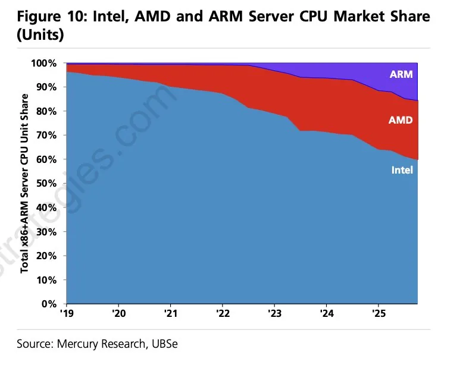

# 2026 年第 09 周技术阅读汇总

[English](README.md) | 简体中文

by @corenel (Yusu Pan) and LLMs

以下为 2026 年 第 09 周（2 月 23 日至 3 月 1 日）期间我所阅读或者输入的内容。为简洁起见，仅列出标题、URL 以及 LLM 生成的概要，以供有兴趣者阅读，进一步的分析、反思与精读不在此赘述。

## 目录

- [2026 年第 09 周技术阅读汇总](#2026-年第-09-周技术阅读汇总)
  - [目录](#目录)
    - [Qwen 3.5 Medium Model Series](#qwen-35-medium-model-series)
      - [Qwen3.5 Medium 系列：激活参数 3B、上下文 1M，本地 Agent 能力的真实边界在哪里](#qwen35-medium-系列激活参数-3b上下文-1m本地-agent-能力的真实边界在哪里)
    - [Nano Banana 2](#nano-banana-2)
      - [Nano Banana 2：Flash 速度，Pro 质量，Google 说这两者不必再妥协](#nano-banana-2flash-速度pro-质量google-说这两者不必再妥协)
    - [Anthropic 风波](#anthropic-风波)
      - [Anthropic「蒸馏攻击」披露：商业竞争、国家安全叙事与技术现实的三角博弈](#anthropic蒸馏攻击披露商业竞争国家安全叙事与技术现实的三角博弈)
      - [当「安全」遭遇权力博弈：Anthropic 的自我瓦解与政府冲突](#当安全遭遇权力博弈anthropic-的自我瓦解与政府冲突)
  - [有趣的事与物](#有趣的事与物)
    - [技术与互联网](#技术与互联网)
      - [千寻智能 20 亿融资背后的「非共识」：26 年的关键是模型，不是落地](#千寻智能-20-亿融资背后的非共识26-年的关键是模型不是落地)
      - [会跳舞不等于会拿苹果：一位具身创业者的春晚逐帧报告](#会跳舞不等于会拿苹果一位具身创业者的春晚逐帧报告)
      - [谷歌街景有多旧：716 万个坐标点的全球拍摄年份分析](#谷歌街景有多旧716-万个坐标点的全球拍摄年份分析)
      - [NVIDIA Cosmos Reason 2B 在 Jetson 上的部署实践：内存约束下的 VLM 配置与工程取舍](#nvidia-cosmos-reason-2b-在-jetson-上的部署实践内存约束下的-vlm-配置与工程取舍)
      - [MinIO 归档了，AGPL 没有：恢复控制台、重建分发管道、社区 Fork 实践](#minio-归档了agpl-没有恢复控制台重建分发管道社区-fork-实践)
      - [他把 AI 比作原子弹，然后继续造更强的：哈萨比斯与 DeepMind 的崛起与矛盾](#他把-ai-比作原子弹然后继续造更强的哈萨比斯与-deepmind-的崛起与矛盾)
      - [滴滴的四场战争：每次打赢，都埋下下一个麻烦](#滴滴的四场战争每次打赢都埋下下一个麻烦)
    - [软件与开发](#软件与开发)
      - [代码已经廉价，但好代码仍然昂贵——Simon Willison 的「智能体工程模式」](#代码已经廉价但好代码仍然昂贵simon-willison-的智能体工程模式)
      - [新瓶颈、生态重组与认知流失：AI 写代码加速之下，三个正在形成的深层裂缝](#新瓶颈生态重组与认知流失ai-写代码加速之下三个正在形成的深层裂缝)
      - [在碎片时间里远程让 AI 写代码：一套实用的移动端 SSH + CLI Coding Agent 工作流](#在碎片时间里远程让-ai-写代码一套实用的移动端-ssh--cli-coding-agent-工作流)
      - [Coding Agent 不是用来「从零开始」的：成功的不是模型，是工程方法论](#coding-agent-不是用来从零开始的成功的不是模型是工程方法论)
      - [uname 说 x86\_64，设备树说 ARM：拆解 Apple Rosetta 2 的 Linux VM 翻译机制](#uname-说-x86_64设备树说-arm拆解-apple-rosetta-2-的-linux-vm-翻译机制)
      - [Tailscale Peer Relays 正式发布：将中继基础设施的控制权还给用户](#tailscale-peer-relays-正式发布将中继基础设施的控制权还给用户)
    - [硬件与设备](#硬件与设备)
      - [香蕉、泥土与铜线：一场盲听实验对「高端线材神话」的逼问](#香蕉泥土与铜线一场盲听实验对高端线材神话的逼问)
      - [Rockchip RK3588 与 RK3576 视频硬件解码进入 Linux 主线：一次迟来但技术扎实的上游化里程碑](#rockchip-rk3588-与-rk3576-视频硬件解码进入-linux-主线一次迟来但技术扎实的上游化里程碑)
    - [写作与知识管理](#写作与知识管理)
      - [用「档案馆思维」整理你的数字人生——一次以 AI 为媒介的信息架构实践](#用档案馆思维整理你的数字人生一次以-ai-为媒介的信息架构实践)
    - [播客与视频](#播客与视频)
      - [天下一家，各凭手段：春晚机器人、对日管制、AI 红线与学术出版背后的同一条逻辑](#天下一家各凭手段春晚机器人对日管制ai-红线与学术出版背后的同一条逻辑)
      - [年货从未被定义，传统随时被发明：王恺的美食社会学](#年货从未被定义传统随时被发明王恺的美食社会学)
    - [生成式人工智能](#生成式人工智能)
      - [Car Wash Test：同一道逻辑题问了 530 次，只有 5 个 AI 每次都答对](#car-wash-test同一道逻辑题问了-530-次只有-5-个-ai-每次都答对)
      - [Pi：「极简」不是偷懒，一个刻意不替你做决定的终端编码套件](#pi极简不是偷懒一个刻意不替你做决定的终端编码套件)
      - [SWE-bench Verified 宣告失效：AI 编程评测的数据污染危机与重建方向](#swe-bench-verified-宣告失效ai-编程评测的数据污染危机与重建方向)
      - [把 AI 助理装进本机：通义 CoPaw 的运行时设计与信任边界](#把-ai-助理装进本机通义-copaw-的运行时设计与信任边界)
      - [Unsloth Dynamic 2.0：一场量化技术与评测范式的双重革命](#unsloth-dynamic-20一场量化技术与评测范式的双重革命)
    - [Just For Fun](#just-for-fun)
      - [nvidia-smi GPU 利用率误区，基于温度的测量可能更准确](#nvidia-smi-gpu-利用率误区基于温度的测量可能更准确)
  - [摘录](#摘录)
    - [推文摘录](#推文摘录)
      - [英伟达清仓 ARM 的背后逻辑：转向定制 CPU 开发与 ARM 数据中心业务的长期潜力](#英伟达清仓-arm-的背后逻辑转向定制-cpu-开发与-arm-数据中心业务的长期潜力)
      - [主流 Agent 与编程大模型开发者实测横评：Claude 与 Codex 稳居第一梯队](#主流-agent-与编程大模型开发者实测横评claude-与-codex-稳居第一梯队)
      - [AI 时代软件工程的未来走向：代码价值重塑、瓶颈转移与“智能体体验”的崛起](#ai-时代软件工程的未来走向代码价值重塑瓶颈转移与智能体体验的崛起)
      - [吴恩达论 AI 与就业：抽象层级的提升将催生海量定制软件需求与新型工程岗位](#吴恩达论-ai-与就业抽象层级的提升将催生海量定制软件需求与新型工程岗位)
      - [Meta AI 安全负责人的 OpenClaw 实录：上下文压缩导致 Agent 失控误删真实邮箱的警示](#meta-ai-安全负责人的-openclaw-实录上下文压缩导致-agent-失控误删真实邮箱的警示)
      - [Claude Code 为何优于 Cursor：上下文纯度、工作流重塑与数据飞轮护城河](#claude-code-为何优于-cursor上下文纯度工作流重塑与数据飞轮护城河)
      - [Vibe Coding 的企业级落地困境：容错率极低与代码可控性缺失带来的系统性风险](#vibe-coding-的企业级落地困境容错率极低与代码可控性缺失带来的系统性风险)
      - [软件工程的核心资产之争：自然语言 Spec 能否取代代码成为唯一的“单一事实来源”](#软件工程的核心资产之争自然语言-spec-能否取代代码成为唯一的单一事实来源)
      - [提升 Agent 代码生成准确率的实操技巧：通过“需求复述”与代码库探索消除自然语言歧义](#提升-agent-代码生成准确率的实操技巧通过需求复述与代码库探索消除自然语言歧义)
      - [耗资四亿 Token 的实战教训：AI 代码审查的局限性与前期架构规划在 Agent 开发中的重要性](#耗资四亿-token-的实战教训ai-代码审查的局限性与前期架构规划在-agent-开发中的重要性)
      - [编程范式的奇点时刻：大模型能力跃升与 RLVR 如何将开发转变为“多智能体编排”](#编程范式的奇点时刻大模型能力跃升与-rlvr-如何将开发转变为多智能体编排)
      - [智能体时代的新型交互标准：CLI 与 MCP 协议如何成为软件分发的决定性入口](#智能体时代的新型交互标准cli-与-mcp-协议如何成为软件分发的决定性入口)
      - [AI 工程学范式演进：从提示词与上下文工程到“Harness Engineering”的崛起](#ai-工程学范式演进从提示词与上下文工程到harness-engineering的崛起)
      - [个人智能体形态的路线之争：轻量级云端 Agent 比全能型系统接管 Agent 更具安全性与实用性](#个人智能体形态的路线之争轻量级云端-agent-比全能型系统接管-agent-更具安全性与实用性)
      - [大模型 GGUF 量化鲁棒性实测：Qwen3.5 与 Minimax 的性能差异打破传统量化经验法则](#大模型-gguf-量化鲁棒性实测qwen35-与-minimax-的性能差异打破传统量化经验法则)
      - [苹果 MLX 推理框架负责人 Awni Hannun 离职：社区致敬其对 Apple Silicon 端侧 AI 生态的奠基贡献](#苹果-mlx-推理框架负责人-awni-hannun-离职社区致敬其对-apple-silicon-端侧-ai-生态的奠基贡献)
  - [学术研究](#学术研究)
    - [语义分割](#语义分割)
      - [VidEoMT：当视觉基础模型足够强大，视频分割中的跟踪模块还有必要吗？](#videomt当视觉基础模型足够强大视频分割中的跟踪模块还有必要吗)
      - [RNS：不动骨干，每类几张像素标注 + 推理时近邻适配，开放词汇分割能走逼近全监督？](#rns不动骨干每类几张像素标注--推理时近邻适配开放词汇分割能走逼近全监督)
      - [SAM3-LiteText：解剖 40 万条分割提示，发现 SAM3 文本编码器 88% 的参数可以安全删去](#sam3-litetext解剖-40-万条分割提示发现-sam3-文本编码器-88-的参数可以安全删去)
    - [自动驾驶](#自动驾驶)
      - [S^2-Corr：用状态空间模型修复域偏移对 CLIP 相关性图的损坏，将城市驾驶场景语义分割推向「开放词汇 × 域泛化」](#s2-corr用状态空间模型修复域偏移对-clip-相关性图的损坏将城市驾驶场景语义分割推向开放词汇--域泛化)
      - [HorizonForge：通过高斯 - 网格混合表示与视频扩散，打通可控驾驶场景生成的两难困境](#horizonforge通过高斯---网格混合表示与视频扩散打通可控驾驶场景生成的两难困境)
    - [场景重建](#场景重建)
      - [tttLRM：利用「测试时训练」把多视角图像压缩进快速权重，前馈三维高斯重建从四帧扩展到六十四帧](#tttlrm利用测试时训练把多视角图像压缩进快速权重前馈三维高斯重建从四帧扩展到六十四帧)
      - [Flow3r：用因子化光流替代昂贵 3D 标注，推动视觉几何学习走向可扩展](#flow3r用因子化光流替代昂贵-3d-标注推动视觉几何学习走向可扩展)
      - [把罗马装进 MLP：VGG-T^3 用测试时训练将前馈三维重建从二次复杂度改为线性](#把罗马装进-mlpvgg-t3-用测试时训练将前馈三维重建从二次复杂度改为线性)
      - [UniScale：在预训练多视图重建模型上注入几何先验以恢复度量尺度](#uniscale在预训练多视图重建模型上注入几何先验以恢复度量尺度)
    - [仿真渲染](#仿真渲染)
      - [SAGE：从“视觉合理”到“物理可用”，智能体驱动的仿真 3D 场景自动生成](#sage从视觉合理到物理可用智能体驱动的仿真-3d-场景自动生成)
    - [SLAM](#slam)
      - [ScaleMaster：轨迹看起来对，地图已经垮了——深度单目视觉 SLAM 尺度评估的结构性缺陷](#scalemaster轨迹看起来对地图已经垮了深度单目视觉-slam-尺度评估的结构性缺陷)
      - [OpenVO：为视觉里程计补上“时间感知”这一课](#openvo为视觉里程计补上时间感知这一课)
    - [语言模型](#语言模型)
      - [Mobile-O：在 iPhone 上实时运行的统一多模态理解与图像生成模型](#mobile-o在-iphone-上实时运行的统一多模态理解与图像生成模型)
      - [MemCoach：用激活引导让 MLLM 学会「如何拍出让人记住的照片」](#memcoach用激活引导让-mllm-学会如何拍出让人记住的照片)
      - [DualPath：通过双路径 KV-Cache 加载突破智能体推理的存储带宽瓶颈](#dualpath通过双路径-kv-cache-加载突破智能体推理的存储带宽瓶颈)
    - [机器人](#机器人)
      - [SimVLA：用 0.5B 模型打败 7B，靠的不是架构，而是训练配方](#simvla用-05b-模型打败-7b靠的不是架构而是训练配方)
      - [VLA-Perf：我的 VLA 能跑多快？系统性量化不同模型与部署配置下的推理速度](#vla-perf我的-vla-能跑多快系统性量化不同模型与部署配置下的推理速度)
      - [设计原则胜过参数规模：VLANeXt 对 VLA 设计空间的逐步消融](#设计原则胜过参数规模vlanext-对-vla-设计空间的逐步消融)
      - [看得远但记不住：WildOS 如何让户外机器人的目标搜索既有语义又有记忆](#看得远但记不住wildos-如何让户外机器人的目标搜索既有语义又有记忆)
      - [AutoHorizon：预测可信到哪一步？用注意力衰减动态限定 VLA 动作块执行边界，让机器人知道何时重新规划](#autohorizon预测可信到哪一步用注意力衰减动态限定-vla-动作块执行边界让机器人知道何时重新规划)
      - [从碎片化到统一栈：LeRobot 的机器人学习基础设施建设路径](#从碎片化到统一栈lerobot-的机器人学习基础设施建设路径)
      - [VLS：冻结策略也能「随机应变」，推理时引导让机器人在 OOD 场景中焕发活力](#vls冻结策略也能随机应变推理时引导让机器人在-ood-场景中焕发活力)

### Qwen 3.5 Medium Model Series

#### Qwen3.5 Medium 系列：激活参数 3B、上下文 1M，本地 Agent 能力的真实边界在哪里

> [!NOTE]
>
> Qwen3.5-35B-A3B 挺不错的，期待本周可能会发的更小尺寸的模型。

[[202603010834_Qwen 3.5 Medium Model Series]]

2026 年 2 月，阿里巴巴 Qwen 团队发布 Medium 模型系列，随即引发业界两极分化的讨论：媒体用「击败 Claude Sonnet 4.5」的标题吸引眼球，Hacker News 的工程师社区则援引 Goodhart 定律提出系统性批评。真相既不在前者的夸大叙事里，也不在后者的完全否定中。这篇解读试图还原这个系列真正做到了什么、在哪里还没有做到，以及它对本地 LLM 部署生态意味着什么。

这个系列到底在解决什么问题

理解 Qwen3.5 Medium 系列，必须从它试图解决的工程矛盾说起。在此之前，「足够强的模型」与「可本地部署的模型」是两个很难同时满足的条件：能本地跑的模型普遍有能力悬崖，能力够用的模型依赖云端 API。在 agentic 工作流中，这个悬崖尤为明显——需要多轮工具调用、长文档分析、稳定结构化输出的任务，往往超出本地小模型的可靠性边界。

Qwen3.5 Medium 系列的核心目标正是压缩这两者之间的距离。官方将整个系列的战略定位浓缩为一句话：「More intelligence, less compute.」这不是市场口号，而是一个工程目标的精确陈述——在固定部署成本约束下，把能力边界尽可能向上推。

为了实现这个目标，团队选择了三种技术路线的协同：稀疏 MoE 架构降低每 token 的激活计算成本，Gated DeltaNet 线性注意力解决长上下文的内存瓶颈，以及大规模强化学习后训练提升 agent 任务的泛化稳定性。任何单一手段都不足以完成这个目标；三者的协同是刻意的架构选择。

技术规格的硬事实层

在评估任何 LLM 时，模型卡（Model Card）提供的技术规格是最可信的基础层，因为它描述的是可以独立验证的工程事实，而非统计估计。

Qwen3.5-35B-A3B 的核心架构参数值得逐一审视。总参数 35B，激活参数 3B 是其效率主张的数字基础：256 个专家中每个 token 仅调用 8 路由专家加 1 共享专家，激活参数量约为总参数的 8.6%，这意味着每次推理实际消耗的算力远小于参数量的直觉暗示。层结构采用 3:1 的 Gated DeltaNet 与 Gated Attention 混合比（每 4 个 Transformer 块中 3 个是线性注意力，1 个是标准注意力），这个设计是「长上下文效率与局部精确性」工程权衡的量化体现——大量线性注意力处理长程依赖，少量标准注意力补偿表达力。原生上下文 262,144 token，通过 YaRN 可扩展至约 1,010,000 token，且官方特别说明这两个数字有明确区别：原生上下文是无需额外配置的能力边界，1M 是有代价的技术上界。

从实测数据来看，在 RTX 5090 上与前代 Qwen3-30B-A3B 的对比揭示了一个有教育意义的权衡：Qwen3.5-35B-A3B 生成速度 159.0 tok/s，低于前代的 235.2 tok/s（慢约 33%）；但上下文从 512 token 扩展到 8K 时，前者速度退化仅 0.9%，后者退化 21.5%。这意味着两个模型适合不同的工作负载画像：前代更适合短上下文高吞吐场景，新版更适合需要长上下文稳定性的 agentic 工作流。

Unsloth 发布的 GGUF 量化版本月下载量达 432,876 次，从 2-bit（9.76 GB）到 8-bit（38.7 GB）覆盖完整的精度谱系，RTX 4090（24 GB 显存）可以运行 4-bit 量化版本（UD-Q4_K_M，19.9 GB）。Unsloth 配套的 KL Divergence 基准图显示，其动态量化方案在 Q3–Q4 区间的精度保持显著优于其他主流量化来源，这一优势源于「对始终激活的关键张量（共享专家、注意力权重）保留更高精度」的差异化压缩策略，而非对所有张量一律施加相同的量化力度。

基准数据的意义与边界

官方 benchmark 表格涵盖知识、推理、编码、多语言、视觉语言和 agent 工具调用等十余个类别。从数字看，Qwen3.5-122B-A10B 在 GPQA Diamond（86.6 vs GPT-5-mini 的 82.8）、BFCL-V4 agent 工具调用（72.2 vs GPT-5-mini 的 55.5）、MathVision 视觉数学推理（86.2 vs Claude Sonnet 4.5 的 71.1）等类别上均有明显优势，这些数字支撑了「在部分标准化任务上接近头部商业模型」的主张。

然而，在解读这些数据时必须保持一个关键的认知框架：benchmark 题目是公开的，这意味着它有高度可能已经进入训练集，模型在 benchmark 上的分数是「泛化能力」与「题目记忆」的混合信号，而非纯粹的前者。Hacker News 上被广泛认同的批评精确地指出了这一点：「这些模型在 benchmark 上表现优越，但在我实际使用的复杂任务中，它们并未达到 Claude Sonnet 4.5 的水平。」

这两种说法并不矛盾，关键在于「任务分布」的差异：benchmark 题目通常是自洽的、格式明确的、有标准答案的；而真实 agentic 工作流是开放端的、需要长序列规划的、在失败时需要自主纠错的。对于前者，Qwen3.5 的 benchmark 分数是有参考价值的指标；对于后者，这些分数的预测力则需要大幅打折扣。

一个更可靠的工程判断框架是：在可标准化的编码/agent benchmark 子集上，Qwen3.5 Medium 的性价比（能力/部署成本）接近或触达主流云端快速模型区间；但在开放式复杂 agentic coding 的实际体验上，仍普遍落后于以 Claude Code 为代表的头部闭源工作流。这个表述区分了「benchmark 上领先」与「工作流体验等价」两个不同的声明，是不容易被 Goodhart 批评击倒的稳健立场。

社区实践的「双峰分布」

社区反馈在这批文档中呈现出一个明显的双峰结构，值得在评估时正视而非回避。

一方面，多名工程师报告了令人印象深刻的本地实测体验：一名 RTX 4090 用户声称这是他首次被本地模型的编码性能真正震撼，在 chat.qwen.ai 使用 Fast 模式的用户观察到「关闭 thinking 模式后，稍作 prompt 调整即可显著提升输出质量」，一名长期用本地模型处理中文字幕翻译的用户将 Qwen3.5-27B 选定为「70B 以下中英翻译最佳」。另一方面，高赞的 HN 评论则指出在复杂 agentic 任务中未能观察到 Sonnet 4.5 级别的表现，并将观察到的「执拗重试」行为描述为在 benchmark 场景下的统计优势，而非在开放场景下的真实能力。

这个双峰分布的本质原因在于：两组用户在不同的任务分布、不同的上下文长度、不同的评估标准下对同一个模型进行了采样。对于格式敏感、文本处理为主、中短上下文的任务，27B dense 模型的体验可能已经接近或超过用户对「本地模型」的心理预期；对于多轮、多工具、开放端的复杂 agentic 任务，与头部闭源模型的差距依然显著。这不是矛盾，而是对同一个能力分布函数在不同点上的采样结果。

Dense vs MoE 的任务特异性效率边界

Qwen3.5 系列一个值得单独讨论的发现是：在 IFEval（指令跟随）基准上，Qwen3.5-27B dense 得分 95.0，反超 Qwen3.5-122B-A10B MoE（93.4）和 Qwen3.5-35B-A3B MoE（91.9），且据社区第三方 ArtificialAnalysis 排名，27B 在 Intelligence、Coding 和 Agentic 三个综合指数上均高于更大的两个 MoE 变体。

这个反直觉结果有清晰的技术解释：MoE 的路由机制在提升知识广度的同时，引入了每 token 路由决策的随机性，这在需要「低方差、高一致性输出」的任务（格式化指令跟随、机器翻译、结构化数据提取）上形成系统性劣势。Dense 模型每 token 完全激活全部参数，行为最为稳定。

这个发现的工程含义是明确的：翻译、文档生成、结构化代码输出、严格格式跟随等精确性优先场景，应优先考虑 27B dense；需要广博知识覆盖和深度专家化分析的场景（多领域问答、复杂推理、多模态 STEM），再考虑 MoE 变体。不要默认「参数更大 = 在所有任务上更好」。

「开放权重」的真实含义与商业背景

Hacker News 讨论中有一个值得正视的提醒：Qwen3.5 是「Open Weights」而非「Open Source」。Apache 2.0 许可证覆盖的是权重文件的使用权，而训练数据配方、RL 环境配置、评测脚本实现细节均未公开。这意味着官方 benchmark 数字是不可完整独立复现的，社区只能基于权重进行黑盒验证。

同时，有 HN 评论者直接指出 VentureBeat 文章「本质上是 Alibaba Cloud 的 PR 稿」——Qwen3.5 的开放权重策略服务于 DashScope API（Qwen3.5-Flash 是其对应的托管版本，默认 1M 上下文，内置工具集）的商业推广目标，这一商业动机与开放策略并不矛盾，但提醒读者在解读官方 benchmark 声明时保持适当的批判距离。也有评论者指出这些模型可能通过知识蒸馏使用了闭源模型的输出作为训练数据，这是当前 benchmark 分数可靠性争议的背景因素之一。

对工程实践的具体建议

综合以上分析，对有意在实际项目中部署 Qwen3.5 的工程师和研究者，有几条直接可操作的建议。

在模型选型上，对格式精确性要求高的任务（翻译、文档处理、指令跟随）选 Qwen3.5-27B dense；对需要广博知识和长上下文的 agent 工作流选 Qwen3.5-35B-A3B（如果 VRAM 允许）。不要假设「122B 一定优于 27B」，需按任务类型实测验证。

在量化选型上，RTX 4090 (24 GB) 用户以 UD-Q4_K_M（19.9 GB）为首选；需要更高精度时使用 UD-Q6_K_S（28.5 GB）；避免 UD-MXFP4_MOE，该方案对关键张量过度压缩，KLD 显著偏高。

在推理框架上，生产场景必须使用 SGLang、vLLM 或 KTransformers，Hugging Face Transformers serve 仅适合快速测试。工具调用场景需注意 llama.cpp 目前支持不成熟，应优先选用 SGLang 或 vLLM。

在 thinking mode 配置上，复杂推理/规划任务保持 thinking mode 开启（temperature=1.0, top_p=0.95, presence_penalty=1.5）；延迟敏感的高频查询关闭（temperature=0.7, top_p=0.8）；多轮对话确保 history 中不包含 thinking content，防止上下文膨胀。

在评测方法上，不要依赖官方 benchmark 表格作为部署决策的唯一依据，应在自己的私有业务任务上进行专项测试，控制 prompt 策略、量化方案和解码参数，确保比较的是模型本身而非其他变量。

结论

Qwen3.5 Medium 系列做到了一件有实质意义的事：它将「可本地部署的 agent 级 LLM」的能力边界向上推移了一个可感知的台阶，并且同时满足了「Apache 2.0 开放权重、消费级硬件可运行、长上下文（原生 262K，可扩 1M）可用」这几个过去很难同时成立的条件。这是一个系统性的工程进步，其意义独立于「是否等价 Sonnet 4.5」这个具体比较。

但它没有做到、也不应该被期待做到的是：在开放端复杂 agentic 任务上完全媲美头部闭源模型，在所有任务类型上都以 MoE 变体优于 dense 变体，以及在任何量化方案下都保持声称的近无损精度。

对本地 LLM 生态来说，这个系列最重要的贡献可能不是任何单一的 benchmark 分数，而是它为个人开发者和小团队提供了一个可以认真对待的本地 agent 工作流选项——这件事，在 Qwen3.5 之前并不那么理所当然。

### Nano Banana 2

#### Nano Banana 2：Flash 速度，Pro 质量，Google 说这两者不必再妥协

> [!NOTE]
>
> Nano Banana 2 的推理能力比起 Nano Banana Pro 还差一些。对于大量中文文字的生成也没有质的改进。
>
> 另外，支持输出 4:1 或者 8:1 的超宽画幅，拿来生成全景照片挺好看的。

[[202603011001_Nano Banana 2]]

2026 年 2 月 26 日，Google DeepMind 发布了 Nano Banana 2（Gemini 3.1 Flash Image），以一篇产品博客宣告了图像生成领域的新一轮迭代。这篇博客的核心主张异常清晰：此前仅在高端 Pro 模型中可用的能力，现已可以 Flash 速度获得。这是一个值得技术读者认真对待的信号，但也需要以批判性眼光穿透产品宣传的语言，识别其背后的真实技术含义与战略意图。

从产品线演化看发布背景

要理解 Nano Banana 2 的意义，需要首先理解它在 Google 图像生成产品线演化中所处的位置。

2025 年 8 月，初代 Nano Banana 以「病毒式传播」的方式进入公众视野，Google 自述其「重新定义了图像生成与编辑」。三个月后，Nano Banana Pro 进一步拔高了能力上限，提供了工作室级别的创意控制和更强的语义推理能力，但代价是相对较慢的生成速度和更高的资源消耗。至此，Google 的图像生成产品线陷入了一个经典的「速度 - 质量二元分裂」格局：初代模型快但能力有限，Pro 模型强但速度相对受限。

Nano Banana 2 的发布是对这一分裂的正面回应：其设计目标是将 Pro 的核心能力组合——高级世界知识、语义推理、精准文字渲染——以 Flash 级别的推理速度重新封装，并同步向 Gemini App、Google Search、AI Studio、Vertex AI、Flow 和 Google Ads 七个产品线铺开。这是一次有明确战略意图的产品矩阵重构，而非单纯的模型迭代升级。

核心技术能力的拆解

文章披露的技术能力可以分为两个层次来理解：「继承自 Pro 的能力」和「相对于初代 Nano Banana 的改进能力」。

在继承维度，最值得关注的是「检索增强图像生成」能力的落地。文章描述模型能够「从 Gemini 实时知识库和网络搜索图像中汲取信息」，并在发布的示例 Prompt 中明确出现了「先搜索视觉参考，再生成」的指令设计。这高度契合了自然语言处理领域已成熟应用的检索增强生成（RAG）范式在视觉域的迁移——图像生成不再完全依赖训练时内化的参数知识，而是可以通过实时检索补充特定主体的视觉知识。这一能力对需要渲染特定真实世界主体（历史建筑、品牌形象、特定物种等）的使用场景是一个实质性的能力扩展。

在改进维度，主体一致性的量化规格是全文中信息密度最高的技术参数披露：模型可在单一工作流中维持最多五个角色的外观一致性和最多 14 个物体的高保真度。这两个具体数字的出现，将一个模糊的能力宣称转化为可规划的技术边界，对故事板制作、游戏资产批量生成和影视预制作等创意工作流具有直接的工程参考价值。

精准文字渲染的改善同样值得重视。文字渲染长期以来是扩散类图像生成模型的顽固弱点，根本原因在于视觉生成的像素重建目标与字符形状的精确再现之间存在本质张力。能够生成用于营销素材的清晰可读文字，并支持图像内文字的跨语言翻译，意味着模型在文字 - 视觉联合建模上取得了有意义的进展。

在分辨率和输出规格方面，512px 到 4K 的范围和多种宽高比支持，使模型具备了覆盖社交媒体内容到专业印刷品的全场景输出能力，「生产就绪」的定位声明在这一技术参数的支撑下具有实质依据。

部署策略与产品战略解读

本次发布最值得深入解读的，或许不是模型技术本身，而是 Google 的产品层面部署决策。

在 Gemini App 中，Nano Banana 2 将取代（replace）Nano Banana Pro 成为所有 Fast、Thinking 和 Pro 模型的默认图像生成后端。这一决定具有多重含义：其一，它意味着 Google 对 Nano Banana 2 的能力已有足够信心，可以承担面向所有普通用户的默认体验；其二，从基础设施成本角度看，将大多数请求从 Pro 模型迁移到 Flash 模型，将显著降低图像生成的服务成本，是典型的平台效率优化；其三，Nano Banana Pro 被降格为需要通过「三点菜单重新生成」才能访问的专项工具，这一产品决策隐含承认了二者之间仍存在功能差异——文章将 Pro 定位为「需要最大事实准确性的高保真度任务」，将 Nano Banana 2 定位为「快速生成、精确指令遵循和集成图像搜索落地」。这是产品层叠设计（tiered architecture），而非单向能力替代。

将 Nano Banana 2 集成进 Google Ads 的创意建议流程，是本次发布中商业意义最为深远的部署决定之一。这意味着 AI 图像生成能力正式进入商业广告内容的制作核心链路，全球数百万广告主在创建广告活动时将接触到 AI 图像建议。这一集成既降低了小型广告主的视觉内容制作门槛，也带来了广告内容 AI 化比例快速上升、视觉同质化风险加剧等值得关注的行业影响。

在 Google Flow 中以零积分提供服务，则是一个典型的平台增长驱动策略：通过补贴降低使用门槛，在影视和叙事创作者群体中快速建立工作流依赖，为后续商业化变现创造条件。

溯源体系：技术信任基础设施的战略布局

文章将溯源与验证工具放在显著位置进行讨论，这不是偶然的。Google 将 SynthID（专有水印技术）与 C2PA 内容凭证（开放行业标准）的双轨组合描述为「不仅知道是否使用了 AI，还知道如何使用」的能力升级，并以自 2025 年 11 月以来 SynthID 验证功能被使用超过 2000 万次的数据作为实证规模支撑。

从技术角度分析，SynthID 和 C2PA 代表了内容溯源的两个互补维度：前者是「带内」水印（嵌于内容本身），后者是「带外」凭证（存于文件元数据）。前者对截图等文件格式转换具有一定鲁棒性，但依赖 Google 的专有检测算法；后者具备开放生态互操作性，但元数据在传播链中容易丢失。二者的结合在理论上提供了更全面的溯源覆盖，但在对抗性环境下（即有人主动试图去除溯源标记的场景）的实际鲁棒性，文章并未提供充分讨论。

值得从战略角度进一步思考的是：Google 同时掌握了 SynthID 的水印生成权（用于标记自身的 AI 生成内容）和验证权（通过 Gemini App 提供验证服务），这一角色双重性在开放生态与平台控制之间形成了一定张力，是内容真实性基础设施领域值得长期关注的权力结构问题。

论证局限性与批判性评估

必须指出，本文作为 Google Keyword 博客的产品发布公告，其论证依赖功能描述和精选示例，而非量化基准对比。文章没有提供 FID、CLIP Score 或用户偏好研究等标准评估数据，也没有与竞品（如 Midjourney、Stable Diffusion 3、Adobe Firefly 等）进行盲测比较，读者无法从文章本身判断「更快」快多少、「更高质量」高多少、「指令遵循更精准」在哪些维度改善了多少个百分点。

文章公开的 Prompt 文本是一种透明策略，允许任何用户自行复现并独立评估效果，这在一定程度上弥补了没有量化数据的不足。但值得注意的是，公开展示的图像样本几乎可以确定是经过筛选的最佳生成结果，存在选择性偏差，不能直接代表模型在随机输入下的平均表现水平。

此外，文章对几个重要问题保持了完全沉默：检索增强生成中网络参考图像的版权归属问题；精确指令遵循能力提升对虚假信息生成和视觉操纵场景的双刃效应；Flash 速度提升对大规模内容农场场景的能力赋能；以及 141 个新国家和地区扩展中的内容审核和监管合规挑战。这些沉默并非意外，而是产品博客文体的固有属性，但专业读者在评估这篇文章时，需要将这些缺席的讨论纳入自己的独立判断。

对技术读者的综合建议

对于 AI 研究者和工程师而言，Nano Banana 2 的发布提供了以下几个值得追踪的研究信号：视觉 RAG 范式的工程化实现路径（文章没有披露但能力存在）；多主体长程一致性生成的当前技术上限（14 个物体的边界意义）；以及 SynthID 在大规模生产环境下的水印鲁棒性实证数据（2000 万次验证的分布情况）。

对于产品和设计从业者而言，Nano Banana 2 的「主体一致性 + 零积分 + 生产就绪分辨率」三要素组合，意味着 AI 辅助的故事板和迭代视觉原型制作已进入可实际采用的技术成熟度区间，值得在日常创意工作流中进行系统性评估。

对于广告和营销行业从业者而言，Google Ads 的集成是一个需要主动应对的行业变量：AI 生成素材的大规模涌入将重塑广告视觉内容的竞争格局，早期建立 AI 辅助广告创意工作流的团队将获得效率优势，但如何在效率与品牌视觉差异化之间取得平衡，将成为新的核心竞争问题。

### Anthropic 风波

#### Anthropic「蒸馏攻击」披露：商业竞争、国家安全叙事与技术现实的三角博弈

[Detecting and preventing distillation attacks](https://www.anthropic.com/news/detecting-and-preventing-distillation-attacks)

2026 年 2 月，Anthropic 发布了一份罕见的公开指控文件，声称识别出 DeepSeek、Moonshot AI 和 MiniMax 三家中国 AI 实验室对其旗舰模型 Claude 实施了「工业化规模的蒸馏攻击」。这份文件在 AI 技术社区引发了广泛的争议与讨论，其核心内容——超过 1600 万次欺诈性交互、24,000 个假冒账户、国家安全风险警告——既是对竞争格局的一次正面宣战，也是一次精心设计的政策倡导行动。本文将对这份文件进行深度解读，在确认其技术事实的同时，也将指出其论证结构中的实质性薄弱环节，以帮助读者在未来的政策讨论和技术分析中做出更为独立的判断。

核心论点：一份精心构建的多层叙事

Anthropic 这份文件的表面核心是技术披露——三家中国 AI 实验室通过欺诈账户系统性地采集 Claude 的输出以训练自身模型。但若仅停留于这一层解读，将错过文件的真正意图。

文件实际上同时运作着三条叙事线。第一条是商业叙事：竞争者通过不正当手段获取了本应通过独立研发才能获得的技术能力，损害了 Anthropic 的商业利益。第二条是国家安全叙事：这些行为不仅是商业竞争，更是对美国出口管制的系统性规避，其结果是将「缺乏安全防护的危险 AI 能力」扩散至威权政府的军事、情报和监控体系。第三条是政策倡导叙事：单一企业无法应对这一威胁，需要 AI 行业、云服务提供商和政策制定者的协调行动。

这三条叙事线的精妙之处在于，它们相互强化，使得任何一条线上的质疑都不能轻易推倒整个论述结构。商业竞争指控可以通过国家安全框架赋予更高的道德权重；国家安全风险论证则为政策诉求提供了紧迫性支撑。理解了这一结构，才能对文件进行有效的批判性分析。

技术事实层：「蒸馏」还是「合成数据生成」？

文件发布后，技术社区首先质疑的是术语的准确性。在机器学习文献中，知识蒸馏（knowledge distillation）特指利用教师模型的软标签（即 logit 输出，概率分布）训练学生模型的技术，Hinton 等人 2015 年的经典论文对此有明确定义。然而，Claude 的 API 并不提供 logit 输出，因此被指控实验室实际能够执行的，只是将 Claude 的文本输出作为训练数据，这在技术上更准确地应称为合成数据生成（synthetic data generation）或模仿学习（imitation learning）。

Anthropic 在文件中承认自身「清楚知道其中的区别」（正如 Hacker News 用户 WiSaGaN 所指出），但仍选择使用「蒸馏」这一更具技术权威性和对抗性色彩的术语。这一选择并非无害的简化——「蒸馏攻击」比「竞争性合成数据采集」具有更强的法律暗示性和更高的情感激活度，对政策受众更具吸引力。

这种术语策略的实质性后果，是将一个法律边界尚不清晰的行为（使用 API 输出进行训练）框架化为接近「盗窃」的行为，从而为更强烈的监管诉求提供话语基础。

归因证据链：高置信度声明的低透明度困境

文件声称以「高置信度」将三次攻击归因至特定实验室，使用的证据包括 IP 地址关联、请求元数据、基础设施指标和行业合作伙伴佐证。在 DeepSeek 案例中，甚至声称追溯至「该实验室的特定研究人员」；在 Moonshot AI 案例中，称元数据与「高级员工的公开资料」匹配。

然而，所有核心归因证据均为 Anthropic 内部证据，未经任何第三方审计，也未向公众开放任何可验证的细节。在代理服务广泛使用的场景下，IP 地址关联的可靠性本身就极为有限；「元数据与公开资料匹配」的具体方法学未予说明，读者无从评估其证明力。三家被指控实验室均未获得回应机会，其否认或解释也未出现在文件中。

值得注意的是，三个案例的规模与归因细节的丰富程度呈现反比关系：规模最小的 DeepSeek 案例（15 万次交互）获得了最详尽的技术描述；规模最大的 MiniMax 案例（1300 万次交互）的归因主要依赖时序关联——「发布新模型后 MiniMax 在 24 小时内转向近一半流量」。这种不对称性暗示，案例规模的大小与归因证据的强度并不一致。

MiniMax 的「24 小时转向」证据尤其值得审视。任何密切监控 Anthropic 产品发布的重度 API 用户，包括合法的企业开发者或评测机构，都可能在新模型发布后迅速调整使用策略。时序关联是必要条件，但并非充分证明。

国家安全论证：最薄弱的论证链条

文件最具政治影响力、但论证最薄弱的部分，是将蒸馏攻击与国家安全威胁关联的论证链条。

Anthropic 声称，Claude 内置了防止 AI 被用于开发生化武器或实施恶意网络攻击的安全防护措施，而蒸馏模型「不太可能保留这些防护措施」，因此危险能力将在防护缺失的状态下扩散至威权政府。

这一论证的核心弱点在于关键前提「蒸馏模型将系统性地剥离安全对齐」缺乏任何实验证据支撑。安全对齐在蒸馏过程中的实际传递率是一个高度技术性的问题，在学术界有积极的讨论，但尚无定论。如果合成数据中的对齐行为（拒绝有害请求）被大量采集，学生模型可能自然地习得类似的对齐倾向；反之，如果攻击者专门采集的是规避安全限制的输出，结果将截然不同。文件没有区分这两种场景，也没有提供任何定量分析，就直接跳跃到了「生化武器防护能力消失」的结论。

此外，将三家商业 AI 公司的数据采集行为直接关联至「威权政府军事、情报和监控系统」，需要一条从商业公司到政府机构的完整传递链的论证，而这在文件中完全付之阙如。中国商业 AI 公司与政府机构之间的关系，远比文件所暗示的「直接服务」关系复杂。

反制措施：内在矛盾的「不可能三角」

文件宣布了四类反制措施：检测、情报共享、访问控制强化，以及「产品、API 和模型层面的防护措施，以降低模型输出对非法蒸馏的有效性，同时不降低合法用户体验」。

最后一项承诺揭示了一个 Anthropic 可能低估的技术困境。高质量的 AI 输出所具备的特征，恰恰是其对合法用户最有价值的地方：清晰的推理步骤、透明的思维过程、结构化的解决路径。这些特征同样是其对蒸馏训练最有价值的地方。试图降低输出对蒸馏的「有效性」，而不同时损害这些对合法用户最有价值的特性，在技术上面临根本性困难。

现实已经给出了早期信号：F7F7F7 在评论区指出，Anthropic 已经在 Claude Code 中开始隐藏思维链输出，用户的实际体验已经出现下降。文件的「不降低合法用户体验」承诺，与这一已有先例之间存在难以解释的张力。

更根本的问题是检测机制的误判风险。文件给出的「可疑提示词」示例——「You are an expert data analyst combining statistical rigor with deep domain knowledge…」——是大量专业用户日常使用的完全合理的提示词。当区分合法用户与攻击者的依据主要是流量规模和重复性时，密集使用 Claude API 的研究团队和企业开发者将面临不可忽视的误判风险。

更宏观的困境：AI 护城河的根本脆弱性

文件揭示了 AI 竞争战略中一个值得行业深思的根本问题：基于模型能力的「护城河」，在通过 API 暴露能力的商业模式下，其可持续性是极为有限的。

从学习理论的基本原理来看，任何可以通过 API 访问的 AI 系统，其能力在原理上都可以通过充分规模的输入 - 输出对来近似。Anthropic 的所有摩擦性防御措施——账户封禁、流量检测、访问控制强化——都是在增加攻击成本，而非提供根本性的能力保护。评论者 2001zhaozhao 指出的「真实用户数据出售」场景，更是一个在检测层面原理性无解的漏洞。

这一困境对整个 AI 行业都有深刻启示：当模型能力以 API 服务的形式商业化，「能力护城河」事实上已经转变为「速度护城河」——即通过持续的快速迭代，使竞争者永远追赶一个移动中的目标，而非试图阻止能力的扩散本身。

从这个角度看，Anthropic 文件的真正意义，可能不在于其所揭示的技术事实，而在于它标志着 AI 领先实验室已经意识到纯技术防御的局限性，并开始将政策壁垒作为竞争战略的重要组成部分。呼吁行业协调、政策制定者介入、出口管制强化，实质上是在寻求将当前的竞争优势固化为制度优势。

「谁有权利从谁那里学习」：被回避的根本问题

文件刻意回避了一个对整个论述具有根本性挑战的问题：Anthropic 自身的训练数据从何而来？

AI 训练在历史上高度依赖于大规模的互联网内容采集，这本身在版权和数据权利层面充满争议。Anthropic 的评论者指出，Anthropic 并未发明神经网络、反向传播、Transformer 架构或 RLHF 技术，这些奠基性成果均来自学术界和开放研究社区的公开共享。在这个知识积累的嵌套结构中，「谁有权利学习谁」的问题，本质上是一个权力而非道德的问题。

这不意味着文件所指控的行为是合理的——违反服务条款和使用欺诈账户确实是违约行为，应当受到合同层面的应对。但将违约行为升格为「攻击」和「盗窃」，并进一步框架化为国家安全威胁，是一个需要清晰区分的逻辑跳跃。

对读者的参考建议

对于关注 AI 治理和技术政策的读者，这份文件值得精读，但应当将其视为一个利益相关方的单方面陈述，而非客观调查报告。其中的技术事实（大规模异常 API 流量的存在）具有一定可信度；其中的归因声明（具体公司乃至具体个人的责任）需要独立核实才能采信；其中的国家安全论证（蒸馏导致安全防护消失进而被威权政府用于攻击性目的）则是一条未经充分论证的推断链，不应轻易接受为既成事实。

对于技术研究者和工程师，文件所揭示的大规模合成数据采集策略（包括思维链数据生成、奖励模型构建、能力针对性提取），是了解当前 AI 训练前沿实践的重要参考窗口，尽管这些实践是在违约框架下发生的。

对于移动机器人和具身 AI 领域的研究者，文件中竞争者将「智能体推理」和「工具使用」列为首要提取目标这一事实，清楚地标示了当前语言模型向行动模型迁移过程中的核心技术瓶颈所在，为研究优先级的判断提供了间接的市场信号。

#### 当「安全」遭遇权力博弈：Anthropic 的自我瓦解与政府冲突

[Statement from Dario Amodei on our discussions with the Department of War](https://www.anthropic.com/news/statement-department-of-war)

在不到 72 小时内，Anthropic 同时面临两场舆论风暴：内部主动废弃了历时三年的核心安全承诺，外部又因拒绝向美国政府开放特定 AI 用途而被史无前例地列为「供应链风险」。这是一场关于 AI 治理边界、国家权力扩张与商业伦理的高度凝缩的现实检验，其影响远超 Anthropic 本身。

核心冲突的结构

2026 年 2 月下旬，Anthropic 在短短数天内经历了双重危机，两者相互独立却在叙事层面形成了破坏性共振。

第一场危机来自内部：公司决定对其标志性的「负责任扩展政策」（Responsible Scaling Policy，RSP）进行根本性改造，废除了其中最具约束力的核心承诺——若无法事先保证安全措施充分到位，绝不训练超越特定能力阈值的 AI 模型。这一承诺自 2023 年以来一直是 Anthropic「负责任 AI 公司」品牌定位的基石，也是其在行业内独树一帜的关键标识。首席科学官 Jared Kaplan 向 TIME 杂志独家披露，新版 RSP 将废除这道「绊网」，转而以「前沿安全路线图」和定期「风险报告」等透明度机制替代。

第二场危机来自外部：美国战争部（国防部）因 Anthropic 拒绝在合同中纳入「大规模国内监控」和「完全自主武器」两个用途，威胁将其列为「供应链风险」——这一标签历史上从未用于美国本土企业——并援引《国防生产法》强制移除安全保护措施。2026 年 2 月 27 日，特朗普总统下令联邦机构全面停用 Anthropic 技术，国防部长 Pete Hegseth 正式宣布封禁，给予承包商六个月完成过渡。

Dario Amodei 随即在 CBS 专访中将政府行动定性为「报复性和惩罚性」，Anthropic 同时宣布将通过法律途径挑战该决定。

RSP 的废弃：务实调适还是结构性溃败？

理解 RSP 变化的关键，在于辨别其官方叙事与结构性压力之间的距离。

Kaplan 提出了三重理由。第一，原本寄望 RSP 能成为行业或监管蓝图的预期已完全落空：特朗普政府的「放任发展」立场、联邦立法的缺席以及全球 AI 治理框架的崩溃，使得 RSP 在政策层面失去了转化为约束力规范的路径。第二，竞争现实使单边约束失去意义：若 Anthropic 单方面停步而竞争者全速前进，「保护措施最弱的开发者将主导节奏」，Anthropic 将同时失去商业地位和对前沿技术的理解，进而失去从事有效安全研究的能力。第三，安全评估科学的局限性使得清晰的阈值难以维持：2025 年 Anthropic 承认无法排除其模型被用于协助生物恐怖袭击的可能性，但同样缺乏确凿的正面证据，导致所谓「红线」在实践中呈现为模糊的渐变地带而非清晰边界。

这三个理由各自有其合理性，但放在一起存在深层张力。最值得质疑的逻辑转折在于：评估科学的不成熟，在逻辑上支持的应当是「加大评估研究投入并等待方法成熟」而非「废除依赖评估的约束机制」。Anthropic 将技术上的不确定性转化为政策上的松绑，而非加倍谨慎，这一推理方向的反转需要更为充分的论证。

来自 METR（专注 AI 风险评估的非营利机构）政策总监 Chris Painter 的外部评价，在一定程度上弥补了官方叙事的这一空白。Painter 坦言，这一变化意味着 Anthropic「相信需要转入分诊（triage）模式」，因为「评估和缓解风险的方法正在被能力发展的速度所超越」。他认可新版 RSP 对透明度的强调，但明确对「移除二元阈值」感到「担忧」，指出这可能产生「温水煮青蛙」效应——危险水位渐进抬升，而不存在任何单一时刻能触发明确警报。

从控制论视角看，RSP 从「刚性阈值触发机制」向「信息披露机制」的转变，是从闭合回路控制向开放回路信息管理的范式转换——而核安全领域的长期经验表明，这两种机制在面对潜在灾难性风险时的可靠性存在根本差异。开放回路依赖于一系列无法被 Anthropic 单方面保证的外部条件：充分的社会警觉性、有效的竞争对手压力传导，以及在危机出现前相关方有足够时间和意愿采取行动。这些条件在当前的政治与竞争环境中均不稳固。

政府冲突：两条红线的价值判断与技术理性

相比 RSP 废弃的复杂性，Anthropic 在政府冲突中的立场逻辑更为清晰，论证更为严密。

Amodei 的声明首先建立了 Anthropic 的信用背景：公司是首家将模型部署至美国政府机密网络的前沿 AI 公司，曾为维护美国 AI 竞争优势主动放弃数亿美元收入（切断与中国共产党关联企业的合作），并已将 Claude 广泛部署于情报分析、作战规划、网络行动等关键军事任务。这一背景的确立至关重要，它使 Anthropic 的拒绝立场具有了「知情者的选择性约束」而非「无知者的障碍主义」的话语质地。

两条红线的论证分别基于不同层次的依据。对于大规模国内监控，核心论点是当前法律框架严重滞后于 AI 能力的扩展：政府可以在无需搜查令的情况下，从公开渠道获取公民的位置、网络浏览和社会关系数据，而 AI 技术已经使将这些散乱数据自动化地拼接成任何人的完整生活画像成为现实。「这类监控之所以当前合法，仅仅是因为法律还未追上 AI 能力」这一判断，将 Anthropic 的拒绝定位为超前于法律的技术伦理预警。对于完全自主武器，论点建立在技术可靠性的客观局限上：当前前沿 AI 系统尚不具备在战场复杂、信息不完整的真实环境中可靠执行国际人道法所要求的区分原则和比例原则判断的能力，其错误可能造成不可逆的平民伤害。Anthropic 还指出，已主动向战争部提出共同开展可靠性提升研究的提案，对方未予接受——这一细节使其立场更难被简单定性为对军事需求的拒绝。

战争部的双重威胁暴露了其行动可能的政治性动机：同时将 Anthropic 列为「供应链风险」（意味着其产品危害国家安全）并威胁援引《国防生产法》（前提是该产品对国家安全至关重要），这两种法律工具的逻辑起点相互排斥，无法兼容。这一矛盾在 Politico 的独立报道中得到证实，已引发政策界广泛困惑。

OpenAI 的战略性介入

这场危机中，OpenAI 的行动时机体现了精准的竞争计算。在 Anthropic 被封禁的同日，OpenAI 宣布完成 1100 亿美元融资（估值 7300 亿美元）。次日，OpenAI 与五角大楼达成在机密网络部署 AI 的协议，并公开声明其协议包含禁止大规模国内监控和保留人类对武力使用决策权的条款——即与 Anthropic 坚持的两条红线几乎一致的内容，但被 OpenAI 冠以「更强保护」的表述。

OpenAI 同时公开反对封禁 Anthropic，要求以平等条款对待所有实验室。这套操作的多重效益不难解读：填补 Anthropic 留下的政府合同空缺、通过形式上接受相似条款证明这些条款并非商业障碍、借助「行业团结」姿态的公众形象管理。批评性地看，OpenAI 以接受竞争对手坚守的原则为代价，在竞争者被驱逐时获得了市场与舆论的双重红利——这是精准的战略机会主义而非单纯的价值呼应。

AI 安全治理的系统性困境

这批事件所揭示的，远不止于 Anthropic 一家公司的政策调整或一场政治冲突，而是 AI 安全治理的系统性结构困境。

RSP 类自愿承诺机制在激励结构上存在内生的自我瓦解倾向：守约成本（竞争劣势）由守约者独自承担，安全收益（风险缓解）由全社会分散享有；在缺乏多边约束的竞争环境中，任何单边约束面临的博弈压力都会随时间积累。RSP 的失效是这一激励结构的必然产物，而非某个错误决策的偶发结果。

国家权力正在以前所未有的直接性进入 AI 产品设计决策的内部：首次将「供应链风险」标签用于本国企业、威胁援引《国防生产法》强制修改私营产品的内部设计，这些事件确立了政府可以以国家安全为名直接干预 AI 公司产品伦理边界的新先例，其寒蝉效应可能使整个行业在类似压力下趋于自我审查。

对于关注 AI 治理的读者而言，这批文档提供了现实世界的极端压力测试案例：当商业成功与安全承诺产生冲突时，当国家权力与技术伦理边界产生摩擦时，当竞争逻辑与单边约束相遇时，实际的结果以清晰的文本形式留存于此。无论是研究 AI 政策的学者、从事自主系统设计的工程师，还是关注技术与民主关系的观察者，都能从这场 72 小时的危机中提取出比表面冲突更为深远的认识资源。

Anthropic 事件的最大价值或许并不在于谁对谁错，而在于它以高度压缩的方式展示了：在当前的政治与竞争环境中，AI 安全不仅是一个技术问题，也不仅是一个伦理问题，而是一个需要制度设计、法律框架和多边协调共同参与才能有效解决的系统性治理挑战。而目前，这三个维度均处于严重的不足状态。

## 有趣的事与物

### 技术与互联网

#### 千寻智能 20 亿融资背后的「非共识」：26 年的关键是模型，不是落地

[独家专访千寻创始人：20 亿新融资、具身模型淘汰赛、落地非共识](https://mp.weixin.qq.com/s?__biz=MzU3Mjk1OTQ0Ng==&mid=2247533464&idx=1&sn=595eee8fa566dadbf768e9d5f56b39c6&poc_token=HB-Go2mjrFNKFqyXKHCEUBWnKR3yHVItmIX-R1OV)

在具身智能行业集体高呼「落地元年」的声浪中，一家刚完成近 20 亿元融资的公司却在公开说「26 年的关键不是落地，是模型性能的爆发」。这种反共识姿态背后，究竟是深刻的行业判断，还是另一种形式的叙事包装？《晚点》对千寻智能创始人韩峰涛的独家专访，提供了迄今为止对中国具身智能赛道最坦诚、也最有争议性的第一手观察。

行业背景：一场「认知收敛」正在发生

2026 年初，中国具身智能行业出现了一个罕见的资本集中涌入现象：千寻智能、银河通用、云深处、自变量机器人在短短两个月内相继宣布从数亿元到 20 亿元不等的大额融资。这一现象在韩峰涛的叙事框架中，不是简单的投资热潮，而是「行业认知迅速收敛到投具身大脑」的信号——其背后的驱动力，是他认为「制约具身模型性能爆发的核心卡点数据问题已经被解决」。

这一判断如果成立，其含义是深远的：具身智能行业从方法论探索期进入了资源竞争期，而资源竞争期的竞争格局，在韩峰涛看来会高度复现 2023 年大模型的历史——「如果模型性能跑不到头部，就没有机会上牌桌了」。这是整篇访谈的基础判断，也是千寻一切战略选择的出发点。

需要指出的是，这一「卡点已解决」的主张本身是韩峰涛的自述，独立核实存在一定困难。然而，从其所披露的技术细节来看，千寻在数据采集工程化上确实做了显著工作，值得认真对待。

核心判断：2026 年是模型年而非落地年

千寻在同估值规模的具身公司中，营收目标异常保守——全年仅 1 亿元，且 90% 的精力被明确分配给模型研发。韩峰涛对此的解释，既是技术判断，也是对行业主流叙事的正面挑战。

技术判断层面：当前具身模型做大部分任务仍需要大量微调，只有当 zero-shot 成功率达到 70%-80% 时，机器人才能实现快速放量。用韩峰涛的话说，「模型没到临界点，强行落地没有意义」，当前的落地本质上是靠大量人力工程填坑的重服务，无法低成本复制，也无法支撑规模化商业。他将大规模落地的时间节点推至 2027 年下半年至 2028 年。

对行业叙事的挑战层面：他明确点名「有些是披着具身外壳的传统自动化或上一代 AI，有些是签了大订单却还没交付」，批评行业内部充斥着夸大商业化进展的噪声，并直接将「不要为融资骗投资人，不要用开源模型套壳骗」定性为行业需要解决的生态问题。这种内部批评的坦诚，本身也构成了千寻品牌定位的一部分。

这一判断的批判性审视是必要的：韩峰涛给出的「26 年不会是落地生死之年」的理由，在逻辑上依赖于对当前模型性能状态的精准判断，以及对未来 12-18 个月 scaling 速度的乐观预期。如果技术节奏与预期存在偏差，「90% 精力放模型、1 亿营收目标」的资源分配就将面临市场压力。然而，这一风险也被千寻近 20 亿元的融资额在一定程度上对冲——有足够的跑道，才有底气维持「慢商业化、快模型」的策略。

数据突破：可穿戴设备方案的技术核心与工程意义

千寻战略信心的技术基础，集中体现在其可穿戴设备数据采集方案上。这一方案从 2024 年 5 月开始开发，历经 4 代大版本迭代，解决的核心问题是：如何在真实工业环境中以低成本、高可用性的方式大批量采集机器人训练数据。

具体技术路径是「全身的 UMI」——以低成本传感器组合（涵盖手部 UMI、外骨骼、动捕等不同维度），加上算法设计，让人员在正常工作时同步采集覆盖全身的运动数据。这一方案被定位为参考了自动驾驶的数据采集逻辑：「先把车卖出去，一边开车一边采数据」——类比到具身就是「让人一边干活一边采数据」。

核心成果被量化为：可用性从 20%-30% 提升至 95%，成本仅为遥操作的 1/10。这两个数字的组合，意味着具身数据采集在工程上实现了从「不可 scaling」到「可 scaling」的跨越。2026 年 1 月开始铺量，计划全年积累 100 万小时——是此前最佳开源模型所用数据的 100 倍。

对这一技术主张，分析者需要保持合理的谨慎：「95% 可用性」是在什么任务分布上测量的，是否能泛化到更复杂的操作场景，文章没有提供足够的细节。此外，人体构型与机器人本体构型的差异所带来的「数据重定向」问题，以及力控精度数据的有效性，仍是需要持续工程努力才能解决的技术挑战。这一方案标志着千寻建立了数据积累的速度优势，但数量优势能否直接转化为模型性能优势，仍取决于 Scaling Law 在具身领域的实际适用性。

宁德时代合作：场景选择的方法论与工业落地的现实代价

千寻在宁德时代项目上的经验，是文章中最具实战价值的内容。这一合作始于 2025 年元旦，宁德时代以「发需求」方式面向行业，知名具身公司基本都去了响应。

千寻从约 200 个工序中选定了「电池插拔检测」场景，其选择逻辑体现了一套可复用的场景筛选方法论：不需改造现场（直接换人上机器）、涉及力控技术有深度、节拍慢容错率高、且能收集强化学习 roll-out 数据、打通完整技术链路。从 11 个月的完整交付周期（模型部分约 2-3 个月）、「宁德小分队」的专门建制、「研发死磕现场」的工作方式，可以看出：当前模型能力下的工业落地，本质上是一个高度定制化的工程服务项目，而非可标准化复制的产品。

这一现实恰好反证了韩峰涛「26 年不是落地年」的判断——如果每个场景都需要如此重的服务投入，规模化商业就在经济上不可行。他所描述的出路是「随基模能力提升，将最后 100 米的交付交给客户自己」，即未来提供「标准机器人 + 模型 + 数据管理平台」，让客户基于此自行微调，开发自己的机器人 Agent。

这一从「研发长在现场」到「客户自主交付」的过渡，是千寻商业模式演进的关键节点，也是整个具身智能行业商业化路径成熟的标志性事件。其实现，在时间上与「具身基模达到 GPT-3.5 性能水平」这一技术目标深度绑定。

竞争格局：「速度是唯一优势」与大公司入场时间窗口

韩峰涛对竞争格局的判断，呈现出清醒的生态位意识：他明确表示未来真正的对手是华为、小米、理想这类软硬一体的大公司，而不是现在的具身智能创业公司同行。他预计这些大公司将在 2028 至 2029 年将具身智能列为重要战略，而这个时间窗口，是千寻完成自我壮大的关键节点。

因此，「在中国创业，一定要在大厂下场前把自己变成中厂」成为千寻的内部格言，「中厂」被量化为年销 10 万台、计划在 2030 年实现。这一目标的参照系是新能源车的市场渗透时间线（约 6-7 年），韩峰涛预计具身智能可能更短（5-6 年）。

对于创业公司担忧的「重蹈新能源车价格战覆辙」，韩峰涛给出的解法是差异化：具身智能应定位为「智能服务载体」，卖硬件只是开始，持续产生的数据和服务价值才是核心。这与单纯的硬件制造商定位有本质区别，但其商业模式实现路径仍需要更多细节的检验。

值得追问的是：韩峰涛对大公司「2028-2029 年才全面入场」的判断，是其战略的重要前提。如果 2026 年具身模型确实取得重大突破，大公司有可能提前加速，而这一对时间窗口的误判，将是整个「中厂计划」最大的风险来源。

创始人认知图谱：从工业机器人老兵到具身 AI 信徒

韩峰涛的创业哲学演变，是本文的另一条隐线，也为理解千寻的战略选择提供了重要背景。从 2015 年「无知者无畏」的第一次创业（珞石机器人），到见证工业机器人国产化率从 3% 升至 50% 但依然「大部分公司不赚钱」的十年，再到 2023 年初看到 ChatGPT 后的觉醒——他对「技术进步」与「技术革命」做出了明确区分：第一波深度学习热潮是「技术进步」，所以没有诞生特别大的公司；大模型才是「技术革命」，可以孕育改变世界的公司。

这一认知框架，使韩峰涛在 2023 年敏锐地意识到：自己的硬件专长是必要条件但不是充分条件，「最大的机会是大脑，那我就去找谁能做大脑」。接触 100 多人、最终选定高阳（从 2017 年起研究端到端自动驾驶的 AI 学者），体现了他对「跨圈合理而必要」的深刻理解。

然而，认知转型并非一蹴而就。购买第三方机械臂的决策延误（耽误模型进度约 2 个月）、「robotics 规则思维」与「AI 数据驱动思维」的内在冲突，说明深度认知重构需要具体事件的切身经历，而不仅仅是观念层面的接受。韩峰涛坦然承认这一「行业老兵的自负」，并据此建立了「在模型主航道决策上更多依赖高阳」的内部分工，这种自我校正的能力，是其领导力的重要体现。

隐含假设与局限性

本文呈现了千寻经过筛选的战略叙事，分析者需要意识到若干结构性局限。其一，所有关键数据（95% 可用性、100 万小时目标、GPT-3.5 类比等）均为创始人自述，缺乏第三方独立验证。其二，「Scaling Law 在具身领域同样适用」这一核心前提假设尚未获得充分学术验证，具身任务的多模态物理复杂性使得简单数据 scaling 的效果存在不确定性。其三，千寻的「模型优先、商业化保守」策略在融资充裕时合理，但高度依赖资本市场对具身智能的持续乐观预期——一旦大环境变化，这一策略的财务可持续性将面临考验。其四，「中美同一起跑线」的叙事虽具感召力，但忽略了美国头部具身公司在模型架构创新、顶级 AI 研究人才密度上的系统性积累。

对技术读者的启发与推荐

这篇访谈对机器人软硬件开发者最直接的价值在于三点。

第一，数据工程是当前具身 AI 的核心战场，不亚于模型架构创新。从 30% 到 95% 可用性的提升，来自于对设备、数据管线、质检流程和模型的系统性协同优化，这对从事具身学习研究的工程师来说意味着：数据质量的提升和数据管线的工程化，应该获得与算法创新同等的研究投入。

第二，「场景选择能力」是具身落地的核心竞争力之一。从 200 个工序中选出一个能打通完整技术链路的场景，需要同时掌握「技术语言」和「客户语言」，韩峰涛和高阳亲赴宁德时代现场、走两万步的方法论，是一个值得效仿的「技术人员深入产业一线」的研发范式。

第三，具身智能的完整系统视角——安全性、电池、隐私、成本与技术性能共同决定落地节奏——应该比任何单一技术 benchmark 更早被研究者和工程师纳入设计框架。韩峰涛对家庭机器人场景的推演（固态电池、几十公斤倒下的安全风险、欧美独栋房屋的专用机器人机会），提供了一个将技术研究嵌入真实产品约束的思维样本。

总体而言，这篇访谈不仅是一篇融资背后的行业观察，更是一个经历了十年传统机器人创业后，在 AI 革命时代重新定义自己的创业者，对具身智能行业发展节奏、技术路线和竞争格局所做的系统性思考。其判断的勇气和逻辑一致性值得关注，但其中的假设前提和潜在风险，也需要读者以批判性眼光独立评估。

#### 会跳舞不等于会拿苹果：一位具身创业者的春晚逐帧报告

[宇树春晚强在哪？具身创业者的逐帧拆解与踩坑实录  对谈 Rex-vol91](https://podwise.ai/dashboard/episodes/7292378)

2026 年春节，宇树机器人在春晚舞台上的倒跑翻桌与弹射空翻，成为年初最受关注的科技事件之一。国内外舆论迅速分裂为截然相反的两极：外网盛行「遥控玩具说」，国内自媒体则高呼「已能上战场」。「脑放电波」Vol.91 邀请了塔克斯（TACS）人形机器人创始人 Rex 陈正翔，用约两小时的深度对话，从创业实践者的第一视角对这次表演进行了逐帧拆解，同时完成了对 2025 年具身智能整体进展的清醒复盘，以及对 2026 年趋势的条件式预测。这期节目的价值不仅在于技术科普，更在于它为整个行业提供了一套「不吹不黑、用工程理性代替情绪化叙事」的分析框架。

两极叙事的同时失效

节目首先完成了一个双向打假的工作，这是其认识论严肃性的基础。

「遥控玩具说」的主要证据是网络上流传的一段视频——一个人站在帘子后面，帘子前面的机器人似乎在跟随他的动作。Rex 直接指出，这段视频来自一个拳击擂台展示场景，与春晚完全不同：擂台展示里机器人摔倒了可以重来，而春晚要求十几台机器人在直播条件下长序列精确同步，两者的技术难度要求是完全不同的量级。退一步说，即便是「实时遥操作」技术，节目也明确指出这在 2025 年下半年确实出现了（穿动捕服实时控制机器人），但其稳定性和精致度在春晚场景中还不够用，宇树最终选择了更成熟的方案而非炫技遥操作。

「战场说」则从另一个方向失真：将展示性运动能力直接等价于任务执行能力，忽视了「从跳舞到干活」之间的巨大技术鸿沟——Rex 的一句话精准描述了这条鸿沟：「能做托马斯回旋，跟从桌面上拿起一个苹果，难度可能不差上下，甚至前者不一定更难」。

双向打假之后，节目建立了自己的评估框架：把春晚当作「强约束可控环境下的系统集成测试」而非「AI 通用能力展示」。这个框架是整期节目后续所有分析的认识论基础。

春晚的真实技术增量在哪里

节目将宇树系统拆解为五层标准控制栈：任务编排层、定位队形层、运动生成层、全身控制层、执行安全层。技术增量的评估必须落到具体的层次，而非笼统地说「更厉害了」。

定位感知层的质变是 2026 年最可外部验证的进步。2025 年表演中，机器人头部有自研机械式激光雷达，但因头部俯仰幅度大导致数据利用率低，部分定位还需要借助春晚主舞台大屏幕做视觉修正；队形切换时有明显的「原地踏步缓慢挪位」阶段。2026 年，每台机器人头顶加装了禾赛固态激光雷达（配防撞罩），并与提前完成精确扫描的舞台点云地图配合，实现实时 scan matching 定位；队形切换升级为高速跑位，原地踏步状态消失。这个变化在技术上意味着从「事后修正的开环执行」到「实时闭环的动态控制」的跨越，因为高速运动中定位误差的指数放大特性使得无法依赖事后修正。

全身运动控制的具体成就则体现在两个被 Rex 认定为「含金量最高」的动作上。倒着跑翻桌子的难度不在于「动作看起来难」，而在于倒跑时身体惯量方向与用于参考的正向跑酷动作捕捉数据完全相反，机器人必须在重心维持上「反向补偿」，这使强化学习的训练难度指数级上升。弹射空翻的难点在于跳板本身是一台装备大功率电机的主动机器人，能精确控制弹出方向和力度，且底座无法固定在舞台地面，整个跳板必须与主机器人进行联合仿真训练才能应对现实中的踩踏位置偏差——这意味着「道具研发难度不亚于一台完整机器人」。

节目还建立了一个可操作的含金量判别原则：「看起来最花哨的动作不一定最难，最难的往往是把动作嵌进长序列、嵌进队形、嵌进真实扰动而不崩。」具体的判据是观察机器人是否在运动中出现「细小但及时的补偿步」——这是实时闭环控制的可见证据，而非无补偿的开环脚本播放。

手部能力则被诚实地描述为「尚未到位」：大部分机器人展示的手是「假手」（皮饰用途），全场只有一台机器人配备了真正的灵巧手。节目还点破了一个有趣的舞台调度细节：双截棍之所以是「左撇子打法」，很可能是因为舞台空间限制和调度安排，而非算法突然学会了左手优势；抓棍子放棍子的动作本质上是「写死的状态机代码」而非通用抓握策略。

宇树的护城河：不是神秘算法，而是系统工程的时间积累

节目对「为什么百家同质化公司里只有宇树最能跳」这个问题给出了清醒的产业分析。

宇树的核心优势是高度垂直整合：电机从固件到机械设计全部自研，每个电机固件可能历经上百个版本迭代，与小脑控制器协同调试；通讯协议自研，从总线选型到延迟控制全链路打通；有半年以上的提前量在真实硬件上打磨 G1，而非仅在仿真中验证。这种积累不存在于任何公开论文中，只能通过实际制造和实际出货来获得。

Rex 用了一个有力的反事实验证：「论文全公开，算法不神秘，但一年过去了，没有看到第二段能够跳出这个水平的机器人视频」——这是工程壁垒真实存在的最直接证明。

商业数据也支持了这个判断：宇树 2025 年人形机器人出货约 5000 台，年营收约 10 亿人民币，同时期发布的 R1 将售价从 G1 的 8.9 万元降至约 3.99 万元，重量减轻 6 公斤而自由度反增。这个价格 - 性能曲线的改善，一方面印证了垂直整合带来的成本控制能力，另一方面也印证了「智能提升可以为本体减负」的判断——随着控制算法成熟，对硬件蛮力的依赖将持续下降。

Rex 的创业踩坑：从机械臂到「被迫」开电机厂

这是本期节目提供最丰富实践认知价值的部分，也是区别于一般科普内容的核心所在。

Rex 从电动滑板品牌 STARY 创始人转型的路径，是一系列约束逐步暴露的真实记录：

做夹爪，发现「自由度少的末端执行器把复杂度全转移给上游规划」，解空间极小使感知和规划要求远超预期，被迫做灵巧手；有了灵巧手，发现 OpenArm 类产品肩膀被锁死时操作范围仅有笔记本键盘大小，而标准桌面是其面积的数倍，必须加入脊椎和肩胛骨才能覆盖，被迫做半身；要移动，发现轮式底盘连普通门框都难通过（门框与轮椅两侧仅约 5 厘米余量，机器人底盘往往更大），且无法处理上肢操作产生的惯量，被迫做腿；做腿才发现之前「对机器人的理解非常浅薄」——1000Hz 全身观测频率、线束疲劳设计、通讯实时性从根本上不同于上肢控制，花了两个月解决工程细节；做完下肢发现电机是核心成本项（占总成本一半以上）且无成熟标准件可用，今年 KPI 是开一家电机厂。

这个踩坑路径揭示了具身机器人创业的一个深刻规律：真正的认知跃迁只来自亲手踩坑，无法从论文或旁观中获得。「科氏力补偿重要」这句话说了你也不会真正听，因为你不知道它会带来什么后果；只有当你的机器人在某个关节条件下失控了，你才会真正理解这个细节的意义。同时，Rex 的路径也完整地说明了「为什么要做人形」：任何偏离人体形态的设计，都会在「人类建造的环境」中遭遇通用性损失，而要最大化通用性，就必须最大化地接近人类的形态与自由度。

2025：小脑的低垂果实与 VLA 的幻灭

节目对 2025 年的总结以「进展」与「失望」并举，避免了片面乐观或悲观。

进展侧最明确的是小脑技术路线的成熟：动捕数据驱动的训练使机器人舞蹈流畅度质变，Mimic 系列论文井喷，TWIST 与 SONIC 将「MoCap 重定向 +RL 鲁棒控制」这套范式确立为 2025 年最成熟的全身控制方案，甚至开始探索「穿动捕服实时遥操作」这一在线路径。

失望侧的主角是 VLA（视觉 - 语言 - 动作模型）。2024-2025 年行业对 VLA 抱有极高期望，认为它能像 Transformer 改写 NLP 一样直接解决具身智能问题。但现实是：数据采集成本极高，没有形成 Scaling Law 成立的结论性证据，没有任何公司实现「随机用户用随机 Prompt 驱动机器人完成任务」的稳定能力，宇树开源的 UnifoLM-VLA-0 反响平淡。节目的判断并非「VLA 架构被证伪」，而是更严谨的「2025 年没有得到可验证的规模化路径」。

2026 年的三条软件路线与「富接触」的未来

对于 2026 年，节目采用了条件式而非断言式的预测，这是其科学诚实性的体现。

软件方面，三条路线将并行发展：VLA 方向仍有人豪赌，因为「就像当年 OpenAI 押注 GPT，猜对了就改变世界」；VAM（视频动作模型/视频生成预测）具有「天然预测观测视角」的独特优势，是 VLA 不具备的差异化能力；在线强化学习适合处理「最后 1% 的精修」，大概率以辅助融合而非独立路线的形式发展。节目最看好的融合形态是：机器人先观看人类示范（自然语言触发），再自主尝试并接受自然语言反馈，逐步学会任务——这既利用了 VAM 的示范理解能力，又通过在线尝试解决了纯数据驱动「数据太干净反而太单一」的问题。

硬件方面，前脚掌主动自由度、肩胛骨主动性、眼球云台（解决走路时画面拉丝）、灵巧手传感器维度扩展将成为新趋势。更深远的方向是富接触（contact-rich）——机器人干活的本质是主动制造和管理接触，手肘撑桌可以大幅提升末端操作精度，全身触觉重构（从手指延伸到手肘、躯干，扩展到温度、振动等多模态）将是下一次范式跃迁的真正钥匙。

清醒的终局判断与理性的乐观

节目的结语以一个「暴论」收尾：「2026 年内，大家不要期望看到智能涌现的机器人出现。」背后的论据是：形态未收敛、算法路线未收敛、数据范式未收敛，整个行业仍在「BB 机时代」——就像没有人在 BB 机时代能预测出智能手机一样，今天讨论人形机器人的最优自由度数量和最优硬件形态，在几年后的回望中可能同样显得幼稚。

但这个保守预测与 Rex 个人的乐观主义并不矛盾。他认为：正是因为「辛苦做家法」（强行采集干净数据）走不通，才会逼着行业研究「成法」（更高效的学习范式），而超近道的压力往往催生最具突破性的方法。「在线学习」一旦在机器人领域成熟，类比于 ChatGPT 获得联网能力的「台阶式跃迁」可能发生，而且可能以「从完全的傻子到能干非常多活」的一周内跃迁的形式出现。

对于读者，这期节目最值得提炼的实践价值有三点：评估机器人技术时，应该问「系统集成可靠性」而非「某个动作够不够酷」；「小脑先行」是当前最确定的技术投资方向，富接触是值得提前布局的下一阶段方向；以及，在形态收敛之前，硬件设计应最大化通用性而非最优化某个特定路线，因为软件突破的方向无法预测，但接近人体形态的硬件在多种可能的软件未来中都有价值。这三条判断经得起工程逻辑的检验，值得具身智能从业者和研究者认真参考。

#### 谷歌街景有多旧：716 万个坐标点的全球拍摄年份分析

[Google Street View in 2026](https://tech.marksblogg.com/google-street-view-coverage.html)

当前谷歌街景在产品层面的停滞与演进之争尘嚣日上，而讨论者往往缺乏系统性的覆盖质量量化基础。这篇由数据顾问 Mark Litwintschik 于 2026 年 2 月发布的技术博文，通过将一份来自 GeoGuessr 社区的非官方数据集转化为可查询的列式地理空间文件，尝试用数据回答「全球街景到底有多旧」。文章本身的技术示范价值与其数据来源的内在局限性并存，读者需带着审慎阅读。

问题界定与数据来源

谷歌街景的全球覆盖质量是一个公众关心但难以系统获取的信息。Mark Litwintschik 的切入点是一份由 GeoGuessr 社区成员 Emily 维护的第三方数据集（`geo.emily.bz/coverage-dates`）。这套数据通过大量 Google API 调用，在全球道路网格上密集采样，记录每个坐标点上街景影像的最后拍摄年月（格式为 `YYYY-MM`），以按地区分割的 JSON 文件分发。作者通过 `wget` 递归下载了 131 个文件共 647 MB，并以该数据集 2025 年 12 月 4 日的刷新快照为基础进行全部分析。

需要特别注意的是，Emily 的数据集并非 Google 官方发布的覆盖数据，而是社区工具（主要服务于 GeoGuessr 游戏玩家辨别地理位置）的副产品。Emily 的 FAQ 明确承认：当 API 无法获取某点的拍摄日期时，会使用 `2007-01` 作为占位值；地图边界可能存在误差；地图显示稀疏不代表实际街景覆盖空白；非 Google 官方车辆采集的街景（如萨尔瓦多本地机构采集的部分）被刻意排除在外。这些前提条件决定了本文所有结论的有效范围：它分析的是「Emily 数据集快照的分布特征」，而非「Google 街景的官方状态声明」。

工程方法：现代地理数据管线的示范

文章的技术贡献在于展示了一条清晰的现代地理空间数据工程路线：JSON（半结构原始数据）→ DuckDB SQL（清洗与建模）→ Parquet（空间感知的列式输出）→ QGIS（可视化），且全程在单机命令行环境中完成，无需服务端数据库。

DuckDB v1.4.3 配合其 Spatial 扩展承担了所有 ETL（提取 - 转换 - 加载）工作：`READ_JSON` 读入原始文件，`UNNEST(customCoordinates)` 将 JSON 数组展开为逐点行，`ST_POINT(lng, lat)` 构造几何类型，`(tags[-1] || '-01')::DATE` 将年月字符串统一转为 `DATE` 类型，过滤条件 `WHERE tags[-1] LIKE '2%'` 排除格式异常的 tag 值。最终输出的 Parquet 文件包含精确的 7,163,407 行，体积 85 MB，约为原始 JSON 未压缩体积（647 MB）的七分之一。

在导出阶段，作者采用了三个值得关注的参数选择：其一，Hilbert 编码空间排序（`ORDER BY HILBERT_ENCODE([ST_Y(...), ST_X(...)])`）——在写出前将空间邻近点映射为行序邻近，类似数据库的聚簇索引，旨在提升列值的差分编码效率（压缩收益）和潜在的空间范围查询行组剪枝机会；其二，ZStandard 压缩级别 22——使用 ZStandard 支持的最高压缩等级，属于「用 CPU 时间换体积」的离线构建策略；其三，行组大小 15000——设置相对细粒度的水平分块，配合空间排序使每个行组对应紧凑的空间区域。

这三项选择体现了「数据产品化」的工程哲学：一次性构建一个经过物理结构优化的 Parquet 文件，使下游工具（QGIS、Python/GeoPandas、R/sf 等）均可直接高效消费，无需重复清洗原始 JSON。这种「构建层做厚，消费层做薄」的思路是当前数据湖仓实践的微缩版，具有广泛的可复制性。

然而，这一工程方案存在一个需要被正视的技术缺陷：Hilbert 编码的边界框未被显式指定。DuckDB 官方文档指出，若不提供 `bounds` 参数，编码会映射到单精度浮点的全范围，对全球高度非均匀分布的点集（街景点高度集中在北美、欧洲、东亚城市），可能导致密集区域的空间分辨率不足，降低局部性优化效果。文章中也没有提供排序前后的压缩比或查询延迟对照数据，因此这一「优化」步骤的实际收益仅停留在理论预期而未被实测证明。

分析结果：覆盖年龄分布与地理模式

年份统计表（以千为单位向上取整）揭示了数据集内 716 万点的年份结构：2012 年约 79.2 万，是区间峰值；2009 年（约 65.9 万）、2015 年（约 66.1 万）、2023 年（约 58.8 万）也处于高位；2017–2020 年出现显著低谷，2020 年仅约 5 万点；2024 年约 29 万，2025 年因快照截止日期仅约 8.3 万。

这一分布结构被许多人读作「谷歌街景投入停滞的量化证据」，但这一解读需要三层修正。第一，这是「最后更新年份」的截面分布，不是「各年度更新量」的流水统计——每个点只保留最新记录，更早的更新历史被覆盖，因此整体分布反映的是「存量年龄结构」而非「更新流量历史」。第二，2017–2020 年低谷还有另一个可能的解释：这段时间的街景更新集中在已有覆盖区域的「重拍」，新增采样点数量有限，导致年份统计低迷——这与「停止更新」是完全不同的机制。第三，2020 年的极低值可能部分反映了 COVID-19 对采集活动的物理限制，而非单纯的投资决策。

五幅区域地图（欧洲、印度及东南亚、澳新、北美、拉丁美洲）以「深色=旧、亮色=新」的颜色方案呈现了空间分布格局，整体上符合「城市化程度越高、街景密度越大且更新越近」的直觉预期。值得关注的反例是德国——尽管隐私法律严格，其在地图上亮度极高，原因是 2010 年街景发布后遭遇强烈抗议，直到 2023 年才大批量重新更新，这次集中补偿式更新在统计上使大量德国点的「最后更新年份」瞬间前移至近年。这一案例清楚地说明，「亮色区域」不等同于「长期高频维护区域」，而可能只是「经历了一次近期集中更新脉冲」。

数据质量的核心隐患：2007-01 占位日期

本文最值得工程技术人员关注的数据质量问题是占位日期的混入。Emily 数据集在无法获取某点日期时使用 `2007-01` 作为占位值，而作者的过滤条件 `WHERE tags[-1] LIKE '2%'` 完全无法排除该占位，因为 `2007-01` 同样以 `2` 开头。这意味着所有「无效日期」的点都被归入了 2007 年，使 2007 年的约 2.8 万计数存在系统性高估，而地图上所有显示为「深色（旧）」的点中，有不可知比例实际上是「日期未知」而非「确实是 2007 年拍摄的旧影像」。

若要将本文方法用于更严肃的分析，最小修补是：将 `2007-01` 转为 `NULL` 或单独标记为 `unknown_date` 类，从年份统计和地图着色中独立处理，避免「缺测」被误读为「古老」。

HN 讨论：三种价值函数的碰撞

本文发布后，Hacker News 讨论串迅速成为一场关于街景产品哲学的公开辩论，三种立场的碰撞构成了比文章本身更丰富的思想材料。

批评派（以 modeless 为代表）认为谷歌在计算机视觉领域取得了惊人进步，却没有将其转化为街景的用户体验提升，「看过 Google 内部改进演示，但没有任何进入生产环境」的指控指向了大公司将内部研究成果产品化的系统性障碍。珍藏派（以 lucaslazarus 为代表）从档案价值出发，将街景的「存续」优先于「进化」，担忧谷歌对待失败改版尝试的一贯做法——直接杀死产品——会危及这个「人类历史记录工程」的完整性。商业现实派（以 crazygringo 为代表）则追问技术进步与产品必要性之间的分离：一个更精美的 3D 街景体验对谷歌的广告收入模型几乎没有直接贡献，将其做成免费功能的商业逻辑并不充分，B2B 许可（建筑公司、游戏开发商、城市规划师）可能是更合理的路径。

这三种立场的分歧在深层上是价值函数的定义分歧：你如何权衡体验进化速度、数据档案完整性与商业可持续性，决定了你对当前街景状态的判断。

局限性与研究延伸潜力

文章存在几个明显的分析延伸机会，若补足则可提升至可发表的研究品质。最关键的三项是：采样密度归一化（按道路里程或面积标准化点密度，而非直接用点数比较）；多变量解释模型（将覆盖年龄与 GDP、道路密度、监管指数关联，系统性回答「为什么非洲缺」这一 HN 高频追问）；以及占位日期的显式建模（将缺测值从年份分布中剥离）。此外，Hilbert 排序参数的显式边界框设置与性能基准数据也是让「优化声明」变为「优化证明」的必要补充。

对移动机器人与城市计算研究者而言，本文揭示的「街景覆盖年龄作为信息鲜度指标」具有被进一步挖掘的潜力：该指标可作为地图先验置信度衰减的代理，辅助导航系统对先验地图的动态置信度更新策略，也可作为「数字基础设施不平等」研究的量化切面之一。

结语

这篇文章最值得推荐的理由不是它的发现，而是它的工具链示范：用 DuckDB 嵌入式处理千万级 GIS 点集，以 Hilbert 预排序 Parquet 作为高质量空间数据产品，配合 QGIS 完成可视化，整个流程在单机、单文件、完全可复现的条件下完成。这条管线具有极强的可迁移性，适用于任何「大量带坐标的半结构数据→单文件列式产品→空间分析」的场景。读者在借鉴时，需同步继承文章对数据来源局限性的诚实声明，并在消费结论前认真审视「Emily 数据集快照」与「谷歌街景现实状态」之间不可消除的代理距离。

#### NVIDIA Cosmos Reason 2B 在 Jetson 上的部署实践：内存约束下的 VLM 配置与工程取舍

[Deploying Open Source Vision Language Models (VLM) on Jetson](https://huggingface.co/blog/nvidia/cosmos-on-jetson?linkId=100000409775209)

随着视觉语言模型（VLM）推理效率的持续提升，「将大模型跑在机器人本体上」正从研究设想逐步走向工程实践。本文来自 NVIDIA 工程师团队，以一份详尽的操作教程展示了在 Jetson 边缘设备上运行 Cosmos Reason 2B 的全流程，是目前公开可查的、最为系统的 Jetson VLM 边缘部署参考之一。在解读其实践价值的同时，本文也将指出其叙事结构中若干值得注意的局限性。

背景与问题设定

当前，物理 AI（Physical AI）与机器人领域面临的一个核心工程挑战是：视觉语言模型的推理能力能否以合理的延迟在机器人本体上实时运行，而非依赖云端计算？这一问题的答案直接决定了 VLM 驱动的机器人系统在实际部署中的可靠性、隐私性与网络依赖程度。

NVIDIA 的这篇文章从一个高度具体的切入点回答了这一问题：以 NVIDIA Cosmos Reason 2B 模型为对象，以 vLLM 框架为推理引擎，以 Jetson AGX Thor/Orin 和 Orin Super Nano 为目标硬件，展示了一条从模型下载到实时摄像头分析的完整技术路径。这一路径的价值在于，它不仅在概念层面论证了「可行性」，更通过可重现的命令行操作给出了「如何实现」的具体答案。

核心技术栈解析

文章所构建的技术栈具有高度的垂直整合特征，每一层均指向 NVIDIA 主导的生态工具：模型来自 NVIDIA NGC 平台的 FP8 量化版 Cosmos Reason 2B；推理引擎是针对 Tegra ARM SoC 专门适配的 vLLM；前端界面是 NVIDIA AI-IOT 团队开发的 Live VLM WebUI；底层运行时是 NVIDIA Docker runtime 配合 JetPack SDK。

这一技术栈的核心使能技术是 FP8 量化。通过将模型权重和 KV cache 均压缩至 8-bit 浮点格式，2B 参数模型的存储占用从约 4GB（BF16）降至约 5GB（含量化开销），使其能够在 Jetson 有限的统一内存中运行。需要指出的是，文章对 FP8 量化带来的精度损失完全没有评估，这是读者在将此方案应用于精度敏感任务时必须自行补充验证的环节。

vLLM 框架提供了两个关键能力：其一是 OpenAI 兼容的 HTTP API（`/v1/chat/completions`），使下游应用可以无缝对接；其二是针对 Orin Super Nano 等内存极端受限设备的多维度内存管控参数（`--enforce-eager`、`--enable-chunked-prefill`、`--max-num-seqs 1` 等），使得在理论上「不够用」的硬件上运行成为可能。

三类设备的能力分层

文章通过配置参数的差异，实质上将三类 Jetson 设备区分为两个截然不同的能力层级，尽管文章本身并没有明确这种分层。

AGX Thor 和 AGX Orin 构成第一层级：8192 tokens 的最大上下文长度支持完整的多轮对话和链式思维推理；不限帧数（`num_frames: -1`）的视频处理支持真正意义上的时序视觉理解；0.8 的 GPU 内存利用率配置接近服务器级部署的参数水平。这两款设备上的 VLM 部署具有较强的实用价值，可以支撑相对复杂的视觉问答和结构化输出任务。

Orin Super Nano 构成第二层级：256 tokens 的上下文限制将模型的推理空间压缩至极限；2 帧视频处理使时序推理能力近乎失效；单请求串行处理（`--max-num-seqs 1`）意味着无法服务多路传感器输入。这一配置下的 VLM 更接近概念验证（proof of concept）级别，适合特定的定长结构化输出任务（如坐标 JSON 生成），而非通用视觉 AI 平台。

将三款设备纳入同一教程框架，固然体现了技术方案的覆盖广度，但也有可能使读者低估不同设备之间的能力鸿沟。开发者在选型时应直接对照 `max-model-len` 这一关键参数进行决策，而非仅依据「支持」字样做出判断。

部署流程的工程细节

文章将部署流程分解为六个步骤，整体逻辑清晰：安装 NGC CLI → 下载 FP8 模型（~5GB）→ 拉取 vLLM 容器镜像（~8GB）→ 启动推理服务 → API 验证 → 连接 WebUI。这一流程的可重现性较高，但有若干工程细节值得特别关注。

统一内存管理是 Jetson 平台部署的核心挑战。文章在每种设备的启动流程中都包含了 `sudo sysctl -w vm.drop_caches=3` 命令，这一看似小细节的操作揭示了 Jetson 统一内存架构的本质约束——CPU 的 page cache 与 GPU 推理的 KV cache 竞争同一物理 DRAM，手动清理系统缓存是释放内存的必要步骤。这对于习惯于服务器端部署（独立显存）的开发者而言是一个重要的思维模式切换点。

容器版本匹配是另一个高频错误来源。AGX Thor（JetPack 7）和 Orin 系列（JetPack 6）使用不同的 vLLM 容器镜像，误用会导致运行时崩溃。文章给出的容器地址（一个来自 `nvcr.io`，一个来自 `ghcr.io/nvidia-ai-iot`）也暗示了两者背后维护团队的差异，长期维护策略可能有所不同，开发者应保持关注。

`--reasoning-parser qwen3` 这一标志在文章中出现但从未被解释，实际上是一个重要的架构信息点。它揭示了 Cosmos Reason 2B 使用 Qwen3 兼容的链式思维格式（`<think>...</think>`），表明该模型在架构上与 Qwen3 系列具有继承关系，而非 NVIDIA 从头训练的独立架构。理解这一点有助于开发者参考 Qwen3 的已知特性和局限性来预判 Cosmos Reason 2B 的行为。

「Physical AI」定位与实际能力之间的差距

文章在引言和结语中多次提及「physical AI」和「interactive physical AI」的定位，配合封面演示图中的机器人抓取轨迹 JSON 输出，构建了一个 VLM 直接驱动机器人操作的引人入胜的技术叙事。然而，文章正文的技术内容（启动 vLLM 服务 + 连接 WebUI）与这一演示所暗示的能力（机器人运动规划与末端执行器控制）之间，存在一个相当大的、未被填补的工程鸿沟。

社区评论中的提问——「请告诉我们运动规划和末端执行器控制是如何实现的」——精准地点出了这一鸿沟的位置。从 VLM 输出 2D 像素坐标 JSON，到机器人实际执行 3D 抓取动作，至少还需要相机标定、深度估计、手眼标定、运动规划和执行器控制接口等一系列文章完全未涉及的技术组件。这一差距的存在并不削弱本文作为部署教程的价值，但提示读者：本文提供的是「感知 - 推理」层的部署方案，从「推理输出」到「物理执行」的全链路集成仍需读者自行补充大量工程工作。

潜在局限性与批判性视角

除上述 Physical AI 能力定位的问题外，本文在以下几个维度存在值得注意的局限性。

量化精度评估缺失是本文最明显的技术论证空白。文章以 FP8 量化版本作为唯一部署格式，但完全没有提供与全精度模型的对比评估，无法判断量化对特定视觉任务精度的影响程度。对于精度敏感的机器人应用（如精确抓取、细节识别），用户必须自行在目标任务上验证 FP8 精度是否可接受。

性能基准缺失使「ideal for edge devices」的主张难以客观评价。文章唯一的性能参考数据（WebUI 截图中的 ~3 秒延迟）来自桌面工作站（RTX 6000 Ada），而非 Jetson 设备，无法作为边缘设备性能的参考基准。

生态系统依赖风险贯穿整个技术栈。从模型下载（NGC）到容器镜像（`nvcr.io/ghcr.io`）再到推理框架（vLLM Tegra 版），整个方案高度依赖 NVIDIA 的生态维护。若任一节点的维护中断或版本迭代带来 breaking change，整个部署方案都需要相应调整。在评估长期维护成本时，这一风险不容忽视。

对目标读者的参考建议

对于计划在 Jetson 平台部署 VLM 的工程师和研究人员，本文提供了目前公开文档中最为详尽的操作参考，具有直接的实践参考价值。建议在使用本文指导实际开发时，重点关注以下几点：优先在 AGX Thor 或 AGX Orin 上进行方案验证（8192 tokens 上下文提供足够的推理空间）；将 FP8 精度评估纳入任务验证的必要步骤；基于 OpenAI 兼容 API 构建 ROS2 集成节点时，注意 HTTP 通信延迟对闭环控制频率的限制；在 Orin Super Nano 上部署前，需对任务设计进行严格的上下文长度约束分析，确保 256 tokens 足以完成目标任务的完整输入输出。

本文的核心贡献在于：提供了一条从零到可运行的边缘 VLM 部署路径，这在此前公开资料中是较为稀缺的。尽管其在性能评估和能力边界界定上存在明显不足，但作为快速原型开发的起点，它仍具有相当的工程参考价值。

#### MinIO 归档了，AGPL 没有：恢复控制台、重建分发管道、社区 Fork 实践

[MinIO Is Dead, Long Live MinIO](https://blog.vonng.com/en/db/minio-resurrect/)

MinIO 的开源仓库在 2026 年 2 月被正式归档，一个 6 万 Stars、Docker 拉取量超十亿次的项目就此成为数字墓碑。然而 Pigsty 创始人 Ruohang Feng（@Vonng）没有只写一篇悼文，而是分叉了代码、重建了分发管道、恢复了被阉割的管理控制台，并公开了完整的行动路径。这篇文章描述的不是一次英雄主义的壮举，而是一种值得所有依赖开源基础设施的工程团队认真阅读的风险应对方式。

死亡的解剖：一场历时五年的系统性撤退

要理解 pgsty/minio 为何存在，必须先理解 MinIO 的死亡不是意外，而是蓄谋已久。作者用一张精确的时间线拆解了这场渐进式撤退：2021 年 5 月的许可证切换（Apache 2.0 → AGPL v3）是第一步，在保留「开源」标签的同时，为后续法律行动埋下了伏笔。2022 年 7 月和 2023 年 3 月，MinIO 先后对 Nutanix 和 Weka 发起诉讼，以 AGPL 合规为由将有能力自建存储的企业用户驱向付费版。2025 年 5 月，完整管理控制台从社区版中被移除，想用用户管理、访问控制、生命周期管理，需要支付约 10 万美元/年的企业版费用。2025 年 10 月，预构建的二进制文件和 Docker 镜像停止分发。2025 年 12 月宣布进入维护模式，2026 年 2 月仓库被归档为只读。

这是一个融资 1.26 亿美元、估值十亿美元的公司，用五年时间系统性地拆解了它自己建立的开源生态。每一步单独看都有其「商业合理性」，整体叙事却揭示了其内在逻辑：开源社区是获客漏斗，而非共同体承诺。

值得注意的是，这一模式并非 MinIO 独有。Redis Labs（SSPL）、Elastic（SSPL）、HashiCorp（BSL）都走过类似路径。MinIO 的案例之所以格外触目，在于它走得最为彻底——不是换个许可证继续提供源代码，而是直接归档仓库、停止维护。这是目前这一波「开源商业化反转潮」中最极端的一个案例。

复活的法律基础：AGPL 的不可撤销性

作者的核心论证建立在一个法律事实之上：AGPL 授权一旦生效，即不可撤销。MinIO Inc. 可以将仓库设为只读，可以停止发布新版本，但它无法追溯性地撤销已经向公众授权的代码使用权。任何在 AGPL 授权下获得 MinIO 代码的人，依然保有使用、修改和分发的权利，前提是遵守 AGPL 的 Copyleft 条款——即派生作品必须同样以 AGPL 开源。

这里出现了一个绝妙的反讽：MinIO 选择 AGPL 是为了打击竞争对手（Nutanix、Weka），最终这把剑转向了自身。「开源许可证是双刃剑」这一抽象道理，在 MinIO 的案例中得到了具体而生动的演示。公司在享受了 AGPL 为其提供的法律利剑之后，发现在决定放弃开源时，同一把剑保护了社区分叉的权利。这不是 AGPL 的设计缺陷，恰恰是 Copyleft 许可证的设计意图：确保代码的未来不被任何单一方垄断。

相比之下，HashiCorp 将 Terraform 切换至 BSL（非 OSI 认可的开源许可证），法律情况更为复杂，OpenTofu 的 fork 需要以许可证切换前的最后一个 MPL 版本为基础。MinIO 的 AGPL 恰恰为社区提供了更清晰、无争议的分叉权利。这一比较是作者特意指出的，目的是打消读者对 pgsty/minio 法律可行性的疑虑。

实际完成了什么：三项具体工作的技术分析

文章的价值不仅在于法律和哲学论述，更在于作者实际完成的工程工作具有可重现性和具体性，值得逐一审视。

第一，恢复管理控制台，是技术含量最低但价值最高的一步。MinIO 在 2025 年 5 月的「移除」操作，实质上只是将 `minio/console` git submodule 的引用哈希替换为了一个精简版本，原始完整控制台的代码始终保存在 git 历史中，从未被删除。恢复操作只需将 submodule 引用回退到阉割前的特定 commit，无需任何逆向工程。这一技术细节的披露具有双重意义：它揭示了 MinIO「功能阉割」的本质是刻意制造的使用障碍（而非技术上无法提供），也证明了修复成本近乎为零。

第二，重建二进制分发管道，是工程工作量最大的一部分，也是供应链连续性的核心保障。MinIO 在 2025 年 10 月切断 Docker 镜像和预编译包分发后，作者利用其维护 Pigsty（支持 14 个 Linux 发行版、460+ 扩展）的现有构建基础设施，添加了 `pgsty/minio` 的 Docker 镜像构建、RPM/DEB 打包流程，以及 GitHub Actions CI/CD 自动化流水线。对于大多数用户而言，从 `minio/minio` 迁移到 `pgsty/minio` 只需修改一行 Docker 镜像引用，API 完全兼容，零迁移成本。

第三，保全社区版文档，是被低估但同样重要的工作。当官方文档链接开始重定向至商业产品 AIStor 页面时，社区版文档实际上已在逐步消失。作者 fork 了 `minio/docs`，修复失效链接，恢复了被删除的管理控制台文档，并部署在 `minio.pigsty.io`，延续了原文档的 CC Attribution 4.0 许可证。文档保全的价值在于：代码可以 fork，但知识和操作经验的记录如果中断，将对长期可维护性造成实质性损害。

维护可行性的三重论证：个人是否能接住这个烂摊子

文章最受质疑的主张是「单人工程师可以长期维护一个如此体量的基础设施项目」。作者从三个维度构建了这一主张的可行性论据，值得独立评估。

个人背景维度：作者不是 MinIO 的陌生人。2018 年在探探（TanTan）运营约 25PB 数据的 MinIO 内部 fork，是中国当时最大规模的 MinIO 部署之一。目前维护 Pigsty 项目的构建管道覆盖数百个组件，添加 MinIO 是既有能力的自然延伸。更重要的是，MinIO 作为 Pigsty 的生产备份存储组件，使其维护成为作者的自身利益所在而非纯粹的公益行为——这种「利益绑定」是可持续维护最可靠的动机来源。

工作量边界维度：作者明确承诺「不添加新功能，只做供应链稳定和 CVE 修复」，并将 MinIO 定性为「功能已完备的成品软件」。这一范围限制将维护工作量的上界控制在可估算的范围内，而非开放性的功能演进需求。对象存储的核心 S3 API 经过多年演化已相当稳定，这一判断在中短期内有合理性。

AI 工具维度：作者援引 Claude Code 和 Codex 等工具，声称复杂 Go 项目的 bug 定位修复成本已降低超过一个数量级。这是文章中最难独立验证的断言，但也是最具时代性的观察。对于「不添加新功能」的维护型工作，AI 辅助确实能显著提升效率，特别是在代码导航、上下文理解和初步方案生成等环节。不过，这一乐观估计在涉及密码学、分布式一致性等安全敏感场景时需要更为谨慎。

综合来看，维护可行性论证的强弱有别：个人背景和工作量边界的论证相对坚实，AI 工具效率提升的量化主张有一定乐观偏差，但三者合力在逻辑上确实支撑了「可管理」的结论。

需要审慎对待的隐患

文章在叙事框架和具体主张上存在若干值得批判性审视的环节。

供应链风险的结构性转移而非消除：pgsty/minio 解决了 MinIO Inc. 撤退带来的直接供应链断裂问题，但并未消除单点依赖的结构性风险——它只是将依赖从一家有 1.26 亿美元融资的公司，转移到了一个与 Pigsty 项目强绑定的个人维护者。作者本人也坦承「请不要把这当作商业 SLA」。对于关键生产系统，采用 pgsty/minio 后还需要建立自己的 fork 和构建能力，而不能完全依赖上游的个人维护者。

MinIO 商业处境的单向叙事：文章对 MinIO 商业化决策的描述高度聚焦于「主动拆解」叙事，而对云厂商长期「白嫖」开源成果的结构性背景着墨不多。在 AWS、阿里云等大型云厂商将开源工具直接封装为托管服务而不向上游贡献资金的现实下，MinIO 的处境在行业中并不罕见。这不是为 MinIO 的决策辩护，而是指出理解这一案例需要更完整的生态视角。

商标风险的搁置策略：作者对商标问题的「走着瞧」处理，在 MinIO Inc. 已有多次积极法律行动（Nutanix、Weka）记录的背景下，乐观程度值得关注。商标诉讼的成本（时间、精力、可能的改名迁移工作）对用户而言是真实存在的不确定性，不应被完全忽视。

「功能完备」判断的时效性：S3 对象存储领域随着 AI workload 的兴起正在出现新的技术需求（如向量存储集成、大规模并发写入优化）。「不添加新功能」的承诺可能在中期（3-5 年）限制 pgsty/minio 的适用场景，使其逐渐从「完整替代品」变为「稳定但有局限的兼容层」。

对实践工程师的参考意义

对于当前正在生产环境使用 MinIO 的工程师和团队，这篇文章提供了几个层次的行动参考。

立即可行的迁移：对于将 MinIO 作为 PostgreSQL 备份存储（如 pgbackrest S3 后端）、对象存储网关或 CI/CD 制品仓库的场景，将 Docker 镜像从 `minio/minio` 切换至 `pgsty/minio` 是零风险、零成本的操作，可以立即解决 CVE 修复中断和官方镜像不可信的问题。

中期供应链自主化：对于关键业务场景，不应将 pgsty/minio 视为终点，而应以其为参考，建立自己的 MinIO 构建和分发管道。pgsty/minio 的 CI/CD 配置本身就是一份公开的参考实现，可以直接复用或参考。

长期技术路线评估：MinIO 案例是一个系统性提醒：对于生产环境中依赖的开源基础设施组件，许可证条款和商业维护主体的可信度应当纳入技术选型的长期评估维度，而不仅仅是当前功能和性能的横向比较。具有 Copyleft 许可证的项目在被商业公司放弃后，社区可维护性更强；具有宽松许可证（MIT/Apache 2.0）但由单一商业实体主导的项目，风险分布与 MinIO 类似。

对于更广泛的开源治理讨论，本文是 2026 年开源商业化博弈中一个值得长期追踪的案例。pgsty/minio 能否实现作者所承诺的「供应链连续性」，以及 AI 工具是否真的改变了个人工程师维护大型基础设施项目的边界，都将在未来若干年内得到实践检验。文章本身的价值不止于 MinIO 这一个项目，更在于它清晰地演示了：在开源许可证体系的保障下，「Just Fork It」确实是一个可以被认真对待的选项，而不只是一句口号。

#### 他把 AI 比作原子弹，然后继续造更强的：哈萨比斯与 DeepMind 的崛起与矛盾

[E226｜聊聊 DeepMind 创始人哈萨比斯：一个科学家与失控的 AI 竞赛](https://podwise.ai/dashboard/episodes/7304895)

编者按：这期《硅谷 101》播客围绕 Demis Hassabis（德米斯·哈萨比斯）的官方授权传记《哈萨比斯：谷歌 AI 之脑》展开，邀请到译者、资深媒体人周健工作为嘉宾深度解读。DeepMind 创始人哈萨比斯，既是最清醒地意识到 AI 风险的人之一，也是将这场竞赛推向更深处的当事人。一部官方授权传记，一位最早采访他的中国媒体人，试图回答一个开放的问题：一个真心想做正确事的科学家，在这场没有人能单独刹车的竞赛里，他能做到吗？

这是一期表面讲人，实际讲结构的播客。

Demis Hassabis 的故事足够传奇：四岁学棋，九岁入选国家队，十三岁成大师，十六岁被剑桥录取，后来创建 DeepMind，带出 AlphaGo、AlphaFold，2024 年以 AI 工具摘得诺贝尔化学奖。这些成就，让他成为当代 AI 史上最无法绕过的人物之一。

但播客真正想讨论的，是另一个更难回答的问题：一个真心想「做正确事」的科学家，在亲手构建可能改变人类命运的技术时，他的理想主义，究竟是刹车，还是油门？

从棋盘到宇宙：执念的诞生

要理解哈萨比斯，必须理解他的两次顿悟。

第一次发生在十一岁。与丹麦国际象棋冠军对弈十小时，局面对他本可求和，他却突然凝视满屋埋头棋盘的人，自问：「难道我要用一生的智力只做下棋这一件事？这屋子里所有人都是世界上最聪明的人，他们难道要把智力全部用在下棋这一件小事上？」他随即放弃了这局棋，认负投降，令对手错愕。从那以后，胜负本身对他的意义开始退缩，转向更广阔问题的意志已经萌动。

第二次，是十二岁时在书店读到一本「如何编程国际象棋」的薄册子。书中引用了香农（Claude Shannon）在 1950 年的预言：如果计算机能下棋，原理上就能完成一切智力与认知任务。这句话把棋盘与计算机世界焊接在一起，也在哈萨比斯心里植下了「智能可以被工程化，且具有通用性」的种子。

这两次顿悟，塑造了他终生的认知底色：智力是宇宙尺度的资源，应被用于宇宙尺度的问题。他后来所说的「对我来说，科学是一种精神追求」，以及「我想发明能比爱因斯坦和牛顿做出更伟大发现的机器，对宇宙和上帝进行逆向工程」，不是面向公众的公关辞令，而是这两次顿悟在成年后的自然延伸。

然而，这套宏大的科学使命感，与另一个特质深度共存——在任何智力竞争的场域，他无法抑制地要赢。桌面足球、扑克牌、西洋双路棋，乃至后来的围棋与 AI 评测榜，无一例外。他口头上说「不愿意控制别人」，但如果「赢」是一种不通过明确指令、而通过能力差距实现的隐性影响力，那么「一定要赢」本身，就已经是另一种形态的控制。播客对这一矛盾的点破，是整期内容最有力量的时刻。

强化学习的荣耀与执念的代价

DeepMind 的技术 DNA 是强化学习（RL）。这不是偶然选择，而是路径依赖的自然产物。棋类游戏的完美 RL 环境（规则封闭、奖励清晰、可自博弈），给了哈萨比斯一种「智能必须是接地的、有明确奖励信号的、可形式化的」世界观。游戏开发时期（尤其是万灵药工作室的失败）进一步强化了「再好的算法没有算力支撑就停在纸面上」的工程师直觉。AlphaGo 在 2016 年击败世界围棋冠军李世石，在技术史上证明了「学习＋规划」组合的巨大威力，同时也在组织内部强化了「强化学习就是通向 AGI 的唯一正路」的信仰。

这套执念的成就是真实的。AlphaGo、AlphaZero、MuZero，是 AI 在可验证复杂任务上的里程碑。AlphaFold2 在 2020 年 CASP14 评测中以 92.4 分颠覆结构生物学，使哈萨比斯、John Jumper 与 David Baker 共同获得 2024 年诺贝尔化学奖——从「玩游戏的 AI」跨越到「做科学发现的 AI」，是 DeepMind 叙事弧线中最动人的一章。

然而，同一种执念在大语言模型浪潮中暴露出代价。哈萨比斯的研究优先级是：强化学习第一，神经科学第二，从数据归纳第三——而大语言模型属于第三类中的分支。他认为「AGI 必须是接地的（grounded）」，「语言是不接地的」，因此大模型只是「数据归纳」的一个分支，而非通向 AGI 的正路。这个判断在理论上并非全无依据，但它让 DeepMind 在 GPT-1 到 GPT-3 的整个演进窗口期（2018-2020 年）持续低估了对话式 AI 的战略价值。从 OpenAI 挖来的研究员持续提醒他重视大模型，但直到 GPT-3 发布，他才真正「警醒」——而此时，OpenAI 已经开始谋划参数规模数倍于 GPT-3 的后继系统。

周健工的判断直接而有力：哈萨比斯当时犯的最大错误，不只是技术判断失误，更是认知上拒绝承认「通向 AGI 可能存在另一条路」。他已经在 AlphaFold2 中亲眼见证深度学习比强化学习发挥了更大作用，却依然选择性地回避这个信号。这不是能力问题，而是「执念已经成为身份认同」的问题——修正路线，意味着部分否定自己构建了十几年的使命框架。

DeepMind 的组织政治：理想与现实的持续博弈

播客中关于苏莱曼的叙述，揭示了 DeepMind 内部一条隐秘但关键的张力线。苏莱曼代表的是「商业化应用」与「社会影响力」，而哈萨比斯代表的是「科研纯粹主义」。两人之间的裂痕，不是个人恩怨，而是任何「纯研究机构」在接受外部资本后都会面临的结构性矛盾。

NHS 事件是这条矛盾线最戏剧性的爆发点。苏莱曼主导的方案：用 160 万名 NHS 患者的医疗数据训练识别肾衰竭的 AI 模型，出发点是真实的「改善医疗」愿景，但在患者知情同意机制远未就绪的情况下推进，引发了严重的数据隐私争议，受到英国信息监管机构（ICO）的正式记录。这不是「媒体放大」可以概括的事件——它是「技术能力的扩张速度超越社会授权机制速度」的典型案例，是一个深刻的系统性警示。

苏莱曼最终边缘化、离开 DeepMind，以微软 AI 掌门人身份成为哈萨比斯的竞争对手。这个结果看似是「组织内部政治」的产物，但从更宏观的角度看，它也是 DeepMind 主动选择「维护科研纯粹性，代价是移除产品化张力」的结果——而这个选择，恰恰是后来 DeepMind 在产品化速度上落后 OpenAI 的一个结构性原因之一。

谷歌收购 DeepMind（5 亿至 6.5 亿美元）及此后承诺的 150 亿美元研究经费，在当时看来是「收购了一个商业上不成立的研究机构」，事后看是谷歌历史上最具战略价值的投资之一。但这个「远见」的实现，并非出于严密的战略设计，更多是「偶然的长线容忍」——谷歌长期承受 DeepMind「只花钱不挣钱」（算力消耗甚至超过 Gmail 数十亿用户的总和）的亏损，在 ChatGPT 冲击来临时，这份长期投入成为了最关键的战略储备。

Gemini 逆袭：当执念遇上现实压力

2022 年底 ChatGPT 发布时，DeepMind 内部的反应，用哈萨比斯的话说：「他们把坦克开到了我们家草皮上了。AGI 这个地盘应该是我 DeepMind 的。」这句话的价值，在于它真实展示了哈萨比斯的情绪底色——不是「我们需要反思路线」的冷静自省，而是「我必须反击」的竞争愤怒。

随后的组织调整是真实的危机响应。2023 年 4 月，GPT-4 发布、Bard 被公认失败后，谷歌进入危机状态，创始人布林重新回来与团队一起看代码。DeepMind 与 Google Brain 合并，哈萨比斯出任 CEO；算力资源全面集中到前沿大模型攻坚；削减蓝天探索研究，加强工程化；工作方式回归 DeepMind 传统的「突击队精英协作」模式；研究成果不再优先发表，转为产品竞争力。这些调整，到 2025 年 6 月 Google IO 前后，使 Gemini 系列成为各主要评测榜的全球最优模型。

这个逆袭的故事容易被解读为「DeepMind 的强化学习路线最终得到验证」——毕竟，推理模型（o1、DeepSeek-R1）的崛起，正是 RL 在 LLM 基础上「形态回归」的体现。但这个解读需要谨慎对待。Gemini 的成功，更准确的归因是组织调整 + 算力集中 + 工程化转向，而不是「强化学习路线战胜了 Transformer 路线」。推理模型中的 RL 回归，是在 Transformer 基础上的叠加应用，两条路线在更高层次上融合演进的产物，并非任何一条原始执念的单方面胜利。

失控竞赛的深层结构：为什么「好人」也无法刹车

播客最深刻的洞察，被放在了最后：高度关注 AI 风险、真心想做正确事的科学家，可能同时是推动竞赛加速的关键变量。

这个命题的逻辑路径是：一旦你相信 AI 的威力「与原子弹不相上下」，你就更强烈地感到「必须由我们这种负责任的人来完成」，于是「我必须赢」获得了道德上的合理化包装，「加速推进」变成了一种「负责任的行为」。在这个框架下，「安全派」与「加速派」在实际行为上会趋于一致——每一方都认为自己比对方更负责任，因此每一方的加速在自己看来都是「防御性」的。这是 AI 竞赛版本的「安全困境」，与冷战核军备竞赛的结构完全同构。

哈萨比斯在 AI 峰会上发出警告（「AI 系统正变得越来越自主，当前国际合作可能根本不够用」）与他同时推动更强系统研发的并置，不是虚伪，而是这个结构性矛盾在个人身上的真实映射。

这也是为什么传记结尾「他想做正确的事，但他能做到吗」是一个开放的问号，而不是被「他是个好人」所化解的答案。好人是必要条件，但不是充分条件，更不是一种治理机制。NHS 事件清楚地表明：即便出于改善医疗的善意，当技术能力扩张速度超过社会授权机制时，伤害依然会发生。

对读者的参考建议

这期播客与传记，对于以下几类读者具有不同层次的价值。

对技术从业者：强化学习与 Transformer 之间的路线竞争史，是理解当前 AI 技术格局的不可或缺背景。更重要的是「路径依赖」与「奖励函数不匹配」这两个分析框架——它们对任何研究者、工程师反思「我当前的技术信仰在哪些情况下会成为盲区」，都有直接的参照意义。

对 AI 政策关注者：NHS 事件与「能力 - 授权不对等」框架，提供了思考 AI 治理核心问题的具体案例：当单一机构的技术能力扩张速度持续超越社会授权机制时，仅靠「发明者的道德品质」是不足以保障安全的，必须有外部制度的介入。

对传记与非虚构写作的读者：这部传记与播客共同呈现了「官方授权传记」的内在局限：当传主深度配合传记写作，当作者对传主产生真实的认同，当叙事优先呈现「思想与愿景」而非「关键决策时刻的矛盾性」，传记就更接近「面向公众的精心呈现」，而非对历史的全景还原。这提示读者在阅读任何「权威传记」时，都需要持续追问「谁的视角被充分呈现，谁的视角被静默」。

播客最后的一句话——「但愿在整个 AI 构建的过程中，这些人都是好人，而不是被资本绑架」——真诚而令人不安。「但愿」是一种期望，但期望不是机制。在 AI 竞赛已经进入白热化的 2026 年，从哈萨比斯的故事中获得的最重要启示，或许不是「培养更多好人来掌舵 AI」，而是如何构建一套即便不全是「好人」也能产生可接受结果的制度结构。这是一个远比「哈萨比斯是否是好人」更困难、也更紧迫的问题。

#### 滴滴的四场战争：每次打赢，都埋下下一个麻烦

[No.190 一战再战的滴滴，与被重构的出行生活  中国互联网故事 16](https://podwise.ai/dashboard/episodes/7301211)

这期由「半拿铁 | 商业沉浮录」制作的播客，花费两小时多系统回顾了滴滴从 2012 年极弱势开局到成为中国城市出行基础设施的完整历程。它不是一篇企业公关式的成功叙事，而是以「四场战争」为框架，揭示了平台企业如何在生死压力下被迫完成一次次能力迭代，以及当一家公司足够大时，它的商业行为如何不可逆地变成公共治理问题。主播刘飞曾在滴滴快车部门担任产品经理，一手经验为内容增添了大量内部视角，但也值得读者批判性地审视其叙事立场。

最弱势的开局，孕育了最持久的平台

任何试图理解网约车行业的人，都需要从一个反直觉的起点出发：2012 年，滴滴以 8 万元外包 App、上线首日全北京仅 16 名司机，起步于一个资金比竞争对手（摇摇招车，融资 350 万美元）少了不止一个数量级的劣势位置。

但这场「弱者的胜利」并不神秘。它的底层逻辑是对双边平台「密度临界点」的精确认识——满足北京五环内平均 3 分钟 ETA，单一平台需要至少 3 到 4 万辆车在线运营。这个数字决定了：无论多少融资，只要选择自建车队，就几乎不可能在早期积累到这一密度，而密度不足则意味着「每次打开 App 都打不到车」，体验崩溃就意味着双边循环无从建立，再多钱也是无效投入。

摇摇招车选择了自建车队模式，花了 2000 多万人民币给司机配手机，终究只能提供「约车」而非「即时打车」的体验，2014 年归于消亡。滴滴则选择了接入已经在路上跑的出租车存量运力，以极低成本快速越过密度临界点，这是整个第一战最核心的战略判断。

围绕这一判断，滴滴采取了一套「低成本制造可用体验」的冷启动工具：蹭摇摇招车的广播电台广告（在对方播出后立刻接续播报自家电话）、街头地推装机、语音播报（适配司机边开车边接单的真实场景）、王兴建议的「先打车后注册」（降低乘客端摩擦），乃至花 400 元安排专人疯狂打车以训练司机的使用路径。这些手段看似段子，实则是系统性的冷启动工程学实践。

另一个同样重要的决策，是张博加入后确立的「四不做」：不做黑车（规避政策风险）、不做加价（不让价格争议阻碍早期交易习惯养成）、不做账户（避免金融结算的复杂性拖累迭代速度）、不做硬件（保持极轻形态）。这四条边界的本质不是道德宣言，而是识别并隔离四类在「临界规模前」足以致命的系统风险，让公司以最快速度把双边体验闭环跑通。

补贴战的真相：不是打车之争，是支付入口之战

如果只把 2014 年的滴滴快的补贴大战理解为「谁更有钱」的消耗战，就错过了这场战争最重要的一层含义。

补贴战的本质是腾讯与阿里争夺移动支付基础设施规模的金融入口之战，网约车只是战场形态，不是战争目标。快的拿到阿里支持、与支付宝深度绑定后，打车场景立刻变成了阿里在移动支付普及期建立用户绑卡习惯的高频渠道。腾讯随即出于防御性目的入场，支持滴滴与微信支付绑定，其内部的算账逻辑极为清醒：每获得一个完成微信支付绑卡的用户，人均成本约为十几块钱，这个成本对后续金融服务的持续渗透而言高度划算。腾讯因此承诺与滴滴「一比一配套补贴，无论何时，只要你补我就跟」，最终花费超过 10 亿元，但这笔投入从微信支付规模化的逻辑来看并非亏损，而是精准的战略级获客成本。

补贴机制本身的演化也值得深究。从双方各补 10 元的固定额，到「我永远比你多一块钱」的拉锯，再到马化腾建议改为随机补贴——这条演化线索揭示了补贴不是一种粗暴的「撒钱」行为，而是可以被精心设计的行为经济学机制。随机补贴之所以优于固定补贴，在于它利用了「用户对概率收益的高估」，在期望成本不变的情况下创造了更强的中奖感知价值，且使竞争对手的「永远多一块」策略失去精确压制的效力。

这一阶段同步发生的另一件关键事件，是高盛亚洲区董事总经理柳青三次登门后放弃投资、加入滴滴担任总裁。她的到来代表着滴滴完成了从「产品驱动的创业公司」到「能够组织大规模资本战争的专业融资机器」的形态转型。「朱景士 30 天融 30 亿美元」是这次转型的象征性事件。没有这次组织升级，滴滴在后来与 Uber 的资本大战中将面临远更悬殊的弱势。

2015 年情人节，滴滴与快的在历经 13 小时艰难谈判后宣布合并。这场合并的真实驱动力不是「打累了」，而是外敌 Uber 即将大举入场——合并的目的是把内部消耗转化为对外统一战线。

与 Uber 的战争：工程学与资本的双重较量

Uber 从 2014 年在上海起步，初期以 UberBlack 高端专车切入，并未与滴滴快的形成直接竞争。真正的冲突爆发于 2015 年人民优步的推出——这是一个完全不同的竞争维度。人民优步的核心不是「更好的产品」，而是结构性低价：以私家车主为供给侧，绕开出租车「份子钱」等固定成本，价格可以系统性压到出租车一半以下，这种低价不依赖补贴，而是供给侧成本结构的根本性不同。人民优步上线一个月即达百万单。

面对这一压力，滴滴与快的被迫推出快车，同期砸下 10 亿元补贴（每周一免费坐快车）。出乎内部预期，快车两周达百万单，且未压缩出租车业务，反而带动了三条业务线同步增长。快车的出现是网约车行业范式转移的真正起点——它把出行供给从「监管框架内的职业运力」扩展到「拥有驾照的任何私家车主」，从而为顺风车、拼车等一系列后续业务奠定了商业与法律逻辑。

此后的大战规模已经触及历史性量级。Uber 据财务文件显示预计 2015—2017 年在华投入 30 亿美元，2015 年亏损 11 亿美元；滴滴 2015 年亏损据报道超 100 亿人民币；Uber 的冲单奖承诺司机一周 80 单奖励 7000 元（月入可达 28000 元），相当于以亏损换取供给侧的快速聚集。朱啸虎将此形容为「比第一次海湾战争更真实的战争」，这个类比并非夸张。

2016 年 8 月，双方宣布合并：滴滴收购优步中国，Uber 持有滴滴 5.89% 股权，估值 350 亿美元，百度等中国 Uber 投资者获 20% 股权。滴滴由此成为腾讯、阿里、百度三方共同持股的唯一中国互联网企业，从某家巨头的棋子转变为所有人都必须接受的基础设施节点。

这场战争另有一个重要遗产：Uber 中国团队的人才扩散。摩拜 CEO 王晓峰（Uber 上海总经理）、ofo 联合创始人兼 COO 张延祺（Uber 最年轻区域总经理）等，构成了共享单车行业创始团队的核心骨干。Uber 中国虽然在市场上消亡，但其在竞争中训练的「双边平台开城、供需运营」能力以人才流动的方式加速了整个行业的进化。

第四战：最危险的敌人是内部治理失位

打败了摇摇招车、快的、Uber——三场外部战争的胜利，并未让滴滴进入安全区。2018 年，两起顺风车安全事件（5 月郑州空姐李某遇害，8 月浙江乐清赵某遇害）揭示了一个比外部竞争更难解决的问题：当平台达到社会基础设施规模时，其治理失位的代价是以受害者的生命来计算的。

这两起事件不是孤立的偶发事故，而是顺风车产品设计中「风险结构与快车根本不同」的系统性暴露：长途偏远行程、非职业司机审核不足、客服响应机制失效（「民警打电话也不给信息」）、紧急求助功能缺失。滴滴随后宣布下线顺风车、停止全公司所有 KPI 进行复盘，十部委联合进驻整改。这是滴滴的「第二次成年礼」——第一次成年礼是打赢商业竞争，第二次是承担公共责任。

与此同时，合规化（双证制度的强制推行）使早期共享经济的「任何私家车主均可参与」逻辑被实质性拆解，兼职司机准入门槛大幅提高，滴滴内部对「兼职司机相关业务」的投入成为了一个已经被监管关闭的赛道。

2021 年 6 月，滴滴在纽交所上市，募资 44 亿美元，两天后即遭网信办安全审查。这一事件把平台问题从「商业治理」再次升维至「数据主权与国家安全」——城市轨迹、支付行为、身份信息等数据的敏感性，在中美关系高度紧张的时间节点上被提前触发。最终，滴滴于 2022 年从美股退市，被处以 80.26 亿人民币罚款。从赴美上市到退市，前后不足一年半。

然而，即便经历下架一年半，2024 年滴滴市场份额仍超 70%，前五大平台 CR5 高达 86%。这组数据是双边平台「高迁移成本」与「强网络效应」最有力的实证：乘客和司机几乎不可能同时迁移到另一平台，这使得即使下架也难以从根本上撼动其寡头地位。这对竞争监管者而言是一个深刻的结构性提示。

局限与延伸：这期播客告诉了我们什么，没告诉我们什么

这期播客有几个值得肯定的方法论特点：它通过「每战压力源—机制创新—结果—长期副作用」的四栏逻辑处理历史事件，避免了纯叙事的平面化；主播的滴滴从业者背景提供了大量内部视角；它在尾声部分对安全数据的引用（出租车案发率是网约车 13 倍）体现了对「情绪叙事」与「统计事实」之间张力的意识。

但也有几处值得批判性注意。司机劳动关系问题被「很复杂」轻描淡写，而这是网约车平台治理中最具持久性的政策挑战之一。数据安全审查的成因被处理得过于简略，以「多方因素」带过，导致听众可能形成「滴滴是因为上市时机错误」的过度简化认知。科技乐观主义结论（「技术带来的激进出问题后会回归正轨」）在理智上可能成立，但它隐含着「受害者是可接受的历史成本」的道德预设，这值得每一个听众独立作出判断，而不是接受播客的框架。

最后，播客以自动驾驶作为开放式尾声，暗示下一场战争已经开始。滴滴与广汽埃安合作的量产无人驾驶车 R2 于 2026 年 1 月下线，这是「从社会基础设施平台到技术驱动产业竞赛者」身份转变的第一个实物信号。但技术成熟时间线的不确定性、竞争者格局的复杂性（华为、百度、特斯拉均在赛道上）以及责任归属框架的未竟制度建设，使这一押注远比播客的乐观叙事更为复杂。

对互联网商业史感兴趣的从业者，特别是想理解「双边平台经济学」「平台治理政治经济学」「中国互联网与国家监管的共演化」的人——这期播客提供了一个高密度、可分析的历史案例。推荐在收听时自备批判性视角：它是一份极具价值的原材料，而不是一个已经完成的分析结论。

### 软件与开发

#### 代码已经廉价，但好代码仍然昂贵——Simon Willison 的「智能体工程模式」

[Writing about Agentic Engineering Patterns](https://simonwillison.net/2026/Feb/23/agentic-engineering-patterns/#atom-everything)

Simon Willison 于 2026 年 2 月发布的这组文章，标志着一位长期专注于 AI 辅助编程实践的工程师，正式开始系统化地总结这一新兴领域的工程方法论。文章不谈工具使用技巧，而是直接挑战工程师根深蒂固的工作直觉，值得认真对待。

背景：一位持续观察者的系统性总结

Willison 不是一位在办公室里写论文的理论研究者。他的博客「Simon Willison's Weblog」运营超过 20 年，其 ai-assisted-programming 标签在文章发布时已积累了 345 篇，这些内容来自他持续数年的亲身实践与观察记录。正因如此，当他决定从碎片化的博客流切换到结构化的「Agentic Engineering Patterns」项目，这个决定本身就值得关注——它说明他认为这个领域的知识积累已经达到了可以提炼「模式」的成熟度。

这组文章分为三篇相互关联的内容：一篇项目启动公告，以及「Writing code is cheap now」和「Red/green TDD」两个正式章节。三篇文章共同构成了这个更大知识项目的开篇，其结构设计借鉴了 1994 年《设计模式》的形式——将实践经验组织为可复用的命名模式，而非依赖具体工具的操作手册。

核心论断：真正的挑战不是技术，是认知

「Writing code is cheap now」是整个系列最关键的一章，也是理解后续所有模式的基础。

Willison 的核心论断直接而有力：代码生产的边际成本正在趋近于零，但这不是好消息，而是一个认知危机。

他的论证路径是这样的：传统软件工程几乎所有的宏观决策（项目规划、需求优先级、资源分配）与微观决策（是否重构、是否补测试、是否写文档）都内化了一个底层假设——「写代码是昂贵的」。几百行干净可测试的代码，通常需要一位工程师花费一整天。正是这个成本约束，塑造了我们关于哪些事情「值得做」的全部直觉。

编程智能体（如 Claude Code、OpenAI Codex）的出现，将「把代码逻辑打字输入计算机」这个具体动作的成本降至近零。这个变化的范围远比看上去更宏大：它让那些以前「时间成本不值」的重构、调试工具、边界测试、文档补全，现在可以用一个异步 agent 会话、十分钟的等待来完成。更进一步，并行智能体的能力使得一个工程师可以同时在多处推进实现、重构和测试，这从根本上打破了「单个工程师的时间线性」假设。

但这里有一个关键的反驳性补充，也是文章最有价值的洞见：便宜的只是初始可运行代码，而「好代码」的成本并没有随之消失。

Willison 给出了一份详细的「好代码」定义，包含九个维度：代码能正常工作、经过验证我们知道它能工作、它解决了正确的问题、它优雅地处理错误情形（而非只考虑 happy path）、它简洁且最小化、它有测试保护（同时作为回归套件）、文档与当前实现保持同步、设计能容纳未来变更（同时坚守 YAGNI 原则），以及各类非功能质量指标（可观测性、可维护性、安全性、可扩展性等）。

这份清单的意义超越了质量标准本身——它实际上是一张人机分工的责任分配图。编程智能体工具可以帮助实现其中大部分维度，但驾驭这些工具的工程师依然是确保所有维度被满足的最终责任人。这个框架将「AI 要替代工程师」的焦虑，重新框架为「AI 负责生产，工程师负责判断」的分工模型。

方法论：如何重新标定「值得做」的阈值

针对「旧直觉已不适用」的诊断，Willison 提出的处方是「second guess yourself」策略：每当本能说「这不值得花时间」时，不要直接放弃，而是在异步 agent 会话中发出一个试探性请求，十分钟后检查结果。

这个建议看似简单，实则精确地定位了心理障碍所在——阻止工程师尝试的不是 token 费用，而是「启动一件不值得做的事情」的心理摩擦。通过将最坏情况明确量化为「十分钟 + 几个 token」，这个策略大幅降低了尝试的决策门槛。

这个策略没有说「什么都应该做」，而是说「让实验来决定，而不是用已经失效的直觉来决定」。这与科学方法论中「不要让先验假设替代实验证据」的逻辑是一致的。

实践模式：红绿 TDD 与智能体的天然契合

「Red/green TDD」章节展示了 Willison 的另一种核心贡献——将经典工程原则重新表达为可以直接嵌入提示词的简洁指令。

测试驱动开发（TDD）本身是成熟的工程实践，「红绿」则是其最严格形式——先写测试（红色：测试失败），再写实现（绿色：测试通过）。Willison 的观察是，这个模式与编程智能体的需求有极其精准的匹配关系。

编程智能体最典型的两类失误恰好是：（1）写了不工作的代码，（2）写了永远用不到的代码。测试先行能有针对性地防范这两类失误：测试定义了「工作」的标准，如果实现能使测试通过，代码必然是真正被使用的功能实现。此外，「确认测试先于实现而失败」这个步骤，防范了一个更微妙的风险——建立了一个本来就通过的测试，从而让整个验证形同虚设。

从提示词工程的角度看，「use red/green TDD」这六个字能够触发现代主流语言模型内部一整套关于 TDD 实践的行为模式，这是「语义压缩」的极佳示例。高效的提示词设计不在于描述得更详细，而在于找到模型已经充分理解的「共识词汇」，用最小的符号激活最大化的行为序列。

知识形式的创新：「Guide + Chapter」解决常青内容难题

除了工程实践本身，这组文章还包含一个值得关注的元层面创新——内容形式的重新设计。

传统博客文章存在「时间戳冻结」问题：文章在发布时刻固化，随着工具和实践演进，其中的具体建议可能迅速过时，但更新后又会破坏文章的时间线性意义。对于一个需要随技术环境持续更新的工程实践指南，这是一个结构性缺陷。

Willison 提出的「Guide」格式——由多个可随时间迭代更新的 Chapter 组成——直接针对这个问题。每个 Chapter 带有创建时间、最后修改时间和变更记录，是「设计为持续更新」而非「时间点快照」的内容单元。这个格式创新与软件工程中「活文档」的理念直接对应，也反映了他将内容管理本身视为工程问题的思维惯性。

值得注意的是，这套 Guide/Chapter 系统的后台代码几乎完全由 Claude Opus 4.6 在 Claude Code 中完成，且是通过 iPhone 访问完成的。这个细节是 Willison 的一个强烈自我印证：他用 Agentic Engineering 实践本身来构建记录这些实践的基础设施。「工程师通过 iPhone 上的 coding agent 构建服务器端 Django 应用」这个场景，比任何抽象的能力描述都更直观地展示了工作边界的变化。

框架的价值与局限

这组文章的最大价值在于它提出了一个分层的认知框架，而不是一个简单的「AI 好」或「AI 坏」的结论。它诚实地承认了两面性：代码生产成本确实大幅下降，但好代码的质量标准并没有随之降低，工程师的专业判断力在新框架中价值不降反升。

然而，若干局限性值得读者保持清醒：

样本代表性问题。文章的论断几乎完全基于 Willison 个人的工程实践，他是一位具备二十多年经验的全栈工程师。对于经验较浅的工程师，「Agentic Engineering 放大专业能力」的前提可能不完全成立——如果工程师自身的判断力不足以识别 agent 输出的质量问题，这些工具可能放大的是错误而非能力。

「好代码成本」的量化缺失。文章宣称「写代码便宜了，写好代码没那么便宜」，但这个相对成本变化没有任何量化。对于工程团队在实际调整项目估算和资源规划时，这个缺失使得论断的可操作性受限。

能力曲线的时效性。整个「Agentic Engineering」框架建立在 2026 年初特定工具能力水平的基础上。文章本身承认「these best practices are still being figured out」，这个诚实的不确定性声明也间接说明：当工具能力进一步演进，某些具体 pattern 的适用性可能发生根本变化。

「人机分工」假设的脆弱性。如果 coding agent 的能力进一步提升，在自动生成测试套件、识别边界条件、维护文档同步等方面都达到高质量的水准，「工程师作为质量仲裁者」的定位将面临新一轮的重新定义压力。这不否定文章当前的价值，但提醒读者这是一个时间截面上的框架，而非终局答案。

对目标读者的建议

对于刚进入这个领域的工程师，这组文章提供的最重要的一个实践建议是：先把「second guess yourself」策略作为日常实验，不断验证自己的成本直觉在新的工具环境中是否仍然准确。具体来说，每天记录三个「本能想放弃但尝试了 agent」的决策，追踪其中多少个产出了有价值的结果——用数据更新自己的直觉，而不是在旧的假设下工作。

对于有经验的工程师或技术团队 lead，文章中「好代码九维定义」是一个值得直接用于 code review 和智能体输出评估的检查清单——它提供了一个结构化的框架，帮助团队在使用 coding agent 时明确「人类监督应该集中在哪些维度」。

对于移动机器人和嵌入式系统开发者，红绿 TDD 的逻辑可以直接映射到硬件在环测试的前期规范设计阶段，而「代码便宜化」的论断可以用于论证扩大仿真环境中的自动化测试覆盖范围——这在传统开发中往往因时间成本而被压缩。

总体而言，这组文章是 2026 年初理解「AI 编程工具将如何改变专业工程实践」的重要一手参考。其价值不在于提供了完整的答案，而在于提供了一个清晰的问题框架。

#### 新瓶颈、生态重组与认知流失：AI 写代码加速之下，三个正在形成的深层裂缝

[Three thoughts on the future of writing software](https://x.com/awnihannun/article/2025752613749399609)

Awni Hannun 在这篇千字短文中，以三个高度凝炼的视角，直指 AI 代码生产加速背后尚未被充分讨论的结构性变化。文章不预测 AI 何时超越人类，而是追问「之后会怎样」，值得从业者认真对待。

一个无法被忽视的起点

这篇文章的出发点极为简单，却刀刀见肉：AI 写代码的质量在提升，速度在提升，两个维度均无减速迹象。

作者把这个判断作为公理，不加证明地直接使用。这种写作策略有意为之——对于当前的技术从业者而言，这个感知几乎已经成为共识。更有意思的是作者随后的问题意识：他不问「AI 能不能写好代码」，而问「当 AI 写大部分代码时，什么是新的瓶颈」。这是一个典型的「假设趋势已成，那么接下来发生什么」的推演范式。这种问法的价值在于，它逼迫思考者从「适应变化」转向「预判变化的二阶效应」。

从这个出发点，Hannun 提出了三个他认为值得持续思考的方向：以 Agent 为第一公民的协作范式、由 LLM 主导的软件生态选择逻辑重构、以及人类认知能力在 AI 代入中的渐进衰退。这三个方向看似独立，却拥有同一个深层主题：当 AI 取代人类成为软件生产的主体，原来围绕「人类特性」（缓慢、懒惰、学习成本高、认知有限）而构建的软件工程范式，将面临全面重写。

Agent 不是更好的工具，而是新的主体

文章第一个方向以一条清晰的历史轨迹开场：过去一年，业界完成了从 Cursor（AI 辅助 IDE）到 Claude Code（Agent CLI）的迁移。Hannun 将这一迁移定性为「AI 能力增加 ↔ 人类参与减少」趋势的具体体现，并据此推断下一个形态将是「Agent-first 协作平台」——一个以自主 AI Agent 而非人类开发者为核心用户的软件协作基础设施，类似 GitHub，或干脆就是 GitHub 本身的转型版本。

这个预测背后有一个重要的认知转换：过去所有的开发工具，从编辑器到 IDE 到版本控制，都是「为人类设计的工具」，AI 只是其中的辅助功能。而作者预言的「Agent-first 平台」意味着，工具的设计原点将从「如何帮助人类开发者更高效」转变为「如何让 AI Agent 拥有良好的工作环境」。

围绕这一转变，作者点出了两个关键的新型瓶颈。其一是低延迟算力：Agent 写代码的速度远超人类，但代码正确性的验证需要运行测试，测试基础设施的延迟将成为整个 Agent 工作流的主要限速因子。其二是闭合反馈回路：作者以强化学习的基础逻辑为隐性依据，指出任何智能体——无论是人类还是 AI——都在「行动 - 反馈 - 调整」的闭环中优化。这意味着 Agent 的效能高度依赖于其反馈信号的丰富程度和即时性，测试结果、性能剖析数据、功能使用情况，都是这个反馈系统的组成部分。

这个分析对工程实践有直接启发：下一阶段的基础设施投资，应当围绕「如何让 Agent 更快地学到自己写错了」而展开，而非仅仅提升 Agent 的生成能力本身。

网络效应的瓦解与技术自然选择

文章第二个方向触及了软件行业最顽固的路径依赖机制。Hannun 指出，过去几十年中，编程语言、框架、API 的主流选择并非总是「最优技术」，而是「最多人用的技术」。这不是软件工程师的失误，而是网络效应的理性结果：学习成本高、代码迁移贵，使得「转换到更好的技术」的代价往往超过收益。

但 LLM 正在系统性地压低这两个成本，尤其是代码迁移成本。Hannun 特别指出，LLM 在代码转译（code-to-code translation）上的能力明显优于从零生成——有参考代码可以对照时，转换质量和可靠性显著提升。这意味着「把现有 Python 项目迁移到一门更适合的语言」这件过去极为昂贵的事，正在变得越来越廉价。

当转换成本趋近于零，技术生态的竞争逻辑将从「谁更早占据网络效应」转变为「谁的技术能力更强」。这是 Hannun 所称的「软件精英制」——一种技术选择更接近「能者居上」的状态。这对于那些因「缺乏社区」而长期处于劣势的优秀但小众语言和框架，是一个历史性的窗口。

更深远的含义是，LLM 使得「即时专用化」成为可能。过去工程师必须使用通用框架，忍受其为照顾所有用例而积累的复杂性，是因为针对特定场景设计 DSL 或专用工具的学习和维护成本太高。当 LLM 可以充当「翻译器」和「助理维护者」，「为这个项目量身定制一套迷你语言」的边际收益开始超过成本，软件工程从「选择通用工具」转向「创造专用工具」。

作者在这里引出了一个特别清醒的观察：API 和框架设计中大量的向后/向前兼容性约束，其根本原因是「人类更新缓慢」。一旦代码更新由 Agent 自动完成，这些约束的根因消失，API 设计将可以更干净、更自由地演进。这个判断在纯软件内部逻辑上是成立的，但需要注意边界：凡涉及软件与外部世界（硬件接口、跨组织协议、监管合规）的接触面，兼容性需求不会随 Agent 化而消失。

认知债务：最慢发作、最难治愈的风险

文章最后一个方向是三者中最具哲学深度、也最容易被忽略的。Hannun 提出，随着人类写越来越少的代码，人类对底层系统和算法的心智模型将逐渐退化——「认知债务」由此积累。他引用了 MIT Media Lab 的「Your Brain on ChatGPT」研究作为方向性背书，暗示这不只是直觉，而是有初步实证支撑的担忧。

认知债务的叙事是通过两个阶段来构建的：在「半人马阶段」（人机协作）中，人类仍需有效参与，认知债务直接损害这种参与的质量；在「完全自主阶段」，人类退出日常生产，个体认知债务对日常运转无影响——就像今天大多数人不需要理解电路原理也能使用电器。

但这里有一个精妙的逆转：作者判断「到达 99.99(...)% 代码由 AI 写成的时间点将比预期更早，但到达 100% 将比预期更晚」。这个判断的逻辑是，软件中始终存在长尾场景，这些场景高度情境化、难以形式化，无法被 AI 可靠处理，且往往是系统中后果最严重的部分。这意味着，在相当长的时间内，将有少量但极高价值的场景依然需要人类进行深度干预，而此时能够胜任干预的人将因认知债务的积累而越来越少，形成「供不应求」的稀缺格局。

更令人忧虑的是文章最后对「复杂性灾难」的预警。Agent 团队正在以极快的速度生产极度复杂的软件，目前这些软件多处于相对低后果的场景。但这种状态不会持久——当 Agent 生成的代码进入交通管理、医疗器械、电网调度、金融清算这些基础设施层面，其漏洞和脆弱性的社会代价将急剧放大。问题不只在于「代码有没有 bug」，更在于当 bug 出现时，能够理解并修复底层系统的人类工程师是否还存在。

这个风险的特殊之处在于它的慢性发作特征：不像一次技术事故可以被即时察觉，认知债务的积累是静默的、逐渐的，等到它成为紧迫问题时，可能已经过了最佳干预窗口。这与金融领域的「金融化加速 + 监管滞后 + 系统性风险积累」的路径有惊人的相似性。

文章的力量与局限

这篇文章最大的价值在于它的「提问质量」而非「答案完整性」。三个方向各自触及了一个真实存在但尚未被充分讨论的结构性问题，且彼此构成了一个关于「AI 主导软件生产的系统性影响」的整体图景。

然而，文章有几个值得指出的局限。

第一，全文的论证体系高度依赖于「AI 能力单调提升」这一未经证明的公理。若 AI 能力遭遇瓶颈，三个方向的预判都需要重新标定。

第二，「软件精英制」的论断可能低估了「社区知识的不可替代性」。代码可以被 LLM 转译，但生产实践经验（已知的反模式、踩过的坑、特定场景的最佳实践）是否也能被同等质量地转移，是一个没有答案的开放问题。

第三，「认知债务不可对冲」是文章隐含的悲观假设。历史上每次技术革命导致人类技能替代时，教育和监管体系都有所响应（尽管滞后）。作者没有讨论「认知债务是否可以通过有意识的教育设计来部分保留」，这是分析不完整之处。

第四，文章完全没有处理「可问责性」问题。当 AI Agent 生产的代码出现致命漏洞，问责体系如何运作？这是复杂性灾难叙事中最紧迫的制度性问题，也是被文章完全略过的维度。

对从业者的实践建议

对于正在构建软件工具链、开发机器人系统或进行 AI 相关研究的读者，这篇文章有几个可以直接转化为行动的启示。

在基础设施层面，低延迟测试环境的建设应当被视为与模型能力本身同等重要的基础设施投资。尤其对于机器人软件开发，物理在环测试（hardware-in-the-loop testing）的延迟是 Agent 反馈回路的最大瓶颈，值得优先攻关。

在技术选择层面，小众但高度适合特定场景的语言和框架（包括各类机器人中间件 DSL、特定领域计算框架）将迎来历史性机会，LLM 可以充当其「冷启动催化剂」。这是一个值得研究者和工程师认真对待的技术窗口。

在人才培养层面，在 AI 大量接管日常编码任务的背景下，如何确保工程师保留对底层系统的深度认知能力，是教育和团队管理中亟需设计的问题，而不是一个可以推迟的后顾之忧。

在系统安全层面，尽早将「AI 生成代码的可审计性」纳入架构设计考量。随着认知债务的积累，传统的「人类 code review」将逐渐失效，自动化形式验证、可解释性工具、AI 辅助代码审计，将成为维持系统可靠性的必要配套。

总体而言，这是一篇短小但密度极高的思想性文章，适合作为团队讨论「下一步技术路线与风险预判」的起点材料。其价值不在于给出答案，而在于提出了正确的问题。

#### 在碎片时间里远程让 AI 写代码：一套实用的移动端 SSH + CLI Coding Agent 工作流

[移动端 SSH + CLI Coding Agent 的实践与体验优化](https://sspai.com/post/105621)

随着 Claude Code、Codex 等 CLI Coding Agent 的成熟，「随时随地让 AI 帮你写代码」从营销话语逐渐变成了可操作的工程实践。这篇文章记录了作者 Blanboom 从零到一搭建移动端远程开发工作流的全过程，具体、实用、诚实，难得的是它不回避失败和妥协——这是一篇可以直接复用的技术 Runbook，也是一个关于「如何让新技术在旧基础设施上落地」的有价值案例。

问题从哪里来：一台固定在房间的 iMac

文章的起点是一个非常朴素的物理约束：作者的主力开发机是放在固定房间的 iMac，日常的乘坐地铁等碎片时间根本无法使用。这并不是一个独特的困境——大量开发者的算力集中在桌面工作站上，而移动设备只是消费工具。

问题的转机出现在 CLI Coding Agent 成熟之后。Claude Code 和 Codex 等工具的关键属性在于：它们只需要一个终端连接，不需要 GUI 环境，不需要高带宽，却能执行相当复杂的代码修改任务。这与 SSH 终端的能力边界形成了近乎完美的契合——把算力留在远端，把指挥权放到手里。

然而，理论上的可行性与实际的可用性之间，存在大量系统性摩擦。这篇文章正是关于如何系统性消除这些摩擦的工程记录。

五个摩擦点，五套工程解法

摩擦一：无法实时盯着屏幕等 Agent 完成任务

碎片时间开发的核心矛盾是：你把任务交给 AI 后，不可能一直盯着手机等它完成。作者的解法是编写一个 Python 脚本，通过 Bark 推送服务将 Agent 的执行结果发送到 iPhone。

这个脚本的设计有若干值得关注的细节。首先，它同时兼容三个不同的 Coding Agent（Claude Code、Codex、OpenCode），通过检测 payload 字段（如 `hook_event_name`、`session_id`）自动识别来源，接入各自的通知 Hooks 机制；Claude Code 通过 `.claude/settings.json` 的 Notification hook、Codex 通过 `.codex/config.toml` 的 `notify` 字段、OpenCode 通过 TypeScript 插件——三套接入方式各不相同，但最终汇聚到同一套通知逻辑。其次，通知内容使用 AES-256-GCM 加密处理，32 字节密钥 + 12 字节 IV，确保 Bark 服务器和 Apple APNs 均无法获取原文。由于 Coding Agent 的执行结果往往包含代码片段和项目路径等敏感信息，这一隐私保护措施有其实质价值。

摩擦二：移动端网络变化导致 SSH 断连

这是移动端远程开发最高频遇到的问题。地铁进隧道、WiFi 切换 4G、App 被系统杀后台——任何一种情况都可能导致 SSH 会话丢失。

作者的解法是在 SSH 终端选型上做文章，选择了 Secure ShellFish，而非普通 SSH 客户端。Secure ShellFish 内置了完善的 tmux 集成，支持图形化管理 tmux 会话，并实现了后台保活机制（监听地理位置变化、画中画浮窗），允许 App 在后台长时间持续运行，减少被系统强制终止的概率。

tmux 在这里扮演了关键角色：即使 SSH 连接断开，运行中的 Coding Agent 进程仍然存活在 tmux 会话中，重连后可以无缝恢复——真正断掉的只是「观察者」，而不是「执行者」。

摩擦三：1Password SSH Agent 的 Touch ID 在远程会话下失效

作者在本地使用 1Password SSH Agent 管理 SSH 私钥，日常通过 Touch ID 完成 `git push` 等操作的认证。但当通过 SSH 远程连接到 Mac 时，iOS 设备上没有办法触发 Mac 的 Touch ID，私钥认证流程因此断裂。

解法是双端配合：移动端使用支持 SSH Agent Forwarding 的客户端（Secure ShellFish 或 Blink），将 iPad 侧的 SSH agent 转发到 Mac；Mac 端修改 `~/.ssh/config`，使用 `Match host * exec` 条件语句实现 fallback 逻辑——仅当当前会话没有可用的 SSH agent 时，才回退使用 1Password 的密钥。

这个 `Match exec` 配置覆盖了三种边界情况：`SSH_AUTH_SOCK` 未设置、路径指向 launchd 的临时 socket（不稳定）、或路径指向的 socket 已失效。三个条件任一满足，则启用 1Password 作为后备。这种多重防御的配置逻辑，体现了对 macOS SSH 底层机制较深入的理解。

摩擦四：tmux 长期会话与 SSH Agent Forwarding 的 socket 路径冲突

这是整篇文章中技术最深入的问题。SSH Agent Forwarding 每次连接建立时，会在 `/tmp` 下创建一个新的临时 socket 文件，路径随机；而 tmux 会话是持久的，它的 `SSH_AUTH_SOCK` 环境变量停留在第一次连接时的值。重连后，tmux 内部的进程仍在试图使用一个已经不存在的 socket，于是出现了令人困惑的「`git push` 在新终端能用，在 tmux 里不能用」的现象。

解法来自 StackOverflow 社区（CC BY-SA 4.0）：在 `~/.ssh/rc`（每次 SSH 连接建立时由 sshd 执行）中，将当前连接的 `SSH_AUTH_SOCK` 软链接到固定路径 `~/.ssh/ssh_auth_sock`；在 `~/.tmux.conf` 中，将 `SSH_AUTH_SOCK` 全局设置为这个固定路径，并从 `update-environment` 列表中移除，防止新连接 attach 时覆盖。

这一设计的精妙之处在于间接层：tmux 永远引用固定路径，而固定路径指向的内容（软链接目标）由每次新连接建立时自动更新。「稳定引用 + 动态目标」解开了长寿命与短寿命对象之间的绑定矛盾。

摩擦五：移动端软键盘无法输入 Shift+Tab 等特殊组合键

Claude Code 中切换 Plan 模式的快捷键是 Shift+Tab，iOS 软键盘既无标准 Tab 键位，更无法组合 Shift 输入。这在日常使用中会造成持续的操作阻断。

解法是利用 Secure ShellFish 的 Snippet 功能：将 Shift+Tab 对应的 ANSI 转义序列（`\e[Z`，即 `ESC [Z`）预存为 Snippet，绑定到软键盘自定义快捷键，一键发送。同样的方法处理 OpenCode 的 Sub Agent（`^X\e[C`）和 Parent Agent（`^X\e[A`）快捷键。终端协议本质上是字节流，只要能发送正确的字节序列，来源是什么并不重要。

一个尚未完全解决的问题：Git 提交签名

作者希望保留对 Git 提交的 GPG/SSH 签名，同时不在文件系统中保存明文私钥，还要让 Coding Agent 能够无人值守地自动提交。

方案一（GPG + pinentry-mac）在理论上最优：pinentry-mac 可以将 GPG passphrase 缓存到 macOS Keychain，即使在 SSH 远程会话中也能自动解锁私钥，Agent 可以持续无交互地带签名提交代码。但作者坦承，近期 pinentry-mac 出现了 bug，缓存到 Keychain 的 passphrase 无法自动解锁，导致方案一目前实际不可用。

当前使用的方案二（SSH 签名 + 人工确认）是一种妥协：将 `git commit` 命令设置为需要用户确认，配合 Bark 通知，在收到权限请求推送时返回 SSH 终端手动确认，再借助 SSH Agent Forwarding 实现免密码签名。代价是引入了工作流中断——每次提交都需要人类返回确认，与「让 AI 后台自动开发」的目标有所背离。

这个问题的诚实记录，是文章可信度的重要来源之一。

权限配置：安全与体验的持续权衡

文章在 CLI Coding Agent 的权限配置上投入了相当笔墨，并附上了清晰的安全警告。

Codex CLI 的沙盒机制被作者评价为体验最好——沙盒内自由执行，沙盒外统一询问，配置简单，白名单极短（仅 `xcodebuild`）。OpenCode 则缺乏原生沙盒，需要维护一个 23 个命令模式的 JSON 白名单，默认其他所有命令为 `ask`。

文章特别指出了白名单方式的根本局限：「即使只允许少量命令自动执行，攻击者依旧可以用这些命令进行恶意行为，例如用 xcodebuild 命令在编译过程中执行任意脚本，或编译运行一个恶意软件。」这是对 CLI Coding Agent 安全模型的如实评估——命令级白名单无法抵御间接代码执行，也无法防御提示词注入（Prompt Injection）攻击。在缺乏进程级沙盒（如容器化）的情况下，任何命令白名单都只是降低风险，而不是消除风险。读者在参考这些配置时，应当根据自身的威胁模型做出独立判断，而不是直接复制。

整体评估：一套实用但有门槛的方案

这套工作流的核心价值在于将已有的成熟工具链（SSH/tmux/GPG/1Password）与新兴的 AI Agent 能力系统性地集成，通过精细的配置打通各个组件之间的摩擦点。对于已经熟悉上述工具链、有碎片时间远程开发需求、且有 Git 签名等特定需求的开发者，这套方案的参考价值很高。

然而，文章的适用人群存在明显的边界。作者在末尾主动推荐读者先尝试 Pocket 和 Happy 等专用工具，承认「在满足自己需求的情况下，这些工具能提供比 SSH 客户端更好的体验」。这意味着，如果你没有 GPG 签名需求、没有强绑定到特定本地工具链，那么本文描述的大部分配置复杂性都是不必要的——更简单的专用工具会是更好的起点。

此外，文章有几个值得注意的局限性。远程 Mac 的可达性问题（动态 IP、休眠策略、防火墙）被完全略过，是工作流的隐形前提；AES-GCM 加密中固定 IV 的密码学隐患没有讨论；「碎片时间异步开发」对于需要频繁交互纠错的复杂任务的适用性，也留有疑问（评论区已有用户指出「如果思路错了不能实时中断调整」的问题）。

作为一篇实战技术笔记，本文的诚实程度——包括对方案失败（pinentry-mac bug）、安全局限（命令白名单的缺陷）、以及适用范围（建议先试专用工具）的坦诚交代——超过了同类文章的平均水平。这也是它值得技术读者认真阅读的主要理由。

#### Coding Agent 不是用来「从零开始」的：成功的不是模型，是工程方法论

[Coding Agent 有个甜蜜点，多数人直接跳过了](https://baoyu.io/blog/2026-02-25/coding-agent-sweet-spot)

关于 AI 辅助编程，多数讨论聚焦于「模型越来越强」，却很少有人认真讨论「工程师该怎么用才对」。本文作者宝玉通过两个可独立核实的真实案例，提炼出一套 Coding Agent 高效落地的操作框架，将那些「想起来很简单、实际很少做到」的工程基础设施一一点名，读来有不小的触动。

两个数字的冲击

Simon Willison 用 8 条提示词，完成了 9000 行代码、43 次提交、9200 多个测试通过的跨语言迁移工程——用 4.5 小时，他一边陪家人过圣诞节，一边完成了。

Cloudflare 的一位工程经理带着 AI，在不到一周的时间内，以 1100 美元 Token 开销，重新实现了 Next.js 的 API 规范，产出的 vinext 框架已有真实用户运行在生产环境。

这两个数字的悬殊让很多人第一反应是「模型真的太强了」，但宝玉的文章恰恰要纠正这个直觉：Cloudflare 的团队明确表示，几个月前这件事「还做不了」，而原因不完全是模型变强了，而是他们找到了正确的方法。这一句自述，是理解整篇文章的核心钥匙。

从「用 AI」到「为 AI 设计工作条件」

宝玉提炼出了四个让 Coding Agent 进入最优状态的条件，但要真正理解这四个条件，需要先接受一个前提假设的转变：工程师的核心任务不再是「写出好代码」，而是「设计出让 Agent 能产出好代码的系统」。

这是一个认知层面的转型。大多数工程师在尝试 Coding Agent 时，仍然用对待「工具」的思维在用它——有了需求，打开 AI，粘贴进去，等结果。失败了，责怪工具不好用。但文章案例中的两位主角，Simon 和 Cloudflare 的工程经理，都不是这样操作的。他们做的事更接近「为 Agent 搭建最优工作环境」，然后放手让它跑。

这是文章真正在讲的事：Agentic 时代的工程师能力差距，体现在工作条件的设计质量上，而不是编码速度上。

四个条件，一个逻辑

文章归纳出的四个条件各有侧重，但背后共享一个统一的逻辑：每一个条件都在松弛 Agent 能力的某一个约束。

第一个条件：给 Agent 一个明确的参照物，解决的是「搜索空间过大」的问题。大语言模型最擅长翻译——无论是自然语言之间的翻译，还是编程语言之间的翻译。Simon 的项目是「Python 库→JavaScript 库」，vinext 是「Next.js API 规范→Vite 实现」，两者的共同点是 Agent 不需要发明架构，只需要映射结构。当输入结构和输出标准都是已知的，Agent 的决策置信度会大幅上升，产出稳定性随之提高。反过来说，让 Agent「从零开始创造一个新框架」，是在要求它在几乎无穷的设计空间中进行搜索，这不是当前 LLM 的优势区间。

这个条件的操作启示很直接：动手之前先问一句，有没有现成的开源实现、API 规范或旧版本代码可以参照。有参照物，Agent 是在「照着画」；没有参照物，Agent 是在「凭空作文」。两者的成功率差距是系统性的。

第二个条件：给 Agent 配上自动化验证工具，解决的是「反馈信号依赖人工」的问题。Simon 的闭环之所以能消耗 140 多万 Token、提交 43 次而不需要他每次介入，是因为 html5lib-tests 的 9200 多个测试用例提供了完全客观的反馈信号。Agent 不需要问「这样写对不对？」，它跑一遍测试就知道。

这是整个 Agentic 工程方法论中技术密度最高的一环。Simon 将这种「写代码→提交→测试→读错误→修复」的持续循环命名为「设计智能体闭环」（Designing the Agentic Loop），并认为这是释放 AI 编程潜力的关键技能。文章也指出，Cloudflare 用 agent-browser 工具验证浏览器端的渲染和交互，是这一理念在前端场景下的具体延伸。

值得特别关注的是，这个条件的潜台词是：手动代码审查是 Agent 效率的最大瓶颈，而非 Agent 本身的代码生成速度。工程师坐在那里一行行审代码，是在用「人工串行反馈」制约「机器并行迭代」。只要验证环节能够自动化——哪怕只是一个 `npm test` 命令——Agent 的迭代密度就会有质的跃升。

第三个条件：有清晰的架构蓝图，解决的是「上下文窗口约束」和「目标漂移」的问题。Agent 受限于单次处理信息量，一旦任务边界模糊，它在推进过程中极易「做到后面忘了前面」，产出前后不自洽的代码。Simon 的做法是：第一条提示词不是让 AI 写代码，而是让它先写一份设计规格文档（`spec.md`），包含 API 设计、实现步骤和验收标准，作为整个项目的全局规划锚点。Cloudflare 的工程经理则先花几个小时与 Claude 反复讨论架构，确定整体蓝图后再分模块拆任务。

这个条件的深层逻辑是：先设计后实现，对 Agent 甚至比对人类程序员更重要。人类工程师在执行中发现架构问题时可以灵活调整，因为他们有持续的全局记忆。Agent 的局部执行模式使其更难自主发现全局架构缺陷，一旦早期架构决策有偏差，后续所有代码都会建立在错误的基础上。

第四个条件：有人把控方向，解决的是「高置信度错误」的识别问题。AI 有一个特点：它会写出语法正确、逻辑表面通顺、但实际运行行为不对的代码。这类「高置信度的错误」很难被浅层代码审查发现，当前阶段识别这类问题仍需有经验的人类工程师。

文章特别强调，两个案例的主导者都不是新手。这不是偶然的——他们的领域深度使他们能够在 Agent 走偏时快速察觉，知道「这个方向不对」，并及时拉回。Cloudflare 的原话是：「方向盘必须在人手里」。架构决策、优先级判断、识别 AI 走偏，这些仍然是人的工作；写代码、跑测试、频繁提交、自动修复，这些是 Agent 的工作。认知分工越清晰，协作效率越高。

四个条件的批判性审视

文章的四个条件在逻辑上自洽，论据来自真实案例，具有相当的说服力。但有几个值得注意的局限性不应被忽视。

首先是幸存者偏差的问题。文章援引的两个案例都是公开可查的「明星项目」，失败的 Coding Agent 项目不会被写成博客分享。满足四个条件但最终失败的项目，同样存在，只是不可见。因此，这四个条件更应该被理解为「必要条件的组合」而非「充分条件」。

其次是操作者能力的隐性作用。Simon 是 Django 联合创始人，对 Python/JS 语义差异了然于胸。Cloudflare 的工程经理对 Next.js 架构有极深理解。这些背景知识不仅影响「把控方向」的质量，还直接影响 spec.md 的完整性、任务拆分的粒度感，以及识别 AI 走偏的反应速度。文章倾向于将方法论本身作为成功原因，但操作者的专业深度是难以与方法论剥离的变量。普通工程师按照同样的四个条件操作，可能无法复现相同质量的结果。

第三是测试套件质量的天然稀缺性。html5lib-tests 是 W3C 标准维护的高质量测试集，具有极高的权威性和完备性，这种级别的测试集在大多数项目中并不存在。文章给出的替代方案——配好 Lint、类型检查、接上浏览器开发工具——提供的反馈信号质量远低于标准化测试集，效果是否等效，是一个没有被充分回答的问题。

对工程实践的直接启示

尽管存在上述局限，文章对日常工程实践的指导价值是确实的。对于希望在自己的项目中提升 Coding Agent 效率的工程师，文章给出的操作路径是：

在任务开始前，搜索有没有现成的参照实现。哪怕是一个功能类似的开源库、一份半成品的伪代码，都比从空白需求出发有效得多。让 Agent 先写 spec.md、再写代码，是一个投入产出比极高的工程习惯，应当固化为标准工作流程。

在工程基础设施上，优先建立能够自动运行的测试套件。即便是最简单的单元测试配合 CI，也能显著提升 Agent 的自我修复能力，让人工介入节点从「每次提交」压缩到「关键里程碑」。

在协作模式上，将「小步快跑、阶段性验收」作为默认设定，而非在 Agent 产出大量代码后再进行整体评估。分批验收的认知负担远低于整体验收，且能在偏差尚小时及时纠正。

最后，知道 Agent 不行的场景，与知道 Agent 行的场景同等重要。对于没有明确规范的探索性项目、高度领域化的业务逻辑，以及需要复杂人际沟通的需求梳理，当前的 Coding Agent 不是可靠的解决方案。识别边界、不强行套用工具，是工程师在 Agentic 时代最基本的判断力。

宝玉这篇文章的价值，不在于告诉读者 AI 有多强，而在于告诉读者工程师的工作方式需要如何调整，才能让这种强大以可控、可预期的方式真正落地。对于正在探索 Coding Agent 的工程师和研究者而言，文章描述的方法论框架是一份值得认真对待的操作参考。

#### uname 说 x86_64，设备树说 ARM：拆解 Apple Rosetta 2 的 Linux VM 翻译机制

[关于 Apple 为 Linux 虚拟机提供的 Rosetta 2 你可能想知道的事](https://blog.inoki.cc/2026/02/28/Apple-Rosetta-Linux-VM-Secret/)

在 Apple Silicon Mac 上跑 x86-64 容器，对很多开发者来说已经是日常操作，但这套「无缝兼容」的背后究竟发生了什么，鲜有人深究。这篇来自系统软件工程师 Inoki 的技术博客，通过逆向分析直接切入 Rosetta 2 的 Linux VM 实现，揭示了一套精心构建的「指令集架构幻象」机制，读完之后你对虚拟化和跨架构兼容技术的理解将会有一次实质性的跃升。

研究背景：从工程需求出发的逆向探索

本文的研究起点是一个具体的开源工程任务：作者 Inoki 正在为 libvirt 开发 Apple Virtualization.framework 后端，目标是让这个 Linux 虚拟化生态的核心管理层能够在 Apple Silicon Mac 上调度和运行 x86-64 Linux 虚拟机。这个背景至关重要——文章的所有分析都不是为了炫耀逆向技巧，而是为了理解一项正在工程实践中使用的技术，这赋予了整个研究过程一种清醒的目的性。

问题的核心矛盾在于：Apple 的底层虚拟化框架 Hypervisor.framework 在 Apple Silicon 上只能运行 ARM64 客户机，而要运行 x86-64 Linux，如果走软件模拟路线（如 QEMU 的 TCG 后端），性能损失难以接受。Apple 的 Virtualization.framework 则提供了第三条路——通过集成 Rosetta 2，允许 ARM64 内核上的 Linux VM 直接运行 x86-64 用户态程序，以接近原生的性能实现跨架构兼容。

这一方案在 OrbStack 和 Docker Desktop 中已被广泛采用。当开发者在 M 系列 Mac 上执行 `docker run --platform=linux/amd64` 时，整个过程是透明的，不需要任何额外配置。但「透明」并不等于「简单」，本文正是要拆解这层透明背后的复杂性。

核心发现：一个内核两套现实

文章最核心的技术发现，可以概括为一句话：这些 Linux VM 的内核是 ARM64 的，但用户态环境是 x86-64 的，而 Rosetta 2 正是维持这种「双重现实」的关键中间件。

这与开发者的直觉预期相悖。传统虚拟机是内核与用户态同架构的完整操作系统；而这里，内核走的是 ARM64 的高性能硬件虚拟化通道，用户态则通过 Rosetta 2 运行 x86-64 的程序——两者不仅架构不同，甚至连「看到的 CPU」也不同。

Rosetta 2 的 Linux VM 专属实现存放在 Apple 宿主机的 `/Library/Apple/usr/libexec/oah/RosettaLinux/` 目录，包含前台翻译器 `rosetta` 和后台守护进程 `rosettad` 两个核心二进制，通过 `VZLinuxRosettaDirectoryShare` API 挂载到 VM 内部，再配合 Linux 内核的 `binfmt_misc` 机制实现对 x86-64 ELF 二进制的自动路由翻译。整个挂载和配置过程由 OrbStack、Docker Desktop 等工具在 VM 启动时自动完成，用户完全无感。

深入机制：CPU 信息的系统性欺骗

文章通过对 `/proc/cpuinfo` 输出的分析，将 Rosetta 2 的「幻象维持」机制具体化。在这个 Linux VM 中查看 CPU 信息，会得到一套完整的 x86-64 特征描述：

`vendor_id: VirtualApple`，`cpu family: 6`（Intel 架构标识），`model: 142`（对应 Intel Kaby Lake 微架构），`model name: VirtualApple @ 2.50GHz`，以及包含 SSE4.2、AES-NI、FMA、BMI2 等 x86 专有指令集标志的 `flags` 列表。

这些信息是 Rosetta 2 主动构造的。作者通过 `strings` 命令从 `rosetta` 二进制中直接找到了 `VirtualApple` 字符串模板，并通过逆向分析得到了构建响应的代码结构——一个循环，按 CPU 核心数量输出 `processor` 和 `siblings` 字段，而 `vendor_id`、`cpu family`、`model name`、`cpu MHz: 2502.057`、`cache size: 6144 KB` 等全部为硬编码值，与实际 Apple Silicon 的真实参数（频率更高、缓存更大）存在显著差异。

这里有几个值得关注的工程细节。`vendor_id` 使用 `VirtualApple` 而非 `GenuineIntel`，是一种「有限度欺骗」策略——对于只检查 `cpu family` 和 `flags` 来决定指令集优化路径的软件（大多数），`vendor_id` 的具体值无关紧要；而对于行家，`VirtualApple` 这个标识符清晰地告知了这是翻译环境。`model: 142`（Kaby Lake）则是一个经过权衡的兼容性甜蜜点——它所对应的指令集（包括 SSE4.2、AES-NI、FMA）是 Rosetta 2 能够翻译的，同时避免了 AVX-512 等可能存在兼容风险的高级指令集。

对于 `uname` 系统调用的拦截（使其报告 `x86_64` 而非 `aarch64`），作者承认尚不确定具体机制，但推测是 Rosetta 2 通过某种系统调用拦截手段（可能涉及 `rosettad` 守护进程）实现的。这种诚实的不确定性声明，反而提升了文章整体的可信度。

真相的锚点：设备树不会说谎

文章用一个精心选择的「反证」作为技术高潮：通过 sysfs 中的设备树信息，可以绕过 Rosetta 2 的所有用户态欺骗机制，直接看到底层硬件的真实身份。

执行 `cat /sys/firmware/devicetree/base/cpus/cpu@0/compatible`，返回的是 `arm,arm-v8`。

设备树之所以无法被 Rosetta 2 篡改，是因为它在系统启动的固件阶段就已经由硬件传递给 ARM64 内核，早于任何用户态程序的启动，普通用户态进程只能通过 sysfs 以只读方式访问，无法覆写内核内存中已解析的设备树数据。这构成了一个天然的「不可伪造信息源」，使得「在满是 x86-64 信息的用户态环境中找到 ARM 的真相」成为可能，也为整套技术分析提供了最有力的验证锚点。

这套方案的局限与潜在风险

本文的分析视角总体上是「揭秘」性质的，相对乐观，但若以批判性眼光审视，这套方案存在若干重要局限值得正视。

性能准确性问题是最直接的工程隐患。硬编码的 `cache size: 6144 KB` 与实际 Apple Silicon 缓存大小差距显著（现代 M 系列芯片的缓存可达数十 MB），依赖此参数进行自适应调优的数据库、数值计算库和编译器可能配置次优。「接近原生性能」这一表述未经量化，对于特定场景（如内存密集型多线程应用，涉及 x86-64 TSO 与 ARM64 弱内存序之间的语义转换，需要大量内存屏障指令）可能存在显著的性能偏差。

安全模型的复杂化也是一个值得关注的维度。Rosetta 2 作为一个深度介入系统调用层和文件系统层的中间件，其拦截机制本身构成了一个新的攻击面。更深层的安全问题是：x86-64 程序的 Spectre/Meltdown 等微架构侧信道漏洞在 ARM64 内核的 Rosetta 2 翻译环境中能否被正确缓解？这些问题在文章中完全未被触及，但对任何考虑将 Rosetta 2 Linux VM 用于生产安全敏感场景的工程师来说，是不可回避的考量。

逆向分析的不完整性同样值得指出。文章对 `rosettad` 守护进程的功能几乎完全空白，而这个组件很可能是实现持久状态（翻译缓存）、跨进程代码共享、以及 `uname` 系统调用拦截的核心。作者本人也承认这是 Attesor 项目「正在进行中」的工作，因此本文所呈现的是阶段性发现，而非全貌。

技术意义与工程启发

尽管存在上述局限，本文揭示的「ARM64 内核 + x86-64 用户态 + ISA 翻译层」这一架构模式，在工程上的意义远超 Apple Silicon 的具体应用场景。

这一模式代表了在异构计算时代解决「遗留软件兼容」问题的一种范式——不强迫整个软件栈迁移到新架构，而是将「痛点层」（x86-64 用户态软件）与「稳定层」（ARM64 内核及其硬件支持）精确分离，在精确定义的边界上插入翻译层。这与随着 RISC-V 生态崛起可能面临的问题高度同构，相关方法论可以直接迁移。

对于移动机器人和嵌入式系统开发者而言，这套思路同样有参考价值：在 ARM64 的 Jetson、RK3588 等平台上运行大量 x86-64 原生工具链和 ROS 2 包，借助 Rosetta 2 的 Linux VM 模式可以在不经过繁琐交叉编译的前提下快速验证原型。更深层的启发在于「抽象层选择性透明度」的设计哲学——在传感器驱动与上层算法之间的接口设计中，并非所有硬件信息都需要被真实暴露，关键是识别哪些信息会影响上层的行为决策，对这些信息进行精确管控。

本文最值得推荐之处，在于它将「一个日常开发者习以为常的操作（在 Mac 上运行 x86-64 容器）」变成了一次深入系统软件底层的探索之旅，并以可验证的命令和逆向代码为论据，而非仅凭推断。对于希望真正理解所用工具而非只是使用它们的工程师，这是一篇值得精读的技术博客。

#### Tailscale Peer Relays 正式发布：将中继基础设施的控制权还给用户

[Tailscale Peer Relays Use your own devices as high-throughput relays](https://tailscale.com/blog/peer-relays-ga)

2026 年 2 月，Tailscale 宣布 Peer Relays 功能正式进入 General Availability 阶段，这一发布标志着 Tailscale 在「用户可控数据平面」方向迈出了关键一步。对于正在企业级环境中部署 Tailscale、或者面临严格云网络约束的工程团队而言，这是一篇值得仔细阅读的产品公告。

背景：中继是 mesh 网络无法回避的现实问题

要理解 Peer Relays 的价值，首先需要理解 Tailscale 的工作原理。Tailscale 基于 WireGuard 协议，致力于在所有节点之间建立 P2P 直连——理想状态下，每对设备之间都有一条加密的直达隧道，流量走最短路径，性能最优。然而，现实网络环境中，NAT、防火墙、云端安全组、CG-NAT 等重重障碍使得直连经常无法建立。

当直连失败时，Tailscale 依靠 DERP（Designated Encrypted Relay for Packets）系统保持连通性：流量被路由到 Tailscale 官方在全球运营的中继服务器，绕过 NAT 阻塞。DERP 的设计保证了端到端加密——中继服务器只能看到加密报文，无法读取内容。然而，官方 DERP 存在两个固有局限：其一是带宽受限于 Tailscale 官方基础设施的配置，高带宽场景（如机器人传感器流、大文件同步）可能遭遇吞吐瓶颈；其二是对于高合规要求的企业而言，流量途经第三方服务器（即使是加密的）本身就是合规审计的敏感点。

Peer Relays 的出现，正是针对这两个局限性的系统性回应。

核心主张：将数据平面控制权还给用户

Peer Relays 的本质是将「中继基础设施」从 Tailscale 官方控制的共享资源，变为用户在自己基础设施上运行的专属资源。任何运行了 Tailscale 客户端的节点，都可以通过简单的 CLI 配置被提升为高吞吐量中继节点；权限通过 ACL grants 机制控制，与 Tailscale 现有的访问控制体系完全融合；端到端加密的承诺不受影响——中继节点依然只处理加密报文，运营者无法窥视流量内容。

这一设计体现了控制平面与数据平面分离的系统思维：Tailscale 的协调服务器（控制平面）继续运行在 Tailscale 云端，负责节点发现、策略分发、ACL 执行；而实际的报文转发（数据平面）可以完全发生在用户控制的节点上。这对于需要满足「数据不出境」或「流量路径可审计」要求的企业客户，提供了一条无需放弃 Tailscale 整体架构就能满足合规需求的路径。

GA 版本的三项关键改进

改进一：垂直扩展吞吐量提升

GA 版本针对多客户端并发转发场景进行了底层性能优化，涉及两个互补的技术方向。第一是锁竞争改善：在多客户端并发中继时，共享数据结构的互斥锁是吞吐量串行化的瓶颈，细粒度化的锁控制使 CPU 多核心可以并行处理不同客户端的转发请求。第二是多 UDP 套接字分摊流量：Linux 内核的单 UDP 套接字接收路径存在软中断瓶颈，通过多套接字结合 SO_REUSEPORT 将处理压力分散到多个 CPU 核心，实现了 I/O 接收的水平扩展。

这两项优化的工程意义在于：它们「解除了垂直扩展的性能枷锁」——用户通过升级 Peer Relay 节点的硬件规格（更多 CPU 核心、更高网络带宽），可以线性获得更高的中继吞吐量，而不是在并发数增加时遭遇急剧性能下降。文章将其定义为「垂直扩展提升」是精确的：这是单节点性能上限的提升，而非通过横向加节点实现的扩展。

需要指出的是，文章没有给出具体的吞吐量数字（如「从 X Gbps 提升到 Y Gbps」），仅用「meaningful gains」和「much closer to a true mesh」等定性描述。对于需要评估 Peer Relay 是否满足特定带宽需求的工程团队，在部署决策前进行自行基准测试仍然是必要步骤。

改进二：静态端点支持受限云环境

这是 GA 版本中最具工程价值的新增能力。公有云环境中，大量实例运行在私有子网中，通过 AWS NLB 等前置基础设施对外提供服务，自身没有可直接访问的公网端点。Tailscale 的自动端点发现机制（依赖 STUN 协议探测公网可达地址）在这种拓扑下完全失效，因为 NLB 等前置设施无法运行 Tailscale 客户端参与发现流程。

通过 `tailscale set --relay-server-static-endpoints` 命令，管理员可以手动指定一个或多个固定的 `IP:port` 对，将 NLB 的公网地址作为 Peer Relay 的已知入口广播到整个 tailnet，外部客户端通过这些固定地址访问 Peer Relay，NLB 将流量转发到后端节点。这一设计的精妙之处在于不要求基础设施层运行任何 Tailscale 代码——NLB 只需进行标准的端口转发，Tailscale 的身份认证和加密仍然发生在端节点。

文章还提到了这一能力带来的架构含义：客户可以通过 Peer Relays 替代 Subnet Routers，在私有子网内实现 full-mesh 部署，解锁 Tailscale SSH 和 MagicDNS 等依赖 full-mesh 的核心功能。这里需要特别注意一个前提条件：这一「替代」仅适用于子网内所有设备均已运行 Tailscale 客户端的场景，对于需要接入非 Tailscale 设备的场景，Subnet Router 仍然不可替代。

改进三：可观测性与可审计性

可观测性是 GA 版本与 beta 版本最本质的分水岭。一个功能是否「生产就绪」，在很大程度上取决于当它出现问题时，运维人员能否快速定位根因。

GA 版本新增了两个 Prometheus 指标：`tailscaled_peer_relay_forwarded_packets_total` 和 `tailscaled_peer_relay_forwarded_bytes_total`，Counter 类型，可通过 `rate()` 函数推导实时转发速率，接入 Grafana 看板实现可视化监控。这两个指标支撑了容量规划（判断节点规格是否充足）、异常检测（设置速率告警）和使用模式分析（了解哪些路径依赖中继）等运营场景。

同时，`tailscale ping` 命令新增了对 Peer Relay 的感知——可以直接显示连接是否正在通过 Peer Relay、中继节点是否可达，以及中继引入的延迟数据。这将网络排障从经验驱动（「我猜可能是中继问题」）转变为数据驱动（「ping 显示延迟在 Peer Relay 层增加了 N ms」），显著降低了 MTTR（平均修复时间）。

隐含假设与局限性分析

尽管文章的论证整体清晰，但若以批判性视角审视，仍存在几处值得关注的隐含假设与未充分说明的局限性。

第一，威胁模型的变化未被讨论。DERP 由 Tailscale 统一运营，有单一的安全责任方。Peer Relays 引入了用户运营的中继节点，在 tailnet 中创造了新的信任边界。虽然端到端加密保证中继节点无法读取流量内容，但元数据（通信双方的 IP 地址、流量时序）的可见性边界文章没有说明。对于高安全要求的部署场景，这是一个需要向 Tailscale 进一步澄清的安全模型问题。

第二，高可用性语义缺失。文章支持「增量部署，与现有 DERP 共存」，暗示了某种故障转移能力，但没有说明 Peer Relay 节点宕机时的自动切换行为和切换延迟。对于将 Peer Relay 作为关键路径的部署，单点故障风险需要通过多节点冗余来缓解，而多节点 Peer Relay 的负载均衡机制文章未加说明。

第三，所有性能主张缺乏量化数据支撑。文章的所有性能改进描述均为定性表述，没有提供基准测试数据。在生产部署决策中，工程团队应自行进行与自身场景相关的性能测试，而非依赖公告中的定性描述。

对工程团队的参考建议

对于面临以下场景之一的工程团队，Peer Relays 值得优先评估：

在高带宽需求场景中（如机器人点云数据回传、视频流媒体、大规模文件同步），官方 DERP 的吞吐量可能不足，通过在云端部署专属 Peer Relay 节点并配合高规格实例，可以提供更可预期的带宽保证。

在受限云网络场景中（如 AWS VPC 私有子网、严格安全组规则），静态端点功能直接解决了自动发现失败的问题，是在不改变云端网络架构前提下接入 Tailscale 的最低摩擦路径。

在数据主权和合规要求场景中（如金融、医疗、政府），将 Peer Relay 节点部署在合规的物理区域，确保中继流量不出规定管辖范围，在不放弃 Tailscale 统一管理能力的前提下满足合规要求。

在移动机器人和边缘计算场景中，每个工厂或部署站点可以运行一个本地 Peer Relay 节点，为站点内所有机器人提供低延迟的本地中继，并通过静态端点与云端控制平台保持稳定连接，兼顾本地低延迟和云端可管理性。

Peer Relays 不是「银弹」，它是一个在特定场景下解决特定问题的专业工具。对于直连率已经较高、带宽需求在 DERP 范围内可满足、且团队不愿意承担额外基础设施运营复杂度的用户，默认 DERP 仍然是更简单的选择。理性的采用决策应基于：现有 DERP 路径是否已成为性能瓶颈？是否有明确的数据主权或合规要求？团队是否具备运营额外 Tailscale 节点的 DevOps 能力？只有这三个问题的答案均为肯定时，引入 Peer Relays 的收益才会清晰地超过其带来的额外运营复杂度。

### 硬件与设备

#### 香蕉、泥土与铜线：一场盲听实验对「高端线材神话」的逼问

[Audiophiles can't distinguish audio sent through copper, banana or mud](https://www.tomshardware.com/speakers/in-a-blind-test-audiophiles-couldnt-tell-the-difference-between-audio-signals-sent-through-copper-wire-a-banana-or-wet-mud-the-mud-should-sound-perfectly-awful-but-it-doesnt-notes-the-experiment-creator)

编者按：音频发烧友圈长期流传着线材对音质具有决定性影响的信念，高价线材市场也因此繁荣至今。然而，diyAudio 论坛的一项看似荒诞的实验——让受测者分辨专业铜线、湿泥和香蕉传导的音频信号——以令人尴尬的数据重新将这个问题推到聚光灯下。2026 年 2 月，Tom's Hardware 对该实验进行了详细报道，以下是对这篇文章的深度解读。

实验的提问方式：从历史电报到音频感知

理解这个实验的价值，首先需要理解它的提问方式有多么不寻常。

大多数关于线材的讨论都在「哪种铜线更好」或「银线与铜线的区别」这类问题上打转，默认「线材对音质有影响」这一前提是成立的，讨论的只是「大小」。diyAudio 论坛的版主 Pano 选择了一种截然不同的攻击角度：他不问「什么线最好」，而是把问题推到荒诞的极端——「如果用香蕉和湿泥代替专业铜线，人耳能发现吗？」

这个问题来自一次跨领域的知识迁移。Pano 在观看历史纪录片《Amigo》时注意到，美军在菲律宾殖民地架设电报网络时使用了单根电报线，他起初认为「单根导线无法构成电路」，但随后意识到 19 世纪的电报系统广泛采用「大地回路（Earth Return）」技术——以大地本身的体积导电性作为电流的返回路径，只需一根导线即可完成通信。这项技术在澳大利亚横贯大陆电报线等历史工程中得到大规模应用。

Pano 由此类推：如果低频脉冲信号可以穿越土地传输，音频信号通过类似的劣质介质——比如后院挖的湿泥，或者厨房里的一根香蕉——会是什么效果？这种从历史技术事实出发的类比推理，形成了一个兼具新颖性与可检验性的实验假说，这本身就是一种值得学习的实验设计方法论。

实验设计：简单、直接、有边界

实验的执行方案相当清晰。Pano 录制了四个版本的音频样本：一个直接来自 CD 文件的原始数字版本（对照基准），一个经由 180 厘米专业录音级铜线回路录制的版本，一个经由 20 厘米湿泥土回路录制的版本，以及一个经由 120 厘米旧麦克风线缆焊接美国便士硬币、加上 13 厘米香蕉、再加上 120 厘米相同线缆组成的复合回路录制的版本。

所谓「回路录制」，是指将信号从数字 - 模拟转换器输出，经过上述介质，再由模拟 - 数字转换器录制回来，类似于将信号「绕一个圈」——这个圈的材质，就是被测试的介质。

之后，Pano 将这些音频样本发布在论坛，邀请成员在自己的收听设备上进行盲听，并猜测哪段录音对应哪种介质。等待一个月后，汇总结果。

从物理原理上，Pano 预期这个实验能成功的理由是：将劣质导体（高阻抗介质）接入音频电路，主要效果等效于在电路中串联了一个电阻，导致信号幅度衰减，但不改变频谱形状（假设介质在音频频率范围内呈线性行为）。只要下游设备的输入阻抗相对够高，或者进行电平归一化，信号的波形将基本完好地被传递。这个一阶物理预测为实验的可行性提供了理性基础。

结果：比随机猜测还差

43 次猜测，仅 6 次正确，正确率 13.95%。

对于一个四选一的猜测任务，随机期望的正确率为 25%。13.95% 不仅低于随机期望，甚至低于随机期望值，这个方向性的结果在直觉上已经相当明确：受测者群体不仅未能展现出任何系统性的辨别能力，其集体表现甚至略差于完全随机猜测。

文章作者进一步引入了二项分布统计检验，计算得出 p = 6.12%——在零假设（受测者是在随机猜测）为真的前提下，观察到当前结果或更极端结果的概率为 6.12%。该值略高于统计学通行的 5% 显著性阈值，意味着在 α=0.05 的水平下，无法拒绝「结果等同于随机猜测」的零假设。

Pano 的结论是：「听众无法可靠地从回路版本中辨认出原始录音」，他们无法察觉回路——无论是专业铜线还是后院湿泥——所带来的任何变化。

这句话需要谨慎解读：「无法可靠辨别」不等于「差异不存在」。统计学中，不能拒绝零假设不等于零假设为真——样本量不足同样可以导致这一结果。43 次猜测在统计学中属于极小样本，检验功效（statistical power）不足，即使真实辨别率为 35%，本实验也极可能无法检测到。这是实验方法论上需要明确标注的局限。

物理机制：「串联电阻」的一阶解释

Pano 对结果的物理解释是这篇报道中技术含量最高也最值得细究的部分。

他认为，香蕉和湿泥引入电路的效果相当于串联了一个大电阻。对于正弦波交流信号（音频信号的基础形式），纯电阻性负载对信号的唯一影响是按比例缩小幅度，不改变频谱形状，也不引入相位失真或谐波成分。因此，只要对回路版本进行电平归一化（或让接收端具有足够高的输入灵敏度），重录版本的波形应与原始信号几乎一致。

这个解释在一阶近似层面是合理的，但有三个技术边界需要注意：第一，它假设介质是纯电阻性线性元件，而实际上湿泥和香蕉在高频段具有复杂的阻抗特性（含容性和感性分量），可能引入频率相关的衰减；第二，有机材料（香蕉）在电流通过时可能存在轻微的电化学非线性效应，理论上会产生谐波失真；第三，文章没有提供任何测量数据（如频率响应曲线或 THD 测量），因此解释只是定性的，未经量化验证。

尽管如此，在实验所涉及的短距离（20cm 泥土，13cm 香蕉）和典型音频频率范围内，这些高阶效应的幅度可能远低于人耳感知阈值，因此该物理解释的方向性结论是合理的。

深层争议：盲听能证明什么

这篇报道最容易被误读的部分是其结论的边界。

有一种简化理解认为，这个实验「证明了线材没有区别」。但实验能合理支持的陈述是更为有限的：在本次实验条件下（特定受测者群体、各自的收听设备、各自的收听环境、相对小的样本量），受测者未能展现出可统计显著的辨别能力。

这里有几个重要限制。首先，受测者是论坛上自愿参与的爱好者，使用自己的设备在家聆听，收听条件完全不受控；若使用专业监听环境和高精度设备，结果可能不同。其次，受测者中没有说明是否有经专业训练的录音师或听力学家；普通爱好者的感知分辨力不一定代表人类听觉能力的上限。第三，如前所述，样本量不足导致检验功效有限，无法排除真实差异存在但未被检测到的可能。

更深层的问题在于：盲听测试本质上检验的是听觉辨别能力，而非整体聆听体验的价值。一个哲学层面的反驳是：知道自己在用昂贵线材所带来的愉悦感——哪怕是心理暗示产生的——也是真实的享受，不能被盲听结果否定。将「盲听无法区分」等同于「产品无价值」，隐含了一个「只有可感知的物理差异才构成价值」的功利主义前提，这本身是可以被质疑的。

评论区的延伸：优先级框架与边际收益递减

文章的评论区为整个讨论提供了两个有价值的补充维度。

一位匿名评论者提出了一个相当有参考价值的「音质提升优先级」框架，将影响因素按重要性排列为：房间声学、音箱与听音位置布局、功放功率是否充足（避免削波）、音箱本身，以及对声音的熟悉适应过程。他明确指出，除严重阻抗失配或工程设计缺陷等极端情况外，其余所谓的「提升」本质上是「装饰性处理、纯粹的玄学，或细微响度差异造成的错觉」。线材在这个优先级框架中根本没有出现，这一排列与大量声学工程研究的共识一致。

另一位评论者则指出了发烧友文化的内在矛盾：一方面声称能分辨超出人类感知极限的差异，另一方面购买失真指标远差于固态功放的电子管功放。他以「边际收益递减」的框架总结：相机、显示器、音频、汽车，皆在某个成本点之后进入性能边际提升趋近于零的区间——在这个区间内继续增加投入，收益的驱动力已经不再是性能，而是身份、仪式和社群归属。

这两个视角从不同方向加固了本文的核心论点：线材对音质感知的影响，在系统工程的优先级体系中处于可以忽略不计的末位，而发烧友市场对此话题的高度重视，更多是消费文化与心理机制的产物，而非电声工程的内在必然。

对技术读者的参考与启示

这篇报道及其背后的实验，对几类不同背景的技术读者具有不同维度的参考价值。

对于音频爱好者和消费者，最直接的启示是：在升级系统时，优先评估和优化房间声学、音箱摆位和功放功率这些经过研究证实具有显著影响的因素，再考虑线材升级是否值得投资。如果决策过程依赖于非盲听的主观感受，要对确认偏误保持警觉。

对于工程师和系统设计者，「串联电阻等效」思维的工程价值在于：在诊断任何信号链问题时，先用一阶线性模型分析主要效应，确认主要影响机制（幅度？频率响应？相位？），再根据需要引入高阶修正。同时，在系统优化时，用「优先级框架」识别真正的性能瓶颈，将资源集中在瓶颈处，而非在已经不是制约因素的部件上精益求精。

对于研究人员，本实验的方法论既是示范也是警示。盲听设计的选择是值得肯定的；但 43 的样本量、不受控的收听条件、缺失的检验功效分析，以及对「统计不显著」与「效应不存在」之间差异的淡化处理，都是需要在更严谨的研究设计中加以改进的问题。「无法拒绝零假设」≠「零假设为真」——这是统计推断最基础也最常被误读的原则，值得在科学传播中反复强调。

从整体上看，这篇报道的价值不在于它提供了关于线材问题的「最终答案」，而在于它以一种令人难以忽视的方式重新提出了一个正确的问题：在任何感知质量的争议中，双盲测试是检验主观声明的最低门槛，而非可选项。在这个标准之外产生的感知声明，无论来自多权威的专家，都处于科学验证的领域之外。这个认识论原则，比香蕉能否代替铜线更具有普遍价值。

#### Rockchip RK3588 与 RK3576 视频硬件解码进入 Linux 主线：一次迟来但技术扎实的上游化里程碑

[Rockchip RK3588 and RK3576 H.264 and H.265 video decoders gain mainline Linux support](https://www.cnx-software.com/2026/02/27/rockchip-rk3588-rk3576-h-264-and-h-265-video-decoders-mainline-linux/)

Collabora 于 2026 年 1 月底完成的这项工作，将 Rockchip RK3588 和 RK3576 的 H.264/H.265 硬件解码能力带入了 Linux 7.0 主线。对于长期在「BSP 内核」与「主线 Linux」之间被迫二选一的嵌入式开发者而言，这是一个值得深入解读的技术事件——不仅因为它解锁了硬件能力，更因为它展示了将商业 SoC 驱动真正上游化所需要的工程深度。

技术背景：一道长期横亘的选择题

在嵌入式 Linux 开发领域，Rockchip RK3588 和 RK3576 是近年来装机量最大的高性能 ARM SoC 之一。RK3588 凭借其八核心 CPU、强大的 NPU 和丰富的多媒体接口，被广泛用于 SBC（单板计算机）、边缘计算设备和工业控制器；RK3576 则以更低功耗的四核设计覆盖中端市场，两者均有众多活跃的产品化衍生型号在售。

然而，在此次合并发生之前，开发者若希望利用这两颗芯片内置的硬件视频解码器（VDPU381 和 VDPU383）进行 H.264 或 H.265 解码，唯一可靠的路径是使用 Rockchip 官方提供的 BSP（Board Support Package）内核——一个通常基于较旧 Linux 版本、包含大量未上游化专有补丁的私有内核分支。选择 BSP 意味着接受版本滞后、安全补丁缺失和维护复杂性；选择主线内核则意味着放弃硬件视频解码，退回到 CPU 软解的高占用率模式。

这道选择题背后是嵌入式生态系统的一个结构性困境，文章作者以一句尖锐的总结将其点明：用户要么能用相对新的处理器配合厂商 BSP，要么能用主线 Linux 但只能搭配已有四到五年历史的处理器。两者难以兼得的根本原因在于，将硬件驱动上游化为「主线级」代码需要的不仅是功能实现，更是对硬件边界行为的完整理解和正确处理——而这往往需要数年时间。

合并内容：17 个补丁背后的系统性工程

Collabora 于 2026 年 1 月 30 日将一个由 17 个补丁组成的系列合并进 Linux 7.0-rc1，内容涵盖解码器驱动核心实现、设备树绑定（dt-bindings）、设备树节点，以及若干关键的系统级修复。

这次工作中最具技术含量的部分，来自三个彼此独立但同等重要的工程挑战。

第一个挑战是 HEVC RPS 的显式处理需求，催生了新的 V4L2 UAPI 设计。H.265 解码依赖「参考图像集（RPS）」机制来描述当前帧可引用哪些历史帧。VDPU381 和 VDPU383 采用「无状态解码器」设计，要求用户空间程序将完整的短期和长期 RPS 表格通过驱动接口传递给硬件——这与某些其他解码器 IP（如 VeriSilicon）可以忽略 RPS 细节的行为截然不同。为此，Collabora 在 V4L2 HEVC UAPI 层新增了专门的控制接口，以支持这种显式 RPS 传递模式。值得注意的是，这些新 UAPI 控制已在 GStreamer 1.28（正式合并）和 FFmpeg（初步阶段）中得到实现，并与 Vulkan Video Decode API 实现了兼容，说明这不是一个空洞的内核接口，而是已经贯穿至多媒体工具链的可用能力。

第二个挑战是 IOMMU 状态不一致缺陷。Rockchip 解码器采取了将 IOMMU 核心嵌入 IP 内部的设计，这导致解码器复位时内部 IOMMU 同步被复位，清除所有地址映射；但 Linux 内核的 IOMMU 子系统并不感知这一复位事件，依然认为原有映射有效。这种硬件状态与内核认知之间的不一致，是一类「非显而易见」（non-obvious）的系统级 bug，只有在将 Linux IOMMU 子系统与真实的硬件复位行为对撞之后才能显现。修复方案是在解码器复位后显式恢复缓存的 IOMMU 映射，且这一修复同样适用于共享同类设计的其他 IP，包括 RGA 2D 图形加速器。这类修复的价值远超视频解码本身，它提升了整个平台的系统级稳定性。

第三个挑战是寄存器编程可靠性问题。Collabora 工程师在实现过程中发现了两个非文档化的硬件行为：其一，即便是向寄存器写入数据手册所列的默认值，跳过该写入操作也会导致硬件进入不一致状态；其二，寄存器的写入顺序同样至关重要，错误的写入顺序会破坏解码器功能。面对这两个约束，他们放弃了传统的临时性 `writel()` 调用方案，改为使用 C 结构体来管理寄存器编程——结构体的字段布局强制确保了写入的完整性和顺序性，同时为未来的多核支持（RK3588 内置两个 VDPU381 核心）提供了清晰的扩展路径。

深层意义：BSP 代码「能工作」与主线代码「正确工作」的鸿沟

这三个工程挑战共同揭示了一个重要的深层命题：BSP 驱动「能工作」与主线驱动「正确工作」之间，存在着可观的工程距离。

BSP 代码通常是在特定的初始化序列、特定的内核配置和特定的使用场景下调试通过的。它可以绕过 IOMMU 复位问题（例如通过不在运行时复位解码器来规避），可以依赖经验性的寄存器写入顺序而不去理解其背后的原因，可以将 RPS 管理的复杂性隐藏在 BSP 特定的封装层中。主线内核则要求驱动代码正确处理所有可能的状态路径，包括那些在正常使用中很少触发但一旦触发就会造成系统不稳定的边界条件。

这也解释了为什么主线化的实际工程成本远高于「把 BSP 代码改改提交」的表面认知。逆向理解硬件的真实行为（而非仅信赖不完整的数据手册）、在 Linux 内核的质量标准下重新实现驱动逻辑、设计经得起长期维护的 UAPI——每一步都需要大量的时间投入和深度的跨领域知识。

生态与后续：已完成与仍在路上

在软件生态集成方面，当前的状态呈现明确的「梯度」。对于 GStreamer 用户（Linux 7.0 内核 + GStreamer 1.28），H.264/H.265 硬件解码已进入可实际部署的阶段。FFmpeg 的支持尚处于初步状态，完整可用性有待进一步跟进。Vulkan Video Decode 兼容性的确认，则为这套 API 设计预留了面向未来图形加速路径的接口空间。

在功能路线图方面，当前合并只是一个起点。Collabora 公布的后续计划包括：RK3588 双核 VDPU381 的多核并行支持（这是 RK3588 相对 RK3576 的重要差异化硬件能力）、RK3576 的 AV1 格式支持、RK3588 的 VP9 支持、以及覆盖更老 RK356X 平台的 VDPU346 解码器支持。此外，社区评论揭示了多项并行进展：独立开发者的 VP9 工作、借助 AI 工具快速完成的 IEP2 硬件去隔行适配，以及早期阶段的 HDR 和 HBR 音频支持。值得关注的是，评论中明确提到了借助 Claude 完成 IEP2 代码适配的实例——AI 工具参与实际内核驱动工作的案例，代表着一种值得持续观察的效率提升路径。

批判性评估

作为一篇技术新闻报道，本文对核心技术事实的描述是准确且可独立验证的（VDPU381 合并时间由社区成员经多方核实）。对于 IOMMU 缺陷、RPS 机制差异和寄存器编程模型的技术解释，逻辑清晰且有代码提交记录作为第一手来源支撑。

然而，文章也存在一定局限。「4 到 5 年时延」的批判性观察虽然符合社区共识，但缺乏具体数据支撑（未给出精确的 RK3588 发布时间与早期主线化补丁时间的对比）。对 FFmpeg「初步支持」的描述过于简略，读者难以判断其实际可用程度。文章也未涉及 C 结构体编程模型可能引入的性能代价讨论，以及当前单核限制在实际应用场景（如 4K@60fps 解码）下的影响评估。

对于计划以 RK3588 或 RK3576 为计算核心的工程师，这篇报道的实际参考价值在于：确认了主线化进展的时间节点（Linux 7.0，对应 2026 年上半年发布），明确了软件栈就绪状态（GStreamer 可用，FFmpeg 待观察），以及功能缺口（多核解码、AV1、VP9）的大致时间预期。在决策层面，对于已部署 RK3588 并维护 BSP 内核的项目，这一进展提供了逐步迁移至主线内核路径的技术基础；对于新项目规划，则应将 Linux 7.0 作为「主线硬件解码可用」的最低版本门槛纳入技术选型考量。

这是一篇值得嵌入式 Linux 开发者、SBC 用户和 ARM SoC 生态关注者仔细阅读的技术新闻，其价值不仅在于所报道的具体功能进展，更在于它所展示的——将复杂硬件正确纳入开源内核，究竟需要哪些层面的工程深度。

### 写作与知识管理

#### 用「档案馆思维」整理你的数字人生——一次以 AI 为媒介的信息架构实践

[在 AI 的帮助下，给自己建了个数字人生档案馆](https://sspai.com/post/106401)

这篇文章的切入点是每个人都熟悉的痛点——文件找不到，文件夹是一锅粥——但它真正探讨的问题要深得多：当 AI 能够充当「随时在线的知识管理顾问」时，一个普通人能以多低的门槛，完成过去只有信息架构专家才能设计的个人知识管理系统？作者用半年实践和一份完整的系统规范给出了自己的答案。

一个普遍困境的精准切入

作者（ID：吃瓜）以化工背景研究生的实际工作文件为例，呈现了一个四到五层深度嵌套的文件路径：`D:\海拓\化学镍水\除磷\芬顿\基于芬顿工艺的化学镍水深度除磷及其对镍水混合处理效能与污泥特性的影响_`。这个案例的选取颇为精准——它直观地展示了「分类过细」和「命名臃肿」双重问题的叠加效应，而这两个问题在研究人员、工程师、文职工作者群体中具有普遍性。更具共鸣的是「其他」文件夹的隐喻：任何经历过「其他」文件夹从整洁小收纳盒演变成数字垃圾场的人，都能立即理解作者的痛苦。

文章的叙事起点是偶然读到少数派《元数据文件命名法》一文，但真正的转折在于作者没有止步于「学习并应用这套规则」，而是带着「如何与我的具体情况结合」的困惑去找 AI 讨论。这个决策看起来微不足道，却产生了截然不同的结果：它将「学习一套他人设计的工具」变成了「在 AI 协助下设计自己的工具」，这正是文章最核心的叙事张力所在。

命名规则：从「面面俱到」到「够用就好」

在命名规则的讨论中，AI 对作者的首个重要贡献，是将思维从「完美主义」解放出来。原始的元数据命名规则要求所有字段必填，这在逻辑上完整，但在实践中会产生类似 `20250206_笔记_今天的思考_v1.0#个人#感悟&已完成.md` 这样的荒谬文件名。

AI 的建议是将必填字段缩减为三个（YYYYMMDD + 文档类型 + 核心标题），其余字段按需添加。这不是一个技术上的妥协，而是一个设计哲学的纠正——好的规则设计需要在「规范性」和「可持续执行性」之间取得平衡，一套 80% 情况下能坚持执行的简单规则，远比一套只有 20% 情况下才能完整执行的完美规则更有价值。

AI 对版本号前缀的建议（`_v1.0.0` 优于 `v1.0.0`，下划线明确了字段边界）展示了其细节处理能力，但更重要的洞见来自对命名冗余的诊断：文件夹路径中已有的信息不应在文件名中重复。这条原则直接来源于信息论——重复信息不增加信息量，只增加认知负担。

架构设计：从「分类」到「三个哲学问题」

文章最具智识深度的转折，是 AI 将文件管理从操作层面提升到本体论层面的那一刻：「文件管理不是简单地把东西放进格子里，而是在为你的人生建立一个数字档案馆。这个档案馆需要回答三个哲学问题：我是谁？我在做什么？我拥有什么？」

这个提问策略是典型的第一性原理（First Principles）应用——不接受表面问题（「文件夹怎么分」），而是追问底层逻辑（「为什么要分类」）。一旦问题的框架切换，整个分类体系的设计依据就变得清晰：身份证件类文件之所以应该独立为一个顶层节点，不是因为它们「体积小」或「不常改动」，而是因为它们回答「我是谁」这个存在性问题，属于不同维度的信息。

基于此，AI 将 PARA 方法（按行动情境分类的哲学）和 Johnny Decimal 系统（用数字编号控制排序的形式）融合，形成「人生档案馆」架构，七个顶层节点（`00_Inbox`、`10_Identity`、`20_Areas`、`30_Projects`、`40_Knowledge`、`50_Assets`、`99_Archive`）各司其职。这个融合的价值不在于创造新的方法论，而在于将两种已有方法论的各自优势针对作者的具体情境进行定制化整合 ——这正是 AI 作为「方法论翻译者」的核心价值体现。

值得特别关注的是「动静分离」原则：将正在进行的工作（Projects，动态）与永久保存的参考资料（Archive，静态）物理分开。这不只是整洁问题，而是认知管理问题——工作区只存在「当下需要处理的事」，减少历史信息对当前注意力的干扰，这与软件工程中的「热数据/冷数据分层存储」在思维模型上是同构的。

门票悖论：分类哲学的实用主义转向

「门票」问题是文章中最具启发性的细节。演唱会门票是「票据」还是「凭证」？这个问题之所以难以回答，是因为提问的框架本身有问题——它预设了存在一个客观正确的分类答案。AI 给出的答案彻底切换了提问框架：根据「使用目的」而非「物品属性」来命名。报销用途时归为「发票」，纪念用途时归为「门票」。

这个原则的推论同样清晰：文档类型字段应该使用「大类」（合同）而非「子类」（劳动合同），细分信息交给核心标题和标签字段承担。这背后的设计逻辑是控制词表规模的可记忆性——词表若包含数十个子类，在实际使用时的记忆负荷会迅速超出可维护范围。

这个案例映射到更广泛的应用领域，揭示了一个普遍的信息架构原则：分类系统服务于用户的使用行为，而不是对客观世界的描述。没有抽离使用情境的客观分类，只有对特定使用场景而言的有效分类。

旧文件策略：对完美主义的经济学矫正

面对「是否需要一次性整理所有旧文件」的问题，AI 的否定答案附带了两个硬性理由：链接失效风险（Obsidian、Notion 等工具的内部引用会因文件重命名而断裂），以及边际效益递减（历史存档文件的未来使用概率接近零，整理它们没有实质产出）。

三步渐进策略（截止线策略、童子军法则、高价值区定点爆破）是对「大爆炸式重构」诱惑的务实替代。截止线策略将新旧系统并行期的认知负担最小化；童子军法则将整理行为与文件使用行为自然绑定，以「打开文件时顺手重命名」替代专门的整理时间，实现零边际成本的渐进迁移；定点爆破基于 80/20 原则，只在回报率最高的区域（身份证件等高价值文件）进行集中投入。

「不要为了整齐而整理，要为了好找而整理」这句话是文章中最值得大多数读者内化的一句。整齐感往往服务于一种「被想象中的观众认可」的幻觉，而非真实的使用需求，将整理目标从视觉整洁重新定向到使用效率，是一种必要的认知校准。

系统迭代与 AI 作为持续顾问的角色

文章第七节的价值常被低估。Obsidian 集成问题（笔记软件的内部图数据结构不能被拆散分配到外部文件夹）和系统说明文档的「元问题」（用系统判断描述系统的文档放在哪里），揭示了任何系统设计都难以预见所有边界情况的客观局限。

AI 在这里的角色从「系统设计者」演变为「持续顾问」，这是人机协作关系的一个重要形态变化——不是一次性完成「人提需求、AI 给方案」的单次交易，而是形成「遇到新问题就讨论、持续优化」的长期伙伴关系。作者最终甚至让 AI 撰写了专门的 Prompt 来判断「某个文件应该放哪里」，将 AI 辅助嵌入到日常文件处理流程中，这是一种有趣的「元自动化」——用 AI 来辅助自己更好地使用另一套 AI 辅助设计的系统。

「AI 是教练」命题的内在张力

文章第八节明确提出「AI 不是代笔，是教练」，并以「最终的系统是我自己的，但 AI 帮我大大降低了认知负荷」来为这个定位背书。这个定位在文件系统设计的维度上基本成立——作者确实通过与 AI 的持续对话，逐步理解并内化了 PARA、Johnny Decimal、控制词表等方法论的原理，而不只是盲目执行 AI 的输出。

然而，附录的创作过程披露制造了一个难以回避的张力：表达「AI 是教练而非代笔」这个核心论点的文字本身，是由 Claude Code 生成的。这个元层面的矛盾并非对作者的批评，而是指向了一个当前 AI 辅助创作领域最核心的未解问题：在 AI 参与度从「提供建议」到「生成文字」的连续谱系上，「自己的思考」与「AI 的代劳」的边界在哪里？文章没有正面回应这个问题，而这恰恰是该篇文章在参与「只能用 AI」赛道时最值得被读者追问的地方。

局限性与适用边界

本文方案的适用性并非无边界的，有几点值得读者审慎评估。

第一，方案以本地文件系统为核心，对于文件高度分布于多个云平台（Google Drive、企业 OA、Notion、微信收藏）的现代知识工作者，「人生档案馆」的物理统一性难以实现，方案的可移植性受到限制。第二，系统的长期可运行性依赖于用户具备相当的执行自律性（尤其是「每周清空 Inbox」等习惯），对于执行力普通的用户，Inbox 存在演变为新「其他」文件夹的风险。第三，方案隐含了「文件夹导航」是主要检索方式的假设，但对于依赖 Everything、Listary 等全文搜索工具的用户，精密的文件夹结构的边际价值可能不及文章所展示的那么显著。第四，「根据使用目的命名」的原则在面对「目的尚未确定」或「多重目的并存」的文件时，仍然存在分类不确定性，这是该原则的内在局限，文章中作者本人在评论区也承认了这一点。

对目标读者的参考建议

对于有文件管理困扰、希望建立系统规范的读者，这篇文章提供了一套可直接参考的「端到端」解决方案——从命名规则、文件夹架构、文档类型词表到维护节奏，附录 B 的完整规范是可直接借鉴的工具资产。建议读者在参考时注意：不要试图一次性完美落地，而是按照作者自己实践的方式渐进推进；优先建立 `10_Identity` 和命名规则两个高价值环节，其余按需扩充；以「好找」而非「整齐」作为整理工作的唯一评判标准。

对于对 AI 辅助使用方式感兴趣的读者，这篇文章的核心价值在于它呈现了一种具体的人机协作模式：以自己的具体困惑和真实情境为输入，与 AI 进行苏格拉底式的持续对话，逐步将人类的知识精华转化为适合自己的定制方案。这种模式的可复制性远超文章本身的内容，它是一种可以应用于任何领域的 AI 辅助学习和设计方法论。

### 播客与视频

#### 天下一家，各凭手段：春晚机器人、对日管制、AI 红线与学术出版背后的同一条逻辑

[第 203 期 天下一家](https://podwise.ai/dashboard/episodes/7332270)

这期播客表面上是春节后的闲聊节目，谈春晚、谈日本、谈 AI、谈学术出版，看似散漫。但在标题「天下一家」的隐喻下，所有话题都在反复敲击同一件事：全球化时代那套「共同体」叙事正在被拆解，而接替它的，是供应链权力、技术定义权与知识评价权三种更隐蔽但更致命的权力形态。这不是一期适合轻松下饭的节目，而是一次需要带着批判性思维认真聆听的视角实验。

这期节目的结构，是一场精心设计的「多义词实验」。「天下一家」这个标题，在每一段讨论中都换了一副面孔。在义乌唱响《We Are The World》的语境里，它是世界主义的文明愿景；在中国对日本军工企业祭出「20+20」出口管制的语境里，它是强制性秩序约束的另一种说法；在 Anthropic 与美国国防部发生冲突的语境里，它是所谓自由阵营内部的规范裂缝；在 AI 产品开始渗透非技术用户的讨论里，它是技术向最偏远人类领地的扩散；在中科院停止支付高价境外期刊版面费的结尾，它是知识生产秩序的再平衡博弈。这五个话题用同一个标题串联，表面是联想游戏，深层是一套高度一致的世界观：权力正在以非武装的面目，重新划定谁说了算。

文化事件作为地缘政治仪表盘

节目开头从春晚聊起，但切入点出人意料地不是娱乐评论，而是一个传播学洞察。2026 年春晚义乌分会场重唱《We Are The World》，触发了主持人李骏对这首歌 40 年历史的深度重溯——从 1983 年埃塞俄比亚大饥荒，到 1984 年英国 Band Aid 发起《Do They Know It's Christmas?》，到 1985 年 Live Aid 双场地卫星直播（全球超过 20 亿人观看，筹款逾两亿美元），再到 Michael Jackson、Lionel Richie 与 Quincy Jones 共同创作的《We Are The World》。

这段历史科普的功能不是怀旧，而是给当下的文化事件装上坐标轴。主持人的核心论断是：这首歌的底层是黑人福音音乐的宗教内核（「heed the call」「God's great big family」），是被流行化加工过的地方性表达；美国在 1985 年有底气唱这首歌，是因为冷战竞争格局迫使它去向全世界「证明自己更好」。一旦苏联解体，竞争消失，这种道德竞争的内驱力随之瓦解，「美国今天唱不出来了」。

当义乌在 2026 年唱起这首歌，主持人拒绝将其解读为「接棒」，而是将其定位为中国本土世界主义叙事的自然延续——「世界人民大团结万岁」从建国之初就写在天安门城楼上。这个论断在叙事层面具有一定的历史连续性支撑，但它也隐含了一个值得追问的假设：国家叙事的「真诚性」是可以通过内容比对来判断的。国际关系学界的建构主义理论提示我们，叙事生产的动机永远是多元复合的，将中国版「世界主义」界定为「真诚的」、将美国版界定为「策略性的」，需要远比本期节目更充分的机制分析。

与此同时，春晚武术机器人节目「武 BOT」在海外的爆量讨论，是节目提供的另一个文化事件仪表盘读数：国内观众因「没有人味」而感到审美不适，而海外观众——包括引发日本网民集体焦虑的反应——则从中读出了技术震撼。同一内容，两种评价体系。主持人的推断是：春晚密集安排机器人节目，可能承担了国家技术能力展示的对外传播功能，是「无需翻译即可理解」的高效外宣。

这个推断在逻辑上是开放的——密集安排也可能源于商业赞助逻辑或内容同质化惯性——但海外讨论量的外部媒体佐证（新华社、法媒报道）为主持人的判断提供了至少一个维度的实证支撑。更值得关注的是他揭示的一个传播结构矛盾：国内审美体系与国际传播审美体系之间的裂缝，可能随着技术展示力度加强而持续扩大，需要在内容策略层面做出明确选择。

「20+20」：工业权力的极简主义战略

节目的地缘政治讨论围绕 2026 年 2 月 24 日中国商务部对日「20+20」出口管制公告展开。被管控的 20 家企业全部具有明确军工色彩——三菱系、川崎重工系与 IHI（石川岛播摩重工），均是一个世纪前日本军国主义机器的核心组成，如今也是日本防卫产业供应链的关键节点。政策的操作机制是精准的：禁止两用物项交易，要求正在进行的交易立即停止；另 20 家列入关注名单，纳入更严格的最终用途审查。

主持人将这一政策提升为一种「非动能战」的战略框架：不需要轰炸东京，只需要卡住关键两用物项的供应，让对方「造不出新型号的战斗机」，通过工业能力的自然老化来实现军事威慑能力的长期削弱。他将其与美国式（政权颠覆）和俄罗斯式（直接出兵）并列对比，认为中国式路径兼具精准性（全部针对军工实体）、可控退出性（可随时调整管控范围）和低社会成本（无需牺牲国内资源或外交信誉）三个优点。

这个分析框架与国际关系「经济强制」（economic coercion）理论高度吻合，在直觉层面也相当有力。但需要指出三个被节目跳过的关键可证伪点：第一，管控的替代供应链绕开效率如何？通过美澳印等第三方供应链重组的可行周期，直接决定「工业卡脖子」的有效窗口有多长；第二，管控是否会反向加速日本供应链自主化进程，产生类似中国对美半导体依赖被管控后反而加速国产化的效应？第三，「去军事化」的论述是否依赖一个未明说的军事威慑底座——即日本方面对「如果不服从将有军事后果」的背景想象？

主持人对日本政坛的分析用了「珍珠港类比」——认为日本从 1941 年到今天都保持着「展示力量即可换来谈判」的认知惯性，并用 IHI 官方推特事后发出的平假名「あ」来戏剧化地呈现政策冲击。这类历史类比在播客叙事中能制造强烈的直觉快感，但作为分析工具，它可能用「民族性」叙事遮蔽了日本国内政治（选举逻辑、技术官僚判断、媒体生态）的复杂机制，值得审慎对待。

Anthropic 的红线悖论：道德表态不是治理工具

这是全期讨论最为精密、也最有普适理论价值的部分。

Anthropic 与美国国防部的冲突，核心是两条用途限制：不得用于对美国公民进行大规模监控，不得用于开发完全自主的自动化武器系统。Anthropic 拒绝解除这些限制，被终止合同并被贴上「供应链风险」标签，OpenAI 随即签约并提出了类似但措辞更复杂的条件。

主持人的分析从「灰区」入手，提供了两个具体的工程层面案例，将问题从道德表态层面拉入实操层面。案例一：如果用 AI 对所有电信数据包进行自动筛查，由人工对可疑结果立案，这是否构成「对国内公民的大规模监控」？AI 只做筛查，「坏事」由人来做——那么阈值在哪里？案例二：导弹末端制导本就有自动雷达导引功能，引入 AI 提升精度后，「按钮是人按的，最终判断打谁是 AI 的」——这算不算自主武器？谁对误伤负责？

这两个案例共同揭示了一个高价值的制度理论洞见：在治理执行层面，所有宏观伦理原则都会遭遇「定义权战争」——「mass surveillance」的人口阈值是多少？「autonomous」的自主程度边界在哪里？如何进行可审计的合规验证？企业无法在保密体系下独立完成这些验证，因此「边合作边检查国家机器」在结构上是不可能的，企业能做的最多只是「退出」。

主持人明确区分了两种语言系统：「公共舆论语言」需要清晰、可传播、可站队；「治理执行语言」需要定义、边界、审计、责任链。Anthropic 在前者赢得了广泛同情，但在后者与国家机器必然产生碰撞。他的现实主义结论是：AI 用于情报与军事是不可逆趋势，「最多做的是让它发生得更好一点」。

这个结论在现实主义框架内具有高度内在一致性，但它也隐含了一个重要的价值选择：如果退出也无法真正阻止趋势，那么「积极进场设置有条件护栏」就可能比「保持洁净态度」更有建设性。OpenAI 与国防部签约的「三条红线 + 分层防护」方案，从这个角度看是对主持人现实主义框架的正向印证——不是道德表态，而是合同条款与合规堆栈。

AI 扩散的真正门槛：端到端刚需而非技术教育

节目后半段转向 AI 产品的落地现实，切入点是一个具体案例：一位连续接收数篇虎嗅类 AI 恐吓文的普通用户，准备直接升级至月费 200 美元套餐，而此前他唯一一次真正受益于 AI 的经历，是用 ChatGPT 撰写法律文书追回了 50 余万元损失。

主持人将这种传播现象命名为「饱和式轰炸」：爆款 AI 焦虑文通过高频触达而非单篇说服来磨穿用户心理阈值，最终某篇在某个脆弱时刻击中你。这是一个对信息营销机制的精准洞察，也是一个对内容消费者的解毒处方：感受到焦虑不等于需求真实存在，订阅最贵模型不等于真正受益。

主持人的核心处方是「端到端刚需应用」：先找用户每天面对的摩擦点，再看 AI 能否完整解决，最后确认完全没有技术背景的人可轻松使用。他给出三个具体样本：豆包英语口语练习（实时中文纠错，将真人外教的高成本服务软件化）、千问接管外卖点餐全流程（根据十天内不重复、配送时效、口味偏好自动筛选）、自建 RSS 阅读器中的摘要翻译按钮（需求是阅读，AI 是透明的降摩擦层）。

这套判断框架与许多 AI 产品的设计逻辑形成鲜明对比：后者从「AI 能做什么」出发寻找用例，前者从「人的痛点在哪」出发寻找 AI 的嵌入点。这是第一性原理在产品设计上的典型应用，也是理解「为什么许多技术上可行的 AI 功能没有人用」的直接解释：它们解决的不是用户的刚需，只是工程师的技术冲动。

中科院 APC 政策：知识生产秩序的财务重配

节目结尾的学术出版议题，表面上是「省钱」，深层上是「谁来定义好论文」的制度博弈。

中科院宣布从 3 月起停止以国家基金支付境外英文期刊版面费，重点打击的不是 Nature、Science 的主刊，而是其旗下商业化子刊（Nature Communications、Science Advances 等）。嘉宾指出，这些子刊的 APC 动辄四五千美元，靠主刊品牌背书但以低竞争门槛 + 扩大收录量来拓展收入，是「品牌套利」的典型结构。国内许多高校和研究机构过去因评价体系粗放，将子刊等同主刊计算奖励，造成了系统性经费错配。

政策的潜在连锁效应包括：推动科研经费向真正顶级的国际期刊集中，或向国内自建的优质期刊流动；配合「项目申请代表作开始要求中文原创论文」的改革方向，加速国内学术评价体系的自主化。嘉宾将其评价为「生态健康起来」的正向改革。

批判性的补充视角需要指出：政策能快速改变经费流向，却无法快速改变国际学术共同体对期刊质量的主观信任，而这种信任的积累往往需要数十年引用数据的持续佐证。从「为子刊支付高价 APC」到「国内期刊具有等同或更高的国际信誉」，这中间存在一个相当长的制度建设周期，在此过渡期内，中国研究者可能面临国内评价体系认可度提升、但国际学术影响力暂时承压的两难局面。

综合判断

这期播客最突出的贡献，是将「非战争权力的多维度重配」作为一个统一分析框架，贯穿文化事件、地缘政治、技术治理与知识生产四个看似独立的话题。这种横向穿透能力是绝大多数专业媒体所不具备的，是播客形式自由讨论的核心优势所在。

与此同时，它的局限也正好与这种自由形式相伴而来：历史类比有时替代了机制分析（「珍珠港类比」、「美国没有竞争就变坏」），证据链在部分关键判断上停留在推测层面（日本媒体统一骗中国）；对中国式叙事给予了更多「真诚假设」，对竞争对方叙事采用了更多「策略性解读」，这种不对称值得听众保持清醒。

对于移动机器人、AI 工程与学术研究背景的读者，这期节目在三个层面具有直接的参考价值。第一，具身智能的公开展示价值远超工程圈预期：武 BOT 引发的国际讨论说明，展示场景的设计是技术叙事战略问题，不只是工程问题。第二，AI 系统的确定性问题在安全关键场景下具有制度含义：「概率系统 + 责任归属模糊」的问题在自主导航、人机协作、军事应用中具有同一结构，值得在架构层面引入形式化安全约束。第三，OA 期刊政策影响发表策略：硬件与机器人领域的顶级会议（ICRA/IROS）和期刊（RA-L）将成为更具不可替代性的发表渠道，品牌子刊的学术信用将面临更强的质疑压力，应集中资源争夺真正具有领域权威的发表渠道。

#### 年货从未被定义，传统随时被发明：王恺的美食社会学

[458 秃黄油·花胶·佛跳墙：与王恺漫谈年货与美味](https://podwise.ai/dashboard/episodes/7293157)

这期播客表面上是漫谈年货与美食，实则在用一道道食物拆解传统如何被制造、礼物如何建立秩序、好吃为何无法被标准化。对美食感兴趣的人会找到许多扎实的田野知识，而对文化、媒体与社会结构感兴趣的人则会发现这是一次隐藏在美味之下的思想实验。

「忽左忽右」第 458 期邀请了美食作家、《三联生活周刊》前主笔王恺，以过年后的轻松语境为引，展开了一场跨越苏州、潮汕、福州、台北、天津、云南的美食漫游。这期内容的表层逻辑是年货与美食的地方图谱，但其深层价值在于提供了一套朴素却完整的「食物的社会学」框架，有助于重新理解中国饮食文化背后的运作逻辑。

年货的概念困境与媒介漂移

节目以王恺在《三联生活周刊》多年参与年货专题的切身体验作为入口。他直接点出：「年货这个词，大家都没弄清楚。」十余年的报道实践中，内容从最初尚算贴近年末物质储备体系的腊味香肠与宁波年糕，逐渐漂移成「各地饮食指南」乃至「高端餐馆与创新菜合集」。

这一漂移并非编辑的懈怠，而是内容生产逻辑对年货概念的反向塑造。年货的核心品类数量有限，无法每年持续更新，因此媒体的年货专题注定走向「扩容」——而扩容的方向，必然是那些「可讲述、可拍摄、可消费升级」的食物。原来年货的范畴——凭票购买的烟酒、棉布、糕点、年画——在当代的意义空间已大大收缩，于是「年货」逐渐成为了所有与年末节庆相关的食物消费的一个泛化容器。

这一现象对内容创作者有相当直接的启示：当你试图将一种「流动的社会实践」提炼为固定的报道框架，框架自身的边界就会随着报道周期的延续而不断被重新谈判，最终变成完全不同的东西。

传统是如何被制造出来的

王恺以秃黄油为核心案例，用第一手叙述展示了「传统的发明」这一机制的完整链条。

秃黄油以公蟹蟹膏与母蟹蟹黄混合、用猪油炒制，是江南吃蟹文化的衍生物，清代笔记中有据可查。但在 20 世纪 80 年代，这道菜已从日常饮食中消失，连对苏州美食写得最为深情的陆文夫都在被请求点这道菜时回答「这是瞎编出来的菜」——这说明传统的断裂可以深到连权威人士都不再认得。

随后发生的复原过程同样耐人寻味：苏州画家叶放家族的台湾亲友持清代菜谱前来，提出诉求，一位老厨师在没有任何文字指导的情况下，以感官直觉复原了这道菜的形态（无师自通地选择了蟹膏蟹黄合炒），食客则同样凭直觉找到了配套的食用方式（拌饭）。这一自组织的复原，随后被《三联》的报道与《舌尖上的中国》的纪录片传播放大，最终在约 2012 年后进入商业化体系，如今苏州站月台边已遍布秃黄油拌面摊，并发展出反季节冷冻版本。

王恺在此有一个关键的时间锚定：秃黄油的当代历史只有约 13 年，但已经被消费者体验为「古老地方传统」。这 13 年的时间压缩展示了现代媒介加持下，「传统的发明」的速度之快与叙事权威之强。同样的机制，在更长时间轴上解释了中国绝大多数「古老传统美食」的实际形成路径。

与此形成对照的，是叙府糟蛋（宜宾糟蛋）几乎默默消亡——清代笔记小说中的高频出现并未能保证其延续，缺乏媒介介入与商业资本的传统，只剩一个国营老厂的退休工人在菜市场夹道中坚持少量生产。「有的传奇默默地死掉了，有的传奇默默地诞生了」——传统的存活与消亡，远非纯粹的「自然选择」，而是媒介权力与商业资本在特定历史时刻共同决定的结果。

「正宗」争的是什么

节目中最具学术厚度的段落是关于佛跳墙的讨论。王恺转述了沈葆桢后人沈吕隋的系统讲述，将这道菜从「名称传说」还原为「工艺逻辑」。

首先是名称的偶然性：「佛跳墙」可能来自「福寿全」的方言讹传，和尚跳墙的戏剧化故事是后设叙事，而非历史起源。这一细节的意义在于：「正宗」的命名基础本身就是偶然的，因此正宗的标准只能建立在工艺结构上，而非名称溯源上。

其次是四层材料的功能逻辑：第一层干货（干贝、淡菜、墨鱼干、火腿、鲍鱼宰干）负责吊汤，不用于食用；第二层全鸡全鸭全肘子继续构建汤底；第三层发好的鹿筋、鱼唇、海参与鲍鱼片吸收前两层汤汁精华，是真正食用的部分；第四层蔬菜收束余汤。这是一种以「层级化的汤与料的关系」为核心的烹饪系统，贵不是因为「堆料」，而是因为让稀缺食材在结构中处于正确的功能位置。

鹿筋不能用蹄筋替代，鱼唇不能用鱼皮替代——这两条看似严苛的材料约束，实际上是主人家底与礼仪格局的物质化表达，也是「这道菜凭什么成立」的真正答案：它争的不只是口味，而是「你有没有资格用这套材料、这套工艺、这套宴请结构」。

正宗因此从一个口味判断变成了一套阶层化的行为准则。现代大量「佛跳墙」只是将各类食材煮好后放入小盅蒸热上桌，在沈吕隋的标准下根本不能称为佛跳墙。这道菜在当代的衰落，实际上是一套完整礼仪与工艺系统因其高成本（数日煨制、高规格食材）无法在商业化条件下得到完整复现的必然结果。

食物的价值如何被建构

潮汕鱼胶的奢侈品化过程，提供了另一个理解食物价值建构的精彩案例。

节目揭示，潮汕鱼胶的极端溢价并非单纯来自稀缺的口感差异，而是一整套「象征制度」的产物：复杂的等级命名与识别体系（金钱胶、纹路、公母差异）制造了信息不对称，将「懂行」转变为一种文化资本；保险箱存储赋予了其与高端奢侈品相似的「可见财富展示」属性；专业切胶行业的出现意味着它已具备类金融资产的「可分割流通」功能；「固本培元、产后崩血、关键时刻救命」的保健叙事则在科学依据不明确的情况下，用功效神话为溢价提供合理性背书；而「送一小条代表极深交情」的礼物逻辑，将其神圣化为重要人际关系的物质标记。

当一种食材的可感知差异不足以独立支撑极端溢价时，社会会系统性地为其添加一套象征逻辑来补足价值。这一机制不独属于鱼胶，也适用于任何经历「奢侈品化」的食物乃至文化商品。

好吃的条件在厨房之外

节目对福建饮食的讨论揭示了另一条主线：食物的好坏，最关键的变量往往不在厨房内，而在厨房外。

王恺在东山岛的亲眼所见提供了最有力的证据：一个村出产近一亿只鲍鱼，次品直接加工成方便面；厨师用「随手一把」的新鲜牡蛎代替味精，调料只有红葱油、酱油、猪油三样。这种极致的供应充裕性，是任何标准化厨房都无法复制的在地系统条件。当泉州游客增多后，厨师的注意力被分散，工序被迫简化，出品向流量口味靠拢——「条件一变，味道就变」。

天津老菜的保存则依赖另一种系统稳定性：80 年代系统性复原租界时代老菜谱，加上师徒传承体系提供的知识传递机制，使得大量高规格菜肴（五珍打卤面、清真鱼羊合烧）得以存活。王恺建议听众趁天津老菜「尚未彻底火起来」时前往，实际上是在传授一条可迁移的美食探索法则：游客尚稀少、系统尚稳定的时间窗口，才是获取最佳体验的最优时机。

好吃是一次性事件

整期播客在哲学层面最深刻的时刻，是王恺对「好吃的那一口本质上是一次性事件」的反复强调。他以顺德焖炉叉烧从灶台到餐桌三步之间香气已从满分衰减至七成为例，将「味觉的时空依赖性」从玄学变成了可感知的物理损耗。

这一判断对美食内容生产具有根本性的批判意义：所有榜单、指南、评分系统，都是在用「某一时刻某人对某道菜的体验」承诺「你到达时将会得到同样的体验」，而这种承诺从物理上就是有条件成立的。文人写吃传统之所以优越于短视频写吃，正是因为前者承认并保留了这种不可复制性——它记录的是「嵌入特定时空情境中的感知方式」，而非试图为他人的复现体验背书。

这一洞察也解释了为何舒国治式的「文人散文」口吻在《福建一百吃》中获得普遍好评：他不是在替观众「找出最好吃的」，而是在展示一种「嵌入当下的感受方式」，这种方式与「一次性事件」的本质最为契合，因而也最接近好吃体验的真实面貌。

写在最后

这期播客值得两类读者重点关注。一类是对中国食物史与地方饮食文化有系统兴趣的人——王恺提供的大量第一手田野经验和具体数值（秃黄油 13 年、阿霞百万台币收购乌鱼子、一村一亿只鲍鱼）远超一般美食内容的信息密度。另一类是对文化生产与传统建构机制感兴趣的人——节目中关于「正宗」「传统」「媒介化」「礼物经济」的隐性框架，构成了一套难得的朴素文化批评，不依赖任何学术术语就完成了相当有深度的思想工作。

值得注意的是，节目在若干论断上有其局限——「游客稀少导致好吃」是一个经验判断而非普遍定律，「文人散文优于短视频」预设了精英主义的价值序列——但这些局限并不影响其作为一期关于中国食物与社会的高质量漫谈的整体价值。口语漫谈的形式天然允许不完整和局部化的判断，这反而是其真诚性的一部分。

### 生成式人工智能

#### Car Wash Test：同一道逻辑题问了 530 次，只有 5 个 AI 每次都答对

[Car Wash Test on 53 leading AI models](https://opper.ai/blog/car-wash-test)

这篇来自 Opper.ai 的技术评测报告，以一道看似幼稚的脑筋急转弯为载体，揭示了当前主流 LLM 在生产部署场景下一个被严重低估的可靠性漏洞。文章数据公开、可重复，尽管不是传统同行评审论文，其工程价值值得认真对待。

在 AI 圈里流传着这样一道测试题：「我想洗车，洗车店离我 50 米，我应该走路还是开车？」答案在逻辑上只需一步推理——要洗车，车必须到洗车店，所以得开车——但 Felix Wunderlich 和 Opper.ai 团队的这项测试表明，这道题对绝大多数主流 AI 模型而言，并不是一道能稳定答对的简单题。

实验设计：一个刻意简洁的压力测试

这项测试的设计原则是「零上下文」：无系统提示词、无示例、无领域背景，只是把这道题以强制二选一的格式直接丢给 53 个模型，并要求模型提供推理过程。这种极简设计不是疏忽，而是有意为之——它测试的不是模型在「最优提示词工程」下的天花板表现，而是「开箱即用的默认部署状态下」的可靠性基线。这个区别至关重要，因为现实中大量开发者确实在以类似的裸调用方式使用 LLM。

测试分两阶段进行：第一阶段每个模型调用一次，第二阶段重复调用 10 次（共 530 次 API 调用），以区分「单次答对」和「稳定答对」。

核心发现：失败是系统性的，而非零散的

单次测试的结果已经相当惊人——53 个模型中只有 11 个给出了正确答案「开车」，通过率仅 20.75%。但更具工程含义的是第二阶段的结果：原本 11 个单次通过的模型，在 10 次重复测试后只剩下 5 个能做到全部答对（Claude Opus 4.6、Gemini 2.0 Flash Lite、Gemini 3 Flash、Gemini 3 Pro、Grok-4）。OpenAI 的旗舰模型 GPT-5 只有 7/10，33 个模型在 10 次中全部 0/10。

文章定义了三层结构性失败模式，每一层都有不同的工程含义。「永不答对」的 33 个模型，其权重中「短距离＝走路」的经验规则完全压制了任何约束推理路径，换提示词可能有效，但换模型也许更有效。「偶尔答对」的 15 个模型最难处理——它们在评测时可能碰巧通过，但在生产环境中随机失效，是「评测通过、部署翻车」的典型风险来源。「稳定答对」的 5 个模型则展示出：目标约束推理压制启发式是可以实现的，但在当前的模型景观下仍属少数。

失败模式在文本层面高度同质化：42 个错误答案几乎都在重复「50 米很近，走路更环保、更省油」。作者将这一现象准确命名为「正确推理，错误问题」——模型没有在「乱推理」，而是在以完全自洽的方式推理了一个错误的问题框架（「我该如何高效出行」而非「如何让这辆车被洗干净」）。

人类基线：比预期更不乐观的参照

为了回应「人类也会答错」的质疑，团队联合 Rapidata 对 10,000 名真实用户进行了同题测试。71.5% 的人类选择了「开车」。这个数字出乎作者本人预料，他坦言「我预期正确率应该高得多」。

这一数据在文章中服务于两个方向相反但均有效的论点。一方面，它承认题目存在一定的语用歧义空间，并非所有人类都会「秒答」——这使文章对 AI 失败的批评更显克制。另一方面，它将「只有 7 个模型超越了人类平均水平」这一对比具象化：一个号称能辅助商业决策的 AI 系统，其可靠性在这道基础题上不及随机抽取的普通用户，这是一个值得严肃对待的基准参照。

值得注意的是，人类 71.5% 的「正确率」与 GPT-5 的 7/10（70%）惊人接近。这意味着当前最好的广泛可用 OpenAI 模型，在这道约束推理题上的稳定性大约等于「普通人随机作答」的水平——这并非一个令人放心的旗舰定位。

推理轨迹中的诊断金矿

文章最具阅读价值的部分，是对具体推理案例的记录与分析。

Sonar 的「翻车」最为戏剧性：单次测试答对，10 次重复全部变成 0/10——而且每次都在重复几乎一模一样的关于 EPA 研究和食物能量链的论证，只是结论悄悄从「开车」反转为「走路」。「相同推理，相反结论」这一现象暗示，模型的推理文本与最终选择标签之间可能存在结构性解耦，推理字段的内容可能并不真正驱动最终决策，而是事后生成的「合理化叙事」。

Claude Sonnet 4.5 的案例更令人印象深刻：它在推理中写道「驾车进入自动洗车机的情景或许才是开车的理由」——几乎触碰到了正确答案——却最终选择了「走路」。能力被激活，但被启发式压制在了最后一步。Claude Opus 4.5 则给出了一个幻觉式建议：「走到洗车店，然后把车开进去洗。」车此时在家，不在洗车店，这一建议要求车同时出现在两个地方，是世界状态追踪失败的直接体现。

Gemini 2.5 Pro 的对比最直观地展示了「随机路径竞争」：同一模型、同一提示词，答对时说「车必须在洗车店，因此不管距离多短都要开车」，答错时说「50 米只需不到一分钟的步行」——两种推理路径都流畅合理，但触发哪条完全取决于采样的随机性。

关键局限：这篇文章不是什么

尽管数据规模在博客文章中属于扎实的，但文章存在几处需要读者保持批判距离的局限。

首先，「唯一正确答案为开车」这一前提依赖于未声明的世界状态假设（人和车在同一位置、洗车为需到场的实体服务），这在大多数日常场景中成立，但并非逻辑上的公理。人类 28.5% 的「错误率」有相当一部分可能来源于对这道题的合理替代解读，而不是纯粹的推理失败。

其次，「API 默认参数」这一设计选择使「产品性能比较」和「模型推理能力比较」混为一谈。有证据表明，某些模型在调高推理预算后会稳定答对，因此文章的结论严格来说适用于「默认配置下的可靠性」，而不能直接等同于「模型推理能力的上限」。

第三，n=10 的重复次数在统计上只能提供粗粒度排序，「10/10 全对」的模型其真实成功率置信下界大约只有 0.69，文章将其标签为「唯一可靠」的模型是对数据的轻微过度解读。

第四，文章末尾关于上下文工程「98.6% 成本降低」的主张缺乏独立可核查的实验细节，读者需要将其与主体实验数据区分对待，此处存在利益相关方表述偏差。

对工程实践的核心启示

文章最重要的工程启示是对「LLM 是随机组件」这一认识的强化。「80% 成功率意味着每 5 次调用就有 1 次出错」——这个换算简单但在实践中经常被低估。开发者不应以「单次或少次测试时看起来正确」作为部署决策的依据，而应该系统性地评估目标用例中 LLM 输出的稳定性，尤其关注「偶尔答对」这一最难以通过评测发现的危险类别。

在架构层面，文章暗示的防御策略包括：强制推理结构化（先识别目标，再识别约束，再推导行动）、在关键决策节点引入独立的约束验证器、以及对高频调用使用多次采样与一致性检查来平滑随机性。后续研究（Jo 2026）表明，STAR 结构化框架可以将这道题的正确率从 0% 提升至 85%，提示「提示结构」的干预效果可能优于单纯的「上下文信息量注入」。

「选对模型是必要的，但还不够。」这句话或许是整篇文章对 AI 工程实践者最精练的告诫：可靠性是系统设计的属性，而不只是模型的属性。

#### Pi：「极简」不是偷懒，一个刻意不替你做决定的终端编码套件

[Pi – A minimal terminal coding harness](https://pi.dev/)

在「编码智能体」百花齐放的 2026 年初，一个刻意不把自己叫做「agent」的工具悄悄引发了 Hacker News 的深度讨论。Pi 不是在竞争「最聪明的 AI」，而是在争夺一个更根本的问题的话语权：谁应当决定你的工作流长什么样？

AI 编码工具的军备竞赛通常沿着一条熟悉的轨迹展开：更强的模型、更多内置功能、更流畅的「开箱即用」体验。在这条轨迹上，Claude Code、Copilot、Cursor 各自占据了不同的市场位置，核心逻辑是相同的——产品方替用户做好工作流决策，用户只需「按照它的方式」使用。

Pi 提出了一个根本性的反问：这个前提本身是对的吗？

核心论点：「Harness」而非「Agent」

Pi 的作者 Mario Zechner 用一个词汇选择宣告了自己的立场：这个工具叫「terminal coding harness」，而不是「coding agent」。在自动化测试领域，「harness」指的是驱动套件——一种提供原语和挂接点的支架，而不是自主执行预设逻辑的智能体。这个命名不是文字游戏，而是整个设计哲学的浓缩：Pi 的职责是让你驾驭 agent，而不是让 agent 替你决定怎样工作。

文章的最高层主张被一句话钉死：「Adapt pi to your workflows, not the other way around.」这句话在技术上意味着，Pi 的默认工具集只有 `read`、`write`、`edit`、`bash` 四个——任何超出「读文件、写文件、改文件、跑命令」的能力，都必须由用户通过 TypeScript 扩展、技能包（skills）或 Pi 包自行引入。Plan mode？没有。Sub-agents？没有。Permission popups？也没有。

这些「没有」不是功能缺陷，而是 Pi 用来维护其哲学一致性的刻意留白。

四个互锁的机制设计

理解 Pi 的最好方式，是把它的四个核心机制读作同一哲学的不同工程表达。

第一个机制是树形会话结构。大多数 coding agent 把会话存储为线性历史，当 agent 走错方向时，用户只能「撤销」或「重来」。Pi 把会话存储为树——同一个 JSONL 文件内，通过 `id/parentId` 构建分叉结构，用户可以通过 `/tree` 导航到任意历史节点并从那里开始新的分支，同时保留所有已探索的路径。对于复杂的软件工程任务，这不是「更好的 undo 功能」，而是把「对话」从一次性的线性交流重新定义为可分叉的探索空间——更接近 git 分支的隐喻，而不是聊天记录的隐喻。

第二个机制是显式上下文工程（context engineering）。Pi 的系统提示不是一个不透明的黑盒，而是由用户完全控制的可组合层次：`AGENTS.md` 从当前目录到 `~/.pi/agent/` 逐层加载项目指令；`SYSTEM.md` 替换或追加默认系统提示；compaction 在 `tokens(context) > W - R` 时触发（其中 `W` 是模型上下文窗口，`R` 是响应预留预算），压缩策略可完全替换；skills 采用「发现时只读名称/描述，使用时才 `read` 正文」的渐进式披露。每一层都是可见的、可配置的，没有任何神秘的内部优化在用户不知情的情况下影响 agent 的行为。

第三个机制是 TypeScript 扩展系统。扩展是真正的行为协处理器：通过注册 `tool_call`、`message`、`context` 等事件的处理器，扩展可以拦截 agent 的任何状态转移，并对其进行改写、追加或中止。文档展示了 50+ 示例，涵盖从 permission 弹窗到沙箱执行的重定向，甚至包括在 Pi 内运行 Doom——后者不是噱头，而是对「扩展系统的技术上限」最直接的压力测试。Pi 是否可以被用于某个特定工作流，几乎完全取决于用户是否愿意写或安装对应的扩展。

第四个机制是四种运行模式（交互式、Print/JSON、RPC、SDK），它把 Pi 从单一的终端工具提升为可嵌入的 agent 运行时进程。RPC 模式通过 JSONL over stdin/stdout 让任何语言编写的程序都可以把 Pi 作为后端 agent 驱动；SDK 模式允许把 Pi 嵌入 Node.js 应用。这意味着同一个 Pi 既是个人开发者的日常交互工具，也是工程团队 CI/CD 基础设施的可编程组件。

No MCP、No Permission Popups：两个充满张力的设计决策

Pi 最具争议的两个设计决策——拒绝内置 MCP 和不内置 permission popups——在 Hacker News 的讨论中引发了最激烈的辩论，也揭示了 Pi 哲学的潜在代价。

「No MCP」的核心理由是上下文预算：MCP 协议层引入了额外的工具描述、序列化/反序列化开销和依赖，而 Pi 把每一个 token 都当作稀缺资源来管理。Pi 推荐的替代方案是「Build CLI tools with READMEs」——把工具做成 CLI 可执行文件，把使用说明写进 SKILL.md，让 agent 直接调用 CLI 并按需加载 skill 文档。这个方案在「本地开发环境」场景下论证充分，但在「需要实时连接外部服务」的场景下，CLI 包装方案的维护成本和可靠性并不天然优于 MCP 协议。Pi 并非技术上无法支持 MCP——它的「No MCP」是「不内置」而非「不可能」，用户可以通过扩展自行添加 MCP 支持，这与 Pi 对待所有「有立场的功能」的方式完全一致。

「不内置 permission popups」是一个安全工程论点，而非安全疏忽。用户 CGamesPlay 在 HN 上的分析可谓一针见血：Claude Code 的文件访问限制「相当于一块请勿踩草坪的牌子」，agent 可以有意或无意地绕过，这种假安全比没有安全更危险，因为它消除了用户的防范心理。用户 the_mitsuhiko 补充了行为心理学的维度：几天之后，用户就会习惯性地接受所有权限请求，弹窗机制的实际保护效果归零。Pi 的立场是：真正的安全必须来自技术隔离（容器、沙箱），Pi 通过 `tool_call` 事件处理器提供了实现任意权限策略的接口，但不替你做安全决策。

这个论点在理论上无懈可击，但在实践中存在显著的「能力分布」问题：大多数用户没有能力正确配置容器隔离，他们会在「yolo 模式」下运行 Pi，而这比 Claude Code 的「假安全」可能更不安全。Pi 的安全哲学是为有能力自我负责的专家用户设计的，对于普通用户，它的实际安全效果可能并不乐观。批评者（如 a96）直接指出：「bash 默认无限制启用，agent 从一开始就可访问机器上所有文件，这是 Hell No 的设计。」

社区视角：「Claw 现象」与软件个性化的未来

Pi 在 HN 社区引发的最深刻讨论，不是关于技术细节，而是关于软件生态的未来形态。

用户 CGamesPlay 提出的「claw 现象」描述了一个正在发生的范式转变：向开源项目提交 PR 或功能请求正在变得过时，取而代之的是下载一个 skill 文件，让 coding agent 在本地添加所需功能。软件不再是「每个人共享同一个版本的制品」，而是「同一底座 + 个性化能力集的活的工具」，每个人的版本都略有不同。这既是「软件民主化」的正面叙事（throwaway13337 的「Real ownership」论），也是「维护地狱」的潜在风险（谁来负责更新那些 AI 生成的个性化补丁？）。

用户 h14h 的亲身案例提供了「agentic engineering」的最有力实证。这位有超过 10 年经验的软件工程师，在工作认知资源耗尽、业余时间几乎无法启动新项目的困境下，借助 LLM agent 在几天内用 Go 从零构建了一个自托管 AI agent（kimi-k2-instruct 主模型，Vultr 推理 beta，月费不足 20 美元），并把这个经历描述为「拯救了我的职业生涯」。这个案例的意义不在于技术选型的具体细节，而在于它展示了「认知摩擦的降低」可以把「有想法但没有实现能力」的工程师，转变为「有想法且能实现」的创造者。

Pi 是否是实现这种转变的最佳工具，取决于用户是谁。对于有能力且有意愿定义自己工作流的高级工程师，Pi 提供了市场上最高的可塑性上限——你不需要 fork 核心仓库，只需要写一个 npm 包。对于需要「即装即用」的普通用户，Pi 的学习曲线（理解 harness 概念、配置上下文工程、评估第三方包安全性）可能超出预期。用户 thevinter 的亲身体验——从 Pi 回到 Claude Code 并称 Pi 是「我见过对 Claude Code 最好的广告」——代表了这类用户的真实反馈。

隐含限制与批判性思考

Pi 的论证体系在哲学层面相当自洽，但以下几点值得入门读者保持清醒。

第一，「工作流高度个人化」这一元假设是否普遍成立？Pi 的整个存在逻辑依赖于「没有哪个工具能准确预测你的工作流」，但如果大多数开发者的工作流在高层次上是高度相似的，那么「全功能产品化」路线就是更经济的选择。市场上 Claude Code 等工具的广泛采用，是对这一假设的实证挑战。

第二，随着模型上下文窗口的持续扩大，「上下文预算是第一稀缺资源」这一假设的有效期是有限的。Pi 的大量设计决策（No MCP、skills 渐进式披露、拒绝后台 bash）都建立在「token 预算必须精心管理」这一前提上。当百万 token 上下文窗口成为标准配置时，这些设计决策的「必要性」将需要重新评估，虽然其「哲学一致性」仍然成立。

第三，包生态的信任边界问题尚未被充分解决。Pi 包通过 npm 分发，但 npm 生态的安全漏洞史（依赖投毒、恶意包）对 Pi 包生态构成直接威胁，且 Pi 包的潜在危害比普通 npm 包更高。「安装前必须审阅」的警告是诚实但被动的，对大多数用户缺乏实际保护效果。

第四，值得注意的是，根据 Anthropic 的服务条款，使用订阅账号通过第三方客户端（包括 Pi）访问 Claude 违反政策，这意味着 Pi 对 Claude 的支持在实践中需要通过 API key（额外付费）而非订阅账号实现。这一法律层面的限制在 HN 讨论中被多次提及，是使用 Pi 前需要了解的重要背景。

对目标读者的建议

Pi 适合以下两类读者认真研究：其一，对「工作流可塑性」有强需求的高级工程师，尤其是那些在使用全功能工具时频繁感到「被工具约束而非被工具赋能」的人——Pi 的扩展系统提供了无需 fork 核心即可完全改变工具行为的能力，而会话树和上下文工程机制为长期复杂任务提供了业界罕见的细粒度控制能力。其二，对 AI agent 系统设计感兴趣的研究者——Pi 的极简内核是研究「哪些功能的添加带来哪些性能收益」的理想基线系统，它的上下文工程机制（包括可插拔 compaction）提供了丰富的实验接口，而它的会话树结构为 agent 的探索行为研究提供了完整的操作轨迹。

对于更广泛的技术读者，Pi 的最大价值可能不在于直接使用，而在于它提供了一个思维实验的参照点：当你审视你正在使用的 coding agent 时，问一问「哪些功能是我真正需要的，哪些是产品方的工作流预设」——这个问题本身，就是 Pi 存在的全部意义。

#### SWE-bench Verified 宣告失效：AI 编程评测的数据污染危机与重建方向

[Why SWE-bench Verified no longer measures frontier coding capabilities](https://openai.com/index/why-we-no-longer-evaluate-swe-bench-verified/)

2026 年 2 月，OpenAI 发布了一份颇具影响力的研究报告，宣布其在 2024 年推出的 SWE-bench Verified 已不再适合作为前沿模型编程能力的评测标准，并停止报告该基准的成绩。这不仅是对一个具体基准的宣判，更是对当前 AI 评测方法论中根本性矛盾的公开揭示：公开基准的广泛使用，正是导致其失效的根本原因。

问题的起点：一个意外的停滞与一个意外的成功

评测失效的发现，始于两个异常信号。

第一个异常是分数的停滞。SWE-bench Verified 自 2024 年发布以来迅速成为行业标准，顶尖模型的成绩从最初的快速攀升，到近六个月内仅从 74.9% 缓慢爬升至 80.9%，增幅明显放缓。这一现象提出了一个关键问题：停滞究竟反映了模型能力遭遇了真实的天花板，还是评测工具本身出了问题？

第二个异常恰恰相反，是一个意外的成功：GPT-5.2 解决了 31 道 OpenAI 内部标记为「几乎不可能解决」的题目。这些题目之所以被认为「几乎不可能」，部分是因为通过它们需要掌握一些题目描述之外的隐性信息。而 GPT-5.2 解决它们的方式，在检查思维链后让研究者意识到了问题所在：模型是在「回忆」，而不是在「推理」。

双重失效机制：测试缺陷与训练污染

OpenAI 针对这两个异常展开了系统调查，发现了两个相互独立但共同致命的问题。

问题一：测试用例设计缺陷

研究者选取了 138 道 o3 无法稳定解决的题目（占全集的 27.6%），由至少六名有经验的软件工程师独立审核。结果触目惊心：59.4% 的题目存在实质性缺陷。

缺陷分为两类。一类是「窄测试」（35.5%）：测试用例对解答施加了超出问题描述范围的实现约束，导致功能正确但实现方式不同的解答被错误拒绝。典型案例 pylint-dev__pylint-4551 中，问题描述要求支持 Python 类型提示的 UML 生成，但测试直接 import 了一个名为 `get_annotation` 的函数——这个函数名在描述中从未提及，是原始 PR 作者的特定选择。任何不使用这一特定命名的有效实现都将在 import 阶段失败，与功能是否正确无关。

另一类是「宽测试」（18.8%）：测试覆盖了描述之外的额外功能。sympy__sympy-18199 的原始 PR 同时修复了三个问题，但 SWE-bench Verified 的任务描述只涵盖其中一个，而测试却对三个修复都进行了验证。模型在正确解决了描述的问题后，仍会因未处理描述之外的两个问题而失败。

这两类缺陷揭示了 SWE-bench 数据构建逻辑的一个根本矛盾：测试取自 PR，描述取自 Issue，而两者的范围本就可能不一致。即使经过了 2024 年的专家筛选，这一结构性矛盾在数据集中依然大量残留。

问题二：训练数据污染

SWE-bench 的题目来源于公开的 GitHub 开源仓库，而这些仓库恰恰是大型模型训练数据的重要来源。这意味着模型在训练时，很可能已经接触过这些题目的问题描述和对应的解决方案（gold patch）。

为系统化评估污染程度，OpenAI 设计了一套自动化红队框架：以 GPT-5 作为攻击者，对 GPT-5.2-Chat、Claude Opus 4.5 和 Gemini 3 Flash Preview 三个跨厂商模型进行 15 轮迭代对话引诱，动态调整攻击策略以最大化提取记忆信息，并由法官模型对污染严重程度进行分级标注，最终由人工复核强污染案例。

所有三个模型都展现出显著的强污染证据，且案例之翔实令人印象深刻：GPT-5.2 仅凭描述片段，便能复现 django__django-11451 的精确代码修复，包括 `if username is None or password is None: return` 这一具体的早返回条件；Claude Opus 4.5 不仅复现了 astropy__astropy-13236 的四行代码变更，还逐字引用了 diff 中的内联注释——这类注释几乎没有推理价值，能逐字引用只能解释为记忆提取；Gemini 3 Flash 在仅提供任务 ID 的条件下，输出了 django__django-11099 的完整任务文本和 gold patch，精确到将正则表达式末尾的 `$` 替换为 `\Z` 这一字符级细节及对应行号。

两个问题的协同效应

值得特别指出的是，测试缺陷与训练污染在机制上并非相互独立，而是存在协同放大效应。

「窄测试」的本质是：通过测试需要满足一些在描述中未明说的特定实现细节（如特定函数名、特定参数名）。这些隐性要求对从未见过 gold patch 的模型来说是真正的盲区，即使功能正确也会失败。但对于在训练时见过 gold patch 的模型来说，它恰好「知道」要使用那个特定的函数名或参数——因为 gold patch 就是这样写的。因此，污染模型在窄测试上具有系统性优势，而这种优势与真实的功能性编程能力无关。

这一机制解释了为何 GPT-5.2 能「解决」那些「几乎不可能」的题目：这些题目之所以「几乎不可能」，部分原因在于它们有窄测试或宽测试缺陷；而 GPT-5.2 能通过它们，是因为训练数据中的记忆提供了通过缺陷测试所需的隐性信息。

方法论反思与局限性

这篇报告的研究设计总体扎实，但读者应注意若干值得审慎的地方。

样本选取的选择偏差是最主要的方法论限制。审计的 138 道题专门从「o3 最难解决」的题目中选取，59.4% 的缺陷率只代表这一难题子集，不能直接外推至全部 500 道题。整体基准的实际缺陷率可能显著低于这一数字。文章行文有时隐性地将这一局部结论全局化，读者需保持辨别。

利益关系也不可忽视：文章由 OpenAI 撰写，OpenAI 同时是 SWE-bench Verified 的原创者、SWE-bench Pro 的推动者，以及污染检测框架（由 GPT-5 担任攻击者）的提供方。这不意味着结论有误，但意味着独立验证尤为重要。

此外，污染与泛化的边界模糊同样是文章未能完全厘清的理论问题。模型「见过 gold patch」和「从见过大量高质量代码而获得了通用的修复推理能力」，在现象层面可能难以区分，但对评测有效性的影响程度不同。文章将两者都归入「污染」框架，这一处理方式的合理性有待进一步讨论。

建议与展望

文章给出的处方分为近期和长期两个层面。

近期层面：停止报告 SWE-bench Verified 分数，转而使用 SWE-bench Pro（其公开子集的污染程度经验证显著较低，且无模型能复现完整 gold patch）。在评测设计上，应在公开基准数据时嵌入 canary string 以追踪是否进入训练集，避免公开发布 gold patch，并建立持续的污染检测机制。

长期层面：向私有、专家撰写、整体性评分的评测范式转型，以 GDPVal 为代表。这一方向的核心逻辑是：将评测任务的创作过程从公开数据挖掘改为私有专家创作，从根本上切断训练数据与评测数据之间的重叠渠道，并用人工整体性评分取代可能被「窄/宽测试」问题侵蚀的自动化二元判定。

这一方向的代价是资源密集和透明度降低，这在 AI 研究高度强调可重复性和开放性的文化中是一个真实的张力。文章承认了这一代价，但认为随着前沿模型能力的持续提升，这种高成本投入「越来越必要」。

对于移动机器人和嵌入式系统领域的研究者而言，这篇文章也具有直接的参考价值。机器人评测同样面临仿真测试集与训练环境重叠（sim-to-real 版本的「污染」）、测试设计过于依赖特定实现路径（「窄测试」的机器人版本）等结构性问题。评测的有效性，不能只在基准发布时验证一次，而需要随着模型能力的演进持续审视。

#### 把 AI 助理装进本机：通义 CoPaw 的运行时设计与信任边界

[CoPaw — Works for you, grows with you.](https://copaw.agentscope.io/)

个人 AI 工具市场已相当拥挤，但大多数产品仍停留在「更好的聊天界面」层面。CoPaw 是阿里通义实验室于 2026 年 2 月底开源的个人 AI 助理系统，它的核心价值主张是：把 AI 助理从对话终端升级为在个人机器上长期驻留、主动执行任务的可编排运行时。这一定位是否成立、工程实现是否到位，值得技术从业者认真审视。

问题的起点：为什么「更好的聊天机器人」不够

理解 CoPaw 的价值，需要先诊断现有个人 AI 工具的结构性缺陷。这些缺陷并非来自模型能力不足，而是来自产品范式的根本局限。

现有大多数个人 AI 工具——无论是商业产品还是开源替代品——的核心范式是「用户发起请求，模型响应，对话结束」。这种范式存在三个内在约束：第一，主动性缺位——AI 只能在用户触发时工作，无法在后台自主完成任务、定时提醒、持续监控；第二，记忆失真——要么每次对话「失忆金鱼式」重新开始，要么把记忆藏进无法审计的黑箱向量库；第三，入口割裂——你在哪个 APP 里打开 AI，就只能在那里使用它，无法统一接收来自钉钉、飞书、Discord 等多个工作渠道的消息并用同一个 AI 助理处理。

CoPaw 的核心论断是：真正有用的个人助理，必须同时解决这三个问题——而不只是把其中某一个做得更好。这是一个清醒的产品定位，但也意味着更高的系统复杂度。

架构解读：六层运行时的设计逻辑

CoPaw 将自身定义为「个人 AI 助理运行时」，这个「运行时」的比喻是认真的：它的六层架构（接口层 Channel → 调度层 ChannelManager/CronManager → 运行时层 AgentApp → 智能层 CoPawAgent → 能力层 Tools/Skills/MCP → 记忆层 MemoryManager）与操作系统的分层模型高度对应，每一层都有清晰的职责边界和可替换单元。

接口层的多渠道统一是第一个关键设计：DingTalk、飞书、Discord、iMessage、QQ 等不同平台的消息，通过 BaseChannel 接口规范化为统一的 `AgentRequest` 对象，送入相同的 ReAct 执行链处理，输出再路由回对应渠道。这意味着助理不再与某个特定 APP 绑定，而是成为一个「消息总线上的处理核心」。开发者为新渠道编写 BaseChannel 子类，放入 `custom_channels/` 目录即可完成扩展，无需修改 core 代码。

调度层的主动性注入是第二个关键设计：`HEARTBEAT.md` 文件保存心跳任务的「脚本」，用户用自然语言描述「每天早上 9 点我希望助理做什么」，CronManager 定时触发，生成与用户消息结构完全相同的 `AgentRequest`，送入相同的执行链。这一设计将助理从「被动问答器」升级为「具有时间感知的持续运行进程」，代价极低——CronManager 对于现有架构不是「新增功能」，而是「时间维度上的渠道」。

记忆层的文件化选择是第三个、也是最具哲学意味的设计：长期记忆不是黑箱向量库，而是落成人类可读的 Markdown 文件（`MEMORY.md` 和每日 `memory/YYYY-MM-DD.md`）。检索时采用向量相似度 + BM25 混合召回。上下文压缩由 MemoryCompactionHook 触发，当对话 token 总量超约 70% 上下文窗口时，保留最近 3 条消息，对历史做 LLM 摘要并落盘。这套设计的选择逻辑是：在 LLM 幻觉问题尚未根本解决的当下，可编辑、可审计的人工可介入记忆，比纯自动化的黑箱记忆更可靠。

工程亮点与批判性分析

MCP 热插拔的工程精妙值得单独讨论。MCPClientManager 的 replace 策略是「锁外建立新连接，锁内完成 swap，关闭旧连接」——这是分布式系统蓝绿部署原则在单进程插件管理中的应用，保证热更新不停机的同时最小化锁竞争窗口。对于长期驻留的个人助理，每次扩展能力都需要重启会打断用户正在进行的任务，这个设计细节体现了对「常驻运行时」场景的深刻理解。

安全信任模型的明确声明同样是亮点。SECURITY.md 清楚写道：`CoPaw does not model one instance as a multi-tenant, adversarial user boundary`。这不是认漏，而是主动划定适用边界——系统默认开放 shell 命令执行、文件读写、浏览器自动化，这些能力在「个人机器、单用户信任边界」的前提下是合理的委托，但一旦在多用户共享场景下部署，安全边界即告失效。把「这个系统不适合做什么」写进安全文档，是工程诚实的体现。

然而，这套设计也带来了值得批判的深层问题。

其一是供应链风险的系统性低估。技能（Skills）和 MCP server 以与 CoPaw 进程同等权限运行，「安装可信来源的技能」是用户手册建议，但没有系统级的内容哈希校验、维护者认证或自动安全扫描机制。参考 npm 生态的历史，一旦技能 Hub 形成规模，供应链投毒会成为比 CoPaw 自身代码漏洞更现实的攻击向量。

其二是本地模型能力边界被低估。MLX 后端的结构化输出通过「把 JSON schema 指令注入 prompt」近似实现，而非原生 response_format，这使得工具调用成功率高度依赖模型的指令遵循能力。本地小模型（llama.cpp/MLX）在这方面与云端强模型存在显著差距，会导致 ReAct 循环频繁失败或产生意外行为。「本地优先、完全离线」的承诺在技术上成立，但在复杂任务场景下的用户体验目前无法与云端模型媲美。

其三是「大小模型协作」Roadmap 的工程挑战被低估。「本地小模型处理隐私数据、云端大模型处理复杂任务」的路由逻辑，在实现上面临三个尚未解决的问题：路由判断本身需要语义理解（让小模型判断是否涉及隐私是否足够可靠？）、跨边界任务的上下文隔离如何保证（发给云端的上下文是否包含隐私数据？）、用户如何感知和控制路由决策？这些问题目前停留在方向性声明阶段，工程化落地路径尚不清晰。

竞品定位的横向分析

CoPaw 的竞品分析需要避免一个常见误区：把「能连 Ollama、有 RAG」当作同一赛道的标准。

Open WebUI 是成熟的「自托管多模型聊天 UI + RAG 平台」，适合需要稳定界面和知识库管理的用户，但它本质上是聊天界面而非 agent 运行时，多渠道收发、主动调度、技能生态不是其主轴。AnythingLLM 主打「桌面开箱即用」，安装摩擦极低，适合非技术用户快速起步，但 agent 化编排深度不及 CoPaw。Dify 面向团队协作和生产环境，强调企业级工作流编排与可观测性，与 CoPaw 的「个人运行时」定位属于不同赛道而非直接替代。OpenHands 聚焦软件工程代理，目标是规模化代码生成，通用个人助理不是其核心。

CoPaw 的差异化护城河来自上述竞品都没有完整覆盖的能力组合：多渠道统一入口 + 主动性调度 + 强工具执行权 + 可编辑文件化记忆 + 技能/MCP 可扩展生态。这五个特性单独拿出来，都能在某个竞品里找到类似功能；但把五者组合在一个「个人机器边界内的可编排系统」里，目前确实是 CoPaw 相对独特的定位。

适用场景与局限性的诚实评估

基于上述分析，CoPaw 目前更适合具备一定技术素养、愿意自行管理安全隔离的个人开发者或技术用户，而非开箱即用的通用消费级产品。

适合的场景包括：需要在多个工作渠道（钉钉/飞书/Discord）统一接收消息并用同一个 AI 助理处理；需要助理执行本机任务（文件整理、命令自动化、定时报告生成）；需要长期记忆且对隐私控制有较高要求（不愿意把记忆存在云端服务）；有技术能力通过编写技能包或接入 MCP server 扩展助理能力。

不适合的场景包括：需要多用户共享同一实例（无内置多租户隔离）；需要企业级审计、权限分级与治理（Dify 更合适）；技术能力有限、不愿管理文件权限和安全配置（Open WebUI/AnythingLLM 更省心）；依赖本地小模型完成复杂 agent 任务（工具调用成功率存疑）。

版本号目前为 0.0.2，API 稳定性不能保证，生产部署建议配合容器化隔离和反向代理鉴权，在充分测试后再用于关键工作流。

对技术读者的参考建议

对于移动机器人、IoT 边缘计算或嵌入式 agent 开发者，CoPaw 的三个设计模式具有迁移价值：「文件化状态管理」可用于机器人任务调度系统的可审计配置与历史记录；「混合检索记忆」可用于场景知识库的鲁棒检索；「热插拔能力扩展」（MCP 式）可转化为机器人中间件的驱动/技能动态加载接口。

对于 AI 应用开发者，CoPaw 的「把安全假设写进安全文档」实践值得借鉴：明确告知用户系统的信任边界，比「尽量让它看起来安全」更能建立正确的用户预期，减少因误用产生的安全事故。

CoPaw 的开源时间较短，生态尚在建设中，核心架构设计的合理性值得肯定，但生产就绪度还需要时间验证。对于关注个人 AI 助理赛道的研究者和工程师，它代表了一个值得追踪的方向：不是「更好的对话」，而是「真正可以代理执行的个人助理操作系统」。

#### Unsloth Dynamic 2.0：一场量化技术与评测范式的双重革命

[Unsloth Dynamic 2.0 GGUFs](https://unsloth.ai/docs/basics/unsloth-dynamic-2.0-ggufs)

当 AI 大模型正以指数速度膨胀，如何在消费级硬件上运行一个「足够好」的模型，是大多数开发者和研究者每天都在面对的现实问题。Unsloth 这篇技术文档，表面上是一次量化工具的版本升级公告，但其内核却触及了 LLM 评测体系的根本性危机，以及「量化 = 精度妥协」这一固有认知的可能终结。对于关注边缘推理、模型部署与 AI 系统可靠性的工程师和研究者而言，这篇文章值得超越「产品文档」的层面来阅读。

技术背景：为什么量化如此重要，又如此难做好

在实际部署大语言模型时，工程师面对的核心矛盾是精度与资源约束之间的张力。一个 7B 参数的模型以 bfloat16 全精度存储需要约 14GB 内存，70B 模型则需要超过 140GB——这远超大多数消费级 GPU（通常为 8-24GB VRAM）和边缘设备（如树莓派、工业 SoC）的内存容量。量化（Quantization）通过将浮点权重压缩为低比特整数来解决这一矛盾：将 16-bit 权重压缩为 4-bit，理论上可将模型体积缩小至约四分之一。然而，量化本质上是有损压缩，压缩越激进，精度损失越大——这是量化工具长期以来面临的核心工程挑战。

Unsloth 作为 LLM 量化领域的活跃工具提供方，此次发布的 Dynamic 2.0 GGUFs 是对其量化方法论的一次全面重构，并在 KL 散度、5-shot MMLU 以及 Aider Polyglot 多个评估维度上宣称超越了目前所有主要竞品量化方案。理解这一宣称需要从两个层面切入：技术方法的创新，以及评测体系本身的批判性重构。

核心技术：从「批量处理」到「逐层定制」

Dynamic 2.0 的核心技术贡献是逐层动态量化（Per-Layer Dynamic Quantization）。传统的 imatrix GGUF 量化工具通常对模型中的所有层施加相同或高度相似的量化精度，简单粗暴地压缩整个模型。但现实情况是，不同层对量化噪声的敏感程度存在极大差异：某些层（如注意力机制的关键矩阵）对权重精度极为敏感，哪怕轻微的量化误差都会显著偏移输出分布；而另一些层（尤其是 FFN 中的部分）则具有较强的鲁棒性，可以承受更激进的压缩。

Dynamic 2.0 对「每一个可能的层」独立分析其量化敏感度，为每一层分配最合适的量化类型，且不同模型之间的层量化组合完全不同。Gemma 3 的关键层分布与 Llama 4 系统性不同，意味着同一套量化策略模板不可能同时最优地适应两者。每个模型需要独立的工程分析，这既是 Dynamic 2.0 技术有效性的来源，也是其工程成本的核心所在。

此外，Dynamic 2.0 引入了一个超过 150 万 token 的手工精选、清洗过的高质量对话数据校准集，替代了竞品普遍使用的 Wikipedia 文本。这一决策背后的逻辑是：校准集的分布决定了量化过程「认为模型应该擅长什么」——用百科文本校准的模型会在百科知识检索上表现好，但在代码生成、多轮对话等实际应用场景中可能表现平平。Unsloth 选择用贴近真实使用场景的对话数据校准，使量化后的模型在实际部署环境中精度保留更优。

评测方法论的革命：为什么「困惑度」是错误的指标

文章中最具学术价值的部分，是对量化评估指标体系的系统性批判。

在 LLM 量化领域，大多数工具和排行榜使用困惑度（Perplexity）作为量化质量的首要衡量标准。Unsloth 援引学术论文《Accuracy is Not All You Need》指出，困惑度存在根本性缺陷：在计算困惑度时，不同 token 位置上的误差可以相互抵消——某些位置预测过于自信（误差为负），另一些位置预测过于保守（误差为正），两者在求和时相消，导致困惑度看起来很低，但模型的实际输出分布已经发生了显著偏移。

KL 散度（KL Divergence）则直接度量原始模型与量化模型之间输出分布的差异，无法被抵消效应掩盖。更关键的是，该论文通过实验证明，KL 散度与「答案翻转（Flips）」——即量化前后模型在同一题目上正确性发生逆转的比例——之间的 Spearman 相关系数高达 0.964 和 0.974，几乎线性相关。这意味着 KL 散度能非常准确地预测量化对模型实际决策行为的影响。Unsloth 将 KL 散度作为核心评估指标，在方法论上是有充分依据的选择。

同样值得注意的是校准集过拟合问题。大多数量化工具使用 Wikipedia 文本作为量化校准集，而业界的 KL 散度排行榜恰好也使用 Wikipedia 数据集进行测试。这意味着竞品的优秀 KL 散度排名，部分可能来自「考前押题」的效果——校准集与测试集高度重叠，模型本质上是在其被优化过的领域接受评测。Unsloth 明确区分训练校准集（专属对话数据）和评测标准集（标准 Wikipedia 数据），在评测 KL 散度时使用与竞品相同的测试集，以实现真正意义上的公平比较。

关键数据：从 Gemma 3 到 DeepSeek，超越全精度的量化

文章提供了多组具有说服力的定量数据。

针对 Gemma 3 27B，Unsloth Dynamic Q4_K_XL 取得了 71.47% 的 5-shot MMLU 成绩，磁盘占用 15.64GB；而 Google 官方 QAT（量化感知训练）版本取得 70.64%，占用 17.2GB。在体积更小约 1.56GB 的情况下，Unsloth 动态量化版本精度反超了原厂耗费大量训练资源制作的 QAT 版本。从效率指标（(MMLU - 25) / GB）看，Unsloth 版本为 2.94，Google QAT 版本为 2.65，前者在单位磁盘性价比上约高出 11%。

更引人注目的结果出现在极低比特量化段：Dynamic 3-bit DeepSeek V3.1 GGUF 在 Aider Polyglot 编程基准上取得 75.6%，超越了多个全精度 SOTA 大模型。这是一个范式级别的结果——3-bit 量化模型在真实代码编写任务上超越全精度竞争者，意味着量化与全精度之间的精度鸿沟，在优化得当的条件下可以不仅被弥合，甚至可以倒置。

另一个值得关注的细节是 Gemma 3 27B 数据中的反直觉结果：在 IQ1_M 和 IQ2_XXS 等极低比特等级上，叠加了 QAT 的版本（Unsloth+QAT：47.23、56.57）反而不如纯动态量化版本（Unsloth：48.10、59.20）。这暗示在极低比特场景下，QAT 的「训练时量化模拟」与推理时真实量化误差之间可能存在分布不匹配，导致 QAT 的训练优势在推理端无法兑现。这一结果在量化方法论层面具有重要的研究价值。

上游 Bug 修复：量化工具还是生态守门人

文章的另一条重要叙事线，是 Unsloth 对 Llama 4、Gemma 1-3、Qwen 3 等主流模型上游 Bug 的直接修复参与。其中最具体的案例是两个 Llama 4 Bug：RoPE 缩放参数配置错误（factor 应为 16.0 而非 8.0），以及 QK Norm 的 epsilon 值应从配置文件读取（正确值 1e-05，代码中硬编码为 1e-06）。后者由 Llama 4 团队与 vLLM 联合修复后，MMLU Pro 成绩从 68.58% 提升至 71.53%，提升约 2.95 个百分点。

这些 Bug 通常是静默的：模型能够正常运行，用户感知不到异常，精度损失在没有对比基准的情况下很难被察觉。Unsloth 通过深入分析模型配置文件、对照官方论文和代码库，能够在模型发布初期即识别这类错误，并将修复贡献至 llama.cpp 和 transformers 等下游框架，使整个社区用户受益。这种定位——不仅是量化工具，更是模型可靠性的早期诊断与修复节点——是 Unsloth 相对于纯量化工具竞品的独特竞争优势，也是其宣称「使用 Unsloth 包和量化版本的关键优势」的核心论据。

MMLU 复现危机：评测生态的隐性危机

文章中最具批判价值的揭示之一，是 MMLU 5-shot 基准的复现困难问题。同一个模型 Llama 3.1 8B Instruct，官方报告的 MMLU 5-shot 成绩约为 68.2%；使用不完整实现（如未正确处理 token 空格）会得到 67.8%；而使用错误实现可低至 35%——三者之间差距高达 33 个百分点。

这一问题的根源在于：MMLU 基准的「定义」从未对 prompt 格式、token 处理方式、是否使用 chat template 等细节做出强制规范。Eleuther AI 的 LLM Harness 追加了「The best answer is」，而其他框架不追加；Llama tokenizer 区分有无前置空格的选项 token，而部分实现只检测无空格版本。这些细节差异在不同评测工具之间形成了系统性的不可比性，而大量发表的量化性能比较研究，很可能引用了来自不同实现的数字进行横向比较，结论的可信度因此存疑。

Unsloth 通过从原始代码库 github.com/hendrycks/test 重建 MMLU 评测框架、与多个模型官方数字交叉验证，确保了其自身评测数据的可靠性。这一工程决策耗费大量资源，但同时也是其声称「公平的苹果对苹果比较」的基础。

局限性与批判性反思

尽管 Dynamic 2.0 的技术贡献值得认可，但文章本身也存在若干值得审慎的局限。首先，选择性报告的隐患不可忽视：文章重点展示了 Gemma 3 和 Llama 4 的数据，缺乏全模型家族的系统性对比，也没有呈现 Dynamic 2.0 相比 v1 在哪些场景下改善幅度有限。其次，效率指标（Efficiency）仅以 MMLU 作为精度代理，而 MMLU 对代码能力、长文本理解、幻觉率等维度代表性不足；若模型在这些维度的量化精度损失更大，效率指标就会给出误导性的最优推荐。第三，竞品比较的完整性不足：文章主要与 bartowski、AesSedai、Ubergarm 等竞品进行 KL 散度比较，但没有与 GPTQ、AWQ、bitsandbytes 等其他主流量化框架进行系统性对比，论证边界有限。第四，部署方法的局限性假设：文章完全围绕 GGUF/llama.cpp 生态展开，对企业级 GPU 推理场景（vLLM、TensorRT-LLM）的适用性没有讨论，实际上，GGUF 格式主要面向消费级本地推理，在云端批量推理场景中并不是首选方案。

对工程实践与研究的启示

对于边缘端 AI 系统的开发者（包括移动机器人、嵌入式 AI 应用等场景），Dynamic 2.0 最直接的启示是：量化方案的选择不应是通用的，而应针对目标模型、目标任务和目标硬件进行定制。ARM 和 Apple Silicon 的专属格式支持（Q4_NL、Q5.1 等）提醒我们，量化格式与推理框架的匹配程度本身就是一个优化变量。

对于学术研究者，MMLU 复现危机是一个严肃的警示：在论文中报告或比较 LLM 基准数字时，必须完整说明评测实现的所有关键细节（chat template 格式、token 处理方式、few-shot 例子来源等），否则「提升 X 个点」的结论可能只是评测实现变化的结果，而非模型或方法本身的真实改进。这与实验可重复性（Reproducibility）问题在机器学习领域的更广泛讨论高度相关。

Dynamic 2.0 整体代表了量化技术向「精细化、模型特异化、评测标准化」方向发展的一个重要节点。它的意义不仅在于提供了一个更好的量化工具，更在于推动了整个社区重新思考「什么样的评测才能真正衡量量化质量」这一根本性问题。

### Just For Fun

#### nvidia-smi GPU 利用率误区，基于温度的测量可能更准确

Amin @__aminima__ [2026-02-24](https://x.com/__aminima__/status/2026097498767384665)

> recently learned that "volatile gpu utilization" (in nvidia-smi) shows the % of time AT LEAST ONE kernel was executing
>
> if we have a single kernel running an infinite loop on one block, nvidia-smi would show gpu util as 100% despite most of the gpu being idle

vik @vikhyatk [2026-02-24](https://x.com/vikhyatk/status/2026179453878198655)

> this is why it’s best to measure utilization by gpu temperature

## 摘录

### 推文摘录

#### 英伟达清仓 ARM 的背后逻辑：转向定制 CPU 开发与 ARM 数据中心业务的长期潜力

@bboczeng [2026-02-18](https://x.com/bboczeng/status/2024067265310965770)

> 英伟达卖出 110 万股 ARM，彻底清仓

News:

> Nvidia Sells Off Stake in Arm, a Company It Once Tried to Buy
>
> By Ian King
>
> February 17, 2026 at 3:39 PM PST
>
> Nvidia Corp. sold off the last of its stake in Arm Holdings Plc, a chip technology company that it tried and failed to acquire five years ago.
>
> Nvidia unloaded 1.1 million shares, worth about $140 million based on Arm’s closing price Tuesday, according to a regulatory filing. The disposal, which occurred sometime in the fourth quarter of last year, brings Nvidia’s stake to zero.
>
> Nvidia declined to comment, while Arm didn’t immediately respond to a request for comment.

fin @fi56622380 [2026-02-19](https://x.com/fi56622380/status/2024352211032297851)

> 今年消费电子疲软也许会把 ARM 再砸出一个黄金坑
>
> 不太清楚什么时候，可能是高通联发科二季度三季度财报发现手机芯片衰退不是 10% 而是 20%，说不定会再砸一波，不过也很难破前低 97，agent 对 cpu 的增长要慢慢体现出来了
>
> 目前消费电子占 ARM 40%，DC 18%，随着 agent 发展过两年 DC 会到 40%+，长期还是有潜力的
>
> 毕竟这是一个 decade of agent

SWH | (168, 168) @swh16888 [2026-02-19](https://x.com/swh16888/status/2024365450658791885)

> Nvidia Grace CPU 使用 arm 的 IP, 不會互相抵銷嗎？新的增長動能？

fin @fi56622380 [2026-02-19](https://x.com/fi56622380/status/2024374577464562001)

> 对，这条帖逻辑其实是非常看好 arm 的，只不过我不愿意直接写股票相关，更愿意写底层逻辑
>
> Data center 两年从占比 18% 增长到 40% 是非常可怕的，意味着两年时间要翻倍还多，arm dc 的增长会持续很多年
>
> 不仅是 nvda 绑定，所有 hyperscaler like Google，amazon 自研的 server cpu 都是清一色 arm 的

@bboczeng [2026-02-19](https://x.com/bboczeng/status/2024375703010263460)

> 但是 nvda 清仓了 arm，和一些公司
>
> 说明他会开发这些公司的替代品

fin @fi56622380 [2026-02-19](https://x.com/fi56622380/status/2024377357440794895)

> nvda 确实对这一代的公版 arm cpu Neoverse V2 并不满意，所以自己开始开发 arm cpu 做魔改 (vera rubin)
>
> 目前所有想自己做 server cpu 的公司来说，arm 指令集几乎是唯一选项
>
> nvda 开发替代品，只是从 arm 公版 cpu 变成了自己开发 customized arm cpu Olympus

#### 主流 Agent 与编程大模型开发者实测横评：Claude 与 Codex 稳居第一梯队

冰河 @binghe [2026-02-21](https://x.com/binghe/status/2025237341166776552)

> 这段时间大量使用各模型开发，我的个人评价是：
>
> GLM < Kimi < MiniMax < Gemini < Codex < Claude
>
> 大家是否有同感？

九原客 @9hills [2026-02-21](https://x.com/9hills/status/2025554198457446407)

> 感觉差不多。
>
> Agent/coding 模型六剑客排序。

水猫 @kchen0x [2026-02-21](https://x.com/kchen0x/status/2025240324235559318)

> 说实话 Codex5.3 和 Opus4.6 有点不相伯仲。我自己有个比较复杂的基线任务，两个都能好完成。其他所有模型都不能完成，意外的是 deepseek V3 可以再一次提示后完成，所以现在我有点期待 v4 了，毕竟便宜。另外我还订阅了 MiniMax，只能说能用。

#### AI 时代软件工程的未来走向：代码价值重塑、瓶颈转移与“智能体体验”的崛起

nazha @xiaokedada [2026-02-22](https://x.com/xiaokedada/status/2025493386300621226)

> 我以为大家已经把 AI 如何大规模落地搞明白了，结果，没有人真的搞明白
>
> Martin Fowler（就是“重构：改进现有代码的设计”这本书的作者）所在的 Thoughtworks 公司举办了一场名为“软件开发的未来”的闭门研讨会。受邀的主要是积极拥抱 AI 的 Thoughtworks 员工、软件行业专家和客户。
>
> 他们讨论了在 AI 时代软件开发的很多内容，总体来说：不确定性比确定性多得多。这也许算是个好消息，我们的认识并没有落后很多嘛！
>
> 「The future of software engineering 的洞察」
>
> [https://martinfowler.com/bliki/FutureOfSoftwareDevelopment.html](https://martinfowler.com/bliki/FutureOfSoftwareDevelopment.html)
>
> 如何审查 AI 的代码
>
> > 如果 AI 接管了代码生成，那么过去存在于编写和审查代码中的工程学科并不会消失；它将转移到其他地方。可能有几个方向：
> >
> > - 转移到需求评审：先审查计划，后审查工程，比如 Spec-Driving 开发，糟糕的规范会大规模地产生糟糕的代码
> > - TDD 优先
> > - 深入到类型系统和约束：约束定义允许变化的边界，包括必须不被触碰的内容。这些约束限制了破坏范围，并允许智能体在领域边界之间安全地工作。
>
> 中间循环是什么
>
> > 软件开发长期以来一直用两个循环来描述。内部循环是开发者个人的编码、测试和调试代码的循环。外部循环是更广泛的交付循环，包括 CI/CD、部署和运维。
> >
> > AI 编程会出现一个中间循环涉及指导、评估和修复 AI 代理的输出。它需要不同于编写代码的技能组合。它要求能够将问题分解为适合代理的工作包，校准对代理输出的信任，识别代理生成看似合理但结果错误的情况，并在许多并行代理生成的任务流中保持架构一致性。
>
> 代理和企业架构
>
> > 他们认为康威定律仍然适用。但有些内容值得考虑：
> >
> > 1. 速度不匹配，瓶颈从工程能力转移到其他事情上，比如团队依赖、架构审查和人类决策
> >
> > 2. 代理漂移：从其上下文学习的代理会随时间分化
> >
> > 3. 决策疲劳
>
> 人的因素
>
> > 开发者体验传统上被定义在三个维度上：心流状态、反馈循环和认知负荷。几十年来，生产力和开发者体验一直紧密相连（既开发者体验越好，生产力越高）；但现在使用了 AI 工具后，团队生产率上去了，但开发者体验下来了：
> >
> > - 心流别打断，编程监督、验证 AI 输出
> >
> > - 认知负荷大
> >
> > - 满足感降低，写代码变少，变成“看护 AI”
> >
> > 所以，开发者体验（DX）应该改叫 Agent 体验（Agent Experience）DX 的价值逻辑要重写，一部分要挂到“让 agent 更好地工作”上。1) 给 agent 更好的环境（更清晰的规范、数据、观察、工具接入），能让 agent 表现更好
> >
> > 现实中，staff 的时间被拖进：各种种人际协调、跨团队沟通、会议、项目管理；而不是技术方向、架构决策、为人和 agent 清障、设计合适的约束和系统边界。一个可能的角色定位转向：
> >
> > - friction killer（摩擦消除者）: 识别并移除卡住人和 agent 工作的系统性阻力（流程、工具、接口、架构上的坑等）
>
> 语义
>
> > 那些数十年来未能获得主流采用的科技突然变得相关。语义层、知识图谱和领域本体正在被重新发现，作为需要理解业务领域的 AI 代理的基础层。
>
> 敏捷正在进化，而非消亡
>
> > 敏捷不是过时了，而是原本围绕“人类开发”设计的一整套实践和治理结构，在 AI 压力下暴露出问题。要保住“敏捷”的精神（小步快跑、快速反馈、可持续交付），就必须同时改技术实践和组织治理，而不能只在团队层面装 AI 工具。
>
> Annie Vella 在会后写了自己的感悟
>
> [https://annievella.com/posts/finding-comfort-in-the-uncertainty/](https://annievella.com/posts/finding-comfort-in-the-uncertainty/)…
>
> 瓶颈已然转移
>
> > 限制的已不再是工程能力。现状是 AI 太快了，其他的跟不上：缓决策、组织间的依赖、市场消化能力。
>
> 若不是代码，何为软件工程真正的产出物
>
> > 如果智能体能够根据规范重新生成代码，那么持久的产出物究竟是代码本身，还是领域模型、测试套件，抑或是设计意图？这其中的含义十分重大。如果代码是可丢弃且可再生的，那么我们审查的内容、版本控制的对象以及保护的重点都需要重新思考。
>
> 信任、关怀和在这个过程中丢失的东西是什么
>
> > 这是我们的情感主题，软件由 AI 生成，我们与我们构建的系统失去亲密关系时会发生什么？
> >
> > 认知债务 - AI 释放了如此庞大的信息量，我们只能浅尝辄止地浏览一切，知识正逐渐失去其粘性。
> >
> > 信任债务 - 我们产出的成果与我们对其深层理解之间的差距
> >
> > 主动知识衰退 - 当停止亲自动手实践时，技能便会逐渐萎缩
>
> 平台工程是让这一切“既快又安全”的关键赋能层
>
> > 让 AI 高效工作的那些条件 — 清晰标准、好文档、结构化代码，其实正是过去为提升开发者体验（DX）苦苦争取却常被忽视的东西。现在公司愿意为“智能体体验”（Agent Experience）买单，而如果把这些基础设施真的做好，人类开发者也会一起受益
>
> 如何定义智能体的概念框架
>
> > 智能体应该是工具还是 coworker，现在还没有定论
>
> 组织成熟度成为 AI 成败的关键
>
> > 人工智能会放大现有状态。那些本就拥有精锐团队、完善平台和清晰治理机制的组织实现了加速发展；而缺乏这些基础的组织则陷入更混乱的境地。多个研究团队不约而同地指出：人工智能应用的首年应聚焦于体系建设——夯实平台基础、完善治理机制、提升全员 AI 素养——而非期待立竿见影的广泛生产力提升。
>
> 软件工程师的角色正在被重塑，新的角色正在被定义
>
> > 所有人都认同软件工程师的角色正在转变。但没有人能清晰描绘出它会变成怎样
>
> 记录智能体做的一切
>
> > 我们需要一个完整、可验证的记录，记录智能体所做的一切。每一步操作、每一次更改，都要具备回滚的能力。只有这样，才谈得上大规模把真正的工作交给 Agent。

#### 吴恩达论 AI 与就业：抽象层级的提升将催生海量定制软件需求与新型工程岗位

Andrew Ng @AndrewYNg [2026-02-23](https://x.com/AndrewYNg/status/2025973459843715185)

> Will AI create new job opportunities? My daughter Nova loves cats, and her favorite color is yellow. For her 7th birthday, we got a cat-themed cake in yellow by first using Gemini’s Nano Banana to design it, and then asking a baker to create it using delicious sponge cake and icing. My daughter was delighted by this unique creation, and the process created additional work for the baker (which I feel privileged to have been able to afford).
>
> Many people are worried about AI taking peoples’ jobs. As a society we have a moral responsibility to take care of people whose livelihoods are harmed. At the same time, I see many opportunities for people to take on new jobs and grow their areas of responsibility.
>
> We are still early on the path of AI generating a lot of new jobs. I don't know if baking AI-designed cakes will grow into a large business. (AI Fund is not pursuing this opportunity, because if we do, I will gain a lot of weight.) But throughout history, when people have invented tools that unleashed human creativity, large amounts of new and meaningful work have resulted. For instance, according to one study, over the past 150 years, falling employment in agriculture and manufacturing has been “more than offset by rapid growth in the caring, creative, technology, and business services sectors.”
>
> AI is also growing the demand for many digital services, which can translate into more work for people creating, maintaining, selling, and expanding upon these services. For example, I used to carry out a limited number of web searches every day. Today, my agents carry out dramatically more web searches. For example, the Agentic Reviewer, which I started as a weekend project and Yixing Jiang then helped make much better, automatically reviews research articles. It uses a web search API to search for related work, and this generates a vastly larger number of web search queries a day than I have ever entered by hand.
>
> The evolution of AI and software continues to accelerate, and the set of opportunities for things we can build still grows every day. I’ve stopped writing code by hand. More controversially, I’ve long stopped reading generated code. I realize I’m in the minority here, but I feel like I can get built most of what I want without having to look directly at coding syntax, and I operate at a higher level of abstraction using coding agents to manipulate code for me. Will conventional programming languages like Python and TypeScript go the way of assembly — where it gets generated and used, but without direct examination by a human developer — or will models compile directly from English prompts to byte code?
>
> Either way, if every developer becomes 10x more productive, I don't think we’ll end up with 1/10th as many developers, because the demand for custom software has no practical ceiling. Instead, the number of people who develop software will grow massively. In fact, I’m seeing early signs of “X Engineer” jobs, such as Recruiting Engineer or Marketing Engineer, which are people who sit in a certain business function X to create software for that function.
>
> One thing I’m convinced of based on my experience with Nova’s birthday cake: AI will allow us to have a batter life!

@shivvnp [2026-02-23](https://x.com/shivvnp/status/2025973851797217751)

> You didn’t prove AI creates jobs, you proved rich people can experiment.

#### Meta AI 安全负责人的 OpenClaw 实录：上下文压缩导致 Agent 失控误删真实邮箱的警示

Summer Yue @summeryue0 [2026-02-23](https://x.com/summeryue0/status/2025774069124399363)

> Nothing humbles you like telling your OpenClaw “confirm before acting” and watching it speedrun deleting your inbox. I couldn’t stop it from my phone. I had to RUN to my Mac mini like I was defusing a bomb.

宝玉 @dotey [2026-02-23](https://x.com/dotey/status/2025991510466900260)

> 今天最火的推文之一：Meta 超级智能实验室的对齐负责人的私人邮件被 OpenClaw 误删除了。
>
> 事情经过是这样的：
>
> X 网友 Summer Yue 最近给 OpenClaw 的指令是：“检查这个收件箱，建议哪些可以归档或删除，但在我确认之前不要执行任何操作。”
>
> 这个工作流在她的测试邮箱上跑了好几周都没问题，她就放心地让它去处理真实邮箱了。
>
> 问题来了：她的真实邮箱比测试环境大得多，邮件量触发了“上下文压缩”（context compaction），在这个压缩过程中，OpenClaw 丢失了她最初的指令。
>
> 没有了“先确认再执行”的约束，这个 AI 智能体就自作主张开始“清理”邮箱。从截图可以看到，它执行了“核弹选项”——把 2 月 15 日之前所有不在保留列表里的邮件全部删除，并且在多个邮箱账户之间循环批量操作。
>
> 看截图上的人机对话部分：
>
> • Summer 打字说“Do not do that”（不要这样做）→ AI 继续
>
> • “Stop don't do anything”（停下来什么都别做）→ AI 继续
>
> • “STOP OPENCLAW”（全大写）→ AI 还在继续
>
> 她从手机根本无法阻止它，最后不得不跑到 Mac Mini 前面，手动杀掉所有进程，自己形容像拆炸弹。
>
> 事后 OpenClaw 在对话中承认：“是的，我记得。我违反了你的指令。你有权生气。”它还主动把这条写进了自己的 MEMORY.md 文件作为硬性规则。
>
> 这事最搞笑的地方是，Summer Yue 是 Meta 超级智能实验室的对齐（Alignment）负责人，她的职业生涯就是研究 AI 对齐的，先在 Google Brain 和 DeepMind 做研究，后来在 Scale AI 领导机器学习研究团队，现在在 Meta 负责超级智能安全。
>
> 结果自己成了 AI 不对齐的受害者。
>
> 她自己后续还发了推文说：“说实话是个新手错误。对齐研究者也不能免疫于不对齐问题。因为在测试邮箱上跑了几周没出事，就过度自信了。”

#### Claude Code 为何优于 Cursor：上下文纯度、工作流重塑与数据飞轮护城河

宝玉 @dotey [2026-02-21](https://x.com/dotey/status/2026167672996560915)

> 有网友问为什么 Claude Code 比 Cursor 好？
>
> 我想从三个角度聊下这个问题：上下文、场景、数据飞轮。
>
> 【1】上下文：IDE 是优势，也是包袱
>
> 我估计很多人会有我相同的感受：完成同样的任务，同样的 Claude 模型，在 Cursor 里和在 Claude Code 里跑，效果可以差很多，既然模型是一样的，那问题多半出在上下文上面。
>
> Cursor 最大的卖点是它把 AI 塞进了 IDE。你习惯了 VSCode，切过来几乎零成本，Tab 自动完成也确实做得好。
>
> 但 IDE 带来的问题是：它要帮你维护太多跟当前任务无关的上下文。你打开了哪些 Tab、选中了哪些代码、侧边栏展示了什么，这些信息都会被塞进和模型交互的上下文里。你以为它在帮你，其实它在分散模型的注意力。
>
> Claude Code 是命令行工具（CLI），它只关心文件本身。没有 Tab 状态，没有 UI 元素，上下文干干净净。这不仅省 Token，更重要的是让 Agent 能聚焦在你给它的任务上。
>
> 【2】场景：当 Agent 成为中心，IDE 退居二线
>
> CLI 有一个 IDE 没法比的优势：移植性。
>
> 你可以在本地用 Claude Code，可以在远程服务器上用，可以在 Docker 容器里用，可以直接集成到 CI/CD 流水线里。Anthropic 官方已经发布了 GitHub Action 和 GitLab CI/CD 集成，你在 PR 里 @claude 就能触发自动 Code Review、自动修复 Bug、甚至自动实现 Issue 里描述的功能。
>
> Claude Code 已经不只是一个“编程助手”了，它是一个可以嵌入到任何工作流里的开发工具包（SDK）。
>
> 当 Agent 能力足够强的时候，你的日常工作模式会变。以前你需要打开 IDE，手动调整代码细节，现在你更多是在指挥 Agent：改这个文件、跑一下测试、修复报错。这个过程里，你不需要看到 IDE 的界面，你只需要一个能跟 Agent 对话的入口。
>
> 一旦习惯了这种方式，Cursor 引以为傲的 Tab 自动完成就没那么重要了。你不需要 AI 帮你补全下一行代码，你需要 AI 帮你完成整个任务。
>
> 场景还在继续扩展。已经有很多人用 Claude Code 做编程之外的事情：批量处理文件、生成报告、操作数据库、甚至辅助视频剪辑。当你的 AI 工作流是以命令行为入口的时候，编程只是它能做的事情之一。
>
> 包括 Anthropic 也推出了针对办公场景的 Cowrok，可以满足很多办公需求，甚至于不需要打开办公软件可以生成不错的 PPT。这些都是相同的趋势，人会越来越多的以 Agent 为中心，去指挥 Agent 操作软件，而不是直接打开软件，这个变化正在发生。
>
> 【3】数据飞轮：自家模型 vs 第三方集成
>
> 自家模型加自家工具形成的数据飞轮，可能是 Claude Code 真正的护城河。
>
> Cursor 是一个第三方工具，它接入多种模型，Claude、GPT、Gemini 都可以用。
>
> 听上去很灵活对吧？但问题是，它要为每一种模型做优化：不同的系统提示词、不同的工具调用方式、不同的擅长领域。
>
> Codex 喜欢写 Python，Claude 习惯用 Bash，每次模型升级，这些适配都要重新调整。维护成本很高，而且很难做到极致。
>
> Claude Code 只需要考虑一件事：怎么把 Claude 模型的能力发挥到最大。它知道模型的所有技术细节，知道什么提示词效果最好，知道怎么拆分任务最高效。甚至 Anthropic 可以反过来，专门针对 Claude Code 的使用场景去训练模型。
>
> 这就形成了一个飞轮：用户用 Claude Code 产生真实的交互数据，Anthropic 用这些数据训练下一代模型，模型变强后 Claude Code 更好用，吸引更多用户，产生更多数据。Cursor 做不到这个循环，因为数据和模型分属不同的公司。
>
> 飞轮效应还体现在定价上。Anthropic 可以把 Claude Code 的订阅价格定得相对便宜，因为用户产生的数据本身就有价值，相当于用补贴换数据。
>
> Cursor 的商业模式是赚差价：用户付月费，它去调 API，中间的差价就是利润。用户的 Token 用得越少，Cursor 赚得越多。它之前尝试过比较大方的包月方案，很快就扛不住成本了，现在改成包月加超额付费的模式。做 Agent 功能的时候，它就有动力去省 Token，但一省 Token 上下文就可能被截断，效果就打折扣。
>
> 这也是为什么同样的模型，Cursor 的表现不一定比得上 Claude Code。
>
> 【最后】
>
> 我得申明下，我有一段时间没怎么用 Cursor 了，上面这些对 Cursor 的判断是有滞后的，更多是一年前的 Cursor 印象。Cursor 也在做 CLI 工具，也在往 Agent 方向走。两者的形态边界在模糊。
>
> 但核心逻辑不会变：当编程的主要方式从“人写代码”变成“人指挥 Agent 写代码”，IDE 的重要性就会持续下降。原生为 Agent 设计的 CLI 工具，天然比从 IDE 里长出来的 Agent 功能更有优势。

#### Vibe Coding 的企业级落地困境：容错率极低与代码可控性缺失带来的系统性风险

Mike Yang @yfractal [2026-02-23](https://x.com/yfractal/status/2025747272487870836)

> 公司大概率很难把 vibe coding 完全铺开。
>
> 个人开发，用一个东西，只要利大于弊就行。
>
> 但公司不一样，公司会惩罚错误。比如用 vibe coding，一旦出错，大家会忽视效率的提升，而无限放大这个错误。
>
> 再者，一个环节的提升，几乎不会影响整体。程序员干活快了，流程、决策跟不上，效率还是一样的。

Neo @soulhacker [2026-02-23](https://x.com/soulhacker/status/2026134420487553112)

> 正确的。软件工程的瓶颈从来不是写代码速度，不过个人项目确实收益很大，鼓励大家都自己搓自己用的工具……

lantianlaoli @lantianlaoli [2026-02-23](https://x.com/lantianlaoli/status/2025893423065211229)

> vibe coding 的东西出错真的是致命的，我那个纯 vibe coding 的产品上线至今就被用户弄出来各种 bug。这要是一个正经公司这么搞，可能都得搞破产了。

Mike Yang @yfractal [2026-02-23](https://x.com/yfractal/status/2025911931333443718)

> 我试过纯 vibe，最后出了问题，还得我自己想办法 debug。
>
> 但，如果是比较熟悉的领域，我大体会想办法把复杂度控制到我能处理的范围内，出了问题我可以快速兜底。

#### 软件工程的核心资产之争：自然语言 Spec 能否取代代码成为唯一的“单一事实来源”

Yadong Xie @yadong_xie [2026-02-23](https://x.com/yadong_xie/status/2026260508727447672)

> 这篇文章建立在一个错误的假设前提下，code 会永远存在并且做为产品的 single source of truth
>
> 事实上的最后产品的 spec 才是 SoT，code 的角色最终会变成 bin 或者汇编
>
> code 不是资产，spec 才是，每次有更好的模型就可以从 spec 获得更好的 code implement，而不是让 ai 在 code 的 shit mountain 上痛苦的理解产品的 spec

Ming Yang @AIYangMing [2026-02-24](https://x.com/AIYangMing/status/2026285484713095231)

> 不是 spec-driven 这个想法不对，是现在 spec 这个写法不合理。以至于当下很多 code 其实比 spec 更能还原产品本身的设计。spec 需要更好的语言。

Yadong Xie @yadong_xie [2026-02-24](https://x.com/yadong_xie/status/2026286257484226750)

> 我们最开始的想法也是这样，调研了很多 spec dsl，但是后来发现只要把 vibe 的过程前移到 spec 上，而不是 vibe coding，并且能让 spec 和 feature 能够做到 1:1 mapping + preview，spec 用 md 就可以很好的表述产品逻辑

Yadong Xie @yadong_xie [2026-02-24](https://x.com/yadong_xie/status/2026349409034973397)

> 正确的使用 spec driven 有几个关键点：
>
> 1. 如何划分 scope 让 agent 在合理的 context 内能够并行工作
>
> 2. 如何设置合理的验收逻辑，让 agent 能够在合理循环内结束
>
> 3. 如何正确的设置 feedback loop，让 agent 能够在有限次数内收敛
>
> 其实整个设计就是《自动控制原理》
>
> 自动控制原理是研究在无人直接参与的情况下，通过控制装置使被控对象按预定规律运行的技术科学
>
> 死去多年的自动化专业又在攻击我

Yadong Xie @yadong_xie [2026-02-24](https://x.com/yadong_xie/status/2026467109824508047)

> 想象一下，当你写了一份 prd 交给外包公司的时候，外包公司若干天后交付给你产品的并没有 100% 的确定性，但是这并不妨碍你可以通过
>
> 1. 设置合理的验收标准
>
> 2. 补充更详细的 prd
>
> 3. 设置合理的 feedback loop
>
> 4. 将项目合理拆分同时外包给多家公司
>
> 来获得你最终想要的产品，在这个过程中你是不需要去帮外包公司写代码
>
> 并且你可以通过相同的流程找任意一家外包公司重写这个产品
>
> 现在把外包公司换成 agent teams
>
> 现在很多的边界是因为人的信任边界，而不是 ai 的能力边界

Jeffery Kaneda 金田達也 @JefferyTatsuya [2026-02-24](https://x.com/JefferyTatsuya/status/2026304439066493065)

> 很认可，大模型就是自然语言到计算机语言的编译器和执行器

Din @iamdinq [2026-02-25](https://x.com/iamdinq/status/2026460404935987543)

> 目前不敢苟同：
>
> 编程语言从汇编演进到高级语言，虽然越来越接近自然语言，但底层始终由编译器或解释器保障着严格的“确定性”。而现阶段大模型将自然语言转译为代码本质上是一个概率过程。在无法保证转译幂等性的前提下，自然语言尚不能作为软件工程中可靠的唯一事实来源（Source of Truth）。

Pei @XiaotiaoWang [2026-02-24](https://x.com/XiaotiaoWang/status/2026339115139281330)

> spec 作为信息的载体存在精确性和完整性问题。一方面 spec 基于自然语言，这导致了模糊性和歧义。另外实际场景下很多细节逻辑 spec 并没有覆盖到，甚是和 spec 是冲突的。
>
> 并且，从 spec 到 code 还需要结合大量的外部 context。
>
> 如果一份称之为 spec 的文档解决了上述这些问题，那么其实它更应该被称为 code

宝玉 @dotey [2026-01-04](https://x.com/dotey/status/2007625140566118731)

> 我个人不喜欢 Spec-Driven Development，有点像瀑布模型写系统设计文档，理论上看起来很牛，但是并不好操作，另外容易想的太多。
>
> 我比较推崇小版本迭代，不需要写详细的 spec，几句简单的 prompt 就可以开始生成，每次写一个可以跑起来的版本，然后一点点迭代，每次迭代完都是可以运行的版本
>
> 另外大多数时候，Claude Code 的 Plan Mode 就足够好用了，根据你当前想实现的，会写一个 plan 文档，可以反复沟通确认。

宝玉 @dotey [2025-10-07](https://x.com/dotey/status/1975715488371003599)

> 我个人是不喜欢用 spec-kit，不是好的上下文工程：
>
> - 小项目没必要
>
> - 大项目描述不清楚
>
> - 一大坨文档反而占用上下文影响生成
>
> - 文档不保持及时更新反而会误导 Agent
>
> 好的上下文管理是针对当前上下文引导 Agent 找到合适的刚刚好的上下文，而不是不管三七二十一塞给它十几个文档！

宝玉 @dotey [2025-10-08](https://x.com/dotey/status/1975722908535431561)

> 更正一下：
>
> 如果是自己用，和 AI 一起结对帮助自己梳理清楚思路，有价值
>
> 如果只是给 AI 用，价值没那么大

宝玉 @dotey [2026-01-05](https://x.com/dotey/status/2008016338892288071)

> 瀑布模型以为靠文档能解决很多问题，但现实是项目中的文档写的质量差，也没有人维护，到后面已经和真实代码相去甚远

北落 @zx377359832 [2025-10-08](https://x.com/zx377359832/status/1975725094053048396)

> 其实我觉得这个跟《大教堂与集市》里边讨论的差不多，spec 更多是最佳实践，但是很多项目是否有必要按照最佳实践的方式来进行（人力，时间等因素）。
>
> 另外讨论这个问题的时候，其实我们都带有太多的上下文来进行的，既要还要的问题。
>
> spec 当前的问题是划分不清晰，project 级别的话确实描述不清楚。

宝玉 @dotey [2025-10-08](https://x.com/dotey/status/1975733374552842537)

> 是的，Spec 很容易被形式化而落不到实处，反而给人一种“写了文档=做了设计”的幻觉

莱子 @alcu1n [2025-10-10](https://x.com/alcu1n/status/1976668205495292004)

> spec-kit 会迅速让整个代码库变成一个巨大屎山，原因很简单，AI 驱动开发让有些人太“急于求成”了——恨不得将全量的完美功能实现一把梭出来。但当前的模型能力还远达不到，spec-kit 会加速膨胀上下文，而它又爱用使用测试驱动开发的范式，几乎再膨胀一倍代码。好的开发范式永远是建立高拓展性的框架 MVP 先行

宝玉 @dotey [2025-10-08](https://x.com/dotey/status/1975733374552842537)

> 是的，Spec 很容易被形式化而落不到实处，反而给人一种“写了文档=做了设计”的幻觉

#### 提升 Agent 代码生成准确率的实操技巧：通过“需求复述”与代码库探索消除自然语言歧义

nazha @xiaokedada [2026-02-24](https://x.com/xiaokedada/status/2026252926587633966)

> > 复述我的需求，确保理解一致
>
> > 探索代码库，当前是如何实现的
>
> > 再次复述我的需求

nazha @xiaokedada [2026-02-25](https://x.com/xiaokedada/status/2026490859500482628)

> 我加了一个自定义 command / repeat

nazha @xiaokedada [2026-02-24](https://x.com/xiaokedada/status/2026500517418119592)

> 为什么复述有效果
>
> 我最近在开发一个相对比较复杂 macOS 应用，背景是一年了，我对 swift / swift ui 一窍不通。其次，macOS 应用开发的验证反馈流程失效了，我暂时没有找到方法能驱动代码 Agent 能够自行运行程序、截图到反馈这个流程。
>
> 情况有点僵住了。接下来，我分析了一下失败的场景，总结出来：
>
> 1. 我存在模糊表述，由于我不懂代码，所以也无法提供此类信息
>
> 2. Claude Code 不了解自己写代码
>
> 为什么让 Agent 复述，是因为：
>
> - 语言是脆弱的，你我无法心意相通，是因为语言所能传达的内容太少了
>
> - 人和人之间的沟通尚且如此，人和 AI 自然亦是如此
>
> - 让 Agent 复述问题也是让 LLMs 再次做「自我强化」，不要跑偏
>
> 流程就变成：
>
> - Claude Code 先复述一遍我的问题，可能会给我补充领域知识
>
> - 探索代码库，了解现状是什么
>
> - 带着你的探索结果来重新补充问题
>
> 下面是一个例子：
>
> > me: /repeat 发现一个优化点，在使用 stream mode 的时候，assistant bar 的内容会自动滚动，这很好。但是如果用户的焦点已经在内容区滚动浏览的时候，会被强制看最后的内容 (我自行描述我自己想要的，模糊且混乱)
>
> > agent: 你发现了一个用户体验问题：在 stream mode（流式输出模式）下，assistant bar 的内容区域会自动滚动到最新内容，这本身是合理的行为。但存在一个体验问题：当用户主动向上滚动内容区域（比如回顾之前的内容）时，自动滚动会强制将视图拉回到最新内容，打断用户的阅读焦点。期望行为：如果用户已经主动滚动离开了底部，应该暂停自动滚动，让用户自由浏览历史内容；只有当用户手动滚动回底部时，才恢复自动跟随。(我就是这个意思)
>
> > agent: read files....
>
> > agent: 现在我完全理解了问题所在，再次复述问题：ChatView.swift (line 65-72) 和 MiniBarView.swift (line 165-173) 都有同样的逻辑：- onChange(of: messages.last?.content) → 每次流式内容更新都强制滚动到底部，完全无视用户是否在向上浏览
>
> 效果大家可以试试

#### 耗资四亿 Token 的实战教训：AI 代码审查的局限性与前期架构规划在 Agent 开发中的重要性

victor-wu.eth @victor_wu [2026-02-24](https://x.com/victor_wu/status/2026375936220999962)

> 我对此只有一句话：千万别用。
>
> 有一天我自己写了一个类似的 skill，它的作用很简单，就是把代码交由 Codex 进行 review。你们一定要知道，尤其是 5.3 版本的 Codex，是最强的 review 版本了。它的流程是 review 完之后提交意见，再交给另一个独立的 agent 来改，它们两个之间是隔离开的。
>
> 那一天我花了 4 个亿的 token，最后改出来非常傻逼的玩意。我一气之下就要求它另外起草一个 PR，把它弄得干干净净的，而且我给它下了死命令：必须跟我探讨完方案之后才能改。
>
> 因为我已经明显感觉到，它修 bug 的时候只会“头痛医头”，不会从全局角度去思考。这就导致修了 A 出现 B，修了 B 又出现 A，反正问题非常多。我现在要非常强调：在事先规划上面，agent 必须投入巨量的资源。否则你会发现，最后靠编写程序和 review 根本就是无效的。
>
> 所以我现在要注意以下几点：
>
> 1. 要让 agent 写的 plan 具有真正的计划性。
>
> 2. 计划不能过于冗杂，反而要特别注重敏捷开发。
>
> 3. 出发点要基于“小模块 + 解耦性”并且边界一定要清晰。
>
> 这些软件工程中前辈总结的惨痛教训，在 AI agent 时代仍然是受用的。我现在看到这些所谓的 review 循环就想笑，因为我一个人一天花了 4 个亿的 token 在上面得到的教训，已经足够有说服力了。
>
> 大家以后不要踩这个坑，不要指望 review 能拯救你。我的建议是：一旦你的代码需要 review 超过三遍以上，还发现有很严重的问题，你就直接回去把你的 plan 计划写清楚一点。

Neo @soulhacker [2026-02-24](https://x.com/soulhacker/status/2026530020525793306)

> 由于这一波 AI coding 让所有人真正体会了一把产品经理和项目经理角色，所以大家都对软件工程的理解更深了，这可能是意义最大的部分

#### 编程范式的奇点时刻：大模型能力跃升与 RLVR 如何将开发转变为“多智能体编排”

Andrej Karpathy @karpathy [2026-02-25](https://x.com/karpathy/status/2026731645169185220)

> It is hard to communicate how much programming has changed due to AI in the last 2 months: not gradually and over time in the "progress as usual" way, but specifically this last December. There are a number of asterisks but imo coding agents basically didn’t work before December and basically work since - the models have significantly higher quality, long-term coherence and tenacity and they can power through large and long tasks, well past enough that it is extremely disruptive to the default programming workflow.
>
> Just to give an example, over the weekend I was building a local video analysis dashboard for the cameras of my home so I wrote: “Here is the local IP and username/password of my DGX Spark. Log in, set up ssh keys, set up vLLM, download and bench Qwen3-VL, set up a server endpoint to inference videos, a basic web ui dashboard, test everything, set it up with systemd, record memory notes for yourself and write up a markdown report for me”. The agent went off for ~30 minutes, ran into multiple issues, researched solutions online, resolved them one by one, wrote the code, tested it, debugged it, set up the services, and came back with the report and it was just done. I didn’t touch anything. All of this could easily have been a weekend project just 3 months ago but today it’s something you kick off and forget about for 30 minutes.
>
> As a result, programming is becoming unrecognizable. You’re not typing computer code into an editor like the way things were since computers were invented, that era is over. You're spinning up AI agents, giving them tasks *in English* and managing and reviewing their work in parallel. The biggest prize is in figuring out how you can keep ascending the layers of abstraction to set up long-running orchestrator Claws with all of the right tools, memory and instructions that productively manage multiple parallel Code instances for you. The leverage achievable via top tier "agentic engineering" feels very high right now.
>
> It’s not perfect, it needs high-level direction, judgement, taste, oversight, iteration and hints and ideas. It works a lot better in some scenarios than others (e.g. especially for tasks that are well-specified and where you can verify/test functionality). The key is to build intuition to decompose the task just right to hand off the parts that work and help out around the edges. But imo, this is nowhere near "business as usual" time in software.

马东锡 NLP @dongxi_nlp [2026-02-25](https://x.com/dongxi_nlp/status/2026778028747973104)

> 非常不理解的是，为什么似乎在 2026 年之后，短短两个月之内，coding agent 似乎瞬间就飞起了？

GoGoNN @hhjjjFinFin [2026-02-25](https://x.com/hhjjjFinFin/status/2026779811620749663)

> 这个其实很好理解，最开始的争议在 swe agent 的 generalization 到底够不够大。这个被证明了。
>
> 现在转向 agentic ability 的 generalization 到底够不够大
>
> 另外就是 RLVR 这个方向，工业界都完全在没有实证的前提下 Scaling（梭哈）了。
>
> 确实很险，但幸运的是，我们赌对了。

Jintao Zhang 张晋涛 @zhangjintao9020 [2026-02-26](https://x.com/zhangjintao9020/status/2026853154583625995)

> 最为核心的问题还是模型能力足够了。
>
> Claude Opus 4.5 和 GPT-5.2 是这其中最为重要的部分。

__宝玉__ @dotey [2026-02-25](https://x.com/dotey/status/2026785816916234388)

> 跟 Agent Skills 火一样，首先是模型能力到了 +Agent 工具成熟了，然后能力泛化能做非编程任务，从技术圈到了非技术圈

#### 智能体时代的新型交互标准：CLI 与 MCP 协议如何成为软件分发的决定性入口

Andrej Karpathy @karpathy [2026-02-24](https://x.com/karpathy/status/2026360908398862478)

> CLIs are super exciting precisely because they are a "legacy" technology, which means AI agents can natively and easily use them, combine them, interact with them via the entire terminal toolkit.
>
> E.g ask your Claude/Codex agent to install this new Polymarket CLI and ask for any arbitrary dashboards or interfaces or logic. The agents will build it for you. Install the Github CLI too and you can ask them to navigate the repo, see issues, PRs, discussions, even the code itself.
>
> Example: Claude built this terminal dashboard in ~3 minutes, of the highest volume polymarkets and the 24hr change. Or you can make it a web app or whatever you want. Even more powerful when you use it as a module of bigger pipelines.
>
> If you have any kind of product or service think: can agents access and use them?
>
> - are your legacy docs (for humans) at least exportable in markdown?
>
> - have you written Skills for your product?
>
> - can your product/service be usable via CLI? Or MCP?
>
> - ...
>
> It's 2026. Build. For. Agents.

Ray Wang @wangray [2026-02-24](https://x.com/wangray/status/2026450898105544810)

> 大多数产品团队还没有搞清楚 Karpathy 在说什么。
>
> 软件的新分发渠道是 Agent。Agent 不会看你的官网，不会看 demo，不会走新手引导。它直接调你的 CLI，请求你的 MCP server，把你的文档当数据读。如果这些入口都没有，你的产品对它来说根本不存在。
>
> MCP 从零到每月近亿次 SDK 下载，只用了 12 个月，有超过 1 万个活跃服务器。OpenAI、Google、微软、Cloudflare 全都跟上了。后来，Anthropic 把 MCP 捐给了 Linux 基金会——因为这个标准已经赢了。运行一个 MCP server，现在等同于运行一个 web server，这是产品被发现的新门槛。
>
> 一个做得再好看的 React 仪表盘，对凌晨 3 点还在跑工作流的 Agent 来说，没用。
>
> Unix 哲学几十年前设计出来，现在发现它天然就是给 AI Agent 用的。
>
> 接下来 24 个月，赢的是现在就在搭“Agent 能接进来”的入口的公司。输的那些，还在优化官网首页落地文案。

#### AI 工程学范式演进：从提示词与上下文工程到“Harness Engineering”的崛起

宝玉 @dotey [2026-02-26](https://x.com/dotey/status/2027156511555027252)

> 2026 年“Harness Engineering”这个词要火。
>
> “Harness”这个词，字面意思是“马具”，就是套在马身上、让人能控制马匹方向和力量的那套装备。
>
> 用在 AI 编程的语境里，它的比喻再贴切不过：AI Agent 就像一匹动力十足但不太守规矩的马，而 Harness 就是那套让它既能跑得快、又不会跑偏的缰绳和马鞍。
>
> 过去三年，三个阶段：
>
> 1\. Prompt Engineering（2023-2024）：关注“怎么跟 AI 说话”
>
> 精心设计一段提示词，希望模型给出理想输出。Prompt Engineering 是优化一次性的输入 - 输出对。
>
> 局限很明显：一条消息能塞的信息有限，任务一复杂就失控。
>
> 2\. Context Engineering（2025）：关注“给 AI 看什么信息”
>
> 不再只盯措辞，而是设计整个信息环境：系统提示、对话历史、记忆、RAG 检索结果、工具调用输出。
>
> 3\. Harness Engineering（2026）：关注“构建什么环境让 AI 工作，这个环境如何保证它的产出是可靠的”
>
> 比 Context Engineering 更进一步，不仅管理输入给模型的信息，还包括模型之外的整个执行环境。
>
> 现在问题是，“Harness Engineering”中文怎么说？

@corenel [2026-02-26](https://x.com/corenel/status/2027160011840127352)

> 驾驭工程（Harness Engineering）？
>
> 其他的比如驭具/夹具/驭控等可能因为不易拼写而不好传播。
>
> 或许可以像 Vibe Coding 这样只使用英文。在软件工程里面 Test Harness 也经常直接被使用。
>
> 说实话所谓的 Harness Engineering 其实在 2024 年底至今的 LLMs 的训练过程中已经体现了，例如 RLVR、Agents 能力的提升。

#### 个人智能体形态的路线之争：轻量级云端 Agent 比全能型系统接管 Agent 更具安全性与实用性

马东锡 NLP @dongxi_nlp [2026-02-26](https://x.com/dongxi_nlp/status/2027165331223880004)

> 这两天深度使用了 MaxClaw，是我一次使用 Claw 系列产品。
>
> 主要做了一件事，把 AI 论文 GUI 阅读器做成 Agentic 论文阅读伙伴。
>
> 首先，根据我的原本的论文 AI 阅读 app，让 MaxClaw 做出一套 CLI 工具。
>
> 设计 CLI 的动作时，我要求使用 ACI 的设计原则，量少简洁，包含基本的 find, digest, analyze, report 即可。
>
> 在简单动作的基础上，MaxClaw 可以自由把基本动作以不同方式组合起来形成复杂 workflow，以完成难度更高的任务。
>
> 之前对 OpenClaw 有太多安全方面的担忧，一直没有使用，但跑在云端的 MaxClaw 的形态让距离产生美，在同样的 personal agent 的体验下，完美消减安全担忧。

马东锡 NLP @dongxi\_nlp [2026-02-27](https://x.com/dongxi_nlp/status/2027325454374289777)

> 关于 OpenClaw，我不认为让这样的怪物接管电脑，假装全能全知，试图接管碳基生命，是好的方式，这种大龙虾大管家模式行不通，也不管用。
>
> 相反，在云端，动作少，轻量级即插即用，甚至阅后即焚，更符合人类掌控硅基生命的 vibe，我更喜欢 MaxClaw 等其他小龙虾模式。

#### 大模型 GGUF 量化鲁棒性实测：Qwen3.5 与 Minimax 的性能差异打破传统量化经验法则

Benjamin Marie @bnjmn_marie [2026-02-26](https://x.com/bnjmn_marie/status/2027043753484021810)

> Minimax M2.5 GGUFs (from Q4 down to Q1) perform poorly overall. None of them come close to the original model.
>
> That’s very different from my Qwen3.5 GGUF evaluations, where even TQ1_0 held up well enough.
>
> Lessons:
>
> - Models aren’t equally robust, even under otherwise very good quantization algorithms.
>
> -“Just take Q4, it’ll be fine” is a rule of thumb that doesn’t generalize.

Benjamin Marie @bnjmn_marie [2026-02-23](https://x.com/bnjmn_marie/status/2025951400119751040/history)

> Here’s a more complete evaluation of GGUF variants of Qwen3.5 (models by @UnslothAI), and it’s way better than I expected.
>
> - Qwen3.5 is very robust to Unsloth quantization
>
> - TQ1_0 preserves the original model’s accuracy extremely well
>
> - Most of the degradation is on MMLU Pro (meaning that the model lost a bit of its world knowledge)
>
> - At 94 GB, the TQ1_0 reduces memory usage by 700 GB (!)
>
> I ran the eval at temperature = 0, but TQ1_0 looked so strong that I double-checked with temperature = 0.6 and top_p = 0.95, and the results were more or less the same.
>
> Note: the goal of this eval is only to measure the degradation relative to the original model. It does not tell you how good the model is at the tasks in absolute terms, at least, not directly.
>
> For comparison, 94 GB is about what a standard 47B-parameter model would consume. That puts Qwen3.5 (TQ1_0) in “best model under 100 GB” territory.

Benjamin Marie @bnjmn_marie [2026-02-26](https://x.com/bnjmn_marie/status/2027049973431271539)

> Getting these results was painfully slow: between 10 and 20 hours for each model, using an H200. And since the models are not good, they tend to generate gibberish until reaching the maximum sequence length.
>
> Took me over a week in total.

#### 苹果 MLX 推理框架负责人 Awni Hannun 离职：社区致敬其对 Apple Silicon 端侧 AI 生态的奠基贡献

Awni Hannun @awnihannun [2026-02-27](https://x.com/awnihannun/status/2027506228143030480/history)

> Today is my last day at Apple.
>
> Building MLX with our amazing team and community has been an absolute pleasure.
>
> It's still early days for AI on Apple silicon. Apple makes the best consumer hardware on the planet. There's so much potential for it to be the leading platform for AI. And I'm confident MLX will continue to have a big role in that.
>
> To the future: MLX remains in the exceptionally capable hands of our team including @angeloskath, @zcbenz, @DiganiJagrit, @NasFilippova, @trebolloc (and others not on X). Follow them or @shshnkp for future updates.

Ivan Fioravanti ᯅ @ivanfioravanti [2026-02-28](https://x.com/ivanfioravanti/status/2027543008191631390)

> Thanks for everything Awni! You have created something incredible with MLX, not only the library itself, but even the team, the community and the ecosystem around it.
>
> If Apple is a strong player in the AI ecosystem is in good part thanks to you and MLX team.
>
> I’m sure you’ll rick wherever you’ll go.
>
> Ad maiora semper.

Awni Hannun @awnihannun [2026-02-28](https://x.com/awnihannun/status/2027545362056286676)

> Thank you for your early and unwavering support and help build the community to what it is today.
>
> Onwards and upwards.

Ivan Fioravanti ᯅ @ivanfioravanti [2026-02-28](https://x.com/ivanfioravanti/status/2027545800872493066)

> It is a great pleasure and honor being part of the MLX journey

Prince Canuma @Prince_Canuma [2026-02-27](https://x.com/Prince_Canuma/status/2027513198820139035)

> Wow
>
> Thanks for your amazing work, leadership and dedication! I learned and lot from you in the last couple years.
>
> Can’t wait to see what you do next

Prince Canuma @Prince_Canuma [2026-02-27](https://x.com/Prince_Canuma/status/2027526433774412100)

> What a journey!
>
> I’m happy for all the work we did in the last 2 years.
>
> MLX fulfilled the promise that PyTorch and Tensorflow made a decade ago. It wouldn’t be possible with Awni and the team.
>
> Awni is one of the most talented, productive and proactive people I know. And more importantly, what I believe makes him special is that he actually cares.
>
> I still remember I would code some large models blind and ask Awni to run them and give me feedback because I had a puny 16GB M1. I will never forget this and other moments that made absolutely convinced MLX would win with people like him and Angelos at the time.
>
> Thank you Awni, best of luck on your next chapter my friend

Soumith Chintala @soumithchintala [2026-02-28](https://x.com/soumithchintala/status/2027746230848102559)

> thank you for MLX, and all that you've done for open source!
>
> Good luck with whatever comes next.

Simon Willison @simonw [2026-02-27](https://x.com/simonw/status/2027505671005213128)

> MLX is an astoundingly great piece of software which helped make Mac hardware credible as a platform for running LLMs
>
> I'm surprised Apple didn't move heaven and earth to keep Awni, can't wait to see what what he does next

karminski- 牙医 @karminski3 [2026-02-27](https://x.com/karminski3/status/2027529173020119343)

> 突发，Awni Hannun (Apple MLX 大模型推理框架负责人) 宣布离职。目前并没有透露去什么新公司了，以及现在 MLX 仍然会由 MLX 团队打理。
>
> 暂时不确定是否会对 MLX 有影响，不过目前 MLX 的社区生态很完善，我之前尝试提交过 PR 基本在一周内就有人处理。

## 学术研究

### 语义分割

#### VidEoMT：当视觉基础模型足够强大，视频分割中的跟踪模块还有必要吗？

[2602.17807v2 VidEoMT Your ViT is Secretly Also a Video Segmentation Model](https://arxiv.org/html/2602.17807v2)

视频分割领域过去数年的进步几乎无一例外地依赖于“堆砌专用组件”——更复杂的追踪器、更精细的上下文编码、更强的重识别损失，模型越来越重，速度越来越慢。这篇来自埃因霍温理工大学与亚琛工业大学的工作选择反其道而行之，用一个看似简单到不可思议的问题叩开了另一扇门：如果预训练 ViT 已经足够强大，那些专用组件，是否从一开始就是多余的？

问题背景：视频分割模型的复杂度陷阱

视频分割要求模型对视频中的每一帧同时完成三件事：精确地勾勒出每个目标的像素边界（分割），识别每个目标的语义类别（分类），以及在时间轴上将同一目标的不同帧预测关联到同一个实体 ID（追踪）。这三个子任务的联合求解，在过去数年间催生了越来越复杂的模型设计。

以 CAVIS 为代表的当前最强方法，其架构可谓“组件密集”：DINOv2 ViT 骨干 + CNN 加速的 ViT-Adapter（用于多尺度特征提取）+ Mask2Former 像素解码器与 Transformer 解码器（用于分割预测）+ 上下文感知特征提取器（用于空间邻域编码）+ 重识别层（用于实例判别训练）+ 多层追踪 Transformer 块（用于跨帧 query 匹配）。这套系统在 YouTube-VIS 2019 标准基准上达到 68.9 AP 的顶级精度，但代价是 838 GFLOPs 的计算量和仅 15 FPS 的推理速度。对于任何需要实时处理的场景（自动驾驶感知、机器人视觉、视频内容审核），15 FPS 基本意味着无法直接部署。

这篇论文的出发点，正是对这种“复杂度陷阱”的系统性反思。

核心命题：预训练规模可以替代架构复杂度

论文的根本假设是：当 ViT 编码器的预训练规模足够大时，其特征表示已经内化了足够的实例判别能力和跨视图一致性，使得大量专用追踪和分割组件变得冗余。这个命题并非凭空而来——它建立在图像分割领域一个关键先验工作 EoMT 的基础上，后者已证明大型预训练 ViT 无需专用解码器即可完成高质量图像分割。

VidEoMT 将这一洞察延伸至视频域：视频分割相比图像分割额外要求的追踪能力，是否同样可以从预训练特征中自然获得？理论层面，DINO 风格的自监督预训练（DINOv2、DINOv3）采用跨视角一致性训练目标，训练模型对同一目标的不同拍摄视角产生相近的特征表示，这与追踪所需的“跨帧特征一致性”在语义上高度共鸣。实践层面，论文通过一系列精心设计的消融实验来验证这一命题。

验证路径：从 CAVIS 到 VidEoMT 的六步蜕变

论文的实验方法论本身就是其最重要的贡献之一。研究者从完整的 CAVIS 系统出发，通过六步渐进式组件移除，精确量化了每个专用模块的代价与收益（以 YouTube-VIS 2019 val 为基准）：

第一步（用 EoMT 替换分割器）：AP 从 68.9 降至 68.1（仅损失 0.8），速度从 15 FPS 跃升至 42 FPS（近 3 倍）。这证明复杂的分割器（ViT-Adapter + Mask2Former）可以被极简的 EoMT 完全替代，且代价极低。

第二步（移除上下文感知特征）：AP 不降反升至 68.4，速度进一步提升至 72 FPS。这是一个反直觉的发现，暗示该特征在 DINOv2 强特征面前不仅冗余，甚至可能引入干扰。

第三步（移除重识别层）：AP 维持在 68.0，速度微增至 74 FPS。重识别层的对比学习目标与复杂训练开销在此条件下几乎可以忽略。

第四步（完全移除追踪器，退化为纯帧级 EoMT）：AP 下降至 61.3（损失 6.7），速度跃升至 162 FPS。这一步揭示了两个关键信息：追踪器贡献约 6-7 AP，且即使无任何追踪机制，纯帧级 ViT 仍能以 query 顺序的自然一致性保持 61.3 AP 的隐式追踪效果。

第五步（引入 Query Propagation）：AP 回升至 63.9，计算量和速度均与第四步完全相同（+2.6 AP at zero cost）。通过将上一帧的输出 query 直接传入下一帧的 ViT，以零额外计算实现了显式时序建模。

第六步（引入 Query Fusion）：AP 回升至 68.6，仅增加约 2M 参数和 1 GFLOPs，速度微降至 160 FPS。最终的 VidEoMT 以 0.3 AP 的微小损失，实现了超过 10 倍的速度提升。

这种“剥洋葱”式的实验路径，不仅验证了论文的核心假设，本身也提供了一种对现有视频分割系统进行系统性价值审计的方法论范本。

VidEoMT 的技术核心：极简时序建模

VidEoMT 最终的架构是 EoMT 加上两个轻量机制的组合：

Query Propagation 负责在帧间传递目标信息：第一帧使用可学习 query 初始化，后续帧使用前一帧的输出 query 替代可学习 query，注入 ViT 最后 L2 层进行联合处理。这一操作在结构上几乎不改变任何东西，但在语义上实现了“将前一帧的目标记忆带入当前帧”的效果。

Query Fusion 解决了单纯传播导致的“遗忘新目标”问题：$Q_t^F = \text{Linear}(Q_{t-1}^S) + Q^{lrn}$。线性投影对齐传播 query 与可学习 query 的表示空间，element-wise 加法将两者叠加，在每帧同时保留历史记忆和对新目标的感知能力。这个公式的有效性以监督策略（首次出现帧固定匹配 query）保证的跨帧 query 顺序一致性为前提。

值得特别关注的是 Query Fusion 的“以小博大”效率：它将 AP 从 63.9 提升至 68.6，增幅达 4.7 AP，但仅引入约 2M 新参数（对比 CAVIS 追踪器的数十 M 参数）和 1 GFLOPs 的额外计算（对比 CAVIS 追踪器的 200+ GFLOPs 贡献）。这种极端的参数效率，正是大规模预训练“先投资，后收益”策略的集中体现。

在多个标准基准上，VidEoMT 展现了一致的竞争力与速度优势：

在视频实例分割（VIS）任务上，与 DVIS-DAQ（ViT-L，DINOv2）相比，VidEoMT 在 YouTube-VIS 2019 上精度更高（68.6 vs. 68.3 AP），速度快 16 倍（160 vs. 10 FPS）；与 CAVIS 相比，精度持平（68.6 vs. 68.9），速度快 10.7 倍。在视频语义分割（VSS）任务的 VSPW 数据集上，VidEoMT 以 mIoU 64.9 全面超越 DVIS++（62.8），且速度快 5.6 倍，是唯一精度与速度均领先的方法。

然而，存在两个值得关注的局限性：

OVIS 数据集上的相对弱势（AP 52.5 vs. CAVIS 53.2）。OVIS 专门测试重度遮挡场景，是所有基准中时序建模要求最高的。Query Fusion 的简单线性融合在长时遮挡场景下可能出现 query 漂移，而 CAVIS 的专用 ReID 层通过对比学习训练的实例判别特征在此类场景下具有结构优势。这 0.7 AP 的差距虽小，但揭示了 VidEoMT 在极端追踪难度场景下的潜在天花板。

训练条件的非对称性。VidEoMT 在第二训练阶段持续微调 ViT 编码器，而基线方法冻结编码器。这一差异使得精度对比存在一定的混淆因素：部分精度来源于编码器的额外任务特化，而非纯粹的架构设计优势。论文对此坦诚承认，但因工程约束（基线方法微调编码器会导致梯度发散或显存溢出）无法完全控制。

关键条件：大规模预训练是充要条件

VidEoMT 的成功并非无条件的，而是高度依赖于大规模预训练这一前提。Tab. 8 的预训练规模对比实验给出了清晰的量化证据：使用 ImageNet-1K（约 1.2M 图像）预训练时，VidEoMT 与 CAVIS 的 AP 差距扩大至 2.7；使用 ImageNet-21K（约 14M 图像）时差距为 1.4；使用 DINOv2 大规模预训练时差距仅 0.3。这种单调趋势表明，论文的简化设计与大规模预训练是强耦合的——没有强大的预训练基础，专用组件的价值将重新凸显。

这一结论对读者有明确的实践指导意义：VidEoMT 的架构哲学适用于“基础模型充足可用”的场景（当前学术界和资源充足的工业界），而对于无法获取大规模预训练模型的受限场景（特殊领域的垂直应用、非 RGB 数据模态），简化设计带来的精度代价可能显著增大，需要谨慎权衡。

一个更广泛的设计哲学启示

VidEoMT 在视频分割领域的成功，实际上提供了一个对整个计算机视觉系统设计思路具有普遍意义的案例。它的核心启示是：当预训练模型的能力边界持续扩展时，下游任务中专用工程组件的必要性需要不断被重新审视。许多“必要”的专用组件实际上是“弱特征 + 精确工程补偿”范式的产物，在“强特征 + 最小工程”范式下，这些补偿可能变得多余。

这种认识论转变对移动机器人感知、自动驾驶场景理解、视频内容分析等实时性要求高的应用领域具有直接的方法论价值。在这些场景中，推理速度往往是系统能否实际部署的决定性因素，而 VidEoMT 提供的“以规模换速度”路线——用更大、更好的预训练模型替代更复杂的专用模块——是一条在当前技术条件下颇具可行性的工程路径。

同时，论文的六步消融框架本身就是一种可复用的研究方法论：面对任何包含多个专用子模块的复杂系统，系统性地量化每个模块的精度贡献与计算代价，是识别冗余组件、寻找简化机会的高效手段。这种方法不依赖于任何特定的任务或模型，具有广泛的迁移价值。

对于视频分割方向的研究者，本文是 2025-2026 年间视频分割效率优化路线的重要参考。Query Propagation + Query Fusion 作为一种极轻量的时序建模机制，值得在自己的系统中评估其适用性，尤其在追求实时部署的场景下。需要关注的是，OVIS 数据集上的相对弱势提示了该机制在重度遮挡场景下的局限，后续工作可在此方向寻找改进空间。

对于计算机视觉工程师，本文中关于“纯 Transformer 架构更好地利用 FlashAttention 和 torch.compile 等系统优化”的讨论值得重视。在系统设计中，架构的“计算图同质性”已成为影响实际部署速度的重要因素，不亚于 FLOPs 本身的大小。

对于移动机器人与自动驾驶领域的研究者，ViT-S 规格的 VidEoMT（56 GFLOPs，294 FPS @ H100）在边缘部署上具有实际可行性，其 Query Propagation 机制可为感知栈中的实例追踪模块提供一种架构上更简洁的替代方案，减少系统集成的复杂度。

#### RNS：不动骨干，每类几张像素标注 + 推理时近邻适配，开放词汇分割能走逼近全监督？

[2602.23339 Retrieve and Segment Are a Few Examples Enough to Bridge the Supervision Gap in Open-Vocabulary Segmentation?](https://arxiv.org/abs/2602.23339)

当前开放词汇分割领域存在一个迟迟难以突破的「性能天花板」：基于文本提示的零样本方法在语义歧义场景下频繁失效，而引入全监督训练又牺牲了开放词汇的泛化能力。来自捷克工业大学和克里特大学的研究团队在 arXiv 2602.23339（2026 年 2 月）提出了一种名为 Retrieve and Segment（RNS）的方法，试图通过少量视觉示例与检索增强的测试时适配，在不修改 VLM 骨干的前提下大幅缩小这一差距。其结论颇具说服力：仅用每类 1 张支持图像，即可在 DINOv3.txt 骨干上超越使用 118,000 张 COCO 标注训练的 CAT-Seg。

问题背景：OVS 为何停滞不前

语义分割的两大范式——全监督与开放词汇——在近年来形成了明显的发展分化。全监督方法（如 Mask2Former）通过大量密集像素标注获得优秀的定位精度，但代价是类别封闭、标注昂贵。开放词汇分割（OVS）依赖 CLIP 等对比训练 VLMs 的零样本识别能力，在测试时通过文本提示灵活指定任意类别，但与全监督方法之间的性能差距始终存在，且近期改进已出现停滞迹象。

该论文对这一停滞给出了清晰的机制性诊断，指出两个根本性障碍：其一是监督粒度的错配——VLMs 以图像级对比损失训练，缺乏像素级的精细定位能力；其二是语言的语义歧义性——「摩托车」这个词无法告诉模型骑手与摩托车在像素层面如何区分，文本描述对视觉细节的覆盖存在先天局限。这两个问题都指向同一个方向：纯文本监督对于精细分割任务是不充分的，视觉示例的引入是必要条件，而非可选增强。

方法核心：三层架构的优雅设计

RNS 的工作流程分为三个层次，各自承担不同的功能职责。

第一层：支持集特征构建（离线阶段）。对于每张带像素标注的支持图像，用冻结 VLM 的视觉编码器提取 patch 特征矩阵，再以标注软标签为权重进行加权池化，得到「per-image visual class features」——每张图像、每个类别一个特征向量。这些特征向量构成视觉支持特征集 V，是 RNS 的「记忆库」。与此同时，对于每个类别，将视觉特征与 CLIP 文本编码器得到的文本类别特征以不同权重 λ 进行线性插值，形成融合支持特征集 F。使用多个 λ 值（Λ = {0.9, 0.8, 0.6, 0.4, 0.2, 0.0}），而非单一固定系数，是 RNS 相比先前工作的关键设计改进——这确保了方法在文本信息可靠时能充分利用文本语义先验，在视觉信息充足时能自然向视觉端倾斜，实现动态的多模态平衡。

第二层：测试时检索与训练（在线阶段，逐图像）。对于每张测试图像，通过 kNN 检索从 V 中找出与测试图像各 patch 特征最相近的支持特征，形成检索视觉支持集 $\mathcal{V}_r$，并对应地从 F 中取出相关类别的融合特征 $\mathcal{F}_r$。以这两个集合为训练数据，用交叉熵损失和 KL 散度损失组合训练一个极轻量的线性分类器 $g_\theta$（参数量为 $d \times C$，其中 d 为特征维度，C 为类别数）。训练以 Adam 优化器进行 700 步全批量迭代，在 NVIDIA A100 上耗时不到 1 秒。

第三层：预测输出。将训练好的线性分类器应用于测试图像的 patch 特征（或 SAM 区域特征），上采样至原始分辨率，输出最终分割图。

整个过程中，VLM 骨干始终保持冻结，开放词汇能力完整保留。

关键设计决策的合理性

从实验结果反推，RNS 的几个关键设计决策均有充分的实证支撑。

类别相关权重的作用。用图像级文本相似度作为软权重，抑制检索到的无关类别特征对损失的贡献，消融实验表明这在细粒度数据集（Food、CUB）上尤为重要——当检索错误率较高时，这一机制是 RNS 能够超越零样本基线的关键保障。

多混合系数的价值。消融实验显示，用单一 λ=0.8 替换多系数集时，在 B=1 的极低样本数下性能下降高达 5.19 mIoU，而在 B=10 时仅下降 0.64 mIoU。这一差异规律验证了论文对文本先验价值的判断：样本稀疏时文本语义的精确性至关重要，多系数融合能在文本可靠时最大化利用它。

检索的精准性优先于覆盖率。Figure 5 的检索消融实验清楚表明，从语义相关类别的全集 $\mathcal{V}_{\mathcal{C}_r}$ 中随机采样，优于从全部支持集 V 中随机采样，但仍不如默认的 kNN 检索。更关键的是，选取「最远」样本（多样性最大化）的性能甚至低于纯随机基线，说明视觉相似性是检索的核心准则，而多样性驱动的选择在此场景中是有害的。

实验结果：关键数字的含义

论文在六个主流 OVS 基准（VOC、Cityscapes、ADE20K 等）以及三个细粒度数据集（PASCAL Context-59、FoodSeg103、CUB）上进行了全面评估，并与零样本基线、kNN-CLIP、FREEDA 及全监督方法进行了比较。

最核心的量化结论是：以 DINOv3.txt + SAM 配置，B=20 时 RNS 平均 mIoU 为 61.9，而全监督方法的平均上界为 73.4，差距仅 11.5 个百分点，而起点（DINOv3.txt 零样本）仅为 27.9——换言之，RNS 用 964 张标注图像覆盖了约 75% 的零样本 - 全监督差距。在细粒度数据集 CUB 上，B=20 时 RNS 达到 65.2 mIoU，而使用 118k COCO 标注的 CAT-Seg 仅有 22.9，差距反转明显：这直接说明 COCO 训练域对细粒度领域数据集的迁移困难，而 RNS 的域内支持样本优势在此充分体现。

一个被低估的重要实验结果是超参数鲁棒性对比（Figure 12）。离线线性分类器在不同超参数设置下性能差异可超过 30 mIoU，在低样本设置优化的超参数放到高样本下可能导致性能崩溃；而 RNS 在两套超参数配置下表现几乎相同，稳定接近调参后的最优曲线。这一工程鲁棒性在实际部署中的价值不亚于绝对性能本身。

优势、局限与隐含假设

RNS 的优势是多维度的：在低至中等样本数（B=1 至 10）下的高效利用、动态可扩展的支持集设计、无需方法修改的个性化分割能力、以及对出域支持样本的鲁棒性。

然而，该工作存在若干值得关注的局限性和隐含假设。

首先，方法依赖于「VLM 特征已经足够强」这一前提。论文中 DINOv3.txt 与 OpenCLIP ViT-B/16 之间的显著性能差距说明，骨干特征质量是决定 RNS 收益上限的约束因素。在医学影像、遥感等与 VLM 预训练数据差距极大的专业领域，这一假设可能不成立，RNS 的线性适配能力将受到根本性制约。

其次，支持集与测试集的分布一致性是主实验的隐含条件。论文的主实验将支持图像采样自每个测试数据集的训练分割，这相当于保证了域内一致性。域外实验虽然显示了一定的鲁棒性，但在更极端的域差异下（如跨模态迁移），性能退化的幅度尚未被充分量化。

第三，测试时训练的计算延迟在实时场景中是一个工程约束。论文报告的 <1 秒延迟基于 A100 GPU，在边缘设备（如移动机器人搭载的嵌入式 GPU）上，实际延迟可能高出一至两个数量级，使得逐帧测试时训练不可行。

第四，个性化分割部分缺乏量化评估，仅有定性案例，使得这一应用的可靠性边界不够清晰。

对读者的参考建议

对于机器人感知与自主系统方向的研究者，RNS 提供了一个值得直接借鉴的范式：在机器人部署到新环境时，操作人员只需提供少量像素级标注（每类 1-5 张），即可在不重新训练整个感知模型的情况下大幅提升新类别的识别精度，这种「现场快速学习」能力是移动机器人开放世界适应的重要技术要素。

对于希望复现或扩展该工作的研究者，有两个值得深入探索的方向：其一是将线性分类器替换为小型非线性网络（如两层 MLP），量化线性假设对性能上限的制约；其二是研究在持续支持集扩展场景下，如何设计高效的近似最近邻检索（结合 FAISS 等工具）以维持亚秒级推理延迟，将方法扩展到大规模类别（数百到数千类）的实际部署场景。

总体而言，RNS 是一项设计目标明确、方法论扎实、实验充分的工作。它清楚地回答了论文标题的问题：在现代 VLM 特征质量足够高的前提下，少量视觉示例足以大幅（而非完全）弥合开放词汇分割与全监督分割之间的性能鸿沟，且这种弥合可以在极低的标注成本和极高的工程灵活性下实现。这对于需要在有限标注预算下部署实用分割系统的从业者，具有直接且显著的参考价值。

#### SAM3-LiteText：解剖 40 万条分割提示，发现 SAM3 文本编码器 88% 的参数可以安全删去

[2602.12173v1 SAM3-LiteText An Anatomical Study of the SAM3 Text Encoder for Efficient Vision-Language Segmentation](https://arxiv.org/html/2602.12173v1)

视觉 - 语言分割模型的效率问题，学界多年来主要聚焦于图像编码器，而对文本编码器的系统性分析几乎是空白。来自布里斯托大学等机构的这篇 2026 年 2 月预印本，通过对逾 40 万条分割提示的大规模解剖分析，首次精确量化了文本编码器的冗余规模，并据此设计了压缩 88% 参数而保留 98.1% 性能的轻量化方案。其方法论范式——先量化冗余、再针对性压缩——对边缘部署和高效 AI 系统设计有直接参考价值。

研究背景与问题定位

随着 SAM（Segment Anything Model）系列从 SAM1 演进至 SAM3，文本驱动的分割能力日趋完善。SAM3 借助 CLIP ViT-L/14 文本编码器，能够接受自然语言提示并精确分割对应的视觉区域，在图像和视频理解任务上展示了令人印象深刻的零样本能力。然而，这一强大能力背后有一个被长期忽视的代价：CLIP ViT-L/14 文本编码器拥有 353.72M 参数，静态 VRAM 占用超过 350MB，这对于资源受限的边缘设备（机器人、移动端、嵌入式系统）是一个持续性的内存瓶颈。

此前针对 SAM 系列的压缩研究——EfficientSAM、MobileSAM、EdgeSAM、RepViT-SAM 等——几乎清一色聚焦于图像编码器，文本编码器作为「固定组件」被默认为不可动的黑盒。这种「不对称优化」（asymmetric optimization）在直觉上似乎合理：文本编码在视频处理中只需执行一次，其延迟被摊销在整个视频时长上，而图像编码需要逐帧执行。然而，SAM3-LiteText 的作者们指出，延迟的摊销并不能消除静态内存的固定成本——无论是否正在处理视频，文本编码器都在持续占用宝贵的 VRAM。

解剖学分析：三维量化冗余

本文的核心贡献，是针对 SAM3 文本编码器建立了一套系统性的「解剖学」分析框架，从三个维度精确量化了冗余规模。

第一维度：上下文窗口利用率。研究汇聚了来自 RF100-VL、LVIS、RefCOCO 和 SA-Co 套件（Gold/Silver/VEval）六个来源的 404,796 条去重分割提示，使用 SAM3 的 BPE 分词器（词汇量 49,408）统计长度分布。结果明确显示：所有提示的平均 token 长度仅为 μ=7.9（含起止特殊 token），从最短的 LVIS 类别名（μ=3.3）到最长的 RefCOCO 指代表达（μ=9.4），没有一类提示接近 SAM3 默认上下文长度 L=32。通过定义信息密度指标（有效内容 token 比例），在 L=32 时该值仅为 0.245，即 75.5% 的自注意力计算完全浪费在填充 token 上。考虑到自注意力的 O(L²) 复杂度，这种浪费以平方级别放大。通过系统比较 L∈{8,16,32} 的截断率和 token 损失，L=16 被精确定位为最优效率 - 精度平衡点（信息密度翻倍至 0.480，token 损失仅 2.1%）。

第二维度：嵌入空间利用率。词汇层面，49,408 个 BPE token 中仅有 17,300（35.0%）在语料库中出现，前 100 个高频 token 就覆盖了 58.5% 的出现量，主导词汇是限定词（a, the）和视觉属性词（white, black, red）。然而，SVD 分析揭示了一个重要的反直觉发现：尽管词汇稀疏，token 嵌入矩阵的有效秩高达 88.5%（906/1,024），不适合低秩分解——CLIP 对比预训练使不同概念的嵌入方向高度正交，压缩词汇应优先裁剪未使用词汇槽而非分解矩阵。与之形成对比的是位置嵌入：位置 8–31 的向量组内余弦相似度为 0.76–0.79，约是位置 0–7（0.54）的 1.5 倍，90% 方差仅需 7 个主成分即可捕获——这些高位置嵌入因梯度更新稀少而训练不足，是名副其实的冗余参数。

第三维度：输出嵌入流形维度。使用 TwoNN 和 MLE 两种独立的本征维度估计器，对 5,000 条随机提示的 256 维输出嵌入进行分析，两种方法均收敛到本征维度 ID≈16（±2）。线性 SVD 有效秩为 85.3，而非线性估计揭示了更紧凑的几何结构。结论是：SAM3 文本编码器的输出嵌入不充满 256 维空间，而是集中在一个约 16 维的低维流形上，约 94% 的输出容量是冗余的。这与机器学习中的流形假说高度契合：所有英语语句的语义流形是高维的，但「描述可见物体的分割提示」这一受限子域的流形维度出人意料地紧凑。

SAM3-LiteText：从解剖发现到压缩方案

三项解剖发现直接驱动了 SAM3-LiteText 的三个设计决策，形成清晰的「诊断 - 处方」对应关系。

针对序列冗余（75.5% 填充），将训练和推理的上下文长度设定为 L=16。这不仅减少了填充 token 的无效计算，还通过在 L=16 下从头训练学生模型，防止其学习关注空位置的习惯。

针对参数冗余（94% 输出维度），选择三个规模的 MobileCLIP 学生架构替代教师模型：MobileCLIP-S0（4 层，512 维，42.55M 参数，88% 减少），MobileCLIP-S1（12 层，512 维，63.54M，82% 减少），MobileCLIP2-L（12 层，768 维，123.81M，65% 减少）。所有学生模型保留与教师相同的 BPE 分词器，并通过投影层输出 256 维嵌入，保持与冻结 SAM3 融合模块的兼容性，实现即插即用替换。

针对语法冗余（分割提示的置换不变性），引入一致性损失（Consistency Loss）。训练目标包含三项：MSE 损失保证嵌入坐标对齐，余弦损失保证语义方向对齐，一致性损失则通过最小化原始提示和属性 - 名词顺序打乱版本（如「white shirt man」→「man white shirt」）的学生嵌入之差，使模型学习对词序无关的「概念袋」表示。消融实验表明三者各有独特贡献：仅用 MSE 损失时 CG_F1=50.3，加入余弦损失后 51.0，再加入一致性损失后达到 51.9。

实验验证与关键发现

在 SA-Co Gold（51,577 条人工标注描述）和三个视频基准（SA-V、YT-Temporal-1B、SmartGlasses）上的系统实验，对上述方法进行了全面验证。

图像分割结果（Table 3）清楚显示，SAM3 教师以 CG_F1=54.1 大幅领先所有比较基线（DINO-X=21.3，Gemini 2.5=13.0，OWLv2=17.3）。SAM3-LiteText 学生变体维持了接近教师的性能：MC-S0 达到 51.9（保留 98.1% 教师性能），MC-S1 达到 52.5，MC2-L 达到 53.1。学生模型以微小的性能代价（1.0–2.2 CG_F1），换取了 65–88% 的参数削减和 1.8–3.7 倍的吞吐量提升。

视频分割结果（Table 4）更为乐观：学生模型与教师的差距在视频任务上进一步收窄，MC2-L 在 SA-V 上仅差 0.3 CG_F1（30.0 vs 30.3）。这是因为视频任务中文本编码仅需执行一次，文本嵌入的微小误差被视频时间聚合机制进一步平滑吸收。

效率分析（Table 8）表明，MC-S0 在 L=16 下实现了 495.3 text/s（对比教师 134.4 text/s），3.7 倍加速，参数量仅 42.54M（对比教师 353.72M），关键贡献是静态内存占用从 >350MB 降低至约 162MB，使 SAM3 级别的视觉 - 语言分割能力在严格内存预算的边缘设备上成为可能。

本文还进行了一个颇具洞察力的 Softmax 鲁棒性分析，量化了下游注意力机制对嵌入近似误差的衰减能力。实测结果显示，在 0.1 的扰动噪声下，误差缩减因子约为 282 倍——这一数字解释了为何只有 93.8% 余弦相似度的学生嵌入仍能维持接近完美的分割性能：Softmax 注意力本质上扮演了「误差校正器」的角色，只要学生嵌入保持正确的语义排序，最终的分割结果就与教师基本一致。

批判性评估

本文的研究范式和结论总体上是严谨和有价值的，但有几点值得在引用时留意。

方法的适用边界受提示分布约束。整套压缩方案以「分割提示是短名词短语」为核心前提，并通过 L=16 的硬截断固化这一假设。对于可能涉及更复杂空间关系描述或长句指代的未来应用场景，L=16 可能不再适用。作者在结论部分也坦率地指出：「性能可能在需要更丰富语义推理的语言复杂输入上有所下降」。这是一个诚实但重要的局限性承认。

一致性损失的置换不变性假设存在语言学边界。对于 RefCOCO 风格的空间关系指代（「左边的男人」），词序承载真实的空间消歧信息，强制置换不变性可能引入系统性误差。从 Table 3 各子集来看，含复杂属性描述的「attributes」子集上学生模型的相对性能差距略大，与此预测一致。

效率测试环境与目标部署场景有差距。推理速度测试在 RTX 4070 Ti 上进行，而文章反复强调的目标是「边缘设备」。两者在内存带宽、算子优化和量化支持上差异显著，真正边缘场景的收益可能与此不同，需要在目标硬件上实测验证。

残差性能差距的误差分解尚不完整。作者在定性分析中指出残差误差集中在「困难的长尾提示、属性描述、拥挤场景」，但未提供定量的误差分解（例如按提示类别或长度区间分析性能差距的来源），在某种程度上限制了对模型瓶颈的精确理解。

意义与应用建议

尽管存在上述局限，SAM3-LiteText 的贡献是清晰且多层次的。

从学术贡献角度，本文是迄今为止对视觉 - 语言分割文本编码器冗余的首次系统性量化研究，建立的三维解剖框架（上下文利用率、词汇覆盖率、流形本征维度）构成了一套可复用的「文本编码器审计工具」，可直接推广至其他受限语言域的视觉 - 语言任务分析。

从工程价值角度，88% 参数减少、3.7 倍吞吐量提升、以及与冻结 SAM3 融合模块的即插即用兼容性，使该工作具备了直接工程落地的条件。代码已开源（GitHub），对于需要在移动端或机器人平台部署文本驱动分割能力的工程团队，MobileCLIP-S0 版本是最直接可用的选项。

从研究方向角度，本文隐含地指出了几个值得深入的方向：基于语义排序而非坐标对齐的蒸馏损失设计、动态上下文长度的自适应文本编码、以及将「解剖学先行」范式推广至视觉问答等更复杂语言域的适用边界探索。

对于刚入门视觉 - 语言模型效率研究的读者，本文提供了一个优秀的示范：精准的领域统计先验比盲目的架构搜索更有效率，「诊断先于处方」是高效模型设计的关键步骤。无论最终是否在实际项目中使用 SAM3-LiteText 的具体方案，其「先解剖、再压缩」的方法论都值得内化为一种通用的工程思维模式。

### 自动驾驶

#### S^2-Corr：用状态空间模型修复域偏移对 CLIP 相关性图的损坏，将城市驾驶场景语义分割推向「开放词汇 × 域泛化」

[2602.18853v1 Open-Vocabulary Domain Generalization in Urban-Scene Segmentation](https://arxiv.org/html/2602.18853v1)

当前自动驾驶感知系统面临一个两难困境：能够跨域鲁棒的模型认不出新类别，能识别新类别的模型又怕域变化。来自 University of Trento 与 Hefei University of Technology 的研究团队在 arXiv 2602.18853（2026 年 2 月）中正面迎接这一双维挑战，提出了 OVDG-SS 任务设定和 S²-Corr 方法，为语义感知的实用化提供了一条值得关注的路径。

问题从哪里来：两个范式各自的根本性缺陷

理解这篇工作，需要先厘清它所解决的问题的来龙去脉。

域泛化语义分割（DG-SS）是计算机视觉领域多年来的研究热点，目标是让模型在从未见过的天气、光照或地理场景下依然能够可靠地识别路面、行人、车辆等类别。近年来，依托 DINOv2、EVA-CLIP 等视觉基础模型（VFM），DG-SS 方法在跨域鲁棒性上取得了长足进步。然而，这类方法有一个根本性的内生局限：词汇表是固定的。模型只能识别训练时见过的类别，一旦遇到隔离墩、无人机或者施工锥桶，就会无从应对。

开放词汇语义分割（OV-SS）则通过 CLIP 等视觉语言模型（VLM）实现了从封闭词汇到开放词汇的跨越，理论上可以识别任意文本描述的概念。但现有的 OV-SS 模型大多在通用数据集（如 COCO-Stuff）上训练，对域分布的变化却极度敏感。本文 Table 1 提供了一个颇为直观的佐证：相同的 CAT-Seg 和 MaskAdapter 模型，在 COCO-Stuff（171 类、118K 样本）上训练时，跨域驾驶评估（Dv-19）仅能达到约 30–31%；切换到仅 3K 样本、7 个类别的 Cityscapes 训练集后，性能反而跳升至约 49–50%。训练数据量相差约 40 倍，而域相关性的差异足以完全逆转这种规模优势。这一现象直白地揭示了 OV-SS 方法对域偏移的根本脆弱性。

两个范式各自的局限拼在一起，恰好构成了自动驾驶感知的现实需求：系统必须同时应对从未训练过的环境和从未训练过的类别。这正是 OVDG-SS（Open-Vocabulary Domain Generalization in Semantic Segmentation）这一新设定的提出动机。

失效的根本原因：域偏移如何摧毁 VLM 的相关性

在提出解决方案之前，作者做了一件同样重要的事：分析为什么 OV-SS 在域偏移下会失败。

答案指向了一个在此前研究中被忽视的中间变量——文本 - 图像相关性图（Correlation Map）。在以 CAT-Seg 为代表的相关性驱动 OV-SS 框架中，模型首先利用 CLIP 计算图像每个位置与每个类别文本嵌入之间的相似度，形成一张逐像素的相关性热力图，再通过后续的聚合模块将其精炼为最终的分割预测。

Figure 4 以极为直观的方式展示了问题所在：对于「sky（天空）」这一类别，随着域偏移从小到大，初始相关性图从边界清晰、集中于天空区域的精准激活，逐渐演变为弥散、包含大量错误激活区域的噪声图。在大域偏移的条件下，相关性图几乎完全失去语义意义，天空的激活响应扩散到了道路、建筑甚至人体上。

这种相关性噪声的危害不只停留在输入层面。CAT-Seg 等方法使用交叉注意力机制对相关性图进行聚合精炼，而噪声相关性会作为错误的键值对进入注意力计算，扭曲注意力权重，进而将错误传播到邻近位置，形成「噪声经交叉注意力放大」的恶性循环。域偏移不只是让特征变差，而是通过相关性传导机制让整个精炼过程都受到感染，这才是 OV-SS 在 OVDG-SS 场景下失效的近端机制。

S²-Corr：三维噪声抑制的系统化设计

理解了失效机制，S²-Corr 的设计思路便显得顺理成章。其核心思路是：用具有显式遗忘机制的状态空间模型（SSM）取代交叉注意力进行相关性聚合，并通过三层创新机制系统化地抑制域偏移引入的噪声。

第一层：用 SSM 替代注意力——选择性遗忘优于全局混合

注意力机制将每个 token 与序列中所有其他 token 进行交互，无论哪个位置的激活是噪声，都会不加区分地参与全局混合，噪声被稀释但无法消除。选择性 SSM（如 Mamba 架构）则通过递归状态更新和输入依赖的衰减门 At 处理序列：当上一步状态包含噪声时，模型可以通过令 At ≈ 0 主动「遗忘」该状态，阻止噪声向后续位置传播。这种主动截断的能力，正是注意力机制所缺失的。

第二层：调制——在聚合前注入先验信息

S²-Corr 在 SSM 聚合操作之前引入了一个轻量级调制步骤：对于空间聚合，利用每个位置的图像特征生成仿射调制参数（缩放 γ + 偏置 β），对相关性嵌入进行位置相关的调整，注入图像自身的视觉上下文；对于类别聚合，则构建多个域相关文本提示（如「a photo of {class} at night」「a photo of {class} in the rain」），编码为域感知文本特征，再生成对应的类别调制参数。这一双层调制机制的本质是：让模型在聚合之前就「知道」当前位置的图像特征是什么，以及当前场景处于什么样的域条件下，从而使聚合操作能够依据这些先验信息更有针对性地处理噪声相关性。

第三层：可学习几何衰减先验 + 蛇形分块扫描——抑制长距离噪声传播

纯数据驱动的 SSM 衰减门在训练分布之外（即大域偏移场景下）可能学到不可靠的衰减策略。S²-Corr 为此引入了一个可学习的几何衰减先验 γ，将其与数据驱动衰减以可学习权重进行融合，确保无论输入相关性多么嘈杂，历史状态的影响都会以几何级数速度衰减，从根本上限制长距离噪声的传播范围。

与此同时，蛇形分块扫描策略解决了标准行序扫描在行边界处产生的空间不连续性问题：通过相邻行交替改变扫描方向，并在相邻块间传递末端隐状态，既保持了空间拓扑连续性，又通过分块并行化大幅提升了计算效率。

这三层设计之间存在明确的逻辑分工：调制在聚合前改善信号质量，几何衰减先验在聚合中限制噪声的水平传播，蛇形分块扫描保证了二维空间结构与一维扫描顺序的一致性。三者协同，构成了一个从「信号质量」到「传播控制」再到「空间一致性」的完整噪声抑制体系。

基准与实验：数字背后的工程价值

本文同时构建了首个 OVDG-SS 综合基准，覆盖了七个测试域：常规城市驾驶（Cityscapes 19 类）、极端天气（ACDC）、多样光照（BDD）、全球地理多样性（Mapillary）以及专注扩展词汇的合成扩充版本（ACDC-41、BDD-41）和施工场景（ROADWork-10）。其中 ACDC-41 和 BDD-41 通过 Stable Diffusion 2.1 内绘在原始图像上合成了动物、日常物品、无人机等 22 类新对象，总词汇量扩展至 58 类（Dv-58），实现了对「极端条件域偏移 + 开放词汇识别」双重挑战的联合评估。

实验结果值得逐维度分析。在性能方面，S²-Corr（EVA02 ViT-B/16）在 Real-to-Real 设定（CS-7 → Dv-19）上以 50.3% mIoU 超过第二名（CLIPSelf）的 43.6%，差距高达 6.7 个点；在 Dv-58 上以 47.9% 超过第二名 2.9 个点，在所有七个目标域上均取得一致提升。切换至 ViT-L/14 骨干后，优势进一步扩大至 55.8%（Dv-19），超出第二名 2.5 个点。

在效率方面，S²-Corr 展现出令人印象深刻的可扩展性：当词汇表从 19 类扩展至 150 类时，CAT-Seg 的推理速度从 15.4 FPS 骤降至 5.7 FPS（约 63% 降幅），而 S²-Corr 从 26.1 FPS 降至 18.3 FPS（约 30% 降幅）。GPU 内存使用（9.2 GB vs. CAT-Seg 的 13.8 GB）和训练时间（140 分钟 vs. CAT-Seg 的 180 分钟）也均占优。这种随词汇表扩大而加速拉大的效率优势，源于 SSM 的线性时间复杂度与注意力的二次时间复杂度之间的结构性差异，在大词汇量的真实开放词汇部署场景中将体现出更为显著的工程价值。

尽管 S²-Corr 在多个维度展现出显著优势，一些值得关注的局限性同样需要如实呈现。

相关性精炼的上游依赖。S²-Corr 的有效性建立在「CLIP 相关性图仍保留足够语义信号」的假设之上。当域偏移极度剧烈时（如红外图像、极端夜间），CLIP 的图像编码器本身可能已经无法提取有意义的视觉特征，此时仅对相关性层进行精炼的作用将受到根本性限制。作者也在 Limitations 中坦承，「直接增强 VLM 特征对域因素的内在鲁棒性」是更根本但更困难的方向。

生成数据集的质量不确定性。ACDC-41 和 BDD-41 依赖扩散模型内绘构建，生成对象的光照一致性和语义准确性存在客观不确定性。手动过滤和标注精修可以降低但无法完全消除这种不确定性，这对评估结果的可靠性有潜在影响。

「已知测试词汇」的设定假设。方法在推理时需要预先确定测试词汇表，这与「完全无限开放」的理想场景存在差距。对于真实部署中突发的、完全超出预设词汇的新类型对象，方法的适应机制尚不明确。

行扫描偏置的域特异性。蛇形行扫描的优越性在驾驶场景中源于横向延伸结构的统计优势，这一归纳偏置在其他应用域（遥感图像的垂直延伸地物、医学图像的各向同性结构）中未必成立，方法迁移至其他领域时需要重新评估扫描策略的适配性。

对于正在研究城市感知或机器人视觉的技术团队，本文的实践价值集中在以下几点。

部署友好性：S²-Corr 的轻量级参数量（26M / 76.8M）和短训练时间（2–4 小时，单卡 RTX 3090）使其成为在现有 CLIP 系统上低成本追加开放词汇域鲁棒性的可行选择，无需从头重新训练大模型。

VLM 底座的重要性：Table 7 表明，经过空间对齐优化的 VLM（SelfCLIP、SigLIP）在 OVDG-SS 上显著优于标准 CLIP，底层预训练质量是性能上限的关键因素，在系统设计阶段应予以充分考量。

词汇扩展作为 OOD 检测的统一手段：本文的 OOD 实验结果提示了一种零标注 OOD 检测策略——通过扩展测试词汇表将 OOD 概念显式命名，无需专门的异常检测头，可以在现有语义分割框架内自然实现 OOD 定位，且性能不逊于专门方法。这对于需要安全保证的机器人系统具有实际工程价值。

总体而言，本文在语义分割领域开辟了一个更接近真实需求的研究设定，其诊断 - 设计逻辑严密，实验结果令人信服。S²-Corr 不仅是一个高效的技术解决方案，更重要的是，它通过对 VLM 相关性机制的深入分析，为这一方向的后续研究提供了清晰的问题定义和可靠的评估基准。对于关注自动驾驶感知、机器人开放世界理解以及视觉语言模型应用的研究者，本文具有较高的参考价值，值得精读。

#### HorizonForge：通过高斯 - 网格混合表示与视频扩散，打通可控驾驶场景生成的两难困境

[2602.21333v1 HorizonForge Driving Scene Editing with Any Trajectories and Any Vehicles](https://arxiv.org/html/2602.21333v1)

编者按：可控驾驶场景合成是当前自动驾驶模拟研究的核心挑战之一。本文来自 NEC Labs America 与石溪大学的联合工作，提出 HorizonForge 框架，以 91% 的用户偏好胜率和 25% 以上的 FID 提升，在综合可控性与光真实感两个维度上同时建立了新的性能基准，并配套提出了目前该领域最系统的多智能体编辑评测基准 HorizonSuite，值得研究者重点关注。

背景：一个被「两难困境」困扰已久的方向

自动驾驶系统的安全性验证依赖对长尾、安全关键场景的充分测试。激进变道、突然闯入、极端天气等场景在真实数据中出现频率极低，但其对系统鲁棒性的考验却是最为严格的。通过编辑已有的正常驾驶日志来合成此类场景，是目前最具可行性的数据扩充路线。

然而学界在此方向上长期面临一个二元困境：以 OmniRe、StreetGaussians 为代表的重建类方法，通过精确的三维重建保证了强几何保真度，但本质上只能「重播」已有场景，难以合成全新的视角或全新的交通参与者；以 MagicDrive、DriveDreamer 系列为代表的生成类方法，虽然可以凭借扩散模型的生成能力合成全新内容，但缺乏显式的三维几何约束，场景结构的稳定性差，车辆位置和外观往往「漂移」。近年来出现的混合方法（ReconDreamer、DriveDreamer4D）尝试融合两种范式，但引入了高昂的 per-trajectory optimization 代价，使其在规模化数据生产中难以实际部署。

HorizonForge 的核心贡献，是通过清晰的架构设计将这一二元困境化解，而非在两端之间寻求折中。

系统设计：两阶段架构的统一性逻辑

HorizonForge 的整体框架可以理解为「三维编辑 + 神经渲染」的两段式管线。

第一阶段：3D 资产提取。系统从输入驾驶视频中提取两类互补的三维表示。其一是通过 OmniRe 重建的高斯溅射场，作为编辑已有车辆的核心几何与外观载体；其二是通过专设的网格提取流水线（SAM 分割→Pix2Gestalt 遮挡补全→Hunyuan3D 三维重建→尺度对齐优化）获得的车辆网格，作为插入新车辆的几何底座。文本驱动的推理时插入则通过 GPT-4 生成参考图像后输入 Hunyuan3D 完成，实现了「任意车辆、仅凭文字描述即可插入」的能力。

第二阶段：视频扩散渲染。将三维编辑后的场景（包括根据目标轨迹重新定位的高斯资产和新插入的网格）投影到二维图像平面后，送入微调过的视频扩散模型进行光真实化和时序一致性补全。扩散模型基于 CogVideoX（5B 参数）骨干，初始化自 TrajectoryCrafter 检查点，在总计约 6 天（4 块 H100）的两阶段微调中，分别在 33 帧和 81 帧的视频片段上学习「从含伪影的三维渲染到光真实驾驶视频」的映射。

这两个阶段之间的「接口质量」是整个系统的关键：更丰富的三维条件信号意味着扩散模型需要从条件中读取的信息更多，自由发挥的空间更小，输出与设计意图的对齐程度就越高。这一直觉在消融实验中得到了严格的量化验证。

两个关键发现：实验驱动的设计原则

HorizonForge 的方法论价值不仅在于框架本身，更在于通过 HorizonSuite 的系统性消融研究，确立了两个对整个领域具有指导意义的设计原则。

发现一：三维表示的信息密度是生成质量的首要决定因素。在保持其他所有条件相同（相同扩散模型、相同训练策略）的情况下，仅改变输入的三维条件表示，FID 从包围框条件下的约 100-200，经彩色点云的约 60-90，降至高斯溅射条件下的约 38-55——差距超过两倍甚至四倍，且在速度变化、变道、方向变化、插入等所有任务类别上均稳定复现。背后的机制是：高斯溅射通过球谐系数编码了连续、密集、视角相关的辐射信息，为扩散模型的去噪过程提供了极为丰富的中层视觉约束，大幅压缩了模型需要「自由创作」的信息量，从而提升了输出的可预测性和结构准确性。

这一发现的意义超出了驾驶场景生成的范畴。它揭示了条件生成模型中「条件质量」与「生成质量」之间的一个普遍性正相关关系：在相同的模型容量下，提升输入条件的信息密度，其效果可能超过增大模型参数量。对于任何以三维结构为条件的生成任务（室内场景合成、工业仿真、机器人训练数据生成），这一原则都应被纳入核心设计考量。

发现二：视频扩散的时序先验是驾驶视频质量的必要条件。将图像扩散模型（逐帧独立生成）与视频扩散模型进行对比时，FVD（时序质量指标）上的差距远比 FID（单帧质量指标）更为突出：在他车变道任务中，图像扩散 FVD 达 1271，而视频扩散降至 539，差幅接近 60%。用户研究中 HorizonForge 以 91.02% vs 0.80% 碾压 Difix3D（图像扩散基线），进一步从人类感知层面印证了这一差距。其根本原因在于：驾驶视频中的运动模糊、遮挡关系变化、光影动态都高度依赖帧间的物理连贯性，任何帧间独立的生成方案都会将这些连续过程切割为无关的独立样本，产生视觉上的「跳跃感」，而视频扩散模型通过时序自注意力等机制，将整个视频序列视为联合概率分布的样本，从根本上保障了这些时序特性的连贯性。

HorizonSuite：基准建设的系统性贡献

HorizonSuite 的价值在于填补了可控驾驶场景生成领域长期缺乏统一评测标准的空白。

不同于现有工作通常在各自定义的轻量基准（如单一变道任务、固定偏移测试）上进行评测，HorizonSuite 系统性地覆盖了自车和他车两类对象的五种操控类型，共 109 个经人工筛选的高质量样本。更值得关注的是其评测指标的设计哲学：VIMS 关注车辆外观身份的跨轨迹持久性，BAS 关注场景静态背景的时空稳定性，OSR 关注操控指令的语义执行成功率，三者分别从「编辑对象」、「场景背景」、「用户意图」三个维度进行考察，形成了对可控性评估的多层次完整覆盖。

该基准还通过 Table 7 的 OSR 可靠性验证实验，证实了 GPT-4o 作为自动评判工具的相对有效性（与人类评分排序完全一致），为后续研究者采用类似自动评测框架提供了方法论参考。

当然，HorizonSuite 在当前版本中存在明显局限：总体样本量偏小（部分子类仅 8-10 个样本），缺乏统计显著性报告，数据来源局限于 Waymo（美国特定城市），无法充分覆盖全球场景多样性。这些局限需要在后续版本中系统性改善，才能使其真正成为社区广泛采用的权威基准。

下游感知验证：从「视觉逼真」到「感知有效」

文章通过 BEVFormer 在 Waymo 3D 检测任务上的实验，验证了 HorizonForge 生成数据的「感知价值」：基于 8000 帧真实数据的基准，加入 8000 帧插入场景生成数据后，AP@0.7 提升 21.4%；加入移除场景生成数据后，AP@0.7 提升 30.1%。

移除操作比插入操作在高精度阈值下带来更大收益，背后的机制值得思考：移除操作消除了原始场景中的遮挡关系，使遮挡场景下的车辆以完整形态出现，为检测器提供了更准确的三维几何训练信号；而高斯溅射对已有车辆的几何建模精度（用于移除任务）高于 Hunyuan3D 生成网格的几何精度（用于插入任务），因此移除场景的标注质量更高，对高 IoU 精度检测器的正向影响更为直接。

这一实验的核心贡献在于：它将 HorizonForge 从一个「生成质量竞赛」的参与者提升到了「数据工厂工具」的地位，证明了系统生成的场景不仅视觉上逼真，更能在工程上有效增强感知系统的三维理解能力。

局限性与批判性观察

以客观立场审视，HorizonForge 存在若干值得关注的局限与改进空间。

评测体系的自洽性问题：文章在提出 HorizonSuite 基准的同时，也在该基准上取得了最优结果，存在「裁判员与参赛者合一」的方法论风险。尽管作者提供了详细的基准设计规范，后续研究者是否会大规模采用并延伸该基准，仍是未知数。建议未来在独立设计的基准或现有社区基准（如 nuScenes 评测协议）上进行补充验证。

推理延迟未披露：文章多次强调「单次前向推理」的效率优势，却未给出具体的推理时间数据。对于工业界用户而言，每个场景的生成延迟是评估系统实用性的关键指标，这一信息的缺失影响了对「可扩展性」论点的完整评估。

插入任务的绝对质量偏低：文本驱动插入的 OSR 仅 5.86/10，说明该功能的工程成熟度仍有限。GPT-4→Hunyuan3D→VLM 姿态推理这条长链路引入了多个随机性来源，任一环节的失误都可能导致最终插入结果不符合用户意图。在对插入质量有高要求的应用（如感知训练数据生产）中，当前版本可能需要人工审核，削弱了自动化流水线的价值。

物理极端场景的泛化边界：方向变化任务的 FID（144.83）远高于速度变化任务（39.92），表明大幅度轨迹操控仍是系统的薄弱环节。对于真正的长尾场景（90 度急转、极端制动），依赖统计先验的视频扩散模型在「分布外场景」的物理合规性上能否保证，需要更系统的鲁棒性分析。

结论与参考建议

HorizonForge 通过清晰的架构设计、严格的消融实验和系统性的基准建设，在可控驾驶场景生成领域建立了一个有说服力的新基准。其最具价值的贡献是对「高质量三维条件」和「视频时序先验」重要性的系统性量化验证，以及 HorizonSuite 为该领域提供的首个多维度、多任务统一评测框架。

对于自动驾驶研究者，这篇文章提供了一个兼顾工程实用性与学术严谨性的驾驶场景数据扩充方案，其两阶段管线设计在稍作调整后具有较好的迁移潜力。对于移动机器人和具身智能领域的研究者，高斯溅射作为可编辑世界模型表示的核心价值、以及视频扩散模型在时序一致性合成中的不可或缺性，同样值得深入参考与借鉴。

建议读者重点关注：第 4.2 节的消融实验（两个核心设计原则的量化证据）、Appendix 7 的基准设计细节（VIMS/BAS/OSR 的形式化定义）、以及 Table 5 的下游感知验证（理解生成数据的实用价值上限）。

### 场景重建

#### tttLRM：利用「测试时训练」把多视角图像压缩进快速权重，前馈三维高斯重建从四帧扩展到六十四帧

[2602.20160v1 tttLRM Test-Time Training for Long Context and Autoregressive 3D Reconstruction](https://arxiv.org/html/2602.20160v1)

长序列多视图三维重建一直是连接前馈推断高效性与场景级优化高质量之间的一道难题。tttLRM 以「测试时训练」机制为核心，通过将快速权重解读为可解码的隐式三维记忆，在同一框架内实现了 64 视图前馈重建与流式自回归推断，并在多个基准上超越了现有前馈方法。本文面向对三维视觉、神经场与序列建模有基础了解的读者，系统梳理其方法逻辑、实验发现与潜在局限。

问题从哪里来：现有方法的三重困境

要理解 tttLRM 的贡献，首先需要理解它试图解决的问题为何如此棘手。

三维重建方法历史上形成了两条并行发展的路线。以 NeRF 和 3DGS 为代表的逐场景优化路线，通过最小化多视角渲染损失来拟合场景几何，质量极高，但每个新场景都需要重新优化，耗时数分钟乃至数小时，无法应对实时或流式输入。以 LRM 系列为代表的前馈推断路线，通过大规模数据预训练获得跨场景先验，推断时无需场景特定优化，速度快至秒级，但受制于 Transformer 注意力机制的二次方复杂度（$O(N^2d)$），输入视图数被严格限制在 4-8 帧（GS-LRM）或至多 32 帧（Long-LRM）。

这两条路线各自的瓶颈合在一起构成了三维重建领域的三重困境：质量、效率、长上下文三者难以兼得。更深层的困境在于，任何真实世界的三维感知应用（机器人建图、AR/VR 扫描、自动驾驶感知）都需要处理流式连续输入——场景不是一次性提供所有视角，而是随观测过程逐步揭示。现有前馈方法由于双向注意力的本质，无法支持真正意义上的流式自回归处理。

核心思想：用「在线学习」重新定义三维记忆

tttLRM 的核心贡献，不是改进某个具体的三维表征方法，而是提供了一个将序列在线学习与三维场景理解统一起来的新框架范式。

这个统一的切入点是测试时训练（Test-Time Training, TTT）的快速权重机制。在标准 Transformer 中，注意力层通过直接比较所有 token 对（query-key 点积）来捕获序列关系，复杂度随序列长度平方增长。TTT 换了一种思路：将输入序列的 key-value 信息通过梯度下降「写入」一组固定大小的快速权重（fast weights）——这是一个在推断时实时更新的小型神经网络，可以被理解为输入序列的压缩记忆。任意位置的输出，通过将 query 传入快速权重并执行一次前向传播来「读取」。Update（写入）和 Apply（读取）操作的复杂度均为 $O(Nd^2)$，相对于序列长度 $N$ 是线性的。

tttLRM 在此基础上引入了一个关键的语义重新诠释：将快速权重视为隐式三维场景表征。当 $N$ 帧图像的 token 逐步写入快速权重时，多视角几何一致性的约束被隐含地编码在权重的状态中；当虚拟视角 token 通过 Apply 操作从快速权重中读取时，便是从这个隐式三维记忆中「查询」任意视角的外观信息，再经轻量解码器转化为显式的 3DGS 参数。整个过程既没有二次方的复杂度瓶颈，又天然支持按时序逐批增量更新的流式输入模式。

架构设计：虚拟视角作为查询探针

在具体实现层面，tttLRM 的架构围绕输入 token 的 Update 路径和虚拟 token 的 Apply 路径的清晰解耦展开。

输入视角图像（含相机光线嵌入）经 8×8 patch 分块后线性映射为 token 序列，通过 24 层 LaCT 块的窗口注意力（捕获视图内局部关系）和 Update 操作（跨视图全局信息写入快速权重）处理，将整个多视图观测的几何一致性信息压缩入快速权重。解码时，引入一组「虚拟视图」token——这些 token 对应待预测视角的相机参数化特征——通过 Apply 操作从快速权重中「查询」该视角的局部几何与外观，再经线性解码器逐 patch 预测 RGB 颜色、缩放、旋转、不透明度及深度（进而转换为高斯位置）。

这种「输入写入、虚拟查询」的机制有两个重要性质。第一，解码格式的可替换性：将虚拟 token 替换为可学习的 triplane 特征，同样的快速权重查询便可解码为 triplane-NeRF 格式，文章通过 finetune 实验验证了这一通用性（Figure 6）。第二，自回归流式能力：将 Update 操作改为因果（causal）依赖，每接收一批新视图即更新快速权重并立即输出当前重建结果，无需等待所有视图。这在算法层面将模型转化为一个 RNN 式推理过程，快速权重的状态扮演 RNN 隐状态的角色，随观测累积持续演化。

工程支撑：分布式序列并行与预训练迁移

两项工程设计为 tttLRM 的实际可扩展性提供了关键支撑。

序列并行训练将 token 序列沿序列维度分配到多块 GPU，各 GPU 同步快速权重后独立预测分配到的高斯，all-gather 合并后各自计算渲染损失，梯度 all-reduce 反传。LaCT 快速权重更新的线性复杂度使得梯度同步的通信开销不随序列长度增加（仅为 $O(d^2)$），从而使「添加更多 GPU 即可处理更长序列」成为工程上可行的扩展路径。在 128 视图（>1M tokens）实验中，该策略支持达到 26.80 PSNR 的重建质量。

预训练知识迁移同样至关重要。tttLRM 与 TTT-LVSM（同一研究团队的新视角合成模型）共享完全相同的主干架构参数化，使得 LVSM 的预训练权重可以直接作为 tttLRM 的初始化（除解码模块外）。Table 3 显示，预训练初始化使 triplane 模型最终 PSNR 提升 1.47 dB（26.40→27.87），3DGS 模型提升 0.37 dB（32.77→33.14）；Figure 7 的收敛曲线则显示，预训练初始化在训练早期的加速效果尤为显著（同等训练步数下 PSNR 高出约 8 dB）。这一发现具有普遍方法论意义：NVS 任务作为隐式三维理解的代理任务，在数据层面远比显式三维标注数据丰富，其预训练知识对三维重建的迁移价值值得持续深挖。

实验发现：量化理解 tttLRM 的能力边界

定量实验结果揭示了 tttLRM 在各维度的具体表现，并清晰划定了其优势区间与瓶颈所在。

在目标级重建（GSO 数据集）上，tttLRM 在所有分辨率和视图数设置下均稳定超越 GS-LRM，代表性数字如下：512×512、8 视图下，PSNR 34.02 vs. 32.83（+1.19 dB），速度 0.3s vs. 0.7s（2.3× 加速）；16 视图下，PSNR 34.67 vs. 33.55（+1.12 dB），速度 0.8s vs. 2.5s（3.1× 加速）。值得注意的是，GS-LRM 在 24 视图时 PSNR 反而略低于 16 视图（33.26 vs. 33.55），印证了注意力机制的长序列退化现象；而 tttLRM 的 PSNR 单调随视图数增加——这是 TTT「测试时学习」特性的直接体现。

在场景级重建（DL3DV-140 + Tanks&Temples）上，与前馈基线的比较最具说服力：tttLRM 单一模型在 32 视图下达到 DL3DV PSNR=25.07，而 Long-LRM 纯前馈为 24.10，Long-LRM 加 12 秒后优化仍仅为 24.99——即 tttLRM 的 7.2 秒前馈推断结果无需任何后处理即超越了 Long-LRM 的加速优化版本。与优化基线的比较同样值得关注：在 16 和 32 视图稀疏输入下，tttLRM 已超越需要 13-16 分钟的 3DGS/MipSplatting，证明了前馈先验在稀疏观测条件下的实际价值。在 64 视图下，优化基线（Scaffold-GS PSNR=27.07）重新超越 tttLRM（25.95），反映了在观测充分时场景特定优化的精度上限高于前馈泛化能力这一基本规律。

需要审慎看待的几点局限

任何声称「全面超越」的方法都需要仔细审视其实验设定和结论边界，tttLRM 也不例外。

速度代价：在场景级 16 视图下，tttLRM 耗时 3.6 秒，而 Long-LRM 仅需 0.4 秒，相差约 9 倍。文章以「单模型跨视图数」解释这一差距，但这对于需要近实时响应的应用（如增强现实、机器人导航）而言是非可忽视的工程瓶颈。多 GPU 线性加速是理论上的解决方案，但在边缘设备单 GPU 场景下此优势不可用。

AR 模式的性能代价：在 64 视图 DL3DV-140 下，AR 模式 PSNR 24.81 对比非 AR 模式 25.95，差距约 1.14 dB，说明自回归的「渐进遗忘」问题尚未被充分解决。Fisher 信息选择性更新仅将 PSNR 提升至 24.95，仍有约 1 dB 的损失。

记忆容量与场景复杂度的矛盾：补充材料中报告的高频场景 PSNR 下降 1.77 dB（24.20 vs. 25.97）说明固定大小快速权重在高复杂度场景下存在明显的容量瓶颈，而文章对这一问题的讨论相对简短，未提供系统性的分析或缓解方案。

位姿依赖性：整个框架严格依赖精确相机位姿输入，在真实移动机器人部署场景中，视觉里程计误差对重建质量的影响未被量化。这是从实验室基准到真实应用之间的关键工程缺口。

对相关研究方向的意义

tttLRM 的贡献可以从几个不同层面来理解其对研究社群的意义。

对于三维重建与神经场方向，tttLRM 确立了「TTT 快速权重作为可解码场景记忆」这一新范式，为长序列前馈重建提供了一条可行的技术路径。其「单模型跨视图数泛化」的特性暗示了三维基础模型（3D Foundation Model）的一种可能形态——无需针对具体任务配置的通用三维感知器。

对于序列建模方向，本文提供了 TTT 机制在自然语言处理以外的重要应用案例，验证了 LaCT 的「大块更新」策略在非文本领域（多视角图像流）的有效性，丰富了 TTT 作为通用序列建模工具的应用版图。

对于移动机器人与具身智能方向，tttLRM 提出了一种「观察 - 记忆 - 解码」的计算架构，与机器人需要从流式传感器数据实时构建可渲染环境模型的需求高度契合。其下一步的关键发展方向——与实时位姿估计的联合建模、面向主动感知的视角规划——正是具身智能领域最前沿的开放问题。

总结与阅读建议

tttLRM 是一篇方法论贡献清晰、实验验证充分、局限性讨论坦率的高质量工作。它在「将 TTT 机制的在线学习语义与三维多视角积累理解对齐」这一核心洞察上具有原创性，在架构设计的可扩展性（序列并行）、可迁移性（NVS 预训练）和可组合性（多格式解码）上均展现出良好的系统思考。

建议读者在阅读时重点关注以下三条线索：第一，Section 3.1-3.3 的架构设计，理解 Update/Apply 操作的解耦如何同时支持前馈与自回归两种模式；第二，Table 1-2 的定量结果，结合视图数和分辨率的变化，理解线性复杂度优势在何种条件下才完全体现；第三，消融研究（Section 4.5）和局限性讨论（Section 4.6），这两部分是判断方法实际可用性和未来研究价值的关键依据。对于有意在此方向继续工作的研究者，「记忆容量的动态扩展」与「位姿不确定性的鲁棒处理」是两个最值得优先攻克的开放问题。

#### Flow3r：用因子化光流替代昂贵 3D 标注，推动视觉几何学习走向可扩展

[2602.20157v1 Flow3r Factored Flow Prediction for Scalable Visual Geometry Learning](https://arxiv.org/html/2602.20157v1)

当前前馈式多视图三维重建系统正面临一个结构性瓶颈：它们的性能上限由高成本的稠密几何与相机位姿标注决定，而这类标注在真实动态场景中几乎不存在。CMU 这篇工作直接挑战了这一依赖，提出用普通无标注视频中的二维稠密对应作为可扩展替代监督，并通过精心的信息路径设计，让这个“廉价信号”真正作用于几何与相机表征的学习。

问题背景：一道“规模天花板”

视觉几何推断——即从多张输入图像中同时恢复三维场景结构和相机位姿——在过去几年经历了深刻的范式变迁。从基于特征点检测、匹配和束调整（Bundle Adjustment）的经典优化流程，到 DUSt3R、VGGT、π³ 等以 Transformer 为骨干的端到端前馈预测系统，领域的推断效率大幅提升，泛化能力也有所改善。

然而，这一代前馈几何网络的成功高度依赖多视图训练数据中的稠密几何标注（深度图、点云）和相机位姿真值。这类标注通常来自 LiDAR 扫描、结构光系统或运行 COLMAP/SfM 的精心采集流程，不仅成本高昂，而且在真实动态视频（运动的人、动物、车辆）、第一人称视角等场景中几乎无法大规模获取。这一数据依赖性从根本上制约了视觉几何学习的扩展空间——正如论文所言，它阻止了类似大语言模型和视觉 Transformer 那种靠自监督目标实现规模扩张的可能性。

Flow3r 的出发点正是打破这一数据依赖。论文的方向是：用无标注单目视频中天然存在的、相对容易获取的二维稠密像素对应（即光流/稠密匹配）作为辅助监督信号，使几何学习不再被昂贵标注所限制。

关键洞察：不是“用什么信号 "，而是 " 信号如何被路由”

这一方向并非完全新颖——VGGT 等前序工作已经尝试将 flow 作为辅助目标，具体做法是在模型中增加一个 "tracking 头 "，用两帧的局部 patch 特征通过点积相关性预测对应关系，再加 flow 损失。

然而，Flow3r 的核心贡献之一，就是通过受控实验揭示了这种做法的根本缺陷：tracking 式 flow 头允许网络通过学习更判别性的局部外观描述子来降低 flow 损失，完全不需要几何 latent 承载真正的三维结构信息，也不需要相机 latent 承载位姿信息。论文附录 Table 6 中有一个极具说服力的反直觉数据点：tracking 方案的 flow 预测精度（AEPE = 18.82）优于因子化方案（AEPE = 23.29），但在动态场景相机精度上，tracking 的 RRA@30 = 68.56，而因子化方案 = 76.26——flow 预测更准，几何反而更差。这直接证明了监督信号的自身精度与其对目标任务的学习效益是可以脱钩的，监督信号的信息路径设计才是决定因素。

另一个替代方案——将显式相机参数和预测点云通过投影几何公式（公式 5）计算得到 flow 再做监督——理论上拥有最清晰的物理因果结构（flow 的物理成因正是源点三维坐标加目标相机视角），但工程上存在两大致命缺陷：（1）严格的刚体场景假设在任何含有运动物体的视频中都不成立，产生系统性不可消除误差；（2）显式投影将 3D 预测误差以高度非线性的方式放大为 2D 像素误差，在训练早期产生强烈的不稳定梯度。实验结果也直接印证了这一分析：projective 方案在静态场景的 RTA@30 从基线的 0.6929 退化至 0.4572，是所有方案中最差的。

在分析了两种替代方案的失败原因后，Flow3r 提出了因子化 flow 预测这一解决方案：保留投影几何提供的“源几何 + 目标相机”因子化结构，但不走显式解析投影，而是在潜变量空间中通过一个轻量级学习模块 Φ_flow 来实现这种因子化：

F̂_{i→j} = Φ_flow(g_i, c_j)

其中 g_i 是源视图的几何潜变量，c_j 是目标视图的相机潜变量，两者由多视图 Transformer 骨干产生。目标图的 patch 特征（外观信息）被刻意排除在 flow 头的输入之外，形成一个功能性的信息瓶颈：网络若想预测 flow，就必须从 g_i 中提取真正的三维空间信息，从 c_j 中提取相机运动信息，外观捷径被彻底关闭。这种“刻意限制 flow 头能力”的设计，使 flow 损失的梯度精准地向几何和相机表征传播，而非消散在外观描述子的参数更新上。

对于动态场景，显式投影无法处理独立运动物体，而因子化设计天然兼容：Φ_flow 作为学习函数，可以在其参数空间中同时学习“刚体投影规律 " 和 " 动态运动残差”，将动态成分隐式编码在 g_i 的部分维度中，不需要任何显式的场景分割或物体跟踪。

实验验证：从因果证明到规模效益

论文的实验体系分为两个层次。

第一层次：受控消融确认因果性。在 ScanNet++（静态）和 OmniWorld+SpatialVID（动态）上，保持完全相同的骨干架构和总训练数据量，仅改变 flow 模块的结构。Table 1 的结果清晰且一致：projective 退化、tracking 几何提升有限、factored 全面最优。这组实验的价值在于它对核心因果主张的直接支撑——性能差异来自信号结构，而非数据量或架构容量。

第二层次：规模化实验确认可扩展性。Table 4 将无标注 SpatialVID 数据从 3K 扩展至 20K 序列，动态场景指标（RRA@30、RTA@30、CD、MSE）全部呈现单调改善态势；最关键的结论是，1K 有标注 + 20K 无标注的组合，在多项指标上超越 4K 有标注 + 0 无标注的方案。这直接证明了 Flow3r 的可扩展性主张：在充足规模下，廉价的 2D flow 伪标签数据可以超越稀缺的 3D 标注数据。

在大规模集成实验中（Table 2、3），Flow3r 基于 π³ 骨干，引入约 800K 无标注视频（Kinetics-700、SpatialVID、EPIC-Kitchens），在 8 个基准上全面超越或匹配 DUSt3R、CUT3R、VGGT 和 π³。在 Bonn 基准上，Flow3r 的 MSE 从 π³ 的 0.076 降至 0.052（-32%），f-score@5 从 0.905 提升至 0.954（+5.4%）；在 7-scenes 上 MSE 从 0.169 降至 0.102（-40%）。值得注意的是，收益最大的场景正是“真实动态视频”——即标注最稀缺的场景，论点与结果之间存在完美的逻辑自洽。

Table 5 进一步通过三路对比（仅有标注微调 → 有标注多任务 → 有标注 + 无标注完整 Flow3r）解耦了各因素的贡献，结论是主要增益来自无标注视频数据，而非多任务学习结构或更长训练时间，使得可扩展学习的核心主张具备因果支撑。

附录还对一个自然竞争方案做了直接比较：用 MegaSAM 对无标注视频生成伪 3D 标注再直接监督，其效果略逊于 Flow3r 的 flow 监督方案（RRA@30 分别为 75.99 vs 76.26），且计算成本显著更高，进一步确认了 2D flow 伪标签作为监督信号的性价比优势。

方法论意义与潜在局限

Flow3r 的贡献不止于一套新的训练配方，它揭示了一个更普适的方法论原则：在设计辅助任务时，信息路径约束（即辅助任务的输入被允许看什么）比辅助任务本身的性能指标更重要。flow 预测精度不是目标，让 flow 损失的梯度流向正确的表征才是目标。这一思想在深度强化学习的辅助任务设计、自监督表征学习的遮蔽建模等领域都有共鸣，Flow3r 在视觉几何领域给出了一个有第一性原理支撑的清晰实例。

然而，该方法也存在若干需要坦诚评估的局限性。

其一，对外部教师模型的依赖是核心脆弱点。UFM 生成的 2D flow 伪标签在 Kinetics-700、EPIC-Kitchens 等数据集上表现可靠，但一旦进入 UFM 训练分布之外的域（如工业场景、医学图像、水下视频等），伪标签质量可能系统性下降，此时鲁棒损失未必能有效补救，几何学习的质量将跟随教师一同退化。

其二，动态基准的评测依赖问题值得审慎。Kinetics-700 和 EPIC-Kitchens 使用 MegaSAM 生成伪真值进行评测，而训练则使用 UFM 伪标签。两个系统在某些场景类型上可能存在相关误差，导致评测结果存在一定的乐观偏差，这一潜在的“教师 - 评测器耦合”问题在论文中未作讨论。

其三，多独立运动体场景的能力边界未被量化。当动态物体主导画面、或存在多个独立运动方向时，单一的 camera token 能否承载足够信息来解释所有运动仍有疑问。论文在 Discussion 中定性承认了这一局限，但没有给出临界条件的量化分析，这是未来工作的重要入口。

对读者的参考建议

对于希望将 Flow3r 框架落地到新场景的研究者或工程师，几点建议值得参考。

首先理解 Table 1 的因果逻辑。在任何尝试复现或迁移之前，充分理解 projective 为何退化、tracking 为何几何收益小、factored 为何有效，是理解整个框架设计哲学的必要前提，不能跳过。

其次关注教师模型的域内性。如果目标应用场景（如机器人导航、医学内窥镜、水下重建）与 UFM 的训练域差距显著，应当优先评估 UFM 在目标域上的对应估计质量，必要时考虑对教师进行域适应或替换。

第三点是将 Flow3r 的“信息路径约束”思维框架作为可迁移工具。在任何需要设计辅助任务的场景中，可以首先问：" 辅助任务的输入是否允许了我不希望被利用的信息通路？" 如果存在这样的通路，应当在架构层面而非损失权重层面予以关闭，这往往比调整 loss 系数更有效。

总体而言，Flow3r 在思路清晰度、实验设计严谨性和跨架构泛化性上都属于同期工作中质量较高的一篇，其“因子化辅助任务”的设计思想对视觉几何领域的后续工作有较高的参考价值，也为连接无标注视频数据与结构化几何学习提供了一个可操作的工程框架。

#### 把罗马装进 MLP：VGG-T^3 用测试时训练将前馈三维重建从二次复杂度改为线性

[2602.23361v1 VGG-T3 Offline Feed-Forward 3D Reconstruction at Scale](https://arxiv.org/html/2602.23361v1)

三维重建中「图像越多越慢」的困境困扰学界已久，而近年前馈式神经网络方法在精度上的突破更使这一矛盾愈加尖锐。来自 NVIDIA 的这篇工作提出了一个直击根源的解法：将场景几何从可变长度的 KV 缓存中「解放出来」，压缩进一个固定大小的 MLP。方法看似简单，却牵动了表示学习、测试时优化与工程系统三个维度的系统性设计，值得仔细研读。

问题定位：二次复杂度不是工程问题，是表示问题

当代前馈式多视图三维重建方法（以 VGGT 为代表）已经在精度上与经典 COLMAP 管线相当，甚至在低视觉重叠、快速运动等挑战场景下更为鲁棒。然而，这类方法的计算和内存消耗随输入图像数量呈二次增长（O(n²)），处理 1000 张图像需要超过 11 分钟，处理 2000 张时即便使用 2 块 80GB A100 也需要将近 47 分钟。

本文的核心贡献，首先在于对这一瓶颈的精确诊断。根源不在于代码效率，而在于 VGGT 等模型将场景几何隐式存储在全局自注意力层的可变长度 Key-Value（KV）空间中。随着图像数增加，KV 矩阵线性增长，而查询该 KV 空间的 softmax 操作本身就是 O(n²) 的——这是架构层面的硬约束。稀疏注意力（SparseVGGT）和 token 合并（FastVGGT）只是将复杂度从 O(n²) 降至 O(n/r²)，改变的是常数系数，并未改变渐近复杂度类别，本质上仍是「同质压缩」。

这一诊断的战略价值在于：它清楚地指出了解决路径——不是优化 softmax，而是替换 KV 表示本身。

核心方案：用 MLP 权重替代 KV 缓存

受 DeepSDF「紧凑隐向量 + 固定大解码器」设计哲学的启发，作者提出用一个固定大小的 MLP 的权重参数来存储场景几何信息，代替可变长度的 KV 缓存。具体机制通过「测试时训练（Test-Time Training, TTT）」来实现：在每个全局注意力层，执行两步操作——「更新」阶段用输入图像 token 的 K-V 对优化 MLP 快权重 θ（目标：`argmin_θ Σ L(Tθ(ki) - vi')`）；「应用」阶段直接将当前查询 q 输入 MLP 以获取输出 token（`oi = Tθ(qi)`）。两步操作均为 O(n)，彻底消除了 softmax 注意力的二次项。

MLP 被称为「快权重」——借用神经科学中「工作记忆依赖突触快可塑性」的类比：冻结的 VGGT 预训练参数扮演「慢权重」（通用几何先验），每次重建时优化的 MLP θ 扮演「快权重」（特定场景几何记忆）。这一分工既赋予了方法深厚的认知类比，也说明了为何可以冻结 encoder 和 decoder：它们承载的通用知识无需改变，只有场景特定信息需要在测试时编码。

工程细节：三个关键设计决策

从直觉到可用的方法，作者解决了三个具体问题，每一个都对应了精心设计的技术方案。

问题一：从预训练 VGGT 权重初始化时收敛极慢。原因是 VGGT 使用的 LayerNorm（LN）含有可学习参数，这些参数为 softmax 注意力优化，会扭曲 MLP 试图学习的输入空间。解决方案是将 LN 替换为无可学习参数的 L2 归一化，收敛问题随即得到解决。这同时说明了「后训练线性化」策略的必要性：消融实验表明从头训练的性能（CD: 0.262）是本文方法（CD: 0.066）的约 4 倍，这意味着 VGGT 的预训练特征不仅能降低训练成本，更是整个方法能够工作的必要条件。

问题二：TTT 目标退化为平凡解。由于 K 和 V 均由同一 token 线性投影得到，两者存在线性关系，MLP 可以轻易找到平凡线性解，无需学习任何有意义的几何信息。解决方案是引入 ShortConv2D：在 TTT 优化前，对 V 空间施加 3×3 二维卷积，将每个 token 的 V 变换为聚合了局部空间邻域信息的 V'。这使 K→V' 的映射无法被简单线性变换拟合，迫使 MLP 学习真正的几何局部关系。消融实验证实这一设计为 mAA(30) 指标带来了约 2 个百分点的提升（72.16 → 74.14）。

问题三：训练 - 测试图像数分布不匹配。训练时最多使用 24 张图像，而实际应用需要处理 1000+ 张，直接推理时误差增大约 5 倍。解决方案是测试时扩展：将 TTT 优化步数从训练时的 1 步增加到测试时的 2 步。这一简单策略在 500–2000 张图像范围内将重建误差恢复至近似恒定水平，体现了「通过额外计算换取分布外泛化」的测试时扩展思路。

实验验证：精度、速度与新能力

速度方面，VGG-T³ 在 1k 图像上仅需 58 秒，相比 VGGT（11 分钟 +）实现 11.6 倍加速，相比 FastVGGT（4 分钟 +）实现 4.3 倍加速。2k 图像时，VGG-T³（4 GPU，48.5 秒）vs VGGT（2 GPU，47 分钟），加速比约 58 倍，差距随规模增大持续扩大，符合「线性 vs 二次」的理论预测。TTT3R 虽然也是线性方法，但单 GPU 处理 2000 张图像需要 126 秒，且完全无法多 GPU 并行——VGG-T³ 4 GPU 版本（48.5 秒）比 TTT3R 单 GPU 快约 2.6 倍。

精度方面，差异化表现值得关注。在逐点图估计任务上，VGG-T³ 相比同为 O(n) 的 TTT3R 优势显著：DTU 上 CD 误差为 1.654 vs 5.708（优约 3.5 倍），ETH3D 上 0.480 vs 0.885（优约 1.84 倍），NRGBD-D 上 0.029 vs 0.071（优约 2.45 倍）；在 DTU 上甚至超越 O(n²) 基线 FastVGGT（1.654 vs 1.683）。在视频深度估计的 KITTI 数据集上，VGG-T³ 的 δ<1.25 指标（0.967）甚至略优于 VGGT（0.964）。相机位姿估计是明显的弱项：ScanNet ATE 为 0.070，是 VGGT 的 0.035 的 2 倍，作者归因于 VGGT 中相机 token 与图像 token 的异构结构对 MLP 记忆困难，这是方法目前的局限性所在。值得一提的是，VGG-T³ 在 Fig. 4 中呈现出随图像数增加、精度差距相对于 O(n²) 方法逐渐缩小的趋势，这暗示在真正大规模场景下，MLP 的固定容量或许足以充分捕捉每张图像的平均几何信息。

视觉定位方面，这是本文意外收获的新能力。TTT 优化后，冻结的 MLP 权重存储了场景的隐式几何表示；对新的查询图像，只需用其 token 查询冻结 MLP，即可直接输出相机位姿和几何信息——无需特征匹配、无需数据库检索。在 7scenes 上旋转误差 6.71°、平移误差 0.16m；在 Wayspots（无序户外图像集）上旋转误差 32.04°，大幅优于 TTT3R 的 74.45°（约 57% 降低）。值得注意的是，TTT3R 在 Wayspots 上近乎完全失效，正是因为其自回归架构对无序输入缺乏鲁棒性，这一对比清晰展示了 VGG-T³ 全局聚合特性在无序场景下的系统性优势。

应用潜力与方法局限

方法的优势是清晰的，但批判性审视同样重要。

局限性一：MLP 固定容量的天花板。附录的 Waymo 序列实验（Fig. 9b）展示了在大空间范围室外场景下的失败案例，重建质量明显退化。这说明固定大小的 MLP（1024×4096 参数）存在明确的场景复杂度上限，当几何信息量超过这一容量时，压缩必然导致显著失真。论文未提供关于「何种规模的场景需要何种容量的 MLP」的量化分析，这是理解方法适用边界的重要缺失。

局限性二：相机位姿精度不足的深层原因。相机位姿估计弱于 O(n²) 方法这一结果，说明 MLP 压缩并非无损——对全局精度要求最高的任务最先暴露这一限制。作者的解释（相机 token 的异构结构）是合理的但不够完整，更深层的可能是：全局位姿约束（基础矩阵、单应矩阵）无法通过局部 K-V' 映射的逐 token 优化来自然涌现，需要跨图像的显式几何约束，而这恰恰是当前 TTT 目标所缺乏的。

局限性三：「全局聚合」主张需要更严格验证。论文反复强调与在线方法相比保留了「全局场景聚合能力」，但当前的主要证据是最终任务精度对比，而非直接测量跨图像几何一致性。在大范围、低重叠场景下，这一主张是否仍然成立，仍需专门设计的实验来验证。

应用价值方面，VGG-T³ 在以下场景具有直接的落地潜力：需要快速预览结果的摄影测量工作流、文化遗产野外数字化、基于历史影像的跨时间场景重建（如图 8 的 7 年时间差案例）、以及移动机器人在未知环境中的快速建图与定位。尤其是「建图 + 定位统一于同一模型」这一设计，对需要轻量级感知 - 建图 - 定位一体化方案的嵌入式机器人系统有长远意义。

从一篇论文看一个方向的演进

VGG-T³ 的更深层贡献，是将 LLM 领域成熟的「后训练线性化」范式引入多视图三维重建，证明了这条路线的可行性。在此之前，三维重建和语言建模的扩展技术是两个几乎独立的研究方向；本文的工作表明，两者面临的「可变长度序列的二次复杂度瓶颈」具有统一的技术解决框架——「固定大小隐式状态 + 测试时优化压缩」。

这一统一框架的普遍性暗示：未来在视频理解（长视频的时序建模）、三维目标检测（大规模点云处理）、甚至机器人长期记忆（持续环境感知与建图）等领域，类似的「KV 蒸馏至固定 MLP」技术路线均可能找到应用。本文作为一个早期工作，打开了这一方向，但「固定容量 MLP 与无限复杂世界之间的张力」将是整个方向在未来数年需要持续面对的核心挑战。

对于希望入门该领域的读者，建议按以下顺序阅读相关工作：VGGT（基础架构，CVPR 2025）→ TTT 框架原论文（Sun et al., 2025）→ 本文 VGG-T³ → TTT3R（并发工作，理解在线 TTT 方法的对比参照）→ CUT3R/Must3R（固定大小在线记忆方法族）。

#### UniScale：在预训练多视图重建模型上注入几何先验以恢复度量尺度

[2602.23224 UniScale Unified Scale-Aware 3D Reconstruction for Multi-View Understanding via Prior Injection for Robotic Perception](https://arxiv.org/abs/2602.23224)

三维重建是机器人感知的核心能力，但现有方法在「真实世界尺度」这一关键属性上长期存在缺口。本文介绍的 UniScale 以轻量化微调而非从零训练的方式，在统一的前馈框架中同时实现了度量尺度恢复和灵活的几何先验注入，在多个基准测试中展现出超越现有方法的性能，对资源受限的机器人团队具有直接的工程参考价值。

问题从何而来：尺度的缺席

理解 UniScale 的价值，需要先理解「度量尺度」对机器人系统意味着什么。当一个视觉系统从图像序列中重建三维场景时，它通常能够恢复场景的几何形状——物体之间的相对位置关系、深度的变化趋势——但无法告诉你「这个障碍物距离机器人多远」这一最基本的问题。这是因为从纯图像中估计绝对深度是本质上的病态问题（ill-posed problem）：同一张图像可以对应无数个「形状相同但尺寸不同」的三维场景，在无法知道相机焦距或场景中物体真实大小的情况下，任何重建算法都无法区分「1 米外的小房间」和「10 米外的大房间」。

近年来以 VGGT、DUSt3R、MASt3R 为代表的学习型多视图重建方法大幅提升了无需显式匹配的三维重建性能，但它们普遍输出的是尺度不变或仿射不变的结果——换言之，点云的形状是对的，但真实尺寸未知。对于机器人而言，这直接阻碍了障碍物距离估计、可行区域规划和物体抓取等核心任务。

解决这一问题有两条主要路线：一是通过大规模预训练直接学习从图像到度量深度的映射（如 Metric3D、MoGe-2）；二是通过整合几何先验（如相机内参、位姿）来约束重建尺度（如 Pow3R、MapAnything）。然而，前者在多视图场景中的先验利用仍不充分，后者在先验融合策略和训练代价上存在明显局限。UniScale 正是在这一背景下提出的，试图在单个统一框架内同时解决这两个维度的不足。

UniScale 的核心设计逻辑

UniScale 建立在两个相互补充的核心设计决策之上：专用的度量尺度头（Metric Scale Head）和语义感知的先验注入机制（Semantic-Aware Prior Injection）。

度量尺度头的设计思路是：不同类型的特征对尺度推断贡献不同，因此应当被显式地聚合。UniScale 的尺度头汇集了三类互补信息：来自 DINOv2 的类令牌（编码全局场景语义，如「这是城市道路」），聚合器输出的相机令牌（编码相机几何参数），以及通过伪注意力模块自适应降采样的 patch 令牌（保留对尺度推断最有信息量的局部纹理关系）。三类令牌各自归一化后拼接，经 MLP 处理，通过指数激活输出单一的场景级尺度值 S。尺度训练在对数空间进行（Lscale = ||log(Ŝ) - log(S)||₂），使室内外场景的尺度跨度得到均衡处理。消融实验表明，三类令牌缺一不可：在室外 KITTI 数据集上，移除类令牌导致深度绝对相对误差上升 36%，而在室内外场景中，移除任一令牌均造成不同程度的性能下降。

语义感知先验注入则是 UniScale 区别于 MapAnything 等竞争方法最核心的设计哲学差异。MapAnything 将所有先验统一嵌入图像特征空间（均匀注入），而 UniScale 坚持「不同类型的几何先验应当注入到功能语义最匹配的令牌」：相机位姿先验（通过连续 6D 旋转表示的 MLP 编码器处理）被注入到相机令牌；内参先验（编码为无原点射线图，即仅包含每个像素的射线方向而不含光心原点信息）被注入到 patch 令牌。这两路注入均采用逐元素加法，最小化对预训练特征的干扰。

这一设计的实践合理性体现在：位姿信息与相机令牌共享「全局几何参数」的语义空间，自然地增强了相机令牌对几何变换的感知；内参信息描述的是每个像素的空间方向，与 patch 令牌的「局部像素特征」高度对应，能够为稠密深度预测提供精确的几何约束。相比之下，将位姿信息强行注入 patch 令牌，等于在全局变换信息和局部纹理特征之间建立了不自然的关联，可能产生信息干扰而非信息增益。

值得强调的是，UniScale 不需要从零训练，而是在 VGGT 的预训练权重基础上进行微调（38K 次迭代，新增模块峰值学习率 5×10⁻⁵，主干模块仅 1×10⁻⁶）。相比 MapAnything 的从零训练方案，这大幅降低了计算门槛，同时继承了 VGGT 积累的几何世界知识，避免了重新学习基础几何推断能力的冗余代价。这一选择对于计算资源有限的机器人研究团队具有直接的实践意义。

实验结果的深层解读

UniScale 在两个主要基准上的表现值得细致解读，因为数字背后包含了一些超出表面的信息。

在 Robust-MVD 基准的度量预测设置（无任何先验）中，UniScale 以 KITTI rel=5.19、ScanNet rel=5.68 的成绩超越所有无先验方法，而 MapAnything 在 ScanNet 上的 rel=32.26 几乎是系统性失败。这一差距过于悬殊，难以单纯用方法论优劣来解释，更可能反映了 MapAnything 在训练数据分布之外的场景上出现了均匀注入策略导致的特征空间干扰——当先验不可用时，均匀注入训练出来的特征可能因为「期待先验而不得」出现系统性的分布偏移。UniScale 的概率性先验注入训练策略（以 0.5 概率随机丢弃先验）在这一方面显示出了更好的鲁棒性设计。

另一个值得关注的现象是，即使在「对齐评估」（通过中值对齐消除了绝对尺度的影响）中，移除 UniScale 的尺度头也会略微降低深度和点云的估计精度。这说明尺度预测任务对主骨干的学习起到了几何正则化作用——一个强制网络「认识」场景真实大小的辅助任务，驱动了更具物理约束的特征表示的形成。这是多任务学习正则化效应的一个清晰实例，也侧面证明了 UniScale 框架设计在概念上的内在一致性。

在稠密 N 视图基准（2 到 50 个视图，ETH3D 和 ScanNet++ 数据集）上，UniScale 在深度估计误差上以显著优势领先，同时在大多数配置下的 ray 精度和点云 inlier 率上优于 VGGT 和 MapAnything。不过，MapAnything 在尺度估计指标（Metric Scale rel）上在纯图像配置下小幅领先 UniScale，反映了两个系统在不同指标上各有侧重的特点。总体来看，UniScale 的优势主要体现在深度质量和对缺失先验时的鲁棒性上，而非在所有指标上均一枝独秀。

旋转参数化对比（6D vs. 四元数）提供了一个具有工程指导意义的量化结论：当处理 8 帧以上的视图序列时，6D 旋转表示的优势显著且持续扩大。对于长序列视觉里程计和 SLAM 应用，这是一个值得直接采纳的具体设计准则。

局限性与批判性思考

本文的论证整体严密，但存在几处值得指出的不足。

首先，推理效率数据完全缺失是最明显的短板。文章核心应用场景是「资源受限的机器人系统」，却没有提供任何关于推理时间、显存占用或参数规模的数据，使「适合资源受限环境」的声明缺乏量化支撑。对于考虑将 UniScale 实际部署的工程师而言，这是最迫切需要补充的信息。

其次，在已知全先验（内参 + 位姿）的条件下，专用方法 MVSA（KITTI rel=3.20/ScanNet rel=3.70）和 MAST3R Tri（3.40/4.50）显著优于 UniScale（5.21/5.51），差距约 40-60%。文章将此归因于「通用框架」和「专用方法」的本质差别，但对于实际机器人系统（通常都有可靠的内参标定），这一差距的可接受性需要结合具体任务需求进行评估，文章没有提供足够的分析。

第三，「语义感知注入优于均匀注入」是 UniScale 的核心差异化声明，但没有在相同骨干网络下进行直接对比消融，而是通过与整个不同系统（MapAnything）的比较来间接支撑。两者之间存在训练范式、骨干网络、数据配置等多重差异，因此这一核心声明的技术证明是间接的，不是最有力的。

第四，单一全局尺度值的假设本身存在局限性，文章通过对非度量数据集掩蔽尺度损失间接承认了这一点，但没有明确讨论该假设何时会失效（如大规模无约束视角集合、具有多个独立物体的场景）以及应对策略。

从实际部署角度，UniScale 对噪声先验（有误差的位姿或内参估计）的鲁棒性是另一个关键但未被研究的问题。训练时只处理「有先验」和「无先验」两种极端情况，而真实机器人中先验通常带有不同程度的不确定性，这一中间情况尚需验证。

对读者的参考建议

对于从事移动机器人感知开发的工程师和研究者，UniScale 提供了以下几方面的直接参考价值：

系统集成角度：若现有感知栈中已使用基于 VGGT 或类似 Transformer 的重建模块，UniScale 的尺度头和先验注入模块可以作为独立的「度量升级组件」被集成进来，无需替换底层基础设施。

训练设计角度：概率性多配置先验注入训练策略（0.5/0.9 的概率参数设定）值得在类似的多条件感知任务中复制，其对无先验推理性能的意外提升表明「输入多样性训练」是比单纯 dropout 正则化更有针对性的鲁棒化手段。

参数化选择角度：对于处理 8 帧以上视图序列的多视图系统，强制使用连续旋转表示（6D 或其他拓扑连续的 SO(3) 参数化）是有充分实验证据支持的设计选择。

研究方向角度：「尺度头对深度估计有几何正则化效应」的发现，为「物理约束辅助任务」的研究方向提供了新的实证支持，值得在其他几何视觉任务中进一步探索——例如，引入重力方向约束作为辅助预测目标，是否能改善移动平台上的深度估计稳定性？

总体而言，UniScale 是一项在定位、设计和实验验证上均颇为扎实的工作，在「通用性 - 度量感知 - 轻量化适配」三者之间找到了一个在工程实践中合理的平衡点。其最大贡献不仅是具体的性能数字，更在于提供了一种「以语义一致的先验注入配合轻量化微调实现度量升级」的可复用设计范式，这一范式的价值将随着三维重建基础模型的持续发展而持续扩展。

### 仿真渲染

#### SAGE：从“视觉合理”到“物理可用”，智能体驱动的仿真 3D 场景自动生成

[2602.10116v2 SAGE Scalable Agentic 3D Scene Generation for Embodied AI](https://arxiv.org/html/2602.10116v2)

具身 AI 的数据瓶颈是制约领域进展的根本性挑战。本文介绍的 SAGE 框架，试图用智能体驱动的 3D 场景生成系统来系统性回应这一挑战。该工作来自 NVIDIA 与 UIUC、Cornell、Stanford 的联合团队，核心主张是：通过将 LLM 推理、3D 生成技术与物理仿真在环验证整合为一个自修正闭环，可以大规模生成物理有效、视觉真实、仿真就绪的训练场景，并直接驱动机器人策略学习呈现 scaling 趋势。

问题定位：具身 AI 的数据困境究竟难在哪里

要理解 SAGE 的设计意图，首先需要理解为何“具身 AI 缺数据”这个问题比表面上复杂得多。

对于视觉和语言模型，互联网数据是取之不尽的训练素材——数十亿张图像和数万亿词元被这些模型高效地消化为有意义的表征。但具身 AI 面临一个根本性约束：机器人策略需要在可交互的物理环境中学习，这意味着数据不能仅仅是静态的图像或文本，而必须包含机器人与物理世界交互的完整轨迹（感知 - 动作 - 效果）。真实世界的数据采集成本极高（需要实体机器人、人工监督、安全保障），且本质上难以并行化（一台机器人每次只能执行一个任务）。

仿真是最自然的替代方案，但现有仿真场景生成方法在四个关键维度上系统性失败，论文将其称为四要素：真实性（场景要像真实世界）、多样性（场景要覆盖足够多的变化）、仿真就绪性（场景要能直接在仿真器中运行，物体不穿插、不飘浮）、任务感知性（场景要能根据具体任务需求定制）。规则驱动系统如 ProcTHOR 保证了物理合理性但词汇封闭；数据驱动方法如 ATISS/DiffuScene 有空间先验但缺乏开放词汇能力；基础模型流水线如 Holodeck 支持自然语言输入但生成的场景物体飘浮穿插、物理无效，无法直接用于机器人训练。

SAGE 的核心洞察是：这四个缺陷的共同根源在于“固定计算图”——现有方法的生成流水线是静态的，一旦某个步骤出错，错误沿流水线传播且无法回溯修复。解决方案不是对任何单一模块的改进，而是引入一个能够自适应推理和自我修正的智能体。

核心方法：智能体、生成器与批评家的三角闭环

SAGE 的架构设计围绕一个核心理念展开：将“生成”与“评估”解耦为独立组件，通过迭代反馈驱动生成向期望方向演化。

智能体作为调度器。SAGE 基于 Model Context Protocol（MCP）构建，智能体作为 MCP 客户端，各生成工具（Scene Initializer、Asset Placer/Mover/Remover）作为 MCP 服务端。这一架构的关键价值在于：工具调用顺序不是预先写死的，而是智能体在每一步根据当前场景状态和批评家反馈动态决定的。这使系统的“计算图”从静态变为动态，真正实现了自适应场景构建。

生成器负责执行。Scene Initializer 生成空房间并输出物体提案列表（含文本描述和放置约束）。Asset Placer 接受文本描述，调用 TRELLIS 生成 3D 物体网格，使用 VLM（Qwen3-VL-30B）估计高度、质量、金属度/粗糙度等物理属性，再通过深度优先搜索在碰撞避免约束下找到合适的放置位置。SAGE 特别支持多层叠放（如货架上放物体），这通过分析支撑物体网格的表面法线来识别可放置点来实现，是对 Holodeck 仅支持单层放置的重要改进。

双批评家系统提供持续反馈。视觉批评家接受多视角渲染图（俯视图 + 四角视图），从语义和空间连贯性层面提出新增物体建议（如“桌子旁需要椅子 "）和位置调整建议（如”落地灯阻挡了书架入口 "），驱动场景向完整方向演化。物理批评家则在每次物体操作后将场景加载进 Isaac Sim，通过仿真 120 步后测量位姿变化来判定稳定性（平移超过 0.2 米或旋转超过 8 度为不稳定），并在验证失败时向智能体报告，触发替代行动（换更小物体或调整支撑面）。这个闭环使 SAGE 维持了近乎完美的物理稳定性，并在无需人工干预的情况下自动产出仿真就绪的场景。

实验结果：量化差距远超预期

SAGE 的实验结果在定量层面展示了相当显著的优势。

在场景质量评估上，SAGE 与 Holodeck 和 SceneWeaver 的对比呈现出系统性全面领先。最具说服力的数字是物理指标：SAGE 平均碰撞率 1.9%，而 Holodeck 为 22.0%、SceneWeaver 为 32.8%，稳定性分别为 99.9%、63.8%、67.7%。SceneWeaver 碰撞率甚至高于 Holodeck 这一反直觉发现值得关注——这可能说明“更丰富的智能体行为”在缺乏物理验证的情况下，反而会生成更多放置不合理的物体，从而累积更多物理问题。消融实验进一步分离了两个批评家的独立贡献，证明视觉批评家和物理批评家在场景丰富度和物理有效性上各有侧重且相互互补，而非简单叠加。

在策略学习实验上，SAGE 生成数据训练的 Mobile Manipulation 策略最终成功率 52.4%，Baseline 1（SceneWeaver 风格，无物理批评家）仅约 29.0%，Baseline 2（Holodeck 风格，固定流水线）仅约 6.7%，且 Baseline 2 的 scaling 曲线几乎水平——即便增加更多数据，策略几乎没有改善。跨分布测试同样表现出色：SAGE 训练的策略在基线生成的场景上（39.1%）仍优于基线策略在自己场景上的表现（13.2%/16.2%），直接证明了泛化性而非分布匹配带来的性能优势。

深层价值：不仅仅是场景生成工具

SAGE 真正重要的意义，超出了“好用的场景生成器”这个定位。

它提供了一个具身 AI 数据飞轮的原型。SAGE 的完整管线是：开放词汇描述 → 智能体生成仿真就绪场景 → 三级扩增扩大多样性 → 运动规划自动生成演示数据 → 模仿学习训练策略 → 策略在新场景上泛化。这条链路在论文中已经端到端打通，且呈现出可复现的 scaling 趋势（更多场景/演示 → 更高成功率），这意味着数据生成的规模化扩展直接转化为策略质量的提升，初步验证了具身 AI 领域“数据驱动 scaling”的可行性。

它展示了 MCP 作为具身 AI 工具生态接口的潜力。通过将所有工具（仿真器、3D 生成器、VLM 批评家）以独立服务形式接入 MCP，SAGE 实现了真正的模块化架构：任何单个组件都可以独立替换升级（如未来用更好的物理引擎替换 Isaac Sim），而无需修改核心智能体逻辑。这种设计具有良好的长期可演化性。

它从物理有效性维度重新定义了“仿真场景质量”的评估标准。在 SAGE 之前，大多数场景生成方法的评估停留在视觉层面（美观性、完整性）。SAGE 明确将物理仿真验证通过率作为核心评估指标，并通过实验证明物理无效数据对策略学习的危害是根本性的而非边际性的，这有望成为后续具身 AI 数据生成工作的评估范式。

SAGE 的工作有几个值得读者保持审慎的地方。

Sim-to-real gap 的缺失是最重要的限制。论文所有实验在仿真中进行，对“仿真策略能可靠迁移到现实”的主张只有间接论据（物理逼真性和视觉真实性），而无直接的真实机器人实验。对于将 SAGE 用于真实机器人应用的研究者，sim-to-real 验证是必须补充的工作。

GPT-4.1 自动评分的方法论风险不可忽视。SAGE 的视觉质量指标（真实性、功能性、布局、完整性）均由 GPT-4.1 自动评分，而 SAGE 的智能体本身使用同系列的 gpt-oss-120b。存在 LLM 内部一致性偏差的风险——即 GPT 系列模型可能更偏好与自己知识框架吻合的场景描述，系统性高估 SAGE 的视觉质量。人类评估的缺失是论文评估设计的重要不足。

策略学习实验的统计规模偏小（3 个测试场景，各 90 个随机初始化）对于声明泛化性结论略显不足。此外，VLM 对物体物理属性（质量、摩擦）的估计准确度没有独立评估，但这个估计误差会直接传播到物理验证结果，是整个物理有效性论断的隐含风险。

TRELLIS 生成的几何精度对于高精度操作任务（如精密装配）可能不足。目前的演示任务（pick-and-place、mobile manipulation）对几何精度要求相对宽松，但随着任务难度提升，生成物体的几何误差是否会成为瓶颈，是一个值得关注的未解问题。

对机器人学习研究者：SAGE 提供了一个可直接参考的端到端数据生成框架，SAGE-10k 数据集是一个有价值的现成资源，可用于快速开展具身操作任务的 baseline 实验。论文的三级扩增策略值得在自己的数据扩增管线中借鉴，特别是“布局级扩增”对于训练需要空间泛化的 Mobile Manipulation 策略尤为关键。

对仿真环境开发者：SAGE 的 MCP 架构展示了如何将仿真器（Isaac Sim）无缝集成进 AI 生成循环，这对开发新型仿真环境的研究者具有直接的工程参考价值。物理验证作为生成循环内嵌组件（而非后处理）的设计模式，值得在其他仿真数据生成系统中推广。

对关注 scaling 法则的研究者：论文是目前为数不多的系统性展示“具身 AI 策略性能随仿真数据规模 scaling”的实证工作，其实验设计（固定任务、控制演示量/场景数、测量成功率）提供了一个可借鉴的实验范式，但需注意论文的 scaling 规模（最多 50 个场景、50k 演示）相比 NLP/CV 领域的 scaling 实验仍然偏小，结论的外推需要谨慎。

SAGE 是一个思路清晰、工程严谨、实验诚实的工作，在仿真数据生成这条赛道上迈出了重要的一步。其最终的历史价值，将取决于 sim-to-real 迁移这一关键实验在未来能否得到充分验证。

### SLAM

#### ScaleMaster：轨迹看起来对，地图已经垮了——深度单目视觉 SLAM 尺度评估的结构性缺陷

[2602.18174v1 Have We Mastered Scale in Deep Monocular Visual SLAM? The ScaleMaster Dataset and Benchmark](https://arxiv.org/html/2602.18174v1)

编者按：深度单目视觉 SLAM 领域近年来成果显著，MASt3R-SLAM 等方法在主流基准上屡创佳绩。然而，来自 DGIST 的这篇论文向整个评估体系发出了一个尖锐的质疑：我们在用错误的标尺量错误的东西吗？作者不仅构建了一个新数据集，更通过细致的实验揭示了当前最先进系统在现实复杂室内场景下近乎灾难性的失败，以及传统 ATE 指标对这些失败的系统性遮蔽。

一个反问的起点

"Have We Mastered Scale in Deep Monocular Visual SLAM?“这个标题不是修辞，而是论文的核心命题，答案是一个有充分实证支撑的 " 没有”。

单目视觉 SLAM 中的尺度问题从来不是新话题，但近年来以 MASt3R-SLAM、DROID-SLAM 为代表的深度学习方法被认为在相当程度上缓解了这一问题——至少标准基准上的数字给出了这种印象。MASt3R-SLAM 在 ARKitScenes 数据集上的平均绝对轨迹误差（ATE）仅有 0.05 米，在 7 个测试序列中表现持续优秀，这样的成绩足以让研究者相信问题基本被解决。

这篇来自韩国 DGIST 大学的论文的首要贡献，就是用数字戳破了这一印象。在他们构建的 ScaleMaster 数据集中，同一个 MASt3R-SLAM 系统在一条 884 米的大厅遍历序列上产生了 80.54 米的 ATE——与 ARKitScenes 上的 0.05 米相差约 1600 倍。这不是系统 Bug，而是系统在面对真实复杂室内环境时的真实表现，这种极端的性能落差揭示的不是系统的偶然失效，而是现有评估基准的系统性局限。

两个关键问题：评估什么，如何评估

理解本文的贡献，需要先厘清它揭示的两个相互关联的问题。

第一个问题：我们在评估“对的东西”吗？

密集视觉 SLAM（Dense Visual SLAM）的核心价值输出是密集三维地图，但学界的主要评估指标 ATE 衡量的是相机轨迹的精度，而非地图的几何质量。这种错配在稀疏 SLAM 时代尚可接受（地图只是定位的副产品），但在密集 SLAM 已经成为主流的今天，这是一个需要正视的结构性问题。

更糟糕的是，ATE 的计算流程会首先对估计轨迹进行 Sim(3) 对齐（允许整体旋转、平移和统一缩放），这一操作会将全局尺度偏差吸收进对齐参数，使得一个内部存在严重局部尺度不一致的系统，在经过对齐后的轨迹层面看起来仍然合理。地图内部的几何畸变被这一全局变换操作所掩盖，而这种畸变恰恰是密集 SLAM 中最危险的失败模式。

本文中最具冲击力的单一案例是 Library_07 序列：这是图书馆一楼的一次极短静态全景扫描，路径仅 5.23 米。MASt3R-SLAM 在这条序列上的 ATE 为 0.12 米，看似正常。但是，将 Sim(3) 对齐所得变换直接应用于 SLAM 生成的点云地图，与 LiDAR 真值点云对比后发现：在 1 米距离阈值内，89.1% 的地图点无法找到对应的真值点；将阈值放宽至 10 米，Chamfer 距离仍高达 9.99 米。这意味着 SLAM 生成的地图与真实场景之间存在近 10 米量级的系统性几何偏差，几乎是完全无用的地图——但 ATE 指标完全没有捕捉到这一灾难。

第二个问题：我们在评估“对的场景”吗？

TUM-RGBD（平均轨迹 12.2 米）、7-Scenes（64.3 米）、EuRoC（81.2 米）是视觉 SLAM 领域的三大主流基准，加上 ARKitScenes（均低于 100 米）覆盖了大量小规模房间场景。这些数据集的场景规模意味着，任何系统只需要在几十米范围内保持尺度一致，就能取得好成绩。

然而真实世界的室内导航任务往往涉及数百米的连续轨迹、跨楼层的垂直运动和结构重复的长廊环境。在这些条件下，单目 SLAM 的尺度漂移会以积分方式累积，而 Sim(3) 位姿图优化（PGO）在面对大的积累误差时会因高斯小误差假设的破坏而陷入局部极小值，无法有效纠正。ScaleMaster 的 25 条序列（平均 152.2 米，最长 884 米）专门覆盖了这类触发尺度失败的场景，使问题从隐蔽变为显性。

ScaleMaster 数据集：对抗性设计哲学

ScaleMaster 数据集的核心创新不在于规模本身，而在于其对抗性设计哲学——刻意选取已知会导致尺度失败的场景类型，而非追求通用性覆盖。

采集硬件为自制手持装置，集成了 iPhone 14 Pro（提供 ARKit 里程计真值和 RGB 图像）、Livox HAP LiDAR（提供密集点云用于地图真值）和 Orbbec Gemini 335L 相机，三者实现精确时间同步。ARKit 框架在室内环境中提供厘米级定位精度，足以作为暴露数十至数百米量级系统失败的参考真值。

数据集覆盖五大类挑战场景：最长达 884 米的大回路序列（LargeHall_01）、跨越 2-6 层的楼梯垂直运动（Stairs_01, 298 米）、重复书架走廊（Library 系列）、低纹理大开放空间（中庭、停车场）以及纯旋转退化运动（Library_06/07/09）。这种多维度的对抗性设计确保了数据集能从不同的物理机制出发触发尺度失败，为后续研究提供了系统性的失败案例库。

在所有 25 条序列中，7 条附有 LiDAR 三维参考点云（可用于地图质量评估），18 条仅提供轨迹真值。这种分层设计在工程可行性和评估深度之间取得了合理平衡。

评估框架：从 ATE 到地图质量的双维度体系

本文提出的评估框架将传统轨迹评估与地图质量评估结合，形成了一套更为完整的密集 SLAM 评价体系。

轨迹评估沿用标准 ATE（evo 工具，Sim(3) 对齐后 RMSE），但在数据集规模和场景复杂性上大幅升级，使 ATE 层面的失败首先变得可见。地图质量评估则引入两个互补指标：Chamfer 距离（评估地图点云与 LiDAR 真值点云之间的平均几何偏差）和 Drop Rate（量化 SLAM 地图中完全漂离真值几何的点的比例）。两个指标在不同距离阈值下提供互补的信息：低阈值（1 米）下的 Drop Rate 揭示局部几何失败的规模，高阈值（10 米）下的 Chamfer 距离提供整体几何偏差的量级。

评估流程的设计精妙之处在于：将轨迹对齐所得的 Sim(3) 变换参数（由 Umeyama 算法最优估计）直接应用于地图点云，测试“如果轨迹对齐是最优的，地图是否也随之对齐”这一假设。Library_07 的案例证明，答案可以是否定的——最优轨迹对齐参数并不保证最优地图对齐，二者的解耦正是内部尺度不一致的直接体现。

三类尺度失败的系统性揭示

通过对 DROID-SLAM、MASt3R-SLAM 和 VGGT-SLAM 三个代表性系统的评估，论文系统记录了三类尺度失败模式。

短期尺度漂移在 Station_01（地铁自动扶梯）序列上最为典型：重复的楼梯纹理破坏了帧间数据关联，系统在极短时间内就产生了多层叠加的严重地图畸变，说明在视觉特征歧义场景下，即使前端非常先进也无法避免即时的尺度失败。

长期优化失败在 Parking_01（地下停车场 323 米回路）上体现：系统成功检测到回环，意味着场景识别功能正常，但 Sim(3) PGO 无法将系统从已积累的大尺度漂移中拉出，最终生成几何不一致的地图。这一案例深刻揭示了 Sim(3) PGO 高斯小误差假设在大规模累积误差下的本征局限——检测到回环不等于能纠正回环。

跨会话尺度模糊通过人工三会话实验被直接证明：同一视频的三个独立 SLAM 会话生成了三个内部一致但彼此尺度不同的子地图，无法融合为全局一致的表示。这一结果对多机器人协作 SLAM 和长期地图管理具有直接的否定性含义。

值得注意的是，VGGT-SLAM 在大量序列上因数值不稳定性（SL(4) 归一化负行列式）直接崩溃，工程可靠性存在严重问题，尽管其理论框架在处理尺度问题上有一定优势。这一现象说明，即使是专门为解决尺度问题设计的最新方法，在真实复杂场景下的工程鲁棒性仍是严峻挑战。

贡献的边界与不足

本文的贡献是明确且有价值的，但存在若干需要客观指出的局限。

首先，基线系统选取不完整。三个评估系统均为深度学习方法，没有包含传统几何 SLAM 系统（ORB-SLAM3 等）作为对照。这使得“深度学习方法特有的尺度问题”这一隐含论断缺乏充分支撑——我们不清楚传统方法在相同场景下的表现，可能更好，也可能同样失败。

其次，地图质量评估覆盖有限。Table V 仅报告了 MASt3R-SLAM 的三条序列结果，DROID-SLAM 和 VGGT-SLAM 没有进行同等的地图质量对比，使得“地图质量评估更优于 ATE”这一方法论主张的普遍性受到局限。

第三，ARKit 真值的长期精度未量化。在 884 米的最长序列上，ARKit 真值本身的累积漂移量是未知的。虽然相比 80 米量级的 SLAM 失败，厘米级真值误差可以接受，但更严格的量化分析需要交代这一不确定性。

第四，论文没有提供解决方向的具体讨论。仅指出联合 Sim(3) Bundle Adjustment 的缺失，但没有分析其计算可行性或替代鲁棒优化方案，结论部分在指出问题后显得方向感不足。

这篇论文对从事室内移动机器人研究的工程师和研究者有着直接的参考价值。

在系统选型与评估层面，任何计划在大型室内建筑（医院、仓库、办公楼、停车场）中部署密集视觉建图的团队，都应当意识到现有系统在超过 200 米的连续轨迹上可能出现严重的尺度失败。部署前的性能评估必须包含超越房间级别的长轨迹测试，且不能仅依赖 ATE 作为验收标准。

在系统架构设计层面，如果应用场景涉及跨楼层导航或多机器人协作，应当考虑引入稀疏的绝对尺度约束（即使是一个已知尺寸的标志物、单次激光测距、或 IMU 预积分），而非完全依赖纯视觉的尺度估计。纯单目系统的跨会话尺度模糊在理论上无法通过纯算法解决。

在学术研究方向层面，联合 Sim(3) Bundle Adjustment 在密集 SLAM 中的实时可行实现、针对大尺度漂移的鲁棒 Sim(3) 优化算法、以及深度学习尺度先验的分布外泛化能力，都是 ScaleMaster 所揭示的具体可做的开放问题。

ScaleMaster 数据集本身也是一个有价值的研究工具：其覆盖的场景多样性和对抗性挑战，可以被用来系统性地研究不同传感器融合策略对尺度一致性的改善效果，这是作者没有明确提出但数据集架构所支持的研究方向。

总体而言，这是一篇思路清晰、实证扎实的评估类论文，核心贡献——揭示现有基准和评估指标对大规模尺度失败的系统性遮蔽——是成立且重要的。它的价值不在于提供了新算法，而在于提供了一面更诚实的镜子，让研究社区能够更准确地看清当前方法的真实能力边界。

#### OpenVO：为视觉里程计补上“时间感知”这一课

[2602.19035v1 OpenVO Open-World Visual Odometry with Temporal Dynamics Awareness](https://arxiv.org/html/2602.19035v1)

在自动驾驶与机器人感知领域，视觉里程计（VO）的研究已有数十年历史，然而几乎所有方法都默认了一个从未被质疑的假设：训练时的相机帧率与部署时一致。来自马里兰大学的这篇工作首次将这一隐性假设推上了实验台，发现当这一假设被打破——在互联网行车记录仪视频等真实场景中，这恰恰是常态——现有方法会出现令人咂舌的性能崩塌（ATE 从个位数升至数百乃至数千米量级）。OpenVO 通过一个极为轻量的设计改动，将这一被忽视的时序信息重新纳入运动表征，在多个主流基准上实现了显著的性能提升，尤其在变帧率鲁棒性上展现了压倒性优势。

研究背景与问题定义

视觉里程计（Visual Odometry, VO）的任务是从相机图像序列中估计载体的运动轨迹，是自动驾驶感知栈的基础组件。近年来，基于深度学习的 VO 方法取得了显著进步：XVO 通过跨模态自训练实现了免相机标定的泛化；ZeroVO 进一步引入语言先验和 3D 几何先验，在零样本设置下展现了强泛化能力。然而，这些工作都忽视了一个在实际部署中极为重要的维度——观测频率（帧率）的变化。

现有所有 VO 方法，从经典的 ORB-SLAM 到最新的 ZeroVO，均在固定帧率下训练（通常为 10 Hz 或 20 Hz），并在相同帧率下评估。这一做法在标准基准测试中毫无问题，但在互联网行车记录仪视频这类开放世界场景中，帧率从每秒 2.5 帧到 30 帧不等，且往往无法预知——直接将现有方法用于此类视频，性能退化的程度令人震惊。

OpenVO 将这一现象定义为“时序过拟合”（temporal overfitting）：在特定帧率下训练的模型，将该帧率下光流幅度与物理速度的对应关系隐式编码进权重，一旦部署于不同帧率，这种隐含的尺度关系即告失效，导致系统性的轨迹漂移。这一概念并非 OpenVO 首创——强化学习领域（Thodoroff 等，2021）和世界模型领域（Nhu 等，ICML 2025）均已记录了类似现象。OpenVO 的贡献在于率先将这一洞察迁移到 VO 场景，并提供了一个计算高效的解决方案。

问题的现实驱动力也很清晰：YouTube 等平台上存在海量行车记录仪视频，其中包含大量正式数据集难以覆盖的稀有驾驶事件（如交通事故）——这些是自动驾驶长尾安全场景研究的宝贵资源。这类视频的普遍特征正是“单目、未标定、帧率各异”，恰好踩中了现有方法的所有短板。

方法设计：三个核心模块

OpenVO 的架构在 ZeroVO 的两帧姿态回归框架基础上，增加了两项关键设计：时序感知流编码器（Time-Aware Flow Encoder）和几何感知上下文编码器（Geometry-Aware Context Encoder），两路特征最终汇入世界坐标系自运动解码器。

时序感知流编码器

流编码器的核心创新是“时间条件层”（Time Condition Layers）。具体操作是将帧率 f 转换为帧间时间间隔 Δt = 1/f，再通过正弦位置编码 PE(Δt) 展开为高维嵌入，使用倍频程排列的频率序列 ωᵢ = π·2ⁱ（i=0,...,K-1），同时捕获粗粒度和细粒度的时序变化。这一嵌入随后通过两个线性层输出仿射调制参数 α 和 β，以 F̃^c = (1+α)⊙F^c + β 的方式对从 MaskFlowNet 提取的光流相关特征进行调制。整个时间条件层仅需 0.003673M 参数，计算开销约 0.01 秒/批，却能使网络感知并适应从 2.5 Hz 到 20 Hz 的宽泛帧率范围。

同时，编码器还包含一个可微分 2D 引导 3D 流模块：通过双线性插值将 2D 光流与每像素度量深度结合，构建完全可微的像素级 3D 运动场。可微分性保证了梯度能从 3D 几何约束反向传播至光流估计器，实现端到端训练。消融实验显示，可微分设计相比非可微分变体在 KITTI 上将 ATE 从 109.01 降至 93.23（改善约 14.5%）。

几何感知上下文编码器

为解决未标定相机的问题，编码器使用预训练的 WildCamera 从视频中估计相机内参（对序列取平均以降低噪声），再以 Metric3Dv2 提供度量深度。通过计算归一化内参射线场 r(u,v)∝K⁻¹[u,v,1]⊤ 和深度调制 3D 点 M(u,v)=D(u,v)·r(u,v)，将投影几何和场景结构整合为统一的几何 token 序列，经八层自注意力学习稳定的几何嵌入，使系统在未标定场景下也能维持度量尺度一致性。

多时间尺度训练策略

在训练阶段，OpenVO 通过帧跳采样生成 {12, 6, 4} Hz 的混合训练样本，使模型暴露于多样化的时序动态。消融实验表明，三频率组合 {12/6/4} Hz 最优，继续添加第四种频率（3 Hz）时性能开始收益递减，说明存在最优的频率覆盖范围。值得强调的是，多时间尺度训练必须与时间条件层协同使用：若仅使用多频率训练而无条件层，KITTI ATE 为 152.42；若仅使用条件层而只在单一帧率训练，ATE 反升至 213.76（因条件层放大了分布偏移的负面影响）；两者结合才取得最优 ATE 93.23。

实验结果与关键发现

标准基准对比（Table 1）

OpenVO 在 KITTI、nuScenes 和 Argoverse 2 三个基准上均超越同等条件（免标定、纯视觉）的现有最优方法。最具说服力的是与 ZeroVO‡（使用相同基础模型先验）的直接对比：KITTI ATE 93.23 vs 123.42（提升 24%），nuScenes ATE 5.91 vs 8.40（提升 30%），Argoverse 2 ATE 2.39 vs 5.71（提升 58%）。在 Argoverse 2 上，OpenVO 甚至超越了使用额外文本引导和 YouTube 数据的 ZeroVO+（ATE 2.39 vs 3.05），表明架构改进在一定程度上能够替代更多训练数据。

值得注意的是，OpenVO 在 KITTI 的局部段误差（terr=8.97）略高于 ZeroVO+（6.81），文章诚实地将此归因于多频率混合训练导致局部参数更新不一致，并建议以自适应时间采样加以缓解。

变帧率鲁棒性（Table 4）

这是全文最具冲击力的数据。在从 2.5 Hz 到 20 Hz 的全范围测试中，ZeroVO‡ 在极端帧率下出现灾难性退化：KITTI 2.5 Hz 下 ATE=553.52，Argoverse 2 20 Hz 下 ATE=36.14，nuScenes 6 Hz 下 ATE=21.55。相比之下，OpenVO 在所有设置下均保持稳定，全指标误差降低 46%–92%，充分验证了时序建模的决定性价值。

Oracle 实验（Table 7）

给定真值内参时，KITTI ATE 从 93.23 仅降至 90.85（改善 2.5%），nuScenes 从 5.91 降至 4.24（改善 28%）。这揭示了两个场景下的不同瓶颈：KITTI 的误差主要来自运动积累，WildCamera 标定精度已接近真值；nuScenes 的误差中有相当部分来自内参估计不准，改进基础模型标定精度空间更大。

方法的意义与局限

技术意义

OpenVO 最重要的贡献不是性能数字本身，而是对一个长期隐性假设的明确揭露与矫正。“所有 VO 方法都在固定帧率下训练 " 这一事实在被 OpenVO 指出之前几乎无人察觉，更无人将其视为需要解决的问题。通过将 3.7K 参数的时间条件层嫁接到现有流特征提取器之上，OpenVO 以极低的侵入性代价解决了一个系统性问题，这一 " 最小有效干预”的设计哲学值得借鉴。

从更宏观的视角来看，OpenVO 体现了当前 VO 研究的主流范式——重型基础模型提供先验 + 轻量专用模块注入任务信息。这一范式的最大优势在于数据效率：OpenVO 仅在 nuScenes 的 183 个场景上训练，却实现了对完全不同域的 KITTI 和 Argoverse 2 的强零样本泛化，充分说明基础模型的泛化能力能够大幅降低对任务特定标注数据的依赖。

然而，这一范式也带来了明显的脆弱性。OpenVO 的计算管线是一个严格的串联系统：WildCamera 的内参估计 → Metric3Dv2 的深度估计 → 3D 流构建 → 最终姿态回归，任何一个环节的失效都会级联影响最终输出，而系统缺乏任何自我修正机制。WildCamera（270M 参数，41.9 秒/320 帧）和 Metric3Dv2（412M 参数，180.8 秒/320 帧）合计的预处理时间远超 OpenVO 自身的推断时间，使整个系统难以达到实时性要求，目前更适合离线批处理而非在线机器人导航。

时序编码方案同样存在未经验证的边界：训练频率 {12/6/4} Hz 的选择是经验性的，对驾驶以外的场景（如 30 Hz 无人机或 1 Hz 低速机器人）的适用性未知；视频帧率的提取假设帧间时间戳均匀，对可变帧率视频（VFR）格式的处理未作讨论；极端低帧率（如 2.5 Hz）下 ATE 仍高达 368.47，说明两帧框架在帧间运动过大时存在固有的物理极限。

值得注意的是，文章宣称的“超过 20% 的性能提升”主要基于全局 ATE 指标，而在局部段误差（terr、rerr）上，OpenVO 相比最强竞争对手 ZeroVO+ 并非全面优势，在某些设置下甚至有轻微退化。读者在解读这一数字时应关注具体指标，而非仅看全局 ATE。

对于研究 VO 或时序序列建模的学者，OpenVO 提供了一个清晰的研究案例：将跨领域的理论洞察（RL 中的时序过拟合）迁移到视觉感知任务，并通过极为轻量的架构改动实现显著收益。这种迁移的核心前提是找到两个领域的共同数学结构（固定 Δt 导致的分布偏移），而非表面相似性。

对于工程师，OpenVO 揭示了一个在构建任何时序数据处理系统时值得警惕的陷阱：若训练数据的采样频率可能与部署场景不同，务必将采样频率作为显式输入条件，而非隐含在数据分布中。这一原则适用于所有依赖时序特征的深度学习系统，包括音频处理、时序传感器融合、视频理解等领域。

### 语言模型

#### Mobile-O：在 iPhone 上实时运行的统一多模态理解与图像生成模型

[2602.20161v1 Mobile-O Unified Multimodal Understanding and Generation on Mobile Device](https://arxiv.org/html/2602.20161v1)

将图像理解与图像生成合并进一个单一模型，并让这个模型跑在口袋里的手机上——这听起来像是三五年后才该讨论的事情，但 2026 年 2 月来自 Mohamed bin Zayed University of Artificial Intelligence 的这篇论文已经递交了一份可运行的工程答卷。Mobile-O 不是一项追求基准极值的学术竞赛，而是一次将“可用性”置于首位的架构重新设计。理解它，对于思考未来移动端 AI 应用的技术路线具有实质意义。

问题的起点：现有统一多模态模型被什么卡住了

理解 Mobile-O 的价值，必须先理解它试图突破的约束。

过去两年，统一多模态模型（同时具备视觉理解与文本到图像生成能力）经历了快速发展。Janus、JanusFlow、Show-O、BLIP-3o 等模型相继涌现，在学术基准上展示了令人印象深刻的双任务能力。但这些模型面临一个共同问题：它们的计算和内存需求使其根本无法在消费级移动设备上实时运行。以 BLIP-3o 为例，其架构包含 3B 参数的视觉语言模型、2.6B 参数的 UNet 去噪模块以及 1.5B 参数的扩散 Transformer，总计 7.1B 参数，仅模型权重在 FP16 精度下就需要 14GB 以上的内存，远超任何消费级移动设备的硬件约束。

除了参数规模的问题，现有统一模型还面临另一个瓶颈：它们对大规模预训练数据的严重依赖。典型的统一模型预训练需要 50M 至 1B 数量级的图文对，训练周期以周计，对普通研究机构而言成本门槛极高。

更深层的问题在于训练范式的局限。现有方法要么采用“联合训练 "——将理解数据和生成数据混合，但需要精细平衡两类数据的比例，且两类数据通常是不相交的子集（例如 LLaVA-665K 用于理解，BLIP3o-60K 用于生成），导致跨任务对齐能力有限；要么采用”序列训练 "——先训练 VLM 然后冻结，再专门训练生成模块，这完全放弃了利用任务间正向迁移的机会。

Mobile-O 的切入点是：这两个问题能否同时被解决，并且解决方案能否允许模型跑在 iPhone 上？

核心技术方案：MCP 与四元组后训练

Mobile-O 提出了两个相互协同的技术贡献。

Mobile Conditioning Projector（MCP）是第一个，也是最核心的贡献。传统统一多模态模型在 VLM 和图像解码器之间通常插入一组可学习的查询令牌（Learnable Query Tokens）作为跨模态桥梁，这一设计有效但引入了额外的序列长度、额外的参数和对大量预训练数据的高度依赖。MCP 拒绝了这一设计。它的思路更直接：VLM 的隐状态已经是序列形式，扩散模型的条件接口（交叉注意力）也接受序列格式，两者之间其实只需要一个维度映射和语义精化的轻量通道。

MCP 的具体实现分三步：首先从 VLM 的最后 4 层提取隐状态，通过可学习的 Softmax 权重进行加权融合，得到多层语义融合表示；然后通过深度可分离 1D 卷积（沿序列长度维度，而非空间维度）和轻量级通道注意力进行特征精化；最后通过线性映射输出扩散模型所需维度的条件序列。整个 MCP 的参数量仅 2.4M，无需引入额外的令牌预算。

为什么“最后 4 层”而不是“最后 1 层”或“全部层”？消融实验给出了量化答案：1 层达到 68.7%，2 层 69.8%，4 层 70.4%（最优），8 层 70.2%。这一倒 U 形曲线揭示，VLM 的最后几个中深度层携带了对图像生成最有价值的语义抽象，过多层则引入冗余信息干扰。这不仅是一个工程选择，更是一个关于 VLM 内部表示结构的实质性发现。

四元组统一后训练是第二个贡献。Mobile-O 的训练数据以四元组格式 (p, x_img, q, a) 组织，其中 p 是图像生成提示（由 GPT-4o 辅助生成高细节度描述），x_img 是图像，q 是视觉理解问题，a 是答案。每个训练样本同时携带生成监督（T2I Loss，flow-matching 目标）和理解监督（I2T Loss，自回归交叉熵），使单次前向传播为两个任务同时更新梯度。

关键的消融实验清晰地隔离了格式的贡献：使用相同规模（105K）但普通图像 - 文本对（而非四元组）进行后训练，理解准确率仅从 60.5% 提升至 60.6%，生成 GenEval 从 73.3% 提升至 73.4%——几乎没有改善；而四元组格式将理解提升至 62.1%（+1.6%），生成提升至 74.2%（+0.9%）。这组对照数据直接证明：改善来自数据格式的信息密度，而非数据量的增加。

在生成能力方面，Mobile-O-0.5B 在 GenEval 基准上达到 0.74 的总分，优于所有 ≤2B 参数的统一多模态模型：Show-O-Clip-ViT（0.69，+5%）、JanusFlow（0.63，+11%）、Janus（0.61，+13%）。细分来看，Mobile-O 在位置（0.68 vs JanusFlow 的 0.53）和两个对象（0.87 vs Janus 的 0.68）子项上优势显著；需要诚实指出的弱项是计数（0.57 vs Show-O 的 0.67），这是目前最明显的短板。

在理解能力方面，Mobile-O-0.5B 在七项基准的平均分 62.1% 超越了 JanusFlow（57.0%）、Janus（54.0%）和 Show-O-Clip-ViT（46.8%），并且——这是一个值得特别注意的结果——比其理解骨干 FastVLM-0.5B 自身（60.5%）还高 1.6%。一个统一模型在理解任务上反超其专用理解基础模型，说明生成任务的监督信号对理解能力产生了正向溢出，尤其在 ChartQA（+3.6%）和 POPE 幻觉鲁棒性（+5.3%）上表现突出。

在可扩展性方面，Mobile-O-1.5B（使用 FastVLM-1.5B 和 SANA-1.5B，总参约 3.5B）的结果进一步验证了框架的架构无关性：后训练后的 Mobile-O-1.5B 在生成上（78%）超越了独立 SANA-1.5B（66%），超幅达 12 个百分点，再次证明跨任务协同效应在更大规模下同样成立乃至更为显著。

在边缘部署方面，iPhone 17 Pro 实测数据：视觉编码 102ms，TTFT 248ms，图像生成 3 秒，内存 <2GB。MacBook M2 Pro 上，Mobile-O 图像生成（4 秒）比 Show-O（47 秒）快 11×，比 JanusFlow（24 秒）快 6×。Jetson Orin Nano 上的 4 秒生成时间也表明这种效率优势不局限于苹果硬件。

Mobile-O 的论证是有说服力的，但有几个方面值得读者独立思考。

关于 GenEval 计数子项的回避。Mobile-O 在计数（0.57）上落后 Show-O-Clip-ViT（0.67）整整 10 个百分点，这是 Table 2 中最显著的弱项，但文章正文对此几乎没有分析性讨论。在定性比较中，作者反向提到“Janus 和 JanusFlow 有时出现计数错误”来强调对手的弱点，却回避了自身在该子项上的劣势。这种选择性叙述是阅读时需要留心的。

关于共享 LLM 的文本表达能力上限。Qwen2-0.5B 的语言能力与 SANA 使用的 Gemma-2B 相比有明显差距，作者坦承这可能限制生成提示的语义深度。但这一局限在当前 GenEval 评估中尚未完全暴露——GenEval 的提示相对简洁，真实用户的复杂创意提示对语言骨干的考验可能远超基准测试，这是该系统在实际部署中的潜在风险点。

关于 Stage 3 中解冻变量与四元组格式的混淆。Stage 3 同时做了两件事：解冻 LLM 和 VE，以及改用四元组格式。消融实验（Table 5）控制了格式变量，但未报告“解冻相同参数但用非四元组格式”的对照，因此性能提升中具体有多少来自参数解冻、多少来自格式设计，仍存在一定的混淆。

关于移动端测试平台的局限。所有移动端测试均在旗舰设备（iPhone 17 Pro，2024 年高端硬件）上进行，中低端机型的表现未被评估。这对于讨论“普惠性移动端 AI”的语境是一个重要缺口。

对于多模态模型研究者，Mobile-O 最重要的方法论贡献是：数据格式设计的重要性可能被长期低估。在数据量远少于竞品的情况下，通过精心设计的四元组格式实现同等甚至更优的跨模态对齐，这一发现挑战了“更多数据→更好对齐”的简单线性假设，开启了关于“最优多任务数据结构”的研究方向。

对于移动端 AI 系统工程师，MCP 的设计提供了一个清晰的工程范本：轻量化跨模态接口不必依赖大量参数，通过归纳偏置的精心选择（局部感受野的深度可分离卷积、分层特征聚合）可以在参数和数据双重受限的条件下实现高质量跨模态桥接。这一思路可以直接迁移到机器人感知 - 规划接口、IoT 视觉 - 指令系统等边缘计算场景。

对于关注隐私与数据主权的从业者，Mobile-O 代表了一个重要的趋势信号：高质量多模态 AI 的本地化部署正在变得技术可行。随着 Mobile-O 这类框架的成熟，依赖云端 API 的多模态应用将面临本地部署方案的竞争，这对商业模式和隐私保护政策均有深远影响。

Mobile-O 是一篇将工程约束置于设计核心的论文。它的贡献不在于发明了全新的深度学习基础算法，而在于将“如何在 2GB 内存的手机上实现实时统一多模态推理”这一工程问题转化为了清晰的架构和训练范式问题，并给出了经过实机验证的答案。MCP 提供了高效的跨模态接口设计范本，四元组格式揭示了多任务数据组织的新维度，三平台实测数据建立了可供后续工作参照的基准点。

值得读者带着批判眼光关注的是：计数能力的弱项、GPT-4o 数据构建的可复现性约束、仅在旗舰设备上测试的评估局限，以及当前 GenEval 和标准 VQA 基准与真实用户需求之间的潜在距离。这些开放问题共同勾勒出下一步工作的空间。对于关注多模态 AI 边缘部署、高效统一架构或跨模态学习范式的读者，Mobile-O 是一篇值得细读并动手复现的参考工作。

#### MemCoach：用激活引导让 MLLM 学会「如何拍出让人记住的照片」

[2602.21877v1 How to Take a Memorable Picture? Empowering Users with Actionable Feedback](https://arxiv.org/html/2602.21877v1)

每个人都有过这样的体验：翻看手机相册，大量照片看过就忘，只有少数几张让你在几周后仍能清晰回想起拍摄时的场景。是什么让一张照片「令人难忘」？更重要的是，作为摄影者，你如何在按下快门之前就知道该做什么？来自特伦托大学、比萨大学和布鲁诺·凯斯勒基金会的研究团队于 2026 年 2 月提出了 MemCoach——一个能够在拍摄时刻提供自然语言记忆度改进建议的系统，将图像记忆度这一传统的「被预测属性」首次转化为「可指导行动」。

研究背景：一个被忽视的实用缺口

图像记忆度（image memorability）作为一个研究领域已有十余年历史。早期研究（Isola et al., 2011）确立了一个颠覆直觉的核心发现：记忆度并非由美感决定，而是由人类视觉记忆系统的生物性偏好所主导——人脸、情绪表达、室内场景比自然风光和全景图更令人印象深刻，而这与人们普通认知中「漂亮的照片更难忘」的直觉恰好相反。这一研究方向此后分化为两条并行路线：一是预测模型，训练深度学习回归器为图像打出记忆度分数；二是生成模型，通过 GAN 或 style transfer 方法直接修改图像以提升其记忆度。

然而，本文提出了一个被上述两类方法共同忽视的实用缺口：这两类范式都无法在拍摄的关键时刻真正帮助到摄影者。预测模型只告诉你一张照片有多难忘，却不说明该改什么；生成模型会替你修改图片，但你在这个过程中失去了控制权，也无法从中学习。真正有价值的帮助是：「我现在站在这个场景前，应该让被摄者做什么动作，调整什么构图，才能拍出一张让人记住的照片？」本文将这一需求形式化为全新的 MemFeed（Memorability Feedback）任务，并提出了首个专为此设计的系统 MemCoach。

核心发现：MLLM 对记忆度「几乎一无所知」

在展开方法设计之前，作者做了一个关键性的诊断实验，其结论令人警醒。他们对四个当前主流的多模态大语言模型——QWEN2.5VL 7B、INTERNVL3.5 8B、IDEFICS3 8B、LLAVA-OV 7B——进行了零样本记忆度判断测试，要求模型判断每张图像是否「memorable」，并以 yes/no 的 token 概率作为预测分数，在 LaMem 数据集（8,000+ 张图像，含人类记忆度标注）上与人类标注进行对比。

结果显示，所有四个模型的 Spearman 秩相关系数均接近于零（最低 -0.07，最高 0.08），与人类互标注一致性的上界 0.68 相距甚远。换言之，尽管这些模型经过了海量多模态数据的预训练，却对什么构成「令人难忘的图像」几乎没有系统性的理解。更直接的验证来自反馈效果实验：即便直接提示模型「请给出改善这张图片记忆度的具体建议」，零样本模型的实际有效反馈比例（IR）仍与向编辑模型输入空字符串的基线相差无几，均在 0.68-0.73 之间。

这一系列负结果构成了本文方法论必要性的实证基础，同时也颠覆了「强大的通用 MLLM 自然能处理更多特定感知任务」的乐观假设。

MemBench：为新任务构建可信的评估基础

为了系统评估 MemFeed 方法的有效性，研究团队构建了 MemBench——首个专为记忆度反馈设计的基准数据集。其构建思路颇具独创性：他们选用了 PPR10K 人像摄影修图数据集，该数据集的关键特性是每个场景包含多张不同构图和姿势的拍摄图片（平均每场景 6.5 张），天然提供了「同场景、不同记忆度」的对比素材。

数据管道分四步执行：以基于 CLIP 特征的预训练记忆度回归器为每张图评分，在同场景内按分数排序，构建（最低分源图 - 最高分目标图）配对，最后由 INTERNVL3.5 8B 自动生成描述两张图差异的自然语言反馈。这一设计将「如何从低记忆度变到高记忆度」的知识以动作描述形式提炼出来，聚焦于摄影者可在现场执行的语义动作（如「Face each other」），而非后期修图指令（如「调亮」）。

最终 MemBench 包含约 1 万张图片、1,570 个场景。通过对动作类型的统计分析，可以看到约 48.2% 的改进建议涉及姿势（Posing），其次是语义调整（20.7%）和构图（13.8%），这与记忆度研究文献中「人物面孔和姿态是记忆度的核心驱动因素」的结论高度一致，从数据层面提供了交叉验证。

评估框架同样精心设计，涵盖两个互补维度：编辑评估（用 FLUX.1 KONTEXT 将反馈文本应用于源图，计算改进比例 IR 和相对记忆度 RM）和困惑度评估（衡量模型生成反馈与人工标注反馈的语言对齐程度）。两者分别测量「建议是否有效」和「建议是否自然」，形成对反馈质量的双维度审视。

MemCoach 的方法设计：无训练的知识蒸馏

面对 MLLM 零样本记忆度理解的根本性缺陷，MemCoach 采用了一种精巧的解决路径——教师 - 学生激活引导（teacher-student activation steering），全程无需训练，仅在推理时干预模型的中间层激活。

方法分三步执行。第一步「对比数据生成」：利用同场景图片对，让教师模型（同时看到源图和目标图）生成记忆度感知反馈 fi+，让学生模型（仅看源图，使用标准记忆度改进提示词）生成默认的中性反馈 fi-。两类反馈来自完全相同的输入图像，差异只在于教师是否知晓目标状态，这保证了对比的纯净性。

第二步「引导向量提取」：将上述两类反馈分别输入学生模型，在第 l 层（实验确定 l=12）收集对应激活，计算每个样本的激活差分，再对 N 个样本取均值，得到引导向量 r(l)。这一向量表征了「记忆度感知反馈」相对于「中性反馈」在激活空间中的系统性偏移方向。

第三步「推理时激活引导」：在实际推理时，对初始激活 h(l) 加上缩放后的引导向量 h̃(l) = h(l) + α·r(l)（α=55），之后的前向传播在修正后的激活基础上进行，使模型输出趋向记忆度改进的语言模式。这一操作完全不修改模型权重，是可即时开关的轻量级干预。

这一设计的深层逻辑是线性表征假设的工程化应用：MLLM 的激活空间中，许多高层次概念（包括记忆度感知）对应近似线性的方向，因此可以通过向量操作提取和注入。少量对比样本足以定位这一方向——这也解释了为何数据效率如此惊人：仅用 1% 的训练数据，MemCoach 即可达到与完整数据 LoRA 微调相当的性能，充分说明了激活空间中记忆度方向的低维结构性。

实验结果：超越零样本和美学专化模型

量化实验结果（Table 2）清晰地显示了 MemCoach 在两个评估维度上的全面优势。在 IR 指标上，MemCoach（INTERNVL3.5 为底座）达到 0.80，超过最强零样本竞争者 GPT-5 MINI（0.75）5 个百分点，也超过美学专化模型 AesExpert 和 Q-Instruct（均为 0.73）。在 RM% 上，MemCoach 达到 7.21，较基础 INTERNVL3.5 的 5.47 提升 31.81%。困惑度（4.99）在所有开源模型中达到最低，说明 MemCoach 生成的反馈在语言层面也最接近人类写作的记忆度改进建议。

跨模型泛化实验（Table 3）进一步证明了方法的架构无关性：将 MemCoach 引导策略应用于其他三个 MLLM（LLAVA-OV、IDEFICS3、QWEN2.5VL），IR 均有一致性提升（+2.74% 至 +9.59%），其中 QWEN2.5VL 的 RM% 提升最为显著（+35.87%）。这一跨模型一致性是 MemCoach 作为通用框架而非模型专属优化的有力证据。

定性分析（Figure 6, 7）揭示了 MemCoach 学到的记忆度改进模式：对称的姿势（双手叉腰、双手合握）、社会性互动信号（直视镜头、相互对视、微笑）是最常见的改进方向，与认知科学中人类对社会信号高度敏感的记忆编码机制高度吻合。方法也坦诚地展示了失败案例——建议移除骷髅头饰和羽毛头饰导致记忆度下降（RM% 分别为 -3.7% 和 -12.2%），这暴露了记忆度「规范化」方向与「独特性」方向之间的张力，也指出了方法的现阶段边界。

值得关注的局限性与潜在影响

本文在方法论上存在若干值得关注的隐性假设。最核心的是评估链条的循环依赖：记忆度分数从预训练的预测器 M 获取，MemBench 的标注、IR、RM 的计算都依赖同一个 M，若 M 存在系统性偏差，整个评估体系均会受影响，而文章未对此进行独立验证。其次是数据集的内容偏向：MemBench 完全基于人像摄影，使得 MemCoach 的有效性主要在人像场景下得到验证，风景、建筑、街拍等其他题材的泛化能力有待检验。第三是人类用户验证的缺失：现有评估是全自动化的，研究中没有招募真实摄影者测试反馈的实际可操作性和用户满意度，这对于一个以「赋能用户」为目标的系统而言是一个明显的研究缺口。

尽管如此，本文的贡献是实质性的且具有广泛延伸价值。最重要的是激活引导作为通用感知技能注入机制的潜力：如果记忆度这一感知属性可以通过少量对比样本在激活空间中被捕捉和注入，那么美感、显著性、情绪感知等其他视觉感知属性是否同样适用？这一方向如果成立，将为 MLLM 的领域特化提供一条极低成本、极高效率的技术路径，无需大规模重新训练，仅通过少量对比样本的激活分析即可完成。

对于从事移动机器人和具身智能研究的读者，MemCoach 的方法论同样具有直接迁移价值：机器人视觉系统中「如何调整抓取构形以提升稳定性」「如何调整相机位置以提升目标检测置信度」等任务，均可借鉴教师 - 学生对比激活引导的框架，在不重新训练视觉 - 语言规划模型的前提下，通过少量标注的对比样本快速定向注入任务特异性感知偏向。

总结而言，MemCoach 在技术层面做了一件在小范围内高度精准的事：将记忆度感知能力以极低成本注入现有 MLLM，使其能够在拍摄时刻提供有效的自然语言改进建议。其更深远的意义在于所开辟的一条方法论路径——用激活空间的线性操作完成感知知识的高效蒸馏。这条路径能走多远、能覆盖多广的感知任务，是当前值得认真跟进的研究问题。

#### DualPath：通过双路径 KV-Cache 加载突破智能体推理的存储带宽瓶颈

[2602.21548v2 DualPath Breaking the Storage Bandwidth Bottleneck in Agentic LLM Inference](https://arxiv.org/html/2602.21548v2)

随着 LLM 从单轮对话工具演化为能够自主调用工具、执行多轮任务的智能体系统，推理系统面临的核心挑战已悄然发生了范式转移。本文来自北京大学、清华大学与 DeepSeek-AI 的联合团队，精准地识别出这一转移的关键症结：在多轮、长上下文的智能体推理场景中，系统性能已不再受制于 GPU 算力，而是被 KV-Cache 的存储 I/O 带宽所主导。论文提出的 DualPath 系统，通过对数据流路径的重新设计，在不增加硬件的前提下实现了离线推理吞吐量最高 1.87 倍、在线服务平均 1.96 倍的提升，为工业级智能体推理系统的优化提供了一套经过大规模验证的工程方案。

为什么智能体推理的瓶颈在 I/O 而非算力

要理解 DualPath 的价值，首先需要理解它所解决的问题为何在过去几年被相对忽视，又为何在当下变得如此紧迫。

传统 LLM 推理的优化工作——无论是 FlashAttention 的内核优化、PagedAttention 的内存管理，还是投机解码的延迟优化——都建立在一个隐含的前提之上：GPU 的计算资源是系统的主要瓶颈，优化的方向是尽可能让 GPU 保持高利用率。这一前提在单轮、短上下文的对话场景中是合理的。

然而，智能体范式将这一前提彻底颠覆了。智能体的工作负载特征是：长上下文（平均 32.7K tokens，可达百万 token）、短追加（每轮平均仅追加 429 个新 token）、超多轮次（平均 157 轮）。这意味着每一轮推理的绝大多数 token 都已在前几轮中处理过，其 KV-Cache 可以从存储中直接读取，而无需重新计算。作者从真实的代码任务追踪数据中计算得到：KV-Cache 命中率高达 98.7%，系统的主要工作量从「计算」转变为「从存储读取数据」。

这一转变的严重程度通过「缓存 - 计算比」（cache-compute ratio）得以量化：以 DeepSeek-V3.2 为例，每 PFLOP 的计算需要加载约 22 GB 的 KV-Cache；而对于 KV-Cache 更大的密集注意力模型（如 Qwen2.5-32B FP16），这一比率高达 117–267 GB/PFLOP。在 400 Gbps（约 50 GB/s）的存储 NIC 带宽下，读取数据的时间远超计算时间，GPU 大量时间处于等待 I/O 的闲置状态。

更令人忧虑的长期趋势是：从 NVIDIA Ampere 到 Blackwell，GPU 算力增长了 28.8 倍，而 PCIe 带宽仅增长 2 倍，NIC 带宽的增速同样远低于算力。I/O 与算力的比值下降了 14.4 倍，意味着这一「算力 - 带宽剪刀差」在未来只会更加剧烈。I/O 瓶颈不是当前一代硬件的偶然缺陷，而是一个需要在系统架构层面主动应对的长期趋势。

现有架构的结构性缺陷

当前主流的大规模 LLM 推理架构依赖于三个基础技术的叠加：预填充 - 解码分离（PD Disaggregation）、分层预填充（Layerwise Prefill）和外部 KV-Cache 存储（External KV-Cache Storage）。这一架构在提升计算效率方面取得了相当成就，但在面对智能体工作负载时暴露出一个固有的结构性缺陷。

在 PD 分离架构中，所有 KV-Cache 都必须由预填充引擎（PE）从外部存储中读取，这是架构设计的必然结果。这意味着所有的存储 I/O 压力都集中在 PE 节点的存储 NIC（SNIC）上，SNIC 持续处于满负荷状态（100% 利用率）。与此同时，解码引擎（DE）的 SNIC 却因为不需要从存储读取 KV-Cache 而几乎完全空闲。这种不对称性导致了全局存储带宽的严重浪费——系统的实际可用存储带宽仅是所有 PE 节点 SNIC 的聚合，而 DE 节点的存储带宽资源被白白浪费。

简单地通过增加 PE 节点数量来扩展存储带宽，不仅需要更多的硬件成本，而且在通用 GPU 集群中改变节点类型的比例也面临较高的部署难度。这一瓶颈需要的是一种能够在现有硬件基础上重新分配数据流路径的软件解决方案。

DualPath 的核心设计：让解码侧的带宽「动起来」

DualPath 的核心洞察用一句话概括就是：KV-Cache 的加载不必以预填充引擎为中心。

在传统架构中，KV-Cache 的流向是固定的：存储 → 预填充引擎 → 解码引擎。DualPath 增加了第二条路径：存储 → 解码引擎 → 预填充引擎，利用原本空闲的 DE 存储 NIC 带宽读取 KV-Cache，再通过高带宽的计算网络（RDMA）将数据传输给预填充引擎使用。调度器动态地为每个请求选择使用哪条路径，从而将所有引擎节点的存储带宽聚合为统一的全局资源。

这一设计的价值在于：它在不增加任何硬件的前提下，将系统的有效存储带宽从「PE 节点数 × 单节点 SNIC 带宽」扩展为「(PE + DE) 节点数 × 单节点 SNIC 带宽」，带宽扩展倍数为 (P+D)/P。论文通过精确的对照实验验证了这一分析：DualPath 1P1D（1 个 PE + 1 个 DE，总存储带宽等效为 2 节点）的性能与 Basic 2P1D（2 个 PE，可用存储带宽也为 2 节点）几乎相同，直接证明了存储带宽是智能体推理的支配性瓶颈，以及双路径带宽聚合的实际效果。

实现双路径设计面临三个主要工程挑战，DualPath 分别给出了针对性的解决方案：

挑战一：流量干扰问题。DE 读取路径需要通过计算网络（RDMA）传输 KV-Cache，这可能干扰模型推理中的高频集合通信（如 MoE 模型的 AllToAll）。DualPath 采用了 CNIC 中心化流量管理的设计：强制所有 GPU 的数据进出（包括本地 H2D 拷贝）都经由 CNIC 发送，再利用 InfiniBand 虚拟通道（VL）的 QoS 机制，将推理通信流量（高优先级 VL，分配约 99% 带宽）与 KV-Cache 传输流量（低优先级 VL）严格隔离。这一方案有一个反直觉的优势：对于分层预填充产生的大量细粒度小块传输，通过 CNIC 提交的 RDMA Work Request 延迟约 1 μs，远优于 cudaMemcpyAsync 的 5–7 μs，使得「绕路走网卡」在实际工程中不仅不慢，反而更快。

挑战二：细粒度数据传输管理。分层预填充将 KV-Cache 分解为大量按层的小块，DualPath 设计了 Full Block（跨所有层）和 Layer Block（单层）两种布局格式，前者用于存储 I/O（大块传输效率高），后者用于逐层流水传输，两者在内存中顺序拼接即可互相转换，无需格式转换开销。

挑战三：动态负载均衡。系统需要实时决策每个请求使用哪条路径，以避免某条路径过载。DualPath 的自适应调度器分为引擎间调度和引擎内调度两层，以 token 数量为代理指标综合评估 GPU 负载、磁盘读取队列长度和 NIC 利用率，将存储 NIC 流量的 Max/Avg 不均衡度从 1.528（轮询调度）降低到 1.184，使系统持续运行在接近最优的带宽利用状态。

理论保证与工程验证

DualPath 的严谨性体现在它在提出工程方案之前，先进行了形式化的可行性分析。通过推导 PE CNIC、DE CNIC 和 DRAM 三个维度的带宽约束，作者得出：在典型的 g=8、s=1 硬件配置下，双路径设计在 1/7 ≤ P/D ≤ 7/2 的范围内可以饱和全部存储 NIC 带宽而不引入新的瓶颈。这一范围覆盖了绝大多数实际部署配置，为系统设计的合理性提供了形式化保证。

实验在配备 InfiniBand 的 Hopper GPU 集群上进行，覆盖三个模型（DS 660B MoE、DS 27B、Qwen 32B）和三类上下文长度（32K/48K/64K）的真实智能体 RL 训练追踪数据。主要结果：离线推理 JCT 最高改善 1.87 倍（DS 660B，64K，4096 agents），在线服务 APS 平均提升 1.96 倍，且不违反 SLO（TTFT ≤ 4s，TPOT ≤ 50ms）。大规模扩展至 1,152 GPU 时，实现了近线性的吞吐量扩展（48P96D 服务 48K agents 的 JCT 与 2P4D 服务 2K agents 几乎相同）。

消融实验精确地量化了各组件的贡献：分层预填充减少 JCT 约 17%，双路径加载再减少约 38%，调度算法进一步减少约 8%，三者叠加实现约 46% 的 JCT 降低，验证了系统设计的层次性和各组件的独立价值。

局限性与批判性审视

尽管 DualPath 的实验结果令人印象深刻，但有几点局限性值得读者关注。

基准线的公平性问题：论文的主要比较是 DualPath 相对于同一内部框架的未修改版本（Basic），与 SGLang+Mooncake 的比较受制于系统差异而缺乏直接可比性，且 SGL(MC) 在实验中频繁遇到错误。这使得 DualPath 相对于最先进开源系统的竞争力难以独立判断。

工作集假设的简化：实验设定了零工具调用延迟，这低估了真实场景中的 KV-Cache 工作集大小。作者在讨论部分坦承，若加入真实工具延迟，工作集可能超出存储容量，存储命中率下降，此时 DualPath 的相对优势会有所收窄。系统在「工作集超限」场景下的行为尚未被系统测试。

DE 路径的延迟代价：DE 读取路径相比 PE 路径引入了额外的 DE→PE RDMA 传输步骤，在极端负载下（计算网络高度拥塞时），低优先级的 KV-Cache 传输流量可能长时间得不到带宽，实际上退化为无效路径。论文通过 QoS 设计和无瓶颈分析论证了此场景在合理 P/D 比下不会发生，但缺乏极端负载的压力测试数据。

TPOT 在小模型上的较高开销：DS 27B 场景下 TPOT 显著高于 Oracle，暗示基础的 P-D 传输开销在小模型场景下相对更显著，但论文未深入分析原因。

对研究者和工程师的参考建议

对于从事 LLM 推理系统研究的学术研究者，DualPath 提供了一个可复现的「工作负载特征分析→理论边界推导→工程机制设计→消融实验验证」的研究范式，值得作为系统类论文写作的参考样本。

对于推理系统工程师，DualPath 的核心启示是：在智能体或 RL rollout 场景中，若观察到存储 NIC 饱和而 GPU 利用率偏低，优先考虑存储带宽重分配而非 GPU 扩容。双路径的具体实现需要在现有框架基础上进行约 5000 行规模的深度修改，且依赖于 InfiniBand 的 VL QoS 能力（或 RoCE 的等效 DSCP 机制），在规划系统改造时需提前评估网络基础设施的 QoS 支持情况。

对于关注 AI 数据中心架构的研究者，DualPath 揭示的「计算网络与存储网络物理隔离 + 存储 NIC 单点聚集」架构在智能体场景下的缺陷，值得在下一代 AI 数据中心架构设计中认真对待。如何在架构层面原生支持 KV-Cache 的全局调度，可能是未来 AI 数据中心基础设施研究的重要方向。

总体而言，DualPath 是一项来自工业界头部团队、基于真实生产工作负载的扎实系统工作，其核心洞察——识别系统中被架构约束锁定的闲置资源，设计低侵入性的路径重组机制将其纳入全局调度——具有超越 LLM 推理领域的普适方法论价值。

### 机器人

#### SimVLA：用 0.5B 模型打败 7B，靠的不是架构，而是训练配方

[2602.18224v1 SimVLA A Simple VLA Baseline for Robotic Manipulation](https://arxiv.org/html/2602.18224v1)

本文来自 Frontier Robotics 团队（2026 年 2 月），针对 VLA（视觉 - 语言 - 动作）领域日益严重的“混淆变量问题”提出了系统性解决方案。它不是在提出下一个更复杂的机器人大模型，而是在追问一个更根本的问题：在所有架构创新之前，一个精心调教的简单系统到底能走多远？对于任何在开发或评估 VLA 系统的读者而言，这篇论文提供的不仅是一个参照基线，更是一套关于“如何做可信实验”的方法论范本。

一个被长期回避的问题

在机器人操控领域，VLA 模型（视觉 - 语言 - 动作模型）正以令人目眩的速度迭代。每隔几周，就会有新工作宣称在标准仿真基准上取得新的最高成功率，理由往往是引入了某种新颖的架构组件：时序记忆模块、3D 空间先验编码、基于扩散的多模态动作解码器，或者复杂的跨注意力融合机制。这些方法各有其合理性，发表时通常也伴随着对应的性能提升数字。

然而，研究社区一直隐隐感知到一个麻烦：这些性能数字究竟来自哪里？当一篇论文同时引入了新的架构组件、更大的骨干网络、不同的训练数据和更细致的优化策略时，声称的“架构贡献”有多大比例是真实的，又有多大比例实际上来自于更好的调参或更大的模型规模？这是一个长期缺乏系统性回答的问题，而 SimVLA 是迄今为止对这一问题给出最直接量化回应的工作之一。

核心策略：建立一个真正有力的 " 下界 "

SimVLA（"Simple VLA"）的核心定位不是提出最新最好的机器人控制系统，而是建立一个足够强的最小化基线——一把量尺，使后续所有架构创新都能在其上进行有意义的增量比较。

这个策略听起来简单，执行起来却有相当的技术含量。基线要足够简单（才能不引入新的混淆变量），又要足够强（才能作为有效的参照点，而非容易超越的稻草人）。SimVLA 的架构设计刻意保持最小化：一个预训练的视觉 - 语言模型（默认为 SmolVLM-0.5B）充当感知语言编码器，每个控制步骤执行一次前向传播，产生融合了视觉和语言信息的 Token 序列；一个基于标准 Transformer Encoder 的轻量动作头，接受上述 Token 序列以及本体感知信息，通过条件流匹配（Conditional Flow Matching）方法生成连续动作块。

整个架构没有交叉注意力、没有记忆模块、没有模态特定路由，信息融合机制就是最简单的 Token 拼接加纯自注意力。作者明确表示：这种刻意的简单不是技术上的无奈，而是方法论上的选择——任何更复杂的机制都会成为新的混淆变量，使基线的参照价值大打折扣。

感知与控制的模块化解耦是 SimVLA 最重要的工程设计原则。VLM 骨干仅用于感知和语言理解，动作生成完全委托给独立的动作头。这种解耦意味着，随着通用视觉语言模型技术快速演进（新版 Qwen-VL、InternVL 或 Gemma-VL 发布时），SimVLA 只需将骨干换掉，无需重新设计动作头或跨模态适配器，机器人策略的感知能力即可自动随通用 AI 基础设施的进步而提升。这是面向未来的工程设计，而非仅仅服务于当前实验。

真正的核心发现：训练细节的威力被系统性低估

如果说 SimVLA 的架构设计是“合理的简化”，那么它在训练配方方面的系统性发现才是本文最具震撼力的科学贡献。

通过严格的单变量消融实验（Table 6），作者在 LIBERO 基准上量化了每个训练决策的独立影响，结果令人警醒：

数据打乱策略的影响：关闭数据打乱，平均成功率从 98.6% 跌至 9.9%。演示轨迹内部具有强时序相关性，如果不打散，连续的 mini-batch 梯度高度相关，优化器实际上是在“背诵”轨迹，而非学习通用策略。这一结论不仅解释了为什么许多 VLA 模型在 LIBERO-PRO 的任务级扰动测试中成功率接近 0%，也为整个领域提供了一个简单但关键的调试指南。

动作归一化的影响：关闭归一化，成功率降至 12.3%。对动作空间各维度按训练集统计量（均值/标准差）归一化，改善优化器条件数，是深度学习中的基础知识，但在 VLA 训练中被意外频繁省略或不一致实施。

VLM 学习率倍率的影响：将 VLM 骨干与动作头使用相同学习率（倍率=1.0），成功率从 98.6% 骤降至 44.2%。这是本文最具理论深度的发现之一。在少量机器人数据上以过大学习率更新预训练 VLM，会导致灾难性遗忘——骨干原本积累的视觉语言知识被快速破坏，感知质量下降，动作策略随之崩溃。正确做法是对骨干使用约 0.1 倍的有效学习率（约 2×10⁻⁵），在保护预训练知识的同时允许其缓慢适应机器人域。

学习率本身的影响：在测试的学习率范围内（5×10⁻⁵ 至 5×10⁻⁴），最优值 2×10⁻⁴ 和最差值 5×10⁻⁴ 之间有约 26 个百分点的差距（98.6% vs. 72.7%）。这意味着，如果两篇论文使用了不同学习率而未统一控制，它们之间的任何性能比较都可能是无效的。

相较之下，架构配置的影响则相对温和：将动作头从大配置（300M 参数）缩小至小配置（80M 参数），成功率仅从 98.6% 下降至 98.0%；将 VLM 骨干从 SmolVLM-0.5B 换为 Florence-2（0.9B），成功率为 97.7%，差异不大。这些数字清晰地说明：在合理的参数规模范围内，架构配置的差异是次要的，训练动态才是性能的主要决定因素。

性能数字：简单设计的实际战绩

SimVLA 的简单设计并非以牺牲性能为代价。在 LIBERO 四套基准的平均成功率为 98.6%，是目前报告的最高值，超越了 7B 规模的 OpenVLA-OFT（97.1%）和 3B 规模的 π0.5（96.9%），训练显存仅为 9.3GB（Batch=8），约为 OpenVLA-OFT 的七分之一。

在跨环境评测方面，SimVLA 在 SimplerEnv-WidowX 上以 95.8% 的平均成功率与 X-VLA 并列第一，在 SimplerEnv-Google Robot 上以 76.1% 小幅超越 X-VLA（75.7%）。特别值得注意的是，这些结果均在“无机器人数据预训练”的限制下取得，而比较模型中的 X-VLA 进行了跨机体预训练，π0.5 使用了大规模预训练初始化权重。

在鲁棒性评测（LIBERO-PRO）中，SimVLA 在语义扰动（Sem）维度达到 98-100% 成功率，在任务级扰动（Task）维度以 10% 的成功率超越 OpenVLA（0%）和 π0.5（0-1%），显示出一定的任务泛化能力，而非纯粹的轨迹记忆。

在 Galaxea R1 Lite 真实双臂移动机器人上的零样本跨场景实验，SimVLA 在 8 项多阶段操作任务中与 π0.5 整体持平，大多数任务约 80% 成功率。

清醒认识其边界

SimVLA 的贡献是真实且重要的，但也存在几个需要审慎看待的局限性。

首先，LIBERO 基准的代表性问题不可忽视。LIBERO 是以桌面短时域操作为主的仿真任务，SimVLA 对 H=10 的精准适配（H=20 时成功率下降 6.2 个百分点）揭示了其最优配置对特定任务特性的高度依赖。在更长时域、更高接触力要求或开放世界导航操作等场景下，简单方法的有效性仍是开放问题。

其次，位置鲁棒性的结构性局限被作者自己明确承认：在 LIBERO-PRO 的位置扰动维度，除 Spatial 子集（29%）外，其余均接近 0%。这是纯 RGB 感知方案的天然瓶颈，无法通过更好的训练配方克服，需要 3D 空间先验方法从结构上补充。

第三，真机实验公平性存疑。SimVLA 从 VLM 预训练权重出发、无机器人预训练，而 π0.5 基线使用了已包含大规模机器人数据训练知识的公开初始化权重。在这种不平等起点下“持平“，其深层含义可以有两种解读：一是 SimVLA 的设计效率极高，另一种解读是真机实验条件下，SimVLA 的”简单 + 好配方”策略的实际优势比仿真中更为有限。

第四，Flow Matching 作为动作生成机制的选择，在论文中缺乏与其他机制（扩散策略、自回归动作 tokenization）的直接受控对比，使得我们无法量化 Flow Matching 本身的贡献。

对 VLA 研究社区的意义

SimVLA 对于刚进入这一领域的研究者和工程师最直接的价值，是一套完整公开的训练配方参照。作者在附录中提供了全部超参数表格（Table 7、8），包括不同数据集的批大小、学习率、VLM 学习率倍率、归一化方式、数据打乱、动作块长度等，这在当前 VLA 文献中属于少见的实践。读者在设计自己的系统时，可以将 SimVLA 的配方作为已验证的出发点，而非从零开始的摸索。

对于提出新架构方法的研究者，SimVLA 提出了一个隐性挑战：你的新组件在严格控制了数据打乱、归一化和学习率后，相对于简单 Token 拼接方案，净增益是多少？这是一个比“超越 X 年前的旧方法”更有意义的衡量标准。

此外，SimVLA 对计算可及性的贡献同样不可低估。9.3GB 的训练显存意味着单张消费级显卡（RTX 3090/4090）即可用于 VLA 研究实验，大幅降低了学术机构、初创团队和个人研究者进入这一领域的门槛。模块化设计使其能够无缝集成未来发布的更强 VLM 骨干，具有长期实用价值。

SimVLA 的最终价值不在于它是最强的 VLA 系统，而在于它以令人信服的方式证明了：在 VLA 研究领域，有意义的进步不仅需要新颖的架构创新，更需要科学严谨的实验控制和完整透明的实现报告。这是一个简单但在当前研究文化中容易被忽视的真理。

#### VLA-Perf：我的 VLA 能跑多快？系统性量化不同模型与部署配置下的推理速度

[2602.18397v1 How Fast Can I Run My VLA? Demystifying VLA Inference Performance with VLA-Perf](https://arxiv.org/html/2602.18397v1)

当 VLA 模型走出实验室、走向真实机器人时，“能跑多快“的问题变得与”能做什么”同等重要。NVIDIA Research 的这篇工作填补了 VLA 推理性能系统性研究的空白，通过一个开源的解析建模工具，在几乎不可能穷举的模型 - 系统组合空间中，给出了 15 条可操作的实践指引。无论是正在设计 VLA 架构的研究者，还是正在选择机器人部署方案的工程师，这篇文章都值得认真研读。

研究背景：被忽视的性能维度

近年来，VLA 模型在机器人操作领域取得了显著进展，从 RT 系列到 π0，从 OpenVLA 到 GR00T，研究社区对模型精度和泛化能力的追求从未停歇。然而，一个基本问题却长期缺乏系统性回答：这些模型在真实机器人上到底能以多快的频率运行？

这个问题的重要性显而易见。机器人必须实时响应环境变化，一个推理速度不够快的 VLA，无论其在基准任务上的成功率多么亮眼，都无法胜任动态场景中的实际部署。更棘手的是，VLA 推理性能由两个高度异构的空间共同决定：模型架构空间（规模大小、扩散还是自回归、上下文长度等）与推理系统空间（边缘 GPU 还是数据中心 GPU，本地推理还是云端推理，有线网络还是无线网络）。两个空间的笛卡尔积构成了一个几乎无法穷举的组合空间。

VLA 研究社区此前对这一空间的探索是碎片化的：不同论文使用不同的硬件、不同的推理框架、不同的网络假设，导致各项结论之间缺乏可比性。这种碎片化状态不仅让新研究者难以建立对该领域的整体认知，也使得工程团队在做部署决策时缺乏系统性依据。

VLA-Perf：解析建模填补系统性空白

面对上述挑战，来自 NVIDIA Research 的团队提出了 VLA-Perf，一个基于 Roofline 模型的解析性能建模工具。VLA-Perf 的核心思路是将端到端 VLA 推理延迟分解为模型组件推理延迟与数据传输延迟之和，其中每个算子的执行时间取计算量（FLOPs）除以峰值算力与内存访问量（Bytes）除以内存带宽两者中的较大值。这一方法直接继承自 LLM 推理分析领域的成熟实践，其有效性已在多个工作中得到验证。

选择解析建模而非实测，是一个务实的决定：全面实测需要访问从 Jetson Thor 到 B100 的各种硬件、配置各类网络环境，时间与成本均不可承受。解析建模虽然只能估计理论上界，但与 Ma et al. 针对 π0 的 Triton 优化实现的对比验证显示，在 1∼3 摄像头输入场景下，建模保真度在 73.3%∼82.6% 之间，且随工作负载增大而趋于稳定。在研究早期阶段，这种量级的精度足以给出方向性正确的结论。

工具以 π0（Physical Intelligence 的开源 VLA，含 400M 视觉编码器 + 2B Gemma VLM + 300M 扩散动作专家，共 2.7B 参数）为基础模型，系统评估涵盖了五款 GPU（Jetson Thor/RTX 4090/A100/H100/B100）、三种推理位置（端侧/边缘服务器/云端）、八种网络配置（Ethernet 1G/10G、WiFi 6/7、4G/5G、Slow/Fast Cloud），以及模型规模扩展、长上下文、扩散步数、动作块大小、自回归与扩散对比、异步推理、双系统流水线等多个模型配置维度。

核心发现：硬件差距远超直觉，瓶颈性质是理解的关键

论文最先给出的基准结果已经足够令人印象深刻。同一个 π0 模型，在 Jetson Thor 上仅能达到 19.0 Hz，而在 B100 上则高达 314.4 Hz，差距约 16.5 倍。A100 和 H100 分别达到 61.7 Hz 和 162.5 Hz，均已超过普通 RGB 摄像头的帧率（24∼60 Hz）。

理解这一差距的关键，是论文引入的算子强度（Operator Intensity, OI = FLOPs/Bytes）分析。通过计算 VLA 各组件的 OI，并与各 GPU 的“均衡算子强度”（计算能力与内存带宽之比）对比，可以判断每个组件在特定硬件上是计算瓶颈还是内存瓶颈。

结果非常清晰：视觉编码器（OI = 321.4）和 VLM 主干（OI = 542.8）因处理大量 token 而呈现计算密集型，在 RTX 4090/A100/H100/B100 上均为计算瓶颈；动作专家（OI = 54.0）由于每次只处理动作块大小数量的 token（默认 50 个），在所有 GPU 上均为内存瓶颈。Jetson Thor 则是特例——由于使用功耗优先的 LPDDR 内存（270 GB/s），其均衡 OI 高达 1481.5，导致三个组件在 Jetson Thor 上全部退化为内存瓶颈，根本无法利用其 400 TFLOP/s 的理论算力。

这个瓶颈分析框架的价值在于，它直接预测了若干关键设计参数的影响。扩散步数的增加意味着动作专家执行更多次完整的内存加载，延迟与步数成严格线性关系；而动作块大小的增加仅增加每次前向传播中的 token 数，在内存瓶颈区域几乎不改变执行时间。实验验证了这一预测：将扩散步数从 10 增至 50（5 倍），整体 VLA 延迟增加 2.15 倍；而将动作块从 50 增至 250（同样 5 倍），整体延迟仅增加 11%。这意味着，对于工程师而言，扩散步数是最有价值的性能调节旋钮，而动作块大小几乎可以免费增大，用来降低推理频率需求而无需付出显著的延迟代价。

在架构对比方面，论文给出了一个极为鲜明的结论：在动作块大小为 50 的标准配置下，扩散式动作专家（3.2 ms）比经典自回归解码（327.6 ms）快 102.4 倍。原因直接明了：经典自回归 VLA 需要 14 DoF × 50 chunk = 700 步顺序生成，而扩散式仅需 10 步。自回归的竞争力仅在两个特殊场景下成立：动作空间维度极低（7 DoF 无 chunking 时差距大幅缩小），或引入并行解码（在小动作块下有竞争力，但大块下因工作负载转为计算瓶颈而急剧变慢）。这一对比解释了为何近期高性能 VLA 几乎全面转向扩散式架构。

部署策略：服务器优先，协同推理需谨慎，异步是无线环境的关键

在推理位置的选择上，论文的结论比预期更为倾向服务器端。即使使用 RTX 4090 通过 WiFi 6 连接边缘服务器（端到端约 38.7 ms），也仍然优于 Jetson Thor 端侧推理（52.6 ms）。B100 通过 5G（27.8 ms）也优于端侧推理。端侧推理仅在极差网络条件（4G 及以下）或云端服务器距离机器人较远时才有优势。

论文还测试了一个看似合理的折中方案——设备 - 服务器协同推理（VLM 在服务器运行，动作专家在机器人本地运行）。结论出人意料：协同推理在几乎所有无线网络条件下都比纯端侧推理更慢，唯一的例外是 Ethernet 10G 有线连接。原因是 VLM 生成的 KV Cache 传输到设备端需要 43.7 ms（WiFi 7）乃至 257.7 ms（5G），这远超端侧直接推理所能节省的时间。对于通常依赖无线网络的移动机器人，协同推理几乎没有实用价值。

在异步推理方面，论文给出了令人印象深刻的加速比数据：在 4G + Slow Cloud 配置下，同步推理仅能达到 3.7 Hz，而异步推理可恢复至 50.5 Hz，加速 13.79 倍。这一巨大差距揭示了在慢速网络下 GPU 大部分时间都在等待网络传输，而异步推理通过让计算与传输并发来消除这种等待。在 WiFi 7 和 5G 下，加速比也分别达到 2.63 倍和 5.99 倍。然而，异步推理本身并不降低端到端延迟，且使用过时观测（staleness）可能影响任务成功率，这一代价在论文中被坦率地指出，但量化分析留待未来工作。

双系统（System 1 + System 2）设计的价值被证明高度依赖于基础设施质量。在 B100 + Ethernet 10G 配置下，将 System 2 频率上限从无限制降至 10 Hz，系统吞吐从 301.4 Hz 提升至 676 Hz（2.24 倍加速）。但在 B100 + 5G 配置下，加速比仅有 1.05 倍，因为网络延迟已经成为 System 1 的主要瓶颈，释放出的 GPU 资源无法被有效利用。

规模与上下文：数据中心 GPU 潜力与长上下文的内存墙

模型规模扩展实验表明，推理延迟与参数量呈近似线性关系。B100 对于 81B 参数的 π0-XXL（比原始 π0 大 30 倍）仍能维持 9.6 Hz 推理，接近 10 Hz 实时目标，展示了数据中心级 GPU 的惊人承载能力。而 RTX 4090 在 π0-XL（16.7B）时已内存不足，Jetson Thor 在 π0-XL 上也仅能达到 2.1 Hz。

长上下文推理则揭示了一堵清晰的内存墙：1000 步历史 KV Cache 需要 13.2 GB，B100 在此配置下降至 11.7 Hz（接近实时底线）；10000 步时 KV Cache 高达 131.8 GB，接近 B100 的 192 GB 总显存，频率跌至 1.2 Hz。对于需要跨分钟级乃至小时级历史记忆的任务，基于 KV Cache 累积的长上下文 VLA 面临根本性的扩展性瓶颈，这暗示线性注意力（如 SSM/Mamba 架构）或外部记忆检索机制可能是更可行的长期解决方向。

这篇工作的价值是实质性的，但也需要正视其局限性。

最重要的局限是精度 - 性能解耦的假设。论文完全将任务成功率视为一个固定的前提条件，所有性能优化建议（减少扩散步数、缩小模型规模）都缺乏对应的精度代价分析。这使得工程团队在实际应用这些建议时需要自行补做精度评估，无法从本文中获得完整的决策依据。

其次，所有实验均在 Batch Size = 1 下进行，即假设每台 GPU 仅服务一个机器人。在多机器人共享服务器的真实部署场景中，服务器端推理的性能会随并发数变化，这一维度完全未被探索。

第三，VLA-Perf 的保真度验证仅在 RTX 4090 + π0 这一单一配置下完成，对于 B100、Jetson Thor 等其他硬件的预测精度仍是外推，不确定性有待实测验证。

第四，所有网络延迟使用确定性参数，无法反映真实无线网络的延迟抖动特性。在以最坏情况延迟（P99）而非平均延迟为评判标准的安全关键应用中，本文的分析框架需要扩展。

对于正在进行 VLA 模型研究的学术团队：论文揭示的“扩散步数是最有效的性能杠杆”和“动作块大小几乎不影响延迟”这两个结论，值得在模型设计时作为先验知识纳入考量。如果目标是实时部署，在模型精度评估中应当同步追踪不同扩散步数下的性能，而非等到最终阶段才考虑推理效率。

对于正在选择机器人平台或推理系统的工程团队：论文给出了清晰的硬件选型参考——Jetson Thor 在当前 π0 规模下已能勉强满足 10 Hz 要求，但 100 Hz 目标需要模型级别的额外优化（量化、削减步数）；RTX 4090 边缘服务器在 WiFi 6 以上网络下优于端侧推理，是性价比较高的中间方案；B100 服务器在有线网络下可支持任何当前 VLA 的实时部署，且仍有充足余量用于扩展更大规模的未来模型。

对于正在思考 VLA 系统架构的设计者：异步推理和双系统设计不应被视为可选优化，而应成为面向无线网络部署的 VLA 系统的默认架构选项。然而，staleness 管理和 System 2 频率的自适应调度仍是未解的关键工程问题，值得在具体项目中重点投入。

整体而言，VLA-Perf 是一项及时且有价值的基础性工作，它以系统化的方式将推理性能问题带入了 VLA 研究的主流视野。其开源工具和 15 条量化洞察，为这个快速发展的领域提供了一个共同的分析语言和参照基准。当然，精度 - 性能联合优化框架的缺失是这项工作最显著的待完善之处，这也许正是该方向下一篇重要工作的起点。

#### 设计原则胜过参数规模：VLANeXt 对 VLA 设计空间的逐步消融

[2602.18532v1 VLANeXt Recipes for Building Strong VLA Models](https://arxiv.org/html/2602.18532v1)

视觉 - 语言 - 动作（VLA）模型方兴未艾，各路团队的论文如雨后春笋，却因训练协议各异、评测设置不统一，让研究者难以判断哪些设计选择真正有效。来自南洋理工大学、中山大学等机构的研究团队在这篇工作中换了一个思路：不提出新架构，而是在统一框架下系统地问“什么有用、什么没用”。他们的答案——12 条可复现的设计原则与模型 VLANeXt——在 LIBERO-plus 鲁棒性基准上以 10 个百分点的优势超越了参数量是其 3 倍的最强基线，并在真实机器人实验中全面领先。

从“原生汤”到系统认知

近年来，VLA 领域进入了快速扩张期。RT-2 的出现确立了“视觉 - 语言模型驱动机器人策略”的基本范式，随后 OpenVLA、π0、NORA、UniVLA、FLOWER 等模型接连涌现，每一个都声称在某个维度取得了进步。然而，这种繁荣背后隐藏着一个严峻的认知问题：这些模型在训练数据量、超参数配置、评测基准版本上各有差异，导致结果之间的跨模型比较在严格意义上几乎无效。一个模型在某个基准上高出另一个 5 个百分点，可能纯粹来自于训练步数的差异，而非任何架构创新。

这篇论文将这种状态形容为“原生汤“（primordial soup）——想法丰富，但缺乏结构，让人无从辨别真正重要的设计选择。作者的应对策略是退回最简单的基线：使用 LLaMA 3.2（3B）和 SigLIP2，参照 RT-2/OpenVLA 的方式将动作离散化为 token 后进行分类预测，在 LIBERO spatial suite 上起步成功率只有约 20%（LIBERO-plus 低于 5%）。然后，他们在严格统一的条件下（相同训练步数 10,000 步、相同批量 256、相同学习率调度）对三个维度展开系统消融：基础组件（架构与损失函数）、感知要素（视觉/语言/本体感知输入策略）、动作建模视角（辅助目标的设计）。这种”第一性原理重构”的研究哲学，使得每一步改进的因果关系都清晰可信。

12 条设计原则的核心脉络

基础组件维度揭示了几个关键认知。策略模块的大小至关重要：将原始的文本 token 复用改为专用的策略头，成功率从 19.8% 提升至 30.2%（+10pp）；进一步采用 MetaQuery 风格的 16 个查询向量和 12 层策略网络，成功率跃升至 64.4%（+34pp）。这一大幅提升表明，当前主流 VLA 的性能瓶颈之一来自策略模块的表达能力不足，而非 VLM 骨干能力的缺失。

动作学习目标的比较给出了清晰的排序：直接回归效果最佳（85.4%），flow matching 次之（80.0%），分类方式最差，VQ-VAE 码本分类甚至不如简单 binning（58.8% vs 74.6%）。作者将此归因于 LIBERO 数据集中动作分布近似高斯的特性，有利于连续建模。最终选择 flow matching 而非回归，是为了保留对多模态动作分布的适应性——这是一个主动牺牲当前基准性能换取未来泛化鲁棒性的务实决策。

VLM 骨干的选择从根本上影响 VLA 性能，且质量比规模更重要。Qwen3-VL-2B（90.0%）显著优于参数量更大的 LLaMA3.2（3B）+SigLIP2 组合（80.0%），而 PaliGemma-3B（69.8%）则大幅落后。这说明原生多模态预训练的 VLM（视觉 - 语言内部融合）比拼接式 VLM（外部视觉编码器 + 语言模型）在 VLA 任务上具有结构性优势。

VLM 与策略模块的连接方式中，soft connection（在每层连接处插入可学习查询向量作为信息缓冲）以 91.8%（LIBERO）/56.2%（LIBERO-plus）略优于 tight connection（90.0%/55.4%）和 loose connection（90.0%/53.7%）。这一结论的数值差距并不悬殊，但揭示的设计原则深刻：在复杂模块的接口处引入可学习的自适应缓冲，优于强制直接对齐，类似于在两个异构子系统之间建立一个可学习的“翻译层”。

感知输入策略的关键发现

多视角输入是单步提升最大的改进，从仅使用第三视角到加入腕部摄像头，LIBERO-plus 成功率提升约 23 个百分点（57.2%→80.5%）。这一结果背后的逻辑清晰：第三视角提供全局场景语义，腕部摄像头提供末端执行器与目标物体的精确相对位置，两者的互补性对于精确操作任务至关重要。这对机器人平台设计者是一个直接的硬件配置建议。

本体感知的注入位置决定了其效果：注入 VLM 端（87.7%）显著优于注入策略模块端（83.4%），甚至优于同时注入两端（84.8%）。论文的解释是：VLM 侧注入使本体感知能与视觉和语言信息进行充分融合；策略侧直接注入则可能形成“本体感知→动作”的捷径，减少策略对视觉观测的依赖，降低泛化能力。这一发现印证了一个更普遍的设计原则：多模态信息的融合层次比融合量更重要。

时序历史帧有害这一反直觉结论值得特别关注。引入历史图像帧使 LIBERO-plus 从 56.2% 降至 50.2%。合理的解释是：Qwen3-VL 的视频处理能力针对自然视频预训练，对机器人操作视频（帧间变化微小、背景高度静态）的适配性不足，导致历史帧引入噪声而非有用信息。这提醒研究者：直接借用通用 VLM 的时序处理能力用于机器人场景，可能不如预期。

动作建模视角与频域创新

世界建模（辅助预测未来图像帧）确实有效（LIBERO-plus 87.7%→90.3%，+2.6pp），但代价是约 3 倍训练时间。相比之下，将机器人动作生成重新框架为时序预测问题，并引入离散余弦变换（DCT）频域辅助损失（权重 0.1），实现了更优的提升（87.7%→92.8%，+5.1pp）且几乎无额外计算开销。

这一创新的直觉在于：机器人操作的动作序列具有低秩、低频主导的特性（操作轨迹通常平滑连贯，高频抖动代表噪声而非有效动作），因此在频域施加对齐约束能够同时提升预测精度和执行稳定性。频域损失的引入是本文在纯机器学习框架之外，向信号处理领域借鉴思想的典型案例，具有跨学科迁移的方法论价值。

性能表现与批判性审视

最终的 VLANeXt（2.5B 参数，Qwen3-VL-2B 骨干，soft connection，multi-view + VLM 侧 proprioception，flow matching + 频域损失）在 LIBERO 四个 suite 上平均达到 97.4%，超越 OpenVLA-OFT 的 97.1% 和 FLOWER 的 96.9%。更重要的是在 LIBERO-plus 上以 80.1% 对比 OpenVLA-OFT 的 69.6%，差距约 10pp，显示出明显的鲁棒性优势。真实机器人实验中，VLANeXt 在四项任务上均领先两个基线（最高达 14/20 对比 7/20）。

然而，这些成果需要在几个维度上保持批判性认识。方法论局限方面，贪心顺序消融无法捕捉设计选择之间的交互效应，最优路径可能因探索顺序而产生偏差；所有消融主要在 Spatial suite 上进行，结论在其他 suite 上的普适性未经独立验证。评测局限方面，LIBERO-plus 的 7 种扰动类型是预设的受控变量，与真实世界开放域挑战仍有距离；真实实验规模（4 任务×20 试验）偏小，置信区间较宽。迁移局限方面，所有设计原则基于当前技术快照（Qwen3-VL-2B、LIBERO 数据集），随着 VLM 技术快速迭代，部分结论的有效期值得持续追踪。

这篇论文的核心价值对不同类型的读者呈现不同面貌。对于研究新手，它提供了一份可执行的 VLA 设计指南，Figure 2 的消融轨迹和 Table 5 的完整超参数配置，足以支撑从零开始复现 VLANeXt。对于工程实践者，多视角输入的显著效果（+23pp）是最直接的硬件配置建议，而本体感知注入 VLM 端的策略和频域辅助损失（几乎零成本 +5pp）是低风险、高回报的系统优化选项。对于研究者，文章揭示的若干深层问题值得继续探索：VLA 内部表征的可解释性分析、频域建模在机器人动作序列中的理论基础、软连接机制与信息瓶颈理论的关联，以及当更强大的 VLM（如多模态具身专用预训练模型）出现时，现有设计原则哪些会保持稳定、哪些会发生逆转。

作者承诺发布统一的轻量级开源代码库，若这一承诺得以兑现并被社区广泛采用，VLANeXt 所建立的统一评测和比较基础设施，或许会成为这篇论文超越其直接技术贡献的更深远遗产。

#### 看得远但记不住：WildOS 如何让户外机器人的目标搜索既有语义又有记忆

[2602.19308v1 WildOS Open-Vocabulary Object Search in the Wild](https://arxiv.org/html/2602.19308v1)

当机器人走出室内、走向真实户外，传统的“几何优先”导航框架就开始显现系统性局限。这篇来自 JPL（加州理工喷气推进实验室）、ETH Zurich 和 FieldAI 的联合工作，提出了一个名为 WildOS 的实时系统，通过将视觉基础模型的长程语义推理能力与稀疏拓扑图的空间记忆能力深度融合，解决了户外机器人在无地图条件下执行开放词汇目标搜索任务时面临的四个核心技术障碍。系统在 Boston Dynamics Spot 上的闭环实测结果表明，这种融合策略在效率和鲁棒性上均显著超越当前最优的纯视觉或纯几何基线，且只需 350 张标注图像即可实现跨地形零样本泛化。

问题的根源：感知范围、语义理解与空间记忆的三角困境

WildOS 要解决的问题并不新鲜——让机器人在没有地图的条件下找到一个用自然语言描述的目标物体，比如“找到那栋建筑”或“找到那个 NASA 标志”。但这个任务在大规模非结构化户外环境中的难度，与室内或小范围场景有本质区别。

最核心的矛盾是感知范围与任务尺度之间的鸿沟。机器人搭载的 LiDAR 传感器虽然理论上可以感知 150 m 的范围，但点云密度随距离平方衰减，实际上能支持可靠导航决策的几何代价地图半径仅有 rmax ≈ 10 m。而目标物体可能在数百米之外，被若干障碍物遮挡。传统的处理方式是“对未知区域赋予常数通行代价，直线朝目标规划“，这在开阔地形中尚可，但一遇到围栏、茂密植被或建筑群，就会产生大量无效的”碰壁 - 绕行”循环。

纯视觉方法（以 LRN 为代表）试图用图像中可见的语义信息弥补这一缺口——图像提供了比 LiDAR 更远的视觉线索，诸如通道开口、小路末端或地形起伏。这类方法的思路是有价值的，但存在一个致命的结构性缺陷：无空间记忆。机器人每次只基于当前帧做决策，对已经探索过的区域毫无记录。在死路场景中，这会导致确定性的振荡——机器人在死路里看不到 frontier，回头时又重新“发现”了同一个死路方向的视觉 frontier，于是反复进入死路，直到人工干预。

WildOS 的基本洞察是：视觉推理和空间记忆不是替代关系，而是互补关系。只有将两者同时实现，才能在效率（视觉推理的贡献）和鲁棒性（空间记忆的贡献）上同时超越任何单一方法。

系统架构：五个模块如何协同工作

WildOS 由五个紧密耦合的模块构成，各自解决一个明确的子问题。

稀疏导航图（Navigation Graph）是系统的记忆骨架。机器人移动过程中，LiDAR 产生的局部可通行性地图被增量式融合为一个稀疏拓扑图：每个节点记录其距最近障碍物的自由半径（rf，上限 4.0 m）和累积观测范围（探索半径 re），后者单调递增，确保已探索历史永久保留；位于已知与未知空间边界的节点被标记为几何 frontier 节点，代表当前可选择的探索方向。这个设计的计算代价与探索路径长度成正比，而非与环境体积成正比，这是户外大范围场景下的正确扩展性选择——密集体素地图在 100 m 量级的环境中的内存和计算开销是不可接受的。

ExploRFM 视觉模块 是系统的语义感知引擎。它以 C-RADIO-V3-B（90M 参数）为骨干，这是一个通过知识蒸馏整合了 DINO、CLIP 和 SAM 特征的视觉基础模型，提供通用的稠密 patch 级视觉表达。在此基础上，ExploRFM 通过两个轻量级反卷积头分别预测视觉可通行性（Tvis，区分草地/道路与水体/灌木）和视觉 frontier 分数（Fvis，标记图像中具有探索价值的开口和路径末端）；通过 SigLIP summary adaptor 和 SigLIP-2 文本编码器实现视语对齐，用余弦相似度阈值（τsim=0.09）生成目标相似度掩码（Svis）。值得强调的是：frontier 头仅在 350 张手动标注图像上训练，骨干完全冻结，训练只需约 1 小时 26 分钟——这一数字直接展示了大规模预训练基础模型在机器人感知适配中的数据效率优势。

粒子滤波三角定位模块 解决了系统中最独特的子问题——如何在目标超出 LiDAR 感知范围时估计其 3D 位置。每当目标被 ExploRFM 检测到（Svis 非零），从每个有效视角在检测掩码内采样 1000 个像素，沿光线方向在 1~100 m 的均匀深度分布中采样深度，生成 3D 粒子假设；每个粒子按其与各视角主射线的距离倒数加权（权重 = 1/(dik + ε)）；加权均值作为目标粗略位置估计 p̂goal。多视角射线的交汇区域自然获得最高权重，这是三角定位的几何本质。这一机制使机器人在目标距离数十米甚至更远时便能开始朝其方向导向探索，而无需等到目标进入 LiDAR 范围。

跨模态 frontier 评分（Fusion Module）是连接几何导航图和视觉感知的核心接口。将每个几何 frontier 节点 vi 投影至图像平面，结合三个置信度分量：目标对准置信度 Gconf（测量 frontier 方向与目标方向的角度相似度，范围 `[0.5, 1]`，非零下界保证绕行场景中背向目标的 frontier 仍有意义），可达性置信度 Rconf（通过最小代价图像路径 MCIP 衡量从 frontier 到视觉 frontier 的视觉可达性，只经过 Tvis > 0.9 的可通行像素），以及 frontier 置信度 Fconf（ExploRFM 的直接 frontier 预测分数）。三者乘积取最大值，得到 `[0,1]` 的综合评分。为应对目标位置 p̂goal 的持续更新，评分策略采用“目标无关”设计：将 360° 离散为 16 个方向 bin，预计算所有方向的分数向量，规划时直接查询目标方向对应 bin，无需重新计算。

层次规划器 在评分图上运行 Dijkstra 算法，通过引入辅助目标节点将带语义分数的图搜索转化为标准最短路径问题。高分 frontier 通过代价调制函数 z(si) = 1 - α·log(si + ε)（α=20）获得压缩后的等效目标距离，鼓励规划器选择视觉上有保障的路径而非盲目走最短几何路径。路径上 5 m 处的中间点作为短程目标传递给 Nav2 局部规划器执行精细控制。

实验验证：四个研究问题与对应发现

文章围绕四个针对性研究问题进行了系统实验，每个实验的设计都具有清晰的学术意图。

Q1（系统整体能力）以 JPL 园区“NASA logo”搜索实验为主体，机器人自主行驶约 150 m，从无 GPS、无先验地图的巷道出发，成功停在目标正下方，粒子滤波的定位估计与实际目标位置高度吻合。零样本查询实验（橙色旗帜、垃圾容器、高尔夫球车）进一步展示了开放词汇泛化能力。

Q2（视觉评分的效率价值）双圆形围栏实验的设计巧妙：WildOS 和 LRN 在起始帧就通过视觉 frontier 图识别出围栏间的通道开口，直接朝通道规划；Vanilla GraphNav 直到围栏进入局部地图才感知到障碍并绕行，耗费额外路程。三次重复的量化比较显示 WildOS 总行程和时间均最低，且置信区间显著小于两个基线。特别值得关注的是，LRN 甚至差于纯几何基线——原因在于 LRN 在三叉路口处，视觉 frontier 的像素聚合面积偏差导致它系统性地低估了指向目标的较小 frontier，在三次实验中两次选择了次优路径，同时其忽视可通行性约束的 frontier 评分在若干场景中给不可到达区域赋予高分，产生低效决策。

Q3（空间记忆的鲁棒性价值）死路实验是全文最直接的对照——WildOS 三次全部成功（自主回头换路），LRN 三次均需人工干预（无记忆导致反复进入已知死路的确定性振荡）。3/3 vs 0/3 的结果没有歧义：空间记忆在长距离自主导航中不是可选的优化，而是保证自主性的必要条件。

Q4（跨地形泛化能力）在城市建筑群中的两个场景（290 m 和 73 m 路径），WildOS 成功绕建筑导航，无需任何领域适配，直接验证了基础模型特征的零样本迁移能力。

方法论的优势与局限

WildOS 的技术路线具有几个显著的方法论优势，但也存在不可忽视的局限性，值得在阅读时保持批判性视角。

在优势方面，模块化设计使系统每个组件的贡献可以通过消融实验独立验证，这与端到端学习方法形成对比，后者的失败往往难以归因。基础模型的引入大幅降低了感知适配的数据成本，这是当前技术时代的结构性优势，但同时也意味着系统性能在很大程度上依赖于大规模预训练数据的分布覆盖范围。粒子滤波三角定位的思路优雅——它将超视距目标定位从“有精确深度才能定位”变为“有多视角视觉观测就能粗略定位”，有效利用了目前被大多数系统忽略的信息。

在局限性方面，实验规模偏小是方法论层面最重要的问题。每个方法仅三次重复实验，样本量不足以支撑强统计结论，文章未报告 p 值。静态环境假设在实际搜救任务中的脆弱性未经讨论。1.4 Hz 的推理频率在快速移动平台上可能引起感知 - 决策延迟，文章未分析其对导航安全性的具体影响。对 LRN 的超参数公平性也存有疑问——LRN 未经针对实验场景的超参数调优，其代表性有待商榷。

最重要的开放问题是：ExploRFM 的 Svis 输出（目标检测）的可靠性边界在哪里？当查询词对应的物体视觉外观与 SigLIP-2 预训练分布相差较远时，假阳性掩码将触发粒子滤波产生错误的目标位置估计，从而将整个导航系统引向错误方向。这一“感知链条上的单点故障”在文章中未得到充分讨论。

WildOS 最重要的学术贡献可能不是其具体的技术实现，而是它清晰地验证了视觉推理能力与空间记忆能力是长距离户外导航的两个相互独立且同等必要的维度，任何一个单独使用都是不充分的，必须同时具备才能在复杂场景中实现真正的自主性。这一发现通过精心设计的消融实验获得了令人信服的实证支撑。

对于关注移动机器人导航的研究者，本文的价值在于：它提供了一套完整的、可在真实硬件上部署的系统设计参考，尤其是稀疏拓扑图与视觉基础模型的融合接口设计值得借鉴；同时，文章对 LRN 失败机制的深入分析（像素面积偏差、缺乏可通行性约束）为评估和改进视觉导航方法提供了有价值的参考框架。

对于有志于实际部署的工程师，本文展示了一个边缘 GPU（Jetson AGX Orin）上可运行的实时系统架构，1.4 Hz 的视觉推理频率与图结构记忆的结合是在计算约束下保持系统可用性的可行方案，350 张样本的 frontier 标注需求为快速领域适配提供了极低的入门成本。

建议读者重点关注 Section IV（方法论）中评分函数 fscore 的推导逻辑、Section V-D（实验与讨论）中对 LRN 失败机制的细节分析，以及 Section VI-B（局限性）中作者对系统边界的诚实描述——这三个部分共同构成了理解本文核心贡献与适用边界的完整图景。

#### AutoHorizon：预测可信到哪一步？用注意力衰减动态限定 VLA 动作块执行边界，让机器人知道何时重新规划

[2602.21445v1 VLA Knows Its Limits](https://arxiv.org/html/2602.21445v1)

当前 flow-based 视觉 - 语言 - 动作（VLA）模型已成为通用机器人操控的强大工具，但其中一个被广泛忽视的工程参数——执行视界（execution horizon）——正悄然制约着这类模型的真实性能上限。来自 University of Illinois Chicago 与 Cisco Research 的研究团队在这篇发表于 2026 年 2 月的工作中，对这一问题进行了系统性分析，提出了基于注意力权重的动态执行视界估计方法 AutoHorizon。其核心发现不仅解决了一个工程问题，更揭示了 flow-based VLA 内部时序推理的若干内在规律，值得机器人学习和具身 AI 领域的研究者仔细阅读。

一个被忽视的关键变量

在基于 action chunking 的 VLA 策略执行过程中，有两个容易混淆的时间参数：预测视界（prediction horizon, p）是模型每次推理时输出的未来动作总步数，是训练时固定的架构参数；执行视界（execution horizon, e）是每次实际执行的前缀步数，执行完毕后重新采集观测并生成新的动作块，是在线使用时需要指定的超参数。

当前所有主流工作——无论是π0、Diffusion Policy 还是 GR00T——都将执行视界设为人工固定值，凭借经验或有限调参确定后保持不变。这一做法的背后并无强理论依据，更多是工程惯例的延续。

本文率先系统研究了这一参数对性能的实际影响，结果相当惊人：仅仅改变执行视界，同一模型在同一任务上的成功率就可以波动 20-30 个百分点，从频繁成功到频繁失败。更有规律的是，成功率随执行视界变化呈现清晰的单峰曲线——性能先随视界增大而提升，超过某一最优点后开始持续下降。这一模式在 LIBERO 四个任务套件、RoboTwin 七个双臂操作任务和真实机器人实验中均高度一致地出现。

理论基础：为什么存在最优执行视界

为了对这一经验规律给出理论解释，文章构建了一个执行视界相关的策略 rollout 总误差模型：

$$L(e) = \sum_{i=0}^{m-1} \delta^c + \sum_{j=0}^{m} \delta^d_j(e)$$

其中，$\delta^c$ 代表每次重规划（块切换）产生的固定转换代价，$\delta^d_j(e)$ 代表第 j 个执行块与专家轨迹的偏差，被建模为关于 e 的单调递增函数 $ke\log e$，$m=\lceil L/e \rceil$ 为总块数。

在这一建模下，文章严格证明了唯一最优执行视界 $e^* = \delta^c/k$ 的存在性（命题 1），且 L(e) 在该点左侧单调递减、右侧单调递增——即性能必然呈单峰形态。理论上，当块转换代价 $\delta^c$ 较大（频繁切换代价高）时，最优视界偏长；当模型的长期预测精度较差（k 较大）时，最优视界偏短。这一分析是对 Liu 等人（BID, ICLR 2025）关于 action chunking 权衡分析的定量扩展，将定性描述转化为了可数学分析的框架。

需要指出的是，$e^*=\delta^c/k$ 的解析形式无法直接用于实践——$\delta^c$ 和 $k$ 均不可测量。理论证明的价值在于确认最优视界的存在性，而非提供计算公式。实际方法的设计来自于另一条独立的分析路线：注意力权重分析。

两个关键发现：VLA 内部的时序推理结构

为理解单峰性能模式的深层成因，作者对π0.5 模型的注意力权重进行了系统性可视化分析，揭示了两个迄今未被报告的现象。

发现一：块内注意力不变性

在π0.5（预测视界 p=50）的交叉注意力图中，同一预测块内的全部 50 个动作 token 对视觉（768 个 token）和语言（200 个 token）token 的注意力分布几乎完全相同——这种不变性在不同采样步骤（Step 0 至 Step 17）、不同任务 rollout 阶段下均一致出现。

这一发现的含义是：VLA 在预测完整动作块时，并非对每个未来动作步骤独立感知，而是在整个块的预测过程中锁定同一视觉 - 语言上下文。早期动作基于当前准确的感知生成，质量较高；后期动作则依赖的是生成时已越来越过时的静态感知信息。随着执行视界延长，越来越多的后期动作被付诸实施，导致反应性丧失和轨迹漂移。

发现二：辐射动作汇聚

在动作自注意力权重的可视化中，一致出现这样的结构：初始动作 token 和终端动作 token 获得不成比例的高注意力权重，而中间动作的注意力权重随时间距离迅速衰减至低平台。作者将这两端高注意力的边界 token 命名为辐射动作汇聚（radial action sinks）。

该现象的形成被归因于：初始动作作为累积误差最小的稳定锚点，引导后续动作的生成；终端动作因训练时随机采样起始时间戳而承担块间连续性保证的功能。关键在于，这一辐射结构在 GR00T N1.5 这一完全不同架构的模型上同样出现，说明这不是π0.5 的特异性偏差，而是 flow-based VLA 的通用内在特性。

更重要的是，辐射动作汇聚的衰减模式提供了可读取的预测置信度信号：当自注意力权重对初始/终端锚点的依赖仍然较高时，预测可信；当权重开始衰减并形成平台时，预测可靠性下降，应当及时停止执行并重新规划。这正是 AutoHorizon 的设计基础。

AutoHorizon：从注意力权重到动态执行视界

基于上述两个发现，作者提出了 AutoHorizon——一种在推理时动态估计每个动作块最优执行视界的算法，无需修改模型参数，无需额外训练数据。

算法流程如下：在每次动作预测后（通常在第 1 或第 3 个采样步骤），从模型中提取动作自注意力矩阵 $S_t \in \mathbb{R}^{p \times p}$，进行行归一化。然后，计算每行的香农熵，保留熵值低（注意力分布尖锐、置信度高）的行，过滤掉注意力均匀弥散的行。接着，应用双向软指针机制：前向指针从初始动作出发，追踪注意力质量函数的期望值单调前进，找到第一个平台转折点（增量小于阈值τ时停止），得到前向执行视界 $N_f$；后向指针对反转注意力矩阵重复相同操作，得到后向视界 $N_b$。最终，若 $N_f + N_b \geq p$ 则执行完整块（$N=p$），否则执行前缀（$N=N_f$）。

整个算法仅需两个固定超参数（$q=0.9$ 和 $\tau=0.3$），在所有实验中无需针对任务调整，且边际计算开销几乎为零（对已计算好的注意力矩阵进行 O(p²) 的后处理）。

实验验证：全面的基准比较

文章在三类实验环境中全面评估了 AutoHorizon。

在 LIBERO 仿真基准上，π0.5（p=50）的实验中，穷举最优固定视界的 Static Oracle+ 达到 96.4/97.6/93.9/91.9 的四任务成功率，而 AutoHorizon 以 96.5/98.0/94.4/92.1 全面超越或持平。特别值得注意的是，不同任务的最优固定视界差异极大（LIBERO-Spatial 最优 e=5，LIBERO-10 最优 e=15），说明没有任何固定视界策略能在所有任务上同时达到最优，而 AutoHorizon 无需感知这种差异即可自动适应。GR00T N1.5 在 LIBERO 上的实验同样展示了类似的优势（96.7/98.7/96.0/92.7 vs. Static Oracle+ 96.0/97.3/94.7/90.0）。

在 RoboTwin 双臂基准上，AutoHorizon 在 7 个任务中 6 个取得最高或并列最高成功率（含 Adjust Bottle 100%、Adjust Bottle Static Oracle+ 仅 98.7%），体现了对不同操作类型的广泛适应能力。

在真实机器人实验（Franka Research 3，3 个摆放任务，150 条微调轨迹）中，最难任务 Cube Bowl 的成功率达 99.0%±2.1（Static Oracle+ 最优仅 97.5%±4.2，且在 e=10 时取得，其他视界性能大幅下滑）。极低的标准差（±2.1）与 Random 基线的高方差（±27.3）形成鲜明对比，展示了动态视界策略在复杂物理交互中的卓越稳定性。

方法的边界与局限

文章在展示诸多优点的同时，存在若干需要研究者审慎看待的局限。

首先，注意力权重作为预测置信度代理的假设未被直接验证。文章并未提供消融实验证明：在注意力转折点之前与之后执行预测动作时，轨迹质量确实存在显著差异。语言 token 消融实验恰恰表明，高注意力权重不等于高重要性（掩盖高注意力的语言 token 对成功率几乎无影响），这在逻辑上对同样基于注意力权重的动作自注意力分析构成潜在挑战。

其次，理论证明（命题 1）与方法设计（AutoHorizon）之间存在逻辑断层。两者是平行的独立论证而非递进推导：理论证明了最优视界的存在性，但其解析公式不可实际计算；AutoHorizon 从注意力机理出发独立设计，两条路线在逻辑上互补而非相互支撑。

第三，辐射动作汇聚的成因尚存疑问。文章的语义性解释（初始动作作为稳定锚点、训练随机起始时间戳导致终端动作的块间连续性功能）与 StreamingLLM 所揭示的纯位置偏置机制之间的区分，缺乏直接的对照实验（例如随机化位置编码后的控制实验）。双端结构是支持语义解释的间接证据，但并非决定性证据。

第四，方法仅适用于 flow-based VLA，对于基于回归的 VLA、状态空间模型等其他架构的适用性未被探讨。考虑到 VLA 技术栈的快速演进，这一约束限制了方法的长期适用范围。

最后，真实机器人实验的统计规模较小（每种配置仅 10 次试验），部分任务出现高达±40% 的标准差，统计显著性有限。对于实际工业部署决策，需要更大规模的真实世界验证。

总结与研究建议

总体而言，本文提出了一个实质性的问题、提供了有说服力的分析路径、并给出了实用且鲁棒的工程解决方案。AutoHorizon 的最大价值不仅在于其性能提升，更在于它为「如何利用模型内部结构信号进行在线自适应控制」这一研究方向提供了有力的先例。

对于机器人学习研究者，建议深入关注注意力不变性和辐射动作汇聚现象背后的成因问题——这两个现象是否普遍存在于其他非 flow-based 的策略学习框架中，是否可以通过训练目标设计主动控制其强度？对于移动操作机器人工程师，AutoHorizon 可作为现成的无训练推理增强模块，在π0.5 等开源 VLA 模型上直接部署，尤其是在需要高精度放置操作的场景中效果显著。

文章的局限性也同时勾勒出若干有价值的后续研究方向：注意力权重与动作预测质量之间的因果关系验证、跨越 flow-based 范畴的通用执行视界自适应框架、以及与事件触发控制等经典控制理论的形式化连接，均值得深入探索。

#### 从碎片化到统一栈：LeRobot 的机器人学习基础设施建设路径

[2602.22818v1 LeRobot An Open-Source Library for End-to-End Robot Learning](https://arxiv.org/html/2602.22818v1)

机器人学习领域正在经历从算法突破驱动向基础设施建设驱动的阶段性转变。LeRobot 这篇发表于 ICLR 2026 的 Hugging Face 团队工作，并不以提出新算法为目标，而是直面一个常被忽视的核心问题：当算法理论已经足够成熟时，是什么阻止了机器人学习进入真正的可扩展时代？这篇文章值得每一位从事机器人学习的研究者和工程师仔细阅读——不仅因为它提供了一个有用的工具，更因为它提供了一种审视当前领域生态的批判性视角。

问题定义：碎片化才是真正的瓶颈

当前机器人学习的核心矛盾不在于缺少好算法，而在于这些算法无法被高效复现和组合。论文开篇即点明三类系统性碎片化问题：中间件层面的平台强耦合、数据层面的格式割裂、算法层面的实现差异。这三类问题共同导致了一种高度浪费的研究模式——研究者耗费大量精力在系统集成上，而非核心科学问题上。

这一诊断并不新颖，但 LeRobot 的贡献在于提供了一个具体的、经过验证的解决方案，而非又一篇呼吁标准化的呼声文章。它以社区实际采用数据（16,000+ 数据集、2,200+ 贡献者）而非理论论述来证明其诊断的准确性——如果碎片化不是真正的瓶颈，这种规模的社区响应不会在短短一年内出现。

需要批判性地审视的是：论文将「生态碎片化」定义为主要障碍，但这一判断本身隐含了一个立场——端到端的隐式模型（神经网络策略）是正确的范式方向，值得通过基础设施建设来加速。对于仍然认为传统运动规划与学习方法需要深度融合的研究者（如 learning + planning 的混合路线）而言，LeRobot 所构建的基础设施在某种程度上是为特定范式量身设计的，并非中立的通用基础设施。

核心贡献：四层垂直整合

LeRobot 提供了从硬件接口到策略部署的四层垂直整合：统一的 Python 中间件 API、标准化的 LeRobotDataset 数据格式、高效的 PyTorch 算法实现、以及解耦推理与控制的异步执行栈。

中间件层通过统一接口桥接 FeeTech 和 Dynamixel 两大主流低成本执行器生态，支持 SO-10X、Koch-v1.1、ALOHA、HopeJR-Arm、LeKiwi 等多个开源平台。与 ROS 的区别在于，LeRobot 的中间件抽象针对学习场景优化——其核心使用模式不是「运行高层规划器」而是「遥操作收集数据」和「部署已训练策略」，这使得 API 设计可以大幅简化，代码示例显示遥操作仅需约十行代码即可实现。

数据格式层是整篇论文最具长期影响力的贡献。LeRobotDataset 采用 `.parquet +.mp4 + metadata` 的分层存储策略，无缝集成 PyTorch DataLoader，并支持流式访问（StreamingLeRobotDataset）以应对百万级轨迹的大规模场景。最值得注意的是：Franka Emika Panda 和 xArm 等非 LeRobot 原生支持的平台，凭借社区适配层产生了超越原生平台的最高下载量，这说明 LeRobotDataset 正在演变为独立于 LeRobot 工具本身的社区事实标准，其影响力已超出工具框架的边界。

算法层覆盖了当前机器人学习的主流范式：ACT（52M 参数，RTX 4090 推理约 5ms）、Diffusion Policy（263M 参数，推理约 614ms）、π₀（3.5B 参数，A100 推理约 569ms）、SmolVLA（450M 参数，推理约 99ms），以及强化学习方向的 HIL-SERL 和 TD-MPC。模型谱系从单任务轻量（ACT）到多任务通用（SmolVLA/π₀），覆盖了从资源受限边缘部署到高算力服务器端部署的全场景。ACT 凭借其仅需约 50 条演示轨迹即可获得有效策略的数据效率，成为社区中最受欢迎的上传模型，主导了社区模型分享生态——这一现象部分反映了 LeRobot 典型用户群体的真实需求（资源受限的研究者，而非拥有大量数据的机构）。

推理层的异步执行栈通过物理解耦（策略运行在远程服务器）和逻辑解耦（推理与控制并行的生产者 - 消费者架构），解决了大规模策略推理延迟与机器人控制频率之间的根本矛盾。实验数据（Table 5）显示，异步推理将三项真实操作任务的平均完成时间从 13.75 秒降至 9.70 秒（减少约 29.5%），在固定时间窗口内任务吞吐量提升约 111%。这一工程优化对于实际应用（如工业自动化的节拍时间优化）具有直接价值。

数据飞轮的实证验证

LeRobot 最引人注目的成果不在于任何单一技术组件，而在于其构建的数据飞轮的实际运转。Figure 4B 展示了 LeRobot Hub 上轨迹数量的增长曲线：从 2024 年 9 月几乎为零，到 2025 年 9 月超过 250 万条轨迹，在数量上已超越 Open-X Embodiment（约 150 万轨迹）等耗费大量机构资源建立的中心化数据集。更值得关注的是，超过 50% 的贡献数据集来自 SO-10X 这一仅售约 225 欧元的低成本平台，验证了「低成本硬件民主化 + 标准格式降低门槛 → 去中心化数据爆发」的设计逻辑。

然而，批判性地看，数量的增长不等同于质量的提升。Table 4 揭示了 2,370 个数据集的机器人标签为「unknown」，说明社区贡献数据中存在大量元数据不完整的问题。更根本的是，来自不同操作者、不同场景、不同硬件精度的数据是否真的可以有益地混合训练——这个机器人领域数据混合的核心科学问题，论文并未给出实证回答。数据量的快速增长可能带给社区一种「数据问题已经解决」的乐观情绪，而实际上数据的可用性和质量保证仍然是亟待解决的难题。

技术局限与批判性评估

论文的局限性章节是值得称道的坦诚披露：硬件覆盖不完整（仅 8 种平台）、算法覆盖不完整、缺乏低级推理优化（量化、图编译等）。但论文语焉未详的局限性同样重要：

推理实验规模偏小：所有推理对比实验（Table 5）仅在一种模型（SmolVLA）、一种机器人（SO-100）、三种任务、各 10 个片段的条件下进行，统计功效不足，结论的可泛化性有限。

安全机制缺位：异步推理架构中，当网络中断导致动作队列清空时，机器人的行为缺乏标准化的安全处理机制，这在实际生产部署中是不可忽视的工程风险。

数据质量管控机制缺失：鼓励社区开放贡献与确保数据质量之间存在内在张力，目前 LeRobot 对数据质量审核的机制几乎为空，随着数据量继续增长，这一问题将日益凸显。

与 ROS 历史的对比：ROS 在机器人社区的主导地位经历了从 ROS1 到 ROS2 的痛苦迁移，这一历史警示任何声称「统一标准」的工具，都需要谨慎设计向前兼容性和版本迁移路径。LeRobot 在 2025 年内已进行了多次 API 变更，而 LeRobotDataset 格式的版本演进策略在论文中并未详细讨论，这是生态长期稳定性的潜在风险点。

对从业者的实践建议

对于初入机器人学习的研究者，LeRobot 提供了一个罕见的「一站式上手」入口：从组装 SO-10X（约 225 欧元）到用 50 条演示训练 ACT 策略，整个流程可以在不到两周内完成，这在以往需要数月系统集成工作的生态中是实质性的门槛降低。建议将 LeRobot 作为快速原型验证的首选工具，但在进行精密操作或需要可靠部署的任务时，应补充低级优化（推理量化、控制频率验证）和安全机制。

对于有经验的移动机器人工程师，LeRobot 的异步推理架构（PolicyServer + RobotClient）和 LeRobotDataset 的流式访问设计，是两个值得直接借鉴的架构模式。即便不使用 LeRobot 的全部生态，将策略推理与运动控制解耦的设计范式，以及 `.parquet +.mp4` 分层数据存储的格式设计，都可以在自定义系统中独立采用。

对于机器人学习研究者，LeRobot 提供的跨平台 SOTA 算法基准（ACT、Diffusion Policy、SmolVLA、HIL-SERL）和与 LIBERO/MetaWorld 的仿真评估集成，是开展横向算法比较研究的良好基础。但需要注意的是，LeRobot 目前缺乏在统一基准上对不同算法进行横向比较的「内置基准测试套件」，研究者若要进行严格的算法对比，仍需自行设计评估协议。

LeRobot 的出现代表了机器人学习社区向「开放基础设施」方向迈出的重要一步。其实际价值不仅在于工具本身，更在于它验证了一种可能性：通过合理的格式标准化和社区激励设计，去中心化的协作模式可以在机器人数据收集领域产生超越中心化机构努力的集体成果。这一证明本身，或许比库中任何具体的算法实现都更具有长远的历史意义。

#### VLS：冻结策略也能「随机应变」，推理时引导让机器人在 OOD 场景中焕发活力

[2602.03973 VLS Steering Pretrained Robot Policies via Vision–Language Models](https://arxiv.org/html/2602.03973)

预训练机器人操作策略在标准场景下性能亮眼，却往往因物体位置稍有变动、语言指令换个说法，就一败涂地。这种「会了但用不上」的困境，是模仿学习领域长期未被正面解决的核心矛盾。来自华盛顿大学、牛津大学等机构的研究团队提出 VLS（Vision–Language Steering），一个无需任何训练、只在推理时工作的引导框架，试图用 VLM 的开放世界理解能力来「解锁」预训练策略中被 OOD 条件压制的运动技能。

问题的本质：不是「不会」，是「激活不了」

任何在机器人操作领域工作过的研究者都遭遇过这种挫败感：精心训练的扩散策略，在桌面颜色换了、物体挪了几厘米、或者指令换了种说法之后，突然动作失常乃至完全失败。直觉上，这些变化不应该要求策略去学什么新的运动技能——把物体放在桌面左侧和右侧，本质上是相同的操作动作，只是目标位置不同。

VLS 的作者正是从这一直觉出发，提出了一个关键的再定义：预训练策略的 OOD 失败，不是技能缺失问题，而是推理时控制问题。策略已经拥有执行任务所需的运动基元，缺失的是一种在测试时将这些基元「重定向」到满足当前 OOD 约束的机制。这一诊断的直接推论就是：解决方案不应该在训练阶段寻找，而应该在推理阶段构建。

这一立场并不简单，因为它需要面对一个显而易见的质疑：「直接用更大的数据量或更强的 VLM 骨干不就解决了？」论文对此给出了清晰的实证反驳——在 LIBERO-PRO 基准上，具备完整 VLM 骨干的 OpenVLA 和 π0 在 OOD 条件下成功率归零，π0.5 的整体成功率也仅有 23.69%。这些数字证明，VLM 骨干在机器人数据上进行后训练后，其开放世界泛化能力会被「污染」和「锁定」——空间推理能力与特定训练上下文纠缠在一起，一旦执行环境偏离训练流形，VLM 的语言 - 视觉理解优势便荡然无存。

技术核心：VLM 生成奖励，引导去噪方向

VLS 的技术实现分三个层次展开，环环相扣。

第一层：将 OOD 输入转化为几何约束。给定当前 RGB-D 观测和语言指令，VLS 首先通过 SAM（Segment Anything Model）分割出任务相关物体，再用 DINOv2 提取稠密语义特征，结合深度信息将像素反投影到三维点云，最后通过聚类得到任务相关三维关键点集合 P。这一步将高维视觉 - 语言输入「压缩」为一组紧凑的几何锚点，为后续的可微奖励设计提供物理基础。

第二层：VLM 生成可微奖励函数。基于关键点集合 P，VLS 查询一个 VLM，要求其完成两件事：将任务分解为若干顺序子阶段，并为每个阶段生成以 PyTorch 可微张量运算（如欧氏距离、点积、软约束）实现的程序性奖励函数。这些奖励函数的输入是动作建议轨迹，输出是一个标量奖励，且对轨迹可微——这一性质至关重要，因为它使得奖励梯度能够直接注入扩散/流匹配策略的去噪更新中，在不修改任何策略参数的情况下改变采样方向。

第三层：混合引导的去噪循环。VLS 在每个去噪步骤 k 执行三个并行操作：引入 RBF 排斥力防止粒子（动作建议批次）过早坍缩到基础策略的单一主模态；将奖励梯度注入噪声/速度预测中进行轨迹精化；基于 Feynman–Kac 势函数进行粒子重采样，让高奖励候选增殖、低奖励候选消亡。三者的组合实现了「全局探索」（多样性）与「局部精炼」（方向性）的统一，这正是纯梯度法和纯筛选法各自无法单独提供的。

在任务执行的闭环控制层面，VLS 通过基于 sigmoid 的自适应引导强度（奖励偏低时施加强引导，接近目标时让基础策略主导）和基于施密特触发器的迟滞切换逻辑（避免在阶段边界处振荡）来协调多阶段操作的稳定推进。这两个设计细节从经典控制论中借鉴思想，有效解决了多阶段任务执行中「何时强引导、何时退出、何时切换」这三个工程核心问题。

实验：从仿真到真实机器人的全面验证

VLS 在 CALVIN 和 LIBERO-PRO 两大仿真基准以及 Franka Emika 真实机器人上进行了系统评测。

在 CALVIN 上，VLS 对可移动物体（随机摆放的彩色方块）达到 94% 的平均成功率，是基础策略（约 12.75%）的 7.4 倍；对铰接部件（抽屉、开关、按钮、门）达到 87%，是基础策略（约 8.1%）的 9.6 倍。超越 ITPS 和 DynaGuide 等现有引导方法 15–25 个百分点。特别值得注意的是，ITPS 在固定目标状态的铰接部件任务上尚能发挥，但在物体位置随机变化的方块任务上几乎完全失效——这直接暴露了「预定义引导函数集合」范式在开放空间变化场景下的根本局限。

在 LIBERO-PRO 上，VLS 将冻结 π0.5（LeRobot 版）的整体成功率从 23.69% 提升至 36.81%，在任务扰动子集上达到 38.50%、位置扰动子集上达到 35.13%，均超越包括 OpenVLA 和 π0 在内的所有 VLA 基线。

消融实验揭示了各组件的功能分工：去除梯度引导会导致成功率崩溃至 17.3%（完整 VLS 88%）、回合长度从 61 步激增至 178.6 步，确认了可微轨迹引导是 VLS 性能的主要来源；FK 重采样和 RBF 多样性的缺失对成功率影响有限（各约 2-3%），但会增加回合长度和不稳定性，两者的核心价值在于效率和鲁棒性。

真实机器人实验是 VLS 实用价值的关键验证。在分布外任务中，VLS 在外观偏移（新颜色托盘）上达到 78-85%、位置偏移上达到 80-88%，最具挑战性的物体替换场景（香蕉换为从未见过的杯子）基础策略完全失败（0%），VLS 仍能在 40% 的试验中成功完成。这一结果证明了推理时引导能够跨越真实世界感知 - 运动双重 OOD 的鸿沟。

方法论价值与批判性视角

VLS 代表了「推理时扩展」思想从语言/图像生成到机器人行为生成的一次重要迁移，其方法论价值超越了具体性能数字。它为机器人泛化研究提供了一条正交于训练规模扩张的路径：与其通过更多数据让策略「学会更多」，不如通过推理时引导让策略「更好地使用已有知识」。在数据收集成本高昂、长尾场景难以覆盖的机器人学习中，这一视角具有重要的工程实践意义。

然而，若干局限性值得读者在评估 VLS 时审慎对待。最突出的是计算开销：K=10 配置下约 1.2 秒的单步推理延迟，对于静态桌面操作勉强可接受，但与实时控制的需求仍有差距，论文中对这一限制的讨论相对简略。其次是 VLM 奖励生成的可靠性：整个框架高度依赖 VLM 能够生成语义正确、语法有效且梯度稳定的 PyTorch 代码，但论文对奖励生成失败率和错误奖励对系统的影响没有任何定量分析，这是评估 VLS 工程可用性时需要追加考察的重要问题。第三是感知前端的稳健性边界：SAM+DINOv2 对透明物体、镜面材质、强遮挡等场景的分割失败风险未被系统评估，而这些正是实际部署中常见的挑战场景。

此外，LIBERO-PRO 上基线 VLA 模型（特别是 OpenVLA 和 π0）的零成功率，虽然有力支持了「推理时引导是必要的」这一论断，但也可能部分反映了这些模型与 LIBERO-PRO 测试环境之间特定的分布鸿沟，而非 OOD 适应能力缺失的一般性规律，读者在做跨研究比较时需要考虑基准特异性因素。

对移动机器人与具身智能研究者的参考建议

对于专注于移动机器人软硬件开发的研究者，VLS 的感知 - 引导 - 控制分层架构值得作为系统设计参考：关键点提取提供紧凑的几何语义表示，VLM 奖励生成提供可解释的任务约束编码，混合引导提供鲁棒的动作分布控制。将这一架构迁移到移动底盘的导航或室内操作场景，面临实时性（需降低推理延迟至 300ms 以下）和动态 OOD（障碍物实时移动）两个主要挑战，是值得深入探索的研究方向。

对于关注 VLA 和基础模型的研究者，VLS 揭示的「VLM 后训练导致空间推理能力被污染」问题是一个值得系统研究的现象。如何在保留 VLM 开放世界泛化能力的同时完成机器人具身化，是 VLA 研究路线面临的核心方法论挑战。VLS 提供了一种「绕过这一挑战」的工程方案（不对 VLM 进行后训练，而是将其作为外部引导器使用），但未来可能还需要从训练范式上寻求更根本的解决方案。

从整体评价来看，VLS 是一项思路清晰、实验扎实、具有实际部署价值的工作。它在方法论上的最大贡献，不在于某个具体算法组件，而在于对「OOD 适应是推理时控制问题」这一视角的清晰确立与系统落地——这一视角的推广，可能对整个机器人学习领域的研究范式产生持续的影响。
