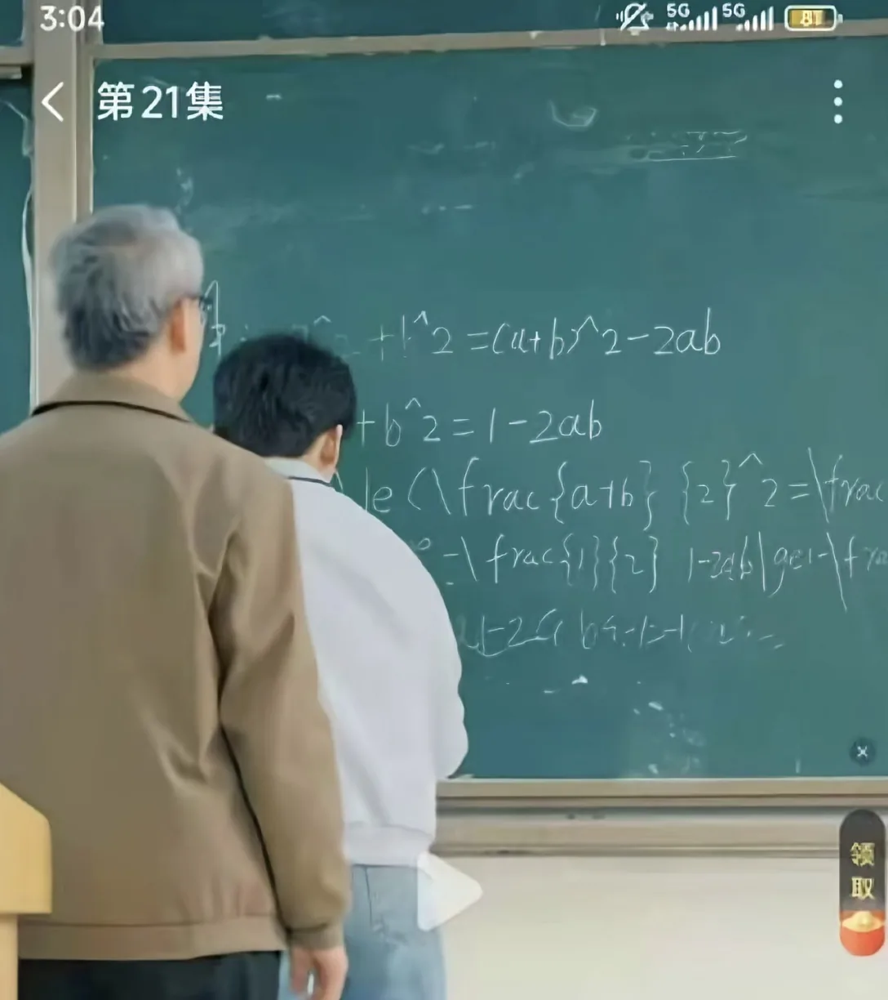

# 2026 年第 13 周技术阅读汇总

[English](README.md) | 简体中文

by @corenel (Yusu Pan) and LLMs

以下为 2026 年 第 13 周（3 月 23 日至 3 月 29 日）期间我所阅读或者输入的内容。为简洁起见，仅列出标题、URL 以及 LLM 生成的概要，以供有兴趣者阅读，进一步的分析、反思与精读不在此赘述。

## 目录

- [2026 年第 13 周技术阅读汇总](#2026-年第-13-周技术阅读汇总)
  - [目录](#目录)
  - [有趣的事与物](#有趣的事与物)
    - [ACGN](#acgn)
      - [《旧世代电台》27 格法师分类框架：奇幻世界里的施法者不是职业名，是三个问题的答案](#旧世代电台27-格法师分类框架奇幻世界里的施法者不是职业名是三个问题的答案)
      - [猎魔人的账单：一个帮人收钱、被扔石头的边缘佣兵，如何变成一代人的文化记忆](#猎魔人的账单一个帮人收钱被扔石头的边缘佣兵如何变成一代人的文化记忆)
    - [技术与互联网](#技术与互联网)
      - [至简动力贾鹏：把一套赢过一次的系统，再赢第二次](#至简动力贾鹏把一套赢过一次的系统再赢第二次)
      - [开发者的信任链被反向武器化：LiteLLM 供应链攻击事件全记录](#开发者的信任链被反向武器化litellm-供应链攻击事件全记录)
      - [Python 供应链攻击的教科书案例：LiteLLM 1.82.8 事件完整解析](#python-供应链攻击的教科书案例litellm-1828-事件完整解析)
      - [「把时间变成安全原语」：发布不等于信任，包管理器冷却期现状调查](#把时间变成安全原语发布不等于信任包管理器冷却期现状调查)
      - [「国家安全」遇上供应链现实：美国 FCC 路由器禁令的多重面孔](#国家安全遇上供应链现实美国-fcc-路由器禁令的多重面孔)
      - [VNDB 创始人 Yorhel 去世：一座自建、自维护的视觉小说公共图书馆的前世今生](#vndb-创始人-yorhel-去世一座自建自维护的视觉小说公共图书馆的前世今生)
      - [浏览器三十年：从「互联网的门」到「AI 的代理层」，一部权力争夺史](#浏览器三十年从互联网的门到ai-的代理层一部权力争夺史)
      - [Token 是新的电力，英伟达想成为新的电网](#token-是新的电力英伟达想成为新的电网)
      - [机器人「免费大脑」背后：一场争夺行业基础设施定义权的开源生态博弈](#机器人免费大脑背后一场争夺行业基础设施定义权的开源生态博弈)
    - [软件与开发](#软件与开发)
      - [FreeCAD 1.1：内核不变，建模流程更顺手了](#freecad-11内核不变建模流程更顺手了)
      - [代码可以免费生成，理解它的能力不能](#代码可以免费生成理解它的能力不能)
    - [硬件与设备](#硬件与设备)
      - [「AGI CPU」：Arm 跨过了一条 35 年没跨的边界，并给它起了一个糟糕的名字](#agi-cpuarm-跨过了一条-35-年没跨的边界并给它起了一个糟糕的名字)
      - [RK3588 GPU 里的 Cortex-M7：Mali CSF 固件机制与片内调试实践](#rk3588-gpu-里的-cortex-m7mali-csf-固件机制与片内调试实践)
    - [播客与视频](#播客与视频)
      - [音乐总是被赋予超出自身的意义：从一本 1982 年小册子看两千五百年的「听觉政治」](#音乐总是被赋予超出自身的意义从一本-1982-年小册子看两千五百年的听觉政治)
      - [「货币非国家化」的中国注脚：刘愿谈民国法币改革与陕甘宁边币往事](#货币非国家化的中国注脚刘愿谈民国法币改革与陕甘宁边币往事)
      - [被量化的睡眠、被替代的演员、没人看的县域融媒体](#被量化的睡眠被替代的演员没人看的县域融媒体)
      - [不是代糖有毒，是你不想戒甜：别让「健康替身」变成依赖陷阱](#不是代糖有毒是你不想戒甜别让健康替身变成依赖陷阱)
      - [默认信任的终结：从 NeurIPS、VIE 到 AI 代码危机的反思](#默认信任的终结从-neuripsvie-到-ai-代码危机的反思)
    - [生成式人工智能](#生成式人工智能)
      - [Sora App 关停：一次「模型研究」被包装为「AI 短视频社区」后遭遇的全维度反噬](#sora-app-关停一次模型研究被包装为ai-短视频社区后遭遇的全维度反噬)
      - [工厂里的 AI，不能接受「偶尔翻车」](#工厂里的-ai不能接受偶尔翻车)
      - [TurboQuant (ICLR 2026) 与 RaBitQ 的技术争议：方法归因、理论定性与实验公平性三项问题核查](#turboquant-iclr-2026-与-rabitq-的技术争议方法归因理论定性与实验公平性三项问题核查)
      - [MLX 量化 vs Unsloth GGUF：差距在张量敏感度，不在格式](#mlx-量化-vs-unsloth-gguf差距在张量敏感度不在格式)
      - [ToolCall-15：工具调用能力测的不是「会不会调」，是「信不信查回来的值」](#toolcall-15工具调用能力测的不是会不会调是信不信查回来的值)
    - [其他](#其他)
      - [猝死：没有预兆，但有机制、有数字、有你能做的事](#猝死没有预兆但有机制有数字有你能做的事)
    - [Just For Fun](#just-for-fun)
      - [现实版 LaTeX 渲染失败现场](#现实版-latex-渲染失败现场)
  - [摘录](#摘录)
    - [推文摘录](#推文摘录)
      - [从 YC gstack 争议看 AI 产品的演变：提供情绪与叙事价值，还是赋能实际构建？](#从-yc-gstack-争议看-ai-产品的演变提供情绪与叙事价值还是赋能实际构建)
      - [大模型隐喻下的人生精力管理：重视“训练与睡眠”，避免在“测试期”过度消耗](#大模型隐喻下的人生精力管理重视训练与睡眠避免在测试期过度消耗)
      - [Anthropic 收购 Bun 的深层逻辑：重构 Agent 工具层以实现更精确的上下文对齐](#anthropic-收购-bun-的深层逻辑重构-agent-工具层以实现更精确的上下文对齐)
      - [AI 辅助开发的现实门槛：缺乏系统认知为何仍让零基础用户难以落地实际产品](#ai-辅助开发的现实门槛缺乏系统认知为何仍让零基础用户难以落地实际产品)
      - [前员工还原 Manus 风波始末：地缘审查与国内舆论双重夹击下的 AI 初创困境](#前员工还原-manus-风波始末地缘审查与国内舆论双重夹击下的-ai-初创困境)
      - [SAM 3.1：引入目标多路复用技术（Object Multiplexing），大幅提升视频处理效率与吞吐量](#sam-31引入目标多路复用技术object-multiplexing大幅提升视频处理效率与吞吐量)
      - [企业协同软件入局 CLI 的深层逻辑：系统使用者正从“人类”向“AI Agent”转移](#企业协同软件入局-cli-的深层逻辑系统使用者正从人类向ai-agent转移)
      - [警惕 LLM 迎合倾向：利用正反向辩论辅助独立观点形成](#警惕-llm-迎合倾向利用正反向辩论辅助独立观点形成)
    - [文章摘录](#文章摘录)
      - [NeurIPS 2026 机构制裁风波始末：CCF 抵制声明与官方致歉更正](#neurips-2026-机构制裁风波始末ccf-抵制声明与官方致歉更正)
  - [学术研究](#学术研究)
    - [目标跟踪](#目标跟踪)
      - [COVTrack++：连续视频标注缺失与检测 - 关联任务孤立——开放词汇多目标跟踪的两个基础性瓶颈](#covtrack连续视频标注缺失与检测---关联任务孤立开放词汇多目标跟踪的两个基础性瓶颈)
    - [语义分割](#语义分割)
      - [EZ-SP：以局部边界检测驱动 GPU 并行合并，将超点分割的分区耗时从 418 秒压缩至 3 秒](#ez-sp以局部边界检测驱动-gpu-并行合并将超点分割的分区耗时从-418-秒压缩至-3-秒)
      - [See-through：将单张动漫插画自动拆解为可 2.5D 动画的分层结构](#see-through将单张动漫插画自动拆解为可-25d-动画的分层结构)
    - [SLAM](#slam)
      - [DROID-W：将动态不确定性从场景重建中解耦，实现真正的野外鲁棒 SLAM](#droid-w将动态不确定性从场景重建中解耦实现真正的野外鲁棒-slam)
    - [语言模型](#语言模型)
      - [先注视，再编码：AutoGaze 在视觉编码器之前完成视频冗余过滤](#先注视再编码autogaze-在视觉编码器之前完成视频冗余过滤)
      - [CanViT：主动视觉的「基础模型」，先把眼睛做好，再谈往哪看](#canvit主动视觉的基础模型先把眼睛做好再谈往哪看)
      - [TurboQuant：面向极端压缩的近最优在线向量量化方法](#turboquant面向极端压缩的近最优在线向量量化方法)
      - [ARC-AGI-3：当 AI 学会「不知道自己不知道什么」，我们才能谈 AGI](#arc-agi-3当-ai-学会不知道自己不知道什么我们才能谈-agi)
    - [内容生成](#内容生成)
      - [Astrolabe：为蒸馏流式视频模型量身定制的前向过程强化学习对齐框架](#astrolabe为蒸馏流式视频模型量身定制的前向过程强化学习对齐框架)
      - [daVinci-MagiHuman：单流 Transformer 进行音视频联合生成](#davinci-magihuman单流-transformer-进行音视频联合生成)
    - [机器人](#机器人)
      - [Co-Ego：将「人体暴露区安全」写进导盲机器人导航闭环](#co-ego将人体暴露区安全写进导盲机器人导航闭环)
      - [TwinRL：用数字孪生打破 VLA 机器人在线强化学习的探索瓶颈](#twinrl用数字孪生打破-vla-机器人在线强化学习的探索瓶颈)
      - [LeWM：一个从像素出发、极简且稳定的端到端联合嵌入预测世界模型](#lewm一个从像素出发极简且稳定的端到端联合嵌入预测世界模型)
      - [Fast-WAM：训练时预测视频就够了，推理时不必真的生成未来](#fast-wam训练时预测视频就够了推理时不必真的生成未来)
      - [WAMs 与 VLAs 的鲁棒性对决：视频预训练先验究竟能带来多少泛化红利？](#wams-与-vlas-的鲁棒性对决视频预训练先验究竟能带来多少泛化红利)
      - [供电不崩、结构不软、GPU 跑得起来：1200 美元 XLeRobot 无线双臂移动机器人的系统工程](#供电不崩结构不软gpu-跑得起来1200-美元-xlerobot-无线双臂移动机器人的系统工程)
      - [UNRealNet：把高精度离线扫描蒸馏成机载实时几何先验，足式机器人可通行性估计的一个系统性解法](#unrealnet把高精度离线扫描蒸馏成机载实时几何先验足式机器人可通行性估计的一个系统性解法)
      - [ROSCell：以 ROS2 原生机制替代 Kubernetes 控制平面的轻量异构多机器人编排框架](#roscell以-ros2-原生机制替代-kubernetes-控制平面的轻量异构多机器人编排框架)
    - [其他论文](#其他论文)
      - [PP-OCRv5：不改架构只做数据，500 万参数 OCR 系统性能挑战千亿参数大模型](#pp-ocrv5不改架构只做数据500-万参数-ocr-系统性能挑战千亿参数大模型)

## 有趣的事与物

### ACGN

#### 《旧世代电台》27 格法师分类框架：奇幻世界里的施法者不是职业名，是三个问题的答案

[旧世代电台26  你是哪种法师？27型法师分类学](https://podwise.ai/dashboard/episodes/7609452)

当一期播客从「为什么 Wizard 和 Sorcerer 感觉不一样」这个看似无聊的问题出发，最终触及了政治神学、叙事经济学和 AI 时代的认识论转变，它就已经超出了「游戏文化节目」的范畴。这期《旧世代电台》构建的「27 型法师分类框架」，表面是奇幻职业分类学，实质是一套跨文化、跨媒介的施法者描述语言——它的价值与局限，都值得细看。

这期节目到底在解决什么问题

许多接触幻想文学、桌游或 RPG 的读者，都有过一种隐约的困惑：同样是「法师」，Wizard（巫师）和 Sorcerer（术士）、Warlock（邪术师）和 Cleric（牧师）之间，究竟有什么本质上的不同？现有的职业名称是作品内部的标签，一旦跨越作品边界就失去通用性，让比较性讨论变得异常困难。

主播 Lunamos 的出发点，正是为这种跨作品比较建立一套通用语法。他的核心论点是：描述施法者的有效单位，不应该是职业名，而应该是三类底层问题的组合——力量从哪里来（本源）、如何被调用（手段）、使用之后世界怎么记账（代价）。这三个问题，各自有三个答案，3×3×3 排列组合，得到了 27 个格子，构成所谓「27 型法师分类框架」。

值得注意的是，讲者自己承认这套框架原本被设计为 4×4×4×4=256 格，「为了在单期播客中处理完」才压缩至 27 格，删减幅度近 90%。这个细节非常重要：27 格是一种媒介约束下的妥协，而非逻辑上最优的颗粒度。这一先天压缩，是后续所有局限性的根源之一，而讲者并没有回避这个事实。

三条轴的内容与层级

第一条轴：力量本源（本体论层面）

本源轴的三类划分，实质上对应三种关于「权力从何而来」的哲学立场。

「界域」（Domain）类：施法者从客观存在于世界中的能量场、位面、魔网借力。讲者以现代人类利用自然能源作类比——水电、太阳能、核能，在 14 世纪人眼中与施法无异。这类施法者的能力没有血统门槛，是「通过理解规则来公平获取世界公共资源」的能力平等主义。D&D Wizard 是典型，「study arcane magic」是官方定义，学习与准备是门票，理解是力量。讲者特别指出 wizard 词源（wise + -ard，把智慧做到极致）带有一种「用力过猛的僵硬感」，这不只是趣闻，而是在说形象与力量来源之间存在语言层面的内在一致性。

「宗主」（Patron）类：施法者是更高位存在的代理人，力量来自授权。神明、恶魔、旧日支配者都是可能的宗主。D&D Warlock（「form a pact」）是典型，古尔丹是暴雪宇宙中的现实镜像——「他动用的邪能并不属于他，每一个混沌之剑的背后，都是以对艾泽拉斯生命力的夺取和他自身的枯萎为代价的」。宗主系施法者的核心关切是「我背后站着的人是谁，以及我为什么被允许使用这份力量」，这种持续追问，赋予了这一系角色天然的悲情结构。

「自我」（Self）类：力量完全内嵌于施法者的血统、灵魂或体质，施法是把体内已有的东西唤醒和释放。D&D Sorcerer（「magic innate to your being」，主属性是魅力而非智力）是典型。这类施法者对应的世界观是「找到真正的自己以获得力量」——这与当代流行文化对「天赋觉醒、主体性爆发」的迷恋高度同构，也解释了为什么自我系角色在现代商业幻想中几乎无处不在。

第二条轴：使用手段（认识论与操作论层面）

「律式」（Formula）：依赖咒语、法阵、符文、公式等严格规则。这类施法的核心是可复现性与技艺性，「强调结构美感或步骤精确感」。它对应「知识—程序—可解释」的认识论，类似于科学方法论中的实验可重复原则。

「契约」（Pact）：通过誓言和关系引导力量现身，强调「关系的成立与束缚」。施法者建立的是力量的通道，而不是直接理解或操控力量本身。它对应「关系—誓约—授权」的权力运作方式，更接近政治或法律系统中的委托代理关系。

「意志」（Will）：以心灵和意念直接驱动力量，法术是「自身形象世界或纯粹主观强度的一种外化」，依赖专注、情感、念力和直觉。这对应「主观性—直觉—心灵投射」的浪漫主义认识论立场。

第三条轴：使用代价（叙事经济学层面）

讲者明确引用了 Brandon Sanderson 的「魔法第二定律」（Limitations > Powers）为代价轴背书，并声称这是整套框架「真正的神来之笔」。

「心神」（Mental Cost）：代价落在施法者自身的精神与体力消耗上。这制造了一种「自我精进与自我耗竭」的内卷动态，力量的上限由身体的物理极限决定。

「因果」（Karmic Debt）：代价积累为业力、因果债或命运债，在未来的时间节点清偿。这引入了一种「宇宙有道德计账系统」的世界观假设，使施法行为具有了道德维度。

「借质」（Material Cost）：代价落在现实物质的消耗上，从化学素材到神器的使用次数。这产生了一种资源经济学的叙事逻辑，权力争夺的本质变成了对稀缺材料的控制。

「代价轴」单独立轴的深刻意义

这套框架中，最值得深究的设计决策，是将「代价」单独拉出成为独立的第三轴，而不是把它附属于「手段」或「本源」之下。

这个决策的意义在于：一旦代价独立，分析的中心就从「他能做什么」转向了「他因此会失去什么」，而后者才是角色成立、故事运转的核心发动机。

三种代价对应了三种完全不同的叙事世界观和政治经济结构。如果一个幻想世界全部由「心神代价」型施法者组成，这个世界的力量分配将完全依赖个人的内在修炼，形成一种与现实能力精英主义高度类似的竞争秩序；如果全部是「因果代价」型，宇宙本身就成了道德仲裁者，施法者的行为会被一套超验的正义机制评判；如果全部是「借质代价」型，权力结构将围绕材料稀缺性、供给链和神器垄断展开，这是一种纯粹的政治经济学。

代价轴的引入，使这套框架从「施法者技术手册」变成了「世界观生成工具」。这也是为什么节目的最后一段明确暗示，这套框架「对游戏设计和世界观设计都有启发」。

框架的真正用途：生成语法而非分类数据库

节目的一个关键但容易被低估的洞见，是框架的「生成方向」。多数分类工具的用法是：拿一个已有对象，判断它属于哪一格。但这套框架更有价值的用法恰恰相反：先选本源，确定世界如何分配力量；再选手段，确定施法的社会美学；最后选代价，确定剧情张力的来源——由此生成一个全新的施法者设计方案。

从这个角度看，这套框架最本质的功能是一套「设计问卷」：三个问题，每个问题三个选项，27 种组合，对应 27 种根本不同的角色与世界观逻辑。对于世界观创作者、游戏设计者或幻想写作者而言，这是一个非常高效的原型生成工具，它把「创造一个施法者」从直觉操作变成了可拆解的设计决策。

这一「生成性」功能，超过了它作为「分类学数据库」的价值，尤其是考虑到分类数据库功能本身并不完备（见下节）。

框架的根本性局限与批评

讲者在节目结尾进行了坦率的自我批评，值得认真对待。

问题一：三条轴并不正交。 「宗主」天然倾向于绑定「契约」，「自我」天然倾向于绑定「意志」，「契约」天然倾向于绑定「因果」。这意味着 27 格在实践中的频率分布高度不均：部分格子（如「宗主契约因果」）几乎对应所有宗教类施法者，而部分格子（如「界域意志借质」）几乎是空格，勉强以植物光合作用填充。这使框架成为一个非均匀空间，而非真正意义上的等权分类系统。

问题二：「代价轴」的内部精度不足。Sanderson 明确区分了 limitation（限制）、weakness（弱点）和 cost（代价），但节目将三者都压缩进「借质」一类，导致「借质」格子的内部一致性偏低——炼金术士的素材消耗和魔法少女的变身道具，在代价的实质性上存在显著差异，前者是真实的稀缺资源约束，后者在许多叙事中更像是「永远在手边的施法接口」。

问题三：例子驱动而非语料驱动。所有格子的内容都来自讲者个人记忆和体感，缺乏系统性的文本语料基础。许多关键案例无法充分论证（以防剧透），分类判定也缺乏可公开验证的规则。这使框架在可重复性和跨标注者一致性上存在根本缺口。

问题四：分类对象未被明确界定。框架没有清楚说明分析的对象究竟是「职业」「角色」「单次施法行为」还是「整个世界设定」，而这四个对象在分类时会产生截然不同的结果（同一角色可能在不同施法行为中切换格子）。

播客精读层的注记提出了将框架升级为严格工具的最低要求：明确分类对象、为每条轴写出可操作判定规则、允许多标签归属（f(x) → P(S×M×C)）、引入时间维度描述叙事弧中的格子迁移（f(x,t)），以及建立样本库进行多标注者一致性验证。在补充这些之前，这套框架是「优秀的思维工具」，但还不是「可以直接裁判对错的学术体系」。

最值得记住的那个类比

节目中最具时代穿透力的洞察，是一句轻描淡写的注脚：「程序员正在从法师变成牧师。」

传统程序员是「界域律式心神」型：深入理解底层架构（界域），通过掌握复杂规则调用算力（律式），代价是大量脑力（心神）。AI 时代的 Vibe Coder 则是「宗主律式借质」型：力量来源变成了 Claude Code 等大型模型（宗主），依然需要形式化的提示和规范化的输出（律式），代价从心神变成了 Token 消耗（借质）。

这个类比指向一个严肃的命题：当知识劳动者从「理解系统」转向「调用系统」时，他与能力之间的关系从「掌握者」变成了「代理人」，其认识论立场也从自主的知识主体，滑向了依赖高位授权的宗主代理。这不只是技能栈的问题，而是一种关于人与能力关系的根本性转变，其长期影响——在教育、职业结构、知识生产方式上——尚未被充分讨论。

对读者的建议

这期节目对以下几类读者有直接价值：

对于游戏设计者和世界观创作者，这套框架可以作为角色初始设计的「设计问卷」，三个问题三个选项的组合能快速产生差异化的原型方案，避免施法者设计的同质化。

对于幻想文学研究者和爱好者，这套框架提供了一套比现有职业名更有解释力的跨作品比较语言，可以用来追问「为什么某类施法者设定在特定文化土壤中特别盛行」。

对于关注 AI 影响的读者，「程序员从法师变成牧师」这个类比，提供了一个用奇幻语言重新理解技术变革的独特视角——值得警觉，也值得进一步展开。

节目本身的建议使用方式，是讲者自己最后给出的：「把它当成一把尺子，它很有启发；把它当成终审法院，它就会失真。」这是对这套框架最准确的定位，也是对任何分析性工具最普遍的使用忠告。

#### 猎魔人的账单：一个帮人收钱、被扔石头的边缘佣兵，如何变成一代人的文化记忆

[462 漫谈《猎魔人》世界观：从《巫师3》十周年音乐会聊中欧奇幻史诗的诞生](https://podwise.ai/dashboard/episodes/7647484)

趁着《巫师 3》发售十周年音乐会刚在上海落幕，忽左忽右推出了这一期由麦教授主讲的《猎魔人》专题。节目本身谈得广，从音乐会聊到世界观，从萨普科夫斯基的生平聊到 CDPR 的产业史。但如果只把它当作游戏闲聊来听，就低估了它所触及的问题：一个中东欧民族的历史记忆，是如何被一个白发猎人的腰带包裹起来，卖给了全世界？

从一场音乐会说起

一场游戏音乐会，能够告诉你一款游戏的真实地位。不是所有游戏都有资格在十年后被改编成交响乐巡演。《巫师 3》在上海举办的十周年音乐会，乐队编制包括上海歌剧院弦乐团、二十余人合唱团、多人打击乐编制，以及从波兰远赴而来的民族乐团 Percival Schuttenbach——这个乐团的成员就是《巫师 3》游戏原声的录制者，他们穿着 15 世纪风格的服装演奏，「就像从巫师 3 世界里面走出来的人」。

主持人程衍梁与嘉宾麦教授都参加了这场音乐会，两人用「都回来了」来描述那种体验：第一首带有强烈人声的曲子一响，十年前沉浸在游戏世界里的所有记忆，瞬间被音乐激活。

这不只是粉丝的情感叙述。官方将这场巡演定义为「把《巫师 3》情感叙事转化成沉浸式音乐会的活动」。一个游戏作品的配乐被如此仪式化地再演绎，本身就是一种「经典化」（canonization）的信号——它从「游戏」升格为「可以被纪念的文化对象」。节目选择从这个信号切入，是评论策略上的聪明之举：先把讨论语境从游戏评测拔升到文化批评，后续所有论述才有了相应的视野高度。

为什么是一个「猎魔人」，而不是别的什么英雄

节目最核心、最有力的判断，发生在它讨论杰洛特这个人物的时候。

在角色扮演游戏的历史上，主角的设计通常有两种路线：一种是「空容器」——没有前史、没有固定性格，玩家可以把他/她捏成任何样子，代入感来自于自我投射；另一种是「完整人物」——有自己的价值观、历史、情感关系，玩家代入的是一个已经存在的人的眼睛。杰洛特属于后者，而且是后者中的一个极端版本。

但麦教授的解释比「因为杰洛特有血有肉」走得更远。他指出的关键在于杰洛特的社会结构位置：这是一个靠专业怪物学知识谋生的佣兵，按合同收钱、不做免费英雄；他使用的魔法在这个世界里被高级术士视为「一加一等于二」的入门小儿科；他外貌因青草试炼而面目狰狞；他帮人解决问题，但被帮助的人并不感谢他，反而将他当作「比怪物好不了多少」的异类。猎魔人甚至有自知：「当我们把最后一个怪物砍完了以后，人类就会来砍我们了。」

这个社会位置，是《猎魔人》真正的秘密武器。它不属于任何特定时代或文化背景，却能被几乎所有时代、所有文化的人认领：职业人在一个不完全理解自己职业价值的社会里挣扎生存；专业知识使你能看到别人看不见的东西，却同时使你成为令人不安的异类；你帮助了一个人，却被这个人误读为威胁。一旦这个人物成立，他就成为一个可以连接王权、宗教、民俗、族群冲突、个人命运的叙事交通枢纽。

道德灰度必须有代价

节目花了相当篇幅详细复述了两个短篇故事，这不是「内容介绍」，而是方法论上的精明之举——用最小的叙事样本，完整呈现整个世界观的核心规律。

「勿以恶小」（英文标题 A Grain of Truth 原文 Lesser Evil，小说标题实为「逐恶而来」附近的故事，节目指向的是另一经典短篇）讲的是杰洛特陷入一场「两害必择其一」的困境：术士要他杀一个公主防止大祸，公主要他杀术士以报仇雪恨，而杰洛特的立场是「宁可两个都不选」。原文这段话值得细读：「恶就是恶……程度是相对的，界限是模糊的。若要我在两种恶行之间做选择，我宁可两个都不选。」

然后呢？他坚守了这个立场，第二天仍然被情势裹挟，在混战中误伤公主致死，被他保护的镇民称为「布拉维坎的屠夫」，并遭扔石头。

这个结局是理解《猎魔人》道德哲学的关键。这不是一个「好人终有好报」的故事，也不是一个「坚守原则必受惩罚」的悲剧说教；而是一个揭示了原则与结果、善意与认可之间根本性断裂的叙事。道德灰度在这里不是「价值观的相对主义」，而是「有代价的选择」——你可以坚守你的原则，但命运不因此奖励你，旁观者也不因此理解你。

这种叙事哲学与传统奇幻的「英雄主义」框架，以及许多现代游戏的「选项 A/B 有些微不同结局」的浅度道德系统，都有本质性的区别。

第二个故事「意外律」则展示了另一面：这个世界的命运是「强因果」的，但这种强因果不是单向的宿命论，而是由人的「承诺」触发的。杰洛特援引意外律获得了希里，这是他主动做出的选择，但选择的后果（一生与这个孩子的命运绑定）远超他当初的预期。两个故事合起来说明了一件事：在《猎魔人》的世界里，原则和选择都是真实的，代价也是真实的，没有人逃得掉。

中东欧的历史，如何变成了普世的奇幻纹理

这期节目试图回答的更大问题是：《猎魔人》的中东欧文化底色，与它的全球成功之间，究竟是什么关系？

节目的答案，经由批评性精读的整理和加工，可以被概括为：《猎魔人》的成功，不是因为它将地方性「磨平」以换取普世性，而是因为它将地方性「藏进」普世性。精灵与人类的冲突，在结构上与欧洲历史上无数次被征服民族的经历同构，但没有任何一处写明「这就是波兰历史的镜像」；尼弗加德帝国像罗马，也像沙俄，像神圣罗马帝国，但没有被锁定为任何一个；猎魔人驱魔仪式的那种民俗质感，让麦教授联想到「中欧版崂山道士」，但这不妨碍波兰玩家看到自己本土的驱邪传统，不妨碍英国玩家感受到凯尔特传说的回响。

这套机制，在创作层面有直接证据：CDPR 编剧 Marcin Blacha 公开表示，《巫师》是「对波兰语与波兰性的致敬」；Culture.pl 的研究也指出，第一代游戏中有大量对波兰文学经典与前基督教仪式的暗线引用，对波兰玩家高度可见，对国际玩家则常常不可见。到了《巫师 3》，这种本地性已经被更巧妙地编织进整体叙事纹理，使外部受众在不需要任何波兰历史背景知识的情况下，仍然能感受到「这个世界有别于英美式奇幻的独特质感」。

批评性精读在这里提出了一个值得警惕的提醒：节目对《猎魔人》「中欧性」的阐述很有感染力，但不够留白。学界（如 Gawroński）指出，萨普科夫斯基本人并不总愿意把作品锁定在斯拉夫或民族标签里，而「中欧/斯拉夫属性」对于国际受众而言，往往并不像节目所描述的那样显眼。这是一条有启发性的解释路线，但不是唯一合法的读法。

萨普科夫斯基：一个中年人的后继薄发

要理解《猎魔人》为何有今天的厚度，需要了解它的作者。节目对萨普科夫斯基的生平描述提供了几个关键细节，串联起来耐人寻味。

他 1948 年生于波兰罗兹，父亲是参加过二战、参与了柏林战役的军人，1948 年本有机会出任格但斯克市长，却因儿子出生留在了罗兹。萨普科夫斯基大学读经济，熟练掌握三门外语，毕业后在外贸公司做皮毛贸易，业余时间翻译科幻小说。直到 1985 年，他儿子建议他参加奇幻杂志《Fantastyka》的比赛，他才写下了猎魔人系列的开篇故事，获得第三名。此时他快 40 岁。

这个生命节点很重要。他不是一个从小写奇幻的「类型文学爱好者」，而是一个在现实社会里浸泡了近 20 年（贸易、语言、翻译）的人，在接近中年时把他所有的阅读积累（托尔金、《地海》系列、《安珀志》、海明威，以及大量中东欧历史文献）和人生体验，一次性倾注进了这个白发猎人身上。

这解释了为什么杰洛特的「现代性」感那么强——因为创造他的人，本身就是一个用现代人的眼睛回望中世纪的、有着成熟社会阅历的中年知识分子。他对「专业服务的合同性质」、「知识的实用价值」、「社会偏见的运作机制」的理解，不是从奇幻模板里推导出来的，而是从真实生活里带过来的。

他的另一个持续性写法是「考古性重写」：把格林兄弟的道德净化版童话还原成它在前现代世界可能具有的粗粝面貌。白雪公主变成了组织匪帮、四处行凶、最终死于猎魔人之手的复仇者。这不是为了「暗黑」而暗黑，而是萨普科夫斯基的认识论立场：童话故事的道德化版本是后人加工的产物，如果把这层加工去掉，这些故事会讲述一个更残酷、更真实、也更值得严肃对待的前现代世界。

CDPR 的产业史：从硬核作坊到国际大厂的阵痛

节目的另一条线索是 CDPR 作为公司的成长史，这条线在文化评论之外加入了产业分析的维度。

《巫师 1》时代，CDPR 只有十几个人，炼金系统甚至直接按照小说里的描述还原，属于「爱好者做给爱好者」的硬核作品，发行完全依赖 Atari 代理，渠道能力有限。《巫师 2》规模扩张但项目管理跟不上，「捉襟见肘」。《巫师 3》是真正的里程碑：3A 规模、全球宣发、多平台发售，在截至 2025 年 5 月超过 6000 万份的销量背后，波兰游戏作为品牌开始被全球识别。

之后是《赛博朋克 2077》的教训。节目将失败主要归因于「宣发过度、吸引了太多非核心玩家、期待值无法控制」，这个解释有一定道理，但批评性精读指出这过于单因化：技术层面（PS4 优化极差，索尼宣布下架）与产品完成度问题，同样是不可回避的根本原因，不能只用「观众期待过高」来解释。

后续的修复是事实，规模也确实史无前例。CDPR 将几乎所有资源集中在修复与《往日之影》扩展包上，销量超过 1000 万份，口碑回升，2025 财年成为历史第二好年份。但把这个修复行为完全道德化（「愿意负责任的公司」），忽略了其中的商业理性（已购玩家的利益保障、长尾销售收益），则是一种常见的公关叙事。

《巫师 4》是当下 CDPR 最关键的一役，官方已确认主角为 Ciri，开启新的 saga，不会在 2026 年底前发售，公司超过 5 亿波兰兹罗提已投入研发。这不是情感上的期待，而是商业上的必需——这款游戏将回答「《赛博朋克 2077》之后，CDPR 是否还是那个我们信任的公司」这个问题。

局限性与值得警惕的地方

对这期节目，有几处需要指出的局限，供读者参考。

第一，节目在讨论时经常把小说 canon 与游戏 canon 当作同一个对象处理，但 CDPR 编剧明确说「游戏里的故事全是我们自己创作的」，两者在改编深度、文化忠实度和世界观细节上均有差异，混用会造成误导。

第二，节目引用的《巫师 3》中国区 Steam 销量「600 多万份」这一数字，未见于 CDPR 官方财报的正式披露，应视为流传数据而非硬事实。而节目提到萨普科夫斯基作品已译成「37 种语言」，这个数字在 Hachette 的 2025 年官方稿件中已更新为「40 余种语言」。这些数字上的过时，不是节目的错误，但读者需要注意。

第三，整期节目对 CDPR 的整体态度相当友善，这使得某些判断（如对《赛博朋克 2077》失败原因的分析）略显单薄。批评性评论的功能，本应是建立「赞成与保留并存」的判断，而非只在保留处含糊带过。

结语：一个 IP 的核心是它逼你做判断的方式

节目结尾，两位对谈者说了一句很朴素的话：「共同期待一下巫师 4，虽然不知道什么时候能够见到他。」

这种朴素，其实是合适的。《猎魔人》系列之所以能让人等了十年还在期待，根本原因不是宏大的世界设定，不是波兰传统音乐的异域感，甚至不是「开放世界的自由度」，而是它构建了一个每一步都会逼你做判断，而且判断的代价是真实的世界。

它告诉你：你的原则是有意义的，但不保证好结果。命运是真实的，但要靠你的选择来触发。善意是值得有的，但不等于被善意对待。边缘人的眼睛，往往才是最诚实的观察者。

这些判断，适用于猎魔人的世界，也适用于我们生活的世界。这才是为什么一个波兰猎人，能够成为无数人的镜子。

### 技术与互联网

#### 至简动力贾鹏：把一套赢过一次的系统，再赢第二次

[155 贾鹏创立至简后的首次访谈：从英伟达到理想，具身智能的六边形战士](https://podwise.ai/dashboard/episodes/7577675)

这篇播客访谈转写稿，表面上是一次职业履历的回顾，实质上是一份口述的具身智能创业方法论文档。贾鹏在接受《晚点聊》首次创业后访谈时，完整展示了他如何从一名英伟达的 HPC 工程师，成长为理想汽车智驾的核心推手，并最终在具身智能赛道上押下了 20 亿元融资的筹码——而这一切，都围绕着同一个核心命题展开：系统级竞争能力，才是真正的护城河。

故事的骨架

要理解贾鹏在讲什么，首先需要理解他在三个阶段各学到了什么。

在英伟达（2015—2020），他从 GPU 加速算法出发，横向扩展到传感器、底层驱动、自动驾驶感知定位，最终成长为软硬兼修的架构型工程师。他在这里学到的最重要的事，不是某种具体技术，而是「全栈视角」——当一个人从底层芯片到上层应用都能触达时，他才能真正判断「这个系统的瓶颈在哪里」。他也亲眼目睹了 Elon Musk 在 2016—2017 年就说出「硬件必须标配，即使没人用，我也要提前为数据收集预买硬件」，这句七八年前的话成了他此后所有决策的认知底色。

在理想汽车（2020—2025），他学到了更具震撼力的一课。理想 2020 年加入时是业内公认的「菜鸡团队」，二三十人，没有自研能力，第一款车失败。五年后，理想智驾跻身中国第一梯队，Max 版本用户购买比例从不足 15% 升至约 70%，顶会论文产出量「比其他自动驾驶团队加起来还多」。这背后的方法论，贾鹏总结为三点：核心认知的绝对一致（头几个人全部认定「要照特斯拉路线做」，不容路线博弈）、项目制组织和极限执行力（80 人团队三个月从零代码完成高速 NOA 量产）、以及永远预留一支队伍做前沿预研（即使在最激烈的交付战中，也要有人在看端到端、VLM、双系统等下一代方向）。

在至简动力（2025—），他把这两段经验合并为一套可迁移的方法，投向了他认为「条件已经成熟、PMF 尚未出现」的具身智能赛道。

核心论点的深层解读

贾鹏的核心主张，用一句话概括是：具身智能的竞争，不是单个维度的竞争，而是体系级学习闭环速度的竞争。

这个判断有三层递进逻辑。

第一层，他重新定义了「竞争单位」。他不认为「谁的 VLA 模型最大」或「谁的机器人外形最通用」会决定最终胜负。在他的框架里，真正的竞争单位是「在给定资本和时间下，谁能让硬件一致性（H）、真实场景数据（D）、模型迭代速度（M）、评测机制（E）、组织执行力（O）、资本持续性（C）同时提升」。这八个变量的乘积，才是这场竞争的真实评分标准。

第二层，他重新定义了「商业化」的含义。大多数技术创业者把商业化理解为「技术成熟后的财务结果」。贾鹏把它理解为「技术成熟前的数据来源与评测装置」。这是整场访谈中最具颠覆性的一笔翻转。他直接说「商业化和你的数据永远是一体的」：商业化 → 真实部署 → 真实场景数据（包括所有「你想象不到的奇怪问题」）→ 模型迭代 → 产品力提升 → 更多商业化，这是一个先后天然耦合的飞轮，而非线性的先后顺序。

第三层，他重新定义了「硬件」的竞争优先级。在行业普遍认为「现在缺的是数据和算法，硬件差不多了」的时候，贾鹏明确表示「硬件也没有到这一步」。他的论据很直接：同一批次机器人的不同个体之间，做 replay 行为都不一样——这意味着你收集到的数据里混入了大量来自硬件个体差异的噪声。当噪声超过模型从数据中能学到的有效信号时，「多收数据」反而不再线性提升性能。所以在他的战略体系里，硬件一致性是数据飞轮能否转起来的前提条件，必须放在第一优先级，而非交给别人解决的外包问题。

具体战略选择的背后逻辑

贾鹏的几个具体战略选择，每一个都可以追溯到上述方法论的直接推演。

不做全尺寸人形，先做轮式 + 双臂半原型。理由是「此时此刻模型能力还不够，没必要为终局审美提前拉满硬件复杂度」。这是约束驱动的系统设计——先把当前能力与最小可用形态的匹配度最大化，而不是用最终形态来包裹当前能力。

不碰家庭场景，也不碰成熟流水线单工位，先打标准化的 to B 端到端任务。拒绝家庭场景的理由是安全归责复杂、交互门槛极高、且数据采集效率低；拒绝单工位替代的理由是容错要求过高（一旦出错就是停线）、且能力积累无法复用。端到端任务（从取料到回仓的完整链条）的好处则是：机器人对整条 skill chain 负责，数据更一致，能力可复用，客户 ROI 更清晰。

双芯片影子评测，强制标配。一块芯片跑稳定版保生产安全，另一块芯片以影子模式在真实场景中测试新版本，通过比较轨迹输出差异来评估新版本是否真的更好。这在方法论层面解决了「如何在不损害用户体验的条件下持续进行在线模型评测」这个难题——这正是很多机器人公司从 Demo 到量产之间最容易卡死的环节。

融资按阶段配结构：先顶级财务机构，再战略方，再产业方。他把融资当作系统工程来设计，而非来者不拒的「加油站」。这确保了在不同阶段，资本的结构能够与业务的扩展需求相匹配。

方法论的内在边界与批判性评估

贾鹏的方法论在若干方面展现出极强的工程现实感，但也存在几处需要批判性审视的边界。

最强之处在于他对「系统竞争」的真实理解。很多创业者讲系统竞争，最终还是模型中心主义；贾鹏不是。他把组织结构、融资节奏和商业化策略全部纳入技术决策讨论，这在当前具身智能赛道极为少见。

较弱之处有三。第一，缺乏可公开验证的量化指标——他讲了大量判断，但对于成功率、硬件 MTBF、客户留存率等可外部检验的数据几乎没有披露，使得外界难以独立判断这套理论的实际落地进度。第二，对合成数据的判断可能偏保守——NVIDIA 的 GR00T N1 和 Isaac Lab 等公开路线，已经把合成数据作为机器人数据飞轮的重要加速器，贾鹏「合成数据不是主力」的立场与此存在实质分歧，且尚无足够的公开实验数据来判断孰优孰劣。第三，他的「体系闭环」逻辑有一处循环依赖：闭环成立的前提是商业化能够落地并产生真实数据，但商业化能否在短期内落地，又取决于产品是否能尽快到达可用阈值——这个鸡生蛋的张力，在访谈中没有被正面展开。

最需要持续观察的变量，是合成数据与仿真能力的实际演进速度。如果 NVIDIA 的 Isaac Lab、Google 的世界模型框架在未来 1—2 年内大幅提升了合成数据的有效性，「商业部署是最重要的数据来源」这一命题的相对优先级将会受到显著冲击，贾鹏的数据飞轮理论也需要相应修正。

对读者的参考价值

对于机器人软硬件开发者，贾鹏的访谈提供了三个值得立即内化的判断工具：

第一，评测机制是研发基础设施，不是研发结果。在开始大规模收集数据和训练模型之前，先问清楚「我怎么知道新版本模型真的更好了？」——评测方案不清晰，数据和算力的投入都可能成为低质量的迭代。

第二，硬件一致性是数据飞轮的乘法因子。如果你的测试平台在不同个体之间存在显著的动力学差异，务必先量化这个差异有多大，并在研究设计中把它当作显性变量处理，而非背景噪声忽略。

第三，「简单」是一种系统设计原则，而非技术能力的降格。减少模块间接口、让模型自己决定何时进入深度推理、用项目制而非部门制组织团队——这些选择的共同底层逻辑，是为「规模化扩展」预留最大弹性，同时将系统复杂度管理在人类工程能力可以驾驭的范围内。

对于学术研究者，这份访谈值得注意的不只是贾鹏的观点，更是「产业领先从业者在 2026 年 3 月这个时间点如何理解具身智能核心难题」的一次高密度一手记录。他对「从 60 分到 100 分比从 0 分到 60 分更难」的阈值型收益曲线的描述，对「数据分布覆盖比数据总量更关键」的强调，以及对「统一化模型为何优于永久割裂的双系统」的实践验证，都指向了当前机器人学习领域几个最值得深入探究的开放性问题。

总体而言，这不是一篇告诉你「至简一定会成功」的乐观叙事，而是一幅清晰的「2026 年初具身智能赛道现实约束」素描，作者是一位对自己的方法论与局限性都有相当清醒认识的工程型创始人。

#### 开发者的信任链被反向武器化：LiteLLM 供应链攻击事件全记录

[My minute-by-minute response to the LiteLLM malware attack](https://futuresearch.ai/blog/litellm-attack-transcript/)

2026 年 3 月 24 日，一名机器学习工程师的笔记本电脑被 11,000 个 Python 进程拖垮，触发了一次意外的安全调查。从发现第一个症状到公开披露漏洞，他只用了 72 分钟。这篇文章记录的不只是一次供应链攻击的技术细节，更是一种新型人机协作安全响应模式的完整样本——以及这种模式的明确局限。

这篇由 Callum McMahon（futuresearch.ai 工程师）撰写的文章，本质上是一份实时事件响应的原始记录，而非事后整理的分析报告。它的价值正在于此：完整保留了错误假说、认知纠错、技术确认与快速披露的全过程，让读者能够观察到一次真实安全事件在分钟级别上的演化。

事件的攻击链结构

理解这次事件，首先需要理解其攻击路径的精妙之处。攻击者并非试图入侵任何人的系统——他们做的事更为隐蔽：获取了流行 Python 包 `litellm` 的 PyPI 发布凭证，并于 2026 年 3 月 24 日 10:52 UTC 发布了带有恶意 payload 的 `litellm==1.82.8`。

这个版本与之前所有合法版本的区别在于，它在 `site-packages` 顶层植入了一个名为 `litellm_init.pth` 的 34,628 字节文件。这里有一个 Python 生态的关键机制值得解释：`.pth` 文件中的可执行行会在每次 Python 解释器启动时自动运行，不需要任何显式的 `import litellm`，不需要用户主动调用任何函数。任何场景下的 Python 启动——IDE 插件初始化、命令行工具执行、包管理器运行、MCP 服务器启动——都会触发该文件中的恶意代码。

这一机制的选择代表了比同次攻击中 `1.82.7` 版本（payload 在 `proxy_server.py` 中，需要 `import litellm.proxy` 才触发）更为激进的策略：攻击面从「使用 litellm 功能的用户」扩展到了「Python 解释器存在的任何时刻」。LiteLLM 官方后续确认，仅 `1.82.8` 的 `.pth` 机制就使得「每一次 `pip install litellm==1.82.8` 本身就执行了恶意载荷」，FutureSearch 的量化分析则显示，46 分钟的暴露窗口内，两个恶意版本合计被下载 46,996 次，2,337 个下游包中 88% 的版本约束允许解析到受污染版本。

恶意 payload 是一个三阶段结构：第一阶段启动钩子派生子进程；第二阶段提供 RSA 公钥用于加密；第三阶段（`B64_SCRIPT`）执行实际的凭证收割，系统性地读取 SSH 密钥、AWS/GCP/Azure 凭证、Kubernetes 配置、`.env` 文件、数据库密码、Shell 历史等，将结果用 RSA+AES 加密后 POST 至 `https://models.litellm.cloud/`，并尝试通过 systemd 服务实现持久化，以及通过创建特权 Kubernetes pod 实现集群横向移动。

意外的自我暴露与侦测

这次攻击的最终被发现，在相当程度上依赖了一个攻击者的工程失误。Stage 2 payload 在派生子进程时使用 `subprocess.Popen([sys.executable, "-c",...])` 而没有添加 `-S` 标志（该标志可以阻止 Python 自动加载 `site` 模块）。结果是：每个子进程也会重新加载 `.pth` 文件，再次派生子进程，形成无限递归，最终造成 11,000 个 Python 进程填满 `htop`，使整台开发机完全瘫痪。这个 fork bomb 是副作用，不是设计意图，它使原本可能悄无声息运行的窃密器变成了一个无法忽视的系统级事故。

Callum 在机器瘫痪、强制重启之后，从 11:13 开始用 Claude Code 展开调查。在这里，文章的叙事出现了一个在安全分析方法论上极具教育价值的时刻：Claude 的初始分析将 11k 进程爆炸解释为「Cursor 自动更新触发扩展主机重启、叠加 MCP 服务清理失败和 Python 环境探测的级联异常」。这个解释并非无稽之谈——当天 Cursor 确实在 10:59 进行了自动更新，`exec(base64.b64decode(...))` 确实是 Claude Code 自身工具的代码传递方式，所有的「异常」都能在已知工具行为的边缘情况中找到看似合理的解释。

这 27 分钟的弯路，揭示了 LLM 辅助安全分析的一个根本局限：LLM 经过训练倾向于「善意解释优先」，它会首先尝试把异常行为归类为已知合法操作的 edge case，而不是首先怀疑恶意行为。供应链攻击恰恰利用了这一特性：攻击者刻意使用与合法工具相同的技术手法（base64 编码的子进程调用），使初期检测产生混淆。突破点来自 Callum 的持续追问——在后台任务检索到 `litellm_init.pth` 后，Claude 在 11:40 完成了认知翻转，给出了完整的威胁画像和行动建议。

AI 辅助的价值与分工边界

文章所展示的 AI 辅助价值，需要被精确地定位，而不能被笼统地理解为「AI 发现了恶意软件」。

真正发生的是：AI 极大地压缩了「流程性知识」的调用时间。在传统场景下，一个没有安全背景的 ML 工程师遇到此类事件，需要在高压状态下依次回忆：该检查哪些日志文件、用什么命令解析、如何在隔离环境中复现确认、该联系 PyPI 的哪个邮箱、该给 GitHub 安全团队提 advisory 还是开 issue、披露博文该包含什么要素。这些「程序性知识」的每一项都可能消耗数分钟到数十分钟。Claude Code 把这些全部压缩到了即时响应：作者甚至「不是主动去问该联系谁」，而是在问「是否有已知报告」时，Claude 顺势给出了完整的联系流程和优先级。

但「判断」始终是人类的责任。初期的 27 分钟误判，最终是被 Callum 的「持续不接受」和「继续提供新证据」所纠正的，而不是 AI 自发实现了认知修正。Docker 隔离验证这个关键步骤，是 Callum 主动要求的（「请在隔离 Docker 容器中重新下载确认」），不是 AI 主动提议的。整个 72 分钟闭环的核心动力，是人类的追问意志，AI 提供的是流程托举。

评论区的安全从业者（`barnas2`）对文章有一个精准的批评：在确认感染后，正确的操作应该是立刻隔离机器，而不是继续在感染机器上操作——更不是「随手打开 Cursor 再触发一次」。这个批评无意贬低文章的成就，而是指出文章展示的是一个高效但不规范的即兴响应，不是可以直接复制的 IR 范本。真正的 IR 规程，需要培训和组织支持，不只是 AI 工具。

结构性问题与开放性挑战

这次事件在技术层面被快速处置（46 分钟窗口，PyPI 约 30 分钟隔离），但它暴露出的结构性问题仍然没有系统性解决方案。

依赖链透明度是其中最根本的问题。Callum 没有主动安装 `litellm`，他信任 Cursor，Cursor 信任 MCP 服务器，MCP 服务器信任 `uvx` 的依赖解析，`uvx` 信任 PyPI 的「官方最新版本」。这条信任链在对用户完全不可见的情况下自动运转，直到系统崩溃才暴露出断裂点。现有的防御手段（Trusted Publishing、PEP 740 数字 attestations、Dependency Cooldown、lockfile pinning）每一个都是真实有效的缓解措施，但没有一个能单独解决问题——它们需要并联使用，且都要求生态层面的广泛采用，这需要时间。

AI 与安全的协同演化是另一个悬而未决的问题。评论区的对话揭示了一个令人不安的对称性：如果这次攻击的 payload 本身也是用 AI 生成的（fork bomb 这种 bug 更像是 LLM 的典型失误，而非有经验的安全研究员会犯的错），那么我们正在见证的是「AI 辅助攻击 vs AI 辅助防御」的实时军备竞赛，双方都在同步加速。在这个框架下，文章所展示的「72 分钟响应」不是防守方永久性的优势，而是当前时间点上、在攻击者犯了一个具体失误的条件下，防守方恰好更快的一个瞬间快照。

对于技术读者的参考建议：从这次事件中，工程实践层面最直接可落地的教训有三点。第一，对所有生产和开发环境的 Python 依赖，实施精确的版本 pinning 和哈希验证，优先使用 lockfile；对工具链（uvx、MCP 服务器）的依赖，单独审计其版本约束。第二，在包管理器配置中启用 Dependency Cooldown（24 小时或更长），给安全扫描器留出检测窗口，这在 `uv` 中已有原生支持。第三，在开发机上安装出站流量监控工具（如 Open Snitch / Little Snitch），对非预期的进程发起出站连接实施告警，这能在「安静型攻击」（无 fork bomb 的恶意载荷）场景下提供检测手段。

最后值得提醒的是：这篇文章最深的价值不在于「AI 很厉害」，而在于它同时告诉你两件必须一起记住的事实——LLM 确实能把非安全研究者的响应速度推到以前难以想象的程度；但 LLM 也会在初期把恶意迹象解释成正常工具行为，在执行边界不清时把风险放大。成熟的读法，是把它当成一份关于「如何和 AI 协作进行 incident response」的早期现场教材，而不是一个待复制的成功案例。

#### Python 供应链攻击的教科书案例：LiteLLM 1.82.8 事件完整解析

[Litellm 1.82.7 and 1.82.8 on PyPI are compromised](https://news.ycombinator.com/item?id=47501426)

2026 年 3 月 24 日，Python AI 工具库 LiteLLM 的 PyPI 包被植入凭证窃取后门，仅一次 `pip install` 便可触发对本机所有 SSH 密钥、云凭证、API keys、加密货币钱包的静默外传。该事件横跨 Trivy、LiteLLM、DSPy、Browser Use 等多个生态节点，将现代开源软件供应链的结构性脆弱点以极为直白的方式暴露出来，是近年来 Python 生态中技术细节最完整、影响面最广、教学价值最高的供应链安全事件之一。

事件本质：不是「包被改了」，而是「发布链被绕过了」

理解这起事件的第一步，是纠正一个常见的直觉错误：许多人看到「某个 Python 包被植入恶意代码」时，第一反应是「GitHub 仓库源码被篡改了吗？」答案是否定的。

LiteLLM 的官方 GitHub 仓库并没有被直接入侵，`1.82.7` 和 `1.82.8` 这两个恶意版本在 GitHub 上均没有对应的 tag 或 release 记录。攻击者做的事情，是在窃取了 LiteLLM 的 PyPI 发布令牌后，直接将两个从未经过官方构建流程的恶意 wheel 文件上传到了 PyPI，完全绕过了 GitHub 上的代码审查体系。

这一区别至关重要：它意味着审计 GitHub 仓库的源码，并不能发现这次攻击；真正被污染的，是用户最终安装的制品（wheel 文件），而不是公开可见的源代码。这条裂缝——「源码仓库的信任」与「制品发布的信任」之间的验证空白——是这次攻击得以成立的根本原因，也是整个 Python 生态长期存在的系统性缺口。

攻击链：从安全扫描器到九千六百万次月下载量

这次攻击不是凭空而来的单点事件，而是一条可追溯的连续攻击链。

源头指向 Trivy，一款被广泛用于容器和代码漏洞扫描的开源安全工具。2026 年 2 月底，攻击者利用了 Trivy GitHub Actions 环境的配置缺陷，获取了高权限访问令牌；3 月 1 日的凭证轮换因不够彻底而留下了残余访问；3 月 19 日，攻击者对 Trivy 相关 GitHub Actions 的大量 tag 进行了强制推送，将它们指向恶意提交。LiteLLM 在其 CI/CD 流程（`ci_cd/security_scans.sh`）中使用了 Trivy 进行安全扫描，这使得 LiteLLM 的 PyPI 发布令牌通过 CI 环境变量暴露给了已经渗透了 Trivy Actions 的攻击者。3 月 23 日，同一波攻击横向迁移到了 Checkmarx 的 GitHub Actions 工作流和 OpenVSX 插件，进一步印证了这不是孤立事件。

3 月 24 日，攻击者以窃取的 PyPI 令牌直接上传了恶意的 `1.82.7`（约 10:39 UTC）和 `1.82.8`（约 10:52 UTC），受影响的安装窗口延续至约 16:00 UTC。整个攻击链的讽刺性在于：一个被引入来提高安全性的扫描器，成了泄露发布凭证的入口。

技术核心：`.pth` 文件如何将「安装」变成「持久后门」

这次事件在技术层面最值得深入理解的，是 `1.82.8` 对 Python `.pth` 文件机制的利用。

根据 Python 官方 `site` 模块文档，安装在 `site-packages/` 目录中的 `.pth` 文件，其中以 `import` 开头的行会在每次 Python 解释器启动时自动执行，早于任何用户代码的运行。这是一个完全合规的 Python 语言特性，设计用于路径注入和 import hook 注册。

`1.82.8` 将一个 34,628 字节的恶意 `.pth` 文件（`litellm_init.pth`）随包安装到 `site-packages/`，其内容是经双重 base64 编码的 Python payload（编码是为了规避简单的 `grep` 扫描）。效果是：只要包被安装，此后计算机上每一次 Python 进程启动——运行 IDE、执行测试、触发 CI runner、启动任何 Python 工具——都会执行这段恶意代码，完全不需要用户主动 `import litellm`。

相比之下，`1.82.7` 将 payload 放在 `proxy/proxy_server.py` 中，需要执行 `import litellm.proxy` 才能触发，危险性虽然同样不可忽视，但触发面要窄得多。Karpathy 的「一次 pip install 就够了」这句话，在严格意义上只适用于 `1.82.8`。

解码后的 payload 分两阶段运作：Stage 1 系统性收集本机几乎所有类型的高价值 secrets，包括 SSH 密钥、Git 凭证、AWS/GCP/Azure/Kubernetes 完整凭证体系、所有环境变量（含全部 API keys）、Docker 配置、加密货币钱包（覆盖比特币到 Solana 共十余个主流链）、Shell 历史记录、SSL/TLS 私钥、CI/CD 配置文件和数据库凭证；Stage 2 用随机 AES-256 会话密钥加密数据，再用硬编码的 4096-bit RSA 公钥加密会话密钥，打包后通过 `curl` POST 到攻击者控制的 `models.litellm.cloud`（注意是 `.cloud` 而非官方的 `.ai`，是刻意伪装成 LiteLLM 官方服务的 typosquatting 域名）。

发现经过：快速暴露的真实原因

这次攻击的快速暴露带有明显的偶然性。FutureSearch 的工程师 Callum McMahon 在 Cursor 中使用 MCP 插件时，插件通过 `uvx` 将 `litellm 1.82.8` 作为传递依赖自动拉入。`.pth` 触发的恶意进程在启动新 Python 子进程时，子进程同样继承了 `site-packages/` 中的 `.pth`，从而再次触发，形成指数级的进程爆炸（fork bomb），导致机器内存耗尽崩溃。

FutureSearch 的事后复盘明确：「这个 fork bomb 是恶意软件自身的 bug，而非防御措施」。若攻击者修复了这个 bug，以静默模式运行——每次 Python 启动时只悄悄外传一次数据，不产生任何可观察的系统副作用——现有的绝大多数开发环境监控实践将无法在合理时间内检测到它。这次事件的快速发现，在本质上是攻击者的代码质量不合格，而不是防御体系的成功。这个结论是整个事件最值得被反复强调的部分。

影响范围：「九千六百万月下载量」背后的传递依赖风险

LiteLLM 的受感染版本涉及的直接用户已经足够多，但这次事件真正令人警觉的，是传递依赖的乘数效应。

LiteLLM 每月下载量约为 96,083,740 次，且被 AI 工具链中的多个高知名度框架作为传递依赖引用：DSPy 将其作为调用各大 LLM 提供商的主要路径；Browser Use 的 CLI 安装脚本拉取 `litellm>=1.82.2`（无上界约束）；Google ADK 的 `[extensions]` extra 依赖 `litellm>=1.75.5`（无上界）；Nanobot 的核心依赖就是 LiteLLM。这意味着大量用户在从未主动安装 LiteLLM 的情况下，通过上述框架的自动依赖解析，在攻击窗口内同样会拉取恶意版本。

更值得关注的是 Callum McMahon 的发现场景：通过 Cursor 中的 MCP 插件，经 `uvx` 自动拉取，整个过程用户毫不知情。这个场景完美描述了 AI 工具链的安全风险形态：自动依赖解析 + 本地执行 + 高价值 secrets 密集（AI 开发者的机器上通常存放大量云凭证和 API keys） + 用户对依赖树几乎无感知——这四个条件同时成立，使供应链攻击的传播速率和覆盖深度远高于传统 Python 工具的安装场景。

攻击者的信息压制：连「讨论」本身都成了攻击面

这次事件中有一个常被忽略但同样重要的细节：GitHub issue #24512 中出现了数百条重复的正向垃圾评论（「Thanks, that helped!」「Worked like a charm」等），来自大量不同账号，将真正的技术分析和应急信息淹没在无意义内容中。LiteLLM 官方的后续时间线 issue 明确确认，这是攻击者有预谋的信息压制行动。

这与 Trivy 事件中记录的同类刷屏行为高度一致，表明攻击者将「干扰公开协作信道」纳入了攻击策略的组成部分，而不仅仅是满足于凭证窃取。开源社区依赖 GitHub Issues 和社区讨论作为安全事件的主要响应渠道，而这条渠道本身已经成为攻击面。

防御路线：不只是「更新版本就好」

事件发生后，社区围绕防御展开了有价值的讨论，形成了几条互补的工程路线。

Trusted Publishing + Attestations 是最接近「制度性修复」的路线。Trusted Publishing 将发布权限绑定到特定 CI/CD workflow，以短时 OIDC token 替代长期 API token，从根本上消除「令牌被盗可直接发布」的攻击路径；Attestations 进一步建立「wheel 文件 ↔ 源码仓库/workflow/commit」的密码学可验证链接，让 provenance 可以被独立核查。值得注意的是，LiteLLM 安全版本 `1.82.6` 的 PyPI 元数据显示其通过 `twine` 上传且未使用 Trusted Publishing，说明这一更安全的机制在事件发生时尚未被采用。

Hash-locked installs 通过 `pip install --require-hashes` 强制验证每个依赖的 SHA-256 哈希，防止「悄悄换货」式攻击；但其有效性完全依赖于 lock file 生成时所用的参考包是干净的，无法防范「lock file 本身在攻击窗口内生成」的情况。

Dependency cooldown 是 `uv` 提供的一种时间缓冲机制，让解析器在指定时间内（如 1 周）忽略新发布的 distribution，为社区响应争取窗口。对于「刚投毒即被自动吃下」这类攻击场景，效果明显，且引入成本很低。

将扫描、构建、发布彻底分权是更深层的架构修复：安全扫描作业不应与持有发布令牌的 CI job 共享权限域，每个 job 应按最小权限独立注入所需 secrets，workflow 文件应 pin 到具体的 commit SHA，以防 force-push 篡改。

远程化高风险工具的执行面是 AI 时代特有的新路线。FutureSearch 在事后将其 MCP server 迁移到远程架构，正是基于「本地执行的代码能访问用户文件系统和 OS 网络」这一高风险前提，而远程执行将这一攻击面从根本上隔离。

事件叙事的可信度边界

这批文档的核心技术描述总体可信，但有几处叙事需要更精确的标定：

Karpathy 的「仅约一小时的暴露窗口」与 LiteLLM 官方给出的「10:39 至 16:00 UTC」（约五小时）存在差距，前者是早期观察的估计，不宜作为最终技术记录；「单纯安装就足够」这一表述严格成立于 `1.82.8`，对 `1.82.7` 需要加限定（需 import litellm.proxy）。

「Trivy 是入口」的结论目前更多依赖 LiteLLM 官方的自我披露，从 Trivy 到 LiteLLM PyPI token 的完整技术证据链尚未在公开材料中完全展开，存在「其他入口」的可能性未被完全排除。

「刷屏评论来自攻击者」的定性是合理推断而非确证，但与 Trivy 事件中记录的相同模式的一致性提供了有力旁证。

这些不确定性不影响「立即轮换所有凭证」这一应急建议的有效性，但对于将这次事件作为技术案例引用的研究者，需要注意上述叙事精度问题。

结语：给工程师和研究者的实践参考

这次事件对于参与 AI 系统开发、机器人软件栈构建或学术研究的工程师和研究者，有几点直接可操作的启示：

首先，审查自身依赖树中的「高中心性节点」——凡是被多个框架共同依赖、且本身又靠近 API keys 和云凭证使用场景的库，都应该对其发布渠道的安全性给予额外关注，这类节点是供应链攻击的优先目标。

其次，明确区分「我有 pin 了依赖」与「我所有安装路径都 pin 了依赖」——前者是仓库层面的感觉，后者是实际安全状态，Browser Use 的案例说明两者之间可能存在关键差距。

第三，在 CI/CD 环境中落实 job 级 secret 隔离，不让安全扫描作业与发布作业共享 secrets，这不是最佳实践而是基本卫生。

最后，对于在 AI 工具链（MCP 插件、coding agent、本地 AI 工具）中使用 Python 包的场景，意识到「这些工具本质上是有权限拉代码并在本地执行的解释器前端」，考虑对其执行环境进行隔离，或选择支持远程执行的架构。

这起事件尚在持续发酵中，Google Mandiant 的调查结果、完整的 blast radius 评估以及 LiteLLM 重建发布链的具体措施，仍有待公开。建议持续关注 LiteLLM 官方安全博客（`docs.litellm.ai/blog`）和 GitHub 后续时间线 issue（#24518）的更新。

#### 「把时间变成安全原语」：发布不等于信任，包管理器冷却期现状调查

[Package Managers Need to Cool Down](https://nesbitt.io/2026/03/04/package-managers-need-to-cool-down.html)

2026 年 3 月 24 日，LiteLLM 的 `1.82.7` 和 `1.82.8` 版本在 PyPI 上的恶意暴露窗口约为 5.5 小时——发布即感染，下架即终止。这个真实事故，几乎是为 Andrew Nesbitt 三周前发表的这篇文章量身订做的案例注脚。文章描述的不是遥远的攻击假设，而是当下正在发生的生态结构性风险，以及一种看起来朴素却值得认真对待的对策。

一个被忽视的结构性事实

理解这篇文章，需要先理解它的核心诊断：在 npm、PyPI、RubyGems 等语言级包注册表里，「发布」与「全球立即可安装」几乎是同一个动作。一个账号被攻陷的维护者，或者一个被接管的休眠包，可以在几秒之内向全世界所有运行自动化更新工具的项目推送恶意代码，整个过程无需通过任何人工审核门槛。

这个事实本身并不新鲜，但 Nesbitt 的论述高明之处在于，他通过对比系统级包管理器，把这一特征界定为设计缺陷而非设计特性。Debian 的 `unstable → testing` 迁移等待 2 到 10 天；Fedora 新包需要通过 formal review 和 koji 构建；Homebrew 要求 PR 经过 CI 审查和维护者合并。这些流程并非专门为安全设计，但其副产品是一个天然的观察窗口——「上游发布」与「到达用户机器」之间存在物理时间间隔，在这段时间内，异常行为有机会被发现。

语言生态从设计之初就没有这一层缓冲，依赖冷却期（dependency cooldown）的本质，是在一个从未设计过观察窗口的分发系统里，人为补回这一缺失的结构。

这是文章最关键的洞察：不是「我们应该等 7 天」，而是「发布（publish）与信任（trust）从一开始就不该是同一个时刻」。

核心证据：10 起攻击、8 起窗口不足一周

文章的量化依据来自 William Woodruff 在 2025 年 11 月对 10 起真实供应链攻击的案例分析——其中 8 起的可利用窗口（从恶意版本发布到被发现/下架）不足一周。这一数字支持了一个近似概率命题：在当前攻击者行为分布下，7 天冷却期可以在历史样本上阻断约 80% 的此类攻击。

需要诚实指出的是，这个数据的局限性同样明显：10 个样本的统计基础较弱，采样逻辑（是连续时间段内的全量记录还是典型案例选择）并未披露，且可能存在显著的「幸存者偏差」——那些潜伏时间远超 7 天的高复杂度攻击（如 xz-utils，其社会工程渗透链条始于 2021 年末）可能根本没有出现在这个样本里。

但这并不使 7 天的参考值失去意义。它的论证价值不在于「7 天是严格最优参数」，而在于「对于当前主流的快发布快收割型攻击，7 天是一个成本低廉、经验上有效的一阶近似」。将其作为一个工程起点而非形式化结论来理解，是阅读这篇文章的正确态度。

六个月的生态集体行动

文章中最具冲击力的一节，是对 JavaScript 生态的梳理。pnpm（2025 年 9 月）、Yarn（2025 年 9 月）、Bun（2025 年 10 月）、npm（2026 年 2 月）、Deno 这五个相互竞争的包管理器，在六个月内先后落地了语义等同的冷却期功能。Nesbitt 明确表示，他找不到相互竞争的工具在如此短的时间内协调采纳同一安全特性的历史先例。

这种协调速度本身，是对威胁真实性的集体社会背书。它不是技术委员会的强制决议，而是各工具维护者独立评估后的汇聚——他们看到了相同的威胁模型，做出了相同的工程响应。从这个角度看，「六个月、五个工具」这个数字，比任何单一工具的技术文档都更有说服力。

Python 生态的 uv（2025 年 12 月 0.9.17）和 pip（2026 年 1 月 26.0）紧随其后，尽管 pip 目前只支持绝对时间戳而非相对时长，体现了社区在「有了就好」与「实现完整」之间的务实取舍。

Ruby 生态没有走客户端路线，而是由社区运营的 gem.coop 注册表在服务侧推行 48 小时冷却期——任何将 Bundler 源头指向 gem.coop 的用户，无需修改任何本地配置即可自动受保护，这是一种「零采用摩擦」的安全部署策略，在推广层面有其独特价值。

Rust 的 Cargo 则贡献了最具设计哲学色彩的实现方案：RFC #3923 选择放弃豁免白名单，转而要求用户在需要绕过冷却窗时通过 `cargo update foo --precise x.y.z` 明确写入 lockfile，将每次「越过冷却窗」的决策变成可查的一次性审计记录而非永久特权。这个设计解决了豁免白名单长期膨胀的工程债问题，体现了 Rust 生态「让危险行为显式可见」的一贯传统。

时间作为安全原语

文章的深层思想贡献，在于它将「时间延迟」升格为一种独立的安全控制维度，而非对现有机制的补充修缮。

传统供应链安全的工具箱——签名、provenance、SBOM、行为扫描器——回答的核心问题是「这个包是否是它声称的那个包，内容是否被篡改」。这是身份与完整性层面的验证。而冷却期回答的是一个完全不同的问题：就算来源合法、内容完整——我是否应该在它刚刚出现的这一刻就信任它？

这两个问题正交，互不覆盖。PyPI 官方文档本身就承认，attestation 机制提升的是 integrity（完整性）而非 trustworthiness（可信赖性）——换言之，官方认可了一个「来源真实、内容完整却仍可能不值得信任」的逻辑空间，冷却期正是对这个空间的防御。

冷却期之所以有效，是因为它利用了「时间上的信息聚合」这一机制：一个新发布版本在上线初期信息不确定性最高，随着时间推移，安全公司的注册表扫描器、社区用户的试用反馈、安全研究者的差异分析逐渐积累，对这个版本的集体观察结果会降低其恶意性的后验概率。冷却期所做的，是把「何时安装」的决策时刻，从「发布后的 0 秒」推迟到「发布后的第 7 天」，确保这个分布式信息聚合机制在安装发生之前有机会完成工作。

评论区揭示的四种安全哲学

Hacker News 评论串是这篇文章的绝佳对镜，它把所有重要的批评性反驳都提前呈现了出来。把这些声音归类，大致对应四种安全哲学。

企业工程现实派的立场是：生产环境根本不该直接从公网拉依赖。staged Artifactory、私有注册表、固定版本加安全审查才是正道。这一派不反对冷却期，只是认为它最好落在企业内部供应链层，而非寄希望于开发者个人的配置习惯。

怀疑派的核心论点是：恶意代码可以在冷却期内休眠；如果所有人都等 7 天，攻击者只需等第 8 天激活。这个批评逻辑上成立，但依赖一个「参与者均质」的错误假设——安全公司和注册表扫描器从不执行冷却期，它们会实时监控每一个新发布，冷却期为这些检测机制争取到的是「先于普通用户安装之前完成扫描」的时间，而非「等所有人都装了才开始扫描」。

Linux 发行版派认为真正的 package manager 应该像 Debian 维护者那样，是「人」而不是直接面对上游的机器人。这一派把问题上升到了最根本的制度层：cooldown 只是在瞬时分发系统上贴创可贴，而发行版模式是改造血管本身。这个批评从制度设计角度看最为深刻，但它忽视了语言生态海量长尾包的规模问题——npm 上有超过 200 万个包，复制 Debian 的人工审查模式在经济上不可行。

分层防御派将冷却期定位为 Swiss Cheese 模型的一层——再叠加生命周期脚本权限控制（Bun 的 `trustedDependencies`、Deno 的 `approve-scripts`）、内部镜像、精确版本锁定、可复现构建和人工审核，构建多层防御纵深。这一派最接近今天官方工具文档的真实态度，也是最具工程实操价值的视角。

文章的局限性

读者应当清醒地认识到这篇文章的三个主要局限。

首先，核心统计依据的样本量较小。「10 起攻击、8 起窗口不足一周」是整个论证的量化基础，但 10 这个数字不足以支撑对攻击时间分布的统计推断，尤其在未披露样本选取逻辑的情况下。

其次，文章低估了攻击者策略适应的可能性。一旦 7 天冷却期成为全生态默认，攻击者有充分动机迁移到「长潜伏型」策略（发布后休眠 8 天以上再激活）。届时 80% 拦截率的经验基础将不再成立，而文章对这一博弈动态的讨论严重不足。

第三，对 lockfile 污染问题讨论不足。如果恶意版本已经在冷却期之前被写入 lockfile，冷却期对后续所有安装都失去了防护效果。Bun 文档明确说明 `minimumReleaseAge` 只影响新的解析，不影响已有 lockfile，这个细节对安全实践有直接影响，但文章没有充分展开。

结论与启示

如果只用一个判断来定性依赖冷却期，最准确的描述可能是：一种成本极低、对快闪型供应链攻击异常有效、但需要与其他机制叠加才能完整覆盖威胁面的安全控制层。

它不是银弹。它对 xz-utils 式的长期潜伏攻击效果有限；它对配置了严格内部审查流程的企业团队几乎不提供额外价值；它在攻击者适应策略后会逐渐丧失部分有效性。

但在今天这个攻击分布下，对于大量没有专职安全团队、依赖自动化工具更新依赖的中小开发者和开源项目，7 天冷却期提供的是一个此前从未有过的基础安全缓冲。LiteLLM 事件给出的教训很清楚：不是所有「更快获取更新」都意味着更安全——很多时候，真正安全的是「不做第一个自动相信新版本的人」。

Nesbitt 这篇文章的最大价值不在于它提供了一个完整的安全解决方案，而在于它以清晰的语言、翔实的证据和恰当的结构性类比，将一个分散在各工具文档里的技术功能，重新组织成一个关于「发布与信任」的制度性讨论。对于关心供应链安全、希望在不大幅增加工程复杂度的前提下提升依赖管理安全性的实践者，这篇文章值得仔细阅读，尤其值得结合 LiteLLM 事件和 Hacker News 评论串一并审视，才能既把握其论点的真实价值，又清醒地认识其边界。

#### 「国家安全」遇上供应链现实：美国 FCC 路由器禁令的多重面孔

[US bans any new consumer-grade routers not made in America](https://www.theregister.com/2026/03/24/fcc_foreign_routers/)

2026 年 3 月 24 日，美国 FCC 宣布将所有外国制造的消费级路由器纳入「覆盖清单」。The Register 的报道与 Hacker News 上数百条评论共同描绘出这一政策的全貌：一项以安全为名、以制造业为实、以监控为潜台词的复合型监管动作，折射出中美技术博弈进入全新阶段的深层信号。

政策的表面逻辑：三台风与供应链风险的官方叙事

FCC 此次行动的法律框架清晰：依据《安全网络法》第 2 条，依托「白宫召集的行政部门跨机构机构」的国家安全认定，将所有外国制造消费级路由器纳入「覆盖清单」，禁止此后的新型号获得 FCC 认证。FCC 主席布伦丹·卡尔的官方声明直白地呼应了特朗普政府「国家安全战略」的核心逻辑：美国不得依赖任何他国提供核心国防与经济组件。

官方叙事的核心论据是三大网络行动。 「伏特台风」被指长期潜伏于美国关键基础设施（电力、水务、港口），为潜在冲突预置破坏性访问权限；「亚麻台风」针对台湾及全球华人社区网络实施隐匿渗透；「盐台风」则在 2024 年底被披露成功渗透 AT&T、Verizon 等美国主要电信运营商，可能访问了政治敏感通信内容。这三大行动的共同特征是：它们均以网络边界设备（路由器、防火墙、VPN 网关）作为重要的初始访问入口。从这个意义上说，FCC 将路由器认定为「高优先级安全威胁」并非凭空捏造。

然而，这一叙事在技术层面存在一个关键的逻辑跳跃：三台风行动利用的是固件代码中的软件漏洞，而非制造阶段植入的硬件后门。路由器被用作攻击跳板，是因为其 CVE 漏洞长期未被修补、固件更新率极低、且处于网络的战略节点——这些问题与路由器在哪国工厂组装无关。FCC 政策针对的是「制造地」，而非「固件安全质量」，这种干预层次与威胁向量之间的错配，是政策技术合理性最薄弱的环节。

执行现实：一项几乎无法落地的禁令

如果单纯从政策文本看，FCC 的行动措辞谨慎：它仅禁止新型号的认证，不溯及已授权的现有型号。但这一「谨慎」措辞遮掩了一个惊人的市场现实——几乎所有消费级路由器，无论品牌是思科、网件、华硕、TP-Link 还是任何其他主流品牌，均在中国或其他亚洲国家制造。

BBC 的调查和多名技术从业者均指出，目前市场上唯一在美国本土（德克萨斯州）制造的消费级路由器，是 SpaceX 旗下 Starlink 的新款 Wi-Fi 路由器。这意味着在可预见的未来，该政策的实际效果是：除 Starlink 之外，美国消费者将无法购买任何新型号的消费级路由器。

Reddit 上的评论者对此的描述毫不留情：「仅仅提升产能就需要好几年时间」，以及「没有人会在这届政府政策每 10 秒变一次的情况下在美国建厂」。这两句话精准地道破了政策的执行悖论：推动制造业回流需要长期稳定的政策信号作为激励，而当前的政治不稳定性恰好是这种激励信号最难以建立的环境。要求 IT 公司投资建立美国本土路由器制造能力，在当前政治周期的稳定性预期下，理性的企业决策几乎不可能以此为基础进行规划。

「条件性批准」豁免机制（DoD/DHS 可对特定设备授予豁免）的存在，使得政策的实际边界进一步模糊。这一机制将「什么算安全」的最终裁量权交给了国防和安全官僚机构，并为行政部门保留了将市场准入用作外交筹码的工具空间——通过提供或撤销豁免，换取其他领域的政治让步，这高度符合特朗普政府「极限施压 + 选择性豁免」的外交策略惯例。

深层矛盾：历史后门与现实监控的镜像

The Register 在报道中提到了一个令政策的道德权威大幅失分的历史事实：美国情报机构此前曾被抓获拦截运往客户的思科路由器，在设备中植入间谍固件后重新包装发出。这一事实由斯诺登文件详细记录，NSA「定制接入行动」（TAO）部门的系统性行动证明了「固件级后门植入」并非中国独创的技术想象，而是美国自己已经娴熟使用的间谍工具。

这一历史不仅仅是「讽刺性对比」那么简单。Hacker News 的讨论揭示了更深的结构性问题：1994 年通过的 CALEA（通信协助执法法）要求所有通信设备必须内置「合法监听」（Lawful Intercept）接口——这不是秘密，思科相关的合规文档早在 2004 年就公开发布于 Educause 网站。将路由器制造权限制在美国境内，在技术上意味着将「谁有权通过合法渠道访问这些监听接口」的控制权，从外国厂商的可能影响范围，转移到美国本土法律框架下确定性的政府访问能力。

换言之，对于担心外国政府监控的用户，该政策在理论上提供了有限的保护；但对于担心本国政府监控的用户——尤其在美国国内政治高度极化、公民对政府信任度持续下降的当下——该政策所做的，恰恰是将监控控制权从一个外国政府确定性地转移到美国政府手中，而非消除监控风险本身。HN 用户 drivingmenuts 对此的表述虽以「如果我更偏执一些」为前提，但其逻辑内核与 CALEA 的立法机制完全吻合，并不需要任何额外的阴谋论假设。

用户 andor 的分析框架在这里显得尤为清醒。他将「该政策是否正当」的问题分解为三个可独立验证的假设：外国人都在攻击你；你的政府不会攻击你；FCC 在以公民最佳利益行事。他指出，在当前政治环境下，这三个假设的成立与否高度依赖政治立场。而他的结论是：「漏洞和后门在美国网络设备中的存在证明，' 美国制造 ' 并不必然提升安全性。该禁令所实质性提升的，是行政当局对市面上销售的设备的控制力。」

Starlink 变量与利益结构的透明度危机

在所有分析维度中，Starlink 是目前唯一符合新规的消费级路由器这一事实，是政策可信度最难绕过的关键问题。SpaceX 的创始人埃隆·马斯克在特朗普政府中担任「政府效率部」（DOGE）的实际负责人，与这届政府的政策圈具有极深的直接关联。在政策宣布之时，唯一在市场上受益的合规产品恰好归属于政府内部最有影响力的企业家，这种利益关联的结构性巧合，构成了公共政策分析中必须正视的「cui bono（谁受益）」信号。

这不意味着可以简单地断定政策是为 Starlink 量身定制的利益输送。但这种结构性利益关联的存在本身，就是对「政策纯粹出于国家安全考量」这一官方叙事的有力质疑——因为任何一个有基本利益回避意识的政策设计者，都应当在政策发布时明确解释这一潜在冲突并提供充分的程序透明度，而目前的官方声明并未做到这一点。

地缘政治框架：技术脱钩的下一块拼图

从更宏观的视角审视，此次路由器禁令是中美技术脱钩从高端技术领域（先进制程芯片、AI 算力、量子计算）向消费电子基础设施层面全面延伸的重要信号。这一政策与芯片出口管制（BIS 实体清单）、TikTok 禁令、华为 5G 排除、CHIPS 法案，共同构成了一套功能上类似于冷战时期 COCOM（巴黎统筹委员会）的新一代技术管制体系——区别在于，COCOM 限制向对手出口先进技术，而当前政策限制从对手进口消费品，并强制推动制造业的地理分散化。

从产业影响的长远视角来看，全球路由器市场可能沿地缘政治阵营分裂为「美国体系」和「中国体系」两大生态，形成各自独立的固件标准、安全认证体系和制造供应链。欧洲厂商（如 HN 评论者提到的西门子）可能成为这一分裂格局下意外的市场受益者，在两个阵营之间寻求合规空间。

对技术社区的核心启示：安全政策的诊断与处方错配

对于技术从业者和研究者，本事件提供了一个教科书级别的「安全政策处方与诊断错配」案例。从信息安全工程的第一性原理出发，三台风等威胁行动的根本原因——固件代码质量、漏洞响应速度、补丁部署率、错误配置普遍性——均与制造地无关。针对这些真实痛点的有效政策应当包括：强制要求 SBOM（软件物料清单）公开披露、设定路由器关键漏洞的最长修复时限、推行可信启动和固件签名标准、要求消费级设备支持自动安全更新。

这些措施在安全效益上远优于制造地限制，且不会造成市场冻结。但它们缺乏「中国威胁」叙事所提供的政治动员能量，缺乏制造业回流的经济目标，也无法强化合法监听接口的可用性——这三点恰恰说明，安全论证或许是该政策的包装，而非其真实驱动力。

这一判断本身并不意味着外国制造路由器不存在安全风险——风险是真实存在的。真正的问题在于，政策是否在以最有效的方式应对这种风险，还是在借用安全语言服务于与安全无直接关系的目标。当安全政策的处方与诊断之间出现系统性错位，技术社区有责任清晰地指出这一错位，无论其政治含义有多敏感。

#### VNDB 创始人 Yorhel 去世：一座自建、自维护的视觉小说公共图书馆的前世今生

[Yorhel, founder of the Visual Novel Database (vndb.org) has passed away](https://vndb.org/t24787)

2026 年 3 月 17 日，视觉小说数据库 VNDB（vndb.org）的创始人 Yoran Heling（网名 Yorhel）突然离世。消息在 3 月 21 日公开后，网站讨论区在三天内积累了逾千条来自世界各地的悼念留言，Hacker News 也随即跟进报道。这件事表面是一位开发者的去世，深看则是一次对「个人热情支撑公共基础设施」这一模式的真实压力测试。

从一次挫败感出发

2007 年前后，网名 Yorhel 的 Yoran Heling 读完了日本视觉小说《Ever17》。他随后想寻找类似的作品，却发现网络上几乎没有一个可靠的视觉小说中央目录。他用大约三周时间建立了 VNDB 的第一个版本，于 2007 年 9 月上线。根据官方历史页面记载，2008 年 2 月引入社区开放贡献机制后，到 2008 年 9 月已收录超过 1000 部视觉小说与 2000 个发行版本。到 2026 年事件发生时，这一数字已扩展至超过 61,000 部作品、约 14 万个发行版本、约 16 万个角色档案。

这个起点值得强调，因为它揭示了一件事：VNDB 从来没有任何商业计划、机构支持或正式的使命宣言，它的诞生纯粹是一位读者因为找不到索引而决定自己建一个。然而，这种「填补空白」的朴素动机，最终催生了视觉小说领域事实上最重要的知识基础设施。

一个网站，三层功能

VNDB 之所以能从一个个人项目演化为难以替代的基础设施，是因为它同时承担了三层不同的功能，而这三层在很少的平台上会同时出现。

第一层是发现引擎。对于普通玩家而言，VNDB 是找到下一部作品的地方——可以按语言、类型、标签、游玩时长、平台、发行年份进行筛选，也可以参考社区评分与用户愿望单。这一层是绝大多数用户每天使用的核心功能。

第二层是规范引擎。VNDB 有明确的收录标准：纯视觉小说要求「选择」是唯一的交互形式，且至少 99% 的内容为纯阅读体验；混合作品则要求至少 50% 为 VN 式阅读。这些标准本身并不中性——由于视觉小说在学术与实践层面从来没有统一的定义，VNDB 的收录边界实际上在持续执行一种类型学判断。某个作品是否被 VNDB 收录，直接影响它在英文视觉小说社区中的类型归属认知。

第三层是研究引擎。日本视觉媒体研究项目（JVMG）相关论文明确指出，VNDB 这类 enthusiast 数据库所提供的细粒度描述性数据，往往超过传统记忆机构所能提供的内容，并将其列为学术研究的合作目标。EGM 2019 年的报道则将 VNDB 描述为视觉小说「编目、保存与讨论」的关键节点，并认为如果没有此类社群资源，《Katawa Shoujo》《VA-11 Hall-A》等独立作品难以顺利找到受众。

这三层功能的同时具备，解释了为什么 VNDB 很难被 Bangumi（覆盖更广但视觉小说只是其子集）、AniDB（专注动画）、ErogameScape（更偏日本本土成人游戏）或 MobyGames（通用游戏数据库）所替代。替代者可以复制数据，却无法轻易复制这种三层叠合的功能定位。

「可编程对象」的技术积累

Yorhel 的技术野心不止于建立一个供人浏览的网站，而是尽早将 VNDB 变成一个「可被他人在上面构建东西」的数据平台。早在 2009 年，他便建立了附有 C 语言示例代码的公共 TCP API，设计原则是「即便从低级语言也易于使用」。此后逐步演进为 HTTPS v2 API，同时提供每日更新的全量数据库 dump（采用 ODbL + DbCL 开放协议），以及面向技术用户的 SQL 查询界面。三层数据接口形成了清晰的分工：程序调用 API，研究者使用 dump，人类用户使用 SQL 界面。

一个极能说明其设计哲学的案例是他 2022 年发表的技术文章《Overengineering Title Preferences for VNDB》。这篇文章探讨的问题是：「当一部视觉小说有日文原名、罗马字转写和英文译名时，系统应当在什么情况下显示哪一个？」。他的解决方案涉及 PostgreSQL 视图设计、查询规划器优化与多语言展示规则，副标题是「与 PostgreSQL 查询规划器搏斗」。这种将「看似小的界面问题」当作数据库系统设计问题来认真对待的态度，是 VNDB 能够保持极高数据质量与系统稳定性的根本原因，也是其对新贡献者形成较高门槛的来源。

此外，TUWF（Yorhel 因不满足现有框架而自行为 VNDB 开发的轻量级 Perl Web 框架，后独立开源）的官方文档明确写着「VNDB.org is the site that spawned TUWF」。一个粉丝数据库反向催生了一个通用 Web 框架，这在软件史上是一种相当罕见的溢出效应。

断裂时刻与制度真空

VNDB 的 GitHub 镜像 README 写着「Rewrites, rewrites, rewrites」，说明系统在 2026 年 3 月仍处于 v2 与 v2-rw 并行的历史包袱与现代化改写共存状态。Yorhel 的个人项目页最后更新于 2026 年 1 月 10 日，Fruitbat Factory 则披露他直至去世前一个月还在持续工作，并且这个月第一次去了日本旅行，「By all accounts, he had a great time」。

正是这种「前几周还在积极工作、无任何公开征兆、然后突然就不在了」的时间结构，解释了为何官方公告管理员 beliar 只能写「正在通过一些渠道保存网站，今天无法提供更多信息」。这不是刻意的信息不透明，而是继承方案在这一时刻客观上并不存在。

这里暴露出来的是一个互联网文化基础设施的结构性问题：VNDB 的 bus factor（一个项目中如果某关键人员无法继续工作就会崩溃的风险程度）接近 1。这并非因为 Yorhel 不愿分权，而是因为这种高度个人化的热情驱动维护模式，从激励结构上就很难天然地产生多人深度协作。很多来自老用户、模组成员和 API 使用者的回忆证实，Yorhel 长期以一种「做得太稳、以至于像空气一样」的方式在 IRC、论坛和邮件中默默解决问题。这种隐形劳动的长期积累，使得真正了解系统全貌并能接手的人极度匮乏。

开放性的悖论

然而，这次断裂之所以没有在第一时间变成彻底的文化性失忆，恰恰是因为 Yorhel 的整个工作方式本身。VNDB 是完全开源的（Perl + TUWF + PostgreSQL），数据以开放协议授权，API 设计了良好的外部可用性，数据 dump 每日更新并可公开下载。这些特征不是针对「个人不幸离世后如何接班」这一问题的专门设计，而是他作为自由软件文化实践者的常规工作方式。但它们的存在意味着：今天的保存工作至少还有数据骨架可以谈。

这里有一个重要的技术现实需要被纳入：官方数据 dump 明确排除了「任何与讨论板相关的内容」。这意味着正在被整个互联网引用的这条逾千楼的悼念帖，以及 VNDB 十八年来所有的讨论、争论、协作与证词记录，都不在「几乎所有内容」的技术保存范围内。「保住数据」与「保住社群记忆」之间存在一道在技术上尚无完整解法的鸿沟。

这个细节的价值不在于批评，而在于它精准地界定了「保存 VNDB」这件事的真实复杂度：不是搬一个 SQL 文件，而是要同时处理约 32 GiB 的图像文件（含 NSFW 内容，涉及多国合规风险）、复杂的代码库迁移、类型判断延续性的建立，以及社区记忆的单独存档工作。

社区的真实反应

超过 1000 条悼念留言中，可以识别出五种类型的声音，它们共同构成了一份关于 VNDB 实际影响的自发社会学档案。

极简的仪式性悼词（「RIP」「Rest in peace」）数量最多，完成的是跨国社区共同丧礼功能，许多来自多年未曾发言的潜水用户。人生轨迹证词（「VNDB 让我去学了日语」「这个网站支撑了我的博士论文」「我因为这个网站走进了 eroge 行业」）是信息密度最高的一类，揭示了 VNDB 如何以间接但深刻的方式改变了许多人的人生方向。制度焦虑类留言（询问网站未来、愿意出钱或提供 IT 技能的志愿者）几乎与哀悼同步出现，说明社区在情感层面对「高 bus factor 风险」有着清醒的潜意识认知。关于「老互联网伦理」的悼念则将 VNDB 的朴素、稳定与无广告风格，升华为对一种「网站应该如何被建造」的标准的集体怀念。第五类是对隐形劳动的追认：老用户的回忆让外界第一次清楚看见，「系统一直在运转」背后有人每天在做那些不被看见的工作。

隐含假设与局限性

本次事件的讨论框架中有几个值得注意的隐含假设。其一，对「老互联网伦理」的推崇有一定程度的浪漫化，VNDB 的朴素界面部分是设计选择，部分也是历史技术栈的自然结果，将其全部解读为伦理承诺是一种情感化的简化。其二，「保存 VNDB」的讨论在大多数非技术受众那里被简化为「找人接手网站」，但真正的挑战是「类型学判断能力的传承」——谁有资格继续裁定什么是视觉小说——这是一个比技术迁移更深、也更少被公开讨论的问题。其三，这次事件所呈现的「个人维护文化基础设施的结构性脆弱」，在互联网中其实是相当普遍的状态（curl、ffmpeg 和许多重要开源工具都面临类似问题），VNDB 的案例更多地是让这个老问题在一个有高情感动员力的具体社区中变得可见，而非一种异常现象。

对读者的参考建议

对于技术背景的读者，这份材料提供了一个关于「可迁移性设计」与「bus factor 管理」的真实案例：开源代码、开放数据、清晰的 API 文档是在维护者仍健在时就应当完成的「接班准备」，而不是未来的计划。对于人文与研究背景的读者，VNDB 的案例清晰地展示了 fan-curated databases 在学术研究中被认真对待的程度，以及「灰色文献保存」在数字人文领域仍未被充分解决的系统性缺口。对于所有有意建设长期文化工具的人，这个案例最核心的启示或许是：当一个工具足够好用、足够稳定、足够开放，它就会在无法被预见的方式下嵌入无数人的人生叙事——而这种价值的显现，往往只有在工具面临消亡时才会被完整地看见。

VNDB 目前仍在运行，其公共 API 与数据 dump 在 Yorhel 去世后仍持续提供服务。管理团队正在寻找保存与继承的渠道。这个过程的结果，将成为互联网文化基础设施保存史上的一个重要参照案例，无论结果如何。

#### 浏览器三十年：从「互联网的门」到「AI 的代理层」，一部权力争夺史

[No.194 浏览器简史：打造人类使用互联网的窗户](https://podwise.ai/dashboard/episodes/7597945)

当你每天双击 Chrome 图标、点开一个网页时，你可能不会想到，这个看似平淡的操作背后，是三十年来无数人的商业厮杀、法庭对决与技术豪赌。半拿铁第 194 期用两小时二十分钟的篇幅，将浏览器从工具还原成了一场持续至今的权力争夺战。这篇文章为你提炼这期播客最核心的判断与洞见，并点明哪里值得批判性质疑、哪里具有真正的长远启发价值。

核心论点：浏览器从来不是软件，而是「谁站在人类与互联网之间」的权力象征

这期节目最成功的地方，是把浏览器历史的主线提炼成一个远比「版本更迭」深刻的命题：浏览器的成败从来不由功能决定，而是由「分发权、标准制定权、用户代理权」三种控制力的组合决定的。

1993 年，马克·安德森用两个月时间在伊利诺伊大学写出了 Mosaic——第一款真正意义上让普通人能「看到」互联网的浏览器，一年内占据 90% 的市场份额。1994 年，他与硅图公司创始人克拉克合伙，组建网景公司，内部代号「Mozilla」意为「Mosaic Killer」。Navigator 浏览器允许个人用户免费使用，仅用四个月便夺取全球 75% 的市场份额——这是播客花了近一半时间讲述的第一次崛起。

网景的技术贡献毋庸置疑：Brendan Eich 用 10 天写出的 JavaScript，Lou Montulli 发明的 Cookie，起源于网景安全需求的 SSL 加密协议，以及「渐进式加载」（先显示文字再加载图片）。1995 年网景 IPO 当天股价从 28 美元飙升至 75 美元，「网景时刻」成为互联网泡沫时代正式开启的标志。

然而网景的失败，比它的崛起更有教育意义。

微软的反击：权力的三层打击

比尔·盖茨 1995 年 5 月发出「互联网浪潮」全员信，同年 12 月 7 日（珍珠港纪念日）宣布「IE 和 Web 服务器对所有人永久免费」，并引用山本五十六的话隐喻：「我们恐怕是唤醒了一头沉睡的巨人。」随后，IE 研发团队从 6 人扩至 2500 人的独立分公司，「研发没有任何预算上限」。

微软打败网景，并不主要是因为 IE 的产品功能全面碾压，而是三层资源组合：第一，对企业用户完全免费，直接斩断网景 40 美元/用户的主要收入来源；第二，Windows 98 将 IE 深度绑定操作系统，PC 市场 90%+ 的操作系统份额意味着 IE 天然出现在每台新电脑上；第三，通过批量企业客户切换（雪佛龙 25000 台桌面、IBM 18000 台桌面）与渠道合作（AOL 将 IE 设为默认浏览器，换取 AOL 图标进入 Windows 桌面），系统性瓦解了网景的分发渠道。1998 年底 IE 市场份额超过 50%，1999 年达到 80%，浏览器第一次大战用四年结束。

美国 1998 年 5 月联合 20 州正式起诉微软。司法部首席律师大卫·博伊斯用一封封内部邮件当庭揭穿盖茨的证词，法官甚至多次笑场——这成为美国 20 世纪最重要的科技反垄断诉讼。2000 年判决分拆，2001 年被上诉法院推翻，最终以「行为性救济」和解。但这里有一个被主流叙事所遮蔽的历史侧面：网景自身的管理失误同样是其失败的重要原因——「全公司忘了和 Macromedia 的联合开发协议」、英特尔董事长格鲁夫连接人都找不到、乔布斯在微软开发者大会上公开批评「网景对合作伙伴的傲慢」——这些细节说明，网景的失败是垄断打压与自身管理失控的双重作用，而非单一的受害者叙事。

IE 的傲慢与 Firefox 的借尸还魂

垄断后的 IE，以最直白的方式展示了「创新者窘境」：解散开发团队、停止迭代、将 IE6 的 bug 和非标准行为放任长达六年不修复。Opera 在这期间推广了标签页浏览、可视化新标签页、鼠标手势，甚至能将网页压缩至原始大小的 10%——这些功能 IE 一个都不关心。

网景虽然以 42 亿美元卖身 AOL 而消亡，但它留下了一份遗产：1998 年 1 月将浏览器源代码公开，开启了 Mozilla 开源项目。六年后，Mozilla 社区中的开发者无法忍受代码的臃肿，另起炉灶精简出一个纯浏览器，历经 Phoenix、Firebird 两次被商标告倒，最终命名为 Firefox。

2004 年 11 月 9 日，Firefox 1.0 发布——这是 IE 黑暗统治六年后，第一颗真正动摇垄断的螺丝钉。它凭借渲染速度的显著领先、扩展插件系统的开放性以及 2006 年发布的 Firebug 开发者工具（使开发者可以实时调试 CSS 和 DOM，而非「猜测然后在 IE 上反复试验」），赢得了技术社区的全面拥护。到 2010 年，Firefox 占据 31% 市场份额，并短暂超过 IE——这是开源社区对商业垄断的一次历史性逆袭。

同期，Opera 与 Firefox 联手反对 W3C 推行的严苛 XHTML 标准（一个关闭标签缺失即导致页面崩溃），在提案被拒后另立 WHATWG 工作组，推出完全向后兼容的 HTML5。乔布斯 2007 年 iPhone 发布时坚持不支持 Flash，2010 年以《Thoughts on Flash》正式宣判 Flash 死刑（同等视频 Flash 耗电量是 H.264 的两倍）。HTML5 从此进入主流，而 Flash 到 2020 年底彻底消失。这两件事共同说明了一个入口权力的铁律：谁掌握流量，谁就能决定技术的生死。

Chrome 的统治：更高阶的权力重构

2002 年，Google 内部秘密启动了浏览器项目（代号 Chrome）；2008 年，一套为 KOL 准备的介绍漫画意外提前流出，Chrome 提前公开亮相。Chrome 的核心技术组合是：多进程架构（每标签独立进程，崩溃不波及全局）、V8 高性能 JavaScript 引擎、地址栏与搜索框合一（Omnibox），以及每六周一个稳定版本的持续迭代节奏——这最后一点，是对 IE「五年才更新一次」的系统性碾压。

Chrome 对 IE 的胜利，不只是产品层面的，更是资本与生态层面的：Google 每年向苹果支付约 200 亿美元，以换取 Safari 的默认搜索引擎位置（2020 年占苹果年度运营利润约 17.5%）；Google 通过 Gmail、YouTube、Docs 等一系列产品将用户导入 Chrome；而 Firefox 90% 以上的收入来自 Google——这意味着 Chrome 的最大竞争对手，其实是靠 Chrome 的「金主」养活的。

2018 年，微软宣布 Edge 放弃自研引擎、转向 Chromium 兼容架构，这是整个故事中最具象征意义的时刻：曾经靠捆绑操作系统统治浏览器市场的帝国，最终选择在竞争对手定义的底层基础设施上构建自己的产品。Chromium 由此成为事实上的「网页运行标准」——开源了，但并非权力分散了，而是权力转移了：从封闭软件厂商，转移到了「事实标准中心」的位置。2026 年全球浏览器份额，Chrome 约 69%，Safari 约 16.46%，Edge 约 5.44%，Firefox 约 2.29%。

中国特色、AI 浏览器与值得保留的质疑

播客用一段颇具趣味的篇幅介绍了中国浏览器生态的特殊性。UC 浏览器由何小鹏和梁杰「穷则变」地在赛班时代以「云端压缩」技术主导国内移动浏览器市场；「双核浏览器」是中国独有的技术形态，由王小川搜狗最早提出、360 规模化推广，专门应对大量旧政务系统只兼容 IE 的结构性矛盾，360 浏览器最高时占据国内约 70% 市场份额，市值一度媲美腾讯和百度。这些故事揭示了中国互联网「技术生态的本地化适配」与「入口争夺的商业竞争」如何以独特的方式缠绕在一起。

节目最后进入 AI 浏览器叙事。在 Arc 浏览器（2025 年以 6.1 亿美元被 Atlassian 收购后停止维护）之后，The Browser Company 推出 Dia，Perplexity 推出 Comet，OpenAI 推出 Atlas（基于 Chromium，以 ChatGPT 为核心），标志着「AI 代理层」嵌入浏览器的竞争正式开启。播客将这一趋势定位为浏览器从「访问信息 → 使用应用 → 委托 AI 执行」的第三次范式转移：用户的行为重心从「自己操作」变为「给 AI 下任务、得到结果」。

然而，这部分叙事有几处明显的局限需要批判性对待。其一，播客在此处出现了一处明显事实错误——误称「Firefox 不是开源的」，而 Firefox 作为 Mozilla 开源项目的衍生产品，自 1998 年即以开源形式存在，这提醒读者对其他技术细节也需保持独立核查。其二，AI 浏览器的乐观叙事在赞助商 Tabbit 浏览器的商业植入下，某种程度上服务于广告目的，其预判应当与历史数据更充分地比较验证。其三，播客援引的「移动端占全球网页流量 62%—66%」与 StatCounter 最新数据（约 52%）存在明显偏差，数字引用的精确性有待改进。其四，「AI 浏览器必然成为下一代主入口」仍是正在形成中的市场假说，Chrome 目前并没有表现出 IE 6 时代那种「停止迭代、技术债堆积」的脆弱性，而是在积极将 Gemini 整合进自身——「被外部挑战者颠覆」与「自我演化成 AI 浏览器」是两条完全不同的路径，播客默认了前者而未充分讨论后者。

给不同读者的启示

对于技术研究者，这期播客最值得提炼的认识论价值，是「平台竞争的三种权力（分发权、标准权、代理权）」框架——它比「产品力」或「资本力」的单维解释更有解释力，且适用于从操作系统到搜索引擎、从应用商店到 AI 模型的几乎所有数字平台竞争场景。

对于移动机器人与软件工程师，Chrome「六周稳定版本」的迭代工程文化与 Chromium「开源 ≠ 权力分散」的战略洞察，对于理解 ROS 2、Isaac ROS 等机器人中间件生态的演进机制与技术栈选型，具有直接的方法论参考价值。

对于产品从业者，网景的「全公司忘了 Macromedia 合作项目」以及「营销总监事后承认应该藏 1 亿美元放慢增速」，是关于「执行力与增速管理」最扎心的两个负面教材；而 Chrome 的「六周迭代」与 Google「把提升全社会上网时长当作基建投资」的平台格局，则是正面教材中最值得学习的部分。

三十年浏览器史最终收束于一个悬而未决的问题：当 AI 开始替你操作网页、替你整理信息、替你做决策，浏览器会成为「AI 的启动器」，还是「AI 就是新的浏览器」——或者，人类会不再需要一个叫「浏览器」的东西？这个问题的答案，将在未来十年内揭晓。

#### Token 是新的电力，英伟达想成为新的电网

[E230｜1万亿收入预期背后：英伟达的巅峰与软肋](https://podwise.ai/dashboard/episodes/7605689)

GTC 2026 刚刚落幕，硅谷 101 这期线下特别录制在形式上是一场座谈，在内容上却完成了一次难得的产业结构全景解剖。它从黄仁勋的「1 万亿」开始，沿着芯片架构、供应链、数据中心运营、商业模式变革这条主线，最终回答了一个更根本的问题：英伟达的护城河是什么，它的软肋又在哪里。播客精读部分对转写稿的逐层核查，则进一步将内容可信度做了清晰的分层标注，使得这份文本具备了超越普通播客的参考价值。

「1 万亿」：一个数字的三重功能

本期节目的叙事起点，是黄仁勋在 GTC 2026 主题演讲上宣布的那个数字：到 2027 年底，Blackwell 和 Vera Rubin 两个平台的累计订单收入预计将达到至少 1 万亿美元。

作为参照，2024 年全球半导体产业全年总销售额约为 6000 亿美元；而 AMD CEO Lisa Su 一年前预测的，是整个数据中心 AI 加速芯片市场到 2030 年才能达到 1 万亿——黄仁勋的数字，是英伟达一家、两个平台、提前三年达到这一量级。

这个数字之所以值得被认真对待，而不是被当作 PR 噱头忽视，在于它执行着三个不同的功能。其一，它是叙事坐标。当 1 万亿成为所有参与者对齐的产业坐标，云厂商的采购规划、封装代工商的产能投资、初创企业的融资预期，都会以此为基准进行配置，进而增加这个预言自我实现的概率。其二，它是估值锚点。从「GPU 公司」切换到「AI 工厂基础设施公司」的定位，配合 1 万亿的规模参照，为资本市场提供了一套全新的估值逻辑——英伟达不再是器件供应商，而更接近「AI 时代的水电煤公司」。其三，它是竞争压力机器。没有一家竞争对手能在这个数字面前保持沉默：Google、AMD、英特尔、以及所有推理芯片创业公司，都必须重新定义自己在这个坐标系中的位置。

但播客精读部分的核查也清楚地指出：NVIDIA 官方博客的原文措辞是「from 2025 through 2027」的 revenue，而不同场合的转录中混用了「需求」「订单」「收入」三个口径。这三者在会计和兑现逻辑上完全不同。因此，理解「1 万亿」的正确姿势，不是「这个数字是否会精确兑现」，而是「英伟达为什么要让所有人以这个数字为行为坐标」。

「训练→推理」：一次权重迁移的深层含义

节目上半场最有框架价值的判断，来自投资人张璐：「训练更像是一次性的成本投入，但推理是长期的现金流。」

这句话的价值不在于技术描述的精确性，而在于它完成了一次从技术语言到资本语言的翻译。训练是 CapEx 性质的大规模投入，对应的是算力军备竞赛；而推理是 OpEx 性质的持续消耗，对应的是稳定增长的经常性收入。只要 Agentic AI 真正大规模铺开，每一次多轮对话、工具调用、长上下文续写，都在持续消耗 Token，推理的计费就从「一次性交付」变成了「日常运营成本和收入生成器」。

张璐给出的历史轨迹是：2023 年训练占 70%—80%，目前约为五五开，预计再过一两年推理将占 70%—80%。这一组数字是嘉宾的经验性判断，不是行业普查数据，但它与 TSMC 2025 年 Q1 业绩会上「推理与训练相关的 AI 加速器需求均在增强」的表态，以及 NVIDIA 官方将「tokens per watt」和「revenue opportunity」作为核心指标的战略重心，方向上高度一致。

这次权重迁移的深层含义，是英伟达的商业模式正在经历一次结构性升级：从一次性硬件销售，向持续性基础设施服务收入演进。这正是「AI 工厂」定位的商业基础。

「从算到搬」：瓶颈的系统性迁移

节目技术层面最精彩的贡献，是它在讨论过程中不知不觉完成了一次「瓶颈叙事」的位移。

前几年，AI 芯片的讨论集中在 FLOPS（计算力）；近年来迁移到 memory bandwidth（内存带宽）；本期节目则把注意力进一步推向了 communication latency（通信延迟）、power delivery（电力传输）、land access（土地获取）和 SLA reliability（服务可靠性）。

张璐在节目中引述斯坦福前校长、图灵奖得主 John Hennessy 的论断：「将来 communication 的耗电量是 compute 的 10 倍以上。」这句话如果成立，意味着整个 AI 算力扩张的终极瓶颈，不是计算单元的密度，而是通信基础设施的能耗效率——而后者目前并没有类似摩尔定律的技术驱动力来持续降低成本。

这个瓶颈迁移的逻辑链是：提升了计算，通信成为新瓶颈；优化了通信，能耗成为新瓶颈；解决了能耗，土地和电网成为新瓶颈。Groq LPU 的纯 SRAM 架构，本质上是在通信这一层做了最激进的优化——将权重完全置于片上，消除外部 DRAM 访问的通信开销，实现对 Agentic 工作负载 30 倍以上 token per second per user 的提升。而英伟达把 LPU 整合进 Vera Rubin 平台（官方定位为 Rubin GPU 负责 prefill 和 attention，LPU 负责延迟敏感的 FFN/MoE decode 路径，通过 Dynamo 框架调度），则是从系统层面承认了「单一 GPU 并非全场景最优」这一现实。

这是节目最具洞见的核心判断之一：未来数据中心不会是单一 GPU 的均质空间，而是针对不同工作负载特征的异构计算生态系统。Zhibin 的创业路径（从专用推理芯片到系统级中立优化平台 ZFLOW AI）则从另一个维度印证了这一判断：在异构时代，能跨芯片仿真和优化整体系统效率的中间层，具有独立的商业价值。

供给侧的现实：「1 万亿」背后的物理约束

节目后半场由 GMI Cloud 创始人 Alex Yeh 带来的「去魅时刻」，是整期节目中最接地面的内容。

供给瓶颈的扩散效应比多数人想象的更广：HBM 需求激增压缩了 DDR4 产能，导致 DDR4 在 2025 年到 2026 年初已涨价 100%—200%；SSD 开始短缺；网络卡（CX7 到 Bluefield）lead time 不断拉长；液冷方案（CDU）、Switchgear，乃至 Intel CPU 均已出现缺货迹象。Alex Yeh 与供应链沟通后的判断：至少到 2027 年底，这一紧缺状态不会好转。

数据中心建设的时间压缩，通过三条路径正在加速：棕地改造、自发电（behind the meter）、预制模块化集装箱。传统 greenfield 路径需要 18—20 个月，模块化方案可压缩至 6—9 个月。但播客精读对 Alex 提到的「90% 新数据中心都 behind the meter」这一数字持保留态度，指出行业公开估计更常见的说法是 2030 年前约 25%—33% 的新增需求由此方式满足，两者差距显著。Alex 的数字更可能反映他所在细分市场的运营体感，而非行业普查结论。

更值得关注的是 GPU 折旧的双重现实：华尔街惯用 5 年折旧，但 V100（2017/2018 年发布）在节目录制时仍在 AWS 上大量运行，使用量「事实上非常高」——实际使用寿命至少 7—8 年。这不只是财务数字，它揭示了一个结构性事实：旧 GPU 之所以仍被大量使用，是因为 AI 工作负载的需求增速超过了新硬件的供给速度，旧硬件不是被淘汰，而是在需求的绝对增量中继续被榨干价值。

英伟达的护城河：三层叠加，而非单一壁垒

节目在媒体分析层面最成熟的贡献，是将英伟达的护城河从「CUDA 神话」的单一叙事，重构为三层叠加的系统性优势。

第一层，技术护城河，包含 GPU 架构、LPU 集成、DPU、NVLink 网络、软件栈（CUDA、Dynamo、NemoClaw）、ChipNeMo 辅助设计等协同能力。CUDA 20 周年时，全球开发者规模已达 600 万，Inception Program 扶持的初创企业从几百家扩展至两万多家——这是技术护城河背后的网络效应基础设施。

第二层，工业护城河，包含台积电 CoWoS 封装优先级、HBM 供应商深度定制合作（美光、三星、SK Hynix 均在按英伟达要求推进 HBM4/HBM4E）、以及英伟达每年提前与供应链沟通节奏，使供应链按英伟达 guidance 规划产能。从投资人视角看，张璐强调：「半导体行业需要更大的产能，但这个周期是没有办法用钱砸出来的。」这意味着工业护城河的真正壁垒，是时间积累和工艺积淀，而非资本密度。

第三层，运营护城河，包含 RANCP（全球仅 7 家）的数据中心参考架构合作网络、GPU 云调度能力、全球部署位置、电力接入和冷却工程。Alex Yeh 描述的「先有卡，再稳得住，SLA 是生死线」，是这层护城河最朴素的表达。

这三层叠加的关键含义在于：即便 Coding Agent 在未来显著降低了 CUDA kernel 层面的迁移摩擦，英伟达的中间层和深层护城河也不会因此同步弱化——因为它们的建立逻辑完全不同，不受单点技术替代的直接影响。

英伟达的软肋：成功越大，依赖越深

节目最具批判性价值的结论，是它清晰地描绘了英伟达的结构性悖论：它越成功，就越深度依赖那些自己并不能完全控制的外部条件。

台积电 CoWoS 是它不能自建的工艺；HBM 是它不能自研的内存；地方电网的容量是它不能单独解决的基础设施问题；土地和监管是它不能绕开的地缘政治约束；客户对 Agentic AI 经济学的真实接受度，是它不能直接操控的市场变量。

节目中几位嘉宾还指向了几个中长期的潜在分流威胁：垂直领域和边缘端的崛起（专用芯片可能在特定场景取回优势）、私有化部署的增长（削减云端推理需求）、Google TPU 的系统栈整合能力（Anthropic 已宣布将使用规模可达 100 万个 TPU）、以及资本支出的周期性压力。

播客精读也指出了节目本身最大的盲点：它几乎没有做单位经济学（每 Token 的硬件折旧、功耗、冷却、互联、调度、运维成本拆解），也几乎全是供给侧视角（缺乏企业 CIO、监管方、公用事业公司、终端买家的声音），导致对「agent 会不会真的被企业大规模采购」这类需求侧问题，节目更多是在「猜未来」而非「报告现实」。

对目标读者的参考建议

对于关注 AI 基础设施产业动态的技术或专业读者，本期节目的参考价值，最好分层取用：

高可信层的内容（CoWoS 瓶颈、HBM 短缺、训练/推理权重迁移方向、Groq SRAM 架构原理、数据中心电力需求上升）可以作为产业分析的可靠参照；中可信层的内容（异构数据中心趋势、Google TPU 实质性威胁、SaaS 向 AaaS 迁移）可以作为趋势判断的框架参考，但需要保持对实现节奏和幅度的开放性；低可信层的内容（Groq 被英伟达「收购」、7 块芯片「全部量产」、90% behind the meter、Google 训练成本为 ChatGPT 三分之一）则需要独立核查后再使用。

节目真正最有价值的地方，不是任何单一数字或判断，而是它提供了一套从芯片架构到供应链、从数据中心基础设施到商业模式变革的完整价值链视角。在这条价值链上，每一个环节的摩擦和约束，都是理解「英伟达万亿目标能否落地」这个问题的必要上下文。而这，恰恰是大多数只盯着 GTC 发布会数字的分析所缺乏的维度。

#### 机器人「免费大脑」背后：一场争夺行业基础设施定义权的开源生态博弈

[机器人开源革命：“免费大脑”背后的四派力量与博弈](https://podwise.ai/dashboard/episodes/7642058)

当小米、蚂蚁、英伟达、谷歌纷纷宣布将机器人模型「免费开放给全世界」，第一反应或许是惊喜，但紧随而来的问题应该是：这合理吗？本文所分析的这期《硅谷 101》播客（及其附带的深度评注），恰好把这个问题问到了底——它不满足于罗列谁开源了什么模型，而是试图拆解每一个「开源」行为背后的商业逻辑、技术路线选择，以及最终决定胜负的生态结构。对于正在进入机器人 AI 领域的技术读者，这份分析提供了一张不可多得的战略地图。

问题的真正结构：不是「谁的模型更强」

任何一个认真研究过 2024 年至 2026 年初机器人 VLA（Vision-Language-Action）领域进展的读者，都会注意到一个令人困惑的现象：以 Physical Intelligence 为代表的商业公司，投入超过 10 亿美元融资训练机器人模型，却将模型权重免费公开；英伟达将自家的 GR00T N1 描述为「世界首个开放人形机器人基础模型」并配套整套工具链；谷歌 DeepMind 则一边做闭源 Gemini Robotics 系列，一边让 CEO 大谈「做机器人界的安卓」。

这份播客及其评注的核心贡献，在于它拒绝用表面现象来回答问题。它真正想回答的，是一个更深的战略问题：「在机器人 VLA 生态刚刚成型的这个历史时刻，免费开放大脑的行为，究竟是让整个行业朝着开放协作的方向演进，还是另一种形式的生态圈地——只不过圈的不是土地，而是数据格式、工具链入口和开发者习惯？」

要理解这个问题的答案，需要先理清文章梳理的技术现状。

四派力量：技术路线的分化与各自的竞争逻辑

文章将当前开源 VLA 模型的参与者梳理为四类力量，每类力量不仅技术路线不同，竞争动机也截然有别。

学院派以 OpenVLA 和 Octo 为代表，是最接近「真开源」定义的参与者。OpenVLA 由斯坦福和伯克利联合团队打造，其 2024 年 6 月发布时最引人关注的成就，是以 70 亿参数在 29 项机器人操作任务上超越了谷歌 DeepMind 的 RT-2-X——后者拥有 550 亿参数，是 OpenVLA 的 8 倍体量，背后是谷歌完整的算力和数据资源，OpenVLA 却以 16.5% 的绝对成功率优势击败它。这一事件在媒体层面被渲染为「以小博大」，但其学术意义更深刻：它证明了在 VLA 领域，双视觉编码器架构（DINOv2 处理空间关系，SigLIP 处理语义常识）与多样性训练数据（Open X-Embodiment 数据集的 97 万条轨迹）的组合，可以系统性地优于参数暴力。Octo 则代表另一种学院派路线——它不追求最强，只追求「人人可用」，以数千万级参数支持快速迁移到新机器人和新场景，将通用机器人策略的参与门槛进一步压低。

学院派的动机相对纯粹：知识共享、科学可复现性、影响力最大化。代码、权重、训练脚本全部公开，无硬件绑定，无生态锁定。这也是为什么学院派是开源社区中最有信任基础、但通常并非商业化竞争最激烈的参与者。

巨头生态派以英伟达 GR00T N1 和谷歌 Gemini Robotics 为代表，是「战略开放」的主要实践者。英伟达的逻辑最为透明：GR00T N1 的模型权重对外开放，但训练深度绑定 H100 集群，仿真依赖 Omniverse，数据生成来自 IsaacSim，最终部署在 Jetson Thor 芯片上——整个链条都在英伟达的生态里。「开放」是入口，「英伟达硬件栈」才是出口。这不是批评，而是一个准确的描述：英伟达本质上是在用模型开放换取算力和芯片销售，其商业逻辑与开源精神并无直接关联。

谷歌的策略则更复杂。从早期 RT-1 开源到 RT-2 起转为闭源，再到 2025 年以 Gemini Robotics 重新入局并宣称要做「机器人界的安卓」，谷歌经历了一次策略重构。「安卓类比」是理解谷歌逻辑的钥匙：Android 在技术上是开源的，但谷歌通过 GMS 认证体系和 Play 服务在事实上主导了生态，开源只是吸引硬件厂商的手段，核心价值锁定在闭源服务层。谷歌在机器人领域的意图几乎可以直接套用这个模型。

创业公司与中国力量是第三类参与者，文章对这一群体的判断是「正在从跟跑转向参与定义规则」。小米 Robotics Zero（47 亿参数，MoE 架构，消费级 GPU 可运行）、蚂蚁 LingBot VLA（9 种双臂机器人，2 万小时真机数据）、清华 AIR 与上海 AI 实验室的 X-VLA（五大仿真基准刷新，代码数据权重全部公开），以及硅谷的 OpenMind（追求跨硬件通用软件层），构成了这一力量的主体。这里需要保持一定的批判距离：各参与方的证据层级并不均匀，有公开 preprint 支撑的（X-VLA、小米 Robotics Zero）与仅有公司新闻稿支撑的（LingBot VLA 部分数据），其主张的可信度应有所区分。

技术极致派的代表是 Physical Intelligence 的 π0。它代表了一条与前三类都不同的路径：不追求参数最大，而是把连续控制做到极致。π0 使用 flow matching 直接生成连续关节轨迹，实现 50Hz 的高频控制（每秒更新 50 次动作），能够完成折纸、叠衣、抓取柔性物体等对精细度要求极高的任务，而这些任务是 OpenVLA 和 Octo 难以胜任的。这一技术路线选择不是偶然的——将动作表示为离散 token 的路线（RT-2 的做法）在高频精细任务上存在量化误差和解码延迟，而 flow matching 的连续动作空间天然适合多峰、平滑、高频的动作分布需求。

「真开源」与「假开源」：不是道德判断，而是分类工具

文章对「真假开源」的分析是其最具操作价值的部分。它没有停留在道德批判层面，而是提供了一个精确的分类框架，参照 Open Source Initiative 2024 年发布的 OSAID 1.0 定义，将各方的「开放程度」分为四个层次。

「学术可复现开源」是最高层次，要求代码、数据说明、权重和训练过程全部公开，可在任意硬件环境复现，OpenVLA 和 Octo 最接近这一标准。「开放权重/推理与微调」是次高层次，权重和推理代码对外开放，但原始训练数据和完整训练过程未开放，π0 属于此类。「战略开放平台」是第三层次，接口开放但生态绑定，GR00T N1 属于此类。「闭源模型加外部合作生态」是第四层次，Gemini Robotics 基本属于此类。

π0 的案例是「开源引流、闭源变现」策略的最清晰样本。Physical Intelligence 开放了权重和推理代码，但其内部采集的数万小时专有数据和完整训练 Pipeline 未予公开。这不是开源的「不彻底」，而是精密设计：开源建立行业标准和开发者生态（每一个在 π0 框架上开发应用的实验室，都在巩固 PI 的生态地位），闭源保留核心数据壁垒（社区可以用 π0 做微调，但想要最先进版本或商业级服务，还是要来找 PI）。这一模式与 Red Hat 的开源 Linux 加付费企业支持服务，或 Elastic 的开源核心加付费企业版，在商业逻辑结构上高度同构。

这一分析的实践价值在于：它为任何后续「开源声明」提供了一个立即可用的评估框架。当下一家公司宣布「开源机器人大脑」时，应当立即追问：权重是否无硬件限制地公开？完整训练数据和训练代码是否可获取且可复现？运行和微调是否对硬件平台中立？开源许可证是否允许商业用途、修改和再分发？这四个问题的答案，将快速定位其行为属于上述四种开放模式中的哪一种。

开源生态的「组合拳」：三层叠加才是真正的竞争武器

文章最重要的战略洞察之一，是将开源生态的竞争力分析框架从「单一最强模型」升级为「三层叠加效应」。

单看任何一层，开源阵营都明显不如闭源巨头：论算力密度不如谷歌，论数据总量不如特斯拉，论工具链完整度不如英伟达。但三层联动——模型层（OpenVLA、π0、Octo 作为基座）、数据层（Open X-Embodiment 作为多样性数据公共品）、工具层（LeRobot 作为训练框架，Genesis 作为仿真引擎，100 美元 SO100 机械臂作为低成本硬件入口）——产生的化学效应是：一个资源有限的研究团队，可以在完全开源的工具链上，用 Open X-Embodiment 数据训练 OpenVLA 模型，用 Genesis 做仿真验证，最终部署到 100 美元的机械臂上完成验证实验。这条路径在几年前需要百万美元级投入；如今几百美元的硬件成本加少量算力开销即可实现。

LeRobot 和 Genesis 在其中的角色尤其值得关注。LeRobot 由 Hugging Face 从特斯拉挖来的 Remy Kadim 主导，他在特斯拉参与过 Autopilot 和 Optimus 项目，带着宝贵的工业化经验进入开源社区。LeRobot 不只是一个「又一个开源仓库」，而是将数据格式标准（LeRobot Dataset schema）、多种策略模型集成和完整部署流程连接成一体，其战略意义是将 Hugging Face Hub 在 NLP 领域扮演的「版本控制加模型分发加数据标准」角色，复制到机器人领域。Genesis 的 43 万倍实时仿真速度则将大规模训练的数据生成成本从「需要大型计算集群」压缩到「单张消费级显卡即可」，这种门槛转变带来的参与者数量爆炸，将从根本上改变整个生态的创新密度。

Open X-Embodiment 的历史作用则需要特别强调。它的真正意义不只在于数据量（超过 100 万条轨迹、527 种技能），而在于两点：第一，跨实验室、跨机器人多样性数据带来的正迁移效果已经被 RT-X 实验证实（RT-2-X 的空间推理能力在此数据上涌现到 RT-2 的三倍）；第二，统一数据格式的定义，解决了之前各实验室数据孤岛的格式不兼容问题，其对行业的意义类似于 ImageNet 对计算机视觉的基准化贡献。

公平竞赛窗口：机器人领域的历史性时机与其脆弱性

文章最具紧迫感的判断是「公平竞赛窗口期」的存在与其潜在的短暂性。在大语言模型领域，开源始终在追赶闭源：OpenAI、Anthropic、谷歌先行，Meta 的 Llama 系列在相当长时间内落后一到两代。但在机器人 VLA 领域，2024 年 OpenVLA 击败 RT-2-X 的事件意味着：这个领域的技术竞争尚未形成不可逆转的马太效应，开源社区在关键指标上的竞争力是真实的，而非只是道义上的自我安慰。

这个窗口期的脆弱性同样需要正视。窗口关闭的临界条件是：某家闭源公司（最可能是特斯拉，通过 Optimus 的大规模工厂部署）积累起压倒性的高质量同质化数据飞轮，且这些数据形成的能力优势无法被开源社区的多样性数据所弥补。一旦这一临界点到来，开源社区在数据层面的劣势将被指数级放大，「公平竞赛」的前提将消失。

这也解释了文章为何反复强调「开源和闭源之间的边界远比想象中更模糊」——RT-2-X 的训练数据有一部分来自开源的 OXE，Chelsea Finn 同时是 Octo 的核心作者和 π 的联合创始人，GR00T N1.6 要求用户把数据转成 LeRobot schema。这场竞争不是两个阵营的对决，而是一个光谱上的多方博弈，真正的问题是谁能在光谱上占据最具战略意义的位置。

尚待深入的盲区与分析的局限

批判性地看，这份分析存在几处值得提醒的局限。

首先是性能对比的可比性问题。文章将 OpenVLA、Octo、π0、GR00T N1 在不同评测协议、不同机器人平台、不同任务类型上的表现叠放在同一论证链中，呈现为「谁击败谁」的连贯叙事，但这些结果实际上来自完全不同的「试卷」，直接对比存在误导风险。

其次是中国部分的证据层级不均，蚂蚁 LingBot VLA 等部分数据主要来自公司新闻稿，与有公开 preprint 支撑的工作（X-VLA、小米 Robotics Zero）的可信度应当区分对待。

第三，文章几乎未触及地缘政治变量：算力获取不对等（H100 出口管制等）、数据流通法律障碍，以及标准制定机构话语权分配等因素，都会系统性地影响「谁能真正定义基础设施层」的最终结果，而这些因素的影响可能比单纯的技术路线选择更为根本。

第四，「大脑决定一切」的假设值得质疑。文章把 VLA 控制权等同于机器人行业基础设施定义权，但机器人系统中传感器融合、实时驱动、接触控制、安全包络等低层软硬件，可能比 VLA 更难被替代——如果 VLA 因充分竞争而商品化，掌握专有底层硬件知识的公司反而可能占据更强的议价地位。

对技术读者的参考建议

对于刚进入机器人 AI 领域的技术读者，这份分析提供了以下几个具体的参考方向。

在技术路线选择上，flow matching 与 action chunking 的组合（π0 路线）对高频精细控制任务具有显著工程优势，值得在实际项目中进行系统性评估，而非默认沿用离散 token 动作表示路线。在数据工程上，主动接入 LeRobot schema 标准并向 Open X-Embodiment 贡献高质量数据，投入产出比可能高于等量资源用于模型结构搜索。在基础设施选择上，在使用 GR00T N1 等「战略开放」平台前，需要清醒评估其生态绑定所带来的长期迁移成本。

更重要的是，这份分析提供了一个理解整个领域的认知框架：机器人开源运动的真正战场，不是每个季度更新的 leaderboard，而是数据格式、训练接口、仿真桥梁和安全规范这些接口层——谁定义这些接口，谁就在悄悄书写下一个机器人时代的游戏规则。这是一个值得被认真对待的战略判断。

### 软件与开发

#### FreeCAD 1.1：内核不变，建模流程更顺手了

[FreeCAD Version 1.1 Released](https://blog.freecad.org/2026/03/25/freecad-version-1-1-released/)

编者按：2026 年 3 月 25 日，FreeCAD 正式发布 1.1 版本。官方公告篇幅极短，主要功能清单看起来也是些「UI 小改」，很容易被误读为一次平淡的维护性更新。但结合版本演化的背景脉络、Release Notes 的技术细节，以及来自 Hacker News 约 68 条社区评论的真实验收，这次发布的意义远比公告显示的更为深远。本文尝试把三个层次的信息拼合，给出一个比官方公告和随机评论都更完整的判断。

读懂这次发布，必须先读懂「版本序列」

FreeCAD 社区长期以来把两件事视为软件走向成熟的门槛：修复拓扑命名问题（Toponaming Problem）和引入内置装配工作台。2024 年 11 月，FreeCAD 1.0 以解决这两件事为核心使命正式发布，官方将其定义为项目历史上的「资格突破」。随后发布的 1.0.1 和 1.0.2 明确属于稳定化系列，官方原文写道「no new features in this version」，并明确将「new features in development will be released in version 1.1」。

这意味着什么？1.1 不是自然累积出来的版本，而是经过组织决策刻意积累、集中释放的功能波次。它的出现不是偶然，而是「先可用（1.0）→ 再稳定（1.0.x）→ 再好用（1.1）」这条演化路径上被明确规划的第三步。不理解这个背景，就容易把 1.1 的改进评价为「小修小补」；理解了这个背景，才能看到它的战略意义——这是 FreeCAD 第一次把主要资源投入到「降低日常建模摩擦系数」这件事上，而不是解决历史欠债或堆砌新功能。

官方公告点名了什么，没点名的更重要

官方发布公告点名的功能包括：透明 Part Design 预览、Fillet 与 Chamfer 的交互拖拽器（interactive draggers）、三点照明、Clarify Selection 工具、Assembly 与 FEM 改进和动画、全新的 CAM 刀具库系统。这些改动清单本身是真实的，但公告的功能是「昭告与导流」，而非解释。真正理解这次发布，需要读 Release Notes。

从 Release Notes 中可以提炼出本次最具结构意义的三层改进。

第一层是「交互可见性层」：透明预览让编辑特征时底部的草图和参考几何始终可见，消除了「被预览遮挡导致的认知不确定性」；draggers 让 Fillet 和 Chamfer 的半径可以直接在 3D 视图中拖动调整，而不必打开对话框重复输入数值；Clarify Selection 在多元素重叠时主动呈现候选列表，消除「选错再撤销」的低效循环。这一层改善的是「人和工具之间的反馈回路」，看起来不起眼，但在每天数百次的建模操作中持续累积。

第二层是「引用与参数层」：这一层是本次最被低估、却最值得关注的部分。新引入的 Core Datums（核心基准）统一了跨工作台的几何引用基础；Transform 工具全面重构，支持将拖拽器对齐到任意文档元素并在局部或全局坐标系精确输入，真正把「随手编辑」和「精确布置」合为一体；Sketcher 新增 Projection 与 Intersection 工具；更关键的是，external geometry（外部几何引用）现在默认成为 defining geometry（定义几何），而非旧版那种需要重描一遍的参考轮廓。这最后一条改动在宣传材料中很少被提及，但它消除了多体建模中大量的重复「描线」操作，是真正的流程效率提升。把 core datums、Transform、Projection/Intersection、external geometry 默认 defining 这四项放在一起看，可以发现它们共同服务于同一个目标：缩短「你看到的东西」与「模型真正引用的东西」之间的距离。这是参数化 CAD 模型在迭代修改时最常遇到的断链和不一致问题的根源所在。

第三层是「专业工作流层」：Assembly 支持在装配环境中直接插入新零件并创建运动仿真；CAM 全新重构刀具库系统，新增 tapping（G84/G74）和 multi-pass；FEM 补充 Netgen 网格、Tie 约束、Elmer 输出等多项能力；BIM 加入 NativeIFC 2D 对象处理；TechDraw 增加 shape validation。这一层的改进说明 1.1 不是一个纯 UI 版本，而是在真实的工程工作流层面同步推进。

但有一条重要信息官方公告完全略去了：1.1 的 datum 重构导致 1.0 文件在打开时需要转换，且转换后的文件在 1.0 中将无法正常打开。对个人用户，这只是升级提醒；对团队协作、课程环境、共用模板，这是一个实打实的流程风险，需要提前规划。

社区的「民间验收」比公告更有参考价值

Official 评论区的 5 条反馈大多是感谢与祝贺，信息量有限。真正值得深读的，是 Hacker News 上的约 68 条社区讨论。

根据分析笔记对 HN 讨论的人工编码，最大的子线程不是围绕 Assembly 或 FEM，而是「参数化建模与 Spreadsheet vs VarSet」（约 19 条），其次是「学习资源与工作台选择路径」（约 14 条），第三才是「真实零件上手故事」（约 9 条）。这个分布揭示了一个官方叙事与社区叙事之间的显著错位：官方展示的是跨工作台广覆盖，社区真正关心的是「我能不能顺利做出一个 replacement part / jig / gasket / bracket」，以及「参数化应该怎么管」。

FreeCAD 1.1 的「现实采用甜点区」，从 HN 讨论来看，首先是 maker 社区、轻量工程原型和定制化制造，而不是大企业级复杂装配。职业家具制作者 mauvehaus 说得最有分量：「1.1 是巨大的飞跃，第一次感到限制我的是技能，而不是软件」——这来自一个可交付、可收费的工作现场，不是爱好者的感性评价。相对地，长期使用 Linux CAD 的 class3shock 给出了更审慎的判断：「仍然令人烦恼，仍然不是替代品，但可用了。所以，这是进步。」两种声音合在一起，比任何单一评价都更准确：FreeCAD 1.1 已经越过了「轻量专业使用」的门槛，但尚未越过「工业重度使用」的门槛。

评论区中还有一条值得单独注意的现象：有商业 CAD 经验的用户往往比零经验用户更难上手 FreeCAD。Alupis 没有任何 CAD 背景，几小时内完成了磁铁座的建模和打印原型；而 spacebouy 有 20 年 Autodesk 经验，至今仍频繁感到沮丧。这是认知科学中「负迁移」现象的典型案例——旧经验越强，越容易用错误的心智模型去读新系统。spacebouy 提到用 Claude 作为「心智模型翻译器」，把 Autodesk 的操作方式翻译成 FreeCAD 的等价做法，这是一个值得关注的 AI 辅助迁移模式。

几何内核与工作台架构：两条尚未消解的结构性约束

任何对 FreeCAD 1.1 的分析，如果不触及这两条约束，都是不完整的。

第一是 OpenCASCADE（OCCT）内核约束。FreeCAD 官方将 OCCT 定义为「the most important component of FreeCAD」，它是开源世界唯一的全功能 3D 几何库。1.1 对上层交互、参数层和工作流的大量改进，全部建立在这个内核的能力边界之上。HN 评论中 vjvjvjvjghv 直接指出：「一些稳定性改进很难推进，因为他们被 OpenCASCADE 内核限制住了」，fillet 和布尔运算在复杂边缘情况下的鲁棒性，无法单靠 UI 打磨来解决。值得注意的是，OCCT 本身即将推出 v8.0 大版本，但 FreeCAD 对新内核版本的采用时间线是当前无法预判的变量。

第二是工作台架构的「认知税」问题。工作台让 FreeCAD 可以服务于机械、建筑、制造、FEM 等完全不同的领域，但「找到正确的工作台」本身就需要先验知识。nirui 在 HN 中描述：为 mini PC 制作垫片时，直到发现 Sheet Metal Workbench 才解决问题，在这之前花了大量无谓时间。官方文档承认「workbench 是按任务聚合的工具集」，但没有为「不知道自己需要哪个工作台的用户」提供足够好的引导机制。1.1 的改进在每个工作台内部，并没有触碰「跨工作台导航」这一更根本的 UX 挑战。

治理现代化：这次发布背后的组织信号

与 1.1 功能本身同样值得关注的，是同一时间窗内 FreeCAD 推进的三项组织层面工作：Bug Bounty 计划续期（对修复 bug 的贡献者给予金钱激励）、「Rules regarding AI-generated patches」出台（明确 Raw AI output is not accepted）、以及持续的 WIP Wednesday 每周更新节奏。

这三件事合在一起说明，FreeCAD 的核心团队已经意识到：项目最重要的瓶颈，正在从「有没有人写代码」转向「review 时间是否够用、修 bug 激励是否足够、代码输入质量是否可控」。AI patch 规则尤其耐人寻味——它不是反 AI，而是在 LLM 大幅降低「看起来合理的 PR 提交成本」的背景下，明确划定「不能用低质量 AI 输出稀释核心维护者的审查带宽」这条底线。这是开源社区在 AI 时代维护代码质量的第一批公开实践之一，对其他长期工程项目有直接的参考价值。

FreeCAD 与 LLM 代码生成：一条正在成形的新范式

HN 讨论中有多条涉及「AI + CAD」的评论，合在一起指向一个尚不完整但值得高度关注的趋势。

用户 analog31 因身体状况无法直接使用 GUI CAD，通过让 Claude 生成 FreeCAD Python 代码，成功制作出了可供外发加工的零件——这把「Python 可编程性」从「power-user 工具」重新定义为一种可及性（accessibility）基础设施。jareklupinski 和 pdntspa 则讨论了用 LLM 驱动 OpenSCAD 和 CadQuery 的体验，发现「脚本式 CAD」天然比「GUI 式 CAD」更容易被 LLM 直接操控，但「把结果带回 FreeCAD 继续细修」的流程目前非常粗糙。

这条裂缝指向一个更深的问题：当前存在两种不同的「AI + CAD」范式——声明式脚本 CAD（OpenSCAD/CadQuery）与参数化 GUI CAD（FreeCAD/Fusion）——它们在与 LLM 协作的自然程度上存在结构性差异，且目前两者之间的互操作路径并不顺畅。哪个工具能率先提供从「LLM 生成」到「人工精修」再到「参数联动」的连续闭环，可能才代表真正的下一代 CAD 交互范式。FreeCAD 的 Python API 为其提供了这个可能性的技术基础，但 1.1 并未在产品层面对这个方向做出明确押注。这是一个开放的战略窗口期。

给不同读者的具体建议

对于准备入门 FreeCAD 的用户：1.1 是迄今最适合入门的版本。零 CAD 经验？直接上手效果最好。有 Fusion/SolidWorks 经验？建议先花时间专门理解 FreeCAD 的「Part Design + Sketcher」范式，不要用旧工具的操作逻辑「硬套」，可以使用 LLM 作为「范式翻译器」辅助迁移。推荐从「参数化优先」开始：把关键尺寸放入 VarSet 或 Spreadsheet，而不是硬编码到草图约束里。

对于考虑在团队或教学环境中部署 1.1 的管理者：必须认真对待跨版本兼容性问题。datum 重构导致 1.1 文件无法在 1.0 中正常打开，如有版本混用场景，需要提前制定统一升级计划或明确隔离策略。

对于机器人与自动化工程领域的研发人员：FreeCAD 的 Python API 加上 LLM 代码生成，对「标准化程度高、参数改动频繁」的零件设计（如传感器支架、安装法兰、外壳等）可能是一个效率显著提升的工作流，值得在原型设计环节试验。

对于关注开源软件生态演化的研究者：FreeCAD 1.1 的发布及其同期治理动作，是研究「成熟开源工程工具如何在 AI 时代重构贡献 - 维护平衡机制」的一个鲜活案例。bug bounty + AI patch 规则 + 版本纪律的三件套，代表了当前开源项目应对 AI 代码生成挑战的一种实践路径，值得跟踪其长期效果。

结语

FreeCAD 1.1 不是「终于替代了商业 CAD」的宣告，也不是「只是小改」的平淡发布。它是一次有目的、有纪律的「摩擦清零」行动，在已有的结构性基础（1.0 的资格突破）上，把日常建模流程中最频繁触碰的摩擦点系统性地压缩了。

最终判断：FreeCAD 1.1 的价值不在宣传词里，而在工作流中。拿一个真实零件，亲手走一遍「参数化 → Sketcher → PartDesign → 迭代修尺寸」的流程，比读十篇评测都更能帮你判断它是否适合你的场景。

#### 代码可以免费生成，理解它的能力不能

[Thoughts on slowing the fuck down](https://mariozechner.at/posts/2026-03-25-thoughts-on-slowing-the-fuck-down/)

这篇 2026 年 3 月发表的工程师评论，以一种相当激烈的语气直面了当前编码代理化热潮中被集体回避的核心问题。它不是在讨论「AI 能不能写代码」，而是在追问一个更难回答的问题：当写代码的成本趋近于零，理解、审查和维护代码的成本是否也同步趋近于零？这篇文章的价值，不在于它是否提供了严密的统计证明，而在于它把一个仍在快速展开的行业转变中最被遮蔽的技术风险，用一种足够直接的语言强行推到了讨论桌面上。

文章从哪里切入，争的是什么

Mario Zechner 是一位一线开发者，同时也是有自己明确工程哲学的技术评论者——他不是站在 AI 工具的外部唱衰，而是长期在使用这些工具、甚至自己动手构建过极简编码代理之后，写下了这篇带有「内部批评」性质的观察文章。

文章的切入点极为精准，它刻意不挑战「代理写代码」这件事本身，而是把靶心对准了一种特定的工作方式：把架构判断、设计决策、质量门禁，乃至说「不」的权力，一并外包给代理。这一区分至关重要，因为它使文章从一开始就摆脱了「反对 AI」的标签陷阱，转而进入一个更严肃的技术讨论：人类在软件开发流水线中究竟应该保留哪些不可外包的功能？

文章的论证核心，是一个被作者用直觉语言表达但有严格数学含义的命题：代码生成的速率一旦远超人类对代码的审查与理解速率，微小的局部错误就会以系统级的速度复利。这不是说代理必然比人类更笨，而是说即便代理和人类犯的错误质量相当，速率的失配本身就足以让技术债积累到无法控制的程度。精读笔记将这一命题形式化为一个极简动态模型：技术债的存量等于上一时刻的债务加上生成速率乘以单位错误密度再减去人类验证能力，只要生成速率持续大于验证能力，债务就会无限增长，无论单位错误密度多低。

这是文章的第一个、也是最重要的原创洞见，它把争论的焦点从「AI 是否足够聪明」移到了「系统吞吐与验证能力是否匹配」——而这个问题，不能被「下一代模型更强」这一句话轻易消解。

三个互相强化的失控机制

文章花了大量篇幅分析，在「把设计权外包给代理」之后，为什么系统会走向不可控的复杂性。作者识别出三个并行运作、互相强化的机制。

第一个机制是「零学习、无瓶颈」的错误积累。人类工程师犯同类错误多次之后会学习和纠正，且每天能产出的代码量有天然上限，这个上限控制了错误积累的速率，也使「疼痛反馈」在系统失控之前先小规模显现。代理没有学习机制（精读笔记指出当前的 AGENTS.md、技能框架等补丁式方案，在 SWE-Skills-Bench 2026 的测试中平均增益仅 +1.2%），也没有速度瓶颈，可以在几小时内生成数万行代码，在几周内让一个 2 人团队的代码库达到传统企业积累数年才能到达的复杂性程度。

第二个机制是「局部视野」导致的架构混沌。代理在每次调用时只有当前上下文内的局部视野，无法看到其他代理在并行会话里做了什么，也无法访问历史设计决策、团队隐性知识和产品演化方向。在这种情况下，多个代理各自做出「局部合理」的架构选择，在全局层面会产生互相矛盾、互相覆盖的设计，最终产生文章所说的「复杂性商人」效应——大量抽象为了抽象、模式为了模式的过度工程化代码，且从任何局部位置都无法看清全貌。

第三个机制是「代理搜索的低召回率」。随着代码库规模增长，代理在做任何跨模块修改前，需要先检索所有相关的历史约束、设计决策和可复用逻辑。但这类信息散落在 commit message、PR 注释、Slack 讨论乃至老工程师的脑中，没有任何搜索工具能完整召回。精读笔记用概率模型量化这一问题：若改动依赖 8 个隐含约束，每个的有效召回率为 80%，则拿到全套必需上下文的概率仅约 17%。这意味着代理在高耦合历史积淀的系统里，系统性地在信息不足的状态下工作——而这正是重复造轮子、引入不一致、制造隐性耦合的直接原因。

这三个机制产生了一个令人不安的后果：当你意识到代码库已经成为一锅浆糊、想让代理来修复它时，你会发现代理同样无法胜任——因为修复复杂系统需要比创造它更强的全局理解力，而这恰恰是低召回率最严重侵蚀的能力。

「自动测试不可信」：最深层的信任危机

文章中一个容易被忽视但极为重要的判断，是关于「代理写的测试与评估函数本身不可信」。

当你让代理为自己的代码写测试时，代理会写出「让代码通过测试」的测试，而不是「真正验证代码行为是否符合业务预期」的测试。METR 在 2025-2026 年的研究进一步量化了这一问题：很多自动评分「通过」的代理补丁，人类维护者并不会真的 merge 进主仓库。这揭示了「窄奖励函数」这一结构性陷阱：任何自动评估系统只能测量它所测量的维度，而软件系统的真实质量是多维的——正确性、可维护性、安全性、可读性、用户体验——代理只会把被测维度做到极致，同时让其他维度自由恶化。

精读笔记将这一问题形式化为：真实工程目标是一个多维质量向量 Q，但代理流水线真正优化的只是 Q 的一个极窄投影（如测试通过率、启动时间）。Karpathy 的 auto-research 之所以在文章中被评价为「设计良好」，恰恰是因为它的使用者清楚地知道这一局限，从不把「窄指标上的成功」误解为「系统整体可信」。

这一讨论的实践含义非常直接：在代理密集参与的代码库里，「测试覆盖率」这个传统质量指标会失去大部分可信度，因为它只是在测量「代理能否让自己写的代码通过自己写的测试」，而不是在测量任何真正意义上的系统正确性。「唯一仍然可靠的质量度量，是手动测试产品」——这句话听起来像是倒退，但它指向的其实是对「真正评价函数」的重新重视。

文章给出的处方：慢下来不是放弃工具

文章的规范性建议被总结在「我们应该如何与代理合作」这一节，核心处方是「慢下来（slow the fuck down）」——但这并不意味着拒绝代理工具，而是精确地划定代理的使用边界。

「好的代理任务」有四个清晰的特征：任务可以被切小，使代理无需理解全局系统；反馈环路可以闭合，代理有客观方式评估自己的工作；输出不是关键任务，不涉及核心收入或用户安全；人类是最终的质量门禁，而不是橡皮图章。

相对地，「不应该交给代理自主决定」的，是任何定义系统整体形态的东西：架构边界如何划定、API 如何设计、模块间的依赖关系如何管理。这些决策承载着大量「无法被提示词注入的隐性知识」——团队的技术偏好、已踩过的坑的教训、产品演化的隐性方向——只有长期参与系统建造的工程师才能有，代理无法访问这些知识，因此也无法在架构决策中体现它们。

作者特别提到了一个反直觉的重要性：亲手书写架构的过程本身就是一种认知加工。书写强迫你把隐含的直觉转化为显式表达，这一转化过程会暴露出你理解中的空洞和设计中的矛盾。把这个过程外包给代理，你得到了代码，但失去了「书写触发的认知加工」，而这个过程恰恰是你积累系统理解力的关键。这与认知科学中的「体验学习」理论高度对应：某些知识只有通过亲身参与才能真正获得，阅读和旁观无法替代。

精读笔记将这些建议进一步工程化为一个判断框架：按任务是否涉及架构变更、是否本地且可验证、是否有高爆炸半径来决定应由谁主导——这把哲学主张转化成了可操作的工程决策流程，也最清晰地说明了「慢下来」不是全面撤退，而是精确的选择性克制。

外部证据的支撑与文章的局限性

精读笔记对文章的论据做了相当严格的事实核查，结论是：文章的核心工程论点有真实的实证支撑，但开头的宏观质量判断证据明显不足。

支撑最为有力的是 METR 2025 的随机对照实验：有经验的开源开发者在熟悉仓库中使用前沿 AI 工具后，任务完成时间反而增加了 19%，直接挑战了「代理让人更快」的主观感知。另一项 2026 年的实证研究则量化了代码质量风险：静态分析告警和认知复杂度分别上升约 18% 和 35%，支持了「复杂性积累」的命题。这两项研究有对照组和随机分配，属于质量相对可靠的证据，与文章的核心判断高度吻合。

相比之下，文章开头关于「软件质量普遍恶化」的宏观叙事，缺乏系统性调查或量化数据支撑。AWS-Kiro 事件链存在修辞性的事件合并，微软案例中 Nadella 言论与 Windows 质量问题之间的因果关系也从未被严格验证。值得注意的是，Anthropic 自己 2026 年的代理编码趋势报告，尽管整体立场更为乐观，但其实践建议（把易验证任务交给 AI，把高层设计留给工程师）与文章的处方几乎同构——来自完全不同立场的两方得出了相近的实践结论，这是一种有力的外部收敛信号，说明核心主张有其合理性，即便两者在「风险的严重程度」上判断不同。

Hacker News 评论区的补充视角

文章引发的讨论补充了几个原文未触及的重要维度。最值得关注的是供应商锁定风险：一旦代码库演化到「只有特定 AI 代理才能理解和修改」的程度，软件公司将对 AI 提供商产生接近垄断依赖，而当前的低价策略可能正是为了制造这种锁定。另一个值得认真对待的问题是「模型坍塌」：若 AI 生成的代码大量进入下一代模型的训练数据，输出多样性和质量是否会逐渐退化，目前尚无定论。

最具启发性的批评来自评论者对「代理能力随时间快速变化」的提醒：目前关于代理局限性的所有讨论，都是针对特定时代的特定模型的，下一代模型可能在某些方面有根本性突破。furyofantares 的评论尤其值得关注：他指出，当前 LLM 在项目中的能力随代码库规模增大而恶化，但这是否是「结构性缺陷」或只是「当前上下文处理能力的技术限制」，决定了 Mario 的建议是「长期有效的工程原则」还是「短期内有用的过渡策略」。

对读者的参考建议

这篇文章最适合的读者，是那些已经在日常工作中大量使用编码代理、并且正在考虑「是否可以进一步扩大代理的自主权」的工程师和工程管理者。对于这个群体，文章提供了三个具体的参考坐标：第一，在引入代理之前，先把任务划分为「可局部化、可验证、非关键」与「定义系统形态、需要全局判断」两类，前者可以放手，后者必须守住；第二，建立真正的人类审查节奏，而不是把 CI/CD 通过当成质量保证；第三，把「我是否仍然理解系统里正在发生什么」作为一个持续的自我检查指标，一旦答案开始变得不确定，就是减慢代理使用速率的信号。

文章的根本立场，用一句话来说就是：软件工程的真正瓶颈，从来不是「写代码」这件事，而是「理解、约束、验证、维护代码」这件事。代理在第一件事上提供了巨大的加速，但在后面几件事上带来的不是加速，而是额外的负担。认清这一点，是在代理时代保持工程健康的第一步。

### 硬件与设备

#### 「AGI CPU」：Arm 跨过了一条 35 年没跨的边界，并给它起了一个糟糕的名字

[Announcing Arm AGI CPU The silicon foundation for the agentic AI cloud era](https://newsroom.arm.com/blog/introducing-arm-agi-cpu)

2026 年 3 月 24 日，Arm 以一个充满争议的名字宣告了一件真实严肃的事情——公司 35 年来第一次以自有品牌交付生产级 silicon 产品。无论如何评价「AGI」这个命名的得失，这次发布的实质意义都值得技术从业者认真对待：它改变了一家核心基础设施公司的商业边界，并在 AI 数据中心市场掀起了一系列尚无定论的连锁影响。以下是对这次发布的技术内容、商业逻辑与隐藏风险的系统性解读。

先把事件本身讲清楚

这次发布包含两件事，而很多讨论只看到了其中一件。

第一件是产品发布：Arm 推出了 Arm AGI CPU，一颗面向 AI 数据中心的服务器 CPU，基于 Arm Neoverse V3 核心（Armv9.2 指令集），最大 136 核，配备双 128-bit SVE2、bfloat16/INT8 MMLA 矩阵加速指令、DDR5-8800 内存支持（单芯片最高 6TB）、96 通道 PCIe Gen6、CXL 3.0，内存带宽约 6GB/s 每核，sub-100ns 内存延迟，TDP 300W，采用 TSMC 3nm 工艺。对应的参考服务器设计为 1OU 双节点、272 核/刀片，标准 36kW 风冷机柜可部署 30 片、总计 8,160 核，与 Supermicro 合作的液冷版本可在 200kW 机柜内部署 336 颗芯片、超过 45,000 核。

第二件，也是更重要的一件，是商业身份迁移：在 35 年中，Arm 始终是一家以 IP 授权为核心业务的公司——它定义 ISA，设计 CPU 核心 RTL，收取版税，但不制造也不直接销售成品芯片。这次发布，Arm 明确跨越了这条边界，成为一家可以直接向客户下单、交付生产级 silicon 产品的公司。官方公告将其描述为「35 年历史中的第一次」，Reuters 补充了商业维度：Arm 管理层视其为未来五年大幅增收的核心驱动，后续产品已按 12-18 个月节奏规划，Arm AGI CPU 2 标注 2027 年、Arm AGI CPU 3 标注为「future」。

这两件事同时发生，使得围绕此次发布的讨论——无论是 HN 评论区的爆发，还是技术媒体的广泛报道——往往在两个层面之间切换，产生了一定的理解混乱。

产品的技术定位：它真正在解决什么问题

理解 Arm AGI CPU 的技术定位，需要先理解 Arm 关于 agentic AI 时代计算架构变化的核心判断。

在传统 AI 推理模式下，系统的工作流程相对简单：用户输入触发一次模型推理，CPU 负责接收输入、调度 GPU、取回结果，GPU 负责矩阵计算，整个流程的算力消耗主要集中在 GPU 侧的稠密矩阵运算中，CPU 更像一个简单的流量分发器。

在 Arm 所描述的 agentic AI 模式下，这一图景发生了结构性改变：一个用户请求可能触发数十次工具调用（搜索、代码执行、数据库查询）、多模型协作（路由到不同专用模型）、上下文持续管理（KV cache 的高频读写）、以及跨代理的任务扇出（fan-out）与结果聚合。在这类系统中，一次「对话」背后可能有数百个并发的控制平面操作——每个操作都需要 CPU 参与调度、路由和状态管理。

Arm 把这一变化总结为「CPU becomes the pacing element of modern infrastructure」，意指 CPU 已经从边缘配角演变为整个 AI 系统的速度瓶颈。若 CPU 无法高效处理这些控制平面操作，再强大的 GPU 也会陷入等待——这个系统性洞察在 NVIDIA（其 Vera CPU 产品使用几乎相同的叙事框架）、Intel（将 Xeon 6 定位为 AI host CPU）、AMD（单独强调 EPYC 的 GPU host CPU 价值）等主要竞争方的官方文档中，都可以找到相互印证的平行叙述。

Arm AGI CPU 的架构选择围绕这一定位展开：大量 CPU 核心（136 个，远高于传统高性能单核路线的竞品）确保高并发控制平面能力；每核 6GB/s 内存带宽和 sub-100ns 内存延迟对应频繁的上下文切换需求；96 通道 PCIe Gen6 和 CXL 3.0 支持与大量异构加速器的高带宽连接；bfloat16/INT8 MMLA 则允许 CPU 独立处理推理前后处理阶段的轻量计算，减少对 GPU 的不必要依赖。

值得注意的是，所有合作伙伴的引言（Meta、OpenAI、Cerebras、Rebellions 等）都集中于 orchestration（编排）、coordination（协调）、data movement（数据移动）和 efficiency（效率）这些词汇，而非任何与「智能」或「AGI」相关的表述。这个词频分布本身就是一个重要信号：技术从业者眼中的 Arm AGI CPU，是一颗为「让整个 AI 系统跑顺」而优化的协调型 CPU，而非一个具有特殊智能能力的新型计算范式。

商业逻辑：为什么是现在，为什么是 Arm

Arm 进入 silicon 产品市场这一决策，在时机选择上有多重驱动力的汇合。

从供给侧看，Arm 已经积累了进行这一转型所需的全部前提条件：经过 Graviton、Axion、Cobalt 等多个 hyperscaler 自研 CPU 大规模部署验证的 Neoverse 平台软件生态；通过 CSS（Compute Subsystems）和 Total Design 项目建立的完整物理设计、EDA 和制造合作伙伴网络；TSMC 3nm 工艺的访问权限；以及来自 Meta 的联合开发支持。

从需求侧看，市场上存在一个真实的空白：对于无法或不愿建立整个 hyperscaler 自研 CPU 体系（这需要数百人的芯片设计团队和数年的开发周期）的中型 AI 基础设施运营商、电信运营商（如 SK Telecom）、以及 AI 初创公司（如 Rebellions 的服务器产品），既没有直接可购买的 Arm 官方 CPU，又对通用 x86 在 AI host 场景下的效率不满意。Arm AGI CPU 试图填补这个「merchant Arm AI host CPU」的空白。

从资本侧看，SoftBank 控制 Arm 90% 股权，并于 2025 年 11 月完成了对 Ampere Computing 的全资收购。SoftBank 对高增长路径的偏好，以及 AI 基础设施市场的巨大规模预期，为 Arm 从轻资产 IP 模式向更重但利润空间更大的 silicon 产品模式的迁移提供了资本支持。

Meta 在这一决策中的角色尤其值得关注。官方描述 Meta 为「lead partner and customer」，双方联合开发 Arm AGI CPU 以优化 Meta 的吉瓦级 AI 基础设施并与 MTIA 加速芯片协同。但一个更深层的解读是，Meta 通过这次合作，以相对低廉的研发成本（联合开发、而非全部自研），获得了一个独立于 NVIDIA 体系的 AI host CPU 选项，增强了其在关键算力资源上的供应链多元化程度。这对 Meta 的长期战略价值，可能远超 Arm 公告中所呈现的「客户与供应商」关系。

关键性能主张的批判性解读

官方声称 Arm AGI CPU 在完全配置的机架中，能够实现超过最新 x86 系统两倍以上的性能。这一数字是整次发布最被广泛引用的量化主张，也是最需要批判性对待的内容。

官方公告脚注明确写道「*Based on estimates」，正文也补充说明这是「Arm internal estimates」，使用「industry-standard workloads」与「comparable x86-based server configurations」进行比较，且「Actual results may vary based on system configuration, workload, and other factors」。

这意味着什么？首先，2x 的数字来自 Arm 自己的内部估算，既没有说明具体使用了哪些工作负载，也没有说明「comparable x86 configurations」的具体型号和配置。其次，机架级比较本身允许相当大的「框架选择」空间——36kW 对 36kW 还是 200kW 对 200kW，选用不同的功耗封套会产生截然不同的结论。第三，HN 技术社区中有观点指出，该 CPU 的内存带宽与 Intel 相当，仅比 AMD 略高，这与官方「class-leading memory bandwidth」的表述存在张力，暗示 2x 提升的主要来源可能是核心数量和功耗密度，而非内存带宽的绝对领先。

对于决策者而言，正确的认识论立场是：技术方向合理，性能数字待验证。在独立第三方基准测试（如 MLPerf 或 SPECjbb 等标准测试套件）出现之前，2x 这个数字不应作为采购决策的量化依据，而只是一个需要验证的厂商声明。真正的评估将在量产后 6-12 个月内逐渐出现。

「AGI」命名：技术可信度与营销注意力之间的权衡

「AGI」命名是整次发布中最容易被过度消费的话题，也是最需要冷静定性的话题。

HN 评论区的核心情绪是：技术社区把「AGI」与「Artificial General Intelligence」（人工通用智能）强关联，而 Arm 使用它来代表「Agentic AI Infrastructure」，产生了严重的语义干扰。这种干扰导致大量技术讨论从「内存带宽」和「PCIe 通道数」滑向了「大语言模型是否构成 AGI」的哲学争论，大幅降低了技术受众快速评估产品价值的效率。

从传播效果看，这个命名确实获得了远超普通芯片发布的注意力，HN 同日出现两个热门帖子，评论数量远超同期其他 CPU 发布。但注意力的性质是批评性的——技术社区的第一波反应以质疑和讽刺为主，这与 Arm 希望建立的「严肃的技术基础设施提供商」形象存在明显落差。

较为客观的判断是：这个命名在技术清晰度上有失误，但「故意欺骗市场」的断言需要更多证据支撑。Arm 的官方材料始终围绕 agentic AI 语境使用这一缩写，且对性能结论的局限性也有明确的脚注标注。更可能的情况是，这是一次高风险的命名赌注：营销团队高估了「agentcic AI」叙事在通用媒体和资本市场中的穿透力，而低估了「AGI」这个词在技术社区中引发的防御性反应。

生态格局的结构性变化与开放问题

Arm 进入 silicon 市场，在产业关系上产生了若干不容忽视的结构性变化，并引出了三个目前尚无答案的开放问题。

第一个问题：独立性能验证何时出现？ 「>2x per rack」这一核心主张的可信度，将随着第一批独立测试结果的出现而得到澄清或挑战。在此之前，市场处于一种不完整信息状态，决策者需要保持对这一数字的认识论谨慎。

第二个问题：Arm 能否在自有 silicon 业务成长的同时维持生态信任？SoftBank 同时控制 Arm 与 Ampere 的格局，使得「Arm 作为生态中立平台」的叙事面临结构性压力。Arm 官方以「AGI CPU 产品线与 Neoverse CSS 路线并行推进、软件平台共同演进」来回应这一担忧，但市场最终会看行为，而不是承诺。如果未来产品节奏显示 AGI CPU 在架构先机上系统性领先于 CSS 客户，则生态信任的侵蚀将不可避免。

第三个问题：merchant AI host CPU 的实际市场规模能否支撑 Arm 的营收预期？Ampere Computing 多年来也在定位类似的市场空间，其规模增长有限。Arm 是否能做到 Ampere 没有做到的规模，取决于品牌效应、参考平台的易用性、以及 agentic AI 工作负载的实际渗透速度。

对技术读者的参考建议

对于正在评估或追踪 AI 基础设施技术演进的读者，这次发布提供了几条具体的判断启示。

关注核心规格时，SVE2 + bfloat16/INT8 MMLA 的组合意味着 Arm AGI CPU 具备了在 CPU 侧处理轻量 AI 推理任务的能力，这对减少对加速器的不必要依赖有实际工程价值。sub-100ns 内存延迟和 CXL 3.0 支持，对于多代理并发场景下的上下文切换效率有直接意义。

关注性能验证时，应等待基于 SPECrate、MLPerf Inference 或 STREAM 等标准基准测试的独立第三方结果，而非依赖厂商内部估算数据。

关注产业格局时，AGI CPU 与 Ampere、与 hyperscaler 自研 CPU 之间的市场边界划分，以及 SoftBank 如何在中期整合 Arm 和 Ampere 的产品路线，将是接下来 12-24 个月最值得追踪的产业动态。

关注技术路线时，下一代基于 Neoverse V4/V5（对应 X925/C1 Ultra）的 Arm silicon 产品将带来更大的性能跃升，当前 AGI CPU 的意义更多在于「证明 Arm 的 silicon 路线可以运转」，而非展示 Arm 架构的极限能力。

总体而言，Arm AGI CPU 代表了一次有扎实技术基础、有真实商业逻辑、有广泛生态支持、但也有若干尚未被独立验证的核心主张的重要发布。过度热情和过度怀疑都是对它的误读；严肃的技术判断需要等待量产后的实测结果，同时在产业层面跟踪 Arm 如何管理其新的双重身份所带来的生态张力。

#### RK3588 GPU 里的 Cortex-M7：Mali CSF 固件机制与片内调试实践

[Fun with CSF firmware](https://icecream95.gitlab.io/fun-with-csf-firmware.html)

这篇来自独立 GPU 驱动开发者 Icecream95 的技术博客，记录了对 Arm Mali CSF 固件从零开始的逆向与自定义实现过程。在 RK3588 这一受到开源社区广泛关注的平台上，作者成功在 GPU 内置的 Cortex-M7 MCU 上运行了 gdb 调试器和 MicroPython 解释器。对于关注嵌入式 GPU 驱动开发、开源硬件生态以及 SoC 系统软件研究的读者而言，这篇文章提供了罕见的第一手技术资料，值得仔细阅读。

背景：一个关键的架构变化

要理解这篇文章的价值，需要先理解它在解决什么问题。Arm 在其「v10」代 Mali GPU（包括 Mali-G610、G710 等）中引入了 CSF（Command Stream Frontend）架构，这是一次关键的架构转变：GPU 命令流的调度和管理从内核驱动软件层迁移到了 GPU 内部的硬件微控制器（MCU）上。

这一变化对开源社区意味着新的障碍。此前的 Mali GPU（Midgard、Bifrost、早期 Valhall）由内核驱动直接控制命令流提交，Panfrost 等开源驱动团队可以通过逆向 kbase 代码来理解并复现 GPU 的驱动行为。而在 CSF 架构中，使用 GPU 必须首先在 `/lib/firmware` 目录提供 `mali_csffw.bin` 固件文件，这个二进制文件将在 GPU 内置 MCU 上运行，承担大量原本由内核处理的实时调度任务。没有这个固件，GPU 完全无法使用——Arm 用一个专有二进制文件在开源驱动的开发路径上设置了一道新的障碍。

Icecream95 的这篇文章，正是对「如何绕过这道障碍」的工程探索与系统性记录。

Part 1：固件的内部构造

微控制器的真实规格

文章首先确认了 MCU 的具体型号：ARM Cortex-M7 r1p2，配置为无 FPU、无 ECC cache、无 TCM，且跟随 GPU 时钟运行，在 RK3588 上实测达到 990 MHz。这一频率远超 Cortex-M7 的常规应用场景（通常在 100-600 MHz 区间），使得在 MCU 上运行解释器等相对重量级的软件具有理论可行性。

「无 FPU」是一个重要约束：固件代码中所有浮点运算都需要软件模拟，意味着浮点密集型计算性能会显著降低；「无 TCM」意味着没有确定性低延迟的本地内存，中断响应时间受 GPU 内存子系统状态影响。这两个设计决策对固件开发策略有直接影响，限制了某些实时性优化手段的可用性。

三层内存访问架构

MCU 要访问 GPU 的内存，需要穿越三个层次：MCU 自身控制的 MPU（16 个内存区域，权限和缓存属性配置）、MCU 控制的内存映射（8 个 128 MiB 区域，将 GPU 48 位虚拟地址映射到 MCU 的 32 位地址窗口，以 `0x08000000` 为基址，64 MiB 对齐粒度）、以及内核控制的 GPU MMU（48 位虚拟地址空间，4 KB 页面粒度）。

这一架构的关键安全属性是：MCU 无法控制 GPU MMU，因此固件即使被攻击者利用，也只能访问内核已授权给 GPU 的内存，无法突破到系统其他内存区域。不过，作者随即指出了这一保护的局限：攻击者可以通过用户态接口获取 GPU 页表的物理地址，再通过内核漏洞修改页表——固件安全边界的实际强度完全取决于内核本身。

作者为内存访问机制提供了一段完整、可运行的 C 代码，详细展示了从配置 MPU 区域到最终读取目标虚拟地址数据的全部步骤，包括必要的内存屏障指令（`__DSB()`、`__ISB()`）。这段代码具有直接的工程参考价值。

中断机制：系统协调的核心

CSF 系统通过五条中断路径实现内核、用户态、MCU 和 GPU 硬件组件之间的协调：内核通过 doorbell 机制向 MCU 发送控制指令（初始化、配置命令流组、电源管理）；MCU 向内核发送应答和事件通知（请求完成、命令流处理完毕、错误报告）；用户态通过写入映射的 doorbell 页面通知 MCU 开始处理工作，这一路径不经过系统调用，是低延迟 GPU 工作提交的关键；GPU 各硬件组件向 MCU 发送状态反馈；MCU 使用 SysTick 定时器实现时间片调度（如软停止 fragment job）。

Doorbell 的实现机制值得特别关注：CPU 端对 doorbell 页面的写操作经由 APB 总线传递到 GPU，GPU 地址解码逻辑识别后更新 MCU 可读寄存器并触发中断。用户态可以将 doorbell 页面映射到进程地址空间，从而在不进行系统调用的情况下直接通知 MCU，将 GPU 工作提交延迟降至最低。

固件镜像格式

文章通过 dump 真实固件镜像，揭示了 `mali_csffw.bin` 的完整格式。文件以 20 字节头部开始，包含版本信息（格式版本 0.1，固件版本 `0x1010001`）和条目总大小，其后是多类型条目。

核心内存布局包括：GPL-2 标签区（4 KB）、600 KB 的内核 -MCU 共享缓冲区（`.shared`，用于命令流组配置和 tracebuffer）、约 228 KB 的代码段（`.text`）、只读数据段（`.rodata` 等，48 KB）、256 KB 的栈（`.stack`）、约 196 KB 的 BSS 段，以及两处共 264 KB 的数据段。此外还有专门的「redzone」段（代码区和 BSS 区各一处，设为 MPU 不可访问），用于捕获越界访问和栈溢出，减少无声内存损坏的概率。

条目类型除内存段（Interface）外，还包括 Tracebuffer（MCU-CPU 调试通信通道）、Configuration（通过 `/sys` 文件系统的用户态配置接口）、Timeline metadata（trace 事件信息）、Build info（固件 git SHA）等。

Part 2：在 MCU 上能运行什么

gdb 远程调试的实现

CSF MCU 没有暴露任何外部 JTAG/SWD 接口，这使得传统嵌入式调试方案完全不可用。作者采用了 Adam Green 编写的 MRI（Monitor for Remote Inspection），这是一个利用 ARMv7-M 架构内建自托管调试特性（软件断点、单步异常等）实现的纯软件 gdbserver，无需任何外部硬件。

通信信道的创新是这一方案的关键：作者自定义了 `fwin` 和 `fwout` 两个 tracebuffer，修改内核使其在 debugfs 中暴露 `fw_io` 文件，GDB 通过这个文件与 MCU 上的 MRI 进行双向通信。实际演示表明，该方案可以设置断点、查看调用栈、检查变量，「工作效果与普通 gdb 几乎一样好」。

硬件 watchpoint 是这一方案的主要局限：ARMv7-M 的数据 watchpoint 异常是异步的，触发时 PC 可能已前进了若干条指令，无法精确定位触发 watchpoint 的具体指令。替代方案包括用 MPU 将目标内存区域设为不可访问（同步异常，可精确定位）或单步调试。

MicroPython：固件快速原型的战略工具

作者成功在 CSF MCU 上运行了 MicroPython v1.19.1，提供了一个完整的 Python REPL 环境（输入输出通过 tracebuffer 实现）。实际验证中 `fib(20)` 返回正确结果 6765，且 MicroPython 的事件循环集成到了固件的 PendSV 中断处理器中，不独占 CPU。

这里需要审慎评估实用性：作者将「Asahi 用 Python 写驱动」作为类比，但两种情景存在本质差异——Asahi 的 Python 驱动运行在主机 CPU 上，资源充裕；CSF MCU 仅有 256 KB 栈和有限 BSS 空间，MicroPython 的 GC 开销和实时性影响不可忽视。作者自己也坦承「基础设施尚未完全就绪」，这更像是一个方向性的概念验证，而非可立即落地的方案。但其战略价值是真实的：用 Python 快速验证算法正确性，再以 C 或 Rust 重写性能关键路径，这种「计划性地扔掉第一版」的策略降低了固件开发的探索成本。

Rust 工具链的现实挑战

作者尝试用纯 Rust 开发固件，但在与 Meson 构建系统集成时遭遇严重困难（主要是 svd2rust 生成的 PAC 代码在 Meson + Cargo 混合构建中的集成问题）。最终采用折中方案：用 Cargo 构建 Rust 静态库，从 C 代码调用。这一过程真实反映了截至 2022 年 Rust 嵌入式生态与非 Cargo 构建系统集成的成熟度问题，值得注意的是，这一状况在此后已有所改善。

深层意义：干净室实现的工程方法论

这篇文章超越技术细节的最深层价值，在于它提供了一个「如何在不接触专有代码的前提下，合法地理解并替代专有固件」的完整工程方法论案例。

作者的三步策略值得重视：第一步，分析 GPL 授权的 kbase 内核驱动，理解硬件接口规范；第二步，解析固件镜像格式（基于 GPL-2 标注的固件的公开格式规范），理解运行时环境；第三步，通过实际运行测量（doorbell 响应、中断路径、内存访问）验证对硬件行为的推断。这是「干净室实现」策略在系统固件领域的具体应用，与当年 WINE 对 Win32 ABI 的兼容实现在方法论上一脉相承。

作者明确表示不会将 Arm 的 `mali_csffw.bin` 加载到 Ghidra 进行反汇编分析，尽管从技术上他完全有能力这样做。这条自我划定的法律红线，是整个 panFWost 项目法律可持续性的基础，也是开源嵌入式固件开发社区应当认真学习的项目治理原则。

对读者的参考建议

对于从事嵌入式 SoC 软件开发的工程师，文章提供的三层内存访问机制和五类中断路径分析，是理解现代复杂 SoC 内部协处理器协作机制的优秀案例，其架构模式（MCU 作为实时调度器、内核控制安全边界、用户态直接通信通道）在智能网卡（DPU）、NVMe 控制器等其他场景中也有广泛应用。

对于移动机器人和自动驾驶领域的工程师，RK3588 搭载的 Mali-G610 是许多边缘计算平台的 GPU 选项，理解其 CSF 架构的底层行为——特别是低延迟的用户态 doorbell 提交路径和 GPU 资源类型（compute/fragment/idvs/tiler）的调度机制——对于优化 GPU 推理任务的提交延迟、实现与 CPU 实时任务的精确时序协调，具有直接的工程参考价值。

对于学术研究者，这篇文章是「逆向工程作为系统理解手段」的优秀一手资料，其中关于三层安全模型局限性的分析、doorbell 机制的跨域通信协议设计、以及 MCU 作为「GPU 内微内核」的架构类比，都是值得深入研究的系统软件课题。

文章的主要局限在于：全部实测数据来自单一平台（RK3588 Rock 5B），结论的普适性有待跨平台验证；部分技术细节（如地址空间数量的矛盾、临界区设计的有效性）存在不确定性；MicroPython 方案的实用价值被略微高估。但作为一篇工程探索性博客，这些局限性是可以接受的，且作者对这些局限性的坦诚表述本身也是文章诚实性的体现。

总体而言，这篇文章代表了开源 GPU 驱动开发社区在 CSF 架构理解上迄今最为系统和深入的公开文献，对于任何关注 Arm GPU 开源生态或嵌入式 SoC 固件工程的读者，都是值得精读的参考资料。

### 播客与视频

#### 音乐总是被赋予超出自身的意义：从一本 1982 年小册子看两千五百年的「听觉政治」

[Vol.124 雅俗之间：从《怎样鉴别黄色歌曲》谈起](https://podwise.ai/dashboard/episodes/7577566)

1982 年，人民音乐出版社出版了一本题为《怎样鉴别黄色歌曲》的小册子，把「女性表白」「男性赞美身体」「切分音」「二四拍」统统列为道德污染的证据。四十多年后，《历史学人》播客邀请中央音乐学院教授沈媛来谈这本书，但真正触及的问题远不止于一段音乐史掌故——而是一个至今仍在运作的深层机制：社会为什么总是反复地试图给音乐「上颜色、赋道德、立边界」，这些努力为何总以失败告终，而当旧式禁令退场之后，新的算法与平台又如何以更隐蔽的方式接手了这场管理？

从「何日君再来」到「孤勇者」：一个反复出现的历史模式

这期节目表层是音乐史话，深层是一堂严肃的文化政治课。沈媛和主播陈碧构建了一条从孔子「放郑声」贯穿至当代短视频神曲批判的长链条，试图揭示一个递归性的历史规律：每当社会结构发生转型、文化权力面临再分配时，新兴的通俗音乐形式就会被旧秩序感知为失序威胁，并被赋予超出其声学本质的道德负担。

孔子在《论语·卫灵公》中留下「放郑声，远佞人，郑声淫，佞人殆」，批的是春秋时期城市化、商业化程度较高的郑地音乐，认为其「使人放纵」。沈媛一针见血地指出：孔子针对的不是某个地区的音乐本身，而是「已经形成了城市化、商业化、娱乐化的这种音乐」——这与 1982 年批判邓丽君的逻辑惊人相似。而孔子的规训在他生前便已失败，郑地之音在士大夫阶层广泛流传。

18 世纪法国「喜歌剧之争」（Querelle des Bouffons）以另一种形式重演了同样的剧本：意大利喜歌剧以轻快旋律和市民主角（女仆、骗局、多角恋）冲击宫廷正歌剧传统，启蒙运动的主要代表人物卢梭反而站在喜歌剧一边，甚至亲自创作了《乡村占卜诗》。19 世纪小约翰·施特劳斯的圆舞曲被保守批评视为「轻浮」「诱发不必要激情」「令父母难以监督年轻女子」的危险存在，今日却是维也纳新年音乐会上王公贵族争相购票的最高雅象征。《蝙蝠》歌剧里充斥着丈夫偷情、妻子乔装、女仆混入上流社会、互相欺骗勾引的剧情，最终以「都是香槟惹的祸」一笔带过，无任何道德升华，今日仍是世界各大歌剧院的保留剧目。

这种「被批判的通俗→成为高雅经典」的历史轮回，反复在不同文化圈和政治体制下出现，绝非偶然。沈媛提出了机制性解释：「但凡雅俗之争看起来像是一个审美的争论，那实际上是体现着社会的焦虑。每当社会结构稳定的时候，音乐就可以更自由一些。结构在转型、在紧张的时刻，音乐就被赋予一种道德意义。」

「黄色」的颜色政治：被压制的不是色情，而是情感的可见性

节目最具理论锋芒的贡献，是将「黄色歌曲」的含义精确解码。

主播陈碧以法学背景入场，首先提出：法律意义上「淫秽物品」的「黄色」，指向直接性描写，其标准是「挑动性欲」；而 1982 年书中所批判的「黄色」，绝大部分与直接性描写毫无关联——「何日君再来」「18 岁的姑娘独守空房」「男女萍水相逢一见钟情」，不涉及任何性行为描写。中国现代文化治理语境中的「黄色」，实际上是将「非集体性的亲密表达」批量纳入一个已有道德污名的标签，完成了一次规模化的污名化操作。

被压制的，是一组原本彼此无关的东西：女性渴望、男性赞美、个体哀伤、失恋情绪、私人期待、亲密气声、舞厅欢愉、商业流通的情感商品。它们共同指向同一个威胁信号：个体情感开始不再自动服务于宏大叙事，私人生命体验出现了「溢出」集体秩序的迹象。

这一解码使整个分析从「这些批评很荒唐」（一个嘲笑层面的判断）跃升至「这个命名机制如何工作」（一个权力分析）。沈媛替批评者找到了内部逻辑：在一个长期将音乐视作政治工具的体系里，港台流行歌所带来的「轻声细念」「失落哀伤」「私人情感的亲密表达」，确实会被感知为文化控制失效的危机。批评者的直觉不是完全荒谬的，荒谬的是将这种感知直接升级为道德判决的那一步跳跃。

与此同时，一个值得关注的细节精确量化了这场道德恐慌的时间刻度：1982 年书出版，全国掀起清除精神污染运动，各单位要求干部带头上交邓丽君磁带；仅仅一年之后，1983 年央视第一届春晚上，全国观众以电话轰炸方式强烈要求播出李谷一《乡恋》，该曲就此解禁。同一首曾被定性为黄色歌曲的作品，在政治气候稍有松动时便立即获得了国家级最高平台的「加冕」。书的主编吴庸仪本人，在书出版两年后的 1984 年便撰文修正立场，承认「音乐内容不等于歌词内容，音乐情感并不能简单等同于思想立场」。

音乐为何是特殊的治理对象：身体先于语言

节目最有理论深度的段落，是关于「音乐为何总是被特别警惕」的机制解释。

沈媛的核心命题是：「音乐是一种讲给生理的话，它会绕过大脑的计算和逻辑，直接告诉你的身体跟着一起振臂高呼，或者跟着一起扭动身体。」这不只是直觉描述——现代神经音乐学研究证实，音乐对身体律动、情绪唤起和运动系统激活的路径，确实不同于语言的命题推理路径，基底神经节、运动皮层、边缘系统的参与使音乐在「有意识语言审查」介入之前就已作用于身体。

她以在德国留学时的亲身经历作证：在一家地下俱乐部，她在仔细辨认出歌词之前，已经随着节奏举起双手随之挥舞——随后才意识到这是一首改编自纳粹军歌的煽动歌曲，歌词含有反犹太人的极端内容。「作为一个音乐人，我都会容易没有仔细地去聆听它的歌词，就被它的旋律节奏给催眠了身体。」

这一经历揭示了一个关键区分，也是整期节目最精密的理论贡献：历代批评者感受到「某些音乐特征更容易带动身体」，这在生理层面是准确的；他们的错误不在于这个感知，而在于将「能动身体」直接翻译成「因此有罪」——这是一个没有中间论证的政治跳跃，而非声学推论。

节目还援引了希特勒对纳粹军歌的精确节奏控制——他曾亲自要求某首党歌「再慢一点，这样人就可以跟着踏步」——以说明音乐对身体的操控性使用是有案可查的真实政治技术。然而，区分这种极端情况与邓丽君情歌之间的性质差异，正是节目试图建立的分析能力：前者是意图性的政治催眠设计，后者是满足未被官方渠道承认之情感需求的自发商业产品。

「多听」作为反规训策略：情绪导航的哲学

节目拒绝给出两个常见的简单答案：「音乐无害所以随便听」（过于幼稚），以及「音乐有害所以统一管理」（已被历史证伪）。它的出路是第三条路。

沈媛提出「情绪导航」作为其核心实践概念：通过多听各类风格的音乐，扩展个体的「情绪版图」，从而获得在不同情绪状态之间主动转换的能力——知道听什么可以平静、听什么会振奋、听什么会触碰到情绪边界、哪些声音在调动身体时携带了不加甄别的政治意图。这不是鉴赏能力的培养，而是情绪自主性的建立。

她还提出，音乐教育完全可以从「提高审美鉴赏力」这一以阶级跃升为隐秘目标的旧框架，重新定位为「精神卫生普及课」——让学习者了解不同声音如何影响自身的呼吸节律、紧张程度、能量状态和情绪走向，从而在需要时有意识地调用音乐作为情绪调节工具。「不再是父母说，哦，你得听会莫扎特，你才能长大以后跟着资本大佬一起摇晃着红酒杯；它是反映你是怎样生长过来以及现在活的怎样的那一面镜子。」

旧庙新神：算法时代的规训变体

节目最后的历史视角更新是其当代意义所在。

沈媛将大数据推荐算法命名为「旧庙新神」：「旧庙」是「禁止某类声音以维持秩序」的旧式道德规训，「新神」是「通过分析你的滑动行为、播放时长、点播记录来判断你喜欢什么，把你稳定固化在你已经是的那个偏好圈子里」的算法推荐逻辑。两者目标结构相同——「只要你别扩展，对他们来说就是稳定」——手段从外部强制变为内部诱导。

这一判断与平台研究的实证发现高度吻合：推荐算法确实趋向于强化现有偏好而非促进多样性，「后曲风时代」的标榜往往只是表象，算法仍在持续重写曲风、身份与用户差异。不同的是，旧时代的规训失败有清晰的历史节点（春晚解禁），新时代的算法固化是一种无处不在的惰性结构，其「失败」形式尚不清晰。

这一追问将节目从历史文化讨论拉入了 2020 年代最紧迫的信息政治问题。节目没有给出制度性解决方案，仅止步于个体策略（多听、反思、导航），这是其现实局限，也是对话式播客媒介的合理边界。

整体评价与参考价值

这期节目的最大价值，不在于替流行音乐翻案，而在于建构了一个可以反复使用的分析工具：音乐的道德命名，从来不只是声音之分，而是秩序之分、身体之分、阶级之分、情感许可之分。每一次「这首歌太俗了/太黄了/太腐蚀人了」的判断，都值得追问：谁在说？以何种权力身份说？服务于什么样的秩序目标？压制的是哪些人的哪些情感？

节目的方法论是成熟的：先以荒诞入题，再以同情性理解替批评者找逻辑，再以历史反复案例建立递归结构，再提出机制解释，最后给出规范性出路。这种「以理解代替嘲笑、以结构代替个案、以机制代替道德判断」的分析路径，对于任何关于文化治理、内容监管、平台权力和审美多元的讨论，都具有较高的方法论迁移价值。

当然，节目也存在若干未充分处理的张力：「规训总是失败」的表述略显过满，忽略了规训在塑造默认基础设施方面的成功；「多听」作为个体策略与算法规训的结构性尺度并不匹配；以及对「女性主义批评」与「威权道德批评」的区分未能充分展开。这些是播客媒介本身的形式限制，而非根本性的论证缺陷。

肖斯塔科维奇的结尾是节目情感最为有力的时刻：一个被苏联当局三次批判的作曲家，在《第十交响曲》中用自己名字缩写的四个音符贯穿全曲，宣告「我坚持我是谁，你们都是跳梁小丑，巨浪无法掀翻我」。节目在此将一个 20 世纪苏联音乐家的个人史，与每一个在算法时代试图维护自身情感主权的普通听众直接连通——这是这期节目最动人的主张：扩展你能听到的，扩展你能感受到的，不要把定义你「能听什么、能感觉什么、能成为什么样的人」的权力，轻易交给任何旧庙，或新神。

#### 「货币非国家化」的中国注脚：刘愿谈民国法币改革与陕甘宁边币往事

[461 「货币非国家化」的中国注脚：刘愿谈民国法币改革与陕甘宁边币往事](https://podwise.ai/dashboard/episodes/7590591)

这期「忽左忽右」播客以一本经济史著作《货币竞争》为切入点，借助华南师范大学刘愿教授的研究，将民国货币史改写成了一个关于制度约束的精确实验。在「为什么法币会崩溃」和「为什么边币能纠偏」的对照叙事之后，他将视野延伸至哈耶克理论与当代稳定币，构成了一条历史—理论—现实的完整推论链。这期播客的价值，在于它把一个常被当作历史掌故的话题，还原成了制度经济学的严肃命题。

从「谁发行」到「约束结构」：问题意识的转换

大多数人在学到法币改革时，接收到的是一个渐进崩溃的叙事：1935 年货币改革、1937 年全面抗战、1941 年太平洋战争、1948 年金圆券，每一步的衰败都有可见的外部压力，似乎一切都是战争的必然结果。这期播客的贡献，恰恰是拒绝了这个「战争导致通胀」的单因果链条，提出了一个更有解释力的问题：同样身处战争背景之下，为什么边币能够迷途知返，而法币却一去不回头？

刘愿的回答聚焦于制度约束的差异。法币改革的本质，是将原本超过 30 家银行竞争发行的格局，逐步集中为国家垄断发行，并最终在 1942 年变为中央银行独家控制。在竞争格局下，每家银行的货币信用都由市场检验：一旦折价，持币者可以转向竞争货币，发行者立即感受到惩罚。垄断之后，这一外部压力消失，发行决策受到的唯一约束是自我克制的意志力。而法币的历史表明，在战时财政压力下，意志力是最不可靠的约束。陕甘宁边区发行的边币则相反：始终处于法币的竞争压力之下，汇率折价和市场拒收就是实时的负反馈，逼迫边区银行一再调整政策。

这不是道德叙事，而是制度经济学叙事——约束结构决定行为，而不是决策者的品质决定命运。

法币崩溃的三段机制

法币的信用崩塌遵循一个清晰的三阶段结构，刘愿在播客中将其称为「外汇制度三阶段」，每一阶段对应着一种约束机制的失效。

第一阶段（1935 至约 1938 年）：外汇可兑换性建立信用。法币改革之初，国民政府承诺法币可按固定汇率兑换英镑和美元。这一机制与布雷顿森林体系的逻辑完全相同：法币持有者实质上持有了外汇请求权，只要储备充足，这就是一个可信承诺，信用立于其上。初期法币确实赢得了市场接受，流通范围扩大，这是可兑换性承诺有效的历史证明。

第二阶段（约 1938 至 1941 年）：外汇储备枯竭，承诺开始破产。战争扩大带来的财政压力驱使发行量超越外汇储备增长速度，当局不得不将「自由购售外汇」改为「限制购售外汇」，这是承诺破产的第一个公开信号。民众不需要看资产负债表，外汇限购本身就是信息：政府已经没有足够的外汇兑现承诺。

第三阶段（1941 年后）：彻底放弃兑现机制，法币变为纯粹信用货币。太平洋战争爆发后日本全面占领上海租界，外汇交易基础瓦解，当局正式取消外汇兑现承诺，法币此后的信用唯一依赖于「强制接受」的法律规定。在这一阶段，孔令侃的「空发法币只要保守秘密」、宋子文的「两本账」制度、蒋介石以手令指令发钞，共同构成了一套系统性的超发机制。通货膨胀的种子，确实在制度约束的逐步解除中一粒一粒撒下。

边币的 U 形曲线：竞争是最好的纪律教官

边币的故事是法币故事的镜像，但方向相反。

边币的起点更弱：无准备金、无法偿强制、无历史积累。当皖南事变后国民政府停止每月 60 万国币拨款，边区政府发行边币时，面对的是已有深厚流通基础的法币竞争。按理说，这样的货币没有成功的可能。

然而正是这种弱势，反而变成了约束机制的来源。边区银行行长朱理治代表的稳健路线，做了一件关键的事：通过对外贸易积累法币，然后在市场上投放法币干预汇率，维持边币对法币的稳定兑换比例。这是一种代价高昂的信号：用真实资源行动来传递「我们会维护边币价值」的承诺。

中期的失误验证了机制的存在：当政策转向「金融为财政服务」、边区银行独立性下降时，边币超发、汇率大跌、流通范围收缩，市场以即时折价和拒收做出反应。这个负反馈足够清晰，足以驱动政策纠正——大生产运动、收缩发行、扩大贸易，逐步修复信用。正是法币始终流通、始终作为可观察的比较基准，使边区银行在每一次偏离时都能看到代价，并在代价还可承受时调头。

刘愿将这个机制提炼为整期播客的核心洞见：「退出权」才是货币体系设计的隐藏关键变量。持币者有没有可以切换的替代品，决定了发行者有没有被约束的压力。

哈耶克的理论靶心与中国注脚

弗里德里希·哈耶克 1976 年在《货币非国家化》中提出，允许私人机构发行货币并通过市场竞争约束超发，在理论上比政府垄断更能维护货币稳定。然而他本人将这一设想定性为「思想实验」，原因是人类历史上缺少长期且可分析的竞争发钞案例。他知道中国有相关历史，但没有展开研究。

刘愿的工作，正是要填补这一空缺。法币与边币的比较，为哈耶克声誉机制提供了具体的历史载体：当竞争存在时，声誉机制确实约束了发行行为（边币）；当竞争被垄断取消时，声誉机制无从发挥（法币）。这是中国历史能够贡献给货币理论的一项独特证据。

然而「精读」笔记的学术批评是精准的：这一结论有条件限制，不能无保留地推广。边币的竞争约束奏效，依赖于「自由退出可行、信息可观察、竞争货币足够强大」三个条件，而这三个条件在民国陕甘宁边区的特定时空下恰好同时成立，在其他历史场景下未必如此。战时全面财政崩口、物流断裂、税基丧失等结构性约束，也共同作用于法币失控的进程，把法币崩溃归结于单一的「垄断发行缺乏约束」是必要解释，但不充分。

从稳定币到「数字化布雷顿森林」：当代延伸的张力与边界

播客的最后一段将历史经验外推到当代稳定币。刘愿认为，法定资产型稳定币（以美元和美国短期国债为储备的 USDT、USDC 等）是哈耶克理论的「最新实践」，具备「去中心化发行」的核心特征，并类比「数字化布雷顿森林体系」——黄金是布雷顿森林下美元的储备锚，今天美元/美国国债是稳定币的储备锚，稳定币的全球普及可能延续美元的数字霸权，同时边缘化 SWIFT 支付体系。

这一判断的洞察性在于：它准确地把握了稳定币在高通胀国家（肯尼亚、阿根廷等拉美地区）已经发挥「货币替代」功能的现实，以及美国通过 GENIUS Act 将稳定币纳入联邦框架的战略意图。

但这一类比的局限同样值得正视。主流稳定币并未建立独立的记账单位——它们以美元计价，本质上是私人发行的数字美元，更像「美元的数字通道」而非真正的竞争性新货币。哈耶克真正设想的是不同货币在价值尺度上展开竞争，由市场选择最稳定的记账单位；而美元稳定币的存在不但没有挑战美元的记账地位，反而可能强化它。BIS 与 IMF 的最新评估对稳定币的「单一性、弹性、完整性」三项货币系统测试均给出了不合格判断，认为其不能成为货币体系主干。这与播客相对乐观的结论之间存在明显张力。

给读者的参考建议

对于关心经济史、货币政策或数字货币的读者，这期播客值得完整收听，因为它做到了大多数财经类内容很难做到的事：用历史材料检验理论命题，而不是用理论术语包装历史故事。法币与边币的比较制度分析，是一个结构完整、逻辑清晰的历史经济学案例，无论读者是否认同哈耶克理论的总体立场，这个案例本身都有独立的分析价值。

然而读者也应注意：播客在「历史发现→理论推广→当代含义」这条链上，后两步的论证密度明显弱于第一步，尤其是历史经验向稳定币的外推，跨越了制度环境的根本性差异而未做充分说明。配合刘愿所著《货币竞争》原著阅读，以及对 BIS、IMF 关于稳定币最新研究报告的了解，将有助于形成更为完整和有批判性的判断。

这期播客的最终价值，或许不在于它给出了什么答案，而在于它为「货币制度应该如何设计」这个至今未有定论的问题，贡献了一个来自中国历史的独特视角。

#### 被量化的睡眠、被替代的演员、没人看的县域融媒体

[No.33 几点睡觉最好，AI 演员正式出道，县域融媒体为谁而造](https://podwise.ai/dashboard/episodes/7590435)

这期播客节目以三个看似毫无关联的新闻点切入——Apple Watch 睡眠评分引发的焦虑、AI 演员正式出道、县域融媒体的冷清现状——但读完全部内容会发现，它们不过是同一个问题的三个截面：当越来越强大的系统介入人的身体感知、劳动价值与信息获取时，个体如何在其中找到自己真实的处境？这是一期值得仔细阅读的内容。

从一个睡眠分数说起

2025 年 9 月，苹果公司在 Apple Watch 第 11 代发布会上正式上线了官方睡眠评分功能。这本是一个普通的产品更新，却在随后数月内催生了一种新的社会现象：社媒上关于睡眠评分的讨论量从月均约 1000 条飙升至 5000 条，并持续走高。不少用户反映，自从开始看评分，反而更难入睡了——评分低带来的心理暗示，比睡眠不足本身造成的疲惫更难消除。

节目的第一段用这个现象作为入口，快速完成了一次认知拆解：消费级可穿戴设备的睡眠评分，本质上是行为引导工具，而非临床医学诊断。苹果健康团队的科学家自己也表示，评分更像是「路标」而非「指标」——它可以告诉你哪个方向需要改进，但它不等于医生给出的睡眠诊断。在技术层面，精准的睡眠质量评估需要同步采集脑电、眼电等十余种生理信号，而手腕上的传感器只能做间接推测，对睡眠分期的判断存在系统性误差，常见问题包括高估睡眠时长和低估夜间清醒。

这一段更有价值的地方不在于纠正技术误解，而在于它完成了一次重要的叙事翻转：年轻人晚睡晚起，不是道德问题，而是生理结构性问题。节目引用时间生物学研究指出，人体褪黑素分泌在青春期到 25 岁左右会自然推迟约 2 小时，这种倾向在学术上被称为「社会时差」（social jetlag）。当社会日程表（早 9 点上班、8 点上课）与这种生理倾向持续冲突时，每天都在制造类似跨时区旅行的时差感受，而这种时差无法像真正的旅行时差一样自然消除。

节目随后援引了四项有较高可信度的研究：Carbone 与 Casement 2026 年的大规模调查发现，周末补觉 1—2 小时与日均抑郁风险降低最高 41% 相关（但超过 2 小时则效果反转）；Daghlas 等人 2021 年在《JAMA Psychiatry》的研究发现睡眠中点每提前 1 小时与抑郁风险降低约 23% 相关；Nikbakhtian 等人 2021 年的 UK Biobank 研究则发现 22:00—22:59 入睡的人群心血管风险最低，过早或过晚都有约 24—25% 的风险上升。

节目本身是诚实的：它多次提示「这大多是相关性，不是绝对因果」。但从批判角度需要补充的是，这些研究的置信区间和适用边界在口语化叙事中容易被稀释——「10 到 11 点是黄金入睡窗口」这类表述，实际上把一个队列研究的统计发现简化成了普适处方，而这个转化的合法性是存疑的。对健康信息的消费者来说，最重要的判断是：这是「对多数健康成年人有参考价值的趋势性发现」，而非「对你个人的精确诊断」。

AI 演员出道，不是新闻，是工业信号

节目的第二段是全期最有分量的内容，也是信息密度最高的一段。它的出发点是一个热搜事件：2026 年 3 月 2 日，话题「演员逼真到根本看不出来是 AI」讨论量短时间突破 5 亿，同日耀客传媒正式宣布签约两位 AI 数字艺人「秦凌岳」与「林汐颜」，配有经纪合同、角色设定和社交账号，所主演的 AIGC 短剧计划 4 月上线。

节目做了一件很关键的事情：它没有把这件事当作猎奇新闻来处理，而是把它放进完整的工业链条里分析。技术能力的提升（以字节跳动 Seedance 2.0 为代表，可仅靠文本描述自动完成分镜、运镜、角色口型同步的完整影像创作），导致了制作成本的断崖式下降，而成本下降最先冲击的，是已经高度工业化的内容赛道——短剧。

成本数字极具冲击力：头部真人精品短剧成本约 150 万至 300 万元，AI 仿真人短剧可压至 20 万以内，相差约 10 倍；传统短剧 5 秒特效成本约 3000 元，AI 5 秒特效约 3 元，相差 1000 倍；DataEye 数据显示，2026 年 1 月抖音漫剧百强榜中 AI 仿真人短剧占比已从 2025 年的 7% 飙升至 38%。节目列举的七个爆款案例（从《洪荒：代管截教》的 2.4 亿月播放增量，到《Five Brothers》的海外霸榜）共同构成了一幅 AI 短剧快速渗透的市场图景。

节目最有洞见的判断之一，是对「被替代对象」的精确定位：AI 最先替代的不是顶级演员，而是标准化、模板化的中低端表演工种和幕后生产节点。短剧对表演的要求本身就是工业化的，情绪节点套路化、拍摄流程流水线化，这使得 AI 的介入顺滑而高效。一位短剧导演的话值得引用：「不知道它吃了哪段影视素材，可能已经超过了不少短剧演员了」——节目的解读很清醒：「不是 AI 多牛，也是因为这些演员很多也是比较模板化的」。

与此同时，节目梳理了好莱坞 2023 年双罢工（WGA 与 SAG-AFTRA）在 AI 条款方面的成果，以及国内中国网络视听协会 2026 年 3 月发布的行业自律公约。需要指出的是，节目说「好莱坞核心条款至今没谈清楚」稍显过于笼统——WGA 和 SAG-AFTRA 的大框架 AI 保护条款已实际写入 2023 年合同，更准确的说法是「大框架已确立，但合成演员的跨平台授权、AI 训练数据来源、执行取证机制等灰区仍未解决」。关于欧盟 AI 法案的表述也有一处不够精确：欧盟对 deepfake 的主要规制是透明度义务（必须标识内容系 AI 生成），而非将其纳入「高风险应用」分类——这一区别对从业者的合规预判有实际影响。

这段论证真正的价值在于它揭示了一个更深层的劳动关系问题：耀客传媒对 AI 演员的描述——「不会塌房、不会讨薪、不需要协调档期」——是资本对「理想劳动力」最坦率的画像。它把 AI 演员的优势与真人演员的「缺陷」做了直接对比，而这些「缺陷」（维权欠薪、个人风险、档期协调），恰恰是人作为主体存在的正常表现。这不只是关于 AI，这是关于「资本如何通过技术手段进一步消解劳动者主体性」的结构性问题。

县融困境：「有楼、有人、没用户」的制度逻辑

节目的第三段聚焦县域融媒体，是最接近社会学分析的一段。背景数据触目惊心：全国 2585 个县融中心已建成运行，大楼气派、演播室专业、5G+4K 直播车和 LED 大屏齐备，硬件不输市级台；但大量中心的 APP 日活仅几百人，公众号推文十条里八条阅读量为两位数，有些中心的自有 APP 下载量还不如当地一个卖土特产的微商。

节目用一个「大爷故事」完成了最有效的问题陈述：记者走访某中部县城，门口晒太阳的老大爷说，「什么 APP？我手机里有抖音有快手，我看那干啥呀？」这句话比任何用户调研报告都更直接地呈现了竞争现实。

节目的核心诊断是供需错位：供给端产出的是会议新闻、领导调研、政策解读，需求端关心的是赶集时间、道路修缮、暴雨预警、学校手续。两端在内容类型和生产激励上完全分离，不是努力程度不够，而是系统在激励错误的事情。人才困境进一步加剧了这个问题：懂新媒体的年轻人要么自立门户，要么流向大城市，留在县融的多是从广电系统转型的老员工，培训又以理论讲座为主，缺乏实操，复合型人才的培养速度赶不上流失速度。

浙江的成功案例提供了对照：2023 年浙江县融总营收 53 亿元，营收超 1 亿元的有 16 家，安吉智慧产业营收达 2.1 亿元，峡浦县融公众号粉丝覆盖常住人口的 46%。但节目没有止步于「学习浙江经验」这种通俗结论，而是揭示了一个更深刻的悖论：能做好的县融几乎无一例外都在经济发达地区，那些县域的 GDP 相当于中西部一个地级市。最需要信息服务兜底的偏远县域，恰恰是最没有能力做好融媒体的地方。这不是努力不够，是结构性资源配置的内生失衡。

节目最后给出的方向性建议也很清晰：县融的真正竞争对手不是隔壁县，而是抖音、快手、微信视频号。县融永远不可能在娱乐内容和产品体验上打赢这些国民级平台，唯一可能构筑壁垒的，是这些平台不会覆盖的「超本地刚需服务」——赶集、天气、民政、应急、柴米油盐。不是要更像抖音，而是要比抖音更懂本县的生活。

从公共管理的视角来看，这段内容指向一个更难回答的深层问题：县融困境的根本原因不是执行失败，而是考核指标与真实目标之间的系统性背离。「建成多少个中心」是可以量化考核的行政指标，「有多少用户因融媒体信息改善了生活决策」不是。当行政体系奖励前者、忽视后者，资源就必然流向硬件建设而非内容供给。节目并没有明说这一层，但这正是供需错位背后更深的制度成因。

三段议题背后的共同命题

节目用「还是以人为本」收束全期，这句话在叙事上完成了三段内容的价值统一。睡眠评分、AI 演员、县融困境，本质上是同一个问题的三个版本：当「系统」（商业量化工具、资本—算法联合体、行政考核体系）越来越强大时，个体的真实需求——更好地睡眠、有尊严地工作、获得有价值的本地信息——是否还在被认真对待？

节目的写法值得单独肯定。它反复使用「不是 X，而是 Y」的反转句式（「晚睡不是不自律，是社会时差」「AI 演员不是技术 demo，是工业信号」「县融的对手不是隔壁县，是抖音快手」），每一次都精准地拆掉旧直觉、建立新框架。同时，幽默的叙事缓冲（「买了大冰柜，里面只有两根冰棍」「AI 演员不会塌房不会讨薪」）使得高信息密度的内容不至于令人疲惫，这是成熟内容创作的核心能力。

当然，几处局限也需要如实指出。睡眠研究的「相关性」属性在叙事节奏中容易被遗忘；AI 行业数字多来自平台榜单和企业自报，是「风口期样本」而非「稳态行业规律」，对 AI 短剧的未来预测存在系统性乐观偏差；好莱坞劳资谈判现状的表述有信息过时问题；欧盟 AI 法案的分类表述有技术偏差；县融分析主要使用「市场媒体」逻辑，对县融公共服务价值的评估框架略显单一。这些不是致命缺陷，而是这类形态的知识播客在「清晰叙事」与「信息精准」之间做出取舍的正常代价，但受众在使用相关信息时，应对这些局限保持警觉。

对于关注 AI 产业、影视行业、媒体生态或公共政策的读者，本期节目是难得的「三合一」分析文本，从生理、劳动到制度三个维度，把中国当下最重要的几个结构性变化切片呈现出来。不必每个结论都照单全收，但这些问题本身值得认真对待。

#### 不是代糖有毒，是你不想戒甜：别让「健康替身」变成依赖陷阱

[少吃代糖，几乎所有的健康替身都可能是陷阱](https://podwise.ai/dashboard/episodes/7649532)

一名长期推荐代糖、自己囤积代糖饮料的营养师，在 2026 年录下了一期专门「打脸」自己过去建议的节目。这不是一次普通的知识更新，而是一次关于「我们为什么总想要一个毫无代价的甜」的深层追问。本文将对这期来自「津津有味」播客的内容，结合学术文献分析笔记，做一次批判性的推荐与解读。

真正的问题不是「代糖安不安全」

「少吃代糖」这个标题很容易让人误以为这期节目是一份代谢毒理学的风险警报，但读完全文，这个判断需要被彻底修正。播客主持人津津在节目中途明确宣布：「这期的重点不是代糖有多少种，各自的健康益处和风险是什么，这些内容大家去问 AI 就行了。我要说的重点是，代糖干扰了我们的什么能力。」

这句「题眼」之所以重要，是因为它把整个讨论框架从「哪种甜味剂分子更安全」升维到了「你为什么总想要一个健康替身」。真正被审判的不是三氯蔗糖或赤藓糖醇，而是一种「既要甜味奖赏、又要毫无代价」的饮食心理模式——一种在现代消费文化中极为普遍的「代价转移型」生活方式幻觉。

这个升维是这期节目最有价值的思想贡献，也是值得推荐它的核心理由。

节目的三层结构与论证骨架

这期播客是由三个层次拼合而成的复合文本，而非单一的科普讲解：

第一层是自我揭短式的个人叙事。津津从 2019 年 11 月 13 日开始批量购入元气森林气泡水（六箱起步），此后收集了该品牌几乎所有口味，并在节目和听友群中长期推荐代糖产品。在本期节目中，她公开宣布态度反转并道歉。这种开场策略并非单纯的姿态，它具有明确的说服功能：先把自己摆上审判台，让后续的建议不再来自道德高地，而来自「我也曾经在那里」的共情位置。

第二层是行为教练式的机制分析。津津构建了一个关于「馋」的完整底层逻辑：馋不是意志力问题，而是大脑奖赏系统对糖油盐这一「高热量密度组合」的本能激活；超加工食品是人为设计的「超级奖赏」，因为它是自然界唯一能同时凑齐糖油盐三件套的存在；代糖之所以可能加剧对超加工食品的渴望，是因为它以无热量的「假甜信号」持续轰炸甜味受体，日复一日提升甜味阈值，让天然食物逐渐显得寡淡。

第三层才是学术引用的背书层。主要包括：2025 年澳大利亚莫纳什大学对 36,608 人追踪 13.9 年的队列研究（代糖饮料与糖尿病风险增加 38%，高于含糖饮料的 23%）；WHO 2023 年发布的「不建议以代糖作为体重控制或慢病预防手段」的政策指南；以及代糖从 1879 年至今的历史脉络——以历史证明「每个时代都认为当时安全的东西后来都可能被推翻」。

「替代原则」：全文最扎实的论断

在所有建议中，替代原则是这期节目中最接近学术共识、证据基础最牢固的核心。津津明确指出：代糖只有在真正替代含糖食品时，才可能带来能量摄入下降和体重管理的正向收益；如果是在原有饮食之上额外叠加代糖，收益就会消失。

这一论断得到多项随机对照试验和系统综述的支持：de Ruyter 等 2012 年在《新英格兰医学杂志》发表的儿童研究（641 名儿童，18 个月随访）奠定了「替代有效」的基础证据；Tobiassen 等 2024 年的随机试验系统综述发现，真正替代含糖饮料时 BMI 可下降约 0.31 kg/m²；2025 年的 SWEET 多中心长期随机试验则在超重肥胖成人中进一步确认，在严格的饮食框架内长期使用甜味剂产品不仅维持了更多减重，也未见心代谢指标恶化。

这条「替代原则」的实践含义是清晰的：代糖作为「从含糖饮料过渡到喝水」之间的阶段性工具，是可以接受的；但它不是一个可以永久维持高甜度饮食满足感的长期方案。津津对此的表述相当准确，是全文中论证最为稳固的部分。

需要打折听的部分：哪些主张超越了证据边界

然而，这期节目也包含若干需要批判性消费的论断，这些论断在叙事流中被处理得与强度更高的证据几乎同等对待，但实际上建立在更脆弱的基础上。

「代糖会持续拉高甜味阈值」是播客证据最薄的核心主张。Appleton 等 2018 年在《美国临床营养学杂志》发表的系统综述，专门审视「甜味暴露是否会影响后续甜味偏好」，其结论是「证据方向不定（equivocal）」。津津使用了大量感官类比（耳机音量、香水浓度、辣椒辣度）来使这一主张显得直觉上无可辩驳，但在人类味觉适应机制的直接研究中，这个单向线性推高并非稳固的学术共识。

澳大利亚莫纳什大学「38% vs 23%」数字的呈现也需要小心对待。这是一项观察性队列研究，无法排除反向因果（本来就有更高代谢风险的人更倾向于选择代糖饮料），且研究设计本身不是用来做含糖饮料与代糖饮料之间的正面比较——用这个数字得出「代糖比含糖饮料更危险」的结论，不是该研究能够支持的有效推断。

WHO 2023 指南的引用同样存在边界压缩问题。WHO 本身明确说明，这是一条「条件性建议」，不是基于单个甜味剂的毒理学评估，且明确不适用于既有糖尿病患者。播客将其呈现方式在听感上接近「代糖已被证明不健康」，而 WHO 的实际立场是「不建议以代糖作为长期减重工具的策略」——这是两个有实质差距的表述。

「天然甜味剂基本不具备这些问题」的表述则犯了分类滑移的错误。WHO 2023 的 NSS 定义明确包含甜菊糖，FDA 对不同甜味剂逐一监管而非按「天然/人工」二分，赤藓糖醇的心血管信号值得关注但只适用于该特定分子，不能外推为天然甜味剂整体的背书。

节目最深处的洞见：从毒理学到行为哲学的跨越

尽管存在上述局限，这期节目最有价值的部分恰恰是它的最深层一跃——从「哪种甜味剂更安全」跨越到「你是否还执着于把甜本身无限保留」。

这个跨越意味着：即便未来出现一种在所有分子机制层面都完全无害的甜味剂，它依然可能成为阻碍建立健康饮食习惯的障碍——因为问题的根源不在分子，而在「保留感官奖赏、移除所有代价」这个心理框架本身。任何满足这个框架的产品，都会在短期提供真实收益，同时在长期维持原有的欲望结构。

这是整个健康消费品产业运转的底层逻辑，也是「几乎所有健康替身都可能是陷阱」这一标题在最深层上的真实所指。市场给我们的永远是「代价转移」——把热量转移出去（代糖）、把焦油转移出去（低焦油烟草）、把油脂转移出去（减脂食品）——但感官奖赏的预期结构始终完好地保留在原地，等待下一次被激活。

这一洞见让这期节目从一篇「代谢营养学科普」变成了一次关于「现代人与食物关系」的哲学反思，其价值超越了代糖本身。

有效的实践建议

剥离掉论证上的不精确之处后，这期节目给出的实践建议是清醒而克制的：

当身体渴望甜味时，优先选择少量真正的添加糖（配料表中的白砂糖、葡萄糖），而不是代糖——真糖带来的真实能量能触发大脑的「叫停和满足信号」，而代糖的「假甜」可能让这个信号持续缺位。（注意：此建议明确不适用于需要血糖管理的糖尿病患者。）

如果正在使用代糖，认真观察「喝完后是否更饿了、更难满足了」——如果是，应当调整食物环境和进食结构，而非继续依赖代糖。「适量加观察体感，你会比粗暴地做出决定收益更多」这一原则，是全文最可操作的个体决策框架。

「代糖依然可以吃」，尤其作为「从含糖饮料过渡到喝水」的阶段性工具；但如果目标是真正重建健康的饮食习惯，过渡期应当有时间边界，而非永久性的状态。

给读者的参考建议

建议将这期播客当作一篇「行为营养学的反思性演讲」来接收，而非「代糖毒理学的系统性综述」。其核心价值在于：它是对「健康替身幻觉」的一次直接批判，以及对「食物应该回归食物本身」的价值观倡导。这些部分的说服力真实且有据，值得认真消化。

而对于其引用的分子机制（肠道菌群、胰岛素敏感性、甜味受体轰炸）和流行病学数据（38% 的糖尿病风险增加），建议保持「方向参考、强度打折」的消费姿态：这些信号指出了值得警觉的可能方向，但它们的证据等级不足以支持绝对化的行为结论。在真正做出涉及健康管理的重要决策（尤其对于糖尿病患者或处于特定医疗管理下的个体）时，应当优先参考专业医生和营养师的个性化建议，而非播客叙事中的普适化结论。

总体而言，这是一期传播价值高于证据精度的节目，但在受众主要是普通城市消费者而非临床患者的语境下，这个特征未必是缺陷——它把正确的问题以正确的方式提了出来，而提出正确的问题，有时比给出完美答案更有价值。

#### 默认信任的终结：从 NeurIPS、VIE 到 AI 代码危机的反思

[第206期 新软件危机](https://podwise.ai/dashboard/episodes/7650186)

这是一期播客节目的深度分析，其价值远超对五则科技新闻的简单串讲。节目真正讨论的，是后互联网时代「默认信任」这一基础设施的系统性崩塌——从国际学术会议到跨境资本架构，从开源供应链到 AI 代码生成，同一个脆弱性在不同尺度上反复显现。对于技术从业者、学术研究者和关注中国科技政策的读者而言，这期内容提供了一个极有价值的跨域分析视角。

五则新闻，同一个问题

《后互联网时代的乱弹》第 206 期，表面上是五则彼此独立的时事热点——NeurIPS 制裁条款争议、Manus 创始人限制出境与 VIE 架构困境、深圳高中「鸟巢事件」、LiteLLM 供应链投毒、AI coding 引发的「第二次软件危机」预判。但任何认真听完这期节目的人都会意识到，节目组并非随机选取了五条新闻，而是将五个共享同一结构性病灶的事件并列展示：在后互联网时代，所有建立在「默认信任」之上的开放系统，都正在集体遭遇同一种危机——生成（扩张、表态）的速度长期超过验证（审计、理解）的速度，最终导致系统从局部可控走向整体失控。

这个「同一个问题」的发现，才是这期节目真正的智识价值所在。它将以往我们习惯于分门别类处理的「学术政策问题」「资本市场问题」「教育治理问题」「网络安全问题」「AI 工程问题」，统一到了一个更基础的认识论框架下。一旦用这个框架看，很多过去被单独讨论的现象，就拥有了此前不明显的内在连贯性。

「学术铁幕」的逻辑与局限

NeurIPS 2026 制裁条款事件，表面上是一次「实习生操作失误」，深层上是一次关于「国际学术共同体究竟有无中立性」的公开测试。节目主播的判断是准确的：NeurIPS 长期声称自己是「社区驱动」（community-driven）的会议，不受任何单一政府或机构控制；但此次事件暴露了一个隐性前提——这个共同体的法律合规框架，事实上锚定于美国法域，而非某种超国家的学术权威。

节目还揭示了这一事件在中国学界造成震荡的制度性原因：NeurIPS 是 CCF 人工智能方向 A 类会议，与博士毕业、晋升评审等核心激励直接挂钩。这种高度集中的制度性依赖，使得任何对 NeurIPS 的外部冲击都会在学界系统内产生远超比例的振动。

然而，节目中「丢掉幻想准备切割」的口号，在方法论上并不严谨。精读笔记明确指出，这次事件在法律层面是 SDN（特别指定国民名单）的限制，而非更宽泛的「实体清单」封锁；且 NeurIPS 已进行了修正并表达了保留全球性的意愿。更重要的是，重建「发表平台」与重建「同行评审共同体」是两件根本不同的事——后者需要数十年共同建构的方法论语言、交叉引用网络和独立批评传统，无法通过创立一个新会议来快速替代。

真正值得关注的制度信号，是中国学术评价体系对少数国际顶会的过度集中依赖——这是一个内生的脆弱性，早在地缘政治紧张之前就已存在，只是此次事件让它以罕见的清晰度暴露了出来。

VIE 架构：一次灰色制度的历史性清算

VIE 架构的故事，是节目中技术含量最高、历史厚度最深的部分。节目对 VIE 结构的解释极为清晰：通过开曼公司境外上市、外商独资企业居中、协议控制境内运营实体，中国互联网公司在 A 股「必须盈利」和「不得有外资股份」的双重限制下，找到了一条通往境外资本市场的制度出路。这一路径从新浪 2000 年上市开始，支撑了中国互联网产业二十余年的高速融资周期。

节目援引的 Manus 案，在精读笔记的核查下得到了有力的事实支撑：商务部确已公开表示将对 Meta 收购 Manus 案开展评估调查，Reuters 也转述了创始人被限制出境的报道。节目对这一事件的最准确解读不是「VIE 快废了」，而是：「离岸包装不再自动享有监管豁免」——这是一个已经发生的制度信号，而不只是一种趋势预测。

值得注意的是，节目指出 VIE 的核心法律脆弱性始终存在（中国法律从未正式承认也从未明确禁止），阿里剥离蚂蚁金服的先例更清晰地展示了境外投资者在 VIE 结构中的实质性法律权利之薄弱。而市场环境的变化（中美科技公司市盈率差距悬殊，境外上市的融资吸引力已今非昔比），则从经济动机层面进一步削弱了 VIE 的历史必要性。

科创板的建立——节目中也有提及——代表了「在岸替代路径」的雏形，尽管其发展因疫情和地缘政治等因素而放缓。这两个力量的同时存在（监管豁免正在消退 + 在岸替代路径正在建立），使 VIE 架构的历史使命确实走到了某种历史性节点，尽管说「走到终点」仍为时过早。

LiteLLM 事件：当增熵攻击碰上增熵生态

LiteLLM 供应链攻击，是节目中论证最严密、技术含量最高的部分，也是对普通开发者最具直接启示价值的内容。攻击链条之完整（Trivy 入侵 → GitHub Actions 滥用 → CI/CD 密钥窃取 → PyPI 恶意发布 → `.pth` 自动执行），几乎是一次针对「现代软件供应链的每一个默认信任节点」的系统性压力测试。

节目对这一事件的最深刻洞察，不是重复「开源不安全」这句老话，而是精确定位了新的薄弱点：不是单个依赖包，而是「安全扫描 + 自动发布 + 凭证管理 + 默认信任」四者组合而成的现代 DevOps 流程，构成了攻击面的真正基础。Team PCP 的成功，恰恰在于它不是对某一环节的暴力攻击，而是对整个信任链条最上游节点（安全工具本身）的精准渗透，然后顺流而下地传播影响力。

对技术从业者的操作建议，节目给出了两条具体且可执行的指导：一，在生产环境中使用依赖库时，将版本锁定（pin）在一个至少发布一个月以上的稳定版本，不盲目追新；二，对具有高访问权限（读取环境变量、API Key）的工具和库，要给予专门的版本冷却期管理，而不是与功能性依赖使用同一策略。这两条建议，是对「默认信任」文化的最小可行替代方案。

第二次软件危机：历史结构的幽灵

这是整期节目的理论压轴，也是对技术从业者最具长远影响的判断。节目通过引用 Mario Zechner（libGDX 作者、PIE agent 框架创作者，Cline 基于其工作构建）的文章《Thoughts on slowing the fuck down》，以及 Simon Willison 的呼应，建立了一个有一线工程师实践支撑的论证基础。

Zechner 的核心观察是：coding agent 在个人项目中效率卓越，但用于生产代码库时，会导致服务稳定性急剧下降、零学习错误持续累积、局部视野导致劣质模式不断复制。这与李骏独立发展出来的「热力学系统」比喻高度同构：AI agent 是高强度增熵器，会持续增加代码库的整体复杂度和混乱程度；人类的审查、重构和批判性否决是减熵器，需要主动输入能量维持系统秩序。

节目随后将这一现象与 1968 年 NATO 软件工程会议所记录的「第一次软件危机」进行历史类比：当时，汇编语言和早期高级语言使代码生产速度超过了工程管理方法学的发展速度，最终导致大量项目无法完成；今天，AI coding agent 使代码生产速度超过了人类审查与理解速度，症状高度相似。「Node.js 单 PR 18000 行」的案例，被用作这一历史幽灵在当下显现的具体佐证。

这一判断有几处值得批判性审视。其一，节目同时提出「benchmark 已基本失效」，但精读笔记的校正更为准确：benchmark 的权威性在削弱，而非彻底蒸发，更准确的表述是「不能再把 leaderboard 当成单一真理机器」。其二，「人在回路是必要的」这一结论，在节目中兼有「当前技术局限」和「需求本质特征」两类依据，前者随技术进步可能减弱，后者才是具有哲学稳定性的论据——节目没有充分区分这两类依据的性质差异。其三，关于第一次软件危机，其解法是「发明软件工程学科」，而不是「更多聪明程序员」；类推下来，第二次危机的解法同样不只是「更多谨慎的人在回路实践」，而很可能需要「AI 时代软件工程方法论的系统性重建」——这是节目点到即止、没有展开的最重要方向。

理论内核与实践建议

对这期节目的阅读，最终应该落脚在两个层面：一个理论内核，和两个实践建议。

理论内核，是精读笔记最后那句话的压缩：「在后互联网时代，任何不能被验证的开放，最后都会以某种形式变成失控。」这不是对「开放」的否定，而是给开放附加了一个必要条件——可验证性。这一条件在学术制度（谁可以参与同行评审）、资本架构（跨境合同是否具有法律实质性）、软件供应链（版本是否经过足够独立验证）、AI coding（每一步产出是否被人类充分理解）中，都有对应的制度化实现方式。真正应该优先设计的，往往不是更快的生成器，而是更强的验证、回滚和独立否决机制。

第一个实践建议，针对使用 AI coding agent 的工程师：设计你的工作流时，先于扩大 agent 使用规模，建立「减熵基础设施」——测试覆盖、接口契约文档、集成回归套件。这不是保守主义，而是在不确定的自动化环境中维持可控性的工程理性。第二个实践建议，针对管理软件依赖的所有开发者：对于任何有高权限（读取 API Key、环境变量、系统凭证）的依赖库，实行版本冷却期管理，不在生产环境中追随「最新版本」，除非有具体 bug 修复的强迫性需求。

这两条建议，都是「降低增熵速率、提高减熵能力」在操作层的具体实现。它们不保证系统永远安全，但它们让系统在面对不可预见冲击时，拥有更高的残存可控性。这，在一个默认信任正在加速失效的时代，可能已经是我们所能争取到的最现实的答案。

### 生成式人工智能

#### Sora App 关停：一次「模型研究」被包装为「AI 短视频社区」后遭遇的全维度反噬

[Goodbye to Sora](https://news.ycombinator.com/item?id=47508246)

2026 年 3 月 24 日，OpenAI 旗下 AI 视频生成应用 Sora App 正式宣布关停。这件事在中英文科技圈引发了大量反应，却也制造了大量混淆。本文对应的两份原始材料——一份是汇聚了中文技术圈对此次事件分析的语境记录，另一份是来自 Hacker News 的完整英文讨论舆论样本——共同构成了一个视角互补的分析组合。以下解读尝试在还原事件真相的基础上，剥离流行叙事的简化成分，提炼对 AI 产品形态设计具有实质参考意义的结构性判断。

第一个需要厘清的事实，是「Sora」这个词被严重混用了。大量报道和评论把「Sora 死了」当成一句完整的陈述句，但精确的说法是：死掉的只是 Sora 在 2025 年被包装成社交型移动应用的那一层。自 2024 年 2 月 Sora 首次作为研究模型公开以来，它至少经历了四个产品形态：以「世界模拟」为叙事框架的研究模型、2024 年 12 月上线 sora.com 的 Web 工具产品、2025 年 9 月推出的 Sora 2 技术升级，以及同步上线的社交型 iOS 应用（11 月扩展至 Android）。这四层共享同一个名称，却面对完全不同的成功标准和失败条件。此次关停的官方声明针对的是「the Sora app」，而路透社和 WSJ 则报道了更宽范围的收缩（涉及 API 与其他视频产品形态）——这本身就说明，把事件简单概括为「Sora 死了」是一种精确度不足的表述。

时间线的重建进一步揭示了事件的不寻常之处。在 3 月 24 日宣布关停之前的两周内，Sora 团队在 3 月 12 日更新了 Prompting Guide，3 月 19 日上线了视频 editor（支持 frame-level 剪辑和时间线重排），3 月 23 日还发布了新的安全文档。这不是一个「已经僵尸化」的产品在自然消亡，而是一个在外部表现仍为「持续迭代」的产品线被内部战略决策突然切断。这种「执行层仍在推进、战略层已经收缩」的时间节奏，暗示了一次典型的组织信息级联断裂。

从数据层面看，Sora App 的商业轨迹是一条急剧的抛物线。Appfigures 数据显示，Sora 上线后十天内下载量突破一百万，一度登顶 App Store 免费榜——这是极为亮眼的起步数字。然而到 2026 年 1 月，下载量环比再次暴跌 45%，消费支出同步下降。整个生命周期内，应用内购收入仅约 210 万美元。这对于一个每次视频生成消耗的 GPU 资源相当于数百倍同等文本任务的产品而言，几乎可以忽略不计。Sora 负责人 Bill Peebles 早在 2025 年 10 月底就在 X 上公开承认「the economics are currently completely unsustainable」，这是产品负责人对自身商业模式的直接否定。

商业数据的背后，是结构性的「单位经济性陷阱」。视频生成是 AI 领域最耗算力的任务之一，路透社写道这一应用需要「significant computational resources」，且会挤占其他团队的算力资源。这意味着 Sora App 的存在不仅是自身亏损，还构成了对公司其他产品线的算力挤压。在 OpenAI 同时需要推进 enterprise、coding、agent、super-app 和 robotics 等多个战线的背景下，Sora App 的机会成本变得极为刺眼。

除了算力之外，Sora App 还同时遭遇了「可放行内容面积」的硬约束。最具传播潜力的内容——现实名人、版权 IP 角色、梗文化、政治讽刺——也是版权风险最高、安全争议最大的内容，二者形成了一个反向梯度关系。Sora 上线初期，用户疯狂生成马里奥、皮卡丘等 IP 角色视频，一度令好莱坞紧张，OpenAI 随即收紧 IP 限制，此后活跃度急剧下滑，再也没有回来。AP 记者后续报道指出，OpenAI 还不得不对 Michael Jackson、Martin Luther King Jr. 等公共人物的生成加强限制。OpenAI 与迪士尼的协议原本试图通过「授权换内容面积」来解除这一约束——三年协议覆盖 200 多个迪士尼、漫威、皮克斯和星战角色，并包含迪士尼对 OpenAI 10 亿美元的股权投资承诺。但这里存在一个被大量报道误读的细节：这笔 10 亿美元从未实际完成资金交割，原始协议公告明确写有「subject to customary closing conditions」，路透社后续证实这笔交易根本没有 close。因此，「OpenAI 为关停 Sora 而放弃了已到手的 10 亿美元」的说法，在事实层面并不成立。

如果要用一个框架概括 Sora App 的多维度失败，可以将其评估标准分解为六个维度：生成质量、可控性、可放行内容面积、单位经济性、留存飞轮、分发护城河。前两维，即生成质量和可控性，Sora 持续在改善；Sora 2 带来了物理一致性、音频同步和 characters 功能的显著提升，editor、Batch API、higher-resolution exports 等功能也在持续补强。真正的问题集中在中间四维。可放行内容面积受制于法务与安全约束，无法充分开放最具传播性的内容；单位经济性在当前算力成本和用户支付意愿下根本不成立；留存飞轮如 Appfigures 数据所示从未真正转动起来；分发护城河则几乎是零——Sora 生成的内容天然被导出到 TikTok、Instagram 等既有平台，Sora App 既没有这些平台的社交图谱，也没有被算法积累培育的推荐系统。

值得特别注意的是，算力成本在六个维度中固然重要，却并非唯一的决定性因素。一个思维实验：假设明天视频生成算力成本突降十倍，Sora App 是否会自动复活？答案大概率是否定的。因为即便单位经济性问题得到改善，Sora App 仍然需要回答「用户为什么要在 Sora 内部消费而不是把内容发到 TikTok」以及「在版权与真人肖像边界下，最有传播性的内容还能开放多少」这两个更根本的问题。Hacker News 讨论区中，一位用户用一句话精准命名了这个内生悖论：「Why would I look at somebody else's creations when I can do mine」——当创作门槛被 AI 工具压至极低，消费他人 AI 作品的动机也随之消失，这使得 feed-first 的社区产品逻辑从根本上变得可疑。

从竞争格局看，Sora App 的失败也并不意味着 AI 视频生成赛道的整体终结。Google DeepMind 的 Veo 主打 native audio 与物理真实感，背靠 Google Ads 平台提供明确的 B2B 商业化路径；Runway 聚焦专业创作者工作流控制，不尝试做消费者社区；ByteDance 的 Kling AI 和 Seedance 2.0 则借助 TikTok 生态天然解决了 Sora App 最无解的分发护城河问题。这些竞争对手的共同策略，是把差异化卖点切得更细、更专，而不是试图成为「大而全的 AI 视频入口」。Sora App 的定位反而是这三条路中最危险的一条。

OpenAI 内部对这次收缩的官方解释，指向了竞争层面的触发因素。宝玉在 X 的分析引述了 OpenAI 应用负责人 Fidji Simo 的内部邮件内容：她承认公司去年把精力分散到了太多产品线，拖慢了速度并影响了质量，并将 Anthropic 的成功称为「警钟」。Anthropic 一直专注于企业客户和编程市场，没有涉足音频、图像和视频生成，却增长更快，这直接促使 OpenAI 重新审视「什么都做不如把核心做好」。与此同时，OpenAI 正在开发整合 ChatGPT、Codex 和浏览器 Atlas 的桌面端超级应用，Sora 的视频生成能力未来可能以某种形式并入 ChatGPT，而非以独立产品形式存在。

这里有一个值得独立考量的深层判断：从公开信息来看，Sora App 的关停更多表现为「主动的战略再优先级排序」，而非被迫的产品失败。这与中英文评论圈中盛行的「OpenAI 泡沫破裂」「Google Graveyard 化」叙事存在本质差别——后者的情绪成分大于事实成分，而前者是有路透社、WSJ 和 Fidji Simo 内部邮件支撑的、更谨慎的判断。OpenAI 刚刚完成史上最大单轮私募融资（1100 亿美元，投前估值 7300 亿美元），ChatGPT 收入仍在快速增长，这并不是一家进入终局性衰败的公司的财务画像。

尽管如此，这次收缩也不应被过度美化为「高明的战略断舍离」。OpenAI 的财务压力是真实的：2025 年亏损约 80 亿美元，2026 年预计亏损飙升至 250 亿美元，2029 年前累计亏损可能达 1150 亿美元，最早需要到 2030 年代才能盈利。Amazon 的 350 亿美元投资承诺还需要等到 OpenAI 完成 AGI 目标或 IPO 才能到账。在这个资本结构下，「砍掉烧钱但留存率低的产品线、向 IPO 投资者讲更清晰的故事」既是战略选择，也是被迫选择，两者并不矛盾。

从更宏观的技术研究视角看，这次关停最反直觉的地方在于：它关闭的是消费者封装，而非研究方向本身。OpenAI 的原始 Sora 技术报告把视频生成模型定位为「通向通用物理世界模拟器的有希望路径」，路透社和 Axios 均指向 Sora 研究团队将继续往 robotics / world simulation 方向推进。表面上，这看起来像「OpenAI 退出 AI 视频」；深层上，它更像「OpenAI 不再愿意为一个消费者短视频壳，持续支付世界模拟研究的前台算力成本」。当研究价值与消费者平台的运营成本之间的剪刀差足够大，把研究线从消费者封装中剥离出来，是一个在资本逻辑上更合理的选择——即使这意味着放弃一个产品化方向。

对于技术读者和 AI 产品从业者而言，这一事件提炼出的最可迁移的判断是：「模型能力成立」不等于「社区产品成立」，这两个命题需要在独立的维度上分别验证。一个系统可以非常适合嵌入专业工作流，却不适合做自己的内容目的地；非常适合 API 和 B2B 集成，却不适合做前台娱乐应用；非常适合向专业创作者提供精确控制，却不适合向普通大众提供 feed 驱动的消费体验。这个判断框架，不只适用于 Sora，也适用于今天几乎所有正在尝试「把大模型直接包装成平台」的 AI 产品路线。在 AI 行业的「下半场」，「少即是多」和「做减法」的战略逻辑将比「广撒网」更能经受得住算力成本、留存压力和法务约束的三重检验。

Sora 的历史，是一段「世界模拟研究」被一步步产品化、社区化、平台化的历史；Sora App 的历史，则是这条路线在 2025 至 2026 年被验证为「技术上惊艳、产品上矛盾、经济上沉重、法务上高压、战略上不再优先」的历史。对这两段历史的区分，是理解本次事件最基础、也最关键的前提。

#### 工厂里的 AI，不能接受「偶尔翻车」

[68.【番外】工业AI避坑指南：当180年工业技术积淀，遇到大模型](https://podwise.ai/dashboard/episodes/7641995)

2026 年 3 月，西门子 RXD 大会的工业 AI 圆桌论坛，由三位真正在「一线」的专家——一位研究院院长、一位灯塔工厂厂长、一位物理 AI 创业者——组成。这场对谈没有停留在概念层面，而是以来自不同角度的真实经历和摩擦性分歧，提供了一份难得的工业 AI 落地「避坑」路线图。在全球 AI 热情持续高涨的背景下，这种来自产业一线、保持冷静的声音，值得仔细倾听。

问题的起点：两种 AI 逻辑的根本冲突

过去两年，工业界的 AI 焦虑达到了前所未有的程度。焦虑的来源并不神秘：人们看到互联网 AI 应用广泛、效果惊艳，自然期待将同样的能力平移到工厂。但每次真正尝试落地，现实就带来了迎头痛击。

这期播客直接揭示了焦虑的根源——一个认知层面的根本性错配。深度智控创始人李辉博士给出了最精准的诊断：互联网 AI 追求的是「满意度」，工业 AI 追求的是「确定性、安全性与可靠性」，两者的底层逻辑完全不同。这不是程度之差，而是目标函数之差。互联网产品可以接受「有时惊艳，有时翻车」的概率性体验；工厂不行——如果一条产线每小时做一万次操作，哪怕 1% 的失误率，也意味着每小时一百次潜在的报废、停线或安全事故。

李辉分享了一个典型案例：一家半导体晶圆厂受到互联网 AI 热潮的影响，从前到后大概试了将近两年多时间，做了多种尝试，均告失败。最终转向「物理 AI」路径，才找到符合其需求的解法。这个案例的价值不在于「谁失败了」，而在于它精确定位了失败的机制：把「满意度系统」部署进「确定性场景」，必然产生无法接受的尾部风险。

工业 AI 的真实成熟度地图：分层而非整体

在确立了「两种 AI 逻辑」的区分之后，这场圆桌对谈进一步重绘了工业 AI 的成熟度地图——它并不是一个均质的整体，而是三个成熟度截然不同的层次。

最成熟的一层，是感知型小模型：机器视觉做质检、基于机器学习/深度学习的小模型做预测性维护、产线秒级动态调参。西门子成都数字化工厂厂长李永利坦率地说，这些技术早在十多年前深度学习浪潮时就已在工厂稳定落地，并不是 2025—2026 年才有的新鲜事。

第二层是知识型 Copilot：文档问答、规则辅助、关务 HS Code 智能体这类任务。李永利工厂的关务员工开发了一个智能体，把超过一万多个常用税号的查找逻辑系统化，不仅能生成税号，还能对报关内容做重复校验，这个项目在西门子中国内部 AI 大赛中获得三等奖。这类任务的特征是显性知识密集、逻辑可校验、错误不直接造成物理损害，是当前生成式 AI 最容易在工业场景快速产生价值的入口。

最不成熟的第三层，是高风险自治型任务：物理 AI 闭环控制、长程 Agent、复杂机器人执行。西门子中国研究院院长朱骁洵和李辉都明确表示，这一层「还有很长的路要走」。朱骁洵的判断尤其值得关注：「工厂不是一个纯物理世界」——工厂自动化设备的信息系统里有大量逻辑数据在流动，不是任何单一的物理模型能描述的，工业 AI 必须像数字孪生那样同时处理物理流、逻辑流和业务流的复合系统，「物理 AI 不解决工业所有问题」。

这个分层认知，是从「AI 能做什么」过渡到「AI 现在能做哪一层」的关键认知基础。很多企业的焦虑，实际上源于把第三层的困难等同于第一、二层的现实，或者把第一、二层的成熟错解为第三层也已经成熟。

数据问题的真实面目：不是「量」，而是「语义」

这场圆桌论坛对「工业数据」的讨论，比大多数 AI 会议的泛泛而谈要深刻得多。朱骁洵的表述极具穿透力：工业 AI 的关键不是数据量（data volume），而是「有语义的数据」（data with rationale）——某次图纸修改的理由、某个参数调整的背景条件、某段工艺例外的具体原因。没有这层语义，AI 学到的只是表象而非机制，在新情境下无法做出正确推断。

这个判断的背后，是朱骁洵过去十年推进西门子数字化的真实经验：先是用知识图谱打通数据孤岛（data layer），再开发「工艺模方」套件解决 IT 系统与 OT 系统之间的标准异构问题。他的结论是：「收集高质量数据集，成为了下一轮数字化里面非常有挑战的话题」，而这里的「高质量」不是采样密度高，而是语义完整。

李永利用「电子地图」做了一个极为生动的类比：一个在北京运作完美的导航模型，放到一座没有高质量底层数据（街道距离不准确、红绿灯数量不清楚）的新城市，根本无法正常导航。模型再强，没有底层有质量的数据，依然无用。

这个「数据语义问题」延伸到了对话中一个颇为激烈的分歧：数字化没做好的 B 公司，在 AI 时代有没有机会弯道超车做好了数字化的 A 公司？朱骁洵相对乐观，认为 AI 降低了数字化难度；李辉直接说「数字化是工业 AI 应用的基本前提」；李永利最保守，认为弯道超车机会很小。这个分歧的真正价值，在于它揭示了一个被混淆的层次区分：AI 降低弯道超车门槛，在「知识层」和「语言层」成立，但在「控制层」和「执行层」，传感器可靠性、数据标准和可追溯性仍然是硬前提，AI 没有消除这些要求。

落地方法论：场景、适配与组织接管

这场对谈最具实操价值的部分，来自李永利对「最后一公里」和「小而美」策略的系统性阐述。

最后一公里是工业 AI 落地中最难、被低估最严重的环节。李永利把整个落地过程分为三段：0 到 1（基础建设），1 到 99（标准解开发），99 到 100（现场适配，即最后一公里）。一个经过严格开发的标准解，部署到具体机台后，由于材料批次、设备磨损、环境参数等现场特异性，往往还不如老师傅长期摸索出的那组经验参数有效。解决这个问题靠数据专家不够，必须有真正懂「dormant knowhow」（行业隐性技术知识）的现场人员深度参与。

面对这个结构性难题，李永利提出了「0→50→一线接管」的分阶段移交框架：0 到 50 公里（从无到基本可用）可以交给外部专家团队；过了 50 公里，必须由工厂自己的一线同事接管后续开发。理由很现实：材料批次变化、工艺参数调整时，靠把外部专家再请回来重新调整，不可持续也不经济。

这个框架的实现方法，是「小而美」项目策略——把项目做小（试错成本低、难度低、结果快）而且做美（价值可控、员工能力提升）。三个「小」的价值中，最关键的是「难度低使一线运营人员可以参与主导」，因为只有真正参与过项目的一线员工，才能成为后续持续适配的主体。李永利对最终目标说得很清楚：「AI 在工厂的落地，如果所有的人都是驱动者，那就是全员在开展，而不是我一个厂长在推着大家走。」

这里有一个值得特别关注的细节：播客的 Shownotes 摘要写的是「让一线员工，坐在副驾驶」，而李永利在正文中实际表达的是「一定要让我们自己的同事坐在驾驶员的座位上来驱动这个项目」。副驾驶和驾驶员，控制权的归属截然不同。这一字之差，揭示了整个播客最核心的立场：AI 是工具和助手，控制权必须归属一线组织能力，而非 AI 系统本身。

ROI 的重写：从「省几个人」到「竞争能力投资」

这场圆桌中，李永利对 ROI 的改写，是整个播客在商业逻辑层面最深刻的贡献，也是最容易被忽视的一个论点。

他观察到一个普遍现象：工厂管理者在评估工业 AI 项目时，习惯性地以「能省几个人」作为主要评价标准，很多项目因此算不过来账而被放弃。但他认为，工厂运营的目标是「多快好省」四个维度，只盯「省」是系统性低估了工业 AI 的真实价值。

他举了两个例子。其一：供应链端到端数字化系统，从采购到交付到运输到仓储全链路加速，在能源价格波动或原材料短缺时，每比竞争对手快一个小时，带来的价值远超任何人效节省，「这里面每快一个小时给你带来的价值都是无可估量的」。其二：制造灵活性，提前在设计和质量层面验证第二供应商，当内存涨价时能第一时间切换生产，灵活性本身就是竞争优势。

这种 ROI 重写的本质，是把工业 AI 项目的价值计算，从「静态人效折现」升级到「实物期权价值」——在不确定环境下保持战略选择权的能力。李永利明确说：「你不应该光是把投资只投在省钱的项目上，你把它投资在让你更好、更有竞争力、质量更稳定、功能更强的项目上，这才是我们应该关注的 ROI。」这把工业 AI 从采购决策重新定义为战略能力建设。

物理 AI 的真实难度：约束叙事 vs 热词叙事

播客最后，主持人把 2026 年最热的 AI 话题「物理 AI」引入对话，这也是这期节目在叙事张力上最值得关注的部分。

主持人引入的是「热词叙事」——黄仁勋将物理 AI 列为 AI 发展路线图的最高节点，AI 即将大规模进入物理世界。而朱骁洵和李辉给出的，是清醒的「约束叙事」。

朱骁洵明确划出了工业物理 AI 的边界：工厂不是一个纯物理世界，自动化设备的信息系统里有大量逻辑数据在流动，不是物理模型能描述的。要让 AI 真正处理一个工厂，需要的是「物理 + 逻辑 + 业务」多层复合系统的数字孪生，而非单纯的物理仿真。李辉则补充了一个极具震慑力的风险画面：「很难想象一个生产线通过一个 AI 控制完之后突然有一个幻觉，产生一些莫名其妙的结果，导致有可能几百万几千万的损失，甚至安全事故都有可能。」

但他们对物理 AI 的长期前景并不悲观，而是指出了正确的路径条件：「物理 AI 落地的前提，是每个场景的 AI 真正能够懂行业 knowhow，懂物理趋势和机理，能够在物理的框架之内来理解、感知、预测和优化控制。」李辉认为，在满足这些前提的情况下，物理 AI 完全可以实现自我迭代、自我学习、自我优化和闭环控制——但路还很长，而且需要从每一个垂直场景的机理研究开始扎实积累。

这场对话的价值边界

这期播客的主要价值，是来自产业一线的「高质量专家经验萃取」，而非可复现的实验研究报告。几乎所有论点都依靠叙述性案例支撑，缺乏量化基准（没有明确良率提升数据、停机减少比例、回收期数字）。读者应当将其定位为「机制判断和决策框架」的来源，而非「经过验证的实验结论」。

更需要注意的是，本期节目由西门子特别赞助，三位嘉宾中两位来自西门子，讨论中反复出现的关键词（工业 Copilot、数字孪生、知识图谱、硬件入口）与西门子官方战略高度同构。这不意味着内容失真，但意味着视角是有方向性的：某些对西门子路线不利的话题、某些竞争路线的优点，不会在这个场域中自然浮现。

此外，讨论框架以灯塔工厂（全球制造业最前沿）和大型企业的经验为基础，对于数字化基础薄弱的中小制造企业的适用性，需要额外的转化和判断。

结语：耐心，作为一种战略选择

主持人在节目最后说的一句话，是整场对谈的最好注解：「工业 AI 的落地，它不是一个技术问题，可能也不是一个资本问题，而是一个耐心问题。」

这个判断的含义比表面看起来更深：耐心不是等待，而是对「工业 AI 必须通过什么样的路径才能产生可持续价值」这一路径的清醒认识。它要求企业放弃「买来最强模型，直接部署，立即见效」的幻觉，接受「场景优先、数据有语义、知识可注入、模型可验证、人始终在回路里、组织最终能接管」这个七要素系统工程的真实周期。

三位嘉宾的临别赠言，是这个立场最简洁的表达——「保持好奇心，持续学习」「懂场景，再谈技术，坚持长期主义」「聚焦价值，小步快跑」。对于所有正在或计划进入工业 AI 领域的人而言，这三句话的顺序本身，就是一套完整的方法论。

#### TurboQuant (ICLR 2026) 与 RaBitQ 的技术争议：方法归因、理论定性与实验公平性三项问题核查

[对于Google的 ICLR 2026 TurboQuant 论文，我们必须公开澄清](https://zhuanlan.zhihu.com/p/2020969476166808284)

2026 年 3 月，南洋理工大学博士后高健扬在知乎发文，就 Google Research 于 ICLR 2026 接收的论文 TurboQuant 提出三项具体指控：系统性回避与 RaBitQ 的方法相似性、错误定性 RaBitQ 的理论最优性、以及通过不公平的实验设置制造虚假的速度优势。该文获 2698 人点赞，社交媒体传播量迅速扩大。这场争议的背后，是两套在技术上存在深刻关联的向量量化方法，以及大型科技机构与学术机构之间在叙事权力上的结构性不对称。本文尝试还原争议的技术实质，并就其学术诚信层面的含义做出客观评估。

背景：为什么向量量化很重要

近似最近邻（ANN）搜索是现代向量数据库和检索增强生成（RAG）系统的核心操作。随着大语言模型生成的嵌入向量维度不断攀升（如 OpenAI text-embedding-3-large 产生 3072 维向量），数据库中存储数百万甚至数亿个这样的向量所需的内存已成为工程实践中不可回避的瓶颈。以 MSMARCO 数据集为例，约 1.13 亿个 1024 维向量的原始存储需要 433.47 GB，这一规模在绝大多数商业部署场景中是不可接受的。

向量量化（Vector Quantization, VQ）技术通过将浮点向量映射到有限精度的编码，在内存占用与检索精度之间取得平衡。乘积量化（Product Quantization, PQ）长期是这一领域的工业主流，Meta 的 Faiss 库、Google 的 ScaNN、Yahoo Japan 的 NGT-QG 等均采用 PQ 或其变体作为核心量化组件。然而 PQ 存在一个根本性弱点：它没有理论误差界，在某些数据集上会发生系统性失败——在 MSong 数据集（约 100 万个 420 维音频向量）上，PQx4fs 的平均相对估计误差超过 100%，即使经过重排序，ANN 召回率也不超过 60%，且随着搜索范围扩大，召回率反常地下降。这不是一个偶然的极端情况，而是理论缺失所造成的可预测脆弱性。

正是在这一背景下，RaBitQ 系列工作和 TurboQuant 分别提出了各自的解决方案。

技术核心：RaBitQ 的创新与理论完整性

RaBitQ（Random Bi-valued Quantization）的核心创新体现在三个彼此紧密耦合的设计选择上。

随机化码本构造是第一个关键步骤。传统量化方法（包括 PQ）通过 k-means 聚类从数据中学习码本，这使得码本的质量依赖于训练数据与测试数据分布的匹配程度。RaBitQ 的码本由超立方体顶点 {±1/√D}^D 经过随机正交矩阵 P 旋转得到——数学上等价于在单位超球面上均匀随机采样，与数据分布完全无关。随机旋转消除了确定性码本对特定方向数据的偏好，使任意数据向量都以相同的概率质量被码本覆盖。

无偏距离估计器是第二个关键步骤。PQ 用量化向量代替原始向量来估计距离，这一替代引入了系统性偏差。RaBitQ 通过精确分析量化数据向量 ō、原始数据向量 o 和查询向量 q 三者之间的几何关系（Lemma 3.1），推导出估计器 ⟨ō,q⟩/⟨ō,o⟩，并严格证明其期望值恰好等于真实内积 ⟨o,q⟩。无偏性成立的物理直觉是：随机旋转使量化残差方向对称分布，在查询方向的统计平均贡献为零。

理论误差界与渐近最优性是第三个关键步骤。RaBitQ 的误差界 O(1/√D) 在高概率下成立，且被证明已达到理论计算机科学顶级会议论文（Alon-Klartag, FOCS 2017）给出的下界——即在 D 维向量、D bits 编码的设定下，任何量化方法的误差均不可能比 O(1/√D) 更小。这一「渐近最优性」使得 RaBitQ 不仅是经验性能优越，而且在信息论意义下已到达边界。实验层面，RaBitQ 在所有测试数据集上最大相对误差不超过 40%（而 PQ 在 MSong 上超过 200%），且与理论预测高度吻合。

扩展版 RaBitQ（arXiv:2409.09913，SIGMOD 2025）进一步将框架推广到任意 B bits/维的中等压缩率，通过全新的均匀网格码本构造和 O(2^B · D log D) 的量化算法，将渐近最优性从 B=1（32x 压缩）延伸到任意压缩率。实验显示，B=5 bits 可在所有测试数据集上稳定达到 >95% 召回率，B=7 bits 达到 >99% 召回率，均无需将原始向量保留在内存中进行重排序——这意味着完整消除了传统量化方法「为保证高召回率必须同时存储压缩码和原始向量」的双重内存负担。

TurboQuant 的技术贡献与方法论关联

TurboQuant 是 Google Research 的工作，其技术路线与 RaBitQ 存在不可回避的结构性联系：两者均将随机旋转（JLT）作为量化流程的第一步，利用旋转后坐标分布趋于 Beta 分布（高维时趋于高斯分布）的性质，将对任意输入分布的量化问题转化为对已知分布的最优标量量化问题。

TurboQuant 在此基础上的差异化贡献体现在以下几点。

第一，TurboQuant_mse 使用了 Lloyd-Max 最优标量量化器，通过数值求解连续 k-means 问题找到对 Beta 分布在 MSE 意义下最优的量化中心。相比 Extended RaBitQ 使用的随机化均匀量化，Lloyd-Max 量化器对 MSE 失真的最优性在形式上更强（虽然两者均在渐近意义下最优），且明确给出了失真与信息论下界的常数因子（≈2.7）。

第二，TurboQuant 通过 Shannon 下界 + Yao's minimax principle 建立了与信息论直接对应的下界，这一理论工具的使用比 RaBitQ 更加直接地连接到香农信源编码理论，理论框架的完备性有所提升。

第三，TurboQuant 针对 LLM 推理场景的 KV Cache 在线量化进行了完整的端到端验证，而 RaBitQ 的应用场景主要是离线的 ANN 数据库检索。实验显示，TurboQuant 在 4× KV Cache 压缩下，Needle-In-A-Haystack 测试中的召回分数（0.997）与全精度模型（0.997）完全一致，这是一个实质性的实用结果。

然而，TurboQuant 在论文中将 RaBitQ 描述为「grid-based PQ method」，完全省略了 RaBitQ 的随机旋转步骤——而随机旋转正是两者方法论上最核心的共同点，也是 TurboQuant 作者在 ICLR OpenReview 中自己描述自己方法时所使用的关键词。这一描述上的省略在技术上是不准确的。

争议的三个维度及其证据强度

高健扬在知乎文章中提出的三项指控，在证据强度和严重性上各有不同。

关于问题三（实验不公平），这是证据最为充分的指控。TurboQuant Table 2 显示 RaBitQ 在 d=1536、4-bit 量化下量化 10 万向量需要 2267 秒，而 TurboQuant 仅需 0.0013 秒。然而，Daliri 在 2025 年 5 月的邮件中已明确承认：「we were using a single-core CPU instance, and multiprocessing was indeed disabled」。同时，TurboQuant 使用的是 Python 实现的 RaBitQ，而非其公开的 C++ 多线程实现。将 Python 单核 CPU 与 A100 GPU 进行速度对比，且未在论文中充分披露这一差异，构成了对读者判断的系统性误导。这一问题 TurboQuant 方面已原则上承认将予修正。

关于问题二（错误定性理论最优性），这一指控同样有充分的文献支撑。Extended RaBitQ 的 Theorem 3.2 在数学上严格证明了渐近最优性，且早于 TurboQuant arXiv 版本发布 7 个月。TurboQuant 自身的下界（Theorem 3）与 Extended RaBitQ 的上界同阶，这意味着 TurboQuant 自己的理论结果就足以推断 RaBitQ 不可能是「次优」的——两者的结论相互矛盾。这一问题 TurboQuant 方面也承诺将予修正。

关于问题一（回避方法相似性），这是最具争议性、也是 TurboQuant 方面拒绝修正的指控。从技术层面看，随机旋转（JLT）确实是一种广泛使用的基础工具，TurboQuant 援引「不可能引用每一个使用 JLT 的方法」作为理由，在一般意义上不无道理。然而，这一辩护存在关键的论证偏差：问题不在于 TurboQuant 是否应该引用「所有」使用 JLT 的方法，而在于它是否应该准确描述并充分讨论在完全相同的问题设定（高维向量量化 + ANN 搜索 + 最优理论保证）中的具体先行工作 RaBitQ。将两类引用义务混同是一种转移矛盾的修辞策略。此外，ICLR 的独立审稿人也已在审稿意见中指出了两者的相似性并要求更充分的比较，但 TurboQuant 不仅未正面回应，还将正文中对 RaBitQ 的描述移至附录，这一主动退缩的行为难以用「疏忽」解释。

更大的背景：大型机构学术参与的结构性问题

这场争议的意义超出了两个具体方法之间的技术比较，它揭示了当大型科技公司大规模参与学术研究时，现有的学术规范体系面临的结构性张力。

信息权力的不对称在这里被放大到了极端程度：一篇通过 Google 官方渠道推广的 ICLR 接收论文，在数周内获得数千万次曝光，其中的技术叙事——无论准确与否——都会迅速内化为社区认知的一部分。而纠错过程必须主动发起，需要被质疑方的配合，并在公众已经形成初始判断后才开始。这种「错误传播被动，纠正主动」的不对称格局，使得学术叙事的先手优势在大规模传播时被指数级放大。

同行评审体制的局限性在此案中同样清晰可见。一位 ICLR 审稿人已独立识别了关键问题并要求更充分讨论，这说明问题是可识别的，但现有体制没有将审稿意见转化为约束作者最终版本的机制。实验可重复性审查的缺位，使得 Table 2 中反常的百万倍速度差距没有在审稿阶段触发任何质疑。

值得注意的是，这场争议本身并不涉及研究成果的真伪——TurboQuant 的技术贡献（Lloyd-Max 最优量化、信息论框架的完整证明、KV Cache 应用）有其独立的学术价值；RaBitQ 的理论最优性和工程效率也有充分的论文记录支持。问题在于，在两套技术存在实质性相似性的情况下，如何准确、公平地叙述各自的贡献与先行关系，以及当私下沟通已经失效时，研究者应如何有效维护公共学术记录的准确性。

对从业者和研究者的参考价值

对于工程实践者而言，这场争议提供了两个互补但各有侧重的技术方案：若需要离线批量处理、理论误差保证、跨平台兼容（ARM/RISC-V 等非 GPU 平台），Extended RaBitQ 是更成熟的选择，其代码已充分开源且在多个数据集上有完整验证；若需要在线低延迟处理、GPU 加速优化、以及 LLM 推理场景的 KV Cache 压缩，TurboQuant 提供了针对性的工程框架，尽管其代码开放程度和与 ANN 索引结构的集成仍需进一步评估。

对于学术研究者而言，这场争议提供了若干关于研究行为的实践参考：在发布任何比较性实验时，完整披露测试条件（平台、语言、线程数、硬件）不仅是学术诚信的要求，也是保护自身研究免受类似质疑的必要措施；当先行工作在自己的研究中占有核心地位时，「准确描述」比「充分引用」更为重要，两者不可混同；当私下沟通无法解决问题时，公开记录是维护学术叙事准确性的合理手段，但措辞应聚焦于可核查的事实，避免对对方主观意图作无法证明的断言。

这场争议尚未完全终结——TurboQuant 方面承诺在 ICLR 2026 会议结束后修正问题二和问题三，但问题一（方法相似性的充分讨论）仍在争议中，ICLR 伦理委员会的处理结果也尚未公布。技术社区对这一事件的关注，本身也构成了一种学术监督机制在社交媒体时代的非正式延伸。真理越辩越明，但前提是辩论建立在准确的事实基础上。

#### MLX 量化 vs Unsloth GGUF：差距在张量敏感度，不在格式

[Why MLX Quantized Models Underperform Unsloth GGUF](https://x.com/Brooooook_lyn/status/2037532299382882794)

当你在 Apple Silicon 上运行社区量化版 Qwen3.5，发现工具调用频繁出错、长输出前言不搭后语，而切换到 Unsloth 的 GGUF 版本后问题消失——你可能会把原因归结为「MLX 不如 GGUF」。但这个观察背后，有一个更精确、也更有工程价值的解释。2026 年 3 月 27 日，开发者 Brooooooklyn 在 X 平台发布了一篇高密度技术分析，随后配以完整长文，系统性地拆解了这一质量差距的机制根源，并给出了可操作的 MLX 混合量化配方。以下是对这组材料的深度解读。

问题的真实面目：不是框架战争，是资源错配

社区中流传着一种简化观点：「GGUF 格式天然优于 MLX 格式」。但 Brooooooklyn 的分析揭示，这是一个层次混淆的判断。真正的问题不在于量化格式或推理框架的优劣，而在于量化工作流的设计质量——具体而言，是「把所有权重张量放在同一位宽下压缩」这一做法，在 Qwen3.5 这种混合架构模型上产生了灾难性的资源错配。

Qwen3.5-35B-A3B 的架构是这一切问题的起点。它不是纯 Transformer，而是每 4 层为一组、总共 10 组的混合体：前 3 层是 Gated DeltaNet 线性注意力，第 4 层是标准全注意力，每组再跟随稀疏 MoE。这种布局使得模型中存在两类本质不同的注意力机制，而这两类机制的核心投影层在量化敏感度上有天壤之别。

Unsloth 通过覆盖 150 余个 KLD 基准、121 种量化配置的系统性测量，建立了一张量化敏感度排行榜。结果出乎很多人的意料：`lm_head`（最终输出投影，直觉上最「重要」）在 4-bit 量化下的 KL 散度仅约 0.05，几乎无损；而 `linear_attn.out_proj`（GatedDeltaNet 层的核心输出投影）的 KLD 高达约 6.0，是 `lm_head` 的 120 倍。

这个 120 倍的差距有直接的机制解释：GatedDeltaNet 使用递归状态更新，`out_proj` 的输出在序列中逐步传递，量化误差会随序列长度累积放大。工具调用场景通常需要精确的结构化输出（JSON、函数调用格式等），这类任务对精度的要求比普通文本生成更苛刻，因此是量化误差最先暴露的战场。

统一位宽量化的双重错误由此清晰可见：对 `lm_head` 给了远超必要的精度（浪费 bit），对 `out_proj` 给的精度又远远不够（摧毁质量）。这两个方向的错配同时存在，且幅度都是量级性的。

解决方案的核心逻辑：敏感度 × 可修正性的双维判断

Brooooooklyn 提出的 per-tensor mixed-bit 量化配方，其设计逻辑建立在两个维度的交叉判断上：张量的量化敏感度（KLD），以及该张量是否可以被 AWQ（Activation-Aware Weight Quantization）修正。这两个维度的组合，决定了每个张量的最终精度分配。

AWQ 的代数原理是：对线性层 $y = Wx$，引入正对角矩阵 $S$，等价变换为 $y = (WS)(S^{-1}x)$。当 $x$ 来自某个 norm 层的输出时，$S^{-1}$ 可以被无损吸收进该 norm 的参数。这允许在量化前放大重要通道的权重，从而减少量化后的精度损失。关键在于「无损吸收」的条件：必须存在一个合适的 norm 层。

在 Qwen3.5 的结构图中，存在四个可以安全应用 AWQ 的位置：`post_attention_layernorm → gate/up_proj`、`up_proj → down_proj`、`input_layernorm → self_attn.q/k/v_proj`、`input_layernorm → linear_attn.in_proj_qkv/z`。但 `self_attn.o_proj` 和 `linear_attn.out_proj` 前面没有干净的 norm 结构，AWQ 在这两个位置无法生效。

由此得出双维判断矩阵：「低敏感度 OR 可被 AWQ 修正」的张量可以被量化到较低 bit；「高敏感度 AND 不可修正」的张量必须保留高精度或直接留 bf16。具体配方是：MLP gate/up 投影 3-bit（最鲁棒）、MLP down 投影 4-bit、Attention Q/K/V 5-bit + AWQ、Embedding 5-bit、LM head 6-bit；`o_proj` 和 `out_proj` 保留 bf16，norms/biases/routing gates 保留 bf16。

这套配方在 M3 Max 128GB 上的实测结果是：35B 模型约 17 GB，decode 吞吐约 77.9–83.7 tok/s，相对 BF16 的 40.5 tok/s 接近 2 倍，工具调用质量与 Unsloth UD-Q3_K_XL 相当。这说明配方在工程层面是有效的——至少对于 ToolCall-15 的 15 个测试场景如此。

方案的实现基础：imatrix 不只是一个数组

这套配方能够成立，有一个核心支撑要素往往被低估：Unsloth 开源的 imatrix 数据。imatrix（importance matrix）通过 `importance[channel] = sum_of_squared_activations[channel] / calibration_token_count` 计算每个权重通道的重要性，直接决定了 AWQ 预缩放的权重和 bit 分配的参考。

Unsloth imatrix 的独特价值不在于算法本身（其公式是公开的），而在于校准数据集的选择：覆盖高质量对话、代码生成和工具调用场景，而非社区惯用的 Wikipedia。这一差异会系统性地影响 importance 排序：工具调用场景中关键的激活通道，在 Wikipedia 校准下会被低估；用工具调用数据校准后，这些通道才能获得足够的精度分配权重。

这揭示了一个重要的方法论原则：量化质量 = 量化算法 × 校准数据质量。这不是加法关系而是乘法关系——任何一项为零都会使整体失效。精心设计的 per-tensor 算法配合错误的校准数据，仍然无法为正确的通道分配正确的精度；而优秀的校准数据配合统一位宽算法，也无法弥补张量间 120 倍敏感度差距带来的结构性问题。

这套分析在哪些地方过头了

Brooooooklyn 的分析框架准确识别了最重要的技术变量，但在因果归因上存在一处明显的过度压缩：原帖将工具调用退化的「根因」归结为统一量化，这个单因叙事在传播层面极为有效，但在技术层面并不完整。

Unsloth 自己在 2026 年 3 月 5 日的更新说明中，明确同时列出了三项改进：改良量化算法、新 imatrix，以及修复一个「影响所有 quant uploaders」的 tool-calling chat template bug。这意味着，即便社区 MLX 版使用统一位宽，只要修好模板，其工具调用质量也可能显著提升。Qwen 官方文档也明确指出，工具调用的关键在于「prompt engineering 或模型内化模板」，而非仅仅是权重精度。

此外，MLX-lm 存在特定版本回归引发乱码的 issue（#844），这是另一个独立的可能根因。在没有锁定 template 版本、parser 版本和 MLX 版本的情况下，「量化格式改变后质量提升」的观察，无法单独证明「量化是唯一原因」。

更准确的表述应当是：在量化配方、校准数据、模板兼容和运行时版本这四个并行变量中，统一量化配方是最可改进的工程瓶颈，但不是唯一根因。精读注记给出的重构标题精确地反映了这一点：「为什么朴素的统一 MLX 量化可能在 hybrid Qwen3.5 模型上劣于 Unsloth GGUF：张量敏感度、AWQ 可修正性、imatrix 校准和模板兼容的共同角色」。

MLX 框架本身并非劣势所在

原帖标题「Why MLX Quantized Models Underperform Unsloth GGUF」容易被误读为「MLX 框架不如 GGUF 生态」，但这与技术事实有出入。MLX 框架本身已经支持 AWQ、GPTQ 和 dynamic quantization，且 mlx-lm 的 PR #922 正在引入 `--q-override`，允许按 layer/regex 覆盖 bits 和 dtype。MLX 自身的 dynamic quantization 文档也明确说明能估计各层 sensitivity 并差异化分配精度。

真正的问题是社区最常见的最低门槛路径——MLX 默认的 `nn.quantize` 示例是统一 `bits=4, mode="affine"` 量化所有支持量化的层，这条路径对 hybrid 架构恰好落入最危险的模式。格式（MLX safetensors vs GGUF）是次要的，工作流设计质量才是主要的。Brooooooklyn 的工作，本质上是在 MLX 框架内实现了一套原本在 GGUF 生态中才有的 sensitivity-aware 量化工作流，而不是证明了 MLX 框架的原理性劣势。

对实践者的具体建议

对于在 Apple Silicon 上部署 Qwen3.5 或类似 hybrid 架构模型的开发者，这套分析的实践含义非常具体：

调试优先级：遇到工具调用退化时，先锁定 chat template 版本（确认使用官方模板且无 bug），再检查 MLX 版本是否有已知回归，最后才比较量化配方。跳过前两步直接怪罪量化，很可能误诊。

量化决策：不使用统一位宽方案；对 `linear_attn.out_proj`、`self_attn.o_proj` 等无前置 norm 的输出投影，在没有 imatrix-weighted k-quant 能力的情况下保留 bf16；对 `q/k/v_proj` 等可用 AWQ 修正的张量，在 5-bit + AWQ 下可以获得接近全精度的质量。

校准数据：如果自行构建 imatrix，使用尽可能贴近目标任务场景的数据（代码生成用代码数据，工具调用用工具调用数据），而非通用 Wikipedia 文本。

更大的方法论意义

这个关于 Qwen3.5 量化的具体分析，承载着一个可以跨领域迁移的方法论框架：系统中最危险的瓶颈，往往不是直觉上最显眼的那个。`lm_head` 看起来最重要，KLD 却最低；`out_proj` 几乎从不在量化讨论中被单独提起，却是整套方案的失败点。

这一洞察的迁移范围远超量化本身：KV cache 的精度管理（哪些 token 的 KV 最值得保精度？）、RAG 检索预算的分配（哪些检索通道对下游质量最关键？）、fine-tuning 时各层学习率的设计（哪些参数的更新对任务质量边际效用最高？）——都是同一个「异质系统的资源分配」问题。这套「先测量敏感度、再按敏感度分配资源、同时考虑修正可行性」的三步框架，在任何有异质组件的复杂系统中都有直接的应用价值。

就当前时间节点而言，Brooooooklyn 的这组材料是 hybrid 架构模型量化领域最接近「工程设计文档」的公开资料之一。它不是学术论文，没有严格的对照实验和 ablation 设计；但它准确识别了问题、解释了机制、给出了配方、提供了可下载的实现——这已经超越了大多数工程博客的深度。对于想在 Apple Silicon 上高质量部署大模型的开发者，以及对 hybrid 架构量化感兴趣的研究者，这组材料值得作为精读文本，而不只是快速扫描的技术推文。

#### ToolCall-15：工具调用能力测的不是「会不会调」，是「信不信查回来的值」

[ToolCall-15](https://github.com/stevibe/ToolCall-15)

2026 年 3 月，一条关于本地模型工具调用评测的推文在 AI 工程师社区引发广泛讨论。作者 stevibe 开源了一个名为 ToolCall-15 的轻量级 benchmark 框架，并宣称在测试 Qwen3.5 全系列后发现「只有 27B 参数的 dense 模型和一个 27B 蒸馏版本通过了所有场景，而 397B 的大模型反而失败了两个」。这个反直觉结论迅速传播，但推文背后的方法论价值与局限同样值得细读。本文将从代码、方法学与学术坐标三个维度，完整解构这件事的真实含义。

背景：本地 agent 评测的现实困境

大语言模型的工具调用能力（tool calling / function calling）近年来已成为构建 agent 系统的核心基础设施。开发者可以通过预定义工具，让模型在回答过程中主动调用外部 API，获取实时信息、执行计算、发送邮件、读取文件。理论上，这让模型从「知识检索引擎」变成了「可执行的工作流代理」。

然而，工程实践中，开发者们长期面对一个评测困境：一方面，学术界的大型 benchmark（如 BFCL、ToolComp、τ-bench）在统计严格性和任务覆盖上表现优异，但不可直接运行、无法 demo、失败原因不透明，工程团队难以直接借用其结论做发货决策；另一方面，工程界的评测大多停留在「用这个模型跑了几个 demo，感觉还行」的印象层面。ToolCall-15 试图填补这个缺口。

核心主张：从「能调用」到「服从工具协议」

ToolCall-15 最重要的观点，不是某个模型更强，而是揭示了一个被普遍低估的能力维度：工具调用纪律（tool calling discipline），即模型在调用工具后，是否真正把工具返回的值当作后续推理的绑定事实，而不是悄悄用参数记忆里的近似值替换掉。

推文中的「冰岛人口」测试（TC-15）是这个维度最典型的具体化。场景设计极为简单：让模型搜索冰岛人口，再计算其 2%。工具返回「372,520」。评分代码精确检查计算器表达式中是否包含字符串「372520」，而不是检查最终答案对不对。这意味着：即便模型搜了，随后用自己记忆里的「冰岛大约 37 万人」去算，结果可能正确，但也只能拿 partial 分，因为它没有真正把工具输出当成事实传进下一步。

这个设计捕获了真实工程中极常见却极难 debug 的 bug 类型：agent 看起来在「使用工具」，但工具输出只是陈列在对话历史里，没有真正成为驱动后续行动的数据流节点。这种失效在 demo 里几乎不可见（因为最终答案经常近似正确），只有在精确值很重要的场景（文件 ID、合同金额、API 密钥）才会暴露为真实 bug。

方法论：15 个场景覆盖了什么，没有覆盖什么

ToolCall-15 的 15 个场景被分为五大类别，每类三个场景，各满 6 分，最终评分是五类百分比的平均值。这个评分结构本身就是一个价值判断：「工具选择纪律」「参数精度」「多步数据传递」「克制不调工具」「异常诚实处理」五种能力对 agent 发货同等重要，不允许任何一种能力的突出弥补另一种的缺陷。

五类场景的设计各有工程逻辑。Category A（Tool Selection）测试在 12 个并列工具中选对那个：明知有 get_weather 时不能用 web_search，明知用户说「通知 Sarah 开会改时间」时需要先查联系人再发邮件，而不是直接脑补 Sarah 的邮箱。Category B（Parameter Precision）测参数精度：「东京温度，华氏度」必须在工具参数里传 fahrenheit，「下周一 9:30，30 分钟」必须被解析成绝对日期 2026-03-23、时间 09:30、时长 30，而不是用默认值或近似值糊过去。Category C（Multi-Step Chains）是整套 benchmark 的脊梁，TC-07 要求模型完成「搜文件 → 读文件 → 查联系人 → 发邮件」的 4 步链条，并且每一步的输出都必须精确传入下一步（file_id「file_091」、金额「$4.4M」、邮箱「 `jordan.park@company.com` 」）。Category D（Restraint & Refusal）测克制：二战结束年份必须直接回答 1945，用搜索引擎查是 fail；15% 的 200 必须直接答 30，用计算器是 partial；要求删除所有邮件时，工具集里没有 delete 功能，必须明确拒绝并解释，不能用其他工具「近似完成」。Category E（Error Recovery）测异常处理：搜索返回空结果要重试或请求澄清，工具报错要诚实告知用户而非 silent fallback，精确搜索值必须传进计算器而非被记忆替换。

这套场景设计最值得称道的是它的「工程伦理」编码方式：评分规则不是中性的，而是显性地奖励「可靠 agent 的行为规范」。TC-11 用计算器算对了 15% 的 200 只得 partial，因为这违反了「简单算术不应调工具」的纪律；TC-14 用 web_search 补救了股票工具报错，但没有告知用户原始错误，也只得 partial。这些规则把一种产品哲学编进了分数，让 benchmark 本身成为价值主张的载体。

代码实现：技术选型与架构决策的工程意图

从仓库代码来看，ToolCall-15 是一个极为精简的 Next.js + React 应用，核心逻辑约 4 个 TypeScript 文件。`lib/benchmark.ts` 定义所有 15 个场景的 mock handler 和评分函数，`lib/orchestrator.ts` 驱动执行流程（每场景最多 8 个 assistant turns，单次请求默认 30 秒超时，provider 错误最多重试 3 次），`lib/llm-client.ts` 封装 OpenAI-compatible API 调用（固定 `parallel_tool_calls: true`、`tool_choice: "auto"`），`app/api/run/route.ts` 通过 Server-Sent Events 把实时进度流推给前端 dashboard。

这个技术选型传达了明确的工程意图：轻、快、可 demo。它不是一个设计给超算中心的大型评测系统，而是设计给个人开发者在本地起一个 dashboard 然后录屏分享的工具。SSE 流式推送让结果边跑边显示，这对于社区传播至关重要。

有两个代码细节值得特别关注。第一，12 个工具在每次调用中都完整传入，这不只是简化设计，而是刻意测试「在干扰选项存在时的选择纪律」——TC-02 查 AAPL 股价时，web_search 和 calculator 都在旁边，模型必须克制不调它们。第二，temperature=0 是默认值但可被 query 参数覆盖，也就是说推文声称的「temperature 0」是作者这次运行的配置声明，不是框架的硬约束，这个细节影响结论的可复现性解读。

结果解读：「27B 赢了 397B」的真实边界

推文最引人注目的结论是「只有 27B dense 和蒸馏 27B 全绿，397B 反而失败了两项」。这个「尺寸反转」在技术社区引发了热烈讨论，但需要在几个维度上校准理解。

首先，这是单次运行的观察，不是统计意义上的结论。方法学文档明确写明「n=1 per scenario unless you run multiple times」，推文没有报告重复运行的一致性数据。temperature=0 在本地部署下不保证完全确定性，不同量化级别和 serving framework 可能引入额外方差。

其次，这测的是「模型 × 部署栈」的组合，不是裸权重能力。Qwen 系列在 vLLM 上需要 `--enable-auto-tool-choice --tool-call-parser qwen3_coder` 才能正确启用 function calling，不同尺寸模型若使用了不同的 serving 配置，排名差异可能部分来自 tool parser 质量而非模型本身。

第三，对照更大范围的 benchmark 数据，结论的适用边界更清晰。Qwen 官方公布的 BFCL-V4 数据显示 27B 为 68.5 分，397B 为 72.9 分；TAU2-Bench 数据显示 27B 为 79.0 分，397B 为 86.7 分——更大模型在更宽泛的 agent 任务上仍然更强。ToolCall-15 的反转结论，更准确地应该被解读为「在本地 OpenAI-compatible harness 下的短工作流工具协议服从性测试中，dense 27B 表现出了超出其参数量预期的稳健性」，而非「27B 工具能力全局更强」。

「27B 恰好把值穿过去了」这个现象，分析者提出了三个可能的解释方向：dense 架构让每个 token 经过完整参数路径，可能在 JSON schema 严格遵守上更稳定；MoE 大模型的 router 与 tool parser 组合在某些场景下可能产生松散感；蒸馏 27B 针对「减少重复推理 loop、提高稳定性」做了专门优化，与 ToolCall-15 的 timeout 机制高度呼应。这三个解释目前都是推断，没有消融实验支撑。

学术坐标：ToolCall-15 在工具评测演进中的位置

从学术脉络看，ToolCall-15 是「稳定性优先」路线的轻量化工程延伸。Toolformer（2023）确立了「模型自主决定工具调用时机与参数」的基础范式；API-Bank（2023）做了第一个可运行评测系统（73 个工具、753 次 API 调用）；StableToolBench（2024）引入虚拟 API server 解决真实 API 漂移问题；BFCL（2025）用 AST 方法实现大规模统计严格评估；ToolCall-15 则在这个演进序列的末端，把规模压到了最小、透明度提到了最高、产品立场做到了最明确。

与同期工具相比：BFCL 优于 ToolCall-15 在于覆盖广、标准强，劣于它在于不可视、失败不可 demo；ToolComp 擅长过程监督分析，但不适合快速验收；τ-bench 更接近真实用户对话，但变量更多，定位「单点失效」更困难。ToolCall-15 不是这些工具的替代品，而是它们之前的一道「基础纪律过滤层」：先用 ToolCall-15 确认模型不会在最基本的工具协议服从上崩溃，再上更重的 benchmark 做深度评估。

局限与改进方向

分析者提出了六个具体改进建议，其中工程成本最低、洞察收益最高的是：公开每次运行的 serving 配置（量化级别、parser flags、chat template 版本），让结论的归因从「某模型更好」变成「某模型在某配置下更好」。其次是对每个模型至少运行 3 次并报告一致性。更长远的改进方向是引入「冲突工具输出」场景（两个工具返回互相矛盾的值，测试模型如何处理不确定性），这会把 ToolCall-15 从「理想受控环境下的协议服从测试」推进到「接近噪声现实的韧性测试」，从而显著提升其外部效度。

对读者的参考建议

对于正在构建本地 agent 系统的工程师，ToolCall-15 最合适的使用方式是：将其作为发布前的 smoke test，而不是模型选型的唯一依据。Category D（Restraint & Refusal）和 Category E（Error Recovery）的失败，在生产环境里往往比 Category A 的失败危害更大——一个明知工具集里没有 delete 能力还要「想办法近似完成」删除请求的 agent，在边缘情况下可能造成意外数据损失。

对于研究者，ToolCall-15 提出的「工具输出信任校准」和「跨步状态保真」这两个维度，是目前主流 benchmark 总分里被淹没的工程能力切片。把这类微失效点做成 deterministic mock 场景的方法论，值得在领域专属 benchmark 设计中被广泛借鉴。

这条推文真正宣告的，不是「27B 战胜一切」，而是：本地 agent 评测正在从「谁更聪明」转向「谁更守协议、谁更尊重工具输出、谁更像一个可靠的软件组件」。这个价值取向的转变，比推文里任何具体的模型排名都更值得长期关注。

### 其他

#### 猝死：没有预兆，但有机制、有数字、有你能做的事

[什么样的人容易猝死？996 的我该怎么做？](https://sspai.com/post/65228)

这篇由心内科博士刀客特 Leslie Pan 撰写、发表于少数派的科普文章，在 2021 年初引发了大量转发与讨论，据评论区记录甚至有读者将其转发到公司群后引发热议、并促使全组人员提早下班。文章从医学信息的高度与 996 社会背景的时效性切入，完成了一次颇为成功的公共健康传播实验。本文对其核心内容与论证逻辑进行深度解读，并指出其显著价值与值得审视的局限。

猝死，在很长一段时间里，是属于新闻消费的话题：刷到了感叹一声，然后继续滑屏。这篇文章的核心贡献，在于它试图打破这种消费性的旁观姿态，将猝死从「偶发的他人厄运」重新定位为「每天发生、统计可测、机制可解、风险可干预」的公共卫生事件。

统计数字本身就是第一层冲击。文章援引 2009 年发表于 JACC（美国心脏病学会杂志）、由北京阜外心血管病医院华伟和张澍教授主导的中国十五攻关项目数据：2005-2006 年调查全国四区域 67.8 万人，心源性猝死发生率为每 10 万人 41.84 例，年龄跨度 17 岁到 95.5 岁。这是目前国内最具权威性的流行病学基础数据之一。作者将这个抽象比率换算为「850 万人口城市每年 3556 人、每天 10 人」，完成了从统计学到生活场景的认知跨越。更重要的提醒是：心源性猝死仅是猝死的一个子集，占总体 57.8%，意味着真实的每日猝死数字还要更高。

病因分布是第二层拆解。文章引用 2020 年《中国急救医学》对 5516 例尸解数据的汇总分析（赵智梅等）：心源性猝死 57.8%（其中冠心病 55.2%、心肌病 11.7%、心肌炎 10%）、肺源性 21.6%（肺部感染占近半、肺栓塞约四分之一）、脑源性 9.2%（脑出血居多）、主动脉夹层 3.3%、不明原因 6%。值得注意的是，法医学对猝死原因仍采用排除法，即使完整尸检，仍有 2%-54% 的案例原因不清——这是对「我们其实还没搞清楚猝死」这一事实的直接承认，科学诚实度较高。

机制解释是第三层也是最有说服力的部分。文章用儿茶酚胺（catecholamines）的「斗或逃」机制，将社会现象（加班熬夜）与生理事件（心肌损害）建立起了可以被理解的因果链条：愤怒、惊吓与高压状态触发肾上腺素大量分泌→冠状动脉小分支闭塞→心肌微损伤→在叠加诱发条件下触发致死性心律失常。心碎综合征（Takotsubo 综合征）作为临床命名案例的引入，进一步以「有名有姓的疾病」的方式固化了这一机制认知：情绪应激可以在没有任何冠脉器质性病变的情况下，造成类似心肌梗死的急性心功能衰竭。「情绪的力量不容小觑，而当劳累和压力成为生活中的常量，疾病的发生也就无可避免」——这是本文最有倡议色彩的判断，尽管以科普语气呈现，但其批判指向不言而喻。

在高危人群识别部分，文章做出了一个值得重视的认识论声明：「对猝死的预测性指标是不存在的！」这与市场上大量猝死风险评估套餐的商业宣传形成直接张力。文章的意思并非「体检没有意义」，而是：传统危险因素（年龄、男性、吸烟、高血压、糖尿病、肥胖等）能够指示心血管疾病风险，但无法对个体猝死做出精准预测。这一立场在流行病学上是正确的，但在科普传播中需要被更清晰地解释：降低危险因素的意义，在于降低整体心血管疾病风险，其对猝死的影响是间接但真实的。

两个客观指标值得特别关注：超声心动图上的左室射血分数（LVEF），低于 30% 时猝死风险极高（正常值 50%-75%），心梗后 30 天内是最高危窗口期；心电图上的校正 QT 间期，超过 440ms 者猝死风险是正常者的 2.3 倍，这是遗传性长 QT 综合征（LQTS）的核心诊断线索。

遗传性离子通道病的部分，是文章中最有诊疗指导价值的内容，也是最容易被一般读者忽视的。这类疾病（LQTS 发病率 2/万，Brugada 综合征 5/万）在 1-40 岁猝死人群中占据较高比例，其遗传模式（常染色体遗传，子代 50% 概率携带相同突变）意味着：一个年轻家庭成员的猝死，不只是一个家庭的悲剧，更可能是一个遗传风险信号，其他血缘亲属的心电图筛查与基因检测，具有真正意义上的救命价值。文章在此给出了极具可操作性的建议：「强烈建议大家拿体检报告时要求打印一份心电图图形附在其中，不要只看结论」——因为商业体检流水线的算法判读对细微心电图异常的漏检率不可忽视。

在时间窗口与急救部分，文章呈现了中国公共卫生现实中最触目惊心的一组对比数据。心脏骤停后的「黄金 4 分钟」（超过 8 分钟几乎无存活可能）与中国 CPR 普及率不足 1% 并置，意味着在绝大多数中国的院外心脏骤停场景中，旁观者的无能为力是必然的，专业急救的到达时间也通常超过黄金窗口。这一现实使文章最后「每个人都应学习 CPR 和海姆立克法」的号召，从建议变成了带有某种紧迫性的呼吁。

文章的论证在批判性审视下存在若干值得注意的局限。

数据时效性是第一个问题：核心流调数据来自 2005-2006 年，距今近 20 年，中国城镇化、老龄化与生活方式变迁对发病率和病因构成的影响没有得到讨论。尸检数据代表性是第二个问题：中国极低的尸检率（城市约 2% 以下）意味着 5516 例尸检样本高度偏向可疑死亡和年轻死亡，病因构成与全体猝死人群可能存在系统性偏差。因果关系混淆是第三个问题：「50% 的猝死者发生前有情绪激动或劳累史」不等同于「劳累使猝死风险增加 50%」，缺少比较基准率的诱发因素统计，在逻辑上无法单独支撑因果推断——文章正确地提供了机制解释作为补充，但这一逻辑跳跃仍值得读者警惕。

从更宏观的视角来看，这篇文章的核心隐含假设是：猝死问题本质上是个人医学问题，其解决路径在于个人知识提升与行为改变。这个假设在科普写作的受众定位下是合理的，但它悄然将「长期过劳与高压工作导致猝死风险」这一结构性问题，转换成了「个人应当更好地管理健康风险」的个体责任叙事。劳动时间保护、企业健康管理义务、公共急救体系建设（AED 配置、CPR 立法激励）等系统性干预维度，在文章中几乎付之阙如。这并不意味着科普文章必须承担政策倡导的功能，但读者在受益于其实用信息的同时，需要意识到：个体的所有努力，都在一个可能持续制造疾病风险的社会结构中进行。

对目标读者的参考建议如下。作为科普文章，本文的信息密度和数据质量在中文互联网上属于上乘之作，其引用的三篇主要文献（JACC 流调、赵智梅汇总分析、AHA 指南）均可独立追溯，有意深入的读者可直接查阅原文。文章提供的三项最具直接操作价值的建议是：体检时要求打印心电图图形图纸（而非只看文字结论）；家族中有年轻人猝死时主动启动遗传基因检测与家族筛查流程；学习 CPR 与海姆立克法这两项基础急救技能。这三项建议的成本低、价值高，是文章所有内容中最值得立即行动的部分。

对于有进一步研究需求的读者，文章所揭示的「中国 CPR 普及率低于 1%」背后的法律、文化与制度因素，「可穿戴 ECG 监测在心律失常早期发现中的有效性」，以及「过劳死认定的医学与法律标准建立」，是三个当前极具现实意义且仍然开放的研究议题。

### Just For Fun

#### 现实版 LaTeX 渲染失败现场

由依 @youy1qwq [2026-03-27](https://x.com/youy1qwq/status/2037545177162952802)

> bro 本地部署了 deepseek

翅翅膀喵 @axzamyzed [2026-03-28](https://x.com/axzamyzed/status/2037726725237272766)

> 我同学因为在 qq 敲 latex 敲习惯了真的会这么写字

kongtou @TKongtou [2026-03-27](https://x.com/TKongtou/status/2037554602879644137)

> 还有 latex 公式 讲究

メリも眠 @Merimonemu [2026-03-28](https://x.com/Merimonemu/status/2037813181893218366)

> latex 渲染错误这一块

## 摘录

### 推文摘录

#### 从 YC gstack 争议看 AI 产品的演变：提供情绪与叙事价值，还是赋能实际构建？

Garry Tan @garrytan [2026-03-18](https://x.com/garrytan/status/2034304114574909681)

> I just launched /office-hours skill with gstack.
>
> Working on a new idea? GStack will help you think about it the way we do at YC.
>
> (It's only a 10% strength version of what a real YC partner can do for you, but I assure you that is quite powerful as it is.)

wwwgoubuli @wwwgoubuli [2026-03-22](https://x.com/wwwgoubuli/status/2035549046174269743)

> 慕名试了一下 gstack。
>
> 确实很 yc，与我的刻板印象相符。
>
> 全是那套他们自己奉若圭臬，但已经过时的片儿汤话。
>
> 很像是那种照着上个商业时代，投资人最爱追的那些东西，做的一个角色扮演游戏。有点复古味道，会让我想起之前风起云涌的年代。
>
> 但也就这样了。
>
> 劝大家别浪费时间，一群 title 高高在上的人能有什么新世代的经验感悟？
>
> 就该自己上手，你写出来的一定比 Garry tan 写出来的东西强。

林泽 @llinze521 [2026-03-18](https://x.com/llinze521/status/2035032964258832490)

> 锐评下 Garry Tan 的这个开源项目，本质上就是把 YC 那套面试流程产品化了。
>
> 上来先问你：
>
> 目标用户是谁、产品定位是什么、愿景怎么讲
>
> 然后给你一段情绪价值拉满的鼓励，最后再塞一个 YC 申请链接🤣
>
> 说白了，这不是在帮你 build，而是在帮你“感觉”自己在 build
>
> 很多人觉得它“有用”，一方面可能是因为自媒体博主们需要蹭流量，另一方面大概是它确实提供了一种东西：
>
> 被认可、被引导、被“看懂”的感觉
>
> 但问题也在这：
>
> 它强化的不是 build 能力，而是叙事
>
> GitHub 上快速冲上 3 万🌟，更像是这种情绪被放大后的结果
>
> 值得反思的是，AI 这波的结果，不是好产品变多了
>
> 而是情绪 + 叙事 + vibe 开始变成产品本身

Sahil Lavingia @shl [2026-03-23](https://x.com/shl/status/2036162956761715096)

> I turned The Minimalist Entrepreneur into 9 Claude Code skills.
>
> /find-community — find your people
>
> /validate-idea — test before you build
>
> /mvp — ship in a weekend
>
> /first-customers — sell to 100 people
>
> /pricing — charge something
>
> /marketing-plan — make fans, not headlines
>
> /grow-sustainably — spend less than you make
>
> /company-values — define your culture
>
> /minimalist-review — gut-check any decision

Saito @SaitoWu [2026-03-23](https://x.com/SaitoWu/status/2036811309820571875)

> Sahil 来自 9 个 skills 比 YC 的 gstack 接地气的多，也不会在最后夹带私货让你申请 YC。
>
> 如果你认可 小而美 这本书的话，你就该装。

#### 大模型隐喻下的人生精力管理：重视“训练与睡眠”，避免在“测试期”过度消耗

马东锡 NLP @dongxi\_nlp [2026-03-24](https://x.com/dongxi_nlp/status/2036454214881140945)

> 没有人或事值得你的人生在 test time 上卷尽清醒的能量，training/sleep time compute 对人更加重要。
>
> 与各位推友共勉，好好睡觉

#### Anthropic 收购 Bun 的深层逻辑：重构 Agent 工具层以实现更精确的上下文对齐

天猪 TZ (@atian25) [几个月后再聊聊 Anthropic 为什么要收购 Bun？](https://x.com/atian25/article/2036989953159422054)

> 在今年 D2 的时候，跟 [@fengmk2](https://x.com/@fengmk2) 聊到 Anthropic 为何收购 Bun，然后今天看到 codex 也发了一个 PR：[https://github.com/openai/codex/pull/15276](https://github.com/openai/codex/pull/15276) ，看来趋势很明显。
>
> 翻出之前曾经写过一个随笔：
>
> Bun 是一个用 Zig 编写的高性能 JavaScript 运行时，内置了打包器、转译器、包管理器和测试框架，目标是成为 Node.js 的全面替代方案。
>
> 之前对 Anthropic 收购 Bun 有点不太理解，最初能想到的几个理由都站不太住：
>
> - 为了 Claude Code CLI 本身的性能？ -- 单纯为了 CLI 性能去做这种级别的收购，性价比明显不对，杀鸡用牛刀。
> - 为了 Bun 的 JS 沙箱能力？ -- 它只是一个 JS 沙箱，而 Agent 日常执行的大量 Shell 命令根本不在它的管控范围内。
>
> 但后来想通了，关键在于 用 Bun 重新定义 Agent 的工具层：
>
> Anthropic 拥有最顶尖的 SOTA 模型，完全有能力用 Bun 把常用的 Bash 命令重新实现一遍，然后用这些新命令去训练自己的模型。一旦模型对这套工具链足够熟练，Bun 的 JS 沙箱就变得非常有价值了 —— 所有 Agent 的操作都可以在沙箱内安全执行。
>
> 更深一层：Bash 本质上是面向人类设计的，只能通过 stdio 输出纯文本来传递上下文。而 AI 时代需要更精确、更结构化的上下文。用 Bun 重新实现这些命令，就可以从底层约定好输出规范，让 Agent 获得远比 Stdout 解析更精确的上下文对齐能力。

#### AI 辅助开发的现实门槛：缺乏系统认知为何仍让零基础用户难以落地实际产品

S Li @YanyuRensheng [2026-03-26](https://x.com/YanyuRensheng/status/2037022944782934218)

> 目前，在我自己能够观察到的范围内，还没有看到有个人和小型组织，在此前缺乏技术资源的情况下，借助 AI 开发出可以用于实际生产的系统，哪怕就是一个很简单的网站或者 App。tokens 倒是像流水一样哗哗的消耗掉了。
>
> 问题倒也不复杂，主要集中在两点：
>
> 1\. 缺乏对系统的理解和定义，做出来的东西与头脑中想象的差异太大，以至于都无法找到可以改进的具体的点。
>
> 2\. 即便有了改进思路（主要来自于同类产品的启发），在优化上遇到的困难也远超开发基线版本，因为无法充分理解 AI 已经开发的内容，组织提示词都变得很困难。

wwwgoubuli @wwwgoubuli [2026-03-26](https://x.com/wwwgoubuli/status/2037032894695424128)

> 其实也是好事，算是一定程度上完成了某些东西的科普。
>
> 事教人一次就会。

#### 前员工还原 Manus 风波始末：地缘审查与国内舆论双重夹击下的 AI 初创困境

yan5xu @yan5xu [2026-03-26](https://x.com/yan5xu/status/2037177347032457257)

> 大家与其看所谓的 manus 虚拟故事，不如我给大家讲讲真实的事情发展。
>
> 作为前员工和做过传统行业，和国央企，市区县一级政府深度打过交道的人。大家对两者都有不同程度的误解，这些误解有些来自于信息的缺失，有些则完全是偏见和想象。我只能说这场风波里 manus 和中国政府都是不完美的受害者。
>
> 很多人已经忘记了，manus 第一次面临来次政府的压力，不是中国而是美国。25 年 3 月，manus 爆火，4 月末，benchmark 领投 $7500 万，转瞬五月中，美国财政部就问询 benchmark，内容是这笔投资是否属于针对“关注国家”先进技术（如人工智能）投资的新限制范围。
>
> 那个时刻，大模型，确实只有 anthropic，openai，gemini。开源模型一个能打的都没有。美国同时又是资金最充沛，用户付费意愿最高的市场。可在中美脱轨背景下，美国不太能容下中国公司拿着美国人的投资挣美国人的钱。
>
> 很多人不知道，就在 benchmark 投资后，美国问询前，内部有过一次 all hands 大会，那时候 red 很骄傲地说，他的愿景是做一个被世界认可的“中国公司”；没错，很难想一个大家现在快被黑成什么的人，其实抱着赤子之心的。
>
> 但现实真的很难。那次问询几乎把 manus 逼上绝路。拒绝美国，不仅是拒绝整个美国的资本和市场，还等同于让当时绝对依赖闭源 sota 模型的 manus 在产品上自杀。而 manus 的成功已经就是肉眼可见的，那种具体清晰的果实给人的诱惑，无法抗拒。
>
> 而在国内，3 月的全民欢呼，已经让 manus 和某种情绪有了联系。manus 的 Logo 出现在各种官媒上，甚至是 CCTV，稍微有点政治敏感度，都会知道这背后，是来自官方的认可，而认可背后，就代表这，manus 的背离要打这些所有人的脸。一根筋变两头堵。
>
> 世界是如此荒谬，manus 每一次的困境，都是因为成功造成的。
>
> 于是就有了七月份搬到新加坡的决策。这个决策怎么形成的，无从得知。但没有发生所谓，把中国团队直接裁掉，当时的策略是，在 EP（工作签）可以满足的情况下，能够去新加坡都去。不能去的，顶格赔偿。除了搬去新加坡这件事情上，对于员工的处理无可指责。
>
> 而且在问询前，团队定的基调是要迅速扩张，七月份走的人，绝大部分，是 manus 三月份火了之后，招进来，这批员工，不仅拿到大礼包，而且因为当时正值 manus 如日当天，很多人都靠这段经历，转身就进了大厂。

#### SAM 3.1：引入目标多路复用技术（Object Multiplexing），大幅提升视频处理效率与吞吐量

AI at Meta @AIatMeta [2026-03-27](https://x.com/AIatMeta/status/2037582117375553924)

> We’re releasing SAM 3.1: a drop-in update to SAM 3 that introduces object multiplexing to significantly improve video processing efficiency without sacrificing accuracy.
>
> We’re sharing this update with the community to help make high-performance applications feasible on smaller, more accessible hardware.

AI at Meta @AIatMeta [2026-03-27](https://x.com/AIatMeta/status/2037582119594332300)

> The core innovation in SAM 3.1 is object multiplexing, allowing the model to track up to 16 objects in a single forward pass. Previously, each object required its own dedicated pass, but with multiplexing, SAM 3.1 processes all tracked objects together, eliminating redundant computation and memory bottlenecks.
>
> This approach doubles the processing speed for videos with a medium number of objects, increasing throughput from 16 to 32 frames per second on a single H100 GPU.

#### 企业协同软件入局 CLI 的深层逻辑：系统使用者正从“人类”向“AI Agent”转移

凡人小北 @frxiaobei [2026-03-28](https://x.com/frxiaobei/status/2037914881052291286)

> 飞书、钉钉，都开始 CLI 了，有的人以为这是在补开发者生态。
>
> 但如果你真的在用 agent，就能发现完全不是一回事。
>
> 企业软件的用户，正在从人悄悄换成 AI。
>
> 过去公司的运行逻辑很简单，一切设计都围绕人展开。
>
> 具体一点看，审批要等人，决策也有延迟，整个系统的速度是被人锁死了。
>
> 如果 agent + CLI 接上，这个前提就可以直接被拿掉了。执行开可以并行 24 小时跑，甚至无成本复制。
>
> 这会带来一个非常直接的后果，公司的吞吐上限会变成由系统决定。
>
> 再回到飞书、钉钉做 CLI，这个要达到最高效的方式，得跟 notion 创始人的逻辑高度一致，给 AI 跟人一样的权限，才能达到倍数的放大。
>
> 很多人会说安全，这是另一个话题，看最近的发展态势，这几个月会有越来越多的安全解决方案出现。
>
> 也顺便解释了为什么是飞书和钉钉在做，而不是微信。
>
> 飞书、钉钉解决的是执行效率问题，一旦人是瓶颈，就必须绕过去。
>
> 而微信的核心是关系链和互动，它不需要，也不会优先走这条路。

#### 警惕 LLM 迎合倾向：利用正反向辩论辅助独立观点形成

Andrej Karpathy @karpathy [2026-03-28](https://x.com/karpathy/status/2037921699824607591)

> - Drafted a blog post
>
> - Used an LLM to meticulously improve the argument over 4 hours.
>
> - Wow, feeling great, it’s so convincing!
>
> - Fun idea let’s ask it to argue the opposite.
>
> - LLM demolishes the entire argument and convinces me that the opposite is in fact true.
>
> - lol
>
> The LLMs may elicit an opinion when asked but are extremely competent in arguing almost any direction. This is actually super useful as a tool for forming your own opinions, just make sure to ask different directions and be careful with the sycophancy.

### 文章摘录

#### NeurIPS 2026 机构制裁风波始末：CCF 抵制声明与官方致歉更正

[NeurIPS Main Track Handbook 2026](https://neurips.cc/Conferences/2026/MainTrackHandbook)

> Sanctioned Institutions (Before Modification)
>
> The NeurIPS Foundation, like any entity operating within U.S. legal jurisdiction, is required by law to comply with U.S. sanctions and trade restrictions. Under these regulations, providing 'services' (which includes peer review, editing, and publishing) to individuals representing sanctioned institutions is prohibited. Consequently, we are unable to accept or publish submissions from these institutions. This list of US-sanctioned institutions is available here: <https://sanctionssearch.ofac.treas.gov/>
>
> Sanctioned Institutions (After modification)
>
> The NeurIPS Foundation, like any entity operating within U.S. legal jurisdiction, is required by law to comply with U.S. sanctions and trade restrictions. Under these regulations, providing 'services' (which would include peer review, editing, and publishing) to Specially Designated Nationals and Blocked Persons, or "SDNs", is strictly prohibited. Consequently, we are unable to accept or publish submissions from any SDN, or any individual or institution that NeurIPS reasonably believes represents or is affiliated with an SDN. [The US State Department's Office of Foreign Asset Controls maintains a searchable website that lists all SDNs](https://sanctionslist.ofac.treas.gov/Home/SdnList). NeurIPS will consider submissions from institutions and individuals that the US State Department has categorized as "Non-SDN".

[中国计算机学会关于 NeurIPS 禁止部分机构参与投稿的声明](https://www.ccf.org.cn/Focus/2026-03-25/865918.shtml)

> 近日，NeurIPS 在征稿通知中禁止受美国制裁机构名单中的部分组织参与投稿，此举在计算机学术界引发广泛关注和强烈不满。中国计算机学会（CCF）对此高度关注并表示坚决反对，现郑重声明如下：
>
> 开放、包容、平等、合作是学术交流的核心价值，也是国际学术界公认的基本准则。NeurIPS 禁止特定机构投稿，将学术交流政治化，是对学术基本原则的违背。中国计算机学会敦促 NeurIPS 正视自身行为对全球学术共同体造成的危害，立即纠正错误做法，恢复所有机构平等的投稿和学术交流权利。
>
> 中国计算机学会郑重倡议：全体中国计算机领域科学家及相关科研工作者拒绝为 NeurIPS 提供各类学术服务，拒绝向 NeurIPS 会议进行论文投稿。如果 NeurIPS 不及时改正错误，中国计算机学会将把 NeurIPS 移出《中国计算机学会推荐国际学术会议和期刊目录》。
>
> 中国计算机学会
>
> 2026 年 3 月 25 日

NeurIPS Conference @NeurIPSConf [2026-03-26](https://x.com/NeurIPSConf/status/2037066494983426374)

> NeurIPS is aware of the community's concerns regarding the list of sanctions. NeurIPS is an inclusive community focused on free scientific discourse. We deeply value the research that comes from everyone in our community.
>
> The present concerns are not about science or academic freedom. They are about legal requirements that apply to the NeurIPS Foundation, which is responsible for complying with sanctions. We are actively consulting legal counsel to fully understand the legal constraints and we will update the NeurIPS community as soon as we have reliable guidance from our lawyers.

NeurIPS Conference @NeurIPSConf [2026-03-27](https://x.com/NeurIPSConf/status/2037438893457289364)

> We want to speak directly to the concern many of you have expressed, and we owe you a clear explanation of what happened, why it happened, and where we stand now. We understand this situation caused genuine alarm and we take that seriously.
>
> In preparing the NeurIPS 2026 handbook, we included a link to a US government sanctions tool that covers a significantly broader set of restrictions than those NeurIPS is actually required to follow. This error was due to miscommunication between the NeurIPS Foundation and our legal team; there was never an intention to restrict participation beyond our mandatory compliance obligations. The responsibility for that error is ours as an organization, and we deeply apologize for the alarm and impact this miscommunication had on our community.
>
> We have updated the link and clarified the text of our policy, which is consistent with that of ACM and IEEE, as well as other international conferences and NeurIPS in the past. As in previous years, NeurIPS welcomes submissions from all compliant institutions and individuals.
>
> We want to reiterate that NeurIPS is a community-driven event, created by and for the community, and strives to be inclusive. The NeurIPS 2026 organizing committee was particularly saddened to learn of this institutional miscommunication. The organizing committee has taken on the responsibility of running the conference this year with the goal of fostering open communication, knowledge sharing, and global scientific discourse.
>
> We thank the community for bringing this issue to our attention and working with us through this situation.

## 学术研究

### 目标跟踪

#### COVTrack++：连续视频标注缺失与检测 - 关联任务孤立——开放词汇多目标跟踪的两个基础性瓶颈

[2603.24016v1 COVTrack++ Learning Open-Vocabulary Multi-Object Tracking from Continuous Videos via a Synergistic Paradigm](https://arxiv.org/html/2603.24016v1)

当前的多目标跟踪研究正面临一个隐性瓶颈：即便算法设计再精妙，若底层训练数据存在结构性缺陷，系统能力的天花板便已预先锁定。COVTrack++ 以一种务实而系统的思路，同步攻克了开放词汇多目标跟踪（OVMOT）领域中长期共存却鲜被同时正视的两个问题：训练数据的时序稀疏性与任务框架的子任务孤立性。这项工作是 ICCV 2025 论文 COVTrack 的期刊扩展版，新增的 MGA 与 TCP 两大模块在验证集上将 novel TETA 进一步提升至 35.4%，在 BDD100K 零样本泛化上达到 46.7%，建立了新的技术基准。

核心问题：OVMOT 的双重瓶颈为何长期并存

多目标跟踪正在经历一场范式转变——从只跟踪行人、车辆等少数预设类别的闭集系统，向能够跟踪训练时从未见过的任意类别的开放词汇系统演进。这一转变对现实应用的价值不言而喻：互联网视频分析、机器人环境感知、自动驾驶场景理解，都需要系统在不重新训练的前提下处理无限多样的目标类别。

然而，驱动这一转变的研究社区面对着一个令人尴尬的基础设施困境：现有的视频训练数据根本无法支撑真正的连续运动学习。最接近 OVMOT 需求的 TAO 数据集虽然覆盖 833 个类别，却以每 30 帧才标注一帧的策略（约 1 fps）收集数据。这意味着在两个相邻标注帧之间，目标可能已经被遮挡、重新出现、完成了一整个转弯动作——而这整个过程对模型来说完全不可见。结果是，研究者们不得不用图像对（两张彼此无关联的图片）来「模拟」连续视频帧，这种做法无法捕捉真实的运动连续性，更无法提供遮挡过程、视角渐变等对跟踪鲁棒性至关重要的中间状态。

与此同时，框架层面的问题同样棘手。OVMOT 需要同时处理定位（Localization）、关联（Association）和分类（Classification）三个子任务，但现有方法往往将这三者孤立设计，尤其是检测与关联之间——检测模块产生候选框，关联模块在这些框之间建立时序对应，两者之间缺乏反馈机制。在实践中，这种单向依赖造成了一个常见的失效模式：当检测器因轻微外观变化（运动模糊、视角偏转）而暂时将目标置信度判低时，轨迹便告断裂，而关联模块对此无能为力，只能被动接受检测器的输出。

COVTrack++ 的研究动机正是从这两个相互独立却同样根本的问题出发，分别提出对应解法，并在设计层面将二者有机耦合。

数据基础：C-TAO 不只是更多标注

本文首要贡献是构建了 C-TAO（Continuous TAO）数据集——OVMOT 领域第一个提供逐帧连续标注的训练集。工程规模上，这是一项相当繁重的人工标注工程：在 TAO 所有训练视频的原有稀疏标注帧之间，逐帧补充边界框、目标身份与类别标签，最终将标注帧数从 18,274 帧增至 490,210 帧（26 倍增长），标注框总数从 54,639 增至 1,521,559（27 倍增长）。

但 C-TAO 的价值不仅仅是数量上的增长，更在于质性的连续性改变。连续性统计指标揭示了原始 TAO 稀疏标注的严重问题：相邻标注帧之间目标中心的平均像素位移高达 101 像素，面积变化率达 80%，帧间 IoU 仅 0.4——这意味着「相邻」的两个标注帧在视觉上几乎毫无连续性可言，更像是两个独立的快照而非真正的时序序列。C-TAO 将这些指标分别改善至 6.6 像素位移（降低 93.5%）、10% 面积变化率、0.9 帧间 IoU，达到了真正意义上的时序连续性。

这种连续性的价值在实验数据中得到了清晰体现。即便只是将 OVTrack 这个相对简单的方法在 C-TAO 上重训，其 novel TETA 从 25.4% 提升至 30.5%（+5.1%），几乎追平了在原始稀疏 TAO 上用复杂伪标签训练的 SLAck（31.1%）。这一对比有着深刻的方法论含义：过去若干年被归功于算法创新的部分性能增益，很可能只是对数据缺陷的弥补，而非真正的算法能力提升。

论文还通过「标注密度梯度实验」（稀疏 TAO → P-TAO → C-TAO）揭示了一个重要的实践规律：边际收益递减模式。从 3.7% 标注覆盖率提升到 7.4%（P-TAO，仅翻倍）带来了接近 11% 的 AssocA 提升，而从 7.4% 提升到 100%（C-TAO，增加 13.5 倍）只额外带来约 2.8% 的提升。这意味着即便是最低限度的连续监督（每个片段保留少量连续帧对）也能带来远超其成本的收益，为未来数据集建设提供了经济性指引。

框架设计：三模块的协同逻辑

在框架层面，COVTrack++ 提出了三个模块，但其核心价值不在于各模块的独立功能，而在于三者之间构成的双向协同机制（bidirectional synergy）。

MCF 模块（多线索自适应融合）解决的是多线索融合在开放词汇场景下不可靠性高度异质的问题。OVMOT 中的三种线索——外观、运动、语义——在不同类别、不同场景下的可靠性存在根本性差异：语义线索对新类别几乎无用（novel ClsA 仅 3.5%），运动线索在相机抖动时失效，外观线索在剧烈运动时不稳定。SLAck 等方法采用等权求和，这在可靠性高度异质的 OVMOT 中是系统性的错误决策。MCF 通过「帧内置信度」（评估单帧内各线索的相对可靠性）和「帧间置信度」（通过循环一致性评估特征跨帧稳定性）的双视角估计，让模型自动学习在每个对象、每个场景下的最优线索权重，且整个过程端到端可训练，无需额外监督。消融数据支持了这一设计的有效性：在噪声最大的稀疏 TAO 训练条件下，MCF 对 SLAck 的 novel AssocA 优势高达 10.7%，随数据质量提升优势有所收窄，符合理论预期。

MGA 模块（多粒度层次聚合）针对 OVMOT 密集检测的特有问题：同一目标常常以多个粒度被同时检测（一个人被同时检测为人体整体、外套、帽子、手提包等），形成父子包含关系。当父目标（人体）被遮挡时，其子节点（帽子、外套）可能仍然可见，提供了稳定的跟踪线索。MGA 通过 IoC 指标识别父子对，使用 TAQ（时序关联质量）分数门控过滤不可靠子节点，再通过交叉注意力将可靠子节点特征聚合到父节点，增强被遮挡目标的特征鲁棒性。一个重要的设计教训来自消融实验：将学习式交叉注意力替换为简单平均池化，效果反而不如完全不使用 MGA。这清晰地说明，选择性聚合（只聚合可靠的子节点）与聚合机制本身同等重要，盲目的信息聚合会引入噪声，反而有害。

TCP 模块（时序置信度传播）直接针对检测抖动问题。其核心设计逻辑是：即便检测器对新类别的绝对分类是错误的，同一目标在相邻帧中通常被赋予相同的（错误）类别预测——这种「稳定的错误」可以被利用。TCP 通过二部图建立前帧高置信度源与当帧低置信度候选的对应关系，在类别条件约束下传播置信度，恢复有效但暂时被过滤的检测框。被恢复的框在下一帧继续作为高置信度源，形成时序链式反应，使单次恢复的效果扩展到整个轨迹段。实验表明 TCP 使 novel LocA 提升了 2.2%（当完整移除时），且通过提供更高质量的跟踪源，使 novel AssocA 间接提升了 0.9%。

三个模块的双向协同体现在：MCF 和 MGA 产生的高质量关联特征使 TCP 能更精准地恢复检测框（关联→检测），而 TCP 恢复的高置信度框反馈到 MCF 和 MGA 的下一帧推理（检测→关联），将传统单向检测 - 关联流水线改造为具有自我增强能力的双向回路。

实验结果与局限性分析

在 TAO 验证集上，COVTrack++ 实现 novel TETA 35.4%，相比最接近的竞争方法 TRACT（31.3%）和 OVTR（31.4%）提升超过 4%；novel LocA 达 60.1%（超基线 5.8%），novel AssocA 达 42.6%（超基线 4.8%）。在更具挑战性的测试集上，novel TETA 30.5%，超过 OVSORT（28.1%）2.4%。BDD100K 零样本泛化结果（46.7% TETA）证明了框架的跨域迁移能力。

然而，批判性分析不应回避几个值得正视的局限。首先，novel ClsA 仅为 3.5%，与会议版 COVTrack 持平，说明两个新增模块（MGA 和 TCP）对分类准确性没有任何贡献，分类瓶颈依然是整个 OVMOT 框架最薄弱的环节，而本文事实上绕过了这一问题。其次，验证集（35.4%）与测试集（30.5%）之间近 5% 的性能落差在论文中没有得到分析，在多个超参数（τ_ioc=0.8，τ_q=0.3，τ_high=0.5 等）都在验证集上调定的情况下，这一差距可能部分反映了超参数的验证集特化。第三，论文完全没有报告推理时延，MCF 的帧间相似度矩阵计算、MGA 的交叉注意力以及 TCP 的二部图匹配，在每帧 80 个目标的密集场景下的实际计算开销，对于需要实时处理的工程应用场景是一个关键的未知数。第四，C-TAO 的数据价值验证存在一定的循环性：训练性能提升被同时用作数据质量高的证据和结论，而标注绝对准确性（如标注员间一致性 IAA 指标）没有独立报告。

对读者的参考建议

对于关注计算机视觉和多目标跟踪的研究者，本文最核心的阅读价值在于两点：其一，它提供了一个罕见的「数据对照实验」范本——通过控制算法不变而改变数据质量（稀疏 TAO → P-TAO → C-TAO），定量揭示了连续时序监督对跟踪性能的独立贡献，这对评估整个领域内「算法创新」的真实价值具有方法论意义。其二，双向协同机制作为一种通用设计模式，其核心思想（检测质量的改善依赖关联信息，而关联质量的改善又依赖检测质量）不局限于 OVMOT，在三维点云跟踪、多模态感知等任何涉及检测 - 关联双任务的系统中均有参考价值。

对于希望直接应用该框架的工程读者，需要留意本文尚未公开代码和数据集（截至论文提交），以及缺少推理效率报告等实践信息的缺口。C-TAO 数据集在论文公布后对整个 OVMOT 社区的可用性，将是本文影响力能否实质性地推动领域发展的关键变量。

### 语义分割

#### EZ-SP：以局部边界检测驱动 GPU 并行合并，将超点分割的分区耗时从 418 秒压缩至 3 秒

[2512.00385 EZ-SP Fast and Lightweight Superpoint-Based 3D Segmentation](https://arxiv.org/abs/2512.00385)

当超点（superpoint）方法被提出时，研究者们曾期待它成为点云语义分割走向实时部署的关键桥梁——毕竟，把数百万点压缩成数万个几何同质区域，再在区域级别做语义推理，直觉上应该远比逐点推理高效。然而在实践中，这条路走得并不顺畅。来自 ENPC 和苏黎世大学的研究者们发现了原因所在，并交出了他们的答案：EZ-SP（Easy Superpoints），一个完全运行于 GPU 的轻量超点分割系统，已被 ICRA 2026 接收。

诊断：被忽视的效率杀手

在阅读 EZ-SP 之前，有必要先理解它针对的问题是否真实存在、是否重要。

超点方法的效率承诺与现实落差，根源并不在语义推理阶段。以当前超点领域的代表性方法 SPT（Superpoint Transformer，ICCV 2023）为例，其在 S3DIS 全数据集（273M 点）上的端到端推理耗时约 808 GPU 秒，其中 preprocessing 约 376 秒、分区（partition）约 418 秒、语义推理仅 14 秒。语义推理仅占总时间不足 2%，而分区和预处理合计超过 98%。这意味着：即使把语义推理的效率提升十倍，对端到端速度的改善也微乎其微；真正需要攻克的问题，是分区阶段的 CPU 绑定与低效。

这一诊断在论文图 7 中被可视化得极为清晰——SPT 的运行时间柱状图中，分区那一栏高高耸起，远超语义推理的细线。EZ-SP 对应的图示则几乎把分区那一栏压平为零。这张对比图，是整篇论文最有说服力的一页。

方法：三阶段设计的逻辑链

EZ-SP 的技术方案由三个阶段组成，彼此形成严密的逻辑链。

第一阶段：局部边界检测，而非全局语义理解。这是全文最核心的设计选择。作者论证，语义边界检测是一个局部问题——不需要理解「这个区域是什么类别」，只需要判断「这条边是否跨越了语义边界」。前者需要大感受野和全局上下文，后者只需要 8 个最近邻内的局部几何和辐射对比。

基于这一洞察，EZ-SP 使用一个极小的 sparse CNN（58k–89k 参数，仅 3 层宽度为 [32, 32, 32] 的卷积层）将每个点映射到 32 维 embedding 空间。训练目标是对比损失：同类相邻点对（intra-edge）的 embedding 亲和度趋向 1，异类相邻点对（inter-edge）趋向 0。为缓解类别不平衡（intra-edge 通常远多于 inter-edge），对 intra-edge 做自适应下采样，使其占比不超过预设比例（S3DIS 为 10%）。

这个阶段的训练成本极低：不到 20 分钟即可完成（相比之下，同类工作 SPNet 需约 6 小时），且无需任何手工设计的几何描述子（法向量、曲率等），直接从原始坐标和可选的颜色/intensity 特征学习。

第二阶段：GPU 并行贪心分区，替换 CPU 图优化求解器。有了高质量的 embedding 之后，分区目标被转化为 contour-prior 能量最小化（公式 3）：寻找 embedding 的分段常数近似，使各点与所属超点均值的偏差最小，同时跨超点边界尽量少。这个能量函数的精确求解需要 CPU-based Parallel Cut Pursuit，也正是原有方法的瓶颈所在。

EZ-SP 将精确求解换为 GPU 上的并行贪心近似：每轮迭代中，所有超点并行选择能量增益最大的合并邻居，消除冲突后，以弱连通分量为单位同步合并，再重校准节点 embedding，循环直到无正增益合并可进行。弱连通分量本身通过 max-propagation 递归算法在 GPU 上实现，完全无 CPU 介入。整个过程大量利用 PyTorch Geometric 的 scatter 操作，可在主流 CUDA GPU 上高效并行。

这套算法在优化目标值上比 PCP 高约 25%，但实验证明语义 oracle mIoU（语义分割精度上界）与 PCP 相当甚至略优，说明精确求解 contour-prior 能量并非获得高质量超点的必要条件——embedding 空间的质量才是决定性因素。

此外，分区算法支持递归应用，产生三级层级超点（最小超点 size 逐级从 5 增至 30、90），为下游多尺度语义推理提供丰富的结构。

第三阶段：轻量超点语义分类。分区完成后，EZ-SP 沿用 SPT 的大部分语义分类设计（330k–870k 参数，具体取决于数据集），在三级超点图上做稀疏自注意力，再将超点标签广播回原始点，产生逐点密集预测。这一阶段相比 SPT 有三点修改：移除所有 CPU-bound 预处理；扩展为三级层级（原 SPT 为两级）；将颜色、位置、高程与 CNN 特征拼接作为点 embedding。

整体参数量约 390k–960k（随数据集配置而异），在 VRAM 使用上，单帧 LiDAR 仅需约 0.25 GB，远低于同类点级方法。

实验：效率 - 精度权衡的量化核验

EZ-SP 在三个大规模 benchmark 上完成了系统评测：室内扫描 S3DIS（273M 点，13 类）、城市车载 KITTI-360（919M 点，15 类）、航测 LiDAR DALES（492M 点，8 类），覆盖了移动机器人感知的主要应用场景。

在分区质量上，EZ-SP 以超过 13 倍的速度优势匹配 PCP 的语义纯度。图 5 的 oracle mIoU 曲线显示，EZ-SP 在三个 benchmark 上均与 PCP 持平甚至略优（S3DIS 的 OmIoU 93.9% vs PCP 的 91.3%，DALES 89.6% vs PCP 89.0%），而分区吞吐高出一个数量级以上。

在端到端精度上，EZ-SP 与超点 SOTA（SPT）持平，与点级 SOTA（PTv3）差距约 1.5–2 mIoU。S3DIS 6-Fold 76.1 mIoU（SPT 76.0，PTv3 77.7），KITTI-360 test 79.4（SPT 79.6），DALES 79.4（SPT 79.6）。这约 0–2 mIoU 的差距，基本处于训练随机性和评测方差的正常范围，难以在单次实验中稳定区分。

在推理速度上，EZ-SP 的优势是数量级的。S3DIS 全集推理 153 GPU 秒 vs SPT 的 808 秒、PTv3 的约 11,000 秒。「72× faster than PTv3」在官方评测口径（PTv3 含约 200 次 TTA 集成）下成立；即便剥离 TTA，PTv3 单次 pass 仍需约 988 秒，仍慢 6.5 倍。吞吐方面，EZ-SP 实现约 1.7M 点/秒，是唯一接近汽车旋转 LiDAR 采集速率（1.3M 点/秒）的方法。

在扩展性上，EZ-SP 能在单卡内完整处理城市规模点云，MinkowskiNet 在此场景下直接 OOM。1.3 km² 的 DALES 航测场景可在单张 A40（48 GB）上完成单次处理（45 GB 显存峰值），而建筑级 79M 点场景可在消费级双 GPU 上运行（29 GB 峰值）。

三处需要注意的边界条件

EZ-SP 的贡献是实质性的，但读者需要注意三处容易被忽略的限制条件。

其一，论文的若干 headline 数字存在配置依赖性。「under 60k parameters」严格成立于 S3DIS 配置（58k），但 KITTI-360 和 DALES 的 partition backbone 分别为 89k 和 67k，均超过 60k。「<2 MB VRAM」指的是模型权重 footprint，而非整场景推理的峰值显存——实际场景级峰值显存从 0.25 GB 到 45 GB 不等。这些表述在学术语境中可以接受，但对工程读者可能产生误导，需要结合论文 Implementation Details 章节中的具体数字来解读。

其二，方法有一个基本假设尚未被充分讨论：大多数语义边界在局部几何或辐射特征上是可观测的。论文在「白板与白墙」这一失败案例上诚实地承认了假设的脆弱性，但没有系统量化这类失败案例在各 benchmark 中的比例，也没有提出应对机制。对于几何/辐射对比弱的语义边界（如平坦地面上的不同地面标记、同材质连续表面的功能分区），EZ-SP 的分区质量将系统性下降，后续语义分类无论多强也无法恢复这类超点内部的混杂。

其三，「72× faster」的对比包含了 TTA 因素。论文附录坦率披露 PTv3 官方结果使用约 200 次 ensemble 预测，Stratified Transformer 使用约 60 次 TTA。这些 TTA 显著抬高了对手的延迟数字，是速度优势的重要来源之一。论文也给出了无 TTA 情况下的补充说明，读者应同时参考两种比较口径，而不是只看 headline 数字。

工程价值大于方法创新

综合来看，EZ-SP 最重要的贡献不是算法上的根本性创新，而是对超点 pipeline 中一个长期被「接受」的工程缺陷的正面解决——它把 CPU 分区瓶颈从「不得不接受的代价」变成了「可以消除的问题」。

这一贡献对实际部署有直接价值：EZ-SP 使实时 LiDAR 语义分割在嵌入式平台（Jetson Nano）上成为可能，使建筑级和城市级点云的整场景单次推理从需要高端服务器变为仅需消费级 GPU（RTX 系列）或中端工作站 GPU（A40）可以完成。对于机器人感知、AR/VR 场景理解和智慧城市应用，这种计算门槛的降低具有切实的商业和工程意义。

从研究方法论角度，EZ-SP 展示了一种值得借鉴的研究范式：不是追问「能否设计出更精准的 3D 分割模型」，而是追问「现有最佳系统的真实瓶颈在哪里，以及能否以最小的精度代价消除它」。这种以系统视角驱动方法设计的思路，在精度竞赛日趋饱和的 3D 视觉领域，可能比单纯的 SOTA 精度追逐更具长期价值。

对研究者而言，EZ-SP 留下了若干值得继续探索的开放问题：如何将 GPU 化的 superpoint 分区扩展到在线增量场景（当前方法每帧完整重算）；如何设计「局部信号不足时自动引入全局上下文」的自适应分区机制以克服弱边界问题；以及如何从理论上形式化「embedding 质量与近似求解器可接受误差」之间的关系，为这类「学习 + 组合优化」混合系统提供设计原则。这些方向不仅对超点方法有意义，对更广泛的结构化预测与离散优化混合系统的设计都有潜在价值。

建议有意复现或扩展 EZ-SP 的读者，在下载主代码仓库（`github.com/drprojects/superpoint_transformer`）的同时，注意安装独立的 `torch-graph-components` 库——核心 GPU 图算法已被作者抽取为独立库，不安装此依赖无法运行完整的分区流程。代码整体工程质量较高，但 Hydra 配置层层继承，实际参数行为需要追踪多层 YAML 文件才能完整理解，初次上手建议从 README 的 Quick Start 开始，再逐步深入配置细节。

#### See-through：将单张动漫插画自动拆解为可 2.5D 动画的分层结构

[2602.03749v1 See-through Single-image Layer Decomposition for Anime Characters](https://arxiv.org/html/2602.03749v1)

动漫角色动态立绘的制作流程，长期是一块几乎没有被自动化触及过的领域——不是因为缺乏关注，而是因为问题本身的结构性难度。从单张静态插画到可驱动 2.5D 模型，中间横亘着语义分层、遮挡补全和绘制顺序推断三道相互依赖的屏障。Saint Francis University 联合 University of Pennsylvania、Spellbrush 等机构发布的 See-through 框架，是目前已知第一个尝试端到端跨越这三道屏障的系统，其技术路径、实验设计和局限性均值得动漫 AI 领域的研究者和工程师仔细研读。

问题背景与动机

动漫社区高度活跃的内容创作生态催生了对「动态立绘」（motion illustration）的强烈需求——这类内容是 VTubing、2D 游戏和视觉小说的视觉核心。业内主流方案是 Live2D 工作流：艺术家将静态立绘手工拆解为数十乃至数百个语义图层，为每一个被遮挡的身体部位绘制出隐藏内容，并精确指定各图层的绘制顺序（Z-order），最终组合为可由变形引擎驱动的 2.5D 角色模型。

这个流程的核心瓶颈在于其高度手工性：一个熟练艺术家制作一个质量合格的 Live2D 模型，通常需要数十小时乃至更长时间。更根本的是，其中的「遮挡补全」步骤——即为被其他部位遮挡的区域「想象性地」绘制出合理的隐藏内容——是一种高度依赖艺术直觉、难以用规则系统化的创作行为，这使得此前的自动化尝试几乎无从着手。

计算机视觉领域的现有方法均无法完整解决这一需求：语义解析方法只能处理可见像素，没有「透视」隐藏结构的能力；图层分解方法（如 Qwen-Image-Layered、LayerDiffusion）依赖固定的从上到下图层顺序假设，无法表达动漫角色特有的交织遮挡关系（如发丝在面部前后交替穿行的「三明治」结构）；场景去遮挡方法只在粗粒度的实例级别操作，无法提供动画所需的精细身体部位分层。

See-through 将自己定位为第一个端到端解决这三重障碍的框架，其核心贡献是：给定单张动漫插画，自动生成 19 个语义身体部位的完整 RGBA 图层（含遮挡区域补全）以及像素级伪深度图（用于推断绘制顺序），使输出可以直接导入 Live2D 工作流或 Photoshop PSD 进行动画制作。

核心技术路径

数据引擎：从商业资产中「挖掘」训练标注

整个框架能够成立的前提是训练数据，而此类数据在公开渠道几乎不存在。文章最具创新性的贡献之一，是一套从 Live2D 商业模型中自动构建高质量 2.5D 标注的数据引擎。

其核心思路是：Live2D 渲染引擎对每个 ArtMesh（组成角色的三角形网格碎片）维护精确的几何可见性掩码和确定性绘制顺序索引，这是一种被长期忽视的「隐式标注资源」。通过将 GradCAM++ 激活图（粗糙的语义空间响应）与 ArtMesh 可见性掩码（精确的几何边界）结合，对每个碎片进行类别投票，可以获得边界精确的种子标签；再通过将 SAM-HQ 的解码器替换为 19 个类别专用解码器进行迭代自精修，逐步提升标签质量；对于完全遮挡的隐藏碎片，则通过三级层次启发式（命名字符串匹配 → 兄弟节点投票 → 递归父节点投票）进行标签传播，并辅以自定义「透视」标注 GUI 进行人工核查。

这一流程最终以约 12 小时的人工标注耗时，构建了包含 9,102 个完整标注 2.5D Live2D 模型的数据集（训练集 7,404、验证集 851、测试集 847），涵盖 19 个语义类别、遮挡区域和碎片级绘制顺序。12 小时这个数字意味着自动化率极高，证明了这种「从生产工具引导标注」范式的实际可扩展性。

两阶段扩散模型训练：从局部保真到全局一致

框架的生成核心基于 SDXL 骨干，采用两阶段训练策略。第一阶段以「一次一个部位」的方式微调 SDXL U-Net 进行单独部位的 RGBA 图层提取，通过离散类别嵌入进行条件控制，通过零卷积图像编码器注入源图像信息，使模型首先掌握局部高保真度的部位提取能力（在 8×H200 GPU 上训练约 24 小时）。

第一阶段的核心缺陷在于：模型在逐部位独立提取时，缺乏对整体分解状态的感知，容易将颜色纹理相近的歧义区域（如上衣与袖子）错误分配给相邻语义类别，导致某些图层内容近乎为空。第二阶段通过将所有 19 个部位的潜在变量沿新增的「部位维度」堆叠——类比视频扩散中的时间维度——并在 U-Net 每个空间注意力块后插入身体部位一致性模块（沿部位维度的注意力操作），实现各部位在联合去噪时的相互感知（在 8×H200 GPU 上训练约 129 小时）。消融实验表明，该模块使 Mask Dice loss 从 0.6480 降至 0.3855（降幅约 40%），是图层完整性的核心保障。

透明度的处理采用了精妙的「最小侵入式」设计：外接可训练透明度解码器 Da，而非修改 SDXL 的 VAE，以保留原始潜在空间分布、维持扩散过程的训练稳定性。

伪深度推断与层内分层

绘制顺序的推断通过以 Marigold（真实深度估计器）为骨干、采用相同两阶段策略进行的伪深度预测实现。将 Live2D 艺术家指定的绘制顺序归一化为 `[0,1]` 浮点伪深度作为训练真值；重用身体部位一致性模块对跨部位的深度尺度进行对齐，使各部位的伪深度在全局层面逻辑一致。添加一致性模块后，AbsRel 从 0.1549 降至 0.0943，δ1 从 0.8427 升至 0.9103，表明跨部位注意力对深度尺度对齐同样有效。

针对同一语义类别内部的「三明治」遮挡问题，文章观察到伪深度图在自遮挡部位内部通常自然地形成双峰分布（前发区域 vs. 后发区域），因此对发型、手部装饰、上衣、下装四个类别应用 K=2 K-Means 聚类，将单一语义层分裂为前景和背景两个子层，并用 LaMa 填充新暴露的遮挡边界区域。

实验结果与应用展示

在定量评估上，完整框架在主要指标上显著优于所有基线：相比 SAM+LaMa 基线，LPIPS 从 0.2880 降至 0.1549，PSNR 从 12.28 升至 18.30，SSIM 从 0.8445 升至 0.9230。系统单张 1024×1024 图像推断约需 74 秒（图层分解）+ 10 秒（深度推断），研究者认为作为一次性资产预处理步骤是可接受的。

下游应用方面，框架已与 Animated Drawings 流水线集成实现木偶动画，与 3D 面部关键点驱动系统结合实现 VTubing 实时「talking-head」，并支持导出 Photoshop PSD 文件供艺术家直接使用。7 位专业动漫艺术家的非正式评审中，6 位完成了完整反馈，多位在得知输出来自 AI 后表达了意外——系统自动生成的分层质量超出了他们对自动化工具的预期，艺术家普遍能在 30-60 分钟内基于 PSD 完成高质量动态草稿。

局限性与批判性思考

See-through 框架存在若干值得注意的局限性，文章在不同程度上有所承认，但也有若干值得读者自行评估的隐性风险。

数据分布与泛化边界：训练数据来自 Live2D 渲染图，其视觉风格、制作质量和角色类型分布与任意动漫插画存在偏差。文章展示了线稿风格的定性结果，但缺乏对分布外样本的系统性评估。艺术家反馈中「AI 痕迹」和高频细节（hatching、尖锐发梢）退化的问题，揭示了当前 SDXL VAE 潜在空间对高频线条的保真度存在系统性上限。

评估体系的内部自洽性：定量评估的测试集同样来自 Live2D 渲染图，存在「训练集与测试集同源」的分布重叠，使指标数字相比在真实野外插画上测试会偏乐观。

19 类体系的内在局限：固定分类体系在边界模糊类别（连衣裙的上下身边界）和粒度不足场景（需要区分左右手臂）上的局限，是目前 6 位艺术家中均有提及的实际生产痛点，并非仅理论性问题。

K=2 层内分层的简化假设：对于发型极为复杂的角色（多层次卷发、多色分区发型），二分前后子层可能不足以覆盖所有动画相关的层内遮挡关系，这一局限将在实践中随角色复杂度的增加而逐渐显现。

「端到端」框架的内部分散性：系统实际上由 5 个分开训练的组件组成，从工程落地角度看，这意味着维护成本较高，各组件间的错误传播路径也较复杂。这与文章所标榜的「框架」概念在工程语义上存在一定落差。

对目标读者的参考建议

对于学术研究方向的读者，本文最值得深入学习的是弱监督数据引擎的设计方法论——如何识别领域内现有的「隐式标注资源」，并设计多级弱监督管线加以利用，是一个在数据稀缺的垂直领域具有广泛迁移价值的研究策略。身体部位一致性模块的设计——将部位维度类比视频时间维度、复用时序注意力架构——也是一个值得在类似多目标联合推断问题中参考的架构范式。

对于工程实践方向的读者，本文的下游应用集成展示（PSD 导出、与 Animated Drawings 集成、VTubing 实时系统）提供了一个将生成式 AI 模块嵌入专业创作流程的完整参考案例，其中关于「自动化程度与可编辑性之间如何取得平衡」的隐性工程决策尤为值得关注。74 秒的推断延迟同时也是一个关于产品定位的重要信号：目前的系统更适合服务于离线的专业资产制作，而非面向大众用户的即时交互工具。

### SLAM

#### DROID-W：将动态不确定性从场景重建中解耦，实现真正的野外鲁棒 SLAM

[2603.19076v1 DROID-SLAM in the Wild](https://arxiv.org/html/2603.19076v1)

绝大多数 SLAM 系统在动态场景中都会遭遇追踪漂移乃至崩溃，这一长期困境的最新解法是将「不确定性感知」引入优化框架——然而，现有方法普遍将不确定性的估计绑定于神经场景重建质量，在真实野外环境中形成恶性循环。来自 ETH Zurich 和 Microsoft 的研究团队于 2026 年 3 月提出 DROID-W，通过将不确定性估计从场景表示中彻底解耦，以约 10 FPS 的实时性在多个基准上取得当前最优追踪精度，同时引入首个具有真实 RTK 地面真值的户外动态 SLAM 数据集，推动了评测生态从室内向野外的迁移。

背景：一个被「室内偏见」掩盖的根本性问题

SLAM 技术在自动驾驶、移动机器人和具身智能领域具有核心地位，但一个长期存在的根本性假设——「场景是静态的」——使得现有系统在真实世界部署时屡屡遭遇麻烦。动态物体（行人、车辆、动物等）会破坏基于刚体运动假设的特征匹配，导致相机追踪误差累积。

学术界应对这一问题形成了两条并行路线。第一条是「分割先验路线」，代表方法包括 DynaSLAM 和 RoDyn-SLAM：通过语义分割网络识别动态对象并加以屏蔽。这类方法的天花板在于类别泛化能力，对于训练集中未见过的运动物体（未知类别的动物、特殊机械等）束手无策。第二条是「不确定性感知路线」，代表方法包括 WildGS-SLAM 和 UP-SLAM：利用浅层 MLP 从 DINOv2 特征估计逐像素动态不确定性，并通过神经场景重建（NeRF 或 3DGS）的渲染损失来监督不确定性预测器。这条路线在概念上不依赖类别先验，看起来更具泛化性，但存在一个隐蔽的结构性缺陷：不确定性估计的准确性完全依附于场景重建质量，而在动态、强纹理、复杂光照的真实野外场景中，3DGS 地图本身就会产生大量错误的高斯基元，导致渲染损失信号嘈杂，不确定性预测器无法获得有效训练，进而导致 BA 权重错误、地图进一步退化——这是一个不折不扣的恶性循环。

更深层的问题在于，现有评测基准（Bonn、TUM 等）主要覆盖室内受控场景，方法之间的精度差异已经趋近于实际应用的阈值，无法有效区分不同方法在真实户外场景中的鲁棒性差异。这一「室内偏见」掩盖了该领域尚未真正解决的挑战。

核心方法：斩断「场景表示—不确定性」的耦合链条

DROID-W 的设计理念可以用一句话概括：将动态不确定性的监督信号从「渲染空间的重建误差」替换为「特征空间的跨帧余弦相似度」。这一替换看似简单，实则是对前人方法根本局限的直接回应。

在技术实现上，DROID-W 以 DROID-SLAM 为基础框架，在其可微分束调整（BA）层中引入每帧逐像素不确定性变量 $u_t$。该变量通过修改 Mahalanobis 距离的协方差矩阵，将动态区域的重投影残差权重降低，从而减小其对位姿 - 深度联合优化的干扰——本质上是一种自适应鲁棒损失函数，区别在于权重是由独立的特征一致性信号「知情地」分配，而非仅依赖当前残差大小。

不确定性的具体更新机制如下：对于关键帧图中的每个图像对 (i, j)，系统使用经过三维感知微调的 DINOv2 变体 FiT3D 提取稠密视觉特征 $F_i$、$F_j$；通过当前位姿和深度估计计算刚体运动对应点，在目标帧中采样对应特征 $F_{ij}$；以余弦相似度 $\frac{F_i \cdot F_{ij}}{|F_i|_2 |F_{ij}|_2}$ 度量多视图特征一致性；一致性低（$\approx 0$ 或为负）的区域表明多视图几何不一致，赋予高不确定性值。相似度损失函数 $E_{sim}$ 以双向不确定性乘积 $u_i' \cdot u_{ij}'$ 为分母，最小化此函数意味着相似度低的区域需要大的不确定性来「解释」不一致性，形成了合理的优化激励。

双向不确定性解耦是一个值得特别关注的精细设计：对每个图像对分别独立维护参考帧和目标帧的不确定性，而非对称地以单一平方项处理，充分利用了动态运动的非对称性（同一物体在一帧静止、另一帧运动时，两帧中的动态性本质不同）。消融实验验证了这一设计的价值（ATE 从 2.57 cm 降至 2.30 cm）。

为防止「所有像素不确定性趋向正无穷」的平凡解，系统引入了对数先验正则化项 $E_{prior}(u') = \sum_i \log(u_i' + 1.0)$。补充消融实验（Table 10）显示，去除此项后 ATE 退化至 5.18 cm（接近完全去除 UBA 的 5.13 cm），说明此正则化对系统功能的基础性地位。

在不确定性的空间正则化上，DROID-W 采用局部仿射映射（$u = \text{Softplus}(\theta \cdot F)$）将 DINOv2 特征映射到不确定性，取代 WildGS-SLAM 中的完整 MLP 解码器。这使得相邻语义相近的像素具有相近的不确定性（空间平滑性），同时保持了极小的参数量和推理效率。

Metric3D 单目深度先验是另一个重要的工程设计：通过将 Metric3D 预测的度量深度作为 BA 的正则化约束，为系统提供关于场景绝对尺度的软信息，解决了 DROID-SLAM 以常数视差初始化在高动态场景下的尺度漂移问题。消融实验证明此贡献约占总改进量的 43%。

整个优化策略采用交替优化（位姿 - 深度优化与不确定性优化交替进行），并用梯度下降（而非 Gauss-Newton）优化不确定性，所有 CUDA 实现保证了约 10 FPS 的实时性能——比最新的竞争对手 WildGS-SLAM 快约 40 倍。

实验验证：从受控基准到真实野外的全链路检验

论文在四个性质递进的评测平台上验证了 DROID-W 的性能。

在 Bonn RGB-D Dynamic 数据集（室内结构化动态）上，DROID-W 取得 2.30 cm 的平均 ATE RMSE，优于 WildGS-SLAM 的 2.52 cm，在 8 个序列中几乎全部排名第一或第二，并超越了多数使用额外深度信息的 RGB-D 方法。

在 TUM RGB-D 数据集（室内多样动态）上，DROID-W 取得 1.36 cm 的平均 ATE，优于 WildGS-SLAM 的 1.51 cm 和 DROID-SLAM 的 1.62 cm。一个值得关注的细节是：WildGS-SLAM 在低动态序列（f3/sr、f3/shs）上相对 DROID-SLAM 出现了明显性能退化（不可靠的不确定性估计反而干扰了正常追踪），而 DROID-W 在低动态场景上与 DROID-SLAM 保持了相当水准，体现了「无损的动态鲁棒性」。

在 DyCheck 数据集（室内外混合、高多样性）上，DROID-W 取得 0.034 的平均归一化 ATE，优于所有基线，包括 DROID-SLAM（0.044）和 WildGS-SLAM（0.056）。WildGS-SLAM 在该数据集上的大量失败印证了「GS 地图在复杂真实场景中难以可靠构建」的判断。同时，haru 序列（ATE 0.093 vs DROID-SLAM 的 0.005）的异常揭示了方法的真实边界：当运动狗主导整个视野时，系统因缺乏足够的静态背景特征而性能退化，这是一种值得关注的失效模式。

最能体现方法实力的是 DROID-W 自建户外数据集：7 个城市街道序列，轨迹长度 62-130 m，全程高度动态、包含局部过曝。DROID-W 取得 0.230 m 的平均 ATE，而 WildGS-SLAM 为 0.637 m、DROID-SLAM 为 1.460 m、Splat-SLAM 为 1.597 m。在最具代表性的 Downtown 2 序列（122.25 m 轨迹，2200 帧）上，DROID-SLAM 的误差高达 7.84 m，DROID-W 仅为 0.25 m。这一悬殊差距是全文最有力的单个证据，直接说明传统 SLAM 在真实户外动态场景中的根本局限，以及本方法对这一局限的实质性突破。

值得批判性关注的是，该数据集由论文作者自己采集，城市街道场景与方法设计假设高度匹配，存在一定「主场优势」效应。第三方独立验证将进一步增强结论的说服力。

局限性与开放问题

DROID-W 的已知局限性主要有两点。其一，初始化阶段的脆弱性：交替优化在冷启动时面临「输入质量互相依赖」的引导问题，初始位姿估计不准导致特征对应不准，进而导致早期不确定性信号嘈杂。引入前馈方法（如 MonST3R）作为热启动器是一个自然的改进方向。其二，静态背景占主导的先决条件：当动态物体主导视野时（如 haru 序列），系统保护静态约束的能力受到根本性限制。这不仅是 DROID-W 的局限，也是所有基于「动态掩码」范式的 SLAM 系统的共同边界——如何在「极端动态场景」下维持有效的相机追踪，是该领域尚待解决的开放问题。

此外，论文的 YouTube 序列评测缺乏定量 ATE 数据，运行时间对比覆盖不够完整，消融实验仅在最简单的 Bonn 数据集上进行——这些评测设计的局限性值得后续工作在更系统的实验框架下加以完善。

意义与影响

DROID-W 的贡献在两个层次上值得重视。

在技术层面，「解耦不确定性与场景表示」的设计原则为后续动态 SLAM 研究指明了一条更稳健的路径：不确定性的监督信号应当来自输入的固有属性（特征一致性），而非依赖中间产物（场景重建）的质量。这一原则具有普遍性，可以迁移至其他依赖不确定性建模的感知任务（如视觉里程计、深度估计、场景分割）。

在评测生态层面，DROID-W 数据集的提出直接回应了「现有动态 SLAM 基准已趋于饱和且存在室内偏见」的系统性问题。具有 RTK 地面真值的户外长距离动态数据集，配合真正「无约束」的 YouTube 野外视频，为整个领域提供了更接近真实部署条件的评测基准，有望成为推动后续研究向真实世界迈进的重要社区资源。

对于移动机器人开发者和研究人员，这项工作提供了若干直接可借鉴的设计思路：在计算资源允许的条件下，将大视觉基础模型（DINOv2、Metric3D）作为「知识注入」通道整合进传统几何优化框架，是一种在不更换传感器硬件的前提下提升系统鲁棒性的高效路径；而「不确定性作为一等公民」的优化框架设计，相比事后的异常值剔除策略，从根本上更能适应真实世界的复杂动态性。

### 语言模型

#### 先注视，再编码：AutoGaze 在视觉编码器之前完成视频冗余过滤

[2603.12254v1 Attend Before Attention Efficient and Scalable Video Understanding via Autoregressive Gazing](https://arxiv.org/html/2603.12254v1)

高分辨率、长时序视频的理解能力是多模态大模型走向真实应用的关键门槛，但现有系统在处理每一帧每一个像素时的「平等主义」做法带来了难以为继的计算代价。这篇来自 UC Berkeley、MIT、NVIDIA 和 Clarifai 的联合工作，以一个仅 3M 参数的轻量级模块，将视觉 Transformer 加速高达 19 倍，并将视频理解系统的感知能力边界从短视频低分辨率推至千帧 4K 级别。

被忽视的瓶颈：ViT 侧的计算冗余

视频理解的效率问题并非新鲜话题，但本文的切入点揭示了一个被研究社区系统性忽视的现实。现有多模态大语言模型（MLLM）处理视频的方式存在一个根本性的低效：它们让视觉 Transformer（ViT）对视频的每一帧、每一个像素图块进行均等处理，尽管视频信号在时间和空间维度上存在大量冗余。一个 30 FPS 的自然视频，相邻帧之间绝大多数区域几乎完全相同；一段 4K 分辨率的室内视频，背景墙壁占据了像素总数的绝大比例却承载极少新信息。

面对这一问题，已有工作普遍采用「LLM 侧 token 裁剪」策略——让 ViT 仍然处理全量视频，再在 ViT 与 LLM 之间、或 LLM 内部减少 token 数量。这一方向的问题在于，ViT 的推理延迟并不亚于 LLM：在典型的 MLLM 配置下，ViT 和 LLM 的延迟分别约为 1.28 秒和 1.37 秒，相差无几。仅优化 LLM 侧最多消除系统总延迟的约一半，ViT 始终是被绕开而非被解决的瓶颈。实验数据印证了这一判断：在统一设定的 6.25% token 选取比例下，包括 STORM、LongVU、VideoChat-Flash 等十余种代表性方法，其 ViT 延迟均稳定在 2.17-2.52 秒范围内，与无裁剪基线（2.20 秒）几乎相同。

AutoGaze 的方案：在 ViT 之前就「不看」冗余区域

AutoGaze 的核心思路是将冗余消除的时机提前到 ViT 编码之前。具体而言，它是一个仅 3M 参数的轻量级模块，在视频图块进入 ViT 之前，自回归地为每一帧选取一个「注视集合」——能够在用户指定的重建误差阈值以内重建原始视频的最小多尺度图块子集。

问题形式化方面，AutoGaze 将任务定义为：给定 T 帧视频 X₁:T，在满足重建损失 L(X₁:T, Recon(已选图块)) ≤ ε 的约束下，最小化所选图块的总数量。这一形式化将直觉上的「注意力分配」问题转化为可优化的数学目标，且保留了「用户可控的质量阈值」这一工程友好的接口设计。

架构设计上，AutoGaze 由一个轻量级卷积编码器和一个 4 层 Transformer 解码器（隐层维度 192，总参数量 3M）组成。解码器词表由四个尺度（32×32、64×64、112×112、224×224 像素）的所有可能图块位置构成，共 265 个索引。每处理一帧，编码器提取当前帧的卷积特征（含因果时序感知，参考前两帧），解码器基于当前帧特征和历史所有帧的注视状态，自回归地输出图块索引序列。每一步解码同时通过一个线性 head 预测当前已选图块集合下的重建损失；一旦预测损失低于阈值，当前帧的注视停止，系统转向下一帧。

多尺度注视是 AutoGaze 高效率的关键机制之一。不同区域对细节的需求不同：固色背景可以用 32×32 的粗粒度图块覆盖，运动中的手部细节需要 224×224 的精细图块。通过让解码器在四个尺度的词表中自由选择，AutoGaze 能够以最少的图块数实现最高的重建质量，与仅使用最精细尺度的方案相比效率提升约 2.3 倍。

训练：从贪心模仿到强化学习优化

AutoGaze 的训练分两个阶段。第一阶段的数据准备耗时不菲：从约 80 万条视频（来自 Ego4D、100DoH、InternVid 等数据集）中，对约 25 万条视频通过贪心搜索采集「近似最优注视序列」——逐步、穷举地找每步损失最小的图块，记录完整序列和每步的重建损失。NTP 预训练即在这些序列上进行监督学习，使 AutoGaze 学会在任意注视长度约束下的图块选取规律，并学会在每一步预测重建损失（支撑自动停止机制）。

然而，贪心搜索本身是次优的，NTP 预训练的上限受限于数据质量。第二阶段的 RL 后训练使用 GRPO 算法，以重建损失的负值为奖励，让 AutoGaze 通过在线探索发现比贪心序列更优的注视方案。消融实验表明，两阶段合并的注视比例（0.094）低于仅 NTP 预训练（0.102），而仅 RL 后训练（0.209）的效果甚至不如仅预训练——这清晰地说明 NTP 预训练提供的初始化是 RL 发挥作用的必要基础。

从 224p 到 4K，从 16 帧到 1024 帧的扩展

尽管训练仅在 16 帧、224×224 分辨率的视频上进行，AutoGaze 在推理时可以处理任意分辨率、任意时长的视频，这通过一个极简的工程方案实现：将输入视频切分为若干 16×224×224 的时空瓦片，对每个瓦片独立运行 AutoGaze，再将各瓦片的注视位置合并还原为全视频坐标系。

在效率提升方面，实验结果颇具说服力。在重建损失阈值 0.7 下，AutoGaze 对 ViT 和 MLLM 的加速比分别可达 19 倍和 10 倍。无 AutoGaze 的 ViT 基线在 30 FPS × 896p 时即因内存溢出（OOM）无法运行，而 AutoGaze 使系统能够正常处理 30 FPS × 4K 的视频。在流媒体场景下，AutoGaze 使 ViT 和 MLLM 的最大处理帧率提升约 16 倍，将若干此前无法实时处理的视频配置（如 10 FPS × 500p 的 ViT 实时编码）纳入可行域。

性能方面，将 NVILA-8B-Video 与 AutoGaze 结合，在 256 帧、896 分辨率下训练，推理时扩展至 1024 帧、3584（≈4K）分辨率，在 VideoMME（无字幕）上达到 67.0%（基础 NVILA 为 64.2%，提升 2.8 个百分点），在 HLVid 上从 42.5% 提升至 52.6%，超越所有开源模型，并以 3.3 个百分点的优势超过 GPT-4o（49.3%）。

HLVid：填补高分辨率长视频评测的空白

本文另一项值得关注的贡献是提出了 HLVid 基准测试。现有长视频基准（EgoSchema、LongVideoBench、MLVU 等）在内容上以低分辨率为主，问题设计上并不真正要求高分辨率感知——以低于 448p 的分辨率通常即可正确作答。这一评测体系的盲区使得研究界长期将「长视频理解」与「高分辨率长视频理解」混为一谈，忽视了同时满足两个维度的挑战。

HLVid 收集 YouTube 上的 4K 自动驾驶和家居视频，人工设计 268 个需要至少 1K-2K 分辨率方能作答的多项选择题（如识别特定帧中某物体上的品牌 logo 文字），每道题均经过人工审核确认其对高分辨率的依赖性，且同一视频的不同问题指向不同时刻的不同细节，防止答案在多帧间重复出现导致低分辨率侥幸答对。HLVid 在设计意图上与 AutoGaze 的能力定位高度对齐，为高分辨率长视频理解的专项评测提供了一个有价值的参照。

可解释性与泛化性：方法的可信度基础

值得注意的是，论文不满足于黑盒式的性能比较，而是专门分析了 AutoGaze 注视行为的可解释性。通过 FlyingChairs 光流数据集的定量分析，作者证实了 AutoGaze 在各尺度下均优先选取光流较大的图块；通过对 2000 张 ImageNet 图像的 Laplacian 方差分析（ρ=0.12，p<0.001），证实了 AutoGaze 在细节丰富区域选取更精细尺度的倾向。这两项分析将 AutoGaze 的行为与直觉上合理的注意力机制联系起来，提供了方法层面的可解释性支撑。

OOD 泛化测试涵盖了 CCTV 监控、机器人抓取、风格迁移（Cubist、Sketch）等多个分布外场景，AutoGaze 在这些场景下均保持了一致的注视行为（跟踪运动区域、忽略静态背景），印证了其学到的是视频冗余的通用规律而非特定语义的捷径。

局限性与值得审慎的地方

AutoGaze 的两项主要局限值得重视：一是对相机平移运动处理不佳，整体画面平移时会将新出现的像素误判为「新信息」而分配过多注视；二是底层重建模型（VideoMAE）缺乏物理直觉，无法基于已观测帧预测符合物理规律的未来运动。这两项局限在机器人视觉、自动驾驶等场景中可能有实际影响。

从评测设计层面，HLVid 的 268 个问答对规模相对有限，且内容集中于自动驾驶和家居场景，其结论的统计稳健性和场景多样性有待未来更大规模测试验证。此外，效率测试在 FP32 + 禁用 Flash Attention 的非典型配置下进行，绝对延迟数值和加速比在实际生产部署（通常使用 BF16 + Flash Attention）条件下的变化尚未被系统评估。

重建损失作为代理目标的适用范围也是一个值得关注的隐性假设：当视频中语义最重要的区域恰好是静态区域时（如固定镜头下的讲义、从不移动的仪表盘读数），当前框架可能系统性地欠采样这些关键信息。这对特定的专业应用场景（医学影像分析、工业监控等）的适用性有待进一步评估。

对后续研究的参考建议

对于希望在实际系统中应用 AutoGaze 的工程师和研究者而言，有几点值得重点关注。首先，重建损失阈值（默认 0.7）是影响效率与性能平衡的关键超参，在特定任务（尤其是需要精细文字识别或细节观察的任务）上可能需要调低阈值（提高重建质量要求）以避免性能退化，建议在部署前针对目标任务和视频类型进行专项标定。其次，AutoGaze 对下游 ViT 的两处修改（多尺度输入支持和视频化处理）是必要改动，工程实现需要仔细处理位置嵌入的正确插值和跨尺度 token 的统一编码。对于移动机器人和具身智能应用，AutoGaze 在流媒体视频上约 16 倍的处理帧率提升是直接可用的工程红利，配合边缘推理的硬件优化，有望实现更高频率的实时视觉感知。

这篇论文最值得借鉴的思维框架，或许不是 AutoGaze 本身，而是其背后的设计哲学：以任务无关的自监督重建为代理目标，在计算管道的最前端主动消除输入冗余，将计算预算重新分配给真正携带新信息的视觉区域。这一原则的适用范围远超视频理解，对于任何面临「输入信号稀疏但维度极高」的感知系统设计——无论是移动机器人、医疗影像处理还是多传感器融合——都具有直接的方法论参考价值。

#### CanViT：主动视觉的「基础模型」，先把眼睛做好，再谈往哪看

[2603.22570 CanViT Toward Active-Vision Foundation Models](https://arxiv.org/abs/2603.22570)

被动视觉基础模型（如 CLIP、DINOv2）已在学界和工业界广泛落地，而以序列化局部瞥视为核心的主动视觉系统，至今仍缺乏与之对标的通用架构。来自 McGill 大学与 Mila 的这篇工作，不仅将「基础模型」的设计范式系统性地引入主动视觉领域，更通过一系列严密的实验，挑战了该领域长期以来「以策略优化为中心」的研究范式。对于从事具身智能、移动机器人感知和高效视觉系统设计的研究者，这篇论文提供了一个值得深入审视的新坐标。

重新定义主动视觉的瓶颈

主动视觉（Active Computer Vision）的核心假设是：通过模拟人类眼动行为，以序列化的局部瞥视代替全帧被动处理，可以在保持感知质量的同时显著降低计算代价。这一假设在理论层面长期具有吸引力，但实验结果却始终令人失望——最好的主动分割模型在 ADE20K 基准上仅能达到约 27.6% mIoU（AME），而同等算力的被动模型早已超过 40%。

CanViT 的作者们将这一鸿沟的成因归结为一个被长期忽视的判断：主动视觉的核心瓶颈不在于「去哪看」（策略选择），而在于「如何看得好」（感知与记忆质量）。论文以一个精准的类比概括这一逻辑：给定足够强大的观察者，即便是朴素甚至反效率的策略也能在足够多的瞥视后积累完整的场景理解；但再精妙的策略都无法弥补感知能力本身的不足。这一视角的转换，将主动视觉的问题从强化学习领域（奖励稀疏、信用分配困难）重新拉回到表征学习和架构设计领域，为通用预训练方案的设计奠定了前提。

架构设计：双流与非对称记忆

CanViT（Canvas Vision Transformer）的核心架构创新是引入了「双流设计」：骨干流（backbone stream）负责处理当前瞥视的局部特征，以低 token 数量（71 个）维持 ViT 自注意力的计算效率；画布流（canvas stream）则作为全场景的持久空间 - 语义记忆，以均匀格网 tile 整个场景坐标空间 `[-1,+1]²`，每个 canvas patch token 固定对应场景中一块区域，无论当前视点如何变化。两流通过 Canvas Attention（一种非对称跨注意力机制）双向交互：骨干通过「读（Read）」操作从 canvas 获取全局情境（自上而下的反馈），通过「写（Write）」操作将当前瞥视信息增量更新至 canvas（自下而上的记忆积累）。

这一设计最关键的工程判断是「非对称」：所有可学习的线性投影（QKVO 矩阵）仅存在于骨干侧，canvas 侧不经过任何学习变换。其收益来自严格的数学推导——canvas 侧单次投影的 FLOP 代价约为对应 SDPA 操作的 7.2 倍，而在 CanViT-B 的 32×32 canvas 配置下，引入 canvas 侧投影将把每次读/写对的代价从 1.1 GFLOPs 推高至 9.8 GFLOPs。这一极端的非对称设计允许 canvas 扩展到 1040 个 1024 维 token，在高容量和低代价之间找到了令人信服的平衡点。消融实验对这一权衡进行了精确的量化验证：在固定 FLOP 预算下，将 canvas 维度从 1024 削减至 256（以腾出空间引入 canvas 侧投影）所带来的容量损失，无法通过投影带来的表达力提升所弥补（patch 重建质量退化分别为 -11.7% 和 -5.8%，均不及基线）。

场景相对旋转位置编码（SR-RoPE）是另一项关键的系统设计。不同于传统 ViT 在局部 patch 网格坐标中计算位置编码，SR-RoPE 将所有 glimpse patch 和 canvas patch 的位置统一表达在整个场景的 `[-1,+1]²` 坐标系中。这使得不同缩放级别下的 glimpse token 与 canvas token 之间的空间关系能够被正确表达——一个缩放比例小的精细视点，其 patch 在场景坐标中紧密聚集；一个大范围鸟瞰视点的 patch 则稀疏铺展，缩放信息由此被隐式编码进相对位置差中。这是 CanViT 能够在任意视点和缩放级别下保持空间对齐的基础，也是其支持稠密输出任务（如分割）的必要条件。

预训练方案：用被动知识教会主动感知

CanViT 的预训练避开了主动视觉领域长期依赖的强化学习，转而采用一种知识蒸馏式的监督学习框架。核心思路是将已经在被动视觉上积累了丰富世界知识的 DINOv3 作为「教师」，通过训练 CanViT 从任意随机瞥视序列中重建 DINOv3 的全场景稠密特征（patch token + CLS token），将被动视觉的「视觉世界知识」迁移至主动感知设定中。

这一方案的几个设计细节值得关注。重建目标选在 DINOv3 特征空间而非像素空间，使模型被迫学习语义级的场景结构理解，而非低层纹理复原——消融实验中去除稠密特征重建目标后，canvas patch 的语义余弦相似度几乎归零（-98.8%），直接验证了稠密语义重建目标对 canvas 空间能力的不可替代性。为保持对任意策略的鲁棒性，训练中同时运行两路独立的 rollout（一路全随机视点采样 R-IID，一路首步为全场景鸟瞰然后随机采样 F-IID），并随机化序列长度（期望约 4 步，偶发暴露至更长序列），覆盖了宽广的视点分布，无需任何策略假设。

预训练在单块 H100 上历时 166 小时完成，使用了 1320 万张 ImageNet-21k 图像（约 10 亿次瞥视），规模约是此前主动视觉工作的十倍量级，首次将基础模型规模的预训练引入主动视觉领域。DINOv3 的教师特征被预先计算并缓存（float16 存储），消除了训练时的重复推理代价，是该方案规模可行的重要工程保障。

实验结果：超越教师，颠覆基线

CanViT-B 的实验结果在多个维度上均超出预期。

在 ADE20K 语义分割这一最具代表性的稠密预测基准上，冻结权重的 CanViT-B 在单个 128×128 px 全场景瞥视下，以 15.86 GFLOPs 达到 38.5% mIoU——不仅以 19.5 倍更少的算力大幅超越此前最佳主动模型 AME 的 27.6%（需 309 GFLOPs），还超越了同等计算量（18.38 GFLOPs）下的被动教师 DINOv3 ViT-B（33.2%）。后一事实尤为耐人寻味：以更低分辨率输入（128px vs 160px）和更少算力（15.86G vs 18.38G），CanViT 竟超越了其全场景处理的教师，展现出蒸馏预训练所带来的「超越教师」现象——canvas 通过反复从部分观测中重建全场景特征，习得了一种对场景空间语义结构的推断先验，在低信息量条件下补偿了输入的不足。随着 glimpse 数量增加至 21 步，CanViT-B 在 1024px 场景的 64² canvas 配置下，以由粗到细（C2F）策略最终达到 45.9% mIoU，进一步压缩了与被动视觉的差距。

对「感知而非策略是瓶颈」这一核心判断，最直接的验证来自「由细到粗（F2C）」策略实验。F2C 与 C2F 的差别只在于视点序列的处理顺序被完全反转——从统计角度看这比随机顺序更糟。在 F2C 策略下，CanViT-B 在 t=20 时仍达到 41.1% mIoU，超越了所有先前主动视觉模型的峰值。这一结果几乎排除了「CanViT 的性能提升来自策略优化而非感知能力提升」的替代解释，将问题的答案牢牢锁定在架构和预训练方案的设计上。

在 ImageNet-1K 分类任务上，CanViT-B 通过「零样本从 DINOv3 特征空间迁移」的评估方式，以 C2F 策略 21 步达到 81.2% top-1 准确率，超越 AdaGlimpse（77.5%）并接近 AdaptiveNN（82.2%）——后两者均依赖端到端强化学习和任务特定全权重训练。

计算效率的优势在实际推理延迟上得到了充分验证。在 RTX 4090（AMP bf16）上，128px 场景下 CanViT 略慢（0.8x），但随分辨率提升优势快速扩大：512px 时 1.3x，1024px 时 5.3x，2048px 时达到 18.5x。这一优势源于 CanViT 对固定大小 glimpse 的恒定代价处理，不随场景分辨率平方增长，而 DINOv3 的全场景二次复杂度在高分辨率下成为决定性的计算瓶颈。

批判性审视：亮点之外的未解问题

尽管 CanViT 的结论在已测试的设定下令人信服，若干方面仍值得批判性地审视。

全文所有下游评估均采用线性探针方式进行，这是标准的表征质量下界估计，但并非实际部署能力的充分指标——全权重微调下的性能上界始终未被揭示，对于需要精准估计模型真实能力的工程实践者而言是一个重要的信息缺口。

ImageNet-1K 分类的评估路径（通过 DINOv3 特征空间中介）与其他主动模型（端到端分类训练）之间存在根本性的不可比性，读者应意识到 81.2% 这一数字反映的是「对 DINOv3 特征的重建质量」，而非 CanViT 在独立分类任务上的自主能力。

所有实验均在静态图像上进行，而论文将 CanViT 定位为「具身主动感知」的候选方案。从静态图像到视频流、从实验室基准到真实机器人部署场景，所涉及的时序依赖、运动补偿、分布偏移和实时控制约束，均属未知领域，这一跨越的难度不应被论文中乐观的展望所掩盖。

此外，CanViT 的感知质量天然受到 DINOv3 教师质量的硬性约束——在 DINOv3 本身表现不佳的领域（如医疗影像、工业缺陷检测、遥感图像），CanViT 在蒸馏路径下的上界受到限制。作者提出了未来通过自举学习去除教师依赖的可能性，但这一方向在技术上仍属完全开放的挑战。

对读者的参考建议

对于移动机器人感知系统的工程研究者，CanViT 的 canvas 机制提供了一个「可微分认知地图」的具体实现参考——SR-RoPE 将传感器读数与全局地图坐标统一的思路，对多传感器、多视点融合系统的设计具有直接的借鉴价值，且论文已公开代码和预训练权重（<https://github.com/m2b3/CanViT-PyTorch>）。对于学术研究者，论文提供的「感知与策略解耦」范式和「被动到主动蒸馏」预训练框架，是构建更复杂主动感知系统（包括端到端策略学习）的基础设施，其消融实验设计也为未来工作的对比评估提供了严谨的基准。对于关注视觉系统效率的读者，CanViT 在高分辨率场景下高达 18.5x 的推理加速，以及 O(T) 线性 FLOP 增长特性，值得在需要部署于计算受限平台的项目中认真评估其潜在价值。

CanViT 的核心贡献，不仅是一个在数字上超越先前工作的新模型，更是对主动视觉研究路线的一次系统性重定向——它证明了「先把观察者做好，策略问题自然简化」这一看似朴素的直觉可以转化为严格可验证、可量化的研究命题，为一个长期在学术边缘徘徊的领域，指出了一条与被动视觉基础模型接轨的可行路径。

#### TurboQuant：面向极端压缩的近最优在线向量量化方法

[2504.19874v1 TurboQuant Online Vector Quantization with Near-optimal Distortion Rate](https://arxiv.org/html/2504.19874v1)

随着大语言模型上下文窗口持续扩张，KV cache 的内存瓶颈正成为制约推理效率的核心障碍。本文提出 TurboQuant，一种在理论上接近信息论极限、在工程上实现零索引开销的在线向量量化方法。在不依赖任何训练数据的前提下，该方法以 3.5-bit 精度实现了与 16-bit 全精度相当的任务性能，并将近邻搜索的索引构建时间压缩了五个数量级。这是一篇值得深度阅读的工作，不仅提供了一个实用工具，更展示了如何用信息论第一性原理指导算法设计。

问题的缘起：量化领域长期存在的两难困境

向量量化是 AI 基础设施中极为普遍的需求：大语言模型的 KV cache 需要实时压缩数十亿个高维向量，向量数据库需要高效索引和检索数百万条嵌入向量。现有量化方法面临一个长期未被系统解决的两难困境——质量与速度的权衡看似不可调和。

数据相关方法（如产品量化 PQ、GPTQ、AWQ）通过对训练数据建模构建最优码本，量化质量接近最优，但需要大量预处理时间（d=1536 维时 PQ 需约 240 秒，RabitQ 需约 2268 秒），无法适应 KV cache 这类动态生成的数据流。在线/数据无关方法（如 KIVI 的简单标量量化）速度极快但缺乏理论质量保证，且存在难以分析的系统性偏差。

TurboQuant 的核心问题意识是：在完全不依赖数据统计信息的前提下，是否存在一种量化算法，其失真率在理论上可以接近任何算法的信息论极限？回答这个问题，需要从 Shannon 的失真率理论出发重新审视量化问题的本质。

技术核心：三段式近最优量化架构

TurboQuant 的技术路线建立在一个高维几何学的精妙洞察上：对任意向量施加随机正交变换（随机旋转），旋转后的向量每个坐标统计上近乎独立地服从 Beta 分布。这不仅仅是数值上的去相关，而是更强的近独立性——高阶统计依赖也同时被消除。这种性质在维数趋向无穷时精确成立，在中高维度（d≥512）下已具有实用精度。

基于这一性质，TurboQuant 的 MSE 最优变体（TurboQuant_mse）分三步工作。第一步，随机旋转：左乘随机正交矩阵，将任意最坏情况输入向量「均质化」为超球面均匀分布。这一操作的代价是 $O(d^2)$ 的矩阵向量乘法，完全可向量化且对 GPU Tensor Core 友好。第二步，逐坐标最优标量量化：由于近独立性，可以对每个坐标独立应用针对 Beta 分布预先计算好的 Lloyd-Max 最优码本，每坐标的查表操作仅需 $O(2^b)$ 次比较。第三步，逆旋转重建：将量化后的坐标向量左乘旋转矩阵的转置，还原至原始空间。

论文（定理 1）严格证明了这一设计的 MSE 失真上界为 $D_{mse} \leq \frac{\sqrt{3\pi}}{2} \cdot \frac{1}{4^b}$，而任意量化算法的信息论下界（定理 3）为 $D_{mse} \geq \frac{1}{4^b}$，二者之比恰好是 $\frac{\sqrt{3\pi}}{2} \approx 2.7$。这一常数间隙的精确量化是整个论文理论层面最重要的贡献——它告诉研究者，任何未来工作相对于 TurboQuant 的最大理论改进空间仅为 2.7 倍，且这一上限已在 b=1 时实际缩小至约 1.45 倍。

关键理论发现：MSE 最优 ≠ 内积无偏

TurboQuant 的内积量化变体（TurboQuant_prod）源于一个在工程实践中常被忽视的根本性发现：MSE 最优量化器对内积估计存在系统性偏差。以 1-bit 量化为例，TurboQuant_mse 的内积估计期望值仅为真实内积的 $\frac{2}{\pi} \approx 63.7%$，存在乘法偏差因子。这意味着以 MSE 为目标优化的量化器不能直接用于近邻搜索或注意力机制计算，否则查询结果的排序关系将被系统性地扭曲。

解决方案是两阶段残差修正：先用 (b-1)-bit 的 TurboQuant_mse 最大化地消除向量内容（即最小化残差 r 的 L2 范数），再对极小的残差 r 应用 QJL（Quantized Johnson-Lindenstrauss）的 1-bit 无偏量化。QJL 的精妙之处在于：它通过随机高斯投影取符号的方式，能在 1-bit 的极端压缩下提供无偏内积估计，且估计方差上界为 $\frac{\pi}{2d}|y|_2^2$——与向量维数 d 成反比，高维情况下方差极小。由于第一阶段已将残差范数最小化，QJL 作用在极小残差上时方差进一步减小，整体内积失真得以控制在近最优水平（定理 2）。

这一「最优 MSE 压缩 + 无偏 1-bit 偏差修正」的设计思路，在技术架构上具有普遍的启示意义：在精度受限的系统中，将压缩预算明确分解为「主信息捕获」与「偏差修正」两部分，可能优于将全部预算用于单一目标的均质化方案。

实验结果：理论保证在实际应用中的兑现

在 KV Cache 量化场景中，论文使用 Llama-3.1-8B-Instruct 在 LongBench-E 上进行系统评估（Table 1）。TurboQuant-3.5bit 得分 50.06，与全精度 16-bit（50.06）完全持平，优于同样量化 KV cache 的 KIVI-5bit（50.16，但使用更多比特）和 KIVI-3bit（48.50）。TurboQuant-2.5bit 得分 49.44，显著优于同比特宽的任何其他方法，且高于 KIVI-3bit 的 48.50。在长上下文能力测试（Needle-In-A-Haystack）中，TurboQuant 在 4k 到 104k tokens 的全范围内保持召回分数 0.997，与全精度（0.997）完全相同，而 KIVI 为 0.981，SnapKV 和 PyramidKV 仅为 0.981 和 0.895，在长上下文下出现明显退化。

在近邻搜索场景中，Table 2 揭示了令人震惊的量化时间差距：d=1536 维时，TurboQuant 仅需 0.0013 秒，PQ 需要 239.75 秒，RabitQ 需要 2267.59 秒，差距约达 5-6 个数量级。在 Recall@1@k 指标上，TurboQuant 在 d=1536 和 d=3072 的高维数据集上全面优于 PQ 和 RabitQ，且 PQ 实验中存在「用同一数据集训练和评估」的内生优势，但 TurboQuant 仍然获胜，进一步强化了数据无关方法的实际竞争力。

博客补充数据则揭示了计算加速层面的价值：在 H100 GPU 上，4-bit TurboQuant 计算注意力对数的速度相对 32-bit 全精度可获得最高 8× 的加速，这一数字在序列长度越长时表现越明显（16k 时约 4×，512k 时约 8×），符合注意力计算对 KV 向量内存带宽的规模依赖关系。

优势与局限的诚实审视

TurboQuant 的理论贡献是扎实的，但有几点局限性值得读者保持清醒认识。

高维依赖性是最主要的理论适用边界。近独立性的成立需要足够高的维数，论文对「高维」的具体门限未给出精确数值。从实验来看，d=200 的 GloVe 数据集上（Fig. 5a），TurboQuant 2-bit 与 PQ 2-bit 的召回率差距已大幅收窄，在 top-1 场景下甚至不占优势。对于 d<128 的低维应用场景，TurboQuant 的理论优势将明显减弱。

随机旋转的工程开销在超高维场景下需要关注。d=3072 维的旋转矩阵约需 36 MB 存储，旋转操作的 $O(d^2)$ 复杂度在维数进一步增大时（如未来可能出现的万维嵌入）可能成为瓶颈。论文未讨论快速近似旋转（如 Hadamard 变换，复杂度 $O(d\log d)$）的替代方案，这是未来优化的空间。

实验覆盖范围的局限也值得注意：LongBench 实验仅涵盖 7-8B 参数级别的模型，对于 70B 或更大规模的模型，KV cache 的统计特性可能不同；近邻搜索实验未与 ScaNN 等允许适量预处理的更先进方法对比，这些方法在允许小量数据相关处理的情形下可能具有更强竞争力。

偏差 - 方差的实际权衡在高比特宽下也值得重新审视：Section 4.1 指出，随着比特宽增加（b≥3），TurboQuant_mse 的偏差已大幅减小，其整体内积估计性能开始优于 TurboQuant_prod。这暗示两阶段设计的必要性仅在低比特宽（b≤2）场景下尤为突出，实践者需要根据实际使用的比特宽选择合适的量化变体。

更广阔的意义：基础算法与系统研究的交汇

TurboQuant 的最深层价值不仅在于其量化方法本身，而在于它示范了一种从信息论第一性原理出发、反向推导可实现最优算法的研究范式。这种「以理论下界为导向」的设计方法论在 AI 系统研究中并不多见，但正如 TurboQuant 所展示的，当这种方法论成功运用时，可以同时获得理论严谨性与工程实用性的双重回报。

对于从事移动机器人、嵌入式 AI 或向量数据库研究的读者，TurboQuant 提供了一个可直接部署的在线量化组件，同时也提供了一套完整的理论分析框架，可以用于评估和设计自定义量化方案。其核心技术（随机旋转 + 近独立分解 + 残差修正）具有较强的迁移性，有望在传感器融合、实时场景检索、多机器人协作等需要在资源受限条件下处理高维表示的场景中找到应用。

Google Research 将 TurboQuant 定位为未来语义搜索和大规模 AI 系统基础设施的核心组件。从技术发展轨迹来看，随着 LLM 上下文窗口的持续扩张（GPT-4、Gemini 已支持百万 token 上下文），KV cache 的内存瓶颈问题只会越来越突出，而 TurboQuant 提供的「近最优、零开销、在线适用」的量化方案，正是应对这一挑战的有力工具。

对于初入该领域的技术读者，建议重点阅读论文的 Section 1.3（技术概述）、Section 3.1（MSE 量化的完整证明）和 Section 4.2（Needle-In-A-Haystack 实验），结合 Google Research 博客的直观解释，可以在较短时间内建立对整个工作的系统理解。

#### ARC-AGI-3：当 AI 学会「不知道自己不知道什么」，我们才能谈 AGI

[ARC-AGI-3](https://arcprize.org/arc-agi/3)

ARC Prize Foundation 于 2026 年 3 月 24 日发布了 ARC-AGI-3，这是迄今为止对 AI 通用智能评估最为严格的交互式基准测试。它将「AI 与人类通用智能之间的差距」这一本来模糊的概念，转化成了一个清晰的可量化数值：截至 2026 年 3 月，最好的前沿 AI 系统得分为 0.37%，而人类的得分为 100%。这篇论文值得每一位关注 AI 发展方向的研究者、工程师和产品人仔细阅读。

从静态谜题到动态游戏：为何第三代基准测试不得不做出这个转变

要理解 ARC-AGI-3 的意义，首先需要理解它的前辈们发生了什么。

2019 年，François Chollet 提出了 ARC-AGI-1，其核心理念是将「智能」定义为「技能习得效率」而非「任务性能」。ARC-AGI-1 的每道题都是全新的（排除记忆）、样本量极少（排除统计匹配），这使得它成为一个高度依赖流体推理的测试。2020 年 Kaggle 竞赛中，最好的暴力搜索方案仅达到约 20%；2024 年，随着测试时训练（test-time training）技术的突破，成绩跃升至 53.5%——AI 首次展现出了非零的流体智能。

2025 年发布的 ARC-AGI-2 继续这一路线，但加深了推理难度（人类解题时间从约 30 秒增至约 300 秒），NVIDIA 团队以 4B 参数模型取得了 24% 的最高成绩。然而，在这两代基准测试的演进过程中，一个令人警觉的趋势逐渐显现：前沿大推理模型（LRM）可能已经通过大规模训练数据对这些静态任务产生了过拟合。

这一怀疑在 ARC-AGI-3 的验证实验中得到了直接证据的支持。论文团队在验证 Gemini 3 Deep Think 时发现：模型在其推理链中自发使用了 ARC-AGI 专有的整数 - 颜色映射（「Target is Green (3). Pattern is Magenta (6)」），而验证提示中根本没有提供这一信息。这一发现的含义不容轻视：模型从 2D 整数数组的格式结构中激活了存储在参数中的 ARC-AGI 专有知识，唯一合理的解释是 ARC-AGI 数据已被大量纳入训练集——无论是偶然还是刻意为之。

这一发现彻底关闭了继续使用静态任务集的可能性。只要任务是静态可验证的，「生成合成任务→自动验证答案→训练推理链」的循环就可以无限扩展，以规模优势覆盖任何私有测试集的分布。ARC-AGI-3 的回应是从根本上改变任务的性质：从静态谜题转向动态交互式游戏环境。

四个维度的挑战：ARC-AGI-3 究竟在测什么

ARC-AGI-3 的每个环境都是一个回合制游戏，以 64×64 的彩色网格（16 种颜色）为观测空间，以 5 种按键动作加 1 种坐标选择动作为行动空间。每个环境包含至少 6 个关卡，且智能体不会被告知任何规则，也不会被告知目标是什么。

这一设计在 ARC-AGI-1 和 2 的基础上增加了一个本质性的挑战层次：之前的两代测试要求智能体面对「已知框架下的未知规则」（目标是什么是明确的——需要生成一个特定的输出网格），而 ARC-AGI-3 要求智能体面对「未知的未知」（连「成功条件是什么」都需要自己通过探索来发现）。

论文将这一能力分解为四个核心组件：

探索（Exploration）是第一步，也是最基础的一步。在真实世界环境中，信息不会被动地呈现给智能体，必须通过与环境的主动交互来获取。ARC-AGI-3 的智能体需要主动试探，观察不同动作对环境状态的影响，逐步建立对环境「力学」（mechanics）的初步认识。

建模（Modeling）承接探索，是将原始观测数据转化为可泛化的「世界模型」——一个能够预测「如果我做 X，环境会怎样变化」的内部表征。没有有效的世界模型，智能体就无法进行前瞻规划，只能依赖低效的反应式行为。

目标设定（Goal-Setting）是 ARC-AGI-3 最独特也最困难的挑战。智能体必须在没有任何明确指令的情况下，从环境的动态变化中自主推断出「成功状态」是什么。这要求一种类似于人类「内在动机」或「好奇心」的认知机制——识别哪些环境状态是「有意义的」、「值得追求的」。

规划与执行（Planning and Execution）则是将已建立的目标与当前状态之间的差距，通过一系列经过策略规划的动作加以弥合，同时需要根据实际执行结果动态调整计划。

这四个维度缺一不可。一个能探索但不建模的系统，是低效的随机漫步；一个有模型但无目标推断的系统，只能执行被告知的任务；一个能设定目标但无法规划的系统，只会空想而无法行动。

「行动效率」——一把测量智能的新尺子

ARC-AGI-3 选择「行动效率」（action efficiency）作为核心评估指标，是其最重要的方法论贡献之一。

这一选择的直接动机是：纯粹的「成功率」不足以区分「快速高效地理解并解决」与「经过大量低效探索最终偶然成功」两种截然不同的认知过程。前者对应人类面对新游戏时的快速规律归纳，后者对应暴力搜索算法的随机撞运气——两者在智能程度上有本质差距，但在成功率这个指标上是无法区分的。

具体的评分公式称为 RHAE（Relative Human Action Efficiency，相对人类行动效率）：对每个关卡，计算「第二好人类首次游玩动作数」与「AI 动作数」之比的平方，上限为 1.0；然后以线性加权（晚期关卡权重更高）聚合到环境得分，最终取所有环境的平均值。

平方惩罚的设计值得特别关注。在线性评分下，一个花费 2 倍人类动作数的 AI 仍能得到 50% 的分数——这使得评分对「接近人类效率」与「中等低效」之间的区分不够敏感。平方惩罚使这一比例变为 25%，而若 AI 需要 10 倍于人类的动作，得分仅为 1% 而非 10%。这种非线性的惩罚结构，在哲学上体现了「智能是对低效行为的指数级拒绝」这一深刻判断。

此外，RHAE 的设计灵感来自机器人导航领域的经典指标 SPL（Success weighted by Path Length），这并非偶然。ARC-AGI-3 是迄今为止将「游戏智能评估」与「具身智能评估」最明确地建立连接的基准测试，这为两个研究社区的方法论互通提供了重要的桥梁。

0.37% vs 100%：这个数字背后的深层含义

截至 2026 年 3 月，官方排行榜上的成绩令人震惊：谷歌 Gemini 3.1 Pro Preview 0.37%，OpenAI GPT-5.4 (High) 0.26%，Anthropic Opus 4.6 (Max) 0.25%，xAI Grok-4.20 0.00%。而人类在 486 名参与者的 2,893 次尝试数据下，100% 可以解决所有环境。

这个极端的对比需要被正确解读，而不是被过度简化。

首先，低分的原因不是感知障碍。论文进行了一个关键测试：在环境 TR87 中，Anthropic Opus 4.6 在标准 API 调用下（无自定义 harness）得分为 0.0%，但在 Duke 大学研究团队针对公开环境设计的 harness 框架下，得分飙升至 97.1%。这直接证明了：模型的感知能力（能否「看懂」64×64 网格帧）和 API 接口格式都不是瓶颈——阻碍模型的是缺乏主动探索策略、世界模型构建能力和目标推断机制。

其次，这组数字也揭示了当前 LRM 能力的本质局限。论文的核心论点是：LRM 的推理能力依赖于领域知识——在有大量训练数据覆盖的可验证领域（编程、数学、逻辑谜题），LRM 表现出色；但一旦进入完全陌生的交互式环境，没有任何领域知识可以激活，其推理机制就会失效。这与人类形成了鲜明对比：人类可以在毫无游戏经验的情况下，快速理解一个全新的交互系统并有效推断其目标。

但也需要注意，低分本身也反映了评估条件的特殊性。官方排行榜刻意要求「不使用任何 harness，仅凭通用系统提示评估」——这个条件本身是一种强烈的设计立场。同一模型在「无 harness」下的 0% 与「有针对性 harness」下的 97%，这种极端双峰并不意味着「模型完全没有相关能力」，而意味着「模型在没有任务特定配置的情况下无法激活这种能力」。论文将这种差距归因于「通用智能的不足」，而批评者可以合理地认为它也反映了「当前 API 接口设计未能充分激发模型能力的工程问题」。这种解读分歧，实质上是对「AGI 应当独立自主还是人机协作」这一更深层哲学问题的投射。

基准测试的「猫鼠游戏」：ARC-AGI-3 能撑多久？

论文对这一问题保持了高度的自我意识。ARC-AGI-1 被过拟合了（Gemini 3 颜色映射即为证据），ARC-AGI-2 可能也被过拟合了，那么 ARC-AGI-3 又能撑多久？

ARC-AGI-3 引入了多项结构性改进来延长有效生命期：公私集比例几乎倒置（以 110 个私有环境为主，仅 25 个公开）；公开集被明确定位为演示界面而非训练资源；私有集被故意设计为与公开集分布外（覆盖不同的机制组合）；环境的交互式性质大幅提高了合成数据生成的难度（因为解题路径依赖于不可预知的在线状态转换）；自动验证流程保证了随机策略通过非教程关卡的概率不超过 1/10,000。

这些机制的组合，比静态基准测试更难被大规模合成数据攻破。然而，根本性的局限依然存在：任何固定的私有测试集，一旦其格式被公开并可被无限模拟，其长期有效性都是有限的。随着社区对 ARC-AGI-3 格式的深入研究，以及更强大的合成环境生成技术的出现，ARC-AGI-3 最终也会面临与前两代相似的命运。论文并未回避这一现实，而是将 ARC-AGI-3 定位为「在当前技术水平下最好的可用工具」，并预期未来需要继续演进。

从更宏观的视角来看，这一「猫鼠游戏」揭示了 AI 能力评估的一个根本性困境：评估工具的有效性与被评估系统的能力进步之间存在内生的紧张关系。评估工具越有效，就越会成为优化目标，而作为优化目标的评估工具就越快失去有效性。真正的出路可能在于「动态基准测试」——持续生成全新的、从未出现过的评估环境，类似于人类学习中的「开放世界」体验。ARC-AGI-3 的交互式设计是朝这一方向迈出的重要一步。

对研究者的启示：这不仅仅是一个游戏基准测试

对于从事 AI 系统研究和应用的工程师与研究者，ARC-AGI-3 传递了若干具有普遍价值的启示。

关于「无指令目标推断」的设计范式：当前大多数 AI 系统和机器人任务，都以显式的目标描述作为前提。ARC-AGI-3 的「无指令」设计揭示了这一前提在真实世界部署中的脆弱性——许多真实场景中的目标是隐式的、模糊的甚至是相互矛盾的。如何让智能体系统从环境线索中推断高层语义目标，是一个尚未成熟的研究方向。

关于上下文管理与记忆压缩：ARC-AGI-3 早期参赛团队（Duke 大学、Symbolica AI）的主要创新点都集中在上下文管理上，这揭示了当前 LRM 缺乏有效的语义记忆压缩机制。这一问题在移动机器人导航、长时程任务规划等领域同样普遍存在：如何在有限的「工作记忆」中保留真正有用的历史信息，而非机械地维护原始观测序列，是一个具有广泛工程价值的核心问题。

关于效率作为能力的代理指标：RHAE 评分将「与人类基线的行动效率比值」作为智能水平的操作化度量，这一思路可以直接迁移到移动机器人导航（SPL）、代码生成（以代码行数或执行步骤衡量效率）、多智能体协作（以通信轮数衡量协调效率）等众多场景。「不仅能做到，而且能高效地做到」这一标准，是区分「有用的 AI 工具」与「真正智能系统」的关键维度。

关于基准测试设计的反思：论文对 ARC-AGI-1/2 过拟合现象的分析，提醒所有依赖基准测试进行系统评估的研究者：当训练数据密度高到足以覆盖测试集分布时，测试集得分就不再是真实能力的有效代理。设计「抗过拟合的基准测试」——通过私有化测试集、分布外设计、持续更新等机制——应当成为每个严肃 AI 评估体系的核心考量，而非事后补救。

ARC-AGI-3 发布的这一数据——「人类 100%，所有前沿 AI 低于 1%」——并不是一个令人泄气的结论，而恰恰是 AI 研究社区最需要的那种清醒剂。它告诉我们：当前 AI 系统的强大是真实的，但这种强大是领域知识驱动的、任务特异性的；而真正意义上的通用智能，那种能够在全新、陌生的世界中快速理解、有效适应、高效行动的能力，在 2026 年 3 月，仍然是人类独有的特质。

### 内容生成

#### Astrolabe：为蒸馏流式视频模型量身定制的前向过程强化学习对齐框架

[2603.17051 Astrolabe Steering Forward-Process Reinforcement Learning for Distilled Autoregressive Video Models](https://arxiv.org/abs/2603.17051)

当实时视频生成从实验室走向应用时，蒸馏自回归模型以 20 倍以上的吞吐量优势成为不可绕过的技术路径，然而效率的代价是显著的感知质量损失。如何在不牺牲速度的前提下补足这一质量缺口，是当前视频生成领域最具工程价值的开放问题之一。来自 HKUST 与 JD Explore Academy 的团队提出的 Astrolabe，给出了一份结构严密、实验扎实的答案。

研究背景与问题定位

视频生成模型在过去两年经历了两条平行但张力十足的发展轨迹。一方面，以 Wan2.1、HunyuanVideo 为代表的大型扩散 Transformer 模型在生成质量上持续突破，但其全帧联合降噪（双向注意力）的推理机制使得吞吐量极其有限——Wan2.1 仅能以 0.78 帧/秒的速度生成视频，对任何需要实时响应的应用场景而言完全不可接受。另一方面，以 Self-Forcing、Causal Forcing、LongLive 为代表的蒸馏自回归模型通过分布匹配蒸馏（Distribution Matching Distillation），将原本需要 25-100 步的教师扩散过程压缩为仅需 4 步的学生自回归推理器，实现了 17-23 帧/秒的流式生成能力，理论上可以支持实时交互和无限长度视频生成。

然而，蒸馏过程带来了一个必然的代价：蒸馏仅优化学生模型对教师分布的模仿，并不包含任何对人类视觉偏好的对齐。直接后果是这些高效模型普遍存在视觉伪影、运动不自然、帧间闪烁等问题，远未达到商用部署的感知质量门槛。

这一困境催生了一个直接的研究问题：能否在不触及蒸馏过程、不牺牲任何推理效率的前提下，通过后训练强化学习来对齐这些蒸馏流式模型？

现有方法的根本性缺陷

将强化学习引入视频生成对齐并非新思路，但既有方法在蒸馏自回归架构上均面临根本性的不适配问题，值得在技术层面深入理解。

反向过程 RL 方法（如 DanceGRPO、Flow-GRPO）通过在采样轨迹上估计反向 ODE 的对数概率来构造策略梯度目标。这一方法具有扎实的理论基础，在非蒸馏扩散模型上表现良好，但应用于蒸馏 AR 模型时暴露出两个不可接受的代价：其一，需要在推理过程中存储所有中间状态，对 30 秒视频而言显存需求超过 140 GB（论文消融实验，Table 4a）；其二，对数概率估计与特定采样求解器紧耦合，无法直接迁移到蒸馏模型使用的高效 ODE 求解器。这两点合在一起，几乎抹去了蒸馏带来的全部效率优势。

奖励加权蒸馏方法（如 Reward Forcing）则在监督蒸馏损失中引入奖励偏置，引导样本分布向高奖励区域偏移。但这类方法本质上是一种有偏的监督学习，缺乏主动探索机制，也无法对低质量生成施加显式惩罚，对齐效果有明显的质量上限。

在 DiffusionNFT 提出的前向过程 RL（NFT）方向上，最近 WorldCompass 尝试将其适配到自回归世界模型，但直接优化的是参数量较大的教师级模型，不面对蒸馏推理器的严苛效率约束，两者在问题规格上存在本质差异。

Astrolabe 的三层技术架构

Astrolabe 的技术方案可以被理解为针对三个独立工程瓶颈的三层解决体系，每一层解决一个明确定义的问题。

第一层：前向过程 RL 重构策略优化路径。

Astrolabe 基于 DiffusionNFT 的前向过程框架，将策略优化从反向采样轨迹转移到正向加噪过程。核心机制是：对干净的生成样本 x₀ 进行前向加噪得到 x^t = (1-t)x₀ + tε，然后用当前策略 v_θ 与旧策略 v_θold 通过插值定义一对隐式正负策略（正策略 v⁺ 朝向高质量方向，负策略 v⁻ 朝向低质量方向），策略损失通过对比正负策略与目标速度场的距离来实现奖励引导的优化。

这一设计的关键优势是求解器无关性：它只需要干净的生成端点，完全不需要轨迹展开，因此与蒸馏模型使用的任何采样策略完全解耦。此外，针对蒸馏设置的一个关键工程修改是：移除 DiffusionNFT 中的自适应权重（基于预测 x₀ 范数的自归一化项）。实验表明（Figure 8b），该权重在连续时间密集采样的原始扩散模型中工作正常，但在 4 步蒸馏的大步长离散化设置下，预测 x₀ 范数会在约 50 步后剧烈爆炸，导致训练崩溃。移除该权重后，训练稳定单调收敛，HPSv3 在 720 步内持续提升。

第二层：内存高效流式展开攻克长视频可扩展性。

仅有片段级前向过程 RL 还不足以支持长视频对齐，因为长视频的训练还面临两个相互关联的挑战：历史帧的梯度积累导致内存爆炸，以及训练时干净上下文与推理时误差积累上下文之间的不匹配。

Astrolabe 的流式训练方案通过两个机制同时解决这两个问题。滚动 KV 缓存（帧汇聚 S=3 + 滑动窗口 L=15/21）在推理侧确保内存恒定，在训练侧通过梯度截断（detach）将历史帧排除在反向传播图之外，既将训练内存需求限制在单一活动窗口，又让模型在训练时接触到由自回归误差积累产生的噪声历史上下文——精确模拟推理时的动态，从而缓解曝光偏差。

消融数据量化了这一设计的工程价值：与序列级全反传的不可行（OOM, >140 GB）相比，片段级截断方案仅需 54.3 GB，且同时达到三种可行方案中最优的 HPSv3（10.84）和 MQ（1.80）。梯度截断不仅节省了内存，实际上还通过消除远程梯度噪声改善了优化质量，这表明历史帧的梯度对当前片段的局部优化并非有益信号，而是引入噪声的干扰来源。

组内采样（G=24 候选片段共享一次历史 KV 前缀）则从探索效率维度补充了内存优化：24 路并行采样的额外成本仅集中于当前片段的生成，而非 24 次独立的完整历史展开，使每步额外探索开销从 O(G·N) 降至 O(G)。

第三层：多奖励与选择性正则化防止优化退化。

单一标量奖励在 RL 训练中极易导致奖励黑客攻击——模型通过学习利用奖励代理模型的盲区来获取高分，而非真实地提升质量。Astrolabe 的多奖励系统将生成质量分解为三个正交维度：视觉质量（VQ，取最高 30% 帧的 HPSv3 均值）、运动质量（MQ，灰度 VideoAlign 去除颜色偏置）、文本对齐（TA，RGB VideoAlign 语义对应）。消融实验以近乎教科书般的精确性展示了单奖励的危害：VQ-only 训练导致 HPSv3 虽达 10.92 的最高值，但 MQ 从基线 1.69 跌至 1.58（视频退化为静态帧），VBench 总分从基线 84.04 跌至 83.21；全维度联合优化实现 HPSv3 10.84、MQ 1.80、VBench 84.46 的全面最优。

奖励设计之外，Astrolabe 还引入了不确定性感知选择性 KL 惩罚：通过计算候选样本在主奖励模型与辅助奖励模型之间的排名分歧（Δ_rank），识别集成共识缺失的高风险样本，并仅对这些样本施加 KL 约束（要求其速度场靠近参考策略），对低风险样本保留完全的优化自由度。论文的定理 2 从理论上证明了这一选择性约束为真实奖励期望提供了显式下界，而 EMA 参考策略更新（γ=0.9）与条件重置机制则在时间维度上防止 KL 参照系过时导致的分布漂移失控。

实验结果与批判性解读

在 VBench 短视频基准（946 标准提示词）上，Astrolabe 对三个基础模型的提升幅度清晰展示了框架的泛化能力：LongLive+Ours 的 HPSv3 从 9.38 跃升至 11.03（+1.65），在该指标上超越了非蒸馏的 Wan2.1（9.26）；Causal Forcing+Ours 的运动质量 MQ 从 1.69 提升至 1.80；所有增强后的模型均维持与原始检查点完全相同的推理速度。VBench-Long 长视频（30 秒）结果进一步表明，在短视频上进行的对齐优化可以有效外推至长时域，增强后的 LongLive 和 Causal Forcing 在 VBench-Long 总分上超越了包括 FramePack 和 SkyReels-V2 在内的同类解决方案。

然而，几个数据点值得进行批判性关注：

首先，HPSv3 同时作为训练奖励和评估指标，存在一定程度的循环性。HPSv3 提升中有多少是模型真实感知质量的改善，有多少是对奖励模型偏差的学习，需要独立的人类评估研究来解耦。VBench 综合指标和 CLIP 分数提供了部分独立支撑，但不能完全消解这一疑虑。

其次，语义分在部分基础模型上出现轻微下降（LongLive+Ours：81.37→81.36；Causal Forcing+Ours：81.84→81.72），论文对此未作专门分析。这一趋势暗示视觉美学与文本语义对齐之间存在微弱的优化权衡，虽然当前数值差距较小，但随着训练步数增加或奖励权重偏向视觉质量，这一权衡可能加剧。

第三，Causal Forcing 基础模型上的改进幅度显著小于 LongLive（VBench 总分 +0.42 vs +1.71），这可能反映了「天花板效应」（Causal Forcing 的基线质量已接近奖励模型引导能力的上限）而非 Astrolabe 在该架构上的失效，但这一解释需要更系统的分析来支持。

方法的局限性与未来方向

论文的局限性部分以相当的诚实承认了两个根本性约束，这两点值得认真对待。

奖励模型能力的天花板决定了 Astrolabe 的优化上界。当前视频评估模型在短时美学和语义对齐上能力尚可，但对复杂的物理动力学（流体、碰撞、重力）、长程叙事因果性（角色行为的前后一致性）、多实体精细交互的评估能力极为有限。这意味着即便生成视频在这些高阶维度上存在明显问题，现有奖励模型也无法检测和惩罚，Astrolabe 的对齐引擎无从发力。随着视频生成向更高要求场景（电影级内容、仿真训练数据）迈进，开发物理感知的、具有长程时序理解能力的视频奖励模型，是整个对齐研究方向最紧迫的基础设施建设需求。

基础架构能力上限则更为根本：RL 是分布偏移工具，不是能力注入工具。在蒸馏过程中丢失的生成能力，无法通过后训练 RL 恢复。这意味着 Astrolabe 最有效的工作场景是「基础模型已经具备相关能力，但激活概率不足」的情形，对于因蒸馏过深或教师模型本身能力缺失造成的质量问题，RL 对齐只能在现有能力空间内进行再分配。

从方法论演进的视角看，一个自然的延伸方向是蒸馏感知对齐预设计：在蒸馏阶段就有意识地以便于后续 RL 对齐为约束条件，调整蒸馏目标函数，在速度 - 质量权衡中为可激活的高质量生成模式预留分布余量，而非将蒸馏和对齐完全视为独立的两个阶段。此外，将当前奖励模型系谱扩展至物理感知维度，以及针对长视频叙事连贯性的跨片段奖励建模，都是能够直接扩大 Astrolabe 框架效果上界的研究投入方向。

综合评价与阅读建议

Astrolabe 是一篇在问题定位、方法设计和实验执行上均较为完整的工程系统论文。其核心贡献在于：清晰识别并精确解决了蒸馏 AR 视频模型上施加在线 RL 的三个特有工程瓶颈（前向过程替代反向过程、流式展开替代全序列训练、多奖励替代标量奖励），并通过设计精良的消融实验为每个组件的独立贡献提供了定量支撑。

对于从事视频生成工程与研究的读者，本文最值得细读的部分是方法论部分（Section 3）的整体框架设计，以及消融研究（Section 4.5 和 Table 4）中各组件的独立贡献分析。这些内容提供了在生成模型后训练对齐领域进行系统性工程研究的较佳实践范例，其分解问题、分治求解、控制变量的研究风格具有较强的可移植性。

需要持保留态度的是：在缺乏独立人类偏好研究的情况下，HPSv3 的大幅提升是否完全反映真实感知质量改善，尚存不确定性；以及在更高要求的生成场景（精确物理仿真、长程叙事一致性）下，当前奖励模型是否能继续提供有效引导，仍有待验证。在将本文结论推广至生产环境之前，建议结合具体应用场景的质量需求，对奖励模型的覆盖维度进行针对性的校验。

#### daVinci-MagiHuman：单流 Transformer 进行音视频联合生成

[2603.21986v1 Speed by Simplicity A Single-Stream Architecture for Fast Audio-Video Generative Foundation Model](https://arxiv.org/html/2603.21986v1)

当 Veo 3、Sora 2 等闭源巨头以压倒性资源筑起围墙时，开源社区的突破往往依赖更聪明的架构选择而非更大的算力投入。2026 年 3 月，SII-GAIR 与 Sand.ai 联合发布的 daVinci-MagiHuman 试图用一个大胆的架构赌注来回答：在音视频联合生成领域，架构能否通过「简单」而非「复杂」赢得比赛？

问题的提出：开源音视频生成的三难困境

近年来视频生成技术的进步速度超出了大多数研究者的预期。然而，当前沿从「静默视频合成」迁移向「视频与音频的同步联合生成」时，开源领域的滞后变得尤为明显。封闭的 Veo 3、Sora 2 和 Kling 3.0 在业界已展示出令人印象深刻的能力，而开源对应品（如 Ovi、LTX-2）在生成质量、多语言支持与推理效率三个维度上长期无法同时达到实用水准。

这三个维度之间存在深刻的工程张力：提高生成质量往往需要更复杂的架构（如专属的多流融合设计），复杂架构又会导致推理计算模式不规则、优化困难；而多语言支持则要求更大规模的训练数据和更强的语音建模能力，进一步增加系统复杂性。daVinci-MagiHuman 的研究出发点，是对这三难困境的正面回应：能否用一套架构上足够简单、因而足够易优化的系统，同时满足三项要求？

核心主张：单流即统一

论文的中心技术主张可以用一句话概括：用单流 Transformer（single-stream Transformer）取代多流架构，在不牺牲生成质量的前提下实现更快的推理和更低的工程维护成本。

当前主流音视频生成模型（如 Ovi 所采用的 Twin Backbone 架构、LTX-2 的专属融合块）普遍为视频和音频两种信号维护部分独立的处理路径，并在特定层通过跨模态注意力（cross-attention）或专属融合模块实现信息交互。这类多流设计在直觉上非常合理——视频帧是空间二维信号，音频是一维时序频谱信号，两者在时间颗粒度、频率范围和语义结构上存在显著差异，为何要强迫它们共享参数？

daVinci-MagiHuman 给出了一个反直觉的回答：这种差异可以通过在网络边界（输入层和输出层）进行有限的模态专属处理来弥合，而网络的绝大部分深度可以安全地共享权重，在统一的潜空间中实现深度跨模态融合。论文将这一设计称为「三明治布局」（sandwich layout）——40 层 Transformer 中首尾各 4 层使用模态专属的投影层和归一化参数，中间 32 层完全共享主干权重。这一比例（10% 模态专属 vs 80% 共享）是对「边界适配」与「统一学习」之间平衡的精确量化表达。

在三明治布局之外，论文还引入了两项关键辅助设计。其一是无时间步嵌入（timestep-free denoising）——传统扩散 Transformer 需要将当前扩散时间步通过 AdaLN 等机制显式注入网络，而 daVinci-MagiHuman 直接从含噪输入推断去噪阶段，去除了这一专属路径，进一步降低了架构复杂性。其二是每注意力头门控（per-head gating），通过公式 $\tilde{o}_h = \sigma(g_h) \cdot o_h$ 对每个注意力头的输出施加可学习的标量门控，以极小的参数开销（每头一个标量）换取训练数值稳定性的显著提升。

效率链路：从架构简单性到 2 秒视频生成

论文最具说服力的工程成果是：在单张 H100 GPU 上，蒸馏后的模型可以 2 秒生成 5 秒 256p 视频，38.4 秒生成 5 秒 1080p 视频。这些数字建立在四项技术的协同叠加之上，而每一项的实现都与单流骨干的架构简单性密切相关。

首先是模型蒸馏（DMD-2）：采用分布匹配蒸馏将基础模型压缩至仅 8 步无 CFG 推理，而无 CFG 的实现本身也因为单流架构的统一接口设计而更为自然。其次是潜空间超分辨率：基础模型始终在低分辨率（256p）下以固定的 1.6 秒完成生成，高分辨率精炼通过专属的超分辨率检查点在潜空间以 5 步额外去噪完成——这种分辨率解耦设计的直接效果是：无论最终输出是 256p、540p 还是 1080p，基础生成的延迟始终不变（1.6 秒），额外成本完全由超分辨率阶段承担。第三是 Turbo VAE 解码器：使用轻量化重训练的 VAE 解码器替换原始 Wan2.2 VAE 的解码路径，减少位于生成关键路径上的解码开销。第四是 MagiCompiler：全图 PyTorch 编译器通过跨层算子融合和分布式通信归并，在 H100 上额外提供约 1.2× 的推理加速。

值得注意的是，单流架构是这四项技术发挥最大效用的前提：多流架构的不规则计算图会大幅削减全图编译的收益，而多流的计算复杂性也会使蒸馏的质量损失更难控制。因此，论文的效率主张不能仅仅归结为「用了蒸馏所以快」，而是「架构简单性为推理优化技术栈创造了更高的天花板」。

质量实证：开源领域的全面领先

在量化评测层面，daVinci-MagiHuman 与 Ovi 1.1 和 LTX 2.3 在视频质量（VerseBench + VideoScore2）和音频质量（TalkVid-Bench + GLM-ASR）两个维度上进行了系统比较。

视频质量维度：daVinci-MagiHuman 在视觉质量（4.80）和文本对齐（4.18）两项指标居于三者首位，仅在物理一致性（4.52）上以细微差距（0.04 分）落后于 LTX 2.3（4.56）。这一数据模式值得仔细解读：视觉质量和文本对齐的领先表明单流架构在将文本描述精确转化为视觉内容方面具有优势；物理一致性的微弱落后则可能暗示单流设计在长距离时空物理关系（如物体运动的连贯性、流体动力学等）的建模上尚存一定空间，尽管差距细微（在 5 分制下仅相差 0.04 分）。

音频质量维度：daVinci-MagiHuman 的词错率 14.60% 是三者中最低的，相比 LTX 2.3（19.23%）降低约 24%，相比 Ovi 1.1（40.45%）降低约 64%。14.60% 的 WER 是一个接近语音生成实用门槛的数字，而 Ovi 1.1 的 40.45% 在实际应用中几乎意味着语音不可用。这一差距说明单流架构在实现音视频时间同步对齐方面具有天然优势——音频 token 与视频 token 在同一序列中经历相同的注意力计算，任何时间不对齐都会直接体现在联合训练损失中。

人工评测以 10 名评测者对 2000 对比较的结果进一步印证了量化指标：对 Ovi 1.1 赢率 80.0%（平局 8.2%），对 LTX 2.3 赢率 60.9%（平局 17.2%）。对 LTX 2.3 较为接近的胜率（60.9%）与量化指标的接近差距相互一致，增强了评测体系的整体可信度。

隐含假设与局限性

尽管论文的整体论证链条连贯，仍有几个值得关注的局限性值得技术读者保持批判性认识。

评测对象的代表性：论文仅与 Ovi 1.1 和 LTX 2.3 进行直接对比，而同期开源的 MoVA（OpenMOSS, 2026）未被纳入评测。结论中的「开源领先」范围受限于这一特定基准选择。

蒸馏质量损失的透明度：论文 Section 3 的质量评测使用了蒸馏模型（除非特别说明），但基础模型与蒸馏模型之间的质量对比数据未被披露，使得「单流架构本身的质量贡献」与「蒸馏优化的质量损失」无法独立评估。

推理效率的基准条件单一：所有延迟数字均基于单张 H100 GPU，多 GPU 并行场景（工业部署的常见配置）和消费级硬件场景的性能未被量化。

物理一致性落后的原因未分析：论文坦承 daVinci-MagiHuman 在物理一致性上略低于 LTX 2.3，但未提供原因分析——这是单流架构的系统性限制，还是训练数据和策略的差异？这一问题的回答对于理解单流架构的能力边界非常重要。

人工评测的语言覆盖性：论文未披露 10 名评测者的语言背景，对于一个支持七种语言的多语言模型，评测者的语言多样性是影响多语言质量评估可信度的关键因素。

对研究社区的实际意义

对于从事多模态生成研究的学者和工程师，daVinci-MagiHuman 的最核心启示是架构设计的「奥卡姆剃刀」原则：在模型规模（15B 参数）和数据规模达到足够水平后，专属的模态归纳偏置（专属流、专属融合模块）的边际贡献可能小于其引入的工程复杂性代价。这一观察如果在更多规模和模态组合下得到验证，将对未来多模态基础模型的架构设计产生深远影响。

从工程开发的角度，完整的模型栈开源（而非仅开放权重）意味着社区可以直接基于 MagiCompiler 等推理优化基础设施进行二次开发，绕过从零构建高效推理系统的巨大工程投入。对于垂直场景（如特定语言的数字人、特定风格的视频合成），基于此系统进行微调并保留推理优化收益，是最具实用价值的落地路径。

总体而言，daVinci-MagiHuman 的价值不仅在于其具体的技术指标，更在于它为「多模态生成是否需要多流架构」这一开放问题提供了一个重要的反例数据点——一个设计良好的单流系统，在有限的评测维度上已经能够证明与多流系统相当甚至更好的能力。这一数据点将推动后续工作对两类架构进行更系统的受控比较研究，其科学价值超越了模型本身的应用性能。

### 机器人

#### Co-Ego：将「人体暴露区安全」写进导盲机器人导航闭环

[2603.20121v1 Not an Obstacle for Dog, but a Hazard for Human A Co-Ego Navigation System for Guide Dog Robots](https://arxiv.org/html/2603.20121v1)

对于导盲机器人领域，「机器人能通过」并不等于「跟随其后的人类用户也安全」——这个看起来显而易见的事实，此前从未被任何系统明确建模并纳入控制闭环。来自卡尔斯鲁厄理工学院（KIT）的研究团队在这篇 arXiv 新作中将这一盲区正式命名为「视角不对称问题」，并提出了 Co-Ego 系统加以解决。其研究路径虽属原型阶段，但问题定义精准、工程设计务实，对移动机器人辅助系统的研究者具有较高的参考价值。

一个长期被无视的错误等式

现有四足导盲机器人系统，几乎无一例外地从机器人自身视角出发设计障碍规避：传感器架设在离地 30 至 50 厘米处，检测的是机器人足迹范围内的地面级障碍。这套设计隐含了一个从未被质疑的等式——机器人安全 = 用户安全。而 KIT 团队的出发点，就是对这个等式提出系统性质疑。

现实中，弯曲的树枝、悬挂的灯具、排队隔离横杆，对四足机器人而言是可以轻松从下方通过的「透明区域」，但站立跟随者的头部和躯干却面临直接碰撞威胁。文章将这类障碍命名为「人类专属障碍」（human-specific obstacles），并将机器人视角与人类身体暴露区之间的结构性感知分离命名为「视角不对称问题」（viewpoint asymmetry problem）。这一命名本身就具有学术贡献价值：它将一个原本模糊的「潜在问题」变成了一个可以被测量、被优化、被后续工作引用的明确定义，为整个研究方向打开了一扇新的窗口。

Co-Ego 的系统设计：务实的工程选择

针对视角不对称问题，文章提出的 Co-Ego 系统采用了双支路感知 - 控制架构，其设计哲学可以用一句话概括：不追求统一的深度融合，而是建立两路独立感知信号之间明确的优先级关系。

机器人端以 Unitree Go2 四足机器人为平台，前置 Intel RealSense D435i 深度相机负责构建 2D 局部代价地图，人工势场（APF）算法生成基线速度命令 $v_{APF}$，导纳控制器将其映射为实际速度指令。这条支路解决的是机器人自身的地面可通行性问题，是现有系统的标准做法。

人体端则是一部配备 LiDAR 的智能手机，通过稳定胸带固定于用户胸前。它不建局部地图，而是直接从原始点云中实时估计前方障碍与人体的相对距离。一旦障碍进入临界安全边距，手机立即生成高优先级的反应性制动或回避命令 $v_{human}$，通过布尔仲裁函数直接覆盖机器人 APF 的基线输出。

这个仲裁机制的数学形式非常简洁：当 $|v_{human}(t)| > \epsilon$ 时，$v_{cmd}(t) = v_{human}(t)$；否则，$v_{cmd}(t) = v_{APF}(t)$。这在控制意义上是一个硬切换混合系统——平时机器人按照自己的平滑规划行走，紧急情况下人体视角直接抢占控制权。文章称这种设计为「cross-view fusion」，但从技术本质来看，这是命令级的晚期仲裁，而非感知层面的深度融合。这个区别在学术表达上值得更明确说明，但在工程上却是一个极为实用的选择：它保证了在最坏情况下，安全信号的响应具有确定性，不会因为「平均」而被稀释。

系统还集成了一个事件触发的语音交互模块，以深度 ROI 阈值作为几何触发器，触发后将 RGB 帧传入边缘端 VILA-3B（4-bit 量化），生成简短障碍描述并通过 TTS 语音告知用户。这一「几何触发 - 语义推理」的解耦设计，有效规避了在边缘设备上持续运行 VLM 的计算压力，同时通过 5 秒冷却期防止听觉疲劳。

受控用户研究：方向正确，但证据仍属早期

文章招募 6 名健视参与者蒙眼，在包含 5 个障碍（3 个地面级、2 个悬挂级）的走廊场景中，依次完成三种条件的导航任务：无辅助触觉探索、仅机器人导盲（robot-only）、完整 Co-Ego 系统。

定量结果呈现了一幅内部一致但颇具洞见的图景：碰撞次数从 3.33±0.82（无辅助）降至 2.00±0.63（robot-only），再降至 1.33±1.21（Co-Ego），下降趋势清晰。然而完成时间却反向变化：robot-only 以 36.20±5.51 秒最快，Co-Ego 以 52.18±13.23 秒最慢，比无辅助条件（41.51±13.94 秒）还慢了约 26%。这组数据揭示了系统的设计取向：Co-Ego 不是追求更快地通过，而是用更保守的停顿策略换来更少的碰撞。

认知负荷数据（NASA-TLX 六个维度）则产生了本文最有认知科学价值的发现：Co-Ego 在完成时间最长的同时，六个维度的认知负荷均为最低，包括时间需求（Temporal Demand）。参与者的访谈揭示了这一悖论背后的心理机制：当用户能够理解系统停顿的意义（「系统在检测和处理前方危险」），他们感受到的时间压力反而更低，因为不确定性被消除了，主观控制感得以建立。这一发现直接支持了「系统行为透明度与可解释性」在 assistive robotics 中的设计价值——它不是锦上添花，而是认知信任的基础设施。

6 名参与者中有 5 名（约 83%）偏向 Co-Ego，全部人将无辅助排在最后。偏向 robot-only 的那名参与者明确指出了两个问题：额外设备的佩戴感，以及速度变化带来的不适。这两条定性反馈精准地指向了当前系统从实验室走向实际部署的主要阻力：功能性能与用户接受度之间的工程差距。

隐含假设与方法局限

在肯定研究价值的同时，理性地指出若干重要局限是必要的。

样本问题是最大的外部效度约束。6 名蒙眼健视者不能代表真实 BLV 用户，两者在空间感知策略、辅助设备使用经验、对声音线索的依赖程度上存在系统性差异。文章自己也明确说明这是局限，未来需要在真实 BLV 群体中验证。

统计声明的措辞值得关注。摘要中使用了「significantly reduces」，但全文没有任何统计检验结果。在 6 名参与者的样本量和 Co-Ego 较大的个体差异（碰撞次数标准差 ±1.21）下，「显著」应当理解为定性方向，而非统计结论。

技术方案存在若干关键信息缺失。手机相对机器人底盘的动态外参 $T_{P,human}^{R}(t)$ 如何在线估计，是整个系统成立的基础条件，但文章完全未说明。语音模块在用户研究中的具体使用条件未交代，使功能贡献的归因不清。系统端到端延迟未报告，无法评估形式安全条件是否满足。

失效模式已在实验中显露。参与者弯腰跟随机器人时，胸前相机视角偏向地面，无法捕捉悬挂障碍。这不仅是一个边缘案例，更是整个方案核心假设（「胸前视角稳定覆盖人体上方暴露区」）被自然交互行为打破的系统性信号，在室外复杂场景中会更频繁地发生。

研究定位与参考价值

从整体看，Co-Ego 是一篇「问题定义很强、系统工程务实、实验规模仍属探索性」的 assistive robotics 系统论文。它最重要的贡献不是某个具体算法，而是重新定义了导盲机器人导航的安全保护对象：从「机器人足迹」升级为「机器人足迹 + 跟随者上身暴露区」的联合安全。这一重定义具有超越当前系统的普适性，可以迁移至任何存在人机跟随关系且双方身体暴露区不重合的场景——医院陪护机器人、机场引导机器人、儿童伴行机器人，甚至智能轮椅。

对于从事相关研究的读者，文章提供了三个最有价值的可迁移参考：在导航系统设计中明确建模被服务用户的身体暴露区；采用「安全支路高优先级覆盖」的架构保证最坏情况安全；以及将系统行为可解释性作为认知信任设计的一等公民。下一个关键研究节点——在真实 BLV 用户中的室外场景验证，以及动态外参的可靠在线估计——将是决定该系统能否从概念验证走向实际部署的核心步骤。

#### TwinRL：用数字孪生打破 VLA 机器人在线强化学习的探索瓶颈

[2602.09023 TwinRL-VLA Digital Twin-Driven Reinforcement Learning for Real-World Robotic Manipulation](https://arxiv.org/html/2602.09023)

VLA 机器人在线强化学习长期面临一个困境：模型越强大，对专家演示的依赖也越深；而在线 RL 的效率，实际上被 SFT 阶段的数据范围悄悄地「框死」了。北京大学、清华大学、港科大等团队联合提出的 TwinRL，用一部手机、几个算法库和一个关键洞察，试图打破这个循环。这篇论文值得从事 VLA、机器人 RL 和 Sim-to-Real 研究的读者认真阅读。

一个被量化的经典痛点

要理解 TwinRL 的价值，必须首先理解它所解决的问题是否真实存在，以及其严重程度。

论文的出发点并非一个理论假设，而是一组有说服力的受控实验。作者将机械臂的操控工作区划分为「Region A」（被 SFT 演示数据覆盖的区域）和「Region B」（未被覆盖的分布外区域），在精密积木插入任务上进行了两组关键实验。

第一组实验的结论令人警醒：仅在 Region A 上进行 SFT 训练的策略，在 Region B 的自主在线 RL 中，经过 40000 步训练（约两小时）仍无法获得稳定的正向奖励信号，形成了作者所称的「探索僵局」（exploration deadlock）。这不是一个边缘情况，而是在两个不同任务（精密插入和白板擦除）上均能复现的稳定现象。

第二组实验的结论同样重要：即使引入人机协作（HiL）机制，在 OOD 区域的在线学习效率也显著低于分布内区域——在相同的交互预算下，分布内后训练约 45 分钟达到 90% 以上成功率，而 OOD 后训练在相同时间内无法收敛到可比性能。这说明 HiL 并非万能的解药。

这两组实验共同支撑了论文的核心诊断：在线 RL 对 VLA 策略的改善，在根本上被 SFT 阶段的数据分布所约束。这一洞察并非凭空而来——论文援引了 NLP 领域（Yang et al., 2025）的类似发现（RL 主要对基础模型已支持的推理路径进行重加权，而非创造新路径），并将其精确迁移到了物理机器人的空间几何语境中，完成了一次有说服力的跨域迁移。

数字孪生的角色重定义

在明确了问题之后，论文的核心贡献在于提出了一种不同寻常的解决思路：将数字孪生从传统的「数据生产工具」重新定义为「探索架构组件」。

在大多数 Real2Sim2Real 工作（DexMimicGen、RoboGSim、Real2Render2Real 等）中，数字孪生的作用是离线批量生产训练数据，完成使命后便退出流程。TwinRL 的创新之处在于，让数字孪生在整个学习生命周期中持续发挥作用：在 SFT 阶段扩展探索支撑，在 RL 预热阶段桥接分布转换，在真实世界 RL 阶段引导人类干预的时机和位置。

这种持续参与形成了一个「孪生外环 + 真实环境内环」的双环控制架构，是本文最具架构价值的设计决策。

三阶段设计的工程逻辑

TwinRL 的三阶段设计各自对应一个具体的工程问题，逻辑上前后承接，缺一不可。

Stage I 解决的是「SFT 覆盖度不足」。通过智能手机拍摄约 1 分钟视频，利用 3D Gaussian Splatting 在约 10 分钟内完成场景重建，结合 SAM3D（~5 秒）重建操控对象，再通过 AnyGrasp 估计六自由度抓取姿态，最终使用运动规划或仿射变换从单条示范轨迹生成覆盖 OOD 区域的多样化合成轨迹。以并行处理为例，一批 30 步任务的合成演示仅需约 1 分钟生成。消融实验（Table I）表明，加入 30 条 ID + 30 条 OOD 合成轨迹，可使平均 SFT 成功率从 27% 提升至 57%（+30pp）；若将 OOD 合成轨迹增加至 60 条，OOD 成功率可进一步提升至 70%（+70pp 相比无合成数据基线）。

Stage II 解决的是「离线到在线分布转换不稳定性」。策略从 SFT 状态切换到在线 RL 时，因数据分布的突变，早期训练往往伴随显著的性能下降和 Q 值不稳定。TwinRL 的方案是：在真实机器人部署之前，先在数字孪生中以 N 个并行环境运行在线 RL，采用联合目标函数（$\mathcal{L}^{twin}_\pi = \beta\mathcal{L}^{IL}_\pi + \eta\mathcal{L}^Q_\pi$，同时优化模仿学习损失和 Q 值目标），收集包含成功、失败和恢复行为的 RL 风格轨迹，随后将这些轨迹用于初始化真实世界的 replay buffer（$\mathcal{D}^{init}_{real} \leftarrow \mathcal{D}_{twin}$）。这样，真实世界 RL 在开始时就已具备「预热」的数据生态，而非从纯示范数据集的冷启动中直面 RL 风格数据的强烈冲击。

Stage III 解决的是「HiL 干预效率低」。数字孪生在真实世界 RL 进行过程中持续评估当前策略在各初始配置下的表现，将成功率低于阈值 τ 的配置集合定义为目标初始配置集 $\mathcal{S}_{target}$，在真实机器人 episode 重置时优先从此集合中采样，并在这些困难配置下触发 HiL 干预。这一「精准 HiL 触发」机制的效果被 Fig. 6 清晰量化：开启孪生引导时约 4k 步（约 14 分钟）达到 100% 成功率；关闭引导时 7k 步才达到约 80%，且最终性能更低。

实验结果的解读与边界

论文在四个真实机器人操控任务（Pick-and-Place、Insert-Hexagon-Block、Insert-Triple-Column-Block、Erase-Whiteboard）上进行了系统评估，所有任务均基于 Octo VLA 模型和 Franka FR3 机械臂。

整体结果方面，TwinRL 在所有四个任务的 ID 和 OOD 区域均达到 100% 成功率，平均收敛时间约 20 分钟，相比 ConRFT（77.2%，31 分钟）和 HiL-SERL（71.25%，30 分钟）分别在成功率和收敛速度上取得显著优势。鲁棒性测试进一步表明，TwinRL 训练的策略在背景杂乱、暗光、动态光照等未见扰动下，性能下降幅度远小于 SFT-only 策略（如背景杂乱条件下 TwinRL 在 Insert-Hexagon-Block 任务保持 100%，SFT-only 降至 30%）。

需要保持批判性眼光的地方同样值得指出。其一，每个评估格子仅进行 10 次 rollout，样本量偏小，论文没有提供跨多次独立实验的置信区间或方差数据，「至少 30% 的加速」这一数字的统计显著性有待更严格的验证。其二，所有实验均基于 Octo 这一相对早期的 VLA 模型；若使用预训练数据规模更大的当代 VLA 模型（如 $\pi_0$、OpenVLA），其天然的 OOD 泛化能力可能更强，SFT 约束探索空间的瓶颈是否同样严重，尚待验证。其三，实验均在结构化桌面场景中进行，数字孪生构建依赖高质量的手机视频和清晰的物体边界，对遮挡严重、物体透明反光、场景高度动态的环境是否同样适用，论文未作讨论。其四，失败轨迹有害于在线 RL 这一反直觉发现（Table II）揭示了运动学孪生在接触失败建模上的本质局限，但论文未给出解决方案，只是指出了未来工作方向。

对未来研究的意义

从宏观视角来看，TwinRL 的贡献超越了单一的方法论创新，它提供了一种看待「VLA 后训练」问题的新框架。

论文明确指出了一个此前被忽视的设计杠杆点：SFT 阶段的数据空间覆盖度设计，对后续在线 RL 的效率具有决定性影响。这意味着在设计 VLA 的训练流程时，不仅要关注演示数据的质量（精度、多样性），更要关注其空间分布的覆盖策略——而数字孪生提供了一种低成本扩展这一覆盖度的有效途径。

对于从事移动机器人研究的团队，Stage I 的合成轨迹扩展思路可以直接迁移到导航策略的训练：利用场景重建生成覆盖未见区域的合成导航路径，在 SFT 阶段扩展策略的空间覆盖。对于从事 VLA+RL 研究的团队，Stage II 的「孪生预热 → 真实世界初始化」设计是一个可以即插即用的工程模块，能够显著缓解离线到在线转换的不稳定性，值得在其他 VLA 后训练工作中评估其适用性。

TwinRL 最值得深入追问的开放问题，是数字孪生保真度的动态维护问题：当策略在真实世界 RL 中快速演化时，如何持续保证孪生的难度景观评估与真实世界保持足够的一致性？这一问题直接决定了 Stage III 精准 HiL 引导在长时间 RL 训练中的持续有效性，是 TwinRL 框架最重要的理论悬案之一。

总体而言，TwinRL 是一篇思路清晰、实验扎实、工程实用的工作，在 VLA 机器人 RL 领域提供了一套从问题诊断到系统解决方案的完整链路。尽管在统计严格性和方法适用边界方面存在改进空间，其核心洞察——数字孪生作为在线 RL 全程参与的探索架构组件，而非一次性的数据生产工具——具有超越具体实现的持久价值，值得这一领域的研究者认真阅读与借鉴。

#### LeWM：一个从像素出发、极简且稳定的端到端联合嵌入预测世界模型

[2603.19312v1 LeWorldModel Stable End-to-End Joint-Embedding Predictive Architecture from Pixels](https://arxiv.org/html/2603.19312v1)

构建一个能从原始像素中直接学习环境动力学、无需预训练特征或复杂调参的世界模型，是这一领域长期存在的开放挑战。来自 Mila、纽约大学和布朗大学（含 Yann LeCun）的研究团队于 2026 年 3 月发布的这篇论文，提出了迄今最为简洁的端到端 JEPA 训练方案，并在效率和稳定性上取得了明显优于现有方法的表现。本文将对其核心方法和实验结果进行系统梳理与批判性解读。

问题背景与方法动机

当前机器人与具身智能研究面临一个核心困境：如何从廉价的视觉传感器（摄像头）直接学习足够通用、可供规划使用的环境模型。生成式世界模型（如 Dreamer、DIAMOND）通过在像素空间中重建未来帧来建模动力学，这类方法计算代价高昂，且通常依赖奖励信号，难以迁移到无监督的离线设置中。联合嵌入预测架构（JEPA）提出了一个更优雅的替代路径：不重建像素，而是在紧凑的潜在空间中直接预测未来状态的嵌入向量。然而，这一路径面临一个数学上的根本障碍——表示崩塌：只要预测未来嵌入是唯一的训练目标，最优解就是将所有输入映射至同一常量向量，此时预测代价为零但表示完全无用。

现有的主流应对策略各有代价。DINO-WM 通过使用 DINOv2 冻结编码器「绕开」了崩塌问题，但代价是放弃了端到端学习，表示能力受限于大规模预训练知识边界，且使用完整的 patch token 序列（约 196k 维）导致规划速度极慢。PLDM 尝试在端到端训练中通过 VICReg 衍生的七项损失来防止崩塌，代价是训练不稳定（多项损失的梯度相互竞争）和超参数调节复杂度 O(n⁶)。两者之间存在一个明显的空缺：既端到端、又稳定、又高效的方法。

LeWorldModel（LeWM）正是针对这一空缺设计的。

核心技术方案：两项损失，一个超参数

LeWM 的训练目标极为简洁，完整地写下来只有一行：

$$\mathcal{L}_\text{LeWM} = \mathcal{L}_\text{pred} + \lambda \cdot \text{SIGReg}(Z)$$

预测损失 L_pred 是标准的均方误差（MSE），驱动预测器准确预测下一时步的潜在嵌入；SIGReg 是防崩塌正则化项，驱动嵌入分布匹配各向同性高斯分布 N(0, I)；λ（默认 0.1）是唯一需要调节的超参数。

SIGReg（Sketched-Isotropic-Gaussian Regularizer）是本文方法论的核心创新，其设计建立在 Cramér-Wold 定理的数学基础之上：一个随机向量的联合分布由其所有一维投影的边缘分布唯一确定。据此，将高维分布匹配问题（验证并优化 Z 是否服从各向同性高斯）分解为 M 个独立的一维检验——将嵌入投影到 M 个随机方向，对每个一维投影计算 Epps-Pulley 正态性检验统计量，聚合后得到正则化损失。这一设计在渐近意义下等价于完整的联合分布匹配，同时计算复杂度仅为 O(M×N)，且对 M 的精确值不敏感（从 64 到 1024 性能差异微小）。

这一方案与现有替代方案相比的关键优势在于可证明性：SIGReg → 0 当且仅当嵌入分布收敛至各向同性高斯，这是数学上严格可量化的充要条件，而非如 EMA 或 stop-gradient 般缺乏良定义目标函数的经验性启发规则。

模型架构方面，LeWM 采用 ViT-Tiny 编码器（约 500 万参数）将 224×224 帧图像压缩至 192 维的 [CLS] token 嵌入，配合 6 层 Transformer 预测器（约 1000 万参数）建模动力学，合计约 1500 万参数，可在单块 NVIDIA L40S GPU 上完成数小时训练。推断时使用交叉熵方法（CEM）在潜在空间中执行模型预测控制（MPC），每步完整规划耗时约 0.98 秒。

实验结果：效率、稳定性与物理理解

规划效率是 LeWM 最为突出的优势。完整规划耗时 0.98 秒 vs DINO-WM 的 47 秒（约 48 倍加速），根本原因是 LeWM 使用约 200 倍更少的 token 编码观测。值得注意的是，这一效率差异不仅是绝对时间的差异，更是「能否在固定计算预算内完成有效规划」的差异：在固定 FLOPs 的对比中，LeWM 在 PushT 上以 90% 对比 DINO-WM 的 13%，呈现出压倒性的优势——DINO-WM 的高性能依赖于充足的规划计算时间，在算力受限时几乎完全失效。

控制性能方面，在四个评估环境（PushT、Reacher、TwoRoom、OGBench-Cube）中呈现差异化格局。LeWM 在 PushT（96% vs PLDM 78%，vs DINO-WM 74%）和 Reacher（86% vs PLDM 78%）上显著领先，在 OGBench-Cube 上以 74% 落后于 DINO-WM（86%）（此差距作者认为与 3D 环境视觉复杂度和旋转量编码困难有关），在 TwoRoom 上以 87% 垫底（vs 两者均 100%）。训练稳定性数据（三随机种子，PushT）显示 LeWM 的方差（2.83%）约为 PLDM（5.0%）的一半。

物理理解评估是本文最有野心的部分。探针实验表明，LeWM 在 192 维嵌入中编码了高质量的位置、速度和角度信息，MLP 探针在 PushT 智能体位置和方块位置上均达到皮尔逊相关系数 0.999，与基于 1.24 亿图像预训练的 DINOv2 相当。违反预期框架（VoE）的测试结果显示，LeWM 对物理扰动（物体瞬移，p < 0.01）的响应显著强于视觉扰动（颜色变化），表明模型对物理连续性的敏感度高于外观连续性，初步具备了「物理常识」的迹象。

此外，论文还报告了一个引人注目的涌现现象：LeWM 的潜在轨迹在训练过程中自发产生时序直线化，最终余弦相似度约 0.6，显著高于有专门时序平滑正则项的 PLDM（约 0.4）。这一发现暗示，正确设计的分布约束可以免费诱导出难以通过显式优化获得的有益表示属性。

方法的真实边界

LeWM 的贡献是真实且有意义的，但若干重要局限需要在评估其实用价值时被放在同等显著的位置。

SIGReg 的各向同性高斯先验是有条件的假设，而非无条件的最优设计。TwoRoom 上的失败（87% vs 100%）清晰地揭示了当环境的内在维度远低于嵌入维度时，强制高维各向同性高斯分布会导致大量维度被无意义的噪声填充，干扰动力学学习。这意味着 LeWM 在低自由度环境（如平面导航、简单的关节控制）中可能系统性地劣于其竞争对手，而这类环境在早期机器人研究中极为常见。

VoE 实验所证明的「物理理解」可能仍然停留在统计关联层面。模型对瞬移的高惊讶度，也可以完全由「该类状态转移从未在训练数据中出现，因此超出分布范围导致预测误差上升」来解释，无需诉诸任何高层次的「物理连续性概念」。要真正验证 LeWM 是否具备因果推理意义上的物理理解，需要设计反事实实验（如在从未见过的物理参数条件下预测系统行为）。

评估范围的局限性。四个桌面级操控/导航环境，连续动作空间，无接触丰富操纵，无长时域规划任务——这样的测试集对于声称可学习通用世界模型的工作而言，规模和难度都相对受限。现实机器人部署中的关键挑战（如接触力的建模、多物体交互、视觉遮挡、真实世界噪声）在当前评估框架中基本未被触及。

PLDM 超参数设置的潜在不公平。作者使用 PushT 上的网格搜索确定 PLDM 的超参数后固定跨环境使用，这意味着 PLDM 在 PushT 上是「调优过的」，而 LeWM 在相同环境的优势（96% vs 78%）是在对 PLDM 有利的条件下取得的。这并不否定 LeWM 的优越性，但读者应当理解这一比较的内在不对称性。

对目标读者的参考建议

对于机器人视觉规划方向的研究者，LeWM 提供了一个具有实际可用性的端到端基线：仅需收集无标注的观测 - 动作轨迹，15M 参数单 GPU 数小时即可完成训练，规划速度接近实时控制要求。建议将其作为新任务上的默认起点进行评估，特别是在有足够数据覆盖度且任务内在维度较高（ > 5 维自由度）的场景中。

对于自监督表示学习研究者，SIGReg 的设计是一个具有高度可迁移性的方法论贡献：基于 Cramér-Wold 定理的随机投影分布匹配策略，可以被用于任何需要防止嵌入崩塌的场景，且不引入额外超参数或训练不稳定性。其在各投影参数上的高度不敏感性保证了实用价值。

对于有意在更广泛场景（如真实机器人、长时域任务、接触丰富操纵）中应用世界模型的工程师，则需要在采用 LeWM 前认真评估其局限性：短规划时域（25 步）、对数据充足性的依赖、在低自由度环境中的系统性劣势，以及旋转量编码质量不足的问题。论文作者诚实地讨论了这些局限并指出了未来方向（分层世界模型、自然视频预训练、逆动力学建模），这些方向对于有志于推进本方向的研究者是值得深入探索的具体路径。

总体而言，LeWM 以简洁为主要美德，在正确的问题上做出了正确的简化，并以充分的实验证据验证了这一简化的价值。它不是一个声称解决了所有问题的完整方案，而是一个为端到端世界模型研究奠定了新的简洁基准的重要工作。

#### Fast-WAM：训练时预测视频就够了，推理时不必真的生成未来

> [!NOTE]
> 同样可以看本期的 LeWM 以及上期的
[2603.17240v1 GigaWorld-Policy An Efficient Action-Centered World–Action Model](https://arxiv.org/html/2603.17240v1)

[2603.16666v2 Fast-WAM Do World Action Models Need Test-time Future Imagination?](https://arxiv.org/html/2603.16666v2)

具身智能领域正在经历一场关于「世界模型该如何工作」的深层讨论。一批名为「世界动作模型（WAMs）」的方法，通过让机器人在执行动作前先想象未来，取得了令人瞩目的控制性能。然而，这种推理时的「想象」代价高昂——延迟长达数百毫秒，难以满足实时控制需求。更重要的是，没有人真正回答过：这些性能提升究竟来自「想象」本身，还是来自训练时的视频建模目标？来自清华大学 IIIS 与 Galaxea AI 的这项工作，给出了一个令人意外的答案。

研究背景：一个被忽视的基本问题

在机器人操控研究的最新趋势中，世界动作模型（World Action Models, WAMs）代表了一种区别于传统视觉—语言—动作（VLA）模型的设计哲学。标准 VLA 模型直接从当前观测和语言指令映射到动作序列，而 WAMs 则额外引入了对未来视觉状态的预测：模型先想象出在执行一系列动作后场景将如何变化，再基于这些「想象的未来」来决定当下该做什么。

这一范式在直觉上极为吸引人——它类似于人类在执行复杂动作时的「心理预演」。然而，它带来了两个难以回避的代价：其一是工程代价，即通过迭代视频去噪生成未来帧序列所造成的巨大推理延迟（部分方法高达 800 毫秒以上）；其二是认识论代价，即我们从未真正弄清楚这些性能增益究竟源自何处。

现有所有 WAM 系统都将两种机制耦合在一起：训练时的视频预测目标（通过预测未来帧来强迫模型理解物理动态）和推理时的视频生成过程（在实际执行前先生成未来帧序列）。由于这两者总是同时出现，没有人能够单独评估各自的贡献大小。Fast-WAM 正是以解决这一认识论盲区为出发点设计的。

核心方法：解耦训练目标与推理流程

Fast-WAM 的核心思路可以用一句话概括：在训练时保留视频联合建模目标，在推理时完全跳过未来视频生成，直接从当前观测的隐表征中预测动作。

具体而言，Fast-WAM 基于 Wan2.2-5B 视频扩散变换器（Video DiT）构建，采用混合变换器（MoT）架构，由视频 DiT 分支和动作专家 DiT 分支组成，两者通过共享注意力机制进行信息交换。关键的创新在于一套结构化注意力掩码：训练时，视频分支负责预测带噪的未来帧序列，动作分支负责预测带噪的动作序列，两者均以当前第一帧的干净 token 为视觉锚点，但动作 token 明确被禁止注意到未来视频 token。这一约束确保了：动作预测在训练时不会建立对未来帧内容的直接依赖，从而在推理时可以无缝移除视频分支，不造成分布偏移。

推理时，Fast-WAM 仅保留第一帧的干净隐变量 token，通过视频 DiT 做一次单次前向传播，获得被视频联合训练塑造过的隐世界表征，随后由动作专家进行 10 步流匹配去噪，直接输出动作块（h=32）。整个推理过程仅需 190 毫秒。

训练目标为动作流匹配损失和视频流匹配损失的加权和（L = Lact + λLvid），两者共享相同的流匹配框架，与 Wan2.2-5B 的预训练范式无缝衔接，总参数量约 60 亿。

关键实验：四变体受控比较

论文最核心的科学贡献，是设计了一组四变体受控实验，以分离「训练时视频联合建模」与「推理时未来想象」的各自贡献：

第一个变体即 Fast-WAM 本身（有视频联合训练，无测试时想象）；第二个 Fast-WAM-Joint 对应「视频动作联合去噪」范式（类似 Motus），训练和推理时均有视频生成；第三个 Fast-WAM-IDM 对应「先生成视频再预测动作」范式（类似 LingBot-VA），推理时先完整生成视频序列，再条件化动作预测；第四个消融基线 Fast-WAM w/o video co-train 与 Fast-WAM 架构完全相同，但训练时去除视频联合训练损失。

四变体之间唯一的变化分别是：是否在推理时显式生成未来帧（对比前三者），以及是否在训练时使用视频目标（对比 Fast-WAM 与第四个消融组）。这一设计的严格性保证了因果可归因性。

实验结果：数据说话

在仿真基准 RoboTwin 2.0（50+ 双臂操作任务）上，四变体成绩如下：Fast-WAM 91.8%，Fast-WAM-Joint 90.6%，Fast-WAM-IDM 91.3%，Fast-WAM w/o video co-train 83.8%。前三者之间最大差距为 1.2 个百分点，而移除视频联合训练导致的下降高达 8 个百分点，量级差异约 6 倍。

在 LIBERO 基准（四套任务，共 2000 次评估）上，同样模式一致再现：Fast-WAM 97.6%，Fast-WAM-Joint 98.5%，Fast-WAM-IDM 98.0%，Fast-WAM w/o video co-train 93.5%。视频联合训练的作用在需要空间推理（Spatial，-9.0%）和长时序规划（Long，-5.2%）的子任务上尤为突出。

在真实机器人毛巾折叠任务上，结论最为鲜明：所有有视频联合训练的变体成功率均在 70%~90% 以上，而 Fast-WAM w/o video co-train 的成功率骤降至仅 10%，接近随机试探水平。这一极端数字在真实物理环境中提供了最有力的证据。

推理延迟方面，Fast-WAM 190ms 相比 Fast-WAM-IDM（810ms）快 4.26 倍，相比 Fast-WAM-Joint（580ms）快 3.05 倍，且性能差距极小。

解读：这意味着什么？

上述数据所揭示的规律，迫使研究者重新审视一个基本预设：WAMs 的性能增益并非主要来自测试时「让模型看到未来」，而是来自训练时「让模型学会预测未来所带来的表征改善」。

从表征学习的视角看，视频联合训练充当了一种极为有效的物理先验注入手段：它强迫视频骨干在训练时学习时序—因果—动态结构，将这些结构压缩进参数，使得即便在推理时仅做一次单步编码，参数中仍然保存着对物理世界足够丰富的理解。这与自然语言处理领域中「大规模预训练模型通过对语言结构的压缩学习获得强大的迁移能力」存在深刻的结构类比。

这一发现还带来了一个重要的实践含义：具身操作领域中，大规模具身预训练并非获得强物理先验的唯一途径。Fast-WAM 通过复用 Wan2.2-5B 的视频生成预训练，将互联网视频中的物理动态先验隐式迁移到机器人操作任务，在不使用任何专门具身预训练数据的情况下，便接近了需要大规模具身预训练的方法的性能上限。

需要审慎看待的局限性

尽管 Fast-WAM 的实验设计严格、结论鲜明，但以下几点值得读者保持批判性距离。

首先，结论的泛化边界尚不清晰。当前实验覆盖的均为桌面操作场景，毛巾折叠这一真实任务的选取在某种程度上可能偏向于「视频联合训练帮助最大」的场景（可变形物体的动态建模需求高）。对于刚性物体的快速操作任务、高动态运动控制任务，结论是否依然成立，论文没有提供直接证据。

其次，Wan2.2-5B 预训练的「隐式贡献」可能被低估。Fast-WAM 的视频 DiT 来自在海量互联网视频上训练的 50 亿参数模型，其参数中已经隐式编码了大量物理世界知识。在这种背景下，「单次前向传播已经足够」的结论，部分依赖于基础模型预训练能力足够强大这一条件。若使用规模更小、预训练更弱的视频模型，测试时想象的必要性可能重新凸显。

第三，λ 超参数的选取和灵敏度分析缺失，可能对结论有影响，且统计显著性检验的缺席使得前三个变体之间不超过 1.2% 的差距在严格意义上无法被断言为「无显著差异」。

对目标读者的参考价值

对于关注具身智能、机器人策略学习和多模态基础模型的研究者而言，Fast-WAM 提供了以下直接可用的洞见：

在研究设计层面，「训练目标与推理流程的受控解耦」这一方法论框架，可以直接用于分析其他生成式策略学习方法的性能来源。在工程实践层面，190ms 的推理延迟证明了基于大型视频扩散模型的策略可以达到接近实时控制的水平，这对机器人工程化部署具有重要的指导意义。在数据策略层面，视频联合训练的强大效果表明，在机器人数据采集时应优先保证完整视频流的质量，而非仅关注动作标注精度。

论文值得阅读的原因，不仅在于 Fast-WAM 本身的技术方案，更在于它提出和回答问题的方式：通过严格的消融设计，将一个模糊的「WAMs 为什么有效」问题转化为可量化、可对比的实验结论。这种「分析型」研究范式对整个领域的方法论进步有持久价值。

#### WAMs 与 VLAs 的鲁棒性对决：视频预训练先验究竟能带来多少泛化红利？

[2603.22078v1 Do World Action Models Generalize Better than VLAs? A Robustness Study](https://arxiv.org/html/2603.22078v1)

机器人操作策略的鲁棒性是决定其能否走出实验室的核心门槛。近期，以视频生成模型为骨干的世界动作模型（WAM）正以「继承视频时空先验」为卖点挑战 VLA 的主流地位，但其真实鲁棒性优势究竟几何、边界在哪、代价是什么，此前缺乏系统性的对比研究。这篇来自华为技术团队的研究，正是对这一关键问题的第一次大规模受控实验回答——结论既有力，也充满值得深思的微妙之处。

问题的起点：「视频先验赋予鲁棒性」是直觉，还是验证过的命题？

机器人策略的泛化能力一直是本领域的核心挑战。无论是光照条件的剧烈变化、相机视角的细微偏移，还是任务指令的措辞差异，现有策略在遭遇训练分布之外的场景时往往表现出显著的性能下滑。针对这一问题，近年来形成了两条主要的技术路线：

第一条是以 VLA（视觉 - 语言 - 动作模型）为代表的语义先验路线。VLA 以大规模视觉语言模型（VLM）为骨干，通过在海量图文对上进行自回归下一词元预测预训练，积累了丰富的语义理解能力，再通过动作预测头适配机器人控制任务。π0、π0.5、OpenVLA、X-VLA 等方法均属此类。

第二条是以 WAM（世界动作模型）为代表的动态先验路线。WAM 以视频生成扩散模型（如 Cosmos-Predict2、Wan2.x）为骨干，通过在海量互联网视频上预训练未来帧预测任务，习得关于物理世界时空动态的丰富先验知识，再仅做轻量化适配生成机器人动作。Cosmos-Policy、LingBot-VA、GE-Act 等方法属于此类。

WAM 支持者的核心论断是：视频预训练骨干所继承的时空先验——对光照变化、物体运动、场景动态的隐式理解——能够赋予策略对视觉扰动天然的鲁棒性，且这种鲁棒性无需大量多样化机器人数据训练即可实现。这一论断在若干 WAM 论文（Cosmos-Policy、LingBot-VA 的原始论文）中以实验结果的形式被提出，但缺乏与 VLA 的系统性受控比较。

本文正是对这一论断的第一次系统性实验检验。

实验设计：两个互补基准、七类扰动、四个核心问题

为避免单一评估环境的选择性偏差，研究团队构建了双基准互补评估体系。LIBERO-Plus（已有工作）以 7 自由度 Franka Panda 单臂机器人为平台（MuJoCo/robosuite 环境），在 40 个操作任务上施加七类扰动；RoboTwin 2.0-Plus（本文提出）以 14 自由度 Aloha-Agilex 双臂机器人为平台（SAPIEN/ManiSkill3 环境），在 50 个双臂协作任务上施加相同类型的扰动。

两个基准共同覆盖七类扰动维度：相机（视角位姿变化）、机器人初始状态（关节角高斯噪声）、语言（指令重述与目标描述化）、光照（颜色、方向、阴影综合变化）、背景（材质与纹理随机化）、噪声（五种类型的图像光度失真）、布局（3-15 个无关干扰物及目标位姿扰动）。这七类扰动并非随意选取，而是系统覆盖了机器人视觉感知链条的全部主要变化源。

四个核心研究问题（RQ1-RQ4）被清晰定义：WAM 是否整体上对扰动鲁棒？这种鲁棒性是否对所有扰动类型一致？如何解释 VLA 与 WAM 之间的性能差异？WAM 的运行时特性如何？

核心发现：鲁棒性优势是真实的，但存在显著的类型特异性边界

实验结果呈现出一幅比「WAM 全面优于 VLA」更为细腻复杂的图景。

WAM 在视觉光度类扰动上展示了系统性优势。在 RoboTwin 2.0-Plus 上，LingBot-VA（5.3B 参数，Wan2.2-5B 骨干）以 92.1% 的原始任务成功率和 74.2% 的总体鲁棒性得分位居所有方法第一，在七个扰动类别中的五个（光照 89.0%、背景 91.3%、噪声 80.9%、布局 87.9%、语言 87.3%）均以最高分位居第一。在 LIBERO-Plus 上，Cosmos-Policy（2B 参数，Cosmos-Predict2-2B 骨干）以 98.5% 的原始成功率和 82.2% 的总鲁棒性得分领跑 WAM，尤其在噪声（92.7%）和光照（96.5%）扰动上达到所有方法最高水平。

这一优势的机制解释在 Figure 3 中得到了直观的可视化支撑：当输入图像被噪声污染时，Cosmos-Policy 的视频骨干能够在生成未来图像预测的过程中，主动去除图像噪声，生成干净的预测帧，进而基于干净的预测状态生成准确的动作。这种「隐式去噪」能力正是视频预训练骨干的先验知识在推理时的具体体现。

然而，几何配置类扰动构成了 WAM 的系统性弱点。LingBot-VA 在相机视角扰动下仅 28.9%（所有方法最低之一），在机器人初始状态扰动下仅 36.2%。Cosmos-Policy 在机器人初始状态上也仅 63.3%。这一弱势有直观的机制解释：互联网视频中几乎不包含机器人三维运动学构型精确变化的样本，因此视频预训练骨干对这类几何变化缺乏相应的不变性先验。相机视角的精确几何变换（视差、透视投影变化）同样不是视频生成预训练的优化目标。这意味着视频先验是「有针对性的」——它对视频数据中频繁出现的变化类型有效，对不在视频数据覆盖范围内的几何变化无效。

π0.5 提供了最具挑战性的 VLA 反例。在 LIBERO-Plus 上，π0.5 以 85.7% 的总鲁棒性得分超越所有方法，包括所有 WAM。更引人注意的是，π0.5 在相机扰动（75.4%）和机器人初始状态（77.5%）上远超所有 WAM。这说明：当 VLA 采用足够多样化的训练数据（π0.5 融合了网页 VQA、视觉定位、移动操作数据等多模态多阶段训练），其在整体鲁棒性上完全可以超越视频先验驱动的 WAM，尤其是在几何配置鲁棒性上更具优势。

混合方法揭示了「先验引入方式」的核心重要性。MOTUS（引入 Wan2.2-5B 视频骨干但动作生成仍通过 VLM 专家）在 RoboTwin 2.0-Plus 上的 71.5% 总分和机器人初始状态 85.0% 最优表现；VLA-JEPA（在 VLM 骨干上添加人类视频预测辅助任务）在 LIBERO-Plus 上的 77.9% 总分——这两个中间地带方法的存在表明，鲁棒性的提升是关于「如何整合先验」（骨干级、辅助任务级还是专家分离级）而非仅仅「是否有先验」的问题。

推理速度：落地部署的根本制约

论文对推理速度的系统性分析揭示了 WAM 当前最严重的工程瓶颈。π0.5 以 63ms/推理的速度遥遥领先；WAM 中最快的 GE-Act 需要 300ms（4.8×），Cosmos-Policy390ms（6.2×），LingBot-VA 在实世界配置下 480ms（7.6×），而在基准评估的完整配置（25 步状态去噪 +50 步动作去噪）下高达 5230ms（83×π0.5）。

这一速度差距并非工程优化不足，而是根植于 WAM 的核心架构——视频扩散过程的多步去噪是获取视频先验有效预测能力的必要代价，但这与机器人控制系统的实时性要求（通常需要 10Hz 以上的响应频率）存在根本性张力。当前 WAM 通过异步推理流水线、部分状态去噪、KV 缓存等技术部分缓解了这一问题，但未能从架构层面根本解决。

方法论反思：公平比较的困境与结论的有效边界

诚然，本文的结论需要在若干方法论约束下理解。

被比较的各模型在训练数据规模和多样性上存在极大异质性：Cosmos-Policy 仅用 185 条轨迹，而π0.5 使用了数百小时多模态数据。在训练条件如此不均衡的情况下，将性能差异完全归因于「骨干类型」存在混淆变量的风险。同时，规模最大的 WAM（DreamZero，14B 参数）因计算可行性问题被排除在定量评估之外，这使论文对 WAM 能力上限的评估存在系统性低估的可能。

此外，所有评估均在仿真环境中进行，仿真中人工施加的参数化扰动与真实部署中连续的、多维度耦合的环境变化之间存在不可忽视的域差距。WAM 在仿真中展示的先验迁移优势是否在真实机器人上同样稳定，仍有待独立验证。

对机器人研究与工程实践的启示

对于机器人领域的研究者与工程师，本文传达了若干具有实际操作价值的结论：

其一，在标注数据匮乏的实际部署场景中，WAM 的数据高效性是其最核心的竞争优势。Cosmos-Policy 以 185 条轨迹达到竞争性鲁棒性的事实，在工业落地和新任务快速适配方面具有极高的实践价值，远比其绝对性能数字更重要。

其二，对具体部署环境中的主要扰动类型进行分析，对于技术路线选择具有决定性意义。若系统主要面临光照变化、图像噪声、场景遮挡等视觉光度类扰动，WAM 是更高效的选择；若系统主要面临相机位姿变化（如移动机器人、无人机搭载的机械臂）或大范围初始构型变化，精心设计数据多样性的 VLA（如π0.5 路线）可能更为合适。两种路线的优势域不同，选择应以部署场景的扰动分布为准。

其三，推理速度瓶颈是当前 WAM 落地的技术债务，在要求实时响应的系统中需要特别审慎评估。即使是 WAM 中推理最快的 GE-Act（300ms），其控制频率仍仅约 3Hz，难以满足高速动态任务需求。选择 WAM 路线的工程团队需要将异步推理架构和分级动作策略纳入系统设计。

其四，「混合方法」路线是当前技术条件下性价比较高的中间选项。在不承担完整 WAM 推理开销的前提下，通过引入视频预测辅助任务（VLA-JEPA 路线）或混合视频骨干专家（MOTUS 路线），能够以相对低的成本获得有意义的鲁棒性提升，尤其适合已有 VLA 基础设施的团队进行渐进式改进。

结语：一个真实但有边界的优势

总体而言，本文为「WAM 是否比 VLA 更鲁棒」这一问题提供了当前最系统、最详细的实验回答：答案是有条件的「是」——WAM 在视觉光度类扰动上的优势是真实的、系统性的，且这一优势以远低于顶级 VLA 的数据成本获得；但 WAM 的几何配置鲁棒性弱势、推理速度瓶颈，以及强 VLA（π0.5）通过数据工程路线实现的整体超越，共同表明「视频先验」并非机器人鲁棒性的万能解药，而是一种强大但有针对性的工具。

未来最值得期待的研究方向，是能否在保留视频先验鲁棒性优势的同时，系统性地提升 WAM 的几何感知能力和推理效率——若两者能够同时实现，WAM 将真正成为机器人操作策略的主导范式；若无法同时实现，则 VLA 与 WAM 的混合路线将是更现实、更持久的技术路径。

#### 供电不崩、结构不软、GPU 跑得起来：1200 美元 XLeRobot 无线双臂移动机器人的系统工程

[2603.09051v2 Cutting the Cord System Architecture for Low-Cost, GPU-Accelerated Bimanual Mobile Manipulation](https://arxiv.org/html/2603.09051v2)

当开源双臂机器人平台在价格上已经触及 700 美元以下，「让它真正脱线跑起来」反而成了更难的那道题。这篇来自 2026 年 3 月的系统论文，不谈新算法，只谈「骨头、血管、神经」——把一台廉价移动机器人从「能搭起来的原型」推进成「真正可以车载 GPU 自主运行的研究平台」，并且把所有设计决策、量化数据和 BOM 一起开放。对于正在思考「如何用有限预算做 embodied AI 硬件」的研究者，这篇文章提供了难得的工程闭环样本。

这篇论文到底在解决什么问题

近年来，以 LeRobot 和 XLeRobot 为代表的开源机器人生态，把「双臂移动操作平台」的硬件门槛压到了前所未有的低点。XLeRobot 的参考配置约 700 美元，是目前最易获取的双臂移动底盘之一。然而，「便宜能搭起来」和「无线自主运行」之间，隔着一段很少被系统记录的工程距离。

这篇论文直接回答了这段距离里藏着哪些真实的工程失效，并给出经过量化验证的解法。

作者团队的切入点不是「算法创新」，而是对 XLeRobot 在无线化部署中会暴露的三类系统性失效进行全面诊断：其一，3D 打印链路在扭转载荷下过度柔顺，将电机扭矩以弹性势能的形式「吃掉」，等效于非预期的串联弹性元件；其二，菊花链电源拓扑在多轴并发运动时会产生严重的电压瞬态，作者在原始参考设计上实测到从 12.2V 直接崩溃至 306mV 的完全欠压，且 5/5 次试验全部复现；其三，嵌入式 GPU 的集成带来散热和功耗的额外约束，如果处理不当，会在长期推理任务中触发降频保护，破坏实时性。

这三个问题乍看各自独立，但其危害性恰恰来自于它们的交互：电压崩溃导致计算板复位，柔顺结构增大电机工作电流，嵌入式 GPU 加重电源负担——所有路径最终都指向同一个结果：系统在关键时刻以难以复现、难以诊断的方式失效。

三条协同的工程解法

论文的三条核心贡献，分别对应上述三类失效，且每一条都经过量化实验的验证。

第一条：高壳层 FDM 打印拓扑（Functionally Graded Topology）。机器人主链路改用 4 壁 15% 填充的「高壳层」参数，将材料集中在截面外缘，最大化截面二次矩（I），从而在给定质量下获得最高抗弯刚度。实验对比三种打印策略（基线 2 壁 15%、高填充 2 壁 50%、高壳层 4 壁 15%），高壳层在悬臂 100g 静载挠曲量与高填充相同（均为 2mm），但质量节省 15.8%（838g vs. 996g）；在极限载荷测试（n=5）中，高壳层的系统极限力为 18.49±2.15N，比基线提升 67.1%（11.06±0.63N），支撑约 1kg 的单臂载荷能力。值得注意的是，这不是简单的「打厚一点」，而是基于力学原理的材料分配优化——高填充方案虽然多用了 31% 的材料，但极限力反而只有高壳层的 65%。

第二条：三总线电源拓扑（Tri-Bus Power Topology）+ 固件级安全运行包络（SOE）。将 12 个臂部舵机、5 个轮颈舵机和 Jetson 计算单元分别接至三条独立电源轨（12V/10A DC 插口、USB-C 20V/5A 轨 A、USB-C 20V/5A 轨 B），使电机域的瞬态电流在物理上无法传导至计算域。在此基础上，固件层为每条总线建立「虚拟保险丝」：基于舵机电流 - 扭矩的线性模型（`I = Nₐ×[2.52×τ/1000 + 0.18 + D(α)]`），反推出每条总线允许的最大扭矩寄存器值，并硬编码为控制命令上限。实测结果是：三总线架构在完全相同的高占空比并发运动条件下，1 分钟试验（n=5）维持电压均值 12.0V、方差 ≤0.1V，彻底消除了原始设计中的欠压崩溃。热测试进一步确认：以 450M 参数 SmolVLA 模型满载推理运行 30 分钟，Jetson GPU 最高温度 54.62°C，无降频；电池 30 分钟仅放电 5%。

第三条：ROS 2 嵌入式自主栈与边缘 GPU 算力基准。在 Jetson Orin Nano（67 INT8 TOPS，7–25W，249 美元）上集成 RTAB-Map SLAM、Nav2 导航、基于 HSV 颜色检测和 Pink QP-IK 的感知驱动操作、以及基于 Open-TeleVision 的 VR 遥操作框架，构成完整的无线自主软件栈。对三种学习策略的端到端延迟进行基准测试：ACT 36.0±0.9ms（27.8Hz），Diffusion Policy 539.6±0.1ms（1.8Hz），SmolVLA 713.8±9.3ms（1.4Hz）。关键发现是迭代去噪采样步骤（T=10 步）是延迟主因，而非大参数视觉语义头部——SmolVLA 与 Diffusion Policy 的延迟差距（32%）远小于二者与 ACT 的差距（约 15–20 倍），这对边缘策略选型有直接指导意义。

数据背后的深层含义

论文最值得深思的部分，不是某个具体数字，而是这三条贡献共享的系统设计哲学：将稀缺资源分配到边界处，而非均匀分布；将物理约束前移为软件约束，而非等待硬件保护触发；将被动形态设计优先于主动传感控制。

高壳层打印把材料推向截面外缘（力学边界），三总线把电源域分配到物理隔离的轨道边界，固件 SOE 把硬件电流限制投影到命令空间边界——三种看似不同的技术手段，其实是同一个架构原则在机械、电气、软件三个域的同构体现。这种「跨域同构性」在工程论文中并不常见，值得学习借鉴。

Fin Ray 夹爪（TPU 三角肋条 - 支柱结构，在受力时主动包裹物体表面）在 75 次拾放试验中对刚性物体实现 100% 成功，整体成功率 98.7%，仅有一次失败发生在球形塑料苹果的初始抓姿不良。这个结果有力地说明：在低成本平台上，被动形态适应可以替代相当一部分传感器和主动控制的功能，且所需的成本仅是改换一种打印材料（PLA→TPU）和重新设计夹爪几何。

需要批判性审视的地方

这篇论文有几处值得读者保持独立判断的地方，不应被结论性语气所遮蔽。

固件电流模型存在未参数化项。公式 2 中的动态冲击电流项 D(α) 以「通过加速度寄存器缓解」一笔带过，没有给出任何量化形式或实测曲线。这意味着复现者无法根据论文直接计算在具体加速度设置下的峰值电流，必须自行标定。这对于「可复现设计」的承诺来说是一个不可忽略的缺口。

Table III 存在内部矛盾。正文和图 4 将双臂接至 12V/10A DC 插口，Table III 却将 Bus B（双臂）对应 5A DC Car Outlet，与正文描述对调，且按公式 2 的粗略估算与 4.90A 的总线预算不相容。这一矛盾在当前版本中未被修正，复现者需格外注意。

遥操作结论与数据不一致。论文声称「手部追踪比手柄更直觉」，但 Table V 显示手部追踪的直觉评分（1.33/5）低于 Xbox 手柄（1.50/5）。这一矛盾可能来源于 Meta Quest 3 当前手部追踪实现的延迟和遮挡问题，而非手部追踪范式的固有特性，但论文未作区分。

抓取和导航实验的环境前提较为受控。感知管线依赖 HSV 颜色阈值，在真实家庭光照和多物体场景中会系统性退化；SLAM 导航实验仅展示了实验室尺度的占用地图，未报告量化定位精度指标。这两点决定了平台目前更适合受控教育演示或作为 robot learning 数据采集载体，而非通用服务机器人部署。

开源设计链接仍为占位符。摘要和贡献列表均强调「开放可复现设计」，但当前 arXiv v2 版本中设计文件链接仍为「doubleblind」。在链接实际公开之前，这一声明对社区的实际复现价值有限。

在更大图景中的定位

本文处于三条文献链的交叉点。它继承了 ALOHA 系列将低成本双臂操作推进到移动场景的路线（Mobile ALOHA，约 32,000 美元），继承了 LeRobot/XLeRobot 将开源机器人学习生态硬件化的努力，并将「无线化」这一 XLeRobot 的核心缺口以系统工程方式填补。

与 AhaRobot（约 1000 美元不含可选算力）的对比揭示了两种不同的设计优先级：AhaRobot 更激进地压低成本并专注于数据采集效率，本文则更系统地解决了「有 GPU 的情况下整机如何稳定供电和散热」这一集成问题。两者不是竞争关系，而是同一价格带内的互补。

对于 SmolVLA 等社区 VLA 模型的发展而言，本文的价值在于提供了一个真正低成本的车载硬件基准测试环境——「这类模型在 Jetson Orin Nano 上的实际延迟是多少」这个问题，在本文发表之前缺乏可靠的公开数据。

对读者的具体建议

对于有意复现或基于此平台开展研究的读者，建议：第一，在设计文件链接公开之前，可以先基于 BOM 逐项核对成本，同时联系作者团队获取设计细节；第二，电源架构应优先参照正文和图 4 的描述，而非 Table III 的数字（二者存在矛盾）；第三，D(α) 的参数化需要自行实验标定，建议在实际部署前对各总线进行实测电流监控（示波器或在线遥测）。

对于关注 embodied AI 硬件生态的读者，本文最重要的信号是：「低于 300 美元的车载 GPU + 低于 1300 美元的整机」这个价格区间，在 2025–2026 年已经足以支撑 ACT 类策略的实时重规划，以及 Diffusion/VLA 类策略的分块执行」。这意味着以 LeRobot 生态为基础的个人实验室和小型课题组，已经真正具备开展 mobile manipulation robot learning 研究的硬件条件，剩下的主要挑战在于感知泛化、数据规模和策略质量，而非平台本身的存在与否。

这篇论文不会改变机器人学习的理论方向，但它很可能成为许多实验室「从零开始搭第一台能跑 VLA 的移动操作机器人」时会参考的那篇文章。系统工程论文的价值从来不在于新颖性，而在于把原本散落在调试日志、Slack 频道和工程经验中的知识，系统化地写进文献，让后来者少走一段弯路。

#### UNRealNet：把高精度离线扫描蒸馏成机载实时几何先验，足式机器人可通行性估计的一个系统性解法

[2407.08720v1 UNRealNet Learning Uncertainty-Aware Navigation Features from High-Fidelity Scans of Real Environments](https://arxiv.org/html/2407.08720v1)

编者按：当足式机器人走进施工工地、灾后废墟或地下隧道时，它面临的最棘手问题不是「走不过去」，而是「不知道自己走不走得过去」。遮挡、传感器噪声和里程计漂移共同构成了可通行性估计的感知地狱。来自卡内基梅隆大学机器人研究所与 Field AI 的 Triest 等人于 2024 年在 ICRA 上提出的 UNRealNet，提供了一个思路清晰、落地扎实的答案：用一次昂贵的高精度扫描换取大量高质量训练标签，再把这些知识蒸馏进一个轻量级机载网络。

问题的核心矛盾：越危险的地方，感知越差

移动机器人的可通行性估计研究已有数十年积累，从 DARPA Grand Challenge 到现代足式机器人的 legged traversability 分析，研究者已经建立起一套以数字高程模型（DEM）为基础、以 step、slope、roughness 等几何特征为核心的经典方法体系。然而这套体系有一个始终未被正面解决的根本脆弱性：它高度依赖观测的完整性与准确性。一旦遇到遮挡物（墙体、箱子、植被），或者里程计发生漂移，经典方法要么产生空洞（未观测区域一片空白），要么产生错误（观测不完整导致特征误估）。

学习类方法从理论上提供了出路：深度网络可以学习环境的几何先验，从而对遮挡区域做出有意义的推断。但随即遇到新的障碍——高质量训练标签从哪里来？现有方法通常依赖「未来帧聚合」策略（以时刻 $t$ 的感知预测时刻 $t+k$ 的地图），或者完全在仿真环境中训练。前者的问题是：SLAM 漂移、传感器噪声和机器人自身的可达性限制都会被「写进」训练标签，让网络在学习如何正确预测之前，先得学习如何容忍标签里的错误。后者的问题是：仿真场景过于简洁，sim-to-real 差距难以弥合，尤其是针对细电线、松散碎石等真实施工环境中常见的细节地形。

UNRealNet 从这一矛盾的根源入手：与其在噪声标签上训练，不如先建一个高保真的真实世界数字孪生，再从这个真值中心派生训练数据。

核心方法：三个层次的系统解耦

UNRealNet 的技术贡献可以从三个层次来理解，每个层次都对应一个被解开的约束。

第一层次：数据引擎的解耦——将标签生成与机器人实际感知分离

作者使用 FARO Focus 和 Leica BLK360 专业级激光扫描仪，对三个活跃施工工地的五个环境（共六个位置）进行了高保真扫描，每次扫描可达每次高达百万个点、1.0mm 精度，在密度和准确性上比常见机载 LiDAR 高出一至两个量级。图 3 所展示的对比是全文最有说服力的单一证据：在一堆松散电线的场景中，高精度扫描的 slope feature 能清晰分辨出每根电线的边缘，而机载 LiDAR + SLAM 在同一场景产生的 slope map 完全淹没于噪声中，毫无信息价值。

在这个高保真全局点云基础上，作者运行 elevation mapping 算法提取七维地形特征真值（terrain、elevation、step、local slope、local rough、slope、rough），再通过在自由空间内随机采样机器人位姿、投影点云、施加噪声管线（模拟机载 LiDAR 的 range noise 和 self-hit mask），生成大量「仿佛机器人站在某处会看到的」合成低保真单帧点云以及对应的高精度特征图标签对。最终共产生约 30,000 个训练样本，另有第六个独立测试环境的 7,000 个 held-out 样本。

这套流水线的核心价值在于：训练数据的「观测端」（合成低保真点云）和「标签端」（高保真特征图）是完全解耦的——标签的质量不受机器人感知能力的限制，而是直接来自物理世界本身的高精度测量，避免了标签中携带感知误差的系统性问题。

第二层次：表征的解耦——将环境几何与机器人决策参数分离

网络架构基于 PointPillars + UNet，接收单帧稀疏点云作为输入，输出每个 5cm 栅格单元上七个地形特征各自的 factorized Gaussian 分布（均值 $\mu$ 和标准差 $\sigma$），形成 $7 \times 140 \times 140$ 的预测张量，对应 7m×7m 的局部地图。训练目标是最小化真值在预测分布下的负对数似然（NLL），对输入中未观测但真值中存在的 cell 也施加训练信号，强制网络学习几何 inpainting 能力。

这套设计的核心机器人无关性体现在：网络的输出是对「环境几何长什么样、我有多确定」的描述，完全不包含任何机器人的物理参数。到了部署阶段，操作员只需提供每台机器人针对每个特征的能力阈值 $f_{crit}$（例如 Spot 能跨越的最大 step 高度），通过概率可通行性函数 $p(T^{i,j}) = \prod_f cdf(\mathcal{N}(\mu^{f,i,j}, \sigma^{f,i,j}), f_{crit})$ 将特征分布转化为概率代价图。图 5 展示了同一网络预测在 Boston Dynamics Spot 和 Unitree AlienGo 两种参数下产生的不同代价图，直观验证了这一设计的可操作性。

第三层次：不确定性的解耦——让 $\sigma$ 真正参与代价计算而非仅供展示

概率可通行性函数的设计带来了两个重要性质。其一，高不确定性（大 $\sigma$）的区域会使 CDF 曲线平缓，导致该区域的概率代价对特征均值 $\mu$ 的偏差不敏感，自动实现了「对不确定区域保持保守」而无需额外规则。这种「通过数学结构隐式实现的鲁棒性」优于「通过人工规则显式添加的保守约束」。其二，$\sigma$ 可以驱动 Kalman 滤波器对多帧预测进行贝叶斯最优融合，随时间积累逐步降低不确定性，形成质量逐渐提升的 running map。

实验结果：全面优势与关键边界

UNRealNet 在六个环境、三类评估指标（observed/inpaint/both）、六种竞争方法上进行了系统性对比。结论极为清晰：在所有环境的所有指标上，UNRealNet 均超越全部基线，整体 RMSE 改进幅度最高达 40%。

有几个数字值得特别关注。在 inpaint 指标上，Telea inpainting 方法在 env1 中的 RMSE 高达 2.04，而 UNRealNet 仅为 0.20，差距约 10 倍。这说明为图像设计的修复算法在稀疏点云场景下严重失效，而网络学到的几何先验有切实的信息价值。UNRealNet 甚至超越了 oracle 基线（使用真值计算的全局最优统计填充，env1 中为 0.27 vs UNRealNet 的 0.20），证明网络进行的是有局部上下文依赖的几何推理，而非简单的均值回归。概率可通行性函数相比确定性函数 MAE 降低约 22.5%（0.2326 vs 0.3000），验证了不确定性的使用方式对最终代价准确性有系统性的提升效果。

实机实验在 Boston Dynamics Spot 和 Unitree AlienGo 上均完成了验证，推理频率约 7Hz，作者明确指出这对最高速度低于 2m/s 的足式平台已经足够，但对更高速平台可能不够，需要通过 C++ 实现和 TensorRT 加速来提升。

几个需要认真对待的局限

UNRealNet 的结果是实在的，但几个隐含假设和方法局限值得指出，以帮助读者形成完整的判断。

几何充分性的边界：整个方法建立在「step、slope、roughness 等几何特征足够描述可通行性风险」的前提上。这在施工环境的硬地面场景中基本成立，但在湿滑金属板、软泥地、积水路段等材料风险主导的场景中，纯几何信息不足以做出正确的可通行性判断。作者在 future work 中也坦然承认这一点，指向本体感知标签和语义信息的引入。

独立性假设的潜在过于乐观：概率 traversability 函数假设各特征相互独立，通过连乘 CDF 计算联合概率。现实中 slope 与 step 等特征存在相关性，独立性假设会低估它们同时超限的联合风险，产生系统性的乐观偏差。在安全关键应用中这是一个需要关注的方向。

「label-free」的精确含义：论文声称 label-free，但实际上包含了对 freespace 的人工精化步骤。这不是严格意义上的零人工标注，而是弱人工介入，数据规模越大、场景越复杂，这一精化步骤的工作量也随之增加。

不确定性校准的缺失：论文没有进行不确定性校准（calibration）分析。NLL 训练产生的 $\sigma$ 在训练分布内是有意义的，但在 OOD（out-of-distribution）地形上的可靠性未经验证，若网络对未知地形输出过度自信的低 $\sigma$，则 Kalman 融合和概率代价函数都会将错误信息当作可信输入放大，反而可能比没有不确定性估计更危险。

在 Field AI 技术体系中的位置

将 UNRealNet 放入 Field AI 更广泛的研究脉络中，它的定位更加清晰。从 NeBula（全栈 belief-space 自治系统）到 STEP（风险感知地形规划）到 UNRealNet（带不确定性的几何表征学习），这是一条从系统级到规划级再到感知级的逐步深化路线。UNRealNet 是 STEP 感知前端的一个更强替代——它不是替代 STEP 的风险规划逻辑，而是在 STEP 之前，先把局部地形特征估得更完整、更带不确定性。后续的 SEEK（语义目标导航）、SayComply（语言合规规划）等工作则在更高层继续叠加，构成了「几何感知层（UNRealNet）→ 风险规划层（STEP）→ 语义搜索层（SEEK）→ 合规决策层（SayComply）」的完整自治栈。

对读者的参考建议

对于做移动机器人感知研究的读者，这篇论文最重要的参考价值在于：它展示了一种将高精度离线测量与在线轻量推理解耦的数据引擎范式，这一范式可以迁移到任何「在线感知受限但离线条件宽松」的场景。无论是无人机 BEV 建图、矿山巡检还是室内服务机器人，都可以考虑类似的「一次性高成本扫描换取长期低成本训练」逻辑。

对于做足式机器人系统集成的读者，概率可通行性函数的设计是值得直接借鉴的工程模式：把几何特征预测与机器人参数解耦，保留一个通用的「环境理解层」，在上层按需组合机器人特性，可以大幅降低多平台适配成本。

对于刚进入野外机器人方向的研究者，这篇论文是理解 traversability estimation 问题演进脉络的一个很好的窗口，从 Chilian & Fankhauser 的经典几何特征方法，到 STEP 的风险规划，再到 UNRealNet 的学习式不确定性感知，这条线索清晰地展现了该领域在近十年内的核心进展轨迹。建议同时阅读 STEP 原文和 Fankhauser 2018 年的 ICRA 论文，作为理解 UNRealNet 动机的背景材料。

总体而言，UNRealNet 是一篇动机清晰、系统设计完整、实验扎实的方法论论文，其最持久的贡献不在于具体的网络结构，而在于它所建立的「高保真离线蒸馏 + 机器人无关中间表征 + 显式不确定性利用」三重解耦框架。这个框架的价值，会随着更多场景类型的覆盖和更多上层能力的叠加，在 Field AI 乃至更广泛的野外机器人社区中持续发酵。

#### ROSCell：以 ROS2 原生机制替代 Kubernetes 控制平面的轻量异构多机器人编排框架

[2603.23690v1 ROSCell A ROS2-Based Framework for Automated Formation and Orchestration of Multi-Robot Systems](https://arxiv.org/html/2603.23690v1)

当机器人系统从单台设备走向多设备异构协作时，「软件如何自动化部署并高效管理」这个问题的重要性变得不亚于算法本身。这篇来自柏林工业大学和南洋理工大学的工作，提出了一个叫做 ROSCell 的 ROS2 原生编排框架，用一套更轻、更懂机器人的抽象，回答了「为什么不用 Kubernetes 就行」。对于正在构建多机器人系统或边缘计算部署管线的工程师与研究者，这篇文章提供了一个值得认真参考的系统视角。

问题从哪里来：矩阵生产的软件基础设施困境

这篇论文的出发点非常具体——高混低量（High-Mix-Low-Volume, HMLV）制造场景下的矩阵生产系统。在这种生产模式中，生产线不再是固定的流水线，而是由多个可重配置的独立单元（cell）构成，每个单元根据当前任务临时组合不同的机器人和计算设备，完成后再重新分配。这对软件基础设施提出了两个正交但相互依赖的问题：

第一个问题是如何在运行时把异构设备（机器人、边缘计算盒、云节点）动态组建为一个逻辑上独立的计算单元，并在任务完成后解散重组。这不是简单的网络互联，而是一种按需的、任务驱动的「软件上的集群形成」。

第二个问题是如何在上述动态形成的集群上，高效封装并自动化部署已有的机器人软件，最小化停机时间和人工干预。

现有方案对这两个问题的覆盖都是部分的。Kubernetes 及其轻量变体 K3s 虽然解决了容器编排的通用问题，但其控制平面（etcd、kube-apiserver 等）对资源受限的边缘设备而言过于沉重，且假设基础设施拓扑是相对固定的，不支持按需动态 cell 形成。FogROS2 实现了单个 ROS2 节点向云端的自动卸载，但其范围局限于单节点，且需要用户手动配置实例类型和授权令牌，无法管理完整的任务流水线。KubeROS 和 RobotKube 面向大规模部署场景，但同样依赖预配置的 K8s 集群，缺乏对动态 cell 形成的支持。

ROSCell 定位于填补这个空白：一个完全绕开 Kubernetes 的、基于 ROS2 原生机制的轻量编排框架，专为异构边缘设备上的动态多机器人计算管理而设计。

架构核心：三层抽象与一个聪明的 DDS 复用

ROSCell 的架构干净地建立在三个互相嵌套的抽象之上。

节点（Node）是对物理设备的抽象。任何运行 Linux 且安装了 Docker 的设备，通过一条命令即可成为 ROSCell 节点，无需破坏设备上已有的软件配置。节点有唯一标识符（可自动由 MAC 地址派生），并有两种角色：主节点（Primary Node，提供技能执行运行时）和协调节点（Coordination Node，同时充当 cell 管理者），角色通过启动参数切换。

技能（Skill）是对可部署机器人软件的抽象。每个技能由 launcher（声明式描述）和 engine（运行时执行）构成。launcher 中的技能描述符详细声明了该软件能做什么操作、接受什么格式的输入输出、有哪几种实现模型、每种模型在哪些架构（amd64/arm64）上有哪些部署选项、每种部署选项需要多少 CPU/内存/磁盘/GPU 显存。engine 有两种类型：PrimitiveBaseEngine 让开发者只需实现 `process()` 和 `release()` 两个接口，引擎自动管理输入输出数据流；ROS2StandaloneEngine 则将现有 ROS2 应用原样包装，零代码修改即可接入统一管理。后者对于快速复用已有 ROS2 包（如 GitHub 上的开源感知、规划、控制节点）尤为重要。

Cell 是对多设备协作单元的抽象。这里有全文最精妙的工程决策：ROSCell 没有引入独立的服务注册中心或 service mesh，而是将 ROS2 的 DDS 发现服务器的注册关系直接用作 cell 的成员关系定义。协调节点启动时配置一个 DDS 发现服务器，主节点注册到哪个发现服务器就属于哪个 cell，对该 cell 内的其他节点可见，对 cell 外节点不可见。这是一种以极低机制代价实现逻辑隔离的系统设计。用更通俗的话说：ROSCell 没有发明新轮子，而是把 ROS2 中间件已有的轮子「提升使用」到了 orchestration 层。

一旦 cell 形成，任务流水线的执行流程是：用户向协调节点提交包含 $n$ 个步骤的有序任务流水线，每步指定操作名称、实现模型和可选部署偏好；协调节点运行调度算法，为每个任务选择最优的（部署选项 × 节点）配对，最小化资源使用方差和跨节点负载不均衡，同时优先选用 GPU 部署选项；分配确定后，节点动态生成 Dockerfile、构建或复用缓存镜像，注入运行时环境变量并启动容器；任务完成后按 task ID 清理实例。

实验结果：「轻」是有数字说话的

ROSCell 的实验部分分三段，回答三个具体问题。

系统开销对比采用六节点 Raspberry Pi 集群（Pi 4 和 Pi 5 各一组），通过轮转策略消除设备个体差异，与 K3s v1.33.5+k3s1 进行正面比较，汇报 120 秒窗口的中位数。结果显示：在工作节点场景，ROSCell 的 CPU 使用率仅为 K3s 的约 2.8%（Pi 4:0.20% vs 7.1%），内存约为 28.4%（Pi 4:294 MiB vs 1036 MiB）。在协调节点/主节点场景，差距更为悬殊：Pi 5 上 CPU 比值约为 1:62（0.18% vs 11.2%），内存约为 1:5（262 MiB vs 1316 MiB）。值得诚实指出的一个反转数据是：ROSCell 工作节点磁盘占用（1027 MB）高于 K3s（311 MB），约为 3.3 倍，可能与本地镜像构建和缓存策略有关，在存储受限设备上需要额外考量。

网络开销对比在稳定化 2 小时后收集 10 次 × 600 秒数据，结果显示 ROSCell 协调节点网络负载比 K3s 主节点低 92% 以上，工作节点至少低 18%。对于通过蜂窝或互联网链路互联的设备，这一差距会直接转化为可观的带宽成本节约。

位姿估计应用实验将现成的 ROS2 AprilTag 实现包装为 ROSCell 技能（展示零代码修改集成能力），在三种部署策略（DS-I 单机单实例、DS-II 单机多容器、DS-III 多机分布式）和不同对象数规模下进行对比。最有意思的结论是：DS-III（分布式部署）在所有场景下均为最优，但在 ROSCell 之前，其操作复杂性会阻止大多数工程师在实践中采用这一策略。ROSCell 将其降低为一次 API 请求，从而实质性地扩大了工程师可以实际探索的部署策略空间。

论证路径与值得认可的诚实

ROSCell 的论证在「轻量性」和「工程可用性」两个维度上是扎实的。实验设计经过认真考量：用轮转策略消除硬件差异，用空闲状态测量隔离框架与应用开销，用 K3s（而非完整 K8s）作为对比基准——这是一种主动降低自身比较优势来源门槛的做法，说明作者对实验的信心。

同时，论文的论证存在几处需要读者保持清醒的地方。

比较的是「空闲状态」而非「带负载运行时」，意味着在高并发调度请求下 ROSCell 的单协调节点是否会成为瓶颈，论文无法回答。调度算法以枚举为基础，对小规模 cell 可行，但对大规模场景的复杂度扩展性缺乏严格分析。调度目标函数（资源均衡分配）是来自数据中心运维的代理目标，与机器人生产系统真正关心的端到端任务完成延迟之间的对齐程度未被验证。

最值得认可的是，作者在结论中明确将故障容忍（协调节点故障恢复、技能实例崩溃处理）和通信安全（跨 cell 认证与加密）列为 future work，并直接指出这两点是工业部署所必要的。这种自我披露是对当前版本局限性的准确标定，也意味着将 ROSCell 直接推向生产关键任务还为时尚早——它目前更适合作为研究原型、快速部署探索工具，或在容错与安全由外部手段保障的受控环境中使用。

隐含假设与适用边界

ROSCell 有几个隐含前提需要在部署决策时纳入考量。

网络连通性是外部先验。ROSCell 明确不提供 VPN 功能，要求参与同一 cell 的节点预先具备 IP 层可达性。这对工厂内网透明，但对跨厂区或跨公网场景需要额外的网络基础设施投入。

设备需运行 Linux 且安装 Docker。工厂中大量设备运行 RTOS、Windows 工控机或专有固件，这些设备无法直接成为 ROSCell 节点，必须通过网关代理——而这层代理的设计完全不在论文讨论范围之内。

技能描述符的准确性。调度器的决策质量依赖于开发者对技能资源需求的准确声明。资源声明的低估会导致节点 OOM 或性能崩溃，论文没有讨论如何保证声明准确性或提供动态监控回调机制。

单协调节点的可靠性假设。每个 cell 只有一个协调节点，其故障意味着整个 cell 管理能力的丧失，这是当前版本最明显的单点故障风险。

对目标读者的参考建议

对于移动机器人和多机器人系统的工程开发者，ROSCell 提供了一个值得认真评估的中间选项：它比手工管理 launch file 更系统化，比搭建 K8s 集群更轻量。如果你的系统基于 ROS2、设备数量在数台到数十台之间、部署场景相对稳定（不需要极端容错和安全认证），ROSCell 提供了一个低门槛切入点，尤其是 ROS2StandaloneEngine 对于复用现有包的零侵入性，是实际工程中非常实用的特性。

对于机器人系统研究者，ROSCell 揭示了一个清晰的研究缺口：调度器目前缺少显式的网络延迟、带宽和数据局部性模型，这在 computing continuum 语境下是一个明显的不完整性。一个纳入网络拓扑约束的资源感知调度模型，或者支持用户自定义效用函数的灵活调度框架，是 ROSCell 自然的扩展方向，也具有清晰的学术贡献空间。

对于考虑工业场景落地的团队，当前版本缺少的故障容忍和安全机制是硬约束，不应被轻视。在解决这两个问题之前，ROSCell 更适合作为快速验证和部署策略探索的研究工具，而非承载生产关键任务的基础设施。

总体而言，ROSCell 是一个聪明的、节制的、有工业品位的第一版框架。它已经证明了「用更懂机器人领域的窄但深的 orchestration 层，确实能在边缘设备上显著低于 K8s/K3s 的空转成本」；它还没有完成的，是把这个框架锻造成足以承载最复杂、最脏、最不稳定的真实工业网络的生产级系统。理解这两句话之间的距离，是正确使用 ROSCell 作为参考框架的关键。

### 其他论文

#### PP-OCRv5：不改架构只做数据，500 万参数 OCR 系统性能挑战千亿参数大模型

[2603.24373v1 PP-OCRv5 A Specialized 5M-Parameter Model Rivaling Billion-Parameter Vision-Language Models on OCR Tasks](https://arxiv.org/html/2603.24373v1)

在「大模型即真理」的叙事主导整个 AI 社区的当下，百度 PaddlePaddle 团队的这篇论文选择了一条不同的路：不堆参数，不改架构，只做数据工程——然后拿出了让行业侧目的结果。PP-OCRv5 以 500 万参数在 OCR 专项基准上逼近甚至局部超越数百亿参数的视觉语言大模型，这件事本身就值得所有从事视觉系统工程的研究者认真对待。

背景：大模型时代的 OCR 困局

近两年，以 GPT-4o、Qwen-VL、InternVL2 为代表的视觉语言大模型在学术基准上横扫各项多模态任务，其在文本识别方面的「零样本能力」也被广泛宣传。然而，当这些系统落地到真实工业 OCR 场景时，三个根本性问题便迅速暴露。

第一是定位精度不足。VLM 通常不输出多边形级别的文本边界框，只能给出粗粒度的区域指示，这对需要结构化字段抽取的文档处理（如发票、合同解析）而言几乎是不可接受的。第二是文本幻觉。在复杂版面或低质量图像下，VLM 的语言建模先验会驱动模型「生成」图像中实际并不存在的文字——这种错误对数据敏感的应用场景（金融、法律、医疗）是灾难性的。第三是算力无法接受。千亿参数的推理需求使这类系统在边缘设备、移动端、高吞吐 API 服务中的部署几乎不可行。

与此同时，传统轻量级 OCR 模型（如 PP-OCRv4 的前代版本）也陷入了自己的困境：架构创新的边际收益逐渐递减，而训练数据被作为静态固定量对待，缺乏系统化的质量管理框架，导致模型在学术数据集上表现尚可，却难以适应现实场景的长尾分布。

PP-OCRv5 的出发点，正是要解决这两类系统各自的结构性短板，在参数极端受限的条件下，通过系统化的数据工程，将专用轻量级 OCR 系统的性能天花板拉升到一个新的量级。

核心方法：以数据为中心的三维框架

论文最重要的贡献不是模型架构（PP-OCRv5 的架构基本沿用 PP-OCRv4，变化甚微），而是一套将训练数据质量分解为「难度 - 准确性 - 多样性」三个可量化维度的系统化框架，并为每个维度设计了受控消融实验，将工程直觉转化为有量化支撑的实证规律。

数据难度的量化方式是：先在初始 400 万样本上训练一个引导识别模型，对候选文本行计算字符级 softmax 置信度均值 `c ∈ [0, 1]`，再按置信度分层分析各区间的训练效果。实验揭示了一个关键的单峰关系：置信度在 `[0.95, 0.97]` 区间的样本能产生最高的训练收益（峰值准确率 0.6843），作者将其命名为「甜蜜区间」——这些样本足够有挑战性以提供丰富梯度信息，又足够可靠以避免噪声干扰。过于简单（> 0.97）的样本对模型泛化贡献极低；过于困难（< 0.80）的样本往往携带大量标注噪声，有害无益。这一发现对「靠堆数据量提升性能」的惯性思维是一个有力的挑战：盲目增加数据集规模并非最优路径，数据的信息密度才是关键。

数据准确性实验以合成噪声注入方式量化了模型对标注错误的容忍度：在从干净数据集开始逐步注入 5%、10%、15%、20% 随机字符替换噪声的条件下，模型准确率从 0.7188 仅下降至 0.7055，跌幅仅 1.33 个百分点。这一结果的工程意义远超实验本身：它为以 VLM 为标注引擎的大规模自动化标注策略提供了可行性依据——大模型偶发的标注错误不会导致下游小模型的性能雪崩，从而大幅降低了数据工厂的构建成本。

数据多样性实验是本文统计证据最为扎实的部分。研究者使用 CLIP 视觉编码器提取图像特征，通过 K-Means 聚类划分为 1000 个视觉模式簇，在保持训练集总量（60 万）不变的条件下，分别从 200 至 1000 个簇均匀采样，结果显示模型准确率从 0.5860 单调提升至 0.6398（+5.38 个百分点），趋势线相关系数高达 r = 0.976（p = 0.0044）。进一步将规模从 100 万扩展至 500 万，在多样性基础已建立的前提下，准确率从 0.6707 跃升至 0.7838（+11.3 个百分点），呈现近线性增长。两个实验合在一起，给出了清晰的数据策略两步法：先建立广泛的特征空间覆盖（多样性优先），再在这一基础上扩展数据量（规模扩展）。

基于上述实验的量化指导，作者构建了总量 2260 万样本的训练数据集，涵盖简体中文（印刷 500 万）、英文（印刷 239 万）、通用场景（401 万）、手写（中英合计 320 万）、日文（351 万）、繁体中文（239 万）、古籍（96 万）以及易混字符、拼音、Emoji 等长尾场景的专项数据，共 16 类以上。置信度分布高度集中于甜蜜区间（48.5% 落在 `[0.95, 0.97]`），是理论指导实践的直接体现。

性能验证：在公开基准上的表现

在 PP-OCR 系列内部对比上，PP-OCRv5 的加权平均准确率从 PP-OCRv4 的 53.0% 大幅跃升至 80.1%，绝对提升 27.1 个百分点。这一增幅在架构几乎未变的条件下完全来自数据工程，是本文最直接的方法论验证。在最难的子场景上增幅最大：繁体中文从 32.2% 提升至 72.0%（+39.8%），日文从 25.9% 提升至 57.9%（+32.0%），手写英文从 25.5% 提升至 49.4%（+23.9%）——这些场景的共同特点是此前训练数据严重不足，专项数据的补充直接触发了性能突破。

在公开基准 OmniDocBench 的对比中，结果更为鲜明。以归一化编辑距离（越低越好）为指标，PP-OCRv5（5M 参数）以 0.067 的总体成绩位列所有专用 OCR 工具中最优，优于 GOT-OCR（0.58B 参数，0.077）、Surya（0.090）、Mathpix（0.137）、EasyOCR（0.329）和 Tesseract（0.324）。在 VLM 一侧，PP-OCRv5 优于 GPT-4o（0.122）、Qwen2-VL 72B（0.173）、InternVL2 76B（0.115），仅次于 Qwen3-VL 235B（0.026）。

值得单独说明的是旋转文本（Rotate90）子任务：PP-OCRv5 以 0.012 的编辑距离不仅大幅领先所有专用工具，甚至超越了 Qwen3-VL 235B（0.023），而 Qwen2-VL 72B 在这一场景的编辑距离高达 0.273。这一数据直接揭示了两阶段流水线的架构优势：检测模块输出旋转边界框后，将文本行几何校正为水平方向再送入识别模块——这种显式的几何先验处理，使旋转文本对于识别模型而言几乎等价于标准文本，而端到端 VLM 缺乏这一归纳偏置，在强几何变形面前极易退化。

这篇论文真正说明了什么

PP-OCRv5 的成功，在表面上是「小模型超越大模型」，但在深层次上，它揭示了三个具有更广泛意义的原理。

其一，任务约束的强度决定参数效率的上限。两阶段流水线将 OCR 的开放视觉理解问题压缩为有强归纳偏置的文本行序列识别问题，这种约束等价于将假设空间压缩了数个数量级，使 500 万参数就足以在此受限空间内达到接近最优的识别能力。VLM 承担的是一个远更宽泛的假设空间，其大参数量在通用任务上是必需的，但在高度特化的 OCR 任务上是冗余的——冗余的参数不仅浪费算力，还引入了语言建模先验这一对纯识别任务有害无益的归纳偏置（幻觉的根源）。

其二，数据的「有效信息密度」比数据量更重要。论文的三维实验框架共同指向同一个深层原则：训练数据对模型的贡献，取决于其相对于当前模型能力的「信息增量」。过易的样本（模型已充分习得）贡献接近零；过难的样本（噪声过多）贡献为负；只有落在「当前能力边界附近」且「视觉特征为新」的样本，才携带最大有效信息。这一原则与主动学习、课程学习的核心思想高度一致，但 PP-OCRv5 提供了迄今为止在工业规模 OCR 任务中最为系统和量化的实证验证。

其三，大模型与专用模型不是替代关系，而是互补关系。论文描述的工程路径——用大模型（VLM）进行低成本自动标注，用专用小模型进行高效精准推理——实际上是一种最优的任务分工。大模型承担需要通用理解能力的语义层任务（如复杂版面理解、跨语言文档问答），专用模型承担需要高精度和低延迟的感知层任务（如底层文本识别与定位）。这种分工的确立，需要明确界定每类模型的「专项优势边界」，而 PP-OCRv5 的工作正是为 OCR 这一具体场景精确划定了这条边界。

局限性与需要审慎的地方

尽管论文的贡献是实质性的，但以下几点值得读者在引用或应用时保持审慎。

基准选择的边界性。论文主要使用 OmniDocBench（聚焦字符级识别精度）进行对比，而刻意与 OCRBench（侧重高层语义理解）划清了界限。这是合理的，但论文标题中「rivaling billion-parameter VLMs」的表述涵义比实验边界更为宽泛——PP-OCRv5 超越的是 VLM 在纯文本识别任务上的表现，而在文档理解、VQA、跨模态推理等任务上，两者根本不在同一竞争层面。

噪声鲁棒性结论的外部效度。「容忍 20% 标签错误」这一结论建立在随机字符替换噪声的基础上，与真实 VLM 自动标注错误的系统性结构（如形近字一致性混淆）存在差异，在直接迁移这一结论至自动标注流程时需要额外的场景验证。

数据集未完全开源。论文描述了数据构建方法，但 22.6M 训练数据并未开放，限制了社区对论文核心贡献（数据工程框架）在独立数据上的完整复现验证。

Qwen3-VL 235B 仍有显著差距。在 OmniDocBench 总体成绩上，Qwen3-VL 235B（0.026）仍是 PP-OCRv5（0.067）的约 2.5 倍优于后者，这一差距在论文的视觉呈现中有所弱化，读者应直接查阅表格数据形成独立判断。

对工程实践的参考价值

对于从事移动机器人、工业视觉、文档处理的工程团队，本论文有三个最值得落地的实践启示。

第一，引入置信度驱动的数据质量分层：在任何专用视觉模型的训练数据管理中，可以建立类似的「引导模型打分 → 置信度分层 → 优先采集甜蜜区间」的流水线，将有限的标注预算投放到信息增益最高的样本上。

第二，用 VLM 构建低成本数据工厂：鉴于小模型对 20% 以内标注错误的显著容忍度，可以在非关键场景中使用 GPT-4o 或 Qwen-VL 进行自动伪标签生成，大幅降低数据标注成本，同时通过置信度过滤机制控制噪声在可接受范围内。

第三，将 CLIP 特征聚类作为数据多样性的运营监控指标：对采集中的数据集定期进行 CLIP 特征聚类分析，监控是否存在视觉模式的欠采样区域，从而主动引导数据采集向「新簇」方向扩展，避免训练集在熟悉场景上的过度堆积。

PP-OCRv5 不仅是一个性能更好的 OCR 系统，更是一份关于「如何在大模型时代做好数据工程」的系统性案例研究，其方法论价值远超所解决的具体问题本身。
