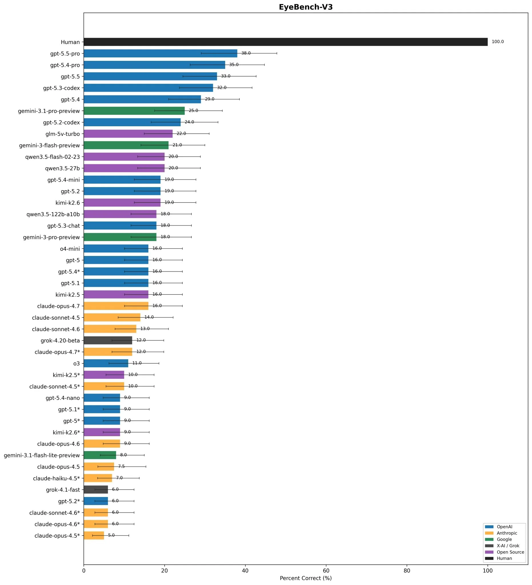

# 2026 年第 17 周技术阅读汇总

[English](README.md) | 简体中文

by @corenel (Yusu Pan) and LLMs

以下为 2026 年 第 17 周（4 月 20 日至 4 月 26 日）期间我所阅读或者输入的内容。为简洁起见，仅列出标题、URL 以及 LLM 生成的概要，以供有兴趣者阅读，进一步的分析、反思与精读不在此赘述。

## 目录

- [2026 年第 17 周技术阅读汇总](#2026-年第-17-周技术阅读汇总)
  - [目录](#目录)
  - [专题](#专题)
    - [DeepSeek V4](#deepseek-v4)
      - [DeepSeek V4：百万上下文与极低定价，开源权重阵营的新战事](#deepseek-v4百万上下文与极低定价开源权重阵营的新战事)
      - [DeepSeek-V4 技术报告：1.6T MoE 怎样在百万 token 下省掉七成算力](#deepseek-v4-技术报告16t-moe-怎样在百万-token-下省掉七成算力)
      - [不只是「更长上下文」：DeepSeek-V4 的多分辨率 Attention 与昇腾适配工程](#不只是更长上下文deepseek-v4-的多分辨率-attention-与昇腾适配工程)
      - [DeepSeek-V4：用 400 天磨出来的不是最强模型，是最低成本曲线](#deepseek-v4用-400-天磨出来的不是最强模型是最低成本曲线)
    - [OpenAI](#openai)
      - [GPT-Image-2：图像生成从「单一模型」进化为「设计代理」](#gpt-image-2图像生成从单一模型进化为设计代理)
      - [GPT-5.5：一个更会干活但更贵也更自信的模型](#gpt-55一个更会干活但更贵也更自信的模型)
    - [其他国产模型](#其他国产模型)
      - [Qwen3.6-27B：27B 稠密模型在编码 Agent 赛道上反超 397B 旗舰](#qwen36-27b27b-稠密模型在编码-agent-赛道上反超-397b-旗舰)
      - [Kimi K2.6：连续执行 4000 次工具调用之后，它真正擅长什么？](#kimi-k26连续执行-4000-次工具调用之后它真正擅长什么)
      - [Hy3 Preview：腾讯混元重构基础设施后的第一枪，「产品共创」能否改写大模型竞争规则？](#hy3-preview腾讯混元重构基础设施后的第一枪产品共创能否改写大模型竞争规则)
  - [有趣的事与物](#有趣的事与物)
    - [技术与互联网](#技术与互联网)
      - [ABot 三层架构下的「途途」：高德机器导盲犬的技术拆解与战略评估](#abot-三层架构下的途途高德机器导盲犬的技术拆解与战略评估)
      - [训练时说话，上车时沉默：小米 XLA 的潜空间推理路线，与将智能汽车重新定义为 Physical AI 的第一终端](#训练时说话上车时沉默小米-xla-的潜空间推理路线与将智能汽车重新定义为-physical-ai-的第一终端)
      - [唐文斌复盘旷视与原力灵机：机器人不能只是 demo](#唐文斌复盘旷视与原力灵机机器人不能只是-demo)
      - [智能不只在权重里：罗福莉谈 Agent 时代的算力重配与组织重构](#智能不只在权重里罗福莉谈-agent-时代的算力重配与组织重构)
      - [电车在 1900 年就占了四成市场，为什么等了一百年才翻盘？](#电车在-1900-年就占了四成市场为什么等了一百年才翻盘)
      - [拼多多十年：便宜给了你，代价给了谁](#拼多多十年便宜给了你代价给了谁)
    - [软件与开发](#软件与开发)
      - [深入 Linux cpuidle：当 CPU 空闲时，内核如何做出最优的「休眠」决策](#深入-linux-cpuidle当-cpu-空闲时内核如何做出最优的休眠决策)
    - [播客与视频](#播客与视频)
      - [演员的自我修养：漫谈港片黄金二十年的表演艺术与时代风格](#演员的自我修养漫谈港片黄金二十年的表演艺术与时代风格)
      - [写 36 年童话，花 21 年打官司：中国图书行业简史，与郑渊洁的写作人生](#写-36-年童话花-21-年打官司中国图书行业简史与郑渊洁的写作人生)
      - [佛陀、道士与探险家：文明十字路口上的敦煌](#佛陀道士与探险家文明十字路口上的敦煌)
      - [「五胡之外」的隐匿世界：严昊如何用丁零与稽胡重写中古华北的族群政治史](#五胡之外的隐匿世界严昊如何用丁零与稽胡重写中古华北的族群政治史)
    - [生成式人工智能](#生成式人工智能)
      - [人不是数据库：Nilay Patel 谈公众为何越用 AI 越反感 AI](#人不是数据库nilay-patel-谈公众为何越用-ai-越反感-ai)
    - [Just For Fun](#just-for-fun)
      - [AI 画图自己加了句「你怎么回事」：当模型开始吐槽你的 prompt](#ai-画图自己加了句你怎么回事当模型开始吐槽你的-prompt)
      - [「Human」是什么模型，API 在哪用？人类成了评测榜上的陪跑选手](#human是什么模型api-在哪用人类成了评测榜上的陪跑选手)
  - [摘录](#摘录)
    - [推文摘录](#推文摘录)
      - [ICLR Oral 论文因作者机构受美国制裁遭撤稿，学术会议的法律边界在哪？](#iclr-oral-论文因作者机构受美国制裁遭撤稿学术会议的法律边界在哪)
      - [贾扬清立规：内部协作只传原始思考，不传 AI 生成内容](#贾扬清立规内部协作只传原始思考不传-ai-生成内容)
    - [文章摘录](#文章摘录)
      - [第二次 API 开放浪潮](#第二次-api-开放浪潮)
  - [学术研究](#学术研究)
    - [语义分割](#语义分割)
      - [Volt：用标准 Transformer 做 3D 场景分割，比专用 3D backbone 快两倍](#volt用标准-transformer-做-3d-场景分割比专用-3d-backbone-快两倍)
    - [场景重建](#场景重建)
      - [MR.ScaleMaster：十五台相机各有各的尺度，一个 Sim(3) 后端把它们统一](#mrscalemaster十五台相机各有各的尺度一个-sim3-后端把它们统一)
    - [仿真渲染](#仿真渲染)
      - [CARLA-Air：35 行代码改动，让无人机飞进 CARLA 的城市世界](#carla-air35-行代码改动让无人机飞进-carla-的城市世界)
    - [SLAM](#slam)
      - [BIEVR-LIO：不是环境没信息，是地图太粗——用体素高度图梯度挖出被丢掉的几何约束，让 LiDAR 在隧道里「看见」微结构](#bievr-lio不是环境没信息是地图太粗用体素高度图梯度挖出被丢掉的几何约束让-lidar-在隧道里看见微结构)
    - [语言模型](#语言模型)
      - [MoDA：把 Transformer 的深度通信从「盲目累加」升级为「精准检索」，在同一个 softmax 里同时检索前文 token 和前序层特征](#moda把-transformer-的深度通信从盲目累加升级为精准检索在同一个-softmax-里同时检索前文-token-和前序层特征)
      - [Qwen3.5-Omni：全模态实时交互的瓶颈不在能力，在于节奏](#qwen35-omni全模态实时交互的瓶颈不在能力在于节奏)
    - [内容生成](#内容生成)
      - [Vision Banana：把分割和深度估计都变成「画一张图」，一个生成器就打败了 SAM 3 和 Depth Anything 3](#vision-banana把分割和深度估计都变成画一张图一个生成器就打败了-sam-3-和-depth-anything-3)
    - [机器人](#机器人)
      - [VLAC：不再为每个任务写 reward，基于成对进度比较的真实机器人在线强化学习](#vlac不再为每个任务写-reward基于成对进度比较的真实机器人在线强化学习)
      - [ABot-Claw：一个让异构机器人共享记忆、互相补位、在线纠错的具身运行时](#abot-claw一个让异构机器人共享记忆互相补位在线纠错的具身运行时)
      - [Cortex 2.0：一个在真实仓库里做到零人工介入的世界模型规划系统](#cortex-20一个在真实仓库里做到零人工介入的世界模型规划系统)
      - [JoyAI-RA：将人类操作视频转化为机器人控制能力的多源预训练路线](#joyai-ra将人类操作视频转化为机器人控制能力的多源预训练路线)
      - [X2-N：不堆电机的轮足变形——一台 28 kg 的「穿着轮滑鞋的人形机器人」如何兼顾滑行与爬楼](#x2-n不堆电机的轮足变形一台-28-kg-的穿着轮滑鞋的人形机器人如何兼顾滑行与爬楼)

## 专题

### DeepSeek V4

#### DeepSeek V4：百万上下文与极低定价，开源权重阵营的新战事

[[202602111927_DeepSeek V4]]

2026 年 4 月 24 日，中国 AI 实验室 DeepSeek 发布了其 V4 系列模型的预览版。这不是又一次简单的 benchmark 刷新——它试图同时改变四件事：让百万 token 上下文成为默认能力，让长上下文的推理成本降低到前代的十分之一以下，让 1.6T 参数的开源权重模型以 MIT 许可证向全球开放，并让国产算力栈进入主流 AI 推理部署。以下是对这一事件的全面解读。

V4 的发布时间点值得玩味。自 2025 年 12 月 V3.2 发布以来，社区对 V4 的期待已经持续了近五个月。期间，OpenAI 发布了 GPT-5.4 和 5.5，Anthropic 推出了 Opus 4.6 和 4.7，Google 的 Gemini 3.1 Pro 也进入预览。闭源前沿的加速迭代使得 V4 如果只是单纯的性能追赶，将很难引起足够的关注。DeepSeek 选择了一条不同的路径——不以单项 benchmark 第一为目标，而是以「百万上下文的工程经济学」为核心卖点。

这个策略选择有着清晰的技术支撑。V4 引入了两种全新的注意力机制。CSA（Compressed Sparse Attention）的思路是先把长文档的 KV 条目压缩成较短的表示，再用一个轻量级的 lightning indexer 为每个 query token 选择最相关的压缩块进行注意力计算，同时保留一个 sliding window 来维持局部精度。HCA（Heavily Compressed Attention）则以更激进的压缩率提供全局低成本记忆。两者混合后的效果非常显著：V4-Pro 在 1M token 上下文下只需要 V3.2 的 27% 单 token 推理 FLOPs 和 10% 的 KV cache；V4-Flash 更进一步，只需 10% 的 FLOPs 和 7% 的 KV cache。这些数字不是渐进式的改进，而是数量级的突破。

技术效率的提升直接反映在定价上。V4-Flash 的 API 价格为 cache miss 输入 0.14 美元/百万 token、输出 0.28 美元/百万 token——这比 OpenAI 最便宜的 GPT-5.4 Nano 还要低。V4-Pro 的输入 1.74 美元/百万 token、输出 3.48 美元/百万 token，在大前沿模型中同样是最便宜的选项。Simon Willison 在他的评测文章中将这一定价形容为「a fraction of the price」，这不是夸张——相比 Claude Opus 4.7 的 5/25 美元或 GPT-5.5 的 5/30 美元，V4-Pro 的输出价格仅为其七分之一到九分之一。

但这里存在一个容易被忽略的陷阱。Artificial Analysis 的早期评测发现，V4 在实际评测中输出 token 偏多，V4-Pro 运行其完整评测索引的成本达到 1,071 美元，虽然远低于 Claude Opus 4.7 的 4,811 美元，但高于一些竞品。Reddit 社区也有用户指出 V4 的「智能密度」可能下降——模型以更多 token 来完成同样的任务。这意味着产品团队在评估迁移成本时，不能简单地用「单 token 价格 × 预计 token 量」来估算，而应该用实际任务的总完成成本来衡量。

V4 系列分为两个型号。V4-Pro 是旗舰模型，1.6T 总参数、49B 激活参数，权重约 865GB，可能是当时最大的开源权重模型（超过 Kimi K2.6 的 1.1T 和 GLM-5.1 的 754B）。V4-Flash 是经济型模型，284B 总参数、13B 激活参数，权重约 160GB。两者均支持 100 万 token 上下文和最大约 39 万 token 的输出。多个社区声音认为，Flash 可能比 Pro 更有实际产品影响力——它便宜到足以成为大量 Agent workflow、批量任务和长文档分析的默认后端。

在性能方面，V4-Pro-Max 展现了强大但非全面领先的姿态。官方 benchmark 显示 SWE-bench Verified 80.6、GPQA Diamond 90.1、LiveCodeBench 93.5 等成绩。但技术报告以罕见的坦诚承认，V4-Pro-Max 虽然超过了 GPT-5.2 和 Gemini 3.0-Pro，但「相对 GPT-5.4 和 Gemini 3.1-Pro 仍有约 3 到 6 个月的差距」。这种自我定位的诚实在行业中并不常见。

来自社区的独立验证提供了更丰满的画面。HN 上一位概率统计研究者使用博士级数学问题测试后认为，V4 Pro Max 在 follow-up 证明中表现非常出色，某些情况近乎完整，是开源权重的巨大进步——但在初始洞察力上仍不如 Gemini。知乎上的详细编程测试则揭示了 benchmark 无法反映的特质：V4 Pro 具有严格的编码纪律（先思考、再编码、后自测），能直接锁定边缘 Bug 根因，但在面对生僻问题时缺乏主动的调试方法论，架构和 UI 设计也不够精致。

V4 的 Agent 能力 是另一个值得关注的维度。DeepSeek 官方称 V4 已成为公司内部的 Agentic Coding 模型，使用体验优于 Sonnet 4.5，接近 Opus 4.6 非思考模式。模型专门针对 Claude Code、OpenCode 等主流 Agent 框架进行了适配。但社区也反映了 tool calling 不稳定的问题——这在 Agent 使用中是致命弱点，虽然有社区开发者提供了 ReAct XML parser 的替代方案，但说明 V4 在 Agent 可靠性上仍需改进。

技术架构的复杂性 是 V4 最耐人寻味的特征之一。技术报告自己承认，为追求极致长上下文效率，V4 采用了「bold architectural design」，保留了大量经初步验证的组件和技巧，导致架构「relatively complex」。评论者 Teortaxes 称其为「an absurd, overwrought kitchensink」——一个荒谬的、过度设计的大杂烩——但紧接着将其定性为「a bizarre triumph of ENGINEERING」。这种张力揭示了当前大模型发展的一个深层特征：理论优雅正在让位于工程有效性。V4 不追求一个单一优美的注意力解决方案，而是将压缩注意力、稀疏选择、滑窗、attention sink、MoE、mHC、Muon、FP4/FP8、定制 KV cache 和 on-disk cache 强行组合在一起，只要最终效果好就行。

地缘政治维度 为 V4 增添了另一层复杂性。Reuters 在发布前报道 DeepSeek 向华为等国内芯片厂商提前开放 V4 访问，但未向 Nvidia 和 AMD 提供预发布版本。官方发布页提到 Pro 的服务吞吐受限于高端算力，寄望于下半年昇腾 950 超节点上量后降价。技术报告同时验证了 NVIDIA GPU 和华为 Ascend NPU。社区分析者注意到 DeepGEMM 代码正在系统性地去除对 NVIDIA 特有软件栈的依赖。这些信号共同表明 DeepSeek 正在有意识地构建跨 NVIDIA 和国产算力的双轨基础设施，但目前还远非「完全脱离 NVIDIA」。

关于「开源」的定义，V4 激起了社区的又一轮争论。V4 权重采用 MIT 许可证，通过 Hugging Face 和 ModelScope 托管——这是相当开放的。但训练数据、完整训练流水线、数据配方和蒸馏来源都未公开。严格来说，V4 是 open weights 而非 open source。这个区分不仅是语义问题——它影响企业能否审计模型行为来源，学术界能否独立复现结果，以及安全评估能否检查训练数据偏见。

V4 的发布也暴露了一些 实际限制。Pro 的 865GB 权重使个人本地部署几乎不可能；Flash 的 160GB 加量化后可在高端 Mac 上勉强运行（2-bit 量化约 17 tok/s），但这仅限于实验性探索。Pro 首日的 API 服务存在慢和限流问题。此外，V4 目前是纯文本模型，不支持多模态——技术报告提到正在开发多模态能力，但在 Claude、Gemini 和 GPT 都已支持多模态的 2026 年，这是一个显著的功能缺失。

从更宏观的视角看，V4 事件的最深层意义可能不在于模型能力本身，而在于它对 AI 推理成本结构 的冲击。如果长上下文推理的成本可以降低到当前的十分之一以下，那么很多原本因成本过高而不可行的应用场景（全代码库分析、长期 Agent 对话、跨文档综合研究、大规模法律文档审查）将变得经济可行。V4 试图将百万 token 上下文从奢侈品变成日用品——这比任何 benchmark 数字都更有产业变革潜力。

但这个愿景的实现仍面临多重不确定性。压缩和稀疏选择的信息损失在极端场景下是否可接受？Token verbosity 是否会吞掉低价优势？长上下文 Agent 中的错误累积如何控制？昇腾 950 能否按计划上量并提供稳定推理？这些问题的答案将决定 V4 究竟是一次历史性的范式转变，还是一个需要后续迭代才能兑现承诺的重要中间站。

对于技术团队来说，最务实的建议是：关注 Flash 多于 Pro，关注任务完成成本多于单价，关注 Agent 可靠性多于 benchmark 排名，关注第三方独立评测多于官方数字。V4 的方法论启示——先压缩再选择、先稀疏激活再扩大容量、先降成本再谈普惠——是比任何具体模型都更持久的设计思想。无论你是否最终选择使用 V4，理解它背后的工程经济学思维都将对 AI 产品开发有所裨益。

#### DeepSeek-V4 技术报告：1.6T MoE 怎样在百万 token 下省掉七成算力

[DeepSeek-V4 - Towards Highly Efficient Million-Token Context Intelligence](https://huggingface.co/deepseek-ai/DeepSeek-V4-Pro/blob/main/DeepSeek_V4.pdf)

2026 年 4 月 24 日，DeepSeek 发布了 V4 系列预览版技术报告。这不是一次简单的模型升级——V4 的核心野心是让百万 token 上下文从昂贵的学术展示变成可常规部署的服务能力。通过重构注意力、残差连接和优化器三条核心链路，V4-Pro 在 1M 上下文下将推理 FLOPs 压缩至前代的 27%、KV cache 压缩至 10%。这组数字背后的技术细节和系统工程，值得每一位关注大模型架构演进的技术读者深入了解。

一、核心问题：为什么百万上下文需要重写架构

大语言模型的发展在 2025-2026 年进入了一个关键拐点。一方面，推理模型通过 test-time scaling 取得了显著的能力提升——让模型在推理时「多想一想」确实能解决更难的问题。另一方面，agentic 工作流的兴起（复杂代码编写、跨文档分析、多步骤工具调用）要求模型持续维护大量上下文状态。这两个趋势共同指向同一个需求：高效处理超长上下文。

然而，标准 Transformer 的注意力机制在序列长度上具有近似二次的计算复杂度。当上下文从几千 token 扩展到百万 token 时，注意力计算和 KV cache 存储都会变得不可承受。FlashAttention 等 IO 优化能缓解内存瓶颈，但不改变注意力的数学本质；先前的稀疏注意力方法（如 Longformer、BigBird）虽然降低了复杂度，但通常使用固定的稀疏模式，难以适应自由文本中多变的信息依赖关系。

DeepSeek-V4 系列正是从这个核心矛盾出发，提出了一种全新的解决方案：不是简单地近似标准注意力，而是重新设计模型应该「看到」什么。

二、架构创新：三层记忆系统的协同设计

V4 最核心的架构创新是将注意力分解为三种互补的记忆机制，形成了一个多分辨率记忆系统。

Compressed Sparse Attention（CSA）承担中粒度动态检索的角色。它首先将每 4 个 token 的 KV 表示通过学习到的加权求和压缩为一个条目（采用 2m 重叠压缩以保留更多上下文），将序列长度压缩到原来的 1/4。然后通过一个名为 Lightning Indexer 的轻量级检索组件，为每个 query 动态估计所有压缩块的相关性分数，并选择 top-k 个最相关的压缩条目（Pro 选 1024 个，Flash 选 512 个）进行注意力计算。Indexer 使用 FP4 精度加速，index scores 从 FP32 量化到 BF16 后获得 2 倍加速且保持 99.7% 的 KV entry recall。与传统固定模式稀疏注意力不同，CSA 的稀疏模式是 content-aware 和 query-dependent 的——每个 query 看到的 KV 子集都不同，选择基于语义相关性。

Heavily Compressed Attention（HCA）承担全局低分辨率覆盖的角色。它以更大的粒度（每 128 个 token 压缩为一个条目）进行压缩，但不执行稀疏选择，而是对所有压缩条目进行稠密注意力。在 1M token 下，HCA 层只需处理约 8192 个粗粒度条目，计算成本极低。HCA 的功能类似于「整本书的目录和摘要」——分辨率低但覆盖面广。

Sliding Window Attention（SWA）作为辅助分支保留最近 128 个 token 的精确信息，确保模型不丢失即时上下文中的语法细节、变量状态和工具调用结果。

三者在模型中交替排列。这种设计的深层逻辑来自信息需求的自然分布：对当前上下文需要精确完整的信息（SWA），对历史上下文需要选择性的精确检索（CSA），对全局上下文只需要粗粒度的背景理解（HCA）。

三、稳定性保障：从残差结构到优化器的多层约束

训练一个 1.6T 参数的 MoE 模型本身就极具挑战，加上 V4 的复杂注意力机制使挑战进一步加剧。V4 在三个层面构建了稳定性保障。

在结构层面，V4 引入了 Manifold-Constrained Hyper-Connections（mHC）替代标准残差连接。标准 Hyper-Connections 将残差流扩展到多个通道以增加表达力，但任意的残差映射矩阵可能导致信号指数级放大。mHC 的创新在于将残差映射矩阵约束在 Birkhoff 多面体上——即双随机矩阵的集合。双随机矩阵的谱范数不超过 1，确保残差变换是非扩张的；且该集合在矩阵乘法下封闭，保证深层堆叠后组合变换仍然稳定。具体实现通过 Sinkhorn-Knopp 算法迭代 20 次将原始参数投影到约束集上。

在优化器层面，V4 对大多数矩阵参数使用 Muon 优化器。Muon 通过 Newton-Schulz 迭代对梯度矩阵进行近似正交化，将更新方向推向 UV^T（去掉奇异值的正交方向），避免某些梯度方向因奇异值过大而支配更新。V4 使用 hybrid Newton-Schulz 迭代——前 8 次用激进系数快速逼近，后 2 次用稳定系数收敛。

在运行时层面，V4 开发了 Anticipatory Routing 和 SwiGLU Clamping 两种应急机制。前者在检测到 loss spike 后自动触发，使用历史参数计算路由索引以打断 MoE 路由与 backbone 之间的正反馈恶性循环；后者持续将 SwiGLU 激活值钳制在安全范围内抑制异常值。值得注意的是，报告坦承这两种技术的底层机制尚未充分理解，但在实践中有效。

四、系统工程：从理论到百万上下文服务的工程桥梁

V4 技术报告中有一个容易被忽视但极其重要的叙事：系统工程不是实现细节，而是模型能力的有机组成部分。

Expert Parallelism 的通信隐藏 是一个精彩的系统设计案例。V4 的关键洞察是：MoE 层中通信总时间小于计算总时间，因此通信可以被完全隐藏在计算之下。通过将专家切分为多个 waves 并融合为流水线 kernel，V4 实现了计算、通信和结果发送的三路并行。在实际测试中，这种方案在一般推理负载上实现 1.50-1.73 倍加速，在 RL rollout 等延迟敏感场景最高达 1.96 倍。报告还推导出硬件设计的平衡公式：对于 V4-Pro，每 GBps 互联带宽可隐藏 6.1 TFLOP/s 计算，超过此阈值后额外带宽的边际收益递减——这是对芯片设计者极有价值的定量指导。

异构 KV cache 管理 是另一个关键系统设计。V4 的混合注意力机制打破了 PagedAttention 的统一假设——不同层的 KV cache 大小、更新频率和淘汰策略完全不同。V4 的解决方案将 cache 分为 state cache（管理 SWA 和未压缩 tail token）和 classical KV cache（管理 CSA/HCA 压缩条目），并与稀疏注意力 kernel 协同设计以满足对齐需求。on-disk KV cache 进一步支持共享前缀复用，提供三种 SWA 缓存策略在存储和计算之间灵活权衡。

Batch Invariance 和 Determinism 确保同一 token 在不同 batch 位置下输出比特级一致，且训练过程完全可重现。这要求替换 cuBLAS（不保证 batch invariance）为 DeepGEMM，为稀疏注意力反向传播和 MoE 反向传播设计确定性的累积方案，并保证 mHC 中小维度矩阵乘法的 split-k 确定性。这些特性使得 V4 团队可以在 loss spike 发生时精确定位数值根因，而非盲目 rollback。

五、后训练范式：从多专家合并到行为蒸馏

V4 的后训练流程采用了一种可称为「分化 - 整合」的两阶段范式。

第一阶段是专家分化：对数学、代码、agent、指令跟随等目标领域，分别基于 base model 进行 SFT + GRPO 强化学习，产生一组各自擅长特定领域的 specialist 模型。值得关注的技术细节包括：使用 Generative Reward Model（GRM）让 actor 网络同时具备生成和评判能力，减少对传统标量 reward model 的人工标注依赖；支持 Non-think/High/Max 三种推理 effort 模式，通过不同 RL 配置（context window、length penalty）训练而成。

第二阶段是行为整合：通过 On-Policy Distillation（OPD）将十余个 teacher 的能力合并进单一学生模型。OPD 的核心是学生在自己采样的轨迹上，通过 reverse KL 散度学习 teacher 的完整词表分布。与传统权重合并相比，行为空间合并避免了不同专家参数位于不同 loss landscape basin 导致的退化问题。V4 采用 full-vocabulary logit distillation 而非 token-level KL 近似，以获得更稳定的梯度估计。为降低成本，teacher 权重按需加载，仅缓存最后一层隐藏状态并在训练时重构 logits。

这种范式的深层逻辑是：模型的部署形态应该在训练时就决定。线上维护多个专家模型的路由、延迟和一致性成本远高于训练时的 OPD 成本。

六、评测图景：局部超越与总体格局

V4 的评测结果呈现了一幅复杂但诚实的图景。

在代码和竞赛推理上，V4-Pro-Max 展现了开源模型的新高度：Codeforces 评分 3206 高于 GPT-5.4 xHigh 的 3168（目前排名人类第 23 位），LiveCodeBench 93.5 高于 Gemini-3.1-Pro 的 91.7，Putnam-2025 形式化证明达到 120/120 满分。这些结果在各自的评测框架中具有较高可信度。

在知识上，V4-Pro-Max 的 SimpleQA-Verified 57.9 显著高于其他开源模型（K2.6 的 36.9、GLM-5.1 的 38.1），但低于 Gemini-3.1-Pro 的 75.6。报告坦陈在知识评测上「显著缩小了与领先闭源模型的差距，但仍然落后」。

在长上下文检索上，V4-Pro-Max 的 MRCR 1M 为 83.5，高于 Gemini-3.1-Pro 的 76.3 但低于 Claude Opus-4.6 的 92.9。MRCR 8-needle 的详细数据显示检索性能在 128K 内极稳定（0.85-0.94），但超过 128K 后逐步下降至 1M 时的 0.59——这诚实地展示了 CSA 动态检索在极长上下文中的精度退化。

在 agent 能力上，V4-Pro-Max 在多个 agent benchmark 上与 K2.6、GLM-5.1 等开源模型持平或略优，但在 Terminal Bench 2.0（67.9 vs GPT-5.4 的 75.1）和 HLE w/tools（48.2 vs K2.6 的 54.0）等任务上仍落后于最强闭源模型。

整体而言，V4 在开源模型中建立了新的综合能力标准，在代码、推理和长上下文方面接近或超越闭源前沿，但在知识广度、纯检索精度和复杂 agent 任务上仍有差距。

七、局限性与前瞻

报告自身坦诚地指出了两个关键局限。

第一是架构复杂性。为追求极端长上下文效率，V4 保留了大量初步验证的组件和技巧，使架构「相对复杂」。CSA、HCA、SWA、mHC、DeepSeekMoE、Muon、FP4 QAT、Hash routing、Anticipatory Routing、SwiGLU Clamping、Quick Instruction、OPD 等组件的同时存在，增加了理解、调试和维护的难度。报告承诺未来将「进行更全面和有原则的调查，将架构蒸馏到最本质的设计」。

第二是理论理解的缺失。Anticipatory Routing 和 SwiGLU Clamping 的有效性缺乏完整的理论解释，CSA/HCA 的信息保留保证缺乏形式化分析，OPD 中 teacher 权重的最优设定方法未明确。这些理论空白不影响当前系统的实用性，但限制了对其在更极端场景下行为的预测能力。

未来方向包括：探索更稀疏的 embedding 模块、低延迟架构和系统技术、长程多轮 agent 任务、多模态能力整合，以及更好的数据合成策略。

八、对读者的建议

对于架构研究者，V4 的多分辨率记忆系统提供了超越传统稀疏注意力的新思路——不是在「全量 vs 稀疏」之间选择，而是为不同距离的上下文设计不同分辨率的记忆机制。mHC 的流形约束思想可迁移到任何深层信号传播不稳定的网络结构中。

对于系统工程师，V4 的异构 KV cache 管理、Fine-grained EP、batch-invariant kernel、on-disk 存储策略提供了面向百万上下文服务的实战参考。特别是 C/B 平衡公式和对硬件厂商的建议，对芯片和系统设计有直接指导价值。

对于应用开发者，V4 的三种推理 effort 模式、Quick Instruction、DSML 工具调用格式和 interleaved thinking 机制，提供了构建高效 agentic 应用的新接口范式。建议关注开源实现中的具体细节，以充分利用 V4 的长上下文和工具使用能力。

总体而言，DeepSeek-V4 是一次雄心勃勃的系统工程——它不是在某个单点上突破，而是将架构创新、训练优化、推理基础设施和后训练方法论打通为一个面向百万上下文服务的完整方案。其最大贡献不在于任何单一技术，而在于证明了百万上下文可以从学术展示转变为可常规部署的工程现实。

#### 不只是「更长上下文」：DeepSeek-V4 的多分辨率 Attention 与昇腾适配工程

[DeepSeek-V4昇腾首发：基于CANN的训推优化实践](https://www.bilibili.com/video/BV1KLo5BfEdG/)

2026 年 4 月 24 日，DeepSeek 发布了 V4 系列模型，同日华为昇腾/CANN 团队宣布完成 Day 0 首发适配。这不是一次普通的模型发布——它是模型架构革新与国产 AI 芯片工程化能力的一次联合展示。本文基于 CANN 官方直播的完整转写稿与结构化精读笔记，从技术机制和产业叙事两个维度进行解剖。

DeepSeek-V4 的发布引发了中文科技圈的广泛关注，但大部分讨论集中在「1.6T 参数」「1M 上下文」「国产芯片」这些宏大标签上。昇腾 CANN 团队在发布当日推出的技术直播——由主持人朱信成和两位推理专家许可、宦锐智共同完成——提供了远比这些标签丰富的技术细节。这份直播转写稿的核心价值在于：它不是在泛泛解释 V4 做了什么，而是在细讲 CANN 如何把 V4 的新结构落到昇腾 950 和 Atlas A3 上。

架构层面：从单一 Attention 到多分辨率记忆系统

理解 V4 的架构变化需要先理解它解决的问题。标准 Transformer 的自注意力机制计算量与上下文长度的平方成正比。当上下文从 128K（V3）增长到 1M（V4）时，这种二次增长使得全量 Attention 在工程上不可接受。V3.2 已经通过 Lightning Indexer 做了稀疏 KV 选择来缓解这个问题，但仍然使用统一的 Attention 模式处理所有距离的信息。

V4 的根本突破在于放弃了「一种 Attention 适配所有距离」的假设。它引入了三种注意力机制的混合使用：SWA（滑窗注意力，窗口大小 128）为最近的 token 保留完整的原始 KV，确保近距离信息的高保真度；CSA（压缩稀疏注意力）将每 4 个 token 压缩为 1 个（带有前后 overlap），然后通过 Lightning Indexer 在压缩后的历史中检索 top-k 个最相关的候选（Flash 模型取 512，Pro 模型取 1024）；HCA（高倍率压缩注意力）将每 128 个 token 压缩为一个粗粒度的历史摘要，不做稀疏选择，不做 overlap，仅维护远程全局背景。

这三种机制在模型的不同层中交替排列：Flash 模型前两层使用纯 SWA，后续 21 层 CSA 与 20 层 HCA 交错；Pro 模型则由 30 层 CSA 和 31 层 HCA 直接交替，没有纯 SWA 层。官方技术报告给出了量化结论：V4-Pro 在 1M 上下文下仅需 V3.2 约 27% 的 FLOPs 和 10% 的 KV Cache。V4-Flash 更为激进，仅需约 10% FLOPs 和 7% KV Cache。

但需要注意一个关键边界：1M 上下文不等于模型能完美记住 1M token 的每一个细节。HCA 的 128× 压缩意味着远程记忆只保留了语义摘要级别的信息。CSA 的 top-k 检索依赖于 Lightning Indexer 的选择质量——虽然官方报告称 FP4 QAT 下召回率达 99.7%，但这仍然是近似系统。精读笔记通过一个思维实验揭示了这一限制：如果要在 1M token 的合同库中精确定位某个远处金额的小数点错误，HCA 的粗压缩和 CSA 的检索都可能失效。因此，百万上下文更准确的理解是「多分辨率近似处理」，而非「逐 token 完美记忆」。

稳定性保障：mHC 的数学精巧

V4 另一个值得深入理解的架构创新是 mHC（manifold-constrained HyperConnection）。当模型同时使用 MoE 稀疏激活、多种压缩 Attention、MTP 投机推理和深层残差网络时，训练不稳定性是一个系统性风险。传统残差连接 `Y = X + F(X)` 的信息混合方式过于固定；带可训练权重的 HyperConnection `Y = A × X + B × F(X)` 虽然更灵活，但 A、B 的自由更新在深层网络中会导致梯度爆炸或消失。

mHC 的解决方案在数学上相当精巧：它通过 Sinkhorn-Knopp 算法将残差混合矩阵 B_l 约束在 Birkhoff 多面体（双随机矩阵集合）中。双随机矩阵的每行每列和为 1、非负，谱范数不超过 1——这意味着残差映射具有 non-expansive 性质，通过该映射后隐藏状态的范数不会增大，且双随机矩阵在乘法下封闭，多层叠加仍然保持稳定。这种「把稳定性设计进架构」的方法论，比依赖经验性 learning rate schedule 或 gradient clipping 更具理论保证，对所有超大规模模型训练都有借鉴意义。

硬件适配：不是移植，是协同设计

直播中技术含量最高的部分，是 CANN 团队如何将 V4 的新结构映射为昇腾硬件上高效的算子和执行策略。这里有两个特别值得关注的工程决策。

第一是量化路径的平台差异化。950 平台的 Cube 计算单元原生支持 MXFP8 格式的矩阵乘法，无需频繁将 scale 和 C 矩阵搬出做反量化运算，因此 MXFP8 在 compute-bound 场景下比标准 FP8 per group 更高效。基于这一硬件特性，950 上采用了 MXFP8 + MXFP4 的混合量化组合。而 Atlas A3 的硬件特性不同，团队在大量实验后发现 W8A8 INT8 量化结合多流并发能获得更好的性能收益——量化虽然缓解了权重加载的访存开销，但也引入了动态量化的额外计算开销，最终方案是在量化增益和计算开销之间做工程权衡。这说明 CANN 团队不是在做通用移植，而是在进行针对芯片微架构特征的深度适配。

第二是多流并发的精细设计。CANN 设计了三种多流并发方案：在 MoE 中，利用路由专家主要占用 Cube 核而共享专家主要使用 Vector 核的特点，将两者放在不同计算流上并行执行，实现共享专家延迟的完全掩盖；在 Attention 中，将 Prolog、Compressor、Lightning Indexer 设计为三路并行，在 CSA 场景下完全掩盖 Compressor 耗时；在 Decode 全局层面，利用 AICPU Scheduler 在 AICPU 核上预计算 Attention 算子的 tiling metadata，与模型主计算并行。配合 CV 控核技术——在算子级精确控制每个算子占用的 Cube 核数和 Vector 核数——避免了多流并行时的资源抢占。这些设计使得在 Atlas A3 64 卡部署场景下，npugraph_ex 叠加各项优化可获得约 6ms 的端到端收益。

性能数据：可信但需口径说明

直播展示了一系列性能数据：Flash 模型在 950DT 16P 部署下单请求延迟低于 10ms、多并发吞吐 4722 TPS at 20.15ms；Pro 模型 16P 单请求 20ms、多并发 388 TPS at 21ms；Atlas A3 64 卡 INT8 路径下 3733 TPS at 30ms。这些数据支持了「CANN 已对 V4 做了深度优化，V4 可在昇腾平台上达到可展示的性能水平」这一结论。

但精读笔记提出了重要的口径警示：这些数据不能直接用于跨平台比较。它们涉及不同的部署规模（单卡/16P/64 卡）、请求模式（单请求/多并发）、量化精度、是否包含 MTP 加速等多个变量。CANN 社区文章自身也注明数据「仅为模型运行离线 benchmark，实际部署时推理引擎还涉及 Serving 调度」。因此，读者应将这些数据视为「早期离线 benchmark，展示适配深度和优化方向」，而非「线上生产环境的真实吞吐」。

产业叙事：事实与夸张之间的边界

这场直播的产业意义远超其技术内容。Reuters 报道将 V4 放在中国推动技术自主的叙事中，称 Ascend 芯片参与了 V4 的部分训练过程，Omdia 则将 Ascend 列为中国本土替代 Nvidia AI 芯片的最佳选择之一。B 站相关视频标题充斥着「中国心」「核弹」等情绪化表达。

精读笔记对此进行了冷静的分层：高可信内容包括「V4 已发布并开源」「昇腾支持 V4」「部分训练使用 Ascend」，这些有多源核查支持；中可信内容包括性能数据，方向可信但口径需说明；低可信或需警惕的内容包括「完全不依赖 Nvidia」「CUDA 被彻底击穿」等说法，当前证据不足以支撑。Hacker News 上的技术社区讨论也呈现了类似的分裂：一边是对开放权重、低价 API 和文档质量的赞赏，另一边是对「zero CUDA」叙事和多模态缺失的质疑。

最稳妥的判断是：这次发布显著提升了国产 AI 软硬件栈的可信度和成熟度——从「能不能跑」推进到了「能否原生吃到模型架构红利」——但还不能仅凭这场直播证明全链路替代已经完成。产业叙事的夸张部分应该被剥离，技术实质才是这份材料最值得深入研究的内容。

对目标读者的建议

对于刚入门的技术读者，这份材料最值得学习的不是任何单一的优化技巧，而是两个思维方式。第一，分辨率分层的设计哲学：当面对不可行的计算成本时，不要试图用单一方案强行解决，而是承认不同距离/尺度的信息可以容忍不同程度的近似，然后为每个层级设计最适合的处理方案。第二，信息可信度的分层意识：在阅读任何技术发布时，区分「官方可核查事实」「工程口径指标」和「二级传播夸张」，是建立独立技术判断力的关键。

这份材料也有明确的局限：作为昇腾/CANN 官方直播，它天然带有推广属性，不包含与 Nvidia 的同条件对比，也没有讨论昇腾生态在 tool calling、agent 框架、长尾应用支持等方面的已知缺口（如 vLLM Ascend 上 V4 尚不支持 tool_call）。建议读者将此材料与 DeepSeek 官方技术报告、vLLM Ascend 文档、Hacker News/Hugging Face 社区讨论结合阅读，以获得更完整的技术图景。

#### DeepSeek-V4：用 400 天磨出来的不是最强模型，是最低成本曲线

[第210期 DeepSeek-V4](https://podwise.ai/dashboard/episodes/7846263)

当所有人都在争论哪个模型「更聪明」时，DeepSeek 选择回答一个不同的问题：如何让「聪明」变得足够便宜。

2026 年 4 月 24 日，DeepSeek 发布了 V4 Preview 版本。「后互联网时代的乱弹」第 210 期播客对这一事件进行了超过一个半小时的深度讨论，并配合了一份极为详尽的精读笔记（含官方文档核查、学术论文溯源和社区评论谱系）。这期内容值得关注，不是因为它宣称 V4 是「最强模型」——事实上播客明确表示 V4 在某些维度上仍落后于 GPT-5.4 和 Claude Opus——而是因为它提出了一个更具战略深度的判断：AI 行业的竞争焦点正在从「单次推理能力」向「长程任务的成本效率」迁移，而 DeepSeek-V4 是这种迁移的标志性事件。

四个话题，一条主线

播客讨论了四个表面上不太相关的话题：一款名为「龙虾盒子」的 AI Agent 硬件、Agent 互操作协议（特别是 ATH 握手协议）、SpaceX 以 600 亿美元选择权与 Cursor 的交易、以及 DeepSeek-V4 的技术架构和市场影响。精读笔记敏锐地指出，这四个话题共同指向同一个问题：当 AI 从聊天框走向长时运行的 Agent，真正的护城河在哪里？

龙虾盒子暴露了 Agent 硬件的权限悖论——开箱极其流畅，但安全限制使它几乎无法完成有意义的任务。这不是产品经理的失误，而是 Agent 落地的结构性矛盾。ATH 协议的讨论则揭示了 Agent 互操作的核心难题不在身份认证，而在服务定价和交易追责——这是一个目前没有任何标准能解决的问题。SpaceX 与 Cursor 的交易被分析为 IPO 估值叙事的组成部分，而非纯粹的技术整合。这三个话题为 DeepSeek-V4 的讨论提供了产业背景：Agent 时代需要的基础设施尚未就绪，而 V4 正在尝试从底层提供一部分答案。

技术架构：不是更大的模型，是更便宜的智能

V4 最引人注目的数字不是 1.6T 总参数，而是一组对比数据：在 1M token 上下文下，V4-Pro 相比 V3.2 只需约 27% 的 FLOPs 和 10% 的 KV cache。播客主持人李骏强调这不是「少 30%」的优化，而是「少 90%」的数量级变化。

这种数量级的成本降低来自一套系统化的稀疏工程。CSA（压缩稀疏注意力）以 4 倍压缩率将连续 KV 对压缩为摘要，再让 query 只检索最相关的 top-k 块。HCA（超级压缩注意力）以 128 倍压缩率进行重度压缩，提供粗粒度历史概览。两者在层间交替使用，既保精度又保覆盖。mHC（超连接）将单条残差流扩展为多条路径，防止深层稀疏网络中信号衰减。Muon 优化器 基于矩阵正交化实现更规整的梯度更新。OPD（在策略蒸馏）使用反向 KL 散度将多个领域专家教师的能力压进统一模型。精读笔记将这种全方位稀疏化概括为「V4 的稀疏化不是一个点，而是一套系统工程」。

更值得关注的是 reasoning_content 条件式持久化 机制。在普通对话中，V4 像其他 thinking 模型一样丢弃前轮思考；但在 tool-calling / agentic 场景中，所有中间推理被完整保留。如果 Agent 框架漏传这个字段，API 直接返回 400。精读笔记将此称为「V4 最精妙的地方」——它把 thinking 从一次性生成过程改造为 Agent 状态的一部分，使长链任务可以保留工作记忆、支持断点续传、避免重复探索。而这种设计之所以可行，恰恰是因为 CSA/HCA 已经将长上下文成本压到足够低——否则保留 reasoning 就意味着上下文膨胀和成本爆炸。

被忽视的工程深度

播客特别强调了 DeepSeek 在底层工程上的独特能力。V4 团队用 TileLang（一种 Python DSL）重写了关键算子，并在仓库介绍中自称「大部分算子已达到现有硬件的理论极限」。这些算子通过 TileLang 的编译器可以翻译为不同芯片的原生代码，为硬件中立化打下基础。同时，华为 CANN 团队明确表示昇腾 950 针对 DeepSeek 训练需求做了定向芯片优化——这种「模型厂定义需求、芯片厂定向优化」的双向协同在全球范围内罕见。

李骏用了一句话概括这种独特性：「把绝大部分关键性的算子换用一个语言重新写一遍，然后优化到接近理论极限……这种工作现在全世界没有哪个 AI Lab 能做的，只有 DeepSeek 会做。」这种评价是否过高可以讨论，但它指向了一个事实：DeepSeek 愿意在不直接面向用户的底层优化上投入大量时间，这种能力组合（顶尖研究 + 极端工程耐心）确实少见。

此外，DeepSeek 自研了一套 Rust 编写的 Agent 沙盒平台 DSec，单集群管理数十万并发 sandbox。这意味着 V4 的 Agent 能力不仅靠模型权重，而是在自研的执行环境中通过「模型 × 工具 × sandbox × 评测」共同训练出来的。

竞争格局与隐含风险

播客对 V4 的定位保持了克制的理性。TechCrunch 报道指出 V4 仍是 text-only，缺乏多模态能力，在某些知识测试上落后闭源前沿模型约 3-6 个月。国内竞品方面，Kimi K2.6 在多模态和 agentic coding 上有差异化优势，GLM-5.1 在工程任务评测上表现强劲，Qwen 3.6 在中小模型实用性和生态部署上更成熟。V4 的差异化在于成本结构和长上下文，而非全面领先。

精读笔记进一步识别了多个隐含风险：CSA/HCA 的压缩可能导致「关键信息被压缩掉」——在 1M token 的法律文档中，低语义相似但高后果的条款可能被漏掉；reasoning_content 持久化可能锚定早期错误假设——Agent 第 2 轮的误判会被后续持续沿用；OPD 的 mode-seeking 倾向可能丢弃长尾行为模式，导致冷门任务不稳定。这些风险并不否定 V4 的价值，但提醒读者不应将 1M context 等同于 1M perfect recall。

被低估的战略意义

播客最独到的洞察，是将 V4 放在更长的时间轴上评估。李骏判断 V4 的影响可能要半年到一年后才能充分展现——不同于 R1 那种「一眼就能看懂」的冲击，V4 的价值需要通过以下传导链逐步释放：下半年昇腾 950 超节点部署 → API 价格显著下降 → 更多 Agent 框架完成适配 → 长时 Agent 工作流在真实场景中被验证 → 行业认识到成本曲线已被改变。

一个有趣的细节是：DeepSeek 在中文公告中提到下半年价格将因华为超节点扩充而显著下降，但英文公告中没有这个信息。这种「逆向信息差」在 AI 行业极为罕见——通常是美国信息领先，而这次中国用户先知道了即将到来的价格下调。Redis 创始人 antirez 基于当前价格评价「也没有特别便宜」，而中国社区已经知道这只是暂时状态。

对读者的建议

这期播客适合三类读者。对于技术从业者，重点关注 CSA/HCA 的压缩 - 稀疏 - 选择三步范式和 reasoning_content 持久化的 API 约束——如果你在开发 Agent 框架，必须确保完整保存和传回 assistant message 中的 reasoning_content 字段。对于行业观察者，精读笔记提出的六维分析框架「能力 × 成本 × 权限 × 场景 × 生态 × 可信度」是评估任何 AI 产品的实用工具。对于研究者，V4 的 OPD 后训练方法（反向 KL 多教师蒸馏）和 mHC 残差流增强机制值得深入研究其理论边界。

播客最后建议跟踪六个指标来判断 V4 的真实影响：第三方 512K/1M 长上下文评测、Agent harness 适配完成度、多小时真实 coding 任务表现、昇腾 950 上量后的价格变化、多模态路线进展、以及合规争议对国际采用的影响。这些指标比任何单日的 benchmark 分数都更能揭示 V4 对行业的长期塑造力。

如果要用一句话总结这期播客的核心判断：DeepSeek-V4 不是在争夺「今天最聪明的模型」这个头衔，而是在重写「让 AI 持续工作的成本公式」——而成本公式的改变，往往比能力的边际提升更深远地改变产业格局。****

### OpenAI

#### GPT-Image-2：图像生成从「单一模型」进化为「设计代理」

> [!NOTE]
>
> CJK 文字生成质量显著高于 GPT-Image-1 以及 NanoBanana Pro，在文字密集情况下仍然能保持较好的输出。

[[202604051141_GPT-Image-2]]

2026 年 4 月 21 日，OpenAI 发布了 ChatGPT Images 2.0。围绕这一发布的社区讨论规模罕见——Hacker News 主帖获得 1044 积分与 972 条评论，Reddit、Twitter、技术博客和主流媒体同步爆发。然而，大多数讨论停留在「图变好了」「字更准了」的层面。本文试图穿透表面，从架构、能力、局限、竞争、安全和方法论六个维度，还原这次发布的真正技术意义。

理解 ChatGPT Images 2.0，首先需要搞清一件被大多数人忽略的事：用户在 ChatGPT 中体验到的「图像生成」，不是一个图像模型在工作，而是一整个 Agent 系统在协作。OpenAI 系统卡明确声明 thinking mode 将「推理和工具使用」加入了图像生成流程。API 文档揭示了更具体的机制：Responses API 中的 image_generation tool 由主线 LLM（如 GPT-5.5）驱动，后者会自动改写用户的原始 prompt 为一段详细的视觉 brief，改写结果存入 revised_prompt 字段。这意味着，当一个电商运营者输入「帮我把这张蓝莓照片做成宣传图」时，系统在背后可能补全了品类分析、构图规则、光照设计、品牌语气、材质选择、排版层级和商业摄影风格等信息——这些是一个资深平面设计师才具备的隐性知识。

来自独立研究者的外部验证支撑了这一判断。Ethan Mollick 发现所选主线 LLM 对图像输出影响巨大——GPT-5.4 Thinking 和 GPT-5.4 Pro 在复杂任务上会产生明显更好的图像。如果图像质量纯粹取决于底层图像模型，更换上游 LLM 不应造成显著差异。Simon Willison 则在浏览器网络检查器中直接捕获了被改写后的长 prompt——他的原始输入只有一句话，实际传递给图像模型的却是一段精心构造的视觉创作说明。这些外部观察与官方文档形成了完整的证据链。

早在官方发布前，中文技术社区已嗅到变化。LMArena 上的匿名模型「duct-tape-1」被 Gorden Sun 推断为 GPT-Image-2，其文字渲染能力引起关注。Orange AI 发现生成的假身份证连号码规则都基本正确（仅校验位有误），预示了高真实感带来的社会信任问题。九原客更是直觉性地猜测「GPT-image-2 好像不是单独的一个模型，貌似是个 Agent」——这一判断后来被官方文档和社区验证所证实。

在能力维度上，文字渲染的可靠性跃升是各方一致认可的主要进步。OpenAI 官方展示了海报、漫画分镜、信息图、书签、杂志排版中的大量可读文字。但需要保持清醒的是，官方限制列表明确承认精确文字位置和清晰度仍可能失败，WIRED 的早测也提示非英语文本仍可能混入伪字符。另一个核心能力是营销视觉的生产力爆发。中文 X 圈的歸藏展示了两个极具代表性的案例：一张随手拍的照片被转化为「氛围非常上档次」的宣传图；一张蓝莓产品图在保持核心产品元素不变的前提下，设计包装得到了全面优化。歸藏的评价——「非常聪明，知道啥东西能变，啥东西不能变」——精准捕捉了这个模型在商业场景中的核心价值。

然而，工程师社区对能力边界的探测更为犀利。Hacker News 上 minimaxir 设计了一个 8×8 宝可梦素数网格测试，要求模型同时处理素数计算、宝可梦识别、条件风格应用、字体指定和网格排列。GPT-image-2 在风格创造性上表现更佳，但逻辑约束执行出错——风格按行而非按数字位数应用，多个宝可梦识别错误。MrManatee 对此提出了整场讨论中最深刻的评论之一：这类任务使用了「错误的抽象层」，精确数量和逻辑条件应由程序处理，视觉风格才应由图像模型处理。LeifCarrotson 将其推进为 agentic workflow 的工程方案：先计算素数、逐格生成、加标签、拼网格。这给出了一个重要的方向判断——未来真正强的不是单模型，而是「计算可验证部分用程序、视觉不可微部分用生成模型」的混合系统。

vunderba 的 GenAI Showdown 提供了更系统化的比较视角。GPT-image-2 在 15 题 text-to-image benchmark 中得 12 分，领先此前最好模型 1 分。此前 OpenAI gpt-image-1.5 和 Google NB2 在 prompt adherence 上大致都在 70% 成功率附近。领先是真实的，但幅度并非碾压，且失败集中在精确逻辑与结构约束任务上。在编辑能力方面，vunderba 的评价更为微妙：OpenAI 的指令遵循好但会引入类似 tone mapping 的全局变化，Flux/Kontext 在局部编辑上更精准但复杂 prompt 理解较弱。这意味着商业上不应只选一个模型，而应按任务类型路由。

Simon Willison 的测试贡献了另一个关键洞察。在浣熊业余无线电测试中，有人让 ChatGPT 在一张找不到浣熊的图上圈出浣熊，结果模型通过编辑「补出了」一个原图中不存在的浣熊。Simon 的结论简洁有力：生成器不等于验证器。这不是技术 bug 而是认识论原理——创造和审核是不同的认知功能，不能由同一个系统自洽完成。这对任何依赖 AI 自检的生产系统都是重要警告。Simon 的另一个案例也值得注意：模型在被要求画混乱场景时自行添加了写着「WHY ARE YOU LIKE THIS」的路牌——展示了模型会主动注入叙事性元素的特性，在广告创意中可能是优点，在严格执行任务中则是不可控风险。

Reddit 社区贡献了两个重要的风险信号。第一是纹理伪影：多名用户在自然场景和规律纹理中观察到类似 checkmark 的重复花纹，在 instant 和 thinking 模式中都有出现，根因不明但足以构成生产风险。第二是版权相似度失控：用户要求生成 90 年代 New Yorker 风格漫画，结果与 Peter Steiner 1993 年的著名原作高度接近，甚至可能包含原漫画家签名。这不等于法律判决，但作为产品风险信号极其强烈——当 prompt 指向具体历史作品时，模型可能不只是「学会风格」而是过于接近特定作品。

安全层面，系统卡的对抗性评测数据值得关注：instant 模式裸模型的违规率达 22.0%，thinking 模式为 6.7%；经安全层过滤后 safe output 分别达 99.1% 和 99.2%。这说明安全层确实在发挥关键作用，但也意味着如果安全层被绕过（如通过 API 直接调用），风险会显著上升。来源标记方面，OpenAI 采用了 C2PA 元数据和不可感知水印，但自己承认「来源证明没有单一解决方案」。HN 对此的讨论更为尖锐：C2PA 是正向证明而非鉴伪工具，社交平台常剥离元数据，水印可被多种方式削弱。最根本的问题是规模差异——Photoshop 造假需要时间和技能，prompt 造假则将伪造能力扩散到几乎所有会打字的人。

综合来看，GPT-Image-2 / ChatGPT Images 2.0 的意义不应被简化为「比竞品强」或「字终于好了」。更准确的定位是：它把图像生成产品化为一种「视觉推理与设计代理」，能理解目标、重写 brief、处理上下文、生成多种一致视觉资产，并把文字、布局和现实知识结合到可用草稿中。它最强的地方是营销视觉、图文排版、信息图、社媒/电商/教育素材和复杂叙事草图；最弱的地方是精确离散逻辑、像素级局部编辑、严格事实验证、自然纹理伪影、版权相似度控制和真实照片的社会信任问题。

对于技术读者而言，本文最想传达的实践启示有三点。第一，评测和使用时必须区分「裸模型」和「系统产品」——通过 API 裸调和通过 ChatGPT 界面调用是完全不同的系统配置，不同主线 LLM 也会导致截然不同的输出，不标明系统配置的比较都不可靠。第二，将 GPT-Image-2 放进可审计的工作流中使用，而非孤立使用——记录 prompt、revised_prompt、模型参数、成本和人工评分，引入独立验证环节，把它当「初稿设计师」而非「终稿专家」。第三，关注「隐性知识显性化」这个通用方法论的迁移价值——revised_prompt 的成功模式可以迁移到代码生成、文档写作、产品设计等任何需要专业知识才能准确表达需求的领域。

这次发布也留下了若干值得持续追踪的问题。当 AI 图像的生成成本趋近于零而验证成本保持刚性时，信息生态将如何重构？当用户长期依赖 AI 自动补全需求表达，人类清晰表达需求的能力是否会退化？当端到端多模态模型成熟后，当前的 Agent 架构是否会被颠覆？这些问题的答案将决定 GPT-Image-2 在 AI 图像生成史上的最终位置——是一个时代的开创者，还是一个过渡性的技术方案。

#### GPT-5.5：一个更会干活但更贵也更自信的模型

> [!NOTE]
>
> 个人体验，就完成任务而言，比 GPT-5.4 和 Claude Opus 4.6/4.7 好，写出来的代码质量以及对 review 的修复深度都好了不少，没有多次返工。
>
> 虽然用 tokscale 来看 token 消耗和 gpt-5.4 算是持平或者略多一些，不过从 Codex usage 上看消耗比 gpt-5.4 多，可能是因为定价上涨了（输出 15 -> 30）。
>
> 现在主要用 gpt-5.5-xhigh 写代码，然后涉及文档撰写的再用 Claude Opus 4.6。

[[202604191931_GPT-5.5]]

2026 年 4 月 23 日，OpenAI 发布了 GPT-5.5 系列模型。这不是一次普通的模型迭代——它将前沿模型能力、Codex 开发工具、ChatGPT 产品和推理基础设施整合为一个面向真实工作的系统。在 benchmark 上，GPT-5.5 在终端代理和长上下文处理上取得了惊人突破，但在部分代码修复和纯推理任务上并未全面领先。定价翻倍引发了广泛争议，安全能力的提升也带来了新的治理张力。本文基于 OpenAI 官方发布文、Simon Willison 的技术探索、Ethan Mollick 的深度体验、Hacker News 社区讨论和系统性精读笔记，对这次发布事件进行多维度解读。

GPT-5.5 发布前一周，社区已经嗅到了风声。多位 ChatGPT Pro 用户报告 GPT-5.4 的响应时间从通常的 15-30 分钟骤降至 1-5 分钟，Polymarket 给出了 75% 的 4 月 23 日发布概率。OpenAI 工程师 Eric Mitchell 在 X 上不置可否地询问用户是否遇到了「response quality issues」。这些信号在 4 月 23 日的正式发布中得到了验证。

OpenAI 对 GPT-5.5 的定位，从第一句话就与此前的聊天模型划清了界限。官方发布文没有说「最聪明的聊天机器人」，而是说它是「our smartest and most intuitive to use model yet, and the next step toward a new way of getting work done on a computer」。关键词不是「聊天」或「回答」，而是「getting work done」。这个定位通过一个核心场景来具象化：用户可以将一个混乱的、多部分组成的复杂任务交给 GPT-5.5，信任它自主规划、调用工具、检查结果、处理歧义并持续推进。换句话说，OpenAI 试图让模型从「需要人类扶着走」的状态转变为「能自己把事情做完」的状态。

这个定位在 benchmark 数据上得到了部分验证。GPT-5.5 在 Terminal-Bench 2.0 上达到 82.7%，相比 GPT-5.4 的 75.1% 提升了 7.6 个百分点，且远超 Claude Opus 4.7 的 69.4% 和 Gemini 3.1 Pro 的 68.5%。Terminal-Bench 测试的是复杂命令行工作流中的规划、迭代和工具协调能力——这恰好是代码代理在真实工作中最常执行的操作类型。在 ARC-AGI-2（抽象推理）上，GPT-5.5 从 GPT-5.4 的 73.3% 跃升至 85.0%，进步幅度达到 11.7 个百分点。在长上下文处理方面，进步更为惊人：MRCR v2 在 512K-1M 级别从 36.6% 飙升至 74.0%，翻倍有余。这意味着 GPT-5.5 在处理大型代码库或长篇文档时的能力有了质的变化。

然而，GPT-5.5 远非「全面碾压」。在 SWE-Bench Pro——评估模型解决真实 GitHub issue 能力的重要 benchmark——上，GPT-5.5 的 58.6% 仍低于 Claude Opus 4.7 的 64.3%。在 MCP Atlas（多工具协调）上，GPT-5.5 的 75.3% 低于 Claude 的 79.1% 和 Gemini 的 78.2%。在 Humanity's Last Exam（无工具的纯推理测试）上，GPT-5.5 的 41.4% 也低于 Claude 的 46.9%。更令人关注的是 Artificial Analysis 报告的幻觉率数据：GPT-5.5 虽然在 Omniscience 准确率上最高，但幻觉率高达 86%，远超 Claude Opus 4.7 的 36% 和 Gemini 3.1 Pro 的 50%。这不是说 GPT-5.5 的大多数回答都是错的，而是说它在给出错误回答时更倾向于自信地陈述而非承认不确定——这是一个值得高度警惕的特征。

Ethan Mollick 的深度体验文提供了比 benchmark 更立体的评估。作为沃顿商学院教授，他将 GPT-5.5 放入了真实的研究和创作工作流中。在一个要求构建「3000 BCE 到 3000 AD 港口城镇演化的 3D 模拟」的编程任务中，GPT-5.5 Pro 在 20 分钟内完成，而 GPT-5.4 Pro 需要 33 分钟，且 GPT-5.5 Pro 是唯一真正建模出城镇随时间演化的模型。更令人印象深刻的是他的学术论文生成实验：他将十年间积累的众筹研究数据（包括 STATA、CSV、XLS 和 Word 文件）交给 Codex + GPT-5.5，仅用四条 prompt 产出了一篇包含真实文献综述和复杂统计分析的学术论文草稿。他的评价是：「如果这是博士二年级项目的产出，我会很满意。」但他立即补充了两个关键限定——假设不够有趣，因果识别存在标准化的问题。

Ethan 还展示了 GPT-5.5 在创意领域的能力和局限。他让模型创建了一个完整的桌面角色扮演游戏，产出了一份 101 页的 PDF，包含规则、表格、插图和模拟玩家测试。技术产出令人惊叹，但长篇叙事暴露了 AI 写作的顽固缺陷：对怪异感的偏爱、过于复杂但不完全回报的想法、每个角色用同一种简短语气说话、以及反复出现的名字（Mara）。这些观察共同构成了他最核心的判断——AI 能力的前沿（jagged frontier）确实在外扩，但锯齿并未消失，只是位置发生了移动。

Simon Willison 的文章看似是一个轻松的技术探索——用 pelican SVG benchmark 测试 GPT-5.5——但实际上抓住了这次发布中一个极为重要的产品信号。在正式 API 尚未上线的情况下，他发现可以通过 Codex 的内部接口调用 GPT-5.5。他让 Claude Code 反向工程了 openai/codex 仓库，开发了一个 `llm-openai-via-codex` 插件。这个发现揭示了 OpenAI 的产品分发策略正在发生根本转变：前沿模型优先通过 ChatGPT 和 Codex 等受控产品面分发，裸 API 不再是首选渠道。OpenAI 的 Romain Huet 此前已公开表态欢迎第三方工具通过 Codex 机制接入——这与 Anthropic 封禁类似行为的做法形成了鲜明对比，也构成了一个有趣的生态政治节点。

Simon 的 pelican 测试本身也揭示了一个重要的方法论要点。默认 reasoning effort 下，GPT-5.5 仅使用 39 个 reasoning token 生成了一个有缺陷的鹈鹕 SVG；切换到 xhigh 后，reasoning token 飙升至 9322，耗时近四分钟，产出了一个质量明显更好的版本。这个对比说明：GPT-5.5 的能力高度依赖 reasoning effort、harness 设置和产品配置，用单一设置评判模型能力可能严重失真。

定价策略是这次发布中争议最大的话题之一。GPT-5.5 标准版 API 定价为每百万输入 token 5 美元、输出 30 美元，相比 GPT-5.4 的 2.5 美元和 15 美元约翻倍。GPT-5.5 Pro 更高达 30 美元/180 美元。Sam Altman 在 X 上的应对策略是强调 token 效率：「you will need less tokens per task than 5.4」。Artificial Analysis 的量化支持了这一说法——输出 token 减少约 40%，使得其 Intelligence Index 的运行成本仅高约 20%。但 Zapier AutomationBench 的数据提供了另一面视角：GPT-5.5 XHigh 的每任务成本为 6.31 美元，是 Claude Opus 4.7 Max（1.80 美元）的 3.5 倍。精读笔记对此的判断颇具洞察力：真正的问题不是「贵」，而是「计费单位变了」。企业应该关注的是 cost per accepted task，而非 cost per token。高价值任务中 GPT-5.5 可能物有所值，大规模低价值任务中则可能过于昂贵。

安全领域是这次发布中最值得深入关注的暗线。OpenAI System Card 将 GPT-5.5 在生物/化学和网络安全方面归为 High capability，但未达到 Critical。外部评估显示它在网络攻击模拟、漏洞研究与利用、规避任务上表现很强——UK AISI 认为它是 narrow cyber tasks 中最强的模型之一。这构成了一个典型的双刃剑困境：模型越适合合法安全研究和代码审计，就越接近可被滥用的能力边界。OpenAI 部署了更严格的 cyber safeguards 作为应对，但 HN 和安全社区的反馈显示，这些防护措施不可避免地会误伤合法的安全研究工作流。Bio Bug Bounty 计划——首个找到 universal jailbreak 的红队成员可获 25000 美元——表明 OpenAI 正在将红队工作产品化和竞赛化，这是一种值得关注的安全投资模式创新。

Hacker News 上 1041 条评论涵盖了从 AGI 哲学到实际工程痛点的广泛光谱。最有实质性的讨论集中在几个主题上：API 可访问性（为什么前沿模型首先通过受控产品面而非裸 API 分发？）、价格合理性（应该按 token 还是按任务衡量？）、benchmark 污染（OpenAI 自己标注了 SWE-Bench Pro 存在 memorization 证据）、以及对 AI 工具依赖的深层焦虑。中文开发者社区的反馈同样两极分化——一方称「GPT-5.5 王者回归」，另一方指出其代码风格「ugly but work」，破坏现有代码设计。这种分裂与全球共识一致：GPT-5.5 在执行和推进上更强，Claude 在代码审美和架构一致性上仍有优势。

从基础设施角度看，GPT-5.5 的发布也是一次「系统能力」而非「模型能力」的展示。NVIDIA 透露 Codex 运行在 GB200 NVL72 系统上，声称成本/百万 token 降低 35 倍。OpenAI 自己也透露了一个极具启示性的细节：Codex + GPT-5.5 帮助优化了其 serving stack，通过分析生产流量模式编写自定义负载均衡算法，将 token 生成速度提升了 20%——这构成了一个「模型帮助改进自身服务基础设施」的正反馈循环。

OpenAI 首席科学家 Jakub Pachocki 在发布后表示，预期进展将持续加快，并且认为过去几年的进展「surprisingly slow」。这一表态暗示 GPT-5.5 并非终点，而是一系列加速发布中的一步。DeepSeek V4 Preview 在同一天发布的事实也提醒我们，前沿 AI 的竞争格局正在多极化——OpenAI 占据高价值闭环工作流、Anthropic 占据高质量代码与企业信任、Google 占据生态与长上下文、DeepSeek/Kimi 等占据低价和开放生态。

对于目标读者而言，GPT-5.5 发布事件的核心启示可以概括为三点：

第一，评估 AI 模型的维度需要从单点能力转向系统表现。Terminal-Bench 上的 82.7% 和 SWE-Bench Pro 上的 58.6% 来自同一个模型——这说明「GPT-5.5 是否更好」是一个没有通用答案的问题。每个团队需要根据自己的任务分布来选择模型或模型组合。精读笔记提供了一套具体的五组 A/B/C 测试方案可供参考。

第二，Prompt 工程正在从「补丁式修复」转向「目标式委托」。OpenAI 的 GPT-5.5 prompting guide 核心建议是不要将旧 prompt 直接搬过来。旧 prompt 中大量防御式、补丁式规则可能反而束缚了新模型更强的自主能力。精读笔记将最佳实践概括为三层结构：目标层（只写成功标准和约束）、工具层（要求使用工具和验证）、局部规则层（仅在发现失败模式后添加）。

第三，AI 的最大风险可能不是「太笨」，而是「太自信」。86% 的幻觉率意味着 GPT-5.5 在出错时更倾向于自信地给出错误答案，而非承认不确定。对于知识密集型、安全关键型或需要事实核查的工作，这种特性可能比模型能力不足更危险。在任何将 GPT-5.5 纳入工作流的场景中，建立独立的验证和审查机制不是可选项，而是必选项。

最终，GPT-5.5 不是一个「AGI 时刻」，但它是 AI 从「回答者」转型为「工作者」路线上的一个实质性节点。精读笔记的一句话结论最为精准：它真正改变的不是模型能说出更漂亮的答案，而是它能在更少监督下把更多事情做完。这种变化对每一个依赖知识工作的个体和组织都意味着——无论你是否准备好了——工作方式的重新定义已经开始。

### 其他国产模型

#### Qwen3.6-27B：27B 稠密模型在编码 Agent 赛道上反超 397B 旗舰

[[202604222258_Qwen3.6-27B]]

2026 年 4 月 22 日，阿里巴巴 Qwen 团队发布了 Qwen3.6-27B——一个仅有 270 亿参数的稠密模型，却在多个 agentic coding 基准测试上系统性超越了自家上一代 397B MoE 旗舰。这不是又一次例行的模型更新，而是一次可能重塑「本地 AI 编码」实用边界的事件。本文基于官方博客、模型卡、Simon Willison 的实测、Hacker News 讨论、Reddit 社区反馈及多源第三方文章，对这一事件进行系统性解读。

2026 年的开源 LLM 生态正在经历一场静默的结构性变化。在过去一年多的时间里，编码 agent 领域的性能竞赛主要由两类模型主导：一类是 Claude、GPT 这样的闭源旗舰，另一类是 Qwen3.5-397B-A17B、DeepSeek 这样参数量巨大的开源 MoE 模型。两条路线共享一个隐含前提——想要旗舰级编码能力，要么付费，要么上大规模参数。Qwen3.6-27B 的出现试图挑战这一前提。

一个不寻常的「以小博大」故事

Qwen3.6-27B 的核心叙事可以用一组对比数字来概括：它的前任旗舰 Qwen3.5-397B-A17B 在 Hugging Face 上的权重约 807GB，需要数张高端 GPU 或大型服务器才能运行；而 Qwen3.6-27B 的原始权重仅 55.6GB，经过 Q4_K_M 量化后更可缩至 16.8GB——一台 32GB RAM 的 MacBook 即可运行。体积缩小了约 48 倍，但官方声称在所有主要 agentic coding benchmark 上实现了全面超越。

这些 benchmark 数据值得仔细审视。在 SWE-bench Verified 上，Qwen3.6-27B 得分 77.2，超过旧大 MoE 的 76.2。在 Terminal-Bench 2.0 上得分 59.3，超过旧大 MoE 的 52.5，甚至与 Claude 4.5 Opus 持平。最引人注目的是 SkillsBench Avg5，从旧 Qwen3.5-27B 的 27.2 跃升至 48.2——接近翻倍，且高于 Opus 的 45.3。Claw-Eval Pass^3（要求 3 次独立尝试全部通过）达到 60.6，同样超过 Opus 的 59.6。

但官方数据同时显示了清晰的边界。在知识密集型任务上，Qwen3.6-27B 的 MMLU-Pro 为 86.2，低于旧大 MoE 的 87.8；SuperGPQA 为 66.0，显著低于旧大 MoE 的 70.4。这些差距符合理论预期——MoE 架构通过更大的总参数量提供了更大的知识储备容量，这不是 27B dense 能够简单弥补的。这种坦诚的自我定位反而增强了编码维度结论的可信度。

架构层面的「为什么」

一个自然的追问是：为什么一个 27B 的「小」模型能在编码 agent 任务上超过 397B 的「大」模型？

答案的一部分在于架构。Qwen3.6-27B 是 dense 模型——所有 27B 参数都参与每个 token 的计算。而 Qwen3.5-397B-A17B 虽然拥有 397B 总参数，但每次推理只激活其中约 17B。在单步问答或知识检索中，MoE 的优势明显——它用较少的计算获取了更大的知识池。但在 repo 级别的代码修改中，任务性质发生了根本变化：模型需要在 50 轮工具调用、跨 9 个文件修改的过程中，始终记住最初的约束条件、接口规范和用户意图。Dense 架构的全参数参与可能在这种需要长程一致性的场景中提供了结构性优势——每次路由到不同专家组时，MoE 对上下文的「理解」都可能发生微妙的漂移。

但这只是推测性解释。另一个同样合理的因素是 post-training 的质量跃迁。Qwen3.6-27B 相比 Qwen3.5-27B 在 Terminal-Bench 上从 41.6 跳到 59.3，SkillsBench 从 27.2 跳到 48.2——这种幅度的提升更像是训练数据和强化学习策略的质变，而不仅仅是架构红利。

此外，Qwen3.6 系列采用了一种值得关注的混合层设计：每 4 个子层中 3 个使用 Gated DeltaNet（一种状态空间风格的模块），配 1 个传统 Gated Attention。这种设计在计算效率和长序列处理上可能具有独特优势，是 Transformer、SSM 和线性注意力融合趋势的一个实践案例。

从 Benchmark 到真实体验的鸿沟

独立开发者 Simon Willison 的测试为 benchmark 数据提供了一个可感知的验证。他在 M5 Pro MacBook 上用 Q4_K_M 量化版本（16.8GB）生成了 pelican riding a bicycle 的 SVG，评价为「outstanding result for a 16.8GB local model」。这个评价的限定语值得注意——「for a 16.8GB local model」——它精确定位了比较范围，避免了与闭源旗舰的不当类比。

但社区的更广泛反馈呈现出高度分裂的态势。正面一侧，有用户在 C++ 项目安全审计中发现 8/10 个真实漏洞并得到有效 patch；有用户在 RTX 5090 上实现 100+ tokens/s 的推理速度。负面一侧，有 Reddit 用户报告模型在 Swift 重构任务中「不断破坏文件并陷入循环」；有 HN 用户花一小时写了几百行不可用代码，而 Claude 几分钟内完成同等任务。

这种分裂不是随机噪声，而是有结构性原因的。Agentic coding 的体验是模型能力、量化精度、推理框架、agent scaffold、chat template、KV cache 配置和任务复杂度的乘积。任何一个环节的不匹配都可能导致体验从「outstanding」滑向「unusable」。一位 FP8 用户报告模型在工具调用失败后会重复调用同一工具——这是长上下文多步推理不稳定的经典信号，而非模型不会写代码。

评测方法论的透明度与局限

值得肯定的是，Qwen 团队在模型卡中详细公开了每个 benchmark 的评测参数：SWE-bench 使用内部 agent scaffold 和 200K 上下文、Terminal-Bench 使用 Harbor/Terminus-2 harness 并取 5 次平均、SkillsBench 使用 OpenCode 在 78 个任务上评测。这种透明度在开源模型中属于较高水平。

但两个方法论问题需要正视。第一，SWE-bench 使用的是 Qwen 内部开发的 agent scaffold，这意味着分数同时反映了模型能力和 Qwen 工具链的质量——外部复现可能因 scaffold 不同而出现偏差。第二，QwenWebBench 和 QwenClawBench 是 Qwen 自建的 benchmark，存在「出题人也是应试者」的方法论风险。即使没有故意偏向，对测试样本的深度理解也可能给自家模型带来系统性优势。

独立第三方的大规模复现评测目前仍然缺位。Artificial Analysis 给出了初步信号但方法细节不完整。社区的合理建议是「先等几周再判断最终质量」，等待 llama.cpp 支持稳定、tool configuration 修复和独立评测数据的积累。

选型建议与实践策略

对于实际面临选型决策的开发者，精读笔记提供了一个值得参考的分层策略。速度和交互优先时选择 Qwen3.6-35B-A3B（3B 激活、70 tokens/s 的高速 MoE），质量和稳定性优先时选择 Qwen3.6-27B（27B 全参数参与的 dense 架构），高风险生产代码仍建议使用 Claude/GPT 或人工 review 做交叉验证。

同时，任务的组织方式对体验影响巨大。Qwen3.6-27B 的最佳打开方式不是「一次性让它全自动改完大项目」，而是将任务切分为可验证的 agent loop：读代码 → 提计划 → 小 patch → 运行测试 → 总结失败 → 再 patch → 人类 review。它越接近软件工程的增量迭代流程，越能发挥长处；越接近「魔法一次完成」，越容易触及边界。

更大的图景

Qwen3.6-27B 的意义超越了单个模型发布。它标志着本地可部署的开放权重编码模型正式进入了与闭源旗舰「可比较」的区间——虽然「可比较」不等于「可替代」。它也暗示了一个可能正在发生的范式转移：在 agent 任务的评价框架下，模型架构的优劣标准正在从「知识容量」转向「执行稳定性」。如果这一趋势持续，未来的最优 coding agent 系统可能不是一个越来越大的单一模型，而是一个多模型协同的分层架构——快速 MoE 做意图解析和草稿，中型 dense 做精确执行，大型或闭源模型做最终复核。

同时值得注意的是，agentic coding 的体验瓶颈正在从模型能力转向工具生态。几乎所有社区负面反馈都指向推理框架兼容性、chat template 配置、tool call parser、KV cache 策略等「模型之外」的工程问题。这意味着下一阶段的竞争重点可能不是 benchmark 分数的继续攀升，而是推理框架、IDE 集成和 agent scaffold 的标准化与稳定化。

对于关注 AI 编码辅助发展的读者，强烈建议阅读精读笔记的第 15-19 节（关于 dense vs MoE 的架构分析、失败场景推演和选型策略），以及 HN 讨论中关于量化精度和长上下文稳定性的争论——这些内容比 benchmark 数字本身更有长期参考价值。Qwen3.6-27B 或许不是终局，但它确实让「本地旗舰编码 agent」从概念变成了可以认真评测的现实选项。

#### Kimi K2.6：连续执行 4000 次工具调用之后，它真正擅长什么？

[[202604202339_Kimi K2.6]]

Moonshot AI 于 2026 年 4 月 20 日发布了 Kimi K2.6，一个总参数 1T、激活参数 32B 的开权重 MoE 模型。官方宣称其在 SWE-Bench Pro、HLE-Full with tools 等多个 Agentic 和编码基准上接近甚至超越 GPT-5.4 和 Claude Opus 4.6。但 Hacker News 709 点、371 评论的热烈讨论中，过度思考、token 消耗、复杂后端正确性等负面反馈同样大量涌现。结合官方技术博客、Hugging Face 模型卡、HN 社区全线程、Kilo/Artificial Analysis/Reddit 等第三方评测，以及一份结构严密的精读分析笔记，本文试图还原 K2.6 的真实面貌——它到底值不值得进入你的 coding agent 工具链？

从架构角度看，K2.6 延续了 K2.5 的 MoE 路线，但在规模和配置上做了关键调整。1T 总参数中每 token 仅激活 32B——384 个专家中选择 8 个加 1 个共享专家——这种极端的稀疏激活策略使得推理成本远低于同等总参数的 dense 模型。配合 MLA 注意力机制（降低 KV cache 占用）、SwiGLU 激活函数和 256K 上下文窗口，K2.6 在推理效率和上下文容量之间取得了工程上的平衡。值得注意的是，模型以原生 INT4 量化形式发布，文件总大小约 595GB——这意味着即便是「低精度」版本，自托管仍需高端硬件。HN 上的讨论表明，512GB 的 Mac Studio 勉强可以运行低位量化版本，双路 EPYC 系统可以在 CPU 上实现约 13 tokens/s 的推理速度。对于大多数用户而言，通过官方 API 或 OpenRouter 等第三方 provider 使用仍是现实路径。

K2.6 的核心差异化能力不在通用聊天，而在长程工程执行。官方技术博客展示了两个标志性案例：一个是用 Zig 语言实现和优化 Qwen3.5-0.8B 的推理管线，经历超过 12 小时连续执行和 4000 多次工具调用，将吞吐量从约 15 tokens/s 提升到约 193 tokens/s；另一个是自主改造 8 年历史的金融撮合引擎 exchange-core，通过 13 小时、12 种优化策略和 1000 多次工具调用，实现了 185% 的 medium throughput 提升。这两个案例共享一个关键特征：任务目标可精确量化，反馈回路短且可靠。这恰好定义了 K2.6 的「甜蜜区」——当你有明确的性能指标、可运行的测试和即时的结果反馈时，K2.6 的长程执行耐力可以转化为显著的工程产出。

Agent Swarm 是 K2.6 试图开拓的第二个差异化维度。从 K2.5 的 100 个 sub-agents / 1500 步扩展到 300 个 sub-agents / 4000 步，K2.6 展示了批量简历生成、批量落地页创建、批量研究论文撰写等场景。官方的口号「Scaling out, not just up」传达了一个清晰的战略意图：与其追求单模型的无限增强，不如让大量专门化 agent 并行工作。但需要指出的是，目前展示的所有 Swarm 案例都属于高并行度、低耦合度的任务——每份简历、每个网页都可以独立生成，几乎不需要跨 agent 协调。当任务耦合度升高（如重构有深层模块依赖的代码库），Swarm 架构的有效性尚未被验证。

Benchmark 数据呈现出一幅不均衡但令人尊重的画面。在 Agentic 和 Coding 类任务上，K2.6 的表现确实进入了前沿区间：SWE-Bench Pro 58.6 分超过 GPT-5.4 的 57.7 和 Claude Opus 4.6 的 53.4；HLE-Full with tools 54.0 分超过所有三家闭源模型；DeepSearchQA F1 分 92.5 大幅领先 GPT 的 78.6。但在纯推理和数学任务上，K2.6 系统性落后：HLE-Full 无工具 34.7 vs Gemini 的 44.4，AIME 2026 96.4 vs GPT 的 99.2。视觉类任务的表现也不突出，BabyVision 39.8 分远低于 GPT 的 49.7 和 Gemini 的 51.6。

更关键的是 benchmark 方法论的边界效应。官方 footnotes 披露了大量测试条件细节：K2.6 使用 thinking mode，Claude 使用 max effort，GPT 使用 xhigh——不同的推理配置可能使比较失去直接可比性。HLE with tools 使用了 262144 tokens 最大生成长度和特定的上下文管理策略（超阈值后只保留最近一轮工具消息），SWE-Bench 系列使用了自研框架而非标准 harness。Verdent 明确提醒所有 benchmark 数字来自 vendor announcements，发布时尚无独立第三方复现。这意味着 K2.6 的 benchmark 优势应被理解为「在特定配置下的前沿水平」而非「绝对的全面超越」。

第三方评测提供了更为立体的画面。Artificial Analysis 给出了最强外部背书——Intelligence Index 第 4 名、54 分——但同时观察到 K2.6 跑完整 Intelligence Index 消耗了约 160M reasoning tokens，高于 GPT-5.4 的约 110M。Kilo 的工程评测则揭示了令人警惕的质量问题：在同规格构建 persistent workflow orchestration API 的测试中，K2.6 得 68/100（Claude Opus 4.7 得 91/100），具体短板包括 SSE 实现仅 replay 历史事件而未真正订阅新事件、过期 lease 仍可被完成、HTTP 状态码不符规格、npm test 通过但 npm run build 失败。Kilo 的核心发现——测试通过不等于实现正确——对任何考虑在生产环境使用 K2.6 的团队都是关键警示。

HN 和 Reddit 社区的真实用户反馈则进一步补充了「体感」维度。最具信息量的负面反馈集中在「过度思考」问题上——用户报告 K2.6 在 thinking mode 下可能消耗 50k+ tokens 进行诊断和分析却不采取行动，陷入 analysis paralysis。Reddit 的一个真实 bug 修复对比更具说服力：面对 TanStack Start 框架中 server libraries 被错误打入 client bundle 的问题，Kimi K2.6 花了 10 多分钟和约 2 美元仍未找到根因，而 Claude Opus 4.7 约 6 分钟解决，GPT-5.4 约 3 分钟解决。分析显示，Kimi 陷入了 node_modules 和 type definitions 的低效阅读，而 Claude 和 GPT 选择了运行 dev server、检查 console output 等高信息增益的调试策略。这揭示了一个深层问题：coding agent 的价值不仅在于能写多少代码，更在于能否选择正确的观察点。

精读分析笔记对 K2.6 的定位堪称精准：它是「开权重 near-frontier coding agent 执行器」。这个定位包含三层含义。第一，「开权重」标记了它的部署灵活性——多 provider 托管、自托管、微调/私有化的选项空间是闭源 API 不具备的。第二，「near-frontier」承认了它在 Agentic 和 Coding 维度上已经非常强，但在纯推理、精确调试和隐藏正确性上仍有差距。第三，「执行器」暗示了它的最佳使用方式——作为高吞吐生成器而非最终正确性裁判。

精读笔记提出的三层路由方案值得每个 coding agent 团队认真考虑：第一层让 K2.6 承担 repo reading、方案枚举、脚手架、前端页面、测试草案等高吞吐生成任务；第二层用 deterministic 工具（单元测试、类型检查、lint、属性测试）进行硬验证；第三层让更强模型或人类审查并发逻辑、状态机、鉴权、计费等关键路径。这个方案的智慧在于：它不是让 Kimi 替代强模型，而是让 Kimi 降低强模型的调用次数。

K2.6 的真正战略价值可能不在于「单次回答更聪明」，而在于它将 Agent 试错成本压低到了一个可以重新设计工作流的水平。精读笔记提出的成本公式——包含输入、输出、reasoning tokens、工具调用时间、provider 延迟、重试次数、人工 review 时间和失败回滚成本——提醒我们，Agent 系统的经济学远比 token 单价复杂。在「有明确验证标准的批量任务」中，K2.6 的成本优势是压倒性的；但在「需要高精度判断的关键任务」中，其 overthinking 和隐藏正确性问题可能抵消甚至逆转价格优势。

对于读者的实践建议是：不要问「K2.6 能不能替代 Claude」，而是问「在我的具体工作流中，K2.6 应该承担哪些角色」。如果你的任务是前端 demo 生成、批量代码修改、repo 探索、脚手架搭建、文档转换——K2.6 可能是当前性价比最高的选择。如果你的任务涉及并发逻辑、状态机、支付结算、安全关键代码——K2.6 应该作为候选生成器而非最终裁判，关键路径仍需更强模型或人工审查。

最后值得一提的是 license 和数据治理维度。K2.6 的 modified MIT license 在极高规模（1 亿月活或 2000 万月收入）时要求 UI 署名——对大多数用户影响极小，但对大规模消费者应用可能构成品牌约束。HN 上关于隐私和地缘风险的讨论提醒企业用户：高敏感代码应优先考虑自托管或选择可信 provider 而非直接使用中国大陆的官方 API。Kimi Vendor Verifier 的推出表明官方已意识到多 Provider 生态中的质量差异问题，但这个验证机制本身的覆盖面和时效性仍是未知数。

结语：Kimi K2.6 标志着开权重模型首次以强有力的姿态进入 Agentic coding 的主流候选名单。它的历史意义不在于它比某个闭源模型「更好」，而在于它证明了一个开权重模型可以在实用维度上逼近前沿——而且成本远低于闭源替代品。但正如 HN 用户 Balinares 所言，即便它只是 Opus 的「同级水平」，一个开权重的 Opus 级模型本身就是地震级事件。K2.6 的出现不是终点，而是一个新竞争格局的起点——在这个格局中，模型能力只是入场券，真正的竞争将在工具生态、部署灵活性、成本结构和工作流集成的系统层面展开。

#### Hy3 Preview：腾讯混元重构基础设施后的第一枪，「产品共创」能否改写大模型竞争规则？

[[202604240032_Hy3 preview]]

2026 年 4 月 23 日，腾讯发布了混元系列迄今最强模型 Hy3 preview。与其说这是一次常规的模型更新，不如说这是腾讯在基础模型领域的一次「系统性重启」。它最值得关注的不是 295B 的参数量，而是一个更具野心的尝试——将大模型的评价标准从公开 benchmark 拉向真实产品任务，并以此重新定义「好模型」的含义。

当大多数模型公司仍在为 MMLU 或 SWE-bench 的几个百分点争夺目光时，腾讯混元选择了一条不同的赛道。Hy3 preview 被官方定义为「在重构后的基础设施上训练出的第一个模型」，这个措辞本身就暗示了事件的分量——它不是上一代混元的增量迭代，而是一套全新生产流程的第一个公开产出物。

从技术参数看，Hy3 preview 采用 295B 总参数、21B 激活参数的 MoE 架构，配置 192 个专家模块和 top-8 激活策略。这意味着每个 token 的计算只动用约 4% 的专家，在理论上兼顾了大模型的知识容量和推理效率。256K 的上下文窗口、BF16 权重、GQA 注意力机制和 3.8B 参数的 MTP 层，进一步构成了一个面向长上下文、Agent 任务和工具调用的能力包。然而，一个常见的误解需要纠正：21B 的激活参数并不意味着它像普通 21B 模型一样容易部署。官方推荐 8 GPU 并行、H20-3e 级别显卡，LoRA 微调至少需要 8 张 80GB GPU——这是一个产品级部署方案，而非消费级本地模型。

Hy3 preview 的战略定位由前 OpenAI 研究者、现腾讯混元负责人 Shunyu Yao 的公开发言清晰勾勒：建设超越公开 benchmark 窄口径的实用模型，路径是与多样化产品共同设计。这不是一句空洞的愿景。Yuanbao 团队的产品经理 Logan 证实，Hy3 preview 的开发过程中混元团队与元宝团队在意图理解精度、文本质量、深度搜索、语气、写作风格、情绪智能和内容组织上进行了联合打磨。模型已部署或计划接入的产品清单之长令人印象深刻：Yuanbao、CodeBuddy、WorkBuddy、ima、腾讯文档、QQ、QQ Browser、腾讯乐享，并将滚动接入微信公众号、和平精英、腾讯新闻、微信读书等场景。

业务端的初步反馈数据也颇为亮眼。据报道，在 CodeBuddy/WorkBuddy 场景中，Hy3 实现了 first token latency 降低 54%、端到端时长降低 47%、成功率超过 99.99%，并能稳定驱动最长 495 步的 Agent 工作流。腾讯文档 AI PPT 场景中，生成成功率提升 20%、评估分数提升 10%、生成时间减少 20%。这些数字展示了从模型能力到产品价值的有效转化——尽管需要留意它们来自官方或业务内部口径，尚未经第三方独立复现。

在 Agent/Code 领域的 benchmark 表现方面，官方报告了 SWE-bench Verified 74.4%、Terminal-Bench 2.0 54.4%、BrowseComp 67.1%、WideSearch 70.2% 等成绩。这些数字如果经得起独立验证，说明 Hy3 preview 的能力重心确实落在了 coding-agent、terminal-agent、search-agent 等长链条任务上，而非通用聊天。但这里存在一个关键的方法论问题：Agent benchmark 不仅在测模型，也在测围绕模型搭建的整个系统——工具框架、执行环境、重试策略、提示模板和解析器都会影响成绩。Hugging Face 讨论区中已有用户追问 Terminal-Bench 使用了什么 agent harness，这个问题直击 Agent 评测透明度的要害。

一个特别值得注意的设计是可控推理模式。Hy3 preview 的 API 支持 `reasoning_effort` 参数，提供 `no_think`（默认快速响应）、`low` 和 `high` 三个档位。这相当于将模型的「思考深度」从黑盒行为变为白盒控制——开发者可以根据任务复杂度动态调节推理强度，在延迟和质量之间做精细权衡。对于 Agent 工作流而言，简单的工具调用可以用最低档快速通过，复杂的调试和规划则切换到深度推理模式。这种设计哲学可能对整个 AI API 的交互范式产生影响。

然而，Hy3 preview 的发布并非没有争议。最尖锐的批评集中在 License 条款上。许可协议明确排除欧盟、英国和韩国的使用者；月活超过 1 亿用户的产品需要申请单独商业许可；并且禁止使用模型输出改进非 Tencent Hy 派生的 AI 模型。Reddit r/LocalLLaMA 社区对此反应激烈，有评论者逐条拆解限制条款，称其「barely even open-weights」。在 Qwen 和 DeepSeek 提供更宽松许可的市场环境中，这种策略可能在短期内削弱开发者生态的建设。当然从腾讯的商业视角看，排除特定地区可能是规避 AI Act 等法律合规风险的务实选择，禁止输出训练其他模型则是防止竞品低成本蒸馏的自卫动作。但无论出发点如何，这些限制会实质性地影响研究者、创业公司和数据合成团队的采用意愿。

社区的早期体验评价呈现出明显的分歧。一方面，有 OpenRouter 用户认为 Hy3 preview 表现不错，输出质量「good and creative」；独立博主 Sonu Sahani 进行了较为深入的实测，发现模型能完成 Langton's Ant 前端项目但在代码语义一致性上存在偷懒（如 `getCellRuleSet` 忽略 cell 规则颜色），研究代理测试中能给出连贯来源链条，多语言能力英语和中文强、低资源语言偏弱，总体评价为「不是革命性模型但明显进步」。另一方面，有 Reddit 和 Hugging Face 用户认为其编程能力不如 Qwen3.6-27B、参数更大却 benchmark 落后，Hugging Face 讨论区甚至出现了「Why this release?」的质疑帖。

这种分歧的深层含义其实正好呼应了 Hy3 preview 的核心叙事：社区已经不满足于简单的 benchmark 排名，而是在追问「我的具体任务里到底哪个好」。当不同用户在不同任务上得出不同结论时，说明模型的价值正在从单一指标走向场景化评估。

腾讯自己也坦诚地承认了 Hy3 preview 的已知短板。据 GIGAZINE 转述，官方指出模型在工具调用错误恢复方面能力较弱，且对推理超参数比较敏感。这两个弱点对于一个以 Agent 能力为核心卖点的模型来说格外关键：Agent 任务的成败往往不取决于正常流程的表现，而取决于工具失败、返回异常或解析错误时模型能否识别问题并恢复。一个能稳定运行 495 步 workflow 的模型，如果在第 180 步遇到工具返回不完整日志时无法恢复，就可能前功尽弃。

从竞争格局来看，Hy3 preview 面对的是一个高度拥挤且快速迭代的市场。与 Qwen3.6 相比，它的劣势在于社区信任和本地部署生态的积累不足；与 DeepSeek 相比，更关键的信号是 Caixin 报道的战略转向——Yuanbao 将把底层模型从 DeepSeek 转向自研 Hy3。这个战略意义超越了任何单次 benchmark 的胜负，因为它意味着腾讯正在将用户流量、模型能力、产品反馈和商业化控制权收回自有闭环。与 Claude、GPT、Gemini 等闭源顶级模型相比，Hy3 preview 目前不宜被过度解读为全面替代品，但在中文产品生态、可控推理成本和代码/Agent 工作流方面形成了一个有竞争力的选项。

值得特别关注的是 Hy3 preview 背后隐含的几个深层假设。第一，产品反馈能被系统性地转化为模型能力——但不同产品的优化方向（人性化 vs 保守 vs 角色化）可能互相冲突，反馈碎片化的风险真实存在。第二，Agent benchmark 能代表真实 Agent 能力——但如前所述，harness 的影响可能不亚于模型本身。第三，MoE 的效率优势能在产品级部署中充分兑现——MoE 在实际运行中仍面临 expert 负载均衡和 routing 稳定性等工程挑战。这些假设的成立与否，将决定 Hy3 preview 的长期价值。

总结来看，Hy3 preview 最准确的定位不是「已经证明全面领先的开源神模」，而是「腾讯把自有产品生态、Agent 任务、长上下文、稀疏 MoE、可控推理和成本效率打包到一起的第一次公开预演」。它真正值得跟踪的不是某个榜单的排名变动，而是未来几个月 Yuanbao、CodeBuddy、腾讯文档、QQ 等产品能否持续将真实用户任务转化为模型迭代优势——如果这条路径被验证，它可能改变我们理解大模型竞争力的方式：不是参数最大的模型赢，也不是 benchmark 最高的模型赢，而是产品反馈闭环最紧密的模型赢。

对于技术读者而言，建议在 OpenRouter 免费窗口或腾讯云低价窗口期间，用自己的真实任务（而非标准 benchmark）测试 Hy3 preview，特别关注不同 reasoning effort 档位的表现差异。对于研究者而言，Hy3 preview 最值得研究的不是「它是否比 Qwen 强」，而是「产品共创如何改变模型训练与评估」这一更具理论意义的问题。对于企业技术决策者而言，采用前至少需要完成 License 合规审查、真实任务评测、异常恢复压力测试和竞品横向对比四类内部评估。

腾讯手中握着一张其他纯模型公司没有的牌——超大规模产品生态。Hy3 preview 是这张牌的第一次亮出。它还不够完美，但如果后续迭代能证明产品反馈确实能系统性地提升模型能力，那么大模型竞争的规则可能真的要改写了。

## 有趣的事与物

### 技术与互联网

#### ABot 三层架构下的「途途」：高德机器导盲犬的技术拆解与战略评估

[走向 AGI，高德为什么要从机器导盲犬开始？](https://mp.weixin.qq.com/s?__biz=MzU3Mjk1OTQ0Ng==&mid=2247535174&idx=1&sn=d5119a55e70a43361bb4d8ac7bb5b212&poc_token=HNcO5Wmj5sFQ0sv22XfPp_OHW5DTfHwd-5dv4c7n)

当具身智能还在四足、人形、轮式的本体路线争论中焦灼时，高德用一只名叫途途的蓝色机器狗在北京亦庄的真实路口，给出了一个截然不同的回答。它不是又一次漂亮的实验室 Demo，也不是舞台上彩排过的表演，而是一场把导航、感知、规划、安全、人机协同全部压缩进同一任务的严肃检验。更值得深读的是，途途背后的 ABot 技术栈折射出一个更宏大的战略意图：一家地图公司正在把自己长期积累的空间理解能力，交付给一具会行动的身体，试图定义未来现实世界操作系统的雏形。本文尝试拆解这一事件的技术本质、战略含义与潜在局限，供关注具身智能的读者参考。

一、为什么从机器导盲犬开始

2026 年 4 月，北京亦庄一处红绿灯路口，高德四足机器人途途在绿灯亮起时迈步通过斑马线，通过牵引绳传导动作信号，引领身后的视障大学生安全到达路对面。同一天，途途还完成了动静态障碍规避、连续绕行穿越狭窄通道、实时预判突发干扰、密集人群穿行、自主寻找补给站等一系列挑战。这一事件被晚点团队定性为具身智能行业第一次用真实导盲检验的方式面对公众——不是表演，不是展示，而是一场只有真实道路、真实人流、真实视障同伴的现场审判。

理解这一事件的关键，不在于机器狗做了什么动作，而在于为什么是导盲。过去两年里，具身智能的主流展示画面发生在封闭空间或人工预设遥控的受控场景——在房间里叠衣服，沿着预先安排好的路线完成一段表演。这些 Demo 有一个共同前提：机器人所处的环境被事先周密整理过，背景干净、变量有限、任务边界清晰。但导盲几乎与所有「可控要素」背离。真实道路充满了盲道被占、电动车斜穿、低垂树枝、台阶积水、施工围挡、行人突然停下等随机扰动，机器人必须同时判断空间、障碍与每一步的风险。更关键的是，导盲不会给任何容错空间，没法靠后期剪辑回避问题。一旦失误，风险直接落到视障用户身上。

从企业战略的角度审视，高德选择导盲作为首发场景是一次精密的选题推演。它同时具备四种稀缺属性：技术难度极高，能把开放环境导航、实时感知、长程规划、人机协同、安全决策、社会规范遵循全部压缩在同一任务中；公益价值显著，中国约 1700 万视障群体对仅有的约 400 只导盲犬，构成了普及率不足万分之三的巨大供需落差；与高德自身资产高度贴合，最大化调用道路、路口、POI、交通流等积累; 可扩展性强，从导盲顺势延伸到陪行、导览、配送、巡检等相近场景不存在根本性壁垒。这种四维重合在企业战略中极为罕见，它让导盲既是技术试金石，也是社会正当性来源，还是战略展开的起点。

二、ABot 技术栈：数据、模型、Agent 三层架构

如果把途途理解成「另一款机器狗」，就会低估高德的真实意图。高德想展示的并非硬件本身，而是一整套把地图导航能力、空间环境数据、机械执行操作连接起来的全栈具身技术架构——无论场景与本体形态如何变幻，其背后的架构应当是统一的。这套架构被命名为 ABot，分为三层：数据与世界模型层、模型与 skill 层、Agent 操作系统层。

数据与世界模型层以 ABot-World 为核心。它融合了高德多年积累的道路、路口、建筑、交通流等素材，以及地图服务中沉淀的各类异常反馈与纠错数据，衍生出一个足够复杂、接近真实世界的训练底座。作为可交互的世界模型，ABot-World 不仅让模型学到几何轨迹，还能理解前方是人行横道、左侧 50 米是停车场出口等复杂物理环境语义。与之并行的 ABot-PhysWorld 则是一个专门面向机器人操作的视频世界模型，基于 Wan2.1-I2V-14B 主干、约 300 万真实机器人操作视频片段训练。其核心创新是 Physics-aware DPO——通过让视觉语言模型对多个候选视频打分生成偏好对，用直接偏好优化让模型偏向物理合理的 winner、远离物体穿透与反重力等不合理的 loser。这种方法把难以数学化的物理规则（如夹爪应先接触杯子再抬起物体）转化为容易判断的偏好信号，是把 RLHF 从语言模型迁移到视频世界模型的前沿实践。

模型与 skill 层由 ABot-N0 导航模型与 ABot-M0 操作模型构成。ABot-N0 是导盲场景最直接相关的模型，它采用 Brain-Action 架构——多模态编码器把视觉输入与目标信息转成统一 token，Qwen3-4B 作为认知大脑完成任务理解与空间推理，Flow Matching 动作专家输出未来 5 个局部 waypoint。其真正的突破在于统一了五类导航任务：Point-Goal（几何点导航）、Object-Goal（物体导航）、Instruction-Following（指令跟随）、POI-Goal（兴趣点导航）、Person-Following（跟随）。这组任务集合与导盲实际需求形成精确映射——「带我去地铁站」是 POI-Goal，「绕开电动车」是局部避障，「跟着工作人员走」是 Person-Following，「穿过门到尽头」是指令跟随。数据引擎涵盖 7802 个 3D 场景、约 10.7 平方公里覆盖、1690 万专家轨迹、500 万推理样本。ABot-M0 则面向操作任务，整合 OXE、AgiBot-Beta、RoboCOIN、RoboMind、Galaxea 等六个公开数据集清洗出超过 600 万轨迹、9500 小时数据的 UniACT 数据集，采用 Action Manifold Learning 直接预测干净动作而非噪声，目标是实现「一个大脑，多种身体形态」的跨本体操作能力。

Agent 操作系统层由 ABot-Claw 支撑。它不是另一个模型，而是一个把模型能力组织成可办事系统的工程架构，分为 OpenClaw Layer、Shared Service Layer、Robot Layer 三层。OpenClaw 层解析用户自然语言、生成任务计划与可执行代码；Shared Service 层提供 YOLO、Depth、Spatial Memory、VLAC、Grasp Anything 等可复用服务；Robot Layer 对接 Unitree Go2、Unitree G1、Agilex Piper 等真实机器人。ABot-Claw 的三大核心组件是 Unified Embodiment Interface（统一本体接口）、Visual-Centric Cross-Embodiment Multimodal Memory（视觉中心跨本体记忆）、Generalist Critic / VLAC loop（通用评价器闭环）。其中 Navigable Return Protocol 特别值得关注——它规定记忆检索的返回必须包含语义类别、置信度、视觉证据、稳定 3D 位置、可导航锚点等完整空间信息，让机器人的记忆不仅是知识，更是可直接执行的行动起点。

三层之上还有一个跨层概念：Map as Memory。传统机器人只有局部感知——看到什么处理什么，视野之外的信息很快变成空白，每次进入新环境都像第一次到来。高德的思路是先给机器人一张持续存在的世界底图，再把视觉、感知、动作嵌入底图中决策。这一设计让机器人获得超视距知识、时间维度连续性、以及基于长期积累的空间推理能力——本质上是把人类认知地图理论工程化为机器人系统的一部分。

三、三层能力模型：能出门、会思考、能导盲

如果 ABot 是技术架构的横切，那「能出门、会思考、能导盲」就是能力维度的纵切。这三层并非并列关系而是递进关系，共同界定了高德对开放环境具身智能的完整定义。

能出门不是迈开腿走路那么简单。今天很多机器人已经能在室内环境完成导航，也能在小范围避障，但只要走到开放环境，各种突发随机要素会让受控环境下的流畅系统迅速崩溃。真正意义上的走出家门意味着极高的开放环境导航能力、对物理空间持续且深入的理解、与人类步速的配合、对人指令的理解，以及近乎苛刻的安全标准。这正是高德地图长期处理的开放问题——需要海量丰富、多元、精准的物理世界动静态数据和解析能力支撑，平时不太会被当作前沿技术谈论，但一旦被放到具身场景里，它的重要性就凸显出来。

会思考是更高维度的能力。如今很多具身系统更像被触发的执行器：收到命令，完成动作，任务结束。它们能做的事越来越多，但很少真的像在理解一个场景。高德认为机器人在动作之前需要先对环境、空间和用户意图形成判断。比如用户说「我渴了」，机器人需要意识到其背后的言外之意——这是一个待完成的真实需求：去哪里买水？如何规划路线？先尝试什么？如果失败了怎么办？这些问题需要成为思考链路的一部分。这一能力对应的是 ABot-Claw 的 Agent 层——单个 VLA 模型可以做动作但不能长程办事，必须有记忆、进度监控、重规划、工具调用才能真正完成连续服务。

能导盲是前两层能力的综合压力测试。用户需要的从来不是单项能力，而是一整个连贯操作——从接受一个不那么精确描述的需求开始，到在环境变化中不断修正路径和动作，直到最后把目标完成。这和现实世界里人的决策类似，任务几乎从来不是一次性完成的，它总带着偏差、意外和中途变化。能导盲意味着机器人从封闭场景里的展示品，变成了现实生活中的实用助手。这一层能力的意义在于，它把「机器人能做什么」的行业提问，转化为「机器人能对谁负责」的社会提问——而后者才是具身智能真正走出实验室的门槛。

四、空间智能：从导航到具身的战略延续

把机器导盲犬放进高德的发展脉络看，这并不是一次突兀的跨界。如果说高德过去做的是把世界描述清楚——路在哪里、店在哪里、拥堵怎么出现、用户该怎么走、怎么更准确地到达，那么具身就是把这件事再往前推一步：不仅描述世界，还要理解世界，并最终通过机器在这个世界里自主行动。2025 年，高德宣布 AMAP-AI Inside 战略，将自身发展主题升格为「空间智能」，导航不再只是静态底图和路线规划工具，而是具备思考和推理能力的空间智能体。在当时，这种智能体还主要存在于手机与车机里；2026 年的途途则让这个智能体第一次拥有了身体，开始真正走进物理世界。

这条战略脉络的关键支撑是一套独特的数据积累逻辑。多年来每天在高德地图各终端发生的导航纠错、定位漂移、路况变化、入口偏差，加上规模化的行为验证与反馈，汇聚成高德对物理世界的理解。这是高德具身智能业务最深的护城河，也是其选择空间智能路线所要贯彻的核心理念。高德 CEO 郭宁在采访中表达了一个极具战略意味的判断——空间智能对高德而言是终局，而且不是高德选择了空间智能，而是本身就长在了这片土壤之上。这种「天命所归」的叙事把高德在空间智能赛道的竞争优势从后天努力升维为先天禀赋，为后续布局提供了不可复制的正当性。

这也是高德与典型具身创业公司的最大区别。后者通常是先做机器人，再想方设法补上一个理解世界的大脑；高德则是先握着一套现实世界数据和空间理解体系，再决定让机器人加入其中。两条路径的差异不只是技术组合的不同，更是战略起点的根本性差别——一种是从执行机构向外扩展，一种是从空间理解向内整合。在终局的通用服务机器人这一图景上，两条路径终将相遇，但谁能先整合全部能力尚无定论。

值得一提的是，这场竞争的另一侧是本地生活入口战争的延长线。新华网报道显示高德扫街榜用户规模突破 6.6 亿，App 月活增至 9.96 亿。机器人导盲犬看似公益，其实也证明了高德对线下世界的理解能力——今天它能带视障用户去便利店，明天同一套空间智能就可能服务老人出行、商场导览、医院陪诊、园区巡检、低空配送、车机导航、AR 眼镜和本地生活推荐。空间智能的战略价值从来不只是机器人本身，而是整个现实世界入口的重新定义。

五、技术叙事背后需要保留的警惕

以上是这篇报道与 ABot 技术栈所呈现的故事。作为一篇高水准的企业战略传播稿与产业深度稿，它在「呈现高德具身智能愿景与技术路径」这一命题上是充分的；但作为一份严谨的产品可靠性或技术成熟度评估，仍有若干需要保留警惕的地方。

第一，公开演示不等于规模化服务。亦庄路口的一次公开展示无论如何不能替代长期、多城市、多天气、多路况、多时段、多用户的真实道路服务数据。严谨的导盲产品评估应当报告失败率、接管率、测试里程、天气覆盖、低光覆盖、网络依赖、传感器冗余、紧急停止机制与事故率等指标，而文章对这些几乎未涉及。这种「强展示、弱数据」的叙事模式在短期内极具传播力，但在长期可靠性判断上提供的信息有限。

第二，SOTA 评测不等于真实场景安全。文章频繁使用 SOTA 一词论证模型能力，但绝大多数机器人 benchmark 本质上是受控仿真或半受控环境下的成功率度量，与开放城市环境的真实分布存在显著差异。LIBERO 98.6% 的成功率固然亮眼，但即便在受控桌面操作场景下，从仿真到真实机械臂的 sim-to-real gap 仍是公开难题。更重要的是，导盲场景要求的是极低尾部风险，而平均成功率高与尾部风险低是两件事——一个平均成功率 99% 的系统若在极端情况下会导致用户跌入马路，仍然是不可接受的辅具。

第三，全自主叙事的不可证伪性。文章与新华网口径均称途途无需预设路线、无需人工遥控，但在公开演示场景中是否存在隐性安全员、远程监控、紧急接管、预先勘察过的路段特殊处理等辅助机制，并未披露。对于一个公众敏感的辅具产品而言，这种黑箱式的全自主宣称难以被外部审计。

第四，AGI 叙事与现实距离的模糊。文章标题直接挂上「走向 AGI」，但文中对 AGI 的定义与判定标准并未给出，导盲任务与 AGI 之间的推断链条相当松散。更严谨的表达应是 ABot 体系提供了比纯语言模型更接近现实世界智能的试验场，而非已经走向 AGI。把战略方向表达为已实现结论是企业叙事的常见修辞。

第五，关键假设的脆弱性。ABot 体系隐含了若干需要长期验证的假设：地图数据的时效性能否支撑动态安全决策（地图数据是按日按周更新，而导盲面对的是按秒变化的现实）；大模型能否在边缘设备以可用频率稳定推理（当前 Jetson Orin NX 上 VLA 推理约 2Hz，仅是勉强能用）；开源大模型生态能否持续稳定（ABot 大量依赖 Qwen、Wan2.1、LeRobot 等第三方组件）；机器人安全评估方法能否跟上能力进化；社会制度能否为机器导盲犬预留空间（公共通行权、事故责任、保险覆盖、辅具认证当前都是空白）。

第六，被忽略的部署现实。机器导盲犬若要大规模服务，面临的可能是电池能否撑过 8 小时外出、雨天摄像头是否进水、机器狗摔倒后能否自主恢复、每年维护成本能否低于视障家庭支付能力、责任由谁承担等极其具体的工程与制度问题。文章对这些问题的缺席，并不意味着问题不存在。

第七，用户接受度的未验证。视障用户对机器导盲犬的接受并非自动成立。HRI 研究显示视障用户对学习型控制器、刚性把手、渐进转弯、语义沟通与可解释性有具体期望。机器人缺少生物直觉的情感连接，决策过程对用户完全黑盒，一旦发生失误用户难以通过非视觉信号预判。功能性优势不等于用户选择——辅具选择涉及情感信任、文化习惯、社交感知等复杂因素。

六、对读者的启示与建议

对于技术研究者与工程师，这套 ABot 体系提供了几条可直接借鉴的工程方法论。其一是分层架构思维——大模型擅长高层语义与空间决策，但必须搭配更高频、更确定性的低层控制器才能在真实物理系统中工作；任何项目都应明确划分「智能慢层」与「控制快层」的边界。其二是数据工程的优先级——UniACT 丢弃 16% 脏数据、Physics-Aware Captioning 物理语义标注、Navigable Return Protocol 空间化记忆协议等细节表明，没有详细数据构建与清洗方法的机器人论文都应被打上问号。其三是系统化看待智能——从单 VLA 模型到 VLAC 闭环到全栈 Agent 系统的演进，指向一个重要判断：真正的机器人智能不是单一端到端模型，而是模型、记忆、Agent、世界模型的系统组合。

对于内容创作者与行业观察者，这篇文章本身就是一份值得拆解的战略传播范本。它的结构设计（事件→问题→定义→技术栈→战略→情感升华）、证据铺排（现场演示、技术架构、评测成绩、战略连贯性多维互证）、概念创造（Map as Memory、ABot、能出门/会思考/能导盲）都体现了高水准的传播技艺。但同时要警惕：越是精巧的叙事越需要批判性阅读——任何技术传播都应该在呈现能力与承认局限之间保持诚实的张力，唯有如此，传播才能从一次性曝光变为长期信任。

对于关注具身智能的投资者与决策者，这一事件的真正意义可能不在单个产品成败，而在于它标志着行业评估标准的转换——从「能在封闭环境做什么」转向「能在开放世界服务谁」，从漂亮 Demo 转向严肃检验。高德通过导盲场景事实上树立了新的行业标杆，任何想进入开放环境具身智能赛道的竞争对手都必须在这个标杆上证明自己。这是典型的标准定义战——真正的战略玩家从来不是被动在既有标准下竞争，而是主动定义下一轮竞争的标准。

对于每一位普通读者，这一事件提供了一个重新审视技术与人关系的机会。机器导盲犬能否真正改善视障人群的生活，取决于技术之外的更多维度——硬件可靠性、维护网络、成本控制、用户信任、制度空间、伦理治理。一个真正有价值的技术不在于它宣称能做什么，而在于它是否愿意长期承担对真实用户的责任。如果导盲犬这一场景能够通过技术、商业、制度的协同持续推进，它就不只是一次产品发布，而会成为具身智能从实验室走向民生服务的标志性事件。

结语：高德从机器导盲犬开始，不是因为导盲是最容易商业化的场景，而是因为它是最能证明地图公司能否成为现实世界智能操作系统的场景。成了，高德就不只是导航工具，而是具身智能时代的底层基础设施；失败，它也会暴露具身智能从 Demo 走向民生服务之间最真实、最难绕开的鸿沟。无论哪种结果，这场实验本身都值得所有关注下一代人机关系的人认真观察——因为它正在发生的地方，就是未来技术与现实生活交汇的第一现场。

#### 训练时说话，上车时沉默：小米 XLA 的潜空间推理路线，与将智能汽车重新定义为 Physical AI 的第一终端

[71.与小米陈龙的访谈：90后AI当家、车与机器人的智能，重建一个Physical AI的世界观](https://podwise.ai/dashboard/episodes/7837358)

当语言模型的热潮尚未退去，物理 AI 已成为下一个焦点。在这场争夺战中，小米具身基座大模型负责人陈龙博士的一次长访谈，意外地成为理解整个 Physical AI 竞争格局的一把钥匙——它不仅还原了自动驾驶从模块化到 XLA 的完整技术路径，更揭示了小米试图将智能汽车打造为「物理世界第一智能体」的深层战略。

过去三年，人工智能领域的聚光灯几乎全部打在语言模型上。但 2025 年至 2026 年间，一个新的竞争轴线正在成形：Physical AI——能在真实物理世界中感知、推理和行动的 AI 系统。这条轴线上，自动驾驶和具身机器人是两个最活跃的战场。小米具身基座大模型负责人陈龙在「漫谈 Light the Star」播客第 71 期中接受了长达 86 分钟的深度访谈，系统性地阐述了小米从端到端智驾走向 VLA 再走向 XLA 的技术演进路线，以及试图将车与机器人统一到一个「具身大脑」中的战略构想。

这篇访谈的信息量极大，但需要穿透其表层叙事才能看到真正有价值的技术洞察和产业信号。

从三段式到 XLA：一条由痛点驱动的技术演进链

理解小米的技术路线选择，需要先回到自动驾驶的技术史。陈龙将其划分为四个阶段。

第一阶段是三段式模块化架构——感知模块检测周围物体位置，预测模块猜测它们的运动轨迹，规划模块基于规则搜索最优路径。这套方案在算力有限的年代是工程上的合理选择，但它的致命缺陷是信息折损。陈龙举了一个直觉的例子：前车里的人向你招手示意让行，这个手势信号在三段式传递中会被完全丢失，因为感知模块只输出坐标，手势这种语义信息根本无法传递到规划层。

第二阶段是端到端范式——一个神经网络直接从视频输入映射到驾驶动作，消除了中间模块的信息损失。Tesla FSD 的量产验证了这一路线的可行性。但端到端模型的问题同样明显——它是黑盒，能模仿人类驾驶但不理解为什么这么开。陈龙用「闯红灯」场景说明：模型知道红灯要停，但不知道在后方有救护车时交通规则允许适当闯红灯。这类长尾场景在训练数据中极为稀少，纯粹的模式匹配无法覆盖。

第三阶段是 VLA（Vision-Language-Action）——通过融入语言模型的常识和推理能力，让驾驶系统不仅有视觉感知和动作输出，还有语言层面的认知推理。陈龙在 Wayve 参与的 LINGO 系列工作是这一方向的早期实践。VLA 的价值在于把驾驶从「数据驱动的模式匹配」升级为「认知驱动的理解式决策」。但它也引入了新问题——显式输出大段语言推理会导致延迟过高，不适合毫秒级的车端决策。

第四阶段就是小米提出的 XLA。这里的 X 有两层含义：一是多模态（视觉、雷达、导航、声音等），二是多本体（车和机器人数据的融合）。XLA 的核心创新在于潜空间推理——模型在内部的非语言表征空间中进行多步推理，训练时可以解码为语言和未来画面用于监督和解释，但实际推理时不输出语言，从而同时保留了认知深度和响应速度。

这种「训练时显式、推理时隐式」的设计，可能是整篇访谈中最值得关注的技术点。它的哲学意味深远：语言对 AI 的最大价值未必在于被说出来，而在于在训练阶段塑造模型的内部认知结构，然后在运行时沉默地发挥作用。这与人类专家的决策模式高度相似——新手需要逐步在脑中默念规则，老手的判断则已经内化为「直觉」。

MiMo-Embodied：跨域训练的现实与幻象

小米于 2025 年 11 月发布的 MiMo-Embodied 被定义为「第一个跨具身基座模型」，将自动驾驶和机器人任务放在同一个框架中训练。技术报告显示，该模型以 MiMo-VL 视觉语言模型为基础，采用四阶段训练策略（具身 SFT → 自动驾驶 SFT → CoT 增强 → GRPO 强化学习），并声称在 17 个具身 AI 和 12 个自动驾驶 benchmark 上达到 SOTA。

值得肯定的是，陈龙在访谈中坦诚了一个重要的实验失败经历：直接将自动驾驶和机器人数据混合训练会导致双方性能都下降（负迁移），最终通过精心设计的阶段训练和 CoT 连接才实现了正迁移。这种坦诚增强了其他技术主张的可信度——如果他只描述成功，反而令人怀疑。

但也需要保持清醒。MiMo-Embodied 的 benchmark 成绩展示的是受控评测环境中的能力，而非真实道路上的闭环安全性。自动驾驶领域有太多 benchmark 上表现优异但实际部署困难重重的案例。陈龙自己也承认，自动驾驶是 2D 动作空间、道路规则相对结构化的场景，而机器人是 3D 多关节、接触动力学复杂的场景——高层常识或许可以迁移，但低层控制策略的跨域迁移在物理上可能面临根本性困难。

据 21 世纪经济报道，小米于 2026 年 3 月 17 日开始让 XLA 上车。但第一版为安全考虑仍较保守，使用规则作为安全边界，后续通过数据迭代逐步释放模型能力。这个细节非常关键——它说明即使在技术叙事上已经走到了「认知驱动」，量产车上仍然不能让模型无约束地自由行动。 「模型能力 + 规则护栏 + 渐进释放」才是真实的落地路径。

Physical AI 竞争格局：小米的位置与对手

陈龙访谈的另一个价值在于间接勾勒了 Physical AI 的竞争格局。

Wayve 是陈龙的老东家，也是 VLA 用于自动驾驶的先驱。LINGO-1 和 LINGO-2 分别在 2023 年和 2024 年展示了开环和闭环的驾驶语言推理能力。Wayve 的技术路线与小米有明显的继承关系，但其产业落地更多依赖与日产等车企的合作，与中国量产车端生态的绑定不如小米紧密。

小鹏 是中国市场上最直接的横向竞争者。2026 年 3 月小鹏宣布第二代 VLA 开始推送用户，4 月又发布了 X-World 世界模型技术报告，已用于闭环仿真和强化学习。小鹏的路线更聚焦自动驾驶本身，没有像小米这样把机器人和智能家居纳入统一叙事。

华为 的 ADS 系统强调世界模型与动作模型的结合，不走语言中介路线，在算力和系统集成方面具有深厚积累。但其公开论文级技术细节相对有限，外界难以进行精确的技术比较。

Google DeepMind / OpenVLA 代表了机器人侧的 VLA 主流路线。OpenVLA 是 7B 参数的开源模型，用 97 万真实机器人示范训练。但它主要面向桌面操作场景，不直接解决车辆的道路安全问题。

Nvidia 通过 Cosmos 世界模型平台和 GR00T 机器人基础模型提供基础设施，但更偏平台角色而非完整产品。

小米在这一格局中的独特定位是：同时拥有量产车（提供海量真实驾驶数据）、机器人（提供交互操作数据）和自研大模型（MiMo 系列，可控制训练数据质量和安全性）三大要素。这种全栈能力在当前竞争者中确实较为稀缺——小鹏缺少基座模型，华为缺少消费机器人，Wayve 缺少量产车。当然，这种全栈能力是否能转化为实际的产品优势和用户价值，仍然取决于工程执行和安全验证。

Scaling Law 在物理世界的折扣

访谈中一个常被忽视但极具深度的讨论是关于 Scaling Law 在物理 AI 中的特殊困难。陈龙明确指出，虽然训练 loss 层面的 Scaling Law 在具身领域仍然成立，但从训练到部署的迁移损失远大于语言模型。

原因在于物理世界的三重复杂性。第一，硬件变异性——同一款车的不同个体在轮胎磨损、悬挂状态、传感器老化等方面都存在差异，算法无法完全感知这些物理层面的变化。第二，错误状态恢复——训练数据几乎全是「正确驾驶」的示范，但模型在实际部署中不可避免会进入训练数据未覆盖的错误状态，从错误中恢复的能力在 Scaling Law 中没有体现。第三，环境开放性——物理世界的变化远比文本语料库复杂，新的障碍物类型、罕见的天气条件、异常的交通状况都可能使模型面临分布外（OOD）场景。

陈龙因此提出了一个更深远的判断：具身智能的终局不是更大的监督学习，而是持续学习（self-evolving）——AI 系统在真实世界中不断试错、学习和自我改进。他引用高杨老师的观点指出，具身智能可能不仅需要高质量数据，更需要包含失败和恢复过程的「脏数据」。这一观点如果成立，将从根本上改变 Physical AI 的数据策略。

需要保持的怀疑

尽管这篇访谈信息量大、技术叙事完整，但作为 critical reader 仍需注意几个问题。

第一，「全球首创」「业界首个」等表述需要谨慎对待。Wayve 在 2023 年就发布了 LINGO-1，其将视觉、语言、动作结合用于驾驶的工作早于陈龙加入小米。MiMo-Embodied 自称「第一个跨具身基座模型」是作者自我定义，需要更多独立验证。

第二，潜空间推理的可解释性可能存在「后验解释」风险。模型解码出来的语言 CoT 看起来合理，但未必是导致动作的真实因果路径。如果解码出来的解释只是事后合理化而非真正的推理过程，那么 XLA 的可解释性承诺就需要重新评估。

第三，量产闭环数据的缺失是最大的证据空白。接管率、事故率、长尾场景覆盖率等核心安全指标在公开材料中几乎完全缺失。29 个 benchmark 的 SOTA 不能替代真实道路上的安全验证。

第四，这篇访谈本质上是友好采访而非对抗式质询。主持人准备充分且专业，但整体语境是帮助嘉宾讲清楚技术路线。部分关键问题（如 XLA 的量产安全性指标、与竞品的闭环效果对比）没有被深入追问。

一篇值得认真对待的技术宣言

尽管有上述保留，这篇访谈仍然是 2026 年上半年理解中国 Physical AI 竞争格局的重要参考材料。它的价值不在于每一个具体的技术声明是否可以独立验证，而在于它系统性地展示了一种思维框架——如何从自动驾驶出发，通过多模态融合、跨域训练、潜空间推理和课程学习，构建一个指向物理世界通用智能的技术路径。

精读笔记中的一句点评值得作为结尾：「这期访谈是小米把智能汽车重新定义为 Physical AI 第一终端的公开宣言；技术上有扎实来源，工程上仍有大量未公开细节，商业上非常聪明，安全和真实世界验证才是最后的裁判。」

对于从事移动机器人、自动驾驶或具身智能研究的读者而言，这篇访谈至少提供了三个值得反复思考的方法论启示：课程学习在跨域训练中的关键作用、潜空间推理作为实时性与认知深度之间折中方案的工程价值、以及高频量产场景作为 Physical AI 技术验证最佳战场的商业逻辑。而对于这些方法论的真实效果，最终的答案不会来自播客或论文，只会来自每一辆搭载 XLA 的小米汽车在真实道路上每一天的安全表现。

#### 唐文斌复盘旷视与原力灵机：机器人不能只是 demo

[162 中国最早AI创业者的故事，与唐文斌聊天才策略、旷视、十年前的机器人和具身新创业](https://podwise.ai/dashboard/episodes/7836709)

编者按：具身智能赛道正在经历一场资本热潮与技术冷水的激烈碰撞。在满屏的人形机器人 demo 视频和动辄数十亿的融资新闻中，一位十五年前就开始做 AI 的创业者，用两个小时的播客访谈，把话题从「模型参数」拉回到「客户到底愿不愿意持续付钱」。他不是在唱衰，而是在用亲身经历的失败和成功，重新定义什么才是具身智能真正的「本质」。

2026 年 4 月，「晚点聊 LateTalk」播出了一期与唐文斌的深度对谈。唐文斌是原力灵机联合创始人兼 CEO，也是旷视科技的联合创始人之一。2011 年，他与印奇、杨沐在清华创立旷视时，距 DeepMind 成立仅一年——他是中国第一批深度学习视觉商业化的实践者。2025 年初，他带着旷视十三年的技术积累和商业教训，创立了专注具身智能的原力灵机。

这期访谈的价值不在于又一个创业者宣布「要做机器人了」，而在于它提供了一种经过十五年 AI 创业验证的、极度务实的具身智能方法论。

从竞赛到创业：「天才策略」的能力与边界

唐文斌的技术根基极深。他从初中开始参加信息学竞赛，保送清华计算机系后进入姚班，从大二起担任 IOI 国家队命题教练长达七年。他在 TopCoder 竞赛中曾一次 Challenge 掉 19 名选手的传奇战绩，至今仍被竞赛圈谈论。这段经历不只是简历上的亮点——它直接塑造了旷视早期的组织策略。旷视通过竞赛网络招揽了大量顶尖人才，包括高中就加入的范浩强、周而进等人，最多时拥有十几位 IOI/NOI 金牌得主。

这种「天才策略」在技术突破阶段极为有效。范浩强与周而进组成的「强进组合」，在 2012 年深度学习浪潮初起时，将人脸识别准确率从行业普遍的 90%-91% 直接拉到 98%-99%，实现了从「不可商用」到「金融级可用」的质变。这一突破直接促成了与支付宝的合作，也奠定了旷视在身份认证领域至今约 70%-80% 的市场份额。

但访谈中最有价值的，恰恰是唐文斌对「天才策略」的反思。旷视研究院曾流行一句口头禅——「这不本质」。技术大牛都想解决最前沿的算法问题，而将交付、维护、客户体验视为杂活。唐文斌坦承自己和印奇也有过这个「坏习惯」。但十五年后他得出了一个相反的结论：「当你真正变成一个商业化的产品的时候，所有对客户有影响的东西都是本质的。」

旷视最早做的体感游戏「乌鸦来了」就是一个典型案例——曾登上 App Store 免费榜前三，但几乎没赚到钱。唐文斌回忆说，团队对用户需求的观察「非常肤浅」，对游戏策划和数值设计毫无兴趣。这迫使他们停掉游戏业务，转向更符合技术团队基因的 Face++ 开放平台。

这段历史对当下的具身智能行业极具警示意义。目前市场上大量机器人公司沉迷于展示漂亮的 demo 视频，但唐文斌尖锐地追问：「今天到底有多少机器人是在被持续使用？」他认为大量所谓的落地更像是「POC 和 PR」——精心摆拍的演示，而非真正在真实场景中连续运行的工业级部署。

AI to B 的三条血泪教训

在访谈的中段，唐文斌给出了旷视从 AI to B 业务中提炼的三条核心原则。

第一，价值必须可被量化。他直言不讳地批评了行业中普遍存在的「假 ROI」——通过各种技巧让 PPT 上的投资回报率看起来很美，但客户实际使用后发现并不划算，续约率和复购率都会出问题。他要求任何场景的价值主张都能经受客户财务部门的量化审视。

第二，不要在客户的成本结构中占比太大。如果 AI 产品在客户成本中占比过高，大客户会有强烈动机自研替代。旷视在身份认证领域之所以能维持高市场份额，恰恰因为每个客户的认证需求在其总成本中占比很小——自研不划算。

第三，当心「项目陷阱」。这是唐文斌着墨最多的教训。To B 客户需求高度多样化，如果每个项目都做深度定制，公司就会从「产品公司」退化为「项目公司」，scalability 严重受限。旷视物流机器人业务的收入曾经一半来自项目、一半来自产品——项目部分就像「做装修」，每个仓库的布局不同，方案必然非标。后来团队通过将仓库拆解为标准化模块（入库区、存储区、发货区），把定制化降级为配置化，才逐渐改善了这一困境。

优衣库上海大仓项目是这些教训的集中体现。旷视在五轮竞标中胜出，部署了上千台机器人，但上线后效率仅达目标的 40%。唐文斌在访谈中坦诚地讲述了这个几乎搞砸的故事：由于行业 over promise 成风，旷视被迫承诺了很多技术风险极高的方案。最终团队推倒重写了全部代码，争取了半年延期后才交付成功。反转在于，优衣库因此更加信任旷视的韧性，将全球更多项目交给了他们。

这个故事的底层启示是：To B 市场的信任建设远比技术 demo 重要。当客户认为你是「权威专家」时，你说做不到他会相信；但在没有建立信任之前，你说做不到，客户「只会认为你弱」。这种竞争动态几乎不可避免地导致了行业性的 over promise，而这正是当前具身智能领域正在重演的剧本。

「A+B+C ≈ max(A,B,C)」：旷视的战略反思

在谈到旷视整体战略时，唐文斌给出了一个简洁而痛彻的公式。旷视同时在安防、自动驾驶、机器人、手机等多个方向布局，「人才密度非常高，但依然被稀释了」。每个方向深入下去可能都是一个很大的公司，但做加法后的结果只不过是各业务中的最大值。他的结论是：如果旷视能重来，应该让更多人集中力量干一两件事。

这一反思直接塑造了原力灵机的战略选择——只做具身智能一件事。但值得注意的是，原力灵机当前同时在推进模型训练、硬件设计、工具链开发、评测平台、场景落地、开源生态等多个方向。虽然唐文斌会认为这些是同一个系统的不同环节（而非独立业务线），但对于一个 100 人的团队来说，能否真正在每个环节都做到足够深入，仍是一个开放的问题。

三个少数派选择：技术路线的深层逻辑

原力灵机在技术路线上做出了三个与行业主流不同的选择。

不做人形。唐文斌用物理常识解构了人形机器人的通用性神话：所有人形和轮式双臂机器人重心极高，行走速度上限约 0.8-1 米/秒，急刹车容易倾覆。而贴地运行的 AGV 可达 4 米/秒。他提出「模型解锁场景，场景定义硬件」的原则——在给定场景约束下，选择最优成本函数的硬件组合，而不是被「人形」的叙事锁定。原力灵机采用模块化方式，用不同模块灵活拼接适配不同场景。

参与 VLM 预训练。这是技术上最激进也最值得关注的选择。唐文斌指出，当前大多数 VLA 公司直接下载开源 VLM 加动作模块训练，但这导致两个问题：模型在预训练阶段完全没有接触物理世界的可操作数据（「根骨不健壮」），且动作训练会导致原有 VLM 能力严重退化（「文化课水平下降」）。原力灵机的做法是与阶跃星辰联合训练，在 Day 1 就将互联网多模态数据、智驾数据和机器人操作数据混合，训出「物理世界原生 VLM」，再给到 VLA。

开放基础设施。开源 Dexbotic（VLA 开发工具箱）和 RoboChallenge（真实世界评测平台）。唐文斌的逻辑是：具身智能当前最大的风险不是某家公司被打败，而是整个行业无法证明技术可用性。如果机器人无法可用，市场本身就不存在，份额争夺毫无意义。因此提升全行业迭代效率符合每一家公司的利益。他还特别提到旷视 MegEngine 的教训——2013 年就开发出来了，但 2018 年才开源，已经错过窗口期。Dexbotic 在 2025 年 10 月就开源，正是为了避免重蹈覆辙。

System 2/1/0：一种更完整的控制架构

在技术架构层面，唐文斌提出了三层系统的分层。与行业通行的双系统（System 2 做任务规划、System 1 做动作执行）相比，他增加了 System 0——高频触觉反射层。System 2 是低频慢思考，大语言模型天然擅长；System 1 是约 10 Hz 的 VLA 操作层；System 0 则需要超过 100 Hz 的频率处理力觉、触觉和碰撞反应。

这一增加并非学术性的概念创新，而是来自实际工程经验。唐文斌指出，很多机器人失败不是因为不理解任务，而是因为接触瞬间发生了不可预测的变化——夹爪打滑、物体变形、碰撞、摩擦不稳定。这些不能等云端大模型「慢慢想」，必须由本地高频控制快速处理。这一洞察也划定了具身公司与大模型公司的竞争边界：大模型公司在 System 2 具有天然优势，但 System 1 和 System 0 需要软硬件紧密结合，是具身公司可以建立壁垒的领域。

场景选择：四个必要不充分条件

唐文斌对场景的选择极为审慎。他提出四个标准：错误容忍（允许犯错或有系统兜底）、时间容忍（无严格节拍要求）、适度泛化（太 specific 用非标自动化更划算）、长时间作业（保证投资回报）。他明确排除了汽车产线——虽然 Tesla 和 Figure 都在讲工厂故事，但汽车产线「高度错误不容忍、高度有节拍」。

物流被选为首要场景，核心原因在于其系统级的容错能力：机器人失败后，调度系统可以将任务转给人工或其他设备接着完成。这意味着原力灵机提供的不是一台单机，而是一套包含机器人、调度系统和人工兜底的完整工作流。在模型尚未达到 100% 成功率的现阶段，这种系统级设计是让机器人先「用起来」、启动数据飞轮的关键。

风险与隐含假设

原力灵机的路线虽然逻辑自洽，但也存在值得关注的风险。

首先，「具身原生」VLM 路线的实际效果尚未被充分验证。唐文斌坦承 Generalist 模型成功率目前仅约 30%，虽然设定了「激进目标」，但与 RT-2、π0 等已有大量实验数据的路线相比，原力灵机的路线还需要更多实证支撑。

其次，模块化非人形硬件路线可能面临时间窗口风险。如果未来两三年内人形机器人的成本和可靠性大幅改善，模块化路线的差异化优势可能被削弱。唐文斌本人也承认「通过场景定义硬件」才是根本原则，而非绝对排斥人形——但他当前的资源分配显然是向非人形方向倾斜的。

第三，100 人团队同时推进模型、硬件、工具链、评测、场景、开源等多个方向，是否会重蹈旷视「做加法」的覆辙？唐文斌对此的回应大概率是「这些是同一个系统的不同环节」，但在资源有限的情况下，每个环节的投入深度可能都不足。

最后，与阶跃星辰的数据合作是「具身原生」路线的关键支撑，但兄弟公司关系虽有人情纽带，缺乏组织架构约束。如果合作方的战略方向变化或数据共享受限，这一技术路线可能受到影响。

对目标读者的参考建议

对于关注具身智能的技术读者和从业者，这期访谈提供了三层价值。

第一层是方法论。唐文斌从十五年的 AI 创业中提炼出的五条原则（价值可量化、标准化、数据飞轮、迭代效率、场景定义硬件）具有跨行业的适用性。任何做 AI to B 的团队都可以用这套框架来评估自己的技术路线和商业策略。

第二层是技术视角。关于 VLM 预训练与 VLA 预训练不等价、System 2/1/0 三层架构、场景选择四标准、模块化硬件理念的讨论，为具身智能研究和工程实践提供了明确的思考框架。特别是 System 0 的提出，提醒了学术界和工业界不要忽视高频反射控制层的工程价值。

第三层是创业经验。唐文斌关于 over promise、项目陷阱、战略聚焦的反思，以及「A+B+C ≈ max(A,B,C)」的商业公式，对任何阶段的创业者都有参考意义。他的坦诚——包括承认旷视「没挣到钱」、承认对用户需求「非常肤浅」、承认 Generalist 成功率仅 30%——本身就是一种值得学习的创业品质。

唐文斌在访谈最后说，具身智能是「值得投入 lifetime 的事情」。这句话的分量，来自一个亲历了深度学习、自动驾驶、大模型等多波技术浪潮、创业十五年依然兴奋的工程师。他不是在喊口号，而是在用旷视的教训、物流机器人的经验和原力灵机的路线设计来回答一个根本问题：机器人能不能不再只是 demo，而成为可持续、可度量、可规模化的商业产品？

这期访谈不提供答案，但它提供了一套极为清晰的观察框架：不要只看机器人像不像人，要看它能否在真实世界里，以可度量、可复用、可持续的方式创造价值。建议读者完整收听原始播客，特别关注 30:18-32:50（AI to B 三条总结）、53:37-55:00（「这不本质」的反思）、1:00:38-1:05:30（具身原生路线详解）和 1:55:34-1:57:00（A+B+C 公式）这几个时间段。

#### 智能不只在权重里：罗福莉谈 Agent 时代的算力重配与组织重构

[138. 对罗福莉3.5小时访谈：AI范式已然巨变！OpenClaw、Agent范式很吃后训练、卡的分配、组织平权](https://podwise.ai/dashboard/episodes/7838984)

当一位前 DeepSeek 核心研究员、现小米大模型负责人，坦率地说出「Anthropic 的路径是正确的，这是当下共识」时，你知道这不是一场普通的技术访谈——这是 2026 年 AI 竞争格局全面重构的信号弹。

2026 年 4 月 24 日，科技播客「张小珺商业访谈录」发布了对小米大模型团队负责人罗福莉长达 3.5 小时的深度访谈。罗福莉曾供职于阿里达摩院和 DeepSeek，是 DeepSeek-V2 的核心作者之一，目前在小米主导研发了 MiMo-V2 系列模型。这是她的首次公开技术访谈，信息密度极高，涵盖了 OpenClaw 框架的冲击、Agent 后训练范式、MiMo-V2 架构选择、算力分配变革、组织形态重构以及 AGI 时间线判断等诸多议题。

这场访谈的核心叙事线索是一个判断：AI 竞争已经从「预训练主导的 Chat 时代」全面转向「后训练主导的 Agent 时代」。这个判断本身并不新颖——Anthropic 在 Claude Opus 4.6 的发布中已经明确将 agentic tasks 列为核心提升方向，OpenClaw 的爆发也让 Agent 概念从业界 buzzword 变成了千万用户的日常工具。但罗福莉的价值在于，她从一个正在训练超大规模模型的一线研究者视角，系统地阐释了这个范式转变对技术路线、资源分配和组织形态的全方位影响。

OpenClaw 的冲击是这场访谈的起点。罗福莉坦率地承认，她最初对 OpenClaw 是排斥的——认为它不过是 Claude Code 加了一个 IM 交互壳。但春节期间从凌晨两点到六点的深度使用彻底改变了她的认知。三天之内，她的认知经历了从「产品设计很有温度」到「能替代部分工作」再到「能加速科研」的三级跃迁。最关键的发现不是 OpenClaw「好用」，而是它通过精细的 Context 编排、分层记忆体系和多模型调度能力，让中层模型在 85% 的任务上接近顶尖水平——这意味着 Agent 框架不只是模型能力的展示窗口，而是一个能独立创造价值的智能放大器。

由此引出的技术核心判断是：Agent 后训练的重要性正在急剧上升。在 Chat 时代，后训练主要解决「回答用户是否喜欢」的偏好对齐问题；但在 Agent 时代，后训练需要解决的是一个复杂得多的优化目标——模型能否在数十步的行动轨迹中保持一致性？能否在工具调用失败时自我恢复？能否在超长上下文中抓住关键约束？罗福莉给出了一个极具参考价值的算力分配比例：研究卡：预训练卡：后训练卡 ≈ 3:1:1，并指出顶级团队的后训练与预训练算力已经趋于 1:1。这与 Chat 时代预训练独占算力（3:1 甚至 5:1）的格局形成了鲜明对比。

这一判断在技术层面得到了 MiMo-V2 架构设计的支撑。MiMo-V2-Pro 是一个超过 1T 总参数、42B 激活参数的 MoE 模型，采用 Hybrid Attention（Full Attention 与 Sliding Window 比例达 7:1）和 MTP 技术。罗福莉对这些技术选择的解释统一指向一个目标：为 Agent 场景提供长上下文、低成本、高吞吐的底层能力。她对 MLA 架构的批评尤为直接——MLA 虽然在 Chat 时代达到了访存与计算的完美平衡，但这种「完美」恰恰使它无法有效利用 MTP 加速推理，在 Agent 时代反而成了束缚。这个判断如果成立，对当前采用 MLA 架构的所有模型团队都是一个重要的警示信号。

在组织层面，罗福莉展示了一种与技术路线高度同构的管理哲学。MiMo 团队约 100 人，核心模型迭代人员约 20-30 人，没有组别、没有职级、没有固定 Leader。人员在预训练和后训练之间自由流动，招人看基础能力和好奇心而非经验。她将这种做法的理由追溯到 Agent 时代的问题特性——当一个 bug 可能来自系统提示词、一个失败可能来自工具权限、一个提升可能来自数据构造时，传统的职能烟囱式组织无法提供足够快的跨层反馈。这种扁平组织在 MiMo-V2 的训练中经受了考验——面对 Loss Spike 这样的训练不稳定性问题，团队会停下来排查两到三周，而非为了赶进度而忽略问题。

必须保持审慎的是这场访谈中若干过于确定的判断。罗福莉认为 AGI 进程已完成约 20%，今年内可达 60-70%，两年内可能实现——这是一个极为激进的时间线，高度依赖于「AGI」这个概念的定义方式。如果把 AGI 定义为「替代大部分办公室工作」，两年内大幅进展或许可能；但如果定义为「跨物理世界、长期自主、强鲁棒、安全可靠的通用智能」，这个时间线就过于乐观了。同样，「国内模型没有明显预训练代差」这一判断缺乏统一公开指标的支撑，更多是受访者的战略信念。她关于「不再主要看学术论文」的表述也需要限定语境——对大规模工程团队可能成立，但作为普遍研究方法论则有风险。

从产业竞争的角度看，这场访谈最具战略意义的信息是对接下来两三个月「窗口期」的判断。罗福莉认为，国内团队追赶 Claude Opus 4.6 的能力大约需要两三个月的反应时间，这段时间是考验团队研究水平、技术敏捷度和拥抱新范式能力的关键。与此同时，她也指出了更长期的战略问题——1T 模型不会是终点，下一步是 scaling 参数量还是 scaling 其他维度？在什么芯片上 scaling？这些决策将决定大半年后的竞争格局。

值得深入思考的一条线索是罗福莉所描述的「智能分布论」。在她的论述中，智能不再集中在模型权重里，而是分布在权重、上下文组织、工具集合、记忆系统、环境反馈、权限边界、后训练轨迹、评测标准、成本函数和用户工作流十个维度中。OpenClaw 的真正突破在于把这种分布式智能的结构显性化了——使其可观察、可修改、可训练、可社区演化。这一洞察如果被严肃地推进，可能催生一个全新的研究范式：不再只研究「如何让模型更强」，而是研究「如何让模型与环境的耦合系统更强」。

另一条值得关注的线索是 Agent 评测的认识论转变。从 Chat benchmark 到轨迹级评测（Claw-Eval 的 Pass^k 指标要求每次尝试都成功而非偶尔成功），意味着对 AI 能力的评估从「它能回答什么」变成了「它能做成什么，以及做事过程是否可靠」。对于任何考虑将 Agent 应用于生产环境的团队来说，这是一个关键的认知升级——Demo 能力和生产可靠性之间可能存在数量级的差距。

总体而言，这场访谈应该被作为一份「Agent 时代的作战手册」来阅读。它最有价值的部分是把 2026 年 AI 竞争的几个关键变量放在了同一张地图上——模型不只是回答器而是行动策略的一部分、框架不只是应用包装而是训练环境的延伸、算力不再独投预训练而要分配给研究和后训练、组织不再适合烟囱化而要围绕快速反馈重构。它最需要后续验证的部分，是那些以过于确定的语气给出的时间线和阈值——AGI 两年内、1T 是门票、国内外没有代差。

对于刚进入 AI 领域的技术读者，这场访谈最值得带走的启示或许是罗福莉反复强调的那句话：「环境比经验更重要。」这既是她的团队管理哲学，也是她的模型训练哲学，更可能是 Agent 时代每一个参与者需要内化的生存策略——不是靠积累的经验取胜，而是靠适应快速变化的环境的能力。

#### 电车在 1900 年就占了四成市场，为什么等了一百年才翻盘？

[车轮上的历史：电车与油车的百年战争](https://podwise.ai/dashboard/episodes/7828123)

2026 年 4 月，中东油价冲击再次将能源焦虑推上台面。播客《加州 101》在此节点推出近两小时的长篇节目，从五千年前的车轮讲到今天的智能电动车。这不是一期简单的汽车科普，而是一次以历史方法重新拆解技术竞争逻辑的尝试——它的核心问题不是「电车好还是油车好」，而是「一种交通技术怎样赢得整个社会系统」。

当大多数人谈论电车与油车时，讨论往往集中在续航、充电速度和价格上。但《加州 101》主播选择了一个出人意料的起点——车轮本身。他指出，车轮的本质不是一个圆形物体，而是一场能量效率革命：它本身不创造能量，却通过降低摩擦使施加的力以最小损失传递出去。这个看似简单的起点实际上暗含了全篇最重要的分析框架：任何交通技术都不是孤立的机器，而必须和动力来源、道路、载重需求、维修体系一起构成完整的系统才有意义。

节目用美洲原住民的案例验证了这个框架。中美洲维拉克鲁斯地区出土了公元 700 至 900 年的轮式陶制玩具，证明美洲人并非不知道轮子的原理——他们甚至掌握了轮轴概念。但由于缺乏可驯化的大型拉力动物和配套道路，轮子始终停留在玩具阶段。这个案例的方法论价值在于：知道原理不等于拥有可用系统。这为后文理解电车为何在 1900 年代失败、又在 2010 年代复活提供了一个关键的认知锚点。

进入正题后，节目抛出了一个足以颠覆常识的历史数据：20 世纪初美国汽车市场中，约 40% 为蒸汽动力、38% 为电动、22% 为汽油驱动。这意味着电车不是什么 21 世纪的新发明，而是曾经与油车平分秋色的老对手。更早的历史可以追溯到 1830 年代，苏格兰人 Robert Anderson 的粗糙电动车原型——比 Karl Benz 1885 年的内燃机汽车早了半个多世纪。

那么，电车为什么在第一轮竞争中败北了？节目给出的答案不是简单的「电池差」，而是一个多因素交互的系统性解释。Ford Model T 通过流水线生产将汽车价格从约 950 美元降至 260 美元，同期电动车售价高达 1750 美元——接近三倍的差距。1912 年电启动器的发明消除了手摇发动机的安全痛点，削弱了电车「易操作」的独特优势。大规模加油站建设和公路网络扩张为油车提供了全域补能和使用场景。一战中内燃机的军事价值——从马恩河出租车到凡尔登超 3000 辆卡车的机动补给链——更为油车做了最有力的广告。这些因素共同形成了自我增强的正反馈循环，使内燃机从一种动力选项锁定为社会基础设施。

值得注意的是，播客与配套的精读笔记在「市场决定论」上存在有益的张力。主播反复强调「市场最终决定一切」，但精读笔记敏锐地指出，所谓的市场选择本身就被战争、油价、法规、补贴和基础设施共同塑造。1900 年后油车胜出的背后有石油开采投资、道路建设财政和城市郊区化规划；今天电车的胜出同样不是消费者的自然觉醒，而是油价冲击、购置税减免、城市限牌、充电桩投资和产业政策的合力。更准确的表述应该是：技术竞争是被制度塑形的市场竞争。

节目随后展示了油车系统成功的外部性代价。从 1920 年代起铅被加入汽油以提高辛烷值，到 1970 年代中期美国汽油平均含铅量达到每加仑 2 至 3 克，每年约 20 万吨铅进入系统，造成严重的儿童发育障碍。这场公共健康灾难历时 20 多年才通过汽油去铅化得到控制。叠加城市雾霾和尾气排放问题，1990 年代的环保法规为电动车二次崛起打开了制度空间。

现代电动车的复兴被节目组织为一条清晰的进化链条。1996 年 GM EV1 证明了电动机可以实现有意义的加速性能（零到 60 mph 小于 9 秒），但受限于高成本和基础设施缺失而夭折——精读笔记特别指出，播客中将 EV1 描述为「卖 34000 美元」存在事实偏差，实际上 EV1 主要采用租赁模式。1997 年丰田 Prius 开创了量产混动技术，到 2007 年全球累计销量达 100 万辆，让消费者接受了「电机、电池、能量回收」进入日常汽车的概念。2010 年 Nissan Leaf 成为首款面向大众的量产纯电车，在加州政府补贴和联邦税额抵免下具有竞争力，并首次将家用充电桩带入消费者视野。

转折点出现在 2012 年的 Tesla Model S。节目准确地捕捉到，Model S 的成功不在于参数指标的渐进式提升——2008 年的 Roadster 在续航和加速上已经不差——而在于一个让普通人立即「看到未来」的界面创新：17 英寸电容触摸屏。在 iPad 刚推出的时代，这块屏幕将电动车从「环保苦行」重新定义为「科技太空舱」。价格从 Roadster 的 11 万美元降至 57400 美元，使其从「跑车替代品」变为「高端轿车替代品」。Model S 的核心贡献不是电机或电池，而是身份叙事的重构：开电车不再意味着省钱将就，而意味着站在未来一边。

在讨论中国电动车时，节目将其定位为「换道超车」——中国企业因为不是传统造车强国，没有发动机、变速箱和经销商体系的沉没成本包袱，反而在电动化赛道上获得了结构性自由。2012 年《节能与新能源汽车产业发展规划》和后续政策组合拳提供了长期方向信号。到 2024 年，中国生产约 1240 万辆电动车，占全球产量超过 70%；2025 年中国新能源汽车销量首次超过传统燃油车——这是全球首次出现如此转折。

但精读笔记提出了重要的补充：中国的成功不只是「无传统包袱」这么简单。更完整的解释应包括：长期政策信号的连续性、电池供应链的全球主导地位（以宁德时代为代表）、超大内需规模提供的规模经济基础、地方政府招商引资的激烈竞争、极致价格战压缩成本、智能座舱和软件创新创造差异化体验、以及充电网络的高密度覆盖。将如此复杂的系统性成就简化为「换道超车」，可能低估了国家资本主义和产业政策在其中的结构性角色。

节目的结尾展开了一个大胆的未来想象：电动车的终极价值不在于替代油车作为交通工具，而在于成为可移动的智能终端。电动车是唯一可以实现长时间在线和原地待机的汽车形态，就像手机可以 24 小时在线一样。这使得汽车从交通工具变为可承载无限服务的平台——私人卧铺、娱乐中心、城市网络的可移动储能节点。这个论断将电动车竞争从「动力形式之争」升维为「基础设施平台之争」，也解释了为什么传统车企面对的不是一个产品竞争，而是一次赛道转换。

从批判性分析的角度，这期播客存在几个值得注意的局限。第一，个别数据有误：EV1 的销售方式、最高时速单位和部分年份数字需要修正。第二，对「市场决定论」的依赖过重，低估了政策、战争和地缘政治在技术路线选择中的塑造力。第三，对电动车的负面效应讨论不足：电池原材料开采的环境与人权问题、大规模充电对电网的冲击、车辆数据隐私、以及电动车是否真正减少了交通总量等问题几乎未被触及。第四，播客隐含地假设了电网稳定可靠、电池技术将持续线性改进、地缘政治环境有利于电动车全球化——这些假设中的任何一个如果不成立，都会使其结论从确定性预言退化为条件性预测。

不过，这些局限并不削弱这期播客最核心的方法论贡献：它教会听众不要问「哪种机器更先进」，而要问「哪种机器背后的世界已经准备好了」。精读笔记将这个框架提炼为一个可迁移到 AI、半导体、机器人、光伏等领域的通用模型——「新技术能否胜出 = 单点性能 × 成本曲线 × 基础设施 × 沉没成本 × 政策信号 × 消费者行为 × 标志性产品」。这比任何具体的电车数据都更有持久价值。

精读笔记的最终结论以一个精妙的历史隐喻收束全篇：油车第一次赢，是因为世界替它修好了路；电车今天卷土重来，是因为世界正在替它修好网。汽车百年战争的赢家，从来不是发动机或电机本身，而是谁能把能源、基础设施、资本和消费者欲望组织成一个更便宜、更可靠、更令人想要的系统。对于任何关注技术竞争、产业变革或能源转型的读者而言，这期播客和它的精读笔记共同构成了一份值得反复品味的系统思维教材。

#### 拼多多十年：便宜给了你，代价给了谁

[No.198 拼多多：五环外起青萍末，十年撼动巨擘间  中国互联网18](https://podwise.ai/dashboard/episodes/7822089)

在拼多多被市场监管总局处以 15.22 亿元罚没的同一周，播客「半拿铁」发布了长达两小时的拼多多深度复盘。这不是一篇成功学叙事，而是一次对效率、人性与合法性之间关系的系统性追问。它值得每一个关心平台经济走向的人仔细聆听。

2026 年 4 月 22 日，商业播客「半拿铁」推出了第 198 期节目，将拼多多放入「中国互联网故事」系列的「电商三国」框架中进行完整复盘。主播刘飞和潇磊用超过两小时的篇幅，从黄峥的杭州童年讲到 Temu 的全球扩张，从段永平的巴菲特午餐讲到砍一刀的微积分算法，试图回答一个看似简单实则极为复杂的问题：一家被五环内精英群体长期轻视的公司，为什么三年上市、八年市值反超阿里，并把「占便宜」做成了一门年营收超 4000 亿的生意？

配合节目的精读笔记则将分析进一步推向纵深，不仅系统核查了节目中的关键数据，还通过 SEC 招股书、Reuters、新华网等一手材料的交叉验证，将叙事从「商业传奇」升级为「平台权力研究」。更关键的是，精读笔记捕捉到了一个节目本身未能充分展开的维度——2026 年 4 月 17 日「幽灵外卖」处罚与播客发布日期仅隔 5 天，评论区对「本分」价值观与「暴力抗法」报道的并置反讽，构成了对整个拼多多叙事最锋利的现实检验。

一、创始人叙事：不是天才降世，而是能力的系统性复用

节目在黄峥个人史上的铺陈并非闲笔，而是为理解拼多多的商业逻辑提供了不可替代的前因解释。黄峥 1980 年出生于杭州普通工人家庭，母亲至今舍不得打车——这个细节被黄峥自己用来解释为什么他能理解中国大多数家庭的消费逻辑。从杭外到浙大竺可桢学院到美国威斯康星大学，再到段永平引荐进入 Google 并赶上上市，26 岁随段永平参加巴菲特午餐——这条路径固然亮眼，但节目最有价值的处理方式是把个人光环降格为能力准备。

黄峥在创办拼多多之前经历了欧酷网（手机电商，追不上京东而卖掉）、乐其（淘宝代运营，半年做到最大分销商）、乐贝/墨灿（苏州婚纱出海，做到仅次于 SHEIN）、寻梦游戏（微信页游，年贡献千万利润）四个项目。节目引用黄峥自己的比喻——「搬砖→洗碗→做厨师→开饭店」——指出拼多多不是灵感迸发的产物，而是多次「中学教育」后的「大学入学」。这一判断得到了精读笔记的支持：欧酷提供了电商运营经验和核心班底（陈磊、阿布、冬枣等），乐其提供了淘宝规则理解，乐贝/墨灿提供了出海和小工厂直连能力，寻梦游戏提供了微信社交裂变和游戏化设计——这些能力在拼多多上实现了系统性的叠加复用。

值得注意的是，黄峥的核心班底极为稳定：陈磊（清华计算机、信息学奥赛金牌、威斯康星大学博士）从 2007 年欧酷时期跟随至今，阿布（浙大师妹、07 年实习生入职）成为拼多多「无处不在」的核心管理者，赵佳臻（09 年加入）后来成为联席 CEO。十几年的合作默契和信任积累，是拼多多敢于采用极端扁平化管理的组织基础。

二、增长机制：不是「做低价」，而是「重新分配确定性」

节目对拼多多增长机制的拆解是其最强的分析段落。它从四个层面构建了一套完整的解释框架。

需求侧，黄峥的关键洞察是：拼多多服务的不是「低收入人群」，而是所有人身上的「占便宜心理」。他在接受《财经》采访时说：「他会买一个爱马仕的包，他也会用 9 块 9 买一盒芒果，这跟消费能力没有必然关系。」更精确地说，拼多多发现了一种被主流电商忽视的消费场景——弱品牌、低风险、可容忍瑕疵、价格敏感的场景（如日用品、小百货、部分农产品），并把「低预期」本身变成了商业空间。1 元一袋碎薯片的案例精确说明了这一逻辑。

供给侧，节目揭示了一个被淘宝品牌化升级挤出的白牌商家群体。这些商家无力承担淘宝天猫越来越高的广告费和品牌化要求，但能提供极低出厂价。2017 年，天猫淘宝每发生 100 元交易有 3.5 元被阿里拿走，到近年已升至 4.5 元。拼多多的切口是把「能不能拿到流量」的逻辑从「你花多少钱买广告」改成「你是不是足够便宜」——低价本身就是流量，这一原则重构了商家获客的游戏规则。

流量侧，SEC 招股书明确把「team purchase」和社交网络分享、亲友邀请和低成本自然流量放在增长叙事的核心。节目具体还原了操作层面的关键动作：微信支付后自动关注服务号的规则利用、一分钱抽奖获取 6000 万粉丝、2017 年微信清理淘客时的全面收编、小程序上线后的快速跟进（一年多达 3.6 亿用户）。黄峥的洞察是手机 50% 电量被微信消耗而京东淘宝 80% 交易来自搜索，中间存在巨大的体验断裂——拼多多就是填补这个断裂的产品，本质上是微信的电商部门。

精读笔记将这四层机制进一步抽象为一个更底层的概念——「确定性的重新分配」。对工厂，拼多多通过拼团聚合卖需求确定性；对消费者，通过游戏化概率卖收益不确定性；对员工，通过高薪卖回报确定性但索取自由的不确定性；对平台自身，保留规则制定的确定性。这种非对称分配是其高效率的来源，也是其伦理争议的根源。这一提炼将拼多多的分析从商业案例升级为平台权力研究的理论高度。

三、游戏化与砍一刀：行为经济学的商业化极致

节目对拼多多产品设计的分析是另一个亮点。黄峥自己提出的「Costco+ 迪士尼」愿景——Costco 代表性价比和信任，迪士尼代表乐趣和惊喜——在实际产品中的呈现，是通过一套精密的游戏化系统实现的。主播总结了四个关键词：肝（消耗时间和社交关系而非金钱）、随机性（砍价金额不确定，抽奖结果不确定）、损失厌恶（先给你进度条到 99% 再让你放弃）、冲动（浮夸的营销浮窗和按钮制造决策压力）。

砍一刀的争议最为集中地体现了这套系统的张力。律师刘宇航案中的核心细节——进度条显示剩余 0.9% 而后台真实数值为 0.9996427%——被精读笔记与 Kahneman-Tversky 的前景理论精确对接：用户不是在计算真实期望值，而是在逃避「马上到手的东西失去」这一心理损失。进度条越接近 100%，放弃的沉没成本越高。系统在数学上真实、在感知上制造错觉——这种「技术性不诚实」是评论区说「底色就是欺骗」的心理根源。

值得关注的是，节目也报告了砍一刀的衰退：内部 2022 年绩效已评为最低档，项目不再被寄予厚望。这说明基于信息不对称的游戏化策略在重复博弈中有自然寿命——用户会学习、会免疫、会用「我没有拼多多 APP」来拒绝参与。

四、组织机器：效率的极致与人性的代价

节目对拼多多组织文化的描写可能是最令听众不适、也最具分析价值的段落。花名制度、全面保密、信息隔离、不允许私交和建群、离职查微信、无年会无工牌无 logo、可降级制度（联席 CEO 也会降级）——这些特征共同指向一种精读笔记所称的「反文化」组织：它不是通过文化凝聚力驱动效率，而是通过取消文化来消除效率损耗。

前员工赵成宇的回忆提供了直观的感受：「整个公司没有沙发、没有靠枕、没有休闲区，12 点午休保温箱拉到过道、排队领盒饭、趴着睡。」主播刘飞以橙心优选前员工的第一手视角补充：「滴滴和美团在会议室里扯皮的时候，拼多多的产品经理已经睡在仓库里了。」

但效率的代价也是显性的。2020 年 12 月 23 岁女员工凌晨下班猝死、2021 年 1 月一员工跳楼自杀、竞业协议覆盖几乎所有主流互联网企业导致应届生被索赔 28 万——这些不是孤立事件，而是系统性高压的概率输出。精读笔记引用 FT 和 WSJ 的报道进一步指出，低层级员工也被竞业约束、离职后被取证、承担高额违约或仲裁压力。

这一组织特征引出了节目潇磊在尾声中的深层反思：如果一种商业模式的底层逻辑就是极致顺应人性（包括人性中占便宜、贪图确定性和短期利益的一面），那么要求它同时承担违背这一逻辑的社会责任，在逻辑上可能是自相矛盾的。但精读笔记不接受这一推理的终点——它坚持认为效率不是合法性的替代品，低价不是道德赦免令。

五、2026 年「幽灵外卖」：效率逻辑的监管碰撞

精读笔记对 2026 年 4 月 17 日「幽灵外卖」处罚事件的补充分析，是整份材料中最具时效性和批判力的部分。市场监管总局对 7 家平台罚没 35.97 亿元，拼多多单独被罚没 15.22 亿元、暂停新增蛋糕店铺 9 个月。一个 252.3 元的蛋糕案例中，幽灵店铺赚 121.9 元、平台收 50.4 元、实际制作店铺到手仅 76.8 元——这一价值链的拆解，揭示了与拼多多增长机制高度同构的风险机制：平台通过低价、流量和规则设计连接各方，但治理责任和食品安全责任被层层稀释。

更尖锐的是暴力抗法细节：执法人员因企业员工故意关门导致左手食指骨折及右脚踝软组织挫伤。当这一事实与公司大楼上悬挂的「本分」标语并置时，评论区的反讽几乎是不可避免的。精读笔记因此做出了其最核心的判断：节目对增长机制的解释很强，但它最值得补强的地方，是把增长机制与监管处罚、道德反弹放在同一个分析框架里。换句话说，拼多多真正的问题不是「它为什么能增长」，而是「一种极高效率、极低价格、极强控制的系统，怎样证明自己仍然是本分的」。

六、局限性与读者参考建议

节目的主要局限性在三个方面。第一，部分数字口径不够严谨——「1.3 万人做到 2476 亿营收」混用了 Q3 末的员工数和全年营收，精读笔记已做修正。第二，对商家侧的分析不够深入——仅退款、比价、活动报名、低价内卷对商家利润的系统性影响，节目着墨有限。第三，2026 年幽灵外卖事件发生在节目发布前 5 天，但节目未能主动将其纳入叙事闭环。

精读笔记本身也有方法论局限。它大量引用小宇宙评论区作为公众反应的证据，但评论区是高度自选择的样本，偏向一二线城市知识工作者——恰恰是拼多多「五环内」批评者的主要来源，不能代表 7.8 亿活跃买家中沉默的大多数。

对目标读者的建议是：将这份材料作为「平台权力」而非「商业传奇」来阅读。理解拼多多如何成功的每一个机制，同时追问这些机制的成本由谁承担。关注「确定性的重新分配」这一核心概念，它不仅适用于拼多多，也适用于理解几乎所有数字平台的权力结构。最后，警惕两种极端立场——既不要因为拼多多的效率而忽视其治理代价，也不要因为其争议而否定它对消费者福利和农业上行的真实贡献。

正如精读笔记在结尾写道的那句值得反复咀嚼的话：「真正需要警惕的不是拼多多会不会继续赚钱，而是我们会不会在一次次真便宜和占便宜中，慢慢接受所有不体面的成本都由别人承担。」这或许是这台效率机器留给整个社会的最重要考题。

### 软件与开发

#### 深入 Linux cpuidle：当 CPU 空闲时，内核如何做出最优的「休眠」决策

[Idle CPU power management cpuidle](https://www.cnx-software.com/2026/04/20/idle-cpu-power-management-cpuidle/)

嵌入式系统的电池续航优化往往不是简单地降低 CPU 频率——当 CPU 真正无事可做时，选择「睡多深」才是功耗管理的核心战场。Daniel Thompson 的这篇 cpuidle 深度教程，将 Linux 内核空闲管理的机制与策略拆解到工程可操作的粒度，尤其是对 menu 与 TEO 两种 governor 的对比分析，揭示了一个值得每位嵌入式开发者思考的设计智慧：有时候，不追求精确预测反而能做出更好的决策。

Linux 内核的 CPU 功耗管理通常被讨论为两个维度：一是 CPU 正在运行时以什么频率和电压工作（cpufreq 子系统负责），二是 CPU 没有任务可运行时进入什么样的低功耗状态（cpuidle 子系统负责）。Daniel Thompson 的这篇文章聚焦于后者，以嵌入式 Linux 开发者为目标读者，系统性地拆解了 cpuidle 框架的架构、决策逻辑和调优策略。

文章的核心问题意识可以归结为一个看似简单却实际复杂的工程挑战：当 CPU 暂时没有任务可跑时，内核应该让它「打个盹」还是「深睡一觉」？直觉告诉我们应该选择最深的睡眠——省电最多。但文章开篇就打破了这个直觉：进入和退出每一种空闲状态都有时间和能量代价，越深的状态代价越高。如果 CPU 刚进入深度睡眠就被中断唤醒，进出的能量开销可能超过了短暂低功耗驻留节省的能量，反而造成净能量浪费。因此，空闲管理不是「选择最深状态」的确定性操作，而是一个基于不完整信息的在线预测与约束优化问题。

cpuidle 框架的架构设计遵循了 Linux 内核中经典的「机制与策略分离」原则。cpuidle driver 作为机制层，负责向内核描述当前硬件平台有哪些可用的空闲状态，每个状态的关键参数包括 target residency（在该状态中至少停留多久才能比浅状态省电）和 exit latency（从该状态恢复到运行态需要多久）。文章特别指出了一个值得关注的产业趋势：随着 Arm 的 PSCI 和 RISC-V 的 SBI 等标准化固件接口的普及，为每个 SoC 编写专用 cpuidle driver 的做法正在减少，取而代之的是跨 SoC 家族共享的统一驱动。这种标准化降低了 BSP 开发的工作量，但也意味着固件对空闲状态参数的正确描述变得更加关键——如果固件报告的 target residency 或 exit latency 不准确，上层 governor 的所有优化都将建立在错误的成本模型上。

cpuidle governor 作为策略层，是文章技术含量最高的部分。Governor 的核心任务是在每次 CPU 准备空闲时，根据有限的信息做出「选哪个状态」的决策。文章深入对比了两种主要 governor——menu 和 TEO。menu 是 tickless 系统的默认 governor，它的思路直截了当：先预测这次空闲会持续多久（通过保存最近 8 个空闲时长并结合下一次定时器事件的到期时间来估计），然后选择 target residency 不超过预测时长的最深状态。这是一个标准的「先预测，后查表」策略。

TEO（Timer Events Oriented）governor 则走了一条不同的路径。它不试图预测精确的空闲时长，而是将历史空闲信息按照 target residency 的边界分到不同的区间（bins）中，通过统计每个区间中「按定时器预期醒来」（hits）和「被非定时器唤醒提前截断」（intercepts）的频率来直接预测哪个空闲状态最可能合适。这本质上是将一个连续值的回归预测问题转化为一个离散类别的分类预测问题。这种转化的精妙之处在于：你不需要精确地知道 CPU 将空闲 347 微秒还是 912 微秒，你只需要判断这次空闲更像「state1 的区间」还是「state2 的区间」——而后者的计算量更小、对噪声更鲁棒。文章还点出了一个容易被忽略的考量：governor 的决策过程本身也消耗能量。在频繁唤醒的场景下，如果 governor 花费大量计算来做出一个只节省微量能量的「最优」选择，那么决策的能耗可能超过了它带来的节省。TEO 在短空闲场景下跳过定时器队列查询的策略，正是对这个元优化问题的务实回应。

在调优建议方面，文章给出了三个层次递进的实操方向。第一层是消除外部约束——启用 tickless 配置。传统的调度器 tick（100Hz 时每 10ms 唤醒一次）为最大空闲驻留时间设置了硬性上限。通过 `CONFIG_NO_HZ_IDLE` 在 CPU 空闲时停止 tick，可以让 governor 有机会选择需要更长驻留时间的深空闲状态。但文章敏锐地警告了一个「伪 tickless 陷阱」：如果内核 tick 停了，但某个驱动仍然每 10ms 轮询一次 SPI 外设，系统依然无法长驻深空闲。这个提醒对嵌入式开发者极为实用——PowerTOP 和 ftrace 是验证系统是否真正无周期性唤醒的推荐工具。

第二层是优化内部决策——尝试不同的 governor。文章建议在真实工作负载上对比 menu 和 TEO 的实际功耗效果，而不是依赖理论分析。这个建议隐含了一个重要的工程判断：两种 governor 的优劣取决于工作负载的唤醒模式——在定时器主导的稳态负载下它们可能差异不大，在非定时器中断频繁的场景下差异可能更明显。

第三层是建立协调机制——使用 PM QoS 框架。这可能是文章对工程实践最有价值的贡献。很多团队为了避免音频 underrun 或控制延迟，会全局禁用深空闲状态，这是一种「用大锤砸核桃」的做法——它在所有时间点都牺牲了功耗。PM QoS 提供了一种更优雅的替代方案：让有延迟需求的驱动和用户态进程声明自己「最多能接受多少微秒的额外延迟」，cpuidle 自动取最严格的约束来限制 governor 的选择范围。音频播放时注册低延迟请求，停止播放后释放——系统在非音频模式下自然恢复深空闲能力。这种从「命令式禁用」到「声明式约束」的范式转换，将功耗管理从一个全局开关变成了一个多方协商的契约。

从更宏观的视角来看，这篇文章的价值不仅在于 cpuidle 的技术细节，更在于它展示了一种系统级功耗优化的思维方式。文章诚实地承认 cpuidle 只是整体功耗管理的一个维度——runtime PM 管理外设功耗、EAS 决定任务在哪个核上运行、thermal 管理决定是否降频、固件决定深层功耗域能否关闭。真正的低功耗产品不是某个子系统的单点优化，而是从内核配置、驱动质量、用户态行为到固件协调的全栈协同。文章结尾的哲学总结恰如其分：「功耗调优是一项需要嵌入式 Linux 开发者理解工作负载需求和限制的实践技能。」

然而，这篇文章也存在一些局限性值得读者注意。首先，它缺少实测功耗数据——对于一篇功耗调优教程来说，即使一个简单的「启用 tickless 前后的功耗对比」也能显著增强说服力。作者坦承示例平台的选择是出于无 NDA 限制的考量，这解释了数据缺失的原因，但也限制了文章从「概念教学」向「实操指南」的跨越。其次，文章的多核处理过于简化——它几乎完全从单核视角讨论空闲状态选择，但实际硬件的 core-cluster-package 层次结构意味着单核 governor 的选择并不直接等同于硬件的最终功耗状态。第三，文章隐含假设唤醒模式具有短期可预测性和定时器唤醒占主导——这些假设在稳态工作负载下通常成立，但在突发性或 I/O 密集型场景下可能不够稳健。

对于刚入门的嵌入式 Linux 开发者，这篇文章是理解 cpuidle 框架的优质入口。它在概念清晰度和工程实用性之间取得了良好的平衡，尤其是 target residency 的教学和 PM QoS 的建议具有直接的工程落地价值。建议读者在阅读后进一步参考 Linux 内核官方的 CPUIdle 管理文档，并在自己的目标平台上通过 sysfs 观察实际的空闲状态参数和统计数据，结合 PowerTOP 和 ftrace 诊断唤醒源，形成「理论理解 + 平台实测」的完整认知闭环。对于有一定基础的开发者，精读笔记中对 TEO「回归→分类」转化的方法论抽象、能量回本模型的数学形式化，以及多核 package C-state 协调的深入讨论，都值得仔细研读。

### 播客与视频

#### 演员的自我修养：漫谈港片黄金二十年的表演艺术与时代风格

[468 演员的自我修养：漫谈港片黄金二十年的表演艺术与时代风格](https://podwise.ai/dashboard/episodes/7813875)

2026 年 4 月，「忽左忽右」播客第 468 期邀请电影学者王培雷（独孤岛主），围绕其新著《演绎百花年代：香港电影表演文化（1978-1997）》展开了一场近 96 分钟的深度对谈。这期节目的价值不在于又一次怀旧地列举港片经典，而在于它提出了一个被长期忽视的问题：我们熟悉的那些港片表演风格——周润发的潇洒、周星驰的癫狂、梁朝伟的忧郁、成龙的玩命、张曼玉的层次——究竟是如何被「制造」出来的？

讨论香港电影，学界和影迷圈长期习惯于从导演、类型或产业经济的角度切入。Stephen Teo 的《Hong Kong Cinema: The Extra Dimensions》建立了宏观框架，David Bordwell 的《Planet Hong Kong》深入剖析了形式与节奏，Esther Yau 编辑的《At Full Speed》讨论了全球化与跨国流通——这些经典研究共同的盲区在于，它们都没有把「演员表演」作为一个独立的文化机制来系统分析。

王培雷的著作和这期播客填补的正是这个空缺。他的核心命题简洁有力：1978 至 1997 年香港电影的表演艺术，不是学院理论的胜利，也不是天才演员的偶然爆发，而是一个城市在高速资本、电视工业、身体劳动、跨媒介明星制、政治时间表和城市空间变迁中临时发明出来的一整套表演生态。

这个命题的起点是 TVB 无线训练班。1971 年创办的训练班学制仅半年，与内地戏剧学院四年制教育形成极端反差。它不单教表演，还要求学员掌握舞美、剧本、灯光等全方位技能——本质上是一个为电视工业定制的「演员即插即用」生产线。一个意味深长的细节是：梁朝伟在训练班时以写剧本见长，刘德华在舞美方面表现突出，两人都不是以表演排名第一毕业。这暗示了一个反直觉的判断：最终成为伟大演员的人，最初的优势往往不在表演本身，他们的表演能力是在后续高密度的工业实践中被重新塑造的。

周润发的案例是这种重塑机制的极端例证。节目引述了他告诉刘德华的那句话——「以我们的文化水平，我们是选不出好片子的，所以只能什么都接」——这不是自嘲，而是对一种特殊工业条件下演员生存策略的精准描述。他在 TVB 高峰期每天只睡一小时、连续拍摄一百多集电视剧。所谓「梁十三」（梁家辉一年跑 13 个剧组）、「郑九组」（郑裕玲同时接 9 组戏），与其说是传说，不如说是 1980/90 年代香港电影高产工业节奏的常态。

在这样的制度基础上，王培雷提出了他的核心分析工具：五种表演形态。这套分类体系不是对演员的等级排列，而是对不同工业需求的策略响应。

新浪潮与后新浪潮表演（1978-1984 年为核心）代表了表演现代化的起步。许鞍华、徐克、谭家明、方育平等留学归来的导演，把演员从旧片厂的程式化表演中解放出来，放入街道、外景和社会现实之中。徐克选择从未演过电影的舞蹈家刘兆铭出演《蝶变》，方育平让街市卖鱼蛋的素人许素莹在《半边人》中扮演自己——这些激进实验改变的不是电影题材，而是演员在镜头中的存在方式。

超本色表演（1985-1997）是节目中最具解释力的概念。影迷常说某些港星「只会演自己」，这是一种贬义判断；但王培雷把它重新定义为一种工业逻辑。在一年要生产数百部电影的环境中，没有时间从零塑造人物，于是演员在电视、唱片、广告、综艺中积累的公众人格成为可直接调用的资产。谭咏麟一出场观众已经带着歌曲和青春记忆进入影院，角色不是靠剧本内部完成厚度，而是靠戏外媒介资产的流通。这就解释了为什么很多 80/90 年代港片角色看似「薄」却非常有效——它们依赖的不是叙事内部的角色建设，而是一整套文化资本的跨媒介流通机制。

身体奇观化表演贯穿整个黄金时代，以成龙、洪金宝为代表。其核心不是「打得好看」，而是构建了一种特殊的明星契约——演员用身体的真实受损换取观众的信任。成龙从钟楼摔下三次、从永安公司掉下来、穿过玻璃和火焰，片尾 NG 花絮展示受伤镜头，本身就是表演的一部分。王培雷也指出了这种表演的阴影面：成龙和洪金宝的身体风险能被明星光环记住，但大量龙虎武师的工伤和替身的贡献却被行业记忆吞没。

沸度表演以周星驰为代表，是比「无厘头」更精准的概念。「无厘头」偏向风格描述，「沸度」则强调情绪、语言、身体和逻辑一同升温到超过正常社会秩序承受力的沸点。周星驰从低位小人物开始——被欺负、没钱、没身份——但不是用现实主义方式慢慢反抗，而是突然切入夸张语言、荒谬逻辑和身体失控。王培雷揭示了其深层来源：粤语长片的社会关怀传统（中联公司路线）和李小龙的身体表演是他的童年养分。他继承了许冠文的小人物精神，但用后现代拼贴和粤语机锋超越了前辈。这不是单纯的搞笑，而是底层压力过大后产生的语言蒸汽。

无痕表演以梁朝伟和张曼玉为代表，是最后成熟的形态。其要义不是「自然」，而是表演技巧复杂到最后看起来像没有技巧——所有信息都隐藏在眼神、停顿、身体方向和呼吸节奏里。梁朝伟的转折点被精确定位在 1988 年侯孝贤的《悲情城市》——饰演哑巴摄影师的设定迫使他放弃语言依赖，转而用身体控制传递复杂情绪。但转型并非一蹴而就——拍完《悲情城市》他还在演喜剧，直到《花样年华》和《无间道》才定型为「沉默的忧郁者」。张曼玉在关锦鹏《阮玲玉》中则面临了另一种无痕挑战：同时处理三重表演层次（她自己、阮玲玉、阮玲玉扮演的角色），在不同历史影像制度间切换。

五种形态的真正价值不在于分类本身，而在于它们展示了一个核心洞察：沸度与无痕看似相反——一个外放到过热，一个内收到无声——但它们都是对同一种高压环境的回应，只是释放方式不同。前者把压力喷出来，后者把压力压进眼神和身体里。

节目还提供了两个重要的「修正」。

第一个修正针对「九七焦虑」。王培雷认为这种焦虑更多体现在电影文本和评论界的总结中，未必直接渗入每个演员的表演细节——当时的演员并没有跑路，他们享受着繁荣市场中一年演十几部电影的状态。焦虑以间接的方式进入表演：《富贵逼人》对移民潮的讽刺、《表姐，你好嘢！》对内地公安的漫画式处理、古惑仔电影中角色偶尔提到九七的台词。这个修正的价值在于防止了过度政治化的阐释，同时保持了文化分析的敏感性。

第二个修正针对「城市空间」。节目末段讨论永安公司、九龙城寨、重庆大厦等地标时，实际上完成了论证的物质化闭环：表演不是在抽象舞台上发生的，它依赖于具体建筑和城市肌理。梁朝伟在《阿飞正传》中弹烟头的精准与九龙城寨阁楼的狭窄空间不可分割，成龙从永安公司掉下来的惊险离开了那个真实商场就无法成立。

从方法论角度看，这期节目最有启发性的地方在于它提出了一种可迁移的分析范式——不要只问作品内容好坏，要问「谁在什么制度中，用什么身体和媒介身份，向什么观众表演」。这个范式可以直接迁移到对 K-pop 练习生制度的研究、对短视频网红「超本色表演」的分析、对体育明星「身体奇观」的理解、以及对当代流量演员培养机制的反思。

当然，节目也存在局限。口述播客固有的信息损耗——美孚新邨被误称为公屋、部分片名被自动转写错误——虽然被评论区纠正，但提示我们如果要严肃使用节目中的学术观点，仍需回到原著。五种表演形态的分类框架虽然有效，但在解释交叉和混合案例（如周润发同时具有超本色和身体奇观化特征）时显得不够灵活。节目对女性演员表演谱系的讨论也明显不足——港姐选举制度如何生产特定的女性表演风格、女性在身体奇观化中承受的额外性别风险等问题几乎未被触及。

王培雷在节目结尾透露，他的下一个写作目标是五六十年代的香港电影演员，希望将来能与本书形成联动。这个预告本身就说明了一个学术判断：1978 年这个起点并非理所当然的，五六十年代的粤语片表演传统是更早的前史，值得被同样的方法论照亮。

对于任何对香港电影怀有热情的读者而言，这期节目的核心收获或许可以浓缩为一个判断的翻转：当我们说周润发「潇洒」、周星驰「癫狂」、梁朝伟「忧郁」时，我们以为在描述个人气质，实际上在描述一套表演生态的不同产出。这些风格不是从演员内心自然流淌出来的，而是 TVB 训练班的半年速成、一年十几部戏的极端节奏、电视和唱片的跨媒介人格积累、动作片的身体赌注、以及九七前后整个城市的焦虑与繁荣共同塑造出来的。理解了这一点，我们对港片黄金时代的回望就不再只是怀旧，而是对一种特殊历史条件下文化创造力的严肃认知。

#### 写 36 年童话，花 21 年打官司：中国图书行业简史，与郑渊洁的写作人生

[No.35 读书日特辑｜中国图书行业简史，与郑渊洁的写作人生](https://podwise.ai/dashboard/episodes/7810859)

4 月 23 日世界读书日前后，播客「半拿铁·周刊」第 35 期选择了一个看似温和实则锋利的切口：不是劝人读书，而是追问书从哪里来、谁在承担成本、为什么一个写了 36 年童话的人最终选择沉默。两位主播分别负责图书行业渠道简史和郑渊洁个人史，两条线在终点处合流，指向一个不那么浪漫的结论——当文化进入市场，书和写书的人都将面对远超想象的成本。

中国人并不是不读书了。2024 年全国国民阅读调查显示，成年国民综合阅读率为 82%，人均纸质书阅读量 4.79 本、电子书 3.52 本。数字化阅读接触率高达 80%。真正发生变化的不是「读不读」，而是「在哪里遇到一本书、以什么方式决定购买、以什么价格完成交易」。

播客用时间线的方式梳理了这场长达四十年的渠道迁移。1950 年代新华书店体系建立后，图书是计划经济下的准公共品——品种少、渠道单一、读者隔着柜台看书名。1978 年漫画家华君武讽刺这种场景时，读者需要「带望远镜去书店」。1979 年上海一次图书夜市四天卖出 5 万册书，折射出那个年代压抑已久的「文化饥渴」。

到了 1990 年代，广州购书中心、万圣书园、上海书城等陆续开业，买书变成一种城市生活方式。不同书店有了不同的「选品人格」——学术的、人文的、畅销的，各有气质。播客准确地抓住了这个阶段的本质：书店不再只是 SKU 的仓库，而是文化身份的象征。

然后互联网来了。图书是天然的电商标品——ISBN 标准化、品相差异小、搜索高效。1999 年当当成立，2010 年京东上线图书频道并立即开打价格战，此后价格成为消费者选择渠道的首要因素。2016 年，网上图书销售首次超过实体书店（线上约 365 亿元 vs 实体约 336 亿元）。到 2019 年，网店渠道已占七成。

但真正颠覆性的变化发生在最近几年。2022 年，短视频电商码洋占比超过实体书店，成为第二大渠道。2025 年，内容电商进一步超过平台电商（40.53% vs 32.37%），成为第一大渠道。播客敏锐地指出了这次迁移与前两次的根本区别：传统电商承接需求（你知道想买什么），而内容电商制造需求（你本来没想买）。一个主播、一段 60 秒讲解、一个情绪化的卖点、一个链接——整个购买链条在「冲动」中完成。

数据本身说明了一切：2023 年全国 18.4 万种新书中，短视频电商的动销比例仅 5.2%——绝大多数新书根本进不了短视频渠道。但大众零售总榜前十本书中，超半数销量来自短视频，其中 5 本超过 80%。短视频不是均匀提升所有书的销量，而是极度集中地放大少数品类的爆发力——心理自助、育儿沟通、商业认知等容易被「一句话打动」的类型。唐诗三百首在直播间半小时卖出近 20 万册，《人民文学》杂志两小时卖出 7.7 万套。这些数字令人震撼，但也让人思考：当一本书的价值需要被压缩到 60 秒讲解才能触达读者时，深阅读的空间还剩多少？

与此同时，实体书店的经济逻辑正在发生根本性变化。咖啡和文创毛利率约 60%，是图书的 2.5 倍。上海朵云书院的图书销售收入占比不到 20%，分析人士将其定义为「文化空间代运营公司」——靠商业地产的免租和政府文化采购维持运营。部分独立小书店已经改成会员制，靠读书沙龙门票和活动收入覆盖成本。播客中一句冷酷但精确的判断是：「书某种意义上可以是大空间里的软装道具了。」

图书行业线提供了宏观背景，而郑渊洁线则用一个人的半生经历将抽象的产业问题变成了具体的人生叙事。

郑渊洁的故事可以拆解为三个层次。第一层是个人创作系统的建立。小学四年级因「早起的虫子被鸟吃」作文被罚退学后，他经历了下放五七干校、参军修飞机、工厂看水泵的曲折道路。1978 年收到编辑于友先的手写鼓励信后确认了儿童文学方向。到 1984 年他已在 16 本刊物同时连载，一个月写十几万字。1985 年创办《童话大王》，开创性地引入版税制度——从斯蒂芬·金的采访中获知这个概念后自行设计了阶梯版税方案。1988 年月发行量突破 100 万册，他开始拿 15% 的版税。一个看水泵的工人用不到十年时间把自己变成了一个持续运转三十六年的「内容操作系统」。

第二层是从作者到 IP 资产持有人的转型。儿子郑亚旗 18 岁被赶出家门后从搬运工做起，在社会磨砺几年后开始运营父亲的 IP。从上鲁豫有约的媒体化运营，到创办皮皮鲁总动员公司，再到 2021 年引入腾讯投资、完成 D 轮融资——郑亚旗将文学创作资产化为年产值数亿元的商业帝国。郑渊洁自己的总结是「感谢我的儿子，让我成为了富一代」。

第三层——也是最沉重的一层——是创作者从内容生产者到权利维护者的角色漂移。1990 年代初他开始注册商标但无法覆盖全 45 大类。此后发现了从「皮皮鲁西餐厅」到「舒克鼠粮」到「卤兮兮内衣」等大量侵权商标。从 2002 年到 2023 年，他自述涉及 710 个维权对象（精读笔记指出这里应区分行政程序和司法诉讼，不宜全部称为「官司」），21 年仅成功 37 个。压垮他的最后一根稻草是一家名为「舒克」的德国持股燃气阀门公司——创始人本名 Schuck，法律机构认为不构成搭便车。2023 年世界知识产权日前一天，他发布告别书，表示「我打不动了，我的生命不够用了」。2025 年 2 月又宣布停更所有社交媒体。

这条维权线之所以具有公共讨论价值，是因为它暴露了商标法类别保护机制与角色名称文化影响力之间的结构性错位。2017 年最高法司法解释承认了角色名可以构成在先权益，但保护范围仍需逐案判断——需证明知名度覆盖到相关商品领域、公众存在混淆可能、注册人无合理来源且有恶意。从创作者角度看，一个凝结了几十年写作和读者记忆的名字被无关行业注册，是情感上不可接受的；但从法律角度看，全类别排他保护可能压缩他人正常的商业命名空间。精读笔记中对这一张力的分析极为精到，避免了「创作者永远对」或「法律永远对」的简单化。

值得关注的还有郑渊洁对 AI 写作的态度。他曾让 AI 模仿自己的风格写皮皮鲁故事，结果四秒完成，他的评价是「杀了我也写不出这么好」。但他同时指出 AI「没有想象力」——不设定场景和人物就无法从零构建。这个判断在当前技术条件下基本合理，但也暗示了一个更深层的问题：如果 AI 能模仿任何作家的表层文本，那么作家的不可替代性不再来自「写得好」，而是来自「为什么有资格这样写」——来自几十年的个人历史、公共信任和代际记忆。

播客最后回到了出版行业本身。主持人刘飞以出版过书的作者身份坦言，自己所有书在微信读书上的年分成仅 20 多元。这个微小的数字可能比所有宏观数据都更能让听众理解「内容创作者的收入困境」——当用户一年花几十块就能在订阅平台上无限阅读，单本书的分成被稀释到几乎为零。出版社为求生不得不开店播直播，作者的数字版收入无法覆盖纸质版损失，整个利润链条在渠道方的价格战中持续变薄。

这期节目最有价值的地方，不在于它给出了什么解决方案——事实上它没有，这也是一种诚实——而在于它用两条互相缠绕的叙事线揭示了一个不那么浪漫的真相：在当代中国，「书如何卖」和「作家如何活」是同一个产业问题的两面。读书日的意义不只是呼吁「多读书」，也应该包括理解「书的成本由谁承担」。

对于这期内容也需要保持必要的审慎。精读笔记中指出的几处问题值得注意：「710 个商标侵权官司」的说法混合了不同法律程序；「1300 家书店、28% 盈利」的数据未能独立核验；著作权保护期的表述过于简化。此外，郑渊洁作为极端头部案例，其经历不能简单代表所有创作者的处境——大多数作者面对的首要问题不是商标抢注，而是根本无人关注。

但瑕不掩瑜。这期节目用一个童话故事——或者说，用一个关于写童话故事的人的真实故事——讲出了一个很重的产业命题。同一个名字「舒克」，在童话里是角色，在记忆里是童年，在出版业里是销量，在法院里是法律符号，在短视频时代里可能又变成流量话题。一个童话名字走完这几重身份变迁，本身就是中国图书行业四十年变化的缩影。

对于关心文化产业、知识产权、内容创业或出版生态的读者来说，这期播客及其精读笔记提供了一份难得的、同时具备宏观数据支撑和微观叙事温度的参考材料。它不会让你「多读一本书」，但可能会让你更认真地想一想：你手上那本书是怎么到你手上的，以及为了让它到你手上，有多少人付出了你不曾看到的成本。

#### 佛陀、道士与探险家：文明十字路口上的敦煌

[Vol.128 佛陀、道士与探险家：文明十字路口上的敦煌](https://podwise.ai/dashboard/episodes/7798678)

编者按：1900 年，一位湖北道士在西北大漠的石窟中清理流沙时，无意间打开了一扇被封闭近九百年的门。门后是七万件跨越七个世纪的文书、绢画与法器——一个中古文明的完整数据库。此后二十年间，英、法、日、俄探险者相继到来，以惊人的低价带走了最精华的材料；而帝国内部的冷漠、推诿与监守自盗，则使残余文书也历经劫波。这个故事至今仍是中国文化记忆中最深的伤口之一，也是国际敦煌学诞生的起点。

《历史学人》Vol.128 以近 90 分钟的篇幅，系统叙述了敦煌莫高窟的千年营建史、藏经洞的发现与封闭之谜、文物流散的完整链条以及「敦煌学」的百年复兴历程。主播马思远与丝路文化学者王凯的对话，信息密度极高，覆盖了从公元 366 年乐僔首凿莫高窟到 2025 年《敦煌学大辞典》第二版出版的完整时间跨度。

节目的核心论点可以提炼为：敦煌文物的命运不是由一两个「坏人」或「好人」决定的，而是由晚清国家能力的崩溃、地方社会的知识断裂和全球帝国考古竞争的交汇所塑造的。这一判断既超越了简单的「外国人偷走中国宝物」的民族情感叙事，也避免了「文物在海外反而被保护下来」的轻率洗白。

节目首先用季羡林的「四大文化体系汇流」论断为敦煌建立了文明坐标。季羡林提出世界上只有中国、印度、希腊和伊斯兰四大文化体系，而它们交汇的唯一地方就是中国敦煌和新疆地区。这个论断的传播力极强，但需要理解它更多是一个解释框架而非可量化事实。实际支撑这一判断的，是藏经洞出土文书中涵盖的汉文、藏文、于阗文、粟特文、回鹘文、梵文等多种语言，以及佛教、摩尼教、景教等多宗教痕迹。UNESCO 将莫高窟列入世界遗产名录时也强调了其在丝绸之路文化交流中的核心地位。

关于藏经洞为什么被封闭，节目介绍了废弃说、供养说和避难说三种假说，并明确倾向避难说。避难说的核心证据链包括：洞中有纪年文书的最晚一份为公元 1002 年，而西夏在 1035 至 1036 年攻占了敦煌所在的沙洲；洞中未发现任何西夏文及西夏文物；封口经过精心伪装，显然不希望被发现。这个假说确实有很强的解释力，尤其能解释封闭时间与 11 世纪初西北政治变局的对应关系。但需要指出的是，Terzi 与 Whitfield 在 2024 年的最新研究中仍然明确提醒：「没有证据能够确认这些材料为什么被放入洞中。」学术上更严谨的表述应该是：避难说是当前最有影响力的解释之一，但藏经洞的封闭原因仍是开放问题。

节目对王圆箓的处理是全片最见功力之处。王凯没有把他简单定位为「卖国贼」或「无知道士」，而是花了大量篇幅还原他的社会处境：一个因灾荒从湖北流落到西北的退伍兵，出家为道士后驻守无人管理的莫高窟下寺，靠自己募捐来的钱修缮石窟。他发现藏经洞后多次向官府报告，但县级、州级、省级乃至中央政府均未给予有效回应。这种多层级的制度失败，才是文物流散的根本原因。王圆箓更像一面制度失败的显影剂——通过他的行为轨迹，我们可以清晰地看到晚清国家能力在文化保护领域的每一个断裂点。当然，这并不意味着王圆箓没有责任。他确实以银两为代价向外国探险者出售了大量文书，也确实向中国地方官员赠送了藏经洞文物。但把帝国崩解、地方财政缺位、知识体系断裂和国际考古竞争的全部责任压到一个人身上，既不公平也不准确。

关于文物流散的具体过程，节目提供了大量细节，尤其是斯坦因利用玄奘故事打动王圆箓的叙事令人印象深刻。斯坦因观察到王圆箓是《西游记》铁粉后，编造了自己是从印度来中国「反向取经」的故事。更戏剧性的是，蒋孝琬送来的经卷中恰好出现了一卷玄奘翻译的佛经，王圆箓当即「破防」。这个故事的学术价值在于，它展示了文物流散中信息不对称和心理操控的具体机制——斯坦因不是用武力夺走文书的，而是用精心设计的叙事策略在一个信息闭塞的环境中实现了低价取得。根据 IDP 的记录，王圆箓从未允许斯坦因直接进入洞中挑选，文书是王圆箓自己取出交给斯坦因查看的。这个细节非常重要，它修正了公众想象中「外国人冲进洞里随便拿」的画面，呈现了一个更加复杂的交易结构。

伯希和的到来将文物流散推向了知识史的维度。作为法国汉学泰斗沙畹的学生，伯希和精通汉语和多种中亚语言。他在 22 天内以每天 1000 卷的速度检阅了藏经洞剩余的约 15,000 个卷子，并以三条精准标准（非汉语文字、有纪年文书、非佛教世俗文书）挑走了 6,000 卷最精华之作。更关键的是 1909 年他在北京六国饭店向罗振玉等中国学者展示文书——这成为刺激中国学界觉醒的关键转折点。伯希和甚至主动建议中国学者尽快将洞中剩余文书运往北京保护，否则必将被盗、被抢、被骗购。这种矛盾性——一个从你这里低价拿走了最好东西的人，反过来提醒你保护剩下的——恰恰是殖民知识结构的典型特征。

文书运京过程中的监守自盗同样触目惊心。李盛铎利用其藏书家的鉴别能力和官场关系网络，从 8679 件文书中挑出 432 件最精华者据为己有，再将残片撕碎补足编号。这个操作的「精细化」程度令人齿冷：盗取者必须同时具备鉴别能力和制度漏洞的利用能力，才能实施如此系统的掠夺。这提醒我们，文物流散不仅是「外部掠夺」的故事，也是「内部失守」的故事——两者的共同根源都是制度性保护的缺位。

节目结尾关于「敦煌学复兴」的叙述，既振奋人心，也需要学术限定。中国从 90 年代起在敦煌学领域全面发力，2025 年《敦煌学大辞典》第二版的出版是一个标志性成果。王凯在节目中说「现在可以拍着胸脯说敦煌在中国、敦煌学也在中国」，这种自信有其坚实的学术基础。但需要注意的是，敦煌学的材料仍然分藏英、法、俄、日、中等多国机构，研究仍然依赖多语种和跨国合作。更准确的表述应该是：中国已经成为敦煌学的核心力量之一，并正在重塑学术话语权，但敦煌学作为一门「天然具有国际视野」的学科（这是《敦煌学大辞典》第二版自己的定义），其跨国共同体的性质不会也不应该改变。

从方法论角度看，这期播客最值得借鉴的是它的「后果与过程分离」思维。海外机构在保存、编目、数字化方面有历史贡献，这是后果层面的事实；但低价取得和不平等流散有结构性问题，这是过程层面的伦理判断。一个成熟的历史判断必须同时承认两者，既不能用保存贡献洗白取得过程，也不能用流散创痛否认后续整理价值。这种分离能力，对所有涉及文化遗产、知识产权和数据主权的讨论都具有普遍启示。

最后值得一提的是节目的一个隐含洞察：文物的命运取决于解读能力的分布。斯坦因和伯希和之所以能以极低代价获取巨量材料，根本原因不在于军事或政治力量，而在于他们身处一个刚刚成型的现代东方学知识网络之中——他们比任何中国当事人都更清楚这些文书在国际学术市场上意味着什么。这种知识差距才是文物不平等流动的底层推动力。武力可以抢走金银，但只有知识才能识别写本。这一洞察对于理解今天的数据主权、AI 训练语料和知识产权争端，或许同样适用。

对于对敦煌感兴趣但尚未深入的读者，这期播客是一个优秀的入门材料。它用将近 90 分钟的时间搭建了一个完整的认知框架：从地理到文明，从谜案到人物，从流散到复兴。但如果要把它当作学术参考，则需要注意三点：一是清洗转写稿中的大量语音识别错误（如「墨高窟」应为莫高窟、「菊瑞超」应为橘瑞超等）；二是区分假说与定论（避难说有力但非定案）；三是在情感判断和学术判断之间保持必要距离。正如节目嘉宾所说，「敦，大者也；煌，盛者也」——理解敦煌，不仅需要知识，更需要亲身站在洞窟前那一刻的敬畏。

#### 「五胡之外」的隐匿世界：严昊如何用丁零与稽胡重写中古华北的族群政治史

[469 五胡之外：丁零、稽胡、中古弥勒信仰与华北胡人入塞](https://podwise.ai/dashboard/episodes/7843266)

在传统「五胡十六国」的历史叙事中，匈奴、鲜卑占据舞台中心，而同时期入塞的丁零与稽胡则几乎隐形。台湾政治大学历史学博士严昊的新著《胡马度阴山》以这两个边缘族群为切口，揭开了中古华北社会一个更为粗粝、更为复杂的面向：民族融合从来不是温情故事，而是征发、迁徙、镇压、改姓与宗教转换反复交织的漫长过程。

从五胡名单的边缘出发。 「五胡十六国」是中国史学中一个耳熟能详的框架——匈奴、鲜卑、羯、氐、羌五类胡族先后在中原建立政权，开启了长达三百余年的民族融合。但这个框架是一种筛选机制，它以建国规模和政治影响力为标准，将大量同样入塞、同样活跃的族群排斥在外。严昊在《忽左忽右》播客第 469 期中明确指出，丁零和稽胡就是这类「没有上名单」的群体。丁零虽然建立了翟魏政权（被一些学者称为「第十七国」），但政权太短、影响区域太小；稽胡更像持续存在的山地地方势力，从未入主中原。然而，它们在地方社会中的军事、宗教和人口影响却深远而持久。

严昊的研究框架有三条主轴。第一条是游牧或半游牧人群如何「山居化」。丁零原居贝加尔湖和中亚一带，分为北丁零和西丁零两支。《魏书·高车传》将丁零、高车、敕勒联系在一起，说明它们属于同一称名谱系，只是在不同政治语境中被冠以不同名称。西丁零与康居混血后逐步东迁，可能经由匈奴控制、董卓挟裹、曹操收编，最终抵达太行山东部。稽胡则是南匈奴后裔在黄土高原和吕梁山区与其他族群（西域胡、羌、氐、鲜卑）融合而形成的山居社区。严昊将他们称为「入塞五胡最后融合者」——丁零在北魏中期即告消失，而稽胡的族群身份一直延续到中晚唐。

第二条主轴是国家如何将山地族群转化为编户、兵源和税源。《周书·稽胡传》记载，稽胡虽被分统郡县、列入户籍，但赋役较普通齐民为轻，而「山谷阻深者，又未尽役属」。这种「夹层社会」的位置——既非完全的外族，又非完全的编民——使得国家与稽胡之间形成了长期的张力。节目详细分析了北齐与北周治理策略的差异：北齐修长城将稽胡隔绝于太原盆地之外，采取消极围堵；北周则因关中平原暴露在黄土高原之下，必须主动征讨、筑城遏路、斩首领散种落。拓跋焘致臧质的信中直接承认「所遣斗兵，尽非我国人」，丁零和胡人被明确作为消耗品使用——这是入塞族群「炮灰化」的最直接史料证据。

第三条主轴是弥勒信仰如何成为边缘族群的政治动员工具。这是本期节目最具原创性的讨论。严昊严格区分了弥勒信仰与弥勒教：前者是一种地方化的末世救济想象（弥勒佛下生拯救世界），后者是南朝出现的正式宗教组织。在稽胡社会中，弥勒信仰的核心功能不是个人修行，而是组织集体反抗。冯夷都以「白衣白伞」表演聚众，刘蠡升以「会圣术」建构教主人格，白铁余埋铜佛、宣称见佛光、自号光明圣皇帝——这些案例共同揭示了一个规律：当世俗领袖的卡里斯马资源不足时，宗教成为动员替代品。

稽胡建政史值得特别关注。北魏后期刘蠡升在云阳谷称天子、改元神嘉、署百官，建立了一个具有王朝形式的准国家结构。这个政权被北魏边境蔑称为「胡荒」，其实质是「关起门来做皇帝」——有完整的政治仪式和符号，但缺乏向外投射力量的能力。高欢通过婚姻骗局和军事突袭将其消灭，但刘蠡升的后裔在数十年后仍能起事。隋末刘迦论的大世政权更进一步，据称铸造了「大世通宝」货币，甚至拥有十万之众。不过，精读笔记谨慎地指出，「大世通宝」的实物归属在清代钱谱中已有质疑，年号可靠但钱币需另证。

从弥勒到阿弥陀的信仰转向是全篇最具理论启发性的部分。严昊的分析逻辑清晰而有力：弥勒信仰强调现世反抗（弥勒下生、拯救世界），阿弥陀信仰侧重来世往生（西方极乐世界、修来世）。当政府军事和行政力量过于强大、现实反抗不再可行时，宗教的功能自然从政治武器转向心灵安顿。他用一句话概括了这个转化的本质：「唐太宗你打得过吗？打不过，我们只能修来世吧。」然而，这一分析也存在潜在风险——豆瓣短评中已有读者指出，用较僵化的宗派分类来理解中古地方佛教实践可能过于简化。中古地方佛教常常是混合信仰，弥勒与阿弥陀可能并存于同一社区，信仰转向可能不如叙述中那样清晰。

严昊的姓氏分析方法为族群认同研究提供了有效路径。稽胡起事首领中大量出现的刘姓（对应匈奴攣鞮氏改汉姓刘）、呼延氏（匈奴四大贵族姓之一）、卜氏（须卜氏改姓）、兰氏（丘林氏改姓）构成了稽胡与南匈奴关联的姓氏证据链。特别引人注目的是对北宋名将呼延赞的判定——其地方志记载籍贯为石楼（稽胡反抗重镇），加之呼延氏的匈奴关联，严昊判断其为稽胡后裔。但需要强调的是，姓氏证据有其局限：它能证明精英家族的身份符号保留，不能直接推出整个族群的单一血源。

在身份政治方面，稽胡展现了高度的策略性。他们在不同时期采取了不同的「认祖」策略：北朝时认匈奴，隋唐时改认白狄后裔甚至印度人后裔。严昊指出，这不是简单的说谎，而是在不同社会等级秩序中争取更有利位置的策略性身份再造。特别耐人寻味的是，稽胡虽然到隋唐时可能已经改说汉语，但仍然有意识地维持着与汉人的身份边界——他们选择认白狄（非汉族群）而非直接冒充汉人，说明族群认同的消失远比语言同化更为缓慢。

本期节目在方法论层面同样提供了重要启示。精读笔记提出了一个极有价值的分析模型：「独立族群持续」的条件取决于山地隔离度、宗教动员力、酋帅权威、军事互保能力与国家行政渗透力度、汉姓与祖源改写压力、教育礼法吸纳力度之间的比值。丁零入塞后更多卷入平原政权和军役系统，国家渗透力强，因此在北魏中期即告融合；稽胡凭借山地隔离和宗教动员维持了较强的族群独立性，因此延续至唐末。这个模型避免了「某族天生好战/温顺」的本质主义解释，将族群命运还原为结构性条件的函数。

必须指出的是，节目也存在需要谨慎对待的环节。晋陕火把民俗源于拜火教的推测证据链未闭合，「大世通宝」钱币归属存疑，白铁余起事的宗教背景（弥勒还是佛本生）有学术争议，「血缘」一词在节目中有时用得太实而可能误导听众。精读笔记特别强调，中古史中的族名往往是「他称、自称、政治身份、居住方式、军籍户籍、语言风俗、祖先叙事共同构成的标签」，不应等同于现代意义的民族或血统概念。

从更宏观的视角看，这期节目的核心贡献在于提供了一种理解「民族融合」的新框架。传统叙事将融合讲成一个线性、温和的过程——胡汉通婚、文化交流、自然同化。严昊的分析表明，融合在微观层面远比这粗粝得多：它发生在一次次失败的起事、被迫的迁徙、强制的编户、策略性的改姓、被动的改信之中。所谓「融入中华」，不是身份自然消失，而是身份被反复包装、改造和重新定位的结果。这个洞见不仅适用于丁零和稽胡，也适用于山越、蛮僚、党项、沙陀乃至中国历史上任何边缘族群的融合过程。

对目标读者的建议。对中古史感兴趣的读者，可以将本期节目作为入门地图，沿着其中提到的史料线索（《魏书·高车传》《周书·稽胡传》《资治通鉴》相关卷次）深入阅读。对方法论感兴趣的读者，可以关注精读笔记中提出的「五问」框架和七字段证据表方法。对宗教政治史感兴趣的读者，建议同步阅读张朝富关于白铁余的专题论文，以获得比节目更细致的宗教史分析。最重要的听法建议是：不要把所有精彩句子都当结论，而是学会将信息分为「正史可核查」「现代研究支持」「合理推测」「尚待证明」四个等级——这不仅是对待本期节目的正确方式，也是对待任何学术传播内容的基本素养。

### 生成式人工智能

#### 人不是数据库：Nilay Patel 谈公众为何越用 AI 越反感 AI

[The people do not yearn for automation](https://www.theverge.com/podcast/917029/software-brain-ai-backlash-databases-automation)

2026 年 4 月，The Verge 主编 Nilay Patel 发表了一篇题为《Beware Software Brain》的评论文章，提出了一个名为「软件脑」的概念，试图解释为什么 AI 在使用量不断飙升的同时，公众好感度却持续下滑。文章在 Hacker News、Reddit、Lobsters、Tildes 及多个独立博客上引发了范围广泛且深入的讨论。Simon Willison 称之为「出色的评论文章」，John Gruber 在 Daring Fireball 上称之为「极好的文章」。以下是对该文及其引发的多平台讨论的深度解读。

当一个产品拥有九亿周活跃用户、趋向十亿量级，同时在民调中的好感度低于美国移民与海关执法局（ICE），这意味着什么？这是 ChatGPT 在 2026 年春天面对的现实，也是 The Verge 主编 Nilay Patel 在其文章中试图回答的核心问题。

Patel 的答案不是通常的「AI 产品不够好」或「公众不够了解」。他提出了一个更具解释力的概念框架：「软件脑」（software brain）——一种将整个世界视为算法、数据库和循环的思维方式。他认为，正是这种弥漫在科技行业中的认知习惯，导致了行业对公众反感的系统性误判。

文章的起点是一组令人侧目的数据。NBC 2026 年 3 月民调显示，在 1000 名登记选民中，AI 的正面评价仅 26%，负面评价 46%。Quinnipiac 的同期调查发现，55% 的美国人认为 AI 对日常生活弊大于利，超过 80% 表示担忧，而仅 35% 感到兴奋。Gallup 关于 Z 世代的数据更加尖锐：在 14 至 29 岁美国人中，仅 18% 对 AI 充满希望（较前一年的 27% 显著下滑），而 31% 感到愤怒（较 22% 大幅上升）。最令人困惑的是，Z 世代同时是 AI 使用频率最高和好感度下降最快的群体。

面对这种「使用率高、好感度低」的悖论，行业给出的标准解释是什么？营销不够好。OpenAI CEO Sam Altman 明确表达了这个判断，并为此花费 2 亿美元赞助 TBPN 播客。Patel 对此的回应简洁而尖锐：「AI 没有营销问题。」九亿人每周使用你的产品，每天在 Google 搜索中看到 AI Overviews，在社交媒体上被 AI 生成内容淹没——在这种情况下说公众只是「不了解 AI」，要么是自欺欺人，要么就是一种更深层认知偏差的症状。Patel 认为是后者，他把这种偏差命名为「软件脑」。

那么「软件脑」具体是什么？Patel 给出的定义是：当你把整个世界看成一系列可以用结构化软件语言控制的数据库时，你就有了软件脑。Zillow 是房屋的数据库，Uber 是车辆和乘客的数据库，YouTube 是视频的数据库——一旦你开始这样看世界，控制数据就等于控制一切。这种思维确实强大：它创造了平台经济，重塑了广告、物流、金融和媒体。Marc Andreessen 2011 年说「软件正在吃掉世界」，正是对这种力量的宣言。

但 Patel 要指出的是这种思维的边界。他用了三个层次递进的案例来说明数据库在哪里碰壁。

第一个案例是 DOGE。Elon Musk 领导的政府效率部门进入联邦政府后，第一件事就是试图掌控数据库——在「软件脑」的逻辑里，这等于掌控了政府。但他们迅速发现，数据库过时、不完整、与实际行政运作严重脱节。Patel 称之为「以滑稽的失败告终」。这个案例直指一个认识论层面的判断：数据库不是现实。模型可以是有用的近似，但它永远不等于它所描述的对象。

第二个案例是法律系统。Patel 用大量篇幅讨论了代码思维与法律思维之间「诱人的」相似性：两者都依赖形式化语言和先例，两者的从业者都试图用结构化语言引导复杂系统的行为。但关键差异在于，法律的核心是模糊性——正是这种模糊性让律师成为律师，让法律可以容纳例外、同情和价值判断。AI 行业试图「自动化法律」时，犯的正是把法律当代码的错误。密歇根州前首席法官 Bridget McCormack 提出的全自动 AI 仲裁系统，被 Patel 视为这种错误的典型产物。

第三个案例是普通人的日常生活。Patel 自称「smart home sicko」，家中有数十种自动化设置，但他坦承：苹果、谷歌、亚马逊投入十余年的努力，仍未能让普通人关心智能家居自动化。普通人不把编写代码的能力视为机会。「The people do not yearn for automation」——这句话是文章标题，也是它引发最多争议的地方。

这种争议在多个社区讨论中充分展开。Hacker News 的反应最为激烈：大量评论者攻击标题过宽，列举洗碗机、电梯、交通灯、工厂自动化等反例，论证人类文明本质上就是建立在自动化之上的。这些反驳在字面层面有效——确实，人类当然渴望特定类型的自动化。但正如多位评论者后来指出的，这些反驳实际上击溃了标题，却强化了正文。因为 Patel 真正批判的不是洗碗机式的自动化，而是要求人类将自己的生活、工作、判断和身份转化为机器可读数据库的那种自动化。

Lobsters 社区提供了更具建设性的讨论。Simon Willison 本人提出了一个关键的调停公式：一个人可以因为 ChatGPT 对自己有实际帮助而使用它，同时仍然「讨厌 AI」——讨厌社交媒体上的 AI 垃圾、担忧就业冲击、反对创意工作的贬值。个人效用与社会外部性可以同时存在，这解释了为什么「使用」和「厌恶」并不矛盾。Lobsters 还出现了一个极具冲击力的微观案例：一位程序员自动化了同事的复制粘贴工作，提升了效率，但结果是那位同事失业了。评论者尖锐地指出：问题不在效率，而在于社会要求人通过工作生存，却在人变得高效后把人视为不必要。效率收益归谁，才是自动化争论的核心。

Reddit 的讨论将问题推进到了政治经济学层面。r/BetterOffline 的一位计算机科学背景评论者提出，数据库不是自然事实，而是社会协商的产物——就像资产负债表上的数字不是现实本身，而是写表者和读表者之间的一套默契和制度安排。「缝隙里总有泥泞」——组织的真实运作充满了非正式权力、偏见、叙事和人情，这些东西不会完整编码进任何数据库。另一条评论把 Patel 的文章放入了更长的劳动史：从泰勒制到流水线到 AI，企业一直在试图把人变成可预测、可替代的流程环节。AI 没有发明这个冲动，只是把它带入了白领和创意劳动。

文章中还有一个容易被忽视但极为重要的段落：关于政治暴力。Patel 报道了 Sam Altman 住宅被投掷燃烧瓶、支持数据中心的议员家门遭枪击等事件。他明确反对暴力，但他的分析直指根源：当行业领袖公开宣称 AI 将消灭大量工作，同时政治系统没有提供有效的民主渠道来表达反对意见时，一些人就会转向极端。这不是对暴力的合理化，而是对权力者的清醒警告。

值得注意的是，这篇文章引发共鸣的不只是反技术阵营。Simon Willison 是最重要的 LLM 工具实践者之一，John Gruber 是长期的苹果和软件文化观察者。他们的赞同说明文章的力量不在于「AI 坏」这种粗暴结论，而在于它让一部分技术人承认：自己热爱的自动化、编程和系统化能力，不一定是大多数人想要的生活方式。Gruber 的评价尤其值得玩味：智能手机和 Web 这两个同样具有 epoch-defining 意义的技术变革，都没有像 AI 这样遭遇如此深的公众反感。科技行业确实有某种「profoundly off」的东西，而「软件脑」给了这种不对劲一个名字。

当然，这篇文章并非没有弱点。精读笔记识别了至少五处明显的论证缺陷：标题使用「automation」而非更精确的概念、将 AI 民调结果等同于对所有自动化的态度、对企业软件化程度的判断可能偏乐观、未充分展开收益归属问题、以及「营销不能改变体验」这一判断虽然方向正确但过于绝对。精读笔记提出的修正标题更为准确：「The people do not yearn to be made legible to automation they do not control」——人们不渴望为了自己无法控制的自动化系统而让自己变得机器可读。

精读笔记还提出了一个比原文更具解释力的分析模型：自动化接受度取决于收益、可靠性、控制权、可逆性和收益归属的乘积，除以监控程度、验证负担、生计威胁、身份损耗和被强迫感的乘积。这个框架可以同时解释为什么洗碗机被普遍接受、为什么 AI 招聘被厌恶、为什么 Waymo 虽然技术激进却获得用户好感、以及为什么智能家居长期冷淡。它比「软件脑」这个单一解释更有操作性，也更公平地对待了技术的多面性。

在思想谱系上，这篇文章不是孤立事件。精读笔记梳理出五条汇合的知识线索：Andreessen 的「软件吃掉世界」、Lessig 的「代码即法律」、Weizenbaum 关于计算机不应做所有决策的伦理警告、James C. Scott 对国家简化社会的「可读性」批判、以及 Wiener 控制论中「人使用机器还是机器使用人」的根本追问。Patel 的「软件脑」可以被理解为这些线索在 AI 时代的汇合——当软件已经吃掉了世界，AI 正试图吃掉人本身。

作为最终评价：这篇文章的最大价值不是作为经验论文（它有明显的概念松散和论证跳跃），而是作为概念文章。它为一组弥漫在社会中的分散焦虑提供了一个可传播的名字。正如 Deryck Hodge 所说，「软件脑」像文学理论一样，给了人们一种语言来讨论直觉感受到的现象。精读笔记的修正命题或许最为精当：人们并不反对机器替自己减负；人们反对为了别人的自动化系统，把自己的人生变成可监控、可评分、可替代、可变现的数据库。这才是「使用率高、好感度低」这个悖论的真正答案——不是无知，不是营销失败，而是人们在直觉上意识到，自己正在被要求适应机器、喂养机器、训练机器、监督机器，并最终被机器和机器背后的组织重新定价。

对于这篇文章，读者可以带着三个问题进入原文：第一，「软件脑」这个概念是否准确地捕捉了你自身的思维习惯？第二，你日常使用的 AI 工具，其收益主要归谁？第三，如果自动化的方向是由你来决定的，你会优先自动化什么——你的写作和创造，还是你的家务和通勤？这三个问题的答案，可能比任何民调数据都更能说明 AI 的社会困境。

### Just For Fun

#### AI 画图自己加了句「你怎么回事」：当模型开始吐槽你的 prompt

Scott @scottjla [12:37 PM · Apr 24, 2026](https://x.com/scottjla/status/2047535371664457863)

> I feel like we need to stack these tests now

Simon Willison’s Weblog [WHY ARE YOU LIKE THIS](https://simonwillison.net/2026/Apr/25/why-are-you-like-this/)

> @scottjla [on Twitter](https://twitter.com/scottjla/status/2047535371664457863) in reply to my [pelican riding a bicycle](https://simonwillison.net/tags/pelican-riding-a-bicycle/) benchmark
>
> I checked to confirm that the model (ChatGPT Images 2.0) added the "WHY ARE YOU LIKE THIS" sign of its own accord and [it did](https://chatgpt.com/share/69ebff27-2220-839f-b065-8c3516ea9b6d) - the prompt Scott used was:
>
> > Create an image of a horse riding an astronaut, where the astronaut is riding a pelican that is riding a bicycle. It looks very chaotic but they all just manage to balance on top of each other

#### 「Human」是什么模型，API 在哪用？人类成了评测榜上的陪跑选手

adi @adonis_singh [2:01 AM · Apr 26, 2026](https://x.com/adonis_singh/status/2048100120076411071)

> gpt-5.5-pro scores #1 on Eyebench-v3!
>
> it barely edges out 5.4-pro, and costed about ~$20 less than 5.4-pro to run.

砍砍 @Lakr233 [2:08 PM · Apr 26, 2026](https://x.com/Lakr233/status/2048283022890557950)

> Human 是个什么模型？参数几个 T？跑他要多少昇腾啊？好多评测都有的样子。
>
> 所以 api 在哪里可以用啊？我听说这个东西包月只要 3000。

## 摘录

### 推文摘录

#### ICLR Oral 论文因作者机构受美国制裁遭撤稿，学术会议的法律边界在哪？

**紫云** @dviolettchan [2026-04-19](https://x.com/dviolettchan/status/2045711384550252832)

> An ICLR paper that had been accepted as Oral was later desk-rejected because the arXiv version stated that the work was done at a US-sanctioned institution.
>
> 什么叫学术铁幕啊（后仰），连 ICLR Oral 都给你 desk-reject 了。
>
> > [cadrille: Multi-modal CAD Reconstruction with Reinforcement Learning](https://openreview.net/forum?id=w2tnhhMbXv)
> >
> > Submission Desk Rejected by Program Chairs
> >
> > **Desk Reject Comments:** It has been brought to our attention that an arXiv submission with the same title, authors, and content ([https://arxiv.org/pdf/2505.22914v1](https://arxiv.org/pdf/2505.22914v1)) as the ICLR submission indicates that the work was at least partially done at RAIRI, which is an institution sanctioned by the US. Upon review by the ICLR legal team, we are writing to inform you that the paper must be rejected in order to conform with US laws, where the ICLR organization is incorporated.
> >
> > Official Comment by Program Chairs
> >
> > **Comment:**
> >
> > This decision is based on the list of sanctioned individuals and institutions ([https://sanctionslistservice.ofac.treas.gov/api/PublicationPreview/exports/SDN.CSV](https://sanctionslistservice.ofac.treas.gov/api/PublicationPreview/exports/SDN.CSV))
> >
> > Paper Decision
> >
> > **Decision:** Accept (Oral)
> >
> > Meta Review of Submission19006 by Area Chair EwEF
> >
> > **Summary:**
> >
> > This work focuses on Computer-Aided Design (CAD) tasks and proposes Cadrille, a multimodal CAD reconstruction framework that unifies three input modalities—point clouds, multi-view images, and textual descriptions—to generate executable Python code for parametric CAD models. Cadrille achieves state-of-the-art results across multiple benchmarks, varying in datasets and experimental setups. Reviewers raised concerns about the distinction of the SFT+RL method design, as well as the experimental setup and evaluation. The authors clarified misunderstandings and addressed most of these concerns. All reviewers support its acceptance.
> >
> > **Reviewer Concerns:**
> >
> > Concerns regarding method details, such as normalization and experimental results analysis, are resolved in the rebuttal. I would like to ask the authors to pay attention to clearly describing the motivation behind each technical design in cadrille, and also release the code.
> >
> > **Reviewer Scores:**
> >
> > The negatively scoring reviewers indicated a willingness to increase their scores.

**紫云** @dviolettchan [2026-04-19](https://x.com/dviolettchan/status/2045711490712252848)

> ICLR 2026 吃瓜神秘编号：19006

**Xiuyu Li** @sheriyuo [2026-04-19](https://x.com/sheriyuo/status/2045713231298310372)

> At least the NeurIPS2026 committee has publicly announced it and knelt down to admit their mistake.

**紫云** @dviolettchan [2026-04-19](https://x.com/dviolettchan/status/2045714138580578502)

> Did NeurIPS actually say that papers from US-sanctioned institutions can still be published, or did they only clarify things for non-sanctioned institutions?
>
> At some point, maybe we just have to admit that top ML conferences are actually US-based conferences under US laws.

**Daniil Gavrilov** @kefirski [2026-04-19](https://x.com/kefirski/status/2045841177203597779)

> Unfortunately, this is happening with multiple teams in Russia starting from NeurIPS 2025. ICLR appeared to behave slightly "better" and sent some people desk-rejects at submission phase. It's getting harder to believe that open science principles still hold weight there.

#### 贾扬清立规：内部协作只传原始思考，不传 AI 生成内容

Yangqing Jia @jiayq [6:31 PM · Apr 25, 2026](https://x.com/jiayq/status/2047986960849850372)

> Just set an internal comms rule: no AI-generated content for collaboration.
>
> - If you used AI, don’t send the output. Send your prompt, or better, your raw thinking.
> - Assume your reader will paste it into ChatGPT. Write so they won’t need to.
> - Separate channels: human-to-human = your thoughts; AI-to-AI = attach outputs like audit working papers.
>
> Human to human, AI to AI. Works well so far.

Orange AI @oran_ge [6:32 AM · Apr 26, 2026](https://x.com/oran_ge/status/2048168384228176114)

> 在内部协作中禁止使用 AI 生成的内容
> 我们在公司里没有禁止，但我个人完全支持这条，且考虑也建立类似规范
> 你的 AI 不代表你，你的原始欲望原始思考对其他人类来说至关重要

### 文章摘录

#### 第二次 API 开放浪潮

[科技爱好者周刊（第 394 期）：第二次 API 开放浪潮](https://www.ruanyifeng.com/blog/2026/04/weekly-issue-394.html)

> 如果你在互联网行业足够久，大概会记得，以前有过一次 API 开放的浪潮。
>
> 那是 15 年前的 2011 年，云服务刚兴起不久，各种平台纷纷开放自己的 API。
>
> 那时，Facebook 和 Twitter 都发布了自己的 API，开放了平台数据。GitHub 的 API 设计简直是艺术品，几乎可以获得任何想要的功能。
>
> 平台的想法是，开放的 API 有助于用户和第三方加入，来开发各种插件和扩展程序，从而推动平台的增长，提高用户留存率和满意度。
>
> 那时还有一个叫做 ProgrammableWeb 的网站（现已关闭），它的名字就代表了当时人们的信念：互联网可以通过 API 编程，把各种平台的数据连接在一起。
>
> 但是，事情的发展跟预想完全相反。
>
> 平台发现，API 很难盈利，因为无法插入广告，而且自家的数据会帮助其他公司的生意，造成用户流失。
>
> 于是，它们纷纷改变做法，限制和关闭 API，不再分享数据，将用户留在自家的 " 围墙花园 "。
>
> 如今，Facebook 和 Twitter 的 API 已经形同虚设，第三方客户端遭到彻底禁用。GitHub 虽然还保持开放的 API，但也采取了管控，增加了身份验证和速率限制，要想构建全功能的第三方应用也很困难。
>
> 正当人们觉得这将是常态，转变出现了。
>
> 就在 2025 年的下半年，大模型达到了临界点，变得真正强大，可用于生产环境了。
>
> 人们很快意识到，如果大模型只会思考，不能执行代码，用处就不大。AI 的最大价值不是内容生成，而是内容生成 + 自动化，这样才能最大限度解放人力、创造价值。AI 自动化，自己执行代码的典型代表就是 " 龙虾 "（OpenClaw）。
>
> 自动化意味着 AI 必须能够调用其他平台，进而意味着，其他平台必须先开放自己的 API。
>
> 突然之间，API 不再是累赘，而是接入 AI 的必须条件。没有 API，你的平台就进入不了 AI 工作流，各种 Agent 也就不能代表用户在你的平台上工作。
>
> 同样两个平台，一家有 API，另一家没有，后者就很可能被市场放弃，因为大模型无法接入它，也就无法对它自动化，AI 用户只能转向它的竞品。
>
> 平台意识到了，谁尽快开放 API，谁就抢占了先机。所以，强如腾讯也会在龙虾爆红后，以最快的速度开放了微信接口，让龙虾可以向微信发消息。
>
> 腾讯也害怕，在龙虾的世界里没有自己的一席之地。其他平台就更不用说了，抢着通过 MCP 和 Skill 开放自家的操作接口。
>
> 这表明，第二次 API 开放浪潮正在到来。这一次将比上一次开放得更彻底，更易用。
>
> （1）这次开放的不仅是云服务，还有很多日常生活服务：外卖、电商、银行......甚至还有很多原本根本不会有 API 的服务，比如餐馆和球馆的预订。
>
> （2）这次的 API 不需要手动编程，你只需使用自然语言，由大模型翻译后调用。
>
> （3）这次的 API 是消费者通过 AI 调用，使用目的是代表用户行事。以前 API 是由应用程序调用，使用目的是获取数据。

## 学术研究

### 语义分割

#### Volt：用标准 Transformer 做 3D 场景分割，比专用 3D backbone 快两倍

[2604.19609 Volume Transformer Revisiting Vanilla Transformers for 3D Scene Understanding](https://arxiv.org/abs/2604.19609)

3D 场景理解长期依赖稀疏卷积、U-Net 层级和局部注意力等专门化架构设计。来自 RWTH Aachen 和 TU Eindhoven 的研究团队却反其道而行之——他们用一个几乎未修改的标准 Transformer encoder 处理 3D 场景，不仅在多个基准上达到了新的最佳结果，推理速度还比当前最强的特化 backbone 快一倍。这篇论文的价值不止于刷新数字，而在于它提出了一个值得 3D 社区认真对待的反命题。

在深度学习的演化史中，有一个反复上演的剧情：某个领域最初依赖精心设计的特化架构，随后被一个更通用但更简洁的架构所替代——前提是后者获得了足够的训练数据和计算资源。自然语言处理中 LSTM 被 Transformer 替代、计算机视觉中 CNN 被 ViT 挑战，都是这一规律的典型案例。然而，3D 场景理解至今仍是一个例外：从 PointNet++ 到 MinkowskiNet 再到 Point Transformer v3（PTv3），该领域的 backbone 设计路线一直朝着更深度的 3D 特化方向演进——稀疏卷积引擎、空间填充曲线序列化、局部窗口注意力、U-Net 式多分辨率层级，这些模块虽然带来了性能提升，但也使 3D backbone 与 Transformer 主流生态日益隔绝。

Volume Transformer（Volt）对这一趋势发起了正面挑战。其核心设计思路极为克制：将 3D 场景 voxel 化后划分为 P×P×P 的立方体 patch，每个 patch 线性投影为一个 token，然后送入标准 Transformer encoder 进行 全局自注意力 处理。位置信息通过将 RoPE（旋转位置编码）从 1D 推广到 3D 来注入——将 query 和 key 向量沿三个空间轴分解，分别旋转，并为水平轴分配更多编码容量。解码器仅使用一个转置卷积将 patch token 上采样回 voxel 分辨率。整个架构中没有层级结构、没有局部窗口、没有 3D 邻域搜索、没有空间填充曲线——只有全局注意力和 MLP。

一个自然的质疑是：全局自注意力对 3D 场景不是太昂贵了吗？Volt 给出的回答出人意料。通过 patch 化，典型的 ScanNet 或 nuScenes 场景仅产生约 5,000 个 token——远低于许多 NLP 模型处理的序列长度。在此规模下，配合 FlashAttention-2 的融合实现，Volt-B（94.3M 参数）的推理延迟仅为 PTv3-S 的一半，峰值显存低约 48%。这一效率优势的根源并非全局注意力在理论上更高效，而是 Volt 能完全利用为 Transformer 深度优化的标准化 GPU kernel，而 PTv3 的空间填充曲线和自定义索引逻辑则无法同等程度地受益于这些优化。

然而，效率优势不等于精度优势。论文坦率地报告了一个重要发现：如果不做任何训练策略调整，直接在标准 3D 基准上训练 Volt，性能远不如 PTv3（ScanNet200 上 31.0 vs 35.2 mIoU）。这与 ViT 在小规模 ImageNet 上训练时逊于 ResNet 的历史高度相似。原因也相同：vanilla Transformer 的假设空间过大，在数据不足时容易学到 shortcut 而非可泛化特征。

论文的第二核心贡献正是针对这一问题的 数据高效训练配方。这套配方借鉴了 2D 视觉中 DeiT 和 AugReg 的成功经验，包括四个递进层次：强 3D 数据增广（scene mixing、instance-level 变换、弹性形变等）、强正则化（随深度增加的 DropPath、weight decay 0.05、label smoothing 0.1）、CNN teacher 蒸馏（使用 MinkUNet 的 hard prediction 作为额外监督）、以及多数据集联合训练。

训练配方的效果通过一组精心设计的递进消融实验得到了充分展示。论文对 Volt 和 PTv3 施加了完全相同的训练升级序列，结果表明 Volt 的总增益为 +9.0 mIoU，PTv3 仅为 +2.3 mIoU。最值得玩味的细节是：PTv3 几乎不受益于更强的正则化（+0.0），而 Volt 获得了 +1.2。这暗示 PTv3 的 3D 特化设计本身已经起到了隐式正则化的作用，而 Volt 因为缺乏此类偏置，更需要也更受益于显式正则化。

CNN 蒸馏的设计也包含了一个耐人寻味的细节：teacher 在验证集上始终不如 Volt。这不是传统意义上的「强 teacher 教弱 student」，而更像是卷积网络提供了一条学习轨道——它的归纳偏置（局部性、平移不变性）帮助 Transformer 在 3D 小数据环境中避免走弯路。推理时 teacher 完全丢弃，所以 Volt 在部署时是纯粹的 vanilla Transformer。

在实验结果上，Volt 展现了令人信服的竞争力。室内语义分割 方面，Volt-B 通过多数据集联合训练在 ScanNet test 上达到 80.5 mIoU、ScanNet200 test 上达到 41.6 mIoU，均为最佳结果。室外语义分割 方面，Volt-B 在 nuScenes val 上达到 82.2 mIoU、Waymo val 上达到 73.4 mIoU，与 PTv3/PPT 持平或超越，且未使用任何 LiDAR 特化设计。实例分割 方面，仅将 SPFormer pipeline 中的 MinkUNet backbone 替换为 Volt-B，ScanNet200 val 上 mAP50 就从 33.8 跃升至 48.4——仅替换 backbone 带来的增益超过了近年来多个专门 decoder 设计改进的累积。

论文中另一个具有重要方法论意义的分析是 scaling 行为的对比（Figure 4）。从 50% ScanNet200 到 100% 再到多数据集联合训练，Volt 在每个数据规模节点上的改善幅度都大于 PTv3。朴素训练的 Volt 在小数据下表现最差，但随着数据增加上升最快。施加训练配方后，仅 23.7M 参数的 Volt-S 在所有数据量下都超过了 124.8M 参数的 PTv3-B。这一结果强有力地支撑了论文的核心论点：弱归纳偏置架构的 scaling 天花板高于强归纳偏置架构。

不过，批判性地审视，这篇论文也存在需要注意的局限。首先，公平性：PTv3 在 Volt 的训练配方下是否得到了充分的超参调优？如果为 PTv3 专门设计最优的增广和蒸馏策略，差距是否会缩小？其次，统计显著性：论文未报告多 seed 均值和标准差，难以判断部分接近的结果是否可复现。第三，固定 cubic patch 的局限：Table 5 显示 patch size 对精度影响显著，P=7 时 ScanNet200 下降 2.7 mIoU，表明 小物体和细结构是固定粒度 token 化的软肋。第四，论文的核心叙事——弱先验在更多数据下必然胜出——目前仅在从约 800 到约 8,000 场景的数据跨度上得到验证。这与 2D 视觉中数百万级的数据量相差甚远，外推至更大规模的结论需要更多证据。

从更深层的视角来看，Volt 提出的其实是一个关于 3D 场景理解未来架构演化方向 的赌注。它赌的是：随着 3D 数据规模的增长（通过自动标注、仿真数据、多模态预训练），当前 3D backbone 的特化设计将从「必要的归纳偏置」逐渐变成「不必要的架构负担」。而一个接入 Transformer 主流生态的通用 backbone——能直接受益于每一代 FlashAttention 的优化、每一款 GPU 对 Transformer 的硬件加速、每一个 NLP/2D 视觉社区的训练技巧——将在长期竞争中占据结构性优势。

这个赌注是否正确，目前还无法定论。但 Volt 至少有力地证明了：这条路值得走。对于 3D 感知领域的研究者和工程师而言，无论是否最终采纳 Volt 作为 backbone，这篇论文所展示的训练方法论（强增广 + CNN 蒸馏 + 多数据集训练）、位置编码设计（3D RoPE 的轴分解与非对称分配）、以及「简化架构、在训练侧解决数据不足」的设计哲学，都具有超越单一模型的参考价值。

建议具有 3D 感知研究背景的读者仔细阅读 Figure 3 的训练配方消融和 Figure 4 的 scaling 行为对比——这两组实验是论文论证的核心支柱，也是最能引发思考的部分。代码已在 GitHub 公开，基于 Pointcept 框架，可以作为复现和进一步探索的起点。

### 场景重建

#### MR.ScaleMaster：十五台相机各有各的尺度，一个 Sim(3) 后端把它们统一

[2604.11372v3 MR.ScaleMaster Scale-Consistent Collaborative Mapping from Crowd-Sourced Monocular Videos](https://arxiv.org/html/2604.11372v3)

一个人拿手机拍的视频重建出的 3D 地图知道「形状像什么」，却不知道「真实有多大」。当十五个不同的人或机器人各自拍视频、试图融合成一张统一地图时，这种尺度模糊性会从微小的误差演变为整张地图瞬间坍塌的灾难。DGIST 的研究团队在最新论文中提出了一套名为 MR.ScaleMaster 的系统，试图系统性地解决这一困境。

单目相机是目前部署最广泛的视觉传感器——它嵌入在几乎所有消费设备、车辆和机器人中。这意味着，如果能够将来自不同设备的单目视频融合为一张全局一致的 3D 地图，就可以实现极低成本的大规模三维重建。然而，单目重建的一个根本限制是尺度不可观测性：它能恢复场景的几何形状，却无法确定绝对大小。在单个视频中，这只意味着地图有一个未知的缩放因子。但当多个视频——来自不同设备、不同人、不同时间——需要融合时，每段视频各自携带一个未知的缩放因子，且彼此之间没有先验关系，问题的复杂度便急剧上升。

来自韩国 DGIST 的 Hyoseok Ju 和 Giseop Kim 在论文 MR.ScaleMaster 中，将这一问题拆解为两种故障模式。第一种是突发性尺度崩溃：在走廊、重复纹理等感知混淆严重的环境中，视觉回环检测可能将两个外观相似但地理位置不同的地点错误关联。当这种假阳性闭环进入基于 Sim(3) 的位姿图优化时，优化器试图满足这条不该存在的约束，其手段是大幅扭曲尺度自由度——将整张地图的尺度拉向接近零或无穷大的极端值。论文在室内走廊实验中展示了这一现象的严重性：一个错误闭环将尺度从 1.0 压缩到 0.014，ATE 从 0.69 m 暴涨到 17.08 m。

第二种故障模式更为隐蔽但同样致命：渐进性尺度漂移和多 session 尺度不一致。即便没有灾难性的错误闭环，单目 SLAM 的尺度估计也会随轨迹延长而逐渐偏移。当多个机器人各自独立运行时，它们的尺度因子可能差异很大——一个机器人的「1 米」可能是另一个机器人的「3 米」。直接将这些轨迹和地图拼接在一起，必然产生严重的几何不一致。

论文指出一个常被忽视的关键事实：传统的鲁棒优化方法无法有效处理尺度特异性的退化。Switchable Constraints、Dynamic Covariance Scaling 等经典方法通过检测几何残差的异常来识别和降权错误约束。但在 Sim(3) 优化中，优化器拥有一个额外的「作弊手段」——它可以通过扭曲尺度来满足错误约束，同时保持几何残差很小，从而完美地逃过鲁棒核的检测。这一洞察构成了论文核心贡献的理论基础。

为此，MR.ScaleMaster 提出了三个互补的解决机制。

第一个机制是 Scale Collapse Alarm——一个专门针对尺度异常的前置门控系统。它在闭环约束进入位姿图优化之前，通过两个准则进行筛查。准则一检查候选闭环路径上的累计旋转量：如果两个被匹配的关键帧之间间隔很长，但中间轨迹几乎没有转弯，这极可能是直行走廊中的感知混淆——你以为回到了原地，但其实你只是到了另一段长得一模一样的走廊。准则二在将候选约束临时插入图并执行优化后，检查受影响关键帧的尺度变化是否超过了自适应阈值。这个阈值不是一个固定常数，而是根据轨迹的复杂度（旋转量和帧间隔）动态调整——在直行路段收紧，在复杂轨迹中放宽。如果检测到异常，系统以事务式方式回滚约束，恢复到插入前的状态。

在定制的室内走廊序列上，Alarm 的表现令人瞩目：全部 7 个假阳性闭环被拒绝，全部 3 个真实闭环被保留。这种完美的分离率虽然可能受限于实验场景的特殊性，但至少证明了双准则策略在典型走廊环境中的有效性。

第二个机制是 Sim(3) anchor node 优化。传统的多机器人 SLAM 使用 SE(3) anchor node 将每个 session 的局部坐标系对齐到全局坐标系，但只估计旋转和平移（6 自由度）。MR.ScaleMaster 将 anchor 从 SE(3) 推广到 Sim(3)，增加了一个尺度自由度（共 7 自由度）。这意味着每个 session 的 anchor 不仅编码了「这个 session 的坐标系应该怎么旋转和平移才能对齐到全局坐标系」，还编码了「这个 session 的尺子有多长」。

这一推广在数学上的工作量并不小。论文完整推导了 Sim(3) 群伴随、李代数伴随、右雅可比逆的 Bernoulli 级数展开，以及四顶点边（两个 anchor + 两个 keyframe）的解析雅可比。这些推导确保了 g2o 优化器能够高效且稳定地处理 Sim(3) 变量。

实验数据直接量化了这一推广的价值。在 KITTI 00 上使用 15 个机器人时，SE(3) 后端的 ATE 为 88.46 m。SE(3) 无法显式估计尺度，只能将尺度差异「偷偷」吸收为旋转偏移——论文的可视化清楚地展示了 session 边界处出现的物理不可能的折叠和扭曲。切换到 Sim(3) anchor-only 优化后，ATE 降至 22.50 m。进一步释放所有关键帧位姿进行全局优化，ATE 降至 12.26 m——相比 SE(3) 基线实现了 7.2 倍的改善。这三级递进的消融实验清楚地证明了：(1) 显式尺度估计至关重要，(2) anchor-only 提供了有效的粗对齐，(3) 全局精化可以进一步提升精度。

论文还设计了一组巧妙的尺度扰动实验来测试系统的鲁棒性边界。当 15 个 session 中有 3 个的初始尺度被放大到 3 倍时，系统完全吸收了这一差异，ATE 几乎不受影响（13.24 m vs. 基线 13.28 m）。但当扰动增大到 5 倍时，结果取决于异常 session 的空间分布。散布分布时，每个异常 session 被正常 session 的双边约束「拉回」，ATE 为 25.9±15.6 m。聚集分布时则彻底失败，ATE 暴涨至 176.56 m——异常 session 之间形成了自洽但全局错误的子图，超出了优化器的收敛盆。这一发现对实际部署具有重要指导意义：应确保不同质量的 agent 在空间上交错而非集中。

第三个机制是前端无关的模块化接口。MR.ScaleMaster 定义了一个最小化的 keyframe packet 格式（图像 I_k + 位姿 T_k + 可选点云 P_k），任何能输出该格式的前端都可以接入后端。论文在 KITTI 00 上验证了三种架构完全不同的前端：MASt3R-SLAM（增量式 3D 重建先验 SLAM）、VGGT-SLAM 2.0（前馈式 RGB SLAM）和 π³（排列等变视觉几何学习）。纯 MASt3R-SLAM 取得最佳 ATE（12.26 m），纯 π³ 最弱（25.62 m），而混合部署（各 5 个 agent）取得 18.74 m。混合配置优于最弱前端的事实表明，在共享位姿图中，强前端的高精度约束可以补偿弱前端的不足。

不过，论文也坦诚指出了异构融合的现实挑战。VGGT-SLAM 2.0 的输出尺度与其他前端差异可达 20 倍以上，远超 Sim(3) 优化器的收敛盆，因此目前需要手动施加线性尺度归一化。自动化跨前端尺度归一化被明确列为未来工作方向。此外，虽然论文声称「前端无关」，但闭环检测和几何验证模块仍深度依赖 MASt3R 生态。更准确的描述应当是输入重建前端无关，但服务器端闭环验证依赖 MASt3R。

从更宏观的视角看，MR.ScaleMaster 的核心贡献可以提炼为一个通用的设计哲学：将数据源的系统性偏差从噪声模型中提升为图优化中的显式潜变量。传统方法将尺度误差视为里程计噪声的一部分，通过协方差建模来处理。MR.ScaleMaster 认识到尺度偏差是 session 级别的确定性参数，应当被估计而非被平均化。这一认识论转变的适用性远超单目 SLAM：在多传感器标定中，每个传感器的增益和偏移可以类似地建模为 anchor 变量；在多实验室的生物数据融合中，batch effect 可以被建模为实验室级别的 anchor；在联邦学习中，数据分布偏移可以被建模为客户端级别的 anchor。

值得一提的是，精读笔记（代码审计）发现了论文与公开代码之间的一个显著可复现性落差：Scale Collapse Alarm——论文的核心贡献之一——在上传的代码仓库中未找到完整实现。此外，代码中存在若干工程问题：闭环测量的平移项有硬编码的 1/20 缩放因子（可能源自特定管道但未被配置化）、anchor 初始化时剥离了 Sim(3) 的尺度信息、候选闭环采用「第一个成功即停止」的策略而非选择最优候选。这些问题不影响论文的数学贡献和思想价值，但确实降低了实验结果的独立复现置信度。

在局限性方面，除了前述的代码问题，论文的实验主要以离线 replay 模式进行（前端先处理完所有帧保存到磁盘，后端再逐步 replay），距离实时多机器人系统仍有距离。Scale Collapse Alarm 的超参数（累计旋转阈值、尺度跳变阈值等）的具体数值和跨场景敏感性未被讨论。论文使用 KITTI 序列的均匀分割来模拟多机器人，这种设置可能高估了跨 session 闭环的可用性。ATE after Umeyama alignment 作为评估指标，可能掩盖了绝对尺度误差——对于一个声称解决尺度一致性的系统，还应报告 session 级别的尺度估计精度。

总体而言，MR.ScaleMaster 在众包单目视频协同建图这一重要且困难的问题上提出了一套结构清晰、数学严谨的解决方案。Sim(3) anchor node 的建模是自然而优雅的，Scale Collapse Alarm 的设计体现了成熟的工程判断力，异构前端融合的验证具有前瞻性。论文最深刻的贡献不在于具体的公式推导，而在于它揭示的系统设计原则：尺度不是噪声，而是需要显式估计的系统参数；灾难性故障需要专门的前置防护，而不是事后的鲁棒修复。

对于从事多机器人系统、视觉 SLAM 或 3D 视觉基础模型研究的读者，这篇论文提供了一个清晰的问题框架、一套可操作的方法论、以及若干值得追问的开放问题。建议结合论文和公开代码仓库（github.com/team-aprl/MR.ScaleMaster）一并阅读，留意代码与论文描述之间的对应关系。

### 仿真渲染

#### CARLA-Air：35 行代码改动，让无人机飞进 CARLA 的城市世界

[2603.28032v2 Carla-Air Fly Drones Inside a CARLA World A Unified Infrastructure for Air-Ground Embodied Intelligence](https://arxiv.org/html/2603.28032v2)

当你需要让无人机在充满汽车和行人的虚拟城市里飞行、感知和协作时，该用哪个仿真器？CARLA 有城市但不能飞，AirSim 能飞但没有城市。把两者桥接起来？同步漂移和渲染不一致会让你的数据管线和学习算法头疼不已。南方科技大学的研究团队给出了一个更根本的解法：把两者塞进同一个引擎进程里。这篇 2026 年 4 月的预印本论文值得每一位涉及空地协同、跨视角感知或城市机器人仿真的研究者仔细阅读。

空地协同——让无人机和地面车辆在同一城市环境中共同运作——正在成为自动系统研究中增长最快的方向之一。无论是无人机辅助物流、移动充电平台上的精确着陆，还是空中鸟瞰与地面街景的联合感知，这些场景都对仿真基础设施提出了一个此前未被充分解决的核心需求：空中和地面智能体必须存在于同一个物理一致的世界中，共享同一个时钟和同一套视觉渲染条件。

CARLA-Air 的作者（南方科技大学机器人与计算机视觉重点实验室的 Tianle Zeng、Yanci Wen 和 Hong Zhang）在这篇论文中提出的核心主张是：仿真平台之间的域分离不是一个可以通过桥接协议来修补的功能缺失，而是一个需要从引擎进程层面消除的架构缺陷。他们的解决方案是将 CARLA（城市自动驾驶仿真的事实标准）和 AirSim（最广泛使用的开源 UAV 仿真器之一，现已被归档）整合在单一 Unreal Engine 4 进程中。

这个整合听起来很自然，但做起来面临一个看似不可逾越的引擎级障碍。Unreal Engine 4 强制每个世界只能有一个活跃的 GameMode——而 CARLA 和 AirSim 各自拥有独立且互不继承的 GameMode 类。如果把任何一个赋给世界地图，另一个的初始化将被静默跳过，导致其大量 API 失效。

论文最精妙的贡献正是对这个难题的解法。作者并没有试图将两个 GameMode 强行平等融合，而是进行了一次深入的架构不对称性分析：CARLA 的地面子系统通过继承链和特权类关系被紧紧绑定在其 GameMode 上，无法在不进行侵入式重构的情况下迁移出去；而 AirSim 的飞行逻辑驻留在一个从通用 Actor 基类派生的类中，可以在世界初始化后作为普通实体生成。这一发现将问题从「如何让两个系统平等对话」降维为「让谁占座，让谁进场」。

具体方案是：创建 `CARLAAirGameMode`，它继承自 CARLA 的 GameMode 基类以获取所有地面仿真子系统（episode 管理、天气控制、交通仿真、Actor 生命周期、RPC 接口），占据唯一的 GameMode 槽位；然后在引擎的 BEGINPLAY 阶段，将 AirSim 的飞行 Actor 通过组合方式注入世界。这种「单继承 + 单组合」的设计，用约 1,405 行新增 C++ 代码和对上游 CARLA 仅约 35 行的修改就实现了完整集成。

这一架构选择带来了三个桥接方案无法提供的关键属性。第一，共享物理 tick，消除了进程间时钟漂移。第二，共享渲染管线，保证了所有空中和地面传感器视角在相同的天气、光照和场景条件下进行捕获。第三，完整保留两套原生 Python API 和 ROS 2 接口，使现有的 CARLA 和 AirSim 代码库无需任何修改即可在 CARLA-Air 上运行。论文用一张性能对比图有力地展示了单进程架构相对于桥接方案的通信优势：桥接方案的帧间数据传输时间随并发传感器数量近线性增长（16 路传感器时超过 20 ms），而 CARLA-Air 始终保持在 0.5 ms 以下。

在性能验证方面，论文在 RTX A4000 参考硬件上进行了系统性的基准测试。中等联合负载（3 辆车 +2 个行人 +1 架无人机 +8 传感器@1280×720）下维持 19.8±1.1 FPS，总集成开销约 30.3%，其中空中组件的开销主要体现在 CPU（54% vs. 38%）而非 GPU 显存（VRAM 仅增加 39 MiB）。一次持续 3 小时、经历 357 次 Actor 生成/销毁循环的耐久性测试显示：帧率仅从 19.9 降至 19.7 FPS，VRAM 漂移约 10 MiB（线性回归 R²=0.11），API 错误和崩溃均为零。这些数据表明平台在中等密度场景下具备可靠的长时间运行能力。

论文通过五个代表性工作流展示了平台的应用价值。其中最有说服力的是 W1 空地协同精确着陆：无人机从 12 米高度在约 20 秒内自主降落到城市交通中移动的地面车辆上，最终水平误差收敛到 0.5 米以内。这个工作流同时验证了跨域感知、跨坐标控制和同步闭环三个核心能力。W3 同步多模态数据集采集展示了 12 路传感器流（8 路地面 +4 路空中）在 30 辆车和 10 个行人的场景中以约 17 Hz 产出完整同步记录的能力。值得注意的是，论文诚实地报告了在磁盘写入饱和时出现的最大 1 tick 对齐偏差——这提醒读者，仿真内部的同步保证并不能自动延伸到端到端数据管线的所有环节。

W4 跨视角感知工作流遍历了全部 14 个官方天气预设，验证了空地传感器在不同气象条件下的渲染一致性。W2（VLN/VLA 数据生成）和 W5（RL 训练环境）则更多地展示了研究使能能力而非已有的算法成果——W2 提供了跨视角导航数据管线但没有端到端的 VLN agent 评测，W5 展示了同步步进和稳定重置但没有实际的学习曲线。这两个工作流的定位应被理解为基础设施验证，而非算法贡献。

从批判性角度审视，这篇论文有几个值得关注的边界和潜在局限。首先，所有性能数据仅在中等密度场景和单一参考硬件上获得，高密度场景（大量 Actor）和多机（超过两架无人机）配置尚未正式验证。其次，地图切换需要完整进程重启，这对需要场景多样性的大规模 RL 训练构成瓶颈。第三，CARLA-Air 实现了「同进程、同 tick、同渲染器」的世界统一，但并未实现单一物理求解器的「物理统一」——地面和空中仍由各自独立的物理引擎驱动，空地之间的物理交互（如碰撞响应、气动干扰）可能是简化的或缺失的。第四，以约 20 FPS 的单环境吞吐量，CARLA-Air 在 RL 训练效率上无法与 OmniDrones 或 Isaac Lab 等 GPU 并行平台竞争，它更适合那些愿意以吞吐量换取物理一致性的研究场景。

论文在技术写作上有一处值得指出的小瑕疵：正文称对上游 CARLA 修改了「exactly two files」，而 README 高亮区写的是「Only 3 upstream files modified (~35 lines)」，这两处口径不完全一致（论文附录 Table 12 实际列出了两个头文件和一个源文件，共三个文件）。这不影响技术结论，但在系统论文中，这类文档细节的一致性是值得打磨的。

从更宏观的视角来看，CARLA-Air 的贡献可以从两个层面来理解。在技术层面，它提出了一种通过识别架构不对称性来解决系统集成难题的方法论——当两个大系统争夺同一个不可共享的资源槽位时，不要寻找对称解，而是先分析谁是不可搬动的核心、谁是可搬动的外围，然后让前者继承占位、让后者以组件形式注入。这种思维方式远比 CARLA-Air 本身更具迁移价值。在生态层面，它为 AirSim 被归档后面临代码老化风险的庞大用户群提供了一条零修改迁移路径，将广受采用的飞行仿真能力嫁接到了活跃维护的 CARLA 生态中。

论文还留下了几个值得继续追问的深层问题：空地协同仿真的 sim-to-real gap 有多大（论文完全没有涉及仿真与真实飞行数据的对比验证）？在 foundation model 时代，仿真平台的核心竞争力究竟是物理精度还是数据多样性与规模？以及，「两个引擎的同进程拼接」是通向终极空地仿真基础设施的中间站，还是一条可持续的独立路径？

总的来说，CARLA-Air 是一篇定位精准、架构洞察深刻、工程验证充分、局限性讨论诚实的系统基础设施论文。它不是在发明新的空地智能体算法，而是在为空地协同研究修建一条底层高速公路。对于正在或计划开展空地协同感知、跨视角数据集构建、城市 UAV 导航或空地 RL 策略训练的研究者来说，CARLA-Air 很可能是当前开源世界里最接近「通用底座」的方案。但如果你的核心需求是超大规模并行 RL 吞吐、复杂 swarm 仿真或高频地图切换，它还远不是终局答案。它是修路者，不是终点站。建议读者直接访问 GitHub 仓库（<https://github.com/louiszengCN/CarlaAir>）获取预编译包实际上手体验，这是评估任何系统论文最可靠的方式。

### SLAM

#### BIEVR-LIO：不是环境没信息，是地图太粗——用体素高度图梯度挖出被丢掉的几何约束，让 LiDAR 在隧道里「看见」微结构

[2604.14421v1 BIEVR-LIO Robust LiDAR-Inertial Odometry through Bump-Image-Enhanced Voxel Maps](https://arxiv.org/html/2604.14421v1)

当你的 LiDAR 里程计在隧道里彻底迷失方向时，也许问题不出在环境太「空」，而在于你的系统太「粗」。来自 ETH Zürich 的一项新工作提出了一种反直觉的思路——不借助任何额外传感器，仅通过更精细地记录和利用几何微结构，就让纯几何 LIO 在全部测试的弱几何序列中保持稳定。

LiDAR 惯性里程计（LIO）在过去几年间已经成为移动机器人自主定位的工业级标准方案。然而，当机器人进入直行隧道、大面积平地或开阔草场时，LIO 系统面临一个根本性挑战：环境中可见的几何结构不足以在所有方向上约束点云配准，导致位姿估计精度急剧下降甚至完全发散。这一现象被称为几何退化，是限制 LIO 实际部署范围的主要障碍之一。

针对这一问题，学术界已经发展出多条技术路线。一条路是退化检测与约束，如 X-ICP 和 LODESTAR，通过分析优化问题的 Hessian 矩阵来识别退化方向并限制位姿更新。这种方法可以「不犯错」，但无法凭空创造新的约束——即它能防止错误更新但不能提高定位精度。另一条路是引入新的传感器模态，特别是 LiDAR 反射强度（intensity）信息，代表作如 COIN-LIO 和 RI-LIO。强度图确实在某些几何退化场景中提供了有效的纹理约束，但它依赖于强度测量的稳定性和稠密扫描模式，在使用 Livox 等非重复扫描 LiDAR 或低端传感器时可能受限。

ETH Zürich 的研究团队在这篇论文中提出了第三条路——一条看似朴素但在实验中表现出色的路径：不添加任何新的信息源，而是更精细地挖掘 LiDAR 几何数据中已经存在但被忽略的微弱结构信息。论文的核心观察是：传统 LIO 系统之所以在隧道和平地中失败，并非因为这些环境真的「没有几何信息」。地铁隧道里有轨枕凸起、墙面施工切口、安装凹槽；草地上有自然地面起伏；跑道有路面纹理和标线。这些厘米级甚至毫米级的表面变化原则上足以约束位姿估计，但它们被现有系统在两个环节丢弃了：地图表征太粗（体素内的平面或高斯近似平滑了微结构）和下采样太均匀（高信息区域的关键点与低信息区域的冗余点被等同对待）。

基于这一诊断，BIEVR-LIO 提出了两个紧密协同的技术模块。

第一个模块是 BIEVR 地图表征。每个 0.5 m 的体素不再仅存储一个平面参数或协方差矩阵，而是维护一张以局部主平面为参考系的 2D 高度图像（bump image），像素分辨率为 0.05 m。每个像素存储观测点相对主平面的高度偏差。这意味着一面看似平坦的墙面在 BIEVR 地图中不是一个无限平面，而是一张记录了所有微小凹凸的「微观地形图」。多帧观测通过距离加权平均累积到高度图中，使得单帧不可见的细微结构在多帧积分后逐渐显现。关键的注册残差定义为「输入点的投影高度」减去「高度图对应像素值」，其 Jacobian 由两项构成：一是经典的法向分量（点到平面距离），二是高度图的空间梯度分量——当点沿平面切向方向移动时，它投影到不同的像素位置，高度图值随之变化，产生残差变化。这第二项是整篇论文最核心的技术贡献——它将 LiDAR 点云配准从纯粹的法向约束扩展为法向加切向约束，本质上让几何配准获得了类似于视觉「直接法」的能力：不仅问「你离表面多远」，还问「你在表面的哪个位置」。

第二个模块是 MID 引导的双分辨率采样。每个体素的 MID（Mean Image Distance）——即高度图像素高度偏差绝对值的均值——被用作几何信息量的轻量代理指标。MID 大的体素包含更丰富的表面起伏，更可能提供有效的切向约束。系统选取 MID 最高的 300 个体素保留 0.1 m 高密度点，其余区域仅用 0.5 m 粗采样。这一策略将注册点数减少到均匀高分辨率采样的约四分之一，同时将计算资源精准地集中在最有信息量的区域——如隧道中的轨道床和墙面切口。

在系统架构上，BIEVR-LIO 做了一个颇具争议但有充分理由的选择：松耦合 LiDAR-IMU 融合。位姿完全由 LiDAR 注册决定，不包含任何惯性残差项。IMU 仅用于点云去畸变和提供注册初值。速度、IMU 偏差和重力方向在固定位姿的 10 秒滑动窗口中单独优化。作者的理由是：在长期弱几何区域中，紧耦合设计中的 IMU 残差可能在优化中压过来自高度图的微弱几何信号，反而阻碍系统利用微结构约束。这一设计的代价是在 IMU 故障或 LiDAR 临时完全退化时缺乏惯性后备。

实验结果是这篇论文的最强论据。在五个公开数据集上（涵盖 Ouster、Livox、Hesai 三种 LiDAR 和手持、UAV、UGV、四足机器人四种平台），BIEVR-LIO 使用同一套参数完成了所有实验。在弱几何场景的核心证据集 ENWIDE 上，KISS-ICP、GenZ-ICP、Traj-LO、RESPLE、RKO-LIO 全部发散，iG-LIO 仅在一个序列存活，FAST-LIO2 部分退化，BIEVR-LIO 是唯一全部通过的纯几何方法，且在 7/8 序列中 ATE 优于使用 LiDAR 强度的 COIN-LIO。在 GEODE 的 Shield 地铁隧道序列（700 m 直行）中，除 BIEVR-LIO 外所有方法均发散。消融实验中最具说服力的对比是：在 Shield1 上，有 BIEVR 高分辨率地图但不启用高度图梯度 Jacobian 时系统仍然失败，只有启用图像梯度后才成功——直接证明核心贡献不是「地图更细」而是「让梯度进入优化」。

然而，这篇论文也存在若干值得关注的局限性。首先，对 IMU 初值的依赖较强——RunwayD 序列的陀螺仪饱和导致 BIEVR-LIO 性能显著下降。其次，0.05 m 固定像素分辨率在远距离或低密度 LiDAR 下可能导致大量空像素，限制了系统在极端稀疏场景中的表现。第三，MID 是一个纯启发式指标，没有与 Hessian 条件数或 Fisher 信息之间的理论联系——它在实践中有效但缺乏严格保证。第四，不处理动态物体，在城市等高动态场景中可能导致地图污染和采样偏差。第五，论文声称所有 baseline 使用默认或传感器特定参数，但默认参数不等于最优参数——这使得比较的绝对公平性存在讨论空间。

从更宏观的视角来看，BIEVR-LIO 代表了 LIO 研究的一个重要趋势：从粗粒度的几何配准走向精细化的表面利用。这一趋势与 D-LIO（截断距离场）、2Fast-2Lamaa（连续距离场）、CURL-SLAM（球谐压缩）等工作共同构成了「可查询、可微、可复用的地图表征」方向的集体演进。BIEVR-LIO 在这一方向上的独特贡献是它的实用主义路径——不追求理论上最优雅的连续表示，而是用工程上简单可靠的离散高度图获得实际的性能突破。

对于关注 LiDAR SLAM 和移动机器人定位的技术人员，这篇论文的几个核心启示值得记住。第一，不要过早宣布「几何退化」——先检查你的系统是否充分利用了已有的几何信息。0.05 m 分辨率的表面起伏在传统 LIO 的视角下是噪声，在 BIEVR 的视角下是信号。第二，采样不是中性操作——均匀下采样系统性地偏向大面积低信息结构。信息引导的自适应采样是一种被低估的改进方向。第三，Jacobian 设计比地图分辨率更重要——存储细节和利用细节是两个独立的问题。如果优化器的残差公式不包含切向梯度项，再高分辨率的地图也无法帮助隧道场景。

论文还展示了 BIEVR 地图在足式机器人高程图导出中的应用，暗示了一个更长远的方向：定位地图与规划地图的统一。传统方案需要分别维护点云地图（用于 LIO）和高程图（用于运动规划），而 BIEVR 地图可以同时服务两个任务，仅需 1 ms 的额外导出时间。这对于简化机器人系统架构、减少传感器冗余具有实际工程价值。

总体而言，BIEVR-LIO 是一篇问题定义清晰、技术链条完整、实验验证充分的工作。它没有追求大而全的系统创新，而是选择了一个精准的切入点——弱几何环境中的微结构利用——并在地图表征、采样策略和优化公式三个层面协同解决。其核心思想——高分辨率累积弱信号 + 信息引导采样 + 梯度进入 Jacobian——是一个可迁移到多种感知模态的通用范式。论文坦率地承认了在严格退化、动态物体、IMU 故障等边界条件下的局限性，并为后续工作（特别是融合 LiDAR 强度和多尺度金字塔）留下了清晰的改进路径。对于任何在弱几何环境中部署 LiDAR 定位系统的研究者和工程师，这篇论文都值得仔细阅读。

### 语言模型

#### MoDA：把 Transformer 的深度通信从「盲目累加」升级为「精准检索」，在同一个 softmax 里同时检索前文 token 和前序层特征

[2603.15619v1 Mixture-of-Depths Attention](https://arxiv.org/html/2603.15619v1)

当我们不断把 Transformer 堆得更深时，一个被长期忽视的问题浮出水面：层之间的通信方式，还停留在 2015 年。

来自华中科技大学和 ByteDance Seed 的研究团队在 2026 年 3 月提出了 Mixture-of-Depths Attention（MoDA），试图回答一个根本性问题：残差连接是层间信息传播的最优机制吗？他们的答案是否定的，并提供了一种将深度方向的信息流从「固定累加」改为「内容寻址检索」的具体方案，在 1.5B 参数模型上实现了 2.11% 的下游平均提升，FLOPs 开销仅约 3.7%。

问题的本质：不是「层数不够」，而是「层间通信太原始」

大语言模型的能力扩展通常依赖四个维度：上下文长度、训练数据、模型宽度和模型深度。前三个维度在工程优化和系统效率上已经相当成熟，但深度维度一直处于相对欠开发的状态。论文指出，问题并非深度本身缺乏表达力——更深的网络理论上能支持更丰富的层次计算——而是标准 ResNet 风格的残差连接存在结构性缺陷。

残差连接的本质是将每一层的输出通过加法叠加到一条共享的隐藏状态轨迹上。这确实解决了梯度消失问题，使百层级网络可训练。但副作用是：所有层的信息被「压缩」进同一个固定大小的张量中，浅层形成的有用特征（如词法边界、句法结构、实体识别）在经过反复残差叠加后被逐渐稀释。论文将此称为信息稀释——信息并非消失，而是被埋没在越来越混杂的信号中，深层想要取回浅层的某个特定判断，只能从混合结果中「猜测」。

这个观察并非全新——DenseNet、DenseFormer、Hyper-Connections 等工作都从不同角度试图缓解跨层信息流的瓶颈。但 MoDA 的独特之处在于它对问题的重新定义：不是要更好地「混合」多层输出，而是要让后续层像查数据库一样「检索」前序层的信息。

技术路线：从设计空间分析到统一 softmax

论文提出了一个优雅的分析框架，将 Transformer 层的堆叠过程分解为「read、operate、write」三步，并在这个框架中比较了四种深度流机制。

Depth Residual（标准残差）：读取当前隐藏状态（恒等映射），经过 attention 或 FFN 操作后，通过加法写回。优点是简洁高效，缺点是深度历史被压缩进固定大小张量。

Depth Dense（DenseNet 风格）：读取所有前序层表示并通过线性投影合并，写入时沿深度拼接保留所有中间状态。理论上信息无损，但参数量和 FLOPs 随深度二次增长——$O(L^2D^2)$ 级别——在大模型中不可接受。

Depth Attention（论文引入的中间概念）：用 attention 替代线性投影来读取历史层 KV，数据依赖且成本可控，但与序列 attention 分离。

MoDA（论文的最终提案）：将 Depth Attention 与标准序列 attention 融合进同一个 softmax 操作。每个 query 的候选匹配对象不仅包括当前层的前文 token（序列 KV），还包括所有前序层在同一 token 位置留下的深度 KV。两类 KV 在同一个归一化概率预算中竞争，模型自行决定每次检索的重点是「前面的 token」还是「前面的 layer」。

统一 softmax 是 MoDA 最精妙的设计选择。如果将序列 attention 和深度 attention 分开做再合并，就需要一个额外的门控机制来决定混合比例——这不仅增加了设计复杂度，还引入了新的超参数。统一 softmax 将问题简化为一个标准的 attention 问题，同时保证了当深度 KV 不提供有用信息时，MoDA 自然退化为标准 attention。

工程实现：从 2128 毫秒到 1.46 毫秒

概念上优雅的设计如果无法在 GPU 上高效执行，就只能停留在论文里。MoDA 面临的核心工程挑战是：深度 KV 的访问模式与标准序列 KV 完全不同——每个 query 只需要同一 token 位置的 $L$ 个深度 slot，但这些 slot 在内存中可能是分散的。朴素 PyTorch 实现的效率极低，论文报告朴素版本耗时 2128.9 毫秒。

论文通过三步系统优化将其降至 1.460 毫秒——约 1458 倍加速。第一步是 Flash-compatible 布局，将深度缓存展平为连续内存块，使深度查找变为连续块读取；第二步是 chunk-aware 布局，将查询分成 chunk，每个 chunk 只扫描对应的局部深度 KV 区域；第三步是 group-aware 索引，利用 GQA 分组结构减少冗余访问。在 64K 序列长度的基准测试中，最终 kernel 达到了 FlashAttention-2 约 97.3% 的效率。

值得注意的是，这个效率数字来自 kernel benchmark，不是完整端到端训练吞吐。实际大规模训练还受到分布式通信、激活检查点、数据加载等因素影响。但 kernel 层面接近平齐的效率已经消除了 MoDA 最大的采用障碍。

实验结果：一致但有局限

论文在 700M 和 1.5B 模型上进行了系统验证，使用 OLMo2 的 400B token 训练配方。1.5B 模型的下游平均分从 62.28 提升至 64.39（+2.11%），在 10 个验证域上的平均 PPL 从 13.67 降至 13.47，且所有域均有改善。

更有说服力的是消融实验的递进逻辑。在参数完全不变的条件下，仅靠复用前序层注意力侧 KV 作为深度 KV，就能带来 1.17 的下游平均提升——这隔离了「深度检索」本身的贡献。额外为 FFN 投影深度 KV 进一步提升 0.77，但再追加注意力侧独立投影只增加 0.10，确立了清晰的收益递减边界。

然而，需要客观看待的是，这些实验存在几个重要局限。首先，最大模型规模仅为 1.5B，而现代 LLM 部署通常在 7B 到 70B 以上。深度 KV 缓存的显存开销随层数线性增长，在更大规模下是否仍然可控需要验证。其次，训练上下文长度仅为 4096，虽然 kernel 能在 64K 下高效运行，但模型在长上下文质量任务上的表现未知。第三，横向对比不足——论文仅与 OLMo2 进行了比较，缺少与 DenseFormer、Hyper-Connections、DeepCrossAttention 等同类跨层通信方法的公平对比。这使得读者无法判断 MoDA 的优势是相对于「所有深度增强方法」还是仅相对于「不使用深度增强的基线」。

隐含假设与值得警惕之处

MoDA 建立在几个未被充分讨论的假设之上。最重要的一个是：不同层的 KV 空间是兼容的。MoDA 让当前层的 query 与前序层的 key 计算点积，隐含假设跨层点积是有意义的。如果不同层的表示分布差异很大，深度检索可能产生噪声匹配。论文通过复用统一的 KV 投影来部分缓解这一问题，但没有提供跨层表示对齐性的证据。

另一个值得注意的假设是关于统一 softmax 的最优性。序列维度通常有 $t$ 个 KV 对（可能数千个），而深度维度只有 $L$ 个（通常几十个）。这种数量不对称可能导致深度 KV 在 softmax 中被序列 KV 淹没——或者反过来，少数高激活的深度 KV 过度吸引注意力。论文没有比较统一 softmax 与分离 softmax+ 门控的设计。

整体评价与前瞻

MoDA 的真正价值不仅在于它带来了多少百分点的性能提升，而在于它重新定义了深度扩展的瓶颈：从「如何训练更多层」转变为「如何让层之间更好地通信」。把「层间通信」提升为与「序列通信」同等重要的一等公民，并用同一套 attention 机制统一处理，是一个有生命力的架构方向。

但 MoDA 目前处于「高潜力早期提案」阶段，尚未达到「已被大规模验证的范式」。它能否成为新的基础模块，取决于三个后续事实：能否在 7B+ 规模复现收益；能否在真实长上下文任务中展现优势；能否与 DCA、Attention Residuals、Hyper-Connections 在同一训练配方下公平比较。

对于研究者和工程师而言，MoDA 最值得关注的不是具体的性能数字，而是它背后的设计哲学：任何信息通过固定瓶颈累积传播的系统，都可能受益于将通信协议从累积改为检索。这一思想的适用范围远超 Transformer 的深度维度——多模态融合、时序建模、层次化控制都可能从中受益。

#### Qwen3.5-Omni：全模态实时交互的瓶颈不在能力，在于节奏

[2604.15804v1 Qwen3.5-Omni Technical Report](https://arxiv.org/html/2604.15804v1)

2026 年 4 月，阿里 Qwen 团队发布了 Qwen3.5-Omni 技术报告，展示了一个数千亿参数级别的全模态大语言模型。它不仅能理解文本、图像、音频和视频，还能流式生成语音、自主调用工具并直接从音视频指令生成代码。这篇报告的价值不在于又一轮「benchmark 刷榜」，而在于它系统性地展示了全模态实时交互系统的架构设计、训练策略和工程权衡。

Qwen3.5-Omni 技术报告于 2026 年 4 月 17 日上线 arXiv，共 28 页。与其将其视为一篇提出单一新算法的学术论文，不如将其理解为一份全模态系统工程报告——它回答的核心问题是：如何让一个模型在统一框架内同时「看、听、想、说、做」，且各项能力不互相拖累、交互延迟可控、多语言覆盖足够广。

报告的核心技术架构延续了 Qwen2.5-Omni 引入的 Thinker–Talker 分工设计。Thinker 扮演「大脑」角色，接收文本、音频、图像和视频的统一多模态序列，完成理解、推理、问答、工具调用和代码生成等任务。Talker 扮演「嘴巴」角色，在 Thinker 的高层表示和文本输出条件下，自回归生成 RVQ（Residual Vector Quantization）语音 codec token，再通过 MTP（Multi-Token Prediction）模块预测残差 codebook，最后由 Code2Wav（因果 ConvNet 渲染器）逐帧合成可播放波形。这种分工使得理解和表达可以各自优化，而非压入同一个自回归流。

相比前代 Qwen3-Omni，Qwen3.5-Omni 引入了五项关键升级。首先，Thinker 和 Talker 均采用 Hybrid-Attention MoE 架构，结合 Gated Delta Net 模块降低长序列 KV-cache I/O 开销，使数千亿参数模型在长音视频推理中保持可服务化。其次，上下文窗口扩展至 256k token，理论上可处理超过 10 小时音频或 400 秒 720P 视频（@1 FPS）。第三，语音生成端采用多 codebook RVQ 表示，实现单帧即时合成。第四，引入 ARIA（Adaptive Rate Interleave Alignment），这是报告中最具原创性的技术贡献之一。第五，多语言训练扩展至 113 种语言/方言的语音识别和 36 种语音合成。

ARIA 值得特别展开讨论。流式语音合成的一个核心痛点是：文本 tokenizer 和语音 tokenizer 的编码效率不匹配。一个中文短句可能只需要很少文本 token，但需要更多语音 token 来合成自然语音；不同语言之间的差异更大。如果语音流跑得太快，会出现跳词、错读和数字渲染歧义；太慢则延迟上升。ARIA 的解决方案看似朴素：将原来的双轨文本—语音生成统一为单通道交错流，并施加前缀级速率约束——对任意生成前缀，累计语音 token 数不超过全局语音/文本 token 比率乘以累计文本 token 数。这个约束保证语音不会在语义上「超前太多」，同时允许不同语言和不同说话风格下的灵活对齐。它更像一个「节拍器」而非复杂的新模块——不是让嘴巴更聪明，而是让嘴巴和大脑保持同步。

在输入端，报告也做了几个务实但深刻的工程选择。音频编码器 AuT 从零训练，使用 4000 万小时 audio-text pair 数据，输出 6.25 Hz 的音频表示（每帧约 160 ms）。这个压缩率使得 10 小时音频的 token 数约为 225k，刚好接近 256k 上下文窗口。视觉编码器采用 Qwen3.5 的 SigLIP2。更重要的是时间对齐策略的变化：前代 Qwen3-Omni 使用 TMRoPE 进行时间同步，但报告指出其在长输入中会产生过稀的 temporal position ID，削弱长程时间建模。Qwen3.5-Omni 改为在每个时间 patch 前插入格式化秒级文本时间戳，利用语言模型天然的文本理解能力学习时间码语义。代价是上下文略长，收益是更精确的时间感知。

训练策略分为预训练三阶段和后训练多阶段。预训练第一阶段冻结 LLM 对齐编码器，第二阶段全参数联合训练（约 4T token，其中音频数据占 49.75%），第三阶段扩展上下文至 262,144。后训练方面，Thinker 经历专家蒸馏、on-policy 蒸馏和交互对齐 RL 三步。其中 on-policy 蒸馏的设计值得关注：它直面一个事实——相同 query 下，文本输入的回答质量通常高于音频输入，因此用文本条件的优质回答作为音频条件的蒸馏目标来缩小差距。Talker 则经历通用训练、长上下文训练、DPO+GSPO 强化学习和说话人微调四步。

评测结果需要细致解读。报告声称在 215 个音频和音视频子任务上达到 SOTA 或竞争水平，这个覆盖面确实令人印象深刻。音频任务是最强主战场——MMAU 82.2（vs. Gemini-3.1 Pro 81.1）、VoiceBench 93.1（vs. 88.9）、Fleurs ASR 平均 WER 6.55（vs. 7.32）、KeSpeech 3.46（vs. 23.67，近 7 倍优势）。文本和视觉能力与同规模 Qwen3.5-Plus-NoThinking 基本持平，视频理解甚至略优。但在音视频联合理解上，并非全面超越 Gemini-3.1 Pro：VideoMME with audio 83.7 对 89.0、OmniGAIA 57.2 对 68.9、AV-SpeakerBench 71.3 对 75.1。报告自己也使用「reaches the level of」而非「surpasses」来描述与 Gemini 的关系。社区对报告不同表格使用不同对比基线的做法已有批评——这种切换容易给读者造成「全面领先」的误读。

语音生成方面，Qwen3.5-Omni-Plus 在 SEED-TTS 英文测试集上达到 1.26 WER（全表最佳）；多语言测试集 29 种语言中 22 种 WER 最低；跨语言生成在 12 个方向中 10 个最佳，zh-to-ko 错误率从 14.4 降至 4.03（约 72% 改进）。但不同语言的质量差异明显——日语 WER 3.479、印地语 6.444，与中文 0.695、英文 0.631 相比有相当距离。Custom Voice 对比中，ElevenLabs 在泰语（WER 114.813）和越南语（82.849）上有灾难性表现，这侧面凸显了 Qwen3.5-Omni 在亚洲语言上的系统化优势。

报告还披露了几个值得关注的新能力方向。可控音视频字幕能生成 screenplay-level 的细粒度描述，含自动分段、时间戳和角色关系。综合实时交互支持语义打断（native turn-taking intent recognition）、端到端语音控制和声音克隆。Audio-Visual Vibe Coding 被标注为 emergent capability——模型能根据口头描述和视频演示直接生成可执行代码。这个声明颇为大胆；如果确实未经专门训练，它将是全模态训练涌现效应的有力证据。但从还原论角度看，它也可能只是语音识别 + 语义理解 + 代码生成的自然组合，尚需更严格的验证。

从系统工程角度审视，报告的最大价值在于展示了全模态系统的设计哲学：瓶颈不在任何单一模态的能力上限，而在于各模态之间的节奏协调。ARIA 是输出侧的节拍器，显式时间戳是输入侧的时间锚点，MoE 是计算预算的分配器，多阶段训练是能力积累的调度器。这种「约束优先于能力堆叠」的设计思维，对任何涉及多个异构模块协同工作的系统都有迁移价值。

报告的局限性同样需要直面。可复现性是最明显的短板：数千亿参数权重未开源，1 亿小时音视频数据不可获取，训练细节和部署栈大量缺失。缺少 ablation study 使得各技术组件的独立贡献无法精确归因。安全系统完全缺位——语音克隆、声音控制和自主工具调用的组合在实际部署中涉及 deepfake、冒充和实时操纵风险。并发延迟数据来自内部优化环境，不等于用户可期待的实际延迟。

对于技术读者而言，这份报告的最佳阅读方式不是追逐 benchmark 数字，而是理解其背后的系统性权衡：如何在长上下文和推理成本之间平衡（MoE + GDN）；如何在语音自然度和延迟之间平衡（ARIA + 多 codebook + Code2Wav）；如何在多模态能力和单模态不退化之间平衡（分阶段训练 + on-policy 蒸馏）。这些权衡的具体解法可能随技术演进而变化，但权衡本身的结构——在理解、生成、行动和实时性之间寻找帕累托前沿——将长期定义全模态 Agent 系统的设计空间。

Qwen3.5-Omni 不是终局方案，但它是目前公开报告中系统完整度最高的全模态 Agent 技术样本之一。它的核心洞察值得任何做多模态系统的团队认真消化：全模态智能不是把眼睛、耳朵、嘴巴都装上去，而是让它们在同一个节拍上工作。

### 内容生成

#### Vision Banana：把分割和深度估计都变成「画一张图」，一个生成器就打败了 SAM 3 和 Depth Anything 3

[2604.20329v1 Image Generators are Generalist Vision Learners](https://arxiv.org/html/2604.20329v1)

2026 年 4 月，Google DeepMind 的一支大型团队在 arXiv 上发布了一篇引发广泛关注的论文，其核心主张简洁而大胆——图像生成器本身就是通用视觉学习器。他们通过对旗舰图像生成模型 Nano Banana Pro 进行轻量指令微调，得到了名为 Vision Banana 的通用视觉模型，在语义分割、深度估计、表面法线等多个核心任务上匹敌甚至超越了各个领域的专用冠军模型。这篇论文不是在推销一个更好的分割器或深度网络，而是在试图证明计算机视觉正在经历一次范式转向。

一、问题的起点：生成器真的「懂」视觉世界吗？

过去几年，以 Nano Banana、FLUX、Stable Diffusion 为代表的图像和视频生成模型展现出了惊人的创作能力。它们能够根据文本描述合成高度复杂、逼真的视觉内容，精确控制场景的语义、空间布局和风格。一个直觉性的推论是：能够「画出」这个世界的模型，一定在某种程度上「理解」了这个世界——它必须知道物体的形状、遮挡关系、光影规律、尺度比例和空间结构。然而，直到最近，这种直觉始终缺乏有力的定量证据支撑。视觉表征学习的主流路线长期由判别式学习（如 ImageNet 分类）、对比学习（如 CLIP、SigLIP）、自监督学习（如 MAE、DINOv2）等非生成式方法主导。生成式视觉预训练虽然不乏探索（如 iGPT、Marigold、DICEPTION），但其效果始终未能系统性地挑战专用模型的地位。

Vision Banana 这篇论文的核心动机正在于此：是否存在一种方式，能够把图像生成器内部隐含的视觉理解能力「激活」出来，并在标准学术 benchmark 上进行严格评测？

二、方法论核心：把感知问题翻译成生成问题

论文的方法论可以用一句话概括：把所有视觉任务的输出编码为 RGB 图像，然后用自然语言提示词（prompt）指定编码规则。

具体而言，对于语义分割，prompt 指定每个类别应该涂什么颜色（如「猫用红色，背景用黄色」），模型生成一张对应的彩色分类图，评测时按颜色匹配解码回类别标签。对于实例分割，由于同类别的实例数量未知，模型每次只对一个类别生成分割图，不同实例自动使用不同颜色，通过颜色聚类来区分。对于度量深度估计，作者设计了一套精巧的可逆 RGB 编码：先用幂变换将无界深度值压缩到 `[0,1)` 区间（近处分配更高精度），再沿 RGB 立方体的边缘做分段线性插值赋予颜色，推理后精确反解回物理深度值。对于表面法线估计，法线向量的三个分量直接映射到 RGB 三通道。

这种设计有三个关键优势。第一，所有任务共享同一个模型和同一组权重，只需切换 prompt 和解码器。第二，新增的训练数据量极小——作者将视觉任务数据以「极低比例」混入基座模型的原始训练混合物，确保不破坏生成能力。第三，输出始终是 RGB 图像这种模型最擅长的格式，保持了生成器的输出稳定性。

三、核心实验结果：统一模型与专用冠军的正面较量

Vision Banana 在 2D 和 3D 视觉理解任务上的表现令人印象深刻。

在分割任务上，Vision Banana 在 Cityscapes 语义分割上达到 mIoU 0.699，超过 SAM 3 的 0.652 达 4.7 个点，成为当前最强的开放词汇模型。在 RefCOCOg 指代表达分割上（cIoU 0.738）和 ReasonSeg 推理分割上（配合 Gemini 2.5 Pro，gIoU 0.793），均超过 SAM 3 Agent。在实例分割（SA-Co/Gold）上，pmF₁ 为 0.540，与 DINO-X 的 0.552 接近，但低于非零样本设定下 SAM 3 的 0.661——这也是论文展示的最明显短板。

在度量深度估计上，结果更具颠覆性。Vision Banana 在 Depth Anything V3 评测的四个数据集上平均 δ₁ 为 0.929，超过后者的 0.918。六个数据集的总平均 δ₁ 达到 0.882，超过 UniK3D 近 6 个点。尤为关键的是，Vision Banana 在训练和推理中完全不使用相机内参，也不使用任何真实深度数据——训练纯粹依赖合成渲染数据。这意味着模型从大规模图像生成训练中习得的世界先验足以推断绝对尺度。一个直观的验证：作者用手机在京都金阁寺附近拍照，模型估计的特定点深度为 13.71 米，Google Maps 交叉验证为 12.87 米，相对误差仅约 6.5%。

在表面法线估计上，三个室内数据集平均 mean angle error 为 15.549 度，优于 Lotus-2 的 16.558 和 DSINE 的 17.017。在生成能力保持方面，Vision Banana 在 GenAI-Bench 上相对基座模型的胜率为 53.5%，在 ImgEdit 上为 47.8%——生成能力基本没有损失。

四、理解其意义：不只是更好的模型，而是更新的范式

这篇论文的真正意义不在于某个 benchmark 上多了几个点，而在于它指向的范式转向。

第一重意义：生成即理解的实证。长期以来，「能创造就能理解」只是一个直觉猜测。Vision Banana 提供了迄今为止最强有力的定量证据：一个前沿图像生成器经过极轻的接口对齐，就能在多个核心视觉任务上达到专用模型水平。这说明生成式预训练确实能够作为通用视觉基础模型的核心训练范式。

第二重意义：统一视觉接口的可行性。论文展示了 RGB 图像 + 自然语言提示词可以作为所有视觉任务的统一接口。正如 Saining Xie 所言，过去被视为独立问题的语义分割、实例分割、指代表达分割现在可以通过同一个系统、仅靠切换 prompt 来处理。这与 NLP 领域中文本生成统一了问答、翻译、摘要等任务的趋势高度平行。学界已有声音将此概括为「计算机视觉的未来是 prompting」。

第三重意义：对可逆编码设计的示范价值。论文为度量深度设计的幂变换 + RGB 立方体路径遍历的可逆映射，是一个典范级的工程贡献。它同时满足了三个常常互相冲突的约束：对生成器友好（输出看起来像自然图像）、对评测友好（可精确反解为数值）、对交互友好（可用自然语言指定）。这种「为模型的原生能力设计最优桥接协议」的思路，对其他领域（如机器人动作生成、文档理解等）同样具有借鉴意义。

五、冷静审视：哪些结论需要保留疑问

尽管结果令人印象深刻，对这篇论文仍然需要保持审慎的批判态度。

闭源黑箱是最大的不确定性来源。Nano Banana Pro 是 Google 的闭源模型，外界无法获取其权重、完整训练数据和训练配方。「极低比例」到底是多少，在绝对数量上对应多少视觉任务样本，这些关键信息的缺失使得「轻量对齐足以释放隐含能力」的核心论断无法被独立验证。论文的结论可能是「范式通用」的，也可能只是「在极强私有模型上成立」的——两者的意义截然不同。

消融实验的缺失削弱了因果归因。论文没有提供系统的消融研究来拆解生成预训练、可逆 RGB 编码、训练数据质量和数量各自的贡献。我们无法判断：如果在开源生成模型上做同样操作，效果会如何？如果增大视觉任务数据比例，改善程度是否与比例线性相关？

评测设定的细微差异容易被忽略。ReasonSeg 的对比中双方都使用了 Gemini 2.5 Pro 作为语言推理模块，SA-Co/Gold 上 Vision Banana 只评测了 500 个随机采样查询，不同对比方法在内参使用、训练数据重叠方面存在差异。这些限定条件在传播中很容易被扁平化为「一个模型碾压一切」。

推理成本是实际部署的硬约束。作者坦承使用 Nano Banana Pro 这样的生成器进行视觉推理的计算开销远高于轻量级专用模型。扩散模型的多步采样特性意味着 Vision Banana 目前更适合作为能力展示和研究工具，而非即刻可用的工程方案。

偏置风险不会因为能做视觉任务就消失。Nano Banana Pro 曾因在生成中产生带有文化偏见的内容而受到外部批评。当同一个模型被用作视觉理解的基座时，这些深层偏置可能以不易察觉的方式渗透进分割边界、深度分布或对不同群体的识别敏感度中。

六、值得关注的后续方向

论文在讨论部分提出了几个值得关注的未来方向。扩展任务多样性——如果在指令微调中加入更多类型的视觉任务，是否会像 LLM 那样产生更多涌现的跨任务能力？从图像到视频——视频生成模型是否能提供更丰富的时序感知表征？与大语言模型的协同——将生成式视觉基础模型与 LLM 深度整合，是否能实现更强的跨模态推理？推理加速——蒸馏、一致性模型等技术能否将推理成本降低到可部署的水平？

从更广泛的视角看，这篇论文与 Saining Xie 提出的更深层观察相呼应：图像生成模型本质上是在建模状态转移函数 s'=f(s,a)——给定一个初始状态 s 和一个动作 a，预测下一个状态 s'。如果沿着这条思路推进，这类模型的最终形态可能不是更好的「视觉工具」，而是一种通用的世界模型——一个能够模拟、预测和推理物理世界运行规律的认知引擎。

七、总结

Vision Banana 这篇论文极可能成为计算机视觉范式演变中的一个重要标记点。它提供的核心证据——一个前沿图像生成器通过轻量对齐就能在多种 2D/3D 视觉任务上匹敌专用冠军模型，同时保留原始生成能力——足够强到不能被忽视。它提出的统一 RGB 输出接口和可逆编码方案，在方法论层面也具有超越本文的长期价值。

但正如任何宣称范式转向的工作一样，它需要接受更严格的审视。闭源壁垒下的不可复现性、消融实验的缺失、推理成本的现实约束、以及社会偏置的潜在风险，都是后续研究需要直面的硬问题。这篇论文不是「争议的终结」，而是「争议的正式升级」——它把核心问题从「生成模型能不能做视觉」推进到了「生成模型是否应该成为未来视觉的主干」。

对于视觉研究者、机器人开发者和多模态 AI 从业者来说，这篇论文最值得带走的不是某个具体的模型或数字，而是一种设计哲学：不要逼模型用不自然的方式回答问题，而要把任务翻译成模型最原生、最流畅、最稳定的表达语言。今天这个语言是图像；明天它可能是视频、轨迹、或其他原生模态。理解这一点，可能比记住任何一个 benchmark 数字都更有价值。

### 机器人

#### VLAC：不再为每个任务写 reward，基于成对进度比较的真实机器人在线强化学习

[2509.15937v1 A Vision-Language-Action-Critic Model for Robotic Real-World Reinforcement Learning](https://arxiv.org/html/2509.15937v1)

编者按：让机器人在真实物理世界中通过自身尝试和反馈不断变强，一直是机器人学习领域最诱人也最困难的目标。上海人工智能实验室的一项最新工作提出了一个看似简单的转变——与其每次换新任务就重新设计「什么算成功」，不如训练一个模型学会判断「情况是否在变好」——并在四个真实操作任务上验证了这一思路的可行性。

当前的 VLA 模型——那些将视觉感知、语言理解和机器人动作生成集成到统一架构中的大模型——主要通过模仿学习训练：收集大量人类遥操作数据，让模型学习输入 - 动作的映射关系。这种范式在实验室环境中表现出色，但面对真实世界中不断变化的场景、物体和光照条件时，模仿学习的覆盖不足问题就会暴露。一个自然的弥补路径是让机器人在真实环境中通过强化学习自主改进，从自己的成功与失败中持续学习。

然而，真实世界 RL 长期被两个工程痛点卡住。第一，奖励信号稀疏且任务特定。大多数方法只在任务最终完成时给一个「成功/失败」信号，机器人在漫长的操作过程中几乎得不到中间反馈——就像一个学生只在期末考试时才知道自己学得怎么样。更麻烦的是，为每个新任务手工设计 reward function 或训练专门的 success classifier 需要大量额外工程。第二，探索效率低下。如果机器人的初始策略很弱，它可能在数百次尝试中都找不到一条成功路径，导致 RL 训练无法起步。

VLAC 的核心设计是一个 pair-wise progress comparator：给模型看两张图（前一时刻和后一时刻），再告诉它任务目标，模型输出一个带符号的数字——正数表示「情况变好了」，负数表示「退步了」，零表示「没什么变化」。这个看似简单的比较判断，取代了传统方法中那些复杂的、任务特定的 reward engineering。

为什么「两帧比较」比「单帧打分」更有效？论文给出的隐含逻辑是：绝对评分需要校准（「把碗放到盘子上」完成了 60% 和「扫地」完成了 60% 看起来完全不同），而相对比较天然跨任务（「第二张图比第一张更接近目标」这个判断不受任务尺度影响）。这一思想与认知科学中人类更擅长比较判断而非绝对判断的发现相呼应。

这种设计的另一个精妙之处在于训练标签可以从成功轨迹的时间顺序自动导出。核心假设很直接：在一条成功且高效的示范轨迹中，时间推进大致等于任务进步。因此，同一轨迹中任取两帧，后面的帧在任务上「更好」。反过来排列就自动成了负样本。这使得大规模、无人工标注的 critic 训练成为可能——论文使用了超过 4000 小时的异构操作数据（包括 3000+ 小时人类 Ego4D 视频和 1200+ 小时公共机器人数据），总计 4000 万训练样本。

人类活动视频的引入是一个值得注意的技术选择。Ego4D 提供的人类自中心操作视频不包含机器人动作标签，但由于 pair-wise progress 训练只需要图像和时间，不需要动作标签，这些数据可以直接使用。实验中，加入 Ego4D 数据后模型在区分成功/失败轨迹上的能力显著增强，说明人类活动中蕴含的过程性知识确实可以迁移到机器人领域。

在技术实现层面，VLAC 在 InternVL（一个先进的多模态视觉 - 语言模型）基础上构建，通过不同的 prompt 模板让同一个架构在三种模式间切换：critic 模式输出进度变化量，done 模式判断任务是否完成，actor 模式输出末端执行器的增量姿态动作。动作被表示为结构化的文本字符串（如「x:-47mm, y:19mm, z:66mm」），非数字部分固定为模板，模型只需自回归生成数字 token。这种统一架构不仅是工程便利，实验还揭示了一个超出预期的发现：critic 训练能显著提升 actor 性能。没有经过 progress understanding 预训练的 VLAC 在五个任务上的平均成功率仅 16%，而完整训练后达到 75%——这暗示好的进度理解能力和好的动作能力可能共享深层的视觉 - 语义表征。

论文为 VLAC 设计了四类数据构造策略来提高 critic 的鲁棒性：像素差异过滤（低于 1% 差异则标签置零，避免静止帧误判）、联合采样（正向/反向/局部/全局四种 pair 确保正负平衡）、done 联合采样（配对完成与未完成状态）、以及 5% 概率的任务描述错配（将图像序列与无关任务描述配对，进度标签置零）。最后一种策略尤为关键——它防止模型退化为纯视觉变化检测器，迫使其检查变化是否与语言目标一致。

在真实机器人部署方面，论文构建了基于 Ray 和 ZeroMQ 的异步 RL 基础设施。一个值得关注的工程发现是：vLLM 推理框架与 PyTorch 在相同参数下的 importance ratio 波动在 0.4-1.8 之间，导致 PPO 约 60% 的数据被 clipping 机制丢弃。团队最终选择在训练时用 PyTorch 重新计算概率——这类看似琐碎的数值一致性问题在论文中很少被提及，但在实际部署中可能决定系统的成败。

实验覆盖了四个多样化的真实操作任务（Desktop Sweep、Pick and Place Bowl、Unfold Mat、Rice Scooping and Transfer），涉及刚体、柔体和颗粒物操作。核心结果是：纯 RL baseline 在 200 episodes 内将成功率从约 30% 提升到约 90%；加入三级人类在环干预（预填充示范数据、定向重置、人工引导探索）后平均成功率进一步提升至 93-98%，最高可达 100%。多机器人 Scaling 实验则显示 8 台机器人并行训练时每台仅需 64 episodes（约 25 分钟 rollout）即可达到 80% 成功率。

但论文也坦诚地暴露了多个局限。人类在环的干预时机和策略仍然依赖操作者直觉，缺乏标准化的定量触发条件。PPO + 自回归 token 化动作的 RL 管线与离散动作头紧密耦合，无法直接泛化到 diffusion policy 等连续动作范式。多任务同时在线训练存在 reward scale drift 和任务间梯度干扰等不稳定性。此外，每个数据点仅 10 次试验评估，统计严谨性有提升空间。

从更深层来看，VLAC 建立在一个关键但脆弱的假设之上：成功轨迹中任务进度与时间单调正相关。这个假设对简单桌面操作基本成立，但对需要「先退后进」的复杂任务（如绕障抓取、重新调整姿态）可能失效。此外，仅靠视觉 pair-wise 比较无法捕获力觉、触觉等不可视信息，这对精密装配等任务可能构成根本性限制。

代码开源方面需要诚实评估：当前仓库提供了模型推理、轨迹评分、数据筛选和动作演示的完整工具箱，但大规模预训练脚本（README 指向 InternVL2）、Ray/ZMQ 真实机器人 RL 系统和 PPO 训练管线并未包含在内。因此，当前的开源更接近「推理和分析 toolkit」而非「完整训练复现包」。

尽管如此，VLAC 的核心贡献——将价值判断能力置于动作能力之前——提供了一个值得认真思考的设计哲学。大多数 VLA 研究聚焦于「如何让模型输出更好的动作」，而 VLAC 的洞察是：如果模型先学会判断「什么叫做变好了」，动作学习和后续 RL 都会更容易。这种 pair-wise progress 的数据构造方法和思想具有超越机器人领域的迁移潜力——任何有过程性数据的领域（自动驾驶、医学操作、工业质检）都可以尝试类似的「成对比较 + 时间顺序自监督」范式。

对于从事 VLA 开发、真实机器人 RL 系统设计或通用奖励模型研究的读者，VLAC 论文值得细读。它不仅提出了一个有说服力的技术方案，更重要的是，它在真实物理系统上验证了这一方案的可行性，并坦诚披露了沿途遇到的工程挑战——这些实战经验对于推动 VLA-RL 从实验室走向实际部署具有不可替代的参考价值。

#### ABot-Claw：一个让异构机器人共享记忆、互相补位、在线纠错的具身运行时

[2604.10096v1 ABot-Claw A Foundation for Persistent, Cooperative, and Self-Evolving Robotic Agents](https://arxiv.org/html/2604.10096v1)

来自阿里巴巴 AMAP CV Lab 的研究团队提出了 ABot-Claw，一个面向真实世界多机器人协作执行的具身智能运行时框架。这不是又一个刷新 benchmark 的 VLA 模型，而是试图回答一个更底层的问题——当我们已经有了不错的感知和动作模型后，如何让多台不同形态的机器人在真实世界中持久、协调、自适应地工作？

过去数年间，具身智能领域的研究重心一直聚焦在模型能力的提升上。从 RT-2 将互联网规模的视觉 - 语言预训练迁移到机器人控制，到 OpenVLA 推出 70 亿参数的开源视觉 - 语言 - 动作模型，再到 π0 通过 flow matching 和预训练 VLM 面向多种灵巧操作平台——每一步都在推动端到端模型的泛化边界。然而，阿里巴巴 AMAP CV Lab 最近发布的 ABot-Claw 系统提出了一个值得深思的观点：即使有了完美的动作模型，真实世界的机器人系统仍然面临谁来调度、谁来记忆、谁来检查和谁来从失败中恢复的系统性挑战。

ABot-Claw 将自己定位为 OpenClaw 的「具身扩展」。OpenClaw 是一个本地化的智能体运行时，具有完整的操作系统权限，能够执行 shell 命令、控制 GUI 应用、监听事件消息并跨通信平台自主运行。但正如论文所指出的，OpenClaw 虽然让 AI 智能体能够在软件世界中「采取行动」，却缺少面向物理世界的具身控制架构——它不了解机器人的形态差异，不维护跨任务的空间记忆，也不提供执行过程中的进度评估和错误恢复机制。ABot-Claw 针对这三个缺口，集成了三个核心组件。

第一个组件是统一 embodiment 接口与能力驱动调度。其核心设计理念被概括为「one-runtime, multiple-bodies」——由单一决策运行时协调一个分布式异构机器人池。不同类型的机器人（论文中涵盖了 Agilex Piper 机械臂、Unitree G1 人形机器人和 Unitree Go2 四足机器人）通过 ROS 适配器将各自的原生功能映射到共享的意图级技能集中。高层智能体发出「导航」「抓取」「检查」等通用指令，而具体的运动控制和硬件异常处理仍留在各机器人本地。这种设计的关键优势在于：任务分配不再绑定到具体设备身份，而是基于能力、位置、负载和优先级的联合匹配。新机器人只需注册自己的能力描述即可加入系统，无需修改调度策略。

第二个组件是视觉中心跨 embodiment 多模态记忆。论文提出了一个包含四类实体的记忆系统：存储高维视觉嵌入的图像 - 语义记忆、总结探索轨迹的关键帧记忆、锚定交互目标的对象中心记忆、以及将语义位置名称与坐标关联的地点锚记忆。这一设计最深刻的洞察体现在其输出接口规范——论文将其总结为「multimodal input, spatialized output」。无论检索查询来自文本描述还是图像相似性匹配，记忆模块始终返回包含语义类别、置信度、视觉证据和全局坐标系 3D 位姿的标准化结果。这意味着下游的导航栈或运动规划器可以直接消费记忆输出，而无需语言模型进行额外的格式解析。这一接口设计原则虽然看似朴素，但精准地抓住了 LLM 驱动的机器人系统中一个常被忽视的痛点：语言模型擅长推理但不擅长解析传感器数据格式。

第三个组件是基于 generalist reward model 的 critic 闭环反馈。critic 接收任务指令和当前观察，返回标量进度信号，并据此支持三种运行时决策：分数达标则子任务完成、分数改善但未达标则局部修正、分数停滞则触发重新规划。这与经典控制论中的反馈控制回路有着直接的类比关系，但将其从连续信号空间推广到了多模态语义空间。

三个组件通过三层解耦架构协作：OpenClaw 层负责自然语言理解和任务调度，共享服务层部署 YOLO 检测、抓取规划、VLAC 评估和空间记忆等 GPU 密集型服务，机器人层通过 ROS 接口标准化各平台的硬件通信。OpenClaw 生成完全可执行的 Python 脚本作为高层规划与机器人端执行之间的接口，这继承了 Code as Policies 的思想——让 LLM 直接编写可组合的控制代码，而不是只输出自然语言计划。

论文通过五个演示场景验证了系统能力。其中最令人印象深刻的是跨 embodiment 任务重分配：当用户询问四足机器人状态时，系统发现四足服务连接丢失，没有终止任务，而是查询共享记忆恢复四足的最后已知位置，然后派遣人形机器人前往检查。这种故障恢复能力体现了「集中式大脑、分布式身体」架构的核心价值——单个机器人的失败不会导致整个任务链的崩溃。另一个有价值的演示是部分可观测下的交互式搜索：机械臂初始视野中看不到目标瓶子，系统主动询问用户确认物体存在后，在线生成视角调整和重复感知的搜索程序，而非使用预编程的固定搜索策略。

然而，对论文进行深入审视后，需要指出几个重要的局限性。

首先，论文完全缺少量化评估。五个演示场景都是定性展示，没有成功率统计、延迟测量、消融分析或与基线方法的定量比较。读者无法判断这些场景是稳定可重复的还是精心挑选的成功案例。对于一个声称面向真实世界部署的系统，这一缺失尤为遗憾。

其次，论文声明与代码实现之间存在显著落差。根据对公开仓库的静态代码审查，最关键的落差在于记忆系统的 embedding 实现——论文描述使用 vision-language encoder 进行跨模态语义检索，但代码中实际使用的是基于 SHA-256 哈希的文本向量和 RGB 颜色统计的图像向量，这远不是 CLIP 或 InternVL 等 VLM 共享语义空间。这意味着论文中举例的开放词汇语义查询（如「find the table with a red cup on it」）在当前实现中无法可靠工作。此外，G1 人形和 Go2 四足的代码实现远不如 Piper 机械臂完整，论文中的三机器人协作演示难以凭公开仓库完整复现。

第三，「Self-Evolving」的声明缺乏实证支撑。论文标题中的「自演化」主要体现在 OpenClaw 能生成代码和写入记忆，但没有展示长期自动技能学习、自动模型更新或自演化能力的定量验证。从「能积累经验」到「自演化」之间的概念跨度较大，论文的论证力度不足以支撑后者。

第四，系统隐含了若干未充分讨论的假设。最关键的是 critic 分数与真实任务进度正相关的假设——如果 generalist reward model 被视觉噪声误导，闭环机制反而可能强化错误策略。此外，共享记忆中的信息时效性管理缺少系统性策略，虽然有 timestamp 字段，但没有实现时间衰减机制。

尽管存在这些局限，ABot-Claw 的核心贡献仍然值得认真对待。它标志着一个新兴研究方向的成型——具身智能运行时（Embodied Intelligence Runtime）。这个方向位于基础模型和机器人硬件之间的系统层，关注的是如何将各种模型、服务、硬件和记忆编排成可靠运行的整体。随着 VLA 模型能力的持续提升和机器人硬件的日益多样化，这个系统层的重要性只会越来越高。

对于关注具身智能的读者，ABot-Claw 提供了三个值得借鉴的设计模式。第一是服务化感知和评估能力——将计算密集型模型从机器人端剥离到独立服务器，通过 HTTP API 调用，使模型升级不影响控制流程。第二是「记忆必须输出 action-ready 表示」——这一接口规范看似简单，实则精准地解决了 LLM 与物理控制器之间的格式鸿沟。第三是租约系统——对物理设备的并发访问控制是从软件到硬件的部署中一个容易被忽略但后果严重的问题。

如果将 ABot-Claw 放在更宏观的技术演进中观察，它所揭示的认知转变值得关注：具身智能的瓶颈可能正在从「训练更好的模型」转向「构建更好的系统」。正如精读笔记中的比喻——ABot-Claw 不是在培养更聪明的个体员工，而是在建立一个「机器人公司」，包括调度主管、不同工种、共享专家服务、集体记忆和质检员。未来强大的机器人系统很可能不会只由一个 VLA 模型组成，而会由模型服务、持久记忆、执行 critic、能力调度器、安全执行层和多 embodiment 接口共同组成。

综合评价，ABot-Claw 可以被描述为「强系统概念、中等工程实现、弱量化验证」的工作。如果将它作为「机器人基础模型论文」来评判会感到不足，但如果将它作为「面向真实具身智能系统的运行时蓝图」来审视，它提出了许多有价值的架构洞察和工程设计模式。它最大的启示或许是：在这个基础模型能力爆发的时代，不应该只关注模型本身，还应该同等重视将模型部署到物理世界中的系统基础设施。

#### Cortex 2.0：一个在真实仓库里做到零人工介入的世界模型规划系统

[2604.20246v1 Cortex 2.0 Grounding World Models in Real-World Industrial Deployment](https://arxiv.org/html/2604.20246v1)

仓储物流机器人的操控系统正处于一个关键拐点。过去两年间，以 π0、π0.5 为代表的 Vision-Language-Action（VLA）模型展现了令人印象深刻的泛化能力，但在真实工业产线上，一个始终未被根治的问题是——机器人太容易陷入「试了一下没抓好，再试还是不行，反复几次就卡死了」的恶性循环。Sereact 团队的 Cortex 2.0 提出了一个直觉清晰且在实机验证中效果显著的解决方案：让机器人在每次伸手之前，先在「脑内」想象几条可能的未来，挑出最靠谱的那条再行动。

Cortex 2.0 的出发点并不新奇——工业机器人操控中，失败的真正代价不是单次任务没做成，而是「叫人来救」的运维成本。在仓储环境中，一次抓取偏差可能导致物体姿态恶化，第二次补救可能碰撞箱壁，第三次尝试可能进入振荡，最终不得不停机等待操作员介入。传统 VLA 模型的设计逻辑是「看到当前画面，立刻决定下一步动作」，它们没有任何机制来评估「如果我这样做，五步之后会不会陷入死局」。Cortex 2.0 针对的正是这个结构性缺陷。

从架构层面看，Cortex 2.0 在已有的 VLA 模型基础上增加了一个世界模型（World Model）和一个过程奖励算子（Process-Reward Operator, PRO）。系统的决策循环可以简要描述为：腕部相机、力传感器和任务指令的多模态观测首先被编码到视觉潜空间；高层视觉语言模型生成任务上下文；世界模型从不同的噪声初始化出发，在视觉潜空间中想象出 $k$ 条候选未来轨迹；PRO 对每条候选轨迹进行三维度评分——任务推进了多少、出事的概率有多大、能不能完成；综合评分最高的那条未来被选中；最后，一个 2B 参数的 VLM 加 flow-matching 动作头在选中未来的条件下生成具体动作。

这套流程中最值得关注的设计是 PRO 的定位与训练方式。PRO 并不是在模拟数据或想象轨迹上训练的，而是在 Sereact 运营车队积累的真实部署轨迹上预训练——那些来自 5 亿次以上真实操控交互的运维遥测信号（力/力矩、真空压力、接触检测等）提供了明确的 ground-truth 监督。PRO 学会了判断什么样的轨迹意味着「有进展」、什么样的意味着「高风险」（如高速接触、挤压、边缘撞击）、什么样的意味着「快完成了」。训练完成后，PRO 被冻结，然后被用来评估世界模型生成的想象轨迹。这种迁移之所以可行，关键在于世界模型产生的想象潜变量与真实观测编码后的潜变量处于同一个视觉空间——PRO 在真实世界中学到的判断力，被投射到了想象世界中。

这可能是整篇论文最精妙的设计。很多研究者关注世界模型能「生成多逼真的未来视频」，但 Cortex 2.0 的作者们非常务实地指出：PRO 关心的不是渲染保真度，而是物理合理性和运动质量。粗糙的潜变量重建只要足以区分「好分支」和「坏分支」就够了。这个定位大幅降低了对世界模型精度的要求，使得系统可以用更少的 ODE 积分步数完成推理，在实际部署中保持可接受的延迟。

论文在四个复杂度递增的真实工业任务上进行了系统评测：单臂 pick-and-place（成功率 0.98 vs 最强基线 π0.5 的 0.70）、物品与垃圾双臂分拣（per-operation 成功率 0.95 vs 0.61）、螺丝双臂精细分拣（0.98 vs 0.40）、鞋盒双臂拆包（0.96 vs 0.60）。性能差距随任务复杂度增加而急剧扩大，这与理论预期一致——前瞻规划在错误成本越高的场景中价值越大。但比成功率更有说服力的是人工介入次数：Cortex 2.0 在四个任务上全部为零，而 π0.5 累计需要 84 次、Diffusion Policy 88 次、RDT-2 162 次。论文是这样评价的：Cortex 2.0 是唯一一个能够自主完成全部任务的方法，而所有基线方法都依赖反复的人工干预才能完成执行。

值得注意的是，系统的规划预算 $k$ 提供了一个优雅的性能—延迟权衡旋钮。实验显示，$k$ 从 1 增加到 30 时，成功率从 0.962 提升到 0.996，但单步时间从 310 ms 增至 9200 ms。正式评测统一采用 $k=2$——这意味着仅仅比较两条候选未来，就足以带来巨大的质量提升。这个发现暗示，反应式策略的问题不是「没有看够远」，而是「连多看一步的能力都没有」。$k$ 还可以按任务灵活调整：对失败代价高的装箱任务使用更大的 $k$，对恢复成本低的抓取任务使用更小的 $k$。

在训练数据方面，Cortex 2.0 的一个显著特点是其数据飞轮设计。Sereact 的机器人运营车队以 30 Hz 连续采集所有感知和遥测数据，训练使用的精选子集包含约 1000 万 episodes（从 5 亿 + 交互中筛选），补充以约 97 万 episodes 的开源数据和约 4 万 episodes 的遥操作数据。这套数据策略的核心理念是：部署本身就是最好的数据采集。每一次操作——包括失败——都成为改进系统的训练信号。这种闭环形成了复利效应：更好的模型导致更好的执行，更好的执行产生更干净的数据，更干净的数据又训练出更好的模型。

当然，这篇论文也存在一些需要审慎对待的局限。

第一，数据壁垒极高。5 亿次工业操控交互的积累不是短期内可以复制的，这意味着其他团队可以复现架构但难以复现性能。论文的结论中性能红利究竟有多少来自方法论创新、有多少来自数据优势，在现有实验设计中无法完全分离。

第二，消融实验不够充分。论文最清晰的消融只是 planning budget $k$ 的影响，但缺乏对 PRO、世界模型、force feedback、Action Mapping Module 等关键组件的系统性拆解。没有这些消融，性能红利的归因就不够明确。

第三，跨具身声明超出了实验覆盖。论文声称规划可迁移到 single-arm、dual-arm 和 humanoid 平台，但实验仅展示了前两者（均为 Universal Robot 平台）。Humanoid 的跨具身迁移目前是架构推论而非实证结论。

第四，基线比较存在参数化差异。π0.5 使用绝对关节空间动作，而 Cortex 2.0 使用相对笛卡尔空间动作。不同的动作参数化本身会影响策略的稳定性和恢复能力，使得对比结果难以被解读为纯粹的方法论比较。

第五，PRO 的线性聚合和推理时固定 $I_t=1$ 的设计隐含了一些值得追问的假设。当所有候选未来都很差时（如环境完全超出训练分布），系统仍会「自信地」执行最不差的那条，而没有「放弃执行并请求帮助」的机制。这在极端分布外场景中可能带来风险。

从更宏观的视角看，Cortex 2.0 代表了机器人基础模型领域一个重要的方向性信号：世界模型的价值不在于生成逼真的视频，而在于提供可用于决策的候选未来。PRO 把这些候选未来从「可能发生的事」转化为「值得执行的方案」，这是从生成能力到决策能力的关键跨越。论文还在 5.4 节简短展望了基于视频演示的上下文学习——如果世界模型能支撑「看一遍演示就能模仿执行」的能力，机器人的部署范式将发生根本性改变。

对于从事机器人系统研究或工业部署的读者，这篇论文的核心启示可能是：不要把注意力只放在「模型能做多复杂的动作」上，更要关注「模型在最差情况下需要多少人工救援」。Cortex 2.0 把人工介入次数提升为核心评价指标，并在全部任务上实现了零介入——这不是学术成绩单上的加分项，而是工业落地的通行证。正如论文结尾所言，研究系统与生产系统之间的鸿沟，不是在训练时一次性弥合的，而是通过持续部署、迭代和规模扩展逐步收窄的。这句话看似朴素，却道出了工业 AI 最本质的真相。

#### JoyAI-RA：将人类操作视频转化为机器人控制能力的多源预训练路线

[2604.20100 JoyAI-RA 0.1 A Foundation Model for Robotic Autonomy](https://arxiv.org/abs/2604.20100)

在机器人基础模型竞赛日趋白热化的 2026 年，京东旗下 Joy Future Academy 发布了 JoyAI-RA 0.1——一个参数规模并不惊人但数据策略颇具野心的 VLA 模型。它的核心主张是：把网页知识、人类第一人称操作视频、仿真轨迹和真实机器人数据按层次组织起来，通过统一动作空间弥合本体差异，可以训练出在开放世界中更强泛化的机器人操作策略。这篇论文值得关注的不是某个新颖的网络层，而是它在「数据工程 × 动作表示 × 训练策略」三角上的系统化探索。

问题的根源：不是模型不够大，而是数据不够「全」

要理解 JoyAI-RA 在做什么，先要理解它面对的困境。自 2022 年 RT-1 开启大规模真实机器人数据训练路线以来，机器人学习领域已经积累了可观的数据规模——Open X-Embodiment 汇集了 22 种机器人、527 个技能。但一个残酷的现实是：机器人交互数据的采集成本远高于文本和图像。每一条高质量轨迹都需要真实机器人、真实场景、真实传感器和人类操作者的协同投入。这意味着现有数据集在长尾交互、稀有失败模式和场景多样性上的覆盖始终不足。

更麻烦的是跨本体泛化的难题。单臂夹爪机器人有 7 个自由度，双臂灵巧手人形机器人可能有 40+ 自由度，它们的关节空间、末端执行器和控制频率天差地别。在一种机器人上学到的「抓取杯子」策略，到另一种机器人上往往不能直接复用。这两个问题——数据不够多样和本体差距难以弥合——构成了开放世界机器人自主性的核心瓶颈。

JoyAI-RA 对这个问题的回答不是「做一个更大的模型」或「收集更多真机数据」，而是重新思考数据的组织方式和动作的表示方式。

四源数据体系：从语义底座到硬件适配

JoyAI-RA 的训练数据来自四个互补的来源，每类数据承担不同的「教学任务」。

网页多模态数据（约 12%）扮演的是「通识教育」角色。来自 Cambrian-10M、RefSpatial 等视觉问答数据集的图文对不提供任何机器人动作，但它们教会模型识别物体（这是杯子、那是药盒）、理解空间关系（左边、右边、上方）、解析语言指令（把 X 放到 Y 旁边），为后续的操作学习奠定语义基础。

第一人称人类操作视频（约 33%）是论文最具特色的数据来源。研究团队构建了名为 EgoLive 的内部数据集，覆盖 1,969 个物体类别、1,796 个动作类别、超过 10,000 个任务，场景横跨家庭、零售和物流三大领域。这些数据的独特价值在于：人类每天都在进行各种各样的操作——拿杯子、开柜门、整理货架、包装药品——这些操作视频既便宜又多样，是一种可大规模获取的行为先验来源。但挑战在于：人手不是机器人手。JoyAI-RA 通过内部开发的手部姿态估计管线，将人手轨迹重定向（retarget）到 ALOHA、Fourier、AgiBot G1 等多种机器人本体上。

仿真数据（约 24%）和真实机器人数据（约 31%）分别提供可控的结构化训练和物理世界的真实约束。仿真数据便宜、可随机化，但存在 sim-to-real 差距；真机数据最贵但最真实，包含了接触力学、传感器噪声和硬件限制的第一手信息。

这四类数据的精妙之处不在于简单混合，而在于按认知层次递进整合：先用网页数据建立语义理解 → 再用人类视频和仿真数据学习操作模式 → 最后用真机数据校准到具体硬件。

统一动作空间：让人手和机械臂「说同一种语言」

要让来自不同来源的数据混合训练，首先要解决一个根本问题：不同机器人的动作表示完全不同。一个 7-DoF 机械臂的动作是 7 维关节角度变化，一个双臂灵巧手机器人的动作可能是 40+ 维的联合控制，人手的动作则是手部 3D 姿态的时间序列。

JoyAI-RA 的解决方案是将所有动作统一到相机坐标系中的末端执行器表示。无论是哪种机器人或人手，动作都被表示为相机视角下的 3D 平移和 3D 旋转。这个选择有两个巧妙之处：第一，它使动作方向与图像中的空间方向天然一致——模型看到物体在图像右侧就可以学习「向右移动」，无需额外的坐标变换；第二，它赋予了跨本体一致的物理语义——同一个「向前移动 5cm」的动作向量，在任何机器人上都编码相同的空间位移。

对于不同机器人缺失的自由度（比如单臂机器人没有左臂），论文采用了一个简洁的工程技巧：定义一个覆盖所有可能自由度的固定长度向量，不存在的维度在训练时被掩码并从梯度计算中排除。这使得同一个模型可以在单臂夹爪和双臂灵巧手的数据上联合训练，而不会因为维度不匹配而崩溃。

三阶段训练：从「理解世界」到「精准控制」

有了统一的数据和动作表示后，JoyAI-RA 采用了三阶段渐进训练策略。

第一阶段（VLM 共预训练）在视觉问答、具身场景理解、离散动作 token 预测和人类视频数据上联合训练约 4B 参数的视觉语言模型，建立语义理解、空间推理和粗动作感知能力。这个阶段使用标准的自回归 token 预测。

第二阶段（VLA 共预训练）引入约 600M 参数的 Action Expert——一个基于 Perceiver 架构的连续动作生成器。它在 flow matching 框架下工作：给定 VLM 产生的视觉 - 语言表征，从高斯噪声出发，通过学习速度场逐步生成连续的动作序列。这个阶段同时保持语言理解损失以防止语义能力遗忘。

第三阶段（后训练）仅在目标机器人数据上微调，丢弃语言损失，只优化动作生成，使模型适配具体的硬件约束和部署场景。

Table 5 的消融实验为这个三阶段设计提供了有力的实证支持：基线仅后训练达到 81.28%，单独 VLM 预训练达到 87.84%，单独 VLA 预训练达到 87.42%，两阶段联合达到 90.48%——比基线提升了整整 9.2 个百分点。这证明语义预训练和行为预训练各自独立有效且互补增效。

实验结果：平均领先，但并非全面碾压

JoyAI-RA 在三个评测基准上均达到当时最优水平。在 RoboTwin 2.0 双臂仿真基准的 50 个任务上，Easy/Hard 设置下分别达到 90.48%/89.28%，超过 π0（65.92/58.40）、π0.5（82.74/76.76）、Motus（88.66/87.02）和 LingBot-VLA（88.56/86.68）。在 RoboCasa GR1 Tabletop 的 24 个灵巧手任务上达到 63.2%，在 MilkToMicrowaveClose 等长时序任务上较前最优提升多达 24 个百分点。在 AgiBot G1 真机 的 6 个家庭任务上，将平均成功率从 π0.5 的 0.62 提升至 0.74。

但值得注意的是，JoyAI-RA 的优势集中在需要目标识别和语义理解的任务上（如 Headphones 0.95 vs π0.5 的 0.40），而在需要精密多步操作的任务上反而不如 π0.5（如 Croissant 0.48 vs 0.82）。这种差异化表现恰好反映了其「语义预训练先行」策略的特征——语义层面的改进最先显现，底层执行精度的提升则需要更多目标域数据和更精细的控制策略。

最关键的发现：人类视频有效，但不是越多越好

论文中信息量最大的不是主表结果，而是消融实验。Table 3 揭示了一个反直觉的发现：仅使用 JDAgibot 真实机器人数据进行预训练（77.62%）竟然低于完全不做预训练的基线（81.64%）。这打破了「更多真实机器人数据总是更好」的朴素假设，说明当预训练数据与下游任务存在分布偏差时，预训练可能带来负迁移。

相反，完整的 EgoLive 人类视频数据与 JDAgibot 联合使用则带来了显著提升（87.42%），但仅使用 10% EgoLive 几乎无效（81.40%）。这暗示人类视频的价值存在某种规模阈值——低于阈值时信号不足以克服 retargeting 引入的噪声，超过阈值后语义多样性的价值才开始显现。论文指出这种 scaling 趋势尚未饱和，为进一步扩大人类视频数据的规模提供了技术理据。

需要保持的审慎

尽管结果令人印象深刻，但有几个方面需要保持审慎的判断。

首先，真机评测的统计效力有限。6 个任务 × 20 次试验 = 120 次总试验，在机器人操作的高方差环境下难以提供充分的统计置信度。论文没有报告标准差或进行显著性检验。

其次，核心数据和管线不可外部审计。EgoLive 数据集、JDAgibot 数据集、retargeting 管线和质量过滤规则均为内部资产。与 LingBot-VLA 等明确声明开放代码和基准数据的竞品相比，JoyAI-RA 的可复现性存在明显短板。

第三，若干关键超参数未披露——包括损失权重 α、各数据源采样比例、动作时域 H、控制频率、flow solver 步数等。这些参数对 VLA 训练的最终性能有决定性影响。

最后，统一动作空间虽然在末端位姿层面实现了跨本体对齐，但它不解决触觉、力控、手型差异和接触策略等更深层的本体差异。camera-frame 表示的有效性也高度依赖相机外参的准确性和稳定性——对于移动机器人头部相机，这并非不言自明的前提。

真正的启示：数据飞轮比模型架构更关键

JoyAI-RA 最深层的启示或许不在技术层面，而在战略层面。它暗示了一个正在成形的竞争逻辑：在 VLA 模型架构逐渐趋同的趋势下，数据的组织方式、获取效率和对齐质量可能成为决定性的差异化因素。

京东的产业报道描绘了一幅更宏大的图景：最多动员 60 万人、两年内积累 1000 万小时人类操作视频、打造数据交易平台。论文中的 EgoLive 只是这个数据飞轮的一个早期切片。如果这条路线被验证——即人类操作视频经过适当的采集（专用设备 JoyEgoCam）、标注（逐帧子任务）、处理（手部姿态估计 +retargeting）和训练（统一动作空间 + 分阶段预训练）后，确实可以转化为机器人操作能力——那么具备大规模众包采集能力和丰富真实操作场景的企业，可能在机器人基础模型竞赛中占据结构性优势。

当然，这个飞轮能否真正转起来，还取决于 retargeting 的精度天花板、众包数据的质量控制、隐私合规的管理成本、以及人类视频先验在复杂物理交互（柔性物体、流体、工具使用）中的可迁移程度——这些都是论文未能完全回答但值得持续关注的开放问题。

对于关注具身智能的读者来说，JoyAI-RA 值得仔细阅读的不是它的模型架构图，而是它的数据构成饼图（Figure 2a）、消融实验表格（Table 3-5）和任务级结果的差异化模式（Figure 5-6）。这些才是理解这项工作真正价值和局限的关键入口。

#### X2-N：不堆电机的轮足变形——一台 28 kg 的「穿着轮滑鞋的人形机器人」如何兼顾滑行与爬楼

[2604.21541v1 X2-N A Transformable Wheel-legged Humanoid Robot with Dual-mode Locomotion and Manipulation](https://arxiv.org/html/2604.21541v1)

当人形机器人在走路上越来越像人的时候，有人在想另一个问题：它为什么一定要走路？香港科技大学与智元机器人联合团队于 2026 年 4 月发布的 X2-N，给出了一个不走寻常路的回答——把人形的腿做成可以变形的轮足结构，让同一台机器人在轮式效率和足式通用性之间自由切换。这篇论文值得关注的不仅是「脚底装轮子」的表面创意，而是其背后一套完整的硬件 - 控制协同设计思路。

一个问题的三面：为什么单一形态不够用

理解 X2-N 的出发点，需要先看清它试图解决的现实问题。

人形机器人的核心优势在于对人类建筑环境的天然适配。楼梯、门槛、台面、工具——都是为人体尺度设计的，人形机器人不需要环境做任何改造就能进入。但代价同样清晰：足式行走本质上是一种低能效的运动方式。每一步都伴随着从静止到运动再到静止的周期性冲击，关节承受反复的峰值载荷，热负载和结构疲劳不可避免。在工业厂房、医院走廊或仓库通道这类大面积连续平面上，用双脚一步步走完几百米不仅慢，而且颠簸——如果手上还抱着一杯水或一件精密器材，这种颠簸就变成了实际的工程障碍。

轮腿机器人看起来是更好的方案：在平地上用轮子，高效、平稳、快速。但传统轮腿平台有两个结构性缺陷。第一，轮子作为固定脚端时提供的是弧形面点接触，远不如扁平脚在站立时的稳定性。第二，绝大多数轮腿平台只有下半身——它们能跑但不能搬、不能递、不能像人一样使用工具和操作环境。四足轮腿（如 ANYmal 的轮式版本）虽然稳定性好，但四足结构在人类环境中的空间占用和操作方式与人形完全不同。

X2-N 的出发点就是这个三面困境：人形能操作但走路低效，轮腿高效但操作能力弱，而把两者简单叠加又会导致系统过于复杂和沉重。

核心创新：不是「加轮子」，而是「让轮子成为腿的一部分」

论文最具创造性的设计决策并非在脚底装上轮子——这个想法早在 KAIST DRC-HUBO 和 Boston Dynamics Handle 时代就已经被探索过。X2-N 真正的创新在于将轮毂电机同时复用为腿部的 yaw 关节，让轮子不再是外挂的附件，而是运动学链的有机组成部分。

具体而言，传统人形腿的拓扑是：髋部 3 DoF（pitch/roll/yaw）→ 膝部 1 DoF（pitch）→ 踝部 2 DoF（pitch/roll），末端是扁平脚。X2-N 的关键改动是把髋部的 yaw 自由度「搬」到了脚端的轮毂电机上。在足式模式下，这个轮毂电机就是腿的 yaw 关节，提供转向能力；在轮腿模式下，它变回轮子的转轴提供推进力，而 yaw 运动则通过左右轮差速实现。这样一来，整条腿在两种模式下分别是 6 DoF 和 4 DoF，不需要为模式切换额外配备电机。

模式转换的物理过程由踝 roll 执行器驱动——它旋转轮子在水平（足式接触）和垂直（轮式接触）之间切换，整个过程约 1 秒完成。为了在轮腿模式下消除踝 roll 的冗余自由度，论文设计了一套卡扣式机械锁止机构，将轮架与小腿刚性锁定。

这个设计选择精妙但也危险。精妙在于：它用一个关节同时解决了推进、转向和变形三个问题，实现了真正的「形态复用」而非「功能堆叠」。危险在于：末端 yaw 放在接触处，意味着地面冲击、轮胎磨损、锁止误差和转向控制全部集中在同一个机构上。长期可靠性是这个设计最值得关注的潜在瓶颈。

一个自然的担忧是：把 yaw 从髋部移到末端会不会严重损害足式行走能力？论文对此给出了定量回答。在相同连杆参数下，X2-N 腿的工作空间体积保留了传统人形腿的 81-88%（取决于度量方法），平均 Yoshikawa 可操纵度保留了约 91%。论文认为这种程度的损失对典型步态场景的影响有限——虽然不算完美，但代价是可接受的。

控制框架：分治而非大一统

面对轮腿、足式、混合和变形四种截然不同的运动模态，论文没有追求用一个端到端大模型解决所有问题，而是采取了分治策略：为每种模态训练独立的 RL 智能体，通过系统级切换实现统一。

三个运动智能体各有特色。轮腿智能体的亮点是离心力感知的身体倾斜策略——在高速转弯时，根据速度和偏航角速度计算理想倾斜角，引导机器人像摩托车一样向圆心方向倾斜身体，用重力分量部分抵消离心力。足式智能体引入了 AMASS 人体运动捕捉数据库的步态数据，通过「先模仿后自由」的两阶段训练获得类人步态。混合智能体则产生了最有趣的运动行为——「skating」（迈步同时轮子助推前进，类似轮滑）和「space-walking」（脚步向前但身体后移的月球漫步式运动）。

变形控制器的设计同样值得一提。论文没有让 RL 从零学习如何变形，而是先用正运动学计算出变形轨迹，再训练策略在跟踪轨迹的同时保持平衡。这种确定性规划 + 学习式平衡的职责分离，既保证了变形动作的可预测性，又利用了 RL 处理不确定性的能力。

上肢操作则交给了模型式全身控制器（基于 Newton-Euler 动力学和逆运动学），与 RL 运动控制器通过共享机器人状态实现协同。论文特别观察到一个有趣的互补现象：静止操作时足式模式更优（扁平脚提供大支撑面），移动操作时轮腿模式更优（避免步行冲击传递到末端）。这种互补使用正是双模式设计在操作层面的核心价值。

实验验证：能力展示充分，统计评估不足

论文的实验覆盖了相当广泛的场景：轮腿模式下的坡道穿越、坡面旋转、下楼梯和推扰恢复；足式模式下的类人行走、上下楼梯和推扰恢复；混合模式下的滑行和太空步；两种方向的约 1 秒变形；以及站立和移动中的包裹搬运。能耗分析定性地表明轮腿模式在相同前进速度下降低了关节峰值载荷和能耗。

然而，需要客观指出的是，论文的实验更偏向能力展示（demo-driven validation）而非统计评估。缺少的关键数据包括：不同条件下的成功率统计、失败模式分类、精确能耗数值表、峰值关节温升、变形重复性测试、负载边界量化和长时间运行可靠性。能耗公式本身也存在方法论问题——直接积分关节机械功率可能低估真实电池端能耗，且没有说明如何处理负功和各类损耗。

此外，论文自身明确承认了一个重要边界：当前系统不具备自主地形感知和任务驱动变形决策能力。所有涉及地形变化的演示都依赖外部命令或预设信息，机器人无法自主判断「前方是否有楼梯」或「现在是否应该变形」。这一点与某些媒体报道中暗示的自主导航能力存在明显差距。

值得关注的隐含假设与局限

X2-N 的论点建立在几个重要但未被充分讨论的假设之上。

首先，论文假设存在大量需要频繁切换轮式和足式的实际任务场景。如果大多数部署场景只需要其中一种模式，变形能力就变成了过度设计。酒店、医院和多层办公楼配送可能是最早的验证场景，但其市场规模和经济可行性需要进一步论证。

其次，论文隐含地假设变形频率可以维持在较低水平。锁止机构的每一次接合和脱离都伴随机械冲击和磨损，如果需要高频变形，长期可靠性将面临严峻考验。论文没有报告锁止机构的寿命测试数据，这是一个重要的工程缺口。

第三，RL 运动控制和模型式操作控制的耦合程度可能不足以应对高动态 loco-manipulation 任务。两个控制器有不同的控制频率和优化目标，在需要快速移动同时精确操作的场景中可能出现冲突。

最后，复现细节的不足是学术影响力的潜在瓶颈。论文缺少 PPO 网络结构、观测向量定义、奖励权重、domain randomization 范围和 sim-to-real 策略等关键信息，外部研究者无法严格复现其控制方案。

总结与展望

X2-N 的学术贡献可以用三句话概括。它提出了一个清晰的硬件命题：通过低冗余关节重构实现人形和轮腿双模式。它给出了一个可工作的控制架构：多智能体 RL 处理运动、模型控制处理操作、工程集成实现统一。它将轮腿机器人从「能移动」推进到「能移动且能操作」的方向。

但 X2-N 目前更像一篇强硬件构型、强工程展示、中等理论深度的工作，而非一个已经准备好面向未知环境自主部署的完整系统。它的未来取决于三个关键突破：自主地形感知与变形决策的实现、长期可靠性数据的积累、以及真正的 whole-body loco-manipulation 优化（而非运动控制和操作控制的简单组合）。

对于关注移动机器人前沿的读者，这篇论文最值得学习的不是某个具体公式或某个具体机构，而是它所体现的设计哲学转向：从为固定形态优化性能，到为可变形态设计通用性。这种思维方式在资源受限的机器人项目中具有普遍的参考价值——如果你的机器人面临多种工作模态的需求，不要急着加执行器，先想想能不能让现有的执行器在不同模态下承担不同角色。
